# `matplotlib\lib\mpl_toolkits\axes_grid1\tests\test_axes_grid1.py` 详细设计文档

该文件是matplotlib的mpl_toolkits.axes_grid1模块的测试套件，测试内容包括Divider子图分割、inset axes嵌入坐标轴、ImageGrid图像网格、Anchored artists锚定艺术家、颜色条、parasite axes以及picking callbacks等功能组件的正确性和健壮性。

## 整体流程

```mermaid
graph TD
    A[开始] --> B[导入依赖模块]
    B --> C[执行test_divider_append_axes]
    C --> D[执行test_twin_axes_empty_and_removed]
    D --> E[执行test_twin_axes_both_with_units]
    E --> F[执行test_axesgrid_colorbar_log_smoketest]
    F --> G[执行test_inset_colorbar_tight_layout_smoketest]
    G --> H[执行test_inset_locator]
    H --> I[执行test_inset_axes]
    I --> J[执行test_inset_axes_complete]
    J --> K[执行test_inset_axes_tight]
    K --> L[执行test_fill_facecolor]
    L --> M[执行test_zooming_with_inverted_axes]
    M --> N[执行test_anchored_direction_arrows]
    N --> O[执行test_anchored_direction_arrows_many_args]
    O --> P[执行test_axes_locatable_position]
    P --> Q[执行test_image_grid_each_left_label_mode_all]
    Q --> R[执行test_image_grid_single_bottom]
    R --> S[执行test_image_grid_label_mode_invalid]
    S --> T[执行test_image_grid]
    T --> U[执行test_gettightbbox]
    U --> V[执行test_gettightbbox_parasite]
    V --> W[执行test_picking_callbacks_overlap]
    W --> X[执行test_anchored_artists]
    X --> Y[执行test_hbox_divider]
    Y --> Z[执行test_vbox_divider]
    Z --> AA[执行test_axes_class_tuple]
    AA --> AB[执行test_grid_axes_lists]
    AB --> AC[执行test_grid_axes_position]
    AC --> AD[执行test_grid_errors]
    AD --> AE[执行test_divider_errors]
    AE --> AF[执行test_mark_inset_unstales_viewlim]
    AF --> AG[执行test_auto_adjustable]
    AG --> AH[执行test_rgb_axes]
    AH --> AI[执行test_imagegrid_cbar_mode_edge]
    AI --> AJ[执行test_imagegrid]
    AJ --> AK[执行test_removal]
    AK --> AL[执行test_anchored_locator_base_call]
    AL --> AM[执行test_grid_with_axes_class_not_overriding_axis]
    AM --> AN[执行test_grid_n_axes]
    AN --> AO[结束]
```

## 类结构

```
全局测试函数 (无类定义)
├── test_divider_append_axes
├── test_twin_axes_empty_and_removed
├── test_twin_axes_both_with_units
├── test_axesgrid_colorbar_log_smoketest
├── test_inset_colorbar_tight_layout_smoketest
├── test_inset_locator
├── test_inset_axes
├── test_inset_axes_complete
├── test_inset_axes_tight
├── test_fill_facecolor
├── test_zooming_with_inverted_axes
├── test_anchored_direction_arrows
├── test_anchored_direction_arrows_many_args
├── test_axes_locatable_position
├── test_image_grid_each_left_label_mode_all
├── test_image_grid_single_bottom
├── test_image_grid_label_mode_invalid
├── test_image_grid
├── test_gettightbbox
├── test_gettightbbox_parasite
├── test_picking_callbacks_overlap
├── test_anchored_artists
├── test_hbox_divider
├── test_vbox_divider
├── test_axes_class_tuple
├── test_grid_axes_lists
├── test_grid_axes_position
├── test_grid_errors
├── test_divider_errors
├── test_mark_inset_unstales_viewlim
├── test_auto_adjustable
├── test_rgb_axes
├── test_imagegrid_cbar_mode_edge
├── test_imagegrid
├── test_removal
├── test_anchored_locator_base_call
├── test_grid_with_axes_class_not_overriding_axis
└── test_grid_n_axes
```

## 全局变量及字段


### `mpl`
    
matplotlib主模块，提供matplotlib的核心功能

类型：`module`
    


### `plt`
    
matplotlib.pyplot子模块，提供 MATLAB 风格的绘图接口

类型：`module`
    


### `mticker`
    
matplotlib.ticker子模块，提供刻度格式化器

类型：`module`
    


### `cbook`
    
matplotlib.cbook子模块，提供通用工具函数

类型：`module`
    


### `np`
    
numpy模块，提供数值计算功能

类型：`module`
    


### `pytest`
    
pytest测试框架模块

类型：`module`
    


### `Size`
    
mpl_toolkits.axes_grid1.axes_size子模块，提供轴尺寸定义

类型：`module`
    


### `Grid`
    
网格布局类，用于创建规则网格排列的轴

类型：`class`
    


### `AxesGrid`
    
轴网格类，提供带有额外功能的网格布局

类型：`class`
    


### `ImageGrid`
    
图像网格类，专门用于排列图像轴的网格

类型：`class`
    


### `host_subplot`
    
创建宿主子图的函数，返回支持寄生轴的主轴

类型：`function`
    


### `make_axes_locatable`
    
创建轴分割器的函数，用于动态调整轴布局

类型：`function`
    


### `Divider`
    
分割器基类，用于管理轴的布局分割

类型：`class`
    


### `HBoxDivider`
    
水平盒分割器，用于水平排列轴

类型：`class`
    


### `VBoxDivider`
    
垂直盒分割器，用于垂直排列轴

类型：`class`
    


### `SubplotDivider`
    
子图分割器，用于子图的布局管理

类型：`class`
    


### `RGBAxes`
    
RGBA轴类，用于显示RGB彩色图像

类型：`class`
    


### `zoomed_inset_axes`
    
创建缩放插入轴的函数，用于显示图像的放大区域

类型：`function`
    


### `mark_inset`
    
标记插入区域的函数，绘制连接框和插入区域的标记

类型：`function`
    


### `inset_axes`
    
创建插入轴的函数，在主轴内创建小型轴

类型：`function`
    


### `AnchoredSizeBar`
    
锚定尺寸栏类，用于显示比例尺

类型：`class`
    


### `AnchoredDrawingArea`
    
锚定绘图区域类，用于添加自包含的绘图元素

类型：`class`
    


### `AnchoredAuxTransformBox`
    
锚定辅助变换盒类，用于添加带有坐标变换的图形

类型：`class`
    


### `AnchoredDirectionArrows`
    
锚定方向箭头类，用于显示坐标轴方向

类型：`class`
    


### `HostAxes`
    
宿主轴类，支持寄生轴的主轴

类型：`class`
    


### `Affine2D`
    
二维仿射变换类，用于坐标变换

类型：`class`
    


### `Bbox`
    
边界框类，表示轴的边界矩形

类型：`class`
    


### `TransformedBbox`
    
变换边界框类，应用变换后的边界框

类型：`class`
    


### `Circle`
    
圆形类，用于绘制圆形

类型：`class`
    


### `Ellipse`
    
椭圆类，用于绘制椭圆

类型：`class`
    


### `LogNorm`
    
对数归一化类，用于对数刻度的颜色映射

类型：`class`
    


### `MouseEvent`
    
鼠标事件类，表示鼠标交互事件

类型：`class`
    


### `check_figures_equal`
    
图形比较装饰器，用于测试图形输出一致性

类型：`function`
    


### `image_comparison`
    
图像比较装饰器，用于回归测试图像输出

类型：`function`
    


### `remove_ticks_and_titles`
    
移除刻度和标题的函数，用于清理图形

类型：`function`
    


    

## 全局函数及方法


### `test_divider_append_axes`

该函数是一个测试函数，用于验证 `make_axes_locatable` 返回的 `Divider` 对象的 `append_axes` 方法能否正确地在主坐标轴的四周（上、下、左、右）添加新的坐标轴，并确保这些坐标轴的尺寸和间距符合预期。

参数：此函数没有显式参数。

返回值：`None`，该函数为测试函数，使用 `assert` 语句进行断言验证，不返回任何值。

#### 流程图

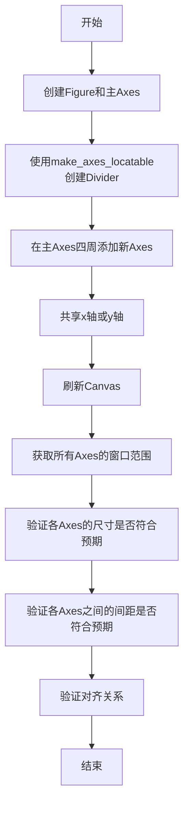

#### 带注释源码

```python
def test_divider_append_axes():
    # 创建一个新的Figure和一个主Axes
    fig, ax = plt.subplots()
    
    # 使用make_axes_locatable为主Axes创建一个Divider对象
    # Divider用于管理Axes的布局和分割
    divider = make_axes_locatable(ax)
    
    # 使用append_axes在主Axes的四个方向添加新的Axes
    # 参数: 位置('top'/'bottom'/'left'/'right'), 尺寸(1.2英寸), pad间距(0.1英寸)
    # sharex/sharey用于共享主Axes的坐标轴
    axs = {
        "main": ax,
        # 在顶部添加Axes，宽度1.2英寸，pad=0.1英寸，共享x轴
        "top": divider.append_axes("top", 1.2, pad=0.1, sharex=ax),
        # 在底部添加Axes
        "bottom": divider.append_axes("bottom", 1.2, pad=0.1, sharex=ax),
        # 在左侧添加Axes，共享y轴
        "left": divider.append_axes("left", 1.2, pad=0.1, sharey=ax),
        # 在右侧添加Axes
        "right": divider.append_axes("right", 1.2, pad=0.1, sharey=ax),
    }
    
    # 刷新Canvas以确保所有布局计算完成
    fig.canvas.draw()
    
    # 获取所有Axes的窗口边界框（以像素为单位）
    bboxes = {k: axs[k].get_window_extent() for k in axs}
    
    # 获取Figure的DPI
    dpi = fig.dpi
    
    # 验证顶部和底部Axes的高度是否为1.2 * dpi
    assert bboxes["top"].height == pytest.approx(1.2 * dpi)
    assert bboxes["bottom"].height == pytest.approx(1.2 * dpi)
    
    # 验证左侧和右侧Axes的宽度是否为1.2 * dpi
    assert bboxes["left"].width == pytest.approx(1.2 * dpi)
    assert bboxes["right"].width == pytest.approx(1.2 * dpi)
    
    # 验证Axes之间的垂直间距是否为0.1 * dpi
    assert bboxes["top"].y0 - bboxes["main"].y1 == pytest.approx(0.1 * dpi)
    assert bboxes["main"].y0 - bboxes["bottom"].y1 == pytest.approx(0.1 * dpi)
    
    # 验证Axes之间的水平间距是否为0.1 * dpi
    assert bboxes["main"].x0 - bboxes["left"].x1 == pytest.approx(0.1 * dpi)
    assert bboxes["right"].x0 - bboxes["main"].x1 == pytest.approx(0.1 * dpi)
    
    # 验证左侧、主和右侧Axes的y坐标对齐
    assert bboxes["left"].y0 == bboxes["main"].y0 == bboxes["right"].y0
    assert bboxes["left"].y1 == bboxes["main"].y1 == bboxes["right"].y1
    
    # 验证顶部、主和底部Axes的x坐标对齐
    assert bboxes["top"].x0 == bboxes["main"].x0 == bboxes["bottom"].x0
    assert bboxes["top"].x1 == bboxes["main"].x1 == bboxes["bottom"].x1
```


### `test_twin_axes_empty_and_removed`

这是一个图像比较测试函数，用于验证 matplotlib 中 twin axes（共享轴）的空轴创建和移除功能。测试覆盖了 `twinx`、`twiny`、`twin` 三种 twin 轴生成方式，并结合各种可见性和移除场景，生成对应的可视化图像用于回归测试。

参数： 无

返回值： `None`，无返回值（测试函数）

#### 流程图

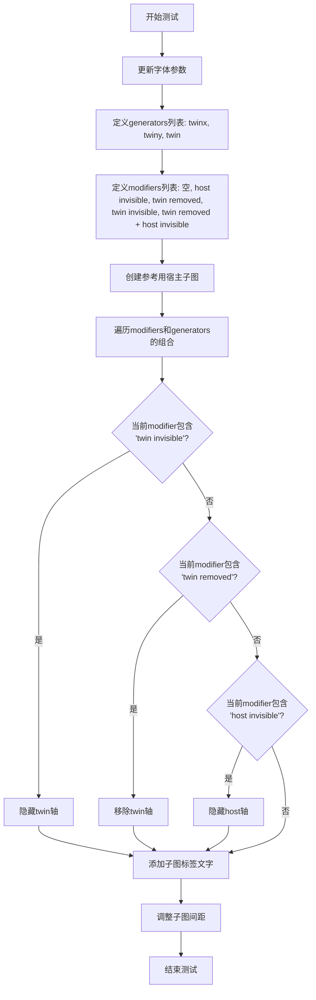

#### 带注释源码

```python
@image_comparison(['twin_axes_empty_and_removed.png'], tol=1,
                  style=('classic', '_classic_test_patch'))
def test_twin_axes_empty_and_removed():
    # 仅更改字体大小以避免重叠（美容目的）
    mpl.rcParams.update(
        {"font.size": 8, "xtick.labelsize": 8, "ytick.labelsize": 8})
    
    # 定义三种twin轴生成方法
    generators = ["twinx", "twiny", "twin"]
    
    # 定义各种修饰符组合：空、仅host不可见、仅twin被移除、仅twin不可见、两者都不可见
    modifiers = ["", "host invisible", "twin removed", "twin invisible",
                 "twin removed\nhost invisible"]
    
    # 创建未修改的宿主子图作为参考（位于第一行）
    h = host_subplot(len(modifiers)+1, len(generators), 2)
    h.text(0.5, 0.5, "host_subplot",
           horizontalalignment="center", verticalalignment="center")
    
    # 遍历所有modifiers和generators的笛卡尔积组合
    # i 从 len(generators)+1 开始跳过了第一行的参考子图
    for i, (mod, gen) in enumerate(product(modifiers, generators),
                                   len(generators) + 1):
        # 创建第i个位置的宿主子图
        h = host_subplot(len(modifiers)+1, len(generators), i)
        
        # 根据gen创建对应的twin轴（twinx/twiny/twin）
        t = getattr(h, gen)()
        
        # 如果modifier包含"twin invisible"，隐藏twin轴
        if "twin invisible" in mod:
            t.axis[:].set_visible(False)
        
        # 如果modifier包含"twin removed"，移除twin轴
        if "twin removed" in mod:
            t.remove()
        
        # 如果modifier包含"host invisible"，隐藏host轴
        if "host invisible" in mod:
            h.axis[:].set_visible(False)
        
        # 在子图中心添加标签文字
        h.text(0.5, 0.5, gen + ("\n" + mod if mod else ""),
               horizontalalignment="center", verticalalignment="center")
    
    # 调整子图之间的间距
    plt.subplots_adjust(wspace=0.5, hspace=1)
```


### `test_twin_axes_both_with_units`

该函数是一个测试用例，用于验证 matplotlib 中主从轴（twin axes）功能在使用不同类型单位（日期轴和分类轴）时的正确性。测试创建主机轴并设置为日期轴，然后创建共享 x 轴的从轴（twinx），验证两个轴的 y 轴标签能正确显示对应的格式。

参数：

- （无参数）

返回值：`None`，测试函数无返回值，通过断言验证功能正确性

#### 流程图

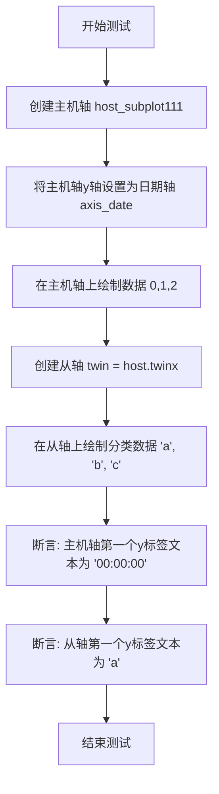

#### 带注释源码

```python
def test_twin_axes_both_with_units():
    # 创建一个单行单列的主机子图，返回Axes对象
    host = host_subplot(111)
    
    # 将主机轴的y轴设置为日期轴，会使用日期格式化器
    # 这意味着y轴的刻度标签将以时间格式显示
    host.yaxis.axis_date()
    
    # 在主机轴上绘制一条直线，数据点为 [0,1,2] -> [0,1,2]
    # 此时y轴显示的是数值，但因为axis_date()，会被解释为日期
    host.plot([0, 1, 2], [0, 1, 2])
    
    # 创建从轴（共享x轴的副轴），用于显示第二组y数据
    # twinx() 创建一个共享x轴的新Axes，但有独立的y轴
    twin = host.twinx()
    
    # 在从轴上绘制分类数据（字符串作为y值）
    # 这将从轴设置为分类轴
    twin.plot(["a", "b", "c"])
    
    # 验证主机轴的第一个y刻度标签是否为日期格式 '00:00:00'
    # 因为yaxis.axis_date() 将数值作为日期处理
    assert host.get_yticklabels()[0].get_text() == "00:00:00"
    
    # 验证从轴的第一个y刻度标签是否为分类标签 'a'
    # 因为我们绘制的是字符串数据 ['a', 'b', 'c']
    assert twin.get_yticklabels()[0].get_text() == "a"
```


### `test_axesgrid_colorbar_log_smoketest`

该函数是一个烟雾测试（smoketest），用于验证 `AxesGrid` 组件在配合 `LogNorm`（对数归一化）和单颜色条模式下的基本功能是否正常工作。

参数：无

返回值：`None`，该函数为测试函数，无返回值

#### 流程图

```mermaid
flowchart TD
    A[开始] --> B[创建 Figure 对象: plt.figure]
    B --> C[创建 AxesGrid 布局: 1x1网格, cbar_mode='single', cbar_location='top']
    C --> D[生成 10x10 随机数据: Z = 10000 * np.random.rand(10, 10)]
    D --> E[在 grid[0] 上显示图像: imshow with LogNorm]
    E --> F[添加颜色条: grid.cbar_axes[0].colorbar(im)]
    F --> G[结束]
```

#### 带注释源码

```python
def test_axesgrid_colorbar_log_smoketest():
    """
    烟雾测试：验证 AxesGrid 在对数归一化下的颜色条功能
    
    该测试函数验证以下功能：
    1. AxesGrid 组件的单颜色条模式 (cbar_mode="single")
    2. 对数归一化 (LogNorm) 与 colorbar 的配合
    3. 颜色条位置设置 (cbar_location="top")
    """
    # 步骤1: 创建一个新的 Figure 对象
    fig = plt.figure()
    
    # 步骤2: 创建 AxesGrid 布局
    # 参数说明:
    # - fig: 所属的 Figure 对象
    # - 111: 子图位置 (1行1列第1个)
    # - nrows_ncols=(1, 1): 1行1列的网格
    # - label_mode="L": 所有轴显示标签
    # - cbar_location="top": 颜色条显示在顶部
    # - cbar_mode="single": 所有子图共享一个颜色条
    grid = AxesGrid(fig, 111,  # modified to be only subplot
                    nrows_ncols=(1, 1),
                    label_mode="L",
                    cbar_location="top",
                    cbar_mode="single",
                    )

    # 步骤3: 生成随机数据并放大
    # 生成 10x10 的随机数组，范围 [0, 10000)
    Z = 10000 * np.random.rand(10, 10)
    
    # 步骤4: 在第一个 Axes 上显示图像，使用对数归一化
    # - interpolation="nearest": 使用最近邻插值
    # - norm=LogNorm(): 使用对数归一化处理数据
    im = grid[0].imshow(Z, interpolation="nearest", norm=LogNorm())

    # 步骤5: 为图像添加颜色条
    # 使用 cbar_axes[0] (顶部的颜色条轴) 创建颜色条
    grid.cbar_axes[0].colorbar(im)
```


### `test_inset_colorbar_tight_layout_smoketest`

该函数是一个烟雾测试（smoketest），用于测试在包含主轴和颜色条轴（inset axes）的情况下调用 `tight_layout` 的行为。它验证了当主轴包含额外的轴（如颜色条轴）时，`tight_layout` 会发出警告但不会抛出错误。

参数： 无

返回值：`None`，无返回值（测试函数）

#### 流程图

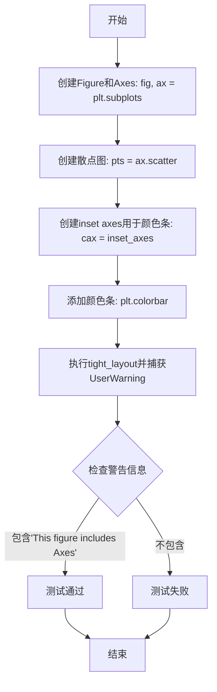

#### 带注释源码

```python
def test_inset_colorbar_tight_layout_smoketest():
    """
    测试在包含inset axes（颜色条）的情况下tight_layout的行为。
    这是一个烟雾测试，验证功能不会崩溃但会发出适当的警告。
    """
    # 创建一个单行的子图
    fig, ax = plt.subplots(1, 1)
    
    # 创建一个散点图，c参数指定颜色映射的值
    pts = ax.scatter([0, 1], [0, 1], c=[1, 5])
    
    # 在主轴ax的右侧创建一个inset axes用于放置颜色条
    # width="3%" 表示宽度为主轴宽度的3%
    # height="70%" 表示高度为主轴高度的70%
    cax = inset_axes(ax, width="3%", height="70%")
    
    # 将颜色条添加到inset axes中
    plt.colorbar(pts, cax=cax)
    
    # 使用pytest.warns捕获UserWarning
    # 验证tight_layout会发出关于包含额外Axes的警告
    # match参数确保警告消息包含指定文本
    with pytest.warns(UserWarning, match="This figure includes Axes"):
        # Will warn, but not raise an error
        plt.tight_layout()
```


### `test_inset_locator`

这是一个用于测试 `inset_locator` 功能的测试函数，通过创建一个主轴和一个缩放的插入轴，并使用示例图像来验证插入轴定位和标记功能的正确性。

参数：

- 该函数没有参数

返回值：`None`，无返回值（测试函数）

#### 流程图

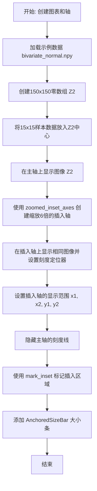

#### 带注释源码

```python
@image_comparison(['inset_locator.png'], style='default', remove_text=True)
def test_inset_locator():
    """
    测试 inset_locator 功能：创建缩放插入轴并标记区域
    使用图像比较验证输出图像的正确性
    """
    # 创建图表和轴，设置尺寸为5x4英寸
    fig, ax = plt.subplots(figsize=[5, 4])

    # 准备演示图像数据
    # 从 cbook 获取样本数据（15x15数组）
    Z = cbook.get_sample_data("axes_grid/bivariate_normal.npy")
    # 定义图像范围
    extent = (-3, 4, -4, 3)
    # 创建150x150的零数组用于显示更大图像
    Z2 = np.zeros((150, 150))
    # 获取样本图像尺寸
    ny, nx = Z.shape
    # 将样本数据放入中心位置
    Z2[30:30+ny, 30:30+nx] = Z

    # 在主轴上显示图像，使用最近邻插值
    ax.imshow(Z2, extent=extent, interpolation="nearest",
              origin="lower")

    # 创建缩放的插入轴，放大倍数为6，位于右上角
    axins = zoomed_inset_axes(ax, zoom=6, loc='upper right')
    # 在插入轴上显示相同图像
    axins.imshow(Z2, extent=extent, interpolation="nearest",
                 origin="lower")
    # 设置插入轴的刻度定位器，7个刻度
    axins.yaxis.get_major_locator().set_params(nbins=7)
    axins.xaxis.get_major_locator().set_params(nbins=7)
    
    # 定义插入区域的范围（原始坐标）
    x1, x2, y1, y2 = -1.5, -0.9, -2.5, -1.9
    # 设置插入轴的显示范围
    axins.set_xlim(x1, x2)
    axins.set_ylim(y1, y2)

    # 隐藏主轴的刻度标记
    plt.xticks(visible=False)
    plt.yticks(visible=False)

    # 绘制插入区域在主轴中的边界框，并连接边界框与插入轴
    # loc1=2 表示左下角，loc4表示右上角
    mark_inset(ax, axins, loc1=2, loc2=4, fc="none", ec="0.5")

    # 创建并添加大小条（AnchoredSizeBar）用于显示比例尺
    asb = AnchoredSizeBar(ax.transData,
                          0.5,              # 大小条表示的数据长度
                          '0.5',            # 标签文本
                          loc='lower center',
                          pad=0.1, borderpad=0.5, sep=5,
                          frameon=False)
    ax.add_artist(asb)
```


### `test_inset_axes`

这是一个测试函数，用于验证 `inset_axes` 功能，它创建嵌入在主坐标轴中的子坐标轴，并展示图像的放大区域，同时添加标记以显示主坐标轴与嵌入坐标轴之间的对应关系。

参数：无（此函数不接受显式参数，通过内部调用创建必要的对象）

返回值：`None`，测试函数不返回任何值

#### 流程图

```mermaid
flowchart TD
    A[开始 test_inset_axes] --> B[创建 5x4 大小的 figure 和 axes]
    B --> C[加载示例图像数据 Z]
    C --> D[创建 150x150 零矩阵 Z2 并填充 Z]
    D --> E[在主 axes 上显示 Z2 图像]
    E --> F[使用 inset_axes 创建嵌入 axes<br/>参数: width=1, height=1<br/>bbox_to_anchor=(1,1)<br/>bbox_transform=ax.transAxes]
    F --> G[在嵌入 axes 上显示 Z2 图像]
    G --> H[设置嵌入 axes 的刻度定位器<br/>xaxis 和 yaxis 各 7 个刻度]
    H --> I[设置嵌入 axes 的显示范围<br/>x: -1.5 到 -0.9<br/>y: -2.5 到 -1.9]
    I --> J[隐藏主坐标轴的刻度标签]
    J --> K[使用 mark_inset 绘制标记<br/>连接主坐标轴与嵌入坐标轴区域]
    K --> L[添加 AnchoredSizeBar 比例尺]
    L --> M[结束]
```

#### 带注释源码

```python
@image_comparison(['inset_axes.png'], style='default', remove_text=True)
def test_inset_axes():
    # 创建一个 5x4 大小的图形和主坐标轴
    fig, ax = plt.subplots(figsize=[5, 4])

    # 准备演示图像数据
    # Z 是一个 15x15 的数组
    Z = cbook.get_sample_data("axes_grid/bivariate_normal.npy")
    extent = (-3, 4, -4, 3)
    # 创建 150x150 的零矩阵
    Z2 = np.zeros((150, 150))
    ny, nx = Z.shape
    # 将 Z 填充到 Z2 的中心区域
    Z2[30:30+ny, 30:30+nx] = Z

    # 在主坐标轴上显示图像，使用最近邻插值
    ax.imshow(Z2, extent=extent, interpolation="nearest",
              origin="lower")

    # 创建嵌入坐标轴，使用 bbox_transform 参数
    # width=1, height=1 表示嵌入坐标轴的大小
    # bbox_to_anchor=(1,1) 指定嵌入坐标轴的锚点位置
    # bbox_transform=ax.transAxes 表示使用主坐标轴的坐标系统
    axins = inset_axes(ax, width=1., height=1., bbox_to_anchor=(1, 1),
                       bbox_transform=ax.transAxes)

    # 在嵌入坐标轴上显示相同的图像数据
    axins.imshow(Z2, extent=extent, interpolation="nearest",
                 origin="lower")
    # 设置嵌入坐标轴的刻度定位器，每个轴 7 个刻度
    axins.yaxis.get_major_locator().set_params(nbins=7)
    axins.xaxis.get_major_locator().set_params(nbins=7)
    # 设置嵌入坐标轴的显示区域（放大区域）
    # sub region of the original image
    x1, x2, y1, y2 = -1.5, -0.9, -2.5, -1.9
    axins.set_xlim(x1, x2)
    axins.set_ylim(y1, y2)

    # 隐藏主坐标轴的刻度标签
    plt.xticks(visible=False)
    plt.yticks(visible=False)

    # 绘制嵌入坐标轴区域在主坐标轴中的边界框，
    # 并在边界框和嵌入坐标轴区域之间绘制连接线
    # loc1=2, loc2=4 指定连接线的位置
    # fc="none" 设置填充为无，ec="0.5" 设置边框颜色
    mark_inset(ax, axins, loc1=2, loc2=4, fc="none", ec="0.5")

    # 创建并添加比例尺
    # AnchoredSizeBar 用于在坐标轴上显示比例尺
    # 参数: 变换矩阵、数值、标签、位置等
    asb = AnchoredSizeBar(ax.transData,
                          0.5,
                          '0.5',
                          loc='lower center',
                          pad=0.1, borderpad=0.5, sep=5,
                          frameon=False)
    ax.add_artist(asb)
```


### `test_inset_axes_complete`

该函数是一个完整的集成测试，用于验证 `inset_axes` 函数在不同参数配置下的正确性，包括绝对尺寸、百分比尺寸、bbox_to_anchor定位以及错误处理等场景。

参数： 无

返回值： `None`，该函数为测试函数，通过断言验证功能，不返回任何值。

#### 流程图

```mermaid
flowchart TD
    A[开始测试] --> B[设置DPI=100, figsize=(6,5)]
    B --> C[创建主 axes]
    C --> D[测试1: 绝对尺寸 inset_axes<br/>width=2, height=2, borderpad=0]
    D --> E{验证位置 extents}
    E -->|通过| F[测试2: 百分比尺寸<br/>width=40%, height=30%, borderpad=0]
    F --> G{验证位置 extents}
    G -->|通过| H[测试3: bbox_to_anchor定位<br/>width=1, height=1.2, bbox_to_anchor=(200,100)]
    H --> I{验证位置 extents}
    I -->|通过| J[测试4: 对比百分比与bbox_to_anchor定位]
    J --> K{验证ins1与ins2位置相等}
    K -->|通过| L[测试5: 期望抛出ValueError<br/>bbox_to_anchor无loc参数]
    L --> M{捕获ValueError}
    M -->|正确抛出| N[测试6: 期望产生UserWarning<br/>bbox_transform与bbox_to_anchor同时使用]
    N --> O{捕获UserWarning}
    O -->|正确产生| P[测试完成]
    
    E -->|失败| Q[测试失败-断言错误]
    G -->|失败| Q
    I -->|失败| Q
    K -->|失败| Q
    M -->|未抛出| Q
    O -->|未产生| Q
```

#### 带注释源码

```python
def test_inset_axes_complete():
    """
    完整的集成测试，验证inset_axes函数在不同配置下的正确性
    """
    # 1. 初始化测试环境：设置DPI和图形尺寸
    dpi = 100
    figsize = (6, 5)
    fig, ax = plt.subplots(figsize=figsize, dpi=dpi)  # 创建主图形和主axes
    fig.subplots_adjust(.1, .1, .9, .9)  # 调整子图布局边界
    
    # ========== 测试场景1: 绝对尺寸的inset axes ==========
    # 测试使用绝对尺寸（英寸）创建插入轴，borderpad=0
    ins = inset_axes(ax, width=2., height=2., borderpad=0)
    fig.canvas.draw()  # 强制重绘以更新位置信息
    
    # 验证插入轴的位置extents是否符合预期计算
    # 计算公式: (0.9*figsize - size) / figsize = (0.9*6-2)/6, (0.9*5-2)/5, 0.9, 0.9
    assert_array_almost_equal(
        ins.get_position().extents,
        [(0.9*figsize[0]-2.)/figsize[0], (0.9*figsize[1]-2.)/figsize[1],
         0.9, 0.9])
    
    # ========== 测试场景2: 百分比尺寸的inset axes ==========
    # 测试使用相对尺寸（百分比）创建插入轴
    ins = inset_axes(ax, width="40%", height="30%", borderpad=0)
    fig.canvas.draw()
    
    # 验证位置: [0.9-0.8*0.4, 0.9-0.8*0.3, 0.9, 0.9]
    assert_array_almost_equal(
        ins.get_position().extents, [.9-.8*.4, .9-.8*.3, 0.9, 0.9])
    
    # ========== 测试场景3: 使用bbox_to_anchor定位 ==========
    # 测试使用像素坐标(bbox_to_anchor)指定插入轴位置
    ins = inset_axes(ax, width=1., height=1.2, bbox_to_anchor=(200, 100),
                     loc=3, borderpad=0)
    fig.canvas.draw()
    
    # 验证位置计算: 将像素坐标转换为figure坐标
    assert_array_almost_equal(
        ins.get_position().extents,
        [200/dpi/figsize[0], 100/dpi/figsize[1],
         (200/dpi+1)/figsize[0], (100/dpi+1.2)/figsize[1]])
    
    # ========== 测试场景4: 百分比定位与bbox定位一致性 ==========
    # 验证使用百分比(loc=3)与使用bbox_to_anchor(0,0,0.35,0.6)创建的插入轴位置相同
    ins1 = inset_axes(ax, width="35%", height="60%", loc=3, borderpad=1)
    ins2 = inset_axes(ax, width="100%", height="100%",
                      bbox_to_anchor=(0, 0, .35, .60),
                      bbox_transform=ax.transAxes, loc=3, borderpad=1)
    fig.canvas.draw()
    
    # 两种方式创建的插入轴位置应该完全一致
    assert_array_equal(ins1.get_position().extents,
                       ins2.get_position().extents)
    
    # ========== 测试场景5: 错误处理-缺少loc参数 ==========
    # 当提供bbox_to_anchor时必须指定loc参数，否则应抛出ValueError
    with pytest.raises(ValueError):
        ins = inset_axes(ax, width="40%", height="30%",
                         bbox_to_anchor=(0.4, 0.5))
    
    # ========== 测试场景6: 警告处理-同时使用bbox_transform和bbox_to_anchor ==========
    # 同时使用bbox_transform和bbox_to_anchor时应产生UserWarning
    with pytest.warns(UserWarning):
        ins = inset_axes(ax, width="40%", height="30%",
                         bbox_transform=ax.transAxes)
```


### `test_inset_axes_tight`

该函数是一个测试用例，用于验证在使用 `bbox_inches="tight"` 参数保存图形时，`inset_axes` 函数是否能正常工作而不会引发异常。此测试用例源于 GitHub issue #26287。

参数：此函数没有参数。

返回值：`None`，该函数不返回任何值，仅执行测试逻辑。

#### 流程图

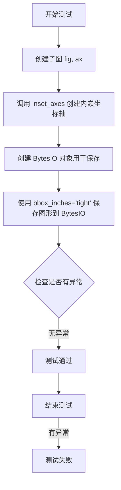

#### 带注释源码

```python
def test_inset_axes_tight():
    # gh-26287 found that inset_axes raised with bbox_inches=tight
    # 创建一个新的图形和一个坐标轴
    fig, ax = plt.subplots()
    # 在主坐标轴上创建一个内嵌坐标轴，设置宽度为1.3，高度为0.9
    inset_axes(ax, width=1.3, height=0.9)

    # 创建一个 BytesIO 对象用于保存图形数据
    f = io.BytesIO()
    # 将图形保存到 BytesIO，使用 bbox_inches="tight" 来裁剪空白边距
    # 这个操作在之前会导致异常，测试旨在验证问题已修复
    fig.savefig(f, bbox_inches="tight")
```


### `test_fill_facecolor`

此测试函数用于验证matplotlib中不同颜色参数（'fc'、'facecolor'、'color'）设置填充区域的效果，并测试fill参数为False时颜色不显示的行为。

参数：
- 无参数

返回值：`None`，测试函数不返回值，仅执行图像生成和验证

#### 流程图

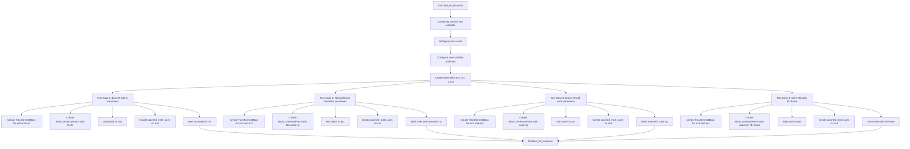

#### 带注释源码

```python
@image_comparison(['fill_facecolor.png'], remove_text=True, style='mpl20')
def test_fill_facecolor():
    """测试不同颜色参数设置填充区域的效果"""
    # 创建包含1行5列子图的图形，图形尺寸设为5x5英寸
    fig, ax = plt.subplots(1, 5)
    fig.set_size_inches(5, 5)
    
    # 配置子图布局：隐藏第1-3个子图的y轴，第4个子图显示右侧刻度
    for i in range(1, 4):
        ax[i].yaxis.set_visible(False)
    ax[4].yaxis.tick_right()
    
    # 创建基础边界框，定义填充区域范围(左=0, 下=0.4, 右=1, 上=0.6)
    bbox = Bbox.from_extents(0, 0.4, 1, 0.6)

    # ===== 测试用例1：使用'fc'参数填充蓝色 =====
    # 创建转换后的边界框，将bbox从数据坐标转换到子图的坐标系统
    bbox1 = TransformedBbox(bbox, ax[0].transData)
    bbox2 = TransformedBbox(bbox, ax[1].transData)
    
    # 创建边界框连接补丁，使用fc参数设置填充颜色为蓝色(ec=红色边框, fc=蓝色填充)
    p = BboxConnectorPatch(
        bbox1, bbox2, loc1a=1, loc2a=2, loc1b=4, loc2b=3,
        ec="r", fc="b")
    p.set_clip_on(False)  # 关闭裁剪
    ax[0].add_patch(p)  # 将补丁添加到子图
    
    # 创建缩放插入轴并标记插入区域
    axins = zoomed_inset_axes(ax[0], 1, loc='upper right')
    axins.set_xlim(0, 0.2)
    axins.set_ylim(0, 0.2)
    plt.gca().axes.xaxis.set_ticks([])
    plt.gca().axes.yaxis.set_ticks([])
    mark_inset(ax[0], axins, loc1=2, loc2=4, fc="b", ec="0.5")

    # ===== 测试用例2：使用'facecolor'参数填充黄色 =====
    bbox3 = TransformedBbox(bbox, ax[1].transData)
    bbox4 = TransformedBbox(bbox, ax[2].transData)
    
    # 创建补丁，使用facecolor参数设置填充颜色为黄色
    p = BboxConnectorPatch(
        bbox3, bbox4, loc1a=1, loc2a=2, loc1b=4, loc2b=3,
        ec="r", facecolor="y")
    p.set_clip_on(False)
    ax[1].add_patch(p)
    
    axins = zoomed_inset_axes(ax[1], 1, loc='upper right')
    axins.set_xlim(0, 0.2)
    axins.set_ylim(0, 0.2)
    plt.gca().axes.xaxis.set_ticks([])
    plt.gca().axes.yaxis.set_ticks([])
    mark_inset(ax[1], axins, loc1=2, loc2=4, facecolor="y", ec="0.5")

    # ===== 测试用例3：使用'color'参数填充绿色 =====
    bbox5 = TransformedBbox(bbox, ax[2].transData)
    bbox6 = TransformedBbox(bbox, ax[3].transData)
    
    # 创建补丁，使用color参数设置填充颜色为绿色
    p = BboxConnectorPatch(
        bbox5, bbox6, loc1a=1, loc2a=2, loc1b=4, loc2b=3,
        ec="r", color="g")
    p.set_clip_on(False)
    ax[2].add_patch(p)
    
    axins = zoomed_inset_axes(ax[2], 1, loc='upper right')
    axins.set_xlim(0, 0.2)
    axins.set_ylim(0, 0.2)
    plt.gca().axes.xaxis.set_ticks([])
    plt.gca().axes.yaxis.set_ticks([])
    mark_inset(ax[2], axins, loc1=2, loc2=4, color="g", ec="0.5")

    # ===== 测试用例4：验证fill=False时颜色不会显示 =====
    bbox7 = TransformedBbox(bbox, ax[3].transData)
    bbox8 = TransformedBbox(bbox, ax[4].transData)
    
    # BboxConnectorPatch设置fill=False后不会显示绿色填充
    p = BboxConnectorPatch(
        bbox7, bbox8, loc1a=1, loc2a=2, loc1b=4, loc2b=3,
        ec="r", fc="g", fill=False)  # fill=False禁用填充显示
    p.set_clip_on(False)
    ax[3].add_patch(p)
    
    # 标记区域设置fill=False后也不会显示绿色
    axins = zoomed_inset_axes(ax[3], 1, loc='upper right')
    axins.set_xlim(0, 0.2)
    axins.set_ylim(0, 0.2)
    axins.xaxis.set_ticks([])
    axins.yaxis.set_ticks([])
    mark_inset(ax[3], axins, loc1=2, loc2=4, fc="g", ec="0.5", fill=False)
```


### `test_zooming_with_inverted_axes`

该测试函数用于验证在坐标轴正序和倒序（反转）两种情况下，缩放插入轴（zoomed_inset_axes）功能的正确性，确保图形在两种场景下均能正确渲染和保存。

参数： 无显式参数

返回值：`None`，该函数为测试函数，不返回任何值

#### 流程图

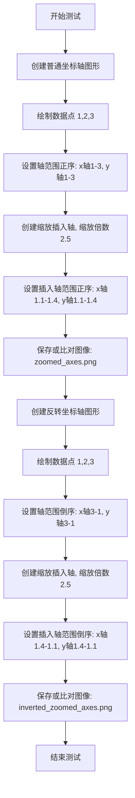

#### 带注释源码

```python
@image_comparison(['zoomed_axes.png', 'inverted_zoomed_axes.png'],
                  style=('classic', '_classic_test_patch'),
                  tol=0 if platform.machine() == 'x86_64' else 0.02)
def test_zooming_with_inverted_axes():
    """
    测试在坐标轴正序和倒序（反转）情况下的缩放功能
    
    该测试创建两个图形场景：
    1. 普通坐标轴（正序）: x轴从1到3, y轴从1到3
    2. 反转坐标轴: x轴从3到1（倒序）, y轴从3到1（倒序）
    
    两种场景下都创建缩放插入轴，验证功能正确性
    """
    # 场景1: 测试正常（正序）坐标轴的缩放
    fig, ax = plt.subplots()  # 创建新图形和坐标轴
    ax.plot([1, 2, 3], [1, 2, 3])  # 绘制简单的线性数据
    ax.axis([1, 3, 1, 3])  # 设置坐标轴范围: [xmin, xmax, ymin, ymax]
    
    # 创建缩放插入轴, 缩放倍数为2.5, 位于右下角
    inset_ax = zoomed_inset_axes(ax, zoom=2.5, loc='lower right')
    inset_ax.axis([1.1, 1.4, 1.1, 1.4])  # 设置插入轴的显示范围

    # 场景2: 测试反转坐标轴的缩放
    fig, ax = plt.subplots()  # 创建另一个新图形和坐标轴
    ax.plot([1, 2, 3], [1, 2, 3])  # 绘制相同的数据
    ax.axis([3, 1, 3, 1])  # 设置坐标轴范围为倒序: x轴从3到1, y轴从3到1
    
    # 创建缩放插入轴, 同样参数
    inset_ax = zoomed_inset_axes(ax, zoom=2.5, loc='lower right')
    # 设置插入轴范围为倒序, 对应主轴的反转情况
    inset_ax.axis([1.4, 1.1, 1.4, 1.1])
```


### `test_anchored_direction_arrows`

这是一个用于测试 `AnchoredDirectionArrows` 类的基本功能测试函数。它创建一个包含两个方向箭头（X 和 Y）的图形，并将其添加到 axes 中进行图像比较验证。

参数： 无

返回值：`None`，该测试函数没有返回值

#### 流程图

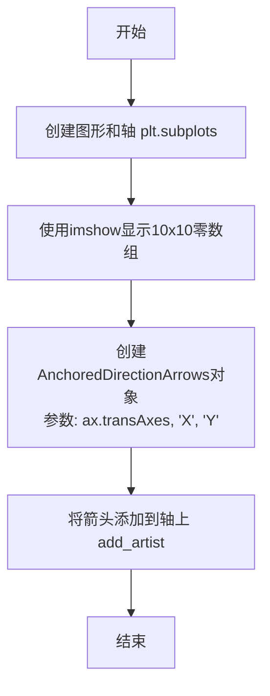

#### 带注释源码

```python
@image_comparison(['anchored_direction_arrows.png'],  # 图像比较的参考图像文件名
                  tol=0 if platform.machine() == 'x86_64' else 0.01,  # 容差设置，x86_64架构为0，其他为0.01
                  style=('classic', '_classic_test_patch'))  # 测试使用的样式
def test_anchored_direction_arrows():
    """
    测试 AnchoredDirectionArrows 类的基本功能
    验证方向箭头能够正确添加到 Axes 中
    """
    # 创建一个新的图形和子图（axes）
    fig, ax = plt.subplots()
    
    # 在 axes 上显示一个 10x10 的零数组，使用最近邻插值
    # 这创建了一个空的背景图像，用于展示方向箭头
    ax.imshow(np.zeros((10, 10)), interpolation='nearest')
    
    # 创建 AnchoredDirectionArrows 对象
    # 参数说明：
    #   ax.transAxes - 使用 axes 坐标系的变换
    #   'X' - 第一个方向的标签
    #   'Y' - 第二个方向的标签
    simple_arrow = AnchoredDirectionArrows(ax.transAxes, 'X', 'Y')
    
    # 将箭头对象作为艺术家添加到 axes 上
    ax.add_artist(simple_arrow)
```


### `test_anchored_direction_arrows_many_args`

该测试函数通过视觉回归测试（`@image_comparison` 装饰器）验证 `AnchoredDirectionArrows` 类在传入大量自定义参数（如颜色、箭头尺寸、位置、透明度等）时能否正确渲染并生成预期的图像。

参数：
- 该函数没有显式参数。

返回值：`None`，该函数不返回值，仅用于执行测试逻辑。

#### 流程图

```mermaid
graph TD
    A[开始测试] --> B[创建 Figure 和 Axes (plt.subplots)]
    B --> C[在 Axes 上显示图像 ax.imshow]
    C --> D[实例化 AnchoredDirectionArrows 对象<br>传入大量参数: color, aspect_ratio, pad 等]
    D --> E[将方向箭头添加到 Axes (ax.add_artist)]
    E --> F[结束<br>等待 @image_comparison 装饰器进行图像比对]
```

#### 带注释源码

```python
# 使用图像对比装饰器，指定参考图像文件名和样式
@image_comparison(['anchored_direction_arrows_many_args.png'],
                  style=('classic', '_classic_test_patch'))
def test_anchored_direction_arrows_many_args():
    # 1. 创建一个新的图形和一个坐标轴
    fig, ax = plt.subplots()
    
    # 2. 在坐标轴上显示一个简单的图像（此处全为1的数组），作为背景
    ax.imshow(np.ones((10, 10)))

    # 3. 实例化 AnchoredDirectionArrows，传入详细的配置参数
    # 参数说明：
    # ax.transAxes: 使用轴坐标（0到1）进行定位
    # 'A', 'B': 分别代表X轴和Y轴的标签文字
    # loc='upper right': 放置在右上角
    # color='red': 箭头颜色为红色
    # aspect_ratio=-0.5: 宽高比调整
    # pad, borderpad: 控制内边距
    # frameon=True: 绘制边框
    # alpha=0.7: 设置透明度
    # sep_x, sep_y: 箭头之间的间距
    # back_length, head_width, head_length, tail_width: 箭头几何形状参数
    direction_arrows = AnchoredDirectionArrows(
            ax.transAxes, 'A', 'B', loc='upper right', color='red',
            aspect_ratio=-0.5, pad=0.6, borderpad=2, frameon=True, alpha=0.7,
            sep_x=-0.06, sep_y=-0.08, back_length=0.1, head_width=9,
            head_length=10, tail_width=5)
    
    # 4. 将生成的艺术师对象添加到坐标轴上
    ax.add_artist(direction_arrows)
```

#### 关键组件信息

- **AnchoredDirectionArrows**: 核心被测类，用于在图表上绘制指示方向（如X/Y轴指示）的箭头。
- **@image_comparison**: 视觉回归测试装饰器，自动将函数生成的图表与预存的 PNG 图像进行比对。
- **ax.transAxes**: 变换对象，定义了箭头在轴坐标系中的位置。

#### 潜在的技术债务或优化空间

1.  **测试脆弱性**：视觉测试依赖于像素级的比对，在不同操作系统（如 Linux vs Windows）或不同的 Matplotlib 渲染后端（Agg vs Cairo）上可能存在细微差异，尽管有 `style` 参数和容差（`tol`），但维护参考图片成本较高。
2.  **参数耦合**：该测试试图通过“大量参数”来验证渲染正确性，如果渲染出错，难以快速定位是哪个参数导致的问题。通常更推荐针对单个功能点编写独立的单元测试。

#### 其它项目

- **设计目标与约束**：确保 `AnchoredDirectionArrows` 类在接收全参数配置时能够正确绘制，不发生布局错乱或绘制错误。
- **错误处理与异常设计**：该测试本身不包含显式的 `try-except` 逻辑，错误通常由 `@image_comparison` 捕获（如果图像不一致）或 Python 运行时捕获（如果参数类型错误）。
- **外部依赖与接口契约**：
    - 依赖 `numpy` 生成数据。
    - 依赖 `matplotlib.pyplot` 进行图形绑定。
    - 依赖 `mpl_toolkits.axes_grid1.anchored_artists.AnchoredDirectionArrows` 类。


### `test_axes_locatable_position`

该函数是一个测试用例，用于验证 `make_axes_locatable` 创建的分割器在添加附加轴（append_axes）后，能够正确计算并返回符合预期的轴宽度。

参数： 无

返回值： `None`，该函数为测试函数，不返回任何值

#### 流程图

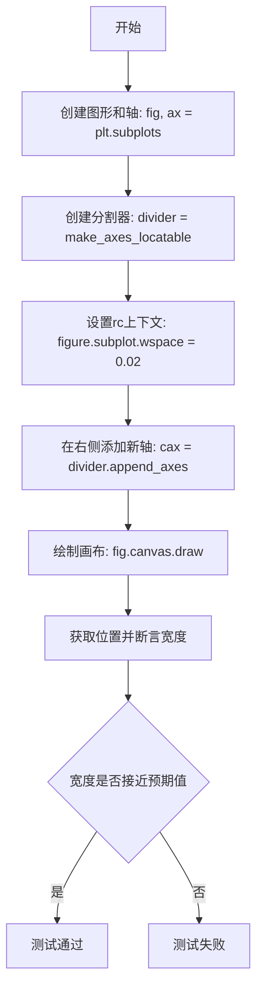

#### 带注释源码

```python
def test_axes_locatable_position():
    """
    测试 axes_locatable 的位置计算功能。
    
    该测试验证在使用 make_axes_locatable 创建分割器后，
    通过 append_axes 添加附加轴时，能够正确计算轴的宽度。
    """
    # 创建一个新的图形和一个 Axes 对象
    # plt.subplots() 返回 (figure, axes) 元组
    fig, ax = plt.subplots()
    
    # 使用 make_axes_locatable 创建一个 Divider 对象
    # 该分割器用于管理主轴周围的附加轴布局
    divider = make_axes_locatable(ax)
    
    # 使用 rc_context 临时设置 matplotlib 的参数
    # 设置子图之间的水平间距为 0.02
    with mpl.rc_context({"figure.subplot.wspace": 0.02}):
        # 在主轴的右侧添加一个新的轴
        # 参数: 'right' 表示位置, size='5%' 表示宽度为主轴的 5%
        # 返回新创建的 Axes 对象 (cax)
        cax = divider.append_axes('right', size='5%')
    
    # 强制绘制画布以触发布局计算
    # 这确保了 get_position 返回的是实际计算后的位置
    fig.canvas.draw()
    
    # 断言验证附加轴的宽度是否符合预期
    # get_position(original=False) 返回基于当前布局的位置
    # 预期宽度 0.03621495327102808 是在给定参数下计算出的理论值
    assert np.isclose(cax.get_position(original=False).width,
                      0.03621495327102808)
```


### `test_image_grid_each_left_label_mode_all`

该函数是一个图像对比测试函数，用于测试 `ImageGrid` 在 `cbar_mode="each"`、`cbar_location="left"` 和 `label_mode="all"` 配置下的功能，并验证网格的属性和行为是否符合预期。

参数： 无

返回值：`None`，无返回值（测试函数）

#### 流程图

```mermaid
flowchart TD
    A[开始测试] --> B[创建测试数据: imdata = np.arange(100).reshape((10, 10))]
    B --> C[创建Figure对象: fig = plt.figure(1, (3, 3))]
    C --> D[创建ImageGrid: grid = ImageGrid with cbar_mode='each', cbar_location='left', label_mode='all']
    D --> E[断言1: 验证grid.get_divider返回SubplotDivider类型]
    E --> F[断言2: 验证grid.get_axes_pad返回(0.5, 0.3)]
    F --> G[断言3: 验证grid.get_aspect返回True]
    G --> H[循环遍历grid和grid.cbar_axes]
    H --> I[为每个ax添加imshow图像]
    I --> J[为每个cax添加colorbar]
    J --> K[结束测试]
```

#### 带注释源码

```python
@image_comparison(['image_grid_each_left_label_mode_all.png'], style='mpl20',
                  savefig_kwarg={'bbox_inches': 'tight'})
def test_image_grid_each_left_label_mode_all():
    """
    测试ImageGrid在左侧显示每个子图的colorbar且label_mode="all"时的功能。
    该测试使用图像对比验证方式，检查布局和渲染是否正确。
    """
    # 创建10x10的测试图像数据，值为0-99
    imdata = np.arange(100).reshape((10, 10))

    # 创建大小为3x3英寸的Figure对象
    fig = plt.figure(1, (3, 3))
    
    # 创建ImageGrid布局:
    # - 3行2列的子图布局
    # - axes_pad设置子图间距(水平0.5, 垂直0.3)
    # - cbar_mode="each": 每个子图都有自己的colorbar
    # - cbar_location="left": colorbar显示在左侧
    # - cbar_size="15%": colorbar宽度为子图宽度的15%
    # - label_mode="all": 所有子图都显示标签
    grid = ImageGrid(fig, (1, 1, 1), nrows_ncols=(3, 2), axes_pad=(0.5, 0.3),
                     cbar_mode="each", cbar_location="left", cbar_size="15%",
                     label_mode="all")
    
    # 断言1: 验证3元素元组(1,1,1)创建的是SubplotDivider类型的divider
    assert isinstance(grid.get_divider(), SubplotDivider)
    
    # 断言2: 验证axes_pad返回值为(0.5, 0.3)
    assert grid.get_aspect()  # True by default for ImageGrid
    
    # 遍历grid中的每个axes和对应的colorbar axes
    for ax, cax in zip(grid, grid.cbar_axes):
        # 在每个子图axes上显示图像
        im = ax.imshow(imdata, interpolation='none')
        # 在对应的colorbar axes上创建colorbar
        cax.colorbar(im)
```


### `test_image_grid_single_bottom`

该函数是一个测试函数，用于测试 `ImageGrid` 在单底部颜色条模式下的功能和布局是否符合预期。函数创建了一个包含 1 行 3 列的图像网格，配置了底部单颜色条模式，验证了分隔符类型，并在每个网格单元中显示图像后添加了颜色条。

参数：无

返回值：`None`，无返回值（测试函数）

#### 流程图

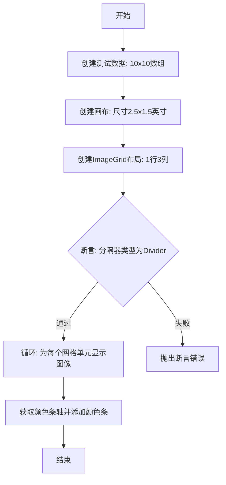

#### 带注释源码

```python
@image_comparison(['image_grid_single_bottom_label_mode_1.png'], style='mpl20',
                  savefig_kwarg={'bbox_inches': 'tight'})
def test_image_grid_single_bottom():
    """
    测试ImageGrid在单底部颜色条模式下的功能和布局
    
    验证内容:
    1. ImageGrid能正确创建1行3列的网格布局
    2. 底部单颜色条模式正常工作
    3. 分隔器类型正确创建为Divider
    4. 图像正确显示在各个网格单元中
    5. 颜色条正确添加到指定位置
    """
    # 创建测试图像数据: 10x10的二维数组，值为0-99
    imdata = np.arange(100).reshape((10, 10))

    # 创建画布对象，指定图形编号为1，尺寸为2.5x1.5英寸
    fig = plt.figure(1, (2.5, 1.5))
    
    # 创建ImageGrid布局
    # 参数说明:
    # - fig: 画布对象
    # - (0, 0, 1, 1): 位置参数，表示子图区域为整个画布
    # - nrows_ncols=(1, 3): 1行3列的网格布局
    # - axes_pad=(0.2, 0.15): 网格轴之间的间距（水平0.2，垂直0.15英寸）
    # - cbar_mode="single": 所有子图共享一个颜色条
    # - cbar_pad=0.3: 颜色条与轴之间的填充距离
    # - cbar_location="bottom": 颜色条位于底部
    # - cbar_size="10%": 颜色条大小为轴的10%
    # - label_mode="1": 仅对第一行/列添加标签
    grid = ImageGrid(fig, (0, 0, 1, 1), nrows_ncols=(1, 3),
                     axes_pad=(0.2, 0.15), cbar_mode="single", cbar_pad=0.3,
                     cbar_location="bottom", cbar_size="10%", label_mode="1")
    
    # 4-tuple rect => Divider, isinstance will give True for SubplotDivider
    # 验证分隔器类型是否为Divider（注意：使用type()进行严格类型检查）
    assert type(grid.get_divider()) is Divider
    
    # 循环遍历网格中的每个轴，在每个轴上显示测试图像
    for i in range(3):
        # imshow: 显示图像数据
        # interpolation='none': 不进行插值，保持像素原始显示
        im = grid[i].imshow(imdata, interpolation='none')
    
    # 获取颜色条轴并为图像添加颜色条
    # grid.cbar_axes[0]: 获取唯一的颜色条轴（因为cbar_mode="single"）
    # colorbar(im): 为图像创建颜色条，使用im的数据范围和colormap
    grid.cbar_axes[0].colorbar(im)
```


### `test_image_grid_label_mode_invalid`

该函数是一个测试函数，用于验证当向 `ImageGrid` 传递无效的 `label_mode` 参数时会抛出 `ValueError` 异常。

参数： 无

返回值：`None`，该函数为测试函数，不返回任何值

#### 流程图

```mermaid
flowchart TD
    A[开始] --> B[创建Figure对象: fig = plt.figure()]
    B --> C[调用ImageGrid并传入无效label_mode='foo']
    C --> D{是否抛出ValueError?}
    D -->|是| E[匹配错误信息: 'foo' is not a valid value for mode]
    E --> F[测试通过]
    D -->|否| G[测试失败]
    F --> H[结束]
    G --> H
```

#### 带注释源码

```python
def test_image_grid_label_mode_invalid():
    """
    测试ImageGrid在接收无效label_mode参数时是否正确抛出ValueError。
    
    该测试验证了ImageGrid类对label_mode参数输入验证的正确性，
    确保传入非法值时能够给出清晰的错误提示。
    """
    # 创建一个新的空白Figure对象
    # 这是测试ImageGrid组件的前置条件
    fig = plt.figure()
    
    # 使用pytest.raises上下文管理器验证异常抛出
    # 预期行为：当label_mode参数设置为非有效值"foo"时，
    # ImageGrid构造函数应抛出ValueError异常
    with pytest.raises(ValueError, match="'foo' is not a valid value for mode"):
        # 尝试创建ImageGrid，传入无效的label_mode="foo"
        # 参数说明：
        # - fig: 父图形对象
        # - (0, 0, 1, 1): 子图位置参数 [left, bottom, width, height]
        # - (2, 1): nrows_ncols=(2, 1)，表示2行1列的网格
        # - label_mode="foo": 无效的标签模式参数，应触发ValueError
        ImageGrid(fig, (0, 0, 1, 1), (2, 1), label_mode="foo")
```


### `test_image_grid`

该函数是一个图像比较测试，用于验证 ImageGrid 在 `bbox_inches='tight'` 模式下能否正确渲染 2x2 的图像网格，并确认子图之间的间距设置正确。

参数：无

返回值：无

#### 流程图

```mermaid
flowchart TD
    A[开始测试] --> B[创建10x10图像数据<br/>np.arange(100).reshape((10, 10))]
    B --> C[创建4x4英寸Figure对象]
    C --> D[创建ImageGrid<br/>2行2列, axes_pad=0.1]
    D --> E[断言验证axes_pad等于0.1]
    E --> F[循环4次在每个网格显示图像<br/>grid[i].imshow]
    F --> G[测试结束]
```

#### 带注释源码

```python
@image_comparison(['image_grid.png'],
                  remove_text=True, style='mpl20',
                  savefig_kwarg={'bbox_inches': 'tight'})
def test_image_grid():
    # test that image grid works with bbox_inches=tight.
    # 创建100个元素的数组并重塑为10x10矩阵
    im = np.arange(100).reshape((10, 10))

    # 创建指定大小的Figure对象 (4英寸 x 4英寸)
    fig = plt.figure(1, (4, 4))
    
    # 创建2x2的ImageGrid, 子图间距为0.1
    # 参数: fig-图形对象, 111-子图位置, nrows_ncols-网格行列数, axes_pad-子图间距
    grid = ImageGrid(fig, 111, nrows_ncols=(2, 2), axes_pad=0.1)
    
    # 断言验证ImageGrid的axes_pad属性返回(0.1, 0.1)
    assert grid.get_axes_pad() == (0.1, 0.1)
    
    # 遍历4个子图位置,在每个子图中显示图像
    # interpolation='nearest'表示使用最近邻插值
    for i in range(4):
        grid[i].imshow(im, interpolation='nearest')
```


### `test_gettightbbox`

该函数是一个测试函数，用于测试 Figure 对象的 `get_tightbbox` 方法在包含主坐标轴和缩放插入坐标轴时的正确性。函数创建一个带有主坐标轴和缩放插入坐标轴的图形，标记插入区域，获取图形的紧凑边界框，并验证计算出的边界框范围是否与预期值匹配。

参数：无

返回值：`None`，该函数为测试函数，通过 `np.testing.assert_array_almost_equal` 断言验证 `get_tightbbox` 的计算结果，不返回任何值。

#### 流程图

```mermaid
flowchart TD
    A[开始] --> B[创建 8x6 大小的图形和坐标轴]
    B --> C[在主坐标轴上绘制折线数据 [1,2,3] vs [0,1,0]]
    C --> D[创建放大倍数为 4 的缩放插入坐标轴]
    D --> E[在插入坐标轴上绘制相同数据]
    E --> F[使用 mark_inset 标记插入区域]
    F --> G[调用 remove_ticks_and_titles 移除刻度线和标题]
    G --> H[获取图形渲染器]
    H --> I[调用 fig.get_tightbbox 获取紧凑边界框]
    I --> J{断言验证}
    J -->|通过| K[测试通过]
    J -->|失败| L[抛出 AssertionError]
```

#### 带注释源码

```python
def test_gettightbbox():
    """
    测试 Figure.get_tightbbox 方法在包含缩放插入坐标轴时的正确性。
    该测试创建一个包含主坐标轴和缩放插入坐标轴的图形，
    验证 get_tightbbox 能正确计算包含所有元素的紧凑边界框。
    """
    # 创建一个 8x6 英寸大小的图形及其主坐标轴
    fig, ax = plt.subplots(figsize=(8, 6))

    # 在主坐标轴上绘制一条折线，数据点为 (1,0), (2,1), (3,0)
    # 返回的 l 是一个 Line2D 对象
    l, = ax.plot([1, 2, 3], [0, 1, 0])

    # 创建一个放大倍数为 4 的缩放插入坐标轴，位于默认位置（右上角）
    ax_zoom = zoomed_inset_axes(ax, 4)
    # 在插入坐标轴上绘制相同的数据
    ax_zoom.plot([1, 2, 3], [0, 1, 0])

    # 在主坐标轴上标记插入坐标轴的位置
    # loc1=1 表示左上角，loc2=3 表示右下角，fc="none" 为透明填充，ec='0.3' 为灰色边框
    mark_inset(ax, ax_zoom, loc1=1, loc2=3, fc="none", ec='0.3')

    # 移除图形中所有坐标轴的刻度线和标题，确保边界框计算不包含这些元素
    remove_ticks_and_titles(fig)

    # 获取图形的紧凑边界框，传入渲染器用于精确计算
    bbox = fig.get_tightbbox(fig.canvas.get_renderer())

    # 使用 NumPy 测试断言验证边界框的 extents 属性
    # extents 返回 [x0, y0, x1, y1]，表示左下角和右上角的坐标
    # 预期值 [-17.7, -13.9, 7.2, 5.4] 是基于当前图形布局计算的标准值
    np.testing.assert_array_almost_equal(bbox.extents,
                                         [-17.7, -13.9, 7.2, 5.4])
```


### `test_gettightbbox_parasite`

该函数是一个测试函数，用于验证在包含 host axes 和 parasite axes（辅助轴）的图形中，`get_tightbbox` 方法能否正确计算包含所有轴的紧凑边界框。

参数：无

返回值：无（该函数为测试函数，使用 assert 断言进行验证）

#### 流程图

```mermaid
graph TD
    A[开始] --> B[创建新图形 fig]
    B --> C[设置水平/垂直大小列表]
    C --> D[创建两个 Divider 对象 ax0_div 和 ax1_div]
    D --> E[创建普通子图 ax0]
    E --> F[创建 HostAxes 子图 ax1]
    F --> G[从 ax1 获取辅助轴 aux_ax]
    G --> H[绘制画布]
    H --> I[获取渲染器 rdr]
    I --> J[计算紧凑边界框 bbox]
    J --> K{验证 bbox.y0 是否等于计算值}
    K -->|通过| L[测试通过]
    K -->|失败| M[断言失败]
```

#### 带注释源码

```python
def test_gettightbbox_parasite():
    """测试带有 parasite axes 的图形的 get_tightbbox 功能"""
    fig = plt.figure()  # 创建一个新的图形对象

    y0 = 0.3  # 设置垂直位置参数
    horiz = [Size.Scaled(1.0)]  # 水平大小列表，使用缩放大小
    vert = [Size.Scaled(1.0)]  # 垂直大小列表，使用缩放大小
    
    # 创建两个 Divider 对象，用于定位 axes
    ax0_div = Divider(fig, [0.1, y0, 0.8, 0.2], horiz, vert)
    ax1_div = Divider(fig, [0.1, 0.5, 0.8, 0.4], horiz, vert)

    # 创建普通子图 ax0，使用 ax0_div 进行定位
    ax0 = fig.add_subplot(
        xticks=[], yticks=[], axes_locator=ax0_div.new_locator(nx=0, ny=0))
    
    # 创建 HostAxes 子图 ax1，用于支持 parasite axes
    ax1 = fig.add_subplot(
        axes_class=HostAxes, axes_locator=ax1_div.new_locator(nx=0, ny=0))
    
    # 从 host axes 获取辅助轴（parasite axis）
    aux_ax = ax1.get_aux_axes(Affine2D())

    fig.canvas.draw()  # 绘制画布以更新所有元素
    rdr = fig.canvas.get_renderer()  # 获取渲染器
    
    # 验证紧密边界框的计算：canvas高度 * y0 / dpi 应该等于 bbox 的 y0 坐标
    assert rdr.get_canvas_width_height()[1] * y0 / fig.dpi == fig.get_tightbbox(rdr).y0
```


### `test_picking_callbacks_overlap`

测试在普通轴（gca）、host轴或parasite轴上的pick事件行为。绘制两个矩形（一大一小，小的包含在大的内部），通过模拟鼠标点击事件，验证点击小矩形时两个矩形都会被触发pick事件，而点击大矩形时只有大矩形被触发。

参数：

- `big_on_axes`：`str`，指定大矩形所在的轴类型，可选值为 "gca"、"host" 或 "parasite"
- `small_on_axes`：`str`，指定小矩形所在的轴类型，可选值为 "gca"、"host" 或 "parasite"
- `click_on`：`str`，指定点击的目标，可选值为 "big" 或 "small"

返回值：`None`，该函数为测试函数，无返回值

#### 流程图

```mermaid
flowchart TD
    A[开始测试] --> B[创建大矩形和小矩形<br/>设置picker=5]
    B --> C[创建空列表received_events<br/>定义on_pick回调函数]
    C --> D{根据big_on_axes和small_on_axes<br/>设置轴}
    D --> E[将矩形添加到对应轴]
    E --> F{判断click_on}
    F -->|big| G[获取big矩形所在轴<br/>坐标设为0.3, 0.3]
    F -->|small| H[获取small矩形所在轴<br/>坐标设为0.5, 0.5]
    G --> I[转换坐标到像素坐标<br/>创建MouseEvent]
    H --> I
    I --> J[调用pick方法触发事件]
    J --> K{验证结果}
    K --> L[检查事件数量<br/>click_on='small'时应有2个事件<br/>click_on='big'时应有1个事件]
    L --> M[验证big矩形在事件中]
    M --> N{click_on是否为small}
    N -->|是| O[验证small矩形也在事件中]
    N -->|否| P[结束测试]
    O --> P
```

#### 带注释源码

```python
@pytest.mark.parametrize("click_on", ["big", "small"])
@pytest.mark.parametrize("big_on_axes,small_on_axes", [
    ("gca", "gca"),
    ("host", "host"),
    ("host", "parasite"),
    ("parasite", "host"),
    ("parasite", "parasite")
])
def test_picking_callbacks_overlap(big_on_axes, small_on_axes, click_on):
    """Test pick events on normal, host or parasite axes."""
    # 两个矩形被绘制并"点击"，一个小一个大（小的被大的包围）
    # 矩形所在的轴以及被点击的矩形都有变化
    # 期望：点击小矩形时两个矩形都被选中，点击大矩形时只有大矩形被选中
    # 同时测试普通轴（"gca"）作为对照
    
    # 创建大矩形 (0.25, 0.25) 宽高0.5，设置picker=5
    big = plt.Rectangle((0.25, 0.25), 0.5, 0.5, picker=5)
    # 创建小矩形 (0.4, 0.4) 宽高0.2，红色填充，设置picker=5
    small = plt.Rectangle((0.4, 0.4), 0.2, 0.2, facecolor="r", picker=5)
    
    # 用于"接收"事件的机制
    received_events = []
    
    def on_pick(event):
        """pick事件回调函数，将事件添加到列表中"""
        received_events.append(event)
    
    # 连接pick_event事件到回调函数
    plt.gcf().canvas.mpl_connect('pick_event', on_pick)
    
    # 简写变量
    rectangles_on_axes = (big_on_axes, small_on_axes)
    
    # 轴的设置
    axes = {"gca": None, "host": None, "parasite": None}
    
    # 根据需要创建对应的轴
    if "gca" in rectangles_on_axes:
        axes["gca"] = plt.gca()
    if "host" in rectangles_on_axes or "parasite" in rectangles_on_axes:
        axes["host"] = host_subplot(111)
        axes["parasite"] = axes["host"].twin()
    
    # 将矩形添加到对应的轴上
    axes[big_on_axes].add_patch(big)
    axes[small_on_axes].add_patch(small)
    
    # 通过点击鼠标事件模拟pick
    if click_on == "big":
        click_axes = axes[big_on_axes]
        axes_coords = (0.3, 0.3)
    else:
        click_axes = axes[small_on_axes]
        axes_coords = (0.5, 0.5)
    
    # 实际上鼠标事件不会发生在parasite轴上，只发生在host轴上
    if click_axes is axes["parasite"]:
        click_axes = axes["host"]
    
    # 将轴坐标转换为像素坐标
    (x, y) = click_axes.transAxes.transform(axes_coords)
    
    # 创建鼠标按下事件
    m = MouseEvent("button_press_event", 
                   click_axes.get_figure(root=True).canvas, 
                   x, y, button=1)
    
    # 触发pick事件
    click_axes.pick(m)
    
    # 验证
    # 点击小矩形时期望2个事件，点击大矩形时期望1个事件
    expected_n_events = 2 if click_on == "small" else 1
    assert len(received_events) == expected_n_events
    
    # 获取事件中的artist（矩形）
    event_rects = [event.artist for event in received_events]
    
    # 验证大矩形在事件中
    assert big in event_rects
    
    # 如果点击的是小矩形，验证小矩形也在事件中
    if click_on == "small":
        assert small in event_rects
```


### `test_anchored_artists`

该函数是一个图像比对测试，用于验证matplotlib的anchored_artists模块中AnchoredDrawingArea、AnchoredAuxTransformBox和AnchoredSizeBar等锚定艺术家类在图表上的正确渲染，测试通过比较生成的图像与参考图像来确保功能正确性。

参数： 无

返回值： 无（测试函数）

#### 流程图

```mermaid
graph TD
    A[开始] --> B[创建3x3尺寸的图表]
    B --> C[创建AnchoredDrawingArea]
    C --> D[添加两个圆形到drawing_area]
    D --> E[将ada添加到ax]
    E --> F[创建第一个AnchoredAuxTransformBox]
    F --> G[添加椭圆到drawing_area]
    G --> H[将box添加到ax]
    H --> I[创建第二个AnchoredAuxTransformBox]
    I --> J[添加另一个椭圆]
    J --> K[将box添加到ax]
    K --> L[创建AnchoredSizeBar]
    L --> M[将asb添加到ax]
    M --> N[进行图像比对验证]
    N --> O[结束]
```

#### 带注释源码

```python
@image_comparison(['anchored_artists.png'], remove_text=True, style='mpl20')
def test_anchored_artists():
    """测试锚定艺术家类的渲染功能"""
    # 创建图形和坐标轴，设置图形尺寸为3x3英寸
    fig, ax = plt.subplots(figsize=(3, 3))
    
    # 创建AnchoredDrawingArea：40x20像素，左下角在(0,0)，位于右上角，无边框
    ada = AnchoredDrawingArea(40, 20, 0, 0, loc='upper right', pad=0.,
                              frameon=False)
    # 创建圆形，半径为10，圆心在(10,10)
    p1 = Circle((10, 10), 10)
    # 将圆形添加到drawing_area
    ada.drawing_area.add_artist(p1)
    # 创建第二个圆形，半径为5，圆心在(30,10)，填充红色
    p2 = Circle((30, 10), 5, fc="r")
    # 将第二个圆形添加到drawing_area
    ada.drawing_area.add_artist(p2)
    # 将整个AnchoredDrawingArea添加到坐标轴
    ax.add_artist(ada)

    # 创建AnchoredAuxTransformBox，使用数据坐标变换，位于左上角
    box = AnchoredAuxTransformBox(ax.transData, loc='upper left')
    # 创建椭圆，中心在(0,0)，宽0.1，高0.4，旋转30度，青色
    el = Ellipse((0, 0), width=0.1, height=0.4, angle=30, color='cyan')
    # 将椭圆添加到drawing_area
    box.drawing_area.add_artist(el)
    # 将AnchoredAuxTransformBox添加到坐标轴
    ax.add_artist(box)

    # 此块曾用于测试AnchoredEllipse类，但该类已被移除
    # 保留此块以避免重新生成测试图像
    box = AnchoredAuxTransformBox(ax.transData, loc='lower left', frameon=True,
                                  pad=0.5, borderpad=0.4)
    el = Ellipse((0, 0), width=0.1, height=0.25, angle=-60)
    box.drawing_area.add_artist(el)
    ax.add_artist(box)

    # 创建AnchoredSizeBar：大小为0.2单位，位于右下角
    asb = AnchoredSizeBar(ax.transData, 0.2, r"0.2 units", loc='lower right',
                          pad=0.3, borderpad=0.4, sep=4, fill_bar=True,
                          frameon=False, label_top=True, prop={'size': 20},
                          size_vertical=0.05, color='green')
    # 将AnchoredSizeBar添加到坐标轴
    ax.add_artist(asb)
```


### `test_hbox_divider`

该函数是一个测试用例，用于测试 `HBoxDivider`（水平盒子分割器）的功能。它创建两个不同形状的子图（4x5 和 5x4 的数组），使用 HBoxDivider 进行水平布局，并验证两个子图的高度相等且宽度比例符合预期（4:5 的平方）。

参数： 无

返回值： 无（该函数为测试函数，使用 assert 语句进行验证）

#### 流程图

```mermaid
flowchart TD
    A[开始] --> B[创建4x5数组arr1]
    B --> C[创建5x4数组arr2]
    C --> D[创建1x2子图布局]
    D --> E[在ax1显示arr1, ax2显示arr2]
    E --> F[设置pad=0.5英寸]
    F --> G[创建HBoxDivider]
    G --> H[设置axes_locator]
    H --> I[绘制画布]
    I --> J[获取ax1和ax2的位置]
    J --> K{验证高度相等且宽度比例正确?}
    K -->|是| L[测试通过]
    K -->|否| M[测试失败]
```

#### 带注释源码

```python
def test_hbox_divider():
    """测试 HBoxDivider（水平盒子分割器）的功能"""
    # 创建两个形状不同的数组用于测试
    arr1 = np.arange(20).reshape((4, 5))  # 4行5列
    arr2 = np.arange(20).reshape((5, 4))  # 5行4列

    # 创建1行2列的子图布局
    fig, (ax1, ax2) = plt.subplots(1, 2)
    
    # 在两个子图上显示数组
    ax1.imshow(arr1)
    ax2.imshow(arr2)

    # 设置子图之间的间距为0.5英寸
    pad = 0.5  # inches.
    
    # 创建水平盒子分割器
    # 参数说明：
    # - fig: 图形对象
    # - 111: 子图位置（1行1列第1个位置）
    # - horizontal: 水平方向上的分割器列表
    # - vertical: 垂直方向上的分割器列表
    divider = HBoxDivider(
        fig, 111,  # Position of combined axes.
        horizontal=[Size.AxesX(ax1), Size.Fixed(pad), Size.AxesX(ax2)],
        vertical=[Size.AxesY(ax1), Size.Scaled(1), Size.AxesY(ax2)])
    
    # 为每个子图设置定位器
    # new_locator(0) 返回第一个子图的定位器
    # new_locator(2) 返回第三个子图的定位器
    ax1.set_axes_locator(divider.new_locator(0))
    ax2.set_axes_locator(divider.new_locator(2))

    # 绘制画布以更新布局
    fig.canvas.draw()
    
    # 获取两个子图的位置
    p1 = ax1.get_position()
    p2 = ax2.get_position()
    
    # 验证两个子图的高度相等
    assert p1.height == p2.height
    
    # 验证宽度比例等于 (4/5)^2
    # 这是因为 arr1 是 4x5，arr2 是 5x4
    # 宽高比分别为 5/4 和 4/5
    # 显示时宽度需要调整以保持相同的显示比例
    assert p2.width / p1.width == pytest.approx((4 / 5) ** 2)
```


### test_vbox_divider

该函数是一个测试函数，用于测试 `VBoxDivider`（垂直盒子分割器）的功能。它创建两个子图，使用 `VBoxDivider` 进行垂直排列，并验证分割后两个子图的宽度相等且高度比例符合预期。

参数： 无

返回值：`None`，该函数没有返回值，仅通过断言验证功能

#### 流程图

```mermaid
graph TD
    A[开始测试] --> B[创建arr1数组 4x5]
    B --> C[创建arr2数组 5x4]
    C --> D[创建1x2子图布局]
    D --> E[在ax1显示arr1, 在ax2显示arr2]
    E --> F[设置pad为0.5英寸]
    F --> G[创建VBoxDivider: fig=fig, rect=111, horizontal和vertical参数]
    G --> H[为ax1设置定位器: divider.new_locator0]
    H --> I[为ax2设置定位器: divider.new_locator2]
    I --> J[绘制画布]
    J --> K[获取ax1和ax2的位置]
    K --> L[断言: p1.width == p2.width]
    L --> M[断言: p1.height/p2.height ≈ (4/5)²]
    M --> N[结束测试]
```

#### 带注释源码

```python
def test_vbox_divider():
    """测试VBoxDivider的垂直分割功能"""
    # 创建两个用于显示的数组
    arr1 = np.arange(20).reshape((4, 5))  # 4行5列的数组
    arr2 = np.arange(20).reshape((5, 4))  # 5行4列的数组

    # 创建包含两个子图的图表，1行2列布局
    fig, (ax1, ax2) = plt.subplots(1, 2)
    
    # 在两个子图上分别显示数组
    ax1.imshow(arr1)
    ax2.imshow(arr2)

    pad = 0.5  # inches. 设置子图之间的间距为0.5英寸

    # 创建VBoxDivider（垂直盒子分割器）
    # 参数说明：
    #   fig: 图表对象
    #   111: 子图位置（1行1列第1个）
    #   horizontal: 水平方向上的分割尺寸列表
    #   vertical: 垂直方向上的分割尺寸列表
    divider = VBoxDivider(
        fig, 111,  # Position of combined axes.
        horizontal=[Size.AxesX(ax1), Size.Scaled(1), Size.AxesX(ax2)],
        vertical=[Size.AxesY(ax1), Size.Fixed(pad), Size.AxesY(ax2)])
    
    # 为子图设置定位器，用于确定子图在分割器中的位置
    ax1.set_axes_locator(divider.new_locator(0))  # 第一个子图的定位器
    ax2.set_axes_locator(divider.new_locator(2))  # 第二个子图的定位器

    # 绘制画布以更新布局
    fig.canvas.draw()
    
    # 获取两个子图的位置信息
    p1 = ax1.get_position()
    p2 = ax2.get_position()
    
    # 断言验证：两个子图的宽度应该相等
    assert p1.width == p2.width
    # 断言验证：两个子图的高度比例应该约为 (4/5)² = 0.64
    assert p1.height / p2.height == pytest.approx((4 / 5) ** 2)
```


### `test_axes_class_tuple`

该函数用于测试 AxesGrid 是否能正确接受以元组形式传递的 axes_class 参数，其中元组包含 Axes 类和空字典。

参数：无

返回值：`None`，无返回值（测试函数）

#### 流程图

```mermaid
flowchart TD
    A[开始] --> B[创建图形: plt.figure]
    C[创建axes_class元组: Axes类 + 空字典]
    B --> D[创建AxesGrid: 传入axes_class元组]
    C --> D
    D --> E[结束]
```

#### 带注释源码

```python
def test_axes_class_tuple():
    """测试 AxesGrid 能否接受元组形式的 axes_class 参数"""
    # 创建一个新的 matplotlib 图形
    fig = plt.figure()
    
    # 定义 axes_class 为元组形式：(Axes类, 字典)
    # 第一个元素是 Axes 类，第二个元素是空字典（用于传递额外配置）
    axes_class = (mpl_toolkits.axes_grid1.mpl_axes.Axes, {})
    
    # 使用指定的 axes_class 创建 AxesGrid
    # axes_class 参数可以接受元组格式
    gr = AxesGrid(fig, 111, nrows_ncols=(1, 1), axes_class=axes_class)
```


### `test_grid_axes_lists`

该函数用于测试 Grid 类的 `axes_all`、`axes_row` 和 `axes_column` 属性之间的关系，验证在不同方向（row/column）设置下网格轴的排列是否正确。

参数：此函数没有参数。

返回值：`None`，该函数为测试函数，仅执行断言验证，不返回任何值。

#### 流程图

```mermaid
flowchart TD
    A[开始 test_grid_axes_lists] --> B[创建 figure: fig = plt.figure]
    B --> C[创建 Grid 对象: grid = Grid(fig, 111, (2, 3), direction='row')]
    C --> D[断言: grid == grid.axes_all]
    D --> E[断言: grid.axes_row == np.transpose(grid.axes_column)]
    E --> F[断言: grid == np.ravel(grid.axes_row)]
    F --> G[断言: grid.get_geometry() == (2, 3)]
    G --> H[重新创建 Grid: grid = Grid(fig, 111, (2, 3), direction='column')]
    H --> I[断言: grid == np.ravel(grid.axes_column)]
    I --> J[测试结束]
```

#### 带注释源码

```python
def test_grid_axes_lists():
    """Test Grid axes_all, axes_row and axes_column relationship."""
    # 创建一个新的 matplotlib 图形对象
    fig = plt.figure()
    
    # 创建一个 2x3 的 Grid 对象，方向为 "row"（按行排列）
    grid = Grid(fig, 111, (2, 3), direction="row")
    
    # 断言：grid 本身应等于 axes_all（所有轴的列表）
    assert_array_equal(grid, grid.axes_all)
    
    # 断言：在 row 方向下，axes_row 应该是 axes_column 的转置
    # 即 axes_row[i][j] == axes_column[j][i]
    assert_array_equal(grid.axes_row, np.transpose(grid.axes_column))
    
    # 断言：grid 应该是 axes_row 展平后的结果
    # np.ravel 将二维数组展平为一维
    assert_array_equal(grid, np.ravel(grid.axes_row), "row")
    
    # 断言：网格几何形状应为 (2, 3)，即 2 行 3 列
    assert grid.get_geometry() == (2, 3)
    
    # 重新创建一个 2x3 的 Grid 对象，方向为 "column"（按列排列）
    grid = Grid(fig, 111, (2, 3), direction="column")
    
    # 断言：在 column 方向下，grid 应该是 axes_column 展平后的结果
    assert_array_equal(grid, np.ravel(grid.axes_column), "column")
```


### `test_grid_axes_position`

测试 Grid 中子图轴的定位是否正确（依据 `direction` 参数是 `row` 还是 `column`）。

参数：

- `direction`：`str`，指定网格的排列方向，可为 `'row'`（按行）或 `'column'`（按列）。

返回值：`None`（测试函数不返回任何值，仅通过断言验证）。

#### 流程图

```mermaid
flowchart TD
    A[Start test_grid_axes_position] --> B[fig = plt.figure()]
    B --> C[grid = Grid(fig, 111, (2, 2), direction=direction)]
    C --> D[loc = [ax.get_axes_locator() for ax in np.ravel(grid.axes_row)]]
    D --> E1[assert loc[1].args[0] > loc[0].args[0]]
    E1 --> E2[assert loc[0].args[0] == loc[2].args[0]]
    E2 --> E3[assert loc[3].args[0] == loc[1].args[0]]
    E3 --> E4[assert loc[2].args[1] < loc[0].args[1]]
    E4 --> E5[assert loc[0].args[1] == loc[1].args[1]]
    E5 --> E6[assert loc[3].args[1] == loc[2].args[1]]
    E6 --> F[End test]
```

#### 带注释源码

```python
@pytest.mark.parametrize('direction', ('row', 'column'))  # 参数化：分别测试 row 与 column 两种布局
def test_grid_axes_position(direction):
    """Test positioning of the axes in Grid."""
    # 1. 创建一个新的 figure（无_axes）
    fig = plt.figure()

    # 2. 创建一个 2×2 的 Grid，方向由 direction 决定
    #    - 当 direction='row' 时，axes_row 为 [[ax00, ax01], [ax10, ax11]]
    #    - 当 direction='column' 时，axes_row 为 [[ax00, ax10], [ax01, ax11]]
    grid = Grid(fig, 111, (2, 2), direction=direction)

    # 3. 取出所有子图的 axes_locator（定位器），并展平为列表
    #    locator 对象包含定位参数 args (nx, ny)
    loc = [ax.get_axes_locator() for ax in np.ravel(grid.axes_row)]

    # 4. 验证 x 方向（nx）的顺序
    #    - 第二列的 nx 必须大于第一列的 nx
    assert loc[1].args[0] > loc[0].args[0]
    #    - 同一列的不同行的 nx 应该相等
    assert loc[0].args[0] == loc[2].args[0]
    assert loc[3].args[0] == loc[1].args[0]

    # 5. 验证 y 方向（ny）的顺序
    #    - 第二行的 ny 必须小于第一行的 ny（坐标轴向下为正）
    assert loc[2].args[1] < loc[0].args[1]
    #    - 同一行的不同列的 ny 应该相等
    assert loc[0].args[1] == loc[1].args[1]
    assert loc[3].args[1] == loc[2].args[1]

    # 若所有断言通过，则说明 Grid 在给定方向下的子图定位符合预期
```


### `test_grid_errors`

这是一个用于测试 `Grid` 类在传入无效参数时能否正确抛出异常的测试函数。通过参数化测试，它验证了当 `rect` 格式不正确、`n_axes` 为负数或超过网格大小时，`Grid` 类能否抛出相应类型的异常并包含正确的错误信息。

参数：

- `rect`：`tuple` 或 `int`，指定子图位置，可以是 4 元组 (left, bottom, width, height) 或整数（如 111）
- `n_axes`：`int` 或 `None`，指定网格中轴的数量
- `error`：`type`，期望抛出的异常类型（`TypeError` 或 `ValueError`）
- `message`：`str`，期望在异常消息中匹配的内容

返回值：`None`，该函数为测试函数，不返回任何值

#### 流程图

```mermaid
graph TD
    A[开始测试] --> B[创建新图形 fig]
    B --> C[调用 pytest.raises 上下文管理器]
    C --> D[在上下文中创建 Grid 对象<br/>Grid(fig, rect, (2, 3), n_axes=n_axes)]
    D --> E{是否抛出预期异常?}
    E -->|是| F[测试通过]
    E -->|否| G[测试失败]
    F --> H[结束]
    G --> H
```

#### 带注释源码

```python
@pytest.mark.parametrize('rect, n_axes, error, message', (
    # 测试用例1: rect 格式不正确 (元组长度不为4)
    ((1, 1), None, TypeError, "Incorrect rect format"),
    # 测试用例2: n_axes 为负数
    (111, -1, ValueError, "n_axes must be positive"),
    # 测试用例3: n_axes 超过网格总数 (2x3=6，但 n_axes=7)
    (111, 7, ValueError, "n_axes must be positive"),
))
def test_grid_errors(rect, n_axes, error, message):
    """
    测试 Grid 类在传入无效参数时的错误处理能力。
    
    参数:
        rect: 子图位置规格，可以是整数(如111)或4元组
        n_axes: 期望创建的轴数量
        error: 期望抛出的异常类型
        message: 期望在异常消息中出现的字符串
    """
    # 创建新的图形对象用于测试
    fig = plt.figure()
    
    # 使用 pytest.raises 上下文管理器验证异常抛出
    # 如果 Grid 没有抛出预期异常或消息不匹配，测试将失败
    with pytest.raises(error, match=message):
        Grid(fig, rect, (2, 3), n_axes=n_axes)
```


### `test_divider_errors`

该测试函数通过参数化测试验证 `Divider` 类在接收无效 `anchor` 参数时是否抛出正确的异常类型和错误消息。

参数：

- `anchor`：`任意类型`，传入 `Divider` 的 anchor 参数，用于测试无效的锚点值
- `error`：`Type`，期望抛出的异常类型（`TypeError` 或 `ValueError`）
- `message`：`str`，期望的异常错误消息

返回值：`None`，该测试函数无返回值，通过 `pytest.raises` 上下文管理器验证异常

#### 流程图

```mermaid
flowchart TD
    A[开始测试] --> B[创建 plt.figure]
    B --> C[调用 Divider 并传入无效 anchor 参数]
    C --> D{是否抛出期望的异常?}
    D -->|是| E[测试通过]
    D -->|否| F[测试失败]
```

#### 带注释源码

```python
@pytest.mark.parametrize('anchor, error, message', (  # 参数化测试：多组测试数据
    (None, TypeError, "anchor must be str"),           # 测试1：None 应触发 TypeError
    ("CC", ValueError, "'CC' is not a valid value for anchor"),  # 测试2：无效字符串应触发 ValueError
    ((1, 1, 1), TypeError, "anchor must be str"),      # 测试3：元组应触发 TypeError
))
def test_divider_errors(anchor, error, message):
    """测试 Divider 类对无效 anchor 参数的错误处理"""
    fig = plt.figure()  # 创建图形对象
    with pytest.raises(error, match=message):  # 验证是否抛出期望的异常及消息
        Divider(fig, [0, 0, 1, 1], [Size.Fixed(1)], [Size.Fixed(1)],
                anchor=anchor)  # 传入无效 anchor 参数
```


### `test_mark_inset_unstales_viewlim`

该测试函数用于验证 `mark_inset` 函数在绘制标记前是否会正确"解冻"（unstale）主 Axes 的 viewLim 属性。测试通过比较手动解冻和自动解冻两种场景的渲染结果，确保 inset 标记在视图限制未明确解冻时仍能正确绘制。

参数：

- `fig_test`：`matplotlib.figure.Figure`，测试用的 Figure 对象，pytest fixture 自动注入
- `fig_ref`：`matplotlib.figure.Figure`，参考用的 Figure 对象，pytest fixture 自动注入

返回值：`None`，无返回值（测试函数）

#### 流程图

```mermaid
flowchart TD
    A[开始测试] --> B[在 fig_test 创建子图: inset 和 full]
    B --> C[在 full 上绘制数据 [0,5] -> [0,5]]
    C --> D[设置 inset 的 xlim=(1,2), ylim=(1,2)]
    D --> E[调用 mark_inset 标记主 Axes 区域]
    E --> F[在 fig_ref 创建子图: inset 和 full]
    F --> G[在 full 上绘制数据 [0,5] -> [0,5]]
    G --> H[设置 inset 的 xlim=(1,2), ylim=(1,2)]
    H --> I[调用 mark_inset 标记主 Axes 区域]
    I --> J[手动调用 fig_ref.canvas.draw 解冻 viewLim]
    J --> K[pytest 自动比较两个 Figure 的渲染结果]
    K --> L{两者是否相等?}
    L -->|是| M[测试通过]
    L -->|否| N[测试失败]
```

#### 带注释源码

```python
@check_figures_equal()
def test_mark_inset_unstales_viewlim(fig_test, fig_ref):
    """
    测试 mark_inset 是否在绘制标记前解冻主 Axes 的 viewLim。
    
    该测试验证了当主 Axes 的 viewLim 处于 stale 状态时，
    mark_inset 能否正确处理并绘制标记区域。
    """
    
    # ===== 测试场景：验证 mark_inset 自动解冻 viewLim =====
    # 创建两个子图：inset（嵌入图）和 full（主图）
    inset, full = fig_test.subplots(1, 2)
    
    # 在主图上绘制数据，这会使 full 的 viewLim 变为 stale 状态
    full.plot([0, 5], [0, 5])
    
    # 设置嵌入图的显示范围
    inset.set(xlim=(1, 2), ylim=(1, 2))
    
    # 调用 mark_inset 标记主图中与嵌入图对应的区域
    # 关键点：此处 full 的 viewLim 仍是 stale 状态
    # mark_inset 应该自动解冻 full 的 viewLim 以正确绘制标记
    mark_inset(full, inset, 1, 4)

    # ===== 参考场景：手动解冻 viewLim =====
    # 同样创建两个子图
    inset, full = fig_ref.subplots(1, 2)
    
    # 同样绘制数据
    full.plot([0, 5], [0, 5])
    
    # 同样设置嵌入图范围
    inset.set(xlim=(1, 2), ylim=(1, 2))
    
    # 调用 mark_inset 标记区域
    mark_inset(full, inset, 1, 4)
    
    # 手动调用 canvas.draw() 解冻 full 的 viewLim
    # 这是参考场景的标准处理方式
    fig_ref.canvas.draw()
    
    # @check_figures_equal 装饰器会自动比较两个 Figure 的渲染结果
    # 如果 mark_inset 正确解冻了 viewLim，两者应该相等
```


### `test_auto_adjustable`

该函数是一个测试函数，用于验证 `make_axes_area_auto_adjustable` 函数的功能。它创建一个图形和坐标轴，应用自动调整功能，然后通过检查坐标轴的紧密边界框是否与预期的填充值匹配来验证功能是否正确。

参数：无

返回值：`None`，该函数是一个测试函数，使用断言进行验证，不返回任何值

#### 流程图

```mermaid
flowchart TD
    A[开始] --> B[创建图形 fig = plt.figure]
    B --> C[添加坐标轴 ax = fig.add_axes]
    C --> D[设置填充值 pad = 0.1]
    D --> E[调用 make_axes_area_auto_adjustable 使区域自动调整]
    E --> F[绘制画布 fig.canvas.draw]
    F --> G[获取紧密边界框 tbb = ax.get_tightbbox]
    G --> H{验证边界框}
    H -->|x0| I[断言 tbb.x0 == pad * fig.dpi]
    H -->|x1| J[断言 tbb.x1 == fig.bbox.width - pad * fig.dpi]
    H -->|y0| K[断言 tbb.y0 == pad * fig.dpi]
    H -->|y1| L[断言 tbb.y1 == fig.bbox.height - pad * fig.dpi]
    I --> M[结束]
    J --> M
    K --> M
    L --> M
```

#### 带注释源码

```python
def test_auto_adjustable():
    """
    测试 make_axes_area_auto_adjustable 函数的功能。
    验证在应用填充后，坐标轴的紧密边界框是否正确计算。
    """
    # 创建一个新的图形
    fig = plt.figure()
    
    # 在图形中添加坐标轴，参数 (0, 0, 1, 1) 表示使用整个图形区域
    ax = fig.add_axes((0, 0, 1, 1))
    
    # 设置填充值（单位：英寸）
    pad = 0.1
    
    # 调用 make_axes_area_auto_adjustable 使坐标轴区域可以自动调整
    # pad 参数指定了坐标轴周围的填充距离
    make_axes_area_auto_adjustable(ax, pad=pad)
    
    # 绘制画布以更新所有更改
    fig.canvas.draw()
    
    # 获取坐标轴的紧密边界框（tight bounding box）
    tbb = ax.get_tightbbox()
    
    # 验证边界框的左边界（x0）是否等于预期的填充值（转换为像素）
    assert tbb.x0 == pytest.approx(pad * fig.dpi)
    
    # 验证边界框的右边界（x1）是否等于图形宽度减去填充值
    assert tbb.x1 == pytest.approx(fig.bbox.width - pad * fig.dpi)
    
    # 验证边界框的下边界（y0）是否等于预期的填充值
    assert tbb.y0 == pytest.approx(pad * fig.dpi)
    
    # 验证边界框的上边界（y1）是否等于图形高度减去填充值
    assert tbb.y1 == pytest.approx(fig.bbox.height - pad * fig.dpi)
```

#### 关键组件信息

| 组件名称 | 一句话描述 |
|---------|-----------|
| `plt.figure()` | 创建新的图形对象 |
| `fig.add_axes()` | 向图形添加坐标轴 |
| `make_axes_area_auto_adjustable` | 使坐标轴区域自动调整的函数 |
| `fig.canvas.draw()` | 绘制画布以更新图形 |
| `ax.get_tightbbox()` | 获取坐标轴的紧密边界框 |

#### 潜在技术债务或优化空间

1. **缺少参数化测试**：该测试只测试了一个固定的填充值（0.1），可以增加参数化测试以覆盖多个填充值场景
2. **缺少边界情况测试**：可以添加测试用例验证填充值为0或负数时的行为
3. **断言信息不够详细**：当断言失败时，pytest只显示数值差异，可以添加更详细的错误信息说明预期行为

#### 其他项目

- **设计目标**：验证 `make_axes_area_auto_adjustable` 函数能正确计算带填充的坐标轴边界框
- **错误处理**：使用 `pytest.approx` 进行浮点数近似比较，避免精度问题导致的测试失败
- **外部依赖**：依赖 `matplotlib.pyplot`、`mpl_toolkits.axes_grid1.axes_divider` 和 `pytest`


### `test_rgb_axes`

该函数是matplotlib中axes_grid1工具包的测试函数，用于测试RGBAxes类的RGB图像显示功能。它创建一个包含RGBAxes的图形，生成随机的RGB数据，并使用imshow_rgb方法显示RGB图像。

参数：无

返回值：`None`，无返回值（测试函数）

#### 流程图

```mermaid
flowchart TD
    A[开始] --> B[创建Figure对象: plt.figure]
    C[创建RGBAxes: fig, 位置0.1,0.1,0.8,0.8, pad=0.1]
    B --> C
    C --> D[创建随机数生成器: rng = np.random.default_rng19680801]
    D --> E[生成随机5x5数组: r, g, b]
    E --> F[调用ax.imshow_rgb显示RGB图像]
    F --> G[结束]
```

#### 带注释源码

```python
# 更新测试图像时使用的样式装饰器
@image_comparison(['rgb_axes.png'], remove_text=True,
                  style=('classic', '_classic_test_patch'))
def test_rgb_axes():
    """测试RGBAxes类的RGB图像显示功能"""
    # 创建一个新的图形对象
    fig = plt.figure()
    
    # 创建RGBAxes对象，参数依次为：
    # fig: 图形对象
    # (0.1, 0.1, 0.8, 0.8): 子图位置 [左, 底, 宽, 高]
    # pad=0.1: 各个RGB子图之间的间距
    ax = RGBAxes(fig, (0.1, 0.1, 0.8, 0.8), pad=0.1)
    
    # 创建随机数生成器，使用固定种子19680801以保证测试可复现
    rng = np.random.default_rng(19680801)
    
    # 生成5x5的随机数组分别作为R、G、B通道
    r = rng.random((5, 5))
    g = rng.random((5, 5))
    b = rng.random((5, 5))
    
    # 使用imshow_rgb方法显示RGB图像
    # interpolation='none' 表示不进行插值
    ax.imshow_rgb(r, g, b, interpolation='none')
```


### `test_imagegrid_cbar_mode_edge`

这是一个测试函数，用于验证 ImageGrid 中颜色条（colorbar）在边缘模式下的各种配置行为，包括不同的方向（行/列）和颜色条位置（上下左右）。

参数： 无参数

返回值： 无返回值（测试函数）

#### 流程图

```mermaid
flowchart TD
    A[开始] --> B[创建4x4数组数据]
    B --> C[创建18x9英寸的图形]
    C --> D[定义8个测试位置241-248]
    D --> E[设置方向列表: row行x4 + column列x4]
    E --> F[设置颜色条位置: left right top bottom各2次]
    F --> G[遍历每个位置、方向、颜色条位置组合]
    G --> H[创建2x2的ImageGrid]
    H --> I[在4个子Axes上显示不同图像]
    I --> J[清空每个grid的cax]
    J --> K[为每个axes创建颜色条]
    K --> L[使用image_comparison装饰器比较图像]
    L --> M[结束]
```

#### 带注释源码

```python
@image_comparison(['imagegrid_cbar_mode.png'],
                  remove_text=True, style='mpl20', tol=0.3)
def test_imagegrid_cbar_mode_edge():
    """测试ImageGrid的cbar_mode='edge'在不同位置和方向下的表现"""
    
    # 创建4x4的测试数组数据
    arr = np.arange(16).reshape((4, 4))

    # 创建一个大画布，尺寸为18x9英寸
    fig = plt.figure(figsize=(18, 9))

    # 定义8个子图的位置代码（MATLAB风格的子图编号）
    positions = (241, 242, 243, 244, 245, 246, 247, 248)
    
    # 定义方向：前4个是'row'方向，后4个是'column'方向
    directions = ['row']*4 + ['column']*4
    
    # 定义颜色条位置：左右上下各出现两次
    cbar_locations = ['left', 'right', 'top', 'bottom']*2

    # 遍历所有组合
    for position, direction, location in zip(
            positions, directions, cbar_locations):
        # 创建ImageGrid：2x2网格，指定方向和颜色条位置
        grid = ImageGrid(fig, position,
                         nrows_ncols=(2, 2),
                         direction=direction,
                         cbar_location=location,
                         cbar_size='20%',
                         cbar_mode='edge')
        
        # 获取4个子Axes
        ax1, ax2, ax3, ax4 = grid

        # 在每个子Axes上显示不同的图像
        ax1.imshow(arr, cmap='nipy_spectral')
        ax2.imshow(arr.T, cmap='hot')
        ax3.imshow(np.hypot(arr, arr.T), cmap='jet')
        ax4.imshow(np.arctan2(arr, arr.T), cmap='hsv')

        # 注释说明：在每行/列中，"第一个"颜色条必须被"第二个"覆盖
        # 为了实现这一点，首先清空axes
        for ax in grid:
            ax.cax.cla()  # 清空colorbar axes
            # 为每个axes创建颜色条，使用该axes的第一张图像
            cb = ax.cax.colorbar(ax.images[0])
```


### `test_imagegrid`

这是一个单元测试函数，用于验证 ImageGrid 类在创建单轴图像网格时能否正确支持对数归一化（LogNorm）的颜色条功能。

参数： 无

返回值：`None`，该函数为测试函数，无返回值（隐式返回 None）

#### 流程图

```mermaid
flowchart TD
    A[开始测试] --> B[创建新图形窗口: plt.figure]
    B --> C[创建1x1的ImageGrid: ImageGrid fig, 111, nrows_ncols=(1, 1)]
    C --> D[获取第一个Axes对象: ax = grid[0]]
    D --> E[使用LogNorm显示图像: ax.imshow with LogNorm]
    E --> F[添加颜色条: ax.cax.colorbar]
    F --> G[断言验证: cb.locator是否为LogLocator]
    G --> H{断言结果}
    H -->|通过| I[测试通过]
    H -->|失败| J[抛出AssertionError]
```

#### 带注释源码

```python
def test_imagegrid():
    """测试ImageGrid类支持带对数归一化的颜色条功能"""
    
    # 步骤1: 创建一个新的空白图形窗口
    fig = plt.figure()
    
    # 步骤2: 创建1行1列的ImageGrid布局
    # 参数说明:
    #   fig: 所属图形对象
    #   111: 子图位置参数 (等价于 add_subplot(111))
    #   nrows_ncols=(1, 1): 1行1列的网格
    grid = ImageGrid(fig, 111, nrows_ncols=(1, 1))
    
    # 步骤3: 获取网格中的第一个(也是唯一的)Axes对象
    ax = grid[0]
    
    # 步骤4: 使用imshow显示图像数据，并应用LogNorm对数归一化
    # 参数说明:
    #   [[1, 2]]: 简单的2元素图像数据
    #   norm=mpl.colors.LogNorm(): 使用对数归一化
    im = ax.imshow([[1, 2]], norm=mpl.colors.LogNorm())
    
    # 步骤5: 为图像添加颜色条
    # ax.cax 是ImageGrid为颜色条预留的Axes对象
    cb = ax.cax.colorbar(im)
    
    # 步骤6: 断言验证颜色条的定位器是LogLocator
    # 这验证了颜色条正确使用了与LogNorm对应的对数刻度定位器
    assert isinstance(cb.locator, mticker.LogLocator)
```


### `test_removal`

该函数用于测试在matplotlib中，使用`fill_between`方法创建的集合对象（Collection）是否能够正确地从Axes中移除。通过创建图形、主子图、填充区域，然后调用`remove()`方法移除该集合，最后重绘图形来验证移除操作是否成功。

参数： 无

返回值：`None`，该函数没有返回值，仅用于执行测试逻辑

#### 流程图

```mermaid
graph TD
    A[开始 test_removal] --> B[导入 matplotlib.pyplot 和 mpl_toolkits.axisartist]
    B --> C[创建新图形 fig]
    C --> D[使用 host_subplot 创建主机子图 ax, 使用 AA.Axes 作为轴类]
    D --> E[调用 fill_between 在 ax 上创建填充区域集合 col]
    E --> F[第一次调用 fig.canvas.draw 绘制初始图形]
    F --> G[调用 col.remove 移除填充集合]
    G --> H[第二次调用 fig.canvas.draw 重绘图形]
    H --> I[结束 test_removal]
```

#### 带注释源码

```python
def test_removal():
    """测试 fill_between 创建的 Collection 对象是否能正确移除."""
    
    # 导入 matplotlib.pyplot 用于创建图形和轴
    import matplotlib.pyplot as plt
    
    # 导入 axisartist 模块，用于使用特定的轴类
    import mpl_toolkits.axisartist as AA
    
    # 创建一个新的空白图形对象
    fig = plt.figure()
    
    # 使用 host_subplot 创建主机子图
    # 参数 111 表示 1行1列第1个子图
    # axes_class=AA.Axes 指定使用 axisartist 提供的 Axes 类
    # figure=fig 将轴添加到指定图形中
    ax = host_subplot(111, axes_class=AA.Axes, figure=fig)
    
    # 使用 fill_between 创建填充区域
    # range(5) 作为 x 坐标 [0,1,2,3,4]
    # 0 作为 y 最小值
    # range(5) 作为 y 最大值 [0,1,2,3,4]
    # 这将创建一个从 y=0 到 y=x 的填充多边形
    # 返回一个 Collection 对象（PolyCollection）
    col = ax.fill_between(range(5), 0, range(5))
    
    # 第一次绘制图形，将填充区域渲染到画布
    # 这是为了确保在移除之前图形已经正确绘制
    fig.canvas.draw()
    
    # 从 Axes 中移除之前创建的填充集合
    # 测试 Collection.remove() 方法是否能正常工作
    # 移除后该填充区域将不再显示在图形中
    col.remove()
    
    # 第二次绘制图形，验证移除操作是否成功
    # 如果移除成功，图形中将不再显示填充区域
    # 如果移除失败，可能会抛出异常或图形显示异常
    fig.canvas.draw()
```


### `test_anchored_locator_base_call`

这是一个使用图像比较装饰器的测试函数，用于验证matplotlib的anchored locator（锚定定位器）基础调用功能是否正常工作，特别是测试在具有纵横比约束的轴上创建缩放内嵌轴时的定位逻辑。

参数： 此函数没有显式参数（使用pytest的隐式fixture参数，如fig_test, fig_ref等，但代码中未直接使用）

返回值： `None`，此函数为测试函数，不返回任何值

#### 流程图

```mermaid
graph TD
    A[开始测试] --> B[创建3x3大小的Figure对象]
    B --> C[创建2行1列的子图]
    C --> D[在fig1上创建子图ax]
    D --> E[设置ax: aspect=1, xlim=(-15,15), ylim=(-20,5)]
    E --> F[清除ax的刻度线]
    F --> G[加载样本数据Z: bivariate_normal.npy]
    G --> H[定义extent: (-3,4,-4,3)]
    H --> I[使用zoomed_inset_axes创建内嵌轴axins]
    I --> J[设置axins: 清除刻度线]
    J --> K[在axins上显示图像Z]
    K --> L[通过@image_comparison比较输出图像]
    L --> M[结束测试]
```

#### 带注释源码

```python
@image_comparison(['anchored_locator_base_call.png'], style="mpl20")
def test_anchored_locator_base_call():
    """
    测试anchored locator基础调用功能。
    验证在设置了aspect=1的轴上，内嵌轴的定位器能够正确工作。
    """
    # 创建一个3x3英寸大小的图形对象
    fig = plt.figure(figsize=(3, 3))
    
    # 将图形分割为2行1列的子图区域，返回两个子图对象
    fig1, fig2 = fig.subfigures(nrows=2, ncols=1)

    # 在第一个子图fig1上创建普通轴
    ax = fig1.subplots()
    
    # 设置轴的属性：
    # aspect=1: 强制保持1:1的纵横比
    # xlim/ylim: 设置轴的数据范围
    ax.set(aspect=1, xlim=(-15, 15), ylim=(-20, 5))
    
    # 清除x轴和y轴的刻度线（只显示图像）
    ax.set(xticks=[], yticks=[])

    # 从matplotlib示例数据中加载样本数据（二元正态分布数据）
    Z = cbook.get_sample_data("axes_grid/bivariate_normal.npy")
    
    # 定义数据的空间范围 [xmin, xmax, ymin, ymax]
    extent = (-3, 4, -4, 3)

    # 创建缩放的内嵌轴：
    # ax: 父轴
    # zoom=2: 放大2倍
    # loc='upper left': 放置在左上角
    # 此处测试在aspect=1的轴上，内嵌轴定位器是否正确计算位置
    axins = zoomed_inset_axes(ax, zoom=2, loc="upper left")
    
    # 同样清除内嵌轴的刻度线
    axins.set(xticks=[], yticks=[])

    # 在内嵌轴上显示图像
    # extent参数指定数据的空间范围
    # origin='lower'确保图像正确对齐
    axins.imshow(Z, extent=extent, origin="lower")
```


### `test_grid_with_axes_class_not_overriding_axis`

该函数用于测试 Grid 和 RGBAxes 在使用自定义 axes_class 时不会覆盖 axis 属性的功能。

参数：无

返回值：`None`，该函数为测试函数，不返回任何值

#### 流程图

```mermaid
flowchart TD
    A[开始测试] --> B[创建Figure对象]
    B --> C[调用Grid创建2x2网格, axes_class=mpl.axes.Axes]
    C --> D[创建另一个Figure对象]
    D --> E[调用RGBAxes创建RGB轴, axes_class=mpl.axes.Axes]
    E --> F[结束测试]
```

#### 带注释源码

```python
def test_grid_with_axes_class_not_overriding_axis():
    """
    测试 Grid 和 RGBAxes 使用自定义 axes_class 时不会覆盖 axis 属性。
    
    该测试验证了当传入 axes_class=mpl.axes.Axes 时:
    1. Grid 可以正确创建带有标准 Axes 的网格
    2. RGBAxes 可以正确创建带有标准 Axes 的 RGB 轴
    两者都不应覆盖或破坏原有的 axis 属性行为。
    """
    # 创建一个新的 Figure 对象，并使用 mpl.axes.Axes 作为 axes_class 创建 2x2 的 Grid
    # 验证自定义 axes_class 不会影响 axis 属性的正常功能
    Grid(plt.figure(), 111, (2, 2), axes_class=mpl.axes.Axes)
    
    # 创建一个新的 Figure 对象，并使用 mpl.axes.Axes 作为 axes_class 创建 RGBAxes
    # 验证 RGBAxes 也能正确处理自定义 axes_class 参数
    RGBAxes(plt.figure(), 111, axes_class=mpl.axes.Axes)
```


### `test_grid_n_axes`

该测试函数用于验证 `Grid` 类在创建网格布局时通过 `n_axes` 参数控制轴数量的功能。它创建了一个 3x3 的网格结构，但仅请求生成 5 个坐标轴，并断言图形中的轴数量、`Grid` 对象的 `n_axes` 属性以及已废弃的 `ngrids` 属性均符合预期。

参数：
- （无）

返回值：`None`，该函数为测试用例，不返回任何值，仅通过断言进行验证。

#### 流程图

```mermaid
graph TD
    A[Start: test_grid_n_axes] --> B[fig = plt.figure]
    B --> C[grid = Grid(fig, 111, (3, 3), n_axes=5)]
    C --> D[Assert: len(fig.axes) == 5]
    D --> E[Assert: grid.n_axes == 5]
    E --> F[with pytest.warns: mpl.MatplotlibDeprecationWarning]
    F --> G[Assert: grid.ngrids == 5]
    G --> H[End]
```

#### 带注释源码

```python
def test_grid_n_axes():
    """测试 Grid 类中 n_axes 参数的功能."""
    # 1. 创建一个新的图形窗口
    fig = plt.figure()
    
    # 2. 创建一个 Grid 实例
    # 参数说明:
    # fig: 图形对象
    # 111: 子图位置 (1行1列第1个)
    # (3, 3): 网格的行列数 (3行3列，共9个潜在位置)
    # n_axes=5: 实际创建的轴的数量为5个
    grid = Grid(fig, 111, (3, 3), n_axes=5)
    
    # 3. 断言验证
    # 验证图形中实际存在的轴的数量是否为5
    assert len(fig.axes) == grid.n_axes == 5
    
    # 4. 验证废弃属性 (Deprecation Check)
    # 使用 pytest.warns 检查访问 ngrids 时是否触发弃用警告
    with pytest.warns(mpl.MatplotlibDeprecationWarning, match="ngrids attribute"):
        # 验证废弃属性 ngrids 的值是否仍然正确（应为5）
        assert grid.ngrids == 5
```


### `on_pick`

这是一个在 `test_picking_callbacks_overlap` 测试函数内部定义的回调函数，用于接收matplotlib的pick事件，并将接收到的事件添加到 `received_events` 列表中。

参数：

-  `event`：`matplotlib.backend_bases.PickEvent` 或类似的事件对象，表示用户触发的pick事件

返回值：`None`，该函数没有返回值，仅作为事件回调使用

#### 流程图

```mermaid
flowchart TD
    A[接收pick事件] --> B{检查事件有效性}
    B -->|有效| C[将event添加到received_events列表]
    C --> D[函数结束]
    B -->|无效| D
```

#### 带注释源码

```python
# 在 test_picking_callbacks_overlap 函数内部定义
def on_pick(event):
    """
    接收pick事件并记录到received_events列表中
    
    参数:
        event: matplotlib的pick事件对象，包含被选中artist的信息
    """
    received_events.append(event)  # 将接收到的pick事件追加到列表中保存
```

## 关键组件


### test_divider_append_axes

测试 Divider.append_axes 方法，能够在主轴周围添加 top、bottom、left、right 四个方向的辅助轴，并验证各轴尺寸和位置是否符合预期（考虑 DPI 和 padding）。

### test_twin_axes_empty_and_removed

测试 host_subplot 与 twinx/twiny/twin 的组合使用，验证轴的可见性控制和删除操作对布局的影响。

### test_twin_axes_both_with_units

测试宿主轴和双胞胎轴同时使用单位（日期和分类数据）的兼容性，确保刻度标签正确显示。

### test_axesgrid_colorbar_log_smoketest

测试 AxesGrid 配合 LogNorm 颜色归一化显示图像，并添加单个颜色条的功能。

### test_inset_colorbar_tight_layout_smoketest

测试在包含插轴和颜色条的情况下使用 tight_layout，验证警告机制是否正常工作。

### test_inset_locator / test_inset_axes

测试 zoomed_inset_axes 和 inset_axes 功能，包括：创建插轴、设置插轴范围、使用 mark_inset 连接主轴和插轴区域、添加 AnchoredSizeBar 标尺。

### test_inset_axes_complete

全面测试 inset_axes 的各种参数组合：绝对尺寸、百分比尺寸、bbox_to_anchor、borderpad 等，并验证定位计算的准确性。

### test_inset_axes_tight

测试在 bbox_inches='tight' 模式下使用 inset_axes，验证保存图像时的边界计算。

### test_fill_facecolor

测试 BboxConnectorPatch 的填充功能，支持 fc、facecolor、color 三种参数设置，并验证 fill=False 时的行为。

### test_zooming_with_inverted_axes

测试在坐标轴反转情况下使用 zoomed_inset_axes，验证缩放定位的正确性。

### test_anchored_direction_arrows

测试 AnchoredDirectionArrows 组件，在坐标轴上添加 X、Y 方向箭头。

### test_axes_locatable_position

测试 make_axes_locatable 创建的辅助轴定位，计算分隔后的轴位置。

### test_image_grid_each_left_label_mode_all

测试 ImageGrid 组件的 cbar_mode="each" 模式，为每个子图添加颜色条。

### test_image_grid_single_bottom

测试 ImageGrid 的 cbar_mode="single" 模式，在底部放置共享颜色条。

### test_image_grid_label_mode_invalid

测试 ImageGrid 的 label_mode 参数验证，捕获非法值并抛出 ValueError。

### test_image_grid

测试 ImageGrid 配合 bbox_inches='tight' 保存图像。

### test_gettightbbox / test_gettightbbox_parasite

测试 get_tightbbox 方法，计算包含插轴和寄生轴的紧凑边界框。

### test_picking_callbacks_overlap

测试鼠标拾取事件回调机制，验证在宿主轴和寄生轴上绘制矩形时，点击重叠区域的拾取行为。

### test_anchored_artists

测试多种锚定艺术家组件：AnchoredDrawingArea（绘制区域）、AnchoredAuxTransformBox（辅助变换框）、AnchoredSizeBar（标尺）。

### test_hbox_divider / test_vbox_divider

测试 HBoxDivider 和 VBoxDivider 组件，实现水平/垂直方向的复合轴布局。

### test_axes_class_tuple

测试 AxesGrid 支持自定义 axes_class 参数。

### test_grid_axes_lists / test_grid_axes_position

测试 Grid 类的 axes_all、axes_row、axes_column 关系，以及 nx/ny 定位器计算。

### test_grid_errors / test_divider_errors

测试 Grid 和 Divider 构造函数的参数验证，捕获类型错误和值错误。

### test_mark_inset_unstales_viewlim

测试 mark_inset 能够在绘制前unstale主轴的视图限制。

### test_auto_adjustable

测试 make_axes_area_auto_adjustable 自动调整轴区域功能。

### test_rgb_axes

测试 RGBAxes 组件，同时显示 R、G、B 三个通道的图像。

### test_imagegrid_cbar_mode_edge

测试 ImageGrid 的 cbar_mode='edge' 模式，配合不同方向和位置放置颜色条。

### test_imagegrid

测试 ImageGrid 配合 LogNorm 颜色归一化和颜色条。

### test_removal

测试移除 fill_between 创建的填充后的图形刷新。

### test_anchored_locator_base_call

测试锚定定位器在子图中的基本调用。

### test_grid_with_axes_class_not_overriding_axis

测试 Grid 和 RGBAxes 使用自定义 axes_class 时的行为。

### test_grid_n_axes

测试 Grid 的 n_axes 参数，创建指定数量的轴。


## 问题及建议


### 已知问题

-   **测试文件过于庞大**：整个代码是一个包含约20多个测试函数的单一文件，缺乏模块化，导致维护困难。
-   **大量重复代码**：多个测试函数中创建 figure 和 axes 的步骤重复，例如 `plt.subplots()` 和 `fig.canvas.draw()` 被多次调用。
-   **平台特定代码**：在 `test_zooming_with_inverted_axes` 和 `test_anchored_direction_arrows` 中使用了 `platform.machine() == 'x86_64'` 来决定容忍度，这会导致在不同架构上测试行为不一致。
-   **全局状态修改**：`test_twin_axes_empty_and_removed` 中直接修改 `mpl.rcParams.update`，可能影响其他测试的独立性。
-   **硬编码数值**：例如 `test_axes_locatable_position` 中使用 `0.03621495327102808`，`test_gettightbbox` 中期望的边界框值 `-17.7, -13.9, 7.2, 5.4`，这些数值难以理解且脆弱。
-   **未使用的导入**：虽然导入了很多模块，但可能并非所有都用到，例如 `io` 和 `product` 在某些测试中未直接使用。
-   **随机数据的不稳定性**：一些测试使用 `np.random.rand` 或 `rng.random`，可能产生不确定结果，尽管 `test_rgb_axes` 使用了固定种子，但其他测试可能未考虑。
-   **复杂的测试逻辑**：`test_picking_callbacks_overlap` 包含大量设置代码来模拟鼠标事件，逻辑复杂难以维护。
-   **缺乏注释和文档**：大多数测试函数没有文档字符串，复杂操作（如 `test_fill_facecolor` 中的多个 bbox 设置）缺乏解释。
-   **过度使用图像比较**：`@image_comparison` 装饰器需要生成和维护参考图像，增加了测试维护成本，且 `test_imagegrid_cbar_mode_edge` 调整了容忍度 `tol=0.3` 表明图像匹配可能不稳定。

### 优化建议

-   **模块化拆分**：将测试按功能（如 divider、inset、grid）拆分为多个文件，使用 pytest 的测试发现机制。
-   **提取辅助函数**：创建如 `create_figure`、`create_axes` 的 fixture 或辅助函数，减少重复代码。
-   **消除平台依赖**：使用 `pytest.mark.skipif` 跳过特定平台的测试，或调整测试逻辑使其平台无关。
-   **使用 pytest fixtures**：通过 fixture 管理 figure 和 axes 的创建，以及局部化 rcParams 修改（例如使用 `mpl.rc_context`）。
-   **使用有意义的常量**：将硬编码数值定义为模块级常量或从配置读取，提高可读性。
-   **清理导入**：定期检查并移除未使用的导入。
-   **固定随机种子**：对所有使用随机数据的测试设置固定种子（如 `np.random.seed(0)`），确保可重复性。
-   **简化复杂测试**：将 `test_picking_callbacks_overlap` 拆分为多个独立测试，或使用更清晰的抽象。
-   **添加文档**：为每个测试函数添加文档字符串，说明测试目的、关键步骤和预期结果。
-   **优化图像测试**：考虑用数值断言替代部分图像比较，或为图像比较测试添加更宽松的容差和更好的基线管理。

## 其它


### 设计目标与约束

本测试文件的设计目标是验证mpl_toolkits.axes_grid1模块的各项功能，包括AxesGrid、ImageGrid、Divider、inset_locator、anchored_artists等组件的正确性。约束条件包括：测试必须在matplotlib 2.0+风格下运行（使用@mpl.rc_context），部分测试依赖特定平台（x86_64架构的容差设置为0），测试图像比较使用预定义的基线图像。

### 错误处理与异常设计

代码中使用了pytest框架进行异常捕获和断言。主要错误处理模式包括：使用pytest.raises捕获预期的ValueError、TypeError异常（如test_grid_errors、test_divider_errors）；使用pytest.warns捕获警告信息（如test_inset_colorbar_tight_layout_smoketest中的UserWarning）；使用pytest.approx进行浮点数近似比较；使用numpy.testing.assert_array_equal/assert_array_almost_equal进行数组精确比较。

### 数据流与状态机

测试文件的数据流主要包括：Figure对象创建 → Axes对象创建 → 各种Grid/Divider配置 → 图形渲染 → 状态验证。关键状态转换包括：plt.subplots()创建Figure和Axes → make_axes_locatable()创建Divider → append_axes()添加子轴 → fig.canvas.draw()触发渲染 → get_window_extent()/get_position()获取最终布局状态。测试通过验证最终状态（bbox、position、extent）是否符合预期来确认功能正确性。

### 外部依赖与接口契约

本测试文件依赖以下外部模块：matplotlib主库（mpl, plt, mpl.colors, mpl.ticker, mpl.transforms等）、numpy数学计算库、mpl_toolkits.axes_grid1子模块（axes_size, host_subplot, make_axes_locatable, Grid, AxesGrid, ImageGrid, Divider等）、pytest测试框架。接口契约包括：所有测试函数以test_开头、图像比较测试使用@image_comparison装饰器、参数化测试使用@pytest.mark.parametrize装饰器。

### 性能考虑与基准

测试代码中包含性能敏感的操作：fig.canvas.draw()在多个测试中被调用以触发完整的图形渲染；get_tightbbox()用于计算紧凑的边界框；图像比较测试使用bbox_inches="tight"参数。部分测试有平台特定的容差设置（platform.machine() == 'x86_64'），表明不同平台可能有不同的性能表现。

### 安全性考虑

测试代码主要关注功能正确性，安全性考虑较少。主要涉及：picker=5参数用于测试鼠标拾取功能时设置选择器；使用MouseEvent模拟鼠标事件进行交互测试；所有输入数据均为程序生成的测试数据，不涉及用户输入或外部数据源。

### 并发与线程安全

本测试文件未涉及多线程并发测试。所有测试均为顺序执行，共享全局状态（如matplotlib的rcParams），但通过@pytest.mark.parametrize实现的参数化测试和独立的测试函数确保了测试之间的隔离性。

### 配置与可扩展性

测试代码展示了多种配置方式：通过@mpl.rc_context修改matplotlib参数；通过style参数指定绘图风格（'classic', '_classic_test_patch', 'mpl20'）；通过savefig_kwarg传递保存参数；通过label_mode、cbar_mode、cbar_location等参数配置Grid/Divider行为。测试代码具有良好的扩展性，可以轻松添加新的测试用例或修改现有测试参数。

### 版本兼容性

测试代码包含版本兼容性检查：platform.machine()用于检测架构；不同容差值用于适配不同平台；测试中使用了deprecated的ngrids属性并用pytest.warns捕获警告；部分测试依赖特定版本的matplotlib功能（如subfigures）。代码兼容matplotlib 2.0+版本。

### 测试覆盖范围

测试覆盖了以下功能模块：Divider布局分割（test_divider_append_axes、test_axes_locatable_position）；TwinAxes双轴（test_twin_axes_empty_and_removed、test_twin_axes_both_with_units）；AxesGrid/ImageGrid网格（test_axesgrid_colorbar_log_smoketest、test_image_grid系列）；InsetLocator内嵌定位（test_inset_locator、test_inset_axes系列）；AnchoredArtist锚定艺术家（test_anchored_artists、test_anchored_direction_arrows）；颜色条colorbar（test_inset_colorbar_tight_layout_smoketest）；RGBAxes（test_rgb_axes）；HBoxDivider/VBoxDivider（test_hbox_divider、test_vbox_divider）；拾取回调（test_picking_callbacks_overlap）。

### 关键边界条件

代码测试了多个边界条件：bbox_inches="tight"模式下的渲染；极端坐标值（如test_zooming_with_inverted_axes中的反向坐标轴）；空轴和移除轴的情况；parasite axes与host axes的交互；不同label_mode和cbar_mode的组合；AxesGrid的n_axes参数限制等。

    