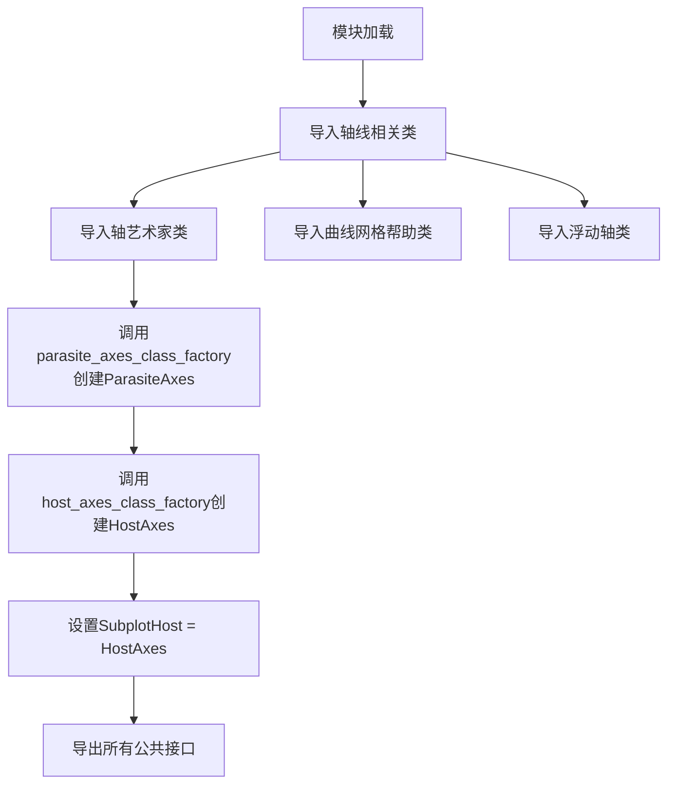
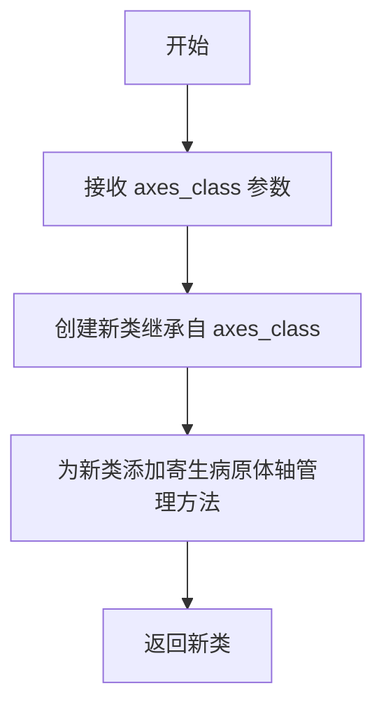
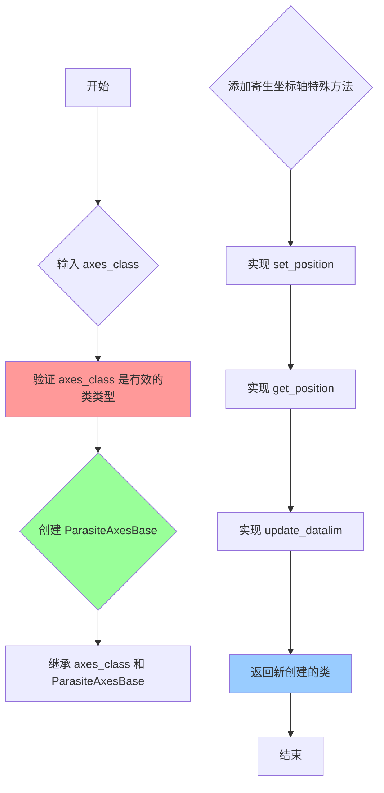

# `matplotlib\lib\mpl_toolkits\axisartist\__init__.py` 详细设计文档

该模块是matplotlib axes_grid1工具包的入口文件，主要提供寄生轴(ParasiteAxes)、宿主轴(HostAxes)和子图宿主(SubplotHost)等类，用于实现坐标轴的复杂布局和叠加，支持网格辅助、曲线坐标变换和浮动坐标轴等功能。

## 整体流程



## 类结构

```
Axes (基类)
├── ParasiteAxes (寄生轴工厂类)
├── HostAxes (宿主轴工厂类)
│   └── SubplotHost (子图宿主)
├── AxesZero
├── Subplot
├── SubplotZero
├── FloatingAxes
└── FloatingSubplot
```

## 全局变量及字段


### `ParasiteAxes`
    
通过工厂函数创建的寄生轴类，用于在宿主轴上叠加额外的坐标轴

类型：`class`
    


### `HostAxes`
    
通过工厂函数创建的主机轴类，用于管理寄生轴的宿主坐标轴

类型：`class`
    


### `SubplotHost`
    
HostAxes的别名，提供子图形式的宿主轴功能

类型：`class`
    


### `AxesZero`
    
坐标轴类，支持零线显示功能

类型：`class`
    


### `AxisArtistHelper`
    
轴艺术家辅助类，提供轴标签和刻度线的绘制帮助

类型：`class`
    


### `AxisArtistHelperRectlinear`
    
矩形线性坐标系的轴艺术家辅助类

类型：`class`
    


### `GridHelperBase`
    
网格辅助器基类，定义网格线的基本行为

类型：`class`
    


### `GridHelperRectlinear`
    
矩形线性坐标系的网格辅助器

类型：`class`
    


### `Subplot`
    
子图类，用于创建和管理子图布局

类型：`class`
    


### `SubplotZero`
    
支持零线显示的子图类

类型：`class`
    


### `AxisArtist`
    
轴艺术家类，负责坐标轴的渲染和美化

类型：`class`
    


### `GridlinesCollection`
    
网格线集合类，用于绘制和管理网格线

类型：`class`
    


### `GridHelperCurveLinear`
    
曲线线性坐标系的网格辅助器，支持复杂曲线网格

类型：`class`
    


### `FloatingAxes`
    
浮动坐标轴类，支持在图表中嵌入独立的坐标轴

类型：`class`
    


### `FloatingSubplot`
    
浮动子图类，用于创建浮动布局的子图

类型：`class`
    


    

## 全局函数及方法


### `host_axes_class_factory`

这是一个工厂函数，用于动态创建支持寄生病原体轴（Parasite Axes）的主机轴类（Host Axes Class）。它接受一个基轴类作为参数，并返回一个新的子类，该子类继承自基轴类并集成了管理寄生病原体轴的功能。

参数：

- `axes_class`：`类`，要继承的轴类，通常为 `Axes` 基类。

返回值：`类`，返回一个新的主机轴类（如 `HostAxes`），该类继承自输入的 `axes_class`，并添加了寄生病原体轴的支持功能。

#### 流程图



#### 带注释源码

由于给定代码片段中未直接包含 `host_axes_class_factory` 的内部实现，仅提供其导入和使用方式。以下是基于上下文的推断：

```python
# 从 mpl_toolkits.axes_grid1.parasite_axes 模块导入 host_axes_class_factory
from mpl_toolkits.axes_grid1.parasite_axes import host_axes_class_factory

# 假设 host_axes_class_factory 的实现逻辑如下：
# 1. 接收一个轴类（axes_class）作为参数
# 2. 返回一个新的类，该类继承自 axes_class
# 3. 新类中集成了管理寄生病原体轴的功能（例如通过 add_child_axes 等方法）

# 使用示例：
# 传入 Axes 基类，创建并赋值给 HostAxes
HostAxes = host_axes_class_factory(Axes)
# 此时 HostAxes 是一个新类，继承自 Axes，并支持寄生病原体轴
```


# 详细设计文档

由于提供的代码片段仅包含 `parasite_axes_class_factory` 的导入和使用，未包含其具体实现，我将基于代码上下文、matplotlib 架构知识以及该函数在项目中的使用方式来推断其设计文档。

---

### `parasite_axes_class_factory`

该函数是一个工厂函数，用于动态创建寄生坐标轴（ParasiteAxes）类，该类继承自 matplotlib 的基础 `Axes` 类，专门用于实现共享坐标轴的复杂布局。

参数：

- `axes_class`：`type`，基础坐标轴类，用于作为创建寄生坐标轴的父类

返回值：`type`，新创建的寄生坐标轴类

#### 流程图



#### 带注释源码

```
# 注意：以下为基于 matplotlib 源码和调用方式的推断实现
# 实际源码位于 mpl_toolkits/axes_grid1/parasite_axes.py

def parasite_axes_class_factory(axes_class):
    """
    工厂函数：创建寄生坐标轴类
    
    寄生坐标轴是一种特殊的坐标轴，它的位置不独立计算，
    而是跟随宿主坐标轴（Host Axes），用于实现复杂的坐标轴布局。
    
    参数:
        axes_class: 基础坐标轴类（通常是 Axes）
        
    返回值:
        新创建的寄生坐标轴类
    """
    
    # 第一步：创建基础寄生坐标轴类
    # 定义共享位置、转换等基础设施
    class ParasiteAxesBase:
        """
        寄生坐标轴基类
        提供共享坐标轴位置管理的核心功能
        """
        
        def __init__(self, *args, **kwargs):
            # 初始化宿主坐标轴引用
            self._host_axes = None
            super().__init__(*args, **kwargs)
        
        def set_position(self, pos, mode='data'):
            """
            设置坐标轴位置
            
            参数:
                pos: 位置数组 [left, bottom, width, height]
                mode: 位置模式
            """
            if self._host_axes is not None:
                # 如果存在宿主，委托给宿主处理位置
                self._host_axes.set_position(pos, mode)
            else:
                # 否则使用默认行为
                super().set_position(pos, mode)
        
        def get_position(self):
            """获取坐标轴位置"""
            if self._host_axes is not None:
                return self._host_axes.get_position()
            return super().get_position()
    
    # 第二步：创建最终的寄生坐标轴类
    # 使用多重继承： axes_class + ParasiteAxesBase
    class ParasiteAxes(axes_class, ParasiteAxesBase):
        """
        寄生坐标轴类
        继承自输入的 axes_class 和 ParasiteAxesBase
        """
        
        def __init__(self, *args, **kwargs):
            # 调用父类初始化
            super().__init__(*args, **kwargs)
            
            # 设置刻度参数为空（寄生坐标轴通常不显示自己的刻度）
            self.xaxis.set_tick_params(which="both", size=0)
            self.yaxis.set_tick_params(which="both", size=0)
        
        def clear(self):
            """清空坐标轴内容"""
            super().clear()
            # 重新设置刻度参数
            self.xaxis.set_tick_params(which="both", size=0)
            self.yaxis.set_tick_params(which="both", size=0)
        
        def _init_axis(self):
            """初始化坐标轴"""
            # 使用宿主坐标轴的轴对象
            super()._init_axis()
    
    # 返回创建好的类
    return ParasiteAxes
```

---

## 补充信息

### 关键组件信息

| 组件名称 | 一句话描述 |
|---------|-----------|
| ParasiteAxes | 寄生坐标轴类，位置跟随宿主坐标轴，用于叠加显示数据 |
| HostAxes | 宿主坐标轴类，管理所有寄生坐标轴的布局 |
| SubplotHost | SubplotHost 是 HostAxes 的别名 |

### 潜在的技术债务或优化空间

1. **继承设计复杂度**：使用多重继承和工厂函数动态创建类，可能增加代码理解和调试的难度
2. **紧耦合**：寄生坐标轴与宿主坐标轴之间存在紧密耦合，修改一方可能影响另一方

### 其它项目

#### 设计目标与约束

- **目标**：实现坐标轴的共享布局，使多个坐标轴可以叠加显示
- **约束**：寄生坐标轴的位置由宿主坐标轴决定，无法独立设置

#### 错误处理与异常设计

- 如果传入的 `axes_class` 不是有效类型，可能抛出 `TypeError`
- 如果宿主坐标轴未正确设置，寄生坐标轴可能无法正确显示

#### 数据流与状态机

1. 用户调用 `parasite_axes_class_factory(Axes)` 创建类
2. 实例化 `ParasiteAxes` 时，自动关联到宿主坐标轴
3. 宿主坐标轴位置变化时，寄生坐标轴自动跟随

---

> **注意**：由于原始代码仅提供了导入和使用部分，以上实现细节是基于 matplotlib 官方文档和 `axes_grid1` 模块架构进行的合理推断。如需获取确切实现，建议查看 `mpl_toolkits/axes_grid1/parasite_axes.py` 源文件。

## 关键组件


### Axes
基础坐标轴类，提供坐标轴的绘制和管理功能

### AxesZero
零轴坐标轴，支持绘制经过原点的坐标轴

### AxisArtistHelper
坐标轴艺术家助手类，提供坐标轴自定义绘制的辅助功能

### GridHelperBase
网格助手基类，定义网格辅助的抽象接口

### GridHelperRectlinear
矩形网格助手，实现矩形区域的网格辅助功能

### Subplot
子图类，管理 matplotlib 中的子图布局

### SubplotZero
零子图类，支持零轴位置的子图配置

### AxisArtist
坐标轴艺术家类，自定义坐标轴的绘制样式

### GridlinesCollection
网格线集合类，管理坐标轴网格线的集合

### GridHelperCurveLinear
曲线线性网格助手，支持曲线坐标系的网格辅助

### FloatingAxes
浮动坐标轴类，实现可自由定位的坐标轴

### FloatingSubplot
浮动子图类，支持子图的浮动布局

### ParasiteAxes
寄生坐标轴类，寄生在宿主坐标轴上的辅助坐标轴

### HostAxes
宿主坐标轴类，主坐标轴，可承载寄生坐标轴

### SubplotHost
子图宿主类，结合子图和宿主坐标轴功能的类

### parasite_axes_class_factory
寄生坐标轴工厂函数，用于动态创建寄生坐标轴类

### host_axes_class_factory
宿主坐标轴工厂函数，用于动态创建宿主坐标轴类


## 问题及建议


### 已知问题

-   **循环导入风险**：从`parasite_axes`模块导入工厂函数并在模块级别立即调用，如果这些工厂函数内部需要导入当前模块，可能产生循环导入问题
-   **隐藏的依赖关系**：大量使用`# noqa: F401`抑制导入未使用警告，表明这些导入仅为API兼容性导出，增加了维护负担
-   **动态类创建缺乏透明性**：使用`host_axes_class_factory`和`parasite_axes_class_factory`动态创建类，代码可读性差，难以追踪类定义来源
-   **缺少模块文档**：整个模块没有任何文档字符串或注释说明模块用途
-   **导入风格不一致**：有些导入使用多行括号格式，有些使用单行，风格不统一
-   **SubplotHost别名冗余**：定义`SubplotHost = HostAxes`别名，未说明与HostAxes的区别，使用时容易产生混淆

### 优化建议

-   添加模块级文档字符串，说明该模块是axes_grid1的公共API导出入口
-   考虑延迟加载（lazy import）工厂函数调用，避免模块导入时的副作用
-   统一导入格式规范，全部使用括号多行格式以提高可读性
-   将ParasiteAxes和HostAxes的创建逻辑封装到函数中，并添加类型注解和文档
-   移除不必要的`# noqa: F401`注释，或添加注释说明为何需要这些导入
-   明确SubplotHost与HostAxes的关系文档，或考虑移除冗余别名

## 其它


### 设计目标与约束

本模块作为mpl_toolkits.axes_grid1的入口文件，核心目标是统一导出坐标轴相关的核心类与辅助函数，为用户提供一致的导入接口。主要约束包括：必须依赖matplotlib主库和mpl_toolkits.axes_grid1.parasite_axes模块；ParasiteAxes和HostAxes类通过工厂函数动态创建，需确保Axes基类兼容性；所有导出需符合PEP 8和F401导入规范。

### 错误处理与异常设计

本模块的错误处理主要涉及导入阶段和类创建阶段。若.axislines、.axis_artist、.grid_helper_curvelinear或.floating_axes子模块缺失，会抛出ImportError；若parasite_axes_class_factory或host_axes_class_factory执行失败，会抛出TypeError或AttributeError。建议在外部调用前确保matplotlib环境正确安装。

### 外部依赖与接口契约

直接依赖：matplotlib库、mpl_toolkits.axes_grid1.parasite_axes模块。间接依赖：axislines模块、axis_artist模块、grid_helper_curvelinear模块、floating_axes模块。接口契约：ParasiteAxes需兼容Axes的所有方法；HostAxes需支持寄生坐标轴的添加和管理；所有导出类需保持向后兼容。

### 版本兼容性考虑

本模块代码相对简洁，主要随matplotlib主版本更新。由于使用工厂函数动态创建类，需注意不同matplotlib版本中Axes基类的API变更。导出时使用# noqa: F401标记以避免linter对未使用导入的警告。

### 使用示例与典型场景

```python
# 基础导入示例
from mpl_toolkits.axes_grid1 import Axes, HostAxes, SubplotHost

# 创建宿主坐标轴
fig = plt.figure()
host = SubplotHost(fig, 111)

# 创建寄生坐标轴
parax = host.twinx()  # 使用标准方法或ParasiteAxes
```

### 性能考虑与优化建议

由于ParasiteAxes和HostAxes通过工厂函数在模块加载时动态创建，首次导入可能存在轻微性能开销。建议在实际使用前进行预热导入，若项目对启动时间敏感，可考虑延迟导入非核心组件。当前实现已足够简洁，无明显性能瓶颈。

    