# `matplotlib\lib\mpl_toolkits\axisartist\angle_helper.py` 详细设计文档

This code provides a set of functions and classes for selecting appropriate steps and factors for different time intervals and coordinate systems, and for formatting and finding extreme values in coordinate systems with cycles or ranges.

## 整体流程

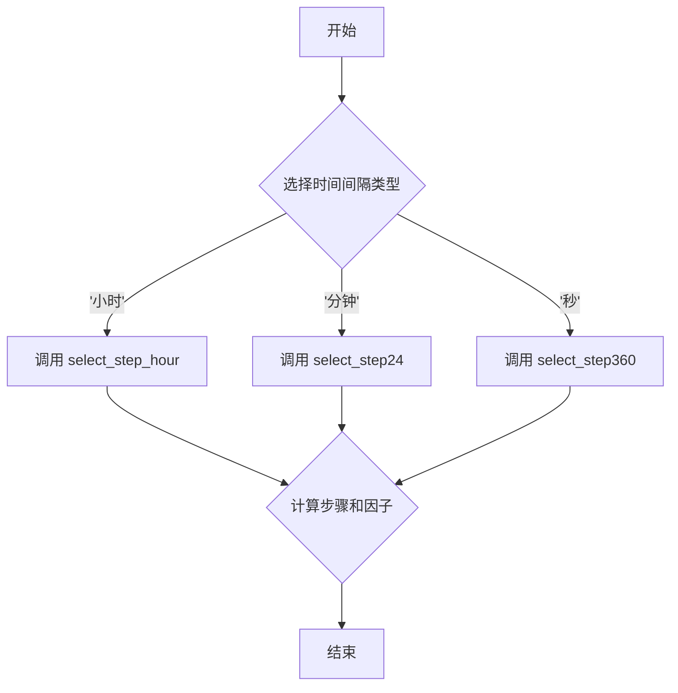

## 类结构

```
LocatorBase (基类)
├── LocatorHMS
│   ├── LocatorHM
│   ├── LocatorH
│   └── LocatorDMS
│       ├── LocatorDM
│       └── LocatorD
└── FormatterDMS
    └── FormatterHMS
```

## 全局变量及字段


### `dv`
    
The value to be searched for the corresponding step and factor.

类型：`float`
    


### `n`
    
The number of valid levels in the grid.

类型：`int`
    


### `step`
    
The step size for the grid.

类型：`int`
    


### `factor`
    
The factor to scale the values for the grid.

类型：`float`
    


### `levs`
    
The levels of the grid.

类型：`numpy.ndarray`
    


### `v1`
    
The starting value of the range.

类型：`float`
    


### `v2`
    
The ending value of the range.

类型：`float`
    


### `nv`
    
The number of levels in the grid.

类型：`int`
    


### `hour`
    
Flag to indicate if the step is in hours.

类型：`bool`
    


### `include_last`
    
Flag to indicate if the last level should be included in the grid.

类型：`bool`
    


### `threshold_factor`
    
The threshold factor to decide the step and factor.

类型：`float`
    


### `nx`
    
The number of samples in the x-direction.

类型：`int`
    


### `ny`
    
The number of samples in the y-direction.

类型：`int`
    


### `lon_cycle`
    
The cycle for the longitude values.

类型：`float`
    


### `lat_cycle`
    
The cycle for the latitude values.

类型：`float`
    


### `lon_minmax`
    
The minimum and maximum values for the longitude.

类型：`tuple`
    


### `lat_minmax`
    
The minimum and maximum values for the latitude.

类型：`tuple`
    


### `lon`
    
The longitude values.

类型：`numpy.ndarray`
    


### `lat`
    
The latitude values.

类型：`numpy.ndarray`
    


### `tbbox`
    
The bounding box of the transformed grid.

类型：`matplotlib.transforms.Bbox`
    


### `lon_min`
    
The minimum longitude value.

类型：`float`
    


### `lat_min`
    
The minimum latitude value.

类型：`float`
    


### `lon_max`
    
The maximum longitude value.

类型：`float`
    


### `lat_max`
    
The maximum latitude value.

类型：`float`
    


### `min0`
    
The minimum value for the range of longitude or latitude.

类型：`float`
    


### `max0`
    
The maximum value for the range of longitude or latitude.

类型：`float`
    


### `LocatorBase.nbins`
    
The number of bins for the locator.

类型：`int`
    


### `LocatorBase._include_last`
    
The flag to include the last bin in the locator.

类型：`bool`
    


### `LocatorHMS.nbins`
    
The number of bins for the locator.

类型：`int`
    


### `LocatorHMS._include_last`
    
The flag to include the last bin in the locator.

类型：`bool`
    


### `LocatorHM.nbins`
    
The number of bins for the locator.

类型：`int`
    


### `LocatorHM._include_last`
    
The flag to include the last bin in the locator.

类型：`bool`
    


### `LocatorH.nbins`
    
The number of bins for the locator.

类型：`int`
    


### `LocatorH._include_last`
    
The flag to include the last bin in the locator.

类型：`bool`
    


### `LocatorDMS.nbins`
    
The number of bins for the locator.

类型：`int`
    


### `LocatorDMS._include_last`
    
The flag to include the last bin in the locator.

类型：`bool`
    


### `LocatorDM.nbins`
    
The number of bins for the locator.

类型：`int`
    


### `LocatorDM._include_last`
    
The flag to include the last bin in the locator.

类型：`bool`
    


### `LocatorD.nbins`
    
The number of bins for the locator.

类型：`int`
    


### `LocatorD._include_last`
    
The flag to include the last bin in the locator.

类型：`bool`
    
    

## 全局函数及方法

### select_step_degree

该函数的核心功能是根据给定的值 `dv`，选择合适的步长 `step` 和因子 `factor`，用于在特定范围内进行网格划分。

#### 参数

- `dv`：`float`，表示输入值，用于确定步长和因子。

#### 返回值

- `step`：`int`，表示步长。
- `factor`：`float`，表示因子。

#### 流程图

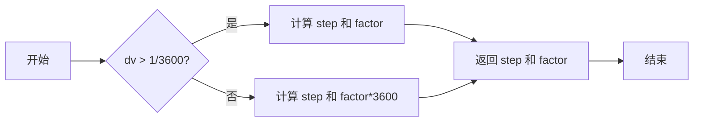

#### 带注释源码

```python
def select_step_degree(dv):
    degree_limits_ = [1.5, 3, 7, 13, 20, 40, 70, 120, 270, 520]
    degree_steps_  = [1,   2, 5, 10, 15, 30, 45,  90, 180, 360]
    degree_factors = [1.] * len(degree_steps_)

    minsec_limits_ = [1.5, 2.5, 3.5, 8, 11, 18, 25, 45]
    minsec_steps_  = [1,   2,   3,   5, 10, 15, 20, 30]

    minute_limits_ = np.array(minsec_limits_) / 60
    minute_factors = [60.] * len(minute_limits_)

    second_limits_ = np.array(minsec_limits_) / 3600
    second_factors = [3600.] * len(second_limits_)

    degree_limits = [*second_limits_, *minute_limits_, *degree_limits_]
    degree_steps = [*minsec_steps_, *minsec_steps_, *degree_steps_]
    degree_factors = [*second_factors, *minute_factors, *degree_factors]

    n = np.searchsorted(degree_limits, dv)
    step = degree_steps[n]
    factor = degree_factors[n]

    return step, factor
```

### select_step_hour

该函数的核心功能是根据给定的值（dv），选择合适的步长（step）和因子（factor），用于将值划分为更小的区间。

#### 参数

- `dv`：`float`，输入值，用于确定步长和因子。

#### 返回值

- `step`：`float`，步长，用于将输入值划分为更小的区间。
- `factor`：`float`，因子，用于调整步长。

#### 流程图

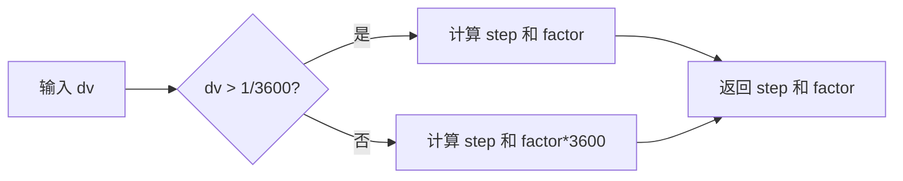

#### 带注释源码

```python
def select_step_hour(dv):

    hour_limits_ = [1.5, 2.5, 3.5, 5, 7, 10, 15, 21, 36]
    hour_steps_  = [1,   2,   3,   4, 6,  8, 12, 18, 24]
    hour_factors = [1.] * len(hour_steps_)

    minsec_limits_ = [1.5, 2.5, 3.5, 4.5, 5.5, 8, 11, 14, 18, 25, 45]
    minsec_steps_  = [1,   2,   3,   4,   5,   6, 10, 12, 15, 20, 30]

    minute_limits_ = np.array(minsec_limits_) / 60
    minute_factors = [60.] * len(minute_limits_)

    second_limits_ = np.array(minsec_limits_) / 3600
    second_factors = [3600.] * len(second_limits_)

    hour_limits = [*second_limits_, *minute_limits_, *hour_limits_]
    hour_steps = [*minsec_steps_, *minsec_steps_, *hour_steps_]
    hour_factors = [*second_factors, *minute_factors, *hour_factors]

    n = np.searchsorted(hour_limits, dv)
    step = hour_steps[n]
    factor = hour_factors[n]

    return step, factor
```

### select_step_sub

该函数用于根据给定的角度值（以弧秒为单位）选择合适的步长和因子。

#### 参数

- `dv`：`float`，输入的角度值，单位为弧秒。

#### 返回值

- `step`：`int`，选择的步长。
- `factor`：`float`，选择的因子。

#### 流程图

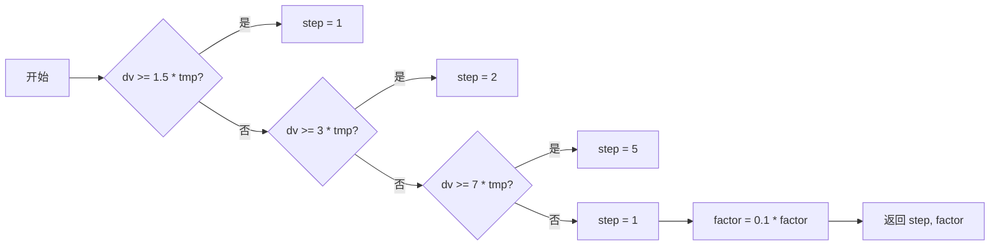

#### 带注释源码

```python
def select_step_sub(dv):

    # subarcsec or degree
    tmp = 10.**(int(math.log10(dv))-1.)

    factor = 1./tmp

    if 1.5*tmp >= dv:
        step = 1
    elif 3.*tmp >= dv:
        step = 2
    elif 7.*tmp >= dv:
        step = 5
    else:
        step = 1
        factor = 0.1*factor

    return step, factor
```

### select_step_degree

该函数用于根据给定的角度差（dv）选择合适的步长和因子。

#### 参数

- `dv`：`float`，表示角度差。

#### 返回值

- `step`：`int`，表示步长。
- `factor`：`float`，表示因子。

#### 流程图

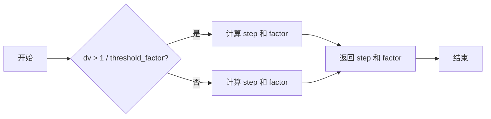

#### 带注释源码

```python
def select_step_degree(dv):
    degree_limits_ = [1.5, 3, 7, 13, 20, 40, 70, 120, 270, 520]
    degree_steps_  = [1,   2, 5, 10, 15, 30, 45,  90, 180, 360]
    degree_factors = [1.] * len(degree_steps_)

    minsec_limits_ = [1.5, 2.5, 3.5, 8, 11, 18, 25, 45]
    minsec_steps_  = [1,   2,   3,   5, 10, 15, 20, 30]

    minute_limits_ = np.array(minsec_limits_) / 60
    minute_factors = [60.] * len(minute_limits_)

    second_limits_ = np.array(minsec_limits_) / 3600
    second_factors = [3600.] * len(second_limits_)

    degree_limits = [*second_limits_, *minute_limits_, *degree_limits_]
    degree_steps = [*minsec_steps_, *minsec_steps_, *degree_steps_]
    degree_factors = [*second_factors, *minute_factors, *degree_factors]

    n = np.searchsorted(degree_limits, dv)
    step = degree_steps[n]
    factor = degree_factors[n]

    return step, factor
```

### select_step_hour

该函数用于根据给定的角度差（dv）选择合适的步长和因子。

#### 参数

- `dv`：`float`，表示角度差。

#### 返回值

- `step`：`int`，表示步长。
- `factor`：`float`，表示因子。

#### 流程图


#### 带注释源码

```python
def select_step_hour(dv):
    hour_limits_ = [1.5, 2.5, 3.5, 5, 7, 10, 15, 21, 36]
    hour_steps_  = [1,   2,   3,   4, 6,  8, 12, 18, 24]
    hour_factors = [1.] * len(hour_steps_)

    minsec_limits_ = [1.5, 2.5, 3.5, 4.5, 5.5, 8, 11, 14, 18, 25, 45]
    minsec_steps_  = [1,   2,   3,   4,   5,   6, 10, 12, 15, 20, 30]

    minute_limits_ = np.array(minsec_limits_) / 60
    minute_factors = [60.] * len(minute_limits_)

    second_limits_ = np.array(minsec_limits_) / 3600
    second_factors = [3600.] * len(second_limits_)

    hour_limits = [*second_limits_, *minute_limits_, *hour_limits_]
    hour_steps = [*minsec_steps_, *minsec_steps_, *hour_steps_]
    hour_factors = [*second_factors, *minute_factors, *hour_factors]

    n = np.searchsorted(hour_limits, dv)
    step = hour_steps[n]
    factor = hour_factors[n]

    return step, factor
```

### select_step_sub

该函数用于根据给定的角度差（dv）选择合适的步长和因子。

#### 参数

- `dv`：`float`，表示角度差。

#### 返回值

- `step`：`int`，表示步长。
- `factor`：`float`，表示因子。

#### 流程图

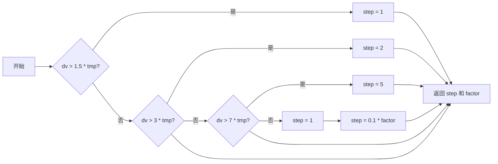

#### 带注释源码

```python
def select_step_sub(dv):
    # subarcsec or degree
    tmp = 10.**(int(math.log10(dv))-1.)

    factor = 1./tmp

    if 1.5*tmp >= dv:
        step = 1
    elif 3.*tmp >= dv:
        step = 2
    elif 7.*tmp >= dv:
        step = 5
    else:
        step = 1
        factor = 0.1*factor

    return step, factor
```

### select_step24

select_step24 函数用于根据给定的起始值、结束值和步数，计算在小时范围内（以小时为单位）的网格线位置。

#### 参数

- `v1`：`float`，起始值，单位为度。
- `v2`：`float`，结束值，单位为度。
- `nv`：`int`，网格线数量。
- `include_last`：`bool`，是否包含最后一个网格线，默认为 True。
- `threshold_factor`：`float`，阈值因子，默认为 3600。

#### 返回值

- `levs`：`numpy.ndarray`，网格线位置数组，单位为度。
- `n`：`int`，有效网格线数量。
- `factor`：`float`，网格线因子。

#### 流程图

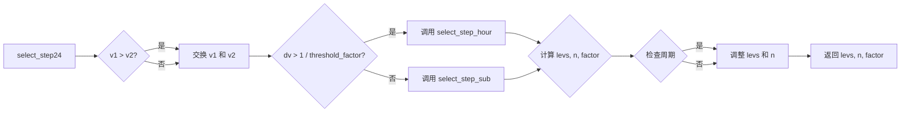

#### 带注释源码

```python
def select_step24(v1, v2, nv, include_last=True, threshold_factor=3600):
    v1, v2 = v1 / 15, v2 / 15
    levs, n, factor = select_step(v1, v2, nv, hour=True,
                                  include_last=include_last,
                                  threshold_factor=threshold_factor)
    return levs * 15, n, factor
```

### select_step360

select_step360 函数用于根据给定的起始值、结束值和步数，选择合适的步长和因子，并返回一系列的等间隔值。

#### 参数

- `v1`：`float`，起始值。
- `v2`：`float`，结束值。
- `nv`：`int`，等间隔值的数量。
- `include_last`：`bool`，是否包含最后一个值。
- `threshold_factor`：`float`，阈值因子。

#### 返回值

- `levs`：`numpy.ndarray`，等间隔值数组。
- `n`：`int`，有效等间隔值的数量。
- `factor`：`float`，因子。

#### 流程图

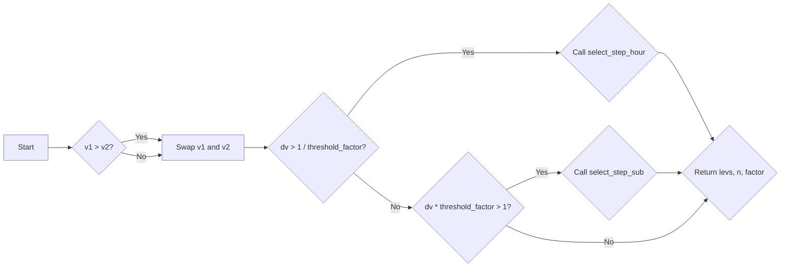

#### 带注释源码

```python
def select_step360(v1, v2, nv, include_last=True, threshold_factor=3600):
    return select_step(v1, v2, nv, hour=False,
                       include_last=include_last,
                       threshold_factor=threshold_factor)
```


### `select_step_degree`

Selects the step and factor for degree-based grid lines.

参数：

- `dv`：`float`，The value to be compared against the degree limits to determine the step and factor.

返回值：`tuple`，A tuple containing the step and factor as floats.

#### 流程图

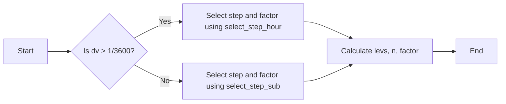

#### 带注释源码

```python
def select_step_degree(dv):
    # degree_limits_ and degree_steps_ are predefined lists
    degree_limits_ = [1.5, 3, 7, 13, 20, 40, 70, 120, 270, 520]
    degree_steps_  = [1,   2, 5, 10, 15, 30, 45,  90, 180, 360]
    degree_factors = [1.] * len(degree_steps_)

    # minsec_limits_ and minsec_steps_ are predefined lists
    minsec_limits_ = [1.5, 2.5, 3.5, 8, 11, 18, 25, 45]
    minsec_steps_  = [1,   2,   3,   5, 10, 15, 20, 30]

    # Convert minsec limits to minutes and seconds
    minute_limits_ = np.array(minsec_limits_) / 60
    minute_factors = [60.] * len(minute_limits_)

    second_limits_ = np.array(minsec_limits_) / 3600
    second_factors = [3600.] * len(second_limits_)

    # Combine limits and steps for degrees, minutes, and seconds
    degree_limits = [*second_limits_, *minute_limits_, *degree_limits_]
    degree_steps = [*minsec_steps_, *minsec_steps_, *degree_steps_]
    degree_factors = [*second_factors, *minute_factors, *degree_factors]

    # Find the index of the closest limit to dv
    n = np.searchsorted(degree_limits, dv)

    # Get the step and factor from the lists
    step = degree_steps[n]
    factor = degree_factors[n]

    # Return the step and factor
    return step, factor
``` 


### select_step

该函数的核心功能是根据给定的起始值、结束值、步数和是否按小时计算，选择合适的步长和因子。

#### 参数

- `v1`：`float`，起始值。
- `v2`：`float`，结束值。
- `nv`：`int`，步数。
- `hour`：`bool`，是否按小时计算。
- `include_last`：`bool`，是否包含最后一个值。
- `threshold_factor`：`float`，阈值因子。

#### 返回值

- `levs`：`numpy.ndarray`，计算得到的值。
- `n`：`int`，有效值的数量。
- `factor`：`float`，因子。

#### 流程图

```mermaid
graph LR
A[开始] --> B{是否按小时计算?}
B -- 是 --> C[调用 select_step_hour]
B -- 否 --> D[调用 select_step_degree]
C --> E{dv > 1 / threshold_factor?}
D --> E
E -- 是 --> F[调用 _select_step]
E -- 否 --> G[调用 select_step_sub]
F --> H{factor == 1?}
G --> H
H -- 是 --> I[计算 levs]
H -- 否 --> J[计算 levs]
I --> K{levs[-1] >= levs[0] + cycle?}
J --> K
K -- 是 --> L[计算 levs]
K -- 否 --> M[返回 levs, n, factor]
L --> M
M --> N[结束]
```

#### 带注释源码

```python
def select_step(v1, v2, nv, hour=False, include_last=True,
                threshold_factor=3600.):
    if v1 > v2:
        v1, v2 = v2, v1

    dv = (v2 - v1) / nv

    if hour:
        _select_step = select_step_hour
        cycle = 24.
    else:
        _select_step = select_step_degree
        cycle = 360.

    # for degree
    if dv > 1 / threshold_factor:
        step, factor = _select_step(dv)
    else:
        step, factor = select_step_sub(dv*threshold_factor)

        factor = factor * threshold_factor

    levs = np.arange(np.floor(v1 * factor / step),
                     np.ceil(v2 * factor / step) + 0.5,
                     dtype=int) * step

    # n : number of valid levels. If there is a cycle, e.g., [0, 90, 180,
    # 270, 360], the grid line needs to be extended from 0 to 360, so
    # we need to return the whole array. However, the last level (360)
    # needs to be ignored often. In this case, so we return n=4.

    n = len(levs)

    # we need to check the range of values
    # for example, -90 to 90, 0 to 360,

    if factor == 1. and levs[-1] >= levs[0] + cycle:  # check for cycle
        nv = int(cycle / step)
        if include_last:
            levs = levs[0] + np.arange(0, nv+1, 1) * step
        else:
            levs = levs[0] + np.arange(0, nv, 1) * step

        n = len(levs)

    return np.array(levs), n, factor
```

### select_step

该函数的核心功能是根据给定的起始值、结束值、步数和是否按小时计算，选择合适的步长和因子，并返回一个包含等间隔值的数组、有效级别的数量和因子。

#### 参数

- `v1`：`float`，起始值。
- `v2`：`float`，结束值。
- `nv`：`int`，步数。
- `hour`：`bool`，是否按小时计算。
- `include_last`：`bool`，是否包含最后一个值。
- `threshold_factor`：`float`，阈值因子。

#### 返回值

- `levs`：`numpy.ndarray`，包含等间隔值的数组。
- `n`：`int`，有效级别的数量。
- `factor`：`float`，因子。

#### 流程图

```mermaid
graph LR
A[Start] --> B{Is v1 > v2?}
B -- Yes --> C[Swap v1 and v2]
B -- No --> C
C --> D{Is hour?}
D -- Yes --> E[Call select_step24]
D -- No --> F[Call select_step]
E --> G{Is dv > 1 / threshold_factor?}
F --> G
G -- Yes --> H[Call _select_step]
G -- No --> I[Call select_step_sub]
H --> J{Is factor == 1?}
I --> J
J -- Yes --> K[Calculate levs]
J -- No --> L[Calculate levs]
K --> M{Is levs[-1] >= levs[0] + cycle?}
L --> M
M -- Yes --> N[Calculate levs]
M -- No --> O[Return levs, n, factor]
N --> O
```

#### 带注释源码

```python
def select_step(v1, v2, nv, hour=False, include_last=True,
                threshold_factor=3600.):
    if v1 > v2:
        v1, v2 = v2, v1

    dv = (v2 - v1) / nv

    if hour:
        _select_step = select_step24
        cycle = 24.
    else:
        _select_step = select_step_degree
        cycle = 360.

    # for degree
    if dv > 1 / threshold_factor:
        step, factor = _select_step(dv)
    else:
        step, factor = select_step_sub(dv*threshold_factor)

        factor = factor * threshold_factor

    levs = np.arange(np.floor(v1 * factor / step),
                     np.ceil(v2 * factor / step) + 0.5,
                     dtype=int) * step

    # n : number of valid levels. If there is a cycle, e.g., [0, 90, 180,
    # 270, 360], the grid line needs to be extended from 0 to 360, so
    # we need to return the whole array. However, the last level (360)
    # needs to be ignored often. In this case, so we return n=4.

    n = len(levs)

    # we need to check the range of values
    # for example, -90 to 90, 0 to 360,

    if factor == 1. and levs[-1] >= levs[0] + cycle:  # check for cycle
        nv = int(cycle / step)
        if include_last:
            levs = levs[0] + np.arange(0, nv+1, 1) * step
        else:
            levs = levs[0] + np.arange(0, nv, 1) * step

        n = len(levs)

    return np.array(levs), n, factor
```

### _find_transformed_bbox

该函数用于计算给定变换后的网格坐标的边界框（bbox）。它考虑了经纬度的周期性（例如，经度可能超过360度）以及可选的边界限制。

#### 参数

- `trans`：`matplotlib.transforms.Transform`，变换对象，用于将网格坐标转换为经纬度。
- `bbox`：`matplotlib.transforms.Bbox`，原始边界框，表示网格坐标的范围。

#### 返回值

- `matplotlib.transforms.Bbox`：计算后的边界框，表示变换后的经纬度坐标的范围。

#### 流程图

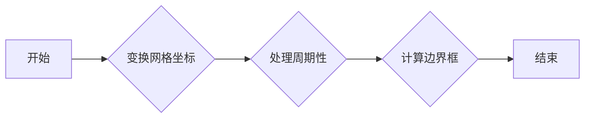

#### 带注释源码

```python
def _find_transformed_bbox(self, trans, bbox):
    # 将网格坐标转换为经纬度
    grid = np.reshape(np.meshgrid(np.linspace(bbox.x0, bbox.x1, self.nx),
                                  np.linspace(bbox.y0, bbox.y1, self.ny)),
                      (2, -1)).T
    lon, lat = trans.transform(grid).T

    # 处理周期性
    with np.errstate(invalid='ignore'):
        if self.lon_cycle is not None:
            lon0 = np.nanmin(lon)
            lon -= 360. * ((lon - lon0) > 180.)
        if self.lat_cycle is not None:
            lat0 = np.nanmin(lat)
            lat -= 360. * ((lat - lat0) > 180.)

    # 计算边界框
    tbbox = Bbox.null()
    tbbox.update_from_data_xy(np.column_stack([lon, lat]))
    tbbox = tbbox.expanded(1 + 2 / self.nx, 1 + 2 / self.ny)
    lon_min, lat_min, lon_max, lat_max = tbbox.extents

    # 检查周期性
    if self.lon_cycle:
        lon_max = min(lon_max, lon_min + self.lon_cycle)
    if self.lat_cycle:
        lat_max = min(lat_max, lat_min + self.lat_cycle)

    # 检查边界限制
    if self.lon_minmax is not None:
        min0 = self.lon_minmax[0]
        lon_min = max(min0, lon_min)
        max0 = self.lon_minmax[1]
        lon_max = min(max0, lon_max)

    if self.lat_minmax is not None:
        min0 = self.lat_minmax[0]
        lat_min = max(min0, lat_min)
        max0 = self.lat_minmax[1]
        lat_max = min(max0, lat_max)

    # 返回边界框
    return Bbox.from_extents(lon_min, lat_min, lon_max, lat_max)
```

### LocatorBase.__init__

该函数是`LocatorBase`类的构造函数，用于初始化`LocatorBase`类的实例。

#### 描述

`__init__`函数初始化`LocatorBase`类的实例，设置`nbins`和`include_last`属性。

#### 参数

- `nbins`：`int`，表示网格的数目。
- `include_last`：`bool`，表示是否包含最后一个网格。

#### 返回值

无返回值。

#### 流程图

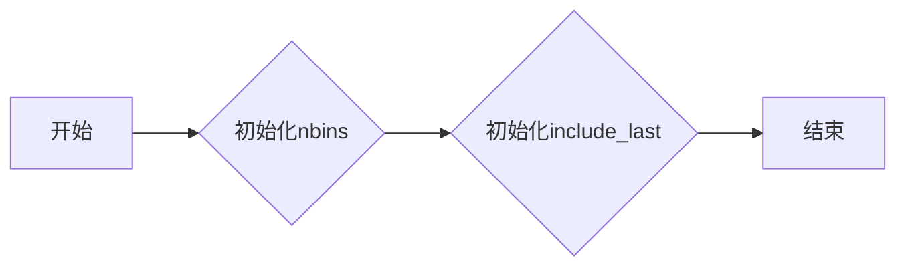

#### 带注释源码

```python
class LocatorBase:
    def __init__(self, nbins, include_last=True):
        # 初始化nbins属性
        self.nbins = nbins
        # 初始化include_last属性
        self._include_last = include_last
```

### `LocatorBase.set_params`

该函数用于设置定位器的基本参数，包括分箱数和是否包含最后一个分箱。

#### 参数

- `nbins`：`int`，可选参数。新的分箱数。如果提供，则更新定位器的分箱数。

#### 返回值

- 无返回值。

#### 流程图

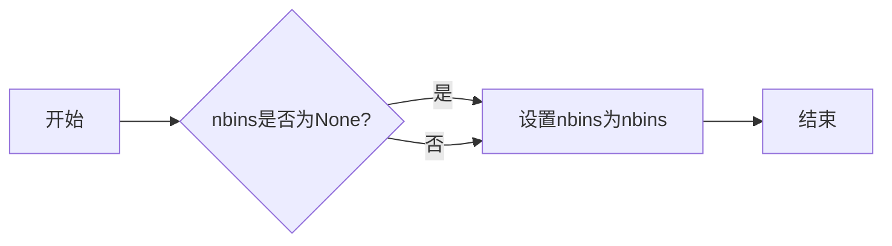

#### 带注释源码

```python
def set_params(self, nbins=None):
    if nbins is not None:
        self.nbins = int(nbins)
```

### `select_step24.__call__`

该函数用于计算给定起始值和结束值之间的24小时步长和因子。

参数：

- `v1`：`float`，起始值
- `v2`：`float`，结束值
- `self.nbins`：`int`，网格线数量
- `self._include_last`：`bool`，是否包含最后一个网格线

返回值：`tuple`，包含以下元素：

- `levs`：`numpy.ndarray`，网格线值
- `n`：`int`，有效网格线数量
- `factor`：`float`，因子

#### 流程图

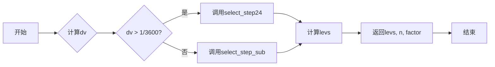

#### 带注释源码

```python
def __call__(self, v1, v2):
    return select_step24(v1, v2, self.nbins, self._include_last)
```

### `LocatorHM.__call__`

该函数用于计算给定两个角度值之间的步长和因子，用于在地图上创建网格线。

#### 参数

- `v1`：`float`，起始角度值。
- `v2`：`float`，结束角度值。

#### 返回值

- `tuple`，包含两个元素：`levs`（网格线位置数组）和`n`（有效网格线数量）。

#### 流程图

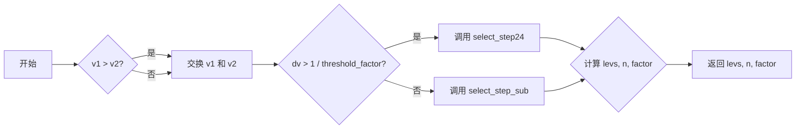

#### 带注释源码

```python
def __call__(self, v1, v2):
    # 交换 v1 和 v2，如果 v1 大于 v2
    if v1 > v2:
        v1, v2 = v2, v1

    dv = (v2 - v1) / self.nbins  # 计算角度差除以网格线数量

    # 如果 dv 大于阈值因子，调用 select_step24
    if dv > 1 / self.threshold_factor:
        step, factor = select_step24(v1, v2, self.nbins, self._include_last,
                                    threshold_factor=self.threshold_factor)
    else:
        # 否则，调用 select_step_sub
        step, factor = select_step_sub(dv * self.threshold_factor)

        factor = factor * self.threshold_factor  # 乘以阈值因子

    levs = np.arange(np.floor(v1 * factor / step),
                     np.ceil(v2 * factor / step) + 0.5,
                     dtype=int) * step  # 计算网格线位置

    # 检查是否有周期，例如 [0, 90, 180, 270, 360]
    if factor == 1. and levs[-1] >= levs[0] + 360:  # 检查周期
        nv = int(360 / step)  # 计算周期内的网格线数量
        if self._include_last:
            levs = levs[0] + np.arange(0, nv+1, 1) * step  # 包含最后一个网格线
        else:
            levs = levs[0] + np.arange(0, nv, 1) * step  # 不包含最后一个网格线

        n = len(levs)  # 有效网格线数量

    return np.array(levs), n, factor  # 返回网格线位置数组、有效网格线数量和因子
```

### `select_step`

该函数根据给定的起始值、结束值、步数和可选参数，计算并返回一系列的等间隔值，以及这些值的数量和因子。

#### 参数

- `v1`：`float`，起始值。
- `v2`：`float`，结束值。
- `nv`：`int`，期望的等间隔值的数量。
- `hour`：`bool`，是否按小时计算。
- `include_last`：`bool`，是否包含最后一个值。
- `threshold_factor`：`float`，阈值因子。

#### 返回值

- `levs`：`numpy.ndarray`，等间隔值。
- `n`：`int`，有效值的数量。
- `factor`：`float`，因子。

#### 流程图

```mermaid
graph LR
A[Start] --> B{Is v1 > v2?}
B -- Yes --> C[Swap v1 and v2]
B -- No --> C
C --> D{Is hour?}
D -- Yes --> E[Call select_step_hour]
D -- No --> F[Call select_step_degree]
E --> G{Is dv > 1 / threshold_factor?}
F --> G
G -- Yes --> H[Call select_step_sub]
G -- No --> I[Call _select_step]
H --> J{Is factor == 1?}
I --> J
J -- Yes --> K[Calculate levs]
J -- No --> L[Calculate levs]
K --> M{Is levs[-1] >= levs[0] + cycle?}
L --> M
M -- Yes --> N[Calculate levs]
M -- No --> O[Return levs, n, factor]
N --> O
```

#### 带注释源码

```python
def select_step(v1, v2, nv, hour=False, include_last=True,
                threshold_factor=3600.):
    if v1 > v2:
        v1, v2 = v2, v1

    dv = (v2 - v1) / nv

    if hour:
        _select_step = select_step_hour
        cycle = 24.
    else:
        _select_step = select_step_degree
        cycle = 360.

    # for degree
    if dv > 1 / threshold_factor:
        step, factor = _select_step(dv)
    else:
        step, factor = select_step_sub(dv*threshold_factor)

        factor = factor * threshold_factor

    levs = np.arange(np.floor(v1 * factor / step),
                     np.ceil(v2 * factor / step) + 0.5,
                     dtype=int) * step

    # n : number of valid levels. If there is a cycle, e.g., [0, 90, 180,
    # 270, 360], the grid line needs to be extended from 0 to 360, so
    # we need to return the whole array. However, the last level (360)
    # needs to be ignored often. In this case, so we return n=4.

    n = len(levs)

    # we need to check the range of values
    # for example, -90 to 90, 0 to 360,

    if factor == 1. and levs[-1] >= levs[0] + cycle:  # check for cycle
        nv = int(cycle / step)
        if include_last:
            levs = levs[0] + np.arange(0, nv+1, 1) * step
        else:
            levs = levs[0] + np.arange(0, nv, 1) * step

        n = len(levs)

    return np.array(levs), n, factor
```

### `LocatorDMS.__call__`

该函数用于计算给定起始和结束角度之间的等分步骤和因子，适用于度分秒（DMS）格式。

参数：

- `v1`：`float`，起始角度，单位为度分秒。
- `v2`：`float`，结束角度，单位为度分秒。

返回值：`np.array`，包含等分步骤的数组，`int`，等分步骤的数量，`float`，等分因子。

#### 流程图

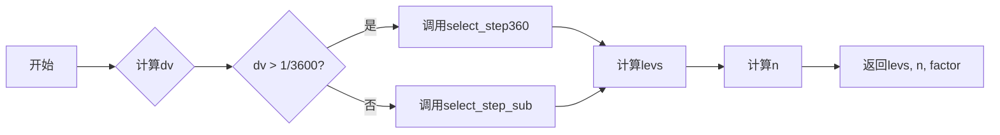

#### 带注释源码

```python
def __call__(self, v1, v2):
    # 计算起始和结束角度之间的差值
    dv = (v2 - v1) / self.nbins

    # 如果dv大于1/3600，则调用select_step360
    if dv > 1 / self.threshold_factor:
        step, factor = select_step360(v1, v2, self.nbins, self._include_last, self.threshold_factor)
    else:
        # 否则，调用select_step_sub
        step, factor = select_step_sub(dv * self.threshold_factor)

        # 乘以3600，以匹配select_step_sub的因子
        factor = factor * self.threshold_factor

    # 计算等分步骤
    levs = np.arange(np.floor(v1 * factor / step),
                     np.ceil(v2 * factor / step) + 0.5,
                     dtype=int) * step

    # 返回等分步骤、步骤数量和因子
    return np.array(levs), len(levs), factor
```

### `LocatorDM.__call__`

该函数用于计算给定两个角度值之间的步长和因子，用于定位角度。

参数：

- `v1`：`float`，起始角度值。
- `v2`：`float`，结束角度值。
- `self.nbins`：`int`，分割角度的步数。
- `self._include_last`：`bool`，是否包含最后一个分割点。

返回值：`np.array`，分割角度的值数组；`int`，有效分割点的数量；`float`，分割因子。

#### 流程图

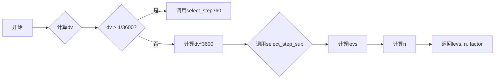

#### 带注释源码

```python
class LocatorDM(LocatorBase):
    def __call__(self, v1, v2):
        # 计算dv
        dv = (v2 - v1) / self.nbins

        # 判断dv是否大于1/3600
        if dv > 1 / 3600:
            # 调用select_step360
            step, factor = select_step360(v1, v2, self.nbins, self._include_last)
        else:
            # 计算dv*3600
            dv *= 3600
            # 调用select_step_sub
            step, factor = select_step_sub(dv)

            # 乘以3600
            factor *= 3600

        # 计算levs
        levs = np.arange(np.floor(v1 * factor / step),
                         np.ceil(v2 * factor / step) + 0.5,
                         dtype=int) * step

        # 计算n
        n = len(levs)

        # 返回levs, n, factor
        return np.array(levs), n, factor
```

### `LocatorD.__call__`

该函数用于计算给定两个角度值之间的步长和因子，并返回一系列的等分角度值。

#### 参数

- `v1`：`float`，起始角度值。
- `v2`：`float`，结束角度值。
- `self.nbins`：`int`，等分的角度数量。
- `self._include_last`：`bool`，是否包含最后一个等分角度。

#### 返回值

- `levs`：`numpy.ndarray`，等分的角度值数组。
- `n`：`int`，有效等分角度的数量。
- `factor`：`float`，角度因子。

#### 流程图

```mermaid
graph LR
A[开始] --> B{v1 > v2?}
B -- 是 --> C[交换 v1 和 v2]
B -- 否 --> C
C --> D{dv > 1 / threshold_factor?}
D -- 是 --> E[调用 select_step_hour]
D -- 否 --> F{dv * threshold_factor > 1?}
F -- 是 --> G[调用 select_step_sub]
F -- 否 --> H[设置 step 和 factor]
H --> I{levs = np.arange(...)}
I --> J{检查周期}
J -- 是 --> K[调整 levs 和 n]
J -- 否 --> L[返回 levs, n, factor]
E --> L
G --> L
```

#### 带注释源码

```python
class LocatorD(LocatorBase):
    def __call__(self, v1, v2):
        if v1 > v2:
            v1, v2 = v2, v1

        dv = (v2 - v1) / self.nbins

        if dv > 1 / self.threshold_factor:
            _select_step = select_step_hour
            cycle = 24.
        else:
            _select_step = select_step_sub
            cycle = 360.

        # for degree
        if dv > 1 / self.threshold_factor:
            step, factor = _select_step(dv)
        else:
            step, factor = select_step_sub(dv * self.threshold_factor)

            factor = factor * self.threshold_factor

        levs = np.arange(np.floor(v1 * factor / step),
                         np.ceil(v2 * factor / step) + 0.5,
                         dtype=int) * step

        # n : number of valid levels. If there is a cycle, e.g., [0, 90, 180,
        # 270, 360], the grid line needs to be extended from 0 to 360, so
        # we need to return the whole array. However, the last level (360)
        # needs to be ignored often. In this case, so we return n=4.

        n = len(levs)

        # we need to check the range of values
        # for example, -90 to 90, 0 to 360,

        if factor == 1. and levs[-1] >= levs[0] + cycle:  # check for cycle
            nv = int(cycle / step)
            if self._include_last:
                levs = levs[0] + np.arange(0, nv+1, 1) * step
            else:
                levs = levs[0] + np.arange(0, nv, 1) * step

            n = len(levs)

        return np.array(levs), n, factor
```

### FormatterDMS.__call__

FormatterDMS类的__call__方法用于格式化方向、因子和值，以生成度、分、秒的字符串表示。

参数：

- `direction`：`str`，表示方向，例如"lon"或"lat"。
- `factor`：`float`，表示因子，用于确定度、分、秒的精度。
- `values`：`numpy.ndarray`，包含需要格式化的值。

返回值：`list`，包含格式化后的字符串列表。

#### 流程图

```mermaid
graph LR
A[开始] --> B{判断 direction}
B -- "lon" 或 "lat" --> C[获取因子和值]
C --> D{判断因子}
D -- "1" --> E[格式化值]
D -- "60" --> F[格式化值]
D -- "3600" --> G[格式化值]
D -- "其他" --> H[格式化值]
E --> I[返回结果]
F --> I
G --> I
H --> I
I --> J[结束]
```

#### 带注释源码

```python
def __call__(self, direction, factor, values):
    if len(values) == 0:
        return []

    ss = np.sign(values)
    signs = ["-" if v < 0 else "" for v in values]

    factor, number_fraction = self._get_number_fraction(factor)

    values = np.abs(values)

    if number_fraction is not None:
        values, frac_part = divmod(values, 10 ** number_fraction)
        frac_fmt = "%%0%dd" % (number_fraction,)
        frac_str = [frac_fmt % (f1,) for f1 in frac_part]

    if factor == 1:
        if number_fraction is None:
            return [self.fmt_d % (s * int(v),) for s, v in zip(ss, values)]
        else:
            return [self.fmt_ds % (s * int(v), f1)
                    for s, v, f1 in zip(ss, values, frac_str)]
    elif factor == 60:
        deg_part, min_part = divmod(values, 60)
        if number_fraction is None:
            return [self.fmt_d_m % (s1, d1, m1)
                    for s1, d1, m1 in zip(signs, deg_part, min_part)]
        else:
            return [self.fmt_d_ms % (s, d1, m1, f1)
                    for s, d1, m1, f1
                    in zip(signs, deg_part, min_part, frac_str)]

    elif factor == 3600:
        if ss[-1] == -1:
            inverse_order = True
            values = values[::-1]
            signs = signs[::-1]
        else:
            inverse_order = False

        l_hm_old = ""
        r = []

        deg_part, min_part_ = divmod(values, 3600)
        min_part, sec_part = divmod(min_part_, 60)

        if number_fraction is None:
            sec_str = [self.fmt_s_partial % (s1,) for s1 in sec_part]
        else:
            sec_str = [self.fmt_ss_partial % (s1, f1)
                       for s1, f1 in zip(sec_part, frac_str)]

        for s, d1, m1, s1 in zip(signs, deg_part, min_part, sec_str):
            l_hm = self.fmt_d_m_partial % (s, d1, m1)
            if l_hm != l_hm_old:
                l_hm_old = l_hm
                l = l_hm + s1
            else:
                l = "$" + s + s1
            r.append(l)

        if inverse_order:
            return r[::-1]
        else:
            return r

    else:  # factor > 3600.
        return [r"$%s^{\circ}$" % v for v in ss*values]
```

### FormatterHMS.__call__

FormatterHMS.__call__ 是一个类方法，它负责将给定的方向、因子和值转换为小时、分钟和秒的格式。

#### 参数

- `direction`：`int`，表示方向，通常为 1 或 -1。
- `factor`：`float`，表示转换因子，用于将值转换为小时、分钟和秒。
- `values`：`numpy.ndarray`，包含需要格式化的值。

#### 返回值

- `str`：格式化后的字符串列表。

#### 流程图

```mermaid
graph LR
A[开始] --> B{判断 factor}
B -- 是 --> C[执行 FormatterDMS.__call__]
B -- 否 --> D[将 values 除以 15]
D --> E[执行 FormatterDMS.__call__]
E --> F[返回结果]
F --> G[结束]
```

#### 带注释源码

```python
class FormatterHMS(FormatterDMS):
    # ... (其他代码)

    def __call__(self, direction, factor, values):  # hour
        return super().__call__(direction, factor, np.asarray(values) / 15)
```

## 关键组件


### 张量索引与惰性加载

张量索引与惰性加载是代码中处理数据结构的核心组件，它允许对大型数据集进行高效访问，同时减少内存占用。

### 反量化支持

反量化支持是代码中用于处理量化数据的核心组件，它能够将量化后的数据转换回原始数据，以便进行进一步处理。

### 量化策略

量化策略是代码中用于优化数据存储和计算效率的核心组件，它通过减少数据精度来降低内存和计算需求。


## 问题及建议


### 已知问题

-   **代码重复性**：`select_step_degree`、`select_step_hour`、`select_step_sub` 和 `select_step` 函数中存在大量的代码重复，特别是在处理不同时间单位（度、小时、秒）的转换和搜索排序逻辑上。
-   **全局变量**：代码中使用了全局变量，如 `degree_limits_`、`degree_steps_`、`degree_factors` 等，这可能导致代码难以维护和理解。
-   **异常处理**：代码中没有明确的异常处理机制，可能会在输入数据不符合预期时导致程序崩溃。
-   **文档注释**：代码中缺少必要的文档注释，使得代码难以理解和使用。

### 优化建议

-   **代码重构**：将重复的代码进行抽象和封装，减少代码重复性，提高代码的可维护性。
-   **使用类**：将相关的功能封装到类中，使用面向对象的方式组织代码，提高代码的可读性和可维护性。
-   **异常处理**：增加异常处理机制，确保程序在遇到错误输入时能够优雅地处理异常。
-   **文档注释**：为代码添加必要的文档注释，提高代码的可读性和可维护性。
-   **性能优化**：考虑使用更高效的数据结构和算法来提高代码的执行效率。
-   **单元测试**：编写单元测试来验证代码的正确性和稳定性。
-   **代码风格**：遵循统一的代码风格规范，提高代码的可读性和可维护性。


## 其它


### 设计目标与约束

- 设计目标：
  - 提供一个灵活的定位器，能够根据输入的经纬度范围和步长要求，生成网格点。
  - 支持不同精度的定位，如度、分、秒。
  - 提供格式化输出，方便显示和记录。
- 约束：
  - 必须使用numpy库进行数值计算。
  - 必须使用matplotlib库进行图形显示。

### 错误处理与异常设计

- 错误处理：
  - 对于无效的输入参数，如负数步长，抛出ValueError异常。
  - 对于不支持的格式化输出，抛出ValueError异常。
- 异常设计：
  - 使用try-except语句捕获和处理异常。
  - 提供清晰的错误信息，帮助用户定位问题。

### 数据流与状态机

- 数据流：
  - 输入：经纬度范围、步长、精度等参数。
  - 处理：根据参数计算网格点。
  - 输出：网格点列表。
- 状态机：
  - 状态：未开始、进行中、完成。
  - 转换：根据输入参数和计算结果，在状态之间转换。

### 外部依赖与接口契约

- 外部依赖：
  - numpy：用于数值计算。
  - matplotlib：用于图形显示。
- 接口契约：
  - 定位器类：提供定位功能。
  - 格式化器类：提供格式化输出功能。
  - 极端值查找器：用于查找网格点中的极值。


    