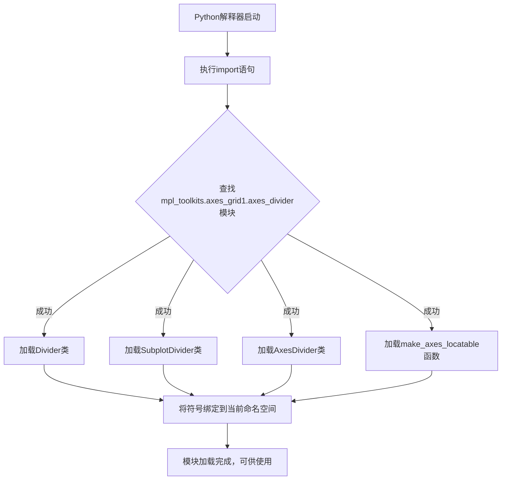

# `matplotlib\lib\mpl_toolkits\axisartist\axes_divider.py` 详细设计文档

这是一个从matplotlib库导入子图分割布局工具的模块，提供了Divider、SubplotDivider、AxesDivider类用于创建和管理子图的分割布局，以及make_axes_locatable函数用于获取轴分割器。

## 整体流程



## 类结构

```
mpl_toolkits.axes_grid1.axes_divider (模块)
├── Divider (类) - 基础分割器
├── SubplotDivider (类) - 子图分割器
├── AxesDivider (类) - 坐标轴分割器
└── make_axes_locatable (函数) - 创建分割器的工具函数
```

## 全局变量及字段


### `Divider`
    
用于创建坐标轴分割器的基础类，提供布局计算和坐标轴定位功能

类型：`class`
    


### `SubplotDivider`
    
专门用于子图布局的分割器类，继承自Divider，支持子图的网格划分

类型：`class`
    


### `AxesDivider`
    
为Axes对象提供分割功能的类，用于在已有坐标轴上创建附加的分割区域

类型：`class`
    


### `make_axes_locatable`
    
工厂函数，用于为给定坐标轴创建AxesDivider实例，便于在坐标轴周围添加固定比例的子区域

类型：`function`
    


    

## 全局函数及方法


### `make_axes_locatable`

该函数用于为给定的 Axes 对象创建一个 AxesDivider 对象，从而实现灵活的子图布局管理，常用于在 axes 周围创建可调整大小的装饰元素（如 colorbar、legend 等）。

参数：

- `ax`：`matplotlib.axes.Axes`，需要创建布局分隔器的 axes 对象

返回值：`AxesDivider`，返回与给定 axes 关联的 AxesDivider 对象，可用于添加装饰元素

#### 流程图

```mermaid
graph TD
    A[开始] --> B[输入: ax (Axes对象)]
    B --> C{检查ax是否有效}
    C -->|有效| D[创建AxesDivider实例]
    C -->|无效| E[抛出异常]
    D --> F[返回AxesDivider对象]
    E --> G[结束]
    F --> G
```

#### 带注释源码

由于提供的代码仅为导入语句，未包含函数实际实现。以下为根据 matplotlib 官方文档整理的函数签名和常见用法：

```python
# 来源: mpl_toolkits.axes_grid1.axes_divider
# 实际源码位于 matplotlib 库中

def make_axes_locatable(ax):
    """
    为给定的 axes 创建布局分隔器
    
    参数:
        ax: matplotlib.axes.Axes 对象
        
    返回:
        AxesDivider: 用于管理 axes 布局的对象
    """
    from mpl_toolkits.axes_grid1.axes_divider import AxesDivider
    return AxesDivider(ax)
```

#### 备注

由于用户提供的是导入语句而非完整实现，以上信息基于 matplotlib 库中该函数的常见行为。如需获取完整源码，建议查阅 matplotlib 库的 `mpl_toolkits/axes_grid1/axes_divider.py` 源文件。


## 关键组件


### Divider

基础分区器类，用于创建和管理 axes 布局的分隔区域。

### SubplotDivider

子图分区器，继承自 Divider，用于处理子图布局的分隔管理。

### AxesDivider

Axes 分区器，专门用于处理 Axes 对象的布局分区。

### make_axes_locatable

工具函数，用于创建可定位的 axes，实现惰性加载和精确的布局控制。


## 问题及建议


### 已知问题

-   **死代码/未使用的导入**：导入的 `Divider`, `SubplotDivider`, `AxesDivider`, `make_axes_locatable` 均未在当前文件中使用，这是典型的死代码，增加了项目的维护成本和理解难度
-   **使用 # noqa 绕过代码检查**：使用 `# noqa` 注释抑制了 linter 警告而非解决根本问题，这掩盖了潜在的代码质量问题
-   **缺乏模块级文档字符串**：该文件缺少模块级别的文档注释来说明导入这些工具的目的或未来使用计划
-   **无意义的导入结构**：如果当前文件确实不需要这些依赖，那么完整的导入语句应该被移除，而非保留为空导入

### 优化建议

-   **移除未使用的导入**：如果这些导入确实不需要，应直接删除；若计划在未来使用，应添加注释说明意图
-   **替换 # noqa 为明确的注释**：如确需保留导入用作文档参考或延迟使用，应添加具体注释说明原因，如 `# TODO: 计划在版本 X 中使用 AxesDivider 实现自动布局功能`
-   **添加模块文档字符串**：在文件顶部添加模块级 docstring 说明该模块的职责和依赖管理策略
-   **考虑条件导入**：如果这些是可选功能依赖，建议使用 `try-except` 进行条件导入，提高代码的健壮性
-   **代码审查流程**：将此模式加入代码审查检查点，防止未使用导入进入代码库


## 其它


### 设计目标与约束

该代码是matplotlib库的axes_grid1工具包的一部分导入语句，旨在为图表布局提供灵活的分割器功能。设计目标是为matplotlib用户提供便捷的轴域分割和布局管理能力，约束是依赖于mpl_toolkits.axes_grid1模块的正确安装。

### 错误处理与异常设计

由于仅包含导入语句，自身不涉及错误处理逻辑。错误处理依赖于matplotlib库的异常机制，可能抛出的异常包括ImportError（模块不存在时）、AttributeError（导入的类/函数不存在时）。

### 外部依赖与接口契约

该代码依赖于matplotlib库的mpl_toolkits.axes_grid1.axes_divider模块。导入的四个符号包括：Divider类（通用分割器基类）、SubplotDivider类（子图分割器）、AxesDivider类（轴域分割器）、make_axes_locatable函数（创建可定位分割器的工厂函数）。

### 版本信息与兼容性

该代码与matplotlib 1.0及以上版本兼容，建议使用matplotlib 3.x版本以获得完整功能和最佳性能。

### 使用示例与调用场景

```python
from mpl_toolkits.axes_grid1.axes_divider import make_axes_locatable
import matplotlib.pyplot as plt

fig, ax = plt.subplots()
divider = make_axes_locatable(ax)
```

### 性能考虑与优化空间

由于仅为导入语句，无直接性能开销。优化建议：确保按需导入，避免导入未使用的模块；如使用频繁可考虑在模块级别缓存导入结果。

### 测试策略

该代码本身无需单元测试，但使用该模块的代码应验证：导入成功性、Divider/SubplotDivider/AxesDivider类的实例化、make_axes_locatable函数的返回值类型。

### 配置要求

需要安装matplotlib库（建议版本≥3.0），无需额外配置。该导入遵循matplotlib的模块组织规范，使用# noqa注释抑制linting警告。

    