# `matplotlib\lib\mpl_toolkits\axisartist\axis_artist.py` 详细设计文档

该模块实现了用于绘制轴元素（轴线、刻度线、刻度标签、网格线）的自定义Matplotlib艺术家（Artists），允许灵活的位置和样式设置，以支持非标准的轴布局。

## 整体流程

```mermaid
graph TD
    Start[创建 AxisArtist 实例] --> Init[初始化子组件]
    Init --> InitTicks[初始化 Ticks (主刻度/副刻度)]
    Init --> InitLabels[初始化 TickLabels 和 AxisLabel]
    Init --> InitLine[初始化轴线 PathPatch]
    DrawCall[调用 AxisArtist.draw] --> UpdateLim[更新坐标轴限制]
    UpdateLim --> DrawTicks[_draw_ticks]
    DrawTicks --> UpdateTicks[_update_ticks 计算位置]
    UpdateTicks --> DrawMajorTicks[绘制主刻度 Ticks.draw]
    UpdateTicks --> DrawMajorLabels[绘制主标签 TickLabels.draw]
    UpdateTicks --> DrawMinorTicks[绘制副刻度 Ticks.draw]
    UpdateTicks --> DrawMinorLabels[绘制副标签 TickLabels.draw]
    DrawCall --> DrawLine[_draw_line 绘制轴线]
    DrawCall --> DrawLabel[_draw_label 绘制轴标签]
    DrawLine --> AxisArtistHelper[查询 AxisArtistHelper 获取路径]
    DrawLabel --> UpdateLabel[_update_label 计算位置]
```

## 类结构

```
object
├── Artist
│   └── AxisArtist (核心管理类)
├── Text (matplotlib)
│   └── LabelBase (文本基类)
│       ├── AxisLabel (轴标签)
│       └── TickLabels (刻度标签)
├── Line2D (matplotlib)
│   └── Ticks (刻度线)
├── LineCollection (matplotlib)
│   └── GridlinesCollection (网格线集合)
└── AttributeCopier (Mixin)
    ├── Ticks
    └── AxisLabel
```

## 全局变量及字段


### `Ticks._ticksize`
    
Length of the ticks in points

类型：`float`
    


### `Ticks._tick_out`
    
Whether ticks are drawn inside or outside the axes

类型：`bool`
    


### `Ticks.locs_angles_labels`
    
Stores locations, angles and labels for ticks

类型：`list`
    


### `Ticks._axis`
    
The axis this tick belongs to

类型：`XAxis or YAxis`
    


### `LabelBase.locs_angles_labels`
    
Stores locations, angles and labels for labels

类型：`list`
    


### `LabelBase._ref_angle`
    
Reference angle for text positioning

类型：`float`
    


### `LabelBase._offset_radius`
    
Offset radius for text positioning

类型：`float`
    


### `LabelBase._text_follow_ref_angle`
    
Whether text follows reference angle

类型：`bool`
    


### `AxisLabel._axis`
    
The axis this label belongs to

类型：`XAxis or YAxis`
    


### `AxisLabel._pad`
    
Internal pad in points

类型：`float`
    


### `AxisLabel._external_pad`
    
External pad in pixels

类型：`float`
    


### `AxisLabel._default_alignments`
    
Default alignments for different axis directions

类型：`dict`
    


### `AxisLabel._default_angles`
    
Default angles for different axis directions

类型：`dict`
    


### `TickLabels._axislabel_pad`
    
Pad for axis label

类型：`float`
    


### `TickLabels._axis_direction`
    
Axis direction (left, right, bottom, top)

类型：`str`
    


### `TickLabels._default_alignments`
    
Default alignments for different axis directions

类型：`dict`
    


### `TickLabels._default_angles`
    
Default angles for different axis directions

类型：`dict`
    


### `TickLabels._locs_angles_labels`
    
Stores locations, angles and labels for tick labels

类型：`list`
    


### `GridlinesCollection._which`
    
Which grid to consider (major or minor)

类型：`str`
    


### `GridlinesCollection._axis`
    
Which axis to consider (both, x, or y)

类型：`str`
    


### `GridlinesCollection._grid_helper`
    
Grid helper instance

类型：`GridHelperBase or None`
    


### `AxisArtist.axes`
    
Parent axes object

类型：`Axes`
    


### `AxisArtist._axis_artist_helper`
    
Helper for axis artist

类型：`AxisArtistHelper`
    


### `AxisArtist.offset_transform`
    
Offset transform for positioning

类型：`ScaledTranslation`
    


### `AxisArtist.axis`
    
The axis object

类型：`XAxis or YAxis`
    


### `AxisArtist._axisline_style`
    
Axis line style

类型：`AxislineStyle or None`
    


### `AxisArtist._axis_direction`
    
Axis direction (left, right, bottom, top)

类型：`str`
    


### `AxisArtist.line`
    
Axis line artist

类型：`PathPatch`
    


### `AxisArtist.major_ticks`
    
Major ticks artist

类型：`Ticks`
    


### `AxisArtist.minor_ticks`
    
Minor ticks artist

类型：`Ticks`
    


### `AxisArtist.major_ticklabels`
    
Major tick labels artist

类型：`TickLabels`
    


### `AxisArtist.minor_ticklabels`
    
Minor tick labels artist

类型：`TickLabels`
    


### `AxisArtist.label`
    
Axis label artist

类型：`AxisLabel`
    


### `AxisArtist.offsetText`
    
Offset text annotation

类型：`Annotation`
    


### `AxisArtist._ticklabel_add_angle`
    
Additional angle for tick labels

类型：`float`
    


### `AxisArtist._axislabel_add_angle`
    
Additional angle for axis labels

类型：`float`
    
    

## 全局函数及方法


### `AttributeCopier.get_ref_artist`

该方法是 `AttributeCopier` 类的抽象方法，用于返回实际定义某些属性（如颜色）的底层 artist 对象。子类需要重写此方法以返回对应的引用 artist。

参数： 无（隐含参数 `self` 表示实例本身）

返回值：`Artist`，返回底层 artist，该 artist 实际定义了一些属性（例如颜色）

#### 流程图

```mermaid
flowchart TD
    A[开始 get_ref_artist] --> B{子类实现}
    B --> C[返回底层 artist 对象]
    C --> D[结束]
    
    subgraph 子类重写示例
    E[Ticks.get_ref_artist] --> E1[返回 self._axis.majorTicks[0].tick1line]
    F[AxisLabel.get_ref_artist] --> F1[返回 self._axis.label]
    G[TickLabels.get_ref_artist] --> G1[返回 self._axis.get_ticklabels()[0]]
    end
    
    B -.->|重写| E
    B -.->|重写| F
    B -.->|重写| G
```

#### 带注释源码

```python
class AttributeCopier:
    def get_ref_artist(self):
        """
        Return the underlying artist that actually defines some properties
        (e.g., color) of this artist.
        """
        raise RuntimeError("get_ref_artist must overridden")
```

**代码说明**：

- 这是一个抽象基类方法，定义在 `AttributeCopier` 类中
- 该方法必须由子类重写，否则在调用时会抛出 `RuntimeError`
- 方法的 docstring 明确说明其用途：返回实际定义某些属性（如颜色）的底层 artist
- 此设计模式允许子类（如 `Ticks`、`AxisLabel`、`TickLabels`）从父 artist 继承属性，实现属性联动
- 例如，当 `Ticks` 的颜色设置为 "auto" 时，会通过 `get_attribute_from_ref_artist` 方法从引用的 artist 获取实际颜色值


### `AttributeCopier.get_attribute_from_ref_artist`

该方法用于获取图形的属性（如颜色、线宽等）。它首先尝试从父类（`super()`）获取属性值。如果获取到的值为字符串 "auto"，则表示该属性需要跟随“引用艺术家”（Reference Artist）的设置，此时会调用 `get_ref_artist()` 获取底层实际绘制的艺术家，并从那里获取对应的属性值。

参数：

-  `attr_name`：`str`，要获取的属性名称（如 "color", "markeredgecolor", "markeredgewidth"）。

返回值：`Any`，返回属性值。如果属性值为 "auto"，则返回引用艺术家的对应属性值；否则返回当前实例从父类继承的属性值。

#### 流程图

```mermaid
flowchart TD
    A([Start get_attribute_from_ref_artist]) --> B[Create methodcaller: getter = methodcaller]
    B --> C[Call getter on super() <br> e.g., super().get_color()]
    C --> D{Is prop == 'auto'?}
    D -- Yes --> E[Call getter on self.get_ref_artist() <br> e.g., ref_artist.get_color()]
    E --> F([Return Reference Artist's Value])
    D -- No --> G([Return prop from super()])
```

#### 带注释源码

```python
def get_attribute_from_ref_artist(self, attr_name):
    """
    Get the attribute from the reference artist if this instance's
    attribute is "auto".

    Parameters
    ----------
    attr_name : str
        The name of the attribute to retrieve (e.g., "color").
    """
    # 1. Create a methodcaller for the specific getter method (e.g., "get_color").
    # This creates a callable that invokes the method named "get_" + attr_name.
    getter = methodcaller("get_" + attr_name)

    # 2. Call this getter on the superclass (parent class of AttributeCopier,
    # e.g., Line2D for Ticks) to get the current property value.
    prop = getter(super())

    # 3. Check if the property is set to "auto".
    # If it is "auto", we need to delegate the retrieval to the reference artist.
    # Otherwise, we return the value obtained from the superclass.
    return getter(self.get_ref_artist()) if prop == "auto" else prop
```


### `Ticks.__init__`

这是 `Ticks` 类的构造函数，用于初始化刻度线对象。该方法继承自 `Line2D`，并设置刻度大小、刻度方向、关联的坐标轴以及相关颜色和线宽属性。

参数：

- `ticksize`：`float`，刻度的长度（大小），单位为点数（points）
- `tick_out`：`bool`，布尔值，指定刻度是绘制在轴的内侧还是外侧，默认为 `False`（外侧）
- `axis`：`matplotlib.axis.Axis`，可选参数，关联的坐标轴对象，用于获取引用艺术家的属性（如颜色、线宽等）
- `**kwargs`：可变关键字参数传递给父类 `Line2D` 的其他属性

返回值：`None`，该方法不返回值，仅进行对象初始化

#### 流程图

```mermaid
flowchart TD
    A[开始 __init__] --> B[设置 self._ticksize = ticksize]
    B --> C[初始化 self.locs_angles_labels = []]
    C --> D[调用 self.set_tick_out tick_out]
    D --> E{axis 参数是否不为 None?}
    E -->|是| F[设置 self._axis = axis]
    F --> G{kwargs 中是否没有 color?}
    E -->|否| H[设置 self._axis = None]
    H --> I[调用 Line2D.__init__ with [0.], [0.]]
    G -->|是| J[设置 kwargs['color'] = 'auto']
    G -->|否| K{mew 或 markeredgewidth 是否在 kwargs 中?}
    J --> K
    K -->|否| L[设置 kwargs['markeredgewidth'] = 'auto']
    K -->|是| I
    L --> I
    I --> M[调用 self.set_snap True]
    M --> N[结束 __init__]
```

#### 带注释源码

```python
def __init__(self, ticksize, tick_out=False, *, axis=None, **kwargs):
    """
    初始化 Ticks 对象。

    Parameters
    ----------
    ticksize : float
        刻度的长度（大小），单位为点数（points）。
    tick_out : bool, optional
        布尔值，指定刻度是绘制在轴的内侧还是外侧。
        默认为 False，表示刻度绘制在轴的外侧（与刻度标签相反）。
    axis : matplotlib.axis.Axis, optional
        关联的坐标轴对象。如果提供，将用于获取引用艺术家的属性
        （如颜色、线宽等）。默认为 None。
    **kwargs
        传递给父类 Line2D 的其他关键字参数。
    """
    # 设置刻度大小
    self._ticksize = ticksize
    
    # 初始化刻度位置、角度和标签的列表
    self.locs_angles_labels = []

    # 设置刻度的方向（内侧或外侧）
    self.set_tick_out(tick_out)

    # 保存关联的坐标轴对象
    self._axis = axis
    
    # 如果提供了 axis，则自动设置颜色和线宽为 'auto'
    # 这样可以从坐标轴的主要刻度线中获取这些属性
    if self._axis is not None:
        if "color" not in kwargs:
            kwargs["color"] = "auto"
        if "mew" not in kwargs and "markeredgewidth" not in kwargs:
            kwargs["markeredgewidth"] = "auto"

    # 调用父类 Line2D 的初始化方法
    # 传入初始化的位置点 [0.], [0.]，这些位置会在后续被 set_locs_angles 更新
    Line2D.__init__(self, [0.], [0.], **kwargs)
    
    # 启用吸附功能，使刻度更精确地对齐到像素边界
    self.set_snap(True)
```


### `Ticks.get_ref_artist`

返回底层艺术家（artist），该艺术家实际定义了一些属性（如颜色）。用于获取实际的绘图对象引用，以便获取自动属性值。

参数：此方法无显式参数（除了隐式的 `self`）。

返回值：`matplotlib.lines.Line2D`，返回轴的主要刻度线（tick1line），用于获取颜色等属性的实际值。

#### 流程图

```mermaid
graph TD
    A[开始 get_ref_artist] --> B{检查 self._axis 是否存在}
    B -->|是| C[获取 self._axis.majorTicks[0].tick1line]
    B -->|否| D[可能抛出 AttributeError]
    C --> E[返回 Line2D 对象]
```

#### 带注释源码

```python
def get_ref_artist(self):
    # docstring inherited
    # 返回底层艺术家，该艺术家实际定义了一些属性（如颜色）
    # 通过返回轴的主要刻度的 tick1line 来获取自动属性
    return self._axis.majorTicks[0].tick1line
```


### `Ticks.set_color`

该方法用于设置刻度线（Tick）的颜色。与基类 `Line2D` 的 `set_color` 不同，该方法额外支持特殊的字符串 `"auto"`，以便与 `AxisArtist` 的主题色保持同步。

参数：

-  `color`：`str` 或 `tuple` 或 `mcolors.ColorLike`，待设置的刻度颜色。支持 Matplotlib 颜色格式，若为字符串 `"auto"`，则表示使用自动颜色（通常继承自轴的 major ticks）。

返回值：`None`，无返回值，直接修改对象状态。

#### 流程图

```mermaid
flowchart TD
    A[开始 set_color] --> B{color 是否为 "auto"?}
    B -- 是 --> C[跳过颜色验证]
    B -- 否 --> D[调用 mcolors._check_color_like 验证颜色]
    D --> E{验证是否通过?}
    E -- 失败 --> F[抛出异常]
    E -- 通过 --> C
    C --> G[设置 self._color = color]
    G --> H[设置 self.stale = True]
    H --> I[结束]
```

#### 带注释源码

```python
def set_color(self, color):
    # docstring inherited
    # Unlike the base Line2D.set_color, this also supports "auto".
    # 检查颜色参数是否为字符串 "auto"。
    # 如果不是 "auto"，则需要验证颜色格式是否合法。
    if not cbook._str_equal(color, "auto"):
        mcolors._check_color_like(color=color)
    
    # 更新内部颜色属性。
    self._color = color
    
    # 标记该artist为stale（过期），通知Matplotlib后端该区域需要重绘。
    self.stale = True
```

### 类 `Ticks` 详细信息摘要

基于代码提取，`Ticks` 类负责绘制坐标轴上的刻度线（Tick Marks）。

#### 类字段

- `_ticksize`：`float`，刻度的长度（以点为单位）。
- `locs_angles_labels`：`list`，存储刻度的位置、角度和标签信息（注意：代码中实际使用 `locs_angles`，此处可能为遗留属性）。
- `_tick_out`：`bool`，布尔值，指示刻度是绘制在轴内侧还是外侧。
- `_axis`：`matplotlib.axis.Axis`，关联的 Axis 对象，用于获取引用艺术家的属性（如颜色）。

#### 类方法

- `__init__(self, ticksize, tick_out=False, *, axis=None, **kwargs)`：初始化刻度对象。
- `get_ref_artist(self)`：返回底层的主要刻度线对象，用于获取“自动”属性。
- `set_color(self, color)`：**（上述重点方法）** 设置颜色，支持 "auto"。
- `get_color(self)`：获取颜色，优先使用引用艺术家的颜色。
- `set_tick_out(self, b)`：设置刻度方向（是否向外）。
- `set_ticksize(self, ticksize)`：设置刻度长度。
- `draw(self, renderer)`：渲染绘制刻度线的逻辑。

### 潜在的技术债务与优化空间

1.  **内部 API 依赖**：`set_color` 方法直接调用了 `mcolors._check_color_like` 和 `cbook._str_equal`。这些通常是内部（私有）函数（以下划线 `_` 开头），意味着它们可能在未来版本中发生变化或重构，导致该方法失效。**优化建议**：封装颜色验证逻辑，或使用公共 API。
2.  **状态标记重绘**：直接设置 `self.stale = True` 会强制触发整个图形的重绘。在大量动画或频繁更新场景下，可能会影响性能。考虑是否有更细粒度的更新机制。
3.  **属性字符串硬编码**：对 "auto" 的判断使用了字符串比较。如果未来增加更多自动模式（例如 "inherit"），修改成本较高。

### 其它项目

#### 设计目标与约束
- **设计目标**：为 `AxisArtist` 提供可自定义的刻度线绘制能力，支持与轴标签分离的视觉控制。
- **约束**：继承自 `Line2D`，因此本质上被视为线条对象处理（使用 marker 相关属性如 `set_mec`, `set_mew`）。

#### 错误处理与异常设计
- 当 `color` 参数不是 "auto" 且格式非法时，`mcolors._check_color_like` 会抛出 `ValueError` 或 `TypeError`。该异常会直接向上层（调用者）传播。

#### 数据流与状态机
- **初始化**：通过 `AxisArtist._init_ticks` 创建 `Ticks` 实例，并传入对应的 `axis` 对象。
- **更新**：在每次绘制前（`draw` 阶段），`AxisArtist` 会调用 `_update_ticks` 来计算新的位置和角度，但颜色通常在实例化时或用户主动调用 `set_color` 时设置。
- **绘制**：`draw` 方法利用 `renderer` 将预计算的 `_tickvert_path` 变换并绘制到画布上。颜色信息从 `get_markeredgecolor()` 获取（该方法内部调用了 `get_attribute_from_ref_artist("color")` 来处理 "auto" 逻辑）。


### Ticks.get_color

该方法用于获取刻度线的颜色。如果颜色设置为"auto"，则从关联的轴的主要刻度线的第一个刻度线对象获取颜色值；否则直接返回当前设置的"auto"值。

参数：
- 无（仅包含self参数）

返回值：`任意`，返回刻度线的颜色值，可能是"auto"或具体的颜色值

#### 流程图

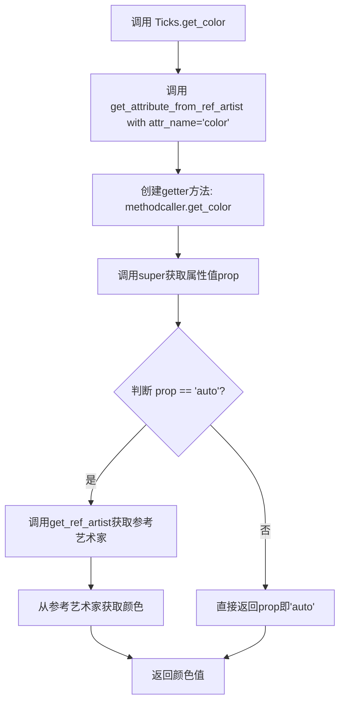

#### 带注释源码

```python
def get_color(self):
    """
    获取刻度线的颜色。
    
    如果颜色设置为'auto'，则从关联的轴的主要刻度线获取实际颜色值；
    否则直接返回'auto'。
    
    Returns
    -------
    任意
        刻度线的颜色值
    """
    return self.get_attribute_from_ref_artist("color")
```


### Ticks.get_markeredgecolor

获取标记边缘颜色。如果当前颜色设置为 "auto"，则从关联的轴的主要刻度线（tick1line）获取颜色；否则返回当前设置的颜色。

参数：

- （无参数，仅包含 self）

返回值：`Any`，返回标记边缘颜色值，通常是 RGBA 元组或颜色字符串

#### 流程图

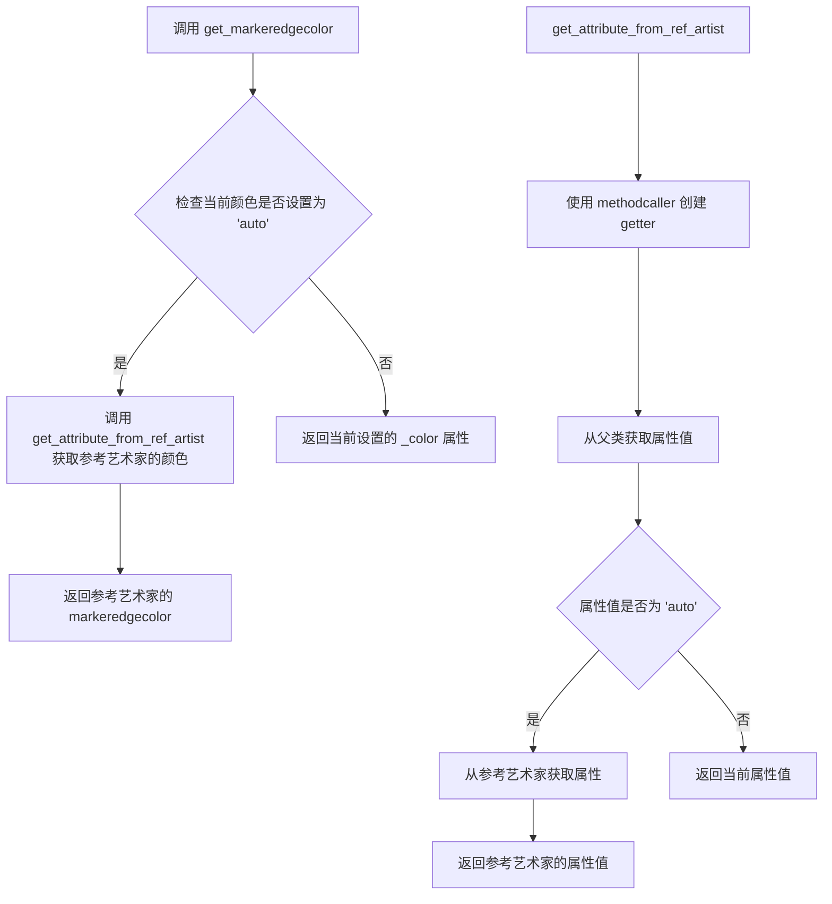

#### 带注释源码

```python
def get_markeredgecolor(self):
    """
    获取标记边缘颜色。
    
    如果当前颜色设置为 "auto"，则从关联的轴的主要刻度线
    (tick1line) 获取颜色；否则返回当前设置的颜色。
    
    Returns
    -------
    Any
        标记边缘颜色值，通常是 RGBA 元组或颜色字符串
    """
    # 调用继承自 AttributeCopier 的方法
    # 该方法会检查 _color 是否为 "auto"
    # 如果是 "auto"，则从参考艺术家（self._axis.majorTicks[0].tick1line）获取颜色
    # 否则直接返回当前设置的 _color 值
    return self.get_attribute_from_ref_artist("markeredgecolor")
```


### `Ticks.get_markeredgewidth`

获取刻度的标记边缘宽度。如果当前值设置为 "auto"，则从参考艺术家（axis 的 majorTicks[0].tick1line）获取实际值。

参数：
- 无

返回值：`float`，返回标记边缘宽度值（以点为单位）

#### 流程图

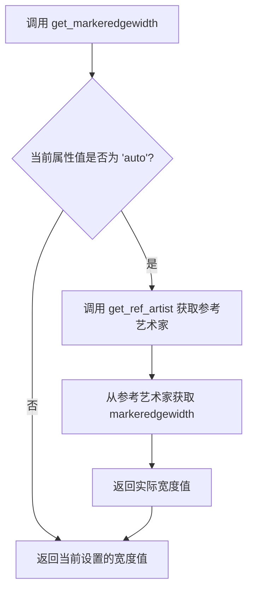

#### 带注释源码

```python
def get_markeredgewidth(self):
    """
    Get the marker edge width.
    
    Returns
    -------
    float
        The marker edge width in points.
    """
    # 调用 AttributeCopier.get_attribute_from_ref_artist 方法
    # 该方法检查当前属性值是否为 'auto'
    # 如果是 'auto'，则从参考艺术家（_axis.majorTicks[0].tick1line）获取实际值
    # 否则返回当前设置的属性值
    return self.get_attribute_from_ref_artist("markeredgewidth")
```

#### 相关方法源码

```python
class AttributeCopier:
    def get_attribute_from_ref_artist(self, attr_name):
        """
        Get the attribute value from the reference artist if the current
        value is 'auto', otherwise return the current value.
        
        Parameters
        ----------
        attr_name : str
            The name of the attribute (without 'get_' prefix).
        
        Returns
        -------
        any
            The attribute value.
        """
        # 创建一个 methodcaller 来调用 get_{attr_name} 方法
        getter = methodcaller("get_" + attr_name)
        # 获取当前对象的属性值
        prop = getter(super())
        # 如果属性值是 'auto'，则从参考艺术家获取实际值
        # 否则返回当前设置的属性值
        return getter(self.get_ref_artist()) if prop == "auto" else prop
    
    def get_ref_artist(self):
        """
        Return the underlying artist that actually defines some properties
        (e.g., color) of this artist.
        """
        raise RuntimeError("get_ref_artist must overridden")
```

#### 使用说明

`get_markeredgewidth` 方法是 `Ticks` 类的一个便捷方法，用于获取刻度线的标记边缘宽度。在 `Ticks` 类的 `__init__` 方法中，如果未指定 `markeredgewidth` 参数，则会默认设置为 `"auto"`。当值为 `"auto"` 时，实际的宽度值会从关联的 axis 的第一个 major tick 的 `tick1line` 对象获取，从而保持与 Matplotlib 默认设置的一致性。这种设计允许用户通过简单地设置 `markeredgewidth` 为特定值或 `"auto"` 来灵活控制刻度线的外观。


### Ticks.set_tick_out

设置刻度是绘制在坐标轴内侧还是外侧。

参数：

- `b`：`bool`，布尔值，指定刻度的绘制方向。为 `True` 时刻度向外（背离坐标轴区域），为 `False` 时刻度向内（朝向坐标轴区域）。

返回值：`None`，无返回值，仅修改对象内部状态。

#### 流程图

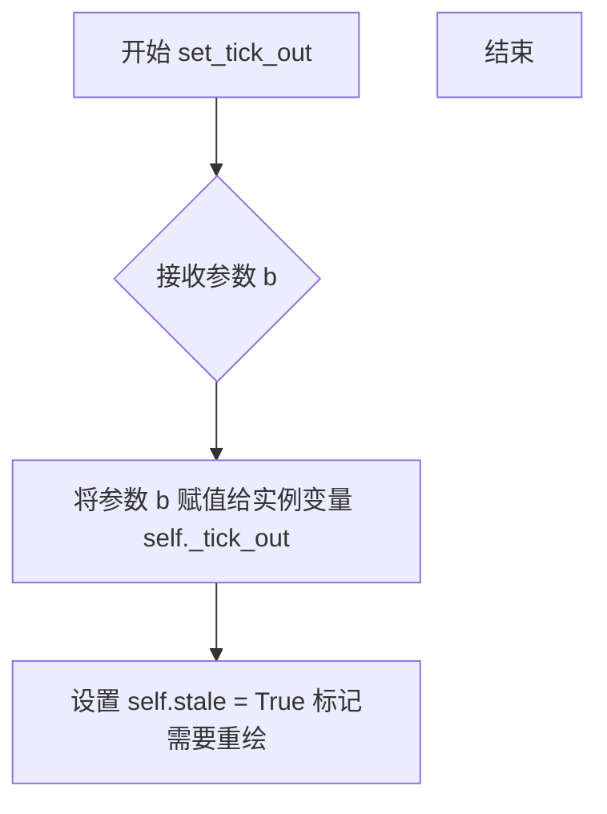

#### 带注释源码

```python
def set_tick_out(self, b):
    """
    Set whether ticks are drawn inside or outside the axes.
    
    Parameters
    ----------
    b : bool
        If True, ticks are drawn outside the axes (opposite to ticklabels).
        If False, ticks are drawn inside the axes (same side as ticklabels).
    
    Notes
    -----
    Ticks are by default on the opposite side of the ticklabels.
    To make ticks to the same side of the ticklabels, use set_tick_out(True).
    
    See Also
    --------
    get_tick_out : Returns the current tick direction setting.
    """
    self._tick_out = b
```


### `Ticks.get_tick_out`

该方法属于 `Ticks` 类，是一个简单的 Getter 访问器，用于获取私有属性 `_tick_out` 的值，该值控制了刻度线（Ticks）是绘制在坐标轴的内部还是外部。

参数：

- `self`：`Ticks`，隐式参数，调用此方法的类实例对象。

返回值：`bool`，返回 `True` 表示刻度线朝外（即指向坐标轴外侧）；返回 `False` 表示刻度线朝内。

#### 流程图

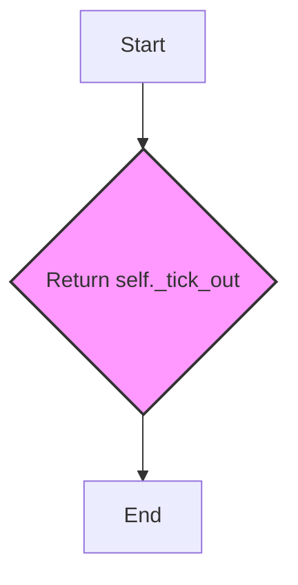

#### 带注释源码

```python
def get_tick_out(self):
    """
    Return whether ticks are drawn inside or outside the axes.
    
    Returns
    -------
    bool
        True if ticks are drawn outside (pointing outwards), False if inside.
    """
    # 直接返回实例属性 _tick_out，该属性在 __init__ 或 set_tick_out 中被赋值
    return self._tick_out
```


### Ticks.set_ticksize

该方法用于设置刻度线的长度（以磅为单位），是`Ticks`类的一个重要成员方法，用于控制坐标轴上刻度线的视觉大小。

参数：

- `ticksize`：`float`，设置刻度线的长度值，单位为磅（points）

返回值：`None`，该方法直接修改实例属性，不返回任何值

#### 流程图

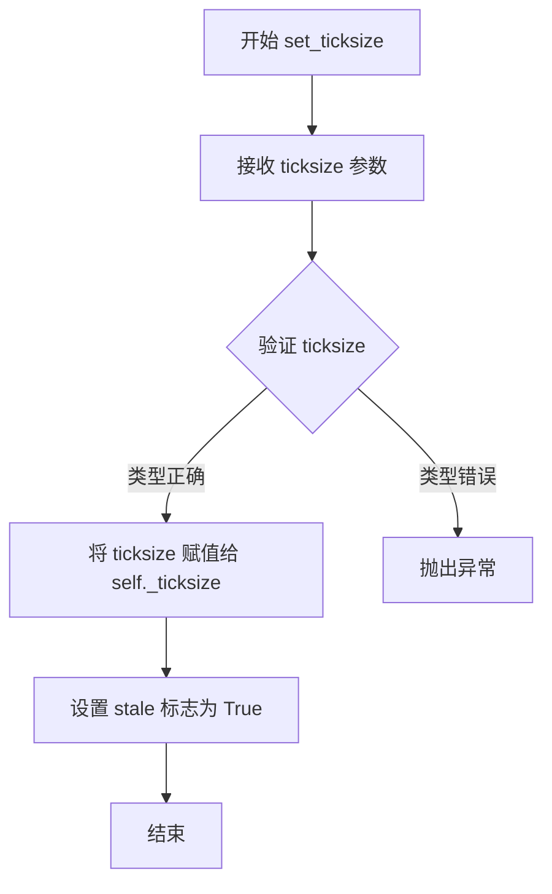

#### 带注释源码

```python
def set_ticksize(self, ticksize):
    """
    Set length of the ticks in points.
    
    Parameters
    ----------
    ticksize : float
        The length of the ticks in points.
    
    Notes
    -----
    This method sets the _ticksize attribute which is used during
    rendering to scale the tick marker. The actual visual size is
    determined by converting points to pixels using the renderer's
    DPI settings.
    """
    # 将传入的 ticksize 值直接赋值给实例属性 _ticksize
    # 该属性会在 draw 方法中被使用，通过 renderer.points_to_pixels()
    # 转换为实际的像素尺寸
    self._ticksize = ticksize
```

#### 关联方法说明

与`set_ticksize`紧密相关的方法包括：

1. **get_ticksize()**：获取当前刻度线长度
2. **draw()**：在渲染时使用`_ticksize`属性来计算刻度线的实际像素大小

```python
# draw 方法中使用 _ticksize 的代码片段
marker_transform = (Affine2D()
                    .scale(renderer.points_to_pixels(self._ticksize)))
```

这种设计使得刻度线长度可以在运行时动态调整，且修改后会自动影响后续的渲染结果。


### Ticks.get_ticksize

该方法用于获取刻度的长度，以点（points）为单位返回。

参数：
- 该方法无参数（除隐式self参数）

返回值：`float`，返回刻度的长度，单位为点（points）。

#### 流程图

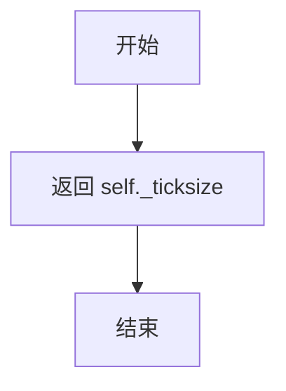

#### 带注释源码

```python
def get_ticksize(self):
    """
    Return length of the ticks in points.
    
    返回刻度的长度，单位为点（points）。
    
    Returns
    -------
    float
        刻度长度，以点为单位。
    """
    return self._ticksize
```


### `Ticks.set_locs_angles`

该方法用于设置刻度线（Tick）的位置和角度。它接收一个包含位置与角度数据的序列，并将其存储到实例属性 `self.locs_angles` 中，以便 `draw` 方法在渲染时能够获取正确的坐标和旋转信息。

参数：

-  `locs_angles`：`list` 或 `Iterable`，一个包含多个 `[位置, 角度]` 子列表的序列（如 `[[x1, angle1], [x2, angle2], ...]`），用于指定刻度在坐标轴上的位置及其旋转角度。

返回值：`None`，该方法无返回值。

#### 流程图

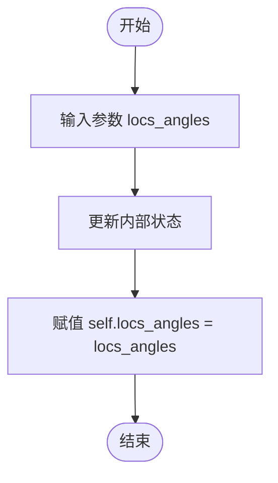

#### 带注释源码

```python
def set_locs_angles(self, locs_angles):
    # 参数 locs_angles 是一个列表，列表中的每个元素也是一个列表 [location, angle]
    # location: 刻度在轴上的坐标位置
    # angle: 刻度线的旋转角度（度）
    self.locs_angles = locs_angles
```


### Ticks.draw

该方法负责在渲染器上绘制刻度线（Ticks），包括设置图形上下文、计算变换矩阵、遍历刻度位置和角度，并在视口范围内绘制标记。

参数：

- `renderer`：`_RendererBase`，Matplotlib 渲染器对象，用于执行实际绘图操作

返回值：`None`，该方法直接在渲染器上绘制，不返回任何值

#### 流程图

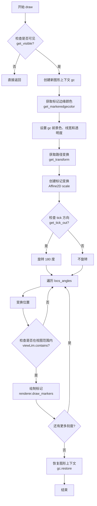

#### 带注释源码

```python
def draw(self, renderer):
    """
    Draw the ticks to the given renderer.

    Parameters
    ----------
    renderer : `~matplotlib.backend_bases.RendererBase`
        The renderer to use for drawing.
    """
    # 检查对象是否可见，如果不可见则直接返回，不进行绘制
    if not self.get_visible():
        return

    # 创建新的图形上下文，用于管理绘图状态
    gc = renderer.new_gc()
    
    # 获取标记边缘颜色并转换为 RGBA 格式
    edgecolor = mcolors.to_rgba(self.get_markeredgecolor())
    
    # 设置图形上下文的前景色（包含 RGBA 标识）
    gc.set_foreground(edgecolor, isRGBA=True)
    
    # 设置线宽为标记边缘宽度
    gc.set_linewidth(self.get_markeredgewidth())
    
    # 设置透明度
    gc.set_alpha(self._alpha)

    # 获取从数据坐标到显示坐标的变换
    path_trans = self.get_transform()
    
    # 创建标记变换：首先根据渲染器将刻度大小从点数转换为像素，然后进行缩放
    marker_transform = (
        Affine2D()
        .scale(renderer.points_to_pixels(self._ticksize))
    )
    
    # 如果刻度向外绘制（tick_out 为 True），则旋转 180 度
    if self.get_tick_out():
        marker_transform.rotate_deg(180)

    # 遍历所有刻度的位置和角度
    for loc, angle in self.locs_angles:
        # 将刻度位置从数据坐标变换到显示坐标
        locs = path_trans.transform_non_affine(np.array([loc]))
        
        # 检查当前刻度是否在 axes 的视图范围内，如果在则跳过
        if self.axes and not self.axes.viewLim.contains(*locs[0]):
            continue
        
        # 绘制标记：组合标记变换和角度旋转，绘制到指定位置
        renderer.draw_markers(
            gc,  # 图形上下文
            self._tickvert_path,  # 标记路径（垂直线段）
            marker_transform + Affine2D().rotate_deg(angle),  # 组合变换
            Path(locs),  # 刻度位置路径
            path_trans.get_affine()  # 仿射变换
        )

    # 恢复图形上下文，释放资源
    gc.restore()
```


### `LabelBase.__init__`

该方法是`LabelBase`类的构造函数，用于初始化轴标签和刻度标签的基类属性。它设置了位置和角度列表、参考角度、偏移半径等核心属性，并配置文本的旋转模式。

参数：

- `*args`：可变位置参数，传递给父类`mtext.Text`的初始化器，用于设置文本的基本属性（如位置、文本内容等）
- `**kwargs`：可变关键字参数，传递给父类`mtext.Text`的初始化器，用于设置文本的样式属性（如颜色、字体大小等）

返回值：`None`，无返回值（构造函数）

#### 流程图

```mermaid
flowchart TD
    A[开始 __init__] --> B[初始化 locs_angles_labels = []]
    B --> C[初始化 _ref_angle = 0]
    C --> D[初始化 _offset_radius = 0.0]
    D --> E[调用父类 Text.__init__(*args, **kwargs)]
    E --> F[设置旋转模式为 anchor]
    F --> G[设置 _text_follow_ref_angle = True]
    G --> H[结束]
```

#### 带注释源码

```python
def __init__(self, *args, **kwargs):
    """
    初始化 LabelBase 类的实例。
    
    参数
    ----------
    *args : 可变位置参数
        传递给父类 mtext.Text 的位置参数，用于设置文本的位置和内容等。
    **kwargs : 可变关键字参数
        传递给父类 mtext.Text 的关键字参数，用于设置文本样式属性。
    """
    # 初始化存储刻度标签位置、角度和文本的列表
    # 该列表在后续 draw 方法中会被使用来渲染标签
    self.locs_angles_labels = []
    
    # 参考角度，用于计算文本的偏移方向
    # 在 AxisLabel 和 TickLabels 子类中会被更新为实际的角度值
    self._ref_angle = 0
    
    # 偏移半径，决定标签相对于参考点的偏移距离
    # 单位通常为点数(points)，会在 draw 时转换为像素
    self._offset_radius = 0.

    # 调用父类 Text 的初始化方法
    # 这里继承自 matplotlib.text.Text，设置基本的文本属性
    super().__init__(*args, **kwargs)

    # 设置旋转模式为 "anchor"
    # 这使得文本围绕锚点旋转，而不是围绕左下角
    # 配合 set_va 和 set_ha 实现文本的对齐
    self.set_rotation_mode("anchor")
    
    # 标志位：是否跟随参考角度计算文本角度
    # 当为 True 时，文本角度 = _ref_angle + 90
    # 当为 False 时，文本角度 = 0
    self._text_follow_ref_angle = True
```


### `LabelBase._text_ref_angle`

该属性是 `LabelBase` 类中的一个计算属性，用于获取文本的参考角度。当 `_text_follow_ref_angle` 为 `True` 时，返回 `_ref_angle + 90` 度；否则返回 0 度。这个属性在文本绘制和位置计算时起到关键作用，用于确定文本的旋转角度。

参数： 无（该方法为属性，无显式参数）

返回值：`float`，返回文本的参考角度值。

#### 流程图

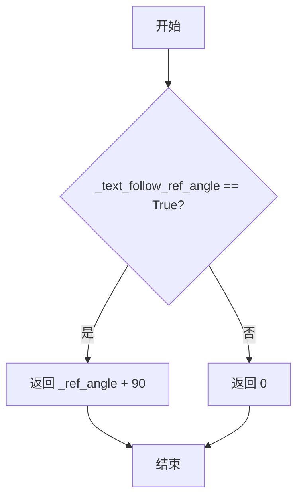

#### 带注释源码

```python
@property
def _text_ref_angle(self):
    """
    获取文本的参考角度。

    该属性根据 _text_follow_ref_angle 标志决定文本的旋转参考角度。
    当启用文本跟随参考角度时，返回基础参考角度加上90度；
    否则返回0度，使得文本保持默认方向。

    Returns
    -------
    float
        文本的参考角度（度）。
    """
    if self._text_follow_ref_angle:
        return self._ref_angle + 90
    else:
        return 0
```


### `LabelBase._offset_ref_angle`

该属性是 `LabelBase` 类的一个只读属性，用于返回内部存储的参考角度值 `_ref_angle`，该角度值用于计算文本标签的偏移位置和旋转角度。

参数：
- 无显式参数（该方法为属性访问器，隐式接收 `self` 实例）

返回值：`float`，返回参考角度值（以度为单位），用于确定文本标签相对于轴的偏移方向。

#### 流程图

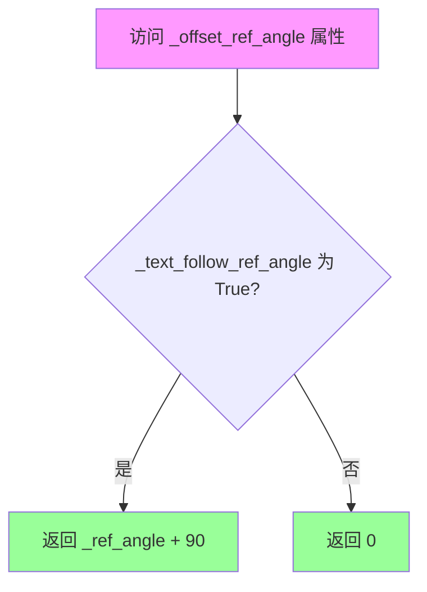

> **注意**：上述流程图实际对应的是 `_text_ref_angle` 属性。对于 `_offset_ref_angle` 属性，其逻辑更为简单：

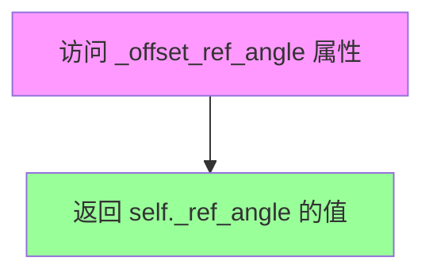

#### 带注释源码

```python
@property
def _offset_ref_angle(self):
    """
    返回用于计算文本偏移的参考角度。
    
    该属性直接返回内部存储的 _ref_angle 值，该值在绘制过程中
    用于计算文本标签的偏移向量（dx, dy）。偏移量通过以下公式计算：
    
        dx = offset_radius * cos(offset_ref_angle)
        dy = offset_radius * sin(offset_ref_angle)
    
    Returns
    -------
    float
        参考角度值（单位为度）
    """
    return self._ref_angle
```


### `LabelBase._get_opposite_direction`

该方法是一个类属性，用于获取轴方向的相反方向。它通过字典的 `__getitem__` 方法实现，将 "left"、"right"、"top"、"bottom" 四个方向映射到其相反方向。

参数：

- `direction`：字符串类型，表示输入的方向（"left"、"right"、"top" 或 "bottom"）

返回值：字符串类型，返回输入方向的相反方向。

#### 流程图

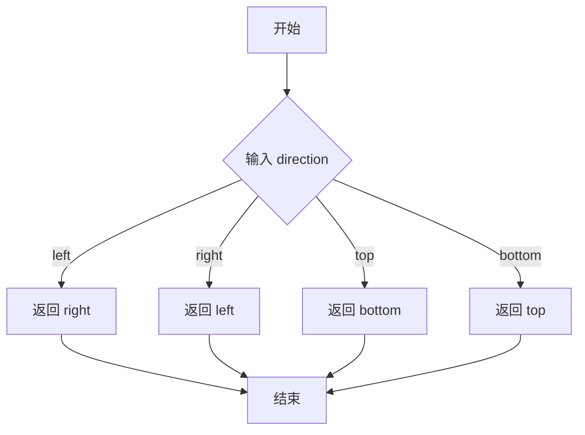

#### 带注释源码

```python
class LabelBase(mtext.Text):
    """
    A base class for `.AxisLabel` and `.TickLabels`. The position and
    angle of the text are calculated by the offset_ref_angle,
    text_ref_angle, and offset_radius attributes.
    """

    def __init__(self, *args, **kwargs):
        self.locs_angles_labels = []
        self._ref_angle = 0
        self._offset_radius = 0.

        super().__init__(*args, **kwargs)

        self.set_rotation_mode("anchor")
        self._text_follow_ref_angle = True

    @property
    def _text_ref_angle(self):
        if self._text_follow_ref_angle:
            return self._ref_angle + 90
        else:
            return 0

    @property
    def _offset_ref_angle(self):
        return self._ref_angle

    # 类属性：定义方向映射关系，将方向映射到其相反方向
    # 使用字典的 __getitem__ 方法作为可调用对象
    _get_opposite_direction = {"left": "right",
                               "right": "left",
                               "top": "bottom",
                               "bottom": "top"}.__getitem__
```


### LabelBase.draw

该方法是标签基类的绘制方法，负责在渲染器上绘制文本标签。它通过计算偏移角度和偏移半径来调整文本的位置和旋转角度，并在绘制前后保存和恢复原始的变换和旋转属性。

参数：

- `renderer`：`RendererBase`，matplotlib 的渲染器对象，用于在画布上绘制图形元素

返回值：`None`，该方法直接调用父类的 draw 方法完成绘制，不返回任何值

#### 流程图

```mermaid
flowchart TD
    A[开始 draw 方法] --> B{检查是否可见<br/>get_visible}
    B -->|不可见| C[直接返回]
    B -->|可见| D[保存原始变换<br/>tr = get_transform]
    D --> E[保存原始旋转角度<br/>angle_orig = get_rotation]
    E --> F[计算偏移角度弧度<br/>theta = deg2rad<br/>_offset_ref_angle]
    F --> G[计算偏移量<br/>dx = dd * cos<br/>dy = dd * sin]
    G --> H[应用平移变换<br/>set_transform<br/>tr + translate]
    H --> I[设置旋转角度<br/>set_rotation<br/>_text_ref_angle + angle_orig]
    I --> J[调用父类 draw<br/>super.draw renderer]
    J --> K[恢复原始变换<br/>set_transform tr]
    K --> L[恢复原始旋转<br/>set_rotation angle_orig]
    L --> M[结束]
```

#### 带注释源码

```python
def draw(self, renderer):
    """
    绘制标签到指定的渲染器上。
    
    该方法通过计算偏移角度和偏移半径来调整文本的位置和旋转角度，
    在绘制前后保存和恢复原始的变换和旋转属性。
    
    Parameters
    ----------
    renderer : RendererBase
        matplotlib 的渲染器对象，用于在画布上绘制图形元素
    """
    # 检查标签是否可见，如果不可见则直接返回，不进行绘制
    if not self.get_visible():
        return

    # 保存原始的变换对象，以便之后恢复
    tr = self.get_transform()
    
    # 保存原始的旋转角度，以便之后恢复
    angle_orig = self.get_rotation()
    
    # 将偏移参考角度从度转换为弧度
    theta = np.deg2rad(self._offset_ref_angle)
    
    # 获取偏移半径（偏移距离）
    dd = self._offset_radius
    
    # 根据偏移角度和偏移半径计算 x 和 y 方向的偏移量
    dx, dy = dd * np.cos(theta), dd * np.sin(theta)

    # 应用平移变换：在原始变换基础上加上偏移量
    # Affine2D().translate(dx, dy) 创建平移变换
    self.set_transform(tr + Affine2D().translate(dx, dy))
    
    # 设置旋转角度：文本参考角度加上原始旋转角度
    self.set_rotation(self._text_ref_angle + angle_orig)
    
    # 调用父类的 draw 方法完成实际绘制
    # super() 指 mtext.Text 类
    super().draw(renderer)
    
    # 恢复原始的变换属性
    self.set_transform(tr)
    
    # 恢复原始的旋转角度
    self.set_rotation(angle_orig)
```


### `LabelBase.get_window_extent`

该方法用于获取标签的窗口边界框（BoundingBox），在计算过程中会临时应用基于 `offset_ref_angle` 和 `offset_radius` 的仿射变换，以得到正确的包含偏移量的边界框，最后恢复原始属性并返回结果。

参数：

- `renderer`：`matplotlib.backends.backend_xxx.RendererBase | None`，渲染器对象。如果为 `None`，则自动从根figure获取。

返回值：`matplotlib.transforms.Bbox`，返回包含标签文本在窗口坐标中的边界框。

#### 流程图

```mermaid
flowchart TD
    A[开始 get_window_extent] --> B{renderer is None?}
    B -->|是| C[从根figure获取渲染器]
    B -->|否| D[使用传入的renderer]
    C --> E[保存原始transform和rotation]
    D --> E
    E --> F[计算偏移角度theta和偏移量dd]
    F --> G[计算dx, dy偏移坐标]
    G --> H[临时设置变换: tr + 平移(dx, dy)]
    H --> I[临时设置旋转: _text_ref_angle + angle_orig]
    I --> J[调用父类get_window_extent获取边界框]
    J --> K[恢复原始transform]
    K --> L[恢复原始rotation]
    L --> M[返回边界框]
```

#### 带注释源码

```python
def get_window_extent(self, renderer=None):
    """
    获取标签的窗口边界框。

    Parameters
    ----------
    renderer : Renderer, optional
        渲染器对象。如果为 None，则自动从根 figure 获取。

    Returns
    -------
    Bbox
        包含标签文本在窗口坐标中的边界框。
    """
    # 如果没有提供渲染器，则从根 figure 获取
    if renderer is None:
        renderer = self.get_figure(root=True)._get_renderer()

    # 保存原始变换（transform）和旋转角度，以便后续恢复
    tr = self.get_transform()
    angle_orig = self.get_rotation()

    # 将偏移参考角度从度转换为弧度
    theta = np.deg2rad(self._offset_ref_angle)
    # 获取偏移半径（以点为单位）
    dd = self._offset_radius

    # 根据偏移角度和半径计算 x 和 y 方向的偏移量
    dx, dy = dd * np.cos(theta), dd * np.sin(theta)

    # 临时应用变换：在原始变换基础上加上平移变换
    self.set_transform(tr + Affine2D().translate(dx, dy))
    # 临时应用旋转：基于参考角度和原始旋转角度的总和
    self.set_rotation(self._text_ref_angle + angle_orig)

    # 调用父类 (mtext.Text) 的 get_window_extent 方法获取边界框
    # .frozen() 用于创建一个不可变的副本
    bbox = super().get_window_extent(renderer).frozen()

    # 恢复原始属性，确保不影响后续的绘制或其他计算
    self.set_transform(tr)
    self.set_rotation(angle_orig)

    # 返回计算得到的边界框
    return bbox
```


### `AxisLabel.__init__`

该方法是 `AxisLabel` 类的构造函数，用于初始化轴标签对象。它接受可变参数、轴方向和轴对象，并设置默认的内部填充值（5像素）和外部填充值（0），然后调用父类 `LabelBase` 的初始化方法，最后根据传入的轴方向设置文本对齐和角度。

参数：

- `*args`：可变位置参数，传递给父类 `LabelBase` 的初始化方法，用于设置文本属性（如文本内容、位置等）
- `axis_direction`：字符串，默认为 `"bottom"`，表示轴的方向，可选值为 `"left"`、`"bottom"`、`"right"`、`"top"`
- `axis`：轴对象，默认为 `None`，用于关联对应的坐标轴
- `**kwargs`：可变关键字参数，传递给父类 `LabelBase` 的初始化方法，用于设置文本样式（如颜色、字体大小等）

返回值：`None`，构造函数无返回值

#### 流程图

```mermaid
flowchart TD
    A[开始 __init__] --> B[保存 axis 引用到 self._axis]
    B --> C[设置 self._pad = 5]
    C --> D[设置 self._external_pad = 0]
    D --> E[调用 LabelBase.__init__ 初始化父类]
    E --> F[调用 set_axis_direction 设置轴方向]
    F --> G[结束 __init__]
```

#### 带注释源码

```python
def __init__(self, *args, axis_direction="bottom", axis=None, **kwargs):
    """
    初始化 AxisLabel 对象。

    Parameters
    ----------
    *args : 可变位置参数
        传递给父类 LabelBase 的参数，用于设置文本内容、位置等属性。
    axis_direction : str, optional
        轴的方向，默认为 "bottom"，可选值为 "left", "bottom", "right", "top"。
        该参数决定文本的对齐方式和旋转角度。
    axis : object, optional
        关联的轴对象，用于获取标签的引用艺术家属性（如颜色），默认为 None。
    **kwargs : 可变关键字参数
        传递给父类 LabelBase 的关键字参数，用于设置文本样式属性。
    """
    # 保存轴引用，用于后续获取引用艺术家的属性（如颜色、字体等）
    self._axis = axis
    
    # 设置内部填充值（单位：点），默认为5
    # 该值表示轴标签与刻度标签之间的基础距离
    self._pad = 5
    
    # 外部填充值（单位：像素），默认为0
    # 该值由 AxisArtist 自动计算并设置，用于精确控制标签位置
    self._external_pad = 0  # in pixels
    
    # 调用父类 LabelBase 的初始化方法
    # 初始化文本属性（位置、旋转模式等）
    LabelBase.__init__(self, *args, **kwargs)
    
    # 根据轴方向设置文本的默认对齐方式和角度
    # 这确保轴标签遵循 Matplotlib 的约定：
    # - bottom: 顶部对齐，水平居中，角度0
    # - top: 底部对齐，水平居中，角度180
    # - left: 右侧对齐，水平右对齐，角度180
    # - right: 左侧对齐，水平右对齐，角度0
    self.set_axis_direction(axis_direction)
```


### `AxisLabel.set_pad`

设置AxisLabel的内部间距（padding），以points为单位。实际间距是内部间距与外部间距（由AxisArtist自动设置）的总和。

参数：

- `pad`：`float`，内部间距值，以points为单位

返回值：`None`，无返回值（该方法为setter）

#### 流程图

```mermaid
flowchart TD
    A[开始 set_pad] --> B{接收 pad 参数}
    B --> C[将 pad 赋值给 self._pad]
    C --> D[标记对象需要重绘 stale=True]
    D --> E[结束]
```

#### 带注释源码

```python
def set_pad(self, pad):
    """
    Set the internal pad in points.

    The actual pad will be the sum of the internal pad and the
    external pad (the latter is set automatically by the `.AxisArtist`).

    Parameters
    ----------
    pad : float
        The internal pad in points.
    """
    self._pad = pad  # 将传入的pad值存储到实例属性_pad中
```


### `AxisLabel.get_pad`

该方法用于获取轴标签的内部间距（pad）值，以点（points）为单位返回。这是一个简单的getter访问器方法，用于访问`AxisLabel`对象在初始化时设置或通过`set_pad`方法修改的`_pad`属性。

参数：
- 无（仅包含`self`参数）

返回值：`float`，返回内部间距值，以点（points）为单位。

#### 流程图

```mermaid
flowchart TD
    A[开始 get_pad] --> B{方法调用}
    B --> C[直接返回 self._pad 属性值]
    C --> D[结束并返回 float 类型的 pad 值]
```

#### 带注释源码

```python
def get_pad(self):
    """
    Return the internal pad in points.

    See `.set_pad` for more details.
    """
    # 返回存储在实例属性 _pad 中的数值
    # 默认值为 5（在 __init__ 中设置）
    # 该值表示轴标签与刻度标签之间的内部间距
    return self._pad
```


### `AxisLabel.get_ref_artist`

该方法是 `AxisLabel` 类中用于获取底层参考 artist 的函数。`AxisLabel` 继承自 `AttributeCopier` 类，通过 `get_ref_artist` 方法返回实际定义某些属性（如颜色）的底层 artist，从而实现属性的自动继承机制。当属性值设为 "auto" 时，会从参考 artist 获取相应的属性值。

参数： 无

返回值：`matplotlib artist`，返回底层定义属性（如颜色）的实际 artist 对象。在 `AxisLabel` 的实现中，返回的是 `self._axis.label`，即 axis 的标签对象。

#### 流程图

```mermaid
graph TD
    A[开始 get_ref_artist] --> B{返回 self._axis.label}
    B --> C[结束]
```

#### 带注释源码

```python
def get_ref_artist(self):
    """
    Return the underlying artist that actually defines some properties
    (e.g., color) of this artist.
    """
    # docstring inherited
    # 返回底层 axis 的 label 对象，作为属性继承的参考 artist
    # 当属性值为 "auto" 时，会从该参考 artist 获取实际属性值
    return self._axis.label
```


### `AxisLabel.get_text`

该方法用于获取轴标签的文本内容。如果内部文本被设置为特殊标记 `"__from_axes__"`，则返回实际 axes 对象的标签文本；否则返回内部存储的文本。

参数： 无

返回值：`str`，返回轴标签的文本内容。如果文本为 `"__from_axes__"` 则返回底层 axis 对象的标签文本，否则返回自身存储的文本。

#### 流程图

```mermaid
flowchart TD
    A[开始 get_text] --> B[调用父类 Text.get_text 获取内部文本 t]
    B --> C{判断 t == '__from_axes__'?}
    C -->|是| D[返回 self._axis.label.get_text]
    C -->|否| E[返回 self._text]
    D --> F[结束]
    E --> F
```

#### 带注释源码

```python
def get_text(self):
    """
    获取轴标签的文本内容。
    
    如果内部文本被设置为特殊标记 "__from_axes__"，则委托给底层
    axis 对象的 label 来获取实际文本。这允许 AxisLabel 动态显示
    来自 axes 的标签内容。
    """
    # 调用父类 Text 的 get_text 方法获取当前设置的文本
    t = super().get_text()
    
    # 检查是否为特殊标记 "__from_axes__"
    # 这是一种机制，允许 AxisLabel 显示来自底层 axis 对象的标签
    if t == "__from_axes__":
        # 从底层 axis 对象获取标签文本并返回
        return self._axis.label.get_text()
    
    # 否则返回自身存储的文本内容
    return self._text
```


### `AxisLabel.set_default_alignment`

该方法用于根据传入的轴方向设置默认的对齐方式（垂直对齐和水平对齐），以确保轴标签在不同方向（left、right、bottom、top）下能够按照Matplotlib约定正确对齐。

参数：

-  `d`：`str`，指定轴方向，必须是 "left"、"bottom"、"right" 或 "top" 之一

返回值：`None`，该方法无返回值，直接修改对象的内部状态

#### 流程图

```mermaid
flowchart TD
    A[开始 set_default_alignment] --> B{验证参数 d 是否在 _default_alignments 中}
    B -->|是| C[从 _default_alignments 获取 va 和 ha]
    B -->|否| D[抛出 KeyError 异常]
    C --> E[调用 self.set_va 设置垂直对齐]
    E --> F[调用 self.set_ha 设置水平对齐]
    F --> G[结束]
```

#### 带注释源码

```python
def set_default_alignment(self, d):
    """
    Set the default alignment. See `set_axis_direction` for details.

    Parameters
    ----------
    d : {"left", "bottom", "right", "top"}
    """
    # 从 _default_alignments 字典中获取指定方向对应的对齐方式
    # _default_alignments 定义如下:
    # dict(left=("bottom", "center"),
    #      right=("top", "center"),
    #      bottom=("top", "center"),
    #      top=("bottom", "center"))
    # 其中元组的第一个元素是垂直对齐(va)，第二个是水平对齐(ha)
    va, ha = _api.getitem_checked(self._default_alignments, d=d)
    
    # 设置垂直对齐方式
    self.set_va(va)
    
    # 设置水平对齐方式
    self.set_ha(ha)
```


### AxisLabel.set_default_angle

该方法用于根据坐标轴方向设置轴标签的默认旋转角度，属于 `AxisLabel` 类的一部分，通过调用 `_api.getitem_checked` 从预定义的 `_default_angles` 字典中获取对应方向的角度值，并调用 `set_rotation` 设置文本旋转角度。

参数：

- `d`：`str`，表示坐标轴方向，必须是 "left"、"bottom"、"right" 或 "top" 之一

返回值：`None`，该方法直接修改对象的内部状态，不返回任何值

#### 流程图

```mermaid
flowchart TD
    A[开始 set_default_angle] --> B{验证参数 d 是否合法}
    B -->|合法| C[从 _default_angles 字典获取对应角度]
    B -->|不合法| D[抛出 KeyError 或异常]
    C --> E[调用 set_rotation 设置旋转角度]
    E --> F[结束]
```

#### 带注释源码

```python
_default_angles = dict(left=180,
                       right=0,
                       bottom=0,
                       top=180)

def set_default_angle(self, d):
    """
    Set the default angle. See `set_axis_direction` for details.

    Parameters
    ----------
    d : {"left", "bottom", "right", "top"}
    """
    # 使用 _api.getitem_checked 从预定义的 _default_angles 字典中获取
    # 对应方向 d 的角度值，如果 d 不在字典中则会抛出适当的异常
    self.set_rotation(_api.getitem_checked(self._default_angles, d=d))
```


### `AxisLabel.set_axis_direction`

该方法用于根据 Matplotlib 约定调整轴标签的文本角度和文本对齐方式，支持 "left"、"bottom"、"right"、"top" 四个方向，并根据方向设置对应的垂直对齐（va）、水平对齐（ha）和旋转角度。

参数：

- `d`：`str`，必须为 "left"、"bottom"、"right" 或 "top" 之一，表示轴的方向

返回值：`None`，无返回值，仅设置对象属性

#### 流程图

```mermaid
flowchart TD
    A[开始 set_axis_direction] --> B{验证参数 d}
    B -->|合法| C[调用 set_default_alignment]
    C --> D[调用 set_default_angle]
    D --> E[设置 _axis_direction 属性]
    E --> F[结束]
    B -->|不合法| G[抛出异常]
```

#### 带注释源码

```python
def set_axis_direction(self, d):
    """
    Adjust the text angle and text alignment of axis label
    according to the matplotlib convention.

    =====================    ========== ========= ========== ==========
    Property                 left       bottom    right      top
    =====================    ========== ========= ========== ==========
    axislabel angle          180        0         0          180
    axislabel va             center     top       center     bottom
    axislabel ha             right      center    right      center
    =====================    ========== ========= ========== ==========

    Note that the text angles are actually relative to (90 + angle
    of the direction to the ticklabel), which gives 0 for bottom
    axis.

    Parameters
    ----------
    d : {"left", "bottom", "right", "top"}
        轴方向，必须为 left、bottom、right 或 top 之一
    """
    # 设置默认对齐方式（va 和 ha）
    self.set_default_alignment(d)
    # 设置默认角度（旋转角度）
    self.set_default_angle(d)
    # 注意：该方法内部还会设置 self._axis_direction 属性
    # 但在当前代码片段中未显式显示，需查看调用处或类初始化
```


### `AxisLabel.get_color`

获取轴标签的颜色。如果颜色设置为 "auto"，则返回底层参考艺术家的颜色。

参数：

- 无

返回值：`颜色类型`，返回轴标签的颜色，如果属性值为 "auto"，则返回参考艺术家的颜色

#### 流程图

```mermaid
flowchart TD
    A[调用 get_color] --> B[调用 get_attribute_from_ref_artist]
    B --> C{当前颜色是否为 'auto'}
    C -->|是| D[获取参考艺术家<br/>self._axis.label]
    C -->|否| E[返回当前颜色值]
    D --> F[调用参考艺术家的 get_color]
    F --> E
```

#### 带注释源码

```python
def get_color(self):
    """
    获取轴标签的颜色。

    如果颜色属性设置为 "auto"，则从底层参考艺术家（即 axis.label）获取颜色。
    否则返回当前设置的颜色值。

    Returns
    -------
    颜色类型
        轴标签的颜色值（RGBA元组或颜色名称字符串）
    """
    # 调用继承自 AttributeCopier 的 get_attribute_from_ref_artist 方法
    # 参数 "color" 指定要获取的属性名
    return self.get_attribute_from_ref_artist("color")
    # 该方法内部逻辑：
    # 1. 首先通过 super() 获取当前对象的 color 属性
    # 2. 如果属性值为 "auto"，则调用 self.get_ref_artist().get_color()
    #    获取参考艺术家的颜色（参考艺术家为 self._axis.label）
    # 3. 否则直接返回当前属性值
```


### AxisLabel.draw

该方法负责绘制坐标轴标签。首先检查标签是否可见，如果不可见则直接返回；然后计算偏移半径（外部填充与内部填充之和），并调用父类的 draw 方法完成实际绘制。

参数：

- `renderer`：`matplotlib.backend_bases.RendererBase`，渲染器对象，用于将点转换为像素单位并执行绘制操作

返回值：`None`，该方法无返回值，通过修改内部状态影响绘制结果

#### 流程图

```mermaid
flowchart TD
    A[开始 draw] --> B{检查标签是否可见}
    B -->|不可见| C[直接返回]
    B -->|可见| D[计算偏移半径<br/>_offset_radius = _external_pad + renderer.points_to_pixels get_pad]
    D --> E[调用 LabelBase.draw renderer]
    E --> F[结束]
```

#### 带注释源码

```python
def draw(self, renderer):
    """
    绘制坐标轴标签。

    Parameters
    ----------
    renderer : matplotlib.backend_bases.RendererBase
        渲染器对象，用于执行实际的绘制操作和单位转换。
    """
    # 检查标签是否可见，如果不可见则直接返回，不进行任何绘制
    if not self.get_visible():
        return

    # 计算偏移半径：外部填充 + 内部填充（转换为像素）
    # _external_pad：由 AxisArtist 自动设置的外部填充（如刻度标签的高度）
    # get_pad()：返回内部填充值（单位为点）
    # renderer.points_to_pixels()：将点转换为像素
    self._offset_radius = \
        self._external_pad + renderer.points_to_pixels(self.get_pad())

    # 调用父类 LabelBase 的 draw 方法完成实际绘制
    # LabelBase.draw 会根据 _offset_radius 和 _ref_angle 计算最终位置和角度
    super().draw(renderer)
```


### `AxisLabel.get_window_extent`

该方法用于获取轴标签（AxisLabel）在画布上的窗口边界框（Bounding Box），考虑了内部填充（pad）和外部填充（external_pad）的偏移计算。如果标签不可见，则返回 `None`。

参数：

- `renderer`：`matplotlib.backend_bases.RendererBase | None`，渲染器对象。如果为 `None`，则自动从figure中获取默认渲染器。

返回值：`matplotlib.transforms.Bbox | None`，返回轴标签的窗口边界框对象。如果标签不可见则返回 `None`。

#### 流程图

```mermaid
flowchart TD
    A[开始 get_window_extent] --> B{renderer is None?}
    B -->|是| C[从figure获取渲染器]
    B -->|否| D[使用传入的renderer]
    C --> E{标签可见?}
    D --> E
    E -->|否| F[返回 None]
    E -->|是| G[计算总填充值 r = external_pad + points_to_pixels(pad)]
    G --> H[设置 _offset_radius = r]
    H --> I[调用父类 get_window_extent 获取边界框]
    I --> J[返回边界框 bb]
```

#### 带注释源码

```python
def get_window_extent(self, renderer=None):
    """
    获取轴标签在画布上的窗口边界框。

    Parameters
    ----------
    renderer : matplotlib.backend_bases.RendererBase, optional
        渲染器对象。如果为 None，则自动获取。

    Returns
    -------
    matplotlib.transforms.Bbox or None
        窗口边界框对象。如果标签不可见则返回 None。
    """
    # 如果未提供渲染器，则从figure中获取默认渲染器
    if renderer is None:
        renderer = self.get_figure(root=True)._get_renderer()
    
    # 如果标签不可见，直接返回 None
    if not self.get_visible():
        return

    # 计算总填充值：外部填充 + 转换为像素的内部填充
    r = self._external_pad + renderer.points_to_pixels(self.get_pad())
    
    # 设置偏移半径，用于后续计算文本位置
    self._offset_radius = r

    # 调用父类（LabelBase）的 get_window_extent 方法获取边界框
    bb = super().get_window_extent(renderer)

    # 返回计算得到的边界框
    return bb
```


### `TickLabels.__init__`

该方法是 `TickLabels` 类的构造函数。它负责初始化继承自 `AxisLabel` 的基类属性，并根据传入的 `axis_direction` 设置刻度标签的文本对齐方式和旋转角度，同时初始化用于计算轴标签内边距的内部状态。

参数：

- `axis_direction`：`str`，默认为 `"bottom"`。指定轴的方向（如 `"left"`, `"right"`, `"bottom"`, `"top"`），用于确定刻度标签的默认对齐方式、旋转角度以及偏移逻辑。
- `**kwargs`：可变关键字参数。这些参数会被直接传递给父类 `AxisLabel` 的构造函数，通常包含 `axis`（坐标轴对象）、`figure`（所属图形）等用于绘制和引用的属性。

返回值：`None`。构造函数不返回任何值。

#### 流程图

```mermaid
flowchart LR
    A([开始 TickLabels.__init__]) --> B[调用 super().__init__<br>初始化父类 AxisLabel/LabelBase/Text]
    --> C[调用 self.set_axis_direction<br>设置标签方向与对齐]
    --> D[设置 self._axislabel_pad = 0<br>初始化轴标签内边距]
    D --> E([结束])
```

#### 带注释源码

```python
def __init__(self, *, axis_direction="bottom", **kwargs):
    """
    Initialize the TickLabels object.

    Parameters
    ----------
    axis_direction : str, default "bottom"
        The direction of the axis ("left", "right", "bottom", "top").
        This determines the text alignment and angle.
    **kwargs
        Keyword arguments passed to the parent class constructor
        (e.g., axis, figure).
    """
    # 调用父类 AxisLabel 的构造函数，初始化 Text 相关的属性
    super().__init__(**kwargs)
    
    # 根据 axis_direction 设置标签的默认对齐方式和角度
    # 例如：bottom 为 baseline/center, 0度；left 为 center/right, 90度
    self.set_axis_direction(axis_direction)
    
    # 初始化内部变量，用于在绘制时计算轴标签(axis label)需要的额外间距
    self._axislabel_pad = 0
```


### `TickLabels.get_ref_artist`

该方法返回当前轴的第一个刻度标签作为参考艺术家，用于获取颜色等属性。当某些属性设置为"auto"时，会从该参考艺术家获取实际的属性值。

参数：

- 无显式参数（继承自父类）

返回值：`matplotlib.text.Text`，返回当前轴的第一个刻度标签文本对象，用于作为属性引用

#### 流程图

```mermaid
flowchart TD
    A[开始 get_ref_artist] --> B[获取 self._axis]
    B --> C[调用 self._axis.get_ticklabels]
    C --> D[获取返回列表的第一个元素]
    D --> E[返回该元素作为参考艺术家]
```

#### 带注释源码

```python
def get_ref_artist(self):
    """
    Return the underlying artist that actually defines some properties
    (e.g., color) of this artist.
    """
    # docstring inherited
    # 获取轴对象的所有刻度标签，然后返回第一个刻度标签作为参考艺术家
    # 这个参考艺术家用于当属性设置为"auto"时，获取实际的属性值（如颜色）
    return self._axis.get_ticklabels()[0]
```


### `TickLabels.set_axis_direction`

调整刻度标签的文本角度和文本对齐方式，以符合Matplotlib惯例。`label_direction`必须是[left, right, bottom, top]之一。

参数：

- `label_direction`：`str`，轴方向，必须是 {"left", "bottom", "right", "top"} 之一，用于指定刻度标签的方向

返回值：`None`，无返回值

#### 流程图

```mermaid
graph TD
    A[开始 set_axis_direction] --> B{检查 label_direction}
    B -->|有效方向| C[调用 set_default_alignment]
    C --> D[调用 set_default_angle]
    D --> E[设置实例变量 _axis_direction]
    E --> F[结束]
    B -->|无效方向| G[抛出异常或警告]
    G --> F
```

#### 带注释源码

```python
def set_axis_direction(self, label_direction):
    """
    Adjust the text angle and text alignment of ticklabels
    根据Matplotlib惯例调整刻度标签的文本角度和文本对齐方式。

    The *label_direction* must be one of [left, right, bottom, top].
    label_direction必须是[left, right, bottom, top]之一。

    =====================    ========== ========= ========== ==========
    Property                 left       bottom    right      top
    =====================    ========== ========= ========== ==========
    ticklabel angle          90         0         -90        180
    ticklabel va             center     baseline  center     baseline
    ticklabel ha             right      center    right      center
    =====================    ========== ========= ========== ==========

    Note that the text angles are actually relative to (90 + angle
    of the direction to the ticklabel), which gives 0 for bottom
    axis.
    注意：文本角度实际上是相对于(90 + 刻度标签方向的角度)，对于底部轴为0。

    Parameters
    ----------
    label_direction : {"left", "bottom", "right", "top"}
    """
    # 调用父类方法设置默认对齐方式(va, ha)
    # 根据label_direction设置vertical-alignment和horizontal-alignment
    self.set_default_alignment(label_direction)
    
    # 调用父类方法设置默认角度(旋转角度)
    # 根据label_direction设置文本旋转角度
    self.set_default_angle(label_direction)
    
    # 保存轴方向到实例变量，供其他方法使用
    self._axis_direction = label_direction
```


### `TickLabels.invert_axis_direction`

该方法用于将刻度标签的轴方向反转（切换到相反方向），例如将 "left" 切换为 "right"，"bottom" 切换为 "top"。它通过获取当前轴方向的相反方向，然后调用 `set_axis_direction` 方法来更新轴方向。

参数： 无

返回值：`None`，无返回值

#### 流程图

```mermaid
flowchart TD
    A[开始] --> B[调用 self._get_opposite_direction 获取当前轴方向的相反方向]
    B --> C{当前轴方向}
    C -->|left| D["返回 'right'"]
    C -->|right| E["返回 'left'"]
    C -->|bottom| F["返回 'top'"]
    C -->|top| G["返回 'bottom'"]
    D --> H[调用 self.set_axis_direction 设置新的轴方向]
    E --> H
    F --> H
    G --> H
    H --> I[结束]
```

#### 带注释源码

```python
def invert_axis_direction(self):
    """
    反转刻度标签的轴方向。

    该方法将当前的轴方向切换到相反的方向。例如：
    - "left" 变为 "right"
    - "right" 变为 "left"
    - "bottom" 变为 "top"
    - "top" 变为 "bottom"

    它首先通过调用继承自 LabelBase 的 _get_opposite_direction 方法
    获取当前轴方向的相反方向，然后使用 set_axis_direction 方法
    更新轴方向。
    """
    # 获取当前轴方向的相反方向
    # _get_opposite_direction 是从 LabelBase 类继承的字典查找方法
    label_direction = self._get_opposite_direction(self._axis_direction)
    
    # 使用获取到的相反方向设置新的轴方向
    # 这会更新对齐方式、角度等属性
    self.set_axis_direction(label_direction)
```


### `TickLabels._get_ticklabels_offsets`

该方法用于计算刻度标签相对于刻度线的偏移量及其总高度（用于后续计算坐标轴标签的间距）。它根据标签的方向（left/right/bottom/top）和对齐方式（va/ha）来确定偏移值和总高度。

参数：

- `renderer`：`matplotlib.backend_bases.RendererBase`，用于渲染文本以获取文本尺寸的渲染器对象
- `label_direction`：`str`，标签方向，可选值为 "left"、"right"、"bottom"、"top"，表示刻度标签所在的位置方向

返回值：`tuple[float, float]`，返回两个浮点数元组：
- 第一个值 `r`：刻度标签的偏移量（offset）
- 第二个值 `pad`：刻度标签的总高度（用于计算坐标轴标签的间距）

#### 流程图

```mermaid
flowchart TD
    A[开始 _get_ticklabels_offsets] --> B[获取文本宽高下降列表 whd_list]
    B --> C{whd_list 是否为空?}
    C -->|是| D[返回 (0, 0)]
    C -->|否| E[获取 va, ha 对齐方式]
    E --> F{label_direction == "left"?}
    F -->|是| G[计算 pad = 最大宽度]
    F -->|否| H{label_direction == "right"?}
    H -->|是| I[计算 pad = 最大宽度]
    H -->|否| J{label_direction == "bottom"?}
    J -->|是| K[计算 pad = 最大高度]
    J -->|否| L{label_direction == "top"?}
    L -->|是| M[计算 pad = 最大高度]
    L -->|否| N[返回 (r, pad)]
    
    G --> O{ha == "left"?}
    O -->|是| P[r = pad]
    O -->|否| Q{ha == "center"?}
    Q -->|是| R[r = 0.5 * pad]
    Q -->|否| S[r = 0]
    
    I --> T{ha == "right"?}
    T -->|是| U[r = pad]
    T -->|否| V{ha == "center"?}
    V -->|是| W[r = 0.5 * pad]
    V -->|否| X[r = 0]
    
    K --> Y{va == "bottom"?}
    Y -->|是| Z[r = pad]
    Y -->|否| AA{va == "center"?}
    AA -->|是| AB[r = 0.5 * pad]
    AA -->|否| AC{va == "baseline"?}
    AC -->|是| AD[计算 max_ascent 和 max_descent]
    AD --> AE[r = max_ascent, pad = max_ascent + max_descent]
    
    M --> AF{va == "top"?}
    AF -->|是| AG[r = pad]
    AF -->|否| AH{va == "center"?}
    AH -->|是| AI[r = 0.5 * pad]
    AH -->|否| AJ{va == "baseline"?}
    AJ -->|是| AK[计算 max_ascent 和 max_descent]
    AK --> AL[r = max_descent, pad = max_ascent + max_descent]
    
    P --> N
    R --> N
    S --> N
    U --> N
    W --> N
    X --> N
    Z --> N
    AB --> N
    AE --> N
    AG --> N
    AI --> N
    AL --> N
    N --> AM[返回 (r, pad)]
```

#### 带注释源码

```python
def _get_ticklabels_offsets(self, renderer, label_direction):
    """
    Calculate the ticklabel offsets from the tick and their total heights.

    The offset only takes account the offset due to the vertical alignment
    of the ticklabels: if axis direction is bottom and va is 'top', it will
    return 0; if va is 'baseline', it will return (height-descent).
    """
    # 获取所有刻度标签的 (宽度, 高度, 下降量) 列表
    whd_list = self.get_texts_widths_heights_descents(renderer)

    # 如果没有标签，返回 (0, 0)
    if not whd_list:
        return 0, 0

    # r: 偏移量初始值
    r = 0
    # 获取当前的对齐方式：va=垂直对齐, ha=水平对齐
    va, ha = self.get_va(), self.get_ha()

    # 根据标签方向分别处理
    if label_direction == "left":
        # 水平方向，取最大宽度作为 pad
        pad = max(w for w, h, d in whd_list)
        if ha == "left":
            r = pad
        elif ha == "center":
            r = .5 * pad
    elif label_direction == "right":
        # 水平方向，取最大宽度作为 pad
        pad = max(w for w, h, d in whd_list)
        if ha == "right":
            r = pad
        elif ha == "center":
            r = .5 * pad
    elif label_direction == "bottom":
        # 垂直方向，取最大高度作为 pad
        pad = max(h for w, h, d in whd_list)
        if va == "bottom":
            r = pad
        elif va == "center":
            r = .5 * pad
        elif va == "baseline":
            # baseline 对齐需要特殊计算
            # max_ascent = 最大上升量 (高度 - 下降量)
            # max_descent = 最大下降量
            max_ascent = max(h - d for w, h, d in whd_list)
            max_descent = max(d for w, h, d in whd_list)
            r = max_ascent  # 偏移量等于最大上升量
            pad = max_ascent + max_descent  # 总高度 = 上升量 + 下降量
    elif label_direction == "top":
        # 垂直方向，取最大高度作为 pad
        pad = max(h for w, h, d in whd_list)
        if va == "top":
            r = pad
        elif va == "center":
            r = .5 * pad
        elif va == "baseline":
            # baseline 对齐需要特殊计算
            max_ascent = max(h - d for w, h, d in whd_list)
            max_descent = max(d for w, h, d in whd_list)
            r = max_descent  # 偏移量等于最大下降量
            pad = max_ascent + max_descent  # 总高度 = 上升量 + 下降量

    # r : offset，偏移量
    # pad : total height of the ticklabels. This will be used to
    # calculate the pad for the axislabel.
    # pad: 刻度标签的总高度，用于计算坐标轴标签的间距
    return r, pad
```


### `TickLabels.draw`

该方法负责将所有刻度标签绘制到画布上。它首先检查可见性，然后计算标签的偏移量和总宽度，接着遍历每个刻度标签的位置、角度和文本，设置相应的属性并调用父类的绘制方法，最后保存用于绘制轴标签的总宽度信息。

参数：

- `renderer`：`matplotlib.backends.backend_xxxx.RendererBase`，渲染器对象，用于将图形绘制到画布

返回值：`None`，该方法直接在画布上绘制图形，不返回任何值

#### 流程图

```mermaid
flowchart TD
    A[开始 draw 方法] --> B{检查是否可见<br/>get_visible}
    B -->|不可见| C[设置 _axislabel_pad = _external_pad]
    B -->|可见| D[调用 _get_ticklabels_offsets<br/>计算偏移量和总宽度]
    D --> E[计算 pad = _external_pad + points_to_pixels<br/>设置 _offset_radius]
    E --> F{遍历 _locs_angles_labels}
    F -->|标签为空| G[continue 跳过]
    F -->|标签非空| H[设置 _ref_angle = a]
    H --> I[设置 x 坐标]
    I --> J[设置 y 坐标]
    J --> K[设置文本内容]
    K --> L[调用 LabelBase.draw 绘制单个标签]
    L --> F
    F --> M[设置 _axislabel_pad = total_width + pad<br/>用于轴标签绘制]
    M --> N[结束]
    C --> N
```

#### 带注释源码

```python
def draw(self, renderer):
    """
    绘制所有刻度标签到画布上。
    
    参数
    ----------
    renderer : RendererBase
        渲染器对象，负责将图形元素绘制到画布。
    """
    
    # 检查当前 TickLabels 对象是否可见
    if not self.get_visible():
        # 如果不可见，设置 _axislabel_pad 为外部填充值
        # 这个值后续会用于计算轴标签的位置
        self._axislabel_pad = self._external_pad
        return

    # 计算刻度标签的偏移量（从刻度线到标签的距离）
    # 以及所有标签的总宽度/高度（用于轴标签的布局计算）
    r, total_width = self._get_ticklabels_offsets(renderer,
                                                  self._axis_direction)

    # 计算最终填充值：外部填充 + 内部填充（转换为像素）
    pad = self._external_pad + renderer.points_to_pixels(self.get_pad())
    # 设置偏移半径，用于确定标签相对于刻度线的位置
    self._offset_radius = r + pad

    # 遍历所有刻度标签的位置、角度和文本内容
    # _locs_angles_labels 存储了 [(x, y), angle, label] 的列表
    for (x, y), a, l in self._locs_angles_labels:
        # 跳过空字符串标签
        if not l.strip():
            continue
        
        # 设置参考角度（影响文本的旋转方向）
        self._ref_angle = a
        # 设置标签的 x 坐标
        self.set_x(x)
        # 设置标签的 y 坐标
        self.set_y(y)
        # 设置标签的文本内容
        self.set_text(l)
        
        # 调用父类 LabelBase 的 draw 方法进行实际绘制
        # LabelBase.draw 会处理文本的变换（平移、旋转等）
        LabelBase.draw(self, renderer)

    # 保存计算得到的总宽度/高度，这个值会被 AxisArtist 用来
    # 计算轴标签与刻度标签之间的间距
    self._axislabel_pad = total_width + pad
```


### `TickLabels.set_locs_angles_labels`

设置刻度标签的位置、角度和文本内容。该方法存储刻度标签的坐标、旋转角度以及对应的文本字符串，供后续绘制和窗口范围计算使用。

参数：

-  `locs_angles_labels`：列表或可迭代对象，元素为包含三个元素的元组 `(loc, angle, label)`，其中 `loc` 为位置坐标（通常为二维元组 `(x, y)`），`angle` 为旋转角度（度），`label` 为刻度标签文本字符串

返回值：无（`None`）

#### 流程图

```mermaid
graph TD
    A[开始 set_locs_angles_labels] --> B[接收 locs_angles_labels 参数]
    B --> C[将参数赋值给实例属性 _locs_angles_labels]
    D[后续调用者] --> E[draw 方法或 get_window_extents 方法]
    E --> F[遍历 _locs_angles_labels]
    F --> G[对每个标签设置位置、角度和文本]
    G --> H[调用 LabelBase.draw 或 LabelBase.get_window_extent 渲染]
```

#### 带注释源码

```python
def set_locs_angles_labels(self, locs_angles_labels):
    """
    Set the locations, angles and labels of tick labels.

    This method stores the tick label data (positions, rotation angles,
    and text labels) which will be used during rendering in the draw()
    method and during bounding box calculation in get_window_extents().

    Parameters
    ----------
    locs_angles_labels : iterable
        An iterable of (loc, angle, label) tuples where:
        - loc: A tuple (x, y) representing the position of the tick label
        - angle: The rotation angle in degrees for the tick label
        - label: The text string for the tick label

    Returns
    -------
    None

    See Also
    --------
    TickLabels.draw : Method that uses _locs_angles_labels to render labels
    TickLabels.get_window_extents : Method that uses _locs_angles_labels to compute bounding boxes

    Notes
    -----
    The stored data is used by:
    1. draw() - to position and rotate each label during rendering
    2. get_window_extents() - to calculate the bounding boxes for all labels
    3. _get_ticklabels_offsets() - to compute the total width/height for axis label padding
    """
    self._locs_angles_labels = locs_angles_labels
```


### `TickLabels.get_window_extents`

该方法用于获取所有刻度标签的窗口边界框（Bbox），计算每个刻度标签在渲染时的位置和尺寸。如果不可见，则返回空列表。该方法还会计算并保存刻度标签的偏移量，供轴标签绘制时使用。

参数：

-  `renderer`：`matplotlib.backend_bases.RendererBase`，可选参数，渲染器对象。如果为 `None`，则自动从图中获取。

返回值：`list[matplotlib.transforms.Bbox]`，返回包含所有刻度标签边界框的列表。如果不可见则返回空列表。

#### 流程图

```mermaid
flowchart TD
    A[开始 get_window_extents] --> B{renderer 是否为 None?}
    B -->|是| C[从 figure 获取 renderer]
    B -->|否| D[继续]
    C --> D
    D --> E{是否可见?}
    E -->|否| F[设置 _axislabel_pad = _external_pad]
    E -->|是| G[计算 r 和 total_width]
    F --> H[返回空列表]
    G --> I[计算 pad]
    I --> J[设置 _offset_radius = r + pad]
    J --> K[遍历 _locs_angles_labels]
    K --> L{还有更多标签?}
    L -->|是| M[设置 _ref_angle]
    M --> N[设置 x, y, text]
    N --> O[调用 LabelBase.get_window_extent]
    O --> P[将 bb 加入 bboxes]
    P --> L
    L -->|否| Q[设置 _axislabel_pad = total_width + pad]
    Q --> R[返回 bboxes]
```

#### 带注释源码

```python
def get_window_extents(self, renderer=None):
    """
    获取所有刻度标签的窗口边界框。

    Parameters
    ----------
    renderer : matplotlib.backend_bases.RendererBase, optional
        渲染器对象。如果为 None，则自动从图中获取。

    Returns
    -------
    list of matplotlib.transforms.Bbox
        包含所有刻度标签边界框的列表。如果不可见则返回空列表。
    """
    # 如果没有提供 renderer，则从 figure 获取
    if renderer is None:
        renderer = self.get_figure(root=True)._get_renderer()

    # 如果不可见，设置轴标签偏移并返回空列表
    if not self.get_visible():
        self._axislabel_pad = self._external_pad
        return []

    bboxes = []

    # 计算刻度标签的偏移量和总宽度
    # _get_ticklabels_offsets 方法根据 axis_direction 和对齐方式计算
    r, total_width = self._get_ticklabels_offsets(renderer,
                                                  self._axis_direction)

    # 计算内外填充的总和（外部填充 + 转换为像素的内部填充）
    pad = self._external_pad + renderer.points_to_pixels(self.get_pad())
    # 设置偏移半径（用于确定标签位置）
    self._offset_radius = r + pad

    # 遍历所有刻度标签的位置、角度和文本
    for (x, y), a, l in self._locs_angles_labels:
        # 设置参考角度
        self._ref_angle = a
        # 设置标签位置和文本
        self.set_x(x)
        self.set_y(y)
        self.set_text(l)
        # 调用父类 LabelBase 的 get_window_extent 方法获取边界框
        bb = LabelBase.get_window_extent(self, renderer)
        bboxes.append(bb)

    # 保存的值将用于绘制轴标签
    self._axislabel_pad = total_width + pad

    return bboxes
```


### `TickLabels.get_texts_widths_heights_descents`

该方法用于获取所有刻度标签的文本度量信息（宽度、高度和下降值），返回包含每个非空标签尺寸元组的列表。

参数：

- `renderer`：`matplotlib.backend_bases.RendererBase`，用于获取文本度量信息的渲染器对象

返回值：`list[tuple[float, float, float]]`，返回由`(width, height, descent)`元组组成的列表，空标签会被过滤掉

#### 流程图

```mermaid
flowchart TD
    A[开始] --> B[初始化空列表 whd_list]
    B --> C{遍历 _locs_angles_labels}
    C -->|当前项| D{标签是否为空}
    D -->|是| C
    D -->|否| E[预处理数学文本]
    E --> F[调用 _get_text_metrics_with_cache 获取文本度量]
    F --> G[将度量结果添加到 whd_list]
    G --> C
    C -->|遍历完成| H[返回 whd_list]
    H --> I[结束]
```

#### 带注释源码

```python
def get_texts_widths_heights_descents(self, renderer):
    """
    Return a list of ``(width, height, descent)`` tuples for ticklabels.

    Empty labels are left out.
    """
    # 初始化用于存储文本度量结果的空列表
    whd_list = []
    
    # 遍历所有刻度标签的位置、角度和文本内容
    for _loc, _angle, label in self._locs_angles_labels:
        # 跳过空标签，只处理有实际内容的标签
        if not label.strip():
            continue
        
        # 对标签文本进行数学模式预处理，返回处理后的文本和是否处于数学模式
        clean_line, ismath = self._preprocess_math(label)
        
        # 使用渲染器获取文本的度量信息（宽度、高度、下降值）
        # 该函数使用缓存来提高性能
        whd = mtext._get_text_metrics_with_cache(
            renderer, clean_line, self._fontproperties, ismath=ismath,
            dpi=self.get_figure(root=True).dpi)
        
        # 将当前标签的度量信息添加到结果列表
        whd_list.append(whd)
    
    # 返回所有非空标签的度量信息列表
    return whd_list
```


### `GridlinesCollection.__init__`

这是 `GridlinesCollection` 类的构造函数，用于初始化网格线集合。它继承自 `LineCollection`，用于管理轴的网格线（主网格线或次网格线，x轴或y轴或两者）。

参数：

- `*args`：`可变位置参数`，传递给父类 `LineCollection` 的位置参数
- `which`：`str`，默认值 `"major"`，指定要绘制的网格类型（`"major"` 表示主网格，`"minor"` 表示次网格）
- `axis`：`str`，默认值 `"both"`，指定要绘制的轴（`"both"` 表示同时绘制x和y轴，`"x"` 表示仅x轴，`"y"` 表示仅y轴）
- `**kwargs`：`可变关键字参数`，传递给父类 `LineCollection` 的关键字参数

返回值：`None`，构造函数无返回值

#### 流程图

```mermaid
flowchart TD
    A[开始 __init__] --> B[保存 which 参数到 self._which]
    B --> C[保存 axis 参数到 self._axis]
    C --> D[调用父类 LineCollection.__init__(*args, **kwargs)]
    D --> E[调用 set_grid_helper(None) 初始化网格辅助器]
    E --> F[结束]
```

#### 带注释源码

```python
def __init__(self, *args, which="major", axis="both", **kwargs):
    """
    Collection of grid lines.

    Parameters
    ----------
    which : {"major", "minor"}
        Which grid to consider.
    axis : {"both", "x", "y"}
        Which axis to consider.
    *args, **kwargs
        Passed to `.LineCollection`.
    """
    # 保存网格类型参数（主网格或次网格）
    self._which = which
    
    # 保存轴向参数（x轴、y轴或两者）
    self._axis = axis
    
    # 调用父类 LineCollection 的初始化方法
    # 传递可变参数和关键字参数
    super().__init__(*args, **kwargs)
    
    # 初始化网格辅助器为 None
    # 稍后通过 set_grid_helper 方法设置
    self.set_grid_helper(None)
```


### `GridlinesCollection.set_which`

设置网格线类型为主网格线或副网格线。该方法允许用户选择绘制哪种类型的网格线（"major"表示主网格线，"minor"表示副网格线）。

参数：

- `which`：`{"major", "minor"}`，字符串类型，用于指定网格线的类型。"major"表示主网格线，"minor"表示副网格线

返回值：`None`，该方法没有返回值，仅用于设置实例属性

#### 流程图

```mermaid
flowchart TD
    A[开始 set_which] --> B[接收 which 参数]
    B --> C[将 which 值赋值给实例属性 self._which]
    D[结束 set_which]
```

#### 带注释源码

```python
def set_which(self, which):
    """
    Select major or minor grid lines.

    Parameters
    ----------
    which : {"major", "minor"}
    """
    # 将传入的 which 参数值直接赋值给实例属性 _which
    # 该属性在 draw 方法中会被使用，用于决定绘制哪种类型的网格线
    self._which = which
```


### `GridlinesCollection.set_axis`

设置网格线所绑定的轴向（x轴、y轴或两者兼有）。

参数：

- `axis`：`str`，要设置的轴向，取值为 `"both"`、`"x"` 或 `"y"`，用于指定网格线绘制在哪个轴上

返回值：`None`，该方法直接修改实例属性，不返回任何值

#### 流程图

```mermaid
flowchart TD
    A[开始 set_axis] --> B{检查 axis 参数有效性}
    B -->|有效| C[设置 self._axis = axis]
    B -->|无效| D[可能抛出异常或使用默认值]
    C --> E[结束]
    D --> E
```

#### 带注释源码

```python
def set_axis(self, axis):
    """
    Select axis.

    Parameters
    ----------
    axis : {"both", "x", "y"}
    """
    self._axis = axis
```


### `GridlinesCollection.set_grid_helper`

该方法用于设置网格线集合的网格辅助对象（grid_helper），该辅助对象负责生成网格线的位置和属性信息。

参数：

- `grid_helper`：`.GridHelperBase` 子类，用于生成网格线的辅助对象

返回值：`None`，无返回值

#### 流程图

```mermaid
flowchart TD
    A[开始 set_grid_helper] --> B{检查 grid_helper 参数}
    B --> C[将 grid_helper 赋值给实例属性 _grid_helper]
    C --> D[结束]
    
    style A fill:#f9f,color:#000
    style D fill:#9f9,color:#000
```

#### 带注释源码

```python
def set_grid_helper(self, grid_helper):
    """
    Set grid helper.

    Parameters
    ----------
    grid_helper : `.GridHelperBase` subclass
    """
    # 将传入的 grid_helper 赋值给实例变量 _grid_helper
    # 该实例变量会在 draw 方法中被使用来获取网格线数据
    self._grid_helper = grid_helper
```


### `GridlinesCollection.draw`

该方法是 `GridlinesCollection` 类的核心绘制方法，负责在渲染器上绘制网格线。它首先检查是否存在网格辅助对象，如果有，则更新坐标轴的限制、获取网格线数据并设置线段，最后调用父类的 `draw` 方法完成实际绘制。

参数：

- `renderer`：`~matplotlib.backend_bases.RendererBase`，渲染器对象，用于在画布上绘制图形

返回值：`None`，该方法无返回值，直接在渲染器上绘制图形

#### 流程图

```mermaid
flowchart TD
    A[开始 draw 方法] --> B{检查 _grid_helper 是否为 None}
    B -->|否| C[调用 _grid_helper.update_lim 更新坐标轴限制]
    C --> D[调用 _grid_helper.get_gridlines 获取网格线数据]
    D --> E[使用 np.transpose 转换网格线数据]
    E --> F[调用 set_segments 设置网格线段]
    B -->|是| G[跳过网格线更新]
    F --> H[调用父类 LineCollection.draw 方法]
    G --> H
    H --> I[结束]
```

#### 带注释源码

```python
def draw(self, renderer):
    """
    Draw the grid lines using the provided renderer.

    This method updates the grid lines based on the current axes limits
    and then delegates to the parent LineCollection.draw method.

    Parameters
    ----------
    renderer : matplotlib.backend_bases.RendererBase
        The renderer object used for drawing.
    """
    # 检查是否存在网格辅助对象
    if self._grid_helper is not None:
        # 更新坐标轴的限制范围，确保网格线与当前视图匹配
        self._grid_helper.update_lim(self.axes)
        
        # 获取指定类型和轴的网格线数据
        # _which: "major" 或 "minor"，决定获取主网格线还是次网格线
        # _axis: "both", "x" 或 "y"，决定获取哪个方向的网格线
        gl = self._grid_helper.get_gridlines(self._which, self._axis)
        
        # 将网格线数据转换为线段格式
        # 使用 np.transpose 将网格线数据转置为适合 LineCollection 的格式
        # gl 是网格线坐标列表，每个元素是 (x, y) 坐标数组
        self.set_segments([np.transpose(l) for l in gl])
    
    # 调用父类 LineCollection 的 draw 方法完成实际绘制
    # 父类方法会遍历所有线段并使用 renderer 绘制到画布上
    super().draw(renderer)
```


### `AxisArtist.__init__`

该方法是 `AxisArtist` 类的构造函数，用于初始化轴线艺术家实例，包括设置轴方向、创建偏移变换、初始化轴线、刻度、刻度标签和轴标签等组件。

参数：

- `axes`：`mpl_toolkits.axisartist.axislines.Axes`，父坐标系对象，用于跟随轴的属性（如刻度颜色等）
- `helper`：`~mpl_toolkits.axisartist.axislines.AxisArtistHelper`，轴线艺术家辅助对象，提供轴线绘制相关的转换和信息
- `offset`：元组或 `None`，轴线的偏移量，默认为 `(0, 0)`
- `axis_direction`：`str`，轴线方向，默认为 `"bottom"`，可选值包括 `"left"`、`"right"`、`"bottom"`、`"top"`
- `**kwargs`：其他关键字参数，会传递给父类 `Artist` 的初始化器

返回值：无（`None`），构造函数不返回值

#### 流程图

```mermaid
flowchart TD
    A[开始 __init__] --> B[调用父类 Artist.__init__]
    B --> C[设置 self.axes = axes]
    C --> D[设置 self._axis_artist_helper = helper]
    D --> E{offset is None?}
    E -->|是| F[offset = (0, 0)]
    E -->|否| G[使用传入的 offset]
    F --> H[创建 ScaledTranslation 偏移变换]
    G --> H
    H --> I{axis_direction in [left, right]?}
    I -->|是| J[self.axis = axes.yaxis]
    I -->|否| K[self.axis = axes.xaxis]
    J --> L[初始化 _axisline_style = None]
    K --> L
    L --> M[_axis_direction = axis_direction]
    M --> N[调用 _init_line 初始化轴线]
    N --> O[调用 _init_ticks 初始化刻度和刻度标签]
    O --> P[调用 _init_offsetText 初始化偏移文本]
    P --> Q[调用 _init_label 初始化轴标签]
    Q --> R[设置 _ticklabel_add_angle = 0.0]
    R --> S[设置 _axislabel_add_angle = 0.0]
    S --> T[调用 set_axis_direction 设置轴方向]
    T --> U[结束 __init__]
```

#### 带注释源码

```python
def __init__(self, axes,
             helper,
             offset=None,
             axis_direction="bottom",
             **kwargs):
    """
    Parameters
    ----------
    axes : `mpl_toolkits.axisartist.axislines.Axes`
    helper : `~mpl_toolkits.axisartist.axislines.AxisArtistHelper`
    """
    # axes is also used to follow the axis attribute (tick color, etc).

    # 调用父类 Artist 的初始化方法
    super().__init__(**kwargs)

    # 保存父坐标系对象引用
    self.axes = axes

    # 保存轴线艺术家辅助对象
    self._axis_artist_helper = helper

    # 如果没有提供偏移量，默认设为 (0, 0)
    if offset is None:
        offset = (0, 0)
    
    # 创建偏移变换，将点转换为英寸
    # ScaledTranslation 用于实现轴线的偏移效果
    # Affine2D().scale(1 / 72) 将点数转换为英寸（72 points = 1 inch）
    # 然后加上图的 dpi 缩放变换
    self.offset_transform = ScaledTranslation(
        *offset,
        Affine2D().scale(1 / 72)  # points to inches.
        + self.axes.get_figure(root=False).dpi_scale_trans)

    # 根据轴线方向确定使用 x 轴还是 y 轴
    if axis_direction in ["left", "right"]:
        self.axis = axes.yaxis
    else:
        self.axis = axes.xaxis

    # 初始化轴线样式为 None（后续可通过 set_axisline_style 设置）
    self._axisline_style = None
    # 保存轴线方向
    self._axis_direction = axis_direction

    # 调用各个初始化方法
    self._init_line()          # 初始化轴线（line）
    self._init_ticks(**kwargs) # 初始化刻度和刻度标签（ticks, ticklabels）
    self._init_offsetText(axis_direction)  # 初始化偏移文本
    self._init_label()         # 初始化轴标签（label）

    # axis direction
    # 刻度标签和轴标签的额外角度偏移
    self._ticklabel_add_angle = 0.
    self._axislabel_add_angle = 0.
    # 根据 axis_direction 设置刻度标签和轴标签的方向、角度和对齐方式
    self.set_axis_direction(axis_direction)
```


### `AxisArtist.set_axis_direction`

该方法用于根据Matplotlib矩形坐标系的约定，调整刻度标签和轴标签的方向、文本角度和文本对齐方式。

参数：

- `axis_direction`：`str`，必填参数，表示轴的方向，必须是 "left"、"bottom"、"right" 或 "top" 之一

返回值：无（`None`），该方法直接修改对象状态，不返回任何值

#### 流程图

```mermaid
flowchart TD
    A[开始 set_axis_direction] --> B{axis_direction in ["left", "top"]?}
    B -->|Yes| C[设置 ticklabel_direction 为 "-"]
    B -->|No| D[设置 ticklabel_direction 为 "+"]
    C --> E[设置 axislabel_direction 为 "-"]
    D --> F[设置 axislabel_direction 为 "+"]
    E --> G[保存 axis_direction 到 self._axis_direction]
    F --> G
    G --> H[结束]
    
    subgraph 子流程
    I[调用 major_ticklabels.set_axis_direction]
    J[调用 label.set_axis_direction]
    end
    
    I --> G
    J --> G
```

#### 带注释源码

```python
def set_axis_direction(self, axis_direction):
    """
    Adjust the direction, text angle, and text alignment of tick labels
    and axis labels following the Matplotlib convention for the rectangle
    axes.

    The *axis_direction* must be one of [left, right, bottom, top].

    =====================    ========== ========= ========== ==========
    Property                 left       bottom    right      top
    =====================    ========== ========= ========== ==========
    ticklabel direction      "-"        "+"       "+"        "-"
    axislabel direction      "-"        "+"       "+"        "-"
    ticklabel angle          90         0         -90        180
    ticklabel va             center     baseline  center     baseline
    ticklabel ha             right      center    right      center
    axislabel angle          180        0         0          180
    axislabel va             center     top       center     bottom
    axislabel ha             right      center    right      center
    =====================    ========== ========= ========== ==========

    Note that the direction "+" and "-" are relative to the direction of
    the increasing coordinate. Also, the text angles are actually
    relative to (90 + angle of the direction to the ticklabel),
    which gives 0 for bottom axis.

    Parameters
    ----------
    axis_direction : {"left", "bottom", "right", "top"}
    """
    # 调用 major_ticklabels 的 set_axis_direction 方法，设置刻度标签的方向
    self.major_ticklabels.set_axis_direction(axis_direction)
    # 调用 label 的 set_axis_direction 方法，设置轴标签的方向
    self.label.set_axis_direction(axis_direction)
    # 保存 axis_direction 到实例变量
    self._axis_direction = axis_direction
    # 根据方向设置刻度标签和轴标签的显示方向
    if axis_direction in ["left", "top"]:
        # 对于 left 和 top 方向，标签显示在坐标增加方向的相反侧
        self.set_ticklabel_direction("-")
        self.set_axislabel_direction("-")
    else:
        # 对于 bottom 和 right 方向，标签显示在坐标增加方向的一侧
        self.set_ticklabel_direction("+")
        self.set_axislabel_direction("+")
```


### `AxisArtist.set_ticklabel_direction`

设置刻度标签的方向，根据坐标轴增加的方向来调整刻度标签的显示角度。

参数：

- `tick_direction`：`str`，刻度标签的方向，值为"+"或"-"。其中"+"表示沿坐标轴增加方向，"- "表示与坐标轴增加方向相反。

返回值：`None`，该方法不返回任何值，仅修改对象内部状态。

#### 流程图

```mermaid
flowchart TD
    A[开始 set_ticklabel_direction] --> B{检查 tick_direction}
    B -->|“+”| C[设置 _ticklabel_add_angle = 0]
    B -->|“-”| D[设置 _ticklabel_add_angle = 180]
    C --> E[结束]
    D --> E
```

#### 带注释源码

```python
def set_ticklabel_direction(self, tick_direction):
    r"""
    Adjust the direction of the tick labels.

    Note that the *tick_direction*\s '+' and '-' are relative to the
    direction of the increasing coordinate.

    Parameters
    ----------
    tick_direction : {"+", "-"}
    """
    # 使用 _api.getitem_checked 验证 tick_direction 参数是否有效
    # 如果是 "+"，则将刻度标签的附加角度设为 0 度
    # 如果是 "-"，则将刻度标签的附加角度设为 180 度
    # 这样可以调整刻度标签的显示方向
    self._ticklabel_add_angle = _api.getitem_checked(
        {"+": 0, "-": 180}, tick_direction=tick_direction)
```


### `AxisArtist.invert_ticklabel_direction`

该方法用于反转刻度标签的方向，将刻度标签的显示方向从一侧切换到另一侧（如从左侧切换到右侧），同时调整相关的角度参数和主副刻度标签的轴方向。

参数：
- 该方法无参数（`self` 为实例引用）

返回值：`None`，无返回值

#### 流程图

```mermaid
graph TD
    A[开始] --> B[将 _ticklabel_add_angle 增加 180° 并模 360]
    B --> C[调用 major_ticklabels.invert_axis_direction]
    C --> D[调用 minor_ticklabels.invert_axis_direction]
    D --> E[结束]
```

#### 带注释源码

```python
def invert_ticklabel_direction(self):
    """
    反转刻度标签的方向。

    该方法会将刻度标签的方向反转，同时调整内部维护的
    _ticklabel_add_angle 角度值，并调用主副刻度标签的
    invert_axis_direction 方法完成完整的方向切换。
    """
    # 将当前角度增加180度并取模360，实现方向的完全反转
    # 例如：0 -> 180, 180 -> 0
    self._ticklabel_add_angle = (self._ticklabel_add_angle + 180) % 360
    
    # 反转主刻度标签的轴方向
    self.major_ticklabels.invert_axis_direction()
    
    # 反转副刻度标签的轴方向
    self.minor_ticklabels.invert_axis_direction()
```


### `AxisArtist.set_axislabel_direction`

调整轴标签的方向。`'+'` 和 `'-'` 是相对于坐标增加方向的。

参数：

- `label_direction`：`str`，轴标签方向，必须为 `"+"` 或 `"-"`，分别表示沿坐标增加方向和减少方向

返回值：`None`，无返回值

#### 流程图

```mermaid
flowchart TD
    A[开始 set_axislabel_direction] --> B{验证 label_direction}
    B -->|有效值 "+"| C[设置 _axislabel_add_angle = 0]
    B -->|有效值 "-"| D[设置 _axislabel_add_angle = 180]
    B -->|无效值| E[抛出异常]
    C --> F[结束]
    D --> F
```

#### 带注释源码

```python
def set_axislabel_direction(self, label_direction):
    r"""
    Adjust the direction of the axis label.

    Note that the *label_direction*\s '+' and '-' are relative to the
    direction of the increasing coordinate.

    Parameters
    ----------
    label_direction : {"+", "-"}
    """
    # 使用 _api.getitem_checked 从字典 {"+": 0, "-": 180} 中获取对应的角度值
    # "+" 对应角度 0，表示标签方向与坐标增加方向相同
    # "-" 对应角度 180，表示标签方向与坐标增加方向相反
    self._axislabel_add_angle = _api.getitem_checked(
        {"+": 0, "-": 180}, label_direction=label_direction)
```


### `AxisArtist.get_transform`

该方法返回坐标轴艺术家的坐标变换对象，通过组合轴坐标变换（transAxes）和偏移变换（offset_transform）来准确定位坐标轴元素在画布上的位置。

参数： 无

返回值：`matplotlib.transforms.Transform`，组合后的变换对象，用于将坐标轴元素从轴坐标空间映射到显示空间。

#### 流程图

```mermaid
flowchart TD
    A[开始 get_transform] --> B[获取 self.axes.transAxes]
    B --> C[获取 self.offset_transform]
    C --> D[使用 + 运算符组合变换]
    D --> E[返回组合变换]
    E --> F[结束]
```

#### 带注释源码

```python
def get_transform(self):
    """
    返回坐标轴艺术家的坐标变换对象。
    
    该变换组合了轴坐标变换和偏移变换，用于将坐标轴元素
    （如轴线、刻度、标签等）从轴坐标系正确映射到显示坐标系。
    
    Returns
    -------
    matplotlib.transforms.Transform
        组合后的仿射变换对象
    """
    # self.axes.transAxes: 轴坐标变换，表示在轴框内的相对位置
    # self.offset_transform: 偏移变换，用于处理坐标轴的偏移量
    # + 运算符会创建一个CompositeTransform，将两个变换组合
    return self.axes.transAxes + self.offset_transform
```


### `AxisArtist.get_helper`

返回与该轴艺术 artist 关联的 helper 实例，用于获取轴线、刻度、刻度标签和轴标签的绘制逻辑与位置信息。

参数： 无

返回值：`AxisArtistHelper`，返回存储在 `AxisArtist` 实例中的 axis artist helper 对象，该 helper 负责提供轴线变换、刻度迭代器、轴标签位置等核心绘制辅助信息。

#### 流程图

```mermaid
flowchart TD
    A[调用 get_helper 方法] --> B{检查可见性}
    B -->|是| C[返回 self._axis_artist_helper]
    B -->|否| D[返回 None]
    C --> E[调用方获取 helper 实例]
    E --> F[使用 helper 获取轴线/刻度/标签信息]
```

#### 带注释源码

```python
def get_helper(self):
    """
    Return axis artist helper instance.
    """
    return self._axis_artist_helper
```


### `AxisArtist.set_axisline_style`

设置轴线样式（axisline style），用于定义轴线的外观类型（如箭头、球形等）。该方法接受一个样式字符串或样式对象，并将其应用到 AxisArtist 实例。如果传入 `None`，则返回所有可用的轴线样式。

参数：

- `axisline_style`：`str` 或 `None`，轴线样式字符串（例如 `'->'`），可以附加逗号分隔的属性列表。也可以直接作为关键字参数提供。如果为 `None`，则返回所有可用样式的字符串。
- `**kwargs`：关键字参数，用于提供样式属性。

返回值：`str` 或 `None`，如果 `axisline_style` 为 `None`，返回包含所有可用样式的字符串；否则返回 `None`。

#### 流程图

```mermaid
flowchart TD
    A[开始 set_axisline_style] --> B{axisline_style is None?}
    B -->|是| C[返回 AxislineStyle.pprint_styles]
    B -->|否| D{axisline_style 是 AxislineStyle._Base 实例?}
    D -->|是| E[直接赋值 self._axisline_style = axisline_style]
    D -->|否| F[创建新 AxislineStyle 对象]
    F --> G[self._axisline_style = AxislineStyle(axisline_style, **kwargs)]
    E --> H[调用 self._init_line 初始化轴线]
    G --> H
    H --> I[结束]
```

#### 带注释源码

```
def set_axisline_style(self, axisline_style=None, **kwargs):
    """
    Set the axisline style.

    The new style is completely defined by the passed attributes. Existing
    style attributes are forgotten.

    Parameters
    ----------
    axisline_style : str or None
        The line style, e.g. '->', optionally followed by a comma-separated
        list of attributes. Alternatively, the attributes can be provided
        as keywords.

        If *None* this returns a string containing the available styles.

    Examples
    --------
    The following two commands are equal:

    >>> set_axisline_style("->,size=1.5")
    >>> set_axisline_style("->", size=1.5)
    """
    # 如果 axisline_style 为 None，返回所有可用样式的字符串表示
    if axisline_style is None:
        return AxislineStyle.pprint_styles()

    # 检查传入的 axisline_style 是否已经是 AxislineStyle._Base 的实例
    if isinstance(axisline_style, AxislineStyle._Base):
        # 如果是，直接使用传入的样式对象
        self._axisline_style = axisline_style
    else:
        # 否则，根据字符串和关键字参数创建新的 AxislineStyle 对象
        self._axisline_style = AxislineStyle(axisline_style, **kwargs)

    # 调用 _init_line 方法重新初始化轴线绘制
    self._init_line()
```


### `AxisArtist.get_axisline_style`

该方法是一个简单的getter访问器，用于获取当前轴线（axisline）的样式配置。它返回之前通过`set_axisline_style`方法设置的轴线样式对象，如果没有设置则返回`None`。

参数：  
- （无参数）

返回值：`AxislineStyle._Base | None`，返回当前轴线样式的实例，若未设置则返回`None`。

#### 流程图

```mermaid
graph TD
    A[开始 get_axisline_style] --> B{self._axisline_style}
    B -->|已设置| C[返回 AxislineStyle._Base 实例]
    B -->|未设置| D[返回 None]
```

#### 带注释源码

```python
def get_axisline_style(self):
    """
    Return the current axisline style.
    
    该方法是一个简单的访问器，用于获取当前轴线的样式。
    轴线样式在调用 set_axisline_style 方法时被设置，存储在
    self._axisline_style 属性中。如果尚未调用 set_axisline_style
    或传入了 None，则该属性为 None。
    
    Returns
    -------
    AxislineStyle._Base or None
        当前设置的轴线样式对象。如果未设置样式，则返回 None。
        
    See Also
    --------
    set_axisline_style : 设置轴线样式的方法。
    """
    return self._axisline_style
```


### `AxisArtist._init_line`

该方法负责初始化用于绘制轴线的 line artist。它首先计算坐标变换，然后根据是否存在轴线样式（axisline_style）来创建不同风格的轴线对象——若无特殊样式，则使用默认参数创建 `PathPatch`，否则使用样式化对象。

参数：

- 该方法无显式参数（隐式参数 `self` 为 `AxisArtist` 实例）

返回值：`None`（无返回值）

#### 流程图

```mermaid
flowchart TD
    A[开始 _init_line] --> B[获取坐标变换]
    B --> C{获取 axisline_style}
    C -->|None| D[创建 PathPatch]
    C -->|非None| E[使用 axisline_style 创建对象]
    D --> F[赋值给 self.line]
    E --> F
    F --> G[结束]
    
    D --> D1[使用 get_line 获取路径]
    D1 --> D2[应用默认样式: color/linewidth/capstyle/joinstyle]
    
    E --> E1[传入 self 和 transform 创建]
```

#### 带注释源码

```python
def _init_line(self):
    """
    Initialize the *line* artist that is responsible to draw the axis line.
    """
    # 计算坐标变换：组合轴线辅助器的线变换与偏移变换
    # transform 用于将数据坐标转换为显示坐标
    tran = (self._axis_artist_helper.get_line_transform(self.axes)
            + self.offset_transform)

    # 获取当前轴线样式（可能为 None 或 AxislineStyle 实例）
    axisline_style = self.get_axisline_style()
    
    # 根据是否存在轴线样式创建不同的 line 对象
    if axisline_style is None:
        # 无特殊样式时，创建标准 PathPatch
        # 使用 matplotlib 全局参数设置默认样式
        self.line = PathPatch(
            self._axis_artist_helper.get_line(self.axes),  # 获取轴线路径
            color=mpl.rcParams['axes.edgecolor'],          # 边框颜色
            fill=False,                                     # 不填充
            linewidth=mpl.rcParams['axes.linewidth'],      # 线宽
            capstyle=mpl.rcParams['lines.solid_capstyle'], # 端点样式
            joinstyle=mpl.rcParams['lines.solid_joinstyle'],# 连接样式
            transform=tran)                                 # 坐标变换
    else:
        # 使用自定义轴线样式创建对象
        # axisline_style 是可调用对象，接受 self 和 transform 参数
        self.line = axisline_style(self, transform=tran)
```


### AxisArtist._draw_line

该方法负责绘制轴线（axis line），是AxisArtist类绘制流程中的核心组成部分。它首先从轴artist helper获取轴线的路径，然后如果存在轴线样式，还需设置线型突变比例，最后调用渲染器绘制轴线对象。

参数：

- `renderer`：`matplotlib.backend_bases.RendererBase`，负责将图形元素绘制到画布上的渲染器对象

返回值：`None`，该方法不返回任何值，仅执行副作用（绘制轴线）

#### 流程图

```mermaid
flowchart TD
    A[开始 _draw_line] --> B[调用 get_line 获取轴线路径]
    B --> C[设置 line 对象的路径]
    D{是否有 axisline_style?} -->|是| E[获取 major_ticklabels 的 size]
    D -->|否| F[跳过设置线型突变比例]
    E --> G[设置线型突变比例]
    F --> H[调用 line.draw 渲染轴线]
    G --> H
    H --> I[结束]
```

#### 带注释源码

```python
def _draw_line(self, renderer):
    """
    绘制轴线。

    Parameters
    ----------
    renderer : matplotlib.backend_bases.RendererBase
        渲染器对象，用于将图形绘制到画布。
    """
    # 从轴artist helper获取轴线的路径（Path对象）
    # 这个路径定义了轴线的几何形状
    self.line.set_path(self._axis_artist_helper.get_line(self.axes))
    
    # 检查是否设置了axisline_style（例如箭头样式 '->'）
    # 如果设置了，需要根据ticklabels的字体大小调整线型突变比例
    if self.get_axisline_style() is not None:
        # 获取major ticklabels的字体大小作为参考
        # 这确保轴线样式与ticklabels大小协调
        self.line.set_line_mutation_scale(self.major_ticklabels.get_size())
    
    # 调用line对象的draw方法，实际执行轴线的绘制
    self.line.draw(renderer)
```


### `AxisArtist._init_ticks`

该方法用于初始化轴的主刻度（major ticks）、次刻度（minor ticks）以及对应的刻度标签（tick labels）。它根据传入的关键字参数和matplotlib的默认配置，创建Ticks和TickLabels对象，并设置它们的属性（如大小、间距、字体等）。

参数：

- `self`：隐式参数，AxisArtist类的实例本身
- `**kwargs`：关键字参数，可选，用于自定义刻度的属性，可能包含：
  - `major_tick_size`：主刻度大小
  - `minor_tick_size`：次刻度大小
  - `major_tick_pad`：主刻度标签与刻度的间距
  - `minor_tick_pad`：次刻度标签与刻度的间距
  - 其他自定义参数

返回值：`None`，该方法不返回任何值，仅初始化对象的属性

#### 流程图

```mermaid
flowchart TD
    A[开始 _init_ticks] --> B[获取 axis_name<br/>self.axis.axis_name]
    B --> C[计算 tick_transform<br/>_axis_artist_helper.get_tick_transform + offset_transform]
    C --> D[创建主刻度 major_ticks<br/>使用 major_tick_size 或 rcParams]
    D --> E[创建次刻度 minor_ticks<br/>使用 minor_tick_size 或 rcParams]
    E --> F[获取 labelsize<br/>从 rcParams 中获取]
    F --> G[创建主刻度标签 major_ticklabels<br/>设置 fontsize, pad 等属性]
    G --> H[创建次刻度标签 minor_ticklabels<br/>设置 fontsize, pad 等属性]
    H --> I[结束]
```

#### 带注释源码

```python
def _init_ticks(self, **kwargs):
    """
    初始化轴的刻度线和刻度标签。
    
    Parameters
    ----------
    **kwargs : dict
        关键字参数，可选。可能的键包括：
        - major_tick_size : float
            主刻度的大小。
        - minor_tick_size : float
            次刻度的大小。
        - major_tick_pad : float
            主刻度标签与刻度之间的间距。
        - minor_tick_pad : float
            次刻度标签与刻度之间的间距。
    """
    # 获取轴的名称（如 'x' 或 'y'）
    axis_name = self.axis.axis_name

    # 计算刻度的变换矩阵，结合了轴艺术家的辅助类和偏移变换
    trans = (self._axis_artist_helper.get_tick_transform(self.axes)
             + self.offset_transform)

    # 创建主刻度对象 Ticks
    # 如果 kwargs 中提供了 major_tick_size 则使用它，否则从 matplotlib 配置中获取
    self.major_ticks = Ticks(
        kwargs.get(
            "major_tick_size",
            mpl.rcParams[f"{axis_name}tick.major.size"]),
        axis=self.axis, transform=trans)
    
    # 创建次刻度对象 Ticks
    # 如果 kwargs 中提供了 minor_tick_size 则使用它，否则从 matplotlib 配置中获取
    self.minor_ticks = Ticks(
        kwargs.get(
            "minor_tick_size",
            mpl.rcParams[f"{axis_name}tick.minor.size"]),
        axis=self.axis, transform=trans)

    # 从 matplotlib 配置中获取刻度标签的字体大小
    size = mpl.rcParams[f"{axis_name}tick.labelsize"]
    
    # 创建主刻度标签 TickLabels
    # 设置轴方向、图形、变换、字体大小和间距
    self.major_ticklabels = TickLabels(
        axis=self.axis,
        axis_direction=self._axis_direction,
        figure=self.axes.get_figure(root=False),
        transform=trans,
        fontsize=size,
        pad=kwargs.get(
            "major_tick_pad", mpl.rcParams[f"{axis_name}tick.major.pad"]),
    )
    
    # 创建次刻度标签 TickLabels
    # 设置轴方向、图形、变换、字体大小和间距
    self.minor_ticklabels = TickLabels(
        axis=self.axis,
        axis_direction=self._axis_direction,
        figure=self.axes.get_figure(root=False),
        transform=trans,
        fontsize=size,
        pad=kwargs.get(
            "minor_tick_pad", mpl.rcParams[f"{axis_name}tick.minor.pad"]),
    )
```


### `AxisArtist._get_tick_info`

该方法用于处理刻度迭代器，计算每个刻度的角度和位置信息，返回刻度和刻度标签的位置与角度列表。

参数：

- `tick_iter`：迭代器（Iterator），一个可迭代对象，提供刻度的位置、法线角度、切线角度和标签信息。通常由 `AxisArtistHelper.get_tick_iterators()` 返回，产生 `(loc, angle_normal, angle_tangent, label)` 形式的元组。

返回值：`Tuple[List[List[Union[float, int]]], List[List[Union[float, int, str]]]]`，返回一个二元元组：
- 第一个元素：刻度位置和角度列表 `ticks_loc_angle`，格式为 `[[loc, angle_tick], ...]`
- 第二个元素：刻度标签位置、角度和标签列表 `ticklabels_loc_angle_label`，格式为 `[[loc, angle_label, label], ...]`

#### 流程图

```mermaid
flowchart TD
    A[开始 _get_tick_info] --> B[初始化空列表 ticks_loc_angle]
    B --> C[初始化空列表 ticklabels_loc_angle_label]
    C --> D[获取 ticklabel_add_angle]
    D --> E{遍历 tick_iter}
    E -->|每次迭代| F[从元组解包 loc, angle_normal, angle_tangent, label]
    F --> G[计算 angle_label = angle_tangent - 90 + ticklabel_add_angle]
    G --> H{判断 angle_label 与 angle_normal 的关系}
    H -->|条件成立| I[angle_tick = angle_normal]
    H -->|条件不成立| J[angle_tick = angle_normal + 180]
    I --> K[将 [loc, angle_tick] 添加到 ticks_loc_angle]
    J --> K
    K --> L[将 [loc, angle_label, label] 添加到 ticklabels_loc_angle_label]
    L --> E
    E -->|迭代完成| M[返回 (ticks_loc_angle, ticklabels_loc_angle_label)]
```

#### 带注释源码

```python
def _get_tick_info(self, tick_iter):
    """
    Return a pair of:

    - list of locs and angles for ticks
    - list of locs, angles and labels for ticklabels.
    """
    # 初始化用于存储刻度位置和角度的列表
    ticks_loc_angle = []
    # 初始化用于存储刻度标签位置、角度和文本的列表
    ticklabels_loc_angle_label = []

    # 获取刻度标签的附加角度（根据刻度标签方向 + 或 -）
    ticklabel_add_angle = self._ticklabel_add_angle

    # 遍历刻度迭代器，每次迭代返回一个元组
    # 元组包含：(刻度位置, 法线角度, 切线角度, 标签文本)
    for loc, angle_normal, angle_tangent, label in tick_iter:
        # 计算刻度标签的角度：切线角度 - 90度 + 附加角度
        # -90度是将切线方向转换为标签方向的常规偏移
        angle_label = angle_tangent - 90 + ticklabel_add_angle
        
        # 确定刻度的绘制角度
        # 如果标签角度与法线角度的差值在 90-270 度范围内，
        # 使用法线角度；否则使用法线角度 + 180 度（反向）
        # 这样可以确保刻度方向与标签方向一致或相反
        angle_tick = (angle_normal
                      if 90 <= (angle_label - angle_normal) % 360 <= 270
                      else angle_normal + 180)
        
        # 将刻度位置和角度添加到列表
        ticks_loc_angle.append([loc, angle_tick])
        
        # 将刻度标签的位置、角度和文本添加到列表
        ticklabels_loc_angle_label.append([loc, angle_label, label])

    # 返回两个列表的元组
    return ticks_loc_angle, ticklabels_loc_angle_label
```


### `AxisArtist._update_ticks`

该方法负责更新AxisArtist的主刻度和次刻度以及刻度标签的位置信息。它首先获取或创建渲染器，然后根据主刻度的可见性和方向计算并设置刻度标签的外部填充值。接着通过轴artist帮助器获取主刻度和次刻度的迭代器，计算刻度位置和角度信息，最后将这些信息设置到对应的刻度和刻度标签对象中。

参数：

- `self`：`AxisArtist`，调用此方法的AxisArtist实例本身
- `renderer`：`matplotlib.backend_bases.RendererBase`，渲染器对象，用于获取DPI转换信息，默认为None（若为None则自动获取figure的渲染器）

返回值：`None`，此方法不返回任何值，直接修改对象内部状态

#### 流程图

```mermaid
flowchart TD
    A[开始 _update_ticks] --> B{renderer是否为None?}
    B -->|是| C[获取figure的渲染器]
    B -->|否| D[使用传入的renderer]
    C --> E[计算DPI校正因子 dpi_cor]
    E --> F{主刻度可见且向外?}
    F -->|是| G[计算ticklabel_pad = 主刻度大小 * dpi_cor]
    F -->|否| H[设置external_pad为0]
    G --> I[设置主刻度标签和次刻度标签的external_pad]
    H --> I
    I --> J[获取主刻度和次刻度迭代器]
    J --> K[从主刻度迭代器获取位置角度信息]
    K --> L[设置主刻度位置角度]
    L --> M[设置主刻度标签位置角度标签]
    M --> N[从次刻度迭代器获取位置角度信息]
    N --> O[设置次刻度位置角度]
    O --> P[设置次刻度标签位置角度标签]
    P --> Q[结束]
```

#### 带注释源码

```python
def _update_ticks(self, renderer=None):
    # set extra pad for major and minor ticklabels: use ticksize of
    # majorticks even for minor ticks. not clear what is best.
    # 为主刻度标签和次刻度标签设置额外的padding：即使对于次刻度也使用主刻度的大小
    # 目前尚不清楚哪种方式最佳

    # 如果没有提供渲染器，则自动获取当前figure的渲染器
    if renderer is None:
        renderer = self.get_figure(root=True)._get_renderer()

    # 获取DPI校正因子，用于将点转换为像素
    dpi_cor = renderer.points_to_pixels(1.)
    
    # 判断主刻度是否可见且向外（即刻度线指向轴外侧）
    if self.major_ticks.get_visible() and self.major_ticks.get_tick_out():
        # 根据主刻度大小和DPI校正计算刻度标签的外部填充值
        ticklabel_pad = self.major_ticks._ticksize * dpi_cor
        # 将此填充值同时应用于主刻度标签和次刻度标签
        self.major_ticklabels._external_pad = ticklabel_pad
        self.minor_ticklabels._external_pad = ticklabel_pad
    else:
        # 如果主刻度不可见或不向外，则不设置额外填充
        self.major_ticklabels._external_pad = 0
        self.minor_ticklabels._external_pad = 0

    # 从轴artist帮助器获取主刻度和次刻度的迭代器
    majortick_iter, minortick_iter = \
        self._axis_artist_helper.get_tick_iterators(self.axes)

    # 处理主刻度迭代器，获取位置和角度信息
    tick_loc_angle, ticklabel_loc_angle_label = \
        self._get_tick_info(majortick_iter)
    # 将位置角度信息设置到主刻度对象
    self.major_ticks.set_locs_angles(tick_loc_angle)
    # 将位置角度标签信息设置到主刻度标签对象
    self.major_ticklabels.set_locs_angles_labels(ticklabel_loc_angle_label)

    # 处理次刻度迭代器，获取位置和角度信息
    tick_loc_angle, ticklabel_loc_angle_label = \
        self._get_tick_info(minortick_iter)
    # 将位置角度信息设置到次刻度对象
    self.minor_ticks.set_locs_angles(tick_loc_angle)
    # 将位置角度标签信息设置到次刻度标签对象
    self.minor_ticklabels.set_locs_angles_labels(ticklabel_loc_angle_label)
```


### AxisArtist._draw_ticks

该方法负责绘制轴的所有刻度（包括主刻度和副刻度）、刻度标签以及偏移文本。它首先更新刻度信息，然后按照顺序绘制各个组件，是AxisArtist绘制流程的核心组成部分之一。

参数：

- `renderer`：`matplotlib.backend_bases.RendererBase`，Matplotlib的渲染器对象，负责将图形元素绘制到输出设备（如画布、PDF等）

返回值：`None`，该方法直接在渲染器上绘制图形，不返回任何值

#### 流程图

```mermaid
flowchart TD
    A[开始 _draw_ticks] --> B[调用 _update_ticks 更新刻度信息]
    B --> C[绘制主刻度 major_ticks.draw]
    C --> D[绘制主刻度标签 major_ticklabels.draw]
    D --> E[绘制副刻度 minor_ticks.draw]
    E --> F[绘制副刻度标签 minor_ticklabels.draw]
    F --> G{主刻度标签或副刻度标签可见?}
    G -->|是| H[绘制偏移文本 _draw_offsetText]
    G -->|否| I[结束]
    H --> I
```

#### 带注释源码

```python
def _draw_ticks(self, renderer):
    """
    绘制轴的刻度、刻度标签和偏移文本。

    该方法是AxisArtist绘制流程的一部分，负责渲染与刻度相关的所有视觉元素。
    它首先调用_update_ticks来计算和更新刻度的位置、角度和标签信息，
    然后按顺序绘制主刻度、主刻度标签、副刻度、副刻度标签，最后根据可见性
    绘制偏移文本（显示如科学计数法中的指数部分）。

    Parameters
    ----------
    renderer : matplotlib.backend_bases.RendererBase
        Matplotlib的渲染器对象，负责将图形元素绘制到输出设备

    Returns
    -------
    None
        该方法直接在渲染器上绘制图形，不返回任何值
    """
    # 第一步：更新刻度信息
    # 调用内部方法计算刻度的位置、角度和标签
    # 这个方法会从_axis_artist_helper获取刻度迭代器，
    # 并设置所有刻度对象的位置和角度信息
    self._update_ticks(renderer)

    # 第二步：绘制主刻度
    # major_ticks是Ticks对象，继承自Line2D
    # 负责绘制轴上的主要刻度线
    self.major_ticks.draw(renderer)

    # 第三步：绘制主刻度标签
    # major_ticklabels是TickLabels对象
    # 显示主刻度对应的数值标签
    self.major_ticklabels.draw(renderer)

    # 第四步：绘制副刻度
    # minor_ticks是Ticks对象
    # 绘制轴上的次要刻度线（通常较小或较暗）
    self.minor_ticks.draw(renderer)

    # 第五步：绘制副刻度标签
    # minor_ticklabels是TickLabels对象
    # 显示副刻度对应的数值标签
    self.minor_ticklabels.draw(renderer)

    # 第六步：条件绘制偏移文本
    # 偏移文本通常用于显示科学计数法中的指数部分（如 1e5 中的 5）
    # 只有当主刻度标签或副刻度标签可见时才绘制
    if (self.major_ticklabels.get_visible()
            or self.minor_ticklabels.get_visible()):
        self._draw_offsetText(renderer)
```


### `AxisArtist._init_offsetText`

该方法用于初始化轴的偏移文本（offset text），即显示坐标轴偏移量的文本标签（如科学计数法中的指数部分）。它根据给定的方向（left, right, bottom, top）确定文本的初始位置、对齐方式，并创建一个`Annotation`对象进行管理。

参数：
- `direction`：`str`，表示轴的方向，用于确定偏移文本的放置位置和对齐方式。取值范围为 "left", "right", "bottom", "top"。

返回值：`None`，该方法直接修改实例属性，不返回任何值。

#### 流程图

```mermaid
graph TD
A[开始] --> B{根据direction获取坐标和对齐方式}
B --> C[从_offsetText_pos字典中提取x, y, va, ha]
C --> D[创建mtext.Annotation对象offsetText]
D --> E[设置offsetText变换为IdentityTransform]
E --> F[调用axes._set_artist_props设置偏移文本属性]
F --> G[结束]
```

#### 带注释源码

```python
def _init_offsetText(self, direction):
    """
    初始化偏移文本（offset text）对象。

    参数
    ----------
    direction : str
        轴的方向，取值为 "left", "right", "bottom", "top" 之一，
        用于确定偏移文本在图表中的位置和对齐方式。
    """
    # 从预定义字典中获取给定方向对应的坐标和垂直/水平对齐方式
    x, y, va, ha = self._offsetText_pos[direction]
    
    # 创建Annotation对象，用于显示轴的偏移文本（如科学计数法指数）
    # 初始内容为空字符串，后续通过_update_offsetText更新
    self.offsetText = mtext.Annotation(
        "",
        xy=(x, y), xycoords="axes fraction",  # 初始位置（相对于轴区域的比例坐标）
        xytext=(0, 0), textcoords="offset points",  # 文本偏移量（以点为单位）
        color=mpl.rcParams['xtick.color'],  # 使用xtick颜色设置
        horizontalalignment=ha,  # 水平对齐方式
        verticalalignment=va,    # 垂直对齐方式
    )
    
    # 设置偏移文本的变换为单位变换，确保位置基于axes fraction
    self.offsetText.set_transform(IdentityTransform())
    
    # 调用axes的方法设置偏移文本的艺术家属性（如可见性、优先级等）
    self.axes._set_artist_props(self.offsetText)
```


### `AxisArtist._update_offsetText`

该方法用于更新轴的偏移文本（offsetText）的显示内容、字体大小和位置偏移量。它从轴的主要格式化器获取偏移文本字符串，并结合主要刻度标签的填充和大小计算偏移位置。

参数：

- 无（仅使用实例属性 `self`）

返回值：`None`，无返回值（该方法直接修改 `offsetText` 对象的属性）

#### 流程图

```mermaid
flowchart TD
    A[开始 _update_offsetText] --> B[获取轴主要格式化器的偏移文本]
    B --> C[设置 offsetText 的文本内容]
    C --> D[获取主要刻度标签的字体大小]
    D --> E[设置 offsetText 的字体大小]
    E --> F[计算偏移量: pad + size + 2]
    F --> G[设置 offsetText 的 xyann 属性为 (0, offset)]
    G --> H[结束]
```

#### 带注释源码

```python
def _update_offsetText(self):
    """
    更新偏移文本的显示属性。
    
    该方法从轴的主要格式化器获取偏移文本（如科学计数法的前缀/后缀），
    并根据主要刻度标签的填充和大小计算偏移位置。
    """
    # 从轴的主要格式化器获取偏移文本（如 'x10^5' 等）
    self.offsetText.set_text(self.axis.major.formatter.get_offset())
    
    # 设置偏移文本的字体大小，与主要刻度标签的字体大小一致
    self.offsetText.set_size(self.major_ticklabels.get_size())
    
    # 计算偏移距离：主要刻度标签的填充 + 字体大小 + 2像素额外间距
    offset = (self.major_ticklabels.get_pad()
              + self.major_ticklabels.get_size()
              + 2)
    
    # 设置偏移文本的偏移量（相对于xy坐标的偏移）
    # x方向偏移0，y方向偏移offset
    self.offsetText.xyann = (0, offset)
```


### `AxisArtist._draw_offsetText`

该方法负责绘制轴上的偏移文本（如科学计数法中的指数部分）。它首先更新偏移文本的内容、大小和位置，然后调用渲染器绘制该文本。

参数：

- `renderer`：`matplotlib.backend_bases.RendererBase`，渲染器对象，用于将图形元素绘制到画布上。

返回值：`None`，该方法不返回任何值。

#### 流程图

```mermaid
graph TD
A[开始] --> B[调用 _update_offsetText 方法]
B --> C[更新 offsetText 的文本、大小和位置]
C --> D[调用 offsetText.draw 渲染偏移文本]
D --> E[结束]
```

#### 带注释源码

```python
def _draw_offsetText(self, renderer):
    """
    绘制偏移文本（例如坐标轴标签中的指数部分）。

    Parameters
    ----------
    renderer : matplotlib.backend_bases.RendererBase
        渲染器对象，用于执行实际的图形绘制操作。
    """
    # 更新偏移文本的属性（文本内容、字体大小、位置偏移）
    self._update_offsetText()
    # 使用给定的渲染器绘制偏移文本
    self.offsetText.draw(renderer)
```


### `AxisArtist._init_label`

该方法负责初始化轴标签（AxisLabel），包括创建标签对象、设置变换、配置字体大小和标签间距等属性。

参数：

- `**kwargs`：可变关键字参数
  - `labelsize`：可选，字体大小，默认为 `mpl.rcParams['axes.labelsize']`
  - `labelpad`：可选，标签间距，默认为 5

返回值：`None`，该方法无返回值，仅初始化 `self.label` 属性

#### 流程图

```mermaid
flowchart TD
    A[开始 _init_label] --> B[获取轴标签变换]
    B --> C[创建 AxisLabel 对象]
    C --> D[设置标签字体大小]
    D --> E[设置标签字体权重]
    E --> F[设置轴方向]
    F --> G[设置图形上下文]
    G --> H[设置标签间距]
    H --> I[结束]
```

#### 带注释源码

```python
def _init_label(self, **kwargs):
    """
    初始化轴标签（AxisLabel）。
    
    该方法创建一个 AxisLabel 实例，配置其变换、字体、颜色和间距等属性。
    
    Parameters
    ----------
    **kwargs : dict
        关键字参数，可选属性包括：
        - labelsize : int or str, optional
            标签字体大小，默认为 mpl.rcParams['axes.labelsize']
        - labelpad : float, optional
            标签与轴之间的间距，默认为 5
    """
    # 获取轴标签的变换矩阵，结合轴艺术家的辅助变换和偏移变换
    tr = (self._axis_artist_helper.get_axislabel_transform(self.axes)
          + self.offset_transform)
    
    # 创建 AxisLabel 对象，初始化位置为 (0, 0)，文本标记为 "__from_axes__"
    # 用于从轴对象获取实际文本内容
    self.label = AxisLabel(
        0, 0, "__from_axes__",
        color="auto",  # 自动继承轴颜色
        fontsize=kwargs.get("labelsize", mpl.rcParams['axes.labelsize']),
        fontweight=mpl.rcParams['axes.labelweight'],
        axis=self.axis,  # 关联的轴对象
        transform=tr,    # 变换矩阵
        axis_direction=self._axis_direction,  # 轴方向
    )
    
    # 设置标签所属的图形对象
    self.label.set_figure(self.axes.get_figure(root=False))
    
    # 获取并设置标签间距，默认为 5
    labelpad = kwargs.get("labelpad", 5)
    self.label.set_pad(labelpad)
```


### `AxisArtist._update_label`

该方法负责更新轴标签的位置、角度和内边距。它根据刻度的可见性和方向计算轴标签的外边距，获取轴标签的坐标和切线角度，然后设置标签的参考角度和坐标位置。

参数：

-  `renderer`：`matplotlib.backend_bases.RendererBase`，用于获取渲染器和像素转换

返回值：`None`，该方法直接修改 `self.label` 的属性，不返回任何值

#### 流程图

```mermaid
flowchart TD
    A[开始 _update_label] --> B{label 是否可见?}
    B -->|否| C[直接返回]
    B -->|是| D{_ticklabel_add_angle != _axislabel_add_angle?}
    
    D -->|是| E{major_ticks 可见且向内<br/>或 minor_ticks 可见且向内?}
    D -->|否| F[axislabel_pad = max<br/>_axislabel_pad of major/minor ticklabels]
    
    E -->|是| G[axislabel_pad = major_ticks._ticksize]
    E -->|否| H[axislabel_pad = 0]
    
    G --> I[设置 label._external_pad = axislabel_pad]
    H --> I
    F --> I
    
    I --> J[调用 get_axislabel_pos_angle<br/>获取 xy 和 angle_tangent]
    J --> K{xy 是否为 None?}
    K -->|是| C
    K -->|否| L[angle_label = angle_tangent - 90]
    
    L --> M[提取 x, y 坐标]
    M --> N[设置 label._ref_angle = angle_label + _axislabel_add_angle]
    N --> O[调用 label.set 设置 x, y 坐标]
    O --> P[结束]
```

#### 带注释源码

```python
def _update_label(self, renderer):
    """
    Update the label position, angle, and padding.
    
    This method is called during drawing to compute the axis label's
    position based on tick information and axis direction.
    
    Parameters
    ----------
    renderer : matplotlib.backend_bases.RendererBase
        The renderer object used for coordinate transformations.
    """
    # 检查标签是否可见，如果不可见则直接返回
    if not self.label.get_visible():
        return

    # 计算轴标签的内边距
    # 如果刻度标签角度与轴标签角度不同（表示方向相反）
    if self._ticklabel_add_angle != self._axislabel_add_angle:
        # 检查主刻度或副刻度是否可见且向内（tick_out=False）
        if ((self.major_ticks.get_visible()
             and not self.major_ticks.get_tick_out())
            or (self.minor_ticks.get_visible()
                and not self.major_ticks.get_tick_out())):
            # 如果刻度向内，使用刻度大小作为轴标签的内边距
            axislabel_pad = self.major_ticks._ticksize
        else:
            # 否则不需要额外内边距
            axislabel_pad = 0
    else:
        # 如果方向一致，使用刻度标签计算出的轴标签内边距（取最大值）
        axislabel_pad = max(self.major_ticklabels._axislabel_pad,
                            self.minor_ticklabels._axislabel_pad)

    # 将计算出的内边距设置到标签对象
    self.label._external_pad = axislabel_pad

    # 获取轴标签的位置和切线角度
    xy, angle_tangent = \
        self._axis_artist_helper.get_axislabel_pos_angle(self.axes)
    
    # 如果无法获取位置信息（如轴标签被隐藏），则直接返回
    if xy is None:
        return

    # 计算标签的角度：切线角度减去90度得到法线方向的角度
    angle_label = angle_tangent - 90

    # 提取坐标
    x, y = xy
    
    # 设置标签的参考角度（包含轴标签方向偏移）
    self.label._ref_angle = angle_label + self._axislabel_add_angle
    
    # 设置标签的实际坐标位置
    self.label.set(x=x, y=y)
```


### `AxisArtist._draw_label`

该方法负责更新轴标签的位置信息并调用标签的绘制方法，是轴标签渲染流程的核心组成部分。

参数：

- `self`：`AxisArtist`，隐含的实例本身，代表当前轴的绘制对象
- `renderer`：`matplotlib.backend_bases.RendererBase`，渲染器对象，用于将图形元素绘制到画布

返回值：`None`，该方法无返回值，仅执行绘制操作

#### 流程图

```mermaid
graph TD
    A[开始 _draw_label] --> B[调用 _update_label 更新标签位置]
    B --> C[调用 label.draw 绘制标签]
    C --> D[结束]
```

#### 带注释源码

```python
def _draw_label(self, renderer):
    """
    绘制轴标签。

    该方法首先调用 _update_label 更新标签的位置和角度信息，
    然后调用 label.draw(renderer) 完成实际绘制。
    """
    # 更新标签的位置、角度等属性
    self._update_label(renderer)
    # 调用标签对象的绘制方法
    self.label.draw(renderer)
```


### `AxisArtist.set_label`

设置轴标签的文本内容。

参数：

- `s`：`str`，要设置的标签文本内容

返回值：`None`，无返回值

#### 流程图

```mermaid
flowchart TD
    A[调用 set_label 方法] --> B[将参数 s 传递给 label.set_text]
    B --> C[设置 AxisLabel 对象的文本]
    C --> D[方法结束]
```

#### 带注释源码

```python
def set_label(self, s):
    """
    设置轴标签的文本。

    Parameters
    ----------
    s : str
        要设置的标签文本内容。
    """
    # 继承自父类的文档字符串
    # 调用内部 label 对象的 set_text 方法设置文本
    self.label.set_text(s)
```


### `AxisArtist.get_tightbbox`

该方法用于计算轴艺术家（AxisArtist）的紧凑边界框（Bounding Box），它会收集主刻度标签、副刻度标签、轴标签、偏移文本和轴线的窗口范围，然后合并成一个统一的边界框。如果轴艺术家不可见，则返回None。

参数：

- `renderer`：`RendererBase | None`，渲染器对象，用于获取窗口范围。如果为None，则会自动获取根 Figure 的渲染器。

返回值：`Bbox | None`，返回合并后的紧凑边界框对象，如果所有子元素的边界框都无效或轴艺术家不可见，则返回None。

#### 流程图

```mermaid
flowchart TD
    A[开始 get_tightbbox] --> B{轴艺术家是否可见?}
    B -->|否| C[返回 None]
    B -->|是| D[更新轴限制 _axis_artist_helper.update_lim]
    D --> E[更新刻度 _update_ticks]
    E --> F[更新标签 _update_label]
    F --> G[设置轴线路径]
    G --> H{是否有轴线样式?}
    H -->|是| I[设置线突变比例]
    H -->|否| J[跳过设置]
    I --> K[收集所有子元素窗口范围]
    J --> K
    K --> L[过滤无效边界框 width=0 或 height=0]
    L --> M{是否存在有效边界框?}
    M -->|否| N[返回 None]
    M -->|是| O[合并边界框 Bbox.union]
    O --> P[返回合并后的 Bbox]
```

#### 带注释源码

```python
def get_tightbbox(self, renderer=None):
    """
    计算轴艺术家的紧凑边界框。

    Parameters
    ----------
    renderer : RendererBase, optional
        渲染器对象。如果为 None，则会自动从 Figure 获取。

    Returns
    -------
    Bbox or None
        合并后的边界框对象，如果不可见或无有效边界框则返回 None。
    """
    # 如果轴艺术家不可见，直接返回 None
    if not self.get_visible():
        return
    
    # 更新轴的限制范围（通过 axis_artist_helper）
    self._axis_artist_helper.update_lim(self.axes)
    
    # 更新刻度相关信息（位置、角度、标签等）
    self._update_ticks(renderer)
    
    # 更新标签位置和属性
    self._update_label(renderer)

    # 设置轴线的路径
    self.line.set_path(self._axis_artist_helper.get_line(self.axes))
    
    # 如果有轴线样式，设置线突变比例（与刻度标签大小相关）
    if self.get_axisline_style() is not None:
        self.line.set_line_mutation_scale(self.major_ticklabels.get_size())

    # 收集所有子元素的窗口边界框
    bb = [
        *self.major_ticklabels.get_window_extents(renderer),  # 主刻度标签
        *self.minor_ticklabels.get_window_extents(renderer),  # 副刻度标签
        self.label.get_window_extent(renderer),                # 轴标签
        self.offsetText.get_window_extent(renderer),           # 偏移文本
        self.line.get_window_extent(renderer),                 # 轴线
    ]
    
    # 过滤掉无效的边界框（None 或 宽高都为0）
    bb = [b for b in bb if b and (b.width != 0 or b.height != 0)]
    
    # 如果存在有效边界框，则合并为一个
    if bb:
        _bbox = Bbox.union(bb)
        return _bbox
    else:
        return None
```


### `AxisArtist.draw`

该方法负责绘制坐标轴的各个组成部分，包括刻度线、刻度标签、轴线和轴标签。它是 AxisArtist 类的主要渲染入口点，依次调用内部方法完成各个部分的绘制。

参数：

- `self`：调用该方法的 AxisArtist 实例本身
- `renderer`：`matplotlib.backends.backend_xxx.RendererBase`，负责实际渲染的对象

返回值：`None`，无返回值

#### 流程图

```mermaid
flowchart TD
    A[开始 draw] --> B{检查是否可见<br/>get_visible}
    B -->|不可见| C[直接返回]
    B -->|可见| D[打开渲染组<br/>renderer.open_group]
    D --> E[更新坐标轴范围<br/>_axis_artist_helper.update_lim]
    E --> F[绘制刻度和标签<br/>_draw_ticks]
    F --> G[绘制轴线<br/>_draw_line]
    G --> H[绘制轴标签<br/>_draw_label]
    H --> I[关闭渲染组<br/>renderer.close_group]
    I --> J[结束]
    C --> J
```

#### 带注释源码

```python
@martist.allow_rasterization
def draw(self, renderer):
    """
    Draw the axis.

    This method is the main entry point for rendering the AxisArtist.
    It draws ticks, ticklabels, the axis line, and the axis label.

    Parameters
    ----------
    renderer : matplotlib.backend_bases.RendererBase
        The renderer object that handles the drawing.
    """
    # docstring inherited
    # 检查该Artist是否可见，如果不可见则直接返回，不进行绘制
    if not self.get_visible():
        return

    # 打开一个渲染组，用于将相关的绘制操作组织在一起
    # gid参数用于设置组的标识符，便于后续的图形操作
    renderer.open_group(__name__, gid=self.get_gid())

    # 更新坐标轴的显示范围，确保刻度线和网格线等元素
    # 能够根据当前视图范围正确计算位置
    self._axis_artist_helper.update_lim(self.axes)

    # 绘制刻度线、刻度标签和偏移文本
    # 内部会调用_update_ticks来更新刻度位置信息
    self._draw_ticks(renderer)

    # 绘制轴线（坐标轴的主体线条）
    # 会先更新路径，然后调用line对象的draw方法
    self._draw_line(renderer)

    # 绘制轴标签（如x轴的"X"，y轴的"Y"）
    # 内部会先更新标签位置，然后调用label的draw方法
    self._draw_label(renderer)

    # 关闭渲染组，与前面的open_group对应
    renderer.close_group(__name__)
```


### `AxisArtist.toggle`

控制坐标轴刻度、刻度标签和轴标签的可见性，通过参数组合实现灵活的全开/全关或单独控制。

参数：

- `all`：`bool` 或 `None`，全局控制开关。为 `True` 时显示所有元素，为 `False` 时隐藏所有元素，为 `None` 时保留各元素原状态
- `ticks`：`bool` 或 `None`，控制刻度线（包括主刻度和次刻度）的可见性
- `ticklabels`：`bool` 或 `None`，控制刻度标签（包括主刻度标签和次刻度标签）的可见性
- `label`：`bool` 或 `None`，控制轴标签的可见性

返回值：`None`，无返回值，仅修改对象内部状态

#### 流程图

```mermaid
flowchart TD
    A[开始 toggle] --> B{all is not None?}
    B -->|Yes| C{all == True?}
    B -->|No| D[保持现状: _ticks, _ticklabels, _label = None]
    C -->|Yes| E[全部显示: _ticks, _ticklabels, _label = True]
    C -->|No| F[全部隐藏: _ticks, _ticklabels, _label = False]
    
    D --> G{ticks is not None?}
    E --> G
    F --> G
    
    G -->|Yes| H[_ticks = ticks]
    G -->|No| I{_ticklabels is not None?}
    
    H --> I
    I -->|Yes| J[_ticklabels = ticklabels]
    I -->|No| K{_label is not None?}
    
    J --> K
    K -->|Yes| L[_label = label]
    K -->|No| M{_ticks is not None?}
    
    L --> M
    M -->|Yes| N[major_ticks.set_visible<br/>minor_ticks.set_visible]
    M -->|No| O{_ticklabels is not None?}
    
    N --> O
    O -->|Yes| P[major_ticklabels.set_visible<br/>minor_ticklabels.set_visible]
    O -->|No| Q{_label is not None?}
    
    P --> Q
    Q -->|Yes| R[label.set_visible]
    Q -->|No| S[结束]
    
    R --> S
```

#### 带注释源码

```python
def toggle(self, all=None, ticks=None, ticklabels=None, label=None):
    """
    Toggle visibility of ticks, ticklabels, and (axis) label.
    To turn all off, ::

      axis.toggle(all=False)

    To turn all off but ticks on ::

      axis.toggle(all=False, ticks=True)

    To turn all on but (axis) label off ::

      axis.toggle(all=True, label=False)

    """
    # 第一步：处理全局开关 all 参数
    if all:
        # all=True 表示全部显示
        _ticks, _ticklabels, _label = True, True, True
    elif all is not None:
        # all=False 表示全部隐藏（all is not None 且 all 为 False）
        _ticks, _ticklabels, _label = False, False, False
    else:
        # all=None 时，保持初始状态为 None，后续可被单独参数覆盖
        _ticks, _ticklabels, _label = None, None, None

    # 第二步：如果有单独指定的参数，覆盖全局设置
    if ticks is not None:
        _ticks = ticks
    if ticklabels is not None:
        _ticklabels = ticklabels
    if label is not None:
        _label = label

    # 第三步：应用可见性设置到各个子组件
    # 只有当参数值不为 None 时才调用 set_visible，避免覆盖默认值
    if _ticks is not None:
        # 设置主刻度和次刻度的可见性
        self.major_ticks.set_visible(_ticks)
        self.minor_ticks.set_visible(_ticks)
    if _ticklabels is not None:
        # 设置主刻度标签和次刻度标签的可见性
        self.major_ticklabels.set_visible(_ticklabels)
        self.minor_ticklabels.set_visible(_ticklabels)
    if _label is not None:
        # 设置轴标签的可见性
        self.label.set_visible(_label)
```

## 关键组件


### AxisArtist

核心艺术家类，负责绘制坐标轴线、刻度、刻度标签和坐标轴标签。通过组合Ticks、TickLabels、AxisLabel等子组件实现完整的坐标轴渲染功能。

### Ticks

刻度线类，继承自Line2D，用于绘制坐标轴上的刻度线。支持设置刻度大小、刻度方向（向内/向外），并通过AttributeCopier从参考艺术家获取颜色和线宽属性。

### LabelBase

标签基类，继承自matplotlib.text.Text，为AxisLabel和TickLabels提供通用的位置和角度计算逻辑。包含offset_ref_angle和text_ref_angle属性用于计算文本偏移和旋转角度。

### AxisLabel

坐标轴标签类，继承自LabelBase，用于显示坐标轴名称（如"X轴"、"Y轴"）。位置动态更新，支持通过set_pad设置内边距，set_axis_direction调整文本角度和对齐方式。

### TickLabels

刻度标签类，继承自AxisLabel，用于绘制刻度数字/文本。一次性绘制所有刻度标签，包含_get_ticklabels_offsets方法计算标签偏移和总高度，支持获取文本的宽度、高度和下降值。

### GridlinesCollection

网格线集合类，继承自LineCollection，用于绘制坐标轴网格线。通过set_grid_helper设置网格辅助器，在draw方法中动态更新网格线段。

### AttributeCopier

属性拷贝混合类，提供get_ref_artist和get_attribute_from_ref_artist方法，用于从参考艺术家（如坐标轴的主要刻度线）获取属性值（如颜色、线宽），支持"auto"值的自动解析。


## 问题及建议


### 已知问题

- **FIXME 遗留问题**：代码中存在FIXME注释，指出角度是在数据坐标中给出的，需要转换为画布坐标，但这个问题至今未解决。
- **重复代码**：在`TickLabels`类的`draw`和`get_window_extents`方法中存在大量重复的逻辑，包括`_get_ticklabels_offsets`调用和偏移量计算，应该提取为独立方法。
- **抽象基类未明确声明**：`AttributeCopier`类要求子类实现`get_ref_artist`方法，但没有使用`abc`模块进行抽象方法声明，导致运行时错误而非编译时错误。
- **硬编码数值**：多处使用硬编码数值（如`0.5`、`5`、`2`、`180`、`90`等），这些magic numbers降低了代码可维护性，应提取为类或模块级常量。
- **类型注解缺失**：整个模块没有使用Python类型注解，降低了代码的可读性和IDE支持。
- **性能优化不足**：`LabelBase.draw`和`get_window_extent`方法中每次调用都创建新的`Affine2D`对象，造成不必要的内存分配和垃圾回收压力。
- **错误处理不完善**：`get_window_extent`方法在某些边界情况下（如`renderer`为`None`且无法获取figure）可能抛出异常，缺乏健壮的错误处理。
- **继承层次过深**：`TickLabels` → `AxisLabel` → `LabelBase` → `mtext.Text`的继承链过长，增加了代码理解和维护的复杂度。
- **未使用的参数**：`AxisArtist.__init__`和部分方法的`**kwargs`参数未被完全使用，造成接口不清晰。
- **文档不完整**：部分方法（如`_get_tick_info`、`_init_line`）缺少详细的文档字符串。

### 优化建议

- **使用abc模块**：将`AttributeCopier.get_ref_artist`声明为抽象方法，确保子类必须实现。
- **提取常量**：将magic numbers提取为模块级常量，如`DEFAULT_PAD`、`DEFAULT_EXTERNAL_PAD`等。
- **类型注解**：为所有方法添加类型注解，提高代码可读性和可维护性。
- **代码复用**：将`TickLabels`中重复的偏移量计算逻辑提取为私有方法。
- **性能优化**：在`LabelBase`类中缓存`Affine2D`对象而非每次创建新实例。
- **完善文档**：为所有公开方法添加完整的文档字符串，包括参数、返回值和示例。
- **简化继承**：考虑使用组合而非继承来减少类层次结构的复杂度。
- **错误处理**：在`get_window_extent`等方法中添加适当的异常处理和默认值。


## 其它


### 设计目标与约束

本模块的设计目标是为Matplotlib提供自定义的坐标轴元素绘制功能，支持更灵活的坐标轴样式配置。主要约束包括：1) 必须与Matplotlib的Artist框架兼容；2) 支持四种坐标轴方向（left, right, bottom, top）；3) 遵循Matplotlib的文本方向和对齐约定；4) 刻度标签位置计算需考虑对齐方式和字体尺寸。

### 错误处理与异常设计

代码中使用_cbook._str_equal进行颜色字符串比较，使用_api.getitem_checked进行字典键验证。AttributeCopier类的get_ref_artist方法需子类重写，否则抛出RuntimeError。图形边界检查使用axes.viewLim.contains方法过滤视口外的刻度绘制。

### 数据流与状态机

AxisArtist的状态转换流程：初始化→set_axis_direction配置方向→_update_ticks计算刻度位置角度→_draw_ticks渲染刻度和标签→_draw_line渲染轴线→_draw_label渲染轴标签。坐标变换通过offset_transform和axis_direction属性管理。

### 外部依赖与接口契约

主要依赖：matplotlib.artist (martist)、matplotlib.text (mtext)、matplotlib.collections.LineCollection、matplotlib.lines.Line2D、matplotlib.patches.PathPatch、matplotlib.transforms (Affine2D, Bbox, IdentityTransform, ScaledTranslation)。外部接口包括：通过ax.axis["bottom"]访问AxisArtist实例，通过.line、.label、.major_ticks等属性访问子元素。

### 性能考虑

使用PathPatch和LineCollection批量渲染网格线，draw方法中使用np.array进行向量化坐标转换，get_texts_widths_heights_descents方法缓存文本度量数据避免重复计算。ticklabel偏移量计算使用max生成器表达式优化。

### 线程安全性

本模块主要在主线程中运行，由Matplotlib的渲染循环调用。Artist对象本身非线程安全，多线程环境下应避免并发修改AxisArtist及其子对象的属性。

### 序列化/持久化

通过get_axisline_style/set_axisline_style方法支持轴线样式的序列化。LabelPad属性可通过LABELPAD属性直接访问和设置。颜色、字体等属性继承自父类Artist和Text，支持Matplotlib的标准序列化机制。

### 配置选项

通过rcParams读取默认配置：axes.edgecolor、axes.linewidth、lines.solid_capstyle、lines.solid_joinstyle、xtick.major.size、xtick.minor.size、xtick.labelsize、xtick.major.pad、xtick.minor.pad、axes.labelsize、axes.labelweight、xtick.color。支持通过构造函数参数覆盖：major_tick_size、minor_tick_size、major_tick_pad、minor_tick_pad、labelsize、labelpad。

### 使用示例

```python
import matplotlib.pyplot as plt
from mpl_toolkits.axisartist import axislines

fig = plt.figure()
ax = axislines.Axes(fig, [0.1, 0.1, 0.8, 0.8])
fig.add_axes(ax)

# 自定义底部轴
ax.axis["bottom"].set_axisline_style("->,size=1.5")
ax.axis["bottom"].major_ticks.set_color("red")
ax.axis["bottom"].major_ticklabels.set_pad(10)

# 切换可见性
ax.axis["bottom"].toggle(ticks=True, ticklabels=True, label=True)

plt.show()
```

### 关键组件信息

1. **AttributeCopier**: 混入类，用于从参考Artist复制属性
2. **Ticks**: 刻度绘制类，继承Line2D
3. **LabelBase**: 标签基类，处理位置和角度计算
4. **AxisLabel**: 坐标轴标签类
5. **TickLabels**: 刻度标签类
6. **GridlinesCollection**: 网格线集合类
7. **AxisArtist**: 主坐标轴艺术家类，管理所有坐标轴元素
8. **AxislineStyle**: 轴线样式类，定义轴线绘制风格

    