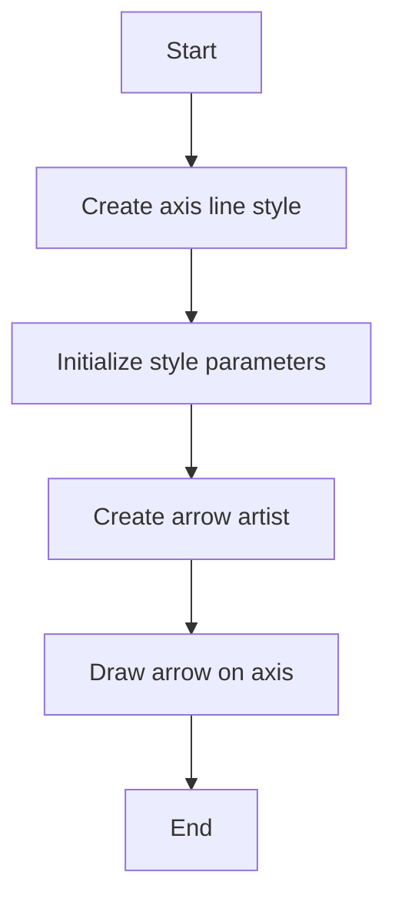
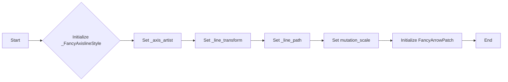
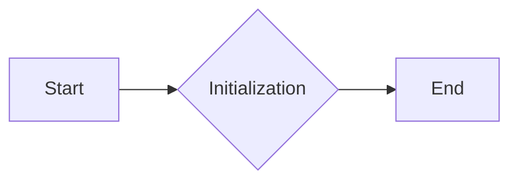
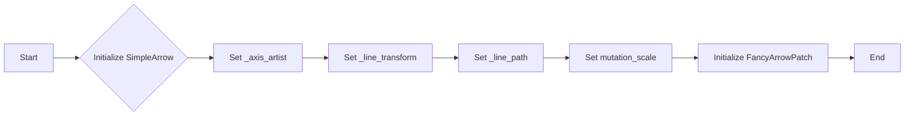
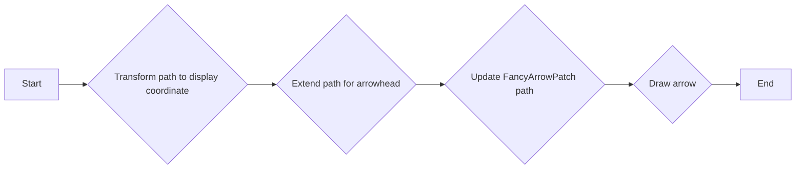
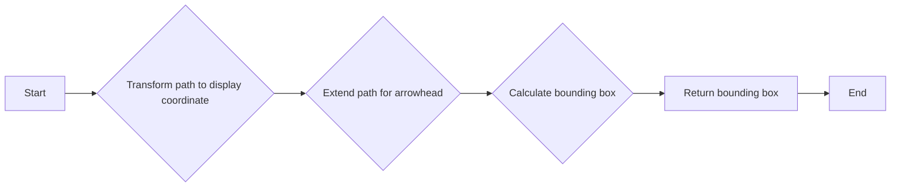

# `matplotlib\lib\mpl_toolkits\axisartist\axisline_style.py` 详细设计文档

This code provides classes to style the axis lines in Matplotlib plots, including simple arrows and filled arrows with customizable sizes and colors.

## 整体流程



## 类结构

```
AxislineStyle (容器类)
├── _Base (基类)
│   ├── SimpleArrow (简单箭头样式)
│   └── FilledArrow (填充箭头样式)
└── _FancyAxislineStyle (艺术家类)
```

## 全局变量及字段


### `_axis_artist`
    
Reference to the axis artist associated with the arrow patch.

类型：`matplotlib.patches._Style`
    


### `_line_transform`
    
Transform object used to transform the line path to the display coordinate.

类型：`matplotlib.transforms.Transform`
    


### `_line_path`
    
Path object representing the line to be styled.

类型：`matplotlib.path.Path`
    


### `_line_mutation_scale`
    
Scale factor for the line mutation to accommodate the arrow head.

类型：`float`
    


### `size`
    
Size of the arrow as a fraction of the ticklabel size.

类型：`float`
    


### `_facecolor`
    
Fill color for the arrow head.

类型：`matplotlib.colors.Color`
    


### `_FancyAxislineStyle._axis_artist`
    
Reference to the axis artist associated with the arrow patch.

类型：`matplotlib.patches._Style`
    


### `_FancyAxislineStyle._line_transform`
    
Transform object used to transform the line path to the display coordinate.

类型：`matplotlib.transforms.Transform`
    


### `_FancyAxislineStyle._line_path`
    
Path object representing the line to be styled.

类型：`matplotlib.path.Path`
    


### `_FancyAxislineStyle._line_mutation_scale`
    
Scale factor for the line mutation to accommodate the arrow head.

类型：`float`
    


### `SimpleArrow.size`
    
Size of the arrow as a fraction of the ticklabel size.

类型：`float`
    


### `FilledArrow.size`
    
Size of the arrow as a fraction of the ticklabel size.

类型：`float`
    


### `FilledArrow._facecolor`
    
Fill color for the arrow head.

类型：`matplotlib.colors.Color`
    
    

## 全局函数及方法


### `_FancyAxislineStyle.__init__`

This method initializes the `_FancyAxislineStyle` class, which is a subclass of `FancyArrowPatch`. It sets up the properties required for drawing an axis line with an arrow.

参数：

- `axis_artist`：`<class 'matplotlib.artist.Artist'>`，The axis artist to which this arrow is attached.
- `line_path`：`<class 'matplotlib.path.Path'>`，The path of the line to be styled.
- `transform`：`<class 'matplotlib.transforms.Transform'>`，The transform to apply to the line path.
- `line_mutation_scale`：`float`，The scale factor to apply to the line path for mutation.

返回值：`None`，This method does not return any value.

#### 流程图



#### 带注释源码

```python
def __init__(self, axis_artist, line_path, transform,
             line_mutation_scale):
    self._axis_artist = axis_artist
    self._line_transform = transform
    self._line_path = line_path
    self._line_mutation_scale = line_mutation_scale

    FancyArrowPatch.__init__(self,
                             path=self._line_path,
                             arrowstyle=self._ARROW_STYLE,
                             patchA=None,
                             patchB=None,
                             shrinkA=0.,
                             shrinkB=0.,
                             mutation_scale=line_mutation_scale,
                             mutation_aspect=None,
                             transform=IdentityTransform(),
                             )
```


### _FancyAxislineStyle.set_line_mutation_scale

This method sets the mutation scale for the line of the FancyArrowPatch.

参数：

- `scale`：`float`，The scale factor to be applied to the mutation scale.

返回值：`None`，This method does not return any value.

#### 流程图


#### 带注释源码

```python
def set_line_mutation_scale(self, scale):
    self.set_mutation_scale(scale * self._line_mutation_scale)
```


### _FancyAxislineStyle._extend_path

Extend the path to make a room for drawing arrow.

参数：

- `path`：`Path`，The path to be extended.
- `mutation_size`：`int`，The size of the mutation to extend the path.

返回值：`Path`，The extended path.

#### 流程图

```mermaid
graph LR
A[Start] --> B{Is path.codes None?}
B -- Yes --> C[Concatenate path.vertices with [[x2, y2]]]
B -- No --> D[Concatenate path.vertices with [[x2, y2]]]
D --> E[Concatenate path.codes with [Path.LINETO]]
E --> F[Return the new Path]
F --> G[End]
```

#### 带注释源码

```python
def _extend_path(self, path, mutation_size=10):
    """
    Extend the path to make a room for drawing arrow.
    """
    (x0, y0), (x1, y1) = path.vertices[-2:]
    theta = math.atan2(y1 - y0, x1 - x0)
    x2 = x1 + math.cos(theta) * mutation_size
    y2 = y1 + math.sin(theta) * mutation_size
    if path.codes is None:
        return Path(np.concatenate([path.vertices, [[x2, y2]]]))
    else:
        return Path(np.concatenate([path.vertices, [[x2, y2]]]),
                    np.concatenate([path.codes, [Path.LINETO]]))
``` 


### _FancyAxislineStyle.SimpleArrow.set_path

This method sets the path for the axis line.

参数：

- `path`：`Path`，The new path for the axis line.

返回值：`None`，No return value.

#### 流程图


#### 带注释源码

```python
def set_path(self, path):
    """
    Set the path for the axis line.
    """
    self._line_path = path
```


### _FancyAxislineStyle.SimpleArrow.draw

Draw the axis line.

参数：

- `renderer`：`RendererBase`，The renderer object that knows how to draw the artist.

返回值：`None`，No return value, the method performs the drawing operation.

#### 流程图


#### 带注释源码

```python
def draw(self, renderer):
    """
    Draw the axis line.
     1) Transform the path to the display coordinate.
     2) Extend the path to make a room for arrow.
     3) Update the path of the FancyArrowPatch.
     4) Draw.
    """
    path_in_disp = self._line_transform.transform_path(self._line_path)
    mutation_size = self.get_mutation_scale()  # line_mutation_scale()
    extended_path = self._extend_path(path_in_disp,
                                      mutation_size=mutation_size)
    self._path_original = extended_path
    FancyArrowPatch.draw(self, renderer)
```


### _FancyAxislineStyle.get_window_extent

This method calculates the bounding box of the axis line in display coordinates.

参数：

- `renderer`: `matplotlib.backends.backend_agg.FigureCanvasAgg`，可选，The renderer to use for calculating the bounding box. If `None`, the default renderer is used.

返回值：`matplotlib.transforms.Bbox`，The bounding box of the axis line in display coordinates.

#### 流程图


#### 带注释源码

```python
def get_window_extent(self, renderer=None):
    # Transform the path to the display coordinate.
    path_in_disp = self._line_transform.transform_path(self._line_path)
    
    # Extend the path to make a room for arrow.
    mutation_size = self.get_mutation_scale()  # line_mutation_scale()
    extended_path = self._extend_path(path_in_disp, mutation_size=mutation_size)
    self._path_original = extended_path
    
    # Calculate bounding box.
    return FancyArrowPatch.get_window_extent(self, renderer)
``` 


### `_Base.__init__`

初始化 `_Base` 类。

参数：

- `self`：当前类的实例。

返回值：无

#### 流程图



#### 带注释源码

```python
class _Base:
    # The derived classes are required to be able to be initialized
    # w/o arguments, i.e., all its argument (except self) must have
    # the default values.

    def __init__(self):
        """
        initialization.
        """
        super().__init__()
```


### `_Base.__call__`

Given the AxisArtist instance, and transform for the path (set_path method), return the Matplotlib artist for drawing the axis line.

参数：

- `axis_artist`：`matplotlib.artist.Artist`，The AxisArtist instance.
- `transform`：`matplotlib.transforms.Transform`，The transform for the path (set_path method).

返回值：`matplotlib.artist.Artist`，The Matplotlib artist for drawing the axis line.

#### 流程图


#### 带注释源码

```python
def __call__(self, axis_artist, transform):
    """
    Given the AxisArtist instance, and transform for the path (set_path
    method), return the Matplotlib artist for drawing the axis line.
    """
    return self.new_line(axis_artist, transform)
```


### SimpleArrow.new_line

This method creates a new line artist for the SimpleArrow style.

参数：

- `axis_artist`：`<class 'matplotlib.artist.Artist'>`，The axis artist instance.
- `transform`：`<class 'matplotlib.transforms.Transform'>`，The transform for the path.

返回值：`<class '_FancyAxislineStyle.SimpleArrow'>`，The created line artist.

#### 流程图


#### 带注释源码

```python
def new_line(self, axis_artist, transform):
    linepath = Path([(0, 0), (0, 1)])
    axisline = self.ArrowAxisClass(axis_artist, linepath, transform,
                                   line_mutation_scale=self.size)
    return axisline
```


### SimpleArrow.__init__

This method initializes the `SimpleArrow` class, which is a subclass of `FancyArrowPatch` used to style axis lines in matplotlib.

参数：

- `axis_artist`：`<matplotlib.artist.Artist>`，The axis artist to which the arrow is attached.
- `line_path`：`<matplotlib.path.Path>`，The path of the line to which the arrow is attached.
- `transform`：`<matplotlib.transforms.Transform>`，The transform to apply to the line path.
- `line_mutation_scale`：`float`，The scale factor to apply to the line path for mutation.

返回值：`None`，This method does not return any value.

#### 流程图



#### 带注释源码

```python
def __init__(self, axis_artist, line_path, transform,
             line_mutation_scale):
    self._axis_artist = axis_artist
    self._line_transform = transform
    self._line_path = line_path
    self._line_mutation_scale = line_mutation_scale

    FancyArrowPatch.__init__(self,
                             path=self._line_path,
                             arrowstyle=self._ARROW_STYLE,
                             patchA=None,
                             patchB=None,
                             shrinkA=0.,
                             shrinkB=0.,
                             mutation_scale=line_mutation_scale,
                             mutation_aspect=None,
                             transform=IdentityTransform(),
                             )
```


### SimpleArrow.__init__

This method initializes a SimpleArrow object, which is a subclass of FancyArrowPatch. It sets up the initial properties of the arrow, including its path, arrow style, and mutation scale.

参数：

- `axis_artist`：`<matplotlib.artist.Artist>`，The axis artist to which the arrow is attached.
- `line_path`：`<matplotlib.path.Path>`，The path of the line to which the arrow is attached.
- `transform`：`<matplotlib.transforms.Transform>`，The transform to apply to the line path.
- `line_mutation_scale`：`float`，The scale factor to apply to the line path for mutation.

返回值：`None`，This method does not return a value.

#### 流程图


#### 带注释源码

```python
def __init__(self, axis_artist, line_path, transform,
             line_mutation_scale):
    self._axis_artist = axis_artist
    self._line_transform = transform
    self._line_path = line_path
    self._line_mutation_scale = line_mutation_scale

    FancyArrowPatch.__init__(self,
                             path=self._line_path,
                             arrowstyle=self._ARROW_STYLE,
                             patchA=None,
                             patchB=None,
                             shrinkA=0.,
                             shrinkB=0.,
                             mutation_scale=line_mutation_scale,
                             mutation_aspect=None,
                             transform=IdentityTransform(),
                             )
```


### SimpleArrow.set_line_mutation_scale

This method sets the mutation scale for the arrow. The mutation scale is a factor that is applied to the line path to adjust the size of the arrowhead.

参数：

- `scale`：`float`，The scale factor to apply to the line path for mutation.

返回值：`None`，This method does not return a value.

#### 流程图


#### 带注释源码

```python
def set_line_mutation_scale(self, scale):
    self.set_mutation_scale(scale*self._line_mutation_scale)
```


### SimpleArrow._extend_path

This method extends the path of the arrow to make room for the arrowhead. It calculates the new end point of the path based on the direction of the line and the desired mutation size.

参数：

- `path`：`<matplotlib.path.Path>`，The original path of the arrow.
- `mutation_size`：`float`，The size to extend the path by.

返回值：`<matplotlib.path.Path>`，The extended path with the arrowhead.

#### 流程图


#### 带注释源码

```python
def _extend_path(self, path, mutation_size=10):
    (x0, y0), (x1, y1) = path.vertices[-2:]
    theta = math.atan2(y1 - y0, x1 - x0)
    x2 = x1 + math.cos(theta) * mutation_size
    y2 = y1 + math.sin(theta) * mutation_size
    if path.codes is None:
        return Path(np.concatenate([path.vertices, [[x2, y2]]]))
    else:
        return Path(np.concatenate([path.vertices, [[x2, y2]]]),
                    np.concatenate([path.codes, [Path.LINETO]]))
```


### SimpleArrow.set_path

This method sets the path for the arrow. It updates the internal `_line_path` attribute with the new path.

参数：

- `path`：`<matplotlib.path.Path>`，The new path for the arrow.

返回值：`None`，This method does not return a value.

#### 流程图


#### 带注释源码

```python
def set_path(self, path):
    self._line_path = path
```


### SimpleArrow.draw

This method draws the arrow. It performs the following steps:
1. Transform the path to the display coordinate.
2. Extend the path to make room for the arrowhead.
3. Update the path of the FancyArrowPatch.
4. Draw the arrow.

参数：

- `renderer`：`<matplotlib.backends.backend_agg.FigureCanvasAgg>`，The renderer to use for drawing.

返回值：`None`，This method does not return a value.

#### 流程图



#### 带注释源码

```python
def draw(self, renderer):
    path_in_disp = self._line_transform.transform_path(self._line_path)
    mutation_size = self.get_mutation_scale()  # line_mutation_scale()
    extended_path = self._extend_path(path_in_disp,
                                      mutation_size=mutation_size)
    self._path_original = extended_path
    FancyArrowPatch.draw(self, renderer)
```


### SimpleArrow.get_window_extent

This method returns the bounding box of the arrow in display coordinates. It calculates the bounding box based on the transformed and extended path.

参数：

- `renderer`：`<matplotlib.backends.backend_agg.FigureCanvasAgg>`，The renderer to use for calculating the bounding box. Optional.

返回值：`<matplotlib.transforms.Bbox>`，The bounding box of the arrow in display coordinates.

#### 流程图



#### 带注释源码

```python
def get_window_extent(self, renderer=None):
    path_in_disp = self._line_transform.transform_path(self._line_path)
    mutation_size = self.get_mutation_scale()  # line_mutation_scale()
    extended_path = self._extend_path(path_in_disp,
                                      mutation_size=mutation_size)
    self._path_original = extended_path
    return FancyArrowPatch.get_window_extent(self, renderer)
```


### SimpleArrow.new_line

This method creates a new line artist with a simple arrow style.

参数：

- `axis_artist`：`matplotlib.artist.Artist`，The axis artist to which the line will be attached.
- `transform`：`matplotlib.transforms.Transform`，The transform for the path (set_path method).

返回值：`matplotlib.patches.FancyArrowPatch`，The created arrow line artist.

#### 流程图


#### 带注释源码

```python
def new_line(self, axis_artist, transform):
    linepath = Path([(0, 0), (0, 1)])
    axisline = self.ArrowAxisClass(axis_artist, linepath, transform,
                                   line_mutation_scale=self.size)
    return axisline
```


### FilledArrow.__init__

This method initializes a `FilledArrow` object, which is a subclass of `SimpleArrow`. It sets up the properties for drawing an arrow with a filled head.

参数：

- `axis_artist`：`<class 'matplotlib.artist.Artist'>`，The axis artist to which the arrow is attached.
- `line_path`：`<class 'matplotlib.path.Path'>`，The path of the line for the arrow.
- `transform`：`<class 'matplotlib.transforms.Transform'>`，The transform for the path.
- `line_mutation_scale`：`float`，The scale factor for the line mutation.
- `facecolor`：`<class 'matplotlib.colors.Color'>`，The face color for the filled arrow head.

返回值：`None`，This method does not return any value.

#### 流程图

```mermaid
graph LR
A[Start] --> B{Initialize FilledArrow}
B --> C[Set _axis_artist]
C --> D[Set _line_transform]
D --> E[Set _line_path]
E --> F[Set mutation_scale]
F --> G[Set facecolor]
G --> H[Call super().__init__]
H --> I[End]
```

#### 带注释源码

```python
def __init__(self, axis_artist, line_path, transform,
             line_mutation_scale, facecolor):
    super().__init__(axis_artist, line_path, transform,
                     line_mutation_scale)
    self.set_facecolor(facecolor)
```


### FilledArrow.__init__

This method initializes a FilledArrow object, which is a subclass of SimpleArrow. It sets up the arrow with a filled head.

参数：

- `axis_artist`：`<matplotlib.artist.Artist>`，The axis artist to which the arrow is attached.
- `line_path`：`<matplotlib.path.Path>`，The path of the line to which the arrow is attached.
- `transform`：`<matplotlib.transforms.Transform>`，The transform to apply to the line path.
- `line_mutation_scale`：`float`，The scale factor for the line mutation.
- `facecolor`：`str`，The color to fill the arrow head.

返回值：`None`，This method does not return a value.

#### 流程图

```mermaid
graph LR
A[Initialize FilledArrow] --> B{Set _axis_artist}
B --> C{Set _line_transform}
C --> D{Set _line_path}
D --> E{Set _line_mutation_scale}
E --> F{Set _ARROW_STYLE}
F --> G{Call super().__init__}
G --> H[Return]
```

#### 带注释源码

```python
def __init__(self, axis_artist, line_path, transform,
             line_mutation_scale, facecolor):
    super().__init__(axis_artist, line_path, transform,
                     line_mutation_scale)
    self.set_facecolor(facecolor)
```


### FilledArrow.new_line

This method creates a new line artist with a filled arrow head.

参数：

- `axis_artist`：`<class 'matplotlib.artist.Artist'>`，The axis artist to which the line will be attached.
- `transform`：`<class 'matplotlib.transforms.Transform'>`，The transform for the path.
- `facecolor`：`<class 'matplotlib.colors.Color'>`，The fill color for the arrow head.

返回值：`<class '_FancyAxislineStyle.FilledArrow'>`，The created line artist with a filled arrow head.

#### 流程图

```mermaid
graph LR
A[Start] --> B{Create line path}
B --> C{Create FilledArrow instance}
C --> D{Set line path}
D --> E{Set transform}
E --> F{Set mutation scale}
F --> G{Set facecolor}
G --> H[Return line artist]
H --> I[End]
```

#### 带注释源码

```python
def new_line(self, axis_artist, transform, facecolor=None):
    linepath = Path([(0, 0), (0, 1)])
    axisline = self.ArrowAxisClass(axis_artist, linepath, transform,
                                   line_mutation_scale=self.size,
                                   facecolor=self._facecolor)
    return axisline
```


## 关键组件


### 张量索引与惰性加载

张量索引与惰性加载是代码中处理数据结构的核心组件，它允许对大型数据集进行高效访问，同时减少内存消耗。

### 反量化支持

反量化支持是代码中用于处理量化数据的核心组件，它允许在量化过程中进行逆量化操作，以便在需要时恢复原始数据。

### 量化策略

量化策略是代码中用于优化数据表示和计算效率的核心组件，它通过减少数据精度来减少内存和计算需求。


## 问题及建议


### 已知问题

-   **代码重复**：`SimpleArrow` 和 `FilledArrow` 类有大量重复代码，可以通过继承和重写方法来减少重复。
-   **默认参数值**：类和方法中存在默认参数值，这些值可能需要根据不同的上下文进行调整，但当前代码中缺乏灵活性。
-   **文档不足**：代码中缺少详细的文档注释，这可能会影响其他开发者理解和使用这些类。

### 优化建议

-   **重构代码以减少重复**：通过继承和重写方法，将 `SimpleArrow` 和 `FilledArrow` 类中的重复代码合并到一个基类中。
-   **提供更灵活的参数**：允许用户通过构造函数或方法参数来自定义更多属性，而不是依赖于默认值。
-   **增加文档注释**：为每个类、方法和重要代码块添加详细的文档注释，以提高代码的可读性和可维护性。
-   **单元测试**：编写单元测试来验证每个类和方法的功能，确保代码的稳定性和可靠性。
-   **性能优化**：分析代码的性能瓶颈，并采取相应的优化措施，例如使用更高效的数据结构或算法。


## 其它


### 设计目标与约束

- 设计目标：
  - 提供一个模块，用于定义轴线的样式。
  - 支持简单的箭头样式和填充箭头样式。
  - 允许用户自定义箭头的大小和颜色。

- 约束：
  - 必须与Matplotlib库兼容。
  - 需要高效处理大量数据。

### 错误处理与异常设计

- 错误处理：
  - 当传入无效参数时，应抛出异常。
  - 异常应提供清晰的错误信息。

### 数据流与状态机

- 数据流：
  - 用户定义的参数通过构造函数传递给类。
  - 类方法处理这些参数并返回相应的结果。

### 外部依赖与接口契约

- 外部依赖：
  - Matplotlib库。

- 接口契约：
  - 类方法应遵循明确的接口契约。
  - 类应提供文档字符串，说明其方法和参数。

    