# `matplotlib\lib\mpl_toolkits\axisartist\axislines.py` 详细设计文档

Axislines模块是Matplotlib的一个工具包，通过将坐标轴的艺术家（artist）与原生Axis类分离，实现了更灵活的坐标轴绘制。该模块支持top/bottom x-axis和left/right y-axis拥有不同的刻度、曲线网格（curvilinear grid）以及倾斜刻度（angled ticks），是mpl_toolkits的一个核心组件。

## 整体流程

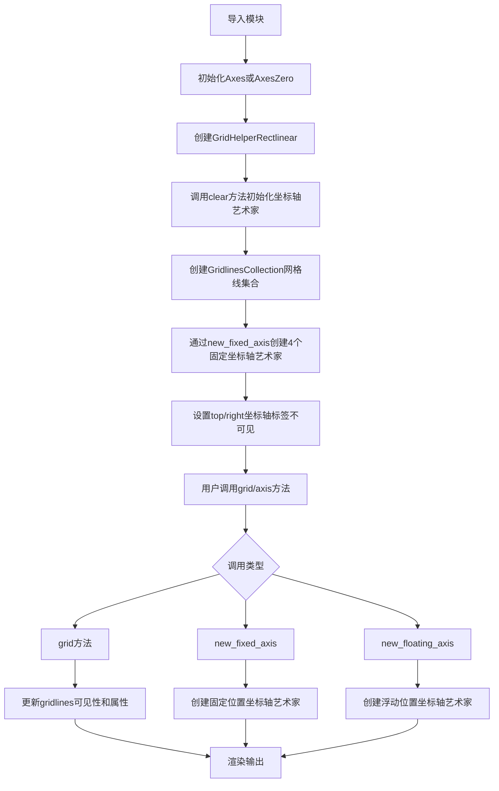

## 类结构

```
_AxisArtistHelperBase (抽象基类)
├── _FixedAxisArtistHelperBase (固定坐标轴辅助基类)
│   ├── FixedAxisArtistHelperRectilinear (直线固定坐标轴辅助)
│   └── (其他自定义实现)
├── _FloatingAxisArtistHelperBase (浮动坐标轴辅助基类)
│   └── FloatingAxisArtistHelperRectilinear (直线浮动坐标轴辅助)
└── AxisArtistHelper (兼容类)
    ├── .Fixed
    └── .Floating

GridHelperBase (网格辅助基类)
└── GridHelperRectlinear (直线网格辅助)

Axes (继承自maxes.Axes)
└── AxesZero (继承自Axes)

Subplot = Axes (别名)
SubplotZero = AxesZero (别名)
```

## 全局变量及字段


### `Subplot`
    
Axes类的别名

类型：`type`
    


### `SubplotZero`
    
AxesZero类的别名

类型：`type`
    


### `_AxisArtistHelperBase.nth_coord`
    
坐标轴编号，0表示x轴，1表示y轴

类型：`int`
    


### `_FixedAxisArtistHelperBase._loc`
    
坐标轴位置标识（如'bottom', 'top', 'left', 'right'）

类型：`str`
    


### `_FixedAxisArtistHelperBase._pos`
    
坐标轴位置值（0或1）

类型：`int`
    


### `_FixedAxisArtistHelperBase._path`
    
坐标轴路径（matplotlib.path.Path对象）

类型：`Path`
    


### `_FloatingAxisArtistHelperBase._value`
    
浮动坐标轴的值

类型：`float`
    


### `FixedAxisArtistHelperRectilinear.axis`
    
对应的xaxis或yaxis对象

类型：`matplotlib.axis.Axis`
    


### `FloatingAxisArtistHelperRectilinear._axis_direction`
    
坐标轴方向（如'bottom', 'top', 'left', 'right'）

类型：`str`
    


### `FloatingAxisArtistHelperRectilinear.axis`
    
对应的xaxis或yaxis对象

类型：`matplotlib.axis.Axis`
    


### `GridHelperBase._old_limits`
    
存储旧的坐标轴限制

类型：`tuple`
    


### `GridHelperRectlinear.axes`
    
关联的Axes对象

类型：`Axes`
    


### `Axes._axisline_on`
    
坐标轴线开关状态

类型：`bool`
    


### `Axes._grid_helper`
    
网格辅助对象

类型：`GridHelperBase`
    


### `Axes._axislines`
    
坐标轴艺术家字典

类型：`dict`
    


### `Axes.gridlines`
    
网格线集合

类型：`GridlinesCollection`
    
    

## 全局函数及方法


### `_AxisArtistHelperBase.__init__`

初始化轴线艺术家辅助器基类。

参数：

-  `nth_coord`：`int`，坐标索引，0表示x轴，1表示y轴

返回值：无

#### 流程图

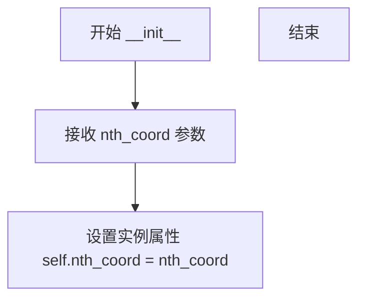

#### 带注释源码

```
def __init__(self, nth_coord):
    """
    初始化轴线艺术家辅助器基类。

    Parameters
    ----------
    nth_coord : int
        坐标索引，0表示x轴，1表示y轴
    """
    self.nth_coord = nth_coord
```

---

### `_AxisArtistHelperBase._to_xy`

将一维值数组转换为(x, y)坐标对数组。

参数：

-  `values`：`array_like`，一维值数组
-  `const`：浮点数或数组，用于填充另一个坐标的常量值

返回值：`ndarray`，形状为(*values.shape, 2)的(x, y)坐标对数组

#### 流程图

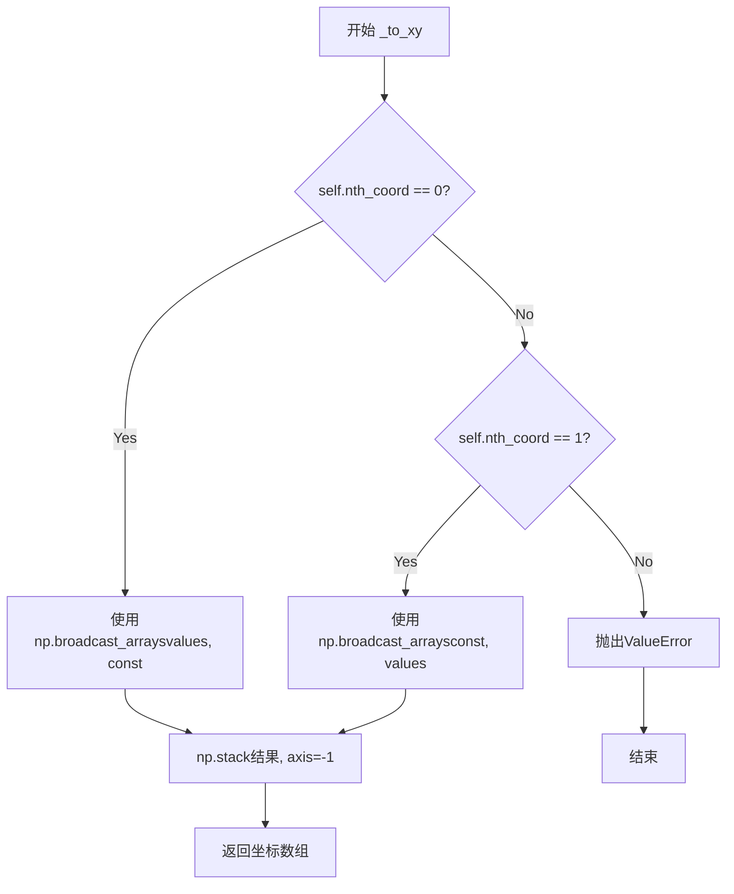

#### 带注释源码

```
def _to_xy(self, values, const):
    """
    Create a (*values.shape, 2)-shape array representing (x, y) pairs.

    The other coordinate is filled with the constant *const*.

    Example::

        >>> self.nth_coord = 0
        >>> self._to_xy([1, 2, 3], const=0)
        array([[1, 0],
               [2, 0],
               [3, 0]])
    """
    if self.nth_coord == 0:
        # nth_coord=0 表示x轴，另一个坐标y使用常量填充
        return np.stack(np.broadcast_arrays(values, const), axis=-1)
    elif self.nth_coord == 1:
        # nth_coord=1 表示y轴，另一个坐标x使用常量填充
        return np.stack(np.broadcast_arrays(const, values), axis=-1)
    else:
        raise ValueError("Unexpected nth_coord")
```

---

### `_FixedAxisArtistHelperBase.__init__`

初始化固定轴线艺术家辅助器。

参数：

-  `loc`：`str`，轴位置，可选值为"bottom", "top", "left", "right"

返回值：无

#### 流程图

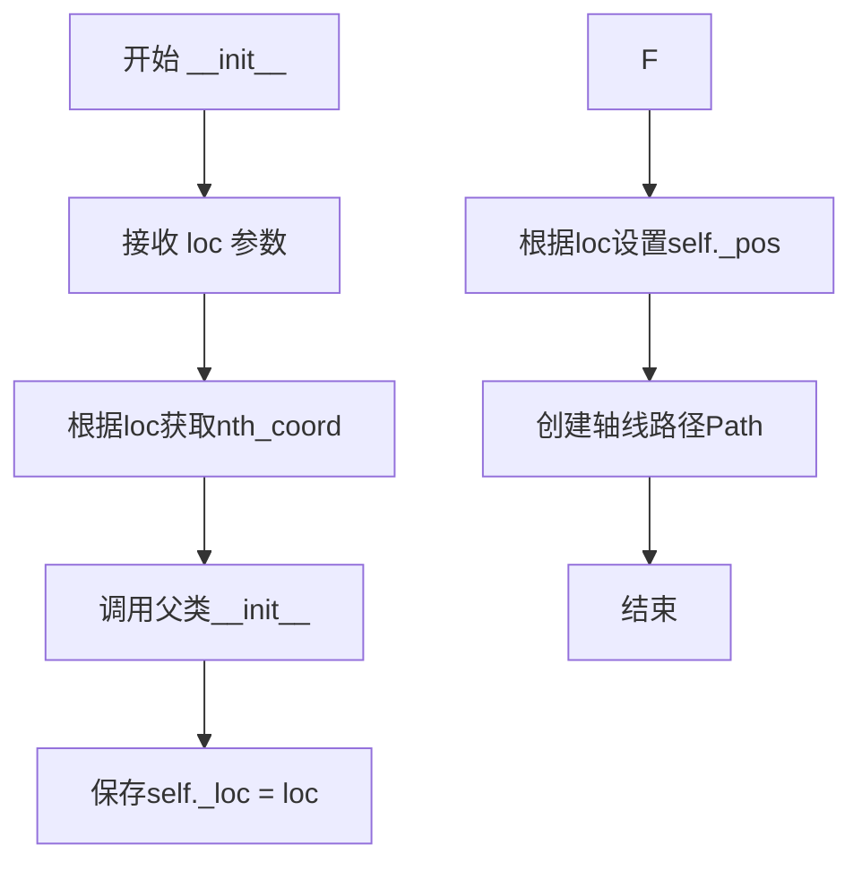

#### 带注释源码

```
def __init__(self, loc):
    """``nth_coord = 0``: x-axis; ``nth_coord = 1``: y-axis."""
    # 根据位置映射确定坐标轴类型：x轴用0，y轴用1
    super().__init__(_api.getitem_checked(
        {"bottom": 0, "top": 0, "left": 1, "right": 1}, loc=loc))
    self._loc = loc
    # 轴位置对应的坐标值：bottom=0, top=1, left=0, right=1
    self._pos = {"bottom": 0, "top": 1, "left": 0, "right": 1}[loc]
    # axis line in transAxes - 创建轴线路径
    self._path = Path(self._to_xy((0, 1), const=self._pos))
```

---

### `_FixedAxisArtistHelperBase.get_line`

获取轴线路径。

参数：

-  `axes`：`Axes`，坐标轴对象

返回值：`Path`，轴线路径对象

#### 流程图

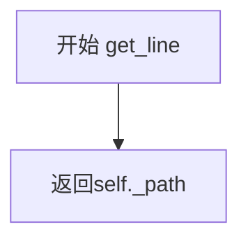

#### 带注释源码

```
def get_line(self, axes):
    """返回轴线路径"""
    return self._path
```

---

### `_FixedAxisArtistHelperBase.get_line_transform`

获取轴线变换器。

参数：

-  `axes`：`Axes`，坐标轴对象

返回值：`Transform`，轴线使用的变换（transAxes）

#### 流程图

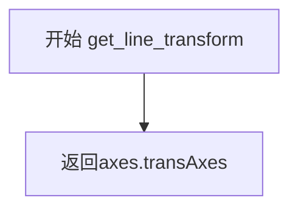

#### 带注释源码

```
def get_line_transform(self, axes):
    """返回轴线变换，使用axes坐标系的变换"""
    return axes.transAxes
```

---

### `_FixedAxisArtistHelperBase.get_axislabel_pos_angle`

获取轴标签位置和角度。

参数：

-  `axes`：`Axes`，坐标轴对象

返回值：`tuple`，((x, y), angle)元组，表示标签位置和切线角度

#### 流程图

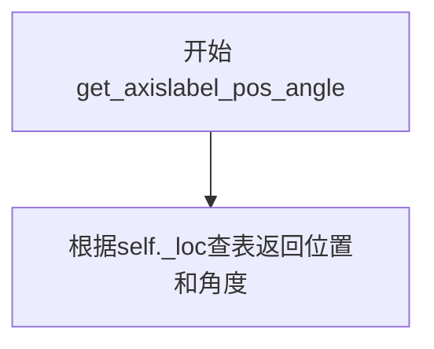

#### 带注释源码

```
def get_axislabel_pos_angle(self, axes):
    """
    Return the label reference position in transAxes.

    get_label_transform() returns a transform of (transAxes+offset)
    """
    # 返回预定义的位置和角度
    return dict(left=((0., 0.5), 90),  # (position, angle_tangent)
                right=((1., 0.5), 90),
                bottom=((0.5, 0.), 0),
                top=((0.5, 1.), 0))[self._loc]
```

---

### `_FixedAxisArtistHelperBase.get_tick_transform`

获取刻度变换器。

参数：

-  `axes`：`Axes`，坐标轴对象

返回值：`Transform`，刻度使用的变换

#### 流程图

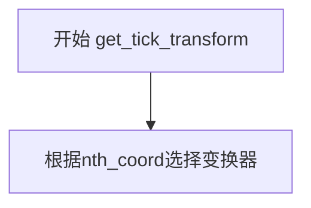

#### 带注释源码

```
def get_tick_transform(self, axes):
    """根据坐标轴类型返回对应的刻度变换"""
    return [axes.get_xaxis_transform(), axes.get_yaxis_transform()][self.nth_coord]
```

---

### `FixedAxisArtistHelperRectilinear.__init__`

初始化笛卡尔坐标固定轴线艺术家辅助器。

参数：

-  `axes`：`Axes`，坐标轴对象
-  `loc`：`str`，轴位置

返回值：无

#### 流程图

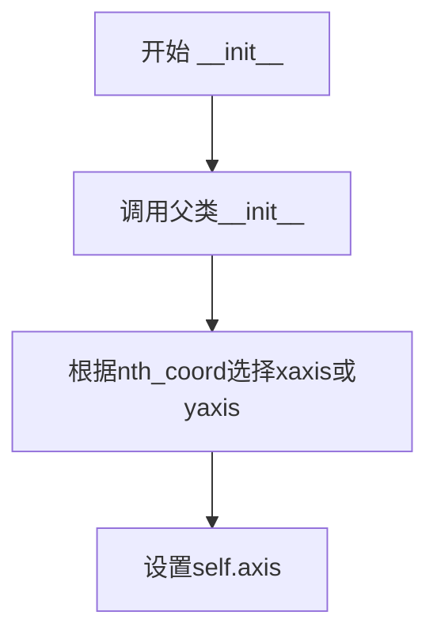

#### 带注释源码

```
def __init__(self, axes, loc):
    """初始化笛卡尔固定轴辅助器"""
    super().__init__(loc)
    # 根据nth_coord选择对应的axis对象
    self.axis = [axes.xaxis, axes.yaxis][self.nth_coord]
```

---

### `FixedAxisArtistHelperRectilinear.get_tick_iterators`

获取刻度迭代器。

参数：

-  `axes`：`Axes`，坐标轴对象

返回值：`tuple`，(major迭代器, minor迭代器)的元组，每个迭代器产生(c, angle_normal, angle_tangent, label)

#### 流程图

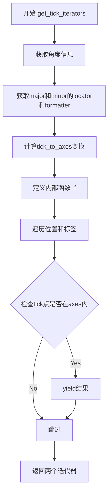

#### 带注释源码

```
def get_tick_iterators(self, axes):
    """tick_loc, tick_angle, tick_label"""
    # 获取法线角度和切线角度
    angle_normal, angle_tangent = {0: (90, 0), 1: (0, 90)}[self.nth_coord]

    # 获取major ticks的信息
    major = self.axis.major
    major_locs = major.locator()
    major_labels = major.formatter.format_ticks(major_locs)

    # 获取minor ticks的信息
    minor = self.axis.minor
    minor_locs = minor.locator()
    minor_labels = minor.formatter.format_ticks(minor_locs)

    # 计算从tick到axes坐标系的变换
    tick_to_axes = self.get_tick_transform(axes) - axes.transAxes

    def _f(locs, labels):
        """内部函数，生成符合条件的刻度迭代器"""
        for loc, label in zip(locs, labels):
            # 将刻度位置转换为(x,y)坐标
            c = self._to_xy(loc, const=self._pos)
            # 检查tick点是否在axes范围内
            c2 = tick_to_axes.transform(c)
            if mpl.transforms._interval_contains_close((0, 1), c2[self.nth_coord]):
                # 如果在范围内，yield刻度信息
                yield c, angle_normal, angle_tangent, label

    # 返回major和minor迭代器
    return _f(major_locs, major_labels), _f(minor_locs, minor_labels)
```

---

### `FloatingAxisArtistHelperRectilinear.__init__`

初始化笛卡尔坐标浮动轴线艺术家辅助器。

参数：

-  `axes`：`Axes`，坐标轴对象
-  `nth_coord`：`int`，坐标索引
-  `passingthrough_point`：`float`，轴线穿过的数据点
-  `axis_direction`：`str`，轴方向，默认为"bottom"

返回值：无

#### 流程图

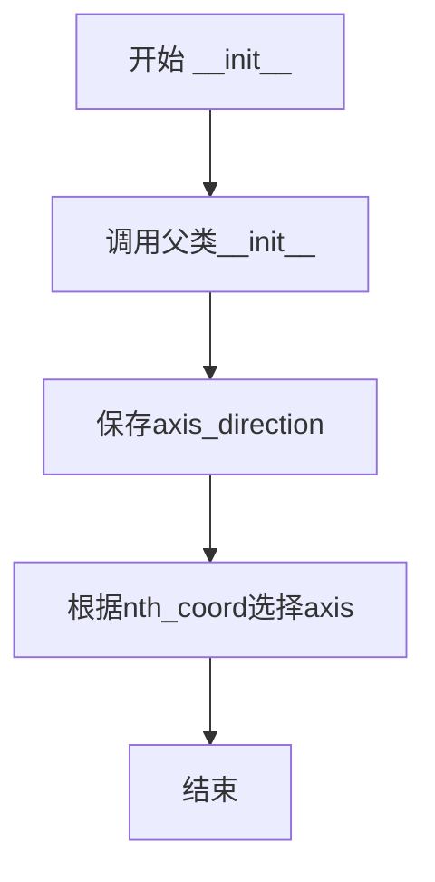

#### 带注释源码

```
def __init__(self, axes, nth_coord,
             passingthrough_point, axis_direction="bottom"):
    # 调用父类初始化
    super().__init__(nth_coord, passingthrough_point)
    self._axis_direction = axis_direction
    # 根据nth_coord选择对应的axis对象
    self.axis = [axes.xaxis, axes.yaxis][self.nth_coord]
```

---

### `FloatingAxisArtistHelperRectilinear.get_line`

获取浮动轴线路径。

参数：

-  `axes`：`Axes`，坐标轴对象

返回值：`Path`，轴线路径

#### 流程图

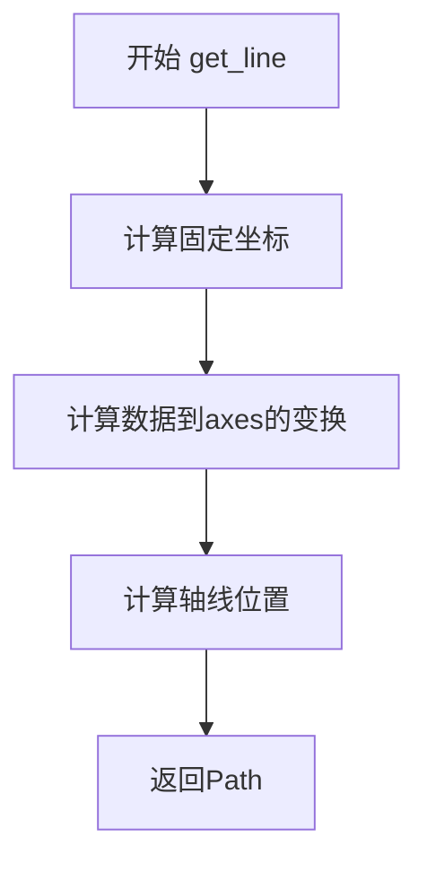

#### 带注释源码

```
def get_line(self, axes):
    """返回浮动轴线路径"""
    # 固定坐标索引：如果是x轴(nth_coord=0)，固定y；反之亦然
    fixed_coord = 1 - self.nth_coord
    # 数据坐标到axes坐标的变换
    data_to_axes = axes.transData - axes.transAxes
    # 变换穿过的点
    p = data_to_axes.transform([self._value, self._value])
    # 创建轴线路径
    return Path(self._to_xy((0, 1), const=p[fixed_coord]))
```

---

### `FloatingAxisArtistHelperRectilinear.get_tick_iterators`

获取浮动轴的刻度迭代器。

参数：

-  `axes`：`Axes`，坐标轴对象

返回值：`tuple`，(major迭代器, minor迭代器)

#### 流程图

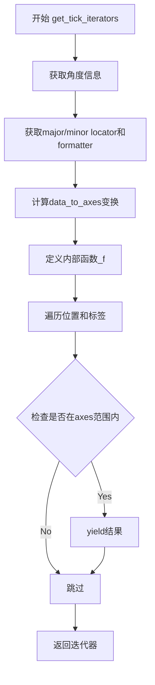

#### 带注释源码

```
def get_tick_iterators(self, axes):
    """tick_loc, tick_angle, tick_label"""
    # 获取角度信息
    angle_normal, angle_tangent = {0: (90, 0), 1: (0, 90)}[self.nth_coord]

    # 获取major ticks
    major = self.axis.major
    major_locs = major.locator()
    major_labels = major.formatter.format_ticks(major_locs)

    # 获取minor ticks
    minor = self.axis.minor
    minor_locs = minor.locator()
    minor_labels = minor.formatter.format_ticks(minor_locs)

    # 数据坐标到axes坐标的变换
    data_to_axes = axes.transData - axes.transAxes

    def _f(locs, labels):
        """内部函数，生成符合条件的刻度"""
        for loc, label in zip(locs, labels):
            # 使用穿过的点作为常量坐标
            c = self._to_xy(loc, const=self._value)
            c1, c2 = data_to_axes.transform(c)
            # 检查是否在axes范围内(0-1)
            if 0 <= c1 <= 1 and 0 <= c2 <= 1:
                yield c, angle_normal, angle_tangent, label

    return _f(major_locs, major_labels), _f(minor_locs, minor_labels)
```

---

### `GridHelperBase.update_lim`

更新网格辅助器的限制。

参数：

-  `axes`：`Axes`，坐标轴对象

返回值：无

#### 流程图

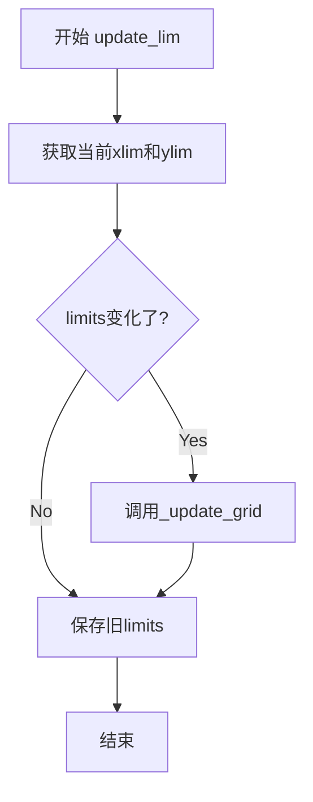

#### 带注释源码

```
def update_lim(self, axes):
    """更新网格限制"""
    x1, x2 = axes.get_xlim()
    y1, y2 = axes.get_ylim()
    # 检查限制是否变化
    if self._old_limits != (x1, x2, y1, y2):
        # 调用_update_grid更新网格
        self._update_grid(Bbox.from_extents(x1, y1, x2, y2))
        # 保存当前限制
        self._old_limits = (x1, x2, y1, y2)
```

---

### `GridHelperRectlinear.new_fixed_axis`

创建新的固定轴线。

参数：

-  `loc`：`str`，轴位置
-  `axis_direction`：`str`，轴方向（可选）
-  `offset`：`array-like`，偏移量（可选）
-  `axes`：`Axes`，坐标轴对象（可选）

返回值：`AxisArtist`，新的固定轴线艺术家

#### 流程图

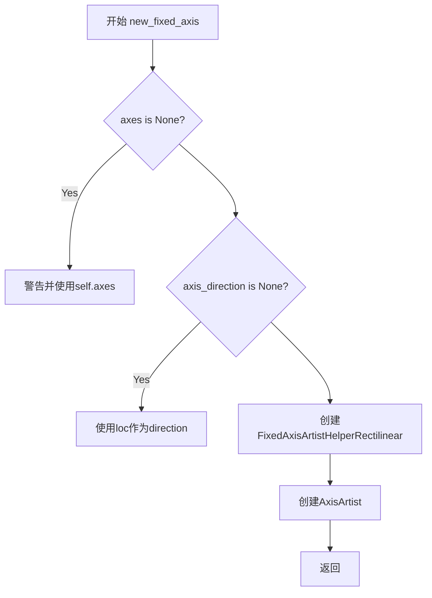

#### 带注释源码

```
def new_fixed_axis(
    self, loc, *, axis_direction=None, offset=None, axes=None
):
    """创建新的固定轴线"""
    if axes is None:
        _api.warn_external(
            "'new_fixed_axis' explicitly requires the axes keyword.")
        axes = self.axes
    if axis_direction is None:
        axis_direction = loc
    # 创建固定轴线辅助器
    return AxisArtist(axes, FixedAxisArtistHelperRectilinear(axes, loc),
                      offset=offset, axis_direction=axis_direction)
```

---

### `GridHelperRectlinear.new_floating_axis`

创建新的浮动轴线。

参数：

-  `nth_coord`：`int`，坐标索引
-  `value`：`float`，轴线穿过的值
-  `axis_direction`：`str`，轴方向（可选）
-  `axes`：`Axes`，坐标轴对象（可选）

返回值：`AxisArtist`，新的浮动轴线艺术家

#### 流程图

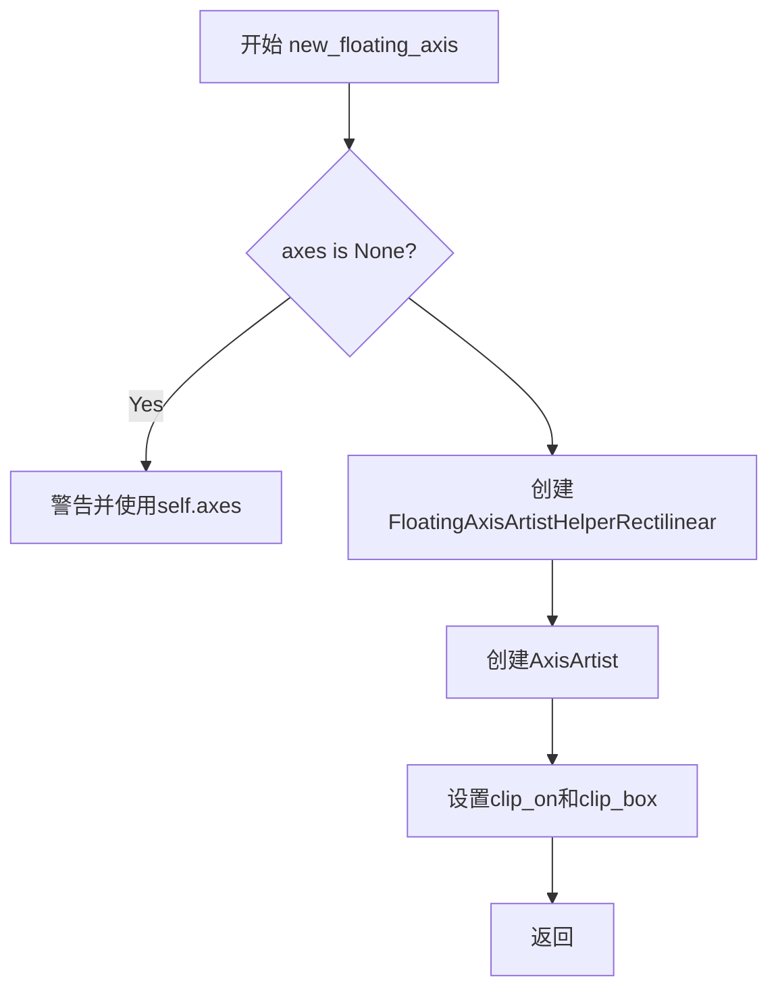

#### 带注释源码

```
def new_floating_axis(self, nth_coord, value, axis_direction="bottom", axes=None):
    """创建新的浮动轴线"""
    if axes is None:
        _api.warn_external(
            "'new_floating_axis' explicitly requires the axes keyword.")
        axes = self.axes
    # 创建浮动轴线辅助器
    helper = FloatingAxisArtistHelperRectilinear(
        axes, nth_coord, value, axis_direction)
    # 创建轴线艺术家
    axisline = AxisArtist(axes, helper, axis_direction=axis_direction)
    # 设置裁剪
    axisline.line.set_clip_on(True)
    axisline.line.set_clip_box(axisline.axes.bbox)
    return axisline
```

---

### `GridHelperRectlinear.get_gridlines`

获取网格线坐标列表。

参数：

-  `which`：`str`，可选"both", "major", "minor"，默认为"major"
-  `axis`：`str`，可选"both", "x", "y"，默认为"both"

返回值：`list`，网格线坐标列表，每个元素为[[x1, x2], [y1, y2]]

#### 流程图

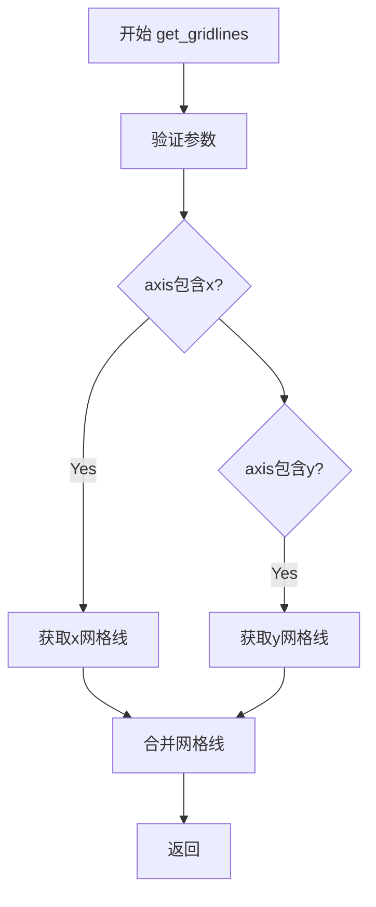

#### 带注释源码

```
def get_gridlines(self, which="major", axis="both"):
    """
    Return list of gridline coordinates in data coordinates.

    Parameters
    ----------
    which : {"both", "major", "minor"}
    axis : {"both", "x", "y"}
    """
    _api.check_in_list(["both", "major", "minor"], which=which)
    _api.check_in_list(["both", "x", "y"], axis=axis)
    gridlines = []

    # 处理x轴方向的网格线
    if axis in ("both", "x"):
        locs = []
        y1, y2 = self.axes.get_ylim()
        if which in ("both", "major"):
            locs.extend(self.axes.xaxis.major.locator())
        if which in ("both", "minor"):
            locs.extend(self.axes.xaxis.minor.locator())
        # 为每个x位置创建垂直网格线
        gridlines.extend([[x, x], [y1, y2]] for x in locs)

    # 处理y轴方向的网格线
    if axis in ("both", "y"):
        x1, x2 = self.axes.get_xlim()
        locs = []
        if self.axes.yaxis._major_tick_kw["gridOn"]:
            locs.extend(self.axes.yaxis.major.locator())
        if self.axes.yaxis._minor_tick_kw["gridOn"]:
            locs.extend(self.axes.yaxis.minor.locator())
        # 为每个y位置创建水平网格线
        gridlines.extend([[x1, x2], [y, y]] for y in locs)

    return gridlines
```

---

### `Axes.__init__`

初始化轴对象。

参数：

-  `*args`：可变位置参数，传递给父类
-  `grid_helper`：`GridHelperBase`，网格辅助器（可选）
-  `**kwargs`：可变关键字参数，传递给父类

返回值：无

#### 流程图

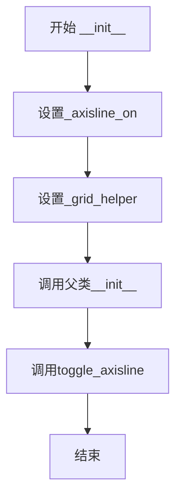

#### 带注释源码

```
def __init__(self, *args, grid_helper=None, **kwargs):
    """初始化Axes对象"""
    self._axisline_on = True
    # 使用提供的grid_helper或创建默认的GridHelperRectlinear
    self._grid_helper = grid_helper if grid_helper else GridHelperRectlinear(self)
    # 调用父类初始化
    super().__init__(*args, **kwargs)
    # 切换轴线显示状态
    self.toggle_axisline(True)
```

---

### `Axes.toggle_axisline`

切换轴线显示状态。

参数：

-  `b`：`bool`，显示状态（可选，默认为切换当前状态）

返回值：无

#### 流程图

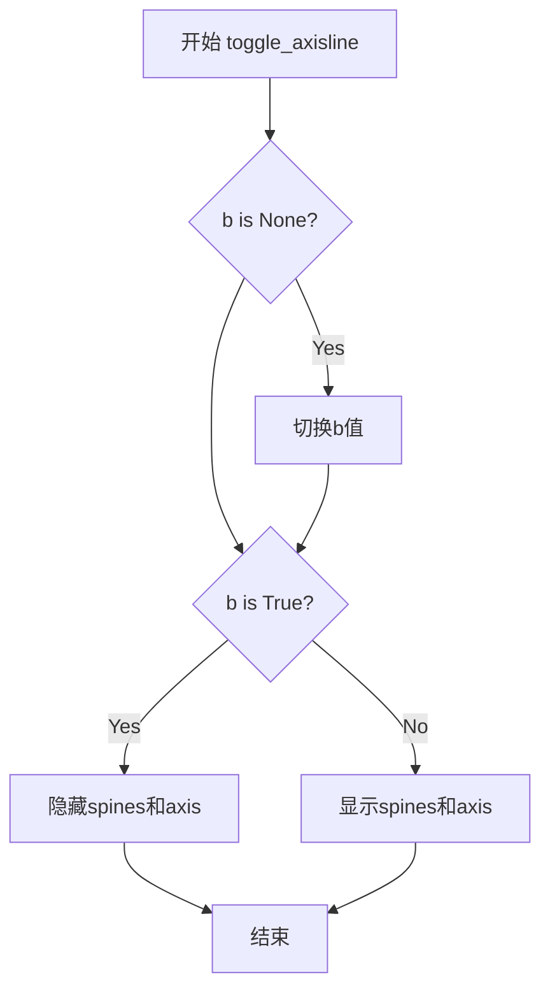

#### 带注释源码

```
def toggle_axisline(self, b=None):
    """切换轴线显示状态"""
    if b is None:
        # 如果未指定，则切换当前状态
        b = not self._axisline_on
    if b:
        # 隐藏原始轴线
        self._axisline_on = True
        self.spines[:].set_visible(False)
        self.xaxis.set_visible(False)
        self.yaxis.set_visible(False)
    else:
        # 显示原始轴线
        self._axisline_on = False
        self.spines[:].set_visible(True)
        self.xaxis.set_visible(True)
        self.yaxis.set_visible(True)
```

---

### `Axes.clear`

清空并重新初始化轴。

参数：无

返回值：无

#### 流程图

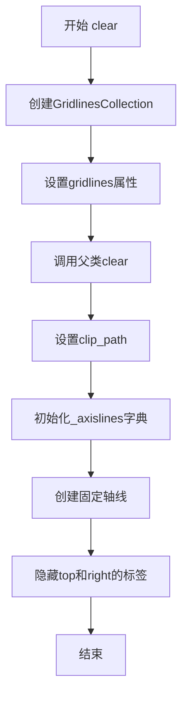

#### 带注释源码

```
def clear(self):
    # docstring inherited

    # 在clear()之前初始化gridlines，因为clear()会调用grid()
    self.gridlines = gridlines = GridlinesCollection(
        [],
        colors=mpl.rcParams['grid.color'],
        linestyles=mpl.rcParams['grid.linestyle'],
        linewidths=mpl.rcParams['grid.linewidth'])
    self._set_artist_props(gridlines)
    gridlines.set_grid_helper(self.get_grid_helper())

    # 调用父类clear
    super().clear()

    # clip_path在Axes.clear()之后设置，此时patch已创建
    gridlines.set_clip_path(self.axes.patch)

    # 初始化axis artists
    self._axislines = mpl_axes.Axes.AxisDict(self)
    # 为四个方向创建固定轴线
    new_fixed_axis = self.get_grid_helper().new_fixed_axis
    self._axislines.update({
        loc: new_fixed_axis(loc=loc, axes=self, axis_direction=loc)
        for loc in ["bottom", "top", "left", "right"]})
    # 隐藏top和right的标签
    for axisline in [self._axislines["top"], self._axislines["right"]]:
        axisline.label.set_visible(False)
        axisline.major_ticklabels.set_visible(False)
        axisline.minor_ticklabels.set_visible(False)
```

---

### `Axes.grid`

控制网格线显示。

参数：

-  `visible`：`bool`，是否显示网格（可选）
-  `which`：`str`，"major"或"minor"（可选）
-  `axis`：`str`，"both", "x", "y"（可选）
-  `**kwargs`：其他关键字参数

返回值：无

#### 流程图

```mermaid
graph TD
    A[开始 grid] --> B[调用父类grid]
    B --> C{_axisline_on为False?}
    C -->|Yes| D[直接返回]
    C --> E{visible is None?}
    E -->|Yes| F[自动确定visible]
    E --> G[设置gridlines属性]
    F --> G
    G --> H[结束]
```

#### 带注释源码

```
def grid(self, visible=None, which='major', axis="both", **kwargs):
    """
    Toggle the gridlines, and optionally set the properties of the lines.
    """
    # 先调用父类grid方法
    super().grid(visible, which=which, axis=axis, **kwargs)
    # 如果axisline未启用，直接返回
    if not self._axisline_on:
        return
    # 如果未指定visible，根据tick的gridOn状态自动确定
    if visible is None:
        visible = (self.axes.xaxis._minor_tick_kw["gridOn"]
                   or self.axes.xaxis._major_tick_kw["gridOn"]
                   or self.axes.yaxis._minor_tick_kw["gridOn"]
                   or self.axes.yaxis._major_tick_kw["gridOn"])
    # 设置gridlines的可见性和属性
    self.gridlines.set(which=which, axis=axis, visible=visible)
    self.gridlines.set(**kwargs)
```

---

### `Axes.get_children`

获取子艺术家列表。

参数：无

返回值：`list`，子艺术家列表

#### 流程图

```mermaid
graph TD
    A[开始 get_children] --> B{_axisline_on为True?}
    B -->|Yes| C[添加axislines和gridlines]
    B -->|No| D[空列表]
    C --> E[添加父类的子元素]
    D --> E
    E --> F[返回]
```

#### 带注释源码

```
def get_children(self):
    """获取子艺术家列表"""
    if self._axisline_on:
        # 如果启用axisline，添加axislines和gridlines
        children = [*self._axislines.values(), self.gridlines]
    else:
        children = []
    # 添加父类的子元素
    children.extend(super().get_children())
    return children
```

---

### `Axes.new_fixed_axis`

创建新的固定轴线。

参数：

-  `loc`：`str`，轴位置
-  `offset`：`array-like`，偏移量（可选）

返回值：`AxisArtist`，新的固定轴线

#### 带注释源码

```
def new_fixed_axis(self, loc, offset=None):
    """创建新的固定轴线"""
    return self.get_grid_helper().new_fixed_axis(loc, offset=offset, axes=self)
```

---

### `Axes.new_floating_axis`

创建新的浮动轴线。

参数：

-  `nth_coord`：`int`，坐标索引
-  `value`：`float`，轴线穿过的值
-  `axis_direction`：`str`，轴方向（可选）

返回值：`AxisArtist`，新的浮动轴线

#### 带注释源码

```
def new_floating_axis(self, nth_coord, value, axis_direction="bottom"):
    """创建新的浮动轴线"""
    return self.get_grid_helper().new_floating_axis(
        nth_coord, value, axis_direction=axis_direction, axes=self)
```

---

### `AxesZero.clear`

清空并添加零轴线。

参数：无

返回值：无

#### 流程图

```mermaid
graph TD
    A[开始 clear] --> B[调用父类clear]
    B --> C[创建xzero浮动轴线]
    C --> D[创建yzero浮动轴线]
    D --> E[更新_axislines字典]
    E --> F[设置clip_path]
    F --> G[设置初始不可见]
    G --> H[结束]
```

#### 带注释源码

```
def clear(self):
    """清空并添加零轴线"""
    # 调用父类clear
    super().clear()
    # 获取grid_helper的new_floating_axis方法
    new_floating_axis = self.get_grid_helper().new_floating_axis
    # 添加x零轴线(穿过x=0)
    self._axislines.update(
        xzero=new_floating_axis(
            nth_coord=0, value=0., axis_direction="bottom", axes=self),
        # 添加y零轴线(穿过y=0)
        yzero=new_floating_axis(
            nth_coord=1, value=0., axis_direction="left", axes=self),
    )
    # 为零轴线设置裁剪路径
    for k in ["xzero", "yzero"]:
        self._axislines[k].line.set_clip_path(self.patch)
        # 初始设置为不可见
        self._axislines[k].set_visible(False)
```


### `_AxisArtistHelperBase.__init__`

该方法是 `_AxisArtistHelperBase` 类的构造函数，用于初始化轴线辅助器的基本属性。它接收一个 `nth_coord` 参数，用于指定当前辅助器所对应的坐标轴类型（0 表示 x 轴，1 表示 y 轴），并将其存储为实例属性。

参数：

-  `nth_coord`：`int`，表示坐标轴的索引，取值 0 表示 x 轴，取值 1 表示 y 轴。

返回值：`None`，该方法为构造函数，不返回任何值。

#### 流程图

```mermaid
flowchart TD
    A[开始 __init__] --> B[接收 nth_coord 参数]
    B --> C[将 nth_coord 赋值给实例属性 self.nth_coord]
    C --> D[结束]
```

#### 带注释源码

```python
def __init__(self, nth_coord):
    """
    初始化 AxisArtistHelperBase 实例。

    Parameters
    ----------
    nth_coord : int
        坐标轴索引，0 表示 x 轴，1 表示 y 轴。
    """
    self.nth_coord = nth_coord  # 存储坐标轴索引供后续方法使用
```


### `_AxisArtistHelperBase.update_lim`

该方法是 `_AxisArtistHelperBase` 类的成员方法，作为轴辅助对象的基类方法存在。根据类文档说明，子类应定义此方法以响应轴limits的更新。当前实现为空实现（pass），是一个供子类重写的钩子方法。

参数：

-  `axes`：matplotlib axes对象，调用者的 `.axes` 属性，用于获取轴的视图限制等信息

返回值：`None`，该方法目前为空实现（pass），无返回值

#### 流程图

```mermaid
flowchart TD
    A[开始 update_lim] --> B[接收 axes 参数]
    B --> C[方法体为空 pass]
    C --> D[结束]
```

#### 带注释源码

```python
def update_lim(self, axes):
    """
    更新轴 limits 的方法。

    子类应重写此方法以在轴限制更改时执行必要的更新操作，
    例如重新计算刻度位置、缓存计算等。

    Parameters
    ----------
    axes : matplotlib.axes.Axes
        关联的 axes 对象，通常为调用此方法的 artist 的 axes 属性。
    """
    pass
```


### `_AxisArtistHelperBase.get_nth_coord`

获取当前轴助手的坐标索引，用于确定轴是x轴还是y轴。

参数： 无（该方法不接受除 `self` 外的其他参数）

返回值：`int`，返回坐标索引，其中 `0` 表示 x 轴，`1` 表示 y 轴。

#### 流程图

```mermaid
graph TD
    A[开始 get_nth_coord] --> B[返回 self.nth_coord]
    B --> C[结束]
```

#### 带注释源码

```python
def get_nth_coord(self):
    """
    Get the coordinate index for this axis helper.

    Returns
    -------
    int
        The coordinate index: 0 for x-axis, 1 for y-axis.
        This value is set during initialization and used to determine
        which coordinate (x or y) this axis helper represents.
    """
    return self.nth_coord
```


### `_AxisArtistHelperBase._to_xy`

该方法用于将一组值和一个常数转换为表示(x, y)坐标对的数组，根据`nth_coord`属性确定哪个坐标使用输入值，哪个使用常数。

参数：

- `values`：要转换的值，可以是标量或数组，这些值将根据`nth_coord`被放置在x或y坐标上
- `const`：浮点数或数组，用于填充另一个坐标（不是由`values`指定的坐标）的常数

返回值：`numpy.ndarray`，形状为(`*values.shape`, 2)的数组，表示(x, y)坐标对

#### 流程图

```mermaid
flowchart TD
    A[开始 _to_xy] --> B{self.nth_coord == 0?}
    B -->|Yes| C[将values作为x坐标, const作为y坐标]
    C --> D[使用np.broadcast_arrays广播数组]
    D --> E[使用np.stack堆叠成坐标对]
    E --> F[返回结果数组]
    B -->|No| G{self.nth_coord == 1?}
    G -->|Yes| H[将const作为x坐标, values作为y坐标]
    H --> I[使用np.broadcast_arrays广播数组]
    I --> J[使用np.stack堆叠成坐标对]
    J --> F
    G -->|No| K[抛出ValueError]
    K --> L[结束]
    
    style F fill:#90EE90
    style K fill:#FFB6C1
```

#### 带注释源码

```python
def _to_xy(self, values, const):
    """
    Create a (*values.shape, 2)-shape array representing (x, y) pairs.

    The other coordinate is filled with the constant *const*.

    Example::

        >>> self.nth_coord = 0
        >>> self._to_xy([1, 2, 3], const=0)
        array([[1, 0],
               [2, 0],
               [3, 0]])
    """
    # 如果nth_coord为0，表示values代表x坐标，const代表y坐标
    if self.nth_coord == 0:
        # 使用np.broadcast_arrays将values和const广播成相同形状
        # 然后用np.stack在最后一个维度堆叠成(x, y)坐标对
        return np.stack(np.broadcast_arrays(values, const), axis=-1)
    # 如果nth_coord为1，表示const代表x坐标，values代表y坐标
    elif self.nth_coord == 1:
        # 同样使用广播和堆叠，但顺序相反
        return np.stack(np.broadcast_arrays(const, values), axis=-1)
    # nth_coord只能是0或1，其他值抛出异常
    else:
        raise ValueError("Unexpected nth_coord")
```


### `_AxisArtistHelperBase.get_line_transform(axes)`

该方法是一个接口定义，用于返回绘制坐标轴线时使用的坐标变换（transform），在子类中实现具体逻辑，返回坐标轴的坐标系变换。

参数：

- `axes`：`matplotlib.axes.Axes` 对象，需要获取变换的坐标轴对象

返回值：`matplotlib.transforms.Transform`，坐标轴线的变换对象，用于将坐标轴线从数据坐标转换为显示坐标

#### 流程图

```mermaid
flowchart TD
    A[调用 get_line_transform] --> B{axes 参数有效}
    B -->|是| C[返回 axes.transAxes]
    B -->|否| D[返回 None 或抛出异常]
    C --> E[结束]
    D --> E
```

#### 带注释源码

```python
class _AxisArtistHelperBase:
    """
    Base class for axis helper.

    Subclasses should define the methods listed below.  The *axes*
    argument will be the ``.axes`` attribute of the caller artist. ::

        # Construct the spine.

        def get_line_transform(self, axes):
            return transform

        def get_line(self, axes):
            return path

        # Construct the label.

        def get_axislabel_transform(self, axes):
            return transform

        def get_axislabel_pos_angle(self, axes):
            return (x, y), angle

        # Construct the ticks.

        def get_tick_transform(self, axes):
            return transform

        def get_tick_iterators(self, axes):
            # A pair of iterables (one for major ticks, one for minor ticks)
            # that yield (tick_position, tick_angle, tick_label).
            return iter_major, iter_minor
    """

    def __init__(self, nth_coord):
        self.nth_coord = nth_coord

    def update_lim(self, axes):
        pass

    def get_nth_coord(self):
        return self.nth_coord

    def _to_xy(self, values, const):
        """
        Create a (*values.shape, 2)-shape array representing (x, y) pairs.

        The other coordinate is filled with the constant *const*.

        Example::

            >>> self.nth_coord = 0
            >>> self._to_xy([1, 2, 3], const=0)
            array([[1, 0],
                   [2, 0],
                   [3, 0]])
        """
        if self.nth_coord == 0:
            return np.stack(np.broadcast_arrays(values, const), axis=-1)
        elif self.nth_coord == 1:
            return np.stack(np.broadcast_arrays(const, values), axis=-1)
        else:
            raise ValueError("Unexpected nth_coord")
```

**注意**：在`_AxisArtistHelperBase`基类中，`get_line_transform`方法仅在文档字符串中声明为接口，子类需要实现具体逻辑。以下是子类`_FixedAxisArtistHelperBase`的实现示例：

```python
class _FixedAxisArtistHelperBase(_AxisArtistHelperBase):
    """Helper class for a fixed (in the axes coordinate) axis."""

    def __init__(self, loc):
        """``nth_coord = 0``: x-axis; ``nth_coord = 1``: y-axis."""
        super().__init__(_api.getitem_checked(
            {"bottom": 0, "top": 0, "left": 1, "right": 1}, loc=loc))
        self._loc = loc
        self._pos = {"bottom": 0, "top": 1, "left": 0, "right": 1}[loc]
        # axis line in transAxes
        self._path = Path(self._to_xy((0, 1), const=self._pos))

    # LINE

    def get_line(self, axes):
        return self._path

    def get_line_transform(self, axes):
        """返回坐标轴变换对象"""
        return axes.transAxes  # 返回轴坐标系变换，用于绘制固定位置的轴线
```


### `_AxisArtistHelperBase.get_line`

这是基类中定义的 `get_line` 方法，用于获取轴线的路径。子类（如 `_FixedAxisArtistHelperBase`）通常会重写此方法。

参数：

- `axes`：`matplotlib.axes.Axes`，执行绘图的 Axes 对象

返回值：`matplotlib.path.Path`，表示轴线的路径对象

#### 流程图

```mermaid
flowchart TD
    A[开始 get_line] --> B{axes 参数}
    B -->|传入 axes| C[检查子类实现]
    C --> D{具体子类}
    D -->|_FixedAxisArtistHelperBase| E[返回预计算的 self._path]
    D -->|_FloatingAxisArtistHelperBase| F[抛出 RuntimeError]
    D -->|其他子类| G[调用子类的 get_line 实现]
    E --> H[返回 Path 对象]
    F --> I[RuntimeError: get_line 方法需由派生类定义]
    G --> H
```

#### 带注释源码

```python
def get_line(self, axes):
    """
    获取轴线路径的基类方法。

    此方法在基类中定义但通常由子类重写。
    基类实现会检查子类的具体实现。

    参数:
        axes: matplotlib Axes 实例，用于获取变换信息

    返回:
        Path: 轴线的路径对象
    """
    # _FixedAxisArtistHelperBase 的实现：
    # return self._path  # 返回预计算的路径

    # _FloatingAxisArtistHelperBase 的实现：
    # raise RuntimeError("get_line method should be defined by the derived class")

    pass  # 基类默认实现为空
```


### `_FixedAxisArtistHelperBase.get_axislabel_transform` (实现自 `_AxisArtistHelperBase` 接口)

该函数是轴线艺术家（AxisArtist）辅助系统的一部分，负责返回用于绘制轴标签的坐标变换（Transform）。在 `_FixedAxisArtistHelperBase`（固定轴辅助类）中，它返回 `axes.transAxes`，这意味着轴标签的位置是在轴坐标系统（0到1的相对坐标）中定义的。

参数：

-  `self`：隐式参数，类实例本身。
-  `axes`：`matplotlib.axes.Axes`，需要获取变换的 Axes 对象。

返回值：`matplotlib.transforms.Transform`，返回 `axes.transAxes`，即轴的坐标变换对象，用于将轴标签的相对位置映射到显示坐标。

#### 流程图

```mermaid
graph LR
    A[输入: axes (Axes实例)] --> B[获取 axes.transAxes]
    B --> C[返回 Transform 对象]
```

#### 带注释源码

```python
def get_axislabel_transform(self, axes):
    """
    返回用于绘制轴标签的坐标变换。

    对于固定轴 helper (如 bottom, top, left, right)，
    标签的位置通常是在 axes 坐标系 (transAxes) 中定义的，
    例如 (0.5, 0) 表示底部轴的中心。

    Parameters
    ----------
    axes : matplotlib.axes.Axes
        当前的 Axes 对象。

    Returns
    -------
    matplotlib.transforms.Transform
        坐标变换对象 (axes.transAxes)。
    """
    return axes.transAxes
```

---
### 2. 文件的整体运行流程

该代码文件 (`axis_artist.py` 或包含在 `axislines.py` 中) 定义了一套不同于标准 Matplotlib 的轴渲染系统。

1.  **初始化**：当创建 `Axes` (或 `Subplot`) 实例时，会初始化 `GridHelperRectlinear`。
2.  **创建轴线**：在 `Axes.clear()` 或初始化过程中，使用 `GridHelperRectlinear` 的 `new_fixed_axis` 方法创建四个方向的 `AxisArtist` 实例（"bottom", "top", "left", "right"）。
3.  **Helper 注入**：每个 `AxisArtist` 实例会绑定一个 Helper 对象（如 `FixedAxisArtistHelperRectilinear`）。这个 Helper 负责提供轴线的几何路径（Path）、变换（Transform）以及刻度迭代器。
4.  **绘制阶段**：
    *   `AxisArtist` 通过调用 Helper 的 `get_line_transform` 获取绘制轴线的变换。
    *   通过 `get_tick_iterators` 获取刻度位置和角度进行绘制。
    *   通过 `get_axislabel_transform` 和 `get_axislabel_pos_angle` 确定标签的位置和变换。
5.  **更新阶段**：当 axes limits 改变时（`update_lim`），Helper 会重新计算必要的网格或属性。

### 3. 类的详细信息

#### `_FixedAxisArtistHelperBase`

**描述**：用于固定位置轴（如底部、左侧）的 Helper 基类。它定义了轴线、刻度和标签的绘制逻辑。

**字段**：

-   `nth_coord`：`int`，表示轴的方向（0 代表 x 轴，1 代表 y 轴）。
-   `_loc`：`str`，轴的位置标识（如 "bottom", "left"）。
-   `_pos`：`float`，轴在 axes 坐标系中的位置（0 或 1）。
-   `_path`：`matplotlib.path.Path`，轴线的路径。

**方法**：

-   `__init__(self, loc)`：初始化，根据位置确定坐标轴方向和位置。
-   `get_line(self, axes)`：返回轴线的 Path。
-   `get_line_transform(self, axes)`：返回轴线的变换（通常是 `transAxes`）。
-   `get_axislabel_transform(self, axes)`：返回标签的变换。
-   `get_axislabel_pos_angle(self, axes)`：返回标签的位置和角度。
-   `get_tick_transform(self, axes)`：返回刻度的变换。

#### `FixedAxisArtistHelperRectilinear`

**描述**：针对直角坐标系的固定轴 Helper 实现，继承自 `_FixedAxisArtistHelperBase`。它绑定了具体的 `matplotlib.axis` 对象来获取刻度位置和标签。

**字段**：

-   `axis`：`matplotlib.axis.XAxis` 或 `YAxis`，绑定的轴对象。

#### `FloatingAxisArtistHelperRectilinear`

**描述**：用于绘制浮动轴（如平行于 y 轴的一条垂直线 x=常量）的 Helper。

**方法**：

-   `get_line(self, axes)`：根据 `_value` 计算轴线位置。
-   `get_axislabel_transform(self, axes)`：同样返回 `axes.transAxes`。

### 4. 关键组件信息

-   **AxisArtist**：主要的轴线艺术家类，负责组装线、刻度、标签艺术家并进行绘制。它是 `_axislines` 字典中的值。
-   **GridlinesCollection**：专门用于绘制网格线的集合类，独立于轴线存在。
-   **GridHelperBase & GridHelperRectlinear**：网格辅助类，负责管理网格线的生成和轴的创建（`new_fixed_axis`, `new_floating_axis`）。

### 5. 潜在的技术债务或优化空间

1.  **代码重复**：`_FixedAxisArtistHelperBase` 和 `FloatingAxisArtistHelperRectilinear` 中都实现了 `get_axislabel_transform`，且逻辑完全相同（都返回 `axes.transAxes`）。可以抽象到基类或接口中。
2.  **与 Matplotlib 内部耦合**：该模块绕过了标准的 `matplotlib.axis.Axis`，创建了自己的艺术家体系。虽然功能更强大，但可能导致与 Matplotlib 核心版本更新不同步，或者丢失原 axis 的一些默认行为（如自动对齐、样式继承）。
3.  **坐标变换的复杂性**：`transData` 和 `transAxes` 的混合使用（特别是在 `FloatingAxisArtistHelperRectilinear` 中）使得逻辑难以理解，增加了调试坐标映射的难度。

### 6. 其它项目

#### 设计目标与约束

-   **目标**：支持 curvilinear grid（曲线网格）、双向轴（top/bottom 独立）以及角度刻度。
-   **约束**：必须与 Matplotlib 的 `transforms` 系统兼容，且性能不能明显低于默认轴。

#### 错误处理与异常设计

-   代码大量依赖 `_api` 进行参数检查（如 `check_in_list`）。
-   对于坐标变换，如果 `axes` 对象无效，通常会导致 Matplotlib 底层的 Transform 错误。
-   `FloatingAxisArtistHelperRectilinear` 中对 `_value` 的处理包含了边界检查，如果计算的坐标超出 `0-1` 范围，会返回 `(None, None)` 以隐藏标签。

#### 数据流与状态机

-   **状态**：主要状态存储在 `Axes` 的 `_axislines` 字典和 `_grid_helper` 中。
-   **数据流**：
    `Axes.draw()` -> `get_children()` -> `AxisArtist.draw()` -> 调用 Helper 方法获取 Path/Transform -> 渲染。
    `Axes.set_xlim()` -> `update_lim()` -> `GridHelperBase.update_lim()` -> 通知 Gridlines 更新。


### `_FixedAxisArtistHelperBase.get_axislabel_pos_angle`

该方法用于获取轴标签的位置和角度，根据轴的位置（left、right、top、bottom）返回相应的坐标和角度。

参数：

- `axes`：`axes`，调用此方法的艺术家所属的 Axes 对象

返回值：`tuple`，返回一个元组，包含轴标签的位置坐标和角度。位置为 (x, y) 形式的坐标点，角度为切线角度。

#### 流程图

```mermaid
flowchart TD
    A[开始] --> B{获取 self._loc 值}
    B --> C[left]
    B --> D[right]
    B --> E[bottom]
    B --> F[top]
    C --> G[返回 ((0., 0.5), 90)]
    D --> H[返回 ((1., 0.5), 90)]
    E --> I[返回 ((0.5, 0.), 0)]
    F --> J[返回 ((0.5, 1.), 0)]
    G --> K[结束]
    H --> K
    I --> K
    J --> K
```

#### 带注释源码

```python
def get_axislabel_pos_angle(self, axes):
    """
    Return the label reference position in transAxes.

    get_label_transform() returns a transform of (transAxes+offset)
    """
    # 根据 self._loc 的值（'left', 'right', 'bottom', 'top'）返回对应的位置和角度
    # 位置是 (x, y) 坐标元组，角度是切线角度
    # left: x=0, y=0.5, 角度=90
    # right: x=1, y=0.5, 角度=90
    # bottom: x=0.5, y=0, 角度=0
    # top: x=0.5, y=1, 角度=0
    return dict(left=((0., 0.5), 90),  # (position, angle_tangent)
                right=((1., 0.5), 90),
                bottom=((0.5, 0.), 0),
                top=((0.5, 1.), 0))[self._loc]
```


### `_AxisArtistHelperBase.get_tick_transform(axes)`

获取刻度变换的接口方法。该方法定义在基类中，用于返回绘制刻度时使用的坐标变换。子类需要重写此方法以提供具体的变换实现。

参数：

- `axes`：`matplotlib.axes.Axes`，调用此方法的AxisArtist所属的matplotlib Axes对象

返回值：`matplotlib.transforms.Transform`，返回用于将刻度位置从数据坐标转换到显示坐标的变换对象

#### 流程图

```mermaid
flowchart TD
    A[开始] --> B[接收axes参数]
    B --> C{检查子类实现}
    C -->|已实现| D[调用子类实现]
    C -->|未实现| E[返回None或抛出NotImplementedError]
    D --> F[返回Transform对象]
    E --> F
```

#### 带注释源码

```python
def get_tick_transform(self, axes):
    """
    Construct the ticks.

    def get_tick_transform(self, axes):
        return transform
    """
    # 注意：这是基类中定义的接口方法
    # 子类必须重写此方法以提供实际的变换实现
    #
    # 示例 - _FixedAxisArtistHelperBase的实现:
    #   return [axes.get_xaxis_transform(), axes.get_yaxis_transform()][self.nth_coord]
    #
    # 示例 - FloatingAxisArtistHelperRectilinear的实现:
    #   return axes.transData
    pass
```


### `_AxisArtistHelperBase.get_tick_iterators`

该方法是轴艺术家助手的基类方法，用于获取坐标轴的主刻度和次刻度迭代器，返回两个生成器分别遍历主次刻度的位置、角度和标签信息。

参数：

- `axes`：`matplotlib.axes.Axes`，执行绘图的坐标轴对象，用于获取坐标轴变换和限制信息

返回值：`tuple`，包含两个生成器对象的元组 `(iter_major, iter_minor)`，每个生成器yield四个元素的元组：`(tick_position_array, angle_normal, angle_tangent, tick_label_string)`，分别代表刻度位置坐标、刻度法线角度、刻度切线角度和刻度标签文本

#### 流程图

```mermaid
flowchart TD
    A[开始 get_tick_iterators] --> B{确定 nth_coord 对应的角度}
    B --> C[获取主刻度定位器和格式化器]
    B --> D[获取次刻度定位器和格式化器]
    C --> E[计算刻度到坐标轴的变换]
    D --> E
    E --> F{遍历主/次刻度位置和标签}
    F --> G[将刻度位置转换为XY坐标]
    G --> H[判断刻点是否在坐标轴范围内]
    H --> I{在范围内?}
    I -->|是| J[yield 刻度坐标、角度、标签]
    I -->|否| K[跳过该刻度]
    J --> L{还有更多刻度?}
    K --> L
    L -->|是| F
    L -->|否| M[返回主/次刻度生成器]
```

#### 带注释源码

```python
def get_tick_iterators(self, axes):
    """
    获取坐标轴的主刻度和次刻度迭代器。
    
    参数:
        axes: matplotlib坐标轴对象
        
    返回:
        返回两个生成器：主刻度生成器和次刻度生成器
        每个生成器yield (刻度位置, 法线角度, 切线角度, 刻度标签) 元组
    """
    # 根据坐标轴类型确定角度：nth_coord=0表示x轴，nth_coord=1表示y轴
    angle_normal, angle_tangent = {0: (90, 0), 1: (0, 90)}[self.nth_coord]

    # 获取主刻度信息：定位器确定位置，格式化器确定标签
    major = self.axis.major
    major_locs = major.locator()  # 主刻度位置数组
    major_labels = major.formatter.format_ticks(major_locs)  # 主刻度标签列表

    # 获取次刻度信息
    minor = self.axis.minor
    minor_locs = minor.locator()  # 次刻度位置数组
    minor_labels = minor.formatter.format_ticks(minor_locs)  # 次刻度标签列表

    # 计算从刻度变换到坐标轴坐标系的变换矩阵
    tick_to_axes = self.get_tick_transform(axes) - axes.transAxes

    def _f(locs, labels):
        """内部生成器函数，遍历给定的刻度位置和标签"""
        for loc, label in zip(locs, labels):
            # 将一维刻度位置转换为二维XY坐标数组
            c = self._to_xy(loc, const=self._pos)
            # 检查刻度点是否在坐标轴范围内（0到1之间）
            c2 = tick_to_axes.transform(c)
            if mpl.transforms._interval_contains_close((0, 1), c2[self.nth_coord]):
                #yield (刻度坐标, 法线角度, 切线角度, 标签)
                yield c, angle_normal, angle_tangent, label

    # 返回主刻度和次刻度生成器
    return _f(major_locs, major_labels), _f(minor_locs, minor_labels)
```


### `_FixedAxisArtistHelperBase.__init__`

该方法是 `_FixedAxisArtistHelperBase` 类的构造函数，用于初始化固定轴（固定在轴坐标中）的轴艺术家帮助器。它根据传入的 `loc` 参数确定轴的类型（x轴或y轴），并创建相应的轴线路径。

参数：

- `loc`：`str`，轴的位置标识，可选值为 "bottom"、"top"、"left" 或 "right"，用于确定创建哪个轴（x轴或y轴）以及轴的位置

返回值：`None`，该方法为构造函数，不返回任何值

#### 流程图

```mermaid
flowchart TD
    A[开始 __init__] --> B{检查 loc 参数}
    B -->|有效| C[调用父类 __init__]
    B -->|无效| D[抛出异常]
    C --> E[设置 self._loc = loc]
    E --> F[根据 loc 确定轴位置 self._pos]
    F --> G[使用 self._to_xy 创建路径]
    G --> H[结束]
```

#### 带注释源码

```python
def __init__(self, loc):
    """``nth_coord = 0``: x-axis; ``nth_coord = 1``: y-axis."""
    # 调用父类 _AxisArtistHelperBase 的构造函数
    # 根据 loc 从字典中获取 nth_coord：bottom/top -> 0 (x轴), left/right -> 1 (y轴)
    # _api.getitem_checked 会检查 loc 是否在字典中，不在则抛出异常
    super().__init__(_api.getitem_checked(
        {"bottom": 0, "top": 0, "left": 1, "right": 1}, loc=loc))
    
    # 保存传入的轴位置标识
    self._loc = loc
    
    # 根据 loc 确定轴在轴坐标系中的位置
    # bottom -> 0, top -> 1, left -> 0, right -> 1
    self._pos = {"bottom": 0, "top": 1, "left": 0, "right": 1}[loc]
    
    # 创建轴线的路径对象，使用 transAxes 坐标系
    # _to_xy 方法将 (0, 1) 转换为对应的坐标对
    # 对于 bottom/left，转换为 [(0, 0), (1, 0)]
    # 对于 top/right，转换为 [(0, 1), (1, 1)]
    self._path = Path(self._to_xy((0, 1), const=self._pos))
```


### `_FixedAxisArtistHelperBase.get_line`

该方法用于获取固定轴的轴线路径（Path 对象），该路径表示在 axes 坐标系中的轴线位置。

参数：

- `axes`：`matplotlib.axes.Axes`，调用此方法的 axes 对象（虽然在当前实现中未使用，但为保持接口一致性而保留）

返回值：`matplotlib.path.Path`，表示轴线的路径对象

#### 流程图

```mermaid
flowchart TD
    A[开始 get_line] --> B[返回 self._path]
    B --> C[结束]
```

#### 带注释源码

```python
def get_line(self, axes):
    """
    返回固定轴的轴线路径。

    此方法返回预先计算的轴线路径，该路径在 axes 坐标系（transAxes）
    中定义。根据传入的 loc 参数（'bottom', 'top', 'left', 'right'），
    路径被设置为对应的边界位置。

    Parameters
    ----------
    axes : matplotlib.axes.Axes
        调用此方法的 axes 对象。

    Returns
    -------
    matplotlib.path.Path
        表示轴线位置的路径对象。
    """
    return self._path
```

---

#### 补充说明

**设计目的**：  
该方法是 `_FixedAxisArtistHelperBase` 类用于获取轴线几何表示的核心方法。它返回一个预先在 `__init__` 方法中通过 `Path(self._to_xy((0, 1), const=self._pos))` 构造的路径对象。这个路径代表了在 `transAxes` 坐标系（0-1 范围的坐标空间）中的轴线位置。

**与其他方法的关系**：

- `get_line_transform()`：返回 `axes.transAxes`，用于将路径绘制到正确的坐标系
- `get_line()` 与 `get_line_transform()` 配合使用，共同完成轴线的绘制

**潜在优化空间**：

1. **参数未使用**：虽然方法签名包含 `axes` 参数，但在当前实现中并未使用。这可能是为了保持接口一致性（父类定义）或为未来扩展预留。如果确定不需要，可以考虑移除该参数以减少接口复杂度。
2. **计算前置**：路径在 `__init__` 中预先计算并存储，这对于固定轴来说是合理的，因为轴线位置不随数据变化。但如果需要动态调整轴线位置，可能需要重新设计。


### `_FixedAxisArtistHelperBase.get_line_transform`

该方法用于获取绘制固定轴线的变换对象（transform）。在 `_FixedAxisArtistHelperBase` 类中，它简单地返回 `axes.transAxes`，即将轴线绘制在轴坐标系统中（0,0 到 1,1 的坐标系）而不是数据坐标系统中。

参数：

-  `axes`：`matplotlib.axes.Axes`，提供转换矩阵的axes对象

返回值：`matplotlib.transforms.Transform`，返回 `axes.transAxes` 变换对象，用于将轴线绘制在轴坐标系统中

#### 流程图

```mermaid
flowchart TD
    A[调用 get_line_transform] --> B[输入: axes 对象]
    B --> C{验证 axes 是否有效}
    C -->|是| D[返回 axes.transAxes]
    C -->|否| E[抛出异常]
    D --> F[调用方使用此变换绘制轴线]
    
    style D fill:#90EE90
    style F fill:#87CEEB
```

#### 带注释源码

```python
def get_line_transform(self, axes):
    """
    获取绘制轴线的变换对象。

    该方法返回 axes.transAxes 变换，使得轴线可以相对于
    轴的边界框（在 axes 坐标系中从 (0,0) 到 (1,1)）进行定位。
    这对于固定轴线（如 "bottom", "top", "left", "right"）非常有用，
    因为这些轴线在 axes 坐标系中有固定的位置。

    参数
    ----------
    axes : matplotlib.axes.Axes
        Axes 对象，用于获取 transAxes 变换属性。

    返回值
    -------
    matplotlib.transforms.Transform
        返回 axes.transAxes 变换对象。
        transAxes 表示从轴坐标 (0,0) 到 (1,1) 到显示坐标的变换。

    示例
    -------
    >>> helper = _FixedAxisArtistHelperBase("bottom")
    >>> transform = helper.get_line_transform(axes)
    >>> # transform 现在是 axes.transAxes
    """
    return axes.transAxes
```


### `_FixedAxisArtistHelperBase.get_axislabel_transform`

该方法用于获取轴标签的坐标变换（transform），返回的变换用于将轴标签的坐标从数据坐标系统转换到轴坐标系统（transAxes）。

参数：

- `axes`：`axes` 对象，Matplotlib 的 Axes 实例，用于获取坐标变换

返回值：`transform`，返回 `axes.transAxes`，即轴坐标变换对象，用于将坐标转换到轴坐标系中

#### 流程图

```mermaid
flowchart TD
    A[开始 get_axislabel_transform] --> B[输入: axes 对象]
    B --> C[返回 axes.transAxes]
    C --> D[结束]
```

#### 带注释源码

```python
def get_axislabel_transform(self, axes):
    """
    获取轴标签的坐标变换。

    Parameters
    ----------
    axes : matplotlib.axes.Axes
        坐标轴对象，用于获取坐标变换。

    Returns
    -------
    transform : matplotlib.transforms.Transform
        返回 axes.transAxes，即轴坐标变换，用于将轴标签
        的坐标从数据坐标系统转换到轴坐标系统（0-1 范围）。
    """
    return axes.transAxes
```


### `_FixedAxisArtistHelperBase.get_axislabel_pos_angle`

该方法用于获取轴标签的参考位置和角度，根据axis的位置（top、bottom、left、right）返回对应的标签位置坐标和切线角度。

参数：

- `axes`：`axes`，Matplotlib的Axes对象，用于获取坐标变换信息

返回值：`tuple`，返回标签参考位置，格式为 `((x, y), angle)`，其中 `(x, y)` 是transAxes坐标系中的位置坐标，`angle` 是标签的切线角度

#### 流程图

```mermaid
flowchart TD
    A[开始 get_axislabel_pos_angle] --> B{根据 self._loc 定位}
    B -->|left| C[返回 ((0., 0.5), 90)]
    B -->|right| D[返回 ((1., 0.5), 90)]
    B -->|bottom| E[返回 ((0.5, 0.), 0)]
    B -->|top| F[返回 ((0.5, 1.), 0)]
    C --> G[结束]
    D --> G
    E --> G
    F --> G
```

#### 带注释源码

```python
def get_axislabel_pos_angle(self, axes):
    """
    Return the label reference position in transAxes.

    get_label_transform() returns a transform of (transAxes+offset)
    """
    # 根据self._loc（axis的位置：left/right/top/bottom）
    # 返回对应的标签位置和角度
    # 位置格式为(position, angle_tangent)
    # left/right: 水平轴标签，角度90度
    # top/bottom: 垂直轴标签，角度0度
    return dict(left=((0., 0.5), 90),  # (position, angle_tangent)
                right=((1., 0.5), 90),
                bottom=((0.5, 0.), 0),
                top=((0.5, 1.), 0))[self._loc]
```


### `_FixedAxisArtistHelperBase.get_tick_transform`

该方法用于获取坐标轴刻度的变换矩阵，根据坐标轴是x轴还是y轴，返回对应的坐标变换对象。

参数：

- `axes`：`matplotlib.axes.Axes`，要获取刻度变换的坐标轴对象

返回值：`matplotlib.transforms.Transform`，返回对应的坐标轴变换对象（x轴使用`get_xaxis_transform()`，y轴使用`get_yaxis_transform()`）

#### 流程图

```mermaid
flowchart TD
    A[开始 get_tick_transform] --> B{self.nth_coord == 0?}
    B -->|是| C[返回 axes.get_xaxis_transform]
    B -->|否| D[返回 axes.get_yaxis_transform]
    C --> E[结束]
    D --> E
```

#### 带注释源码

```python
def get_tick_transform(self, axes):
    """
    获取坐标轴刻度的变换矩阵。

    Parameters
    ----------
    axes : matplotlib.axes.Axes
        坐标轴对象，用于获取对应的变换。

    Returns
    -------
    matplotlib.transforms.Transform
        坐标轴刻度的变换对象。
        - 当 nth_coord=0 (x轴) 时，返回 axes.get_xaxis_transform()
        - 当 nth_coord=1 (y轴) 时，返回 axes.get_yaxis_transform()
    """
    # 根据 nth_coord 选择对应的变换
    # nth_coord=0 表示x轴，使用 get_xaxis_transform()
    # nth_coord=1 表示y轴，使用 get_yaxis_transform()
    return [axes.get_xaxis_transform(), axes.get_yaxis_transform()][self.nth_coord]
```


### `_FloatingAxisArtistHelperBase.__init__`

该方法是 `_FloatingAxisArtistHelperBase` 类的构造函数，用于初始化浮轴（Floating Axis）的坐标序号和数值。浮轴是一种在图表边界上浮动、不随数据范围变化的坐标轴，常用于表示特定的数值位置（如零线、参考线等）。

参数：

- `nth_coord`：`int`，表示坐标轴的序号，0 表示 x 轴（水平），1 表示 y 轴（垂直）
- `value`：`float`，表示浮轴在数据坐标中的数值位置

返回值：`None`，构造函数无返回值

#### 流程图

```mermaid
flowchart TD
    A[开始 __init__] --> B[设置 self._value = value]
    B --> C[调用父类 _AxisArtistHelperBase.__init__(nth_coord)]
    C --> D[在父类中设置 self.nth_coord = nth_coord]
    D --> E[结束]
```

#### 带注释源码

```python
class _FloatingAxisArtistHelperBase(_AxisArtistHelperBase):
    def __init__(self, nth_coord, value):
        """
        初始化浮轴助手类。

        参数:
            nth_coord: int, 坐标序号。0 表示 x 轴方向, 1 表示 y 轴方向。
            value: float, 浮轴在数据坐标中的位置值。

        返回:
            None
        """
        # 将传入的数值存储为实例属性，用于后续计算浮轴的位置
        self._value = value
        # 调用父类的构造函数，初始化 nth_coord 属性
        # 父类 _AxisArtistHelperBase 会将 nth_coord 存储为 self.nth_coord
        super().__init__(nth_coord)
```


### `_FloatingAxisArtistHelperBase.get_line`

该方法用于在轴线上返回表示轴线线条的路径对象，但在基类中未实现具体逻辑，调用时抛出运行时错误，需由派生类重写以提供具体实现。

参数：

- `axes`：`matplotlib.axes.Axes`，执行轴线绘制的 Axes 对象，用于获取坐标变换和轴线信息。

返回值：`Path`，返回表示轴线线条的路径对象（但在基类中未实现，会抛出 RuntimeError）。

#### 流程图

```mermaid
graph TD
    A[开始 get_line] --> B{调用 get_line}
    B --> C[raise RuntimeError: get_line method should be defined by the derived class]
    C --> D[结束]
```

#### 带注释源码

```python
def get_line(self, axes):
    """
    返回轴线的路径对象。

    参数:
        axes: matplotlib.axes.Axes
            执行轴线绘制的 Axes 对象。

    返回:
        Path: 轴线的路径对象。

    注意:
        此方法为基类方法，未实现具体逻辑，调用时会抛出 RuntimeError。
        派生类（如 FloatingAxisArtistHelperRectilinear）需重写此方法以提供具体实现。
    """
    raise RuntimeError("get_line method should be defined by the derived class")
```


### `_FloatingAxisArtistHelperBase.get_line_transform`

该方法返回用于绘制浮动轴线的变换（transform），在基类中默认返回 `axes.transAxes`，表示使用轴坐标系统。

参数：

- `axes`：`matplotlib.axes.Axes`，axes 对象，用于获取坐标变换

返回值：`matplotlib.transforms.Transform`，返回 `axes.transAxes`，即轴坐标变换，用于将轴线绘制在 axes 坐标系中（0-1 范围）

#### 流程图

```mermaid
flowchart TD
    A[开始 get_line_transform] --> B{axes 参数有效}
    B -->|是| C[返回 axes.transAxes]
    B -->|否| D[可能抛出异常]
    C --> E[结束]
```

#### 带注释源码

```python
def get_line_transform(self, axes):
    """
    返回用于绘制轴线的坐标变换。

    Parameters
    ----------
    axes : matplotlib.axes.Axes
        Axes 对象，用于获取坐标变换

    Returns
    -------
    matplotlib.transforms.Transform
        返回 axes.transAxes，即轴坐标变换
    """
    return axes.transAxes
```

#### 备注

该方法在 `_FloatingAxisArtistHelperBase` 基类中定义，直接返回 `axes.transAxes`。子类 `FloatingAxisArtistHelperRectilinear` 继承了这个实现。这是一个模板方法模式的体现，由子类决定是否需要重写。如果派生类需要不同的变换，可以重写此方法。


### `_FloatingAxisArtistHelperBase.get_axislabel_transform`

这是一个基类方法，在 `_FloatingAxisArtistHelperBase` 中并未实现（需要由子类实现）。由于基类未定义该方法，直接调用会引发 `AttributeError`。在子类 `FloatingAxisArtistHelperRectilinear` 中有具体实现。

参数：

- `axes`：`matplotlib.axes.Axes`，应用此变换的 axes 对象

返回值：`matplotlib.transforms.Transform`，坐标轴标签的变换对象（通常为 `transAxes`）

#### 流程图

```mermaid
flowchart TD
    A[调用 get_axislabel_transform] --> B{子类是否实现?}
    B -->|是| C[返回变换对象]
    B -->|否| D[抛出 AttributeError]
    
    C --> E[使用返回的变换定位轴标签]
```

#### 带注释源码

```
# _FloatingAxisArtistHelperBase 类中并未定义此方法
# 以下为该类的结构说明

class _FloatingAxisArtistHelperBase(_AxisArtistHelperBase):
    """
    基类，用于浮动的轴辅助器。
    
    注意：此类为抽象基类，部分方法需要由子类实现。
    """
    
    def __init__(self, nth_coord, value):
        self._value = value  # 浮动的坐标值
        super().__init__(nth_coord)
    
    def get_line(self, axes):
        # 子类必须实现此方法
        raise RuntimeError("get_line method should be defined by the derived class")
    
    # get_axislabel_transform 方法在此处未定义
    # 如需使用，应调用子类的实现
    # 例如：FloatingAxisArtistHelperRectilinear.get_axislabel_transform(axes)


# 子类 FloatingAxisArtistHelperRectilinear 中的实现（供参考）：

class FloatingAxisArtistHelperRectilinear(_FloatingAxisArtistHelperBase):
    """
    用于直角坐标系的浮动轴辅助器。
    """
    
    def __init__(self, axes, nth_coord, passingthrough_point, axis_direction="bottom"):
        super().__init__(nth_coord, passingthrough_point)
        self._axis_direction = axis_direction
        self.axis = [axes.xaxis, axes.yaxis][self.nth_coord]
    
    # ... 其他方法 ...
    
    def get_axislabel_transform(self, axes):
        """
        返回轴标签的变换。
        
        参数:
            axes: axes 对象
            
        返回:
            变换对象 (axes.transAxes)
        """
        return axes.transAxes  # 返回 axes 坐标系变换
```


### `FloatingAxisArtistHelperRectilinear.get_axislabel_pos_angle`

描述：此方法用于计算浮动轴的标签位置和角度。它首先根据坐标轴的方向（`nth_coord`）确定标签的角度，然后通过坐标变换将数据坐标转换为轴坐标，计算标签的参考位置。如果标签位置位于轴的可见范围内，则返回位置和角度；否则返回 `(None, None)`。

参数：

- `axes`：`matplotlib.axes.Axes`，调用此方法的 axes 实例。

返回值：`tuple`，返回格式为 `((x, y), angle)` 的元组，其中 `(x, y)` 是标签在 `transAxes` 中的位置，`angle` 是标签的角度。如果标签位置在轴的可见范围之外（即 `verts[fixed_coord]` 不在 [0, 1] 区间内），则返回 `(None, None)`。

#### 流程图

```mermaid
flowchart TD
    A[开始 get_axislabel_pos_angle] --> B[根据 nth_coord 确定角度 angle = 0 或 90]
    B --> C[计算固定坐标 fixed_coord = 1 - nth_coord]
    C --> D[获取坐标变换 data_to_axes = axes.transData - axes.transAxes]
    D --> E[使用 data_to_axes 变换 [self._value, self._value] 得到 p]
    E --> F[调用 _to_xy 方法, 输入 0.5 和 const=p[fixed_coord], 得到 verts]
    F --> G{检查 verts[fixed_coord] 是否在 0 到 1 之间}
    G -->|是| H[返回 (verts, angle)]
    G -->|否| I[返回 (None, None)]
    H --> J[结束]
    I --> J
```

#### 带注释源码

```python
def get_axislabel_pos_angle(self, axes):
    """
    Return the label reference position in transAxes.

    get_label_transform() returns a transform of (transAxes+offset)
    """
    # 根据 nth_coord 确定标签的角度：0 表示水平轴，90 表示垂直轴
    angle = [0, 90][self.nth_coord]
    # 计算固定坐标：如果 nth_coord 是 0 (x轴)，则 fixed_coord 是 1 (y轴)，反之亦然
    fixed_coord = 1 - self.nth_coord
    # 获取从数据坐标到轴坐标的变换
    data_to_axes = axes.transData - axes.transAxes
    # 使用变换将 [self._value, self._value] 转换到轴坐标，得到 p
    p = data_to_axes.transform([self._value, self._value])
    # 使用 _to_xy 方法计算标签的 (x, y) 坐标
    # self._to_xy(0.5, const=p[fixed_coord]) 会返回一个形状为 (2,) 的数组，表示 (x, y)
    verts = self._to_xy(0.5, const=p[fixed_coord])
    # 检查标签位置是否在轴的可见范围内（即 0 <= 坐标 <= 1）
    # 如果在范围内，返回 (verts, angle)；否则返回 (None, None)
    return (verts, angle) if 0 <= verts[fixed_coord] <= 1 else (None, None)
```


### `_FloatingAxisArtistHelperBase.get_tick_transform`

该方法用于获取浮动轴的刻度变换（tick transform），将数据坐标转换为显示坐标。在基类 `_FloatingAxisArtistHelperBase` 中未实现此方法，但根据类继承关系和文档约定，其签名如下。实际实现位于子类 `FloatingAxisArtistHelperRectilinear` 中。

参数：

-  `axes`：`matplotlib.axes.Axes`，执行该方法的axes对象，用于获取变换信息

返回值：`matplotlib.transforms.Transform`，返回数据坐标到显示坐标的变换（`axes.transData`）

#### 流程图

```mermaid
flowchart TD
    A[开始 get_tick_transform] --> B{axes 参数是否有效}
    B -->|是| C[返回 axes.transData]
    B -->|否| D[可能抛出异常或返回 None]
    C --> E[结束]
    D --> E
```

#### 带注释源码

```python
def get_tick_transform(self, axes):
    """
    获取浮动轴的刻度变换。

    对于浮动轴（如对角线轴），刻度变换直接使用数据坐标到显示坐标的变换，
    因为刻度位置需要根据数据值来确定。

    参数
    ----------
    axes : matplotlib.axes.Axes
        axes 对象

    返回值
    -------
    matplotlib.transforms.Transform
        返回 axes.transData，即从数据坐标系到显示坐标系的变换
    """
    return axes.transData
```

---

**注意**：在提供的代码中，`_FloatingAxisArtistHelperBase` 类本身并未定义 `get_tick_transform` 方法（仅定义了 `__init__` 和 `get_line`）。该方法的实现位于其子类 `FloatingAxisArtistHelperRectilinear` 中（见上面源码）。根据 `_AxisArtistHelperBase` 的文档约定，子类需要实现此方法以提供刻度变换。


### `_FloatingAxisArtistHelperBase.get_tick_iterators`

该方法是 `_FloatingAxisArtistHelperBase` 类从其基类 `_AxisArtistHelperBase` 继承而来的抽象方法定义。该方法是一个生成器工厂，用于返回两个迭代器（分别对应主刻度 和次刻度），每个迭代器会yield出刻度的位置、角度和标签信息。由于基类中该方法仅为接口定义（Stub），实际逻辑依赖于子类（如 `FloatingAxisArtistHelperRectilinear`）的实现。

参数：

-  `axes`：`matplotlib.axes.Axes`，Axes 实例，用于获取坐标轴和变换信息。

返回值：`tuple`，返回两个迭代器组成的元组 `(iter_major, iter_minor)`。每个迭代器 yield 刻度数据元组 `(tick_position, tick_angle, tick_label)`。

#### 流程图

```mermaid
graph TD
    A[Start get_tick_iterators] --> B{Is Base Class?}
    B -- Yes --> C[Return iter_major, iter_minor (Undefined in Base)]
    B -- No --> D[Call Subclass Implementation]
    C --> E[End]
    D --> F[Yield Tick Data]
    F --> E
```

#### 带注释源码

```python
def get_tick_iterators(self, axes):
    """
    A pair of iterables (one for major ticks, one for minor ticks)
    that yield (tick_position, tick_angle, tick_label).
    """
    # 注意：基类中此处为抽象定义，iter_major 和 iter_minor 并未定义。
    # 具体的浮点轴实现（如 FloatingAxisArtistRectilinear）会覆盖此方法
    # 以返回具体的生成器。
    return iter_major, iter_minor
```


### `FixedAxisArtistHelperRectilinear.__init__`

这是 `FixedAxisArtistHelperRectilinear` 类的构造函数，用于初始化一个用于绘制直角坐标系固定轴线的辅助对象。该类继承自 `_FixedAxisArtistHelperBase`，主要用于为特定的轴位置（如"top"、"bottom"、"left"、"right"）创建轴线艺术家，帮助绘制轴线、刻度线和刻度标签。

参数：

- `axes`：`matplotlib.axes.Axes`，执行绘图的Axes对象，用于获取xaxis或yaxis属性
- `loc`：`str`，轴线位置字符串，必须是"bottom"、"top"、"left"或"right"之一

返回值：`None`，构造函数不返回任何值，仅初始化对象状态

#### 流程图

```mermaid
flowchart TD
    A[开始 __init__] --> B[调用 super().__init__loc]
    B --> C[父类 _FixedAxisArtistHelperBase.__init__ 处理]
    C --> D[根据 loc 确定 nth_coord: bottom/top=0, left/right=1]
    E[设置 self._loc = loc] --> F[设置 self._pos: bottom=0, top=1, left=0, right=1]
    D --> E
    F --> G[创建 axis line path: Pathself._to_xy0, 1, const=self._pos]
    G --> H[设置 self.axis = axes.xaxis 或 axes.yaxis 根据 self.nth_coord]
    H --> I[结束]
```

#### 带注释源码

```python
class FixedAxisArtistHelperRectilinear(_FixedAxisArtistHelperBase):
    """
    用于直角坐标系的固定轴线艺术家辅助类。
    继承自 _FixedAxisArtistHelperBase，实现了在直角坐标系下绘制固定位置轴线的功能。
    """

    def __init__(self, axes, loc):
        """
        初始化 FixedAxisArtistHelperRectilinear。

        Parameters
        ----------
        axes : matplotlib.axes.Axes
            要绘制轴线的 Axes 对象。
        loc : str
            轴线位置，可以是 "bottom", "top", "left", "right"。
        """
        # 调用父类 _FixedAxisArtistHelperBase 的初始化方法
        # 父类会根据 loc 参数设置:
        # - self.nth_coord: 0 表示 x 轴 (bottom/top), 1 表示 y 轴 (left/right)
        # - self._loc: 存储原始位置字符串
        # - self._pos: 存储轴线位置 (bottom=0, top=1, left=0, right=1)
        # - self._path: 创建轴线路径，用于绘制轴线
        super().__init__(loc)
        
        # 根据 nth_coord 选择对应的 axis 对象
        # nth_coord=0 -> axes.xaxis (x轴)
        # nth_coord=1 -> axes.yaxis (y轴)
        # 这个 axis 对象包含刻度定位器和格式化器，用于获取刻度位置和标签
        self.axis = [axes.xaxis, axes.yaxis][self.nth_coord]
```


### `FixedAxisArtistHelperRectilinear.get_tick_iterators`

该方法用于获取坐标轴的主刻度和次刻度的迭代器，返回包含刻度位置、角度和标签信息的生成器。它负责计算并过滤在坐标轴可视范围内的刻度。

参数：

- `axes`：`matplotlib.axes.Axes`，应用此方法的坐标轴对象，用于获取变换信息和可见性判断

返回值：`tuple`，返回两个生成器的元组。第一个生成器产生主刻度信息 `(tick_position, angle_normal, angle_tangent, tick_label)`，第二个生成器产生次刻度信息，格式相同。

#### 流程图

```mermaid
flowchart TD
    A[开始 get_tick_iterators] --> B[根据 nth_coord 获取角度<br/>angle_normal 和 angle_tangent]
    B --> C[获取主刻度定位器和格式化器]
    C --> D[调用 major.locator 获取主刻度位置]
    D --> E[调用 major.formatter.format_ticks 格式化主刻度标签]
    E --> F[获取次刻度定位器和格式化器]
    F --> G[调用 minor.locator 获取次刻度位置]
    G --> H[调用 minor.formatter.format_ticks 格式化次刻度标签]
    H --> I[计算 tick_to_axes 变换<br/>get_tick_transform - axes.transAxes]
    I --> J[定义内部函数 _f lable]
    J --> K[遍历 locs 和 labels]
    K --> L[调用 _to_xy 转换刻度位置到 (x, y)]
    L --> M[使用 tick_to_axes 变换坐标]
    M --> N{检查刻点是否在坐标轴内<br/>_interval_contains_close}
    N -->|是| O[yield c, angle_normal, angle_tangent, label]
    N -->|否| P[跳过此刻度]
    O --> Q{还有更多刻度?}
    P --> Q
    Q -->|是| K
    Q -->|否| R[返回 _f(major_locs, major_labels)<br/>_f(minor_locs, minor_labels)]
```

#### 带注释源码

```python
def get_tick_iterators(self, axes):
    """tick_loc, tick_angle, tick_label"""
    # 根据坐标轴方向获取法向角度和切向角度
    # nth_coord=0 (x轴): angle_normal=90, angle_tangent=0
    # nth_coord=1 (y轴): angle_normal=0, angle_tangent=90
    angle_normal, angle_tangent = {0: (90, 0), 1: (0, 90)}[self.nth_coord]

    # 获取主刻度对象
    major = self.axis.major
    # 获取主刻度位置定位器并计算位置
    major_locs = major.locator()
    # 获取主刻度格式化器并格式化标签
    major_labels = major.formatter.format_ticks(major_locs)

    # 获取次刻度对象
    minor = self.axis.minor
    # 获取次刻度位置定位器并计算位置
    minor_locs = minor.locator()
    # 获取次刻度格式化器并格式化标签
    minor_labels = minor.formatter.format_ticks(minor_locs)

    # 计算从刻度坐标到轴坐标的变换矩阵
    # 结合了 get_tick_transform (获取刻度的变换方式) 和 axes.transAxes (轴的坐标系)
    tick_to_axes = self.get_tick_transform(axes) - axes.transAxes

    def _f(locs, labels):
        """内部函数，生成单个刻度的迭代器"""
        # 遍历所有刻度位置和对应标签
        for loc, label in zip(locs, labels):
            # 将单个坐标值转换为 (x, y) 坐标对
            # self._pos 是轴的位置 (如 bottom=0, top=1, left=0, right=1)
            c = self._to_xy(loc, const=self._pos)
            
            # 使用变换矩阵将刻度坐标转换为轴坐标
            c2 = tick_to_axes.transform(c)
            
            # 检查刻度点是否在坐标轴可见范围内 [0, 1]
            # 使用 _interval_contains_close 进行近似包含判断
            if mpl.transforms._interval_contains_close((0, 1), c2[self.nth_coord]):
                # 如果在范围内，yield 刻度信息
                # c: 刻度位置坐标 (x, y)
                # angle_normal: 法向角度
                # angle_tangent: 切向角度
                # label: 刻度标签文本
                yield c, angle_normal, angle_tangent, label

    # 返回主刻度和次刻度的生成器元组
    return _f(major_locs, major_labels), _f(minor_locs, minor_labels)
```


### `FloatingAxisArtistHelperRectilinear.__init__`

该函数是 `FloatingAxisArtistHelperRectilinear` 类的构造函数，用于初始化一个浮动的直线坐标轴辅助对象。该对象负责在图表中绘制可浮动（不固定在边框）的坐标轴线、刻度、刻度标签和坐标轴标签，支持任意位置的坐标轴（如穿过特定数据点的坐标轴）。

参数：

- `axes`：`matplotlib.axes.Axes`，绑定的 Axes 对象，提供坐标转换和轴信息访问
- `nth_coord`：`int`，坐标轴序号（0 表示 x 轴，1 表示 y 轴），决定轴的方向
- `passingthrough_point`：`float`，坐标轴在数据坐标下穿过的点值（坐标轴位置）
- `axis_direction`：`str`，轴的方向标签（如 "bottom", "top", "left", "right"），默认为 "bottom"

返回值：`None`，构造函数无返回值

#### 流程图

```mermaid
flowchart TD
    A[开始 __init__] --> B[调用父类 _FloatingAxisArtistHelperBase.__init__ nth_coord 和 passingthrough_point]
    B --> C[设置实例属性 self._axis_direction = axis_direction]
    C --> D[根据 self.nth_coord 从 axes.xaxis 或 axes.yaxis 选择对应轴]
    D --> E[设置 self.axis = 选中的轴对象]
    E --> F[结束]
```

#### 带注释源码

```python
def __init__(self, axes, nth_coord,
             passingthrough_point, axis_direction="bottom"):
    """
    初始化 FloatingAxisArtistHelperRectilinear 对象。

    Parameters
    ----------
    axes : matplotlib.axes.Axes
        绑定的 Axes 对象，用于获取坐标转换和轴信息。
    nth_coord : int
        坐标轴序号，0 表示 x 轴，1 表示 y 轴。
    passingthrough_point : float
        坐标轴在数据坐标下穿过的点值，用于确定浮轴位置。
    axis_direction : str, optional
        轴的方向标签，默认为 "bottom"。用于标签定位和显示。
    """
    # 调用父类 _FloatingAxisArtistHelperBase 的初始化方法
    # 父类会保存 nth_coord 到 self.nth_coord
    # 并将 passingthrough_point 保存为 self._value
    super().__init__(nth_coord, passingthrough_point)

    # 保存轴方向标签，用于后续标签定位和显示
    self._axis_direction = axis_direction

    # 根据 nth_coord 选择对应的轴对象（xaxis 或 yaxis）
    # nth_coord=0 -> x轴, nth_coord=1 -> y轴
    self.axis = [axes.xaxis, axes.yaxis][self.nth_coord]
```


### `FloatingAxisArtistHelperRectilinear.get_line`

该方法用于获取浮标轴（Floating Axis）的轴线路径，通过数据坐标到轴坐标的变换，计算浮标轴在指定轴位置上的路径，并返回表示该路径的`Path`对象。

参数：

- `axes`：`matplotlib.axes.Axes`，matplotlib Axes对象，提供坐标变换和轴信息

返回值：`matplotlib.path.Path`，表示浮标轴线位置的路径对象

#### 流程图

```mermaid
flowchart TD
    A[开始 get_line] --> B[计算固定坐标 fixed_coord = 1 - nth_coord]
    B --> C[获取数据到轴坐标变换 data_to_axes = axes.transData - axes.transAxes]
    C --> D[变换浮标值点 p = data_to_axes.transform([_value, _value])]
    D --> E[调用_to_xy生成路径顶点 _to_xy((0, 1), const=p[fixed_coord])]
    E --> F[返回Path对象]
```

#### 带注释源码

```python
def get_line(self, axes):
    """
    Get the (floating) axis line in axes coordinates.

    Parameters
    ----------
    axes : matplotlib.axes.Axes
        The axes object.

    Returns
    -------
    matplotlib.path.Path
        Path of the floating axis line.
    """
    # 计算固定坐标：如果nth_coord=0（x轴），则fixed_coord=1（y坐标固定）
    #             如果nth_coord=1（y轴），则fixed_coord=0（x坐标固定）
    fixed_coord = 1 - self.nth_coord
    
    # 获取从数据坐标系到轴坐标系的变换矩阵
    # transData: 数据坐标到显示坐标
    # transAxes: 轴坐标（0-1范围）到显示坐标
    # 两者相减得到数据坐标到轴坐标的直接变换
    data_to_axes = axes.transData - axes.transAxes
    
    # 使用变换将浮标轴穿过的点（_value, _value）从数据坐标转换到轴坐标
    # 对于x轴浮标：变换x=_value位置的点
    # 对于y轴浮标：变换y=_value位置的点
    p = data_to_axes.transform([self._value, self._value])
    
    # 使用_to_xy方法生成路径顶点
    # (0, 1)表示从0到1的范围（轴的一端到另一端）
    # const=p[fixed_coord]表示固定坐标轴的位置
    # 如果是x轴浮标：生成[(0, p[1]), (1, p[1])]表示水平线
    # 如果是y轴浮标：生成[(p[0], 0), (p[0], 1)]表示垂直线
    return Path(self._to_xy((0, 1), const=p[fixed_coord]))
```


### `FloatingAxisArtistHelperRectilinear.get_line_transform`

该方法返回用于绘制浮动轴线的坐标变换，简化了轴线绘制流程，直接使用axes的transAxes变换将轴线放置在 axes 坐标系中。

参数：

- `axes`：`matplotlib.axes.Axes`，执行轴线绘图的Axes对象引用

返回值：`matplotlib.transforms.Transform`，返回axes的transAxes变换对象，用于将轴线坐标映射到axes坐标系（0,0到1,1的坐标空间）

#### 流程图

```mermaid
graph TD
    A[开始 get_line_transform] --> B[输入: axes Axes对象]
    B --> C[直接返回 axes.transAxes]
    C --> D[结束: 返回 Transform 对象]
```

#### 带注释源码

```python
def get_line_transform(self, axes):
    """
    返回用于绘制轴线的变换。

    该方法简单地返回axes的transAxes变换，这意味着轴线将基于
    axes坐标系统进行绘制（坐标范围0到1）。

    参数:
        axes: Axes对象，包含坐标变换信息

    返回:
        变换对象，用于将轴线坐标映射到axes坐标系
    """
    return axes.transAxes
```


### `FloatingAxisArtistHelperRectilinear.get_axislabel_transform`

该方法用于获取浮动轴（Floating Axis）在轴标签位置的坐标变换（Transform），返回的是 `axes.transAxes`，表示该轴标签的定位基于 axes 坐标系（0-1 范围）。

参数：

- `axes`：`matplotlib.axes.Axes`，执行绘图的 Axes 对象，用于获取坐标变换和绘制上下文

返回值：`matplotlib.transforms.Transform`，返回 `axes.transAxes` 变换对象，定义轴标签在 axes 坐标系中的位置

#### 流程图

```mermaid
flowchart TD
    A[开始 get_axislabel_transform] --> B[接收 axes 参数]
    B --> C[直接返回 axes.transAxes]
    C --> D[结束, 返回 axes 坐标系变换]
```

#### 带注释源码

```python
def get_axislabel_transform(self, axes):
    """
    Get the transform for the axis label.

    This method returns the coordinate transform that should be used
    to position the axis label. For floating axis labels in rectilinear
    coordinates, the transform is axes.transAxes, which means the label
    position is specified in axes coordinates (0 to 1 range) rather than
    data coordinates.

    Parameters
    ----------
    axes : matplotlib.axes.Axes
        The axes object for which the transform is requested.

    Returns
    -------
    matplotlib.transforms.Transform
        The transform for positioning the axis label (axes.transAxes).
    """
    return axes.transAxes
```


### `FloatingAxisArtistHelperRectilinear.get_axislabel_pos_angle`

该方法用于计算浮动轴（Floating Axis）在轴坐标系（transAxes）中的标签位置和角度。它根据轴的类型（x轴或y轴）计算标签的参考位置，并判断该位置是否在axes的可见范围内，如果超出范围则返回(None, None)。

参数：

- `axes`：`matplotlib.axes.Axes`，matplotlib的Axes对象，用于获取坐标变换信息和轴的显示区域

返回值：`tuple`，返回一个元组 `(verts, angle)`，其中 `verts` 是标签位置的坐标数组（2D数组），`angle` 是标签的角度（0或90度）；如果标签位置超出axes的可见范围，则返回 `(None, None)`

#### 流程图

```mermaid
flowchart TD
    A[开始] --> B[获取 nth_coord<br/>确定轴类型]
    B --> C[根据 nth_coord 确定角度<br/>nth_coord=0 → angle=0<br/>nth_coord=1 → angle=90]
    C --> D[计算 fixed_coord<br/>fixed_coord = 1 - nth_coord]
    D --> E[获取坐标变换<br/>data_to_axes = axes.transData - axes.transAxes]
    E --> F[变换数据点<br/>p = data_to_axes.transform<br/>[self._value, self._value]]
    F --> G[计算标签坐标<br/>verts = self._to_xy<br/>0.5, const=p[fixed_coord]]
    G --> H{检查范围<br/>0 <= verts[fixed_coord] <= 1?}
    H -->|是| I[返回 (verts, angle)]
    H -->|否| J[返回 (None, None)]
    I --> K[结束]
    J --> K
```

#### 带注释源码

```python
def get_axislabel_pos_angle(self, axes):
    """
    Return the label reference position in transAxes.

    get_label_transform() returns a transform of (transAxes+offset)
    """
    # 根据nth_coord确定标签角度：x轴(nth_coord=0)角度为0，y轴(nth_coord=1)角度为90
    angle = [0, 90][self.nth_coord]
    
    # 计算固定坐标：对于x轴，固定坐标是y(索引1)；对于y轴，固定坐标是x(索引0)
    fixed_coord = 1 - self.nth_coord
    
    # 获取从数据坐标到轴坐标的变换矩阵
    # axes.transData: 数据坐标到显示坐标
    # axes.transAxes: 轴坐标到显示坐标
    # 两者相减得到数据坐标到轴坐标的变换
    data_to_axes = axes.transData - axes.transAxes
    
    # 使用数据到轴的变换来变换值点
    # self._value 是轴通过的数值点（如x=5的垂直线）
    # 变换结果p是一个坐标点，p[fixed_coord]是固定坐标的值
    p = data_to_axes.transform([self._value, self._value])
    
    # 计算标签位置verts
    # 对于x轴：_to_xy(0.5, const=p[1]) 返回 [[0.5, p[1]]]
    # 对于y轴：_to_xy(0.5, const=p[0]) 返回 [[p[0], 0.5]]
    # 0.5表示标签放在轴的中间位置
    verts = self._to_xy(0.5, const=p[fixed_coord])
    
    # 检查标签位置是否在axes的可见范围内
    # 如果fixed_coord对应的坐标值在0到1之间，说明标签在axes内部
    if 0 <= verts[fixed_coord] <= 1:
        return (verts, angle)
    else:
        # 标签位置超出axes可见范围，返回(None, None)
        return (None, None)
```


### `FloatingAxisArtistHelperRectilinear.get_tick_transform`

该方法用于获取浮动轴的刻度变换（tick transform），返回数据坐标系到显示坐标系的变换对象，使刻度能够正确地在数据坐标系中进行定位。

参数：

- `axes`：`matplotlib.axes.Axes`，执行绘图的 Axes 对象，用于获取变换信息

返回值：`matplotlib.transforms.Transform`，返回 `axes.transData`，即数据坐标到显示坐标的变换

#### 流程图

```mermaid
flowchart TD
    A[开始 get_tick_transform] --> B[输入: axes 参数]
    B --> C[直接返回 axes.transData]
    C --> D[结束]
```

#### 带注释源码

```python
def get_tick_transform(self, axes):
    """
    Return the transform to use for ticks.

    Parameters
    ----------
    axes : matplotlib.axes.Axes
        The axes for which to get the tick transform.

    Returns
    -------
    matplotlib.transforms.Transform
        The transform from data coordinates to display coordinates.
    """
    return axes.transData
```

#### 说明

这个方法非常简洁，直接返回 `axes.transData` 变换。对于浮动轴（Floating Axis），刻度需要使用数据坐标系来定位，因此使用 `transData` 变换。这与固定轴（Fixed Axis）不同，固定轴使用 `get_xaxis_transform()` 或 `get_yaxis_transform()` 返回的变换，这些变换会将位置视为axes坐标（0到1之间）而不是数据坐标。


### `FloatingAxisArtistHelperRectilinear.get_tick_iterators`

该方法用于获取浮轴（Floating Axis）的刻度迭代器，返回主刻度和次刻度两 个迭代器，每个迭代器产生刻度位置、刻度法向角度、刻度切向角度和刻度标签。

参数：

- `self`：隐式参数，`FloatingAxisArtistHelperRectilinear` 类的实例
- `axes`：`matplotlib.axes.Axes`，执行绘图的坐标轴对象

返回值：`(迭代器, 迭代器)`，返回两个迭代器组成的元组。第一个迭代器用于遍历主刻度（major ticks），第二个迭代器用于遍历次刻度（minor ticks）。每个迭代器产生的元素为 `(tick_position, angle_normal, angle_tangent, tick_label)`，其中 `tick_position` 为刻度在坐标轴上的位置（2D坐标），`angle_normal` 为刻度法向角度，`angle_tangent` 为刻度切向角度，`tick_label` 为刻度标签文本。

#### 流程图

```mermaid
flowchart TD
    A[开始 get_tick_iterators] --> B[根据 nth_coord 确定角度]
    B --> C[获取主刻度定位器和格式化器]
    C --> D[获取次刻度定位器和格式化器]
    D --> E[计算数据坐标到坐标轴坐标的变换]
    E --> F[定义内部函数 _f]
    F --> G[遍历传入的刻度位置和标签]
    G --> H[将刻度位置转换为2D坐标]
    H --> I[变换到坐标轴坐标]
    I --> J{判断是否在坐标轴范围内}
    J -->|是| K[yield 刻度信息]
    J -->|否| L[跳过当前刻度]
    K --> G
    L --> G
    G --> M[返回主刻度迭代器和次刻度迭代器]
    M --> N[结束]
```

#### 带注释源码

```python
def get_tick_iterators(self, axes):
    """
    获取浮轴的刻度迭代器。
    
    返回:
        A pair of iterables (one for major ticks, one for minor ticks)
        that yield (tick_position, tick_angle_normal, tick_angle_tangent, tick_label).
    """
    # 根据坐标轴方向确定刻度的法向角度和切向角度
    # nth_coord=0 (x-axis): angle_normal=90, angle_tangent=0
    # nth_coord=1 (y-axis): angle_normal=0, angle_tangent=90
    angle_normal, angle_tangent = {0: (90, 0), 1: (0, 90)}[self.nth_coord]

    # 获取主刻度相关的定位器和格式化器
    major = self.axis.major
    major_locs = major.locator()  # 获取主刻度位置
    major_labels = major.formatter.format_ticks(major_locs)  # 格式化主刻度标签

    # 获取次刻度相关的定位器和格式化器
    minor = self.axis.minor
    minor_locs = minor.locator()  # 获取次刻度位置
    minor_labels = minor.formatter.format_ticks(minor_locs)  # 格式化次刻度标签

    # 计算从数据坐标到坐标轴坐标的变换矩阵
    data_to_axes = axes.transData - axes.transAxes

    def _f(locs, labels):
        """
        内部函数：为给定的刻度位置和标签生成迭代器。
        
        参数:
            locs: 刻度位置数组
            labels: 刻度标签数组
        
        生成:
            (tick_position, angle_normal, angle_tangent, label): 刻度信息元组
        """
        # 遍历每个刻度位置和对应标签
        for loc, label in zip(locs, labels):
            # 将1D刻度位置转换为2D坐标
            # 使用 _value 作为固定坐标（浮轴的固定值，如 x=0 或 y=0）
            c = self._to_xy(loc, const=self._value)
            
            # 将数据坐标变换为坐标轴坐标（0-1范围）
            c1, c2 = data_to_axes.transform(c)
            
            # 检查变换后的坐标是否在坐标轴范围内（0到1之间）
            if 0 <= c1 <= 1 and 0 <= c2 <= 1:
                # 如果在范围内，则生成该刻度信息
                yield c, angle_normal, angle_tangent, label

    # 返回主刻度和次刻度的迭代器
    return _f(major_locs, major_labels), _f(minor_locs, minor_labels)
```


### `GridHelperBase.__init__`

该方法是 `GridHelperBase` 类的构造函数，负责初始化网格辅助器的基本状态，包括设置旧的坐标轴限制为 None，并调用父类的初始化方法。

参数：

- `self`：`GridHelperBase`，对当前实例对象的引用

返回值：`None`，无返回值（构造函数）

#### 流程图

```mermaid
flowchart TD
    A[开始 __init__] --> B[设置 self._old_limits = None]
    B --> C[调用 super().__init__()]
    C --> D[结束]
```

#### 带注释源码

```python
def __init__(self):
    """
    GridHelperBase 类的初始化方法。
    
    该构造函数执行以下操作：
    1. 初始化实例变量 _old_limits，用于缓存上一次更新的坐标轴限制
    2. 调用父类构造函数，确保继承体系正确初始化
    """
    # 初始化为 None，表示尚未记录任何坐标轴限制
    # 后续在 update_lim 方法中会与当前限制进行比较
    # 以判断是否需要重新计算网格线
    self._old_limits = None
    
    # 调用父类 (object) 的初始化方法
    # 虽然这里父类没有实际初始化逻辑，但保持良好的继承调用习惯
    super().__init__()
```


### `GridHelperBase.update_lim`

该方法用于在坐标轴范围发生变化时更新网格线，通过比较旧的坐标轴限制与新的限制，判断是否需要重新计算网格。

参数：

- `axes`：`axes` 对象，Matplotlib 的坐标轴对象，用于获取当前的坐标轴限制（xlim 和 ylim）

返回值：`None`，无返回值，仅更新内部状态

#### 流程图

```mermaid
flowchart TD
    A[开始 update_lim] --> B[获取 axes.get_xlim]
    B --> C[获取 axes.get_ylim]
    C --> D{当前限制 != 旧限制?}
    D -->|否| E[不进行任何操作]
    D -->|是| F[调用 _update_grid]
    F --> G[更新 _old_limits]
    G --> E
    E --> H[结束]
```

#### 带注释源码

```python
def update_lim(self, axes):
    """
    Update the gridlines when the axes limits change.
    
    This method is called when the axes limits have changed.
    It checks if the limits have actually changed and then
    triggers a grid update if necessary.
    """
    # 获取当前的 x 轴和 y 轴限制范围
    x1, x2 = axes.get_xlim()  # x 轴下限和上限
    y1, y2 = axes.get_ylim()  # y 轴下限和上限
    
    # 检查限制是否与上一次记录的不同
    if self._old_limits != (x1, x2, y1, y2):
        # 如果有限制变化，调用 _update_grid 更新网格
        # 传入一个新创建的 Bbox 对象，包含新的限制范围
        self._update_grid(Bbox.from_extents(x1, y1, x2, y2))
        
        # 更新保存的旧限制值，以便下次比较
        self._old_limits = (x1, x2, y1, y2)
```


### `GridHelperBase._update_grid`

该方法是一个基类方法，用于在轴的范围（limits）发生变化时缓存相关的网格计算结果。通过比较旧的轴范围与新的轴范围，决定是否需要重新计算网格，从而优化性能。

参数：

- `bbox`：`Bbox`，表示新的轴范围边界框（bounding box），包含 x1, x2, y1, y2 四个坐标值，用于确定当前轴的显示区域

返回值：`None`，该方法没有返回值，仅执行内部状态更新

#### 流程图

```mermaid
flowchart TD
    A[开始 _update_grid] --> B{接收 bbox 参数}
    B --> C[方法体为空/仅包含文档字符串]
    C --> D[结束]
    
    subgraph 上下文调用流程
    E[update_lim 被调用] --> F[获取当前 axes xlim 和 ylim]
    F --> G{判断 limits 是否变化}
    G -->|是| H[调用 _update_grid bbox]
    G -->|否| I[跳过更新]
    H --> J[更新 _old_limits]
    end
    
    E --> G
```

#### 带注释源码

```python
def _update_grid(self, bbox):
    """
    Cache relevant computations when the axes limits have changed.
    
    此方法作为网格更新的钩子方法（hook method），旨在让子类重写以实现
    具体的网格计算和缓存逻辑。当轴的范围发生变化时，update_lim 方法
    会调用此方法来执行必要的网格相关计算。
    
    Parameters
    ----------
    bbox : Bbox
        表示新的轴范围边界框，包含 (x1, y1, x2, y2) 四个坐标值，
        其中 (x1, y1) 为左下角坐标，(x2, y2) 为右上角坐标
    """
    # 当前基类实现为空（pass），仅提供方法签名供子类重写
    # 子类如 GridHelperRectlinear 可以重写此方法以实现具体的网格计算逻辑
    pass
```


### `GridHelperBase.get_gridlines`

返回网格线列表作为路径列表（点列表）。该方法是基类方法，提供统一的接口，子类通过覆盖此方法实现具体的网格线生成逻辑。

参数：

- `which`：`str`，指定要获取的网格线类型，可选值为 "both"（主刻度和次刻度）、"major"（仅主刻度）、"minor"（仅次刻度）
- `axis`：`str`，指定要获取的网格线方向，可选值为 "both"（x 和 y 方向）、"x"（仅 x 方向）、"y"（仅 y 方向）

返回值：`list`，返回网格线列表，在基类中默认返回空列表，实际网格线生成由子类 `GridHelperRectlinear.get_gridlines` 实现。

#### 流程图

```mermaid
flowchart TD
    A[开始 get_gridlines] --> B{检查参数有效性}
    B --> C[生成网格线数据]
    C --> D[返回空列表]
    D --> E[结束]
    
    style A fill:#f9f,color:#333
    style D fill:#9f9,color:#333
    style E fill:#9f9,color:#333
```

#### 带注释源码

```python
def get_gridlines(self, which, axis):
    """
    Return list of grid lines as a list of paths (list of points).

    Parameters
    ----------
    which : {"both", "major", "minor"}
    axis : {"both", "x", "y"}
    """
    # 基类默认实现：返回空列表
    # 实际的网格线生成逻辑在子类 GridHelperRectlinear.get_gridlines 中实现
    return []
```


### `GridHelperRectlinear.__init__`

该方法是 `GridHelperRectlinear` 类的构造函数，用于初始化一个直角坐标系的网格辅助器对象，并将传入的 `axes` 对象关联到该辅助器实例，以便后续获取坐标轴信息和绘制网格线。

参数：

- `axes`：`Axes`，Matplotlib 的 Axes 对象，用于关联网格辅助器，以便获取坐标轴的刻度位置和标签信息等。

返回值：`None`，构造函数不返回任何值，仅完成对象状态的初始化。

#### 流程图

```mermaid
graph TD
    A[开始 __init__] --> B[调用 super().__init__ 初始化基类 GridHelperBase]
    B --> C[设置 self.axes = axes]
    C --> D[结束 __init__]
```

#### 带注释源码

```python
def __init__(self, axes):
    """
    初始化 GridHelperRectlinear 实例。

    参数:
        axes: matplotlib.axes.Axes 对象，该对象将与网格辅助器关联，
              以便后续获取坐标轴的刻度 locator、格式化器 formatter 
              以及坐标轴范围等信息来绘制网格线。
    """
    # 调用父类 GridHelperBase 的 __init__ 方法，
    # 初始化基类中定义的属性，如 self._old_limits = None
    super().__init__()
    
    # 将传入的 axes 对象保存为实例属性，
    # 供后续方法如 new_fixed_axis、new_floating_axis、get_gridlines 等使用
    self.axes = axes
```


### `GridHelperRectlinear.new_fixed_axis`

该方法用于在网格辅助矩形坐标系中创建固定轴的AxisArtist对象，支持自定义轴的位置、方向和偏移量，并确保axes参数被正确传递。

参数：

- `loc`：`str`，轴的位置标识，可选值为'bottom'、'top'、'left'、'right'等，用于指定要创建轴的位置
- `axis_direction`：`str`，可选参数，轴的方向，当为None时默认等于loc参数的值
- `offset`：`可选`，可选参数，轴的偏移量，用于调整轴的位置，默认为None
- `axes`：`matplotlib.axes.Axes`，可选参数，目标axes对象，如果为None则发出警告并使用self.axes

返回值：`AxisArtist`，返回创建的轴线艺术家对象，用于绘制固定轴的轴线、刻度、刻度标签和轴标签

#### 流程图

```mermaid
flowchart TD
    A[开始 new_fixed_axis] --> B{axes 是否为 None?}
    B -->|是| C[发出警告信息]
    C --> D[使用 self.axes 作为 axes]
    B -->|否| E[使用传入的 axes]
    D --> E
    E --> F{axis_direction 是否为 None?}
    F -->|是| G[axis_direction = loc]
    F -->|否| H[保持 axis_direction 不变]
    G --> H
    H --> I[创建 FixedAxisArtistHelperRectilinear 实例]
    I --> J[创建 AxisArtist 对象]
    J --> K[返回 AxisArtist 对象]
```

#### 带注释源码

```python
def new_fixed_axis(
    self, loc, *, axis_direction=None, offset=None, axes=None
):
    """
    创建固定轴的AxisArtist实例。
    
    参数:
        loc: 轴的位置标识 ('bottom', 'top', 'left', 'right')
        axis_direction: 轴的方向，默认为None
        offset: 轴的偏移量，默认为None
        axes: 目标axes对象，如果为None则使用self.axes
    """
    # 如果axes参数为None，发出外部警告并使用self.axes
    if axes is None:
        _api.warn_external(
            "'new_fixed_axis' explicitly requires the axes keyword.")
        axes = self.axes
    
    # 如果axis_direction未指定，默认使用loc的值
    if axis_direction is None:
        axis_direction = loc
    
    # 创建FixedAxisArtistHelperRectilinear辅助对象，并包装为AxisArtist返回
    return AxisArtist(axes, FixedAxisArtistHelperRectilinear(axes, loc),
                      offset=offset, axis_direction=axis_direction)
```


### GridHelperRectlinear.new_floating_axis

该方法用于创建一个新的浮动轴（Floating Axis），浮动轴是一种可以在图表任意位置显示的坐标轴，不受传统坐标轴位置（top/bottom/left/right）的限制，常用于显示零线、参考线或额外的坐标轴。

参数：

- `nth_coord`：`int`，坐标索引，0 表示 x 轴相关的浮动轴，1 表示 y 轴相关的浮动轴
- `value`：`float`，浮动轴在数据坐标中的位置值
- `axis_direction`：`str`，轴的方向标签（如 "bottom", "top", "left", "right"），默认为 "bottom"
- `axes`：`Axes`，可选参数，目标 Axes 对象，如果为 None 则使用 self.axes 并发出警告

返回值：`AxisArtist`，返回创建的浮动轴艺术对象

#### 流程图

```mermaid
flowchart TD
    A[开始 new_floating_axis] --> B{axes 参数是否为 None?}
    B -->|是| C[调用 _api.warn_external 警告用户]
    C --> D[使用 self.axes 作为 axes]
    B -->|否| E[直接使用传入的 axes]
    D --> F[创建 FloatingAxisArtistHelperRectilinear 帮助对象]
    E --> F
    F --> G[使用 AxisArtist 包装 helper]
    G --> H[设置 axisline.line 的 clip_on 为 True]
    H --> I[设置 axisline.line 的 clip_box 为 axes.bbox]
    I --> J[返回 axisline]
```

#### 带注释源码

```python
def new_floating_axis(self, nth_coord, value, axis_direction="bottom", axes=None):
    """
    创建一个新的浮动轴。
    
    参数:
        nth_coord: 坐标索引，0 表示 x 轴，1 表示 y 轴
        value: 浮动轴在数据坐标中的位置
        axis_direction: 轴的方向标签
        axes: 目标 Axes 对象
    """
    # 如果没有传入 axes 参数，发出警告并使用 self.axes
    if axes is None:
        _api.warn_external(
            "'new_floating_axis' explicitly requires the axes keyword.")
        axes = self.axes
    
    # 创建浮动轴帮助对象，包含轴的绘制逻辑
    helper = FloatingAxisArtistHelperRectilinear(
        axes, nth_coord, value, axis_direction)
    
    # 使用 AxisArtist 封装帮助对象，创建完整的轴艺术对象
    axisline = AxisArtist(axes, helper, axis_direction=axis_direction)
    
    # 启用轴线的裁剪功能
    axisline.line.set_clip_on(True)
    
    # 设置轴线的裁剪框为 axes 的边界框
    axisline.line.set_clip_box(axisline.axes.bbox)
    
    # 返回创建好的浮动轴对象
    return axisline
```


### `GridHelperRectlinear.get_gridlines`

该方法是 `GridHelperRectlinear` 类的核心方法，用于获取直角坐标系下的网格线坐标。它根据 `which` 参数（major/minor/both）和 `axis` 参数（x/y/both）从坐标轴的定位器获取刻度位置，并结合当前的坐标轴范围（xlim/ylim）构建网格线的端点数据。

参数：

- `which`：`{"both", "major", "minor"}`，指定获取主要刻度网格线、次要刻度网格线还是两者都要，默认为 "major"
- `axis`：`{"both", "x", "y"}`，指定获取 x 轴方向网格线、y 轴方向网格线还是两者都要，默认为 "both"

返回值：`list`，返回网格线坐标列表，每个网格线由 `[[x1, x2], [y1, y2]]` 形式的四元素列表表示端点，数据坐标系下。

#### 流程图

```mermaid
flowchart TD
    A[开始 get_gridlines] --> B{验证 which 参数}
    B -->|合法| C{验证 axis 参数}
    B -->|不合法| D[抛出异常]
    C -->|合法| E{axis in 'both' or 'x'}
    C -->|不合法| D
    E -->|是| F[获取 y 轴范围 y1, y2]
    E -->|否| G{axis in 'both' or 'y'}
    F --> H{which 包含 'both' 或 'major'?}
    H -->|是| I[获取 xaxis.major.locator 位置]
    H -->|否| J{which 包含 'minor'?}
    I --> K[将 x 位置扩展到 locs]
    J -->|是| L[获取 xaxis.minor.locator 位置]
    J -->|否| M[生成 x 方向网格线列表]
    L --> K
    K --> M
    M --> G
    G -->|是| N[获取 x 轴范围 x1, x2]
    G -->|否| O[返回 gridlines 列表]
    N --> P{yaxis._major_tick_kw['gridOn']?}
    P -->|是| Q[获取 yaxis.major.locator 位置]
    P -->|否| R{yaxis._minor_tick_kw['gridOn']?}
    Q --> S[将 y 位置扩展到 locs]
    R -->|是| T[获取 yaxis.minor.locator 位置]
    R -->|否| U[生成 y 方向网格线列表]
    T --> S
    S --> U
    U --> O
```

#### 带注释源码

```python
def get_gridlines(self, which="major", axis="both"):
    """
    Return list of gridline coordinates in data coordinates.

    Parameters
    ----------
    which : {"both", "major", "minor"}
    axis : {"both", "x", "y"}
    """
    # 使用 _api.check_in_list 验证参数 which 的合法性
    _api.check_in_list(["both", "major", "minor"], which=which)
    # 使用 _api.check_in_list 验证参数 axis 的合法性
    _api.check_in_list(["both", "x", "y"], axis=axis)
    # 初始化空的网格线列表
    gridlines = []

    # 处理 X 轴方向的网格线（垂直线）
    if axis in ("both", "x"):
        # 初始化位置列表
        locs = []
        # 获取当前 Y 轴的显示范围
        y1, y2 = self.axes.get_ylim()
        # 如果需要包含主要刻度网格线
        if which in ("both", "major"):
            # 获取 xaxis 的主要刻度定位器返回的位置
            locs.extend(self.axes.xaxis.major.locator())
        # 如果需要包含次要刻度网格线
        if which in ("both", "minor"):
            # 获取 xaxis 的次要刻度定位器返回的位置
            locs.extend(self.axes.xaxis.minor.locator())
        # 为每个 x 位置生成从 (x, y1) 到 (x, y2) 的网格线
        # 格式为 [[x1, x2], [y1, y2]]，即 [[x, x], [y1, y2]]
        gridlines.extend([[x, x], [y1, y2]] for x in locs)

    # 处理 Y 轴方向的网格线（水平线）
    if axis in ("both", "y"):
        # 获取当前 X 轴的显示范围
        x1, x2 = self.axes.get_xlim()
        # 初始化位置列表
        locs = []
        # 检查 yaxis 主要刻度是否开启了网格显示
        if self.axes.yaxis._major_tick_kw["gridOn"]:
            # 获取 yaxis 的主要刻度定位器返回的位置
            locs.extend(self.axes.yaxis.major.locator())
        # 检查 yaxis 次要刻度是否开启了网格显示
        if self.axes.yaxis._minor_tick_kw["gridOn"]:
            # 获取 yaxis 的次要刻度定位器返回的位置
            locs.extend(self.axes.yaxis.minor.locator())
        # 为每个 y 位置生成从 (x1, y) 到 (x2, y) 的网格线
        # 格式为 [[x1, x2], [y, y]]
        gridlines.extend([[x1, x2], [y, y]] for y in locs)

    # 返回生成的网格线坐标列表
    return gridlines
```


### `Axes.__init__`

该方法是 `Axes` 类的构造函数，用于初始化一个支持自定义轴线 artist's 的坐标系实例。它接收可选的 `grid_helper` 参数来定制网格和轴线行为，默认使用 `GridHelperRectlinear`，并继承 Matplotlib 标准 Axes 的所有功能。

参数：

- `*args`：`tuple`，可变位置参数，直接传递给父类 `maxes.Axes` 的初始化参数
- `grid_helper`：`GridHelperBase` 或 `None`，用于处理网格线和轴线显示的辅助对象，默认为 `None`（自动创建 `GridHelperRectlinear`）
- `**kwargs`：`dict`，可变关键字参数，直接传递给父类 `maxes.Axes` 的初始化参数（如 `fig`、`rect` 等）

返回值：`None`，构造函数无返回值

#### 流程图

```mermaid
flowchart TD
    A[开始 Axes.__init__] --> B{grid_helper 是否为 None?}
    B -->|是| C[创建 GridHelperRectlinear 实例]
    B -->|否| D[使用传入的 grid_helper]
    C --> E[设置 self._axisline_on = True]
    D --> E
    E --> F[调用父类 super().__init__(*args, **kwargs)]
    F --> G[调用 self.toggle_axisline(True)]
    G --> H[结束]
    
    style A fill:#f9f,stroke:#333
    style H fill:#9f9,stroke:#333
```

#### 带注释源码

```python
def __init__(self, *args, grid_helper=None, **kwargs):
    """
    初始化 Axes 对象。
    
    Parameters
    ----------
    *args : tuple
        传递给父类 matplotlib.axes.Axes 的位置参数。
    grid_helper : GridHelperBase, optional
        网格辅助对象，用于管理网格线和轴线显示。
        如果为 None，则默认创建 GridHelperRectlinear(self)。
    **kwargs : dict
        传递给父类 matplotlib.axes.Axes 的关键字参数。
    """
    # 标记轴线艺术器处于启用状态
    self._axisline_on = True
    
    # 初始化网格辅助对象：如果未提供 grid_helper，
    # 则创建一个默认的 GridHelperRectlinear 实例
    self._grid_helper = grid_helper if grid_helper else GridHelperRectlinear(self)
    
    # 调用父类 matplotlib.axes.Axes 的初始化方法，
    # 完成基本坐标系的创建（如设置 figure、subplot 区域等）
    super().__init__(*args, **kwargs)
    
    # 初始化轴线显示：调用 toggle_axisline(True) 会隐藏默认的
    # spines、xaxis 和 yaxis，准备使用自定义的 AxisArtist
    self.toggle_axisline(True)
```


### `Axes.toggle_axisline`

该方法用于切换坐标轴线的显示状态。当传入参数为 `True` 时，隐藏坐标轴的 spines、xaxis 和 yaxis；传入 `False` 时则显示它们；如果未传入参数，则在显示/隐藏状态之间切换。

参数：

- `b`：`bool` 或 `None`，控制轴线的显示状态。`True` 表示显示轴线，`False` 表示隐藏轴线，`None` 表示切换当前状态（取反）

返回值：`None`，该方法无返回值

#### 流程图

```mermaid
flowchart TD
    A[开始 toggle_axisline] --> B{b is None?}
    B -->|是| C[b = not self._axisline_on]
    B -->|否| D{b is True?}
    C --> D
    D -->|是| E[self._axisline_on = True]
    D -->|否| F[self._axisline_on = False]
    E --> G[self.spines[:].set_visible False]
    F --> H[self.spines[:].set_visible True]
    G --> I[self.xaxis.set_visible False]
    I --> J[self.yaxis.set_visible False]
    H --> K[self.xaxis.set_visible True]
    K --> L[self.yaxis.set_visible True]
    J --> M[结束]
    L --> M
```

#### 带注释源码

```python
def toggle_axisline(self, b=None):
    """
    切换坐标轴线的显示状态。
    
    当b为True时，隐藏轴线相关的艺术家对象；
    当b为False时，显示这些对象；
    当b为None时，在当前状态和相反状态之间切换。
    
    Parameters
    ----------
    b : bool or None, optional
        控制轴线的显示状态。默认为None，表示切换当前状态。
    
    Returns
    -------
    None
    """
    # 如果未传入参数，则在当前状态和相反状态之间切换
    if b is None:
        b = not self._axisline_on
    
    # 当b为True时，隐藏轴线（打开轴线显示功能）
    if b:
        self._axisline_on = True
        # 隐藏所有脊柱（spines）
        self.spines[:].set_visible(False)
        # 隐藏x轴
        self.xaxis.set_visible(False)
        # 隐藏y轴
        self.yaxis.set_visible(False)
    # 当b为False时，显示轴线（关闭轴线显示功能）
    else:
        self._axisline_on = False
        # 显示所有脊柱
        self.spines[:].set_visible(True)
        # 显示x轴
        self.xaxis.set_visible(True)
        # 显示y轴
        self.yaxis.set_visible(True)
```


### Axes.axis

该属性是 `Axes` 类的一个只读属性，返回一个包含坐标轴线艺术家（AxisArtist）的字典，用于绘制图形的边框轴线。默认情况下，字典包含 "bottom"、"left"、"top" 和 "right" 四个键，每个键对应一个 `AxisArtist` 实例，负责绘制对应边的轴线、刻度、刻度标签和轴标签。

参数： 无

返回值：`mpl_axes.Axes.AxisDict`，返回包含四个轴线艺术家的字典，用于绘制坐标轴的边框。

#### 流程图

```mermaid
graph TD
    A[访问 Axes.axis 属性] --> B{属性访问}
    B --> C[返回 self._axislines]
    C --> D[获取 AxisArtist 实例]
    D --> E["axislines['bottom'] 底部轴线"]
    D --> F["axislines['left'] 左侧轴线"]
    D --> G["axislines['top'] 顶部轴线"]
    D --> H["axislines['right'] 右侧轴线"]
    
    E --> I[绘制轴线、刻度、标签]
    F --> I
    G --> I
    H --> I
    
    style C fill:#f9f,stroke:#333
    style D fill:#ff9,stroke:#333
```

#### 带注释源码

```python
@property
def axis(self):
    """
    返回包含坐标轴线艺术家的字典。
    
    该属性是只读的，返回一个 AxisDict 对象，其中包含四个
    AxisArtist 实例，分别对应 'bottom'、'left'、'top' 和 'right' 四个边框。
    每个 AxisArtist 负责绘制对应边的轴线、刻度、刻度标签和轴标签。
    
    Returns
    -------
    mpl_axes.Axes.AxisDict
        包含四个轴线艺术家的字典，键为 'bottom', 'left', 'top', 'right'
    
    Examples
    --------
    >>> ax = subplot(111, axes_class = Axes)
    >>> ax.axis['bottom']  # 获取底部轴线艺术家
    >>> ax.axis['left'].major_ticklabels.set_color('red')  # 设置左侧刻度标签颜色
    """
    return self._axislines
```


### `Axes.clear`

该方法重置Axes对象，清除所有艺术家（artists）和轴线（axis lines），并重新初始化网格线（gridlines）和轴线艺术家（AxisArtist），包括隐藏顶部和右侧轴线的标签。

参数：

- `self`：隐式参数，表示Axes实例本身，无类型描述。

返回值：`None`，无返回值描述。

#### 流程图

```mermaid
graph TD
    A[开始 Axes.clear] --> B[初始化 GridlinesCollection]
    B --> C[调用 _set_artist_props 设置网格线属性]
    C --> D[调用 get_grid_helper 设置网格线]
    E[调用父类 super().clear] --> F[设置 gridlines 的剪贴路径]
    F --> G[初始化 _axislines 为 Axes.AxisDict]
    G --> H[使用 new_fixed_axis 创建 bottom, top, left, right 轴线]
    H --> I[更新 _axislines 字典]
    I --> J[隐藏 top 和 right 轴线的标签和刻度标签]
    J --> K[结束]

    B -.-> E
```

#### 带注释源码

```python
def clear(self):
    # docstring inherited

    # Init gridlines before clear() as clear() calls grid().
    # 初始化网格线集合，使用 matplotlib 的 rcParams 设置颜色、线型和线宽
    self.gridlines = gridlines = GridlinesCollection(
        [],
        colors=mpl.rcParams['grid.color'],
        linestyles=mpl.rcParams['grid.linestyle'],
        linewidths=mpl.rcParams['grid.linewidth'])
    # 设置艺术家属性
    self._set_artist_props(gridlines)
    # 设置网格助手
    gridlines.set_grid_helper(self.get_grid_helper())

    # 调用父类的 clear 方法清除其他内容
    super().clear()

    # clip_path is set after Axes.clear(): that's when a patch is created.
    # 在 Axes.clear() 之后设置剪贴路径，因为此时才创建了 patch
    gridlines.set_clip_path(self.axes.patch)

    # Init axis artists.
    # 初始化轴线艺术家字典
    self._axislines = mpl_axes.Axes.AxisDict(self)
    # 获取网格助手的新固定轴线方法
    new_fixed_axis = self.get_grid_helper().new_fixed_axis
    # 更新轴线艺术家字典，创建 bottom, top, left, right 四个轴线
    self._axislines.update({
        loc: new_fixed_axis(loc=loc, axes=self, axis_direction=loc)
        for loc in ["bottom", "top", "left", "right"]})
    # 隐藏顶部和右侧轴线的标签和刻度标签
    for axisline in [self._axislines["top"], self._axislines["right"]]:
        axisline.label.set_visible(False)
        axisline.major_ticklabels.set_visible(False)
        axisline.minor_ticklabels.set_visible(False)
```


### `Axes.get_grid_helper`

获取当前 Axes 实例的网格辅助对象（GridHelper），该对象负责管理网格线的绘制、定位和配置逻辑。

参数：无

返回值：`GridHelperBase`，返回与当前 Axes 关联的网格辅助对象实例，用于控制网格线的显示、样式及行为。

#### 流程图

```mermaid
flowchart TD
    A[调用 Axes.get_grid_helper] --> B{self._grid_helper 是否已存在}
    B -->|是| C[直接返回 self._grid_helper]
    B -->|否| D[返回 None 或抛出异常]
    C --> E[调用者使用 GridHelper 对象]
    
    style A fill:#f9f,stroke:#333
    style C fill:#9f9,stroke:#333
    style E fill:#9ff,stroke:#333
```

#### 带注释源码

```python
def get_grid_helper(self):
    """
    返回当前 Axes 的网格辅助对象。
    
    该方法用于获取在 Axes 初始化时创建的 GridHelper 实例。
    GridHelper 负责管理网格线的绘制逻辑，包括：
    - 网格线的位置计算
    - 主网格线与次网格线的区分
    - 网格线与坐标轴的交互
    
    Returns
    -------
    GridHelperBase
        返回 GridHelperRectlinear 或其他 GridHelper 子类实例
    
    Examples
    --------
    >>> ax = Axes(fig, rect)
    >>> grid_helper = ax.get_grid_helper()
    >>> print(type(grid_helper))
    <class 'mpl_toolkits.axes_grid1.axislines.GridHelperRectlinear'>
    """
    return self._grid_helper
```

#### 相关上下文信息

**类字段**：
- `_grid_helper`：`GridHelperBase`，在 `Axes.__init__` 中初始化，默认值为 `GridHelperRectlinear(self)`

**调用链**：
- `Axes.__init__` → 创建 `_grid_helper`
- `Axes.clear` → 调用 `gridlines.set_grid_helper(self.get_grid_helper())`
- `Axes.grid` → 调用 `get_grid_helper()` 获取网格帮助器
- `Axes.new_fixed_axis` / `Axes.new_floating_axis` → 通过 `get_grid_helper()` 创建新坐标轴

**设计意图**：
该方法提供了对网格辅助对象的访问接口，使得外部可以自定义网格行为或获取网格线坐标信息。`GridHelperRectlinear` 是默认实现，支持直角坐标系下的网格绘制。


### Axes.grid

该方法用于切换网格线的可见性，并可选择设置网格线的属性。它是 Matplotlib Axes 类中 `grid` 方法的扩展实现，在axes_grid1工具包中增加了对AxisArtist网格线的支持。

参数：

- `visible`：`bool | None`，控制网格线是否显示。`True`显示，`False`隐藏，`None`根据当前刻度设置自动确定。
- `which`：`str`，指定显示哪个刻度级别的网格，可选值为 `'major'`（主刻度）、`'minor'`（次刻度）或 `'both'`（两者），默认为 `'major'`。
- `axis`：`str`，指定显示哪个轴的网格，可选值为 `'x'`、`'y'` 或 `'both'`，默认为 `'both'`。
- `**kwargs`：关键字参数，用于设置网格线的属性（如颜色、线型、线宽等），将传递给 `GridlinesCollection.set()` 方法。

返回值：`None`，无返回值。

#### 流程图

```mermaid
flowchart TD
    A[开始 grid 方法] --> B[调用父类 maxes.Axes.grid]
    B --> C{_axisline_on 为真?}
    C -->|否| D[直接返回]
    C -->|是| E{visible 为 None?}
    E -->|是| F[检查 xaxis 和 yaxis 的 major/minor tick 的 gridOn 标志]
    F --> G[确定 visible 值]
    E -->|否| H[使用传入的 visible 值]
    H --> I[调用 gridlines.set 设置 which, axis, visible]
    I --> J[调用 gridlines.set 应用 **kwargs]
    J --> K[结束]
    G --> I
    D --> K
```

#### 带注释源码

```python
def grid(self, visible=None, which='major', axis="both", **kwargs):
    """
    Toggle the gridlines, and optionally set the properties of the lines.
    """
    # 首先调用父类的 grid 方法处理标准 Matplotlib 网格逻辑
    # 父类方法会处理 rcParams 中的网格默认设置
    super().grid(visible, which=which, axis=axis, **kwargs)
    
    # 如果 AxisArtist 模式的坐标轴线未启用，则不执行 AxisArtist 网格的设置
    # _axisline_on 在 __init__ 中初始化，toggle_axisline 用于控制
    if not self._axisline_on:
        return
    
    # 如果未指定 visible 参数，则自动判断网格可见性
    # 检查 x 轴和 y 轴的主刻度/次刻度中是否有任何 gridOn 标志为 True
    if visible is None:
        visible = (self.axes.xaxis._minor_tick_kw["gridOn"]
                   or self.axes.xaxis._major_tick_kw["gridOn"]
                   or self.axes.yaxis._minor_tick_kw["gridOn"]
                   or self.axes.yaxis._major_tick_kw["gridOn"])
    
    # 设置 AxisArtist 网格线的可见性、刻度类型和轴向
    # self.gridlines 是 GridlinesCollection 实例，在 clear() 中初始化
    self.gridlines.set(which=which, axis=axis, visible=visible)
    
    # 应用额外的网格线属性（如颜色、线型、线宽等）
    self.gridlines.set(**kwargs)
```


### Axes.get_children

该方法用于获取当前Axes对象的所有子艺术家对象。当轴线功能启用时，它会返回轴线艺术家（AxisArtist）和网格线集合；否则返回空列表。最后还会合并从父类matplotlib.Axes继承的所有子艺术家对象，形成完整的子对象列表。

参数：

- 该方法没有参数

返回值：`list`，返回所有子艺术家对象的列表，包含轴线艺术家（如果启用）、网格线（如果启用）以及从父类继承的子艺术家

#### 流程图

```mermaid
flowchart TD
    A[开始 get_children] --> B{self._axisline_on 是否为真}
    B -->|是| C[创建 children 列表<br>包含 self._axislines.values() 和 self.gridlines]
    B -->|否| D[创建空 children 列表]
    C --> E[调用 super().get_children<br>获取父类子艺术家]
    D --> E
    E --> F[使用 extend 将父类子艺术家<br>添加到 children 列表]
    F --> G[返回 children 列表]
```

#### 带注释源码

```python
def get_children(self):
    """
    获取当前Axes对象的所有子艺术家对象。

    Returns
    -------
    list
        包含所有子艺术家对象的列表，包括轴线艺术家、网格线和父类的子艺术家。
    """
    # 判断轴线功能是否启用
    if self._axisline_on:
        # 如果启用，收集轴线艺术家和网格线
        # self._axislines 是一个 AxisDict，包含 'bottom', 'top', 'left', 'right' 等键
        # 每个键对应一个 AxisArtist 实例
        children = [*self._axislines.values(), self.gridlines]
    else:
        # 如果未启用，创建空列表
        children = []
    
    # 调用父类 matplotlib.axes.Axes 的 get_children 方法
    # 获取从父类继承的子艺术家（如patch、title、legend等）
    children.extend(super().get_children())
    
    # 返回完整的子艺术家列表
    return children
```


### `Axes.new_fixed_axis`

该方法是`Axes`类的一个成员，用于在指定位置创建一个新的固定轴（AxisArtist）。它通过获取当前Axes的grid_helper，然后调用grid_helper的new_fixed_axis方法来创建并返回一个AxisArtist实例。

参数：

- `loc`：`str`，表示轴的位置，可选值为"bottom"、"top"、"left"、"right"之一
- `offset`：可选参数，用于指定轴的偏移量，类型通常为数值或变换对象，默认为None

返回值：`AxisArtist`，返回创建的固定轴艺术家对象

#### 流程图

```mermaid
flowchart TD
    A[开始 new_fixed_axis] --> B[调用 self.get_grid_helper 获取 GridHelperRectlinear 实例]
    B --> C[调用 grid_helper.new_fixed_axis 并传递 loc, offset, axes 参数]
    C --> D[在 GridHelperRectlinear.new_fixed_axis 中创建 AxisArtist 实例]
    D --> E[返回 AxisArtist 对象]
    E --> F[结束]
```

#### 带注释源码

```python
def new_fixed_axis(self, loc, offset=None):
    """
    创建一个新的固定轴。

    参数:
        loc (str): 轴的位置，可以是 "bottom", "top", "left", "right"。
        offset: 可选的偏移量，用于调整轴的位置。

    返回:
        AxisArtist: 创建的固定轴艺术家对象。
    """
    # 通过 grid_helper 创建新的固定轴，并传入当前 axes 实例
    return self.get_grid_helper().new_fixed_axis(loc, offset=offset, axes=self)
```


### `Axes.new_floating_axis`

该方法是 `Axes` 类的公共接口，用于创建一个浮动坐标轴（floating axis），即一条可以在图表内部任意位置显示的坐标轴线。它是一个便捷的封装方法，内部委托给 `GridHelperRectlinear.new_floating_axis` 来完成实际的坐标轴创建工作。

参数：

- `nth_coord`：`int`，指定坐标轴的类型。`0` 表示 x 轴方向（水平），`1` 表示 y 轴方向（垂直）。
- `value`：`float`，浮动坐标轴在数据坐标系中的位置值。
- `axis_direction`：`str`，可选参数，默认为 `"bottom"`，指定坐标轴的方向标签（如 `"top"`、`"bottom"`、`"left"`、`"right"`）。

返回值：`AxisArtist`，返回一个 `AxisArtist` 实例，表示新创建的浮动坐标轴对象。该对象包含绘制坐标轴线、刻度、刻度标签和坐标轴标签所需的全部艺术家组件。

#### 流程图

```mermaid
flowchart TD
    A[调用 Axes.new_floating_axis] --> B{检查 axes 是否已设置}
    B -->|未设置| C[通过 get_grid_helper 获取 GridHelperRectlinear]
    C --> D[调用 GridHelperRectlinear.new_floating_axis]
    D --> E[检查 axes 参数是否存在]
    E -->|不存在| F[发出警告并使用 self.axes]
    E -->|存在| G[创建 FloatingAxisArtistHelperRectilinear 实例]
    G --> H[创建 AxisArtist 实例]
    H --> I[设置坐标轴线的裁剪属性]
    I --> J[返回 AxisArtist 对象]
```

#### 带注释源码

```python
def new_floating_axis(self, nth_coord, value, axis_direction="bottom"):
    """
    创建一个浮动坐标轴。

    参数:
        nth_coord: 整数，0 表示 x 轴方向，1 表示 y 轴方向
        value: 浮点数，浮动坐标轴在数据坐标系中的位置
        axis_direction: 字符串，坐标轴方向标签，默认为 "bottom"

    返回:
        AxisArtist: 新创建的浮动坐标轴对象
    """
    # 获取当前 Axes 的 GridHelperRectlinear 辅助对象
    # GridHelperRectlinear 负责管理网格和坐标轴的布局逻辑
    return self.get_grid_helper().new_floating_axis(
        nth_coord,              # 传递坐标轴类型
        value,                  # 传递坐标轴位置值
        axis_direction=axis_direction,  # 传递方向标签
        axes=self               # 传入当前 Axes 实例作为绘图上下文
    )
```


### `AxesZero.clear()`

该方法是 `AxesZero` 类的清空方法，继承自 `Axes` 类。它在调用父类 `clear()` 的基础上，额外创建并添加了经过坐标原点的两条浮轴（xzero 和 yzero），用于绘制经过 (0, 0) 点的坐标轴线，并设置这些轴线的裁剪路径和初始可见性为隐藏。

参数：

- `self`：实例本身，无需显式传递

返回值：`None`，无返回值

#### 流程图

```mermaid
flowchart TD
    A[开始 clear] --> B[调用 super().clear]
    B --> C[获取 self.get_grid_helper().new_floating_axis]
    C --> D[创建 xzero 浮轴: nth_coord=0, value=0., axis_direction='bottom']
    D --> E[创建 yzero 浮轴: nth_coord=1, value=0., axis_direction='left']
    E --> F[更新 self._axislines 字典, 添加 xzero 和 yzero]
    F --> G[遍历 ['xzero', 'yzero']]
    G --> H[设置 line.set_clip_path]
    G --> I[设置 set_visible False]
    H --> J[结束]
    I --> J
```

#### 带注释源码

```
def clear(self):
    # 调用父类 Axes 的 clear 方法，初始化基础的 axes 对象
    # 包括设置 gridlines、调用 matplotlib.axes.Axes.clear 等
    super().clear()
    
    # 从 grid_helper 获取创建浮轴的方法 new_floating_axis
    # 该方法用于创建一个位于指定坐标值处的浮动坐标轴
    new_floating_axis = self.get_grid_helper().new_floating_axis
    
    # 更新 _axislines 字典，添加两条经过原点的浮轴
    # xzero: x轴上 value=0 的浮轴（垂直于x轴）
    # yzero: y轴上 value=0 的浮轴（垂直于y轴）
    self._axislines.update(
        xzero=new_floating_axis(
            nth_coord=0, value=0., axis_direction="bottom", axes=self),
        yzero=new_floating_axis(
            nth_coord=1, value=0., axis_direction="left", axes=self),
    )
    
    # 遍历新添加的两个轴线对象
    for k in ["xzero", "yzero"]:
        # 设置轴线线条的裁剪路径为 axes 的 patch
        # 确保浮轴不会超出 axes 的显示区域
        self._axislines[k].line.set_clip_path(self.patch)
        
        # 默认隐藏这两个坐标轴（用户可通过 set_visible 控制显示）
        # 这与普通坐标轴（bottom/left/top/right）的默认显示行为不同
        self._axislines[k].set_visible(False)
```

## 关键组件


### _AxisArtistHelperBase

基础轴艺术家帮助类，定义了轴线、标签和刻度的接口。子类需要实现获取轴线变换、轴线路径、标签变换、标签位置角度、刻度变换和刻度迭代器等方法。

### _FixedAxisArtistHelperBase

固定轴艺术家帮助基类，用于在轴坐标中固定的轴线。支持获取轴线路径和变换、标签变换和位置角度、刻度变换等。nth_coord参数决定是x轴(0)还是y轴(1)。

### _FloatingAxisArtistHelperBase

浮动轴艺术家帮助基类，用于不在常规位置的轴线（如对角线轴）。value参数指定轴线穿过的数据坐标值。

### FixedAxisArtistHelperRectilinear

固定轴艺术家帮助的实现类，用于矩形坐标系中的固定轴。负责获取主次刻度迭代器，计算刻度位置、角度和标签，并检查刻度点是否在轴范围内。

### FloatingAxisArtistHelperRectilinear

浮动轴艺术家帮助的实现类，用于矩形坐标系中的浮动轴（如x=0或y=0的轴线）。计算轴线穿过的数据点位置，获取刻度迭代器并过滤出在轴范围内的刻度。

### AxisArtistHelper 和 AxisArtistHelperRectlinear

向后兼容类，仅作为别名导出_FixedAxisArtistHelperBase和_FloatingAxisArtistHelperBase，以及FixedAxisArtistHelperRectilinear和FloatingAxisArtistHelperRectilinear。

### GridHelperBase

网格帮助基类，负责在轴限制变化时更新网格线。update_lim方法检测轴限制变化，_update_grid方法供子类实现具体网格更新逻辑，get_gridlines方法返回网格线路径列表。

### GridHelperRectlinear

矩形网格帮助类，负责在矩形坐标系中生成网格线。new_fixed_axis方法创建固定轴的AxisArtist实例，new_floating_axis方法创建浮动轴的AxisArtist实例，get_gridlines方法返回指定主次和x/y轴的网格线坐标列表。

### Axes

重写的Axes类，支持AxisArtist和网格线。_axisline_on属性控制是否显示轴线，_grid_helper属性存储网格帮助器。toggle_axisline方法切换轴线显示状态，clear方法初始化轴线艺术家和网格线集合，grid方法设置网格线属性，get_children方法返回轴线艺术家和网格线作为子元素。

### AxesZero

Axes的子类，增加了零轴线支持。在clear方法中创建穿过原点的xzero和yzero浮动轴，并默认隐藏。


## 问题及建议


### 已知问题

-   **私有API直接访问**：`GridHelperRectlinear.get_gridlines()` 方法直接访问 `self.axes.yaxis._major_tick_kw` 和 `self.axes.yaxis._minor_tick_kw` 等私有属性，这种做法依赖于 matplotlib 内部实现，未来版本可能因重构而失效。

-   **不完整的基类实现**：`GridHelperBase._update_grid()` 方法是一个空实现（仅有 `pass`），但其文档注释说明应"缓存相关计算"，这表明该功能未完成，可能导致性能优化无法生效。

-   **异常类型使用不当**：`_FloatingAxisArtistHelperBase.get_line()` 方法抛出 `RuntimeError` 而非更合适的 `NotImplementedError`，这不符合 Python 最佳实践。

-   **命名不一致**：`AxisArtistHelperRectlinear` 类名中存在拼写错误（Rectlinear vs Rectilinear），且与 `FixedAxisArtistHelper` 等别名的命名风格不统一。

-   **坐标系转换开销**：`FixedAxisArtistHelperRectilinear.get_tick_iterators()` 方法在每次迭代tick时都执行 `tick_to_axes.transform(c)` 变换，没有预先计算或缓存变换结果。

-   **边界条件处理不完善**：`FloatingAxisArtistHelperRectilinear.get_axislabel_pos_angle()` 返回 `(None, None)` 表示标签在轴外，但调用方可能未正确处理此返回值。

-   **类型注解缺失**：整个代码库中缺少类型注解（Type Hints），不利于静态分析和IDE支持。

### 优化建议

-   **移除私有API依赖**：通过公共API（如 `yaxis._get_tick_kw()` 方法）或添加官方支持的方法来获取 tick 开关状态，避免直接访问 `_major_tick_kw` 和 `_minor_tick_kw`。

-   **完成 _update_grid 实现**：根据文档注释完善 `GridHelperBase._update_grid()` 方法，实现实际的网格计算缓存逻辑，减少重复计算。

-   **统一异常类型**：将 `RuntimeError` 替换为 `NotImplementedError`，更清晰地表明这是子类需要实现的方法。

-   **修复命名规范**：统一 `Rectlinear` 和 `Rectilinear` 的拼写，并考虑使用更清晰的类命名约定。

-   **优化坐标变换**：在 `get_tick_iterators()` 方法开始时预先计算变换矩阵，而非在循环内重复计算。

-   **添加类型注解**：为所有方法参数和返回值添加类型注解，提升代码可维护性和可读性。

-   **完善文档字符串**：为部分方法（如 `_update_grid`）补充实现细节和参数说明，确保API文档完整。


## 其它


### 设计目标与约束

设计目标：
1. 支持 curvilinear grid（曲线网格）绘制
2. 支持同一坐标轴位置（如"top"和"bottom"）具有不同的刻度位置和标签
3. 支持倾斜刻度（angled ticks）
4. 将轴线、刻度、刻度标签和轴标签的绘制从 Matplotlib 的 Axis 类中分离出来，形成独立的 Artist
5. 支持浮动轴（Floating Axis），即轴线可以不在坐标轴边框上

约束：
1. 依赖 Matplotlib 核心库和 mpl_toolkits.axes_grid1
2. 保持与现有 Matplotlib API 的兼容性（部分 tick 相关函数可能不兼容）
3. AxisArtist 是容器 Artist，包含 line、major_ticks、major_ticklabels、minor_ticks、minor_ticklabels、offsetText、label 等子 Artist

### 错误处理与异常设计

1. **参数验证**：
   - `nth_coord` 参数必须是 0 或 1，否则抛出 ValueError（在 `_to_xy` 方法中）
   - `loc` 参数必须是 "bottom", "top", "left", "right" 之一，否则在 `_api.getitem_checked` 中抛出 KeyError
   - `which` 参数必须是 "both", "major", "minor" 之一
   - `axis` 参数必须是 "both", "x", "y" 之一

2. **异常处理**：
   - `_FloatingAxisArtistHelperBase.get_line()` 方法抛出 RuntimeError，要求子类实现
   - `GridHelperRectlinear.new_fixed_axis()` 和 `new_floating_axis()` 如果未传入 `axes` 参数，会发出警告并使用默认 axes

3. **边界检查**：
   - 在 `FixedAxisArtistHelperRectilinear.get_tick_iterators()` 中检查 tick 点是否在 axes 范围内
   - 在 `FloatingAxisArtistHelperRectilinear.get_axislabel_pos_angle()` 中检查标签位置是否在 [0,1] 范围内

### 数据流与状态机

数据流：
1. **初始化流程**：
   - 创建 Axes 实例 → 初始化 GridHelperRectlinear → 在 `clear()` 中初始化 GridlinesCollection 和 AxisArtist → 创建上下左右四个固定轴

2. **绘制流程**：
   - `Axes.get_children()` 调用 → 获取 AxisArtist 列表和 GridlinesCollection → 调用各 Artist 的 draw 方法

3. **刻度生成流程**：
   - `get_tick_iterators()` 调用 → 获取 major/minor locator 和 formatter → 生成 tick 位置、角度、标签 → 过滤掉 axes 范围外的 tick

状态机：
1. **AxisLine 可见性状态**：
   - `toggle_axisline(True)`：隐藏原有 spines 和 x/yaxis，显示 AxisArtist
   - `toggle_axisline(False)`：显示原有 spines 和 x/yaxis，隐藏 AxisArtist

2. **Grid 状态**：
   - `grid()` 方法控制 gridlines 的可见性
   - 根据 xaxis 和 yaxis 的 major/minor tick kw 中的 gridOn 决定默认可见性

### 外部依赖与接口契约

外部依赖：
1. `numpy`：用于数组操作
2. `matplotlib`：核心绘图库
3. `matplotlib._api`：内部 API 检查
4. `matplotlib.axes`：Axes 基类
5. `matplotlib.path.Path`：路径类
6. `matplotlib.transforms`：变换类
7. `mpl_toolkits.axes_grid1.mpl_axes`：AxisDict 类
8. `.axisline_style`：轴线样式
9. `.axis_artist`：AxisArtist 和 GridlinesCollection 类

接口契约：
1. **AxisArtistHelper 接口**：
   - `get_line(axes)`：返回轴线的 Path
   - `get_line_transform(axes)`：返回轴线的变换
   - `get_axislabel_transform(axes)`：返回轴标签的变换
   - `get_axislabel_pos_angle(axes)`：返回轴标签位置和角度
   - `get_tick_transform(axes)`：返回刻度的变换
   - `get_tick_iterators(axes)`：返回 major 和 minor 刻度迭代器

2. **GridHelper 接口**：
   - `update_lim(axes)`：更新限制
   - `get_gridlines(which, axis)`：返回网格线
   - `new_fixed_axis(loc, ...)`：创建固定轴
   - `new_floating_axis(nth_coord, value, ...)`：创建浮动轴

### 性能考虑

1. **缓存机制**：
   - `GridHelperBase._old_limits`：缓存上一次 limits，避免不必要的网格重绘
   - `GridHelperRectlinear.get_gridlines()`：每次调用都会重新计算网格线，但依赖 axes 的 limits 缓存

2. **优化建议**：
   - 对于频繁调用的 `get_tick_iterators()`，可以缓存 tick 数据
   - `_to_xy` 方法使用了 `np.broadcast_arrays`，确保高效处理不同形状的数组

### 兼容性考虑

1. **向后兼容性**：
   - 提供 `AxisArtistHelper` 和 `AxisArtistHelperRectlinear` 作为别名，保持与旧版本兼容
   - `Axes` 类继承自 `maxes.Axes`，确保基础功能兼容

2. **API 兼容性**：
   - 部分 tick 相关函数可能不工作，因为 AxisArtist 是独立的 Artist
   - `ax.axis["bottom"].major_ticks` 的颜色和线宽默认跟随 `Axes.xaxis`，除非显式指定

### 测试策略

1. **单元测试**：
   - 测试 `_AxisArtistHelperBase._to_xy` 方法的各种输入
   - 测试各 AxisArtistHelper 子类的 `get_line`、`get_tick_transform` 等方法
   - 测试 `GridHelperRectlinear.get_gridlines` 的输出

2. **集成测试**：
   - 测试 `Axes` 实例的创建和渲染
   - 测试 `toggle_axisline` 的可见性切换
   - 测试 `grid` 方法的网格显示

### 使用示例

```python
import matplotlib.pyplot as plt
from mpl_toolkits.axislines import Axes, Subplot

fig = plt.figure()
ax = Subplot(fig, 111)
fig.add_subplot(ax)

# 切换 axisline 模式
ax.toggle_axisline(True)

# 访问 AxisArtist
ax.axis["bottom"].line.set_linewidth(2)
ax.axis["left"].major_ticklabels.set_color("blue")

# 添加浮动轴
ax.new_floating_axis(nth_coord=0, value=0.5, axis_direction="top")

plt.show()
```

### 配置选项

1. **GridlinesCollection 配置**：
   - 颜色：默认使用 `mpl.rcParams['grid.color']`
   - 线型：默认使用 `mpl.rcParams['grid.linestyle']`
   - 线宽：默认使用 `mpl.rcParams['grid.linewidth']`

2. **AxisArtist 配置**：
   - 通过 `axis_direction` 参数控制方向（"bottom", "top", "left", "right"）
   - 通过 `offset` 参数控制偏移

### 事件处理

1. **Axes 事件**：
   - 继承自 `maxes.Axes`，支持所有标准事件（click、motion、key 等）

2. **Artist 事件**：
   - AxisArtist 及其子 Artist 支持 pick 事件
   - 可以通过 `axisline.line.set_picker(True)` 启用拾取

### 绘图细节

1. **坐标变换**：
   - `transAxes`：归一化坐标 (0-1)
   - `transData`：数据坐标
   - `transData - transAxes`：数据到归一化坐标的变换

2. **刻度角度**：
   - x 轴（nth_coord=0）：normal=90°, tangent=0°
   - y 轴（nth_coord=1）：normal=0°, tangent=90°

    