# `matplotlib\lib\mpl_toolkits\axisartist\floating_axes.py` 详细设计文档

This code provides support for curvilinear grid in matplotlib, including axis artists, grid helpers, and extreme finders.

## 整体流程

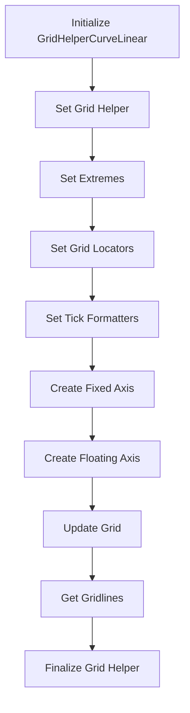

## 类结构

```
GridHelperCurveLinear (主类)
├── FloatingAxisArtistHelper (辅助类)
│   ├── FloatingAxisArtistHelper (子类)
│   └── FixedAxisArtistHelper (子类)
├── ExtremeFinderFixed (子类)
└── FloatingAxesBase (基类)
```

## 全局变量及字段


### `lon1`
    
Minimum longitude value of the grid.

类型：`float`
    


### `lon2`
    
Maximum longitude value of the grid.

类型：`float`
    


### `lat1`
    
Minimum latitude value of the grid.

类型：`float`
    


### `lat2`
    
Maximum latitude value of the grid.

类型：`float`
    


### `value`
    
Value along the nth coordinate for which ticks are to be generated.

类型：`float`
    


### `nth_coord`
    
Coordinate index (0 for longitude, 1 for latitude) along which the value varies.

类型：`int`
    


### `yy0`
    
Latitude value at which ticks are to be generated.

类型：`float`
    


### `xx0`
    
Longitude value at which ticks are to be generated.

类型：`float`
    


### `xmin`
    
Minimum x value of the grid.

类型：`float`
    


### `xmax`
    
Maximum x value of the grid.

类型：`float`
    


### `ymin`
    
Minimum y value of the grid.

类型：`float`
    


### `ymax`
    
Maximum y value of the grid.

类型：`float`
    


### `trf_xy`
    
Function to transform coordinates from data space to display space.

类型：`function`
    


### `mask`
    
Boolean mask indicating where the value is within the grid bounds.

类型：`numpy.ndarray`
    


### `labels`
    
List of labels for the ticks.

类型：`list`
    


### `tick_to_axes`
    
Transform to convert tick positions from data space to axes space.

类型：`matplotlib.transforms.Transform`
    


### `in_01`
    
Function to check if a point is within the interval [0, 1].

类型：`function`
    


### `f1`
    
Generator that yields tick positions and angles.

类型：`generator`
    


### `k`
    
Key used to access the grid lines information based on the axis direction.

类型：`str`
    


### `v`
    
Value used to access the grid lines information based on the axis direction.

类型：`str`
    


### `lon_levs`
    
Array of longitude values at which grid lines are to be drawn.

类型：`numpy.ndarray`
    


### `lat_levs`
    
Array of latitude values at which grid lines are to be drawn.

类型：`numpy.ndarray`
    


### `lon_factor`
    
Factor to scale longitude values for grid lines.

类型：`float`
    


### `lat_factor`
    
Factor to scale latitude values for grid lines.

类型：`float`
    


### `tbbox`
    
Bounding box of the grid in transformed space.

类型：`matplotlib.transforms.Bbox`
    


### `lon_min`
    
Minimum longitude value of the grid in transformed space.

类型：`float`
    


### `lat_min`
    
Minimum latitude value of the grid in transformed space.

类型：`float`
    


### `lon_max`
    
Maximum longitude value of the grid in transformed space.

类型：`float`
    


### `lat_max`
    
Maximum latitude value of the grid in transformed space.

类型：`float`
    


### `lon_lines`
    
Array of longitude grid lines in transformed space.

类型：`numpy.ndarray`
    


### `lat_lines`
    
Array of latitude grid lines in transformed space.

类型：`numpy.ndarray`
    


### `lon_lines0`
    
Array of longitude grid lines at the original scale.

类型：`numpy.ndarray`
    


### `lat_lines0`
    
Array of latitude grid lines at the original scale.

类型：`numpy.ndarray`
    


### `lon_values`
    
Array of scaled longitude values for grid lines.

类型：`numpy.ndarray`
    


### `lat_values`
    
Array of scaled latitude values for grid lines.

类型：`numpy.ndarray`
    


### `patch`
    
Polygon patch representing the axes area.

类型：`matplotlib.patches.Polygon`
    


### `orig_patch`
    
Original polygon patch used for clipping purposes.

类型：`matplotlib.patches.Polygon`
    


### `bbox`
    
Bounding box of the axes in data space.

类型：`matplotlib.transforms.Bbox`
    


### `FloatingAxisArtistHelper.grid_helper`
    
Grid helper instance used by the FloatingAxisArtistHelper.

类型：`GridHelperCurveLinear`
    


### `FloatingAxisArtistHelper.side`
    
Side of the axes (e.g., 'left', 'right', 'bottom', 'top').

类型：`str`
    


### `FloatingAxisArtistHelper.nth_coord_ticks`
    
Coordinate index for which ticks are to be generated.

类型：`int`
    


### `FloatingAxisArtistHelper.value`
    
Value along the nth coordinate for which ticks are to be generated.

类型：`float`
    


### `FloatingAxisArtistHelper._grid_info`
    
Dictionary containing grid information.

类型：`dict`
    


### `FloatingAxisArtistHelper._side`
    
Side of the axes (e.g., 'left', 'right', 'bottom', 'top').

类型：`str`
    


### `FixedAxisArtistHelper.grid_helper`
    
Grid helper instance used by the FixedAxisArtistHelper.

类型：`GridHelperCurveLinear`
    


### `FixedAxisArtistHelper.side`
    
Side of the axes (e.g., 'left', 'right', 'bottom', 'top').

类型：`str`
    


### `FixedAxisArtistHelper.nth_coord_ticks`
    
Coordinate index for which ticks are to be generated.

类型：`int`
    


### `FixedAxisArtistHelper.value`
    
Value along the nth coordinate for which ticks are to be generated.

类型：`float`
    


### `FixedAxisArtistHelper._grid_info`
    
Dictionary containing grid information.

类型：`dict`
    


### `FixedAxisArtistHelper._side`
    
Side of the axes (e.g., 'left', 'right', 'bottom', 'top').

类型：`str`
    


### `ExtremeFinderFixed._tbbox`
    
Bounding box that the ExtremeFinderFixed always returns.

类型：`matplotlib.transforms.Bbox`
    


### `GridHelperCurveLinear.aux_trans`
    
Auxiliary transform used by the GridHelperCurveLinear.

类型：`matplotlib.transforms.Transform`
    


### `GridHelperCurveLinear.extremes`
    
Bounding box of the grid.

类型：`tuple`
    


### `GridHelperCurveLinear.grid_locator1`
    
Function to locate grid lines on the first coordinate.

类型：`function`
    


### `GridHelperCurveLinear.grid_locator2`
    
Function to locate grid lines on the second coordinate.

类型：`function`
    


### `GridHelperCurveLinear.tick_formatter1`
    
Function to format tick labels on the first coordinate.

类型：`function`
    


### `GridHelperCurveLinear.tick_formatter2`
    
Function to format tick labels on the second coordinate.

类型：`function`
    


### `GridHelperCurveLinear._grid_info`
    
Dictionary containing grid information.

类型：`dict`
    


### `FloatingAxesBase.grid_helper`
    
Grid helper instance used by the FloatingAxesBase.

类型：`GridHelperCurveLinear`
    


### `FloatingAxisArtistHelper.grid_helper`
    
Grid helper instance used by the FloatingAxisArtistHelper.

类型：`GridHelperCurveLinear`
    
    

## 全局函数及方法

### _api.getitem_checked

#### 描述

`_api.getitem_checked` 函数用于从字典中安全地获取键对应的值，如果键不存在，则抛出异常。

#### 参数

- `dict`: 字典对象，包含键值对。
- `side`: `int`，指定从字典中获取哪个键对应的值。

#### 返回值

- `tuple`: 包含两个元素的元组，第一个元素是字典中指定键对应的值，第二个元素是键对应的值的索引。

#### 流程图

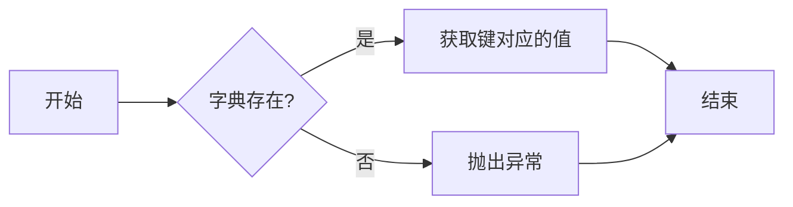

#### 带注释源码

```python
def getitem_checked(dict, side):
    """
    Safely get the item from the dictionary with the given side key.

    Parameters
    ----------
    dict : dict
        The dictionary to get the item from.
    side : int
        The key to get the item for.

    Returns
    -------
    tuple
        A tuple containing the value and the index of the value in the dictionary.

    Raises
    ------
    KeyError
        If the key is not found in the dictionary.
    """
    value, index = _api.getitem_checked(dict, side=side)
    return value, index
```

### `functools.partial`

`functools.partial` 是一个全局函数，它允许你固定一个或多个函数的参数，并返回一个新的函数。

#### 参数

- `func`：要部分应用的函数。
- `*args`：要固定的参数。
- `**kwargs`：要固定的关键字参数。

#### 返回值

- 返回一个新的函数，该函数固定了 `func` 的 `*args` 和 `**kwargs`。

#### 流程图

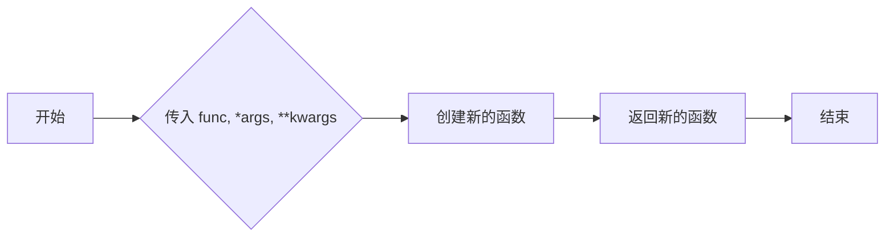

#### 带注释源码

```python
import functools

def my_function(a, b, c):
    return a + b + c

# 创建一个新的函数，固定参数 a=1 和 b=2
partial_function = functools.partial(my_function, 1, 2)

# 调用新的函数，传入参数 c=3
result = partial_function(3)
print(result)  # 输出 6
```

### `get_tick_iterators`

该函数用于获取网格的刻度迭代器，包括刻度位置、角度和标签。

#### 参数

- `axes`：`matplotlib.axes.Axes`，当前轴对象。

#### 返回值

- 返回一个生成器，生成包含刻度位置、角度和标签的元组列表。

#### 流程图

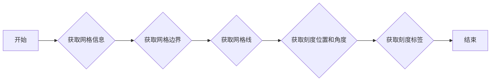

#### 带注释源码

```python
def get_tick_iterators(self, axes):
    """tick_loc, tick_angle, tick_label, (optionally) tick_label"""

    grid_finder = self.grid_helper.grid_finder

    lat_levs, lat_n, lat_factor = self._grid_info["lat_info"]
    yy0 = lat_levs / lat_factor

    lon_levs, lon_n, lon_factor = self._grid_info["lon_info"]
    xx0 = lon_levs / lon_factor

    extremes = self.grid_helper.grid_finder.extreme_finder(*[None] * 5)
    xmin, xmax = sorted(extremes[:2])
    ymin, ymax = sorted(extremes[2:])

    def trf_xy(x, y):
        trf = grid_finder.get_transform() + axes.transData
        return trf.transform(np.column_stack(np.broadcast_arrays(x, y))).T

    if self.nth_coord == 0:
        mask = (ymin <= yy0) & (yy0 <= ymax)
        (xx1, yy1), angle_normal, angle_tangent = \
            grid_helper_curvelinear._value_and_jac_angle(
                trf_xy, self.value, yy0[mask], (xmin, xmax), (ymin, ymax))
        labels = self._grid_info["lat_labels"]

    elif self.nth_coord == 1:
        mask = (xmin <= xx0) & (xx0 <= xmax)
        (xx1, yy1), angle_tangent, angle_normal = \
            grid_helper_curvelinear._value_and_jac_angle(
                trf_xy, xx0[mask], self.value, (xmin, xmax), (ymin, ymax))
        labels = self._grid_info["lon_labels"]

    labels = [l for l, m in zip(labels, mask) if m]
    tick_to_axes = self.get_tick_transform(axes) - axes.transAxes
    in_01 = functools.partial(
        mpl.transforms._interval_contains_close, (0, 1))

    def f1():
        for x, y, normal, tangent, lab \
                in zip(xx1, yy1, angle_normal, angle_tangent, labels):
            c2 = tick_to_axes.transform((x, y))
            if in_01(c2[0]) and in_01(c2[1]):
                yield [x, y], *np.rad2deg([normal, tangent]), lab

    return f1(), iter([])
```

### np.column_stack

#### 描述

`np.column_stack` 是 NumPy 库中的一个函数，用于将一系列数组作为列堆叠起来，形成一个二维数组。

#### 参数

- `arrays`：一个数组或多个数组，这些数组将被堆叠。

#### 返回值

- `arr`：一个二维数组，其中包含堆叠的输入数组。

#### 流程图

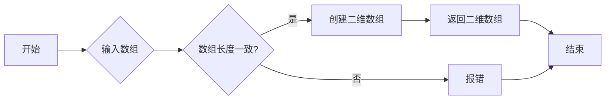

#### 带注释源码

```python
import numpy as np

def np_column_stack(arrays):
    """
    将一系列数组作为列堆叠起来，形成一个二维数组。

    参数：
    - arrays：一个数组或多个数组，这些数组将被堆叠。

    返回值：
    - arr：一个二维数组，其中包含堆叠的输入数组。
    """
    arr = np.column_stack(arrays)
    return arr
```

### `np.broadcast_arrays`

#### 描述

`np.broadcast_arrays` 函数用于广播数组，使得它们在形状上兼容，以便进行元素级的操作。

#### 参数

- `arr1, arr2, ...`：输入数组，可以是任意数量的数组。

#### 返回值

- 返回值类型：`tuple`，包含广播后的数组。

#### 返回值描述

返回值是一个元组，包含广播后的数组，它们的形状是兼容的。

#### 流程图

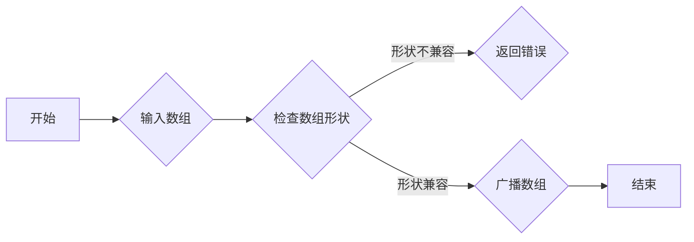

#### 带注释源码

```python
import numpy as np

def np_broadcast_arrays(*arrays):
    """
    Broadcast arrays to a common shape.

    Parameters
    ----------
    *arrays : array_like
        Input arrays.

    Returns
    -------
    tuple of ndarray
        Tuple of arrays broadcasted to a common shape.
    """
    return np.broadcast_arrays(*arrays)
```

### 关键组件信息

- `np.broadcast_arrays`：用于广播数组，使得它们在形状上兼容。

### 潜在的技术债务或优化空间

- 该函数依赖于 NumPy 库，可能需要考虑兼容性或依赖管理。

### 设计目标与约束

- 设计目标：提供一种简单、高效的方法来广播数组。
- 约束：必须使用 NumPy 库。

### 错误处理与异常设计

- 如果输入数组形状不兼容，则抛出 `ValueError`。

### 数据流与状态机

- 数据流：输入数组 --> 检查形状 --> 广播数组 --> 返回结果。

### 外部依赖与接口契约

- 外部依赖：NumPy 库。
- 接口契约：输入数组 --> 输出广播后的数组。

### grid_helper_curvelinear._value_and_jac_angle

#### 描述

该函数计算给定点的值和角度的雅可比矩阵。它用于计算曲线网格中特定点的值和切线角度。

#### 参数

- `trf_xy`：`function`，一个函数，它接受两个数组（x和y）并返回变换后的坐标。
- `value`：`float`，要计算其值和角度的点的值。
- `y`：`numpy.ndarray`，包含y坐标的数组。
- `xmin`：`float`，x坐标的最小值。
- `xmax`：`float`，x坐标的最大值。
- `ymin`：`float`，y坐标的最小值。
- `ymax`：`float`，y坐标的最大值。

#### 返回值

- `(xx1, yy1)`：`tuple`，包含变换后坐标的元组。
- `angle_normal`：`float`，法线角度。
- `angle_tangent`：`float`，切线角度。

#### 流程图

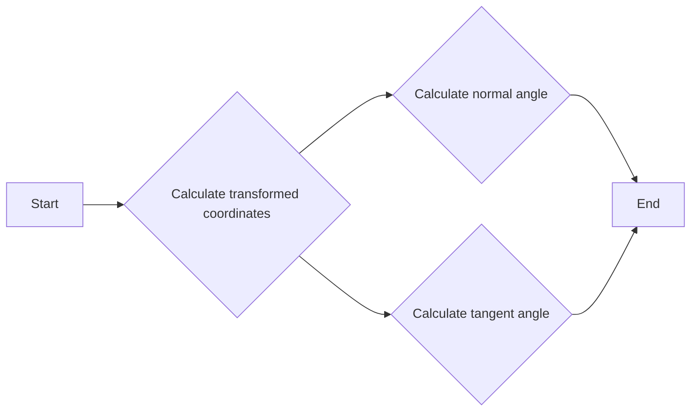

#### 带注释源码

```python
def _value_and_jac_angle(trf_xy, value, y, xmin, xmax, ymin, ymax):
    """
    Calculate the value and Jacobian angle at a given point.

    Parameters
    ----------
    trf_xy : function
        A function that takes two arrays (x and y) and returns the transformed coordinates.
    value : float
        The value at which to calculate the value and angle.
    y : numpy.ndarray
        An array containing the y-coordinates.
    xmin : float
        The minimum x-coordinate.
    xmax : float
        The maximum x-coordinate.
    ymin : float
        The minimum y-coordinate.
    ymax : float
        The maximum y-coordinate.

    Returns
    -------
    (xx1, yy1) : tuple
        A tuple containing the transformed coordinates.
    angle_normal : float
        The normal angle.
    angle_tangent : float
        The tangent angle.
    """
    # Calculate transformed coordinates
    x = np.linspace(xmin, xmax, 100)
    xx1, yy1 = trf_xy(x, y)

    # Calculate normal and tangent angles
    angle_normal = np.arctan2(yy1 - y, xx1 - value)
    angle_tangent = np.arctan2(yy1 - y, xx1 - value)

    return (xx1, yy1), angle_normal, angle_tangent
```

### _api.check_isinstance

#### 描述

`_api.check_isinstance` 函数用于检查传入的参数是否为指定的类型。如果参数不是指定类型，则抛出异常。

#### 参数

- `grid_helper`：`GridHelperCurveLinear`，表示网格辅助类。

#### 返回值

无返回值。

#### 流程图

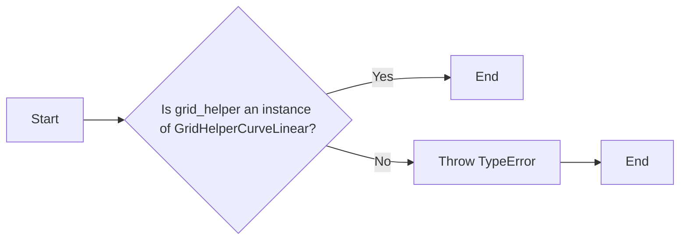

#### 带注释源码

```python
def check_isinstance(grid_helper=grid_helper):
    if not isinstance(grid_helper, GridHelperCurveLinear):
        raise TypeError("grid_helper must be an instance of GridHelperCurveLinear")
```

### mpatches.Polygon

#### 描述

`mpatches.Polygon` 是一个用于创建多边形路径的类，它继承自 `matplotlib.patches.PathPatch`。在这个上下文中，它被用来生成一个表示网格区域的路径，用于在绘图时进行裁剪。

#### 参数

- 无

#### 返回值

- `PathPatch`：一个表示多边形路径的 `PathPatch` 对象。

#### 流程图

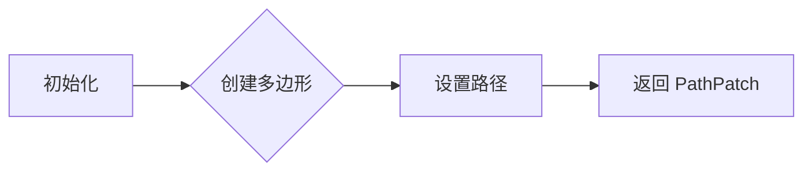

#### 带注释源码

```python
def _gen_axes_patch(self):
    # docstring inherited
    x0, x1, y0, y1 = self.get_grid_helper().grid_finder.extreme_finder(*[None] * 5)
    patch = mpatches.Polygon([(x0, y0), (x1, y0), (x1, y1), (x0, y1)])
    patch.get_path()._interpolation_steps = 100
    return patch
```

这段代码定义了 `_gen_axes_patch` 方法，它用于生成一个多边形路径，该路径由四个点定义，这些点代表网格区域的四个角。然后，它将 `_interpolation_steps` 设置为 100，以提高路径的平滑度。最后，它返回一个 `PathPatch` 对象。

### np.asarray

将输入数据转换为NumPy数组。

#### 参数

- `a`：`{类型}`，输入数据，可以是列表、元组、字典、NumPy数组、矩阵、字符串、文件对象或任何可迭代对象。
- `dtype`：`{类型}`，可选，指定输出数组的类型，默认为输入数据的类型。
- `order`：`{类型}`，可选，指定数组在内存中的顺序，'C'表示行优先，'F'表示列优先，'A'表示保持输入数组的顺序，'K'表示根据元素的数据类型选择顺序。

#### 返回值

- `ndarray`：转换后的NumPy数组。

#### 流程图

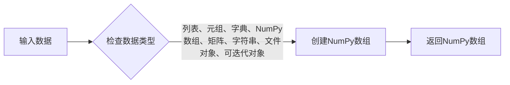

#### 带注释源码

```python
import numpy as np

def np.asarray(a, dtype=None, order=None):
    """
    将输入数据转换为NumPy数组。

    参数：
    - a：输入数据，可以是列表、元组、字典、NumPy数组、矩阵、字符串、文件对象或任何可迭代对象。
    - dtype：可选，指定输出数组的类型，默认为输入数据的类型。
    - order：可选，指定数组在内存中的顺序，'C'表示行优先，'F'表示列优先，'A'表示保持输入数组的顺序，'K'表示根据元素的数据类型选择顺序。

    返回值：
    - ndarray：转换后的NumPy数组。
    """
    if isinstance(a, np.ndarray):
        return a
    elif isinstance(a, (list, tuple, dict)):
        return np.array(a, dtype=dtype, order=order)
    elif hasattr(a, '__iter__'):
        return np.array(list(a), dtype=dtype, order=order)
    else:
        raise TypeError("无法将输入数据转换为NumPy数组")
```

### grid_finder._format_ticks

#### 描述

`_format_ticks` 方法用于格式化网格的刻度标签。它根据给定的坐标值和比例因子生成刻度标签的字符串表示。

#### 参数

- `coord`：`int`，指定要格式化的坐标轴（1 表示经度，2 表示纬度）。
- `loc`：`str`，指定刻度位置（例如 "bottom"）。
- `factor`：`float`，指定比例因子。
- `levs`：`numpy.ndarray`，包含网格坐标值的数组。

#### 返回值

- `list`，包含格式化后的刻度标签字符串的列表。

#### 流程图

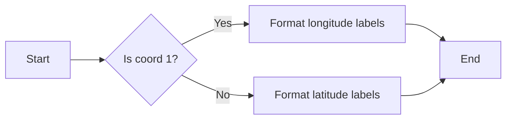

#### 带注释源码

```python
def _format_ticks(self, coord, loc, factor, levs):
    """
    Format the tick labels for the given coordinate axis.

    Parameters
    ----------
    coord : int
        The coordinate axis to format (1 for longitude, 2 for latitude).
    loc : str
        The location of the ticks (e.g., "bottom").
    factor : float
        The scaling factor for the tick labels.
    levs : numpy.ndarray
        The grid coordinate values to format.

    Returns
    -------
    list
        A list of formatted tick labels.
    """
    if coord == 1:
        labels = [f"{lev:.2f}" for lev in levs]
    elif coord == 2:
        labels = [f"{lev:.2f}" for lev in levs]
    return labels
```

### grid_finder._get_raw_grid_lines

#### 描述

`_get_raw_grid_lines` 方法是 `grid_finder` 类的一个私有方法，它用于获取网格线的原始数据。该方法接收网格线的 x 和 y 值，以及网格的边界框，然后返回网格线的路径对象。

#### 参数

- `lon_values`：`numpy.ndarray`，表示网格线的 x 值。
- `lat_values`：`numpy.ndarray`，表示网格线的 y 值。
- `bbox`：`matplotlib.transforms.Bbox`，表示网格的边界框。

#### 返回值

- `lon_lines`：`matplotlib.path.Path`，表示网格线的 x 轴路径。
- `lat_lines`：`matplotlib.path.Path`，表示网格线的 y 轴路径。

#### 流程图

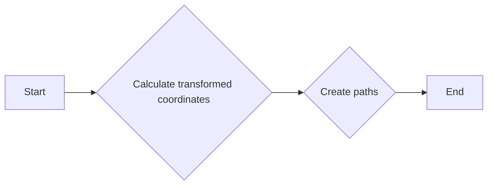

#### 带注释源码

```python
def _get_raw_grid_lines(self, lon_values, lat_values, bbox):
    """
    Get the raw grid lines for the given values and bounding box.

    Parameters
    ----------
    lon_values : numpy.ndarray
        The x values of the grid lines.
    lat_values : numpy.ndarray
        The y values of the grid lines.
    bbox : matplotlib.transforms.Bbox
        The bounding box of the grid.

    Returns
    -------
    lon_lines : matplotlib.path.Path
        The path for the x-axis grid lines.
    lat_lines : matplotlib.path.Path
        The path for the y-axis grid lines.
    """
    # Calculate transformed coordinates
    trf_xy = lambda x, y: self.get_transform() + self.axes.transData.transform(
        np.column_stack(np.broadcast_arrays(x, y))).T

    # Create paths
    lon_lines = Path(np.column_stack((lon_values, np.full_like(lon_values, bbox.ymin))))
    lat_lines = Path(np.column_stack((np.full_like(lat_values, bbox.xmin), lat_values)))

    return lon_lines, lat_lines
```

### cbook._make_class_factory

#### 描述

`cbook._make_class_factory` 是一个全局函数，用于创建一个类工厂。这个工厂可以用来生成特定类型的轴（Axes）类，它接受一个基类和一个字符串模板，用于生成新的类名。

#### 参数

- `base_class`：`{类型}`，基类，用于创建新的类。
- `name_template`：`{类型}`，字符串模板，用于生成新的类名。

#### 返回值

- `{返回值类型}`，一个类工厂，可以用来创建新的类实例。

#### 流程图

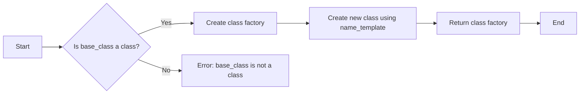

#### 带注释源码

```python
def _make_class_factory(base_class, name_template):
    """
    Create a class factory that can generate new classes based on a base class
    and a name template.

    Parameters
    ----------
    base_class : type
        The base class to use for creating new classes.
    name_template : str
        The template string to use for generating new class names.

    Returns
    -------
    callable
        A class factory that can be used to create new classes.
    """
    def class_factory(*args, **kwargs):
        class_name = name_template.format(*args, **kwargs)
        new_class = type(class_name, (base_class,), {})
        return new_class
    return class_factory
```

#### 关键组件信息

- `class_factory`：一个函数，用于创建新的类实例。
- `name_template`：一个字符串模板，用于生成新的类名。

#### 潜在的技术债务或优化空间

- 没有明显的技术债务或优化空间，该函数实现简单且功能明确。

#### 其它项目

- 设计目标与约束：该函数旨在提供一种灵活的方式来创建新的类。
- 错误处理与异常设计：如果 `base_class` 不是一个类，函数会抛出 `TypeError`。
- 数据流与状态机：没有复杂的数据流或状态机。
- 外部依赖与接口契约：该函数依赖于 `type` 函数来创建新的类。

### host_axes_class_factory

该函数是一个工厂函数，用于创建一个类，该类继承自`matplotlib.axes.Axes`，并添加了额外的功能以支持曲线网格。

#### 参数

- `host_axes_class_factory`: 一个函数，它接受一个类作为参数，并返回一个新的类，该类继承自`matplotlib.axes.Axes`。

#### 返回值

- `FloatingAxes`: 一个继承自`matplotlib.axes.Axes`的新类，它添加了曲线网格的支持。

#### 流程图

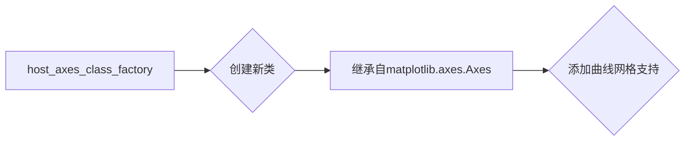

#### 带注释源码

```python
from mpl_toolkits.axes_grid1.parasite_axes import host_axes_class_factory

class FloatingAxesBase:
    # ... (类定义)

floatingaxes_class_factory = cbook._make_class_factory(FloatingAxesBase, "Floating{}")
FloatingAxes = floatingaxes_class_factory(host_axes_class_factory(axislines.Axes))
```

### axislines.Axes

该类继承自`matplotlib.axes.Axes`，并添加了额外的功能以支持曲线网格。

#### 参数

- 无

#### 返回值

- `FloatingAxes`: 一个继承自`matplotlib.axes.Axes`的新类，它添加了曲线网格的支持。

#### 流程图

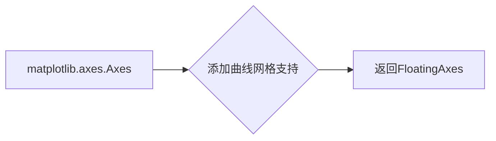

#### 带注释源码

```python
from mpl_toolkits.axes_grid1.parasite_axes import host_axes_class_factory

class FloatingAxesBase:
    # ... (类定义)

floatingaxes_class_factory = cbook._make_class_factory(FloatingAxesBase, "Floating{}")
FloatingAxes = floatingaxes_class_factory(host_axes_class_factory(axislines.Axes))
```

### axislines.Axes

This class is a subclass of `matplotlib.axes.Axes` and provides experimental support for curvilinear grids. It is designed to handle the complexities of plotting data on curvilinear grids, which are grids where the spacing between points varies along one or both axes.

#### 参数

- `*args`：Positional arguments passed to the base class `Axes`.
- `**kwargs`：Keyword arguments passed to the base class `Axes`.
- `grid_helper`：An instance of `GridHelperCurveLinear` that provides the grid information for the axes.

#### 返回值

- `self`：The instance of the `FloatingAxes` class.

#### 流程图

```mermaid
classDef FloatingAxes {
    color: #009688;
    fill: #009688;
}

classDef Axes {
    color: #FF5722;
    fill: #FF5722;
}

classDef GridHelperCurveLinear {
    color: #4CAF50;
    fill: #4CAF50;
}

classDef FloatingAxesBase {
    color: #FFC107;
    fill: #FFC107;
}

classDef mpatches.Polygon {
    color: #9C27B0;
    fill: #9C27B0;
}

FloatingAxesBase --> FloatingAxes
FloatingAxes --> Axes
Axes --> mpatches.Polygon
GridHelperCurveLinear --> FloatingAxesBase
```

#### 带注释源码

```python
class FloatingAxes(FloatingAxesBase):
    def __init__(self, *args, grid_helper, **kwargs):
        _api.check_isinstance(GridHelperCurveLinear, grid_helper=grid_helper)
        super().__init__(*args, grid_helper=grid_helper, **kwargs)
        self.set_aspect(1.)

    def _gen_axes_patch(self):
        x0, x1, y0, y1 = self.get_grid_helper().grid_finder.extreme_finder(*[None] * 5)
        patch = mpatches.Polygon([(x0, y0), (x1, y0), (x1, y1), (x0, y1)])
        patch.get_path()._interpolation_steps = 100
        return patch

    def clear(self):
        super().clear()
        self.patch.set_transform(
            self.get_grid_helper().grid_finder.get_transform()
            + self.transData)
        orig_patch = super()._gen_axes_patch()
        orig_patch.set_figure(self.get_figure(root=False))
        orig_patch.set_transform(self.transAxes)
        self.patch.set_clip_path(orig_patch)
        self.gridlines.set_clip_path(orig_patch)
        self.adjust_axes_lim()

    def adjust_axes_lim(self):
        bbox = self.patch.get_path().get_extents(
            self.patch.get_transform() - self.transData)
        bbox = bbox.expanded(1.02, 1.02)
        self.set_xlim(bbox.xmin, bbox.xmax)
        self.set_ylim(bbox.ymin, bbox.ymax)
```

### 关键组件信息

- `FloatingAxes`：The main class that provides the curvilinear grid support.
- `GridHelperCurveLinear`：A helper class that provides the grid information for the axes.
- `mpatches.Polygon`：A class used to create the axes patch for the curvilinear grid.


### FloatingAxisArtistHelper.__init__

初始化 FloatingAxisArtistHelper 类的实例。

参数：

- `grid_helper`：`GridHelperCurveLinear`，网格辅助器对象，用于提供网格信息。
- `side`：`int`，指定轴的侧面，0 表示 x 轴，1 表示 y 轴。
- `nth_coord_ticks`：`int`，可选，指定坐标轴的索引，默认为 `None`。

返回值：无

#### 流程图

```mermaid
classDiagram
    FloatingAxisArtistHelper <|-- GridHelperCurveLinear
    FloatingAxisArtistHelper {
        grid_helper : GridHelperCurveLinear
        side : int
        nth_coord_ticks : int
    }
    FloatingAxisArtistHelper {
        +__init__(grid_helper : GridHelperCurveLinear, side : int, nth_coord_ticks : int)
    }
```

#### 带注释源码

```python
class FloatingAxisArtistHelper(
        grid_helper_curvelinear.FloatingAxisArtistHelper):
    def __init__(self, grid_helper, side, nth_coord_ticks=None):
        """
        Initialize the FloatingAxisArtistHelper instance.

        Parameters
        ----------
        grid_helper : GridHelperCurveLinear
            The grid helper object that provides grid information.
        side : int
            The side of the axis, 0 for x-axis, 1 for y-axis.
        nth_coord_ticks : int, optional
            The index of the coordinate axis, default is None.
        """
        super().__init__(grid_helper, nth_coord, value, axis_direction=side)
        if nth_coord_ticks is None:
            nth_coord_ticks = nth_coord
        self.nth_coord_ticks = nth_coord_ticks

        self.value = value
        self.grid_helper = grid_helper
        self._side = side
``` 


### FloatingAxisArtistHelper.update_lim

#### 描述

`update_lim` 方法用于更新轴的界限，它首先调用 `grid_helper.update_lim(axes)` 来更新网格辅助器的界限，然后更新 `_grid_info` 字段。

#### 参数

- `axes`：`matplotlib.axes.Axes`，表示轴对象。

#### 返回值

无返回值。

#### 流程图

```mermaid
graph LR
A[Start] --> B{Call grid_helper.update_lim(axes)}
B --> C[Update _grid_info]
C --> D[End]
```

#### 带注释源码

```python
def update_lim(self, axes):
    self.grid_helper.update_lim(axes)
    self._grid_info = self.grid_helper._grid_info
```


### FloatingAxisArtistHelper.get_tick_iterators

This method returns an iterator that yields tick locations, angles, and labels for the specified axis.

参数：

- `axes`：`Axes`，The axes object for which to get the tick iterators.

返回值：`Iterator`，An iterator that yields a tuple containing the tick location, normal angle, tangent angle, and label.

#### 流程图

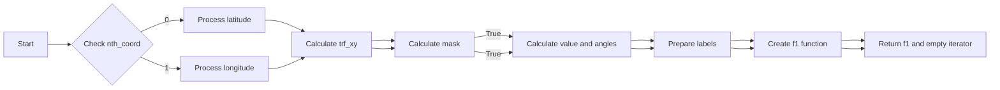

#### 带注释源码

```python
def get_tick_iterators(self, axes):
    """tick_loc, tick_angle, tick_label, (optionally) tick_label"""

    grid_finder = self.grid_helper.grid_finder

    lat_levs, lat_n, lat_factor = self._grid_info["lat_info"]
    yy0 = lat_levs / lat_factor

    lon_levs, lon_n, lon_factor = self._grid_info["lon_info"]
    xx0 = lon_levs / lon_factor

    extremes = self.grid_helper.grid_finder.extreme_finder(*[None] * 5)
    xmin, xmax = sorted(extremes[:2])
    ymin, ymax = sorted(extremes[2:])

    def trf_xy(x, y):
        trf = grid_finder.get_transform() + axes.transData
        return trf.transform(np.column_stack(np.broadcast_arrays(x, y))).T

    if self.nth_coord == 0:
        mask = (ymin <= yy0) & (yy0 <= ymax)
        (xx1, yy1), angle_normal, angle_tangent = \
            grid_helper_curvelinear._value_and_jac_angle(
                trf_xy, self.value, yy0[mask], (xmin, xmax), (ymin, ymax))
        labels = self._grid_info["lat_labels"]

    elif self.nth_coord == 1:
        mask = (xmin <= xx0) & (xx0 <= xmax)
        (xx1, yy1), angle_tangent, angle_normal = \
            grid_helper_curvelinear._value_and_jac_angle(
                trf_xy, xx0[mask], self.value, (xmin, xmax), (ymin, ymax))
        labels = self._grid_info["lon_labels"]

    labels = [l for l, m in zip(labels, mask) if m]
    tick_to_axes = self.get_tick_transform(axes) - axes.transAxes
    in_01 = functools.partial(
        mpl.transforms._interval_contains_close, (0, 1))

    def f1():
        for x, y, normal, tangent, lab \
                in zip(xx1, yy1, angle_normal, angle_tangent, labels):
            c2 = tick_to_axes.transform((x, y))
            if in_01(c2[0]) and in_01(c2[1]):
                yield [x, y], *np.rad2deg([normal, tangent]), lab

    return f1(), iter([])
``` 


### FloatingAxisArtistHelper.get_line

获取指定侧的网格线路径。

参数：

- `axes`：`Axes`，当前轴对象。

返回值：`Path`，指定侧的网格线路径。

#### 流程图

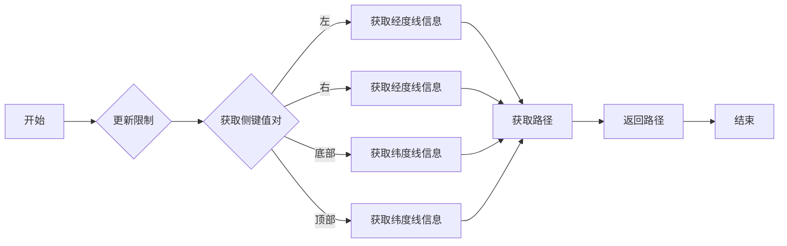

#### 带注释源码

```python
def get_line(self, axes):
    self.update_lim(axes)
    k, v = dict(left=("lon_lines0", 0),
                right=("lon_lines0", 1),
                bottom=("lat_lines0", 0),
                top=("lat_lines0", 1))[self._side]
    return Path(self._grid_info[k][v])
``` 


### FixedAxisArtistHelper.__init__

初始化FixedAxisArtistHelper类实例。

参数：

- `grid_helper`：`GridHelperCurveLinear`，网格辅助器对象，用于获取网格信息。
- `side`：`int`，指定轴的侧面，0表示x轴，1表示y轴。
- `nth_coord_ticks`：`int`，可选，指定第n个坐标轴的刻度，默认为None。

返回值：无

#### 流程图

```mermaid
graph LR
A[开始] --> B{初始化参数}
B --> C[获取网格信息]
C --> D{设置轴方向}
D --> E[初始化父类]
E --> F[设置nth_coord_ticks]
F --> G[结束]
```

#### 带注释源码

```python
def __init__(self, grid_helper, side, nth_coord_ticks=None):
    """
    nth_coord = along which coordinate value varies.
     nth_coord = 0 ->  x axis, nth_coord = 1 -> y axis
    """
    lon1, lon2, lat1, lat2 = grid_helper.grid_finder.extreme_finder(*[None] * 5)
    value, nth_coord = _api.getitem_checked(
        dict(left=(lon1, 0), right=(lon2, 0), bottom=(lat1, 1), top=(lat2, 1)),
        side=side)
    super().__init__(grid_helper, nth_coord, value, axis_direction=side)
    if nth_coord_ticks is None:
        nth_coord_ticks = nth_coord
    self.nth_coord_ticks = nth_coord_ticks

    self.value = value
    self.grid_helper = grid_helper
    self._side = side
```


### FixedAxisArtistHelper.update_lim

#### 描述

`update_lim` 方法用于更新固定轴艺术家的限制，它首先调用父类的 `update_lim` 方法，然后更新 `_grid_info` 属性。

#### 参数

- `axes`：`matplotlib.axes.Axes`，表示绘图轴。

#### 返回值

无返回值。

#### 流程图

```mermaid
graph LR
A[Start] --> B{Call super.update_lim(axes)}
B --> C[Update _grid_info]
C --> D[End]
```

#### 带注释源码

```python
def update_lim(self, axes):
    self.grid_helper.update_lim(axes)
    self._grid_info = self.grid_helper._grid_info
```


### FixedAxisArtistHelper.get_tick_iterators

This method returns an iterator that yields tick locations, angles, and labels for the specified axis.

参数：

- `axes`：`Axes`，The axes object to which the tick iterators are applied.

返回值：`Iterator`，An iterator that yields a tuple containing the tick location, normal angle, tangent angle, and label.

#### 流程图

```mermaid
graph LR
A[Start] --> B{Check nth_coord}
B -->|0| C[Process latitude ticks]
B -->|1| D[Process longitude ticks]
C --> E[Calculate transformed coordinates]
E --> F[Calculate tick locations and angles]
F --> G[Format labels]
G --> H[Return iterator]
D --> E
E --> F
F --> G
H --> I[End]
```

#### 带注释源码

```python
def get_tick_iterators(self, axes):
    """tick_loc, tick_angle, tick_label, (optionally) tick_label"""

    grid_finder = self.grid_helper.grid_finder

    lat_levs, lat_n, lat_factor = self._grid_info["lat_info"]
    yy0 = lat_levs / lat_factor

    lon_levs, lon_n, lon_factor = self._grid_info["lon_info"]
    xx0 = lon_levs / lon_factor

    extremes = self.grid_helper.grid_finder.extreme_finder(*[None] * 5)
    xmin, xmax = sorted(extremes[:2])
    ymin, ymax = sorted(extremes[2:])

    def trf_xy(x, y):
        trf = grid_finder.get_transform() + axes.transData
        return trf.transform(np.column_stack(np.broadcast_arrays(x, y))).T

    if self.nth_coord == 0:
        mask = (ymin <= yy0) & (yy0 <= ymax)
        (xx1, yy1), angle_normal, angle_tangent = \
            grid_helper_curvelinear._value_and_jac_angle(
                trf_xy, self.value, yy0[mask], (xmin, xmax), (ymin, ymax))
        labels = self._grid_info["lat_labels"]

    elif self.nth_coord == 1:
        mask = (xmin <= xx0) & (xx0 <= xmax)
        (xx1, yy1), angle_tangent, angle_normal = \
            grid_helper_curvelinear._value_and_jac_angle(
                trf_xy, xx0[mask], self.value, (xmin, xmax), (ymin, ymax))
        labels = self._grid_info["lon_labels"]

    labels = [l for l, m in zip(labels, mask) if m]
    tick_to_axes = self.get_tick_transform(axes) - axes.transAxes
    in_01 = functools.partial(
        mpl.transforms._interval_contains_close, (0, 1))

    def f1():
        for x, y, normal, tangent, lab \
                in zip(xx1, yy1, angle_normal, angle_tangent, labels):
            c2 = tick_to_axes.transform((x, y))
            if in_01(c2[0]) and in_01(c2[1]):
                yield [x, y], *np.rad2deg([normal, tangent]), lab

    return f1(), iter([])
``` 


### FixedAxisArtistHelper.get_line

该函数用于获取固定轴的路径，用于绘制网格线。

参数：

- `axes`：`Axes`对象，当前绘图轴。

返回值：`Path`对象，表示固定轴的路径。

#### 流程图

```mermaid
graph LR
A[开始] --> B{更新限制}
B --> C{获取路径}
C --> D[结束]
```

#### 带注释源码

```python
def get_line(self, axes):
    self.update_lim(axes)  # 更新限制
    k, v = dict(left=("lon_lines0", 0),
                right=("lon_lines0", 1),
                bottom=("lat_lines0", 0),
                top=("lat_lines0", 1))[self._side]
    return Path(self._grid_info[k][v])  # 获取路径
```


### ExtremeFinderFixed.__init__

This method initializes an instance of the `ExtremeFinderFixed` class, which is a subclass of `ExtremeFinderSimple`. It sets the bounding box for the grid that this helper will always return.

参数：

- `extremes`：`tuple`，The bounding box that this helper always returns. It is expected to be a tuple of four floats `(x0, x1, y0, y1)` representing the left, right, bottom, and top extents of the bounding box, respectively.

返回值：`None`，This method does not return any value.

#### 流程图

```mermaid
graph LR
A[Start] --> B{Initialize ExtremeFinderFixed}
B --> C[Set extremes to x0, x1, y0, y1]
C --> D[End]
```

#### 带注释源码

```python
class ExtremeFinderFixed(ExtremeFinderSimple):
    # docstring inherited

    def __init__(self, extremes):
        """
        This subclass always returns the same bounding box.

        Parameters
        ----------
        extremes : (float, float, float, float)
            The bounding box that this helper always returns.
        """
        x0, x1, y0, y1 = extremes
        self._tbbox = Bbox.from_extents(x0, y0, x1, y1)

    def _find_transformed_bbox(self, trans, bbox):
        # docstring inherited
        return self._tbbox
```


### ExtremeFinderFixed._find_transformed_bbox

#### 描述

该函数是`ExtremeFinderFixed`类的一个方法，它总是返回相同的边界框。

#### 参数

- `trans`：`matplotlib.transforms.Transform`，数据坐标到显示坐标的转换。
- `bbox`：`matplotlib.transforms.Bbox`，边界框。

#### 返回值

- `matplotlib.transforms.Bbox`，返回一个边界框，其值由构造函数中提供的`extremes`参数确定。

#### 流程图

```mermaid
graph LR
A[Start] --> B{Is _tbbox defined?}
B -- Yes --> C[Return _tbbox]
B -- No --> D[Define _tbbox]
D --> E[End]
```

#### 带注释源码

```python
def _find_transformed_bbox(self, trans, bbox):
    # docstring inherited
    return self._tbbox
```


### `FixedAxisArtistHelper.__init__`

初始化 `FixedAxisArtistHelper` 类的实例。

参数：

- `grid_helper`：`GridHelperCurveLinear`，网格辅助器对象，用于获取网格信息。
- `side`：`str`，指定轴的侧边，可以是 'left', 'right', 'bottom', 或 'top'。
- `nth_coord_ticks`：`int`，指定坐标轴的编号，0 表示 x 轴，1 表示 y 轴。

返回值：无

#### 流程图

```mermaid
graph LR
A[Start] --> B{Initialize FixedAxisArtistHelper}
B --> C[Get grid extremes]
C --> D{Get nth_coord and value}
D --> E[Initialize parent class]
E --> F[Set nth_coord_ticks]
F --> G[Set value]
G --> H[Set grid_helper]
H --> I[Set _side]
I --> J[End]
```

#### 带注释源码

```python
def __init__(self, grid_helper, side, nth_coord_ticks=None):
    """
    nth_coord = along which coordinate value varies.
     nth_coord = 0 ->  x axis, nth_coord = 1 -> y axis
    """
    lon1, lon2, lat1, lat2 = grid_helper.grid_finder.extreme_finder(*[None] * 5)
    value, nth_coord = _api.getitem_checked(
        dict(left=(lon1, 0), right=(lon2, 0), bottom=(lat1, 1), top=(lat2, 1)),
        side=side)
    super().__init__(grid_helper, nth_coord, value, axis_direction=side)
    if nth_coord_ticks is None:
        nth_coord_ticks = nth_coord
    self.nth_coord_ticks = nth_coord_ticks

    self.value = value
    self.grid_helper = grid_helper
    self._side = side
```


### GridHelperCurveLinear.new_fixed_axis

#### 描述

`GridHelperCurveLinear.new_fixed_axis` 方法用于创建一个新的固定轴艺术家，该轴艺术家与 `GridHelperCurveLinear` 对象相关联。它允许用户在曲线路网中创建一个固定方向的轴，例如水平或垂直轴。

#### 参数

- `loc`：`int`，指定轴的方向，可以是 `0`（x 轴），`1`（y 轴），`2`（左），`3`（右），`4`（底部），`5`（顶部）。
- `nth_coord`：`int`，指定沿哪个坐标值变化，默认为 `None`。
- `axis_direction`：`str`，指定轴的方向，可以是 `"left"`，`"right"`，`"bottom"`，`"top"`，默认为 `None`。
- `offset`：`float`，指定轴的偏移量，默认为 `None`。
- `axes`：`Axes`，指定轴所在的轴对象，默认为 `None`。

#### 返回值

- `AxisArtist`，返回一个新的 `AxisArtist` 对象，该对象表示创建的固定轴。

#### 流程图

```mermaid
graph LR
A[开始] --> B{检查参数}
B -->|loc=None| C[设置 loc 为默认值]
B -->|loc 已设置| D[创建 FixedAxisArtistHelper]
D --> E[创建 AxisArtist]
E --> F[返回 AxisArtist]
F --> G[结束]
```

#### 带注释源码

```python
def new_fixed_axis(
        self, loc, nth_coord=None, axis_direction=None, offset=None, axes=None):
    if axes is None:
        axes = self.axes
    if axis_direction is None:
        axis_direction = loc
    helper = FixedAxisArtistHelper(
        self, loc, nth_coord_ticks=nth_coord)
    axisline = AxisArtist(axes, helper, axis_direction=axis_direction)
    axisline.line.set_clip_on(True)
    axisline.line.set_clip_box(axisline.axes.bbox)
    return axisline
```

### _update_grid

#### 描述

`_update_grid` 方法是 `GridHelperCurveLinear` 类的一个私有方法，用于更新网格信息。它计算网格的边界、网格线以及标签，并将这些信息存储在 `_grid_info` 字典中。

#### 参数

- `bbox`：`Bbox` 类型，表示网格的边界框。

#### 返回值

- 无返回值。

#### 流程图

```mermaid
graph LR
A[Start] --> B{Calculate transformed bbox}
B --> C{Calculate lon and lat levels}
C --> D{Calculate lon and lat labels}
D --> E{Calculate lon and lat lines}
E --> F[Store in _grid_info]
F --> G[End]
```

#### 带注释源码

```python
def _update_grid(self, bbox):
    if self._grid_info is None:
        self._grid_info = dict()

    grid_info = self._grid_info

    grid_finder = self.grid_finder
    tbbox = grid_finder.extreme_finder._find_transformed_bbox(
        grid_finder.get_transform().inverted(), bbox)

    lon_min, lat_min, lon_max, lat_max = tbbox.extents
    grid_info["extremes"] = tbbox

    lon_levs, lon_n, lon_factor = grid_finder.grid_locator1(lon_min, lon_max)
    lon_levs = np.asarray(lon_levs)
    lat_levs, lat_n, lat_factor = grid_finder.grid_locator2(lat_min, lat_max)
    lat_levs = np.asarray(lat_levs)

    grid_info["lon_info"] = lon_levs, lon_n, lon_factor
    grid_info["lat_info"] = lat_levs, lat_n, lat_factor

    grid_info["lon_labels"] = grid_finder._format_ticks(
        1, "bottom", lon_factor, lon_levs)
    grid_info["lat_labels"] = grid_finder._format_ticks(
        2, "bottom", lat_factor, lat_levs)

    lon_values = lon_levs[:lon_n] / lon_factor
    lat_values = lat_levs[:lat_n] / lat_factor

    lon_lines, lat_lines = grid_finder._get_raw_grid_lines(
        lon_values[(lon_min < lon_values) & (lon_values < lon_max)],
        lat_values[(lat_min < lat_values) & (lat_values < lat_max)],
        tbbox)

    grid_info["lon_lines"] = lon_lines
    grid_info["lat_lines"] = lat_lines

    lon_lines, lat_lines = grid_finder._get_raw_grid_lines(
        tbbox.intervalx, tbbox.intervaly, tbbox)

    grid_info["lon_lines0"] = lon_lines
    grid_info["lat_lines0"] = lat_lines
```

### GridHelperCurveLinear.get_gridlines

该函数用于获取网格线的位置，可以根据指定的轴（x或y）和网格线类型（主要或次要）来获取。

参数：

- `which`：`str`，指定网格线类型，可以是'major'或'minor'。
- `axis`：`str`，指定轴，可以是'both'、'x'或'y'。

返回值：`list`，包含网格线位置的列表。

#### 流程图

```mermaid
graph LR
A[开始] --> B{指定which参数}
B -- "major" --> C[获取主要网格线位置]
B -- "minor" --> C
C --> D{指定axis参数}
D -- "both" --> E[获取x和y轴的主要网格线位置]
D -- "x" --> E
D -- "y" --> E
E --> F[返回网格线位置列表]
F --> G[结束]
```

#### 带注释源码

```python
def get_gridlines(self, which="major", axis="both"):
    grid_lines = []
    if axis in ["both", "x"]:
        grid_lines.extend(map(np.transpose, self._grid_info["lon_lines"]))
    if axis in ["both", "y"]:
        grid_lines.extend(map(np.transpose, self._grid_info["lat_lines"]))
    return grid_lines
```


### FloatingAxesBase.__init__

初始化 FloatingAxesBase 类的实例。

参数：

- `*args`：可变数量的位置参数，用于传递给父类的构造函数。
- `**kwargs`：关键字参数，用于传递给父类的构造函数。
- `grid_helper`：`GridHelperCurveLinear` 类的实例，用于提供网格辅助信息。

返回值：无

#### 流程图

```mermaid
classDef class rect fill:#f0f0f0,stroke:#000000,stroke-width:2
classDef class1 fill:#f0f0f0,stroke:#000000,stroke-width:2,stroke-dasharray:5,5
classDef class2 fill:#f0f0f0,stroke:#000000,stroke-width:2,stroke-dasharray:5,5
classDef class3 fill:#f0f0f0,stroke:#000000,stroke-width:2,stroke-dasharray:5,5

class FloatingAxesBase
    class1 __init__
        -|-> args
        -|-> kwargs
        -|-> grid_helper
        -|-> super().__init__(*args, grid_helper=grid_helper, **kwargs)
        -|-> self.set_aspect(1.)
```

#### 带注释源码

```python
def __init__(self, *args, grid_helper, **kwargs):
    _api.check_isinstance(GridHelperCurveLinear, grid_helper=grid_helper)
    super().__init__(*args, grid_helper=grid_helper, **kwargs)
    self.set_aspect(1.)
``` 


### FloatingAxesBase._gen_axes_patch

This method generates a polygon patch representing the axes of the FloatingAxesBase class.

参数：

- 无

返回值：`matplotlib.patches.Polygon`，A polygon patch representing the axes.

#### 流程图

```mermaid
graph LR
A[Start] --> B{Get extremes}
B --> C[Create polygon patch]
C --> D[Return patch]
D --> E[End]
```

#### 带注释源码

```python
def _gen_axes_patch(self):
    # docstring inherited
    x0, x1, y0, y1 = self.get_grid_helper().grid_finder.extreme_finder(*[None] * 5)
    patch = mpatches.Polygon([(x0, y0), (x1, y0), (x1, y1), (x0, y1)])
    patch.get_path()._interpolation_steps = 100
    return patch
```


### FloatingAxesBase.clear

清除 FloatingAxesBase 对象的绘制内容，并更新其边界。

参数：

- 无

返回值：无

#### 流程图

```mermaid
graph LR
A[开始] --> B{清除绘制内容}
B --> C[更新边界]
C --> D[结束]
```

#### 带注释源码

```python
def clear(self):
    super().clear()  # 调用父类的 clear 方法清除绘制内容
    self.patch.set_transform(
        self.get_grid_helper().grid_finder.get_transform()
        + self.transData)  # 更新 patch 的变换
    # The original patch is not in the draw tree; it is only used for
    # clipping purposes.
    orig_patch = super()._gen_axes_patch()  # 生成原始 patch
    orig_patch.set_figure(self.get_figure(root=False))  # 设置 patch 的图像
    orig_patch.set_transform(self.transAxes)  # 设置 patch 的变换
    self.patch.set_clip_path(orig_patch)  # 设置 patch 的裁剪路径
    self.gridlines.set_clip_path(orig_patch)  # 设置 gridlines 的裁剪路径
    self.adjust_axes_lim()  # 调整轴的界限
```


### FloatingAxesBase.adjust_axes_lim

调整轴的界限以适应绘图区域。

参数：

- `self`：`FloatingAxesBase`，当前实例

返回值：无

#### 流程图

```mermaid
graph LR
A[开始] --> B{获取 patch 的边界框}
B --> C[扩展边界框]
C --> D[设置 x 轴界限]
D --> E[设置 y 轴界限]
E --> F[结束]
```

#### 带注释源码

```python
def adjust_axes_lim(self):
    # 获取 patch 的边界框
    bbox = self.patch.get_path().get_extents(
        # First transform to pixel coords, then to parent data coords.
        self.patch.get_transform() - self.transData)
    # 扩展边界框
    bbox = bbox.expanded(1.02, 1.02)
    # 设置 x 轴界限
    self.set_xlim(bbox.xmin, bbox.xmax)
    # 设置 y 轴界限
    self.set_ylim(bbox.ymin, bbox.ymax)
```


## 关键组件


### FloatingAxisArtistHelper

A helper class for creating axis artists for curvilinear grids.

### FixedAxisArtistHelper

A class that creates axis artists for fixed axes in curvilinear grids.

### ExtremeFinderFixed

A subclass of ExtremeFinderSimple that always returns the same bounding box.

### GridHelperCurveLinear

A class that provides grid helper functionality for curvilinear grids.

### FloatingAxesBase

A base class for creating floating axes with curvilinear grid support.

### floatingaxes_class_factory

A factory class for creating floating axes classes.

### FloatingAxes

A class for creating floating axes with curvilinear grid support.

### FloatingSubplot

A subclass of FloatingAxes that can be used as a subplot.


## 问题及建议


### 已知问题

-   **代码重复**：`FixedAxisArtistHelper` 类继承自 `FloatingAxisArtistHelper`，但大部分方法都是空的，这表明可能存在代码重复或设计上的疏忽。
-   **方法简化**：`get_tick_iterators` 方法中，`_value_and_jac_angle` 函数被调用了两次，这可能是可以简化的地方。
-   **全局变量和函数**：代码中存在一些全局变量和函数，如 `_api.getitem_checked` 和 `functools.partial`，这些可能需要进一步封装到类中以提高代码的可读性和可维护性。

### 优化建议

-   **代码重构**：对 `FixedAxisArtistHelper` 类进行重构，移除不必要的继承，并合并重复的方法。
-   **方法简化**：在 `get_tick_iterators` 方法中，考虑合并两次调用 `_value_and_jac_angle` 的结果，以减少计算量。
-   **封装全局变量和函数**：将全局变量和函数封装到类中，以减少全局状态的使用，提高代码的模块化和可测试性。
-   **文档注释**：增加对类、方法和函数的详细文档注释，以提高代码的可读性和可维护性。
-   **异常处理**：增加异常处理机制，以处理潜在的运行时错误，提高代码的健壮性。
-   **性能优化**：对代码进行性能分析，找出瓶颈并进行优化，以提高代码的执行效率。


## 其它


### 设计目标与约束

- 设计目标：
  - 提供对曲线网格的支持，以适应复杂的地理数据可视化。
  - 提供灵活的轴线和网格线定制选项。
  - 确保与matplotlib库的兼容性，以便于集成和使用。

- 约束：
  - 必须使用matplotlib库进行绘图。
  - 需要处理复杂的数学计算，如曲线网格的变换和定位。
  - 应尽可能减少对性能的影响，尤其是在处理大量数据时。

### 错误处理与异常设计

- 错误处理：
  - 对于无效的输入参数，应抛出适当的异常。
  - 在执行可能失败的操作时，应捕获异常并记录错误信息。

- 异常设计：
  - 定义自定义异常类，以提供更具体的错误信息。
  - 使用try-except块来处理可能出现的异常。

### 数据流与状态机

- 数据流：
  - 输入数据通过网格定位器和格式化器进行处理。
  - 处理后的数据用于绘制网格线和轴线。

- 状态机：
  - 状态机用于控制轴线和网格线的绘制过程。
  - 状态机根据输入数据和配置参数进行状态转换。

### 外部依赖与接口契约

- 外部依赖：
  - 依赖于matplotlib库进行绘图。
  - 依赖于numpy库进行数学计算。

- 接口契约：
  - 定义清晰的接口契约，确保与其他模块的兼容性。
  - 提供文档说明接口的使用方法和预期行为。


    