# `matplotlib\lib\mpl_toolkits\axisartist\grid_finder.py` 详细设计文档

该文件是matplotlib的axisartist模块中用于处理曲线坐标网格的辅助类集合，核心功能是计算非线性坐标变换下的网格线位置和刻度信息，通过ExtremeFinderSimple计算数据范围，GridFinder协调网格定位器和格式化器完成网格线的绘制计算。

## 整体流程

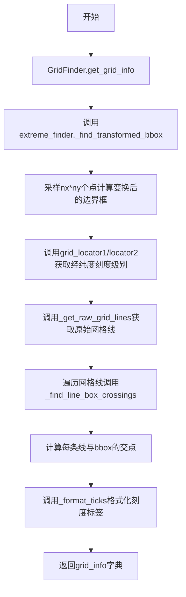

## 类结构

```
Transform (matplotlib.transforms.Transform)
└── _User2DTransform
ExtremeFinderSimple
GridFinder
├── MaxNLocator (继承mticker.MaxNLocator)
├── FixedLocator
├── FormatterPrettyPrint
└── DictFormatter
```

## 全局变量及字段


### `np`
    
NumPy库，提供数组操作和数值计算功能

类型：`module`
    


### `mticker`
    
Matplotlib ticker模块，提供刻度定位和格式化功能

类型：`module`
    


### `_api`
    
Matplotlib内部API模块，提供装饰器和工具函数

类型：`module`
    


### `Bbox`
    
Matplotlib包围盒类，表示二维矩形区域

类型：`class`
    


### `Transform`
    
Matplotlib变换基类，用于坐标变换

类型：`class`
    


### `_find_line_box_crossings`
    
查找折线与包围盒边缘的交叉点及其角度

类型：`function`
    


### `ExtremeFinderSimple.nx`
    
x方向采样数

类型：`int`
    


### `ExtremeFinderSimple.ny`
    
y方向采样数

类型：`int`
    


### `_User2DTransform._forward`
    
前向变换函数

类型：`callable`
    


### `_User2DTransform._backward`
    
逆向变换函数

类型：`callable`
    


### `_User2DTransform.input_dims`
    
输入维度

类型：`int`
    


### `_User2DTransform.output_dims`
    
输出维度

类型：`int`
    


### `GridFinder.extreme_finder`
    
极值查找器，用于计算网格范围

类型：`ExtremeFinderSimple`
    


### `GridFinder.grid_locator1`
    
x方向网格定位器

类型：`MaxNLocator`
    


### `GridFinder.grid_locator2`
    
y方向网格定位器

类型：`MaxNLocator`
    


### `GridFinder.tick_formatter1`
    
x方向刻度格式化器

类型：`FormatterPrettyPrint`
    


### `GridFinder.tick_formatter2`
    
y方向刻度格式化器

类型：`FormatterPrettyPrint`
    


### `GridFinder._aux_transform`
    
辅助坐标变换

类型：`Transform`
    


### `FixedLocator._locs`
    
固定位置数组

类型：`array`
    


### `FormatterPrettyPrint._fmt`
    
标量格式化器

类型：`mticker.ScalarFormatter`
    


### `DictFormatter._format_dict`
    
格式字符串字典

类型：`dict`
    


### `DictFormatter._fallback_formatter`
    
备用格式化器

类型：`callable`
    
    

## 全局函数及方法


### `_find_line_box_crossings`

该函数通过计算折线与轴对齐边界框四条边的交点，并使用线性插值精确确定每个交点的坐标和穿越角度（以度数表示），返回四个列表分别对应左、右、下、上四条边的交点信息。

参数：

- `xys`：`numpy.ndarray`，形状为 (N, 2) 的数组，表示折线的坐标点序列
- `bbox`：`matplotlib.transforms.Bbox`，轴对齐的边界框对象

返回值：`list`，包含四个子列表的列表，每个子列表存储对应边（左、右、下、上）的交点，每个交点为 `((x, y), angle)` 形式，其中 angle 为逆时针角度（度）

#### 流程图

```mermaid
flowchart TD
    A[开始] --> B[初始化空列表crossings]
    B --> C[计算相邻点差分 dxys = xys[1:] - xys[:-1]]
    C --> D[遍历两个切片方向: sl in [slice(None), slice(None, None, -1)]]
    D --> E[提取坐标: us, vs = xys.T[sl]]
    E --> F[提取差分: dus, dvs = dxys.T[sl]]
    F --> G[获取边界: umin, vmin = bbox.min[sl]; umax, vmax = bbox.max[sl]]
    G --> H[遍历两个边界值: u0 in [umin, umax]]
    H --> I[计算内外状态: inside = us > umin 或 us < umax]
    I --> J[找跨越点索引: idxs = (inside[:-1] ^ inside[1:]).nonzero]
    J --> K[线性插值计算v坐标: vv = vs[idxs] + (u0 - us[idxs]) * dvs[idxs] / dus[idxs]]
    K --> L[构建交点列表并过滤有效范围]
    L --> M[将交点添加到crossings]
    M --> N{是否完成两个边界值?}
    N -->|否| H
    N -->|是| O{是否完成两个切片方向?}
    O -->|否| D
    O -->|是| P[返回crossings]
    P --> Q[结束]
```

#### 带注释源码

```python
def _find_line_box_crossings(xys, bbox):
    """
    Find the points where a polyline crosses a bbox, and the crossing angles.

    Parameters
    ----------
    xys : (N, 2) array
        The polyline coordinates.
    bbox : `.Bbox`
        The bounding box.

    Returns
    -------
    list of ((float, float), float)
        Four separate lists of crossings, for the left, right, bottom, and top
        sides of the bbox, respectively.  For each list, the entries are the
        ``((x, y), ccw_angle_in_degrees)`` of the crossing, where an angle of 0
        means that the polyline is moving to the right at the crossing point.

        The entries are computed by linearly interpolating at each crossing
        between the nearest points on either side of the bbox edges.
    """
    # 初始化存储所有交点的列表
    crossings = []
    
    # 计算相邻点之间的差分向量，用于确定线段方向
    dxys = xys[1:] - xys[:-1]
    
    # 分别处理正常顺序和反转顺序，处理四边（左右/上下）的对称性
    for sl in [slice(None), slice(None, None, -1)]:
        # 根据切片方向获取当前坐标和另一坐标
        # sl=slice(None)时: us=x, vs=y; sl=slice(None,None,-1)时: us=y, vs=x
        us, vs = xys.T[sl]
        dus, dvs = dxys.T[sl]
        
        # 获取边界框在当前方向上的最小/最大值
        umin, vmin = bbox.min[sl]
        umax, vmax = bbox.max[sl]
        
        # 分别检查左/下边界(umin)和右/上边界(umax)
        for u0, inside in [(umin, us > umin), (umax, us < umax)]:
            cross = []
            
            # 找出跨越边界的线段索引（异或操作找到状态变化的点）
            idxs, = (inside[:-1] ^ inside[1:]).nonzero()
            
            # 线性插值计算交点处的v坐标（另一维度的坐标）
            # 基于参数方程: v = v1 + (u0 - u1) * dv / du
            vv = vs[idxs] + (u0 - us[idxs]) * dvs[idxs] / dus[idxs]
            
            # 构建交点列表，包含坐标和角度
            # 角度通过arctan2计算，转换为度数
            crossings.append([
                ((u0, v)[sl], np.degrees(np.arctan2(*dxy[::-1])))  # ((x, y), theta)
                for v, dxy in zip(vv, dxys[idxs]) if vmin <= v <= vmax
            ])
    
    return crossings
```


### `ExtremeFinderSimple.__init__`

这是 `ExtremeFinderSimple` 类的构造函数，用于初始化网格采样点的数量。

参数：

- `self`：隐式参数，类的实例本身
- `nx`：`int`，x 方向的样本数量
- `ny`：`int`，y 方向的样本数量

返回值：`None`，构造函数不返回值，仅初始化实例属性

#### 流程图

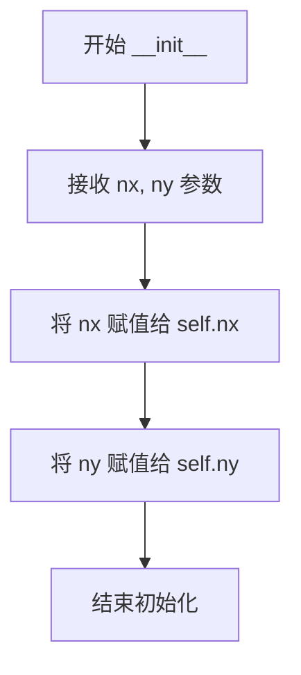

#### 带注释源码

```python
def __init__(self, nx, ny):
    """
    Parameters
    ----------
    nx, ny : int
        The number of samples in each direction.
    """
    # 将 x 方向的样本数量存储为实例属性
    self.nx = nx
    # 将 y 方向的样本数量存储为实例属性
    self.ny = ny
```


### ExtremeFinderSimple.__call__

该方法用于计算在应用坐标变换后，轴范围所对应的数据坐标范围。它通过在轴坐标区域内采样 nx × ny 个等间距点，应用变换函数，找到变换后坐标的极值，并添加适当的padding来补偿有限采样的误差，从而得到近似的包围盒。

参数：

- `self`：`ExtremeFinderSimple` 实例本身
- `transform_xy`：`callable`，从轴坐标到数据坐标的变换函数，接受 x 和 y 作为单独参数，返回 (tr_x, tr_y)
- `x1`：`float`，轴坐标包围盒的左下角 x 坐标
- `y1`：`float`，轴坐标包围盒的左下角 y 坐标
- `x2`：`float`，轴坐标包围盒的右上角 x 坐标
- `y2`：`float`，轴坐标包围盒的右上角 y 坐标

返回值：`tuple of float`，四个浮点数 (x0, x1, y0, y1)，表示变换后数据坐标的最小和最大 x 和 y 值

#### 流程图

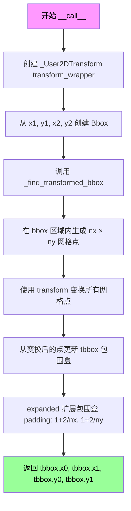

#### 带注释源码

```python
def __call__(self, transform_xy, x1, y1, x2, y2):
    """
    Compute an approximation of the bounding box obtained by applying
    *transform_xy* to the box delimited by ``(x1, y1, x2, y2)``.

    The intended use is to have ``(x1, y1, x2, y2)`` in axes coordinates,
    and have *transform_xy* be the transform from axes coordinates to data
    coordinates; this method then returns the range of data coordinates
    that span the actual axes.

    The computation is done by sampling ``nx * ny`` equispaced points in
    the ``(x1, y1, x2, y2)`` box and finding the resulting points with
    extremal coordinates; then adding some padding to take into account the
    finite sampling.

    As each sampling step covers a relative range of ``1/nx`` or ``1/ny``,
    the padding is computed by expanding the span covered by the extremal
    coordinates by these fractions.
    """
    # 使用 _User2DTransform 包装用户提供的 transform_xy 函数
    # _User2DTransform 将函数适配为 matplotlib Transform 接口
    tbbox = self._find_transformed_bbox(
        _User2DTransform(transform_xy, None),  # forward transform, no backward needed
        Bbox.from_extents(x1, y1, x2, y2))      # 从输入坐标创建轴坐标包围盒
    
    # 返回变换后包围盒的四个边界值
    return tbbox.x0, tbbox.x1, tbbox.y0, tbbox.y1
```


### `ExtremeFinderSimple._find_transformed_bbox`

该方法通过在给定的边界框内采样 nx * ny 个等间距点，应用坐标变换，然后根据采样结果计算变换后的边界框，并添加适当的padding以补偿有限采样的误差。

参数：

- `self`：ExtremeFinderSimple 实例本身
- `trans`：`Transform` 类型，从 axes 坐标到数据坐标的变换对象
- `bbox`：`Bbox` 类型，表示待变换的轴范围边界框

返回值：`Bbox` 类型，返回应用变换后的近似边界框，已根据采样间隔进行扩展padding

#### 流程图

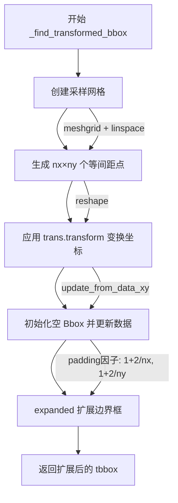

#### 带注释源码

```python
def _find_transformed_bbox(self, trans, bbox):
    """
    Compute an approximation of the bounding box obtained by applying
    *trans* to *bbox*.

    See ``__call__`` for details; this method performs similar
    calculations, but using a different representation of the arguments and
    return value.
    """
    # 在 bbox 定义的矩形区域内生成 nx × ny 个等间距采样点
    # meshgrid 生成二维网格，reshape 将其展平为 (nx*ny, 2) 的坐标数组
    grid = np.reshape(np.meshgrid(np.linspace(bbox.x0, bbox.x1, self.nx),
                                  np.linspace(bbox.y0, bbox.y1, self.ny)),
                      (2, -1)).T
    
    # 创建一个空的 null Bbox 用于存储变换后的边界框
    tbbox = Bbox.null()
    
    # 将采样点通过变换 trans.transform 转换为数据坐标
    # 然后用变换后的点更新边界框的范围
    tbbox.update_from_data_xy(trans.transform(grid))
    
    # 返回扩展后的边界框
    # 扩展因子为 (1 + 2/nx, 1 + 2/ny)，用于补偿有限采样的误差
    # 每个采样点覆盖相对范围 1/nx 或 1/ny，因此需要扩展两倍的采样间隔
    return tbbox.expanded(1 + 2 / self.nx, 1 + 2 / self.ny)
```


### `_User2DTransform.__init__`

`_User2DTransform`类的初始化方法，用于创建一个由两个用户定义的函数（前向变换和后向变换）组成的2D变换对象。

参数：

- `forward`：`callable`，前向变换函数，接收x和y作为独立参数，返回变换后的坐标`(tr_x, tr_y)`
- `backward`：`callable`，后向变换函数，接收x和y作为独立参数，返回逆变换后的坐标`(tr_x, tr_y)`

返回值：`None`，该方法为构造函数，不返回任何值

#### 流程图

```mermaid
graph TD
    A[开始 __init__] --> B[调用 super().__init__ 初始化基类]
    B --> C[将 forward 函数赋值给 self._forward]
    C --> D[将 backward 函数赋值给 self._backward]
    D --> E[结束]
```

#### 带注释源码

```python
def __init__(self, forward, backward):
    """
    Parameters
    ----------
    forward, backward : callable
        The forward and backward transforms, taking ``x`` and ``y`` as
        separate arguments and returning ``(tr_x, tr_y)``.
    """
    # The normal Matplotlib convention would be to take and return an
    # (N, 2) array but axisartist uses the transposed version.
    super().__init__()
    # 调用父类Transform的初始化方法，完成基类属性的初始化
    self._forward = forward
    # 保存前向变换函数，该函数接受x和y作为独立参数
    self._backward = backward
    # 保存后向（逆）变换函数，用于实现inverted()方法
```


### `_User2DTransform.transform_non_affine`

该方法是 `_User2DTransform` 类的核心转换方法，负责对输入的坐标值应用用户定义的前向变换函数。它通过转置技巧将输入的 (N, 2) 数组转换为符合用户函数期望的格式（即分别传入 x 和 y 参数），执行变换后再将结果转置回 (N, 2) 格式返回。

参数：

- `values`：`numpy.ndarray`，需要转换的坐标值数组，形状为 (N, 2)，其中每行包含一个点的 (x, y) 坐标

返回值：`numpy.ndarray`，变换后的坐标值数组，形状为 (N, 2)，其中每行包含变换后的 (x, y) 坐标

#### 流程图

```mermaid
flowchart TD
    A[输入: values (N, 2) 数组] --> B[np.transpose(values)]
    B --> C[提取为两个独立数组: x 和 y]
    C --> D[self._forward(x, y)]
    D --> E[返回 (tr_x, tr_y) 元组]
    E --> F[np.transpose 结果]
    F --> G[输出: 变换后的 (N, 2) 数组]
```

#### 带注释源码

```python
def transform_non_affine(self, values):
    # docstring inherited
    # 使用 np.transpose 将输入的 (N, 2) 数组进行转置
    # 这样可以将每列（x 坐标和 y 坐标）分开，成为两个独立的数组
    # 原因：用户提供的 forward 函数期望接收分离的 x 和 y 参数，而不是合并的数组
    return np.transpose(self._forward(*np.transpose(values)))
    
    # 步骤详解：
    # 1. np.transpose(values): 将 (N, 2) 转置为 (2, N)
    # 2. *np.transpose(values): 解包为两个独立的一维数组 (x, y)
    # 3. self._forward(x, y): 调用用户提供的变换函数，传入分离的 x 和 y
    # 4. self._forward 返回 (tr_x, tr_y) 元组
    # 5. np.transpose(...): 再次转置，将 (2, N) 转置回 (N, 2) 格式
```


### `_User2DTransform.inverted`

该方法返回当前变换的反向变换，即通过交换原始的 forward 和 backward 函数创建一个新的 `_User2DTransform` 实例。

参数：
- `self`：隐式参数，表示当前变换对象本身

返回值：`_User2DTransform`，返回一个新的 `_User2DTransform` 实例，其 forward 函数为原实例的 backward 函数，backward 函数为原实例的 forward 函数

#### 流程图

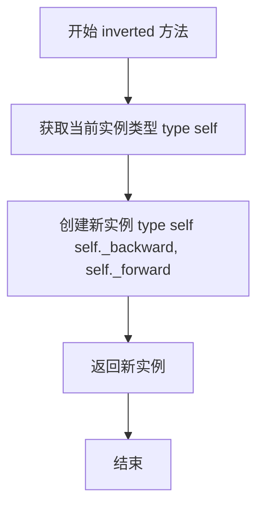

#### 带注释源码

```python
def inverted(self):
    # docstring inherited
    # 返回当前变换的反向变换
    # 通过交换 forward 和 backward 函数创建新的变换实例
    # 这样原本的数据坐标到屏幕坐标的变换就变成了屏幕坐标到数据坐标的变换
    return type(self)(self._backward, self._forward)
```


### `GridFinder.__init__`

这是 `GridFinder` 类的构造函数，用于初始化网格查找器的各个组件。它接收变换函数、极值查找器、网格定位器和刻度格式化器等参数，并设置默认值的实例。

参数：

- `transform`：`Transform` 或 `tuple[callable, callable]`，从轴坐标到数据坐标的变换，可以是一个 `Transform` 实例或一对可调用对象（正向和反向变换）
- `extreme_finder`：`ExtremeFinderSimple`，可选，用于计算网格线范围的查找器，默认为 `ExtremeFinderSimple(20, 20)`
- `grid_locator1`：`MaxNLocator`，可选，第一个方向的网格定位器，默认为 `MaxNLocator()`
- `grid_locator2`：`MaxNLocator`，可选，第二个方向的网格定位器，默认为 `MaxNLocator()`
- `tick_formatter1`：`FormatterPrettyPrint`，可选，第一个方向的刻度格式化器，默认为 `FormatterPrettyPrint()`
- `tick_formatter2`：`FormatterPrettyPrint`，可选，第二个方向的刻度格式化器，默认为 `FormatterPrettyPrint()`

返回值：`None`，构造函数无返回值，仅初始化对象状态

#### 流程图

```mermaid
flowchart TD
    A[开始 __init__] --> B{extreme_finder is None?}
    B -->|是| C[使用默认 ExtremeFinderSimple(20, 20)]
    B -->|否| D[保持传入的 extreme_finder]
    C --> E{grid_locator1 is None?}
    D --> E
    E -->|是| F[使用默认 MaxNLocator()]
    E -->|否| G[保持传入的 grid_locator1]
    F --> H{grid_locator2 is None?}
    G --> H
    H -->|是| I[使用默认 MaxNLocator()]
    H -->|否| J[保持传入的 grid_locator2]
    I --> K{tick_formatter1 is None?}
    J --> K
    K -->|是| L[使用默认 FormatterPrettyPrint()]
    K -->|否| M[保持传入的 tick_formatter1]
    L --> N{tick_formatter2 is None?}
    M --> N
    N -->|是| O[使用默认 FormatterPrettyPrint()]
    N -->|否| P[保持传入的 tick_formatter2]
    O --> Q[赋值实例变量]
    P --> Q
    Q --> R[调用 self.set_transform]
    R --> S[结束 __init__]
```

#### 带注释源码

```python
def __init__(self,
             transform,
             extreme_finder=None,
             grid_locator1=None,
             grid_locator2=None,
             tick_formatter1=None,
             tick_formatter2=None):
    # 如果未提供 extreme_finder，使用默认的 ExtremeFinderSimple
    # 该默认查找器在每个方向上采样 20x20 个点
    if extreme_finder is None:
        extreme_finder = ExtremeFinderSimple(20, 20)
    
    # 如果未提供 grid_locator1，使用默认的 MaxNLocator
    # MaxNLocator 自动计算合适的刻度位置
    if grid_locator1 is None:
        grid_locator1 = MaxNLocator()
    
    # 如果未提供 grid_locator2，使用默认的 MaxNLocator
    if grid_locator2 is None:
        grid_locator2 = MaxNLocator()
    
    # 如果未提供 tick_formatter1，使用默认的 FormatterPrettyPrint
    # 该格式化器使用数学文本格式输出刻度标签
    if tick_formatter1 is None:
        tick_formatter1 = FormatterPrettyPrint()
    
    # 如果未提供 tick_formatter2，使用默认的 FormatterPrettyPrint
    if tick_formatter2 is None:
        tick_formatter2 = FormatterPrettyPrint()
    
    # 将各个组件存储为实例变量，供后续方法使用
    self.extreme_finder = extreme_finder
    self.grid_locator1 = grid_locator1
    self.grid_locator2 = grid_locator2
    self.tick_formatter1 = tick_formatter1
    self.tick_formatter2 = tick_formatter2
    
    # 调用 set_transform 方法设置坐标变换
    # 该方法会验证 transform 的类型并转换为 _aux_transform
    self.set_transform(transform)
```


### `GridFinder._format_ticks`

该方法是GridFinder类的内部辅助方法，用于支持标准格式化器（继承自`.mticker.Formatter`）和axisartist特定的格式化器，根据传入的索引选择对应的格式化器，并根据格式化器类型调用相应的方法进行刻度标签格式化。

参数：

- `self`：GridFinder实例，隐式参数，表示当前GridFinder对象
- `idx`：`int`，索引值，用于选择使用哪个格式化器（1对应tick_formatter1，2对应tick_formatter2）
- `direction`：`str`，刻度方向，可选值为'left'、'right'、'top'、'bottom'等，表示刻度的位置
- `factor`：`float`，缩放因子，用于调整刻度值的缩放比例
- `levels`：`list`或`array`，刻度级别/值列表，需要被格式化的刻度数值

返回值：`list`，返回格式化后的刻度标签字符串列表

#### 流程图

```mermaid
flowchart TD
    A[开始 _format_ticks] --> B{idx == 1?}
    B -->|是| C[获取 self.tick_formatter1]
    B -->|否| D{idx == 2?}
    D -->|是| E[获取 self.tick_formatter2]
    D -->|否| F[抛出异常]
    C --> G{formatter是否是<br/>mticker.Formatter实例?}
    E --> G
    G -->|是| H[调用 fmt.format_ticks(levels)]
    G -->|否| I[调用 fmt(direction, factor, levels)]
    H --> J[返回格式化后的标签列表]
    I --> J
```

#### 带注释源码

```python
def _format_ticks(self, idx, direction, factor, levels):
    """
    Helper to support both standard formatters (inheriting from
    `.mticker.Formatter`) and axisartist-specific ones; should be called instead of
    directly calling ``self.tick_formatter1`` and ``self.tick_formatter2``.  This
    method should be considered as a temporary workaround which will be removed in
    the future at the same time as axisartist-specific formatters.
    
    参数:
        idx: int, 用于选择格式化器(1->tick_formatter1, 2->tick_formatter2)
        direction: str, 刻度方向('left', 'right', 'top', 'bottom')
        factor: float, 缩放因子
        levels: list, 需要格式化的刻度值列表
    
    返回:
        list: 格式化后的刻度标签字符串列表
    """
    # 使用_api.getitem_checked根据idx获取对应的formatter
    # idx=1返回self.tick_formatter1，idx=2返回self.tick_formatter2
    fmt = _api.getitem_checked(
        {1: self.tick_formatter1, 2: self.tick_formatter2}, idx=idx)
    
    # 判断formatter是否为标准mticker.Formatter类型
    # 如果是标准Formatter，调用其format_ticks方法
    # 否则调用formatter对象本身(作为可调用对象)
    return (fmt.format_ticks(levels) if isinstance(fmt, mticker.Formatter)
            else fmt(direction, factor, levels))
```


### `GridFinder.get_grid_info`

该方法通过接收边界框或四个坐标参数，计算网格线和刻度线的定位信息。它首先根据输入参数构建边界框，然后使用极端值查找器获取变换后的边界框，接着通过网格定位器计算经纬度等级和因子，最后计算原始网格线并确定每个边上的刻度交叉点，返回包含网格极端、经纬度线和各边刻度信息的字典。

参数：

- `self`：`GridFinder`，GridFinder 类实例本身
- `*args`：`tuple`，可变位置参数，支持两种调用方式：
  - 方式一：四个独立坐标参数 `(x1, y1, x2, y2)`，分别表示边界框的左下和右上坐标（已废弃）
  - 方式二：一个 Bbox 对象，表示数据坐标系的边界框
- `**kwargs`：`dict`，可变关键字参数，用于传递命名参数

返回值：`dict`，返回包含网格线和刻度定位信息的字典，结构如下：
- `"extremes"`：变换后的边界框（`Bbox`）
- `"lon"`：经度相关信息字典，包含：
  - `"lines"`：经度网格线坐标列表
  - `"ticks"`：包含 `"left"`、`"right"`、`"bottom"`、`"top"` 四个边的刻度信息，每个刻度包含 `"level"`（等级）、`"loc"`（位置和角度）、`"label"`（格式化标签）
- `"lat"`：纬度相关信息字典，结构同 `"lon"`

#### 流程图

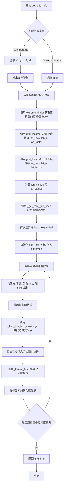

#### 带注释源码

```python
def get_grid_info(self, *args, **kwargs):
    """
    Compute positioning information for grid lines and ticks, given the
    axes' data *bbox*.
    """
    # 使用 API 选择匹配的方法签名，支持两种调用方式：
    # 方式一：lambda x1, y1, x2, y2: locals() - 四个独立坐标参数（已废弃）
    # 方式二：lambda bbox: locals() - 一个 Bbox 对象
    params = _api.select_matching_signature(
        [lambda x1, y1, x2, y2: locals(), lambda bbox: locals()], *args, **kwargs)
    
    # 判断是否使用旧版四个参数调用方式
    if "x1" in params:
        # 发出废弃警告，提示用户应使用单个 bbox 参数
        _api.warn_deprecated("3.11", message=(
            "Passing extents as separate arguments to get_grid_info is deprecated "
            "since %(since)s and support will be removed %(removal)s; pass a "
            "single bbox instead."))
        # 从四个坐标参数构建 Bbox 对象
        bbox = Bbox.from_extents(
            params["x1"], params["y1"], params["x2"], params["y2"])
    else:
        # 使用传入的 bbox 参数
        bbox = params["bbox"]

    # 使用极端值查找器的逆变换获取变换后的边界框
    # 将数据坐标系的边界框转换为显示坐标系下的边界框
    tbbox = self.extreme_finder._find_transformed_bbox(
        self.get_transform().inverted(), bbox)

    # 调用网格定位器1获取经度（X轴）等级信息
    # 返回: 等级数组、等级数量、缩放因子
    lon_levs, lon_n, lon_factor = self.grid_locator1(*tbbox.intervalx)
    
    # 调用网格定位器2获取纬度（Y轴）等级信息
    lat_levs, lat_n, lat_factor = self.grid_locator2(*tbbox.intervaly)

    # 计算实际的经纬度值（除以缩放因子）
    lon_values = np.asarray(lon_levs[:lon_n]) / lon_factor
    lat_values = np.asarray(lat_levs[:lat_n]) / lat_factor

    # 获取原始网格线（在变换后的坐标空间中）
    lon_lines, lat_lines = self._get_raw_grid_lines(lon_values, lat_values, tbbox)

    # 扩展边界框一个小量（1 + 2e-10），确保网格线完全在边界内
    bbox_expanded = bbox.expanded(1 + 2e-10, 1 + 2e-10)
    
    # 初始化网格信息字典，首先存入极端边界信息
    grid_info = {"extremes": tbbox}  # "lon", "lat" keys filled below.

    # 遍历经度和纬度数据，分别处理
    for idx, lon_or_lat, levs, factor, values, lines in [
            (1, "lon", lon_levs, lon_factor, lon_values, lon_lines),
            (2, "lat", lat_levs, lat_factor, lat_values, lat_lines),
    ]:
        # 为每种坐标类型创建信息字典
        grid_info[lon_or_lat] = gi = {
            "lines": lines,
            "ticks": {"left": [], "right": [], "bottom": [], "top": []},
        }
        
        # 遍历每条网格线，寻找与边界的交叉点
        for xys, v, level in zip(lines, values, levs):
            # 找到网格线与扩展边界框的交叉点及角度
            all_crossings = _find_line_box_crossings(xys, bbox_expanded)
            
            # 将交叉点分配到对应的边（左、右、下、上）
            for side, crossings in zip(
                    ["left", "right", "bottom", "top"], all_crossings):
                for crossing in crossings:
                    # 每个交叉点包含位置和角度信息
                    gi["ticks"][side].append({"level": level, "loc": crossing})
        
        # 为每边的所有刻度格式化标签
        for side in gi["ticks"]:
            # 提取该边所有刻度的等级
            levs = [tick["level"] for tick in gi["ticks"][side]]
            # 使用格式化器生成标签字符串
            labels = self._format_ticks(idx, side, factor, levs)
            # 将标签关联到对应的刻度
            for tick, label in zip(gi["ticks"][side], labels):
                tick["label"] = label

    # 返回完整的网格定位信息
    return grid_info
```


### `GridFinder._get_raw_grid_lines`

该方法用于根据给定的经纬度值和边界框生成原始的网格线坐标。它通过在边界框范围内插值生成一系列经纬度点，然后使用坐标变换将这些点转换为数据坐标系的坐标，最终返回经向和纬向网格线的坐标列表。

参数：

- `self`：`GridFinder`，GridFinder 类的实例方法
- `lon_values`：`array-like`，经度值数组，指定需要绘制哪些经度线的经度值
- `lat_values`：`array-like`，纬度值数组，指定需要绘制哪些纬度线的纬度值
- `bbox`：`Bbox`，边界框对象，定义了网格线的有效范围

返回值：`tuple`，返回 `(lon_lines, lat_values)` 元组，其中：
- `lon_lines`：list，经度网格线的坐标列表，每个元素是一个 (100, 2) 的 numpy 数组，表示一条经度线在数据坐标系中的坐标点
- `lat_lines`：list，纬度网格线的坐标列表，每个元素是一个 (100, 2) 的 numpy 数组，表示一条纬度线在数据坐标系中的坐标点

#### 流程图

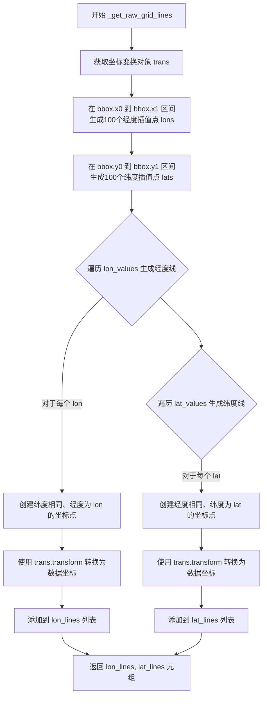

#### 带注释源码

```python
def _get_raw_grid_lines(self, lon_values, lat_values, bbox):
    """
    生成原始的经纬度网格线坐标。
    
    Parameters
    ----------
    lon_values : array-like
        经度值数组，指定需要绘制的经度线。
    lat_values : array-like
        纬度值数组，指定需要绘制的纬度线。
    bbox : Bbox
        边界框，定义了网格线的有效范围。
    
    Returns
    -------
    tuple
        (lon_lines, lat_lines) 元组，分别包含经度和纬度网格线的坐标。
    """
    # 获取当前设置的坐标变换（从Axes坐标到数据坐标）
    trans = self.get_transform()
    
    # 在边界框X轴范围内生成100个等间距的经度采样点，用于插值计算
    lons = np.linspace(bbox.x0, bbox.x1, 100)  # for interpolation
    
    # 在边界框Y轴范围内生成100个等间距的纬度采样点，用于插值计算
    lats = np.linspace(bbox.y0, bbox.y1, 100)
    
    # 为每个经度值生成一条经度线
    # np.full_like(lats, lon) 创建一个长度为100的数组，所有值都是lon
    # np.column_stack 将经度数组和纬度数组按列合并成 (100, 2) 的坐标数组
    # trans.transform 将坐标从 Axes 坐标系转换到数据坐标系
    lon_lines = [trans.transform(np.column_stack([np.full_like(lats, lon), lats]))
                 for lon in lon_values]
    
    # 为每个纬度值生成一条纬度线
    # 类似地，为每个纬度值创建经度相同、纬度变化的坐标点
    lat_lines = [trans.transform(np.column_stack([lons, np.full_like(lons, lat)]))
                 for lat in lat_values]
    
    # 返回经度线和纬度线的坐标列表
    return lon_lines, lat_lines
```


### `GridFinder.set_transform`

该方法用于设置网格查找器（GridFinder）的辅助坐标变换。它负责接收用户提供的变换参数，并将其内部标准化为 `_aux_transform` 属性。该属性可以是 Matplotlib 的 `Transform` 对象，也可以是由两个函数（正向变换和反向变换）组成的元组。如果输入类型不合法，方法将抛出 `TypeError`。

参数：

- `aux_trans`：`Transform` 或 `tuple`，辅助坐标变换对象。如果是一个元组或列表，必须包含两个元素，分别代表正向变换函数和反向变换函数。

返回值：`None`，该方法直接修改实例的内部状态，不返回任何值。

#### 流程图

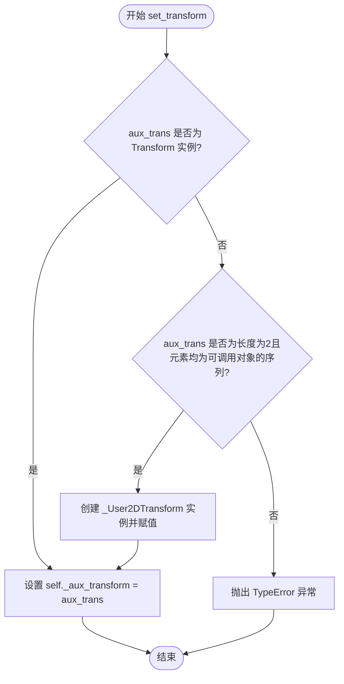

#### 带注释源码

```python
def set_transform(self, aux_trans):
    """
    设置网格的辅助变换。

    Parameters
    ----------
    aux_trans : Transform or tuple of 2 callables
        The transform. If a tuple, it should be (forward, backward).
    """
    # 判断输入是否为 Matplotlib 的 Transform 对象
    if isinstance(aux_trans, Transform):
        self._aux_transform = aux_trans
    # 判断输入是否为包含两个可调用函数(forward, backward)的元组
    elif len(aux_trans) == 2 and all(map(callable, aux_trans)):
        self._aux_transform = _User2DTransform(*aux_trans)
    else:
        # 输入类型不合法，抛出异常
        raise TypeError("'aux_trans' must be either a Transform "
                        "instance or a pair of callables")
```


### `GridFinder.get_transform`

获取当前配置的辅助坐标变换（auxiliary transform），该变换用于将网格线从数据坐标转换到辅助坐标系统。

参数：なし（该方法无参数，仅包含 self）

返回值：`Transform`，返回存储的辅助坐标变换对象，用于网格线的坐标转换。

#### 流程图

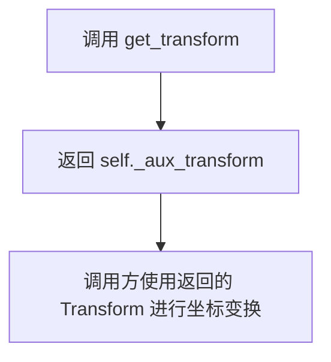

#### 带注释源码

```python
def get_transform(self):
    """
    返回当前配置的辅助坐标变换。

    该方法提供了对内部存储的 _aux_transform 属性的只读访问。
    _aux_transform 可以是 Matplotlib 的 Transform 对象，或者是
    由两个可调用函数（前向和后向变换）构成的 _User2DTransform 对象。

    Returns
    -------
    Transform
        辅助坐标变换对象，用于网格线从数据坐标到显示坐标的转换。

    See Also
    --------
    set_transform : 设置辅助变换的方法。
    _User2DTransform : 由两个函数构成的变换类。
    """
    return self._aux_transform
```


### `GridFinder.update_transform`

该方法是 `GridFinder` 类中用于设置辅助坐标变换的成员，实质上是 `set_transform` 方法的别名，用于初始化或更新网格助手的坐标变换。

参数：
- `aux_trans`：`Transform` 实例或包含两个可调用对象的元组`，要设置的辅助坐标变换，可以是 Matplotlib 的 Transform 对象或一对前向和反向变换函数

返回值：`None`，无返回值，仅用于更新内部状态

#### 流程图

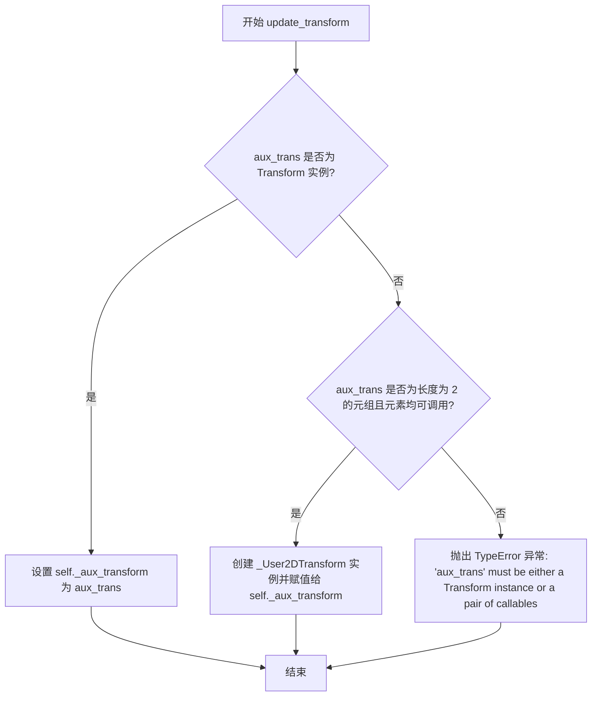

#### 带注释源码

```python
def set_transform(self, aux_trans):
    """
    Set the auxiliary transform.

    Parameters
    ----------
    aux_trans : `.Transform` or tuple of callables
        The transform to use. If a `.Transform` instance, it is used directly.
        If a tuple of two callables, it is interpreted as (forward, backward)
        transforms and wrapped in a `_User2DTransform`.
    """
    if isinstance(aux_trans, Transform):
        # If aux_trans is already a Transform instance, use it as-is
        self._aux_transform = aux_trans
    elif len(aux_trans) == 2 and all(map(callable, aux_trans)):
        # If aux_trans is a tuple of two callables, create a _User2DTransform
        self._aux_transform = _User2DTransform(*aux_trans)
    else:
        # Raise TypeError if aux_trans is neither a Transform nor a valid tuple
        raise TypeError("'aux_trans' must be either a Transform "
                        "instance or a pair of callables")

# Backwards compatibility alias
update_transform = set_transform
```


### `GridFinder.transform_xy`

将输入的x和y坐标数组通过辅助变换（aux_transform）转换为新的坐标系统，并返回转换后的坐标。该方法已被弃用，建议使用`get_transform()`方法获取变换对象后直接调用其`transform`方法。

参数：

- `x`：`array_like`，x坐标数组，表示要转换的点的x坐标
- `y`：`array_like`，y坐标数组，表示要转换的点的y坐标

返回值：`ndarray`，转换后的坐标数组，形状为(2, N)，其中N是输入点的数量，第一行是转换后的x坐标，第二行是转换后的y坐标

#### 流程图

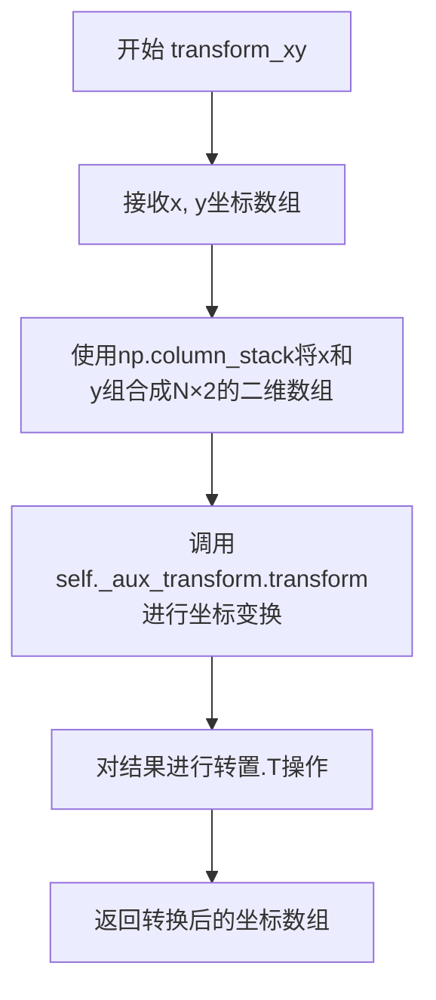

#### 带注释源码

```python
@_api.deprecated("3.11", alternative="grid_finder.get_transform()")
def transform_xy(self, x, y):
    """
    将x和y坐标通过辅助变换转换为新坐标系统。
    
    注意：此方法已在matplotlib 3.11版本中弃用，建议使用
    grid_finder.get_transform()获取变换对象后直接调用其transform方法。
    
    Parameters
    ----------
    x : array_like
        x坐标数组
    y : array_like
        y坐标数组
    
    Returns
    -------
    ndarray
        转换后的坐标数组，形状为(2, N)
    """
    # 使用np.column_stack将x和y数组按列组合成N×2的二维数组
    # 其中每行是一个点的(x, y)坐标
    # 然后调用_aux_transform的transform方法进行坐标变换
    # 最后使用.T转置，将结果从N×2转换为2×N的形状
    return self._aux_transform.transform(np.column_stack([x, y])).T
```


### `GridFinder.inv_transform_xy`

该方法用于将坐标从数据空间逆变换到轴坐标空间（即从变换后的坐标反变换回原始坐标）。它通过获取辅助变换的逆变换，并将输入的 (x, y) 坐标应用该逆变换来实现。此方法已于 matplotlib 3.11 版本弃用，建议使用 `grid_finder.get_transform().inverted()` 替代。

参数：

- `self`：`GridFinder` 实例本身
- `x`：`numpy.ndarray` 或类似数组类型，待逆变换的 x 坐标（数据空间坐标）
- `y`：`numpy.ndarray` 或类似数组类型，待逆变换的 y 坐标（数据空间坐标）

返回值：`tuple`，返回两个 1D numpy 数组 `(x_transformed, y_transformed)`，表示变换后的轴坐标空间的 x 和 y 坐标

#### 流程图

```mermaid
flowchart TD
    A[开始 inv_transform_xy] --> B[获取 self._aux_transform 的逆变换: inv_trans = self._aux_transform.inverted()]
    B --> C[将 x 和 y 列组合并为 (N, 2) 数组: np.column_stack([x, y])]
    C --> D[应用逆变换: inv_trans.transform(combined_xy)]
    D --> E[转置结果以分离 x 和 y: .T]
    E --> F[返回变换后的 x, y 坐标元组]
```

#### 带注释源码

```python
@_api.deprecated("3.11", alternative="grid_finder.get_transform().inverted()")
def inv_transform_xy(self, x, y):
    """
    逆变换坐标：将数据空间坐标转换为轴坐标空间坐标。
    
    注意：此方法已弃用，请使用 grid_finder.get_transform().inverted() 代替。
    
    Parameters
    ----------
    x : array-like
        x 坐标（数据空间）
    y : array-like
        y 坐标（数据空间）
    
    Returns
    -------
    tuple of (x, y)
        逆变换后的坐标（轴坐标空间）
    """
    # 获取辅助变换的逆变换对象
    inverted_transform = self._aux_transform.inverted()
    
    # 将 x 和 y 合并为 (N, 2) 形状的二维数组，每行是一个点的坐标
    combined = np.column_stack([x, y])
    
    # 应用逆变换，将数据空间坐标转换为轴坐标空间坐标
    transformed = inverted_transform.transform(combined)
    
    # 转置结果，从 (N, 2) 形状变回 (2, N)，然后作为两个独立的一维数组返回
    return transformed.T
```


### `GridFinder.update`

该方法用于更新 GridFinder 对象的属性配置，接受关键字参数并根据预定义的属性列表设置对应的实例属性，如果传入未知属性则抛出 ValueError 异常。

参数：

- `**kwargs`：`dict`，关键字参数，用于更新 GridFinder 的属性。可接受的键包括 "extreme_finder"、"grid_locator1"、"grid_locator2"、"tick_formatter1"、"tick_formatter2"。

返回值：`None`，无返回值，该方法直接修改对象状态。

#### 流程图

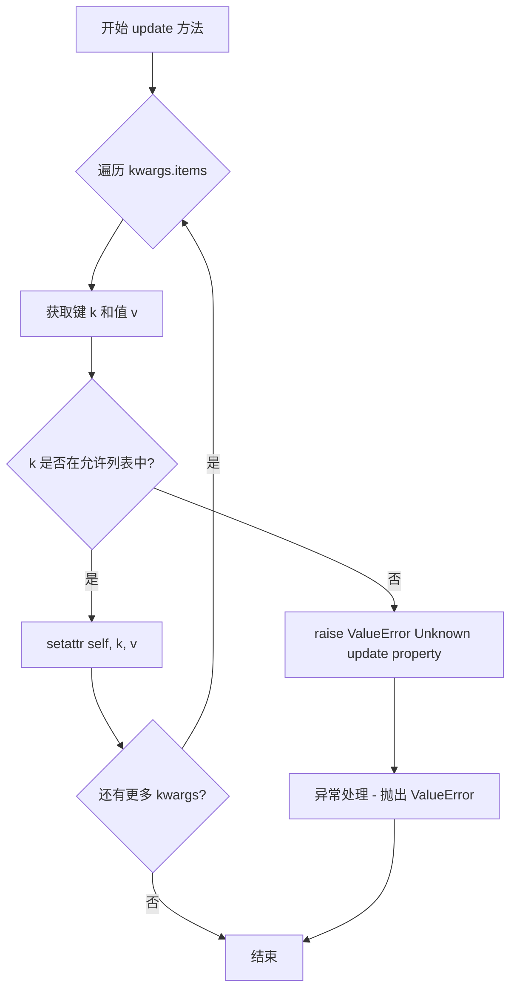

#### 带注释源码

```python
def update(self, **kwargs):
    """
    Update GridFinder properties using keyword arguments.

    This method allows updating specific attributes of the GridFinder instance
    by passing them as keyword arguments. It validates that only supported
    properties can be updated.

    Parameters
    ----------
    **kwargs : dict
        Keyword arguments where keys must be one of:
        - 'extreme_finder': Instance to find extreme values
        - 'grid_locator1': Locator for grid lines in first dimension
        - 'grid_locator2': Locator for grid lines in second dimension
        - 'tick_formatter1': Formatter for ticks in first dimension
        - 'tick_formatter2': Formatter for ticks in second dimension

    Returns
    -------
    None

    Raises
    ------
    ValueError
        If an unknown property key is provided that is not in the
        allowed list of properties.
    """
    # Iterate through all provided keyword arguments
    for k, v in kwargs.items():
        # Check if the key is in the list of allowed updateable properties
        if k in ["extreme_finder",
                 "grid_locator1",
                 "grid_locator2",
                 "tick_formatter1",
                 "tick_formatter2"]:
            # Dynamically set the attribute on the instance
            setattr(self, k, v)
        else:
            # Raise an error for unknown properties
            raise ValueError(f"Unknown update property {k!r}")
```


### `MaxNLocator.__init__`

描述：该方法是 `MaxNLocator` 类的构造函数，用于初始化刻度定位器。它主要调用父类 `mticker.MaxNLocator` 的构造函数来配置网格线的生成策略（如最大刻度数量、是否整数刻度等），并创建一个虚拟轴（Dummy Axis）对象以供后续刻度格式化使用。注意，虽然参数 `trim` 被接收，但其实际功能已被废弃，仅为保持 API 兼容性。

参数：

- `nbins`：`int`，最大刻度数量（默认值 10）。
- `steps`：`array-like`，可选的预定义步长序列，用于控制刻度间隔（默认值 None）。
- `trim`：`bool`，保留参数，无实际作用，仅用于 API 兼容性（默认值 True）。
- `integer`：`bool`，是否强制使用整数刻度（默认值 False）。
- `symmetric`：`bool`，是否强制刻度关于零点对称（默认值 False）。
- `prune`：`str`，可选的修剪策略，用于移除首尾极值刻度，可选值为 'lower', 'upper', 'both', None（默认值 None）。

返回值：`None`，构造函数不返回值。

#### 流程图

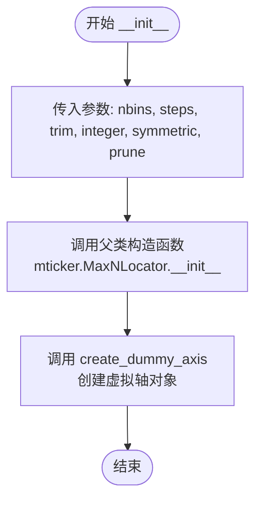

#### 带注释源码

```python
def __init__(self, nbins=10, steps=None,
             trim=True,
             integer=False,
             symmetric=False,
             prune=None):
    # trim 参数已被废弃，没有任何实际作用。
    # 此处保留该参数是为了保持与旧版 API 的兼容性。
    # 调用父类 (mticker.MaxNLocator) 的构造函数进行核心初始化。
    super().__init__(nbins, steps=steps, integer=integer,
                     symmetric=symmetric, prune=prune)
    # 创建一个虚拟轴 (Dummy Axis)。这是 Matplotlib 内部用于支持
    # 刻度格式化器 (Formatter) 正常工作的常见技巧，
    # 因为许多格式化器依赖于 axis 对象的属性来计算偏移或文本格式。
    self.create_dummy_axis()
```


### `MaxNLocator.__call__`

该方法是 `MaxNLocator` 类的可调用接口，继承自 `mticker.MaxNLocator`，用于根据给定的数值范围 [v1, v2] 计算合适的刻度位置。它通过调用父类的 `tick_values` 方法生成刻度值，并返回一个包含刻度数组、刻度数量和缩放因子的元组，供网格辅助工具在计算经纬度网格线和刻度时使用。

参数：

- `v1`：`float` 或 `int`，数值范围的第一个边界值
- `v2`：`float` 或 `int`，数值范围的第二个边界值

返回值：`tuple[np.ndarray, int, int]`，包含三个元素的元组——第一个元素是刻度位置的 `numpy` 数组，第二个元素是刻度数量（长度），第三个元素是缩放因子（固定为 1）

#### 流程图

```mermaid
flowchart TD
    A[调用 __call__ 方法] --> B[获取输入参数 v1, v2]
    B --> C[调用父类 tick_values 方法计算刻度值]
    C --> D[获取刻度值列表 locs]
    D --> E[将刻度值转换为 numpy 数组]
    E --> F[计算刻度数量 len_locs = len&#40;locs&#41;]
    F --> G[设置缩放因子 factor = 1]
    G --> H[返回 tuple&#40;np.array&#40;locs&#41;, len_locs, factor&#41;]
```

#### 带注释源码

```python
def __call__(self, v1, v2):
    """
    根据给定的数值范围计算刻度位置。

    Parameters
    ----------
    v1 : float or int
        数值范围的第一个边界值。
    v2 : float or int
        数值范围的第二个边界值。

    Returns
    -------
    tuple
        包含三个元素的元组:
        - np.ndarray: 刻度位置的数组
        - int: 刻度数量
        - int: 缩放因子，固定为 1
    """
    # 调用父类 mticker.MaxNLocator 的 tick_values 方法
    # 根据 v1, v2 范围计算合适的刻度值列表
    locs = super().tick_values(v1, v2)
    
    # 将刻度值列表转换为 numpy 数组
    # 并返回包含数组、长度和因子(1)的元组
    return np.array(locs), len(locs), 1  # 1: factor (see angle_helper)
```


### `FixedLocator.__init__`

该方法为 `FixedLocator` 类的构造函数，用于初始化一个固定位置的定位器，存储预定义的位置列表供后续在指定范围内筛选使用。

参数：

- `locs`：`任意可迭代类型（如 list、np.ndarray 等）`，要存储的固定位置列表，用于在后续调用时筛选出落在指定范围内的位置

返回值：`无（None）`，`__init__` 方法不返回任何值，仅初始化对象状态

#### 流程图

```mermaid
graph TD
    A[开始 __init__] --> B[接收 locs 参数]
    B --> C[将 locs 赋值给实例属性 self._locs]
    D[结束]
```

#### 带注释源码

```python
class FixedLocator:
    def __init__(self, locs):
        """
        Parameters
        ----------
        locs : array-like
            固定位置列表，用于后续在指定范围内筛选
        """
        self._locs = locs  # 将传入的位置列表存储为实例属性
```


### `FixedLocator.__call__`

该方法用于在给定范围内筛选预定义的位置点，并返回符合条件的点列表、点数量以及因子值。

参数：

- `v1`：`float` 或 `int`，范围的下边界
- `v2`：`float` 或 `int`，范围的上边界

返回值：`tuple`，包含三个元素：
- `numpy.ndarray`：落在 `[v1, v2]` 范围内的位置点数组
- `int`：符合条件的位置点数量
- `int`：因子值，固定为 1（用于角度辅助计算）

#### 流程图

```mermaid
flowchart TD
    A[输入 v1, v2] --> B{排序 v1, v2}
    B --> C[确保 v1 <= v2]
    C --> D[遍历 self._locs 中的每个位置]
    D --> E{检查条件 v1 <= l <= v2?}
    E -->|是| F[将 l 加入筛选结果]
    E -->|否| G[跳过该位置]
    F --> H[继续下一位置]
    G --> H
    H --> I{所有位置遍历完成?}
    I -->|否| D
    I -->|是| J[转换为 numpy 数组]
    J --> K[返回 locs, len, 1]
```

#### 带注释源码

```python
def __call__(self, v1, v2):
    """
    在指定范围内筛选预定义的位置点。

    Parameters
    ----------
    v1 : float or int
        范围的下边界。
    v2 : float or int
        范围的上边界。

    Returns
    -------
    locs : numpy.ndarray
        落在 [v1, v2] 范围内的位置点数组。
    n : int
        符合条件的位置点数量。
    factor : int
        固定返回 1，用于角度辅助计算（angle_helper）。
    """
    # 确保 v1 <= v2，将参数排序为从小到大
    v1, v2 = sorted([v1, v2])
    
    # 列表推导式筛选出落在 [v1, v2] 范围内的点
    locs = np.array([l for l in self._locs if v1 <= l <= v2])
    
    # 返回位置数组、元素个数和因子值 1
    return locs, len(locs), 1  # 1: factor (see angle_helper)
```


### `FormatterPrettyPrint.__init__`

初始化 `FormatterPrettyPrint` 实例，创建一个用于格式化刻度的 `ScalarFormatter` 对象。

参数：

- `useMathText`：`bool`，默认为 `True`，控制是否使用 MathText 格式渲染刻度标签

返回值：`None`，构造函数无返回值

#### 流程图

```mermaid
graph TD
    A[开始 __init__] --> B[创建 ScalarFormatter]
    B --> C[设置 useMathText 参数]
    C --> D[设置 useOffset=False]
    D --> E[调用 create_dummy_axis 初始化]
    E --> F[结束]
```

#### 带注释源码

```python
def __init__(self, useMathText=True):
    """
    初始化 FormatterPrettyPrint 实例。

    Parameters
    ----------
    useMathText : bool, optional
        Whether to use MathText for formatting tick labels.
        Defaults to True.
    """
    # 创建一个 ScalarFormatter 对象，用于格式化刻度标签
    # useMathText=True: 使用 MathText 语法渲染标签（如 $...$）
    # useOffset=False: 禁用偏移量显示
    self._fmt = mticker.ScalarFormatter(
        useMathText=useMathText, useOffset=False)
    
    # 为 formatter 创建一个虚拟 axis 对象
    # 这是 Matplotlib formatter 的内部初始化逻辑所必需的
    self._fmt.create_dummy_axis()
```


### `FormatterPrettyPrint.__call__`

该方法是 `FormatterPrettyPrint` 类的可调用接口，接收方向、因子和数值数组，利用内部的 `ScalarFormatter` 将数值数组格式化为刻度标签字符串列表。

参数：

- `direction`：`str`，刻度方向（如 "left", "right", "top", "bottom"），在当前实现中未被使用，仅为接口兼容性保留
- `factor`：`float`，刻度因子，在当前实现中未被使用，仅为接口兼容性保留
- `values`：`array_like`，待格式化的数值数组

返回值：`list[str]`，格式化后的刻度标签字符串列表

#### 流程图

```mermaid
flowchart TD
    A[开始 __call__] --> B[接收 direction, factor, values]
    B --> C[调用 self._fmt.format_ticksvalues]
    C --> D[返回格式化后的刻度标签列表]
    D --> E[结束 __call__]
```

#### 带注释源码

```python
def __call__(self, direction, factor, values):
    """
    Format tick values using the internal ScalarFormatter.

    Parameters
    ----------
    direction : str
        The direction of the tick (e.g., 'left', 'right', 'top', 'bottom').
        Currently unused, kept for interface consistency.
    factor : float
        Scaling factor for the tick values. Currently unused, kept for
        interface consistency.
    values : array_like
        The numeric values to be formatted as tick labels.

    Returns
    -------
    list of str
        The formatted tick label strings.
    """
    # Delegate the formatting to the internal ScalarFormatter instance
    # The direction and factor parameters are not used in this implementation
    # but are kept for API consistency with other formatters in the axisartist module
    return self._fmt.format_ticks(values)
```


### `DictFormatter.__init__`

该方法用于初始化 `DictFormatter` 类实例，存储格式化字典和后备格式化器，以便在调用时根据给定的值查找对应的格式化字符串。

参数：

- `format_dict`：`dict`，格式化字典，用于将数值映射到格式化字符串
- `formatter`：可调用对象（默认为 None），后备格式化器，当字典中找不到对应值时使用

返回值：`None`，无显式返回值

#### 流程图

```mermaid
flowchart TD
    A[开始 __init__] --> B{检查 formatter 是否为 None}
    B -->|是| C[设置 self._fallback_formatter = None]
    B -->|否| D[设置 self._fallback_formatter = formatter]
    C --> E[调用父类 __init__]
    D --> E
    E --> F[设置 self._format_dict = format_dict]
    F --> G[结束]
```

#### 带注释源码

```python
def __init__(self, format_dict, formatter=None):
    """
    format_dict : dictionary for format strings to be used.
    formatter : fall-back formatter
    """
    # 调用父类（object）的初始化方法
    super().__init__()
    # 将传入的格式化字典存储为实例变量
    self._format_dict = format_dict
    # 将后备格式化器存储为实例变量（如果没有提供则为 None）
    self._fallback_formatter = formatter
```


### DictFormatter.__call__

该方法是一个可调用对象，用于格式化网格线的标签。它首先尝试使用预定义的格式化字典来格式化给定的值，如果值不在字典中，则使用回退格式化器生成标签。

参数：

- `direction`：`str`，表示刻度线的方向（如 'left', 'right', 'top', 'bottom'）
- `factor`：`float`，格式化因子，当值在字典中找到时会被忽略
- `values`：`array-like`，需要格式化的数值列表

返回值：`list[str]`，格式化后的标签字符串列表

#### 流程图

```mermaid
flowchart TD
    A[__call__ 被调用] --> B{self._fallback_formatter 是否存在?}
    B -->|是| C[调用回退格式化器<br/>fallback_strings = self._fallback_formatter<br/>(direction, factor, values)]
    B -->|否| D[创建空字符串列表<br/>fallback_strings = [''] * len(values)]
    C --> E[遍历 values 和 fallback_strings]
    D --> E
    E --> F[对每个 k, v 对<br/>format_dict.get(k, v)]
    F --> G[返回格式化后的字符串列表]
```

#### 带注释源码

```python
def __call__(self, direction, factor, values):
    """
    factor is ignored if value is found in the dictionary
    
    Parameters
    ----------
    direction : str
        刻度线方向，如 'left', 'right', 'top', 'bottom'
    factor : float
        格式化因子，仅在值不在字典中时使用
    values : array-like
        需要格式化的数值列表
        
    Returns
    -------
    list of str
        格式化后的标签字符串列表
    """
    # 检查是否设置了回退格式化器
    if self._fallback_formatter:
        # 使用回退格式化器生成默认标签
        fallback_strings = self._fallback_formatter(
            direction, factor, values)
    else:
        # 如果没有回退格式化器，创建等长的空字符串列表
        fallback_strings = [""] * len(values)
    
    # 遍历值和对应的回退字符串
    # 如果值在格式化字典中存在，使用字典中的值；否则使用回退字符串
    return [self._format_dict.get(k, v)
            for k, v in zip(values, fallback_strings)]
```

## 关键组件


### _find_line_box_crossings

计算折线与边界框四边的交点及交叉角度，返回四个列表分别对应左、右、下、上四边的交点，每个交点包含坐标和逆时针角度。

### ExtremeFinderSimple

通过采样估算应用变换后的边界盒范围，用于确定需要在 axes 坐标中绘制的网格线范围。

### _User2DTransform

自定义二维坐标变换类，封装前向和后向变换函数，实现 transform_non_affine 方法进行坐标转换。

### GridFinder

核心网格查找器类，协调坐标变换、极值查找、网格定位和刻度格式化，计算网格线和刻度的完整位置信息。

### MaxNLocator

刻度定位器，继承自 mticker.MaxNLocator，返回定位的刻度值数组、刻度数量和缩放因子。

### FixedLocator

固定刻度定位器，根据预定义的刻度位置数组返回指定范围内的刻度值。

### FormatterPrettyPrint

刻度格式化器，使用 Matplotlib 的 ScalarFormatter 将刻度值格式化为字符串。

### DictFormatter

字典刻度格式化器，根据字典映射将刻度值转换为字符串，支持回退格式化器。


## 问题及建议


### 已知问题

- **类型注解完全缺失**：整个代码库没有使用类型提示（Type Hints），降低了代码的可读性和静态分析能力。
- **硬编码数值问题**：在`_get_raw_grid_lines`中采样点数硬编码为100，在`_find_transformed_bbox`中padding使用`2/self.nx`，缺乏灵活配置。
- **除零风险**：`_find_line_box_crossings`函数中`dus[idxs]`作为除数使用，未进行零值检查，可能导致运行时错误。
- **重复代码**：`update_transform`和`set_transform`方法完全重复，仅为兼容性保留别名。
- **魔法数字**：多处使用`1 + 2e-10`作为扩展因子，语义不明确，应提取为常量。
- **耦合度过高**：`_format_ticks`方法需要同时处理标准formatter和axisartist特定的formatter，逻辑复杂且难以维护。
- **不一致的错误处理**：构造函数参数验证不完整，`set_transform`有验证但其他设置方法缺少验证。
- **API设计缺陷**：`GridFinder`构造函数接收过多参数（6个），违反单一职责原则。

### 优化建议

- 添加完整的类型注解，使用`typing`模块声明参数和返回值类型。
- 将硬编码的采样点和扩展因子提取为类或模块级常量，支持配置。
- 在`_find_line_box_crossings`中添加零值检查：`dus[idxs] != 0`的布尔索引过滤。
- 移除`update_transform`别名，或使用`deprecated`装饰器标记而非完整方法体。
- 使用`dataclass`或`Builder模式`重构`GridFinder`构造函数，减少参数数量。
- 统一formatter接口，移除`_format_ticks`中的类型判断逻辑。
- 为所有公共方法添加完整的docstring，包括参数类型和返回值描述。

## 其它


### 设计目标与约束

本模块的设计目标是为axisartist提供网格线和刻度线的计算支持，支持任意曲坐标变换（curvelinear transformation）。核心约束包括：1) 必须支持可逆的坐标变换；2) 网格线计算需要考虑与Axes边界的交叉点；3) 需要兼容matplotlib的标准Formatter和Locator接口；4) 计算过程需要考虑数值精度问题。

### 错误处理与异常设计

代码中的错误处理主要包括：1) `set_transform`方法中对输入类型的检查，如果`aux_trans`既不是`Transform`实例也不是包含两个可调用对象的元组，则抛出`TypeError`；2) `update`方法中对未知属性的检查，抛出`ValueError`；3) 使用`_api.select_matching_signature`进行参数签名验证；4) 对已废弃方法使用`_api.deprecated`标记。异常设计遵循"快速失败"原则，在方法入口处进行参数验证。

### 数据流与状态机

数据流主要分为以下几个阶段：1) 初始化阶段：创建`GridFinder`实例，设置坐标变换、极值查找器、网格定位器和刻度格式化器；2) 计算阶段：`get_grid_info`方法接收bbox参数，通过`extreme_finder`计算变换后的边界框，然后使用`grid_locator`计算网格级别，使用`_get_raw_grid_lines`生成原始网格线，使用`_find_line_box_crossings`计算交叉点；3) 格式化阶段：使用`_format_ticks`对刻度进行格式化。没有复杂的状态机，主要是单向数据流。

### 外部依赖与接口契约

主要外部依赖包括：1) `numpy`：用于数值计算和数组操作；2) `matplotlib.transforms`：使用`Bbox`和`Transform`类；3) `matplotlib.ticker`：使用`MaxNLocator`和`Formatter`相关类；4) `matplotlib._api`：使用内部API进行签名选择和废弃警告。接口契约：1) `transform`参数必须是`Transform`实例或包含两个可调用对象的元组（forward和backward）；2) `extreme_finder`必须具有`_find_transformed_bbox`方法；3) `grid_locator`必须可调用并返回(locs, n, factor)三元组；4) `tick_formatter`必须可调用并返回格式化后的字符串列表。

### 性能考虑与优化空间

性能瓶颈主要在：1) `_get_raw_grid_lines`中使用`np.linspace`生成大量采样点（默认100个），对于实时交互可能较慢；2) `_find_line_box_crossings`中对每条线段都进行交叉计算，可以考虑使用向量化操作优化；3) `ExtremeFinderSimple`中使用nx*ny的网格采样（默认20*20=400个点），可以自适应调整采样密度。优化方向：1) 增加缓存机制，存储已计算的网格信息；2) 使用更高效的交叉点计算算法；3) 提供并行计算支持。

### 线程安全性

该模块本身不包含线程锁或线程本地存储，状态主要存储在`GridFinder`实例的实例变量中。如果在多线程环境中共享同一个`GridFinder`实例，可能会出现状态竞争问题。建议每个线程使用独立的实例，或提供只读访问接口。

### 使用示例与典型场景

典型使用场景是在`axisartist`中配合`GridHelperCurveLinear`使用，实现非直角坐标系的网格绘制。用户需要提供坐标变换函数（forward和backward），然后创建`GridFinder`实例，调用`get_grid_info`方法获取网格线和刻度信息，最后由渲染器绘制到画布上。

### 单元测试策略

建议覆盖以下测试用例：1) `ExtremeFinderSimple`的边界框计算准确性测试；2) `_User2DTransform`的正反变换一致性测试；3) `GridFinder.get_grid_info`在标准坐标和变换坐标下的正确性测试；4) `set_transform`对不同输入类型的处理测试；5) 各种`Locator`和`Formatter`的行为测试；6) 边界情况测试（如空输入、极端值等）。

### 潜在技术债务

1. 代码中存在废弃API的使用（`transform_xy`和`inv_transform_xy`），应在未来版本中移除；2. `_format_ticks`方法中使用了临时解决方案来兼容两种Formatter，应在axisartist特定Formatter合并到主库后清理；3. 部分方法缺少类型提示，影响代码可维护性；4. `MaxNLocator`和`FixedLocator`的实现与预期接口略有差异（返回三元组），文档不够清晰。
    