# `matplotlib\lib\mpl_toolkits\axisartist\grid_helper_curvelinear.py` 详细设计文档

该模块提供了matplotlib中对曲线坐标系（curvilinear grid）的实验性支持，通过GridHelperCurveLinear类管理曲线网格的辅助绘制，并利用FixedAxisArtistHelper和FloatingAxisArtistHelper分别处理固定轴和浮动轴的艺术家渲染，同时包含_value_and_jac_angle全局函数用于计算坐标转换函数的值和雅可比角度。

## 整体流程

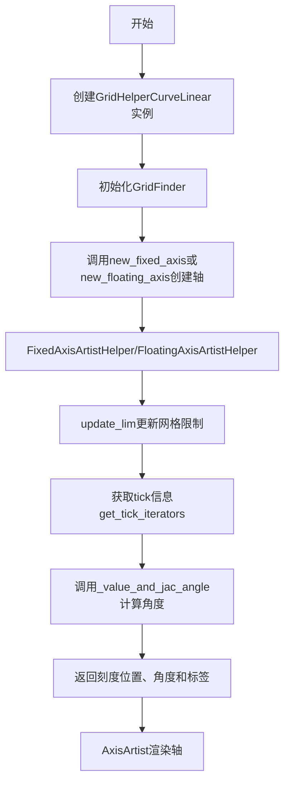

## 类结构

```
GridHelperBase (抽象基类)
└── GridHelperCurveLinear

_FixedAxisArtistHelperBase (抽象基类)
└── FixedAxisArtistHelper

_FloatingAxisArtistHelperBase (抽象基类)
└── FloatingAxisArtistHelper
```

## 全局变量及字段


### `_value_and_jac_angle`
    
计算函数值及其在给定点的雅可比角度导数，用于曲线网格的坐标变换和角度计算

类型：`function`
    


### `FixedAxisArtistHelper.grid_helper`
    
网格辅助工具实例，用于管理曲线网格的坐标变换和网格信息

类型：`GridHelperBase`
    


### `FixedAxisArtistHelper.nth_coord_ticks`
    
刻度所在的坐标轴序号，0表示x轴，1表示y轴

类型：`int`
    


### `FixedAxisArtistHelper.side`
    
轴的位置侧边，值为'left'、'right'、'top'或'bottom'

类型：`str`
    


### `FloatingAxisArtistHelper.value`
    
浮动轴的坐标值，表示该轴在对应坐标维度上的位置

类型：`float`
    


### `FloatingAxisArtistHelper.grid_helper`
    
网格辅助工具实例，用于管理曲线网格的坐标变换和网格信息

类型：`GridHelperBase`
    


### `FloatingAxisArtistHelper._extremes`
    
浮动轴的极值范围，定义了坐标轴的最小和最大边界

类型：`tuple[float, float]`
    


### `FloatingAxisArtistHelper._line_num_points`
    
生成浮动轴线所用的采样点数量，默认值为100

类型：`int`
    


### `FloatingAxisArtistHelper._grid_info`
    
存储浮动轴的网格信息，包括极值、刻度标签和线坐标等

类型：`dict`
    


### `GridHelperCurveLinear._grid_info`
    
存储曲线网格的网格信息，包括经纬线、刻度位置等数据

类型：`dict`
    


### `GridHelperCurveLinear.grid_finder`
    
网格查找器对象，负责坐标变换、网格定位和刻度格式化

类型：`GridFinder`
    
    

## 全局函数及方法


### `_value_and_jac_angle`

该函数用于计算给定坐标变换函数在指定点的函数值，以及通过数值微分计算该变换的雅可比向量（即偏导数 df/dx 和 df/dy）的角度。函数通过有限差分法近似计算偏导数，并自适应地调整步长以确保导数非零，同时确保步长不会超出指定的坐标边界。

参数：

- `func`：`callable`，坐标变换函数，将点 (x, y) 变换到新坐标系 (u, v)，支持数组输入
- `xs`：`array-like`，需要计算函数值和导数的 x 坐标点
- `ys`：`array-like`，需要计算函数值和导数的 y 坐标点
- `xlim`：`pairs of floats`，x 轴的范围限制 (min, max)，用于约束数值微分的步长
- `ylim`：`pairs of floats`，y 轴的范围限制 (min, max)，用于约束数值微分的步长

返回值：`tuple`，包含三个元素：(val, thetas_dx, thetas_dy)

- `val`：变换函数在 (xs, ys) 点的函数值
- `thetas_dx`：浮点数数组，df/dx 向量对应的角度（弧度）
- `thetas_dy`：浮点数数组，df/dy 向量对应的角度（弧度）

#### 流程图

```mermaid
flowchart TD
    A[开始] --> B[计算输入数组的公共形状 shape]
    B --> C[计算 func(xs, ys) 得到 val]
    C --> D[设置基础步长 eps0 = eps^0.5]
    D --> E[定义 calc_eps 函数计算有限差分步长]
    E --> F[使用 calc_eps 计算 x 方向的步长 xeps, xeps_max]
    F --> G[使用 calc_eps 计算 y 方向的步长 yeps, yeps_max]
    G --> H[定义 calc_thetas 函数计算角度]
    H --> I[调用 calc_thetas 计算 thetas_dx<br/>使用 lambda eps_p, eps_q: func(xs + eps_p, ys + eps_q)]
    I --> J[调用 calc_thetas 计算 thetas_dy<br/>使用 lambda eps_p, eps_q: func(xs + eps_q, ys + eps_p)]
    J --> K[返回 tuple: (val, thetas_dx, thetas_dx)]
    K --> L[结束]

    H --> H1[初始化角度数组为 NaN]
    H1 --> H2[循环迭代步长因子 it: 0 → 1]
    H2 --> H3[当有待计算点且步长未超限时]
    H3 --> H4[检查是否提前退出<br/>it==0 且 eps_p>1 存在]
    H4 --> H5[限制步长: eps_p = min(eps_p, eps_max)]
    H5 --> H6[计算有限差分: df_x, df_y]
    H6 --> H7[判断导数是否非零: good = missing & (df_x != 0 | df_y != 0)]
    H7 --> H8[计算角度: arctan2(df_y, df_x)]
    H8 --> H9[更新 angles_dp 和 missing 数组]
    H9 --> H10[步长加倍: eps_p *= 2]
    H10 --> H3
```

#### 带注释源码

```python
def _value_and_jac_angle(func, xs, ys, xlim, ylim):
    """
    计算坐标变换函数的值及其雅可比向量（偏导数）的角度。
    
    Parameters
    ----------
    func : callable
        坐标变换函数，接收 (x, y) 返回 (u, v)，支持数组形式输入
    xs, ys : array-likes
        待计算的坐标点
    xlim, ylim : pairs of floats
        坐标边界限制，用于约束数值微分的步长
    
    Returns
    -------
    val
        变换函数在 (xs, ys) 点的值
    thetas_dx
        df/dx 向量的角度（弧度）
    thetas_dy
        df/dy 向量的角度（弧度）
    """
    
    # 计算输入数组的公共形状，支持广播
    shape = np.broadcast_shapes(np.shape(xs), np.shape(ys))
    
    # 计算变换函数在原始点的值
    val = func(xs, ys)
    
    # 设置基础数值微分步长（取 eps 的平方根，参考 scipy.optimize.approx_fprime）
    eps0 = np.finfo(float).eps ** (1/2)
    
    def calc_eps(vals, lim):
        """
        计算有限差分步长，确保不会超出指定边界。
        
        Parameters
        ----------
        vals : array-like
            原始坐标值
        lim : tuple
            边界范围 (min, max)
        
        Returns
        -------
        eps : array
            有符号步长数组（正负表示方向）
        eps_max : array
            最大允许步长
        """
        lo, hi = sorted(lim)  # 确保 lo < hi
        dlo = vals - lo       # 到下界的距离
        dhi = hi - vals       # 到上界的距离
        eps_max = np.maximum(dlo, dhi)  # 取到两边界距离的较大值
        
        # 选择方向：往距离较远的方向走，步长取 eps0 和到边界距离的较小值
        eps = np.where(dhi >= dlo, 1, -1) * np.minimum(eps0, eps_max)
        return eps, eps_max
    
    # 计算 x 和 y 方向的有限差分步长
    xeps, xeps_max = calc_eps(xs, xlim)
    yeps, yeps_max = calc_eps(ys, ylim)
    
    def calc_thetas(dfunc, ps, eps_p0, eps_max, eps_q):
        """
        计算偏导数向量的角度。
        
        使用有限差分法计算数值导数，如果导数为零则增大步长重试。
        这对于处理退化情况（如极坐标 r=0 处）很重要。
        
        Parameters
        ----------
        dfunc : callable
            变换函数的封装，用于计算带扰动的函数值
        ps : array-like
            原始坐标（x 或 y）
        eps_p0 : array
            初始步长
        eps_max : array
            最大允许步长
        eps_q : array
            另一个方向的步长（用于处理混合偏导情况）
        
        Returns
        -------
        thetas_dp : array
            偏导数向量的角度数组
        """
        # 初始化角度数组，未计算的位置为 NaN
        thetas_dp = np.full(shape, np.nan)
        missing = np.full(shape, True)  # 标记哪些点还需计算
        eps_p = eps_p0
        
        # 第一次迭代计算标准偏导，第二次迭代加入 y 方向扰动
        for it, eps_q in enumerate([0, eps_q]):
            # 当还有点没计算完，且步长还在允许范围内时
            while missing.any() and (abs(eps_p) < eps_max).any():
                # 第一次迭代时，如果步长已经很大（>1），说明是退化情况
                # 提前退出，转而使用另一个坐标方向
                if it == 0 and (eps_p > 1).any():
                    break
                
                # 限制步长不超过最大允许值
                eps_p = np.minimum(eps_p, eps_max)
                
                # 有限差分计算偏导数
                df_x, df_y = (dfunc(eps_p, eps_q) - dfunc(0, eps_q)) / eps_p
                
                # 找出导数有效的点（至少有一个分量非零）
                good = missing & ((df_x != 0) | (df_y != 0))
                
                # 计算这些点的角度（使用 arctan2 得到完整角度信息）
                thetas_dp[good] = np.arctan2(df_y, df_x)[good]
                
                # 标记已计算完成的点
                missing &= ~good
                
                # 增大步长重试（对于退化情况有用）
                eps_p *= 2
        
        return thetas_dp
    
    # 计算 df/dx 的角度：在 x 方向加扰动
    thetas_dx = calc_thetas(
        lambda eps_p, eps_q: func(xs + eps_p, ys + eps_q),
        xs, xeps, xeps_max, yeps
    )
    
    # 计算 df/dy 的角度：在 y 方向加扰动
    # 注意：这里交换了 xs 和 ys 的位置
    thetas_dy = calc_thetas(
        lambda eps_p, eps_q: func(xs + eps_q, ys + eps_p),
        ys, yeps, yeps_max, xeps
    )
    
    return (val, thetas_dx, thetas_dy)
```


### `FixedAxisArtistHelper.update_lim`

该方法是一个简单的委托方法，用于将轴的限制更新操作委托给关联的grid_helper对象处理，确保曲坐标网格能够正确响应轴视图限制的变化。

参数：

- `self`：`FixedAxisArtistHelper`，隐式的实例本身
- `axes`：`matplotlib.axes.Axes`，Matplotlib的轴对象，表示需要进行限制更新的轴

返回值：`None`，该方法直接修改内部状态，不返回任何值

#### 流程图

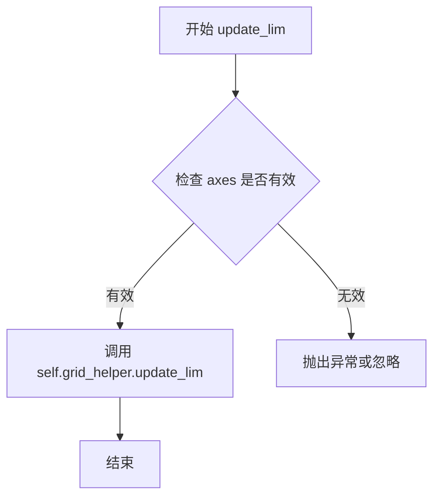

#### 带注释源码

```python
def update_lim(self, axes):
    """
    更新轴的限制信息。
    
    此方法是一个委托方法，将轴限制更新操作转发给关联的 grid_helper 对象。
    当Matplotlib的轴视图限制发生变化时（例如用户缩放或平移），
    曲坐标网格系统需要相应地更新其内部状态以保持同步。
    
    Parameters
    ----------
    axes : matplotlib.axes.Axes
        Matplotlib的轴对象，代表需要更新限制的图表轴。
        该对象提供了获取当前视图限制的方法（如get_xlim, get_ylim）。
    
    Returns
    -------
    None
        此方法不返回任何值，直接修改 grid_helper 的内部状态。
    
    Notes
    -----
    此方法的实现非常简单，只是简单地将调用委托给 self.grid_helper.update_lim(axes)。
    实际的网格更新逻辑在 GridHelperCurveLinear.grid_finder 中实现。
    这个设计遵循了委托模式，将具体的网格更新逻辑封装在 grid_helper 中，
    而 FixedAxisArtistHelper 只负责坐标轴艺术家的显示逻辑。
    """
    self.grid_helper.update_lim(axes)
```


### FixedAxisArtistHelper.get_tick_transform

这是一个坐标轴刻度变换获取方法，属于 FixedAxisArtistHelper 类，用于返回坐标轴的数据坐标变换，使刻度能够正确地在数据坐标系中定位。

参数：

- `axes`：matplotlib.axes.Axes，axes 参数代表当前的坐标轴对象，用于获取其数据变换（transData）。

返回值：`matplotlib.transforms.Transform`，返回坐标轴的数据坐标变换（axes.transData），该变换定义了数据坐标系中的坐标如何映射到显示坐标。

#### 流程图

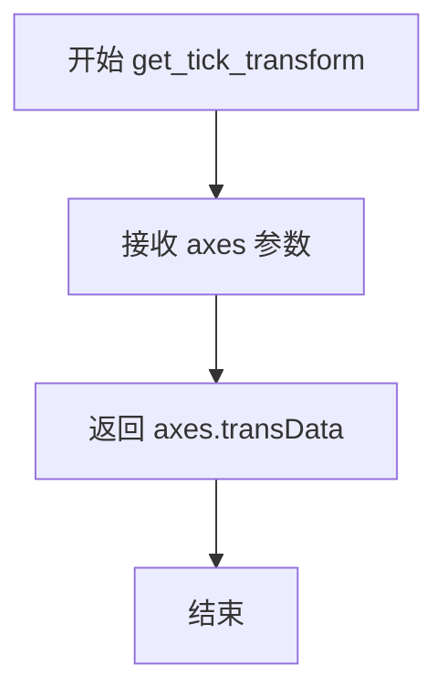

#### 带注释源码

```python
def get_tick_transform(self, axes):
    """
    获取刻度的坐标变换。

    Parameters
    ----------
    axes : matplotlib.axes.Axes
        当前的坐标轴对象。

    Returns
    -------
    matplotlib.transforms.Transform
        坐标轴的数据坐标变换（axes.transData）。
    """
    return axes.transData
```


### FixedAxisArtistHelper.get_tick_iterators

该方法用于获取固定轴的刻度迭代器，返回刻度位置、角度和标签信息。它根据坐标轴的设置和网格助手生成主刻度迭代器，并返回一个空迭代器用于次刻度（当前未实现）。

参数：
- `axes`：`matplotlib.axes.Axes`，matplotlib的Axes对象，用于获取坐标轴的限制（如xlim、ylim）以确定刻度的生成范围。

返回值：`tuple`，返回一个元组，其中第一个元素是生成器（用于遍历主刻度），第二个元素是空迭代器（用于次刻度，本例中为空）。

#### 流程图

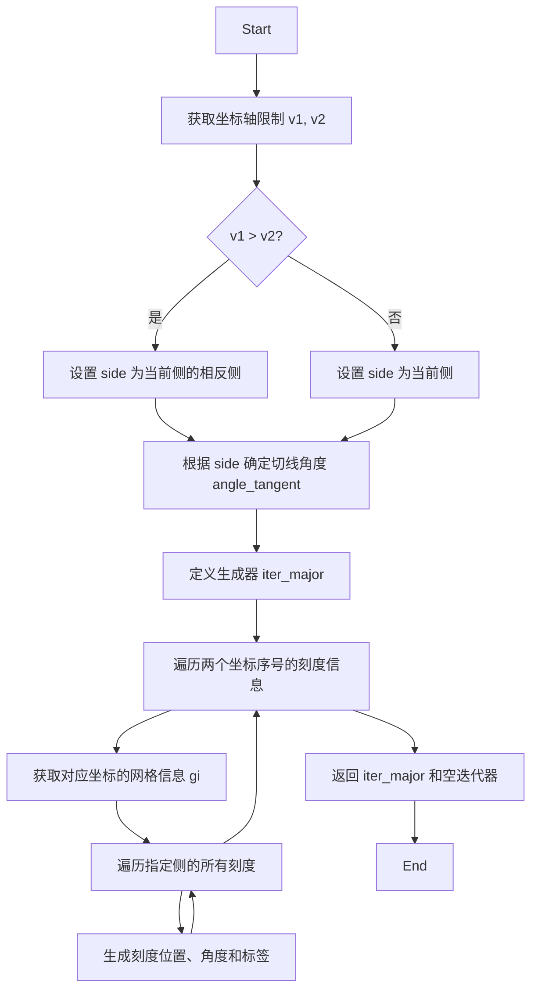

#### 带注释源码

```python
def get_tick_iterators(self, axes):
    """tick_loc, tick_angle, tick_label"""
    # 根据坐标序号获取轴的限制（如果是x轴则获取xlim，否则获取ylim）
    v1, v2 = axes.get_ylim() if self.nth_coord == 0 else axes.get_xlim()
    
    # 如果限制反转（例如从大到小），则调整刻度侧为相反侧
    if v1 > v2:  # Inverted limits.
        side = {"left": "right", "right": "left",
                "top": "bottom", "bottom": "top"}[self.side]
    else:
        side = self.side

    # 根据侧设置切线角度：左右侧为90度，上下侧为0度
    angle_tangent = dict(left=90, right=90, bottom=0, top=0)[side]

    # 定义主刻度迭代器生成器
    def iter_major():
        # 遍历两个坐标：第一个显示标签，第二个不显示
        for nth_coord, show_labels in [
                (self.nth_coord_ticks, True), (1 - self.nth_coord_ticks, False)]:
            # 从网格信息中获取对应坐标的刻度数据
            gi = self.grid_helper._grid_info[["lon", "lat"][nth_coord]]
            # 遍历指定侧的所有刻度
            for tick in gi["ticks"][side]:
                # 生成刻度位置、切线角度和标签（如果显示标签）
                yield (*tick["loc"], angle_tangent,
                       (tick["label"] if show_labels else ""))

    # 返回主刻度迭代器和空次刻度迭代器
    return iter_major(), iter([])
```


### `FloatingAxisArtistHelper.set_extremes`

该方法用于设置浮动轴（Floating Axis）的极端值，即坐标轴的取值范围。若传入的 `e1` 或 `e2` 为 `None`，则分别使用负无穷和正无穷作为默认值。

#### 参数

- `e1`：`float | None`，下限极端值；若为 `None`，则设为负无穷（`-np.inf`）。
- `e2`：`float | None`，上限极端值；若为 `None`，则设为正无穷（`np.inf`）。

#### 返回值

- `None`，本方法不返回值，仅更新内部属性 `_extremes`。

#### 流程图

```mermaid
flowchart TD
    A([开始 set_extremes]) --> B{e1 is None?}
    B -- 是 --> C[e1 = -np.inf]
    B -- 否 --> D[保持 e1]
    C --> E{e2 is None?}
    D --> E
    E -- 是 --> F[e2 = np.inf]
    E -- 否 --> G[保持 e2]
    F --> H[设置 self._extremes = (e1, e2)]
    G --> H
    H --> I([结束])
```

#### 带注释源码

```python
def set_extremes(self, e1, e2):
    """
    设置浮动轴的极端值（范围）。

    Parameters
    ----------
    e1 : float or None
        下限极端值。如果为 None，则使用负无穷 -np.inf。
    e2 : float or None
        上限极端值。如果为 None，则使用正无穷 np.inf。
    """
    # 如果未指定下限，则默认使用负无穷
    if e1 is None:
        e1 = -np.inf
    # 如果未指定上限，则默认使用正无穷
    if e2 is None:
        e2 = np.inf
    # 将处理后的极端值保存到实例属性 _extremes
    self._extremes = e1, e2
```


### `FloatingAxisArtistHelper.update_lim`

该方法用于更新浮动轴的显示范围，计算网格信息并生成轴线数据。它根据坐标轴的当前显示范围和网格定位器，计算经纬度层级，并将给定值（x或y坐标）转换为曲线坐标系统中的线条路径。

参数：

- `self`：实例本身
- `axes`：`matplotlib.axes.Axes`，当前绑定的坐标轴对象，用于获取显示范围

返回值：无（`None`），该方法直接修改实例的 `_grid_info` 属性来存储计算结果

#### 流程图

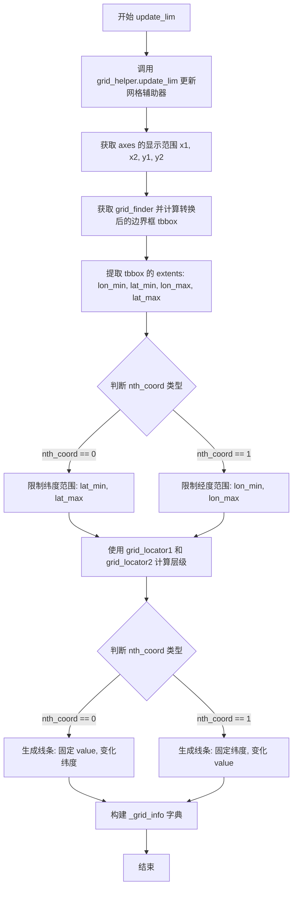

#### 带注释源码

```python
def update_lim(self, axes):
    """
    更新浮动轴的显示范围和网格信息。
    
    此方法根据坐标轴的当前显示范围，计算经纬度边界，
    然后使用网格定位器计算经纬度层级，并生成曲线坐标系统中的线条路径。
    """
    # 1. 更新网格辅助器的限制范围
    self.grid_helper.update_lim(axes)

    # 2. 获取坐标轴的当前显示范围
    x1, x2 = axes.get_xlim()  # x轴显示范围
    y1, y2 = axes.get_ylim()  # y轴显示范围

    # 3. 获取网格查找器，用于坐标转换
    grid_finder = self.grid_helper.grid_finder
    
    # 4. 计算变换后的边界框（将数据坐标转换为曲线坐标）
    # 这里先将数据坐标转换为曲线坐标系统
    tbbox = grid_finder.extreme_finder._find_transformed_bbox(
        grid_finder.get_transform().inverted(),  # 获取逆变换
        Bbox.from_extents(x1, y1, x2, y2))       # 从显示范围创建边界框

    # 5. 提取边界框的经纬度范围
    lon_min, lat_min, lon_max, lat_max = tbbox.extents
    
    # 6. 获取其他坐标轴的范围限制（由 set_extremes 设置）
    e_min, e_max = self._extremes
    
    # 7. 根据坐标类型应用极端值限制
    if self.nth_coord == 0:  # x轴类型，限制纬度范围
        lat_min = max(e_min, lat_min)
        lat_max = min(e_max, lat_max)
    elif self.nth_coord == 1:  # y轴类型，限制经度范围
        lon_min = max(e_min, lon_min)
        lon_max = min(e_max, lon_max)

    # 8. 使用网格定位器计算经纬度层级
    lon_levs, lon_n, lon_factor = grid_finder.grid_locator1(lon_min, lon_max)
    lat_levs, lat_n, lat_factor = grid_finder.grid_locator2(lat_min, lat_max)

    # 9. 根据坐标类型生成线条坐标点
    if self.nth_coord == 0:
        # 固定x值（self.value），沿纬度方向生成点
        xys = grid_finder.get_transform().transform(np.column_stack([
            np.full(self._line_num_points, self.value),  # 固定的x坐标值
            np.linspace(lat_min, lat_max, self._line_num_points),  # 变化的纬度
        ]))
    elif self._line_num_points == 1:
        # 固定y值（self.value），沿经度方向生成点
        xys = grid_finder.get_transform().transform(np.column_stack([
            np.linspace(lon_min, lon_max, self._line_num_points),  # 变化的经度
            np.full(self._line_num_points, self.value),  # 固定的y坐标值
        ]))

    # 10. 构建网格信息字典并存储
    self._grid_info = {
        "extremes": Bbox.from_extents(lon_min, lat_min, lon_max, lat_max),  # 极端边界
        "lon_info": (lon_levs, lon_n, np.asarray(lon_factor)),              # 经度信息
        "lat_info": (lat_levs, lat_n, np.asarray(lat_factor)),              # 纬度信息
        "lon_labels": grid_finder._format_ticks(1, "bottom", lon_factor, lon_levs),  # 经度标签
        "lat_labels": grid_finder._format_ticks(2, "bottom", lat_factor, lat_levs),  # 纬度标签
        "line_xy": xys,  # 转换后的线条坐标点
    }
```


### `FloatingAxisArtistHelper.get_axislabel_transform`

获取浮动坐标轴标签的坐标变换矩阵。当前实现返回一个空的 `Affine2D` 实例（单位矩阵），作为坐标轴标签的变换。

参数：

- `axes`：`matplotlib.axes.Axes`，坐标轴对象。该参数在当前实现中未被使用，但通常用于获取 `transData` 等变换信息。

返回值：`matplotlib.transforms.Affine2D`，返回一个单位仿射变换对象（Identity Affine2D）。

#### 流程图


#### 带注释源码

```python
    def get_axislabel_transform(self, axes):
        """
        Returns the transform for the axis label.

        Parameters
        ----------
        axes : matplotlib.axes.Axes
            The axes object.

        Returns
        -------
        matplotlib.transforms.Affine2D
            The transform to use for the axis label.
        """
        return Affine2D()  # axes.transData
```


### `FloatingAxisArtistHelper.get_axislabel_pos_angle`

该方法用于计算浮动轴（Floating Axis）标签的位置和角度，通过坐标变换和数值导数计算来确定轴标签在图形中的精确位置和旋转角度，同时判断标签是否位于坐标轴范围内。

参数：

- `self`：`FloatingAxisArtistHelper` 实例本身
- `axes`：`matplotlib.axes.Axes` 坐标系对象，用于获取转换器和坐标轴信息

返回值：`tuple`，返回一个元组 `(position, angle)`，其中：
- `position`：返回 `xy1`（变换后的坐标数组）或 `None`（当标签位置超出坐标轴范围时）
- `angle`：返回角度值（度）或 `None`（当标签位置超出坐标轴范围时）

#### 流程图

```mermaid
flowchart TD
    A[开始 get_axislabel_pos_angle] --> B[定义内部函数 trf_xy]
    B --> C[获取网格极值 xmin, ymin, xmax, ymax]
    C --> D{判断 nth_coord}
    D -->|nth_coord == 0| E[设置 xx0=self.value, yy0=(ymin+ymax)/2]
    D -->|nth_coord == 1| F[设置 xx0=(xmin+xmax)/2, yy0=self.value]
    E --> G[调用 _value_and_jac_angle 计算坐标和角度]
    F --> G
    G --> H[将变换后的坐标转换为轴坐标]
    H --> I{检查坐标是否在 [0,1] 范围内}
    I -->|是| J[返回 xy1 和角度值]
    I -->|否| K[返回 None, None]
    J --> L[结束]
    K --> L
```

#### 带注释源码

```python
def get_axislabel_pos_angle(self, axes):
    """
    获取浮动轴标签的位置和角度。
    
    Parameters
    ----------
    axes : matplotlib.axes.Axes
         Axes 对象，用于获取坐标变换和坐标轴信息。
    
    Returns
    -------
    tuple
        (position, angle) 元组，其中 position 是变换后的坐标数组 (x, y)，
        angle 是以度为单位的旋转角度。如果标签位置超出坐标轴范围，则返回 (None, None)。
    """
    # 定义内部坐标转换函数：将 (x, y) 从曲线坐标转换为数据坐标
    def trf_xy(x, y):
        # 获取网格查找器的变换 + axes 的数据变换
        trf = self.grid_helper.grid_finder.get_transform() + axes.transData
        # 应用变换并转置结果
        return trf.transform([x, y]).T

    # 从网格信息中获取极值边界
    xmin, ymin, xmax, ymax = self._grid_info["extremes"].extents
    
    # 根据坐标轴方向确定标签的初始位置
    if self.nth_coord == 0:
        # 沿着 x 轴方向变化，设置 xx0 为固定值，yy0 为 y 范围的中点
        xx0 = self.value
        yy0 = (ymin + ymax) / 2
    elif self.nth_coord == 1:
        # 沿着 y 轴方向变化，设置 yy0 为固定值，xx0 为 x 范围的中点
        xx0 = (xmin + xmax) / 2
        yy0 = self.value
    
    # 调用数值导数计算函数，获取变换后的坐标和角度导数
    # _value_and_jac_angle 返回 (value, thetas_dx, thetas_dy)
    xy1, angle_dx, angle_dy = _value_and_jac_angle(
        trf_xy, xx0, yy0, (xmin, xmax), (ymin, ymax))
    
    # 将变换后的坐标从数据坐标转换为轴坐标（0-1 范围）
    p = axes.transAxes.inverted().transform(xy1)
    
    # 检查标签位置是否在坐标轴的有效范围内 [0, 1]
    if 0 <= p[0] <= 1 and 0 <= p[1] <= 1:
        # 在范围内，返回变换后的坐标和角度
        # 根据 nth_coord 选择正确的角度分量，并转换为度
        return xy1, np.rad2deg([angle_dy, angle_dx][self.nth_coord])
    else:
        # 超出范围，返回 None 表示标签不可见
        return None, None
```


### `FloatingAxisArtistHelper.get_tick_transform`

该方法用于获取浮动轴的刻度变换矩阵，返回一个恒等变换（IdentityTransform），使刻度位置保持在数据坐标系中，不进行额外的坐标变换。

参数：

- `self`：`FloatingAxisArtistHelper`，方法所属的实例对象
- `axes`：`matplotlib.axes.Axes`，matplotlib 的坐标轴对象，用于获取当前坐标轴的变换信息（虽然本方法未直接使用此参数）

返回值：`IdentityTransform`，返回 matplotlib 的恒等变换对象，表示刻度坐标不经过任何变换，直接使用数据坐标

#### 流程图

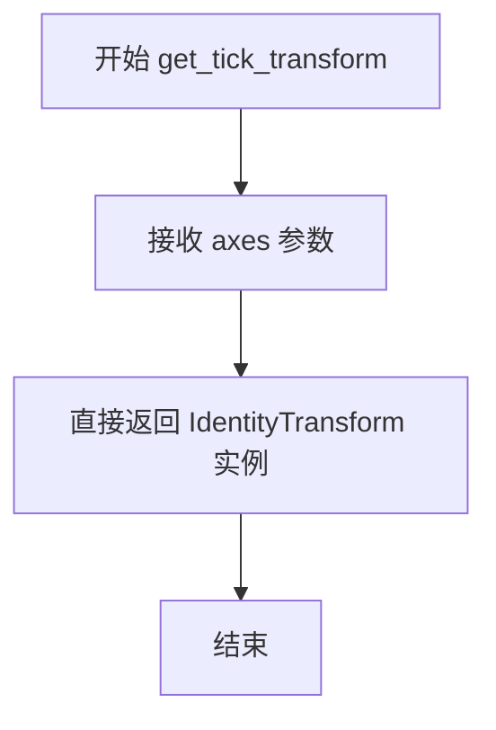

#### 带注释源码

```python
def get_tick_transform(self, axes):
    """
    获取浮动轴刻度的坐标变换。

    此方法返回一个 IdentityTransform（恒等变换），
    使得刻度位置直接使用数据坐标，不进行额外的坐标变换。
    这与 FixedAxisArtistHelper.get_tick_transform 不同，
    后者返回 axes.transData 进行数据坐标到显示坐标的变换。

    参数
    ----------
    axes : matplotlib.axes.Axes
        matplotlib 坐标轴对象，当前未被使用，保留用于接口一致性

    返回值
    -------
    IdentityTransform
        恒等变换对象，表示刻度位置保持在原始数据坐标系中
    """
    return IdentityTransform()  # axes.transData
```

---

### 补充信息

**设计意图：**
- `FloatingAxisArtistHelper` 用于处理浮动轴（Floating Axis），即在曲线坐标网格中表示特定数值位置的轴线
- 相比固定轴（`FixedAxisArtistHelper`），浮动轴的刻度变换返回恒等变换，意味着刻度位置直接由数据坐标决定，无需额外的坐标映射

**潜在技术债务/优化空间：**

1. **未使用的参数**：`axes` 参数在方法签名中存在，但在实现中并未被使用，这可能表明接口设计冗余或功能未完全实现
2. **注释与实现不一致**：注释中提及 `axes.transData`，但实际返回 `IdentityTransform()`，这种不一致可能造成混淆
3. **方法重写问题**：父类 `_FloatingAxisArtistHelperBase` 中可能存在类似方法，需要确认是否应该返回不同的变换类型


### `FloatingAxisArtistHelper.get_tick_iterators`

该方法用于获取浮动了轴（Floating Axis）的刻度迭代器，根据网格信息和坐标变换计算刻度位置、角度和标签，并返回满足显示条件的主要刻度迭代器。

参数：

- `axes`：`axes` 对象，用于获取坐标变换信息和视口边界

返回值：`tuple`，返回两个迭代器——主要刻度迭代器和次要刻度迭代器（此处为空迭代器）

#### 流程图

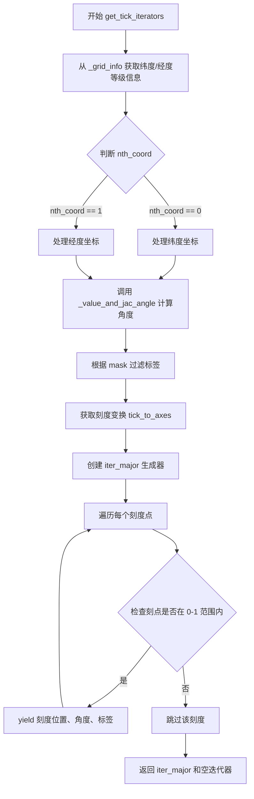

#### 带注释源码

```python
def get_tick_iterators(self, axes):
    """tick_loc, tick_angle, tick_label, (optionally) tick_label"""

    # 从网格信息中获取纬度等级、因子
    lat_levs, lat_n, lat_factor = self._grid_info["lat_info"]
    # 计算纬度坐标（原始值除以因子）
    yy0 = lat_levs / lat_factor

    # 从网格信息中获取经度等级、因子
    lon_levs, lon_n, lon_factor = self._grid_info["lon_info"]
    # 计算经度坐标
    xx0 = lon_levs / lon_factor

    # 获取极值范围
    e0, e1 = self._extremes

    # 定义坐标变换函数：将曲坐标转换为数据坐标
    def trf_xy(x, y):
        # 获取网格查找器的变换 + axes 的数据变换
        trf = self.grid_helper.grid_finder.get_transform() + axes.transData
        # 变换坐标点
        return trf.transform(np.column_stack(np.broadcast_arrays(x, y))).T

    # 根据坐标类型计算角度
    if self.nth_coord == 0:
        # 纬度坐标：创建掩码过滤在极值范围内的点
        mask = (e0 <= yy0) & (yy0 <= e1)
        # 计算变换后的坐标和角度
        (xx1, yy1), angle_normal, angle_tangent = _value_and_jac_angle(
            trf_xy, self.value, yy0[mask], (-np.inf, np.inf), (e0, e1))
        # 获取纬度标签
        labels = self._grid_info["lat_labels"]

    elif self.nth_coord == 1:
        # 经度坐标：创建掩码
        mask = (e0 <= xx0) & (xx0 <= e1)
        # 计算变换后的坐标和角度
        (xx1, yy1), angle_tangent, angle_normal = _value_and_jac_angle(
            trf_xy, xx0[mask], self.value, (-np.inf, np.inf), (e0, e1))
        # 获取经度标签
        labels = self._grid_info["lon_labels"]

    # 根据掩码过滤标签，只保留在范围内的标签
    labels = [l for l, m in zip(labels, mask) if m]
    
    # 获取刻度到坐标轴的变换
    tick_to_axes = self.get_tick_transform(axes) - axes.transAxes
    
    # 创建检查值是否在 (0,1) 范围内的函数
    in_01 = functools.partial(
        mpl.transforms._interval_contains_close, (0, 1))

    # 定义主要刻度迭代器
    def iter_major():
        # 遍历每个刻度的坐标、角度和标签
        for x, y, normal, tangent, lab \
                in zip(xx1, yy1, angle_normal, angle_tangent, labels):
            # 将刻度坐标变换到坐标轴空间
            c2 = tick_to_axes.transform((x, y))
            # 检查刻度是否在视口范围内 (0-1)
            if in_01(c2[0]) and in_01(c2[1]):
                # 生成刻度信息：位置、角度（弧度转角度）、标签
                yield [x, y], *np.rad2deg([normal, tangent]), lab

    # 返回主要刻度迭代器和次要刻度迭代器（此处为空）
    return iter_major(), iter([])
```


### `FloatingAxisArtistHelper.get_line_transform`

该方法用于获取绘制浮动轴线所需的坐标变换。它直接返回axes的`transData`变换，使得浮动轴线能够按照数据坐标进行绘制。这是`FloatingAxisArtistHelper`类中用于获取线变换的简单方法，通常与`get_line`方法配合使用来绘制浮动轴。

参数：

- `self`：隐式参数， FloatingAxisArtistHelper类的实例
- `axes`：matplotlib.axes.Axes， 绑定的matplotlib坐标轴对象，用于获取坐标变换

返回值：`matplotlib.transforms.Transform`， 返回axes的data坐标变换（transData），用于将数据坐标转换为显示坐标

#### 流程图

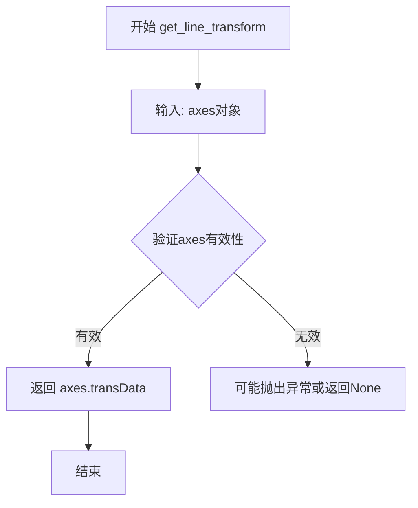

#### 带注释源码

```python
def get_line_transform(self, axes):
    """
    获取浮动轴线的变换矩阵。
    
    该方法返回一个变换对象，用于将数据坐标转换为显示坐标。
    对于浮动轴线，直接使用axes的transData变换，这意味着
    轴线的位置将根据实际的数据值来确定。
    
    Parameters
    ----------
    axes : matplotlib.axes.Axes
        matplotlib坐标轴对象，提供了各种坐标变换（transData, transAxes等）
    
    Returns
    -------
    matplotlib.transforms.Transform
        坐标变换对象，通常是axes.transData，用于数据坐标到显示坐标的转换
    """
    return axes.transData
```

#### 备注

- 这是一个非常简单的方法，直接返回`axes.transData`变换
- `transData`是matplotlib中最重要的变换之一，它负责将数据坐标转换为显示坐标（像素坐标）
- 该方法通常与`get_line`方法配合使用：`get_line_transform`提供变换，而`get_line`提供具体的路径数据
- 相比之下，`get_tick_transform`方法返回的是`IdentityTransform()`，这表明刻度标签使用的是axes坐标而不是数据坐标


### `FloatingAxisArtistHelper.get_line`

获取浮轴的线条路径，用于绘制浮轴的轴线。

参数：

- `self`：`_FloatingAxisArtistHelperBase` 子类实例，隐式参数，表示当前辅助对象
- `axes`：`matplotlib.axes.Axes`，axes 对象，用于获取坐标轴范围和变换信息

返回值：`matplotlib.path.Path`，返回由网格信息中的 `line_xy` 数据构建的路径对象，用于绘制浮轴线条

#### 流程图

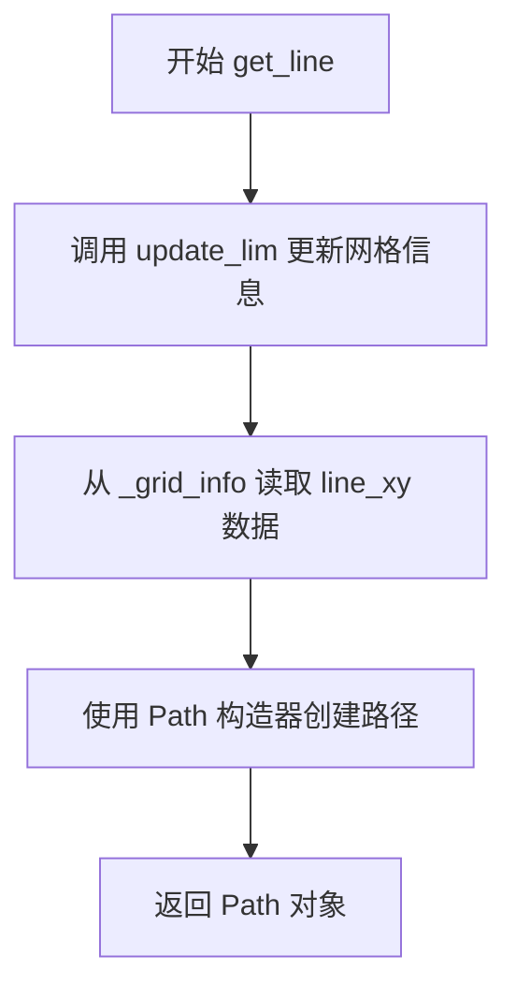

#### 带注释源码

```python
def get_line(self, axes):
    """
    获取浮轴的线条路径。

    Parameters
    ----------
    axes : matplotlib.axes.Axes
        matplotlib 的 Axes 对象，用于获取坐标轴范围和变换信息。

    Returns
    -------
    matplotlib.path.Path
        浮轴线条的路径对象。
    """
    # 首先调用 update_lim 方法，确保 _grid_info 中的数据是最新的
    # update_lim 会计算 grid_finder 的变换，确定线条的端点坐标
    self.update_lim(axes)
    
    # 从 _grid_info 字典中获取预计算的线条坐标数据 line_xy
    # line_xy 是在 update_lim 方法中根据 nth_coord 和 value 计算得到的
    # 它包含了变换后的线条顶点坐标
    # 使用 matplotlib.path.Path 构造器将这些坐标转换为路径对象
    return Path(self._grid_info["line_xy"])
```


### `GridHelperCurveLinear.update_grid_finder`

该方法用于更新 `GridHelperCurveLinear` 的网格查找器（grid finder）的变换和参数，当辅助变换或网格定位器/格式化器等参数发生变化时调用，调用后会强制使旧的限制缓存失效，以便在下一次渲染时重新计算网格信息。

参数：

- `aux_trans`：可选的 `.Transform` 或 tuple[Callable, Callable]，新的坐标变换，用于更新 `grid_finder` 的变换。如果为 `None`，则不更新变换。
- `**kwargs`：关键字参数，将直接传递给 `grid_finder` 的 `update` 方法，用于更新网格定位器（grid_locator1, grid_locator2）或刻度格式化器（tick_formatter1, tick_formatter2）等。

返回值：`None`，无返回值（该方法直接修改对象状态）。

#### 流程图

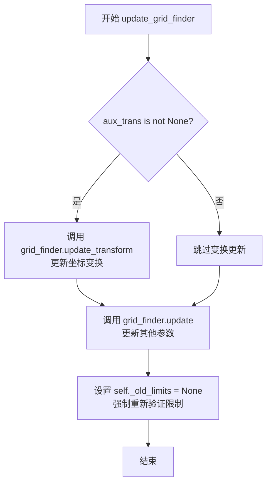

#### 带注释源码

```python
def update_grid_finder(self, aux_trans=None, **kwargs):
    """
    更新 grid_finder 的变换和参数。

    Parameters
    ----------
    aux_trans : Transform or tuple of callables, optional
        新的辅助坐标变换。如果不为 None，则更新 grid_finder 的变换。
    **kwargs : keyword arguments
        传递给 grid_finder.update() 的关键字参数，例如 grid_locator1,
        grid_locator2, tick_formatter1, tick_formatter2 等。
    """
    # 如果提供了新的辅助变换，则更新 grid_finder 的变换函数
    if aux_trans is not None:
        self.grid_finder.update_transform(aux_trans)
    
    # 更新 grid_finder 的其他参数（如网格定位器、刻度格式化器等）
    self.grid_finder.update(**kwargs)
    
    # 强制使旧的限制缓存失效，确保下一次 get_grid_info 调用时
    # 会重新计算网格限制而不是使用缓存的旧值
    self._old_limits = None  # Force revalidation.
```

#### 关键组件信息

- **GridHelperCurveLinear**：曲线坐标系的网格辅助类，继承自 `GridHelperBase`，管理曲 curvilinear 坐标系的网格绘制。
- **grid_finder**：类型为 `GridFinder`，负责计算网格线、刻度位置等坐标转换逻辑。
- **_old_limits**：实例变量，用于缓存上一次计算的坐标限制，设为 `None` 可强制重新计算。

#### 潜在的技术债务或优化空间

1. **缓存失效机制不够精细**：当前方法将 `_old_limits` 整个设为 `None`，可能导致不必要的完整重算。可以考虑引入更细粒度的缓存失效机制（如分别标记变换缓存、定位器缓存等是否过期）。
2. **缺少参数验证**：方法未对 `aux_trans` 和 `kwargs` 的合法性进行验证，传入无效参数可能只在后续调用时才会报错，缺乏早期的错误反馈。
3. **文档可增强**：参数 `aux_trans` 的具体类型和 `kwargs` 可接受的键值对未在 docstring 中详细列出。

#### 其它项目

- **设计目标**：提供动态更新 curvilinear 坐标系网格配置的能力，使得用户可以在运行时修改坐标变换或网格/刻度参数，而无需重新创建整个 `GridHelperCurveLinear` 对象。
- **错误处理**：当前未做显式错误处理。若 `grid_finder.update_transform` 或 `grid_finder.update` 抛出异常（例如类型不匹配），异常会直接向上传播。
- **数据流**：调用此方法后，后续调用 `get_gridlines`、`new_fixed_axis`、`new_floating_axis` 等方法时会使用更新后的参数进行计算。
- **外部依赖**：依赖 `GridFinder` 类的 `update_transform` 和 `update` 方法。


### `GridHelperCurveLinear.new_fixed_axis`

该方法用于在曲线网格助手上创建新的固定轴线，通过实例化 `FixedAxisArtistHelper` 和 `AxisArtist` 来生成具有指定位置和方向的轴线对象。

参数：

- `loc`：`str`，轴线的位置（如 'left', 'right', 'top', 'bottom'）
- `axis_direction`：`str` 或 `None`，轴线方向，默认值为 `None`
- `offset`：`any`，偏移量（当前方法未使用该参数），默认值为 `None`
- `axes`：`matplotlib.axes.Axes` 或 `None`，所属的坐标轴对象，默认值为 `None`
- `nth_coord`：`int` 或 `None`，坐标索引（表示沿哪个坐标轴变化），默认值为 `None`

返回值：`AxisArtist`，返回创建的轴线对象

#### 流程图

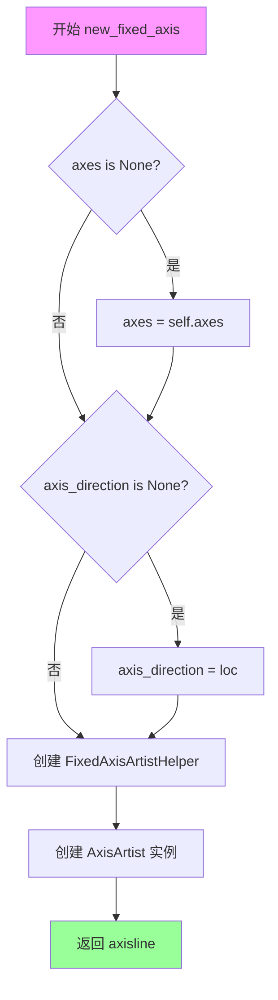

#### 带注释源码

```python
def new_fixed_axis(
    self, loc, *, axis_direction=None, offset=None, axes=None, nth_coord=None
):
    """
    创建新的固定轴线。
    
    Parameters
    ----------
    loc : str
        轴线位置，如 'left', 'right', 'top', 'bottom'
    axis_direction : str, optional
        轴线方向，默认与 loc 相同
    offset : any, optional
        偏移量（当前未使用）
    axes : Axes, optional
        所属的坐标轴对象，默认为 self.axes
    nth_coord : int, optional
        坐标索引，表示沿哪个坐标轴变化
    """
    # 如果未指定 axes，则使用当前网格助手的 axes 属性
    if axes is None:
        axes = self.axes
    
    # 如果未指定 axis_direction，则使用 loc 的值
    if axis_direction is None:
        axis_direction = loc
    
    # 创建固定轴线艺术家帮助器实例
    helper = FixedAxisArtistHelper(self, loc, nth_coord_ticks=nth_coord)
    
    # 创建轴线艺术家对象，传入帮助器和对齐方向
    axisline = AxisArtist(axes, helper, axis_direction=axis_direction)
    
    # 注意：此处未设置 clip，区别于 new_floating_axis 方法
    # 返回创建的轴线对象
    return axisline
```


### `GridHelperCurveLinear.new_floating_axis`

该方法用于在曲线坐标网格中创建一条浮动轴（floating axis），通过实例化 `FloatingAxisArtistHelper` 和 `AxisArtist` 来生成具有指定方向和数值的轴线，并设置剪贴属性。

参数：

- `nth_coord`：`int`，表示坐标变化的维度（0 表示沿 x 轴变化，1 表示沿 y 轴变化）
- `value`：`float`，浮动轴的数值位置
- `axes`：`matplotlib.axes.Axes` 或 `None`，要绑定到的 Axes 对象，默认为 None（使用 GridHelper 的 axes 属性）
- `axis_direction`：`str`，轴的方向指示（如 "bottom", "top", "left", "right"），默认为 "bottom"

返回值：`AxisArtist`，返回创建的浮动轴艺术对象

#### 流程图

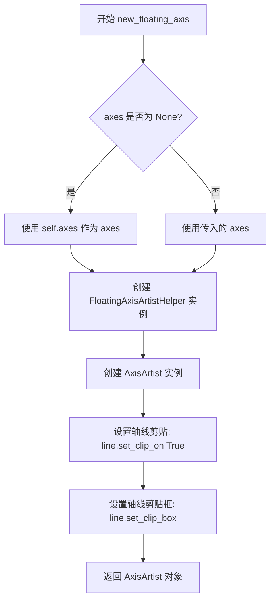

#### 带注释源码

```python
def new_floating_axis(self, nth_coord, value, axes=None, axis_direction="bottom"):
    """
    创建并返回一个浮动轴（floating axis）对象。
    
    参数:
        nth_coord: 整数，表示坐标维度（0对应x轴，1对应y轴）
        value: 浮点数，表示轴的数值位置
        axes: Axes对象，如果为None则使用self.axes
        axis_direction: 字符串，表示轴的方向（默认"bottom"）
    
    返回:
        AxisArtist: 配置好的浮动轴对象
    """
    # 如果未指定axes，则使用GridHelper关联的axes
    if axes is None:
        axes = self.axes
    
    # 创建浮动轴的辅助类实例，传入grid_helper、坐标维度、值和方向
    helper = FloatingAxisArtistHelper(
        self,  # grid_helper
        nth_coord,  # 坐标维度
        value,  # 轴值
        axis_direction  # 轴方向
    )
    
    # 使用辅助类创建AxisArtist对象
    axisline = AxisArtist(axes, helper)
    
    # 启用轴线的剪贴功能
    axisline.line.set_clip_on(True)
    # 设置轴线的剪贴框为axes的边界框
    axisline.line.set_clip_box(axisline.axes.bbox)
    
    # 注释掉的代码（可能是之前的尝试）:
    # axisline.major_ticklabels.set_visible(True)
    # axisline.minor_ticklabels.set_visible(False)
    
    # 返回配置好的浮动轴对象
    return axisline
```


### `GridHelperCurveLinear._update_grid`

该方法负责根据传入的边界框更新曲线性网格 helper 的内部网格信息缓存，通过调用 grid_finder 的 get_grid_info 方法获取新的网格数据并存储到 _grid_info 属性中供后续网格线渲染使用。

参数：

- `self`：`GridHelperCurveLinear`，当前类实例
- `bbox`：`Bbox`， matplotlib 的边界框对象，表示需要进行网格计算的坐标范围（通常为axes的显示区域）

返回值：`None`，该方法直接修改实例的 `_grid_info` 属性，不返回任何值

#### 流程图

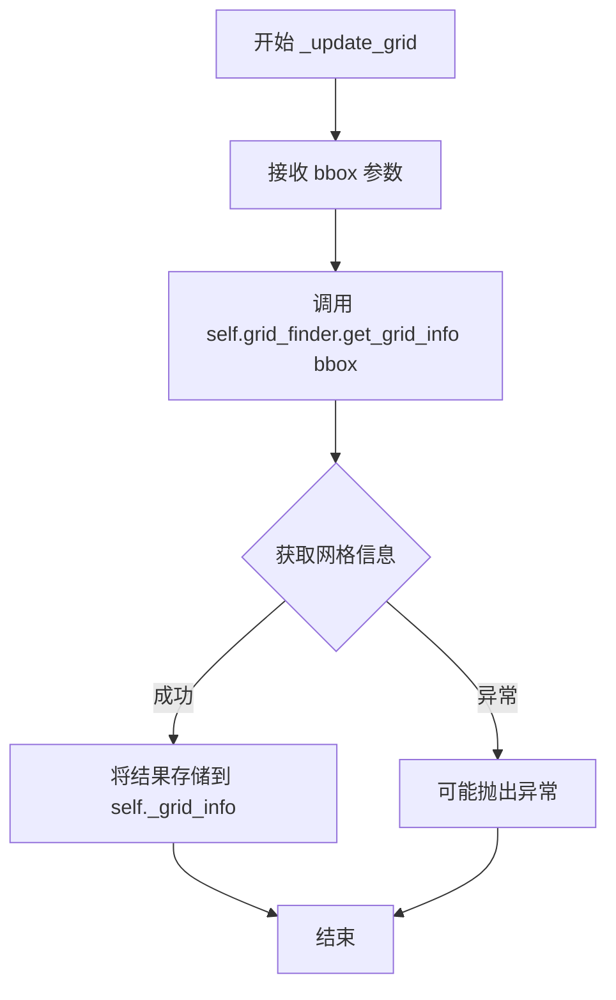

#### 带注释源码

```python
def _update_grid(self, bbox):
    """
    根据传入的边界框更新网格信息缓存。

    Parameters
    ----------
    bbox : Bbox
        matplotlib 的边界框对象，定义了需要进行网格计算的坐标范围。
        通常对应axes的显示区域（x1, y1, x2, y2）。

    Returns
    -------
    None
        该方法直接修改实例的 _grid_info 属性，不返回任何值。
    """
    # 调用 grid_finder 的 get_grid_info 方法计算网格信息
    # grid_info 包含:
    #   - "lon": 经度/第一坐标的网格信息（网格线、标签等）
    #   - "lat": 纬度/第二坐标的网格信息（网格线、标签等）
    #   - "extremes": 变换后的坐标边界
    self._grid_info = self.grid_finder.get_grid_info(bbox)
```


### `GridHelperCurveLinear.get_gridlines`

该方法用于获取曲线性网格的网格线。它根据`axis`参数筛选并返回指定轴（x轴、y轴或两者）的网格线列表，并对每条网格线进行转置处理。

参数：

- `which`：`str`，默认值 `"major"`，用于指定获取主要网格线还是次要网格线（当前实现中未实际使用此参数，仅作为接口保留）
- `axis`：`str`，默认值 `"both"`，指定要获取的网格线类型，可选值为 `"x"`（仅经度线）、`y`（仅纬度线）或 `"both"`（两者都包含）

返回值：`list`，返回网格线列表，其中每个元素是转置后的网格线坐标数组（形状为`(2, N)`的NumPy数组）

#### 流程图

```mermaid
flowchart TD
    A[开始 get_gridlines] --> B[初始化空列表 grid_lines]
    B --> C{axis in ['both', 'x']?}
    C -->|Yes| D[获取经度网格线<br/>self._grid_info['lon']['lines']]
    D --> E[对每条线转置gl.T并添加到grid_lines]
    E --> F{axis in ['both', 'y']?}
    C -->|No| F
    F -->|Yes| G[获取纬度网格线<br/>self._grid_info['lat']['lines']]
    G --> H[对每条线转置gl.T并添加到grid_lines]
    H --> I[返回grid_lines列表]
    F -->|No| I
```

#### 带注释源码

```python
def get_gridlines(self, which="major", axis="both"):
    """
    Return the grid lines as a list.
    
    Parameters
    ----------
    which : str, optional
        Which grid lines to return. Currently only "major" is supported
        (default: "major").
    axis : str, optional
        Which axis to return grid lines for. Can be "both", "x", or "y"
        (default: "both").
    
    Returns
    -------
    list
        A list of grid lines. Each grid line is a transposed array of shape
        (2, n_points) containing the x and y coordinates of the line.
    """
    # 初始化用于存储网格线的空列表
    grid_lines = []
    
    # 如果需要获取x轴方向（经度）的网格线
    if axis in ["both", "x"]:
        # 从_grid_info字典中获取经度("lon")网格线
        # 使用列表推导式对每条线进行转置(.T)
        # 转置原因：原始数据可能是按点存储，转置后便于后续处理
        grid_lines.extend([gl.T for gl in self._grid_info["lon"]["lines"]])
    
    # 如果需要获取y轴方向（纬度）的网格线
    if axis in ["both", "y"]:
        # 从_grid_info字典中获取纬度("lat")网格线
        # 同样对每条线进行转置处理
        grid_lines.extend([gl.T for gl in self._grid_info["lat"]["lines"]])
    
    # 返回收集到的所有网格线
    return grid_lines
```

## 关键组件


### _value_and_jac_angle

计算函数在给定点的值及其导数角度，用于确定网格线的切线方向。采用数值差分方法计算偏导数，并处理边界情况（如极坐标中r=0的情况）。

### FixedAxisArtistHelper

固定轴艺术家助手类，继承自_FixedAxisArtistHelperBase。负责在曲线坐标系中绘制固定位置的轴线，提供刻度迭代器并计算刻度角度。

### FloatingAxisArtistHelper

浮动轴艺术家助手类，继承自_FloatingAxisHelperBase。负责在曲线坐标系中绘制浮动轴线（即指定坐标值的等值线），包含网格信息计算、轴线变换和刻度角度计算。

### GridHelperCurveLinear

曲线网格助手类，继承自GridHelperBase。核心类，管理曲线坐标到直角坐标的变换、网格线生成、刻度定位器和格式化器。提供创建固定轴和浮动轴的接口。

### GridFinder

虽然在此代码中作为外部依赖引入，但它是曲线网格系统的核心组件。负责计算网格信息、定位刻度、格式化标签等。

### _FixedAxisArtistHelperBase

固定轴艺术家帮助器的基类，提供轴线绘制的基础接口。

### _FloatingAxisArtistHelperBase

浮动轴艺术家帮助器的基类，提供浮动轴线绘制的基础接口。

### GridHelperBase

网格助手基类，定义网格系统的通用接口。

### AxisArtist

轴线艺术家类，负责实际的轴线绘制和渲染。


## 问题及建议


### 已知问题

- **魔法数字与硬编码值**：多处使用硬编码值，如 `_line_num_points = 100`、`angle_tangent = dict(left=90, right=90, bottom=0, top=0)`，缺乏配置灵活性。
- **代码重复**：`FloatingAxisArtistHelper` 中 `get_axislabel_pos_angle` 和 `get_tick_iterators` 方法都定义了相似的 `trf_xy` 函数，违反 DRY 原则。
- **类型注解缺失**：整个代码文件没有使用 Python 类型注解（type hints），降低代码可读性和静态分析能力。
- **复杂难懂的数值计算逻辑**：`calc_thetas` 函数包含嵌套循环和复杂的数值微分步长自适应逻辑，缺乏详细注释，难以维护。
- **不一致的变量命名**：网格信息访问使用混合的键名，如 `gi["ticks"][side]` 与 `self._grid_info["lat_info"]`，命名风格不统一。
- **废弃代码未清理**：存在注释掉的代码（如 `axisline.major_ticklabels.set_visible`），可能表示未完成功能或已废弃代码，影响代码整洁性。
- **错误处理薄弱**：`calc_thetas` 中对数值微分的处理逻辑复杂，但缺乏对边界情况和数值不稳定性的显式处理。
- **浮点数比较问题**：在 `update_lim` 等方法中使用 `v1 > v2` 判断是否反转坐标轴，依赖隐式浮点数比较。

### 优化建议

- 将硬编码的配置值（如 `_line_num_points`、角度字典）提取为类属性或构造函数参数，提供更好的可配置性。
- 提取重复的 `trf_xy` 函数为类方法或使用 `functools.lru_cache` 缓存转换结果。
- 为所有函数和类添加类型注解，提高代码可维护性。
- 重构 `calc_thetas` 函数，添加详细文档注释说明数值微分逻辑，或考虑提取为独立模块。
- 统一网格信息的访问模式，使用一致的命名约定（如始终使用 `self._grid_info`）。
- 清理注释掉的废弃代码，或添加 TODO 注释说明状态。
- 考虑为关键数值计算添加显式的误差处理和边界检查。

## 其它


### 设计目标与约束

本模块旨在为matplotlib提供曲 curvilinear grid（曲线网格）的实验性支持，使得能够绘制非笛卡尔坐标系（如极坐标、地图投影等）的轴线和网格线。设计约束包括：必须与现有的GridHelperBase类体系兼容；坐标变换函数必须可逆；需要支持任意可微分的坐标转换；网格线绘制需要保持数学上的正确性（角度计算）；性能上需要能够处理至少100个采样点的网格线生成。

### 错误处理与异常设计

代码中的错误处理主要体现在：FloatingAxisArtistHelper.set_extremes方法对None值的处理，会将None转换为无穷大；calc_eps函数中通过np.where处理边界情况；当导数为零时通过增加步长重新计算（thetas_dp计算逻辑）；当坐标超出轴范围时get_tick_iterators返回None。在value_and_jac_angle函数中使用np.finfo(float).eps**(1/2)作为最小步长避免数值下溢。需要补充的异常处理：坐标变换函数返回值形状不一致时的验证；网格定位器返回空结果时的处理；变换矩阵奇异时的降级策略。

### 数据流与状态机

整体数据流：用户创建GridHelperCurveLinear实例并设置坐标变换 → 调用new_fixed_axis或new_floating_axis创建轴线 → 在绘制时调用update_lim更新网格信息 → get_tick_iterators获取刻度位置和角度 → get_gridlines获取网格线。状态转换：GridHelperCurveLinear._grid_info初始为None → update_lim调用后填充为字典包含lon/lat信息 → get_gridlines读取该字典生成网格线。FloatingAxisArtistHelper维护_extremes状态用于限制轴的范围。

### 外部依赖与接口契约

主要外部依赖：numpy（数值计算）、matplotlib.base（Path、Transform类）、matplotlib.axislines（基类_FixedAxisArtistHelperBase等）、matplotlib.axis_artist（AxisArtist）、matplotlib.grid_finder（GridFinder）。接口契约：grid_helper参数必须实现update_lim(axes)方法和grid_finder属性；坐标变换函数必须接受(x, y)数组并返回(u, v)数组；GridFinder必须提供get_transform()、grid_locator1/2、_format_ticks、extreme_finder等属性和方法；aux_trans参数可以是Transform实例或(trans, inv_trans)元组。

### 性能考虑与优化

当前实现使用100个固定采样点生成网格线（_line_num_points=100），数值微分使用二阶中心差分（实际为前向差分）。优化方向：对于直线变换可以跳过数值微分直接计算角度；网格线采样点数量应根据轴长度自适应调整；_value_and_jac_angle函数中循环增加步长的逻辑在极端情况下可能迭代多次，可设置最大迭代次数；可以考虑缓存已计算的网格信息避免重复计算。

### 兼容性考虑

代码需要与matplotlib 3.5+版本兼容；transforms模块的_interval_contains_close函数为内部API可能随版本变化；Affine2D和IdentityTransform的使用确保了与不同transform体系的兼容；GridFinder的extreme_finder._find_transformed_bbox调用了内部方法，存在版本兼容性风险。建议：将内部方法调用封装为稳定的公共接口；为不同matplotlib版本提供向后兼容的适配层。

    