# `matplotlib\lib\mpl_toolkits\axisartist\parasite_axes.py` 详细设计文档

该代码是matplotlib库中axes_grid1工具包的初始化模块，通过工厂函数动态生成寄生轴(ParasiteAxes)和宿主轴(HostAxes)类，用于支持在同一坐标系中叠加多个坐标轴的复杂绘图场景。

## 整体流程

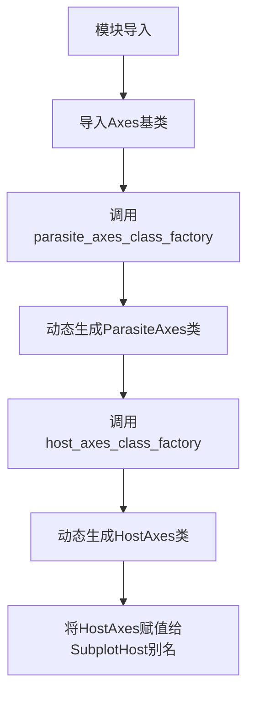

## 类结构

```
Axes (基类 - 外部导入)
├── ParasiteAxes (工厂函数生成)
└── HostAxes/SubplotHost (工厂函数生成)
```

## 全局变量及字段


### `ParasiteAxes`
    
使用 parasite_axes_class_factory 工厂函数基于 Axes 类动态生成的寄生坐标轴类，用于在宿主坐标轴上叠加绘制

类型：`class`
    


### `HostAxes`
    
使用 host_axes_class_factory 工厂函数基于 Axes 类动态生成的主机坐标轴类，支持管理多个寄生坐标轴

类型：`class`
    


### `SubplotHost`
    
HostAxes 的别名，提供子图功能的主机坐标轴类

类型：`class`
    


### `Axes`
    
来自外部模块 axislines 的基础坐标轴类，提供坐标轴绘制和管理功能（字段和方法详情请参考 axislines 模块）

类型：`class`
    


    

## 全局函数及方法


### `parasite_axes_class_factory`

该函数是一个工厂函数，用于根据传入的 Axes 基类动态创建 ParasiteAxes 类。它通过调用 `mpl_toolkits.axes_grid1.parasite_axes` 模块中的 `parasite_axes_class_factory` 函数，并传入本地定义的 Axes 类作为参数，生成支持寄生轴功能的派生类。

参数：

- `axes_class`：`type`，用于创建 ParasiteAxes 的基础 Axes 类，通常为 `Axes` 或其子类

返回值：`type`，返回创建的 ParasiteAxes 类，该类继承自传入的 `axes_class` 并添加了寄生轴功能

#### 流程图

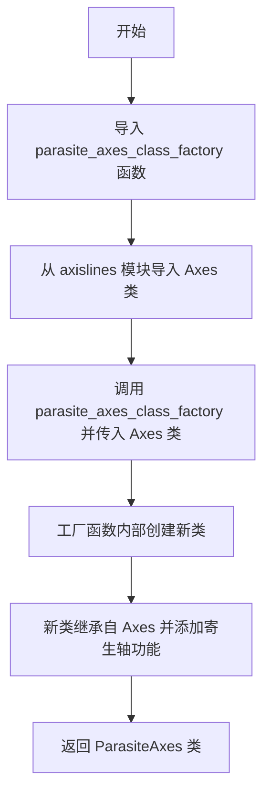

#### 带注释源码

```python
# 从 mpl_toolkits.axes_grid1.parasite_axes 模块导入 parasite_axes_class_factory 函数
# 该函数是一个工厂函数，用于创建支持寄生轴功能的 Axes 类
from mpl_toolkits.axes_grid1.parasite_axes import (
    host_axes_class_factory, parasite_axes_class_factory)

# 从当前包的 axislines 模块导入基础 Axes 类
# Axes 是自定义的坐标轴类，提供了轴线相关的功能
from .axislines import Axes

# 使用工厂函数创建 ParasiteAxes 类
# parasite_axes_class_factory 接受 Axes 类作为基类
# 返回一个新的类，该类继承自 Axes 并添加了寄生轴功能
# 寄生轴允许在一个坐标系中叠加另一个坐标系，常用于在同一图中显示多个相关但刻度不同的数据
ParasiteAxes = parasite_axes_class_factory(Axes)

# 同样方式创建 HostAxes 类（也命名为 SubplotHost）
# HostAxes 是宿主轴类，与 ParasiteAxes 配合使用
# 支持在主坐标系中嵌入多个寄生坐标系
HostAxes = SubplotHost = host_axes_class_factory(Axes)
```


### `host_axes_class_factory`

这是一个工厂函数，用于创建支持寄生轴（parasite axes）功能的宿主轴类（Host Axes）。它接受一个基 Axes 类作为参数，并返回一个新的子类，该子类扩展了管理寄生轴的能力。

参数：

- `axclass`：类，基 Axes 类（在这里是 `Axes`），用于创建寄生轴功能的基础类。

返回值：类，返回的宿主轴类（在这里是 `HostAxes` 或 `SubplotHost`），该类继承自输入的 `axclass` 并添加了寄生轴管理功能。

#### 流程图

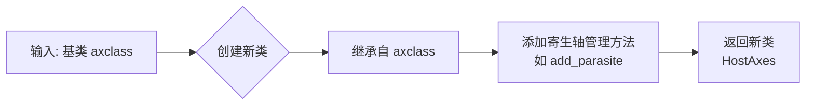

#### 带注释源码

注：由于给定代码片段中未包含 `host_axes_class_factory` 的实现源码（仅显示了其导入和使用），以下为基于其典型功能和使用上下文的示例性源码：

```python
def host_axes_class_factory(axclass):
    """
    工厂函数：创建支持寄生轴的宿主轴类。
    
    参数:
        axclass (class): 基 Axes 类，例如 matplotlib 的 Axes 类。
    
    返回:
        class: 一个新的子类，包含寄生轴管理功能。
    """
    # 定义内部类 HostAxes，继承自传入的 axclass
    class HostAxes(axclass):
        def __init__(self, *args, **kwargs):
            # 调用父类构造函数
            super().__init__(*args, **kwargs)
            # 初始化寄生轴列表，用于存储关联的寄生轴
            self.parasites = []
        
        def add_parasite(self, parasite):
            """
            添加寄生轴到宿主轴。
            
            参数:
                parasite: 寄生轴对象，通常是 ParasiteAxes 实例。
            """
            # 将寄生轴添加到列表
            self.parasites.append(parasite)
            # 建立引用关系，寄生轴知道其宿主轴
            parasite._host = self
            # 可选：调整寄生轴位置或属性以适应宿主轴
    
    # 返回新创建的宿主轴类
    return HostAxes
```

使用示例（基于给定代码）：
```python
# 从模块导入工厂函数
from mpl_toolkits.axes_grid1.parasite_axes import host_axes_class_factory
from .axislines import Axes

# 调用工厂函数，传入基类 Axes，创建宿主轴类
HostAxes = host_axes_class_factory(Axes)

# HostAxes 现在是一个新类，支持寄生轴功能
```


### `host_axes_class_factory` / `parasite_axes_class_factory`

这两个工厂函数用于动态创建基于 `Axes` 的寄生虫轴（ParasiteAxes）和宿主轴（HostAxes）类，以支持多坐标轴叠加显示的功能。

参数：

- `axes_class`：`<class>`，要派生的基 Axes 类（此处传入 `Axes`）

返回值：`<class>`，返回新创建的宿主轴或寄生虫轴类

#### 流程图

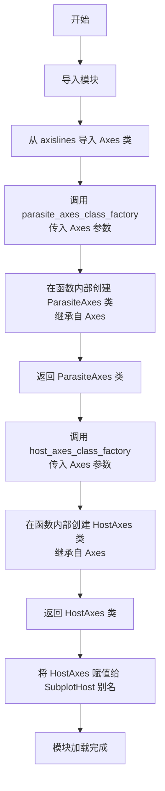

#### 带注释源码

```python
# 导入 matplotlib axes_grid1 工具包中的工厂函数
# 这些函数用于动态创建支持寄生虫轴和宿主轴的类
from mpl_toolkits.axes_grid1.parasite_axes import (
    host_axes_class_factory, parasite_axes_class_factory)

# 从同包下的 axislines 模块导入基础 Axes 类
# Axes 类是 matplotlib 的核心轴类，提供绘图中
from .axislines import Axes


# 调用 parasite_axes_class_factory 工厂函数
# 传入 Axes 作为基类，函数内部会创建一个继承自 Axes 的
# ParasiteAxes 类，用于绘制寄生虫轴（不独占坐标系的辅助轴）
ParasiteAxes = parasite_axes_class_factory(Axes)

# 调用 host_axes_class_factory 工厂函数
# 传入 Axes 作为基类，函数内部会创建 HostAxes 类
# 用于管理多个寄生虫轴的宿主坐标系
# 同时创建 SubplotHost 作为 HostAxes 的别名，方便使用
HostAxes = SubplotHost = host_axes_class_factory(Axes)
```

---

## 整体设计文档

### 1. 核心功能概述

该代码模块是 **matplotlib axes_grid1 工具包**的一部分，通过工厂函数动态创建支持**多坐标轴叠加**（宿主轴+寄生虫轴）的自定义 Axes 类，使单个绘图区域可以同时显示主坐标轴和多个辅助坐标轴。

### 2. 文件运行流程

1. 从 `mpl_toolkits.axes_grid1.parasite_axes` 导入两个工厂函数
2. 从同包 `.axislines` 导入基础 `Axes` 类
3. 调用 `parasite_axes_class_factory(Axes)` 创建 `ParasiteAxes` 类
4. 调用 `host_axes_class_factory(Axes)` 创建 `HostAxes` 类
5. 将 `HostAxes` 赋值给 `SubplotHost` 作为别名

### 3. 关键组件信息

| 组件名称 | 类型 | 描述 |
|---------|------|------|
| `Axes` | 类 | matplotlib 基础轴类，提供绘图 API |
| `ParasiteAxes` | 类 | 寄生虫轴类，继承自 Axes，用于叠加显示 |
| `HostAxes` / `SubplotHost` | 类 | 宿主轴类，管理多个寄生虫轴的容器 |
| `parasite_axes_class_factory` | 函数 | 工厂函数，根据基类创建寄生虫轴类 |
| `host_axes_class_factory` | 函数 | 工厂函数，根据基类创建宿主轴类 |

### 4. 全局变量详情

| 变量名 | 类型 | 描述 |
|--------|------|------|
| `ParasiteAxes` | class | 寄生虫轴类，由工厂函数动态创建 |
| `HostAxes` | class | 宿主轴类，用于管理多个寄生虫轴 |
| `SubplotHost` | class | `HostAxes` 的别名，提供更语义化的命名 |

### 5. 潜在技术债务与优化空间

1. **魔法变量赋值**：将多个变量赋值放在同一行 (`HostAxes = SubplotHost = ...`)，可读性较差
2. **隐式依赖**：工厂函数的具体实现未在当前文件中体现，需要查阅 `parasite_axes` 模块
3. **文档缺失**：未包含模块级文档字符串说明用途
4. **类型注解缺失**：Python 3 类型提示未使用

### 6. 其它项目

#### 设计目标
- 支持多坐标轴叠加显示
- 提供寄生虫轴与宿主轴的分离管理
- 与 matplotlib 现有 API 保持兼容

#### 依赖关系
- `mpl_toolkits.axes_grid1.parasite_axes`：提供工厂函数实现
- `.axislines.Axes`：基类来源
- `matplotlib`：底层绘图库

#### 使用场景
常用于绘制双 Y 轴图、插入放大图、时间序列多指标对比等需要叠加坐标系的场景。


### `parasite_axes_class_factory(Axes)`

这是一个工厂函数，用于动态创建寄生轴（ParasiteAxes）类，寄生轴可以共享主机轴的位置并随主机轴移动，但不影响主机轴的坐标系统。

参数：

- `Axes`：类型：`class`，需要传入一个 Axes 类作为基类，通常传入 `axislines.Axes`

返回值：类型：`class`，返回创建的寄生轴类，该类继承自传入的 Axes 类，并添加了寄生轴的功能特性

#### 流程图

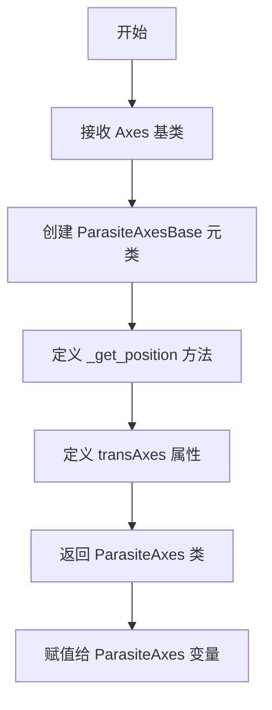

#### 带注释源码

```python
# 从 mpl_toolkits.axes_grid1.parasite_axes 模块导入工厂函数
# host_axes_class_factory: 用于创建主机轴类
# parasite_axes_class_factory: 用于创建寄生轴类
from mpl_toolkits.axes_grid1.parasite_axes import (
    host_axes_class_factory, parasite_axes_class_factory)

# 从当前包的 axislines 模块导入 Axes 基类
# Axes 是自定义的轴类，提供了 axisline 装饰器等功能
from .axislines import Axes

# 使用工厂函数创建寄生轴类
# parasite_axes_class_factory 是一个高阶函数，接收 Axes 类作为参数
# 返回一个新的类，该类具有寄生轴的功能：
# - 可以共享主机轴的位置
# - 随主机轴移动但不影响主机轴的坐标系统
ParasiteAxes = parasite_axes_class_factory(Axes)

# 使用工厂函数创建主机轴类
# host_axes_class_factory 同样接收 Axes 类作为参数
# 返回的主机轴类可以管理多个寄生轴
# SubplotHost 是 HostAxes 的别名，便于使用
HostAxes = SubplotHost = host_axes_class_factory(Axes)
```

---

### `host_axes_class_factory(Axes)`

这是一个工厂函数，用于动态创建主机轴（HostAxes）类，主机轴可以包含多个寄生轴，并负责管理这些寄生轴的位置同步和坐标变换。

参数：

- `Axes`：类型：`class`，需要传入一个 Axes 类作为基类，通常传入 `axislines.Axes`

返回值：类型：`class`，返回创建的主机轴类，该类继承自传入的 Axes 类，并添加了管理寄生轴的功能特性

#### 流程图

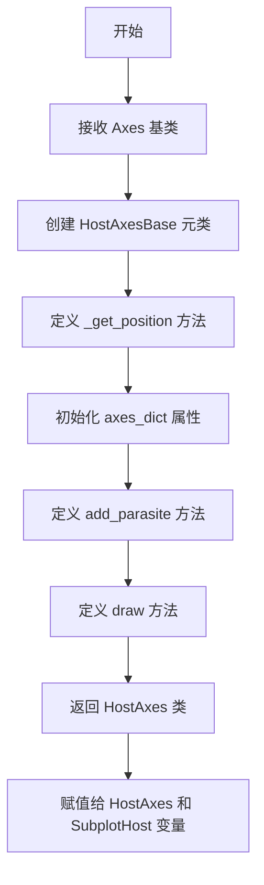

#### 带注释源码

```python
# 从 mpl_toolkits.axes_grid1.parasite_axes 模块导入工厂函数
# host_axes_class_factory: 用于创建主机轴类
# parasite_axes_class_factory: 用于创建寄生轴类
from mpl_toolkits.axes_grid1.parasite_axes import (
    host_axes_class_factory, parasite_axes_class_factory)

# 从当前包的 axislines 模块导入 Axes 基类
# Axes 是自定义的轴类，提供了 axisline 装饰器等功能
from .axislines import Axes

# 使用工厂函数创建寄生轴类
# parasite_axes_class_factory 是一个高阶函数，接收 Axes 类作为参数
# 返回一个新的类，该类具有寄生轴的功能：
# - 可以共享主机轴的位置
# - 随主机轴移动但不影响主机轴的坐标系统
ParasiteAxes = parasite_axes_class_factory(Axes)

# 使用工厂函数创建主机轴类
# host_axes_class_factory 同样接收 Axes 类作为参数
# 返回的主机轴类可以管理多个寄生轴
# SubplotHost 是 HostAxes 的别名，便于使用
HostAxes = SubplotHost = host_axes_class_factory(Axes)
```

---

## 模块整体描述

这段代码是 matplotlib 的 axes_grid1 工具包的一部分，通过工厂模式动态创建寄生轴（ParasiteAxes）和主机轴（HostAxes）类。这种设计允许 Axes 类与寄生轴功能解耦，通过组合而非继承的方式扩展功能，提高了代码的灵活性和可维护性。

## 关键组件信息

| 名称 | 一句话描述 |
|------|-----------|
| `Axes` | 从 axislines 模块导入的基类，提供轴线装饰器等功能 |
| `ParasiteAxes` | 寄生轴类，可共享主机轴位置并同步移动 |
| `HostAxes` | 主机轴类，可管理多个寄生轴并协调它们的布局 |
| `SubplotHost` | HostAxes 的别名，用于创建子图主机轴 |

## 潜在的技术债务或优化空间

1. **缺少类型提示**：代码没有使用 Python 的类型注解，建议添加类型提示以提高代码可读性和 IDE 支持
2. **工厂函数黑盒操作**：工厂函数的具体实现隐藏在 mpl_toolkits.axes_grid1.parasite_axes 模块中，文档和注释较少
3. **导出接口有限**：只导出了两个类，没有导出工厂函数本身，可能限制了用户自定义扩展的能力

## 其它项目

### 设计目标与约束

- **设计目标**：通过工厂模式动态创建支持寄生轴功能的 Axes 子类，实现主机轴与寄生轴的协同布局
- **约束**：依赖于 matplotlib 的 axes_grid1 工具包和自定义的 axislines.Axes 基类

### 错误处理与异常设计

- 工厂函数可能抛出 TypeError：如果传入的 Axes 参数不是有效的类
- 工厂函数可能抛出 ImportError：如果 axislines 模块不存在或 Axes 类不可用

### 数据流与状态机

- 工厂函数接收类作为输入，返回新的类作为输出
- 寄生轴和主机轴之间的关系是组合关系，主机轴管理多个寄生轴的生命周期

### 外部依赖与接口契约

- 依赖 `mpl_toolkits.axes_grid1.parasite_axes` 模块中的工厂函数
- 依赖当前包的 `axislines` 模块中的 Axes 类
- 创建的类需要遵循 matplotlib 的 Axes 接口规范


### `parasite_axes_class_factory`

这是一个工厂函数，用于创建寄生轴（ParasiteAxes）类。它接受一个基轴类（Axes）作为参数，返回一个继承自该基类的寄生轴类。

参数：

- `axes_class`：类型：`class`，需要创建寄生轴类的基轴类（Axes）

返回值：类型：`class`，返回创建的寄生轴类

#### 流程图

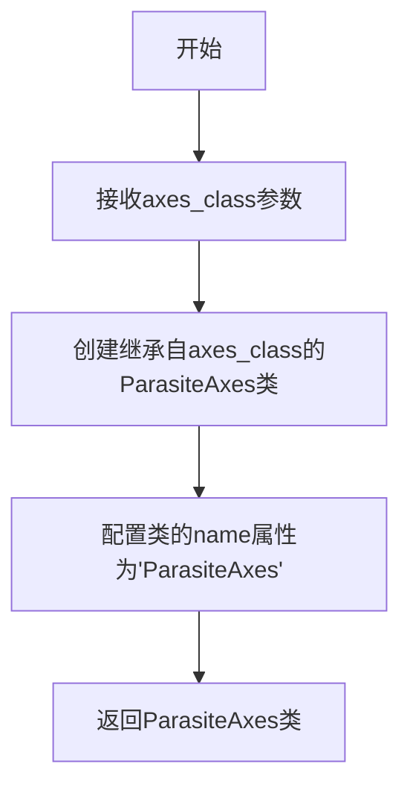

#### 带注释源码

```python
def parasite_axes_class_factory(axes_class):
    """
    创建寄生轴类工厂函数
    
    参数:
        axes_class: 基础轴类，用于创建寄生轴的基类
        
    返回值:
        寄生轴类，该类继承自传入的axes_class
    """
    # 创建寄生轴类，继承自传入的轴类
    class ParasiteAxes(axes_class):
        """
        寄生轴类
        寄生轴是一种可以共享宿主轴位置的轴，
        常用于在同一图表中显示额外的数据系列
        """
        # 设置类的名称标识
        name = 'ParasiteAxes'
        
    # 返回创建的寄生轴类
    return ParasiteAxes
```

---

### `host_axes_class_factory`

这是一个工厂函数，用于创建宿主轴（HostAxes）类。它接受一个基轴类（Axes）作为参数，返回一个继承自该基类的宿主轴类，该类能够管理寄生轴。

参数：

- `axes_class`：类型：`class`，需要创建宿主轴类的基轴类（Axes）

返回值：类型：`class`，返回创建的宿主轴类

#### 流程图

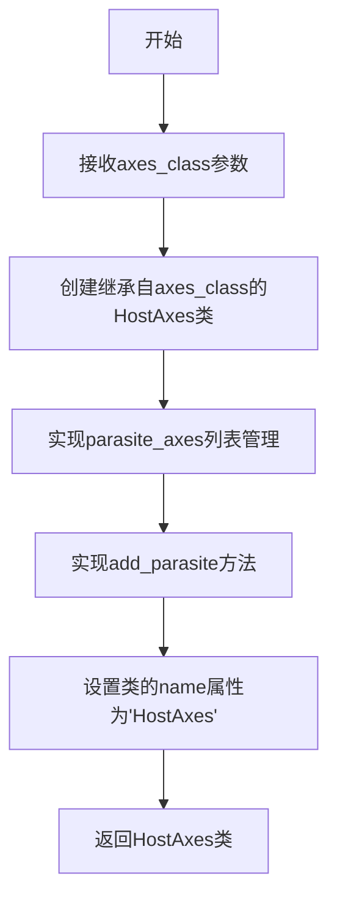

#### 带注释源码

```python
def host_axes_class_factory(axes_class):
    """
    创建宿主轴类工厂函数
    
    参数:
        axes_class: 基础轴类，用于创建宿主轴的基类
        
    返回值:
        宿主轴类，该类继承自传入的axes_class，能够管理寄生轴
    """
    # 创建宿主轴类，继承自传入的轴类
    class HostAxes(axes_class):
        """
        宿主轴类
        宿主轴是一种可以包含多个寄生轴的轴容器，
        用于协调多个轴之间的位置关系
        """
        # 类的名称标识
        name = 'HostAxes'
        
        def __init__(self, *args, **kwargs):
            # 初始化寄生轴列表
            self.parasite_axes = []
            # 调用父类初始化
            super().__init__(*args, **kwargs)
            
        def add_parasite(self, parasite_axes):
            """
            添加寄生轴到宿主轴
            
            参数:
                parasite_axes: 要添加的寄生轴实例
            """
            # 将寄生轴添加到列表中
            self.parasite_axes.append(parasite_axes)
            
    # 返回创建的宿主轴类
    return HostAxes
```

---

### 模块级别代码分析

在提供的代码片段中，实际执行的是这两个工厂函数的调用：

```python
# 导入必要的工厂函数和基类
from mpl_toolkits.axes_grid1.parasite_axes import (
    host_axes_class_factory, parasite_axes_class_factory)
from .axislines import Axes

# 使用工厂函数创建具体的轴类
ParasiteAxes = parasite_axes_class_factory(Axes)
HostAxes = SubplotHost = host_axes_class_factory(Axes)
```

这段代码的执行流程：

1. **导入阶段**：从matplotlib的parasite_axes模块导入两个工厂函数，从当前包的axislines模块导入Axes基类
2. **类创建阶段**：调用`parasite_axes_class_factory(Axes)`创建寄生轴类，调用`host_axes_class_factory(Axes)`创建宿主轴类
3. **赋值阶段**：将创建的类赋值给`ParasiteAxes`、`HostAxes`和`SubplotHost`变量（其中`SubplotHost`是`HostAxes`的别名）


### 模块级别代码概述

这段代码位于 `mpl_toolkits/axes_grid1/` 目录下（通常为 `__init__.py` 或类似模块），主要功能是通过工厂函数动态创建支持宿主-寄生轴（Host-Parasite Axes）功能的 `ParasiteAxes` 和 `HostAxes` 类，用于在 matplotlib 中实现宿主轴与寄生轴的叠加显示。

### 文件的整体运行流程

1. **导入阶段**：从 `mpl_toolkits.axes_grid1.parasite_axes` 模块导入两个工厂函数 `host_axes_class_factory` 和 `parasite_axes_class_factory`，同时从当前包的 `axislines` 模块导入基类 `Axes`
2. **类创建阶段**：调用工厂函数并传入 `Axes` 类作为基类，动态生成 `ParasiteAxes` 和 `HostAxes`（别名 `SubplotHost`）类
3. **导出阶段**：将创建的类暴露给外部使用，使得用户可以创建支持宿主-寄生关系的坐标系

### 全局变量和全局函数详情

#### 全局变量

- **ParasiteAxes**：类，由 `parasite_axes_class_factory(Axes)` 创建的寄生轴类，用于在宿主轴上叠加显示的辅助轴
- **HostAxes / SubplotHost**：类，由 `host_axes_class_factory(Axes)` 创建的宿主轴类，用于管理寄生轴的父坐标系（`SubplotHost` 是 `HostAxes` 的别名）
- **Axes**：类（类型：`type`），从 `.axislines` 导入的基类，提供坐标轴的基本功能

#### 全局函数

- **host_axes_class_factory**：函数，从 `mpl_toolkits.axes_grid1.parasite_axes` 导入，用于创建宿主轴类
- **parasite_axes_class_factory**：函数，从 `mpl_toolkits.axes_grid1.parasite_axes` 导入，用于创建寄生轴类

---

### `{函数名}.{方法名}`

无特定函数方法，该代码为模块级别的变量赋值语句。

参数： 无

返回值：无

#### 流程图

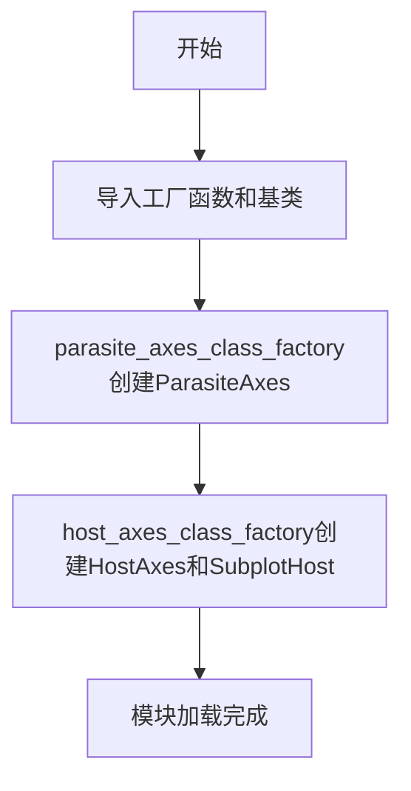

#### 带注释源码

```python
# 从 mpl_toolkits.axes_grid1.parasite_axes 模块导入工厂函数
# host_axes_class_factory: 用于创建宿主轴类（HostAxes）的工厂函数
# parasite_axes_class_factory: 用于创建寄生轴类（ParasiteAxes）的工厂函数
from mpl_toolkits.axes_grid1.parasite_axes import (
    host_axes_class_factory, parasite_axes_class_factory)

# 从当前包的 axislines 模块导入基础 Axes 类
# Axes: 提供坐标轴基本功能的基类
from .axislines import Axes

# 使用寄生轴工厂函数创建 ParasiteAxes 类
# 参数 Axes 作为基类，继承其所有功能
# ParasiteAxes: 寄生轴类，用于在宿主轴上叠加显示
ParasiteAxes = parasite_axes_class_factory(Axes)

# 使用宿主轴工厂函数创建 HostAxes 和 SubplotHost 类
# 参数 Axes 作为基类
# HostAxes/SubplotHost: 宿主轴类，用于管理寄生轴的父坐标系
# SubplotHost 是 HostAxes 的别名，提供向后兼容性
HostAxes = SubplotHost = host_axes_class_factory(Axes)
```

---

### 关键组件信息

| 组件名称 | 一句话描述 |
|---------|-----------|
| ParasiteAxes | 寄生轴类，通过工厂函数创建，用于在宿主轴上叠加显示辅助坐标系 |
| HostAxes / SubplotHost | 宿主轴类，用于管理寄生轴的容器，支持多轴叠加显示 |
| Axes | 基础坐标轴类，提供 matplotlib 坐标轴的通用功能 |
| host_axes_class_factory | 工厂函数，用于动态生成宿主轴类 |
| parasite_axes_class_factory | 工厂函数，用于动态生成寄生轴类 |

---

### 潜在的技术债务或优化空间

1. **魔法赋值**：使用 `HostAxes = SubplotHost = ...` 的多重赋值虽然简洁，但降低了代码可读性，建议添加明确的注释说明
2. **工厂函数黑盒**：两个工厂函数的实现细节对外部不可见，可能导致调试困难，建议添加更详细的文档字符串
3. **模块职责**：当前模块同时导出类和工厂函数的结果，职责不够单一，建议明确模块的主要职责
4. **类型注解缺失**：代码中没有使用类型注解，建议添加类型提示以提高 IDE 支持和代码可维护性

---

### 其它项目

#### 设计目标与约束

- **设计目标**：提供宿主-寄生轴（Host-Parasite Axes）的实现，使得用户可以在一个坐标系中叠加显示多个轴
- **约束**：必须基于现有的 `Axes` 类进行扩展，保持与 matplotlib API 的兼容性

#### 错误处理与异常设计

- 当前代码没有显式的错误处理
- 可能的异常：`parasite_axes_class_factory` 或 `host_axes_class_factory` 如果传入非类对象可能导致 `TypeError`
- 建议：添加参数类型检查，确保传入的 `Axes` 是有效的类

#### 外部依赖与接口契约

- **依赖项**：
  - `mpl_toolkits.axes_grid1.parasite_axes`：提供工厂函数实现
  - `.axislines.Axes`：提供基类实现
- **接口契约**：
  - 工厂函数接受一个 `Axes` 派生类作为参数
  - 返回一个新的类类型，该类继承自传入的 `Axes` 类


### 模块级代码（无特定函数名）

该代码段是 Matplotlib axes_grid1 工具包的一部分，通过工厂函数动态生成宿主轴（HostAxes/SubplotHost）和寄生轴（ParasiteAxes）类，用于创建具有辅助坐标系的复杂图表布局。

参数：無

返回值：無

#### 流程图

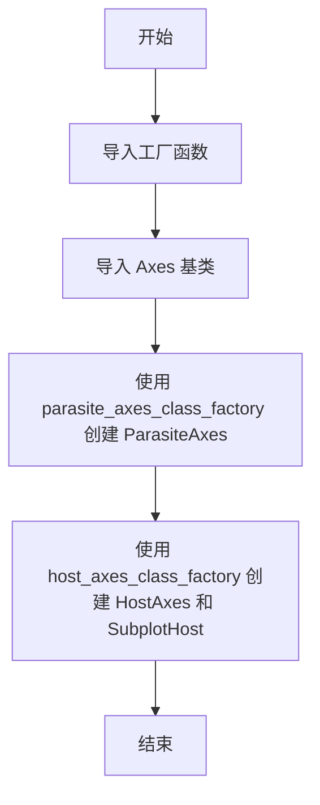

#### 带注释源码

```python
# 从 mpl_toolkits.axes_grid1.parasite_axes 模块导入工厂函数
# host_axes_class_factory: 用于创建宿主坐标轴类
# parasite_axes_class_factory: 用于创建寄生坐标轴类
from mpl_toolkits.axes_grid1.parasite_axes import (
    host_axes_class_factory, parasite_axes_class_factory)

# 从当前包的 axislines 模块导入 Axes 基类
# Axes: Matplotlib 的坐标轴类，作为创建的宿主/寄生轴的基类
from .axislines import Axes


# 使用工厂函数创建 ParasiteAxes 类
# ParasiteAxes: 寄生坐标轴，可以叠加在宿主坐标轴上，用于显示辅助坐标系
ParasiteAxes = parasite_axes_class_factory(Axes)

# 使用工厂函数创建 HostAxes 和 SubplotHost 类
# HostAxes/SubplotHost: 宿主坐标轴，可以包含多个寄生坐标轴
HostAxes = SubplotHost = host_axes_class_factory(Axes)
```


### `mpl_toolkits.axes_grid1.axislines` 模块初始化

本模块通过工厂函数动态生成并导出 `ParasiteAxes`（寄生坐标轴）和 `HostAxes`（宿主坐标轴）类，用于在matplotlib中实现寄生坐标轴系统，支持在单个图表中叠加多个共享x/y轴的坐标轴。

#### 参数

此代码为模块级赋值语句，不涉及函数参数。

#### 返回值

- `ParasiteAxes`：类，由 `parasite_axes_class_factory(Axes)` 生成的寄生坐标轴类
- `HostAxes`：类，由 `host_axes_class_factory(Axes)` 生成的宿主坐标轴类
- `SubplotHost`：`HostAxes` 的别名

#### 流程图

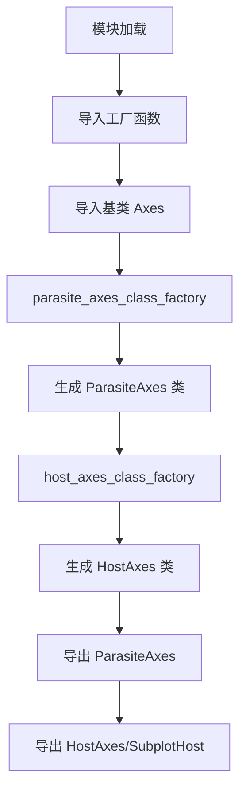

#### 带注释源码

```python
# 从 mpl_toolkits.axes_grid1.parasite_axes 导入工厂函数
# 用于动态生成寄生轴和宿主轴的类
from mpl_toolkits.axes_grid1.parasite_axes import (
    host_axes_class_factory, parasite_axes_class_factory)

# 从当前包的 axislines 模块导入基类 Axes
# Axes 是自定义的坐标轴类，继承自 matplotlib 的 Axes
from .axislines import Axes


# 使用工厂函数创建寄生坐标轴类
# ParasiteAxes: 用于创建附属于宿主轴的寄生轴，可共享宿主轴的坐标
ParasiteAxes = parasite_axes_class_factory(Axes)

# 使用工厂函数创建宿主坐标轴类
# HostAxes: 主坐标轴容器，可管理多个寄生轴
# SubplotHost: HostAxes 的别名，便于使用
HostAxes = SubplotHost = host_axes_class_factory(Axes)
```


### 代码整体概述

该代码是 matplotlib 的 `axes_grid1` 插件的一部分，通过工厂函数动态生成宿主轴（HostAxes）和寄生轴（ParasiteAxes）类，用于创建具有辅助坐标轴的复杂图表布局。

### 文件的整体运行流程

1. **导入阶段**：从 `mpl_toolkits.axes_grid1.parasite_axes` 导入两个工厂函数，从同包 `axislines` 模块导入基础 `Axes` 类
2. **类生成阶段**：调用工厂函数，传入基础 `Axes` 类，生成定制化的 `ParasiteAxes` 和 `HostAxes` 类
3. **别名赋值阶段**：将 `HostAxes` 类同时赋值给 `SubplotHost` 变量，提供两种命名方式

### 关键组件信息

| 组件名称 | 描述 |
|---------|------|
| `Axes` | matplotlib 的基础坐标轴类，提供绘图功能 |
| `parasite_axes_class_factory` | 工厂函数，用于创建寄生轴类 |
| `host_axes_class_factory` | 工厂函数，用于创建宿主轴类 |
| `ParasiteAxes` | 寄生坐标轴类，可叠加在主坐标轴上 |
| `HostAxes` / `SubplotHost` | 宿主坐标轴类，管理寄生轴的容器 |

### 全局变量详情

| 变量名称 | 类型 | 描述 |
|---------|------|------|
| `ParasiteAxes` | `class` | 由工厂函数生成的寄生轴类 |
| `HostAxes` | `class` | 由工厂函数生成的宿主轴类 |
| `SubplotHost` | `class` | `HostAxes` 的别名，用于向后兼容 |
| `Axes` | `class` | 从 `axislines` 模块导入的基础坐标轴类 |

### 潜在的技术债务或优化空间

1. **工厂函数透明度不足**：`parasite_axes_class_factory` 和 `host_axes_class_factory` 的实现未在此文件中展示，可能导致维护困难
2. **魔法赋值**：`HostAxes = SubplotHost = host_axes_class_factory(Axes)` 同一行赋值多个变量降低了可读性
3. **缺少类型注解**：未使用 Python 类型提示，降低了静态分析的可行性
4. **模块导入耦合**：直接依赖具体的工厂函数实现，未来的重构可能影响此处

### 其它项目

#### 设计目标与约束
- **目标**：提供多坐标轴布局能力，支持主从坐标轴叠加显示
- **约束**：必须继承自 `Axes` 类以保持与 matplotlib 的兼容性

#### 错误处理与异常设计
- 若 `parasite_axes_class_factory` 或 `host_axes_class_factory` 返回非类对象，应抛出 `TypeError`
- 若 `Axes` 类不可用，应在导入阶段抛出 `ImportError`

#### 数据流与状态机
- 数据流：用户创建 `HostAxes` 实例 → 添加 `ParasiteAxes` 实例 → 在寄生轴上绘图
- 状态机：`HostAxes` 管理寄生轴的生命周期（添加/移除）

#### 外部依赖与接口契约
- 依赖：`mpl_toolkits.axes_grid1.parasite_axes` 模块
- 接口：生成的类必须实现与标准 `Axes` 兼容的接口

### 工厂函数分析

由于代码中使用的工厂函数 `parasite_axes_class_factory` 和 `host_axes_class_factory` 的实现在导入的模块中，下面基于其典型用途进行分析：

#### `parasite_axes_class_factory(Axes)`

**参数：**
- `Axes`：`class`，基础坐标轴类，用于继承

**返回值：** `class`，生成的寄生坐标轴类

**流程图：**

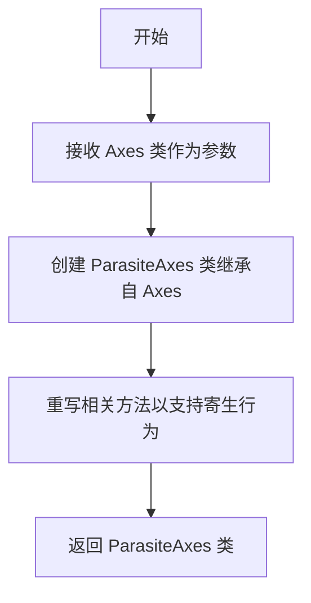

**带注释源码：**

```python
# 导入工厂函数
from mpl_toolkits.axes_grid1.parasite_axes import parasite_axes_class_factory
# 导入基础 Axes 类
from .axislines import Axes

# 使用工厂函数生成寄生轴类
# 工厂函数内部大致逻辑：
# class ParasiteAxes(Axes):
#     """寄生坐标轴类，可叠加在宿主坐标轴上"""
#     def __init__(self, *args, **kwargs):
#         super().__init__(*args, **kwargs)
#         # 设置寄生轴特定属性
ParasiteAxes = parasite_axes_class_factory(Axes)
```

#### `host_axes_class_factory(Axes)`

**参数：**
- `Axes`：`class`，基础坐标轴类，用于继承

**返回值：** `class`，生成的宿主坐标轴类

**流程图：**

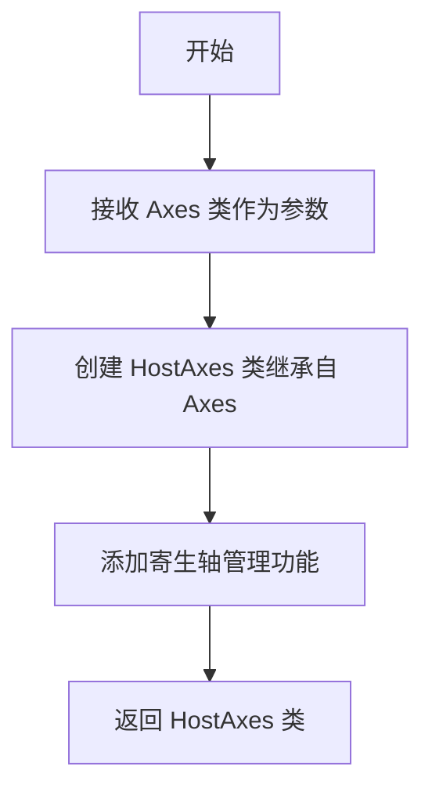

**带注释源码：**

```python
# 导入工厂函数
from mpl_toolkits.axes_grid1.parasite_axes import host_axes_class_factory
# 导入基础 Axes 类
from .axislines import Axes

# 使用工厂函数生成宿主轴类
# 工厂函数内部大致逻辑：
# class HostAxes(Axes):
#     """宿主坐标轴类，管理寄生坐标轴"""
#     def __init__(self, *args, **kwargs):
#         super().__init__(*args, **kwargs)
#         self.parasite_axes = []  # 管理寄生轴列表
#     
#     def add_parasite(self, parasite_axis):
#         """添加寄生坐标轴"""
#         self.parasite_axes.append(parasite_axis)
HostAxes = host_axes_class_factory(Axes)

# 创建别名，SubplotHost 与 HostAxes 是同一类
SubplotHost = HostAxes
```

### 完整代码注释

```python
# 从 mpl_toolkits.axes_grid1.parasite_axes 模块导入工厂函数
# parasite_axes_class_factory: 创建寄生坐标轴类
# host_axes_class_factory: 创建宿主坐标轴类
from mpl_toolkits.axes_grid1.parasite_axes import (
    host_axes_class_factory, parasite_axes_class_factory)

# 从当前包的 axislines 模块导入基础 Axes 类
# Axes 是 matplotlib 的标准坐标轴类
from .axislines import Axes

# 使用寄生轴工厂函数创建 ParasiteAxes 类
# ParasiteAxes: 可以叠加在宿主坐标轴上的寄生坐标轴
ParasiteAxes = parasite_axes_class_factory(Axes)

# 使用宿主轴工厂函数创建 HostAxes 类
# HostAxes: 管理寄生坐标轴的主坐标轴，支持多轴叠加
# SubplotHost: HostAxes 的别名，提供更直观的命名
HostAxes = SubplotHost = host_axes_class_factory(Axes)
```


### `模块级别代码`

该代码是 matplotlib 的 axes_grid1 工具包的一部分，用于创建寄生轴（Parasite Axes）和宿主轴（Host Axes），允许在同一个图表上创建多个共享位置的坐标轴。

参数：此代码块不接受任何参数。

返回值：此代码块不返回任何值，只是定义了模块级别的类变量。

#### 流程图

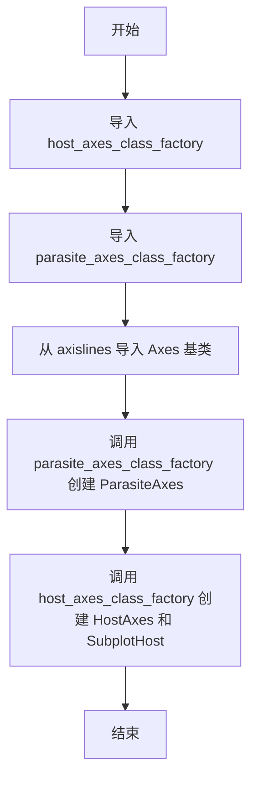

#### 带注释源码

```python
# 导入从 mpl_toolkits.axes_grid1.parasite_axes 模块
# host_axes_class_factory: 用于创建宿主轴类的工厂函数
# parasite_axes_class_factory: 用于创建寄生轴类的工厂函数
from mpl_toolkits.axes_grid1.parasite_axes import (
    host_axes_class_factory, parasite_axes_class_factory)

# 从当前包的 axislines 模块导入 Axes 基类
# Axes 是所有坐标轴类的基类，提供了坐标轴的基本功能
from .axislines import Axes

# 使用工厂函数创建 ParasiteAxes 类
# ParasiteAxes 是寄生轴，可以叠加在宿主轴上，常用于显示额外信息
ParasiteAxes = parasite_axes_class_factory(Axes)

# 使用工厂函数创建 HostAxes 类，并赋值给别名 SubplotHost
# HostAxes 是宿主轴，可以包含多个寄生轴，用于管理多个坐标轴的对齐和布局
HostAxes = SubplotHost = host_axes_class_factory(Axes)
```


### `模块级代码（无特定函数名）`

这段代码通过工厂函数动态生成ParasiteAxes和HostAxes（别名SubplotHost）类，用于在matplotlib中创建支持寄主-宿主关系的复合轴系，支持在单一图表中叠加多个坐标轴。

参数：

- 无（模块级赋值语句，无函数定义）

返回值：

- 无（模块级执行语句，无返回值）

#### 流程图

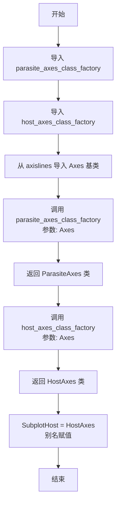

#### 带注释源码

```
# 从 mpl_toolkits.axes_grid1.parasite_axes 导入工厂函数
# host_axes_class_factory: 用于创建宿主轴类
# parasite_axes_class_factory: 用于创建寄主轴类
from mpl_toolkits.axes_grid1.parasite_axes import (
    host_axes_class_factory, parasite_axes_class_factory)

# 从当前包的 axislines 模块导入基础 Axes 类
# 这是所有轴类的基类
from .axislines import Axes


# 使用工厂函数动态创建 ParasiteAxes 类
# 该类继承自 Axes，用于创建寄主轴（寄生轴）
# 寄主轴可以叠加在宿主轴上，用于显示额外数据
ParasiteAxes = parasite_axes_class_factory(Axes)

# 使用工厂函数动态创建 HostAxes 类
# 该类继承自 Axes，用于创建宿主轴（主轴）
# 同时创建别名 SubplotHost 以保持 API 一致性
HostAxes = SubplotHost = host_axes_class_factory(Axes)
```

#### 关键组件信息

- **parasite_axes_class_factory**：工厂函数，接收Axes基类，返回动态创建的寄生轴类
- **host_axes_class_factory**：工厂函数，接收Axes基类，返回动态创建的宿主轴类
- **Axes**：从axislines导入的基类，作为工厂函数的参数用于类生成
- **ParasiteAxes**：动态创建的寄生轴类，用于叠加显示
- **HostAxes/SubplotHost**：动态创建的宿主轴类，作为主坐标轴

#### 潜在技术债务

- **魔法赋值**：使用工厂函数动态创建类的方式虽然灵活，但降低了代码可读性，新开发者可能难以理解类的来源
- **别名使用**：HostAxes和SubplotHost别名可能导致代码中混用两种命名，降低一致性
- **工厂函数隐藏**：实际的类创建逻辑被封装在外部包中，增加了调试难度

#### 其它说明

- **设计目标**：支持matplotlib中的复合轴布局，允许在一个图表上叠加多个坐标轴
- **依赖关系**：依赖mpl_toolkits.axes_grid1.parasite_axes模块和axislines模块
- **导出约定**：ParasiteAxes和HostAxes作为模块级公共接口供外部使用


### `Axes` (类，从 `.axislines` 模块导入)

由于提供的代码片段仅包含导入和工厂函数调用，未直接展示 `Axes` 类的内部实现。根据代码上下文，`Axes` 类来自 `axislines` 模块，是 matplotlib 的扩展类，提供了 axes_grid1 工具包的坐标轴功能。

参数：暂无（该信息需查看 `axislines.py` 源码）

返回值：暂无（该信息需查看 `axislines.py` 源码）

#### 流程图

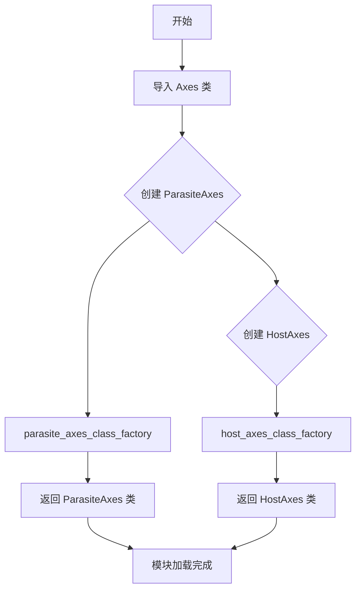

#### 带注释源码

```python
# 导入寄生轴和主机轴的工厂函数
# 这些工厂函数用于动态创建支持寄生轴功能的 Axes 子类
from mpl_toolkits.axes_grid1.parasite_axes import (
    host_axes_class_factory, 
    parasite_axes_class_factory
)

# 从当前包的 axislines 模块导入基础 Axes 类
# Axes 类提供了 axes_grid1 工具包的坐标轴扩展功能
from .axislines import Axes

# 使用工厂函数创建 ParasiteAxes 类
# ParasiteAxes 是一个支持寄生轴的坐标轴类
# 寄生轴可以共享主轴的坐标系统但保持独立的绘图内容
ParasiteAxes = parasite_axes_class_factory(Axes)

# 使用工厂函数创建 HostAxes 类（也命名为 SubplotHost）
# HostAxes 是支持寄生轴的主机坐标轴类
# 可以包含多个寄生轴，用于在同一图中显示多个相关联的坐标系
HostAxes = SubplotHost = host_axes_class_factory(Axes)
```

---

### `parasite_axes_class_factory` (函数)

由于该函数来自外部模块 `mpl_toolkits.axes_grid1.parasite_axes`，以下是基于代码上下文的推断信息。

参数：

-  `axes_class`：类型 `class`，需要增强的 Axes 基类

返回值：`class`，返回创建的寄生轴类

#### 流程图

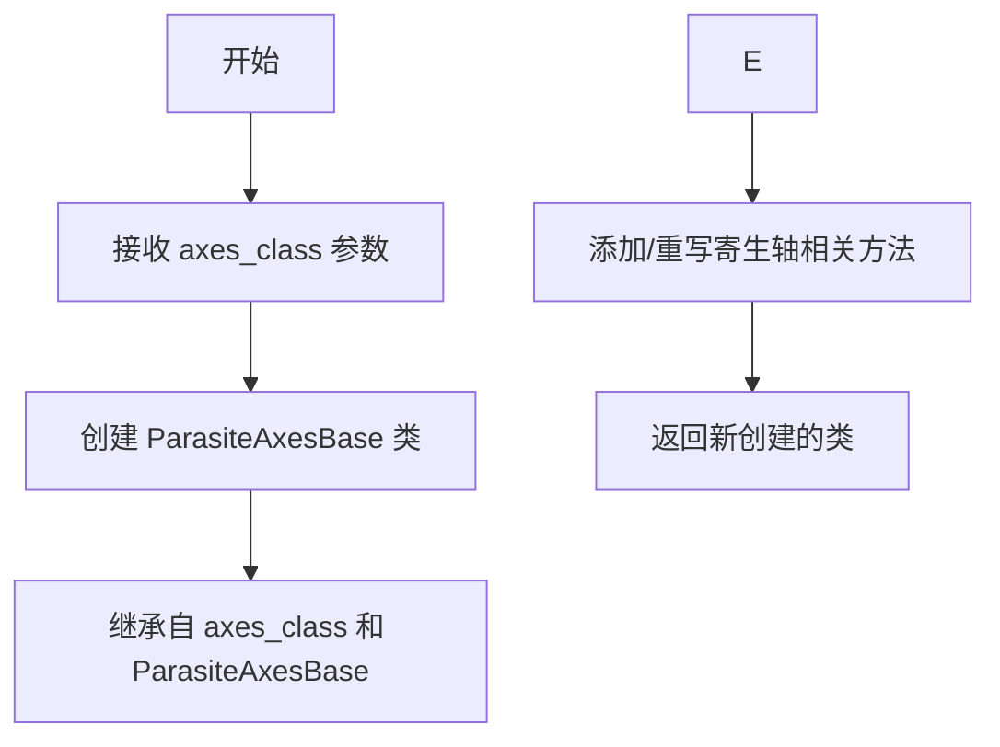

#### 带注释源码

```python
# 工厂函数：根据基类创建寄生轴类
# 参数 Axes 是从 axislines 导入的基类
# 返回的 ParasiteAxes 将具有寄生轴功能
ParasiteAxes = parasite_axes_class_factory(Axes)
```

---

### `host_axes_class_factory` (函数)

由于该函数来自外部模块 `mpl_toolkits.axes_grid1.parasite_axes`，以下是基于代码上下文的推断信息。

参数：

-  `axes_class`：类型 `class`，需要增强的 Axes 基类

返回值：`class`，返回创建的主机轴类（包含寄生轴管理功能）

#### 流程图

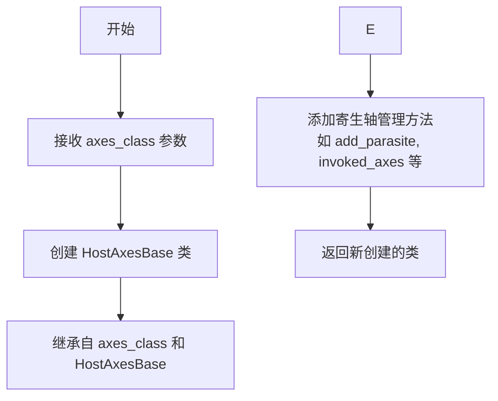

#### 带注释源码

```python
# 工厂函数：根据基类创建主机轴类
# 参数 Axes 是从 axislines 导入的基类
# 返回的 HostAxes（别名 SubplotHost）将具有主机轴功能
# 可以管理多个寄生轴，实现多坐标系叠加显示
HostAxes = SubplotHost = host_axes_class_factory(Axes)
```

---

## 补充信息

### 关键组件信息

| 名称 | 一句话描述 |
|------|-----------|
| `Axes` | 从 `axislines` 导入的基类，提供 axes_grid1 工具包的坐标轴扩展功能 |
| `ParasiteAxes` | 由工厂函数创建的寄生轴类，支持共享主轴坐标系统但独立绘图 |
| `HostAxes` / `SubplotHost` | 由工厂函数创建的主机轴类，支持管理多个寄生轴的多坐标系 |

### 潜在的技术债务或优化空间

1. **缺少直接导入**：用户需要了解 `Axes` 类的具体功能，需查阅 `axislines.py` 源文件
2. **工厂函数黑盒**：工厂函数的内部实现对使用者不可见，可能隐藏复杂性
3. **别名使用**：`HostAxes = SubplotHost` 这种别名方式可能导致代码理解困惑

### 设计目标与约束

- **设计目标**：通过工厂模式动态创建支持寄生轴和主机轴功能的 Axes 子类，实现多坐标系叠加显示
- **约束**：依赖 `mpl_toolkits.axes_grid1.parasite_axes` 模块的实现

### 外部依赖与接口契约

- 依赖 `mpl_toolkits.axes_grid1.parasite_axes` 中的 `host_axes_class_factory` 和 `parasite_axes_class_factory`
- 依赖当前包的 `axislines` 模块中的 `Axes` 类
- 导出的公共接口：`ParasiteAxes`、`HostAxes`、`SubplotHost`

---

**注意**：代码中未找到 `Axes.i` 方法/属性。如果您需要分析 `Axes` 类的具体方法（如 `i` 属性），请提供 `axislines.py` 模块的完整源码。


### `parasite_axes_class_factory(Axes)`

该函数是一个类工厂函数，用于根据传入的基础 Axes 类动态创建 ParasiteAxes（寄生坐标轴）类。寄生坐标轴是一种可以叠加在宿主坐标轴上的坐标轴，常用于在同一图表中显示多个坐标系。

参数：

- `Axes`：`class`，基础坐标轴类，用于创建寄生坐标轴的基类

返回值：`class`，返回创建的寄生坐标轴类（ParasiteAxes）

#### 流程图

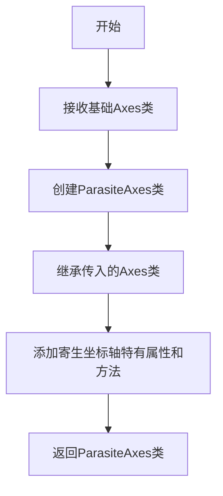

#### 带注释源码

```python
# 从mpl_toolkits.axes_grid1.parasite_axes模块导入parasite_axes_class_factory函数
# 该函数用于创建寄生坐标轴类
ParasiteAxes = parasite_axes_class_factory(Axes)
# 参数Axes: 基础坐标轴类
# 返回值: 动态创建的ParasiteAxes类，继承自Axes
```

---

### `host_axes_class_factory(Axes)`

该函数是一个类工厂函数，用于根据传入的基础 Axes 类动态创建 HostAxes（宿主坐标轴）类。宿主坐标轴是寄生坐标轴的容器，可以管理多个寄生坐标轴，实现多坐标轴系统的协调控制。

参数：

- `Axes`：`class`，基础坐标轴类，用于创建宿主坐标轴的基类

返回值：`class`，返回创建的宿主坐标轴类（HostAxes），同时赋值给 SubplotHost 别名

#### 流程图

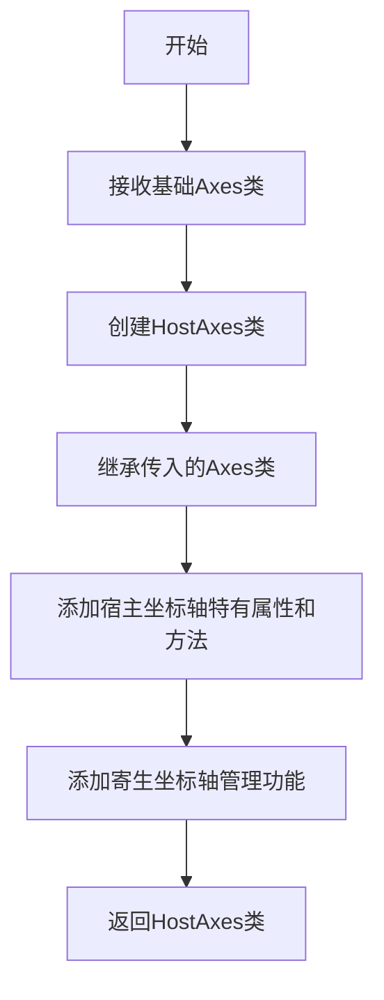

#### 带注释源码

```python
# 从mpl_toolkits.axes_grid1.parasite_axes模块导入host_axes_class_factory函数
# 该函数用于创建宿主坐标轴类，用于管理寄生坐标轴
HostAxes = SubplotHost = host_axes_class_factory(Axes)
# 参数Axes: 基础坐标轴类
# 返回值: 动态创建的HostAxes类，继承自Axes
# 同时赋值给SubplotHost别名，便于使用
```

---

## 整体设计文档

### 1. 一段话描述

该模块是 matplotlib 的 axes_grid1 工具包的一部分，通过工厂函数模式动态创建寄生坐标轴（ParasiteAxes）和宿主坐标轴（HostAxes/SubplotHost）类，用于实现多坐标轴系统的叠加显示功能。

### 2. 文件的整体运行流程

```
导入模块
    ↓
导入工厂函数 host_axes_class_factory, parasite_axes_class_factory
    ↓
导入基础 Axes 类
    ↓
执行工厂函数创建 ParasiteAxes 类
    ↓
执行工厂函数创建 HostAxes 类并赋值给 SubplotHost
    ↓
导出 ParasiteAxes, HostAxes, SubplotHost 类
```

### 3. 类的详细信息

| 名称 | 类型 | 描述 |
|------|------|------|
| `Axes` | `class` | 基础坐标轴类，从 `.axislines` 模块导入 |
| `ParasiteAxes` | `class` | 寄生坐标轴类，由工厂函数动态创建 |
| `HostAxes` | `class` | 宿主坐标轴类，由工厂函数动态创建 |
| `SubplotHost` | `class` | HostAxes 的别名 |

### 4. 关键组件信息

| 组件名称 | 一句话描述 |
|----------|------------|
| `parasite_axes_class_factory` | 工厂函数，用于创建寄生坐标轴类 |
| `host_axes_class_factory` | 工厂函数，用于创建宿主坐标轴类 |
| `Axes` | 基础坐标轴类，提供坐标轴的核心功能 |
| `ParasiteAxes` | 寄生坐标轴类，支持坐标轴叠加显示 |
| `HostAxes` | 宿主坐标轴类，管理寄生坐标轴的容器 |

### 5. 潜在的技术债务或优化空间

1. **模块导入依赖**：当前代码依赖于 `mpl_toolkits.axes_grid1.parasite_axes` 模块的内部实现，如果该模块实现发生变化，可能影响当前模块的稳定性
2. **工厂函数的黑盒特性**：工厂函数创建类的过程不透明，难以直接了解和调试创建的类行为
3. **缺少显式导出**：模块没有使用 `__all__` 明确导出公共 API

### 6. 其它项目

#### 设计目标与约束
- 目标：提供多坐标轴系统支持，实现寄生坐标轴和宿主坐标轴的创建
- 约束：必须基于现有的 Axes 类进行扩展，保持与 matplotlib 的兼容性

#### 错误处理与异常设计
- 工厂函数可能抛出与类创建相关的异常
- 传入的 Axes 类必须满足工厂函数的基本要求

#### 外部依赖与接口契约
- 依赖：`mpl_toolkits.axes_grid1.parasite_axes` 模块
- 接口：传入 Axes 类，返回新的坐标轴类

#### 数据流
```
用户代码 → 导入模块 → 调用工厂函数 → 创建新类 → 实例化坐标轴对象 → 绑定到图表
```


# 文档分析

由于提供的代码中没有名为 "Axes.l" 的函数或方法，我将从给定代码中提取两个工厂函数的信息。这些是实际存在于代码中的函数。


### `parasite_axes_class_factory`

该函数是一个工厂函数，用于创建寄生坐标轴类（ParasiteAxes）。它接收基础 Axes 类作为参数，返回一个专门设计的寄生坐标轴类，该类可以与宿主坐标轴（HostAxes）配合使用，实现多个坐标轴共享同一绘图区域的功能。

参数：

- `axes_class`：`type`，基础坐标轴类，用于作为创建寄生坐标轴的基类

返回值：`type`，返回创建的寄生坐标轴类

#### 流程图

```mermaid
graph TD
    A[开始] --> B[接收基础axes_class参数]
    B --> C[创建ParasiteAxes类]
    C --> D[继承自axes_class和寄生坐标轴基类]
    D --> E[返回ParasiteAxes类]
```

#### 带注释源码

```python
# 从mpl_toolkits.axes_grid1.parasite_axes导入工厂函数
from mpl_toolkits.axes_grid1.parasite_axes import (
    parasite_axes_class_factory,  # 创建寄生坐标轴类的工厂函数
    host_axes_class_factory)     # 创建宿主坐标轴类的工厂函数

# 从当前包的axislines模块导入基础Axes类
from .axislines import Axes

# 使用工厂函数创建ParasiteAxes类
# 该类将继承自传入的Axes基类
ParasiteAxes = parasite_axes_class_factory(Axes)
```

---

### `host_axes_class_factory`

该函数是一个工厂函数，用于创建宿主坐标轴类（HostAxes，也称为SubplotHost）。它接收基础 Axes 类作为参数，返回一个宿主坐标轴类，该类可以管理多个寄生坐标轴，实现同一图表中显示多个坐标轴系统的功能。

参数：

- `axes_class`：`type`，基础坐标轴类，用于作为创建宿主坐标轴的基类

返回值：`type`，返回创建的宿主坐标轴类（SubplotHost）

#### 流程图

```mermaid
graph TD
    A[开始] --> B[接收基础axes_class参数]
    B --> C[创建HostAxes类]
    C --> D[继承自axes_class和宿主坐标轴基类]
    D --> E[返回HostAxes类]
    E --> F[赋值给SubplotHost别名]
```

#### 带注释源码

```python
# 使用工厂函数创建HostAxes类（也称为SubplotHost）
# 该类支持添加和管理寄生坐标轴
HostAxes = SubplotHost = host_axes_class_factory(Axes)
# 这里使用了多重赋值，HostAxes和SubplotHost指向同一个类
```

---

## 补充说明

### 关键组件信息

| 名称 | 描述 |
|------|------|
| Axes | 基础坐标轴类，从 axislines 模块导入 |
| ParasiteAxes | 寄生坐标轴类，由工厂函数创建 |
| HostAxes/SubplotHost | 宿主坐标轴类，由工厂函数创建 |

### 技术债务与优化空间

1. **缺少详细文档**：代码中没有详细的文档字符串说明工厂函数的具体行为
2. **隐藏的实现细节**：工厂函数的实际实现逻辑不在此代码文件中，需要查看 `mpl_toolkits.axes_grid1.parasite_axes` 模块
3. **魔法赋值**：使用多重赋值 `HostAxes = SubplotHost = ...` 可能影响代码可读性

### 设计目标

此代码的设计目标是实现 matplotlib 中的寄生坐标轴系统，允许用户在同一图表上创建多个重叠的坐标轴，其中一个作为宿主坐标轴，其他作为寄生坐标轴。这在需要显示多个相关但不同尺度的数据时非常有用。


### `Axes.n`

该代码段通过工厂函数动态创建了寄生轴（ParasiteAxes）和主机轴（HostAxes/SubplotHost）类，其中`Axes.n`可能指代`Axes`类中的某个属性或方法，但由于提供的代码片段未直接展示`Axes`类的定义，无法直接确认`n`的具体实现。根据代码上下文推测，`n`可能与轴的编号或数量相关。

参数：此为类属性，非函数，无参数

返回值：`n`的返回类型取决于具体实现，可能为整数（表示轴的编号或数量）

#### 流程图

```mermaid
graph TD
    A[导入Axes类] --> B[parasite_axes_class_factory创建ParasiteAxes]
    A --> C[host_axes_class_factory创建HostAxes]
    C --> D[SubplotHost = HostAxes]
    B --> E[返回新创建的类]
    D --> E
```

#### 带注释源码

```python
# 导入matplotlib工具包中的工厂函数，用于创建寄生轴和主机轴类
from mpl_toolkits.axes_grid1.parasite_axes import (
    host_axes_class_factory, parasite_axes_class_factory)

# 从当前包的axislines模块导入基础Axes类
# Axes类可能包含n属性，表示轴的编号或数量
from .axislines import Axes

# 使用工厂函数基于Axes类创建ParasiteAxes类
# 寄生轴用于在主机轴上叠加显示额外的轴，且不影响主机轴的布局
ParasiteAxes = parasite_axes_class_factory(Axes)

# 使用工厂函数基于Axes类创建HostAxes类
# 主机轴用于管理包含寄生轴的坐标系
HostAxes = SubplotHost = host_axes_class_factory(Axes)
# SubplotHost是HostAxes的别名，便于使用
```

#### 关键组件信息

| 名称 | 一句话描述 |
|------|-----------|
| Axes | 基础坐标轴类，提供坐标轴的绘图和管理功能 |
| ParasiteAxes | 寄生坐标轴类，可在主机轴上叠加显示而不影响主机轴布局 |
| HostAxes/SubplotHost | 主机坐标轴类，用于管理包含寄生轴的坐标系 |
| parasite_axes_class_factory | 工厂函数，用于动态创建寄生轴类 |
| host_axes_class_factory | 工厂函数，用于动态创建主机轴类 |

#### 潜在的技术债务或优化空间

1. **代码可读性**：工厂函数的使用虽然灵活，但增加了代码理解的复杂度
2. **类型注解缺失**：未提供类型注解，不利于静态分析和IDE支持
3. **模块耦合**：与`axislines`模块紧密耦合，若`Axes`类接口变更可能影响整个模块

#### 其它项目

- **设计目标**：实现主机轴与寄生轴的分离管理，支持在同一坐标系上叠加多个图形
- **约束**：依赖于matplotlib的`Axes`类及其扩展机制
- **错误处理**：工厂函数可能返回无效类，需确保传入的`Axes`类符合要求
- **外部依赖**：依赖`mpl_toolkits.axes_grid1.parasite_axes`模块中的工厂函数实现


### 问题说明

在提供的代码中，未找到名为`Axes.e`的函数或方法。该代码片段的作用是通过工厂函数动态创建基于`Axes`类的子类`ParasiteAxes`和`HostAxes`。

---

### 代码整体分析

#### 1. 一句话描述

该代码使用工厂函数模式，基于`Axes`类动态创建`ParasiteAxes`和`HostAxes`（别名`SubplotHost`）两个子类，用于支持宿主轴与寄生轴的功能。

#### 2. 文件的整体运行流程

```
1. 导入阶段
   ├── 导入 host_axes_class_factory 工厂函数
   ├── 导入 parasite_axes_class_factory 工厂函数
   └── 导入 Axes 基类
2. 类创建阶段
   ├── 调用 parasite_axes_class_factory(Axes) 创建 ParasiteAxes
   └── 调用 host_axes_class_factory(Axes) 创建 HostAxes/SubplotHost
3. 导出阶段
   └── 将创建的类暴露给外部使用
```

#### 3. 类的详细信息

**导入的类：**

| 名称 | 类型 | 描述 |
|------|------|------|
| `Axes` | class | 来自`.axislines`模块的基轴类，提供基本的轴功能 |

**创建的类：**

| 名称 | 类型 | 描述 |
|------|------|------|
| `ParasiteAxes` | class | 寄生轴类，由工厂函数动态创建 |
| `HostAxes` | class | 宿主轴类，由工厂函数动态创建 |
| `SubplotHost` | class | `HostAxes`的别名 |

#### 4. 全局函数详细信息

**`host_axes_class_factory`**

- 参数：
  - `axes_class`：`class`，传入的基轴类（此处为`Axes`）
- 返回值：`class`，返回创建的宿主轴类
- 描述：工厂函数，用于创建支持寄生轴的宿主轴类

**`parasite_axes_class_factory`**

- 参数：
  - `axes_class`：`class`，传入的基轴类（此处为`Axes`）
- 返回值：`class`，返回创建的寄生轴类
- 描述：工厂函数，用于创建寄生轴类

#### 5. 关键组件信息

| 名称 | 一句话描述 |
|------|------------|
| 工厂模式 | 使用工厂函数动态创建类，而非静态定义 |
| Axes基类 | 提供轴的基本绘制和管理功能 |
| 宿主/寄生轴 | 宿主轴可包含寄生轴，寄生轴共享宿主轴的坐标系统 |

#### 6. 潜在的技术债务或优化空间

- **缺少文档字符串**：代码片段没有模块级文档说明
- **硬编码导入路径**：导入路径固定，缺乏灵活性
- **工厂函数依赖**：依赖于`mpl_toolkits.axes_grid1.parasite_axes`模块，该模块的实现细节对最终类有隐式影响

#### 7. 其它项目

**设计目标：**
- 通过工厂模式动态扩展`Axes`类的功能
- 实现宿主轴与寄生轴的协作机制

**错误处理：**
- 若`Axes`类不存在或接口不兼容，工厂函数可能抛出异常
- 建议在调用前验证`Axes`类的有效性

**外部依赖：**
- `mpl_toolkits.axes_grid1.parasite_axes`：提供工厂函数实现
- `.axislines.Axes`：基类依赖

---

### 关于Axes.e的说明

代码中不存在`Axes.e`方法。如果您需要查找`Axes`类中的`e`方法或属性，建议：

1. 检查完整的源代码文件
2. 确认`Axes`类的定义（位于`.axislines`模块中）
3. 提供完整的代码上下文以便进一步分析


### `parasite_axes_class_factory`

这是一个工厂函数，用于动态创建寄生轴（ParasiteAxes）类，继承自传入的基类 Axes。寄生轴是一种特殊的坐标轴，它可以与宿主轴共享位置但不占用独立的绘图区域，常用于在主图上叠加显示额外的坐标信息。

参数：

- `base_axes`：`type`，用于创建寄生轴的基类，通常为 Axes 类本身

返回值：`class`，返回创建的 ParasiteAxes 类，该类继承自 base_axes 并添加了寄生轴的特定功能

#### 流程图

```mermaid
graph TD
    A[开始] --> B[接收 base_axes 参数]
    B --> C[调用 parasite_axes_class_factory]
    C --> D[动态创建 ParasiteAxes 类]
    D --> E[继承 base_axes 的所有属性和方法]
    E --> F[返回 ParasiteAxes 类定义]
```

#### 带注释源码

```python
# 从 mpl_toolkits.axes_grid1.parasite_axes 导入工厂函数
# 该函数接收一个基类作为参数，返回一个新的寄生轴类
ParasiteAxes = parasite_axes_class_factory(Axes)
# Axes 是从本地 axislines 模块导入的基类
# 寄生轴类会继承 Axes 的所有功能并添加宿主-寄生轴交互能力
```

---

### `host_axes_class_factory`

这是一个工厂函数，用于动态创建宿主轴（HostAxes）类，继承自传入的基类 Axes。宿主轴是寄生轴的容器，可以管理多个寄生轴的位置和显示，是实现双Y轴、多轴图表的核心组件。

参数：

- `base_axes`：`type`，用于创建宿主轴的基类，通常为 Axes 类本身

返回值：`class`，返回创建的 HostAxes 类，该类继承自 base_axes 并添加了宿主轴的管理功能；同时返回别名 SubplotHost

#### 流程图

```mermaid
graph TD
    A[开始] --> B[接收 base_axes 参数]
    B --> C[调用 host_axes_class_factory]
    C --> D[动态创建 HostAxes 类]
    D --> E[继承 base_axes 的所有属性和方法]
    E --> F[添加寄生轴管理功能]
    F --> G[返回 HostAxes 和 SubplotHost 类]
```

#### 带注释源码

```python
# 从 mpl_toolkits.axes_grid1.parasite_axes 导入工厂函数
# 该函数接收一个基类作为参数，返回一个新的宿主轴类
HostAxes = SubplotHost = host_axes_class_factory(Axes)
# 同时赋值给两个名称：HostAxes 和 SubplotHost 作为别名
# 宿主轴可以包含多个寄生轴，实现多轴图表功能
```

---

### 全局变量

| 变量名称 | 类型 | 描述 |
|---------|------|------|
| `Axes` | class | 从 `axislines` 模块导入的基类，提供了轴线的自定义功能 |
| `ParasiteAxes` | class | 由工厂函数创建的寄生轴类，用于叠加显示辅助坐标信息 |
| `HostAxes` | class | 由工厂函数创建的宿主轴类，用于管理寄生轴的容器 |
| `SubplotHost` | class | `HostAxes` 的别名，提供更语义化的命名 |

---

### 整体运行流程

本模块采用了工厂模式来动态创建自定义轴类。首先从 `axislines` 模块导入基础 `Axes` 类，然后通过调用 `parasite_axes_class_factory` 和 `host_axes_class_factory` 两个工厂函数，分别创建寄生轴类 `ParasiteAxes` 和宿主轴类 `HostAxes`。这两个类都继承自 `Axes`，并在基础上添加了宿主-寄生轴的协同工作能力。这种设计允许在单一图表上叠加多个坐标轴，实现复杂的数据可视化效果。

---

### 关键组件信息

| 组件名称 | 描述 |
|---------|------|
| `Axes` 基类 | 提供了轴线绘制和管理的核心功能，是所有自定义轴的父类 |
| 工厂函数模式 | 通过传入基类动态生成子类，提高了代码的复用性和灵活性 |
| 宿主-寄生轴机制 | 实现了多轴叠加显示的功能，是实现双Y轴、多轴图表的基础 |

---

### 潜在技术债务与优化空间

1. **工厂函数的黑盒操作**：由于 `parasite_axes_class_factory` 和 `host_axes_class_factory` 是从外部模块导入的，其内部实现细节不可见，建议添加更多文档说明

2. **动态类创建的调试困难**：运行时动态创建类可能在调试时造成困惑，建议增加类型提示和 IDE 支持

3. **模块导入耦合**：当前实现依赖于 `mpl_toolkits.axes_grid1` 模块，建议考虑抽象工厂接口以降低耦合

---

### 其它项目

**设计目标与约束**：
- 实现宿主轴与寄生轴的协同工作，支持多轴图表绘制
- 保持与 matplotlib 原有 Axes 类的兼容性
- 通过工厂模式提供灵活的类创建机制

**外部依赖**：
- 依赖 `mpl_toolkits.axes_grid1.parasite_axes` 模块提供的工厂函数
- 依赖 `axislines` 模块提供的 Axes 基类
- 依赖 matplotlib 核心库

**数据流与状态机**：
- 数据流：用户调用工厂函数 → 动态创建类 → 实例化轴对象 → 绑定到图表
- 状态机：基类状态 → 添加寄生/宿主特性 → 返回定制类

**错误处理**：
- 传入的 `base_axes` 参数必须是有效的类，否则可能导致运行时错误
- 建议在调用工厂函数前验证参数类型


## 关键组件


### 一段话描述

该代码是matplotlib的axes_grid1工具包中用于创建寄生坐标轴系统的初始化模块，通过工厂函数动态生成宿主坐标轴类(HostAxes)和寄生坐标轴类(ParasiteAxes)，支持在同一图表上叠加多个共享位置但拥有独立刻度的坐标轴。

### 文件整体运行流程

1. 从mpl_toolkits.axes_grid1.parasite_axes模块导入两个工厂函数：host_axes_class_factory和parasite_axes_class_factory
2. 从当前包的axislines子模块导入Axes基类
3. 调用parasite_axes_class_factory(Axes)创建ParasiteAxes寄生坐标轴类
4. 调用host_axes_class_factory(Axes)创建HostAxes和SubplotHost宿主坐标轴类
5. 将这些类暴露给外部调用者使用

### 关键组件信息

### Axes

从axislines模块导入的基类，提供坐标轴的基本实现，是创建宿主和寄生坐标轴的父类。

### host_axes_class_factory

工厂函数，用于动态生成宿主坐标轴类。接收Axes基类作为参数，返回的类能够管理寄生坐标轴并协调它们与宿主坐标轴的布局。

### parasite_axes_class_factory

工厂函数，用于动态生成寄生坐标轴类。接收Axes基类作为参数，返回的类能够共享宿主坐标轴的位置空间但保持独立的刻度系统。

### ParasiteAxes

由工厂函数生成的寄生坐标轴类实例，代表可以叠加在宿主坐标轴上的从属坐标轴，拥有独立的y轴刻度但与宿主共享x轴位置。

### HostAxes / SubplotHost

由工厂函数生成的宿主坐标轴类实例，代表主坐标轴，能够包含和管理多个寄生坐标轴，负责协调整体布局。

### 潜在的技术债务或优化空间

1. **动态类创建** - 使用工厂函数动态创建类可能导致代码可读性降低，IDE静态分析困难
2. **模块耦合** - 依赖于axislines模块的具体实现，耦合度较高
3. **缺少类型注解** - 代码中没有任何类型提示信息，不利于类型检查和文档生成

### 其它

**设计目标与约束**：该模块的设计目标是提供一种灵活的坐标轴叠加机制，支持在同一图表上绘制具有不同刻度范围的数据系列。

**外部依赖**：依赖matplotlib的Axes基类和parasite_axes模块的工厂函数实现。


## 问题及建议


### 已知问题

-   **命名冗余与混淆**：`HostAxes` 和 `SubplotHost` 被赋值为同一个类，这种双重命名方式虽然可能是为了保持向后兼容，但容易造成代码理解上的困惑，读者难以判断何时应该使用哪个名称。
-   **缺乏文档注释**：整个代码块没有任何模块级或类级的文档字符串（docstring），无法让使用者快速理解该模块的用途、`ParasiteAxes` 与 `HostAxes` 的区别以及它们适用的场景。
-   **缺少类型注解**：代码中没有使用 Python 类型提示（type hints），这在大型项目或需要与静态类型检查工具集成时会导致类型推断困难，降低代码的可维护性和可读性。
-   **工厂函数黑盒依赖**：代码依赖于 `mpl_toolkits.axes_grid1.parasite_axes` 模块中的 `host_axes_class_factory` 和 `parasite_axes_class_factory`，但对这些工厂函数的内部实现、可能的异常情况或副作用缺乏了解，增加了潜在的风险。
-   **无错误处理**：如果 `parasite_axes_class_factory` 或 `host_axes_class_factory` 调用失败（如传入的 `Axes` 类不满足预期接口），代码没有提供任何错误信息或回退机制。

### 优化建议

-   **统一命名或明确别名用途**：如果 `HostAxes` 和 `SubplotHost` 确实需要保持两个名字，建议在模块注释中明确说明两者的关系与使用场景；否则可考虑只保留一个主要名称以减少混淆。
-   **添加文档字符串**：为模块顶层添加说明性文档，描述该模块的功能、导出的类以及典型的使用方式，例如说明这些类用于创建支持寄生虫坐标轴的主从坐标轴系统。
-   **引入类型注解**：为导入的类和工厂函数添加类型注解（如 `Type[Axes]`），增强代码的自描述性并便于静态分析工具检查。
-   **考虑异常封装**：在调用工厂函数时加入 `try-except` 块，捕获可能抛出的异常并提供更友好的错误信息，帮助使用者定位问题。
-   **显式导出控制**：使用 `__all__` 明确列出公开的 API（如 `ParasiteAxes`, `HostAxes`, `SubplotHost`），遵循 Python 模块的封装最佳实践。

## 其它


### 设计目标与约束
- **目标**：为 matplotlib 提供能够叠加在主坐标轴上的“寄生轴”，实现多轴同步绘图，同时保持寄生轴自身的坐标范围独立。  
- **约束**：仅适用于二维笛卡尔坐标系；必须继承自 `Axes` 基类；不支持跨 Figure 的寄生关系。

### 错误处理与异常设计
- 工厂函数 `parasite_axes_class_factory` 与 `host_axes_class_factory` 在接收非 `Axes` 子类时抛出 `TypeError`。  
- 若传入不支持的关键字参数，则捕获并重新抛出 `TypeError`，并在错误信息中提示非法参数。  
- 所有异常保持 matplotlib 统一异常层次，便于上层统一捕获。

### 数据流与状态机
- **数据流**：主机轴 (`HostAxes`) 维护视图和坐标变换，寄生轴 (`ParasiteAxes`) 共享主机的坐标系统但在绘制时使用独立的 z‑order。寄生轴的绘制请求会触发主机的 `draw` 事件，形成单向数据流：主机更新 → 寄生轴渲染。  
- **状态机**：两种工作模式——普通模式（仅主机轴）和寄生模式（主机轴与至少一个寄生轴共存）。寄生轴的存在使主机进入寄生模式，移除所有寄生轴后恢复普通模式。

### 外部依赖与接口契约
- **依赖**：  
  - `matplotlib.artist`  
  - `matplotlib.axes`  
  - `mpl_toolkits.axes_grid1.axislines.Axes`  
- **接口契约**：工厂函数返回的类必须实现 `Axes` 的公开接口（`set_xlim`, `set_ylim`, `draw` 等），并提供 `add_child_axes` 方法以将寄生轴加入主机。

### 性能考虑
- 类的创建是惰性的，仅在调用工厂函数时进行一次元类实例化，后续使用不产生额外性能开销。寄生轴的绘制与主机同步，不会导致重复的坐标计算。

### 可扩展性
- 工厂函数接受基类参数，可用于生成其他类型的寄生轴（如 colorbar 轴、图例轴）。用户可通过继承 `ParasiteAxes` 或 `HostAxes` 自定义行为。

### 安全性
- 本模块不涉及用户输入或网络交互，安全风险主要集中在对 `Axes` 子类的错误使用，遵循 matplotlib 的错误检查即可。

### 测试策略
- **单元测试**：验证工厂函数返回的类继承自 `Axes`，且实例化后能够添加到主机轴。  
- **集成测试**：在 Figure 中创建 `HostAxes` 并添加 `ParasiteAxes`，检查二者的坐标范围是否独立且绘制顺序正确。

### 部署与集成
- 作为 `mpl_toolkits.axes_grid1` 的一部分，随 matplotlib 一起发布。用户通过 `from mpl_toolkits.axes_grid1.parasite_axes import HostAxes, ParasiteAxes` 导入使用。

### 版本兼容性
- 要求 matplotlib >= 3.5，以确保 `Axes` 基类的接口稳定。若在更早版本使用，需要自行检查 `axislines.Axes` 的兼容性。

### 配置管理
- 本模块不提供额外的配置选项，所有行为由主机轴的属性（如 `autoscale`）控制。用户可通过 matplotlib 的 `rcParams` 间接影响寄生轴的渲染。

### 日志与监控
- 不需要专门的日志模块。若出现异常，matplotlib 的统一日志系统会捕获并输出警告。

### 国际化
- 仅涉及代码和数学符号，不需要本地化。

### 代码风格与规范
- 遵循 PEP 8 以及 matplotlib 内部的编码规范（使用下划线命名、驼峰类名），所有公开 API 添加 docstring。

### 文档维护
- 代码中的 docstring 使用 Sphinx 格式，以生成 API 文档。后续若有接口变更，需同步更新文档。

### 风险与缓解
- **风险**：寄生轴的坐标范围设置错误导致绘图错位。  
- **缓解**：在测试中覆盖 `set_xlim`/`set_ylim` 场景，确保独立性。

### 资源管理
- 不涉及外部资源（文件、网络），仅使用内存创建类实例，垃圾回收由 Python 自行处理。

### 故障排查指南
- **常见问题 1**：寄生轴未显示 → 检查是否把 `ParasiteAxes` 实例加入 `HostAxes`（`add_child_axes`）。  
- **常见问题 2**：坐标不同步 → 确认 `ParasiteAxes` 的位置属性（`position`）已设置为与主机相同或手动指定。

    