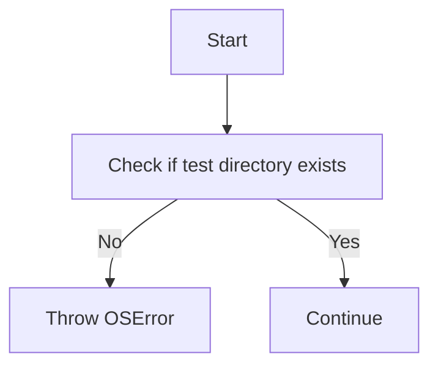
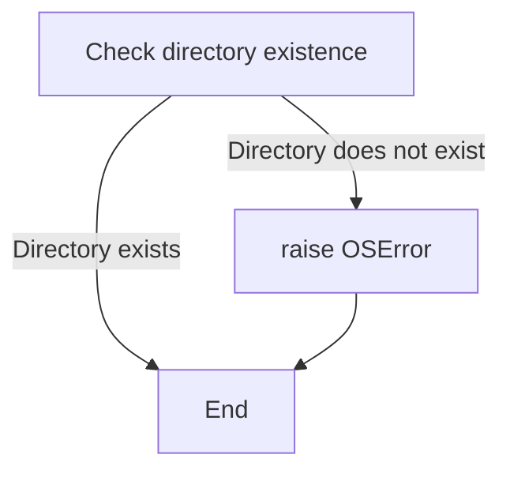

# `matplotlib\lib\mpl_toolkits\axisartist\tests\__init__.py` 详细设计文档

The code checks if a specific test directory exists and raises an OSError if it does not, indicating that test data might be missing.

## 整体流程



## 类结构

```
OSError (Exception)
```

## 全局变量及字段


### `Path(__file__).parent / 'baseline_images'`
    
A pathlib.Path object representing the directory path to the 'baseline_images' directory relative to the current file's directory.

类型：`pathlib.Path`
    


    

## 全局函数及方法


### raise OSError

该函数用于在测试目录不存在时抛出一个`OSError`异常。

参数：

- `message`：`str`，包含错误信息的字符串，描述了测试目录不存在的原因。

返回值：无，该函数不返回任何值，而是抛出异常。

#### 流程图



#### 带注释源码

```
from pathlib import Path

# Check that the test directories exist
if not (Path(__file__).parent / "baseline_images").exists():
    raise OSError(
        'The baseline image directory does not exist. '
        'This is most likely because the test data is not installed. '
        'You may need to install matplotlib from source to get the '
        'test data.')
```


## 关键组件


### 张量索引与惰性加载

张量索引与惰性加载是处理大型数据集时常用的技术，它允许在需要时才加载数据的一部分，从而减少内存消耗和提高效率。

### 反量化支持

反量化支持是指系统对量化操作的反向操作，即从量化后的数据恢复到原始数据，这对于模型验证和调试非常重要。

### 量化策略

量化策略是指将浮点数数据转换为固定点数表示的方法，以减少模型大小和提高计算效率。


## 问题及建议


### 已知问题

-   {问题1}：代码中使用了硬编码的目录路径，这可能导致可移植性差。如果项目需要在不同的环境中运行，可能需要根据环境变量或配置文件来动态确定路径。
-   {问题2}：错误处理仅限于检查目录是否存在，没有提供更详细的错误信息，这可能会使得调试问题变得困难。

### 优化建议

-   {建议1}：引入配置文件或环境变量来管理目录路径，以提高代码的可移植性和灵活性。
-   {建议2}：在抛出异常时，提供更详细的错误信息，包括期望的目录路径和可能的解决方案，以便用户能够更容易地解决问题。
-   {建议3}：考虑使用日志记录机制来记录错误信息，以便于问题追踪和系统监控。


## 其它


### 设计目标与约束

- 设计目标：确保测试数据目录存在，以便进行测试。
- 约束：测试数据目录必须存在，否则无法进行测试。

### 错误处理与异常设计

- 异常设计：当测试数据目录不存在时，抛出 `OSError` 异常。
- 错误处理：捕获 `OSError` 异常，并给出相应的错误信息。

### 数据流与状态机

- 数据流：代码检查测试数据目录是否存在，如果不存在，则抛出异常。
- 状态机：无状态机应用，仅检查目录存在性。

### 外部依赖与接口契约

- 外部依赖：`pathlib` 模块用于路径操作。
- 接口契约：无特定的接口契约，但代码依赖于 `pathlib` 模块的功能。

### 安全性与权限

- 安全性：无敏感数据操作，安全性主要依赖于操作系统对文件系统的权限控制。
- 权限：无特殊权限要求，普通用户权限即可。

### 性能考量

- 性能：代码执行效率高，仅进行一次目录存在性检查。
- 耗时：无显著耗时操作。

### 可维护性与可扩展性

- 可维护性：代码结构简单，易于理解和维护。
- 可扩展性：易于添加新的测试数据目录检查逻辑。

### 测试与验证

- 测试：应包含单元测试来验证目录存在性检查逻辑。
- 验证：通过测试确保在目录不存在时正确抛出异常。

### 文档与注释

- 文档：提供详细的设计文档，包括代码功能、运行流程、类和方法描述等。
- 注释：代码中包含必要的注释，解释关键代码段的功能。

### 版本控制与部署

- 版本控制：使用版本控制系统（如 Git）管理代码变更。
- 部署：代码部署到测试环境前，应通过自动化测试确保其正确性。


    