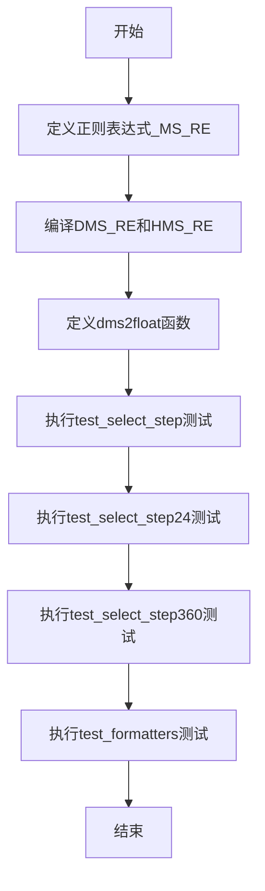
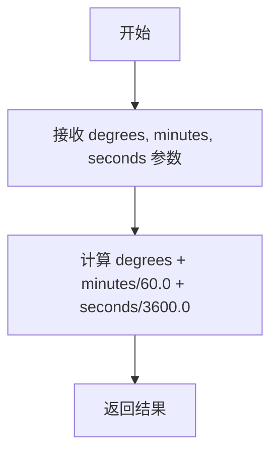
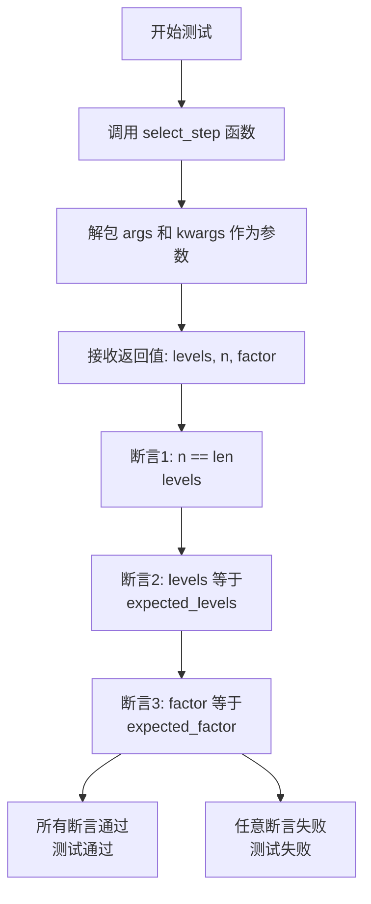
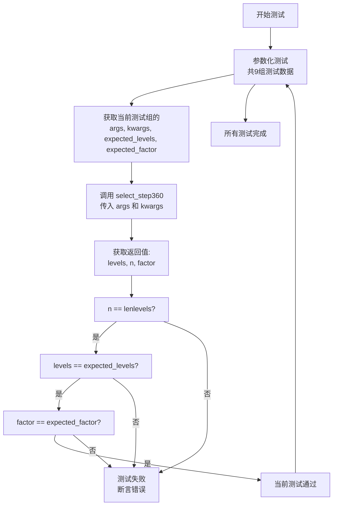
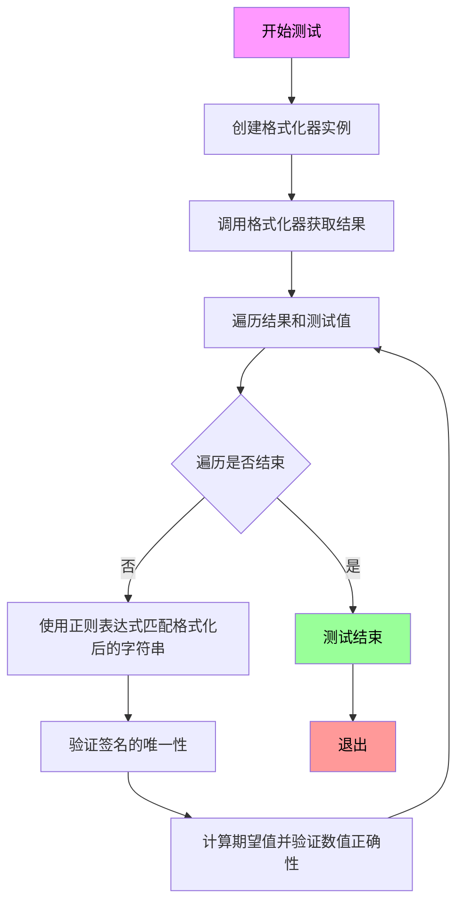

# `matplotlib\lib\mpl_toolkits\axisartist\tests\test_angle_helper.py` 详细设计文档

该文件是matplotlib axisartist模块的角度格式化辅助工具的测试套件，主要用于验证DMS（度分秒）和HMS（时分秒）格式的正则表达式解析、角度转换函数dms2float、以及select_step/select_step24/select_step360等步进选择函数的功能正确性。

## 整体流程



## 类结构

```
无自定义类（仅使用导入的类）
导入的类：
├── FormatterDMS (度分秒格式化器)
└── FormatterHMS (时分秒格式化器)
```

## 全局变量及字段


### `_MS_RE`
    
正则表达式模板字符串，用于匹配度分秒或时分秒格式的数值，包含度、分、秒的可选符号和值的捕获组

类型：`str`
    


### `DMS_RE`
    
编译后的度分秒正则表达式对象，用于匹配和解析度(°)、分(')、秒(")格式的角度标注

类型：`re.Pattern`
    


### `HMS_RE`
    
编译后的时分秒正则表达式对象，用于匹配和解析时(h)、分(m)、秒(s)格式的时间标注

类型：`re.Pattern`
    


    

## 全局函数及方法


### `dms2float`

将度分秒（Degrees, Minutes、Seconds）格式的角度转换为十进制度数。

参数：

- `degrees`：`数值类型`，度数部分
- `minutes`：`数值类型`（默认值为 0），分数部分
- `seconds`：`数值类型`（默认值为 0），秒数部分

返回值：`float`，十进制度数表示的角度值

#### 流程图



#### 带注释源码

```python
def dms2float(degrees, minutes=0, seconds=0):
    """
    将度分秒（Degrees, Minutes, Seconds）格式的角度转换为十进制度数。
    
    参数:
        degrees: 度数部分（数值类型）
        minutes: 分数部分，默认为0（数值类型）
        seconds: 秒数部分，默认为0（数值类型）
    
    返回:
        float: 十进制度数表示的角度值
        
    计算原理:
        1度 = 60分 = 3600秒
        因此转换公式为: degrees + minutes/60 + seconds/3600
    """
    return degrees + minutes / 60.0 + seconds / 3600.0
```


### `test_select_step`

该测试函数用于验证 `select_step` 函数在不同参数组合下（角度范围、刻度数量、是否使用小时制）能否正确计算合适的刻度间隔、刻度级别和转换因子。

参数：

- `args`：`tuple`，位置参数元组，包含三个元素：范围起始值、范围结束值、目标刻度数量，将解包后传递给 `select_step` 函数
- `kwargs`：`dict`，关键字参数字典，控制 `select_step` 的行为（如 `{'hour': False}` 或 `{'hour': True}`）
- `expected_levels`：`numpy.ndarray`，期望返回的刻度级别数组，用于与实际结果比对
- `expected_factor`：`float`，期望返回的转换因子（如 1.0 表示度，60 表示分，3600 表示秒）

返回值：`None`，该函数为测试函数，无显式返回值，通过断言验证逻辑的正确性

#### 流程图



#### 带注释源码

```python
@pytest.mark.parametrize('args, kwargs, expected_levels, expected_factor', [
    # 测试用例1: 角度模式，范围-180到180，10个刻度，hour=False
    ((-180, 180, 10), {'hour': False}, np.arange(-180, 181, 30), 1.0),
    # 期望每30度一个刻度，转换因子为1.0（度）
    ((-12, 12, 10), {'hour': True}, np.arange(-12, 13, 2), 1.0)
    # 测试用例2: 小时模式，范围-12到12，10个刻度，hour=True
    # 期望每2小时一个刻度，转换因子为1.0（小时）
])
def test_select_step(args, kwargs, expected_levels, expected_factor):
    # 调用被测试的 select_step 函数，传入参数
    levels, n, factor = select_step(*args, **kwargs)

    # 断言1: 验证返回的刻度数量 n 与 levels 数组长度一致
    assert n == len(levels)
    
    # 断言2: 验证返回的刻度级别数组与期望值完全相等
    np.testing.assert_array_equal(levels, expected_levels)
    
    # 断言3: 验证返回的转换因子与期望值相等
    assert factor == expected_factor
```


### `test_select_step24`

这是一个测试函数，用于验证 `select_step24` 函数在处理角度/时间刻度选择时的正确性。该测试通过参数化测试验证不同的输入范围（度数或小时）是否能正确返回对应的刻度级别数组和缩放因子。

参数：

- `args`：`tuple`，位置参数元组，包含三个元素 (vmin, vmax, n)，分别表示最小值、最大值和期望的刻度数量
- `kwargs`：`dict`，关键字参数字典，用于传递额外参数如 `threshold_factor`
- `expected_levels`：`numpy.ndarray`，期望返回的刻度级别数组
- `expected_factor`：`float`，期望返回的缩放因子

返回值：`None`，该函数为测试函数，通过断言验证结果，不返回任何值

#### 流程图

```mermaid
flowchart TD
    A[开始测试] --> B[解包参数: args, kwargs, expected_levels, expected_factor]
    B --> C[调用select_step24函数]
    C --> D[获取返回值: levels, n, factor]
    D --> E{断言验证}
    E --> F1[n == len(levels)?]
    F1 -->|是| F2[levels == expected_levels?]
    F1 -->|否| F[测试失败: n不匹配]
    F2 -->|是| F3[factor == expected_factor?]
    F2 -->|否| G[测试失败: levels不匹配]
    F3 -->|是| H[测试通过]
    F3 -->|否| I[测试失败: factor不匹配]
```

#### 带注释源码

```python
@pytest.mark.parametrize('args, kwargs, expected_levels, expected_factor', [
    # 测试用例1: 度数范围 -180 到 180，共10个刻度
    # 期望返回 -180 到 181，步长30 的刻度数组，缩放因子为 1.0
    ((-180, 180, 10), {}, np.arange(-180, 181, 30), 1.0),
    
    # 测试用例2: 小时范围 -12 到 12，共10个刻度
    # 期望返回 -750 到 751，步长150 的刻度数组（转换后为小时）
    # 缩放因子为 60.0（将角度转换为分钟）
    ((-12, 12, 10), {}, np.arange(-750, 751, 150), 60.0)
])
def test_select_step24(args, kwargs, expected_levels, expected_factor):
    """
    测试 select_step24 函数在不同输入参数下的行为
    
    参数:
        args: 元组 (vmin, vmax, n) - 范围最小值、最大值和期望刻度数
        kwargs: 关键字参数字典
        expected_levels: 期望返回的刻度值数组
        expected_factor: 期望返回的缩放因子
    
    测试验证:
        1. 返回的刻度数量与数组长度一致
        2. 返回的刻度值与期望值匹配
        3. 返回的缩放因子与期望值匹配
    """
    
    # 调用被测试的 select_step24 函数，传入参数
    # select_step24 用于选择合适的刻度步长
    levels, n, factor = select_step24(*args, **kwargs)

    # 验证1: 确保返回的刻度数量与数组长度一致
    assert n == len(levels)
    
    # 验证2: 使用 NumPy 断言验证刻度数组完全匹配
    # np.testing.assert_array_equal 会验证数组形状和元素值
    np.testing.assert_array_equal(levels, expected_levels)
    
    # 验证3: 确保缩放因子正确
    # 缩放因子用于将刻度值转换为实际的角度或时间单位
    assert factor == expected_factor
```


### `test_select_step360`

这是 `select_step360` 函数的单元测试函数，用于验证该函数在处理角度/时间范围时能够正确计算合适的刻度步长、刻度级别和缩放因子。

参数：

- `args`：`tuple`，表示传递给 `select_step360` 的位置参数，包含 (起始值, 结束值, 刻度数量)
- `kwargs`：`dict`，表示传递给 `select_step360` 的关键字参数，如 `{'threshold_factor': 60}`
- `expected_levels`：`numpy.ndarray`，预期的刻度级别数组
- `expected_factor`：`float`，预期的缩放因子

返回值：`None`，该函数为测试函数，无返回值，通过 `assert` 语句验证正确性

#### 流程图



#### 带注释源码

```python
@pytest.mark.parametrize('args, kwargs, expected_levels, expected_factor', [
    # 测试用例1: 度分秒格式，范围20°21.2'到21°33.3'，5个刻度
    # 预期: 步长15，范围1215-1305，缩放因子60
    ((dms2float(20, 21.2), dms2float(21, 33.3), 5), {},
     np.arange(1215, 1306, 15), 60.0),
    
    # 测试用例2: 度分秒格式含秒，范围20.5°21.2''到20.5°33.3''，5个刻度
    # 预期: 步长2，范围73820-73834，缩放因子3600
    ((dms2float(20.5, seconds=21.2), dms2float(20.5, seconds=33.3), 5), {},
     np.arange(73820, 73835, 2), 3600.0),
    
    # 测试用例3: 度分秒格式，范围20°21.2'到20°53.3'，5个刻度
    # 预期: 步长5，范围1220-1255，缩放因子60
    ((dms2float(20, 21.2), dms2float(20, 53.3), 5), {},
     np.arange(1220, 1256, 5), 60.0),
    
    # 测试用例4: 纯度格式，范围21.2到33.3，5个刻度
    # 预期: 步长2，范围20-34，缩放因子1.0
    ((21.2, 33.3, 5), {},
     np.arange(20, 35, 2), 1.0),
    
    # 测试用例5: 重复测试用例1
    ((dms2float(20, 21.2), dms2float(21, 33.3), 5), {},
     np.arange(1215, 1306, 15), 60.0),
    
    # 测试用例6: 重复测试用例2
    ((dms2float(20.5, seconds=21.2), dms2float(20.5, seconds=33.3), 5), {},
     np.arange(73820, 73835, 2), 3600.0),
    
    # 测试用例7: 极小秒数差异，范围20.5°21.2''到20.5°21.4''，5个刻度
    # 预期: 步长5，范围7382120-7382140，缩放因子360000
    ((dms2float(20.5, seconds=21.2), dms2float(20.5, seconds=21.4), 5), {},
     np.arange(7382120, 7382141, 5), 360000.0),
    
    # 测试用例8: 自定义threshold_factor=60
    # 预期: 步长1，范围12301-12309，缩放因子600
    ((dms2float(20.5, seconds=11.2), dms2float(20.5, seconds=53.3), 5),
     {'threshold_factor': 60}, np.arange(12301, 12310), 600.0),
    
    # 测试用例9: 自定义threshold_factor=1
    # 预期: 步长2，范围20502-20516，缩放因子1000
    ((dms2float(20.5, seconds=11.2), dms2float(20.5, seconds=53.3), 5),
     {'threshold_factor': 1}, np.arange(20502, 20517, 2), 1000.0),
])
def test_select_step360(args, kwargs, expected_levels, expected_factor):
    """
    测试 select_step360 函数的各种输入场景
    
    该测试函数使用 @pytest.mark.parametrize 装饰器定义了9组测试数据，
    每组包含: 位置参数args、关键字参数kwargs、预期刻度levels、预期因子factor
    
    测试验证三个方面:
    1. 返回的n等于levels的长度
    2. 返回的levels与预期levels数组相等
    3. 返回的factor与预期factor相等
    """
    # 调用被测试的 select_step360 函数，传入参数
    levels, n, factor = select_step360(*args, **kwargs)

    # 验证n等于levels的长度
    assert n == len(levels)
    # 验证levels数组内容正确
    np.testing.assert_array_equal(levels, expected_levels)
    # 验证factor值正确
    assert factor == expected_factor
```


### `test_formatters`

该函数是一个pytest测试函数，用于验证`FormatterDMS`（度分秒格式化器）和`FormatterHMS`（时分秒格式化器）能否正确地将数值转换为符合特定格式的刻度标签。测试通过正则表达式验证输出格式的正确性，并检查数值转换的准确性。

参数：

- `Formatter`：`type`（`FormatterDMS` 或 `FormatterHMS` 类），格式化器类，用于将数值转换为度分秒或时分秒格式
- `regex`：`re.Pattern`（正则表达式对象），用于验证格式化输出的字符串模式
- `direction`：`str`（字符串），方向参数，指定刻度线的方向（测试中固定为"left"）
- `factor`：`float`（浮点数），转换因子，用于将数值缩放到对应的单位
- `values`：`list`（列表），测试用的数值列表

返回值：`None`，该函数为测试函数，不返回任何值

#### 流程图



#### 带注释源码

```python
@pytest.mark.parametrize('Formatter, regex',
                         [(FormatterDMS, DMS_RE),
                          (FormatterHMS, HMS_RE)],
                         ids=['Degree/Minute/Second', 'Hour/Minute/Second'])
@pytest.mark.parametrize('direction, factor, values', [
    ("left", 60, [0, -30, -60]),
    ("left", 600, [12301, 12302, 12303]),
    ("left", 3600, [0, -30, -60]),
    ("left", 36000, [738210, 738215, 738220]),
    ("left", 360000, [7382120, 7382125, 7382130]),
    ("left", 1., [45, 46, 47]),
    ("left", 10., [452, 453, 454]),
])
def test_formatters(Formatter, regex, direction, factor, values):
    """
    测试FormatterDMS和FormatterHMS格式化器的功能
    
    参数:
        Formatter: 格式化器类 (FormatterDMS 或 FormatterHMS)
        regex: 用于验证输出格式的正则表达式
        direction: 刻度方向
        factor: 数值转换因子
        values: 测试用的数值列表
    """
    # 创建格式化器实例
    fmt = Formatter()
    
    # 调用格式化器，传入方向、因子和数值列表，获取格式化后的字符串列表
    result = fmt(direction, factor, values)

    # 初始化上一级的度、分、秒值，用于处理相对值情况
    prev_degree = prev_minute = prev_second = None
    
    # 遍历格式化结果和原始数值，进行逐一验证
    for tick, value in zip(result, values):
        # 使用正则表达式匹配格式化后的刻度字符串
        m = regex.match(tick)
        
        # 确保匹配成功，否则抛出断言错误
        assert m is not None, f'{tick!r} is not an expected tick format.'

        # 检查签名的唯一性：度、分、秒只能有一个带符号
        sign = sum(m.group(sign + '_sign') is not None
                   for sign in ('degree', 'minute', 'second'))
        assert sign <= 1, f'Only one element of tick {tick!r} may have a sign.'
        
        # 确定符号：如果没有符号则为正(1)，有符号则为负(-1)
        sign = 1 if sign == 0 else -1

        # 提取度、分、秒值，如果某项为空则使用前一个值或默认值0
        degree = float(m.group('degree') or prev_degree or 0)
        minute = float(m.group('minute') or prev_minute or 0)
        second = float(m.group('second') or prev_second or 0)
        
        # 根据格式化器类型计算期望值
        if Formatter == FormatterHMS:
            # 对于HMS：360度对应24小时，需要将数值除以15再除以因子
            expected_value = pytest.approx((value // 15) / factor)
        else:
            # 对于DMS：直接用数值除以因子
            expected_value = pytest.approx(value / factor)
        
        # 验证数值转换的正确性
        assert sign * dms2float(degree, minute, second) == expected_value, \
            f'{tick!r} does not match expected tick value.'

        # 更新上一级的度、分、秒值，供下一次迭代使用
        prev_degree = degree
        prev_minute = minute
        prev_second = second
```

## 关键组件


### 正则表达式模式定义 (_MS_RE)

用于匹配度分秒（Degrees, Minutes, Seconds）或时分秒（Hours, Minutes, Seconds）格式的正则表达式模板，包含度的符号、度的值、分的符号、分的值、秒的符号、秒的值等捕获组，支持在Mathtext环境中显示。

### DMS_RE 正则表达式

编译后的正则表达式对象，用于匹配度分秒格式（Degrees/Minutes/Seconds），使用FormatterDMS的符号进行替换，支持VERBOSE模式以便于阅读和维护。

### HMS_RE 正则表达式

编译后的正则表达式对象，用于匹配时分秒格式（Hours/Minutes/Seconds），使用FormatterHMS的符号进行替换，支持VERBOSE模式以便于阅读和维护。

### dms2float 函数

将度、分、秒转换为十进制度数的函数，支持可选的分钟和秒参数，默认值为0，返回 degrees + minutes/60 + seconds/3600 的计算结果。

### select_step 测试

测试 axisartist.angle_helper 模块中的 select_step 函数，验证其在非小时模式下（hour=False）能正确返回角度刻度级别、刻度数量和缩放因子。

### select_step24 测试

测试 axisartist.angle_helper 模块中的 select_step24 函数，验证其在默认参数下能正确处理角度范围并返回相应的刻度级别和因子（默认因子为60.0）。

### select_step360 测试

测试 axisartist.angle_helper 模块中的 select_step360 函数，验证其在不同阈值因子（threshold_factor）下处理度分秒输入时的刻度计算逻辑，支持多种精度级别的测试用例。

### test_formatters 测试

测试 FormatterDMS 和 FormatterHMS 格式化类的核心功能，验证它们能正确将数值转换为指定格式的刻度标签，并使用正则表达式验证输出格式的正确性，确保只存在一个符号且数值计算正确。


## 问题及建议


### 已知问题

-   **测试数据重复**：在 `test_select_step360` 中存在完全重复的测试用例（第1行和第5行相同，第2行和第6行相同），增加了维护成本且浪费测试资源
-   **魔法数字缺乏文档**：代码中大量使用如 `60.0`、`3600.0`、`360000.0` 等数值常量，这些数字的含义缺乏注释说明，可读性较差
-   **正则表达式可读性差**：`_MS_RE` 模板字符串使用复杂的 re.VERBOSE 模式且嵌套多层条件判断 `(?(degree)\\,)`，导致正则表达式难以理解和维护
-   **测试覆盖不足**：测试仅覆盖正常路径，未包含边界条件（如负零、NaN、无穷大）和异常输入的测试
-   **硬编码的度/分/秒符号**：符号从 `FormatterDMS`/`FormatterHMS` 类中读取，但如果这些类的属性不存在会导致 AttributeError，缺少错误处理
-   **潜在的浮点精度问题**：`dms2float` 函数使用简单的除法累加，可能在极端情况下产生浮点精度误差
-   **模块级别副作用**：正则表达式在模块加载时立即编译，对于大型库可能有轻微的启动性能影响

### 优化建议

-   移除 `test_select_step360` 中的重复测试用例，使用唯一的测试参数
-   为关键数值常量（如时间转换因子）定义具名常量或枚举类，并添加文档注释
-   将复杂的正则表达式拆分为多个更小的、命名清晰的子模式，或添加详细的注释说明
-   增加边界值测试：空列表、单个元素、极端大/小值、无效输入等
-   为 `FormatterDMS`/`FormatterHMS` 属性访问添加防御性检查或 fallback 机制
-   考虑使用 `decimal.Decimal` 或更精确的时间计算库替代 `dms2float` 的浮点运算（如需求精度较高）
-   将正则表达式编译延迟到首次使用时（惰性初始化），或使用缓存机制

## 其它


### 设计目标与约束

本模块的设计目标是为 matplotlib 的 axisartist 角度辅助工具提供完整的测试覆盖，验证角度选择器（select_step, select_step24, select_step360）和角度格式化器（FormatterDMS, FormatterHMS）的正确性。约束条件包括：依赖 numpy 进行数值计算，使用 pytest 作为测试框架，确保与 Matplotlib 的 angle_helper 模块紧密集成。

### 错误处理与异常设计

代码中的错误处理主要体现在测试断言中：
- 使用 `assert` 语句验证返回的等级数量与预期一致
- 使用 `np.testing.assert_array_equal` 验证数组值完全匹配
- 使用正则表达式匹配验证刻度标签格式，匹配失败时提供详细的错误信息
- 对于 HMS 格式化器，验证角度到时间的转换（360度=24小时）
- 当正则匹配失败时，明确输出不匹配的刻度标签内容

### 数据流与状态机

数据流主要分为三条路径：
1. select_step 函数：接收角度范围参数，返回刻度等级数组、元素数量和因子
2. select_step24 函数：专门处理小时模式，转换角度到时间单位（因子为60）
3. select_step360 函数：处理高精度角度，支持自定义阈值因子
4. Formatter 类：根据方向、因子和值数组生成格式化的刻度标签字符串

状态机转换：输入值 → 格式化器 → 正则解析 → 数值验证 → 断言通过

### 外部依赖与接口契约

外部依赖包括：
- `re`: Python 正则表达式模块，用于编译 DMS/HMS 格式匹配模式
- `numpy`: 数值计算库，提供 arange 和数组操作
- `pytest`: 测试框架，提供 parametrize 装饰器和测试断言
- `mpl_toolkits.axisartist.angle_helper`: 被测模块，包含 FormatterDMS, FormatterHMS, select_step, select_step24, select_step360

接口契约：
- select_step/select_step24/select_step360: 返回三元组 (levels, n, factor)，其中 levels 是 numpy 数组，n 是整数，factor 是浮点数
- Formatter 类: 实现了 __call__ 方法，接受 (direction, factor, values) 参数，返回格式化字符串列表
- dms2float: 纯函数，将度分秒转换为十进制度

### 版本兼容性考虑

代码使用了 Python 3 的语法特性，需要 Python 3.6+ 环境。numpy 版本应 >= 1.17，pytest 版本应 >= 6.0。测试参数化使用了 ids 参数，这要求 pytest 版本支持该参数。

### 性能特征与基准

select_step 系列函数的时间复杂度为 O(n)，其中 n 是生成的刻度数量。Formatter 的时间复杂度为 O(m)，其中 m 是值的数量。正则匹配是性能关键路径，DMS_RE 和 HMS_RE 在模块加载时预编译以提高性能。

### 测试覆盖范围

测试覆盖了：
- 角度选择器的正向和负向范围
- 小时模式和度模式
- 不同因子值（1.0, 10.0, 60.0, 600.0, 3600.0, 36000.0, 360000.0）
- DMS 和 HMS 格式化器的所有组合
- 符号处理（度、分、秒的正负号）
- 缺失值处理（使用前一个值作为默认值）
- 阈值因子自定义

    