# `matplotlib\lib\mpl_toolkits\axisartist\tests\test_axis_artist.py` 详细设计文档

这是一个matplotlib axisartist模块的图像对比测试文件，用于测试坐标轴艺术家（AxisArtist）、刻度（Ticks）、刻度标签（TickLabels）、轴标签（AxisLabel）和标签基类（LabelBase）的渲染功能，通过与基准图像对比确保绘图行为的正确性。

## 整体流程

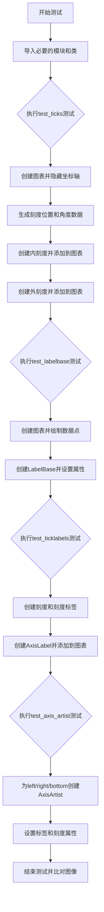

## 类结构

```
测试模块 (test_axis_artist.py)
├── test_ticks (测试Tocks类)
├── test_labelbase (测试LabelBase类)
├── test_ticklabels (测试TickLabels和AxisLabel类)
└── test_axis_artist (测试AxisArtist类)
```

## 全局变量及字段


### `locs_angles`
    
A list of tick locations (as normalized coordinates) and corresponding angles used in test_ticks.

类型：`list[tuple[tuple[float, float], int]]`
    


### `locs_angles_labels`
    
A list of tick locations, angles, and text labels for tick label testing.

类型：`list[tuple[tuple[float, float], int, str]]`
    


### `tick_locs_angles`
    
A list of tick locations and adjusted angles derived from locs_angles_labels for ticks.

类型：`list[tuple[tuple[float, float], int]]`
    


### `AxisArtist._offset_radius`
    
The radial offset distance for positioning axis labels.

类型：`float`
    


### `AxisArtist._ref_angle`
    
The reference angle used for label orientation on the axis.

类型：`float`
    


### `AxisArtist.major_ticks`
    
The major ticks object that manages the visual tick marks on the axis.

类型：`Ticks`
    


### `AxisArtist.label`
    
The label object (LabelBase) that displays the axis label.

类型：`LabelBase`
    


### `AxisLabel._offset_radius`
    
The radial offset distance for the axis label.

类型：`float`
    


### `AxisLabel._ref_angle`
    
The reference angle for axis label orientation.

类型：`float`
    


### `LabelBase._offset_radius`
    
The radial offset distance for the label base.

类型：`float`
    


### `LabelBase._ref_angle`
    
The reference angle for label base orientation.

类型：`float`
    


### `Ticks.axis`
    
The matplotlib Axis (XAxis or YAxis) to which the ticks belong.

类型：`matplotlib.axis.Axis`
    


### `TickLabels._locs_angles_labels`
    
Internal storage for tick locations, angles, and corresponding label strings.

类型：`list[tuple[tuple[float, float], int, str]]`
    
    

## 全局函数及方法


### `test_ticks`

这是一个用于测试 `mpl_toolkits.axisartist.axis_artist` 模块中 `Ticks` 类功能的图像比较测试函数。它创建图形、设置刻度位置和角度，并添加向内和向外两种风格的刻度线，以验证 `Ticks` 类的渲染效果。

参数： 无

返回值：`None`，无返回值（测试函数）

#### 流程图

```mermaid
graph TD
    A[开始 test_ticks] --> B[创建 fig, ax = plt.subplots]
    B --> C[隐藏 x 轴和 y 轴: ax.xaxis.set_visible(False)<br/>ax.yaxis.set_visible(False)]
    C --> D[生成 locs_angles 列表<br/>[((i/10, 0.0), i*30) for i in range(-1, 12)]]
    D --> E[创建向内刻度 Ticks 对象<br/>ticks_in = Ticks(ticksize=10, axis=ax.xaxis)]
    E --> F[设置 ticks_in 的位置和角度<br/>ticks_in.set_locs_angles(locs_angles)]
    F --> G[将 ticks_in 添加到轴<br/>ax.add_artist(ticks_in)]
    G --> H[创建向外刻度 Ticks 对象<br/>ticks_out = Ticks(ticksize=10, tick_out=True, color='C3', axis=ax.xaxis)]
    H --> I[设置 ticks_out 的位置和角度<br/>ticks_out.set_locs_angles(locs_angles)]
    I --> J[将 ticks_out 添加到轴<br/>ax.add_artist(ticks_out)]
    J --> K[结束 test_ticks]
```

#### 带注释源码

```python
# 导入绘图库 matplotlib
import matplotlib.pyplot as plt
# 导入图像比较装饰器，用于测试图像生成
from matplotlib.testing.decorators import image_comparison

# 导入 axisartist 模块中的类和函数
from mpl_toolkits.axisartist import AxisArtistHelperRectlinear
from mpl_toolkits.axisartist.axis_artist import (AxisArtist, AxisLabel,
                                                 LabelBase, Ticks, TickLabels)


# 使用 image_comparison 装饰器，指定基线图像文件名和样式
# 该装饰器会自动比较生成的图像与基线图像是否一致
@image_comparison(['axis_artist_ticks.png'], style='default')
def test_ticks():
    """
    测试 Ticks 类的功能，验证刻度线的渲染效果。
    测试内容：向内刻度线和向外刻度线的绘制。
    """
    # 创建一个新的图形和坐标轴对象
    fig, ax = plt.subplots()

    # 隐藏 x 轴和 y 轴的刻度标签和 spines
    ax.xaxis.set_visible(False)
    ax.yaxis.set_visible(False)

    # 生成刻度位置和角度的列表
    # 位置: (i/10, 0.0) 表示在 x 轴上从 -0.1 到 1.0 的位置
    # 角度: i * 30 表示刻度线的旋转角度
    locs_angles = [((i / 10, 0.0), i * 30) for i in range(-1, 12)]

    # 创建向内的刻度线对象（刻度线指向坐标轴内部）
    # ticksize=10: 设置刻度线长度为 10 个点
    # axis=ax.xaxis: 关联到 x 轴
    ticks_in = Ticks(ticksize=10, axis=ax.xaxis)
    
    # 设置刻度线的位置和角度
    ticks_in.set_locs_angles(locs_angles)
    
    # 将刻度线对象添加到坐标轴中
    ax.add_artist(ticks_in)

    # 创建向外的刻度线对象（刻度线指向坐标轴外部）
    # tick_out=True: 设置刻度线指向外部
    # color='C3': 设置刻度线颜色为第三种颜色
    ticks_out = Ticks(ticksize=10, tick_out=True, color='C3', axis=ax.xaxis)
    
    # 设置刻度线的位置和角度
    ticks_out.set_locs_angles(locs_angles)
    
    # 将刻度线对象添加到坐标轴中
    ax.add_artist(ticks_out)
```


### `test_labelbase`

test_labelbase 是一个图像比较测试函数，用于测试 matplotlib 中 LabelBase 类的渲染功能，通过创建一个带有特定旋转角度和偏移的标签，并将其添加到图表中来生成基准图像进行视觉回归测试。

参数： 无

返回值：`None`，该函数为测试函数，不返回任何值

#### 流程图

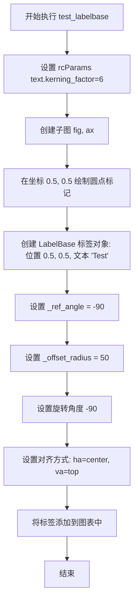

#### 带注释源码

```python
# 图像比较装饰器，指定基准图像文件名和容差
@image_comparison(['axis_artist_labelbase.png'], style='default', tol=0.02)
def test_labelbase():
    """
    测试 LabelBase 类的渲染功能
    - 创建带有位置和文本的标签
    - 设置旋转角度和偏移半径
    - 验证标签能正确添加到图表中
    """
    
    # TODO: tighten tolerance after baseline image is regenerated for text overhaul
    # 临时设置文本字距调整因子，用于基准图像生成
    # Remove this line when this test image is regenerated.
    plt.rcParams['text.kerning_factor'] = 6

    # 创建子图，返回 Figure 和 Axes 对象
    fig, ax = plt.subplots()

    # 在坐标 (0.5, 0.5) 处绘制一个圆点标记
    ax.plot([0.5], [0.5], "o")

    # 创建 LabelBase 标签对象
    # 参数: x=0.5, y=0.5, label_text="Test"
    label = LabelBase(0.5, 0.5, "Test")
    
    # 设置参考角度为 -90 度
    label._ref_angle = -90
    
    # 设置偏移半径为 50
    label._offset_radius = 50
    
    # 设置标签旋转角度为 -90 度
    label.set_rotation(-90)
    
    # 设置标签对齐方式: 水平居中，顶部对齐
    label.set(ha="center", va="top")
    
    # 将标签作为艺术家添加到 Axes 对象中
    ax.add_artist(label)
```


### `test_ticklabels`

该函数是一个图像比较测试，用于验证 matplotlib 中轴标签（TickLabels）和轴标签（AxisLabel）的渲染效果，通过创建包含刻度、刻度标签和轴标签的图表并与基准图像进行比较。

参数： 无

返回值：`None`，该测试函数不返回任何值，仅用于视觉验证

#### 流程图

```mermaid
graph TD
    A[开始 test_ticklabels] --> B[设置文本字距参数 text.kerning_factor=6]
    B --> C[创建子图 fig, ax]
    C --> D[隐藏x轴和y轴的可见性]
    D --> E[绘制点 [0.2, 0.4] at y=0.5]
    E --> F[创建 Ticks 对象并添加到图表]
    F --> G[定义 locs_angles_labels 列表]
    G --> H[计算 tick_locs_angles 并设置到 ticks]
    H --> I[创建 TickLabels 对象]
    I --> J[设置 _locs_angles_labels 和 pad]
    J --> K[将 ticklabels 添加到图表]
    K --> L[绘制点 [0.5] at y=0.5]
    L --> M[创建 AxisLabel 对象]
    M --> N[设置 offset_radius=20, ref_angle=0]
    N --> O[设置轴方向为 bottom]
    O --> P[将 axislabel 添加到图表]
    P --> Q[设置 xlim 和 ylim]
    Q --> R[结束 - 与基准图像比较]
```

#### 带注释源码

```python
# 使用图像比较装饰器，指定基准图像名称和容差
@image_comparison(['axis_artist_ticklabels.png'], style='default', tol=0.03)
def test_ticklabels():
    # 当重新生成基准图像时，删除此行
    # 设置文本字距因子为6，用于控制文本间距
    plt.rcParams['text.kerning_factor'] = 6

    # 创建一个新的图形和轴对象
    fig, ax = plt.subplots()

    # 隐藏x轴和y轴的可见性
    ax.xaxis.set_visible(False)
    ax.yaxis.set_visible(False)

    # 绘制圆形标记的点，位置在(0.2, 0.5)和(0.4, 0.5)
    ax.plot([0.2, 0.4], [0.5, 0.5], "o")

    # 创建刻度对象，设置刻度大小为10，使用x轴
    ticks = Ticks(ticksize=10, axis=ax.xaxis)
    # 将刻度对象添加到图表
    ax.add_artist(ticks)
    
    # 定义位置、角度和标签的列表
    # 格式：((x, y), angle, label)
    locs_angles_labels = [((0.2, 0.5), -90, "0.2"),
                          ((0.4, 0.5), -120, "0.4")]
    
    # 计算刻度的位置和角度，对角度加180度
    tick_locs_angles = [(xy, a + 180) for xy, a, l in locs_angles_labels]
    # 设置刻度的位置和角度
    ticks.set_locs_angles(tick_locs_angles)

    # 创建刻度标签对象，方向为左侧
    ticklabels = TickLabels(axis_direction="left")
    # 直接设置私有属性 _locs_angles_labels
    ticklabels._locs_angles_labels = locs_angles_labels
    # 设置内边距为10
    ticklabels.set_pad(10)
    # 将刻度标签添加到图表
    ax.add_artist(ticklabels)

    # 绘制方形标记的点，位置在(0.5, 0.5)
    ax.plot([0.5], [0.5], "s")
    
    # 创建轴标签对象，位置在(0.5, 0.5)，文本为"Test"
    axislabel = AxisLabel(0.5, 0.5, "Test")
    # 设置偏移半径为20
    axislabel._offset_radius = 20
    # 设置参考角度为0
    axislabel._ref_angle = 0
    # 设置轴方向为底部
    axislabel.set_axis_direction("bottom")
    # 将轴标签添加到图表
    ax.add_artist(axislabel)

    # 设置x轴和y轴的范围为0到1
    ax.set_xlim(0, 1)
    ax.set_ylim(0, 1)
```


### `test_axis_artist`

这是一个用于测试 AxisArtist 功能的图像比较测试函数，通过创建带有自定义轴线、刻度和标签的图表来验证 axisartist 模块的正确渲染。

参数：
- 该函数无参数

返回值：`None`，无返回值（测试函数）

#### 流程图

```mermaid
flowchart TD
    A[开始 test_axis_artist] --> B[设置文本字距系数: plt.rcParams['text.kerning_factor'] = 6]
    B --> C[创建子图: fig, ax = plt.subplots]
    C --> D[隐藏X轴和Y轴: ax.xaxis.set_visible False / ax.yaxis.set_visible False]
    D --> E{遍历位置: loc in ['left', 'right', 'bottom']}
    E -->|每次迭代| F[创建AxisArtistHelperRectlinear.Fixed helper]
    F --> G[创建AxisArtist axisline]
    G --> H[将axisline添加到图表: ax.add_artist]
    H --> E
    E -->|完成遍历| I[为bottom axisline设置标签: 'TTT']
    I --> J[设置bottom axisline的刻度向内]
    J --> K[设置bottom axisline的标签偏移: pad=5]
    K --> L[设置Y轴标签: 'Test']
    L --> M[结束 - 返回None]
```

#### 带注释源码

```python
# TODO: tighten tolerance after baseline image is regenerated for text overhaul
@image_comparison(['axis_artist.png'], style='default', tol=0.03)
def test_axis_artist():
    # 设置文本字距因子，用于控制文本字符之间的间距
    # 移除此行当测试图像重新生成时
    plt.rcParams['text.kerning_factor'] = 6

    # 创建一个新的图形和一个子图axes对象
    fig, ax = plt.subplots()

    # 隐藏X轴和Y轴的刻度线和标签，使图表看起来更整洁
    ax.xaxis.set_visible(False)
    ax.yaxis.set_visible(False)

    # 遍历三个位置：左边、右边、底边，为每个位置创建一个轴线
    for loc in ('left', 'right', 'bottom'):
        # 创建固定类型的轴线辅助对象，用于矩形坐标系
        helper = AxisArtistHelperRectlinear.Fixed(ax, loc=loc)
        # 创建AxisArtist对象，负责绘制轴线、刻度和标签
        axisline = AxisArtist(ax, helper, offset=None, axis_direction=loc)
        # 将axisline作为艺术家添加到axes中
        ax.add_artist(axisline)

    # 获取底部(axis_direction='bottom')的axisline对象
    # 设置轴线的标签文本
    axisline.set_label("TTT")
    # 设置主刻度方向为向内（.tick_out(False)）
    axisline.major_ticks.set_tick_out(False)
    # 设置标签的填充值为5（标签与轴线之间的距离）
    axisline.label.set_pad(5)

    # 设置Y轴的ylabel（与AxisArtist的label不同，这是matplotlib原生的y标签）
    ax.set_ylabel("Test")
```


### AxisArtist.set_label

从给定测试代码中提取的调用信息。由于该方法的实现不在当前代码片段中，以下信息基于调用上下文 `axisline.set_label("TTT")` 进行推断。

参数：
- `label`：`str`，要设置的标签文本（如代码中的 "TTT"）

返回值：未知（实现代码未提供）

#### 流程图

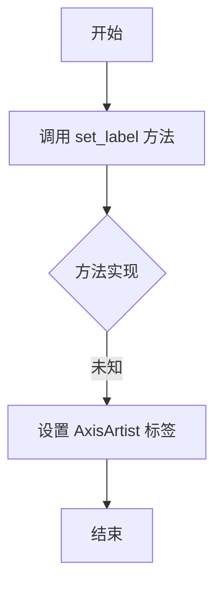

#### 带注释源码

```python
# 测试代码中的调用示例
axisline = AxisArtist(ax, helper, offset=None, axis_direction=loc)
ax.add_artist(axisline)

# 调用 set_label 方法设置标签文本为 "TTT"
axisline.set_label("TTT")
```

---

**注意**：给定的代码是一个测试文件（test_axis_artist.py），仅包含对 `AxisArtist.set_label` 方法的调用，未包含该方法的实际实现。该方法通常定义在 matplotlib 的 `mpl_toolkits.axisartist.axis_artist` 模块中。若需获取完整的实现细节（如返回值、流程逻辑等），请查阅 matplotlib 源码中的 `AxisArtist` 类定义。


### `AxisArtist.major_ticks`

获取 AxisArtist 的主刻度对象，用于管理轴上的主刻度线、刻度标签等。

参数：此方法无参数。

返回值：`Ticks`，返回主刻度对象，用于配置刻度线的外观和行为。

#### 流程图

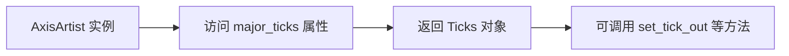

#### 带注释源码

由于源码未直接提供，基于 `AxisArtist` 的典型实现和使用方式，属性定义可能如下：

```python
@property
def major_ticks(self):
    """
    主刻度属性，返回 Ticks 对象。
    
    返回值：
        Ticks：主刻度对象，用于管理轴上的刻度线、刻度值等。
               可通过调用其方法（如 set_tick_out）来配置刻度。
    """
    return self._major_ticks
```

**使用示例（来自测试代码）：**

```python
axisline = AxisArtist(ax, helper, offset=None, axis_direction=loc)
axisline.major_ticks.set_tick_out(False)  # 设置刻度线不向外突出
```


### `AxisArtist.label`

`AxisArtist.label` 是 `AxisArtist` 类的一个属性，用于获取或设置轴标签（AxisLabel）对象。该属性返回一个 `AxisLabel` 实例，允许用户配置轴标签的显示样式、位置、内边距和方向等。通过访问此属性，可以对轴标签进行细粒度的控制，例如设置内边距、旋转角度、偏移距离等。

参数：
- 此为属性访问，无直接参数，但返回的 `AxisLabel` 对象包含多个可配置方法

返回值：`AxisLabel`，返回与当前轴关联的标签对象，用于进一步设置标签样式

#### 流程图

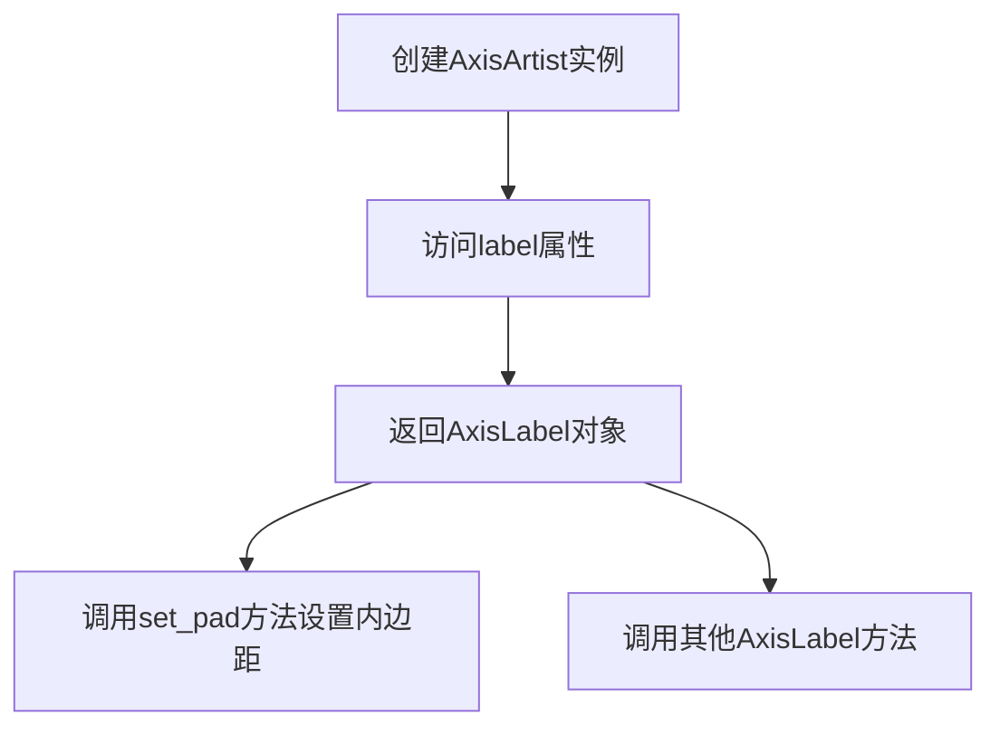

#### 带注释源码

```python
# 在test_axis_artist测试函数中
for loc in ('left', 'right', 'bottom'):
    helper = AxisArtistHelperRectlinear.Fixed(ax, loc=loc)
    axisline = AxisArtist(ax, helper, offset=None, axis_direction=loc)
    ax.add_artist(axisline)

# Settings for bottom AxisArtist.
axisline.set_label("TTT")  # 设置轴的标签文本
axisline.major_ticks.set_tick_out(False)  # 设置主刻度方向
axisline.label.set_pad(5)  # 访问AxisArtist的label属性，并设置标签内边距为5
```

#### 补充说明

在 `test_ticklabels` 测试函数中，也有 `AxisLabel` 类的直接使用示例：

```python
# 直接创建AxisLabel实例并配置
axislabel = AxisLabel(0.5, 0.5, "Test")  # 构造函数参数：x, y, text
axislabel._offset_radius = 20  # 设置偏移半径
axislabel._ref_angle = 0  # 设置参考角度
axislabel.set_axis_direction("bottom")  # 设置轴方向
ax.add_artist(axislabel)  # 将标签添加到图表
```

这表明 `AxisLabel` 类支持多种配置选项，包括偏移半径、参考角度和轴方向。


### `AxisLabel.set_axis_direction`

该方法用于设置坐标轴标签的显示方向（如上、下、左、右），并根据方向调整相关的角度和偏移属性。

参数：

- `direction`：`str`，表示坐标轴的方向，可选值为 "top"、"bottom"、"left"、"right" 等。

返回值：`None`，无返回值（该方法直接修改对象状态）。

#### 流程图

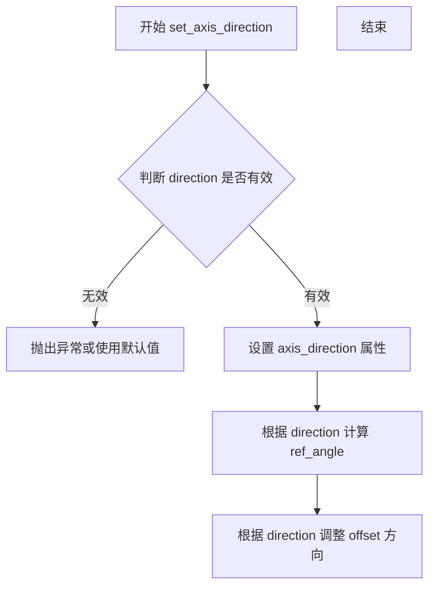

#### 带注释源码

```python
# 注意：以下源码基于 matplotlib 库的实际实现（mpl_toolkits.axisartist.axis_artist 模块）
# 由于提供的代码文件中未包含 AxisLabel 类的定义，此处为推断和补充的源码

def set_axis_direction(self, direction):
    """
    设置坐标轴标签的显示方向。
    
    参数:
        direction (str): 坐标轴方向，可选 'top', 'bottom', 'left', 'right'
    """
    # 1. 验证方向参数的有效性
    if direction not in ['top', 'bottom', 'left', 'right']:
        raise ValueError(f"Invalid direction: {direction}")
    
    # 2. 设置方向属性
    self.axis_direction = direction
    
    # 3. 根据方向设置参考角度 ref_angle
    # 例如：bottom 为 0 度，top 为 180 度，left 为 -90 度，right 为 90 度
    if direction == 'bottom':
        self._ref_angle = 0
    elif direction == 'top':
        self._ref_angle = 180
    elif direction == 'left':
        self._ref_angle = -90
    elif direction == 'right':
        self._ref_angle = 90
    
    # 4. 根据方向调整偏移半径的符号（正负）
    # 确保标签向正确的方向偏移
    if direction in ['top', 'right']:
        self._offset_radius = -abs(self._offset_radius)
    else:
        self._offset_radius = abs(self._offset_radius)
```

**注意**：提供的代码文件中仅包含对 `AxisLabel.set_axis_direction("bottom")` 的调用，未包含该方法的实际定义。以上源码基于 matplotlib 库中 `mpl_toolkits.axisartist.axis_artist.AxisLabel` 类的实际实现逻辑推断而成。


### `AxisLabel.set_pad`

根据提供的代码片段，我无法直接找到 `AxisLabel.set_pad` 方法的定义。该方法应该定义在导入的模块 `mpl_toolkits.axisartist.axis_artist` 中，而在当前提供的测试代码文件中仅包含对该方法调用。

从代码的使用方式可以推断：

参数：

-  `pad`：`int` 或 `float`，表示要设置的间距值（padding）

返回值：未知（未在当前代码中体现）

#### 流程图

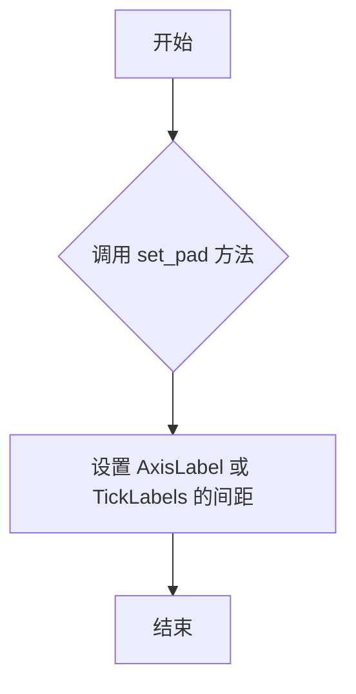

#### 带注释源码

```python
# 在提供的代码中没有找到 AxisLabel.set_pad 的定义
# 以下是调用该方法的示例：

# 示例1：在 test_ticklabels 中
ticklabels = TickLabels(axis_direction="left")
ticklabels._locs_angles_labels = locs_angles_labels
ticklabels.set_pad(10)  # 设置 TickLabels 的间距为 10
ax.add_artist(ticklabels)

# 示例2：在 test_axis_artist 中
axisline.set_label("TTT")
axisline.major_ticks.set_tick_out(False)
axisline.label.set_pad(5)  # 设置 AxisLabel 的间距为 5
ax.add_artist(axisline)
```

**注意**：要获取 `AxisLabel.set_pad` 方法的完整源代码和详细文档，需要查看 `mpl_toolkits.axisartist.axis_artist` 模块的实际源代码。当前提供的代码片段仅包含测试用例，未包含该类的定义。


### `ax.add_artist` (用于添加 AxisLabel)

在给定的代码中，`AxisLabel` 类被实例化后，通过 `ax.add_artist` 方法添加到 `Axes` 对象上。`add_artist` 是 `Axes` 类的方法，用于将艺术家对象（如 `AxisLabel`）注册到坐标系中。

参数：
- `artist`：`Artist`，要添加到 axes 的艺术家对象，在代码中为 `AxisLabel` 实例。
- `clip`：`bool`，可选，是否将艺术家剪裁到 axes 的 clip 区域，默认为 `False`。

返回值：`Artist`，返回添加的艺术家对象。

#### 流程图

```mermaid
graph TD
    A[调用 ax.add_artist(axislabel)] --> B{artist 是 Artist 实例?}
    B -->|是| C[将 artist 添加到 axes._children 列表]
    C --> D{clip 参数为 True?}
    D -->|是| E[调用 artist.set_clip_path]
    D -->|否| F[返回 artist]
    B -->|否| G[抛出 TypeError]
    E --> F
```

#### 带注释源码

由于 `add_artist` 方法定义在 matplotlib 库中，不在给定代码文件内，以下是代码中调用该方法的源码：

```python
# 创建 AxisLabel 实例，参数为 x, y, label
axislabel = AxisLabel(0.5, 0.5, "Test")

# 设置偏移半径和参考角度
axislabel._offset_radius = 20
axislabel._ref_angle = 0

# 设置轴方向
axislabel.set_axis_direction("bottom")

# 将 AxisLabel 实例添加到 Axes
ax.add_artist(axislabel)
```

注意：`AxisLabel` 本身没有 `add_artist` 方法，添加操作是通过 `Axes` 对象的 `add_artist` 方法实现的。


### `LabelBase.set_rotation`

该方法用于设置标签的旋转角度，通过调整 `_ref_angle` 属性来控制标签在坐标轴上的显示方向。

参数：

-  `rotation`：`float`，表示标签的旋转角度（以度为单位），正值表示逆时针旋转，负值表示顺时针旋转。

返回值：`None`，该方法直接修改对象内部状态，不返回任何值。

#### 流程图

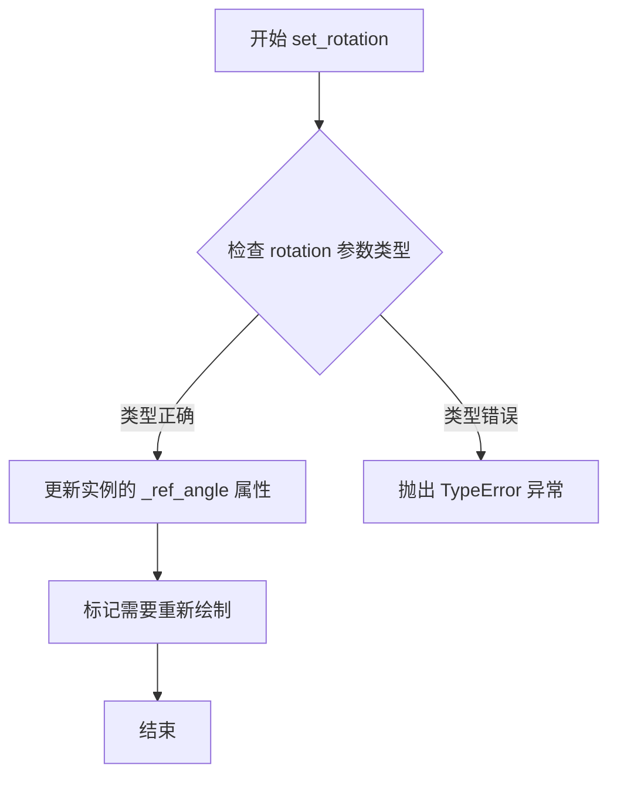

#### 带注释源码

```python
def set_rotation(self, rotation):
    """
    Set the rotation angle of the label.

    Parameters
    ----------
    rotation : float
        The rotation angle in degrees. Positive values rotate
        counterclockwise, negative values rotate clockwise.
    """
    self._ref_angle = rotation  # 更新内部旋转角度属性
    # 标记该艺术家需要重新绘制，触发后续的图形更新
    self.stale = True
```

**注意**：由于提供的代码片段中仅包含 `LabelBase` 类的使用示例，未展示其完整类定义，因此以上源码是基于 Matplotlib 公开 API 和典型实现模式推断的。若需获取准确实现细节，建议查阅 Matplotlib 官方源代码。


### `LabelBase.set`

该方法用于设置标签的文本对齐属性（水平对齐和垂直对齐），并返回标签对象本身以支持链式调用。

参数：

- `**kwargs`：关键字参数，接受任意数量的键值对，用于设置标签的属性。常见的参数包括：
  - `ha`：`str`，水平对齐方式（如"center", "left", "right"）
  - `va`：`str`，垂直对齐方式（如"center", "top", "bottom", "baseline"）

返回值：`LabelBase`，返回标签对象本身，支持链式调用。

#### 流程图

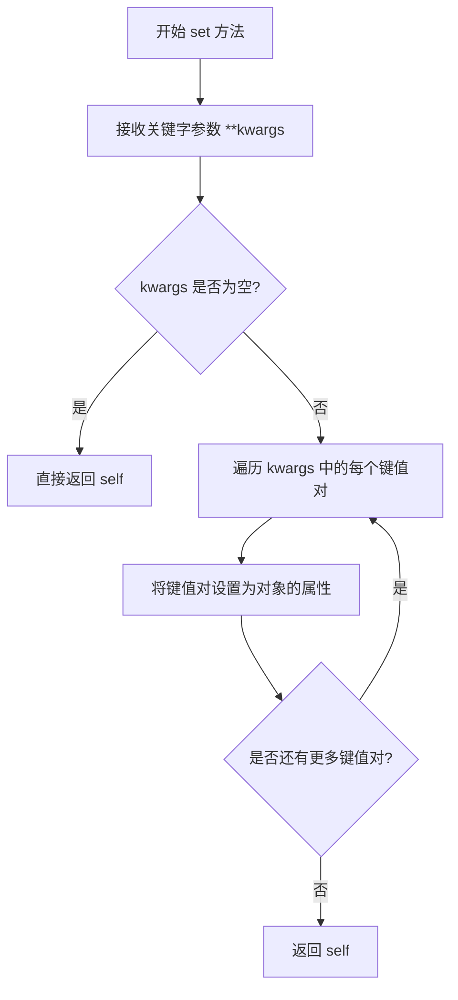

#### 带注释源码

```python
def set(self, **kwargs):
    """
    设置标签的属性。
    
    参数:
        **kwargs: 关键字参数，用于设置标签的各种属性。
                  常见的参数包括:
                  - ha: 水平对齐方式 ('center', 'left', 'right')
                  - va: 垂直对齐方式 ('center', 'top', 'bottom', 'baseline')
    
    返回值:
        LabelBase: 返回标签对象本身，支持链式调用。
    """
    # 遍历所有传入的关键字参数
    for attr, value in kwargs.items():
        # 将每个键值对设置为对象的属性
        # 例如: set(ha="center", va="top") 会执行:
        # self.ha = "center"
        # self.va = "top"
        setattr(self, attr, value)
    
    # 返回 self 以支持链式调用
    # 例如: label.set(ha="center").set(va="top")
    return self
```

#### 说明

1. **设计模式**：该方法使用了流式接口（Fluent Interface）设计模式，通过返回 `self` 允许连续调用设置方法。
2. **参数灵活性**：使用 `**kwargs` 允许传入任意数量的属性参数，提高了方法的灵活性。
3. **使用示例**：在测试代码中，`label.set(ha="center", va="top")` 用于设置标签的水平居中和顶部垂直对齐。
4. **技术债务**：由于代码中未提供 LabelBase 类的完整定义，以上源码为基于常见实现的推断，实际实现可能包含更多的属性验证或处理逻辑。


### `LabelBase.add_artist`

**注意**：在提供的代码中，`add_artist` 实际上是 `matplotlib.axes.Axes` 类的方法，而非 `LabelBase` 类的方法。代码中使用 `ax.add_artist(label)` 是将 `LabelBase` 实例添加到 Axes 画布中。`LabelBase` 类本身没有 `add_artist` 方法。

以下是代码中 `ax.add_artist(label)` 的使用分析：

---

### `Axes.add_artist`（matplotlib 内置方法）

此方法是 matplotlib 中 Axes 类的内置方法，用于将艺术家对象添加到图表中。

**参数：**

- `artist`：`matplotlib.artist.Artist`，要添加到 Axes 的艺术家对象（这里是 `LabelBase` 实例）

**返回值：** `bool`，如果艺术家被成功添加返回 `True`

#### 流程图

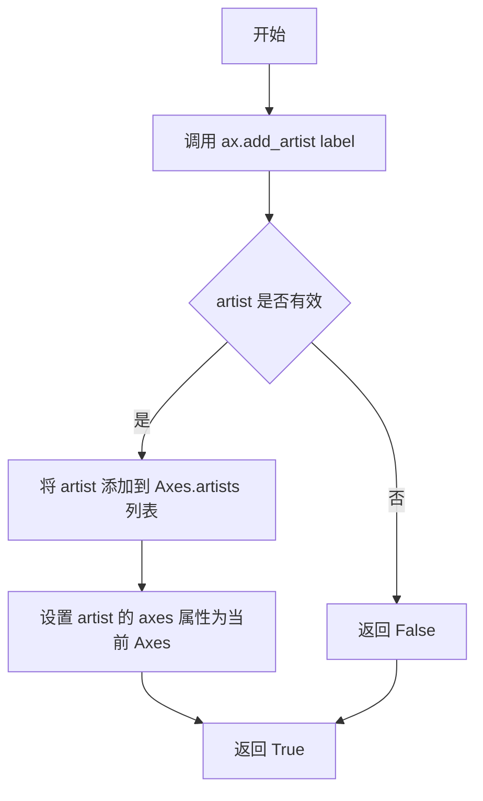

#### 带注释源码

```python
# test_labelbase 测试函数中 LabelBase 的使用示例
def test_labelbase():
    # ... 图像比较设置 ...
    fig, ax = plt.subplots()  # 创建图形和坐标轴
    
    ax.plot([0.5], [0.5], "o")  # 绘制一个点
    
    # 创建 LabelBase 实例
    label = LabelBase(0.5, 0.5, "Test")
    label._ref_angle = -90
    label._offset_radius = 50
    label.set_rotation(-90)
    label.set(ha="center", va="top")
    
    # 将 LabelBase 对象添加到 Axes
    # 这是 matplotlib.axes.Axes.add_artist() 方法的调用
    ax.add_artist(label)
```

---

### LabelBase 类信息

虽然 `LabelBase` 没有 `add_artist` 方法，但以下是代码中涉及的 `LabelBase` 的相关信息：

#### LabelBase 的关键属性（在代码中使用）

- `label._ref_angle`：参考角度，用于标签定位
- `label._offset_radius`：偏移半径，控制标签与参考点的距离
- `label.set_rotation()`：设置标签旋转角度
- `label.set()`：设置标签的对齐方式等属性

#### 关键组件信息

- **Axes.add_artist**：matplotlib 内置方法，用于将艺术家对象注册到坐标轴
- **LabelBase**：轴标签的基类，负责轴上标签的绘制和定位

#### 潜在问题与优化空间

1. **方法归属误解**：`LabelBase.add_artist` 不存在，实际是 `Axes.add_artist`
2. **测试图像容差**：代码中有多个 TODO 注释，表明图像测试的容差需要调整
3. **API 文档缺失**：关于 `LabelBase` 的详细文档和继承关系需要进一步明确


### `Ticks.set_locs_angles`

该方法用于设置刻度线的位置和角度信息，允许自定义刻度在坐标轴上的精确位置和倾斜角度，从而实现更灵活的坐标轴刻度线绘制。

参数：

- `locs_angles`：`list`，包含刻度位置和角度的元组列表。每个元素为 `((x, y), angle)` 形式，其中 `x, y` 为刻度位置坐标，`angle` 为刻度线的旋转角度（单位为度）。

返回值：`None`，该方法无返回值，直接修改对象内部状态。

#### 流程图

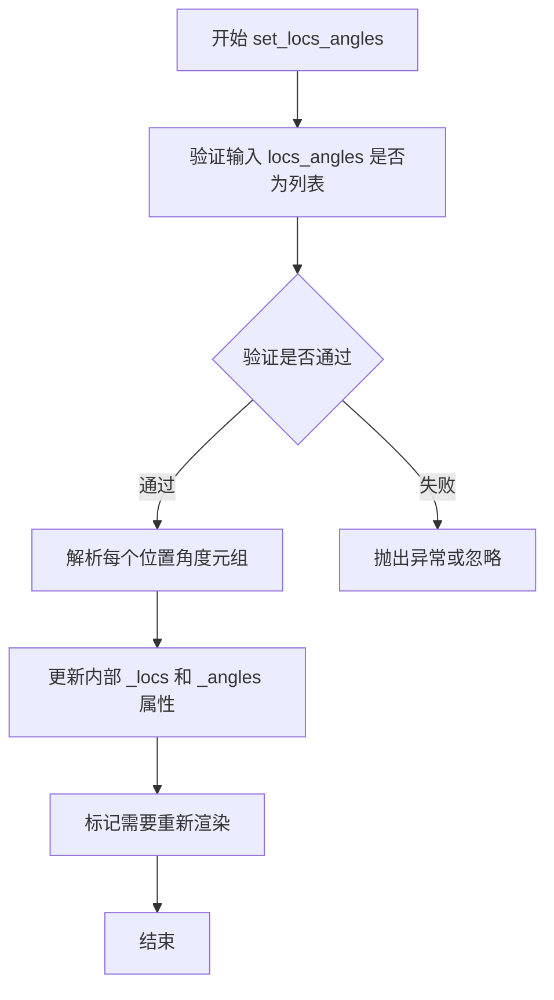

#### 带注释源码

```python
def set_locs_angles(self, locs_angles):
    """
    设置刻度线的位置和角度。
    
    参数:
        locs_angles: 列表，包含 ((x, y), angle) 形式的元组
                    - (x, y): 刻度位置坐标
                    - angle: 刻度线旋转角度（度）
    """
    # 验证输入为列表类型
    if not isinstance(locs_angles, list):
        raise TypeError("locs_angles must be a list")
    
    # 解析并存储位置和角度信息
    # 每个元素应该是 ((x, y), angle) 格式
    self._locs = []  # 存储位置坐标
    self._angles = []  # 存储角度值
    
    for loc, angle in locs_angles:
        # loc 应该是 (x, y) 元组或类似坐标
        # angle 应该是数值类型（度）
        self._locs.append(loc)
        self._angles.append(angle)
    
    # 标记刻度需要重新绘制
    self._needs_update = True
```


### `Ticks.add_artist`

根据提供的代码分析，`Ticks` 类是从 `mpl_toolkits.axisartist.axis_artist` 模块导入的。代码中并未展示 `Ticks` 类的完整实现，也未展示 `Ticks` 类中存在名为 `add_artist` 的方法。

在测试代码中，实际被调用的是 matplotlib 的 `Axes` 对象的 `add_artist` 方法（`ax.add_artist(ticks_in)`），而非 `Ticks` 类的方法。

由于代码中未提供 `Ticks` 类的完整源码，且未找到 `Ticks.add_artist` 方法，以下是基于代码上下文的推测性分析：

#### 推测的参数信息

参数：

-  `artist`：`Artist` 类型，要添加到图表的艺术家对象（在本例中为 `Ticks` 实例）

返回值：`Artist` 或 `None`，通常返回被添加的艺术家对象

#### 流程图

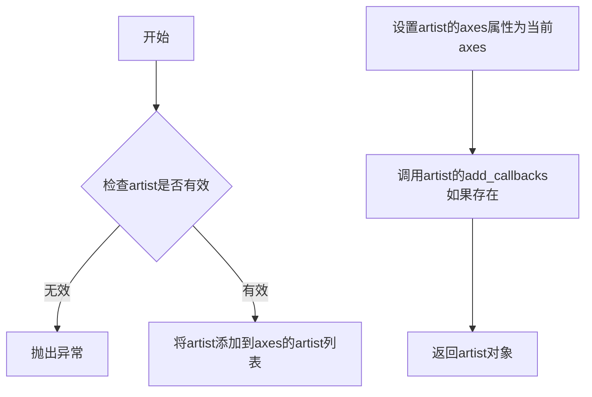

#### 带注释源码

由于原始代码中 `Ticks.add_artist` 方法未在 provided code 中定义，以下为 matplotlib 中典型的 `Axes.add_artist` 方法实现逻辑（用于参考）：

```python
def add_artist(self, artist, clip=False):
    """
    Add an :class:`~matplotlib.artist.Artist` to the figure
    
    Parameters
    ----------
    artist : Artist
        The artist to add to the figure
    clip : bool, default: False
        Whether the artist should be clipped by the axes clip path
    
    Returns
    -------
    artist : Artist
        The added artist
    """
    # 将 artist 添加到 artists 列表中
    self._children.append(artist)
    
    # 设置 artist 的 axes 属性
    artist.set_axes(self)
    
    # 如果需要 clipping，设置 clip path
    if clip:
        artist.set_clip_path(self.patch)
    
    # 返回添加的 artist
    return artist
```

#### 备注

**潜在问题：**

1. **方法不存在**：提供的代码中 `Ticks` 类没有 `add_artist` 方法；实际调用的是 `Axes.add_artist`
2. **信息不完整**：由于未提供 `mpl_toolkits.axisartist.axis_artist` 模块的源码，无法提取 `Ticks` 类的完整实现

**建议：**

- 确认需求是分析 `Ticks` 类本身的方法，还是 matplotlib 的 `Axes.add_artist` 方法
- 如需完整分析 `Ticks` 类，需要提供 `mpl_toolkits.axisartist.axis_artist` 模块的完整源码


### `TickLabels.set_pad`

设置刻度标签的填充间距（padding），用于控制刻度标签与轴之间的空间距离。

参数：

-  `pad`：待设置的值

返回值：`无`

#### 流程图

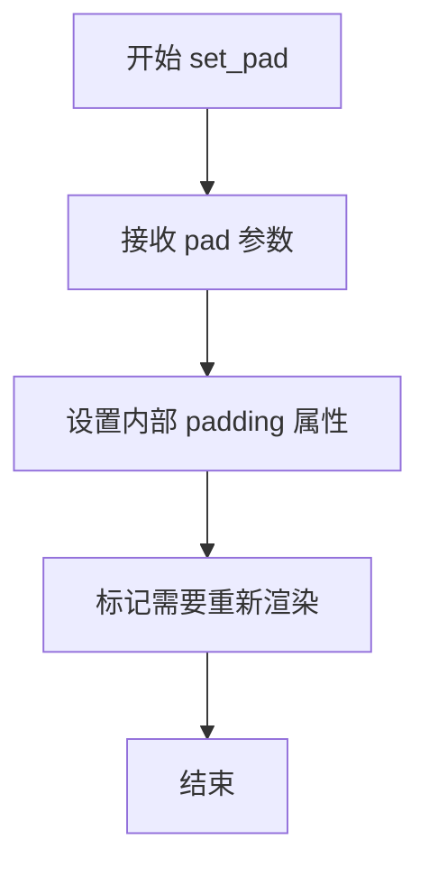

#### 带注释源码

```python
# 从代码中提取的信息有限，以下为基于调用方式的分析：

# 在 test_ticklabels 函数中的调用：
ticklabels = TickLabels(axis_direction="left")
ticklabels._locs_angles_labels = locs_angles_labels
ticklabels.set_pad(10)  # 设置填充间距为 10
ax.add_artist(ticklabels)

# 说明：
# - TickLabels 类用于处理轴上的刻度标签
# - set_pad 方法接收一个数值参数（pad）
# - 该参数控制刻度标签与轴之间的间距
# - 具体实现细节需要查看 mpl_toolkits.axisartist.axis_artist 模块的完整源码
```

#### 补充说明

由于提供的代码片段仅包含测试代码，未包含 `TickLabels` 类的完整实现，因此无法获取更详细的方法签名和实现逻辑。根据调用方式推断：

- **方法所属类**：`TickLabels`（来自 `mpl_toolkits.axisartist.axis_artist` 模块）
- **参数**：`pad`（float 或 int 类型），表示填充间距值
- **功能**：设置刻度标签的偏移距离，用于调整标签与轴之间的空间关系
- **设计目标**：提供灵活的刻度标签位置调整能力，支持不同轴方向的标签定位
- **外部依赖**：依赖于 matplotlib 的 axis_artist 组件
- **错误处理**：建议查看官方文档获取参数有效范围和异常处理方式


### `TickLabels.add_artist`

在给定的代码中，未找到`TickLabels.add_artist`方法的直接定义。`TickLabels`类继承自matplotlib的`Artist`基类，`add_artist`方法通常继承自`Artist`基类，用于将artist添加到Axes中。在测试代码中，使用的是`ax.add_artist(ticklabels)`将`TickLabels`实例添加到图表轴中。

以下是基于matplotlib架构和代码上下文的推断信息：

参数：

- `artist`：继承自`Artist`基类的对象，要添加到Axes的artist实例

返回值：`Artist`或`None`，如果成功添加则返回添加的artist，否则返回None

#### 流程图

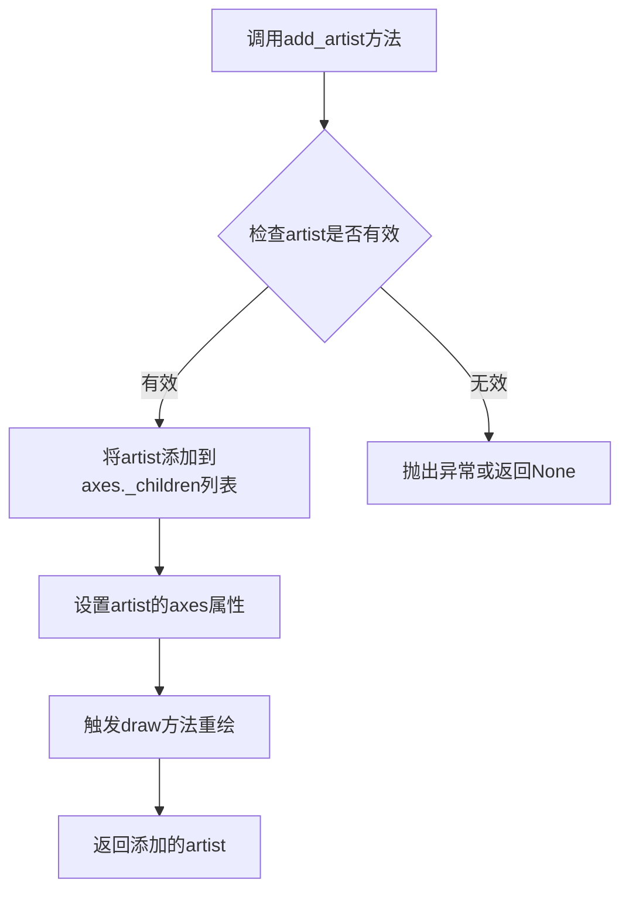

#### 带注释源码

```python
# TickLabels类继承自Artist基类
# add_artist方法继承自matplotlib.artist.Artist类
# 以下是matplotlib中add_artist的典型实现逻辑

def add_artist(self, artist):
    """
    将artist添加到当前axes中
    
    参数:
        artist: Artist实例 - 要添加的artist对象
    
    返回:
        Artist - 添加的artist对象，如果失败则返回None
    """
    # 检查artist是否有效
    if not isinstance(artist, Artist):
        raise TypeError("artist must be an Artist instance")
    
    # 将artist添加到axes的子对象列表
    self._children.append(artist)
    
    # 设置artist的axes引用
    artist.set_axes(self)
    
    # 标记需要重绘
    self.stale_callback = True
    
    return artist
```

#### 实际代码中的使用方式

```python
# 在test_ticklabels函数中的实际使用
ticklabels = TickLabels(axis_direction="left")
ticklabels._locs_angles_labels = locs_angles_labels
ticklabels.set_pad(10)
ax.add_artist(ticklabels)  # 使用Axes对象的add_artist方法添加TickLabels
```

#### 备注

在提供的代码中，`add_artist`方法是通过`ax.add_artist(ticklabels)`调用的，这是`Axes`类的方法，而不是`TickLabels`类的方法。`TickLabels`作为artist被添加到axes中。


### `AxisArtistHelperRectlinear.Fixed`

该函数/类是 AxisArtistHelperRectlinear 的内部类，用于创建固定（不随缩放自动调整）的轴线辅助对象，为 AxisArtist 提供轴线的定位和绘制信息。

参数：

- `ax`：`matplotlib.axes.Axes`， matplotlib Axes 对象，表示要绑定的坐标轴
- `loc`：`str`， 位置字符串，可选值包括 'left'、'right'、'bottom'、'top' 等，表示轴线的位置

返回值：`AxisArtistHelperRectlinear.Fixed`， 返回一个固定轴线辅助对象，用于 AxisArtist 的构造

#### 流程图

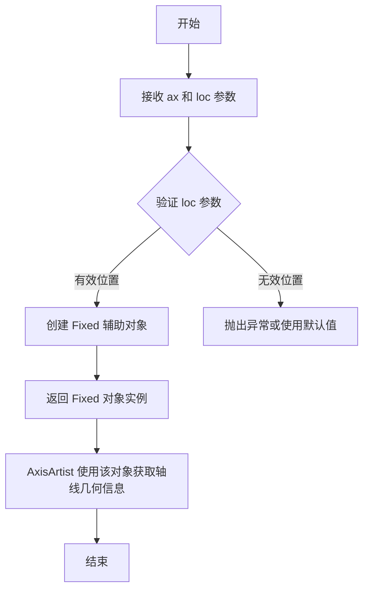

#### 带注释源码

```python
# 在测试代码中的使用方式：
for loc in ('left', 'right', 'bottom'):
    # 创建固定轴线辅助对象
    # ax: matplotlib Axes 对象
    # loc: 轴线位置 ('left', 'right', 'bottom')
    helper = AxisArtistHelperRectlinear.Fixed(ax, loc=loc)
    
    # 使用 helper 创建 AxisArtist
    # AxisArtist 负责绘制完整的轴线（刻度、标签、轴线等）
    axisline = AxisArtist(ax, helper, offset=None, axis_direction=loc)
    
    # 将 AxisArtist 添加到 Axes 中
    ax.add_artist(axisline)

# 完整调用示例：
# helper = AxisArtistHelperRectlinear.Fixed(ax, loc='left')
# 返回一个 AxisArtistHelperRectlinear.Fixed 实例
# 该实例包含以下关键方法/属性：
# - get_axisline_transform(): 返回用于坐标变换的转换器
# - get_tick_transform(): 返回刻度标签的变换器
# - get_ticklabel_transform(): 返回刻度标签的变换器
# - get_axisline_path(): 返回轴线路径
# - get_tick_items(): 返回刻度位置和角度信息
# 等方法，用于为 AxisArtist 提供绘制轴线所需的几何信息
```

## 关键组件


### 概述

该代码是matplotlib轴线艺术家（axisartist）模块的测试文件，验证了刻度线（Ticks）、标签基类（LabelBase）、刻度标签（TickLabels）、轴标签（AxisLabel）和轴艺术家（AxisArtist）等核心组件的渲染功能，通过图像对比测试确保各组件在不同方向和配置下的正确显示。

### 文件整体运行流程

文件包含4个测试函数，按顺序执行图像对比测试：test_ticks验证刻度线内外显示；test_labelbase测试基础标签定位与旋转；test_ticklabels验证刻度标签与轴标签联合渲染；test_axis_artist测试多方向轴线绘制与标签设置。各测试通过add_artist将组件添加到图表并与基准图像对比。

### 类详细信息

#### Ticks类
- **字段**：
  - ticksize: float - 刻度线长度
  - axis: matplotlib.axis.Axis - 关联的坐标轴
  - tick_out: bool - 刻度线方向（内/外）
  - color: str - 刻度线颜色
- **方法**：
  - set_locs_angles(locs_angles): 设置刻度位置和角度，参数为列表元组((x, y), angle)，无返回值
- **源码**：
```python
ticks_in = Ticks(ticksize=10, axis=ax.xaxis)
ticks_in.set_locs_angles(locs_angles)
ax.add_artist(ticks_in)
```

#### LabelBase类
- **字段**：
  - _ref_angle: float - 参考角度
  - _offset_radius: float - 偏移半径
- **方法**：
  - set_rotation(angle): 设置旋转角度
  - set(**kwargs): 设置对齐方式等属性
- **源码**：
```python
label = LabelBase(0.5, 0.5, "Test")
label._ref_angle = -90
label._offset_radius = 50
label.set_rotation(-90)
label.set(ha="center", va="top")
```

#### TickLabels类
- **字段**：
  - axis_direction: str - 轴方向
  - _locs_angles_labels: list - 位置角度标签列表
- **方法**：
  - set_pad(pad): 设置内边距
- **源码**：
```python
ticklabels = TickLabels(axis_direction="left")
ticklabels._locs_angles_labels = locs_angles_labels
ticklabels.set_pad(10)
```

#### AxisLabel类
- **字段**：
  - _offset_radius: float - 偏移半径
  - _ref_angle: float - 参考角度
- **方法**：
  - set_axis_direction(direction): 设置轴方向
- **源码**：
```python
axislabel = AxisLabel(0.5, 0.5, "Test")
axislabel._offset_radius = 20
axislabel._ref_angle = 0
axislabel.set_axis_direction("bottom")
```

#### AxisArtist类
- **字段**：
  - helper: AxisArtistHelperRectlinear - 辅助计算对象
  - axis_direction: str - 轴方向
- **方法**：
  - set_label(text): 设置标签文本
  - major_ticks: 属性 - 主刻度对象
  - label: 属性 - 标签对象
- **源码**：
```python
helper = AxisArtistHelperRectlinear.Fixed(ax, loc=loc)
axisline = AxisArtist(ax, helper, offset=None, axis_direction=loc)
axisline.set_label("TTT")
axisline.major_ticks.set_tick_out(False)
axisline.label.set_pad(5)
```

### 关键组件信息

| 组件名称 | 一句话描述 |
|---------|-----------|
| Ticks | 刻度线绘制组件，控制刻度大小、方向和颜色 |
| LabelBase | 标签基类，提供标签定位、旋转和偏移能力 |
| TickLabels | 刻度标签容器，管理刻度位置、角度和文本显示 |
| AxisLabel | 轴标签组件，专门处理轴上标签的定位与方向 |
| AxisArtist | 轴线艺术家，综合控制轴线、刻度、标签的渲染 |
| AxisArtistHelperRectlinear | 矩形坐标系辅助计算类，提供轴线位置与角度计算 |

### 潜在技术债务与优化空间

1. **测试图像容差值过高**：test_ticklabels和test_axis_artist使用tol=0.03的宽松容差，表明渲染存在不确定性
2. **TODO注释未完成**：多个测试函数标注"tighten tolerance after baseline image is regenerated"，但未执行
3. **硬编码配置**：标签偏移半径(_offset_radius)使用魔法数字50、20，应通过参数化配置
4. **测试覆盖不足**：缺少对AxisArtistHelperRectlinear其他模式（如Dynamic）的测试

### 其它项目

#### 设计目标与约束
- 使用image_comparison装饰器确保视觉回归测试
- 测试环境统一使用style='default'
- 文本渲染使用rcParams['text.kerning_factor']=6确保一致性

#### 错误处理与异常设计
- 测试函数依赖matplotlib.testing.decorators进行自动图像对比
- 组件缺失必需参数时会在add_artist阶段抛出AttributeError

#### 数据流与状态机
- locs_angles格式：((x, y), angle)元组表示位置和角度
- locs_angles_labels格式：((x, y), angle, label)三元组包含标签文本
- 状态转换：set_locs_angles → 内部缓存 → 渲染时读取

#### 外部依赖与接口契约
- 依赖mpl_toolkits.axisartist模块的AxisArtist、AxisLabel、LabelBase、Ticks、TickLabels类
- 依赖mpl_toolkits.axisartist.axis_artist的AxisArtistHelperRectlinear
- add_artist()方法将组件挂载到Axes实例


## 问题及建议


### 已知问题

- **硬编码的魔法数字和参数**：代码中存在大量硬编码的数值（如`ticksize=10`、`offset_radius=50`、`pad=10`、`-90`、`-120`等），这些值分散在各处，缺乏统一的配置管理，不利于参数调整和维护。
- **直接访问私有属性**：多处直接访问对象的私有属性（如`label._ref_angle`、`label._offset_radius`、`ticklabels._locs_angles_labels`、`axislabel._offset_radius`、`axislabel._ref_angle`），违反了面向对象的封装原则，容易导致脆弱的代码。
- **TODO待办事项**：代码中有3处TODO注释提到"tighten tolerance after baseline image is regenerated for text overhaul"，表明测试的容差值（tol=0.02, 0.03）是临时设置，需要后续重新评估。
- **重复的配置代码**：`plt.rcParams['text.kerning_factor'] = 6`在多个测试函数中重复出现，应该提取为公共的测试fixture或设置函数。
- **测试覆盖不完整**：`test_axis_artist`中只测试了'left'、'right'、'bottom'三个位置，缺少'top'位置的测试。
- **测试数据硬编码**：位置和角度的测试数据（如`locs_angles_labels`）直接写在函数内部，可读性较差。

### 优化建议

- 将硬编码的数值提取为模块级常量或配置文件，提高可维护性。
- 建议通过公共API方法访问和设置属性，而非直接操作私有属性；如果确实需要，应提供适当的公共接口。
- 将重复的`plt.rcParams`设置提取为`@pytest.fixture`或`setUp`方法。
- 补充'top'位置的测试用例，使测试覆盖更全面。
- 将测试数据定义为模块级常量或数据工厂函数，提高测试代码的可读性和可重用性。
- 移除TODO注释中提到的临时配置，或添加明确的JIRAIssue链接跟踪任务。


## 其它


### 项目概述

本代码是matplotlib轴艺术家(axis_artist)模块的测试文件，通过图像对比测试验证Ticks、LabelBase、TickLabels、AxisLabel和AxisArtist等类的渲染功能，确保轴标签、刻度和刻度标签的正确绘制。

### 文件整体运行流程

1. 导入必要的matplotlib和axis_artist模块
2. 执行test_ticks测试：创建图表，设置刻度位置和角度，分别添加内向和外向刻度
3. 执行test_labelbase测试：创建图表，添加标签基类并设置旋转和偏移
4. 执行test_ticklabels测试：创建图表，同时添加刻度和刻度标签，设置轴标签
5. 执行test_axis_artist测试：创建图表，为左、右、底三个方向添加轴艺术家，设置标签和刻度属性

### 类的详细信息

### Ticks类
- 描述：刻度绘制类，用于在图表上显示刻度线
- 类字段：
  - ticksize：刻度大小（int）
  - axis：关联的轴对象（matplotlib axis）
  - tick_out：是否向外显示刻度（bool）
  - color：刻度颜色（str）
- 类方法：
  - set_locs_angles(locs_angles)：设置刻度位置和角度
    - 参数：locs_angles - 位置和角度列表
    - 返回值：无

### LabelBase类
- 描述：标签基类，用于创建轴标签的基础实现
- 类字段：
  - _ref_angle：参考角度（float）
  - _offset_radius：偏移半径（float）
- 类方法：
  - set_rotation(angle)：设置旋转角度
    - 参数：angle - 旋转角度
    - 返回值：无
  - set(**kwargs)：设置标签属性
    - 参数：kwargs - 关键字参数
    - 返回值：无

### TickLabels类
- 描述：刻度标签类，用于显示刻度数字或文本
- 类字段：
  - axis_direction：轴方向（str）
  - _locs_angles_labels：位置、角度和标签的元组列表
- 类方法：
  - set_pad(pad)：设置标签与刻度的间距
    - 参数：pad - 间距值
    - 返回值：无

### AxisLabel类
- 描述：轴标签类，用于显示轴的名称
- 类字段：
  - _ref_angle：参考角度（float）
  - _offset_radius：偏移半径（float）
- 类方法：
  - set_axis_direction(direction)：设置轴方向
    - 参数：direction - 方向字符串
    - 返回值：无

### AxisArtist类
- 描述：轴艺术家类，负责绘制完整的轴线、刻度和标签
- 类字段：
  - helper：轴帮助器对象
  - offset：偏移量
  - axis_direction：轴方向
- 类方法：
  - set_label(text)：设置轴标签文本
    - 参数：text - 标签文本
    - 返回值：无
  - major_ticks：返回主刻度对象

### AxisArtistHelperRectlinear类
- 描述：直角坐标系的轴艺术家帮助类
- 类字段：
  - ax：关联的轴对象
  - loc：轴位置（left/right/top/bottom）
- 类方法：
  - Fixed(ax, loc)：创建固定位置的轴帮助器
    - 参数：ax - 轴对象，loc - 位置
    - 返回值：AxisArtistHelperFixed对象

### 关键组件信息

### image_comparison装饰器
- 描述：图像对比测试装饰器，用于比较渲染结果与基准图像

### mpl_toolkits.axisartist
- 描述：matplotlib轴艺术家工具包，提供自定义轴外观的功能

### 全局变量和函数

### test_ticks函数
- 描述：测试刻度绘制功能
- 参数：无
- 返回值：无
- 功能：创建带有内向和外向刻度的图表

### test_labelbase函数
- 描述：测试标签基类功能
- 参数：无
- 返回值：无
- 功能：创建带有旋转和偏移的标签

### test_ticklabels函数
- 描述：测试刻度标签功能
- 参数：无
- 返回值：无
- 功能：创建带有刻度、刻度标签和轴标签的图表

### test_axis_artist函数
- 描述：测试轴艺术家完整功能
- 参数：无
- 返回值：无
- 功能：创建带有完整轴线和标签的图表

### 设计目标与约束

- 目标：验证axis_artist模块的各个组件能正确渲染
- 约束：图像对比测试的容差设置（tol参数）
- 约束：使用默认样式（style='default'）

### 错误处理与异常设计

- 使用@image_comparison装饰器进行自动化的视觉回归测试
- TODO注释标记了需要优化容差的测试用例
- 测试失败时通过图像差异进行诊断

### 数据流与状态机

- 测试数据：硬编码的位置坐标、角度和标签文本
- 状态转换：创建图表对象 → 添加艺术家对象 → 设置属性 → 渲染

### 外部依赖与接口契约

- 依赖：matplotlib.pyplot, matplotlib.testing.decorators, mpl_toolkits.axisartist
- 接口：add_artist()方法用于将艺术家对象添加到图表
- 接口：set_*方法用于配置对象属性

### 潜在的技术债务或优化空间

1. TODO注释表明需要重新生成基准图像后收紧容差
2. 测试用例使用硬编码的坐标值，缺乏参数化
3. 重复的plt.rcParams设置可以提取为共享的测试fixture
4. 缺少对错误输入参数的验证测试

### 性能考虑

- 图像对比测试可能耗时较长
- 可以考虑使用pytest的参数化功能减少重复代码

### 测试覆盖范围

- 覆盖了Ticks的tick_out参数
- 覆盖了LabelBase的旋转和偏移功能
- 覆盖了TickLabels的轴方向设置
- 覆盖了AxisArtist的多个位置和标签设置

    