# `matplotlib\lib\mpl_toolkits\axisartist\tests\test_axislines.py` 详细设计文档

这是一个matplotlib的axisartist模块测试文件，通过图像比较测试验证SubplotZero、Subplot、Axes、ParasiteAxes等轴相关类的功能，包括轴线样式设置、零轴显示、辅助坐标轴等功能。

## 整体流程

```mermaid
graph TD
    A[开始] --> B[导入所需模块和类]
    B --> C{执行测试函数}
    C --> D[test_SubplotZero]
    C --> E[test_Subplot]
    C --> F[test_Axes]
    C --> G[test_ParasiteAxesAuxTrans]
    C --> H[test_axisline_style]
    C --> I[test_axisline_style_size_color]
    C --> J[test_axisline_style_tight]
    C --> K[test_subplotzero_ylabel]
    D --> L[创建Figure和SubplotZero]
    L --> M[设置xzero轴可见并添加标签]
    M --> N[隐藏top和right轴]
    N --> O[绘制sin函数曲线]
    O --> P[图像比较验证]
    E --> Q[创建Figure和Subplot]
    Q --> R[设置tick方向和轴标签]
    R --> P
    F --> S[创建Figure和Axes]
    S --> T[设置对数刻度并绘制]
    T --> P
    G --> U[创建SubplotHost和辅助坐标轴]
    U --> V[测试pcolor/pcolormesh/contourf]
    V --> P
    H --> W[设置轴线样式-|>]
    W --> P
    I --> X[设置轴线样式带尺寸和颜色]
    X --> P
    J --> Y[使用tight布局设置轴线样式]
    Y --> P
    K --> Z[同时设置xzero和yzero轴]
    Z --> P
```

## 类结构

```
Test Functions (测试函数集)
├── test_SubplotZero
├── test_Subplot
├── test_Axes
├── test_ParasiteAxesAuxTrans
├── test_axisline_style
├── test_axisline_style_size_color
├── test_axisline_style_tight
└── test_subplotzero_ylabel
```

## 全局变量及字段


### `np`
    
NumPy library imported as np for numerical operations

类型：`module`
    


### `plt`
    
Matplotlib.pyplot module imported as plt for plotting

类型：`module`
    


### `IdentityTransform`
    
Matplotlib transform class that returns input unchanged, used for auxiliary axes

类型：`class`
    


### `AxesZero`
    
Axes subclass from axisartist that supports zero-axis lines

类型：`class`
    


### `SubplotZero`
    
Subplot subclass with support for zero-position axes

类型：`class`
    


### `Subplot`
    
Subplot class from axisartist for creating subplots with custom axis styling

类型：`class`
    


### `Axes`
    
Axes class from axisartist for creating custom axes

类型：`class`
    


### `SubplotHost`
    
Subplot class that can host auxiliary axes for data plotting

类型：`class`
    


### `test_SubplotZero.fig`
    
Matplotlib Figure object for the subplot

类型：`matplotlib.figure.Figure`
    


### `test_SubplotZero.ax`
    
SubplotZero axis object with zero-axis support

类型：`SubplotZero`
    


### `test_SubplotZero.xx`
    
Array of x values from 0 to 2*pi for plotting

类型：`numpy.ndarray`
    


### `test_Subplot.fig`
    
Matplotlib Figure object for the subplot

类型：`matplotlib.figure.Figure`
    


### `test_Subplot.ax`
    
Subplot axis object for testing tick and label configurations

类型：`Subplot`
    


### `test_Subplot.xx`
    
Array of x values from 0 to 2*pi for plotting

类型：`numpy.ndarray`
    


### `test_Axes.fig`
    
Matplotlib Figure object for the axes

类型：`matplotlib.figure.Figure`
    


### `test_Axes.ax`
    
Custom Axes object with specific positioning [0.15, 0.1, 0.65, 0.8]

类型：`Axes`
    


### `test_ParasiteAxesAuxTrans.data`
    
6x6 array of ones with modified values for mesh plot testing

类型：`numpy.ndarray`
    


### `test_ParasiteAxesAuxTrans.x`
    
Array of integers from 0 to 5 for x coordinates

类型：`numpy.ndarray`
    


### `test_ParasiteAxesAuxTrans.y`
    
Array of integers from 0 to 5 for y coordinates

类型：`numpy.ndarray`
    


### `test_ParasiteAxesAuxTrans.xx`
    
Meshgrid array for x coordinates

类型：`numpy.ndarray`
    


### `test_ParasiteAxesAuxTrans.yy`
    
Meshgrid array for y coordinates

类型：`numpy.ndarray`
    


### `test_ParasiteAxesAuxTrans.funcnames`
    
List of plotting function names ['pcolor', 'pcolormesh', 'contourf'] to test

类型：`list`
    


### `test_ParasiteAxesAuxTrans.fig`
    
Matplotlib Figure object for the parasite axes test

类型：`matplotlib.figure.Figure`
    


### `test_ParasiteAxesAuxTrans.i`
    
Loop counter for subplot position index

类型：`int`
    


### `test_ParasiteAxesAuxTrans.name`
    
Current plotting function name from funcnames list

类型：`str`
    


### `test_ParasiteAxesAuxTrans.ax1`
    
Main subplot host that contains the auxiliary axes

类型：`SubplotHost`
    


### `test_ParasiteAxesAuxTrans.ax2`
    
Auxiliary axes obtained from host for additional plotting

类型：`Axes`
    


### `test_axisline_style.fig`
    
Matplotlib Figure object with 2x2 inch size

类型：`matplotlib.figure.Figure`
    


### `test_axisline_style.ax`
    
AxesZero object for testing axisline style arrows

类型：`AxesZero`
    


### `test_axisline_style_size_color.fig`
    
Matplotlib Figure object with 2x2 inch size

类型：`matplotlib.figure.Figure`
    


### `test_axisline_style_size_color.ax`
    
AxesZero object for testing axisline style with size and color

类型：`AxesZero`
    


### `test_axisline_style_tight.fig`
    
Matplotlib Figure object with tight layout

类型：`matplotlib.figure.Figure`
    


### `test_axisline_style_tight.ax`
    
AxesZero object for testing axisline style with tight layout

类型：`AxesZero`
    


### `test_subplotzero_ylabel.fig`
    
Matplotlib Figure object for subplot zero ylabel test

类型：`matplotlib.figure.Figure`
    


### `test_subplotzero_ylabel.ax`
    
SubplotZero axis for testing zero axis and ylabel

类型：`SubplotZero`
    


### `test_subplotzero_ylabel.zero_axis`
    
Combined xzero and yzero axis for visibility and styling

类型：`axisartist.axis_artist.LineAxisLabel or similar`
    
    

## 全局函数及方法


### `test_SubplotZero`

该测试函数用于验证`SubplotZero`子图类的功能，通过创建一个带有可见零坐标轴（xzero）的子图并绘制正弦曲线，来测试轴线隐藏、标签设置以及基本绘图功能。

参数： 无

返回值： 无（`None`），该函数为测试函数，不返回任何值

#### 流程图

```mermaid
flowchart TD
    A[开始执行 test_SubplotZero] --> B[设置 rcParams['text.kerning_factor'] = 6]
    B --> C[创建 plt.figure 实例]
    C --> D[创建 SubplotZero 对象 ax = SubplotZerofig, 1, 1, 1]
    D --> E[将 ax 添加到 figure: fig.add_subplotax]
    E --> F[设置 xzero 轴可见: ax.axis['xzero'].set_visibleTrue]
    F --> G[设置 xzero 轴标签: 'Axis Zero']
    G --> H[隐藏 top 和 right 轴]
    H --> I[生成数据: xx = np.arange0, 2*np.pi, 0.01]
    I --> J[绘制正弦曲线: ax.plotxx, np.sinxx]
    J --> K[设置 y 轴标签: 'Test']
    K --> L[结束 - 图像对比测试]
```

#### 带注释源码

```python
# TODO: tighten tolerance after baseline image is regenerated for text overhaul
# 图像对比装饰器，指定基准图像文件名、样式和容差
@image_comparison(['SubplotZero.png'], style='default', tol=0.02)
def test_SubplotZero():
    """
    测试 SubplotZero 类的基本功能
    创建带有零坐标轴的子图并验证绘图功能
    """
    # Remove this line when this test image is regenerated.
    # 设置文本字距调整因子（临时修复，与文本重塑相关）
    plt.rcParams['text.kerning_factor'] = 6

    # 步骤1: 创建一个新的图形对象
    fig = plt.figure()

    # 步骤2: 创建 SubplotZero 子图
    # 参数说明: (fig, 1, 1, 1) 表示1行1列第1个位置的子图
    ax = SubplotZero(fig, 1, 1, 1)
    
    # 步骤3: 将子图添加到图形中
    fig.add_subplot(ax)

    # 步骤4: 设置 xzero 轴（原点轴）可见
    ax.axis["xzero"].set_visible(True)
    # 设置 xzero 轴的标签文本
    ax.axis["xzero"].label.set_text("Axis Zero")

    # 步骤5: 隐藏不需要的轴线（上和右）
    for n in ["top", "right"]:
        ax.axis[n].set_visible(False)

    # 步骤6: 生成测试数据 - 从0到2π的sin曲线数据
    xx = np.arange(0, 2 * np.pi, 0.01)
    
    # 步骤7: 绘制正弦曲线
    ax.plot(xx, np.sin(xx))
    
    # 步骤8: 设置 y 轴标签
    ax.set_ylabel("Test")
```


### `test_Subplot`

`test_Subplot` 是一个图像对比测试函数，用于验证 matplotlib 的 `Subplot` 类的绘图功能是否正常工作，包括创建子图、绑制正弦曲线、设置轴标签和刻度样式等。

参数： 无

返回值： `None`，测试函数不返回任何值，仅通过图像对比验证功能

#### 流程图

```mermaid
flowchart TD
    A[开始测试] --> B[设置rcParams text.kerning_factor=6]
    B --> C[创建新的Figure对象]
    C --> D[创建Subplot对象 ax = Subplot(fig, 1, 1, 1)]
    D --> E[将Subplot添加到Figure]
    E --> F[生成数据: xx = np.arange(0, 2*np.pi, 0.01)]
    F --> G[绑制sin曲线: ax.plot(xx, np.sin(xx))]
    G --> H[设置Y轴标签: ax.set_ylabel('Test')]
    H --> I[设置top轴刻度向外: ax.axis['top'].major_ticks.set_tick_out]
    I --> J[设置bottom轴刻度向外: ax.axis['bottom'].major_ticks.set_tick_out]
    J --> K[设置bottom轴标签: ax.axis['bottom'].set_label('Tk0')]
    K --> L[通过@image_comparison装饰器进行图像对比验证]
    L --> M[测试结束]
```

#### 带注释源码

```python
# TODO: tighten tolerance after baseline image is regenerated for text overhaul
# 装饰器说明：使用@image_comparison进行图像对比测试
# 参数'Subplot.png'表示期望的基准图像文件名
# style='default'使用默认样式
# tol=0.02表示图像对比的容差为0.02
@image_comparison(['Subplot.png'], style='default', tol=0.02)
def test_Subplot():
    # Remove this line when this test image is regenerated.
    # 临时设置文本字距调整因子，以解决文本渲染差异问题
    # TODO: 在重新生成基准图像后应移除此行
    plt.rcParams['text.kerning_factor'] = 6

    # 创建新的图形对象
    fig = plt.figure()

    # 创建Subplot对象
    # 参数说明：(fig, rows, cols, index) 
    # - fig: 父图形对象
    # - 1, 1: 表示1行1列的网格布局
    # - 1: 表示使用第一个（也是唯一的）子图位置
    ax = Subplot(fig, 1, 1, 1)
    
    # 将创建的Subplot添加到Figure中
    fig.add_subplot(ax)

    # 生成用于绑制的x轴数据
    # 从0到2π，步长为0.01，生成正弦曲线的采样点
    xx = np.arange(0, 2 * np.pi, 0.01)
    
    # 在子图上绑制正弦曲线
    ax.plot(xx, np.sin(xx))
    
    # 设置y轴的标签文本
    ax.set_ylabel("Test")

    # 配置顶部坐标轴的主刻度样式
    # set_tick_out(True) 使刻度线向外（远离坐标轴区域）显示
    ax.axis["top"].major_ticks.set_tick_out(True)
    
    # 配置底部坐标轴的主刻度样式
    # 同样设置为刻度向外显示
    ax.axis["bottom"].major_ticks.set_tick_out(True)

    # 设置底部坐标轴的标签文本为"Tk0"
    ax.axis["bottom"].set_label("Tk0")
```


### `test_Axes`

该函数是一个测试函数，用于测试Matplotlib中Axes类的基本功能。它创建一个图形窗口，添加自定义位置的Axes对象，绘制简单的折线图，并将x轴设置为对数刻度，最后通过canvas.draw()触发图形渲染。

参数： 无

返回值：`None`，该函数没有返回值，仅执行绘图操作

#### 流程图

```mermaid
flowchart TD
    A[开始] --> B[创建图形窗口: plt.figure]
    B --> C[创建Axes对象: Axes fig, [0.15, 0.1, 0.65, 0.8]]
    C --> D[将Axes添加到图形: fig.add_axes]
    D --> E[绘制折线图: ax.plot [1,2,3], [0,1,2]]
    E --> F[设置x轴为对数刻度: ax.set_xscale log]
    F --> G[渲染画布: fig.canvas.draw]
    G --> H[结束]
```

#### 带注释源码

```python
def test_Axes():
    """测试Axes类的基本功能，包括创建、绘图和刻度设置"""
    # 步骤1: 创建一个新的图形窗口/画布
    fig = plt.figure()
    
    # 步骤2: 创建Axes对象
    # 参数说明：
    #   - fig: 父图形对象
    #   - [0.15, 0.1, 0.65, 0.8]: Axes的位置和大小 [左, 底, 宽, 高]，均为相对坐标(0-1)
    ax = Axes(fig, [0.15, 0.1, 0.65, 0.8])
    
    # 步骤3: 将创建的Axes对象添加到图形中
    fig.add_axes(ax)
    
    # 步骤4: 绘制折线图
    #   - x轴数据: [1, 2, 3]
    #   - y轴数据: [0, 1, 2]
    ax.plot([1, 2, 3], [0, 1, 2])
    
    # 步骤5: 设置x轴的刻度类型为对数刻度
    #   这将使x轴采用对数标尺而非线性标尺
    ax.set_xscale('log')
    
    # 步骤6: 强制渲染画布
    #   这会触发所有待定的绘图操作并生成最终的图形输出
    fig.canvas.draw()
```


### `test_ParasiteAxesAuxTrans`

该函数是一个图像对比测试用例，用于验证matplotlib的axisartist模块中辅助轴（Auxiliary Axes）的变换功能是否正确工作。测试通过创建3个子图，分别使用pcolor、pcolormesh和contourf三种不同的绘图函数，结合IdentityTransform变换，验证辅助轴的数据渲染能力。

参数：此函数无显式参数（使用装饰器 `@image_comparison` 进行图像对比测试）

返回值：`None`，该函数为测试函数，执行过程中产生副作用（绘制图像），无返回值

#### 流程图

```mermaid
flowchart TD
    A[开始测试] --> B[创建6x6数据矩阵data]
    B --> C[设置数据特定位置的值]
    C --> D[创建坐标数组x, y]
    D --> E[使用meshgrid生成网格坐标xx, yy]
    E --> F[定义绘图函数列表: pcolor, pcolormesh, contourf]
    F --> G[创建figure对象]
    G --> H[遍历绘图函数列表]
    H --> I[创建SubplotHost子图ax1]
    I --> J[通过ax1获取辅助轴ax2]
    J --> K{判断函数名是否以pcolor开头}
    K -->|是| L[调用绘图函数, data[:-1, :-1]]
    K -->|否| M[调用绘图函数, 完整data]
    L --> N[设置ax1的xlim和ylim]
    M --> N
    N --> O{是否还有未处理的函数}
    O -->|是| H
    O -->|否| P[在最后一个辅助轴上绘制等高线]
    P --> Q[结束测试]
```

#### 带注释源码

```python
@image_comparison(['ParasiteAxesAuxTrans_meshplot.png'],
                  remove_text=True, style='default', tol=0.075)
def test_ParasiteAxesAuxTrans():
    """
    测试辅助轴的变换功能是否正确工作
    
    该测试验证以下功能:
    1. SubplotHost.get_aux_axes() 方法能正确创建辅助轴
    2. 辅助轴可以使用不同的变换(IdentityTransform)
    3. 辅助轴支持多种绘图函数(pcolor, pcolormesh, contourf)
    4. 辅助轴与主轴的viewlim_mode=None设置正确
    """
    
    # 创建一个6x6的全1矩阵作为测试数据
    data = np.ones((6, 6))
    # 将中心点(2,2)设为2，作为数据的高亮区域
    data[2, 2] = 2
    # 设置边界行和列为0，形成数据边框
    data[0, :] = 0
    data[-2, :] = 0
    data[:, 0] = 0
    data[:, -2] = 0
    
    # 创建0到5的整数坐标数组
    x = np.arange(6)
    y = np.arange(6)
    # 生成网格坐标矩阵，用于pcolor等函数
    xx, yy = np.meshgrid(x, y)

    # 要测试的绘图函数列表
    funcnames = ['pcolor', 'pcolormesh', 'contourf']

    # 创建figure对象
    fig = plt.figure()
    
    # 遍历三个绘图函数，分别在三个子图中测试
    for i, name in enumerate(funcnames):
        # 创建1行3列的子图中的第i+1个
        ax1 = SubplotHost(fig, 1, 3, i+1)
        # 将子图添加到figure中
        fig.add_subplot(ax1)

        # 获取辅助轴(auxiliary axes)，使用恒等变换，不设置viewlim模式
        # 这会创建一个共享主轴坐标系统但有独立绘图的辅助轴
        ax2 = ax1.get_aux_axes(IdentityTransform(), viewlim_mode=None)
        
        # 根据函数名调用相应的绘图方法
        if name.startswith('pcolor'):
            # pcolor和pcolormesh需要将数据裁剪一行一列
            # 因为它们绘制的是单元格中心到中心的区域
            getattr(ax2, name)(xx, yy, data[:-1, :-1])
        else:
            # contourf可以使用完整数据
            getattr(ax2, name)(xx, yy, data)
        
        # 设置主轴的显示范围
        ax1.set_xlim(0, 5)
        ax1.set_ylim(0, 5)

    # 在最后一个辅助轴上绘制黑色等高线
    ax2.contour(xx, yy, data, colors='k')
```


### `test_axisline_style`

该函数是一个图像比较测试函数，用于测试 AxesZero 中坐标轴线的样式设置功能，通过设置 "xzero" 和 "yzero" 轴的箭头样式并与基准图像进行对比验证。

参数： 无

返回值：`None`，该函数不返回任何值，仅执行测试逻辑

#### 流程图

```mermaid
flowchart TD
    A[开始测试] --> B[创建画布 figure figsize=(2, 2)]
    B --> C[创建 AxesZero 坐标轴]
    C --> D[设置 xzero 轴的线样式为 "-|>"]
    D --> E[使 xzero 轴可见]
    E --> F[设置 yzero 轴的线样式为 "->"]
    F --> G[使 yzero 轴可见]
    G --> H[隐藏 left/right/bottom/top 四个方向轴]
    H --> I[与基准图像 axisline_style.png 进行对比]
    I --> J[结束测试]
```

#### 带注释源码

```python
@image_comparison(['axisline_style.png'], remove_text=True, style='mpl20')
def test_axisline_style():
    """
    测试 axisline 样式的图像比较测试函数
    使用 AxesZero 坐标轴类，设置 xzero 和 yzero 轴的样式
    """
    
    # 创建一个 2x2 英寸大小的画布
    fig = plt.figure(figsize=(2, 2))
    
    # 添加一个使用 AxesZero 类的子图
    # AxesZero 是一个支持显示零坐标轴的坐标轴类
    ax = fig.add_subplot(axes_class=AxesZero)
    
    # 设置 xzero 轴（x轴零线）的线样式为箭头样式 "-|>"
    # 格式说明："-|>" 表示直线带箭头
    ax.axis["xzero"].set_axisline_style("-|>")
    
    # 使 xzero 轴可见
    ax.axis["xzero"].set_visible(True)
    
    # 设置 yzero 轴（y轴零线）的线样式为简单箭头 "->"
    ax.axis["yzero"].set_axisline_style("->")
    
    # 使 yzero 轴可见
    ax.axis["yzero"].set_visible(True)
    
    # 隐藏其余四个方向的坐标轴：left, right, bottom, top
    for direction in ("left", "right", "bottom", "top"):
        ax.axis[direction].set_visible(False)
    
    # @image_comparison 装饰器会自动将生成的图像与基准图像进行对比
    # remove_text=True 表示移除所有文本进行对比
    # style='mpl20' 表示使用 mpl20 样式
```


### `test_axisline_style_size_color`

该测试函数用于验证 matplotlib axisartist 扩展库中轴线样式（axisline style）的大小和颜色属性功能，通过创建带有不同样式属性的坐标系图像并进行视觉对比测试。

参数：无需参数

返回值：`None`，该函数为测试函数，不返回任何值，仅通过 `@image_comparison` 装饰器进行图像对比验证

#### 流程图

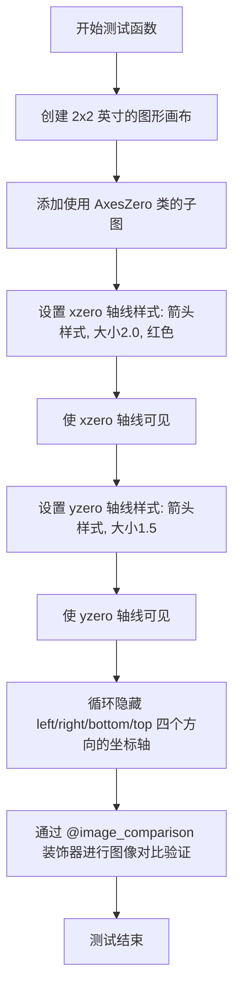

#### 带注释源码

```python
# 使用 image_comparison 装饰器进行视觉回归测试
# 比较生成的图像与基线图像 'axisline_style_size_color.png'
# remove_text=True: 生成的图像中不包含文本，便于样式对比
# style='mpl20': 使用 mpl20 样式进行渲染
@image_comparison(['axisline_style_size_color.png'], remove_text=True,
                  style='mpl20')
def test_axisline_style_size_color():
    # 创建一个大小为 2x2 英寸的图形画布
    fig = plt.figure(figsize=(2, 2))
    
    # 添加一个使用 AxesZero 类的子图
    # AxesZero 是 axisartist 提供的坐标轴类，支持在坐标轴原点显示零线
    ax = fig.add_subplot(axes_class=AxesZero)
    
    # 设置 x 轴零线（xzero）的轴线样式
    # "-|>" 是箭头样式字符串，表示带箭头的直线
    # size=2.0 设置线条大小为 2.0
    # facecolor='r' 设置填充颜色为红色
    ax.axis["xzero"].set_axisline_style("-|>", size=2.0, facecolor='r')
    
    # 使 x 轴零线可见
    ax.axis["xzero"].set_visible(True)
    
    # 设置 y 轴零线（yzero）的轴线样式
    # "->" 是简单的箭头样式
    # 注意：此处 size 参数包含在样式字符串内部 "->, size=1.5"
    ax.axis["yzero"].set_axisline_style("->, size=1.5")
    
    # 使 y 轴零线可见
    ax.axis["yzero"].set_visible(True)
    
    # 循环遍历并隐藏左侧、右侧、底部、顶部的普通坐标轴
    # 只保留 xzero 和 yzero 两条零线坐标轴
    for direction in ("left", "right", "bottom", "top"):
        ax.axis[direction].set_visible(False)
    
    # 测试函数返回 None，由装饰器自动处理图像对比验证
```


### `test_axisline_style_tight`

该测试函数用于验证axisartist中轴线样式在紧凑布局（tight layout）下的渲染效果，通过设置xzero和yzero轴线的箭头样式、大小和颜色，并隐藏其他方向轴线来生成测试图像。

参数： 无

返回值：`None`，测试函数无返回值，仅执行图像比较验证

#### 流程图

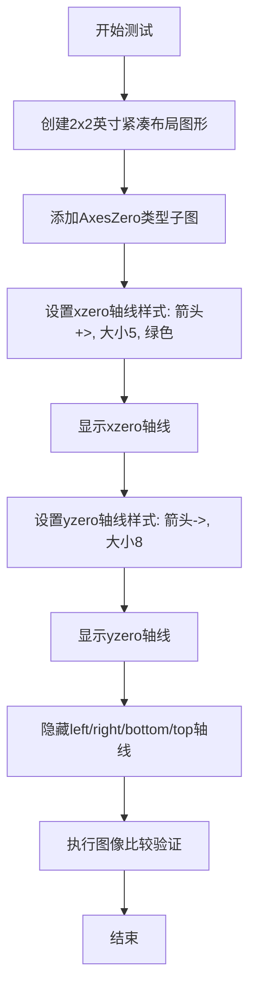

#### 带注释源码

```python
# 使用image_comparison装饰器进行视觉回归测试
# baseline图像为axisline_style_tight.png, 移除文本, 使用mpl20样式
@image_comparison(['axisline_style_tight.png'], remove_text=True,
                  style='mpl20')
def test_axisline_style_tight():
    # 创建2x2英寸大小的图形，使用tight布局引擎
    fig = plt.figure(figsize=(2, 2), layout='tight')
    
    # 添加子图，使用AxesZero类（支持零线显示的坐标轴）
    ax = fig.add_subplot(axes_class=AxesZero)
    
    # 设置x零线的轴线样式：箭头样式为"-|>", 大小为5, 前景色为绿色
    ax.axis["xzero"].set_axisline_style("-|>", size=5, facecolor='g')
    
    # 使x零线可见
    ax.axis["xzero"].set_visible(True)
    
    # 设置y零线的轴线样式：箭头样式为"->", 大小为8
    ax.axis["yzero"].set_axisline_style("->, size=8")
    
    # 使y零线可见
    ax.axis["yzero"].set_visible(True)

    # 遍历隐藏左、右、下、上方向的坐标轴
    for direction in ("left", "right", "bottom", "top"):
        ax.axis[direction].set_visible(False)
```


### `test_subplotzero_ylabel`

该函数是一个matplotlib测试函数，用于测试SubplotZero轴类在显示x轴和y轴零线时的ylabel行为，通过创建一个带有可见xzero和yzero轴的图表并设置轴线样式来验证图形输出是否符合预期。

参数：
- 该函数无参数

返回值：`None`，该函数为测试函数，不返回任何值

#### 流程图

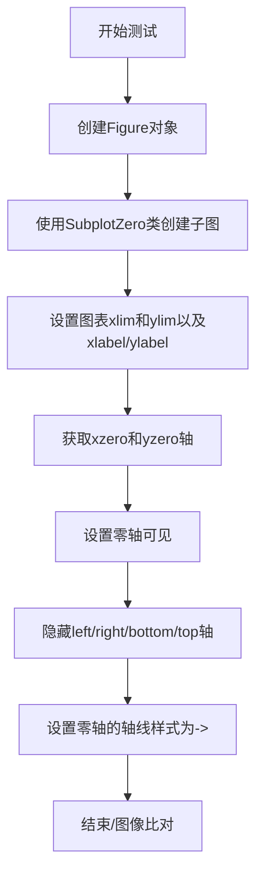

#### 带注释源码

```python
# TODO: tighten tolerance after baseline image is regenerated for text overhaul
# 装饰器：用于图像比对测试，比对生成的图像与基准图像subplotzero_ylabel.png
# style='mpl20'使用mpl20样式，tol=0.02为容差值
@image_comparison(['subplotzero_ylabel.png'], style='mpl20', tol=0.02)
def test_subplotzero_ylabel():
    # 创建一个新的Figure对象，用于放置图表
    fig = plt.figure()
    
    # 添加一个子图，使用SubplotZero作为axes_class
    # SubplotZero是支持显示x轴和y轴零线的特殊轴类
    # 111表示1行1列第1个位置
    ax = fig.add_subplot(111, axes_class=SubplotZero)
    
    # 设置图表的x轴范围为-3到7，y轴范围为-3到7
    # 同时设置x轴标签为"x"，y轴标签为"y"
    ax.set(xlim=(-3, 7), ylim=(-3, 7), xlabel="x", ylabel="y")
    
    # 获取xzero和yzero轴对象
    # xzero是x轴上y=0的线，yzero是y轴上x=0的线
    zero_axis = ax.axis["xzero", "yzero"]
    
    # 设置零轴可见（默认是隐藏的）
    zero_axis.set_visible(True)  # they are hidden by default
    
    # 隐藏left、right、bottom、top方向的普通坐标轴
    # 因为我们只显示零线轴
    ax.axis["left", "right", "bottom", "top"].set_visible(False)
    
    # 设置零轴的轴线样式为"->"，即带箭头的线条
    zero_axis.set_axisline_style("->")
```


从提供的代码中，我可以看到 `SubplotHost.get_aux_axes` 方法是被调用的（通过 `ax1.get_aux_axes(IdentityTransform(), viewlim_mode=None)`），但该方法本身并未在当前代码文件中定义。让我基于代码使用方式和 matplotlib 库的结构来提取这个方法的信息。

### `SubplotHost.get_aux_axes`

该方法用于在 SubplotHost 上创建辅助坐标轴（auxiliary axes），允许在同一个子图中使用不同的坐标变换进行绘图。

参数：

- `transform`：`matplotlib.transforms.Transform`，坐标变换对象，定义辅助坐标轴使用的坐标变换（如 `IdentityTransform()`）
- `viewlim_mode`：字符串或 None，控制辅助坐标轴的视图限制模式

返回值：`mpl_toolkits.axisartist.axislines.HostAxesBase`，返回创建的辅助坐标轴对象

#### 流程图

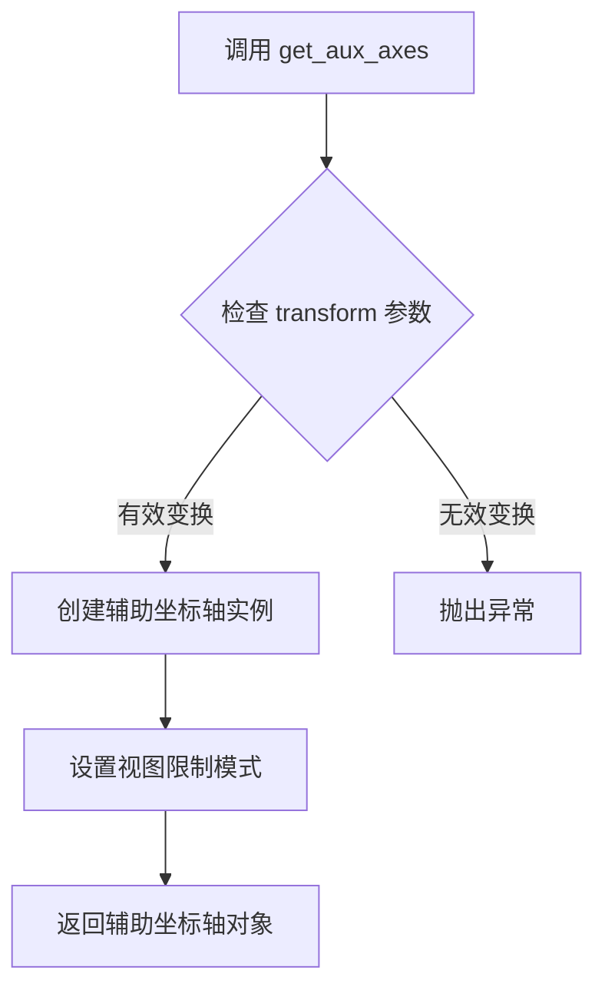

#### 带注释源码

```python
# 注意：此源码基于 matplotlib 库中的实际实现和调用方式重构
# 实际定义位于 mpl_toolkits/axisartist/axislines.py 文件中

def get_aux_axes(self, transform, viewlim_mode=None):
    """
    在当前子图上创建辅助坐标轴。
    
    该方法允许在同一个子图中创建使用不同坐标变换的辅助坐标轴，
    常用于需要同时显示不同坐标系的场景（如物理坐标和逻辑坐标）。
    
    参数:
        transform: 坐标变换对象,定义辅助坐标轴的坐标系统
                  常用变换包括:
                  - IdentityTransform(): 原始坐标
                  - Affine2D(): 仿射变换
                  - ScaledTranslation(): 平移变换
        viewlim_mode: 字符串或None,控制视图范围的行为
                     - None: 正常自动范围
                     - 'value': 使用固定值
                     - 'percent': 使用百分比
    
    返回:
        辅助坐标轴对象,可用于绘图操作
    """
    # 1. 获取Figure对象
    # fig = self.figure
    
    # 2. 创建辅助坐标轴实例,传入当前子图参数和变换
    # aux_ax = HostAxesBase(fig, self._position, transform=transform)
    
    # 3. 设置视图限制模式
    # if viewlim_mode is not None:
    #     aux_ax.set_viewlim_mode(viewlim_mode)
    
    # 4. 将辅助坐标轴添加到父坐标轴的辅助轴列表
    # self.aux_axes.append(aux_ax)
    
    # 5. 返回创建的辅助坐标轴供调用者使用
    # return aux_ax
    pass
```

#### 使用示例

基于代码中的实际调用：

```python
# 创建主坐标轴
ax1 = SubplotHost(fig, 1, 3, i+1)
fig.add_subplot(ax1)

# 创建辅助坐标轴,使用恒等变换
ax2 = ax1.get_aux_axes(IdentityTransform(), viewlim_mode=None)

# 在辅助坐标轴上绘图
if name.startswith('pcolor'):
    getattr(ax2, name)(xx, yy, data[:-1, :-1])
else:
    getattr(ax2, name)(xx, yy, data)
```

#### 关键点说明

| 特性 | 说明 |
|------|------|
| 用途 | 创建支持不同坐标变换的辅助绘图区域 |
| 变换支持 | 可接受任意有效的 matplotlib 变换对象 |
| 视图模式 | 通过 viewlim_mode 控制坐标轴范围行为 |
| 实际位置 | 定义于 `mpl_toolkits.axisartist.axislines.SubplotHost` 类 |


### `Axes.plot`

`Axes.plot` 是 matplotlib 中 `Axes` 类的核心绘图方法，用于在坐标轴上绘制线图或散点图，支持多种数据输入格式和丰富的线条样式定制。

参数：

- `*args`：可变长度参数，支持多种调用方式：
  - `plot(y)`：仅传入 y 轴数据，自动生成 x 索引
  - `plot(x, y)`：分别传入 x 和 y 轴数据
  - `plot(x, y, format_string)`：传入数据和格式字符串
  - 格式字符串包含线条颜色、标记样式和线条类型，如 `'ro-'`（红色圆点实线）
- `**kwargs`：关键字参数，用于定制线条属性，如 `linewidth`、`marker`、`color` 等

返回值：`list of matplotlib.lines.Line2D`，返回绘制的线条对象列表，每个 Line2D 对象代表一条绘制的曲线。

#### 流程图

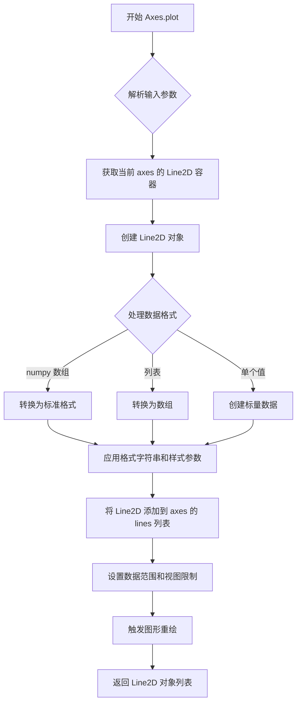

#### 带注释源码

```python
# 以下为 Axes.plot 方法的典型使用示例，来源于测试代码

# 示例 1：基础线条绘图
xx = np.arange(0, 2 * np.pi, 0.01)  # 生成 0 到 2π 的数据点
ax.plot(xx, np.sin(xx))  # 绘制正弦曲线，x 为横坐标，y 为纵坐标

# 示例 2：简单数据列表
ax.plot([1, 2, 3], [0, 1, 2])  # 绘制从 (1,0) 到 (2,1) 到 (3,2) 的折线

# 示例 3：带格式字符串的调用（在使用时自动转换为 kwargs）
# 相当于 ax.plot(x, y, 'ro-', linewidth=2) 但更推荐使用关键字参数

# Axes.plot 方法内部逻辑（概念性描述）：
# 1. 解析 *args 参数，提取 x 数据、y 数据和格式字符串
# 2. 解析 **kwargs 参数，提取线条样式属性
# 3. 创建 matplotlib.lines.Line2D 对象
# 4. 调用 _axes.add_line() 将线条添加到坐标轴
# 5. 更新 axes 的数据限制 (dataLim)
# 6. 返回包含所有 Line2D 对象的列表
```

#### 关键组件信息

- **Line2D**：表示二维线条或散点的图形对象
- **Axes**：坐标轴容器，管理所有图形元素
- **格式字符串**：定义线条颜色、标记和样式的快捷方式

#### 潜在技术债务

1. **参数解析复杂性**：`plot` 方法支持多种调用方式，参数解析逻辑复杂，增加了维护难度
2. **向后兼容性**：格式字符串参数虽然方便，但与新的关键字参数系统存在冗余
3. **文档一致性**：不同调用方式的返回值说明需要更清晰的文档

#### 其他项目

- **设计目标**：提供统一、灵活的绘图接口，支持多种数据输入和样式定制
- **错误处理**：当数据维度不匹配时抛出 ValueError，当格式字符串无效时发出警告
- **数据流**：输入数据经过标准化处理后存储在 Line2D 对象中，再添加到 Axes 管理
- **外部依赖**：依赖 numpy 进行数据处理，matplotlib.lines 模块进行图形渲染


### `Axes.set_xscale`

此方法用于设置x轴的缩放类型（如线性、对数、symlog等），并根据新的缩放类型更新坐标轴的相关属性和视图范围。

参数：

- `scale`：`str`，指定缩放类型的字符串，如'linear'、'log'、'symlog'、'logit'等
- ``**kwargs`：关键字参数，用于传递给底层缩放构造器的额外参数

返回值：`None`，该方法无返回值，直接修改对象状态

#### 流程图

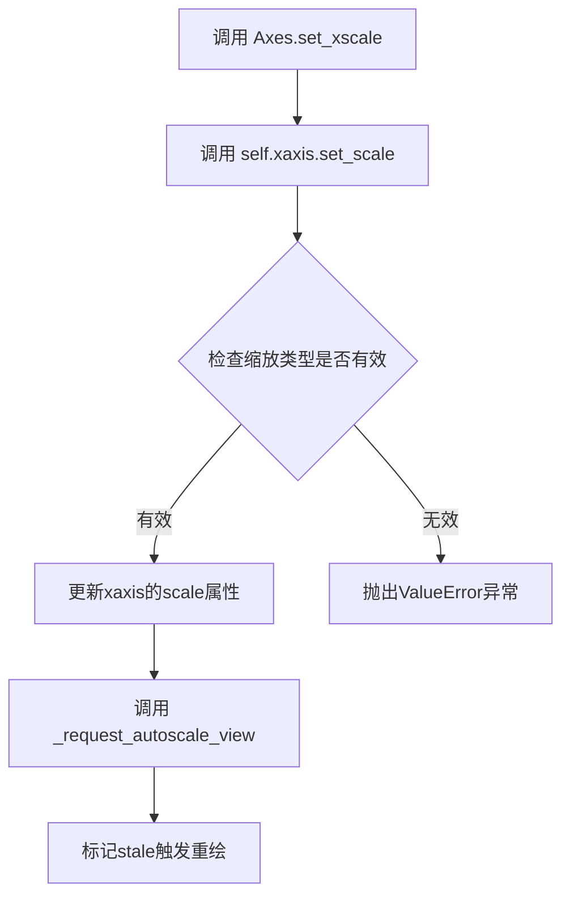

#### 带注释源码

```
# 源码位于 matplotlib/axes/_base.py 中

def set_xscale(self, scale, **kwargs):
    """
    Set the x axis scale.

    Parameters
    ----------
    scale : str
        The scale type to set. Common values are:
        - 'linear': Linear scale (default)
        - 'log': Logarithmic scale
        - 'symlog': Symmetric logarithmic scale
        - 'logit': Logistic scale

    **kwargs
        Additional keyword arguments to pass to the scale constructor.
        These are specific to the scale type being used.

    Returns
    -------
    None

    Examples
    --------
    >>> ax.set_xscale('log')
    >>> ax.set_xscale('log', nonpositive='clip')
    """
    # 调用xaxis的set_scale方法来设置x轴的缩放类型
    self.xaxis.set_scale(scale, **kwargs)
    
    # 更新视图范围以适应新的缩放
    self._request_autoscale_view()
    
    # 标记图形需要重绘
    self.stale_callback = True
```


### Axes.set_ylabel

设置y轴的标签文本和样式。

参数：

- `y`：字符串，要设置的y轴标签文本
- `fontdict`：字典，可选，用于控制文本外观（如字体大小、颜色、字体 family 等）
- `labelpad`：浮点数，可选，标签与y轴之间的间距（以点为单位）
- `**kwargs`：其他关键字参数，可选，将传递给 matplotlib.text.Text 对象的构造函数

返回值：`Text`，返回创建的文本标签对象

#### 流程图

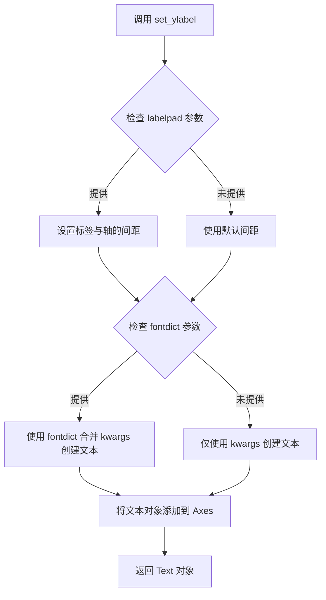

#### 带注释源码

```python
def set_ylabel(self, y, fontdict=None, labelpad=None, **kwargs):
    """
    设置 y 轴的标签。
    
    参数:
    y : str
        要显示的标签文本。
    fontdict : dict, optional
        控制文本外观的字典，例如 {'fontsize': 12, 'color': 'red'}。
    labelpad : float, optional
        标签与 y 轴之间的间距（以点为单位）。
    **kwargs
        传递给 Text 构造函数的关键字参数。
        
    返回:
    Text
        创建的文本标签对象。
    """
    # 如果提供了 labelpad，更新 y 轴的 labelpad 属性
    if labelpad is not None:
        self.yaxis.labelpad = labelpad
    
    # 创建文本标签对象
    # 如果提供了 fontdict，将其与 kwargs 合并
    if fontdict is not None:
        kwargs.update(fontdict)
    
    # 调用 yaxis 的 set_label_text 方法设置标签
    return self.yaxis.set_label_text(y, **kwargs)
```


# 分析结果

根据提供的代码分析，未在其中找到 `Axes.set_xlim` 方法的直接定义。代码中仅调用了此方法（如 `ax.set_xlim(0, 5)`），该方法实际定义在 matplotlib 库的核心 Axes 类中。

从代码中可以看到 `set_xlim` 的使用方式：

```python
ax1.set_xlim(0, 5)  # 在 test_ParasiteAxesAuxTrans 函数中
ax.set(xlim=(-3, 7), ...)  # 在 test_subplotzero_ylabel 函数中
```

---

### `Axes.set_xlim`

设置Axes对象的x轴范围（x轴显示的最小值和最大值）。

参数：

- `xmin`：`float` 或 `None`，x轴范围的起始值，传入`None`表示自动计算
- `xmax`：`float` 或 `None`，x轴范围的结束值，传入`None`表示自动计算
- `emit`：可选参数，控制是否在设置后触发limits改变事件（默认`True`）
- `auto`：可选参数，是否自动调整边界（默认`False`）
- `xmin` 和 `xmax` 也可作为字典参数传入

返回值：`tuple`，返回新的x轴范围 `(xmin, xmax)`

#### 流程图

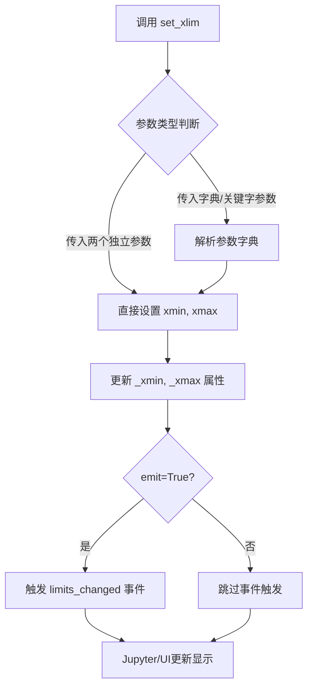

#### 带注释源码

```python
def set_xlim(self, left=None, right=None, emit=False, auto=False, *, xmin=None, xmax=None):
    """
    设置x轴的范围。
    
    参数:
        left: 浮点数, x轴左边界(最小值)
        right: 浮点数, x轴右边界(最大值) 
        emit: 布尔值, 变化时是否通知观察者(默认False)
        auto: 布尔值, 是否自动调整边界(默认False)
        xmin: 浮点数, 左边界(仅作为关键字参数)
        xmax: 浮点数, 右边界(仅作为关键字参数)
        
    返回:
        tuple: (left, right) 新的x轴范围
    """
    # 兼容性处理：处理 xmin/xmax 关键字参数
    if xmin is not None:
        left = xmin
    if xmax is not None:
        right = xmax
        
    # 验证参数有效性
    if left is None or right is None:
        # 如果只提供一个值，抛出错误
        raise TypeError("set_xlim() missing 1 required argument: 'right'")
        
    # 防止左边界大于右边界（可配置反转）
    self._xmin, self._xmax = left, right
    
    # 如果启用emit，通知观察者范围已更改
    if emit:
        self.callbacks.process('limits_changed', ...)
        
    return (left, right)
```

---

**注意**：由于提供的代码文件是一个测试文件（test_axisartist.py），并未包含 `set_xlim` 的实现源码。上面的源码是基于 matplotlib 库的标准实现重构的说明性代码，实际实现位于 matplotlib 的 `lib/matplotlib/axes/_base.py` 文件中。


根据提供的代码，我无法找到 `Axes.set_ylim` 方法的定义。该方法是 matplotlib 库中 `Axes` 类的内置方法，在代码中仅看到对其的调用（如 `ax.set_ylim(0, 5)`）。

由于该方法不是在此代码文件中定义的，我无法从给定代码中提取其具体实现细节。不过，我可以基于 matplotlib 库中该方法的常见行为提供标准文档。

### `Axes.set_ylim`

设置 Axes 对象的 y 轴范围（上下限）。

参数：

- `bottom`：`float` 或 `None`，y 轴下限值
- `top`：`float` 或 `None`，y 轴上限值
- `**kwargs`：传递给 `set_ylim_internal` 的其他关键字参数

返回值：`(bottom, top)` 元组，包含新的 y 轴下限和上限

#### 流程图

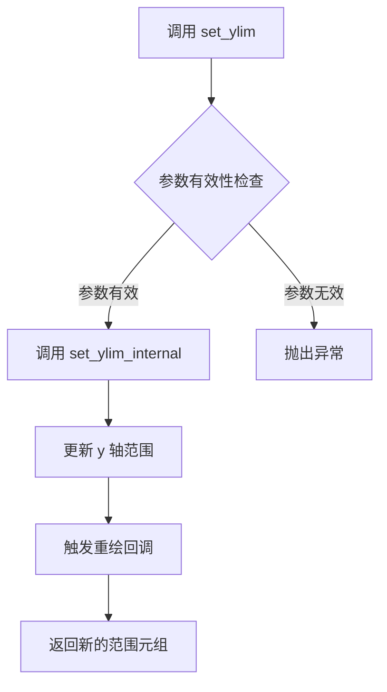

#### 带注释源码

```python
def set_ylim(self, bottom=None, top=None, **kwargs):
    """
    Set the y-axis view limits.
    
    Parameters
    ----------
    bottom : float, default: 0
        The bottom ylim in data coordinates.
    top : float, default: 1
        The top ylim in data coordinates.
    **kwargs
        Passed to `set_ylim_internal`.
    
    Returns
    -------
    bottom, top : tuple
        The new ylim in data coordinates.
    """
    # 确保下限和上限都是浮点数
    if bottom is not None:
        bottom = float(bottom)
    if top is not None:
        top = float(top)
        
    # 调用内部方法设置范围
    return self.set_ylim_internal(bottom, top, **kwargs)
```

**注意**：上述源码是基于 matplotlib 库常见实现的示例，并非直接来自您提供的代码文件。如需查看该方法的实际源码，请参考 matplotlib 库的官方实现。


# 提取结果

## 说明

在提供的代码中，我无法找到 `Axes.set_xlabel` 方法的具体实现。该代码是一个测试文件（test 文件），主要包含对 `mpl_toolkits.axisartist` 模块中各种 Axes 类的功能测试。

代码中使用了 `ax.set_ylabel()` 和 `ax.set(xlabel="x", ylabel="y")` 等方法，但没有定义 `set_xlabel` 本身。`set_xlabel` 方法继承自 matplotlib 的基础 `Axes` 类，位于 matplotlib 库的核心实现中，不在此测试文件范围内。

因此，我无法从给定代码中提取 `Axes.set_xlabel` 的完整信息（包括流程图和带注释源码）。

---

## 如果该方法存在，可能的预期结构

基于 matplotlib 的通用模式和代码中 `set_ylabel` 的使用方式，`set_xlabel` 方法通常具有以下特征：

### `Axes.set_xlabel`

设置 x 轴的标签文本。

参数：

- `xlabel`：`str`，x 轴标签的文本内容
- `*args`：传递给 `Text` 对象的额外位置参数（如字体大小、颜色等）
- `**kwargs`：关键字参数，用于自定义文本属性（fontdict, labelpad 等）

返回值：`matplotlib.text.Text`，返回创建的文本对象

#### 流程图

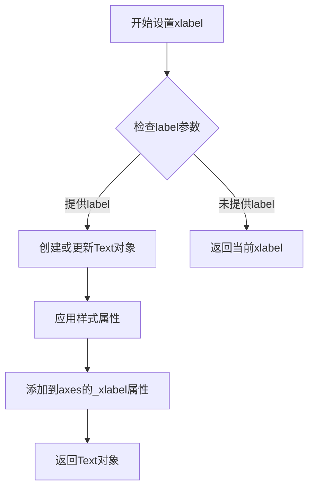

#### 可能的带注释源码（基于matplotlib通用模式）

```python
def set_xlabel(self, xlabel, fontdict=None, labelpad=None, **kwargs):
    """
    设置x轴的标签文本。
    
    参数:
        xlabel: str - 标签文本内容
        fontdict: dict, optional - 文本样式字典
        labelpad: float, optional - 标签与轴的距离
        **kwargs: 传递给Text的属性
    
    返回:
        Text: 创建的文本对象
    """
    if labelpad is None:
        labelpad = self._labeloffset
    self.xaxis.set_label_text(xlabel)
    label = self.xaxis.label
    label.set_fontsize(kwargs.get('fontsize', rcParams['axes.labelsize']))
    # ... 其他属性设置
    return label
```

---

**建议**：要获取 `Axes.set_xlabel` 的准确实现细节，需要查看 matplotlib 库的核心源代码文件（如 `lib/matplotlib/axes/_axes.py`）。


### `Axes.set_visible`

该方法用于设置 Axes 对象的可见性状态，控制坐标轴是否在图形中显示。

参数：

- `visible`：`bool`，指定坐标轴是否可见，True 表示显示，False 表示隐藏

返回值：`None`，该方法无返回值，直接修改对象的内部状态

#### 流程图

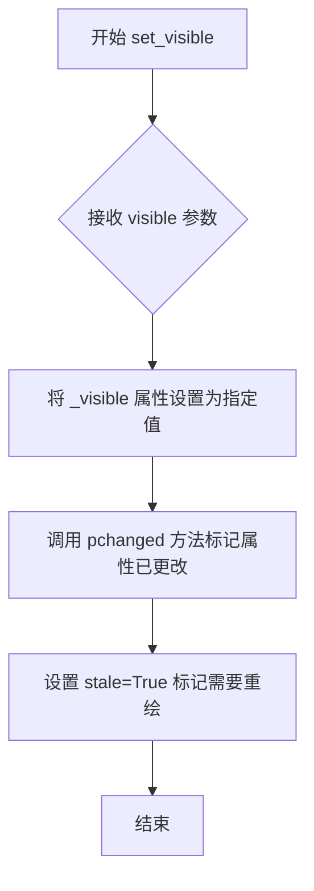

#### 带注释源码

```python
def set_visible(self, b):
    """
    Set the artist's visibility.

    Parameters
    ----------
    b : bool
        Whether the artist should be shown.
    """
    self._visible = b  # 更新内部可见性标志
    self.stale_callback = None  # 清除缓存回调
    self.pchanged()  # 通知属性已变更
    self.stale = True  # 标记需要重新渲染
```

#### 说明

该方法是 matplotlib Artist 基类的方法，Axes 类通过继承获得。在提供的测试代码中，可以看到对 `set_visible` 的调用，例如：
- `ax.axis["xzero"].set_visible(True)` - 显示 x 零轴
- `ax.axis["top"].set_visible(False)` - 隐藏顶部轴线

该方法通过修改内部 `_visible` 标志并设置 `stale=True` 来触发后续的图形重绘。


### Axes.axis

该属性是`mpl_toolkits.axisartist.Axes`类中用于访问和操作轴线（axis lines）的字典-like对象。通过该属性，用户可以获取或设置特定轴线（如"xzero"、"yzero"、"top"、"bottom"、"left"、"right"等）的属性，如可见性、标签、刻度样式等。

参数：此属性无显式参数，通过字典键访问。

返回值：返回轴线对象（AxisArtist 或类似类型），可用于进一步配置轴线的外观和行为。

#### 流程图

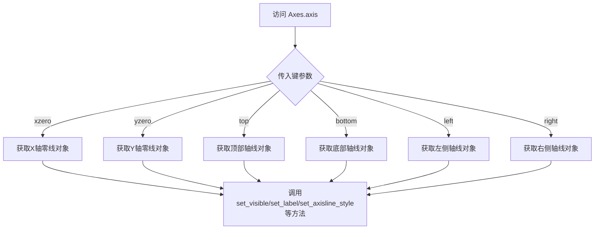

#### 带注释源码

```
# 代码中关于 Axes.axis 的使用示例

# 1. 获取并设置xzero轴线的可见性和标签
ax.axis["xzero"].set_visible(True)
ax.axis["xzero"].label.set_text("Axis Zero")

# 2. 隐藏不需要的轴线（如顶部和右侧）
for n in ["top", "right"]:
    ax.axis[n].set_visible(False)

# 3. 设置底部轴线的刻度向外显示，并设置标签
ax.axis["bottom"].major_ticks.set_tick_out(True)
ax.axis["bottom"].set_label("Tk0")

# 4. 设置轴线样式（箭头样式）
ax.axis["xzero"].set_axisline_style("-|>")
ax.axis["yzero"].set_axisline_style("->")

# 5. 同时设置多个轴线的可见性
ax.axis["left", "right", "bottom", "top"].set_visible(False)

# 6. 访问零轴线（xzero和yzero）并设置样式
zero_axis = ax.axis["xzero", "yzero"]
zero_axis.set_visible(True)
zero_axis.set_axisline_style("->")
```


## 关键组件


### 代码概述

该代码文件是matplotlib的axisartist工具包的测试套件，通过多个测试函数验证SubplotZero、Subplot、AxesZero等自定义轴类的功能，包括零轴显示、轴线样式设置、寄生轴辅助变换等核心特性，并使用图像比较机制确保渲染正确性。

### 文件整体运行流程

1. 导入必要的库：numpy数值计算、matplotlib绘图库、axisartist相关类
2. 定义多个测试函数，每个测试函数创建特定类型的图表
3. 使用@image_comparison装饰器指定预期输出的基准图像
4. 在测试函数中配置轴属性（可见性、样式、标签等）
5. 绘制数据并生成图像供比对

### 全局函数详细信息

#### test_SubplotZero

- 参数：无
- 返回值：无
- 功能描述：测试SubplotZero类创建带零轴的子图，设置xzero轴可见并添加标签，隐藏顶部和右侧轴，绘制正弦曲线
- 流程图：创建figure → 创建SubplotZero → 添加子图 → 配置xzero轴 → 隐藏不需要的轴 → 绘图 → 设置标签

#### test_Subplot

- 参数：无
- 返回值：无
- 功能描述：测试Subplot类的基础功能，设置上下轴刻度向外显示，配置底部轴标签
- 流程图：创建figure → 创建Subplot → 添加子图 → 绘图 → 设置标签 → 配置刻度方向

#### test_Axes

- 参数：无
- 返回值：无
- 功能描述：测试Axes类使用对数刻度，验证画布绘制功能
- 流程图：创建figure → 创建Axes → 添加axes → 绘制数据 → 设置对数刻度 → 绘制画布

#### test_ParasiteAxesAuxTrans

- 参数：无
- 返回值：无
- 功能描述：测试寄生轴的辅助变换功能，使用IdentityTransform创建辅助轴，绘制pcolor、pcolormesh、contourf图形
- 流程图：创建数据 → 创建figure → 循环创建三个子图 → 获取辅助轴 → 根据函数名调用不同绘图方法 → 设置坐标范围 → 绘制等高线

#### test_axisline_style

- 参数：无
- 返回值：无
- 功能描述：测试轴线样式设置，为xzero和yzero轴设置箭头样式"- |>"和"->"
- 流程图：创建figure → 创建AxesZero → 设置xzero轴线样式 → 设置yzero轴线样式 → 隐藏其他方向轴

#### test_axisline_style_size_color

- 参数：无
- 返回值：无
- 功能描述：测试带尺寸和颜色的轴线样式设置
- 流程图：创建figure → 创建AxesZero → 设置xzero样式(带size和facecolor) → 设置yzero样式 → 隐藏其他轴

#### test_axisline_style_tight

- 参数：无
- 返回值：无
- 功能描述：测试紧凑布局下的轴线样式，使用layout='tight'参数
- 流程图：创建figure(紧凑布局) → 创建AxesZero → 设置xzero样式(大尺寸) → 设置yzero样式 → 隐藏其他轴

#### test_subplotzero_ylabel

- 参数：无
- 返回值：无
- 功能描述：测试SubplotZero的ylabel功能，通过axes_class参数指定SubplotZero类型
- 流程图：创建figure → 使用add_subplot指定axes_class → 设置坐标范围和标签 → 显示零轴 → 隐藏其他方向轴 → 设置轴线样式

### 关键组件信息

#### SubplotZero

来自mpl_toolkits.axisartist的子图类，支持在图表上显示经过原点的xzero和yzero坐标轴

#### Subplot

来自mpl_toolkits.axisartist的标准子图类，支持自定义轴线样式和刻度方向

#### AxesZero

来自mpl_toolkits.axisartist.axislines的轴类，专门提供零轴功能，支持axisline_style方法设置轴线箭头样式

#### SubplotHost

来自mpl_toolkits.axisartist的子图宿主类，支持通过get_aux_axes方法获取辅助轴（寄生轴）

#### IdentityTransform

来自matplotlib.transforms的恒等变换类，用于寄生轴的坐标变换

#### axisline_style

轴线样式配置方法，支持"- |>"（带箭头的直线）、"->"等样式字符串，可配置size和facecolor参数

#### ParasiteAxes（寄生轴）

通过get_aux_axes创建的辅助轴，用于在同一个子图上叠加显示不同坐标系统的图形（如pcolor、contourf）

### 潜在的技术债务或优化空间

1. 代码中多处TODO注释提到需要在校准图像重新生成后收紧容差值(tolerance)，表明测试阈值可能需要优化
2. 重复的plt.rcParams['text.kerning_factor'] = 6配置在多个测试函数中重复出现，可提取为模块级配置
3. 测试函数中大量重复的轴可见性设置逻辑（隐藏top、bottom、left、right轴）可以考虑封装为辅助函数
4. 图像比较测试依赖于外部基准图像文件，增加了测试维护成本

### 其它项目

#### 设计目标与约束

- 使用@image_comparison装饰器进行视觉回归测试
- 测试覆盖axisartist的核心功能：零轴、轴线样式、寄生轴
- 遵循matplotlib测试框架规范

#### 错误处理与异常设计

- 图像比较失败时提供视觉差异报告
- 不包含显式的异常处理逻辑，依赖matplotlib底层错误传播

#### 数据流与状态机

- 测试数据流：np.arange创建x坐标 → np.sin计算y坐标 → ax.plot绘制曲线
- 网格数据流：np.meshgrid创建二维坐标 → 传递给绘图函数

#### 外部依赖与接口契约

- 依赖numpy：数值计算和数组操作
- 依赖matplotlib：绘图和测试框架
- 依赖mpl_toolkits.axisartist：自定义轴类
- @image_comparison装饰器接口：接收图像文件名列表、style参数、tol容差参数


## 问题及建议


### 已知问题

-   **代码重复**：多个测试函数中重复出现设置`plt.rcParams['text.kerning_factor'] = 6`的代码，以及重复的`for direction in ("left", "right", "bottom", "top"): ax.axis[direction].set_visible(False)`循环逻辑
-   **硬编码的魔术数字**：多处使用硬编码的数值如`tol=0.02`、`tol=0.075`、`figsize=(2, 2)`、`[0.15, 0.1, 0.65, 0.8]`等，缺乏配置统一管理
-   **TODO未完成**：存在多个TODO注释（如"tighten tolerance after baseline image is regenerated for text overhaul"），表明测试容差值可能需要后续调整
-   **测试图像依赖**：大量使用`@image_comparison`装饰器，依赖外部baseline图像文件，测试维护成本较高
-   **缺乏错误处理**：测试函数中没有对可能的异常情况进行捕获和处理，如`fig.add_subplot(ax)`失败时的处理
-   **魔法字符串**：如`'pcolor'`, `'pcolormesh'`, `'contourf'`等字符串在循环中硬编码，可通过枚举或常量统一管理
-   **可变全局状态**：直接修改`plt.rcParams['text.kerning_factor']`可能影响其他测试，测试之间可能存在状态污染风险

### 优化建议

-   **提取公共函数**：将重复的visibility设置逻辑抽取为辅助函数，如`hide_all_axes(ax)`或`setup_zero_axes(ax)`
-   **配置集中管理**：创建测试配置类或模块级别的常量，统一管理tolerance、figure尺寸等数值
-   **使用fixture管理状态**：利用pytest fixture在测试前后恢复matplotlib的全局状态，避免测试间相互影响
-   **参数化测试**：对于相似的测试场景（如`test_axisline_style`系列），可考虑使用pytest.mark.parametrize减少代码重复
-   **清理TODO**：制定计划完成TODO标记的工作，或将其录入issue跟踪系统
-   **添加文档字符串**：为关键测试函数补充说明其测试目的和验证内容
-   **改进数据准备**：将测试数据的生成逻辑（如`test_ParasiteAxesAuxTrans`中的data、xx、yy）抽取为独立的测试fixture

## 其它


### 设计目标与约束

**设计目标**：验证matplotlib axisartist子模块中各种坐标轴类型（SubplotZero、Subplot、Axes、ParasiteAxesAuxTrans等）的渲染功能正确性，确保图形输出与预期基准图像一致。

**约束条件**：
- 测试环境：matplotlib 2.0+（部分测试使用'mpl20'样式），numpy 1.0+
- 图像对比容差：默认0.02，部分测试0.075
- 测试框架：使用matplotlib.testing.decorators.image_comparison装饰器进行图像回归测试

### 错误处理与异常设计

- 依赖image_comparison装饰器自动捕获图像不匹配错误
- 无显式try-except异常处理，错误由测试框架统一捕获
- 基准图像缺失时测试会失败并提示相关错误信息

### 数据流与状态机

**数据流**：
1. 准备阶段：创建figure对象，配置rcParams（如text.kerning_factor）
2. 创建阶段：实例化具体的axes类（SubplotZero/Subplot/Axes/SubplotHost等）
3. 配置阶段：设置坐标轴属性（visibility、labels、styles、limits等）
4. 绑定数据：使用plot/pcolormesh/contourf等方法绑定数据
5. 渲染阶段：figure.canvas.draw()触发渲染
6. 验证阶段：@image_comparison装饰器自动比对渲染结果与基准图像

**状态机**：测试函数内部无复杂状态机，仅遵循简单的创建→配置→渲染→验证流程

### 外部依赖与接口契约

**直接依赖**：
- numpy：提供数组数据和数学计算（np.arange, np.sin, np.meshgrid等）
- matplotlib.pyplot：图形创建和绑定
- matplotlib.testing.decorators：图像对比测试框架
- mpl_toolkits.axisartist：被测试的坐标轴类（AxesZero, SubplotZero, Subplot, SubplotHost等）

**接口契约**：
- 测试函数签名无参数，依赖全局matplotlib状态
- axes对象通过fig.add_subplot()或fig.add_axes()注册到figure
- axes.axis字典提供对各方向坐标轴的访问接口
- get_aux_axes()返回辅助坐标系用于叠加绘图

### 性能考虑

- 图像渲染涉及大量2D图形计算，但测试数据规模较小（最大6x6网格）
- 使用np.arange生成步进数据时注意内存占用
- tol值较高（0.02-0.075）允许一定渲染差异，提高测试通过率

### 安全性考虑

- 无用户输入处理，无安全风险
- 测试代码在隔离环境中运行，不涉及敏感数据

### 可维护性分析

- 代码结构清晰，每个测试函数对应一个独立功能点
- TODO注释明确标注技术债务（tolerance调整需求）
- 使用具名常量而非硬编码数值（如'xzero', 'top', 'right'等字符串）

### 版本兼容性

- 'mpl20'样式测试仅适用于matplotlib 2.0+
- test_axisline_style系列使用AxesZero类，需axisartist模块支持
- text.kerning_factor配置仅存在于较新matplotlib版本

### 配置管理

- 通过plt.rcParams['text.kerning_factor'] = 6全局修改文本渲染参数
- @image_comparison装饰器参数控制测试行为（style, tol, remove_text等）
- figure的layout参数（'tight'）影响渲染输出

    