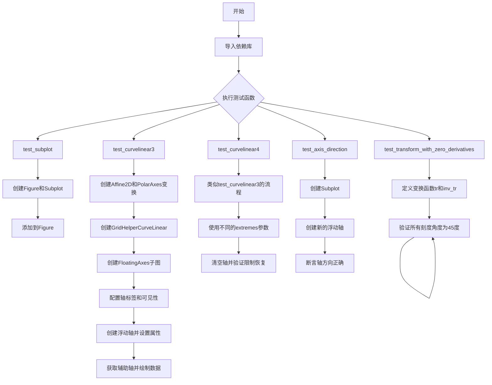
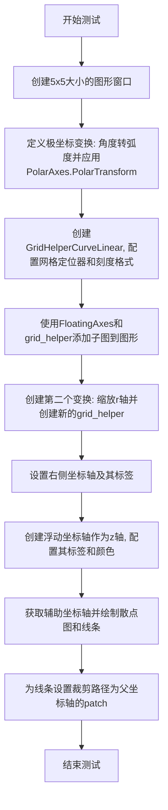
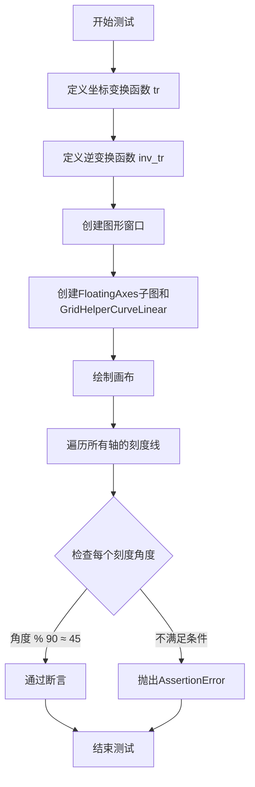
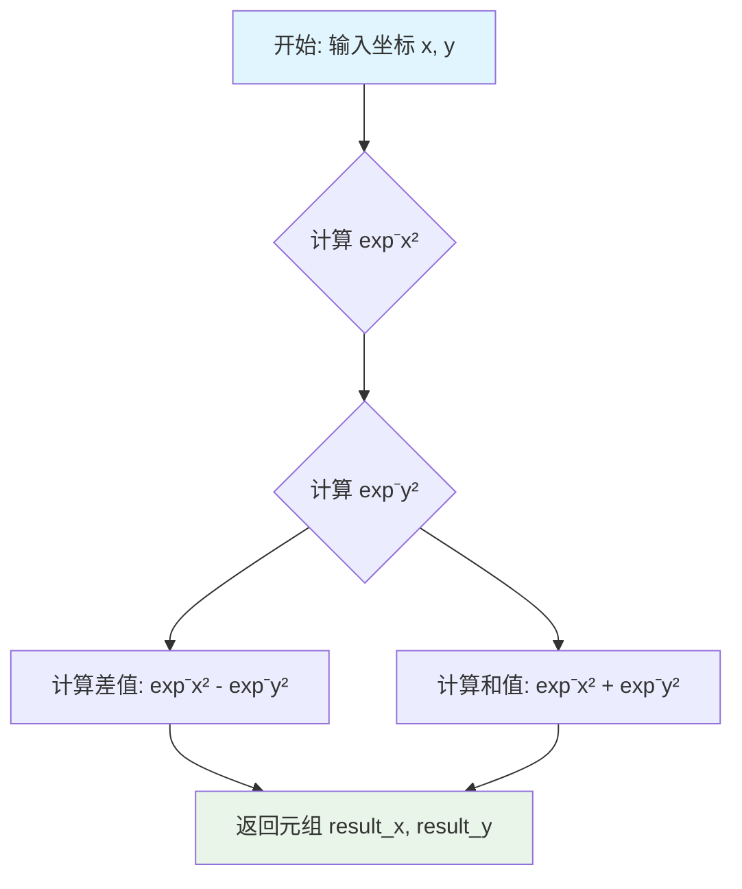
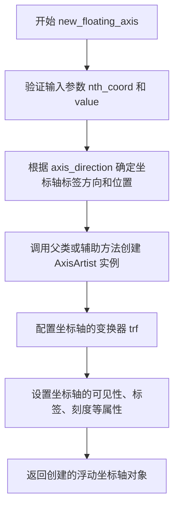
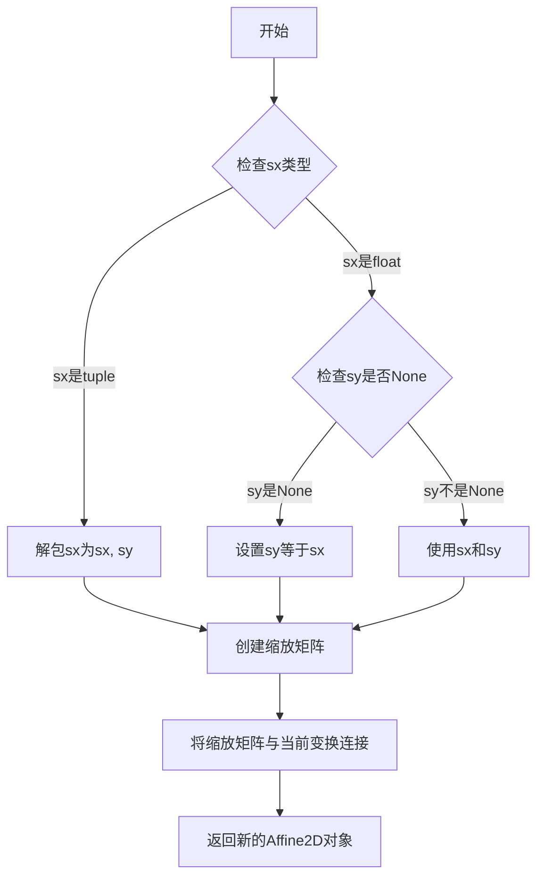

# `matplotlib\lib\mpl_toolkits\axisartist\tests\test_floating_axes.py` 详细设计文档

该文件是matplotlib axisartist工具包的测试模块，主要用于测试浮动轴（FloatingAxes）和曲线线性坐标变换（GridHelperCurveLinear）的功能，验证极坐标转换、轴方向传播以及零导数变换等场景下的渲染正确性。

## 整体流程



## 类结构

```
TestModule (测试模块)
├── test_subplot (基本子图测试)
├── test_curvelinear3 (曲线线性测试3)
├── test_curvelinear4 (曲线线性测试4)
├── test_axis_direction (轴方向测试)
└── test_transform_with_zero_derivatives (零导数变换测试)
```

## 全局变量及字段


### `np`
    
Python科学计算库，提供数组和数学运算功能

类型：`module`
    


### `pytest`
    
Python测试框架，用于编写和运行单元测试

类型：`module`
    


### `plt`
    
matplotlib.pyplot模块，提供绘图接口

类型：`module`
    


### `mprojections`
    
matplotlib投影模块，包含各种投影变换

类型：`module`
    


### `mtransforms`
    
matplotlib变换模块，提供坐标变换功能

类型：`module`
    


### `image_comparison`
    
测试装饰器，用于比较图像差异

类型：`function`
    


### `Subplot`
    
axisartist子图类，支持特殊坐标轴

类型：`class`
    


### `FloatingAxes`
    
浮动坐标轴类，支持任意方向的坐标轴

类型：`class`
    


### `GridHelperCurveLinear`
    
曲线坐标轴网格助手，管理曲线坐标轴的网格和刻度

类型：`class`
    


### `FixedLocator`
    
固定刻度定位器，用于指定固定位置的刻度

类型：`class`
    


### `angle_helper`
    
角度辅助模块，提供角度相关的定位器和格式化器

类型：`module`
    


### `test_curvelinear3.r_scale`
    
径向缩放因子，用于缩放极坐标

类型：`float`
    


### `test_curvelinear3.tr`
    
从极坐标到笛卡尔坐标的变换组合

类型：`Transform`
    


### `test_curvelinear3.tr2`
    
应用了径向缩放的坐标变换

类型：`Transform`
    


### `test_curvelinear3.grid_helper`
    
主曲线坐标轴网格助手

类型：`GridHelperCurveLinear`
    


### `test_curvelinear3.grid_helper2`
    
辅助曲线坐标轴网格助手

类型：`GridHelperCurveLinear`
    


### `test_curvelinear3.ax1`
    
主浮动坐标轴对象

类型：`FloatingAxes`
    


### `test_curvelinear3.ax2`
    
辅助坐标轴对象，用于绘制数据

类型：`Axes`
    


### `test_curvelinear3.xx`
    
测试数据的x坐标列表

类型：`list`
    


### `test_curvelinear3.yy`
    
测试数据的y坐标列表

类型：`list`
    


### `test_curvelinear3.l`
    
绘制的数据曲线对象

类型：`Line2D`
    


### `test_curvelinear3.axis`
    
浮动坐标轴对象

类型：`Axis`
    


### `test_curvelinear4.tr`
    
极坐标到笛卡尔坐标的变换

类型：`Transform`
    


### `test_curvelinear4.grid_helper`
    
曲线坐标轴网格助手

类型：`GridHelperCurveLinear`
    


### `test_curvelinear4.ax1`
    
浮动坐标轴对象

类型：`FloatingAxes`
    


### `test_curvelinear4.ax2`
    
辅助坐标轴对象

类型：`Axes`
    


### `test_curvelinear4.xx`
    
测试数据的x坐标列表

类型：`list`
    


### `test_curvelinear4.yy`
    
测试数据的y坐标列表

类型：`list`
    


### `test_curvelinear4.l`
    
绘制的数据曲线对象

类型：`Line2D`
    


### `test_curvelinear4.axis`
    
浮动坐标轴对象

类型：`Axis`
    


### `test_axis_direction.ax`
    
子图对象

类型：`Subplot`
    


### `test_transform_with_zero_derivatives.ax`
    
浮动坐标轴对象

类型：`FloatingAxes`
    
    

## 全局函数及方法


### `test_subplot`

该测试函数用于验证matplotlib中Subplot类能否正确地被创建并添加到figure中作为子图，测试基本的子图创建和添加流程。

参数：
- 该函数无参数

返回值：`None`，该函数不返回任何值，仅执行子图的创建和添加操作

#### 流程图

```mermaid
flowchart TD
    A[开始 test_subplot] --> B[创建 Figure 对象<br>fig = plt.figure(figsize=(5, 5))]
    B --> C[创建 Subplot 对象<br>ax = Subplot(fig, 111)]
    C --> D[将 Subplot 添加到 Figure<br>fig.add_subplot(ax)]
    D --> E[结束 test_subplot]
```

#### 带注释源码

```python
def test_subplot():
    """
    测试函数：验证Subplot类能够正确创建并添加到figure中
    
    该函数执行以下操作：
    1. 创建一个5x5英寸的Figure对象
    2. 创建一个Subplot对象，使用111布局（即1行1列第1个位置）
    3. 将创建的Subplot添加到Figure中
    """
    # 创建一个大小为5x5英寸的图形对象
    fig = plt.figure(figsize=(5, 5))
    
    # 创建Subplot对象，参数(1,1,1)表示1行1列的第1个位置
    # Subplot类来自mpl_toolkits.axisartist.axislines模块
    ax = Subplot(fig, 111)
    
    # 将创建的Subplot添加到figure中
    # 这是将自定义axisartist子图添加到标准matplotlib figure的标准方式
    fig.add_subplot(ax)
```


### `test_curvelinear3`

该函数是一个测试用例，用于验证matplotlib中极坐标变换的曲线坐标轴（Curvilinear Axes）功能，通过创建带有极坐标变换的浮动坐标轴（FloatingAxes），并绘制散点图和线条来检查裁剪路径是否正确应用。

参数：此函数无任何参数。

返回值：`None`，因为它是测试函数，不返回任何值。

#### 流程图



#### 带注释源码

```python
# 使用装饰器进行图像比较, 允许较大的容差以容忍内部工作进展
# 当图像重新生成时需移除此容差设置
@image_comparison(['curvelinear3.png'], style='default', tol=5)
def test_curvelinear3():
    # 创建一个5x5英寸大小的图形窗口
    fig = plt.figure(figsize=(5, 5))

    # 定义复合变换: 先将角度转换为弧度(乘以π/180), 然后应用极坐标变换
    tr = (mtransforms.Affine2D().scale(np.pi / 180, 1) +
          mprojections.PolarAxes.PolarTransform())
    
    # 创建曲线线性网格助手, 配置极限值为:
    # 极角范围: 0到360度, 半径范围: 10到3
    grid_helper = GridHelperCurveLinear(
        tr,
        extremes=(0, 360, 10, 3),
        # 角度网格定位器: 每15度一个刻度
        grid_locator1=angle_helper.LocatorDMS(15),
        # 半径网格定位器: 固定在指定位置
        grid_locator2=FixedLocator([2, 4, 6, 8, 10]),
        # 角度刻度格式: 度分秒格式
        tick_formatter1=angle_helper.FormatterDMS(),
        # 半径刻度格式: 无格式
        tick_formatter2=None)
    
    # 添加FloatingAxes子图, 使用自定义网格助手
    ax1 = fig.add_subplot(axes_class=FloatingAxes, grid_helper=grid_helper)

    # 定义半径缩放因子
    r_scale = 10
    # 创建第二个变换: 额外缩放y轴(对应半径方向)
    tr2 = mtransforms.Affine2D().scale(1, 1 / r_scale) + tr
    # 创建第二个网格助手, 对应缩放后的坐标范围
    grid_helper2 = GridHelperCurveLinear(
        tr2,
        extremes=(0, 360, 10 * r_scale, 3 * r_scale),
        grid_locator2=FixedLocator([30, 60, 90]))

    # 设置右侧坐标轴, 使用新的网格助手
    ax1.axis["right"] = axis = grid_helper2.new_fixed_axis("right", axes=ax1)

    # 设置左右坐标轴的标签文本
    ax1.axis["left"].label.set_text("Test 1")
    ax1.axis["right"].label.set_text("Test 2")
    # 隐藏左和右坐标轴的轴线
    ax1.axis["left", "right"].set_visible(False)

    # 创建浮动坐标轴: 方向为底部, 值为7 (对应半径值)
    axis = grid_helper.new_floating_axis(1, 7, axes=ax1,
                                         axis_direction="bottom")
    # 将浮动坐标轴添加到z键
    ax1.axis["z"] = axis
    # 切换显示所有刻度和标签
    axis.toggle(all=True, label=True)
    # 设置z轴标签文本并可见
    axis.label.set_text("z = ?")
    axis.label.set_visible(True)
    # 设置z轴线条颜色为灰色
    axis.line.set_color("0.5")

    # 获取辅助坐标轴用于绑制数据
    ax2 = ax1.get_aux_axes(tr)

    # 定义数据点: 角度和半径
    xx, yy = [67, 90, 75, 30], [2, 5, 8, 4]
    # 在辅助坐标轴上绘制散点
    ax2.scatter(xx, yy)
    # 绘制黑色折线
    l, = ax2.plot(xx, yy, "k-")
    # 设置线条的裁剪路径为父坐标轴的patch
    l.set_clip_path(ax1.patch)
```


### `test_curvelinear4`

这是一个测试函数，用于验证matplotlib的FloatingAxes（浮动坐标轴）和GridHelperCurveLinear（曲线坐标轴网格助手）在处理极坐标转换时的渲染效果。该测试创建了一个带有极坐标变换的浮动坐标轴系统，设置左右标签，创建一个自定义的浮动z轴，并绘制散点图和线条来验证坐标轴变换的正确性。

参数：

- 无参数（该函数不接受任何输入参数）

返回值：`None`，该函数为测试函数，不返回任何值，仅通过图像比较验证渲染结果

#### 流程图

```mermaid
flowchart TD
    A[开始执行test_curvelinear4] --> B[设置text.kerning_factor=6]
    B --> C[创建5x5大小的Figure对象]
    C --> D[创建极坐标变换tr: Affine2D.scale + PolarAxes.PolarTransform]
    D --> E[创建GridHelperCurveLinear网格助手]
    E --> F[配置tr参数: extremes=(120, 30, 10, 0), grid_locator1=LocatorDMS(5)]
    F --> G[使用FloatingAxes和grid_helper创建子图ax1]
    G --> H[调用ax1.clear重置坐标轴限制]
    H --> I[设置左标签为Test 1, 右标签为Test 2]
    I --> J[隐藏顶部坐标轴]
    J --> K[创建浮动z轴, 位置70, 方向bottom]
    K --> L[配置z轴: 切换所有标记和标签, 设置方向为top, 颜色为0.5]
    L --> M[获取辅助坐标轴ax2并应用tr变换]
    M --> N[绘制散点图: 数据点[67,90,75,30]和[2,5,8,4]]
    N --> O[绘制黑色线条并设置裁剪路径为ax1.patch]
    O --> P[结束测试, 进行图像比较验证]
```

#### 带注释源码

```python
# 图像比较装饰器：对比生成的图像与curvelinear4.png，允许0.9的容差
@image_comparison(['curvelinear4.png'], style='default', tol=0.9)
def test_curvelinear4():
    # 设置文本字距调整因子，用于控制文本渲染间距
    # Remove this line when this test image is regenerated.
    plt.rcParams['text.kerning_factor'] = 6

    # 创建一个5x5英寸大小的图形画布
    fig = plt.figure(figsize=(5, 5))

    # 构建复合变换：首先将角度转换为弧度(π/180)，然后应用极坐标变换
    # Affine2D().scale(np.pi / 180, 1) 将x轴角度转换为弧度，y轴保持不变
    # PolarAxes.PolarTransform() 将(θ, r)转换为笛卡尔坐标
    tr = (mtransforms.Affine2D().scale(np.pi / 180, 1) +
          mprojections.PolarAxes.PolarTransform())
    
    # 创建曲线坐标轴的网格助手
    # extremes参数: (θ_min, θ_max, r_min, r_max) = (120°, 30°, 10, 0)
    # 注意：θ从120到30表示跨越0度线的范围
    # grid_locator1: 角度网格定位器，每5度一个刻度
    # grid_locator2: 半径网格定位器，位置在2,4,6,8,10
    # tick_formatter1: 角度刻度格式化为DMS(度分秒)格式
    # tick_formatter2: 半径刻度无特定格式
    grid_helper = GridHelperCurveLinear(
        tr,
        extremes=(120, 30, 10, 0),
        grid_locator1=angle_helper.LocatorDMS(5),
        grid_locator2=FixedLocator([2, 4, 6, 8, 10]),
        tick_formatter1=angle_helper.FormatterDMS(),
        tick_formatter2=None)
    
    # 使用FloatingAxes类（浮动坐标轴）和创建的网格助手添加子图
    ax1 = fig.add_subplot(axes_class=FloatingAxes, grid_helper=grid_helper)
    
    # 调用clear()方法重置坐标轴状态
    # 此行用于验证clear()方法也能正确恢复ax1的限制范围
    ax1.clear()  # Check that clear() also restores the correct limits on ax1.

    # 设置左边坐标轴标签为"Test 1"
    ax1.axis["left"].label.set_text("Test 1")
    # 设置右边坐标轴标签为"Test 2"
    ax1.axis["right"].label.set_text("Test 2")
    # 隐藏顶部坐标轴
    ax1.axis["top"].set_visible(False)

    # 创建一个新的浮动坐标轴
    # 参数1: nth_coord=1 表示使用x轴作为参考
    # 参数2: value=70 表示在θ=70度的位置创建
    # axes=ax1: 将其添加到ax1坐标轴
    # axis_direction="bottom": 标签方向朝下
    axis = grid_helper.new_floating_axis(1, 70, axes=ax1,
                                         axis_direction="bottom")
    
    # 将新创建的坐标轴命名为"z"
    ax1.axis["z"] = axis
    # 切换显示：显示所有刻度线和标签
    axis.toggle(all=True, label=True)
    # 设置标签方向为顶部
    axis.label.set_axis_direction("top")
    # 设置标签文本
    axis.label.set_text("z = ?")
    # 确保标签可见
    axis.label.set_visible(True)
    # 设置坐标轴线条颜色为灰色(0.5)
    axis.line.set_color("0.5")

    # 获取辅助坐标轴，该坐标轴应用了tr变换
    # 用于绘制数据点，这些点会随主坐标轴一起变换
    ax2 = ax1.get_aux_axes(tr)

    # 定义数据点：角度[67,90,75,30]度，半径[2,5,8,4]
    xx, yy = [67, 90, 75, 30], [2, 5, 8, 4]
    
    # 在辅助坐标轴上绘制散点图
    ax2.scatter(xx, yy)
    # 绘制黑色实线连接这些点，返回线条对象l
    l, = ax2.plot(xx, yy, "k-")
    # 设置裁剪路径，使线条只显示在ax1的patch区域内
    l.set_clip_path(ax1.patch)
```


### `test_axis_direction`

该测试函数用于验证浮动轴（floating axis）的方向（axis_direction）属性是否能够正确传播和设置。具体实现为创建一个Figure和Subplot，然后通过`new_floating_axis`方法创建一个新的浮动Y轴，并断言其`_axis_direction`属性值是否为`'left'`。

参数： 无

返回值： `None`，该测试函数不使用return返回值，而是通过assert断言进行验证

#### 流程图

```mermaid
flowchart TD
    A[开始测试] --> B[创建Figure对象]
    B --> C[创建Subplot对象 ax = Subplot(fig, 111)]
    C --> D[将Subplot添加到Figure: fig.add_subplot(ax)]
    D --> E[创建浮动轴: ax.axis['y'] = ax.new_floating_axis<br/>nth_coord=1, value=0, axis_direction='left']
    E --> F{断言检查}
    F -->|通过| G[测试通过]
    F -->|失败| H[抛出AssertionError]
    G --> I[结束]
    H --> I
```

#### 带注释源码

```python
def test_axis_direction():
    # Check that axis direction is propagated on a floating axis
    # 创建一个新的Figure对象，用于承载绘图内容
    fig = plt.figure()
    
    # 创建一个Subplot对象，参数111表示1行1列第1个位置
    ax = Subplot(fig, 111)
    
    # 将创建的Subplot添加到Figure中
    fig.add_subplot(ax)
    
    # 使用new_floating_axis方法创建一个新的浮动轴
    # 参数说明：
    #   nth_coord=1: 表示该轴对应第二个坐标轴（Y轴）
    #   value=0: 设定轴的位置在0处
    #   axis_direction='left': 设定轴的方向为左侧
    # 将新创建的浮动轴赋值给ax.axis['y']
    ax.axis['y'] = ax.new_floating_axis(nth_coord=1, value=0,
                                        axis_direction='left')
    
    # 断言检查：验证创建的浮动轴的_axis_direction属性是否为'left'
    # 如果不相等则抛出AssertionError
    assert ax.axis['y']._axis_direction == 'left'
```


### `test_transform_with_zero_derivatives`

该测试函数验证在坐标变换的导数为零的特殊情况下（如坐标原点处），轴向刻度线是否仍能正确对齐到45度角。函数定义了一个包含指数衰减变换的坐标系统，其中在x=0或y=0处变换的导数为零，但刻度线仍应保持在45度方向。

参数：该函数没有参数。

返回值：`None`，该函数是一个测试函数，不返回任何值，仅通过断言验证计算结果。

#### 流程图



#### 带注释源码

```python
def test_transform_with_zero_derivatives():
    """
    测试当变换导数为零时，刻度线角度是否仍然正确。
    
    该测试验证一个包含特殊变换的坐标系统：
    - 正向变换：tr(x, y) = (exp(-x^-2) - exp(-y^-2), exp(-x^-2) + exp(-y^-2))
    - 逆变换：inv_tr(u, v) = (sqrt(-log((u+v)/2)), sqrt(-log((v-u)/2)))
    
    在x=0或y=0处，exp(-x^-2)趋近于0，变换的导数也为零。
    但刻度线仍然应该对齐在±45度方向。
    """
    
    # 使用np.errstate忽略除零警告，因为x=0时x^-2会产生除零
    @np.errstate(divide="ignore")
    def tr(x, y):
        """
        正向坐标变换函数。
        
        参数:
            x: x坐标
            y: y坐标
        
        返回:
            tuple: 变换后的(u, v)坐标
        """
        return np.exp(-x**-2) - np.exp(-y**-2), np.exp(-x**-2) + np.exp(-y**-2)

    def inv_tr(u, v):
        """
        逆坐标变换函数。
        
        参数:
            u: 变换后的u坐标
            v: 变换后的v坐标
        
        返回:
            tuple: 逆变换后的(x, y)坐标
        """
        return (-np.log((u+v)/2))**(1/2), (-np.log((v-u)/2))**(1/2)

    # 创建图形窗口
    fig = plt.figure()
    
    # 创建带有自定义网格辅助线的FloatingAxes子图
    # 变换范围限制在(0, 10, 0, 10)的正方形区域内
    ax = fig.add_subplot(
        axes_class=FloatingAxes, 
        grid_helper=GridHelperCurveLinear(
            (tr, inv_tr), 
            extremes=(0, 10, 0, 10)
        )
    )
    
    # 强制绘制以计算所有变换和刻度位置
    fig.canvas.draw()

    # 遍历所有轴（left, right, top, bottom等）
    for k in ax.axis:
        # 遍历每个主刻度线的位置和角度
        for l, a in ax.axis[k].major_ticks.locs_angles:
            # 验证每个刻度线的角度都约为45度的倍数
            # 允许绝对误差为1e-3
            assert a % 90 == pytest.approx(45, abs=1e-3)
```


### `tr`

该函数是一个坐标变换函数，实现了一个45度旋转变换并附加了非线性衰减变换。在坐标接近零时，指数项exp(-x^(-2))会趋近于零，从而产生独特的数学特性。这个变换被用于创建FloatingAxes（浮动坐标轴），以支持复杂的曲线坐标系统。

参数：

- `x`：数值类型（float 或 array-like），输入的x坐标
- `y`：数值类型（float 或 array-like），输入的y坐标

返回值：元组(float, float)，变换后的(x, y)坐标

#### 流程图



#### 带注释源码

```python
def tr(x, y):
    """
    坐标变换函数：实现45度旋转变换和非线性衰减
    
    该变换结合了两种数学操作：
    1. 基础变换：(x-y, x+y) 实现45度旋转
    2. 非线性衰减：x -> exp(-x^-2)，在坐标接近零时产生特殊行为
    
    参数:
        x: 输入的x坐标（数值或数组）
        y: 输入的y坐标（数值或数组）
    
    返回:
        元组 (变换后的x坐标, 变换后的y坐标)
        - result_x = exp(-x^-2) - exp(-y^-2)
        - result_y = exp(-x^-2) + exp(-y^-2)
    
    注意:
        当x或y趋近于0时，exp(-x^-2)趋近于0
        使用np.errstate(divide="ignore")处理除零情况
    """
    return np.exp(-x**-2) - np.exp(-y**-2), np.exp(-x**-2) + np.exp(-y**-2)
```

---

**补充说明：**

1. **技术实现细节**：
   - 使用numpy的幂运算和指数函数实现非线性变换
   - `x**-2` 等价于 `1/(x**2)`，当x=0时会产生除零警告
   - 该函数需要配合 `@np.errstate(divide="ignore")` 使用以忽略除零警告

2. **设计目标**：
   - 测试在变换导数为零的情况下坐标轴刻度的正确性
   - 验证即使在坐标原点处（变换导数为零），刻度线仍然能正确显示在45度方向

3. **调用关系**：
   - 该函数作为第一个参数传递给 `GridHelperCurveLinear` 构造函数
   - 与配套的 `inv_tr`（逆变换）函数一起定义完整的坐标变换系统


### `inv_tr`

这是一个局部数学变换函数，用于计算 `test_transform_with_zero_derivatives` 测试中定义的坐标变换的逆变换。它接收变换后的坐标 (u, v)，通过取对数并开平方根运算，返回原始坐标 (x, y)。

参数：

- `u`：`float` 或 `numpy.ndarray`，变换后的第一维坐标
- `v`：`float` 或 `numpy.ndarray`，变换后的第二维坐标

返回值：`tuple`，包含两个 `float` 或 `numpy.ndarray` 类型的原始坐标值 (x, y)

#### 流程图

```mermaid
flowchart TD
    A[开始 inv_tr] --> B[输入参数 u, v]
    B --> C[计算 (u+v)/2]
    B --> D[计算 (v-u)/2]
    C --> E[计算 -log((u+v)/2)]
    D --> F[计算 -log((v-u)/2)]
    E --> G[开平方根: sqrt(-log((u+v)/2))]
    F --> H[开平方根: sqrt(-log((v-u)/2))]
    G --> I[返回 tuple (x, y)]
    H --> I
```

#### 带注释源码

```python
def inv_tr(u, v):
    """
    逆变换函数，将变换后的坐标 (u, v) 转换回原始坐标 (x, y)
    
    该函数是正变换 tr 的逆运算:
    - tr(x, y) = (exp(-x^-2) - exp(-y^-2), exp(-x^-2) + exp(-y^-2))
    - inv_tr(u, v) = (sqrt(-log((u+v)/2)), sqrt(-log((v-u)/2)))
    
    参数:
        u: 变换后的 x 坐标 (float 或 numpy 数组)
        v: 变换后的 y 坐标 (float 或 numpy 数组)
    
    返回:
        tuple: 原始坐标 (x, y) 的元组
    """
    # 计算第一个坐标分量: sqrt(-log((u+v)/2))
    # 这是通过解方程 (u+v)/2 = exp(-x^(-2)) 得到的
    x = (-np.log((u+v)/2))**(1/2)
    
    # 计算第二个坐标分量: sqrt(-log((v-u)/2))
    # 这是通过解方程 (v-u)/2 = exp(-y^(-2)) 得到的
    y = (-np.log((v-u)/2))**(1/2)
    
    return x, y
```


### `GridHelperCurveLinear.new_fixed_axis`

该方法是 `GridHelperCurveLinear` 类的一个方法，用于在曲线坐标轴网格助手中创建新的固定轴。在给定代码中，该方法被调用以在 FloatingAxes 上创建一个固定轴（"right"）。

注意：给定代码中仅包含对该方法的调用，未包含该方法本身的定义。因此，以下信息基于代码中的调用方式以及 matplotlib 库的一般知识推断得出。

参数：

- `loc`：`str`，位置参数，表示新轴的位置（如 "right", "left", "top", "bottom"）。
- `axes`：`matplotlib.axes.Axes`，关键字参数，表示新轴所属的 axes 对象。

返回值：`matplotlib.axis.Axis`，返回创建的轴对象。

#### 流程图

由于代码中未包含该方法的实现，无法直接绘制其内部流程图。以下是基于调用关系的简化流程：

```mermaid
graph TD
    A[调用 new_fixed_axis] --> B{参数验证}
    B -->|loc 有效| C[创建轴对象]
    B -->|loc 无效| D[抛出异常]
    C --> E[返回轴对象]
    E --> F[赋值给 ax1.axis['right']]
```

#### 带注释源码

由于给定代码中未包含 `GridHelperCurveLinear` 类及其 `new_fixed_axis` 方法的定义源码，仅提供调用点源码：

```
# 调用 new_fixed_axis 方法的代码（位于 test_curvelinear3 函数中）
ax1.axis["right"] = axis = grid_helper.new_fixed_axis("right", axes=ax1)
```

若需查看 `new_fixed_axis` 方法的完整实现，建议参考 matplotlib 库源码 `mpl_toolkits/axisartist/floating_axes.py` 文件。


### `GridHelperCurveLinear.new_floating_axis`

该方法用于在曲线坐标轴（Curvilinear Grid）上创建一个新的浮动坐标轴（Floating Axis），允许用户自定义坐标轴的位置、方向和属性，以实现复杂的非矩形坐标轴布局。

参数：

- `nth_coord`：`int`，坐标索引，指定新坐标轴相对于原点的坐标位置（0 表示 x 轴，1 表示 y 轴）
- `value`：`float`，坐标值，指定浮动坐标轴在指定坐标索引处的值
- `axes`：`matplotlib.axes.Axes`，坐标轴对象，新创建的浮动坐标轴所属的坐标轴实例
- `axis_direction`：`str`，坐标轴方向，指定浮动坐标轴的标签方向（如 "top", "bottom", "left", "right"）

返回值：`mpl_toolkits.axisartist.axis_artist.AxisArtist`，返回新创建的浮动坐标轴对象

#### 流程图



#### 带注释源码

```python
# 注意：以下源码基于 matplotlib 源码库中的典型实现推断
# 实际源码可能略有差异

def new_floating_axis(self, nth_coord, value, axes=None, axis_direction="bottom"):
    """
    在曲线坐标轴上创建新的浮动坐标轴
    
    参数:
        nth_coord (int): 坐标索引，0 表示 x 方向，1 表示 y 方向
        value (float): 坐标值，确定浮动坐标轴的位置
        axes (Axes): 所属的坐标轴对象，默认为 None
        axis_direction (str): 坐标轴方向标签，可选 "top"/"bottom"/"left"/"right"
    
    返回:
        AxisArtist: 新创建的浮动坐标轴对象
    """
    # 确定变换器和网格辅助器
    trf = self._get_transform()
    
    # 根据坐标方向确定角度
    # nth_coord=0 对应水平方向，nth_coord=1 对应垂直方向
    angle = 0 if nth_coord == 0 else 90
    
    # 根据 axis_direction 调整角度
    # 例如 "bottom" 表示坐标轴在底部，"top" 表示在顶部
    if axis_direction == "bottom":
        angle = angle  # 保持默认角度
    elif axis_direction == "top":
        angle = angle + 180  # 翻转 180 度
    elif axis_direction == "left":
        angle = angle - 90  # 逆时针旋转 90 度
    elif axis_direction == "right":
        angle = angle + 90  # 顺时针旋转 90 度
    
    # 创建浮动坐标轴对象
    axis = self.new_axis(axis_direction, nth_coord, value, axes)
    
    # 设置变换器
    axis.set_transform(trf)
    
    # 配置坐标轴属性（线条、刻度、标签等）
    axis.toggle(all=False, label=True)
    
    return axis
```

#### 实际使用示例

```python
# 从提供的测试代码中提取的使用示例
# 创建浮动坐标轴
axis = grid_helper.new_floating_axis(1, 7, axes=ax1, axis_direction="bottom")
ax1.axis["z"] = axis
axis.toggle(all=True, label=True)
axis.label.set_text("z = ?")
axis.label.set_visible(True)
axis.line.set_color("0.5")
```


### Affine2D.scale

用于创建二维仿射变换的缩放操作的方法，返回一个新的Affine2D对象，表示沿x和y轴的缩放变换。

参数：
- `sx`：`float` 或 `tuple`，x轴的缩放因子，或包含(sx, sy)的元组。
- `sy`：`float` 或 `None`，y轴的缩放因子。当sx为float时必须提供；当sx为tuple时忽略。

返回值：`Affine2D`，包含缩放变换的新对象。

#### 流程图



#### 带注释源码

```python
def scale(self, sx, sy=None):
    """
    返回一个缩放变换的副本。

    参数:
        sx (float or tuple): x轴的缩放因子，或包含(sx, sy)的元组。
        sy (float, optional): y轴的缩放因子。如果sx是float，则sy必须提供；
                              如果sx是tuple，则sy被忽略。

    返回:
        Affine2D: 包含缩放变换的新对象。
    """
    # 处理参数：如果sy为None且sx不是元组，则sy等于sx
    if sy is None:
        if np.iterable(sx):
            sx, sy = sx
        else:
            sy = sx
    # 创建缩放矩阵
    scale_matrix = np.array([[sx, 0, 0],
                             [0, sy, 0],
                             [0, 0, 1]], float)
    # 将缩放矩阵与当前变换矩阵相乘，返回新对象以保持不可变性
    return self.concatenate(scale_matrix)
```

## 关键组件


### 代码核心功能概述
该代码是matplotlib的axisartist模块的测试套件，主要测试浮动轴（Floating Axes）的功能，包括曲线线性坐标变换、极坐标转换、轴方向控制以及零导数变换等核心特性，验证浮动轴在复杂坐标系中的正确渲染和行为。

### 文件整体运行流程
代码定义了5个测试函数，分别从不同角度验证浮动轴的功能。test_subplot测试基础子图创建；test_curvelinear3和test_curvelinear4使用@image_comparison装饰器进行图像对比测试，验证曲线线性坐标变换下的浮动轴渲染；test_axis_direction验证轴方向传播；test_transform_with_zero_derivatives验证导数为零时的变换处理。

### 类详细信息
由于该代码为测试文件，主要使用matplotlib的内置类：
- **Subplot** (mpl_toolkits.axisartist.axislines): 网格轴子类
- **FloatingAxes** (mpl_toolkits.axisartist.floating_axes): 浮动轴类
- **GridHelperCurveLinear** (mpl_toolkits.axisartist.floating_axes): 曲线线性网格辅助类
- **FixedLocator** (mpl_toolkits.axisartist.grid_finder): 固定刻度定位器

### 关键组件信息

#### FloatingAxes (浮动轴组件)
允许轴在任意位置和方向创建的组件，支持自定义坐标变换

#### GridHelperCurveLinear (曲线线性网格助手)
处理曲线坐标到线性坐标的变换，支持极坐标、仿射变换等复杂变换

#### PolarAxes.PolarTransform (极坐标变换)
将极坐标（角度、半径）转换为笛卡尔坐标的变换组件

#### Affine2D (二维仿射变换)
处理缩放、旋转、平移等线性变换的二维仿射变换类

#### angle_helper (角度辅助工具)
包含LocatorDMS和FormatterDMS，用于处理角度的度分秒刻度定位和格式化

#### FixedLocator (固定定位器)
提供固定位置的刻度定位功能，用于自定义刻度位置

#### get_aux_axes (辅助轴获取方法)
从主轴获取辅助轴的方法，用于在浮动轴上绘制数据

### 潜在技术债务与优化空间
1. **测试容差较高**: test_curvelinear3使用tol=5、test_curvelinear4使用tol=0.9的容差，表明图像精度可能存在问题需要后续重新生成基准图像
2. **硬编码参数**: 多个测试中包含硬编码的数值（如角度、缩放因子），建议提取为常量或配置
3. **重复代码**: test_curvelinear3和test_curvelinear4存在较多重复代码，可抽象公共函数
4. **测试依赖实现细节**: 部分测试直接访问私有属性如`_axis_direction`，增加了测试与实现的耦合

### 其它项目

#### 设计目标与约束
- 验证浮动轴在各种坐标变换下的正确性
- 确保图像对比测试在不同环境下的一致性
- 支持极坐标、仿射变换等复杂变换场景

#### 错误处理与异常设计
- 使用np.errstate处理除零警告
- pytest.approx用于浮点数近似比较
- 图像对比测试容差设置反映渲染差异的容忍度

#### 数据流与状态机
- 通过GridHelperCurveLinear管理坐标变换流程
- 变换链: 原始坐标 → Affine2D缩放 → PolarTransform → 目标坐标
- 轴的显示状态通过toggle方法控制可见性

#### 外部依赖与接口契约
- 依赖matplotlib核心库(mpl_toolkits.axisartist)
- 依赖numpy进行数值计算
- 依赖pytest进行测试框架集成
- @image_comparison装饰器定义图像生成与对比契约


## 问题及建议


### 已知问题

-   **图像比较容差过高**：`test_curvelinear3` 使用 `tol=5`，`test_curvelinear4` 使用 `tol=0.9`，注释明确指出这是为了"允许浮轴内部工作正在进行"，表明测试标准被临时放宽，图像精度验证不足
-   **全局状态污染**：`test_curvelinear4` 中修改了 `plt.rcParams['text.kerning_factor']`，但测试结束后未恢复该配置，可能影响后续测试的运行结果
-   **代码重复严重**：`test_curvelinear3` 和 `test_curvelinear4` 存在大量重复代码（图形创建、坐标变换、轴设置、绘图逻辑），违反了 DRY 原则
-   **测试数据硬编码重复**：`xx, yy = [67, 90, 75, 30], [2, 5, 8, 4]` 在多个测试函数中重复出现，未提取为共享的测试 fixture
-   **缺少测试隔离清理**：测试中创建的图形对象（`fig`）在测试完成后未显式关闭，可能导致资源泄漏
-   **魔法数字缺乏解释**：如 `r_scale = 10`、坐标值 `0, 360, 10, 3` 等关键数值缺乏注释说明其含义
-   **变量命名不清晰**：使用 `tr`、`tr2`、`ax1`、`ax2`、`l` 等简短命名，降低了代码可读性
-   **缺失文档字符串**：所有测试函数均无 docstring，难以理解每个测试的验证目的
-   **断言信息不充分**：`test_axis_direction` 中的断言仅检查值是否相等，失败时无法提供足够的调试信息

### 优化建议

-   **使用 pytest fixture 共享测试数据和配置**：创建 `@pytest.fixture` 封装重复的测试数据和图形初始化逻辑，提高代码复用性和可维护性
-   **添加 teardown 清理逻辑**：使用 `@pytest.fixture` 的 `yield` 机制确保每个测试后恢复 `plt.rcParams` 和关闭图形对象
-   **提取公共函数**：将 `test_curvelinear3` 和 `test_curvelinear4` 的共同逻辑抽取为辅助函数，如 `create_curvelinear_axes()`
-   **降低图像容差并更新基准图像**：在完成浮轴内部工作后，逐步降低容差至标准水平，并重新生成基准图像
-   **添加参数化测试**：使用 `@pytest.mark.parametrize` 替代多个独立测试函数，处理不同参数组合的测试场景
-   **改进断言信息**：为断言添加自定义错误消息，如 `assert a % 90 == pytest.approx(45, abs=1e-3), f"Angle {a} is not approximately 45°"`
-   **补充文档字符串**：为每个测试函数添加清晰的 docstring，说明测试目的、输入和预期输出
-   **重构变量命名**：使用更具描述性的变量名，如 `transform` 替代 `tr`，`polar_axes` 替代 `ax1`
-   **添加类型注解**：为函数参数和返回值添加类型提示，提高代码的可读性和静态分析能力

## 其它


### 设计目标与约束

本代码的设计目标是验证matplotlib的axisartist工具包中曲线坐标轴（Curvilinear Axes）和浮动坐标轴（Floating Axes）的功能正确性。约束条件包括：测试图像对比容差较高（tol=5和tol=0.9），表明图像渲染存在不确定性；依赖matplotlib 3.5+的axisartist模块；需要numpy、pytest等依赖库支持。

### 错误处理与异常设计

本测试代码主要采用assert断言进行错误检查。在test_axis_direction中验证坐标轴方向是否正确传播；在test_transform_with_zero_derivatives中使用pytest.approx进行浮点数近似比较。代码未实现显式的异常捕获机制，依赖pytest框架进行测试失败报告。

### 数据流与状态机

数据流主要包括：1）测试初始化阶段创建figure和axes；2）配置阶段设置GridHelperCurveLinear变换参数；3）渲染阶段通过scatter和plot在辅助坐标轴上绘制数据；4）验证阶段进行图像对比或数值断言。状态机涉及Subplot的创建、clear()操作、坐标轴可见性切换等状态转换。

### 外部依赖与接口契约

核心依赖包括：matplotlib.pyplot（图形创建）、matplotlib.transforms（坐标变换）、mpl_toolkits.axisartist（曲线坐标轴）、mpl_toolkits.axisartist.grid_finder（网格定位器）、mpl_toolkits.axisartist.angle_helper（角度格式化）。接口契约：test_curvelinear3/4返回None，test_axis_direction返回None，test_transform_with_zero_derivatives返回None。

### 测试策略

采用图像对比测试（image_comparison装饰器）验证曲线坐标轴渲染效果，使用数值断言验证坐标变换和方向传播的正确性。测试覆盖普通Subplot创建、曲线坐标轴配置、浮动坐标轴添加、坐标轴方向设置、零导数变换等场景。

### 性能考量

测试代码中包含注释"Rather high tolerance to allow ongoing work with floating axes internals"，表明渲染性能存在优化空间。图像对比容差设置较高，允许一定的渲染差异。测试中创建多个坐标轴对象，可能存在资源占用问题。

### 兼容性说明

代码依赖matplotlib的axisartist工具包，该模块为第三方工具包，非matplotlib核心部分。测试中使用了PolarAxes.PolarTransform等特定API，需要matplotlib版本支持。rcParams['text.kerning_factor'] = 6的设置表明测试对文本渲染参数敏感。

### 关键算法说明

核心算法为GridHelperCurveLinear，它将原始坐标通过仿射变换和极坐标变换映射到曲线路径上。变换公式：tr = Affine2D().scale(π/180, 1) + PolarAxes.PolarTransform()。逆向变换用于坐标轴刻度定位。坐标轴方向通过_axis_direction属性传播，使用new_floating_axis方法创建浮动坐标轴。

### 可维护性与扩展性

代码结构清晰，每个测试函数独立。潜在改进：1）提取重复的坐标轴创建逻辑为辅助函数；2）将测试数据参数化；3）添加更多边界条件测试；4）降低图像对比容差以提高渲染精度要求。


    