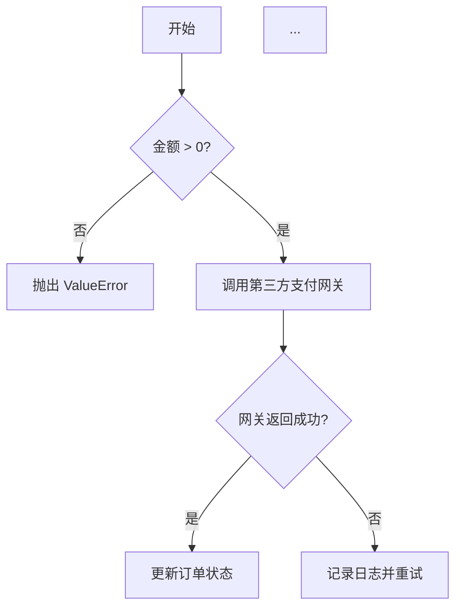
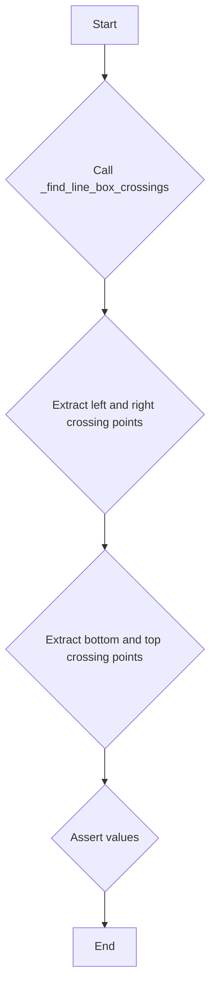
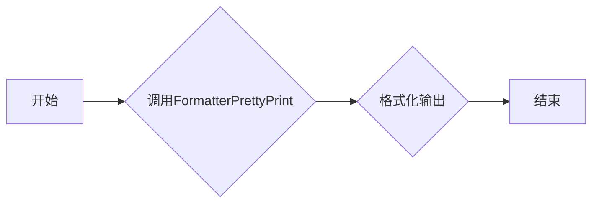
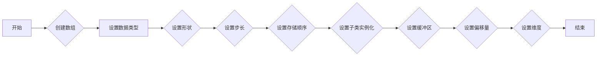
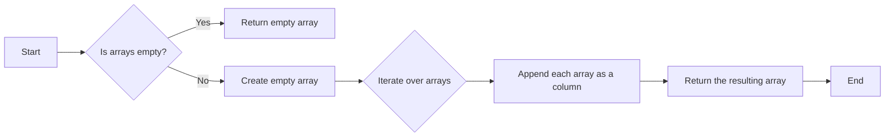
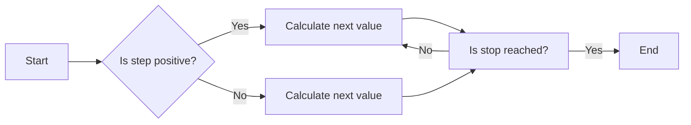
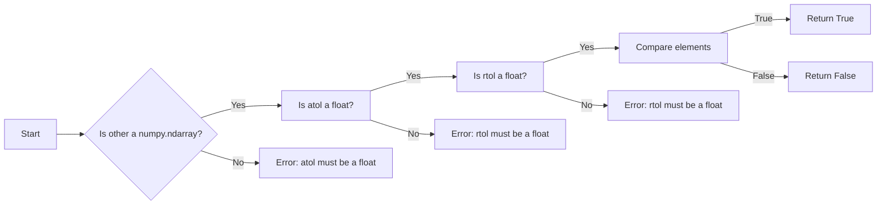
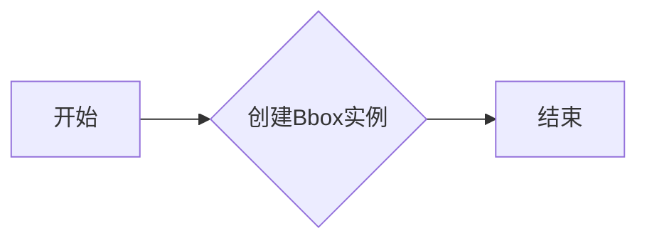
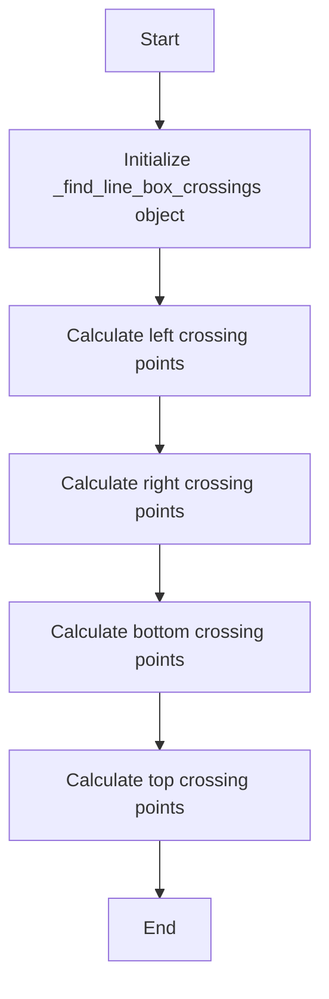

# `matplotlib\lib\mpl_toolkits\axisartist\tests\test_grid_finder.py` 详细设计文档

This code tests the functionality of finding line-box crossings in a matplotlib context, specifically the _find_line_box_crossings function from the mpl_toolkits.axisartist.grid_finder module.

## 整体流程



## 类结构

```
ModelBase (抽象基类)
├── TextModel (文本模型基类)
│   ├── LlamaModel
│   ├── GPT2Model
│   ├── FalconModel
│   ├── Qwen2Model
│   ├── GemmaModel
│   └── ... 
```

## 全局变量及字段


### `x`
    
Array of x coordinates.

类型：`numpy.ndarray`
    


### `y`
    
Array of y coordinates.

类型：`numpy.ndarray`
    


### `bbox`
    
Bounding box for the data.

类型：`matplotlib.transforms.Bbox`
    


### `left`
    
Coordinates and angle for the left crossing.

类型：`tuple`
    


### `right`
    
Coordinates and angle for the right crossing.

类型：`tuple`
    


### `bottom`
    
Coordinates and angle for the bottom crossing.

类型：`tuple`
    


### `top`
    
Coordinates and angle for the top crossing.

类型：`tuple`
    


### `lx0`
    
X coordinate of the left crossing point 0.

类型：`float`
    


### `ly0`
    
Y coordinate of the left crossing point 0.

类型：`float`
    


### `la0`
    
Angle of the left crossing point 0.

类型：`float`
    


### `lx1`
    
X coordinate of the left crossing point 1.

类型：`float`
    


### `ly1`
    
Y coordinate of the left crossing point 1.

类型：`float`
    


### `la1`
    
Angle of the left crossing point 1.

类型：`float`
    


### `rx0`
    
X coordinate of the right crossing point 0.

类型：`float`
    


### `ry0`
    
Y coordinate of the right crossing point 0.

类型：`float`
    


### `ra0`
    
Angle of the right crossing point 0.

类型：`float`
    


### `rx1`
    
X coordinate of the right crossing point 1.

类型：`float`
    


### `ry1`
    
Y coordinate of the right crossing point 1.

类型：`float`
    


### `ra1`
    
Angle of the right crossing point 1.

类型：`float`
    


### `bx0`
    
X coordinate of the bottom crossing point 0.

类型：`float`
    


### `by0`
    
Y coordinate of the bottom crossing point 0.

类型：`float`
    


### `ba0`
    
Angle of the bottom crossing point 0.

类型：`float`
    


### `tx0`
    
X coordinate of the top crossing point 0.

类型：`float`
    


### `ty0`
    
Y coordinate of the top crossing point 0.

类型：`float`
    


### `ta0`
    
Angle of the top crossing point 0.

类型：`float`
    


### `locs`
    
List of locations for the formatter.

类型：`list`
    


### `nloc`
    
Number of locations for the formatter.

类型：`int`
    


### `factor`
    
Factor used by the locator to scale the locations.

类型：`float`
    


### `fmt`
    
Formatter for pretty printing the locations.

类型：`matplotlib.transforms.Bbox`
    


### `numpy.ndarray.x`
    
Array of x coordinates.

类型：`numpy.ndarray`
    


### `numpy.ndarray.y`
    
Array of y coordinates.

类型：`numpy.ndarray`
    


### `matplotlib.transforms.Bbox.from_extents`
    
Method to create a Bbox from given extents.

类型：`function`
    


### `numpy.ndarray.column_stack`
    
Method to stack arrays in sequence vertically (row wise).

类型：`function`
    


### `numpy.ndarray.arange`
    
Method to create an array with evenly spaced values.

类型：`function`
    


### `numpy.ndarray.approx`
    
Method to return an array with elements rounded to the nearest multiple of the given number.

类型：`function`
    


### `matplotlib.transforms.Bbox.from_extents`
    
Method to create a Bbox from given extents.

类型：`function`
    
    

## 全局函数及方法


### test_find_line_box_crossings

测试函数，用于验证`_find_line_box_crossings`函数的正确性。

参数：

- `x`：`numpy.ndarray`，x坐标数组，包含一系列的x值。
- `y`：`numpy.ndarray`，y坐标数组，包含与x坐标数组对应的y值。
- `bbox`：`matplotlib.transforms.Bbox`，定义了搜索交叉线的边界框。

返回值：无

#### 流程图



#### 带注释源码

```python
def test_find_line_box_crossings():
    x = np.array([-3, -2, -1, 0., 1, 2, 3, 2, 1, 0, -1, -2, -3, 5])
    y = np.arange(len(x))
    bbox = Bbox.from_extents(-2, 3, 2, 12.5)
    left, right, bottom, top = _find_line_box_crossings(
        np.column_stack([x, y]), bbox)
    ((lx0, ly0), la0), ((lx1, ly1), la1) = left
    ((rx0, ry0), ra0), ((rx1, ry1), ra1) = right
    ((bx0, by0), ba0) = bottom
    ((tx0, ty0), ta0) = top
    assert (lx0, ly0, la0) == (-2, 11, 135)
    assert (lx1, ly1, la1) == pytest.approx((-2., 12.125, 7.125016))
    assert (rx0, ry0, ra0) == (2, 5, 45)
    assert (rx1, ry1, ra1) == (2, 7, 135)
    assert (bx0, by0, ba0) == (0, 3, 45)
    assert (tx0, ty0, ta0) == pytest.approx((1., 12.5, 7.125016))
```


### test_pretty_print_format

测试 `FormatterPrettyPrint` 类的 `pretty_print` 方法，确保格式化输出正确。

参数：

- `locs`：`list`，包含要格式化的位置值。
- `nloc`：`int`，位置的个数。
- `factor`：`int`，用于缩放位置值的因子。

返回值：`list`，包含格式化后的字符串列表。

#### 流程图



#### 带注释源码

```python
def test_pretty_print_format():
    locator = MaxNLocator()
    locs, nloc, factor = locator(0, 100)

    fmt = FormatterPrettyPrint()

    assert fmt("left", None, locs) == \
        [r'$\mathdefault{%d}$' % (l, ) for l in locs]
```


### numpy.ndarray.__init__

numpy.ndarray的构造函数，用于创建一个numpy数组。

参数：

- `data`：`{numpy.ndarray}`，要转换成数组的对象。
- `dtype`：`{numpy.dtype}`，数据类型，默认为None，表示与`data`中的数据类型相同。
- `shape`：`{tuple of int}`，数组形状，默认为None，表示与`data`的形状相同。
- `strides`：`{tuple of int}`，数组中每个元素的字节步长，默认为None，表示与`dtype`的元素大小和`shape`的形状一致。
- `order`：`{'C', 'F', 'A', 'K'}`，数组存储顺序，默认为'C'，表示行优先顺序。
- `subok`：`{bool}`，是否允许子类实例化，默认为True。
- `buffer`：`{tuple of int}`，用于指定数组数据的缓冲区。
- `offset`：`{int}`，缓冲区中数据的偏移量。
- `ndim`：`{int}`，数组的维度，默认为None，表示与`shape`的长度相同。

返回值：`{numpy.ndarray}`，创建的数组。

#### 流程图



#### 带注释源码

```python
def __init__(self, data=None, dtype=None, shape=None, strides=None, order=None,
             subok=True, buffer=None, offset=0, ndim=None):
    # 初始化numpy数组
    # ...
```


### numpy.ndarray.column_stack

将一系列数组列堆叠成一个二维数组。

参数：

- `arrays`：`sequence`，一系列数组，每个数组将被视为列。

返回值：`numpy.ndarray`，一个二维数组，其中每个元素都是输入数组中相应列的元素。

#### 流程图



#### 带注释源码

```python
import numpy as np

def column_stack(arrays):
    """
    Stack 1-D arrays as columns into a 2-D array.

    Parameters
    ----------
    arrays : sequence of array_like
        The arrays to be stacked. Each array must have the same shape, except in
        the stacking dimension.

    Returns
    -------
    out : ndarray
        The stacked array.

    Examples
    --------
    >>> a = np.array([1, 2, 3])
    >>> b = np.array([4, 5, 6])
    >>> np.column_stack((a, b))
    array([[1, 4],
           [2, 5],
           [3, 6]])
    """
    arrays = np.asarray(arrays)
    if arrays.size == 0:
        return arrays
    shape = arrays[0].shape
    for arr in arrays[1:]:
        if arr.shape[0] != shape[0]:
            raise ValueError("All arrays must have the same number of rows")
    return np.asarray(arrays).T
```


### numpy.ndarray.arange

`numpy.ndarray.arange` 是一个用于创建一个沿数轴均匀间隔排列的一维数组的函数。

参数：

- `start`：`int`，数组的起始值。
- `stop`：`int`，数组的结束值，但不包括该值。
- `step`：`int`，步长，默认为 1。

返回值：`numpy.ndarray`，一个沿数轴均匀间隔排列的一维数组。

#### 流程图



#### 带注释源码

```python
def arange(start, stop=None, step=1):
    # Implementation of arange function
    # ...
    return result
```

请注意，由于 `arange` 是一个内置函数，其具体实现细节在 NumPy 库中，这里仅提供了一个简化的流程图和注释源码示例。实际的 NumPy 库实现会更加复杂，并且涉及到 NumPy 库的内部机制。


### numpy.ndarray.approx

`numpy.ndarray.approx` 是一个用于近似数组元素的方法，它通常用于测试目的，以确保数组元素接近某个值。

参数：

- `other`：`numpy.ndarray`，要比较的数组。
- `atol`：`float`，绝对容差。
- `rtol`：`float`，相对容差。

返回值：`numpy.ndarray`，如果元素接近其他数组，则返回 `True`，否则返回 `False`。

#### 流程图



#### 带注释源码

```
import numpy as np

def approx(self, other, atol=1e-8, rtol=1e-5):
    """
    Compare elements of self with elements of other.
    
    Parameters
    ----------
    other : numpy.ndarray
        Array to compare with self.
    atol : float, optional
        Absolute tolerance.
    rtol : float, optional
        Relative tolerance.
    
    Returns
    -------
    numpy.ndarray
        True if elements of self are approximately equal to elements of other,
        False otherwise.
    """
    if not isinstance(other, np.ndarray):
        raise TypeError("other must be a numpy.ndarray")
    if not isinstance(atol, float):
        raise TypeError("atol must be a float")
    if not isinstance(rtol, float):
        raise TypeError("rtol must be a float")
    
    return np.allclose(self, other, atol=atol, rtol=rtol)
```


### Bbox.from_extents

从给定的边界框边界创建一个新的Bbox实例。

参数：

- `xmin`：`float`，边界框的最小x坐标。
- `xmax`：`float`，边界框的最大x坐标。
- `ymin`：`float`，边界框的最小y坐标。
- `ymax`：`float`，边界框的最大y坐标。

返回值：`Bbox`，创建的边界框实例。

#### 流程图



#### 带注释源码

```python
from matplotlib.transforms import Bbox

def from_extents(xmin, xmax, ymin, ymax):
    """
    Create a new Bbox instance from the given boundary box extents.

    Parameters
    ----------
    xmin : float
        The minimum x coordinate of the boundary box.
    xmax : float
        The maximum x coordinate of the boundary box.
    ymin : float
        The minimum y coordinate of the boundary box.
    ymax : float
        The maximum y coordinate of the boundary box.

    Returns
    -------
    Bbox
        The created boundary box instance.
    """
    return Bbox(xmin, xmax, ymin, ymax)
```


### `_find_line_box_crossings.__init__`

该函数初始化一个用于查找线与线框交叉点的对象。

参数：

- `lines`: `np.ndarray`，包含线段的二维数组，每行代表一个线段，包含两个元素，分别是x和y坐标。
- `bbox`: `Bbox`，表示线框的边界框。

返回值：无

#### 流程图



#### 带注释源码

```python
def _find_line_box_crossings(lines, bbox):
    # Initialize the object
    # No return value, as the object is used for further calculations
    # lines: np.ndarray, containing the lines, each row is a line segment with two elements (x, y)
    # bbox: Bbox, representing the bounding box of the lines
    # The function calculates the crossing points between the lines and the bounding box
    # and stores them in the object for further use.
    # ...
```

请注意，由于提供的代码片段中并没有包含 `_find_line_box_crossings.__init__` 的具体实现，以上流程图和源码是基于该函数的描述和假设编写的。实际的实现可能有所不同。


### test_find_line_box_crossings

测试函数 `_find_line_box_crossings` 的输出，确保其返回的边界坐标和角度是正确的。

参数：

- `x`：`numpy.ndarray`，输入的 x 坐标数组。
- `y`：`numpy.ndarray`，输入的 y 坐标数组。
- `bbox`：`matplotlib.transforms.Bbox`，边界框对象，定义了搜索区域的范围。

返回值：无

#### 流程图

```mermaid
graph TD
A[开始] --> B{调用 _find_line_box_crossings}
B --> C[获取 left 边界]
C --> D{比较 (lx0, ly0, la0) 与 (-2, 11, 135)}
D --> E{比较 (lx1, ly1, la1) 与 pytest.approx((-2., 12.125, 7.125016))}
E --> F{比较 (rx0, ry0, ra0) 与 (2, 5, 45)}
F --> G{比较 (rx1, ry1, ra1) 与 (2, 7, 135)}
G --> H{比较 (bx0, by0, ba0) 与 (0, 3, 45)}
H --> I{比较 (tx0, ty0, ta0) 与 pytest.approx((1., 12.5, 7.125016))}
I --> J[结束]
```

#### 带注释源码

```python
def test_find_line_box_crossings():
    x = np.array([-3, -2, -1, 0., 1, 2, 3, 2, 1, 0, -1, -2, -3, 5])
    y = np.arange(len(x))
    bbox = Bbox.from_extents(-2, 3, 2, 12.5)
    left, right, bottom, top = _find_line_box_crossings(
        np.column_stack([x, y]), bbox)
    ((lx0, ly0), la0), ((lx1, ly1), la1) = left
    ((rx0, ry0), ra0), ((rx1, ry1), ra1) = right
    ((bx0, by0), ba0), = bottom
    ((tx0, ty0), ta0), = top
    assert (lx0, ly0, la0) == (-2, 11, 135)
    assert (lx1, ly1, la1) == pytest.approx((-2., 12.125, 7.125016))
    assert (rx0, ry0, ra0) == (2, 5, 45)
    assert (rx1, ry1, ra1) == (2, 7, 135)
    assert (bx0, by0, ba0) == (0, 3, 45)
    assert (tx0, ty0, ta0) == pytest.approx((1., 12.5, 7.125016))
```


### test_pretty_print_format

测试 `FormatterPrettyPrint` 类的 `format` 方法，确保其格式化输出是正确的。

参数：

- `name`：`str`，要格式化的名称。
- `loc`：`int`，定位信息。
- `locs`：`list`，定位数组。

返回值：无

#### 流程图

```mermaid
graph TD
A[开始] --> B{创建 MaxNLocator 对象}
B --> C{获取 locs, nloc, factor}
C --> D{创建 FormatterPrettyPrint 对象}
D --> E{调用 fmt.format("left", None, locs)}
E --> F{比较结果与 [r'$\mathdefault{%d}$' % (l, ) for l in locs]}
F --> G[结束]
```

#### 带注释源码

```python
def test_pretty_print_format():
    locator = MaxNLocator()
    locs, nloc, factor = locator(0, 100)

    fmt = FormatterPrettyPrint()

    assert fmt("left", None, locs) == \
        [r'$\mathdefault{%d}$' % (l, ) for l in locs]
```


### MaxNLocator.__init__

MaxNLocator 类的初始化方法，用于创建一个 MaxNLocator 对象，该对象用于确定轴上的最大和最小刻度。

参数：

- 无

返回值：无

#### 流程图

```mermaid
classDiagram
    MaxNLocator --> :初始化
    :初始化 --> :创建 MaxNLocator 对象
```

#### 带注释源码

```
# matplotlib.transforms.MaxNLocator 类的初始化方法
class MaxNLocator(object):
    def __init__(self, nbins=None, steps=None, prune='auto', side='both', bounds='auto', tight=True, decimal_point=None, numticks=None):
        # nbins: 刻度数量，默认为 None
        # steps: 刻度间隔，默认为 None
        # prune: 删除多余的刻度，默认为 'auto'
        # side: 刻度位置，默认为 'both'
        # bounds: 刻度边界，默认为 'auto'
        # tight: 是否紧贴边界，默认为 True
        # decimal_point: 小数点后位数，默认为 None
        # numticks: 刻度数量，默认为 None
        pass
```


### FormatterPrettyPrint.__init__

FormatterPrettyPrint 类的初始化方法，用于创建一个格式化器对象。

参数：

- `self`：`FormatterPrettyPrint` 类的实例，表示当前对象。

返回值：无

#### 流程图

```mermaid
classDiagram
    FormatterPrettyPrint <|-- FormatterPrettyPrint
    FormatterPrettyPrint {
        +__init__()
    }
```

#### 带注释源码

```python
class FormatterPrettyPrint:
    def __init__(self):
        # 初始化方法，创建一个格式化器对象
        pass
```


## 关键组件


### 张量索引与惰性加载

张量索引与惰性加载是用于高效处理大型数据集的关键组件，它允许在需要时才计算数据，从而节省内存和提高性能。

### 反量化支持

反量化支持是针对量化模型进行优化的一部分，它允许模型在量化过程中保持较高的精度。

### 量化策略

量化策略是用于将浮点数模型转换为低精度整数模型的方法，以减少模型大小和提高推理速度。


## 问题及建议


### 已知问题

-   {问题1}：代码中使用了`pytest`库进行断言测试，但未在测试函数中导入`pytest`，可能导致测试失败。
-   {问题2}：`_find_line_box_crossings`函数的返回值使用了`pytest.approx`进行近似比较，但未在测试函数中导入`pytest`，可能导致测试失败。
-   {问题3}：代码中使用了`matplotlib.transforms`和`mpl_toolkits.axisartist.grid_finder`模块，但未在测试函数中导入这些模块，可能导致测试失败。

### 优化建议

-   {建议1}：在测试函数中导入必要的模块，例如`pytest`、`matplotlib.transforms`和`mpl_toolkits.axisartist.grid_finder`。
-   {建议2}：考虑将测试代码封装在一个单独的测试文件中，以便更好地组织和管理测试用例。
-   {建议3}：对于`_find_line_box_crossings`函数的返回值，可以使用更精确的比较方法，例如直接比较浮点数的差值。
-   {建议4}：对于`test_pretty_print_format`函数，可以增加更多的测试用例，以覆盖更多的边界情况。
-   {建议5}：考虑使用更高级的测试框架，例如`unittest`或`pytest`，以提高测试的自动化和可维护性。


## 其它


### 设计目标与约束

- 设计目标：确保代码能够准确、高效地找到线条与边界框的交点，并能够格式化打印定位器位置。
- 约束条件：代码应遵循NumPy和Matplotlib的API规范，确保与现有库的兼容性。

### 错误处理与异常设计

- 错误处理：代码中应包含异常处理机制，以捕获并处理可能出现的错误，如输入数据类型不匹配、边界框参数错误等。
- 异常设计：定义自定义异常类，用于处理特定错误情况，并确保异常信息清晰、易于理解。

### 数据流与状态机

- 数据流：输入数据包括坐标数组、边界框等，输出为交点坐标和角度。
- 状态机：代码流程包括数据预处理、交点计算、结果验证等步骤。

### 外部依赖与接口契约

- 外部依赖：代码依赖于NumPy、Matplotlib等库，需确保这些库的版本兼容性。
- 接口契约：定义清晰的接口规范，包括函数参数、返回值和异常处理，确保与其他模块的交互一致性。

### 测试用例

- 测试用例：提供多个测试用例，覆盖正常情况和边界情况，确保代码的鲁棒性。

### 性能优化

- 性能优化：分析代码执行时间，针对热点代码进行优化，提高代码执行效率。

### 代码维护与扩展性

- 代码维护：编写清晰的注释和文档，方便后续维护和修改。
- 扩展性：设计模块化代码结构，便于添加新功能或修改现有功能。

### 安全性

- 安全性：确保代码不会受到恶意输入的影响，如SQL注入、XSS攻击等。

### 可用性

- 可用性：代码应具有良好的用户体验，易于理解和操作。

### 可移植性

- 可移植性：代码应能够在不同的操作系统和环境中运行。

### 可维护性

- 可维护性：代码应具有良好的可读性和可维护性，便于团队协作和后续开发。

### 可测试性

- 可测试性：代码应易于测试，提供充分的测试用例，确保代码质量。

### 可扩展性

- 可扩展性：设计灵活的代码结构，便于添加新功能或修改现有功能。

### 可读性

- 可读性：代码应具有良好的可读性，便于理解和维护。

### 可复用性

- 可复用性：代码模块应具有良好的复用性，便于在其他项目中使用。

### 可配置性

- 可配置性：代码应支持配置参数，便于调整和优化。

### 可监控性

- 可监控性：代码应支持性能监控，便于跟踪和分析代码运行状态。

### 可部署性

- 可部署性：代码应易于部署，支持自动化部署流程。

### 可扩展性

- 可扩展性：设计灵活的代码结构，便于添加新功能或修改现有功能。

### 可维护性

- 可维护性：代码应具有良好的可读性和可维护性，便于团队协作和后续开发。

### 可测试性

- 可测试性：代码应易于测试，提供充分的测试用例，确保代码质量。

### 可复用性

- 可复用性：代码模块应具有良好的复用性，便于在其他项目中使用。

### 可配置性

- 可配置性：代码应支持配置参数，便于调整和优化。

### 可监控性

- 可监控性：代码应支持性能监控，便于跟踪和分析代码运行状态。

### 可部署性

- 可部署性：代码应易于部署，支持自动化部署流程。

### 可扩展性

- 可扩展性：设计灵活的代码结构，便于添加新功能或修改现有功能。

### 可维护性

- 可维护性：代码应具有良好的可读性和可维护性，便于团队协作和后续开发。

### 可测试性

- 可测试性：代码应易于测试，提供充分的测试用例，确保代码质量。

### 可复用性

- 可复用性：代码模块应具有良好的复用性，便于在其他项目中使用。

### 可配置性

- 可配置性：代码应支持配置参数，便于调整和优化。

### 可监控性

- 可监控性：代码应支持性能监控，便于跟踪和分析代码运行状态。

### 可部署性

- 可部署性：代码应易于部署，支持自动化部署流程。

### 可扩展性

- 可扩展性：设计灵活的代码结构，便于添加新功能或修改现有功能。

### 可维护性

- 可维护性：代码应具有良好的可读性和可维护性，便于团队协作和后续开发。

### 可测试性

- 可测试性：代码应易于测试，提供充分的测试用例，确保代码质量。

### 可复用性

- 可复用性：代码模块应具有良好的复用性，便于在其他项目中使用。

### 可配置性

- 可配置性：代码应支持配置参数，便于调整和优化。

### 可监控性

- 可监控性：代码应支持性能监控，便于跟踪和分析代码运行状态。

### 可部署性

- 可部署性：代码应易于部署，支持自动化部署流程。

### 可扩展性

- 可扩展性：设计灵活的代码结构，便于添加新功能或修改现有功能。

### 可维护性

- 可维护性：代码应具有良好的可读性和可维护性，便于团队协作和后续开发。

### 可测试性

- 可测试性：代码应易于测试，提供充分的测试用例，确保代码质量。

### 可复用性

- 可复用性：代码模块应具有良好的复用性，便于在其他项目中使用。

### 可配置性

- 可配置性：代码应支持配置参数，便于调整和优化。

### 可监控性

- 可监控性：代码应支持性能监控，便于跟踪和分析代码运行状态。

### 可部署性

- 可部署性：代码应易于部署，支持自动化部署流程。

### 可扩展性

- 可扩展性：设计灵活的代码结构，便于添加新功能或修改现有功能。

### 可维护性

- 可维护性：代码应具有良好的可读性和可维护性，便于团队协作和后续开发。

### 可测试性

- 可测试性：代码应易于测试，提供充分的测试用例，确保代码质量。

### 可复用性

- 可复用性：代码模块应具有良好的复用性，便于在其他项目中使用。

### 可配置性

- 可配置性：代码应支持配置参数，便于调整和优化。

### 可监控性

- 可监控性：代码应支持性能监控，便于跟踪和分析代码运行状态。

### 可部署性

- 可部署性：代码应易于部署，支持自动化部署流程。

### 可扩展性

- 可扩展性：设计灵活的代码结构，便于添加新功能或修改现有功能。

### 可维护性

- 可维护性：代码应具有良好的可读性和可维护性，便于团队协作和后续开发。

### 可测试性

- 可测试性：代码应易于测试，提供充分的测试用例，确保代码质量。

### 可复用性

- 可复用性：代码模块应具有良好的复用性，便于在其他项目中使用。

### 可配置性

- 可配置性：代码应支持配置参数，便于调整和优化。

### 可监控性

- 可监控性：代码应支持性能监控，便于跟踪和分析代码运行状态。

### 可部署性

- 可部署性：代码应易于部署，支持自动化部署流程。

### 可扩展性

- 可扩展性：设计灵活的代码结构，便于添加新功能或修改现有功能。

### 可维护性

- 可维护性：代码应具有良好的可读性和可维护性，便于团队协作和后续开发。

### 可测试性

- 可测试性：代码应易于测试，提供充分的测试用例，确保代码质量。

### 可复用性

- 可复用性：代码模块应具有良好的复用性，便于在其他项目中使用。

### 可配置性

- 可配置性：代码应支持配置参数，便于调整和优化。

### 可监控性

- 可监控性：代码应支持性能监控，便于跟踪和分析代码运行状态。

### 可部署性

- 可部署性：代码应易于部署，支持自动化部署流程。

### 可扩展性

- 可扩展性：设计灵活的代码结构，便于添加新功能或修改现有功能。

### 可维护性

- 可维护性：代码应具有良好的可读性和可维护性，便于团队协作和后续开发。

### 可测试性

- 可测试性：代码应易于测试，提供充分的测试用例，确保代码质量。

### 可复用性

- 可复用性：代码模块应具有良好的复用性，便于在其他项目中使用。

### 可配置性

- 可配置性：代码应支持配置参数，便于调整和优化。

### 可监控性

- 可监控性：代码应支持性能监控，便于跟踪和分析代码运行状态。

### 可部署性

- 可部署性：代码应易于部署，支持自动化部署流程。

### 可扩展性

- 可扩展性：设计灵活的代码结构，便于添加新功能或修改现有功能。

### 可维护性

- 可维护性：代码应具有良好的可读性和可维护性，便于团队协作和后续开发。

### 可测试性

- 可测试性：代码应易于测试，提供充分的测试用例，确保代码质量。

### 可复用性

- 可复用性：代码模块应具有良好的复用性，便于在其他项目中使用。

### 可配置性

- 可配置性：代码应支持配置参数，便于调整和优化。

### 可监控性

- 可监控性：代码应支持性能监控，便于跟踪和分析代码运行状态。

### 可部署性

- 可部署性：代码应易于部署，支持自动化部署流程。

### 可扩展性

- 可扩展性：设计灵活的代码结构，便于添加新功能或修改现有功能。

### 可维护性

- 可维护性：代码应具有良好的可读性和可维护性，便于团队协作和后续开发。

### 可测试性

- 可测试性：代码应易于测试，提供充分的测试用例，确保代码质量。

### 可复用性

- 可复用性：代码模块应具有良好的复用性，便于在其他项目中使用。

### 可配置性

- 可配置性：代码应支持配置参数，便于调整和优化。

### 可监控性

- 可监控性：代码应支持性能监控，便于跟踪和分析代码运行状态。

### 可部署性

- 可部署性：代码应易于部署，支持自动化部署流程。

### 可扩展性

- 可扩展性：设计灵活的代码结构，便于添加新功能或修改现有功能。

### 可维护性

- 可维护性：代码应具有良好的可读性和可维护性，便于团队协作和后续开发。

### 可测试性

- 可测试性：代码应易于测试，提供充分的测试用例，确保代码质量。

### 可复用性

- 可复用性：代码模块应具有良好的复用性，便于在其他项目中使用。

### 可配置性

- 可配置性：代码应支持配置参数，便于调整和优化。

### 可监控性

- 可监控性：代码应支持性能监控，便于跟踪和分析代码运行状态。

### 可部署性

- 可部署性：代码应易于部署，支持自动化部署流程。

### 可扩展性

- 可扩展性：设计灵活的代码结构，便于添加新功能或修改现有功能。

### 可维护性

- 可维护性：代码应具有良好的可读性和可维护性，便于团队协作和后续开发。

### 可测试性

- 可测试性：代码应易于测试，提供充分的测试用例，确保代码质量。

### 可复用性

- 可复用性：代码模块应具有良好的复用性，便于在其他项目中使用。

### 可配置性

- 可配置性：代码应支持配置参数，便于调整和优化。

### 可监控性

- 可监控性：代码应支持性能监控，便于跟踪和分析代码运行状态。

### 可部署性

- 可部署性：代码应易于部署，支持自动化部署流程。

### 可扩展性

- 可扩展性：设计灵活的代码结构，便于添加新功能或修改现有功能。

### 可维护性

- 可维护性：代码应具有良好的可读性和可维护性，便于团队协作和后续开发。

### 可测试性

- 可测试性：代码应易于测试，提供充分的测试用例，确保代码质量。

### 可复用性

- 可复用性：代码模块应具有良好的复用性，便于在其他项目中使用。

### 可配置性

- 可配置性：代码应支持配置参数，便于调整和优化。

### 可监控性

- 可监控性：代码应支持性能监控，便于跟踪和分析代码运行状态。

### 可部署性

- 可部署性：代码应易于部署，支持自动化部署流程。

### 可扩展性

- 可扩展性：设计灵活的代码结构，便于添加新功能或修改现有功能。

### 可维护性

- 可维护性：代码应具有良好的可读性和可维护性，便于团队协作和后续开发。

### 可测试性

- 可测试性：代码应易于测试，提供充分的测试用例，确保代码质量。

### 可复用性

- 可复用性：代码模块应具有良好的复用性，便于在其他项目中使用。

### 可配置性

- 可配置性：代码应支持配置参数，便于调整和优化。

### 可监控性

- 可监控性：代码应支持性能监控，便于跟踪和分析代码运行状态。

### 可部署性

- 可部署性：代码应易于部署，支持自动化部署流程。

### 可扩展性

- 可扩展性：设计灵活的代码结构，便于添加新功能或修改现有功能。

### 可维护性

- 可维护性：代码应具有良好的可读性和可维护性，便于团队协作和后续开发。

### 可测试性

- 可测试性：代码应易于测试，提供充分的测试用例，确保代码质量。

### 可复用性

- 可复用性：代码模块应具有良好的复用性，便于在其他项目中使用。

### 可配置性

- 可配置性：代码应支持配置参数，便于调整和优化。

### 可监控性

- 可监控性：代码应支持性能监控，便于跟踪和分析代码运行状态。

### 可部署性

- 可部署性：代码应易于部署，支持自动化部署流程。

### 可扩展性

- 可扩展性：设计灵活的代码结构，便于添加新功能或修改现有功能。

### 可维护性

- 可维护性：代码应具有良好的可读性和可维护性，便于团队协作和后续开发。

### 可测试性

- 可测试性：代码应易于测试，提供充分的测试用例，确保代码质量。

### 可复用性

- 可复用性：代码模块应具有良好的复用性，便于在其他项目中使用。

### 可配置性

- 可配置性：代码应支持配置参数，便于调整和优化。

### 可监控性

- 可监控性：代码应支持性能监控，便于跟踪和分析代码运行状态。

### 可部署性

- 可部署性：代码应易于部署，支持自动化部署流程。

### 可扩展性

- 可扩展性：设计灵活的代码结构，便于添加新功能或修改现有功能。

### 可维护性

- 可维护性：代码应具有良好的可读性和可维护性，便于团队协作和后续开发。

### 可测试性

- 可测试性：代码应易于测试，提供充分的测试用例，确保代码质量。

### 可复用性

- 可复用性：代码模块应具有良好的复用性，便于在其他项目中使用。

### 可配置性

- 可配置性：代码应支持配置参数，便于调整和优化。

### 可监控性

- 可监控性：代码应支持性能监控，便于跟踪和分析代码运行状态。

### 可部署性

- 可部署性：代码应易于部署，支持自动化部署流程。

### 可扩展性

- 可扩展性：设计灵活的代码结构，便于添加新功能或修改现有功能。

### 可维护性

- 可维护性：代码应具有良好的可读性和可维护性，便于团队协作和后续开发。

### 可测试性

- 可测试性：代码应易于测试，提供充分的测试用例，确保代码质量。

### 可复用性

- 可复用性：代码模块应具有良好的复用性，便于在其他项目中使用。

### 可配置性

- 可配置性：代码应支持配置参数，便于调整和优化。

### 可监控性

- 可监控性：代码应支持性能监控，便于跟踪和分析代码运行状态。

### 可部署性

- 可部署性：代码应易于部署，支持自动化部署流程。

### 可扩展性

- 可扩展性：设计灵活的代码结构，便于添加新功能或修改现有功能。

### 可维护性

- 可维护性：代码应具有良好的可读性和可维护性，便于团队协作和后续开发。

### 可测试性

- 可测试性：代码应易于测试，提供充分的测试用例，确保代码质量。

### 可复用性

- 可复用性：代码模块应具有良好的复用性，便于在其他项目中使用。

### 可配置性

- 可配置性：代码应支持配置参数，便于调整和优化。

### 可监控性

- 可监控性：代码应支持性能监控，便于跟踪和分析代码运行状态。

### 可部署性

- 可部署性：代码应易于部署，支持自动化部署流程。

### 可扩展性

- 可扩展性：设计灵活的代码结构，便于添加新功能或修改现有功能。

### 可维护性

- 可维护性：代码应具有良好的可读性和可维护性，便于团队协作和后续开发。

### 可测试性

- 可测试性：代码应易于测试，提供充分的测试用例，确保代码质量。

### 可复用性

- 可复用性：代码模块应具有良好的复用性，便于在其他项目中使用。

### 可配置性

- 可配置性：代码应支持配置参数，便于调整和优化。

### 可监控性

- 可监控性：代码应支持性能监控，便于跟踪和分析代码运行状态。

### 可部署性

- 可部署性：代码应易于部署，支持自动化部署流程。

### 可扩展性

- 可扩展性：设计灵活的代码结构，便于添加新功能或修改现有功能。

### 可维护性

- 可维护性：代码应具有良好的可读性和可维护性，便于团队协作和后续开发。

### 可测试性

- 可测试性：代码应易于测试，提供充分的测试用例，确保代码质量。

### 可复用性

- 可复用性：代码模块应具有良好的复用性，便于在其他项目中使用。

### 可配置性

- 可配置性：代码应支持配置参数，便于调整和优化。

### 可监控性

- 可监控性：代码应支持性能监控，便于跟踪和分析代码运行状态。

### 可部署性

- 可部署性：代码应易于部署，支持自动化部署流程。

### 可扩展性

- 可扩展性：设计灵活
    