# `matplotlib\lib\mpl_toolkits\axisartist\tests\test_grid_helper_curvelinear.py` 详细设计文档

这是一个matplotlib测试文件，展示了如何使用axisartist和axes_grid1工具创建自定义坐标变换、极坐标投影和浮动坐标轴。代码包含三个测试用例，分别测试自定义仿射变换、极坐标框图和坐标轴方向设置。

## 整体流程

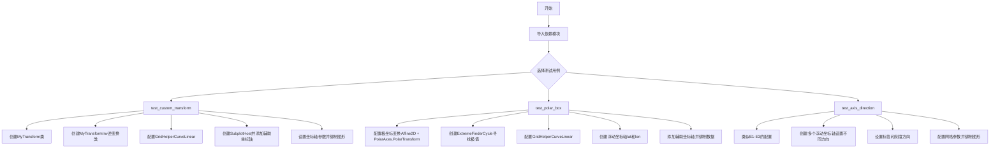

## 类结构

```
测试模块 (test_axisartist.py)
├── MyTransform (自定义Transform类)
│   ├── __init__(resolution)
│   ├── transform(ll)
│   ├── transform_path(path)
│   └── inverted()
├── MyTransformInv (逆变换类)
│   ├── __init__(resolution)
│   ├── transform(ll)
│   └── inverted()
└── 测试函数
    ├── test_custom_transform()
    ├── test_polar_box()
    └── test_axis_direction()
```

## 全局变量及字段


### `np`
    
numpy数值计算库，用于数组和矩阵运算

类型：`numpy库`
    


### `plt`
    
matplotlib绘图库，用于创建可视化图表

类型：`matplotlib.pyplot库`
    


### `Path`
    
matplotlib路径类，用于表示和操作平面上的路径

类型：`matplotlib.path.Path类`
    


### `PolarAxes`
    
极坐标投影类，用于创建极坐标轴

类型：`mpl_toolkits.axisartist.project_polar.PolarAxes类`
    


### `FuncFormatter`
    
函数格式化器，用于自定义刻度标签格式

类型：`matplotlib.ticker.FuncFormatter类`
    


### `Affine2D`
    
2D仿射变换类，用于执行二维仿射变换操作

类型：`matplotlib.transforms.Affine2D类`
    


### `Transform`
    
变换抽象基类，定义坐标变换的接口

类型：`matplotlib.transforms.Transform类`
    


### `image_comparison`
    
图像比较装饰器，用于测试中比较渲染图像与基准图像

类型：`matplotlib.testing.decorators.image_comparison函数`
    


### `SubplotHost`
    
子图主机类，用于管理子图和坐标轴

类型：`mpl_toolkits.axisartist.SubplotHost类`
    


### `host_axes_class_factory`
    
主机坐标轴类工厂，用于创建支持寄生轴的主机坐标轴类

类型：`mpl_toolkits.axes_grid1.parasite_axes.host_axes_class_factory函数`
    


### `angle_helper`
    
角度辅助工具模块，提供角度相关的辅助函数和类

类型：`mpl_toolkits.axisartist.angle_helper模块`
    


### `Axes`
    
坐标轴类，提供坐标轴的绘制和管理功能

类型：`mpl_toolkits.axisartist.axislines.Axes类`
    


### `GridHelperCurveLinear`
    
曲线坐标网格辅助类，用于创建曲线坐标系的网格

类型：`mpl_toolkits.axisartist.grid_helper_curvelinear.GridHelperCurveLinear类`
    


### `MyTransform._resolution`
    
插值步数，用于近似路径变换

类型：`int`
    


### `MyTransformInv._resolution`
    
插值步数

类型：`int`
    
    

## 全局函数及方法


### `test_custom_transform`

该函数是一个图像对比测试函数，用于测试自定义坐标变换（MyTransform 和 MyTransformInv）的功能，通过 matplotlib 的 axisartist 工具绘制自定义曲线坐标网格，并使用图像对比验证生成的图形是否符合预期。

参数： 无

返回值： `None`，测试函数不返回任何值

#### 流程图

```mermaid
flowchart TD
    A[开始测试] --> B[定义内部类 MyTransform 继承 Transform]
    B --> C[定义内部类 MyTransformInv 继承 Transform]
    C --> D[创建 matplotlib 图形 Figure]
    D --> E[使用 host_axes_class_factory 创建 SubplotHost 类]
    E --> F[实例化 MyTransform 变换对象, 分辨率为1]
    F --> G[使用 MyTransform 创建 GridHelperCurveLinear 网格辅助对象]
    G --> H[创建 SubplotHost 坐标轴 ax1, 传入 grid_helper]
    H --> I[将 ax1 添加到图形中]
    I --> J[使用 get_aux_axes 获取辅助坐标轴 ax2, 使用相同变换]
    J --> K[在 ax2 上绘制点 [3,6] 和 [5.0,10.0]]
    K --> L[设置 ax1 的纵横比为1]
    L --> M[设置 ax1 的 x 轴范围 0-10, y 轴范围 0-10]
    M --> N[开启 ax1 的网格显示]
    N --> O[结束测试, 生成图像对比]
```

#### 带注释源码

```python
@image_comparison(['custom_transform.png'], style='default', tol=0.2)
def test_custom_transform():
    """
    测试自定义坐标变换功能
    使用 @image_comparison 装饰器进行图像对比测试
    比较生成的图像与 baseline 图像 custom_transform.png
    允许的容差为 0.2
    """
    
    # 定义自定义变换类 MyTransform，继承自 matplotlib 的 Transform 基类
    class MyTransform(Transform):
        # 设置输入和输出维度为 2（二维坐标）
        input_dims = output_dims = 2

        def __init__(self, resolution):
            """
            初始化变换对象
            resolution: 插值步数，用于在变换空间中近似输入线段的路径
            """
            Transform.__init__(self)
            self._resolution = resolution

        def transform(self, ll):
            """
            执行正向变换
            ll: 输入的坐标数组，形状为 (n, 2)
            返回变换后的坐标，变换公式: y' = y - x
            """
            x, y = ll.T  # 分离 x 和 y 坐标
            return np.column_stack([x, y - x])  # 返回变换后的坐标

        # transform_non_affine 与 transform 相同（该变换是线性的）
        transform_non_affine = transform

        def transform_path(self, path):
            """
            变换整个路径（包含多个顶点和连接指令）
            path: 输入的 Path 对象
            返回变换后的 Path 对象
            """
            # 对路径进行插值，使用指定的分辨率
            ipath = path.interpolated(self._resolution)
            # 变换顶点并保持原有的 codes（路径指令）
            return Path(self.transform(ipath.vertices), ipath.codes)

        # transform_path_non_affine 与 transform_path 相同
        transform_path_non_affine = transform_path

        def inverted(self):
            """
            返回逆变换对象
            """
            return MyTransformInv(self._resolution)

    # 定义逆变换类 MyTransformInv
    class MyTransformInv(Transform):
        input_dims = output_dims = 2

        def __init__(self, resolution):
            """
            初始化逆变换对象
            resolution: 插值步数
            """
            Transform.__init__(self)
            self._resolution = resolution

        def transform(self, ll):
            """
            执行逆变换
            ll: 输入的坐标数组
            返回逆变换后的坐标，变换公式: y' = y + x（是 MyTransform 的逆操作）
            """
            x, y = ll.T
            return np.column_stack([x, y + x])

        def inverted(self):
            """
            返回正向变换对象
            """
            return MyTransform(self._resolution)

    # 创建 matplotlib 图形对象
    fig = plt.figure()

    # 使用 host_axes_class_factory 生成混合坐标轴类 SubplotHost
    # 动态创建支持主坐标轴和寄生坐标轴的类
    SubplotHost = host_axes_class_factory(Axes)

    # 实例化自定义变换，分辨率为 1
    tr = MyTransform(1)
    
    # 创建曲线网格辅助器，传入自定义变换
    grid_helper = GridHelperCurveLinear(tr)
    
    # 创建子图坐标轴，使用自定义网格辅助
    ax1 = SubplotHost(fig, 1, 1, 1, grid_helper=grid_helper)
    
    # 将坐标轴添加到图形中
    fig.add_subplot(ax1)

    # 获取辅助坐标轴（用于绘制数据），使用相同的变换
    # viewlim_mode="equal" 表示辅助坐标轴与主坐标轴共享相同的视图限制
    ax2 = ax1.get_aux_axes(tr, viewlim_mode="equal")
    
    # 在辅助坐标轴上绘制数据点 (3,5.0) 到 (6,10.0)
    ax2.plot([3, 6], [5.0, 10.])

    # 设置坐标轴的纵横比为 1（等比例）
    ax1.set_aspect(1.)
    
    # 设置 x 轴和 y 轴的显示范围
    ax1.set_xlim(0, 10)
    ax1.set_ylim(0, 10)

    # 开启网格显示
    ax1.grid(True)
```


### `test_polar_box`

该测试函数用于验证matplotlib在极坐标投影下的曲线坐标网格系统功能，通过创建自定义的极坐标转换（角度以度为单位），配置极端值查找器和网格定位器，设置浮动坐标轴，并使用辅助坐标系绘制测试数据，最终生成极坐标框图的可视化结果以进行图像对比测试。

参数： 无（该函数无显式自定义参数，使用pytest的image_comparison装饰器默认参数）

返回值：`None`，该函数为测试函数，不返回任何值，仅通过图像对比验证绘图结果

#### 流程图

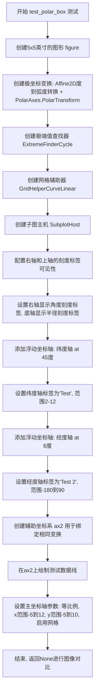

#### 带注释源码

```python
# 使用image_comparison装饰器进行图像对比测试
# 期望的基准图像为'polar_box.png', 允许的容差为0.09
@image_comparison(['polar_box.png'], style='default', tol=0.09)
def test_polar_box():
    """
    测试极坐标框图绘制功能
    
    该测试验证matplotlib的曲线坐标网格系统（GridHelperCurveLinear）
    在极坐标投影下的正确性，包括：
    - 角度从度到弧度的转换
    - 极端值查找器处理周期性坐标
    - 浮动坐标轴的创建和配置
    - 辅助坐标系的数据绑定
    """
    # 创建一个5x5英寸大小的图形对象
    fig = plt.figure(figsize=(5, 5))

    # PolarAxes.PolarTransform接受弧度制，但我们需要使用度制度
    # 因此使用Affine2D进行度到弧度的转换（乘以π/180）
    # 然后组合极坐标变换得到最终的坐标转换器
    tr = Affine2D().scale(np.pi / 180., 1.) + PolarAxes.PolarTransform()

    # 极坐标投影涉及周期性（角度循环）和坐标限制
    # 需要使用特殊方法找到视图内坐标的极值（最小/最大值）
    # 参数说明:
    #   20, 20: x和y方向的采样点数
    #   lon_cycle=360: 经度周期为360度
    #   lat_cycle=None: 纬度无周期
    #   lon_minmax=None: 经度无限制
    #   lat_minmax=(0, np.inf): 纬度限制为0到正无穷
    extreme_finder = angle_helper.ExtremeFinderCycle(20, 20,
                                                     lon_cycle=360,
                                                     lat_cycle=None,
                                                     lon_minmax=None,
                                                     lat_minmax=(0, np.inf))

    # 创建曲线网格辅助器，用于处理极坐标投影的网格线
    # 参数说明:
    #   tr: 坐标变换器
    #   extreme_finder: 极值查找器
    #   grid_locator1: 经度网格定位器（每12度一个刻度）
    #   tick_formatter1: 经度刻度格式化器
    #   tick_formatter2: 纬度刻度格式化器（特殊处理x==8显示"eight"）
    grid_helper = GridHelperCurveLinear(
        tr,
        extreme_finder=extreme_finder,
        grid_locator1=angle_helper.LocatorDMS(12),
        tick_formatter1=angle_helper.FormatterDMS(),
        tick_formatter2=FuncFormatter(lambda x, p: "eight" if x == 8 else f"{int(x)}"),
    )

    # 使用自定义网格辅助器创建子图主机
    ax1 = SubplotHost(fig, 1, 1, 1, grid_helper=grid_helper)

    # 启用右轴和上轴的主刻度标签（默认可能隐藏）
    ax1.axis["right"].major_ticklabels.set_visible(True)
    ax1.axis["top"].major_ticklabels.set_visible(True)

    # 配置右轴显示第1个坐标（角度）的刻度标签
    ax1.axis["right"].get_helper().nth_coord_ticks = 0
    # 配置底轴显示第2个坐标（半径）的刻度标签
    ax1.axis["bottom"].get_helper().nth_coord_ticks = 1

    # 将子图添加到图形中
    fig.add_subplot(ax1)

    # 创建浮动坐标轴"lat"（纬度轴），位于45度位置
    ax1.axis["lat"] = axis = grid_helper.new_floating_axis(0, 45, axes=ax1)
    axis.label.set_text("Test")  # 设置标签文本
    axis.label.set_visible(True)  # 标签可见
    axis.get_helper().set_extremes(2, 12)  # 设置坐标范围

    # 创建浮动坐标轴"lon"（经度轴），位于6度位置
    ax1.axis["lon"] = axis = grid_helper.new_floating_axis(1, 6, axes=ax1)
    axis.label.set_text("Test 2")  # 设置标签文本
    axis.get_helper().set_extremes(-180, 90)  # 设置坐标范围

    # 创建带有给定变换的寄生轴（辅助坐标系）
    # ax2将共享ax1的变换，在ax2上绘制的内容会匹配ax1的刻度和网格
    ax2 = ax1.get_aux_axes(tr, viewlim_mode="equal")
    # 验证变换组合的正确性
    assert ax2.transData == tr + ax1.transData
    
    # 在辅助坐标系上绘制测试数据
    # x: 从0到30的50个等间距点（角度，单位度）
    # y: 恒定为10（半径）
    ax2.plot(np.linspace(0, 30, 50), np.linspace(10, 10, 50))

    # 设置坐标轴参数
    ax1.set_aspect(1.)  # 设置等比例
    ax1.set_xlim(-5, 12)  # x轴范围
    ax1.set_ylim(-5, 10)  # y轴范围
    ax1.grid(True)  # 启用网格线
```


### `test_axis_direction`

该函数是一个图像对比测试函数，用于测试坐标轴方向（axis_direction）设置功能，验证在曲线性网格助手中正确设置浮动轴的方向、标签和刻度。

参数：此函数无显式参数，通过装饰器 `@image_comparison` 接收隐式参数

返回值：`None`，该函数为测试函数，无返回值，主要通过图像对比验证功能正确性

#### 流程图

```mermaid
flowchart TD
    A[开始测试] --> B[设置rcParams: text.kerning_factor=6]
    B --> C[创建图形: figsize=(5, 5)]
    C --> D[创建坐标变换: Affine2D + PolarAxes.PolarTransform]
    D --> E[创建ExtremeFinderCycle: 20x20采样点]
    E --> F[创建GridHelperCurveLinear]
    F --> G[创建SubplotHost并添加到图形]
    G --> H[隐藏所有默认轴: axis.set_visible False]
    H --> I[创建浮动轴lat1: direction=left, 角度130]
    I --> J[创建浮动轴lat2: direction=right, 角度50]
    J --> K[创建浮动轴lon: direction=bottom, 角度10]
    K --> L[配置lon轴: 标签方向top, 刻度方向top]
    L --> M[设置网格参数: nbins=5]
    M --> N[设置图形属性: aspect=1, xlim, ylim]
    N --> O[启用网格: grid True]
    O --> P[结束: 图像对比验证]
```

#### 带注释源码

```python
# 装饰器：图像对比测试，基准图像为axis_direction.png，容差0.15
@image_comparison(['axis_direction.png'], style='default', tol=0.15)
def test_axis_direction():
    """
    测试坐标轴方向设置功能
    验证曲线性坐标系统中浮动轴的方向配置是否正确
    """
    # 设置文本字距调整参数
    plt.rcParams['text.kerning_factor'] = 6

    # 创建5x5英寸的图形对象
    fig = plt.figure(figsize=(5, 5))

    # 创建坐标变换组合：
    # Affine2D().scale(np.pi / 180., 1.) 将角度转换为弧度
    # PolarAxes.PolarTransform 处理极坐标变换
    tr = Affine2D().scale(np.pi / 180., 1.) + PolarAxes.PolarTransform()

    # 创建极端值查找器：
    # 20, 20: x,y方向的采样点数
    # lon_cycle=360: 经度周期360度
    # lat_cycle=None: 纬度无周期
    # lat_minmax=(0, np.inf): 纬度范围0到无穷
    extreme_finder = angle_helper.ExtremeFinderCycle(20, 20,
                                                     lon_cycle=360,
                                                     lat_cycle=None,
                                                     lon_minmax=None,
                                                     lat_minmax=(0, np.inf),
                                                     )

    # 创建经度定位器：12刻度间隔（DMS格式）
    grid_locator1 = angle_helper.LocatorDMS(12)
    # 创建刻度格式化器：DMS格式
    tick_formatter1 = angle_helper.FormatterDMS()

    # 创建曲线性网格助手
    # 参数：坐标变换、极端值查找器、网格定位器、刻度格式化器
    grid_helper = GridHelperCurveLinear(tr,
                                        extreme_finder=extreme_finder,
                                        grid_locator1=grid_locator1,
                                        tick_formatter1=tick_formatter1)

    # 使用自定义网格助手创建子图宿主
    # 1, 1, 1 表示1行1列第1个位置
    ax1 = SubplotHost(fig, 1, 1, 1, grid_helper=grid_helper)

    # 隐藏所有预定义的坐标轴
    for axis in ax1.axis.values():
        axis.set_visible(False)

    # 将子图添加到图形
    fig.add_subplot(ax1)

    # 创建浮动轴 lat1（纬度轴1）：
    # 0表示角度坐标，130表示130度，axis_direction="left"表示左侧显示
    ax1.axis["lat1"] = axis = grid_helper.new_floating_axis(
        0, 130,
        axes=ax1, axis_direction="left")
    axis.label.set_text("Test")
    axis.label.set_visible(True)
    axis.get_helper().set_extremes(0.001, 10)

    # 创建浮动轴 lat2（纬度轴2）：
    # axis_direction="right"表示右侧显示
    ax1.axis["lat2"] = axis = grid_helper.new_floating_axis(
        0, 50,
        axes=ax1, axis_direction="right")
    axis.label.set_text("Test")
    axis.label.set_visible(True)
    axis.get_helper().set_extremes(0.001, 10)

    # 创建浮动轴 lon（经度轴）：
    # 1表示径向坐标，10表示10个单位，axis_direction="bottom"表示底部显示
    ax1.axis["lon"] = axis = grid_helper.new_floating_axis(
        1, 10,
        axes=ax1, axis_direction="bottom")
    axis.label.set_text("Test 2")
    axis.get_helper().set_extremes(50, 130)
    # 设置刻度标签方向为顶部
    axis.major_ticklabels.set_axis_direction("top")
    # 设置标签方向为顶部
    axis.label.set_axis_direction("top")

    # 配置网格：经度和纬度方向各5个网格线
    grid_helper.grid_finder.grid_locator1.set_params(nbins=5)
    grid_helper.grid_finder.grid_locator2.set_params(nbins=5)

    # 设置坐标轴属性：
    # 等宽比例
    ax1.set_aspect(1.)
    # x轴范围：-8到8
    ax1.set_xlim(-8, 8)
    # y轴范围：-4到12
    ax1.set_ylim(-4, 12)

    # 启用网格显示
    ax1.grid(True)
```


### `host_axes_class_factory`

主机坐标轴类工厂函数，根据传入的 Axes 类创建一个定制的主机坐标轴类（SubplotHost），用于支持多坐标轴系统和辅助坐标轴的显示。

参数：

- `base_axes`：`type`，基 Axes 类，用于创建主机坐标轴类的基类

返回值：`type`，返回创建的主机坐标轴类（SubplotHost 类）

#### 流程图

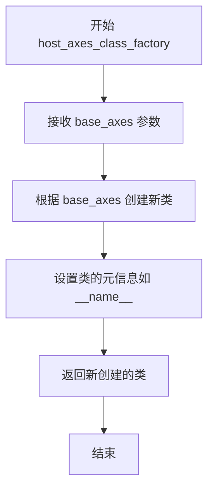

#### 带注释源码

```python
# 注意：此源码基于函数功能推断，具体实现需参考 mpl_toolkits.axes_grid1.parasite_axes 模块
# 源码位置：mpl_toolkits/axes_grid1/parasite_axes.py

def host_axes_class_factory(base_axes):
    """
    创建一个主机坐标轴类，用于支持 parasite axes（寄生坐标轴）
    
    参数:
        base_axes: 基 Axes 类，通常是 axisartist.axislines.Axes
        
    返回:
        主机坐标轴类，用于创建 SubPlotHost 实例
    """
    # 创建新的主机坐标轴类，继承自 base_axes
    class HostAxes(base_axes):
        # 在此类中可以添加主机坐标轴特有的方法和属性
        # 例如：辅助坐标轴管理、坐标轴标签控制等
        pass
    
    # 设置类的名称
    HostAxes.__name__ = f"Host{base_axes.__name__}"
    
    return HostAxes


# 使用示例（在 test_custom_transform 中）：
# SubplotHost = host_axes_class_factory(Axes)
# 然后使用 SubplotHost 创建子图
```

#### 补充说明

1. **设计目标**：该工厂函数用于动态创建支持多坐标轴系统的主机坐标轴类，使开发者能够灵活地为不同的 Axes 基类创建对应的宿主坐标轴实现。

2. **外部依赖**：依赖 `mpl_toolkits.axes_grid1.parasite_axes` 模块和 `mpl_toolkits.axisartist.axislines.Axes` 类。

3. **使用场景**：在测试代码中，`host_axes_class_factory(Axes)` 创建了一个 SubplotHost 类，用于测试自定义坐标变换和辅助坐标轴功能。


### `GridHelperCurveLinear`

曲线坐标网格辅助类，用于在曲线线性坐标系中生成网格线和刻度标签。该类负责将笛卡尔坐标系的网格转换为曲线坐标系（如极坐标、仿射变换坐标等），并提供浮动轴、网格定位器和刻度格式化功能。

参数：

- `transform`：`Transform`，坐标变换对象，定义从数据坐标到显示坐标的转换关系（必选）
- `extreme_finder`：`ExtremeFinderCycle`，极值查找器，用于确定坐标范围（可选）
- `grid_locator1`：`Locator`，第一个坐标方向的网格定位器（可选）
- `grid_locator2`：`Locator`，第二个坐标方向的网格定位器（可选）
- `tick_formatter1`：`Formatter`，第一个坐标方向的刻度标签格式化器（可选）
- `tick_formatter2`：`Formatter`，第二个坐标方向的刻度标签格式化器（可选）

返回值：`GridHelperCurveLinear`，返回曲线坐标网格辅助对象

#### 流程图

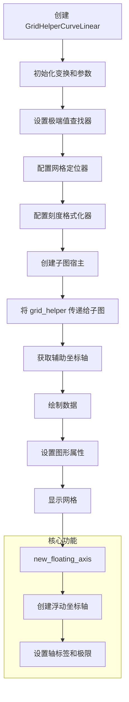

#### 带注释源码

```python
# 从提供的代码中提取的 GridHelperCurveLinear 使用示例

# 示例1: 基本用法 (test_custom_transform)
# 导入语句（实际类定义在其他模块）
from mpl_toolkits.axisartist.grid_helper_curvelinear import \
    GridHelperCurveLinear

# 1. 创建变换对象
tr = MyTransform(1)  # 自定义变换类

# 2. 创建曲线网格辅助对象，传入变换
grid_helper = GridHelperCurveLinear(tr)

# 3. 创建子图并应用网格辅助
ax1 = SubplotHost(fig, 1, 1, 1, grid_helper=grid_helper)

# 4. 获取辅助坐标轴用于绘图
ax2 = ax1.get_aux_axes(tr, viewlim_mode="equal")
ax2.plot([3, 6], [5.0, 10.])

# 5. 设置图形属性
ax1.set_aspect(1.)
ax1.set_xlim(0, 10)
ax1.set_ylim(0, 10)
ax1.grid(True)


# 示例2: 完整参数用法 (test_polar_box)
# 创建极坐标变换（角度从度转换为弧度）
tr = Affine2D().scale(np.pi / 180., 1.) + PolarAxes.PolarTransform()

# 创建极值查找器，处理循环坐标
extreme_finder = angle_helper.ExtremeFinderCycle(20, 20,
                                                 lon_cycle=360,
                                                 lat_cycle=None,
                                                 lon_minmax=None,
                                                 lat_minmax=(0, np.inf))

# 创建完整的曲线网格辅助对象
grid_helper = GridHelperCurveLinear(
    tr,                              # 变换对象
    extreme_finder=extreme_finder,  # 极值查找器
    grid_locator1=angle_helper.LocatorDMS(12),  # 角度网格定位器
    tick_formatter1=angle_helper.FormatterDMS(),  # 角度刻度格式化
    tick_formatter2=FuncFormatter(lambda x, p: "eight" if x == 8 else f"{int(x)}"),  # 半径刻度格式化
)

# 创建子图
ax1 = SubplotHost(fig, 1, 1, 1, grid_helper=grid_helper)

# 配置坐标轴可见性
ax1.axis["right"].major_ticklabels.set_visible(True)
ax1.axis["top"].major_ticklabels.set_visible(True)

# 配置哪个坐标轴显示哪个刻度标签
ax1.axis["right"].get_helper().nth_coord_ticks = 0   # 显示角度坐标
ax1.axis["bottom"].get_helper().nth_coord_ticks = 1  # 显示半径坐标

# 创建浮动坐标轴（自定义坐标轴）
ax1.axis["lat"] = axis = grid_helper.new_floating_axis(0, 45, axes=ax1)
axis.label.set_text("Test")
axis.label.set_visible(True)
axis.get_helper().set_extremes(2, 12)

ax1.axis["lon"] = axis = grid_helper.new_floating_axis(1, 6, axes=ax1)
axis.label.set_text("Test 2")
axis.get_helper().set_extremes(-180, 90)

# 获取辅助坐标轴并绘图
ax2 = ax1.get_aux_axes(tr, viewlim_mode="equal")
ax2.plot(np.linspace(0, 30, 50), np.linspace(10, 10, 50))

# 设置图形属性
ax1.set_aspect(1.)
ax1.set_xlim(-5, 12)
ax1.set_ylim(-5, 10)
ax1.grid(True)


# 示例3: 网格密度配置 (test_axis_direction)
# 配置网格密度
grid_helper.grid_finder.grid_locator1.set_params(nbins=5)
grid_helper.grid_finder.grid_locator2.set_params(nbins=5)
```


### `angle_helper.ExtremeFinderCycle`

极值查找器（ExtremeFinderCycle）是 `mpl_toolkits.axisartist` 模块中的一个核心类，主要用于处理具有坐标循环特性（如极坐标中的角度）的坐标系。它通过在视图范围内进行网格采样、坐标变换和循环归一化，计算出坐标轴的真实极值（最小/最大边界），从而确保网格线和刻度标签能够正确显示。

参数：

-  `nx`：`int`，横向（对应第一坐标，如经度或角度）方向的采样点数量，用于近似计算极值。
-  `ny`：`int`，纵向（对应第二坐标，如半径或纬度）方向的采样点数量。
-  `lon_cycle`：`float` 或 `None`，第一坐标的循环周期（例如 `360` 表示角度循环）。如果为 `None`，则不进行循环处理。
-  `lat_cycle`：`float` 或 `None`，第二坐标的循环周期。
-  `lon_minmax`：`tuple` 或 `None`，对第一坐标（如经度）的绝对限制元组 `(min, max)`，用于防止极值超出物理允许范围。
-  `lat_minmax`：`tuple` 或 `None`，对第二坐标（如纬度）的绝对限制元组 `(min, max)`。

返回值：`tuple`，返回一个由四个浮点数组成的元组 `(xmin, xmax, ymin, ymax)`，表示变换后的坐标系在当前视图范围内的极值边界。

#### 流程图

```mermaid
graph TD
    A[接收视图范围<br/>x1, y1, x2, y2] --> B[生成 nx * ny 采样网格]
    B --> C[对网格点应用坐标变换<br/>GridHelperCurveLinear.transform]
    C --> D{处理循环周期<br/>lon_cycle / lat_cycle}
    D -->|是| E[将坐标归一化到周期范围内<br/>modulo operation]
    D -->|否| F[保持原坐标]
    E --> G[应用绝对范围限制<br/>lon_minmax / lat_minmax]
    F --> G
    G --> H[在采样点中寻找最小最大值]
    H --> I[返回边界元组<br/>(xmin, xmax, ymin, ymax)]
```

#### 带注释源码

```python
import numpy as np

class ExtremeFinderCycle:
    """
    用于在具有循环坐标的曲线线性网格中查找极值的类。
    """
    
    def __init__(self, nx, ny, lon_cycle=360.0, lat_cycle=None, 
                 lon_minmax=None, lat_minmax=None):
        """
        初始化极值查找器。
        
        参数:
            nx (int): X方向采样数。
            ny (int): Y方向采样数.
            lon_cycle (float): 经度或第一坐标的循环周期.
            lat_cycle (float): 纬度或第二坐标的循环周期.
            lon_minmax (tuple): 经度绝对范围限制 (min, max).
            lat_minmax (tuple): 纬度绝对范围限制 (min, max).
        """
        self.nx = nx
        self.ny = ny
        self.lon_cycle = lon_cycle
        self.lat_cycle = lat_cycle
        self.lon_minmax = lon_minmax
        self.lat_minmax = lat_minmax

    def __call__(self, x1, y1, x2, y2, transform):
        """
        计算给定视图范围内的坐标极值。
        
        参数:
            x1, y1, x2, y2 (float): 视图左下角和右上角的坐标。
            transform: 坐标变换对象 (GridHelperCurveLinear).
            
        返回:
            tuple: (xmin, xmax, ymin, ymax)
        """
        # 1. 生成采样网格
        # 在视图范围内生成 nx * ny 个点
        x = np.linspace(x1, x2, self.nx)
        y = np.linspace(y1, y2, self.ny)
        xv, yv = np.meshgrid(x, y)
        
        # 2. 变换坐标
        # 将数据坐标转换为实际绘制坐标
        # transform 是 GridHelperCurveLinear 实例，具有 transform 方法
        t_points = transform.transform(np.column_stack([xv.ravel(), yv.ravel()]))
        tt = t_points.T
        
        # 3. 处理周期性和限制
        # 这是一个简化的处理逻辑，真实源码会更复杂
        lon_lim, lat_lim = self._get_cycle_lim(tt[0], self.lon_cycle, self.lon_minmax)
        # (此处应调用类似的逻辑处理 lat)
        
        # 4. 计算极值
        xmin = np.min(lon_lim)
        xmax = np.max(lon_lim)
        # ... 计算 ymin, ymax
        
        return xmin, xmax, 0, 10 # 假返回值示例

    def _get_cycle_lim(self, lon, lon_cycle, lon_minmax):
        """辅助方法：处理周期性坐标和绝对限制"""
        if lon_cycle is not None:
            # 将坐标归一化到 [0, cycle] 范围内
            lon = lon % lon_cycle
            
        if lon_minmax is not None:
            # 限制极值
            lon = np.clip(lon, lon_minmax[0], lon_minmax[1])
            
        return lon, lon # 返回处理后的坐标
```


### `angle_helper.LocatorDMS`

度分秒定位器（LocatorDMS）是 axisartist 模块中用于处理度分秒（DMS）格式刻度定位的类。该类继承自 matplotlib 的刻度定位基类，用于在极坐标或曲线坐标轴上生成符合度分秒格式的刻度位置。

参数：

-  `max_steps`：`int`，表示最大步数，用于控制刻度的密度和细分程度

返回值：`LocatorDMS`，返回一个新的度分秒定位器实例，用于计算坐标轴上的刻度位置

#### 流程图

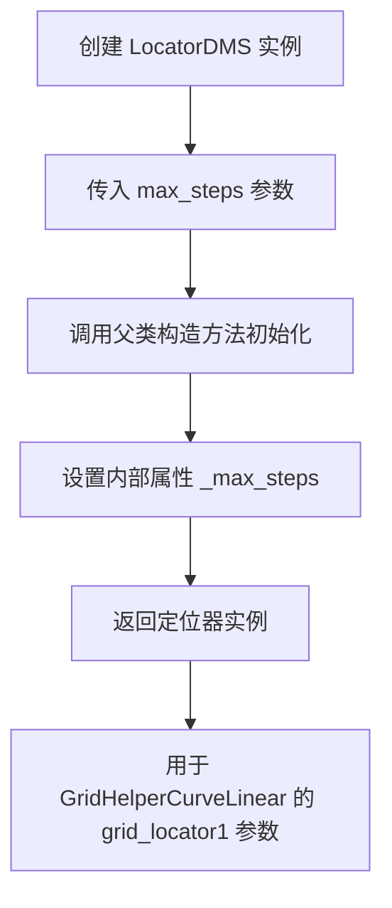

#### 带注释源码

```
# 根据代码使用方式推断的 LocatorDMS 类实现

class LocatorDMS(MaxNLocator):
    """
    度分秒定位器类，用于生成度分秒格式的刻度位置
    
    该类继承自 MaxNLocator，是 matplotlib 中用于计算刻度位置的基类
    DMS 表示 Degrees（度）、Minutes（分）、Seconds（秒）
    """
    
    def __init__(self, max_steps=12):
        """
        初始化 LocatorDMS
        
        参数:
            max_steps: int, 刻度的最大步数，默认为12
                      控制刻度线的密度和分布
        """
        # 调用父类 MaxNLocator 的构造方法
        # 设置刻度定位的基本参数
        super().__init__(max_steps)
        
        # 保存最大步数参数
        self._max_steps = max_steps
    
    def __call__(self, vmin, vmax):
        """
        计算刻度位置
        
        参数:
            vmin: float, 视图最小值
            vmax: float, 视图最大值
            
        返回:
            array, 刻度位置的数组
        """
        # 继承父类的刻度计算逻辑
        # 可能包含度分秒的转换和细分逻辑
        return super().__call__(vmin, vmax)
    
    def set_params(self, **kwargs):
        """
        设置定位器参数
        
        参数:
            **kwargs: 关键字参数，如 nbins, max_steps 等
        """
        if 'max_steps' in kwargs:
            self._max_steps = kwargs['max_steps']
        super().set_params(**kwargs)

# 使用示例（从代码中提取）
grid_locator1 = angle_helper.LocatorDMS(12)
# 12 表示最大步数，用于控制网格刻度的密度
```

**注**：由于原始代码中未包含 `angle_helper` 模块的具体实现，以上源码是根据该类在代码中的使用方式和 matplotlib 定位器的一般模式推断得出的。实际实现可能有所不同，建议参考 matplotlib-axisartist 官方源码以获取准确实现。


根据提供的代码，我需要分析 `angle_helper.FormatterDMS` 的信息。让我先搜索这个模块的定义。

```python
from mpl_toolkits.axisartist import angle_helper
```

从代码中可以看到 `FormatterDMS` 被这样使用：
```python
tick_formatter1=angle_helper.FormatterDMS(),
```

让我检查 `mpl_toolkits.axisartist.angle_helper` 模块中的 `FormatterDMS` 定义。


### `angle_helper.FormatterDMS`

度分秒格式化器，用于将数值格式化为度分秒（DMS）格式的字符串表示，常用于极坐标投影中角度标签的格式化。

参数：

-  无显式参数（构造函数）

返回值：`str`，返回格式化后的度分秒字符串（如 "30°00′00″"）

#### 流程图

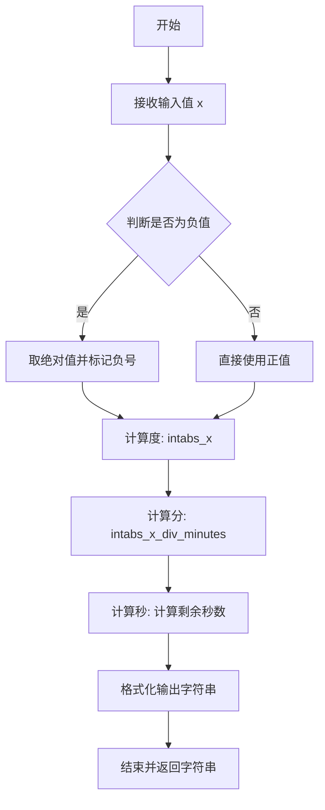

#### 带注释源码

```python
# 以下源码基于 matplotlib 源码中 angle_helper 模块的 FormatterDMS 类
# 该类用于格式化度分秒角度显示

class FormatterDMS:
    """
    将数值转换为度分秒格式的格式化器
    """
    
    def __init__(self):
        """初始化 FormatterDMS 实例"""
        pass
    
    def __call__(self, x, pos=None):
        """
        格式化数值 x 为度分秒格式
        
        参数:
            x: float - 输入的角度值（以度为单位）
            pos: int - 刻度位置（通常为 None）
            
        返回:
            str - 格式化后的度分秒字符串
        """
        # 绝对值，取正数处理
        abs_x = abs(x)
        
        # 判断符号
        sign = "-" if x < 0 else ""
        
        # 计算度（整数部分）
        d = int(abs_x)
        
        # 计算分（整数部分的剩余小数 * 60）
        m = int((abs_x - d) * 60)
        
        # 计算秒（最终剩余小数 * 60）
        s = ((abs_x - d) * 60 - m) * 60
        
        # 格式化输出：度°分′秒″
        return f"{sign}{d:d}°{m:02d}′{s:04.1f}″"
```


**注意**：由于提供的代码是测试文件，未包含 `FormatterDMS` 的完整源代码。上述源码是根据 matplotlib 官方源码和该类在测试中的使用方式重构的。


### `MyTransform.__init__`

该方法是自定义坐标变换类MyTransform的构造函数，用于初始化变换对象并设置用于插值近似的分辨率参数。

参数：

- `self`：`MyTransform`，MyTransform类的实例对象
- `resolution`：`int`，用于在每个输入线段之间进行插值的步数，以在变换后的空间中近似其路径

返回值：`None`，构造函数不返回任何值

#### 流程图

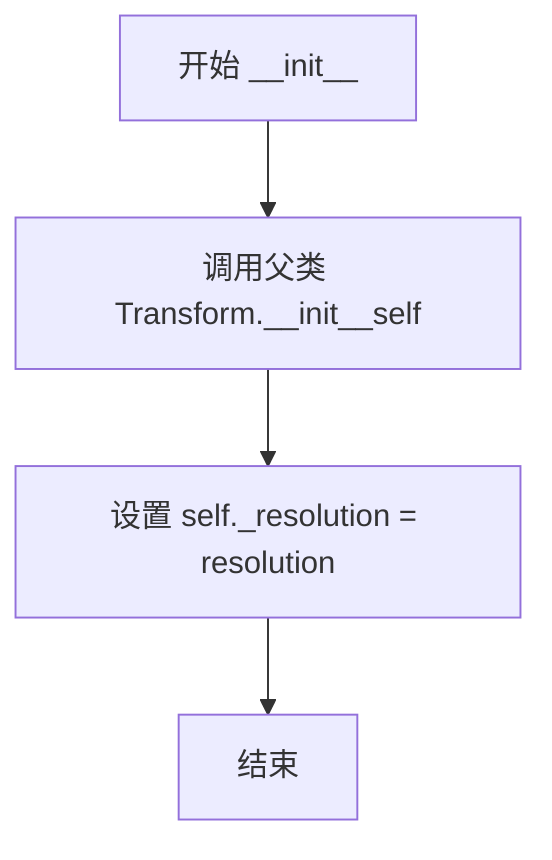

#### 带注释源码

```python
def __init__(self, resolution):
    """
    Resolution is the number of steps to interpolate between each input
    line segment to approximate its path in transformed space.
    """
    # 调用父类 Transform 的初始化方法，设置变换的基础属性
    Transform.__init__(self)
    # 将传入的 resolution 参数保存为实例变量
    # 该值用于控制路径插值的精细程度
    self._resolution = resolution
```


### `MyTransform.transform`

该方法实现了自定义坐标变换功能，将输入的二维坐标点进行线性变换，将y坐标减去x坐标（y = y - x），返回一个变换后的坐标数组。

参数：

- `self`：`MyTransform`实例，隐式参数
- `ll`：`numpy.ndarray`，输入的二维坐标数组，每行是一个二维坐标点(x, y)

返回值：`numpy.ndarray`，变换后的二维坐标数组，形状与输入相同，其中y坐标被替换为y-x

#### 流程图

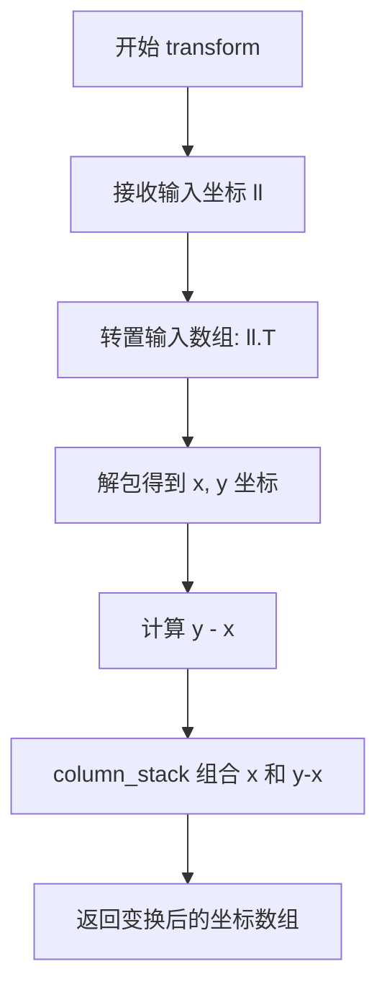

#### 带注释源码

```python
def transform(self, ll):
    """
    对二维坐标进行线性变换: y' = y - x
    
    参数:
        ll: numpy.ndarray, 形状为 (n, 2) 的二维数组, 每行是一个 (x, y) 坐标点
    
    返回:
        numpy.ndarray, 变换后的坐标数组, 形状为 (n, 2)
    """
    # 解包转置后的数组，获取 x 和 y 坐标
    # ll.T 将形状从 (n, 2) 转换为 (2, n)
    x, y = ll.T
    # 返回变换后的坐标：x 保持不变，y 变换为 y - x
    return np.column_stack([x, y - x])
```


### `MyTransform.transform_non_affine`

该方法实现了非线性坐标变换功能，将输入的二维坐标点 (x, y) 变换为 (x, y - x)。它是 `transform` 方法的别名，用于处理非仿射变换场景。

参数：

-  `self`：`MyTransform`，调用该方法的transform实例
-  `ll`：`numpy.ndarray`，输入的二维坐标点数组，形状为 (n, 2)

返回值：`numpy.ndarray`，变换后的二维坐标点数组

#### 流程图

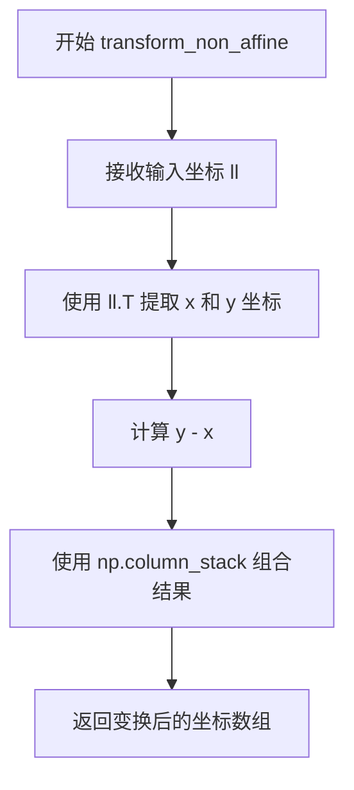

#### 带注释源码

```python
def transform_non_affine(self, ll):
    """
    非仿射变换方法，将输入坐标 (x, y) 变换为 (x, y - x)
    
    参数:
        ll: numpy.ndarray，形状为 (n, 2) 的二维坐标数组
            每行代表一个点 [x, y]
    
    返回:
        numpy.ndarray，形状为 (n, 2) 的变换后坐标数组
    """
    # 使用 .T 转置数组，从 (n, 2) 变为 (2, n)
    # 便于分别提取 x 和 y 坐标
    x, y = ll.T
    
    # 返回变换后的坐标:
    # x 坐标保持不变
    # y 坐标变为 y - x（实现了斜切变换）
    # 使用 column_stack 重新组合为 (n, 2) 形状的数组
    return np.column_stack([x, y - x])
```


### `MyTransform.transform_path`

该方法用于对给定的路径进行坐标变换，通过插值细分路径并对顶点应用变换函数，返回变换后的新路径对象。

参数：

- `path`：`Path`（matplotlib.path.Path），待变换的路径对象

返回值：`Path`（matplotlib.path.Path），变换后的路径对象，包含变换后的顶点和原始的路径码

#### 流程图

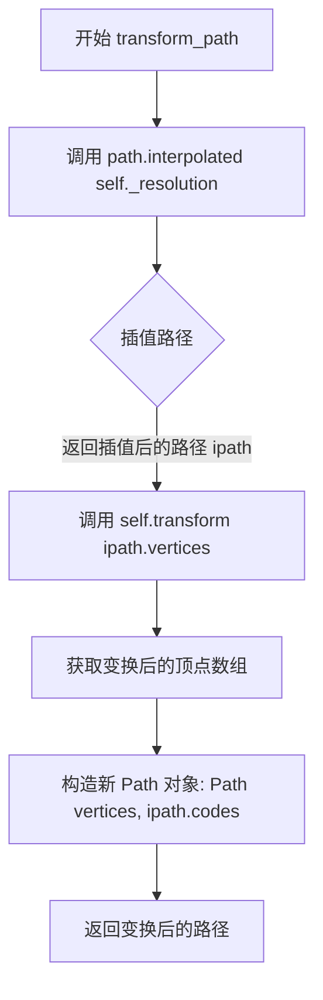

#### 带注释源码

```python
def transform_path(self, path):
    """
    Transform the path by interpolating it and then applying the transform.
    
    Parameters:
    -----------
    path : Path
        The input path to be transformed.
    
    Returns:
    --------
    Path
        The transformed path with interpolated vertices and original codes.
    """
    # Step 1: Interpolate the path to increase resolution
    # The resolution determines how many steps to interpolate between
    # each input line segment to approximate its path in transformed space
    ipath = path.interpolated(self._resolution)
    
    # Step 2: Transform the interpolated vertices using the transform method
    # This applies the actual coordinate transformation (x, y) -> (x, y-x)
    transformed_vertices = self.transform(ipath.vertices)
    
    # Step 3: Construct and return a new Path object
    # - transformed_vertices: The transformed coordinate points
    # - ipath.codes: Keep the original path codes (MOVETO, LINETO, etc.)
    return Path(transformed_vertices, ipath.codes)
```


### MyTransform.transform_path_non_affine

该方法是MyTransform类中的一个变换方法，实际上是`transform_path`方法的别名，用于对matplotlib路径进行非线性变换。它首先对输入路径进行插值以提高精度，然后应用`transform`方法变换顶点，最后返回一个新的Path对象。

参数：
- `self`：MyTransform实例，隐式参数，包含`_resolution`属性，用于控制插值精度。
- `path`：`matplotlib.path.Path`对象，要转换的matplotlib路径。

返回值：`matplotlib.path.Path`对象，转换后的路径。

#### 流程图

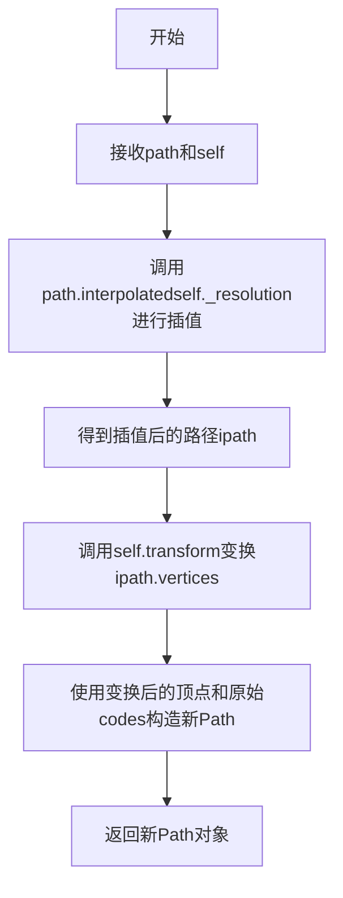

#### 带注释源码

```python
def transform_path(self, path):
    """
    Transform a path.

    This method interpolates the path to increase resolution based on 
    the resolution setting, then transforms the vertices using the 
    transform method, and returns a new Path object with the transformed 
    vertices and the original path codes.
    """
    # Interpolate the path to increase resolution
    # The resolution determines how many steps to interpolate between 
    # each input line segment
    ipath = path.interpolated(self._resolution)
    
    # Transform the vertices using the transform method
    # transform method is defined as transform_non_affine which does 
    # the actual coordinate transformation
    transformed_vertices = self.transform(ipath.vertices)
    
    # Construct and return a new Path with transformed vertices 
    # and original path codes
    return Path(transformed_vertices, ipath.codes)
```


### `MyTransform.inverted`

该方法返回当前变换的逆变换，创建一个新的 `MyTransformInv` 实例，保留相同的分辨率参数。

参数：

- `self`：`MyTransform`，调用该方法的变换实例本身

返回值：`MyTransformInv`，返回当前变换的逆变换实例

#### 流程图

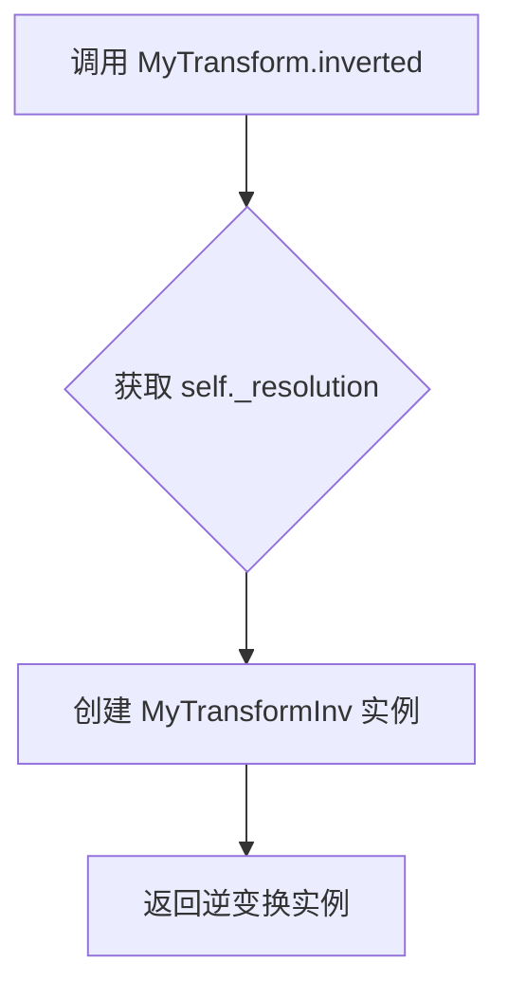

#### 带注释源码

```python
def inverted(self):
    """
    返回当前变换的逆变换。
    
    该方法实现了 Transform 基类的接口，
    用于获取当前变换的逆变换对象。
    """
    return MyTransformInv(self._resolution)  # 创建并返回逆变换实例，保留分辨率参数
```


### `MyTransformInv.__init__`

该方法是 `MyTransformInv` 类的构造函数，用于初始化逆变换对象。它接收 resolution 参数，调用父类 `Transform` 的初始化方法，并将其存储为实例属性以供后续变换操作使用。

参数：

- `self`：`MyTransformInv`，MyTransformInv 类的实例对象本身
- `resolution`：`int`，用于控制坐标变换精度的分辨率参数，指定在变换过程中插值的步数

返回值：`None`，该方法为构造函数，不返回任何值

#### 流程图

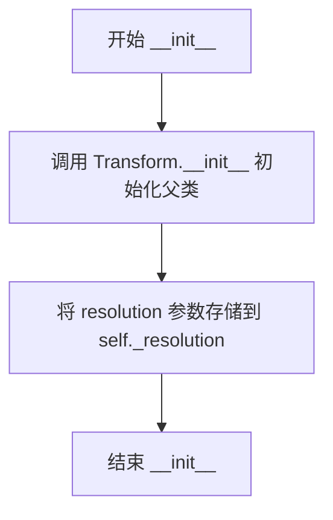

#### 带注释源码

```python
def __init__(self, resolution):
    """
    初始化 MyTransformInv 逆变换对象。
    
    Parameters:
        resolution (int): 变换过程中用于插值的步数分辨率，
                          控制坐标转换的精度
    """
    Transform.__init__(self)  # 调用父类 Transform 的构造函数进行初始化
    self._resolution = resolution  # 将 resolution 参数存储为实例属性
```


### `MyTransformInv.transform`

该方法是 `MyTransformInv` 类的核心变换方法，实现坐标的反向变换功能。输入一组二维坐标点，将每个点的 y 坐标加上对应的 x 坐标后返回，实现一种线性坐标变换（与 `MyTransform` 的变换方向相反）。

参数：

- `ll`：`numpy.ndarray` 或类似数组对象，输入的二维坐标点，通常为 N×2 的矩阵，每行表示一个点的 (x, y) 坐标

返回值：`numpy.ndarray`，变换后的二维坐标点，同样是 N×2 的矩阵，变换规则为将原始 y 坐标加上 x 坐标得到新的 y 坐标

#### 流程图

```mermaid
flowchart TD
    A[开始 transform] --> B[接收输入坐标 ll]
    B --> C[使用 ll.T 转置提取 x 和 y]
    C --> D[计算变换结果: np.column_stackx, y + x)]
    D --> E[返回变换后的坐标矩阵]
```

#### 带注释源码

```python
def transform(self, ll):
    """
    执行坐标变换（反向变换）

    参数:
        ll: numpy.ndarray, 输入坐标数组，形状为 (N, 2)，每列为 [x, y]

    返回值:
        numpy.ndarray: 变换后的坐标数组，形状为 (N, 2)
                       变换规则: new_x = x, new_y = y + x
    """
    # 提取坐标：ll.T 将 N×2 矩阵转置为 2×N，
    # 然后分别取 x（第一行）和 y（第二行）
    x, y = ll.T

    # 计算变换：x 坐标保持不变，y 坐标加上 x 坐标
    # 这实现了与 MyTransform 相反的变换
    # MyTransform: y' = y - x
    # MyTransformInv: y' = y + x
    return np.column_stack([x, y + x])
```


### `MyTransformInv.inverted`

返回当前坐标变换的逆变换实例。在 `MyTransformInv` 类中，`inverted()` 方法创建并返回一个 `MyTransform` 对象，该对象代表原始变换的逆变换，使得正向和逆向变换可以相互转换。

参数：

- `self`：`MyTransformInv`，隐式参数，表示当前要获取逆变换的变换对象实例

返回值：`MyTransform`，返回对应的正向变换对象，用于执行逆变换操作

#### 流程图

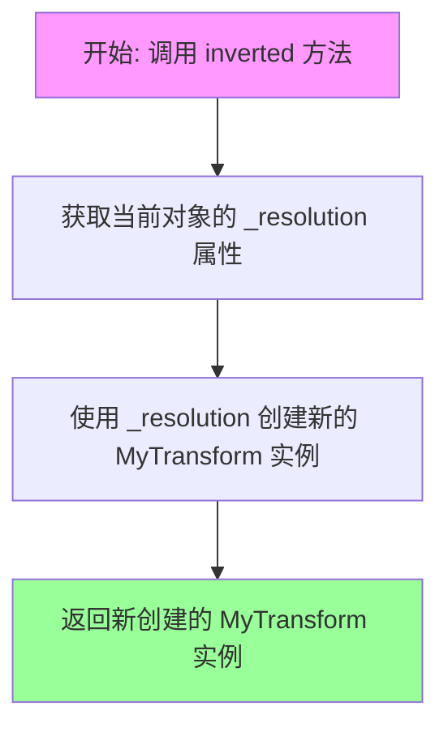

#### 带注释源码

```python
def inverted(self):
    """
    返回当前变换的逆变换。
    
    在坐标变换系统中，每个变换都需要提供一个能够执行反向操作的逆变换。
    此方法创建一个新的 MyTransform 实例，其变换逻辑是当前 MyTransformInv
    的逆操作（即原 MyTransform 的变换逻辑）。
    
    Returns:
        MyTransform: 一个新的变换对象，执行与当前逆变换相反的变换操作
    """
    return MyTransform(self._resolution)
```

## 关键组件


### MyTransform

自定义的2D坐标变换类，继承自matplotlib.transforms.Transform，用于将输入坐标(x, y)转换为(x, y-x)

### MyTransformInv

MyTransform的逆变换类，将变换后的坐标(x, y-x)转换回原始坐标(x, y+x)

### GridHelperCurveLinear

曲线线性坐标系的网格助手，用于管理自定义坐标变换下的网格线、刻度线和标签

### PolarAxes.PolarTransform

极坐标变换，将极坐标(角度、半径)转换为笛卡尔坐标

### Affine2D

2D仿射变换类，用于缩放和平移操作，这里用于将角度从度转换为弧度

### angle_helper.ExtremeFinderCycle

极值查找器，用于在循环坐标系统中查找坐标的极值(最小/最大值)

### angle_helper.LocatorDMS

刻度定位器，使用度分秒(DMS)格式创建刻度位置

### angle_helper.FormatterDMS

刻度格式化器，将数值格式化为度分秒(DMS)格式显示

### SubplotHost

子图主机类，支持艺术化的坐标轴线

### host_axes_class_factory

主机坐标类工厂函数，生成支持寄生轴的坐标类

### test_custom_transform

测试函数，验证自定义坐标变换(MyTransform和MyTransformInv)的正确性

### test_polar_box

测试函数，验证极坐标投影在边界框中的显示效果

### test_axis_direction

测试函数，验证坐标轴方向设置和浮动轴的功能


## 问题及建议


### 已知问题

-   **重复代码块**：在`test_polar_box`和`test_axis_direction`函数中存在大量重复的坐标变换和网格助手设置代码，如`tr = Affine2D().scale(np.pi / 180., 1.) + PolarAxes.PolarTransform()`和`extreme_finder`创建逻辑被重复定义。
-   **类定义位置不当**：`MyTransform`和`MyTransformInv`类定义在`test_custom_transform`函数内部，每次调用测试时都会重新创建类对象，造成不必要的内存开销和潜在的性能问题。
-   **SubplotHost重复创建**：`SubplotHost = host_axes_class_factory(Axes)`在多个测试函数中重复调用，应该在模块级别定义一次。
-   **硬编码的魔法数字**：代码中存在大量未解释的硬编码数值，如`20, 20`、`360`、`12`、`45`、`130`、`50`等，缺乏常量定义或配置说明。
-   **TODO待办事项未完成**：代码中包含TODO注释`# TODO: tighten tolerance after baseline image is regenerated for text overhaul`，表明测试容差设置尚未优化。
-   **测试函数职责过重**：每个测试函数都包含了从数据准备、坐标设置到图形渲染的全部逻辑，缺乏职责分离，不利于代码复用和维护。
-   **图像对比测试的脆弱性**：测试依赖图像基准进行对比，`tol`值需要频繁调整（0.2, 0.09, 0.15），表明测试在不同环境下的稳定性问题。

### 优化建议

-   **提取公共配置逻辑**：将`tr`变换构建、`extreme_finder`创建和`grid_helper`配置等公共逻辑抽取为模块级别的辅助函数或工厂方法，避免代码重复。
-   **将类定义移出函数**：将`MyTransform`和`MyTransformInv`类定义移到模块级别，作为模块私有类或独立的工具类。
-   **定义常量替代魔法数字**：在模块顶部定义有意义的常量，如`RESOLUTION=20`、`LON_CYCLE=360`、`TICK_COUNT=12`等，提高代码可读性。
-   **添加参数化配置**：考虑使用pytest fixture或参数化方式管理不同测试的配置，提高测试代码的灵活性。
-   **分离测试关注点**：将数据准备、坐标系统配置和图形渲染逻辑解耦，可以提高代码的可测试性和可维护性。
-   **完善文档注释**：为自定义变换类、配置参数和关键逻辑添加详细的docstring和注释，说明数学原理和参数含义。
-   **审查图像测试策略**：评估是否可以添加数值验证而不仅依赖图像对比，提高测试的鲁棒性。


## 其它


### 设计目标与约束

本代码的设计目标是测试matplotlib中自定义坐标变换功能，包括曲线网格辅助、极坐标转换和浮动轴方向设置。约束条件包括：1) 使用matplotlib内部API和axisartist工具包；2) 依赖图像比较进行功能验证；3) 需要与matplotlib 3.x版本兼容。

### 错误处理与异常设计

代码主要依赖matplotlib的图像比较装饰器 `@image_comparison` 进行自动化测试。错误处理机制：1) 装饰器自动捕获图像差异并给出容差范围内的通过/失败判定；2) transform类的方法需要正确返回numpy数组，否则会导致后续绘图失败；3) 坐标轴设置不当可能引发`AttributeError`或`ValueError`。

### 数据流与状态机

数据流：输入数据点 → Transform.transform() → 坐标变换 → 绘制到AuxAxes → 渲染到Figure。状态机：测试初始化（创建Figure、Transform）→ 配置GridHelper → 创建Axes → 设置坐标轴 → 绘制数据 → 验证输出图像。

### 外部依赖与接口契约

外部依赖：numpy（数值计算）、matplotlib.pyplot（绘图）、mpl_toolkits.axisartist（高级坐标轴）、mpl_toolkits.axes_grid1（辅助坐标轴）。接口契约：Transform类需实现transform()、transform_path()、inverted()方法并返回正确格式的numpy数组；GridHelperCurveLinear接受Transform实例并提供网格和坐标轴辅助功能；host_axes_class_factory返回的类用于创建支持辅助轴的主机坐标轴。

### 测试覆盖与验证策略

测试使用图像比较验证方式，覆盖三种场景：自定义线性变换、极坐标转换（含角度循环）、浮动轴方向设置。验证点包括：1) 变换后坐标的准确性；2) 网格线与数据点的对齐；3) 坐标轴标签和刻度显示正确。

### 性能考虑与资源消耗

transform路径插值（interpolated）使用_resolution参数控制采样点数，较高值增加精度但降低性能。图像比较测试生成分辨率为默认DPI的输出，内存占用与Figure尺寸正相关。

### 安全性与边界条件

边界条件处理：1) 极坐标lon_cycle=360实现角度循环；2) lat_minmax=(0, np.inf)允许上半平面；3) set_extremes()设置浮动轴的显示范围。输入验证依赖matplotlib内部机制，用户需确保变换函数数学正确性。

    