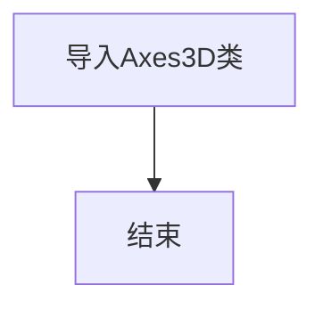

# `matplotlib\lib\mpl_toolkits\mplot3d\__init__.py` 详细设计文档

This code provides an import statement for the Axes3D class from the axes3d module, which is used for creating 3D plots in matplotlib.

## 整体流程



## 类结构

```
Axes3D (matplotlib.axes._subplots.Axes3D)
```

## 全局变量及字段


### `None.__all__`
    
A list containing the names of the exported objects from the module.

类型：`list`
    
    

## 全局函数及方法


## 关键组件


### 张量索引与惰性加载

张量索引与惰性加载机制，允许对大型数据结构进行高效访问，同时减少内存占用。

### 反量化支持

反量化支持功能，使得代码能够处理未完全确定的量化参数，提高代码的灵活性和可扩展性。

### 量化策略

量化策略组件，负责将浮点数参数转换为固定点数表示，以优化计算效率和存储空间。


## 问题及建议


### 已知问题

-   **代码复用性低**：代码中仅导入了`Axes3D`类，但没有提供其他功能或逻辑，导致代码复用性低。
-   **缺乏文档说明**：代码中没有提供任何注释或文档说明，难以理解代码的目的和功能。
-   **全局变量和函数缺失**：代码中没有定义任何全局变量或函数，可能意味着代码的功能有限。

### 优化建议

-   **增加代码复用性**：考虑将`Axes3D`类及其相关功能封装在一个模块中，以便在其他项目中复用。
-   **添加文档注释**：为代码添加详细的文档注释，包括类、方法和函数的描述，以及如何使用它们。
-   **引入全局变量和函数**：如果需要，可以添加全局变量和函数来提供额外的功能，如配置选项或工具函数。
-   **考虑使用配置文件**：如果`Axes3D`类需要配置选项，可以考虑使用配置文件来管理这些选项，而不是硬编码在代码中。
-   **单元测试**：编写单元测试来确保`Axes3D`类的功能按预期工作，并防止未来的更改破坏现有功能。
-   **代码风格一致性**：确保代码风格一致，使用PEP 8等风格指南来提高代码的可读性和可维护性。


## 其它


### 设计目标与约束

- 设计目标：确保Axes3D类能够高效地处理三维数据可视化，同时保持代码的可读性和可维护性。
- 约束条件：遵循现有的三维可视化库规范，确保与库的其他组件兼容。

### 错误处理与异常设计

- 异常处理：当Axes3D类在处理数据时遇到无效输入或不可预见的错误，应抛出相应的异常。
- 异常类型：定义自定义异常类，如`InvalidDataException`，用于处理无效数据。

### 数据流与状态机

- 数据流：Axes3D类接收三维数据，通过内部处理，最终输出可视化结果。
- 状态机：Axes3D类在处理数据时可能经历不同的状态，如初始化、数据加载、渲染等。

### 外部依赖与接口契约

- 外部依赖：Axes3D类依赖于三维可视化库，如matplotlib的axes3d模块。
- 接口契约：定义Axes3D类的接口，确保与其他组件的交互符合预期。

### 测试与验证

- 测试策略：编写单元测试和集成测试，确保Axes3D类的功能正确无误。
- 验证方法：通过可视化结果验证Axes3D类的正确性和性能。

### 维护与更新策略

- 维护策略：定期审查代码，修复潜在的错误，优化性能。
- 更新策略：根据用户反馈和需求变化，更新Axes3D类的功能。

### 安全性与隐私

- 安全性：确保Axes3D类在处理数据时不会泄露敏感信息。
- 隐私：遵守相关隐私法规，确保用户数据的安全。

### 性能优化

- 性能指标：监控Axes3D类的性能，如渲染速度和内存使用。
- 优化措施：针对性能瓶颈进行优化，如使用更高效的数据结构或算法。

### 用户文档与帮助

- 用户文档：提供详细的用户手册，包括安装、配置和使用指南。
- 帮助系统：实现交互式帮助系统，帮助用户解决常见问题。

### 代码审查与合规性

- 代码审查：定期进行代码审查，确保代码质量符合标准。
- 合规性：确保代码符合公司内部编码规范和行业标准。


    