# `matplotlib\lib\mpl_toolkits\mplot3d\art3d.py` 详细设计文档

该模块是 Matplotlib 3D 工具包的核心组成部分，负责将二维艺术家（Artist）对象（如文本、线条、补丁、集合）转换为具有三维坐标和属性的对象，并实现三维到二维的投影逻辑、深度排序、着色以及视图限制裁剪功能，从而支持在二维画布上渲染三维图形。

## 整体流程

```mermaid
graph TD
    User[用户创建 2D Artist] --> Create3D{调用 3D 转换函数或类}
    Create3D --> |text_2d_to_3d| T3D[Text3D]
    Create3D --> |Line3D| L3D[Line3D]
    Create3D --> |Poly3DCollection| P3DC[Poly3DCollection]
    Create3D --> |collection_2d_to_3d| Coll[3D Collections]
    T3D --> Store1[存储 3D 属性 (_z, _dir_vec)]
    L3D --> Store2[存储 3D 顶点 (_verts3d)]
    P3DC --> Store3[存储多边形顶点 (_faces)]
    Coll --> Store4[存储偏移量 (_offsets3d)]
    Store1 --> Render[渲染阶段 (Renderer)]
    Store2 --> Render
    Store3 --> Render
    Store4 --> Render
    Render --> Proj[调用 do_3d_projection]
    Proj --> Mask{是否启用 axlim_clip?}
    Mask -- 是 --> ViewLim[调用 _viewlim_mask 裁剪点]
    Mask -- 否 --> Direct[直接投影]
    ViewLim --> Proj3D[proj3d.proj_transform]
    Direct --> Proj3D
    Proj3D --> Depth[计算深度 (_zalpha)]
    Depth --> Sort[Z轴排序]
    Sort --> 2DArtist[更新内部 2D Path 属性]
    2DArtist --> Draw[调用基类 draw 方法]
```

## 类结构

```
Artist (Matplotlib 基类)
├── Text (mtext.Text)
│   └── Text3D
├── Line2D (lines.Line2D)
│   └── Line3D
├── Patch (matplotlib.patches.Patch)
│   ├── Patch3D
│   └── PathPatch3D
├── Collection (matplotlib.collections.Collection)
│   ├── Collection3D
│   ├── Line3DCollection
│   ├── Patch3DCollection
│   └── Path3DCollection
└── PolyCollection (matplotlib.collections.PolyCollection)
    └── Poly3DCollection
```

## 全局变量及字段


### `Text3D._x`
    
X coordinate of the text in 3D space

类型：`float`
    


### `Text3D._y`
    
Y coordinate of the text in 3D space

类型：`float`
    


### `Text3D._z`
    
Z coordinate of the text in 3D space

类型：`float`
    


### `Text3D._dir_vec`
    
Direction vector determining text orientation in 3D space

类型：`numpy.ndarray`
    


### `Text3D._axlim_clip`
    
Flag to enable clipping of text outside axes view limits

类型：`bool`
    


### `Line3D._verts3d`
    
3D vertex data (x, y, z coordinates) for the line

类型：`array-like`
    


### `Line3D._axlim_clip`
    
Flag to enable clipping of lines with endpoints outside axes view limits

类型：`bool`
    


### `Collection3D._3dverts_codes`
    
List of tuples containing 3D vertices and path codes for the collection

类型：`list`
    


### `Collection3D._axlim_clip`
    
Flag to enable clipping of collection points outside axes view limits

类型：`bool`
    


### `Line3DCollection._segments3d`
    
3D line segments data for the collection

类型：`numpy.ndarray`
    


### `Line3DCollection._sort_zpos`
    
Z position used for depth sorting of line segments

类型：`float`
    


### `Line3DCollection._axlim_clip`
    
Flag to enable clipping of line segments outside axes view limits

类型：`bool`
    


### `Patch3D._segment3d`
    
3D segments representing the patch boundary in 3D space

类型：`list`
    


### `Patch3D._path2d`
    
2D projected path of the patch after 3D projection

类型：`matplotlib.path.Path`
    


### `Patch3D._axlim_clip`
    
Flag to enable clipping of patches with vertices outside axes view limits

类型：`bool`
    


### `PathPatch3D._code3d`
    
Path codes for the 3D path patch

类型：`list`
    


### `Patch3DCollection._depthshade`
    
Flag indicating whether to apply depth shading to patches

类型：`bool`
    


### `Patch3DCollection._depthshade_minalpha`
    
Minimum alpha value applied by depth shading

类型：`float`
    


### `Patch3DCollection._offsets3d`
    
3D offset positions for each patch in the collection

类型：`numpy.ndarray`
    


### `Patch3DCollection._z_markers_idx`
    
Index markers for sorting patches by z-depth

类型：`slice`
    


### `Patch3DCollection._vzs`
    
Z values of projected vertices for depth sorting

类型：`numpy.ndarray`
    


### `Patch3DCollection._axlim_clip`
    
Flag to enable clipping of patches with vertices outside axes view limits

类型：`bool`
    


### `Patch3DCollection._sort_zpos`
    
Z position used for depth sorting of patches

类型：`float`
    


### `Path3DCollection._depthshade`
    
Flag indicating whether to apply depth shading to paths

类型：`bool`
    


### `Path3DCollection._depthshade_minalpha`
    
Minimum alpha value applied by depth shading

类型：`float`
    


### `Path3DCollection._offsets3d`
    
3D offset positions for each path in the collection

类型：`numpy.ndarray`
    


### `Path3DCollection._z_markers_idx`
    
Index markers for sorting paths by z-depth

类型：`numpy.ndarray`
    


### `Path3DCollection._vzs`
    
Z values of projected vertices for depth sorting

类型：`numpy.ndarray`
    


### `Path3DCollection._sizes3d`
    
3D sizes of markers in the collection

类型：`numpy.ndarray`
    


### `Path3DCollection._linewidths3d`
    
3D line widths for the collection

类型：`numpy.ndarray`
    


### `Path3DCollection._data_scale`
    
Scale of the 3D data used for depth shading calculations

类型：`float`
    


### `Path3DCollection._axlim_clip`
    
Flag to enable clipping of paths with vertices outside axes view limits

类型：`bool`
    


### `Path3DCollection._offset_zordered`
    
2D offsets ordered by z-depth for proper rendering

类型：`numpy.ndarray`
    


### `Path3DCollection._sort_zpos`
    
Z position used for depth sorting of paths

类型：`float`
    


### `Path3DCollection._in_draw`
    
Flag indicating whether the collection is currently being drawn

类型：`bool`
    


### `Poly3DCollection._faces`
    
3D vertices of polygon faces

类型：`numpy.ndarray`
    


### `Poly3DCollection._invalid_vertices`
    
Boolean mask indicating invalid vertices in polygons

类型：`numpy.ndarray`
    


### `Poly3DCollection._codes3d`
    
Path codes for 3D polygons

类型：`list`
    


### `Poly3DCollection._facecolor3d`
    
Face colors of polygons in 3D space

类型：`array`
    


### `Poly3DCollection._edgecolor3d`
    
Edge colors of polygons in 3D space

类型：`array`
    


### `Poly3DCollection._alpha3d`
    
Alpha transparency value for 3D polygons

类型：`float`
    


### `Poly3DCollection._facecolors2d`
    
Face colors after 2D projection

类型：`array`
    


### `Poly3DCollection._edgecolors2d`
    
Edge colors after 2D projection

类型：`array`
    


### `Poly3DCollection._closed`
    
Flag indicating whether polygons should be closed

类型：`bool`
    


### `Poly3DCollection._zsortfunc`
    
Function used to calculate z-order of polygons

类型：`function`
    


### `Poly3DCollection._sort_zpos`
    
Z position used for depth sorting of polygons

类型：`float`
    


### `Poly3DCollection._axlim_clip`
    
Flag to enable clipping of polygons with vertices outside axes view limits

类型：`bool`
    


### `Poly3DCollection._A`
    
Alpha values or scalar mappable data for the collection

类型：`array`
    
    

## 全局函数及方法


### `_norm_angle`

该函数用于将给定的角度标准化到 -180 < a ≤ 180 度范围内，确保角度值在一个标准的圆周范围内进行规范化处理，常用于3D图形中的角度计算和转换。

参数：

- `a`：`float` 或 `int`，需要标准化的角度值（以度为单位）

返回值：`float`，标准化后的角度值，范围为 (-180, 180]

#### 流程图

```mermaid
flowchart TD
    A[开始: 输入角度 a] --> B[计算 a = (a + 360) % 360]
    B --> C{判断 a > 180?}
    C -->|是| D[执行 a = a - 360]
    C -->|否| E[跳过]
    D --> F[返回标准化后的角度 a]
    E --> F
```

#### 带注释源码

```python
def _norm_angle(a):
    """
    Return the given angle normalized to -180 < *a* <= 180 degrees.
    
    该函数将任意角度标准化到 (-180, 180] 区间内。
    标准化过程分两步：
    1. 首先通过 (a + 360) % 360 将角度转换到 [0, 360) 范围
    2. 然后如果角度大于180，则减去360，得到 (-180, 180] 范围的结果
    
    Parameters
    ----------
    a : float or int
        需要标准化的角度值（以度为单位）
    
    Returns
    -------
    float
        标准化后的角度值，范围为 (-180, 180]
    """
    # 第一步：将角度转换到 [0, 360) 范围
    # 通过加上360并取模360，确保结果在 [0, 360) 区间
    a = (a + 360) % 360
    
    # 第二步：如果角度大于180，则调整到 (-180, 180] 范围
    # 例如：270度 -> 90度（通过 270 - 360 = -90）
    if a > 180:
        a = a - 360
    
    # 返回标准化后的角度
    return a
```


### `_norm_text_angle`

该函数用于将任意角度标准化到-90 < a ≤ 90度的范围内，常用于3D图形中文本角度的规范化处理。

参数：

- `a`：`float` 或 `int`，需要标准化的角度值，可以是任意数值（度数）

返回值：`float`，标准化后的角度，范围在-90 < a ≤ 90之间

#### 流程图

```mermaid
flowchart TD
    A[开始: 输入角度 a] --> B[计算 a = (a + 180) % 180]
    B --> C{a > 90?}
    C -->|是| D[a = a - 180]
    C -->|否| E[返回 a]
    D --> E
    E --> F[结束: 返回标准化角度]
```

#### 带注释源码

```python
def _norm_text_angle(a):
    """
    Return the given angle normalized to -90 < *a* <= 90 degrees.
    
    Parameters
    ----------
    a : float or int
        The angle to normalize (in degrees).
    
    Returns
    -------
    float
        The normalized angle in the range -90 < a <= 90 degrees.
    """
    # 第一步：将角度转换到 [0, 180) 范围内
    # 通过加上180度然后对180取模实现
    a = (a + 180) % 180
    
    # 第二步：如果角度大于90度，则调整到 (-90, 90] 范围
    # 例如：a=91会变成-89，a=180会变成0
    if a > 90:
        a = a - 180
    
    # 返回标准化后的角度
    return a
```


### `get_dir_vector`

该函数用于将输入的方向参数（'x'、'y'、'z'、None 或三维元组）转换为标准的三维方向向量（numpy数组形式）。它常用于3D图形渲染中确定文本、线条、面等对象的方向。

参数：

- `zdir`：`{'x', 'y', 'z', None, 3-tuple}`，表示方向。可以是字符串 'x'、'y'、'z' 表示坐标轴方向，None 表示零向量，或三维可迭代对象 (x, y, z)。

返回值：`numpy.ndarray`，返回三维方向向量，类型为 numpy 数组，形状为 (3,)。

#### 流程图

```mermaid
flowchart TD
    A[开始 get_dir_vector] --> B{zdir == 'x'?}
    B -->|Yes| C[返回 np.array((1, 0, 0))]
    B -->|No| D{zdir == 'y'?}
    D -->|Yes| E[返回 np.array((0, 1, 0))]
    D -->|No| F{zdir == 'z'?}
    F -->|Yes| G[返回 np.array((0, 0, 1))]
    F -->|No| H{zdir is None?}
    H -->|Yes| I[返回 np.array((0, 0, 0))]
    H -->|No| J{zdir 是可迭代对象且长度为3?}
    J -->|Yes| K[返回 np.array(zdir)]
    J -->|No| L[抛出 ValueError 异常]
    C --> M[结束]
    E --> M
    G --> M
    I --> M
    K --> M
    L --> M
```

#### 带注释源码

```python
def get_dir_vector(zdir):
    """
    Return a direction vector.

    Parameters
    ----------
    zdir : {'x', 'y', 'z', None, 3-tuple}
        The direction. Possible values are:

        - 'x': equivalent to (1, 0, 0)
        - 'y': equivalent to (0, 1, 0)
        - 'z': equivalent to (0, 0, 1)
        - *None*: equivalent to (0, 0, 0)
        - an iterable (x, y, z) is converted to an array

    Returns
    -------
    x, y, z : array
        The direction vector.
    """
    # 检查 zdir 是否为字符串 'x'，如果是则返回 x 轴单位向量 (1, 0, 0)
    if cbook._str_equal(zdir, 'x'):
        return np.array((1, 0, 0))
    # 检查 zdir 是否为字符串 'y'，如果是则返回 y 轴单位向量 (0, 1, 0)
    elif cbook._str_equal(zdir, 'y'):
        return np.array((0, 1, 0))
    # 检查 zdir 是否为字符串 'z'，如果是则返回 z 轴单位向量 (0, 0, 1)
    elif cbook._str_equal(zdir, 'z'):
        return np.array((0, 0, 1))
    # 检查 zdir 是否为 None，如果是则返回零向量 (0, 0, 0)
    elif zdir is None:
        return np.array((0, 0, 0))
    # 检查 zdir 是否为可迭代对象且长度为 3，如果是则转换为 numpy 数组返回
    elif np.iterable(zdir) and len(zdir) == 3:
        return np.array(zdir)
    # 如果以上条件都不满足，抛出 ValueError 异常
    else:
        raise ValueError("'x', 'y', 'z', None or vector of length 3 expected")
```


### `_viewlim_mask`

该函数用于计算3D坐标点中超出 Axes3D 视图边界的点掩码，返回一个布尔数组标识哪些点位于视图限制之外，常用于3D图形渲染时的裁剪操作。

参数：

- `xs`：`array-like`，X轴坐标点
- `ys`：`array-like`，Y轴坐标点
- `zs`：`array-like`，Z轴坐标点
- `axes`：`Axes3D`，用于获取视图限制范围的3D轴对象

返回值：`np.array`，布尔掩码数组，True表示对应点超出视图边界，False表示在视图范围内

#### 流程图

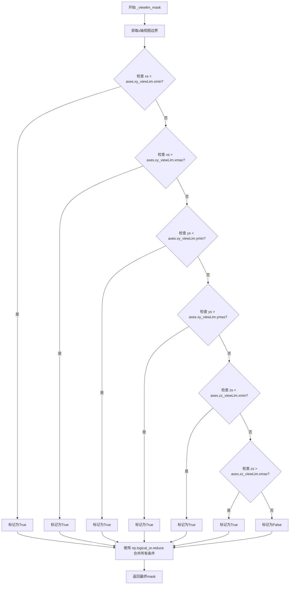

#### 带注释源码

```python
def _viewlim_mask(xs, ys, zs, axes):
    """
    Return the mask of the points outside the axes view limits.

    Parameters
    ----------
    xs, ys, zs : array-like
        The points to mask.
    axes : Axes3D
        The axes to use for the view limits.

    Returns
    -------
    mask : np.array
        The mask of the points as a bool array.
    """
    # 使用 np.logical_or.reduce 将多个条件判断合并为一个布尔掩码
    # 当任意一个条件为True时（即点超出任意一个视图边界），该点被标记为需要掩码处理
    mask = np.logical_or.reduce((
        xs < axes.xy_viewLim.xmin,    # 检查x坐标是否小于视图左边界
        xs > axes.xy_viewLim.xmax,    # 检查x坐标是否大于视图右边界
        ys < axes.xy_viewLim.ymin,    # 检查y坐标是否小于视图下边界
        ys > axes.xy_viewLim.ymax,    # 检查y坐标是否大于视图上边界
        zs < axes.zz_viewLim.xmin,    # 检查z坐标是否小于视图前边界（zz_viewLim的xmin对应z轴min）
        zs > axes.zz_viewLim.xmax))   # 检查z坐标是否大于视图后边界（zz_viewLim的xmax对应z轴max）
    return mask
```


### `text_2d_to_3d`

将二维文本对象（`Text`）原地转换为三维文本对象（`Text3D`），使其能够在三维坐标系中正确渲染。

参数：

- `obj`：`matplotlib.text.Text`，需要转换的二维文本对象
- `z`：`float`，文本在三维空间中的 z 轴位置，默认为 0
- `zdir`：`str` 或 `3-tuple`，文本的方向，可选值为 'x'、'y'、'z' 或三维向量，默认为 'z'。详见 `.get_dir_vector` 的描述
- `axlim_clip`：`bool`，是否隐藏超出 axes 视图限制的文本，默认为 False（3.10 版本新增）

返回值：`None`，该函数直接修改传入的对象，将其类替换为 `Text3D` 并设置三维属性

#### 流程图

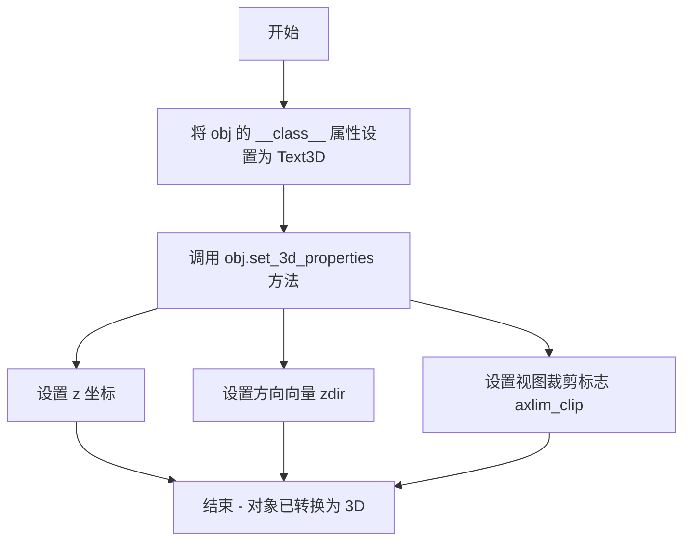

#### 带注释源码

```python
def text_2d_to_3d(obj, z=0, zdir='z', axlim_clip=False):
    """
    Convert a `.Text` to a `.Text3D` object.

    Parameters
    ----------
    z : float
        The z-position in 3D space.
    zdir : {'x', 'y', 'z', 3-tuple}
        The direction of the text. Default: 'z'.
        See `.get_dir_vector` for a description of the values.
    axlim_clip : bool, default: False
        Whether to hide text outside the axes view limits.

        .. versionadded:: 3.10
    """
    # 原地修改对象的类类型，将其从 Text 转换为 Text3D
    # 这种方式避免了创建新对象，保留了原对象的所有属性和引用
    obj.__class__ = Text3D
    
    # 调用 Text3D 类的 set_3d_properties 方法，设置三维属性
    # 包括 z 坐标、方向向量和视图裁剪标志
    obj.set_3d_properties(z, zdir, axlim_clip)
```


### `line_2d_to_3d`

将二维线对象（`Line2D`）原地转换为三维线对象（`Line3D`），通过修改对象的类类型并设置三维属性。

参数：

- `line`：`Line2D`，要转换的二维线对象
- `zs`：`float`，默认 `0`，在线对象所在三维空间中沿 *zdir* 轴的位置
- `zdir`：`str`，默认 `'z'`，正交绘制线的平面，可选值为 `'x'`、`'y'`、`'z'`
- `axlim_clip`：`bool`，默认 `False`，是否隐藏端点超出轴视图范围的线段

返回值：`None`，该函数无返回值，直接修改传入的 `line` 对象

#### 流程图

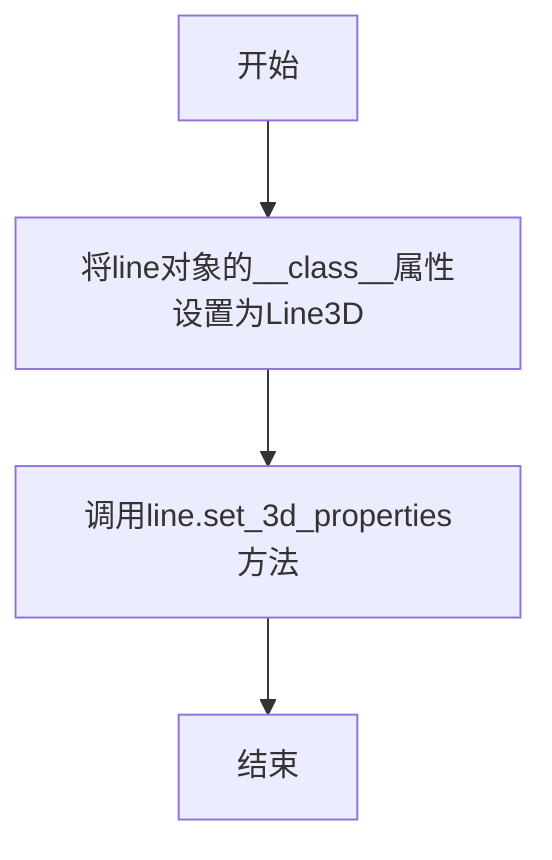

#### 带注释源码

```python
def line_2d_to_3d(line, zs=0, zdir='z', axlim_clip=False):
    """
    Convert a `.Line2D` to a `.Line3D` object.

    Parameters
    ----------
    line : Line2D
        The 2D line object to convert.
    zs : float
        The location along the *zdir* axis in 3D space to position the line.
    zdir : {'x', 'y', 'z'}
        Plane to plot line orthogonal to. Default: 'z'.
        See `.get_dir_vector` for a description of the values.
    axlim_clip : bool, default: False
        Whether to hide lines with an endpoint outside the axes view limits.

        .. versionadded:: 3.10
    """
    # 通过直接修改对象的__class__属性,将Line2D实例转换为Line3D实例
    # 这种方式避免了创建新对象的开销,实现了原地转换
    line.__class__ = Line3D
    # 调用Line3D类的方法设置三维属性,包括z坐标、方向向量和视图裁剪标志
    line.set_3d_properties(zs, zdir, axlim_clip)
```


### `_path_to_3d_segment`

该函数用于将二维路径（Path）对象转换为三维线段数据。它接收一个matplotlib路径对象，通过`iter_segments`方法提取路径中的顶点坐标，然后结合给定的z坐标和方向参数，使用`juggle_axes`函数将二维坐标转换为三维坐标。

参数：

- `path`：`matplotlib.path.Path`，要转换的二维路径对象
- `zs`：`float` 或 `array-like`，默认值为0，路径在z轴方向上的位置或坐标数组
- `zdir`：`str`，默认值为'z'，指定路径在三维空间中所在的平面（'x'、'y'或'z'）

返回值：`list`，返回三维坐标列表，每个元素为包含(x, y, z)的元组

#### 流程图

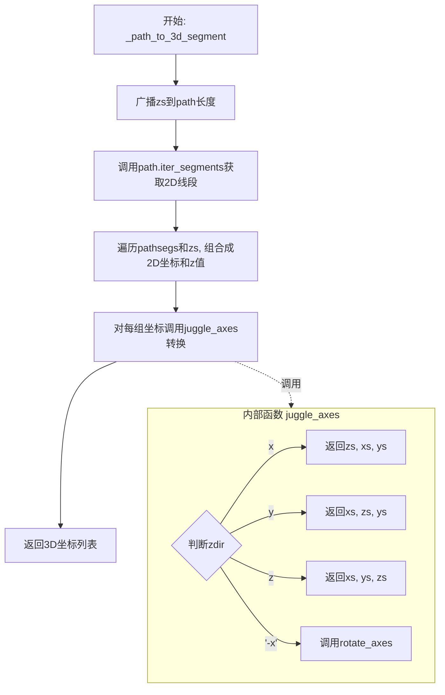

#### 带注释源码

```python
def _path_to_3d_segment(path, zs=0, zdir='z'):
    """
    将二维路径转换为三维线段。
    
    Parameters
    ----------
    path : matplotlib.path.Path
        要转换的二维路径对象。
    zs : float or array-like, default: 0
        路径在z轴方向上的位置。如果是一个数组，则其长度应与path的顶点数相同。
    zdir : {'x', 'y', 'z'}, default: 'z'
        指定路径在三维空间中所在的平面。
        - 'z': 路径在xy平面，z坐标由zs决定
        - 'x': 路径在yz平面
        - 'y': 路径在xz平面
    
    Returns
    -------
    seg3d : list of tuple
        三维坐标列表，每个元素为(x, y, z)元组。
    """
    
    # Step 1: 广播zs参数
    # 将zs转换为与path顶点数量相同的数组
    # 如果zs是标量，会被广播为与path长度相同的数组
    # 如果zs已经是数组，确保其长度与path匹配
    zs = np.broadcast_to(zs, len(path))
    
    # Step 2: 获取路径的线段迭代器
    # simplify=False: 不简化路径
    # curves=False: 不处理曲线，只返回顶点
    pathsegs = path.iter_segments(simplify=False, curves=False)
    
    # Step 3: 组合2D坐标和z坐标
    # pathsegs返回的是((x, y), code)形式的元组
    # 使用zip将每个2D坐标与对应的z值配对
    seg = [(x, y, z) for (((x, y), code), z) in zip(pathsegs, zs)]
    
    # Step 4: 转换为3D坐标
    # juggle_axes函数根据zdir参数重新排列坐标轴
    # 例如: zdir='z'时返回(xs, ys, zs)，zdir='x'时返回(zs, xs, ys)
    seg3d = [juggle_axes(x, y, z, zdir) for (x, y, z) in seg]
    
    # Step 5: 返回3D坐标列表
    return seg3d
```


### `_paths_to_3d_segments`

该函数将二维路径集合转换为三维线段集合，支持批量处理多个路径，并根据指定的坐标轴方向和z坐标值进行三维空间映射。

参数：

-  `paths`：`可迭代对象（Path列表）`，要转换的二维路径集合，通常为 `matplotlib.path.Path` 对象列表
-  `zs`：`float 或 array-like`，z坐标值，可以是单个浮点数（将广播到所有路径）或与paths长度相同的数组，默认值为 `0`
-  `zdir`：`str`，投影方向，指定路径在三维空间中沿哪个轴展开，可选值为 `'x'`、`'y'`、`'z'` 等，默认值为 `'z'`

返回值：`list`，返回三维线段列表，每个元素是一个三维坐标点列表（通常为 `list` of tuples (x, y, z)）

#### 流程图

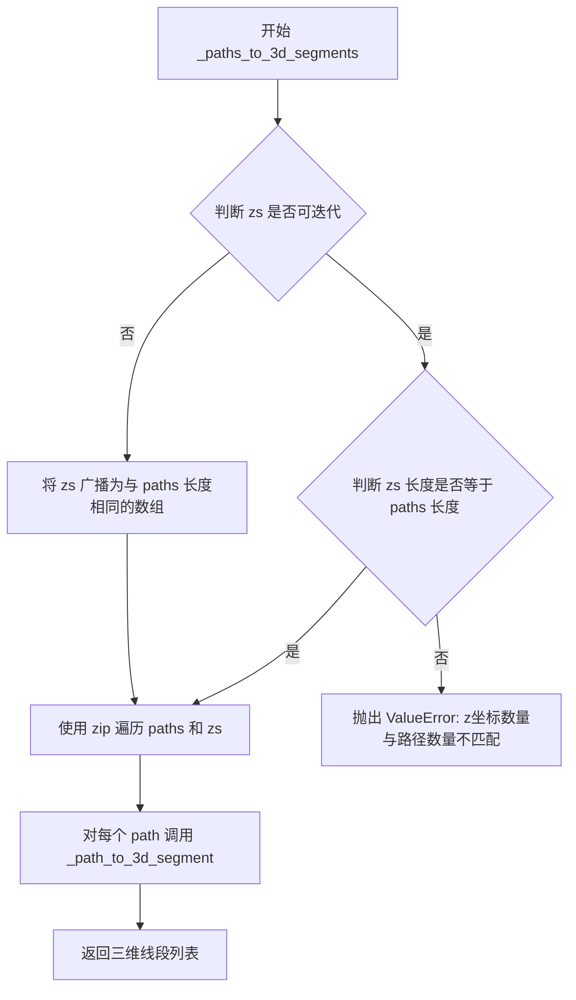

#### 带注释源码

```python
def _paths_to_3d_segments(paths, zs=0, zdir='z'):
    """Convert paths from a collection object to 3D segments."""
    # 如果zs是不可迭代的单个值（如浮点数），则将其广播为与paths长度相同的数组
    if not np.iterable(zs):
        zs = np.broadcast_to(zs, len(paths))
    else:
        # 如果zs是可迭代的数组，则验证其长度必须与paths长度匹配
        if len(zs) != len(paths):
            raise ValueError('Number of z-coordinates does not match paths.')

    # 使用列表推导式，对每个path及其对应的z坐标调用_path_to_3d_segment进行转换
    segs = [_path_to_3d_segment(path, pathz, zdir)
            for path, pathz in zip(paths, zs)]
    return segs
```


### `_path_to_3d_segment_with_codes`

该函数用于将2D路径对象转换为3D线段，并保留路径的绘制指令代码。它接受一个2D路径和可选的Z坐标及方向参数，通过路径迭代器提取点坐标，结合Z坐标生成三维点序列，最后使用`juggle_axes`函数根据指定的方向重新排列坐标轴。

参数：

- `path`：`Path` 对象，要转换的2D路径（来自matplotlib.path模块）
- `zs`：`float` 或 `array-like`，默认0，Z坐标值，用于指定路径在3D空间中的深度位置
- `zdir`：`str`，默认'z'，方向向量，可选'x'、'y'、'z'等，用于确定3D坐标的排列方式

返回值：`(list, list)`，返回一个元组，包含`seg3d`（3D线段列表）和`codes`（路径绘制代码列表）

#### 流程图

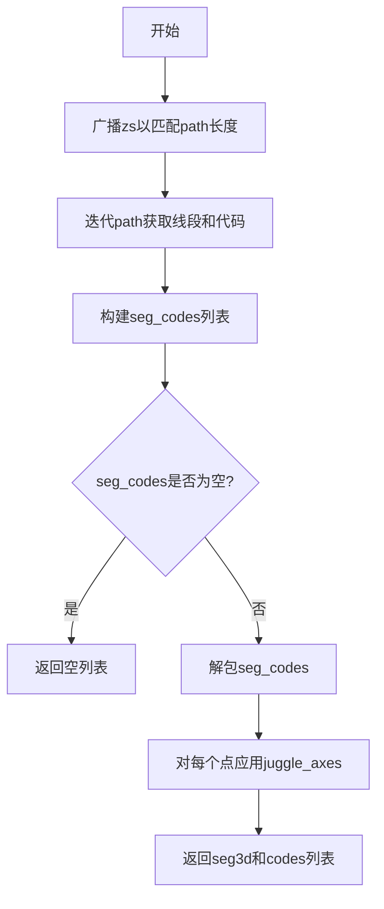

#### 带注释源码

```python
def _path_to_3d_segment_with_codes(path, zs=0, zdir='z'):
    """
    将2D路径转换为保留路径代码的3D线段。
    
    Parameters
    ----------
    path : matplotlib.path.Path
        要转换的2D路径对象
    zs : float or array-like, default: 0
        Z坐标值，用于指定路径在3D空间中的深度位置
    zdir : {'x', 'y', 'z'}, default: 'z'
        方向向量，确定3D坐标的排列方式
        
    Returns
    -------
    seg3d : list
        3D线段列表，每个元素是一个(x, y, z)元组
    codes : list
        路径绘制代码列表，对应Path的codes属性
    """
    
    # 将zs广播到与path顶点数量相匹配的长度
    # 如果zs是标量，会被扩展为与path顶点数相同的数组
    zs = np.broadcast_to(zs, len(path))
    
    # 迭代路径段，simplify=False不简化曲线，curves=False只返回直线段
    pathsegs = path.iter_segments(simplify=False, curves=False)
    
    # 构建包含(x, y, z)和code的列表
    # path.iter_segments返回((x, y), code)元组
    # 我们将其与zs配对，形成((x, y, z), code)形式
    seg_codes = [((x, y, z), code) for ((x, y), code), z in zip(pathsegs, zs)]
    
    # 如果有内容，则解包；否则返回空列表
    if seg_codes:
        # zip(*seg_codes)将[(point1, code1), (point2, code2)...]
        # 转换为(points列表, codes列表)
        seg, codes = zip(*seg_codes)
        
        # 对每个2D点应用juggle_axes，转换为3D坐标
        # juggle_axes会根据zdir参数重新排列坐标轴
        # 例如zdir='z'返回(xs, ys, zs)，zdir='x'返回(zs, xs, ys)等
        seg3d = [juggle_axes(x, y, z, zdir) for (x, y, z) in seg]
    else:
        seg3d = []
        codes = []
    
    # 返回3D线段和路径代码的元组，codes转换为list以支持修改
    return seg3d, list(codes)
```


### `_paths_to_3d_segments_with_codes`

该函数用于将二维路径集合转换为三维线段集合，同时保留路径绘制代码（codes）。它常用于将二维图形（如多边形、线条集合）转换为三维空间中的表示，以便在3D坐标轴中进行渲染。

参数：

-  `paths`：路径集合，通常是 `matplotlib.path.Path` 对象的列表或类似可迭代对象，包含需要转换的二维路径
-  `zs`：float 或 array-like，默认为 0，表示沿 zdir 方向的坐标值。可以是标量（所有路径使用相同的 z 值）或数组（每个路径对应不同的 z 值）
-  `zdir`：str，默认为 'z'，表示投影方向。可能的值包括 'x'、'y'、'z' 或其他三维向量，用于确定路径在三维空间中的方向

返回值：tuple，返回一个元组包含两个列表元素 `(list(segments), list(codes))`。其中 `segments` 是三维线段坐标列表，每个元素是一个包含 (x, y, z) 坐标的列表；`codes` 是对应的路径绘制代码列表（如 MOVETO、LINETO、CLOSEPOLY 等）

#### 流程图

```mermaid
flowchart TD
    A[开始: _paths_to_3d_segments_with_codes] --> B{判断 zs 是否可迭代}
    B -->|否| C[使用 np.broadcast_to 将 zs 广播为与 paths 长度相同的数组]
    B -->|是| D{判断 zs 长度是否等于 paths 长度}
    D -->|否| E[抛出 ValueError: 坐标数量不匹配]
    D -->|是| F[继续执行]
    C --> F
    F --> G[使用列表推导式遍历 paths 和 zs]
    G --> H[对每个 path 调用 _path_to_3d_segment_with_codes]
    H --> I[调用 _path_to_3d_segment_with_codes]
    I --> J[使用 juggle_axes 重新排列坐标轴]
    J --> K[返回 3D 线段和路径代码]
    G --> L{segments_codes 是否为空}
    L -->|否| M[使用 zip 解包 segments 和 codes]
    L -->|是| N[设置 segments 和 codes 为空列表]
    M --> O[将结果转换为 list 类型]
    N --> O
    O --> P[返回 (list(segments), list(codes))]
```

#### 带注释源码

```python
def _paths_to_3d_segments_with_codes(paths, zs=0, zdir='z'):
    """
    Convert paths from a collection object to 3D segments with path codes.
    
    Parameters
    ----------
    paths : iterable
        A collection of path objects to convert.
    zs : float or array-like, default: 0
        The z-coordinate or coordinates to use for the conversion.
        If a scalar, the same value is used for all paths.
        If an array, it must have the same length as paths.
    zdir : {'x', 'y', 'z'}, default: 'z'
        The axis direction for the z-coordinate.
        
    Returns
    -------
    segments : list
        A list of 3D segments, where each segment is a list of (x, y, z) points.
    codes : list
        A list of path codes corresponding to each segment.
    """
    # 将 zs 广播为与 paths 长度相同的数组
    # 如果 zs 已经是可迭代的数组，则直接使用；否则广播为相同长度
    zs = np.broadcast_to(zs, len(paths))
    
    # 遍历每个路径及其对应的 z 坐标，调用 _path_to_3d_segment_with_codes 进行转换
    # 返回一个列表，每个元素是 (segment3d, codes) 的元组
    segments_codes = [_path_to_3d_segment_with_codes(path, pathz, zdir)
                      for path, pathz in zip(paths, zs)]
    
    # 如果存在转换后的数据，则解包出所有的 segments 和 codes
    # 否则返回空列表
    if segments_codes:
        segments, codes = zip(*segments_codes)
    else:
        segments, codes = [], []
        
    # 确保返回的是 list 类型，而不是 tuple
    return list(segments), list(codes)
```


### collection_2d_to_3d

将二维集合对象（Collection）转换为三维集合对象（Collection3D），通过添加z坐标信息和重新投影到3D空间来实现。

参数：

- `col`：`Collection`，需要转换的二维集合对象
- `zs`：`float or array of floats`，沿zdir轴放置集合的z坐标，默认为0
- `zdir`：`{'x', 'y', 'z'}`，放置集合的正交平面，默认为'z'。参见`.get_dir_vector`获取值描述
- `axlim_clip`：`bool`，是否隐藏顶点超出 axes 视图范围的集合，默认为False

返回值：`None`，该函数直接修改传入的集合对象，无返回值

#### 流程图

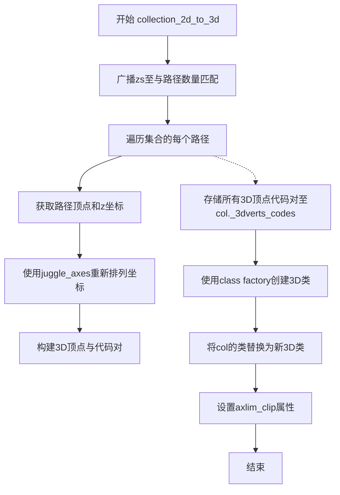

#### 带注释源码

```python
def collection_2d_to_3d(col, zs=0, zdir='z', axlim_clip=False):
    """
    Convert a `.Collection` to a `.Collection3D` object.
    
    Parameters
    ----------
    col : Collection
        The 2D collection to convert.
    zs : float or array of floats
        The z coordinate(s) for the collection.
    zdir : {'x', 'y', 'z'}
        The direction to plot the collection orthogonal to.
    axlim_clip : bool
        Whether to hide elements outside the axes view limits.
    """
    # Step 1: Broadcast zs to match the number of paths in the collection
    # If zs is a scalar, it will be repeated to match len(col.get_paths())
    # If zs is already an array, it must match the number of paths
    zs = np.broadcast_to(zs, len(col.get_paths()))
    
    # Step 2: Process each path in the collection
    # For each path p with corresponding z coordinate:
    # - Get vertices and broadcast z to match vertex count
    # - Transpose to get (3, N) shape for juggle_axes
    # - Transform coordinates based on zdir
    # - Column_stack back to (N, 3) shape
    # - Preserve original path codes
    col._3dverts_codes = [
        (np.column_stack(juggle_axes(
            *np.column_stack([p.vertices, np.broadcast_to(z, len(p.vertices))]).T,
            zdir)),
         p.codes)
        for p, z in zip(col.get_paths(), zs)]
    
    # Step 3: Dynamically create the 3D collection class
    # Uses cbook._make_class_factory to create a class like "PolyCollection3D"
    # based on the original collection type
    col.__class__ = cbook._make_class_factory(Collection3D, "{}3D")(type(col))
    
    # Step 4: Set the axis limit clipping flag
    col._axlim_clip = axlim_clip
```


### `line_collection_2d_to_3d`

将二维线条集合（`LineCollection`）转换为三维线条集合（`Line3DCollection`），通过计算三维坐标段并更新对象类型及属性，使其能够在三维坐标系中正确渲染。

参数：

- `col`：`LineCollection`，要转换的二维线条集合对象
- `zs`：`float` 或 `array of floats`，默认 0，沿 *zdir* 轴的位置，用于设置线条在第三维坐标
- `zdir`：`{'x', 'y', 'z'}`，默认 'z'，正交于该轴的平面，用于确定三维空间方向
- `axlim_clip`：`bool`，默认 False，是否隐藏端点超出轴视图限制的线条

返回值：`None`，该函数直接修改传入的集合对象，无返回值

#### 流程图

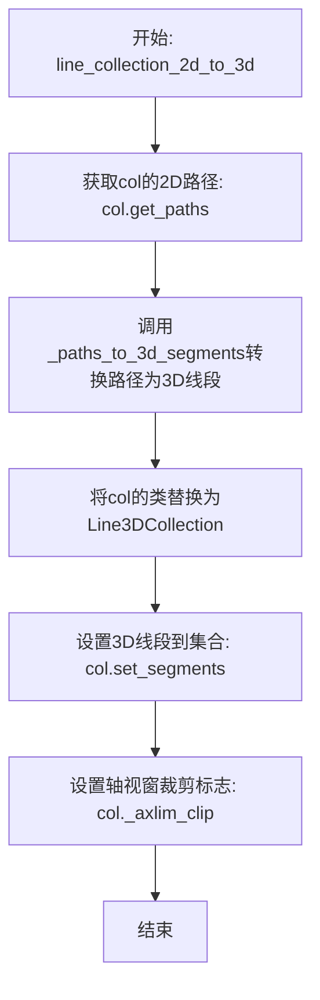

#### 带注释源码

```python
def line_collection_2d_to_3d(col, zs=0, zdir='z', axlim_clip=False):
    """Convert a `.LineCollection` to a `.Line3DCollection` object."""
    # 将2D路径转换为3D线段，zs控制Z坐标，zdir控制方向
    segments3d = _paths_to_3d_segments(col.get_paths(), zs, zdir)
    
    # 将集合的类替换为3D版本，实现类型转换
    col.__class__ = Line3DCollection
    
    # 设置转换后的3D线段
    col.set_segments(segments3d)
    
    # 设置视窗裁剪标志，控制是否裁剪超出轴范围的线条
    col._axlim_clip = axlim_clip
```


### `_get_patch_verts`

该函数是一个全局工具函数，用于从二维_patch_对象中提取顶点数据。它通过获取patch的变换矩阵和路径对象，将路径转换为多边形顶点数组，是将二维patch转换为三维patch的关键前置步骤。

参数：

- `patch`：`matplotlib.patches.Patch`，需要提取顶点的二维patch对象

返回值：`numpy.ndarray`，返回patch路径的多边形顶点数组；如果没有多边形则返回空数组

#### 流程图

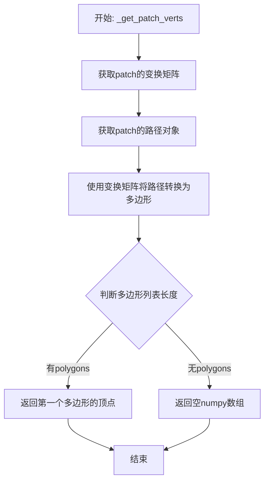

#### 带注释源码

```python
def _get_patch_verts(patch):
    """
    Return a list of vertices for the path of a patch.
    
    Parameters
    ----------
    patch : matplotlib.patches.Patch
        The 2D patch object to extract vertices from.
    
    Returns
    -------
    numpy.ndarray
        An array of vertices for the patch path. Returns an empty array
        if the path cannot be converted to polygons.
    """
    # 获取patch的仿射变换矩阵，用于将patch坐标转换为显示坐标
    trans = patch.get_patch_transform()
    
    # 获取patch的几何路径（包含顶点信息和路径指令）
    path = patch.get_path()
    
    # 将路径对象转换为多边形顶点列表
    # to_polygons方法会根据路径指令（如MOVETO、LINETO等）生成多边形顶点
    polygons = path.to_polygons(trans)
    
    # 如果存在多边形，返回第一个多边形的顶点数组
    # 如果没有多边形（空列表），返回空的numpy数组作为默认值
    return polygons[0] if len(polygons) else np.array([])
```


### `patch_2d_to_3d`

该函数用于将二维 Patch 对象转换为三维 Patch3D 对象，实现二维图形到三维图形的转换，通过修改对象类属性并设置三维属性来完成转换。

参数：

- `patch`：`matplotlib.patches.Patch`，需要转换的二维 Patch 对象
- `z`：`float`，默认为 0，三维空间中沿 zdir 轴的位置
- `zdir`：`str`，默认为 'z'，补丁所在的正交平面，可选 'x'、'y'、'z'
- `axlim_clip`：`bool`，默认为 False，是否隐藏超出轴视图限制的顶点

返回值：`None`，该函数直接修改传入的 patch 对象，无返回值

#### 流程图

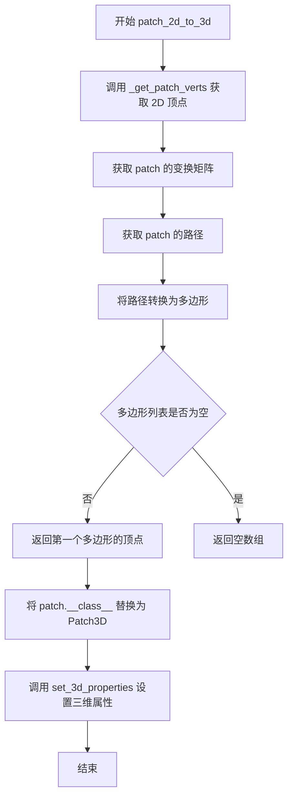

#### 带注释源码

```python
def patch_2d_to_3d(patch, z=0, zdir='z', axlim_clip=False):
    """
    Convert a `.Patch` to a `.Patch3D` object.

    Parameters
    ----------
    patch : matplotlib.patches.Patch
        需要转换的二维 Patch 对象
    z : float, optional
        三维空间中沿 zdir 轴的位置，默认为 0
    zdir : {'x', 'y', 'z'}, optional
        补丁所在的正交平面，默认为 'z'
    axlim_clip : bool, optional
        是否隐藏超出轴视图限制的顶点，默认为 False
    """
    # 获取 2D patch 的顶点坐标
    # 调用内部函数 _get_patch_verts 提取 patch 的顶点数据
    verts = _get_patch_verts(patch)
    
    # 动态修改对象的类属性，将 2D Patch 对象转换为 3D 版本
    # 这是 Python 中一种对象类型转换的常用技巧
    patch.__class__ = Patch3D
    
    # 调用 Patch3D 的 set_3d_properties 方法设置三维属性
    # 包括：顶点坐标、z 轴位置、方向、视图裁剪标志
    patch.set_3d_properties(verts, z, zdir, axlim_clip)


def _get_patch_verts(patch):
    """
    Return a list of vertices for the path of a patch.

    Parameters
    ----------
    patch : matplotlib.patches.Patch
        需要提取顶点的 patch 对象

    Returns
    -------
    vertices : numpy.array
        patch 的顶点坐标数组，如果没有有效多边形则返回空数组
    """
    # 获取 patch 的变换矩阵，用于将局部坐标转换为数据坐标
    trans = patch.get_patch_transform()
    
    # 获取 patch 的路径对象
    path = patch.get_path()
    
    # 将路径转换为多边形列表
    # 变换参数为 True 表示闭合路径
    polygons = path.to_polygons(trans)
    
    # 如果存在多边形，返回第一个多边形的顶点
    # 否则返回空数组
    return polygons[0] if len(polygons) else np.array([])
```


### pathpatch_2d_to_3d

该函数用于将二维的`PathPatch`对象转换为三维的`PathPatch3D`对象，通过获取路径补丁的路径和变换矩阵，修改对象类型并设置三维属性，使其能够在三维坐标系中正确渲染。

参数：

- `pathpatch`：`matplotlib.patches.PathPatch`，需要转换的二维路径补丁对象
- `z`：`float`，默认值为0，三维空间中沿zdir轴的位置
- `zdir`：`str`，默认值为`'z'`，投影到的轴向（'x'、'y'、'z'之一）

返回值：`None`，无返回值（该函数直接修改传入的pathpatch对象的内部状态）

#### 流程图

```mermaid
flowchart TD
    A[开始: pathpatch_2d_to_3d] --> B[获取pathpatch的路径: path = pathpatch.get_path]
    B --> C[获取路径的变换矩阵: trans = pathpatch.get_patch_transform]
    C --> D[应用变换得到三维路径: mpath = trans.transform_path(path)]
    D --> E[修改对象类型为PathPatch3D: pathpatch.__class__ = PathPatch3D]
    E --> F[设置三维属性: pathpatch.set_3d_properties<br/>参数: mpath, z, zdir]
    F --> G[结束]
```

#### 带注释源码

```python
def pathpatch_2d_to_3d(pathpatch, z=0, zdir='z'):
    """
    将二维 PathPatch 对象转换为三维 PathPatch3D 对象。
    
    参数:
        pathpatch: 需要转换的二维路径补丁对象 (PathPatch类型)
        z: 三维空间中沿zdir轴的位置，默认为0
        zdir: 投影轴向，可选'x'、'y'、'z'，默认为'z'
    """
    # 步骤1: 从pathpatch对象中获取其内部路径表示
    path = pathpatch.get_path()
    
    # 步骤2: 获取用于变换路径的变换矩阵（包含位置、旋转、缩放等信息）
    trans = pathpatch.get_patch_transform()
    
    # 步骤3: 应用变换矩阵将二维路径转换为新的路径对象
    # 这一步会根据变换矩阵对路径顶点进行坐标变换
    mpath = trans.transform_path(path)
    
    # 步骤4: 动态修改pathpatch对象的类类型为PathPatch3D
    # 这是Python中一种常见的"就地"转换模式，无需创建新对象
    pathpatch.__class__ = PathPatch3D
    
    # 步骤5: 调用PathPatch3D的set_3d_properties方法
    # 将转换后的三维路径mpath、以及z位置和zdir方向设置到对象中
    pathpatch.set_3d_properties(mpath, z, zdir)
```


### `patch_collection_2d_to_3d`

该函数用于将二维的 PatchCollection 或 PathCollection 转换为三维的 Patch3DCollection 或 Path3DCollection 对象，支持指定 Z 轴位置、方向、深度阴影和视图限制裁剪。

参数：

-  `col`：`~matplotlib.collections.PatchCollection` 或 `~matplotlib.collections.PathCollection`，需要转换的集合对象
-  `zs`：`float` 或 `array of floats`，沿 *zdir* 轴放置补丁的位置，默认为 0
-  `zdir`：`{'x', 'y', 'z'}`，放置补丁的轴，默认为 "z"
-  `depthshade`：`bool`，默认为 :rc:`axes3d.depthshade`，是否对补丁进行深度着色
-  `axlim_clip`：`bool`，默认为 False，是否隐藏视图限制外的补丁
-  `depthshade_minalpha`：`float`，默认为 :rc:`axes3d.depthshade_minalpha`，深度着色的最小 Alpha 值

返回值：`None`，直接修改传入的集合对象

#### 流程图

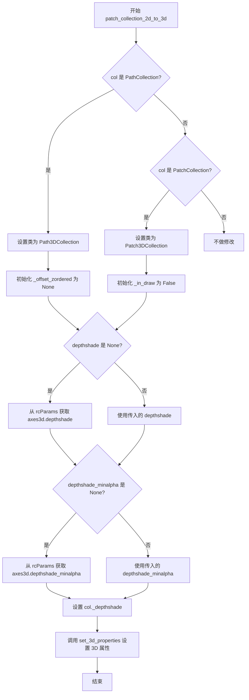

#### 带注释源码

```python
def patch_collection_2d_to_3d(
    col,
    zs=0,
    zdir="z",
    depthshade=None,
    axlim_clip=False,
    *args,
    depthshade_minalpha=None,
):
    """
    Convert a `.PatchCollection` into a `.Patch3DCollection` object
    (or a `.PathCollection` into a `.Path3DCollection` object).

    Parameters
    ----------
    col : `~matplotlib.collections.PatchCollection` or \
`~matplotlib.collections.PathCollection`
        The collection to convert.
    zs : float or array of floats
        The location or locations to place the patches in the collection along
        the *zdir* axis. Default: 0.
    zdir : {'x', 'y', 'z'}
        The axis in which to place the patches. Default: "z".
        See `.get_dir_vector` for a description of the values.
    depthshade : bool, default: :rc:`axes3d.depthshade`
        Whether to shade the patches to give a sense of depth.
    axlim_clip : bool, default: False
        Whether to hide patches with a vertex outside the axes view limits.

        .. versionadded:: 3.10

    depthshade_minalpha : float, default: :rc:`axes3d.depthshade_minalpha`
        Sets the minimum alpha value used by depth-shading.

        .. versionadded:: 3.11
    """
    # 判断集合类型，如果是 PathCollection 则转换为 Path3DCollection
    if isinstance(col, PathCollection):
        col.__class__ = Path3DCollection
        col._offset_zordered = None
    # 如果是 PatchCollection 则转换为 Patch3DCollection
    elif isinstance(col, PatchCollection):
        col.__class__ = Patch3DCollection
    
    # 如果未指定 depthshade，则从 rcParams 获取默认值
    if depthshade is None:
        depthshade = rcParams['axes3d.depthshade']
    # 如果未指定 depthshade_minalpha，则从 rcParams 获取默认值
    if depthshade_minalpha is None:
        depthshade_minalpha = rcParams['axes3d.depthshade_minalpha']
    
    # 设置深度着色相关属性
    col._depthshade = depthshade
    col._depthshade_minalpha = depthshade_minalpha
    col._in_draw = False
    
    # 调用 3D 属性的设置方法
    col.set_3d_properties(zs, zdir, axlim_clip)
```


### `poly_collection_2d_to_3d`

将二维的多边形集合（PolyCollection）转换为三维的多边形集合（Poly3DCollection），通过重新计算路径的三维坐标、设置顶点与编码、并配置3D属性，使原本在二维平面上绘制的多边形集合能够在三维空间中正确渲染。

参数：

- `col`：`PolyCollection`，要转换的二维多边形集合对象
- `zs`：`float` 或 `array of floats`，沿 zdir 轴放置多边形的位置，默认为 0
- `zdir`：`{'x', 'y', 'z'}`，放置多边形的轴向，默认为 'z'；参见 `get_dir_vector` 的详细说明
- `axlim_clip`：`bool`，是否隐藏超出视图范围的多边形，默认为 False

返回值：无（`None`），该函数直接修改传入的集合对象，不返回新对象

#### 流程图

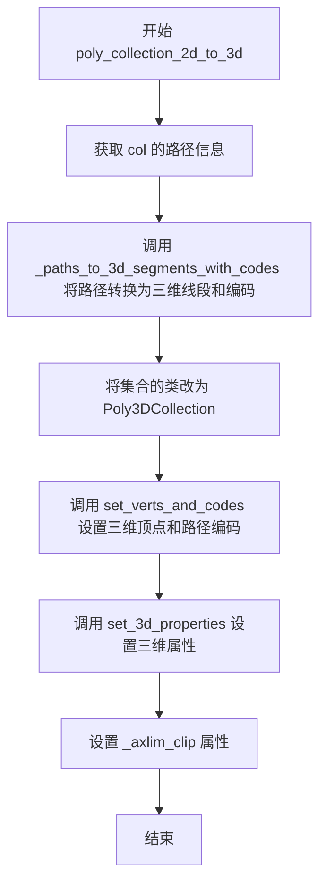

#### 带注释源码

```python
def poly_collection_2d_to_3d(col, zs=0, zdir='z', axlim_clip=False):
    """
    Convert a `.PolyCollection` into a `.Poly3DCollection` object.

    Parameters
    ----------
    col : `~matplotlib.collections.PolyCollection`
        The collection to convert.
    zs : float or array of floats
        The location or locations to place the polygons in the collection along
        the *zdir* axis. Default: 0.
    zdir : {'x', 'y', 'z'}
        The axis in which to place the patches. Default: 'z'.
        See `.get_dir_vector` for a description of the values.
    """
    # 调用内部函数将二维路径转换为三维线段（包含路径编码信息）
    # 该函数遍历每个路径，根据 zs 和 zdir 参数计算三维坐标
    segments_3d, codes = _paths_to_3d_segments_with_codes(
            col.get_paths(), zs, zdir)
    
    # 动态修改对象的类类型，从 PolyCollection 变为 Poly3DCollection
    # 这是 Python 中常见的"类替换"技术，无需创建新对象即可改变行为
    col.__class__ = Poly3DCollection
    
    # 设置三维顶点数据和路径编码，这些数据将在投影时被用于渲染
    col.set_verts_and_codes(segments_3d, codes)
    
    # 初始化三维属性，包括排序位置、Z轴排序方法、颜色等
    col.set_3d_properties()
    
    # 设置视图裁剪标志，控制是否隐藏超出坐标轴范围的元素
    col._axlim_clip = axlim_clip
```


### `juggle_axes`

该函数用于重新排列三维坐标轴，使得二维 xs、ys 可以在正交于 zdir 的平面中进行绘制。zdir 通常为 'x'、'y' 或 'z'，如果 zdir 以 '-' 开头，则被视为 `rotate_axes` 的补偿操作。

参数：

- `xs`：`array-like`，X 坐标数据
- `ys`：`array-like`，Y 坐标数据
- `zs`：`array-like`，Z 坐标数据
- `zdir`：`str`，目标轴向，可选值为 'x'、'y'、'z' 或带 '-' 前缀的值（如 '-x'、'-y'、'-z'）

返回值：`tuple`，重新排列后的坐标元组 (xs', ys', zs')

#### 流程图

```mermaid
flowchart TD
    A[开始 juggle_axes] --> B{zdir == 'x'?}
    B -->|Yes| C[返回 zs, xs, ys]
    B -->|No| D{zdir == 'y'?}
    D -->|Yes| E[返回 xs, zs, ys]
    D -->|No| F{zdir[0] == '-'?}
    F -->|Yes| G[调用 rotate_axes(xs, ys, zs, zdir)]
    F -->|No| H[返回 xs, ys, zs]
    C --> I[结束]
    E --> I
    G --> I
    H --> I
```

#### 带注释源码

```python
def juggle_axes(xs, ys, zs, zdir):
    """
    Reorder coordinates so that 2D *xs*, *ys* can be plotted in the plane
    orthogonal to *zdir*. *zdir* is normally 'x', 'y' or 'z'. However, if
    *zdir* starts with a '-' it is interpreted as a compensation for
    `rotate_axes`.
    
    Parameters
    ----------
    xs : array-like
        X坐标数据
    ys : array-like
        Y坐标数据
    zs : array-like
        Z坐标数据
    zdir : str
        目标轴向，'x', 'y', 'z' 或 '-x', '-y', '-z'
    
    Returns
    -------
    tuple
        重新排列后的坐标元组 (xs', ys', zs')
    """
    # 当zdir为'x'时，将zs放到第一位，实现沿x轴方向的平面绘图
    if zdir == 'x':
        return zs, xs, ys
    # 当zdir为'y'时，将zs放到第二位，实现沿y轴方向的平面绘图
    elif zdir == 'y':
        return xs, zs, ys
    # 当zdir以'-'开头时，调用rotate_axes进行坐标旋转补偿
    elif zdir[0] == '-':
        return rotate_axes(xs, ys, zs, zdir)
    # 默认情况（zdir为'z'），返回原始坐标顺序
    else:
        return xs, ys, zs
```


### `rotate_axes`

该函数用于重新排序三维坐标，使得指定的轴方向（zdir）沿着原始的z轴方向。当zdir为'x'或'-y'时，返回(ys, zs, xs)；当zdir为'-x'或'y'时，返回(zs, xs, ys)；否则保持原始顺序(xs, ys, zs)。该函数是`juggle_axes`的辅助函数，用于处理带负号的轴向反转情况。

参数：

- `xs`：`array-like`，x坐标序列
- `ys`：`array-like`，y坐标序列
- `zs`：`array-like`，z坐标序列
- `zdir`：`str`，目标轴向，可选'x'、'-x'、'y'、'-y'、'z'或'-z'，用于指定哪个轴旋转到z轴位置

返回值：`tuple of array-like`，重新排序后的坐标元组(x', y', z')

#### 流程图

```mermaid
flowchart TD
    A[开始 rotate_axes] --> B{检查 zdir}
    B -->|zdir in ('x', '-y')| C[返回 ys, zs, xs]
    B -->|zdir in ('-x', 'y')| D[返回 zs, xs, ys]
    B -->|其他情况| E[返回 xs, ys, zs]
    C --> F[结束]
    D --> F
    E --> F
```

#### 带注释源码

```python
def rotate_axes(xs, ys, zs, zdir):
    """
    Reorder coordinates so that the axes are rotated with *zdir* along
    the original z axis. Prepending the axis with a '-' does the
    inverse transform, so *zdir* can be 'x', '-x', 'y', '-y', 'z' or '-z'.
    
    Parameters
    ----------
    xs : array-like
        The x coordinates.
    ys : array-like
        The y coordinates.
    zs : array-like
        The z coordinates.
    zdir : str
        The direction to rotate axes. Can be 'x', '-x', 'y', '-y', 'z' or '-z'.
        When 'x' or '-y', the axes are rotated so x-axis comes to z position.
        When '-x' or 'y', the axes are rotated so y-axis comes to z position.
        When 'z' or '-z', no rotation is needed.
    
    Returns
    -------
    tuple of array-like
        The reordered coordinates (x', y', z') after rotation.
    """
    # 当zdir为'x'或'-y'时，将xs放到z位置，ys放到x位置，zs放到y位置
    if zdir in ('x', '-y'):
        return ys, zs, xs
    # 当zdir为'-x'或'y'时，将ys放到z位置，xs放到y位置，zs放到x位置
    elif zdir in ('-x', 'y'):
        return zs, xs, ys
    # 其他情况（'z'或'-z'）保持原顺序
    else:
        return xs, ys, zs
```


### `_zalpha`

根据 Z 深度修改颜色列表的 alpha 值，实现深度着色效果，使较远的点具有更高的透明度。

参数：

-  `colors`：array-like，颜色列表或数组，待处理的目标颜色
-  `zs`：array-like，Z 坐标数组，表示每个点的深度信息
-  `min_alpha`：float，默认为 0.3，最小 alpha 阈值，用于限制最深点的最小透明度
-  `_data_scale`：float or None，可选，数据缩放参考值，用于计算 alpha 衰减比例

返回值：`np.ndarray`，返回修改后的 RGBA 颜色数组，形状为 (n, 4)，其中 n 为颜色/点的数量

#### 流程图

```mermaid
flowchart TD
    A[开始 _zalpha] --> B{检查 colors 或 zs 是否为空}
    B -->|是| B1[返回空数组 np.zeros((0, 4))]
    B -->|否| C[将 min_alpha 限制在 0-1 范围内]
    C --> D{检查 _data_scale 是否有效}
    D -->|无效或为 0| D1[设置 sats = np.ones_like(zs)<br/>不进行 alpha 缩放]
    D -->|有效| D2[计算 sats = clip(1 - (zs - min(zs)) / _data_scale, min_alpha, 1)<br/>根据深度计算透明度衰减系数]
    D1 --> E[将 colors 转换为 RGBA 数组并广播到正确形状]
    D2 --> E
    E --> F[修改 alpha 通道: rgba[:, 3] * sats]
    F --> G[返回结果数组: column_stack([rgba[:, :3], rgba[:, 3] * sats])]
```

#### 带注释源码

```python
def _zalpha(
    colors,
    zs,
    min_alpha=0.3,
    _data_scale=None,
):
    """Modify the alpha values of the color list according to z-depth."""

    # 处理空输入情况，直接返回空数组
    if len(colors) == 0 or len(zs) == 0:
        return np.zeros((0, 4))

    # Alpha 值必须在 0-1 范围内，超出部分无意义
    # 将 min_alpha 限制在有效范围内
    min_alpha = np.clip(min_alpha, 0, 1)

    if _data_scale is None or _data_scale == 0:
        # 没有有效的数据缩放参考时，不进行 alpha 缩放
        # 所有点保持原始透明度
        sats = np.ones_like(zs)

    else:
        # 较深的点具有更高的透明度（更透明）
        # 使用线性衰减: 1 - (当前深度 - 最小深度) / 数据范围
        # 衰减系数被限制在 [min_alpha, 1] 范围内
        sats = np.clip(1 - (zs - np.min(zs)) / _data_scale, min_alpha, 1)

    # 将输入颜色转换为 RGBA 数组并广播到与 zs 相同的长度
    # 以便对每个点应用独立的 alpha 值
    rgba = np.broadcast_to(mcolors.to_rgba_array(colors), (len(zs), 4))

    # 使用生成的 alpha 乘数修改颜色的 alpha 通道
    # 保持 RGB 通道不变，只修改透明度
    return np.column_stack([rgba[:, :3], rgba[:, 3] * sats])
```


### `_get_data_scale`

该函数用于估计3D数据的尺度（scale），主要在深度着色（depth shading）过程中使用，通过计算X、Y、Z三个维度范围的几何平均（均方根）来获得数据的整体尺度信息。

参数：

- `X`：`masked array`，X轴方向的坐标数据
- `Y`：`masked array`，Y轴方向的坐标数据
- `Z`：`masked array`，Z轴方向的坐标数据

返回值：`float`，返回3D数据的尺度值，如果数据集为空则返回0

#### 流程图

```mermaid
flowchart TD
    A[开始 _get_data_scale] --> B{检查X是否为空的掩码数组}
    B -->|是| C[返回0]
    B -->|否| D[计算ptp_x = X.max - X.min]
    D --> E[计算ptp_y = Y.max - Y.min]
    E --> F[计算ptp_z = Z.max - Z.min]
    F --> G[计算RSS = sqrt(ptp_x² + ptp_y² + ptp_z²)]
    G --> H[返回计算结果]
```

#### 带注释源码

```python
def _get_data_scale(X, Y, Z):
    """
    Estimate the scale of the 3D data for use in depth shading

    Parameters
    ----------
    X, Y, Z : masked arrays
        The data to estimate the scale of.
    """
    # Account for empty datasets. Assume that X Y and Z have the same number
    # of elements. 使用np.ma.count检查掩码数组中有效元素的个数
    if not np.ma.count(X):
        return 0

    # Estimate the scale using the RSS of the ranges of the dimensions
    # Note that we don't use np.ma.ptp() because we otherwise get a build
    # warning about handing empty arrays.
    # 使用.max()和.min()而不是np.ma.ptp()来避免处理空数组时的警告
    ptp_x = X.max() - X.min()  # 计算X维度的范围（peak-to-peak）
    ptp_y = Y.max() - Y.min()  # 计算Y维度的范围
    ptp_z = Z.max() - Z.min()  # 计算Z维度的范围
    # 返回三个维度范围的均方根（Root Sum Square），作为3D数据的整体尺度
    return np.sqrt(ptp_x ** 2 + ptp_y ** 2 + ptp_z ** 2)
```


### `_all_points_on_plane`

检查所有点是否在同一平面上（忽略NaN值）。

参数：

- `xs`：`array-like`，x坐标
- `ys`：`array-like`，y坐标
- `zs`：`array-like`，z坐标
- `atol`：`float`，默认值 1e-8，用于相等性检查的容差

返回值：`bool`，如果所有点都在同一平面上则返回True，否则返回False

#### 流程图

```mermaid
flowchart TD
    A[开始] --> B[将xs, ys, zs转换为numpy数组并合并为points]
    --> C[移除包含NaN的行]
    --> D[去重获取唯一点]
    --> E{点数 <= 3?}
    E -->|是| F[返回True]
    E -->|否| G[计算从第一个点到其他点的向量并归一化]
    --> H[去重向量]
    --> I{向量数 <= 2?}
    I -->|是| F
    I -->|否| J[过滤掉与第一个向量平行或反平行的向量]
    --> K{剩余向量数 <= 2?}
    K -->|是| F
    K -->|否| L[计算前两个向量的叉积得到法向量]
    --> M[归一化法向量]
    --> N[计算法向量与所有向量的点积]
    --> O{所有点积接近0?]
    O -->|是| F
    O -->|否| P[返回False]
```

#### 带注释源码

```
def _all_points_on_plane(xs, ys, zs, atol=1e-8):
    """
    Check if all points are on the same plane. Note that NaN values are
    ignored.

    Parameters
    ----------
    xs, ys, zs : array-like
        The x, y, and z coordinates of the points.
    atol : float, default: 1e-8
        The tolerance for the equality check.
    """
    # 将输入转换为numpy数组
    xs, ys, zs = np.asarray(xs), np.asarray(ys), np.asarray(zs)
    # 将坐标列组合并为points数组
    points = np.column_stack([xs, ys, zs])
    # 移除包含NaN值的行（忽略NaN值）
    points = points[~np.isnan(points).any(axis=1)]
    # 去重获取唯一点
    points = np.unique(points, axis=0)
    # 少于等于3个点时一定共面
    if len(points) <= 3:
        return True
    # 计算从第一个点到所有其他点的向量
    vs = (points - points[0])[1:]
    # 归一化这些向量
    vs = vs / np.linalg.norm(vs, axis=1)[:, np.newaxis]
    # 过滤掉平行的向量（去重）
    vs = np.unique(vs, axis=0)
    # 少于等于2个向量时一定共面
    if len(vs) <= 2:
        return True
    # 过滤掉与第一个向量平行或反平行的向量
    cross_norms = np.linalg.norm(np.cross(vs[0], vs[1:]), axis=1)
    zero_cross_norms = np.where(np.isclose(cross_norms, 0, atol=atol))[0] + 1
    vs = np.delete(vs, zero_cross_norms, axis=0)
    # 过滤后少于等于2个向量时一定共面
    if len(vs) <= 2:
        return True
    # 使用前两个向量计算法向量
    n = np.cross(vs[0], vs[1])
    # 归一化法向量
    n = n / np.linalg.norm(n)
    # 如果法向量与所有其他向量的点积都接近0，则所有点共面
    dots = np.dot(n, vs.transpose())
    return np.allclose(dots, 0, atol=atol)
```


### `_generate_normals`

该函数用于计算3D多边形列表的法向量，通过选择多边形上三个等距顶点，利用叉乘运算得到垂直于多边形表面的法线向量，支持向量化优化和不同顶点数量的多边形。

参数：

- `polygons`：`list of (M_i, 3) array-like, or (..., M, 3) array-like`，一个多边形序列，可以有不同数量的顶点。如果所有多边形具有相同数量的顶点且传入数组，则操作将被向量化

返回值：`normals : (..., 3) array`，为每个多边形估计的法向量

#### 流程图

```mermaid
flowchart TD
    A[开始: _generate_normals] --> B{polygons是否是np.ndarray}
    B -->|是| C[向量化路径: 获取顶点数n]
    B -->|否| D[循环路径: 初始化v1, v2数组]
    C --> E[计算索引: i1=0, i2=n//3, i3=2*n//3]
    E --> F[计算向量v1: polygons[..., i1, :] - polygons[..., i2, :]]
    F --> G[计算向量v2: polygons[..., i2, :] - polygons[..., i3, :]]
    D --> H[遍历每个多边形]
    H --> I[获取当前多边形顶点数n]
    I --> J[计算向量v1和v2]
    G --> K[计算叉乘: np.cross(v1, v2)]
    J --> K
    K --> L[返回法向量]
```

#### 带注释源码

```python
def _generate_normals(polygons):
    """
    Compute the normals of a list of polygons, one normal per polygon.

    Normals point towards the viewer for a face with its vertices in
    counterclockwise order, following the right hand rule.

    Uses three points equally spaced around the polygon. This method assumes
    that the points are in a plane. Otherwise, more than one shade is required,
    which is not supported.

    Parameters
    ----------
    polygons : list of (M_i, 3) array-like, or (..., M, 3) array-like
        A sequence of polygons to compute normals for, which can have
        varying numbers of vertices. If the polygons all have the same
        number of vertices and array is passed, then the operation will
        be vectorized.

    Returns
    -------
    normals : (..., 3) array
        A normal vector estimated for the polygon.
    """
    # 检查输入是否为numpy数组，以确定是否可以使用向量化优化
    if isinstance(polygons, np.ndarray):
        # optimization: polygons all have the same number of points, so can
        # vectorize
        # 获取多边形的顶点数（最后一维的大小）
        n = polygons.shape[-2]
        # 选择三个等距点：起点、三分之一处、三分之二处
        i1, i2, i3 = 0, n//3, 2*n//3
        # 计算两个边向量：v1从点i2指向点i1，v2从点i3指向点i2
        v1 = polygons[..., i1, :] - polygons[..., i2, :]
        v2 = polygons[..., i2, :] - polygons[..., i3, :]
    else:
        # The subtraction doesn't vectorize because polygons is jagged.
        # 多边形顶点数不同，需要逐个处理
        v1 = np.empty((len(polygons), 3))
        v2 = np.empty((len(polygons), 3))
        # 遍历每个多边形分别计算
        for poly_i, ps in enumerate(polygons):
            n = len(ps)
            ps = np.asarray(ps)
            i1, i2, i3 = 0, n//3, 2*n//3
            # 计算当前多边形的两个边向量
            v1[poly_i, :] = ps[i1, :] - ps[i2, :]
            v2[poly_i, :] = ps[i2, :] - ps[i3, :]
    # 通过叉乘计算法向量（遵循右手定则）
    return np.cross(v1, v2)
```


### `_shade_colors`

该函数是 Matplotlib 3D 艺术渲染模块中的着色计算核心函数，用于根据多边形法向量和光源方向计算 3D 多边形的颜色阴影效果。它通过计算法向量与光源方向的点积来确定每个多边形的光照强度，并将结果映射到颜色值上，从而产生具有立体感的视觉效果。

参数：

- `color`：颜色参数，可以是单一颜色值或与 normals 长度相同的颜色数组
- `normals`：numpy 数组，表示多边形的法向量，形状为 (M, 3)，其中 M 是多边形数量
- `lightsource`：`matplotlib.colors.LightSource` 或 None，光源对象，如果为 None 则使用默认光源位置（方位角 225°，高度角 19.4712°）

返回值：`numpy.ndarray`，返回着色后的 RGBA 颜色数组，形状为 (M, 4)

#### 流程图

```mermaid
flowchart TD
    A[开始 _shade_colors] --> B{lightsource 是否为 None}
    B -->|是| C[创建默认 LightSource]
    B -->|否| D[使用传入的 lightsource]
    C --> E[计算法向量归一化]
    D --> E
    E --> F[计算点积: normals · lightsource.direction]
    F --> G[创建无效值掩码 mask]
    H{mask 是否有 True 值}
    H -->|是| I[创建 Normalize 对象 in_norm 和 out_norm]
    H -->|否| J[将 color 转换为 RGBA 数组并返回]
    I --> K[定义归一化函数 norm]
    K --> L[将无效 shade 值设为 0]
    L --> M[将 color 转换为 RGBA 数组]
    M --> N[提取 alpha 通道]
    O[计算着色颜色: norm(shade)[:, np.newaxis] * color]
    O --> P[恢复 alpha 通道]
    P --> Q[返回着色后的颜色数组]
    J --> Q
```

#### 带注释源码

```python
def _shade_colors(color, normals, lightsource=None):
    """
    Shade *color* using normal vectors given by *normals*,
    assuming a *lightsource* (using default position if not given).
    *color* can also be an array of the same length as *normals*.
    """
    # 如果未提供光源，使用默认光源位置以保持向后兼容性
    # 默认方位角 225°，高度角 19.4712°
    if lightsource is None:
        # chosen for backwards-compatibility
        lightsource = mcolors.LightSource(azdeg=225, altdeg=19.4712)

    # 计算法向量归一化后与光源方向的点积，得到每个多边形的光照强度
    # 使用 errstate 忽略无效值（如 NaN）的警告
    with np.errstate(invalid="ignore"):
        # 对法向量进行 L2 归一化，然后与光源方向向量进行点积运算
        # 结果 shade 的形状为 (M,)，表示每个多边形的光照强度
        shade = ((normals / np.linalg.norm(normals, axis=1, keepdims=True))
                 @ lightsource.direction)
    
    # 创建布尔掩码，标记有效的（非 NaN）着色值
    mask = ~np.isnan(shade)

    # 如果存在有效着色值
    if mask.any():
        # convert dot product to allowed shading fractions
        # 创建输入归一化器：将 [-1, 1] 范围映射到 [0, 1]
        in_norm = mcolors.Normalize(-1, 1)
        # 创建输出归一化器：将 [0, 1] 映射到 [0.3, 1] 的逆映射
        # 这确保即使在阴影区域也有一定的最小亮度
        out_norm = mcolors.Normalize(0.3, 1).inverse

        # 定义嵌套归一化函数，将着色值映射到 [0.3, 1] 范围
        def norm(x):
            return out_norm(in_norm(x))

        # 将无效的着色值设为 0（完全黑暗）
        shade[~mask] = 0

        # 将输入颜色转换为 RGBA 数组
        color = mcolors.to_rgba_array(color)
        # shape of color should be (M, 4) (where M is number of faces)
        # shape of shade should be (M,)
        # colors should have final shape of (M, 4)
        
        # 保存原始 alpha 通道值
        alpha = color[:, 3]
        
        # 计算最终颜色：将归一化的着色值广播到 RGB 通道并乘以原颜色
        # 结果是阴影影响颜色的 RGB 分量，但保留原始 alpha 值
        colors = norm(shade)[:, np.newaxis] * color
        colors[:, 3] = alpha
    else:
        # 如果没有有效着色值（所有值都是 NaN），直接返回颜色的副本
        colors = np.asanyarray(color).copy()

    return colors
```


### Text3D.__init__

初始化一个具有3D位置和方向的文本对象，继承自matplotlib的Text类，并添加了z坐标和方向属性支持。

参数：

- `x`：`float`，默认值0，文本的x坐标位置
- `y`：`float`，默认值0，文本的y坐标位置
- `z`：`float`，默认值0，文本的z坐标位置
- `text`：`str`，默认值''，要显示的文本字符串
- `zdir`：`{'x', 'y', 'z', None, 3-tuple}`，默认值'z'，文本的方向
- `axlim_clip`：`bool`，默认值False，是否隐藏超出axes视图范围的文本
- `**kwargs`：任意关键字参数，传递给父类`matplotlib.text.Text`

返回值：无（`__init__`方法不返回值）

#### 流程图

```mermaid
flowchart TD
    A[开始 __init__] --> B{检查 kwargs 中是否有 rotation}
    B -->|是| C[发出警告: rotation 尚未实现]
    C --> D
    B -->|否| D{检查 kwargs 中是否有 rotation_mode}
    D -->|是| E[发出警告: rotation_mode 尚未实现]
    E --> F
    D -->|否| F[调用父类 Text.__init__]
    F --> G[调用 self.set_3d_properties]
    G --> H[设置 _z, _dir_vec, _axlim_clip 属性]
    H --> I[设置 stale 标志为 True]
    I --> J[结束 __init__]
```

#### 带注释源码

```python
def __init__(self, x=0, y=0, z=0, text='', zdir='z', axlim_clip=False,
             **kwargs):
    """
    初始化 Text3D 对象。
    
    参数:
        x: float, 默认值0, 文本的x坐标位置
        y: float, 默认值0, 文本的y坐标位置
        z: float, 默认值0, 文本的z坐标位置
        text: str, 默认值'', 要显示的文本字符串
        zdir: {'x', 'y', 'z', None, 3-tuple}, 默认值'z', 文本的方向
        axlim_clip: bool, 默认值False, 是否隐藏超出axes视图范围的文本
        **kwargs: 任意关键字参数, 传递给父类Text
    """
    # 检查是否传入了 rotation 参数,目前尚未实现,发出警告
    if 'rotation' in kwargs:
        _api.warn_external(
            "The `rotation` parameter has not yet been implemented "
            "and is currently ignored."
        )
    # 检查是否传入了 rotation_mode 参数,目前尚未实现,发出警告
    if 'rotation_mode' in kwargs:
        _api.warn_external(
            "The `rotation_mode` parameter has not yet been implemented "
            "and is currently ignored."
        )
    # 调用父类 Text 的初始化方法,设置x, y坐标和文本内容
    mtext.Text.__init__(self, x, y, text, **kwargs)
    # 调用 set_3d_properties 设置z坐标、方向和裁剪属性
    self.set_3d_properties(z, zdir, axlim_clip)
```


### `Text3D.get_position_3d`

返回文本在3D空间中的位置坐标。

参数：

- （无参数）

返回值：`tuple[float, float, float]`，返回文本对象的 (x, y, z) 三个坐标分量组成的三元组，其中 x 和 y 来自父类 Text 的属性，z 为该类扩展的第三维坐标。

#### 流程图

```mermaid
flowchart TD
    A[开始 get_position_3d] --> B[读取 self._x 属性]
    B --> C[读取 self._y 属性]
    C --> D[读取 self._z 属性]
    D --> E[组装为元组返回]
    E --> F[结束]
```

#### 带注释源码

```python
def get_position_3d(self):
    """Return the (x, y, z) position of the text."""
    # self._x 和 self._y 继承自父类 mtext.Text，用于存储2D平面的坐标
    # self._z 是 Text3D 类新增的属性，存储3D空间中第三维的坐标
    # 该方法将三个坐标分量组装为元组返回，供外部获取文本的当前位置
    return self._x, self._y, self._z
```


### `Text3D.set_position_3d`

设置3D文本的(x, y, z)位置，可选地更新文本的方向。

参数：

- `xyz`：`tuple[float, float, float]`，3D空间中的位置坐标
- `zdir`：`str | None`，文本方向，可选值为'x'、'y'、'z'、None或3元组，若为None则不改变当前方向

返回值：`None`，无返回值，该方法直接修改对象内部状态

#### 流程图

```mermaid
flowchart TD
    A[开始 set_position_3d] --> B{检查 zdir 是否为 None}
    B -->|否| C[调用父类 set_position 设置 x, y]
    B -->|是| D[设置 z 坐标]
    C --> D
    D --> E[调用 set_z 设置 z 坐标]
    E --> F{检查 zdir 是否为 None}
    F -->|否| G[调用 get_dir_vector 获取方向向量]
    F -->|是| H[结束]
    G --> I[更新 _dir_vec 属性]
    I --> H
```

#### 带注释源码

```python
def set_position_3d(self, xyz, zdir=None):
    """
    Set the (*x*, *y*, *z*) position of the text.

    Parameters
    ----------
    xyz : (float, float, float)
        The position in 3D space.
    zdir : {'x', 'y', 'z', None, 3-tuple}
        The direction of the text. If unspecified, the *zdir* will not be
        changed. See `.get_dir_vector` for a description of the values.
    """
    # 调用父类Text的set_position方法设置x和y坐标
    # 只传递前两个元素(xyz[:2])，因为父类只处理2D位置
    super().set_position(xyz[:2])
    
    # 调用实例方法set_z设置z坐标
    self.set_z(xyz[2])
    
    # 仅当zdir参数不为None时才更新方向向量
    # 这样允许调用者只修改位置而不改变方向
    if zdir is not None:
        # 使用辅助函数get_dir_vector将字符串方向转换为单位向量
        self._dir_vec = get_dir_vector(zdir)
```


### Text3D.set_z

该方法用于设置3D文本对象在Z轴上的位置，是Text3D类中更新文本Z坐标的核心方法，通过直接修改内部属性并标记对象为"过时"状态来触发后续的重新渲染。

参数：

- `z`：`float`，表示文本在3D空间中的Z轴位置

返回值：`None`，该方法无返回值，仅修改对象内部状态

#### 流程图

```mermaid
graph TD
    A[开始 set_z] --> B[接收参数 z]
    B --> C[将 self._z 设置为 z]
    C --> D[将 self.stale 设置为 True]
    D --> E[结束]
```

#### 带注释源码

```python
def set_z(self, z):
    """
    Set the *z* position of the text.

    Parameters
    ----------
    z : float
    """
    self._z = z           # 将传入的z值赋给对象的_z属性
    self.stale = True     # 标记对象为过时状态，触发后续重绘
```

#### 类的完整上下文

**Text3D类字段：**

- `_x`：`float`，文本的X轴位置（继承自mtext.Text）
- `_y`：`float`，文本的Y轴位置（继承自mtext.Text）
- `_z`：`float`，文本的Z轴位置
- `_dir_vec`：`numpy.ndarray`，文本的方向向量
- `_axlim_clip`：`bool`，是否裁剪到轴视图限制

**Text3D类方法：**

- `__init__`：初始化3D文本对象
- `get_position_3d`：获取3D位置
- `set_position_3d`：设置3D位置
- `set_z`：设置Z轴位置
- `set_3d_properties`：设置3D属性
- `draw`：绘制3D文本
- `get_tightbbox`：获取紧凑边界框

#### 潜在的技术债务与优化空间

1. **参数验证缺失**：`set_z`方法未对`z`参数的类型和有效性进行验证，可能导致后续计算错误
2. **文档不完整**：参数描述仅包含类型信息，缺少对有效值范围的说明
3. **与其他方法不一致**：`set_position_3d`方法在设置位置时会调用`set_z`，但`set_z`本身未提供类似的方向向量更新机制

#### 外部依赖与接口契约

- **依赖模块**：
  - `mtext.Text`：父类，提供2D文本基础功能
  - `proj3d`：3D投影模块，用于将3D坐标转换为2D投影
- **调用关系**：
  - 被`set_position_3d`方法调用
  - 设置的`_z`值在`draw`方法中被用于3D投影计算
- **状态管理**：
  - 修改`stale`属性为`True`确保对象在下一次渲染时更新


### `Text3D.set_3d_properties`

设置文本的 z 轴位置和方向。

参数：

-  `z`：`float`，文本在 3D 空间中的 z 轴位置，默认值为 0
-  `zdir`：`{'x', 'y', 'z', 3-tuple}`，文本的方向，默认值为 'z'。参见 `get_dir_vector` 函数获取详细描述
-  `axlim_clip`：`bool`，是否隐藏超出 axes 视图限制的文本，默认值为 False（版本新增于 3.10）

返回值：`None`，无返回值

#### 流程图

```mermaid
graph TD
    A[开始 set_3d_properties] --> B[设置 self._z = z]
    B --> C[调用 get_dir_vector 获取方向向量]
    C --> D[设置 self._dir_vec = 方向向量]
    D --> E[设置 self._axlim_clip = axlim_clip]
    E --> F[设置 self.stale = True]
    F --> G[结束]
```

#### 带注释源码

```python
def set_3d_properties(self, z=0, zdir='z', axlim_clip=False):
    """
    Set the *z* position and direction of the text.

    Parameters
    ----------
    z : float
        The z-position in 3D space.
    zdir : {'x', 'y', 'z', 3-tuple}
        The direction of the text. Default: 'z'.
        See `.get_dir_vector` for a description of the values.
    axlim_clip : bool, default: False
        Whether to hide text outside the axes view limits.

        .. versionadded:: 3.10
    """
    # 设置文本的 z 轴位置
    self._z = z
    
    # 获取方向向量并保存
    # get_dir_vector 函数将 zdir 字符串或元组转换为标准化的 3D 向量
    self._dir_vec = get_dir_vector(zdir)
    
    # 设置是否在视图限制外裁剪文本的标志
    self._axlim_clip = axlim_clip
    
    # 标记对象为过时状态，提示渲染器需要重新绘制
    # 这是 matplotlib 中常用的模式，用于通知图形已更改需要重绘
    self.stale = True
```


### `Text3D.draw`

该方法负责将 3D 文本绘制到 2D 渲染器上，通过投影变换将 3D 坐标转换为 2D 坐标，并计算文本的旋转角度以使其正确朝向观察者。

参数：

-  `renderer`：`~matplotlib.backends.backend_xxx.RendererBase`，渲染器对象，用于执行实际的图形绘制操作

返回值：`None`，该方法无返回值，直接在渲染器上绘制图形

#### 流程图

```mermaid
flowchart TD
    A[开始 draw 方法] --> B{是否启用轴视限裁剪<br/>_axlim_clip?}
    B -->|是| C[调用 _viewlim_mask 获取掩码]
    B -->|否| D[直接使用原始坐标]
    C --> E[创建带掩码的数组<br/>pos3d = np.ma.array<br/>mask=mask, dtype=float<br/>.filled(np.nan)]
    D --> E
    E --> F[投影变换<br/>proj3d._proj_trans_points]
    F --> G[计算投影后的位移<br/>dx = proj[0][1] - proj[0][0]<br/>dy = proj[1][1] - proj[1][0]]
    G --> H[计算旋转角度<br/>angle = math.degrees<br/>math.atan2(dy, dx)]
    H --> I[临时设置属性<br/>_x, _y, _rotation<br/>使用 cbook._setattr_cm]
    I --> J[调用父类 Text.draw<br/>mtext.Text.draw<br/>self, renderer]
    J --> K[设置 stale = False]
    K --> L[结束]
```

#### 带注释源码

```python
@artist.allow_rasterization
def draw(self, renderer):
    """
    绘制 3D 文本对象到渲染器。
    
    该方法执行以下主要步骤：
    1. 如果启用了轴视限裁剪，计算文本是否在视图范围内
    2. 将 3D 坐标转换为适合投影的格式
    3. 使用投影变换将 3D 坐标投影到 2D 平面
    4. 计算文本的旋转角度，使其朝向观察者
    5. 临时修改文本属性并调用父类方法完成绘制
    """
    
    # 检查是否启用了轴视限裁剪
    if self._axlim_clip:
        # 调用 _viewlim_mask 获取视锥体外点的掩码
        # 返回一个布尔数组，True 表示该点需要被裁剪（隐藏）
        mask = _viewlim_mask(self._x, self._y, self._z, self.axes)
        
        # 创建带掩码的数组，被掩码的点用 NaN 填充
        # 这样投影时这些点会被忽略或移动到无穷远
        pos3d = np.ma.array([self._x, self._y, self._z],
                            mask=mask, dtype=float).filled(np.nan)
    else:
        # 未启用裁剪时，直接将坐标转换为浮点数组
        pos3d = np.array([self._x, self._y, self._z], dtype=float)

    # 执行 3D 到 2D 的投影变换
    # proj3d._proj_trans_points 对一组点进行投影变换
    # 输入：[起始点, 结束点]，输出对应的投影后坐标
    # self._dir_vec 是文本的方向向量
    proj = proj3d._proj_trans_points([pos3d, pos3d + self._dir_vec], self.axes.M)
    
    # 计算投影后方向向量的 2D 分量
    # dx, dy 表示方向向量在投影后的 x 和 y 方向分量
    dx = proj[0][1] - proj[0][0]
    dy = proj[1][1] - proj[1][0]
    
    # 根据方向向量的 2D 分量计算文本的旋转角度
    # atan2(dy, dx) 返回从 x 轴到向量的角度（弧度）
    # math.degrees 将弧度转换为度
    angle = math.degrees(math.atan2(dy, dx))
    
    # 使用上下文管理器临时修改文本对象的属性
    # _x, _y: 设置为投影后的位置
    # _rotation: 设置为计算得到的角度，并归一化到 -90 到 90 度范围
    with cbook._setattr_cm(self, _x=proj[0][0], _y=proj[1][0],
                           _rotation=_norm_text_angle(angle)):
        # 调用父类 Text 的 draw 方法完成实际绘制
        # 父类方法会使用上面临时设置的属性进行绘制
        mtext.Text.draw(self, renderer)
    
    # 标记该对象不再需要重绘
    # stale 为 False 表示当前渲染结果是最新的
    self.stale = False
```


### `Text3D.get_tightbbox`

该方法重写了父类 `mtext.Text` 的 `get_tightbbox` 方法，用于获取文本的紧凑边界框。由于3D文本的位置和方向在3D空间中，2D Text的行为不适用于3D场景，因此该方法直接返回 `None`，将文本从布局计算中排除。

参数：

- `renderer`：`matplotlib.backend_bases.RendererBase`，可选参数，渲染器对象，用于计算边界框（在该方法中未实际使用）

返回值：`None`，返回 `None` 表示该3D文本对象不参与布局计算

#### 流程图

```mermaid
flowchart TD
    A[开始 get_tightbbox] --> B{检查 renderer 参数}
    B --> C[直接返回 None]
    C --> D[结束方法]
    
    style C fill:#ff9999
    style D fill:#99ff99
```

#### 带注释源码

```python
def get_tightbbox(self, renderer=None):
    """
    获取文本的紧凑边界框。
    
    该方法重写了2D Text的行为，因为3D文本的边界框计算
    在3D空间中不适用。目前直接返回None以从布局计算中排除。
    
    Parameters
    ----------
    renderer : matplotlib.backend_bases.RendererBase, optional
        渲染器对象，用于计算边界框。在此方法中未使用。
    
    Returns
    -------
    None
        返回None表示该3D文本不参与tight bbox布局计算。
    """
    # Overwriting the 2d Text behavior which is not valid for 3d.
    # For now, just return None to exclude from layout calculation.
    return None
```


### Line3D.__init__

这是 `Line3D` 类的构造函数，用于初始化一个三维线对象。它继承自 `Line2D`，并将二维数据转换为三维数据，同时支持视窗裁剪功能。

参数：

- `xs`：`array-like`，要绘制的 x 轴数据
- `ys`：`array-like`，要绘制的 y 轴数据
- `zs`：`array-like`，要绘制的 z 轴数据
- `*args`：可变位置参数，传递给父类 `Line2D` 的额外参数
- `axlim_clip`：`bool`，默认值为 `False`，是否隐藏端点超出坐标轴视图范围的线条
- `**kwargs`：可变关键字参数，传递给父类 `Line2D` 的额外关键字参数

返回值：无（`None`），构造函数不返回值

#### 流程图

```mermaid
flowchart TD
    A[开始 __init__] --> B[调用父类 Line2D 构造函数<br/>super().__init__([], [], *args, **kwargs)]
    B --> C[调用 set_data_3d 方法<br/>self.set_data_3d(xs, ys, zs)]
    C --> D[设置裁剪标志<br/>self._axlim_clip = axlim_clip]
    D --> E[结束]
```

#### 带注释源码

```python
def __init__(self, xs, ys, zs, *args, axlim_clip=False, **kwargs):
    """
    3D 线对象的初始化方法。

    Parameters
    ----------
    xs : array-like
        要绘制的 x 数据。
    ys : array-like
        要绘制的 y 数据。
    zs : array-like
        要绘制的 z 数据。
    *args, **kwargs
        额外参数传递给 matplotlib.lines.Line2D。
    """
    # 调用父类 Line2D 的初始化方法，传入空的 x 和 y 数据
    # 实际的 3D 数据通过 set_data_3d 设置
    super().__init__([], [], *args, **kwargs)
    
    # 设置三维数据，将 xs, ys, zs 存储为线的顶点
    self.set_data_3d(xs, ys, zs)
    
    # 设置是否启用轴视图范围裁剪
    # 当为 True 时，会隐藏端点超出 axes 视图范围的线条
    self._axlim_clip = axlim_clip
```


### Line3D.set_3d_properties

设置3D线对象的z轴位置和方向，使2D线能够在3D空间中正确渲染。

参数：

- `zs`：`float` 或 `array of floats`，沿zdir轴在3D空间中定位线的位置
- `zdir`：`{'x', 'y', 'z'}`，线条所在正交平面，默认为'z'，参见`.get_dir_vector`
- `axlim_clip`：`bool`，默认False，是否隐藏超出axes视图范围的端点

返回值：无

#### 流程图

```mermaid
flowchart TD
    A[开始 set_3d_properties] --> B[获取当前x数据: xs = self.get_xdata]
    B --> C[获取当前y数据: ys = self.get_ydata]
    C --> D[将zs转换为未掩码float数组并展平]
    D --> E{broadcast zs到xs长度}
    E -->|zs是标量| F[广播为与xs等长的数组]
    E -->|zs是数组| G[保持原样]
    F --> H[调用juggle_axes转换坐标]
    G --> H
    H --> I[设置self._verts3d为转换后的3D顶点]
    I --> J[设置self._axlim_clip标志]
    J --> K[设置self.stale = True标记需要重绘]
    K --> L[结束]
```

#### 带注释源码

```python
def set_3d_properties(self, zs=0, zdir='z', axlim_clip=False):
    """
    Set the *z* position and direction of the line.

    Parameters
    ----------
    zs : float or array of floats
        The location along the *zdir* axis in 3D space to position the
        line.
    zdir : {'x', 'y', 'z'}
        Plane to plot line orthogonal to. Default: 'z'.
        See `.get_dir_vector` for a description of the values.
    axlim_clip : bool, default: False
        Whether to hide lines with an endpoint outside the axes view limits.

        .. versionadded:: 3.10
    """
    # 获取Line2D中已有的x,y数据（2D投影前的原始数据）
    xs = self.get_xdata()
    ys = self.get_ydata()
    # 将zs参数转换为未掩码的float数组并展平为一维
    zs = cbook._to_unmasked_float_array(zs).ravel()
    # 广播zs数组使其与xs长度一致（支持标量或数组输入）
    zs = np.broadcast_to(zs, len(xs))
    # juggle_axes函数重新排列坐标，使线条可以在指定轴向的平面上绘制
    # 例如zdir='z'时返回(xs, ys, zs)，zdir='x'时返回(zs, xs, ys)等
    self._verts3d = juggle_axes(xs, ys, zs, zdir)
    # 保存轴限制裁剪标志
    self._axlim_clip = axlim_clip
    # 标记对象为"过时"，通知matplotlib该对象需要重绘
    self.stale = True
```


### Line3D.set_data_3d

设置3D线对象的x、y和z数据。该方法接收x、y、z三个数据数组作为参数或接收一个包含(x, y, z)的元组，并将数据存储到内部属性中，同时标记对象需要重绘。

参数：

- `*args`：`tuple 或 array-like`，接受两种形式：(1) 三个独立的array-like参数分别代表x、y、z数据；(2) 一个包含(x, y, z)的array-like元组/列表

返回值：`None`，无返回值（该方法直接修改对象状态）

#### 流程图

```mermaid
flowchart TD
    A[开始 set_data_3d] --> B{参数个数 == 1?}
    B -->|是| C[解包 args[0]]
    B -->|否| D[使用原始 args]
    C --> E[遍历 'xyz' 和对应的数据]
    D --> E
    E --> F{当前数据可迭代?}
    F -->|否| G[抛出 RuntimeError]
    F -->|是| H[继续下一个数据]
    H --> E
    E --> I[数据验证完成]
    I --> J[self._verts3d = args]
    J --> K[self.stale = True]
    K --> L[结束]
    G --> L
```

#### 带注释源码

```python
def set_data_3d(self, *args):
    """
    Set the x, y and z data

    Parameters
    ----------
    x : array-like
        The x-data to be plotted.
    y : array-like
        The y-data to be plotted.
    z : array-like
        The z-data to be plotted.

    Notes
    -----
    Accepts x, y, z arguments or a single array-like (x, y, z)
    """
    # 如果只传入一个参数，则将其解包为 (x, y, z) 元组
    # 支持 set_data_3d(x, y, z) 和 set_data_3d((x, y, z)) 两种调用方式
    if len(args) == 1:
        args = args[0]
    
    # 验证每个坐标数据都是可迭代的（列表或数组）
    # 如果某个坐标不是可迭代对象，抛出RuntimeError
    for name, xyz in zip('xyz', args):
        if not np.iterable(xyz):
            raise RuntimeError(f'{name} must be a sequence')
    
    # 将数据存储到内部属性 _verts3d，保存原始的x, y, z数据
    self._verts3d = args
    
    # 标记对象为stale状态，通知matplotlib该artist需要重绘
    # 这是matplotlib artist机制中的标准做法
    self.stale = True
```


### `Line3D.get_data_3d`

获取3D线对象的当前数据（x, y, z坐标）。

参数：
- 无（仅包含 `self`）

返回值：`tuple` 或 `array-like`，当前存储的3D顶点数据作为元组或类数组对象。

#### 流程图

```mermaid
flowchart TD
    A[开始] --> B[直接返回 self._verts3d]
    B --> C[结束]
```

#### 带注释源码

```python
def get_data_3d(self):
    """
    Get the current data

    Returns
    -------
    verts3d : length-3 tuple or array-like
        The current data as a tuple or array-like.
    """
    # 返回内部存储的3D顶点数据 (xs, ys, zs)
    # 该数据在调用 set_data_3d 或 set_3d_properties 时被设置
    return self._verts3d
```


### `Line3D.draw`

该方法是 `Line3D` 类的绘图方法，负责将3D线段投影到2D平面并进行渲染。它首先检查是否需要根据视图限制裁剪线段，然后使用投影变换将3D坐标转换为2D坐标，最后调用父类的 `draw` 方法完成实际渲染。

参数：

- `renderer`：`matplotlib.backend_bases.RendererBase`，渲染器对象，负责将图形绘制到输出设备

返回值：无返回值（`None`）

#### 流程图

```mermaid
flowchart TD
    A[开始 draw 方法] --> B{是否需要 axlim_clip 裁剪?}
    B -->|是| C[调用 _viewlim_mask 获取遮罩]
    B -->|否| D[直接使用原始 _verts3d 数据]
    C --> E[使用 np.broadcast_to 扩展遮罩形状]
    E --> F[创建带遮罩的 MaskedArray 并填充 NaN]
    F --> G[调用 proj3d._proj_transform_clip 进行投影变换]
    D --> G
    G --> H[提取投影后的 xs, ys, zs, tis]
    H --> I[调用 self.set_data 设置2D数据]
    I --> J[调用父类 Line2D.draw 渲染]
    J --> K[设置 stale = False 标记为已更新]
    K --> L[结束]
```

#### 带注释源码

```python
@artist.allow_rasterization
def draw(self, renderer):
    # 检查是否需要根据视图边界裁剪线段
    if self._axlim_clip:
        # 获取超出视图范围的点的遮罩
        mask = np.broadcast_to(
            _viewlim_mask(*self._verts3d, self.axes),  # 调用视图限制遮罩函数
            (len(self._verts3d), *self._verts3d[0].shape)  # 扩展遮罩以匹配数据形状
        )
        # 创建 MaskedArray，将超出范围的点标记为无效（NaN）
        xs3d, ys3d, zs3d = np.ma.array(self._verts3d,
                                       dtype=float, mask=mask).filled(np.nan)
    else:
        # 不需要裁剪时，直接使用原始3D顶点数据
        xs3d, ys3d, zs3d = self._verts3d
    
    # 使用投影变换将3D坐标转换为2D坐标（包含裁剪）
    # self.axes.M 是投影矩阵，_focal_length 是焦距
    xs, ys, zs, tis = proj3d._proj_transform_clip(xs3d, ys3d, zs3d,
                                                  self.axes.M,
                                                  self.axes._focal_length)
    
    # 将投影后的2D数据设置到Line2D基类
    self.set_data(xs, ys)
    
    # 调用父类 Line2D 的 draw 方法完成实际渲染
    super().draw(renderer)
    
    # 标记该对象不再需要重新渲染
    self.stale = False
```


### `Collection3D.do_3d_projection`

该方法负责将3D集合对象中的所有3D顶点投影到2D平面上，根据渲染矩阵完成坐标转换，并返回投影后的最小z值用于深度排序。

参数：

- `self`：`Collection3D`实例，隐式参数，调用该方法的对象本身

返回值：`float`，返回投影后所有点的最小z坐标值，如果没有任何点则返回`1e9`（一个很大的值作为默认值）

#### 流程图

```mermaid
flowchart TD
    A[开始 do_3d_projection] --> B[从self._3dverts_codes提取顶点vs_list]
    B --> C{是否启用轴视锥裁剪<br/>self._axlim_clip?}
    C -->|是| D[对每个vs应用_viewlim_mask创建掩码数组]
    C -->|否| E[跳过掩码处理]
    D --> F[使用proj3d.proj_transform投影每个顶点集到2D]
    E --> F
    F --> G[构建新的2D Path对象列表到self._paths]
    G --> H[提取所有投影后的z坐标zs]
    H --> I{zs长度大于0?}
    I -->|是| J[返回zs的最小值]
    I -->|否| K[返回1e9作为默认值]
    J --> L[结束]
    K --> L
```

#### 带注释源码

```python
def do_3d_projection(self):
    """Project the points according to renderer matrix."""
    # 从self._3dverts_codes中提取所有3D顶点集合
    # self._3dverts_codes存储了(顶点数组, 路径codes)的元组列表
    vs_list = [vs for vs, _ in self._3dverts_codes]
    
    # 如果启用了轴视锥裁剪(axlim_clip)，则对超出视图范围的点进行掩码处理
    if self._axlim_clip:
        # 使用_viewlim_mask创建与顶点形状相同的布尔掩码
        # 将掩码应用到顶点数组上，超出范围的点会被标记为NaN
        vs_list = [np.ma.array(vs, mask=np.broadcast_to(
                   _viewlim_mask(*vs.T, self.axes), vs.shape))
                   for vs in vs_list]
    
    # 对每个3D顶点集进行投影变换
    # proj_transform使用self.axes.M（投影矩阵）将3D坐标转换为2D+深度坐标
    # 返回的xyzs_list每个元素是(xs, ys, zs)元组
    xyzs_list = [proj3d.proj_transform(*vs.T, self.axes.M) for vs in vs_list]
    
    # 将投影后的3D坐标转换为matplotlib的Path对象
    # 只保留投影后的x,y坐标，zs用于深度排序
    # 保持原有的路径codes信息
    self._paths = [mpath.Path(np.ma.column_stack([xs, ys]), cs)
                   for (xs, ys, _), (_, cs) in zip(xyzs_list, self._3dverts_codes)]
    
    # 提取所有投影后的z坐标，用于后续的深度排序
    # np.concatenate将所有多边形的z坐标合并为一个一维数组
    zs = np.concatenate([zs for _, _, zs in xyzs_list])
    
    # 返回最小z值作为该集合的深度排序依据
    # 如果没有顶点（zs长度为0），返回一个大值1e9确保该集合被绘制在最后
    return zs.min() if len(zs) else 1e9
```


### Line3DCollection.__init__

该方法是 `Line3DCollection` 类的构造函数，用于初始化一个3D线集合对象，继承自 `LineCollection`，并添加了视锥体裁剪功能。

参数：

- `lines`：list of (N, 3) array-like，要绘制的3D线条序列，每条线是一个(N, 3)形状的数组
- `axlim_clip`：bool，是否隐藏视锥体外的线条端点
- `**kwargs`：传递给父类 `LineCollection` 的其他关键字参数（如 linewidths、colors、antialiaseds、facecolors 等）

返回值：无（`None`）

#### 流程图

```mermaid
flowchart TD
    A[开始 __init__] --> B[调用父类 LineCollection.__init__]
    B --> C[设置 self._axlim_clip = axlim_clip]
    C --> D[结束]
```

#### 带注释源码

```python
def __init__(self, lines, axlim_clip=False, **kwargs):
    """
    Parameters
    ----------
    lines : list of (N, 3) array-like
        A sequence ``[line0, line1, ...]`` where each line is a (N, 3)-shape
        array-like containing points:: line0 = [(x0, y0, z0), (x1, y1, z1), ...]
        Each line can contain a different number of points.
    linewidths : float or list of float, default: :rc:`lines.linewidth`
        The width of each line in points.
    colors : :mpltype:`color` or list of color, default: :rc:`lines.color`
        A sequence of RGBA tuples (e.g., arbitrary color strings, etc, not
        allowed).
    antialiaseds : bool or list of bool, default: :rc:`lines.antialiased`
        Whether to use antialiasing for each line.
    facecolors : :mpltype:`color` or list of :mpltype:`color`, default: 'none'
        When setting *facecolors*, each line is interpreted as a boundary
        for an area, implicitly closing the path from the last point to the
        first point. The enclosed area is filled with *facecolor*.
        In order to manually specify what should count as the "interior" of
        each line, please use `.PathCollection` instead, where the
        "interior" can be specified by appropriate usage of
        `~.path.Path.CLOSEPOLY`.
    **kwargs : Forwarded to `.Collection`.
    """
    # 调用父类 LineCollection 的构造函数，传入线条数据和额外参数
    super().__init__(lines, **kwargs)
    # 设置视锥体裁剪标志，用于在绘制时隐藏超出视图范围的线条
    self._axlim_clip = axlim_clip
```


### `Line3DCollection.set_sort_zpos`

设置用于 z 轴排序的位置。

参数：

-  `val`：数值类型，用于指定 z 轴排序的参考位置

返回值：无（`None`），该方法通过修改对象内部状态 `_sort_zpos` 来改变排序行为，并设置 `self.stale = True` 以触发后续重绘

#### 流程图

```mermaid
flowchart TD
    A[开始 set_sort_zpos] --> B[接收参数 val]
    B --> C[将 val 赋值给 self._sort_zpos]
    C --> D[设置 self.stale = True]
    D --> E[结束方法]
```

#### 带注释源码

```python
def set_sort_zpos(self, val):
    """
    Set the position to use for z-sorting.
    
    Parameters
    ----------
    val : float
        The position to use for z-sorting.
    """
    # 将传入的排序位置值存储到实例属性 _sort_zpos 中
    # 该属性将在 do_3d_projection 方法中被使用来决定 z 轴排序的参考位置
    self._sort_zpos = val
    
    # 设置 stale 标记为 True，通知 Matplotlib 该对象需要重新渲染
    # 这会触发后续的图形更新流程
    self.stale = True
```


### Line3DCollection.set_segments

该方法用于设置 `Line3DCollection`（3D线段集合）的数据。它接收三维空间中的线段数据，将其存储在内部属性中，并重置父类的二维线段数据，从而确保在下次渲染时通过 3D 投影重新计算并显示。

参数：
- `segments`：`list of (N, 3) array-like`，一个包含 3D 线段的列表。每个元素是一个形状为 `(N, 3)` 的数组，代表一条线上的多个点 `(x, y, z)`。

返回值：`None`，无返回值。此操作会隐式地将对象标记为“过时”（stale），触发后续的重新渲染。

#### 流程图

```mermaid
graph TD
    A[Start: set_segments] --> B[Input: segments (3D data)]
    B --> C[Store data: self._segments3d = segments]
    C --> D[Call Parent: super().set_segments with empty list []]
    D --> E[Parent clears 2D segments and sets self.stale = True]
    E --> F[End]
```

#### 带注释源码

```python
def set_segments(self, segments):
    """
    Set 3D segments.
    """
    # 将传入的 3D 线段数据保存到实例属性 _segments3d 中。
    # 这些数据在绘制时（do_3d_projection）会被投影到 2D 平面。
    self._segments3d = segments
    
    # 调用父类 LineCollection 的 set_segments 方法。
    # 这里传入一个空列表 []，目的是清除父类中存储的旧的 2D 线段数据。
    # 这样做可以将数据的管理权完全交给 3D 类自己（在 do_3d_projection 中动态生成 2D 数据），
    # 而不是依赖父类预先存储的 2D 路径。
    super().set_segments([])
```


### `Line3DCollection.do_3d_projection`

该方法负责将3D线段集合投影到2D平面，并根据渲染器矩阵和视图限制计算深度排序值（最小z值），以支持3D场景的正确遮挡关系和渲染顺序。

参数：

- `self`：隐式参数，`Line3DCollection`实例本身

返回值：`float`，返回投影后所有线段点的最小z值（用于3D深度排序），如果线段为空则返回`np.nan`

#### 流程图

```mermaid
flowchart TD
    A[开始 do_3d_projection] --> B[获取 segments3d 并转为 numpy 数组]
    B --> C{segments 是否为 MaskedArray?}
    C -->|是| D[提取 mask]
    C -->|否| E[mask 初始化为 False]
    D --> F
    E --> F{_axlim_clip 是否启用?}
    F -->|是| G[调用 _viewlim_mask 计算视图限制掩码]
    G --> H{视图限制掩码有 True 值?}
    H -->|是| I[广播掩码到3D维度]
    I --> J[合并 mask = mask | viewlim_mask]
    H -->|否| K[跳过广播]
    K --> J
    J --> L
    F -->|否| L[跳过视图限制掩码计算]
    L --> M[调用 proj3d._proj_transform_vectors 投影到2D]
    M --> N[创建带掩码的 xyzs 数组]
    N --> O[提取2D坐标 segments_2d = xyzs[..., 0:2]]
    O --> P[调用 LineCollection.set_segments 设置2D线段]
    P --> Q{xyzs 长度 > 0?}
    Q -->|是| R[计算 minz = min(xyzs[..., 2].min, 1e9)]
    Q -->|否| S[minz = np.nan]
    R --> T[返回 minz]
    S --> T
```

#### 带注释源码

```python
def do_3d_projection(self):
    """
    Project the points according to renderer matrix.
    """
    # 获取3D线段数据并转换为numpy数组
    segments = np.asanyarray(self._segments3d)

    # 初始化掩码，先检查segments是否为MaskedArray
    mask = False
    if np.ma.isMA(segments):
        mask = segments.mask

    # 如果启用了视图限制裁剪，计算超出视图范围的点掩码
    if self._axlim_mask:
        # 计算x, y, z坐标超出axes视图范围的掩码
        viewlim_mask = _viewlim_mask(segments[..., 0],
                                     segments[..., 1],
                                     segments[..., 2],
                                     self.axes)
        if np.any(viewlim_mask):
            # 广播掩码到3D维度（与points的最后一个维度对应）
            viewlim_mask = np.broadcast_to(viewlim_mask[..., np.newaxis],
                                           (*viewlim_mask.shape, 3))
            # 合并现有掩码和视图限制掩码
            mask = mask | viewlim_mask
    
    # 使用proj3d模块的函数将3D线段投影到2D平面
    # _proj_transform_vectors 处理整个线段数组的投影变换
    xyzs = np.ma.array(proj3d._proj_transform_vectors(segments, self.axes.M),
                      mask=mask)
    
    # 从投影结果中提取x, y坐标（丢弃z坐标）
    segments_2d = xyzs[..., 0:2]
    
    # 调用父类LineCollection的set_segments方法设置2D投影后的线段
    # 这样LineCollection可以像处理普通2D线段一样处理这些投影后的线段
    LineCollection.set_segments(self, segments_2d)

    # FIXME 注释：这里处理深度排序，返回最小z值
    if len(xyzs) > 0:
        # 计算所有线段点中z坐标的最小值
        # 使用1e9作为上界（当所有点都在相机后面时）
        minz = min(xyzs[..., 2].min(), 1e9)
    else:
        # 空线段集合的情况
        minz = np.nan
    
    # 返回最小z值用于3D对象的深度排序
    return minz
```


### `Patch3D.__init__`

这是 `Patch3D` 类的构造函数，用于初始化 3D 补丁对象。它接收可变参数和 3D 特定的参数（zs、zdir、axlim_clip），然后调用父类构造函数并设置 3D 属性。

参数：

- `*args`：可变位置参数，传递给父类 `Patch` 的位置参数
- `zs`：float 或 tuple，默认 `()`，在 3D 空间中沿 zdir 轴定位补丁的位置
- `zdir`：{'x', 'y', 'z'}，默认 'z'，补丁正交的平面，参见 `.get_dir_vector` 的描述
- `axlim_clip`：bool，默认 False，是否隐藏顶点超出轴视图限制的补丁
- `**kwargs`：可变关键字参数，传递给父类 `Patch` 的其他关键字参数

返回值：无（`__init__` 方法返回 `None`）

#### 流程图

```mermaid
flowchart TD
    A[开始 Patch3D.__init__] --> B[接收参数: *args, zs=(), zdir='z', axlim_clip=False, **kwargs]
    B --> C[调用 super().__init__(*args, **kwargs)]
    C --> D[调用 self.set_3d_properties(zs, zdir, axlim_clip)]
    D --> E[结束]
    
    C -->|传递参数| F[Patch.__init__ 初始化 2D 补丁属性]
    F --> D
```

#### 带注释源码

```python
def __init__(self, *args, zs=(), zdir='z', axlim_clip=False, **kwargs):
    """
    Parameters
    ----------
    verts :
        未在参数中直接列出，但在 set_3d_properties 中使用
    zs : float
        The location along the *zdir* axis in 3D space to position the
        patch.
    zdir : {'x', 'y', 'z'}
        Plane to plot patch orthogonal to. Default: 'z'.
        See `.get_dir_vector` for a description of the values.
    axlim_clip : bool, default: False
        Whether to hide patches with a vertex outside the axes view limits.

        .. versionadded:: 3.10
    """
    # 调用父类 Patch 的构造函数，初始化 2D 补丁的基本属性
    super().__init__(*args, **kwargs)
    
    # 调用 set_3d_properties 方法设置 3D 属性：
    # - zs: 沿 zdir 轴的位置
    # - zdir: 方向向量 ('x', 'y', 'z')
    # - axlim_clip: 是否裁剪超出视图极限的顶点
    self.set_3d_properties(zs, zdir, axlim_clip)
```


### `Patch3D.set_3d_properties`

设置 3D 补丁的 z 坐标位置和方向，将 2D 顶点转换为 3D 片段，并配置视图裁剪行为。

参数：

- `verts`：数组-like，补丁的 2D 顶点坐标列表
- `zs`：float，默认值 0，沿 *zdir* 轴在 3D 空间中定位补丁的位置
- `zdir`：{'x', 'y', 'z'}，默认值为 'z'，补丁所在平面的正交方向，详见 `.get_dir_vector`
- `axlim_clip`：bool，默认值为 False，是否隐藏顶点超出 axes 视图范围的补丁

返回值：`None`，无返回值（该方法直接修改对象属性）

#### 流程图

```mermaid
flowchart TD
    A[开始 set_3d_properties] --> B[广播 zs 到 verts 长度]
    B --> C[遍历 verts 和 zs 配对]
    C --> D[调用 juggle_axes 转换坐标]
    D --> E[构建 _segment3d 列表]
    E --> F[设置 _axlim_clip 属性]
    F --> G[结束]
```

#### 带注释源码

```python
def set_3d_properties(self, verts, zs=0, zdir='z', axlim_clip=False):
    """
    设置补丁的 z 位置和方向。

    参数
    ----------
    verts : array-like
        补丁的 2D 顶点。
    zs : float
        沿 zdir 轴在 3D 空间中定位补丁的位置。
    zdir : {'x', 'y', 'z'}
        补丁所在平面的正交方向。默认值为 'z'。
        详见 `.get_dir_vector` 的描述。
    axlim_clip : bool, 默认值为 False
        是否隐藏顶点超出 axes 视图范围的补丁。

        .. versionadded:: 3.10
    """
    # 将 zs 广播到与 verts 相同长度，支持标量或数组输入
    zs = np.broadcast_to(zs, len(verts))
    # 使用 juggle_axes 将每个顶点的 (x, y, z) 转换为 3D 片段
    #juggle_axes 函数根据 zdir 参数重新排列坐标轴
    self._segment3d = [juggle_axes(x, y, z, zdir)
                       for ((x, y), z) in zip(verts, zs)]
    # 保存视图裁剪设置
    self._axlim_clip = axlim_clip
```


### `Patch3D.get_path`

该方法用于获取3D补丁对象在2D投影平面上的路径（Path对象）。如果3D投影尚未执行，该方法会自动触发投影过程，并将3D顶点转换为2D路径。

参数：

- `self`：隐式参数，`Patch3D`类的实例本身

返回值：`matplotlib.path.Path`，返回经过3D到2D投影变换后的路径对象

#### 流程图

```mermaid
flowchart TD
    A[开始 get_path] --> B{检查 _path2d 属性是否存在?}
    B -->|不存在| C[调用 axes.get_proj 获取投影矩阵]
    C --> D[调用 do_3d_projection 执行3D投影]
    D --> E[将3D顶点投影到2D并生成_path2d]
    B -->|存在| F[直接返回 _path2d]
    E --> F
    F --> G[结束, 返回2D路径]
```

#### 带注释源码

```python
def get_path(self):
    """
    获取3D补丁对象的2D投影路径。
    
    该方法继承自基类，用于获取补丁的路径表示。
    由于3D补丁的路径在投影前是不可用的（_path2d未初始化），
    此方法会在需要时自动触发3D投影过程。
    """
    # 继承自基类的docstring
    # self._path2d 在 do_3d_projection 执行前不会初始化
    
    # 检查是否已经执行过3D投影
    if not hasattr(self, '_path2d'):
        # 如果没有投影矩阵，先获取投影矩阵
        self.axes.M = self.axes.get_proj()
        # 执行3D到2D的投影转换，生成_path2d
        self.do_3d_projection()
    
    # 返回2D投影路径
    return self._path2d
```

#### 相关上下文信息

**类定义位置**：该方法属于 `Patch3D` 类，定义在 `art3d.py` 文件中。

**关键依赖**：
- `self.axes.M`：投影变换矩阵
- `self.do_3d_projection()`：执行3D投影的方法，会将3D顶点坐标 `(x, y, z)` 转换为2D坐标 `(x, y)`
- `self._path2d`：存储转换后的2D路径对象，类型为 `matplotlib.path.Path`

**调用链**：
- `get_path()` 通常在渲染阶段被调用，用于获取补丁的2D路径以便绘制
- 内部依赖 `do_3d_projection()` 方法，该方法使用 `proj3d._proj_transform_clip` 函数进行投影变换

**技术债务/优化空间**：
- 每次调用 `get_path()` 都会检查属性是否存在，在高频渲染场景下可能有一定开销
- 如果需要频繁获取路径，可以考虑缓存投影结果或提供显式的投影完成标志


### `Patch3D.do_3d_projection`

该方法执行3DPatch对象的3D到2D投影，将3D顶点坐标转换为2D屏幕坐标，并返回投影后的最小z值用于z排序。

参数：

- 该方法无显式参数（隐含使用实例属性如`self._segment3d`、`self._axlim_clip`、`self.axes.M`等）

返回值：`float`，返回投影后所有顶点z坐标的最小值，用于3D渲染时的深度排序

#### 流程图

```mermaid
flowchart TD
    A[开始 do_3d_projection] --> B[获取3D线段数据 self._segment3d]
    B --> C{是否启用axlim_clip?}
    C -->|是| D[调用_viewlim_mask生成遮罩]
    C -->|否| E[直接解包xs, ys, zs]
    D --> F[用遮罩创建掩码数组并填充NaN]
    F --> E
    E --> G[调用proj3d._proj_transform_clip投影]
    G --> H[构建2D路径self._path2d]
    H --> I[返回vzs中的最小值]
    I --> J[结束]
```

#### 带注释源码

```python
def do_3d_projection(self):
    """
    Perform the 3D projection for this patch.
    """
    # 获取存储的3D线段数据（顶点列表）
    s = self._segment3d
    
    # 如果启用轴视锥裁剪，计算需要遮罩的点
    if self._axlim_clip:
        # 使用_viewlim_mask检测超出视图范围的顶点
        mask = _viewlim_mask(*zip(*s), self.axes)
        # 创建掩码数组，超出范围的点设为NaN
        xs, ys, zs = np.ma.array(zip(*s),
                                 dtype=float, mask=mask).filled(np.nan)
    else:
        # 直接解包坐标
        xs, ys, zs = zip(*s)
    
    # 调用proj3d模块的投影变换函数
    # 将3D坐标投影到2D屏幕坐标
    vxs, vys, vzs, vis = proj3d._proj_transform_clip(xs, ys, zs,
                                                     self.axes.M,
                                                     self.axes._focal_length)
    
    # 使用投影后的2D坐标创建Path对象
    self._path2d = mpath.Path(np.ma.column_stack([vxs, vys]))
    
    # 返回最小z值，用于3D场景中的深度排序
    return min(vzs)
```


### `PathPatch3D.__init__`

该方法是 `PathPatch3D` 类的构造函数，用于初始化一个3D路径补片对象。它接收一个2D路径对象及其在3D空间中的位置信息，通过调用基类的初始化方法并设置3D属性，将传统的2D路径转换为可以在3D坐标系中渲染的图形对象。

参数：

- `path`：`matplotlib.path.Path`，需要转换的2D路径对象，包含顶点和路径码信息
- `zs`：`float` 或 `tuple`，路径在 *zdir* 轴方向上的位置，可以是单个值或与路径顶点对应的数组，默认值为空元组 `()`
- `zdir`：`{'x', 'y', 'z', 3-tuple}`，路径补片所在的正交平面方向，默认为 `'z'`，详见 `get_dir_vector` 函数
- `axlim_clip`：`bool`，是否隐藏超出坐标轴视图范围的路径点，默认为 `False`
- `**kwargs`：关键字参数，传递给 `Patch` 基类的其他参数

返回值：无（`__init__` 方法不返回值）

#### 流程图

```mermaid
graph TD
    A[开始 __init__] --> B[调用 Patch.__init__**kwargs]
    B --> C[调用 set_3d_properties]
    C --> D[获取 path.vertices 和 path.codes]
    E --> F[将2D顶点转换为3D顶点<br/>根据 zdir 方向重新排列坐标]
    F --> G[存储 _code3d 路径码]
    G --> H[设置 _axlim_clip 标志]
    H --> I[标记对象为 stale<br/>需要重绘]
    I --> J[结束]
    
    style A fill:#f9f,stroke:#333
    style J fill:#9f9,stroke:#333
```

#### 带注释源码

```python
def __init__(self, path, *, zs=(), zdir='z', axlim_clip=False, **kwargs):
    """
    Parameters
    ----------
    path : matplotlib.path.Path
        The 2D path object to be converted to 3D.
    zs : float or tuple
        The location along the zdir axis in 3D space to position the
        path patch.
    zdir : {'x', 'y', 'z', 3-tuple}
        Plane to plot path patch orthogonal to. Default: 'z'.
        See `.get_dir_vector` for a description of the values.
    axlim_clip : bool, default: False
        Whether to hide path patches with a point outside the axes view limits.

        .. versionadded:: 3.10
    **kwargs
        Additional keyword arguments passed to Patch base class.
    """
    # Note: We intentionally do NOT call super().__init__() here because
    # Patch3D.__init__ expects different parameters (verts vs path).
    # Instead, we directly call the Patch.__init__ which accepts **kwargs.
    Patch.__init__(self, **kwargs)
    
    # Set the 3D properties including:
    # - Converting 2D path vertices to 3D based on zdir
    # - Storing path codes for later projection
    # - Setting the clipping behavior
    self.set_3d_properties(path, zs, zdir, axlim_clip)
```


### PathPatch3D.set_3d_properties

设置3D路径补丁的z轴位置和方向。

参数：

- `path`：`matplotlib.path.Path`，要转换的2D路径对象
- `zs`：`float`，路径在zdir轴上的位置，默认为0
- `zdir`：`{'x', 'y', 'z', 3-tuple}`，路径所在的正交平面，默认为'z'。参见`get_dir_vector`获取值描述
- `axlim_clip`：`bool`，是否隐藏超出轴视图范围的路径点，默认为False

返回值：`None`，此方法不返回值

#### 流程图

```mermaid
flowchart TD
    A[开始 set_3d_properties] --> B[调用 Patch3D.set_3d_properties]
    B --> C[传递 path.vertices 作为 verts 参数]
    C --> D[使用 juggle_axes 转换坐标到3D]
    D --> E[设置 _segment3d 属性]
    E --> F[保存 path.codes 到 _code3d]
    F --> G[设置 _axlim_clip 属性]
    G --> H[结束]
```

#### 带注释源码

```python
def set_3d_properties(self, path, zs=0, zdir='z', axlim_clip=False):
    """
    Set the *z* position and direction of the path patch.

    Parameters
    ----------
    path :
        要转换的2D路径对象
    zs : float
        路径在*zdir*轴在3D空间中的位置
    zdir : {'x', 'y', 'z', 3-tuple}
        路径补丁正交绘制的平面。默认为'z'
        详见 .get_dir_vector 的值描述
    axlim_clip : bool, default: False
        是否隐藏超出轴视图范围的路径点

        .. versionadded:: 3.10
    """
    # 调用父类 Patch3D 的 set_3d_properties 方法
    # 传递 path.vertices 作为顶点，zs 为高度，zdir 为方向
    Patch3D.set_3d_properties(self, path.vertices, zs=zs, zdir=zdir,
                              axlim_clip=axlim_clip)
    # 保存原始路径的codes（路径指令），用于后续投影
    self._code3d = path.codes
```


### `PathPatch3D.do_3d_projection`

该方法执行3D PathPatch对象的投影计算，将3D路径Patch投影到2D平面，根据渲染器矩阵和焦距进行坐标变换，同时支持视锥裁剪，最终返回投影后的最小z值用于深度排序。

参数：

- 该方法无显式参数（隐含参数`self`为`PathPatch3D`实例）

返回值：`float`，返回投影后所有顶点z坐标的最小值，用于3D场景中的深度排序

#### 流程图

```mermaid
flowchart TD
    A[开始 do_3d_projection] --> B[获取3D线段数据 self._segment3d]
    B --> C{是否启用视锥裁剪 _axlim_clip?}
    C -->|是| D[调用_viewlim_mask生成掩码]
    D --> E[使用掩码处理xs, ys, zs为MaskedArray]
    E --> F[将数据填充实数]
    C -->|否| G[直接解压s获取xs, ys, zs]
    F --> H[调用proj3d._proj_transform_clip投影]
    G --> H
    H --> I[获取投影后的2D坐标vxs, vys和深度vzs]
    I --> J[创建2D Path对象并保存到self._path2d]
    J --> K[返回min(vzs)作为深度排序值]
    K --> L[结束]
```

#### 带注释源码

```python
def do_3d_projection(self):
    """
    Perform the 3D projection for this PathPatch.
    
    Projects the 3D path patch vertices to 2D using the current
    projection matrix and focal length, handling optional view limit
    clipping.
    """
    # 获取在set_3d_properties中设置的3D线段数据
    # 这是一个列表，每个元素是一个(x, y, z)三元组
    s = self._segment3d
    
    # 检查是否需要对视锥进行裁剪（隐藏超出视图极限的顶点）
    if self._axlim_clip:
        # 生成视图边界掩码，标记超出 axes 视图范围的点
        mask = _viewlim_mask(*zip(*s), self.axes)
        # 使用 zip(*s) 将线段列表解包为 xs, ys, zs 三个序列
        # 创建 MaskedArray，当 mask 为 True 时该位置被屏蔽
        xs, ys, zs = np.ma.array(zip(*s),
                                 dtype=float, mask=mask).filled(np.nan)
    else:
        # 不需要裁剪时，直接解压获取坐标序列
        xs, ys, zs = zip(*s)
    
    # 调用 proj3d 模块的投影变换函数
    # 将 3D 坐标 (xs, ys, zs) 根据投影矩阵 M 和焦距 _focal_length
    # 投影到 2D 屏幕坐标 (vxs, vys) 和深度值 vzs
    # vis 表示每个点的可见性标志
    vxs, vys, vzs, vis = proj3d._proj_transform_clip(xs, ys, zs,
                                                     self.axes.M,
                                                     self.axes._focal_length)
    
    # 使用投影后的 2D 坐标创建 Path 对象
    # self._code3d 保存了原始 3D 路径的绘制指令码（如 MOVETO, LINETO 等）
    # np.ma.column_stack([vxs, vys]) 将 x, y 坐标列合并为 Nx2 数组
    self._path2d = mpath.Path(np.ma.column_stack([vxs, vys]), self._code3d)
    
    # 返回所有投影后顶点的最小 z 值
    # 这个值用于 3D 场景中的深度排序（z-ordering）
    return min(vzs)
```


### `Patch3DCollection.__init__`

该方法用于初始化一个 3D 面片集合（Patch3DCollection）对象，继承自 PatchCollection。它设置深度着色相关的参数，并将 3D 属性（z 坐标、方向等）传递给父类进行初始化。

参数：

- `*args`：`tuple`，可变位置参数，传递给父类 PatchCollection 的参数
- `zs`：`float or array of floats`，沿 zdir 轴放置面片的位置或位置数组，默认值为 0
- `zdir`：`str`，面片所在平面的正交方向，可选 'x'、'y'、'z'，默认值为 'z'
- `depthshade`：`bool or None`，是否根据深度对着色进行阴影处理以产生深度感，默认根据 rcParams['axes3d.depthshade'] 确定
- `depthshade_minalpha`：`float or None`，深度着色使用的最小 alpha 值，默认根据 rcParams['axes3d.depthshade_minalpha'] 确定
- `axlim_clip`：`bool`，是否隐藏超出 axes 视图范围的面片，默认值为 False
- `**kwargs`：可变关键字参数，传递给父类 PatchCollection 的关键字参数

返回值：`None`，构造函数无返回值

#### 流程图

```mermaid
flowchart TD
    A[开始 __init__] --> B{depthshade is None?}
    B -->|Yes| C[使用 rcParams['axes3d.depthshade']]
    B -->|No| D[使用传入的 depthshade]
    C --> E{depthshade_minalpha is None?}
    D --> E
    E -->|Yes| F[使用 rcParams['axes3d.depthshade_minalpha']]
    E -->|No| G[使用传入的 depthshade_minalpha]
    F --> H[设置 self._depthshade 和 self._depthshade_minalpha]
    G --> H
    H --> I[调用父类 PatchCollection.__init__]
    I --> J[调用 self.set_3d_properties]
    J --> K[结束 __init__]
```

#### 带注释源码

```python
def __init__(
    self,
    *args,
    zs=0,
    zdir="z",
    depthshade=None,
    depthshade_minalpha=None,
    axlim_clip=False,
    **kwargs
):
    """
    Create a collection of flat 3D patches with its normal vector
    pointed in *zdir* direction, and located at *zs* on the *zdir*
    axis. 'zs' can be a scalar or an array-like of the same length as
    the number of patches in the collection.

    Constructor arguments are the same as for
    :class:`~matplotlib.collections.PatchCollection`. In addition,
    keywords *zs=0* and *zdir='z'* are available.

    The keyword argument *depthshade* is available to
    indicate whether or not to shade the patches in order to
    give the appearance of depth (default is *True*).
    This is typically desired in scatter plots.

    *depthshade_minalpha* sets the minimum alpha value applied by
    depth-shading.
    """
    # 如果未指定 depthshade，则使用全局默认配置
    if depthshade is None:
        depthshade = rcParams['axes3d.depthshade']
    # 如果未指定 depthshade_minalpha，则使用全局默认配置
    if depthshade_minalpha is None:
        depthshade_minalpha = rcParams['axes3d.depthshade_minalpha']
    # 存储深度着色相关配置
    self._depthshade = depthshade
    self._depthshade_minalpha = depthshade_minalpha
    # 调用父类 PatchCollection 的初始化方法
    super().__init__(*args, **kwargs)
    # 设置 3D 属性，包括 z 坐标、方向和视图裁剪
    self.set_3d_properties(zs, zdir, axlim_clip)
```


### `Patch3DCollection.get_depthshade`

该方法用于获取当前 3D 补丁集合是否启用了深度着色（depth shading）。深度着色通过根据每个补丁的 z 坐标调整其透明度来增强 3D 视觉效果，使远处的对象看起来更透明。

参数：None（该方法不接受除 `self` 之外的参数）

返回值：`bool`，返回是否启用深度着色的布尔值

#### 流程图

```mermaid
flowchart TD
    A[开始 get_depthshade] --> B{返回 self._depthshade}
    B --> C[结束]
```

#### 带注释源码

```python
def get_depthshade(self):
    """
    获取是否启用深度着色。

    深度着色是一种渲染技术，通过根据对象在 3D 空间中的深度（即 z 坐标）
    调整其透明度，使较远的对象看起来更透明，从而增强 3D 可视化的层次感。

    Returns
    -------
    bool
        如果返回 True，表示启用了深度着色；如果返回 False，则表示禁用了深度着色。
    """
    return self._depthshade
```


### `Patch3DCollection.set_depthshade`

该方法用于设置 3D 补丁集合（Patch Collection）是否根据深度（Z 轴位置）自动调整透明度（Alpha 值），以产生深度感的视觉效果。同时，它允许配置深度着色的最小透明度阈值。

参数：

- `depthshade`：`bool`，控制是否为补丁添加深度着色效果。当设置为 `True` 时，靠近观察者的补丁会显得更不透明，远离的会更透明。
- `depthshade_minalpha`：`float`，可选参数（默认为 `None`），设置深度着色使用的最小 Alpha 值。如果为 `None`，则从 Matplotlib 的 rcParams 配置 (`axes3d.depthshade_minalpha`) 中读取默认值。

返回值：`None`，该方法不返回任何值，仅修改对象内部状态并标记为“脏”状态以触发重绘。

#### 流程图

```mermaid
flowchart TD
    A([开始 set_depthshade]) --> B{depthshade_minalpha is None?}
    B -- 是 --> C[从 rcParams 读取默认值]
    B -- 否 --> D[使用传入的 depthshade_minalpha]
    C --> E[更新实例变量 _depthshade]
    D --> E
    E --> F[更新实例变量 _depthshade_minalpha]
    F --> G[设置 self.stale = True]
    G --> H([结束])
```

#### 带注释源码

```python
def set_depthshade(
    self,
    depthshade,
    depthshade_minalpha=None,
):
    """
    Set whether depth shading is performed on collection members.

    Parameters
    ----------
    depthshade : bool
        Whether to shade the patches in order to give the appearance of
        depth.
    depthshade_minalpha : float, default: :rc:`axes3d.depthshade_minalpha`
        Sets the minimum alpha value used by depth-shading.

        .. versionadded:: 3.11
    """
    # 如果用户未指定最小透明度，则使用全局配置默认值
    if depthshade_minalpha is None:
        depthshade_minalpha = rcParams['axes3d.depthshade_minalpha']
    
    # 更新实例的深度着色开关状态
    self._depthshade = depthshade
    # 更新实例的深度着色最小透明度配置
    self._depthshade_minalpha = depthshade_minalpha
    
    # 标记当前对象状态已更新，需要在下次绘制时重新渲染
    self.stale = True
```


### `Patch3DCollection.set_sort_zpos`

该方法用于设置在Z轴排序时使用的参考位置（Z位置），主要服务于3D图形的渲染排序，通过修改内部状态使集合在下次绘制时根据新的参考位置进行Z轴排序。

参数：

-  `val`：浮点数类型，表示用于Z轴排序的参考Z位置。

返回值：无返回值（`None`），该方法通过修改对象内部状态（`_sort_zpos` 和 `stale`）来生效。

#### 流程图

```mermaid
flowchart TD
    A[开始 set_sort_zpos] --> B[接收参数 val]
    B --> C[将 val 赋值给 self._sort_zpos]
    C --> D[设置 self.stale = True]
    D --> E[标记对象需要重新渲染]
    E --> F[结束]
```

#### 带注释源码

```python
def set_sort_zpos(self, val):
    """
    Set the position to use for z-sorting.
    
    Parameters
    ----------
    val : float
        The position to use for z-sorting.
    """
    # 将传入的val参数赋值给实例变量_sort_zpos，用于后续Z轴排序计算
    self._sort_zpos = val
    # 将stale标记设置为True，通知matplotlib该对象需要重新绘制
    self.stale = True
```


### `Patch3DCollection.set_3d_properties`

设置 3D 补丁集合的 Z 轴位置和方向，处理补丁集合的坐标转换和视图裁剪配置。

参数：

- `zs`：`float` 或 `array of floats`，沿 *zdir* 轴放置补丁的位置或位置数组
- `zdir`：`{'x', 'y', 'z'}`，补丁所在平面的正交方向，所有补丁必须具有相同的方向
- `axlim_clip`：`bool`，默认 `False`，是否隐藏视口外的补丁顶点

返回值：`None`，无返回值（方法直接修改对象状态）

#### 流程图

```mermaid
flowchart TD
    A[开始 set_3d_properties] --> B[调用 update_scalarmappable<br/>初始化 face/edgecolors]
    B --> C[获取当前偏移量 get_offsets]
    C --> D{offsets 长度 > 0?}
    D -->|是| E[提取 xs, ys 从 offsets.T]
    D -->|否| F[xs, ys 设为空列表]
    E --> G[调用 juggle_axes 转换坐标]
    F --> G
    G --> H[设置 self._offsets3d<br/>3D偏移量]
    H --> I[初始化 self._z_markers_idx = slice(-1)]
    I --> J[设置 self._vzs = None]
    J --> K[保存 self._axlim_clip 设置]
    K --> L[设置 self.stale = True<br/>标记需重绘]
    L --> M[结束]
```

#### 带注释源码

```python
def set_3d_properties(self, zs, zdir, axlim_clip=False):
    """
    Set the *z* positions and direction of the patches.

    Parameters
    ----------
    zs : float or array of floats
        The location or locations to place the patches in the collection
        along the *zdir* axis.
    zdir : {'x', 'y', 'z'}
        Plane to plot patches orthogonal to.
        All patches must have the same direction.
        See `.get_dir_vector` for a description of the values.
    axlim_clip : bool, default: False
        Whether to hide patches with a vertex outside the axes view limits.

        .. versionadded:: 3.10
    """
    # 强制集合初始化 face 和 edgecolors，以防它是带有 colormap 的 scalarmappable
    self.update_scalarmappable()
    
    # 获取当前 2D 偏移量（x, y 坐标）
    offsets = self.get_offsets()
    
    # 检查是否有偏移量
    if len(offsets) > 0:
        # 解包 x, y 坐标
        xs, ys = offsets.T
    else:
        # 空集合情况
        xs = []
        ys = []
    
    # 使用 juggle_axes 函数将 2D 坐标 xs, ys 与 zs 合并为 3D 坐标
    # 并根据 zdir 参数调整坐标顺序（如 zdir='x' 返回 zs, xs, ys）
    self._offsets3d = juggle_axes(xs, ys, np.atleast_1d(zs), zdir)
    
    # 初始化 z 排序索引，slice(-1) 表示取最后一个元素（用于排序标记）
    self._z_markers_idx = slice(-1)
    
    # 重置投影后的 z 值缓存
    self._vzs = None
    
    # 保存视图裁剪设置
    self._axlim_clip = axlim_clip
    
    # 标记对象为过时状态，触发后续重绘
    self.stale = True
```


### `Patch3DCollection.do_3d_projection`

该方法负责将3Dpatch集合投影到2D平面，根据渲染矩阵计算投影坐标，并根据视图深度对patch进行排序，同时处理轴视锥裁剪。

参数：
- 无显式参数（隐式使用self）
  - `self._offsets3d`：np.ndarray or list，三维patch的偏移量（x, y, z坐标）
  - `self._axlim_clip`：bool，是否启用轴视锥裁剪
  - `self.axes`：Axes3D对象，包含投影矩阵M和焦距_focal_length

返回值：`float` or `np.nan`，返回投影后的最小z值用于z排序，若无有效数据则返回np.nan

#### 流程图

```mermaid
flowchart TD
    A[开始 do_3d_projection] --> B{self._axlim_clip 是否为 True?}
    B -->|是| C[调用 _viewlim_mask 计算遮罩]
    B -->|否| D[直接使用 self._offsets3d]
    C --> E[创建带遮罩的数组 xs, ys, zs]
    D --> E
    E --> F[调用 proj3d._proj_transform_clip 投影变换]
    F --> G[保存 vzs 到 self._vzs]
    G --> H{vxs 是 MaskedArray?}
    H -->|是| I[使用 ma.column_stack 设置偏移]
    H -->|否| J[使用 column_stack 设置偏移]
    I --> K{vzs.size > 0?}
    J --> K
    K -->|是| L[返回 min(vzs)]
    K -->|否| M[返回 np.nan]
```

#### 带注释源码

```python
def do_3d_projection(self):
    """
    Perform the 3D projection for this object.
    """
    # 判断是否需要根据轴视图限制进行裁剪
    if self._axlim_clip:
        # 计算超出视图范围的点的遮罩
        mask = _viewlim_mask(*self._offsets3d, self.axes)
        # 使用遮罩创建MaskedArray，处理超出范围的点
        xs, ys, zs = np.ma.array(self._offsets3d, mask=mask)
    else:
        # 直接使用原始的三维坐标
        xs, ys, zs = self._offsets3d
    
    # 调用proj3d模块的投影变换函数，将三维坐标投影到二维平面
    # 输入：xs, ys, zs - 坐标；self.axes.M - 投影矩阵；self.axes._focal_length - 焦距
    vxs, vys, vzs, vis = proj3d._proj_transform_clip(xs, ys, zs,
                                                     self.axes.M,
                                                     self.axes._focal_length)
    
    # 保存投影后的z坐标，用于后续的深度着色和排序
    self._vzs = vzs
    
    # 根据是否有遮罩选择合适的设置偏移的方式
    if np.ma.isMA(vxs):
        # 如果是MaskedArray，使用ma.column_stack保持遮罩信息
        super().set_offsets(np.ma.column_stack([vxs, vys]))
    else:
        # 普通数组直接使用column_stack
        super().set_offsets(np.column_stack([vxs, vys]))

    # 返回投影后的最小z值，用于z排序
    if vzs.size > 0:
        return min(vzs)
    else:
        return np.nan
```


### `Patch3DCollection._maybe_depth_shade_and_sort_colors`

该方法用于在获取3D补丁集合的面颜色或边颜色时，根据深度对着色进行阴影处理，并根据z深度对颜色进行排序，以实现正确的深度渲染效果。

参数：

- `color_array`：待处理的颜色数组（通常是原始的颜色数组）

返回值：`numpy.ndarray`，处理后的RGBA颜色数组

#### 流程图

```mermaid
flowchart TD
    A[开始 _maybe_depth_shade_and_sort_colors] --> B{self._vzs 是否不为 None<br>且 self._depthshade 为 True?}
    B -->|是| C[调用 _zalpha 函数<br>根据深度调整颜色透明度]
    B -->|否| D[直接使用原始 color_array]
    C --> E{color_array 长度 > 1?}
    D --> E
    E -->|是| F[使用 self._z_markers_idx<br>对颜色数组进行排序]
    E -->|否| G[保持原顺序]
    F --> H[调用 mcolors.to_rgba_array<br>转换为 RGBA 数组]
    G --> H
    H --> I[返回 RGBA 颜色数组]
```

#### 带注释源码

```python
def _maybe_depth_shade_and_sort_colors(self, color_array):
    """
    根据深度对着色进行阴影处理，并根据z深度对颜色进行排序。
    
    Parameters
    ----------
    color_array : array-like
        待处理的颜色数组。
    
    Returns
    -------
    numpy.ndarray
        处理后的RGBA颜色数组。
    """
    # 如果存在深度值(vzs)且启用了深度着色，则调用_zalpha函数调整透明度
    color_array = (
        _zalpha(
            color_array,
            self._vzs,
            min_alpha=self._depthshade_minalpha,
        )
        if self._vzs is not None and self._depthshade
        else color_array
    )
    
    # 如果颜色数组有多个元素，根据_z_markers_idx进行排序
    # _z_markers_idx存储了按z深度排序的索引
    if len(color_array) > 1:
        color_array = color_array[self._z_markers_idx]
    
    # 将颜色数组转换为RGBA格式并应用alpha值
    return mcolors.to_rgba_array(color_array, self._alpha)
```


### `Patch3DCollection.get_facecolor`

该方法用于获取3D面集合的颜色信息，经过深度着色（depth shading）和排序处理后返回面颜色数组。

参数：

- 无（仅包含 self 参数）

返回值：`numpy.ndarray`，返回经过深度着色和排序处理后的RGBA颜色数组

#### 流程图

```mermaid
flowchart TD
    A[调用 get_facecolor] --> B{检查深度着色状态}
    B -->|启用深度着色| C[调用 _zalpha 计算基于深度的 alpha 值]
    B -->|未启用深度着色| D[直接返回原始颜色数组]
    C --> E{检查是否需要排序}
    E -->|需要排序| F[根据 _z_markers_idx 重新排序颜色数组]
    E -->|不需要排序| G[返回处理后的颜色数组]
    D --> G
    F --> G
```

#### 带注释源码

```python
def get_facecolor(self):
    """
    获取3D面集合的深度着色和排序后的面颜色。
    
    该方法首先调用父类的 get_facecolor() 获取原始颜色数组，
    然后根据深度值对着色进行alpha调整，并根据z深度对颜色进行排序，
    以实现正确的深度渲染效果。
    
    Returns
    -------
    numpy.ndarray
        经过深度着色处理和z排序的RGBA颜色数组
    """
    # 调用父类 PatchCollection 的 get_facecolor() 方法获取原始颜色
    # 然后通过 _maybe_depth_shade_and_sort_colors 方法进行深度处理
    return self._maybe_depth_shade_and_sort_colors(super().get_facecolor())
```


### `Patch3DCollection.get_edgecolor`

该方法用于获取3D Patch集合的边缘颜色。如果边缘颜色设置为"face"（即与面颜色相同），则直接返回面颜色；否则应用深度阴影处理并根据Z深度排序后返回边缘颜色。

参数：
- 该方法无显式参数（仅包含隐式参数 `self`）

返回值：`numpy.ndarray`，返回RGBA格式的颜色数组，包含排序和深度阴影处理后的边缘颜色

#### 流程图

```mermaid
flowchart TD
    A[开始 get_edgecolor] --> B{self._edgecolors == 'face'?}
    B -->|是| C[返回 self.get_facecolor]
    B -->|否| D[调用父类 super().get_edgecolor]
    D --> E{_depthshade 启用?}
    E -->|是| F[调用 _zalpha 应用深度阴影]
    E -->|否| G[直接使用原颜色数组]
    F --> H[根据 _z_markers_idx 排序颜色]
    G --> H
    H --> I[转换为 RGBA 数组]
    I --> J[返回颜色数组]
    C --> J
```

#### 带注释源码

```python
def get_edgecolor(self):
    # 注释：检查边缘颜色是否设置为'face'。
    # 如果_edgecolors为'face'，表示边缘颜色应该与面颜色完全相同。
    # 这样可以避免在边缘颜色为'face'时重复应用基于深度的alpha着色。
    if cbook._str_equal(self._edgecolors, 'face'):
        # 注释：当边缘颜色为'face'时，直接返回面颜色（已处理过深度着色）
        return self.get_facecolor()
    # 注释：否则，获取父类的边缘颜色，并应用深度阴影和排序处理
    return self._maybe_depth_shade_and_sort_colors(super().get_edgecolor())
```


### `Path3DCollection.__init__`

该方法是`Path3DCollection`类的构造函数，用于创建一个3D路径集合对象，初始化深度着色参数，并调用父类`PathCollection`的构造函数完成基础初始化，最后通过`set_3d_properties`设置3D属性。

参数：

- `*args`：可变位置参数，传递给父类`PathCollection`的参数
- `zs`：`float`或`array-like`，路径在zdir轴上的位置，默认为0
- `zdir`：`str`，绘制路径的正交平面，默认为"z"
- `depthshade`：`bool`或`None`，是否对路径进行深度着色以产生深度感，默认为`None`（从rcParams读取）
- `depthshade_minalpha`：`float`或`None`，深度着色使用的最小alpha值，默认为`None`（从rcParams读取）
- `axlim_clip`：`bool`，是否隐藏超出轴视图限制的路径顶点，默认为`False`
- `**kwargs`：可变关键字参数，传递给父类`PathCollection`的其他参数

返回值：无（构造函数返回`None`）

#### 流程图

```mermaid
flowchart TD
    A[开始 __init__] --> B{depthshade is None?}
    B -->|是| C[从rcParams获取axes3d.depthshade]
    B -->|否| D[使用传入的depthshade]
    C --> E{depthshade_minalpha is None?}
    D --> E
    E -->|是| F[从rcParams获取axes3d.depthshade_minalpha]
    E -->|否| G[使用传入的depthshade_minalpha]
    F --> H[设置实例属性 _depthshade]
    G --> H
    H --> I[设置 _depthshade_minalpha]
    I --> J[设置 _in_draw = False]
    J --> K[调用父类PathCollection.__init__]
    K --> L[调用 set_3d_properties]
    L --> M[设置 _offset_zordered = None]
    M --> N[结束]
```

#### 带注释源码

```python
def __init__(
    self,
    *args,
    zs=0,
    zdir="z",
    depthshade=None,
    depthshade_minalpha=None,
    axlim_clip=False,
    **kwargs
):
    """
    Create a collection of flat 3D paths with its normal vector
    pointed in *zdir* direction, and located at *zs* on the *zdir*
    axis. 'zs' can be a scalar or an array-like of the same length as
    the number of paths in the collection.

    Constructor arguments are the same as for
    :class:`~matplotlib.collections.PathCollection`. In addition,
    keywords *zs=0* and *zdir='z'* are available.

    Also, the keyword argument *depthshade* is available to
    indicate whether or not to shade the patches in order to
    give the appearance of depth (default is *True*).
    This is typically desired in scatter plots.

    *depthshade_minalpha* sets the minimum alpha value applied by
    depth-shading.
    """
    # 如果未指定depthshade，则从matplotlib配置中获取默认值
    if depthshade is None:
        depthshade = rcParams['axes3d.depthshade']
    # 如果未指定depthshade_minalpha，则从matplotlib配置中获取默认值
    if depthshade_minalpha is None:
        depthshade_minalpha = rcParams['axes3d.depthshade_minalpha']
    # 存储深度着色相关配置
    self._depthshade = depthshade
    self._depthshade_minalpha = depthshade_minalpha
    # 标记当前是否正在绘制，用于区分设置大小/线宽的来源
    self._in_draw = False
    # 调用父类PathCollection的初始化方法
    super().__init__(*args, **kwargs)
    # 设置3D属性，包括z坐标、方向和裁剪配置
    self.set_3d_properties(zs, zdir, axlim_clip)
    # 初始化z轴排序后的偏移量缓存为None
    self._offset_zordered = None
```


### Path3DCollection.draw

该方法是 `Path3DCollection` 类的绘制方法，负责将3D路径集合渲染到画布上。它通过上下文管理器使用Z轴排序后的偏移量进行绘制，并在绘制期间临时设置内部标志以优化性能。

参数：

- `renderer`：`RendererBase`，matplotlib的渲染器对象，负责实际的图形渲染操作

返回值：`None`，该方法不返回任何值

#### 流程图

```mermaid
flowchart TD
    A[开始 draw 方法] --> B[使用 _use_zordered_offset 上下文管理器]
    B --> C[设置 _in_draw=True 标志]
    C --> D[调用父类 PathCollection.draw 方法]
    D --> E[结束]
    
    subgraph "_use_zordered_offset 上下文管理器"
    F[检查 _offset_zordered 是否存在] -->|存在| G[保存原始 _offsets]
    G --> H[使用 _offset_zordered 替换 _offsets]
    H --> I[执行 yield 后的代码]
    I --> J[恢复原始 _offsets]
    F -->|不存在| I
    end
    
    B -.-> F
```

#### 带注释源码

```python
def draw(self, renderer):
    """
    绘制3D路径集合到指定的渲染器。
    
    该方法使用上下文管理器来确保在绘制过程中使用正确的偏移量。
    它首先检查是否存在预先计算好的Z轴排序后的偏移量（_offset_zordered），
    如果存在则使用它进行绘制，否则使用默认偏移量。同时设置 _in_draw 标志
    以通知其他方法当前正在进行绘制操作。
    
    Parameters
    ----------
    renderer : RendererBase
        matplotlib的渲染器对象，负责将图形绘制到画布或文件。
    """
    # 使用 _use_zordered_offset 上下文管理器
    # 这个上下文管理器会在绘制前将偏移量替换为Z轴排序后的版本，
    # 绘制后再恢复原始偏移量，从而实现正确的深度渲染顺序
    with self._use_zordered_offset():
        # 使用 cbook._setattr_cm 临时设置 _in_draw 标志为 True
        # 这是一个上下文管理器，用于在代码块执行期间临时修改对象属性
        # _in_draw 标志用于在绘制过程中阻止某些属性更新（如 sizes 和 linewidths）
        with cbook._setattr_cm(self, _in_draw=True):
            # 调用父类 PathCollection 的 draw 方法执行实际绘制
            super().draw(renderer)
```


### `Path3DCollection.set_sort_zpos`

该方法用于设置3D路径集合在进行深度排序（z-sorting）时的参考z位置。当需要对3D散点图或路径进行深度排序时，可以通过此方法指定一个固定的z位置作为排序参考点，以提高渲染性能或实现特定的深度排序逻辑。

参数：

- `val`：任意类型，用于指定z排序的参考位置值

返回值：`None`，无返回值

#### 流程图

```mermaid
flowchart TD
    A[开始 set_sort_zpos] --> B[接收参数 val]
    B --> C[将 self._sort_zpos 设置为 val]
    C --> D[将 self.stale 设置为 True]
    D --> E[标记当前对象需要重新渲染]
    E --> F[结束]
```

#### 带注释源码

```python
def set_sort_zpos(self, val):
    """
    Set the position to use for z-sorting.
    
    Parameters
    ----------
    val : 
        The position to use for z-sorting. This value is stored in 
        _sort_zpos and used during do_3d_projection to determine the 
        z-order of collection elements.
    """
    # 将传入的值存储为实例属性 _sort_zpos，用于后续3D投影时的z排序
    self._sort_zpos = val
    # 将 stale 标记设置为 True，通知 matplotlib 该对象需要重新渲染
    self.stale = True
```


### Path3DCollection.set_3d_properties

设置 Path3DCollection 中路径的 z 坐标和方向，将二维路径集合转换为三维路径集合，并初始化相关的三维属性（如偏移量、大小、线宽等），为后续的三维投影和深度排序做准备。

参数：

- `zs`：`float` 或 `array of floats`，路径在 zdir 轴上的位置，可以是标量或与路径数量相同的数组
- `zdir`：`{'x', 'y', 'z'}`，路径所在的正交平面，决定了哪个轴作为"深度"轴
- `axlim_clip`：`bool`，默认值为 `False`，是否隐藏超出 axes 视图范围的路径顶点

返回值：`None`，该方法无返回值，直接修改对象内部状态

#### 流程图

```mermaid
flowchart TD
    A[开始 set_3d_properties] --> B[调用 update_scalarmappable 初始化颜色]
    B --> C[获取当前偏移量 offsets]
    C --> D{len(offsets) > 0?}
    D -->|是| E[提取 xs, ys]
    D -->|否| F[xs, ys 设为空列表]
    E --> G[保存 zdir 到 _zdir]
    F --> G
    G --> H[调用 juggle_axes 转换 xs, ys, zs 为 3D 坐标]
    H --> I[保存 3D 偏移量到 _offsets3d]
    I --> J[缓存当前 sizes 到 _sizes3d]
    J --> K[缓存当前 linewidths 到 _linewidths3d]
    K --> L[初始化 _z_markers_idx 为 slice(-1)]
    L --> M[初始化 _vzs 为 None]
    M --> N[保存 axlim_clip 到 _axlim_clip]
    N --> O[设置 stale = True 标记需要重绘]
    O --> P[结束]
```

#### 带注释源码

```python
def set_3d_properties(self, zs, zdir, axlim_clip=False):
    """
    Set the *z* positions and direction of the paths.

    Parameters
    ----------
    zs : float or array of floats
        The location or locations to place the paths in the collection
        along the *zdir* axis.
    zdir : {'x', 'y', 'z'}
        Plane to plot paths orthogonal to.
        All paths must have the same direction.
        See `.get_dir_vector` for a description of the values.
    axlim_clip : bool, default: False
        Whether to hide paths with a vertex outside the axes view limits.

        .. versionadded:: 3.10
    """
    # 强制集合初始化 face 和 edgecolors，以防它是带有颜色映射的 scalarmappable
    # 这一步确保颜色数据已经准备好，后续可以直接使用
    self.update_scalarmappable()
    
    # 获取当前二维偏移量（x, y 坐标）
    offsets = self.get_offsets()
    
    # 如果有偏移量，提取 x 和 y 坐标；否则设为空列表
    if len(offsets) > 0:
        xs, ys = offsets.T
    else:
        xs = []
        ys = []
    
    # 保存 z 方向参数
    self._zdir = zdir
    
    # 使用 juggle_axes 函数重新排列坐标，使 2D 坐标可以在 zdir 定义的平面中绘图
    # 这会根据 zdir ('x', 'y' 或 'z') 将 xs, ys, zs 重新排列为合适的 3D 坐标顺序
    self._offsets3d = juggle_axes(xs, ys, np.atleast_1d(zs), zdir)
    
    # 在基类的 draw 方法中直接访问属性，无法像 edge 和 face colors 那样在 getter 方法中解析排序
    # 因此需要缓存未排序的 sizes 和 linewidths（后缀 3d），在 do_3d_projection 中设置排序后的数据
    # 获取当前 sizes 和 linewidths 以保留它们
    self._sizes3d = self._sizes
    self._linewidths3d = np.array(self._linewidths)
    
    # 提取 3D 偏移量用于后续处理
    xs, ys, zs = self._offsets3d

    # 根据 z 坐标对点进行排序
    # 性能优化：创建排序索引数组，根据索引数组重新排序点和点属性
    self._z_markers_idx = slice(-1)
    self._vzs = None

    # 保存视图限制裁剪标志
    self._axlim_clip = axlim_clip
    
    # 标记对象为 stale（需要重绘）
    self.stale = True
```


### `Path3DCollection.set_sizes`

设置 3D 路径集合中每个路径标记的大小。该方法继承自 `PathCollection`，用于控制散点图中点的大小，同时维护一个 3D 版本的尺寸缓存 (`_sizes3d`)，以便在深度排序时使用。

参数：

- `sizes`：参数类型为 `array-like` 或 `float`，要设置的标记大小值，可以是单个值或数组。
- `dpi`：参数类型为 `float`，默认为 72.0，屏幕每英寸点数，用于将大小从点转换为像素。

返回值：`None`，无返回值描述。

#### 流程图

```mermaid
flowchart TD
    A[开始 set_sizes] --> B[调用父类方法 super().set_sizes]
    B --> C{检查 self._in_draw 是否为 False}
    C -->|是| D[更新 self._sizes3d = sizes]
    C -->|否| E[不更新 _sizes3d, 保持现状]
    D --> F[结束]
    E --> F
```

#### 带注释源码

```python
def set_sizes(self, sizes, dpi=72.0):
    """
    设置 3D 路径集合中标记的大小。

    Parameters
    ----------
    sizes : array-like or float
        要设置的标记大小值。
    dpi : float, default: 72.0
        屏幕每英寸点数，用于将大小从点转换为像素。
    """
    # 调用父类 PathCollection 的 set_sizes 方法
    # 执行实际的尺寸设置逻辑（如将 sizes 转换为适当的缩放单位）
    super().set_sizes(sizes, dpi)
    
    # 如果不在绘制过程中（_in_draw 为 False）
    # 则更新 3D 专用的尺寸缓存 _sizes3d
    # 这样可以在深度排序时保持正确的尺寸顺序
    # 注意：在绘制过程中，尺寸会被深度排序，不应直接更新此缓存
    if not self._in_draw:
        self._sizes3d = sizes
```


### `Path3DCollection.set_linewidth`

该方法用于设置3D路径集合的线条宽度，同时维护一个3D线条宽度的缓存副本 (`_linewidths3d`)，以支持深度排序后的绘制操作。方法通过检查当前是否处于绘制状态来决定是否立即更新3D缓存。

参数：

-  `lw`：线条宽度，可以是单个数值或数值列表，表示每个路径的线条宽度。

返回值：`None`，无返回值（隐式返回 `None`）。

#### 流程图

```mermaid
flowchart TD
    A[开始 set_linewidth] --> B[调用父类方法 set_linewidth lw]
    B --> C{检查 self._in_draw 是否为 False}
    C -->|是| D[更新 self._linewidths3d = np.array self._linewidths]
    C -->|否| E[不更新缓存]
    D --> F[结束]
    E --> F
```

#### 带注释源码

```python
def set_linewidth(self, lw):
    """
    Set the line width for the collection.

    Parameters
    ----------
    lw : float or list of float
        The line width value(s).
    """
    # 调用父类 PathCollection 的 set_linewidth 方法
    # 设置基类的线条宽度属性
    super().set_linewidth(lw)

    # 仅在非绘制状态下更新3D线条宽度缓存
    # 这是为了避免在深度排序过程中覆盖已排序的线条宽度数据
    # _linewidths3d 用于在 do_3d_projection 后存储按深度排序的线条宽度
    if not self._in_draw:
        self._linewidths3d = np.array(self._linewidths)
```


### `Path3DCollection.get_depthshade`

该方法用于获取当前 3D 路径集合是否启用深度着色（depth shading）的状态。

参数：  
无

返回值：`bool`，返回是否对集合成员执行深度着色以产生深度感。

#### 流程图

```mermaid
graph TD
    A[开始] --> B[返回 self._depthshade]
```

#### 带注释源码

```python
def get_depthshade(self):
    """
    获取深度着色状态。

    Returns
    -------
    bool
        是否启用深度着色。
    """
    return self._depthshade
```


### Path3DCollection.set_depthshade

该方法用于设置是否对3D路径集合的成员执行深度着色（depth shading），以产生深度感效果，并可设置深度着色的最小透明度值。

参数：

- `self`：`Path3DCollection` 隐含的 self 参数，表示调用该方法的实例本身。
- `depthshade`：`bool`，指定是否对patch进行着色以产生深度感效果。
- `depthshade_minalpha`：`float`，可选参数（默认为 None），设置深度着色使用的最小透明度值。如果为 None，则使用 `rcParams['axes3d.depthshade_minalpha']` 的默认值。

返回值：`None`，该方法不返回任何值，仅修改对象内部状态。

#### 流程图

```mermaid
graph TD
    A[开始 set_depthshade] --> B{depthshade_minalpha is None?}
    B -->|是| C[depthshade_minalpha = rcParams['axes3d.depthshade_minalpha']]
    B -->|否| D[使用传入的 depthshade_minalpha 值]
    C --> E[self._depthshade = depthshade]
    D --> E
    E --> F[self._depthshade_minalpha = depthshade_minalpha]
    F --> G[self.stale = True]
    G --> H[结束]
```

#### 带注释源码

```python
def set_depthshade(
    self,
    depthshade,
    depthshade_minalpha=None,
):
    """
    Set whether depth shading is performed on collection members.

    Parameters
    ----------
    depthshade : bool
        Whether to shade the patches in order to give the appearance of
        depth.
    depthshade_minalpha : float
        Sets the minimum alpha value used by depth-shading.

        .. versionadded:: 3.11
    """
    # 如果未指定 depthshade_minalpha，则使用配置参数中的默认值
    if depthshade_minalpha is None:
        depthshade_minalpha = rcParams['axes3d.depthshade_minalpha']
    
    # 设置实例的深度着色开关
    self._depthshade = depthshade
    
    # 设置实例的最小透明度值
    self._depthshade_minalpha = depthshade_minalpha
    
    # 标记对象为"过时"状态，通知matplotlib该对象需要重新绘制
    self.stale = True
```


### `Path3DCollection.do_3d_projection`

该方法执行 Path3DCollection（3D 路径集合）的三维到二维投影，将 3D 坐标投影到 2D 视图平面，并根据深度（z 坐标）对点进行排序，以便正确渲染遮挡关系。同时处理视锥裁剪、深度阴影准备和数据缩放计算。

参数：

- 该方法无显式参数（隐式使用 `self`，即 Path3DCollection 实例本身）

返回值：`float`，返回投影后所有点的最小 z 值（用于确定绘制顺序），如果没有任何点则返回 `np.nan`

#### 流程图

```mermaid
flowchart TD
    A[开始 do_3d_projection] --> B[初始化 mask = False]
    B --> C{遍历 _offsets3d 中的每个 xyz}
    C --> D{当前 xyz 是 MaskedArray?}
    D -->|是| E[mask = mask | xyz.mask]
    D -->|否| F[继续下一个]
    F --> C
    C --> G{_axlim_clip 为 True?}
    G -->|是| H[计算视锥裁剪 mask<br/>mask = mask | _viewlim_mask<br/>broadcast mask 到正确形状<br/>xyzs = ma.array with mask]
    G -->|否| I[xyzs = _offsets3d]
    H --> J[调用 proj3d._proj_transform_clip 投影]
    I --> J
    J --> K[计算数据缩放<br/>_data_scale = _get_data_scale]
    K --> L[根据 vzs 降序排序获取索引<br/>z_markers_idx = argsort(vzs)[::-1]]
    L --> M[保存 vzs 到 _vzs]
    M --> N{_sizes3d 长度 > 1?}
    N -->|是| O[_sizes = _sizes3d[z_markers_idx]]
    N -->|否| P{_linewidths3d 长度 > 1?}
    O --> P
    P -->|是| Q[_linewidths = _linewidths3d[z_markers_idx]]
    P -->|否| R[调用 set_offsets 设置 2D 偏移]
    Q --> R
    R --> S[根据索引重排序 vzs, vxs, vys]
    S --> T[保存重排序后的偏移量<br/>_offset_zordered]
    T --> U{size of vzs > 0?}
    U -->|是| V[返回 np.min(vzs)]
    U -->|否| W[返回 np.nan]
    V --> X[结束]
    W --> X
```

#### 带注释源码

```python
def do_3d_projection(self):
    """
    Perform the 3D projection for this collection.
    
    Projects 3D offsets to 2D, sorts by depth for proper occlusion,
    and prepares data for depth shading.
    """
    # 第一步：初始化掩码，检测已有的 MaskedArray
    mask = False
    for xyz in self._offsets3d:
        if np.ma.isMA(xyz):  # 检查是否是 MaskedArray
            mask = mask | xyz.mask  # 合并现有掩码
    
    # 第二步：处理视锥裁剪（axlim_clip）
    if self._axlim_clip:
        # 获取视锥外的点掩码
        mask = mask | _viewlim_mask(*self._offsets3d, self.axes)
        # 广播掩码以匹配 offsets3d 的形状
        # 例如：如果 mask 形状是 (N,)，广播后变成 (N, 3) 以匹配 3D 坐标
        mask = np.broadcast_to(mask,
                               (len(self._offsets3d), *self._offsets3d[0].shape))
        # 创建带掩码的数组，掩码外的点保持有效
        xyzs = np.ma.array(self._offsets3d, mask=mask)
    else:
        xyzs = self._offsets3d
    
    # 第三步：执行 3D 到 2D 的投影变换
    # 使用投影矩阵 (self.axes.M) 和焦距 (_focal_length)
    # 返回：vxs, vys = 投影后的 x, y 坐标
    #       vzs = 投影后的 z 坐标（用于深度排序）
    #       vis = 可见性标志
    vxs, vys, vzs, vis = proj3d._proj_transform_clip(*xyzs,
                                                     self.axes.M,
                                                     self.axes._focal_length)
    
    # 第四步：计算数据范围，用于深度阴影的 alpha 调整
    self._data_scale = _get_data_scale(vxs, vys, vzs)
    
    # 第五步：根据 z 坐标降序排序，创建排序索引
    # 远处的点（z 值大）先绘制，近处的点后绘制
    # argsort 返回升序索引，[::-1] 转为降序
    z_markers_idx = self._z_markers_idx = np.ma.argsort(vzs)[::-1]
    self._vzs = vzs  # 保存投影后的 z 值供后续深度阴影使用
    
    # 第六步：根据排序索引重排 sizes（点的大小）
    # 如果只有 1 个或 0 个 size，不需要重排
    if len(self._sizes3d) > 1:
        self._sizes = self._sizes3d[z_markers_idx]
    
    # 第七步：根据排序索引重排 linewidths（线宽）
    if len(self._linewidths3d) > 1:
        self._linewidths = self._linewidths3d[z_markers_idx]
    
    # 第八步：设置 2D 偏移（用于基类的绘制）
    PathCollection.set_offsets(self, np.ma.column_stack((vxs, vys)))
    
    # 第九步：根据排序索引重排坐标数组
    vzs = vzs[z_markers_idx]
    vxs = vxs[z_markers_idx]
    vys = vys[z_markers_idx]
    
    # 第十步：保存排序后的偏移量，供 draw 方法使用
    # 使用 context manager (_use_zordered_offset) 在绘制时切换
    self._offset_zordered = np.ma.column_stack((vxs, vys))
    
    # 第十一步：返回最小 z 值（最近的点），用于确定绘制顺序
    return np.min(vzs) if vzs.size else np.nan
```


### `Path3DCollection._use_zordered_offset`

这是一个上下文管理器方法，用于在绘制3D路径集合时临时替换偏移量为Z排序后的版本，以实现正确的深度渲染效果。

参数：该方法无显式参数（作为上下文管理器使用）

返回值：无返回值（通过 `yield` 控制流程）

#### 流程图

```mermaid
flowchart TD
    A[开始 _use_zordered_offset] --> B{_offset_zordered 是否为 None?}
    B -->|是| C[直接 yield, 不做任何操作]
    B -->|否| D[保存当前 _offsets 到 old_offset]
    D --> E[调用父类 set_offsets 设置为 _offset_zordered]
    E --> F[try 块: yield 控制权给调用者]
    F --> G{绘制完成}
    G --> H[finally 块: 恢复 old_offset 到 _offsets]
    H --> I[结束]
    C --> I
```

#### 带注释源码

```python
@contextmanager
def _use_zordered_offset(self):
    """
    上下文管理器，用于在绘制时临时使用Z排序后的偏移量。
    
    该方法的目的是在3D散点图绘制时，根据深度（Z坐标）对点进行排序，
    以确保远处的点先绘制，近处的点后绘制，从而实现正确的遮挡关系。
    """
    # 检查是否已经计算了Z排序后的偏移量
    if self._offset_zordered is None:
        # 如果没有Z排序的偏移量，则直接yield，不做任何修改
        # 这意味着使用原始的偏移量顺序
        yield
    else:
        # 保存当前的偏移量，以便绘制结束后恢复
        old_offset = self._offsets
        # 临时将偏移量替换为Z排序后的版本
        # 这确保了绘制时点按照深度从远到近的顺序
        super().set_offsets(self._offset_zordered)
        try:
            # 将控制权交给调用者（通常是 draw 方法）
            yield
        finally:
            # 无论绘制是否成功，都恢复原始的偏移量
            # 这是为了不影响后续的操作
            self._offsets = old_offset
```


### `Path3DCollection._maybe_depth_shade_and_sort_colors`

该方法用于在3D路径集合中根据深度对着色进行深度着色处理，并根据z轴深度对颜色数组进行排序，以确保正确的渲染顺序。

参数：

- `color_array`：`numpy.ndarray` 或类似数组类型，需要处理的颜色数组

返回值：`numpy.ndarray`，处理后的RGBA颜色数组

#### 流程图

```mermaid
flowchart TD
    A[开始] --> B{self._vzs 不为 None 且 self._depthshade 为 True?}
    B -- 是 --> C[调用 _zalpha 函数调整颜色 alpha 值]
    B -- 否 --> D{len(color_array) > 1?}
    C --> D
    D -- 是 --> E[使用 _z_markers_idx 对颜色数组排序]
    D -- 否 --> F[返回原始颜色数组]
    E --> G[调用 mcolors.to_rgba_array 转换为 RGBA 数组]
    F --> G
    G --> H[结束]
```

#### 带注释源码

```python
def _maybe_depth_shade_and_sort_colors(self, color_array):
    """
    根据深度对着色进行调整和排序。
    
    Parameters
    ----------
    color_array : array-like
        输入的颜色数组
    
    Returns
    -------
    numpy.ndarray
        处理后的 RGBA 颜色数组
    """
    # 如果存在深度值且启用了深度着色，则调整颜色的 alpha 值
    if self._vzs is not None and self._depthshade:
        color_array = _zalpha(
            color_array,          # 输入的颜色数组
            self._vzs,            # 投影后的 z 坐标（深度值）
            min_alpha=self._depthshade_minalpha,  # 最小 alpha 值
            _data_scale=self._data_scale,         # 数据缩放比例
        )

    # 如果颜色数组长度大于 1，则根据 z 深度索引对颜色进行排序
    # _z_markers_idx 是按 z 深度降序排序的索引数组
    if len(color_array) > 1:
        color_array = color_array[self._z_markers_idx]

    # 将颜色数组转换为 RGBA 格式并返回
    return mcolors.to_rgba_array(color_array)
```


### `Path3DCollection.get_facecolor`

该方法继承自`PathCollection`，用于获取3D路径集合的表面颜色值。在返回基础颜色之前，该方法会先对颜色进行深度着色（depth shading）和深度排序处理，以增强3D视觉效果。

参数：  
该方法无显式参数。

返回值：`numpy.ndarray`，经过深度着色和深度排序处理后的RGBA颜色数组。

#### 流程图

```mermaid
flowchart TD
    A[调用 get_facecolor] --> B{是否已进行3D投影}
    B -- 否 --> C[调用父类 get_facecolor 获取基础颜色]
    B -- 是 --> D[直接使用已缓存的颜色]
    C --> E{是否启用深度着色}
    D --> E
    E -- 是且存在深度信息 --> F[调用 _zalpha 调整Alpha值]
    E -- 否 --> G[跳过深度着色]
    F --> H{颜色数量是否大于1}
    G --> H
    H -- 是 --> I[使用 _z_markers_idx 排序颜色]
    H -- 否 --> J[保持原顺序]
    I --> K[转换为RGBA数组]
    J --> K
    K --> L[返回处理后的颜色数组]
```

#### 带注释源码

```python
def get_facecolor(self):
    """
    获取3D路径集合的表面颜色。

    该方法覆盖了父类的get_facecolor方法，在返回颜色之前，
    会对颜色进行深度着色处理，并根据深度对颜色进行排序，
    以增强3D可视效果。

    Returns
    -------
    numpy.ndarray
        经过深度着色和排序处理的RGBA颜色数组。
    """
    # 调用父类的get_facecolor方法获取基础颜色
    # 然后将结果传递给_maybe_depth_shade_and_sort_colors方法
    # 该方法会根据深度对着色进行调整和排序
    return self._maybe_depth_shade_and_sort_colors(super().get_facecolor())
```


### `Path3DCollection.get_edgecolor`

该方法用于获取3D路径集合的边缘颜色，支持深度着色（depth shading）效果。当边缘颜色设置为"face"时，返回与面颜色相同的颜色；否则对边缘颜色进行深度着色和排序处理。

参数： 无（仅包含实例自身 `self`）

返回值：`numpy.ndarray` 或 `numpy.ma.MaskedArray`，处理后的边缘颜色数组（RGBA格式）

#### 流程图

```mermaid
flowchart TD
    A[开始 get_edgecolor] --> B{self._edgecolors == 'face'?}
    B -->|是| C[返回 self.get_facecolor]
    B -->|否| D[调用 super().get_edgecolor 获取原始边缘颜色]
    D --> E{self._vzs 不为 None 且 self._depthshade 为 True?}
    E -->|是| F[调用 _zalpha 对颜色进行深度着色处理]
    E -->|否| G[直接使用原始颜色数组]
    F --> H{len(color_array) > 1?}
    G --> H
    H -->|是| I[使用 self._z_markers_idx 排序颜色数组]
    H -->|否| J[保持原顺序]
    I --> K[调用 mcolors.to_rgba_array 转换为RGBA格式]
    J --> K
    C --> L[返回处理后的颜色数组]
    K --> L
```

#### 带注释源码

```python
def get_edgecolor(self):
    """
    获取3D路径集合的边缘颜色，应用深度着色和排序。
    
    Returns
    -------
    numpy.ndarray or numpy.ma.MaskedArray
        处理后的边缘颜色数组，格式为RGBA。
    """
    # 检查边缘颜色是否设置为'face'（即边缘颜色与面颜色相同）
    # 这样可以避免重复应用深度着色alpha通道
    if cbook._str_equal(self._edgecolors, 'face'):
        # 如果边缘颜色是'face'，直接返回面颜色（已经处理过深度着色）
        return self.get_facecolor()
    
    # 否则，获取父类的原始边缘颜色，并应用深度着色和排序处理
    return self._maybe_depth_shade_and_sort_colors(super().get_edgecolor())
```


### Poly3DCollection.__init__

该方法是3D多边形集合类的构造函数，负责初始化3D多边形集合对象，处理顶点数据、Z轴排序方法、着色选项等参数，并将2D多边形集合转换为具有3D属性的集合。

参数：

- `verts`：`list of (N, 3) array-like`，多边形顶点列表，每个元素定义一个多边形顶点
- `*args`：可变位置参数，传递给父类PolyCollection
- `zsort`：`{'average', 'min', 'max'}`，默认值为'average'，Z轴排序的计算方法
- `shade`：布尔值，默认值为False，是否对facecolors和edgecolors进行着色
- `lightsource`：`~matplotlib.colors.LightSource`或None，可选参数，当shade为True时使用的光源
- `axlim_clip`：布尔值，默认值为False，是否隐藏超出视图范围的多边形
- `**kwargs`：可变关键字参数，传递给父类PolyCollection

返回值：无（None），构造函数不返回任何值，仅初始化对象状态

#### 流程图

```mermaid
flowchart TD
    A[开始 __init__] --> B{shade=True?}
    B -->|Yes| C[生成法线 normals]
    B -->|No| D[跳过法线生成]
    C --> E{facecolors存在?}
    E -->|Yes| F[_shade_colors处理facecolors]
    E -->|No| G{edgecolors存在?}
    F --> H[更新kwargs中的facecolors]
    G -->|Yes| I[_shade_colors处理edgecolors]
    G -->|No| J{facecolors或edgecolors至少一个存在?}
    I --> K[更新kwargs中的edgecolors]
    J -->|No| L[抛出ValueError]
    K --> M[调用父类__init__]
    D --> M
    M --> N{verts是ndarray?}
    N -->|Yes| O{ndim == 3?}
    N -->|No| P[检查每个vert的shape维度]
    O -->|No| Q[抛出ValueError]
    P -->|有任何vert维度!=2| R[抛出ValueError]
    Q --> S[设置zsort方法]
    R --> S
    S --> T[初始化_codes3d为None]
    T --> U[设置_axlim_clip标志]
    U --> V[结束 __init__]
```

#### 带注释源码

```python
def __init__(self, verts, *args, zsort='average', shade=False,
             lightsource=None, axlim_clip=False, **kwargs):
    """
    Parameters
    ----------
    verts : list of (N, 3) array-like
        The sequence of polygons [*verts0*, *verts1*, ...] where each
        element *verts_i* defines the vertices of polygon *i* as a 2D
        array-like of shape (N, 3).
    zsort : {'average', 'min', 'max'}, default: 'average'
        The calculation method for the z-order.
        See `~.Poly3DCollection.set_zsort` for details.
    shade : bool, default: False
        Whether to shade *facecolors* and *edgecolors*. When activating
        *shade*, *facecolors* and/or *edgecolors* must be provided.

        .. versionadded:: 3.7

    lightsource : `~matplotlib.colors.LightSource`, optional
        The lightsource to use when *shade* is True.

        .. versionadded:: 3.7

    axlim_clip : bool, default: False
        Whether to hide polygons with a vertex outside the view limits.

        .. versionadded:: 3.10

    *args, **kwargs
        All other parameters are forwarded to `.PolyCollection`.

    Notes
    -----
    Note that this class does a bit of magic with the _facecolors
    and _edgecolors properties.
    """
    # 如果启用了着色功能，需要计算多边形法线并处理颜色
    if shade:
        # 计算多边形法线，用于光照计算
        normals = _generate_normals(verts)
        
        # 获取用户提供的facecolors
        facecolors = kwargs.get('facecolors', None)
        if facecolors is not None:
            # 使用光源对着facecolors进行着色处理
            kwargs['facecolors'] = _shade_colors(
                facecolors, normals, lightsource
            )

        # 获取用户提供的edgecolors
        edgecolors = kwargs.get('edgecolors', None)
        if edgecolors is not None:
            # 使用光源对着edgecolors进行着色处理
            kwargs['edgecolors'] = _shade_colors(
                edgecolors, normals, lightsource
            )
        
        # 确保至少提供了facecolors或edgecolors之一，否则抛出错误
        if facecolors is None and edgecolors is None:
            raise ValueError(
                "You must provide facecolors, edgecolors, or both for "
                "shade to work.")
    
    # 调用父类PolyCollection的初始化方法
    super().__init__(verts, *args, **kwargs)
    
    # 验证verts的维度是否合法
    if isinstance(verts, np.ndarray):
        # 如果是numpy数组，必须是3维的 (n_polygons, n_vertices, 3)
        if verts.ndim != 3:
            raise ValueError('verts must be a list of (N, 3) array-like')
    else:
        # 如果是列表，检查每个多边形顶点数组是否为2维
        if any(len(np.shape(vert)) != 2 for vert in verts):
            raise ValueError('verts must be a list of (N, 3) array-like')
    
    # 设置Z轴排序方法
    self.set_zsort(zsort)
    
    # 初始化3D路径码为None
    self._codes3d = None
    
    # 设置视图限制裁剪标志
    self._axlim_clip = axlim_clip
```


### Poly3DCollection.set_zsort

设置3D多边形集合的z轴排序计算方法，用于确定多边形的渲染顺序。

参数：

-  `zsort`：`str`，指定z轴排序的计算方式，可选值为 `'average'`（使用z坐标平均值）、`'min'`（使用z坐标最小值）或 `'max'`（使用z坐标最大值）。该函数将应用于视口坐标系中顶点的z坐标，以确定z-order。

返回值：`None`，无返回值（方法直接修改对象状态）。

#### 流程图

```mermaid
graph TD
    A[开始 set_zsort] --> B{检查 zsort 是否在 _zsort_functions 中}
    B -->|是| C[将 _zsort_functions[zsort] 赋值给 _zsortfunc]
    B -->|否| D[抛出 KeyError]
    C --> E[将 _sort_zpos 设置为 None]
    E --> F[将 stale 设置为 True]
    F --> G[结束]
    D --> G
```

#### 带注释源码

```python
def set_zsort(self, zsort):
    """
    Set the calculation method for the z-order.

    Parameters
    ----------
    zsort : {'average', 'min', 'max'}
        The function applied on the z-coordinates of the vertices in the
        viewer's coordinate system, to determine the z-order.
    """
    # 从预定义的字典中获取对应的z排序函数
    # 可选值: 'average' -> np.average (平均值)
    #         'min'     -> np.min (最小值)
    #         'max'     -> np.max (最大值)
    self._zsortfunc = self._zsort_functions[zsort]
    
    # 重置排序位置为None，表示使用基于z坐标的动态排序
    self._sort_zpos = None
    
    # 标记对象为"过时"状态，需要重新渲染
    self.stale = True
```


### `Poly3DCollection._get_vector`

该方法用于将3D多边形集合的顶点数据优化为适合投影计算的内部格式。它接收原始3D线段数据，根据输入类型（numpy数组或列表）进行相应的处理：如果是等长数组则直接存储并验证形状；如果是 ragged array（长度不等的列表）则转换为统一形状的numpy数组，并将不足最大顶点数的顶点位置标记为无效。

参数：

- `segments3d`：`numpy.ndarray 或 list of numpy.ndarray`，3D多边形边界顶点的列表。如果所有路径长度相等且该参数是numpy数组，则应为形状(num_faces, num_vertices, 3)的数组。

返回值：`None`，该方法无返回值，结果通过修改实例属性 `_faces` 和 `_invalid_vertices` 存储。

#### 流程图

```mermaid
flowchart TD
    A[开始 _get_vector] --> B{segments3d 是否为 numpy.ndarray}
    
    B -->|是| C[验证形状是否为 (None, None, 3)]
    C --> D{是否为 MaskedArray}
    D -->|是| E[self._faces = segments3d.data<br/>self._invalid_vertices = mask.any]
    D -->|否| F[self._faces = segments3d<br/>self._invalid_vertices = False]
    E --> G[结束]
    F --> G
    
    B -->|否| H[计算面的数量 num_faces]
    H --> I[计算每个面的顶点数 num_verts]
    I --> J[计算最大顶点数 max_verts]
    J --> K[创建空数组 segments shape=(num_faces, max_verts, 3)]
    K --> L[遍历填充 segments]
    L --> M[self._invalid_vertices = arange(max_verts) >= num_verts]
    M --> G
```

#### 带注释源码

```python
def _get_vector(self, segments3d):
    """
    Optimize points for projection.

    Parameters
    ----------
    segments3d : NumPy array or list of NumPy arrays
        List of vertices of the boundary of every segment. If all paths are
        of equal length and this argument is a NumPy array, then it should
        be of shape (num_faces, num_vertices, 3).
    """
    # 判断输入是否为 numpy 数组
    if isinstance(segments3d, np.ndarray):
        # 验证数组形状是否为 3 维且最后一维为 3 (x, y, z 坐标)
        _api.check_shape((None, None, 3), segments3d=segments3d)
        
        # 检查是否为掩码数组（包含无效数据的数组）
        if isinstance(segments3d, np.ma.MaskedArray):
            # 存储实际数据到 _faces
            self._faces = segments3d.data
            # 标记哪些顶点是无效的（被掩码的）
            self._invalid_vertices = segments3d.mask.any(axis=-1)
        else:
            # 普通数组，直接存储
            self._faces = segments3d
            # 没有无效顶点
            self._invalid_vertices = False
    else:
        # 处理 ragged array（每个面顶点数不同的情况）
        # 将可能不规则的列表转换为 numpy 数组以提高后续处理速度
        
        # 获取面的数量
        num_faces = len(segments3d)
        # 获取每个面的顶点数
        num_verts = np.fromiter(map(len, segments3d), dtype=np.intp)
        # 计算最大顶点数
        max_verts = num_verts.max(initial=0)
        
        # 创建统一形状的数组，不足的顶点位置用默认值填充
        segments = np.empty((num_faces, max_verts, 3))
        for i, face in enumerate(segments3d):
            segments[i, :len(face)] = face
        
        # 存储处理后的面数据
        self._faces = segments
        # 标记哪些顶点位置是无效的（超出该面实际顶点数）
        self._invalid_vertices = np.arange(max_verts) >= num_verts[:, None]
```


### Poly3DCollection.set_verts

该方法用于设置3D多边形的顶点，将输入的3D顶点数据转换为内部表示，并在绘制时通过投影更新2D顶点。

参数：

- `verts`：`list of (N, 3) array-like`，3D多边形顶点序列，每个元素定义一个多边形的顶点
- `closed`：`bool`，默认为True，是否通过添加CLOSEPOLY连接来闭合多边形

返回值：`None`，该方法无返回值

#### 流程图

```mermaid
flowchart TD
    A[set_verts调用] --> B{检查verts类型}
    B -->|numpy数组| C[调用_get_vector处理数组]
    B -->|列表| D[调用_get_vector处理列表]
    C --> E[调用父类PolyCollection.set_verts]
    D --> E
    E --> F[设置_closed属性]
    F --> G[标记stale=True]
```

#### 带注释源码

```python
def set_verts(self, verts, closed=True):
    """
    Set 3D vertices.

    Parameters
    ----------
    verts : list of (N, 3) array-like
        The sequence of polygons [*verts0*, *verts1*, ...] where each
        element *verts_i* defines the vertices of polygon *i* as a 2D
        array-like of shape (N, 3).
    closed : bool, default: True
        Whether the polygon should be closed by adding a CLOSEPOLY
        connection at the end.
    """
    # 调用内部方法_get_vector将3D顶点转换为内部存储格式
    # 该方法会处理numpy数组或列表，并处理masked array的情况
    self._get_vector(verts)
    
    # 调用父类的set_verts方法，传入空列表和False
    # 2D顶点在绘制时（do_3d_projection）会被更新
    # 参数False表示不自动添加CLOSEPOLY，由self._closed控制
    super().set_verts([], False)
    
    # 保存closed参数，用于后续do_3d_projection中决定是否闭合多边形
    self._closed = closed
```


### `Poly3DCollection.set_verts_and_codes`

设置3D多边形的顶点及其路径代码，用于在3D空间中定义多边形的几何形状和绘制指令。

参数：

- `verts`：`list of (N, 3) array-like`，3D多边形的顶点序列，每个元素verts_i定义多边形i的顶点为形状(N, 3)的2D数组
- `codes`：`list`，路径代码列表，定义每个顶点的绘制指令（如MOVETO、LINETO、CLOSEPOLY等）

返回值：`None`，该方法直接修改对象状态，不返回任何值

#### 流程图

```mermaid
flowchart TD
    A[开始 set_verts_and_codes] --> B[调用 self.set_verts with closed=False]
    B --> C[在 PolyCollection.set_verts 中设置空顶点避免自动生成路径代码]
    C --> D[设置 self._codes3d = codes]
    D --> E[结束]
```

#### 带注释源码

```python
def set_verts_and_codes(self, verts, codes):
    """Set 3D vertices with path codes."""
    # 调用 set_verts 方法，closed=False 参数防止 PolyCollection 
    # 自动设置路径代码（因为我们要使用自定义的3D代码）
    self.set_verts(verts, closed=False)
    # 将自定义的3D路径代码存储到实例属性 _codes3d 中
    # 这些代码将在 do_3d_projection 中被使用
    self._codes3d = codes
```


### Poly3DCollection.set_3d_properties

设置3D多边形集合的属性，包括z排序位置、颜色和透明度，使其能够正确地在3D空间中渲染。

参数：

- `self`：Poly3DCollection 实例，方法的调用者
- `axlim_clip`：`bool`，默认值为 `False`，是否隐藏超出 axes 视图范围的多边形顶点

返回值：`None`，该方法无返回值，通过修改对象状态完成功能

#### 流程图

```mermaid
flowchart TD
    A[开始 set_3d_properties] --> B[调用 update_scalarmappable]
    B --> C[设置 _sort_zpos = None]
    C --> D[调用 set_zsort average]
    D --> E[获取 PolyCollection 的 facecolor 存入 _facecolor3d]
    E --> F[获取 PolyCollection 的 edgecolor 存入 _edgecolor3d]
    F --> G[获取 PolyCollection 的 alpha 存入 _alpha3d]
    G --> H[设置 stale = True 标记需要重绘]
    H --> I[结束]
```

#### 带注释源码

```python
def set_3d_properties(self, axlim_clip=False):
    # 强制集合初始化 face 和 edge 颜色，以防它是一个带有颜色映射的标量映射对象
    # 这确保了颜色数据在后续处理前已正确初始化
    self.update_scalarmappable()
    
    # 设置 z 排序位置为 None，这表示使用默认的 z 排序方式
    # 将在 do_3d_projection 时根据多边形深度动态计算
    self._sort_zpos = None
    
    # 设置默认的 z 排序方法为 'average'
    # 'average' 表示使用多边形所有顶点 z 坐标的平均值作为排序依据
    self.set_zsort('average')
    
    # 获取 2D PolyCollection 的 facecolor 并保存为 3D 版本
    # 这样可以在 3D 投影后保留原始颜色信息用于深度排序
    self._facecolor3d = PolyCollection.get_facecolor(self)
    
    # 获取 2D PolyCollection 的 edgecolor 并保存为 3D 版本
    self._edgecolor3d = PolyCollection.get_edgecolor(self)
    
    # 获取 alpha 透明度值并保存为 3D 版本
    self._alpha3d = PolyCollection.get_alpha(self)
    
    # 设置 stale 标志为 True，通知 matplotlib 该对象需要重绘
    # 这是 matplotlib 中常用的惰性更新机制
    self.stale = True
```


### `Poly3DCollection.set_sort_zpos`

该方法用于设置Z轴排序的位置值（_sort_zpos），以控制3D多边形集合的深度排序。调用此方法后，将标记该对象为"过时"（stale=True），从而在下次绘制时重新渲染。

参数：

-  `val`：数值类型（任意数值类型），设置用于Z轴排序的位置值

返回值：`None`，无返回值，仅更新内部状态

#### 流程图

```mermaid
flowchart TD
    A[开始 set_sort_zpos] --> B[接收参数 val]
    B --> C[将 val 赋值给实例变量 _sort_zpos]
    C --> D[设置实例变量 stale 为 True]
    D --> E[方法结束]
```

#### 带注释源码

```python
def set_sort_zpos(self, val):
    """
    Set the position to use for z-sorting.
    
    Parameters
    ----------
    val : 数值类型
        用于Z轴排序的位置值。该值会被保存在 _sort_zpos 属性中，
        并在 do_3d_projection 方法中被使用来决定多边形的Z顺序。
    """
    # 将传入的排序位置值保存到实例变量 _sort_zpos
    # 该值将用于在 do_3d_projection 中计算Z排序的参考位置
    self._sort_zpos = val
    
    # 标记该艺术家对象为"过时"状态
    # 这会触发matplotlib的重新绘制机制，在下一次绘制时
    # 会调用 do_3d_projection 重新计算投影和排序
    self.stale = True
```


### Poly3DCollection.do_3d_projection

该方法执行3D多边形集合的投影，将3D多边形投影到2D平面上，并根据深度对多边形进行排序，同时处理颜色映射、遮罩和视锥裁剪。

参数：

- `self`：Poly3DCollection对象，隐式参数，表示调用该方法的3D多边形集合实例

返回值：`float` 或 `np.nan`，返回用于z排序的最小z值

#### 流程图

```mermaid
flowchart TD
    A[开始 do_3d_projection] --> B{self._A is not None}
    B -->|是| C[更新scalarmappable]
    C --> D[如果face被映射, 更新_facecolor3d]
    D --> E[如果edge被映射, 更新_edgecolor3d]
    B -->|否| F[跳过颜色更新]
    E --> F
    F --> G[检查是否有无效顶点<br/>needs_masking = np.any(self._invalid_vertices)]
    G --> H[使用np.errstate处理错误<br/>pfaces = proj3d._proj_transform_vectors]
    H --> I{self._axlim_clip?}
    I -->|是| J[计算viewlim_mask]
    J --> K{np.any(viewlim_mask)?]
    K -->|是| L[更新mask和needs_masking]
    K -->|否| M[跳过]
    I -->|否| M
    L --> N[提取pzs = pfaces[..., 2]]
    M --> N
    N --> O{needs_masking?}
    O -->|是| P[pzs = np.ma.MaskedArray]
    O -->|否| Q[保持pzs不变]
    P --> R[处理face和edge颜色重复]
    Q --> R
    R --> S{len(pzs) > 0?}
    S -->|是| T[计算face_z = self._zsortfunc(pzs, axis=-1)]
    S -->|否| U[face_z = pzs]
    T --> V[获取face_order = np.argsort(face_z)[::-1]]
    U --> V
    V --> W{len(pfaces) > 0?}
    W -->|是| X[faces_2d = pfaces[face_order, :, :2]]
    W -->|否| Y[faces_2d = pfaces]
    X --> Z{self._codes3d is not None?}
    Y --> Z
    Z -->|是| AA[处理codes的遮罩和排序<br/>PolyCollection.set_verts_and_codes]
    Z -->|否| AB[处理faces_2d的遮罩<br/>PolyCollection.set_verts]
    AA --> AC[重新排序facecolors到_facecolors2d]
    AB --> AC
    AC --> AD{self._sort_zpos is not None?}
    AD -->|是| AE[计算ztrans并返回ztrans[2][0]]
    AD -->|否| AF{pzs.size > 0?}
    AF -->|是| AG[返回np.min(pzs)]
    AF -->|否| AH[返回np.nan]
    AE --> AI[结束]
    AG --> AI
    AH --> AI
```

#### 带注释源码

```python
def do_3d_projection(self):
    """
    Perform the 3D projection for this object.
    """
    # 如果存在alpha映射(_A)，需要更新颜色映射
    # 因为我们在下面重新排序了颜色。如果不在这里做这个操作，
    # 2D绘制会调用这个方法，但我们永远不会把颜色映射值转回3D版本。
    # 我们以固定顺序保存3D版本（用户传入的顺序），
    # 并按视图深度对2D版本进行排序。
    if self._A is not None:
        # 强制更新颜色映射
        self.update_scalarmappable()
        if self._face_is_mapped:
            self._facecolor3d = self._facecolors
        if self._edge_is_mapped:
            self._edgecolor3d = self._edgecolors

    # 检查是否有无效顶点需要遮罩
    needs_masking = np.any(self._invalid_vertices)
    num_faces = len(self._faces)
    mask = self._invalid_vertices

    # 某些面可能包含遮罩的顶点，所以我们希望忽略可能产生的任何错误
    with np.errstate(invalid='ignore', divide='ignore'):
        # 使用投影变换将3D面转换为2D投影面
        pfaces = proj3d._proj_transform_vectors(self._faces, self.axes.M)

    # 如果启用了轴视限裁剪
    if self._axlim_clip:
        # 计算视限遮罩
        viewlim_mask = _viewlim_mask(self._faces[..., 0], self._faces[..., 1],
                                     self._faces[..., 2], self.axes)
        if np.any(viewlim_mask):
            needs_masking = True
            # 合并遮罩
            mask = mask | viewlim_mask

    # 提取投影后的z坐标
    pzs = pfaces[..., 2]
    # 如果需要遮罩，创建MaskedArray
    if needs_masking:
        pzs = np.ma.MaskedArray(pzs, mask=mask)

    # 重新排序face/edge颜色
    cface = self._facecolor3d
    cedge = self._edgecolor3d
    # 如果颜色数量与面数量不匹配，进行重复
    if len(cface) != num_faces:
        cface = cface.repeat(num_faces, axis=0)
    if len(cedge) != num_faces:
        if len(cedge) == 0:
            cedge = cface
        else:
            cedge = cedge.repeat(num_faces, axis=0)

    # 计算面的z值用于排序
    if len(pzs) > 0:
        face_z = self._zsortfunc(pzs, axis=-1)
    else:
        face_z = pzs
    if needs_masking:
        face_z = face_z.data
    # 获取排序后的索引顺序（降序）
    face_order = np.argsort(face_z, axis=-1)[::-1]

    # 获取排序后的2D面
    if len(pfaces) > 0:
        faces_2d = pfaces[face_order, :, :2]
    else:
        faces_2d = pfaces
    
    # 如果存在3D路径码，处理它们
    if self._codes3d is not None and len(self._codes3d) > 0:
        if needs_masking:
            segment_mask = ~mask[face_order, :]
            faces_2d = [face[mask, :] for face, mask
                           in zip(faces_2d, segment_mask)]
        codes = [self._codes3d[idx] for idx in face_order]
        PolyCollection.set_verts_and_codes(self, faces_2d, codes)
    else:
        # 否则只设置顶点
        if needs_masking and len(faces_2d) > 0:
            invalid_vertices_2d = np.broadcast_to(
                mask[face_order, :, None],
                faces_2d.shape)
            faces_2d = np.ma.MaskedArray(
                    faces_2d, mask=invalid_vertices_2d)
        PolyCollection.set_verts(self, faces_2d, self._closed)

    # 重新排序颜色到2D版本
    if len(cface) > 0:
        self._facecolors2d = cface[face_order]
    else:
        self._facecolors2d = cface
    if len(self._edgecolor3d) == len(cface) and len(cedge) > 0:
        self._edgecolors2d = cedge[face_order]
    else:
        self._edgecolors2d = self._edgecolor3d

    # 返回z排序值
    if self._sort_zpos is not None:
        # 如果指定了排序位置，使用该位置计算z值
        zvec = np.array([[0], [0], [self._sort_zpos], [1]])
        ztrans = proj3d._proj_transform_vec(zvec, self.axes.M)
        return ztrans[2][0]
    elif pzs.size > 0:
        # 否则返回最小z值
        # 注意：某些结果可能仍然不太正确
        # 特别是检查contourf3d_demo2.py
        # az = -54 和 elev = -45 的情况
        return np.min(pzs)
    else:
        return np.nan
```


### `Poly3DCollection.set_facecolor`

该方法用于设置3D多边形集合的表面颜色，它继承自`PolyCollection`并覆盖了父类方法，在设置2D投影颜色同时维护一份3D版本的颜色副本，确保在后续3D投影计算时能够使用正确的颜色数据。

参数：

- `colors`：`colors` 类型，接受多种颜色格式参数（如单个颜色、颜色列表、颜色数组等），用于指定多边形面的颜色，可以是matplotlib支持的各种颜色表示形式（名称、十六进制、RGB元组等）

返回值：`None`，该方法不返回任何值，仅修改对象内部状态

#### 流程图

```mermaid
flowchart TD
    A[开始 set_facecolor] --> B{检查colors参数}
    B -->|有效| C[调用父类PolyCollection.set_facecolor]
    C --> D[获取当前facecolor状态]
    D --> E[将颜色存储到_facecolor3d属性]
    E --> F[标记对象为stale需要重绘]
    F --> G[结束]
    B -->|无效| H[抛出异常]
```

#### 带注释源码

```python
def set_facecolor(self, colors):
    """
    设置多边形集合的表面颜色。

    Parameters
    ----------
    colors : color or list of colors
        传递给父类的颜色参数，支持matplotlib支持的各种颜色格式。
        这包括单个颜色字符串、颜色代码、RGB/RGBA元组，
        或者与多边形数量匹配的颜色数组。

    Returns
    -------
    None
        该方法不返回值，仅修改对象内部状态。

    Notes
    -----
    此方法覆盖了PolyCollection的set_facecolor方法，
    以便维护3D版本的颜色副本（_facecolor3d）。
    这样做是为了在do_3d_projection过程中能够访问
    原始的3D颜色数据，因为该方法会对颜色进行深度排序。
    """
    # 继承文档字符串
    # 调用父类PolyCollection的set_facecolor方法
    # 这会设置2D投影所需的颜色属性
    super().set_facecolor(colors)
    
    # 将当前颜色状态保存到_facecolor3d属性
    # 这样可以在3D投影时使用原始的、未排序的颜色
    # PolyCollection.get_facecolor返回当前2D投影的颜色数组
    self._facecolor3d = PolyCollection.get_facecolor(self)
    
    # 注意：不需要显式设置self.stale = True
    # 因为父类set_facecolor已经会触发该标记
```


### Poly3DCollection.set_edgecolor

该方法用于设置3D多边形集合的边缘颜色，同时更新内部存储的3D边缘颜色属性，确保在3D投影时能够正确渲染。

参数：

- `colors`：颜色参数，支持matplotlib可识别的颜色格式（如颜色名称、十六进制、RGB元组等）或颜色列表，用于定义多边形边缘的颜色。

返回值：`None`，该方法无返回值，仅通过修改对象状态来生效。

#### 流程图

```mermaid
flowchart TD
    A[开始 set_edgecolor] --> B[调用父类PolyCollection.set_edgecolor设置2D颜色]
    B --> C[调用PolyCollection.get_edgecolor获取当前颜色]
    C --> D[将颜色存储到_edgecolor3d属性]
    D --> E[标记对象为stale状态需重绘]
    E --> F[结束]
```

#### 带注释源码

```python
def set_edgecolor(self, colors):
    # docstring inherited
    # 调用父类PolyCollection的set_edgecolor方法
    # 这一步会设置2D投影中使用的边缘颜色
    super().set_edgecolor(colors)
    
    # 获取当前设置的边缘颜色（通过父类方法）
    # 并将其存储到_edgecolor3d属性中，供3D投影计算使用
    # 这样在执行do_3d_projection时能够访问到正确的3D边缘颜色
    self._edgecolor3d = PolyCollection.get_edgecolor(self)
```


### `Poly3DCollection.set_alpha`

该方法用于设置3D多边形集合的透明度（alpha值），同时将透明度同步应用到3D面颜色和边颜色的内部缓存中，并标记对象需要重绘。

参数：

- `alpha`：float 或 array-like 或 None，表示透明度值。值为0时完全透明，值为1时完全不透明。如果为None，则移除透明度设置。

返回值：`None`，该方法无返回值，主要通过修改对象内部状态生效。

#### 流程图

```mermaid
flowchart TD
    A[开始 set_alpha] --> B[调用父类 Artist.set_alpha 设置 alpha]
    B --> C[尝试转换 _facecolor3d 为 RGBA 数组并应用 self._alpha]
    C --> D{转换是否成功?}
    D -->|是| E[更新 _facecolor3d]
    D -->|否| F[捕获异常并忽略]
    E --> G[尝试转换 _edgecolor3d 为 RGBA 数组并应用 self._alpha]
    F --> G
    G --> H{转换是否成功?}
    H -->|是| I[更新 _edgecolors]
    H -->|否| J[捕获异常并忽略]
    I --> K[设置 self.stale = True 标记需要重绘]
    J --> K
    K --> L[结束]
```

#### 带注释源码

```python
def set_alpha(self, alpha):
    # docstring inherited
    # 调用父类 Artist.set_alpha 方法设置基础透明度属性
    artist.Artist.set_alpha(self, alpha)
    
    try:
        # 尝试将3D面颜色转换为RGBA数组并应用透明度
        # _facecolor3d 存储了3D多边形的面颜色
        self._facecolor3d = mcolors.to_rgba_array(
            self._facecolor3d, self._alpha)
    except (AttributeError, TypeError, IndexError):
        # 如果转换失败（如颜色未初始化或格式不正确），静默忽略
        pass
    
    try:
        # 尝试将3D边颜色转换为RGBA数组并应用透明度
        # _edgecolor3d 存储了3D多边形的边颜色
        self._edgecolors = mcolors.to_rgba_array(
                self._edgecolor3d, self._alpha)
    except (AttributeError, TypeError, IndexError):
        # 如果转换失败，静默忽略
        pass
    
    # 标记对象为"陈旧"状态，通知matplotlib该对象需要重绘
    self.stale = True
```


### `Poly3DCollection.get_facecolor`

该方法用于获取 3D 多边形集合在 2D 投影后的面颜色。如果 3D 投影尚未执行（即 `_facecolors2d` 属性不存在），则先执行 3D 投影，再返回排序后的 2D 面颜色数组。

参数：
- 该方法无显式参数（`self` 为实例本身）

返回值：`numpy.ndarray`，返回经过 z 排序的 2D 投影面颜色数组

#### 流程图

```mermaid
flowchart TD
    A[开始 get_facecolor] --> B{检查 _facecolors2d 是否存在?}
    B -- 否 --> C[获取投影矩阵 self.axes.M]
    C --> D[调用 do_3d_projection 执行 3D 投影]
    D --> E[将 _facecolors2d 转换为 numpy 数组]
    B -- 是 --> E
    E --> F[返回面颜色数组]
```

#### 带注释源码

```python
def get_facecolor(self):
    # docstring inherited
    # self._facecolors2d is not initialized until do_3d_projection
    # 检查是否已经执行过 3D 投影；如果没有，则先执行投影
    if not hasattr(self, '_facecolors2d'):
        self.axes.M = self.axes.get_proj()  # 获取当前投影矩阵
        self.do_3d_projection()              # 执行 3D 到 2D 的投影变换
    # 将面颜色数据转换为 numpy 数组并返回
    return np.asarray(self._facecolors2d)
```


### `Poly3DCollection.get_edgecolor`

获取3D多边形集合的边缘颜色。该方法确保在返回边缘颜色之前完成3D投影操作，因为`_edgecolors2d`属性只在`do_3d_projection`方法执行后才被初始化。

参数：

- 该方法无显式参数（隐式参数 `self` 为 Poly3DCollection 实例）

返回值：`numpy.ndarray`，返回经过3D投影和深度排序后的边缘颜色数组

#### 流程图

```mermaid
flowchart TD
    A[开始 get_edgecolor] --> B{是否存在 _edgecolors2d 属性?}
    B -->|否| C[设置 axes.M 为当前投影矩阵]
    C --> D[调用 do_3d_projection 执行3D投影]
    D --> E[将 _edgecolors2d 转换为 numpy 数组]
    B -->|是| E
    E --> F[返回边缘颜色数组]
```

#### 带注释源码

```python
def get_edgecolor(self):
    """
    获取3D多边形集合的边缘颜色。
    
    返回经过3D投影和深度排序处理后的边缘颜色。
    注意：此方法依赖于 _edgecolors2d 属性，该属性仅在 do_3d_projection() 调用后可用。
    
    Returns
    -------
    numpy.ndarray
        边缘颜色的numpy数组表示
    """
    # 文档继承自父类
    # self._edgecolors2d 在 do_3d_projection 执行前未初始化
    if not hasattr(self, '_edgecolors2d'):
        # 获取当前投影矩阵并赋给 axes.M
        # 这是进行3D投影所必需的变换矩阵
        self.axes.M = self.axes.get_proj()
        # 执行3D投影计算，包括深度排序和颜色重排
        self.do_3d_projection()
    # 将 _edgecolors2d 转换为numpy数组并返回
    # 使用 np.asarray 确保返回的是标准numpy数组格式
    return np.asarray(self._edgecolors2d)
```

## 关键组件


### Text3D

用于在3D空间中显示文本的类，继承自matplotlib.text.Text，支持设置z位置和文本方向，可选地根据视图限制裁剪文本。

### Line3D

3D线条对象，继承自matplotlib.lines.Line2D，用于在3D空间中绘制线条，支持设置z数据和线条方向，提供get_data_3d和set_data_3d方法操作3D数据。

### Collection3D

3D路径集合的基类，继承自matplotlib.collections.Collection，通过do_3d_projection方法将3D点投影到2D平面，支持视图限制裁剪。

### Line3DCollection

3D线条集合，继承自matplotlib.collections.LineCollection，用于绘制多条3D线条，支持设置z排序位置和3D投影。

### Patch3D

3D补丁对象，继承自matplotlib.patches.Patch，用于在3D空间中表示平面补丁，支持设置z位置和方向，可通过do_3d_projection进行投影。

### PathPatch3D

3D路径补丁对象，继承自Patch3D，用于表示具有路径代码的3D补丁，支持更复杂的路径定义和投影。

### Patch3DCollection

3D补丁集合，继承自matplotlib.collections.PatchCollection，支持深度着色（depthshade）功能，可根据z深度调整颜色透明度以产生深度感。

### Path3DCollection

3D路径集合，继承自matplotlib.collections.PathCollection，支持深度着色和z排序，提供_draw方法中使用_zordered_offset来管理绘制顺序。

### Poly3DCollection

3D多边形集合，继承自matplotlib.collections.PolyCollection，用于绘制3D多边形，支持多种z排序方法（average/min/max），可选光照着色功能。

### _viewlim_mask

全局函数，根据axes的视图限制（xy_viewLim和zz_viewLim）创建布尔掩码，用于过滤超出视图范围的点。

### get_dir_vector

全局函数，将zdir参数（'x', 'y', 'z', None或3元组）转换为对应的方向向量。

### juggle_axes

全局函数，重新排列坐标使得2D xs, ys可以绘制在正交于zdir的平面上，支持'x', 'y', 'z'方向以及带'-'前缀的反向。

### _zalpha

全局函数，根据z深度修改颜色的alpha值，实现深度着色效果，使较远的点更透明。

### _generate_normals

全局函数，计算多边形列表的法向量，用于光照着色计算，假设顶点按逆时针顺序。

### _shade_colors

全局函数，使用法向量和光源方向对颜色进行着色处理，返回着色后的RGBA颜色数组。

### 投影系统 (proj3d模块集成)

代码通过调用proj3d模块的_proj_trans_points、_proj_transform_clip、_proj_transform_vectors等函数实现3D到2D的投影转换。

### 2D到3D转换函数集

包括text_2d_to_3d、line_2d_to_3d、collection_2d_to_3d、line_collection_2d_to_3d、patch_2d_to_3d、pathpatch_2d_to_3d、patch_collection_2d_to_3d和poly_collection_2d_to_3d等函数，用于将各种2D对象转换为3D版本。


## 问题及建议


### 已知问题

- **类继承与类转换机制混乱**：代码大量使用 `__class__` 转换（如 `text_2d_to_3d`、`line_2d_to_3d`、`collection_2d_to_3d` 等），这种通过直接修改对象 `__class__` 实现 2D 到 3D 转换的方式虽然巧妙，但破坏了类的继承层次结构，使得类型检查和 IDE 智能提示失效，也增加了代码理解和维护的难度。

- **代码重复严重**：
  - `Patch3D.do_3d_projection()` 和 `PathPatch3D.do_3d_projection()` 方法实现几乎完全相同
  - `Text3D`、`Line3D`、`Collection3D`、`Line3DCollection`、`Patch3D`、`Patch3DCollection`、`Path3DCollection` 等多个类都独立实现了 `axlim_clip` 逻辑，代码分散且实现细节略有差异
  - `Patch3DCollection` 和 `Path3DCollection` 中都有 `_maybe_depth_shade_and_sort_colors` 方法的几乎相同实现
  - 多个类（如 `Patch3DCollection`、`Path3DCollection`、`Line3DCollection`）都有 `set_sort_zpos` 和 `set_depthshade` 方法，实现逻辑相同或高度相似

- **`_viewlim_mask` 函数调用不一致**：该函数在不同的类中被调用时，参数传递方式不统一，有时传入转置后的数组，有时传入原始数组，可能导致隐藏逻辑错误或性能问题。

- **命名不一致**：
  - 某些地方使用 `self._axlim_clip`，有些地方使用局部变量 `axlim_clip`
  - 类的 `__init__` 方法参数 `axlim_clip` 与内部属性 `_axlim_clip` 命名风格不统一

- **`Line3D.draw` 方法中潜在的 bug**：`np.broadcast_to` 的第二个参数 `(len(self._verts3d), *self._verts3d[0].shape)` 假设 `self._verts3d` 是列表，但实际数据类型未严格校验，可能在某些边界情况下导致错误。

- **类型提示缺失**：整个文件没有使用类型提示（type hints），这在大型库中会降低代码的可维护性和 IDE 支持。

- **隐藏的依赖和副作用**：
  - `Patch3D.get_path()` 方法中隐式调用 `self.axes.get_proj()` 设置 `self.axes.M`，这种在 getter 中产生副作用的设计容易导致难以追踪的 bug
  - 多个类的 `get_facecolor()` 和 `get_edgecolor()` 方法在某些条件下会触发 `do_3d_projection()`，造成调用链不清晰

### 优化建议

- **重构类层次结构**：考虑引入一个 `Artist3DMixin` 或基类 `Base3DArtist`，将 `set_3d_properties`、`do_3d_projection`、`axlim_clip` 等公共逻辑统一管理，避免代码重复和分散。

- **消除 `__class__` 转换**：改用组合而非继承的方式，或者提供更清晰的工厂函数来创建 3D 对象，而不是通过修改现有 2D 对象的类来转换。

- **统一 `_viewlim_mask` 调用**：规范化参数传递方式，可以创建一个辅助函数来统一处理不同格式的输入，确保参数传递的一致性。

- **添加类型提示**：为所有函数参数、返回值和类属性添加类型提示，提升代码可读性和工具链支持。

- **拆分 `do_3d_projection` 逻辑**：将投影逻辑与颜色排序/深度处理分离到独立方法中，使代码结构更清晰，降低方法复杂度。

- **移除 getter 中的副作用**：`Patch3D.get_path()` 和 `get_facecolor()`、`get_edgecolor()` 等方法不应该在调用时触发复杂的计算或状态修改，应该在构造或显式调用时完成初始化。

- **性能优化**：考虑缓存 `_viewlim_mask` 的结果，在数据未变化时避免重复计算；对于大规模数据，考虑使用 `numba` 或其他 JIT 编译方式加速数值计算。

- **统一变量命名规范**：确保所有类中 `axlim_clip` 相关的命名保持一致（如统一使用 `self._axlim_clip`）。


## 其它


### 设计目标与约束

该模块是matplotlib mplot3d工具包的核心组成部分，主要目标是将matplotlib的2D艺术家（Artist）对象转换为可在3D坐标轴中渲染的3D版本。设计约束包括：1）必须保持与现有matplotlib 2D渲染系统的后向兼容性；2）支持在Axes3D中进行3D投影和渲染；3）提供深度着色（depth shading）功能以增强3D视觉效果；4）支持视锥裁剪（axlim_clip）以隐藏超出视图范围的元素。

### 错误处理与异常设计

代码采用多种错误处理策略：1）对于无效参数使用ValueError异常，如zdir参数不是'x'/'y'/'z'/None或3元组时抛出"‘x’, ‘y’, ‘z’, None or vector of length 3 expected"；2）对于未实现的参数使用_api.warn_external发出外部警告，如rotation和rotation_mode参数；3）使用np.errstate上下文管理器处理除法和无效值运算错误；4）使用try-except捕获属性访问异常以实现优雅降级。

### 数据流与状态机

数据流遵循以下路径：用户创建3D数据（xs, ys, zs）→ 通过set_data_3d/set_3d_properties设置属性 → 在draw阶段调用do_3d_projection进行投影变换 → 使用proj3d模块的_proj_transform_clip或_proj_transform_vectors将3D坐标转换为2D投影坐标 → 最后调用父类的draw方法渲染。状态机主要体现在artist的stale属性，当属性变更时设置stale=True以触发重新渲染。

### 外部依赖与接口契约

主要依赖：1）matplotlib核心库：artist, cbook, colors, lines, text, path, patches, collections；2）proj3d模块：提供_proj_trans_points、_proj_transform_clip、_proj_transform_vectors等投影函数；3）numpy：用于数值计算和数组操作。接口契约包括：所有3D艺术家类都继承自对应的2D类并实现set_3d_properties方法和do_3d_projection方法；转换函数（text_2d_to_3d等）接受标准的z位置、zdir方向和axlim_clip参数。

### 性能考虑与优化空间

当前实现存在以下优化空间：1）在Path3DCollection.do_3d_projection中每次都进行完整的排序操作，对于大数据集可能存在性能瓶颈；2）某些方法如get_facecolor和get_edgecolor在每次调用时都会执行深度着色和排序计算，建议添加缓存机制；3）_viewlim_mask函数在多个类中被重复调用，可考虑提取为共享工具函数；4）某些numpy操作可以进一步向量化以提高效率。

### 兼容性注意事项

该模块与matplotlib 2D系统兼容但存在一些限制：1）Text3D重写了get_tightbbox方法返回None以排除布局计算；2）Line3D的get_data方法返回投影后的2D数据而非原始3D数据，需使用get_data_3d获取3D数据；3）部分3D艺术家对象的某些2D方法可能行为不一致；4）depthshade功能依赖于axes3d.depthshade和axes3d.depthshade_minalpha这两个rcParams配置。

### 使用示例与典型场景

典型使用场景包括：1）在3D散点图中使用Path3DCollection；2）在3D线框图中使用Line3DCollection；3）在3D曲面填充中使用Poly3DCollection；4）在3D文本标注中使用Text3D。所有3D艺术家对象都支持通过对应的2d_to_3d转换函数从现有2D对象创建。

    