# `matplotlib\lib\mpl_toolkits\mplot3d\axes3d.py` 详细设计文档

该模块是Matplotlib的3D坐标轴实现，提供了在二维matplotlib图形上绘制三维对象的能力。Axes3D类继承自matplotlib的Axes类，通过维护投影矩阵、视口限制和三维数据坐标，实现了多种三维可视化功能（如3D散点图、表面图、线框图、柱状图等），并支持鼠标交互式旋转、缩放和平移操作。

## 整体流程

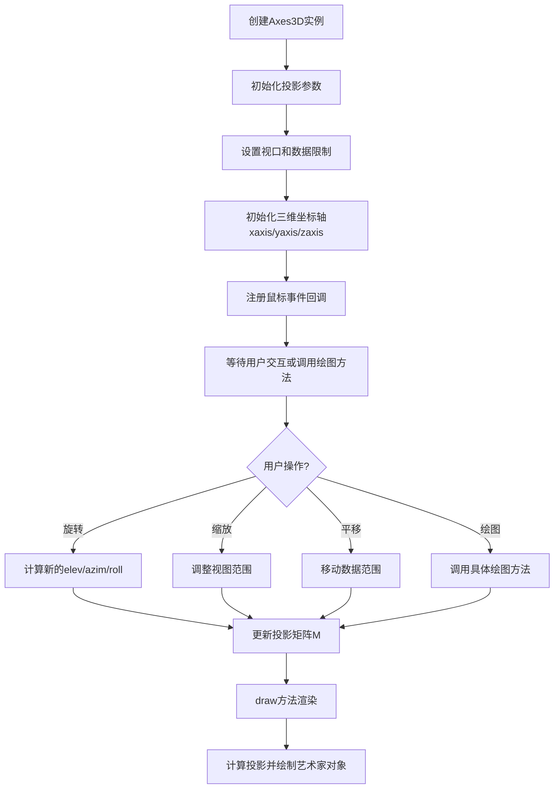

## 类结构

```
matplotlib.axes.Axes (基类)
└── Axes3D (3D坐标轴实现)
    ├── _Quaternion (四元数类，用于3D旋转计算)
    └── get_test_data (测试数据生成函数)
```

## 全局变量及字段


### `mpl`
    
matplotlib主模块，提供绘图功能

类型：`module`
    


### `np`
    
numpy库，提供数值计算功能

类型：`module`
    


### `math`
    
Python标准数学库

类型：`module`
    


### `warnings`
    
Python警告处理模块

类型：`module`
    


### `itertools`
    
Python迭代工具模块

类型：`module`
    


### `textwrap`
    
Python文本包装模块

类型：`module`
    


### `martist`
    
matplotlib.artist模块，提供艺术家基类

类型：`module`
    


### `mcoll`
    
matplotlib.collections模块，提供集合类

类型：`module`
    


### `mcolors`
    
matplotlib.colors模块，处理颜色

类型：`module`
    


### `mimage`
    
matplotlib.image模块，处理图像

类型：`module`
    


### `mlines`
    
matplotlib.lines模块，提供线条类

类型：`module`
    


### `mpatches`
    
matplotlib.patches模块，提供补丁类

类型：`module`
    


### `mcontainer`
    
matplotlib.container模块，提供容器类

类型：`module`
    


### `mtransforms`
    
matplotlib.transforms模块，处理坐标变换

类型：`module`
    


### `Bbox`
    
matplotlib.transforms.Bbox类，表示边界框

类型：`class`
    


### `Triangulation`
    
matplotlib.tri.Triangulation类，表示三角剖分

类型：`class`
    


### `art3d`
    
mplot3d.art3d模块，提供3D艺术对象

类型：`module`
    


### `proj3d`
    
mplot3d.proj3d模块，提供3D投影功能

类型：`module`
    


### `axis3d`
    
mplot3d.axis3d模块，提供3D坐标轴

类型：`module`
    


### `Axes3D.initial_azim`
    
初始方位角（azimuth），以度为单位

类型：`float`
    


### `Axes3D.initial_elev`
    
初始仰角（elevation），以度为单位

类型：`float`
    


### `Axes3D.initial_roll`
    
初始翻滚角（roll），以度为单位

类型：`float`
    


### `Axes3D.xy_viewLim`
    
x-y平面的视图边界框

类型：`Bbox`
    


### `Axes3D.zz_viewLim`
    
z方向的视图边界框

类型：`Bbox`
    


### `Axes3D.xy_dataLim`
    
x-y平面的数据边界框

类型：`Bbox`
    


### `Axes3D.zz_dataLim`
    
z方向的数据边界框

类型：`Bbox`
    


### `Axes3D.M`
    
3D投影变换矩阵

类型：`np.ndarray`
    


### `Axes3D.invM`
    
投影矩阵的逆矩阵

类型：`np.ndarray`
    


### `Axes3D._view_margin`
    
视图边距，用于自动边距计算

类型：`float`
    


### `Axes3D.fmt_zdata`
    
用于格式化z数据的函数

类型：`callable | None`
    


### `Axes3D._sharez`
    
共享z轴的另一个Axes3D对象

类型：`Axes3D | None`
    


### `Axes3D._shareview`
    
共享视图角度的另一个Axes3D对象

类型：`Axes3D | None`
    


### `Axes3D._pseudo_w`
    
伪数据宽度，用于鼠标交互计算

类型：`float`
    


### `Axes3D._pseudo_h`
    
伪数据高度，用于鼠标交互计算

类型：`float`
    


### `Axes3D._dist`
    
相机到原点的距离，类似于缩放级别

类型：`float`
    


### `Axes3D._aspect`
    
轴长宽比设置（'auto', 'equal', 'equalxy', 'equalxz', 'equalyz'）

类型：`str`
    


### `Axes3D._box_aspect`
    
3D轴框的长宽比

类型：`np.ndarray`
    


### `Axes3D._vertical_axis`
    
垂直轴的索引（0=x, 1=y, 2=z）

类型：`int`
    


### `Axes3D._focal_length`
    
透视投影的焦距

类型：`float | np.inf`
    


### `Axes3D._zmargin`
    
z轴自动缩放边距

类型：`float`
    


### `Axes3D.button_pressed`
    
当前按下的鼠标按钮

类型：`int | None`
    


### `Axes3D._rotate_btn`
    
用于3D旋转的鼠标按钮列表

类型：`list`
    


### `Axes3D._pan_btn`
    
用于平移的鼠标按钮列表

类型：`list`
    


### `Axes3D._zoom_btn`
    
用于缩放的鼠标按钮列表

类型：`list`
    


### `Axes3D._draw_grid`
    
是否绘制3D网格

类型：`bool`
    


### `Axes3D._axis3don`
    
是否显示3D坐标轴

类型：`bool`
    


### `_Quaternion.scalar`
    
四元数的标量部分

类型：`float`
    


### `_Quaternion.vector`
    
四元数的向量部分

类型：`np.ndarray`
    
    

## 全局函数及方法


### `get_test_data`

该函数生成并返回一个包含测试数据的三元组 (X, Y, Z)，用于3D图形测试和演示。函数通过高斯分布计算生成两个峰值相减的3D表面数据，并对坐标进行缩放处理。

参数：

- `delta`：`float`，默认值为 0.05，表示采样间隔（采样步长），值越小生成的数据点越密集。

返回值：`tuple[np.ndarray, np.ndarray, np.ndarray]`，返回一个包含三个二维数组的元组，分别代表测试数据集的X坐标、Y坐标和Z坐标值。

#### 流程图

```mermaid
flowchart TD
    A[开始: 接收delta参数] --> B[使用np.arange生成x和y坐标数组<br/>范围: -3.0到3.0, 步长delta]
    B --> C[使用np.meshgrid生成二维网格<br/>生成X, Y二维数组]
    C --> D[计算第一个高斯分布Z1<br/>中心在原点, 标准差为1]
    D --> E[计算第二个高斯分布Z2<br/>中心在(1,1), x方向σ=1.5, y方向σ=0.5]
    E --> F[计算Z = Z2 - Z1<br/>得到双峰相减的表面数据]
    F --> G[对X坐标进行缩放<br/>X = X * 10]
    G --> H[对Y坐标进行缩放<br/>Y = Y * 10]
    H --> I[对Z坐标进行缩放<br/>Z = Z * 500]
    I --> J[返回三元组X, Y, Z]
```

#### 带注释源码

```python
def get_test_data(delta=0.05):
    """Return a tuple X, Y, Z with a test data set."""
    # 使用numpy的arange函数生成从-3.0到3.0（不含）的等间距数组
    # delta参数控制采样间隔，默认为0.05
    x = y = np.arange(-3.0, 3.0, delta)
    
    # 使用meshgrid函数将一维x和y坐标转换为二维网格矩阵
    # X和Y的形状为(n, n)，其中n = len(x) = len(y)
    X, Y = np.meshgrid(x, y)

    # 计算第一个高斯分布（正态分布）
    # 公式: exp(-(x² + y²)/2) / (2π)
    # 中心在原点(0, 0)，标准差为1
    Z1 = np.exp(-(X**2 + Y**2) / 2) / (2 * np.pi)
    
    # 计算第二个高斯分布
    # 中心在点(1, 1)，x方向标准差为1.5，y方向标准差为0.5
    # 公式: exp(-(((x-1)/1.5)² + ((y-1)/0.5)²)/2) / (2π * 0.5 * 1.5)
    Z2 = (np.exp(-(((X - 1) / 1.5)**2 + ((Y - 1) / 0.5)**2) / 2) /
          (2 * np.pi * 0.5 * 1.5))
    
    # 通过相减两个高斯分布得到最终的Z值
    # 这会创建一个具有波峰和波谷的3D表面
    Z = Z2 - Z1

    # 对坐标进行缩放以适应不同的数据范围
    X = X * 10  # 将X坐标缩放10倍
    Y = Y * 10  # 将Y坐标缩放10倍
    Z = Z * 500 # 将Z坐标缩放500倍
    
    # 返回包含X, Y, Z坐标的元组
    return X, Y, Z
```


### Axes3D.__init__

初始化 3D 坐标系对象，设置视角参数（俯仰角、方位角、滚转角）、投影类型、视图限制、坐标轴共享关系以及鼠标交互回调，是 matplotlib 3D 绘图的核心初始化方法。

参数：

- `self`：`Axes3D`，3D 坐标系实例
- `fig`：`Figure`，父图形对象
- `rect`：`tuple (left, bottom, width, height)` 或 `None`，默认 `(0, 0, 1, 1)`，Axes 在图形中的位置和大小
- `*args`：可变位置参数，传给父类 Axes
- `elev`：`float`，默认 30，俯仰角（度），控制相机相对于 x-y 平面的高度
- `azim`：`float`，默认 -60，方位角（度），控制相机绕 z 轴的旋转
- `roll`：`float`，默认 0，滚转角（度），控制相机绕视轴的旋转
- `shareview`：`Axes3D` 或 `None`，可选，共享视角的其他 Axes3D
- `sharez`：`Axes3D` 或 `None`，可选，共享 z 轴限制的其他 Axes3D
- `proj_type`：`{'persp', 'ortho'}`，默认 `'persp'`，投影类型（透视或正交）
- `focal_length`：`float` 或 `None`，默认 None，透视投影的焦距，persp 模式默认 1，ortho 模式默认无穷大
- `box_aspect`：`3-tuple of floats` 或 `None`，默认 None，Axes3D 的物理尺寸比例 x:y:z，默认 4:4:3
- `computed_zorder`：`bool`，默认 True，是否根据艺术家在视图方向的平均位置计算绘制顺序
- `**kwargs`：其他关键字参数，传给父类 Axes

返回值：`None`（初始化方法，self 被修改）

#### 流程图

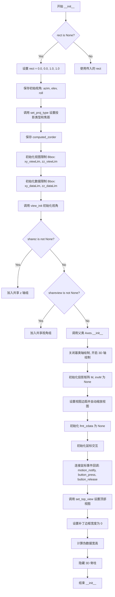

#### 带注释源码

```python
def __init__(
    self, fig, rect=None, *args,
    elev=30, azim=-60, roll=0, shareview=None, sharez=None,
    proj_type='persp', focal_length=None,
    box_aspect=None,
    computed_zorder=True,
    **kwargs,
):
    """
    Parameters
    ----------
    fig : Figure
        The parent figure.
    rect : tuple (left, bottom, width, height), default: (0, 0, 1, 1)
        The ``(left, bottom, width, height)`` Axes position.
    elev : float, default: 30
        The elevation angle in degrees rotates the camera above and below
        the x-y plane, with a positive angle corresponding to a location
        above the plane.
    azim : float, default: -60
        The azimuthal angle in degrees rotates the camera about the z axis,
        with a positive angle corresponding to a right-handed rotation. In
        other words, a positive azimuth rotates the camera about the origin
        from its location along the +x axis towards the +y axis.
    roll : float, default: 0
        The roll angle in degrees rotates the camera about the viewing
        axis. A positive angle spins the camera clockwise, causing the
        scene to rotate counter-clockwise.
    shareview : Axes3D, optional
        Other Axes to share view angles with.  Note that it is not possible
        to unshare axes.
    sharez : Axes3D, optional
        Other Axes to share z-limits with.  Note that it is not possible to
        unshare axes.
    proj_type : {'persp', 'ortho'}
        The projection type, default 'persp'.
    focal_length : float, default: None
        For a projection type of 'persp', the focal length of the virtual
        camera. Must be > 0. If None, defaults to 1.
        For a projection type of 'ortho', must be set to either None
        or infinity (numpy.inf). If None, defaults to infinity.
        The focal length can be computed from a desired Field Of View via
        the equation: focal_length = 1/tan(FOV/2)
    box_aspect : 3-tuple of floats, default: None
        Changes the physical dimensions of the Axes3D, such that the ratio
        of the axis lengths in display units is x:y:z.
        If None, defaults to 4:4:3
    computed_zorder : bool, default: True
        If True, the draw order is computed based on the average position
        of the `.Artist`\\s along the view direction.
        Set to False if you want to manually control the order in which
        Artists are drawn on top of each other using their *zorder*
        attribute. This can be used for fine-tuning if the automatic order
        does not produce the desired result. Note however, that a manual
        zorder will only be correct for a limited view angle. If the figure
        is rotated by the user, it will look wrong from certain angles.

    **kwargs
        Other optional keyword arguments:

        %(Axes3D:kwdoc)s
    """

    # 处理默认 rect 值
    if rect is None:
        rect = [0.0, 0.0, 1.0, 1.0]

    # 保存初始视角参数
    self.initial_azim = azim
    self.initial_elev = elev
    self.initial_roll = roll
    
    # 设置投影类型和焦距
    self.set_proj_type(proj_type, focal_length)
    
    # 保存是否计算 zorder 的设置
    self.computed_zorder = computed_zorder

    # 初始化视图限制 (view limits) - 用于确定显示范围
    self.xy_viewLim = Bbox.unit()      # x, y 轴的视图限制
    self.zz_viewLim = Bbox.unit()      # z 轴的视图限制 (使用 Bbox 的 x 分量)
    
    # 计算边距，保持与 mpl3.8 兼容
    xymargin = 0.05 * 10/11
    # 初始化数据限制 (data limits) - 用于自动缩放
    self.xy_dataLim = Bbox([[xymargin, xymargin],
                            [1 - xymargin, 1 - xymargin]])
    # z 轴数据限制编码在 Bbox 的 x 分量中，y 分量未使用
    self.zz_dataLim = Bbox.unit()

    # 在 Axes.__init__ 调用之前禁止自动缩放
    # 因为轴尚未定义，无法进行自动缩放
    self.view_init(self.initial_elev, self.initial_azim, self.initial_roll)

    # 处理 z 轴共享
    self._sharez = sharez
    if sharez is not None:
        # 将当前 axes 和共享的 axes 加入同一个组
        self._shared_axes["z"].join(self, sharez)
        self._adjustable = 'datalim'

    # 处理视角共享
    self._shareview = shareview
    if shareview is not None:
        self._shared_axes["view"].join(self, shareview)

    # 检查并警告废弃的参数
    if kwargs.pop('auto_add_to_figure', False):
        raise AttributeError(
            'auto_add_to_figure is no longer supported for Axes3D. '
            'Use fig.add_axes(ax) instead.'
        )

    # 调用父类 Axes 的初始化方法
    super().__init__(
        fig, rect, frameon=True, box_aspect=box_aspect, *args, **kwargs
    )
    
    # 禁用基类的轴绘制 (因为 3D 轴需要自定义绘制)
    super().set_axis_off()
    # 启用 3D 轴的绘制
    self.set_axis_on()
    
    # 初始化投影矩阵和逆矩阵 (稍后在 draw 时计算)
    self.M = None
    self.invM = None

    # 设置默认视图边距，与 mpl3.8 兼容
    self._view_margin = 1/48
    # 执行自动缩放视图
    self.autoscale_view()

    # 初始化 z 数据格式化函数 (默认为 None，回退到主格式化器)
    self.fmt_zdata = None

    # 初始化鼠标交互
    self.mouse_init()
    
    # 获取图形并连接鼠标事件回调
    fig = self.get_figure(root=True)
    fig.canvas.callbacks._connect_picklable(
        'motion_notify_event', self._on_move)
    fig.canvas.callbacks._connect_picklable(
        'button_press_event', self._button_press)
    fig.canvas.callbacks._connect_picklable(
        'button_release_event', self._button_release)
    
    # 设置顶部视图
    self.set_top_view()

    # 设置补丁边框宽度为 0
    self.patch.set_linewidth(0)
    
    # 计算伪数据宽高 (用于鼠标交互时的坐标转换)
    pseudo_bbox = self.transLimits.inverted().transform([(0, 0), (1, 1)])
    self._pseudo_w, self._pseudo_h = pseudo_bbox[1] - pseudo_bbox[0]

    # mplot3d 当前管理自己的脊柱，需要关闭可见性以进行边界框计算
    self.spines[:].set_visible(False)
```


### `Axes3D.set_axis_off`

关闭3D坐标轴的显示，通过将内部标志`_axis3don`设置为`False`并标记Axes对象为"stale"（需要重绘）来实现。

参数：

- 该方法无参数

返回值：`None`，无返回值

#### 流程图

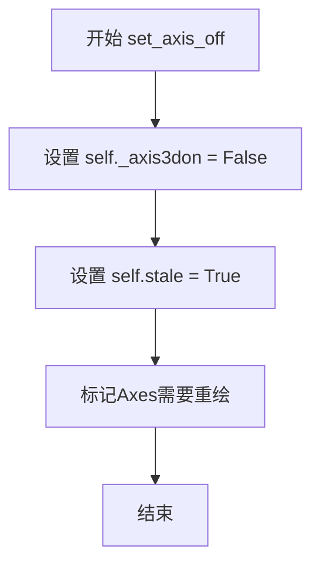

#### 带注释源码

```python
def set_axis_off(self):
    """
    关闭3D坐标轴的显示。
    
    该方法将内部标志 _axis3don 设置为 False，表示3D坐标轴不显示。
    同时设置 stale 为 True，通知matplotlib该Axes对象需要重新绘制。
    """
    self._axis3don = False  # 设置标志：关闭3D坐标轴显示
    self.stale = True        # 标记该Axes对象需要重绘
```

---

**相关说明**：

- **设计目的**：提供一种简单的方式控制3D坐标轴的可见性，与`set_axis_on()`方法互为对立面
- **状态管理**：通过`stale`属性触发matplotlib的重新绘制机制
- **配合使用**：通常与`set_axis_on()`方法一起使用，用于动态切换坐标轴的显示状态


### Axes3D.set_axis_on

该方法用于开启3D坐标轴的显示功能，通过设置内部标志位`_axis3don`为True并标记Axes为stale（需要重绘），从而使3D坐标轴在下次绘制时能够正常渲染。

参数：

- 该方法没有参数

返回值：`None`，无返回值

#### 流程图

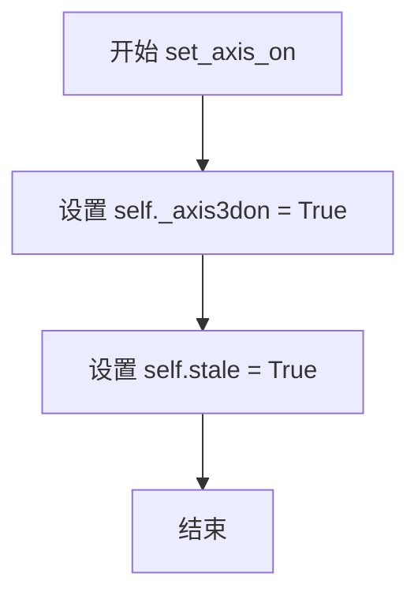

#### 带注释源码

```python
def set_axis_on(self):
    """
    开启3D坐标轴的显示。
    
    该方法设置内部标志位 _axis3don 为 True，
    以指示在绘制时应渲染3D坐标轴、网格线、刻度标签等元素。
    同时设置 stale 标志为 True，通知matplotlib该Axes需要重新绘制。
    """
    self._axis3don = True  # 开启3D坐标轴显示标志
    self.stale = True      # 标记Axes为stale状态，需要重绘
```


### `Axes3D.convert_zunits`

该方法是3D坐标轴Axes3D类的成员函数，用于在z轴支持单位转换时，将输入的z值按照zaxis的单位类型进行转换。这是matplotlib 3D绘图模块中将数据值适配到坐标轴单位系统的关键方法。

参数：

- `z`：任意类型，需要转换的z轴数据值，可以是标量或数组

返回值：任意类型，经过zaxis单位转换后的值（类型取决于具体单位转换器）

#### 流程图

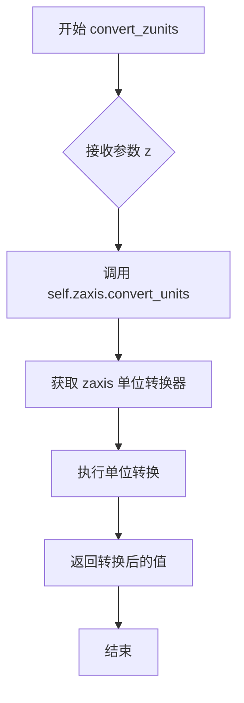

#### 带注释源码

```python
def convert_zunits(self, z):
    """
    For artists in an Axes, if the zaxis has units support,
    convert *z* using zaxis unit type
    """
    # 调用zaxis对象的convert_units方法进行单位转换
    # self.zaxis 是 axis3d.ZAxis 实例
    # convert_units 方法继承自 matplotlib.axis.Axis
    # 根据zaxis设置的单位类型（如时间、分类等）将z值转换为对应格式
    return self.zaxis.convert_units(z)
```


### `Axes3D.set_top_view`

该方法用于设置3D坐标轴的顶视图（Top View），即从上方垂直俯视X-Y平面。该方法通过调整视图视限（view limits）来设置适当的观察角度，使得坐标轴和标签能够合适地显示。

参数：

- 该方法无参数（仅包含`self`）

返回值：`None`，无返回值（该方法直接修改对象状态）

#### 流程图

```mermaid
flowchart TD
    A[开始 set_top_view] --> B[计算 xdwl = 0.95 / self._dist]
    B --> C[计算 xdw = 0.9 / self._dist]
    C --> D[计算 ydwl = 0.95 / self._dist]
    D --> E[计算 ydw = 0.9 / self._dist]
    E --> F[设置 viewLim.intervalx = (-xdwl, xdw)]
    F --> G[设置 viewLim.intervaly = (-ydwl, ydw)]
    G --> H[设置 self.stale = True]
    H --> I[结束]
```

#### 带注释源码

```python
def set_top_view(self):
    # 这是观察坐标系的正确视图位置
    # 稍微向上和向左移动以适应标签和坐标轴
    xdwl = 0.95 / self._dist  # 计算X轴左边界距离系数（基于相机距离）
    xdw = 0.9 / self._dist    # 计算X轴右边界距离系数
    ydwl = 0.95 / self._dist  # 计算Y轴下边界距离系数
    ydw = 0.9 / self._dist    # 计算Y轴上边界距离系数
    
    # 设置观察视窗（viewing pane）
    self.viewLim.intervalx = (-xdwl, xdw)  # 设置X轴视图区间
    self.viewLim.intervaly = (-ydwl, ydw)  # 设置Y轴视图区间
    self.stale = True  # 标记 Axes 需要重绘（stale 状态）
```


### `Axes3D._init_axis`

该方法用于初始化三维坐标轴，替代基类中常规的二维X/Y轴创建逻辑，通过实例化三个独立的坐标轴对象（XAxis、YAxis、ZAxis）来构建完整的三维坐标体系。

参数：

- 无显式参数（`self` 为隐式参数，表示 Axes3D 实例本身）

返回值：`None`，该方法无返回值，仅修改实例状态

#### 流程图

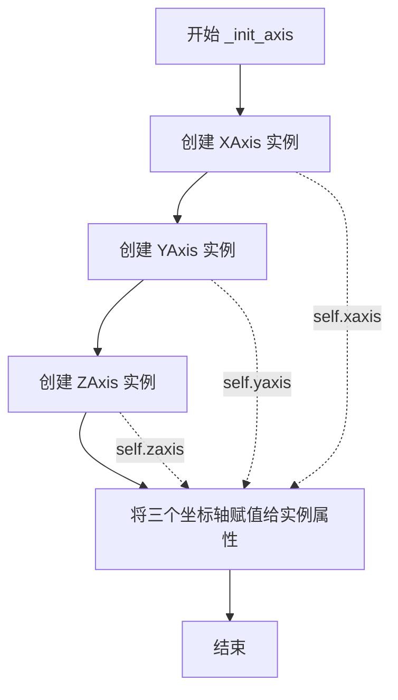

#### 带注释源码

```python
def _init_axis(self):
    """
    Init 3D Axes; overrides creation of regular X/Y Axes.
    
    此方法覆盖了基类 Axes 中的坐标轴创建逻辑，
    用于在三维坐标系中创建 x、y、z 三个坐标轴。
    每个坐标轴都是 axis3d 模块中对应的 Axis 子类实例。
    """
    # 创建 X 轴（XAxis），传入当前 Axes3D 实例作为父对象
    self.xaxis = axis3d.XAxis(self)
    
    # 创建 Y 轴（YAxis），传入当前 Axes3D 实例作为父对象
    self.yaxis = axis3d.YAxis(self)
    
    # 创建 Z 轴（ZAxis），传入当前 Axes3D 实例作为父对象
    self.zaxis = axis3d.ZAxis(self)
```


### Axes3D.get_zaxis

获取3D坐标轴的Z轴实例，用于访问和操作3D图表中的Z轴属性。

参数：
- `self`：`Axes3D`，调用该方法的3D坐标轴对象本身

返回值：`axis3d.ZAxis`，返回Z轴（ZAxis）对象实例，用于配置Z轴的标签、刻度、范围等属性

#### 流程图

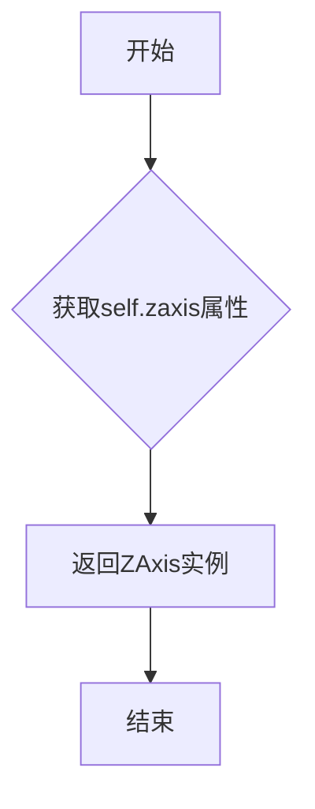

#### 带注释源码

```python
def get_zaxis(self):
    """
    Return the ``ZAxis`` (`~.axis3d.Axis`) instance.
    """
    return self.zaxis
```


### Axes3D._transformed_cube

该方法用于将3D坐标轴的边界限制（立方体）通过投影矩阵进行变换，返回变换后的8个立方体顶点。它主要用于计算3D视图中轴的位置和方向。

参数：
- `vals`：tuple(float, float, float, float, float, float)，包含6个元素的元组，依次为 (minx, maxx, miny, maxy, minz, maxz)，分别表示3D坐标轴在x、y、z三个方向上的最小值和最大值（即3D数据范围的边界框）

返回值：返回值类型取决于 `proj3d._proj_points` 的返回结果，通常是一个包含8个三维坐标点的数组或列表，表示变换后的立方体8个顶点在投影空间中的位置

#### 流程图

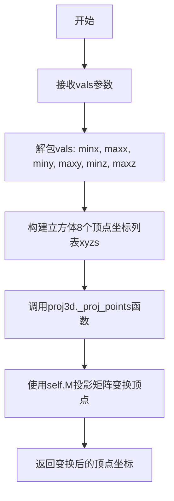

#### 带注释源码

```python
def _transformed_cube(self, vals):
    """Return cube with limits from *vals* transformed by self.M."""
    # 解包vals参数，获取3D坐标轴的6个边界值
    minx, maxx, miny, maxy, minz, maxz = vals
    
    # 构建立方体的8个顶点坐标
    # 每个顶点是一个(x, y, z)三元组，代表立方体的一个角点
    # 按照特定的顺序排列：先底面(minz)4个顶点，再顶面(maxz)4个顶点
    xyzs = [(minx, miny, minz),    # 底面左前角
            (maxx, miny, minz),    # 底面右前角
            (maxx, maxy, minz),    # 底面右后角
            (minx, maxy, minz),    # 底面左后角
            (minx, miny, maxz),    # 顶面左前角
            (maxx, miny, maxz),    # 顶面右前角
            (maxx, maxy, maxz),    # 顶面右后角
            (minx, maxy, maxz)]    # 顶面左后角
    
    # 调用proj3d模块的_proj_points函数
    # 使用self.M（投影矩阵）对所有顶点进行投影变换
    return proj3d._proj_points(xyzs, self.M)
```


### Axes3D.set_aspect

该方法用于设置3D坐标轴的显示比例（aspect ratio），支持多种模式如自动填充、均匀比例（equal）、以及特定轴对的均匀比例（equalxy、equalxz、equalyz），并通过 adjustable 参数控制是调整坐标轴的数据范围（datalim）还是调整坐标轴的物理尺寸（box）。

参数：

- `aspect`：`str`，指定显示比例模式，可选值为 'auto'（自动填充）、'equal'（所有轴等比例）、'equalxy'（x和y轴等比例）、'equalxz'（x和z轴等比例）、'equalyz'（y和z轴等比例）
- `adjustable`：`str`，可选值为 'box'（调整坐标轴边框尺寸）或 'datalim'（调整数据范围），默认为 'box'
- `anchor`：`None` 或 `str` 或 `tuple`，**已弃用参数**，3.11版本后无效
- `share`：`bool`，**已弃用参数**，3.11版本后无效

返回值：`None`，该方法直接修改对象状态，不返回任何值

#### 流程图

```mermaid
flowchart TD
    A[开始 set_aspect] --> B{adjustable 是否为 None}
    B -->|是| C[设置 adjustable = 'box']
    B -->|否| D[使用传入的 adjustable]
    C --> E[校验 adjustable 在 ['box', 'datalim'] 中]
    D --> E
    E --> F[校验 aspect 在允许值中]
    F --> G[调用 set_adjustable 设置 adjustable 属性]
    G --> H[保存 aspect 到 _aspect 属性]
    H --> I{aspect 是否需要等比例}
    I -->|否| J[方法结束]
    I -->|是| K[调用 _equal_aspect_axis_indices 获取需要等比例的轴索引]
    K --> L[获取三轴的视图区间]
    L --> M[计算每个轴的区间跨度 ptp]
    M --> N{adjustable == 'datalim'}
    N -->|是| O[计算缩放比例和偏移量]
    O --> P[遍历三轴设置新的数据范围]
    P --> J
    N -->|否| Q[修改 box_aspect]
    Q --> R[计算剩余轴的缩放因子以保持对角线比例]
    R --> S[调用 set_box_aspect 应用新比例]
    S --> J
```

#### 带注释源码

```python
@_api.delete_parameter("3.11", "share")
@_api.delete_parameter("3.11", "anchor")
def set_aspect(self, aspect, adjustable=None, anchor=None, share=False):
    """
    设置3D坐标轴的显示比例。

    Parameters
    ----------
    aspect : {'auto', 'equal', 'equalxy', 'equalxz', 'equalyz'}
        显示比例模式：
        - 'auto': 自动填充位置矩形
        - 'equal': 所有轴等比例
        - 'equalxy': x和y轴等比例
        - 'equalxz': x和z轴等比例
        - 'equalyz': y和z轴等比例

    adjustable : {'box', 'datalim'}, default: 'box'
        调整方式：
        - 'box': 调整坐标轴边框的物理尺寸
        - 'datalim': 调整x/y/z的数据范围

    anchor : None or str or 2-tuple of float, optional
        .. deprecated:: 3.11
            此参数已无效

    share : bool, default: False
        .. deprecated:: 3.11
            此参数已无效
    """
    # 默认使用 'box' 调整方式
    if adjustable is None:
        adjustable = 'box'
    
    # 校验 adjustable 参数的合法性
    _api.check_in_list(['box', 'datalim'], adjustable=adjustable)
    # 校验 aspect 参数的合法性
    _api.check_in_list(('auto', 'equal', 'equalxy', 'equalyz', 'equalxz'),
                       aspect=aspect)

    # 保存调整方式和显示比例到对象属性
    self.set_adjustable(adjustable)
    self._aspect = aspect

    # 如果需要等比例显示
    if aspect in ('equal', 'equalxy', 'equalxz', 'equalyz'):
        # 获取需要等比例的轴索引 (0=x, 1=y, 2=z)
        ax_indices = self._equal_aspect_axis_indices(aspect)

        # 获取三个轴的当前视图区间
        view_intervals = np.array([self.xaxis.get_view_interval(),
                                   self.yaxis.get_view_interval(),
                                   self.zaxis.get_view_interval()])
        # 计算每个轴的区间跨度 (peak-to-peak)
        ptp = np.ptp(view_intervals, axis=1)
        
        # 根据调整方式进行不同的处理
        if self._adjustable == 'datalim':
            # 计算每个轴的中点
            mean = np.mean(view_intervals, axis=1)
            # 计算缩放比例：取需要等比例的轴中，最大跨度与对应box比例的比值
            scale = max(ptp[ax_indices] / self._box_aspect[ax_indices])
            # 计算新的区间半宽度
            deltas = scale * self._box_aspect

            # 遍历三个轴，重新设置数据范围
            for i, set_lim in enumerate((self.set_xlim3d,
                                         self.set_ylim3d,
                                         self.set_zlim3d)):
                if i in ax_indices:
                    # 设置新的区间范围，以中点为中心
                    set_lim(mean[i] - deltas[i]/2., mean[i] + deltas[i]/2.,
                            auto=True, view_margin=None)
        else:
            # 'box' 模式：修改box_aspect以实现等比例显示
            box_aspect = np.array(self._box_aspect)
            # 将需要等比例的轴的跨度设置为相等
            box_aspect[ax_indices] = ptp[ax_indices]
            
            # 计算剩余轴的缩放因子，保持对角线比例不变
            remaining_ax_indices = {0, 1, 2}.difference(ax_indices)
            if remaining_ax_indices:
                remaining = remaining_ax_indices.pop()
                # 原始对角线长度
                old_diag = np.linalg.norm(self._box_aspect[ax_indices])
                # 新的对角线长度
                new_diag = np.linalg.norm(box_aspect[ax_indices])
                # 按比例缩放剩余轴
                box_aspect[remaining] *= new_diag / old_diag
            
            # 应用新的box比例
            self.set_box_aspect(box_aspect)
```


### `Axes3D._equal_aspect_axis_indices`

该方法用于获取需要保持相等宽高比的轴的索引。根据传入的aspect参数，返回对应的轴索引列表，用于在设置3D坐标轴宽高比时确定哪些轴需要被约束。

参数：

- `aspect`：`str`，要设置宽高比的类型。必须是以下值之一：
  - `'auto'`：自动设置，不约束任何轴
  - `'equal'`：所有三个轴（x、y、z）等比例
  - `'equalxy'`：仅x和y轴等比例
  - `'equalxz'`：仅x和z轴等比例
  - `'equalyz'`：仅y和z轴等比例

返回值：`list[int]`，返回需要保持相等宽高比的轴的索引列表。索引对应关系：0=x轴，1=y轴，2=z轴。

#### 流程图

```mermaid
flowchart TD
    A[开始] --> B{aspect == 'equal'?}
    B -->|Yes| C[返回 [0, 1, 2]]
    B -->|No| D{aspect == 'equalxy'?}
    D -->|Yes| E[返回 [0, 1]]
    D -->|No| F{aspect == 'equalxz'?}
    F -->|Yes| G[返回 [0, 2]]
    F -->|No| H{aspect == 'equalyz'?}
    H -->|Yes| I[返回 [1, 2]]
    H -->|No| J[返回 []]
    C --> K[结束]
    E --> K
    G --> K
    I --> K
    J --> K
```

#### 带注释源码

```python
def _equal_aspect_axis_indices(self, aspect):
    """
    Get the indices for which of the x, y, z axes are constrained to have
    equal aspect ratios.

    Parameters
    ----------
    aspect : {'auto', 'equal', 'equalxy', 'equalxz', 'equalyz'}
        See descriptions in docstring for `.set_aspect()`.
    """
    # 默认为空列表，对应 'auto' 情况，不约束任何轴
    ax_indices = []  # aspect == 'auto'
    
    # 如果aspect为'equal'，所有三个轴都需要等比例
    if aspect == 'equal':
        ax_indices = [0, 1, 2]  # [x, y, z]
    
    # 如果aspect为'equalxy'，仅x和y轴等比例
    elif aspect == 'equalxy':
        ax_indices = [0, 1]  # [x, y]
    
    # 如果aspect为'equalxz'，仅x和z轴等比例
    elif aspect == 'equalxz':
        ax_indices = [0, 2]  # [x, z]
    
    # 如果aspect为'equalyz'，仅y和z轴等比例
    elif aspect == 'equalyz':
        ax_indices = [1, 2]  # [y, z]
    
    # 返回需要约束的轴索引列表
    return ax_indices
```


### Axes3D.set_box_aspect

设置3D坐标轴的盒子长宽比（box aspect），用于控制坐标轴在显示单位下的物理尺寸比例。该方法允许用户调整3D坐标轴的显示比例，以改变可视化效果，同时提供缩放功能来控制坐标轴的整体大小。

参数：
- `aspect`：`3-tuple of floats` 或 `None`，用于改变Axes3D的物理尺寸，使坐标轴长度在显示单位下的比例为x:y:z。如果为None，则默认为(4, 4, 3)。
- `zoom`：`float`，默认为1，控制Axes3D在图形中的整体大小，必须大于0。

返回值：`None`，该方法不返回任何值。

#### 流程图

```mermaid
flowchart TD
    A[开始 set_box_aspect] --> B{zoom <= 0?}
    B -->|是| C[抛出 ValueError: zoom必须大于0]
    B -->|否| D{aspect is None?}
    D -->|是| E[aspect = (4, 4, 3)]
    D -->|否| F[aspect = 转换为float数组]
    F --> G[_api.check_shape 验证形状为3]
    E --> H[计算缩放因子]
    H --> I[aspect *= 1.8294640721620434 * 25/24 * zoom / np.linalg.norm(aspect)]
    I --> J[self._box_aspect = self._roll_to_vertical(aspect, reverse=True)]
    J --> K[self.stale = True]
    K --> L[结束]
    C --> L
```

#### 带注释源码

```python
def set_box_aspect(self, aspect, *, zoom=1):
    """
    设置坐标轴的盒子长宽比。

    盒子长宽比是每个面在垂直于该面观看时显示单位的宽高比。
    这与数据长宽比不同（参见~.Axes3D.set_aspect）。默认比例为4:4:3（x:y:z）。

    要在数据空间中模拟等长宽比，请将盒子长宽比设置为与每个维度的数据范围匹配。

    *zoom*控制Axes3D在图形中的整体大小。

    参数
    ----------
    aspect : 3-tuple of floats 或 None
        改变Axes3D的物理尺寸，使坐标轴长度在显示单位下的比例为x:y:z。
        如果为None，默认为(4, 4, 3)。

    zoom : float, 默认: 1
        控制Axes3D在图形中的整体大小。必须大于0。
    """
    # 验证zoom参数必须为正数
    if zoom <= 0:
        raise ValueError(f'Argument zoom = {zoom} must be > 0')

    # 处理aspect参数：如果为None，则使用默认值(4, 4, 3)
    if aspect is None:
        aspect = np.asarray((4, 4, 3), dtype=float)
    else:
        # 将输入转换为float数组
        aspect = np.asarray(aspect, dtype=float)
        # 验证aspect必须是3维向量
        _api.check_shape((3,), aspect=aspect)
    
    # 应用缩放因子以匹配mpl3.2的外观
    # 1.8294640721620434是调整系数，用于匹配旧版本外观
    # 25/24因子补偿了mpl3.9中automargin行为的变化
    # 这来自于mpl3.8中坐标轴两侧的1/48内边距
    aspect *= 1.8294640721620434 * 25/24 * zoom / np.linalg.norm(aspect)

    # 将处理后的aspect存储到_box_aspect属性
    # _roll_to_vertical方法处理不同的垂直轴方向
    self._box_aspect = self._roll_to_vertical(aspect, reverse=True)
    
    # 标记axes为stale，需要重新绘制
    self.stale = True
```


### Axes3D.apply_aspect

该方法用于在3D坐标轴中应用宽高比设置，确保坐标系统为正方形（square）。由于3D坐标轴的特殊性，父类中的大多数aspect处理逻辑并不适用，本方法简化处理，仅保证坐标系统的宽高比为正方形。

参数：

- `position`：`matplotlib.transforms.Bbox` 或 `None`，可选参数，用于指定坐标轴的位置边界框。如果为 `None`，则使用 `get_position(original=True)` 获取的默认位置。

返回值：`None`，该方法不返回任何值。

#### 流程图

```mermaid
flowchart TD
    A[开始 apply_aspect] --> B{position 是否为 None?}
    B -->|是| C[调用 get_position(original=True) 获取位置]
    B -->|否| D[使用传入的 position]
    C --> E[获取图形的 transSubfigure 变换]
    E --> F[创建单位边界框并应用变换]
    F --> G[计算图形的物理宽高比 fig_aspect = bb.height / bb.width]
    G --> H[设置 box_aspect = 1]
    H --> I[冻结位置边界框: pb = position.frozen()]
    I --> J[收缩边界框以适应目标宽高比: pb1 = pb.shrunk_to_aspect(box_aspect, pb, fig_aspect)]
    J --> K[将收缩后的边界框锚定到当前锚点: pb1.anchored(self.get_anchor(), pb)]
    K --> L[设置最终位置: self._set_position(pb1.anchored(...), 'active')]
    L --> M[结束]
```

#### 带注释源码

```python
def apply_aspect(self, position=None):
    """
    Apply the aspect ratio to the 3D Axes.

    This method overrides the 2D Axes method to provide a simplified
    implementation suitable for 3D plotting. In 3D, we only need to ensure
    that the coordinate system is square (i.e., has equal aspect ratios
    in the display), rather than handling complex axis scales or data limits.
    """
    # If no position is provided, get the current axes position from the figure
    if position is None:
        position = self.get_position(original=True)

    # Note: In the 2D superclass, we would go through and actually deal with
    # axis scales and box/datalim adjustments. Those are all irrelevant for
    # 3D axes - all we need to do is make sure our coordinate system is square.

    # Get the transformation from the subfigure (figure) coordinate space
    trans = self.get_figure().transSubfigure
    
    # Create a unit bounding box and transform it to figure coordinates
    # This gives us the physical dimensions of the panel/figure
    bb = mtransforms.Bbox.unit().transformed(trans)
    
    # Calculate the physical aspect ratio of the figure/panel
    # This is used to determine how to adjust the axes box
    fig_aspect = bb.height / bb.width

    # For 3D axes, we want a square coordinate system (aspect ratio of 1)
    box_aspect = 1
    
    # Freeze the position bounding box to prevent further modifications
    pb = position.frozen()
    
    # Shrink the position bounding box to achieve the desired box aspect
    # while maintaining the figure aspect ratio
    pb1 = pb.shrunk_to_aspect(box_aspect, pb, fig_aspect)
    
    # Anchor the adjusted bounding box to the current anchor point
    # and set it as the active position
    self._set_position(pb1.anchored(self.get_anchor(), pb), 'active')
```


### Axes3D.draw

该方法是3D坐标轴的核心渲染方法，负责将3D场景绘制到2D画布上。它首先检查坐标轴可见性，然后设置投影矩阵，接着对集合和补丁进行3D投影计算（可选地计算z顺序），最后依次绘制背景面板、网格线、坐标轴和所有子艺术家对象。

参数：

- `self`：隐式参数，类型为`Axes3D`，表示调用该方法的3D坐标轴实例本身
- `renderer`：类型为`matplotlib.backend_bases.RendererBase`，渲染器对象，负责实际的绘图操作

返回值：`None`，该方法不返回任何值，直接在渲染器上绘制图形

#### 流程图

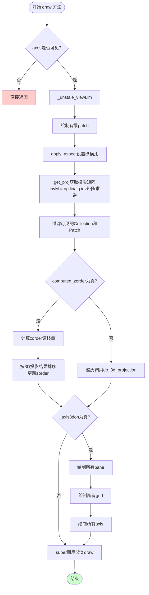

#### 带注释源码

```python
@martist.allow_rasterization
def draw(self, renderer):
    """
    绘制3D坐标轴及其所有子艺术家对象。
    
    参数
    ----------
    renderer : RendererBase
        负责实际渲染操作的渲染器对象。
    """
    # 检查坐标轴是否可见，如果不可见则直接返回
    if not self.get_visible():
        return
    
    # 更新视图限制，清除stale状态
    self._unstale_viewLim()

    # 绘制背景patch
    self.patch.draw(renderer)
    self._frameon = False

    # 首先设置纵横比
    # 这部分代码与`axes._base._AxesBase.draw`重复
    # 但必须在绘制任何艺术家之前调用，因为它会调整视图限制
    # 和Axes的边界框大小
    locator = self.get_axes_locator()
    self.apply_aspect(locator(self, renderer) if locator else None)

    # 将投影矩阵添加到渲染器
    self.M = self.get_proj()  # 获取投影矩阵
    self.invM = np.linalg.inv(self.M)  # 计算投影矩阵的逆矩阵

    # 筛选可见的Collection和Patch对象
    collections_and_patches = (
        artist for artist in self._children
        if isinstance(artist, (mcoll.Collection, mpatches.Patch))
        and artist.get_visible())
    
    # 根据computed_zorder设置处理z顺序
    if self.computed_zorder:
        # 计算集合和补丁的投影并设置zorder
        # 确保它们绘制在网格上方
        # 获取所有轴的最大zorder并加1作为起始偏移
        zorder_offset = max(axis.get_zorder()
                            for axis in self._axis_map.values()) + 1
        collection_zorder = patch_zorder = zorder_offset

        # 对艺术家按3D投影结果排序（从远到近绘制）
        for artist in sorted(collections_and_patches,
                             key=lambda artist: artist.do_3d_projection(),
                             reverse=True):
            if isinstance(artist, mcoll.Collection):
                artist.zorder = collection_zorder
                collection_zorder += 1
            elif isinstance(artist, mpatches.Patch):
                artist.zorder = patch_zorder
                patch_zorder += 1
    else:
        # 不计算zorder时，直接对所有艺术家执行3D投影
        for artist in collections_and_patches:
            artist.do_3d_projection()

    # 如果3D轴处于开启状态
    if self._axis3don:
        # 首先绘制pane（背景面板）
        for axis in self._axis_map.values():
            axis.draw_pane(renderer)
        # 然后绘制网格线
        for axis in self._axis_map.values():
            axis.draw_grid(renderer)
        # 最后绘制轴、标签、文本和刻度
        for axis in self._axis_map.values():
            axis.draw(renderer)

    # 绘制剩余的子艺术家对象
    super().draw(renderer)
```


### `Axes3D.get_axis_position`

该方法用于获取3D坐标轴在当前视图下的相对位置关系（哪些轴位于视图中较高/较前的位置）。通过计算变换后的坐标轴立方体，判断x、y、z三个轴哪个在视图中更靠前（z值更大），返回三个布尔值表示各轴是否处于"高位"。

参数：
- 无（仅包含 self 参数）

返回值：`tuple[bool, bool, bool]`，返回一个包含三个布尔值的元组，分别表示x轴、y轴、z轴在当前视图下是否处于较高位置（True表示该轴在视图前方/上方，False表示在后方/下方）

#### 流程图

```mermaid
flowchart TD
    A[开始 get_axis_position] --> B[获取当前3D视图 limits: get_w_lims]
    B --> C[将 limits 转换为变换后的立方体: _transformed_cube]
    C --> D{比较 tc[1][2] > tc[2][2]}
    D -->|True| E[xhigh = True]
    D -->|False| F[xhigh = False]
    E --> G{比较 tc[3][2] > tc[2][2]}
    F --> G
    G -->|True| H[yhigh = True]
    G -->|False| I[yhigh = False]
    H --> J{比较 tc[0][2] > tc[2][2]}
    I --> J
    J -->|True| K[zhigh = True]
    J -->|False| L[zhigh = False]
    K --> M[返回 (xhigh, yhigh, zhigh)]
    L --> M
```

#### 带注释源码

```python
def get_axis_position(self):
    """
    获取3D坐标轴在当前视图下的相对位置。
    
    该方法通过比较变换后的坐标轴立方体各顶点的z值，
    来判断x、y、z三个轴在当前视角下的前后/上下关系。
    
    Returns
    -------
    tuple[bool, bool, bool]
        (xhigh, yhigh, zhigh) - 各轴是否在视图前方
    """
    # 获取当前3D axes的显示范围（世界坐标 limits）
    # 返回 (minx, maxx, miny, maxy, minz, maxz)
    tc = self._transformed_cube(self.get_w_lims())
    
    # tc 是变换后的立方体顶点，形状为 (8, 3)
    # tc[0]: (minx, miny, minz) - 左下前
    # tc[1]: (maxx, miny, minz) - 右下前
    # tc[2]: (maxx, maxy, minz) - 右后前（参考点）
    # tc[3]: (minx, maxy, minz) - 左后前
    
    # 比较x轴方向（tc[1]）与参考点（tc[2]）的z值
    # 判断x轴是否在视图上方
    xhigh = tc[1][2] > tc[2][2]
    
    # 比较y轴方向（tc[3]）与参考点（tc[2]）的z值
    # 判断y轴是否在视图上方
    yhigh = tc[3][2] > tc[2][2]
    
    # 比较z轴方向（tc[0]）与参考点（tc[2]）的z值
    # 判断z轴是否在视图上方
    zhigh = tc[0][2] > tc[2][2]
    
    # 返回三个轴的相对位置状态
    return xhigh, yhigh, zhigh
```


### Axes3D.update_datalim

该方法为3D坐标轴的数据限制更新功能，但在Axes3D类中未实现（Not Implemented）。由于3D坐标轴的数据限制管理方式与2D不同，该方法被故意留空。

参数：

- `xys`：array-like，2D坐标点数组。在2D Axes中用于更新数据限制，但在3D Axes中此参数未被使用。
- `**kwargs`：dict，关键字参数。用于接受额外的参数，但在3D实现中被忽略。

返回值：`None`，该方法不执行任何操作，直接返回None。

#### 流程图

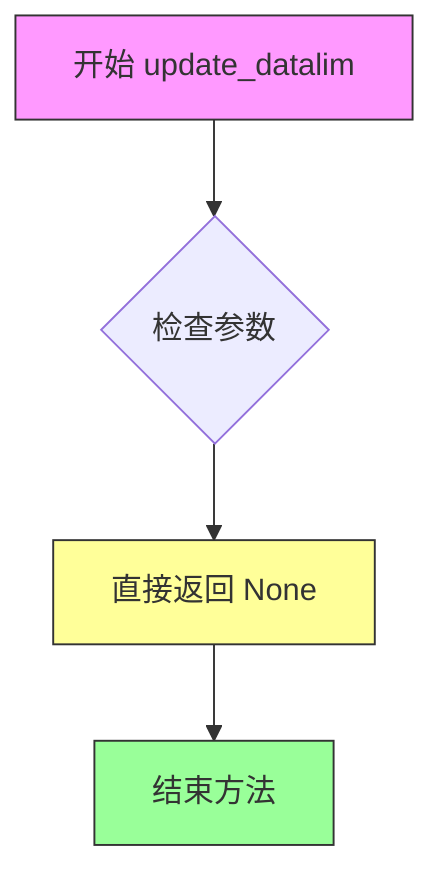

#### 带注释源码

```python
def update_datalim(self, xys, **kwargs):
    """
    Not implemented in `~mpl_toolkits.mplot3d.axes3d.Axes3D`.
    """
    # 该方法在3D坐标轴中未实现
    # 2D坐标轴中的update_datalim用于根据新数据点更新数据限制（data limits）
    # 但在3D坐标轴中，数据限制的更新通过auto_scale_xyz等专门方法处理
    # 因此该方法被故意留空（pass），不接受任何参数也不返回任何值
    
    pass  # 3D坐标轴不支持此方法，直接返回None
```


### `Axes3D.get_zmargin`

该方法用于检索 z 轴的自动缩放边距值（zmargin）。在 3D 绘图中，边距用于在自动缩放时扩展数据范围，为数据点周围提供可视缓冲空间。

参数：

- 该方法无参数（仅包含 `self` 参数）

返回值：`float`，返回 z 轴的自动缩放边距值。

#### 流程图

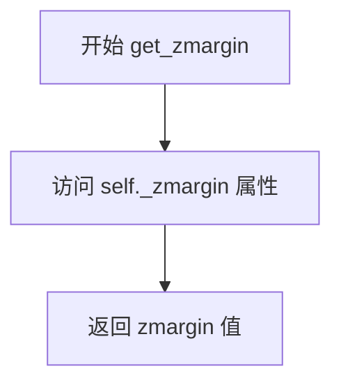

#### 带注释源码

```python
def get_zmargin(self):
    """
    Retrieve autoscaling margin of the z-axis.

    .. versionadded:: 3.9

    Returns
    -------
    zmargin : float

    See Also
    --------
    mpl_toolkits.mplot3d.axes3d.Axes3D.set_zmargin
    """
    # 返回 z 轴的自动缩放边距值
    # 该值在 Axes3D 初始化时由 rcParams['axes.zmargin'] 或 0 初始化
    # 并可通过 set_zmargin 方法进行设置
    return self._zmargin
```


### `Axes3D.set_zmargin`

设置 Z 轴数据边距（在自动缩放之前）。该方法设置 z 轴的填充系数，用于在自动缩放时扩展或收缩数据范围。

参数：

- `m`：`float`，大于 -0.5，用于设置 z 轴边距的乘数。正值会扩展数据范围，负值会裁剪数据范围

返回值：`None`，无返回值（该方法直接修改对象状态）

#### 流程图

```mermaid
flowchart TD
    A[开始 set_zmargin] --> B{检查 m <= -0.5}
    B -->|是| C[抛出 ValueError: margin must be greater than -0.5]
    B -->|否| D[设置 self._zmargin = m]
    D --> E[调用 self._request_autoscale_view&#40;"z"&#41; 请求 z 轴自动缩放]
    E --> F[设置 self.stale = True 标记需要重绘]
    F --> G[结束]
```

#### 带注释源码

```python
def set_zmargin(self, m):
    """
    Set padding of Z data limits prior to autoscaling.

    *m* times the data interval will be added to each end of that interval
    before it is used in autoscaling.  If *m* is negative, this will clip
    the data range instead of expanding it.

    For example, if your data is in the range [0, 2], a margin of 0.1 will
    result in a range [-0.2, 2.2]; a margin of -0.1 will result in a range
    of [0.2, 1.8].

    Parameters
    ----------
    m : float greater than -0.5
    """
    # 参数验证：边距必须大于 -0.5，否则抛出异常
    if m <= -0.5:
        raise ValueError("margin must be greater than -0.5")
    
    # 设置 z 轴边距值到实例属性
    self._zmargin = m
    
    # 请求 z 轴的自动缩放视图更新
    self._request_autoscale_view("z")
    
    # 标记 Axes 对象为"过时"状态，需要重新绘制
    self.stale = True
```


### `Axes3D.margins`

该方法用于设置或检索 3D Axes 的自动缩放边距（margin）。它支持同时设置 x、y、z 三个方向的边距，也可以单独设置某个方向的边距。当不传入任何参数时，该方法返回当前三个方向的边距值。

参数：

- `margins`：`float` 或 `tuple of float`，可变位置参数，表示要设置的边距值。可以传入单个值（同时设置 x、y、z），或者传入三个值分别设置 x、y、z。
- `x`：`float`，可选，关键字参数，表示 x 轴的边距。
- `y`：`float`，可选，关键字参数，表示 y 轴的边距。
- `z`：`float`，可选，关键字参数，表示 z 轴的边距。
- `tight`：`bool`，默认 `True`，传递给 `autoscale_view` 的参数，控制是否使用严格的数据边界。

返回值：`tuple of float`，当作为 getter 调用时（不传入任何边距参数），返回 `(xmargin, ymargin, zmargin)`。

#### 流程图

```mermaid
flowchart TD
    A[开始 margins] --> B{是否传入了 margins?}
    B -->|是| C{是否同时传入了 x, y, z 关键字参数?}
    C -->|是| D[抛出 TypeError]
    C -->|否| E{margins 长度}
    E -->|1| F[x = y = z = margins[0]]
    E -->|3| G[x, y, z = margins]
    E -->|其他| H[抛出 TypeError]
    B -->|否| I{x, y, z 是否全为 None?}
    I -->|是| J[返回 (_xmargin, _ymargin, _zmargin)]
    I -->|否| K{x 是否不为 None?}
    K -->|是| L[调用 set_xmargin(x)]
    K -->|否| M[不设置 x]
    L --> N{y 是否不为 None?}
    M --> N
    N -->|是| O[调用 set_ymargin(y)]
    N -->|否| P[不设置 y]
    O --> Q{z 是否不为 None?}
    P --> Q
    Q -->|是| R[调用 set_zmargin(z)]
    Q -->|否| S[不设置 z]
    R --> T[调用 autoscale_view]
    S --> T
    T --> U[结束]
    D --> U
    F --> T
    G --> T
    H --> U
    J --> U
```

#### 带注释源码

```python
def margins(self, *margins, x=None, y=None, z=None, tight=True):
    """
    Set or retrieve autoscaling margins.

    See `.Axes.margins` for full documentation.  Because this function
    applies to 3D Axes, it also takes a *z* argument, and returns
    ``(xmargin, ymargin, zmargin)``.
    """
    # 检查是否同时传入了位置参数和关键字参数，如果是则抛出 TypeError
    if margins and (x is not None or y is not None or z is not None):
        raise TypeError('Cannot pass both positional and keyword '
                        'arguments for x, y, and/or z.')
    # 处理位置参数的情况
    elif len(margins) == 1:
        # 如果只传入一个值，则将 x, y, z 都设置为该值
        x = y = z = margins[0]
    elif len(margins) == 3:
        # 如果传入三个值，则分别赋值给 x, y, z
        x, y, z = margins
    elif margins:
        # 如果传入的值数量不是 1 或 3，抛出 TypeError
        raise TypeError('Must pass a single positional argument for all '
                        'margins, or one for each margin (x, y, z).')

    # 如果 x, y, z 全为 None，则作为 getter 使用，返回当前的边距值
    if x is None and y is None and z is None:
        if tight is not True:
            _api.warn_external(f'ignoring tight={tight!r} in get mode')
        return self._xmargin, self._ymargin, self._zmargin

    # 否则作为 setter 使用，设置各个方向的边距
    if x is not None:
        self.set_xmargin(x)
    if y is not None:
        self.set_ymargin(y)
    if z is not None:
        self.set_zmargin(z)

    # 调用 autoscale_view 来根据新的边距重新计算视图
    self.autoscale_view(
        tight=tight, scalex=(x is not None), scaley=(y is not None),
        scalez=(z is not None)
    )
```


### Axes3D.autoscale

该方法是3D坐标轴的自动缩放便捷方法，用于根据数据范围自动调整坐标轴的视图限制。支持对x、y、z三个轴分别进行自动缩放控制。

参数：

- `enable`：`bool` 或 `None`，是否启用自动缩放。为`True`时启用，为`False`时禁用，为`None`时所有轴默认启用。
- `axis`：`str`，指定要自动缩放的轴，可选值为 `'x'`、`'y'`、`'z'` 或 `'both'`，默认为 `'both'`。
- `tight`：`bool` 或 `None`，是否使用紧密布局。如果为`True`，视图限制将紧密包裹数据。

返回值：`None`，无返回值。

#### 流程图

```mermaid
flowchart TD
    A[开始 autoscale] --> B{enable is None?}
    B -->|是| C[scalex = True<br>scaley = True<br>scalez = True]
    B -->|否| D{axis in ['x', 'both']?}
    D -->|是| E[set_autoscalex_on(enable)<br>scalex = get_autoscalex_on()]
    D -->|否| F[scalex = False]
    E --> G{axis in ['y', 'both']?}
    F --> G
    G -->|是| H[set_autoscaley_on(enable)<br>scaley = get_autoscaley_on()]
    G -->|否| I[scaley = False]
    H --> J{axis in ['z', 'both']?}
    I --> J
    J -->|是| K[set_autoscalez_on(enable)<br>scalez = get_autoscalez_on()]
    J -->|否| L[scalez = False]
    K --> M{scalex?}
    L --> M
    M -->|是| N[_request_autoscale_view x]
    M -->|否| O{scaley?}
    N --> O
    O -->|是| P[_request_autoscale_view y]
    O -->|否| Q{scalez?}
    P --> Q
    Q -->|是| R[_request_autoscale_view z]
    Q -->|否| S[结束]
    R --> S
```

#### 带注释源码

```python
def autoscale(self, enable=True, axis='both', tight=None):
    """
    Convenience method for simple axis view autoscaling.

    See `.Axes.autoscale` for full documentation.  Because this function
    applies to 3D Axes, *axis* can also be set to 'z', and setting *axis*
    to 'both' autoscales all three axes.
    """
    # 如果 enable 为 None，则默认对所有轴启用自动缩放
    if enable is None:
        scalex = True
        scaley = True
        scalez = True
    else:
        # 根据 axis 参数分别设置各轴的自动缩放开关
        if axis in ['x', 'both']:
            # 设置 x 轴的自动缩放开关状态
            self.set_autoscalex_on(enable)
            # 获取实际启用的状态（可能受共享轴影响）
            scalex = self.get_autoscalex_on()
        else:
            scalex = False
            
        if axis in ['y', 'both']:
            # 设置 y 轴的自动缩放开关状态
            self.set_autoscaley_on(enable)
            scaley = self.get_autoscaley_on()
        else:
            scaley = False
            
        if axis in ['z', 'both']:
            # 设置 z 轴的自动缩放开关状态
            self.set_autoscalez_on(enable)
            scalez = self.get_autoscalez_on()
        else:
            scalez = False
    
    # 对需要自动缩放的轴请求视图更新
    if scalex:
        # 请求 x 轴的自动缩放视图，传递 tight 参数
        self._request_autoscale_view("x", tight=tight)
    if scaley:
        # 请求 y 轴的自动缩放视图
        self._request_autoscale_view("y", tight=tight)
    if scalez:
        # 请求 z 轴的自动缩放视图
        self._request_autoscale_view("z", tight=tight)
```


### `Axes3D.auto_scale_xyz`

该方法用于根据传入的 X、Y、Z 坐标更新 3D 坐标轴的内部数据边界框（`xy_dataLim` 和 `zz_dataLim`），以确保坐标轴的包围盒能够容纳新添加的数据点。随后，它会触发 `autoscale_view` 方法，根据更新后的数据限制自动调整坐标轴的视图范围。

参数：

- `X`：`array-like`，X 轴数据坐标。
- `Y`：`array-like`，Y 轴数据坐标。
- `Z`：`array-like` 或 `None`，Z 轴数据坐标。如果为 `None`，则不更新 Z 轴数据限制。
- `had_data`：`bool` 或 `None`，表示在添加当前数据之前坐标轴是否已有数据。此参数用于控制数据限制的更新策略（例如，是合并还是替换）。

返回值：`None`。该方法通过副作用更新坐标轴的状态，并调用 `autoscale_view` 进行视图调整。

#### 流程图

```mermaid
graph TD
    A([Start auto_scale_xyz]) --> B{检查 X 和 Y 形状是否相同}
    B -- 是 --> C[使用 column_stack 合并 X, Y 并更新 xy_dataLim]
    B -- 否 --> D[分别使用 X 更新 xy_dataLim]
    D --> E[分别使用 Y 更新 xy_dataLim]
    C --> F{Z 是否为 None?}
    E --> F
    F -- 否 --> G[使用 Z 更新 zz_dataLim]
    F -- 是 --> H[调用 autoscale_view]
    G --> H
    H --> I([End])
```

#### 带注释源码

```python
def auto_scale_xyz(self, X, Y, Z=None, had_data=None):
    # 此方法更新边界框，以记录包含数据的最小矩形体积。
    # 根据 X 和 Y 的形状决定更新方式。
    if np.shape(X) == np.shape(Y):
        # 如果形状相同，将 X, Y 展平并按列堆叠，一次性更新 X-Y 数据限制。
        self.xy_dataLim.update_from_data_xy(
            np.column_stack([np.ravel(X), np.ravel(Y)]), not had_data)
    else:
        # 如果形状不同，分别更新 X 和 Y 的数据限制。
        self.xy_dataLim.update_from_data_x(X, not had_data)
        self.xy_dataLim.update_from_data_y(Y, not had_data)
    
    # 如果提供了 Z 轴数据，则更新 Z 数据限制。
    # Z 轴数据限制存储在 zz_dataLim 中（尽管它是一个 Bbox 对象，但其 intervalx/intervaly 用法略有不同）。
    if Z is not None:
        self.zz_dataLim.update_from_data_x(Z, not had_data)
        
    # 让 autoscale_view 根据新更新的数据限制计算视图边界。
    self.autoscale_view()
```


### Axes3D.autoscale_view

该方法根据数据限制自动调整3D坐标轴的视图边界，支持分别对x、y、z轴进行自动缩放，并根据配置的margin值扩展边界范围。

参数：
- `self`：Axes3D，3D坐标轴实例
- `tight`：bool 或 None，控制是否紧密匹配数据边界（若为None则从实例属性获取，若图像数据则自动设为True）
- `scalex`：bool，默认True，是否对x轴进行自动缩放
- `scaley`：bool，默认True，是否对y轴进行自动缩放
- `scalez`：bool，默认True，是否对z轴进行自动缩放

返回值：无（None），该方法直接修改坐标轴的视图边界属性

#### 流程图

```mermaid
flowchart TD
    A[开始 autoscale_view] --> B{检查tight参数}
    B -->|tight为None| C{检查是否为图像数据}
    C -->|是图像数据| D[_tight = True]
    C -->|不是| E{检查是否有Line2D或Patch}
    E -->|有| F[_tight = False]
    E -->|无| G[_tight = False]
    D --> H{处理X轴}
    F --> H
    G --> H
    
    H --> I{scalex为True且自动缩放开启?}
    I -->|是| J[获取xy_dataLim的x区间]
    J --> K[使用xaxis定位器处理奇异值]
    K --> L{_xmargin > 0?}
    L -->|是| M[计算delta并扩展边界]
    L -->|否| N{_tight为False?}
    N -->|是| O[使用locator.view_limits限制视图]
    N -->|否| P[设置xbound]
    M --> P
    
    I -->|否| Q{处理Y轴}
    Q --> R{scaley为True且自动缩放开启?}
    R -->|是| S[获取xy_dataLim的y区间]
    S --> T[使用yaxis定位器处理奇异值]
    T --> U{_ymargin > 0?}
    U -->|是| V[计算delta并扩展边界]
    U -->|否| W{_tight为False?}
    W -->|是| X[使用locator.view_limits限制视图]
    W -->|否| Y[设置ybound]
    V --> Y
    
    R -->|否| Z{处理Z轴}
    Z --> AA{scalez为True且自动缩放开启?}
    AA -->|是| AB[获取zz_dataLim的z区间]
    AB --> AC[使用zaxis定位器处理奇异值]
    AC --> AD{_zmargin > 0?}
    AD -->|是| AE[计算delta并扩展边界]
    AD -->|否| AF{_tight为False?}
    AF -->|是| AG[使用locator.view_limits限制视图]
    AF -->|否| AH[设置zbound]
    AE --> AH
    
    AA -->|否| AI[结束]
    P --> Q
    Y --> Z
    AH --> AI
```

#### 带注释源码

```python
def autoscale_view(self, tight=None,
                   scalex=True, scaley=True, scalez=True):
    """
    Autoscale the view limits using the data limits.

    See `.Axes.autoscale_view` for full documentation.  Because this
    function applies to 3D Axes, it also takes a *scalez* argument.
    """
    # This method looks at the rectangular volume (see above)
    # of data and decides how to scale the view portal to fit it.
    
    # 确定tight模式：如果未指定，则从实例属性获取
    if tight is None:
        _tight = self._tight
        if not _tight:
            # 如果不是tight模式，检查是否有图像数据
            # 图像数据使用datalim即可
            for artist in self._children:
                if isinstance(artist, mimage.AxesImage):
                    _tight = True
                elif isinstance(artist, (mlines.Line2D, mpatches.Patch)):
                    _tight = False
                    break
    else:
        _tight = self._tight = bool(tight)

    # X轴自动缩放处理
    if scalex and self.get_autoscalex_on():
        # 从数据边界获取x轴范围
        x0, x1 = self.xy_dataLim.intervalx
        # 使用x轴的主要定位器处理奇异值（无穷大/NaN）
        xlocator = self.xaxis.get_major_locator()
        x0, x1 = xlocator.nonsingular(x0, x1)
        # 根据margin扩展边界
        if self._xmargin > 0:
            delta = (x1 - x0) * self._xmargin
            x0 -= delta
            x1 += delta
        # 如果不是tight模式，使用定位器的view_limits方法
        if not _tight:
            x0, x1 = xlocator.view_limits(x0, x1)
        # 设置x轴边界，应用视图边距
        self.set_xbound(x0, x1, self._view_margin)

    # Y轴自动缩放处理
    if scaley and self.get_autoscaley_on():
        y0, y1 = self.xy_dataLim.intervaly
        ylocator = self.yaxis.get_major_locator()
        y0, y1 = ylocator.nonsingular(y0, y1)
        if self._ymargin > 0:
            delta = (y1 - y0) * self._ymargin
            y0 -= delta
            y1 += delta
        if not _tight:
            y0, y1 = ylocator.view_limits(y0, y1)
        self.set_ybound(y0, y1, self._view_margin)

    # Z轴自动缩放处理
    if scalez and self.get_autoscalez_on():
        z0, z1 = self.zz_dataLim.intervalx
        zlocator = self.zaxis.get_major_locator()
        z0, z1 = zlocator.nonsingular(z0, z1)
        if self._zmargin > 0:
            delta = (z1 - z0) * self._zmargin
            z0 -= delta
            z1 += delta
        if not _tight:
            z0, z1 = zlocator.view_limits(z0, z1)
        self.set_zbound(z0, z1, self._view_margin)
```


### `Axes3D.get_w_lims`

获取3D坐标轴的世界坐标范围（x、y、z轴的最小值和最大值）。

参数：
- 无参数（仅包含 `self`）

返回值：`tuple[float, float, float, float, float, float]`，返回一个包含6个浮点数的元组，依次为 (x轴最小值, x轴最大值, y轴最小值, y轴最大值, z轴最小值, z轴最大值)

#### 流程图

```mermaid
flowchart TD
    A[开始 get_w_lims] --> B[调用 get_xlim3d 获取x轴范围]
    B --> C[获取 (minx, maxx)]
    C --> D[调用 get_ylim3d 获取y轴范围]
    D --> E[获取 (miny, maxy)]
    E --> F[调用 get_zlim3d 获取z轴范围]
    F --> G[获取 (minz, maxz)]
    G --> H[返回 (minx, maxx, miny, maxy, minz, maxz)]
    H --> I[结束]
```

#### 带注释源码

```python
def get_w_lims(self):
    """
    Get 3D world limits.
    
    Returns
    -------
    tuple
        A tuple of (x_min, x_max, y_min, y_max, z_min, z_max) containing
        the limits for all three axes in the 3D plot.
    """
    # 获取x轴的视图范围（通过get_xlim3d方法）
    minx, maxx = self.get_xlim3d()
    
    # 获取y轴的视图范围（通过get_ylim3d方法）
    miny, maxy = self.get_ylim3d()
    
    # 获取z轴的视图范围（通过get_zlim3d方法）
    minz, maxz = self.get_zlim3d()
    
    # 返回包含所有轴范围值的元组
    return minx, maxx, miny, maxy, minz, maxz
```


### Axes3D._set_bound3d

该方法是 Axes3D 类的私有方法，用于设置3D坐标轴的边界值。它接收获取当前边界的函数、设置限制的函数、轴反转检查函数以及上下边界值，然后对边界进行排序（考虑轴是否反转）后设置新的限制。

参数：

- `self`：Axes3D 实例，隐含的 `this` 参数
- `get_bound`：`Callable`，用于获取当前边界值的函数（如 `self.get_xbound`、`self.get_ybound`、`self.get_zbound`）
- `set_lim`：`Callable`，用于设置坐标轴限制的函数（如 `self.set_xlim`、`self.set_ylim`、`self.set_zlim`）
- `axis_inverted`：`Callable`，用于检查轴是否反转的函数（如 `self.xaxis_inverted`、`self.yaxis_inverted`、`self.zaxis_inverted`）
- `lower`：`float` 或 `None`，坐标轴的下边界值。如果为 `None`，则保留原来的下边界。当传入可迭代对象时，会同时解包出上下边界
- `upper`：`float` 或 `None`，坐标轴的上边界值。如果为 `None`，则保留原来的上边界
- `view_margin`：`float` 或 `None`，视图边距值，用于设置限制时的额外边距

返回值：`None`，该方法直接修改坐标轴的显示范围，不返回任何值

#### 流程图

```mermaid
flowchart TD
    A[开始 _set_bound3d] --> B{lower 是可迭代对象<br/>且 upper 为 None?}
    B -->|是| C[解包 lower 为 lower 和 upper]
    B -->|否| D[保持 lower 和 upper 不变]
    C --> E[调用 get_bound 获取当前边界]
    D --> E
    E --> F[old_lower, old_upper = get_bound()]
    F --> G{lower is None?}
    G -->|是| H[lower = old_lower]
    G -->|否| I{upper is None?}
    H --> I
    I -->|是| J[upper = old_upper]
    I -->|否| K[计算 axis_inverted 的布尔值]
    J --> K
    K --> L[inverted = bool(axis_inverted())]
    L --> M[根据 axis_inverted 排序 lower 和 upper]
    M --> N[sorted_bounds = sorted((lower, upper), reverse=inverted)]
    N --> O[调用 set_lim 设置新边界]
    O --> P[set_lim(sorted_bounds, auto=None, view_margin=view_margin)]
    P --> Q[结束]
    
    style A fill:#f9f,stroke:#333
    style Q fill:#9f9,stroke:#333
```

#### 带注释源码

```python
def _set_bound3d(self, get_bound, set_lim, axis_inverted,
                 lower=None, upper=None, view_margin=None):
    """
    Set 3D axis bounds.
    
    这是一个私有方法，被 set_xbound、set_ybound、set_zbound 共同调用。
    它处理3D坐标轴边界的设置逻辑，支持轴反转和自动保留原有边界值。
    
    Parameters
    ----------
    get_bound : callable
        获取当前边界值的函数，如 self.get_xbound
    set_lim : callable
        设置坐标轴限制的函数，如 self.set_xlim
    axis_inverted : callable
        检查坐标轴是否反转的函数，如 self.xaxis_inverted
    lower : float or None, optional
        坐标轴的下边界。如果为None则保留原值。
        如果传入可迭代对象且upper为None，则解包为上下边界。
    upper : float or None, optional
        坐标轴的上边界。如果为None则保留原值。
    view_margin : float or None, optional
        视图边距，传递给set_lim函数
    """
    # 如果传入的是元组或列表形式 (lower, upper)，则解包
    # 例如调用 set_xbound((0, 10)) 时，lower=(0, 10), upper=None
    if upper is None and np.iterable(lower):
        lower, upper = lower

    # 获取当前边界值，用于当新边界为None时使用旧值
    old_lower, old_upper = get_bound()
    
    # 如果未指定新边界，则保留原来的边界值
    if lower is None:
        lower = old_lower
    if upper is None:
        upper = old_upper

    # 根据axis_inverted()的返回值决定排序顺序
    # 如果轴已反转（如设置set_xlim(10, 0)），则反转边界顺序
    # 确保lower始终是较小值，upper是较大值（视觉上）
    set_lim(sorted((lower, upper), reverse=bool(axis_inverted())),
            auto=None, view_margin=view_margin)
```


### `Axes3D.set_xbound`

设置 x 轴的数值下界和上界。此方法会尊重轴的反转（inversion），无论参数顺序如何。它不会更改自动缩放设置（`get_autoscalex_on()`）。

参数：

- `lower`：`float` 或 `None`，x 轴的下界。如果为 `None`，则不修改下界。
- `upper`：`float` 或 `None`，x 轴的上界。如果为 `None`，则不修改上界。
- `view_margin`：`float` 或 `None`，要应用于边界的边距。如果为 `None`，则边距由 `set_xlim` 处理。

返回值：`None`。该方法直接修改 Axes 的状态，不返回任何值。

#### 流程图

```mermaid
graph TD
    A[调用 set_xbound] --> B{lower 是否可迭代且 upper 为 None?}
    B -- 是 --> C[将 lower 解包为 [lower, upper]]
    B -- 否 --> D[获取旧边界 via get_xbound]
    C --> D
    D --> E{lower 是否为 None?}
    E -- 是 --> F[使用旧 lower]
    E -- 否 --> G[使用传入的 lower]
    D --> H{upper 是否为 None?}
    H -- 是 --> I[使用旧 upper]
    H -- 否 --> J[使用传入的 upper]
    F --> K[根据 xaxis_inverted 排序边界]
    G --> K
    I --> K
    J --> K
    K --> L[调用 set_xlim 设置排序后的边界]
    L --> M[结束]
```

#### 带注释源码

```python
def set_xbound(self, lower=None, upper=None, view_margin=None):
    """
    Set the lower and upper numerical bounds of the x-axis.

    This method will honor axis inversion regardless of parameter order.
    It will not change the autoscaling setting (`.get_autoscalex_on()`).

    Parameters
    ----------
    lower, upper : float or None
        The lower and upper bounds. If *None*, the respective axis bound
        is not modified.
    view_margin : float or None
        The margin to apply to the bounds. If *None*, the margin is handled
        by `.set_xlim`.

    See Also
    --------
    get_xbound
    get_xlim, set_xlim
    invert_xaxis, xaxis_inverted
    """
    # 调用内部方法 _set_bound3d 来执行具体的设置逻辑
    # 参数说明：
    # self.get_xbound: 用于获取当前 x 轴边界的函数
    # self.set_xlim: 用于设置 x 轴极限的函数
    # self.xaxis_inverted: 用于检查 x 轴是否反转的属性/方法
    self._set_bound3d(self.get_xbound, self.set_xlim, self.xaxis_inverted,
                      lower, upper, view_margin)
```


### `Axes3D.set_ybound`

设置 3D 坐标系的 y 轴下限和上限数值边界。此方法将尊重轴反转（无论参数顺序如何），并且不会改变自动缩放设置。

参数：

- `lower`：`float` 或 `None`，y 轴的下边界。如果为 `None`，则不修改相应的轴边界。
- `upper`：`float` 或 `None`，y 轴的上边界。如果为 `None`，则不修改相应的轴边界。
- `view_margin`：`float` 或 `None`，要应用于边界的边距。如果为 `None`，则边距由 `set_ylim` 处理。

返回值：`None`，此方法直接修改轴的显示边界，不返回任何值。

#### 流程图

```mermaid
flowchart TD
    A[set_ybound 调用] --> B[调用 _set_bound3d 方法]
    B --> C{检查 lower 参数}
    C -->|None| D[使用旧的 lower 值]
    C -->|有值| E[使用传入的 lower 值]
    F{检查 upper 参数}
    F -->|None| G[使用旧的 upper 值]
    F -->|有值| H[使用传入的 upper 值]
    D --> I[获取当前轴边界]
    E --> I
    G --> I
    H --> I
    I --> J{判断轴是否反转}
    J -->|反转| K[排序边界并反转顺序]
    J -->|未反转| L[按正常顺序排序]
    K --> M[调用 set_ylim 设置边界]
    L --> M
    M --> N[设置 view_margin]
    N --> O[设置 stale 标记]
```

#### 带注释源码

```python
def set_ybound(self, lower=None, upper=None, view_margin=None):
    """
    Set the lower and upper numerical bounds of the y-axis.

    This method will honor axis inversion regardless of parameter order.
    It will not change the autoscaling setting (`.get_autoscaley_on()`).

    Parameters
    ----------
    lower, upper : float or None
        The lower and upper bounds. If *None*, the respective axis bound
        is not modified.
    view_margin : float or None
        The margin to apply to the bounds. If *None*, the margin is handled
        by `.set_ylim`.

    See Also
    --------
    get_ybound
    get_ylim, set_ylim
    invert_yaxis, yaxis_inverted
    """
    # 调用内部方法 _set_bound3d 来设置边界
    # 参数依次为：获取当前边界的函数、设置边界的函数、判断轴是否反转的函数
    # 以及新的 lower、upper 和 view_margin 值
    self._set_bound3d(self.get_ybound, self.set_ylim, self.yaxis_inverted,
                      lower, upper, view_margin)
```


### `Axes3D.set_zbound`

设置 z 轴的下限和上限数值边界。此方法将尊重轴反转（无论参数顺序如何），并且不会更改自动缩放设置。

参数：

- `lower`：`float` 或 `None`，z 轴的下边界。如果为 `None`，则不修改下边界。
- `upper`：`float` 或 `None`，z 轴的上边界。如果为 `None`，则不修改上边界。
- `view_margin`：`float` 或 `None`，要应用于边界的边距。如果为 `None`，则边距由 `set_zlim` 处理。

返回值：无（`None`），该方法通过调用内部方法 `_set_bound3d` 完成边界设置。

#### 流程图

```mermaid
flowchart TD
    A[set_zbound 被调用] --> B{lower 是可迭代对象吗?}
    B -->|是| C[解包 lower 为 lower, upper]
    B -->|否| D[检查 lower 是否为 None]
    C --> D
    D --> E{lower 为 None?}
    E -->|是| F[使用旧下边界]
    E -->|否| G[使用传入的 lower]
    F --> H{upper 为 None?}
    G --> H
    H -->|是| I[使用旧上边界]
    H -->|否| J[使用传入的 upper]
    I --> K[根据 axis_inverted 排序 lower 和 upper]
    J --> K
    K --> L[调用 set_zlim 设置边界]
```

#### 带注释源码

```python
def set_zbound(self, lower=None, upper=None, view_margin=None):
    """
    Set the lower and upper numerical bounds of the z-axis.
    This method will honor axis inversion regardless of parameter order.
    It will not change the autoscaling setting (`.get_autoscaley_on()`).

    Parameters
    ----------
    lower, upper : float or None
        The lower and upper bounds. If *None*, the respective axis bound
        is not modified.
    view_margin : float or None
        The margin to apply to the bounds. If *None*, the margin is handled
        by `.set_zlim`.

    See Also
    --------
    get_zbound
    get_zlim, set_zlim
    invert_zaxis, zaxis_inverted
    """
    # 调用内部方法 _set_bound3d 来完成实际的边界设置
    # 参数说明：
    # - self.get_zbound: 获取当前 z 轴边界的函数
    # - self.set_zlim: 设置 z 轴极限的函数
    # - self.zaxis_inverted: 检查 z 轴是否反转的函数
    # - lower, upper: 新的边界值
    # - view_margin: 视图边距
    self._set_bound3d(self.get_zbound, self.set_zlim, self.zaxis_inverted,
                      lower, upper, view_margin)
```


### Axes3D._set_lim3d

设置3D坐标轴的视图限制（limits），负责处理边界值的解析、验证、边距应用，并最终调用底层方法设置轴的限制。

参数：

- `self`：`Axes3D`，3D坐标轴实例本身
- `axis`：`xaxis/yaxis/zaxis`，需要设置限制的轴对象（xaxis、yaxis或zaxis）
- `lower`：`float 或 None`，视图下限。如果传入可迭代对象（如元组/列表），则解包为lower和upper；如果为None，则从轴的当前视图间隔获取
- `upper`：`float 或 None`，视图上限。如果为None且lower是可迭代对象，则从lower解包；否则从轴的当前视图间隔获取
- `emit`：`bool`，默认True，是否在限制变化时通知观察者
- `auto`：`bool`，默认False，是否开启轴的自动缩放
- `view_margin`：`float 或 None`，视图边距。如果为None且启用了自动边距，则使用`self._view_margin`，否则为0
- `axmin`：`float 或 None`，视图下限的别名参数，不能与lower同时使用
- `axmax`：`float 或 None`，视图上限的别名参数，不能与upper同时使用

返回值：`Any`，返回`axis._set_lim()`的返回值，通常是设置后的限制元组

#### 流程图

```mermaid
flowchart TD
    A[开始] --> B{upper is None?}
    B -->|Yes| C{lower是可迭代对象?}
    B -->|No| D{lower is None 且 axmin is None?}
    C -->|Yes| E[解包lower为lower和upper]
    C -->|No| F{axmax is None?}
    F -->|Yes| G[upper = axis.get_view_interval()[1]]
    F -->|No| H[抛出TypeError]
    D -->|Yes| I[lower = axis.get_view_interval()[0]]
    D -->|No| J{axmin is not None?}
    E --> K[检查axmin和axmax冲突]
    G --> K
    I --> K
    J -->|Yes| L{lower is not None?}
    J -->|No| M{axmax is not None?}
    L -->|Yes| N[抛出TypeError]
    L -->|No| O[lower = axmin]
    M -->|Yes| P{upper is not None?}
    M -->|No| Q{lower或upper是无穷大?}
    P -->|Yes| R[抛出TypeError]
    P -->|No| S[upper = axmax]
    O --> Q
    S --> Q
    Q -->|Yes| T[抛出ValueError]
    Q -->|No| U{view_margin is None?}
    U -->|Yes| V{mpl.rcParams['axes3d.automargin']?}
    U -->|No| W[计算delta]
    V -->|Yes| X[view_margin = self._view_margin]
    V -->|No| Y[view_margin = 0]
    X --> W
    Y --> W
    W --> Z[lower -= delta]
    Z --> AA[upper += delta]
    AA --> AB[调用axis._set_lim返回]
```

#### 带注释源码

```python
def _set_lim3d(self, axis, lower=None, upper=None, *, emit=True,
               auto=False, view_margin=None, axmin=None, axmax=None):
    """
    Set 3D axis limits.
    """
    # 处理upper为None的情况
    if upper is None:
        # 如果lower是可迭代对象（如元组/列表），解包为lower和upper
        if np.iterable(lower):
            lower, upper = lower
        # 否则从axis的当前视图间隔获取上限
        elif axmax is None:
            upper = axis.get_view_interval()[1]
    
    # 如果lower为None且没有传入axmin，从axis的当前视图间隔获取下限
    if lower is None and axmin is None:
        lower = axis.get_view_interval()[0]
    
    # 处理axmin参数（lower的别名）
    if axmin is not None:
        if lower is not None:
            raise TypeError("Cannot pass both 'lower' and 'min'")
        lower = axmin
    
    # 处理axmax参数（upper的别名）
    if axmax is not None:
        if upper is not None:
            raise TypeError("Cannot pass both 'upper' and 'max'")
        upper = axmax
    
    # 验证：轴限制不能是无穷大
    if np.isinf(lower) or np.isinf(upper):
        raise ValueError(f"Axis limits {lower}, {upper} cannot be infinite")
    
    # 确定视图边距
    if view_margin is None:
        # 检查全局配置是否启用3D自动边距
        if mpl.rcParams['axes3d.automargin']:
            view_margin = self._view_margin
        else:
            view_margin = 0
    
    # 根据边距调整上下限
    delta = (upper - lower) * view_margin
    lower -= delta
    upper += delta
    
    # 调用底层方法设置轴限制并返回结果
    return axis._set_lim(lower, upper, emit=emit, auto=auto)
```


### Axes3D.set_xlim

设置3D坐标系的x轴视图限制（View Limits）。

参数：

- `left`：`float`，可选，x轴左限制（数据坐标）。传递None表示保持当前限制不变。
- `right`：`float`，可选，x轴右限制（数据坐标）。传递None表示保持当前限制不变。
- `emit`：`bool`，默认值为True，是否通知观察者限制已更改。
- `auto`：`bool`或`None`，默认值为False，是否开启x轴的自动缩放。True开启，False关闭，None保持不变。
- `view_margin`：`float`，可选，要应用于限制的额外边距。
- `xmin`：`float`，可选，等价于left，同时传递xmin和left会引发错误。
- `xmax`：`float`，可选，等价于right，同时传递xmax和right会引发错误。

返回值：`(float, float)`，返回新的x轴数据坐标限制（left, right）。

#### 流程图

```mermaid
flowchart TD
    A[开始 set_xlim] --> B{检查参数合法性}
    B -->|参数冲突| C[抛出TypeError]
    B -->|参数有效| D{left是否为None且right可迭代}
    D -->|是| E[解包left和right]
    D -->|否| F[调用_set_lim3d方法]
    E --> F
    F --> G[_set_lim3d处理边界和边距]
    G --> H[调用axis._set_lim设置实际限制]
    H --> I[返回新的限制元组 left, right]
    I --> J[结束]
```

#### 带注释源码

```python
def set_xlim(self, left=None, right=None, *, emit=True, auto=False,
             view_margin=None, xmin=None, xmax=None):
    """
    Set the 3D x-axis view limits.

    Parameters
    ----------
    left : float, optional
        The left xlim in data coordinates. Passing *None* leaves the
        limit unchanged.

        The left and right xlims may also be passed as the tuple
        (*left*, *right*) as the first positional argument (or as
        the *left* keyword argument).

        .. ACCEPTS: (left: float, right: float)

    right : float, optional
        The right xlim in data coordinates. Passing *None* leaves the
        limit unchanged.

    emit : bool, default: True
        Whether to notify observers of limit change.

    auto : bool or None, default: False
        Whether to turn on autoscaling of the x-axis. *True* turns on,
        *False* turns off, *None* leaves unchanged.

    view_margin : float, optional
        The additional margin to apply to the limits.

    xmin, xmax : float, optional
        They are equivalent to left and right respectively, and it is an
        error to pass both *xmin* and *left* or *xmax* and *right*.

    Returns
    -------
    left, right : (float, float)
        The new x-axis limits in data coordinates.

    See Also
    --------
    get_xlim
    set_xbound, get_xbound
    invert_xaxis, xaxis_inverted

    Notes
    -----
    The *left* value may be greater than the *right* value, in which
    case the x-axis values will decrease from *left* to *right*.

    Examples
    --------
    >>> set_xlim(left, right)
    >>> set_xlim((left, right))
    >>> left, right = set_xlim(left, right)

    One limit may be left unchanged.

    >>> set_xlim(right=right_lim)

    Limits may be passed in reverse order to flip the direction of
    the x-axis. For example, suppose ``x`` represents depth of the
    ocean in m. The x-axis limits might be set like the following
    so 5000 m depth is at the left of the plot and the surface,
    0 m, is at the right.

    >>> set_xlim(5000, 0)
    """
    # 调用内部方法_set_lim3d来处理3D轴的限制设置
    # self.xaxis是3D坐标系的x轴对象
    return self._set_lim3d(self.xaxis, left, right, emit=emit, auto=auto,
                           view_margin=view_margin, axmin=xmin, axmax=xmax)
```


### Axes3D.set_ylim

设置3D坐标轴的Y轴视图限制（View Limits）。

参数：

- `bottom`：`float` 或 `None`，Y轴下限（底部）数据坐标。传递 `None` 表示不改变该限制。
- `top`：`float` 或 `None`，Y轴上限（顶部）数据坐标。传递 `None` 表示不改变该限制。
- `emit`：`bool`，默认 `True`，是否通知观察者（如图形）限制已更改。
- `auto`：`bool` 或 `None`，默认 `False`，是否开启Y轴的自动缩放。`True` 开启，`False` 关闭，`None` 保持不变。
- `view_margin`：`float` 或 `None`，要应用于限制的额外边距。
- `ymin`：`float` 或 `None`，等同于 `bottom`，不能与 `bottom` 同时传递。
- `ymax`：`float` 或 `None`，等同于 `top`，不能与 `top` 同时传递。

返回值：`tuple`，`(bottom, top)` 形式的新的Y轴数据坐标限制。

#### 流程图

```mermaid
flowchart TD
    A[开始 set_ylim] --> B{检查参数}
    B --> C{top 为 None<br/>且 lower 可迭代?}
    C -->|是| D[解包 lower 为 lower, upper]
    C -->|否| E{top 为 None<br/>且 axmax 为 None?}
    D --> F[获取当前上限]
    E -->|是| F
    E -->|否| G[使用 axmax 作为上限]
    F --> H{lower 为 None<br/>且 axmin 为 None?}
    G --> H
    H -->|是| I[获取当前下限]
    H -->|否| J{axmin 不为 None?}
    I --> K[调用 _set_lim3d]
    J -->|是| K
    J -->|否| L[使用 axmin 作为下限]
    K --> M[返回新的限制范围]
    L --> K
```

#### 带注释源码

```python
def set_ylim(self, bottom=None, top=None, *, emit=True, auto=False,
             view_margin=None, ymin=None, ymax=None):
    """
    Set the 3D y-axis view limits.

    Parameters
    ----------
    bottom : float, optional
        The bottom ylim in data coordinates. Passing *None* leaves the
        limit unchanged.

        The bottom and top ylims may also be passed as the tuple
        (*bottom*, *top*) as the first positional argument (or as
        the *bottom* keyword argument).

        .. ACCEPTS: (bottom: float, top: float)

    top : float, optional
        The top ylim in data coordinates. Passing *None* leaves the
        limit unchanged.

    emit : bool, default: True
        Whether to notify observers of limit change.

    auto : bool or None, default: False
        Whether to turn on autoscaling of the y-axis. *True* turns on,
        *False* turns off, *None* leaves unchanged.

    view_margin : float, optional
        The additional margin to apply to the limits.

    ymin, ymax : float, optional
        They are equivalent to bottom and top respectively, and it is an
        error to pass both *ymin* and *bottom* or *ymax* and *top*.

    Returns
    -------
    bottom, top : (float, float)
        The new y-axis limits in data coordinates.

    See Also
    --------
    get_ylim
    set_ybound, get_ybound
    invert_yaxis, yaxis_inverted

    Notes
    -----
    The *bottom* value may be greater than the *top* value, in which
    case the y-axis values will decrease from *bottom* to *top*.

    Examples
    --------
    >>> set_ylim(bottom, top)
    >>> set_ylim((bottom, top))
    >>> bottom, top = set_ylim(bottom, top)

    One limit may be left unchanged.

    >>> set_ylim(top=top_lim)

    Limits may be passed in reverse order to flip the direction of
    the y-axis. For example, suppose ``y`` represents depth of the
    ocean in m. The y-axis limits might be set like the following
    so 5000 m depth is at the bottom of the plot and the surface,
    0 m, is at the top.

    >>> set_ylim(5000, 0)
    """
    # 调用内部的 _set_lim3d 方法，传入 yaxis 和参数
    return self._set_lim3d(self.yaxis, bottom, top, emit=emit, auto=auto,
                           view_margin=view_margin, axmin=ymin, axmax=ymax)
```


### Axes3D.set_zlim

该方法用于设置3D坐标轴的z轴视图范围（view limits），即确定z轴在3D绘图中的最小值（bottom）和最大值（top），同时支持自动缩放边距和观察者通知机制。

参数：

- `bottom`：`float` 或 `None`，可选，z轴下限值。传递 `None` 表示保持原有下限不变。也可以将 `(bottom, top)` 元组作为第一个位置参数传递。
- `top`：`float` 或 `None`，可选，z轴上限值。传递 `None` 表示保持原有上限不变。
- `emit`：`bool`，默认 `True`，是否在限制值变化时通知观察者（如图形回调）。
- `auto`：`bool` 或 `None`，默认 `False`，是否开启z轴自动缩放。`True` 开启，`False` 关闭，`None` 保持原状。
- `view_margin`：`float` 或 `None`，可选，额外的视图边距，用于在自动缩放时添加额外的空白区域。
- `zmin`：`float` 或 `None`，可选，等价于 `bottom` 参数，但不能与 `bottom` 同时传递。
- `zmax`：`float` 或 `None`，可选，等价于 `top` 参数，但不能与 `top` 同时传递。

返回值：`tuple`，返回新的z轴视图范围 `(bottom, top)`。

#### 流程图

```mermaid
flowchart TD
    A[开始 set_zlim] --> B{检查参数形式}
    B -->|bottom是可迭代对象| C[将bottom解析为lower和upper]
    B -->|否则| D{检查axmax参数}
    C --> D
    D -->|有axmax| E[检查upper是否已存在]
    E -->|是| F[抛出TypeError]
    E -->|否| G[设置upper=axmax]
    D -->|无axmax| H[从zaxis获取当前视图上限]
    H --> I{检查axmin参数}
    I -->|有axmin| J[检查lower是否已存在]
    J -->|是| F
    J -->|否| K[设置lower=axmin]
    I -->|无axmin| L[从zaxis获取当前视图下限]
    L --> M{检查无穷值}
    M -->|lower或upper是无穷| N[抛出ValueError]
    M -->|否则| O[计算view_margin]
    O --> P{view_margin是否为None}
    P -->|是| Q{axes3d.automargin设置}
    Q -->|启用| R[使用self._view_margin]
    Q -->|禁用| S[设置为0]
    P -->|否| T[使用传入的view_margin]
    R --> U[计算delta = (upper - lower) * view_margin]
    S --> U
    T --> U
    U --> V[lower -= delta<br/>upper += delta]
    V --> W[调用axis._set_lim设置最终限制]
    W --> X[返回新的限制值]
```

#### 带注释源码

```python
def set_zlim(self, bottom=None, top=None, *, emit=True, auto=False,
             view_margin=None, zmin=None, zmax=None):
    """
    Set the 3D z-axis view limits.

    Parameters
    ----------
    bottom : float, optional
        The bottom zlim in data coordinates. Passing *None* leaves the
        limit unchanged.

        The bottom and top zlims may also be passed as the tuple
        (*bottom*, *top*) as the first positional argument (or as
        the *bottom* keyword argument).

        .. ACCEPTS: (bottom: float, top: float)

    top : float, optional
        The top zlim in data coordinates. Passing *None* leaves the
        limit unchanged.

    emit : bool, default: True
        Whether to notify observers of limit change.

    auto : bool or None, default: False
        Whether to turn on autoscaling of the z-axis. *True* turns on,
        *False* turns off, *None* leaves unchanged.

    view_margin : float, optional
        The additional margin to apply to the limits.

    zmin, zmax : float, optional
        They are equivalent to bottom and top respectively, and it is an
        error to pass both *zmin* and *bottom* or *zmax* and *top*.

    Returns
    -------
    bottom, top : (float, float)
        The new z-axis limits in data coordinates.

    See Also
    --------
    get_zlim
    set_zbound, get_zbound
    invert_zaxis, zaxis_inverted

    Notes
    -----
    The *bottom* value may be greater than the *top* value, in which
    case the z-axis values will decrease from *bottom* to *top*.

    Examples
    --------
    >>> set_zlim(bottom, top)
    >>> set_zlim((bottom, top))
    >>> bottom, top = set_zlim(bottom, top)

    One limit may be left unchanged.

    >>> set_zlim(top=top_lim)

    Limits may be passed in reverse order to flip the direction of
    the z-axis. For example, suppose ``z`` represents depth of the
    ocean in m. The z-axis limits might be set like the following
    so 5000 m depth is at the bottom of the plot and the surface,
    0 m, is at the top.

    >>> set_zlim(5000, 0)
    """
    # 内部调用 _set_lim3d 方法完成实际的限制设置工作
    # self.zaxis 是 ZAxis 实例
    return self._set_lim3d(self.zaxis, bottom, top, emit=emit, auto=auto,
                           view_margin=view_margin, axmin=zmin, axmax=zmax)
```


### Axes3D.get_xlim

获取3D坐标轴的x轴视图限制（x-axis view limits），返回当前x轴的数据范围。

参数：

- 无（仅包含隐式参数 `self`）

返回值：`tuple`，返回x轴的左、右边界值，格式为 `(left, right)`。

#### 流程图

```mermaid
flowchart TD
    A[开始 get_xlim] --> B[访问 self.xy_viewLim.intervalx]
    B --> C[将 intervalx 转换为 tuple]
    C --> D[返回 (left, right) 元组]
```

#### 带注释源码

```python
def get_xlim(self):
    # 继承自基类的docstring
    # 返回当前x轴的视图限制
    # xy_viewLim 是 Axes3D 初始化时创建的 Bbox 对象
    # intervalx 属性返回 x 轴方向的区间 [min, max]
    # 使用 tuple() 确保返回不可变的数据副本
    return tuple(self.xy_viewLim.intervalx)
```


### Axes3D.get_ylim

获取3D坐标轴的y轴视图限制（View Limits）。

参数：
- （无参数，仅有隐式self参数）

返回值：`tuple`，返回y轴视图限制，格式为`(bottom, top)`，表示y轴的下限和上限。

#### 流程图

```mermaid
flowchart TD
    A[开始 get_ylim] --> B[访问 self.xy_viewLim.intervaly 属性]
    B --> C[将 intervaly 转换为 tuple 类型]
    C --> D[返回 (bottom, top) 元组]
```

#### 带注释源码

```python
def get_ylim(self):
    # docstring inherited
    # 获取3D坐标轴的y轴视图限制
    # self.xy_viewLim 是存储x和y轴视图限制的Bbox对象
    # intervaly 属性返回y轴方向的区间 [ymin, ymax]
    # 使用tuple()将其转换为不可变的元组形式返回
    return tuple(self.xy_viewLim.intervaly)
```


### `Axes3D.get_zlim`

获取3D坐标系的z轴视图限制（范围）。

参数：  
无

返回值：`tuple[float, float]`，当前z轴在数据坐标下的视图限制范围 (left, right)。

#### 流程图

```mermaid
flowchart TD
    A[开始 get_zlim] --> B{获取 self.zz_viewLim}
    B --> C[访问 intervalx 属性]
    C --> D{tuple 转换}
    D --> E[返回元组]
    E --> F[结束]
```

#### 带注释源码

```python
def get_zlim(self):
    """
    Return the 3D z-axis view limits.

    Returns
    -------
    left, right : (float, float)
        The current z-axis limits in data coordinates.

    See Also
    --------
    set_zlim
    set_zbound, get_zbound
    invert_zaxis, zaxis_inverted

    Notes
    -----
    The z-axis may be inverted, in which case the *left* value will
    be greater than the *right* value.
    """
    # zz_viewLim 是一个 Bbox 对象，存储 z 轴的视图限制
    # intervalx 属性返回 (min, max) 元组，表示 z 轴的下限和上限
    return tuple(self.zz_viewLim.intervalx)
```


### `Axes3D.view_init`

设置 3D Axes 的仰角（elevation）、方位角（azimuth）和滚转角（roll），以程序化方式旋转 3D 视图。

参数：

- `self`：`Axes3D`，方法所属的 3D 坐标轴对象
- `elev`：`float | None`，仰角角度（度），正值表示相机位于目标平面之上，None 时使用构造时的初始值
- `azim`：`float | None`，方位角角度（度），正值为绕垂直轴的右手旋转，None 时使用构造时的初始值
- `roll`：`float | None`，滚转角角度（度），正值顺时针旋转相机，None 时使用构造时的初始值
- `vertical_axis`：`str`，默认 `"z"`，要垂直对齐的轴，azim 绕此轴旋转，可选值为 "z"、"x"、"y"
- `share`：`bool`，默认 `False`，为 True 时将设置应用到所有共享视图的 Axes

返回值：`None`，无返回值，直接修改对象状态

#### 流程图

```mermaid
flowchart TD
    A[view_init 被调用] --> B{elev is None?}
    B -->|是| C[elev = self.initial_elev]
    B -->|否| D[elev = 传入值]
    E{azim is None?} -->|是| F[azim = self.initial_azim]
    E -->|否| G[azim = 传入值]
    H{roll is None?} -->|是| I[roll = self.initial_roll]
    H -->|否| J[roll = 传入值]
    C --> K{share == True?}
    D --> K
    F --> K
    I --> K
    K -->|是| L[获取所有共享视图的兄弟 Axes]
    K -->|否| M[仅使用当前 Axes]
    L --> N[遍历所有目标 Axes]
    M --> N
    N --> O[设置 ax.elev = elev]
    O --> P[设置 ax.azim = azim]
    P --> Q[设置 ax.roll = roll]
    Q --> R[设置 ax._vertical_axis]
    R --> S[结束]
```

#### 带注释源码

```python
def view_init(self, elev=None, azim=None, roll=None, vertical_axis="z",
              share=False):
    """
    Set the elevation and azimuth of the Axes in degrees (not radians).

    This can be used to rotate the Axes programmatically.

    To look normal to the primary planes, the following elevation and
    azimuth angles can be used. A roll angle of 0, 90, 180, or 270 deg
    will rotate these views while keeping the axes at right angles.

    ==========   ====  ====
    view plane   elev  azim
    ==========   ====  ====
    XY           90    -90
    XZ           0     -90
    YZ           0     0
    -XY          -90   90
    -XZ          0     90
    -YZ          0     180
    ==========   ====  ====

    Parameters
    ----------
    elev : float, default: None
        The elevation angle in degrees rotates the camera above the plane
        pierced by the vertical axis, with a positive angle corresponding
        to a location above that plane. For example, with the default
        vertical axis of 'z', the elevation defines the angle of the camera
        location above the x-y plane.
        If None, then the initial value as specified in the `Axes3D`
        constructor is used.
    azim : float, default: None
        The azimuthal angle in degrees rotates the camera about the
        vertical axis, with a positive angle corresponding to a
        right-handed rotation. For example, with the default vertical axis
        of 'z', a positive azimuth rotates the camera about the origin from
        its location along the +x axis towards the +y axis.
        If None, then the initial value as specified in the `Axes3D`
        constructor is used.
    roll : float, default: None
        The roll angle in degrees rotates the camera about the viewing
        axis. A positive angle spins the camera clockwise, causing the
        scene to rotate counter-clockwise.
        If None, then the initial value as specified in the `Axes3D`
        constructor is used.
    vertical_axis : {"z", "x", "y"}, default: "z"
        The axis to align vertically. *azim* rotates about this axis.
    share : bool, default: False
        If ``True``, apply the settings to all Axes with shared views.
    """

    # 设置相机距离（类似于缩放功能）
    self._dist = 10  # The camera distance from origin. Behaves like zoom

    # 如果未提供 elev，则使用构造时的初始仰角
    if elev is None:
        elev = self.initial_elev
    # 如果未提供 azim，则使用构造时的初始方位角
    if azim is None:
        azim = self.initial_azim
    # 如果未提供 roll，则使用构造时的初始滚转角
    if roll is None:
        roll = self.initial_roll
    # 验证并转换 vertical_axis 为对应的索引值
    vertical_axis = _api.getitem_checked(
        {name: idx for idx, name in enumerate(self._axis_names)},
        vertical_axis=vertical_axis,
    )

    # 根据 share 参数决定要设置的 Axes 范围
    if share:
        # 获取所有共享视图的兄弟 Axes
        axes = {sibling for sibling
                in self._shared_axes['view'].get_siblings(self)}
    else:
        # 仅操作当前 Axes
        axes = [self]

    # 遍历目标 Axes 并设置视图参数
    for ax in axes:
        ax.elev = elev        # 设置仰角
        ax.azim = azim        # 设置方位角
        ax.roll = roll        # 设置滚转角
        ax._vertical_axis = vertical_axis  # 设置垂直轴
```


### Axes3D.set_proj_type

设置三维坐标轴的投影类型（透视投影或正交投影），并配置相关的焦距参数。

参数：

- `proj_type`：`str`，投影类型，值为 `'persp'`（透视投影）或 `'ortho'`（正交投影）
- `focal_length`：`float | None`，默认值为 `None`。对于透视投影，表示虚拟相机的焦距，必须大于 0；若为 `None`，则默认为 1。焦距可通过公式 `focal_length = 1/tan(FOV/2)` 由期望的视场角计算得出。对于正交投影，必须为 `None` 或 `np.inf`

返回值：`None`，无返回值（该方法直接修改对象状态）

#### 流程图

```mermaid
flowchart TD
    A[开始 set_proj_type] --> B{检查 proj_type 是否合法}
    B -->|不合法| C[抛出 ValueError]
    B -->|合法| D{proj_type == 'persp'?}
    D -->|是| E{检查 focal_length}
    D -->|否| F{检查 focal_length}
    E -->|focal_length is None| G[设置 focal_length = 1]
    E -->|focal_length <= 0| H[抛出 ValueError]
    E -->|focal_length > 0| I[设置 self._focal_length = focal_length]
    F -->|focal_length in (None, np.inf)| J[设置 self._focal_length = np.inf]
    F -->|其他值| K[抛出 ValueError]
    G --> L[结束]
    I --> L
    J --> L
    C --> L
    H --> L
    K --> L
```

#### 带注释源码

```python
def set_proj_type(self, proj_type, focal_length=None):
    """
    Set the projection type.

    Parameters
    ----------
    proj_type : {'persp', 'ortho'}
        The projection type.
    focal_length : float, default: None
        For a projection type of 'persp', the focal length of the virtual
        camera. Must be > 0. If None, defaults to 1.
        The focal length can be computed from a desired Field Of View via
        the equation: focal_length = 1/tan(FOV/2)
    """
    # 验证 proj_type 参数是否合法（必须为 'persp' 或 'ortho'）
    _api.check_in_list(['persp', 'ortho'], proj_type=proj_type)
    
    # 根据投影类型处理焦距参数
    if proj_type == 'persp':
        # 透视投影模式
        if focal_length is None:
            # 未指定焦距时使用默认值 1
            focal_length = 1
        elif focal_length <= 0:
            # 焦距必须为正数
            raise ValueError(f"focal_length = {focal_length} must be "
                             "greater than 0")
        # 设置透视投影的焦距
        self._focal_length = focal_length
    else:  # 'ortho':
        # 正交投影模式
        if focal_length not in (None, np.inf):
            # 正交投影不支持有限焦距值
            raise ValueError(f"focal_length = {focal_length} must be "
                             f"None for proj_type = {proj_type}")
        # 设置正交投影的焦距为无穷大
        self._focal_length = np.inf
```


### `Axes3D._roll_to_vertical`

该方法用于根据当前设置的垂直轴（vertical_axis）滚动数组元素，以便在不同的垂直轴配置下保持一致的数据表示行为。

参数：
- `self`：`Axes3D` 实例，调用此方法的 3D 坐标轴对象
- `arr`：`np.typing.ArrayLike`，需要滚动的输入数组
- `reverse`：`bool`，默认值为 `False`，指定是否反向滚动

返回值：`np.ndarray`，滚动操作后的数组

#### 流程图

```mermaid
flowchart TD
    A[开始 _roll_to_vertical] --> B{reverse 参数是否为 True?}
    B -- 是 --> C[计算滚动偏移量: (self._vertical_axis - 2) * -1]
    B -- 否 --> D[计算滚动偏移量: (self._vertical_axis - 2)]
    C --> E[调用 np.roll arr, 偏移量]
    D --> E
    E --> F[返回滚动后的数组]
```

#### 带注释源码

```python
def _roll_to_vertical(
    self, arr: "np.typing.ArrayLike", reverse: bool = False
) -> np.ndarray:
    """
    Roll arrays to match the different vertical axis.

    Parameters
    ----------
    arr : ArrayLike
        Array to roll.
    reverse : bool, default: False
        Reverse the direction of the roll.
    """
    # 根据 reverse 参数决定滚动方向
    if reverse:
        # 当 reverse=True 时，反向滚动：偏移量为 (vertical_axis - 2) * -1
        return np.roll(arr, (self._vertical_axis - 2) * -1)
    else:
        # 当 reverse=False 时，正向滚动：偏移量为 (vertical_axis - 2)
        return np.roll(arr, (self._vertical_axis - 2))
```


### Axes3D.get_proj

该方法用于根据当前视图位置创建投影矩阵。它将3D坐标转换为可以在2D屏幕上显示的投影，涵盖从世界坐标变换、视图变换到最终投影变换的全过程。

参数：
- 无显式参数（该方法使用实例属性如 `elev`、`azim`、`roll`、`_box_aspect`、`_dist`、`_focal_length` 等来计算投影矩阵）

返回值：`numpy.ndarray`，返回4x4的投影变换矩阵，用于将3D世界坐标投影到2D视图平面

#### 流程图

```mermaid
flowchart TD
    A[开始 get_proj] --> B[获取box_aspect并进行垂直轴滚动]
    C[调用 world_transformation 获取世界变换矩阵 worldM]
    B --> C
    
    D[计算R = 0.5 * box_aspect]
    C --> D
    
    E[计算仰角和方位角弧度]
    D --> E
    
    F[计算旋转点p0, p1, p2]
    E --> F
    
    G[对p0, p1, p2进行垂直轴滚动得到ps]
    F --> G
    
    H[计算摄像机eye位置]
    G --> H
    
    I[调用_calc_view_axes计算视图轴u, v, w]
    H --> I
    
    J{_focal_length == ∞?}
    I --> J
    
    K[正交投影: 调用_view_transformation_uvw和_ortho_transformation]
    J -->|是| K
    
    L[透视投影: 计算eye_focal并调用_view_transformation_uvw和_persp_transformation]
    J -->|否| L
    
    M[组合变换矩阵: M = projM @ viewM @ worldM]
    K --> M
    L --> M
    
    N[返回投影矩阵M]
    M --> N
```

#### 带注释源码

```python
def get_proj(self):
    """Create the projection matrix from the current viewing position."""

    # Transform to uniform world coordinates 0-1, 0-1, 0-1
    # 首先获取box_aspect并进行垂直轴滚动，以适配不同的垂直轴设置
    box_aspect = self._roll_to_vertical(self._box_aspect)
    
    # 调用proj3d.world_transformation生成世界坐标变换矩阵
    # 该变换将数据坐标归一化到0-1范围
    worldM = proj3d.world_transformation(
        *self.get_xlim3d(),
        *self.get_ylim3d(),
        *self.get_zlim3d(),
        pb_aspect=box_aspect,
    )

    # Look into the middle of the world coordinates:
    # 计算视图中心点R（数据框的中点）
    R = 0.5 * box_aspect

    # elev: elevation angle in the z plane.
    # azim: azimuth angle in the xy plane.
    # Coordinates for a point that rotates around the box of data.
    # p0, p1 corresponds to rotating the box only around the vertical axis.
    # p2 corresponds to rotating the box only around the horizontal axis.
    # 将角度转换为弧度
    elev_rad = np.deg2rad(self.elev)
    azim_rad = np.deg2rad(self.azim)
    
    # 计算旋转后的坐标分量
    p0 = np.cos(elev_rad) * np.cos(azim_rad)
    p1 = np.cos(elev_rad) * np.sin(azim_rad)
    p2 = np.sin(elev_rad)

    # When changing vertical axis the coordinates changes as well.
    # Roll the values to get the same behaviour as the default:
    # 当垂直轴改变时，坐标也会改变，需要滚动到正确位置
    ps = self._roll_to_vertical([p0, p1, p2])

    # The coordinates for the eye viewing point. The eye is looking
    # towards the middle of the box of data from a distance:
    # 计算摄像机位置（eye），从距离数据框一定距离的地方看向中心
    eye = R + self._dist * ps

    # Calculate the viewing axes for the eye position
    # 计算视图轴（u: 屏幕右方向, v: 屏幕上方向, w: 屏幕外方向）
    u, v, w = self._calc_view_axes(eye)
    self._view_u = u  # _view_u is towards the right of the screen
    self._view_v = v  # _view_v is towards the top of the screen
    self._view_w = w  # _view_w is out of the screen

    # Generate the view and projection transformation matrices
    if self._focal_length == np.inf:
        # Orthographic projection
        # 正交投影：没有透视变形，适用于工程图等
        viewM = proj3d._view_transformation_uvw(u, v, w, eye)
        projM = proj3d._ortho_transformation(-self._dist, self._dist)
    else:
        # Perspective projection
        # 透视投影：具有近大远小的透视效果
        # Scale the eye dist to compensate for the focal length zoom effect
        eye_focal = R + self._dist * ps * self._focal_length
        viewM = proj3d._view_transformation_uvw(u, v, w, eye_focal)
        projM = proj3d._persp_transformation(-self._dist,
                                             self._dist,
                                             self._focal_length)

    # Combine all the transformation matrices to get the final projection
    # 组合所有变换矩阵：先应用世界变换，再应用视图变换，最后应用投影变换
    M0 = np.dot(viewM, worldM)
    M = np.dot(projM, M0)
    return M
```


### `Axes3D.mouse_init`

该方法用于初始化并配置 3D 坐标轴的鼠标交互按键。它将传入的旋转、平移和缩放按钮参数（整型或列表）转换为内部状态变量，以便在鼠标事件处理（如 `_on_move`）中确定用户的操作意图。

参数：

-   `self`：隐式参数，当前类的实例。
-   `rotate_btn`：`int` 或 `list of int`，默认值：1。用于 3D 旋转的鼠标按钮。
-   `pan_btn`：`int` 或 `list of int`，默认值：2。用于平移 3D 坐标轴的鼠标按钮。
-   `zoom_btn`：`int` 或 `list of int`，默认值：3。用于缩放 3D 坐标轴的鼠标按钮。

返回值：`None`，该方法直接修改实例状态，不返回任何值。

#### 流程图

```mermaid
flowchart TD
    A([Start: mouse_init]) --> B[Set self.button_pressed = None]
    B --> C{Input Params:<br/>rotate_btn, pan_btn, zoom_btn}
    C --> D[Convert params to np.atleast_1d]
    D --> E[Convert results to List]
    E --> F[Assign to instance variables:<br/>self._rotate_btn<br/>self._pan_btn<br/>self._zoom_btn]
    F --> G([End])
```

#### 带注释源码

```python
def mouse_init(self, rotate_btn=1, pan_btn=2, zoom_btn=3):
    """
    Set the mouse buttons for 3D rotation and zooming.

    Parameters
    ----------
    rotate_btn : int or list of int, default: 1
        The mouse button or buttons to use for 3D rotation of the Axes.
    pan_btn : int or list of int, default: 2
        The mouse button or buttons to use to pan the 3D Axes.
    zoom_btn : int or list of int, default: 3
        The mouse button or buttons to use to zoom the 3D Axes.
    """
    # 初始化当前按下的按钮状态为 None
    self.button_pressed = None
    
    # 将标量强制转换为类似数组的形式，然后转换为常规列表以避免
    # 与 None 进行比较（这在最新版本的 numpy 中会出问题）
    # 并存储在实例变量中供后续 _on_move 等方法使用
    self._rotate_btn = np.atleast_1d(rotate_btn).tolist()
    self._pan_btn = np.atleast_1d(pan_btn).tolist()
    self._zoom_btn = np.atleast_1d(zoom_btn).tolist()
```


### `Axes3D.disable_mouse_rotation`

该方法用于禁用3D坐标轴的鼠标交互功能，包括旋转、平移和缩放。通过将鼠标初始化按钮参数设置为空列表来实现禁用效果。

参数：

- 该方法无显式参数（`self` 为隐式参数，指代 Axes3D 实例本身）

返回值：`None`，无返回值（该方法直接修改实例状态）

#### 流程图

```mermaid
flowchart TD
    A[开始 disable_mouse_rotation] --> B[调用 self.mouse_init]
    B --> C{设置鼠标按钮参数}
    C --> D[rotate_btn=[]]
    C --> E[pan_btn=[]]
    C --> F[zoom_btn=[]]
    D --> G[结束方法]
    E --> G
    F --> G
    G --> H[鼠标旋转/平移/缩放功能已禁用]
```

#### 带注释源码

```python
def disable_mouse_rotation(self):
    """
    Disable mouse buttons for 3D rotation, panning, and zooming.
    
    该方法用于禁用3D坐标轴的所有鼠标交互功能。
    通过调用 mouse_init 方法并将所有按钮参数设置为空列表，
    使得鼠标按钮不再触发旋转、平移或缩放操作。
    """
    # 调用 mouse_init 方法，传入空列表作为按钮参数
    # rotate_btn=[]: 禁用旋转功能
    # pan_btn=[]: 禁用平移功能
    # zoom_btn=[]: 禁用缩放功能
    self.mouse_init(rotate_btn=[], pan_btn=[], zoom_btn=[])
```


### Axes3D.can_zoom

该方法用于判断3D坐标轴是否支持缩放功能。在Axes3D类中，该方法始终返回True，表示3D坐标轴始终支持缩放操作。

参数：无需参数

返回值：`bool`，返回True表示3D坐标轴支持缩放功能

#### 流程图

```mermaid
flowchart TD
    A[开始 can_zoom] --> B{返回 True}
    B --> C[结束]
```

#### 带注释源码

```python
def can_zoom(self):
    # doc-string inherited
    return True
```

**方法说明：**

- **方法名称**：Axes3D.can_zoom
- **所属类**：Axes3D
- **功能描述**：该方法重写了基类的can_zoom方法，用于判断当前3D坐标轴是否支持缩放操作。在3D绘图中，缩放功能始终启用，因此该方法简单返回True。
- **返回值含义**：返回True表示允许用户通过鼠标滚轮或拖拽等方式对3D图表进行缩放操作。
- **调用场景**：该方法通常被matplotlib的后端系统调用，以确定是否允许对坐标轴进行缩放交互。


### `Axes3D.can_pan`

该方法用于确定3D坐标轴是否支持平移（pan）操作。在Axes3D类中，该方法简单地返回True，表示3D坐标轴支持平移功能。

参数：

- 该方法没有参数

返回值：`bool`，返回`True`表示3D坐标轴支持平移操作。

#### 流程图

```mermaid
flowchart TD
    A[开始 can_pan] --> B[返回 True]
    B --> C[结束]
```

#### 带注释源码

```python
def can_pan(self):
    # doc-string inherited
    # 返回True表示3D坐标轴支持平移操作
    return True
```


### Axes3D.sharez

该方法用于将当前3D坐标轴的Z轴与另一个3D坐标轴共享，实现两个坐标轴Z轴的视图限制、刻度器和缩放设置的同步。

参数：
- `other`：`Axes3D`，要进行Z轴共享的目标3D坐标轴对象

返回值：`None`，无返回值（该方法直接修改对象状态）

#### 流程图

```mermaid
flowchart TD
    A[开始 sharez 方法] --> B{验证 other 参数是否为 Axes3D 类型}
    B -->|不是| C[抛出 TypeError 异常]
    B -->|是 --> D{检查当前坐标轴是否已有共享的Z轴}
    D -->|已有共享且不是同一对象| E[抛出 ValueError 异常: z-axis is already shared]
    D -->|未共享或共享同一对象 --> F[将当前坐标轴与目标坐标轴加入共享组]
    F --> G[设置当前坐标轴的 _sharez 属性指向目标坐标轴]
    G --> H[复制目标坐标轴的 major 和 minor 刻度器实例]
    H --> I[获取目标坐标轴的Z轴限制]
    I --> J[将当前坐标轴的Z轴限制设置为与目标坐标轴相同]
    J --> K[复制目标坐标轴的Z轴缩放设置]
    K --> L[结束]
```

#### 带注释源码

```python
def sharez(self, other):
    """
    Share the z-axis with *other*.

    This is equivalent to passing ``sharez=other`` when constructing the
    Axes, and cannot be used if the z-axis is already being shared with
    another Axes.  Note that it is not possible to unshare axes.
    """
    # 检查传入的 other 参数是否为 Axes3D 类型，确保类型正确
    _api.check_isinstance(Axes3D, other=other)
    
    # 如果当前坐标轴已经共享了Z轴，且共享对象不是传入的other
    # 则抛出异常，因为Z轴只能与一个坐标轴共享
    if self._sharez is not None and other is not self._sharez:
        raise ValueError("z-axis is already shared")
    
    # 将当前坐标轴和目标坐标轴加入到共享组中
    # _shared_axes["z"] 是一个 Grouper 对象，用于管理共享关系
    self._shared_axes["z"].join(self, other)
    
    # 保存对目标坐标轴的引用
    self._sharez = other
    
    # 共享刻度器实例（major和minor），包括定位器和格式化器
    # 这样两个坐标轴的刻度显示将保持一致
    self.zaxis.major = other.zaxis.major  # Ticker instances holding
    self.zaxis.minor = other.zaxis.minor  # locator and formatter.
    
    # 获取目标坐标轴的Z轴限制，并应用到当前坐标轴
    # emit=False 避免触发观察者通知，auto 使用目标坐标轴的自动缩放设置
    z0, z1 = other.get_zlim()
    self.set_zlim(z0, z1, emit=False, auto=other.get_autoscalez_on())
    
    # 复制目标坐标轴的Z轴缩放设置
    self.zaxis._scale = other.zaxis._scale
```


### `Axes3D.shareview`

该方法用于将当前3D坐标轴的视角参数（仰角、方位角、翻滚角）与另一个 Axes3D 对象共享，实现多个坐标轴视角同步的功能。

参数：

- `other`：`Axes3D`，要进行视角共享的目标 Axes3D 对象

返回值：`None`，无返回值（该方法直接修改对象状态）

#### 流程图

```mermaid
flowchart TD
    A[开始 shareview] --> B{检查 other 是否为 Axes3D 类型}
    B -->|不是| C[抛出 TypeError]
    B -->|是| D{当前 Axes 是否已有共享视角?}
    D -->|是| E{other 是否与当前共享对象相同?}
    D -->|否| F[将当前 Axes 与 other 加入同一 view 组]
    E -->|否| G[抛出 ValueError: 视角已共享]
    E -->|是| F
    F --> H[更新 self._shareview 指向 other]
    H --> I[获取 other 的垂直轴名称]
    I --> J[调用 view_init 方法同步视角参数]
    J --> K[结束]
```

#### 带注释源码

```python
def shareview(self, other):
    """
    Share the view angles with *other*.

    This is equivalent to passing ``shareview=other`` when constructing the
    Axes, and cannot be used if the view angles are already being shared
    with another Axes.  Note that it is not possible to unshare axes.
    """
    # 参数类型检查，确保 other 是 Axes3D 实例
    _api.check_isinstance(Axes3D, other=other)
    
    # 检查当前 Axes 是否已经与其他 Axes 共享视角，且共享对象不是 other
    if self._shareview is not None and other is not self._shareview:
        raise ValueError("view angles are already shared")
    
    # 将当前 Axes 和 other 加入同一共享视角组（view grouper）
    self._shared_axes["view"].join(self, other)
    
    # 记录共享关系
    self._shareview = other
    
    # 从 other 获取垂直轴名称
    vertical_axis = self._axis_names[other._vertical_axis]
    
    # 调用 view_init 方法，将 other 的视角参数（elev, azim, roll）
    # 同步到当前 Axes，并应用垂直轴设置
    # share=True 表示将设置传播给所有共享视角的兄弟 Axes
    self.view_init(elev=other.elev, azim=other.azim, roll=other.roll,
                   vertical_axis=vertical_axis, share=True)
```


### Axes3D.clear

该方法用于重置3D坐标轴的所有状态，清除数据并重新初始化视图限制、边距和网格设置。

参数：
- 该方法无显式参数（继承自父类 Axes）

返回值：
- 无返回值

#### 流程图

```mermaid
flowchart TD
    A[开始 clear] --> B[调用父类 clear]
    B --> C{检查投影类型}
    C -->|正投影| D[设置 _zmargin 为 rcParams['axes.zmargin']]
    C -->|透视投影| E[设置 _zmargin 为 0]
    D --> F[重置 xy_dataLim]
    E --> F
    F --> G[重置 zz_dataLim]
    G --> H[重置 _view_margin]
    H --> I[调用 autoscale_view]
    I --> J[根据 rcParams['axes3d.grid'] 设置网格]
    J --> K[结束]
```

#### 带注释源码

```python
def clear(self):
    """
    清除3D坐标轴的所有数据、艺术家对象和视图状态。
    重置x、y、z轴的数据限制、边距和网格设置。
    """
    # 继承父类 Axes 的 clear 方法
    # 清除所有子艺术家、标题、图例等
    super().clear()
    
    # 根据投影类型设置z轴边距
    # 正投影（ortho）使用默认的 zmargin 配置
    # 透视投影（persp）不使用z边距
    if self._focal_length == np.inf:
        self._zmargin = mpl.rcParams['axes.zmargin']
    else:
        self._zmargin = 0.

    # 重置x-y平面的数据限制
    # 使用固定边距值以匹配 mpl3.8 的外观
    xymargin = 0.05 * 10/11
    self.xy_dataLim = Bbox([[xymargin, xymargin],
                            [1 - xymargin, 1 - xymargin]])
    
    # 重置z轴的数据限制
    # z限制编码在Bbox的x分量中，y分量未使用
    self.zz_dataLim = Bbox.unit()
    
    # 重置视图边距为默认值
    self._view_margin = 1/48
    
    # 执行自动缩放以根据数据调整视图
    self.autoscale_view()

    # 根据配置设置3D网格的可见性
    self.grid(mpl.rcParams['axes3d.grid'])
```


### Axes3D._button_press

处理3D坐标轴上的鼠标按钮按下事件，记录按下的按钮和鼠标位置，并更新工具栏状态。

参数：

-  `event`：`matplotlib.backend_bases.MouseEvent`，鼠标事件对象，包含鼠标事件的所有信息（如按钮、位置等）

返回值：`None`，无返回值

#### 流程图

```mermaid
flowchart TD
    A[开始 _button_press] --> B{event.inaxes == self?}
    B -->|是| C[设置 button_pressed = event.button]
    C --> D[设置 _sx, _sy = event.xdata, event.ydata]
    D --> E[获取工具栏 toolbar]
    E --> F{toolbar 存在且 _nav_stack() 为空?}
    F -->|是| G[toolbar.push_current]
    F -->|否| H{toolbar 存在?}
    H -->|是| I[toolbar.set_message]
    H -->|否| J[结束]
    I --> J
    B -->|否| J
```

#### 带注释源码

```python
def _button_press(self, event):
    """
    处理3D坐标轴上的鼠标按钮按下事件。
    
    当用户在3D坐标轴内按下鼠标按钮时，此方法会被调用。
    它记录按下的按钮信息、鼠标位置，并更新工具栏状态。
    
    参数
    ----------
    event : matplotlib.backend_bases.MouseEvent
        鼠标事件对象，包含按下按钮、鼠标位置等信息。
    """
    # 检查事件是否发生在当前3D坐标轴内
    if event.inaxes == self:
        # 记录按下的鼠标按钮（1=左键, 2=中键, 3=右键）
        self.button_pressed = event.button
        # 记录鼠标在数据坐标中的位置
        self._sx, self._sy = event.xdata, event.ydata
        
        # 获取图形工具栏
        toolbar = self.get_figure(root=True).canvas.toolbar
        
        # 如果工具栏存在且当前没有导航操作在堆栈中，则保存当前状态
        if toolbar and toolbar._nav_stack() is None:
            toolbar.push_current()
        
        # 如果工具栏存在，更新工具栏显示的消息
        if toolbar:
            toolbar.set_message(toolbar._mouse_event_to_message(event))
```


### `Axes3D._button_release`

处理鼠标按钮释放事件，当用户释放鼠标按钮时调用。该方法重置内部按钮状态，并更新工具栏状态（如果存在）。

参数：

- `self`：隐式的 `Axes3D` 实例，表示3D坐标轴对象本身
- `event`：`matplotlib.backend_bases.MouseEvent`，鼠标释放事件对象，包含事件发生时的坐标、按钮信息等

返回值：`None`，该方法无返回值

#### 流程图

```mermaid
graph TD
    A[开始 _button_release] --> B[设置 self.button_pressed = None]
    B --> C[获取工具栏: self.get_figure.root True.canvas.toolbar]
    C --> D{工具栏是否存在且导航模式为 None?}
    D -->|是| E[调用 toolbar.push_current 保存状态]
    D -->|否| F{工具栏是否存在?}
    E --> F
    F -->|是| G[调用 toolbar.set_message 设置消息]
    F -->|否| H[结束]
    G --> H
```

#### 带注释源码

```python
def _button_release(self, event):
    """
    处理鼠标按钮释放事件。

    当用户释放鼠标按钮时，此方法被调用以重置按钮状态
    并更新工具栏显示。
    """
    # 重置按钮 pressed 状态为 None，表示没有按钮被按下
    self.button_pressed = None
    
    # 获取当前 figure 的工具栏对象
    toolbar = self.get_figure(root=True).canvas.toolbar
    
    # backend_bases.release_zoom 和 backend_bases.release_pan 会调用
    # push_current，因此需要检查导航模式以避免重复调用
    if toolbar and self.get_navigate_mode() is None:
        # 将当前状态压入导航栈，以便后续可以撤销
        toolbar.push_current()
    
    # 如果存在工具栏，更新其消息显示
    if toolbar:
        toolbar.set_message(toolbar._mouse_event_to_message(event))
```


### Axes3D._get_view

该方法用于获取3D坐标轴的当前视图状态，包括各轴的视图限制、自动缩放开关状态以及视角参数（仰角、方位角、滚转角）。

参数：

- 该方法无显式参数（隐式参数 `self` 为 Axes3D 实例）

返回值：`tuple[dict, tuple]`，返回一个元组，其中第一个元素为包含 x/y/z 轴视图限制和自动缩放状态的字典，第二个元素为包含 (elev, azim, roll) 视角信息的元组

#### 流程图

```mermaid
flowchart TD
    A[开始] --> B[获取x轴视图限制 xlim]
    B --> C[获取x轴自动缩放状态 autoscalex_on]
    C --> D[获取y轴视图限制 ylim]
    D --> E[获取y轴自动缩放状态 autoscaley_on]
    E --> F[获取z轴视图限制 zlim]
    F --> G[获取z轴自动缩放状态 autoscalez_on]
    G --> H[构建视图属性字典]
    H --> I[获取仰角 elev]
    I --> J[获取方位角 azim]
    J --> K[获取滚转角 roll]
    K --> L[构建视角元组 elev-azim-roll]
    L --> M[返回 字典+元组 的元组]
```

#### 带注释源码

```python
def _get_view(self):
    """
    获取3D坐标轴的当前视图状态。

    返回一个元组，包含：
    - 字典：包含x/y/z轴的视图限制(lim)和自动缩放开关状态
    - 元组：包含仰角(elev)、方位角(azim)、滚转角(roll)的视角信息
    """
    # docstring inherited
    return {
        # 获取x轴视图限制和自动缩放状态
        "xlim": self.get_xlim(), "autoscalex_on": self.get_autoscalex_on(),
        # 获取y轴视图限制和自动缩放状态
        "ylim": self.get_ylim(), "autoscaley_on": self.get_autoscaley_on(),
        # 获取z轴视图限制和自动缩放状态
        "zlim": self.get_zlim(), "autoscalez_on": self.get_autoscalez_on(),
    }, (self.elev, self.azim, self.roll)
```


### Axes3D._set_view

该方法用于设置3D坐标轴的视图状态，包括视角参数（elev、azim、roll）和坐标轴属性（xlim、ylim、zlim等），通常在保存和恢复图形状态时调用。

参数：

- `view`：tuple，包含两个元素：
  - `props`：dict，字典包含坐标轴属性，如xlim、autoscalex_on、ylim、autoscaley_on、zlim、autoscalez_on等
  - `elev, azim, roll`：tuple(float, float, float)，分别表示仰角、方位角和翻滚角（单位为度）

返回值：`None`，无返回值

#### 流程图

```mermaid
flowchart TD
    A[开始 _set_view] --> B[解包 view 参数]
    B --> C[提取 props 字典和视角元组]
    C --> D[调用 self.set 设置坐标轴属性]
    D --> E[设置 self.elev = elev]
    E --> F[设置 self.azim = azim]
    F --> G[设置 self.roll = roll]
    G --> H[结束]
```

#### 带注释源码

```python
def _set_view(self, view):
    """
    Set the view of the 3D axes.

    This method is typically used to restore the view state of a 3D axes,
    including the viewing angles (elevation, azimuth, roll) and axis limits.

    Parameters
    ----------
    view : tuple
        A tuple containing (props, (elev, azim, roll)) where:
        - props : dict
            Dictionary of axis properties (xlim, autoscalex_on, ylim,
            autoscaley_on, zlim, autoscalez_on)
        - elev, azim, roll : float
            Viewing angles in degrees
    """
    # docstring inherited
    # 解包view参数，分别获取属性字典和视角参数
    props, (elev, azim, roll) = view
    
    # 使用set方法设置坐标轴属性（如xlim、ylim、zlim等）
    self.set(**props)
    
    # 设置3D视角的仰角（围绕x-y平面旋转）
    self.elev = elev
    
    # 设置3D视角的方位角（围绕z轴旋转）
    self.azim = azim
    
    # 设置3D视角的翻滚角（围绕视线轴旋转）
    self.roll = roll
```


### Axes3D.format_zdata

该方法用于格式化3D坐标轴的z轴数据标签值。首先尝试使用用户自定义的 `fmt_zdata` 属性（如果该属性可调用），否则回退使用z轴的主格式化器的 `format_data_short` 方法进行格式化。

参数：

- `z`：任意类型，需要格式化的z轴数据值。该值可以是数字或其他数据类型，取决于具体的绘图数据。

返回值：`str`，返回格式化后的字符串表示。如果使用 `fmt_zdata` 属性格式化失败，则使用z轴主格式化器的 `format_data_short` 方法返回格式化结果。

#### 流程图

```mermaid
flowchart TD
    A[开始 format_zdata] --> B{self.fmt_zdata 是否可调用?}
    B -->|是| C[调用 self.fmt_zdata(z)]
    C --> D[返回格式化结果]
    B -->|否| E[获取 zaxis 的主格式化器]
    E --> F[调用 format_data_short 方法]
    F --> G[返回格式化结果]
    D --> H[结束]
    G --> H
```

#### 带注释源码

```python
def format_zdata(self, z):
    """
    Return *z* string formatted.  This function will use the
    :attr:`!fmt_zdata` attribute if it is callable, else will fall
    back on the zaxis major formatter
    """
    # 首先尝试使用用户自定义的 fmt_zdata 属性进行格式化
    # 如果 fmt_zdata 是可调用的（如函数或方法），则直接调用它
    try:
        return self.fmt_zdata(z)
    # 如果 fmt_zdata 不存在（AttributeError）或者不可调用（TypeError）
    # 则回退使用 z 轴的主格式化器
    except (AttributeError, TypeError):
        # 获取 z 轴的主格式化器
        func = self.zaxis.get_major_formatter().format_data_short
        # 使用格式化器的 format_data_short 方法对 z 值进行格式化
        val = func(z)
        return val
```


### Axes3D.format_coord

该方法根据鼠标按键状态返回不同的坐标信息：当处于旋转模式时返回当前视角的旋转角度（elevation、azimuth、roll）；否则返回鼠标光标下方最近坐标轴面板上的三维数据坐标。

参数：

- `xv`：`float`，鼠标在视图中的 x 坐标
- `yv`：`float`，鼠标在视图中的 y 坐标
- `renderer`：`渲染器对象`，可选，用于坐标计算的渲染器

返回值：`str`，根据鼠标状态返回旋转角度字符串或三维坐标字符串

#### 流程图

```mermaid
flowchart TD
    A[format_coord 开始] --> B{检查 button_pressed<br/>是否在 _rotate_btn 中}
    B -->|是| C[调用 _rotation_coords<br/>获取旋转角度]
    B -->|否| D{检查 self.M<br/>是否不为 None}
    D -->|是| E[调用 _location_coords<br/>获取位置坐标]
    D -->|否| F[coords = '']
    C --> G[返回 coords]
    E --> G
    F --> G
```

#### 带注释源码

```python
def format_coord(self, xv, yv, renderer=None):
    """
    Return a string giving the current view rotation angles, or the x, y, z
    coordinates of the point on the nearest axis pane underneath the mouse
    cursor, depending on the mouse button pressed.
    """
    coords = ''  # 初始化返回坐标字符串为空

    # 判断是否处于旋转模式（鼠标按钮在预设的旋转按钮列表中）
    if self.button_pressed in self._rotate_btn:
        # 忽略传入的xv和yv，直接显示当前视角的旋转角度
        coords = self._rotation_coords()

    # 如果投影矩阵存在（非正交投影且已初始化）
    elif self.M is not None:
        # 计算鼠标光标下方最近轴面板上的三维坐标
        coords = self._location_coords(xv, yv, renderer)

    return coords
```


### `Axes3D._rotation_coords`

该方法用于将当前 3D 坐标轴的视图旋转角度（elevation、azimuth 和 roll）格式化为可读的字符串表示，方便用户在交互式图形中查看当前视角参数。

参数： 无

返回值： `str`，返回格式化的旋转角度字符串，形式如 "elevation=30°, azimuth=-60°, roll=0°"

#### 流程图

```mermaid
flowchart TD
    A[开始] --> B[获取self.elev并归一化]
    B --> C[获取self.azim并归一化]
    C --> D[获取self.roll并归一化]
    D --> E[格式化字符串: elevation={norm_elev}°, azimuth={norm_azim}°, roll={norm_roll}°]
    E --> F[替换负号为Unicode减号]
    F --> G[返回格式化字符串]
```

#### 带注释源码

```python
def _rotation_coords(self):
    """
    Return the rotation angles as a string.
    """
    # 使用 art3d._norm_angle 将仰角标准化到 -180 到 180 度范围内
    norm_elev = art3d._norm_angle(self.elev)
    # 标准化方位角
    norm_azim = art3d._norm_angle(self.azim)
    # 标准化滚转角
    norm_roll = art3d._norm_angle(self.roll)
    # 构建包含三个角度的格式化字符串，使用度数符号
    coords = (f"elevation={norm_elev:.0f}\N{DEGREE SIGN}, "
              f"azimuth={norm_azim:.0f}\N{DEGREE SIGN}, "
              f"roll={norm_roll:.0f}\N{DEGREE SIGN}"
              ).replace("-", "\N{MINUS SIGN}")
    return coords
```


### Axes3D._location_coords

该方法用于在3D Axes中，当鼠标移动时返回光标下方轴面板上的位置坐标，并以字符串形式呈现。它根据计算得到的面板索引（x、y或z面板），格式化并返回对应的坐标信息。

参数：

- `self`：Axes3D，3D坐标轴实例本身
- `xv`：`float`，鼠标在视图平面的x坐标
- `yv`：`float`，鼠标在视图平面的y坐标
- `renderer`：`RendererBase`，matplotlib渲染器对象，用于坐标转换计算

返回值：`str`，返回格式化后的坐标字符串，格式如`'x pane={xs}, y={ys}, z={zs}'`，其中pane表示鼠标所在的面板

#### 流程图

```mermaid
flowchart TD
    A[开始 _location_coords] --> B[调用 _calc_coord 获取坐标和面板索引]
    B --> C[格式化x坐标: format_xdata]
    C --> D[格式化y坐标: format_ydata]
    D --> E[格式化z坐标: format_zdata]
    E --> F{判断 pane_idx}
    F -->|pane_idx == 0| G[构建字符串: x pane=x坐标, y=y坐标, z=z坐标]
    F -->|pane_idx == 1| H[构建字符串: x=x坐标, y pane=y坐标, z=z坐标]
    F -->|pane_idx == 2| I[构建字符串: x=x坐标, y=y坐标, z pane=z坐标]
    G --> J[返回坐标字符串]
    H --> J
    I --> J
```

#### 带注释源码

```python
def _location_coords(self, xv, yv, renderer):
    """
    Return the location on the axis pane underneath the cursor as a string.
    
    当鼠标在3D图表上移动时，此方法返回光标下方轴面板上的位置。
    返回的字符串格式会根据鼠标所在的面板（x、y或z面板）而变化。
    
    Parameters
    ----------
    xv : float
        鼠标在视图平面的x坐标（数据坐标经过投影变换后的视图坐标）
    yv : float
        鼠标在视图平面的y坐标
    renderer : RendererBase
        matplotlib渲染器对象，用于坐标转换计算
    
    Returns
    -------
    str
        格式化后的坐标字符串，例如 'x pane=0.5, y=1.0, z=2.0'
        其中pane表示鼠标所在的面板
    """
    # 调用_calc_coord方法计算光标在3D空间中的坐标和所在的面板索引
    # 返回p1为3D数据坐标点，pane_idx为面板索引(0=x, 1=y, 2=z)
    p1, pane_idx = self._calc_coord(xv, yv, renderer)
    
    # 使用format_xdata/format_ydata/format_zdata将数据坐标格式化为字符串
    # 这些方法会调用对应的格式化器或使用默认格式
    xs = self.format_xdata(p1[0])
    ys = self.format_ydata(p1[1])
    zs = self.format_zdata(p1[2])
    
    # 根据pane_idx确定鼠标位于哪个轴面板上，并构建相应的坐标字符串
    # pane_idx == 0 表示鼠标在x轴面板上（垂直于x轴的平面）
    if pane_idx == 0:
        coords = f'x pane={xs}, y={ys}, z={zs}'
    # pane_idx == 1 表示鼠标在y轴面板上
    elif pane_idx == 1:
        coords = f'x={xs}, y pane={ys}, z={zs}'
    # pane_idx == 2 表示鼠标在z轴面板上
    elif pane_idx == 2:
        coords = f'x={xs}, y={ys}, z pane={zs}'
    
    return coords
```


### `Axes3D._get_camera_loc`

该方法用于计算并返回当前摄像机（视角）在3D数据坐标系中的位置。它通过获取当前轴的数据范围和中心点，结合视角方向、摄像机距离以及投影类型（正交或透视）来推算出摄像机的具体坐标。

**参数：**
- 该方法无显式参数。（隐式参数 `self` 指代 `Axes3D` 实例本身）

**返回值：**
- `numpy.ndarray`，返回包含摄像机 x, y, z 坐标的一维数组。

#### 流程图

```mermaid
flowchart TD
    A[开始] --> B[调用 _get_w_centers_ranges 获取数据中心 cx, cy, cz 和范围 dx, dy, dz]
    B --> C[构建中心向量 c = [cx, cy, cz] 和范围向量 r = [dx, dy, dz]]
    C --> D{检查投影类型: _focal_length == np.inf?}
    D -->|是 正交投影| E[设置 focal_length = 1e9 模拟无穷远]
    D -->|否 透视投影| F[使用实例属性 self._focal_length]
    E --> G[计算摄像机位置 eye = c + self._view_w * self._dist * r / self._box_aspect * focal_length]
    F --> G
    G --> H[返回 eye 数组]
```

#### 带注释源码

```python
def _get_camera_loc(self):
    """
    Returns the current camera location in data coordinates.
    """
    # 1. 获取当前3D轴的数据中心点和每个轴的数据范围长度
    cx, cy, cz, dx, dy, dz = self._get_w_centers_ranges()
    
    # 2. 将中心点和范围转换为 NumPy 数组
    c = np.array([cx, cy, cz])  # 中心点向量
    r = np.array([dx, dy, dz])  # 范围向量

    # 3. 处理不同的投影类型，确定焦距
    if self._focal_length == np.inf:  # orthographic projection
        # 对于正交投影，焦距设为很大的值以模拟无穷远
        focal_length = 1e9  # large enough to be effectively infinite
    else:  # perspective projection
        # 透视投影使用实例中定义的焦距
        focal_length = self._focal_length

    # 4. 计算摄像机在数据坐标系中的具体位置
    # 公式：中心 + 视图深度向量 * 相机距离 * 数据范围 / 箱体比例 * 焦距修正
    eye = c + self._view_w * self._dist * r / self._box_aspect * focal_length
    
    # 5. 返回计算得到的摄像机坐标
    return eye
```


### Axes3D._calc_coord

该方法根据给定的2D视图坐标，找到位于最近坐标平面下方直接处的3D数据坐标点。主要用于鼠标交互时，将屏幕坐标转换为三维数据坐标。

参数：

- `self`：Axes3D，3D坐标轴对象实例
- `xv`：`float`，视图平面上的x坐标（屏幕坐标转换后）
- `yv`：`float`，视图平面上的y坐标（屏幕坐标转换后）
- `renderer`：`RendererBase | None`，可选参数，用于渲染的渲染器对象，默认值为None

返回值：`tuple[np.ndarray, int]`，返回包含两个元素的元组：
- 第一个元素：`np.ndarray`，最近坐标平面交点的3D数据坐标（形状为(3,)的数组）
- 第二个元素：`int`，最近平面的索引（0=x平面，1=y平面，2=z平面）

#### 流程图

```mermaid
flowchart TD
    A[开始 _calc_coord] --> B{投影类型判断}
    B -->|正交投影| C[zv = 1]
    B -->|透视投影| D[zv = -1 / self._focal_length]
    C --> E[使用 inv_transform 将视图坐标转换为数据坐标 p1]
    D --> E
    E --> F[计算相机到点的向量 vec = camera_loc - p1]
    F --> G[遍历三个坐标轴获取各平面位置 pane_locs]
    G --> H[遍历三个维度计算到各平面的缩放距离 scales]
    H --> I{vec[i] == 0?}
    I -->|是| J[scales[i] = 无穷大]
    I -->|否| K[scales[i] = (p1[i] - pane_locs[i]) / vec[i]]
    J --> L[找到最小绝对值索引 pane_idx]
    K --> L
    L --> M[计算最近平面上的3D点 p2 = p1 - scale * vec]
    M --> N[返回 p2 和 pane_idx]
```

#### 带注释源码

```python
def _calc_coord(self, xv, yv, renderer=None):
    """
    Given the 2D view coordinates, find the point on the nearest axis pane
    that lies directly below those coordinates. Returns a 3D point in data
    coordinates.
    """
    # 根据投影类型确定视图平面上的z坐标
    if self._focal_length == np.inf:  # orthographic projection
        zv = 1
    else:  # perspective projection
        zv = -1 / self._focal_length

    # 将视图平面上的2D点转换为3D数据坐标
    # 使用逆变换矩阵 invM 将屏幕坐标映射回数据空间
    p1 = np.array(proj3d.inv_transform(xv, yv, zv, self.invM)).ravel()

    # 获取从相机位置到视图平面点的向量
    # 这条射线将用于与各坐标平面求交
    vec = self._get_camera_loc() - p1

    # 获取每个坐标轴平面的位置信息
    # pane_locs 存储 x, y, z 三个平面的位置
    pane_locs = []
    for axis in self._axis_map.values():
        xys, loc = axis.active_pane()
        pane_locs.append(loc)

    # 计算从点到各坐标平面的缩放距离
    # 通过将点投影到每个轴的方向上来找到最近的平面
    scales = np.zeros(3)
    for i in range(3):
        if vec[i] == 0:
            # 如果方向向量在某个维度为0，该方向无交点，设为无穷大
            scales[i] = np.inf
        else:
            # 计算沿该方向到达对应平面的缩放因子
            scales[i] = (p1[i] - pane_locs[i]) / vec[i]
    
    # 找到绝对值最小的缩放值对应的平面索引
    pane_idx = np.argmin(abs(scales))
    scale = scales[pane_idx]

    # 计算最近平面上的3D坐标点
    # p2 = p1 + scale * vec 得到交点坐标
    p2 = p1 - scale*vec
    return p2, pane_idx
```


### Axes3D._arcball

该方法实现了将二维鼠标坐标转换为三维虚拟球面（Arcball）上点的功能，采用Ken Shoemake的算法并结合圆柱体平滑边缘，用于三维视图的旋转交互。

参数：

- `x`：`float`，归一化后的鼠标x坐标（相对于伪宽度）
- `y`：`float`，归一化后的鼠标y坐标（相对于伪高度）

返回值：`np.ndarray`，形状为(3,)的numpy数组，表示三维单位球面上的点坐标

#### 流程图

```mermaid
graph TD
    A[开始] --> B[获取配置参数: s, b]
    B --> C[缩放坐标: x/=s, y/=s]
    C --> D[计算半径: r² = x²+y², r = √r²]
    D --> E{计算辅助参数: ra, a, ri}
    E --> F{r < ri?}
    F -- 是 --> G[球冠内部: p = [√(1-r²), x, y]]
    F -- 否 --> H{r < ra?}
    H -- 是 --> I[过渡区域: p = [a-√((a+dr)(a-dr)), x, y], 归一化]
    H -- 否 --> J[外部区域: p = [0, x/r, y/r]]
    G --> K[返回点p]
    I --> K
    J --> K
```

#### 带注释源码

```python
def _arcball(self, x: float, y: float) -> np.ndarray:
    """
    将2D点(x, y)转换为虚拟trackball上的3D点。

    这是Ken Shoemake的arcball(球体)算法，经过修改以平滑边缘。
    参考文献: Ken Shoemake, "ARCBALL: A user interface for specifying
    three-dimensional rotation using a mouse." 
    边缘平滑灵感来自Gavin Bell的arcball(球体+双曲线)，但此处球体与
    圆柱体的一部分结合，因此具有有限支撑。

    参数:
        x: 归一化后的鼠标x坐标
        y: 归一化后的鼠标y坐标
    
    返回:
        np.ndarray: 3D单位球面上的点 [z, x, y]
    """
    # 获取trackball配置参数
    s = mpl.rcParams['axes3d.trackballsize'] / 2  # trackball大小的一半作为缩放因子
    b = mpl.rcParams['axes3d.trackballborder'] / s  # 边框宽度相对于s的比例
    
    # 坐标缩放，使输入坐标映射到[-s, s]范围
    x /= s
    y /= s
    
    # 计算到原点的距离平方和距离
    r2 = x*x + y*y
    r = np.sqrt(r2)
    
    # 计算辅助参数用于边缘平滑过渡
    ra = 1 + b  # 外半径边界
    a = b * (1 + b/2)  # 混合区域参数
    ri = 2/(ra + 1/ra)  # 内半径，球面和圆柱混合的临界点
    
    # 根据半径大小分三种情况计算球面点
    if r < ri:
        # 情况1: 点在球冠内部(中心区域)
        # 使用标准球面方程 z = sqrt(1 - r²) 计算z坐标
        p = np.array([np.sqrt(1 - r2), x, y])
    elif r < ra:
        # 情况2: 点在过渡区域(边缘平滑区)
        # 圆柱和球面混合计算，dr为到外边界的距离
        dr = ra - r
        p = np.array([a - np.sqrt((a + dr) * (a - dr)), x, y])
        p /= np.linalg.norm(p)  # 归一化到单位球面
    else:
        # 情况3: 点在外部区域
        # 投影到单位圆盘边缘，z分量为0
        p = np.array([0, x/r, y/r])
    
    return p
```


### Axes3D._on_move

处理3D坐标轴中的鼠标移动事件，根据按下的鼠标按钮执行相应的交互操作（旋转、平移或缩放），实现用户与3D图表的交互。

参数：

- `event`：`matplotlib.backend_bases.MouseEvent`，鼠标移动事件对象，包含鼠标位置、按钮状态等信息

返回值：`None`，该方法为事件处理器，不返回任何值

#### 流程图

```mermaid
flowchart TD
    A[开始 _on_move] --> B{button_pressed是否存在?}
    B -->|否| C[直接返回]
    B -->|是| D{navigate_mode是否非空?}
    D -->|是| C
    D -->|否| E{投影矩阵M是否存在?}
    E -->|否| C
    E -->|是| F{鼠标坐标是否有效?}
    F -->|否| C
    F -->|是| G[计算dx dy]
    G --> H{button_pressed在_rotate_btn中?}
    H -->|是| I[处理旋转]
    H -->|否| J{button_pressed在_pan_btn中?}
    J -->|是| K[处理平移]
    J -->|否| L{button_pressed在_zoom_btn中?}
    L -->|是| M[处理缩放]
    L -->|否| N[存储当前坐标]
    I --> N
    K --> N
    M --> N
    N --> O[请求重绘]
    O --> P[结束]
```

#### 带注释源码

```python
def _on_move(self, event):
    """
    Mouse moving.

    By default, button-1 rotates, button-2 pans, and button-3 zooms;
    these buttons can be modified via `mouse_init`.
    """

    # 检查是否有鼠标按钮被按下，如果没有则直接返回
    if not self.button_pressed:
        return

    # 如果当前处于导航模式（如从工具栏进行的缩放/平移），则不处理旋转
    if self.get_navigate_mode() is not None:
        # we don't want to rotate if we are zooming/panning
        # from the toolbar
        return

    # 检查投影矩阵是否已初始化，未初始化则无法进行交互操作
    if self.M is None:
        return

    # 获取鼠标在数据坐标系中的位置
    x, y = event.xdata, event.ydata
    # In case the mouse is out of bounds.
    # 检查鼠标是否在当前坐标轴内
    if x is None or event.inaxes != self:
        return

    # 计算鼠标移动的增量
    dx, dy = x - self._sx, y - self._sy
    # 获取伪宽高（用于归一化计算）
    w = self._pseudo_w
    h = self._pseudo_h

    # Rotation: 处理旋转操作
    if self.button_pressed in self._rotate_btn:
        # rotate viewing point
        # get the x and y pixel coords
        if dx == 0 and dy == 0:
            return

        # 根据配置选择旋转样式
        style = mpl.rcParams['axes3d.mouserotationstyle']
        if style == 'azel':
            # Azimuth-Elevation 方式
            roll = np.deg2rad(self.roll)
            delev = -(dy/h)*180*np.cos(roll) + (dx/w)*180*np.sin(roll)
            dazim = -(dy/h)*180*np.sin(roll) - (dx/w)*180*np.cos(roll)
            elev = self.elev + delev
            azim = self.azim + dazim
            roll = self.roll
        else:
            # 四元数方式处理旋转
            q = _Quaternion.from_cardan_angles(
                    *np.deg2rad((self.elev, self.azim, self.roll)))

            if style == 'trackball':
                # Trackball 旋转方式
                k = np.array([0, -dy/h, dx/w])
                nk = np.linalg.norm(k)
                th = nk / mpl.rcParams['axes3d.trackballsize']
                dq = _Quaternion(np.cos(th), k*np.sin(th)/nk)
            else:  # 'sphere', 'arcball'
                # 球面或弧球旋转方式
                current_vec = self._arcball(self._sx/w, self._sy/h)
                new_vec = self._arcball(x/w, y/h)
                if style == 'sphere':
                    dq = _Quaternion.rotate_from_to(current_vec, new_vec)
                else:  # 'arcball'
                    dq = _Quaternion(0, new_vec) * _Quaternion(0, -current_vec)

            q = dq * q
            elev, azim, roll = np.rad2deg(q.as_cardan_angles())

        # 更新视图
        vertical_axis = self._axis_names[self._vertical_axis]
        self.view_init(
            elev=elev,
            azim=azim,
            roll=roll,
            vertical_axis=vertical_axis,
            share=True,
        )
        self.stale = True

    # Pan: 处理平移操作
    elif self.button_pressed in self._pan_btn:
        # Start the pan event with pixel coordinates
        px, py = self.transData.transform([self._sx, self._sy])
        self.start_pan(px, py, 2)
        # pan view (takes pixel coordinate input)
        self.drag_pan(2, None, event.x, event.y)
        self.end_pan()

    # Zoom: 处理缩放操作
    elif self.button_pressed in self._zoom_btn:
        # zoom view (dragging down zooms in)
        scale = h/(h - dy)
        self._scale_axis_limits(scale, scale, scale)

    # Store the event coordinates for the next time through.
    # 存储当前坐标供下一次移动计算增量使用
    self._sx, self._sy = x, y
    # Always request a draw update at the end of interaction
    # 请求 Canvas 重绘以更新显示
    self.get_figure(root=True).canvas.draw_idle()
```


### `Axes3D.drag_pan`

该方法实现了3D坐标系的平移（pan）操作，通过处理鼠标拖拽事件来调整视图中心位置，将屏幕坐标的平移量转换为数据坐标系的平移量，并更新x、y、z三个轴的显示范围。

参数：

-  `button`：`int`，鼠标按钮编号，标识触发平移的鼠标按钮
-  `key`：`str` 或 `None`，可选的键盘修饰键，用于限制平移方向（'x'仅平移x轴，'y'仅平移y轴，None则同时平移x和y）
-  `x`：`float`，当前鼠标事件的x屏幕坐标
-  `y`：`float`，当前鼠标事件的y屏幕坐标

返回值：`None`，该方法直接修改对象的视图状态，不返回任何值

#### 流程图

```mermaid
flowchart TD
    A[开始 drag_pan] --> B[从_pan_start获取变换对象p]
    B --> C[将屏幕坐标x,y转换为数据坐标xdata, ydata]
    C --> D[调用start_pan更新pan起点]
    D --> E[计算数据坐标增量du, dv]
    E --> F{key == 'x'?}
    F -->|是| G[dv置为0]
    F -->|否| H{key == 'y'?}
    H -->|是| I[du置为0]
    H -->|否| J[保持du,dv不变]
    G --> K{du == 0 且 dv == 0?}
    I --> K
    J --> K
    K -->|是| L[直接返回]
    K -->|否| M[构建视图轴矩阵R]
    M --> N[R = -R / _box_aspect * _dist]
    N --> O[计算投影后的位移duvw_projected]
    O --> P[获取当前轴范围minx~maxz]
    P --> Q[计算各轴位移量dx, dy, dz]
    Q --> R[更新x轴范围: set_xlim3d]
    R --> S[更新y轴范围: set_ylim3d]
    S --> T[更新z轴范围: set_zlim3d]
    T --> U[结束]
```

#### 带注释源码

```python
def drag_pan(self, button, key, x, y):
    # docstring inherited
    # 该方法继承自Axes基类，用于处理3D视图的平移操作

    # 获取平移起始点的变换信息
    p = self._pan_start
    # 使用逆变换将屏幕坐标转换为数据坐标
    # 获取当前鼠标位置和起始位置的数据坐标
    (xdata, ydata), (xdata_start, ydata_start) = p.trans_inverse.transform(
        [(x, y), (p.x, p.y)])
    # 更新当前鼠标对应的数据坐标
    self._sx, self._sy = xdata, ydata
    
    # 调用start_pan设置本次事件的位置为下一次事件的起始位置
    # 这样可以实现连续的拖拽平移
    self.start_pan(x, y, button)
    
    # 计算数据坐标中的平移量
    du, dv = xdata - xdata_start, ydata - ydata_start
    dw = 0  # z方向暂未使用
    
    # 根据键盘修饰键限制平移方向
    if key == 'x':
        dv = 0  # 仅允许x方向平移
    elif key == 'y':
        du = 0  # 仅允许y方向平移
    
    # 如果没有实际位移则直接返回
    if du == 0 and dv == 0:
        return

    # 构建视图轴矩阵：将平移从视图坐标系转换到数据坐标系
    # _view_u, _view_v, _view_w是当前视图的三个正交轴的单位向量
    R = np.array([self._view_u, self._view_v, self._view_w])
    # 根据长宽比和相机距离进行调整
    R = -R / self._box_aspect * self._dist
    
    # 将2D平移量投影到3D视图轴上
    # 得到在u, v, w三个视图轴方向上的位移分量
    duvw_projected = R.T @ np.array([du, dv, dw])

    # 获取当前世界坐标系的范围
    minx, maxx, miny, maxy, minz, maxz = self.get_w_lims()
    
    # 根据投影位移计算各数据轴上的平移距离
    # 将视图轴位移转换为数据轴位移
    dx = (maxx - minx) * duvw_projected[0]
    dy = (maxy - miny) * duvw_projected[1]
    dz = (maxz - minz) * duvw_projected[2]

    # 设置新的轴范围，实现视图平移效果
    self.set_xlim3d(minx + dx, maxx + dx, auto=None)
    self.set_ylim3d(miny + dy, maxy + dy, auto=None)
    self.set_zlim3d(minz + dz, maxz + dz, auto=None)
```


### Axes3D._calc_view_axes

该方法用于计算3D视图的三个单位向量（u、v、w），这些向量定义了观察空间中的右、上和外方向，基于相机的观察位置和角度。

参数：

- `self`：Axes3D实例，3D坐标轴对象
- `eye`：`numpy.ndarray`，相机/观察点的位置坐标

返回值：`tuple`，返回三个numpy数组(u, v, w)，分别表示屏幕右方向、屏幕上方向和屏幕外方向的单位向量

#### 流程图

```mermaid
flowchart TD
    A[开始 _calc_view_axes] --> B[获取self.elev和self.roll]
    B --> C[将角度转换为弧度: elev_rad, roll_rad]
    C --> D[计算R = 0.5 * _roll_to_vertical]
    D --> E[初始化垂直轴向量V为零向量]
    E --> F{判断elev_rad绝对值是否大于π/2}
    F -->|是| G[设置V的垂直分量为-1]
    F -->|否| H[设置V的垂直分量为1]
    G --> I[调用proj3d._view_axes计算u, v, w]
    H --> I
    I --> J[返回 u, v, w]
```

#### 带注释源码

```python
def _calc_view_axes(self, eye):
    """
    Get the unit vectors for the viewing axes in data coordinates.
    `u` is towards the right of the screen
    `v` is towards the top of the screen
    `w` is out of the screen
    
    参数:
        eye: 相机/观察点的位置坐标
    
    返回:
        tuple: (u, v, w) 三个单位向量，分别表示视图的右、上、外方向
    """
    # 将仰角(elev)和翻滚角(roll)从度数转换为弧度
    # art3d._norm_angle 用于标准化角度到 -180 到 180 范围
    elev_rad = np.deg2rad(art3d._norm_angle(self.elev))
    roll_rad = np.deg2rad(art3d._norm_angle(self.roll))

    # 计算观察目标点R：世界坐标系的中心点
    # 使用 _roll_to_vertical 根据当前垂直轴设置调整长宽比
    R = 0.5 * self._roll_to_vertical(self._box_aspect)

    # 定义垂直轴的方向向量V
    # V 是一个三维向量，指示哪个轴是垂直的
    # 如果仰角绝对值大于90度(π/2)，则图表是倒着的，需要反转垂直分量
    V = np.zeros(3)
    V[self._vertical_axis] = -1 if abs(elev_rad) > np.pi/2 else 1

    # 调用 proj3d 模块的 _view_axes 函数计算视图坐标系
    # 输入: 眼睛位置eye, 中心点R, 垂直轴V, 翻滚角roll_rad
    # 输出: 三个单位向量 u(右), v(上), w(外)
    u, v, w = proj3d._view_axes(eye, R, V, roll_rad)
    
    # 返回计算得到的三个视图单位向量
    return u, v, w
```


### `Axes3D._set_view_from_bbox`

根据给定的边界框放大或缩小3D视图，将视图中心移动到边界框中心，并根据边界框与Axes3D的尺寸比例进行缩放。

参数：

- `self`：`Axes3D`，3D坐标轴实例
- `bbox`：`tuple` 或 `array-like`，包含四个值(start_x, start_y, stop_x, stop_y)的边界框坐标
- `direction`：`str`，缩放方向，'in'表示放大，'out'表示缩小，默认为'in'
- `mode`：`str` 或 `None`，可选值包括'x'、'y'或None，指定仅在x或y方向上进行缩放
- `twinx`：`bool`，未使用参数，为兼容性保留
- `twiny`：`bool`，未使用参数，为兼容性保留

返回值：`None`，该方法直接修改视图状态，无返回值

#### 流程图

```mermaid
flowchart TD
    A[开始] --> B[解包边界框 bbox]
    B --> C{mode == 'x'?}
    C -->|Yes| D[设置start_y和stop_y为axes的y范围]
    C -->|No| E{mode == 'y'?}
    E -->|Yes| F[设置start_x和stop_x为axes的x范围]
    E -->|No| G[保持原值]
    D --> H[裁剪边界框到axes范围内]
    F --> H
    G --> H
    H --> I[计算边界框中心坐标]
    I --> J[计算axes中心坐标]
    J --> K[移动视图中心到边界框中心]
    K --> L[计算x方向缩放比例]
    L --> M[计算y方向缩放比例]
    M --> N[取最大缩放比例以保持宽高比]
    N --> O{direction == 'out'?}
    O -->|Yes| P[取倒数变为缩小]
    O -->|No| Q[保持放大]
    P --> R[调用_zoom_data_limits进行缩放]
    Q --> R
    R --> S[结束]
```

#### 带注释源码

```python
def _set_view_from_bbox(self, bbox, direction='in',
                        mode=None, twinx=False, twiny=False):
    """
    Zoom in or out of the bounding box.

    Will center the view in the center of the bounding box, and zoom by
    the ratio of the size of the bounding box to the size of the Axes3D.
    """
    # 解包边界框坐标
    (start_x, start_y, stop_x, stop_y) = bbox
    
    # 根据mode参数调整边界框范围
    if mode == 'x':
        # 仅使用x方向，设置y为axes的全部范围
        start_y = self.bbox.min[1]
        stop_y = self.bbox.max[1]
    elif mode == 'y':
        # 仅使用y方向，设置x为axes的全部范围
        start_x = self.bbox.min[0]
        stop_x = self.bbox.max[0]

    # 裁剪边界框坐标到axes的有效范围内
    # 使用np.clip确保坐标不超出axes的边界
    start_x, stop_x = np.clip(sorted([start_x, stop_x]),
                              self.bbox.min[0], self.bbox.max[0])
    start_y, stop_y = np.clip(sorted([start_y, stop_y]),
                              self.bbox.min[1], self.bbox.max[1])

    # 计算边界框中心点坐标
    zoom_center_x = (start_x + stop_x)/2
    zoom_center_y = (start_y + stop_y)/2

    # 计算当前axes的中心坐标
    ax_center_x = (self.bbox.max[0] + self.bbox.min[0])/2
    ax_center_y = (self.bbox.max[1] + self.bbox.min[1])/2

    # 使用pan操作移动视图中心
    self.start_pan(zoom_center_x, zoom_center_y, 2)
    self.drag_pan(2, None, ax_center_x, ax_center_y)
    self.end_pan()

    # 计算缩放比例
    dx = abs(start_x - stop_x)  # 边界框宽度
    dy = abs(start_y - stop_y)  # 边界框高度
    
    # 计算相对于axes尺寸的缩放比例
    scale_u = dx / (self.bbox.max[0] - self.bbox.min[0])
    scale_v = dy / (self.bbox.max[1] - self.bbox.min[1])

    # 取最大比例以保持相等的宽高比
    scale = max(scale_u, scale_v)

    # 如果是缩小操作，则取倒数
    if direction == 'out':
        scale = 1 / scale

    # 应用数据范围缩放
    self._zoom_data_limits(scale, scale, scale)
```


### `Axes3D._zoom_data_limits`

该方法负责根据视图坐标系的缩放因子来调整三维图表的数据限制（Data Limits）。它处理了从视图坐标系（屏幕的上下左右）到数据坐标系（x, y, z轴）的转换，并考虑了等轴约束（Equal Aspect）的缩放一致性。

参数：

- `scale_u`：`float`，视图水平轴（屏幕横向）的缩放因子。
- `scale_v`：`float`，视图垂直轴（屏幕纵向）的缩放因子。
- `scale_w`：`float`，视图深度轴（屏幕前后）的缩放因子。

返回值：`None`，该方法通过调用 `_scale_axis_limits` 直接修改 Axes 的视图边界。

#### 流程图

```mermaid
flowchart TD
    A([Start _zoom_data_limits]) --> B[输入: scale_u, scale_v, scale_w]
    B --> C[创建 numpy 数组 scale]
    C --> D{检查: 所有缩放因子是否相等?}
    D -- 是 --> E[跳过视图坐标系转换]
    D -- 否 --> F[获取视图坐标系单位向量 R]
    F --> G[构建对角缩放矩阵 S]
    G --> H[计算 scale = norm(R.T @ S, axis=1)]
    H --> I{检查: 是否设置了等轴模式?}
    I -- 是 --> J[根据约束调整 scale 为最接近 1 的值]
    I -- 否 --> K[调用 _scale_axis_limits]
    E --> K
    J --> K
    K --> L([End])
```

#### 带注释源码

```python
def _zoom_data_limits(self, scale_u, scale_v, scale_w):
    """
    Zoom in or out of a 3D plot.

    Will scale the data limits by the scale factors. These will be
    transformed to the x, y, z data axes based on the current view angles.
    A scale factor > 1 zooms out and a scale factor < 1 zooms in.

    For an Axes that has had its aspect ratio set to 'equal', 'equalxy',
    'equalyz', or 'equalxz', the relevant axes are constrained to zoom
    equally.

    Parameters
    ----------
    scale_u : float
        Scale factor for the u view axis (view screen horizontal).
    scale_v : float
        Scale factor for the v view axis (view screen vertical).
    scale_w : float
        Scale factor for the w view axis (view screen depth).
    """
    # 将三个缩放因子组合成数组
    scale = np.array([scale_u, scale_v, scale_w])

    # 仅在缩放因子不相等时执行坐标框架转换
    if not np.allclose(scale, scale_u):
        # 将缩放因子从视图坐标系转换到数据坐标系
        # 获取视图坐标系的三个单位向量 (u, v, w)
        R = np.array([self._view_u, self._view_v, self._view_w])
        # 构建缩放矩阵 S (对角矩阵)
        S = scale * np.eye(3)
        # 计算变换后的缩放向量范数，得到数据轴向上的缩放量
        scale = np.linalg.norm(R.T @ S, axis=1)

        # 如果设置了等轴约束（例如 'equal'），则强制各轴缩放一致
        if self._aspect in ('equal', 'equalxy', 'equalxz', 'equalyz'):
            # 获取受约束的轴索引
            ax_idxs = self._equal_aspect_axis_indices(self._aspect)
            # 找出变化最小的轴（最接近 1）
            min_ax_idxs = np.argmin(np.abs(scale[ax_idxs] - 1))
            # 将所有受约束轴的缩放因子设为该值，以保持比例
            scale[ax_idxs] = scale[ax_idxs][min_ax_idxs]

    # 调用内部方法实际设置轴的限制
    self._scale_axis_limits(scale[0], scale[1], scale[2])
```


### `Axes3D._scale_axis_limits`

该方法用于在保持x、y、z三个数据轴中心点不变的情况下，根据缩放因子调整各轴的视图限制。缩放因子大于1表示缩小视野（放大），小于1表示放大视野（缩小）。

参数：

- `self`：Axes3D，3D坐标轴对象实例
- `scale_x`：float，x轴的缩放因子
- `scale_y`：float，y轴的缩放因子
- `scale_z`：float，z轴的缩放因子

返回值：无（None），该方法直接修改坐标轴的视图限制

#### 流程图

```mermaid
flowchart TD
    A[开始] --> B[调用_get_w_centers_ranges获取轴心和范围]
    B --> C[计算新的x轴限制: cx - dx*scale_x/2 到 cx + dx*scale_x/2]
    C --> D[调用set_xlim3d设置x轴限制]
    D --> E[计算新的y轴限制: cy - dy*scale_y/2 到 cy + dy*scale_y/2]
    E --> F[调用set_ylim3d设置y轴限制]
    F --> G[计算新的z轴限制: cz - dz*scale_z/2 到 cz + dz*scale_z/2]
    G --> H[调用set_zlim3d设置z轴限制]
    H --> I[结束]
```

#### 带注释源码

```python
def _scale_axis_limits(self, scale_x, scale_y, scale_z):
    """
    Keeping the center of the x, y, and z data axes fixed, scale their
    limits by scale factors. A scale factor > 1 zooms out and a scale
    factor < 1 zooms in.

    Parameters
    ----------
    scale_x : float
        Scale factor for the x data axis.
    scale_y : float
        Scale factor for the y data axis.
    scale_z : float
        Scale factor for the z data axis.
    """
    # 获取当前轴心cx, cy, cz和各轴范围dx, dy, dz
    cx, cy, cz, dx, dy, dz = self._get_w_centers_ranges()

    # 根据缩放因子计算新的x轴限制，保持中心点cx不变
    # 新范围 = 中心点 ± (原始范围 * 缩放因子) / 2
    self.set_xlim3d(cx - dx*scale_x/2, cx + dx*scale_x/2, auto=None)
    
    # 根据缩放因子计算新的y轴限制
    self.set_ylim3d(cy - dy*scale_y/2, cy + dy*scale_y/2, auto=None)
    
    # 根据缩放因子计算新的z轴限制
    self.set_zlim3d(cz - dz*scale_z/2, cz + dz*scale_z/2, auto=None)
```


### `Axes3D._get_w_centers_ranges`

该方法用于获取3D坐标轴的世界坐标中心点和各轴的数据范围，通过读取当前的坐标轴限制（limits），计算x、y、z三个轴的中心位置（cx, cy, cz）以及从最小值到最大值的跨度（dx, dy, dz），并以元组形式返回这六个值，供视图变换、缩放和平移等操作使用。

参数：

- 该方法无显式参数（仅包含隐式参数 `self`，指向 Axes3D 实例）

返回值：`tuple[float, float, float, float, float, float]`，返回一个包含六个浮点数的元组 `(cx, cy, cz, dx, dy, dz)`，其中 `cx, cy, cz` 分别表示 x、y、z 坐标轴的中心位置，`dx, dy, dz` 分别表示 x、y、z 坐标轴的数据范围跨度。

#### 流程图

```mermaid
flowchart TD
    A[开始] --> B[调用 get_w_lims 获取当前坐标轴限制]
    B --> C[提取 minx, maxx, miny, maxy, minz, maxz]
    C --> D[计算 x 轴中心 cx = (maxx + minx) / 2]
    D --> E[计算 y 轴中心 cy = (maxy + miny) / 2]
    E --> F[计算 z 轴中心 cz = (maxz + minz) / 2]
    F --> G[计算 x 轴范围 dx = maxx - minx]
    G --> H[计算 y 轴范围 dy = maxy - miny]
    H --> I[计算 z 轴范围 dz = maxz - minz]
    I --> J[返回元组 cx, cy, cz, dx, dy, dz]
```

#### 带注释源码

```python
def _get_w_centers_ranges(self):
    """Get 3D world centers and axis ranges."""
    # 首先获取当前3D坐标轴的世界坐标限制
    # 返回格式为 (minx, maxx, miny, maxy, minz, maxz)
    minx, maxx, miny, maxy, minz, maxz = self.get_w_lims()
    
    # 计算各坐标轴的中心点位置
    # 中心点 = (最大值 + 最小值) / 2
    cx = (maxx + minx)/2
    cy = (maxy + miny)/2
    cz = (maxz + minz)/2

    # 计算各坐标轴的数据范围跨度
    # 范围 = 最大值 - 最小值
    dx = (maxx - minx)
    dy = (maxy - miny)
    dz = (maxz - minz)
    
    # 返回中心点坐标和范围跨度
    # 供相机位置计算、缩放操作、平移操作等使用
    return cx, cy, cz, dx, dy, dz
```


### `Axes3D.set_zlabel`

设置 3D 坐标轴的 Z 轴标签文本和样式。

参数：

- `self`：`Axes3D`，3D 坐标轴对象实例（隐含参数）
- `zlabel`：`str`，Z 轴的标签文本内容
- `fontdict`：`dict`，可选，字体属性字典，用于控制标签的字体样式（如 fontsize、color 等）
- `labelpad`：`float`，可选，标签与坐标轴之间的间距（Padding）
- `**kwargs`：可变关键字参数，其他传递给 ZAxis 标签设置方法的参数

返回值：返回 `self.zaxis.set_label_text()` 的返回值，通常为 `None` 或标签对象本身，用于链式调用

#### 流程图

```mermaid
flowchart TD
    A[开始 set_zlabel] --> B{labelpad 是否为 None}
    B -->|否| C[设置 self.zaxis.labelpad = labelpad]
    B -->|是| D[跳过设置 labelpad]
    C --> E[调用 self.zaxis.set_label_text]
    D --> E
    E --> F[返回结果]
```

#### 带注释源码

```python
def set_zlabel(self, zlabel, fontdict=None, labelpad=None, **kwargs):
    """
    Set zlabel.  See doc for `.set_ylabel` for description.
    """
    # 如果提供了 labelpad 参数，则设置 zaxis 的 labelpad 属性
    # labelpad 控制标签与坐标轴之间的间距
    if labelpad is not None:
        self.zaxis.labelpad = labelpad
    
    # 调用 zaxis 的 set_label_text 方法设置标签文本
    # zlabel: 标签文本内容
    # fontdict: 字体属性字典
    # **kwargs: 其他样式参数（如 fontsize, color, fontweight 等）
    return self.zaxis.set_label_text(zlabel, fontdict, **kwargs)
```


### Axes3D.get_zlabel

获取3D坐标轴的z轴标签文本字符串。

参数：

- 无参数（仅包含 self 参数）

返回值：`str`，返回当前设置的z轴标签文本字符串，如果未设置标签则返回空字符串。

#### 流程图

```mermaid
flowchart TD
    A[开始] --> B[获取self.zaxis.label]
    B --> C[调用label.get_text方法]
    C --> D[返回文本字符串]
```

#### 带注释源码

```python
def get_zlabel(self):
    """
    Get the z-label text string.
    """
    # 获取z轴的标签对象（zaxis.label是一个Text对象）
    label = self.zaxis.label
    # 调用Text对象的get_text方法获取标签的文本内容并返回
    return label.get_text()
```

---

**补充说明：**

- **所属类**：`Axes3D`（位于 `mpl_toolkits.mplot3d.axes3d` 模块）
- **调用关系**：该方法依赖于 `self.zaxis`，该对象在 `Axes3D.__init__` 方法中通过 `self.zaxis = axis3d.ZAxis(self)` 初始化
- **设计目标**：提供获取z轴标签的简单接口，与 `set_zlabel` 方法配合使用
- **错误处理**：无显式错误处理，如果 `zaxis.label` 未初始化可能会抛出 AttributeError，但在正常初始化流程中不会出现此问题


### `Axes3D.grid`

设置或取消 3D 网格的显示状态，控制三维坐标轴上的网格线是否可见。

参数：

- `visible`：`bool`，默认值为 `True`，表示网格是否显示
- `**kwargs`：可变关键字参数，用于传递其他网格配置参数（目前传递任意参数都会将 visible 设为 True）

返回值：`None`，无返回值

#### 流程图

```mermaid
flowchart TD
    A[开始] --> B{len kwargs > 0?}
    B -->|是| C[visible = True]
    B -->|否| D[保持 visible 不变]
    C --> E[_draw_grid = visible]
    D --> E
    E --> F[stale = True]
    F --> G[结束]
```

#### 带注释源码

```python
def grid(self, visible=True, **kwargs):
    """
    Set / unset 3D grid.

    .. note::

        Currently, this function does not behave the same as
        `.axes.Axes.grid`, but it is intended to eventually support that
        behavior.
    """
    # TODO: Operate on each axes separately
    # 如果传入了任何关键字参数，则强制显示网格
    if len(kwargs):
        visible = True
    # 设置内部标志位，控制网格绘制
    self._draw_grid = visible
    # 标记 axes 需要重新渲染
    self.stale = True
```


### `Axes3D.tick_params`

该方法是 `Axes3D` 类的成员方法，用于便捷地更改3D坐标轴上刻度线和刻度标签的外观。由于3D Axes的绘制方式与2D Axes不同，该方法针对z轴进行了特殊处理，使其能够接受类似y轴的设置参数。

参数：

- `axis`：`str`，可选值为 `'x'`、`'y'`、`'z'` 或 `'both'`，默认值为 `'both'`。指定要设置参数的坐标轴。当设置为 `'both'` 时，会自动对所有三个坐标轴进行操作。
- `**kwargs`：可变关键字参数，用于传递其他刻度参数。这些参数将被传递给底层的 `tick_params` 方法或 `zaxis.set_tick_params` 方法。具体可用的参数取决于父类 `Axes.tick_params` 的定义。

返回值：`None`，该方法无返回值。

#### 流程图

```mermaid
flowchart TD
    A[开始 tick_params] --> B{检查 axis 参数是否合法}
    B -->|合法| C{axis in ['x', 'y', 'both']?}
    B -->|不合法| D[抛出异常]
    C -->|是| E[调用 super().tick_params(axis, **kwargs)]
    C -->|否| F{axis in ['z', 'both']?}
    E --> F
    F -->|是| G[复制 kwargs 到 zkw]
    F -->|否| H[结束]
    G --> I[移除 zkw 中的 'top', 'bottom', 'labeltop', 'labelbottom']
    I --> J[调用 self.zaxis.set_tick_params(**zkw)]
    J --> H
```

#### 带注释源码

```python
def tick_params(self, axis='both', **kwargs):
    """
    Convenience method for changing the appearance of ticks and
    tick labels.

    See `.Axes.tick_params` for full documentation.  Because this function
    applies to 3D Axes, *axis* can also be set to 'z', and setting *axis*
    to 'both' autoscales all three axes.

    Also, because of how Axes3D objects are drawn very differently
    from regular 2D Axes, some of these settings may have
    ambiguous meaning.  For simplicity, the 'z' axis will
    accept settings as if it was like the 'y' axis.

    .. note::
       Axes3D currently ignores some of these settings.
    """
    # 验证axis参数是否在允许的取值范围内
    _api.check_in_list(['x', 'y', 'z', 'both'], axis=axis)
    
    # 对于x轴、y轴或both的情况，调用父类的tick_params方法
    if axis in ['x', 'y', 'both']:
        super().tick_params(axis, **kwargs)
    
    # 对于z轴或both的情况，需要特殊处理
    if axis in ['z', 'both']:
        # 创建kwargs的副本，避免修改原始字典
        zkw = dict(kwargs)
        
        # 移除不适用于z轴的参数
        # z轴是垂直轴，类似于2D中的y轴，所以移除top/bottom等参数
        zkw.pop('top', None)
        zkw.pop('bottom', None)
        zkw.pop('labeltop', None)
        zkw.pop('labelbottom', None)
        
        # 调用zaxis的set_tick_params方法设置z轴刻度参数
        self.zaxis.set_tick_params(**zkw)
```


### `Axes3D.invert_zaxis`

该方法用于反转 3D 坐标系的 z 轴方向，即交换 z 轴的上下限，使原本向上的 z 轴变为向下（或反之）。它是一个 discouraged 方法，建议使用 `set_zinverted` 替代。

参数：
- 该方法无显式参数（`self` 为隐式参数）

返回值：`None`，该方法直接修改 z 轴的显示方向，不返回任何值。

#### 流程图

```mermaid
flowchart TD
    A[调用 invert_zaxis] --> B[获取当前 z 轴 Limits]
    B --> C[调用 self.get_zlim 返回 (bottom, top)]
    C --> D[调用 self.set_zlim 设置新 Limits]
    D --> E[参数为 top, bottom, auto=None]
    E --> F[z 轴方向被反转]
```

#### 带注释源码

```python
def invert_zaxis(self):
    """
    [*Discouraged*] Invert the z-axis.

    .. admonition:: Discouraged

        The use of this method is discouraged.
        Use `.Axes3D.set_zinverted` instead.

    See Also
    --------
    get_zinverted
    get_zlim, set_zlim
    get_zbound, set_zbound
    """
    # 获取当前 z 轴的上下限 (bottom, top)
    bottom, top = self.get_zlim()
    # 交换上下限顺序设置回去，实现轴的反转
    # auto=None 表示不改变自动缩放状态
    self.set_zlim(top, bottom, auto=None)
```


### `Axes3D.get_zbound`

获取当前3D坐标轴的z轴边界（下限和上限），并确保返回值按照升序排列。

参数：

- 该方法无参数（仅包含 `self`）

返回值：`tuple[float, float]`，返回z轴的下边界和上边界（按升序排列）。如果z轴已反转（lower > upper），则返回调整顺序后的边界值。

#### 流程图

```mermaid
flowchart TD
    A[开始] --> B[调用 self.get_zlim 获取当前z轴限制]
    B --> C{判断 lower < upper?}
    C -->|是| D[返回 tuple[lower, upper]]
    C -->|否| E[返回 tuple[upper, lower]]
    D --> F[结束]
    E --> F
```

#### 带注释源码

```python
def get_zbound(self):
    """
    Return the lower and upper z-axis bounds, in increasing order.

    See Also
    --------
    set_zbound
    get_zlim, set_zlim
    invert_zaxis, zaxis_inverted
    """
    # 获取当前z轴的视图限制（下限和上限）
    lower, upper = self.get_zlim()
    # 检查当前是否为正常顺序（升序）
    if lower < upper:
        # 正常顺序，直接返回
        return lower, upper
    else:
        # 轴已反转，交换顺序后返回确保升序
        return upper, lower
```


### Axes3D.text

该方法是 Axes3D 类的文本绘制方法，用于在三维坐标系的指定位置添加文本标签。方法内部通过调用父类 Axes 的 text 方法创建二维文本对象，然后利用 art3d 模块的 text_2d_to_3d 函数将其转换为具有三维属性的 Text3D 实例，同时支持文本方向和视限裁剪功能。

参数：

- `x`：`float`，文本在 x 轴方向上的数据坐标位置
- `y`：`float`，文本在 y 轴方向上的数据坐标位置
- `z`：`float`，文本在 z 轴方向上的数据坐标位置
- `s`：`str`，要显示的文本内容
- `zdir`：`{'x', 'y', 'z', 3-tuple} | None`，可选，作为 z 方向的参考轴，默认为 'z'
- `axlim_clip`：`bool`，可选，是否隐藏超出轴视图范围的文本，默认为 False
- `**kwargs`：其他关键字参数，会传递给 matplotlib.axes.Axes.text 方法

返回值：`Text3D`，创建的三维文本实例对象

#### 流程图

```mermaid
flowchart TD
    A[开始 text 方法] --> B{检查 kwargs 中是否有 'rotation'?}
    B -->|是| C[发出 rotation 未实现的警告]
    B -->|否| D{检查 kwargs 中是否有 'rotation_mode'?}
    C --> D
    D -->|是| E[发出 rotation_mode 未实现的警告]
    D -->|否| F[调用 super().text 创建 2D 文本对象]
    F --> G[调用 art3d.text_2d_to_3d 转换文本为 3D]
    G --> H[返回 Text3D 实例]
    E --> F
```

#### 带注释源码

```python
def text(self, x, y, z, s, zdir=None, *, axlim_clip=False, **kwargs):
    """
    Add the text *s* to the 3D Axes at location *x*, *y*, *z* in data coordinates.

    Parameters
    ----------
    x, y, z : float
        The position to place the text.
    s : str
        The text.
    zdir : {'x', 'y', 'z', 3-tuple}, optional
        The direction to be used as the z-direction. Default: 'z'.
        See `.get_dir_vector` for a description of the values.
    axlim_clip : bool, default: False
        Whether to hide text that is outside the axes view limits.

        .. versionadded:: 3.10
    **kwargs
        Other arguments are forwarded to `matplotlib.axes.Axes.text`.

    Returns
    -------
    `.Text3D`
        The created `.Text3D` instance.
    """
    # 检查 rotation 参数是否被使用，如果是则发出警告（尚未实现）
    if 'rotation' in kwargs:
        _api.warn_external(
            "The `rotation` parameter has not yet been implemented "
            "and is currently ignored."
        )
    # 检查 rotation_mode 参数是否被使用，如果是则发出警告（尚未实现）
    if 'rotation_mode' in kwargs:
        _api.warn_external(
            "The `rotation_mode` parameter has not yet been implemented "
            "and is currently ignored."
        )
    # 调用父类 Axes 的 text 方法创建基础的 2D 文本对象
    text = super().text(x, y, s, **kwargs)
    # 使用 art3d 模块将 2D 文本对象转换为 3D 文本对象
    # 参数包括：文本对象、z坐标、方向向量、是否裁剪
    art3d.text_2d_to_3d(text, z, zdir, axlim_clip)
    # 返回转换后的 Text3D 实例
    return text
```


### Axes3D.plot

该方法是`Axes3D`类的核心绘图方法，用于在三维坐标系中绘制2D或3D数据。它继承自2D Axes的plot方法，并将其扩展到支持z坐标，通过`art3d.line_2d_to_3d`将2D线条转换为3D线条，同时支持通过`zdir`参数指定z轴方向。

参数：

- `xs`：`1D array-like`，x坐标顶点
- `ys`：`1D array-like`，y坐标顶点
- `zs`：`float or 1D array-like`，z坐标顶点；可以是所有点共用一个值，或每个点一个值
- `zdir`：`{'x', 'y', 'z'}`，默认`'z'`，绘制2D数据时用作z的方向
- `axlim_clip`：`bool`，默认`False`，是否隐藏超出 axes 视图范围的数据
- `**kwargs`：其他参数，转发给`matplotlib.axes.Axes.plot`

返回值：`list`，返回2D线条对象的列表（经过3D转换后）

#### 流程图

```mermaid
flowchart TD
    A[开始 plot 方法] --> B{检查 args 是否存在且 args[0] 不是字符串}
    B -->|是| C[从 args 中提取 zs]
    B -->|否| D[从 kwargs 中弹出 zs，默认为 0]
    C --> E{检查 kwargs 中是否有 'zs'}
    E -->|是| F[抛出 TypeError]
    E -->|否| G[广播 xs, ys, zs]
    D --> G
    G --> H[调用父类 plot 方法绘制 2D 线条]
    H --> I[遍历返回的线条列表]
    I --> J[对每条线条调用 art3d.line_2d_to_3d 转换为 3D]
    J --> K{axlim_clip 为 True?}
    K -->|是| L[启用坐标轴限制裁剪]
    K -->|否| M[不启用裁剪]
    L --> N[调用 art3d.juggle_axes 调整坐标轴方向]
    M --> N
    N --> O[调用 auto_scale_xyz 自动调整视图]
    O --> P[返回线条列表]
```

#### 带注释源码

```python
def plot(self, xs, ys, *args, zdir='z', axlim_clip=False, **kwargs):
    """
    Plot 2D or 3D data.

    Parameters
    ----------
    xs : 1D array-like
        x coordinates of vertices.
    ys : 1D array-like
        y coordinates of vertices.
    zs : float or 1D array-like
        z coordinates of vertices; either one for all points or one for
        each point.
    zdir : {'x', 'y', 'z'}, default: 'z'
        When plotting 2D data, the direction to use as z.
    axlim_clip : bool, default: False
        Whether to hide data that is outside the axes view limits.

        .. versionadded:: 3.10
    **kwargs
        Other arguments are forwarded to `matplotlib.axes.Axes.plot`.
    """
    # 记录当前是否已有数据，用于后续自动缩放
    had_data = self.has_data()

    # `zs` 可以位置参数或关键字参数传入；检查 args[0] 是否为字符串
    # 匹配 2D `plot` 的行为（通过 `_process_plot_var_args`）
    if args and not isinstance(args[0], str):
        zs, *args = args  # 从位置参数中提取 zs
        if 'zs' in kwargs:
            raise TypeError("plot() for multiple values for argument 'zs'")
    else:
        zs = kwargs.pop('zs', 0)  # 从关键字参数提取，默认值为 0

    # 广播 xs, ys, zs 使其形状兼容
    xs, ys, zs = cbook._broadcast_with_masks(xs, ys, zs)

    # 调用父类（2D Axes）的 plot 方法生成线条对象
    lines = super().plot(xs, ys, *args, **kwargs)
    
    # 将每条 2D 线条转换为 3D 线条
    for line in lines:
        # art3d.line_2d_to_3d 负责将 2D 线条属性扩展到 3D
        art3d.line_2d_to_3d(line, zs=zs, zdir=zdir, axlim_clip=axlim_clip)

    # 根据 zdir 调整坐标轴顺序，使数据在正确的方向上显示
    xs, ys, zs = art3d.juggle_axes(xs, ys, zs, zdir)
    
    # 自动调整 3D 视图范围以适应数据
    self.auto_scale_xyz(xs, ys, zs, had_data)
    return lines
```


### Axes3D.fill_between

填充两个3D曲线之间的区域，根据点(x1, y1, z1)和(x2, y2, z2)定义的两条曲线创建一个或多个四边形多边形进行填充。

参数：

- `self`：`Axes3D`，3D坐标轴实例
- `x1`：`float` 或 `1D array-like`，第一条曲线的x坐标
- `y1`：`float` 或 `1D array-like`，第一条曲线的y坐标
- `z1`：`float` 或 `1D array-like`，第一条曲线的z坐标
- `x2`：`float` 或 `1D array-like`，第二条曲线的x坐标
- `y2`：`float` 或 `1D array-like`，第二条曲线的y坐标
- `z2`：`float` 或 `1D array-like`，第二条曲线的z坐标
- `where`：`array of bool (length N)`，可选，定义要排除的填充区域
- `mode`：`{'auto', 'quad', 'polygon'}`，默认 `'auto'`，填充模式
- `facecolors`：`color` 或 `list of colors`，可选，填充颜色
- `shade`：`bool`，可选，是否对面进行着色
- `axlim_clip`：`bool`，默认 `False`，是否裁剪超出坐标轴范围的数据
- `**kwargs`：其他关键字参数，传递给 Poly3DCollection

返回值：`Poly3DCollection`，包含绘制多边形的 Poly3DCollection 对象

#### 流程图

```mermaid
flowchart TD
    A[开始 fill_between] --> B[检查 mode 参数是否合法]
    B --> C[广播 x1, y1, z1, x2, y2, z2]
    C --> D{facecolors 是否为 None?}
    D -->|是| E[获取下一个颜色]
    D -->|否| F[转换为 RGBA 数组]
    E --> G{where 是否为 None?}
    G -->|是| H[where = True]
    G -->|否| I[验证 where 大小]
    I --> J[过滤 NaN 值]
    J --> K{mode == 'auto'?}
    K -->|是| L{点是否在同一平面?}
    K -->|否| M{mode == 'quad'?}
    L -->|是| N[mode = 'polygon']
    L -->|否| O[mode = 'quad']
    M -->|是| P[shade = True]
    M -->|否| Q[shade = False]
    N --> R[遍历 where 区间]
    O --> R
    P --> R
    Q --> R
    R --> S{当前 mode?}
    S -->|quad| T[构建四边形多边形]
    S -->|polygon| U[构建多边形]
    T --> V[添加到 polys 列表]
    U --> V
    V --> W[创建 Poly3DCollection]
    W --> X[添加到坐标轴]
    X --> Y[自动缩放 xyz 范围]
    Y --> Z[返回 Poly3DCollection]
```

#### 带注释源码

```python
def fill_between(self, x1, y1, z1, x2, y2, z2, *,
                 where=None, mode='auto', facecolors=None, shade=None,
                 axlim_clip=False, **kwargs):
    """
    Fill the area between two 3D curves.

    The curves are defined by the points (*x1*, *y1*, *z1*) and
    (*x2*, *y2*, *z2*). This creates one or multiple quadrangle
    polygons that are filled. All points must be the same length N, or a
    single value to be used for all points.

    Parameters
    ----------
    x1, y1, z1 : float or 1D array-like
        x, y, and z  coordinates of vertices for 1st line.

    x2, y2, z2 : float or 1D array-like
        x, y, and z coordinates of vertices for 2nd line.

    where : array of bool (length N), optional
        Define *where* to exclude some regions from being filled. The
        filled regions are defined by the coordinates ``pts[where]``,
        for all x, y, and z pts. More precisely, fill between ``pts[i]``
        and ``pts[i+1]`` if ``where[i] and where[i+1]``. Note that this
        definition implies that an isolated *True* value between two
        *False* values in *where* will not result in filling. Both sides of
        the *True* position remain unfilled due to the adjacent *False*
        values.

    mode : {'quad', 'polygon', 'auto'}, default: 'auto'
        The fill mode. One of:

        - 'quad':  A separate quadrilateral polygon is created for each
          pair of subsequent points in the two lines.
        - 'polygon': The two lines are connected to form a single polygon.
          This is faster and can render more cleanly for simple shapes
          (e.g. for filling between two lines that lie within a plane).
        - 'auto': If the points all lie on the same 3D plane, 'polygon' is
          used. Otherwise, 'quad' is used.

    facecolors : :mpltype:`color` or list of :mpltype:`color`, optional
        Colors of each individual patch, or a single color to be used for
        all patches. If not given, the next color from the patch color
        cycle is used.

    shade : bool, default: None
        Whether to shade the facecolors. If *None*, then defaults to *True*
        for 'quad' mode and *False* for 'polygon' mode.

    axlim_clip : bool, default: False
        Whether to hide data that is outside the axes view limits.

        .. versionadded:: 3.10

    **kwargs
        All other keyword arguments are passed on to `.Poly3DCollection`.

    Returns
    -------
    `.Poly3DCollection`
        A `.Poly3DCollection` containing the plotted polygons.

    """
    # 验证 mode 参数是否合法
    _api.check_in_list(['auto', 'quad', 'polygon'], mode=mode)

    # 记录当前是否已有数据
    had_data = self.has_data()
    
    # 广播所有坐标数组，使其具有相同的形状
    x1, y1, z1, x2, y2, z2 = cbook._broadcast_with_masks(x1, y1, z1, x2, y2, z2)

    # 处理填充颜色：默认使用颜色循环中的下一个颜色
    if facecolors is None:
        facecolors = [self._get_patches_for_fill.get_next_color()]
    facecolors = list(mcolors.to_rgba_array(facecolors))

    # 处理 where 条件数组
    if where is None:
        where = True  # 默认填充所有区域
    else:
        where = np.asarray(where, dtype=bool)
        # 验证 where 数组大小是否与坐标数据匹配
        if where.size != x1.size:
            raise ValueError(f"where size ({where.size}) does not match "
                             f"size ({x1.size})")
    
    # 过滤掉 NaN 值（广播后可能产生）
    where = where & ~np.isnan(x1)

    # 自动模式：根据点是否共面决定使用哪种填充模式
    if mode == 'auto':
        # 检查所有点是否在同一个3D平面上
        if art3d._all_points_on_plane(np.concatenate((x1[where], x2[where])),
                                      np.concatenate((y1[where], y2[where])),
                                      np.concatenate((z1[where], z2[where])),
                                      atol=1e-12):
            mode = 'polygon'  # 使用多边形模式（更快）
        else:
            mode = 'quad'     # 使用四边形模式

    # 确定着色设置
    if shade is None:
        if mode == 'quad':
            shade = True
        else:
            shade = False

    # 根据 where 条件区间构建多边形
    polys = []
    for idx0, idx1 in cbook.contiguous_regions(where):
        # 提取当前区间的坐标
        x1i = x1[idx0:idx1]
        y1i = y1[idx0:idx1]
        z1i = z1[idx0:idx1]
        x2i = x2[idx0:idx1]
        y2i = y2[idx0:idx1]
        z2i = z2[idx0:idx1]

        if not len(x1i):
            continue

        if mode == 'quad':
            # 四边形模式：为每对相邻点创建一个四边形
            # 预分配顶点数组空间
            n_polys_i = len(x1i) - 1
            polys_i = np.empty((n_polys_i, 4, 3))
            # 构建四边形的四个顶点
            polys_i[:, 0, :] = np.column_stack((x1i[:-1], y1i[:-1], z1i[:-1]))
            polys_i[:, 1, :] = np.column_stack((x1i[1:], y1i[1:], z1i[1:]))
            polys_i[:, 2, :] = np.column_stack((x2i[1:], y2i[1:], z2i[1:]))
            polys_i[:, 3, :] = np.column_stack((x2i[:-1], y2i[:-1], z2i[:-1]))
            polys = polys + [*polys_i]
        elif mode == 'polygon':
            # 多边形模式：将两条线连接成单个多边形
            line1 = np.column_stack((x1i, y1i, z1i))
            # 反转第二条线以形成正确的多边形边界
            line2 = np.column_stack((x2i[::-1], y2i[::-1], z2i[::-1]))
            poly = np.concatenate((line1, line2), axis=0)
            polys.append(poly)

    # 创建 Poly3DCollection 对象
    polyc = art3d.Poly3DCollection(polys, facecolors=facecolors, shade=shade,
                                   axlim_clip=axlim_clip, **kwargs)
    
    # 添加到坐标轴
    self.add_collection(polyc, autolim="_datalim_only")

    # 自动缩放坐标轴范围以适应数据
    self.auto_scale_xyz([x1, x2], [y1, y2], [z1, z2], had_data)
    return polyc
```


### `Axes3D.plot_surface`

在三维坐标系中创建表面图，默认使用单色着色，也支持通过提供 `cmap` 参数进行颜色映射。该方法通过将数据转换为多边形集合（Poly3DCollection）并添加到 Axes3D 中来实现表面绘制。

参数：

- `X`：`2D array`，X 坐标数据
- `Y`：`2D array`，Y 坐标数据
- `Z`：`2D array`，Z 坐标数据（高度值）
- `norm`：`matplotlib.colors.Normalize`，可选，用于颜色映射的归一化对象
- `vmin`：`float`，可选，归一化的下限值
- `vmax`：`float`，可选，归一化的上限值
- `lightsource`：`matplotlib.colors.LightSource`，可选，当 shade 为 True 时使用的光源
- `axlim_clip`：`bool`，默认 False，是否隐藏超出轴视图范围的多边形顶点
- `rcount`：`int`，默认 50，每个方向的最大采样数
- `ccount`：`int`，默认 50，每个方向的最大采样数
- `rstride`：`int`，默认 10，每个方向的降采样步长
- `cstride`：`int`，默认 10，每个方向的降采样步长
- `color`：`color`，表面补丁的颜色
- `cmap`：`Colormap`，可选，表面补丁的色图
- `facecolors`：`list of colors`，可选，每个单独补丁的颜色
- `shade`：`bool`，默认 True，是否对 facecolors 进行着色（当指定 cmap 时始终禁用）
- `**kwargs`：其他关键字参数传递给 `Poly3DCollection`

返回值：`Poly3DCollection`，包含绘制多边形的 Poly3DCollection 对象

#### 流程图

```mermaid
flowchart TD
    A[开始 plot_surface] --> B{检查 Z 维度}
    B -->|不是2维| C[抛出 ValueError]
    B -->|是2维| D[转换为浮点数组]
    D --> E[广播 X, Y, Z]
    E --> F[获取行数和列数]
    F --> G{检查 stride/count 参数}
    G --> H[计算 rstride 和 cstride]
    H --> I{获取 facecolors}
    I -->|为 None| J{检查 cmap}
    J -->|有 cmap| K[设置 shade 为 False]
    J -->|无 cmap| L[设置 shade 为 True]
    I -->|不为 None| M[使用提供的 facecolors]
    K --> N{创建多边形}
    L --> N
    M --> N
    N --> O{检查非有限值}
    O -->|存在| P[过滤掉非有限值的多边形]
    O -->|不存在| Q[继续]
    P --> R[根据颜色模式创建 Poly3DCollection]
    Q --> R
    R --> S[添加到 Axes3D]
    S --> T[自动缩放 XYZ]
    T --> U[返回 Poly3DCollection]
```

#### 带注释源码

```python
def plot_surface(self, X, Y, Z, *, norm=None, vmin=None,
                 vmax=None, lightsource=None, axlim_clip=False, **kwargs):
    """
    Create a surface plot.

    By default, it will be colored in shades of a solid color, but it also
    supports colormapping by supplying the *cmap* argument.

    .. note::

       The *rcount* and *ccount* kwargs, which both default to 50,
       determine the maximum number of samples used in each direction.  If
       the input data is larger, it will be downsampled (by slicing) to
       these numbers of points.

    .. note::

       To maximize rendering speed consider setting *rstride* and *cstride*
       to divisors of the number of rows minus 1 and columns minus 1
       respectively. For example, given 51 rows rstride can be any of the
       divisors of 50.

       Similarly, a setting of *rstride* and *cstride* equal to 1 (or
       *rcount* and *ccount* equal the number of rows and columns) can use
       the optimized path.

    Parameters
    ----------
    X, Y, Z : 2D arrays
        Data values.

    rcount, ccount : int
        Maximum number of samples used in each direction.  If the input
        data is larger, it will be downsampled (by slicing) to these
        numbers of points.  Defaults to 50.

    rstride, cstride : int
        Downsampling stride in each direction.  These arguments are
        mutually exclusive with *rcount* and *ccount*.  If only one of
        *rstride* or *cstride* is set, the other defaults to 10.

        'classic' mode uses a default of ``rstride = cstride = 10`` instead
        of the new default of ``rcount = ccount = 50``.

    color : :mpltype:`color`
        Color of the surface patches.

    cmap : Colormap, optional
        Colormap of the surface patches.

    facecolors : list of :mpltype:`color`
        Colors of each individual patch.

    norm : `~matplotlib.colors.Normalize`, optional
        Normalization for the colormap.

    vmin, vmax : float, optional
        Bounds for the normalization.

    shade : bool, default: True
        Whether to shade the facecolors.  Shading is always disabled when
        *cmap* is specified.

    lightsource : `~matplotlib.colors.LightSource`, optional
        The lightsource to use when *shade* is True.

    axlim_clip : bool, default: False
        Whether to hide patches with a vertex outside the axes view limits.

        .. versionadded:: 3.10

    **kwargs
        Other keyword arguments are forwarded to `.Poly3DCollection`.
    """

    # 检查是否有数据，如果没有则获取当前数据状态
    had_data = self.has_data()

    # 验证 Z 必须是二维数组
    if Z.ndim != 2:
        raise ValueError("Argument Z must be 2-dimensional.")

    # 将 Z 转换为未掩码的浮点数组
    Z = cbook._to_unmasked_float_array(Z)
    # 广播 X, Y, Z 使它们具有相同形状
    X, Y, Z = np.broadcast_arrays(X, Y, Z)
    # 获取数据的行数和列数
    rows, cols = Z.shape

    # 检查是否同时提供了 stride 和 count 参数
    has_stride = 'rstride' in kwargs or 'cstride' in kwargs
    has_count = 'rcount' in kwargs or 'ccount' in kwargs

    if has_stride and has_count:
        raise ValueError("Cannot specify both stride and count arguments")

    # 获取或设置默认的 stride 和 count 值
    rstride = kwargs.pop('rstride', 10)
    cstride = kwargs.pop('cstride', 10)
    rcount = kwargs.pop('rcount', 50)
    ccount = kwargs.pop('ccount', 50)

    # 根据是否处于经典模式来确定如何计算步长
    if mpl.rcParams['_internal.classic_mode']:
        # 在经典模式下，stride 优先于 count
        # 仅当显式给出 count 时才从 count 计算 stride
        compute_strides = has_count
    else:
        # 如果提供了 stride 则优先使用，否则从 count 计算
        compute_strides = not has_stride

    # 根据采样数计算步长
    if compute_strides:
        rstride = int(max(np.ceil(rows / rcount), 1))
        cstride = int(max(np.ceil(cols / ccount), 1))

    # 获取面颜色，如果未提供则为 None
    fcolors = kwargs.pop('facecolors', None)

    # 获取 cmap 参数
    cmap = kwargs.get('cmap', None)
    # 确定是否需要着色：有 cmap 时不着色，否则根据设置着色
    shade = kwargs.pop('shade', cmap is None)
    if shade is None:
        raise ValueError("shade cannot be None.")

    # 用于存储采样面颜色的列表
    colset = []
    # 检查是否可以采用优化路径（均匀步长且无面颜色）
    if (rows - 1) % rstride == 0 and \
       (cols - 1) % cstride == 0 and \
       fcolors is None:
        # 使用优化的数组补丁周长方法
        polys = np.stack(
            [cbook._array_patch_perimeters(a, rstride, cstride)
             for a in (X, Y, Z)],
            axis=-1)
    else:
        # 非均匀步长情况，需要手动构建多边形
        # 均匀分布的索引，包括端点
        row_inds = list(range(0, rows-1, rstride)) + [rows-1]
        col_inds = list(range(0, cols-1, cstride)) + [cols-1]

        polys = []
        # 遍历行和列索引对，创建多边形
        for rs, rs_next in itertools.pairwise(row_inds):
            for cs, cs_next in itertools.pairwise(col_inds):
                ps = [
                    # +1 确保多边形之间共享边
                    cbook._array_perimeter(a[rs:rs_next+1, cs:cs_next+1])
                    for a in (X, Y, Z)
                ]
                ps = np.array(ps).T
                polys.append(ps)

                # 如果提供了面颜色，记录对应的颜色
                if fcolors is not None:
                    colset.append(fcolors[rs][cs])

    # 处理非有限值（NaN、Inf 等）的情况
    # 这些值可能会导致伪影，需要移除
    if not isinstance(polys, np.ndarray) or not np.isfinite(polys).all():
        new_polys = []
        new_colset = []

        # 根据 fcolors 的情况，colset 要么是空列表要么与 polys 元素数量相同
        for p, col in itertools.zip_longest(polys, colset):
            new_poly = np.array(p)[np.isfinite(p).all(axis=1)]
            if len(new_poly):
                new_polys.append(new_poly)
                new_colset.append(col)

        # 替换之前的多边形和（如果 fcolors 不为 None）颜色集
        polys = new_polys
        if fcolors is not None:
            colset = new_colset

    # 根据不同的颜色模式创建 Poly3DCollection
    if fcolors is not None:
        # 使用提供的面颜色和边颜色
        polyc = art3d.Poly3DCollection(
            polys, edgecolors=colset, facecolors=colset, shade=shade,
            lightsource=lightsource, axlim_clip=axlim_clip, **kwargs)
    elif cmap:
        # 使用颜色映射，需要计算平均 Z 值用于颜色映射
        polyc = art3d.Poly3DCollection(polys, axlim_clip=axlim_clip, **kwargs)
        # 不能总是向量化，因为多边形可能是锯齿状的
        if isinstance(polys, np.ndarray):
            avg_z = polys[..., 2].mean(axis=-1)
        else:
            avg_z = np.array([ps[:, 2].mean() for ps in polys])
        polyc.set_array(avg_z)
        if vmin is not None or vmax is not None:
            polyc.set_clim(vmin, vmax)
        if norm is not None:
            polyc.set_norm(norm)
    else:
        # 使用单一颜色
        color = kwargs.pop('color', None)
        if color is None:
            color = self._get_lines.get_next_color()
        color = np.array(mcolors.to_rgba(color))

        polyc = art3d.Poly3DCollection(
            polys, facecolors=color, shade=shade, lightsource=lightsource,
            axlim_clip=axlim_clip, **kwargs)

    # 将多边形集合添加到 Axes3D
    self.add_collection(polyc, autolim="_datalim_only")
    # 根据数据自动调整视图范围
    self.auto_scale_xyz(X, Y, Z, had_data)

    return polyc
```


### `Axes3D.plot_wireframe`

该方法用于在3D坐标轴上绘制线框图（wireframe），通过接受X、Y、Z三个2D数组作为数据输入，支持通过rcount/ccount或rstride/cstride参数控制采样密度，并返回包含所有线条的Line3DCollection对象。

参数：

- `self`：`Axes3D`，3D坐标轴实例本身
- `X`：`numpy.ndarray`，2D数组，表示数据点的X坐标
- `Y`：`numpy.ndarray`，2D数组，表示数据点的Y坐标
- `Z`：`numpy.ndarray`，2D数组，表示数据点的Z坐标，必须是2维的
- `axlim_clip`：`bool`，默认值为`False`，是否裁剪超出坐标轴视图范围的线条和面片
- `rcount`：`int`，默认值为50，每个方向的最大采样数量，设为0则在对应方向不采样
- `ccount`：`int`，默认值为50，每个方向的最大采样数量，设为0则在对应方向不采样
- `rstride`：`int`，默认值为1，每个方向的降采样步长，与rcount/ccount互斥
- `cstride`：`int`，默认值为1，每个方向的降采样步长，与rcount/ccount互斥
- `**kwargs`：其他关键字参数传递给`Line3DCollection`

返回值：`art3d.Line3DCollection`，包含所有绘制的3D线条的集合对象

#### 流程图

```mermaid
flowchart TD
    A[开始 plot_wireframe] --> B{检查 Z 是否为2维}
    B -->|否| C[抛出 ValueError]
    B -->|是| D[广播 X, Y, Z 数组]
    D --> E[获取 Z 的行数 rows 和列数 cols]
    E --> F{检查 stride 和 count 参数}
    F -->|同时指定| G[抛出 ValueError]
    F -->|否则| H[设置 rstride, cstride, rcount, ccount 默认值]
    H --> I{是否为经典模式}
    I -->|是| J[根据 has_count 计算 stride]
    I -->|否| K{是否有 stride 参数}
    K -->|有| L[使用提供的 stride]
    K -->|没有| M[根据 rcount/ccount 计算 stride]
    J --> N{检查 rstride 和 cstride}
    M --> N
    N -->|都为0| O[抛出 ValueError]
    N -->|否则| P[转置 X, Y, Z 获取列方向数据]
    P --> Q[计算行方向索引 rii]
    Q --> R[计算列方向索引 cii]
    R --> S[提取行线条坐标 row_lines]
    S --> T[提取列线条坐标 col_lines]
    T --> U[自动缩放 row_lines 的 xyz 范围]
    U --> V[自动缩放 col_lines 的 xyz 范围]
    V --> W[合并行线条和列线条]
    W --> X[创建 Line3DCollection]
    X --> Y[添加到坐标轴]
    Y --> Z[返回 linec]
```

#### 带注释源码

```python
def plot_wireframe(self, X, Y, Z, *, axlim_clip=False, **kwargs):
    """
    Plot a 3D wireframe.

    .. note::

       The *rcount* and *ccount* kwargs, which both default to 50,
       determine the maximum number of samples used in each direction.  If
       the input data is larger, it will be downsampled (by slicing) to
       these numbers of points.

    Parameters
    ----------
    X, Y, Z : 2D arrays
        Data values.

    axlim_clip : bool, default: False
        Whether to hide lines and patches with vertices outside the axes
        view limits.

        .. versionadded:: 3.10

    rcount, ccount : int
        Maximum number of samples used in each direction.  If the input
        data is larger, it will be downsampled (by slicing) to these
        numbers of points.  Setting a count to zero causes the data to be
        not sampled in the corresponding direction, producing a 3D line
        plot rather than a wireframe plot.  Defaults to 50.

    rstride, cstride : int
        Downsampling stride in each direction.  These arguments are
        mutually exclusive with *rcount* and *ccount*.  If only one of
        *rstride* or *cstride* is set, the other defaults to 1.  Setting a
        stride to zero causes the data to be not sampled in the
        corresponding direction, producing a 3D line plot rather than a
        wireframe plot.

        'classic' mode uses a default of ``rstride = cstride = 1`` instead
        of the new default of ``rcount = ccount = 50``.

    **kwargs
        Other keyword arguments are forwarded to `.Line3DCollection`.
    """

    # 记录当前是否已有数据，用于后续自动缩放
    had_data = self.has_data()
    
    # 验证Z必须是2维数组
    if Z.ndim != 2:
        raise ValueError("Argument Z must be 2-dimensional.")
    
    # FIXME: Support masked arrays
    # 广播数组使它们具有相同的形状
    X, Y, Z = np.broadcast_arrays(X, Y, Z)
    # 获取数据的行数和列数
    rows, cols = Z.shape

    # 检查是否同时指定了stride和count参数
    has_stride = 'rstride' in kwargs or 'cstride' in kwargs
    has_count = 'rcount' in kwargs or 'ccount' in kwargs

    if has_stride and has_count:
        raise ValueError("Cannot specify both stride and count arguments")

    # 设置默认的stride和count值
    rstride = kwargs.pop('rstride', 1)
    cstride = kwargs.pop('cstride', 1)
    rcount = kwargs.pop('rcount', 50)
    ccount = kwargs.pop('ccount', 50)

    if mpl.rcParams['_internal.classic_mode']:
        # 经典模式下stride优先于count
        # 只有当明确指定count时才从count计算stride
        if has_count:
            rstride = int(max(np.ceil(rows / rcount), 1)) if rcount else 0
            cstride = int(max(np.ceil(cols / ccount), 1)) if ccount else 0
    else:
        # 非经典模式下，如果提供了stride则使用stride
        # 否则从count计算stride
        if not has_stride:
            rstride = int(max(np.ceil(rows / rcount), 1)) if rcount else 0
            cstride = int(max(np.ceil(cols / ccount), 1)) if ccount else 0

    # 确保至少有一个方向有线条
    if rstride == 0 and cstride == 0:
        raise ValueError("Either rstride or cstride must be non zero")

    # 我们需要两组线条：一组沿Z的"行"方向，另一组沿Z的"列"方向
    # 这个转置使得获取列变得容易
    tX, tY, tZ = np.transpose(X), np.transpose(Y), np.transpose(Z)

    # 计算要绘制的行和列线条的索引
    # 对于Z.size == 0，我们不想绘制任何线条，因为数据为空
    if rstride == 0 or Z.size == 0:
        rii = np.array([], dtype=int)
    elif (rows - 1) % rstride == 0:
        # 最后一个索引被命中: rii[-1] == rows - 1
        rii = np.arange(0, rows, rstride)
    else:
        # 添加最后一个索引
        rii = np.arange(0, rows + rstride, rstride)
        rii[-1] = rows - 1

    if cstride == 0 or Z.size == 0:
        cii = np.array([], dtype=int)
    elif (cols - 1) % cstride == 0:
        # 最后一个索引被命中: cii[-1] == cols - 1
        cii = np.arange(0, cols, cstride)
    else:
        # 添加最后一个索引
        cii = np.arange(0, cols + cstride, cstride)
        cii[-1] = cols - 1

    # 提取行方向和列方向的坐标
    row_lines = np.stack([X[rii], Y[rii], Z[rii]], axis=-1)
    col_lines = np.stack([tX[cii], tY[cii], tZ[cii]], axis=-1)

    # 自动缩放两次，因为向量化numpy数组的自动缩放更快
    # 但row_lines和col_lines形状可能不同，所以无法一次性检查
    # 注意：虽然行列网格点相同，但它们之间的线条可能扩展视图范围，所以需要分别检查
    self.auto_scale_xyz(row_lines[..., 0], row_lines[..., 1], row_lines[..., 2],
                        had_data)
    self.auto_scale_xyz(col_lines[..., 0], col_lines[..., 1], col_lines[..., 2],
                        had_data=True)

    # 合并行线条和列线条
    lines = list(row_lines) + list(col_lines)
    # 创建3D线条集合
    linec = art3d.Line3DCollection(lines, axlim_clip=axlim_clip, **kwargs)
    self.add_collection(linec, autolim="_datalim_only")

    return linec
```


### Axes3D.plot_trisurf

该方法用于在3D Axes上绘制三角网格曲面（triangulated surface）。它接受X、Y坐标数据和一个Triangulation对象或三角形索引，以及Z值数组来创建3D多边形集合。支持通过颜色/colormap映射Z值，并可选择是否对面进行着色处理。

参数：

- `*args`：可变位置参数，可接受Triangulation对象或X、Y、三角形索引以及Z值
- `color`：颜色值或None，默认使用下一个颜色，用于表面补丁的颜色
- `norm`：`~matplotlib.colors.Normalize`实例或None，用于将值映射到颜色的归一化对象
- `vmin`：float或None，映射的最小值
- `vmax`：float或None，映射的最大值
- `lightsource`：`~matplotlib.colors.LightSource`实例或None，当shade为True时使用的光源
- `axlim_clip`：bool，默认False，是否隐藏超出 axes 视图范围的补丁
- `**kwargs`：其他关键字参数，传递给Poly3DCollection

返回值：`Poly3DCollection`，包含绘制的多边形集合对象

#### 流程图

```mermaid
flowchart TD
    A[开始 plot_trisurf] --> B{color是否为None}
    B -->|是| C[获取下一个颜色]
    B -->|否| D[使用传入的color]
    C --> E[转换为RGBA数组]
    D --> E
    E --> F[获取cmap和shade设置]
    F --> G[从参数获取Triangulation对象]
    G --> H{kwargs中是否有Z}
    H -->|是| I[从kwargs弹出Z]
    H -->|否| J[从args获取Z]
    I --> K[将Z转换为numpy数组]
    J --> K
    K --> L[获取蒙版后的三角形索引]
    L --> M[提取三角形顶点坐标]
    M --> N[堆叠顶点形成3D坐标]
    N --> O{cmap是否提供}
    O -->|是| P[创建Poly3DCollection with cmap]
    O -->|否| Q[创建Poly3DCollection with color]
    P --> R[计算每个三角形的平均Z值]
    Q --> S[添加集合到axes]
    R --> S
    S --> T[自动缩放xyz轴]
    T --> U[返回Poly3DCollection]
```

#### 带注释源码

```python
def plot_trisurf(self, *args, color=None, norm=None, vmin=None, vmax=None,
                 lightsource=None, axlim_clip=False, **kwargs):
    """
    Plot a triangulated surface.

    The (optional) triangulation can be specified in one of two ways;
    either::

      plot_trisurf(triangulation, ...)

    where triangulation is a `~matplotlib.tri.Triangulation` object, or::

      plot_trisurf(X, Y, ...)
      plot_trisurf(X, Y, triangles, ...)
      plot_trisurf(X, Y, triangles=triangles, ...)

    in which case a Triangulation object will be created.  See
    `.Triangulation` for an explanation of these possibilities.

    The remaining arguments are::

      plot_trisurf(..., Z)

    where *Z* is the array of values to contour, one per point
    in the triangulation.

    Parameters
    ----------
    X, Y, Z : array-like
        Data values as 1D arrays.
    color
        Color of the surface patches.
    cmap
        A colormap for the surface patches.
    norm : `~matplotlib.colors.Normalize`, optional
        An instance of Normalize to map values to colors.
    vmin, vmax : float, optional
        Minimum and maximum value to map.
    shade : bool, default: True
        Whether to shade the facecolors.  Shading is always disabled when
        *cmap* is specified.
    lightsource : `~matplotlib.colors.LightSource`, optional
        The lightsource to use when *shade* is True.
    axlim_clip : bool, default: False
        Whether to hide patches with a vertex outside the axes view limits.

        .. versionadded:: 3.10
    **kwargs
        All other keyword arguments are passed on to
        :class:`~mpl_toolkits.mplot3d.art3d.Poly3DCollection`

    Examples
    --------
    .. plot:: gallery/mplot3d/trisurf3d.py
    .. plot:: gallery/mplot3d/trisurf3d_2.py
    """

    # 检查当前axes是否已有数据，用于自动缩放
    had_data = self.has_data()

    # TODO: Support custom face colours
    # 如果未指定颜色，则使用默认颜色循环中的下一个颜色
    if color is None:
        color = self._get_lines.get_next_color()
    # 将颜色转换为RGBA numpy数组
    color = np.array(mcolors.to_rgba(color))

    # 从kwargs获取colormap设置
    cmap = kwargs.get('cmap', None)
    # 确定是否需要着色：如果没有指定cmap则默认着色
    shade = kwargs.pop('shade', cmap is None)

    # 从位置参数和关键字参数获取Triangulation对象
    tri, args, kwargs = \
        Triangulation.get_from_args_and_kwargs(*args, **kwargs)
    
    # 尝试从kwargs获取Z值（高度数据）
    try:
        z = kwargs.pop('Z')
    except KeyError:
        # 如果不在kwargs中，则从位置参数获取
        # 这样做是为了避免Z被传递给PolyCollection
        z, *args = args
    
    # 将Z转换为numpy数组
    z = np.asarray(z)

    # 获取蒙版后的三角形索引
    triangles = tri.get_masked_triangles()
    # 提取三角形顶点的x, y坐标
    xt = tri.x[triangles]
    yt = tri.y[triangles]
    # 提取三角形顶点对应的z值
    zt = z[triangles]
    # 堆叠坐标形成3D顶点数组，形状为(n_triangles, 3, 3)
    verts = np.stack((xt, yt, zt), axis=-1)

    # 根据是否提供colormap创建不同的Poly3DCollection
    if cmap:
        # 使用colormap时创建集合
        polyc = art3d.Poly3DCollection(verts, *args,
                                       axlim_clip=axlim_clip, **kwargs)
        # 计算每个三角形的平均z值用于颜色映射
        avg_z = verts[:, :, 2].mean(axis=1)
        polyc.set_array(avg_z)
        # 设置颜色范围
        if vmin is not None or vmax is not None:
            polyc.set_clim(vmin, vmax)
        # 设置归一化对象
        if norm is not None:
            polyc.set_norm(norm)
    else:
        # 不使用colormap时，使用指定颜色和着色设置
        polyc = art3d.Poly3DCollection(
            verts, *args, shade=shade, lightsource=lightsource,
            facecolors=color, axlim_clip=axlim_clip, **kwargs)

    # 将集合添加到axes，使用_datalim_only自动限制
    self.add_collection(polyc, autolim="_datalim_only")
    # 根据数据自动调整xyz轴的显示范围
    self.auto_scale_xyz(tri.x, tri.y, z, had_data)

    # 返回创建的多边形集合
    return polyc
```


### Axes3D.add_contour_set

将2D轮廓集（contour set）添加到3D Axes中，根据参数决定是直接转换为3D集合还是扩展为3D曲面。

参数：

- `self`：`Axes3D`，3D坐标轴实例，调用该方法的对象本身
- `cset`：`QuadContourSet` 或 `TriContourSet`，从2D contour/contourf 方法返回的轮廓集对象
- `extend3d`：`bool`，是否在3D空间中扩展轮廓为曲面，默认为 False
- `stride`：`int`，扩展轮廓时的步长，用于决定生成曲面的密度，默认为 5
- `zdir`：`str`，指定Z轴方向（'x'、'y' 或 'z'），用于确定轮廓在3D空间中的投影方向，默认为 'z'
- `offset`：`float`，可选参数，指定轮廓投影的Z轴位置，如果为 None 则使用轮廓的级别值作为Z坐标
- `axlim_clip`：`bool`，是否裁剪超出坐标轴视图范围的元素，默认为 False

返回值：无返回值（`None`），该方法直接修改Axes对象的状态

#### 流程图

```mermaid
flowchart TD
    A[开始 add_contour_set] --> B{extend3d?}
    B -->|True| C[调用 _3d_extend_contour]
    B -->|False| D[调用 art3d.collection_2d_to_3d]
    C --> E[使用 stride 参数创建3D多边形]
    D --> F[使用 zdir 和 offset/levels 转换集合]
    E --> G[添加到3D坐标轴]
    F --> G
    G --> H[结束]
```

#### 带注释源码

```python
def add_contour_set(
        self, cset, extend3d=False, stride=5, zdir='z', offset=None,
        axlim_clip=False):
    """
    将2D轮廓集添加到3D坐标轴。
    
    Parameters
    ----------
    cset : QuadContourSet or TriContourSet
        2D轮廓集对象，通常由 contour() 或 contourf() 返回
    extend3d : bool, default: False
        是否将轮廓线扩展为3D曲面
    stride : int, default: 5
        扩展轮廓时的步长，决定曲面的精细程度
    zdir : {'x', 'y', 'z'}, default: 'z'
        指定轮廓在3D空间中的方向
    offset : float, optional
        指定轮廓投影的Z轴位置，None时使用轮廓级别
    axlim_clip : bool, default: False
        是否裁剪超出视图范围的元素
    """
    # 将zdir转换为负方向，例如 'z' -> '-z'
    # 这是因为在3D投影中需要反向使用方向
    zdir = '-' + zdir
    
    # 根据extend3d参数决定处理方式
    if extend3d:
        # 扩展模式：将轮廓线扩展为3D多边形曲面
        self._3d_extend_contour(cset, stride)
    else:
        # 直接转换模式：将2D集合转换为3D集合
        # zs参数：如果指定了offset则使用offset，否则使用轮廓级别
        art3d.collection_2d_to_3d(
            cset, 
            zs=offset if offset is not None else cset.levels, 
            zdir=zdir,
            axlim_clip=axlim_clip)
```


### `Axes3D.add_contourf_set`

该方法用于将2D填充轮廓集（contourf）添加到3D坐标系中，通过调用内部方法 `_add_contourf_set` 实现具体的转换逻辑，并根据 `zdir` 参数将轮廓在三维空间中定位。

参数：
- `cset`：`matplotlib.contour.QuadContourSet`，要添加的填充轮廓集
- `zdir`：`str`，方向参数，指定轮廓在3D空间中的投影方向，默认为 'z'
- `offset`：`float`，可选参数，指定轮廓的Z轴偏移量；如果为 None，则使用自动计算的中间值
- `axlim_clip`：`bool`，可选参数，指定是否裁剪超出坐标轴范围的元素

返回值：`numpy.ndarray`，返回填充轮廓的级别值（levels），用于后续自动缩放

#### 流程图

```mermaid
flowchart TD
    A[开始 add_contourf_set] --> B[调用 _add_contourf_set 方法]
    B --> C[将 zdir 添加负号前缀]
    C --> D[计算轮廓级别的中点值]
    D --> E{检查 _extend_min}
    E -->|是| F[计算最小扩展级别并插入到数组开头]
    E -->|否| G{检查 _extend_max}
    F --> G
    G -->|是| H[计算最大扩展级别并追加到数组末尾]
    G -->|否| I[调用 art3d.collection_2d_to_3d 转换]
    H --> I
    I --> J[返回 midpoints 数组]
```

#### 带注释源码

```python
def add_contourf_set(self, cset, zdir='z', offset=None, *, axlim_clip=False):
    """
    将2D填充轮廓集添加到3D坐标系中。
    
    Parameters
    ----------
    cset : matplotlib.contour.QuadContourSet
        要添加的填充轮廓集
    zdir : str, default: 'z'
        方向参数，指定轮廓在3D空间中的投影方向
    offset : float, optional
        轮廓的Z轴偏移量；如果为 None，则使用自动计算的中间值
    axlim_clip : bool, default: False
        是否裁剪超出坐标轴范围的元素
    
    Returns
    -------
    numpy.ndarray
        填充轮廓的级别值，用于自动缩放
    """
    # 调用内部方法 _add_contourf_set 进行实际处理
    self._add_contourf_set(cset, zdir=zdir, offset=offset,
                           axlim_clip=axlim_clip)

def _add_contourf_set(self, cset, zdir='z', offset=None, axlim_clip=False):
    """
    内部方法：执行填充轮廓到3D的实际转换逻辑。
    
    Returns
    -------
    levels : numpy.ndarray
        填充轮廓的级别（levels）
    """
    # matplotlib contours 使用正方向，但3D需要负方向
    zdir = '-' + zdir

    # 计算轮廓级别的中点值
    midpoints = cset.levels[:-1] + np.diff(cset.levels) / 2
    
    # 处理最小值方向的扩展
    if cset._extend_min:
        # 线性插值计算扩展的最小级别
        min_level = cset.levels[0] - np.diff(cset.levels[:2]) / 2
        midpoints = np.insert(midpoints, 0, min_level)
    
    # 处理最大值方向的扩展
    if cset._extend_max:
        # 线性插值计算扩展的最大级别
        max_level = cset.levels[-1] + np.diff(cset.levels[-2:]) / 2
        midpoints = np.append(midpoints, max_level)

    # 调用 art3d 模块将2D集合转换为3D
    art3d.collection_2d_to_3d(
        cset, 
        zs=offset if offset is not None else midpoints,  # 使用offset或计算的中点
        zdir=zdir,  # 3D方向
        axlim_clip=axlim_clip  # 是否裁剪到坐标轴范围
    )
    
    # 返回计算出的级别中点，用于自动缩放
    return midpoints
```


### Axes3D.contour

该方法用于在3D坐标系中创建轮廓图，通过旋转数据坐标轴、调用基类contour方法、添加轮廓集合并自动缩放坐标轴来完成3D轮廓的可视化。

参数：

- `X`：array-like，输入数据X坐标
- `Y`：array-like，输入数据Y坐标
- `Z`：array-like，输入数据Z坐标
- `*args`：可变位置参数，其他传递给matplotlib.axes.Axes.contour的参数
- `extend3d`：bool，默认False，是否在3D中延伸轮廓
- `stride`：int，默认5，延伸轮廓的步长
- `zdir`：{'x', 'y', 'z'}，默认'z'，使用的方向
- `offset`：float，可选，如果在zdir法向的平面中绘制轮廓线的投影位置
- `axlim_clip`：bool，默认False，是否隐藏位于轴视图限制之外的顶点
- `**kwargs`：关键字参数，其他传递给matplotlib.axes.Axes.contour的参数

返回值：matplotlib.contour.QuadContourSet，返回轮廓集合对象

#### 流程图

```mermaid
flowchart TD
    A[开始 contour 方法] --> B{检查是否有数据}
    B --> C[调用 art3d.rotate_axes 旋转X, Y, Z坐标轴]
    C --> D[调用父类 super().contour 创建2D轮廓图]
    D --> E[调用 add_contour_set 添加轮廓到3D axes]
    E --> F[调用 auto_scale_xyz 自动缩放坐标轴]
    F --> G[返回轮廓集合 cset]
```

#### 带注释源码

```python
@_preprocess_data()
def contour(self, X, Y, Z, *args,
            extend3d=False, stride=5, zdir='z', offset=None, axlim_clip=False,
            **kwargs):
    """
    Create a 3D contour plot.

    Parameters
    ----------
    X, Y, Z : array-like,
        Input data. See `.Axes.contour` for supported data shapes.
    extend3d : bool, default: False
        Whether to extend contour in 3D.
    stride : int, default: 5
        Step size for extending contour.
    zdir : {'x', 'y', 'z'}, default: 'z'
        The direction to use.
    offset : float, optional
        If specified, plot a projection of the contour lines at this
        position in a plane normal to *zdir*.
    axlim_clip : bool, default: False
        Whether to hide lines with a vertex outside the axes view limits.

        .. versionadded:: 3.10
    data : indexable object, optional
        DATA_PARAMETER_PLACEHOLDER

    *args, **kwargs
        Other arguments are forwarded to `matplotlib.axes.Axes.contour`.

    Returns
    -------
    matplotlib.contour.QuadContourSet
    """
    # 记录当前是否有数据，用于后续自动缩放
    had_data = self.has_data()

    # 根据zdir方向旋转坐标轴，将数据转换到正确的轴向上
    jX, jY, jZ = art3d.rotate_axes(X, Y, Z, zdir)
    
    # 调用父类Axes的contour方法创建2D轮廓图
    cset = super().contour(jX, jY, jZ, *args, **kwargs)
    
    # 将2D轮廓集转换为3D并添加到axes中
    # extend3d决定是否以3D多边形形式延伸轮廓
    # stride控制3D延伸的细密度
    # offset控制轮廓投影的位置
    # axlim_clip控制是否裁剪视口外的元素
    self.add_contour_set(cset, extend3d, stride, zdir, offset, axlim_clip)

    # 根据新添加的轮廓数据自动调整XYZ轴的显示范围
    self.auto_scale_xyz(X, Y, Z, had_data)
    
    # 返回生成的轮廓集合，可用于进一步操作（如添加标签等）
    return cset
```


### Axes3D.tricontour

该方法用于在3D坐标系中创建三角网格等值线图（tricontour plot），基于非结构化三角网格数据绘制3D等值线。

参数：

- `*args`：可变位置参数，支持多种输入形式（Triangulation对象，或X, Y, Z数据），用于传递三角剖分数据和Z值
- `extend3d`：`bool`，默认值为`False`，是否在3D空间中延伸等值线
- `stride`：`int`，默认值为`5`，延伸等值线时的步长
- `zdir`：`{'x', 'y', 'z'}`，默认值为`'z'`，指定投影方向
- `offset`：`float`，可选参数，指定等值线在垂直于zdir方向的投影位置
- `axlim_clip`：`bool`，默认值为`False`，是否裁剪超出轴视图范围的元素
- `**kwargs`：其他关键字参数，将传递给`matplotlib.axes.Axes.tricontour`

返回值：`matplotlib.tri._tricontour.TriContourSet`，返回三角等值线集合对象

#### 流程图

```mermaid
flowchart TD
    A[开始 tricontour] --> B[调用 has_data 记录数据状态]
    B --> C[从参数中提取 Triangulation 对象]
    C --> D[获取 X, Y 坐标]
    D --> E{检查 kwargs 中是否有 Z}
    E -->|是| F[从 kwargs 取出 Z]
    E -->|否| G[从位置参数取出 Z]
    F --> H
    G --> H
    H[使用 art3d.rotate_axes 旋转坐标轴] --> I[创建新的 Triangulation 对象]
    I --> J[调用父类 tricontour 生成等值线]
    J --> K[调用 add_contour_set 添加等值线到3D]
    K --> L[自动缩放 XYZ 坐标轴]
    L --> M[返回等值线集合]
```

#### 带注释源码

```python
@_preprocess_data()
def tricontour(self, *args,
               extend3d=False, stride=5, zdir='z', offset=None, axlim_clip=False,
               **kwargs):
    """
    Create a 3D contour plot.

    .. note::
        This method currently produces incorrect output due to a
        longstanding bug in 3D PolyCollection rendering.

    Parameters
    ----------
    X, Y, Z : array-like
        Input data. See `.Axes.tricontour` for supported data shapes.
    extend3d : bool, default: False
        Whether to extend contour in 3D.
    stride : int, default: 5
        Step size for extending contour.
    zdir : {'x', 'y', 'z'}, default: 'z'
        The direction to use.
    offset : float, optional
        If specified, plot a projection of the contour lines at this
        position in a plane normal to *zdir*.
    axlim_clip : bool, default: False
        Whether to hide lines with a vertex outside the axes view limits.

        .. versionadded:: 3.10
    data : indexable object, optional
        DATA_PARAMETER_PLACEHOLDER
    *args, **kwargs
        Other arguments are forwarded to `matplotlib.axes.Axes.tricontour`.

    Returns
    -------
    matplotlib.tri._tricontour.TriContourSet
    """
    # 记录当前是否已有数据，用于自动缩放
    had_data = self.has_data()

    # 从参数中提取Triangulation对象，支持多种调用方式
    tri, args, kwargs = Triangulation.get_from_args_and_kwargs(
            *args, **kwargs)
    # 获取三角网格的x, y坐标
    X = tri.x
    Y = tri.y
    # 从kwargs或args中获取Z值
    if 'Z' in kwargs:
        Z = kwargs.pop('Z')
    else:
        # 从位置参数中获取Z，确保Z不会作为参数传递给Axes.tricontour
        Z, *args = args

    # 旋转坐标轴以匹配zdir指定的方向
    jX, jY, jZ = art3d.rotate_axes(X, Y, Z, zdir)
    # 使用旋转后的坐标创建新的Triangulation对象
    tri = Triangulation(jX, jY, tri.triangles, tri.mask)

    # 调用父类(2D Axes)的tricontour方法生成等值线
    cset = super().tricontour(tri, jZ, *args, **kwargs)
    # 将2D等值线集合转换为3D并添加到图表中
    self.add_contour_set(cset, extend3d, stride, zdir, offset, axlim_clip)

    # 根据数据自动调整坐标轴范围
    self.auto_scale_xyz(X, Y, Z, had_data)
    return cset
```


### Axes3D.contourf

创建3D填充等高线图。

参数：

- `self`：`Axes3D`，3D坐标轴对象
- `X`：`array-like`，输入数据X坐标
- `Y`：`array-like`，输入数据Y坐标
- `Z`：`array-like`，输入数据Z坐标（高度值）
- `*args`：可变位置参数，转发给父类`Axes.contourf`
- `zdir`：`{'x', 'y', 'z'}`，默认值为`'z'`，使用的方向
- `offset`：`float`，可选，如果指定则在垂直于zdir的平面中绘制等高线投影
- `axlim_clip`：`bool`，默认值为`False`，是否隐藏超出坐标轴视图限制的顶点
- `**kwargs`：可变关键字参数，转发给父类`Axes.contourf`

返回值：`matplotlib.contour.QuadContourSet`，包含填充等高线的集合对象

#### 流程图

```mermaid
flowchart TD
    A[开始 contourf] --> B[检查是否有数据: had_data = self.has_data]
    B --> C[旋转坐标轴: jX, jY, jZ = art3d.rotate_axes X, Y, Z, zdir]
    C --> D[调用父类方法创建2D填充等高线: super.contourf jX, jY, jZ, *args, **kwargs]
    D --> E[添加3D等高线集合: levels = self._add_contourf_set cset, zdir, offset, axlim_clip]
    E --> F[自动缩放坐标轴: self._auto_scale_contourf X, Y, Z, zdir, levels, had_data]
    F --> G[返回等高线集合 cset]
```

#### 带注释源码

```python
@_preprocess_data()
def contourf(self, X, Y, Z, *args,
             zdir='z', offset=None, axlim_clip=False, **kwargs):
    """
    Create a 3D filled contour plot.

    Parameters
    ----------
    X, Y, Z : array-like
        Input data. See `.Axes.contourf` for supported data shapes.
    zdir : {'x', 'y', 'z'}, default: 'z'
        The direction to use.
    offset : float, optional
        If specified, plot a projection of the contour lines at this
        position in a plane normal to *zdir*.
    axlim_clip : bool, default: False
        Whether to hide lines with a vertex outside the axes view limits.

        .. versionadded:: 3.10
    data : indexable object, optional
        DATA_PARAMETER_PLACEHOLDER
    *args, **kwargs
        Other arguments are forwarded to `matplotlib.axes.Axes.contourf`.

    Returns
    -------
    matplotlib.contour.QuadContourSet
    """
    # 检查当前Axes是否已有数据，用于后续自动缩放
    had_data = self.has_data()

    # 根据zdir旋转坐标轴，将数据转换到正确的方向
    jX, jY, jZ = art3d.rotate_axes(X, Y, Z, zdir)
    
    # 调用父类Axes的contourf方法生成2D填充等高线
    cset = super().contourf(jX, jY, jZ, *args, **kwargs)
    
    # 将2D等高线集合转换为3D，并添加到Axes中
    # 返回levels用于后续自动缩放
    levels = self._add_contourf_set(cset, zdir, offset, axlim_clip)

    # 根据等高线级别自动调整坐标轴范围
    self._auto_scale_contourf(X, Y, Z, zdir, levels, had_data)
    
    # 返回生成的等高线集合
    return cset
```


### Axes3D.tricontourf

该方法用于在3D坐标系中创建填充的三角等高线图，基于非结构化三角网格数据绘制填充等高线，支持沿指定坐标轴方向投影，并可选择裁剪超出轴范围的区域。

参数：

- `*args`：可变位置参数，支持多种输入形式（`Triangulation`对象或`X, Y, Z`数据），具体见`.Axes.tricontourf`
- `zdir`：`{'x', 'y', 'z'}`，默认`'z'`，指定投影方向
- `offset`：`float`，可选，指定等高线在垂直于`zdir`方向的平面上的位置
- `axlim_clip`：`bool`，默认`False`，是否裁剪超出轴视图范围的数据
- `**kwargs`：其他关键字参数，转发给`matplotlib.axes.Axes.tricontourf`

返回值：`matplotlib.tri._tricontour.TriContourSet`，包含填充等高线的集合对象

#### 流程图

```mermaid
flowchart TD
    A[开始 tricontourf] --> B{检查已有数据}
    B --> C[从args和kwargs获取Triangulation对象]
    C --> D[提取X = tri.x, Y = tri.y]
    E{kwargs中是否有Z?}
    E -->|是| F[Z = kwargs.pop['Z']|
    E -->|否| G[Z, *args = args]
    F --> H
    G --> H
    H[调用art3d.rotate_axes旋转X, Y, Z为jX, jY, jZ]
    H --> I[创建新Triangulation jX, jY, tri.triangles, tri.mask]
    J[调用父类Axes.tricontourf生成cset]
    I --> J
    J --> K[调用_add_contourf_set添加等高线集]
    K --> L[调用_auto_scale_contourf自动缩放]
    L --> M[返回cset]
```

#### 带注释源码

```python
@_preprocess_data()
def tricontourf(self, *args, zdir='z', offset=None, axlim_clip=False, **kwargs):
    """
    Create a 3D filled contour plot.

    .. note::
        This method currently produces incorrect output due to a
        longstanding bug in 3D PolyCollection rendering.

    Parameters
    ----------
    X, Y, Z : array-like
        Input data. See `.Axes.tricontourf` for supported data shapes.
    zdir : {'x', 'y', 'z'}, default: 'z'
        The direction to use.
    offset : float, optional
        If specified, plot a projection of the contour lines at this
        position in a plane normal to zdir.
    axlim_clip : bool, default: False
        Whether to hide lines with a vertex outside the axes view limits.

        .. versionadded:: 3.10
    data : indexable object, optional
        DATA_PARAMETER_PLACEHOLDER
    *args, **kwargs
        Other arguments are forwarded to
        `matplotlib.axes.Axes.tricontourf`.

    Returns
    -------
    matplotlib.tri._tricontour.TriContourSet
    """
    # 记录当前是否已有数据，用于后续自动缩放
    had_data = self.has_data()

    # 从位置参数和关键字参数中解析出Triangulation对象
    tri, args, kwargs = Triangulation.get_from_args_and_kwargs(
            *args, **kwargs)
    # 获取三角网格的x和y坐标
    X = tri.x
    Y = tri.y
    # 处理Z坐标：优先从kwargs获取，否则从位置参数中提取
    if 'Z' in kwargs:
        Z = kwargs.pop('Z')
    else:
        # We do this so Z doesn't get passed as an arg to Axes.tricontourf
        Z, *args = args

    # 根据zdir方向旋转坐标轴，将数据转换到适合投影的坐标系
    jX, jY, jZ = art3d.rotate_axes(X, Y, Z, zdir)
    # 使用旋转后的坐标创建新的Triangulation对象
    tri = Triangulation(jX, jY, tri.triangles, tri.mask)

    # 调用父类Axes的tricontourf方法生成2D填充等高线
    cset = super().tricontourf(tri, jZ, *args, **kwargs)
    # 将2D等高线集合转换为3D并添加到Axes3D
    levels = self._add_contourf_set(cset, zdir, offset, axlim_clip)

    # 根据等高线级别自动调整3D轴的范围
    self._auto_scale_contourf(X, Y, Z, zdir, levels, had_data)
    return cset
```


### Axes3D.add_collection3d

该方法用于向3D坐标轴添加一个3D集合对象。它接受一个2D集合对象（PolyCollection、LineCollection或PatchCollection），通过修改对象并添加z坐标信息（zs和zdir参数）将其转换为3D版本，然后根据autolim参数决定是否更新数据范围。

参数：

- `col`：`matplotlib.collections.Collection`，要添加的2D集合对象
- `zs`：`float` 或 `array-like`，默认值为0，用于2D对象的z位置
- `zdir`：`{'x', 'y', 'z'}`，默认值为'z'，用于z位置的方向
- `autolim`：`bool`，默认值为True，是否更新数据范围
- `axlim_clip`：`bool`，默认值为False，是否隐藏超出坐标轴视图范围的点（版本3.10新增）

返回值：`matplotlib.collections.Collection`，添加的集合对象

#### 流程图

```mermaid
flowchart TD
    A[开始 add_collection3d] --> B[获取当前是否有数据 had_data]
    B --> C[将zs转换为至少1维数组zvals]
    C --> D[计算z排序值zsortval]
    D --> E{判断col类型}
    E -->|PolyCollection| F[调用art3d.poly_collection_2d_to_3d转换]
    E -->|LineCollection| G[调用art3d.line_collection_2d_to_3d转换]
    E -->|PatchCollection| H[调用art3d.patch_collection_2d_to_3d转换]
    F --> I[设置排序z位置]
    G --> I
    H --> I
    I --> J{autolim是否为True}
    J -->|Yes| K{判断集合类型}
    J -->|No| L[跳过自动缩放]
    K -->|Line3DCollection| M[连接所有3D线段并自动缩放xyz]
    K -->|Poly3DCollection| N[使用面自动缩放xyz]
    K -->|Patch3DCollection| O[跳过-未实现自动缩放]
    M --> P[调用父类add_collection方法]
    N --> P
    O --> P
    L --> P
    P --> Q[返回collection对象]
```

#### 带注释源码

```python
def add_collection3d(self, col, zs=0, zdir='z', autolim=True, *,
                     axlim_clip=False):
    """
    Add a 3D collection object to the plot.

    2D collection types are converted to a 3D version by
    modifying the object and adding z coordinate information,
    *zs* and *zdir*.

    Supported 2D collection types are:

    - `.PolyCollection`
    - `.LineCollection`
    - `.PatchCollection` (currently not supporting *autolim*)

    Parameters
    ----------
    col : `.Collection`
        A 2D collection object.
    zs : float or array-like, default: 0
        The z-positions to be used for the 2D objects.
    zdir : {'x', 'y', 'z'}, default: 'z'
        The direction to use for the z-positions.
    autolim : bool, default: True
        Whether to update the data limits.
    axlim_clip : bool, default: False
        Whether to hide the scatter points outside the axes view limits.

        .. versionadded:: 3.10
    """
    # 记录添加集合前是否已有数据
    had_data = self.has_data()

    # 将zs参数转换为至少1维的numpy数组
    zvals = np.atleast_1d(zs)
    # 计算z排序值，用于确定绘制顺序；如果zvals为空，则使用0作为默认值
    zsortval = (np.min(zvals) if zvals.size
                else 0)  # FIXME: arbitrary default

    # FIXME: use issubclass() (although, then a 3D collection
    #       object would also pass.)  Maybe have a collection3d
    #       abstract class to test for and exclude?
    # 根据集合类型调用相应的3D转换函数
    if type(col) is mcoll.PolyCollection:
        art3d.poly_collection_2d_to_3d(col, zs=zs, zdir=zdir,
                                       axlim_clip=axlim_clip)
        col.set_sort_zpos(zsortval)
    elif type(col) is mcoll.LineCollection:
        art3d.line_collection_2d_to_3d(col, zs=zs, zdir=zdir,
                                       axlim_clip=axlim_clip)
        col.set_sort_zpos(zsortval)
    elif type(col) is mcoll.PatchCollection:
        art3d.patch_collection_2d_to_3d(col, zs=zs, zdir=zdir,
                                        axlim_clip=axlim_clip)
        col.set_sort_zpos(zsortval)

    # 如果启用自动限制，则根据不同集合类型更新数据范围
    if autolim:
        if isinstance(col, art3d.Line3DCollection):
            # 处理不规则数组，分别提取坐标进行自动缩放
            all_points = np.concatenate(col._segments3d)
            self.auto_scale_xyz(all_points[:, 0], all_points[:, 1],
                                all_points[:, 2], had_data=had_data)
        elif isinstance(col, art3d.Poly3DCollection):
            self.auto_scale_xyz(col._faces[..., 0],
                                col._faces[..., 1],
                                col._faces[..., 2], had_data=had_data)
        elif isinstance(col, art3d.Patch3DCollection):
            pass
            # FIXME: Implement auto-scaling function for Patch3DCollection
            # Currently unable to do so due to issues with Patch3DCollection
            # See https://github.com/matplotlib/matplotlib/issues/14298 for details

    # 调用父类方法添加集合，使用_datalim_only参数限制数据范围更新
    collection = super().add_collection(col, autolim="_datalim_only")
    return collection
```


### Axes3D.scatter

在3D坐标系中创建散点图。该方法是对2D散点图的扩展，增加了z轴坐标支持和深度着色效果，使得三维数据的可视化更具立体感。

参数：

- `self`：`Axes3D`，3D坐标轴对象实例
- `xs`：`array-like`，x轴数据位置
- `ys`：`array-like`，y轴数据位置
- `zs`：`float` 或 `array-like`，默认值为 `0`，z轴位置，可以是数组或单个值
- `zdir`：`{'x', 'y', 'z', '-x', '-y', '-z'}`，默认值为 `'z'`，z轴方向，用于在3D坐标轴中绘制2D数据
- `s`：`float` 或 `array-like`，默认值为 `20`，散点标记大小（单位为points²）
- `c`：`color`、颜色序列或颜色序列，可选，标记颜色
- `depthshade`：`bool`，默认值为 `rcParams['axes3d.depthshade']`，是否对散点进行深度着色以产生立体感
- `depthshade_minalpha`：`float`，默认值为 `rcParams['axes3d.depthshade_minalpha']`，深度着色的最低透明度值
- `axlim_clip`：`bool`，默认值为 `False`，是否裁剪超出坐标轴范围的散点
- `*args`：其他位置参数，传递给父类scatter
- `**kwargs`：其他关键字参数，传递给 `matplotlib.axes.Axes.scatter`

返回值：`matplotlib.collections.PathCollection`，包含所有散点的路径集合

#### 流程图

```mermaid
flowchart TD
    A[开始 scatter 方法] --> B{检查数据状态}
    B --> C[广播 xs, ys, zs 为相同形状]
    D[调用父类 Axes.scatter] --> E[创建 PathCollection 对象]
    E --> F[将2D集合转换为3D集合]
    F --> G[设置深度着色参数]
    G --> H{检查 zmargin 是否小于 0.05}
    H -->|是| I[设置 zmargin 为 0.05]
    H -->|否| J[跳过设置]
    I --> K[自动缩放 xyz 数据范围]
    J --> K
    K --> L[返回 PathCollection 对象]
```

#### 带注释源码

```python
@_preprocess_data(replace_names=["xs", "ys", "zs", "s",
                                 "edgecolors", "c", "facecolor",
                                 "facecolors", "color"])
def scatter(self, xs, ys, zs=0, zdir='z', s=20, c=None, depthshade=None,
            *args,
            depthshade_minalpha=None,
            axlim_clip=False,
            **kwargs):
    """
    Create a scatter plot.

    Parameters
    ----------
    xs, ys : array-like
        The data positions.
    zs : float or array-like, default: 0
        The z-positions. Either an array of the same length as *xs* and
        *ys* or a single value to place all points in the same plane.
    zdir : {'x', 'y', 'z', '-x', '-y', '-z'}, default: 'z'
        The axis direction for the *zs*. This is useful when plotting 2D
        data on a 3D Axes. The data must be passed as *xs*, *ys*. Setting
        *zdir* to 'y' then plots the data to the x-z-plane.

        See also :doc:`/gallery/mplot3d/2dcollections3d`.

    s : float or array-like, default: 20
        The marker size in points**2. Either an array of the same length
        as *xs* and *ys* or a single value to make all markers the same
        size.
    c : :mpltype:`color`, sequence, or sequence of colors, optional
        The marker color. Possible values:

        - A single color format string.
        - A sequence of colors of length n.
        - A sequence of n numbers to be mapped to colors using *cmap* and
          *norm*.
        - A 2D array in which the rows are RGB or RGBA.

        For more details see the *c* argument of `~.axes.Axes.scatter`.
    depthshade : bool, default: :rc:`axes3d.depthshade`
        Whether to shade the scatter markers to give the appearance of
        depth. Each call to ``scatter()`` will perform its depthshading
        independently.

    depthshade_minalpha : float, default: :rc:`axes3d.depthshade_minalpha`
        The lowest alpha value applied by depth-shading.

        .. versionadded:: 3.11

    axlim_clip : bool, default: False
        Whether to hide the scatter points outside the axes view limits.

        .. versionadded:: 3.10

    data : indexable object, optional
        DATA_PARAMETER_PLACEHOLDER

    **kwargs
        All other keyword arguments are passed on to `~.axes.Axes.scatter`.

    Returns
    -------
    paths : `~matplotlib.collections.PathCollection`
    """

    # 记录当前是否有数据
    had_data = self.has_data()
    # 保存原始zs引用，用于内存共享检查
    zs_orig = zs

    # 广播xs, ys, zs到相同形状，处理掩码数组
    xs, ys, zs = cbook._broadcast_with_masks(xs, ys, zs)
    # 展平s数组以便处理
    s = np.ma.ravel(s)  # This doesn't have to match x, y in size.

    # 删除掩码点
    xs, ys, zs, s, c, color = cbook.delete_masked_points(
        xs, ys, zs, s, c, kwargs.get('color', None)
        )
    # 如果指定了color，更新kwargs中的color
    if kwargs.get("color") is not None:
        kwargs['color'] = color
    
    # 处理depthshade参数，默认从rcParams获取
    if depthshade is None:
        depthshade = mpl.rcParams['axes3d.depthshade']
    if depthshade_minalpha is None:
        depthshade_minalpha = mpl.rcParams['axes3d.depthshade_minalpha']

    # 避免不必要的内存拷贝
    if np.may_share_memory(zs_orig, zs):  # Avoid unnecessary copies.
        zs = zs.copy()

    # 调用父类的scatter方法创建2D散点集合
    patches = super().scatter(xs, ys, s=s, c=c, *args, **kwargs)
    
    # 将2D集合转换为3D集合
    art3d.patch_collection_2d_to_3d(
        patches,
        zs=zs,
        zdir=zdir,
        depthshade=depthshade,
        depthshade_minalpha=depthshade_minalpha,
        axlim_clip=axlim_clip,
    )
    
    # 如果z方向的边距小于0.05且有数据点，则设置边距
    if self._zmargin < 0.05 and xs.size > 0:
        self.set_zmargin(0.05)

    # 根据数据自动调整坐标轴范围
    self.auto_scale_xyz(xs, ys, zs, had_data)

    # 返回散点集合
    return patches

scatter3D = scatter
```


### Axes3D.bar

该方法用于在3D坐标轴上添加2D条形图（柱状图），通过调用父类Axes的bar方法生成2D条形图，然后利用art3d模块将2D补丁转换为3D形式，并根据指定的z方向和z坐标值在3D空间中定位。

参数：

- `self`：`Axes3D`，3D坐标轴实例本身
- `left`：`1D array-like`，条形图左侧的x坐标
- `height`：`1D array-like`，条形图的高度
- `zs`：`float or 1D array-like`，默认值0，条形图的Z坐标；若指定单个值，则所有条形图使用同一Z坐标
- `zdir`：`{'x', 'y', 'z'}`，默认值'z'，绘制2D数据时使用的Z轴方向
- `axlim_clip`：`bool`，默认值False，是否隐藏超出坐标轴视图范围的条形图
- `*args`：可变位置参数，传递给父类Axes.bar方法
- `**kwargs`：可变关键字参数，传递给父类Axes.bar方法

返回值：`mpl_toolkits.mplot3d.art3d.Patch3DCollection`，返回包含3D补丁的集合对象

#### 流程图

```mermaid
flowchart TD
    A[开始执行bar方法] --> B{检查是否有数据}
    B -->|是| C[记录had_data=True]
    B -->|否| D[记录had_data=False]
    C --> E[调用super().bar生成2D条形图]
    D --> E
    E --> F[广播zs参数匹配left长度]
    F --> G[遍历每个补丁和对应zs值]
    G --> H[获取2D补丁顶点]
    H --> I[将2D补丁转换为3D补丁]
    I --> J[设置透明度alpha]
    J --> K{是否还有更多补丁}
    K -->|是| G
    K --> L{顶点列表是否为空}
    L -->|否| M[解压xs, ys坐标]
    L -->|是| N[xs, ys设为空列表]
    M --> O[调整坐标轴顺序]
    N --> O
    O --> P[自动缩放XYZ数据范围]
    P --> Q[返回2D补丁集合]
```

#### 带注释源码

```python
@_preprocess_data()
def bar(self, left, height, zs=0, zdir='z', *args,
        axlim_clip=False, **kwargs):
    """
    Add 2D bar(s).

    Parameters
    ----------
    left : 1D array-like
        The x coordinates of the left sides of the bars.
    height : 1D array-like
        The height of the bars.
    zs : float or 1D array-like, default: 0
        Z coordinate of bars; if a single value is specified, it will be
        used for all bars.
    zdir : {'x', 'y', 'z'}, default: 'z'
        When plotting 2D data, the direction to use as z ('x', 'y' or 'z').
    axlim_clip : bool, default: False
        Whether to hide bars with points outside the axes view limits.

        .. versionadded:: 3.10
    data : indexable object, optional
        DATA_PARAMETER_PLACEHOLDER
    **kwargs
        Other keyword arguments are forwarded to
        `matplotlib.axes.Axes.bar`.

    Returns
    -------
    mpl_toolkits.mplot3d.art3d.Patch3DCollection
    """
    # 检查当前坐标轴是否有数据
    had_data = self.has_data()

    # 调用父类Axes的bar方法生成2D条形图补丁
    patches = super().bar(left, height, *args, **kwargs)

    # 将zs广播到与left相同的长度
    zs = np.broadcast_to(zs, len(left), subok=True)

    # 存储顶点坐标和对应的z值
    verts = []
    verts_zs = []
    
    # 遍历每个补丁及其对应的z坐标
    for p, z in zip(patches, zs):
        # 获取2D补丁的顶点
        vs = art3d._get_patch_verts(p)
        verts += vs.tolist()
        # 为每个顶点添加相同的z坐标
        verts_zs += [z] * len(vs)
        
        # 将2D补丁转换为3D补丁
        # 参数: 补丁对象, z坐标, z方向, 是否裁剪
        art3d.patch_2d_to_3d(p, z, zdir, axlim_clip)
        
        # 如果kwargs中指定了alpha透明度,则设置到补丁上
        if 'alpha' in kwargs:
            p.set_alpha(kwargs['alpha'])

    # 如果存在顶点,则解压x和y坐标;否则使用空列表
    if len(verts) > 0:
        # the following has to be skipped if verts is empty
        # NOTE: Bugs could still occur if len(verts) > 0,
        #       but the "2nd dimension" is empty.
        xs, ys = zip(*verts)
    else:
        xs, ys = [], []

    # 调整坐标轴顺序以匹配zdir方向
    xs, ys, verts_zs = art3d.juggle_axes(xs, ys, verts_zs, zdir)
    
    # 根据数据自动调整坐标轴的显示范围
    self.auto_scale_xyz(xs, ys, verts_zs, had_data)

    # 返回2D补丁集合(而非3D补丁集合)
    return patches
```


### Axes3D.bar3d

该方法用于在3D坐标系中生成三维柱状图（barplot），允许同时设置每个柱子的宽度、深度、高度和颜色，通过创建Poly3DCollection对象来实现三维多边形的渲染。

参数：

- `self`：`Axes3D`，3D坐标轴实例
- `x`：`array-like`，柱状图锚点的x坐标
- `y`：`array-like`，柱状图锚点的y坐标
- `z`：`array-like`，柱状图锚点的z坐标
- `dx`：`float or array-like`，柱子的宽度
- `dy`：`float or array-like`，柱子的深度
- `dz`：`float or array-like`，柱子的高度
- `color`：`sequence of colors`，可选，柱子的颜色，可全局或单独指定
- `zsort`：`{'average', 'min', 'max'}`，默认'available'，Z轴排序方案
- `shade`：`bool`，默认True，是否对柱子侧面进行着色
- `lightsource`：`LightSource`，可选，着色时光源
- `axlim_clip`：`bool`，默认False，是否隐藏超出坐标轴范围的柱子
- `*args`：可变位置参数
- `**kwargs`：可变关键字参数

返回值：`Poly3DCollection`，表示柱子的三维多边形集合

#### 流程图

```mermaid
graph TD
    A[开始 bar3d] --> B[检查数据状态 has_data]
    B --> C[广播数组 x, y, z, dx, dy, dz]
    C --> D[计算边界 minx, maxx, miny, maxy, minz, maxz]
    D --> E[定义立方体六个面顶点坐标]
    E --> F[创建多边形数组 polys]
    F --> G[循环处理每个坐标维度]
    G --> H[计算每个柱子的多边形顶点]
    H --> I[处理颜色参数]
    I --> J[创建 Poly3DCollection 对象]
    J --> K[添加到坐标轴]
    K --> L[自动缩放坐标轴范围]
    L --> M[返回集合对象]
```

#### 带注释源码

```python
@_preprocess_data()
def bar3d(self, x, y, z, dx, dy, dz, color=None,
          zsort='average', shade=True, lightsource=None, *args,
          axlim_clip=False, **kwargs):
    """
    Generate a 3D barplot.

    This method creates three-dimensional barplot where the width,
    depth, height, and color of the bars can all be uniquely set.
    """
    # 检查是否已有数据
    had_data = self.has_data()

    # 使用np.broadcast_arrays将所有输入数组广播到相同形状
    # np.atleast_1d确保输入至少是一维数组
    x, y, z, dx, dy, dz = np.broadcast_arrays(
        np.atleast_1d(x), y, z, dx, dy, dz)
    
    # 计算数据边界，用于自动缩放坐标轴
    minx = np.min(x)
    maxx = np.max(x + dx)
    miny = np.min(y)
    maxy = np.max(y + dy)
    minz = np.min(z)
    maxz = np.max(z + dz)

    # 定义立方体六个面的顶点坐标
    # 形状为 (6, 4, 3) - 6个面，每面4个顶点，每个顶点3个坐标
    # 所有面都朝向外部，从外部看顶点按逆时针顺序排列
    cuboid = np.array([
        # -Z (立方体底部)
        (
            (0, 0, 0),
            (0, 1, 0),
            (1, 1, 0),
            (1, 0, 0),
        ),
        # +Z (立方体顶部)
        (
            (0, 0, 1),
            (1, 0, 1),
            (1, 1, 1),
            (0, 1, 1),
        ),
        # -Y
        (
            (0, 0, 0),
            (1, 0, 0),
            (1, 0, 1),
            (0, 0, 1),
        ),
        # +Y
        (
            (0, 1, 0),
            (0, 1, 1),
            (1, 1, 1),
            (1, 1, 0),
        ),
        # -X
        (
            (0, 0, 0),
            (0, 0, 1),
            (0, 1, 1),
            (0, 1, 0),
        ),
        # +X
        (
            (1, 0, 0),
            (1, 1, 0),
            (1, 1, 1),
            (1, 0, 1),
        ),
    ])

    # 创建多边形数组，形状为 [bar, face, vertex, coord]
    polys = np.empty(x.shape + cuboid.shape)

    # 分别处理每个坐标维度 (x, y, z)
    for i, p, dp in [(0, x, dx), (1, y, dy), (2, z, dz)]:
        # 添加新维度以便广播
        p = p[..., np.newaxis, np.newaxis]
        dp = dp[..., np.newaxis, np.newaxis]
        # 计算每个柱子的多边形顶点坐标
        polys[..., i] = p + dp * cuboid[..., i]

    # 展平前两个维度
    polys = polys.reshape((-1,) + polys.shape[2:])

    # 处理颜色
    facecolors = []
    if color is None:
        # 如果没有指定颜色，使用下一个自动颜色
        color = [self._get_patches_for_fill.get_next_color()]

    # 转换为RGBA颜色数组
    color = list(mcolors.to_rgba_array(color))

    # 根据颜色数量扩展到面数
    if len(color) == len(x):
        # 每个柱子单独指定颜色，需要扩展到6个面
        for c in color:
            facecolors.extend([c] * 6)
    else:
        # 单色或已指定面颜色
        facecolors = color
        if len(facecolors) < len(x):
            facecolors *= (6 * len(x))

    # 创建三维多边形集合
    col = art3d.Poly3DCollection(polys,
                                 zsort=zsort,
                                 facecolors=facecolors,
                                 shade=shade,
                                 lightsource=lightsource,
                                 axlim_clip=axlim_clip,
                                 *args, **kwargs)
    
    # 添加到坐标轴，设置自动限制
    self.add_collection(col, autolim="_datalim_only")

    # 根据数据自动调整坐标轴范围
    self.auto_scale_xyz((minx, maxx), (miny, maxy), (minz, maxz), had_data)

    return col
```


### Axes3D.set_title

设置3D坐标轴的标题文本，并自动调整标题的垂直位置以适应3D图表的显示。

参数：

- `label`：`str`，标题文本内容
- `fontdict`：`dict`，可选，用于设置标题字体属性的字典
- `loc`：`str`，标题对齐方式，默认为'center'，还支持'left'和'right'
- `**kwargs`：其他关键字参数，将传递给父类的set_title方法

返回值：`Text`，返回标题文本对象

#### 流程图

```mermaid
graph TD
    A[开始 set_title] --> B{调用父类set_title}
    B --> C[super().set_title label, fontdict, loc, kwargs]
    C --> D[获取标题当前位置]
    D --> E[获取标题的x, y坐标]
    E --> F[调整y坐标为原位置的0.92倍]
    F --> G[设置新的y坐标]
    G --> H[返回结果]
    H --> I[结束]
```

#### 带注释源码

```python
def set_title(self, label, fontdict=None, loc='center', **kwargs):
    """
    设置3D坐标轴的标题。
    
    Parameters
    ----------
    label : str
        标题文本内容。
    fontdict : dict, optional
        字体属性字典，用于控制标题的字体样式。
    loc : {'center', 'left', 'right'}, default: 'center'
        标题对齐方式。
    **kwargs
        其他关键字参数，传递给父类的set_title方法。
    
    Returns
    -------
    Text
        标题文本对象。
    """
    # 调用父类(Axes)的set_title方法设置标题
    # docstring inherited 表示继承父类的文档字符串
    ret = super().set_title(label, fontdict=fontdict, loc=loc, **kwargs)
    
    # 获取标题的当前位置 (x, y)
    (x, y) = self.title.get_position()
    
    # 在3D视图中，标题位置需要调整以适应视角
    # 将y坐标乘以0.92，使标题位置更贴合3D图表的顶部
    self.title.set_y(0.92 * y)
    
    # 返回父类set_title的结果
    return ret
```


### Axes3D.quiver

绘制一个3D箭头场，表示在指定位置（X, Y, Z）处的向量（U, V, W）。

参数：

- `X`：`array-like`，箭头位置的x坐标
- `Y`：`array-like`，箭头位置的y坐标
- `Z`：`array-like`，箭头位置的z坐标
- `U`：`array-like`，箭头向量的x分量
- `V`：`array-like`，箭头向量的y分量
- `W`：`array-like`，箭头向量的z分量
- `length`：`float`，默认值1，每个箭头的长度
- `arrow_length_ratio`：`float`，默认值0.3，箭头头部与箭身的比例
- `pivot`：`{'tail', 'middle', 'tip'}`，默认值'tail'，箭头绕其旋转的点
- `normalize`：`bool`，默认值False，是否将所有箭头归一化到相同长度
- `axlim_clip`：`bool`，默认值False，是否隐藏超出axes视图范围的箭头
- `**kwargs`：其他关键字参数，委托给`Line3DCollection`

返回值：`Line3DCollection`，返回包含所有箭头线段的3D集合对象

#### 流程图

```mermaid
flowchart TD
    A[开始 quiver] --> B{检查输入是否为空}
    B -->|是| C[创建空Line3DCollection并返回]
    B -->|否| D[广播输入参数]
    D --> E[计算箭头杆端点坐标]
    E --> F{normalize为True?}
    F -->|是| G[归一化UVW向量]
    F -->|否| H[使用原始UVW向量]
    G --> I[计算箭头头部方向向量]
    H --> I
    I --> J[计算箭头头部线段]
    J --> K[组合杆和头部线段]
    K --> L[创建Line3DCollection]
    L --> M[添加到Axes]
    M --> N[自动缩放坐标轴]
    N --> O[返回Line3DCollection]
```

#### 带注释源码

```python
@_preprocess_data()
def quiver(self, X, Y, Z, U, V, W, *,
           length=1, arrow_length_ratio=.3, pivot='tail', normalize=False,
           axlim_clip=False, **kwargs):
    """
    Plot a 3D field of arrows.

    The arguments can be array-like or scalars, so long as they can be
    broadcast together. The arguments can also be masked arrays. If an
    element in any of argument is masked, then that corresponding quiver
    element will not be plotted.

    Parameters
    ----------
    X, Y, Z : array-like
        The x, y and z coordinates of the arrow locations (default is
        tail of arrow; see *pivot* kwarg).

    U, V, W : array-like
        The x, y and z components of the arrow vectors.

    length : float, default: 1
        The length of each quiver.

    arrow_length_ratio : float, default: 0.3
        The ratio of the arrow head with respect to the quiver.

    pivot : {'tail', 'middle', 'tip'}, default: 'tail'
        The part of the arrow that is at the grid point; the arrow
        rotates about this point, hence the name *pivot*.

    normalize : bool, default: False
        Whether all arrows are normalized to have the same length, or keep
        the lengths defined by *u*, *v*, and *w*.

    axlim_clip : bool, default: False
        Whether to hide arrows with points outside the axes view limits.

        .. versionadded:: 3.10

    data : indexable object, optional
        DATA_PARAMETER_PLACEHOLDER

    **kwargs
        Any additional keyword arguments are delegated to
        :class:`.Line3DCollection`
    """

    def calc_arrows(UVW):
        # 计算与(u, v, w)垂直的单位方向向量
        # 获取垂直于(u,v,w)的单位方向向量，用于确定箭头头部的方向
        x = UVW[:, 0]
        y = UVW[:, 1]
        norm = np.linalg.norm(UVW[:, :2], axis=1)
        x_p = np.divide(y, norm, where=norm != 0, out=np.zeros_like(x))
        y_p = np.divide(-x,  norm, where=norm != 0, out=np.ones_like(x))
        
        # 计算两个箭头头部方向单位向量，使用15度角
        rangle = math.radians(15)
        c = math.cos(rangle)
        s = math.sin(rangle)
        
        # 构建旋转矩阵，形状为(3, 3, n)
        r13 = y_p * s
        r32 = x_p * s
        r12 = x_p * y_p * (1 - c)
        Rpos = np.array(
            [[c + (x_p ** 2) * (1 - c), r12, r13],
             [r12, c + (y_p ** 2) * (1 - c), -r32],
             [-r13, r32, np.full_like(x_p, c)]])
        
        # 相反旋转取反所有sin项
        Rneg = Rpos.copy()
        Rneg[[0, 1, 2, 2], [2, 2, 0, 1]] *= -1
        
        # 批量矩阵乘法 ((3, 3, n) x (n, 3))
        Rpos_vecs = np.einsum("ij...,...j->...i", Rpos, UVW)
        Rneg_vecs = np.einsum("ij...,...j->...i", Rneg, UVW)
        
        # 堆叠成(n, 2, 3)形状的结果
        return np.stack([Rpos_vecs, Rneg_vecs], axis=1)

    # 检查是否有数据
    had_data = self.has_data()

    # 广播输入参数
    input_args = cbook._broadcast_with_masks(X, Y, Z, U, V, W,
                                             compress=True)

    # 如果没有箭头数据，创建空集合并直接返回
    if any(len(v) == 0 for v in input_args):
        linec = art3d.Line3DCollection([], **kwargs)
        self.add_collection(linec, autolim="_datalim_only")
        return linec

    # 定义箭头杆和箭头头部的长度数组
    shaft_dt = np.array([0., length], dtype=float)
    arrow_dt = shaft_dt * arrow_length_ratio

    # 验证pivot参数
    _api.check_in_list(['tail', 'middle', 'tip'], pivot=pivot)
    if pivot == 'tail':
        shaft_dt -= length
    elif pivot == 'middle':
        shaft_dt -= length / 2

    # 合并位置坐标和向量分量
    XYZ = np.column_stack(input_args[:3])
    UVW = np.column_stack(input_args[3:]).astype(float)

    # 如果需要归一化
    if normalize:
        norm = np.linalg.norm(UVW, axis=1)
        norm[norm == 0] = 1
        UVW = UVW / norm.reshape((-1, 1))

    if len(XYZ) > 0:
        # 使用外积一次性计算所有箭头杆线段
        shafts = (XYZ - np.multiply.outer(shaft_dt, UVW)).swapaxes(0, 1)
        
        # 计算箭头头部方向向量，n个头部 x 2个侧面 x 3个维度
        head_dirs = calc_arrows(UVW)
        
        # 从杆末端一次性计算所有头部线段
        heads = shafts[:, :1] - np.multiply.outer(arrow_dt, head_dirs)
        
        # 重塑以合并左右头部线段
        heads = heads.reshape((len(arrow_dt), -1, 3))
        # 转置以获取线段列表
        heads = heads.swapaxes(0, 1)

        # 组合所有线段：杆 + 偶数索引头部 + 奇数索引头部
        lines = [*shafts, *heads[::2], *heads[1::2]]
    else:
        lines = []

    # 创建3D线段集合
    linec = art3d.Line3DCollection(lines, axlim_clip=axlim_clip, **kwargs)
    self.add_collection(linec, autolim="_datalim_only")

    # 自动缩放坐标轴以适应数据
    self.auto_scale_xyz(XYZ[:, 0], XYZ[:, 1], XYZ[:, 2], had_data)

    return linec
```


### Axes3D.voxels

绘制一组填充的体素（voxel）。该方法在3D坐标轴上绘制立方体或自定义形状的体素，并自动处理遮挡面的剔除。

参数：

- `self`：`Axes3D`，3D坐标轴对象（隐式参数）
- `*args`：可变位置参数，可以是 `(x, y, z, filled)` 或仅 `(filled)`
- `filled`：`3D np.array of bool`，3D布尔数组，True值表示需要填充的体素
- `x, y, z`：`3D np.array`，可选，体素角点坐标，应比filled形状大1
- `facecolors`：array-like，可选，体素面的颜色
- `edgecolors`：array-like，可选，体素边缘的颜色
- `shade`：bool，默认True，是否对着色面进行阴影处理
- `lightsource`：`LightSource`，可选，着色时使用的光源
- `axlim_clip`：bool，默认False，是否隐藏超出坐标轴范围的体素
- `**kwargs`：其他关键字参数，传递给Poly3DCollection

返回值：`dict`，字典类型，键为坐标元组 `(i, j, k)`，值为该体素面的 `Poly3DCollection` 对象

#### 流程图

```mermaid
flowchart TD
    A[开始 voxels 方法] --> B{解析参数签名}
    B --> C{参数数量 >= 3?}
    C -->|是| D[使用4参数签名: x, y, z, filled]
    C -->|否| E[使用2参数签名: filled]
    D --> F[解包参数]
    E --> F
    F --> G{验证 filled 为3维数组}
    G -->|否| H[抛出 ValueError]
    G -->|是| I[获取 filled 形状作为体素数量]
    J{xyz 是否为 None?}
    J -->|是| K[x, y, z = np.indices]
    J -->|否| L[广播 xyz 到正确形状]
    K --> M[广播颜色参数]
    L --> M
    M --> N[自动缩放坐标轴]
    O[定义正方形角点] --> P[生成循环置换矩阵]
    P --> Q[遍历三种方向: YZ, ZX, XY]
    Q --> R{遍历每个平面}
    R --> S{判断是否绘制面}
    S --> T[将面添加到 voxel_faces 字典]
    T --> U{还有更多平面?}
    U -->|是| R
    U -->|否| V[遍历 voxel_faces]
    V --> W{为每个体素创建 Poly3DCollection}
    W --> X[设置面颜色和边缘颜色]
    X --> Y[添加集合到3D坐标轴]
    Y --> Z[返回 polygons 字典]
```

#### 带注释源码

```python
def voxels(self, *args, facecolors=None, edgecolors=None, shade=True,
           lightsource=None, axlim_clip=False, **kwargs):
    """
    ax.voxels([x, y, z,] /, filled, facecolors=None, edgecolors=None, **kwargs)

    Plot a set of filled voxels

    All voxels are plotted as 1x1x1 cubes on the axis, with
    ``filled[0, 0, 0]`` placed with its lower corner at the origin.
    Occluded faces are not plotted.

    Parameters
    ----------
    filled : 3D np.array of bool
        A 3D array of values, with truthy values indicating which voxels
        to fill

    x, y, z : 3D np.array, optional
        The coordinates of the corners of the voxels. This should broadcast
        to a shape one larger in every dimension than the shape of
        *filled*.  These can be used to plot non-cubic voxels.

        If not specified, defaults to increasing integers along each axis,
        like those returned by :func:`~numpy.indices`.
        As indicated by the ``/`` in the function signature, these
        arguments can only be passed positionally.

    facecolors, edgecolors : array-like, optional
        The color to draw the faces and edges of the voxels. Can only be
        passed as keyword arguments.
        These parameters can be:

        - A single color value, to color all voxels the same color. This
          can be either a string, or a 1D RGB/RGBA array
        - ``None``, the default, to use a single color for the faces, and
          the style default for the edges.
        - A 3D `~numpy.ndarray` of color names, with each item the color
          for the corresponding voxel. The size must match the voxels.
        - A 4D `~numpy.ndarray` of RGB/RGBA data, with the components
          along the last axis.

    shade : bool, default: True
        Whether to shade the facecolors.

    lightsource : `~matplotlib.colors.LightSource`, optional
        The lightsource to use when *shade* is True.

    axlim_clip : bool, default: False
        Whether to hide voxels with points outside the axes view limits.

        .. versionadded:: 3.10

    **kwargs
        Additional keyword arguments to pass onto
        `~mpl_toolkits.mplot3d.art3d.Poly3DCollection`.

    Returns
    -------
    faces : dict
        A dictionary indexed by coordinate, where ``faces[i, j, k]`` is a
        `.Poly3DCollection` of the faces drawn for the voxel
        ``filled[i, j, k]``. If no faces were drawn for a given voxel,
        either because it was not asked to be drawn, or it is fully
        occluded, then ``(i, j, k) not in faces``.

    Examples
    --------
    .. plot:: gallery/mplot3d/voxels.py
    .. plot:: gallery/mplot3d/voxels_rgb.py
    .. plot:: gallery/mplot3d/voxels_torus.py
    .. plot:: gallery/mplot3d/voxels_numpy_logo.py
    """

    # 工作原理：分析参数签名以确定使用哪种调用方式
    # 如果传递了3个或更多位置参数，则使用 (x, y, z, filled) 形式
    # 否则使用仅 (filled) 形式
    if len(args) >= 3:
        # 下划线表示仅位置参数
        def voxels(__x, __y, __z, filled, **kwargs):
            return (__x, __y, __z), filled, kwargs
    else:
        def voxels(filled, **kwargs):
            return None, filled, kwargs

    # 解析参数
    xyz, filled, kwargs = voxels(*args, **kwargs)

    # 检查维度 - filled 必须是3维数组
    if filled.ndim != 3:
        raise ValueError("Argument filled must be 3-dimensional")
    # 获取体素大小
    size = np.array(filled.shape, dtype=np.intp)

    # 检查xyz坐标 - 应比filled形状大1
    coord_shape = tuple(size + 1)
    if xyz is None:
        # 默认使用np.indices生成坐标
        x, y, z = np.indices(coord_shape)
    else:
        # 广播坐标到正确形状
        x, y, z = (np.broadcast_to(c, coord_shape) for c in xyz)

    # 内部函数：广播颜色参数
    def _broadcast_color_arg(color, name):
        if np.ndim(color) in (0, 1):
            # 单色，如"red"或[1, 0, 0]
            return np.broadcast_to(color, filled.shape + np.shape(color))
        elif np.ndim(color) in (3, 4):
            # 3D颜色名数组或4D RGB/RGBA数据
            if np.shape(color)[:3] != filled.shape:
                raise ValueError(
                    f"When multidimensional, {name} must match the shape "
                    "of filled")
            return color
        else:
            raise ValueError(f"Invalid {name} argument")

    # 广播并默认设置facecolors
    if facecolors is None:
        facecolors = self._get_patches_for_fill.get_next_color()
    facecolors = _broadcast_color_arg(facecolors, 'facecolors')

    # 广播edgecolors（无默认值）
    edgecolors = _broadcast_color_arg(edgecolors, 'edgecolors')

    # 自动缩放坐标轴以适应数据
    self.auto_scale_xyz(x, y, z)

    # 定义正方形角点（用于构建面）
    square = np.array([
        [0, 0, 0],
        [1, 0, 0],
        [1, 1, 0],
        [0, 1, 0],
    ], dtype=np.intp)

    voxel_faces = defaultdict(list)

    # 生成循环置换矩阵，用于遍历三种方向（YZ, ZX, XY）
    def permutation_matrices(n):
        """生成循环置换矩阵。"""
        mat = np.eye(n, dtype=np.intp)
        for i in range(n):
            yield mat
            mat = np.roll(mat, 1, axis=0)

    # 遍历三种方向，寻找要渲染的面
    for permute in permutation_matrices(3):
        # 找到要迭代的范围集
        pc, qc, rc = permute.T.dot(size)
        pinds = np.arange(pc)
        qinds = np.arange(qc)
        rinds = np.arange(rc)

        square_rot_pos = square.dot(permute.T)
        square_rot_neg = square_rot_pos[::-1]

        # 在当前平面内迭代
        for p in pinds:
            for q in qinds:
                # 垂直于当前平面迭代，处理边界
                # 只在体素和空空间之间绘制面，避免绘制内部面

                # 绘制底面
                p0 = permute.dot([p, q, 0])
                i0 = tuple(p0)
                if filled[i0]:
                    voxel_faces[i0].append(p0 + square_rot_neg)

                # 绘制中间面
                for r1, r2 in itertools.pairwise(rinds):
                    p1 = permute.dot([p, q, r1])
                    p2 = permute.dot([p, q, r2])

                    i1 = tuple(p1)
                    i2 = tuple(p2)

                    if filled[i1] and not filled[i2]:
                        voxel_faces[i1].append(p2 + square_rot_pos)
                    elif not filled[i1] and filled[i2]:
                        voxel_faces[i2].append(p2 + square_rot_neg)

                # 绘制顶面
                pk = permute.dot([p, q, rc-1])
                pk2 = permute.dot([p, q, rc])
                ik = tuple(pk)
                if filled[ik]:
                    voxel_faces[ik].append(pk2 + square_rot_pos)

    # 遍历面，为每个体素生成Poly3DCollection
    polygons = {}
    for coord, faces_inds in voxel_faces.items():
        # 将索引转换为3D位置
        if xyz is None:
            faces = faces_inds
        else:
            faces = []
            for face_inds in faces_inds:
                ind = face_inds[:, 0], face_inds[:, 1], face_inds[:, 2]
                face = np.empty(face_inds.shape)
                face[:, 0] = x[ind]
                face[:, 1] = y[ind]
                face[:, 2] = z[ind]
                faces.append(face)

        # 获取该体素的面颜色和边缘颜色
        facecolor = facecolors[coord]
        edgecolor = edgecolors[coord]

        # 创建Poly3DCollection
        poly = art3d.Poly3DCollection(
            faces, facecolors=facecolor, edgecolors=edgecolor,
            shade=shade, lightsource=lightsource, axlim_clip=axlim_clip,
            **kwargs)
        self.add_collection3d(poly)
        polygons[coord] = poly

    return polygons
```


### Axes3D.errorbar

在3D坐标系中绘制带有误差棒的线条和/或标记。x/y/z定义数据位置，xerr/yerr/zerr定义误差棒大小。默认情况下，此方法绘制数据标记/线条以及误差棒。使用fmt='none'仅绘制误差棒。

参数：

- `self`：`Axes3D`，3D坐标轴对象实例
- `x`：`float 或 array-like`，数据位置的x坐标
- `y`：`float 或 array-like`，数据位置的y坐标
- `z`：`float 或 array-like`，数据位置的z坐标
- `xerr`：`float 或 array-like`，可选，x方向的误差棒大小，形状为(N,)或(2, N)
- `yerr`：`float 或 array-like`，可选，y方向的误差棒大小，形状为(N,)或(2, N)
- `zerr`：`float 或 array-like`，可选，z方向的误差棒大小，形状为(N,)或(2, N)
- `fmt`：`str`，可选，数据点/数据线的格式，默认为空字符串
- `barsabove`：`bool`，可选，如果为True，则将误差棒绘制在标记上方，默认为False
- `errorevery`：`int 或 (int, int)`，可选，控制绘制误差棒的数据子集
- `ecolor`：`color，可选`，误差棒线条的颜色
- `elinewidth`：`float，可选`，误差棒线条的线宽
- `capsize`：`float，可选`，误差棒端点帽的长度（以点为单位）
- `capthick`：`float，可选`，误差棒端点帽的厚度
- `xlolims`、`ylolims`、`zlolims`：`bool，可选`，表示值仅给出下限
- `xuplims`、`yuplims`、`zuplims`：`bool，可选`，表示值仅给出上限
- `axlim_clip`：`bool，可选`，是否隐藏超出坐标轴范围的误差棒
- `**kwargs`：其他关键字参数，用于样式化误差棒线条

返回值：`(errlines, caplines, limmarks)`，元组类型
- `errlines`：`list`，Line3DCollection实例列表，每个包含一个误差棒线条
- `caplines`：`list`，Line3D实例列表，每个包含一个端点帽对象
- `limmarks`：`list`，Line3D实例列表，每个包含一个带有上限或下限的标记

#### 流程图

```mermaid
flowchart TD
    A[开始 errorbar] --> B{检查数据状态 had_data}
    B --> C[标准化kwargs参数]
    C --> D[将x, y, z转换为可迭代列表]
    D --> E{验证x, y, z长度一致}
    E -->|不一致| F[抛出ValueError]
    E -->|一致| G[根据errorevery创建掩码everymask]
    G --> H[调用_get_lines获取数据线和基础样式]
    H --> I[将2D线转换为3D线 art3d.line_2d_to_3d]
    I --> J{格式化字符串fmt是否为'none'}
    J -->|否| K[添加数据线到图表]
    J -->|是| L[移除alpha=0颜色,设置data_line为None]
    K --> M[设置ecolor颜色]
    M --> N[构建误差棒线条样式eb_lines_style]
    N --> O[构建端点帽样式eb_cap_style]
    O --> P[计算quiver大小用于限制标记]
    P --> Q{遍历x, y, z三个方向}
    Q -->|x方向| R[获取xerr数据]
    Q -->|y方向| S[获取yerr数据]
    Q -->|z方向| T[获取zerr数据]
    R --> U{err是否为None}
    S --> U
    T --> U
    U -->|是| V[跳过该方向]
    U -->|否| W[处理误差值和上下限掩码]
    W --> X[绘制端点帽和限制标记]
    X --> Y[创建误差棒线条集合Line3DCollection]
    Y --> Z[添加到图表并记录坐标用于自动缩放]
    Z --> Q
    Q -->|完成| AA[计算误差坐标的min/max]
    AA --> BB[调用auto_scale_xyz更新坐标轴范围]
    BB --> CC[创建ErrorbarContainer]
    CC --> DD[添加到containers列表]
    DD --> EE[返回errlines, caplines, limmarks]
```

#### 带注释源码

```python
@_preprocess_data(replace_names=["x", "y", "z", "xerr", "yerr", "zerr"])
def errorbar(self, x, y, z, zerr=None, yerr=None, xerr=None, fmt='',
             barsabove=False, errorevery=1, ecolor=None, elinewidth=None,
             capsize=None, capthick=None, xlolims=False, xuplims=False,
             ylolims=False, yuplims=False, zlolims=False, zuplims=False,
             axlim_clip=False,
             **kwargs):
    """
    Plot lines and/or markers with errorbars around them.

    *x*/*y*/*z* define the data locations, and *xerr*/*yerr*/*zerr* define
    the errorbar sizes. By default, this draws the data markers/lines as
    well the errorbars. Use fmt='none' to draw errorbars only.
    ...
    """
    # 检查是否有现有数据，用于后续自动缩放
    had_data = self.has_data()

    # 标准化kwargs，使用Line2D的规范名称
    kwargs = cbook.normalize_kwargs(kwargs, mlines.Line2D)
    # 丢弃None值，使用默认值替代
    kwargs = {k: v for k, v in kwargs.items() if v is not None}
    # 默认zorder设为2
    kwargs.setdefault('zorder', 2)

    # 处理单元信息转换
    self._process_unit_info([("x", x), ("y", y), ("z", z)], kwargs,
                                convert=False)

    # 确保所有参数可迭代；使用列表而非数组以保留单位
    x = x if np.iterable(x) else [x]
    y = y if np.iterable(y) else [y]
    z = z if np.iterable(z) else [z]

    # 验证x, y, z长度一致
    if not len(x) == len(y) == len(z):
        raise ValueError("'x', 'y', and 'z' must have the same size")

    # 根据errorevery参数创建掩码，决定哪些点绘制误差棒
    everymask = self._errorevery_to_mask(x, errorevery)

    # 处理标签
    label = kwargs.pop("label", None)
    kwargs['label'] = '_nolegend_'

    # 创建主数据线并获取总体样式参数
    # 直接调用_get_lines._plot_args避免重复处理数据
    (data_line, base_style), = self._get_lines._plot_args(
        self, (x, y) if fmt == '' else (x, y, fmt), kwargs, return_kwargs=True)
    
    # 将2D线转换为3D线，添加z坐标
    art3d.line_2d_to_3d(data_line, zs=z, axlim_clip=axlim_clip)

    # 根据barsabove参数调整zorder
    if barsabove:
        data_line.set_zorder(kwargs['zorder'] - .1)
    else:
        data_line.set_zorder(kwargs['zorder'] + .1)

    # 根据fmt决定是否添加数据线到图表
    if fmt.lower() != 'none':
        self.add_line(data_line)
    else:
        data_line = None
        # 移除_process_plot_format返回的alpha=0颜色
        base_style.pop('color')

    # 设置默认颜色
    if 'color' not in base_style:
        base_style['color'] = 'C0'
    if ecolor is None:
        ecolor = base_style['color']

    # 从格式字符串中移除线特定信息
    for key in ['marker', 'markersize', 'markerfacecolor',
                'markeredgewidth', 'markeredgecolor', 'markevery',
                'linestyle', 'fillstyle', 'drawstyle', 'dash_capstyle',
                'dash_joinstyle', 'solid_capstyle', 'solid_joinstyle']:
        base_style.pop(key, None)

    # 构建误差棒线条样式
    eb_lines_style = {**base_style, 'color': ecolor}
    if elinewidth:
        eb_lines_style['linewidth'] = elinewidth
    elif 'linewidth' in kwargs:
        eb_lines_style['linewidth'] = kwargs['linewidth']

    # 添加通用样式参数
    for key in ('transform', 'alpha', 'zorder', 'rasterized'):
        if key in kwargs:
            eb_lines_style[key] = kwargs[key]

    # 构建端点帽样式
    eb_cap_style = {**base_style, 'linestyle': 'None'}
    if capsize is None:
        capsize = mpl.rcParams["errorbar.capsize"]
    if capsize > 0:
        eb_cap_style['markersize'] = 2. * capsize
    if capthick is not None:
        eb_cap_style['markeredgewidth'] = capthick
    eb_cap_style['color'] = ecolor

    # 辅助函数：应用掩码到数组
    def _apply_mask(arrays, mask):
        return [[*itertools.compress(array, mask)] for array in arrays]

    # 辅助函数：提取误差值
    def _extract_errs(err, data, lomask, himask):
        if len(err.shape) == 2:
            low_err, high_err = err
        else:
            low_err, high_err = err, err
        lows = np.where(lomask | ~everymask, data, data - low_err)
        highs = np.where(himask | ~everymask, data, data + high_err)
        return lows, highs

    # 初始化返回列表
    errlines, caplines, limmarks = [], [], []
    coorderrs = []  # 用于自动缩放的坐标端点

    # 定义端点帽和限制标记使用的标记
    capmarker = {0: '|', 1: '|', 2: '_'}
    i_xyz = {'x': 0, 'y': 1, 'z': 2}

    # 计算quiver大小用于限制标记
    quiversize = eb_cap_style.get('markersize',
                                  mpl.rcParams['lines.markersize']) ** 2
    quiversize *= self.get_figure(root=True).dpi / 72
    quiversize = self.transAxes.inverted().transform([
        (0, 0), (quiversize, quiversize)])
    quiversize = np.mean(np.diff(quiversize, axis=0))
    with cbook._setattr_cm(self, elev=0, azim=0, roll=0):
        invM = np.linalg.inv(self.get_proj())
    quiversize = np.dot(invM, [quiversize, 0, 0, 0])[1]
    quiversize *= 1.8660254037844388
    eb_quiver_style = {**eb_cap_style,
                       'length': quiversize, 'arrow_length_ratio': 1}
    eb_quiver_style.pop('markersize', None)

    # 遍历x, y, z三个方向绘制误差棒
    for zdir, data, err, lolims, uplims in zip(
            ['x', 'y', 'z'], [x, y, z], [xerr, yerr, zerr],
            [xlolims, ylolims, zlolims], [xuplims, yuplims, zuplims]):

        dir_vector = art3d.get_dir_vector(zdir)
        i_zdir = i_xyz[zdir]

        if err is None:
            continue

        if not np.iterable(err):
            err = [err] * len(data)

        err = np.atleast_1d(err)
        lolims = np.broadcast_to(lolims, len(data)).astype(bool)
        uplims = np.broadcast_to(uplims, len(data)).astype(bool)

        # 提取误差坐标
        coorderr = [
            _extract_errs(err * dir_vector[i], coord, lolims, uplims)
            for i, coord in enumerate([x, y, z])]
        (xl, xh), (yl, yh), (zl, zh) = coorderr

        # 绘制端点帽
        nolims = ~(lolims | uplims)
        if nolims.any() and capsize > 0:
            lo_caps_xyz = _apply_mask([xl, yl, zl], nolims & everymask)
            hi_caps_xyz = _apply_mask([xh, yh, zh], nolims & everymask)

            cap_lo = art3d.Line3D(*lo_caps_xyz, ls='',
                                  marker=capmarker[i_zdir],
                                  axlim_clip=axlim_clip,
                                  **eb_cap_style)
            cap_hi = art3d.Line3D(*hi_caps_xyz, ls='',
                                  marker=capmarker[i_zdir],
                                  axlim_clip=axlim_clip,
                                  **eb_cap_style)
            self.add_line(cap_lo)
            self.add_line(cap_hi)
            caplines.append(cap_lo)
            caplines.append(cap_hi)

        # 绘制限制标记箭头
        if lolims.any():
            xh0, yh0, zh0 = _apply_mask([xh, yh, zh], lolims & everymask)
            self.quiver(xh0, yh0, zh0, *dir_vector, **eb_quiver_style)
        if uplims.any():
            xl0, yl0, zl0 = _apply_mask([xl, yl, zl], uplims & everymask)
            self.quiver(xl0, yl0, zl0, *-dir_vector, **eb_quiver_style)

        # 创建误差棒线条集合
        errline = art3d.Line3DCollection(np.array(coorderr).T,
                                         axlim_clip=axlim_clip,
                                         **eb_lines_style)
        self.add_collection(errline, autolim="_datalim_only")
        errlines.append(errline)
        coorderrs.append(coorderr)

    # 计算自动缩放范围
    coorderrs = np.array(coorderrs)
    def _digout_minmax(err_arr, coord_label):
        return (np.nanmin(err_arr[:, i_xyz[coord_label], :, :]),
                np.nanmax(err_arr[:, i_xyz[coord_label], :, :]))

    minx, maxx = _digout_minmax(coorderrs, 'x')
    miny, maxy = _digout_minmax(coorderrs, 'y')
    minz, maxz = _digout_minmax(coorderrs, 'z')
    self.auto_scale_xyz((minx, maxx), (miny, maxy), (minz, maxz), had_data)

    # 创建3D误差棒容器
    errorbar_container = mcontainer.ErrorbarContainer(
        (data_line, tuple(caplines), tuple(errlines)),
        has_xerr=(xerr is not None or yerr is not None),
        has_yerr=(zerr is not None),
        label=label)
    self.containers.append(errorbar_container)

    return errlines, caplines, limmarks
```


### Axes3D.get_tightbbox

该方法用于计算3D坐标轴的紧凑边界框（Bounding Box），它继承自2D Axes的get_tightbbox方法，并额外考虑了3D坐标轴的可见性，将所有可见3D轴的边界框合并到最终的边界框中。

参数：

- `self`：Axes3D，3D坐标轴实例
- `renderer`：`matplotlib.backend_bases.RendererBase`，渲染器对象，用于绘制图形，如果为None则使用保存的当前渲染器
- `call_axes_locator`：布尔值，是否调用轴定位器，默认为True
- `bbox_extra_artists`：列表或None，额外的艺术家对象，这些对象也会被包含在边界框计算中，默认为None
- `for_layout_only`：布尔值，是否仅用于布局计算，默认为False

返回值：`matplotlib.transforms.Bbox`，返回合并后的紧凑边界框，包含了主边界框和所有可见3D轴的边界框

#### 流程图

```mermaid
flowchart TD
    A[开始 get_tightbbox] --> B[调用父类 get_tightbbox]
    B --> C{self._axis3don 为真?}
    C -->|是| D[遍历 self._axis_map 中的所有轴]
    C -->|否| H[返回 mtransforms.Bbox.union]
    D --> E{轴可见?}
    E -->|是| F[获取轴的边界框]
    E -->|否| D
    F --> G{边界框存在?}
    G -->|是| I[将边界框添加到 batch 列表]
    G -->|否| D
    I --> D
    H --> J[返回合并后的 Bbox]
```

#### 带注释源码

```python
def get_tightbbox(self, renderer=None, *, call_axes_locator=True,
                  bbox_extra_artists=None, for_layout_only=False):
    """
    获取3D坐标轴的紧凑边界框。
    
    参数:
        renderer: 渲染器对象，用于绘制图形。
        call_axes_locator: 是否调用轴定位器。
        bbox_extra_artists: 额外的艺术家对象列表。
        for_layout_only: 是否仅用于布局计算。
        
    返回:
        合并后的紧凑边界框。
    """
    # 首先调用父类（2D Axes）的 get_tightbbox 方法
    # 获取主坐标轴的边界框
    ret = super().get_tightbbox(renderer,
                                call_axes_locator=call_axes_locator,
                                bbox_extra_artists=bbox_extra_artists,
                                for_layout_only=for_layout_only)
    
    # 将主边界框放入批次列表中
    batch = [ret]
    
    # 检查3D坐标轴是否开启
    if self._axis3don:
        # 遍历所有坐标轴（x, y, z）
        for axis in self._axis_map.values():
            # 只处理可见的坐标轴
            if axis.get_visible():
                # 获取轴的紧凑边界框（仅用于布局）
                axis_bb = martist._get_tightbbox_for_layout_only(
                    axis, renderer)
                # 如果边界框存在，则添加到批次列表
                if axis_bb:
                    batch.append(axis_bb)
    
    # 合并所有边界框并返回
    return mtransforms.Bbox.union(batch)
```


### Axes3D.stem

创建3D茎叶图（Stem Plot），该方法绘制从基线延伸到数据点的垂直线条，并在端点处添加标记，常用于可视化离散数据点。

参数：

- `x`：`array-like`，茎头部的x坐标
- `y`：`array-like`，茎头部的y坐标
- `z`：`array-like`，茎头部的z坐标
- `linefmt`：`str`，默认'C0-'，垂直线条的格式字符串（颜色和线型）
- `markerfmt`：`str`，默认'C0o'，茎头部标记的格式字符串
- `basefmt`：`str`，默认'C3-'，基线的格式字符串
- `bottom`：`float`，默认0，基线位置（沿orientation方向）
- `label`：`str`，可选，图例标签
- `orientation`：`{'x', 'y', 'z'}`，默认'z'，茎的延伸方向
- `axlim_clip`：`bool`，默认False，是否裁剪超出轴范围的茎

返回值：`StemContainer`，包含(markerline, stemlines, baseline)的容器对象

#### 流程图

```mermaid
flowchart TD
    A[开始 stem 方法] --> B[检查orientation参数是否合法]
    B --> C[计算x, y, z的最小最大值]
    C --> D{orientation值}
    D -->|x| E[使用y,z作为基面<br/>生成从bottom到x的线条]
    D -->|y| F[使用x,z作为基面<br/>生成从bottom到y的线条]
    D -->|z| G[使用x,y作为基面<br/>生成从bottom到z的线条]
    E --> H[解析linefmt获取线条样式和颜色]
    F --> H
    G --> H
    H --> I[绘制基线 baseline]
    I --> J[创建Line3DCollection绘制茎线]
    J --> K[绘制头部标记 markerline]
    K --> L[创建StemContainer容器]
    L --> M[自动缩放xyz轴范围]
    M --> N[返回StemContainer]
```

#### 带注释源码

```python
@_preprocess_data()
def stem(self, x, y, z, *, linefmt='C0-', markerfmt='C0o', basefmt='C3-',
         bottom=0, label=None, orientation='z', axlim_clip=False):
    """
    Create a 3D stem plot.

    A stem plot draws lines perpendicular to a baseline, and places markers
    at the heads. By default, the baseline is defined by *x* and *y*, and
    stems are drawn vertically from *bottom* to *z*.

    Parameters
    ----------
    x, y, z : array-like
        The positions of the heads of the stems. The stems are drawn along
        the *orientation*-direction from the baseline at *bottom* (in the
        *orientation*-coordinate) to the heads. By default, the *x* and *y*
        positions are used for the baseline and *z* for the head position,
        but this can be changed by *orientation*.

    linefmt : str, default: 'C0-'
        A string defining the properties of the vertical lines. Usually,
        this will be a color or a color and linestyle.

    markerfmt : str, default: 'C0o'
        A string defining the properties of the markers at the stem heads.

    basefmt : str, default: 'C3-'
        A format string defining the properties of the baseline.

    bottom : float, default: 0
        The position of the baseline, in *orientation*-coordinates.

    label : str, optional
        The label to use for the stems in legends.

    orientation : {'x', 'y', 'z'}, default: 'z'
        The direction along which stems are drawn.

    axlim_clip : bool, default: False
        Whether to hide stems that are outside the axes limits.

    Returns
    -------
    `.StemContainer`
        The container may be treated like a tuple
        (*markerline*, *stemlines*, *baseline*)
    """

    from matplotlib.container import StemContainer

    # 检查是否有现有数据
    had_data = self.has_data()

    # 验证orientation参数
    _api.check_in_list(['x', 'y', 'z'], orientation=orientation)

    # 计算数据范围
    xlim = (np.min(x), np.max(x))
    ylim = (np.min(y), np.max(y))
    zlim = (np.min(z), np.max(z))

    # 根据orientation确定基面和茎线方向
    if orientation == 'x':
        basex, basexlim = y, ylim
        basey, baseylim = z, zlim
        # 生成从(bottom, y, z)到(x, y, z)的线条
        lines = [[(bottom, thisy, thisz), (thisx, thisy, thisz)]
                 for thisx, thisy, thisz in zip(x, y, z)]
    elif orientation == 'y':
        basex, basexlim = x, xlim
        basey, baseylim = z, zlim
        # 生成从(x, bottom, z)到(x, y, z)的线条
        lines = [[(thisx, bottom, thisz), (thisx, thisy, thisz)]
                 for thisx, thisy, thisz in zip(x, y, z)]
    else:  # orientation == 'z'
        basex, basexlim = x, xlim
        basey, baseylim = y, ylim
        # 生成从(x, y, bottom)到(x, y, z)的线条
        lines = [[(thisx, thisy, bottom), (thisx, thisy, thisz)]
                 for thisx, thisy, thisz in zip(x, y, z)]

    # 解析linefmt获取线条样式和颜色
    linestyle, linemarker, linecolor = _process_plot_format(linefmt)
    # 获取适当的默认线型
    linestyle = mpl._val_or_rc(linestyle, 'lines.linestyle')

    # 绘制基线
    baseline, = self.plot(basex, basey, basefmt, zs=bottom,
                          zdir=orientation, label='_nolegend_')
    
    # 创建3D线条集合绘制茎线
    stemlines = art3d.Line3DCollection(
        lines, linestyles=linestyle, colors=linecolor, label='_nolegend_',
        axlim_clip=axlim_clip)
    self.add_collection(stemlines, autolim="_datalim_only")
    
    # 绘制头部标记
    markerline, = self.plot(x, y, z, markerfmt, label='_nolegend_')

    # 创建StemContainer容器
    stem_container = StemContainer((markerline, stemlines, baseline),
                                   label=label)
    self.add_container(stem_container)

    # 调整坐标轴范围
    jx, jy, jz = art3d.juggle_axes(basexlim, baseylim, [bottom, bottom],
                                     orientation)
    self.auto_scale_xyz([*jx, *xlim], [*jy, *ylim], [*jz, *zlim], had_data)

    return stem_container
```


### `_Quaternion.__init__`

初始化四元数对象，设置四元数的标量分量和向量分量。

参数：

- `scalar`：`任意类型`，四元数的标量分量（实部）
- `vector`：`numpy.ndarray`，四元数的向量分量（虚部），会被转换为 NumPy 数组

返回值：`None`，无返回值（`__init__` 方法的返回值必须为 `None`）

#### 流程图

```mermaid
flowchart TD
    A[开始 __init__] --> B[设置 self.scalar = scalar]
    B --> C[将 vector 转换为 NumPy 数组]
    C --> D[设置 self.vector = np.array(vector)]
    D --> E[结束 __init__]
```

#### 带注释源码

```python
def __init__(self, scalar, vector):
    """
    初始化四元数。
    
    参数
    ----------
    scalar : 任意类型
        四元数的标量分量（实部）。
    vector : array-like
        四元数的向量分量（虚部），将被转换为 NumPy 数组。
    """
    # 设置四元数的标量分量（实部）
    self.scalar = scalar
    
    # 将输入的向量分量转换为 NumPy 数组并存储
    # 使用 np.array 确保后续的向量运算（如点积、叉积）能正确执行
    self.vector = np.array(vector)
```


### `_Quaternion.__neg__`

该方法实现了四元数的取反操作，通过返回一个新的四元数对象，其标量部分和向量部分均取反，从而得到原四元数的加法逆元。

参数：
- `self`：`_Quaternion`类型，当前四元数实例（隐式参数，无需显式传递）

返回值：`_Quaternion`类型，返回一个新的四元数对象，其标量和向量分量均为原值的相反数

#### 流程图

```mermaid
graph TD
    A[开始 __neg__] --> B[获取当前四元数的标量部分 self.scalar]
    A --> C[获取当前四元数的向量部分 self.vector]
    B --> D[计算新标量: -self.scalar]
    C --> E[计算新向量: -self.vector]
    D --> F[创建新四元数实例: self.__class__(-self.scalar, -self.vector)]
    F --> G[返回新四元数对象]
```

#### 带注释源码

```python
def __neg__(self):
    """
    返回四元数的加法逆元（四元数取反）。
    
    对于四元数 q = (w, v)，其中 w 是标量部分，v = (x, y, z) 是向量部分，
    取反操作定义为: -q = (-w, -v)
    """
    # 使用当前类的构造函数创建新实例，保持类型一致性
    # 对标量和向量分量分别取反
    return self.__class__(-self.scalar, -self.vector)
```


### `_Quaternion.__mul__`

该方法实现四元数乘法运算，基于四元数的数学定义（i*i = j*j = k*k = i*j*k = -1），通过标量部分和向量部分的组合计算两个四元数的乘积，返回一个新的四元数对象。

参数：

- `other`：`_Quaternion`，另一个参与乘法的四元数对象

返回值：`_Quaternion`，返回一个新的四元数，表示两个四元数的乘积结果

#### 流程图

```mermaid
flowchart TD
    A[开始 __mul__] --> B{验证输入}
    B -->|输入有效| C[计算新标量: scalar1×scalar2 - 向量1·向量2]
    B -->|输入无效| D[抛出异常]
    C --> E[计算新向量: scalar1×向量2 + 向量1×scalar2 + 向量1×向量2]
    E --> F[创建新四元数对象]
    F --> G[返回结果四元数]
```

#### 带注释源码

```python
def __mul__(self, other):
    """
    Product of two quaternions
    i*i = j*j = k*k = i*j*k = -1
    Quaternion multiplication can be expressed concisely
    using scalar and vector parts,
    see <https://en.wikipedia.org/wiki/Quaternion#Scalar_and_vector_parts>
    """
    # 四元数乘法公式：
    # 新标量 = s1*s2 - v1·v2 (标量乘积减去向量点积)
    # 新向量 = s1*v2 + v1*s2 + v1×v2 (标量与向量乘积加上向量叉积)
    return self.__class__(
        self.scalar*other.scalar - np.dot(self.vector, other.vector),
        self.scalar*other.vector + self.vector*other.scalar
        + np.cross(self.vector, other.vector))
```


### `_Quaternion.conjugate`

返回四元数的共轭。共轭四元数是通过将四元数的向量部分取负得到的，这对应于四元数数学定义中的-(1/2)*(q+i*q*i+j*q*j+k*q*k)。

参数：
- 该方法无显式参数（除隐式 `self`）

返回值：`_Quaternion`，返回一个新的 `_Quaternion` 实例，其标量部分保持不变，向量部分取反。

#### 流程图

```mermaid
flowchart TD
    A[开始: conjugate] --> B[获取当前四元数的标量部分 self.scalar]
    B --> C[获取当前四元数的向量部分 self.vector]
    C --> D[创建新四元数: 标量=原标量, 向量=-原向量]
    D --> E[返回新四元数]
```

#### 带注释源码

```python
def conjugate(self):
    """The conjugate quaternion -(1/2)*(q+i*q*i+j*q*j+k*q*k)"""
    # 返回一个四元数，其标量部分(self.scalar)保持不变，
    # 向量部分(self.vector)取反
    # 这是四元数求逆的基础操作，共轭四元数用于四元数的求逆
    return self.__class__(self.scalar, -self.vector)
```


### `_Quaternion.norm`

该属性用于计算四元数的2-范数（欧几里得范数），即四元数与其共轭的乘积结果，是一个标量值，表示四元数的大小。

参数：

- （该属性无参数，它是类的成员属性）

返回值：`float`，四元数的2-范数（标量），计算公式为 `scalar² + vector·vector`

#### 流程图

```mermaid
flowchart TD
    A[获取 self.scalar] --> B[计算 scalar²]
    C[获取 self.vector] --> D[计算 np.dotvector, vector]
    B --> E[返回 scalar² + dot结果]
    D --> E
```

#### 带注释源码

```python
@property
def norm(self):
    """The 2-norm, q*q', a scalar"""
    # 四元数的norm定义为: scalar² + |vector|²
    # 即四元数与其共轭的乘积的标量部分
    # norm = q * q' = (scalar² + vector·vector, 0)
    # 这里返回的是标量部分
    return self.scalar*self.scalar + np.dot(self.vector, self.vector)
```


### `_Quaternion.normalize`

该方法用于将四元数归一化，使其模（norm）等于1，即返回一个长度为1的单位四元数。

参数：
- （无）该方法是实例方法，操作的是对象自身的属性

返回值：`_Quaternion`，返回归一化后的新四元数对象，使其模为1

#### 流程图

```mermaid
graph TD
    A[开始 normalize] --> B[获取当前四元数的模 self.norm]
    B --> C[计算模的平方根 n = sqrtself.norm]
    C --> D[计算归一化标量 self.scalar / n]
    E[同时计算归一化向量 self.vector / n] --> F[创建新的四元数对象]
    D --> F
    F --> G[返回归一化后的四元数]
    G --> H[结束]
```

#### 带注释源码

```python
def normalize(self):
    """
    Scaling such that norm equals 1
    
    将四元数归一化，使其模（norm）等于1。
    归一化后的四元数用于表示纯粹的旋转变换，
    不包含缩放信息。
    """
    # 计算当前四元数的模（norm）的平方根
    # norm = scalar^2 + |vector|^2
    n = np.sqrt(self.norm)
    
    # 返回一个新的四元数，其标量和向量分量
    # 分别除以模的值，从而将四元数归一化为单位四元数
    return self.__class__(self.scalar/n, self.vector/n)
```


### `_Quaternion.reciprocal`

该方法用于计算四元数的倒数（乘法逆元）。四元数的倒数定义为 q⁻¹ = q' / ||q||²，其中 q' 是四元数的共轭，||q||² 是四元数范数的平方。

参数：

- 无（仅包含隐式参数 `self`）

返回值：`_Quaternion`，返回该四元数的倒数所构成的新四元数对象

#### 流程图

```mermaid
flowchart TD
    A[开始 reciprocal] --> B[获取范数 n = self.norm]
    B --> C[计算标量分量: scalar/n]
    C --> D[计算向量分量: -vector/n]
    D --> E[返回新四元数: _Quaternion(scalar/n, -vector/n)]
    E --> F[结束]
```

#### 带注释源码

```python
def reciprocal(self):
    """
    The reciprocal, 1/q = q'/(q*q') = q' / norm(q)
    
    四元数倒数的计算公式为：q⁻¹ = q' / ||q||²
    其中 q' 是四元数的共轭（标量不变，向量取反）
    ||q||² 是四元数范数的平方（scalar² + vector·vector）
    """
    # 获取四元数的范数平方（即 norm 属性返回的 scalar*scalar + dot(vector, vector)）
    n = self.norm
    
    # 计算倒数：共轭除以范数平方
    # 共轭: (scalar, -vector)
    # 除以范数平方: scalar/n, -vector/n
    return self.__class__(self.scalar/n, -self.vector/n)
```


### `_Quaternion.__div__`

实现四元数的除法运算，通过将除法转换为乘以倒数来实现（q1 / q2 = q1 * q2^(-1)）。

参数：

- `self`：`_Quaternion`，调用该方法的四元数实例（被除数）
- `other`：`_Quaternion`，要除以的四元数（除数）

返回值：`_Quaternion`，返回两个四元数相除的结果（四元数乘积）

#### 流程图

```mermaid
graph TD
    A[开始 __div__] --> B[调用 other.reciprocal 获取倒数]
    B --> C[计算 self * other.reciprocal]
    C --> D[返回结果四元数]
```

#### 带注释源码

```python
def __div__(self, other):
    """
    四元数除法运算
    
    Parameters
    ----------
    other : _Quaternion
        要除以的四元数（除数）
    
    Returns
    -------
    _Quaternion
        self / other 的结果，即 self * other.reciprocal()
    """
    return self * other.reciprocal()

# 为 Python 3 的 / 运算符设置别名
__truediv__ = __div__
```


### `_Quaternion.rotate`

该方法使用四元数旋转向量，通过计算 q*v/q 的向量部分来实现三维空间中的旋转变换。

参数：
- `v`：向量（`numpy.ndarray` 或类似可迭代对象），需要被四元数旋转的三维向量

返回值：`numpy.ndarray`，旋转后的三维向量

#### 流程图

```mermaid
flowchart TD
    A[开始 rotate 方法] --> B[将输入向量 v 包装为四元数 qv = _Quaternion0, v]
    C[计算四元数乘法 qv' = self * qv] --> D[计算 qv' / self]
    B --> C
    D --> E[返回结果的向量部分 v.vector]
    F[输入四元数 self] --> C
    F --> D
```

#### 带注释源码

```python
def rotate(self, v):
    # Rotate the vector v by the quaternion q, i.e.,
    # calculate (the vector part of) q*v/q
    # 使用四元数 q 旋转向量 v，即计算 q*v/q 的向量部分
    
    # 将输入向量 v 转换为四元数形式 (0, v)
    # 四元数乘法: q1*q2 = (s1*s2 - v1·v2, s1*v2 + s2*v1 + v1×v2)
    v = self.__class__(0, v)
    
    # 执行四元数乘法: self * v
    # 然后除以 self (即乘以 self 的倒数)
    # 这相当于计算 q * v * q^(-1) 或 q * v / q
    v = self * v / self
    
    # 返回四元数的向量部分，即旋转后的结果
    return v.vector
```


### `_Quaternion.__eq__`

比较两个四元数是否相等。通过比较标量部分和向量部分的所有分量来确定两个四元数是否相同。

参数：

- `self`：`_Quaternion`，当前四元数实例（隐式参数）
- `other`：`_Quaternion`，要比较的另一四元数对象

返回值：`bool`，如果两个四元数相等返回 `True`，否则返回 `False`

#### 流程图

```mermaid
flowchart TD
    A[开始比较] --> B{other 是 _Quaternion 实例?}
    B -->|否| C[返回 False 或抛出异常]
    B -->|是| D{self.scalar == other.scalar?}
    D -->|否| E[返回 False]
    D -->|是| F{self.vector == other.vector 的所有元素?}
    F -->|否| E
    F -->|是| G[返回 True]
```

#### 带注释源码

```python
def __eq__(self, other):
    """
    比较两个四元数是否相等。
    
    参数:
        other (_Quaternion): 要比较的另一四元数对象。
    
    返回:
        bool: 如果标量部分相等且向量部分所有分量相等则返回 True。
    """
    # 比较标量部分（实部）是否相等
    scalar_equal = self.scalar == other.scalar
    # 比较向量部分（虚部）是否相等，.all() 确保所有分量都相等
    vector_equal = (self.vector == other.vector).all()
    
    # 只有两者都相等时才返回 True
    return scalar_equal and vector_equal
```


### `_Quaternion.__repr__`

该方法返回四元数对象的字符串表示形式，包含标量和向量组件的repr表示。

参数：

- `self`：`_Quaternion`，隐式参数，表示四元数实例本身

返回值：`str`，四元数对象的可读字符串表示

#### 流程图

```mermaid
flowchart TD
    A[开始 __repr__] --> B[获取 self.scalar 的 repr]
    B --> C[获取 self.vector 的 repr]
    C --> D[格式化字符串 _Quaternion({}, {})]
    D --> E[返回格式化后的字符串]
```

#### 带注释源码

```python
def __repr__(self):
    """
    返回四元数对象的字符串表示形式。
    
    该方法将四元数的标量分量和向量分量转换为字符串格式，
    返回形如 "_Quaternion(scalar_value, vector_value)" 的字符串，
    其中 scalar_value 和 vector_value 分别是标量和向量的 repr 表示。
    """
    return "_Quaternion({}, {})".format(repr(self.scalar), repr(self.vector))
```


### `_Quaternion.rotate_from_to`

该方法是 `_Quaternion` 类的类方法，用于计算将向量 `r1` 旋转到向量 `r2` 的最短旋转四元数。它使用四元数数学原理，通过计算两个向量之间的叉积和点积来确定旋转轴和旋转角度，并处理了向量平行或反平行的边缘情况。

参数：

- `r1`：`np.ndarray`，源向量，旋转的起始向量
- `r2`：`np.ndarray`，目标向量，旋转的结束向量

返回值：`_Quaternion`，从 `r1` 旋转到 `r2` 的最短路径四元数

#### 流程图

```mermaid
flowchart TD
    A[开始: rotate_from_to] --> B[计算叉积 k = r1 × r2]
    B --> C[计算叉积模长 nk = ||k||]
    C --> D[计算半角 th = arctan2(nk, r1·r2) / 2]
    D --> E{nk == 0?}
    E -->|是| F{r1·r2 < 0?}
    E -->|否| G[计算四元数: q = (cos(th), k*sin(th)/nk)]
    F -->|是| H[警告: 反平行向量旋转不明确]
    H --> I[选择与r1最垂直的单位向量k]
    I --> J[构建四元数 q = (0, k)]
    F -->|否| K[构建四元数 q = (1, 0, 0, 0) - 无旋转]
    J --> L[返回四元数 q]
    K --> L
    G --> L
```

#### 带注释源码

```python
@classmethod
def rotate_from_to(cls, r1, r2):
    """
    The quaternion for the shortest rotation from vector r1 to vector r2
    i.e., q = sqrt(r2*r1'), normalized.
    If r1 and r2 are antiparallel, then the result is ambiguous;
    a normal vector will be returned, and a warning will be issued.
    """
    # 计算两个向量的叉积，得到旋转轴方向
    k = np.cross(r1, r2)
    # 计算叉积的模长，用于判断向量是否平行/反平行
    nk = np.linalg.norm(k)
    # 计算半角：使用arctan2处理完整角度范围，除以2因为四元数旋转使用半角
    th = np.arctan2(nk, np.dot(r1, r2))
    th /= 2
    # 处理边缘情况：向量平行或反平行
    if nk == 0:  # r1 and r2 are parallel or anti-parallel
        # 反平行情况：需要选择任意垂直于r1的轴作为旋转轴
        if np.dot(r1, r2) < 0:
            warnings.warn("Rotation defined by anti-parallel vectors is ambiguous")
            # 创建零向量
            k = np.zeros(3)
            # 找到与r1最垂直的坐标轴索引（模长最小的分量位置）
            k[np.argmin(r1*r1)] = 1  # basis vector most perpendicular to r1-r2
            # 计算与r1垂直的向量
            k = np.cross(r1, k)
            # 归一化为单位向量
            k = k / np.linalg.norm(k)  # unit vector normal to r1-r2
            # 构建纯四元数（标量为0）
            q = cls(0, k)
        else:
            # 平行情况：无需旋转，单位四元数
            q = cls(1, [0, 0, 0])  # = 1, no rotation
    else:
        # 正常情况：计算旋转四元数
        # 标量部分 = cos(半角), 向量部分 = 旋转轴 * sin(半角) / 模长
        q = cls(np.cos(th), k*np.sin(th)/nk)
    return q
```


### `_Quaternion.from_cardan_angles`

该类方法将欧拉角（俯仰角、高方位角、滚转角）转换为四元数表示。这是3D图形中常用的旋转表示方法，可以避免万向节锁问题。

参数：

- `cls`：类本身（类方法隐式参数）
- `elev`：`float`，俯仰角（elevation），单位为弧度
- `azim`：`float`，方位角（azimuth），单位为弧度
- `roll`：`float`，滚转角（roll），单位为弧度

返回值：`_Quaternion`，转换后的四元数对象，包含标量分量（qw）和向量分量（qx, qy, qz）

#### 流程图

```mermaid
flowchart TD
    A[输入: elev, azim, roll] --> B[计算半角三角函数: ca, sa, ce, se, cr, sr]
    B --> C[计算四元数分量]
    C --> D[qw = ca*ce*cr + sa*se*sr]
    C --> E[qx = ca*ce*sr - sa*se*cr]
    C --> F[qy = ca*se*cr + sa*ce*sr]
    C --> G[qz = ca*se*sr - sa*ce*cr]
    D --> H[构造四元数: cls(qw, [qx, qy, qz])]
    E --> H
    F --> H
    G --> H
    H --> I[返回四元数对象]
```

#### 带注释源码

```python
@classmethod
def from_cardan_angles(cls, elev, azim, roll):
    """
    Converts the angles to a quaternion
        q = exp((roll/2)*e_x)*exp((elev/2)*e_y)*exp((-azim/2)*e_z)
    i.e., the angles are a kind of Tait-Bryan angles, -z,y',x".
    The angles should be given in radians, not degrees.
    """
    # 计算方位角(azim)的半角正弦和余弦
    ca, sa = np.cos(azim/2), np.sin(azim/2)
    # 计算俯仰角(elev)的半角正弦和余弦
    ce, se = np.cos(elev/2), np.sin(elev/2)
    # 计算滚转角(roll)的半角正弦和余弦
    cr, sr = np.cos(roll/2), np.sin(roll/2)

    # 根据Tait-Bryan角度公式计算四元数的标量分量qw
    qw = ca*ce*cr + sa*se*sr
    # 计算四元数的x分量
    qx = ca*ce*sr - sa*se*cr
    # 计算四元数的y分量
    qy = ca*se*cr + sa*ce*sr
    # 计算四元数的z分量
    qz = ca*se*sr - sa*ce*cr
    
    # 返回构造的四元数对象，标量为qw，向量为[qx, qy, qz]
    return cls(qw, [qx, qy, qz])
```


### `_Quaternion.as_cardan_angles`

将四元数转换为Cardan角度（欧拉角），即仰角(elevation)、方位角(azim)和翻滚角(roll)。这是`from_cardan_angles()`方法的逆运算。

参数：

- 无（仅包含`self`参数）

返回值：`tuple[float, float, float]`，返回仰角(elevation)、方位角(azim)和翻滚角(roll)，单位为弧度。

#### 流程图

```mermaid
flowchart TD
    A[开始] --> B[获取四元数标量qw<br/>获取四元数向量qx, qy, qz]
    B --> C[计算azim方位角<br/>azim = arctan2 2*(-qw*qz+qx*qy)<br/>qw²+qx²-qy²-qz²]
    C --> D[计算elev仰角<br/>elev = arcsin clip 2*(qw*qy+qz*qx)<br/>qw²+qx²+qy²+qz² -1到1]
    D --> E[计算roll翻滚角<br/>roll = arctan2 2*(qw*qx-qy*qz)<br/>qw²-qx²-qy²+qz²]
    E --> F[返回elev, azim, roll<br/>元组形式]
    F --> G[结束]
```

#### 带注释源码

```python
def as_cardan_angles(self):
    """
    The inverse of `from_cardan_angles()`.
    Note that the angles returned are in radians, not degrees.
    The angles are not sensitive to the quaternion's norm().
    """
    # 获取四元数的标量分量（实部）
    qw = self.scalar
    # 获取四元数的向量分量（虚部xyz）
    qx, qy, qz = self.vector[..., :]
    
    # 计算方位角(azimuth)：绕垂直轴的旋转
    # 使用arctan2处理完整圆周，避免奇点
    azim = np.arctan2(2*(-qw*qz+qx*qy), qw*qw+qx*qx-qy*qy-qz*qz)
    
    # 计算仰角(elevation)：绕水平轴的旋转
    # 使用arcsin，clip确保结果在[-1,1]范围内避免数值误差
    elev = np.arcsin(np.clip(2*(qw*qy+qz*qx)/(qw*qw+qx*qx+qy*qy+qz*qz), -1, 1))
    
    # 计算翻滚角(roll)：绕视线的旋转
    roll = np.arctan2(2*(qw*qx-qy*qz), qw*qw-qx*qx-qy*qy+qz*qz)
    
    # 返回三个Cardan角度（弧度制）
    return elev, azim, roll
```

## 关键组件


### Axes3D 类

核心3D坐标轴类，继承自matplotlib的Axes类，负责在2D图形上绘制3D对象。提供完整的3D绘图功能包括曲面、散点、线框等。

### 投影矩阵系统 (get_proj)

负责从当前视角位置创建投影矩阵，包含世界坐标变换、视角变换、透视或正交投影计算，生成最终M矩阵用于3D到2D的投影变换。

### 视图初始化 (view_init)

设置3D轴的仰角(elev)、方位角(azim)和翻滚角(roll)，支持可配置的垂直轴(vertical_axis)，实现程序化旋转3D视图。

### 鼠标交互系统 (_on_move, mouse_init)

实现3D场景的鼠标交互，支持旋转(默认按钮1)、平移(按钮2)和缩放(按钮3)。支持多种旋转风格包括azimuth-elevation、球面、弧球和轨迹球模式。

### Z序计算 (computed_zorder)

根据艺术家在视线方向的平均位置自动计算绘制顺序，确保3D场景的正确遮挡关系。可通过computed_zorder属性控制开启或关闭。

### 纵横比处理 (set_aspect, set_box_aspect)

支持设置'auto'、'equal'、'equalxy'、'equalxz'、'equalyz'等多种纵横比模式，可通过box或datalim方式调整。

### 3D艺术家转换 (art3d模块)

将2D艺术家(Patch、Line、Collection)转换为3D版本，包括line_2d_to_3d、patch_collection_2d_to_3d、poly_collection_2d_to_3d等转换函数。

### 数据极限管理 (xy_dataLim, zz_dataLim, autoscale_view)

维护x/y轴和z轴的数据边界盒，通过autoscale_view自动计算视图边界，支持x、y、z三个方向的独立自动缩放。

### 曲面绘制 (plot_surface)

创建3D表面图，支持降采样(stride/count)、着色、光照、axlim_clip裁剪等功能，处理NaN值和网格不均匀情况。

### 体素绘制 (voxels)

绘制填充体素，支持非立方体体素坐标、自定义面颜色和边颜色、遮挡面剔除等高级功能。

### 等高线支持 (contour, contourf, trisurf)

提供3D等高线绘制，包括标准等高线、填充等高线和三角网格等高线，支持extend3d选项将等高线延伸到3D空间。

### 四元数旋转 (_Quaternion)

实现基于四元数的3D旋转计算，支持从Cardan角度转换、弧球插值、向量旋转等功能，用于平滑的3D视角变换。

## 问题及建议


### 已知问题

-   **Magic Numbers 缺乏解释**: 代码中多处使用未解释的数值常量，如 `_view_margin = 1/48`（用于匹配 mpl3.8 外观）、`xymargin = 0.05 * 10/11`、`aspect *= 1.8294640721620434 * 25/24` 等，这些数值缺乏文档说明，维护困难。
-   **重复代码模式**: `set_xlim`/`set_ylim`/`set_zlim`、`get_xlim`/`get_ylim`/`get_zlim`、`set_xbound`/`set_ybound`/`set_zbound` 之间存在大量重复代码，仅操作不同的轴属性，可通过泛型方法重构。
-   **未实现功能的占位符**: `update_datalim` 方法直接 `pass`，`clabel` 返回 `None`，但未提供明确说明为何 3D 轴不支持这些功能。
-   **已知 bug 未修复**: `tricontour` 和 `tricontourf` 的文档明确指出 "This method currently produces incorrect output due to a longstanding bug in 3D PolyCollection rendering"，但代码中未见修复或相关 issue 引用。
-   **类型注解缺失**: 整个类中几乎没有任何类型注解（Type Hints），不利于静态分析和 IDE 支持。
-   **条件分支复杂**: `autoscale_view` 方法中处理 `_tight` 的逻辑嵌套较深，可读性较差。
-   **TODO 注释未完成**: 代码中有多处 TODO（如 `# TODO: Support masked arrays`、`# TODO: Support custom face colours`、`# TODO: Operate on each axes separately`），表明功能未完成。

### 优化建议

-   **提取常量**: 将 magic numbers 提取为类或模块级常量，并添加注释说明其来源和用途（如 `# 匹配 mpl3.8 版本的默认边距`）。
-   **泛化轴操作方法**: 创建通用的 `_set_lim`、`_get_lim`、`_set_bound` 方法，接受轴名称参数，消除重复代码。
-   **完善文档**: 为未实现的方法（如 `update_datalim`、`clabel`）添加更明确的文档说明或在文档中标注 `@unimplemented`。
-   **添加类型注解**: 逐步为关键方法添加类型注解，特别是公共 API 方法。
-   **重构 autoscale_view**: 将 `_tight` 处理逻辑拆分为独立辅助方法，提高可读性。
-   **处理 TODO**: 评估并实现 TODO 中列出的功能，或将长期无法完成的功能标记为 `NotImplementedError` 而非静默忽略。
-   **优化性能**: 考虑缓存 `get_proj()` 的结果，仅在相关参数变化时重新计算。


## 其它


### 设计目标与约束

Axes3D的设计目标是提供一个在二维matplotlib figure上绘制三维对象的接口，使得用户能够使用与2D图表相似的API创建3D可视化。主要约束包括：1) 必须继承自matplotlib的Axes类以保持API一致性；2) 支持透视投影和正交投影两种投影方式；3) 限制为线性刻度（非线性刻度在3D中无意义）；4) 需要与2D Axes共享视图和z轴限制；5) 必须支持鼠标交互（旋转、平移、缩放）。

### 错误处理与异常设计

代码中的错误处理主要采用以下方式：1) 使用_api.check_in_list()验证参数是否在允许值列表中（如proj_type、adjustable、aspect等）；2) 使用_api.check_shape()验证数组形状；3) 对无效数值（如无限大的轴限制）抛出ValueError；4) 对不支持的参数组合抛出TypeError；5) 使用warnings.warn()提醒用户使用已废弃或可能无效的功能；6) 对于未实现的2D功能（如clabel），返回None而不是抛出异常。

### 数据流与状态机

Axes3D的核心状态包括：1) 视图参数状态（elev, azim, roll, vertical_axis）控制摄像机位置；2) 投影状态（proj_type, focal_length）决定投影方式；3) 轴限制状态（xy_viewLim, zz_viewLim, xy_dataLim, zz_dataLim）定义数据可视范围；4) 鼠标交互状态（button_pressed, _sx, _sy）跟踪用户操作；5) 自动缩放状态（_xmargin, _ymargin, _zmargin）控制边界扩展。状态转换主要通过view_init()、set_xlim/ylim/zlim()、autoscale_view()等方法触发。

### 外部依赖与接口契约

Axes3D依赖以下外部模块：1) matplotlib.axes.Axes - 基类，提供2D绘图功能；2) matplotlib.transforms.Bbox - 边界框计算；3) mpl_toolkits.mplot3d.art3d - 3D艺术对象（Poly3DCollection, Line3D等）；4) mpl_toolkits.mplot3d.proj3d - 3D投影计算；5) mpl_toolkits.mplot3d.axis3d - 3D坐标轴实现；6) numpy - 数值计算；7) matplotlib.colors - 颜色处理。接口契约包括：所有plot方法返回对应的3D集合对象；所有set_*方法支持链式调用；坐标轴限制设置接受None值表示保持不变。

### 性能考虑

代码中包含多项性能优化：1) 使用np.broadcast_arrays()一次性广播数组避免重复计算；2) 在draw()方法中使用生成器按需计算；3) 通过computed_zorder标志控制是否计算3D绘制顺序；4) 使用rcount/ccount限制采样数量；5) 对于stride参数，优先使用步长而非计数以提高性能；6) auto_scale_xyz()对向量化的numpy数组进行批量处理。

### 安全性考虑

代码主要关注数据安全：1) 对输入数组进行维度检查（如Z必须是2D数组）；2) 对masked数组和NaN值进行处理；3) 验证轴限制不能为无穷大；4) 检查zoom参数必须大于0；5) 验证focal_length必须为正数或无穷大。

### 可测试性

代码设计考虑了可测试性：1) 大量使用独立的方法便于单元测试；2) 通过get_proj()可以独立获取投影矩阵；3) get_w_lims()返回完整的世界坐标范围便于验证；4) view_init()支持程序化设置视角；5) 提供get_test_data()函数生成测试数据集。

### 版本兼容性

代码处理版本兼容性问题：1) 使用_api.delete_parameter()标记废弃参数；2) 通过rcParams['_internal.classic_mode']区分经典和新版行为；3) 在多个地方使用np.atleast_1d()兼容不同numpy版本；4) 新增的axlim_clip参数（3.10版本）和depthshade_minalpha参数（3.11版本）通过默认值保持向后兼容。

### 配置和参数设计

大量使用matplotlib的rcParams进行配置：1) axes3d.automargin - 自动边距；2) axes3d.grid - 默认网格显示；3) axes3d.depthshade - 深度着色开关；4) axes3d.depthshade_minalpha - 最小透明度；5) axes3d.trackballsize - 轨迹球大小；6) axes3d.trackballborder - 轨迹球边界；7) axes3d.mouserotationstyle - 鼠标旋转样式。同时支持通过构造函数参数和rc文件两种方式配置。

### 事件处理与回调

Axes3D通过事件回调机制响应用户交互：1) motion_notify_event - 鼠标移动时更新视角或坐标显示；2) button_press_event - 记录鼠标按下状态和起始位置；3) button_release_event - 清除鼠标状态；4) 使用callback机制连接这些事件到内部处理方法；5) 与matplotlib toolbar集成以支持撤销/重做。

    