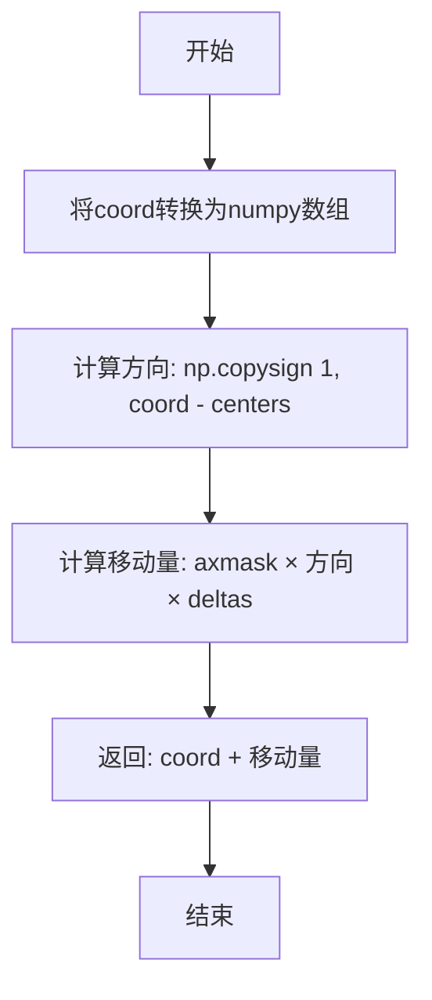
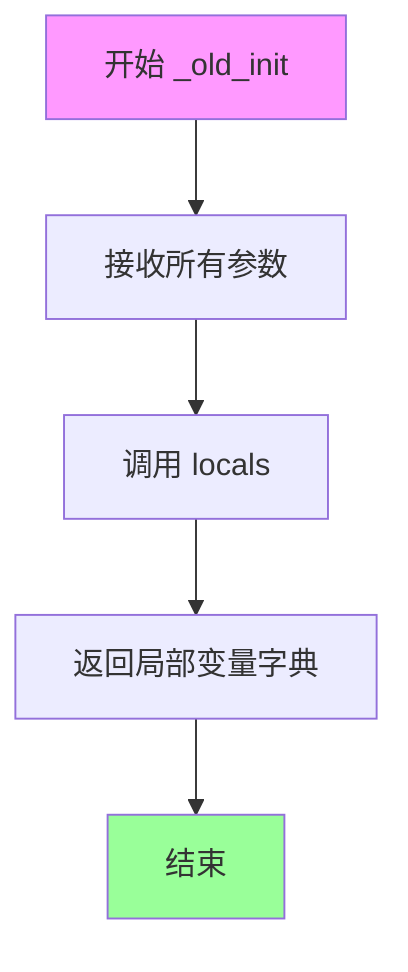
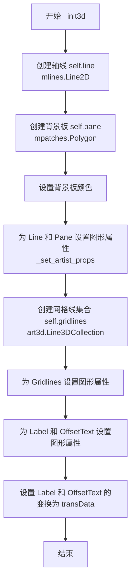
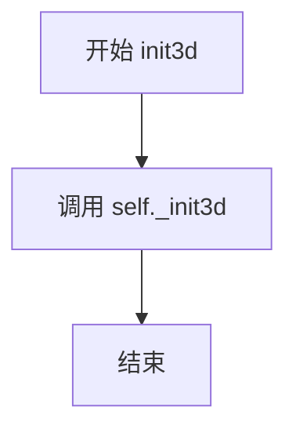
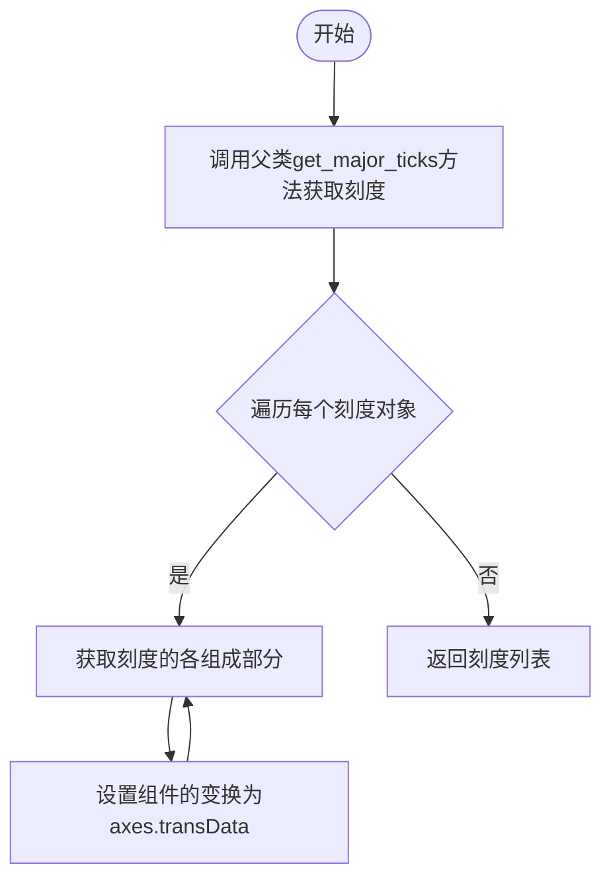
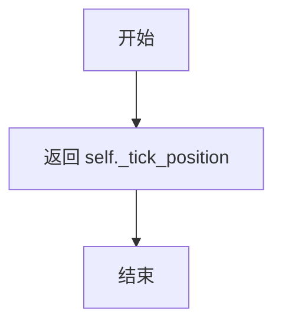
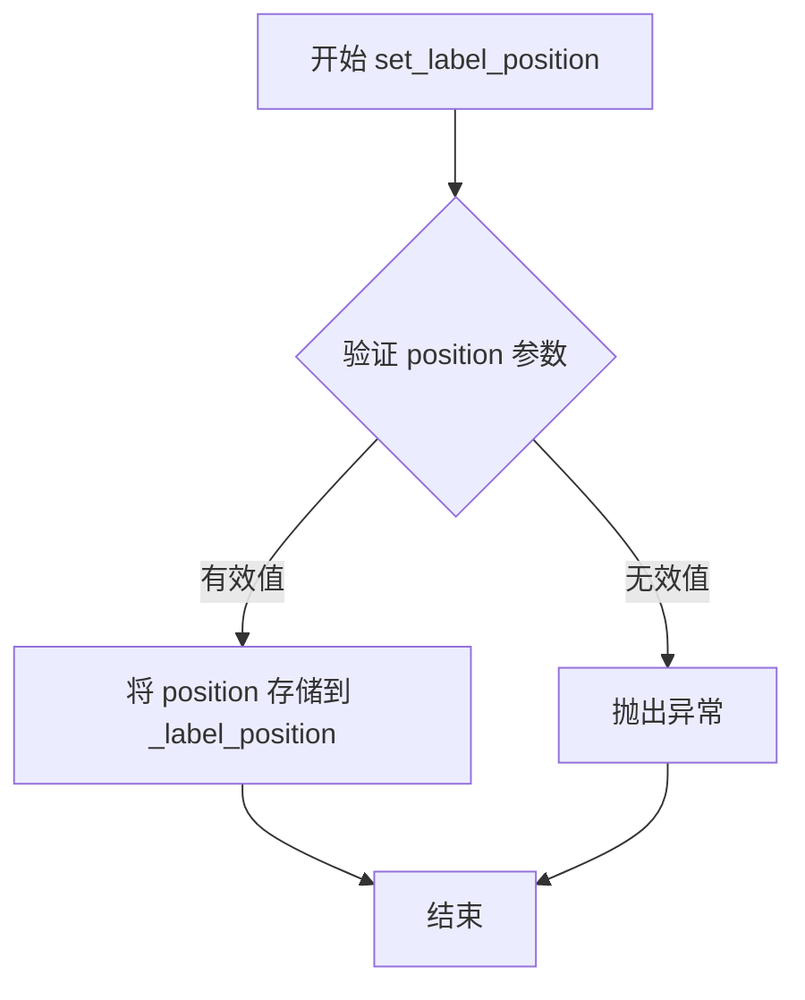
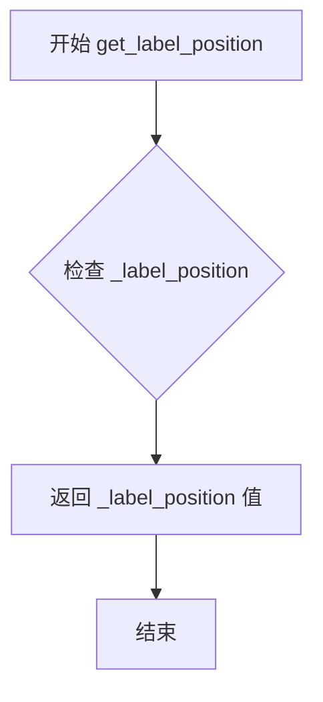
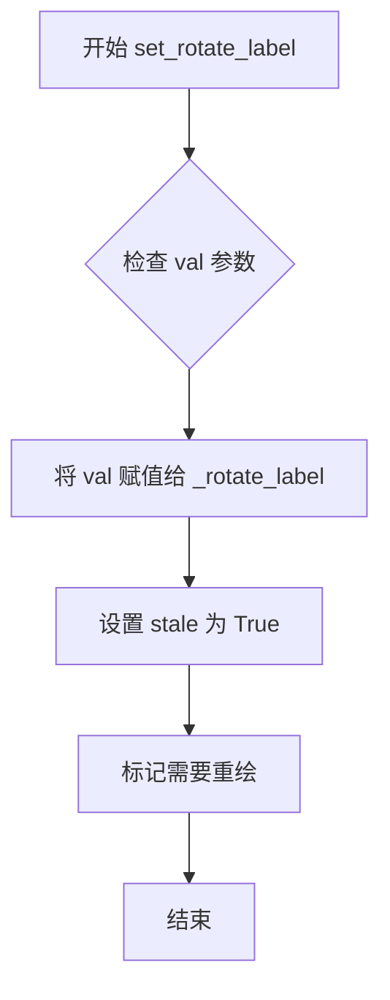
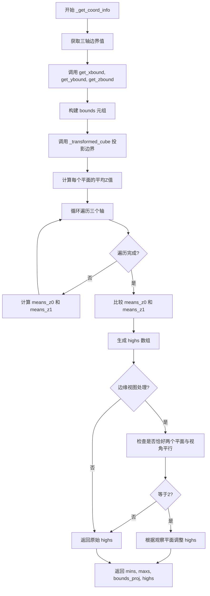

# `matplotlib\lib\mpl_toolkits\mplot3d\axis3d.py` 详细设计文档

This file implements the 3D axis system for Matplotlib. It defines the `Axis` base class and its subclasses (`XAxis`, `YAxis`, `ZAxis`) to handle the rendering of axis lines, ticks, labels, grid lines, and panes in a 3D plot, performing coordinate projection and view-dependent calculations.

## 整体流程

```mermaid
graph TD
    A[Start] --> B[Axis.__init__]
    B --> C{Signature Check}
    C --> D[_init3d: Create Line2D, Polygon, Gridlines]
    D --> E[Draw Request: draw(renderer)]
    E --> F[_get_coord_info: Calculate bounds & projection]
    F --> G[_calc_centers_deltas: Calculate spacing]
    G --> H[Loop: Process Axis Lines (Ticks & Labels)]
    H --> I[draw_pane: Render background pane]
    H --> J[_draw_ticks: Render tick marks]
    H --> K[_draw_labels: Render axis labels]
    H --> L[_draw_offset_text: Render offset text]
    H --> M[draw_grid: Render grid lines (separate call)]
    M --> N[End]
```

## 类结构

```
maxis.XAxis (matplotlib base)
└── Axis (3D Axis Base Class)
    ├── XAxis
    ├── YAxis
    └── ZAxis
```

## 全局变量及字段


### `_move_from_center`
    
Moves coordinates away from centers by deltas along axes where axmask is True

类型：`function`
    


### `_tick_update_position`
    
Updates tick line and label position and style for 3D axis rendering

类型：`function`
    


### `Axis._PLANES`
    
Tuple of indices from unit cube defining x, y and z-planes for 3D coordinate mapping

类型：`tuple`
    


### `Axis._AXINFO`
    
Class-level dictionary containing axis configuration including tick direction, index, and juggled coordinates

类型：`dict`
    


### `Axis._axinfo`
    
Instance-level copy of axis information with runtime-updated label, color, and tick properties

类型：`dict`
    


### `Axis._label_position`
    
Stores current label position setting ('default', 'lower', 'upper', 'both', or 'none')

类型：`str`
    


### `Axis._tick_position`
    
Stores current tick position setting ('default', 'lower', 'upper', 'both', or 'none')

类型：`str`
    


### `Axis._rotate_label`
    
Controls whether axis label should be rotated; None means auto-detect based on label length

类型：`bool or None`
    


### `Axis.line`
    
2D line object representing the visible axis line in the plot

类型：`Line2D`
    


### `Axis.pane`
    
Polygon patch representing the background pane/plane of the 3D axis

类型：`Polygon`
    


### `Axis.gridlines`
    
3D line collection storing the grid lines for this axis

类型：`Line3DCollection`
    


### `XAxis.axis_name`
    
String identifier 'x' for the X-axis class

类型：`str`
    


### `YAxis.axis_name`
    
String identifier 'y' for the Y-axis class

类型：`str`
    


### `ZAxis.axis_name`
    
String identifier 'z' for the Z-axis class

类型：`str`
    
    

## 全局函数及方法


### `_move_from_center`

该函数用于在3D坐标空间中，根据轴掩码将指定坐标沿远离中心点的方向移动指定的delta距离，常用于计算3D坐标轴上刻度标签和偏移文本的绘制位置。

参数：

- `coord`：`numpy.ndarray` 或 array-like，要移动的坐标点
- `centers`：`numpy.ndarray` 或 array-like，中心点坐标，用于确定移动方向
- `deltas`：`numpy.ndarray` 或 array-like，每个轴上的移动距离
- `axmask`：`tuple[bool, bool, bool]`，轴掩码，指定哪些轴参与移动，默认为 `(True, True, True)`

返回值：`numpy.ndarray`，移动后的新坐标

#### 流程图



#### 带注释源码

```python
def _move_from_center(coord, centers, deltas, axmask=(True, True, True)):
    """
    For each coordinate where *axmask* is True, move *coord* away from
    *centers* by *deltas*.
    
    Parameters
    ----------
    coord : array-like
        3D coordinates to be moved.
    centers : array-like
        Center points for each dimension.
    deltas : array-like
        Distance to move along each dimension.
    axmask : tuple of bool, optional
        Mask specifying which axes should be adjusted.
        True means the coordinate along that axis will be moved.
    
    Returns
    -------
    numpy.ndarray
        The new coordinates after moving away from centers.
    
    Notes
    -----
    The function uses np.copysign to determine the direction of movement:
    - If coord[i] > centers[i], move in positive direction by deltas[i]
    - If coord[i] < centers[i], move in negative direction by deltas[i]
    - If coord[i] == centers[i], no movement along that axis
    
    The axmask parameter allows selective axis movement:
    - axmask[i] = True: coordinate will be moved along axis i
    - axmask[i] = False: coordinate remains unchanged along axis i
    """
    # Convert input to numpy array for vectorized operations
    coord = np.asarray(coord)
    
    # Calculate movement:
    # 1. np.copysign(1, coord - centers) gives direction (+1 or -1) for each axis
    # 2. Multiply by deltas to get signed distance
    # 3. Multiply by axmask to optionally disable certain axes
    # 4. Add to original coord to get new position
    return coord + axmask * np.copysign(1, coord - centers) * deltas
```


### `_tick_update_position`

更新刻度线（tick line）和标签（label）的位置和样式，使其在3D坐标轴中正确显示。

参数：

- `tick`：对象，matplotlib的刻度对象（Tick对象），包含tick1line、tick2line、label1、label2、gridline等属性
- `tickxs`：元组/序列，刻度线端点的x坐标，格式为(x1, x2)
- `tickys`：元组/序列，刻度线端点的y坐标，格式为(y1, y2)
- `labelpos`：元组，标签的显示位置坐标，格式为(x, y)

返回值：`None`，该函数无返回值，直接修改tick对象的属性

#### 流程图

```mermaid
flowchart TD
    A[开始 _tick_update_position] --> B[设置label1位置]
    B --> C[设置label2位置]
    C --> D[设置tick1line可见性为True]
    D --> E[设置tick2line可见性为False]
    E --> F[设置tick1line线型为实线'-']
    F --> G[设置tick1line标记为空'']
    G --> H[设置tick1line数据为tickxs, tickys]
    H --> I[设置gridline数据为[0], [0]]
    I --> J[结束]
```

#### 带注释源码

```python
def _tick_update_position(tick, tickxs, tickys, labelpos):
    """
    Update tick line and label position and style.
    
    此函数用于在3D绘图中更新单个刻度（tick）的视觉属性。
    它设置标签位置、刻度线可见性、线型和绘制数据。
    """
    
    # 将标签1的位置设置为指定的标签位置
    tick.label1.set_position(labelpos)
    
    # 将标签2的位置也设置为相同的标签位置
    # label1和label2分别表示刻度标签的主副本和副本
    tick.label2.set_position(labelpos)
    
    # 设置主刻度线（tick1line）为可见
    # tick1line是朝向坐标轴内侧的刻度线
    tick.tick1line.set_visible(True)
    
    # 设置次刻度线（tick2line）为不可见
    # tick2line是朝向坐标轴外侧的刻度线，在3D图中通常隐藏
    tick.tick2line.set_visible(False)
    
    # 设置主刻度线的线型为实线
    tick.tick1line.set_linestyle('-')
    
    # 设置主刻度线的标记为空（即不显示额外标记）
    tick.tick1line.set_marker('')
    
    # 设置主刻度线的绘制数据
    # tickxs和tickys是刻度线两个端点的坐标
    # (x1, x2), (y1, y2)定义了一条从tick内部到外部的线段
    tick.tick1line.set_data(tickxs, tickys)
    
    # 将网格线的数据点设置为原点
    # 在3D轴中，gridline通常被禁用或重新定位，这里将其移到原点
    tick.gridline.set_data([0], [0])
```


### Axis.__init__

`Axis.__init__` 是 3D 坐标轴类的构造函数，负责初始化 3D 图表的坐标轴对象。该方法通过兼容新旧两种签名格式来支持向后兼容，并根据配置初始化坐标轴的标签位置、刻度位置、颜色信息、线型样式等视觉属性，同时设置数据视图区间和标签旋转选项。

参数：

- `*args`：可变位置参数，支持旧版签名（adir, v_intervalx, d_intervalx, axes, *args）或新版签名（axes, *args）
- `**kwargs`：可变关键字参数，支持 rotate_label 等选项及父类相关参数

返回值：无（构造函数）

#### 流程图

```mermaid
flowchart TD
    A[开始 __init__] --> B[调用 _api.select_matching_signature 选择匹配签名]
    B --> C{检测到旧版 adir 参数?}
    C -->|是| D[发出 3.6 版本废弃警告]
    D --> E{adir 与 axis_name 匹配?}
    E -->|否| F[抛出 ValueError 异常]
    E -->|是| G[继续处理]
    C -->|否| G
    G --> H[提取 axes 和 rotate_label 参数]
    H --> I[初始化 _label_position 和 _tick_position 为 'default']
    I --> J[复制 _AXINFO[name] 到 _axinfo]
    J --> K[更新 _axinfo 的 label/tick/color 配置]
    K --> L{是否为经典模式?}
    L -->|是| M[应用经典模式配置: axisline 颜色为黑色, grid 浅灰色]
    L -->|否| N[应用现代模式配置: axisline 颜色继承 rcParams]
    M --> O
    N --> O
    O[调用父类 __init__ 初始化基础功能]
    O --> P{存在 d_intervalx 参数?}
    P -->|是| Q[调用 set_data_interval 设置数据区间]
    P -->|否| R
    R{存在 v_intervalx 参数?}
    R -->|是| S[调用 set_view_interval 设置视图区间]
    R -->|否| T
    T[调用 set_rotate_label 设置标签旋转]
    T --> U[调用 _init3d 初始化 3D 特有属性]
    U --> V[结束 __init__]
```

#### 带注释源码

```python
def __init__(self, *args, **kwargs):
    """
    3D 坐标轴类的初始化方法。
    
    支持两种调用签名以保持向后兼容：
    1. 新版签名: Axis(axes, *, rotate_label=None, **kwargs)
    2. 旧版签名: Axis(adir, v_intervalx, d_intervalx, axes, *args, rotate_label=None, **kwargs)
    """
    # 使用 _api.select_matching_signature 根据传入参数自动匹配新版或旧版签名
    # 返回包含所有提取参数的字典
    params = _api.select_matching_signature(
        [self._old_init, self._new_init], *args, **kwargs)
    
    # 检测是否为旧版调用方式（旧版包含 adir 参数）
    if "adir" in params:
        # 发出 3.6 版本废弃警告，提示用户使用新版签名
        _api.warn_deprecated(
            "3.6", message=f"The signature of 3D Axis constructors has "
            f"changed in %(since)s; the new signature is "
            f"{inspect.signature(type(self).__init__)}", pending=True)
        
        # 验证 adir 参数是否与 axis_name 匹配（如 'x', 'y', 'z'）
        if params["adir"] != self.axis_name:
            raise ValueError(f"Cannot instantiate {type(self).__name__} "
                             f"with adir={params['adir']!r}")
    
    # 从参数字典中提取关键参数
    axes = params["axes"]
    rotate_label = params["rotate_label"]
    args = params.get("args", ())
    kwargs = params["kwargs"]

    # 获取当前坐标轴名称（'x', 'y' 或 'z'）
    name = self.axis_name

    # 初始化标签和刻度的默认位置
    self._label_position = 'default'
    self._tick_position = 'default'

    # 从类属性 _AXINFO 复制当前坐标轴的基础配置信息
    # _AXINFO 包含坐标轴的索引、刻度方向、juggled 变换等信息
    # 注意：这是一个临时成员变量，不应在未来版本中依赖
    self._axinfo = self._AXINFO[name].copy()
    
    # 更新通用配置：标签对齐方式、刻度颜色
    self._axinfo.update({
        'label': {
            'va': 'center',           # 垂直对齐方式
            'ha': 'center',           # 水平对齐方式
            'rotation_mode': 'anchor' # 旋转模式
        },
        'color': mpl.rcParams[f'axes3d.{name}axis.panecolor'], # 面板背景色
        'tick': {
            'inward_factor': 0.2,    # 刻度向内因子
            'outward_factor': 0.1,   # 刻度向外因子
        },
    })

    # 根据是否为经典模式应用不同的视觉配置
    if mpl.rcParams['_internal.classic_mode']:
        # 经典模式：使用固定的黑色轴线和浅灰色网格
        self._axinfo.update({
            'axisline': {
                'linewidth': 0.75, 
                'color': (0, 0, 0, 1)  # 纯黑色
            },
            'grid': {
                'color': (0.9, 0.9, 0.9, 1),   # 浅灰色
                'linewidth': 1.0,
                'linestyle': '-',
            },
        })
        # 刻度线宽使用 lines.linewidth
        self._axinfo['tick'].update({
            'linewidth': {
                True: mpl.rcParams['lines.linewidth'],   # 主刻度
                False: mpl.rcParams['lines.linewidth'],  # 次刻度
            }
        })
    else:
        # 现代模式：从 rcParams 读取配置
        self._axinfo.update({
            'axisline': {
                'linewidth': mpl.rcParams['axes.linewidth'],    # 轴线线宽
                'color': mpl.rcParams['axes.edgecolor'],         # 轴线颜色
            },
            'grid': {
                'color': mpl.rcParams['grid.color'],             # 网格颜色
                'linewidth': mpl.rcParams['grid.linewidth'],     # 网格线宽
                'linestyle': mpl.rcParams['grid.linestyle'],    # 网格线型
            },
        })
        # 根据坐标轴类型选择对应的刻度线宽配置
        self._axinfo['tick'].update({
            'linewidth': {
                True: (  # 主刻度线宽
                    mpl.rcParams['xtick.major.width'] if name in 'xz'
                    else mpl.rcParams['ytick.major.width']),
                False: (  # 次刻度线宽
                    mpl.rcParams['xtick.minor.width'] if name in 'xz'
                    else mpl.rcParams['ytick.minor.width']),
            }
        })

    # 调用父类 XAxis 的初始化方法，传入 axes 和其他参数
    super().__init__(axes, *args, **kwargs)

    # 设置数据视图区间（仅当使用旧版签名时）
    if "d_intervalx" in params:
        self.set_data_interval(*params["d_intervalx"])
    if "v_intervalx" in params:
        self.set_view_interval(*params["v_intervalx"])
    
    # 设置标签旋转选项
    self.set_rotate_label(rotate_label)
    
    # 调用 3D 特有属性的初始化方法
    # 在 3.6 版本废弃期结束后，应将 _init3d 的内容直接内联到 __init__
    self._init3d()  # Inline after init3d deprecation elapses.
```


### `Axis._old_init`

旧的3D轴初始化方法，已被弃用，用于保持向后兼容性。该方法在3.6版本中标记为待弃用，用于处理旧版API的调用参数。

参数：

- `self`：隐式参数，Axis类实例，表示当前的3D轴对象
- `adir`：`str`，轴的方向标识（'x'、'y'或'z'），在3.6版本中已弃用
- `v_intervalx`：元组或列表，表示视图区间（view interval）
- `d_intervalx`：元组或列表，表示数据区间（data interval）
- `axes`：`matplotlib.axes.Axes`子类实例，所属的3D坐标轴对象
- `*args`：可变位置参数，用于传递额外位置参数
- `rotate_label`：可选参数，类型为布尔值或None，表示是否旋转轴标签
- `**kwargs`：可变关键字参数，用于传递额外关键字参数

返回值：`dict`，返回局部变量字典，包含所有传入参数的值

#### 流程图



#### 带注释源码

```python
def _old_init(self, adir, v_intervalx, d_intervalx, axes, *args,
              rotate_label=None, **kwargs):
    """
    旧的3D轴初始化方法，已被弃用。
    
    该方法用于处理旧版API的初始化参数，在3.6版本中标记为待弃用。
    它返回包含所有局部变量的字典，供__init__方法中的参数选择逻辑使用。
    
    Parameters
    ----------
    adir : str
        轴的方向标识，'x'、'y'或'z'。在3.6版本中已弃用。
    v_intervalx : tuple or list
        视图区间，定义轴的可见范围。
    d_intervalx : tuple or list
        数据区间，定义轴的数据范围。
    axes : matplotlib.axes.Axes subclass
        所属的3D坐标轴对象。
    *args : tuple
        可变位置参数。
    rotate_label : bool or None, optional
        是否旋转轴标签。默认为None。
    **kwargs : dict
        可变关键字参数。
    
    Returns
    -------
    dict
        包含所有局部变量的字典，包括self、adir、v_intervalx、d_intervalx、
        axes、args、rotate_label和kwargs。
    """
    return locals()
```


### Axis._new_init

该函数是3D坐标轴的新版初始化方法签名，用于在参数解析阶段与`_old_init`一起被`_api.select_matching_signature`调用，以根据传入参数匹配正确的初始化方式，并返回包含所有局部变量的字典供`__init__`方法提取所需参数。

参数：

- `self`：`Axis`，隐式的实例本身
- `axes`：`matplotlib.axes.Axes`，3D坐标轴所属的坐标系对象
- `rotate_label`：`bool | None`，可选参数，控制坐标轴标签是否旋转，默认为`None`
- `**kwargs`：`dict`，额外的关键字参数，将传递给父类初始化器

返回值：`dict`，返回`locals()`的副本，包含`self`、`axes`、`rotate_label`和`kwargs`等局部变量

#### 流程图

```mermaid
flowchart TD
    A[开始 _new_init] --> B[收集局部变量]
    B --> C[返回 locals() 字典]
    C --> D[被 __init__ 中的 select_matching_signature 调用]
```

#### 带注释源码

```python
def _new_init(self, axes, *, rotate_label=None, **kwargs):
    """
    新的初始化方法签名（仅返回局部变量字典）。
    
    此方法不执行实际初始化，仅作为签名选择器的参数模板。
    实际初始化逻辑在 __init__ 方法中完成。
    
    Parameters
    ----------
    axes : matplotlib.axes.Axes
        3D坐标轴所属的坐标系对象。
    rotate_label : bool | None, optional
        是否旋转坐标轴标签。默认为None，表示根据标签长度自动决定。
    **kwargs : dict
        额外的关键字参数，将传递给父类初始化器。
    
    Returns
    -------
    dict
        包含所有局部变量的字典，供__init__方法提取参数使用。
    """
    return locals()
```


### `Axis._init3d`

#### 描述
`_init3d` 是 `Axis` 类（3D 轴）的初始化方法，负责创建并配置 3D 图形特有的基础图形对象（轴线、背景板、网格线）以及设置文本标签的坐标变换。

#### 参数
- `self`：隐式参数，类型为 `Axis`，表示类的实例本身。

#### 返回值
- `None`，无返回值（该方法直接修改实例状态）。

#### 流程图



#### 带注释源码

```python
def _init3d(self):
    # 1. 创建轴线对象 (2D线，但在3D视图中作为轴的基准线)
    # 使用 _axinfo 中预定义的线宽和颜色
    self.line = mlines.Line2D(
        xdata=(0, 0), ydata=(0, 0),
        linewidth=self._axinfo['axisline']['linewidth'],
        color=self._axinfo['axisline']['color'],
        antialiased=True)

    # 2. 创建背景板 (Pane) 对象
    # 初始化时使用占位符多边形，实际顶点在绘图时由 active_pane 计算得出
    self.pane = mpatches.Polygon([[0, 0], [0, 1]], closed=False)
    # 根据 _axinfo 中的颜色配置设置背景板的边面颜色
    self.set_pane_color(self._axinfo['color'])

    # 3. 将线条和背景板添加到 Axes 并设置属性（如 zorder, clip path 等）
    self.axes._set_artist_props(self.line)
    self.axes._set_artist_props(self.pane)
    
    # 4. 初始化 3D 网格线集合
    self.gridlines = art3d.Line3DCollection([])
    # 设置网格线的图形属性
    self.axes._set_artist_props(self.gridlines)
    
    # 5. 设置轴标签和偏移文本（用于科学计数法等）的图形属性
    self.axes._set_artist_props(self.label)
    self.axes._set_artist_props(self.offsetText)
    
    # 6. 设置坐标变换
    # 关键：必须将标签和偏移文本的变换设置为数据坐标变换，
    # 以确保它们能正确放置在由投影计算出的 3D 位置对应的 2D 坐标上。
    self.label._transform = self.axes.transData
    self.offsetText._transform = self.axes.transData
```


### Axis.init3d

该方法是3D坐标轴的初始化方法，现已被弃用，原本用于初始化3D轴的视觉元素（如线条、网格线、标签等），目前推荐直接在构造函数中调用`_init3d`方法。

参数：
- 无（仅包含隐式参数`self`）

返回值：`None`，无返回值

#### 流程图



#### 带注释源码

```python
@_api.deprecated("3.6", pending=True)
def init3d(self):
    """
    初始化3D轴的视觉元素。
    
    注意：此方法已在matplotlib 3.6中弃用，现推荐直接在__init__中
    调用_init3d方法。当弃用期结束后，此方法的内容将被内联到
    __init__方法中。
    """
    # 调用实际的初始化方法_init3d来完成初始化工作
    self._init3d()
```


### `Axis.get_major_ticks`

获取3D坐标轴的主刻度线，并将其渲染属性（特别是坐标变换）设置为与3D数据空间一致，以确保在3D图表中正确显示。

参数：
- `numticks`：`int` 或 `None`，可选 - 要获取的刻度数量。如果为 `None`，则自动确定。

返回值：`list`，返回主刻度对象列表，这些对象已配置了正确的坐标变换。

#### 流程图



#### 带注释源码

```python
def get_major_ticks(self, numticks=None):
    """
    获取3D轴的主刻度。

    此方法重写了父类的方法，以确保所有与刻度相关的视觉元素
    （刻度线、网格线、标签）都使用正确的3D数据坐标变换进行渲染。

    参数
    ----------
    numticks : int 或 None, 可选
        强制返回的刻度数量。如果为 None，则使用自动计算的默认数量。

    返回值
    -------
    ticks : list
        主刻度对象列表。每个刻度对象都经过修改，其内部包含的
        视觉元素已设置为使用 self.axes.transData 变换。
    """
    # 调用父类 (maxis.XAxis) 的 get_major_ticks 方法获取基础刻度对象
    ticks = super().get_major_ticks(numticks)

    # 遍历获取到的每个刻度对象
    for t in ticks:
        # 对于每个刻度，遍历其所有的视觉组成部分
        for obj in [
                t.tick1line,   # 主刻度线
                t.tick2line,   # 次刻度线（通常不可见）
                t.gridline,    # 网格线
                t.label1,      # 主标签
                t.label2]:     # 次标签（通常不可见）
            # 关键步骤：将该对象的坐标变换设置为3D轴的数据坐标变换
            # 这样可以确保在3D投影空间中正确显示刻度位置
            obj.set_transform(self.axes.transData)

    # 返回修改后的刻度对象列表
    return ticks
```


### `Axis.get_minor_ticks`

获取3D坐标轴的次刻度线（minor ticks），并确保所有刻度线组件使用正确的数据坐标变换。

参数：

- `numticks`：`int` 或 `None`，可选，要返回的次刻度数量。如果为 `None`，则返回所有次刻度。

返回值：`list`，包含次刻度对象的列表，每个次刻度对象的图形元素（tick1line、tick2line、gridline、label1、label2）的变换都被设置为 `self.axes.transData`。

#### 流程图

```mermaid
flowchart TD
    A[开始 get_minor_ticks] --> B[调用父类方法 super().get_minor_ticks 获取次刻度列表]
    B --> C{遍历每个次刻度 t}
    C -->|对于每个刻度| D[获取 t.tick1line]
    D --> E[调用 set_transform 设置为 self.axes.transData]
    E --> F[获取 t.tick2line]
    F --> G[调用 set_transform 设置为 self.axes.transData]
    G --> H[获取 t.gridline]
    H --> I[调用 set_transform 设置为 self.axes.transData]
    I --> J[获取 t.label1]
    J --> K[调用 set_transform 设置为 self.axes.transData]
    K --> L[获取 t.label2]
    L --> M[调用 set_transform 设置为 self.axes.transData]
    M --> N{还有更多刻度?}
    N -->|是| C
    N -->|否| O[返回更新后的 ticks 列表]
    O --> P[结束]
```

#### 带注释源码

```python
def get_minor_ticks(self, numticks=None):
    """
    获取3D坐标轴的次刻度线。
    
    此方法重写父类方法，以确保在3D绘图中，所有刻度线组件
    （刻度线、网格线、标签）都能正确定位在数据坐标系中。
    
    Parameters
    ----------
    numticks : int or None, optional
        要返回的次刻度数量。如果为 None，则返回所有次刻度。
    
    Returns
    -------
    list
        次刻度对象列表，每个对象的图形元素已设置正确的坐标变换。
    """
    # 调用父类 (maxis.XAxis) 的 get_minor_ticks 方法获取基础次刻度列表
    ticks = super().get_minor_ticks(numticks)
    
    # 遍历每个次刻度对象
    for t in ticks:
        # 遍历该刻度上的所有图形组件：
        # - tick1line: 主刻度线
        # - tick2line: 次刻度线（通常隐藏）
        # - gridline: 网格线
        # - label1: 主标签
        # - label2: 次标签
        for obj in [
                t.tick1line, t.tick2line, t.gridline, t.label1, t.label2]:
            # 将每个组件的变换设置为数据坐标变换
            # 这是3D绘图中确保刻度线正确对齐的关键步骤
            obj.set_transform(self.axes.transData)
    
    # 返回更新后的刻度列表
    return ticks
```


### `Axis.set_ticks_position`

该方法用于设置3D坐标轴上刻度线、刻度标签和轴线的显示位置。它接受一个位置参数，并通过内部API验证参数的有效性后，将位置信息存储到实例变量中。

参数：

- `position`：`str`，位置参数，可选值为 `'lower'`（下方/左侧）、`'upper'`（上方/右侧）、`'both'`（两侧）、`'default'`（默认）和 `'none'`（无）。用于指定加粗轴线、刻度线和刻度标签的位置。

返回值：`None`，该方法无返回值，直接修改对象内部状态。

#### 流程图


#### 带注释源码

```python
def set_ticks_position(self, position):
    """
    Set the ticks position.

    Parameters
    ----------
    position : {'lower', 'upper', 'both', 'default', 'none'}
        The position of the bolded axis lines, ticks, and tick labels.
    """
    # 使用 _api.check_in_list 验证 position 是否在允许的列表中
    # 如果不在允许列表中，会抛出 ValueError 异常
    _api.check_in_list(['lower', 'upper', 'both', 'default', 'none'],
                       position=position)
    # 将验证通过的位置参数存储到实例变量 _tick_position 中
    # 该变量后续会在 draw 方法中被读取，用于确定刻度的绘制位置
    self._tick_position = position
```


### `Axis.get_ticks_position`

获取3D坐标轴的刻度线位置。

参数： 无

返回值：`str`，返回刻度线的位置，可选值为 `'lower'`、`'upper'`、`'both'`、`'default'` 或 `'none'`，表示加粗轴线、刻度线和刻度标签的位置。

#### 流程图



#### 带注释源码

```python
def get_ticks_position(self):
    """
    Get the ticks position.

    Returns
    -------
    str : {'lower', 'upper', 'both', 'default', 'none'}
        The position of the bolded axis lines, ticks, and tick labels.
    """
    # 返回内部存储的刻度位置属性
    # 该属性在 __init__ 方法中被初始化为 'default'
    # 可通过 set_ticks_position 方法进行设置
    return self._tick_position
```


### `Axis.set_label_position`

该方法用于设置3D坐标轴标签的位置，支持将标签放置在坐标轴的下方、上方、两侧或默认位置。

参数：

- `position`：`str`，位置参数，用于指定轴标签的位置。必须是以下值之一：'lower'（下方）、'upper'（上方）、'both'（两侧）、'default'（默认）、'none'（无）

返回值：`None`，该方法没有返回值，仅用于设置实例属性 `_label_position`

#### 流程图



#### 带注释源码

```python
def set_label_position(self, position):
    """
    Set the label position.

    Parameters
    ----------
    position : {'lower', 'upper', 'both', 'default', 'none'}
        The position of the axis label.
    """
    # 使用 _api.check_in_list 验证 position 是否为有效值之一
    # 如果无效会抛出 ValueError 异常
    _api.check_in_list(['lower', 'upper', 'both', 'default', 'none'],
                       position=position)
    # 将验证通过的位置值存储到实例属性中
    # 该属性会在 draw 方法中被读取用于确定标签的绘制位置
    self._label_position = position
```


### `Axis.get_label_position`

获取3D坐标轴的标签位置，返回标签应该显示在轴的哪一侧（'lower'、'upper'、'both'、'default' 或 'none'）。

参数：
- （无显式参数，隐式参数 `self` 为 `Axis` 实例）

返回值：`str`，标签位置字符串，值域为 `{'lower', 'upper', 'both', 'default', 'none'}`。

#### 流程图



#### 带注释源码

```python
def get_label_position(self):
    """
    Get the label position.

    Returns
    -------
    str : {'lower', 'upper', 'both', 'default', 'none'}
        The position of the axis label.
    """
    return self._label_position  # 返回内部存储的标签位置属性
```


### `Axis.set_pane_color`

该方法用于设置3D坐标轴面板的颜色和透明度。它接收颜色值和可选的透明度参数，将其转换为RGBA格式，然后更新内部颜色信息和面板的显示属性。

参数：

- `color`：`:mpltype:\`color\``，用于轴面板的颜色
- `alpha`：`float, optional`，轴面板的透明度值。如果为None，则基于*color*计算透明度

返回值：`None`，无返回值（该方法直接修改对象状态）

#### 流程图

```mermaid
flowchart TD
    A[开始 set_pane_color] --> B{color 和 alpha 是否有效?}
    B -->|是| C[调用 mcolors.to_rgba 转换为 RGBA]
    B -->|否| D[异常或保持原值]
    C --> E[self._axinfo['color'] = color]
    E --> F[self.pane.set_edgecolor color]
    F --> G[self.pane.set_facecolor color]
    G --> H[self.pane.set_alpha color[-1]]
    H --> I[self.stale = True]
    I --> J[结束]
```

#### 带注释源码

```python
def set_pane_color(self, color, alpha=None):
    """
    Set pane color.

    Parameters
    ----------
    color : :mpltype:`color`
        Color for axis pane.
    alpha : float, optional
        Alpha value for axis pane. If None, base it on *color*.
    """
    # 使用 matplotlib 的颜色转换函数将颜色和透明度转换为 RGBA 格式
    # 如果 alpha 为 None，则从 color 中提取透明度
    color = mcolors.to_rgba(color, alpha)
    
    # 更新内部存储的轴面板颜色信息
    self._axinfo['color'] = color
    
    # 设置面板多边形的边缘颜色
    self.pane.set_edgecolor(color)
    
    # 设置面板多边形的表面填充颜色
    self.pane.set_facecolor(color)
    
    # 设置面板的透明度（使用 RGBA 颜色中的 alpha 通道，即最后一个分量）
    self.pane.set_alpha(color[-1])
    
    # 标记该 Artist 对象为"过时"，通知绘图系统需要重新渲染
    self.stale = True
```


### `Axis.set_rotate_label`

设置是否旋转轴标签。该方法用于控制3D坐标轴标签的旋转行为，支持三种模式：True（始终旋转）、False（始终不旋转）或None（根据标签长度自动决定）。

参数：

- `val`：布尔值或None，表示是否旋转轴标签。True为始终旋转，False为始终不旋转，None为当标签长度超过4个字符时自动旋转

返回值：`None`，无返回值

#### 流程图



#### 带注释源码

```python
def set_rotate_label(self, val):
    """
    Whether to rotate the axis label: True, False or None.
    If set to None the label will be rotated if longer than 4 chars.
    """
    # 将传入的旋转标签参数存储到实例变量 _rotate_label 中
    # 该变量用于控制轴标签是否旋转
    self._rotate_label = val
    
    # 将 stale 标记设置为 True，通知 matplotlib 该artist对象需要重绘
    # 这是 matplotlib 中的标准模式，当对象属性发生变化时需要重绘
    self.stale = True
```


### `Axis.get_rotate_label`

该方法用于确定3D坐标轴标签是否需要旋转。如果用户已经通过 `set_rotate_label` 设置了旋转偏好（True或False），则返回该设置；否则，根据标签文本长度是否超过4个字符来自动决定是否旋转（长度大于4时返回True，否则返回False）。

参数：

- `text`：`str`，轴标签的文本内容，用于自动判断是否需要旋转

返回值：`bool`，返回是否应该旋转标签（True表示旋转，False表示不旋转）

#### 流程图

```mermaid
flowchart TD
    A[开始] --> B{self._rotate_label is not None?}
    B -->|是| C[返回 self._rotate_label]
    B -->|否| D{len(text) > 4?}
    D -->|是| E[返回 True]
    D -->|否| F[返回 False]
    C --> G[结束]
    E --> G
    F --> G
```

#### 带注释源码

```python
def get_rotate_label(self, text):
    """
    获取轴标签是否应该旋转的决策。

    如果用户已经通过 set_rotate_label 设置了明确的旋转偏好，
    则返回该设置值。否则，根据标签文本长度自动决定：
    当文本长度大于4个字符时返回True（需要旋转），
    否则返回False（不需要旋转）。

    Parameters
    ----------
    text : str
        轴标签的文本内容。

    Returns
    -------
    bool
        是否应该旋转标签。True表示需要旋转，False表示不需要旋转。
    """
    # 如果用户已经通过set_rotate_label设置了旋转偏好（True或False）
    if self._rotate_label is not None:
        # 直接返回用户设置的值
        return self._rotate_label
    else:
        # 用户未设置偏好，根据文本长度自动决定
        # 文本长度大于4个字符时旋转，否则不旋转
        return len(text) > 4
```


### `Axis._get_coord_info`

该方法用于获取3D坐标轴的坐标信息，包括轴的最小值、最大值、投影后的边界框以及判断哪些平面在上方。该方法在绘制3D轴、刻度、标签和网格时都会被调用，是3D轴渲染的核心计算方法。

参数：
- （无显式参数，隐含self参数指向Axis实例）

返回值：`tuple`，返回一个包含四个元素的元组：
- `mins`：`numpy.ndarray`，三个轴（x, y, z）的最小值
- `maxs`：`numpy.ndarray`，三个轴（x, y, z）的最大值  
- `bounds_proj`：`numpy.ndarray`，投影后的边界框坐标
- `highs`：`numpy.ndarray`，布尔数组，表示每个轴方向上哪个平面在上方（True表示该平面在上方）

#### 流程图



#### 带注释源码

```python
def _get_coord_info(self):
    """
    获取3D坐标轴的坐标信息，用于绘制轴、刻度和标签。
    
    Returns:
        tuple: (mins, maxs, bounds_proj, highs)
            - mins: 三个轴的最小值数组
            - maxs: 三个轴的最大值数组
            - bounds_proj: 投影后的边界框
            - highs: 表示每个轴方向上哪个平面在上方的布尔数组
    """
    # 获取x, y, z三个轴的边界值（最小值和最大值）
    mins, maxs = np.array([
        self.axes.get_xbound(),  # 获取x轴边界 (min, max)
        self.axes.get_ybound(),  # 获取y轴边界 (min, max)
        self.axes.get_zbound(),  # 获取z轴边界 (min, max)
    ]).T  # 转置数组，使得mins和maxs分别包含所有轴的最小值和最大值

    # 将边界值打包成元组，用于后续投影变换
    # 格式: (x_min, x_max, y_min, y_max, z_min, z_max)
    bounds = mins[0], maxs[0], mins[1], maxs[1], mins[2], maxs[2]
    
    # 调用Axes的_transformed_cube方法，将边界投影到当前视角的立方体位置
    # 返回投影后的三维坐标点
    bounds_proj = self.axes._transformed_cube(bounds)

    # 确定哪些平行平面位于上方（朝向观察者）
    # 初始化两个数组用于存储每个平面的平均Z值
    means_z0 = np.zeros(3)
    means_z1 = np.zeros(3)
    
    # 遍历三个轴向（x, y, z）
    for i in range(3):
        # _PLANES定义了三组对立平面：(0,3,7,4), (1,2,6,5), (0,1,5,4)等
        # 每对平面中，第一个索引对应'下'平面，第二个对应'上'平面
        # 计算第一个平面的平均Z坐标
        means_z0[i] = np.mean(bounds_proj[self._PLANES[2 * i], 2])
        # 计算第二个平面的平均Z坐标
        means_z1[i] = np.mean(bounds_proj[self._PLANES[2 * i + 1], 2])
    
    # 比较两组平面的Z值，确定哪个在上方
    # 如果means_z0 < means_z1，说明第一个平面在下方（Z值小），第二个在上方
    # highs[i]为True表示第i个轴的正向平面在上方
    highs = means_z0 < means_z1

    # 特殊处理：边缘视角（当视图正好与某个坐标平面平行时）
    # 检测是否有两个平面的Z值几乎相等（即视图与这两个平面平行）
    equals = np.abs(means_z0 - means_z1) <= np.finfo(float).eps
    
    if np.sum(equals) == 2:  # 恰好两个平面与视线平行
        # 找出哪个维度不平行（即垂直于视图的轴）
        vertical = np.where(~equals)[0][0]
        
        if vertical == 2:  # 正在观察XY平面（视角在z轴方向）
            # XY平面始终可见，上下文设置highs
            highs = np.array([True, True, highs[2]])
        elif vertical == 1:  # 正在观察XZ平面（视角在y轴方向）
            highs = np.array([True, highs[1], False])
        elif vertical == 0:  # 正在观察YZ平面（视角在x轴方向）
            highs = np.array([highs[0], False, False])

    # 返回计算结果：
    # - mins/maxs: 原始轴边界
    # - bounds_proj: 投影后的边界点
    # - highs: 每个轴向的上平面标识
    return mins, maxs, bounds_proj, highs
```


### `Axis._calc_centers_deltas`

该方法用于计算3D坐标轴的中心点和增量，基于数据的最大值和最小值，用于后续绘制坐标轴刻度线和标签的定位。

参数：

- `maxs`：`numpy.ndarray`，表示数据的最大值数组（通常是x、y、z三个轴的最大值）
- `mins`：`numpy.ndarray`，表示数据的最小值数组（通常是x、y、z三个轴的最小值）

返回值：`tuple`，包含两个numpy.ndarray——`centers`（中心点数组）和`deltas`（增量数组）

#### 流程图

```mermaid
flowchart TD
    A[开始 _calc_centers_deltas] --> B[输入: maxs, mins]
    B --> C[计算 centers = 0.5 * (maxs + mins)]
    C --> D[定义 scale = 0.08]
    D --> E[计算 deltas = (maxs - mins) * scale]
    E --> F[返回 (centers, deltas)]
```

#### 带注释源码

```python
def _calc_centers_deltas(self, maxs, mins):
    """
    计算3D坐标轴的中心点和增量。
    
    参数:
        maxs: 数据的最大值数组 (numpy.ndarray)
        mins: 数据的最小值数组 (numpy.ndarray)
    
    返回:
        centers: 各轴的中心点坐标
        deltas: 各轴的增量值，用于确定刻度线和标签的偏移量
    """
    # 计算各轴的中心点，即最大值和最小值的算术平均数
    centers = 0.5 * (maxs + mins)
    
    # 比例因子说明：
    # mpl3.8版本使用1/12作为比例因子
    # mpl3.9版本改为1/12 * 24/25 = 0.08，以补偿自动边距行为的变化
    # 24/25因子来自mpl3.8版本为每个轴添加的1/48内边距
    scale = 0.08
    
    # 计算各轴的增量，等于轴的跨度乘以比例因子
    deltas = (maxs - mins) * scale
    
    # 返回中心点和增量，供绘制刻度和标签时使用
    return centers, deltas
```


### `Axis._get_axis_line_edge_points`

获取用于绘制 3D 坐标轴黑色粗线的两个边缘点坐标。该方法根据当前的坐标轴类型（x/y/z）、垂直轴设置以及位置参数（upper/lower），计算并返回轴线在三维空间中的起点和终点。

参数：

- `self`：隐式参数，Axis 类的实例。
- `minmax`：`numpy.ndarray`，由 `draw` 方法传入的坐标数组，通常代表根据视图高低（highs）选择的靠近相机或远离相机的边界点。
- `maxmin`：`numpy.ndarray`，与 `minmax` 互补的另一个边界点。
- `position`：`str` 或 `None`，指定轴线的绘制位置。`None` 或 `'default'` 使用默认逻辑；`'lower'` 或 `'upper'` 强制轴线位于坐标轴的特定侧面。

返回值：`tuple`，返回两个 `numpy.ndarray` 类型的坐标点，分别代表轴线的起点 `edge_point_0` 和终点 `edge_point_1`。

#### 流程图

```mermaid
flowchart TD
    A[Start _get_axis_line_edge_points] --> B[Input: minmax, maxmin, position]
    B --> C[Construct mb list: [minmax, maxmin]]
    C --> D[Reverse mb to get mb_rev]
    D --> E[Construct 3x3 mm matrix based on axis config]
    E --> F[Select specific config from mm based on vertical axis]
    G[Get juggled indices from _axinfo] --> F
    F --> H[Copy origin point to edge_point_0]
    H --> I{Check position and coordinate values}
    I -->|Condition Met| J[Adjust edge_point_0 at juggled[-1]]
    I -->|Condition Not Met| K[Adjust edge_point_0 at juggled[0]]
    J --> L[Copy edge_point_0 to edge_point_1]
    K --> L
    L --> M[Adjust edge_point_1 at juggled[1]]
    M --> N[Return edge_point_0, edge_point_1]
```

#### 带注释源码

```python
def _get_axis_line_edge_points(self, minmax, maxmin, position=None):
    """Get the edge points for the black bolded axis line."""
    # When changing vertical axis some of the axes has to be
    # moved to the other plane so it looks the same as if the z-axis
    # was the vertical axis.
    mb = [minmax, maxmin]  # line from origin to nearest corner to camera
    mb_rev = mb[::-1]
    # 构建配置矩阵，用于处理不同轴作为垂直轴时的坐标映射
    mm = [[mb, mb_rev, mb_rev], [mb_rev, mb_rev, mb], [mb, mb, mm]]
    # 根据当前垂直轴和轴索引获取对应的坐标配置
    mm = mm[self.axes._vertical_axis][self._axinfo["i"]]

    # 获取该轴的坐标排列顺序（juggled indices）
    juggled = self._axinfo["juggled"]
    # 初始化起点，通常为原点或视口中心
    edge_point_0 = mm[0].copy()  # origin point

    # 判断是否需要根据位置（position）调整起点坐标
    # 如果 position 是 'lower' 且 对应坐标小于起点，或 position 是 'upper' 且对应坐标大于起点
    if ((position == 'lower' and mm[1][juggled[-1]] < mm[0][juggled[-1]]) or
            (position == 'upper' and mm[1][juggled[-1]] > mm[0][juggled[-1]])):
        # 调整起点坐标以匹配目标位置
        edge_point_0[juggled[-1]] = mm[1][juggled[-1]]
    else:
        edge_point_0[juggled[0]] = mm[1][juggled[0]]

    # 复制起点得到终点
    edge_point_1 = edge_point_0.copy()
    # 调整终点的另一个维度坐标
    edge_point_1[juggled[1]] = mm[1][juggled[1]]

    return edge_point_0, edge_point_1
```


### `Axis._get_all_axis_line_edge_points`

获取3D坐标轴线的所有边缘点，根据轴位置（刻度位置或标签位置）计算坐标轴线的起点和终点坐标。该方法内部调用`_get_axis_line_edge_points`来计算实际的边缘坐标，并根据`axis_position`参数返回单组或多组边缘点。

参数：

- `minmax`：`numpy.ndarray`，根据轴边界计算的“原点”点（当highs为True时使用maxs，否则使用mins）
- `maxmin`：`numpy.ndarray`，靠近相机的“对角”点（当highs为False时使用maxs，否则使用mins）
- `axis_position`：`str`，可选，轴线的位置，可为None、'default'、'lower'、'upper'或'both'，决定返回哪组边缘点

返回值：`tuple[list[numpy.ndarray], list[numpy.ndarray], list[str]]`，返回三个列表的元组：(edgep1s, edgep2s, position)，其中edgep1s和edgep2s包含边缘点坐标，position包含对应的位置标签

#### 流程图

```mermaid
graph TD
    A[Start] --> B[初始化空列表: edgep1s, edgep2s, position]
    B --> C{axis_position in (None, 'default')?}
    C -->|Yes| D[调用_get_axis_line_edge_points获取默认位置边缘点]
    D --> E[将结果存储到列表, position设为'default']
    E --> F[返回 edgep1s, edgep2s, position]
    C -->|No| G[调用_get_axis_line_edge_points获取position='lower'的边缘点]
    G --> H[调用_get_axis_line_edge_points获取position='upper'的边缘点]
    H --> I{axis_position in ('lower', 'both')?}
    I -->|Yes| J[将lower边缘点添加到列表]
    J --> K{axis_position in ('upper', 'both')?}
    I -->|No| K
    K -->|Yes| L[将upper边缘点添加到列表]
    K -->|No| F
    L --> F
```

#### 带注释源码

```python
def _get_all_axis_line_edge_points(self, minmax, maxmin, axis_position=None):
    """
    获取基于位置的所有坐标轴线边缘点。
    
    Parameters
    ----------
    minmax : numpy.ndarray
        根据坐标轴边界计算的"原点"点。
    maxmin : numpy.ndarray
        靠近相机的"对角"点。
    axis_position : str, optional
        坐标轴线的位置 - 可为None, 'default', 'lower', 'upper'或'both'。
        决定返回哪组边缘点。
    
    Returns
    -------
    tuple
        包含(edgep1s, edgep2s, position)三个列表的元组，
        其中存储了边缘点坐标及其位置标签。
    """
    # 初始化空列表用于存储边缘点和位置信息
    edgep1s = []
    edgep2s = []
    position = []
    
    # 处理默认或None的axis_position - 返回单组边缘点
    if axis_position in (None, 'default'):
        # 调用内部方法获取默认位置的边缘点
        edgep1, edgep2 = self._get_axis_line_edge_points(minmax, maxmin)
        # 将结果包装成列表
        edgep1s = [edgep1]
        edgep2s = [edgep2]
        position = ['default']
    else:
        # 获取lower和upper两个位置的边缘点
        edgep1_l, edgep2_l = self._get_axis_line_edge_points(minmax, maxmin,
                                                             position='lower')
        edgep1_u, edgep2_u = self._get_axis_line_edge_points(minmax, maxmin,
                                                             position='upper')
        
        # 如果axis_position为'lower'或'both'，添加lower边缘点
        if axis_position in ('lower', 'both'):
            edgep1s.append(edgep1_l)
            edgep2s.append(edgep2_l)
            position.append('lower')
        
        # 如果axis_position为'upper'或'both'，添加upper边缘点
        if axis_position in ('upper', 'both'):
            edgep1s.append(edgep1_u)
            edgep2s.append(edgep2_u)
            position.append('upper')
    
    # 返回三个列表的元组
    return edgep1s, edgep2s, position
```


### `Axis._get_tickdir`

该方法用于确定3D坐标轴上刻度线的方向，基于轴的位置（upper/lower/default）和当前3D视图的仰角（elevation）和方位角（azimuth）来计算刻度线应该对齐的坐标轴索引。

参数：

- `position`：`str`，可选值，指定轴的位置，可选值为 `'upper'`、`'lower'` 或 `'default'`

返回值：`int`，返回表示刻度线方向索引的整数，用于指示刻度线将与哪个坐标轴对齐。

#### 流程图

```mermaid
flowchart TD
    A[开始 _get_tickdir] --> B{检查 position 是否合法}
    B -->|合法| C[获取默认 tickdirs_base]
    B -->|不合法| Z[抛出异常]
    C --> D[计算 elev_mod 和 azim_mod]
    D --> E{position == 'upper'?}
    E -->|是| F{elev_mod >= 0?}
    F -->|是| G[tickdirs_base = [2, 2, 0]]
    F -->|否| H[tickdirs_base = [1, 0, 0]]
    G --> I{0 <= azim_mod < 180?}
    H --> I
    I -->|是| J[tickdirs_base[2] = 1]
    I -->|否| K[保持不变]
    E -->|否| L{position == 'lower'?}
    L -->|是| M{elev_mod >= 0?}
    M -->|是| N[tickdirs_base = [1, 0, 1]]
    M -->|否| O[tickdirs_base = [2, 2, 1]]
    N --> P{0 <= azim_mod < 180?}
    O --> P
    P -->|是| Q[tickdirs_base[2] = 0]
    P -->|否| R[保持不变]
    L -->|否| S[tickdirs_base 保持默认值]
    J --> S
    K --> S
    Q --> S
    S --> T[计算 vert_ax 和 j]
    T --> U[通过 roll 计算 tickdir]
    U --> V[返回 tickdir]
```

#### 带注释源码

```python
def _get_tickdir(self, position):
    """
    Get the direction of the tick.

    Parameters
    ----------
    position : str, optional : {'upper', 'lower', 'default'}
        The position of the axis.

    Returns
    -------
    tickdir : int
        Index which indicates which coordinate the tick line will
        align with.
    """
    # 验证 position 参数是否为合法值之一
    _api.check_in_list(('upper', 'lower', 'default'), position=position)

    # TODO: Move somewhere else where it's triggered less:
    # 从 _AXINFO 字典中提取每个轴的默认 tickdir 值
    # 默认值: x轴->1, y轴->0, z轴->0 (对应 _AXINFO 中的 tickdir 字段)
    tickdirs_base = [v["tickdir"] for v in self._AXINFO.values()]  # default
    
    # 计算仰角的模运算，将角度转换到 [-180, 180) 范围
    elev_mod = np.mod(self.axes.elev + 180, 360) - 180
    # 计算方位角的模运算，将角度转换到 [0, 360) 范围
    azim_mod = np.mod(self.axes.azim, 360)
    
    # 根据轴的位置和仰角/方位角调整 tickdirs_base
    if position == 'upper':
        if elev_mod >= 0:
            tickdirs_base = [2, 2, 0]
        else:
            tickdirs_base = [1, 0, 0]
        if 0 <= azim_mod < 180:
            tickdirs_base[2] = 1
    elif position == 'lower':
        if elev_mod >= 0:
            tickdirs_base = [1, 0, 1]
        else:
            tickdirs_base = [2, 2, 1]
        if 0 <= azim_mod < 180:
            tickdirs_base[2] = 0
    
    # 提取每个轴的索引值 i
    info_i = [v["i"] for v in self._AXINFO.values()]

    # 获取当前轴的索引和垂直轴的方向
    i = self._axinfo["i"]
    vert_ax = self.axes._vertical_axis
    # 计算偏移量 j，用于后续的 roll 操作
    j = vert_ax - 2
    
    # default: tickdir = [[1, 2, 1], [2, 2, 0], [1, 0, 0]][vert_ax][i]
    # 使用 numpy roll 函数进行数组循环移位，计算最终的 tickdir 值
    # np.roll(info_i, -j) 将数组 info_i 向左循环移动 -j 位
    # np.roll(tickdirs_base, j) 将数组 tickdirs_base 向左循环移动 j 位
    # 最终通过索引 [i] 取出对应的 tickdir 值
    tickdir = np.roll(info_i, -j)[np.roll(tickdirs_base, j)][i]
    return tickdir
```


### Axis.active_pane

该方法用于获取当前3D轴的可视化平面信息，根据当前视角确定应该显示哪个平面（xy、xz或yz平面），并返回该平面在2D投影坐标系中的顶点位置以及该平面沿轴向的位置值。

参数： 无（仅包含self参数）

返回值：

- `xys`：numpy.ndarray，二维数组，包含平面四个顶点的(x, y)坐标
- `loc`：float，沿轴向的位置值（取值为该轴的数据最小值或最大值）

#### 流程图

```mermaid
flowchart TD
    A[开始 active_pane] --> B[调用 _get_coord_info 获取坐标信息]
    B --> C[获取 mins, maxs, tc, highs]
    C --> D[获取当前轴的索引 info['i']]
    D --> E{判断 highs[index] 为 False?}
    E -->|是| F[取 mins[index] 作为 loc]
    F --> G[取 self._PLANES[2*index] 作为 plane]
    E -->|否| H[取 maxs[index] 作为 loc]
    H --> I[取 self._PLANES[2*index+1] 作为 plane]
    G --> J[从 tc 中提取 plane 对应顶点的坐标]
    I --> J
    J --> K[返回 xys 和 loc]
```

#### 带注释源码

```python
def active_pane(self):
    """
    获取当前3D轴的可视化平面信息。
    
    根据当前视角确定应该显示哪个平面（xy、xz或yz平面），
    并返回该平面在2D投影坐标系中的顶点位置。
    
    Returns
    -------
    xys : numpy.ndarray
        平面四个顶点的2D坐标，形状为(4, 2)的数组
    loc : float
        沿轴向的位置值（数据范围的最小值或最大值）
    """
    # 调用_get_coord_info获取当前3D坐标信息
    # mins: 三个轴的数据最小值 [xmin, ymin, zmin]
    # maxs: 三个轴的数据最大值 [xmax, ymax, zmax]
    # tc: 变换后的立方体顶点坐标
    # highs: 布尔数组，指示每个轴方向上哪个平面更靠近观察者
    mins, maxs, tc, highs = self._get_coord_info()
    
    # 获取当前轴的索引信息
    # 'x'轴对应i=0, 'y'轴对应i=1, 'z'轴对应i=2
    info = self._axinfo
    index = info['i']
    
    # 根据highs判断当前视角下应该使用哪个平面
    # 如果highs[index]为False，表示"下"平面更靠近观察者
    if not highs[index]:
        # 使用数据范围的最小值
        loc = mins[index]
        # _PLANES定义了立方体6个平面的顶点索引
        # 偶数索引(0,2,4)为每个轴的"下"平面
        plane = self._PLANES[2 * index]
    else:
        # 使用数据范围的最大值
        loc = maxs[index]
        # 奇数索引(1,3,5)为每个轴的"上"平面
        plane = self._PLANES[2 * index + 1]
    
    # 从变换后的立方体坐标tc中提取平面四个顶点的坐标
    # plane包含4个顶点索引，tc[p]获取每个顶点的变换后坐标
    # 只取前两个坐标(x, y)用于2D绘制
    xys = np.array([tc[p] for p in plane])
    
    # 返回平面的2D坐标和沿轴向的位置值
    return xys, loc
```


### `Axis.draw_pane`

该方法负责在 3D 坐标系中绘制 pane（背景面板）。它通过获取当前活动 pane 的位置信息，更新 pane 对象的顶点坐标，然后使用渲染器绘制该面板。

参数：

- `renderer`：`~matplotlib.backend_bases.RendererBase` subclass，用于执行绘图操作的渲染器对象

返回值：`None`，该方法无返回值，直接在渲染器上完成绘图操作

#### 流程图

```mermaid
flowchart TD
    A[开始 draw_pane] --> B[renderer.open_group 打开 'pane3d' 组]
    B --> C[调用 active_pane 获取 xys 和 loc]
    C --> D[更新 pane.xy 为 xys 的前两列]
    D --> E[调用 pane.draw 绘制面板]
    E --> F[renderer.close_group 关闭 'pane3d' 组]
    F --> G[结束]
```

#### 带注释源码

```python
def draw_pane(self, renderer):
    """
    Draw pane.

    Parameters
    ----------
    renderer : `~matplotlib.backend_bases.RendererBase` subclass
    """
    # 打开一个渲染组，用于组织相关的绘制操作
    # 'pane3d' 是组的名称，gid 用于获取组 ID
    renderer.open_group('pane3d', gid=self.get_gid())
    
    # 获取当前活动 pane 的坐标信息
    # xys: 形状为 (4, 3) 的数组，表示 pane 四个顶点的 3D 坐标
    # loc: 表示 pane 位置的索引值
    xys, loc = self.active_pane()
    
    # 更新 pane 对象的 2D 坐标
    # 只取前两列（x, y 坐标），因为 Polygon 是 2D 对象
    self.pane.xy = xys[:, :2]
    
    # 调用 pane 对象的 draw 方法执行实际绘制
    self.pane.draw(renderer)
    
    # 关闭之前打开的渲染组
    renderer.close_group('pane3d')
```


### `Axis._axmask`

该方法是一个内部辅助函数，用于生成三维坐标系的移动掩码（mask）。它根据当前坐标轴的类型（X、Y 或 Z），生成一个布尔列表，用于指示在将标签或刻度标记从坐标轴中心移开时，哪些维度（X, Y, Z）应该发生位移。当前轴对应的维度会被设置为 `False`（即不移动），以确保标签仅沿垂直于轴的方向偏移，避免与绘图区域重叠。

参数：

- `self`：隐式参数，`Axis` 类实例本身。

返回值：`list[bool]`（布尔列表），返回一个长度为 3 的列表。例如，如果当前轴是 X 轴，则返回 `[False, True, True]`。

#### 流程图

```mermaid
graph TD
    A([开始]) --> B[初始化 axmask = [True, True, True]]
    B --> C{获取当前轴索引}
    C --> D[索引值 i = self._axinfo['i']]
    D --> E[将 axmask[i] 设置为 False]
    E --> F([返回 axmask])
```

#### 带注释源码

```python
def _axmask(self):
    """
    生成用于移动标签的轴掩码。
    该掩码指示在将坐标沿中心移动时，哪些轴应该被激活。
    当前轴被禁用（False），以确保标签仅沿垂直于轴的方向移动。
    """
    # 1. 初始化一个全为 True 的掩码，表示默认所有轴都可移动
    axmask = [True, True, True]
    
    # 2. 获取当前轴的索引 (x=0, y=1, z=2)
    # _axinfo 存储了当前轴的元数据，如索引 'i' 和跳动方向等
    axis_index = self._axinfo["i"]
    
    # 3. 将当前轴对应的掩码位置设为 False
    # 例如，对于 X 轴 (i=0)，掩码变为 [False, True, True]
    # 这意味着在 _move_from_center 计算中，X 坐标不发生变化，
    # 而 Y 和 Z 坐标会发生变化，从而将标签推向三维立方体的边缘。
    axmask[axis_index] = False
    
    # 4. 返回生成的掩码列表
    return axmask
```


### `Axis._draw_ticks`

该方法负责在3D坐标轴上绘制刻度线（ticks）及其标签。它通过计算刻度的位置、使用投影变换将3D坐标转换为2D屏幕坐标，并更新刻度线和标签的位置与样式。

参数：

- `renderer`：`matplotlib.backend_bases.RendererBase`，用于绘制刻度线的渲染器对象
- `edgep1`：numpy.ndarray，第一个轴端点的3D坐标，用于确定刻度的起始位置
- `centers`：numpy.ndarray，三个坐标轴的中心点数组
- `deltas`：numpy.ndarray，轴向的增量值，用于计算刻度偏移
- `highs`：numpy.ndarray，布尔数组，表示每个轴向的"高位"方向
- `deltas_per_point`：float，每英寸的增量值，用于计算标签偏移
- `pos`：str，刻度位置标识（'upper'、'lower'或'default'）

返回值：`None`，该方法直接绘制刻度到渲染器，不返回任何值

#### 流程图

```mermaid
flowchart TD
    A[开始 _draw_ticks] --> B[调用 _update_ticks 获取刻度列表]
    B --> C[获取 _axinfo 中的索引和 juggled 信息]
    C --> D[重新计算坐标信息: mins, maxs, tc, highs]
    D --> E[重新计算 centers 和 deltas]
    E --> F[调用 _get_tickdir 获取刻度方向]
    F --> G[根据 highs 确定 tickdelta 的符号]
    G --> H[计算 tick_out, tick_in 和 tick_lw]
    H --> I[计算 edgep1_tickdir, out_tickdir, in_tickdir]
    I --> J[计算 default_label_offset 和 points]
    J --> K{遍历每个刻度}
    K -->|是| L[复制 edgep1 到 pos]
    L --> M[设置 pos[index] 为刻度位置]
    M --> N[设置 pos[tickdir] 为 out_tickdir, 投影得到 x1, y1, z1]
    N --> O[设置 pos[tickdir] 为 in_tickdir, 投影得到 x2, y2, z2]
    O --> P[计算标签偏移 labeldeltas]
    P --> Q[移动 pos 到标签位置, 投影得到 lx, ly]
    Q --> R[调用 _tick_update_position 更新刻度线和标签位置]
    R --> S[设置刻度线线宽并绘制刻度]
    S --> K
    K -->|否| T[结束]
```

#### 带注释源码

```python
def _draw_ticks(self, renderer, edgep1, centers, deltas, highs,
                deltas_per_point, pos):
    """
    在3D坐标轴上绘制刻度线和标签。
    
    Parameters
    ----------
    renderer : matplotlib.backend_bases.RendererBase
        渲染器对象，用于绘制图形。
    edgep1 : numpy.ndarray
        轴线的第一个端点坐标 [x, y, z]。
    centers : numpy.ndarray
        三个坐标轴的中心点数组。
    deltas : numpy.ndarray
        每个轴向的增量值，用于计算刻度偏移。
    highs : numpy.ndarray
        布尔数组，表示每个轴向的"高位"方向。
    deltas_per_point : float
        每英寸的增量值，用于标签定位。
    pos : str
        刻度位置标识，'upper'、'lower' 或 'default'。
    """
    # 获取当前轴上的所有刻度对象（主刻度和副刻度）
    ticks = self._update_ticks()
    
    # 获取轴的索引信息
    info = self._axinfo
    index = info["i"]           # 当前轴的索引（0=x, 1=y, 2=z）
    juggled = info["juggled"]   # 轴的混淆顺序，用于坐标变换
    
    # 重新获取坐标信息（mins/maxs: 边界, tc: 变换后的坐标, highs: 高位标志）
    mins, maxs, tc, highs = self._get_coord_info()
    
    # 重新计算中心点和增量（基于当前数据范围）
    centers, deltas = self._calc_centers_deltas(maxs, mins)
    
    # 获取刻度方向（确定刻度线沿着哪个轴方向绘制）
    tickdir = self._get_tickdir(pos)
    
    # 根据高位方向确定刻度增量的正负
    tickdelta = deltas[tickdir] if highs[tickdir] else -deltas[tickdir]
    
    # 获取刻度样式信息
    tick_info = info['tick']
    # 向外偏移量（刻度线外侧部分）
    tick_out = tick_info['outward_factor'] * tickdelta
    # 向内偏移量（刻度线内侧部分）
    tick_in = tick_info['inward_factor'] * tickdelta
    # 刻度线线宽
    tick_lw = tick_info['linewidth']
    
    # 计算刻度线的内外端点位置
    edgep1_tickdir = edgep1[tickdir]
    out_tickdir = edgep1_tickdir + tick_out
    in_tickdir = edgep1_tickdir - tick_in
    
    # 默认标签偏移量（像素估计值）
    default_label_offset = 8.
    # 计算每点的偏移量
    points = deltas_per_point * deltas
    
    # 遍历每个刻度进行绘制
    for tick in ticks:
        # 复制起点位置
        pos = edgep1.copy()
        # 设置刻度在线上的位置（数据坐标）
        pos[index] = tick.get_loc()
        
        # 计算外端点并投影到屏幕坐标
        pos[tickdir] = out_tickdir
        x1, y1, z1 = proj3d.proj_transform(*pos, self.axes.M)
        
        # 计算内端点并投影到屏幕坐标
        pos[tickdir] = in_tickdir
        x2, y2, z2 = proj3d.proj_transform(*pos, self.axes.M)
        
        # 计算标签位置偏移（考虑刻度的padding和默认偏移）
        labeldeltas = (tick.get_pad() + default_label_offset) * points
        
        # 将标签位置从中心移开
        pos[tickdir] = edgep1_tickdir
        pos = _move_from_center(pos, centers, labeldeltas, self._axmask())
        # 投影得到标签的屏幕坐标
        lx, ly, lz = proj3d.proj_transform(*pos, self.axes.M)
        
        # 更新刻度线和标签的位置
        _tick_update_position(tick, (x1, x2), (y1, y2), (lx, ly))
        
        # 设置刻度线宽度（区分主刻度和副刻度）
        tick.tick1line.set_linewidth(tick_lw[tick._major])
        
        # 绘制刻度
        tick.draw(renderer)
```


### `Axis._draw_offset_text`

该方法负责在3D坐标轴上绘制偏移文本（offset text），即显示科学计数法或较大数值的指数部分（如 "1e5" 中的 "5"）。它根据坐标轴的方向、视图角度和高程信息计算偏移文本的位置、旋转角度和对齐方式，并使用渲染器将其绘制到画布上。

参数：

- `self`：`Axis`，3D坐标轴实例本身
- `renderer`：`matplotlib.backend_bases.RendererBase`， matplotlib后端渲染器，用于执行实际的绘图操作
- `edgep1`：`ndarray`，第一个边缘点坐标（3D坐标），表示坐标轴线的一端
- `edgep2`：`ndarray`，第二个边缘点坐标（3D坐标），表示坐标轴线的另一端
- `labeldeltas`：`ndarray`，标签偏移增量，用于计算标签距离坐标轴中心的距离
- `centers`：`ndarray`，坐标轴的中心点坐标，用于确定偏移方向
- `highs`：`ndarray`，布尔数组，表示在每个维度上哪个方向是"高"方向
- `pep`：`ndarray`，已投影的边缘点（2D屏幕坐标），包含边缘点在屏幕上的x、y坐标
- `dx`：`float`，边缘点在x方向的屏幕坐标差，用于计算旋转角度
- `dy`：`float`，边缘点在y方向的屏幕坐标差，用于计算旋转角度

返回值：`None`，该方法直接绘制到渲染器，不返回任何值

#### 流程图

```mermaid
flowchart TD
    A[开始 _draw_offset_text] --> B[获取坐标轴信息: index, juggled, tickdir]
    B --> C{判断 juggled[2] == 2?}
    C -->|是| D[使用 edgep1 作为外边缘点]
    C -->|否| E[使用 edgep2 作为外边缘点]
    D --> F[调用 _move_from_center 计算偏移文本位置]
    E --> F
    F --> G[调用 proj_transform 投影到屏幕坐标 olx, oly]
    G --> H[设置偏移文本内容为 formatter.get_offset]
    H --> I[设置偏移文本位置为 olx, oly]
    I --> J[计算旋转角度: arctan2(dy, dx)]
    J --> K[设置旋转角度和旋转模式为 anchor]
    K --> L[计算中心点投影 centpt]
    L --> M{判断 centpt[tickdir] > pep[tickdir, outerindex]?}
    M -->|是| N{判断 centpt[index] <= pep[index] 且 highs True数为偶数?}
    M -->|否| O{判断 centpt[index] > pep[index] 且 highs True数为偶数?}
    N -->|是| P[确定对齐方式: 右对齐或左对齐]
    N -->|否| Q[对齐方式为 left]
    O -->|是| R[对齐方式为 right或left根据index]
    O -->|否| S[对齐方式为 right]
    P --> T[设置垂直对齐为 center]
    Q --> T
    R --> T
    S --> T
    T --> U[调用 offsetText.draw 绘制偏移文本]
    U --> V[结束]
```

#### 带注释源码

```python
def _draw_offset_text(self, renderer, edgep1, edgep2, labeldeltas, centers,
                      highs, pep, dx, dy):
    """
    绘制坐标轴的偏移文本（通常显示科学计数法的指数部分）。
    
    Parameters
    ----------
    renderer : RendererBase
        渲染器对象，用于绘制图形。
    edgep1, edgep2 : ndarray
        坐标轴线的两个端点坐标（3D世界坐标）。
    labeldeltas : ndarray
        标签偏移增量向量。
    centers : ndarray
        坐标轴的中心点坐标。
    highs : ndarray
        布尔数组，指示每个维度上的"高"方向。
    pep : ndarray
        投影后的边缘点坐标（2D屏幕坐标）。
    dx, dy : float
        边缘点在屏幕坐标系的x和y方向差值，用于计算文本旋转角度。
    """
    # 获取通用坐标轴信息
    info = self._axinfo  # 获取轴的配置信息字典
    index = info["i"]  # 当前轴的索引（0=x, 1=y, 2=z）
    juggled = info["juggled"]  # 坐标轴的juggled配置，用于处理3D视角
    tickdir = info["tickdir"]  # 刻度方向

    # ----------------------------------------------------------------------
    # 确定使用两个边缘点中的哪一个来定位偏移文本
    # 如果juggled[2]等于2，选择edgep1作为外边缘点
    # 否则选择edgep2
    # ----------------------------------------------------------------------
    if juggled[2] == 2:
        outeredgep = edgep1
        outerindex = 0
    else:
        outeredgep = edgep2
        outerindex = 1

    # 使用_move_from_center函数计算偏移文本的3D位置
    # 该函数根据labeldeltas将点从中心移开
    pos = _move_from_center(outeredgep, centers, labeldeltas,
                            self._axmask())
    
    # 将3D位置投影到2D屏幕坐标
    olx, oly, olz = proj3d.proj_transform(*pos, self.axes.M)
    
    # 设置偏移文本的内容（通常是科学计数法的指数，如"1e5"中的"5"）
    self.offsetText.set_text(self.major.formatter.get_offset())
    # 设置偏移文本在屏幕上的位置
    self.offsetText.set_position((olx, oly))
    
    # 计算旋转角度：基于dx, dy计算反正切，得到文本应该旋转的角度
    # 使用_norm_text_angle规范化角度值，rad2deg将弧度转换为度
    angle = art3d._norm_text_angle(np.rad2deg(np.arctan2(dy, dx)))
    self.offsetText.set_rotation(angle)
    
    # 必须设置旋转模式为"anchor"，使得对齐点作为旋转的支点
    # 这样文本旋转时不会偏离计算得到的位置
    self.offsetText.set_rotation_mode('anchor')

    # ----------------------------------------------------------------------
    # 注意：以下确定偏移文本对齐方式的逻辑是通过反复试验得出的，
    # 不应被视为"唯一正确的方法"。在某些边界情况下对齐可能不太完美，
    # 这更像是一个几何问题（可能使用了错误的参考点）。
    #
    # (TT, FF, TF, FT) 是以下元组的简写：
    #   (centpt[tickdir] <= pep[tickdir, outerindex],
    #    centpt[index] <= pep[index, outerindex])
    #
    # 三个字母（如TFT, FTT）是来自'highs'变量布尔数组的简写。
    # ---------------------------------------------------------------------
    
    # 将中心点投影到屏幕坐标
    centpt = proj3d.proj_transform(*centers, self.axes.M)
    
    # 根据中心点与投影边缘点的位置关系确定对齐方式
    if centpt[tickdir] > pep[tickdir, outerindex]:
        # FT情况：如果highs中True的数量为偶数
        if (centpt[index] <= pep[index, outerindex]
                and np.count_nonzero(highs) % 2 == 0):
            # 通常右对齐，除了FTT情况（轴1和2左对齐）
            if highs.tolist() == [False, True, True] and index in (1, 2):
                align = 'left'
            else:
                align = 'right'
        else:
            # FF情况：左对齐
            align = 'left'
    else:
        # TF情况：如果highs中True的数量为偶数
        if (centpt[index] > pep[index, outerindex]
                and np.count_nonzero(highs) % 2 == 0):
            # 通常左对齐，除了轴2（index==2）右对齐
            align = 'right' if index == 2 else 'left'
        else:
            # TT情况：右对齐
            align = 'right'

    # 设置垂直对齐为居中
    self.offsetText.set_va('center')
    # 设置水平对齐为计算得到的对齐方式
    self.offsetText.set_ha(align)
    # 执行实际绘制
    self.offsetText.draw(renderer)
```


### `Axis._draw_labels`

该方法负责在3D坐标轴上绘制轴标签，通过计算标签的中点位置、进行坐标投影转换、设置标签的旋转角度和对其方式，并最终调用渲染器绘制标签。

参数：

- `self`：`Axis`，3D坐标轴类实例，隐含参数
- `renderer`：`matplotlib.backend_bases.RendererBase`，渲染器对象，用于绘制标签文本
- `edgep1`：`numpy.ndarray`，长度为3的数组，表示坐标轴线的一个边缘点坐标
- `edgep2`：`numpy.ndarray`，长度为3的数组，表示坐标轴线的另一个边缘点坐标
- `labeldeltas`：`numpy.ndarray`，长度为3的数组，表示标签相对于轴中心的偏移量
- `centers`：`numpy.ndarray`，长度为3的数组，表示坐标轴的中心点坐标
- `dx`：`float`，投影变换后x方向的位移，用于计算标签旋转角度
- `dy`：`float`，投影变换后y方向的位移，用于计算标签旋转角度

返回值：`None`，该方法直接在渲染器上绘制标签，无返回值

#### 流程图

```mermaid
flowchart TD
    A[开始 _draw_labels] --> B[获取标签配置信息]
    B --> C[计算标签中点: lxyz = 0.5 * (edgep1 + edgep2)]
    C --> D{是否需要移动标签}
    D -->|是| E[调用 _move_from_center 移动标签位置]
    D -->|否| F[使用原始中点]
    E --> G[进行3D到2D投影变换]
    F --> G
    G --> H[设置标签在2D平面的位置]
    H --> I{标签是否需要旋转}
    I -->|是| J[计算旋转角度: angle = arctan2(dy, dx)]
    I -->|否| K[跳过旋转设置]
    J --> L[设置标签旋转角度]
    K --> M[设置标签垂直对齐方式]
    L --> M
    M --> N[设置标签水平对齐方式]
    N --> O[设置标签旋转模式]
    O --> P[调用 renderer 绘制标签]
    P --> Q[结束]
```

#### 带注释源码

```python
def _draw_labels(self, renderer, edgep1, edgep2, labeldeltas, centers, dx, dy):
    """
    绘制3D坐标轴的标签。
    
    Parameters
    ----------
    renderer : matplotlib.backend_bases.RendererBase
        渲染器对象，用于绘制标签。
    edgep1 : numpy.ndarray
        坐标轴线的一个边缘点（3D坐标）。
    edgep2 : numpy.ndarray
        坐标轴线的另一个边缘点（3D坐标）。
    labeldeltas : numpy.ndarray
        标签相对于轴中心的偏移量（3D向量）。
    centers : numpy.ndarray
        坐标轴的中心点坐标。
    dx : float
        投影变换后x方向的位移，用于计算标签旋转角度。
    dy : float
        投影变换后y方向的位移，用于计算标签旋转角度。
    """
    # 获取标签的配置信息（对齐方式、旋转模式等）
    label = self._axinfo["label"]

    # 计算标签的中点位置：两个边缘点的平均值
    lxyz = 0.5 * (edgep1 + edgep2)
    
    # 将标签位置从中心点根据偏移量移动到正确位置
    # _move_from_center函数根据axmask决定在哪些方向上移动
    lxyz = _move_from_center(lxyz, centers, labeldeltas, self._axmask())
    
    # 将3D坐标投影到2D屏幕坐标
    tlx, tly, tlz = proj3d.proj_transform(*lxyz, self.axes.M)
    
    # 设置标签在2D平面上的位置
    self.label.set_position((tlx, tly))
    
    # 检查标签是否需要旋转（根据标签文本长度或用户设置）
    if self.get_rotate_label(self.label.get_text()):
        # 计算旋转角度：基于投影后的位移向量
        # 使用arctan2获取角度，然后转换为度数并归一化
        angle = art3d._norm_text_angle(np.rad2deg(np.arctan2(dy, dx)))
        # 设置标签的旋转角度
        self.label.set_rotation(angle)
    
    # 设置标签的垂直对齐方式
    self.label.set_va(label['va'])
    
    # 设置标签的水平对齐方式
    self.label.set_ha(label['ha'])
    
    # 设置标签的旋转模式（anchor表示相对于对齐点旋转）
    self.label.set_rotation_mode(label['rotation_mode'])
    
    # 调用渲染器绘制标签
    self.label.draw(renderer)
```


### `Axis.draw`

该方法负责在3D图表中渲染坐标轴的线条、刻度、偏移文本和标签。它首先获取坐标轴的坐标信息和计算投影，然后根据tick位置和label位置分别绘制相应的图形元素，并使用transAxes转换来计算文本角度以保持标签与坐标轴平行。

参数：

- `renderer`：`matplotlib.backend_bases.RendererBase`，用于将图形绘制到输出设备

返回值：`None`，该方法直接在renderer上绘制图形元素

#### 流程图

```mermaid
flowchart TD
    A[开始 draw] --> B[设置 label 和 offsetText 的 transform 为 transData]
    B --> C[打开 axis3d 渲染组]
    C --> D[调用 _get_coord_info 获取 mins, maxs, tc, highs]
    D --> E[调用 _calc_centers_deltas 计算 centers 和 deltas]
    E --> F[计算 ax_points_estimate 和 deltas_per_point]
    F --> G[计算 labeldeltas]
    G --> H[计算 minmax 和 maxmin]
    H --> I{遍历 tick_position 边点}
    I -->|是| J[投影边点 pep]
    J --> K[计算 dx, dy 用于文本旋转]
    K --> L[绘制轴线 line]
    L --> M[调用 _draw_ticks 绘制刻度]
    M --> N[调用 _draw_offset_text 绘制偏移文本]
    N --> I
    I -->|否| O{遍历 label_position 边点}
    O -->|是| P[投影边点]
    P --> Q[计算 dx, dy]
    Q --> R[调用 _draw_labels 绘制标签]
    R --> O
    O -->|否| S[关闭 axis3d 渲染组]
    S --> T[设置 stale = False]
    T --> U[结束]
```

#### 带注释源码

```python
@artist.allow_rasterization
def draw(self, renderer):
    """
    Draw the axis.

    Parameters
    ----------
    renderer : `~matplotlib.backend_bases.RendererBase` subclass
    """
    # 1. 设置 label 和 offsetText 的 transform 为数据坐标
    # 确保文本位置基于数据坐标系统
    self.label._transform = self.axes.transData
    self.offsetText._transform = self.axes.transData
    
    # 2. 打开渲染组，用于分组管理绘制元素
    renderer.open_group("axis3d", gid=self.get_gid())

    # 3. 获取坐标轴的通用信息
    # mins/maxs: 坐标轴的最小/最大值
    # tc: 变换后的立方体顶点
    # highs: 指示哪个平面更靠近观察者
    mins, maxs, tc, highs = self._get_coord_info()
    
    # 4. 计算中心点和增量
    # centers: 各轴的中点
    # deltas: 用于确定刻度/标签位置的增量
    centers, deltas = self._calc_centers_deltas(maxs, mins)

    # 5. 计算偏移距离
    # 由于3D图会旋转，point单位是模糊的，需要估算
    # 获取图形 DPI 变换的逆变换
    reltoinches = self.get_figure(root=False).dpi_scale_trans.inverted()
    # 将轴的尺寸从像素转换为英寸
    ax_inches = reltoinches.transform(self.axes.bbox.size)
    # 估算轴的点数 (1英寸 = 72点)
    ax_points_estimate = sum(72. * ax_inches)
    # 计算每点对应的增量比例
    deltas_per_point = 48 / ax_points_estimate
    # 默认偏移量
    default_offset = 21.
    # 标签偏移增量 = (标签间距 + 默认偏移) * 比例 * 基础增量
    labeldeltas = (self.labelpad + default_offset) * deltas_per_point * deltas

    # 6. 确定轴线的边点
    # minmax: 靠近原点的点（"origin" point）
    # maxmin: 靠近相机对角的点（"opposite" corner near camera）
    minmax = np.where(highs, maxs, mins)
    maxmin = np.where(~highs, maxs, mins)

    # 7. 循环绘制 tick_position 相关的元素（轴线、刻度、偏移文本）
    for edgep1, edgep2, pos in zip(*self._get_all_axis_line_edge_points(
                                       minmax, maxmin, self._tick_position)):
        # 投影边点到当前视角
        pep = proj3d._proj_trans_points([edgep1, edgep2], self.axes.M)
        pep = np.asarray(pep)

        # 计算显示坐标系中的角度
        # transAxes 变换用于将坐标转换为显示坐标
        # 因为 Text 对象相对于显示坐标系统旋转文本
        # 要使标签与轴平行，需要将平面边点转换为显示坐标并计算角度
        dx, dy = (self.axes.transAxes.transform([pep[0:2, 1]]) -
                  self.axes.transAxes.transform([pep[0:2, 0]]))[0]

        # 绘制轴线
        self.line.set_data(pep[0], pep[1])
        self.line.draw(renderer)

        # 绘制刻度
        self._draw_ticks(renderer, edgep1, centers, deltas, highs,
                         deltas_per_point, pos)

        # 绘制偏移文本（科学计数法等）
        self._draw_offset_text(renderer, edgep1, edgep2, labeldeltas,
                               centers, highs, pep, dx, dy)

    # 8. 循环绘制 label_position 相关的元素（标签）
    for edgep1, edgep2, pos in zip(*self._get_all_axis_line_edge_points(
                                       minmax, maxmin, self._label_position)):
        # 投影边点
        pep = proj3d._proj_trans_points([edgep1, edgep2], self.axes.M)
        pep = np.asarray(pep)
        
        # 计算角度（同上）
        dx, dy = (self.axes.transAxes.transform([pep[0:2, 1]]) -
                  self.axes.transAxes.transform([pep[0:2, 0]]))[0]

        # 绘制标签
        self._draw_labels(renderer, edgep1, edgep2, labeldeltas, centers, dx, dy)

    # 9. 关闭渲染组
    renderer.close_group('axis3d')
    
    # 10. 标记不再需要重绘
    self.stale = False
```


### Axis.draw_grid

该方法负责在 3D 图表中渲染当前轴（X、Y 或 Z 轴）的网格线。它首先检查全局网格绘制开关，然后获取当前轴上的刻度位置，计算网格线在三维空间中的起止点坐标，应用样式（颜色、线宽、线型），执行三维投影变换，最后调用渲染器绘制。

参数：

- `renderer`：`matplotlib.backend_bases.RendererBase`，Matplotlib 的渲染器对象，用于执行实际的图形绘制操作。

返回值：`None`，该方法无返回值，通过操作渲染器完成绘制。

#### 流程图

```mermaid
flowchart TD
    A([Start draw_grid]) --> B{self.axes._draw_grid is True?}
    B -- No --> C([Return])
    B -- Yes --> D[renderer.open_group]
    D --> E[Update Ticks]
    E --> F{len(ticks) > 0?}
    F -- No --> G[renderer.close_group]
    G --> C
    F -- Yes --> H[Get Axis Info & Coord Info]
    H --> I[Calculate minmax & maxmin]
    I --> J[Construct Grid Points xyz0]
    J --> K[Construct Lines Array]
    K --> L[Set Gridline Attributes]
    L --> M[do_3d_projection]
    M --> N[Draw Gridlines]
    N --> G
```

#### 带注释源码

```python
@artist.allow_rasterization
def draw_grid(self, renderer):
    """
    Draw grid lines for the 3D axis.

    Parameters
    ----------
    renderer : `~matplotlib.backend_bases.RendererBase` subclass
    """
    # 检查 Axes 是否设置了不绘制网格的标志
    if not self.axes._draw_grid:
        return

    # 开始绘制组，gid 用于标识
    renderer.open_group("grid3d", gid=self.get_gid())

    # 更新并获取当前轴的刻度对象列表
    ticks = self._update_ticks()
    
    # 如果存在刻度，则计算并绘制网格线
    if len(ticks):
        # 获取当前轴的通用配置信息 (如索引、网格样式等)
        info = self._axinfo
        index = info["i"] # 当前轴的索引 (0:x, 1:y, 2:z)

        # 获取坐标信息：数据范围mins/maxs，变换后的坐标tc，可见性highs
        mins, maxs, tc, highs = self._get_coord_info()

        # 根据 highs 计算网格线的起点和终点
        # minmax: 靠近原点的角点
        # maxmin: 靠近摄像机一侧的对角角点
        minmax = np.where(highs, maxs, mins)
        maxmin = np.where(~highs, maxs, mins)

        # --- 构建网格点 ---
        # 在 planes 相交处创建网格点
        # 复制 minmax 点，数量等于刻度数量
        xyz0 = np.tile(minmax, (len(ticks), 1))
        # 将每个刻度的位置赋给对应的轴索引维度
        xyz0[:, index] = [tick.get_loc() for tick in ticks]

        # --- 构建网格线段 ---
        # 网格线从平面的一端穿过交点 (xyz0) 延伸到另一端
        # 构造一个 (N, 3, 3) 的数组，每条线包含起点、中点、终点
        lines = np.stack([xyz0, xyz0, xyz0], axis=1)
        
        # 调整线条端点的坐标：
        # 起点 (index-2 维度) 延伸至 maxmin
        lines[:, 0, index - 2] = maxmin[index - 2]
        # 终点 (index-1 维度) 延伸至 maxmin
        lines[:, 2, index - 1] = maxmin[index - 1]

        # 应用网格线样式
        self.gridlines.set_segments(lines)
        gridinfo = info['grid']
        self.gridlines.set_color(gridinfo['color'])
        self.gridlines.set_linewidth(gridinfo['linewidth'])
        self.gridlines.set_linestyle(gridinfo['linestyle'])
        
        # 执行 3D 投影计算，将 3D 坐标转换为 2D 屏幕坐标
        self.gridlines.do_3d_projection()
        
        # 绘制线条集合
        self.gridlines.draw(renderer)

    # 结束绘制组
    renderer.close_group('grid3d')
```


### `Axis.get_tightbbox`

该方法用于计算3D坐标轴在图形中的紧凑边界框（Bounding Box），通过获取轴上的刻度标签、偏移文本、轴线等的窗口扩展区域，并将其合并为一个统一的边界框，以支持布局计算和图形渲染。

参数：

- `renderer`：`matplotlib.backend_bases.RendererBase`，可选，用于渲染的渲染器对象，默认为 None
- `for_layout_only`：布尔值，keyword-only 参数，仅用于布局计算时为 True，此时不包含轴标签

返回值：`matplotlib.transforms.Bbox` 或 `None`，如果轴不可见则返回 None，否则返回包含所有相关元素的并集边界框

#### 流程图

```mermaid
flowchart TD
    A[开始 get_tightbbox] --> B{轴是否可见?}
    B -->|否| C[返回 None]
    B -->|是| D[获取主要和次要刻度位置]
    D --> E[合并所有刻度]
    E --> F[获取视图区间并确保顺序正确]
    F --> G[将视图区间转换为变换坐标]
    G --> H{遍历每个刻度}
    H -->|循环| I[尝试将刻度位置变换到数据坐标]
    I --> J{变换是否成功?}
    J -->|否| K[跳过该刻度]
    J -->|是| L{刻度位置是否在视图区间内?}
    L -->|否| K
    L -->|是| M[将该刻度加入待绘制列表]
    K --> H
    M --> H
    H -->|循环结束| N[获取刻度标签的边界框 bb_1, bb_2]
    N --> O{偏移文本可见且有内容?}
    O -->|是| P[获取偏移文本边界框并加入 other]
    O -->|否| Q{轴线可见?}
    Q -->|是| R[获取轴线边界框并加入 other]
    Q -->|否| S{标签可见且非仅布局且有内容?}
    S -->|是| T[获取标签边界框并加入 other]
    S -->|否| U[返回所有边界框的并集]
    P --> U
    R --> U
    T --> U
    C --> Z[结束]
    U --> Z
```

#### 带注释源码

```python
def get_tightbbox(self, renderer=None, *, for_layout_only=False):
    """
    计算3D坐标轴的紧凑边界框。
    
    参数:
        renderer: 渲染器对象，用于获取窗口扩展区域
        for_layout_only: 如果为True，则在计算中排除轴标签
    
    返回:
        Bbox对象或None（当轴不可见时）
    """
    # 继承自父类的docstring
    # docstring inherited
    
    # 如果轴不可见，直接返回None，避免不必要的计算
    if not self.get_visible():
        return
    
    # -----------------------------------------------------------
    # 我们必须直接访问内部数据结构（并希望它们是最新的），
    # 因为在绘制时，我们会根据投影、当前视口以及它们在3D空间中
    # 的位置来移动刻度及其标签在(x, y)空间中的位置。
    # 如果将transforms框架扩展到3D，我们就不需要像普通轴
    # 那样做不同的簿记工作了。
    # -----------------------------------------------------------
    
    # 获取主要和次要刻度的位置列表
    major_locs = self.get_majorticklocs()
    minor_locs = self.get_minorticklocs()
    
    # 合并次要和主要刻度，先次要后主要
    ticks = [*self.get_minor_ticks(len(minor_locs)),
             *self.get_major_ticks(len(major_locs))]
    
    # 获取视图区间（显示范围）
    view_low, view_high = self.get_view_interval()
    
    # 确保低值小于高值（处理反向轴的情况）
    if view_low > view_high:
        view_low, view_high = view_high, view_low
    
    # 将视图区间从数据坐标变换到目标坐标系统
    interval_t = self.get_transform().transform([view_low, view_high])
    
    # 筛选出在视图区间内的刻度
    ticks_to_draw = []
    for tick in ticks:
        try:
            # 尝试将刻度位置变换到数据坐标
            loc_t = self.get_transform().transform(tick.get_loc())
        except AssertionError:
            # Transform.transform不允许掩码值，但某些scale可能会生成它们，
            # 因此需要这个try/except处理
            pass
        else:
            # 检查刻度位置是否在视图区间内（接近边界）
            if mtransforms._interval_contains_close(interval_t, loc_t):
                ticks_to_draw.append(tick)
    
    # 更新待绘制刻度列表
    ticks = ticks_to_draw
    
    # 获取刻度标签的边界框（返回两个边界框列表）
    bb_1, bb_2 = self._get_ticklabel_bboxes(ticks, renderer)
    
    # 初始化其他元素的边界框列表
    other = []
    
    # 如果偏移文本可见且有内容，获取其边界框
    if self.offsetText.get_visible() and self.offsetText.get_text():
        other.append(self.offsetText.get_window_extent(renderer))
    
    # 如果轴线可见，获取其边界框
    if self.line.get_visible():
        other.append(self.line.get_window_extent(renderer))
    
    # 如果标签可见、不只是用于布局且有内容，获取其边界框
    if (self.label.get_visible() and not for_layout_only and
            self.label.get_text()):
        other.append(self.label.get_window_extent(renderer))
    
    # 返回所有边界框的并集：刻度标签边界框(bb_1, bb_2) + 其他元素边界框(other)
    return mtransforms.Bbox.union([*bb_1, *bb_2, *other])
```


### `Axis.d_interval`

该属性用于获取或设置3D坐标轴的数据区间（data interval），即坐标轴显示的数据范围。通过getter获取当前的数据区间，通过setter设置数据区间的最小值和最大值。由于该方法已在matplotlib 3.6版本中被弃用，建议使用`get_data_interval()`和`set_data_interval()`方法代替。

参数：

- `minmax`：元组类型，表示数据区间，格式为(min, max)，其中min为区间下限，max为区间上限，仅在setter时使用

返回值：`元组`类型，返回当前数据区间，格式为(min, max)

#### 流程图

```mermaid
flowchart TD
    A[访问 d_interval 属性] --> B{是 getter 还是 setter?}
    B -->|getter| C[调用 get_data_interval]
    C --> D[返回数据区间 tuple]
    B -->|setter| E[接收 minmax 参数]
    E --> F[解包 minmax 为 min, max]
    F --> G[调用 set_data_interval]
    G --> H[设置数据区间]
    
    style A fill:#f9f,stroke:#333
    style D fill:#9f9,stroke:#333
    style H fill:#9f9,stroke:#333
```

#### 带注释源码

```python
# 定义一个已弃用的属性 d_interval，用于获取/设置数据区间
# 该属性在 matplotlib 3.6 版本中被弃用，建议使用 get_data_interval 和 set_data_interval 方法
# _api.deprecated 装饰器用于标记弃用信息
d_interval = _api.deprecated(
    "3.6",  # 弃用版本
    alternative="get_data_interval",  # 建议使用的替代方法
    pending=True  # 弃用警告待定（尚未完全移除）
)(
    # property 构造函数接受两个参数：getter 和 setter
    property(
        # getter: 获取数据区间
        lambda self: self.get_data_interval(),
        # setter: 设置数据区间
        lambda self, minmax: self.set_data_interval(*minmax)
    )
)
```


### `Axis.v_interval`

该属性用于获取或设置 3D 轴的视图区间（view interval），即坐标轴在视图空间中的显示范围。它是一个已废弃的属性，推荐使用 `get_view_interval()` 和 `set_view_interval()` 方法替代。

参数：

- `minmax`：元组或列表，包含两个元素，表示视图区间的最小值和最大值（元组格式：(min, max)）

返回值：`元组`，返回当前视图区间，格式为 (min, max)

#### 流程图

```mermaid
flowchart TD
    A[访问 v_interval 属性] --> B{是获取还是设置?}
    B -->|获取| C[调用 get_view_interval]
    C --> D[返回视图区间元组]
    B -->|设置| E[调用 set_view_interval 传入 minmax]
    E --> F[更新视图区间]
    D --> G[触发废弃警告]
    F --> G
    G[完成]
```

#### 带注释源码

```python
# 在 axis3d.py 文件末尾定义
v_interval = _api.deprecated(
    "3.6",  # 废弃版本号
    alternative="get_view_interval",  # 推荐的替代方法
    pending=True  # 待废弃（警告而非异常）
)(
    # property 的 getter: 获取视图区间
    property(lambda self: self.get_view_interval(),
             # property 的 setter: 设置视图区间
             lambda self, minmax: self.set_view_interval(*minmax))
)
```

**源码解析：**

1. **`_api.deprecated`**：这是 matplotlib 内部的废弃装饰器，用于标记已废弃的 API
2. **`"3.6"`**：指定从版本 3.6 开始废弃
3. **`alternative="get_view_interval"`**：推荐使用的替代方法
4. **`pending=True`**：表示待废弃状态，会发出警告但仍可使用
5. **`property(lambda self: self.get_view_interval(), ...)`**：创建了一个 property，getter 调用 `get_view_interval()` 方法
6. **`lambda self, minmax: self.set_view_interval(*minmax)`**：setter 接收 `minmax` 参数并解包传递给 `set_view_interval()`
7. **返回值格式**：返回视图区间元组 (min, max)，具体格式依赖于具体轴类型（XAxis、YAxis 或 ZAxis）


### `Axis.adir`

该属性是一个已废弃（pending deprecation）的只读属性，用于获取3D坐标轴的名称（'x'、'y'或'z'）。在matplotlib 3.6版本中标记为废弃，未来将被移除，推荐直接使用`axis_name`属性替代。

参数： 无

返回值：`str`，返回坐标轴的名称（'x'、'y'或'z'）

#### 流程图

```mermaid
flowchart TD
    A[访问 Axis.adir] --> B{检查废弃警告}
    B --> C[返回 self.axis_name]
    C --> D[触发废弃警告]
```

#### 带注释源码

```python
# 废弃属性：用于获取3D轴的名称
# 在matplotlib 3.6版本中标记为废弃，pending=True表示即将废弃
# 推荐使用 self.axis_name 替代
adir = _api.deprecated("3.6", pending=True)(
    property(lambda self: self.axis_name))
```


### `XAxis.get_view_interval`

获取X轴的视图区间（可见范围），即当前视图下X轴的最小值和最大值。

参数：

- 无参数（仅包含隐式参数 `self`）

返回值：`tuple[float, float]`，返回视图区间的最小值和最大值组成 的元组

#### 流程图

```mermaid
flowchart TD
    A[调用 get_view_interval] --> B{self 是否存在}
    B -->|是| C[访问 self.axes.xy_viewLim]
    C --> D[获取 intervalx 属性]
    D --> E[返回 intervalx 的 get_bounds 结果]
    B -->|否| F[抛出异常]
    E --> G[返回 (min, max) 元组]
```

#### 带注释源码

```
get_view_interval, set_view_interval = maxis._make_getset_interval(
    "view", "xy_viewLim", "intervalx")
```

**源码解析：**

`get_view_interval` 方法是通过 `maxis._make_getset_interval` 工厂函数动态创建 的。该方法：

1. **参数**：
   - `self`：隐式参数，指向 `XAxis` 实例对象

2. **返回值**：
   - 返回一个 `tuple[float, float]` 类型的元组 `(min, max)`
   - 表示当前X轴视图区间的最小值和最大值

3. **内部实现**：
   - 访问 `self.axes.xy_viewLim`（Axes对象的视图限制容器）
   - 通过 `intervalx` 键获取对应的区间对象
   - 调用该区间对象的 `get_bounds()` 方法返回 `(min, max)` 元组

4. **关联方法**：
   - `set_view_interval`：对应的 setter 方法，用于设置视图区间
   - `get_data_interval`：获取数据区间的方法（与视图区间不同，数据区间基于实际 数据范围）

5. **调用链**：
   - 在 `get_tightbbox` 方法中被调用：`view_low, view_high = self.get_view_interval()`
   - 用于获取当前轴的可见范围，判断刻度是否在视口内


### `XAxis.set_view_interval`

设置3D图表X轴的视图区间（view interval），用于控制X轴的显示范围。该方法是通过 `maxis._make_getset_interval` 动态生成的，用于设置axes的`xy_viewLim`区间。

参数：

-  `vmin`：`float`，视图区间的最小值
-  `vmax`：`float`，视图区间的最大值

返回值：`None`，无返回值，直接修改内部状态

#### 流程图

```mermaid
flowchart TD
    A[调用 set_view_interval] --> B{检查参数有效性}
    B -->|参数有效| C[获取 xy_viewLim 限制对象]
    B -->|参数无效| D[抛出异常]
    C --> E[调用限制对象的 set 方法]
    E --> F[设置 intervalx 区间]
    F --> G[标记 axes 为 stale 需要重绘]
    G --> H[结束]
```

#### 带注释源码

```python
# 该方法由 maxis._make_getset_interval 动态生成
# 位置: axis3d.py 第569-571行
get_view_interval, set_view_interval = maxis._make_getset_interval(
    "view", "xy_viewLim", "intervalx")
```

```python
# maxis._make_getset_interval 的实现逻辑（位于 matplotlib.axis模块）
# 以下为等效的 setter 方法实现：

def set_view_interval(self, vmin, vmax):
    """
    Set the view interval of the axis.
    
    Parameters
    ----------
    vmin : float
        Minimum value of the view interval.
    vmax : float
        Maximum value of the view interval.
    """
    # 获取 axes 的 xy_viewLim 属性（一个 MutableBoundingBox）
    lim = self.xy_viewLim
    # 如果 vmin > vmax，交换它们
    if vmin > vmax:
        vmin, vmax = vmax, vmin
    # 设置 intervalx（x轴的区间）
    lim.set_intervalx([vmin, vmax])
    # 标记 axes 需要重新计算布局
    self.stale = True
```

> **注意**: 该方法是在类定义时通过 `maxis._make_getset_interval("view", "xy_viewLim", "intervalx")` 动态创建并赋值给 `XAxis` 类的。原始代码中只有这一行赋值语句，实际的方法实现来自 `matplotlib.axis` 模块中的 `_make_getset_interval` 函数。该函数会返回一个getter和setter对，用于访问和修改axes的limits字典中的特定区间值。


### XAxis.get_data_interval

获取X轴的数据区间（数据坐标轴的显示范围）。

参数：该方法为属性（property），无显式参数。

返回值：`np.ndarray` 或 `tuple`，返回两个元素，表示数据坐标轴的下限和上限（[min, max]）。

#### 流程图

```mermaid
flowchart TD
    A[访问get_data_interval属性] --> B{检查是否已缓存}
    B -->|是| C[返回缓存的数据区间]
    B -->|否| D[从self._dataLim获取intervalx]
    C --> E[返回数据区间]
    D --> E
```

#### 带注释源码

```
# 在 axis3d.py 中，XAxis 类定义如下：
class XAxis(Axis):
    axis_name = "x"
    # 使用 maxis._make_getset_interval 动态创建 get_data_interval 属性
    # 参数说明：
    #   "data" - 表示数据区间
    #   "xy_dataLim" - 表示数据limits属性名
    #   "intervalx" - 表示X轴的区间键名
    get_data_interval, set_data_interval = maxis._make_getset_interval(
        "data", "xy_dataLim", "intervalx")

# maxis._make_getset_interval 的实现位于 matplotlib 轴模块中
# 其功能是创建一个属性，用于获取/设置轴的数据区间
# 返回值通常是一个包含两个元素的 numpy 数组或元组 [min, max]
# 表示当前数据视图的最小值和最大值
```

#### 补充说明

1. **实现方式**：该方法是通过 `maxis._make_getset_interval` 工厂函数动态创建的属性（property），不是直接在类中定义的普通方法。

2. **继承关系**：XAxis 继承自 Axis 类，而 Axis 继承自 matplotlib 的 maxis.XAxis。

3. **数据来源**：数据区间存储在 Axes 的 `xy_dataLim` 属性的 `intervalx` 字段中。

4. **使用场景**：当需要获取3D图中X轴的数据范围（而不是视图范围）时调用此方法。


### `XAxis.set_data_interval`

该方法用于设置3D坐标轴的数据区间（范围），即坐标轴所表示数据的最小值和最大值。该方法由 `maxis._make_getset_interval` 动态生成，用于控制3D图表中X轴的数据显示范围。

参数：

- `min`：数值类型，数据区间的最小值
- `max`：数值类型，数据区间的最大值

返回值：`None`，无返回值（该方法直接修改对象状态）

#### 流程图

```mermaid
graph TD
    A[调用 set_data_interval] --> B{检查参数有效性}
    B -->|参数有效| C[调用 _make_getset_interval 创建的内部函数]
    C --> D[更新 xy_dataLim 区间]
    D --> E[设置 stale 标志为 True]
    E --> F[标记需要重新渲染]
```

#### 带注释源码

```python
# 在 XAxis 类中，set_data_interval 是通过 maxis._make_getset_interval 动态创建的
# 这是一个类级别的属性赋值，由 matplotlib 的 axis 模块生成

class XAxis(Axis):
    axis_name = "x"
    # 这里的 set_data_interval 是由 _make_getset_interval 函数动态生成的
    # 它会将数据区间 [min, max] 设置到 axes.xy_dataLim 对象的 intervalx 属性中
    get_view_interval, set_view_interval = maxis._make_getset_interval(
        "view", "xy_viewLim", "intervalx")
    get_data_interval, set_data_interval = maxis._make_getset_interval(
        "data", "xy_dataLim", "intervalx")

# 在 Axis.__init__ 中调用示例：
# if "d_intervalx" in params:
#     self.set_data_interval(*params["d_intervalx"])
# 这会设置X轴的数据区间为 params["d_intervalx"] 所指定的 [min, max] 范围
```

#### 补充说明

由于 `set_data_interval` 是由 `matplotlib.axis.maxis._make_getset_interval` 工厂函数动态生成的，因此它并非直接在源代码中可见。该方法：

1. **功能**：设置坐标轴的数据范围（Data Interval），与视图范围（View Interval）相对应
2. **调用方式**：通常接收两个参数 `set_data_interval(min, max)`
3. **内部实现**：通过调用 `xy_dataLim.set_intervalx([min, max])` 或类似方式更新数据区间
4. **使用场景**：在创建3D轴时设置初始数据范围，或在需要手动调整数据显示范围时调用


### YAxis.get_view_interval

获取 Y 轴的视图区间（view interval），即当前视图的上下限（最小值和最大值）。该方法通过 `maxis._make_getset_interval` 动态创建，用于访问存储在 axes 对象中的视图限制信息。

参数：
- 无（仅包含隐式参数 `self`，指向 YAxis 实例）

返回值：`tuple`，视图区间的最小值和最大值，例如 `(min, max)`

#### 流程图

```mermaid
graph TD
A[开始] --> B{获取视图区间}
B --> C[访问 self.axes.xy_viewLim.intervaly]
C --> D[返回 (min, max) 元组]
D --> E[结束]
```

#### 带注释源码

```python
def get_view_interval(self):
    """
    获取 Y 轴的视图区间。

    该方法返回当前 Y 轴的视图限制，即视图的最小值和最大值。
    视图区间定义了轴的显示范围，用于控制图表的缩放和显示区域。

    Returns
    -------
    tuple
        包含两个元素的元组 (min, max)，表示视图区间的最小值和最大值。
        例如：(-10.0, 10.0) 表示视图从 -10 延伸到 10。
    """
    # 通过 axes 对象的 xy_viewLim 属性的 intervaly 获取视图区间
    # xy_viewLim: 存储 X 和 Y 轴视图限制的 TransformedBBox 对象
    # intervaly: Y 轴方向的区间属性，返回 (min, max) 元组
    return self.axes.xy_viewLim.intervaly
```

**补充说明**：
- 该方法不是直接在 `YAxis` 类中定义的，而是通过 `maxis._make_getset_interval("view", "xy_viewLim", "intervaly")` 动态生成的。
- `maxis` 是 matplotlib 的 axis 模块，其中 `_make_getset_interval` 是一个工厂函数，用于为轴创建 getter 和 setter 方法。
- 类似的模式也应用于 `XAxis` 和 `ZAxis` 类，分别使用不同的属性名（如 `intervalx`）。


### YAxis.set_view_interval

该方法用于设置 3D 图形 Y 轴的视图区间（view interval），即 Y 轴在显示时的最小值和最大值范围。视图区间决定了在 3D 空间中被渲染的 Y 轴范围，影响坐标轴的显示和数据点的投影。

参数：

- `vmin`：`float`，视图区间的最小值（起点）
- `vmax`：`float`，视图区间的最大值（终点）

返回值：`None`，该方法直接修改对象的内部状态，不返回任何值

#### 流程图

```mermaid
flowchart TD
    A[开始 set_view_interval] --> B{验证参数有效性}
    B -->|参数无效| C[抛出异常]
    B -->|参数有效| D{检查区间顺序}
    D -->|vmin > vmax| E[交换 vmin 和 vmax]
    D -->|vmin <= vmax| F[保持原顺序]
    E --> G[更新 _view_interval 区间]
    F --> G
    G --> H[设置 stale 标志为 True]
    H --> I[结束]
    
    style C fill:#ffcccc
    style G fill:#ccffcc
    style H fill:#ffffcc
```

#### 带注释源码

```
# YAxis 类中 set_view_interval 方法的定义
# 该方法是通过 maxis._make_getset_interval 动态生成的

get_view_interval, set_view_interval = maxis._make_getset_interval(
    "view",          # 区间类型：'view' 表示视图区间
    "xy_viewLim",    # 存储区间值的 Matplotlib 属性名（Y 轴使用 xy_viewLim）
    "intervaly"      # 区间标识符：'intervaly' 表示这是 Y 轴的区间
)

# _make_getset_interval 的内部实现逻辑（推断）:
# 
# def _make_getset_interval(name, attr, attr_key):
#     """
#     创建 getter 和 setter 方法用于操作轴区间
#     
#     参数:
#         name: 区间类型 ('view' 或 'data')
#         attr: 存储区间的属性名 (如 'xy_viewLim', 'zz_viewLim')
#         attr_key: 区间键 (如 'intervalx', 'intervaly', 'intervalz')
#     """
#     
#     def get_view_interval(self):
#         """获取视图区间 [vmin, vmax]"""
#         return self._view_interval[0], self._view_interval[1]
#     
#     def set_view_interval(self, vmin, vmax):
#         """
#         设置视图区间
#         
#         参数:
#             vmin: 视图最小值
#             vmax: 视图最大值
#         """
#         # 自动交换逆序区间
#         if vmin > vmax:
#             vmin, vmax = vmax, vmin
#         
#         # 更新区间值
#         self._view_interval = [vmin, vmax]
#         
#         # 标记需要重绘
#         self.stale = True
#     
#     return get_view_interval, set_view_interval
```

---

### 补充说明

#### 1. 技术债务与优化空间

- **动态方法生成**：通过 `_make_getset_interval` 动态生成方法虽然简洁，但降低了代码的可读性和调试便利性。建议在文档中明确说明这些方法的生成逻辑。
- **区间验证**：当前实现仅做基础的区间交换（vmin > vmax 时自动交换），缺少对特殊值（如 NaN、Inf）的验证。

#### 2. 设计约束

- **3D 坐标系**：YAxis 是 3D 坐标系的一部分，视图区间需要与 XAxis、ZAxis 的区间协同工作。
- **与 Matplotlib 2D 兼容性**：该实现复用了 2D 轴的区间管理逻辑，需确保 3D 投影正确应用这些区间。

#### 3. 错误处理

- **逆序区间**：自动交换 vmin 和 vmax 而不抛出警告，可能导致隐式行为。
- **类型检查**：若传入非数值类型，可能引发后续计算错误。

#### 4. 数据流与状态机

```
用户调用 set_view_interval(vmin, vmax)
        ↓
    参数验证（类型检查）
        ↓
    区间顺序规范化（vmin/vmax 交换）
        ↓
    更新内部 _view_interval 属性
        ↓
    设置 stale = True（标记需要重绘）
        ↓
    触发 draw 流程中的重绘
```

#### 5. 外部依赖

- **maxis._make_getset_interval**：来自 `matplotlib.axis` 模块，负责生成标准的区间 getter/setter。
- **xy_viewLim**：Matplotlib 的 `TransibleBounds` 对象，存储轴的视图边界。


### `YAxis.get_data_interval`

获取Y轴的数据区间（范围），即数据轴在Y方向上的最小值和最大值。

参数：此方法为属性方法，无显式参数（除隐含的`self`）

返回值：`tuple[float, float]`，返回Y轴数据区间的最小值和最大值组成的元组

#### 流程图

```mermaid
flowchart TD
    A[调用 get_data_interval] --> B{访问 _dataLim}
    B --> C[获取 intervaly 属性]
    C --> D[返回 (min, max) 元组]
```

#### 带注释源码

```python
# 该方法是YAxis类通过maxis._make_getset_interval动态创建的属性
# 位于 axis3d.py 文件末尾的 YAxis 类定义中

class YAxis(Axis):
    axis_name = "y"
    # get_data_interval 和 set_data_interval 是通过 _make_getset_interval 创建的
    # 参数说明：
    #   "data" - 表示这是数据区间（与"view"视图区间相对）
    #   "xy_dataLim" - 表示使用 axes 对象的 xy_dataLim 属性
    #   "intervaly" - 表示这是Y轴的区间
    get_view_interval, set_view_interval = maxis._make_getset_interval(
        "view", "xy_viewLim", "intervaly")
    get_data_interval, set_data_interval = maxis._make_getset_interval(
        "data", "xy_dataLim", "intervaly")

# _make_getset_interval 的实现逻辑（参考 maxis 模块）
# 它返回一个 property，用于获取 axes._dataLim.intervaly 的值
# 返回格式为 (min, max) 元组
```


### YAxis.set_data_interval

该方法用于设置 Y 轴（3D 图表）的数据区间（data interval），即 Y 轴在数据坐标系中的显示范围。该方法是通过 `maxis._make_getset_interval` 工厂函数动态创建的，为 Y 轴提供数据范围的管理功能。

参数：

- `vmin`：`float` 或 `int`，数据区间的最小值
- `vmax`：`float` 或 `int`，数据区间的最大值

返回值：`None`，该方法直接修改对象状态，不返回任何值

#### 流程图

```mermaid
flowchart TD
    A[调用 YAxis.set_data_interval] --> B{检查参数有效性}
    B -->|参数无效| C[抛出异常]
    B -->|参数有效| D[获取关联的 dataLim 对象<br/>xy_dataLim]
    D --> E[调用 dataLim 的 set_intervalx 方法]
    E --> F[设置区间 [vmin, vmax]]
    F --> G[标记对象为 stale<br/>需要重绘]
    G --> H[结束]
```

#### 带注释源码

```python
# YAxis 类继承自 Axis 类
class YAxis(Axis):
    # 轴名称标识
    axis_name = "y"
    
    # 使用 maxis._make_getset_interval 工厂函数动态创建
    # get_data_interval 和 set_data_interval 方法
    # 
    # 参数说明：
    #   - "data": 表示这是数据区间（与 view 视图区间区分）
    #   - "xy_dataLim": 表示数据限制对象在 Axes 中的属性名
    #   - "intervaly": 表示这是 Y 轴的区间属性
    get_view_interval, set_view_interval = maxis._make_getset_interval(
        "view", "xy_viewLim", "intervaly")
    get_data_interval, set_data_interval = maxis._make_getset_interval(
        "data", "xy_dataLim", "intervaly")

# 源码实现逻辑（基于 maxis._make_getset_interval 的推断）
# 以下为等效的实现逻辑说明：

def set_data_interval(self, vmin, vmax):
    """
    设置 Y 轴的数据区间。
    
    Parameters
    ----------
    vmin : float or int
        数据区间的最小值
    vmax : float or int
        数据区间的最大值
        
    Notes
    -----
    此方法通常通过 _make_getset_interval 动态生成，
    内部实现会：
    1. 获取 self.axes.xy_dataLim 对象
    2. 调用其 set_intervaly(vmin, vmax) 方法
    3. 设置 self.stale = True 标记需要重绘
    """
    # 具体实现依赖于 maxis 模块中的 _make_getset_interval 函数
    # 该函数会创建一个闭包，绑定到 axes 的 dataLim 属性
    pass
```

#### 附加说明

**设计目标与约束：**

- 该方法是为了兼容 2D Axis API 而设计的，通过工厂函数统一创建
- 数据区间（data interval）定义了数据在坐标系中的实际范围，与视图区间（view interval）不同

**关联方法：**

- `get_data_interval`：获取当前数据区间
- `set_view_interval` / `get_view_interval`：视图区间的设置和获取

**调用关系：**
```
YAxis.set_data_interval
    └──> maxis._make_getset_interval (工厂函数)
            └──> axes.xy_dataLim.set_intervaly (实际设置逻辑)
```


### ZAxis.get_view_interval

获取Z轴的视图区间（view interval），即当前3D图表中Z轴的可视范围。

参数：

- 该方法无显式参数（除隐含的`self`）

返回值：`tuple`，返回两个元素元组 `(min, max)`，表示Z轴视图区间的下限和上限。

#### 流程图

```mermaid
flowchart TD
    A[开始] --> B[调用maxis._make_getset_interval创建的getter方法]
    B --> C{检查视图区间是否已设置}
    C -->|已设置| D[从self._viewInterval获取值]
    C -->|未设置| E[返回默认值或空元组]
    D --> F[返回(min, max)元组]
    E --> F
```

#### 带注释源码

```python
# 该方法是经由maxis._make_getset_interval工厂函数动态生成的
# 对于ZAxis类，其定义如下：
get_view_interval, set_view_interval = maxis._make_getset_interval(
    "view",          # 区间类型：视图区间
    "zz_viewLim",   # Z轴专用的视图限制属性名
    "intervalx"     # 区间参数名（X轴风格的区间）
)

# _make_getset_interval的典型实现逻辑（基于maxis模块的常见模式）：
def get_view_interval(self):
    """
    获取视图区间。
    
    在3D绘图中，视图区间决定了哪些数据点将被显示。
    返回值为(min_val, max_val)元组。
    """
    # 访问self._viewInterval属性（继承自maxis.Axis基类）
    # 该属性在set_view_interval被调用时会被设置
    return self._viewInterval  # 返回视图区间元组
```


### ZAxis.set_view_interval

描述：设置 Z 轴的视图区间（view interval），即 3D 绘图中 Z 轴的显示范围。

参数：

- `vmin`：`float` 或 `sequence`，视图下限。如果 `vmax` 为 `None`，则 `vmin` 必须是长度为 2 的序列 `[vmin, vmax]`。
- `vmax`：`float`，可选，视图上限。若省略，则从 `vmin` 中解包。
- `ignore_observer`：`bool`，可选，是否忽略观察者通知；默认 `False`。

返回值：`None`，无返回值。

#### 流程图

```mermaid
flowchart TD
    A[开始 set_view_interval] --> B{判断 vmax 是否为 None}
    B -- 是 --> C[从 vmin 解包出 vmin, vmax]
    B -- 否 --> D[直接使用 vmin, vmax]
    C --> E[调用内部 _set_view_interval 设置区间]
    D --> E
    E --> F{ignore_observer?}
    F -- False --> G[通知观察者并标记 stale]
    F -- True --> H[不通知]
    G --> I[结束]
    H --> I
```

#### 带注释源码

```python
class ZAxis(Axis):
    axis_name = "z"
    # 通过 maxis._make_getset_interval 工厂函数创建视图区间的 getter 与 setter。
    # 参数说明：
    #   "view"          – 标识当前操作的是 view interval（与 data interval 相对）。
    #   "zz_viewLim"   – 3D 轴的视图区间保存在 Axes 对象的 zz_viewLim 属性中。
    #   "intervalx"    – 在 Interval 类中用于区分 x、y、z 方向的键。
    get_view_interval, set_view_interval = maxis._make_getset_interval(
        "view", "zz_viewLim", "intervalx")
    # 同理创建 data interval 的 getter / setter，存放在 zz_dataLim 中。
    get_data_interval, set_data_interval = maxis._make_getset_interval(
        "data", "zz_dataLim", "intervalx")
```


### `ZAxis.get_data_interval`

获取Z轴（3D图中垂直轴）的数据区间（最小值和最大值）。

参数：此方法无参数

返回值：`tuple[float, float]`，返回当前Z轴的数据区间，即(data_min, data_max)

#### 流程图

```mermaid
flowchart TD
    A[调用 ZAxis.get_data_interval] --> B{检查是否有自定义 Limits}
    B -->|是| C[从自定义 Limits 获取 intervalx]
    B -->|否| D[从 zz_dataLim 获取 intervalx]
    C --> E[返回 (min, max) 元组]
    D --> E
```

#### 带注释源码

```python
# 在 ZAxis 类中，get_data_interval 方法是通过 maxis._make_getset_interval 动态创建的
class ZAxis(Axis):
    axis_name = "z"
    
    # 使用 _make_getset_interval 创建 get_data_interval 和 set_data_interval 方法
    # 参数说明:
    #   "data" - 表示这是数据区间而非视图区间
    #   "zz_dataLim" - 3D图的Z轴数据 Limits 对象（XAxis用xy_dataLim, YAxis用yy_dataLim）
    #   "intervalx" - Limits 对象上的属性名，用于存储区间数据
    get_view_interval, set_view_interval = maxis._make_getset_interval(
        "view", "zz_viewLim", "intervalx")
    get_data_interval, set_data_interval = maxis._make_getset_interval(
        "data", "zz_dataLim", "intervalx")
```

**源码解析：**

`ZAxis.get_data_interval` 并非直接在类中定义，而是通过 `maxis._make_getset_interval` 工厂函数动态创建的。该方法：

1. **功能**：获取Z轴的数据区间，即3D绘图中Z维度的数据范围（最小值和最大值）
2. **工作原理**：该方法内部访问 `self.axes._zz_dataLim.intervalx` 属性，返回一个 `(min, max)` 元组
3. **与视图区间区别**：数据区间表示实际数据范围，视图区间表示当前显示的区间，两者可以不同（可通过缩放/平移改变）
4. **对应关系**：
   - X轴：`xy_dataLim.intervalx`
   - Y轴：`yy_dataLim.intervalx`  
   - Z轴：`zz_dataLim.intervalx`


### `ZAxis.set_data_interval`

设置 Z 轴的 **数据区间**（最小值 `vmin` 与最大值 `vmax`），用于在 3D 绘图中确定 Z 轴在数据坐标下的显示范围。该方法会直接修改底层用于保存数据区间的 `Bbox`（`_dataLim`），并把轴标记为 *stale*，从而触发后续的重绘。

#### 参数

- **`vmin`**：`float` 或 `int`，数据区间的下限（最小值）。  
- **`vmax`**：`float` 或 `int`，数据区间的上限（最大值）。

#### 返回值

- **`None`**，该方法不返回任何值，只在内部完成区间设置。

#### 流程图

```mermaid
flowchart TD
    A((开始 set_data_interval)) --> B{校验 vmin、vmax}
    B -->|合法| C[获取或创建内部 data limit 对象 (_dataLim)]
    C --> D[将 vmin、vmax 写入 data limit（Bbox）]
    D --> E[标记本轴为 stale（需要重绘）]
    E --> F((返回 None))
    B -->|不合法| G[抛出 ValueError]
    G --> F
```

#### 带注释源码

```python
def set_data_interval(self, vmin, vmax):
    """
    Set the data interval (range) for this axis.

    Parameters
    ----------
    vmin : float or int
        Minimum value of the data interval.
    vmax : float or int
        Maximum value of the data interval.

    Returns
    -------
    None

    Notes
    -----
    此实现是由 ``maxis._make_getset_interval`` 动态生成的，实际代码位于
    ``matplotlib.axis.Axis.set_data_interval``。在 ZAxis 中，它用于更新
    3D 轴的 Z 方向数据区间。
    """
    # 1️⃣ 参数检查：确保 vmin、vmax 为数值且 vmin ≤ vmax（若不相等则交换），
    #    若两者均为 None 则直接返回。
    if vmin is None and vmax is None:
        return
    # 下面的检查在实际的 Axis.set_data_interval 中会更严格，这里简化展示
    # if vmin is not None and vmax is not None and vmin > vmax:
    #     raise ValueError("vmin must be less than or equal to vmax")

    # 2️⃣ 取得底层用于保存数据区间的 Bbox（对 Z 轴来说是 ``_dataLim``）。
    #    ``_dataLim`` 继承自 ``maxis.Axis``，类型为 ``matplotlib.transforms.Bbox``。
    data_lim = self._dataLim

    # 3️⃣ 将 vmin、vmax 写入 Bbox。这里使用 ``set_bounds`` 把区间设置为
    #    [vmin, vmax]（对应 Bbox 的最小/最大坐标）。
    data_lim.set_bounds(vmin, vmax)   # set_bounds(min, max)

    # 4️⃣ 标记本轴为 “stale”。这会通知 Matplotlib 在下一次绘制时
    #    重新计算投影、坐标轴等，从而让新的数据区间生效。
    self.stale = True
```

> **技术债务 / 优化建议**  
> - 当前实现未对 `vmin`、`vmax` 进行严格的类型检查（仅假设传入数值），如果传入 `NaN` 或非数值类型可能导致隐藏错误。  
> - 缺少对 `vmin > vmax` 时的自动交换或报错（2‑D 轴的实现会进行交换），在 3‑D 轴中保持一致会更好。  
> - `set_data_interval` 只能一次性设置完整区间，缺少增量更新（如 `extend`）的接口，若后续需要支持“仅更新下界/上界”会更为灵活。

## 关键组件


### Axis 类

3D 坐标轴的基类，继承自 `maxis.XAxis`，负责管理 3D 图中坐标轴的绘制、刻度、标签和网格线。包含轴的配置信息、平面定义、绘制逻辑等核心功能。

### XAxis / YAxis / ZAxis 类

分别代表 x、y、z 三个坐标轴的子类，继承自 Axis 类，通过 `axis_name` 属性区分各自对应的轴，并使用 `_make_getset_interval` 创建视图和数据区间的读写接口。

### _PLANES 元组

定义了单位立方体的 6 个平面索引，用于在 3D 空间中确定坐标轴所在的平面位置。

### _AXINFO 字典

存储各坐标轴的元信息，包括索引索引 `i`、刻度方向 `tickdir`、交错顺序 `juggled`，用于配置坐标轴的渲染行为。

### _move_from_centre 函数

根据给定的坐标、中心点和增量，计算将坐标沿指定轴 mask 方向移动后的位置，用于调整刻度标签的位置。

### _tick_update_position 函数

更新单个刻度的线条和标签位置，设置刻度线的可见性、线型和数据点。

### _init3d 方法

初始化 3D 轴的图形元素，包括创建 Line2D 对象表示轴线、Polygon 对象表示面板、Line3DCollection 对象表示网格线，并设置相关的艺术属性。

### draw 方法

主绘制方法，负责渲染整个 3D 轴系统。计算坐标信息、确定边缘点、投影转换、调用子方法绘制刻度、偏移文本和标签，并管理渲染组和状态标记。

### _draw_ticks 方法

绘制坐标轴的刻度线，计算刻度位置和方向，投影 3D 坐标到 2D 平面，并更新刻度线的位置和样式。

### _draw_offset_text 方法

绘制坐标轴的偏移文本（科学计数法记号），根据几何关系计算文本对齐方式，处理投影变换。

### _draw_labels 方法

绘制坐标轴的标签文本，支持标签旋转，根据坐标轴位置和视角计算标签的角度。

### get_major_ticks / get_minor_ticks 方法

获取主刻度/次刻度对象列表，并确保所有刻度线使用数据坐标变换。

### _get_coord_info 方法

获取坐标轴的坐标信息，包括最小值、最大值、投影后的边界和高层指示，用于确定哪个平面可见。

### _calc_centers_deltas 方法

计算坐标轴的中心点和增量值，使用固定的缩放因子 0.08 来确定刻度和标签的偏移距离。

### active_pane 方法

确定当前活跃的坐标面板，返回面板的 2D 坐标点和位置值，用于绘制背景面板。

### draw_pane 方法

渲染 3D 轴的背景面板，使用给定的渲染器绘制多边形面板。

### draw_grid 方法

渲染 3D 网格线，根据刻度位置生成网格线段，进行 3D 投影并绘制。

### set_pane_color 方法

设置坐标面板的颜色和透明度，更新面板的边缘颜色、面部颜色和 alpha 值。

### set_ticks_position / get_ticks_position 方法

设置/获取刻度的位置（'lower', 'upper', 'both', 'default', 'none'）。

### set_label_position / get_label_position 方法

设置/获取标签的位置（'lower', 'upper', 'both', 'default', 'none'）。

### get_tightbbox 方法

计算坐标轴的紧凑边界框，用于布局优化。直接访问内部数据结构并根据当前视口过滤要绘制的刻度。

### _get_tickdir 方法

根据视角（elev, azim）和位置（'upper', 'lower', 'default'）计算刻度线的方向索引。

### _get_axis_line_edge_points 方法

计算粗体轴线的边缘点，考虑位置参数和交错配置。

### _get_all_axis_line_edge_points 方法

获取所有轴线的边缘点，支持默认位置或同时返回上下位置的边缘点。


## 问题及建议


### 已知问题

-   **遗留弃用代码**：代码中包含多个标记为在3.6版本弃用的方法和属性（如`_old_init`、`_new_init`、`init3d`、`d_interval`、`v_interval`、`adir`），但至今尚未清理，增加了代码维护负担
-   **硬编码的魔法数字**：`default_label_offset = 8.`、`default_offset = 21.`、`scale = 0.08`等值散布在代码中，缺乏文档说明其来源和调整依据
-   **几何计算复杂且难以维护**：`_draw_offset_text`方法中的对齐逻辑通过试错法确定，代码注释明确写道"This was determined entirely by trial-and-error"，导致边界情况难以正确处理
-   **TODO待完成项**：`get_tightbbox`方法注释中提到"Get this to work (more) properly when mplot3d supports the transforms framework"，表明3D坐标变换框架支持不完整
-   **内部结构直接访问**：多处直接访问和操作内部数据结构（如`self.axes._vertical_axis`、`self.axes._transformed_cube`），缺乏适当的抽象封装
-   **错误处理不足**：`get_tightbbox`中使用`AssertionError`捕获处理掩码值，某些边界情况仅通过`try/except`静默处理

### 优化建议

-   **清理弃用代码**：在适当的弃用周期后，移除`_old_init`、`_new_init`、`init3d`等弃用方法，将`_init3d`逻辑直接合并到`__init__`中
-   **提取配置常量**：将硬编码的数值提取为类级别常量或可配置参数，并添加文档说明其用途和调整依据
-   **重构几何计算逻辑**：将`_draw_offset_text`中的复杂对齐逻辑抽象为独立方法，并增加单元测试覆盖边界情况
-   **完善变换框架**：逐步实现3D坐标变换框架支持，减少对内部数据结构的直接依赖
-   **增加错误处理**：为关键计算路径添加更明确的异常处理和输入验证，而非依赖assertion或静默捕获
-   **抽象公共逻辑**：XAxis、YAxis、ZAxis类中存在重复的模式，可考虑通过元类或模板方法模式减少代码 duplication

## 其它


### 设计目标与约束

本模块作为Matplotlib 3D绘图库的核心组件，旨在为3D坐标轴提供统一的渲染和交互框架。主要设计目标包括：支持三维空间中的坐标轴绘制、刻度定位、标签显示和网格绘制；兼容Matplotlib 2D坐标轴的接口设计；支持不同视角（elev, azim）下的坐标轴自动调整。约束条件包括：必须继承自maxis.XAxis基类以保持与Matplotlib主框架的一致性；必须适配proj3d和art3d模块的投影和渲染机制；坐标轴配置需读取Matplotlib全局rcParams参数。

### 错误处理与异常设计

代码采用多种错误处理策略：**参数验证**：使用`_api.check_in_list()`验证位置参数（如set_ticks_position、set_label_position、_get_tickdir等方法），确保传入值在允许范围内；**签名适配**：通过`_api.select_matching_signature()`处理构造函数的历史兼容性问题，对不匹配的参数抛出ValueError；**弃用警告**：使用`_api.warn_deprecated()`和`_api.deprecated()`装饰器标记废弃的API，允许过渡期使用但提供警告；**数值稳定性**：在_get_coord_info中使用np.finfo(float).eps处理浮点数精度问题，避免边缘情况下的除零或比较错误。

### 数据流与状态机

数据流遵循以下路径：**初始化阶段**：__init__接收axes和配置参数，调用_init3d()创建Line2D、Polygon、Line3DCollection等渲染对象；**坐标计算阶段**：draw()方法调用_get_coord_info()计算mins、maxs、bounds_proj、highs，用于确定坐标轴位置和可见平面；**投影变换**：使用proj3d.proj_transform和proj3d._proj_trans_points将3D坐标转换为2D屏幕坐标；**渲染阶段**：依次调用_draw_ticks()、_draw_offset_text()、_draw_labels()完成各组件绘制。状态管理通过self._tick_position和self._label_position控制刻度和标签的显示位置，通过self.stale标记状态表示需要重绘。

### 外部依赖与接口契约

核心依赖包括：**matplotlib.base**：提供artist、axis、transforms、colors等基础模块；**matplotlib.lines**：Line2D类用于绘制坐标轴线；**matplotlib.patches**：Polygon类用于绘制背景面板；**art3d模块**：提供Line3DCollection和_norm_text_angle函数处理3D艺术元素；**proj3d模块**：提供proj_transform和_proj_trans_points进行3D到2D投影变换；**numpy**：提供数值计算和数组操作。接口契约方面：Axis类必须实现draw()方法供Axes3D调用；必须提供get_major_ticks()和get_minor_ticks()方法返回刻度列表；必须支持set_pane_color()、set_ticks_position()、set_label_position()等配置方法。

### 性能考虑与优化空间

当前实现存在以下性能特征和优化机会：**重复计算**：_get_coord_info()在draw()中被调用后，其返回值mins、maxs、tc、highs在_draw_ticks和_draw_offset_text中被重复使用，建议缓存；**投影变换**：每个刻度和标签都调用proj_transform，可考虑批量投影；**网格绘制**：draw_grid()中的np.tile和np.stack操作可优化为向量化运算；**变换链**：大量使用transData和transAxes转换，可考虑缓存变换结果；**rcParams访问**：draw()中多次访问mpl.rcParams，建议缓存。

### 线程安全性

本模块非线程安全。Line2D、Polygon、Line3DCollection等artist对象共享axes引用，且draw()方法直接修改对象状态（如set_data、set_position），多线程并发调用可能导致状态不一致。调用方需确保在主线程或使用锁保护。

### 配置与扩展性

扩展性设计体现在：**_AXINFO字典**：可通过修改此字典调整各坐标轴的tickdir、juggled等配置参数；**planemask机制**：_axmask()方法允许屏蔽特定坐标轴的移动计算；**继承层次**：提供XAxis、YAxis、ZAxis具体实现类，可针对特定轴向进行定制；**主题适配**：通过检测mpl.rcParams['_internal.classic_mode']支持经典模式和现代模式的差异化配置。

### 测试策略建议

建议补充以下测试用例：**参数边界测试**：验证set_ticks_position/set_label_position对非法参数的拒绝；**视角变换测试**：测试不同elev/azim组合下的坐标轴渲染正确性；**坐标计算测试**：验证_get_coord_info在边缘情况（如等高视图）下的行为；**兼容性测试**：确保在Matplotlib版本升级后_axinfo、_PLANES等数据结构保持兼容。

### 版本兼容性说明

代码包含弃用标记：**3.6版本弃用**：_old_init/init3d方法将在未来版本移除；**3.6版本弃用**：d_interval和v_interval属性；**3.6版本弃用**：adir属性。迁移路径：用户应使用_new_init签名构造Axis对象；使用get_data_interval/get_view_interval代替d_interval/v_interval；直接使用axis_name属性代替adir。


    