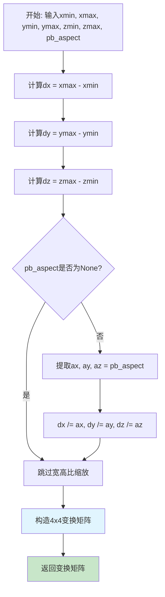
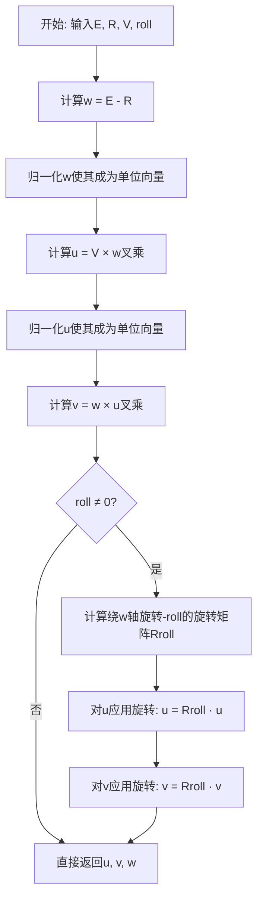
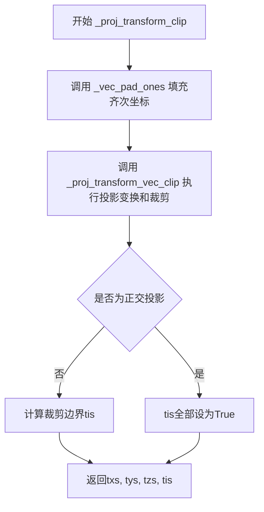
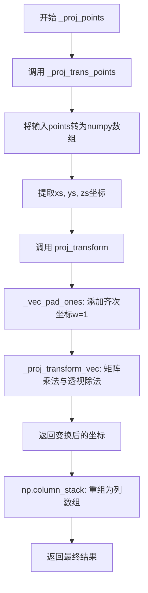
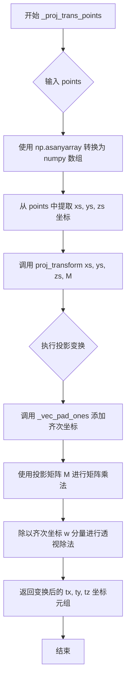

# `matplotlib\lib\mpl_toolkits\mplot3d\proj3d.py` 详细设计文档

该模块提供3D图形渲染所需的各类坐标变换函数，包括世界坐标到标准化设备坐标的变换、摄像机视图变换、透视/正交投影变换以及投影向量的批处理等核心功能。

## 整体流程

```mermaid
graph TD
    A[输入3D坐标点] --> B[world_transformation]
    B --> C[世界坐标到[0,1]标准化]
    C --> D[_view_axes]
    D --> E[计算摄像机视角轴向量u,v,w]
    E --> F[_view_transformation_uvw]
    F --> G[构建视图变换矩阵M]
    G --> H{投影类型}
    H -->|透视投影| I[_persp_transformation]
    H -->|正交投影| J[_ortho_transformation]
    I --> K[proj_transform]
    J --> K
    K --> L[_proj_transform_vec]
    K --> M[_proj_transform_vectors]
    L --> N[输出2D屏幕坐标]
    M --> N
    K --> O[_proj_transform_vec_clip]
    O --> P[裁剪后坐标和可见性标记]
```

## 类结构

```
该文件为纯函数模块，无类定义
所有函数分为以下几组：
├── 坐标变换主函数
│   ├── world_transformation
│   ├── proj_transform
│   ├── inv_transform
│   └── proj_transform_clip (已废弃)
├── 视图变换函数
│   ├── _view_axes
│   └── _view_transformation_uvw
├── 投影矩阵生成函数
│   ├── _persp_transformation
│   └── _ortho_transformation
├── 旋转变换函数
│   └── _rotation_about_vector
└── 向量处理辅助函数
    ├── _proj_transform_vec
    ├── _proj_transform_vectors
    ├── _proj_transform_vec_clip
    ├── _vec_pad_ones
    ├── _proj_points
    └── _proj_trans_points
```

## 全局变量及字段


### `dx`
    
世界变换中 x 轴的取值范围，即 xmax - xmin，用于归一化坐标。

类型：`float`
    


### `dy`
    
世界变换中 y 轴的取值范围，即 ymax - ymin，用于归一化坐标。

类型：`float`
    


### `dz`
    
世界变换中 z 轴的取值范围，即 zmax - zmin，用于归一化坐标。

类型：`float`
    


### `pb_aspect`
    
可选的绘图框宽高比，指定各轴在归一化时的缩放因子。

类型：`tuple or None`
    


### `ax`
    
绘图框宽高比中 x 维度的缩放因子。

类型：`float`
    


### `ay`
    
绘图框宽高比中 y 维度的缩放因子。

类型：`float`
    


### `az`
    
绘图框宽高比中 z 维度的缩放因子。

类型：`float`
    


### `vx`
    
单位向量 v 归一化后的 x 分量。

类型：`float`
    


### `vy`
    
单位向量 v 归一化后的 y 分量。

类型：`float`
    


### `vz`
    
单位向量 v 归一化后的 z 分量。

类型：`float`
    


### `s`
    
旋转角度的正弦值，用于构造旋转矩阵。

类型：`float`
    


### `c`
    
旋转角度的余弦值，用于构造旋转矩阵。

类型：`float`
    


### `t`
    
两倍 sin²(θ/2) 的值，用于数值稳定的旋转矩阵计算。

类型：`float`
    


### `R`
    
3×3 旋转矩阵，实现绕任意向量的旋转。

类型：`np.ndarray`
    


### `w`
    
从摄像机指向目标的单位视线向量（指向屏幕外）。

类型：`np.ndarray`
    


### `u`
    
指向屏幕右侧的单位向量。

类型：`np.ndarray`
    


### `v`
    
指向屏幕上方的单位向量。

类型：`np.ndarray`
    


### `Mr`
    
4×4 视图旋转矩阵，将 u、v、w 写入变换矩阵的左上角。

类型：`np.ndarray`
    


### `Mt`
    
4×4 视图平移矩阵，用于将摄像机位置 E 移至原点。

类型：`np.ndarray`
    


### `M`
    
组合后的 4×4 视图变换矩阵，等于 Mr 与 Mt 的乘积。

类型：`np.ndarray`
    


### `e`
    
透视投影的焦距，决定投影的深度比例。

类型：`float`
    


### `a`
    
透视投影的宽高比（本代码中固定为 1）。

类型：`float`
    


### `b`
    
透视投影深度变换的缩放因子。

类型：`float`
    


### `c`
    
透视投影深度变换的偏移项。

类型：`float`
    


### `proj_matrix`
    
4×4 投影矩阵，用于将 3D 坐标转换为裁剪坐标。

类型：`np.ndarray`
    


### `vecw`
    
齐次坐标向量与投影矩阵相乘后得到的 4 分量向量。

类型：`np.ndarray`
    


### `ts`
    
经过透视除法后的 (x, y, z) 坐标。

类型：`np.ndarray`
    


### `vecs_shape`
    
输入向量数组的原始形状，用于后续 reshape。

类型：`tuple`
    


### `vecs_pad`
    
在向量末尾填充一维全 1，使其成为齐次坐标。

类型：`np.ndarray`
    


### `product`
    
投影矩阵与填充后向量相乘得到的矩阵。

类型：`np.ndarray`
    


### `tvecs`
    
透视除法后得到的变换后向量。

类型：`np.ndarray`
    


### `txs`
    
投影并裁剪后的 x 坐标。

类型：`np.ndarray`
    


### `tys`
    
投影并裁剪后的 y 坐标。

类型：`np.ndarray`
    


### `tzs`
    
投影并裁剪后的 z 坐标。

类型：`np.ndarray`
    


### `tis`
    
布尔掩码，标记哪些点在视锥体内（未被裁剪）。

类型：`np.ndarray (bool)`
    


### `vec`
    
齐次坐标向量（或向量数组），用于投影或逆投影变换。

类型：`np.ndarray`
    


### `vecr`
    
逆变换矩阵作用后的坐标向量，已进行透视除法。

类型：`np.ndarray`
    


### `points`
    
待投影的 3D 点集合，每行对应一个点的 (x, y, z) 坐标。

类型：`np.ndarray`
    


### `xs`
    
输入点的 x 坐标数组。

类型：`np.ndarray`
    


### `ys`
    
输入点的 y 坐标数组。

类型：`np.ndarray`
    


### `zs`
    
输入点的 z 坐标数组。

类型：`np.ndarray`
    


    

## 全局函数及方法


### `world_transformation`

生成一个变换矩阵，将指定三维空间范围内的齐次坐标映射到归一化的设备坐标（[0,1]或根据绘图框宽高比调整）。该矩阵用于3D图形渲染中的坐标变换。

参数：

- `xmin`：`float`，x轴范围的最小值
- `xmax`：`float`，x轴范围的最大值
- `ymin`：`float`，y轴范围的最小值
- `ymax`：`float`，y轴范围的最大值
- `zmin`：`float`，z轴范围的最小值
- `zmax`：`float`，z轴范围的最大值
- `pb_aspect`：`可选的3元素序列（如tuple或list）`，绘图框宽高比，若指定则将范围缩放到[0, pb_aspect[i]]，默认为None

返回值：`numpy.ndarray`，4x4的变换矩阵，用于将世界坐标系的点映射到归一化设备坐标系

#### 流程图



#### 带注释源码

```python
def world_transformation(xmin, xmax,
                         ymin, ymax,
                         zmin, zmax, pb_aspect=None):
    """
    Produce a matrix that scales homogeneous coords in the specified ranges
    to [0, 1], or [0, pb_aspect[i]] if the plotbox aspect ratio is specified.
    """
    # 计算各轴的范围长度
    dx = xmax - xmin
    dy = ymax - ymin
    dz = zmax - zmin
    
    # 如果指定了绘图框宽高比，则按比例缩放各轴范围
    # 这样可以将坐标映射到符合视觉比例的归一化空间
    if pb_aspect is not None:
        ax, ay, az = pb_aspect
        dx /= ax
        dy /= ay
        dz /= az

    # 构建4x4齐次坐标变换矩阵
    # 该矩阵实现: new_coord = (coord - min) / (max - min)
    # 即: 将 [min, max] 范围映射到 [0, 1]
    # 矩阵形式:
    # | 1/dx    0    0  -xmin/dx |
    # |   0   1/dy    0  -ymin/dy|
    # |   0     0   1/dz -zmin/dz|
    # |   0     0     0         1|
    return np.array([[1/dx,    0,    0, -xmin/dx],
                     [   0, 1/dy,    0, -ymin/dy],
                     [   0,    0, 1/dz, -zmin/dz],
                     [   0,    0,    0,        1]])
```


### `_rotation_about_vector`

该函数是三维图形变换模块中的核心数学工具，用于计算围绕空间中任意给定轴向量旋转特定角度的旋转矩阵。它通过归一化输入向量并利用罗德里格斯旋转公式（Rodrigues' rotation formula）的数值稳定变体来构建 3x3 正交矩阵。

参数：

- `v`：`numpy.ndarray` 或 `list`，定义旋转轴的向量。
- `angle`：`float`，旋转的角度大小，单位为弧度。

返回值：`numpy.ndarray`，返回一个 3x3 的旋转矩阵。

#### 流程图

```mermaid
graph TD
    A[输入: 向量 v, 角度 angle] --> B{标准化向量 v}
    B --> C[计算分量: vx, vy, vz]
    C --> D[计算三角函数: s, c, t]
    D --> E[构建旋转矩阵 R (3x3)]
    E --> F[返回矩阵 R]
```

#### 带注释源码

```python
def _rotation_about_vector(v, angle):
    """
    Produce a rotation matrix for an angle in radians about a vector.
    """
    # 1. 将输入向量归一化为单位向量，获取其方向分量
    vx, vy, vz = v / np.linalg.norm(v)
    
    # 2. 计算正弦和余弦值
    s = np.sin(angle)
    c = np.cos(angle)
    
    # 3. 计算因子 t = 2*sin^2(angle/2)
    # 使用这个公式比 t = 1-c 在数值上更稳定，尤其是当角度接近 0 时
    t = 2*np.sin(angle/2)**2  

    # 4. 根据罗德里格斯公式构建旋转矩阵
    # R = I * c + (1-c) * (v_hat * v_hat^T) + S * s
    # 其中 S 是反对称矩阵
    R = np.array([
        [t*vx*vx + c,    t*vx*vy - vz*s, t*vx*vz + vy*s], # 第一行
        [t*vy*vx + vz*s, t*vy*vy + c,    t*vy*vz - vx*s], # 第二行
        [t*vz*vx - vy*s, t*vz*vy + vx*s, t*vz*vz + c]])   # 第三行

    return R
```


### `_view_axes`

获取数据坐标系中的单位视图轴向量，用于将3D世界坐标转换为2D屏幕坐标。该函数根据相机位置、观察目标和垂直方向计算视图的右、上和外三个正交单位向量，并可选地应用滚动旋转。

参数：

- `E`：`numpy.ndarray`（3元素数组），相机/眼睛的位置坐标
- `R`：`numpy.ndarray`（3元素数组），视框中心的坐标（观察目标点）
- `V`：`numpy.ndarray`（3元素数组），垂直轴方向的单位向量
- `roll`：`float`，滚动角度（弧度）

返回值：`tuple[numpy.ndarray, numpy.ndarray, numpy.ndarray]`，返回三个单位向量——u指向屏幕右侧，v指向屏幕顶部，w指向屏幕外（从屏幕指向观察者）

#### 流程图



#### 带注释源码

```python
def _view_axes(E, R, V, roll):
    """
    Get the unit viewing axes in data coordinates.

    Parameters
    ----------
    E : 3-element numpy array
        The coordinates of the eye/camera.
    R : 3-element numpy array
        The coordinates of the center of the view box.
    V : 3-element numpy array
        Unit vector in the direction of the vertical axis.
    roll : float
        The roll angle in radians.

    Returns
    -------
    u : 3-element numpy array
        Unit vector pointing towards the right of the screen.
    v : 3-element numpy array
        Unit vector pointing towards the top of the screen.
    w : 3-element numpy array
        Unit vector pointing out of the screen.
    """
    # 计算视线方向向量w（从观察目标指向相机的方向）
    w = (E - R)
    # 归一化w使其成为单位向量（视线方向）
    w = w/np.linalg.norm(w)
    
    # 计算屏幕右侧方向向量u：垂直轴V与视线w的叉乘
    u = np.cross(V, w)
    # 归一化u使其成为单位向量
    u = u/np.linalg.norm(u)
    
    # 计算屏幕顶部方向向量v：视线w与右侧u的叉乘
    # 由于w和u都是单位向量且正交，v自动成为单位向量
    v = np.cross(w, u)  # Will be a unit vector

    # 当roll=0时跳过计算（节省计算资源）
    if roll != 0:
        # 相机正向旋转等价于世界坐标反向旋转
        # 绕视图轴w旋转-roll角度（负号表示反向旋转）
        Rroll = _rotation_about_vector(w, -roll)
        # 对u和v应用滚动旋转矩阵
        u = np.dot(Rroll, u)
        v = np.dot(Rroll, v)
    
    # 返回三个单位视图轴向量
    return u, v, w
```


### `_view_transformation_uvw`

该函数用于生成3D图形渲染中的视图变换矩阵（View Transformation Matrix），通过旋转矩阵将世界坐标系转换到相机坐标系，并结合平移矩阵将相机位置移至原点，最终返回组合后的4x4齐次坐标变换矩阵。

参数：

- `u`：`numpy.ndarray`（3元素数组），指向屏幕右侧的单位向量
- `v`：`numpy.ndarray`（3元素数组），指向屏幕顶部的单位向量
- `w`：`numpy.ndarray`（3元素数组），指向屏幕外侧（视线方向）的单位向量
- `E`：`numpy.ndarray`（3元素数组），相机/视点的坐标

返回值：`numpy.ndarray`，4x4的视图变换矩阵

#### 流程图

```mermaid
flowchart TD
    A[开始 _view_transformation_uvw] --> B[创建4x4单位矩阵 Mr]
    B --> C[创建4x4单位矩阵 Mt]
    C --> D[将u, v, w写入Mr[:3, :3]构成旋转矩阵]
    D --> E[将-E写入Mt[:3, -1]构成平移矩阵]
    E --> F[计算 M = Mr × Mt]
    F --> G[返回视图变换矩阵M]
```

#### 带注释源码

```python
def _view_transformation_uvw(u, v, w, E):
    """
    Return the view transformation matrix.

    Parameters
    ----------
    u : 3-element numpy array
        Unit vector pointing towards the right of the screen.
    v : 3-element numpy array
        Unit vector pointing towards the top of the screen.
    w : 3-element numpy array
        Unit vector pointing out of the screen.
    E : 3-element numpy array
        The coordinates of the eye/camera.
    """
    # 创建一个4x4单位矩阵，用于构建旋转矩阵R
    # R矩阵将世界坐标系的基向量转换为相机坐标系的基向量
    Mr = np.eye(4)
    
    # 创建另一个4x4单位矩阵，用于构建平移矩阵T
    # 平移矩阵将相机位置E平移至原点（世界坐标系的原点）
    Mt = np.eye(4)
    
    # 将三个单位向量u, v, w按行填充到旋转矩阵的左上3x3区域
    # 这三个向量构成了从世界坐标系到相机坐标系的旋转矩阵
    # u: 右方向, v: 上方向, w: 视线方向（向外）
    Mr[:3, :3] = [u, v, w]
    
    # 将平移向量-E设置到平移矩阵的最后一列的前三行
    # 由于齐次坐标中平移位于矩阵的(0,3), (1,3), (2,3)位置
    # 取负是因为要反向平移：将点从世界坐标转换到相机坐标
    Mt[:3, -1] = -E
    
    # 计算最终的视图变换矩阵：先平移后旋转
    # 矩阵乘法顺序：M = R × T
    # 这将世界坐标中的点转换到相机坐标系中
    M = np.dot(Mr, Mt)
    
    # 返回完整的4x4视图变换矩阵
    return M
```


### `_persp_transformation`

该函数用于生成3D透视投影矩阵，根据近裁剪平面、远裁剪平面和焦距计算并返回一个4x4的投影变换矩阵，用于将3D坐标转换为透视投影后的坐标。

参数：

- `zfront`：`float`，近裁剪平面到原点的距离（Z轴正向）
- `zback`：`float`，远裁剪平面到原点的距离（Z轴正向）
- `focal_length`：`float`，相机的焦距，控制透视效果的强弱

返回值：`numpy.ndarray`，4x4的透视投影矩阵

#### 流程图

```mermaid
flowchart TD
    A[开始] --> B[获取focal_length作为e]
    B --> C[设定aspect ratio a=1]
    C --> D[计算 b = (zfront+zback)/(zfront-zback)]
    D --> E[计算 c = -2*(zfront*zback)/(zfront-zback)]
    E --> F[构建4x4投影矩阵]
    F --> G[[e, 0, 0, 0],
           [0, e/a, 0, 0],
           [0, 0, b, c],
           [0, 0, -1, 0]]
    G --> H[返回proj_matrix]
```

#### 带注释源码

```python
def _persp_transformation(zfront, zback, focal_length):
    """
    生成透视投影矩阵。
    
    参数:
        zfront: 近裁剪平面距离
        zback: 远裁剪平面距离
        focal_length: 焦距
    返回:
        4x4透视投影矩阵
    """
    e = focal_length  # 焦距参数
    a = 1  # 宽高比，固定为1
    
    # 计算透视投影矩阵的b和c参数
    # b控制远近距离的缩放，c控制平移
    b = (zfront+zback)/(zfront-zback)
    c = -2*(zfront*zback)/(zfront-zback)
    
    # 构建透视投影矩阵
    # 矩阵形式为:
    # | e   0  0  0 |
    # | 0  e/a 0  0 |
    # | 0   0  b  c |
    # | 0   0 -1  0 |
    proj_matrix = np.array([[e,   0,  0, 0],
                            [0, e/a,  0, 0],
                            [0,   0,  b, c],
                            [0,   0, -1, 0]])
    return proj_matrix
```


### `_ortho_transformation`

该函数用于生成正交投影（Orthographic Projection）变换矩阵，常用于3D图形渲染中将三维坐标映射到二维裁剪空间。

参数：

- `zfront`：`float` 或 `int`，前裁剪平面的Z坐标（靠近观察者）
- `zback`：`float` 或 `int`，后裁剪平面的Z坐标（远离观察者）

返回值：`numpy.ndarray`，4x4的正交投影变换矩阵

#### 流程图

```mermaid
flowchart TD
    A[开始] --> B[接收参数 zfront 和 zback]
    B --> C[计算 a = -(zfront + zback)]
    C --> D[计算 b = -(zfront - zback)]
    D --> E[构建4x4投影矩阵]
    E --> F[返回投影矩阵]
    
    style A fill:#f9f,color:#000
    style F fill:#9f9,color:#000
```

#### 带注释源码

```python
def _ortho_transformation(zfront, zback):
    """
    生成正交投影矩阵，用于3D到2D的映射变换
    
    注意：返回向量中的w分量将是(zback - zfront)，而不是1
    这是正交投影与透视投影的关键区别
    """
    # 计算投影矩阵元素a：前后平面的和的负值
    # 用于控制z轴的缩放和偏移
    a = -(zfront + zback)
    
    # 计算投影矩阵元素b：前后平面差的负值
    # 用于控制z轴的范围
    b = -(zfront - zback)
    
    # 构建4x4正交投影矩阵
    # x和y轴缩放因子为2（将范围[-1,1]映射到[0,1]或类似范围）
    # z轴使用a和b进行线性变换
    proj_matrix = np.array([[2, 0,  0, 0],    # x轴：保持x坐标，缩放2倍
                            [0, 2,  0, 0],    # y轴：保持y坐标，缩放2倍
                            [0,  0, -2, 0],  # z轴：反转并缩放2倍
                            [0,  0,  a, b]]) # 最后一列：z轴偏移和缩放
    
    return proj_matrix
```

#### 关键特性说明

| 特性 | 说明 |
|------|------|
| 投影类型 | 正交投影（平行投影），无透视缩小效果 |
| 矩阵维度 | 4×4 齐次坐标矩阵 |
| x/y轴缩放 | 固定为2 |
| z轴处理 | 通过a、b参数进行线性映射 |
| w分量 | 不同于透视投影，此处w分量保持为(zback-zfront)而非1 |


### `_proj_transform_vec`

该函数执行投影变换，将三维齐次坐标向量通过投影矩阵变换为归一化设备坐标（NDC），同时处理掩码数组以保留无效点。

参数：

- `vec`：对象，包含 `.data` 属性的向量数据，通常是 4 元素齐次坐标数组，支持掩码数组（masked array）
- `M`：`numpy.ndarray`，4x4 的投影变换矩阵

返回值：`tuple`，返回转换后的 x、y、z 坐标分量（归一化设备坐标），类型为 `numpy.ndarray` 或 `numpy.ma.array`

#### 流程图

```mermaid
flowchart TD
    A[开始] --> B[输入: vec, M]
    B --> C[计算 vecw = np.dotM, vec.data]
    C --> D[透视除法: ts = vecw[0:3]/vecw[3]]
    D --> E{检查 vec 是否为掩码数组?}
    E -->|是| F[保留掩码: ts = np.ma.arrayts, mask=vec.mask]
    E -->|否| G[直接使用 ts]
    F --> H[返回 ts[0], ts[1], ts[2]]
    G --> H
```

#### 带注释源码

```python
def _proj_transform_vec(vec, M):
    """
    对单个向量进行投影变换
    
    Parameters
    ----------
    vec : 对象
        包含 .data 属性的向量，通常是4元素齐次坐标
    M : numpy.ndarray
        4x4 投影变换矩阵
    """
    # 将齐次坐标与投影矩阵相乘，得到变换后的齐次坐标
    vecw = np.dot(M, vec.data)
    
    # 执行透视除法：将前三个分量除以第四个分量（齐次坐标w）
    # 将坐标从齐次空间转换到归一化设备坐标空间
    ts = vecw[0:3]/vecw[3]
    
    # 检查输入是否为掩码数组（Masked Array）
    # 如果是，需要保留原始掩码信息以标记无效/裁剪点
    if np.ma.isMA(vec):
        ts = np.ma.array(ts, mask=vec.mask)
    
    # 返回转换后的 x, y, z 坐标
    return ts[0], ts[1], ts[2]
```


### `_proj_transform_vectors`

该函数是 `_proj_transform_vec` 的向量化版本，用于对批量三维向量进行投影矩阵变换，支持任意维度的输入数组（最后维度为3），通过添加齐次坐标、应用投影矩阵、透视除法等步骤将三维向量从世界坐标转换到投影坐标。

参数：

- `vecs`：... × 3 的 np.ndarray，输入的三维向量数组，最后一个维度必须为3
- `M`：4 × 4 的 np.ndarray，投影变换矩阵

返回值：... × 3 的 np.ndarray，变换后的三维向量数组，形状与输入 `vecs` 相同

#### 流程图

```mermaid
flowchart TD
    A[开始: _proj_transform_vectors] --> B[保存输入形状 vecs_shape]
    B --> C[将 vecs 重塑为 -1×3 并转置]
    D[创建 vecs_pad 数组] --> E[填充前三行数据]
    E --> F[最后一行填充为1]
    F --> G[np.dot计算: product = M × vecs_pad]
    G --> H[透视除法: tvecs = product[:3] / product[3]]
    H --> I[转置并重塑为原始形状 vecs_shape]
    I --> J[返回变换后的向量]
```

#### 带注释源码

```python
def _proj_transform_vectors(vecs, M):
    """
    Vectorized version of ``_proj_transform_vec``.
    
    此函数是 _proj_transform_vec 的向量化版本，支持批量处理任意形状的
    三维向量数组（只要最后维度为3），通过矩阵运算实现高效的投影变换。

    Parameters
    ----------
    vecs : ... x 3 np.ndarray
        输入向量数组，例如 (n, 3)、(n, m, 3) 等形状，最后一个维度必须是3
    M : 4 x 4 np.ndarray
        4x4 投影变换矩阵，用于将齐次坐标转换为投影坐标

    Returns
    -------
    ... x 3 np.ndarray
        变换后的向量数组，形状与输入 vecs 相同
    """
    # 步骤1: 保存原始输入形状，以便最后恢复
    vecs_shape = vecs.shape
    
    # 步骤2: 将输入向量重塑为 (3, -1) 的矩阵并转置
    # 例如将 (n, 3) 转换为 (3, n)，便于后续矩阵乘法
    vecs = vecs.reshape(-1, 3).T

    # 步骤3: 创建扩展矩阵，添加齐次坐标（w分量）
    # 从 (3, n) 扩展为 (4, n)，最后一行填充为1
    vecs_pad = np.empty((vecs.shape[0] + 1,) + vecs.shape[1:])  # 创建 (4, n) 数组
    vecs_pad[:-1] = vecs      # 复制原始三维坐标到前三行
    vecs_pad[-1] = 1          # 最后一行的齐次坐标设为1

    # 步骤4: 应用投影变换矩阵
    # M 是 4x4 矩阵，vecs_pad 是 4xn 矩阵
    # 结果 product 是 4xn 矩阵
    product = np.dot(M, vecs_pad)

    # 步骤5: 执行透视除法（Perspective Division）
    # 将齐次坐标转换为实际的三维坐标
    # product[3] 是 w 分量，product[:3] 是 x, y, z 分量
    tvecs = product[:3] / product[3]

    # 步骤6: 转置并重塑为原始输入形状
    # 从 (3, n) 转置回 (n, 3)，再按原始形状重塑
    return tvecs.T.reshape(vecs_shape)
```


### `_proj_transform_vec_clip`

该函数执行3D向量到裁剪空间的投影变换，通过投影矩阵将向量变换后，计算其在裁剪空间中的坐标，并根据视锥体裁剪规则生成裁剪状态掩码，支持透视投影和正交投影两种模式。

参数：

- `vec`：numpy数组（或MaskedArray），形状为 (4, ...) 的齐次坐标向量，其中最后一行应为齐次坐标w分量
- `M`：4×4 numpy数组，投影变换矩阵
- `focal_length`：float，焦距长度，用于判断投影类型；若为无穷大则为正交投影，否则为透视投影

返回值：`(txs, tys, tzs, tis)`，均为numpy数组（或MaskedArray），其中 txs/tys/tzs 是变换后的x/y/z坐标，tis 是布尔类型掩码表示各点是否在裁剪范围内

#### 流程图

```mermaid
flowchart TD
    A[开始: 输入vec, M, focal_length] --> B[计算vecw = M × vec.data]
    B --> C[计算透视除法: txs/tys/tzs = vecw[0:3] / vecw[3]]
    C --> D{focal_length是否为无穷大?}
    D -->|是| E[正交投影: tis = 全1数组]
    D -->|否| F[透视投影: tis = 裁剪条件判断]
    F --> G{vec[0]是MaskedArray?}
    G -->|是| H[tis &= ~vec[0].mask]
    G -->|否| I{vec[1]是MaskedArray?}
    H --> I
    I -->|是| J[tis &= ~vec[1].mask]
    I -->|否| K{vec[2]是MaskedArray?}
    J --> K
    K -->|是| L[tis &= ~vec[2].mask]
    K -->|否| M[创建被屏蔽的坐标数组]
    L --> M
    E --> M
    M --> N[返回 txs, tys, tzs, tis]
```

#### 带注释源码

```python
def _proj_transform_vec_clip(vec, M, focal_length):
    """
    Transform vectors and compute clipping information.
    
    Parameters
    ----------
    vec : numpy.ndarray
        Homogeneous coordinate vectors with shape (4, ...), 
        where the last row is the w component.
    M : numpy.ndarray
        4x4 projection transformation matrix.
    focal_length : float
        Focal length. If infinity, use orthographic projection;
        otherwise use perspective projection.
    
    Returns
    -------
    txs, tys, tzs : numpy.ndarray or numpy.ma.MaskedArray
        Transformed x, y, z coordinates in clip space.
    tis : numpy.ndarray
        Boolean mask indicating whether each point is within 
        the clipping region.
    """
    # Step 1: Apply projection matrix to homogeneous coordinates
    # vecw = M @ vec.data performs the matrix-vector multiplication
    vecw = np.dot(M, vec.data)
    
    # Step 2: Perform perspective division to convert to clip space coordinates
    # Divide x, y, z by w component to get normalized device coordinates
    txs, tys, tzs = vecw[0:3] / vecw[3]
    
    # Step 3: Determine clipping mask based on projection type
    # For orthographic projection (infinite focal length), no clipping needed
    if np.isinf(focal_length):  # don't clip orthographic projection
        tis = np.ones(txs.shape, dtype=bool)
    else:
        # For perspective projection, apply frustum clipping:
        # - x and y must be within [-1, 1]
        # - z must be <= 0 (in front of camera)
        tis = (-1 <= txs) & (txs <= 1) & (-1 <= tys) & (tys <= 1) & (tzs <= 0)
    
    # Step 4: Handle masked array inputs - exclude masked points from clipping
    # If any coordinate component is a masked array, incorporate its mask
    if np.ma.isMA(vec[0]):
        tis = tis & ~vec[0].mask
    if np.ma.isMA(vec[1]):
        tis = tis & ~vec[1].mask
    if np.ma.isMA(vec[2]):
        tis = tis & ~vec[2].mask
    
    # Step 5: Apply clipping mask to transform coordinates
    # Points outside the clipping region are masked out
    txs = np.ma.masked_array(txs, ~tis)
    tys = np.ma.masked_array(tys, ~tis)
    tzs = np.ma.masked_array(tzs, ~tis)
    
    return txs, tys, tzs, tis
```


### `inv_transform`

该函数通过投影矩阵的逆矩阵将3D坐标（xs, ys, zs）从投影空间变换回世界空间，实现3D坐标的反向投影转换。

参数：

- `xs`：`numpy.ndarray`，输入的x坐标
- `ys`：`numpy.ndarray`，输入的y坐标
- `zs`：`numpy.ndarray`，输入的z坐标
- `invM`：`numpy.ndarray`，4x4的逆投影变换矩阵

返回值：`tuple`，返回变换后的世界坐标 (xr, yr, zr)

#### 流程图

```mermaid
flowchart TD
    A[开始 inv_transform] --> B[调用 _vec_pad_ones 添加齐次坐标]
    B --> C[计算矩阵乘法: vecr = np.dotinvM, vec]
    C --> D{vecr.shape == 4?}
    D -->|是| E[reshape为4x1]
    D -->|否| F[继续]
    E --> F
    F --> G[遍历每个点 i]
    G --> H{vecr[3][i] != 0?}
    H -->|是| I[齐次除法: vecr[:, i] /= vecr[3][i]]
    H -->|否| J[跳过除法]
    I --> K[返回 vecr[0], vecr[1], vecr[2]]
    J --> K
```

#### 带注释源码

```python
def inv_transform(xs, ys, zs, invM):
    """
    Transform the points by the inverse of the projection matrix, *invM*.
    
    通过投影矩阵的逆矩阵将点从投影空间变换回世界空间。
    
    Parameters
    ----------
    xs : numpy.ndarray
        输入的x坐标
    ys : numpy.ndarray
        输入的y坐标
    zs : numpy.ndarray
        输入的z坐标
    invM : numpy.ndarray
        4x4的逆投影变换矩阵
    
    Returns
    -------
    xr, yr, zr : tuple of numpy.ndarray
        变换后的世界坐标
    """
    # Step 1: 将输入坐标转换为齐次坐标 [x, y, z, 1]
    vec = _vec_pad_ones(xs, ys, zs)
    
    # Step 2: 使用逆矩阵进行线性变换
    # invM: 4x4矩阵, vec: 4xn矩阵 (n为点的数量)
    vecr = np.dot(invM, vec)
    
    # Step 3: 处理标量情况（单个点），将形状从(4,)转换为(4,1)
    if vecr.shape == (4,):
        vecr = vecr.reshape((4, 1))
    
    # Step 4: 对每个点进行齐次除法（透视除法）
    # 将齐次坐标转换回欧几里得坐标
    for i in range(vecr.shape[1]):
        if vecr[3][i] != 0:  # 检查w分量是否为0，避免除零错误
            vecr[:, i] = vecr[:, i] / vecr[3][i]
    
    # Step 5: 返回变换后的x, y, z坐标（去除齐次坐标w分量）
    return vecr[0], vecr[1], vecr[2]
```

---

#### 依赖函数：`_vec_pad_ones`

```python
def _vec_pad_ones(xs, ys, zs):
    """
    将输入的x, y, z坐标数组添加齐次坐标分量（值为1的w分量）
    用于将3D欧几里得坐标转换为4D齐次坐标
    
    Parameters
    ----------
    xs, ys, zs : numpy.ndarray 或 numpy.ma.MaskedArray
        输入的坐标数组
    
    Returns
    -------
    numpy.ndarray 或 numpy.ma.MaskedArray
        4xn的齐次坐标数组 [xs, ys, zs, ones]
    """
    # 检查输入是否为掩码数组（MaskedArray）
    if np.ma.isMA(xs) or np.ma.isMA(ys) or np.ma.isMA(zs):
        # 如果是掩码数组，保持掩码属性
        return np.ma.array([xs, ys, zs, np.ones_like(xs)])
    else:
        # 普通numpy数组
        return np.array([xs, ys, zs, np.ones_like(xs)])
```


### `_vec_pad_ones`

将三维坐标向量（xs, ys, zs）转换为四维齐次坐标表示，通过添加全1的第四个分量来实现。

参数：

-  `xs`：`array-like`，输入的 x 坐标数据
-  `ys`：`array-like`，输入的 y 坐标数据
-  `zs`：`array-like`，输入的 z 坐标数据

返回值：`numpy.ndarray` 或 `numpy.ma.array`，四行数组，第一至三行为输入坐标，第四行为与 xs 形状相同的全1数组（齐次坐标）

#### 流程图

```mermaid
flowchart TD
    A[开始] --> B{检查输入是否为 MaskedArray}
    B -->|是| C[创建 numpy.ma.array]
    B -->|否| D[创建 numpy.array]
    C --> E[返回 [xs, ys, zs, ones_like(xs)] 齐次坐标]
    D --> E
    E --> F[结束]
```

#### 带注释源码

```python
def _vec_pad_ones(xs, ys, zs):
    """
    将三维坐标向量转换为齐次坐标表示（添加第四个分量1）。

    Parameters
    ----------
    xs : array-like
        输入的 x 坐标数据
    ys : array-like
        输入的 y 坐标数据
    zs : array-like
        输入的 z 坐标数据

    Returns
    -------
    numpy.ndarray 或 numpy.ma.array
        四行数组 [xs, ys, zs, ones_like(xs)]，构成齐次坐标表示
    """
    # 检查输入是否为 MaskedArray（带掩码的数组）
    if np.ma.isMA(xs) or np.ma.isMA(ys) or np.ma.isMA(zs):
        # 如果任一输入是 MaskedArray，返回 MaskedArray 类型的齐次坐标
        return np.ma.array([xs, ys, zs, np.ones_like(xs)])
    else:
        # 普通数组情况，返回标准 numpy 数组
        return np.array([xs, ys, zs, np.ones_like(xs)])
```


### proj_transform

该函数通过将输入的三维坐标（xs, ys, zs）与全1向量拼接形成齐次坐标，然后使用投影矩阵M进行线性变换，最终返回变换后的三维坐标。这是3D图形管线中从模型坐标到投影坐标的关键转换步骤。

参数：

- `xs`：`numpy.ndarray` 或 `numpy.ma.MaskedArray`，输入的 x 坐标
- `ys`：`numpy.ndarray` 或 `numpy.ma.MaskedArray`，输入的 y 坐标
- `zs`：`numpy.ndarray` 或 `numpy.ma.MaskedArray`，输入的 z 坐标
- `M`：`numpy.ndarray`，4x4 的投影变换矩阵

返回值：`tuple`，包含变换后的 (tx, ty, tz) 三个坐标分量

#### 流程图

```mermaid
graph TD
    A[proj_transform xs, ys, zs, M] --> B[_vec_pad_ones xs, ys, zs]
    B --> C{检测是否为MaskedArray}
    C -->|是| D[创建ma.array: xs, ys, zs, ones_likexs]
    C -->|否| E[创建np.array: xs, ys, zs, ones_likexs]
    D --> F[vec 齐次坐标向量]
    E --> F
    F --> G[_proj_transform_vec vec, M]
    G --> H[vecw = M dot vec.data]
    H --> I[ts = vecw[0:3] / vecw[3]]
    I --> J{vec是MaskedArray?}
    J -->|是| K[应用mask到ts]
    J -->|否| L[直接返回ts]
    K --> M[return ts0, ts1, ts2]
    L --> M
    M --> N[返回变换后的 tx, ty, tz]
```

#### 带注释源码

```python
def proj_transform(xs, ys, zs, M):
    """
    Transform the points by the projection matrix *M*.
    
    Parameters
    ----------
    xs : numpy.ndarray or numpy.ma.MaskedArray
        Input x coordinates
    ys : numpy.ndarray or numpy.ma.MaskedArray
        Input y coordinates
    zs : numpy.ndarray or numpy.ma.MaskedArray
        Input z coordinates
    M : numpy.ndarray
        4x4 projection transformation matrix
        
    Returns
    -------
    tuple
        Transformed (tx, ty, tz) coordinates
    """
    # Step 1: 将输入的三维坐标转换为齐次坐标 [x, y, z, 1]
    # 这样可以与4x4的投影矩阵进行矩阵乘法
    vec = _vec_pad_ones(xs, ys, zs)
    
    # Step 2: 调用内部函数执行实际的投影变换
    # _proj_transform_vec 会完成 M * vec 的矩阵乘法
    # 并进行透视除法（除以w分量）
    return _proj_transform_vec(vec, M)
```


### `_proj_transform_clip`

该函数用于将三维坐标通过投影矩阵进行变换，并根据焦点距离进行裁剪判断，返回变换后的坐标值及对应的裁剪状态掩码。

参数：

- `xs`：`numpy.ndarray` 或 `numpy.ma.MaskedArray`，待变换的 x 坐标
- `ys`：`numpy.ndarray` 或 `numpy.ma.MaskedArray`，待变换的 y 坐标
- `zs`：`numpy.ndarray` 或 `numpy.ma.MaskedArray`，待变换的 z 坐标
- `M`：`numpy.ndarray`，4x4 的投影变换矩阵
- `focal_length`：`float`，相机焦距，用于判断是正交投影（无穷大）还是透视投影

返回值：`tuple`，包含四个元素 (txs, tys, tzs, tis)，其中 txs/tys/tzs 是变换后的坐标（带掩码），tis 是布尔类型的裁剪状态掩码

#### 流程图

```mermaid
flowchart TD
    A[开始] --> B[调用 _vec_pad_ones 构造齐次坐标 vec]
    B --> C[调用 _proj_transform_vec_clip 执行变换和裁剪]
    C --> D[计算 vecw = M × vec.data]
    D --> E[计算 txs = vecw[0] / vecw[3]]
    E --> F[计算 tys = vecw[1] / vecw[3]]
    F --> G[计算 tzs = vecw[2] / vecw[3]]
    G --> H{focal_length 是否为无穷大?}
    H -->|是| I[tis = 全 True 数组]
    H -->|否| J[计算裁剪条件: -1≤txs≤1 且 -1≤tys≤1 且 tzs≤0]
    J --> K{检查各坐标是否为 MaskedArray}
    K -->|是| L[根据原掩码更新 tis]
    K -->|否| M[用 np.ma.masked_array 包装坐标]
    I --> M
    M --> N[返回 txs, tys, tzs, tis]
```

#### 带注释源码

```python
def _proj_transform_clip(xs, ys, zs, M, focal_length):
    """
    Transform the points by the projection matrix
    and return the clipping result
    returns txs, tys, tzs, tis
    """
    # 将输入的三维坐标转换为齐次坐标表示（添加第四维 w=1）
    vec = _vec_pad_ones(xs, ys, zs)
    # 调用内部函数执行投影变换和裁剪判断
    return _proj_transform_vec_clip(vec, M, focal_length)
```


### `_proj_transform_clip`

该函数是3D投影变换模块的核心组成部分，负责将三维坐标点通过投影矩阵变换到裁剪空间，并返回变换后的坐标及裁剪标记。

参数：

- `xs`：`numpy.ndarray` 或 `numpy.ma.MaskedArray`，输入的x坐标
- `ys`：`numpy.ndarray` 或 `numpy.ma.MaskedArray`，输入的y坐标
- `zs`：`numpy.ndarray` 或 `numpy.ma.MaskedArray`，输入的z坐标
- `M`：`numpy.ndarray`，4x4的投影变换矩阵
- `focal_length`：`float`，焦距参数，用于判断是否为正交投影（当为无穷大时）

返回值：`tuple`，包含 `(txs, tys, tzs, tis)` 四个元素：
- `txs`：`numpy.ndarray` 或 `numpy.ma.MaskedArray`，变换后的x坐标
- `tys`：`numpy.ndarray` 或 `numpy.ma.MaskedArray`，变换后的y坐标
- `tzs`：`numpy.ndarray` 或 `numpy.ma.MaskedArray`，变换后的z坐标
- `tis`：`numpy.ndarray`，布尔类型数组，表示各点是否在裁剪范围内

#### 流程图



#### 带注释源码

```python
def _proj_transform_clip(xs, ys, zs, M, focal_length):
    """
    Transform the points by the projection matrix
    and return the clipping result
    returns txs, tys, tzs, tis
    """
    # 将输入的三维坐标(xs, ys, zs)转换为齐次坐标向量
    # 齐次坐标格式: [xs, ys, zs, 1]，便于与4x4投影矩阵相乘
    vec = _vec_pad_ones(xs, ys, zs)
    
    # 调用底层投影变换函数，执行实际的矩阵乘法和裁剪计算
    # 返回变换后的坐标以及每个点是否在裁剪范围内(is_inside)
    return _proj_transform_vec_clip(vec, M, focal_length)
```


### `_proj_points`

该函数是3D投影变换的核心入口点，负责将一组3D点坐标通过给定的4x4投影矩阵转换为2D屏幕坐标。它首先调用内部函数将点分解为x、y、z坐标，执行投影变换，最后将变换结果重新组织为列向量形式返回。

参数：

- `points`：`numpy.ndarray`，形状为 (n, 3) 的三维点数组，每行代表一个点的 x, y, z 坐标
- `M`：`numpy.ndarray`，4x4 的投影变换矩阵，用于将3D坐标投影到2D平面

返回值：`numpy.ndarray`，形状为 (n, 3) 的变换后坐标数组，包含转换后的 x, y, z 值

#### 流程图



#### 带注释源码

```python
def _proj_points(points, M):
    """
    将一组3D点通过投影矩阵转换为2D屏幕坐标。
    
    Parameters
    ----------
    points : numpy.ndarray
        形状为 (n, 3) 的三维点数组，每行 [x, y, z]
    M : numpy.ndarray
        4x4 投影变换矩阵
        
    Returns
    -------
    numpy.ndarray
        形状为 (n, 3) 的变换后坐标数组
    """
    # 调用内部转换函数处理点和矩阵
    # 返回的是元组 (txs, tys, tzs)，每个元素是长度为n的数组
    transformed = _proj_trans_points(points, M)
    
    # 使用 column_stack 将元组中的三个数组合并成 (n, 3) 形状的二维数组
    # 每一行代表一个变换后的点坐标
    return np.column_stack(transformed)


def _proj_trans_points(points, M):
    """
    内部函数：将点数组分解并调用投影变换。
    
    Parameters
    ----------
    points : numpy.ndarray
        形状为 (n, 3) 的三维点数组
    M : numpy.ndarray
        4x4 投影变换矩阵
        
    Returns
    -------
    tuple
        三个一维数组 (txs, tys, tzs)
    """
    # 确保输入是 numpy 数组
    points = np.asanyarray(points)
    
    # 从 points 数组中提取 x, y, z 坐标列
    # points[:, 0] 获取所有行的第一列（x坐标）
    # points[:, 1] 获取所有行的第二列（y坐标）
    # points[:, 2] 获取所有行的第三列（z坐标）
    xs, ys, zs = points[:, 0], points[:, 1], points[:, 2]
    
    # 调用主变换函数 proj_transform 进行实际的矩阵变换
    return proj_transform(xs, ys, zs, M)


def proj_transform(xs, ys, zs, M):
    """
    使用投影矩阵 M 变换坐标点。
    
    Parameters
    ----------
    xs, ys, zs : numpy.ndarray
        坐标数组
    M : numpy.ndarray
        4x4 投影变换矩阵
        
    Returns
    -------
    tuple
        变换后的坐标 (txs, tys, tzs)
    """
    # 为坐标添加齐次坐标分量 w=1，将 (x,y,z) 扩展为 (x,y,z,1)
    # 这样可以与 4x4 矩阵进行乘法运算
    vec = _vec_pad_ones(xs, ys, zs)
    
    # 调用底层变换函数执行矩阵乘法和透视除法
    return _proj_transform_vec(vec, M)


def _vec_pad_ones(xs, ys, zs):
    """
    为坐标向量添加齐次坐标分量。
    
    Parameters
    ----------
    xs, ys, zs : numpy.ndarray
        坐标数组
        
    Returns
    -------
    numpy.ndarray 或 numpy.ma.array
        形状为 (4, n) 的齐次坐标数组，最后一行全为1
    """
    # 检查输入是否是掩码数组（Masked Array）
    if np.ma.isMA(xs) or np.ma.isMA(ys) or np.ma.isMA(zs):
        # 如果是掩码数组，返回掩码数组格式的齐次坐标
        return np.ma.array([xs, ys, zs, np.ones_like(xs)])
    else:
        # 普通数组，返回标准 numpy 数组格式的齐次坐标
        return np.array([xs, ys, zs, np.ones_like(xs)])


def _proj_transform_vec(vec, M):
    """
    执行实际的投影矩阵变换和透视除法。
    
    Parameters
    ----------
    vec : numpy.ndarray
        形状为 (4, n) 的齐次坐标数组
    M : numpy.ndarray
        4x4 投影变换矩阵
        
    Returns
    -------
    tuple
        变换后的坐标 (txs, tys, tzs)
    """
    # 执行矩阵乘法：M (4x4) @ vec (4xn) = vecw (4xn)
    vecw = np.dot(M, vec.data)
    
    # 透视除法：将前三个坐标分量除以第四个分量（w）
    # 这是将齐次坐标转换为标准3D坐标的关键步骤
    ts = vecw[0:3]/vecw[3]
    
    # 如果输入是掩码数组，保持掩码信息
    if np.ma.isMA(vec):
        ts = np.ma.array(ts, mask=vec.mask)
    
    # 分别返回变换后的 x, y, z 坐标
    return ts[0], ts[1], ts[2]
```


### `_proj_trans_points`

该函数用于将一组3D坐标点通过投影矩阵转换为变换后的2D坐标（实际上是3D但经过投影）。它是`_proj_points`的内部实现，负责实际的坐标变换逻辑。

参数：

-  `points`：`numpy.ndarray`，输入的3D点集，形状为 (N, 3)，每行包含一个点的 x, y, z 坐标
-  `M`：`numpy.ndarray`，4x4 的投影变换矩阵，用于对点进行投影变换

返回值：`tuple`，返回三个一维 numpy 数组 (txs, tys, tzs)，分别表示变换后的 x, y, z 坐标

#### 流程图



#### 带注释源码

```python
def _proj_trans_points(points, M):
    """
    Transform a set of 3D points using a projection matrix.

    Parameters
    ----------
    points : array-like, shape (N, 3)
        Input 3D points to be transformed.
    M : ndarray, shape (4, 4)
        Projection transformation matrix.

    Returns
    -------
    tuple of ndarrays
        Transformed x, y, z coordinates.
    """
    # 将输入 points 转换为 numpy 数组（保持子类如 masked array）
    points = np.asanyarray(points)
    
    # 从 points 中解构出 x, y, z 坐标分量
    # points[:, 0] 获取所有点的 x 坐标
    # points[:, 1] 获取所有点的 y 坐标
    # points[:, 2] 获取所有点的 z 坐标
    xs, ys, zs = points[:, 0], points[:, 1], points[:, 2]
    
    # 调用 proj_transform 执行实际的投影变换
    # 该函数内部会：
    # 1. 调用 _vec_pad_ones 为坐标添加齐次坐标 w=1
    # 2. 使用投影矩阵 M 进行矩阵乘法
    # 3. 进行透视除法（除以 w 分量）
    # 4. 返回变换后的 x, y, z 坐标
    return proj_transform(xs, ys, zs, M)
```

## 关键组件


### 齐次坐标世界变换 (world_transformation)

将指定范围的坐标缩放到 [0, 1] 或 [0, pb_aspect[i]] 范围的齐次坐标变换矩阵生成函数，支持_plotbox_ 宽高比调整。

### 旋转向量矩阵 (_rotation_about_vector)

根据给定的旋转轴向量和角度（弧度）生成对应的 3x3 旋转矩阵，采用数值稳定的旋转公式实现。

### 视锥体轴计算 (_view_axes)

根据摄像机位置、观察中心和垂直轴方向计算屏幕的右、上、out-of-screen 三个单位向量，支持摄像机滚转角调整。

### 视图变换矩阵 (_view_transformation_uvw)

根据视口三个单位轴向量和摄像机位置构建 4x4 视图变换矩阵，实现从世界坐标到相机坐标系的转换。

### 透视投影变换 (_persp_transformation)

生成透视投影矩阵，支持焦距参数，可将 3D 坐标投影到 2D 视平面产生近大远小的透视效果。

### 正交投影变换 (_ortho_transformation)

生成正交投影矩阵，适用于平行投影场景，不产生透视变形，w 分量保留深度信息。

### 单向量投影变换 (_proj_transform_vec)

将单个齐次坐标向量通过 4x4 投影矩阵变换为 3D 坐标，支持掩码数组处理。

### 向量批量投影变换 (_proj_transform_vectors)

向量化版本的投影变换函数，支持批量处理任意形状的坐标数组，提升大规模点云变换效率。

### 投影裁剪计算 (_proj_transform_vec_clip)

执行投影变换并返回裁剪结果，计算哪些变换后的坐标落在可视范围内，支持正交/透视模式切换。

### 逆变换计算 (inv_transform)

通过逆矩阵将投影后的坐标反变换回原始 3D 空间坐标，处理齐次坐标除法归一化。

### 坐标齐次填充 (_vec_pad_ones)

为输入坐标数组添加第四维齐次坐标分量（值为 1），支持标准数组和掩码数组两种输入类型。

### 投影点变换 (_proj_points / _proj_trans_points)

批量变换 Nx3 坐标点数组为投影后的坐标，内部调用 proj_transform 实现各点转换。


## 问题及建议


### 已知问题

-   **除零风险**：在`world_transformation`中，当xmin=xmax、ymin=ymax或zmin=zmax时会导致除零错误；`_rotation_about_vector`中当v为零向量时`np.linalg.norm(v)`返回0会导致除零
-   **命名不一致**：部分函数以`_`开头标记为私有（如`_view_axes`、`_rotation_about_vector`），但`world_transformation`、`inv_transform`、`proj_transform`等核心变换函数却未遵循此约定
-   **重复代码逻辑**：`_proj_transform_vec`和`_proj_transform_vectors`实现类似变换逻辑，但代码未复用；`_vec_pad_ones`在多个地方被调用但每次都重新创建
-   **类型注解完全缺失**：整个模块没有任何类型提示（type hints），不利于静态分析和IDE支持
-   **API废弃处理不当**：`proj_transform_clip`被标记为3.10版本废弃，但其内部调用了未公开的`_proj_transform_clip`，且`focal_length=np.inf`被硬编码
-   **数值稳定性隐患**：`_rotation_about_vector`中`np.linalg.norm(v)`未做归一化检查，极小向量可能导致不稳定结果
-   **注释不完整**：`_ortho_transformation`函数有一句不完整的注释"note: w component in the resulting vector will be (zback-zfront), not 1"
-   **硬编码数值**：投影矩阵中的数值（如`-2`、`a`、`b`）缺乏注释说明其数学含义
-   **循环低效**：在`inv_transform`中使用for循环逐列归一化，可以完全向量化操作替代

### 优化建议

-   为所有变换函数添加输入验证，处理边界情况（如范围为零、向量长度为0等）
-   统一函数命名规范，将核心公共函数也加上`_`前缀或重新组织模块结构
-   提取公共逻辑到独立函数，实现`_proj_transform_vec`和`_proj_transform_vectors`的代码复用
-   添加完整的类型注解（numpy.typing.NDArray等）
-   完善废弃API的处理文档，说明迁移路径
-   使用numpy向量化操作替代`inv_transform`中的显式循环
-   补充数学公式的注释说明（如投影矩阵各参数的含义）
-   考虑使用`np.linalg.norm(v, keepdims=True)`或显式检查防止除零


## 其它


### 设计目标与约束

该模块的核心设计目标是提供3D图形变换的基础数学函数，支持世界坐标变换、相机视图变换、投影变换（透视投影和正交投影）等核心功能。设计约束包括：使用numpy进行高效的矩阵运算；所有变换矩阵采用4x4齐次坐标表示；支持透视投影和正交投影两种模式；需要处理不同坐标范围的数据归一化；需要支持plotbox宽高比调整。

### 错误处理与异常设计

输入参数验证主要依赖numpy的自动类型检查，函数内部未显式抛出自定义异常。对于非法输入（如除零、维度不匹配），numpy会抛出相应的异常。`proj_transform_clip`函数中的裁剪计算使用了条件判断来处理无穷大焦距（正交投影）的特殊情况，避免了除零错误。数组维度不匹配时，numpy会自动广播或抛出异常。

### 数据流与状态机

数据流主要分为两个方向：正向变换流程（world_transformation → _view_axes → _view_transformation_uvw → _persp_transformation/_ortho_transformation → proj_transform）和逆向变换流程（inv_transform）。世界变换将指定范围的坐标映射到[0,1]或[0,pb_aspect]区间；视图变换计算相机的右、上、前三个单位向量；投影变换将3D坐标投影到2D平面。不存在复杂的状态机，只有投影模式的状态切换（透视/正交）。

### 外部依赖与接口契约

主要外部依赖包括：numpy库提供矩阵运算和数组操作；matplotlib._api模块提供版本兼容性装饰器（@_api.deprecated）。接口契约：所有坐标输入支持numpy数组或numpy.ma masked arrays；变换矩阵均为4x4numpy数组；视图相关函数要求输入为3元素numpy数组；投影函数返回变换后的坐标或裁剪结果。

### 性能考虑

使用了向量化操作替代显式循环（如_proj_transform_vectors）；_rotation_about_vector中使用了数值稳定性更好的t=2*sin(angle/2)^2公式替代t=1-c；投影变换提供了向量化版本_proj_transform_vectors用于批量处理；对于批量点投影使用了reshape和T操作避免显式循环。

### 坐标系统说明

该模块采用右手坐标系：x轴向右，y轴向上，z轴指向屏幕外（右手规则）。世界坐标变换将任意范围的坐标归一化到[0,1]（或根据plotbox比例调整）；视图坐标系中，u指向屏幕右方，v指向上方，w指向屏幕外（相机方向）；裁剪空间采用标准OpenGL约定，x,y,z范围为[-1,1]，w分量用于透视除法。

### 数学原理说明

世界变换使用缩放和平移矩阵实现坐标归一化；旋转变换使用Rodrigues旋转公式的改进形式，通过四元数等价形式避免三角函数计算开销；视图变换由旋转矩阵（u,v,w为列）和平移矩阵（-E）相乘构成；透视投影使用焦距e控制视野，z坐标映射到[-1,1]范围；正交投影使用线性映射，w分量保持为zback-zfront而非1，用于深度排序。

    