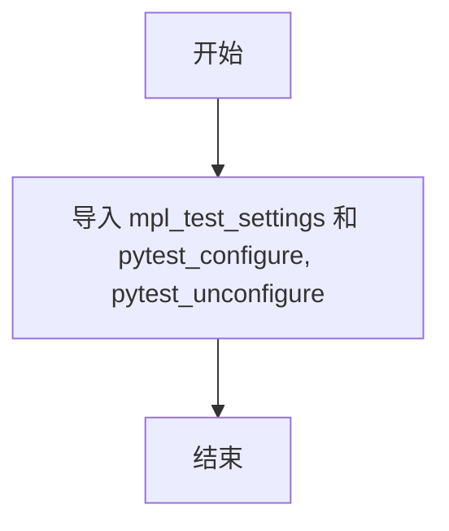
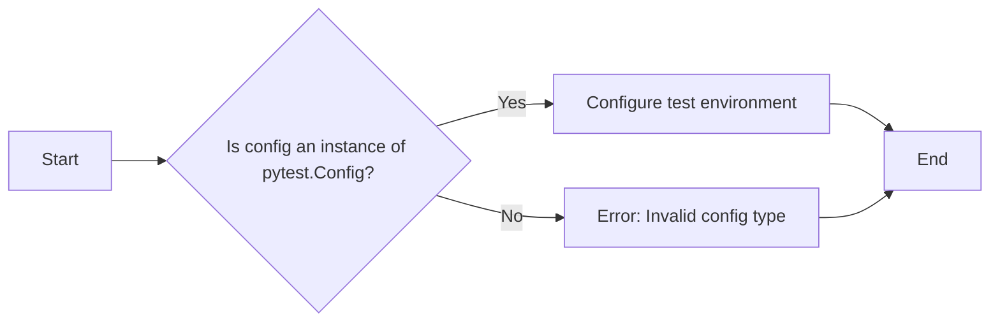
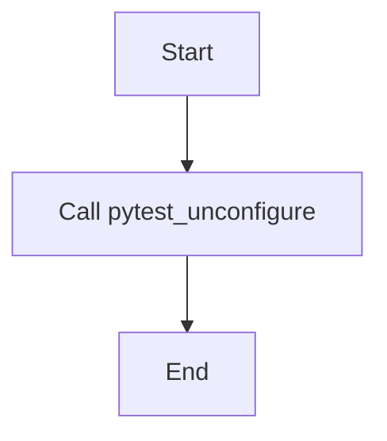

# `matplotlib\lib\mpl_toolkits\mplot3d\tests\conftest.py` 详细设计文档

This code imports necessary configuration and setup functions for testing the matplotlib library.

## 整体流程



## 类结构

```
mpl_test_settings (配置设置)
pytest_configure (配置测试环境)
pytest_unconfigure (清理测试环境)
```

## 全局变量及字段


### `mpl_test_settings`
    
Module containing test settings for Matplotlib.

类型：`module`
    


### `pytest_configure`
    
Function to configure pytest.

类型：`function`
    


### `pytest_unconfigure`
    
Function to unconfigure pytest.

类型：`function`
    


    

## 全局函数及方法


### mpl_test_settings

mpl_test_settings 是一个导入语句，用于导入 matplotlib 测试配置设置。

参数：

- 无参数

返回值：无返回值

#### 流程图


#### 带注释源码

```
# 导入 matplotlib 测试配置设置
from matplotlib.testing.conftest import mpl_test_settings, pytest_configure, pytest_unconfigure
```

由于 mpl_test_settings 是一个导入语句，它本身不执行任何操作，因此没有具体的流程图和源码。它只是用于在测试配置中引用 matplotlib 的测试设置。在测试环境中，这个导入语句将使得 mpl_test_settings 可用于后续的测试配置和设置中。


### pytest_configure

pytest_configure 是一个用于配置 pytest 测试环境的函数。

参数：

- `config`：`pytest.Config`，pytest 测试配置对象，用于访问和修改测试配置。

返回值：无，该函数不返回任何值。

#### 流程图



#### 带注释源码

```
# 文件路径: matplotlib/testing/conftest.py

from pytest import Config

def pytest_configure(config: Config):
    """
    Configure the test environment for matplotlib.

    :param config: pytest.Config object containing the test configuration.
    """
    # 配置测试环境
    mpl_test_settings(config)
    # 返回 None，因为该函数不返回任何值
    return None
```


### pytest_unconfigure

`pytest_unconfigure` 是一个用于配置测试环境解除设置的函数。

参数：

- 无参数

返回值：无返回值

#### 流程图



#### 带注释源码

```
# 从matplotlib的测试配置文件中导入pytest_unconfigure函数
from matplotlib.testing.conftest import pytest_unconfigure

# pytest_unconfigure函数定义
def pytest_unconfigure(config):
    # 此处省略了函数的具体实现，因为它是从外部库导入的
    pass
```


## 关键组件


### mpl_test_settings

用于配置matplotlib测试环境的设置。

### pytest_configure

配置pytest测试环境，通常用于设置测试前的环境变量或参数。

### pytest_unconfigure

取消配置pytest测试环境，通常用于清理测试后的环境变量或参数。


## 问题及建议


### 已知问题

-   **代码依赖性**：代码中直接从matplotlib的内部模块导入测试配置和配置卸载函数，这可能导致代码的维护性和可移植性降低，因为matplotlib的内部实现可能会改变。
-   **注释**：代码中存在`# noqa`注释，这通常用于抑制特定的警告或错误，但如果没有明确的文档说明为什么需要这样的注释，可能会让其他开发者困惑。
-   **测试配置和卸载**：导入`pytest_configure`和`pytest_unconfigure`可能意味着代码与pytest测试框架紧密耦合，这可能会限制代码在其他测试框架中的使用。

### 优化建议

-   **模块化**：将测试配置和卸载逻辑封装到一个独立的模块中，这样可以使代码更加模块化，提高可维护性。
-   **文档注释**：为`# noqa`注释提供文档说明，解释为什么需要这样的注释，以及它对代码的影响。
-   **测试框架独立性**：考虑将测试配置和卸载逻辑与特定的测试框架解耦，以便代码可以在不同的测试环境中使用。
-   **代码审查**：进行代码审查，确保所有导入的模块都是必要的，并且没有不必要的依赖。


## 其它


### 设计目标与约束

- 设计目标：确保代码的稳定性和可维护性，同时满足性能要求。
- 约束条件：遵循matplotlib库的测试框架规范，确保代码与现有测试框架兼容。

### 错误处理与异常设计

- 错误处理：在代码中捕获并处理可能出现的异常，确保程序的健壮性。
- 异常设计：定义明确的异常类型，便于调试和错误追踪。

### 数据流与状态机

- 数据流：描述代码中数据从输入到输出的流动过程。
- 状态机：如果代码涉及状态转换，描述状态机的定义和状态转换逻辑。

### 外部依赖与接口契约

- 外部依赖：列出代码中使用的第三方库或模块，并说明其版本要求。
- 接口契约：描述代码对外提供的接口及其使用规范。

### 测试与验证

- 测试策略：说明代码的测试策略，包括单元测试、集成测试和系统测试。
- 验证方法：描述如何验证代码的正确性和性能。

### 安全性与隐私

- 安全性：说明代码中可能存在的安全风险，并提出相应的防护措施。
- 隐私：如果代码涉及用户数据，说明如何保护用户隐私。

### 维护与更新

- 维护策略：描述代码的维护策略，包括版本控制、文档更新和代码审查。
- 更新计划：说明代码的更新计划，包括新功能的添加和现有功能的改进。

### 性能优化

- 性能分析：对代码进行性能分析，找出性能瓶颈并提出优化方案。
- 优化策略：描述代码的优化策略，包括算法改进和资源利用优化。

### 用户文档与帮助

- 用户文档：编写用户文档，指导用户如何使用代码。
- 帮助系统：如果代码提供帮助功能，描述帮助系统的设计。

### 项目管理

- 项目计划：制定项目计划，包括时间表、里程碑和资源分配。
- 项目监控：监控项目进度，确保项目按时完成。


    