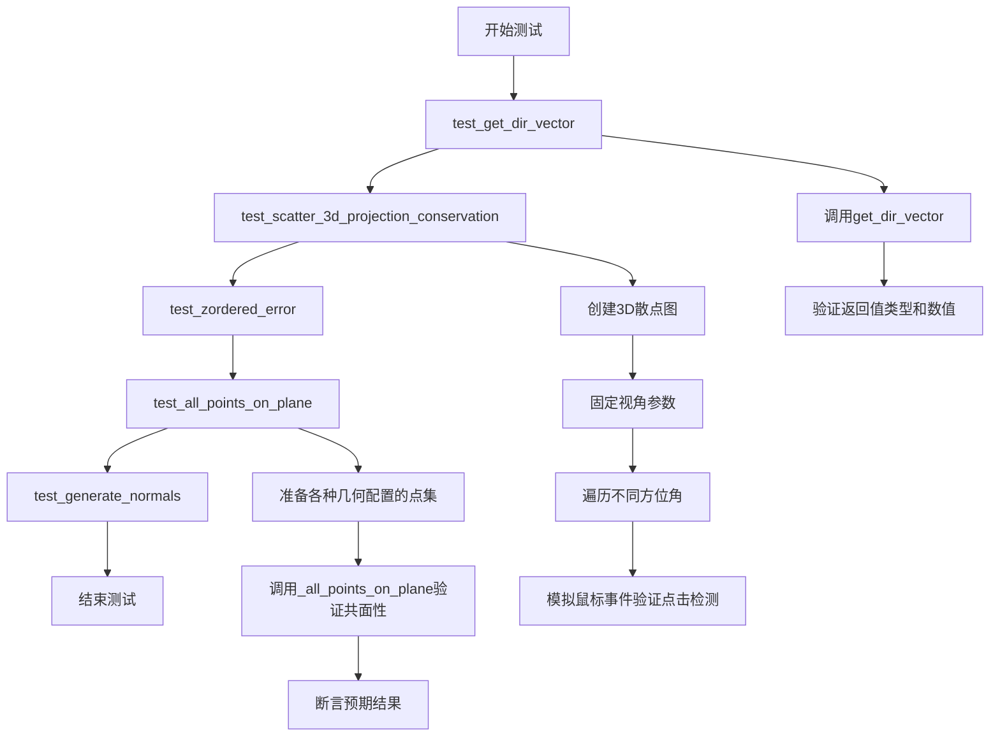
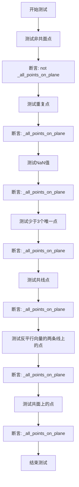

# `matplotlib\lib\mpl_toolkits\mplot3d\tests\test_art3d.py` 详细设计文档

该文件是matplotlib 3D艺术组件的测试套件，主要验证3D图形渲染中的方向向量计算、散点图投影一致性、点共面性检测和多边形法线生成等功能，确保3D可视化在各种视角和数据配置下的正确性。

## 整体流程



## 类结构

```
测试模块 (test_3d_art3d)
├── 辅助函数/类 (非本文件定义，从mpl_toolkits.mplot3d.art3d导入)
│   ├── get_dir_vector
│   ├── Line3DCollection
│   ├── Poly3DCollection
│   └── _all_points_on_plane
└── 测试函数 (本文件定义)
    ├── test_get_dir_vector
    ├── test_scatter_3d_projection_conservation
    ├── test_zordered_error
    ├── test_all_points_on_plane
    └── test_generate_normals
```

## 全局变量及字段


### `np`
    
NumPy库，用于数值计算和多维数组操作

类型：`module`
    


### `nptest`
    
NumPy测试模块，用于数组比较和断言

类型：`module`
    


### `pytest`
    
Python测试框架，用于编写和运行单元测试

类型：`module`
    


### `plt`
    
Matplotlib.pyplot子模块，用于绑图和数据可视化

类型：`module`
    


### `MouseEvent`
    
Matplotlib鼠标事件类，用于处理鼠标交互事件

类型：`class`
    


### `get_dir_vector`
    
根据zdir参数返回三维方向向量的函数

类型：`function`
    


### `Line3DCollection`
    
用于绘制三维线段集合的类

类型：`class`
    


### `Poly3DCollection`
    
用于绘制三维多边形集合的类

类型：`class`
    


### `_all_points_on_plane`
    
判断所有点是否共面的内部函数

类型：`function`
    


    

## 全局函数及方法


### `test_get_dir_vector`

这是一个pytest参数化测试函数，用于验证`get_dir_vector`函数在不同输入情况下（字符串轴向、None、自定义元组和numpy数组）能否正确返回对应的三维方向向量。

参数：

- `zdir`：测试用例参数，`str | tuple | np.ndarray | None`，表示要获取方向向量的轴向或自定义向量
- `expected`：`tuple`，期望返回的方向向量结果

返回值：`无`（测试函数无返回值，通过断言验证）

#### 流程图

```mermaid
flowchart TD
    A[开始测试] --> B[接收zdir参数]
    B --> C[调用get_dir_vector函数]
    C --> D{传入的zdir类型}
    D -->|字符串'x'| E[返回向量 (1, 0, 0)]
    D -->|字符串'y'| F[返回向量 (0, 1, 0)]
    D -->|字符串'z'| G[返回向量 (0, 0, 1)]
    D -->|None| H[返回零向量 (0, 0, 0)]
    D -->|元组/数组| I[返回输入的向量]
    E --> J[断言结果是numpy.ndarray类型]
    F --> J
    G --> J
    H --> J
    I --> J
    J --> K[使用nptest.assert_array_equal比较结果与期望值]
    K --> L[测试通过/失败]
```

#### 带注释源码

```python
@pytest.mark.parametrize("zdir, expected", [
    ("x", (1, 0, 0)),          # 测试字符串'x'应返回x轴单位向量
    ("y", (0, 1, 0)),          # 测试字符串'y'应返回y轴单位向量
    ("z", (0, 0, 1)),          # 测试字符串'z'应返回z轴单位向量
    (None, (0, 0, 0)),         # 测试None应返回零向量
    ((1, 2, 3), (1, 2, 3)),    # 测试元组输入应原样返回
    (np.array([4, 5, 6]), (4, 5, 6)),  # 测试numpy数组输入应原样返回
])
def test_get_dir_vector(zdir, expected):
    """
    参数化测试get_dir_vector函数的各种输入情况
    
    Args:
        zdir: 输入的轴向标识，可以是字符串'x'/'y'/'z'，None，或自定义向量
        expected: 期望返回的方向向量元组
    
    Returns:
        无返回值，通过断言验证功能正确性
    """
    # 调用被测试的get_dir_vector函数，传入zdir参数
    res = get_dir_vector(zdir)
    
    # 断言返回结果是numpy.ndarray类型
    assert isinstance(res, np.ndarray)
    
    # 使用numpy.testing.assert_array_equal比较计算结果与期望值
    # 这个断言确保返回的数组与期望的元组在元素级别相等
    nptest.assert_array_equal(res, expected)
```


### `test_scatter_3d_projection_conservation`

该测试函数用于验证3D散点图在投影角度变化时是否正确维护点的拾取顺序（z-order conservation），通过模拟鼠标点击事件来确认每个数据点在不同视角下都能被正确定位和识别。

参数：此函数无参数

返回值：`None`，无返回值（测试函数）

#### 流程图

```mermaid
flowchart TD
    A[开始] --> B[创建Figure和3D Axes]
    B --> C[固定投影参数: roll=0, elev=0, azim=-45]
    C --> D[创建散点数据x = [0, 1, 2, 3, 4]]
    D --> E[绘制3D散点图scatter_collection]
    E --> F[调用fig.canvas.draw_idle重绘]
    F --> G[获取散点在画布上的位置scatter_location]
    G --> H{遍历azim角度: -44, -46}
    H --> I[设置当前azim角度]
    I --> J[标记ax.stale=True并重绘]
    J --> K{遍历5个数据点i}
    K --> L[创建MouseEvent事件]
    L --> M[调用scatter_collection.contains检查点是否被选中]
    M --> N{验证contains为True}
    N --> O{验证ind['ind']长度为1}
    O --> P{验证ind['ind'][0]等于i}
    P --> Q[所有验证通过]
    K --> R[角度遍历结束]
    H --> S[测试结束]
```

#### 带注释源码

```python
def test_scatter_3d_projection_conservation():
    """
    测试3D散点图在投影角度变化时是否保持正确的点拾取顺序。
    验证当视角改变时，每个点仍能被正确定位和识别。
    """
    # 创建Figure对象，用于承载图形
    fig = plt.figure()
    # 添加3D投影的子图
    ax = fig.add_subplot(projection='3d')
    
    # 固定axes3d投影参数，确保测试的可重复性
    ax.roll = 0      # 绕Z轴滚动角度设为0
    ax.elev = 0      # 仰角设为0
    ax.azim = -45    # 方位角设为-45度
    ax.stale = True  # 标记为脏数据，需要重绘
    
    # 定义散点数据：5个点，每个点在x=y=z的位置
    x = [0, 1, 2, 3, 4]
    # 在3D坐标系中绘制散点图，返回散点集合对象
    scatter_collection = ax.scatter(x, x, x)
    # 触发画布重绘，更新图形状态
    fig.canvas.draw_idle()
    
    # 获取散点集合的数据偏移量（Data坐标）
    scatter_offset = scatter_collection.get_offsets()
    # 将数据坐标转换为显示坐标（画布上的像素位置）
    scatter_location = ax.transData.transform(scatter_offset)
    
    # 遍历两个不同的方位角：-44和-46度
    # 这两个角度足以产生相反的z-order但不使点移动太远
    for azim in (-44, -46):
        # 更新方位角
        ax.azim = azim
        # 标记需要重绘
        ax.stale = True
        # 触发重绘
        fig.canvas.draw_idle()
        
        # 遍历每个散点，验证其可拾取性
        for i in range(5):
            # 创建鼠标按下事件，用于定位和获取每个点的索引
            # MouseEvent参数: 事件类型、画布对象、x坐标、y坐标
            event = MouseEvent("button_press_event", fig.canvas,
                               *scatter_location[i, :])
            # 检查事件是否命中散点集合，返回(是否命中, 索引信息)
            contains, ind = scatter_collection.contains(event)
            
            # 断言验证：确保点被正确命中
            assert contains is True          # 事件必须命中散点
            assert len(ind["ind"]) == 1       # 命中的索引列表长度为1
            assert ind["ind"][0] == i         # 命中的索引应为当前遍历的索引i
```


### `test_zordered_error`

这是一个针对 GitHub issue #26497 的冒烟测试，用于验证 3D 图形中 Z 轴排序错误的问题。该测试创建一个包含线集合和散点的 3D 图表，并绘制图形以检查是否存在 Z-order 相关的错误。

参数：

- 无

返回值：`None`，无返回值（测试函数）

#### 流程图

```mermaid
flowchart TD
    A[开始 test_zordered_error] --> B[创建线集合数据 lc<br/>起点: (0,0,0)<br/>终点: (1,1,1)]
    B --> C[创建散点坐标 pc<br/>三个2D点: (0,0), (0,1), (1,1)]
    C --> D[创建新图形窗口 fig]
    D --> E[添加3D投影子图 ax]
    E --> F[向ax添加Line3DCollection<br/>使用autolim='_datalim_only']
    F --> G[添加不可见的散点 scatter<br/>visible=False]
    G --> H[执行plt.draw渲染图形]
    H --> I[结束测试]
```

#### 带注释源码

```python
def test_zordered_error():
    """
    Smoke test for https://github.com/matplotlib/matplotlib/issues/26497
    
    此测试函数用于验证3D图形中线集合和散点图的Z轴排序是否正确。
    该问题涉及在3D空间中，当线集合和散点同时存在时的渲染顺序问题。
    """
    # 创建线段集合的端点数据
    # lc是一个列表，包含一个元组：(起点坐标, 终点坐标)
    # 使用np.fromiter创建float类型的numpy数组
    lc = [(np.fromiter([0.0, 0.0, 0.0], dtype="float"),    # 线段起点 (0, 0, 0)
           np.fromiter([1.0, 1.0, 1.0], dtype="float"))]  # 线段终点 (1, 1, 1)
    
    # 创建散点图的坐标数据
    # pc是一个包含三个2D坐标点的列表，用于测试Z-order
    pc = [np.fromiter([0.0, 0.0], dtype="float"),    # 第一个点 (0, 0)
          np.fromiter([0.0, 1.0], dtype="float"),    # 第二个点 (0, 1)
          np.fromiter([1.0, 1.0], dtype="float")]    # 第三个点 (1, 1)
    
    # 创建新的图形窗口
    fig = plt.figure()
    
    # 添加3D投影的子图
    ax = fig.add_subplot(projection="3d")
    
    # 将线集合添加到3D坐标轴中
    # autolim="_datalim_only" 表示仅根据数据范围自动设置轴限制
    ax.add_collection(Line3DCollection(lc), autolim="_datalim_only")
    
    # 添加散点图，visible=False设置为不可见
    # 这里添加散点主要是为了触发可能的Z-order错误，而不是为了显示
    ax.scatter(*pc, visible=False)
    
    # 渲染图形，这是触发实际绘制的关键步骤
    # 如果存在Z-order错误，可能会在这一步暴露出来
    plt.draw()
```


### `test_all_points_on_plane`

该函数是matplotlib 3D工具包中的一个测试函数，用于验证`_all_points_on_plane`函数在各种边界情况下的正确性，包括非共面点、重复点、NaN值、少于3个唯一点、共线点、具有反平行向量的两条线上的点以及共面上的点。

参数：该函数无参数（作为pytest测试函数）

返回值：`None`，该函数通过断言验证功能，不返回任何值

#### 流程图



#### 带注释源码

```python
def test_all_points_on_plane():
    """
    测试_all_points_on_plane函数在各种情况下的行为
    
    该测试函数验证了以下场景:
    1. 非共面点 - 应该返回False
    2. 重复点 - 应该返回True
    3. 包含NaN的值 - 应该返回True
    4. 少于3个唯一点 - 应该返回True
    5. 所有点共线 - 应该返回True
    6. 所有点在两条具有反平行向量的直线上 - 应该返回True
    7. 所有点共面 - 应该返回True
    """
    
    # 测试1: 非共面点（四面体的四个顶点）
    # 这些点不在同一个平面上，_all_points_on_plane应返回False
    points = np.array([[0, 0, 0], [1, 0, 0], [0, 1, 0], [0, 0, 1]])
    assert not _all_points_on_plane(*points.T)

    # 测试2: 重复点
    # 最后一个点是(0,0,0)，与第一个点重复，所有点共面，应返回True
    points = np.array([[0, 0, 0], [1, 0, 0], [0, 1, 0], [0, 0, 0]])
    assert _all_points_on_plane(*points.T)

    # 测试3: NaN值
    # 包含NaN的点数被认为是共面的（因为无法确定其实际位置）
    points = np.array([[0, 0, 0], [1, 0, 0], [0, 1, 0], [0, 0, np.nan]])
    assert _all_points_on_plane(*points.T)

    # 测试4: 少于3个唯一点
    # 只有两个唯一点（(0,0,0)和其他），默认共面
    points = np.array([[0, 0, 0], [0, 0, 0], [0, 0, 0]])
    assert _all_points_on_plane(*points.T)

    # 测试5: 所有点共线
    # 所有点都在y轴上，形成一条直线，共面
    points = np.array([[0, 0, 0], [0, 1, 0], [0, 2, 0], [0, 3, 0]])
    assert _all_points_on_plane(*points.T)

    # 测试6: 所有点位于两条具有反平行向量的直线上
    # 第一条线向量为(1,-1,0)，第二条线向量为(-1,1,0)，它们是反平行的
    # 这些点都在同一个平面上
    points = np.array([[-2, 2, 0], [-1, 1, 0], [1, -1, 0],
                       [0, 0, 0], [2, 0, 0], [1, 0, 0]])
    assert _all_points_on_plane(*points.T)

    # 测试7: 所有点共面
    # 所有点都在z=0平面上
    points = np.array([[0, 0, 0], [0, 1, 0], [1, 0, 0], [1, 1, 0], [1, 2, 0]])
    assert _all_points_on_plane(*points.T)
```


### `test_generate_normals`

这是一个针对3D多边形法向量生成功能的冒烟测试（smoke test），用于验证Poly3DCollection在给定顶点时能够正确生成法向量并渲染3D图形。

参数：无

返回值：`None`，测试函数无返回值

#### 流程图

```mermaid
graph TD
    A[开始] --> B[定义矩形顶点: vertices = ((0, 0, 0), (0, 5, 0), (5, 5, 0), (5, 0, 0))]
    B --> C[创建Poly3DCollection对象: shape = Poly3DCollection([vertices], edgecolors='r', shade=True)]
    C --> D[创建3D图形窗口: fig = plt.figure()]
    D --> E[创建3D坐标轴: ax = fig.add_subplot(projection='3d')]
    E --> F[将集合添加到3D坐标轴: ax.add_collection3d(shape)]
    F --> G[渲染图形: plt.draw()]
    G --> H[结束]
```

#### 带注释源码

```python
def test_generate_normals():
    # 烟雾测试 - 验证 https://github.com/matplotlib/matplotlib/issues/29156
    # 定义一个矩形的4个顶点坐标 (x, y, z)
    # 顶点顺序：左下 -> 左上 -> 右上 -> 右下，形成一个位于z=0平面的正方形
    vertices = ((0, 0, 0), (0, 5, 0), (5, 5, 0), (5, 0, 0))
    
    # 创建3D多边形集合对象
    # 参数：
    #   [vertices]: 多边形顶点列表
    #   edgecolors='r': 边颜色设为红色
    #   shade=True: 启用着色效果，需要计算法向量
    shape = Poly3DCollection([vertices], edgecolors='r', shade=True)

    # 创建新的图形窗口
    fig = plt.figure()
    
    # 创建3D投影的子图坐标轴
    ax = fig.add_subplot(projection='3d')
    
    # 将3D多边形集合添加到3D坐标轴中
    ax.add_collection3d(shape)
    
    # 执行图形渲染
    plt.draw()
```

---

### 补充信息

#### 关键组件信息

| 组件名称 | 描述 |
|---------|------|
| `Poly3DCollection` | 来自mpl_toolkits.mplot3d.art3d的3D多边形集合类，用于渲染3D多边形面 |
| `vertices` | 定义3D多边形顶点的元组列表 |
| `fig` | matplotlib的Figure对象，表示图形窗口 |
| `ax` | 3D坐标轴对象，用于放置3D图形元素 |

#### 潜在的技术债务或优化空间

1. **缺少断言验证**：该测试函数没有添加任何断言来验证法向量生成的正确性，仅是"冒烟测试"，可能无法捕捉细微的回归问题
2. **硬编码的测试数据**：顶点坐标和参数硬编码在函数内，不利于测试参数的扩展和参数化
3. **未测试的边界情况**：未测试非平面多边形、凹多边形等边界情况

#### 其它项目

- **测试目标**：验证3D多边形法向量生成功能（针对issue #29156）
- **错误处理**：无显式错误处理
- **外部依赖**：matplotlib、numpy、mpl_toolkits.mplot3d.art3d
- **设计约束**：测试函数需遵循pytest约定（以test_开头）

## 关键组件


### 核心功能概述

该代码是Matplotlib 3D图形库的测试套件，验证3D散点图、线条集合、多边形集合等组件的核心功能，包括方向向量计算、投影一致性、点共面判断和法线生成等关键算法。

### 关键组件

### get_dir_vector

从mpl_toolkits.mplot3d.art3d导入的函数，用于根据输入参数（字符串"x"/"y"/"z"、None、或坐标数组）返回对应的3D方向向量。该函数支持多种输入格式，包括元组和NumPy数组，是3D图形渲染中确定观察方向的基础函数。

### _all_points_on_plane

从mpl_toolkits.mplot3d.art3d导入的函数，用于判断一组3D点是否共面。函数能够处理非共面点、重复点、NaN值、少于3个唯一点、点在同一直线上以及反平行向量等多种边界情况，是3D几何计算中的核心判断逻辑。

### Line3DCollection

3D线条集合类，用于在三维空间中绘制多条线段。支持autolim参数控制自动Lim计算，可通过add_collection方法添加到3D坐标轴中。

### Poly3DCollection

3D多边形集合类，用于渲染三维平面多边形。支持edgecolors和shade参数配置外观，能够根据顶点坐标自动计算法线用于光照渲染。

### test_get_dir_vector

参数化测试函数，验证get_dir_vector对6种不同输入（"x"、"y"、"z"、None、元组(1,2,3)、NumPy数组[4,5,6]）返回正确的方向向量。测试确保函数返回NumPy数组类型且值匹配预期。

### test_scatter_3d_projection_consistency

测试3D散点图在视角变化时投影位置与交互检测的一致性。通过固定azimuth角为-44和-46度，验证每个散点都能被正确识别和索引，确保投影变换不影响鼠标事件检测的准确性。

### test_zordered_error

烟雾测试，验证在存在不可见散点时3D线条集合的z顺序处理是否正确。测试在添加Line3DCollection后绘制不可见的scatter不会引发错误。

### test_all_points_on_plane

全面测试_all_points_on_plane函数的7种场景：非共面点、重复点、NaN值、少于3唯一点、共线点、反平行向量和共面点。确保函数正确区分各种几何关系。

### test_generate_normals

烟雾测试，验证Poly3DCollection在设置edgecolors和shade=True时能够正确生成法线用于光照计算。

### 潜在技术债务与优化空间

1. **测试覆盖不足**：部分测试仅为烟雾测试（smoke test），未充分验证边界条件和错误情况
2. **硬编码参数**：azimuth角-44和-46为magic numbers，缺乏配置化
3. **重复代码**：多次创建相同的fig和ax对象，可通过fixture复用
4. **断言信息缺失**：部分断言缺少自定义错误信息，调试时难以定位问题

### 其它项目

**设计目标**：确保Matplotlib 3D渲染引擎在投影变换、几何计算和交互检测方面的正确性

**错误处理**：测试代码本身不包含异常处理逻辑，依赖pytest框架进行测试结果报告

**数据流**：测试数据主要为NumPy数组，通过Matplotlib的Artist层次结构传递给后端渲染器

**外部依赖**：依赖matplotlib核心库、numpy.testing和pytest框架

## 问题及建议


### 已知问题

- **烟雾测试缺乏实际断言**：`test_zordered_error` 和 `test_generate_normals` 仅调用 `plt.draw()` 而没有任何断言，无法真正验证功能正确性，属于无效测试
- **Magic Numbers 缺乏解释**：`test_scatter_3d_projection_conservation` 中使用 `-44`、`-46`、`5` 等硬编码数值，未提供注释说明这些特定值的来源和意义
- **测试隔离性不足**：多个测试函数共享 figure/axes 状态，未显式清理（如调用 `plt.close()`），可能导致测试间相互影响
- **docstring 缺失**：所有测试函数均无文档字符串，难以快速理解测试目的和预期行为
- **类型提示完全缺失**：函数参数、返回值均无类型注解，降低了代码可读性和静态检查能力

### 优化建议

- 为烟雾测试添加有效的断言或移除标记为 `@pytest.mark.skip(reason="smoke test")`
- 将 magic numbers 提取为具名常量或添加详细注释说明其用途
- 在每个测试函数结束时显式调用 `plt.close(fig)` 确保资源释放
- 为所有测试函数添加简洁的 docstring 说明测试目的
- 考虑添加类型提示以提升代码质量
- 将重复的 figure/axes 创建逻辑提取为 fixture
- 补充边界条件测试，如空数组、极端值等

## 其它


### 设计目标与约束

本测试文件旨在验证 matplotlib 3D 绘图功能的核心组件功能正确性，包括方向向量计算、3D 散点图投影、平面点判断以及法向量生成。测试覆盖了坐标变换、鼠标事件交互、3D 集合对象的渲染等关键功能。测试采用参数化方式确保多场景覆盖，同时保持测试的独立性和可重复性。

### 错误处理与异常设计

代码中的测试主要通过 assert 语句进行断言验证，对于 numpy 数组比较使用 nptest.assert_array_equal 确保数值一致性。测试场景涵盖了边界情况如 NaN 值、重复点、共线点等，预期这些情况不会抛出异常而是返回合理的布尔结果。MouseEvent 的 contains 方法通过返回布尔值和索引字典来处理命中检测，避免了异常抛出。

### 数据流与状态机

测试数据流从固定配置开始：设置 3D 坐标轴的 roll=0、elev=0、azim=-45 角度，然后创建 scatter 集合对象并通过 canvas.draw_idle() 触发渲染。鼠标事件测试流程为：获取散点位置 → 变换到画布坐标 → 创建 MouseEvent → 调用 contains 方法验证命中。对于投影保持测试，通过改变 azim 角度（-44 和 -46）产生两种不同的渲染结果，验证 z-order 的正确性。

### 外部依赖与接口契约

代码依赖 matplotlib 核心库（matplotlib.pyplot、matplotlib.backend_bases）、numpy 数值计算库以及 pytest 测试框架。被测试的函数 get_dir_vector 接受 zdir 参数（支持字符串、None 或 numpy 数组），返回标准化的方向向量。_all_points_on_plane 函数接受多个坐标数组，返回布尔值表示是否共面。contains 方法遵循 artist 接口契约，接受 MouseEvent 返回 (bool, dict) 元组。

### 性能考虑与优化空间

当前测试中每次 azimuth 改变都调用 draw_idle()，在大量测试场景下可能影响性能。scatter_location 的变换在循环外执行一次是合理的优化。test_all_points_on_plane 使用了较多样本数据，可考虑使用 @pytest.mark.slow 标记区分性能测试。_all_points_on_plane 的实现中多次计算向量范数，可预先缓存归一化结果。

### 可维护性分析

测试函数命名清晰（test_get_dir_vector、test_scatter_3d_projection_conservation 等），但部分测试（如 test_zordered_error）仅为 smoke test，缺少详细的断言验证。硬编码的坐标值（-44、-46 度）Magic Number 较多，建议提取为常量。测试之间通过 fig、ax 对象的创建保持独立性，但可以添加 fixture 管理测试资源的生命周期。

### 测试覆盖率分析

代码覆盖了 4 个主要测试目标：方向向量计算（test_get_dir_vector 参数化 6 种情况）、3D 散点投影保持（test_scatter_3d_projection_consistency）、z-order 渲染（test_zordered_error）、平面点判断（test_all_points_on_plane 7 种场景）以及法向量生成（test_generate_normals）。缺少对边界角度（0°、90°、180°）的测试，以及大规模数据点（>1000）的性能回归测试。

### 安全性考虑

测试代码本身不涉及用户输入处理或敏感数据操作，安全性风险较低。但代码中直接使用 numpy.fromiter 动态创建数组，需确保数据源可信。MouseEvent 的构造使用了硬编码的画布坐标，在不同 DPI 设置下可能存在兼容性问题。

### 版本兼容性与迁移

代码使用了 matplotlib 3D 工具包中的内部 API（mpl_toolkits.mplot3d.art3d），这些 API 在不同版本间可能存在变更。_all_points_on_plane 函数标记为私有函数（单下划线前缀），外部不应依赖。测试中使用的 projection='3d' 参数在较新版本中已稳定，但部分 3D 属性（如 ax.azim、ax.elev）的行为在历史版本中存在差异。

    