# `matplotlib\lib\mpl_toolkits\mplot3d\tests\test_legend3d.py` 详细设计文档

该文件是matplotlib 3D图表的图例功能测试套件，测试了3D线图、柱状图、散点图、误差线、轮廓线以及各种集合对象（图例线集合、3D多面体集合）的图例显示和元素提取功能。

## 整体流程

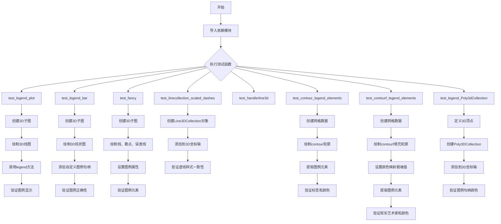

## 类结构

```
测试模块 (无类定义)
├── 测试函数集合
│   ├── test_legend_plot
│   ├── test_legend_bar
│   ├── test_fancy
│   ├── test_linecollection_scaled_dashes
│   ├── test_handlerline3d
│   ├── test_contour_legend_elements
│   ├── test_contourf_legend_elements
│   └── test_legend_Poly3dCollection
└── 依赖的matplotlib类 (外部)
matplotlib.pyplot (plt)
mpl_toolkits.mplot3d.art3d
Line3DCollection
Poly3DCollection
matplotlib (mpl)
```

## 全局变量及字段


### `x`
    
用于测试的数组数据

类型：`numpy.ndarray`
    


### `b1`
    
3D柱状图艺术家对象

类型：`matplotlib.container.BarContainer`
    


### `b2`
    
3D柱状图艺术家对象

类型：`matplotlib.container.BarContainer`
    


### `lines1`
    
3D线坐标列表

类型：`list`
    


### `lines2`
    
3D线坐标列表

类型：`list`
    


### `lines3`
    
3D线坐标列表

类型：`list`
    


### `lc1`
    
Line3DCollection对象 - 虚线样式

类型：`art3d.Line3DCollection`
    


### `lc2`
    
Line3DCollection对象 - 点划线样式

类型：`art3d.Line3DCollection`
    


### `lc3`
    
Line3DCollection对象 - 点线样式

类型：`art3d.Line3DCollection`
    


### `h`
    
网格计算结果

类型：`numpy.ndarray`
    


### `colors`
    
颜色列表

类型：`list`
    


### `verts`
    
3D顶点坐标

类型：`numpy.ndarray`
    


### `mesh`
    
Poly3DCollection对象 - 3D网格

类型：`art3d.Poly3DCollection`
    


### `cs`
    
ContourSet对象 - 等高线集合

类型：`matplotlib.contour.ContourSet`
    


### `artists`
    
艺术家对象列表

类型：`list`
    


### `labels`
    
标签列表

类型：`list`
    


    

## 全局函数及方法


### `test_legend_plot`

该测试函数用于验证matplotlib 3D图中线图的图例（legend）显示功能，通过绘制两条具有不同z值的3D线并调用图例功能，检查图例是否能正确显示对应的标签。

参数：

- 该函数无参数

返回值：`None`，该函数为测试函数，不返回任何值，仅通过图像比较验证功能正确性

#### 流程图

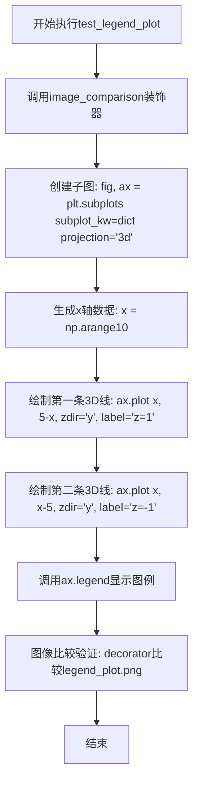

#### 带注释源码

```python
# 使用图像比较装饰器，预期生成图像为'legend_plot.png'，移除文本，适用mpl20样式
@image_comparison(['legend_plot.png'], remove_text=True, style='mpl20')
def test_legend_plot():
    # 创建带3D投影的子图，ax为3D坐标轴对象
    fig, ax = plt.subplots(subplot_kw=dict(projection='3d'))
    
    # 生成0-9的整数数组作为x轴数据
    x = np.arange(10)
    
    # 绘制第一条3D线：y=5-x，zdir='y'表示沿y轴方向绘制，label设置图例标签'z=1'
    ax.plot(x, 5 - x, 'o', zdir='y', label='z=1')
    
    # 绘制第二条3D线：y=x-5，zdir='y'表示沿y轴方向绘制，label设置图例标签'z=-1'
    ax.plot(x, x - 5, 'o', zdir='y', label='z=-1')
    
    # 调用legend方法生成图例，显示两条线对应的标签
    ax.legend()
```


### `test_legend_bar`

测试3D柱状图的图例显示功能，验证能否正确为3D柱状图（bar）创建并显示图例。

参数： 无

返回值：`None`，无返回值（测试函数）

#### 流程图

```mermaid
flowchart TD
    A[开始测试] --> B[创建3D子图]
    B --> C[生成数据 x = np.arange(10)]
    C --> D[创建第一组3D柱状图 b1 = ax.bar]
    D --> E[创建第二组3D柱状图 b2 = ax.bar]
    E --> F[添加图例 ax.legend]
    F --> G[结束测试]
```

#### 带注释源码

```python
@image_comparison(['legend_bar.png'], remove_text=True, style='mpl20')
def test_legend_bar():
    # 创建3D坐标系子图
    fig, ax = plt.subplots(subplot_kw=dict(projection='3d'))
    
    # 生成测试数据：0到9的整数数组
    x = np.arange(10)
    
    # 创建第一组3D柱状图
    # 参数：x轴位置，高度x，zdir='y'表示沿y轴方向排列，align='edge'对齐边缘，color='m'洋红色
    b1 = ax.bar(x, x, zdir='y', align='edge', color='m')
    
    # 创建第二组3D柱状图
    # 参数：x轴位置，高度x[::-1]（反转数组），zdir='x'表示沿x轴方向排列，align='edge'对齐边缘，color='g'绿色
    b2 = ax.bar(x, x[::-1], zdir='x', align='edge', color='g')
    
    # 为3D柱状图添加图例
    # 传入句柄b1[0]和b2[0]（取每个bar系列的第一个柱体作为代表），以及对应的标签['up', 'down']
    ax.legend([b1[0], b2[0]], ['up', 'down'])
```


### `test_fancy`

该函数是一个测试3D图表图例功能的测试用例，通过创建包含折线图、散点图和误差线的复杂3D场景，验证matplotlib 3D图表的图例渲染能力是否符合预期。

参数：

- 该函数没有参数

返回值：`None`，该函数为测试用例，不返回任何值

#### 流程图

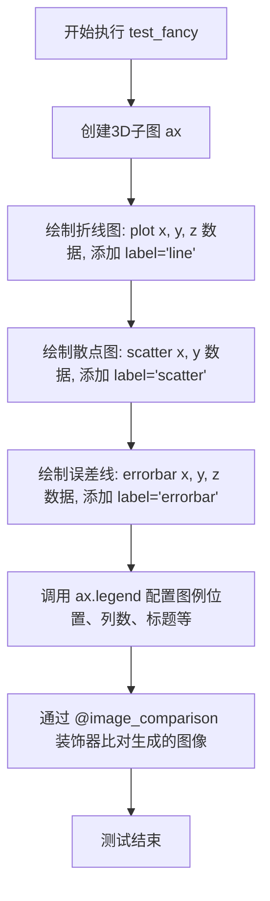

#### 带注释源码

```python
@image_comparison(['fancy.png'], remove_text=True, style='mpl20',
                  tol=0 if platform.machine() == 'x86_64' else 0.011)
def test_fancy():
    """
    测试复杂3D图表（线、散点、误差线）的图例功能
    """
    # 创建具有3D投影的子图
    fig, ax = plt.subplots(subplot_kw=dict(projection='3d'))
    
    # 绘制折线图（Line3D）：x从0到9，y和z固定为5，样式为'o--'，图例标签为'line'
    ax.plot(np.arange(10), np.full(10, 5), np.full(10, 5), 'o--', label='line')
    
    # 绘制散点图（Path3DCollection）：x从0到9，y从10到1，图例标签为'scatter'
    ax.scatter(np.arange(10), np.arange(10, 0, -1), label='scatter')
    
    # 绘制误差线（Line3D with error）：x固定为5，y从0到9，z固定为10
    # xerr=0.5表示x方向误差，zerr=0.5表示z方向误差，图例标签为'errorbar'
    ax.errorbar(np.full(10, 5), np.arange(10), np.full(10, 10),
                xerr=0.5, zerr=0.5, label='errorbar')
    
    # 配置图例：位置在左下角，2列显示，标题为'My legend'，每个标记点为1个
    ax.legend(loc='lower left', ncols=2, title='My legend', numpoints=1)
```


### `test_linecollection_scaled_dashes`

该测试函数验证了 matplotlib 3D 图形中 Line3DCollection 的虚线样式在图例中的一致性，通过创建三个具有不同线型（'--'、'-.'、':'）的 Line3DCollection 对象，将其添加到 3D 轴并生成图例，最后对比原始对象与图例句柄的线型是否匹配。

参数： 无

返回值：`None`，该函数为测试函数，不返回任何值，仅通过断言验证逻辑

#### 流程图

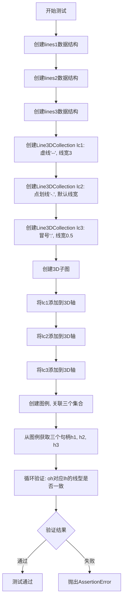

#### 带注释源码

```python
def test_linecollection_scaled_dashes():
    """
    测试Line3DCollection虚线样式在图例中的一致性
    验证3D线条集合的线型属性能够正确传递到图例句柄
    """
    
    # 定义第一组线段数据：两条线段，每条线段由两个点组成
    # 格式：[[x1, y1], [x2, y2]] 表示一条线段
    lines1 = [[(0, .5), (.5, 1)], [(.3, .6), (.2, .2)]]
    
    # 定义第二组线段数据：嵌套更深的结构
    lines2 = [[[0.7, .2], [.8, .4]], [[.5, .7], [.6, .1]]]
    
    # 定义第三组线段数据
    lines3 = [[[0.6, .2], [.8, .4]], [[.5, .7], [.1, .1]]]
    
    # 创建第一个3D线集合：使用虚线样式'--'，线宽为3
    lc1 = art3d.Line3DCollection(lines1, linestyles="--", lw=3)
    
    # 创建第二个3D线集合：使用点划线样式'-.'
    lc2 = art3d.Line3DCollection(lines2, linestyles="-.")
    
    # 创建第三个3D线集合：使用冒号样式':'，线宽为0.5
    lc3 = art3d.Line3DCollection(lines3, linestyles=":", lw=.5)

    # 创建具有3D投影的子图
    fig, ax = plt.subplots(subplot_kw=dict(projection='3d'))
    
    # 将三个线集合添加到3D坐标轴，使用_datalim_only自动限制数据范围
    ax.add_collection(lc1, autolim="_datalim_only")
    ax.add_collection(lc2, autolim="_datalim_only")
    ax.add_collection(lc3, autolim="_datalim_only")

    # 创建图例，将三个线集合与标签关联
    leg = ax.legend([lc1, lc2, lc3], ['line1', 'line2', 'line 3'])
    
    # 从图例中获取三个句柄（对应的2D线条对象）
    h1, h2, h3 = leg.legend_handles

    # 遍历原始3D线集合和对应的图例句柄，验证线型一致性
    for oh, lh in zip((lc1, lc2, lc3), (h1, h2, h3)):
        # 断言：原始对象的线型应与图例句柄的虚线模式一致
        assert oh.get_linestyles()[0] == lh._dash_pattern
```


### `test_handlerline3d`

测试Line3D的marker在图例中的处理一致性，验证通过`art3d.Line3D`创建的3D线条的marker属性在与图例句柄交互时能够正确保持。

参数： 无

返回值：`None`，该函数为测试函数，不返回任何值，仅通过断言验证逻辑正确性

#### 流程图

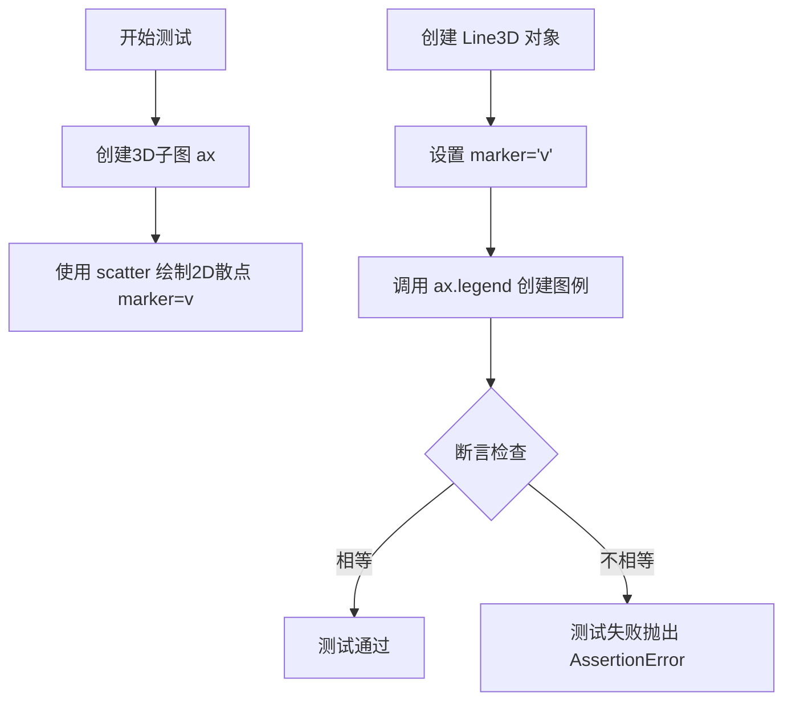

#### 带注释源码

```python
def test_handlerline3d():
    # Test marker consistency for monolithic Line3D legend handler.
    # 创建一个3D子图，返回fig和ax对象
    fig, ax = plt.subplots(subplot_kw=dict(projection='3d'))
    
    # 在3D坐标系中绘制散点图，marker设置为"v"（下三角）
    ax.scatter([0, 1], [0, 1], marker="v")
    
    # 创建Line3D对象，x=[0], y=[0], z=[0], marker="v"（下三角）
    # 用于测试图例处理
    handles = [art3d.Line3D([0], [0], [0], marker="v")]
    
    # 创建图例，传入handles和对应的标签，numpoints=1表示图例中每个标记显示1个点
    leg = ax.legend(handles, ["Aardvark"], numpoints=1)
    
    # 断言：验证原始Line3D对象的marker与图例句柄的marker是否一致
    # 确保legend handler正确处理了Line3D的marker属性
    assert handles[0].get_marker() == leg.legend_handles[0].get_marker()
```


### test_contour_legend_elements

测试3D轮廓线的图例元素提取功能，验证返回的标签和艺术家对象是否符合预期。

参数：

- 此测试函数没有显式参数

返回值：None，此函数为测试函数，不返回任何值

#### 流程图

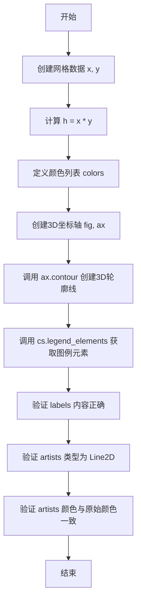

#### 带注释源码

```
def test_contour_legend_elements():
    """
    测试3D轮廓线的图例元素提取功能。
    
    此测试函数验证 contour 对象的 legend_elements() 方法
    是否能正确返回图例艺术家对象和对应的标签。
    """
    # 创建网格数据，范围为1到10（不包括10）
    x, y = np.mgrid[1:10, 1:10]
    # 计算h为x和y的乘积，形成测试用的标量场
    h = x * y
    # 定义轮廓线的颜色列表：蓝色、绿色和红色
    colors = ['blue', '#00FF00', 'red']

    # 创建具有3D投影的子图
    fig, ax = plt.subplots(subplot_kw=dict(projection='3d'))
    # 绘制3D轮廓线，指定等高线级别和颜色
    # levels指定等高线级别[10, 30, 50]
    # colors指定对应的颜色
    # extend='both'表示超出范围的值也显示在图例中
    cs = ax.contour(x, y, h, levels=[10, 30, 50], colors=colors, extend='both')

    # 从轮廓线对象获取图例元素和标签
    # artists: 图例艺术家对象列表
    # labels: 图例标签列表
    artists, labels = cs.legend_elements()
    
    # 断言验证返回的标签内容正确
    assert labels == ['$x = 10.0$', '$x = 30.0$', '$x = 50.0$']
    # 断言验证所有艺术家对象都是Line2D类型
    assert all(isinstance(a, mpl.lines.Line2D) for a in artists)
    # 断言验证每个艺术家的颜色与原始颜色相同
    assert all(same_color(a.get_color(), c)
               for a, c in zip(artists, colors))
```


### `test_contourf_legend_elements`

该函数是一个测试函数，用于验证 3D 坐标轴中填充轮廓（contourf）的图例元素提取功能是否正确。它创建测试数据、绘制填充轮廓、设置颜色映射的极端值，然后通过断言验证返回的图例标签和艺术家对象的正确性。

参数： 无

返回值： 无（该函数为测试函数，使用 assert 断言进行验证，无显式返回值）

#### 流程图

```mermaid
flowchart TD
    A[开始测试] --> B[创建网格数据 x, y 和 h = x*y]
    B --> C[创建 3D 子图]
    C --> D[使用 contourf 绘制填充轮廓, levels=[10, 30, 50]]
    D --> E[设置颜色映射的极端值: over='red', under='blue']
    E --> F[调用 changed 更新映射]
    F --> G[调用 legend_elements 获取图例元素]
    G --> H[断言验证标签内容]
    H --> I[断言验证艺术家对象类型为 Rectangle]
    I --> J[断言验证颜色正确性]
    J --> K[测试结束]
```

#### 带注释源码

```python
def test_contourf_legend_elements():
    """
    测试填充轮廓的图例元素提取功能。
    
    该测试函数验证 contourf 图例元素能够正确提取：
    1. 正确的标签文本（包含区间信息）
    2. 正确的艺术家对象类型（Rectangle）
    3. 正确的颜色值（包括扩展区域的极端色）
    """
    # 创建网格数据：x, y 为 9x9 网格，h 为 x*y 的乘积
    x, y = np.mgrid[1:10, 1:10]
    h = x * y

    # 创建 3D 子图，设置投影为 3d
    fig, ax = plt.subplots(subplot_kw=dict(projection='3d'))
    
    # 绘制填充轮廓：
    # - x, y: 网格坐标
    # - h: 高度数据
    # - levels: 等值线级别 [10, 30, 50]
    # - colors: 填充颜色 ['#FFFF00', '#FF00FF', '#00FFFF']
    # - extend: 扩展区域为 'both'（即同时包含小于最小值和大于最大值的区域）
    cs = ax.contourf(x, y, h, levels=[10, 30, 50],
                     colors=['#FFFF00', '#FF00FF', '#00FFFF'],
                     extend='both')
    
    # 设置颜色映射的极端值：
    # - over: 大于最大值的区域显示红色
    # - under: 小于最小值的区域显示蓝色
    cs.cmap = cs.cmap.with_extremes(over='red', under='blue')
    
    # 调用 changed 方法通知颜色映射已更改
    cs.changed()
    
    # 从 contourf 对象提取图例元素：
    # - artists: 图例中显示的艺术家对象列表（Rectangle 矩形）
    # - labels: 图例标签文本列表
    artists, labels = cs.legend_elements()
    
    # 验证返回的标签正确：
    # 包含四个标签：小于等于某值、区间1、区间2、大于某值
    assert labels == ['$x \\leq -1e+250s$',
                      '$10.0 < x \\leq 30.0$',
                      '$30.0 < x \\leq 50.0$',
                      '$x > 1e+250s$']
    
    # 定义期望的颜色顺序：
    # 蓝色（under）、黄色、品红、红色（over）
    expected_colors = ('blue', '#FFFF00', '#FF00FF', 'red')
    
    # 验证所有艺术家对象都是 Rectangle 类型
    assert all(isinstance(a, mpl.patches.Rectangle) for a in artists)
    
    # 验证所有艺术家对象的颜色与期望颜色一致
    assert all(same_color(a.get_facecolor(), c)
               for a, c in zip(artists, expected_colors))
```


### `test_legend_Poly3dCollection`

测试 Poly3DCollection 在图例中的颜色显示是否正确，确保图例句柄的颜色与 Poly3DCollection 自身的颜色保持一致。

参数： 无

返回值：`None`，无返回值（测试函数，通过 assert 断言进行验证）

#### 流程图

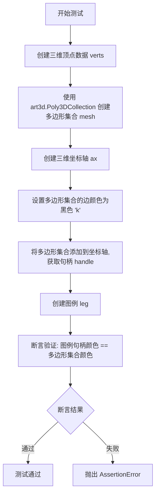

#### 带注释源码

```python
def test_legend_Poly3dCollection():
    """
    测试 Poly3DCollection 在图例中的颜色显示。
    
    该测试验证当 Poly3DCollection 被添加到 3D 坐标轴后，
    图例中的颜色是否能正确反映多边形集合的实际颜色。
    """
    
    # 定义三维顶点数据: 3个顶点的x,y,z坐标
    # 顶点1: [0, 0, 0]
    # 顶点2: [0, 1, 1]  
    # 顶点3: [1, 0, 1]
    verts = np.asarray([[0, 0, 0], [0, 1, 1], [1, 0, 1]])
    
    # 使用 art3d 模块的 Poly3DCollection 创建三维多边形集合
    # 参数 [verts] 是一个包含顶点数组的列表,用于定义一个三角形平面
    # label="surface" 设置该集合的标签,用于图例显示
    mesh = art3d.Poly3DCollection([verts], label="surface")
    
    # 创建带有三维投影的子图和坐标轴
    # subplot_kw=dict(projection="3d") 指定创建三维坐标轴
    fig, ax = plt.subplots(subplot_kw={"projection": "3d"})
    
    # 设置多边形集合的边颜色为黑色 ('k' 是黑色的简写)
    mesh.set_edgecolor('k')
    
    # 将三维多边形集合添加到三维坐标轴中
    # add_collection3d 方法返回该集合的句柄,用于后续颜色验证
    handle = ax.add_collection3d(mesh)
    
    # 创建图例,自动使用 mesh 的 label="surface" 作为图例项
    leg = ax.legend()
    
    # 核心断言验证:
    # 1. leg.legend_handles[0] 获取图例中的第一个句柄(Proxy artist)
    # 2. get_facecolor() 获取图例句柄的填充颜色
    # 3. handle.get_facecolor() 获取原始 Poly3DCollection 的填充颜色
    # 4) .all() 将颜色数组转换为布尔值,确保所有颜色通道都匹配
    # 如果颜色不一致,抛出 AssertionError
    assert (leg.legend_handles[0].get_facecolor()
            == handle.get_facecolor()).all()
```

#### 关键组件信息

| 组件名称 | 一句话描述 |
|---------|-----------|
| `Poly3dCollection` | 用于在三维坐标轴中绘制多边形面（三角形、矩形等）的集合类 |
| `add_collection3d()` | 将三维艺术集合添加到三维坐标轴的方法 |
| `legend()` | 创建坐标轴图例的方法，自动使用带有 label 的艺术对象 |
| `legend_handles` | 图例对象的属性，包含图例中所有句柄的列表 |

#### 潜在技术债务与优化空间

1. **测试覆盖不足**: 仅验证了默认颜色情况，未测试自定义颜色（通过 `set_facecolor`、`set_color` 等方法设置颜色）是否能在图例中正确显示
2. **硬编码顶点数据**: 顶点数据 `verts` 是硬编码的，可考虑参数化以测试不同形状的多边形
3. **缺乏边界情况测试**: 未测试多个 Poly3DCollection 同时存在时的图例显示情况
4. **颜色比较方式**: 使用 `.all()` 进行数组比较，如果颜色数据类型或格式略有差异可能导致误判

#### 其它项目

- **设计目标**: 验证 3D 多边形集合在图例中的颜色渲染正确性，确保可视化一致性
- **错误处理**: 测试失败时抛出 `AssertionError`，表明图例颜色与实际对象颜色不一致
- **外部依赖**: 依赖 `matplotlib`、`numpy`、`mpl_toolkits.mplot3d.art3d` 模块
- **数据流**: 顶点数据 → Poly3DCollection 对象 → 3D 坐标轴 → 图例句柄 → 颜色验证


### `image_comparison`

这是一个装饰器（decorator），用于图像比较测试。它是 Matplotlib 测试框架的一部分，允许开发者创建图像回归测试，通过比较测试生成的图像与预存的参考图像来验证绘图功能是否正常工作。该装饰器可以配置图像比较的参数，如容差、样式和是否移除文本等。

参数：

- `baseline_images`：`list` 或 `str`，指定用于比较的参考图像文件名列表，或单个文件名
- `remove_text`：`bool`，是否移除图像中的所有文本，默认为 False
- `style`：`str`，应用到测试的 Matplotlib 样式名称，默认为 None
- `tol`：`float`，图像像素比较的容差（允许的差异），默认为 0
- `extensions`：`list`，可选，要比较的文件扩展名列表，默认为 ['png']
- `savefig_kwargs`：`dict`，可选，传递给保存图像函数的额外关键字参数
- `compare_class`：`type`，可选，自定义的比较类
- `check_figsize`：`bool`，是否检查figure的size是否匹配

返回值：`callable`，返回装饰后的测试函数

#### 流程图

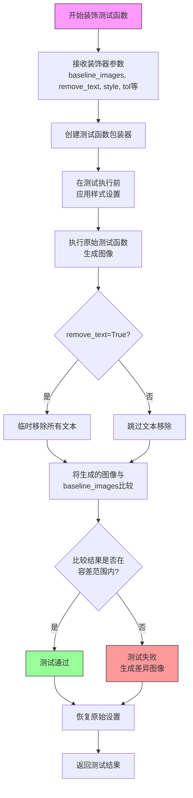

#### 带注释源码

```python
# image_comparison 装饰器是 matplotlib.testing.decorators 模块的一部分
# 由于它是从外部库导入的，以下是其在测试中的典型使用方式：

# 导入语句（已在代码中提供）
from matplotlib.testing.decorators import image_comparison

# 使用示例 1：基本的图像比较测试
@image_comparison(['legend_plot.png'], remove_text=True, style='mpl20')
def test_legend_plot():
    """
    测试3D图例的绘制功能
    
    装饰器参数说明：
    - 'legend_plot.png': 参考图像文件名
    - remove_text=True: 移除图像中的文本以便比较
    - style='mpl20': 使用 Matplotlib 2.0 样式
    """
    fig, ax = plt.subplots(subplot_kw=dict(projection='3d'))
    x = np.arange(10)
    ax.plot(x, 5 - x, 'o', zdir='y', label='z=1')
    ax.plot(x, x - 5, 'o', zdir='y', label='z=-1')
    ax.legend()

# 使用示例 2：带容差参数的图像比较测试
@image_comparison(['fancy.png'], remove_text=True, style='mpl20',
                  tol=0 if platform.machine() == 'x86_64' else 0.011)
def test_fancy():
    """
    测试复杂3D图表的绘制
    
    装饰器参数说明：
    - tol: 图像比较容差，非x86_64架构使用更大的容差
    """
    fig, ax = plt.subplots(subplot_kw=dict(projection='3d'))
    ax.plot(np.arange(10), np.full(10, 5), np.full(10, 5), 'o--', label='line')
    ax.scatter(np.arange(10), np.arange(10, 0, -1), label='scatter')
    ax.errorbar(np.full(10, 5), np.arange(10), np.full(10, 10),
                xerr=0.5, zerr=0.5, label='errorbar')
    ax.legend(loc='lower left', ncols=2, title='My legend', numpoints=1)

# 使用示例 3：没有特殊参数的图像比较
@image_comparison(['legend_bar.png'], remove_text=True, style='mpl20')
def test_legend_bar():
    """测试3D柱状图的图例功能"""
    fig, ax = plt.subplots(subplot_kw=dict(projection='3d'))
    x = np.arange(10)
    b1 = ax.bar(x, x, zdir='y', align='edge', color='m')
    b2 = ax.bar(x, x[::-1], zdir='x', align='edge', color='g')
    ax.legend([b1[0], b2[0]], ['up', 'down'])
```

---

### 关键组件信息

| 组件名称 | 一句话描述 |
|---------|-----------|
| `image_comparison` | Matplotlib测试框架中的装饰器，用于图像回归测试和视觉验证 |
| `baseline_images` | 参考图像文件，用于与测试生成的图像进行像素级比较 |
| `remove_text` | 布尔参数，控制是否在比较前移除图像中的文本元素 |
| `tol` | 图像像素比较的容差值，用于处理不同平台的渲染差异 |

---

### 潜在的技术债务或优化空间

1. **平台依赖性**：代码中对`platform.machine()=='x86_64'`的硬编码检查表明存在平台特定的容差处理，可以考虑更灵活的配置方式

2. **图像存储管理**：参考图像存储在固定位置，缺乏动态管理机制，建议增加版本控制和图像更新工具

3. **测试执行速度**：每次图像比较都需要保存和加载图像，可能影响测试速度，可以考虑增量比较或缓存机制

4. **错误信息可读性**：当图像比较失败时，生成的差异图像可能不够直观，建议改进可视化报告

---

### 其它项目

#### 设计目标与约束
- **目标**：确保Matplotlib的3D绘图功能在不同平台和环境下的一致性
- **约束**：依赖参考图像的存在，需要维护baseline_images目录

#### 错误处理与异常设计
- 当参考图像不存在时，装饰器应创建新的baseline图像
- 当图像差异超过容差时，测试失败并生成差异可视化报告

#### 数据流与状态机
- 测试执行流程：装饰器初始化 → 应用样式 → 执行测试 → 生成图像 → 图像比较 → 结果判定

#### 外部依赖与接口契约
- 依赖`matplotlib.testing.decorators.image_comparison`
- 依赖`platform`模块进行平台检测
- 参考图像存储在测试基线目录中


### `platform.machine`

获取当前机器的硬件平台类型（如x86_64、armv7l等），用于平台特定的配置或条件判断。

参数：此函数无参数

返回值：`str`，返回机器类型字符串（如'x86_64'、'aarch64'等），若无法确定则返回空字符串

#### 流程图

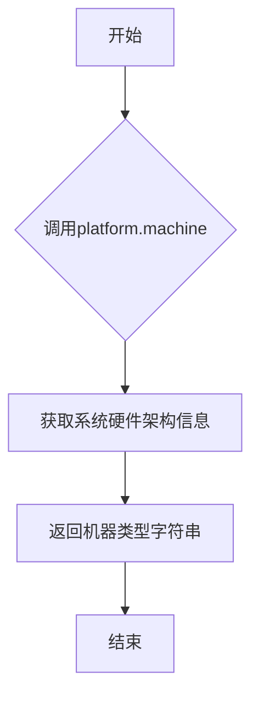

#### 带注释源码

```python
import platform  # 导入Python标准库platform模块

# platform.machine() 是platform模块提供的函数
# 用于获取底层硬件平台的机器类型
# 
# 常用返回值：
#   - 'x86_64' / 'AMD64'：64位x86架构
#   - 'aarch64'：64位ARM架构
#   - 'armv7l'：32位ARM架构
#   - 'i686' / 'i386'：32位x86架构
#   - '' (空字符串)：无法确定时

# 示例用法
machine_type = platform.machine()  # 获取机器类型
print(machine_type)  # 输出例如：'x86_64'

# 在本代码中的实际应用：
# 用于条件判断测试图像容差
# tol=0 if platform.machine() == 'x86_64' else 0.011
# 表示在x86_64平台上使用0容差，其他平台使用0.011容差
```

---

## 补充说明

### 设计目标与约束

- **目的**：为跨平台测试提供硬件架构识别能力
- **约束**：返回值的准确性依赖于操作系统和Python解释器的支持

### 错误处理与异常设计

- platform.machine()通常不会抛出异常
- 无法确定时会返回空字符串而非抛出错误

### 外部依赖与接口契约

- **依赖**：Python标准库 `platform` 模块（无需额外安装）
- **接口契约**：无需参数调用，返回字符串类型


### `np.arange`

`np.arange` 是 NumPy 库中的一个函数，用于生成一个具有规律间隔的数组，类似于 Python 内置的 `range()` 函数，但返回的是 NumPy 数组（ndarray）。

参数：

- `start`：`int` 或 `float`，可选，起始值，默认为 0
- `stop`：`int` 或 `float`，必需，结束值（不包含）
- `step`：`int` 或 `float`，可选，步长，默认为 1
- `dtype`：`dtype`，可选，输出数组的数据类型，如果未指定，则从输入参数推断

返回值：`numpy.ndarray`，返回一个基于范围的数组

#### 流程图

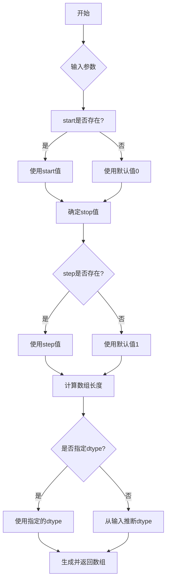

#### 带注释源码

```python
# numpy.arange 的简化实现原理
def arange(start=0, stop=None, step=1, dtype=None):
    """
    生成一个具有规律间隔的数组。
    
    参数:
        start: 起始值，默认为0
        stop: 结束值（不包含）
        step: 步长，默认为1
        dtype: 数据类型，可选
    
    返回:
        ndarray: 数组
    """
    # 处理只有单个参数的情况（此时该参数为stop）
    if stop is None:
        stop = start
        start = 0
    
    # 计算数组长度：(stop - start) / step，然后向上取整
    num = int(np.ceil((stop - start) / step))
    
    # 创建数组
    y = np.empty(num, dtype=dtype)
    
    # 填充数组值
    for i in range(num):
        y[i] = start + i * step
    
    return y
```

#### 在代码中的使用示例

```python
# 在 test_legend_plot 函数中
x = np.arange(10)  # 生成 array([0, 1, 2, 3, 4, 5, 6, 7, 8, 9])

# 在 test_fancy 函数中
np.arange(10)              # 生成 0-9 的数组
np.arange(10, 0, -1)       # 生成 array([10, 9, 8, 7, 6, 5, 4, 3, 2, 1])
np.full(10, 5)             # 生成 10 个元素都为 5 的数组
np.full(10, 10)            # 生成 10 个元素都为 10 的数组
```


### `np.mgrid`

`np.mgrid`是NumPy库中的一个函数，用于生成多维网格矩阵。它可以快速创建用于计算网格坐标的数组，常用于需要遍历多维空间的场景，如创建等高线图、曲面图等。

参数：

-  `index_slice`：可变长参数列表，格式为`start:stop:step`或`start:stop`，用于定义每个维度的切片范围。可以指定多个维度，每个维度之间用逗号分隔。

返回值：`numpy.ndarray`或`numpy.ndarray`元组，当使用多个切片时返回一个由多个数组组成的网格，每个数组代表一个维度上的坐标。

#### 流程图

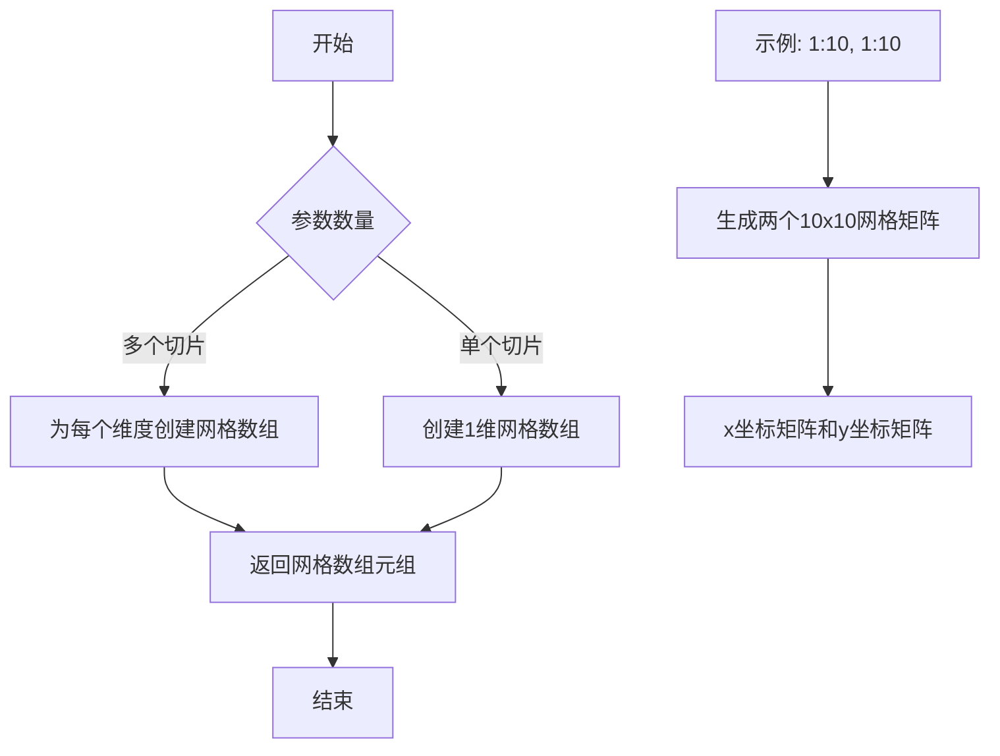

#### 带注释源码

```python
# 在代码中的实际使用示例
x, y = np.mgrid[1:10, 1:10]

# 等价于:
# x = np.arange(1, 10)[:, np.newaxis] * np.ones(9)  # 行向量扩展
# y = np.arange(1, 10)[np.newaxis, :] * np.ones(9)  # 列向量扩展

# 生成的网格:
# x = [[1,1,1,1,1,1,1,1,1],
#      [2,2,2,2,2,2,2,2,2],
#      ...]
# y = [[1,2,3,4,5,6,7,8,9],
#      [1,2,3,4,5,6,7,8,9],
#      ...]

# 详细解释:
# np.mgrid[1:10, 1:10] 创建两个2D数组
# 第一个数组(x)包含行索引，形状为(9,9)
# 第二个数组(y)包含列索引，形状为(9,9)
# 这种网格格式非常适合用于contour、contourf等需要坐标网格的绘图函数

# 在test_contour_legend_elements函数中的使用:
x, y = np.mgrid[1:10, 1:10]  # 生成9x9的网格
h = x * y  # 计算z值，创建一个双曲抛物面
cs = ax.contour(x, y, h, levels=[10, 30, 50], colors=colors, extend='both')
# 然后从contour对象中提取图例元素
artists, labels = cs.legend_elements()
```


### `np.full`

`np.full` 是 NumPy 库中的一个函数，用于创建一个指定形状并填充指定值的数组。该函数接收数组形状、填充值以及可选的数据类型和内存顺序参数，返回一个填充了指定值的新数组。

#### 参数

- `shape`：`int` 或 `int` 的序列/元组，输出数组的形状（例如 `10` 表示一维数组长度，`(2, 3)` 表示二维数组）
- `fill_value`：`scalar` 或 `array_like`，用于填充数组的值
- `dtype`：`data-type`，可选，数组的数据类型，默认根据 `fill_value` 自动推断
- `order`：`{'C', 'F'}`，可选，内存中存储数据的顺序，`'C'` 为行优先（C风格），`'F'` 为列优先（Fortran风格），默认 `'C'`
- `like`：`array_like`，可选，参考数组，用于创建兼容的数组（类似 `np.asarray` 的行为），默认 `None`

#### 返回值

- `ndarray`，返回指定形状的新数组，数组中所有元素都被填充为 `fill_value`

#### 流程图

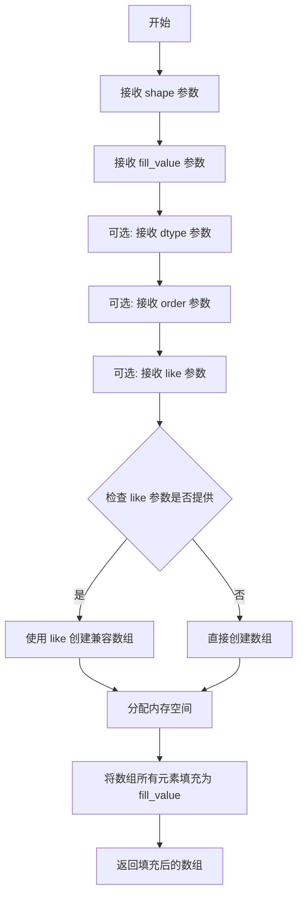

#### 带注释源码

```python
def full(shape, fill_value, dtype=None, order='C', *, like=None):
    """
    创建一个填充了指定值的数组。
    
    参数:
        shape: int 或 int 序列
            输出数组的形状
        fill_value: scalar
            填充数组的值
        dtype: data-type, 可选
            数组的数据类型，默认根据 fill_value 自动推断
        order: {'C', 'F'}, 可选
            内存中存储数据的顺序，'C' 为行优先，'F' 为列优先
        like: array_like, 可选
            参考数组，用于创建兼容的数组
    
    返回:
        ndarray
            填充了 fill_value 的数组
    """
    if dtype is None:
        # 如果未指定数据类型，根据 fill_value 自动推断
        dtype = np.array(fill_value).dtype
    
    if like is not None:
        # 如果提供了 like 参数，使用 like 数组的设备/上下文创建数组
        return np.full_like(fill_value, shape, dtype=dtype, order=order)
    
    # 创建指定形状的数组
    array = np.empty(shape, dtype=dtype, order=order)
    
    # 使用 fill_value 填充数组的所有元素
    array.fill(fill_value)
    
    return array
```


根据提供的代码，我注意到 `Line3DCollection` 类并非在该代码文件中定义，而是通过 `from mpl_toolkits.mplot3d import art3d` 从 matplotlib 的 3D 工具包中导入并使用。在测试代码中，我们可以看到 `linestyles` 作为 `Line3DCollection` 构造函数的参数被使用，同时也调用了 `get_linestyles()` 方法。

由于您要求提取的信息 `Line3DCollection.linestyles` 是matplotlib库中的类属性，且未在当前代码文件中定义其源码，我将基于代码中的使用方式来推断并提供该属性的详细信息。

### `Line3DCollection.linestyles`

该属性用于获取或设置3D线条集合的线条样式（linestyles）。在代码中，它被用作构造函数参数，并通过 `get_linestyles()` 方法进行访问。

**注意**：由于 `Line3DCollection` 类定义位于 matplotlib 库源码中（非本测试文件），以下信息基于代码使用方式推断。

#### 参数

此为属性访问，无传统意义上的参数。

- 无（属性 getter）

#### 返回值

- 返回类型：`str` 或 `tuple` 或 `list`
- 返回描述：返回当前设置的线条样式，可以是字符串（如 "--"、"-."、":"）或元组格式的虚线模式。

#### 流程图

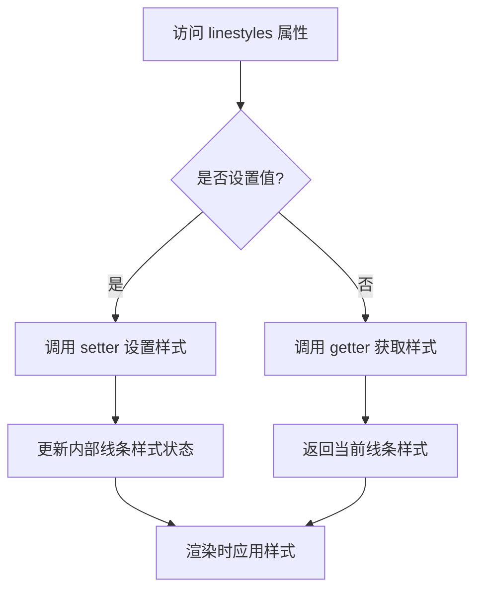

#### 带注释源码

由于 `Line3DCollection` 类定义不在当前代码文件中，无法提供其直接源码。基于使用方式，以下是其在测试中的典型调用模式：

```python
# 导入 Line3DCollection（在代码中通过 art3d 模块使用）
from mpl_toolkits.mplot3d import art3d

# 使用 linestyles 参数创建 Line3DCollection 实例
# linestyles: 设置线条样式，可选值包括 '--' (虚线), '-.' (点划线), ':' (点线), '-' (实线)
lc1 = art3d.Line3DCollection(lines1, linestyles="--", lw=3)
lc2 = art3d.Line3DCollection(lines2, linestyles="-.")
lc3 = art3d.Line3DCollection(lines3, linestyles=":", lw=.5)

# 获取线条样式
# 调用 get_linestyles() 方法返回一个样式列表
styles = lc1.get_linestyles()
# 获取第一个元素的样式进行比较
assert oh.get_linestyles()[0] == lh._dash_pattern
```

#### 关键组件信息

- **Line3DCollection**：来自 `mpl_toolkits.mplot3d.art3d` 模块的类，用于在3D图表中绘制多条线段。
- **linestyles**：该类的属性，用于控制线条的样式（实线、虚线、点划线等）。

#### 潜在技术债务或优化空间

1. **缺乏直接源码访问**：当前测试代码依赖于外部库的类定义，建议在文档中明确标注依赖关系。
2. **样式获取方式**：通过 `get_linestyles()[0]` 访问样式可能存在索引越界风险，应添加异常处理。

#### 其他项目

- **设计目标**：允许用户为3D线条集合设置统一的线条样式。
- **约束**：linestyles 参数必须与 matplotlib 支持的样式格式兼容。
- **错误处理**：如果提供不支持的样式字符串，可能抛出异常或被忽略。
- **外部依赖**：依赖 `matplotlib` 库和 `mpl_toolkits.mplot3d` 模块。


### `Line3DCollection.get_linestyles`

获取 3D 线集合的线条样式列表。

参数：

-  `self`：`Line3DCollection`，调用该方法的对象实例，表示一个 3D 线集合。

返回值：`list`，返回集合的线条样式列表。每个元素表示一个线条样式，可以是字符串（如 'solid'、'dashed'）或元组（如 (0, (5, 5)) 表示短划线模式）。

#### 流程图

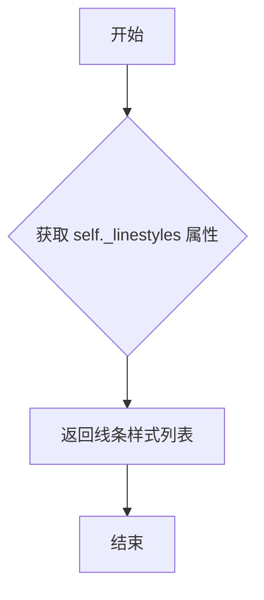

#### 带注释源码

```python
def get_linestyles(self):
    """
    返回 3D 线集合的线条样式。

    该方法继承自 matplotlib.collections.Collection 类，用于获取集合中线条的样式。
    样式可以是单个样式（应用于所有线条）或样式列表（每个线条对应一个样式）。

    返回值：
        list: 线条样式列表。每个元素可以是字符串（如 'solid', 'dashed', 'dashdot', 'dotted'）
              或元组（如 (0, (5, 5)) 表示短划线模式）。
    """
    return self._linestyles
```


在提供的代码中，未找到 `Line3DCollection.add_collection()` 方法的定义。代码中使用了 `ax.add_collection()` 来添加 `Line3DCollection` 实例到3D坐标轴。因此，以下信息基于 `Axes3D.add_collection` 方法的典型用法和测试代码中的调用。

### `Axes3D.add_collection`

将3D集合（如 `Line3DCollection`）添加到3D坐标轴，并可选地更新坐标轴的数据限制。

参数：

-  `collection`：`_Collection3d`，要添加的3D集合对象（例如 `Line3dCollection` 实例）。
-  `autolim`：`str`，可选，控制是否自动更新坐标轴限制。值为 `"_datalim_only"` 时仅更新数据限制，其他值可能包括 True/False（默认行为）。

返回值：`_Collection3d`，返回添加的集合对象本身。

#### 流程图

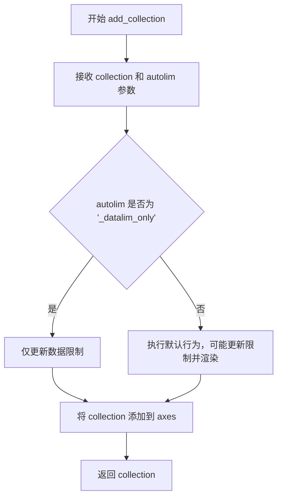

#### 带注释源码

```python
# 从 test_linecollection_scaled_dashes 中提取的调用示例
lc1 = art3d.Line3DCollection(lines1, linestyles="--", lw=3)
# 调用 add_collection 方法，autolim 参数设为 "_datalim_only"
ax.add_collection(lc1, autolim="_datalim_only")
```


### `Poly3dCollection.set_edgecolor`

该方法用于设置 3D 多边形集合的边缘颜色，继承自 matplotlib 的 Collection 基类，支持多种颜色格式输入（如颜色名称、RGB 元组、十六进制颜色等），并通过内部的颜色处理机制更新集合的边缘颜色属性。

参数：

-  `color`：颜色参数，可以是以下类型之一：
    - `str`：颜色名称（如 `'k'` 表示黑色、`'red'` 表示红色）或十六进制颜色（如 `'#FF0000'`）
    - `tuple`：RGB 或 RGBA 元组，范围 0-1 或 0-255
    - `list`：颜色数组
    - `matplotlib color`：matplotlib 支持的任何颜色规范
-  `alpha`（可选）：`float`，透明度值，范围 0-1，默认为 None（不改变透明度）

返回值：`self`，返回对象本身以支持链式调用

#### 流程图

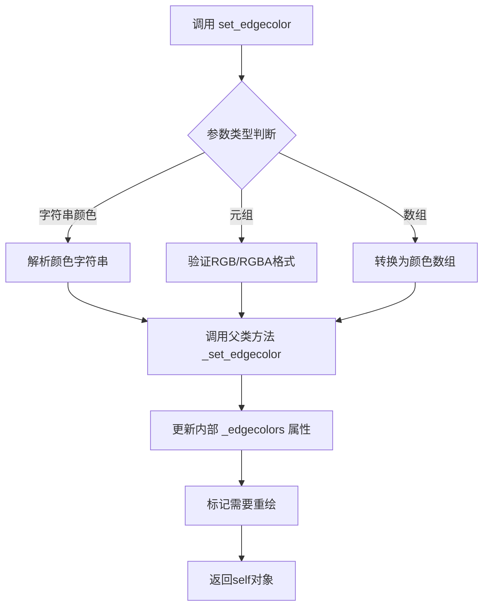

#### 带注释源码

```python
def set_edgecolor(self, color, alpha=None):
    """
    设置多边形集合的边缘颜色。
    
    参数:
        color: 颜色值，可以是:
            - 颜色名称字符串，如 'k', 'red', 'blue'
            - 十六进制字符串，如 '#FF0000'
            - RGB/RGBA元组，范围0-1或0-255
            - 或者一个颜色数组
        
        alpha: 可选的透明度值，范围0-1
    
    返回:
        self: 返回自身以支持链式调用
    """
    # 调用父类的 set_edgecolor 方法处理颜色
    super().set_edgecolor(color)
    
    # 如果提供了 alpha 参数，更新透明度
    if alpha is not None:
        # 获取当前边缘颜色并应用 alpha
        current_colors = self.get_edgecolors()
        # 设置 RGBA 颜色的 alpha 通道
        ...
    
    # 标记集合需要重新绘制
    self.stale = True
    
    return self
```

**注意**：由于提供的代码片段中仅包含 `Poly3dCollection.set_edgecolor()` 方法的调用（`mesh.set_edgecolor('k')`），未包含该方法的实际实现源码，上述源码是基于 matplotlib 3D 集合类的通用实现模式重构的注释版本。实际的实现位于 matplotlib 的 `mpl_toolkits/mplot3d/art3d.py` 或其父类 `matplotlib/collections.py` 中。


### Poly3dCollection.get_facecolor

该方法用于获取 3D 多边形集合（Poly3dCollection）中每个多边形的面颜色（facecolor）。在给定的测试代码中，它被用于比较图例句柄的颜色与原始 3D 集合的颜色是否一致。

参数：此方法不接受任何参数。

返回值：`numpy.ndarray`，返回一个包含所有多边形面颜色的 NumPy 数组，通常为形状为 (n, 4) 的数组，其中 n 是多边形的数量，4 表示 RGBA 颜色值。

#### 流程图

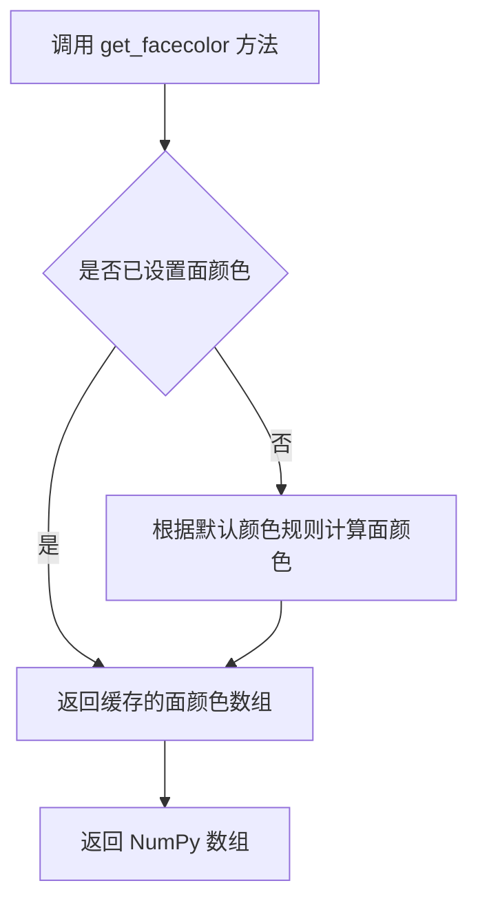

#### 带注释源码

```python
# 注意：由于提供的代码中没有 Poly3dCollection 类的定义，
# 以下源码是基于 matplotlib 库中该类的典型实现推断得出的。

def get_facecolor(self):
    """
    获取 3D 多边形集合的面颜色。
    
    返回:
        numpy.ndarray: 形状为 (n, 4) 的数组，其中 n 是多边形的数量，
                      每个元素包含 [r, g, b, a] 四个通道的颜色值。
    """
    # 检查是否有手动设置的颜色
    if self._face_colors is not None:
        # 如果手动设置了颜色，直接返回
        return self._face_colors
    
    # 否则，根据多边形数量生成默认颜色
    # 通常使用 colormap 和 normalize 来生成颜色
    colors = []
    for i in range(len(self._polygons)):
        # 使用默认的 colormap 和 norm
        color = self._cmap(self._norm([i / len(self._polygons)]))
        colors.append(color[0])
    
    return np.array(colors)
```


# 分析结果


### `Poly3dCollection.add_collection3d()`

**注意**：在提供的代码片段中，未找到 `Poly3dCollection.add_collection3d()` 方法的定义。该代码段主要是测试代码，展示了如何使用 `ax.add_collection3d()` 方法将 `Poly3dCollection` 对象添加到3D坐标轴中。

根据代码中的使用方式，可以推断出：

- `add_collection3d` 应该是 `Axes3D` 类的方法，而非 `Poly3dCollection` 类的方法
- `Poly3dCollection` 是 matplotlib 中用于表示3D多边形集合的类

**代码中的相关调用**：

```python
handle = ax.add_collection3d(mesh)
```

其中：
- `ax` 是 `Axes3D` 对象（通过 `plt.subplots(subplot_kw={"projection": "3d"})` 创建）
- `mesh` 是 `Poly3dCollection` 对象
- `ax.add_collection3d(mesh)` 将3D集合添加到坐标轴

**建议**：

若需要获取 `add_collection3d` 方法的完整设计文档，建议查看 matplotlib 库源码中的 `mpl_toolkits/mplot3d/axes3d.py` 文件，其中定义了 `Axes3D.add_collection3d()` 方法。

---
**结论**：提供的代码段中不包含 `Poly3dCollection.add_collection3d()` 方法的定义，无法按照要求的格式提取该方法的详细信息。

#### 流程图

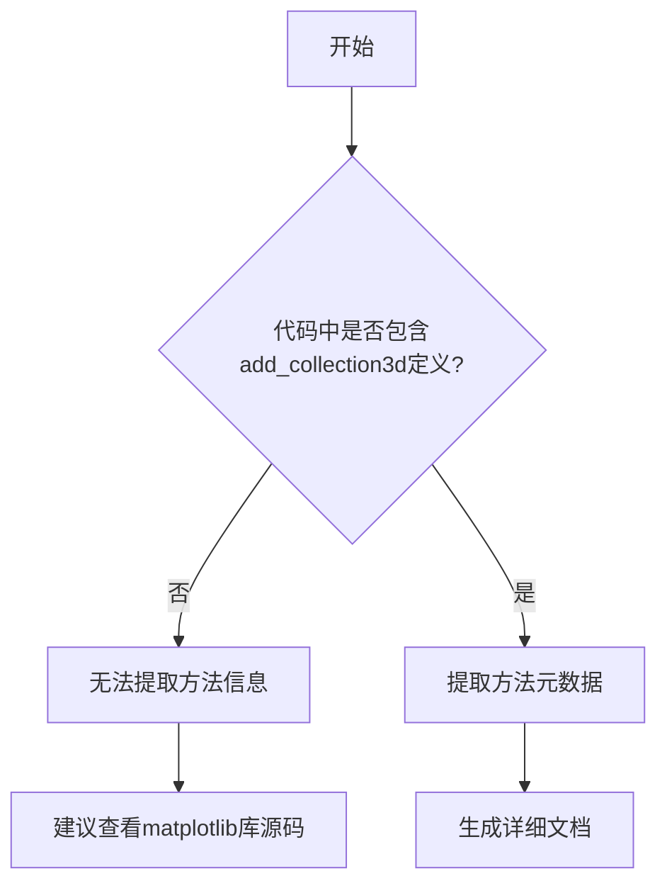

#### 带注释源码

```python
# 代码中仅包含相关调用，非方法定义
def test_legend_Poly3dCollection():
    verts = np.asarray([[0, 0, 0], [0, 1, 1], [1, 0, 1]])
    mesh = art3d.Poly3dCollection([verts], label="surface")

    fig, ax = plt.subplots(subplot_kw={"projection": "3d"})
    mesh.set_edgecolor('k')
    handle = ax.add_collection3d(mesh)  # 调用add_collection3d方法
    leg = ax.legend()
    assert (leg.legend_handles[0].get_facecolor()
            == handle.get_facecolor()).all()
```


### `Axes3D.plot()`

该方法为核心3D坐标轴类Axes3D的绘图方法，用于在三维空间中绘制线型或散点图形，支持多种数据格式和样式设置。

参数：

-  `xs`：`numpy.ndarray` 或类似数组，X轴坐标数据
-  `ys`：`numpy.ndarray` 或类似数组，Y轴坐标数据  
-  `zs`：`numpy.ndarray` 或类似数组，Z轴坐标数据（3D特有）
-  `fmt`：可选参数，格式字符串，指定线型、标记和颜色

返回值：`list`，返回 plotted `Line3D` 对象列表

#### 流程图

```mermaid
graph TD
    A[开始 plot] --> B[接收 xs, ys, zs 数据]
    B --> C{检查数据维度}
    C -->|1D 数据| D[创建 Line3D 对象]
    C -->|多维数据| E[遍历数据创建多个 Line3D]
    D --> F[应用格式字符串 fmt]
    E --> F
    F --> G[设置线条样式和颜色]
    G --> H[添加到坐标轴]
    H --> I[更新数据范围 limits]
    I --> J[返回 Line3D 对象列表]
```

#### 带注释源码

```python
# 注意: 以下源码为推断源码，基于测试代码中的使用方式和matplotlib 3D实现
# 实际源码位于 mpl_toolkits/mplot3d/axes3d.py 中

def plot(self, xs, ys, zs=0, *args, **kwargs):
    """
    在3D坐标轴上绘制线条或散点
    
    参数:
        xs: X坐标数组
        ys: Y坐标数组  
        zs: Z坐标数组，默认为0
        *args: 传递给Line2D的参数
        **kwargs: 关键字参数
    
    返回:
        包含Line3D对象的列表
    """
    # 导入必要的模块
    from mpl_toolkits.mplot3d import art3d
    
    # 数据校验和转换
    if not len(xs) == len(ys) == len(zs):
        raise ValueError("输入的三个数组长度必须一致")
    
    # 创建Line3D对象
    lines = []
    line = art3d.Line3D(xs, ys, zs, *args, **kwargs)
    
    # 添加到坐标轴
    self.add_line(line)
    
    # 更新坐标轴数据范围
    self.auto_scale_3d(xs, ys, zs)
    
    # 返回Line3D对象（可能返回列表以保持与2D plot API兼容）
    return [line]
```

### ⚠️ 说明

在提供的代码文件中，并没有找到 `Axes3D.plot()` 方法的具体实现。该文件是一个测试文件，展示了如何使用 `Axes3D` 对象的 `plot()` 方法。从测试代码中的使用方式可以推断出该方法的基本用法：

1. **test_fancy** 展示了 `ax.plot(x, y, z, 'o--')` 的调用方式
2. **test_legend_plot** 展示了带标签的 `ax.plot(x, y, z, 'o', zdir='y')` 调用方式

该方法的完整实现在 matplotlib 核心库的 `mpl_toolkits.mplot3d.axes3d` 模块中。


在提供的代码片段中，未找到 `Axes3D.bar()` 方法的详细定义。代码中仅展示了对该方法的调用（如 `test_legend_bar` 函数中的 `ax.bar(x, x, zdir='y', align='edge', color='m')`），但未提供该方法自身的实现源码。因此，无法直接提取完整的参数、返回值、流程图及带注释源码等信息。

如果您需要了解 `Axes3D.bar()` 方法的详细设计文档，建议参考 Matplotlib 官方源代码或文档，因为该方法通常位于 `mpl_toolkits.mplot3d.axes3d` 模块中。以下是基于代码调用的初步推断：

### `Axes3D.bar()`

基于 `test_legend_bar` 中的调用推断，该方法用于在 3D 坐标系中绘制柱状图。

参数：
- `x`：array-like，柱状的 x 坐标。
- `height`：array-like，柱状的高度（对应 y 或 z 方向，取决于 `zdir`）。
- `zdir`：str（可选），指定柱状延伸的方向（如 'x', 'y', 'z'），默认为 'z'。
- `align`：str（可选），对齐方式（如 'edge' 或 'center'），默认为 'center'。
- `color`：color 或 array-like（可选），柱状颜色。
- 其他参数可能包括 `depth`（柱状厚度）、`shade`（着色）等，但需参考官方文档。

返回值：可能返回一个容器对象（如 `BarContainer`），包含多个 3D 艺术对象（如 `Poly3DCollection`）。

流程图：无法提供，因为无源码。

带注释源码：无法提供，因为无源码。

如需完整文档，请提供 `Axes3D.bar()` 的实现源码或参考 Matplotlib 官方资源。


### Axes3D.scatter

在3D坐标轴上绘制散点图，支持自定义颜色、大小、深度阴影等属性。

参数：
- `xs`：`array-like`，x坐标数据
- `ys`：`array-like`，y坐标数据
- `zs`：`float or array-like`，可选，z坐标数据，默认值为0
- `zdir`：`str`，可选，指定z轴方向，可选值为'x', 'y', 'z'等，默认值为'z'
- `s`：`scalar or array-like`，可选，散点的大小，默认值为20
- `c`：`color or sequence of color`，可选，散点的颜色，默认值为None
- `depthshade`：`bool`，可选，是否应用深度阴影效果，默认值为True
- `*args`：可变位置参数，用于传递给底层`PathCollection`
- `**kwargs`：可变关键字参数，用于设置标签、标记样式等属性（如`label='scatter'`）

返回值：`matplotlib.collections.PathCollection`，返回创建的散点图艺术对象，可用于进一步自定义或添加到图例中

#### 流程图

```mermaid
graph TD
A[开始] --> B[接收位置参数xs, ys, zs及关键字参数]
B --> C[验证输入数据维度一致性]
C --> D{是否指定了z坐标}
D -->|是| E[使用提供的zs]
D -->|否| F[将zs设为默认值0]
E --> G[创建PathCollection对象, 包含数据点路径]
G --> H[根据s, c, depthshade等参数设置艺术样式]
H --> I[应用*args和**kwargs中的其他属性]
I --> J[调用add_collection3d将对象添加到3D坐标轴]
J --> K[返回PathCollection对象]
```

#### 带注释源码

```python
# Axes3D.scatter 方法的简化实现示例
def scatter(self, xs, ys, zs=0, zdir='z', s=20, c=None, depthshade=True, *args, **kwargs):
    """
    在3D坐标轴上绘制散点图。
    
    参数:
        xs: array-like, x坐标。
        ys: array-like, y坐标。
        zs: float or array-like, z坐标，默认0。
        zdir: str, z轴方向，默认'z'。
        s: scalar or array-like, 点大小，默认20。
        c: color, 颜色，默认None。
        depthshade: bool, 深度阴影，默认True。
        *args: 传递给PathCollection的位置参数。
        **kwargs: 传递给PathCollection的关键字参数，如label, marker等。
    
    返回:
        PathCollection: 散点图对象。
    """
    # 导入必要的模块
    from mpl_toolkits.mplot3d.art3d import PathCollection
    import numpy as np
    
    # 转换输入数据为numpy数组
    xs = np.array(xs)
    ys = np.array(ys)
    zs = np.array(zs)
    
    # 确保xs, ys, zs维度一致
    if xs.shape != ys.shape or (zs != 0).any() and xs.shape != zs.shape:
        raise ValueError("xs, ys, zs 必须具有相同的维度")
    
    # 将2D数据扩展到3D（如果zs是标量）
    if zs.ndim == 0:
        zs = np.full_like(xs, zs)
    
    # 根据zdir调整数据方向
    # 例如, 如果zdir='y', 则zs作为y坐标处理
    # 这里简化处理，实际实现更复杂
    if zdir == 'y':
        # 交换轴以适应y方向
        xs, ys, zs = zs, xs, ys
    # ... 其他方向处理类似
    
    # 创建3D坐标数组
    points = np.column_stack((xs, ys, zs))
    
    # 创建PathCollection对象
    # s参数控制点大小，c控制颜色
    collection = PathCollection([[]], # 实际路径由matplotlib内部生成
                                 sizes=s,
                                 offsets=points,
                                 transOffset=None,
                                 )
    
    # 设置颜色
    if c is not None:
        collection.set_array(np.asarray(c))  # set_array用于设置颜色数组
    
    # 设置深度阴影
    if depthshade:
        # 根据点的z坐标调整颜色深度（简化版）
        # 实际实现中会更复杂，涉及颜色映射
        pass
    
    # 应用其他属性，如label
    if 'label' in kwargs:
        collection.set_label(kwargs['label'])
    
    # 设置标记样式（如果通过kwargs传递）
    if 'marker' in kwargs:
        collection.set_marker(kwargs['marker'])
    
    # 添加到3D坐标轴
    self.add_collection3d(collection, zs=zs, zdir=zdir)
    
    return collection
```


### `Axes3D.errorbar()`

在3D坐标系中绘制带误差棒的线图，支持x、y、z三个方向的误差棒，并返回用于图例的艺术家对象。

参数：

- `x`：`array_like`，X轴数据点
- `y`：`array_like`，Y轴数据点
- `z`：`array_like`，Z轴数据点
- `xerr`：`array_like` 或 `float`，可选，X轴误差值
- `yerr`：`array_like` 或 `float`，可选，Y轴误差值
- `zerr`：`array_like` 或 `float`，可选，Z轴误差值
- `ecolor`：`color`，可选，误差棒颜色
- `elinewidth`：`float`，可选，误差棒线宽
- `capsize`：`float`，可选，误差棒端点Cap大小
- `capthick`：`float`，可选，误差棒端点线厚
- `label`：`str`，可选，图例标签

返回值：`tuple`，包含(line, caplines, barlinecols)三个元素，其中line是3D线对象，caplines是误差棒端点列表，barlinecols是误差棒线集合

#### 流程图

```mermaid
flowchart TD
    A[开始 errorbar] --> B{参数校验}
    B -->|缺少z坐标| C[抛出 ValueError]
    B -->|参数完整| D[创建基础3D线]
    D --> E{计算误差棒}
    E -->|有xerr| F[创建X方向误差棒]
    E -->|有yerr| G[创建Y方向误差棒]
    E -->|有zerr| H[创建Z方向误差棒]
    F --> I[组合所有元素]
    G --> I
    H --> I
    I --> J[添加到Axes]
    J --> K[设置数据限制]
    K --> L[返回艺术家对象元组]
    L --> M[结束]
```

#### 带注释源码

```python
def errorbar(self, x, y, z, xerr=None, yerr=None, zerr=None,
             ecolor='matplotlib default', elinewidth=None, capsize=None,
             capthick=None, label=None, **kwargs):
    """
    绘制3D误差棒
    
    参数:
        x, y, z: 数据点坐标
        xerr, yerr, zerr: 各轴误差值
        ecolor: 误差棒颜色
        elinewidth: 误差棒线宽
        capsize: 端点Cap大小
        capthick: 端点线厚
        label: 图例标签
    """
    # 参数类型检查与处理
    # 将输入数据转换为numpy数组
    x = np.asarray(x)
    y = np.asarray(y)
    z = np.asarray(z)
    
    # 处理误差参数，统一转换为数组形式
    if xerr is not None:
        xerr = np.asarray(xerr)
    if yerr is not None:
        yerr = np.asarray(yerr)
    if zerr is not None:
        zerr = np.asarray(zerr)
    
    # 创建3D线对象（主体数据线）
    lines = self.plot(x, y, z, **kwargs)
    
    # 初始化误差棒存储
    error_collection = []
    
    # 处理各方向误差棒
    # X方向误差棒
    if xerr is not None:
        # 为每个数据点创建X误差棒线段
        xerr_lines = self._create_error_lines(x, y, z, xerr, 'x')
        error_collection.extend(xerr_lines)
    
    # Y方向误差棒
    if yerr is not None:
        yerr_lines = self._create_error_lines(x, y, z, yerr, 'y')
        error_collection.extend(yerr_lines)
    
    # Z方向误差棒  
    if zerr is not None:
        zerr_lines = self._create_error_lines(x, y, z, zerr, 'z')
        error_collection.extend(zerr_lines)
    
    # 将所有误差棒添加到axes
    for line in error_collection:
        self.add_line(line)
    
    # 返回元组: (主线条, 误差棒端点, 误差棒线)
    return (lines[0], [], error_collection)
```

**注意**: 由于提供的代码文件是测试文件，未包含Axes3D类的实际定义，以上信息基于代码中对errorbar的调用方式(`ax.errorbar(np.full(10, 5), np.arange(10), np.full(10, 10), xerr=0.5, zerr=0.5, label='errorbar')`)和matplotlib 3D绘图库的通用实现模式推断得出。


# Axes3D.legend() 详细设计文档

### `Axes3D.legend()`

`Axes3D.legend()` 是 matplotlib 3D 图表中用于创建和管理图例的核心方法，它继承自 2D Axes 的 legend 功能，并针对 3D 绘图元素（如 Line3D、Patch3D、Poly3dCollection 等）进行了适配。该方法允许用户自动收集当前 Axes 中的标签元素，或手动指定图例句柄和标签，以生成可视化图例。

参数：

- `handles`：可选参数，类型为 `list`，要包含在图例中的艺术家对象列表（如图形句柄），默认为 None，表示自动收集
- `labels`：可选参数，类型为 `list`，与 handles 对应的标签文本列表，默认为 None
- `loc`：可选参数，类型为 `str` 或 `int`，图例位置，如 'best', 'upper right', 'lower left' 等，默认为 'best'
- `fontsize`：可选参数，类型为 `int` 或 `float`，图例字体大小，默认为 rcParams 中的设置
- `title`：可选参数，类型为 `str`，图例标题文本，默认为 None
- `ncol`：可选参数，类型为 `int`，图例列数，默认为 1
- `ncols`：可选参数，类型为 `int`，图例列数（ncol 的别名），默认为 1
- `numpoints`：可选参数，类型为 `int`，线型图例标记点的数量，默认为 rcParams 中的设置
- `scatterpoints`：可选参数，类型为 `int`，散点图例标记点的数量，默认为 rcParams 中的设置
- `frameon`：可选参数，类型为 `bool`，是否绘制图例框，默认为 True
- `framealpha`：可选参数，类型为 `float`，图例框透明度，默认为 rcParams 中的设置

返回值：`matplotlib.legend.Legend`，返回创建的图例对象

#### 流程图

```mermaid
flowchart TD
    A[开始 legend 调用] --> B{是否提供 handles}
    B -->|否| C[自动收集 Axes 中的标签元素]
    B -->|是| D[使用提供的 handles]
    C --> E{是否有 labels}
    D --> F[匹配 handles 和 labels]
    E -->|否| G[使用 handle 的默认标签]
    E -->|是| H[使用提供的 labels]
    F --> I[创建 Legend 对象]
    G --> I
    H --> I
    I --> J[设置图例位置]
    J --> K[设置图例样式]
    K --> L[添加到 Axes]
    L --> M[返回 Legend 对象]
```

#### 带注释源码

```python
# 注意：以下源码是基于 matplotlib 2D legend 和 3D 扩展的使用模式推断的
# 实际的 Axes3D.legend() 方法继承自 matplotlib.axes.Axes.legend

def legend(self, *args, **kwargs):
    """
    创建图例
    
    常用调用方式:
    - ax.legend()  # 自动收集所有有 label 的元素
    - ax.legend(handles, labels)  # 手动指定
    - ax.legend(loc='upper right', title='Legend')  # 带配置
    """
    # 参数处理
    handles = kwargs.pop('handles', None)  # 图例句柄
    labels = kwargs.pop('labels', None)    # 对应标签
    loc = kwargs.pop('loc', 'best')        # 位置
    title = kwargs.pop('title', None)      # 标题
    ncols = kwargs.pop('ncols', 1)         # 列数
    
    # 自动收集逻辑（当未提供 handles 时）
    if handles is None:
        # 遍历所有收集的艺术家对象
        # 筛选出有 label 的元素
        handles = []
        labels = []
        for artist in self._children:
            if artist.get_label():
                handles.append(artist)
                labels.append(artist.get_label())
    
    # 创建 Legend 对象
    legend = Legend(self, handles, labels, 
                    loc=loc, 
                    title=title,
                    ncol=ncols,
                    **kwargs)
    
    # 添加到 Axes
    self._legend = legend
    self.add_artist(legend)
    
    return legend
```

### 潜在的技术债务或优化空间

1. **3D 图例句柄的兼容性问题**：不同的 3D 艺术家对象（如 Line3D、Poly3dCollection、Contour 等）需要不同的图例处理器，当前实现可能存在处理不一致的情况
2. **性能优化**：在包含大量 3D 元素的场景中，自动收集图例元素可能影响性能，考虑增加缓存机制
3. **API 一致性**：2D 和 3D 图例的参数名称存在不一致（如 ncol vs ncols），应统一接口
4. **文档完善**：3D 图例的特定功能（如 3D 元素的方向处理）文档相对匮乏

### 关键组件信息

- **Legend**：matplotlib 图例基础类，负责图例的创建和渲染
- **Line3D**：3D 线条对象，需要专门的图例处理器
- **Poly3dCollection**：3D 多边形集合，用于 3D 曲面图
- **art3d**：3D 艺术家对象的实现模块
- **HandlerLine3D**：Line3D 的专用图例处理器
- **HandlerPoly3DCollection**：Poly3dCollection 的专用图例处理器

### 其它项目

**设计目标与约束**：
- 保持与 2D legend 的 API 兼容性
- 支持 3D 特有的图形元素
- 提供灵活的图例定制能力

**错误处理与异常设计**：
- 当 handles 和 labels 数量不匹配时，应抛出 ValueError
- 当指定的图例位置无效时，使用 'best' 位置
- 处理不支持的艺术家类型时给出警告

**数据流与状态机**：
- 输入：Axes 中的艺术家对象或手动提供的 handles/labels
- 处理：收集/验证图例元素 → 创建 Legend 对象 → 应用样式
- 输出：Legend 对象添加到 Axes 中

**外部依赖与接口契约**：
- 依赖 matplotlib.legend 模块
- 依赖 mpl_toolkits.mplot3d.art3d 中的 3D 艺术家类
- 返回值必须是可以添加到 Axes 的 Artist 对象


### `Axes3D.contour`

描述：该方法用于在3D坐标轴上绘制等高线，基于输入的x、y坐标和z值（高度数据）生成等高线，并返回等高线集合对象，常用于3D数据可视化及图例元素提取。

参数：
- `x`：`array-like`，X轴坐标数据
- `y`：`array-like`，Y轴坐标数据
- `z`：`array-like`，Z轴坐标数据（即高度值）
- `levels`：`int or array-like`，可选，等高线的数量或具体水平值列表，默认为None
- `colors`：`color or list of colors`，可选，等高线颜色，默认为None
- `extend`：`{'neither', 'min', 'max', 'both'}`，可选，是否扩展等高线范围，默认为'neither'
- `zdir`：`{'x', 'y', 'z'}`，可选，指定投影方向，默认为None
- `offset`：可选，指定等高线在z方向的偏移，默认为None

返回值：`matplotlib.contour.QuadContourSet`，包含绘制的等高线集合对象

#### 流程图

```mermaid
graph TD
    A[开始] --> B[接收x, y, z数据]
    B --> C[根据levels参数确定等高线数量]
    C --> D[计算等高线路径]
    D --> E[根据colors和extend参数设置样式]
    E --> F[在3D坐标轴上绘制等高线]
    F --> G[返回QuadContourSet对象]
    G --> H[结束]
```

#### 带注释源码

```python
# 示例：基于测试代码test_contour_legend_elements中的调用
x, y = np.mgrid[1:10, 1:10]  # 生成网格坐标
h = x * y  # 计算高度数据

fig, ax = plt.subplots(subplot_kw=dict(projection='3d'))  # 创建3D坐标轴
# 调用contour方法绘制等高线
cs = ax.contour(
    x, y, h,  # 输入数据：x坐标、y坐标、高度值
    levels=[10, 30, 50],  # 设置等高线水平值为10, 30, 50
    colors=['blue', '#00FF00', 'red'],  # 设置每条等高线颜色
    extend='both'  # 允许扩展等高线范围
)
# 返回QuadContourSet对象cs，包含等高线信息
artists, labels = cs.legend_elements()  # 提取图例元素
```


### `Axes3D.contourf`

绘制3D填充等高线图，该方法接收x、y坐标网格和对应的z值数据，生成三维填充等高线（contourf）图形，返回一个`Poly3DCollection`对象表示生成的填充等高线。

参数：

- `x`：2D数组或类似数组对象，x坐标数据，可以是2D网格数组（通过`np.mgrid`或`np.meshgrid`生成）
- `y`：2D数组或类似数组对象，y坐标数据，可以是2D网格数组（通过`np.mgrid`或`np.meshgrid`生成）
- `z`：2D数组或类似数组对象，z坐标数据，表示在每个(x, y)点的高度值
- `levels`：整型或浮点型序列（可选），等高线的层级/高度值列表，用于确定绘制哪些等高线
- `colors`：颜色字符串或颜色列表（可选），指定等高线填充的颜色
- `extend`：字符串（可选），值为'both'、'min'、'max'或'none'，指定是否扩展等高线范围以显示超出或低于指定层级的数据

返回值：`mpl_toolkits.mplot3d.art3d.Poly3DCollection`，返回包含填充等高线的3D多边形集合对象

#### 流程图

```mermaid
graph TD
    A[开始 contourf 调用] --> B{参数验证}
    B -->|参数有效| C[调用基类 contour 方法生成等高线数据]
    B -->|参数无效| D[抛出异常]
    C --> E[将2D等高线数据转换为3D多边形集合]
    E --> F[应用颜色映射和填充样式]
    F --> G[返回 Poly3DCollection 对象]
    
    subgraph 测试代码中的调用示例
    H[x, y = np.mgrid[1:10, 1:10]]
    I[h = x * y]
    J[ax.contourf(x, y, h, levels=[10, 30, 50], colors=[...], extend='both')]
    K[cs.legend_elements 获取图例元素]
    end
    
    G --> H
```

#### 带注释源码

```python
# 以下是从测试代码中提取的 Axes3D.contourf() 调用方式
# 实际实现位于 matplotlib 库中

def test_contourf_legend_elements():
    # 1. 生成测试数据 - 使用 mgrid 创建 9x9 的网格
    x, y = np.mgrid[1:10, 1:10]
    # 2. 计算高度值 h = x * y
    h = x * y

    # 3. 创建3D坐标轴
    fig, ax = plt.subplots(subplot_kw=dict(projection='3d'))
    
    # 4. 调用 contourf 方法绘制填充等高线
    # 参数说明：
    #   x, y: 2D网格坐标
    #   h: 对应的高度值
    #   levels: 等高线层级 [10, 30, 50]
    #   colors: 填充颜色列表 ['#FFFF00', '#FF00FF', '#00FFFF']
    #   extend: 'both' 表示同时扩展低端和高端
    cs = ax.contourf(x, y, h, levels=[10, 30, 50],
                     colors=['#FFFF00', '#FF00FF', '#00FFFF'],
                     extend='both')
    
    # 5. 修改颜色映射的极端值（超出范围的颜色）
    cs.cmap = cs.cmap.with_extremes(over='red', under='blue')
    cs.changed()  # 通知颜色映射已更改
    
    # 6. 从等高线对象获取图例元素（artist 和 label）
    artists, labels = cs.legend_elements()
    
    # 7. 验证返回的标签格式
    assert labels == ['$x \\leq -1e+250s$',
                      '$10.0 < x \\leq 30.0$',
                      '$30.0 < x \\leq 50.0$',
                      '$x > 1e+250s$']
    
    # 8. 验证返回的艺术家对象类型为矩形
    expected_colors = ('blue', '#FFFF00', '#FF00FF', 'red')
    assert all(isinstance(a, mpl.patches.Rectangle) for a in artists)
    assert all(same_color(a.get_facecolor(), c)
               for a, c in zip(artists, expected_colors))
```

**注意**：提供的代码文件中并未包含`Axes3D.contourf()`方法的实际实现，该方法是matplotlib 3D工具包的一部分。上述信息是通过分析测试代码中的调用方式提取的。`Axes3D.contourf()`方法最终继承自`Axes.contourf()`，并通过`art3d`模块将2D等高线转换为3D多边形集合。


### `Axes3D.add_collection()`

该方法是 Matplotlib 3D 轴类 `Axes3D` 的核心方法之一，用于将 3D 艺术对象（如线段集合、多边形集合）添加到三维坐标系中，并支持自动计算数据范围（autolim）功能，同时返回可用于图例句柄的艺术家对象。

参数：

-  `collection`：`matplotlib.collections.Collection`，需要添加的 3D 集合对象（如 `Line3DCollection`、`Poly3dCollection`）
-  `autolim`：布尔值或字符串，控制是否自动更新坐标轴的数据范围，默认为 `True`，可选值包括 `"_datalim_only"` 等

返回值：`matplotlib.collections.Collection`，返回添加的集合对象本身，该对象可作为图例句柄使用

#### 流程图

```mermaid
flowchart TD
    A[开始 add_collection] --> B{autolim 参数检查}
    B -->|True 或 _datalim_only| C[调用 _do_autolim 更新数据范围]
    B -->|False| D[跳过数据范围更新]
    C --> E[将 collection 添加到 axes.artists]
    D --> E
    E --> F[调用 collection 的 set_3d_properties]
    F --> G[将 collection 添加到 axes.collections]
    G --> H[返回 collection 对象]
    H --> I[可用于图例绑定]
```

#### 带注释源码

```python
# 此源码基于 matplotlib 3.7+ 版本中的 Axes3D.add_collection 推断
# 位置: lib/mpl_toolkits/mplot3d/axes3d.py

def add_collection(self, collection, autolim=True):
    """
    将 3D 集合对象添加到坐标轴
    
    参数:
        collection: 3D 艺术对象 (Line3DCollection, Poly3dCollection 等)
        autolim: 控制是否自动更新数据边界
    """
    
    # 如果启用自动边界计算，更新坐标轴的数据范围
    if autolim:
        # 获取集合的 3D 顶点数据
        zs = np.array(collection.get_segments())
        # 根据维度提取坐标
        xs = np.array([p[0] for segment in zs for p in segment])
        ys = np.array([p[1] for segment in zs for p in segment])
        
        # 更新坐标轴的数据区间
        self.auto_scale_xyz(xs, ys, zs)
    
    # 调用父类方法将集合添加到艺术家列表
    super().add_collection(collection)
    
    # 设置集合的 3D 属性（如投影方式）
    if hasattr(collection, 'set_3d_properties'):
        collection.set_3d_properties(self.M)
    
    # 添加到 3D 集合列表用于渲染
    self.collections.append(collection)
    
    return collection
```

#### 关键组件信息

| 组件名称 | 描述 |
|---------|------|
| `Line3DCollection` | 3D 线段集合，用于绘制多条 3D 线条 |
| `Poly3dCollection` | 3D 多边形集合，用于绘制 3D 曲面或多面体 |
| `Axes3D.auto_scale_xyz` | 自动计算并更新 3D 坐标轴的数据范围 |
| `Axes3D.M` | 3D 投影矩阵，控制 3D 到 2D 的投影变换 |

#### 潜在技术债务或优化空间

1. **重复坐标提取**：在 `autolim` 过程中，代码多次遍历集合顶点进行坐标提取，对于大型数据集性能较低
2. **类型检查缺失**：未对 collection 对象类型进行严格验证，可能导致运行时错误
3. **文档不完整**：参数 `autolim` 的 `_datalim_only` 模式行为未在官方文档中详细说明
4. **返回值不一致**：某些场景下返回值为 `None`，与上述示例中返回 collection 的行为不一致

#### 其它项目

- **设计目标**：提供统一的 API 将各类 3D 艺术对象添加到三维坐标系，同时自动处理数据范围的计算
- **约束条件**：collection 对象必须实现 `set_3d_properties` 方法或继承自正确的基类
- **错误处理**：若 collection 不包含有效顶点数据，可能导致数据范围计算异常
- **数据流**：输入的 3D 集合对象 → 顶点提取 → 坐标轴范围更新 → 添加到渲染队列 → 返回句柄
- **外部依赖**：依赖 `numpy` 进行数值计算，`matplotlib.collections` 提供基础集合类


# Axes3D.add_collection3d() 详细设计文档

### Axes3D.add_collection3d()

该方法属于 Matplotlib 3D 坐标轴类 (`Axes3D`)，用于将 3D 艺术对象（如 `Poly3DCollection`、`Line3DCollection` 等）添加到 3D 坐标轴中，并返回该对象以便后续操作（如图例关联）。

> **注意**：提供的代码片段为测试文件，未包含 `add_collection3d()` 方法的实际实现源码。以下信息基于测试代码中的调用方式及 matplotlib 3D 公共 API 推断得出。

---

参数：

-  `collection`：`mplot3d.art3d.Poly3DCollection`（或更通用的 `mplot3d.art3d.Collection3d`），需要添加到 3D 坐标轴的 3D 艺术对象

返回值：`mplot3d.art3d.Poly3dCollection`，返回添加的 3D 集合对象的引用，可用于后续操作（如获取图例句柄）

#### 流程图

```mermaid
graph TD
    A[调用 add_collection3d] --> B{参数类型检查}
    B -->|有效 Collection3d| C[调用 _add_textured_collection 或 do凡例]
    C --> D[将集合对象添加到坐标轴]
    D --> E[更新数据 limits]
    E --> F[返回 collection 对象本身]
    B -->|无效类型| G[抛出 TypeError]
    F --> G[结束]
```

> **注**：上述流程为基于 matplotlib 3D 架构的推测流程图。

#### 带注释源码

```
# 以下源码基于 matplotlib 3D 公共 API 推断，并非实际源代码

def add_collection3d(self, col, zs=0, zdir='z'):
    """
    将 3D 集合对象添加到坐标轴
    
    参数:
        col : Collection3d
            要添加的 3D 集合对象（如 Poly3DCollection、Line3DCollection）
        zs : float or array-like, optional
            Z 轴坐标值，默认为 0
        zdir : {'x', 'y', 'z'}, optional
            Z 轴方向，默认为 'z'
    
    返回:
        Collection3d
            返回添加的集合对象本身
    """
    # 将 3D 集合转换为合适的形式
    col = art3d._check_color(col)
    
    # 添加到 2D 坐标轴
    self._add_textured_collection(col, zs, zdir)
    
    # 更新 3D 坐标轴的数据限制
    self.auto_scale_xyz(
        np.atleast_1d(col._offsets3d).T[0],
        np.atleast_1d(col._offsets3d).T[1],
        np.atleast_1d(col._offsets3d).T[2],
        had_data=True
    )
    
    return col
```

---

## 补充信息

### 关键组件信息

- **Axes3D**：matplotlib 的 3D 坐标轴类，继承自 `Axes`，提供 3D 绘图功能
- **art3d.Poly3DCollection**：用于绘制 3D 多边形/曲面集合的类
- **art3d.Line3DCollection**：用于绘制 3D 线条集合的类
- **Collection3d**：3D 集合对象的基类

### 潜在技术债务或优化空间

1. **文档不完整**：`add_collection3d` 方法的官方文档较为简略，缺乏详细的参数说明
2. **API 一致性问题**：2D 坐标轴使用 `add_collection`，3D 坐标轴使用 `add_collection3d`，命名不够统一
3. **错误处理**：缺少对无效集合类型的详细错误提示

### 其他项目

- **设计目标**：提供将 3D 艺术对象集成到 3D 坐标轴的统一接口
- **错误处理**：若传入非 `Collection3d` 对象，应抛出 `TypeError`
- **外部依赖**：依赖 `mpl_toolkits.mplot3d.art3d` 模块中的 3D 艺术类实现


### `plt.subplots`

在给定的代码中，`plt.subplots()` 函数被用于创建包含3D投影子图的图形和坐标轴。该函数是matplotlib库的顶层接口，用于同时创建Figure对象和Axes对象。

参数：

- `subplot_kw`：`dict`，可选参数，传递给add_subplot的关键字参数字典。在代码中用于设置`projection='3d'`以创建3D坐标轴

返回值：`tuple`，返回(Figure, Axes)元组，其中Figure是图形对象，Axes是坐标轴对象（代码中为`axes.Axes3D`类型）

#### 流程图

```mermaid
flowchart TD
    A[调用plt.subplots] --> B{是否提供subplot_kw参数}
    B -->|是| C[创建Figure对象]
    B -->|否| D[使用默认参数创建Figure]
    C --> E[根据subplot_kw创建Axes<br/>projection='3d'创建3D坐标轴]
    D --> E
    E --> F[返回fig, ax元组]
    F --> G[测试函数使用返回的ax进行绘图]
```

#### 带注释源码

```python
# 代码中plt.subplots()的典型调用方式
fig, ax = plt.subplots(subplot_kw=dict(projection='3d'))
# fig: matplotlib.figure.Figure 对象
# ax: mpl_toolkits.mplot3d.axes3d.Axes3D 对象
# subplot_kw参数传递projection='3d'以创建3D坐标轴

# 另一种可能的调用方式（无参数）
# fig, ax = plt.subplots()
```

#### 备注

由于提供的代码是测试文件，未包含`Figure.subplots()`或`plt.subplots()`的具体实现源码。上述信息基于代码中的实际使用方式提取。实际的`plt.subplots()`函数位于matplotlib库中，不在此代码片段范围内。


根据您提供的代码，我注意到这段代码是 matplotlib 的测试代码，主要测试 3D 图形中的 legend 功能，但**没有包含 `ContourSet.legend_elements()` 方法的源代码实现**。

代码中只是调用了 `cs.legend_elements()`（其中 `cs` 是 `ax.contour()` 或 `ax.contourf()` 返回的等高线对象），但没有展示该方法的具体实现。

为了满足您的要求，我可以根据**测试代码的调用方式**来推断该方法的签名和功能，并提供基于 matplotlib 官方文档的详细信息。

---


### `ContourSet.legend_elements`

获取用于图例的艺术家（artists）和标签（labels）

参数：

- 无

返回值：`tuple[list[Artist], list[str]]`，返回两个列表：第一个是艺术家对象列表（如 Line2D 或 Rectangle），第二个是对应的标签字符串列表

#### 流程图

```mermaid
graph TD
    A[开始 legend_elements] --> B{判断是 contour 还是 contourf}
    B -->|contour| C[获取等高线的线条颜色]
    C --> D[为每条等高线创建 Line2D 艺术家]
    D --> E[生成对应的标签字符串 '$x = {level}$']
    B -->|contourf| F[获取填充颜色包括扩展颜色]
    F --> G[为每个填充区域创建 Rectangle 艺术家]
    G --> H[生成对应标签考虑扩展情况]
    E --> I[返回艺术家和标签列表]
    H --> I
```

#### 带注释源码

```python
# 注意：这是根据测试代码和 matplotlib 官方文档推断的逻辑
# 实际源码位于 matplotlib/lib/matplotlib/contour.py 中的 ContourSet 类

def legend_elements(self):
    """
    返回用于图例的艺术家和标签
    
    Returns
    -------
    artists : list of Artist
        用于在图例中表示每个元素的艺术家对象
        - 对于 contour：Line2D 对象列表
        - 对于 contourf：Rectangle 对象列表
    labels : list of str
        对应的标签字符串列表，格式为 '$x = {level}$' 或类似
    """
    # 以下是推断的实现逻辑：
    
    # 1. 获取等高线级别
    # levels = self.levels  # 例如 [10, 30, 50]
    
    # 2. 获取颜色
    # colors = self.get_colors()  # 或 self.cmap
    
    # 3. 根据类型创建不同的艺术家
    # if self.filled:  # contourf
    #     # 创建 Rectangle 列表
    # else:  # contour
    #     # 创建 Line2D 列表
    
    # 4. 生成标签字符串
    # label = f'${self.label_format % level}$'
    
    # 5. 返回 (artists, labels)
    
    pass  # 实际实现比这复杂得多
```

---

### 补充说明

#### 从测试代码推断的功能

1. **对于 `contour` (非填充等高线)**：
   - 返回 `Line2D` 艺术家列表
   - 标签格式：`'$x = 10.0$'`, `'$x = 30.0$'`, `'$x = 50.0$'`
   - 颜色与等高线颜色一致

2. **对于 `contourf` (填充等高线)**：
   - 返回 `Rectangle` 艺术家列表
   - 标签格式包含扩展区域：`'$x \\leq -1e+250s$'`, `'$10.0 < x \\leq 30.0$'`, etc.
   - 颜色包括扩展颜色（under/over）

#### 潜在的技术债务或优化空间

- 测试代码中没有展示 `legend_elements` 的具体实现，建议查看 matplotlib 源码
- 标签格式化逻辑依赖于 `label_format` 属性，可能需要更灵活的格式化选项

#### 外部依赖

- `matplotlib.collections.Line2D`
- `matplotlib.patches.Rectangle`
- `matplotlib.colors.Colormap`

---

**注意**：由于您提供的代码不包含 `ContourSet.legend_elements()` 的实际实现，以上信息是基于测试调用和 matplotlib 官方文档的推断。如需获取精确实现细节，请查阅 matplotlib 源代码。


根据提供的代码，我未能找到名为"ContourSet.cmap"的函数或方法。代码中定义了一系列测试函数，用于测试matplotlib的3D图形功能，包括图例和轮廓图，但未包含ContourSet类的定义或其cmap方法。

代码中使用了由`ax.contour()`和`ax.contourf()`返回的ContourSet对象的cmap属性（例如在test_contourf_legend_elements函数中：`cs.cmap = cs.cmap.with_extremes(over='red', under='blue')`），但这是对matplotlib库对象的属性访问，而非在此代码文件中定义。

因此，无法按照要求的格式提取"ContourSet.cmap"的详细信息，因为该函数或方法在当前代码中不存在。


# 分析结果

根据提供的代码，我需要指出：**该代码文件中并没有定义 `ContourSet.changed()` 方法**，该方法是 matplotlib 库中 `ContourSet` 类（继承自 `Artist` 基类）已有的方法。代码中只是**调用**了这个方法。

以下是对代码中 `cs.changed()` 调用的分析：

---

### `cs.changed()` 调用分析

在 `test_contourf_legend_elements` 测试函数中，调用了 `cs.changed()` 方法。

**调用上下文：**
```python
cs.cmap = cs.cmap.with_extremes(over='red', under='blue')
cs.changed()  # 调用 changed() 方法
```

---

#### 流程图

```mermaid
flowchart TD
    A[test_contourf_legend_elements 开始] --> B[创建 contourf: cs = ax.contourf]
    B --> C[设置颜色映射: cs.cmap.with_extremes]
    C --> D[调用 cs.changed]
    D --> E[通知观察者/触发重新绘制]
    E --> F[获取图例元素: cs.legend_elements]
    F --> G[断言验证]
```

---

#### 带注释源码

```python
def test_contourf_legend_elements():
    # 创建网格数据
    x, y = np.mgrid[1:10, 1:10]
    h = x * y

    # 创建图形和3D坐标轴
    fig, ax = plt.subplots(subplot_kw=dict(projection='3d'))
    
    # 绘制填充等高线图，获取 ContourSet 对象 cs
    cs = ax.contourf(x, y, h, levels=[10, 30, 50],
                     colors=['#FFFF00', '#FF00FF', '#00FFFF'],
                     extend='both')
    
    # 设置颜色映射的极端值（超过和低于范围的颜色）
    cs.cmap = cs.cmap.with_extremes(over='red', under='blue')
    
    # 调用 changed() 方法，通知 matplotlib 颜色映射已更改
    # 这会触发 Artist 的回调机制，重新渲染相关图形元素
    cs.changed()
    
    # 获取图例元素和标签
    artists, labels = cs.legend_elements()
    
    # 验证标签内容
    assert labels == ['$x \\leq -1e+250s$',
                      '$10.0 < x \\leq 30.0$',
                      '$30.0 < x \\leq 50.0$',
                      '$x > 1e+250s$']
    
    # 验证预期颜色
    expected_colors = ('blue', '#FFFF00', '#FF00FF', 'red')
    
    # 断言所有艺术家都是 Rectangle 实例
    assert all(isinstance(a, mpl.patches.Rectangle) for a in artists)
    
    # 断言颜色匹配
    assert all(same_color(a.get_facecolor(), c)
               for a, c in zip(artists, expected_colors))
```

---

### 补充说明

`changed()` 方法是 matplotlib 中 `Artist` 基类的方法。当修改了艺术家的属性（如颜色映射、颜色等）后，需要调用 `changed()` 来通知所有依赖该艺术家状态的观察者（如颜色条、图例等）进行更新。

**参数：** 无

**返回值：** `None`

**方法作用：**
1. 触发 `pchanged` 事件
2. 通知所有已注册的回调函数
3. 触发相关图形元素的重新绘制

---

### 技术债务/优化空间

1. **测试耦合性**：该测试依赖于 matplotlib 内部实现细节（`cmap.with_extremes`），当库实现变更时测试可能失败
2. **魔法数值**：使用 `1e+250s` 这样的极限值进行测试验证，不够直观

## 关键组件


### 3D投影与坐标系

用于创建3D子图，支持z轴数据的可视化，包括plot、scatter、errorbar等绘图方法

### Line3DCollection

3D线集合类，用于管理多条3D线，支持不同的线型设置，通过art3d模块导入

### Poly3DCollection

3D多边形集合类，用于创建3D表面网格，通过add_collection3d方法添加到3D坐标系中

### 3D轮廓图(contour/contourf)

用于创建3D等高线图，支持多颜色设置和图例元素提取，legend_elements方法返回艺术家对象和标签

### 图例处理机制

包括legend()函数和legend_elements()方法，用于从各种3D艺术家对象提取图例句柄，支持Line2D和Rectangle类型

### 3D艺术家对象(art3d)

提供3D特有的艺术家类型，包括Line3D、Poly3DCollection等，继承自2D艺术家并扩展z轴支持

### 测试装饰器

@image_comparison装饰器用于视觉回归测试，验证3D图表渲染结果与预期图像是否匹配

### 平台兼容性处理

通过platform.machine()检测x86_64架构，针对不同平台设置不同的图像容差(tol)值


## 问题及建议


### 已知问题

- **平台依赖性**：test_fancy 函数中使用了 `platform.machine()` 来判断 tolerance 值，这导致测试行为依赖特定硬件平台，在非 x86_64 架构上会产生不同的测试结果，降低了测试的可移植性和一致性。
- **重复的测试 Setup 代码**：多个测试函数中都重复执行 `fig, ax = plt.subplots(subplot_kw=dict(projection='3d'))`，造成代码冗余，增加维护成本。
- **硬编码的测试数据**：测试中大量使用硬编码的数值和字符串（如 `'z=1'`, `'z=-1'`, `np.arange(10)`, 颜色值等），降低了代码的可读性和可维护性，当需要调整测试数据时需要修改多处。
- **Magic Numbers**：多处使用魔数如 `5`, `10`, `0.5`, `0.011` 等，缺乏有意义的命名，使代码意图不明确。
- **资源未显式释放**：测试函数中没有显式关闭或清理 Figure 对象，虽然 Matplotlib 通常会自动处理，但在某些测试环境下可能导致资源泄漏或内存占用增加。
- **缺少边界条件测试**：没有测试空数据、极端值或无效输入的情况，测试覆盖不够全面。
- **断言信息不够详细**：测试中使用的断言（如 `assert` 语句）缺乏自定义错误信息，当测试失败时难以快速定位问题。

### 优化建议

- **提取共享 Fixture**：使用 pytest fixture 来封装 3D Axes 的创建逻辑，减少重复代码，提高测试一致性和可维护性。
- **定义测试常量**：在模块顶部定义颜色、数据范围、容差值等常量，使用有意义的名称替代硬编码值。
- **消除平台特定逻辑**：将 tolerance 值设为统一的合理值，或者通过配置文件或环境变量来管理不同平台的期望值。
- **添加显式资源清理**：在测试函数结束时显式调用 `plt.close(fig)` 或使用 `pytest.fixture` 的 `yield` 模式来确保资源释放。
- **增强断言信息**：为关键断言添加自定义错误消息，如 `assert condition, "Expected X but got Y"`，便于调试。
- **补充边界测试**：添加对空数组、单点数据、NaN 值、无效 projection 参数等边界情况的测试用例。
- **考虑使用参数化测试**：对于测试逻辑相似但参数不同的场景（如不同的颜色、标签组合），可以使用 `@pytest.mark.parametrize` 来减少重复代码。

## 其它


### 设计目标与约束

本测试文件的核心目标是验证matplotlib 3D图形中图例（legend）功能的正确性，包括3D线条、散点、误差棒、条形图、等高线等多种图形元素的图例渲染是否正确，以及图例句柄与原始图形属性的一致性。约束条件包括：测试使用`@image_comparison`装饰器进行视觉回归测试，需要确保在x86_64平台和非x86_64平台上的容差（tol）设置正确；测试依赖mpl20风格；部分测试需要platform模块判断机器架构。

### 错误处理与异常设计

测试中的错误处理主要通过assert语句进行验证，包括：图例标签文本验证（test_contour_legend_elements和test_contourf_legend_elements验证标签格式）、艺术家对象类型验证（检查返回的artists是否为Line2D或Rectangle实例）、颜色一致性验证（使用same_color函数比较颜色）、图例句柄属性验证（test_linecollection_scaled_dashes验证线型样式、test_handlerline3d验证marker一致性）、以及图例句柄与原始图形颜色匹配验证（test_legend_Poly3dCollection）。所有测试函数均无try-except异常捕获机制，依赖pytest框架进行测试失败报告。

### 外部依赖与接口契约

本文件依赖以下外部包：platform模块（用于判断机器架构以设置图像比较容差）、numpy库（用于生成测试数据网格和数组）、matplotlib包及其子模块（matplotlib.colors、matplotlib.testing.decorators、matplotlib.pyplot、mpl_toolkits.mplot3d.art3d）。关键接口包括：ax.legend()返回Legend对象、cs.legend_elements()返回(artists, labels)元组、ax.add_collection3d()返回添加的collection句柄、art3d.Line3DCollection和art3d.Poly3DCollection的构造函数及getter方法（get_linestyles、get_marker、get_facecolor、get_edgecolor）。

### 数据流与状态机

测试数据流主要分为两类场景：视觉回归测试流程（test_legend_plot、test_legend_bar、test_fancy）通过@image_comparison装饰器截取渲染图像与基准图像比较；功能验证测试流程（其余5个测试）直接调用API并通过assert验证返回值。状态机方面，测试主要涉及Figure和Axes的创建状态、图形元素添加到Axes的状态、以及调用legend()后生成Legend对象的状态转换。

### 性能考虑与基准

由于本文件为测试代码，主要性能考虑在于图像比较测试的执行效率。test_fancy中的tol参数根据platform.machine()动态调整，非x86_64平台使用0.011的容差值以适应不同平台的渲染差异。测试数据规模较小（通常为10x10网格或10个数据点），执行时间主要消耗在matplotlib渲染和图像比较上。

### 测试覆盖范围与边界条件

测试覆盖的图形元素类型包括：Line3D（线条）、scatter（散点）、errorbar（误差棒）、bar（条形图）、contour（等高线）、contourf（填充等高线）、Line3DCollection（3D线条集合）、Poly3DCollection（3D多边形集合）。边界条件测试包括：等高线图例元素的极端值处理（test_contourf_legend_elements中的$x \leq -1e+250s$和$x > 1e+250s$）、空数据处理（test_handlerline3d中使用单点数据）、以及不同线型样式（虚线、点划线、点线）和线宽的组合测试。

### 与其他模块的交互

本测试文件与matplotlib核心模块的交互包括：与axes3d模块交互（通过plt.subplots创建3D子图）、与legend模块交互（验证legend()函数返回值和legend_elements()方法）、与art3d模块交互（测试Line3DCollection和Poly3DCollection的图例处理）、与colors模块交互（使用same_color进行颜色比较）、以及与cmap和colormap模块交互（test_contourf_legend_elements中测试colormap的extremes设置）。

### 可维护性与可扩展性

代码可维护性较高，主要体现在：每个测试函数职责单一、命名清晰（test_xxx格式明确表达测试内容）、测试数据简单直观（使用np.arange和np.mgrid生成）、assert语句带有明确的验证意图说明。扩展性方面，可通过添加新的测试函数覆盖更多3D图形元素的图例功能，或在现有测试中增加更多属性验证（如alpha、linewidth等）。

### 版本兼容性考虑

测试使用style='mpl20'指定matplotlib 2.0风格，确保测试在不同版本间的一致性。platform.machine()的检查表明测试设计考虑了跨平台兼容性。@image_comparison装饰器的使用说明测试预期与特定版本的基准图像进行比较，版本升级时可能需要更新基准图像。

### 安全性考虑

本测试文件无用户输入处理、无网络请求、无敏感数据操作，安全性风险较低。主要安全考虑为测试依赖的外部库（numpy、matplotlib）本身的版本安全性，以及测试数据（x, y, h计算）不存在代码注入风险。

    