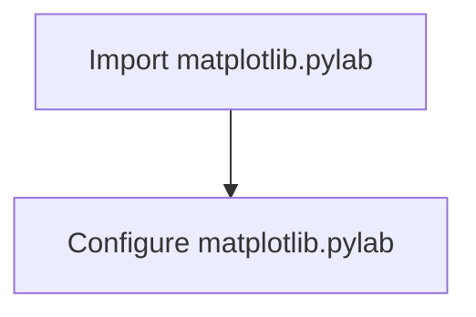

# `matplotlib\lib\pylab.py` 详细设计文档

This code imports and configures the matplotlib.pylab module, which is a convenience module that provides an object-oriented interface to some of the functionality of the matplotlib library.

## 整体流程



## 类结构

```
matplotlib.pylab
```

## 全局变量及字段


### `__doc__`
    
Contains the documentation string for the module matplotlib.pylab.

类型：`str`
    


    

## 全局函数及方法


## 关键组件


### matplotlib.pylab

matplotlib的pylab模块，用于提供matplotlib的绘图功能。

### from matplotlib.pylab import *

导入matplotlib.pylab模块，用于后续使用其绘图功能。

### __doc__

存储matplotlib.pylab模块的文档字符串，用于提供模块的说明信息。


## 问题及建议


### 已知问题

-   **代码风格不一致**：代码中使用了 `# noqa: F401, F403` 注释来抑制特定的 Pylint 警告，这表明代码风格可能存在不一致性，这可能会影响代码的可维护性。
-   **全局导入**：从 `matplotlib.pylab` 导入了 `pylab` 和 `matplotlib.pylab`，这可能导致命名冲突或重复导入。
-   **文档注释缺失**：代码中没有提供关于 `__doc__` 的具体描述，这不利于其他开发者理解其用途。

### 优化建议

-   **统一代码风格**：建议使用一致的代码风格指南，例如 PEP 8，并使用代码格式化工具（如 `autopep8` 或 `black`）来自动化代码风格检查和修复。
-   **避免重复导入**：删除重复的导入语句，确保只导入一次 `matplotlib.pylab`。
-   **提供文档注释**：为 `__doc__` 提供详细的文档注释，说明其用途和如何使用它。
-   **模块化代码**：如果 `__doc__` 用于存储文档字符串，考虑将其移动到一个单独的模块或文档文件中，以便更好地组织代码和文档。
-   **考虑使用更高级的文档生成工具**：如果代码库较大，考虑使用 Sphinx 或其他文档生成工具来自动化文档的生成和维护。


## 其它


### 设计目标与约束

- 设计目标：确保代码的可读性、可维护性和可扩展性。
- 约束条件：遵循PEP 8编码规范，确保代码兼容性。

### 错误处理与异常设计

- 异常处理：代码中应包含异常处理机制，以处理可能出现的错误情况。
- 错误日志：记录错误信息，便于问题追踪和调试。

### 数据流与状态机

- 数据流：描述数据在系统中的流动过程，包括输入、处理和输出。
- 状态机：描述系统在不同状态之间的转换过程。

### 外部依赖与接口契约

- 外部依赖：列出代码中使用的第三方库和工具。
- 接口契约：定义与其他系统或模块交互的接口规范。

### 测试与验证

- 单元测试：编写单元测试，确保代码功能的正确性。
- 集成测试：进行集成测试，验证系统各模块之间的协同工作。

### 性能优化

- 性能分析：对代码进行性能分析，找出性能瓶颈。
- 优化策略：提出优化策略，提高代码执行效率。

### 安全性

- 安全措施：确保代码的安全性，防止潜在的安全风险。
- 安全审计：定期进行安全审计，发现并修复安全漏洞。

### 文档与注释

- 文档规范：遵循统一的文档规范，确保文档的准确性和一致性。
- 注释规范：编写清晰的注释，提高代码的可读性。

### 维护与更新

- 维护策略：制定代码维护策略，确保代码的长期可用性。
- 更新机制：建立代码更新机制，及时修复漏洞和引入新功能。


    