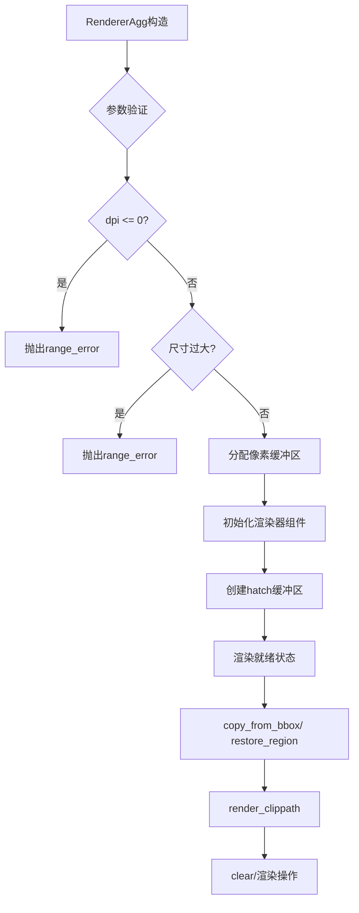
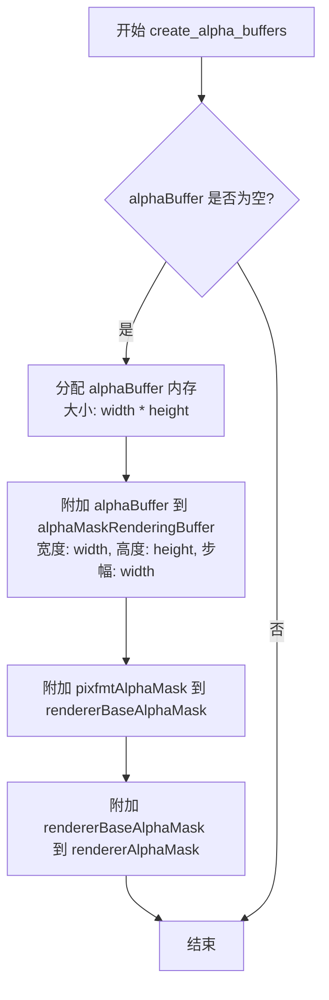
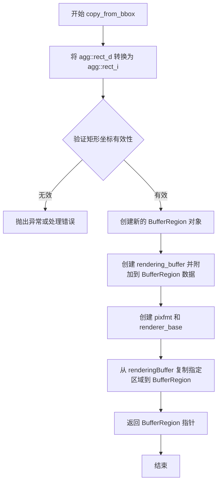
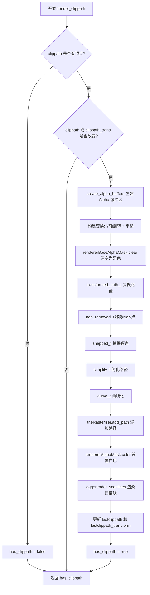
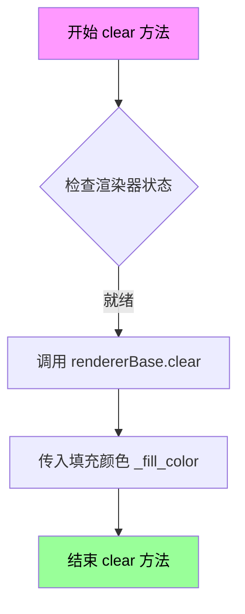

# `matplotlib\src\_backend_agg.cpp` 详细设计文档

这是一个matplotlib的C++ Agg后端渲染器核心实现，提供了高性能的2D图形渲染功能，支持路径绘制、裁剪、alpha通道处理和像素缓冲区管理。

## 整体流程



## 类结构

```
RendererAgg (渲染器主类)
├── 缓冲区管理
│   ├── pixBuffer (像素数据)
│   ├── alphaBuffer (Alpha通道)
│   └── hatchBuffer (填充图案)
├── 渲染组件
│   ├── renderingBuffer
│   ├── rendererBase
│   ├── rendererAA (抗锯齿)
│   └── rendererBin (二进制)
└── 裁剪系统
    ├── alphaMaskRenderingBuffer
    ├── rendererAlphaMask
    └── theRasterizer
```

## 全局变量及字段


### `RendererAgg.width`
    
画布宽度

类型：`unsigned int`
    


### `RendererAgg.height`
    
画布高度

类型：`unsigned int`
    


### `RendererAgg.dpi`
    
设备像素比

类型：`double`
    


### `RendererAgg.NUMBYTES`
    
像素缓冲区大小

类型：`size_t`
    


### `RendererAgg.pixBuffer`
    
主像素数据缓冲区

类型：`agg::int8u*`
    


### `RendererAgg.renderingBuffer`
    
渲染缓冲区

类型：`agg::rendering_buffer`
    


### `RendererAgg.alphaBuffer`
    
Alpha通道缓冲区

类型：`agg::int8u*`
    


### `RendererAgg.alphaMaskRenderingBuffer`
    
Alpha掩码渲染缓冲区

类型：`agg::rendering_buffer`
    


### `RendererAgg.alphaMask`
    
Alpha掩码像素格式

类型：`agg::pixfmt_gray8`
    


### `RendererAgg.pixfmtAlphaMask`
    
掩码像素格式

类型：`agg::pixfmt_gray8`
    


### `RendererAgg.rendererBaseAlphaMask`
    
掩码基础渲染器

类型：`renderer_base`
    


### `RendererAgg.rendererAlphaMask`
    
Alpha掩码渲染器

类型：`renderer_base`
    


### `RendererAgg.scanlineAlphaMask`
    
掩码扫描线

类型：`agg::scanline_p8`
    


### `RendererAgg.slineP8`
    
扫描线P8

类型：`agg::scanline_p8`
    


### `RendererAgg.slineBin`
    
二进制扫描线

类型：`agg::scanline_bin`
    


### `RendererAgg.pixFmt`
    
像素格式

类型：`agg::pixfmt_rgba32`
    


### `RendererAgg.rendererBase`
    
基础渲染器

类型：`renderer_base`
    


### `RendererAgg.rendererAA`
    
抗锯齿渲染器

类型：`renderer_base`
    


### `RendererAgg.rendererBin`
    
二进制渲染器

类型：`renderer_base`
    


### `RendererAgg.theRasterizer`
    
扫描线光栅化器

类型：`agg::rasterizer_scanline_aa`
    


### `RendererAgg.lastclippath`
    
上次裁剪路径ID

类型：`void*`
    


### `RendererAgg.lastclippath_transform`
    
上次裁剪变换

类型：`agg::trans_affine`
    


### `RendererAgg._fill_color`
    
填充颜色

类型：`agg::rgba`
    


### `RendererAgg.hatch_size`
    
填充图案大小

类型：`int`
    


### `RendererAgg.hatchBuffer`
    
填充图案缓冲区

类型：`agg::int8u*`
    


### `RendererAgg.hatchRenderingBuffer`
    
填充图案渲染缓冲区

类型：`agg::rendering_buffer`
    
    

## 全局函数及方法


### `RendererAgg.RendererAgg`

构造函数，初始化渲染器对象。根据传入的宽度、高度和 DPI 参数，分配像素缓冲区、Alpha 缓冲区（延迟分配）、纹理缓冲区等渲染所需的资源，并设置 AGG 渲染管线的各个组件。

参数：

- `width`：`unsigned int`，图像宽度（像素）
- `height`：`unsigned int`，图像高度（像素）
- `dpi`：`double`，目标设备的 DPI（每英寸点数），用于计算填充图案大小

返回值：无（构造函数）

#### 流程图

```mermaid
flowchart TD
    A[开始构造 RendererAgg] --> B{验证 dpi > 0?}
    B -->|否| C[抛出 std::range_error 异常]
    B -->|是| D{验证 width < 2^23 且 height < 2^23?}
    D -->|否| E[抛出 std::range_error 异常]
    D -->|是| F[计算 NUMBYTES = width * height * 4]
    F --> G[计算 stride = width * 4]
    G --> H[分配 pixBuffer 数组 NUMBYTES 字节]
    H --> I[将 renderingBuffer 连接到 pixBuffer]
    I --> J[将 pixFmt 连接到 renderingBuffer]
    J --> K[将 rendererBase 连接到 pixFmt]
    K --> L[清空 rendererBase 使用 _fill_color]
    L --> M[将 rendererAA 连接到 rendererBase]
    M --> N[将 rendererBin 连接到 rendererBase]
    N --> O[计算 hatch_size = (int)dpi]
    O --> P[分配 hatchBuffer 数组 hatch_size * hatch_size * 4 字节]
    P --> Q[将 hatchRenderingBuffer 连接到 hatchBuffer]
    Q --> R[结束构造]
```

#### 带注释源码

```cpp
RendererAgg::RendererAgg(unsigned int width, unsigned int height, double dpi)
    // 初始化列表：为成员变量赋初值
    : width(width),                           // 存储图像宽度
      height(height),                         // 存储图像高度
      dpi(dpi),                               // 存储 DPI 值
      NUMBYTES((size_t)width * (size_t)height * 4),  // 计算像素缓冲区大小（RGBA: 4字节/像素）
      pixBuffer(nullptr),                     // 初始化像素缓冲区指针为空，稍后分配
      renderingBuffer(),                      // 构造渲染缓冲区对象
      alphaBuffer(nullptr),                   // Alpha 缓冲区指针初始化为空（延迟分配）
      alphaMaskRenderingBuffer(),             // 构造 Alpha 蒙版渲染缓冲区
      alphaMask(alphaMaskRenderingBuffer),    // 将 Alpha 蒙版连接到渲染缓冲区
      pixfmtAlphaMask(alphaMaskRenderingBuffer),  // Alpha 蒙版像素格式
      rendererBaseAlphaMask(),                // Alpha 蒙版基础渲染器
      rendererAlphaMask(),                    // Alpha 蒙版渲染器
      scanlineAlphaMask(),                    // Alpha 蒙版扫描线对象
      slineP8(),                              // 8位扫描线对象
      slineBin(),                             // 二值扫描线对象
      pixFmt(),                               // 像素格式对象
      rendererBase(),                         // 基础渲染器
      rendererAA(),                           // 抗锯齿渲染器
      rendererBin(),                          // 二值渲染器
      theRasterizer(32768),                  // 栅格化器，缓冲区大小 32768
      lastclippath(nullptr),                  // 上次使用的裁剪路径 ID
      _fill_color(agg::rgba(1, 1, 1, 0))      // 填充颜色：白色，透明度为0（完全透明）
{
    // 验证 DPI 必须为正数
    if (dpi <= 0.0) {
        throw std::range_error("dpi must be positive");
    }

    // 验证图像尺寸不能过大（需小于 2^23 = 8388608 像素）
    // 这是为了防止整数溢出和过大的内存分配
    if (width >= 1 << 23 || height >= 1 << 23) {
        throw std::range_error(
            "Image size of " + std::to_string(width) + "x" + std::to_string(height) +
            " pixels is too large. It must be less than 2^23 in each direction.");
    }

    // 计算扫描线跨度（每行字节数）
    unsigned stride(width * 4);

    // 分配像素缓冲区：RGBA 格式，每个像素 4 字节
    pixBuffer = new agg::int8u[NUMBYTES];
    
    // 将渲染缓冲区附加到像素缓冲区
    renderingBuffer.attach(pixBuffer, width, height, stride);
    
    // 将像素格式附加到渲染缓冲区
    pixFmt.attach(renderingBuffer);
    
    // 将基础渲染器附加到像素格式
    rendererBase.attach(pixFmt);
    
    // 使用透明填充色清空渲染器
    rendererBase.clear(_fill_color);
    
    // 附加抗锯齿渲染器到基础渲染器
    rendererAA.attach(rendererBase);
    
    // 附加二值渲染器到基础渲染器
    rendererBin.attach(rendererBase);
    
    // 根据 DPI 计算填充图案的大小
    hatch_size = int(dpi);
    
    // 分配填充图案缓冲区（RGBA 格式）
    hatchBuffer = new agg::int8u[hatch_size * hatch_size * 4];
    
    // 将填充图案渲染缓冲区附加到填充图案缓冲区
    hatchRenderingBuffer.attach(hatchBuffer, hatch_size, hatch_size, hatch_size * 4);
}
```


### `RendererAgg::~RendererAgg`

析构函数，负责释放RendererAgg类实例在生命周期中分配的所有动态内存，包括像素缓冲区、Alpha通道缓冲区和填充缓冲区。

参数：无（析构函数不接受显式参数）

返回值：无（析构函数不返回任何值）

#### 流程图

```mermaid
flowchart TD
    A[开始析构] --> B{检查hatchBuffer是否为空}
    B -->|否| C[delete[] hatchBuffer 释放填充缓冲区]
    C --> D{检查alphaBuffer是否为空}
    B -->|是| D
    D -->|否| E[delete[] alphaBuffer 释放Alpha缓冲区]
    E --> F{检查pixBuffer是否为空}
    D -->|是| F
    F -->|否| G[delete[] pixBuffer 释放像素缓冲区]
    G --> H[结束析构]
    F -->|是| H
```

#### 带注释源码

```cpp
RendererAgg::~RendererAgg()
{
    // 释放填充图案缓冲区（hatch buffer）
    // 该缓冲区在构造函数中通过 new agg::int8u[hatch_size * hatch_size * 4] 分配
    delete[] hatchBuffer;
    
    // 释放Alpha通道缓冲区
    // 该缓冲区在 create_alpha_buffers() 方法中通过 new agg::int8u[width * height] 分配
    delete[] alphaBuffer;
    
    // 释放主像素缓冲区
    // 该缓冲区在构造函数中通过 new agg::int8u[NUMBYTES] 分配
    // NUMBYTES = width * height * 4 (RGBA格式)
    delete[] pixBuffer;
}
```


### `RendererAgg.create_alpha_buffers`

创建Alpha通道缓冲区，用于渲染剪裁路径时的蒙版处理。

参数：无

返回值：`void`，无返回值

#### 流程图



#### 带注释源码

```cpp
void RendererAgg::create_alpha_buffers()
{
    // 检查 alphaBuffer 是否已分配
    // 如果为空，说明尚未创建 alpha 缓冲区，需要初始化
    if (!alphaBuffer) {
        // 1. 分配 alpha 通道缓冲区内存
        // 大小为图像宽度 * 高度，每个像素一个字节 (0-255)
        alphaBuffer = new agg::int8u[width * height];
        
        // 2. 将分配的缓冲区附加到渲染缓冲区对象
        // 参数: 数据指针, 宽度, 高度, 行步幅(字节)
        alphaMaskRenderingBuffer.attach(alphaBuffer, width, height, width);
        
        // 3. 附加像素格式到基础渲染器 (用于 alpha 蒙版)
        rendererBaseAlphaMask.attach(pixfmtAlphaMask);
        
        // 4. 附加基础渲染器到抗锯齿渲染器 (用于绘制扫描线)
        rendererAlphaMask.attach(rendererBaseAlphaMask);
    }
}
```


### RendererAgg::copy_from_bbox

从指定的矩形区域复制像素数据到新创建的 BufferRegion 对象，实现离屏渲染缓冲区的数据提取。

参数：
- `in_rect`：`agg::rect_d`，输入的矩形区域（浮点坐标），表示需要复制的图像区域

返回值：`BufferRegion*`，返回新创建的 BufferRegion 指针，包含从指定区域复制的像素数据

#### 流程图



#### 带注释源码

```cpp
BufferRegion *RendererAgg::copy_from_bbox(agg::rect_d in_rect)
{
    // 1. 将输入的浮点矩形转换为整数矩形
    // 注意：y坐标进行了翻转处理（height - y），因为AGG坐标系与图像坐标系y轴方向相反
    agg::rect_i rect(
        (int)in_rect.x1,                // 左上角x坐标
        height - (int)in_rect.y2,       // 左上角y坐标（翻转）
        (int)in_rect.x2,                // 右下角x坐标
        height - (int)in_rect.y1);      // 右下角y坐标（翻转）

    // 2. 创建并初始化返回的 BufferRegion 指针
    BufferRegion *reg = nullptr;
    reg = new BufferRegion(rect);       // 根据转换后的整数矩形创建缓冲区

    // 3. 创建临时的 rendering_buffer 用于访问新 BufferRegion 的数据
    agg::rendering_buffer rbuf;
    rbuf.attach(reg->get_data(),        // 附加数据指针
                reg->get_width(),       // 附加宽度
                reg->get_height(),      // 附加高度
                reg->get_stride());     // 附加步长

    // 4. 创建 pixfmt 和 renderer_base 以便进行像素操作
    pixfmt pf(rbuf);                    // 创建像素格式
    renderer_base rb(pf);               // 创建渲染基类

    // 5. 执行核心操作：从主渲染缓冲区复制指定区域到新创建的 BufferRegion
    // 参数：源缓冲区、源矩形、目标偏移量（负值以调整坐标系）
    rb.copy_from(renderingBuffer, &rect, -rect.x1, -rect.y1);

    // 6. 返回包含复制数据的 BufferRegion
    return reg;
}
```


### `RendererAgg.restore_region`

该函数用于将之前通过 `copy_from_bbox` 保存的缓冲区区域（BufferRegion）恢复到渲染器的像素缓冲区中。它首先验证区域数据有效性，然后创建一个 AGG 渲染缓冲区，最后将该区域的内容复制回主渲染器基类的对应位置。

参数：

- `region`：`BufferRegion &`，要恢复的缓冲区区域引用，包含之前保存的像素数据及其矩形范围信息

返回值：`void`，无返回值

#### 流程图

```mermaid
flowchart TD
    A[开始 restore_region] --> B{region.get_data() == nullptr?}
    B -->|是| C[抛出 runtime_error 异常]
    B -->|否| D[创建 agg::rendering_buffer rbuf]
    D --> E[将 rbuf 绑定到 region 的数据]
    E --> F[调用 rendererBase.copy_from 复制像素数据]
    F --> G[结束]
    
    C --> H[异常处理: Cannot restore_region from NULL data]
    H --> G
```

#### 带注释源码

```cpp
/**
 * @brief 恢复整个保存的区域
 * 
 * 该方法将之前通过 copy_from_bbox 保存的 BufferRegion 的内容
 * 恢复到渲染器的像素缓冲区中。恢复位置由 region.get_rect() 决定。
 * 
 * @param region BufferRegion 引用，包含要恢复的像素数据及其位置信息
 * @throws std::runtime_error 当 region 的数据指针为 nullptr 时抛出
 */
void RendererAgg::restore_region(BufferRegion &region)
{
    // 检查区域数据有效性，防止对空指针进行操作
    if (region.get_data() == nullptr) {
        throw std::runtime_error("Cannot restore_region from NULL data");
    }

    // 创建 AGG 渲染缓冲区对象，用于包装区域像素数据
    agg::rendering_buffer rbuf;
    
    // 将渲染缓冲区绑定到区域数据
    // 参数: 数据指针, 宽度, 高度, 行跨度(Stride)
    rbuf.attach(region.get_data(), region.get_width(), region.get_height(), region.get_stride());

    // 将区域数据复制回主渲染器基类
    // 参数: 源渲染缓冲区, 源矩形(nullptr表示整个源), 目标x坐标, 目标y坐标
    // 目标坐标从 region.get_rect().x1 和 region.get_rect().y1 获取
    rendererBase.copy_from(rbuf, nullptr, region.get_rect().x1, region.get_rect().y1);
}
```


### `RendererAgg.restore_region`

该方法用于恢复之前保存的缓冲区区域的指定子区域到渲染缓冲区中的指定偏移位置。它允许只恢复保存区域的一部分，并将其放置在目标位置的不同坐标处。

参数：

- `region`：`BufferRegion &`，对待恢复的缓冲区区域的引用，包含已保存的像素数据
- `xx1`：`int`，要恢复的子区域的左边界坐标（相对于保存区域的坐标系）
- `yy1`：`int`，要恢复的子区域的顶边界坐标（相对于保存区域的坐标系）
- `xx2`：`int`，要恢复的子区域的右边界坐标（相对于保存区域的坐标系）
- `yy2`：`int`，要恢复的子区域的底边界坐标（相对于保存区域的坐标系）
- `x`：`int`，子区域要放置到的目标X坐标（相对于渲染缓冲区）
- `y`：`int`，子区域要放置到的目标Y坐标（相对于渲染缓冲区）

返回值：`void`，无返回值

#### 流程图

```mermaid
flowchart TD
    A[开始 restore_region] --> B{region.get_data() 是否为空?}
    B -->|是| C[抛出 runtime_error 异常]
    B -->|否| D[获取 region 的矩形区域 rrect]
    D --> E[计算相对矩形 rect: xx1-rrect.x1, yy1-rrect.y1, xx2-rrect.x1, yy2-rrect.y1]
    E --> F[创建 agg::rendering_buffer rbuf]
    F --> G[将 rbuf 连接到 region 的数据]
    G --> H[调用 rendererBase.copy_from 将子区域复制到目标位置 x, y]
    H --> I[结束]
    C --> J[异常处理: Cannot restore_region from NULL data]
```

#### 带注释源码

```cpp
// Restore the part of the saved region with offsets
// 参数说明:
//   region: 包含已保存像素数据的缓冲区区域
//   xx1, yy1, xx2, yy2: 定义要恢复的子区域边界（相对于保存区域的坐标系）
//   x, y: 子区域要放置到的目标位置坐标
void
RendererAgg::restore_region(BufferRegion &region, int xx1, int yy1, int xx2, int yy2, int x, int y )
{
    // 检查区域数据是否有效，若为空则抛出异常
    if (region.get_data() == nullptr) {
        throw std::runtime_error("Cannot restore_region from NULL data");
    }

    // 获取保存区域的矩形边界信息
    agg::rect_i &rrect = region.get_rect();

    // 计算子区域在保存区域内的相对坐标
    // 通过减去保存区域的起始坐标，将绝对坐标转换为相对坐标
    agg::rect_i rect(xx1 - rrect.x1,     // 相对左边界
                     (yy1 - rrect.y1),   // 相对顶边界
                     xx2 - rrect.x1,     // 相对右边界
                     (yy2 - rrect.y1));  // 相对底边界

    // 创建 AGG 渲染缓冲区对象
    agg::rendering_buffer rbuf;
    // 将渲染缓冲区连接到保存的区域数据
    // 参数: 数据指针, 宽度, 高度, 步长(Stride)
    rbuf.attach(region.get_data(), 
                 region.get_width(), 
                 region.get_height(), 
                 region.get_stride());

    // 将子区域复制到渲染缓冲区的基础渲染器中
    // 参数: 源渲染缓冲区, 要复制的矩形区域(可为nullptr表示整个区域), 目标位置(x, y)
    rendererBase.copy_from(rbuf, &rect, x, y);
}
```


### RendererAgg.render_clippath

渲染裁剪路径，将给定的路径转换为裁剪蒙版，并将其应用到渲染器的 Alpha 通道中。该方法通过一系列路径转换处理（变换、NaN移除、捕捉、简化、曲线化），最后使用 AGG 库的光栅化器将裁剪路径渲染到 Alpha 蒙版缓冲区中。

参数：

- `clippath`：`mpl::PathIterator &`，裁剪路径的迭代器引用，用于遍历路径的顶点数据
- `clippath_trans`：`const agg::trans_affine &`，裁剪路径的仿射变换矩阵，定义路径的空间变换
- `snap_mode`：`e_snap_mode`，路径顶点的捕捉模式，决定如何对齐顶点到像素网格

返回值：`bool`，返回是否存在裁剪路径（当路径顶点数不为0时返回 true）

#### 流程图



#### 带注释源码

```cpp
bool RendererAgg::render_clippath(mpl::PathIterator &clippath,
                                  const agg::trans_affine &clippath_trans,
                                  e_snap_mode snap_mode)
{
    // 定义类型别名，构建路径处理管道
    typedef agg::conv_transform<mpl::PathIterator> transformed_path_t;
    typedef PathNanRemover<transformed_path_t> nan_removed_t;
    /* Unlike normal Paths, the clip path cannot be clipped to the Figure bbox,
     * because it needs to remain a complete closed path, so there is no
     * PathClipper<nan_removed_t> step. */
    typedef PathSnapper<nan_removed_t> snapped_t;
    typedef PathSimplifier<snapped_t> simplify_t;
    typedef agg::conv_curve<simplify_t> curve_t;

    // 检查是否存在裁剪路径（通过顶点数判断）
    bool has_clippath = (clippath.total_vertices() != 0);

    // 仅当存在裁剪路径且发生变化时才重新渲染
    if (has_clippath &&
        (clippath.get_id() != lastclippath || clippath_trans != lastclippath_transform)) {
        // 创建/初始化 Alpha 缓冲区用于存储裁剪蒙版
        create_alpha_buffers();
        
        // 构建变换矩阵：先 Y 轴翻转，再平移到正确位置
        // （因为 AGG 的 Y 轴方向与 Matplotlib 相反）
        agg::trans_affine trans(clippath_trans);
        trans *= agg::trans_affine_scaling(1.0, -1.0);
        trans *= agg::trans_affine_translation(0.0, (double)height);

        // 清空 Alpha 蒙版为全透明（灰色值 0）
        rendererBaseAlphaMask.clear(agg::gray8(0, 0));
        
        // 路径处理管道：依次应用变换、NaN移除、捕捉、简化、曲线化
        transformed_path_t transformed_clippath(clippath, trans);
        nan_removed_t nan_removed_clippath(transformed_clippath, true, clippath.has_codes());
        snapped_t snapped_clippath(nan_removed_clippath, snap_mode, clippath.total_vertices(), 0.0);
        simplify_t simplified_clippath(snapped_clippath,
                                       clippath.should_simplify() && !clippath.has_codes(),
                                       clippath.simplify_threshold());
        curve_t curved_clippath(simplified_clippath);
        
        // 将处理后的路径添加到光栅化器
        theRasterizer.add_path(curved_clippath);
        
        // 设置蒙版颜色为不透明白色（灰色值 255）
        rendererAlphaMask.color(agg::gray8(255, 255));
        
        // 执行扫描线渲染，将裁剪路径写入 Alpha 蒙版
        agg::render_scanlines(theRasterizer, scanlineAlphaMask, rendererAlphaMask);
        
        // 缓存当前裁剪路径的 ID 和变换矩阵，避免重复渲染
        lastclippath = clippath.get_id();
        lastclippath_transform = clippath_trans;
    }

    // 返回是否存在裁剪路径
    return has_clippath;
}
```


### `RendererAgg.clear`

清除渲染缓冲区，将渲染基类（rendererBase）的内容填充为预定义的填充颜色（_fill_color），通常用于在开始新一帧渲染前重置画布。

参数：

- （无参数）

返回值：`void`，无返回值，该方法仅执行清理操作，不返回任何数据。

#### 流程图



#### 带注释源码

```cpp
/**
 * @brief 清除渲染缓冲区
 * 
 * 该方法通过调用底层渲染器基类的clear方法，
 * 将整个渲染区域填充为预设的填充颜色（_fill_color），
 * 以便开始新的渲染操作。
 */
void RendererAgg::clear()
{
    //"clear the rendered buffer";

    // 调用agg库底层渲染器的clear方法，传入当前填充颜色
    // _fill_color 在类构造函数中被初始化为半透明白色 agg::rgba(1, 1, 1, 0)
    rendererBase.clear(_fill_color);
}
```

## 关键组件


### RendererAgg 类

核心渲染器类，负责使用 Anti-Grain Geometry (AGG) 库进行 2D 图形渲染，管理像素缓冲区、裁剪路径和 alpha 遮罩。

### 像素缓冲区管理

负责分配和管理渲染缓冲区（pixBuffer、alphaBuffer、hatchBuffer），包括内存分配、绑定和释放。

### Alpha 缓冲区惰性创建

通过 create_alpha_buffers() 方法延迟创建 alpha 通道缓冲区，仅在需要时才分配内存，优化资源使用。

### 裁剪路径渲染

render_clippath 方法处理复杂的路径变换（平移、缩放、翻转），将裁剪路径渲染到 alpha 遮罩缓冲区。

### 区域复制与恢复

copy_from_bbox 和 restore_region 方法支持将渲染缓冲区的指定区域复制到 BufferRegion 对象，并在需要时恢复。

### 双精度渲染策略

同时维护 rendererAA（抗锯齿）和 rendererBin（二值）两种渲染器，根据需求选择不同的渲染精度。

### 坐标系统转换

处理 Y 轴翻转（AGG 库使用左下角原点，matplotlib 使用左上角原点）和坐标系变换。

### 错误处理机制

通过异常处理（std::range_error、std::runtime_error）验证 DPI 和图像尺寸的有效性，防止无效参数导致崩溃。

### 缓冲区接口层

封装 AGG 的 rendering_buffer 和 pixfmt，提供与 matplotlib 内部缓冲区格式的桥梁。


## 问题及建议


### 已知问题

- **原始指针内存管理**：使用裸`new`/`delete`管理`pixBuffer`、`alphaBuffer`、`hatchBuffer`，缺乏异常安全性，若构造函数在`new pixBuffer`后抛出异常，已分配内存会泄漏
- **缺失拷贝语义**：类包含原始指针成员但未定义拷贝构造和拷贝赋值运算符，可能导致双重释放或内存损坏
- **重复代码逻辑**：`restore_region`的两个重载函数存在大量重复代码，可合并优化
- **硬编码数值**：`theRasterizer(32768)`的缓冲区大小硬编码，缺乏自适应调整机制
- **public成员变量过多**：大量成员变量为public，违反封装原则，增大维护风险
- **类型转换隐患**：多处`(int)`强制转换可能造成精度丢失，如`(int)in_rect.x1`
- **不一致的错误处理**：部分函数返回nullptr表示错误，部分抛出异常，风格不统一

### 优化建议

- 使用`std::unique_ptr`或`std::vector`替代原始指针，实现自动内存管理
- 显式删除或正确实现拷贝/移动语义（Rule of Five）
- 提取`restore_region`重复逻辑到私有辅助方法
- 将`32768`定义为可配置常量，或根据图像尺寸动态计算
- 减少public成员变量，将内部状态封装为private，通过方法访问
- 统一错误处理策略，明确错误码或异常的使用场景
- 添加`explicit`关键字防止隐式类型转换，增强类型安全

## 其它


### 设计目标与约束

该RendererAgg类作为matplotlib的AGG后端渲染器，核心目标是提供高性能的2D图形渲染能力，支持路径绘制、裁剪、缓冲区管理等功能。设计约束包括：图像尺寸限制为每边小于2^23像素，DPI必须为正数，内存使用与图像尺寸成正比。

### 错误处理与异常设计

类构造函数中包含两项关键检查：当DPI小于等于0时抛出std::range_error异常；当图像尺寸超过2^23时抛出std::range_error异常。restore_region方法中，当region数据为nullptr时抛出std::runtime_error异常。错误处理策略采用异常机制，确保无效参数在初始化阶段被捕获。

### 外部依赖与接口契约

该类依赖以下外部组件：Python C API（Python.h）、AGG图形库（agg命名空间下的各种类）、自定义_backend_agg.h头文件。关键接口契约包括：create_alpha_buffers方法负责初始化alpha通道缓冲区；copy_from_bbox方法返回新分配的BufferRegion对象，调用者负责内存管理；restore_region方法要求传入有效的BufferRegion引用。

### 性能考虑与优化空间

当前实现存在以下优化机会：hatchBuffer和alphaBuffer在析构函数中分别使用delete[]释放，但缺少delete[] pixBuffer的显式释放代码（虽然成员变量名为pixBuffer但实际释放逻辑未体现）；hatchBuffer在构造函数中固定分配，建议改为延迟分配；缓冲区复制操作（copy_from）可考虑使用移动语义减少拷贝。

### 内存管理模型

类采用手动内存管理模型：pixBuffer、alphaBuffer、hatchBuffer三个堆分配的缓冲区通过new[]分配，在构造函数中初始化，在析构函数中释放。BufferRegion通过copy_from_bbox方法动态创建并返回给调用者，需要外部调用者负责释放。渲染缓冲区（renderingBuffer、alphaMaskRenderingBuffer等）采用栈上对象+attach绑定的轻量级模式。

### 状态机设计

RendererAgg包含隐式状态转换：初始状态（构造函数完成）-> 裁剪路径设置状态（render_clippath调用）-> 渲染就绪状态（缓冲区创建完成）。lastclippath和lastclippath_transform成员用于缓存裁剪路径状态，避免重复计算。_fill_color成员维护当前填充颜色状态。

### 资源生命周期

pixBuffer和hatchBuffer在对象构造时分配，析构时释放；alphaBuffer采用延迟分配策略，仅在首次调用create_alpha_buffers时分配。BufferRegion对象通过copy_from_bbox返回，其生命周期由调用者控制。AGG渲染对象（rasterizer、renderer等）在对象周期内持续使用。

### 并发考虑

当前实现为非线程安全设计。多个RendererAgg实例之间无共享状态，但同一实例的并发调用可能导致缓冲区竞争。建议在多线程环境下对每个线程使用独立的RendererAgg实例，或添加外部锁保护。

### 兼容性考虑

代码使用C++标准库异常机制，与Python异常传播机制兼容。图像尺寸限制（2^23）考虑了跨平台兼容性，确保在不同平台上不会导致整数溢出。stride计算采用unsigned类型，符合AGG库的内存布局要求。

    