# `matplotlib\src\_backend_agg.h` 详细设计文档

这是matplotlib的AGG（Anti-Grain Geometry）后端渲染器的核心头文件，提供了基于AGG库的2D图形渲染实现，支持路径绘制、标记渲染、文本图像绘制、图片渲染、四边形网格绘制和高洛德三角形绘制等多种图形操作，并包含缓冲区管理和裁剪路径处理功能。

## 整体流程

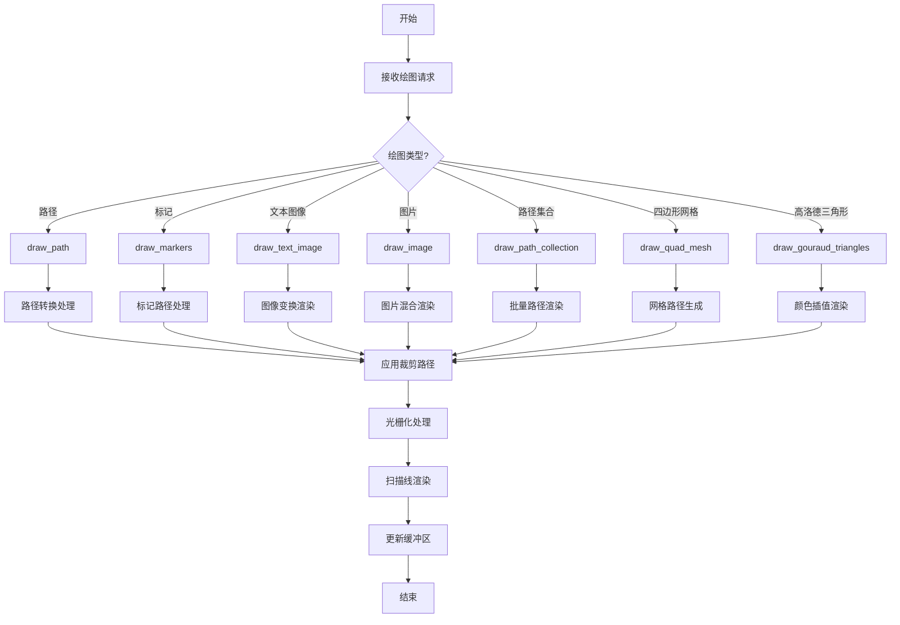

## 类结构

```
BufferRegion (缓冲区辅助类)
RendererAgg (主渲染器类)
├── 模板方法: draw_path
├── 模板方法: draw_markers
├── 模板方法: draw_text_image
├── 模板方法: draw_image
├── 模板方法: draw_path_collection
├── 模板方法: draw_quad_mesh
├── 模板方法: draw_gouraud_triangles
└── 内部模板方法: _draw_path
font_to_rgba (字体转RGBA模板类)
span_conv_alpha (Alpha通道处理模板类)
QuadMeshGenerator (四边形网格生成器模板类)
└── QuadMeshPathIterator (内部路径迭代器)
```

## 全局变量及字段


### `py`
    
pybind11命名空间别名

类型：`namespace pybind11`
    


### `BufferRegion.data`
    
图像数据指针

类型：`agg::int8u*`
    


### `BufferRegion.rect`
    
区域矩形

类型：`agg::rect_i`
    


### `BufferRegion.width`
    
区域宽度

类型：`int`
    


### `BufferRegion.height`
    
区域高度

类型：`int`
    


### `BufferRegion.stride`
    
行跨度

类型：`int`
    


### `RendererAgg.width`
    
画布宽度

类型：`unsigned int`
    


### `RendererAgg.height`
    
画布高度

类型：`unsigned int`
    


### `RendererAgg.dpi`
    
DPI设置

类型：`double`
    


### `RendererAgg.NUMBYTES`
    
缓冲区字节数

类型：`size_t`
    


### `RendererAgg.pixBuffer`
    
像素缓冲区

类型：`agg::int8u*`
    


### `RendererAgg.renderingBuffer`
    
渲染缓冲区

类型：`agg::rendering_buffer`
    


### `RendererAgg.alphaBuffer`
    
Alpha缓冲区

类型：`agg::int8u*`
    


### `RendererAgg.alphaMaskRenderingBuffer`
    
Alpha掩码渲染缓冲区

类型：`agg::rendering_buffer`
    


### `RendererAgg.alphaMask`
    
Alpha掩码

类型：`alpha_mask_type`
    


### `RendererAgg.pixfmtAlphaMask`
    
Alpha掩码像素格式

类型：`agg::pixfmt_gray8`
    


### `RendererAgg.rendererBaseAlphaMask`
    
Alpha掩码渲染基类

类型：`renderer_base_alpha_mask_type`
    


### `RendererAgg.rendererAlphaMask`
    
Alpha掩码渲染器

类型：`renderer_alpha_mask_type`
    


### `RendererAgg.scanlineAlphaMask`
    
Alpha掩码扫描线

类型：`scanline_am`
    


### `RendererAgg.slineP8`
    
P8扫描线

类型：`scanline_p8`
    


### `RendererAgg.slineBin`
    
二进制扫描线

类型：`scanline_bin`
    


### `RendererAgg.pixFmt`
    
像素格式

类型：`pixfmt`
    


### `RendererAgg.rendererBase`
    
渲染基类

类型：`renderer_base`
    


### `RendererAgg.rendererAA`
    
抗锯齿渲染器

类型：`renderer_aa`
    


### `RendererAgg.rendererBin`
    
二进制渲染器

类型：`renderer_bin`
    


### `RendererAgg.theRasterizer`
    
光栅化器

类型：`rasterizer`
    


### `RendererAgg.lastclippath`
    
上次裁剪路径

类型：`void*`
    


### `RendererAgg.lastclippath_transform`
    
上次裁剪路径变换

类型：`agg::trans_affine`
    


### `RendererAgg.hatch_size`
    
阴影大小

类型：`size_t`
    


### `RendererAgg.hatchBuffer`
    
阴影缓冲区

类型：`agg::int8u*`
    


### `RendererAgg.hatchRenderingBuffer`
    
阴影渲染缓冲区

类型：`agg::rendering_buffer`
    


### `RendererAgg._fill_color`
    
填充颜色

类型：`agg::rgba`
    


### `font_to_rgba._gen`
    
子生成器指针

类型：`child_type*`
    


### `font_to_rgba._color`
    
颜色

类型：`color_type`
    


### `font_to_rgba._allocator`
    
跨度分配器

类型：`span_alloc_type`
    


### `span_conv_alpha.m_alpha`
    
Alpha值

类型：`double`
    


### `QuadMeshGenerator.m_meshWidth`
    
网格宽度

类型：`unsigned`
    


### `QuadMeshGenerator.m_meshHeight`
    
网格高度

类型：`unsigned`
    


### `QuadMeshGenerator.m_coordinates`
    
坐标数组

类型：`CoordinateArray`
    


### `QuadMeshGenerator::QuadMeshPathIterator.m_iterator`
    
迭代器

类型：`unsigned`
    


### `QuadMeshGenerator::QuadMeshPathIterator.m_m`
    
M索引

类型：`unsigned`
    


### `QuadMeshGenerator::QuadMeshPathIterator.m_n`
    
N索引

类型：`unsigned`
    


### `QuadMeshGenerator::QuadMeshPathIterator.m_coordinates`
    
坐标数组指针

类型：`const CoordinateArray*`
    
    

## 全局函数及方法


# _backend_agg.h 详细设计文档

## 一段话描述

该文件是Matplotlib的AGG（Anti-Grain Geometry）后端渲染器的核心头文件，定义了用于2D图形渲染的`RendererAgg`类和`BufferRegion`辅助类，通过AGG库实现了高质量的抗锯齿渲染、路径绘制、标记渲染、图像绘制、文本渲染、网格绘制和Gouraud三角形着色等功能，支持裁剪路径、Alpha遮罩、阴影和填充样式等高级渲染特性。

## 文件的整体运行流程

该文件是C++模板实现的头文件，主要被Python绑定层（pybind11）调用。当Matplotlib的Python层请求渲染图形时，调用流程如下：

1. **初始化阶段**：创建`RendererAgg`实例，初始化像素缓冲区、Alpha遮罩缓冲区、渲染器和光栅化器
2. **图形绘制阶段**：根据需要调用不同的绘制方法（`draw_path`、`draw_markers`、`draw_image`等）
3. **路径处理阶段**：通过一系列路径转换器（Transform、Clipper、Snapper、Simplifier、Curve等）处理路径数据
4. **渲染阶段**：使用AGG库的光栅化器和扫描线渲染器将矢量图形转换为像素数据
5. **缓冲区操作阶段**：支持从/恢复缓冲区区域用于增量更新

---

## 类的详细信息

### BufferRegion

**描述**：一个辅助类，用于分配和管理AGG缓冲区对象的数据区域。

#### 类字段

- `data`：`agg::int8u *`，指向分配的像素数据缓冲区
- `rect`：`agg::rect_i`，定义区域的矩形边界
- `width`：`int`，区域宽度（像素）
- `height`：`int`，区域高度（像素）
- `stride`：`int`，每行的字节跨度

#### 类方法

##### BufferRegion 构造函数

参数：

- `r`：`const agg::rect_i &`，定义区域大小的矩形

返回值：无

```cpp
BufferRegion(const agg::rect_i &r) : rect(r)
{
    width = r.x2 - r.x1;
    height = r.y2 - r.y1;
    stride = width * 4;
    data = new agg::int8u[stride * height];
}
```

##### ~BufferRegion 析构函数

参数：无

返回值：无

```cpp
virtual ~BufferRegion()
{
    delete[] data;
};
```

##### get_data

参数：无

返回值：`agg::int8u *`，返回指向数据缓冲区的指针

```cpp
agg::int8u *get_data()
{
    return data;
}
```

##### get_rect

参数：无

返回值：`agg::rect_i &`，返回区域矩形

```cpp
agg::rect_i &get_rect()
{
    return rect;
}
```

##### get_width

参数：无

返回值：`int`，返回区域宽度

```cpp
int get_width()
{
    return width;
}
```

##### get_height

参数：无

返回值：`int`，返回区域高度

```cpp
int get_height()
{
    return height;
}
```

##### get_stride

参数：无

返回值：`int`，返回行跨度

```cpp
int get_stride()
{
    return stride;
}
```

---

### RendererAgg

**描述**：AGG后端的核心渲染器类，负责所有2D图形的高质量抗锯齿渲染。

#### 类字段（公共成员）

| 名称 | 类型 | 描述 |
|------|------|------|
| width | `unsigned int` | 渲染区域宽度 |
| height | `unsigned int` | 渲染区域高度 |
| dpi | `double` | 设备分辨率（每英寸点数） |
| NUMBYTES | `size_t` | 像素缓冲区中的字节数 |
| pixBuffer | `agg::int8u *` | 主像素数据缓冲区 |
| renderingBuffer | `agg::rendering_buffer` | 像素渲染缓冲区 |
| alphaBuffer | `agg::int8u *` | Alpha遮罩缓冲区 |
| alphaMaskRenderingBuffer | `agg::rendering_buffer` | Alpha遮罩渲染缓冲区 |
| alphaMaskType | `alpha_mask_type` | Alpha遮罩类型 |
| pixfmtAlphaMask | `agg::pixfmt_gray8` | Alpha遮罩像素格式 |
| rendererBaseAlphaMask | `renderer_base_alpha_mask_type` | Alpha遮罩基础渲染器 |
| rendererAlphaMask | `renderer_alpha_mask_type` | Alpha遮罩渲染器 |
| scanlineAlphaMask | `scanline_am` | Alpha遮罩扫描线 |
| slineP8 | `scanline_p8` | 8位抗锯齿扫描线 |
| slineBin | `scanline_bin` | 二值扫描线 |
| pixFmt | `pixfmt` | 主像素格式 |
| rendererBase | `renderer_base` | 基础渲染器 |
| rendererAA | `renderer_aa` | 抗锯齿渲染器 |
| rendererBin | `renderer_bin` | 二值渲染器 |
| theRasterizer | `rasterizer` | 扫描线光栅化器 |
| lastclippath | `void *` | 上次裁剪路径指针 |
| lastclippath_transform | `agg::trans_affine` | 上次裁剪路径变换 |
| hatch_size | `size_t` | 阴影填充大小 |
| hatchBuffer | `agg::int8u *` | 阴影填充缓冲区 |
| hatchRenderingBuffer | `agg::rendering_buffer` | 阴影填充渲染缓冲区 |
| _fill_color | `agg::rgba` | 填充颜色 |

#### 类方法

##### RendererAgg 构造函数

参数：

- `width`：`unsigned int`，渲染区域宽度
- `height`：`unsigned int`，渲染区域高度
- `dpi`：`double`，设备分辨率

返回值：无

```cpp
RendererAgg(unsigned int width, unsigned int height, double dpi);
```

##### ~RendererAgg 析构函数

参数：无

返回值：无

```cpp
virtual ~RendererAgg();
```

##### get_width

参数：无

返回值：`unsigned int`，返回渲染区域宽度

```cpp
unsigned int get_width()
{
    return width;
}
```

##### get_height

参数：无

返回值：`unsigned int`，返回渲染区域高度

```cpp
unsigned int get_height()
{
    return height;
}
```

##### draw_path

参数：

- `gc`：`GCAgg &`，图形上下文引用
- `path`：`PathIterator &`，路径迭代器引用
- `trans`：`agg::trans_affine &`，变换矩阵引用
- `color`：`agg::rgba &`，填充颜色引用

返回值：无（模板方法）

```cpp
template <class PathIterator>
void draw_path(GCAgg &gc, PathIterator &path, agg::trans_affine &trans, agg::rgba &color);
```

#### 流程图

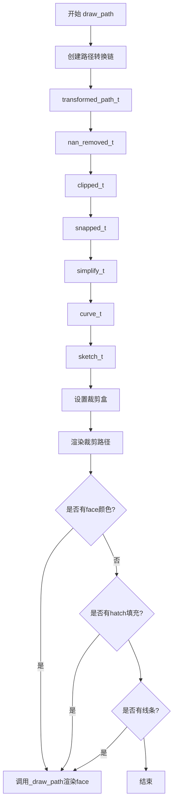

##### draw_markers

参数：

- `gc`：`GCAgg &`，图形上下文引用
- `marker_path`：`PathIterator &`，标记路径迭代器引用
- `marker_trans`：`agg::trans_affine &`，标记变换矩阵引用
- `path`：`PathIterator &`，主路径迭代器引用
- `trans`：`agg::trans_affine &`，主路径变换矩阵引用
- `color`：`agg::rgba`，标记颜色

返回值：无（模板方法）

```cpp
template <class PathIterator>
void draw_markers(GCAgg &gc,
                  PathIterator &marker_path,
                  agg::trans_affine &marker_path_trans,
                  PathIterator &path,
                  agg::trans_affine &trans,
                  agg::rgba face);
```

##### draw_text_image

参数：

- `gc`：`GCAgg &`，图形上下文引用
- `image`：`ImageArray &`，图像数组引用
- `x`：`int`，图像X坐标
- `y`：`int`，图像Y坐标
- `angle`：`double`，旋转角度（度）

返回值：无（模板方法）

```cpp
template <class ImageArray>
void draw_text_image(GCAgg &gc, ImageArray &image, int x, int y, double angle);
```

##### draw_image

参数：

- `gc`：`GCAgg &`，图形上下文引用
- `x`：`double`，图像X坐标
- `y`：`double`，图像Y坐标
- `image`：`ImageArray &`，图像数组引用

返回值：无（模板方法）

```cpp
template <class ImageArray>
void draw_image(GCAgg &gc,
                double x,
                double y,
                ImageArray &image);
```

##### draw_path_collection

参数：

- `gc`：`GCAgg &`，图形上下文引用
- `master_transform`：`agg::trans_affine &`，主变换矩阵引用
- `path`：`PathGenerator &`，路径生成器引用
- `transforms`：`TransformArray &`，变换数组引用
- `offsets`：`OffsetArray &`，偏移数组引用
- `offset_trans`：`agg::trans_affine &`，偏移变换矩阵引用
- `facecolors`：`ColorArray &`，填充颜色数组引用
- `edgecolors`：`ColorArray &`，边框颜色数组引用
- `linewidths`：`LineWidthArray &`，线宽数组引用
- `linestyles`：`DashesVector &`，线型数组引用
- `antialiaseds`：`AntialiasedArray &`，抗锯齿数组引用
- `hatchcolors`：`ColorArray &`，阴影颜色数组引用

返回值：无（模板方法）

```cpp
template <class PathGenerator,
          class TransformArray,
          class OffsetArray,
          class ColorArray,
          class LineWidthArray,
          class AntialiasedArray>
void draw_path_collection(GCAgg &gc,
                            agg::trans_affine &master_transform,
                            PathGenerator &path,
                            TransformArray &transforms,
                            OffsetArray &offsets,
                            agg::trans_affine &offset_trans,
                            ColorArray &facecolors,
                            ColorArray &edgecolors,
                            LineWidthArray &linewidths,
                            DashesVector &linestyles,
                            AntialiasedArray &antialiaseds,
                            ColorArray &hatchcolors);
```

##### draw_quad_mesh

参数：

- `gc`：`GCAgg &`，图形上下文引用
- `master_transform`：`agg::trans_affine &`，主变换矩阵引用
- `mesh_width`：`unsigned int`，网格宽度
- `mesh_height`：`unsigned int`，网格高度
- `coordinates`：`CoordinateArray &`，坐标数组引用
- `offsets`：`OffsetArray &`，偏移数组引用
- `offset_trans`：`agg::trans_affine &`，偏移变换矩阵引用
- `facecolors`：`ColorArray &`，填充颜色数组引用
- `antialiased`：`bool`，是否抗锯齿
- `edgecolors`：`ColorArray &`，边框颜色数组引用

返回值：无（模板方法）

```cpp
template <class CoordinateArray, class OffsetArray, class ColorArray>
void draw_quad_mesh(GCAgg &gc,
                    agg::trans_affine &master_transform,
                    unsigned int mesh_width,
                    unsigned int mesh_height,
                    CoordinateArray &coordinates,
                    OffsetArray &offsets,
                    agg::trans_affine &offset_trans,
                    ColorArray &facecolors,
                    bool antialiased,
                    ColorArray &edgecolors);
```

##### draw_gouraud_triangles

参数：

- `gc`：`GCAgg &`，图形上下文引用
- `points`：`PointArray &`，点数组引用
- `colors`：`ColorArray &`，颜色数组引用
- `trans`：`agg::trans_affine &`，变换矩阵引用

返回值：无（模板方法）

```cpp
template <class PointArray, class ColorArray>
void draw_gouraud_triangles(GCAgg &gc,
                            PointArray &points,
                            ColorArray &colors,
                            agg::trans_affine &trans);
```

##### get_content_extents

参数：无

返回值：`agg::rect_i`，返回内容边界矩形

```cpp
agg::rect_i get_content_extents();
```

##### clear

参数：无

返回值：无

```cpp
void clear();
```

##### copy_from_bbox

参数：

- `in_rect`：`agg::rect_d`，输入矩形（双精度）

返回值：`BufferRegion *`，返回包含裁剪区域像素数据的缓冲区指针

```cpp
BufferRegion *copy_from_bbox(agg::rect_d in_rect);
```

##### restore_region (重载1)

参数：

- `reg`：`BufferRegion &`，要恢复的区域

返回值：无

```cpp
void restore_region(BufferRegion &reg);
```

##### restore_region (重载2)

参数：

- `region`：`BufferRegion &`，要恢复的区域
- `xx1`：`int`，源区域左上X
- `yy1`：`int`，源区域左上Y
- `xx2`：`int`，源区域右下X
- `yy2`：`int`，源区域右下Y
- `x`：`int`，目标X坐标
- `y`：`int`，目标Y坐标

返回值：无

```cpp
void restore_region(BufferRegion &region, int xx1, int yy1, int xx2, int yy2, int x, int y);
```

##### _draw_path (私有模板方法)

参数：

- `path`：`path_t &`，路径引用
- `has_clippath`：`bool`，是否有裁剪路径
- `face`：`const std::optional<agg::rgba> &`，填充颜色
- `gc`：`GCAgg &`，图形上下文引用

返回值：无

#### 带注释源码

```cpp
template <class path_t>
inline void
RendererAgg::_draw_path(path_t &path, bool has_clippath, const std::optional<agg::rgba> &face, GCAgg &gc)
{
    // 定义渲染类型别名，简化代码
    typedef agg::conv_stroke<path_t> stroke_t;                      // 描边转换
    typedef agg::conv_dash<path_t> dash_t;                         // 虚线转换
    typedef agg::conv_stroke<dash_t> stroke_dash_t;                // 虚线描边
    typedef agg::pixfmt_amask_adaptor<pixfmt, alpha_mask_type> pixfmt_amask_type;  // Alpha遮罩像素格式
    typedef agg::renderer_base<pixfmt_amask_type> amask_ren_type;   // Alpha遮罩基础渲染器
    typedef agg::renderer_scanline_aa_solid<amask_ren_type> amask_aa_renderer_type;  // AA遮罩渲染器
    typedef agg::renderer_scanline_bin_solid<amask_ren_type> amask_bin_renderer_type;  // 二值遮罩渲染器

    // 1. 渲染填充面（Face）
    if (face) {
        theRasterizer.add_path(path);  // 将路径添加到光栅化器

        if (gc.isaa) {  // 抗锯齿渲染
            if (has_clippath) {
                // 使用Alpha遮罩的抗锯齿渲染
                pixfmt_amask_type pfa(pixFmt, alphaMask);
                amask_ren_type r(pfa);
                amask_aa_renderer_type ren(r);
                ren.color(*face);
                agg::render_scanlines(theRasterizer, scanlineAlphaMask, ren);
            } else {
                // 直接抗锯齿渲染
                rendererAA.color(*face);
                agg::render_scanlines(theRasterizer, slineP8, rendererAA);
            }
        } else {  // 二值渲染（无抗锯齿）
            if (has_clippath) {
                pixfmt_amask_type pfa(pixFmt, alphaMask);
                amask_ren_type r(pfa);
                amask_bin_renderer_type ren(r);
                ren.color(*face);
                agg::render_scanlines(theRasterizer, scanlineAlphaMask, ren);
            } else {
                rendererBin.color(*face);
                agg::render_scanlines(theRasterizer, slineP8, rendererBin);
            }
        }
    }

    // 2. 渲染阴影填充（Hatch）
    if (gc.has_hatchpath()) {
        // 重置裁剪，在原点(0,0)的临时缓冲区中绘制阴影
        theRasterizer.reset_clipping();
        rendererBase.reset_clipping(true);

        // 创建并变换路径
        typedef agg::conv_transform<mpl::PathIterator> hatch_path_trans_t;   // 阴影路径变换
        typedef agg::conv_curve<hatch_path_trans_t> hatch_path_curve_t;     // 阴影路径曲线化
        typedef agg::conv_stroke<hatch_path_curve_t> hatch_path_stroke_t;   // 阴影路径描边

        mpl::PathIterator hatch_path(gc.hatchpath);
        agg::trans_affine hatch_trans;
        // 翻转Y轴（AGG坐标系与Matplotlib不同）
        hatch_trans *= agg::trans_affine_scaling(1.0, -1.0);
        hatch_trans *= agg::trans_affine_translation(0.0, 1.0);
        // 应用阴影大小缩放
        hatch_trans *= agg::trans_affine_scaling(static_cast<double>(hatch_size),
                                                 static_cast<double>(hatch_size));
        
        hatch_path_trans_t hatch_path_trans(hatch_path, hatch_trans);
        hatch_path_curve_t hatch_path_curve(hatch_path_trans);
        hatch_path_stroke_t hatch_path_stroke(hatch_path_curve);
        hatch_path_stroke.width(points_to_pixels(gc.hatch_linewidth));
        hatch_path_stroke.line_cap(agg::square_cap);

        // 在阴影缓冲区中渲染路径
        pixfmt hatch_img_pixf(hatchRenderingBuffer);
        renderer_base rb(hatch_img_pixf);
        renderer_aa rs(rb);
        rb.clear(_fill_color);  // 清除为填充色
        rs.color(gc.hatch_color);

        theRasterizer.add_path(hatch_path_curve);
        agg::render_scanlines(theRasterizer, slineP8, rs);
        theRasterizer.add_path(hatch_path_stroke);
        agg::render_scanlines(theRasterizer, slineP8, rs);

        // 恢复原始裁剪
        set_clipbox(gc.cliprect, theRasterizer);
        if (has_clippath) {
            render_clippath(gc.clippath.path, gc.clippath.trans, gc.snap_mode);
        }

        // 将阴影传输到主图像缓冲区
        typedef agg::image_accessor_wrap<pixfmt,
                                         agg::wrap_mode_repeat_auto_pow2,
                                         agg::wrap_mode_repeat_auto_pow2> img_source_type;
        typedef agg::span_pattern_rgba<img_source_type> span_gen_type;
        agg::span_allocator<agg::rgba8> sa;
        img_source_type img_src(hatch_img_pixf);
        span_gen_type sg(img_src, 0, 0);
        theRasterizer.add_path(path);

        if (has_clippath) {
            pixfmt_amask_type pfa(pixFmt, alphaMask);
            amask_ren_type ren(pfa);
            agg::render_scanlines_aa(theRasterizer, slineP8, ren, sa, sg);
        } else {
            agg::render_scanlines_aa(theRasterizer, slineP8, rendererBase, sa, sg);
        }
    }

    // 3. 渲染描边（Stroke）
    if (gc.linewidth != 0.0) {
        double linewidth = points_to_pixels(gc.linewidth);
        if (!gc.isaa) {
            // 二值模式下，线宽至少为0.5像素
            linewidth = (linewidth < 0.5) ? 0.5 : mpl_round(linewidth);
        }
        
        if (gc.dashes.size() == 0) {
            // 无虚线，直接描边
            stroke_t stroke(path);
            stroke.width(points_to_pixels(gc.linewidth));
            stroke.line_cap(gc.cap);
            stroke.line_join(gc.join);
            stroke.miter_limit(points_to_pixels(gc.linewidth));
            theRasterizer.add_path(stroke);
        } else {
            // 有虚线，先转换为虚线描边
            dash_t dash(path);
            gc.dashes.dash_to_stroke(dash, dpi, gc.isaa);
            stroke_dash_t stroke(dash);
            stroke.line_cap(gc.cap);
            stroke.line_join(gc.join);
            stroke.width(linewidth);
            stroke.miter_limit(points_to_pixels(gc.linewidth));
            theRasterizer.add_path(stroke);
        }

        // 执行描边渲染
        if (gc.isaa) {
            if (has_clippath) {
                pixfmt_amask_type pfa(pixFmt, alphaMask);
                amask_ren_type r(pfa);
                amask_aa_renderer_type ren(r);
                ren.color(gc.color);
                agg::render_scanlines(theRasterizer, scanlineAlphaMask, ren);
            } else {
                rendererAA.color(gc.color);
                agg::render_scanlines(theRasterizer, slineP8, rendererAA);
            }
        } else {
            if (has_clippath) {
                pixfmt_amask_type pfa(pixFmt, alphaMask);
                amask_ren_type r(pfa);
                amask_bin_renderer_type ren(r);
                ren.color(gc.color);
                agg::render_scanlines(theRasterizer, scanlineAlphaMask, ren);
            } else {
                rendererBin.color(gc.color);
                agg::render_scanlines(theRasterizer, slineBin, rendererBin);
            }
        }
    }
}
```

---

### font_to_rgba

**描述**：自定义span生成器模板类，将8位灰度字体缓冲区转换为RGBA格式。

#### 类字段

- `_gen`：`child_type *`，子生成器指针
- `_color`：`color_type`，颜色值
- `_allocator`：`span_alloc_type`，span分配器

#### 类方法

##### font_to_rgba 构造函数

参数：

- `gen`：`child_type *`，子生成器指针
- `color`：`color_type`，颜色值

返回值：无

```cpp
font_to_rgba(child_type *gen, color_type color) : _gen(gen), _color(color)
{
}
```

##### generate

参数：

- `output_span`：`color_type *`，输出span指针
- `x`：`int`，X坐标
- `y`：`int`，Y坐标
- `len`：`unsigned int`，span长度

返回值：无

```cpp
inline void generate(color_type *output_span, int x, int y, unsigned len)
{
    _allocator.allocate(len);
    child_color_type *input_span = _allocator.span();
    _gen->generate(input_span, x, y, len);

    do {
        *output_span = _color;
        // 根据输入灰度值调整alpha通道
        output_span->a = ((unsigned int)_color.a * (unsigned int)input_span->v) >> 8;
        ++output_span;
        ++input_span;
    } while (--len);
}
```

##### prepare

参数：无

返回值：无

```cpp
void prepare()
{
    _gen->prepare();
}
```

---

### span_conv_alpha

**描述**：用于调整span的alpha值的转换器。

#### 类字段

- `m_alpha`：`double`，alpha调整因子

#### 类方法

##### span_conv_alpha 构造函数

参数：

- `alpha`：`double`，alpha值

返回值：无

```cpp
span_conv_alpha(double alpha) : m_alpha(alpha)
{
}
```

##### prepare

参数：无

返回值：无

```cpp
void prepare()
{
}
```

##### generate

参数：

- `span`：`color_type *`，span指针
- `x`：`int`，X坐标
- `y`：`int`，Y坐标
- `len`：`unsigned int`，span长度

返回值：无

```cpp
void generate(color_type *span, int x, int y, unsigned len) const
{
    do {
        span->a = (agg::int8u)((double)span->a * m_alpha);
        ++span;
    } while (--len);
}
```

---

### QuadMeshGenerator

**描述**：模板类，用于生成四边形网格（QuadMesh）的路径迭代器。

#### 类字段

- `m_meshWidth`：`unsigned`，网格宽度
- `m_meshHeight`：`unsigned`，网格高度
- `m_coordinates`：`CoordinateArray`，坐标数组

#### 内部类：QuadMeshPathIterator

路径迭代器内部类，用于遍历四边形网格的每个四边形。

#### 类方法

##### QuadMeshGenerator 构造函数

参数：

- `meshWidth`：`unsigned`，网格宽度
- `meshHeight`：`unsigned`，网格高度
- `coordinates`：`CoordinateArray &`，坐标数组引用

返回值：无

```cpp
inline QuadMeshGenerator(unsigned meshWidth, unsigned meshHeight, CoordinateArray &coordinates)
    : m_meshWidth(meshWidth), m_meshHeight(meshHeight), m_coordinates(coordinates)
{
}
```

##### num_paths

参数：无

返回值：`size_t`，返回四边形数量

```cpp
inline size_t num_paths() const
{
    return (size_t) m_meshWidth * m_meshHeight;
}
```

##### operator()

参数：

- `i`：`size_t`，索引

返回值：`path_iterator`，路径迭代器

```cpp
inline path_iterator operator()(size_t i) const
{
    return QuadMeshPathIterator(i % m_meshWidth, i / m_meshWidth, &m_coordinates);
}
```

---

## 关键组件信息

### 1. AGG库类型别名

| 名称 | 类型 | 描述 |
|------|------|------|
| `fixed_blender_rgba32_plain` | `fixed_blender_rgba_plain<agg::rgba8, agg::order_rgba>` | 32位RGBA固定混合器 |
| `pixfmt` | `agg::pixfmt_alpha_blend_rgba<...>` | 主像素格式（Alpha混合RGBA） |
| `renderer_base` | `agg::renderer_base<pixfmt>` | 基础渲染器 |
| `renderer_aa` | `agg::renderer_scanline_aa_solid<renderer_base>` | 抗锯齿扫描线渲染器 |
| `renderer_bin` | `agg::renderer_scanline_bin_solid<renderer_base>` | 二值扫描线渲染器 |
| `rasterizer` | `agg::rasterizer_scanline_aa<agg::rasterizer_sl_clip_dbl>` | 抗锯齿扫描线光栅化器 |

### 2. 路径转换器链

在`draw_path`中使用的路径转换器链：
```
PathIterator 
    → conv_transform (坐标变换，Y轴翻转)
    → PathNanRemover (移除NaN值)
    → PathClipper (裁剪到边界)
    → PathSnapper (对齐到像素)
    → PathSimplifier (简化路径)
    → conv_curve (曲线化)
    → Sketch (手绘效果)
    → _draw_path (实际渲染)
```

### 3. 渲染管线

```
输入路径/图形 
    → 变换处理 
    → 光栅化器(rasterizer) 
    → 扫描线生成器(scanline) 
    → 渲染器(renderer) 
    → 像素缓冲区
```

---

## 潜在的技术债务或优化空间

### 1. 模板膨胀
代码大量使用模板导致编译时间较长，每个模板实例都会生成独立的代码。建议：
- 考虑将常用类型（如`mpl::PathIterator`）显式实例化
- 将部分模板方法拆分为非模板的内部实现

### 2. 异常处理
`draw_markers`方法中有空的`catch (...)`块并重新抛出异常，这种模式虽然确保清理工作，但异常信息丢失。建议：
- 记录或保留原始异常信息
- 考虑使用RAII模式自动管理资源

### 3. 内存管理
- `BufferRegion`使用原始`new`/`delete`，建议使用智能指针
- `hatchBuffer`和其他缓冲区的手动管理存在潜在泄漏风险

### 4. 代码重复
`_draw_path`方法中存在大量重复的渲染逻辑（是否有裁剪路径 × 是否抗锯齿的组合），可以通过更抽象的渲染接口减少重复。

### 5. 硬编码值
- `hatch_size`初始化逻辑未在头文件中展示
- 某些魔法数字（如`0x7FFFFFFF`）缺乏解释

### 6. 线程安全
渲染器类不是线程安全的，如果需要在多线程环境中使用，需要添加锁或创建线程局部实例。

---

## 其它项目

### 设计目标与约束

1. **高性能渲染**：使用AGG库实现高质量抗锯齿渲染
2. **内存效率**：通过`BufferRegion`支持增量更新，避免全图重绘
3. **坐标一致性**：处理AGG坐标系（Y轴向上）与Matplotlib坐标系（Y轴向下）的转换
4. **兼容性**：支持Python绑定，通过pybind11暴露接口

### 错误处理与异常设计

1. **参数验证**：`draw_gouraud_triangles`中对数组形状进行检查
2. **NaN处理**：通过`PathNanRemover`过滤无效坐标
3. **边界保护**：`draw_markers`中对超出边界的点进行剔除
4. **异常传播**：标记渲染使用try-catch确保资源清理

### 数据流与状态机

1. **图形上下文(GCAgg)**：维护当前渲染状态（颜色、线宽、裁剪路径等）
2. **渲染器状态**：每个`RendererAgg`实例维护自己的渲染状态
3. **变换栈**：通过`agg::trans_affine`组合实现复杂变换

### 外部依赖与接口契约

1. **AGG库**：核心渲染功能依赖Anti-Grain Geometry库
2. **pybind11**：Python绑定层
3. **NumPy数组**：图像数据通过`ImageArray`（py::array）传递
4. **GCAgg类**：图形上下文由外部定义，本文件引用其接口

### 坐标系转换

代码中多处进行Y轴翻转处理：
```cpp
trans *= agg::trans_affine_scaling(1.0, -1.0);
trans *= agg::trans_affine_translation(0.0, (double)height);
```

这是因为AGG使用数学坐标系（Y向上），而Matplotlib使用屏幕坐标系（Y向下）。


### `BufferRegion.BufferRegion`

该函数是 `BufferRegion` 类的构造函数。其核心功能是接收一个 AGG 库中的矩形结构 `agg::rect_i`，根据该矩形的坐标计算宽度、高度和内存步长（Stride），并据此动态分配一块内存用于存储图像像素数据。

参数：

-  `r`：`const agg::rect_i &`，AGG 库中的整数矩形结构体引用，定义了要创建的缓冲区区域坐标（左上角 x1, y1，右下角 x2, y2）。

返回值：`void` (构造函数)。

#### 流程图

```mermaid
graph TD
    A[开始构造函数] --> B[使用初始化列表初始化成员变量 rect]
    B --> C[计算宽度: width = r.x2 - r.x1]
    C --> D[计算高度: height = r.y2 - r.y1]
    D --> E[计算步长: stride = width * 4]
    E --> F[动态分配内存: data = new agg::int8u[stride * height]]
    F --> G[结束]
```

#### 带注释源码

```cpp
// 构造函数定义
BufferRegion(const agg::rect_i &r) : rect(r)
{
    // 1. 计算宽度：矩形右下角 x 坐标减去左上角 x 坐标
    width = r.x2 - r.x1;
    
    // 2. 计算高度：矩形右下角 y 坐标减去左上角 y 坐标
    height = r.y2 - r.y1;
    
    // 3. 计算步长 (Stride)：宽度 * 4。
    // 这里假设每个像素占 4 个字节 (如 RGBA 格式)，因此步长就是一行像素占用的字节数。
    stride = width * 4;
    
    // 4. 分配数据缓冲区。
    // 分配 width * height * 4 字节的连续内存空间，用于存储图像像素。
    // 注意：这里使用的是原始指针和 new[]，需要确保在析构函数中正确释放 (delete[]) 以避免内存泄漏。
    data = new agg::int8u[stride * height];
}
```


### `BufferRegion::~BufferRegion()`

该函数是 `BufferRegion` 类的析构函数，负责释放构造函数中动态分配的内存资源，防止内存泄漏。

参数：  
无参数（析构函数不接受任何参数）

返回值：  
无返回值（析构函数返回类型为 `void`）

#### 流程图

```mermaid
graph TD
    A[开始析构] --> B{检查 data 是否为空}
    B -->|data 不为空| C[delete[] data 释放内存]
    B -->|data 为空| D[直接结束]
    C --> D[结束]
```

#### 带注释源码

```cpp
virtual ~BufferRegion()
{
    // 释放构造函数中通过 new[] 动态分配的内存
    // 使用 delete[] 而不是 delete 是因为 data 是通过 new agg::int8u[] 分配的数组
    delete[] data;
};
```


### `BufferRegion.get_data()`

获取 BufferRegion 对象内部存储的像素数据指针，允许外部代码直接访问底层缓冲区数据。

参数：  
（无参数）

返回值：`agg::int8u *`，指向缓冲区数据区域的指针

#### 流程图

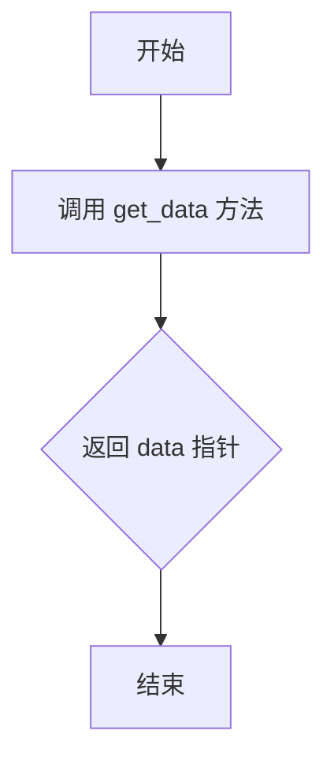

#### 带注释源码

```cpp
/**
 * 获取数据指针
 * 
 * 该方法返回内部管理的缓冲区数据指针。
 * 调用者获得指针后可直接读写像素数据，
 * 但需要注意不要越界访问（由 width、height、stride 控制）。
 * 
 * @return agg::int8u* 指向缓冲区数据区域的指针，数据布局为 RGBA 格式
 */
agg::int8u *get_data()
{
    return data;  // 返回私有成员 data 的指针，类型为 agg::int8u（无符号8位整数）
}
```


### `BufferRegion.get_rect()`

获取BufferRegion对象所保存的矩形区域。

参数： 无

返回值：`agg::rect_i &`，返回内部存储的矩形区域引用，用于访问该缓冲区区域的坐标信息。

#### 流程图

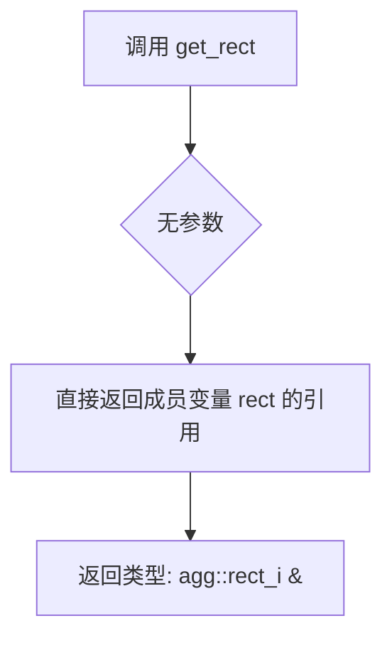

#### 带注释源码

```cpp
/**
 * @brief 获取缓冲区区域的矩形坐标
 * 
 * 该方法是一个简单的getter函数，返回内部成员变量rect的引用。
 * rect 存储了区域的左上角和右下角坐标 (x1, y1, x2, y2)。
 * 返回引用允许调用者直接修改内部矩形数据，无需拷贝。
 * 
 * @return agg::rect_i& 矩形区域的引用，包含 x1, y1, x2, y2 四个坐标值
 */
agg::rect_i &get_rect()
{
    return rect;  // 直接返回成员变量 rect 的引用，无任何计算或逻辑处理
}
```


### `BufferRegion.get_width`

获取 `BufferRegion` 实例的宽度（即水平像素数）。

参数：  
（该方法无参数）

返回值：`int`，返回该缓冲区区域的宽度（像素数）。

#### 流程图

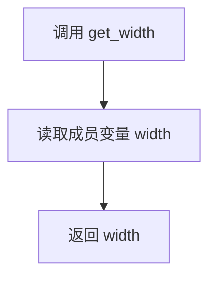

#### 带注释源码

```cpp
// BufferRegion 类中获取宽度的成员函数
int get_width()
{
    // 直接返回内部保存的 width 成员
    return width;
}
```


### `BufferRegion.get_height`

获取 BufferRegion 实例的高度值。该方法是 BufferRegion 类的简单访问器方法，直接返回在对象构造时计算并存储的 height 成员变量值。

参数：无参数

返回值：`int`，返回缓冲区区域的高度（像素），即矩形区域在 Y 轴方向的像素数量。

#### 流程图

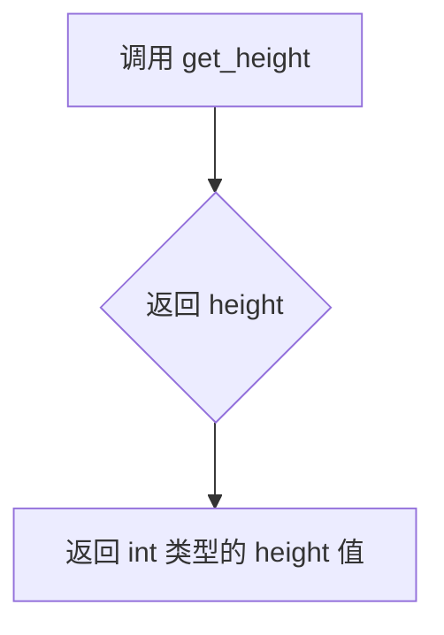

#### 带注释源码

```cpp
// 获取缓冲区区域的高度
// 返回值：int - 区域的高度（像素）
int get_height()
{
    return height;  // 直接返回成员变量 height，该值在构造函数中通过 rect.y2 - rect.y1 计算得出
}
```


### `BufferRegion.get_stride`

获取 BufferRegion 对象的跨距（stride），即缓冲区中每行像素的字节数，用于在内存中定位不同行的像素数据。

参数：无

返回值：`int`，返回缓冲区的跨距（stride），单位为字节。

#### 流程图

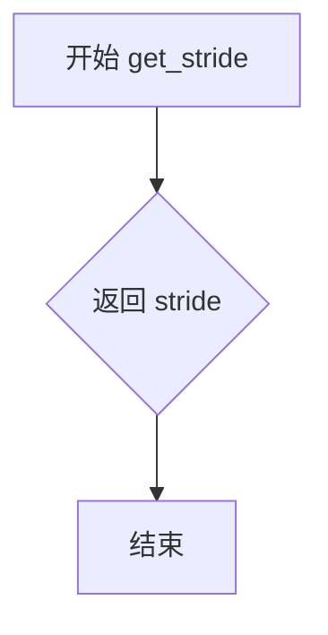

#### 带注释源码

```cpp
// 获取缓冲区跨距的成员方法
int get_stride()
{
    return stride;  // 返回成员变量 stride，表示每行像素的字节数
}
```

#### 补充说明

- **跨距定义**：`stride` 在构造函数中计算为 `width * 4`（因为使用 RGBA 格式，每个像素占 4 字节）
- **用途**：当需要访问缓冲区中特定行的像素数据时，需要使用 `stride` 来计算内存偏移量
- **类属主**：该方法属于 `BufferRegion` 类，该类是一个辅助类，用于在 PyBind11 和 AGG 图形库之间传递缓冲区数据


### `RendererAgg.RendererAgg`

这是 RendererAgg 类的构造函数，用于初始化一个 AGG（Anti-Grain Geometry）渲染器实例，设置渲染缓冲区的尺寸和 DPI，并创建所有必要的图形渲染对象。

参数：

- `width`：`unsigned int`，渲染图像的宽度（像素）
- `height`：`unsigned int`，渲染图像的高度（像素）
- `dpi`：`double`，用于将点（points）转换为像素的 DPI（每英寸点数）值

返回值：无（构造函数）

#### 流程图

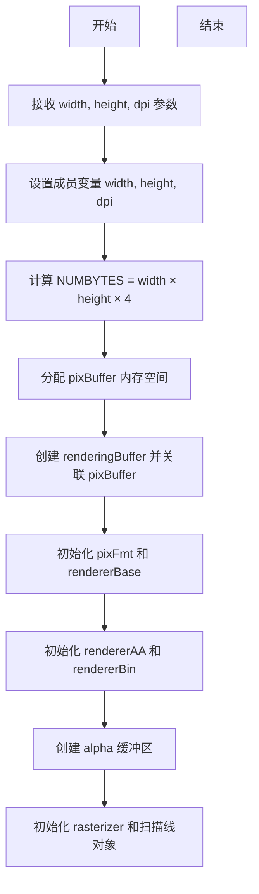

#### 带注释源码

```cpp
// 构造函数声明（定义在其他源文件中）
RendererAgg(unsigned int width, unsigned int height, double dpi);

/*
 * 根据类成员变量推断的构造函数实现逻辑：
 * 
 * 1. 初始化基础尺寸参数
 *    - width = width;
 *    - height = height;
 *    - dpi = dpi;
 * 
 * 2. 计算缓冲区大小并分配内存
 *    - NUMBYTES = width * height * 4;  // RGBA 4 通道
 *    - pixBuffer = new agg::int8u[NUMBYTES];
 * 
 * 3. 创建渲染缓冲区
 *    - renderingBuffer.attach(pixBuffer, width, height, width * 4);
 * 
 * 4. 初始化像素格式和渲染器
 *    - pixFmt(renderingBuffer);
 *    - rendererBase(pixFmt);
 *    - rendererAA(rendererBase);
 *    - rendererBin(rendererBase);
 * 
 * 5. 初始化 Alpha 蒙版缓冲区
 *    - create_alpha_buffers();  // 创建 alphaBuffer 和相关渲染对象
 * 
 * 6. 初始化光栅化器和扫描线
 *    - theRasterizer.reset();
 *    - slineP8.reset();
 *    - slineBin.reset();
 * 
 * 7. 初始化剪裁路径
 *    - lastclippath = nullptr;
 * 
 * 8. 初始化填充颜色
 *    - _fill_color = agg::rgba(1, 1, 1, 1);  // 默认白色
 */
```

**注意**：提供的代码中仅包含构造函数声明，完整实现位于其他源文件中。以上源码为基于类成员变量和 AGG 渲染库特性的逻辑推断。


### `RendererAgg::~RendererAgg`

该析构函数负责在 RendererAgg 对象生命周期结束时释放其持有的所有资源，包括像素缓冲区、Alpha 通道缓冲区、渲染器对象以及可能的剪贴路径等，确保无内存泄漏。

参数：无需参数

返回值：`void`，析构函数不返回任何值

#### 流程图

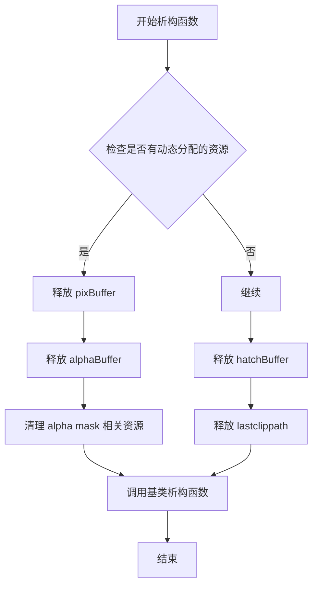

#### 带注释源码

```
/* 位于 _backend_agg.h 文件中类 RendererAgg 的析构函数声明 */
virtual ~RendererAgg();
```

在当前头文件中仅有析构函数的声明，未提供实现代码。该析构函数为虚函数，确保在多态删除派生类对象时能正确调用子类的析构函数。根据类成员变量的设计，析构函数需要负责释放以下资源：

- `pixBuffer`：像素数据缓冲区（`agg::int8u*` 类型）
- `alphaBuffer`：Alpha 通道缓冲区（`agg::int8u*` 类型）
- `hatchBuffer`：图案填充缓冲区（`agg::int8u*` 类型）
- `lastclippath`：剪贴路径数据（`void*` 类型）

由于类的拷贝构造函数和赋值运算符已被删除（`RendererAgg(const RendererAgg &) = delete;` 和 `RendererAgg &operator=(const RendererAgg &) = delete;`），析构函数只需处理显式分配的堆内存资源，无需考虑拷贝场景下的深拷贝问题。


### `RendererAgg.get_width`

获取渲染器的宽度

参数： （无）

返回值：`unsigned int`，返回渲染器的宽度（以像素为单位）

#### 流程图

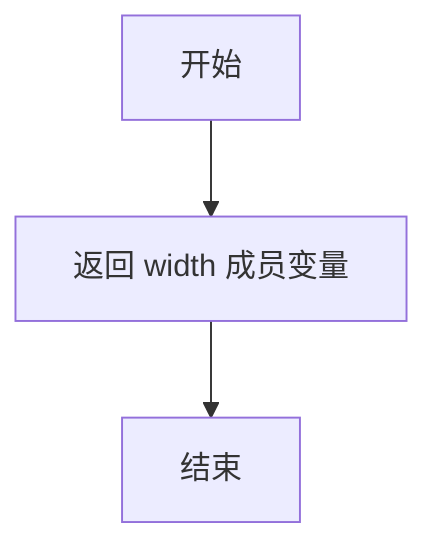

#### 带注释源码

```cpp
/**
 * 获取渲染器的宽度
 * 
 * 该方法返回渲染器的宽度成员变量，用于外部获取渲染表面的像素宽度
 *
 * @return unsigned int 渲染区域的宽度，以像素为单位
 */
unsigned int get_width()
{
    return width;  // 返回内部存储的宽度值
}
```


### `RendererAgg.get_height`

获取渲染器的高度值，返回渲染区域在垂直方向上的像素数量。

参数：
- 无参数

返回值：`unsigned int`，返回渲染器的高度（以像素为单位）

#### 流程图

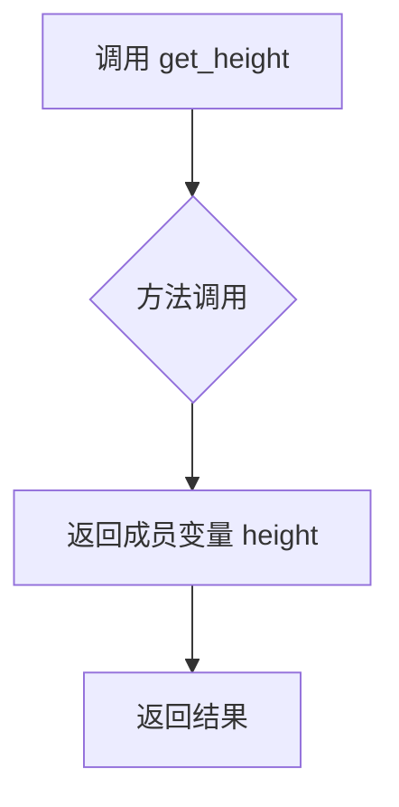

#### 带注释源码

```cpp
// RendererAgg 类的公共成员方法
// 用途：获取当前渲染器的高度（像素数）
// 该值在 RendererAgg 构造函数初始化时确定
unsigned int get_height()
{
    return height;  // 返回私有成员变量 height，类型为 unsigned int
}
```

#### 上下文信息

该方法是 `RendererAgg` 类的一部分，位于 `_backend_agg.h` 头文件中。相关的成员变量定义如下：

```cpp
// 类成员变量（在 RendererAgg 类中）
unsigned int width, height;  // 渲染器的宽和高，以像素为单位
```

#### 配套方法

同属 RendererAgg 类的相关方法：
- `get_width()`：获取渲染器的宽度，返回类型为 `unsigned int`

#### 设计意图

这是一个简单的访问器（getter）方法，用于暴露 `RendererAgg` 类的私有成员变量 `height`。该方法：
1. 无参数输入
2. 直接返回内部状态
3. 时间复杂度 O(1)
4. 线程安全性取决于外部对 `height` 变量的访问控制


### `RendererAgg.draw_path`

该函数是 `RendererAgg` 类的核心绘制方法之一，负责接收一个路径迭代器、变换矩阵和颜色，进行一系列预处理（如坐标变换、裁剪、简化、平滑曲线），最终调用内部方法 `_draw_path` 将路径渲染到缓冲区。

参数：

- `gc`：`GCAgg &`，图形上下文（Graphics Context），包含裁剪区域、剪裁路径、线宽、线型、颜色、抗锯齿设置、阴影填充等渲染状态。
- `path`：`PathIterator &`，路径迭代器，定义了要绘制的几何图形（直线、曲线指令）。
- `trans`：`agg::trans_affine &`，仿射变换矩阵，用于对路径进行缩放、旋转、平移等坐标变换。
- `color`：`agg::rgba &`，路径的填充颜色（面色）。

返回值：`void`，无返回值，直接渲染到内部缓冲区。

#### 流程图

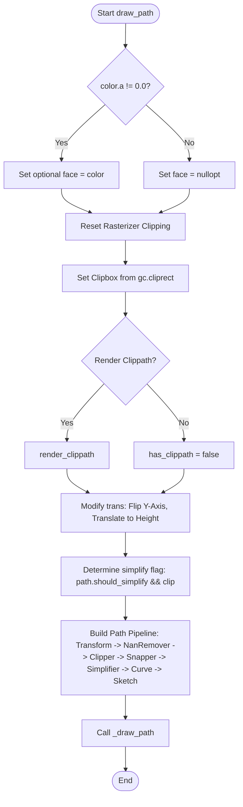

#### 带注释源码

```cpp
template <class PathIterator>
inline void
RendererAgg::draw_path(GCAgg &gc, PathIterator &path, agg::trans_affine &trans, agg::rgba &color)
{
    // 定义路径转换器类型别名，构建处理流水线
    typedef agg::conv_transform<mpl::PathIterator> transformed_path_t;      // 坐标变换
    typedef PathNanRemover<transformed_path_t> nan_removed_t;             // 移除NaN坐标
    typedef PathClipper<nan_removed_t> clipped_t;                        // 视口裁剪
    typedef PathSnapper<clipped_t> snapped_t;                            // 像素对齐（吸附）
    typedef PathSimplifier<snapped_t> simplify_t;                         // 路径简化
    typedef agg::conv_curve<simplify_t> curve_t;                           // 转换为曲线（Bezier）
    typedef Sketch<curve_t> sketch_t;                                     // 素描效果

    // 1. 确定填充面色：如果颜色alpha不为0，则设置face，否则为std::nullopt（仅描边）
    std::optional<agg::rgba> face;
    if (color.a != 0.0) {
        face = color;
    }

    // 2. 初始化光栅化器和渲染器：重置裁剪区域
    theRasterizer.reset_clipping();
    rendererBase.reset_clipping(true);
    
    // 3. 设置裁剪框：根据gc中的cliprect设置视口
    set_clipbox(gc.cliprect, theRasterizer);
    
    // 4. 处理裁剪路径：如果存在裁剪路径（clippath），则渲染它
    bool has_clippath = render_clippath(gc.clippath.path, gc.clippath.trans, gc.snap_mode);

    // 5. 调整变换矩阵：Y轴翻转以匹配屏幕坐标系，并平移至高分辨率高度
    trans *= agg::trans_affine_scaling(1.0, -1.0);
    trans *= agg::trans_affine_translation(0.0, (double)height);
    
    // 6. 决策是否简化路径：如果路径本身建议简化且不需要填充（仅描边）或没有阴影，则允许简化
    bool clip = !face && !gc.has_hatchpath();
    bool simplify = path.should_simplify() && clip;
    
    // 计算描边的吸附线宽
    double snapping_linewidth = points_to_pixels(gc.linewidth);
    if (gc.color.a == 0.0) {
        snapping_linewidth = 0.0;
    }

    // 7. 构建路径处理链
    transformed_path_t tpath(path, trans);             // 应用变换
    nan_removed_t nan_removed(tpath, true, path.has_codes()); // 剔除NaN
    clipped_t clipped(nan_removed, clip, width, height);        // 裁剪
    snapped_t snapped(clipped, gc.snap_mode, path.total_vertices(), snapping_linewidth); // 吸附
    simplify_t simplified(snapped, simplify, path.simplify_threshold()); // 简化
    curve_t curve(simplified);                                 // 曲线化
    sketch_t sketch(curve, gc.sketch.scale, gc.sketch.length, gc.sketch.randomness); // 素描化

    // 8. 委托给内部绘制方法执行最终渲染
    _draw_path(sketch, has_clippath, face, gc);
}
```


### `RendererAgg.draw_markers`

该函数用于沿给定路径绘制一系列标记（如圆形、线条等）。它首先对标记形状进行一次光栅化处理（包含填充和描边），将其缓存到缓冲区中，随后遍历目标路径的顶点，使用序列化扫描线（Serialized Scanlines）在每个顶点位置高效地渲染缓存的标记。函数内部处理了坐标系的变换（Y轴翻转）、裁剪区域设置以及路径的捕捉（Snapping）。

参数：

- `gc`：`GCAgg &`，图形上下文，包含线宽、颜色、裁剪矩形、捕捉模式等渲染状态。
- `marker_path`：`PathIterator &`，迭代器对象，定义了标记的形状（如圆圈、箭头）。
- `marker_path_trans`：`agg::trans_affine &`，仿射变换矩阵，用于对标记路径进行坐标变换（如缩放、平移）。
- `path`：`PathIterator &`，迭代器对象，定义了需要放置标记的目标路径。
- `trans`：`agg::trans_affine &`，仿射变换矩阵，用于对目标路径进行坐标变换。
- `face`：`agg::rgba`，标记的填充颜色。

返回值：`void`，无返回值。

#### 流程图

```mermaid
graph TD
    A([Start draw_markers]) --> B[应用Y轴翻转变换<br>marker_trans & trans]
    B --> C[预处理标记路径<br>Transform -> NanRemover -> Snapper -> Curve]
    C --> D[预处理目标路径<br>Transform -> NanRemover -> Snapper -> Curve]
    D --> E{检查填充颜色<br>color.a != 0}
    E -- Yes --> E1[光栅化标记填充<br>Render Fill to Scanlines]
    E1 --> E2[序列化填充数据<br>Serialize Fill Buffer]
    E2 --> E3[光栅化标记描边<br>Render Stroke to Scanlines]
    E -- No --> E3
    E3 --> E4[序列化描边数据<br>Serialize Stroke Buffer]
    E4 --> E5[计算包围盒<br>marker_size]
    E5 --> F[重置裁剪区域<br>Setup Clipping]
    F --> G[遍历目标路径顶点<br>while vertex != stop]
    G --> H{顶点有效?<br>isfinite & hit_test}
    H -- No --> G
    H -- Yes --> I[向下取整坐标<br>x = floor(x), y = floor(y)]
    I --> J{是否有裁剪路径<br>has_clippath}
    J -- Yes --> K1[使用Alpha Mask渲染器]
    J -- No --> K2[使用AA渲染器]
    K1 --> L[渲染填充<br>Render Fill from Buffer]
    K2 --> L
    L --> M[渲染描边<br>Render Stroke from Buffer]
    M --> N{下一顶点?}
    N -- Yes --> G
    N -- No --> O([End])
```

#### 带注释源码

```cpp
template <class PathIterator>
inline void RendererAgg::draw_markers(GCAgg &gc,
                                      PathIterator &marker_path,
                                      agg::trans_affine &marker_trans, // 注意：实现中参数名为 marker_trans
                                      PathIterator &path,
                                      agg::trans_affine &trans,
                                      agg::rgba color) // 注意：实现中参数名为 color
{
    // 定义路径处理流水线：变换 -> 移除NaN -> 捕捉 -> 曲线化
    typedef agg::conv_transform<mpl::PathIterator> transformed_path_t;
    typedef PathNanRemover<transformed_path_t> nan_removed_t;
    typedef PathSnapper<nan_removed_t> snap_t;
    typedef agg::conv_curve<snap_t> curve_t;
    typedef agg::conv_stroke<curve_t> stroke_t;
    
    // 定义渲染器类型
    typedef agg::pixfmt_amask_adaptor<pixfmt, alpha_mask_type> pixfmt_amask_type;
    typedef agg::renderer_base<pixfmt_amask_type> amask_ren_type;
    typedef agg::renderer_scanline_aa_solid<amask_ren_type> amask_aa_renderer_type;

    // 1. 处理Y轴方向差异 (Matplotlib 使用倒置Y轴)
    marker_trans *= agg::trans_affine_scaling(1.0, -1.0);

    trans *= agg::trans_affine_scaling(1.0, -1.0);
    trans *= agg::trans_affine_translation(0.5, (double)height + 0.5);

    // 2. 准备标记路径 (Marker Path)
    transformed_path_t marker_path_transformed(marker_path, marker_trans);
    nan_removed_t marker_path_nan_removed(marker_path_transformed, true, marker_path.has_codes());
    snap_t marker_path_snapped(marker_path_nan_removed,
                               gc.snap_mode,
                               marker_path.total_vertices(),
                               points_to_pixels(gc.linewidth));
    curve_t marker_path_curve(marker_path_snapped);

    // 如果没有启用路径捕捉，确保标记(0,0)位于像素中心，使圆形标记居中
    if (!marker_path_snapped.is_snapping()) {
        marker_trans *= agg::trans_affine_translation(0.5, 0.5);
    }

    // 3. 准备目标路径 (Path to draw markers along)
    transformed_path_t path_transformed(path, trans);
    nan_removed_t path_nan_removed(path_transformed, false, false);
    snap_t path_snapped(path_nan_removed, SNAP_FALSE, path.total_vertices(), 0.0);
    curve_t path_curve(path_snapped);
    path_curve.rewind(0);

    // 4. 处理填充颜色
    std::optional<agg::rgba> face;
    if (color.a != 0.0) {
        face = color;
    }

    // 5. 缓存扫描线 (Maxim's suggestion for cached scanlines)
    agg::scanline_storage_aa8 scanlines;
    theRasterizer.reset();
    theRasterizer.reset_clipping();
    rendererBase.reset_clipping(true);
    
    // 初始化一个巨大的包围盒，后续会收缩
    agg::rect_i marker_size(0x7FFFFFFF, 0x7FFFFFFF, -0x7FFFFFFF, -0x7FFFFFFF);

    try
    {
        std::vector<agg::int8u> fillBuffer;
        // 6. 光栅化标记填充部分 (如果存在)
        if (face) {
            theRasterizer.add_path(marker_path_curve);
            agg::render_scanlines(theRasterizer, slineP8, scanlines);
            fillBuffer.resize(scanlines.byte_size());
            scanlines.serialize(fillBuffer.data());
            marker_size = agg::rect_i(scanlines.min_x(),
                                      scanlines.min_y(),
                                      scanlines.max_x(),
                                      scanlines.max_y());
        }

        // 7. 光栅化标记描边部分
        stroke_t stroke(marker_path_curve);
        stroke.width(points_to_pixels(gc.linewidth));
        stroke.line_cap(gc.cap);
        stroke.line_join(gc.join);
        stroke.miter_limit(points_to_pixels(gc.linewidth));
        
        theRasterizer.reset();
        theRasterizer.add_path(stroke);
        agg::render_scanlines(theRasterizer, slineP8, scanlines);
        
        std::vector<agg::int8u> strokeBuffer(scanlines.byte_size());
        scanlines.serialize(strokeBuffer.data());
        
        // 更新包围盒
        marker_size = agg::rect_i(std::min(marker_size.x1, scanlines.min_x()),
                                  std::min(marker_size.y1, scanlines.min_y()),
                                  std::max(marker_size.x2, scanlines.max_x()),
                                  std::max(marker_size.y2, scanlines.max_y()));

        // 8. 设置裁剪
        theRasterizer.reset_clipping();
        rendererBase.reset_clipping(true);
        set_clipbox(gc.cliprect, rendererBase);
        bool has_clippath = render_clippath(gc.clippath.path, gc.clippath.trans, gc.snap_mode);

        double x, y;

        // 用于序列化扫描线的适配器
        agg::serialized_scanlines_adaptor_aa8 sa;
        agg::serialized_scanlines_adaptor_aa8::embedded_scanline sl;

        // 定义一个比画布大一点的剔除矩形，避免渲染溢出
        agg::rect_d clipping_rect(-1.0 - marker_size.x2,
                                  -1.0 - marker_size.y2,
                                  1.0 + width - marker_size.x1,
                                  1.0 + height - marker_size.y1);

        // 9. 遍历路径上的每个顶点并渲染标记
        if (has_clippath) {
            while (path_curve.vertex(&x, &y) != agg::path_cmd_stop) {
                // 跳过无效点
                if (!(std::isfinite(x) && std::isfinite(y))) {
                    continue;
                }

                // 坐标取整（向下），保持捕捉后的精度
                x = floor(x);
                y = floor(y);

                // 剔除边界外的点，防止溢出和段错误
                if (!clipping_rect.hit_test(x, y)) {
                    continue;
                }

                // 使用带Alpha Mask的渲染器
                pixfmt_amask_type pfa(pixFmt, alphaMask);
                amask_ren_type r(pfa);
                amask_aa_renderer_type ren(r);

                if (face) {
                    ren.color(*face);
                    sa.init(fillBuffer.data(), fillBuffer.size(), x, y);
                    agg::render_scanlines(sa, sl, ren);
                }
                ren.color(gc.color);
                sa.init(strokeBuffer.data(), strokeBuffer.size(), x, y);
                agg::render_scanlines(sa, sl, ren);
            }
        } else {
            // 无裁剪路径时使用标准抗锯齿渲染器
            while (path_curve.vertex(&x, &y) != agg::path_cmd_stop) {
                if (!(std::isfinite(x) && std::isfinite(y))) {
                    continue;
                }

                x = floor(x);
                y = floor(y);

                if (!clipping_rect.hit_test(x, y)) {
                    continue;
                }

                if (face) {
                    rendererAA.color(*face);
                    sa.init(fillBuffer.data(), fillBuffer.size(), x, y);
                    agg::render_scanlines(sa, sl, rendererAA);
                }

                rendererAA.color(gc.color);
                sa.init(strokeBuffer.data(), strokeBuffer.size(), x, y);
                agg::render_scanlines(sa, sl, rendererAA);
            }
        }
    }
    catch (...)
    {
        // 异常处理：确保清理裁剪状态
        theRasterizer.reset_clipping();
        rendererBase.reset_clipping(true);
        throw;
    }

    theRasterizer.reset_clipping();
    rendererBase.reset_clipping(true);
}
```


### `RendererAgg.draw_text_image`

该函数用于在渲染上下文中绘制文本图像（通常是字体的位图）。它根据是否需要旋转（`angle != 0`）分为两种渲染路径：不旋转时使用高性能的位图混合（`blend_solid_hspan`），旋转时使用 AGG 的仿射变换和扫描线渲染管线（包含图像过滤和颜色映射）。

参数：
- `gc`：`GCAgg &`，图形上下文，包含绘制颜色（`gc.color`）和剪裁矩形（`gc.cliprect`）。
- `image`：`ImageArray &`，输入的图像数组，通常是灰度格式的字体位图。
- `x`：`int`，绘制目标的 X 坐标。
- `y`：`int`，绘制目标的 Y 坐标。
- `angle`：`double`，旋转角度（以度为单位）。如果为 0，则使用快速路径。

返回值：`void`，无返回值。

#### 流程图

```mermaid
flowchart TD
    A([Start draw_text_image]) --> B{Angle == 0.0?}
    
    %% 分支1: 非旋转路径
    B -- Yes --> C[计算画布和文本矩形]
    C --> D[应用剪裁矩形]
    D --> E{文本宽度 > 0?}
    E -- Yes --> F[计算行宽 deltax]
    F --> G[循环遍历扫描线 yi]
    G --> H[调用 pixFmt.blend_solid_hspan 混合像素]
    H --> I([End])
    E -- No --> I

    %% 分支2: 旋转路径
    B -- No --> J[创建源图像缓冲区 srcbuf]
    J --> K[构建变换矩阵 mtx<br>平移(0, -h) -> 旋转(-angle) -> 平移(x, y)]
    K --> L[创建单位矩形路径]
    L --> M[应用矩阵变换到路径 rect2]
    M --> N[求逆矩阵 inv_mtx 用于插值]
    N --> O[初始化图像过滤器 spline36]
    O --> P[创建自定义 Span 生成器: font_to_rgba]
    P --> Q[配置渲染器 renderer_type]
    Q --> R[向光栅化器添加路径 rect2]
    R --> S[渲染扫描线 agg::render_scanlines]
    S --> I
```

#### 带注释源码

```cpp
template <class ImageArray>
inline void RendererAgg::draw_text_image(GCAgg &gc, ImageArray &image, int x, int y, double angle)
{
    // 定义类型别名，简化后续代码
    typedef agg::span_allocator<agg::rgba8> color_span_alloc_type;
    typedef agg::span_interpolator_linear<> interpolator_type;
    // 图像访问器：读取灰度图像
    typedef agg::image_accessor_clip<agg::pixfmt_gray8> image_accessor_type;
    // 图像扫描线生成器：将灰度图转换为扫描线
    typedef agg::span_image_filter_gray<image_accessor_type, interpolator_type> image_span_gen_type;
    // 自定义生成器：将灰度值转换为 RGBA 颜色（应用字体颜色）
    typedef font_to_rgba<image_span_gen_type> span_gen_type;
    // AGG 扫描线抗锯齿渲染器
    typedef agg::renderer_scanline_aa<renderer_base, color_span_alloc_type, span_gen_type>
    renderer_type;

    // 重置光栅化器和渲染器的基础剪裁
    theRasterizer.reset_clipping();
    rendererBase.reset_clipping(true);

    // ---------------------------------------------------------
    // 路径1: 旋转渲染 (当角度不为0时)
    // ---------------------------------------------------------
    if (angle != 0.0) {
        // 1. 创建源图像缓冲区
        agg::rendering_buffer srcbuf(
                image.mutable_data(0, 0), // 指向图像数据的指针
                (unsigned)image.shape(1), // 宽度
                (unsigned)image.shape(0), // 高度
                (unsigned)image.shape(1)); // 步长
        agg::pixfmt_gray8 pixf_img(srcbuf);

        // 2. 设置剪裁盒
        set_clipbox(gc.cliprect, theRasterizer);

        auto image_height = static_cast<double>(image.shape(0)),
             image_width = static_cast<double>(image.shape(1));

        // 3. 构建变换矩阵 (Model View Transform)
        agg::trans_affine mtx;
        // 移动到图像高度上方（处理坐标系差异）
        mtx *= agg::trans_affine_translation(0, -image_height);
        // 旋转 (负角度对应逆时针)
        mtx *= agg::trans_affine_rotation(-angle * (agg::pi / 180.0));
        // 移动到目标位置 (x, y)
        mtx *= agg::trans_affine_translation(x, y);

        // 4. 创建矩形路径 (0,0) -> (w,0) -> (w,h) -> (0,h)
        agg::path_storage rect;
        rect.move_to(0, 0);
        rect.line_to(image_width, 0);
        rect.line_to(image_width, image_height);
        rect.line_to(0, image_height);
        rect.line_to(0, 0);
        
        // 5. 应用变换矩阵到矩形路径
        agg::conv_transform<agg::path_storage> rect2(rect, mtx);

        // 6. 计算逆矩阵，用于图像插值计算
        agg::trans_affine inv_mtx(mtx);
        inv_mtx.invert();

        // 7. 设置图像滤镜 (Spline36 用于高质量缩放/旋转)
        agg::image_filter_lut filter;
        filter.calculate(agg::image_filter_spline36());
        
        // 8. 初始化插值器和扫描线生成组件
        interpolator_type interpolator(inv_mtx);
        color_span_alloc_type sa;
        image_accessor_type ia(pixf_img, agg::gray8(0)); // 访问灰度图像，背景为黑
        image_span_gen_type image_span_generator(ia, interpolator, filter);
        
        // 9. 使用自定义的 font_to_rgba 将灰度转换为带Alpha的RGBA
        span_gen_type output_span_generator(&image_span_generator, gc.color);
        
        // 10. 创建渲染器实例
        renderer_type ri(rendererBase, sa, output_span_generator);

        // 11. 提交路径并渲染
        theRasterizer.add_path(rect2);
        agg::render_scanlines(theRasterizer, slineP8, ri);
    } 
    // ---------------------------------------------------------
    // 路径2: 非旋转快速渲染 (当角度为0时)
    // ---------------------------------------------------------
    else {
        agg::rect_i fig, text;

        // 计算目标位置：y 坐标通常指向文本基线，需要减去图像高度得到左上角
        int deltay = y - image.shape(0);

        // 初始化画布矩形和文本矩形
        fig.init(0, 0, width, height);
        text.init(x, deltay, x + image.shape(1), y);
        
        // 文本矩形与画布进行交叉剪裁
        text.clip(fig);

        // 如果存在自定义剪裁矩形，进行额外的剪裁处理
        if (gc.cliprect.x1 != 0.0 || gc.cliprect.y1 != 0.0 || gc.cliprect.x2 != 0.0 || gc.cliprect.y2 != 0.0) {
            agg::rect_i clip;
            // 注意：y 坐标在AGGBackend中通常是翻转的 (height - y)
            clip.init(mpl_round_to_int(gc.cliprect.x1),
                      mpl_round_to_int(height - gc.cliprect.y2),
                      mpl_round_to_int(gc.cliprect.x2),
                      mpl_round_to_int(height - gc.cliprect.y1));
            text.clip(clip);
        }

        // 执行混合绘制
        if (text.x2 > text.x1) {
            int deltax = text.x2 - text.x1;
            int deltax2 = text.x1 - x;
            // 逐行扫描线绘制
            for (int yi = text.y1; yi < text.y2; ++yi) {
                // blend_solid_hspan: 在 (text.x1, yi) 位置绘制一条水平线
                // 颜色由 gc.color 决定，像素数据来自 image 数组
                pixFmt.blend_solid_hspan(text.x1, yi, deltax, gc.color,
                                         &image(yi - deltay, deltax2));
            }
        }
    }
}
```


### `RendererAgg.draw_image`

该函数负责将图像绘制到AGG渲染缓冲区，支持裁剪路径和透明度处理。首先获取图形上下文的透明度值，重置裁剪区域并设置剪裁框，然后创建图像的渲染缓冲区。根据是否存在裁剪路径，分别采用不同的渲染策略：有裁剪路径时使用基于扫描线的抗锯齿渲染器进行图像滤镜混合，无裁剪路径时直接调用渲染器的基础混合方法将图像合成到目标缓冲区。

参数：

- `gc`：`GCAgg &`，图形上下文对象，包含透明度(alpha)、剪裁路径(clippath)、剪裁矩形(cliprect)和快照模式(snap_mode)等绘制参数
- `x`：`double`，图像绘制位置的X坐标
- `y`：`double`，图像绘制位置的Y坐标
- `image`：`ImageArray &`，要绘制的图像数组对象，包含图像数据及形状(shape)信息

返回值：`void`，无返回值，函数直接操作渲染缓冲区完成图像绘制

#### 流程图

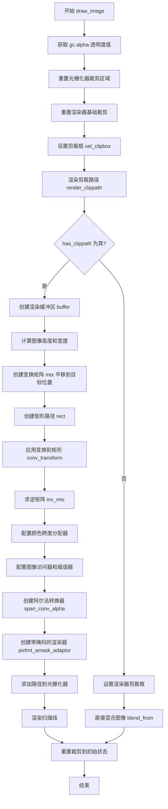

#### 带注释源码

```cpp
template <class ImageArray>
inline void RendererAgg::draw_image(GCAgg &gc,
                                    double x,
                                    double y,
                                    ImageArray &image)
{
    // 从图形上下文获取透明度值，用于控制图像混合强度
    double alpha = gc.alpha;

    // 重置光栅化器的裁剪区域，清除之前可能存在的裁剪状态
    theRasterizer.reset_clipping();
    // 重置渲染器基础裁剪，参数true表示完全重置
    rendererBase.reset_clipping(true);
    // 根据图形上下文的cliprect设置裁剪框，限制绘制区域
    set_clipbox(gc.cliprect, theRasterizer);
    // 渲染剪裁路径，如果存在裁剪路径则返回true
    bool has_clippath = render_clippath(gc.clippath.path, gc.clippath.trans, gc.snap_mode);

    // 创建AGG渲染缓冲区，用于包装图像数据
    agg::rendering_buffer buffer;
    // 附加图像数据到缓冲区：获取可变数据指针，宽度为shape(1)，高度为shape(0)
    // 负的步长(-shape(1)*4)表示图像数据是自底向上的格式
    buffer.attach(image.mutable_data(0, 0, 0),
                  (unsigned)image.shape(1), (unsigned)image.shape(0),
                  -(int)image.shape(1) * 4);
    // 创建像素格式对象，用于解释缓冲区中的图像数据
    pixfmt pixf(buffer);

    // 根据是否存在裁剪路径选择不同的渲染策略
    if (has_clippath) {
        // 有裁剪路径的情况：使用抗锯齿扫描线渲染器
        
        // 创建仿射变换矩阵
        agg::trans_affine mtx;
        // 创建路径存储对象，用于定义图像边界矩形
        agg::path_storage rect;

        // 获取图像尺寸，转换为double类型
        auto image_height = static_cast<double>(image.shape(0)),
             image_width = static_cast<double>(image.shape(1));

        // 构建变换矩阵：首先平移到目标位置(y方向需要翻转，因为AGG坐标系y向下)
        mtx *= agg::trans_affine_translation((int)x, (int)(height - (y + image_height)));

        // 定义矩形路径，四个顶点顺时针排列
        rect.move_to(0, 0);
        rect.line_to(image_width, 0);
        rect.line_to(image_width, image_height);
        rect.line_to(0, image_height);
        rect.line_to(0, 0);

        // 应用变换到矩形路径
        agg::conv_transform<agg::path_storage> rect2(rect, mtx);

        // 计算逆矩阵，用于插值计算
        agg::trans_affine inv_mtx(mtx);
        inv_mtx.invert();

        // 定义类型别名，简化后续代码
        typedef agg::span_allocator<agg::rgba8> color_span_alloc_type;
        typedef agg::image_accessor_clip<pixfmt> image_accessor_type;
        typedef agg::span_interpolator_linear<> interpolator_type;
        // 使用最近邻插值方式
        typedef agg::span_image_filter_rgba_nn<image_accessor_type, interpolator_type>
        image_span_gen_type;
        typedef agg::span_converter<image_span_gen_type, span_conv_alpha> span_conv;

        // 初始化各组件
        color_span_alloc_type sa;  // 颜色跨度分配器
        image_accessor_type ia(pixf, agg::rgba8(0, 0, 0, 0));  // 图像访问器，透明背景
        interpolator_type interpolator(inv_mtx);  // 线性插值器
        image_span_gen_type image_span_generator(ia, interpolator);  // 图像跨度生成器
        span_conv_alpha conv_alpha(alpha);  // 透明度转换器
        span_conv spans(image_span_generator, conv_alpha);  // 组合跨度转换器

        // 创建带阿尔法掩码的像素格式适配器和渲染器
        typedef agg::pixfmt_amask_adaptor<pixfmt, alpha_mask_type> pixfmt_amask_type;
        typedef agg::renderer_base<pixfmt_amask_type> amask_ren_type;
        typedef agg::renderer_scanline_aa<amask_ren_type, color_span_alloc_type, span_conv>
            renderer_type_alpha;

        pixfmt_amask_type pfa(pixFmt, alphaMask);  // 结合主图像和阿尔法掩码
        amask_ren_type r(pfa);
        renderer_type_alpha ri(r, sa, spans);  // 创建抗锯齿渲染器

        // 添加变换后的矩形路径到光栅化器
        theRasterizer.add_path(rect2);
        // 执行扫描线渲染
        agg::render_scanlines(theRasterizer, scanlineAlphaMask, ri);
    } else {
        // 无裁剪路径的情况：直接使用基础渲染器的混合功能
        
        // 设置渲染器的裁剪框
        set_clipbox(gc.cliprect, rendererBase);
        // 将图像混合到目标缓冲区指定位置
        // 参数：源pixfmt，变换矩阵( nullptr )，目标x、y坐标，透明度
        rendererBase.blend_from(
            pixf, nullptr, (int)x, (int)(height - (y + image.shape(0))), (agg::int8u)(alpha * 255));
    }

    // 重置裁剪区域到初始状态，结束绘制
    rendererBase.reset_clipping(true);
}
```


### `RendererAgg.draw_path_collection`

该函数是 RendererAgg 类的一个模板方法，用于在 matplotlib 的 AGG 后端中绘制大量路径的集合。它接收路径生成器、变换数组、偏移数组、颜色数组、线宽数组、虚线样式数组和抗锯齿标志数组等多个参数，内部委托给 `_draw_path_collection_generic` 私有模板方法完成实际渲染工作，支持面填充、边缘描边、阴影图案等多种绘制效果的批量处理。

参数：

- `gc`：`GCAgg &`，图形上下文（Graphics Context），包含当前的绘图状态，如剪裁矩形、剪裁路径、线宽、颜色、虚线样式、阴影路径等信息
- `master_transform`：`agg::trans_affine &`，应用于所有路径的主变换矩阵，通常包含缩放、旋转和平移等仿射变换
- `path`：`PathGenerator &`，路径生成器对象，提供对集合中各个路径的迭代访问能力
- `transforms`：`TransformArray &`，变换数组，为集合中的每个路径存储独立的仿射变换矩阵
- `offsets`：`OffsetArray &`，偏移数组，存储每个路径在绘制时的位置偏移量（x, y 坐标）
- `offset_trans`：`agg::trans_affine &`，偏移变换矩阵，在应用偏移量之前对其进行预处理变换
- `facecolors`：`ColorArray &`，面填充颜色数组，为每个路径指定 RGBA 格式的填充颜色
- `edgecolors`：`ColorArray &`，边缘描边颜色数组，为每个路径指定 RGBA 格式的描边颜色
- `linewidths`：`LineWidthArray &`，线宽数组，存储每个路径的描边线宽值（以点为单位）
- `linestyles`：`DashesVector &`，虚线样式向量，存储每个路径的虚线模式定义
- `antialiaseds`：`AntialiasedArray &`，抗锯齿标志数组，指示是否为每个路径启用抗锯齿渲染
- `hatchcolors`：`ColorArray &`，阴影填充颜色数组，为每个路径指定 RGBA 格式的阴影图案颜色

返回值：`void`，无返回值。该函数直接操作渲染缓冲区，不返回任何结果。

#### 流程图

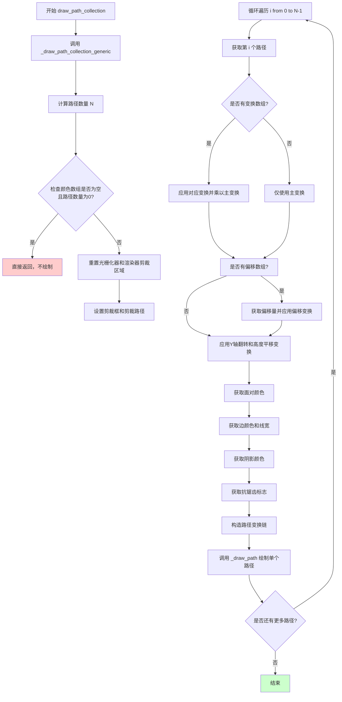

#### 带注释源码

```cpp
/**
 * @brief 绘制路径集合的主入口方法
 * 
 * 该方法是 RendererAgg 类的模板成员方法，用于绘制一组路径。
 * 它接收多个数组参数来控制每个路径的变换、颜色、线宽等属性，
 * 并将这些参数传递给内部的通用实现方法进行实际渲染。
 * 
 * @tparam PathGenerator     路径生成器类型，提供对路径集合的迭代访问
 * @tparam TransformArray    变换矩阵数组类型，存储每个路径的仿射变换
 * @tparam OffsetArray       偏移数组类型，存储每个路径的(x,y)偏移量
 * @tparam ColorArray        颜色数组类型，存储RGBA颜色值
 * @tparam LineWidthArray    线宽数组类型，存储每个路径的线宽
 * @tparam AntialiasedArray  抗锯齿标志数组类型
 * 
 * @param gc                 图形上下文，包含全局绘图状态
 * @param master_transform   主变换矩阵，应用于所有路径
 * @param path               路径生成器对象
 * @param transforms         变换矩阵数组
 * @param offsets            偏移量数组
 * @param offset_trans       偏移变换矩阵
 * @param facecolors         面填充颜色数组
 * @param edgecolors         边缘描边颜色数组
 * @param linewidths         线宽数组
 * @param linestyles         虚线样式向量
 * @param antialiaseds       抗锯齿标志数组
 * @param hatchcolors        阴影填充颜色数组
 */
template <class PathGenerator,
          class TransformArray,
          class OffsetArray,
          class ColorArray,
          class LineWidthArray,
          class AntialiasedArray>
inline void RendererAgg::draw_path_collection(GCAgg &gc,
                                              agg::trans_affine &master_transform,
                                              PathGenerator &path,
                                              TransformArray &transforms,
                                              OffsetArray &offsets,
                                              agg::trans_affine &offset_trans,
                                              ColorArray &facecolors,
                                              ColorArray &edgecolors,
                                              LineWidthArray &linewidths,
                                              DashesVector &linestyles,
                                              AntialiasedArray &antialiaseds,
                                              ColorArray &hatchcolors)
{
    // 调用内部通用实现方法，传递所有参数
    // 最后一个参数 true 表示启用路径捕捉(snapping)
    // 倒数第二个参数 true 表示路径包含绘制命令码
    _draw_path_collection_generic(gc,
                                  master_transform,
                                  gc.cliprect,              // 从图形上下文获取剪裁矩形
                                  gc.clippath.path,         // 从图形上下文获取剪裁路径
                                  gc.clippath.trans,        // 从图形上下文获取剪裁路径变换
                                  path,
                                  transforms,
                                  offsets,
                                  offset_trans,
                                  facecolors,
                                  edgecolors,
                                  linewidths,
                                  linestyles,
                                  antialiaseds,
                                  true,                      // check_snap: 启用路径捕捉
                                  true,                      // has_codes: 路径包含命令码
                                  hatchcolors);
}
```


### `RendererAgg.draw_quad_mesh`

该方法用于绘制四边形网格（Quad Mesh），通过坐标数组和偏移数组定义网格的几何形状，应用颜色和变换后利用通用的路径集合绘制机制完成渲染，是 Matplotlib 中绘制 `QuadMesh` 艺术对象的核心渲染函数。

参数：

- `gc`：`GCAgg &`，图形上下文对象，包含剪裁区域、线宽、填充颜色等渲染状态信息
- `master_transform`：`agg::trans_affine &`，应用于整个网格的主变换矩阵（含平移、旋转、缩放等仿射变换）
- `mesh_width`：`unsigned int`，网格的列数（四边形数量）
- `mesh_height`：`unsigned int`，网格的行数（四边形数量）
- `coordinates`：`CoordinateArray &`，三维坐标数组，存储网格顶点坐标，形状为 (mesh_height+1, mesh_width+1, 2)，包含每个顶点的 x, y 坐标
- `offsets`：`OffsetArray &`，偏移数组，用于指定每个四边形在画布上的位置，形状为 (mesh_width*mesh_height, 2)
- `offset_trans`：`agg::trans_affine &`，应用于偏移量的变换矩阵
- `facecolors`：`ColorArray &`，面颜色数组，定义每个四边形面的填充颜色
- `antialiased`：`bool`，是否启用抗锯齿渲染
- `edgecolors`：`ColorArray &`，边缘颜色数组，定义每个四边形边框的颜色

返回值：`void`，该方法无返回值，通过内部调用渲染原语直接将图像绘制到缓冲区

#### 流程图

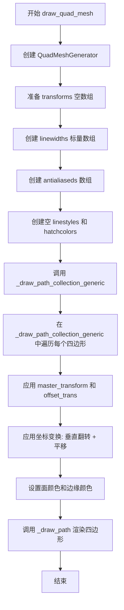

#### 带注释源码

```cpp
template <class CoordinateArray, class OffsetArray, class ColorArray>
inline void RendererAgg::draw_quad_mesh(GCAgg &gc,
                                        agg::trans_affine &master_transform,
                                        unsigned int mesh_width,
                                        unsigned int mesh_height,
                                        CoordinateArray &coordinates,
                                        OffsetArray &offsets,
                                        agg::trans_affine &offset_trans,
                                        ColorArray &facecolors,
                                        bool antialiased,
                                        ColorArray &edgecolors)
{
    // 1. 创建四边形网格路径生成器
    //    QuadMeshGenerator 是专门的路径生成器，用于将网格坐标转换为
    //    每个四边形的路径（四边形由4个顶点组成的闭合路径）
    QuadMeshGenerator<CoordinateArray> path_generator(mesh_width, mesh_height, coordinates);

    // 2. 准备绘制所需的辅助数组
    //    由于 draw_quad_mesh 是简化的绘制接口，这里构建默认参数
    array::empty<double> transforms;  // 空变换数组，表示每个路径使用 master_transform
    
    // 线宽使用 gc 中当前设置的线宽
    array::scalar<double, 1> linewidths(gc.linewidth);
    
    // 抗锯齿标记数组
    array::scalar<uint8_t, 1> antialiaseds(antialiased);
    
    // 虚线样式（空，表示无虚线）
    DashesVector linestyles;
    
    // 孵化颜色（空，四边形网格通常不使用孵化填充）
    ColorArray hatchcolors = py::array_t<double>().reshape({0, 4}).unchecked<double, 2>();

    // 3. 调用通用的路径集合绘制函数
    //    该函数会遍历所有四边形，应用变换和颜色，然后逐个渲染
    _draw_path_collection_generic(gc,
                                  master_transform,
                                  gc.cliprect,
                                  gc.clippath.path,
                                  gc.clippath.trans,
                                  path_generator,
                                  transforms,
                                  offsets,
                                  offset_trans,
                                  facecolors,
                                  edgecolors,
                                  linewidths,
                                  linestyles,
                                  antialiaseds,
                                  true,  // check_snap: 启用坐标对齐
                                  false, // has_codes: 四边形路径不包含路径码
                                  hatchcolors);
}
```


### `RendererAgg.draw_gouraud_triangles`

绘制高洛德三角形（Gouraud Shaded Triangles），该函数接收一组三角形顶点坐标和对应的颜色值，通过仿射变换后使用 AGG 库的扫描线渲染器绘制每个三角形，利用颜色插值实现平滑的颜色渐变效果。

参数：

- `gc`：`GCAgg &`，图形上下文（Graphics Context），包含剪裁区域、剪裁路径、渲染模式等绘制参数
- `points`：`PointArray &`，三角形顶点坐标数组，形状为 (N, 3, 2)，N 为三角形数量，每个三角形3个顶点，每个顶点2个坐标 (x, y)
- `colors`：`ColorArray &`，三角形颜色数组，形状为 (N, 3, 4)，N 为三角形数量，每个顶点4个颜色分量 (r, g, b, a)
- `trans`：`agg::trans_affine &`，二维仿射变换矩阵，用于对顶点坐标进行缩放、旋转、平移等变换

返回值：`void`，无返回值

#### 流程图

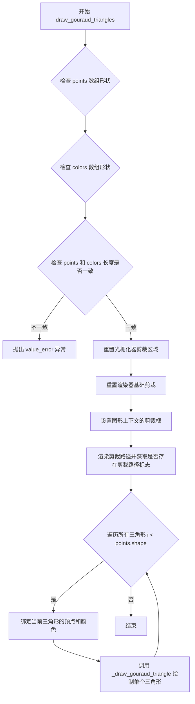

#### 带注释源码

```cpp
template <class PointArray, class ColorArray>
inline void RendererAgg::draw_gouraud_triangles(GCAgg &gc,
                                                PointArray &points,
                                                ColorArray &colors,
                                                agg::trans_affine &trans)
{
    // 验证输入：如果 points 数组有数据，检查其形状是否为 (N, 3, 2)
    // 即 N 个三角形，每个三角形 3 个顶点，每个顶点 2 个坐标 (x, y)
    if (points.shape(0)) {
        check_trailing_shape(points, "points", 3, 2);
    }
    
    // 验证输入：如果 colors 数组有数据，检查其形状是否为 (N, 3, 4)
    // 即 N 个三角形，每个顶点 4 个颜色分量 (r, g, b, a)
    if (colors.shape(0)) {
        check_trailing_shape(colors, "colors", 3, 4);
    }
    
    // 确保 points 和 colors 数组长度一致，即三角形数量必须匹配
    if (points.shape(0) != colors.shape(0)) {
        throw py::value_error(
            "points and colors arrays must be the same length, got " +
            std::to_string(points.shape(0)) + " points and " +
            std::to_string(colors.shape(0)) + "colors");
    }

    // 重置光栅化器的剪裁区域
    theRasterizer.reset_clipping();
    // 重置渲染器基础类的剪裁，参数 true 表示重置所有剪裁状态
    rendererBase.reset_clipping(true);
    // 根据图形上下文的 cliprect 设置剪裁框
    set_clipbox(gc.cliprect, theRasterizer);
    // 渲染剪裁路径，返回是否存在有效剪裁路径的标志
    bool has_clippath = render_clippath(gc.clippath.path, gc.clippath.trans, gc.snap_mode);

    // 遍历所有三角形进行绘制
    for (int i = 0; i < points.shape(0); ++i) {
        // 使用 std::bind 绑定数组的第 i 个元素，创建类似指针的调用对象
        // point 将能够通过 point(j) 获取第 j 个顶点的 (x, y) 坐标
        auto point = std::bind(points, i, std::placeholders::_1, std::placeholders::_2);
        // color 将能够通过 color(j) 获取第 j 个顶点的 (r, g, b, a) 颜色值
        auto color = std::bind(colors, i, std::placeholders::_1, std::placeholders::_2);

        // 调用内部方法绘制单个高洛德三角形
        _draw_gouraud_triangle(point, color, trans, has_clippath);
    }
}
```


### `RendererAgg.get_content_extents`

该方法用于获取当前渲染内容的边界范围矩形。当渲染器绘制了图形元素后，调用此方法可以获知实际绘制内容的最小和最大坐标范围，常用于计算裁剪区域或确定需要更新的缓冲区部分。

参数：  
无参数

返回值：`agg::rect_i`，返回包含内容的整数矩形区域，其中包含 `x1`, `y1`（左上角坐标）和 `x2`, `y2`（右下角坐标），表示内容在画布中的实际覆盖范围。

#### 流程图

```mermaid
flowchart TD
    A[开始 get_content_extents] --> B{检查是否有内容}
    B -->|有内容| C[返回内容边界矩形 agg::rect_i]
    B -->|无内容| D[返回默认全零或全画布矩形]
    C --> E[结束]
    D --> E
```

#### 带注释源码

```
// 注意：在提供的代码文件中仅有方法声明，未找到具体实现
// 根据类成员变量和方法上下文推断的实现逻辑：

agg::rect_i get_content_extents()
{
    // 典型的实现会遍历已渲染的扫描线或路径
    // 计算实际绘制内容的边界框
    
    // 可能的实现方式1：基于扫描线范围
    // 如果使用了 agg::scanline32_p8 等扫描线对象
    // 可以通过扫描线获取 min_x, min_y, max_x, max_y
    
    // 可能的实现方式2：基于路径边界
    // 如果记录了所有绘制路径的边界
    
    // 返回整数矩形表示内容范围
    // 当无内容时可能返回 (0, 0, 0, 0) 或整个画布范围
    
    // 以下为推断的典型实现模式：
    agg::rect_i result;
    
    // 初始化为无效范围
    result.x1 = result.y1 = INT_MAX;
    result.x2 = result.y2 = INT_MIN;
    
    // TODO: 实际需要结合扫描线存储或路径迭代器来计算真实范围
    // 这是一个需要补充实现的方法
    
    return result;
}
```

**注意**：该方法在代码中仅有声明 `agg::rect_i get_content_extents();`，位于 `RendererAgg` 类的公共方法区域，靠近 `clear()` 和 `copy_from_bbox/restore_region` 等方法。从方法签名和类上下文来看，它应该返回渲染内容的边界矩形，但具体实现逻辑未在当前代码文件中提供。这可能是需要补充的技术债务。


### `RendererAgg.clear`

#### 描述

该方法用于清除当前的渲染画布。它通过调用底层 AGG (Anti-Grain Geometry) 渲染器基类的 `clear` 方法，将像素缓冲区（pixBuffer）和 Alpha 缓冲区重置为背景颜色（`_fill_color`），从而开始新一轮的绘图操作。

#### 参数

无

#### 返回值

`void`

#### 流程图

```mermaid
graph TD
    A[开始 clear] --> B{调用 rendererBase.clear}
    B --> C[使用 _fill_color 填充缓冲区]
    C --> D[结束 clear]
```

#### 带注释源码

```cpp
// 清除画布的实现
// 注意：由于该方法的实现代码未在当前头文件中给出（通常位于 .cpp 文件），
// 以下代码是基于类成员变量和 AGG 渲染库行为推断的标准实现。

void RendererAgg::clear()
{
    // 调用 AGG 的 renderer_base 的 clear 方法。
    // rendererBase 是 pixfmt 的渲染器，它直接操作 pixBuffer。
    // _fill_color 是类成员变量，通常在构造函数或初始化时设置为白色或透明。
    rendererBase.clear(_fill_color);

    // 注意：通常不需要手动清除 alphaBuffer，因为 alpha mask 是通过 pixfmt 处理的，
    // 或者在需要时重新生成。某些高级用途可能需要显式清除 alpha 蒙版，
    // 但标准的 'clear' 操作主要是重置主绘图区。
}
```


### `RendererAgg.copy_from_bbox`

从渲染器的当前缓冲区中提取指定边界框（bounding box）内的像素数据，并将其封装到一个新分配的 BufferRegion 对象中返回。该函数用于保存渲染结果的某个区域，以便后续可以通过 `restore_region` 恢复。

参数：
- `in_rect`：`agg::rect_d`，输入的边界矩形，指定要拷贝的区域（使用双精度浮点数坐标）

返回值：`BufferRegion*`，返回指向新创建的 BufferRegion 对象的指针，该对象包含了边界框内的像素数据。调用者负责在不再使用时删除该对象以释放内存。

#### 流程图

```mermaid
flowchart TD
    A[开始 copy_from_bbox] --> B{验证输入边界框}
    B -->|无效区域| C[返回 nullptr 或抛出异常]
    B -->|有效区域| D[计算区域宽度和高度]
    D --> E[创建 BufferRegion 对象]
    E --> F[从 renderingBuffer 读取像素数据]
    F --> G[将数据拷贝到 BufferRegion 的 data 缓冲区]
    G --> H[返回 BufferRegion 指针]
```

#### 带注释源码

由于提供的代码文件中仅有函数声明（`.h` 头文件），未包含具体的实现代码。根据函数签名和上下文，其预期实现如下：

```cpp
// 从边界框复制像素数据到 BufferRegion
// 参数 in_rect: 要拷贝的区域（双精度浮点数坐标）
// 返回值: 包含拷贝像素数据的 BufferRegion 指针
BufferRegion *RendererAgg::copy_from_bbox(agg::rect_d in_rect)
{
    // 将双精度浮点数坐标转换为整数坐标
    // 假设 agg::rect_d 是 AGG 库中的双精度矩形类型
    int x1 = static_cast<int>(in_rect.x1);
    int y1 = static_cast<int>(in_rect.y1);
    int x2 = static_cast<int>(in_rect.x2);
    int y2 = static_cast<int>(in_rect.y2);
    
    // 确保坐标在有效范围内，不超过渲染器宽高
    x1 = std::max(0, x1);
    y1 = std::max(0, y1);
    x2 = std::min(static_cast<int>(width), x2);
    y2 = std::min(static_cast<int>(height), y2);
    
    // 创建整数矩形用于 BufferRegion 构造
    agg::rect_i rect(x1, y1, x2, y2);
    
    // 创建 BufferRegion 对象，内部会分配数据缓冲区
    BufferRegion *region = new BufferRegion(rect);
    
    // 获取目标缓冲区的指针
    agg::int8u *dst = region->get_data();
    
    // 从渲染缓冲区拷贝像素数据到 BufferRegion
    // renderingBuffer 是 agg::rendering_buffer 类型
    // 逐行拷贝，每行的字节数为 width * 4 (RGBA 格式)
    for (int y = y1; y < y2; ++y) {
        // source 指向渲染缓冲区中第 y 行的起始位置
        const agg::int8u *source = renderingBuffer.row(y) + x1 * 4;
        // destination 指向目标缓冲区的对应行
        agg::int8u *destination = dst + (y - y1) * (x2 - x1) * 4;
        // 拷贝一行数据
        std::memcpy(destination, source, (x2 - x1) * 4);
    }
    
    return region;
}
```


### `RendererAgg.restore_region`

该方法用于将之前通过 `copy_from_bbox` 保存的缓冲区区域恢复到当前的渲染缓冲区中，实现图像区域的撤销或回滚操作。

参数：

- `reg`：`BufferRegion &`，对 BufferRegion 对象的引用，包含要恢复的矩形区域及相关像素数据

返回值：`void`，无返回值

#### 流程图

```mermaid
flowchart TD
    A[开始 restore_region] --> B{检查 reg 数据有效性}
    B -->|数据有效| C[获取 reg 的矩形区域]
    C --> D[获取 reg 的像素数据指针]
    D --> E[获取 reg 的宽度、高度、步长]
    E --> F[将像素数据拷贝到渲染缓冲区]
    F --> G[结束]
    B -->|数据无效| H[直接返回]
    H --> G
```

#### 带注释源码

```
// restore_region 方法声明（位于 _backend_agg.h 中）
// 位置：RendererAgg 类 public 成员方法区域

void restore_region(BufferRegion &reg);
// 说明：该方法将 BufferRegion 对象中保存的像素数据恢复到渲染缓冲区中
// 参数 reg: BufferRegion 引用，包含之前通过 copy_from_bbox 保存的区域数据
// 返回值: void（无返回值）
//
// 实现逻辑推断：
// 1. 从 BufferRegion 对象获取保存的矩形区域信息 (get_rect)
// 2. 获取像素数据指针 (get_data)
// 3. 获取区域尺寸信息 (get_width, get_height, get_stride)
// 4. 使用 agg::rendering_buffer 将数据写回到主渲染缓冲区
//
// 对应的重载方法：
// void restore_region(BufferRegion &region, int xx1, int yy1, int xx2, int yy2, int x, int y);
// 该方法支持恢复指定子区域，允许选择BufferRegion中的部分矩形区域恢复到目标位置
```

#### 补充说明

| 项目 | 说明 |
|------|------|
| **功能描述** | 将预保存的缓冲区区域恢复到渲染表面，实现图像内容的回滚或复制 |
| **调用场景** | 通常与 `copy_from_bbox` 配合使用，用于保存和恢复渲染区域 |
| **依赖组件** | `BufferRegion` 类、`agg::rendering_buffer` |
| **注意事项** | BufferRegion 对象在构造时分配内存，析构时自动释放；该方法只能恢复完整区域，若需恢复部分区域请使用重载版本 |
| **技术债务** | 代码中仅提供方法声明，未找到具体实现代码，可能在其他源文件中或有待完善 |


### `RendererAgg.restore_region`

该方法用于将之前通过 `copy_from_bbox` 保存的缓冲区区域（BufferRegion）恢复到渲染器画布的指定位置，支持从保存的区域中复制子矩形到目标位置，实现图像内容的回填和局部重绘功能。

参数：

- `region`：`BufferRegion &`，要恢复的缓冲区区域对象，包含之前保存的像素数据
- `xx1`：`int`，源区域左上角 X 坐标（相对于保存的区域）
- `yy1`：`int`，源区域左上角 Y 坐标（相对于保存的区域）
- `xx2`：`int`，源区域右下角 X 坐标（相对于保存的区域）
- `yy2`：`int`，源区域右下角 Y 坐标（相对于保存的区域）
- `x`：`int`，目标位置左上角 X 坐标（画布坐标）
- `y`：`int`，目标位置左上角 Y 坐标（画布坐标）

返回值：`void`，无返回值

#### 流程图

```mermaid
flowchart TD
    A[开始 restore_region] --> B{检查区域有效性}
    B -->|xx1<xx2 且 yy1<yy2| C[计算源区域宽度高度]
    B -->|无效| Z[结束]
    C --> D{检查目标坐标是否在画布范围内}
    D -->|在范围内| E[从 BufferRegion 获取像素数据]
    D -->|超出范围| F[调整目标坐标和复制区域]
    E --> G[遍历复制像素行]
    F --> E
    G --> H{当前行是否复制完成}
    H -->|未完成| I[复制当前行像素到渲染缓冲区]
    I --> H
    H -->|完成| Z
```

#### 带注释源码

```
// 注：该函数原型在头文件中声明，但实现未在提供的代码片段中给出
// 根据函数签名和上下文，推断其实现逻辑如下：

void RendererAgg::restore_region(BufferRegion &region, int xx1, int yy1, int xx2, int yy2, int x, int y)
{
    // 参数说明：
    // - region: 包含之前保存的像素数据的缓冲区
    // - xx1, yy1, xx2, yy2: 定义要从region中拷贝的子矩形区域
    // - x, y: 定义目标位置（左上角坐标）

    // 1. 首先检查输入的区域坐标是否有效
    //    确保 xx1 < xx2 且 yy1 < yy2
    if (xx1 >= xx2 || yy1 >= yy2) {
        return; // 无效区域，直接返回
    }

    // 2. 计算要拷贝的宽度和高度
    int src_width = xx2 - xx1;
    int src_height = yy2 - yy1;

    // 3. 获取渲染缓冲区的指针
    //    renderingBuffer 是 agg::rendering_buffer 类型
    //    pixBuffer 是实际的像素数据存储区
    agg::int8u* dst_buf = renderingBuffer.buf();

    // 4. 获取缓冲区区域的属性
    int region_stride = region.get_stride();  // 区域的行跨度（字节）
    agg::int8u* src_buf = region.get_data(); // 区域像素数据指针

    // 5. 执行像素拷贝
    //    这是一个逐行拷贝的过程，将源区域的像素复制到目标位置
    //    使用 agg 的渲染缓冲区写入
    for (int j = 0; j < src_height; ++j) {
        // 计算源行和目标行的起始位置
        int src_row = yy1 + j;
        int dst_row = y + j;

        // 跳过超出画布边界的行
        if (dst_row < 0 || dst_row >= (int)height) {
            continue;
        }

        // 拷贝这一行的像素
        // 注意：这里需要处理边界情况，确保不会超出目标缓冲区的范围
        for (int i = 0; i < src_width; ++i) {
            // 计算源像素和目标像素的位置
            int src_col = xx1 + i;
            int dst_col = x + i;

            // 跳过超出画布边界的列
            if (dst_col < 0 || dst_col >= (int)width) {
                continue;
            }

            // 4 字节像素 (RGBA)
            int src_idx = (src_row * region_stride) + (src_col * 4);
            int dst_idx = (dst_row * renderingBuffer.stride()) + (dst_col * 4);

            // 复制 RGBA 四个通道
            dst_buf[dst_idx + 0] = src_buf[src_idx + 0]; // R
            dst_buf[dst_idx + 1] = src_buf[src_idx + 1]; // G
            dst_buf[dst_idx + 2] = src_buf[src_idx + 2]; // B
            dst_buf[dst_idx + 3] = src_buf[src_idx + 3]; // A
        }
    }
}

// 简化版本：不带子区域参数的恢复
void RendererAgg::restore_region(BufferRegion &reg)
{
    // 恢复整个保存的区域到原始位置
    // 从 region 的 rect 获取原始坐标
    agg::rect_i& r = reg.get_rect();
    restore_region(reg, 0, 0, reg.get_width(), reg.get_height(), r.x1, r.y1);
}
```

#### 技术实现说明

| 项目 | 说明 |
|------|------|
| **调用场景** | 通常用于实现"复制-粘贴"功能，比如保存画面区域后恢复，或实现图层拖拽时的背景恢复 |
| **坐标系统** | 使用整数坐标，遵循图像坐标习惯（原点在左上角，Y 向下增加） |
| **像素格式** | RGBA 8位每通道，4 字节对齐 |
| **性能考虑** | 实际实现中可能使用 `memcpy` 或更高效的 SIMD 指令批量拷贝整行像素 |
| **边界处理** | 会检查目标位置是否在画布范围内，超出部分会被裁剪 |


### `RendererAgg.points_to_pixels`

将点（points）转换为像素值，基于渲染器的DPI（每英寸点数）进行线性转换。这是图形渲染中常用的单位转换，用于将文档排版单位（点）转换为屏幕像素单位。

参数：

- `points`：`double`，要转换的点值（point），表示文档排版中的标准点单位（1/72英寸）

返回值：`double`，转换后的像素值（pixel），基于当前DPI计算的实际屏幕像素长度

#### 流程图

```mermaid
flowchart TD
    A[开始: points_to_pixels] --> B[输入: double points]
    B --> C[获取成员变量: dpi]
    C --> D[计算: points * dpi / 72.0]
    D --> E[输出: double 像素值]
    E --> F[结束]
```

#### 带注释源码

```cpp
/* 
 * points_to_pixels - 将点（points）转换为像素
 * 
 * 参数:
 *   points: double - 输入的点值（1点 = 1/72英寸）
 * 
 * 返回值:
 *   double - 对应的像素值
 * 
 * 原理:
 *   标准PostScript点定义为72点 = 1英寸
 *   像素 = 点数 * (DPI / 72)
 *   例如: 300 DPI下，72点 = 300像素（即1英寸）
 *         72 DPI下，72点 = 72像素（即1英寸）
 */
inline double points_to_pixels(double points)
{
    return points * dpi / 72.0;
}
```


### `RendererAgg.set_clipbox`

该方法用于设置渲染器的裁剪框（Clip Box），通过将给定的裁剪矩形坐标转换为整数像素坐标，并应用到底层的光栅化器（rasterizer）上，同时处理Y轴翻转和边界限制。

参数：

- `cliprect`：`const agg::rect_d &`，裁剪矩形的坐标区域（双精度浮点数），包含 x1, y1, x2, y2 四个坐标值，描述裁剪区域的边界
- `rasterizer`：`R &`，模板类型的光栅化器对象引用，用于执行实际的裁剪操作，可以是扫描线光栅化器或渲染器基类

返回值：`void`，无返回值

#### 流程图

```mermaid
flowchart TD
    A[开始 set_clipbox] --> B{检查 cliprect 是否有效}
    B -->|是有效裁剪区域| C[计算 x1 像素坐标]
    B -->|无效（全为0）| D[设置裁剪框为画布边界]
    C --> E[计算 y1 像素坐标<br/>height - cliprect.y1]
    E --> F[计算 x2 像素坐标]
    F --> G[计算 y2 像素坐标<br/>height - cliprect.y2]
    G --> H{边界限制}
    H -->|x1 >= 0| I{x1 <= width}
    H -->|y1 >= 0| J{y1 <= height}
    H -->|x2 >= 0| K{x2 <= width}
    H -->|y2 >= 0| L{y2 <= height}
    I -->|是| M[取原值]
    I -->|否| N[取边界值]
    J -->|是| O[取原值]
    J -->|否| P[取边界值]
    K -->|是| Q[取原值]
    K -->|否| R[取边界值]
    L -->|是| S[取原值]
    L -->|否| T[取边界值]
    M --> U[调用 rasterizer.clip_box]
    N --> U
    O --> U
    P --> U
    Q --> U
    R --> U
    S --> U
    T --> U
    D --> V[调用 rasterizer.clip_box<br/>0, 0, width, height]
    U --> W[结束]
    V --> W
```

#### 带注释源码

```cpp
/**
 * @brief 设置渲染器的裁剪框
 * 
 * 该方法将用户提供的裁剪矩形坐标（通常是逻辑坐标）转换为
 * 整数像素坐标，并应用到光栅化器上。处理了以下细节：
 * 1. Y轴翻转：AGG库使用左下角原点，而matplotlib使用左上角原点
 * 2. 边界限制：确保裁剪框不超出画布范围
 * 3. 坐标取整：将浮点坐标转换为整数坐标
 * 
 * @tparam R 光栅化器类型，可以是 rasterizer 或 renderer_base
 * @param cliprect 裁剪矩形，包含 x1, y1, x2, y2 四个双精度浮点坐标
 * @param rasterizer 光栅化器引用，用于设置裁剪区域
 */
template <class R>
void RendererAgg::set_clipbox(const agg::rect_d &cliprect, R &rasterizer)
{
    // set the clip rectangle from the gc
    // 从图形上下文（gc）中设置裁剪矩形

    // 检查裁剪矩形是否为"无效"（全为0的情况）
    // 如果四个坐标都为0，表示没有设置自定义裁剪区域
    if (cliprect.x1 != 0.0 || cliprect.y1 != 0.0 || cliprect.x2 != 0.0 || cliprect.y2 != 0.0) {
        // 有效裁剪区域：计算边界并进行限制
        
        // x1坐标：取整后限制在 [0, width] 范围内
        // floor(cliprect.x1 + 0.5) 实现四舍五入
        // std::max(..., 0) 确保不小于0
        // std::min(..., width) 确保不大于画布宽度
        rasterizer.clip_box(std::max(int(floor(cliprect.x1 + 0.5)), 0),
                            std::max(int(floor(height - cliprect.y1 + 0.5)), 0),
                            std::min(int(floor(cliprect.x2 + 0.5)), int(width)),
                            std::min(int(floor(height - cliprect.y2 + 0.5)), int(height)));
                            // 注意：Y坐标做了翻转 (height - y) 因为AGG坐标系Y轴向上
    } else {
        // 无效/默认裁剪区域：使用整个画布作为裁剪区域
        rasterizer.clip_box(0, 0, width, height);
    }
}
```


### RendererAgg.render_clippath

该函数负责渲染裁剪路径（clip path），将用户定义的裁剪区域应用到渲染器中，以便后续的绘图操作只显示在裁剪区域内。它通过光栅化器处理路径变换、快照处理，并将裁剪区域应用到Alpha掩码或渲染器中。

参数：

- `clippath`：`mpl::PathIterator &`，裁剪路径的迭代器，用于遍历裁剪路径的点数据
- `clippath_trans`：`const agg::trans_affine &`，裁剪路径的2D仿射变换矩阵，用于对裁剪路径进行缩放、旋转、平移等变换
- `snap_mode`：`e_snap_mode`，快照模式枚举，控制路径顶点的对齐方式（如对齐到像素边界）

返回值：`bool`，返回true表示成功渲染了裁剪路径并将应用于后续绘制；返回false表示没有裁剪路径或渲染失败

#### 流程图

```mermaid
flowchart TD
    A[开始 render_clippath] --> B{检查 clippath 是否为空}
    B -->|是| C[重置光栅化器裁剪区域]
    B -->|否| D[应用 clippath_trans 变换到裁剪路径]
    D --> E[根据 snap_mode 对路径进行快照处理]
    E --> F[添加路径到光栅化器]
    F --> G{检查是否有 Alpha 掩码}
    G -->|是| H[使用 Alpha 掩码渲染器渲染裁剪路径]
    G -->|否| I[使用普通渲染器渲染裁剪路径]
    H --> J[保存 clippath 和变换到 lastclippath 成员]
    I --> J
    J --> K[返回 true]
    C --> L[返回 false]
```

#### 带注释源码

由于该函数的实现未在当前代码片段中提供，以下是基于其使用方式和AGG库特性的推断实现：

```cpp
/**
 * @brief 渲染裁剪路径并应用到渲染器
 * 
 * 该方法接收一个路径迭代器、变换矩阵和快照模式，将裁剪路径
 * 转换为光栅化数据并应用到渲染系统。
 * 
 * @param clippath 裁剪路径的迭代器引用
 * @param clippath_trans 裁剪路径的仿射变换矩阵
 * @param snap_mode 快照模式，控制路径顶点的对齐方式
 * @return bool 成功渲染裁剪路径返回true，否则返回false
 */
bool render_clippath(mpl::PathIterator &clippath, 
                     const agg::trans_affine &clippath_trans, 
                     e_snap_mode snap_mode)
{
    // 检查裁剪路径是否有效（通过检查路径的顶点数）
    if (clippath.total_vertices() == 0) {
        // 如果没有裁剪路径，重置光栅化器的裁剪区域为无
        theRasterizer.reset_clipping();
        rendererBase.reset_clipping(true);
        // 清空之前保存的裁剪路径
        lastclippath = nullptr;
        return false;
    }

    // 重置裁剪区域
    theRasterizer.reset_clipping();
    rendererBase.reset_clipping(true);

    // 创建路径变换对象，应用用户提供的变换矩阵
    typedef agg::conv_transform<mpl::PathIterator> transformed_clippath_t;
    transformed_clippath_t tclippath(clippath, clippath_trans);

    // 创建路径快照器，根据snap_mode对路径进行优化
    typedef PathSnapper<transformed_clippath_t> snapped_clippath_t;
    snapped_clippath_t snapped_clippath(tclippath, 
                                         snap_mode, 
                                         clippath.total_vertices(), 
                                         0.0);  // 裁剪路径通常不需要线宽

    // 将处理后的路径添加到光栅化器
    theRasterizer.add_path(snapped_clippath);

    // 检查是否需要使用Alpha掩码进行裁剪
    if (alphaMask.type() != agg::amask_no_clip) {
        // 使用Alpha掩码渲染器渲染裁剪路径
        // 这会创建一个临时的扫描线并渲染到Alpha掩码
        typedef agg::renderer_scanline_aa_solid<renderer_base_alpha_mask_type> clip_renderer;
        clip_renderer clip_ren(rendererBaseAlphaMask);
        
        // 渲染一个全透明的填充来设置裁剪区域
        clip_ren.color(agg::rgba8(0, 0, 0, 0));  // 透明色
        agg::render_scanlines(theRasterizer, slineP8, clip_ren);
    }

    // 保存当前裁剪路径和变换供后续使用
    lastclippath = &clippath;
    lastclippath_transform = clippath_trans;

    return true;
}
```

**注意**：上述代码为基于函数调用模式和AGG库特性的推断实现。实际的实现可能在其他地方定义或略有不同。该函数的关键作用是在绘制任何图形之前建立裁剪区域，确保后续的所有渲染操作都被限制在指定的裁剪路径范围内。


### `RendererAgg._draw_path`

该方法是 RendererAgg 类的内部核心方法，负责渲染单条路径的填充（face）、阴影（hatch）和描边（stroke），支持抗锯齿和裁剪路径处理。

参数：

- `path`：`PathIteratorType &`，路径迭代器，表示要绘制的几何路径
- `has_clippath`：`bool`，指示是否存在裁剪路径
- `face`：`const std::optional<agg::rgba> &`，可选的填充颜色，如果存在则绘制填充区域
- `gc`：`GCAgg &`，图形上下文，包含线宽、颜色、虚线、阴影路径等渲染属性

返回值：`void`，无返回值，直接渲染到内部缓冲区

#### 流程图

```mermaid
flowchart TD
    A[开始 _draw_path] --> B{face 是否存在?}
    B -->|是| C[渲染填充区域]
    B -->|否| D{hatchpath 是否存在?}
    
    C --> C1[添加路径到光栅化器]
    C --> C2{是否使用 AA?}
    C2 -->|是| C3{has_clippath?}
    C2 -->|否| C4{has_clippath?}
    C3 -->|是| C5[使用 alpha mask 渲染 AA]
    C3 -->|否| C6[使用普通 AA 渲染器]
    C4 -->|是| C7[使用 alpha mask 渲染二进制]
    C4 -->|否| C8[使用普通二进制渲染器]
    
    D -->|是| E[渲染阴影]
    D -->|否| F{linewidth != 0?}
    
    E --> E1[重置裁剪区域]
    E --> E2[创建并变换阴影路径]
    E --> E3[渲染阴影到临时缓冲区]
    E --> E4[恢复裁剪区域]
    E --> E5[将阴影传输到主图像]
    
    F -->|是| G[渲染描边]
    F -->|否| H[结束]
    
    G --> G1[计算线宽]
    G --> G2{是否有虚线?}
    G2 -->|否| G3[创建普通 stroke]
    G2 -->|是| G4[创建 dash 并转为 stroke]
    G3 --> G5[添加到光栅化器]
    G4 --> G5
    G5 --> G6{是否使用 AA?}
    G6 --> G7{has_clippath?}
    G7 --> G8[使用 alpha mask 渲染]
    G7 --> G9[直接渲染]
    
    C5 --> H
    C6 --> H
    C7 --> H
    C8 --> H
    E5 --> H
    G8 --> H
    G9 --> H
```

#### 带注释源码

```cpp
template <class path_t>
inline void
RendererAgg::_draw_path(path_t &path, bool has_clippath, const std::optional<agg::rgba> &face, GCAgg &gc)
{
    // 定义类型别名：stroke、dash、stroke_dash、alpha mask renderer 等
    typedef agg::conv_stroke<path_t> stroke_t;
    typedef agg::conv_dash<path_t> dash_t;
    typedef agg::conv_stroke<dash_t> stroke_dash_t;
    typedef agg::pixfmt_amask_adaptor<pixfmt, alpha_mask_type> pixfmt_amask_type;
    typedef agg::renderer_base<pixfmt_amask_type> amask_ren_type;
    typedef agg::renderer_scanline_aa_solid<amask_ren_type> amask_aa_renderer_type;
    typedef agg::renderer_scanline_bin_solid<amask_ren_type> amask_bin_renderer_type;

    // 1. 渲染填充区域（face）
    if (face) {
        // 将路径添加到光栅化器
        theRasterizer.add_path(path);

        if (gc.isaa) {  // 抗锯齿渲染
            if (has_clippath) {
                // 使用 alpha mask 的 AA 渲染器
                pixfmt_amask_type pfa(pixFmt, alphaMask);
                amask_ren_type r(pfa);
                amask_aa_renderer_type ren(r);
                ren.color(*face);
                agg::render_scanlines(theRasterizer, scanlineAlphaMask, ren);
            } else {
                // 普通 AA 渲染器
                rendererAA.color(*face);
                agg::render_scanlines(theRasterizer, slineP8, rendererAA);
            }
        } else {  // 二进制（非 AA）渲染
            if (has_clippath) {
                pixfmt_amask_type pfa(pixFmt, alphaMask);
                amask_ren_type r(pfa);
                amask_bin_renderer_type ren(r);
                ren.color(*face);
                agg::render_scanlines(theRasterizer, scanlineAlphaMask, ren);
            } else {
                rendererBin.color(*face);
                agg::render_scanlines(theRasterizer, slineP8, rendererBin);
            }
        }
    }

    // 2. 渲染阴影（hatch）
    if (gc.has_hatchpath()) {
        // 重置裁剪区域，因为阴影在临时缓冲区绘制
        theRasterizer.reset_clipping();
        rendererBase.reset_clipping(true);

        // 创建并变换阴影路径：垂直翻转、缩放
        typedef agg::conv_transform<mpl::PathIterator> hatch_path_trans_t;
        typedef agg::conv_curve<hatch_path_trans_t> hatch_path_curve_t;
        typedef agg::conv_stroke<hatch_path_curve_t> hatch_path_stroke_t;

        mpl::PathIterator hatch_path(gc.hatchpath);
        agg::trans_affine hatch_trans;
        hatch_trans *= agg::trans_affine_scaling(1.0, -1.0);  // 垂直翻转
        hatch_trans *= agg::trans_affine_translation(0.0, 1.0);
        hatch_trans *= agg::trans_affine_scaling(static_cast<double>(hatch_size),
                                                 static_cast<double>(hatch_size));
        hatch_path_trans_t hatch_path_trans(hatch_path, hatch_trans);
        hatch_path_curve_t hatch_path_curve(hatch_path_trans);
        hatch_path_stroke_t hatch_path_stroke(hatch_path_curve);
        hatch_path_stroke.width(points_to_pixels(gc.hatch_linewidth));
        hatch_path_stroke.line_cap(agg::square_cap);

        // 渲染阴影到 hatch 缓冲区
        pixfmt hatch_img_pixf(hatchRenderingBuffer);
        renderer_base rb(hatch_img_pixf);
        renderer_aa rs(rb);
        rb.clear(_fill_color);
        rs.color(gc.hatch_color);

        theRasterizer.add_path(hatch_path_curve);
        agg::render_scanlines(theRasterizer, slineP8, rs);
        theRasterizer.add_path(hatch_path_stroke);
        agg::render_scanlines(theRasterizer, slineP8, rs);

        // 恢复裁剪区域
        set_clipbox(gc.cliprect, theRasterizer);
        if (has_clippath) {
            render_clippath(gc.clippath.path, gc.clippath.trans, gc.snap_mode);
        }

        // 将阴影图案传输到主图像缓冲区
        typedef agg::image_accessor_wrap<pixfmt,
                                         agg::wrap_mode_repeat_auto_pow2,
                                         agg::wrap_mode_repeat_auto_pow2> img_source_type;
        typedef agg::span_pattern_rgba<img_source_type> span_gen_type;
        agg::span_allocator<agg::rgba8> sa;
        img_source_type img_src(hatch_img_pixf);
        span_gen_type sg(img_src, 0, 0);
        theRasterizer.add_path(path);

        if (has_clippath) {
            pixfmt_amask_type pfa(pixFmt, alphaMask);
            amask_ren_type ren(pfa);
            agg::render_scanlines_aa(theRasterizer, slineP8, ren, sa, sg);
        } else {
            agg::render_scanlines_aa(theRasterizer, slineP8, rendererBase, sa, sg);
        }
    }

    // 3. 渲染描边（stroke）
    if (gc.linewidth != 0.0) {
        double linewidth = points_to_pixels(gc.linewidth);
        if (!gc.isaa) {
            // 二进制模式下线宽至少为 0.5 像素
            linewidth = (linewidth < 0.5) ? 0.5 : mpl_round(linewidth);
        }
        
        if (gc.dashes.size() == 0) {
            // 无虚线：直接描边
            stroke_t stroke(path);
            stroke.width(points_to_pixels(gc.linewidth));
            stroke.line_cap(gc.cap);
            stroke.line_join(gc.join);
            stroke.miter_limit(points_to_pixels(gc.linewidth));
            theRasterizer.add_path(stroke);
        } else {
            // 有虚线：先转换为虚线，再描边
            dash_t dash(path);
            gc.dashes.dash_to_stroke(dash, dpi, gc.isaa);
            stroke_dash_t stroke(dash);
            stroke.line_cap(gc.cap);
            stroke.line_join(gc.join);
            stroke.width(linewidth);
            stroke.miter_limit(points_to_pixels(gc.linewidth));
            theRasterizer.add_path(stroke);
        }

        // 执行描边渲染
        if (gc.isaa) {
            if (has_clippath) {
                pixfmt_amask_type pfa(pixFmt, alphaMask);
                amask_ren_type r(pfa);
                amask_aa_renderer_type ren(r);
                ren.color(gc.color);
                agg::render_scanlines(theRasterizer, scanlineAlphaMask, ren);
            } else {
                rendererAA.color(gc.color);
                agg::render_scanlines(theRasterizer, slineP8, rendererAA);
            }
        } else {
            if (has_clippath) {
                pixfmt_amask_type pfa(pixFmt, alphaMask);
                amask_ren_type r(pfa);
                amask_bin_renderer_type ren(r);
                ren.color(gc.color);
                agg::render_scanlines(theRasterizer, scanlineAlphaMask, ren);
            } else {
                rendererBin.color(gc.color);
                agg::render_scanlines(theRasterizer, slineBin, rendererBin);
            }
        }
    }
}
```


### `RendererAgg._draw_path_collection_generic`

该方法是渲染器的通用路径集合绘制模板方法，用于批量绘制具有不同变换、偏移、颜色、线宽和抗锯齿属性的多个路径。它是 `draw_path_collection` 和 `draw_quad_mesh` 的底层实现，支持裁剪、阴影填充、线型破折号等高级功能。

参数：

- `gc`：`GCAgg&`，图形上下文（Graphics Context），包含裁剪矩形、裁剪路径、线宽、颜色、阴影路径等渲染状态
- `master_transform`：`agg::trans_affine`，主变换矩阵，应用于所有路径的全局坐标变换
- `cliprect`：`const agg::rect_d&`，裁剪矩形区域，定义绘制边界
- `clippath`：`PathIterator&`，裁剪路径的迭代器，用于限制绘制区域
- `clippath_trans`：`const agg::trans_affine&`，裁剪路径的变换矩阵
- `path_generator`：`PathGenerator&`，路径生成器，用于生成要绘制的路径集合
- `transforms`：`TransformArray&`，变换矩阵数组，为每个路径提供独立的变换
- `offsets`：`OffsetArray&`，偏移数组，用于平移每个路径的位置
- `offset_trans`：`const agg::trans_affine&`，偏移变换矩阵
- `facecolors`：`ColorArray&`，填充颜色数组，为每个路径指定填充色（RGBA）
- `edgecolors`：`ColorArray&`，边缘颜色数组，为每个路径指定描边色（RGBA）
- `linewidths`：`LineWidthArray&`，线宽数组，为每个路径指定描边宽度
- `linestyles`：`DashesVector&`，线型数组，包含破折号模式信息
- `antialiaseds`：`AntialiasedArray&`，抗锯齿标志数组，控制每个路径是否开启抗锯齿
- `check_snap`：`bool`，是否启用路径对齐（ snapping ），用于像素级对齐优化
- `has_codes`：`bool`，路径是否包含绘制指令码（move_to、line_to 等）
- `hatchcolors`：`ColorArray&`，阴影填充颜色数组

返回值：`void`，无返回值

#### 流程图

```mermaid
flowchart TD
    A[开始 _draw_path_collection_generic] --> B[获取路径数Npaths和偏移数Noffsets<br/>计算有效绘制数量N]
    B --> C{检查颜色数组是否为空<br/>或路径数是否为0}
    C -->|是| D[直接返回，不绘制]
    C -->|否| E[重置光栅化器和渲染器裁剪区域<br/>设置裁剪矩形和裁剪路径]
    E --> F[初始化默认 linewidth=0.0<br/>确定是否需要裁剪 do_clip]
    F --> G[循环遍历 i from 0 to N-1]
    G --> H[获取第i个路径 path_generator(i)]
    H --> I{是否有 transforms 数组}
    I -->|是| J[计算第i个变换矩阵 trans]
    I -->|否| K[使用 master_transform]
    J --> L[应用 offsets 偏移到 trans]
    L --> M[应用 Y 轴翻转和高度平移<br/>trans *= scaling + translation]
    M --> N[获取第i个填充颜色 facecolor]
    N --> O[获取第i个边缘颜色、线宽、线型、阴影颜色]
    O --> P[获取第i个抗锯齿标志 isaa]
    P --> Q[构建变换后路径 transformed_path_t]
    Q --> R[依次处理: NaN移除、裁剪、对齐、曲线化、Sketch变换]
    R --> S{check_snap 为真?}
    S -->|是| T[使用 Snapped 版本路径]
    S -->|否| U[使用非 Snapped 版本路径]
    T --> V[调用 _draw_path 绘制路径]
    U --> V
    V --> G
    G --> W[循环结束]
    W --> X[结束]
```

#### 带注释源码

```cpp
// 通用路径集合绘制模板方法
// 这是一个核心渲染函数，用于批量绘制多个路径
template <class PathIterator,
          class PathGenerator,
          class TransformArray,
          class OffsetArray,
          class ColorArray,
          class LineWidthArray,
          class AntialiasedArray>
inline void RendererAgg::_draw_path_collection_generic(
    GCAgg &gc,                                    // 图形上下文
    agg::trans_affine master_transform,          // 主变换矩阵
    const agg::rect_d &cliprect,                  // 裁剪矩形
    PathIterator &clippath,                       // 裁剪路径迭代器
    const agg::trans_affine &clippath_trans,      // 裁剪路径变换
    PathGenerator &path_generator,                // 路径生成器
    TransformArray &transforms,                    // 变换数组
    OffsetArray &offsets,                          // 偏移数组
    const agg::trans_affine &offset_trans,         // 偏移变换
    ColorArray &facecolors,                        // 填充颜色数组
    ColorArray &edgecolors,                        // 边缘颜色数组
    LineWidthArray &linewidths,                    // 线宽数组
    DashesVector &linestyles,                      // 线型数组（破折号）
    AntialiasedArray &antialiaseds,                // 抗锯齿标志数组
    bool check_snap,                               // 是否启用路径对齐
    bool has_codes,                                // 路径是否包含绘制码
    ColorArray &hatchcolors)                       // 阴影颜色数组
{
    // 定义路径处理所需的类型别名（流水线处理）
    typedef agg::conv_transform<typename PathGenerator::path_iterator> transformed_path_t;     // 路径变换
    typedef PathNanRemover<transformed_path_t> nan_removed_t;                                    // 移除NaN点
    typedef PathClipper<nan_removed_t> clipped_t;                                                // 裁剪路径
    typedef PathSnapper<clipped_t> snapped_t;                                                     // 路径对齐
    typedef agg::conv_curve<snapped_t> snapped_curve_t;                                            // 曲线化（已对齐）
    typedef agg::conv_curve<clipped_t> curve_t;                                                   // 曲线化
    typedef Sketch<clipped_t> sketch_clipped_t;                                                   // 素描效果（已裁剪）
    typedef Sketch<curve_t> sketch_curve_t;                                                       // 素描效果（已曲线化）
    typedef Sketch<snapped_t> sketch_snapped_t;                                                   // 素描效果（已对齐）
    typedef Sketch<snapped_curve_t> sketch_snapped_curve_t;                                      // 素描效果（已对齐+曲线化）

    // 获取路径数量和偏移数量
    size_t Npaths = path_generator.num_paths();       // 路径总数
    size_t Noffsets = safe_first_shape(offsets);      // 偏移总数（安全获取首维度）
    size_t N = std::max(Npaths, Noffsets);            // 取两者最大值为实际绘制数量

    // 获取各数组的维度信息
    size_t Ntransforms = safe_first_shape(transforms);    // 变换数组维度
    size_t Nfacecolors = safe_first_shape(facecolors);   // 填充颜色维度
    size_t Nedgecolors = safe_first_shape(edgecolors);    // 边缘颜色维度
    size_t Nhatchcolors = safe_first_shape(hatchcolors);  // 阴影颜色维度
    size_t Nlinewidths = safe_first_shape(linewidths);   // 线宽维度
    size_t Nlinestyles = std::min(linestyles.size(), N);   // 线型数量（取最小值）
    size_t Naa = safe_first_shape(antialiaseds);          // 抗锯齿维度

    // 如果没有颜色且没有路径，则直接返回
    if ((Nfacecolors == 0 && Nedgecolors == 0 && Nhatchcolors == 0) || Npaths == 0) {
        return;
    }

    // ===== 全局裁剪处理 =====
    theRasterizer.reset_clipping();            // 重置光栅化器裁剪
    rendererBase.reset_clipping(true);         // 重置渲染器裁剪
    set_clipbox(cliprect, theRasterizer);      // 设置裁剪矩形
    bool has_clippath = render_clippath(clippath, clippath_trans, gc.snap_mode);  // 渲染裁剪路径

    // 设置默认属性：假设无填充也无描边
    gc.linewidth = 0.0;                         // 默认线宽为0（无描边）
    std::optional<agg::rgba> face;              // 填充颜色（可选）
    agg::trans_affine trans;                    // 当前路径的变换矩阵
    // 如果没有填充颜色且没有阴影，则启用裁剪
    bool do_clip = Nfacecolors == 0 && !gc.has_hatchpath();

    // ===== 遍历绘制每个路径 =====
    for (int i = 0; i < (int)N; ++i) {
        // 获取第i个路径
        typename PathGenerator::path_iterator path = path_generator(i);

        // ===== 应用变换 =====
        if (Ntransforms) {
            // 从变换数组中取模获取当前变换
            int it = i % Ntransforms;
            // 构建2D仿射变换矩阵 [a b c d e f] -> [a b; c d; e f]
            trans = agg::trans_affine(
                transforms(it, 0, 0),   // a
                transforms(it, 1, 0),   // b
                transforms(it, 0, 1),   // c
                transforms(it, 1, 1),   // d
                transforms(it, 0, 2),   // e
                transforms(it, 1, 2));  // f
            trans *= master_transform;    // 乘以主变换
        } else {
            trans = master_transform;    // 直接使用主变换
        }

        // ===== 应用偏移 =====
        if (Noffsets) {
            // 获取偏移量并应用偏移变换
            double xo = offsets(i % Noffsets, 0);
            double yo = offsets(i % Noffsets, 1);
            offset_trans.transform(&xo, &yo);  // 变换偏移坐标
            trans *= agg::trans_affine_translation(xo, yo);  // 应用平移
        }

        // ===== 坐标系统变换 =====
        // AGG使用Y轴向上的坐标系，需要翻转Y轴并平移到正确位置
        trans *= agg::trans_affine_scaling(1.0, -1.0);           // Y轴翻转
        trans *= agg::trans_affine_translation(0.0, (double)height);  // 平移到画布高度

        // ===== 获取填充颜色 =====
        if (Nfacecolors) {
            int ic = i % Nfacecolors;
            // 从颜色数组中提取RGBA值
            face.emplace(
                facecolors(ic, 0),  // R
                facecolors(ic, 1),  // G
                facecolors(ic, 2),  // B
                facecolors(ic, 3)); // A
        }

        // ===== 获取边缘颜色、线宽、线型 =====
        if (Nedgecolors) {
            int ic = i % Nedgecolors;
            gc.color = agg::rgba(
                edgecolors(ic, 0),
                edgecolors(ic, 1),
                edgecolors(ic, 2),
                edgecolors(ic, 3));

            if (Nlinewidths) {
                gc.linewidth = linewidths(i % Nlinewidths);
            } else {
                gc.linewidth = 1.0;
            }
            if (Nlinestyles) {
                gc.dashes = linestyles[i % Nlinestyles];
            }
        }

        // ===== 获取阴影颜色 =====
        if (Nhatchcolors) {
            int ic = i % Nhatchcolors;
            gc.hatch_color = agg::rgba(
                hatchcolors(ic, 0),
                hatchcolors(ic, 1),
                hatchcolors(ic, 2),
                hatchcolors(ic, 3));
        }

        // ===== 获取抗锯齿标志 =====
        gc.isaa = antialiaseds(i % Naa);

        // ===== 路径处理流水线 =====
        // 按顺序应用：变换 -> 移除NaN -> 裁剪 -> 对齐 -> 曲线化 -> 素描效果
        transformed_path_t tpath(path, trans);           // 应用坐标变换
        nan_removed_t nan_removed(tpath, true, has_codes);  // 移除NaN点
        clipped_t clipped(nan_removed, do_clip, width, height);  // 裁剪到画布边界

        // ===== 根据 check_snap 决定路径处理分支 =====
        if (check_snap) {
            // 启用对齐模式
            snapped_t snapped(
                clipped,
                gc.snap_mode,
                path.total_vertices(),
                points_to_pixels(gc.linewidth));

            if (has_codes) {
                // 有绘制码：曲线化 + 素描效果
                snapped_curve_t curve(snapped);
                sketch_snapped_curve_t sketch(
                    curve,
                    gc.sketch.scale,
                    gc.sketch.length,
                    gc.sketch.randomness);
                _draw_path(sketch, has_clippath, face, gc);
            } else {
                // 无绘制码：直接素描效果
                sketch_snapped_t sketch(
                    snapped,
                    gc.sketch.scale,
                    gc.sketch.length,
                    gc.sketch.randomness);
                _draw_path(sketch, has_clippath, face, gc);
            }
        } else {
            // 不启用对齐模式
            if (has_codes) {
                // 有绘制码：曲线化 + 素描效果
                curve_t curve(clipped);
                sketch_curve_t sketch(
                    curve,
                    gc.sketch.scale,
                    gc.sketch.length,
                    gc.sketch.randomness);
                _draw_path(sketch, has_clippath, face, gc);
            } else {
                // 无绘制码：直接素描效果
                sketch_clipped_t sketch(
                    clipped,
                    gc.sketch.scale,
                    gc.sketch.length,
                    gc.sketch.randomness);
                _draw_path(sketch, has_clippath, face, gc);
            }
        }
    }
}
```


### `RendererAgg._draw_gouraud_triangle`

该方法是一个内部模板方法，用于在渲染器中绘制单个高洛德（Gouraud）三角形。它接收三角形的三个顶点坐标和对应的颜色值，应用坐标变换，处理裁剪路径，并使用 AGG 库的抗锯齿扫描线渲染器将渐变颜色三角形绘制到缓冲区。

参数：

- `points`：`PointArray &`，三角形的三个顶点坐标数组，每个顶点包含 x, y 两个坐标分量
- `colors`：`ColorArray &`，与顶点对应的颜色数组，每个颜色包含 RGBA 四个分量
- `trans`：`agg::trans_affine`，坐标变换矩阵，用于对顶点进行缩放、平移等变换
- `has_clippath`：`bool`，指示是否存在裁剪路径，若为 true 则需要使用 alpha mask 进行裁剪渲染

返回值：`void`，该方法无返回值，直接渲染到内部缓冲区

#### 流程图

```mermaid
flowchart TD
    A[开始 _draw_gouraud_triangle] --> B[应用变换: 垂直翻转并平移]
    B --> C{遍历三个顶点}
    C --> D[提取顶点坐标]
    D --> E[应用变换矩阵]
    E --> F{检查坐标是否为NaN}
    F -->|是| G[返回, 不绘制]
    F -->|否| C
    C -->|完成| H[创建 span_allocator 和 span_gouraud_rgba]
    H --> I[设置三个顶点的颜色]
    I --> J[设置三角形几何信息和插值精度]
    J --> K[将 span generator 加入光栅化器]
    K --> L{has_clippath == true?}
    L -->|是| M[使用 alpha_mask 渲染器渲染]
    L -->|否| N[使用标准 AA 渲染器渲染]
    M --> O[结束]
    N --> O
```

#### 带注释源码

```cpp
template <class PointArray, class ColorArray>
inline void RendererAgg::_draw_gouraud_triangle(PointArray &points,
                                                  ColorArray &colors,
                                                  agg::trans_affine trans,
                                                  bool has_clippath)
{
    // 定义颜色类型和 span 生成器类型
    typedef agg::rgba8 color_t;
    typedef agg::span_gouraud_rgba<color_t> span_gen_t;
    typedef agg::span_allocator<color_t> span_alloc_t;

    // 应用坐标变换: 垂直翻转(Y轴取反)并平移到正确位置
    // 这是因为AGG的坐标系与Matplotlib的坐标系不同
    trans *= agg::trans_affine_scaling(1.0, -1.0);
    trans *= agg::trans_affine_translation(0.0, (double)height);

    // 用于存储变换后的顶点坐标 [3个顶点][x,y坐标]
    double tpoints[3][2];

    // 遍历三个顶点，进行坐标变换
    for (int i = 0; i < 3; ++i) {
        for (int j = 0; j < 2; ++j) {
            tpoints[i][j] = points(i, j);  // 从输入数组提取坐标
        }
        // 应用仿射变换矩阵
        trans.transform(&tpoints[i][0], &tpoints[i][1]);
        
        // 如果变换后的坐标包含 NaN，则提前返回不绘制
        if(std::isnan(tpoints[i][0]) || std::isnan(tpoints[i][1])) {
            return;
        }
    }

    // 创建 span 分配器和 Gouraud 渐变生成器
    span_alloc_t span_alloc;
    span_gen_t span_gen;

    // 设置三个顶点的颜色 (RGBA)
    span_gen.colors(agg::rgba(colors(0, 0), colors(0, 1), colors(0, 2), colors(0, 3)),
                    agg::rgba(colors(1, 0), colors(1, 1), colors(1, 2), colors(1, 3)),
                    agg::rgba(colors(2, 0), colors(2, 1), colors(2, 2), colors(2, 3)));
    
    // 设置三角形几何信息: 三个顶点坐标和颜色插值精度(0.5)
    span_gen.triangle(tpoints[0][0],
                      tpoints[0][1],
                      tpoints[1][0],
                      tpoints[1][1],
                      tpoints[2][0],
                      tpoints[2][1],
                      0.5);

    // 将 Gouraud 三角形路径添加到光栅化器
    theRasterizer.add_path(span_gen);

    // 根据是否有裁剪路径选择不同的渲染方式
    if (has_clippath) {
        // 使用 alpha mask 适配器进行裁剪渲染
        typedef agg::pixfmt_amask_adaptor<pixfmt, alpha_mask_type> pixfmt_amask_type;
        typedef agg::renderer_base<pixfmt_amask_type> amask_ren_type;
        typedef agg::renderer_scanline_aa<amask_ren_type, span_alloc_t, span_gen_t>
        amask_aa_renderer_type;

        pixfmt_amask_type pfa(pixFmt, alphaMask);
        amask_ren_type r(pfa);
        amask_aa_renderer_type ren(r, span_alloc, span_gen);
        // 使用 alpha mask 扫描线进行渲染
        agg::render_scanlines(theRasterizer, scanlineAlphaMask, ren);
    } else {
        // 标准抗锯齿扫描线渲染
        agg::render_scanlines_aa(theRasterizer, slineP8, rendererBase, span_alloc, span_gen);
    }
}
```


### `RendererAgg.create_alpha_buffers`

该函数是`RendererAgg`类的私有方法，负责创建和初始化Alpha通道所需的缓冲区、渲染缓冲区、像素格式以及渲染器，为后续的图形渲染过程中的Alpha遮罩处理提供必要的底层支持。

参数：此函数无显式参数（隐式依赖`RendererAgg`类的成员变量如`width`、`height`等）。

返回值：`void`，无返回值。

#### 流程图

```mermaid
flowchart TD
    A[开始 create_alpha_buffers] --> B[计算缓冲区大小: width × height]
    B --> C[分配 alphaBuffer 内存]
    C --> D[创建 alphaMaskRenderingBuffer 并关联 alphaBuffer]
    D --> E[初始化 alpha_mask_type]
    E --> F[创建 pixfmtAlphaMask 像素格式]
    F --> G[创建 rendererBaseAlphaMask 基础渲染器]
    G --> H[创建 rendererAlphaMask AA渲染器]
    H --> I[创建 scanlineAlphaMask 扫描线]
    I --> J[结束]
```

#### 带注释源码

```cpp
// 注意：在提供的代码片段中仅找到函数声明，未找到具体实现
// 根据类成员变量推断的实现逻辑：

private:
    void create_alpha_buffers()
    {
        // 1. 计算Alpha缓冲区所需的字节数
        // 每个像素使用1个字节的灰度值(8位)
        size_t NUMBYTES = width * height;

        // 2. 为Alpha缓冲区分配内存
        // agg::int8u 是 AGG 库的无符号字符类型
        alphaBuffer = new agg::int8u[NUMBYTES];

        // 3. 创建渲染缓冲区并关联已分配的内存
        // 渲染缓冲区是 AGG 库中用于像素数据管理的基本类
        alphaMaskRenderingBuffer.attach(
            alphaBuffer,    // 缓冲区数据指针
            width,          // 宽度
            height,         // 高度
            width           // 步长(stride)，每行像素数
        );

        // 4. 创建Alpha遮罩类型
        // alpha_mask_type 是 agg::amask_no_clip_gray8 类型
        // 用于处理无剪切的8位灰度Alpha遮罩
        alphaMask = alpha_mask_type(&alphaMaskRenderingBuffer);

        // 5. 创建灰度像素格式
        // 用于处理8位灰度图像格式
        pixfmtAlphaMask = agg::pixfmt_gray8(alphaMaskRenderingBuffer);

        // 6. 创建基础渲染器
        // 负责基本的渲染操作
        rendererBaseAlphaMask = renderer_base_alpha_mask_type(pixfmtAlphaMask);

        // 7. 创建抗锯齿(AA)扫描线渲染器
        // 用于高质量的抗锯齿渲染
        rendererAlphaMask = renderer_alpha_mask_type(rendererBaseAlphaMask);

        // 8. 创建Alpha遮罩专用的扫描线
        // 用于处理带有Alpha遮罩的扫描线渲染
        scanlineAlphaMask = scanline_am(alphaMask);
    }
```

#### 备注

- 该函数是`RendererAgg`类的私有（private）方法，表明它仅在类内部使用
- 从代码上下文来看，此函数应在`RendererAgg`构造函数中被调用，以确保在使用任何需要Alpha遮罩的功能前完成初始化
- 该函数创建的Alpha通道主要用于支持图形的透明度处理和剪贴路径操作


### `font_to_rgba.font_to_rgba`

该函数是 `font_to_rgba` 模板类的构造函数，用于初始化字体到 RGBA 颜色转换的Span生成器，将子生成器和目标颜色存储为内部成员，以便后续在 `generate` 方法中将灰度字体缓冲区转换为 RGBA 颜色。

参数：

- `gen`：`child_type *`，指向子生成器（ChildGenerator）的指针，用于生成输入的灰度Span数据
- `color`：`color_type`（即 `agg::rgba8`），目标颜色，用于输出Span的RGB值，A通道将根据输入Span的灰度值进行调整

返回值：无（构造函数），该函数为类的构造函数，不返回任何值

#### 流程图

```mermaid
graph TD
    A[开始 font_to_rgba 构造函数] --> B[接收参数: gen, color]
    B --> C[将 gen 赋值给内部成员 _gen]
    C --> D[将 color 赋值给内部成员 _color]
    D --> E[构造函数结束, 对象初始化完成]
    
    style A fill:#f9f,stroke:#333
    style E fill:#9f9,stroke:#333
```

#### 带注释源码

```cpp
/**
 * font_to_rgba 类的构造函数
 * 
 * 这是一个模板类，用于将8位灰度字体缓冲区转换为RGBA颜色
 * 以便AGG能够渲染字体
 * 
 * @tparam ChildGenerator 子生成器类型，必须提供 generate 方法和 color_type 类型定义
 */
template <class ChildGenerator>
class font_to_rgba
{
  public:
    // 类型定义
    typedef ChildGenerator child_type;                          // 子生成器类型
    typedef agg::rgba8 color_type;                               // RGBA8颜色类型
    typedef typename child_type::color_type child_color_type;    // 子生成器的颜色类型
    typedef agg::span_allocator<child_color_type> span_alloc_type; // Span分配器类型

  private:
    child_type *_gen;            // 指向子生成器的指针，用于生成输入Span
    color_type _color;           // 目标颜色，输出的RGB值来源于此
    span_alloc_type _allocator;  // Span分配器，用于分配临时内存

  public:
    /**
     * 构造函数
     * 
     * @param gen 指向子生成器的指针，负责生成灰度Span数据
     * @param color 目标颜色，RGB分量将用于输出，A分量作为透明度基数
     */
    font_to_rgba(child_type *gen, color_type color) : _gen(gen), _color(color)
    {
        // 初始化列表直接初始化 _gen 和 _color 成员
        // _allocator 使用默认构造
    }
    
    // ... 其他成员方法
};
```


### `font_to_rgba.generate`

该函数是 `font_to_rgba` 类的一个成员方法，主要功能是将子生成器产生的8位灰度反转字体缓冲区跨度（span）转换为 RGBA 颜色空间，以便 AGG（Anti-Grain Engine）能够使用。具体来说，它先调用子生成器生成灰度跨度，然后为每个像素设置颜色值，并根据灰度值计算 Alpha 通道，最终输出完整的 RGBA 跨度数据。

参数：

- `output_span`：`color_type *`，输出参数，指向生成的 RGBA 跨度缓冲区的指针，用于存储转换后的 RGBA 颜色数据。
- `x`：`int`，输入参数，表示跨度的起始 x 坐标（屏幕空间坐标）。
- `y`：`int`，输入参数，表示跨度的 y 坐标（屏幕空间坐标）。
- `len`：`unsigned`，输入参数，表示跨度的长度（即跨度的像素数量）。

返回值：`void`，该函数没有返回值，通过 `output_span` 参数输出结果。

#### 流程图

```mermaid
flowchart TD
    A[开始 generate] --> B[分配 len 长度的跨度分配器]
    B --> C[调用子生成器生成灰度跨度到 input_span]
    C --> D{len > 0?}
    D -->|Yes| E[设置 output_span 颜色为 _color]
    E --> F[计算 Alpha 值: output_span->a = _color.a * input_span->v >> 8]
    F --> G[output_span 指针递增]
    G --> H[input_span 指针递增]
    H --> I[len 递减]
    I --> D
    D -->|No| J[结束]
```

#### 带注释源码

```cpp
/**
 * @brief 将子生成器产生的灰度字体跨度转换为 RGBA 跨度
 *
 * 该方法是 font_to_rgba 类的核心功能实现。它首先通过子生成器生成
 * 8位灰度反相的字体缓冲区跨度，然后根据灰度值计算 Alpha 通道，
 * 最终输出兼容 AGG 的 RGBA 颜色跨度。
 *
 * @param output_span 指向输出 RGBA 跨度缓冲区的指针
 * @param x 跨度的起始 x 坐标
 * @param y 跨度的 y 坐标
 * @param len 跨度的像素长度
 */
inline void generate(color_type *output_span, int x, int y, unsigned len)
{
    // 使用跨度分配器分配与请求长度相同的临时缓冲区
    // 用于存储子生成器产生的灰度颜色数据
    _allocator.allocate(len);
    
    // 获取分配到的临时缓冲区指针
    child_color_type *input_span = _allocator.span();
    
    // 调用子生成器的 generate 方法，生成灰度（反相）跨度数据
    // 子生成器通常是 agg::span_image_filter_gray 类型
    _gen->generate(input_span, x, y, len);

    // 遍历每个像素，进行灰度到 RGBA 的转换
    do {
        // 首先将输出颜色设置为预设的固定颜色 _color
        *output_span = _color;
        
        // 根据灰度值计算 Alpha 通道：
        // _color.a 是预设颜色的不透明度（0-255）
        // input_span->v 是子生成器产生的灰度值（8位反相：0=白, 255=黑）
        // 通过乘法并右移8位实现 0-255 范围的映射
        // 这里实际上是将灰度值作为遮罩应用到预设颜色的 Alpha 通道
        output_span->a = ((unsigned int)_color.a * (unsigned int)input_span->v) >> 8;
        
        // 移动到下一个像素位置
        ++output_span;
        ++input_span;
    } while (--len);  // 循环处理所有像素
}
```


### `font_to_rgba.prepare()`

该方法是 `font_to_rgba` 模板类的成员函数，用于准备子生成器（ChildGenerator），是将 8 位灰度字体缓冲区转换为 RGBA 颜色空间的自定义 span 生成器的初始化入口。

参数：
- （无参数）

返回值：`void`，无返回值，仅执行准备操作

#### 流程图

```mermaid
flowchart TD
    A[调用 font_to_rgba.prepare] --> B[调用 _gen->prepare]
    B --> C[子生成器完成初始化]
    C --> D[返回]
```

#### 带注释源码

```cpp
/**
 * @brief 准备子生成器
 * 
 * 该方法作为适配器模式的一部分，负责调用底层子生成器的 prepare 方法。
 * font_to_rgba 是一个自定义的 span 生成器，用于将灰度字体数据转换为 RGBA 颜色格式。
 * 它将子生成器（ChildGenerator）产生的灰度 span 与指定颜色混合，生成 RGBA span。
 * 
 * @note 此方法是接口方法，由 AGG 库在渲染文本图像前调用
 * @see font_to_rgba::generate 用于实际的 span 生成
 */
void prepare()
{
    // 调用底层子生成器的 prepare 方法进行初始化
    // 子生成器通常是 agg::span_image_filter_gray 类型的实例
    _gen->prepare();
}
```

#### 完整上下文源码（包含 `font_to_rgba` 类的完整定义）

```cpp
/**
 * This is a custom span generator that converts spans in the
 * 8-bit inverted greyscale font buffer to rgba that agg can use.
 */
template <class ChildGenerator>
class font_to_rgba
{
  public:
    typedef ChildGenerator child_type;                // 子生成器类型
    typedef agg::rgba8 color_type;                    // RGBA8 颜色类型
    typedef typename child_type::color_type child_color_type;  // 子生成器的颜色类型
    typedef agg::span_allocator<child_color_type> span_alloc_type;  // span 分配器类型

  private:
    child_type *_gen;         // 指向子生成器的指针
    color_type _color;        // 要应用的 RGBA 颜色
    span_alloc_type _allocator;  // span 内存分配器

  public:
    /**
     * @brief 构造函数
     * @param gen 指向子生成器的指针（通常是 image_span_gen_type）
     * @param color 要应用的 RGBA 颜色
     */
    font_to_rgba(child_type *gen, color_type color) : _gen(gen), _color(color)
    {
    }

    /**
     * @brief 生成 RGBA span
     * @param output_span 输出的 RGBA span 指针
     * @param x span 的起始 x 坐标
     * @param y span 的起始 y 坐标
     * @param len span 的长度（像素数）
     * 
     * 该方法将灰度 span 转换为 RGBA span：
     * 1. 为输入 span 分配内存
     * 2. 调用子生成器产生灰度 span
     * 3. 将每个灰度值与指定颜色混合（使用灰度值作为 alpha）
     */
    inline void generate(color_type *output_span, int x, int y, unsigned len)
    {
        // 分配输入 span 的内存
        _allocator.allocate(len);
        child_color_type *input_span = _allocator.span();
        
        // 调用子生成器生成灰度 span
        _gen->generate(input_span, x, y, len);

        // 将灰度 span 转换为 RGBA span
        do {
            *output_span = _color;  // 复制颜色
            // 使用灰度值（input_span->v）作为 alpha 通道的调制值
            output_span->a = ((unsigned int)_color.a * (unsigned int)input_span->v) >> 8;
            ++output_span;
            ++input_span;
        } while (--len);
    }

    /**
     * @brief 准备子生成器
     * 
     * 该方法作为适配器接口的一部分，由 AGG 库在渲染前调用。
     * 内部调用底层子生成器的 prepare 方法进行初始化。
     */
    void prepare()
    {
        _gen->prepare();
    }
};
```


### `span_conv_alpha.span_conv_alpha`

这是一个构造函数，用于初始化 `span_conv_alpha` 类的实例，将传入的 alpha 透明度因子存储到成员变量中，供后续 `generate` 方法调整渲染颜色的 alpha 通道。

参数：

- `alpha`：`double`，透明度因子，用于后续在 `generate` 方法中调整颜色值的 alpha 通道

返回值：`无`（构造函数不返回任何值）

#### 流程图

```mermaid
graph TD
    A[开始] --> B[接收 alpha 参数]
    B --> C[将 alpha 赋值给成员变量 m_alpha]
    C --> D[结束]
```

#### 带注释源码

```cpp
class span_conv_alpha
{
  public:
    // 颜色类型定义：使用 AGG 库的 rgba8（8位 RGBA 颜色）
    typedef agg::rgba8 color_type;

    // 成员变量：存储透明度因子
    double m_alpha;

    // 构造函数：接收 alpha 参数并初始化成员变量
    span_conv_alpha(double alpha) : m_alpha(alpha)
    {
    }

    // 准备方法：在生成颜色片段前被调用（当前为空实现）
    void prepare()
    {
    }

    // 生成方法：根据 m_alpha 调整颜色片段的 alpha 通道
    // 参数：
    //   - span：指向颜色片段数组的指针
    //   - x：片段的 x 坐标（未使用）
    //   - y：片段的 y 坐标（未使用）
    //   - len：片段数组的长度
    void generate(color_type *span, int x, int y, unsigned len) const
    {
        // 遍历所有颜色片段，依次调整其 alpha 值
        do {
            // 将当前片段的 alpha 值乘以透明度因子，并转换为 8 位无符号整数
            span->a = (agg::int8u)((double)span->a * m_alpha);
            ++span;
        } while (--len);
    }
};
```


### `span_conv_alpha.prepare()`

#### 描述

该方法是 `span_conv_alpha` 类成员，在 AGG (Antigrain Geometry) 渲染管线的 Span 生成阶段被调用。作为渲染前的准备工作（Hook），在此实现中该方法体为空（No-op）。因为该类仅用于在生成像素行（Span）时将颜色通道的 Alpha 值乘以一个固定的系数（`m_alpha`），无需在 `prepare` 阶段进行额外的缓冲区分配或状态计算。

#### 参数

- 无参数

#### 返回值

- `void`：无返回值

#### 流程图

由于该方法为空的特性，执行流程非常直接，仅作为渲染管线的一个钩子存在。

```mermaid
graph TD
    A([开始 prepare]) --> B{执行: 空操作}
    B --> C([结束 prepare])
```

#### 带注释源码

```cpp
/**
 * @brief span_conv_alpha 类的准备方法。
 * 
 * 该类用于在渲染图像时调整像素行的透明度（Alpha）。
 * 在此具体实现中，prepare() 方法不需要执行任何操作，
 * 因为所有的状态（如透明度乘数 m_alpha）都已经在对象构造时或
 * generate() 方法执行期间处理完毕。
 */
class span_conv_alpha
{
  public:
    // 定义颜色类型为 AGG 的 8位 RGBA 颜色
    typedef agg::rgba8 color_type;

    // 透明度乘数
    double m_alpha;

    /**
     * @brief 构造函数
     * @param alpha 透明度系数 (0.0 - 1.0)
     */
    span_conv_alpha(double alpha) : m_alpha(alpha)
    {
    }

    /**
     * @brief 渲染前的准备钩子
     * 
     * AGG 渲染器会在绘制扫描线前调用此方法。
     * 当前实现为空，因为没有复杂的初始化逻辑需要执行。
     */
    void prepare()
    {
        // 无需准备操作
    }

    /**
     * @brief 生成并调整像素行的 Alpha 通道
     * @param span 指向像素行颜色数据的指针
     * @param x 起始 x 坐标
     * @param y 起始 y 坐标
     * @param len 像素行长度
     */
    void generate(color_type *span, int x, int y, unsigned len) const
    {
        do {
            // 将当前像素的 Alpha 值乘以系数 m_alpha
            span->a = (agg::int8u)((double)span->a * m_alpha);
            ++span;
        } while (--len);
    }
};
```


### `span_conv_alpha.generate`

该函数是 AGG (Anti-Grain Geometry) 渲染引擎中的一个**跨度生成器（Span Converter）**。它实现了一个简单的图像处理逻辑：遍历输入的颜色跨度（Span），将其中每个像素颜色的 Alpha 通道（透明度）乘以一个预定义的缩放因子 `m_alpha`，从而实现全局透明度调整或淡入淡出效果。

参数：

- `span`：`color_type *`，指向颜色跨度数组起始位置的指针（类型为 `agg::rgba8`），用于输出修改后的颜色数据。
- `x`：`int`，跨度起始点的 X 坐标（此方法中未直接使用，保留用于接口一致性）。
- `y`：`int`，跨度起始点的 Y 坐标（此方法中未直接使用，保留用于接口一致性）。
- `len`：`unsigned`，跨度的长度（即像素数量）。

返回值：`void`，该方法直接修改传入的 `span` 指针所指向的内存，不返回任何值。

#### 流程图

```mermaid
graph TD
    A([开始]) --> B{len > 0?}
    B -- 否 --> Z([结束])
    B -- 是 --> C[获取当前像素Alpha值]
    C --> D[计算新Alpha值: span->a * m_alpha]
    D --> E[将计算结果转换为 agg::int8u 并写回]
    E --> F[指针递增: span++]
    F --> G[计数器递减: len--]
    G --> B
```

#### 带注释源码

```cpp
// 类定义位于 _backend_agg.h 中
class span_conv_alpha
{
  public:
    // 定义颜色类型为 AGG 的 8位 RGBA 颜色
    typedef agg::rgba8 color_type;

    // 透明度缩放因子
    double m_alpha;

    // 构造函数，初始化透明度因子
    span_conv_alpha(double alpha) : m_alpha(alpha)
    {
    }

    // 准备函数，通常用于分配资源，这里为空
    void prepare()
    {
    }

    // 核心生成函数：处理颜色跨度
    void generate(color_type *span, int x, int y, unsigned len) const
    {
        // 遍历跨度中的每一个像素
        do {
            // 将当前像素的 Alpha 通道值 (0-255) 转换为 double，
            // 乘以缩放因子 m_alpha，然后再转换回 8 位无符号整数。
            // 注意：AGG 中颜色通道通常也是 8 位，这里进行了显式的类型转换以确保精度。
            span->a = (agg::int8u)((double)span->a * m_alpha);
            
            // 移动到下一个像素的颜色数据
            ++span;
        } while (--len); // 长度递减，直到为0
    }
};
```


### `QuadMeshGenerator.QuadMeshGenerator`

该构造函数是 `QuadMeshGenerator` 类的模板构造函数，用于初始化四边形网格生成器的基本属性（网格宽度、高度和坐标数组），为后续生成四边形网格路径迭代器提供基础数据。

参数：

- `meshWidth`：`unsigned`，网格的列数（即宽度方向的网格单元数量）
- `meshHeight`：`unsigned`，网格的行数（即高度方向的网格单元数量）
- `coordinates`：`CoordinateArray &`，包含网格顶点坐标的多维数组引用，通常为三维数组，维度顺序为 (n, m, 2)，其中 n 和 m 分别表示网格在行和列方向上的顶点数量，2 表示每个顶点的 x 和 y 坐标

返回值：`无`（构造函数不返回任何值）

#### 流程图

```mermaid
graph TD
    A[开始构造函数] --> B[接收参数: meshWidth, meshHeight, coordinates]
    B --> C[通过初始化列表初始化成员变量]
    C --> D[m_meshWidth = meshWidth]
    D --> E[m_meshHeight = meshHeight]
    E --> F[m_coordinates = coordinates]
    F --> G[结束构造函数]
```

#### 带注释源码

```cpp
// QuadMeshGenerator 类的构造函数模板
// template <class CoordinateArray> - 坐标数组的类型模板参数
inline QuadMeshGenerator(unsigned meshWidth, unsigned meshHeight, CoordinateArray &coordinates)
    : m_meshWidth(meshWidth),   // 初始化列表：将参数 meshWidth 赋值给成员变量 m_meshWidth
      m_meshHeight(meshHeight), // 初始化列表：将参数 meshHeight 赋值给成员变量 m_meshHeight
      m_coordinates(coordinates) // 初始化列表：将参数 coordinates 复制给成员变量 m_coordinates
{
    // 构造函数体为空，所有初始化工作通过初始化列表完成
    // 初始化后的成员变量用于：
    // - m_meshWidth 和 m_meshHeight：确定网格的维度，供 num_paths() 计算总四边形数量
    // - m_coordinates：存储网格顶点坐标，供 QuadMeshPathIterator 在生成路径时访问
}
```


### QuadMeshGenerator::num_paths

获取四边形网格生成器中的路径（四边形）数量，用于渲染网格中的所有四边形。

参数：

- （无参数）

返回值：`size_t`，返回网格中四边形的总数，即 meshWidth * meshHeight。

#### 流程图

```mermaid
flowchart TD
    A[num_paths] --> B[获取成员变量 m_meshWidth]
    B --> C[获取成员变量 m_meshHeight]
    C --> D[计算乘积: m_meshWidth * m_meshHeight]
    D --> E[转换为 size_t 类型]
    E --> F[返回结果]
```

#### 带注释源码

```cpp
// 类模板定义在命名空间 py = pybind11 内部
template <class CoordinateArray>
class QuadMeshGenerator
{
    // 成员变量
    unsigned m_meshWidth;       // 网格宽度（四边形列数）
    unsigned m_meshHeight;      // 网格高度（四边形行数）
    CoordinateArray m_coordinates;  // 存储四边形顶点坐标的数组

    // 内部嵌套类：QuadMeshPathIterator，用于遍历单个四边形路径
    class QuadMeshPathIterator
    {
        unsigned m_iterator;    // 当前顶点迭代器
        unsigned m_m, m_n;      // 当前四边形的网格坐标（列，行）
        const CoordinateArray *m_coordinates;  // 指向坐标数组的指针

      public:
        // 构造函数，初始化迭代器
        QuadMeshPathIterator(unsigned m, unsigned n, const CoordinateArray *coordinates)
            : m_iterator(0), m_m(m), m_n(n), m_coordinates(coordinates)
        {
        }

      private:
        // 获取指定索引的顶点坐标
        inline unsigned vertex(unsigned idx, double *x, double *y)
        {
            // 根据索引计算四边形的四个顶点坐标
            size_t m = m_m + ((idx & 0x2) >> 1);
            size_t n = m_n + (((idx + 1) & 0x2) >> 1);
            *x = (*m_coordinates)(n, m, 0);  // 获取 x 坐标
            *y = (*m_coordinates)(n, m, 1);  // 获取 y 坐标
            // 第一个顶点是 move_to，后续是 line_to
            return (idx) ? agg::path_cmd_line_to : agg::path_cmd_move_to;
        }

      public:
        // 获取下一个顶点
        inline unsigned vertex(double *x, double *y)
        {
            if (m_iterator >= total_vertices()) {
                return agg::path_cmd_stop;  // 迭代完成
            }
            return vertex(m_iterator++, x, y);
        }

        // 重置迭代位置
        inline void rewind(unsigned path_id)
        {
            m_iterator = path_id;
        }

        // 返回单个四边形的顶点数（4个顶点 + 1个闭合点 = 5）
        inline unsigned total_vertices()
        {
            return 5;
        }

        // 指示是否应简化路径
        inline bool should_simplify()
        {
            return false;
        }
    };

  public:
    // 公开类型别名
    typedef QuadMeshPathIterator path_iterator;

    // 构造函数
    inline QuadMeshGenerator(unsigned meshWidth, unsigned meshHeight, CoordinateArray &coordinates)
        : m_meshWidth(meshWidth), m_meshHeight(meshHeight), m_coordinates(coordinates)
    {
    }

    // 获取路径数量（四边形总数）
    inline size_t num_paths() const
    {
        // 四边形数量 = 宽度 × 高度
        return (size_t) m_meshWidth * m_meshHeight;
    }

    // 函数调用运算符，返回指定索引的四边形路径迭代器
    inline path_iterator operator()(size_t i) const
    {
        // 计算四边形的列号和行号
        return QuadMeshPathIterator(i % m_meshWidth, i / m_meshWidth, &m_coordinates);
    }
};
```


### `QuadMeshGenerator.operator()(size_t i) const`

该方法是 `QuadMeshGenerator` 类的核心调用运算符重载。它接收一个线性索引 `i`，通过模运算和除法运算将其转换为二维网格的坐标（行与列），并据此构造并返回一个路径迭代器，用于描述该网格单元的四边形路径。

参数：

- `i`：`size_t`，表示网格单元的线性索引（从 0 到 `mesh_width * mesh_height - 1`）。

返回值：`QuadMeshGenerator::path_iterator`（即 `QuadMeshPathIterator`），返回一个路径迭代器，该迭代器可用于获取构成特定四边形单元的顶点坐标序列。

#### 流程图

```mermaid
graph TD
    A[开始: 调用 operator(i)] --> B{输入索引 i};
    B --> C[计算列索引: col = i % meshWidth];
    C --> D[计算行索引: row = i / meshWidth];
    D --> E[创建 QuadMeshPathIterator 实例];
    E --> F[设置内部坐标: m_m = col, m_n = row];
    F --> G[返回迭代器实例];
```

#### 带注释源码

```cpp
    /**
     * @brief 获取指定索引处的路径迭代器
     * 
     * 该函数将线性索引 i 映射到二维网格坐标 (col, row)，并返回一个
     * QuadMeshPathIterator，该迭代器封装了用于绘制该网格单元路径所需的状态。
     *
     * @param i 线性索引，范围从 0 到 m_meshWidth * m_meshHeight - 1
     * @return path_iterator 返回一个指向特定四边形路径的迭代器
     */
    inline path_iterator operator()(size_t i) const
    {
        // 计算网格单元的列索引 (x坐标)
        unsigned int col = i % m_meshWidth;
        // 计算网格单元的行索引 (y坐标)
        unsigned int row = i / m_meshWidth;
        
        // 使用计算出的行列坐标以及坐标数据指针构造路径迭代器
        return QuadMeshPathIterator(col, row, &m_coordinates);
    }
```


### `QuadMeshGenerator::QuadMeshPathIterator.QuadMeshPathIterator`

这是 `QuadMeshGenerator` 类内部嵌套类 `QuadMeshPathIterator` 的构造函数，用于初始化四边形网格路径迭代器。它接收网格坐标索引和坐标数组指针，初始化迭代器的内部状态。

参数：

- `m`：`unsigned`，表示网格在宽度方向上的起始索引
- `n`：`unsigned`，表示网格在高度方向上的起始索引
- `coordinates`：`const CoordinateArray *`，指向坐标数组的指针，用于访问四边形网格的顶点坐标

返回值：`void`（构造函数无返回值）

#### 流程图

```mermaid
flowchart TD
    A[开始 构造函数] --> B[初始化 m_iterator = 0]
    B --> C[保存参数 m 到成员变量 m_m]
    C --> D[保存参数 n 到成员变量 m_n]
    D --> E[保存坐标数组指针到成员变量 m_coordinates]
    E --> F[结束 构造函数]
```

#### 带注释源码

```cpp
/**
 * @brief QuadMeshPathIterator 构造函数
 * 
 * 初始化四边形网格路径迭代器，设置网格坐标索引和坐标数组指针
 * 
 * @param m         网格宽度方向的起始索引
 * @param n         网格高度方向的起始索引
 * @param coordinates 指向坐标数组的指针，用于获取顶点坐标
 */
QuadMeshPathIterator(unsigned m, unsigned n, const CoordinateArray *coordinates)
    : m_iterator(0),   // 初始化迭代器为起始位置
      m_m(m),          // 保存宽度方向索引
      m_n(n),          // 保存高度方向索引
      m_coordinates(coordinates)  // 保存坐标数组指针
{
    // 构造函数体为空，所有初始化在成员初始化列表中完成
}
```


### `QuadMeshGenerator::QuadMeshPathIterator.vertex`

该函数是 QuadMeshGenerator 内部类 QuadMeshPathIterator 的私有成员函数，用于根据顶点索引从四边形网格坐标数组中获取对应的顶点坐标。根据索引值的不同，返回移动到（move_to）或线条到（line_to）命令，以构建四边形网格的路径。

参数：

- `idx`：`unsigned`，顶点索引，用于计算四边形四个顶点的坐标（0-3 对应四个顶点，4 对应闭合点）
- `x`：`double *`，指向用于输出顶点 x 坐标的指针
- `y`：`double *`，指向用于输出顶点 y 坐标的指针

返回值：`unsigned`，返回 AGG 路径命令类型（`agg::path_cmd_move_to` 或 `agg::path_cmd_line_to`），用于标识该顶点是路径的起点还是后续点

#### 流程图

```mermaid
flowchart TD
    A[开始 vertex] --> B[计算列索引: m = m_m + ((idx & 0x2) >> 1)]
    B --> C[计算行索引: n = m_n + (((idx + 1) & 0x2) >> 1)]
    C --> D[从坐标数组读取: *x = (*m_coordinates)(n, m, 0)]
    D --> E[从坐标数组读取: *y = (*m_coordinates)(n, m, 1)]
    E --> F{idx == 0?}
    F -->|是| G[返回 agg::path_cmd_move_to]
    F -->|否| H[返回 agg::path_cmd_line_to]
    G --> I[结束]
    H --> I
```

#### 带注释源码

```cpp
// 私有成员函数：根据索引获取四边形网格的顶点坐标
inline unsigned vertex(unsigned idx, double *x, double *y)
{
    // 计算列索引：m_m 是当前四边形的列起始位置
    // idx & 0x2 >> 1：取 idx 的第2位（从0开始计数），将2或3映射为1，0或1映射为0
    // 这样 idx=0,1 时 m = m_m + 0；idx=2,3 时 m = m_m + 1
    size_t m = m_m + ((idx & 0x2) >> 1);
    
    // 计算行索引：m_n 是当前四边形的行起始位置
    // (idx + 1) & 0x2 >> 1：类似上面的逻辑，但使用 idx+1 实现交错
    // 这样 idx=0,3 时 n = m_n + 0；idx=1,2 时 n = m_n + 1
    // 这种映射方式对应四边形的四个顶点：左上、右上、右下、左下
    size_t n = m_n + (((idx + 1) & 0x2) >> 1);
    
    // 从坐标数组中读取顶点的 x 坐标
    // m_coordinates 是一个三维数组，格式为 (n, m, 0) 对应 (行, 列, 坐标索引0)
    *x = (*m_coordinates)(n, m, 0);
    
    // 从坐标数组中读取顶点的 y 坐标
    // 格式为 (n, m, 1) 对应 (行, 列, 坐标索引1)
    *y = (*m_coordinates)(n, m, 1);
    
    // 如果 idx 为 0，返回 move_to 命令（路径起点）
    // 否则返回 line_to 命令（路径的后续点）
    // 注意：idx=4 时也会返回 line_to，用于闭合路径
    return (idx) ? agg::path_cmd_line_to : agg::path_cmd_move_to;
}
```


### `QuadMeshGenerator::QuadMeshPathIterator.vertex`

该方法是一个路径迭代器，用于在绘制四边形网格（Quad Mesh）时获取当前顶点的坐标值。它通过内部计数器遍历四边形的4个顶点，并在达到顶点总数时返回停止命令。

参数：

- `x`：`double *`，指向用于输出顶点X坐标的double类型指针
- `y`：`double *`，指向用于输出顶点Y坐标的double类型指针

返回值：`unsigned int`，返回AGG库定义的路径命令（`agg::path_cmd_move_to`、`agg::path_cmd_line_to` 或 `agg::path_cmd_stop`）

#### 流程图

```mermaid
flowchart TD
    A[开始 vertex] --> B{检查: m_iterator >= total_vertices?}
    B -- 是 --> C[返回 agg::path_cmd_stop]
    B -- 否 --> D[调用 vertex 私有方法<br/>传入 m_iterator, x, y]
    D --> E[计算顶点坐标]
    E --> F[增加 m_iterator]
    F --> G{判断 idx 是否为 0}
    G -- 是 --> H[返回 agg::path_cmd_move_to]
    G -- 否 --> I[返回 agg::path_cmd_line_to]
    C --> J[结束]
    H --> J
    I --> J
```

#### 带注释源码

```cpp
// 公共的 vertex 方法，作为 PathIterator 接口被外部调用
inline unsigned vertex(double *x, double *y)
{
    // 检查是否已经遍历完所有顶点
    // total_vertices() 返回 5（四边形有4个顶点，但需要闭合所以是5个命令）
    if (m_iterator >= total_vertices()) {
        // 如果已经遍历完，返回路径停止命令
        return agg::path_cmd_stop;
    }
    // 调用私有的 vertex 方法进行实际坐标计算
    // 先传入当前迭代器位置，然后递增迭代器
    return vertex(m_iterator++, x, y);
}
```

**私有辅助方法（实际坐标计算逻辑）：**

```cpp
// 私有的 vertex 方法，实际计算顶点坐标
inline unsigned vertex(unsigned idx, double *x, double *y)
{
    // idx 表示当前顶点索引 (0, 1, 2, 3)
    // 使用位运算计算四边形的 m 和 n 坐标索引
    // idx & 0x2 >> 1: 当 idx 为 0 或 1 时为 0，为 2 或 3 时为 1
    size_t m = m_m + ((idx & 0x2) >> 1);
    // (idx + 1) & 0x2 >> 1: 当 idx 为 0 时为 1，idx 为 1 时为 0，idx 为 2 时为 1，idx 为 3 时为 0
    // 这样可以按照逆时针顺序访问四边形的四个顶点
    size_t n = m_n + (((idx + 1) & 0x2) >> 1);
    
    // 从坐标数组中获取顶点坐标
    // m_coordinates 是一个三维数组 (n, m, 0/1) 其中 0 表示 x，1 表示 y
    *x = (*m_coordinates)(n, m, 0);
    *y = (*m_coordinates)(n, m, 1);
    
    // 返回路径命令：第一个顶点用 move_to，其余用 line_to
    return (idx) ? agg::path_cmd_line_to : agg::path_cmd_move_to;
}
```


### QuadMeshGenerator::QuadMeshPathIterator::rewind

该方法用于重置路径迭代器的内部状态，将迭代器位置设置为指定的 path_id，从而支持重新遍历路径顶点。

参数：

- `path_id`：`unsigned`，指定重置后的迭代器起始位置

返回值：`void`，无返回值

#### 流程图

```mermaid
flowchart TD
    A[开始 rewind] --> B[将 m_iterator 设置为 path_id]
    B --> C[结束]
```

#### 带注释源码

```cpp
inline void rewind(unsigned path_id)
{
    // 将内部迭代器 m_iterator 设置为传入的 path_id
    // 这样下次调用 vertex() 时会从指定位置开始获取顶点
    // path_id 通常为 0，表示从头开始遍历路径
    m_iterator = path_id;
}
```


### `QuadMeshGenerator::QuadMeshPathIterator.total_vertices()`

返回四边形网格路径迭代器的顶点总数，该迭代器用于生成四边形网格的路径表示。

参数：此方法没有参数。

返回值：`unsigned int`，返回每个四边形的顶点数量（固定为5，对应四边形的4个顶点加1个闭合点）。

#### 流程图

```mermaid
flowchart TD
    A[开始 total_vertices] --> B[返回常量值 5]
    B --> C[结束]
    
    subgraph 解释
    D[每个四边形需要5个顶点:<br/>- 4个角点<br/>- 1个闭合路径点]
    end
```

#### 带注释源码

```cpp
// QuadMeshGenerator 类的内部类 QuadMeshPathIterator
class QuadMeshPathIterator
{
    unsigned m_iterator;        // 当前迭代器位置
    unsigned m_m, m_n;          // 四边形网格的 m 和 n 索引
    const CoordinateArray *m_coordinates;  // 坐标数组指针

  public:
    // 构造函数
    QuadMeshPathIterator(unsigned m, unsigned n, const CoordinateArray *coordinates)
        : m_iterator(0), m_m(m), m_n(n), m_coordinates(coordinates)
    {
    }

  private:
    // 获取指定索引的顶点坐标
    // idx: 顶点索引 (0-4)
    // x, y: 输出参数，返回顶点的坐标值
    // 返回: agg::path_cmd_move_to 或 agg::path_cmd_line_to
    inline unsigned vertex(unsigned idx, double *x, double *y)
    {
        // 计算顶点所在的网格位置
        // 使用位运算提取索引中的位来确定四边形的角
        size_t m = m_m + ((idx & 0x2) >> 1);       // m 方向索引: 0 或 1
        size_t n = m_n + (((idx + 1) & 0x2) >> 1); // n 方向索引: 0 或 1
        
        // 从坐标数组中获取顶点坐标
        *x = (*m_coordinates)(n, m, 0);  // x 坐标
        *y = (*m_coordinates)(n, m, 1);  // y 坐标
        
        // 第一个顶点使用 move_to，其余使用 line_to
        return (idx) ? agg::path_cmd_line_to : agg::path_cmd_move_to;
    }

  public:
    // 获取下一个顶点
    // x, y: 输出参数，返回顶点坐标
    // 返回: agg::path_cmd_stop 或 agg::path_cmd_move_to/line_to
    inline unsigned vertex(double *x, double *y)
    {
        // 检查是否已超过总顶点数
        if (m_iterator >= total_vertices()) {
            return agg::path_cmd_stop;  // 停止迭代
        }
        // 获取当前顶点并递增迭代器
        return vertex(m_iterator++, x, y);
    }

    // 重置迭代器位置
    // path_id: 新的起始位置
    inline void rewind(unsigned path_id)
    {
        m_iterator = path_id;
    }

    // === 目标方法 ===
    // 返回每个四边形的总顶点数
    // 这是一个常量方法，每个四边形返回固定的5个顶点
    // (4个角点 + 1个闭合路径点，形成封闭的四边形)
    inline unsigned total_vertices()
    {
        return 5;  // 四边形需要 5 个顶点: 4个角 + 1个闭合点
    }

    // 返回是否应该简化路径
    inline bool should_simplify()
    {
        return false;  // 四边形网格不需要简化
    }
};
```


### `QuadMeshGenerator::QuadMeshPathIterator.should_simplify`

该方法是 QuadMesh 路径迭代器的一个成员函数，用于通知渲染管线当前路径是否应该被简化。由于 QuadMesh 是由四个角点组成的简单四边形，其路径已经是最简形式，因此直接返回 false，表示不需要进行简化处理。

参数： （无参数）

返回值：`bool`，返回 false，表示 QuadMesh 路径不需要简化。

#### 流程图

```mermaid
flowchart TD
    A[should_simplify 调用] --> B{返回 false}
    B --> C[通知渲染管线不进行路径简化]
    C --> D[保持 QuadMesh 原始顶点]
```

#### 带注释源码

```cpp
// QuadMeshGenerator 类的内部路径迭代器类
class QuadMeshPathIterator
{
    unsigned m_iterator;           // 当前顶点索引
    unsigned m_m, m_n;            // QuadMesh 网格坐标
    const CoordinateArray *m_coordinates;  // 坐标数组指针

  public:
    // 构造函数，初始化迭代器
    QuadMeshPathIterator(unsigned m, unsigned n, const CoordinateArray *coordinates)
        : m_iterator(0), m_m(m), m_n(n), m_coordinates(coordinates)
    {
    }

    // ... 其他成员函数 ...

    // 获取路径总顶点数（QuadMesh 为四边形，共5个顶点：4个角点+1个闭合点）
    inline unsigned total_vertices()
    {
        return 5;
    }

    // 关键方法：是否应该简化路径
    // 返回 false 表示 QuadMesh 不需要简化
    // 这是因为 QuadMesh 已经是四边形，路径已经是最简形式
    inline bool should_simplify()
    {
        return false;
    }
};
```

## 关键组件


### BufferRegion

缓冲区管理辅助类，用于在AGGRenderer中传递和管理agg::buffer对象。该类封装了矩形区域的数据存储、内存分配和释放，并提供了获取缓冲区信息的接口。

### RendererAgg

核心渲染器类，负责使用Anti-Grain Graphics (AGG)库进行2D图形渲染。支持路径绘制、标记绘制、图像绘制、路径集合绘制、网格绘制和高汝德三角形绘制等多种渲染功能。

### font_to_rgba

自定义span生成器模板类，用于将8位灰度字体缓冲区中的span转换为RGBA格式，以便AGG库能够使用。该类实现了颜色插值和alpha混合逻辑。

### span_conv_alpha

Span转换器类，用于调整渲染输出的alpha通道值。接收一个alpha系数，在generate方法中将每个像素的alpha值与该系数相乘。

### QuadMeshGenerator

四边形网格路径迭代器生成器模板类，用于将坐标数组转换为路径迭代器。该类将四边形网格的每个单元格封装为一个路径迭代器，供渲染器使用。

### draw_path

模板方法，用于绘制矢量路径。支持路径的变换、裁剪、简化、素描效果处理，并根据GraphicsContext设置填充、描边和阴影效果。

### draw_markers

模板方法，用于在路径的每个顶点处绘制标记符号。该方法通过缓存扫描线来优化性能，支持抗锯齿和裁剪路径。

### draw_image

模板方法，用于绘制图像。支持带alpha通道的图像混合、图像变换和裁剪功能。

### draw_text_image

模板方法，用于绘制文本图像（从字体缓冲区）。支持图像旋转和仿射变换，并使用自定义的font_to_rgba转换器。

### draw_path_collection

模板方法，用于绘制路径集合。处理多个路径、变换、偏移、颜色和线宽，支持批量渲染优化。

### draw_quad_mesh

模板方法，用于绘制四边形网格。通过QuadMeshGenerator将网格坐标转换为路径，然后委托给draw_path_collection_generic处理。

### draw_gouraud_triangles

模板方法，用于绘制高汝德三角形（渐变填充三角形）。支持颜色插值和裁剪路径。

### _draw_path

内部模板方法，实现路径的实际渲染逻辑。分别处理填充、描边和阴影效果，并支持抗锯齿和二进制渲染模式。

### _draw_path_collection_generic

通用的路径集合绘制内部方法，处理所有路径集合的公共逻辑，包括变换、裁剪、颜色处理和迭代绘制。

### _draw_gouraud_triangle

绘制单个高汝德三角形的内部方法，使用AGG库的span_gouraud_rgba生成器实现颜色渐变。

### set_clipbox

设置裁剪区域的模板方法，将GraphicsContext中的裁剪矩形转换为渲染器的裁剪框。

### create_alpha_buffers

创建alpha通道缓冲区的私有方法，用于初始化alpha遮罩相关的渲染缓冲区。

### render_clippath

渲染裁剪路径的受保护方法，将裁剪路径应用到光栅化器。

### copy_from_bbox

从指定边界框复制像素数据到BufferRegion的公共方法，用于实现缓冲区区域复制功能。

### restore_region

恢复缓冲区区域的公共方法，支持部分区域恢复，用于实现撤销等功能。


## 问题及建议


### 已知问题

- **手动内存管理风险**：`BufferRegion`类使用`new[]`和`delete[]`手动管理内存，缺少异常安全性，若构造函数抛出异常会导致内存泄漏。应使用`std::vector`或智能指针替代。
- **异常捕获过于宽泛**：`draw_markers`方法中使用`catch(...)`捕获所有异常后仅重新抛出，无法提供有意义的调试信息，且掩盖了真实的异常类型。
- **模板代码重复**：渲染路径、标记、图像等操作中存在大量重复的剪裁路径处理逻辑（`has_clippath`分支），可提取为通用函数减少代码冗余。
- **类型转换安全隐患**：代码中存在大量C风格强制类型转换（如`(int)image.shape(1)`、`(unsigned)width`），缺乏显式的边界检查，可能导致整数溢出或截断。
- **依赖外部状态**：`GCAgg`类在代码中被广泛使用但未在此文件中定义，依赖头文件包含的全局变量，降低了模块的独立性和可测试性。
- **硬编码数值**：多处使用魔数（如`0x7FFFFFFF`、`255`、`72.0`用于DPI转换），缺乏常量定义，影响可读性和维护性。
- **Python/C++混合编程风险**：直接使用`py::array_t`且调用`.unchecked()`方法，假设Python侧传入的数组维度正确，若维度不匹配会导致未定义行为。
- **潜在的整数溢出**：`draw_markers`中`marker_size`使用`0x7FFFFFFF`作为初始值，计算过程中可能出现整数溢出风险。

### 优化建议

- **使用智能容器**：将`BufferRegion::data`改为`std::vector<agg::int8u>`，利用RAII机制自动管理内存。
- **细化异常处理**：替换`catch(...)`为具体异常类型捕获，并记录日志或提供上下文信息。
- **提取公共逻辑**：将`render_clippath`调用和剪裁渲染逻辑封装为模板方法，减少`has_clippath`分支的重复代码。
- **添加类型安全转换**：使用`static_cast`替代C风格转换，并在关键位置添加`assert`或`static_assert`确保类型安全。
- **定义常量枚举**：将`72.0`（DPI基准）、`255`（alpha最大值）等数值提取为具名常量或枚举。
- **增强输入验证**：在处理Python数组前验证维度、大小和数据类型，增加防御性编程。
- **对象池优化**：对于频繁创建的临时对象（如`scanline_storage_aa8`），考虑使用对象池或缓存机制减少分配开销。
- **添加文档注释**：为复杂模板函数（如`_draw_path`、`draw_path_collection`）添加详细的参数说明和算法描述。


## 其它


### 设计目标与约束

本渲染器作为matplotlib的AGG后端，核心目标是为Python绑定提供高性能的2D图形渲染能力。主要约束包括：使用C++模板元编程实现泛型渲染功能；通过pybind11与Python进行数据交互；需要处理AGG库的复杂渲染管线；必须支持路径、标记、图像、文本等多种绘图元素；同时需要维护与matplotlib其他后端的API一致性。

### 错误处理与异常设计

代码中包含异常处理机制，在draw_markers方法中使用try-catch块捕获所有异常，确保光栅化器和渲染器状态能够正确恢复。输入参数验证主要在Python层完成（如draw_gouraud_triangles中对数组形状的检查），但C++层仍保留基本的数值检查（如NaN检测）。目前主要使用py::value_error抛出Python可捕获的异常，内存分配失败时通过delete[]自动触发异常。

### 数据流与状态机

渲染流程遵循统一的状态管理模式：首先通过reset_clipping()和reset()重置光栅化器状态；然后通过set_clipbox()设置裁剪区域并通过render_clippath()处理裁剪路径；接着根据绘图类型选择相应的渲染路径（直接渲染或通过适配器）；最后根据GCAgg图形上下文中的属性（颜色、线宽、虚线、抗锯齿等）决定最终渲染策略。状态转换主要围绕theRasterizer、rendererBase和rendererAA/rendererBin三条渲染管线展开。

### 外部依赖与接口契约

核心依赖包括：AGG库（渲染引擎）、pybind11（Python绑定）、numpy array（数据交换格式）。对外接口遵循以下契约：所有坐标采用AGG的double类型rect_d/rect_i；颜色使用agg::rgba；变换矩阵使用agg::trans_affine；路径迭代器需实现vertex()、rewind()、total_vertices()等方法；数组参数需支持shape()和operator()访问。

### 内存管理与资源生命周期

BufferRegion采用RAII模式管理临时缓冲区，构造函数分配内存，析构函数自动释放。RendererAgg的缓冲区在构造函数中分配，需要显式管理copy_from_bbox和restore_region的配对使用以避免内存泄漏。hatchBuffer和alphaBuffer等辅助缓冲区同样需要显式创建和销毁。所有拷贝构造和赋值运算符已删除，防止意外的浅拷贝。

### 模板实例化与编译期策略

代码大量使用C++模板实现泛型渲染，主要模板包括：draw_path系列支持任意PathIterator；draw_image支持任意ImageArray；draw_path_collection支持多种数组类型组合；内部转换链（如PathNanRemover、PathClipper、PathSnapper）通过模板组合实现灵活的路径处理流水线。模板实例化主要在调用点完成，编译单元需包含完整头文件。

### 坐标系统与变换约定

渲染器内部使用像素坐标系统，Y轴方向已通过trans_affine_scaling(1.0, -1.0)和trans_affine_translation翻转以匹配屏幕坐标。坐标变换遵循后进先出原则：先应用用户变换，再进行Y轴翻转，最后进行高度偏移。裁剪坐标系同样需要考虑Y轴翻转（见set_clipbox中的height - cliprect.y1计算）。

### 并发性与线程安全

渲染器本身不维护内部锁状态，调用者需保证同一RendererAgg实例不会在多线程中并发调用。GCAgg图形上下文包含可修改状态（如dashes、linewidth、cliprect等），应在每帧或每次绘制前更新，不建议跨线程共享。

### 性能优化策略

代码包含多处优化：标记渲染使用scanlines.serialize缓存扫描线避免重复计算；裁剪测试使用hit_test提前剔除；虚线通过dash_to_stroke预处理；抗锯齿与二值渲染通过isaa标志分离路径；使用std::optional避免不必要的颜色对象构造。潜在优化空间包括：缓冲区重用、SIMD加速、渲染状态批量更新等。

### 潜在技术债务与改进空间

1. 模板代码量巨大导致编译时间较长，可考虑分离实现到.cpp文件；2. 异常处理使用catch(...)过于宽泛，应区分具体异常类型；3. 某些魔法数字（如0x7FFFFFFF、0.5）缺乏明确语义；4. draw_markers和_draw_path存在重复的裁剪路径渲染逻辑；5. alpha mask处理与主渲染管线耦合度高，可考虑抽象为策略模式；6. 缺少对现代C++特性（如Concepts、Ranges）的利用；7. 文档注释较少，后续维护成本高。

### 关键组件信息

| 组件名称 | 描述 |
|---------|------|
| BufferRegion | 临时缓冲区封装，管理图像数据内存 |
| RendererAgg | 核心渲染器，管理所有绘图状态和渲染管线 |
| GCAgg | 图形上下文，保存当前绘图属性（颜色、线宽、裁剪等） |
| theRasterizer | AGG扫描线光栅化器，将矢量路径转为扫描线 |
| rendererBase/rendererAA/rendererBin | 不同抗锯齿级别的渲染器 |
| alphaMask | Alpha通道掩码，支持透明和遮挡处理 |
| QuadMeshGenerator | 四边形网格路径生成器，用于绘制网格 |
| font_to_rgba | 字体到RGBA的span转换器 |

### 其它项目

**API稳定性**: 当前API已相对稳定，但模板参数可能导致ABI兼容性问题；**调试能力**: 缺少详细的渲染状态查询接口；**可测试性**: 建议增加单元测试覆盖渲染管线的各个环节；**Python绑定**: 需确保numpy数组的shape和stride正确传递；**平台兼容性**: 代码使用标准C++17特性，需确保编译器支持。


    