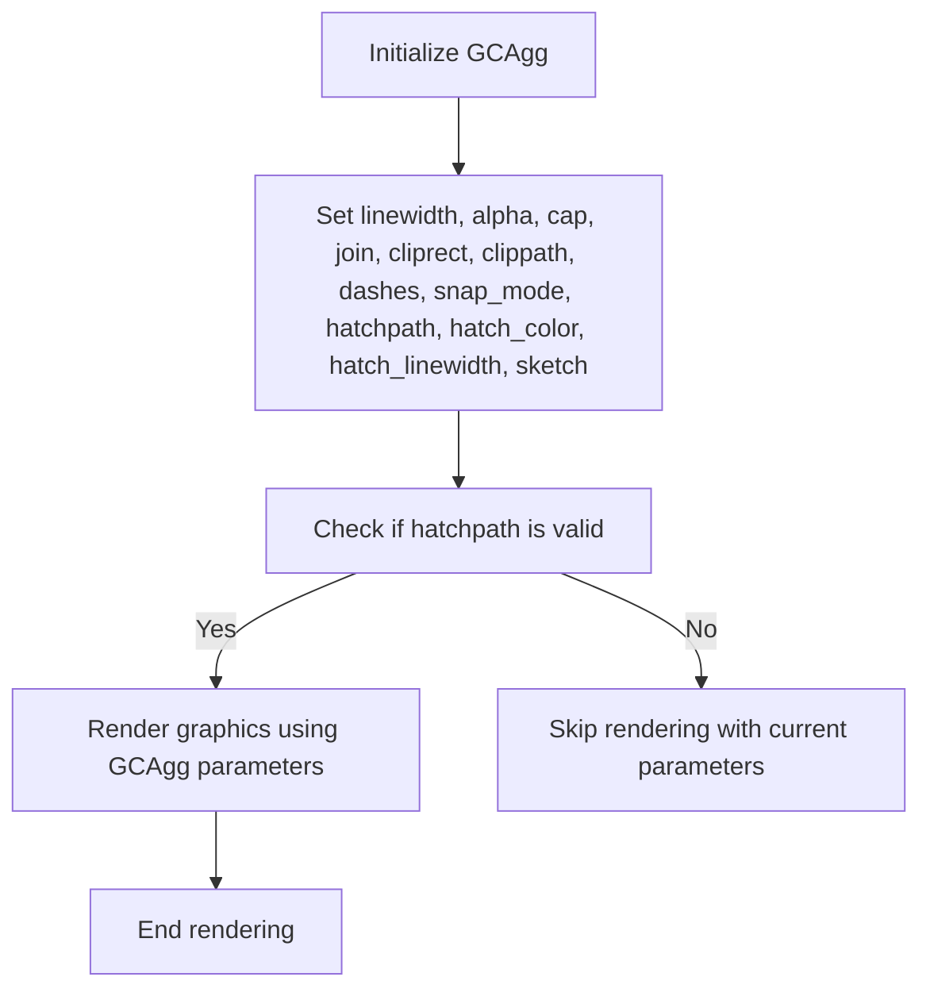
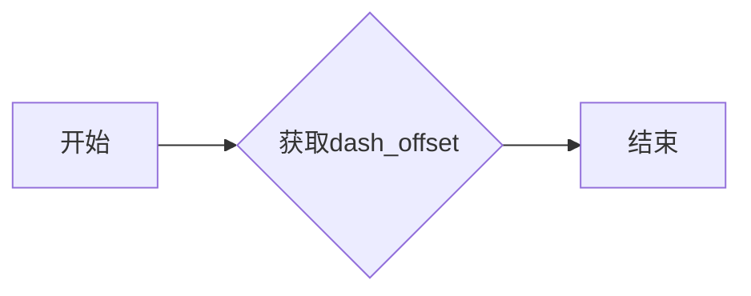
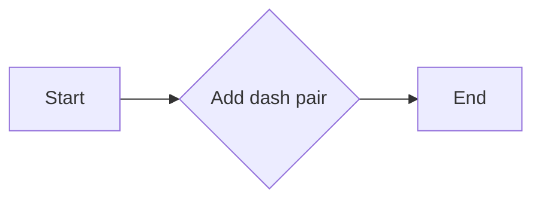
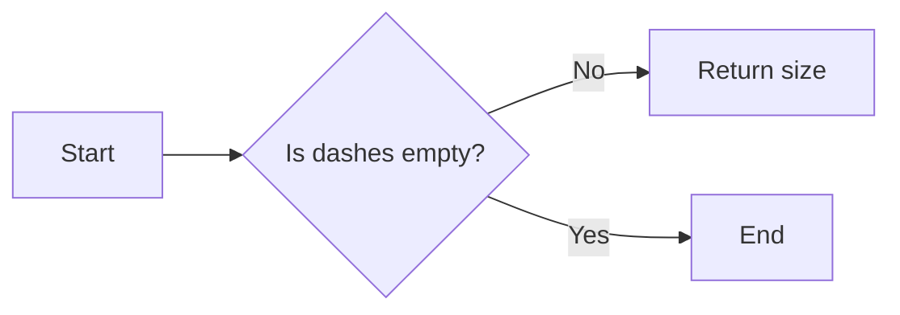
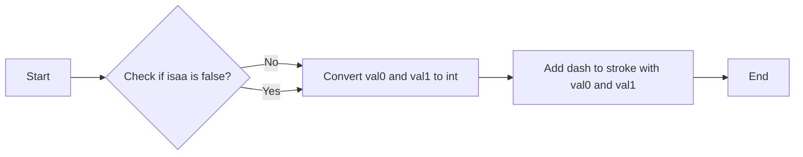
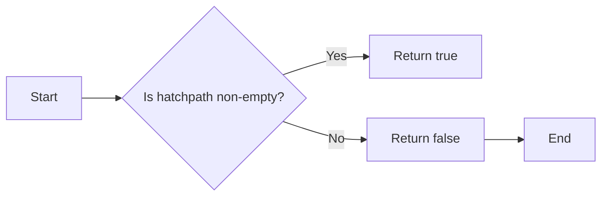

# `matplotlib\src\_backend_agg_basic_types.h` 详细设计文档

This file defines a set of structures and classes used for rendering graphics in the Agg backend, including handling of dashes, clip paths, and various parameters for rendering.

## 整体流程



## 类结构

```
GCAgg (Graphics Context Agg)
├── linewidth (double)
│   ├── alpha (double)
│   ├── forced_alpha (bool)
│   ├── color (agg::rgba)
│   ├── isaa (bool)
│   ├── cap (agg::line_cap_e)
│   ├── join (agg::line_join_e)
│   ├── cliprect (agg::rect_d)
│   ├── clippath (ClipPath)
│   ├── dashes (Dashes)
│   ├── snap_mode (e_snap_mode)
│   ├── hatchpath (mpl::PathIterator)
│   ├── hatch_color (agg::rgba)
│   └── hatch_linewidth (double)
└── SketchParams (Sketch Parameters)
    ├── scale (double)
    ├── length (double)
    └── randomness (double)
```

## 全局变量及字段


### `path`
    
The path iterator for the clip path.

类型：`mpl::PathIterator`
    


### `trans`
    
The transformation applied to the clip path.

类型：`agg::trans_affine`
    


### `SketchParams.scale`
    
The scale factor for the sketch.

类型：`double`
    


### `SketchParams.length`
    
The length of the sketch path.

类型：`double`
    


### `SketchParams.randomness`
    
The randomness factor for the sketch path.

类型：`double`
    


### `Dashes.dash_offset`
    
The offset for the dashes in the stroke pattern.

类型：`double`
    


### `Dashes.dashes`
    
The vector of dash pairs for the stroke pattern.

类型：`std::vector<std::pair<double, double>>`
    


### `GCAgg.linewidth`
    
The line width for drawing.

类型：`double`
    


### `GCAgg.alpha`
    
The alpha value for transparency.

类型：`double`
    


### `GCAgg.forced_alpha`
    
Flag indicating if the alpha value is forced.

类型：`bool`
    


### `GCAgg.color`
    
The color for drawing.

类型：`agg::rgba`
    


### `GCAgg.isaa`
    
Flag indicating if antialiasing is enabled.

类型：`bool`
    


### `GCAgg.cap`
    
The line cap style for drawing.

类型：`agg::line_cap_e`
    


### `GCAgg.join`
    
The line join style for drawing.

类型：`agg::line_join_e`
    


### `GCAgg.cliprect`
    
The clipping rectangle for drawing.

类型：`agg::rect_d`
    


### `GCAgg.clippath`
    
The clip path for drawing.

类型：`ClipPath`
    


### `GCAgg.dashes`
    
The dashes for the stroke pattern.

类型：`Dashes`
    


### `GCAgg.snap_mode`
    
The snap mode for drawing.

类型：`e_snap_mode`
    


### `GCAgg.hatchpath`
    
The hatch path for the pattern.

类型：`mpl::PathIterator`
    


### `GCAgg.hatch_color`
    
The color for the hatch pattern.

类型：`agg::rgba`
    


### `GCAgg.hatch_linewidth`
    
The line width for the hatch pattern.

类型：`double`
    


### `GCAgg.sketch`
    
The sketch parameters for the pattern.

类型：`SketchParams`
    
    

## 全局函数及方法


### Dashes.get_dash_offset

获取Dashes对象的dash_offset值。

参数：

- 无

返回值：`double`，Dashes对象的dash_offset值。

#### 流程图



#### 带注释源码

```cpp
double get_dash_offset() const
{
    return dash_offset;
}
```


### Dashes.set_dash_offset

设置Dashes对象的dash_offset值。

参数：

- `x`：`double`，表示要设置的dash_offset值。

返回值：无

#### 流程图


#### 带注释源码

```cpp
void Dashes::set_dash_offset(double x)
{
    dash_offset = x;
}
```


### Dashes.add_dash_pair

This method adds a pair of dash lengths and skip lengths to the dashes vector of the Dashes class.

参数：

- `length`：`double`，The length of the dash.
- `skip`：`double`，The length of the skip after the dash.

返回值：`void`，No return value.

#### 流程图



#### 带注释源码

```cpp
void Dashes::add_dash_pair(double length, double skip)
{
    dashes.emplace_back(length, skip);
}
```


### Dashes.size

返回Dashes对象中dash_t类型的vector的大小。

参数：

- 无

返回值：`size_t`，表示vector中元素的数量。

#### 流程图



#### 带注释源码

```cpp
size_t size() const
{
    return dashes.size();
}
```


### Dashes.dash_to_stroke

Converts a dash pattern to a stroke pattern.

参数：

- `stroke`：`T &`，The stroke object to which the dash pattern will be applied.
- `dpi`：`double`，The dots per inch of the output device.
- `isaa`：`bool`，Indicates whether antialiasing is enabled.

返回值：`void`，No return value.

#### 流程图



#### 带注释源码

```cpp
template <class T>
void dash_to_stroke(T &stroke, double dpi, bool isaa)
{
    double scaleddpi = dpi / 72.0;
    for (auto [val0, val1] : dashes) {
        val0 = val0 * scaleddpi;
        val1 = val1 * scaleddpi;
        if (!isaa) {
            val0 = (int)val0 + 0.5;
            val1 = (int)val1 + 0.5;
        }
        stroke.add_dash(val0, val1);
    }
    stroke.dash_start(get_dash_offset() * scaleddpi);
}
```


### GCAgg.has_hatchpath

This function checks if the hatchpath in the GCAgg object is non-empty.

参数：

- 无

返回值：`bool`，Indicates whether the hatchpath is non-empty.

#### 流程图



#### 带注释源码

```cpp
bool has_hatchpath()
{
    return hatchpath.total_vertices() != 0;
}
```


## 关键组件


### 张量索引与惰性加载

张量索引与惰性加载是代码中用于高效处理和访问大型数据结构（如张量）的关键组件。它允许在需要时才计算或加载数据，从而减少内存消耗和提高性能。

### 反量化支持

反量化支持是代码中用于处理量化数据的关键组件。它允许将量化后的数据转换回原始精度，以便进行进一步处理或分析。

### 量化策略

量化策略是代码中用于优化数据表示和存储的关键组件。它通过减少数据精度来减少内存使用，同时保持足够的精度以满足特定应用的需求。


## 问题及建议


### 已知问题

-   **类型转换效率**：代码中使用了多个类型转换器，这些转换器可能会在每次调用时进行类型检查和转换，这可能会影响性能，尤其是在处理大量数据时。
-   **内存管理**：`GCAgg` 类中包含多个指向资源的指针，如 `mpl::PathIterator` 和 `agg::rgba`。如果这些资源没有被正确释放，可能会导致内存泄漏。
-   **代码可读性**：类型转换器的实现较为复杂，且使用了大量的模板和类型别名，这可能会降低代码的可读性和可维护性。

### 优化建议

-   **缓存类型转换结果**：对于频繁使用的类型转换，可以考虑缓存转换结果以减少重复的类型检查和转换。
-   **使用智能指针**：对于指向资源的指针，可以使用智能指针（如 `std::unique_ptr` 或 `std::shared_ptr`）来自动管理内存，以避免内存泄漏。
-   **简化类型转换器**：考虑简化类型转换器的实现，减少模板和类型别名的使用，以提高代码的可读性和可维护性。
-   **增加单元测试**：为类型转换器和其他关键组件增加单元测试，以确保代码的正确性和稳定性。
-   **文档化**：为代码添加详细的文档，包括类型转换器的使用方法和预期行为，以帮助其他开发者理解和使用这些组件。


## 其它


### 设计目标与约束

- 设计目标：
  - 提供一个模块，用于封装Agg后端的基本类型，以便其他模块可以复用。
  - 通过pybind11提供Python绑定，使得Agg后端的功能可以在Python中使用。
  - 确保类型转换的正确性和效率。

- 约束：
  - 必须使用Agg库中的类型和功能。
  - 类型转换必须遵循pybind11的规范。
  - 代码必须具有良好的可读性和可维护性。

### 错误处理与异常设计

- 错误处理：
  - 使用pybind11的异常机制来处理类型转换错误。
  - 对于无法转换的类型，抛出`py::type_error`异常。

- 异常设计：
  - 定义自定义异常类，用于处理特定类型的错误。
  - 异常类应提供清晰的错误信息和恢复策略。

### 数据流与状态机

- 数据流：
  - 数据流从Python代码开始，通过pybind11转换为C++类型。
  - 转换后的数据在Agg库中处理，并返回结果。

- 状态机：
  - 没有明确的状态机，但类和方法的状态可能根据输入参数和调用顺序而变化。

### 外部依赖与接口契约

- 外部依赖：
  - 依赖于Agg库、pybind11和mpl库。

- 接口契约：
  - pybind11用于创建Python绑定的接口。
  - Agg库提供了绘图和图形处理的功能。
  - mpl库用于路径处理。


    