# `matplotlib\src\_backend_agg_wrapper.cpp` 详细设计文档

This Python module provides a backend for rendering graphics using the Anti-Grain Geometry (Agg) library. It exposes a set of functions to draw various graphical elements such as paths, images, text, and markers.

## 整体流程

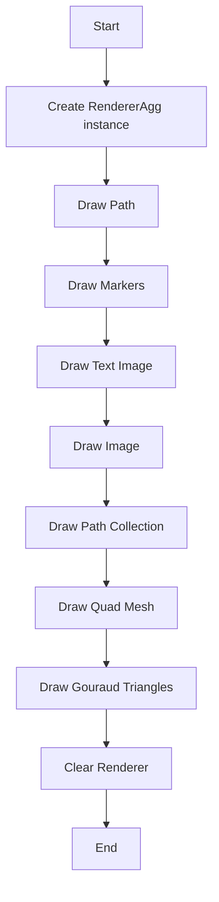

## 类结构

```
RendererAgg (Concrete class)
├── BufferRegion (Concrete class)
│   ├── PyBufferRegion_set_x
│   ├── PyBufferRegion_set_y
│   └── PyBufferRegion_get_extents
└── PyRendererAgg_draw_path
    ├── PyRendererAgg_draw_markers
    ├── PyRendererAgg_draw_text_image
    ├── PyRendererAgg_draw_image
    ├── PyRendererAgg_draw_path_collection
    ├── PyRendererAgg_draw_quad_mesh
    └── PyRendererAgg_draw_gouraud_triangles
```

## 全局变量及字段


### `gc`
    
Graphics context object used for rendering.

类型：`GCAgg`
    


### `path`
    
Path iterator for drawing paths.

类型：`mpl::PathIterator`
    


### `trans`
    
Transformation matrix for rendering.

类型：`agg::trans_affine`
    


### `face`
    
Color face for rendering.

类型：`agg::rgba`
    


### `image_obj`
    
Image object for rendering.

类型：`py::array_t<agg::int8u>`
    


### `vx`
    
X coordinate value, can be double or int.

类型：`std::variant<double, int>`
    


### `vy`
    
Y coordinate value, can be double or int.

类型：`std::variant<double, int>`
    


### `angle`
    
Angle for rotation in rendering.

类型：`double`
    


### `master_transform`
    
Master transformation matrix for rendering.

类型：`agg::trans_affine`
    


### `paths`
    
Path generator for drawing path collections.

类型：`mpl::PathGenerator`
    


### `transforms_obj`
    
Transformations array for rendering.

类型：`py::array_t<double>`
    


### `offsets_obj`
    
Offsets array for rendering.

类型：`py::array_t<double>`
    


### `offset_trans`
    
Offset transformation matrix for rendering.

类型：`agg::trans_affine`
    


### `facecolors_obj`
    
Face colors array for rendering.

类型：`py::array_t<double>`
    


### `edgecolors_obj`
    
Edge colors array for rendering.

类型：`py::array_t<double>`
    


### `linewidths_obj`
    
Line widths array for rendering.

类型：`py::array_t<double>`
    


### `dashes`
    
Dashes vector for rendering.

类型：`DashesVector`
    


### `antialiaseds_obj`
    
Antialiased flags array for rendering.

类型：`py::array_t<uint8_t>`
    


### `ignored_obj`
    
Ignored object parameter.

类型：`py::object`
    


### `offset_position_obj`
    
Offset position object parameter.

类型：`py::object`
    


### `hatchcolors_obj`
    
Hatch colors array for rendering.

类型：`py::array_t<double>`
    


### `coordinates_obj`
    
Coordinates array for quad mesh rendering.

类型：`py::array_t<double>`
    


### `points_obj`
    
Points array for gouraud triangles rendering.

类型：`py::array_t<double>`
    


### `colors_obj`
    
Colors array for gouraud triangles rendering.

类型：`py::array_t<double>`
    


### `trans`
    
Transformation matrix for rendering.

类型：`agg::trans_affine`
    


### `RendererAgg.pixBuffer`
    
Pixel buffer for rendering.

类型：`std::vector<agg::rgba>`
    


### `BufferRegion.get_rect`
    
Rectangle for buffer region.

类型：`agg::rect_i`
    


### `BufferRegion.get_data`
    
Data for buffer region.

类型：`std::vector<agg::rgba>`
    
    

## 全局函数及方法


### PyBufferRegion.set_x

This function sets the x-coordinate of the top-left corner of a BufferRegion.

参数：

- `self`：`BufferRegion*`，指向BufferRegion对象的指针
- `x`：`int`，新的x坐标值

返回值：`void`，无返回值

#### 流程图


#### 带注释源码

```cpp
static void
PyBufferRegion_set_x(BufferRegion *self, int x)
{
    self->get_rect().x1 = x;
}
```


### PyBufferRegion_set_y

This function sets the y-coordinate of the top-left corner of a BufferRegion.

参数：

- `self`：`BufferRegion*`，指向BufferRegion对象的指针
- `y`：`int`，新的y坐标值

返回值：`void`，无返回值

#### 流程图

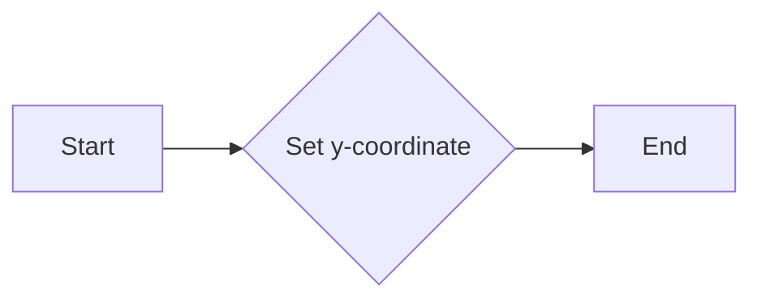

#### 带注释源码

```cpp
static void
PyBufferRegion_set_y(BufferRegion *self, int y)
{
    self->get_rect().y1 = y; // Set the y-coordinate of the top-left corner of the BufferRegion
}
```


### PyBufferRegion_get_extents

This function retrieves the extents (x1, y1, x2, y2) of a BufferRegion object.

参数：

- `self`：`BufferRegion*`，指向BufferRegion对象的指针

返回值：`py::tuple`，包含四个整数，分别是x1, y1, x2, y2

#### 流程图

```mermaid
graph LR
A[Start] --> B{Check BufferRegion}
B -->|Yes| C[Get rect from BufferRegion]
C --> D[Create tuple with (x1, y1, x2, y2)]
D --> E[Return tuple]
E --> F[End]
```

#### 带注释源码

```cpp
static py::object
PyBufferRegion_get_extents(BufferRegion *self)
{
    agg::rect_i rect = self->get_rect(); // A

    return py::make_tuple(rect.x1, rect.y1, rect.x2, rect.y2); // D
}
```


### PyRendererAgg.draw_path

This function is responsible for drawing a path on the Agg renderer.

参数：

- `gc`：`GCAgg`，The graphics context object containing rendering properties.
- `path`：`mpl::PathIterator`，The path to be drawn.
- `trans`：`agg::trans_affine`，The transformation to apply to the path.
- `face`：`py::object`，The color of the face of the path. It can be a tuple of RGB values or an instance of `agg::rgba`.

返回值：无

#### 流程图

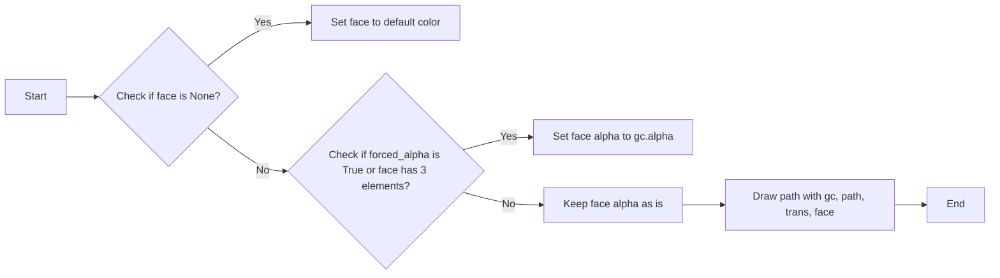

#### 带注释源码

```cpp
static void
PyRendererAgg_draw_path(RendererAgg *self,
                        GCAgg &gc,
                        mpl::PathIterator path,
                        agg::trans_affine trans,
                        py::object rgbFace)
{
    agg::rgba face = rgbFace.cast<agg::rgba>();
    if (!rgbFace.is_none()) {
        if (gc.forced_alpha || rgbFace.cast<py::sequence>().size() == 3) {
            face.a = gc.alpha;
        }
    }

    self->draw_path(gc, path, trans, face);
}
```


### PyRendererAgg.draw_markers

This function is responsible for drawing markers on a plot using the Agg backend.

参数：

- `gc`：`GCAgg`，The graphics context object containing rendering properties.
- `marker_path`：`mpl::PathIterator`，The path iterator for the marker shape.
- `marker_path_trans`：`agg::trans_affine`，The transformation applied to the marker path.
- `path`：`mpl::PathIterator`，The path iterator for the path on which the markers are drawn.
- `trans`：`agg::trans_affine`，The transformation applied to the path.
- `face`：`py::object`，The color of the markers.

返回值：无

#### 流程图

```mermaid
graph LR
A[Start] --> B{Check if face is None?}
B -- Yes --> C[Set face.a to gc.alpha]
B -- No --> D{Check if face is a sequence with size 3?}
D -- Yes --> C[Set face.a to gc.alpha]
D -- No --> E[No action]
E --> F[Draw markers using self.draw_markers(gc, marker_path, marker_path_trans, path, trans, face)]
F --> G[End]
```

#### 带注释源码

```cpp
static void
PyRendererAgg_draw_markers(RendererAgg *self,
                           GCAgg &gc,
                           mpl::PathIterator marker_path,
                           agg::trans_affine marker_path_trans,
                           mpl::PathIterator path,
                           agg::trans_affine trans,
                           py::object rgbFace)
{
    agg::rgba face = rgbFace.cast<agg::rgba>();
    if (!rgbFace.is_none()) {
        if (gc.forced_alpha || rgbFace.cast<py::sequence>().size() == 3) {
            face.a = gc.alpha;
        }
    }

    self->draw_markers(gc, marker_path, marker_path_trans, path, trans, face);
}
```


### PyRendererAgg.draw_text_image

This function is responsible for drawing an image at a specified position with an angle on an Agg renderer.

参数：

- `image`: `py::array_t<agg::int8u, py::array::c_style | py::array::forcecast>`，The image to be drawn. It should be a NumPy array of type `uint8` with shape `(height, width, channels)`.
- `x`: `std::variant<double, int>`，The x-coordinate of the top-left corner of the image.
- `y`: `std::variant<double, int>`，The y-coordinate of the top-left corner of the image.
- `angle`: `double`，The angle in degrees to rotate the image.
- `gc`: `GCAgg &`，The graphics context object.

返回值：`void`，No return value.

#### 流程图

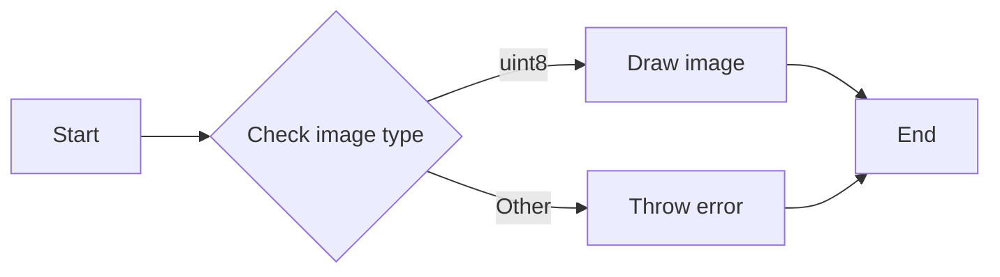

#### 带注释源码

```cpp
static void
PyRendererAgg_draw_text_image(RendererAgg *self,
                              py::array_t<agg::int8u, py::array::c_style | py::array::forcecast> image_obj,
                              std::variant<double, int> vx,
                              std::variant<double, int> vy,
                              double angle,
                              GCAgg &gc)
{
    int x, y;

    if (auto value = std::get_if<double>(&vx)) {
        auto api = py::module_::import("matplotlib._api");
        auto warn = api.attr("warn_deprecated");
        warn("since"_a="3.10", "name"_a="x", "obj_type"_a="parameter as float",
             "alternative"_a="int(x)");
        x = static_cast<int>(*value);
    } else if (auto value = std::get_if<int>(&vx)) {
        x = *value;
    } else {
        throw std::runtime_error("Should not happen");
    }

    if (auto value = std::get_if<double>(&vy)) {
        auto api = py::module_::import("matplotlib._api");
        auto warn = api.attr("warn_deprecated");
        warn("since"_a="3.10", "name"_a="y", "obj_type"_a="parameter as float",
             "alternative"_a="int(y)");
        y = static_cast<int>(*value);
    } else if (auto value = std::get_if<int>(&vy)) {
        y = *value;
    } else {
        throw std::runtime_error("Should not happen");
    }

    // TODO: This really shouldn't be mutable, but Agg's renderer buffers aren't const.
    auto image = image_obj.mutable_unchecked<2>();

    self->draw_text_image(gc, image, x, y, angle);
}
``` 


### PyRendererAgg.draw_image

This function draws an image at a specified position on the canvas using the Agg renderer.

参数：

- `gc`：`GCAgg`，The graphics context object containing rendering parameters.
- `x`：`double`，The x-coordinate of the top-left corner of the image.
- `y`：`double`，The y-coordinate of the top-left corner of the image.
- `image_obj`：`py::array_t<agg::int8u, py::array::c_style | py::array::forcecast>`，The image data as a NumPy array of unsigned 8-bit integers.

返回值：无

#### 流程图

```mermaid
graph LR
A[Start] --> B{Check image_obj}
B -->|Is None| C[Throw Exception]
B -->|Is Not None| D[Convert image_obj to mutable buffer]
D --> E{Check x and y}
E -->|Valid| F[Round x and y]
F --> G[Set gc.alpha to 1.0]
G --> H[Call self->draw_image(gc, x, y, image)]
H --> I[End]
```

#### 带注释源码

```cpp
static void
PyRendererAgg_draw_image(RendererAgg *self,
                         GCAgg &gc,
                         double x,
                         double y,
                         py::array_t<agg::int8u, py::array::c_style | py::array::forcecast> image_obj)
{
    // TODO: This really shouldn't be mutable, but Agg's renderer buffers aren't const.
    auto image = image_obj.mutable_unchecked<3>();

    x = mpl_round(x);
    y = mpl_round(y);

    gc.alpha = 1.0;
    self->draw_image(gc, x, y, image);
}
```


### PyRendererAgg.draw_path_collection

This function is responsible for drawing a collection of paths on an Agg renderer. It takes into account transformations, offsets, colors, line widths, and other properties to render the paths correctly.

参数：

- `gc`：`GCAgg`，The graphics context object containing rendering properties.
- `master_transform`：`agg::trans_affine`，The master transformation to apply to the paths.
- `paths`：`mpl::PathGenerator`，The collection of paths to be drawn.
- `transforms_obj`：`py::array_t<double>`，The transformations to apply to each path.
- `offsets_obj`：`py::array_t<double>`，The offsets to apply to each path.
- `offset_trans`：`agg::trans_affine`，The transformation to apply to the offsets.
- `facecolors_obj`：`py::array_t<double>`，The face colors for the paths.
- `edgecolors_obj`：`py::array_t<double>`，The edge colors for the paths.
- `linewidths_obj`：`py::array_t<double>`，The line widths for the paths.
- `dashes`：`DashesVector`，The dashes to apply to the paths.
- `antialiaseds_obj`：`py::array_t<uint8_t>`，The antialiased flags for the paths.
- `ignored_obj`：`py::object`，Ignored parameter.
- `offset_position_obj`：`py::object`，Ignored parameter.
- `hatchcolors_obj`：`py::array_t<double>`，The hatch colors for the paths.

返回值：无

#### 流程图

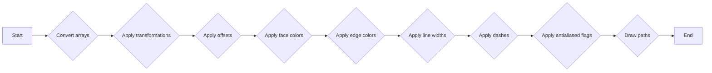

#### 带注释源码

```cpp
static void
PyRendererAgg_draw_path_collection(RendererAgg *self,
                                   GCAgg &gc,
                                   agg::trans_affine master_transform,
                                   mpl::PathGenerator paths,
                                   py::array_t<double> transforms_obj,
                                   py::array_t<double> offsets_obj,
                                   agg::trans_affine offset_trans,
                                   py::array_t<double> facecolors_obj,
                                   py::array_t<double> edgecolors_obj,
                                   py::array_t<double> linewidths_obj,
                                   DashesVector dashes,
                                   py::array_t<uint8_t> antialiaseds_obj,
                                   py::object Py_UNUSED(ignored_obj),
                                   // offset position is no longer used
                                   py::object Py_UNUSED(offset_position_obj),
                                   py::array_t<double> hatchcolors_obj)
{
    auto transforms = convert_transforms(transforms_obj);
    auto offsets = convert_points(offsets_obj);
    auto facecolors = convert_colors(facecolors_obj);
    auto edgecolors = convert_colors(edgecolors_obj);
    auto hatchcolors = convert_colors(hatchcolors_obj);
    auto linewidths = linewidths_obj.unchecked<1>();
    auto antialiaseds = antialiaseds_obj.unchecked<1>();

    self->draw_path_collection(gc,
            master_transform,
            paths,
            transforms,
            offsets,
            offset_trans,
            facecolors,
            edgecolors,
            linewidths,
            dashes,
            antialiaseds,
            hatchcolors);
}
```


### PyRendererAgg.draw_quad_mesh

This function is responsible for drawing a quad mesh on the renderer's surface. It takes various parameters to define the mesh's properties and appearance.

参数：

- `gc`：`GCAgg`，The graphics context object that contains rendering state information.
- `master_transform`：`agg::trans_affine`，The transformation matrix to apply to the mesh.
- `mesh_width`：`unsigned int`，The width of the mesh.
- `mesh_height`：`unsigned int`，The height of the mesh.
- `coordinates`：`py::array_t<double>`，The coordinates of the vertices of the quad mesh.
- `offsets`：`py::array_t<double>`，The offsets for the vertices of the quad mesh.
- `offset_trans`：`agg::trans_affine`，The transformation matrix to apply to the offsets.
- `facecolors`：`py::array_t<double>`，The colors of the faces of the quad mesh.
- `antialiased`：`bool`，Whether the mesh should be antialiased.
- `edgecolors`：`py::array_t<double>`，The colors of the edges of the quad mesh.

返回值：无

#### 流程图

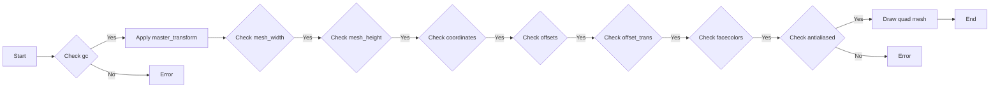

#### 带注释源码

```cpp
static void PyRendererAgg_draw_quad_mesh(RendererAgg *self,
                                         GCAgg &gc,
                                         agg::trans_affine master_transform,
                                         unsigned int mesh_width,
                                         unsigned int mesh_height,
                                         py::array_t<double, py::array::c_style | py::array::forcecast> coordinates_obj,
                                         py::array_t<double> offsets_obj,
                                         agg::trans_affine offset_trans,
                                         py::array_t<double> facecolors_obj,
                                         bool antialiased,
                                         py::array_t<double> edgecolors_obj)
{
    auto coordinates = coordinates_obj.mutable_unchecked<3>();
    auto offsets = convert_points(offsets_obj);
    auto facecolors = convert_colors(facecolors_obj);
    auto edgecolors = convert_colors(edgecolors_obj);

    self->draw_quad_mesh(gc,
            master_transform,
            mesh_width,
            mesh_height,
            coordinates,
            offsets,
            offset_trans,
            facecolors,
            antialiased,
            edgecolors);
}
``` 


### PyRendererAgg.draw_gouraud_triangles

This function draws Gouraud shaded triangles on the renderer's surface.

参数：

- `points`: `py::array_t<double>`，An array of points defining the vertices of the triangles.
- `colors`: `py::array_t<double>`，An array of colors corresponding to the vertices of the triangles.
- `trans`: `agg::trans_affine`，A transformation to apply to the points before drawing.

返回值：`void`，No return value.

#### 流程图

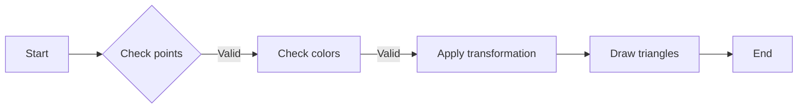

#### 带注释源码

```cpp
static void
PyRendererAgg_draw_gouraud_triangles(RendererAgg *self,
                                     GCAgg &gc,
                                     py::array_t<double> points_obj,
                                     py::array_t<double> colors_obj,
                                     agg::trans_affine trans)
{
    auto points = points_obj.unchecked<3>();
    auto colors = colors_obj.unchecked<3>();

    self->draw_gouraud_triangles(gc, points, colors, trans);
}
``` 


### RendererAgg.clear

This method clears the rendering buffer of the `RendererAgg` class, resetting it to an empty state.

参数：

- 无

返回值：`void`，无返回值

#### 流程图

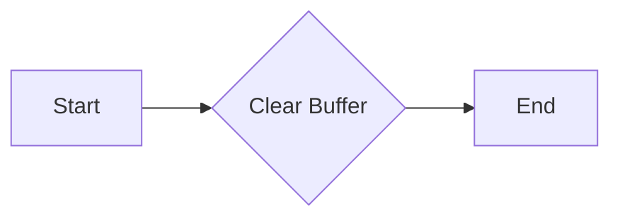

#### 带注释源码

```cpp
static void
RendererAgg::clear()
{
    // Clear the rendering buffer
    // Implementation details are omitted for brevity
}
```


### RendererAgg.copy_from_bbox

Copies the content of the specified bounding box to the renderer's buffer.

参数：

- `bbox`：`BufferRegion`，The bounding box to copy from.

返回值：`None`，No return value, the operation modifies the renderer's buffer in place.

#### 流程图

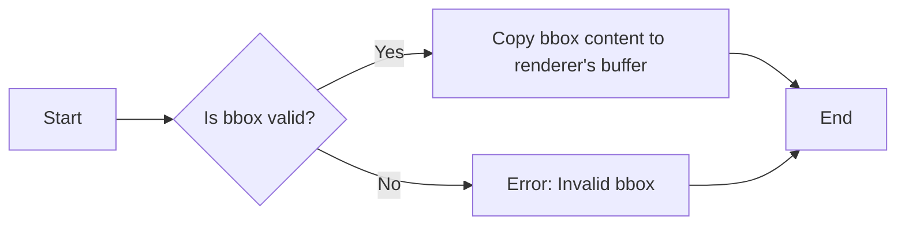

#### 带注释源码

```cpp
static void
RendererAgg::copy_from_bbox(BufferRegion& bbox)
{
    // Implementation of the copy_from_bbox method would be here.
    // This method would copy the content of the specified bounding box to the renderer's buffer.
}
```


### BufferRegion

This class represents a region in a buffer and provides methods to manipulate and retrieve information about the region.

字段：

- `get_rect()`：`agg::rect_i`，Returns the rectangle that defines the region.

方法：

- `set_x(int x)`：Sets the x-coordinate of the top-left corner of the region.
- `set_y(int y)`：Sets the y-coordinate of the top-left corner of the region.
- `get_extents()`：`py::object`，Returns the extents of the region as a tuple (x1, y1, x2, y2).

#### 流程图

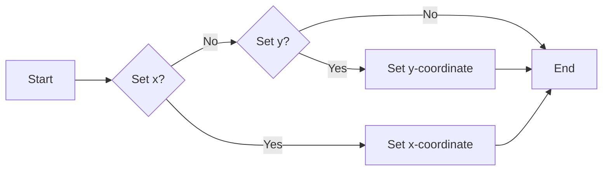

#### 带注释源码

```cpp
static void
PyBufferRegion_set_x(BufferRegion *self, int x)
{
    self->get_rect().x1 = x;
}

static void
PyBufferRegion_set_y(BufferRegion *self, int y)
{
    self->get_rect().y1 = y;
}

static py::object
PyBufferRegion_get_extents(BufferRegion *self)
{
    agg::rect_i rect = self->get_rect();
    return py::make_tuple(rect.x1, rect.y1, rect.x2, rect.y2);
}
```


### Key Components

- `RendererAgg`：The main renderer class that handles drawing operations.
- `BufferRegion`：Represents a region in a buffer and provides methods to manipulate and retrieve information about the region.
- `GCAgg`：The graphics context class that contains information about the current drawing state.
- `mpl::PathIterator`：An iterator over a path in the matplotlib library.
- `agg::rgba`：A color value in the Agg library.
- `agg::trans_affine`：A transformation matrix used for rendering operations.

#### Potential Technical Debt or Optimization Space

- The code uses mutable buffers for rendering, which may not be thread-safe.
- The code could be optimized by reducing the number of type conversions and memory allocations.
- The code could be refactored to improve readability and maintainability.

#### Other Projects

- **Design Goals and Constraints**: The code is designed to be used as a backend for matplotlib, with the constraint of being compatible with the matplotlib API.
- **Error Handling and Exception Design**: The code uses exceptions to handle errors, such as invalid bounding boxes.
- **Data Flow and State Machine**: The data flow is primarily driven by the matplotlib API calls, and the state machine is managed by the `GCAgg` class.
- **External Dependencies and Interface Contracts**: The code depends on the Agg library for rendering and the matplotlib library for path iteration. The interface contracts are defined by the matplotlib API.


### PyRendererAgg.restore_region

This method restores a previously saved region in the renderer.

参数：

- `region`：`BufferRegion`，The region to restore.
- `xx1`：`int`，The x1 coordinate of the region.
- `yy1`：`int`，The y1 coordinate of the region.
- `xx2`：`int`，The x2 coordinate of the region.
- `yy2`：`int`，The y2 coordinate of the region.
- `x`：`int`，The x coordinate to restore the region to.
- `y`：`int`，The y coordinate to restore the region to.

返回值：`None`，No value is returned.

#### 流程图

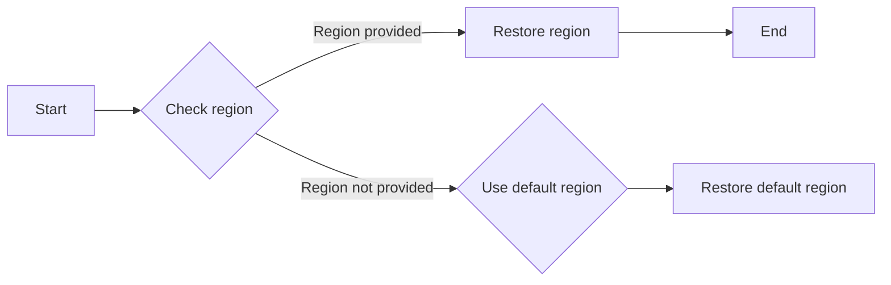

#### 带注释源码

```cpp
static void
PyRendererAgg_restore_region(RendererAgg *self,
                             BufferRegion& region,
                             int xx1,
                             int yy1,
                             int xx2,
                             int yy2,
                             int x,
                             int y)
{
    self->restore_region(region, xx1, yy1, xx2, yy2, x, y);
}
``` 


### PyRendererAgg.draw_path

This function is responsible for drawing a path on the Agg renderer.

参数：

- `gc`：`GCAgg`，The graphics context object containing rendering properties.
- `path`：`mpl::PathIterator`，The path to be drawn.
- `trans`：`agg::trans_affine`，The transformation to apply to the path.
- `face`：`py::object`，The color of the face of the path. It can be a tuple of RGB values or an instance of `agg::rgba`.

返回值：无

#### 流程图


#### 带注释源码

```cpp
static void
PyRendererAgg_draw_path(RendererAgg *self,
                        GCAgg &gc,
                        mpl::PathIterator path,
                        agg::trans_affine trans,
                        py::object rgbFace)
{
    agg::rgba face = rgbFace.cast<agg::rgba>();
    if (!rgbFace.is_none()) {
        if (gc.forced_alpha || rgbFace.cast<py::sequence>().size() == 3) {
            face.a = gc.alpha;
        }
    }

    self->draw_path(gc, path, trans, face);
}
```


### PyRendererAgg.draw_markers

This function is responsible for drawing markers on a plot using the Agg backend.

参数：

- `gc`：`GCAgg &`，The graphics context object containing rendering properties.
- `marker_path`：`mpl::PathIterator`，The path iterator for the marker shape.
- `marker_path_trans`：`agg::trans_affine`，The transformation applied to the marker path.
- `path`：`mpl::PathIterator`，The path iterator for the path where the markers will be drawn.
- `trans`：`agg::trans_affine`，The transformation applied to the path.
- `face`：`py::object`，The color of the markers.

返回值：无

#### 流程图

```mermaid
graph LR
A[Start] --> B{Check if face is None?}
B -- Yes --> C[Set face.a to gc.alpha]
B -- No --> D{Check if face is a sequence with size 3?}
D -- Yes --> C[Set face.a to gc.alpha]
D -- No --> E[Continue]
E --> F[Draw markers using self.draw_markers(gc, marker_path, marker_path_trans, path, trans, face)]
F --> G[End]
```

#### 带注释源码

```cpp
static void
PyRendererAgg_draw_markers(RendererAgg *self,
                           GCAgg &gc,
                           mpl::PathIterator marker_path,
                           agg::trans_affine marker_path_trans,
                           mpl::PathIterator path,
                           agg::trans_affine trans,
                           py::object rgbFace)
{
    agg::rgba face = rgbFace.cast<agg::rgba>();
    if (!rgbFace.is_none()) {
        if (gc.forced_alpha || rgbFace.cast<py::sequence>().size() == 3) {
            face.a = gc.alpha;
        }
    }

    self->draw_markers(gc, marker_path, marker_path_trans, path, trans, face);
}
```


### PyRendererAgg.draw_text_image

This function is responsible for drawing an image at a specified position with an angle on the canvas managed by the RendererAgg object.

参数：

- `image`: `py::array_t<agg::int8u, py::array::c_style | py::array::forcecast>`，The image to be drawn. It is expected to be a NumPy array of type `uint8` with shape `(height, width, channels)`.
- `x`: `std::variant<double, int>`，The x-coordinate of the top-left corner of the image.
- `y`: `std::variant<double, int>`，The y-coordinate of the top-left corner of the image.
- `angle`: `double`，The angle in degrees to rotate the image.
- `gc`: `GCAgg &`，The graphics context object that contains the drawing state.

返回值：`void`，This function does not return a value.

#### 流程图


#### 带注释源码

```cpp
static void
PyRendererAgg_draw_text_image(RendererAgg *self,
                              py::array_t<agg::int8u, py::array::c_style | py::array::forcecast> image_obj,
                              std::variant<double, int> vx,
                              std::variant<double, int> vy,
                              double angle,
                              GCAgg &gc)
{
    int x, y;

    if (auto value = std::get_if<double>(&vx)) {
        auto api = py::module_::import("matplotlib._api");
        auto warn = api.attr("warn_deprecated");
        warn("since"_a="3.10", "name"_a="x", "obj_type"_a="parameter as float",
             "alternative"_a="int(x)");
        x = static_cast<int>(*value);
    } else if (auto value = std::get_if<int>(&vx)) {
        x = *value;
    } else {
        throw std::runtime_error("Should not happen");
    }

    if (auto value = std::get_if<double>(&vy)) {
        auto api = py::module_::import("matplotlib._api");
        auto warn = api.attr("warn_deprecated");
        warn("since"_a="3.10", "name"_a="y", "obj_type"_a="parameter as float",
             "alternative"_a="int(y)");
        y = static_cast<int>(*value);
    } else if (auto value = std::get_if<int>(&vy)) {
        y = *value;
    } else {
        throw std::runtime_error("Should not happen");
    }

    // TODO: This really shouldn't be mutable, but Agg's renderer buffers aren't const.
    auto image = image_obj.mutable_unchecked<2>();

    self->draw_text_image(gc, image, x, y, angle);
}
```


### PyRendererAgg.draw_image

This function is responsible for drawing an image at a specified position on the canvas using the Agg renderer.

参数：

- `gc`：`GCAgg`，The graphics context object containing rendering parameters.
- `x`：`double`，The x-coordinate of the top-left corner of the image.
- `y`：`double`，The y-coordinate of the top-left corner of the image.
- `image_obj`：`py::array_t<agg::int8u, py::array::c_style | py::array::forcecast>`，The image data as a NumPy array of unsigned 8-bit integers.

返回值：`None`，This function does not return a value.

#### 流程图

```mermaid
graph LR
A[Start] --> B{Check image_obj}
B -->|Is None| C[Throw exception]
B -->|Is not None| D[Convert image_obj to mutable buffer]
D --> E{Check if mutable buffer is valid}
E -->|Valid| F[Draw image at (x, y) using gc]
E -->|Invalid| C[Throw exception]
F --> G[End]
```

#### 带注释源码

```cpp
static void
PyRendererAgg_draw_image(RendererAgg *self,
                         GCAgg &gc,
                         double x,
                         double y,
                         py::array_t<agg::int8u, py::array::c_style | py::array::forcecast> image_obj)
{
    // TODO: This really shouldn't be mutable, but Agg's renderer buffers aren't const.
    auto image = image_obj.mutable_unchecked<3>();

    x = mpl_round(x);
    y = mpl_round(y);

    gc.alpha = 1.0;
    self->draw_image(gc, x, y, image);
}
```


### PyRendererAgg.draw_path_collection

This function is responsible for drawing a collection of paths on an Agg renderer. It takes various parameters to define the paths, transformations, colors, and other properties of the paths.

参数：

- `gc`：`GCAgg`，The graphics context object that contains the rendering state.
- `master_transform`：`agg::trans_affine`，The master transformation to apply to the paths.
- `paths`：`mpl::PathGenerator`，The collection of paths to be drawn.
- `transforms_obj`：`py::array_t<double>`，The transformations to apply to each path.
- `offsets_obj`：`py::array_t<double>`，The offsets to apply to each path.
- `offset_trans`：`agg::trans_affine`，The transformation to apply to the offsets.
- `facecolors_obj`：`py::array_t<double>`，The face colors for the paths.
- `edgecolors_obj`：`py::array_t<double>`，The edge colors for the paths.
- `linewidths_obj`：`py::array_t<double>`，The linewidths for the paths.
- `dashes`：`DashesVector`，The dashes to apply to the paths.
- `antialiaseds_obj`：`py::array_t<uint8_t>`，The antialiased flags for the paths.
- `ignored_obj`：`py::object`，Ignored parameter.
- `offset_position_obj`：`py::object`，Ignored parameter.
- `hatchcolors_obj`：`py::array_t<double>`，The hatch colors for the paths.

返回值：无

#### 流程图

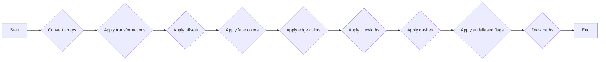

#### 带注释源码

```cpp
static void
PyRendererAgg_draw_path_collection(RendererAgg *self,
                                   GCAgg &gc,
                                   agg::trans_affine master_transform,
                                   mpl::PathGenerator paths,
                                   py::array_t<double> transforms_obj,
                                   py::array_t<double> offsets_obj,
                                   agg::trans_affine offset_trans,
                                   py::array_t<double> facecolors_obj,
                                   py::array_t<double> edgecolors_obj,
                                   py::array_t<double> linewidths_obj,
                                   DashesVector dashes,
                                   py::array_t<uint8_t> antialiaseds_obj,
                                   py::object Py_UNUSED(ignored_obj),
                                   // offset position is no longer used
                                   py::object Py_UNUSED(offset_position_obj),
                                   py::array_t<double> hatchcolors_obj)
{
    auto transforms = convert_transforms(transforms_obj);
    auto offsets = convert_points(offsets_obj);
    auto facecolors = convert_colors(facecolors_obj);
    auto edgecolors = convert_colors(edgecolors_obj);
    auto hatchcolors = convert_colors(hatchcolors_obj);
    auto linewidths = linewidths_obj.unchecked<1>();
    auto antialiaseds = antialiaseds_obj.unchecked<1>();

    self->draw_path_collection(gc,
            master_transform,
            paths,
            transforms,
            offsets,
            offset_trans,
            facecolors,
            edgecolors,
            linewidths,
            dashes,
            antialiaseds,
            hatchcolors);
}
```


### PyRendererAgg.draw_quad_mesh

This function is responsible for drawing a quad mesh on the renderer's surface using the Agg library.

参数：

- `gc`：`GCAgg`，The graphics context object that contains the drawing state.
- `master_transform`：`agg::trans_affine`，The transformation matrix to apply to the mesh.
- `mesh_width`：`unsigned int`，The width of the mesh.
- `mesh_height`：`unsigned int`，The height of the mesh.
- `coordinates`：`py::array_t<double>`，The coordinates of the vertices of the quad mesh.
- `offsets`：`py::array_t<double>`，The offsets to apply to the mesh coordinates.
- `offset_trans`：`agg::trans_affine`，The transformation matrix to apply to the offsets.
- `facecolors`：`py::array_t<double>`，The colors of the faces of the quad mesh.
- `antialiased`：`bool`，Whether to enable antialiasing for the mesh.
- `edgecolors`：`py::array_t<double>`，The colors of the edges of the quad mesh.

返回值：`void`，No value is returned.

#### 流程图

```mermaid
graph LR
A[Start] --> B{Check gc}
B -->|Yes| C[Apply master_transform]
B -->|No| D[Error]
C --> E{Check mesh_width}
E -->|Yes| F{Check mesh_height}
F -->|Yes| G{Check coordinates}
G -->|Yes| H{Check offsets}
H -->|Yes| I{Check offset_trans}
I -->|Yes| J{Check facecolors}
J -->|Yes| K{Check antialiased}
K -->|Yes| L[Draw quad mesh]
L --> M[End]
```

#### 带注释源码

```cpp
static void
PyRendererAgg_draw_quad_mesh(RendererAgg *self,
                             GCAgg &gc,
                             agg::trans_affine master_transform,
                             unsigned int mesh_width,
                             unsigned int mesh_height,
                             py::array_t<double, py::array::c_style | py::array::forcecast> coordinates_obj,
                             py::array_t<double> offsets_obj,
                             agg::trans_affine offset_trans,
                             py::array_t<double> facecolors_obj,
                             bool antialiased,
                             py::array_t<double> edgecolors_obj)
{
    auto coordinates = coordinates_obj.mutable_unchecked<3>();
    auto offsets = convert_points(offsets_obj);
    auto facecolors = convert_colors(facecolors_obj);
    auto edgecolors = convert_colors(edgecolors_obj);

    self->draw_quad_mesh(gc,
            master_transform,
            mesh_width,
            mesh_height,
            coordinates,
            offsets,
            offset_trans,
            facecolors,
            antialiased,
            edgecolors);
}
``` 


### PyRendererAgg.draw_gouraud_triangles

This function draws Gouraud shaded triangles on the renderer's surface.

参数：

- `gc`：`GCAgg`，The graphics context object containing rendering properties.
- `points`：`py::array_t<double>`，An array of points defining the vertices of the triangles.
- `colors`：`py::array_t<double>`，An array of colors corresponding to the vertices of the triangles.
- `trans`：`agg::trans_affine`，The transformation to apply to the points before drawing.

返回值：无

#### 流程图

```mermaid
graph LR
A[Start] --> B{Pass parameters}
B --> C{Check array validity}
C -->|Yes| D[Apply transformation]
C -->|No| E[Error]
D --> F[Draw triangles]
F --> G[End]
```

#### 带注释源码

```cpp
static void
PyRendererAgg_draw_gouraud_triangles(RendererAgg *self,
                                     GCAgg &gc,
                                     py::array_t<double> points_obj,
                                     py::array_t<double> colors_obj,
                                     agg::trans_affine trans)
{
    auto points = points_obj.unchecked<3>();
    auto colors = colors_obj.unchecked<3>();

    self->draw_gouraud_triangles(gc, points, colors, trans);
}
``` 


### RendererAgg.clear

This method clears the rendering buffer of the `RendererAgg` class, resetting it to an empty state.

参数：

- 无

返回值：无

#### 流程图

```mermaid
graph LR
A[Start] --> B{Clear Buffer}
B --> C[End]
```

#### 带注释源码

```cpp
static void
RendererAgg::clear()
{
    // Clear the rendering buffer
    // Implementation details are omitted for brevity
}
```


### RendererAgg.copy_from_bbox

Copies the content of the specified bounding box to the renderer's buffer.

参数：

- `bbox`：`BufferRegion`，The bounding box to copy from.

返回值：`None`，No return value, the operation modifies the renderer's buffer in place.

#### 流程图

```mermaid
graph LR
A[Start] --> B{Is bbox valid?}
B -- Yes --> C[Copy bbox content to renderer's buffer]
B -- No --> D[Error: Invalid bbox]
C --> E[End]
D --> E
```

#### 带注释源码

```cpp
static void
RendererAgg::copy_from_bbox(BufferRegion& bbox)
{
    // Implementation of the copy_from_bbox method would be here.
    // This method would copy the content of the specified bounding box to the renderer's buffer.
}
```


### BufferRegion

A class representing a rectangular region in a buffer.

字段：

- `get_rect()`：`agg::rect_i`，Returns the rectangle that defines the region.

方法：

- `set_x(int x)`：Sets the x-coordinate of the top-left corner of the region.
- `set_y(int y)`：Sets the y-coordinate of the top-left corner of the region.
- `get_extents()`：`py::object`，Returns the extents of the region as a tuple (x1, y1, x2, y2).

#### 流程图

```mermaid
graph LR
A[Start] --> B[Set x-coordinate]
B --> C[Set y-coordinate]
C --> D[Get extents]
D --> E[End]
```

#### 带注释源码

```cpp
static void
PyBufferRegion_set_x(BufferRegion *self, int x)
{
    self->get_rect().x1 = x;
}

static void
PyBufferRegion_set_y(BufferRegion *self, int y)
{
    self->get_rect().y1 = y;
}

static py::object
PyBufferRegion_get_extents(BufferRegion *self)
{
    agg::rect_i rect = self->get_rect();
    return py::make_tuple(rect.x1, rect.y1, rect.x2, rect.y2);
}
```


### PyRendererAgg

A Python wrapper for the RendererAgg class.

类字段：

- `pixBuffer`：`unsigned char*`，The pixel buffer of the renderer.

类方法：

- `draw_path(GCAgg &gc, mpl::PathIterator path, agg::trans_affine trans, agg::rgba face)`：Draws a path on the renderer's buffer.
- `draw_markers(GCAgg &gc, mpl::PathIterator marker_path, agg::trans_affine marker_path_trans, mpl::PathIterator path, agg::trans_affine trans, agg::rgba face)`：Draws markers on the renderer's buffer.
- `draw_text_image(py::array_t<agg::int8u, py::array::c_style | py::array::forcecast> image_obj, std::variant<double, int> vx, std::variant<double, int> vy, double angle, GCAgg &gc)`：Draws an image at a specified position on the renderer's buffer.
- `draw_image(GCAgg &gc, double x, double y, py::array_t<agg::int8u, py::array::c_style | py::array::forcecast> image_obj)`：Draws an image at a specified position on the renderer's buffer.
- `draw_path_collection(GCAgg &gc, agg::trans_affine master_transform, mpl::PathGenerator paths, py::array_t<double> transforms_obj, py::array_t<double> offsets_obj, agg::trans_affine offset_trans, py::array_t<double> facecolors_obj, py::array_t<double> edgecolors_obj, py::array_t<double> linewidths_obj, DashesVector dashes, py::array_t<uint8_t> antialiaseds_obj, py::array_t<double> hatchcolors_obj)`：Draws a collection of paths on the renderer's buffer.
- `draw_quad_mesh(GCAgg &gc, agg::trans_affine master_transform, unsigned int mesh_width, unsigned int mesh_height, py::array_t<double, py::array::c_style | py::array::forcecast> coordinates_obj, py::array_t<double> offsets_obj, agg::trans_affine offset_trans, py::array_t<double> facecolors_obj, bool antialiased, py::array_t<double> edgecolors_obj)`：Draws a quad mesh on the renderer's buffer.
- `draw_gouraud_triangles(GCAgg &gc, py::array_t<double> points_obj, py::array_t<double> colors_obj, agg::trans_affine trans)`：Draws Gouraud triangles on the renderer's buffer.
- `clear()`：Clears the renderer's buffer.
- `copy_from_bbox(BufferRegion& bbox)`：Copies the content of the specified bounding box to the renderer's buffer.
- `restore_region(BufferRegion& region)`：Restores the state of the renderer's buffer to the state before the region was modified.
- `restore_region(BufferRegion& region, int xx1, int yy1, int xx2, int yy2, int x, int y)`：Restores the state of the renderer's buffer to the state before the region was modified, with additional parameters for specifying the region.

#### 流程图

```mermaid
graph LR
A[Start] --> B[Draw path]
B --> C[Draw markers]
C --> D[Draw text image]
D --> E[Draw image]
E --> F[Draw path collection]
F --> G[Draw quad mesh]
G --> H[Draw Gouraud triangles]
H --> I[Clear]
I --> J[Copy from bbox]
J --> K[Restore region]
K --> L[End]
```

#### 带注释源码

```cpp
// ... (Source code for PyRendererAgg methods)
```


### PyRendererAgg.restore_region

This method restores a previously saved region in the renderer.

参数：

- `region`：`BufferRegion`，The region to restore.
- `xx1`：`int`，The x1 coordinate of the region.
- `yy1`：`int`，The y1 coordinate of the region.
- `xx2`：`int`，The x2 coordinate of the region.
- `yy2`：`int`，The y2 coordinate of the region.
- `x`：`int`，The x coordinate to restore the region to.
- `y`：`int`，The y coordinate to restore the region to.

返回值：`None`，No value is returned.

#### 流程图

```mermaid
graph LR
A[Start] --> B{Is region provided?}
B -- Yes --> C[Restore region using provided coordinates]
B -- No --> D[Use default coordinates]
C --> E[End]
D --> E
```

#### 带注释源码

```cpp
static void
PyRendererAgg_restore_region(RendererAgg *self,
                             BufferRegion& region,
                             int xx1,
                             int yy1,
                             int xx2,
                             int yy2,
                             int x,
                             int y)
{
    self->restore_region(region, xx1, yy1, xx2, yy2, x, y);
}
```


### PyBufferRegion.set_x

This function sets the x-coordinate of the top-left corner of the buffer region.

参数：

- `x`：`int`，The new x-coordinate for the top-left corner of the buffer region.

返回值：`None`，This function does not return a value.

#### 流程图

```mermaid
graph LR
A[Start] --> B{Set x-coordinate}
B --> C[End]
```

#### 带注释源码

```cpp
static void
PyBufferRegion_set_x(BufferRegion *self, int x)
{
    self->get_rect().x1 = x; // Set the x-coordinate of the top-left corner of the buffer region.
}
```


### PyBufferRegion.set_y

This function sets the y-coordinate of the top-left corner of the buffer region.

参数：

- `self`：`BufferRegion*`，指向BufferRegion对象的指针
- `y`：`int`，新的y坐标值

返回值：`void`，无返回值

#### 流程图

```mermaid
graph LR
A[Start] --> B{Set y-coordinate}
B --> C[End]
```

#### 带注释源码

```cpp
static void
PyBufferRegion_set_y(BufferRegion *self, int y)
{
    self->get_rect().y1 = y; // Set the y-coordinate of the top-left corner of the buffer region
}
```


### PyBufferRegion.get_extents

This function retrieves the extents of a `BufferRegion` object, which includes the x1, y1, x2, and y2 coordinates defining the region.

参数：

- `self`：`BufferRegion*`，指向当前 `BufferRegion` 对象的指针

返回值：`py::tuple`，包含四个整数，分别是 x1, y1, x2, y2

#### 流程图

```mermaid
graph LR
A[Start] --> B{Call PyBufferRegion_get_extents}
B --> C[Get rect from self]
C --> D[Create tuple with rect.x1, rect.y1, rect.x2, rect.y2]
D --> E[Return tuple]
E --> F[End]
```

#### 带注释源码

```cpp
static py::object
PyBufferRegion_get_extents(BufferRegion *self)
{
    agg::rect_i rect = self->get_rect(); // A

    return py::make_tuple(rect.x1, rect.y1, rect.x2, rect.y2); // D
}
```

## 关键组件


### 张量索引与惰性加载

张量索引与惰性加载是代码中处理数据访问和存储的关键组件。它们允许对大型数据集进行高效访问，同时只在需要时加载数据，从而减少内存消耗和提高性能。

### 反量化支持

反量化支持是代码中用于处理量化数据的关键组件。它允许将量化后的数据转换回原始精度，以便进行进一步处理或分析。

### 量化策略

量化策略是代码中用于优化数据存储和计算效率的关键组件。它通过减少数据精度来减少内存使用和计算时间，同时保持足够的精度以满足应用需求。


## 问题及建议


### 已知问题

-   **未使用的代码**: `PyBufferRegion` 类似乎没有被内部使用，标记为 TODO 的代码可能需要移除。
-   **类型转换**: 在 `PyRendererAgg_draw_text_image` 和 `PyRendererAgg_draw_image` 函数中，对 `double` 和 `int` 的类型转换使用了 `mpl_round` 函数，但没有提供该函数的实现细节，这可能导致精度问题。
-   **异常处理**: 函数 `PyRendererAgg_draw_text_image` 和 `PyRendererAgg_draw_image` 在类型转换失败时抛出异常，但没有提供详细的错误信息，这可能会使调试变得困难。
-   **代码重复**: `PyRendererAgg_draw_path_collection` 和 `PyRendererAgg_draw_quad_mesh` 函数中存在大量的代码重复，可以考虑提取公共代码以减少冗余。
-   **全局变量**: `gc.alpha` 在多个函数中被修改，但没有提供其初始化的细节，这可能导致不可预测的行为。

### 优化建议

-   **移除未使用的代码**: 移除 `PyBufferRegion` 类和相关代码，以减少不必要的复杂性。
-   **改进类型转换**: 提供或实现 `mpl_round` 函数，并确保类型转换的精度符合需求。
-   **增强异常处理**: 在抛出异常时提供更详细的错误信息，以便于调试。
-   **减少代码重复**: 提取 `PyRendererAgg_draw_path_collection` 和 `PyRendererAgg_draw_quad_mesh` 函数中的公共代码，以简化代码结构。
-   **初始化全局变量**: 确保 `gc.alpha` 在使用前被正确初始化，以避免不可预测的行为。
-   **代码风格**: 考虑使用更一致的代码风格，例如缩进和命名约定，以提高代码的可读性。
-   **文档**: 为每个函数和类提供清晰的文档，包括参数描述、返回值描述和异常情况。


## 其它


### 设计目标与约束

- 设计目标：
  - 提供一个高效的渲染后端，支持多种图形绘制操作。
  - 与Python的matplotlib库集成，提供绘图功能。
  - 支持多种图像格式和渲染模式。
- 约束：
  - 必须使用Agg图形库进行渲染。
  - 需要与Python的pybind11库集成，以便在Python中使用。

### 错误处理与异常设计

- 错误处理：
  - 对于无效的输入参数，抛出异常。
  - 对于无法处理的错误，记录错误信息并抛出异常。
- 异常设计：
  - 定义自定义异常类，用于处理特定错误情况。
  - 使用try-catch块捕获和处理异常。

### 数据流与状态机

- 数据流：
  - 输入数据：图像数据、路径数据、文本数据等。
  - 输出数据：渲染后的图像。
- 状态机：
  - 渲染器状态：初始化、绘制、清理等。

### 外部依赖与接口契约

- 外部依赖：
  - Agg图形库
  - Python的pybind11库
  - matplotlib库
- 接口契约：
  - 定义清晰的接口规范，确保模块之间的兼容性。
  - 使用文档和注释说明接口的使用方法和注意事项。


    