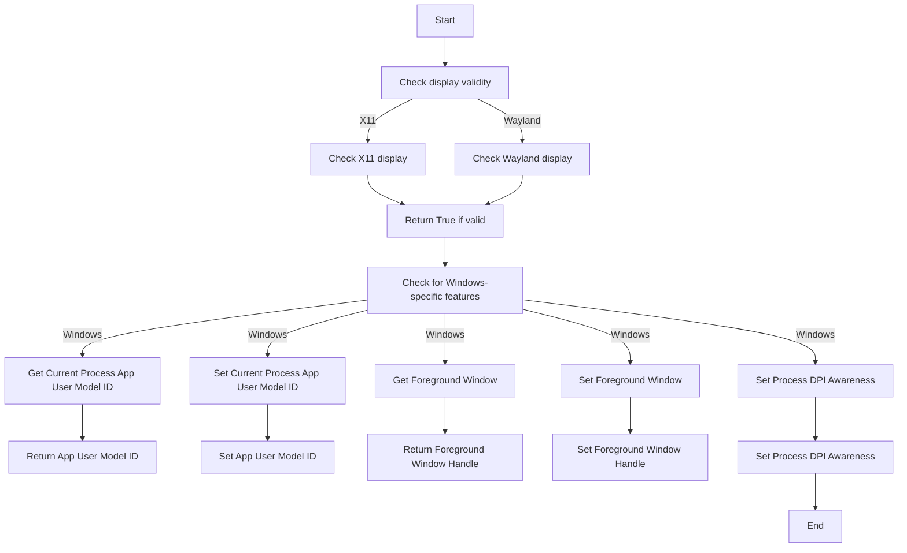
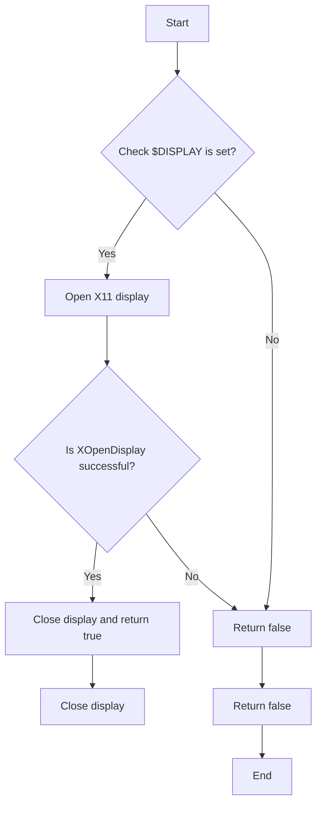
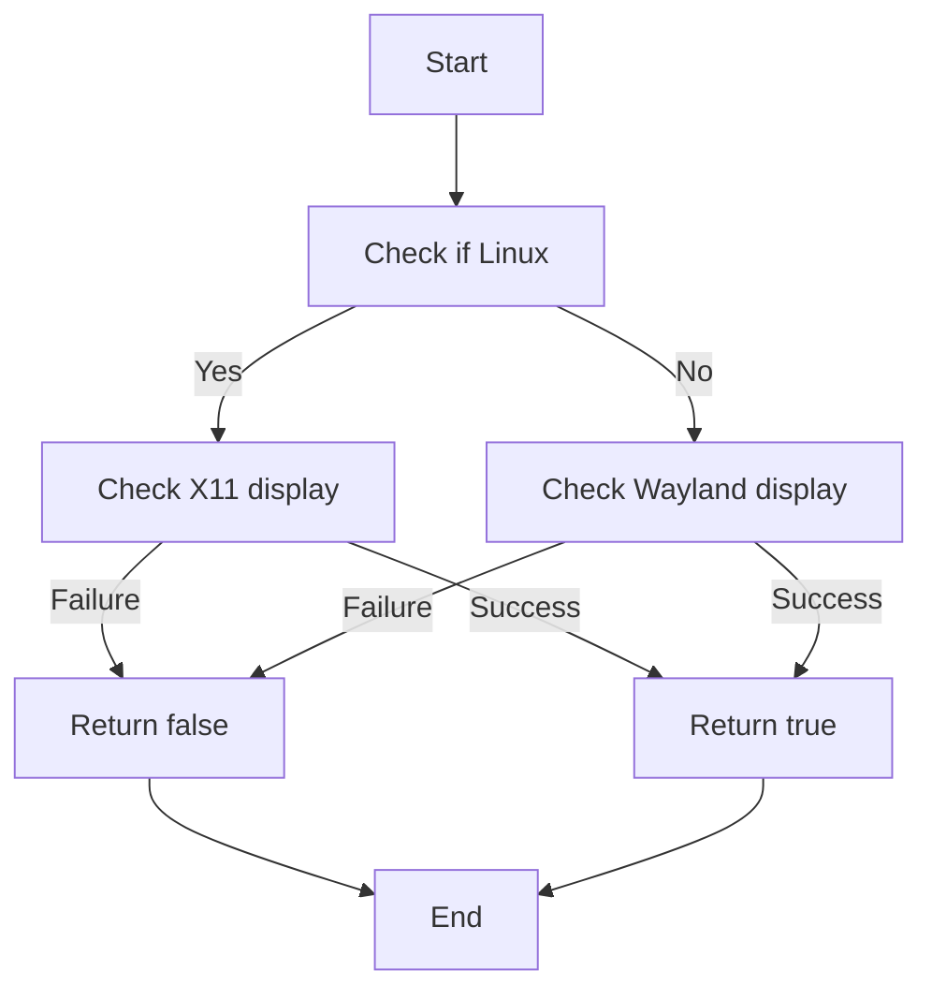
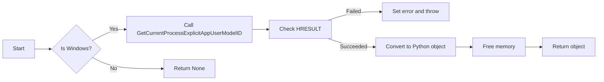
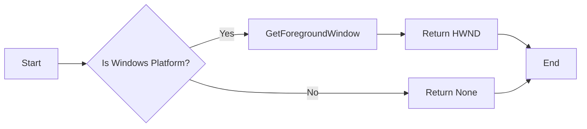
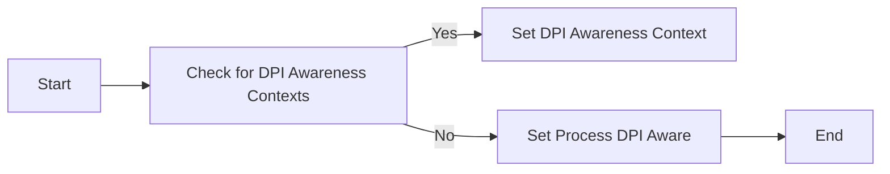

# `matplotlib\src\_c_internal_utils.cpp` 详细设计文档

This Python module provides utility functions for checking display validity, managing Windows-specific process settings, and interacting with the Windows user interface.

## 整体流程



## 类结构

```
mpl_xdisplay_is_valid
mpl_display_is_valid
mpl_GetCurrentProcessExplicitAppUserModelID
mpl_SetCurrentProcessExplicitAppUserModelID
mpl_GetForegroundWindow
mpl_SetForegroundWindow
mpl_SetProcessDpiAwareness_max
```

## 全局变量及字段


### `appid`
    
Pointer to a wide character string that contains the application user model ID for the current process on Windows.

类型：`wchar_t*`
    


### `display`
    
Pointer to a Display structure that contains information about an X11 display.

类型：`struct Display*`
    


### `hwnd`
    
Handle to a window on Windows.

类型：`HWND`
    


### `libX11`
    
Pointer to a dynamically loaded library containing the X11 library.

类型：`void*`
    


### `libwayland_client`
    
Pointer to a dynamically loaded library containing the Wayland client library.

类型：`void*`
    


### `user32`
    
Handle to the user32.dll module on Windows, which contains various Windows API functions.

类型：`HMODULE`
    


### `mpl_SetCurrentProcessExplicitAppUserModelID.appid`
    
The application user model ID to set for the current process on Windows.

类型：`wchar_t*`
    


### `mpl_SetForegroundWindow.hwnd`
    
The handle to the window to set as the foreground window on Windows.

类型：`HWND`
    
    

## 全局函数及方法


### mpl_xdisplay_is_valid

Check whether the current X11 display is valid.

参数：

- 无

返回值：`bool`，If the current X11 display is valid, returns `true`; otherwise, returns `false`.

#### 流程图



#### 带注释源码

```cpp
static bool
mpl_xdisplay_is_valid(void)
{
#ifdef __linux__
    void* libX11;
    // The getenv check is redundant but helps performance as it is much faster
    // than dlopen().
    if (getenv("DISPLAY")
        && (libX11 = dlopen("libX11.so.6", RTLD_LAZY))) {
        struct Display* display = nullptr;
        auto XOpenDisplay = (struct Display* (*)(char const*))
            dlsym(libX11, "XOpenDisplay");
        auto XCloseDisplay = (int (*)(struct Display*))
            dlsym(libX11, "XCloseDisplay");
        if (XOpenDisplay && XCloseDisplay
                && (display = XOpenDisplay(nullptr))) {
            XCloseDisplay(display);
        }
        if (dlclose(libX11)) {
            throw std::runtime_error(dlerror());
        }
        if (display) {
            return true;
        }
    }
    return false;
#else
    return true;
#endif
}
```


### mpl_display_is_valid

Check whether the current X11 or Wayland display is valid.

参数：

- 无

返回值：`bool`，If the display is valid, returns `true`; otherwise, returns `false`.

#### 流程图



#### 带注释源码

```cpp
static bool mpl_display_is_valid(void)
{
#ifdef __linux__
    if (mpl_xdisplay_is_valid()) {
        return true;
    }
    void* libwayland_client;
    if (getenv("WAYLAND_DISPLAY")
        && (libwayland_client = dlopen("libwayland-client.so.0", RTLD_LAZY))) {
        struct wl_display* display = nullptr;
        auto wl_display_connect = (struct wl_display* (*)(char const*))
            dlsym(libwayland_client, "wl_display_connect");
        auto wl_display_disconnect = (void (*)(struct wl_display*))
            dlsym(libwayland_client, "wl_display_disconnect");
        if (wl_display_connect && wl_display_disconnect
                && (display = wl_display_connect(nullptr))) {
            wl_display_disconnect(display);
        }
        if (dlclose(libwayland_client)) {
            throw std::runtime_error(dlerror());
        }
        if (display) {
            return true;
        }
    }
    return false;
#else
    return true;
#endif
}
```


### mpl_GetCurrentProcessExplicitAppUserModelID

Wrapper for Windows's GetCurrentProcessExplicitAppUserModelID.

参数：

- `appid`：`wchar_t*`，The application user model ID to set for the current process.

返回值：`py::object`，The application user model ID as a Python object.

#### 流程图



#### 带注释源码

```cpp
static py::object
mpl_GetCurrentProcessExplicitAppUserModelID(void)
{
#ifdef _WIN32
    wchar_t* appid = NULL;
    HRESULT hr = GetCurrentProcessExplicitAppUserModelID(&appid);
    if (FAILED(hr)) {
        PyErr_SetFromWindowsErr(hr);
        throw py::error_already_set();
    }
    auto py_appid = py::cast(appid);
    CoTaskMemFree(appid);
    return py_appid;
#else
    return py::none();
#endif
}
```


### mpl_SetCurrentProcessExplicitAppUserModelID

Wrapper for Windows's SetCurrentProcessExplicitAppUserModelID.

参数：

- `appid`：`const wchar_t*`，The application user model ID to set for the current process.

返回值：无

#### 流程图

```mermaid
graph LR
A[Start] --> B{Is Windows Platform?}
B -- Yes --> C[SetCurrentProcessExplicitAppUserModelID(appid)]
B -- No --> D[Do nothing]
C --> E[Check for failure]
E -- Yes --> F[Set error and throw exception]
E -- No --> G[End]
D --> G
```

#### 带注释源码

```cpp
static void mpl_SetCurrentProcessExplicitAppUserModelID(const wchar_t* UNUSED_ON_NON_WINDOWS(appid))
{
#ifdef _WIN32
    HRESULT hr = SetCurrentProcessExplicitAppUserModelID(appid);
    if (FAILED(hr)) {
        PyErr_SetFromWindowsErr(hr);
        throw py::error_already_set();
    }
#endif
}
```


### mpl_GetForegroundWindow

Wrapper for Windows' GetForegroundWindow.

参数：

- hwnd：`py::capsule`，The handle to the window to be activated and given focus.

返回值：`py::object`，The window handle if successful, otherwise `py::none()`.

#### 流程图



#### 带注释源码

```cpp
static py::object
mpl_GetForegroundWindow(void)
{
#ifdef _WIN32
  if (HWND hwnd = GetForegroundWindow()) {
    return py::capsule(hwnd, "HWND");
  } else {
    return py::none();
  }
#else
  return py::none();
#endif
}
```


### mpl_SetForegroundWindow

Wrapper for Windows' SetForegroundWindow.

参数：

- hwnd：`py::capsule`，The handle to the window to be activated and given keyboard focus.

返回值：无

#### 流程图

```mermaid
graph LR
A[Start] --> B{Check Platform}
B -- Windows --> C[Check HWND Type]
C -- HWND -> D[SetForegroundWindow]
C -- Not HWND --> E[Throw Error]
D --> F[Check Success]
F -- Success --> G[Return]
F -- Failure --> H[Throw Error]
E --> I[Throw Error]
G --> J[End]
H --> J
I --> J
```

#### 带注释源码

```cpp
static void
mpl_SetForegroundWindow(py::capsule UNUSED_ON_NON_WINDOWS(handle_p))
{
#ifdef _WIN32
    if (strcmp(handle_p.name(), "HWND") != 0) {
        throw std::runtime_error("Handle must be a value returned from Win32_GetForegroundWindow");
    }
    HWND handle = static_cast<HWND>(handle_p.get_pointer());
    if (!SetForegroundWindow(handle)) {
        throw std::runtime_error("Error setting window");
    }
#endif
}
```


### mpl_SetProcessDpiAwareness_max

Set Windows' process DPI awareness to best option available.

参数：

- 无

返回值：无

#### 流程图



#### 带注释源码

```cpp
static void
mpl_SetProcessDpiAwareness_max(void)
{
#ifdef _WIN32
#ifdef _DPI_AWARENESS_CONTEXTS_
    // These functions and options were added in later Windows 10 updates, so
    // must be loaded dynamically.
    HMODULE user32 = LoadLibrary("user32.dll");
    auto IsValidDpiAwarenessContext = (BOOL (WINAPI *)(DPI_AWARENESS_CONTEXT))
        GetProcAddress(user32, "IsValidDpiAwarenessContext");
    auto SetProcessDpiAwarenessContext = (BOOL (WINAPI *)(DPI_AWARENESS_CONTEXT))
        GetProcAddress(user32, "SetProcessDpiAwarenessContext");
    DPI_AWARENESS_CONTEXT ctxs[3] = {
        DPI_AWARENESS_CONTEXT_PER_MONITOR_AWARE_V2,  // Win10 Creators Update
        DPI_AWARENESS_CONTEXT_PER_MONITOR_AWARE,     // Win10
        DPI_AWARENESS_CONTEXT_SYSTEM_AWARE};         // Win10
    if (IsValidDpiAwarenessContext && SetProcessDpiAwarenessContext) {
        for (size_t i = 0; i < sizeof(ctxs) / sizeof(DPI_AWARENESS_CONTEXT); ++i) {
            if (IsValidDpiAwarenessContext(ctxs[i])) {
                SetProcessDpiAwarenessContext(ctxs[i]);
                break;
            }
        }
    } else {
        // Added in Windows Vista.
        SetProcessDPIAware();
    }
    FreeLibrary(user32);
#else
    // Added in Windows Vista.
    SetProcessDPIAware();
#endif
#endif
}
```


## 关键组件


### 张量索引与惰性加载

张量索引与惰性加载是代码中处理数据结构的核心组件，它允许对大型数据集进行高效访问，同时延迟计算，以节省内存和计算资源。

### 反量化支持

反量化支持是代码中用于处理数值类型转换的组件，它能够将量化后的数据转换回原始精度，确保数据在处理过程中的准确性。

### 量化策略

量化策略是代码中用于优化数据存储和计算效率的组件，它通过减少数据精度来减少内存使用和加速计算过程。


## 问题及建议


### 已知问题

-   **跨平台兼容性**：代码主要针对Windows平台进行优化，对于Linux和其它平台的支持较为有限，例如在Linux平台上对X11和Wayland显示的检查。
-   **异常处理**：代码中使用了`throw`语句来抛出异常，但没有提供详细的异常处理逻辑，这可能导致调用者难以理解错误原因。
-   **全局变量和函数**：代码中使用了全局变量和函数，这可能导致代码难以维护和测试。
-   **代码注释**：代码注释较少，对于理解代码逻辑和功能有一定难度。

### 优化建议

-   **增强跨平台兼容性**：考虑为Linux和其它平台提供更全面的显示检查支持，例如增加对其他图形界面的支持。
-   **改进异常处理**：提供更详细的异常信息，例如错误代码和错误描述，以便调用者更好地处理异常。
-   **减少全局变量和函数的使用**：将全局变量和函数封装到类中，提高代码的可维护性和可测试性。
-   **增加代码注释**：为代码添加详细的注释，解释代码逻辑和功能，提高代码的可读性。
-   **代码重构**：对代码进行重构，提高代码的模块化和可复用性。
-   **性能优化**：对代码进行性能优化，例如减少不必要的系统调用和动态库加载。


## 其它


### 设计目标与约束

- 设计目标：
  - 提供跨平台的显示和窗口管理功能。
  - 为Python绑定提供Windows特定的API。
  - 确保代码在多种操作系统上具有良好的兼容性。

- 约束：
  - 代码必须与Python 3兼容。
  - 代码必须能够在Windows和Linux操作系统上编译和运行。
  - 代码应尽可能简洁，避免不必要的复杂性。

### 错误处理与异常设计

- 错误处理：
  - 使用`std::runtime_error`来处理系统调用失败。
  - 使用`PyErr_SetFromWindowsErr`将Windows错误转换为Python异常。
  - 使用`py::error_already_set`来设置Python异常。

- 异常设计：
  - 异常设计应确保所有可能的错误情况都能被捕获和处理。
  - 异常应提供足够的信息，以便调用者能够了解错误的原因。

### 数据流与状态机

- 数据流：
  - 数据流从用户调用Python绑定开始，通过C++代码处理，最终返回到Python调用者。

- 状态机：
  - 代码中没有明显的状态机，但函数调用和条件语句确保了代码的有序执行。

### 外部依赖与接口契约

- 外部依赖：
  - 依赖于Python和pybind11库。
  - 依赖于Windows API和Linux的系统调用。

- 接口契约：
  - 提供的函数和模块应遵循Python的API规范。
  - 函数应提供清晰的文档字符串，说明其功能和参数。
  - 函数应处理所有可能的错误情况，并抛出相应的异常。


    