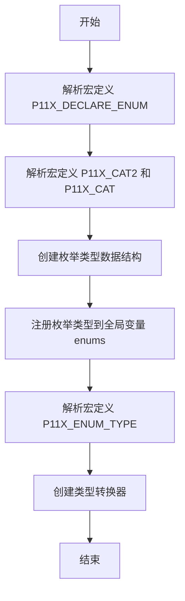
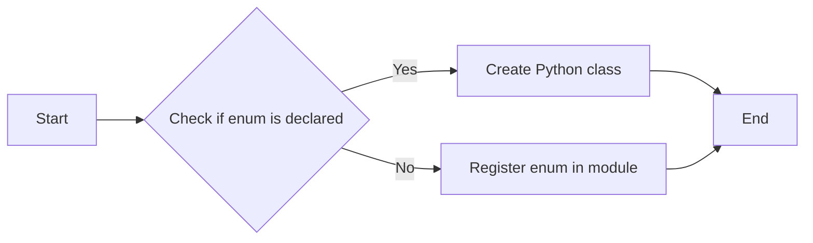
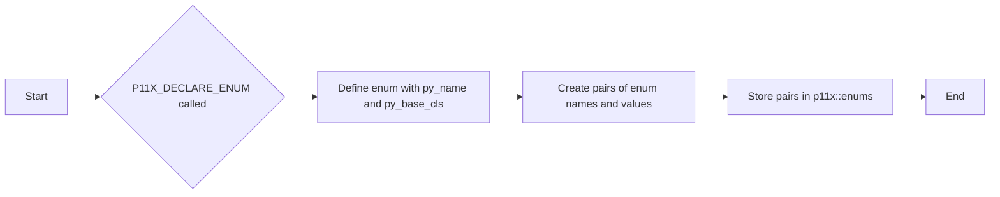
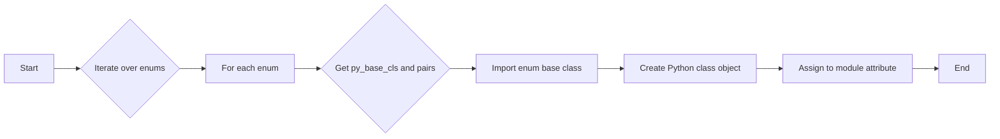
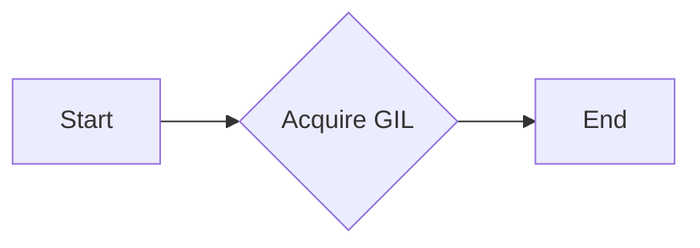
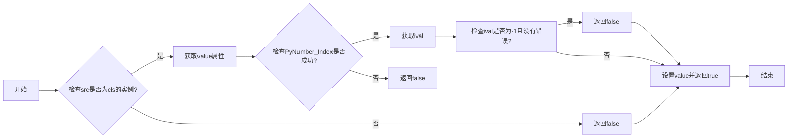

# `matplotlib\src\_enums.h` 详细设计文档

This code provides an extension for pybind11 that allows creating Pythonic enums from C++ enum types, facilitating the integration of C++ enums with Python code.

## 整体流程



## 类结构

```
p11x (命名空间)
├── py (命名空间)
│   ├── gil_scoped_acquire (函数)
│   └── ...
├── {py_name} (枚举类型)
│   ├── py_base_cls (枚举基类)
│   └── pairs (枚举值对)
└── enums (全局变量)
```

## 全局变量及字段


### `p11x::enums`
    
A map that holds the enums and their corresponding Python class objects before module initialization.

类型：`std::unordered_map<std::string, py::object>`
    


    

## 全局函数及方法


### P11X_DECLARE_ENUM

This function is a macro that declares an enum and its values for use with pybind11. It creates a Python class based on the enum type and registers it in the module.

参数：

- `py_name`：`std::string`，The name to expose in the module.
- `py_base_cls`：`std::string`，The name of the enum base class to use.
- `...`：A series of pairs of `std::string` and `enum value` representing the enum name/value pairs to expose.

返回值：`void`，No return value.

#### 流程图



#### 带注释源码

```cpp
#define P11X_DECLARE_ENUM(py_name, py_base_cls, ...) \
  namespace p11x { \
    namespace { \
      [[maybe_unused]] auto const P11X_CAT(enum_placeholder_, __COUNTER__) = \
        [](auto args) { \
          py::gil_scoped_acquire gil; \
          using int_t = std::underlying_type_t<decltype(args[0].second)>; \
          auto pairs = std::vector<std::pair<std::string, int_t>>{}; \
          for (auto& [k, v]: args) { \
            pairs.emplace_back(k, int_t(v)); \
          } \
          p11x::enums[py_name] = pybind11::cast(std::pair{py_base_cls, pairs}); \
          return 0; \
        } (std::vector{std::pair __VA_ARGS__}); \
    } \
  } \
  namespace pybind11::detail { \
    template<> struct type_caster<P11X_ENUM_TYPE(__VA_ARGS__)> { \
      using type = P11X_ENUM_TYPE(__VA_ARGS__); \
      static_assert(std::is_enum_v<type>, "Not an enum"); \
      PYBIND11_TYPE_CASTER(type, _(py_name)); \
      bool load(handle src, bool) { \
        auto cls = p11x::enums.at(py_name); \
        PyObject* tmp = nullptr; \
        if (pybind11::isinstance(src, cls) \
            && (tmp = PyNumber_Index(src.attr("value").ptr()))) { \
          auto ival = PyLong_AsLong(tmp); \
          value = decltype(value)(ival); \
          Py_DECREF(tmp); \
          return !(ival == -1 && !PyErr_Occurred()); \
        } else { \
          return false; \
        } \
      } \
      static handle cast(decltype(value) obj, return_value_policy, handle) { \
        auto cls = p11x::enums.at(py_name); \
        return cls(std::underlying_type_t<type>(obj)).inc_ref(); \
      } \
    }; \
  }
```


### P11X_DECLARE_ENUM

This function is a macro that declares an enum and its values for use with pybind11. It is used to expose enums in Python modules.

参数：

- `py_name`：`std::string`，The name to expose in the module.
- `py_base_cls`：`std::string`，The name of the enum base class to use.
- `...`：A series of pairs of enum names and values.

返回值：`void`

#### 流程图



#### 带注释源码

```cpp
#define P11X_DECLARE_ENUM(py_name, py_base_cls, ...) \
  namespace p11x { \
    namespace { \
      [[maybe_unused]] auto const P11X_CAT(enum_placeholder_, __COUNTER__) = \
        [](auto args) { \
          py::gil_scoped_acquire gil; \
          using int_t = std::underlying_type_t<decltype(args[0].second)>; \
          auto pairs = std::vector<std::pair<std::string, int_t>>{}; \
          for (auto& [k, v]: args) { \
            pairs.emplace_back(k, int_t(v)); \
          } \
          p11x::enums[py_name] = pybind11::cast(std::pair{py_base_cls, pairs}); \
          return 0; \
        } (std::vector{std::pair __VA_ARGS__}); \
    } \
  } \
  namespace pybind11::detail { \
    template<> struct type_caster<P11X_ENUM_TYPE(__VA_ARGS__)> { \
      using type = P11X_ENUM_TYPE(__VA_ARGS__); \
      static_assert(std::is_enum_v<type>, "Not an enum"); \
      PYBIND11_TYPE_CASTER(type, _(py_name)); \
      bool load(handle src, bool) { \
        auto cls = p11x::enums.at(py_name); \
        PyObject* tmp = nullptr; \
        if (pybind11::isinstance(src, cls) \
            && (tmp = PyNumber_Index(src.attr("value").ptr()))) { \
          auto ival = PyLong_AsLong(tmp); \
          value = decltype(value)(ival); \
          Py_DECREF(tmp); \
          return !(ival == -1 && !PyErr_Occurred()); \
        } else { \
          return false; \
        } \
      } \
      static handle cast(decltype(value) obj, return_value_policy, handle) { \
        auto cls = p11x::enums.at(py_name); \
        return cls(std::underlying_type_t<type>(obj)).inc_ref(); \
      } \
    }; \
  }
```


### P11X_DECLARE_ENUM

This function is a macro that declares an enum and its values for use with pybind11. It is used to expose enums in Python modules.

参数：

- `py_name`：`std::string`，The name to expose in the module.
- `py_base_cls`：`std::string`，The name of the enum base class to use.
- `...`：A series of pairs of enum names and values.

返回值：`void`

#### 流程图


#### 带注释源码

```cpp
#define P11X_DECLARE_ENUM(py_name, py_base_cls, ...) \
  namespace p11x { \
    namespace { \
      [[maybe_unused]] auto const P11X_CAT(enum_placeholder_, __COUNTER__) = \
        [](auto args) { \
          py::gil_scoped_acquire gil; \
          using int_t = std::underlying_type_t<decltype(args[0].second)>; \
          auto pairs = std::vector<std::pair<std::string, int_t>>{}; \
          for (auto& [k, v]: args) { \
            pairs.emplace_back(k, int_t(v)); \
          } \
          p11x::enums[py_name] = pybind11::cast(std::pair{py_base_cls, pairs}); \
          return 0; \
        } (std::vector{std::pair __VA_ARGS__}); \
    } \
  } \
  namespace pybind11::detail { \
    template<> struct type_caster<P11X_ENUM_TYPE(__VA_ARGS__)> { \
      using type = P11X_ENUM_TYPE(__VA_ARGS__); \
      static_assert(std::is_enum_v<type>, "Not an enum"); \
      PYBIND11_TYPE_CASTER(type, _(py_name)); \
      bool load(handle src, bool) { \
        auto cls = p11x::enums.at(py_name); \
        PyObject* tmp = nullptr; \
        if (pybind11::isinstance(src, cls) \
            && (tmp = PyNumber_Index(src.attr("value").ptr()))) { \
          auto ival = PyLong_AsLong(tmp); \
          value = decltype(value)(ival); \
          Py_DECREF(tmp); \
          return !(ival == -1 && !PyErr_Occurred()); \
        } else { \
          return false; \
        } \
      } \
      static handle cast(decltype(value) obj, return_value_policy, handle) { \
        auto cls = p11x::enums.at(py_name); \
        return cls(std::underlying_type_t<type>(obj)).inc_ref(); \
      } \
    }; \
  }
```


### bind_enums

`bind_enums` 是一个全局函数，用于将之前通过 `P11X_DECLARE_ENUM` 宏声明的枚举绑定到 Python 模块中。

参数：

- `mod`：`py::module`，表示要注册枚举的 Python 模块。

返回值：`void`，没有返回值。

#### 流程图



#### 带注释源码

```cpp
auto bind_enums(py::module mod) -> void
{
  for (auto& [py_name, spec]: enums) {
    auto const& [py_base_cls, pairs] =
      spec.cast<std::pair<std::string, py::object>>();
    mod.attr(py::cast(py_name)) = spec =
      py::module::import("enum").attr(py_base_cls.c_str())(
        py_name, pairs, py::arg("module") = mod.attr("__name__"));
  }
}
```


### p11x::py::gil_scoped_acquire.gil_scoped_acquire

该函数用于获取Python全局解释器锁（GIL），确保在执行Python代码时不会发生多线程冲突。

参数：

- 无

返回值：`void`，无返回值

#### 流程图



#### 带注释源码

```cpp
// Holder is (py_base_cls, [(name, value), ...]) before module init;
// converted to the Python class object after init.

#define P11X_DECLARE_ENUM(py_name, py_base_cls, ...) \
  namespace p11x { \
    namespace { \
      [[maybe_unused]] auto const P11X_CAT(enum_placeholder_, __COUNTER__) = \
        [](auto args) { \
          py::gil_scoped_acquire gil; \
          // ... (rest of the code) ... \
        } (std::vector{std::pair __VA_ARGS__}); \
    } \
  } \
  namespace pybind11::detail { \
    // ... (rest of the code) ... \
  }
```

在上述源码中，`py::gil_scoped_acquire gil;` 是获取GIL的关键行，它确保在执行后续代码时，GIL被正确获取。


### p11x::py::detail::type_caster<P11X_ENUM_TYPE(__VA_ARGS__)>::load

This function is a type caster for enums defined using the `P11X_DECLARE_ENUM` macro. It is responsible for loading a Python object into the corresponding enum type.

参数：

- `src`：`handle`，The Python object to be loaded into the enum type.
- `convertible`：`bool`，Indicates whether the source object is convertible to the enum type.

返回值：`bool`，Returns `true` if the conversion is successful, `false` otherwise.

#### 流程图

```mermaid
graph LR
A[Start] --> B{Is src an instance of cls?}
B -- Yes --> C[Create tmp using src.attr("value").ptr()]
B -- No --> D[Return false]
C --> E{Is tmp a valid object?}
E -- Yes --> F[Get ival using PyLong_AsLong(tmp)]
E -- No --> G[Return false]
F --> H[Set value to decltype(value)(ival)]
H --> I[Decrement reference count of tmp]
I --> J[Return true]
G --> J
```

#### 带注释源码

```cpp
bool load(handle src, bool convertible) {
  auto cls = p11x::enums.at(py_name);
  PyObject* tmp = nullptr;
  if (pybind11::isinstance(src, cls) &&
      (tmp = PyNumber_Index(src.attr("value").ptr()))) {
    auto ival = PyLong_AsLong(tmp);
    value = decltype(value)(ival);
    Py_DECREF(tmp);
    return !(ival == -1 && !PyErr_Occurred());
  } else {
    return false;
  }
}
```


### p11x::py::detail::type_caster::cast

将枚举值转换为Python对象。

参数：

- `src`：`PyObject*`，指向要转换的Python对象。
- `convertible`：`bool`，指示是否可以转换。

返回值：`bool`，指示转换是否成功。

#### 流程图



#### 带注释源码

```cpp
bool load(handle src, bool convertible) {
  auto cls = p11x::enums.at(py_name);
  PyObject* tmp = nullptr;
  if (pybind11::isinstance(src, cls) &&
      (tmp = PyNumber_Index(src.attr("value").ptr()))) {
    auto ival = PyLong_AsLong(tmp);
    value = decltype(value)(ival);
    Py_DECREF(tmp);
    return !(ival == -1 && !PyErr_Occurred());
  } else {
    return false;
  }
}
```

## 关键组件


### 张量索引与惰性加载

张量索引与惰性加载是代码中用于处理大型数据结构（如张量）的机制，它允许在需要时才计算或访问数据，从而提高内存使用效率和程序性能。

### 反量化支持

反量化支持是代码中实现的一种功能，它允许在运行时动态调整量化参数，以适应不同的量化需求，从而提高模型的灵活性和适应性。

### 量化策略

量化策略是代码中用于优化模型性能的一种技术，它通过减少模型中使用的数值范围来减少模型的大小和计算需求，从而提高模型的运行速度和降低功耗。


## 问题及建议


### 已知问题

-   **宏定义的复杂性**：代码中使用了大量的宏定义，这可能会增加代码的复杂性和维护难度。宏定义通常难以调试，并且可能导致意外的副作用。
-   **类型推导的复杂性**：`P11X_ENUM_TYPE` 宏使用了复杂的类型推导，这可能会使代码难以理解和维护。
-   **全局状态的使用**：`p11x::enums` 是一个全局状态，这可能会引起线程安全问题，尤其是在多线程环境中。
-   **缺乏错误处理**：代码中没有明显的错误处理机制，如果发生错误，可能会导致未定义行为。

### 优化建议

-   **简化宏定义**：考虑使用更简单的宏定义，或者将宏定义替换为函数，以便更好地控制代码的行为。
-   **改进类型推导**：简化类型推导逻辑，使其更易于理解和维护。
-   **使用线程安全的数据结构**：如果需要在多线程环境中使用全局状态，考虑使用线程安全的数据结构，如 `std::mutex` 和 `std::lock_guard`。
-   **添加错误处理**：在关键操作中添加错误处理，确保在发生错误时能够提供有用的反馈，并防止程序崩溃。
-   **代码重构**：考虑重构代码，以提高代码的可读性和可维护性。
-   **文档化**：为代码添加详细的文档，包括宏定义、类型推导和全局状态的使用，以便其他开发者能够更好地理解代码。


## 其它


### 设计目标与约束

- 设计目标：
  - 提供一个Pythonic的枚举扩展，允许在Python中使用枚举类型。
  - 支持在C++中定义和使用Python枚举。
  - 确保枚举类型在Python和C++之间的正确映射。

- 约束：
  - 必须兼容pybind11库。
  - 枚举类型必须使用C++11标准或更高版本。
  - 枚举值必须是整数类型。

### 错误处理与异常设计

- 错误处理：
  - 使用pybind11的异常处理机制来捕获和处理Python异常。
  - 在C++中，使用try-catch块来捕获和处理可能的运行时错误。

- 异常设计：
  - 定义自定义异常类，用于处理特定错误情况。
  - 异常类应提供清晰的错误信息和错误代码。

### 数据流与状态机

- 数据流：
  - 数据流从C++枚举类型到Python枚举类型。
  - 数据流从Python枚举类型到C++枚举类型。

- 状态机：
  - 无状态机，但枚举类型在创建和绑定过程中遵循特定状态。

### 外部依赖与接口契约

- 外部依赖：
  - pybind11库。
  - C++11标准库。

- 接口契约：
  - P11X_DECLARE_ENUM宏定义了C++枚举到Python枚举的接口。
  - py11x::bind_enums函数定义了Python枚举到C++枚举的接口。

### 安全性与权限

- 安全性：
  - 确保枚举类型在Python和C++之间的转换是安全的。
  - 防止未授权的访问和修改枚举值。

- 权限：
  - 限制对枚举类型的修改，确保枚举值的唯一性和一致性。

### 性能考量

- 性能：
  - 优化枚举类型的创建和绑定过程，减少不必要的性能开销。
  - 使用有效的数据结构来存储枚举信息。

### 可维护性与可扩展性

- 可维护性：
  - 代码结构清晰，易于理解和维护。
  - 使用文档和注释来提高代码的可读性。

- 可扩展性：
  - 设计允许未来添加新的功能或支持更多的枚举类型。
  - 使用模块化设计，便于扩展和维护。

### 测试与验证

- 测试：
  - 编写单元测试来验证枚举类型的正确性和性能。
  - 使用集成测试来验证枚举类型在pybind11模块中的集成。

- 验证：
  - 通过实际使用场景验证枚举类型的稳定性和可靠性。

### 用户文档与帮助

- 用户文档：
  - 提供详细的用户文档，包括如何使用枚举扩展。
  - 提供示例代码和常见问题解答。

- 帮助：
  - 提供在线帮助和社区支持。

### 法律与合规性

- 法律：
  - 确保代码遵守相关法律法规。
  - 保护知识产权。

- 合规性：
  - 确保代码符合行业标准和最佳实践。

### 项目管理

- 项目计划：
  - 制定详细的项目计划，包括时间表、里程碑和资源分配。

- 项目监控：
  - 监控项目进度，确保按时交付。

- 项目沟通：
  - 保持团队成员之间的沟通，确保信息共享。

### 部署与维护

- 部署：
  - 提供部署指南，确保代码可以顺利部署到目标环境。

- 维护：
  - 提供维护计划，确保代码的长期稳定运行。


    