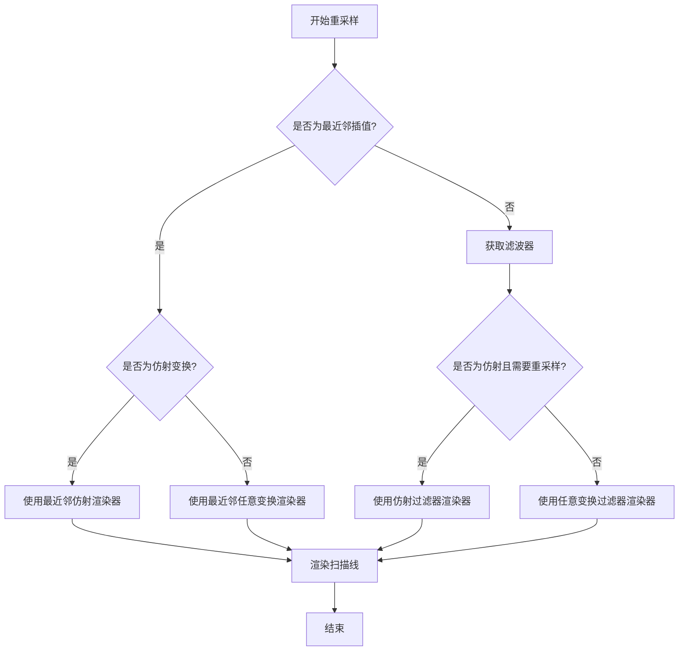
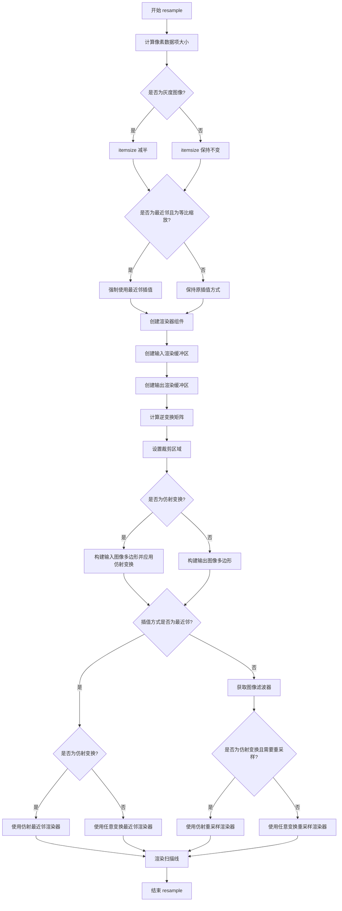
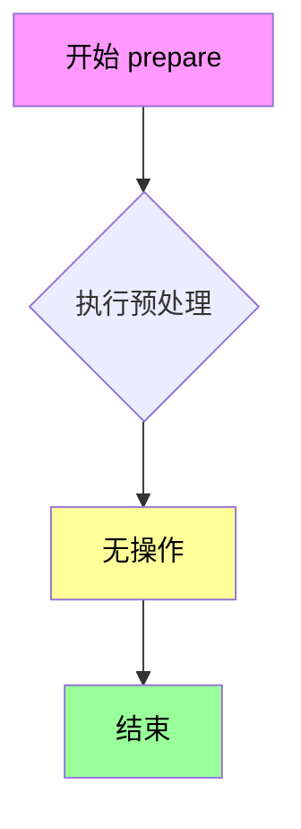
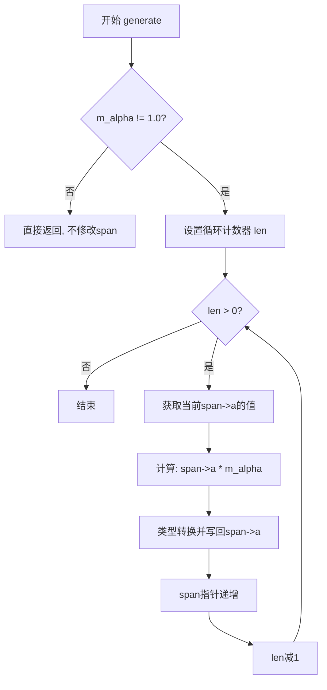

```mermaid
flowchart TD
    A[开始 get_filter] --> B{根据 params.interpolation 分支}
    
    B --> C[NEAREST]
    B --> D[HANNING]
    B --> E[HAMMING]
    B --> F[HERMITE]
    B --> G[BILINEAR]
    B --> H[BICUBIC]
    B --> I[SPLINE16]
    B --> J[SPLINE36]
    B --> K[KAISER]
    B --> L[QUADRIC]
    B --> M[CATROM]
    B --> N[GAUSSIAN]
    B --> O[BESSEL]
    B --> P[MITCHELL]
    B --> Q[SINC]
    B --> R[LANCZOS]
    B --> S[BLACKMAN]
    
    C --> T[直接 break 不做任何处理]
    D --> U[调用 filter.calculate with image_filter_hanning]
    E --> V[调用 filter.calculate with image_filter_hamming]
    F --> W[调用 filter.calculate with image_filter_hermite]
    G --> X[调用 filter.calculate with image_filter_bilinear]
    H --> Y[调用 filter.calculate with image_filter_bicubic]
    I --> Z[调用 filter.calculate with image_filter_spline16]
    J --> AA[调用 filter.calculate with image_filter_spline36]
    K --> AB[调用 filter.calculate with image_filter_kaiser]
    L --> AC[调用 filter.calculate with image_filter_quadric]
    M --> AD[调用 filter.calculate with image_filter_catrom]
    N --> AE[调用 filter.calculate with image_filter_gaussian]
    O --> AF[调用 filter.calculate with image_filter_bessel]
    P --> AG[调用 filter.calculate with image_filter_mitchell]
    Q --> AH[调用 filter.calculate with image_filter_sinc params.radius]
    R --> AI[调用 filter.calculate with image_filter_lanczos params.radius]
    S --> AJ[调用 filter.calculate with image_filter_blackman params.radius]
    
    U --> AK[结束]
    V --> AK
    W --> AK
    X --> AK
    Y --> AK
    Z --> AK
    AA --> AK
    AB --> AK
    AC --> AK
    AD --> AK
    AE --> AK
    AF --> AK
    AG --> AK
    AH --> AK
    AI --> AK
    AJ --> AK
    T --> AK
```

# `matplotlib\src\_image_resample.h` 详细设计文档

这是一个基于Anti-Grain Geometry (AGG)库的图像重采样头文件，提供了多种插值算法（包括最近邻、双线性、双三次、样条等）对图像进行缩放和变换的功能，支持灰度和RGBA颜色空间，并允许使用仿射变换或网格变换。

## 整体流程



## 类结构

```
agg::gray64 (灰度64位颜色结构体)
agg::rgba64 (RGBA64位颜色结构体)
interpolation_e (插值方法枚举)
is_grayscale (灰度检测模板)
type_mapping (颜色类型映射模板)
span_conv_alpha (Alpha通道调整类)
lookup_distortion (查找表变换类)
resample_params_t (重采样参数结构体)
get_filter (滤波器获取函数)
resample (主重采样函数模板)
```

## 全局变量及字段


### `NEAREST`
    
最近邻插值

类型：`interpolation_e`
    


### `BILINEAR`
    
双线性插值

类型：`interpolation_e`
    


### `BICUBIC`
    
双三次插值

类型：`interpolation_e`
    


### `SPLINE16`
    
16点样条插值

类型：`interpolation_e`
    


### `SPLINE36`
    
36点样条插值

类型：`interpolation_e`
    


### `HANNING`
    
汉宁窗插值

类型：`interpolation_e`
    


### `HAMMING`
    
汉明窗插值

类型：`interpolation_e`
    


### `HERMITE`
    
埃尔米特插值

类型：`interpolation_e`
    


### `KAISER`
    
凯撒窗插值

类型：`interpolation_e`
    


### `QUADRIC`
    
二次插值

类型：`interpolation_e`
    


### `CATROM`
    
Catmull-Rom样条插值

类型：`interpolation_e`
    


### `GAUSSIAN`
    
高斯插值

类型：`interpolation_e`
    


### `BESSEL`
    
贝塞尔插值

类型：`interpolation_e`
    


### `MITCHELL`
    
Mitchell插值

类型：`interpolation_e`
    


### `SINC`
    
Sinc函数插值

类型：`interpolation_e`
    


### `LANCZOS`
    
Lanczos插值

类型：`interpolation_e`
    


### `BLACKMAN`
    
Blackman窗插值

类型：`interpolation_e`
    


### `span_conv_alpha.m_alpha`
    
Alpha透明度值

类型：`const double`
    


### `lookup_distortion.m_mesh`
    
变换网格数据

类型：`const double*`
    


### `lookup_distortion.m_in_width`
    
输入宽度

类型：`int`
    


### `lookup_distortion.m_in_height`
    
输入高度

类型：`int`
    


### `lookup_distortion.m_out_width`
    
输出宽度

类型：`int`
    


### `lookup_distortion.m_out_height`
    
输出高度

类型：`int`
    


### `lookup_distortion.m_edge_aligned_subpixels`
    
子像素对齐方式

类型：`bool`
    


### `resample_params_t.interpolation`
    
插值方法

类型：`interpolation_e`
    


### `resample_params_t.is_affine`
    
是否为仿射变换

类型：`bool`
    


### `resample_params_t.affine`
    
仿射变换矩阵

类型：`agg::trans_affine`
    


### `resample_params_t.transform_mesh`
    
变换网格指针

类型：`const double*`
    


### `resample_params_t.resample`
    
是否重采样

类型：`bool`
    


### `resample_params_t.norm`
    
是否归一化

类型：`bool`
    


### `resample_params_t.radius`
    
滤波器半径

类型：`double`
    


### `resample_params_t.alpha`
    
全局透明度

类型：`double`
    
    

## 全局函数及方法


### `get_filter`

根据传入的 `resample_params_t` 参数中的插值类型（interpolation），选择对应的图像滤波器并通过 `filter.calculate()` 方法初始化滤波查找表，用于后续的图像重采样操作。

参数：

- `params`：`const resample_params_t &`，包含插值类型（interpolation）、归一化标志（norm）和半径（radius，用于 SINC、LANCZOS、BLACKMAN 等滤波器）等参数
- `filter`：`agg::image_filter_lut &`，输出参数，用于存储计算得到的滤波器查找表

返回值：`void`，无返回值，通过引用参数 `filter` 输出结果

#### 流程图



#### 带注释源码

```cpp
/* 根据插值类型选择并计算对应的图像滤波器
 * @param params 包含插值类型和其他参数的结构体
 * @param filter 用于存储计算后滤波器的查找表（输出参数）
 */
static void get_filter(const resample_params_t &params,
                       agg::image_filter_lut &filter)
{
    // 使用 switch 语句根据插值类型分发到不同的滤波器计算
    switch (params.interpolation) {
    case NEAREST:
        // 最近邻插值不需要滤波器（直接像素复制）
        // 此处不做任何处理，仅用于消除编译器警告
        break;

    case HANNING:
        // Hanning 滤波器 - 余弦加权的正弦滤波器
        filter.calculate(agg::image_filter_hanning(), params.norm);
        break;

    case HAMMING:
        // Hamming 滤波器 - 改进的 Hanning 滤波器
        filter.calculate(agg::image_filter_hamming(), params.norm);
        break;

    case HERMITE:
        // Hermite 插值 - 三次多项式插值
        filter.calculate(agg::image_filter_hermite(), params.norm);
        break;

    case BILINEAR:
        // 双线性插值 - 最常用的插值方式
        filter.calculate(agg::image_filter_bilinear(), params.norm);
        break;

    case BICUBIC:
        // 双三次插值 - 比双线性更好的效果
        filter.calculate(agg::image_filter_bicubic(), params.norm);
        break;

    case SPLINE16:
        // 16 采样点的样条插值
        filter.calculate(agg::image_filter_spline16(), params.norm);
        break;

    case SPLINE36:
        // 36 采样点的样条插值 - 更平滑的结果
        filter.calculate(agg::image_filter_spline36(), params.norm);
        break;

    case KAISER:
        // Kaiser 窗函数 - 可调参数的窗函数
        filter.calculate(agg::image_filter_kaiser(), params.norm);
        break;

    case QUADRIC:
        // 二次插值
        filter.calculate(agg::image_filter_quadric(), params.norm);
        break;

    case CATROM:
        // Catmull-Rom 样条 - 常用的保形插值
        filter.calculate(agg::image_filter_catrom(), params.norm);
        break;

    case GAUSSIAN:
        // 高斯滤波器 - 模糊效果
        filter.calculate(agg::image_filter_gaussian(), params.norm);
        break;

    case BESSEL:
        // Bessel 滤波器
        filter.calculate(agg::image_filter_bessel(), params.norm);
        break;

    case MITCHELL:
        // Mitchell-Netravali 滤波器 - 两者权衡
        filter.calculate(agg::image_filter_mitchell(), params.norm);
        break;

    case SINC:
        // Sinc 理想低通滤波器 - 需要指定半径参数
        filter.calculate(agg::image_filter_sinc(params.radius), params.norm);
        break;

    case LANCZOS:
        // Lanczos 窗函数 - 常用于图像缩放
        filter.calculate(agg::image_filter_lanczos(params.radius), params.norm);
        break;

    case BLACKMAN:
        // Blackman 窗函数
        filter.calculate(agg::image_filter_blackman(params.radius), params.norm);
        break;
    }
}
```


### `resample`

该函数是图像重采样的核心模板函数，支持多种插值算法（最近邻、双线性、双三次、样条等）和颜色格式（灰度、RGBA），通过仿射变换或任意网格变换实现图像的缩放、旋转和透视变换。

参数：

- `input`：`const void *`，输入图像的原始像素数据指针
- `in_width`：`int`，输入图像的宽度（像素数）
- `in_height`：`int`，输入图像的高度（像素数）
- `output`：`void *`，输出图像的像素数据缓冲区指针
- `out_width`：`int`，输出图像的宽度（像素数）
- `out_height`：`int`，输出图像的高度（像素数）
- `params`：`resample_params_t &`，重采样参数结构体，包含插值方式、变换矩阵、透明度等配置

返回值：`void`，该函数无返回值，结果直接写入output指向的缓冲区

#### 流程图



#### 带注释源码

```cpp
// 模板函数：resample - 主重采样函数，执行图像缩放和变换
// color_type: 颜色类型（如 rgba64、gray64 等）
template<typename color_type>
void resample(
    const void *input, int in_width, int in_height,    // 输入图像：数据指针、宽度、高度
    void *output, int out_width, int out_height,       // 输出图像：数据指针、宽度、高度
    resample_params_t &params)                         // 重采样参数（插值方式、变换矩阵等）
{
    // 使用 type_mapping 根据颜色类型选择对应的像素格式、混合器等类型
    using type_mapping_t = type_mapping<color_type>;

    // 定义输入/输出像素格式类型
    using input_pixfmt_t = typename type_mapping_t::pixfmt_type;
    using output_pixfmt_t = typename type_mapping_t::pixfmt_type;

    // 定义渲染器、光栅化器、扫描线类型
    using renderer_t = agg::renderer_base<output_pixfmt_t>;
    using rasterizer_t = agg::rasterizer_scanline_aa<agg::rasterizer_sl_clip_dbl>;
    using scanline_t = agg::scanline32_u8;

    // 定义图像访问器（使用反射模式处理边界）
    using reflect_t = agg::wrap_mode_reflect;
    using image_accessor_t = agg::image_accessor_wrap<input_pixfmt_t, reflect_t, reflect_t>;

    // 定义扫描线分配器和透明度转换器
    using span_alloc_t = agg::span_allocator<color_type>;
    using span_conv_alpha_t = span_conv_alpha<color_type>;

    // 定义插值器类型（仿射和任意变换）
    using affine_interpolator_t = agg::span_interpolator_linear<>;
    using arbitrary_interpolator_t =
        agg::span_interpolator_adaptor<agg::span_interpolator_linear<>, lookup_distortion>;

    // 计算每个像素的字节大小
    size_t itemsize = sizeof(color_type);
    // 灰度颜色类型包含 alpha 通道但我们不需要，所以减半
    if (is_grayscale<color_type>::value) {
        itemsize /= 2;
    }

    // 优化：如果仿射变换是等比缩放且无倾斜/旋转，强制使用最近邻插值
    if (params.interpolation != NEAREST &&
        params.is_affine &&
        fabs(params.affine.sx) == 1.0 &&
        fabs(params.affine.sy) == 1.0 &&
        params.affine.shx == 0.0 &&
        params.affine.shy == 0.0) {
        params.interpolation = NEAREST;
    }

    // 创建扫描线分配器
    span_alloc_t span_alloc;
    // 创建光栅化器
    rasterizer_t rasterizer;
    // 创建扫描线
    scanline_t scanline;

    // 创建透明度转换器
    span_conv_alpha_t conv_alpha(params.alpha);

    // 创建输入图像渲染缓冲区
    agg::rendering_buffer input_buffer;
    input_buffer.attach(
        (unsigned char *)input, in_width, in_height, in_width * itemsize);
    // 创建输入像素格式
    input_pixfmt_t input_pixfmt(input_buffer);
    // 创建图像访问器
    image_accessor_t input_accessor(input_pixfmt);

    // 创建输出图像渲染缓冲区
    agg::rendering_buffer output_buffer;
    output_buffer.attach(
        (unsigned char *)output, out_width, out_height, out_width * itemsize);
    // 创建输出像素格式
    output_pixfmt_t output_pixfmt(output_buffer);
    // 创建渲染器
    renderer_t renderer(output_pixfmt);

    // 计算逆变换矩阵（用于从输出坐标映射回输入坐标）
    agg::trans_affine inverted = params.affine;
    inverted.invert();

    // 设置裁剪区域为输出图像边界
    rasterizer.clip_box(0, 0, out_width, out_height);

    // 创建路径存储
    agg::path_storage path;
    if (params.is_affine) {
        // 仿射变换：定义输入图像的四边形，应用变换后添加到光栅化器
        path.move_to(0, 0);
        path.line_to(in_width, 0);
        path.line_to(in_width, in_height);
        path.line_to(0, in_height);
        path.close_polygon();
        agg::conv_transform<agg::path_storage> rectangle(path, params.affine);
        rasterizer.add_path(rectangle);
    } else {
        // 任意变换：定义输出图像的四边形，添加矩形到光栅化器
        path.move_to(0, 0);
        path.line_to(out_width, 0);
        path.line_to(out_width, out_height);
        path.line_to(0, out_height);
        path.close_polygon();
        rasterizer.add_path(path);
    }

    // 根据插值方式和变换类型选择不同的渲染路径
    if (params.interpolation == NEAREST) {
        // 最近邻插值（无滤波器）
        if (params.is_affine) {
            // 仿射变换的最近邻插值
            using span_gen_t = typename type_mapping_t::template span_gen_nn_type<image_accessor_t, affine_interpolator_t>;
            using span_conv_t = agg::span_converter<span_gen_t, span_conv_alpha_t>;
            using nn_renderer_t = agg::renderer_scanline_aa<renderer_t, span_alloc_t, span_conv_t>;
            affine_interpolator_t interpolator(inverted);
            span_gen_t span_gen(input_accessor, interpolator);
            span_conv_t span_conv(span_gen, conv_alpha);
            nn_renderer_t nn_renderer(renderer, span_alloc, span_conv);
            agg::render_scanlines(rasterizer, scanline, nn_renderer);
        } else {
            // 任意变换的最近邻插值（使用查找表进行网格变换）
            using span_gen_t = typename type_mapping_t::template span_gen_nn_type<image_accessor_t, arbitrary_interpolator_t>;
            using span_conv_t = agg::span_converter<span_gen_t, span_conv_alpha_t>;
            using nn_renderer_t = agg::renderer_scanline_aa<renderer_t, span_alloc_t, span_conv_t>;
            lookup_distortion dist(
                params.transform_mesh, in_width, in_height, out_width, out_height, true);
            arbitrary_interpolator_t interpolator(inverted, dist);
            span_gen_t span_gen(input_accessor, interpolator);
            span_conv_t span_conv(span_gen, conv_alpha);
            nn_renderer_t nn_renderer(renderer, span_alloc, span_conv);
            agg::render_scanlines(rasterizer, scanline, nn_renderer);
        }
    } else {
        // 其他插值方式（双线性、双三次、样条等）
        // 创建图像滤波器查找表
        agg::image_filter_lut filter;
        get_filter(params, filter);

        if (params.is_affine && params.resample) {
            // 仿射变换的带滤波器重采样
            using span_gen_t = typename type_mapping_t::template span_gen_affine_type<image_accessor_t>;
            using span_conv_t = agg::span_converter<span_gen_t, span_conv_alpha_t>;
            using int_renderer_t = agg::renderer_scanline_aa<renderer_t, span_alloc_t, span_conv_t>;
            affine_interpolator_t interpolator(inverted);
            span_gen_t span_gen(input_accessor, interpolator, filter);
            span_conv_t span_conv(span_gen, conv_alpha);
            int_renderer_t int_renderer(renderer, span_alloc, span_conv);
            agg::render_scanlines(rasterizer, scanline, int_renderer);
        } else {
            // 任意变换的带滤波器重采样
            using span_gen_t = typename type_mapping_t::template span_gen_filter_type<image_accessor_t, arbitrary_interpolator_t>;
            using span_conv_t = agg::span_converter<span_gen_t, span_conv_alpha_t>;
            using int_renderer_t = agg::renderer_scanline_aa<renderer_t, span_alloc_t, span_conv_t>;
            lookup_distortion dist(
                params.transform_mesh, in_width, in_height, out_width, out_height, false);
            arbitrary_interpolator_t interpolator(inverted, dist);
            span_gen_t span_gen(input_accessor, interpolator, filter);
            span_conv_t span_conv(span_gen, conv_alpha);
            int_renderer_t int_renderer(renderer, span_alloc, span_conv);
            agg::render_scanlines(rasterizer, scanline, int_renderer);
        }
    }
}
```


### `span_conv_alpha.prepare()`

该方法是 `span_conv_alpha` 类的成员函数，作为 AGG (Anti-Grain Geometry) 图像重采样框架中的 span 转换器接口的一部分，用于在生成像素span之前执行必要的准备工作。当前实现为一个空操作（no-op），因为该类的状态（alpha 值）已在构造函数中初始化完成，无需额外的预处理步骤。

参数：无

返回值：`void`，无返回值

#### 流程图



#### 带注释源码

```cpp
// 类定义模板
template<typename color_type>
class span_conv_alpha
{
public:
    // 构造函数，使用给定的 alpha 值初始化成员变量
    span_conv_alpha(const double alpha) :
        m_alpha(alpha)
    {
    }

    // 准备函数，在生成 span 之前调用
    // 当前实现为空操作，因为所有状态已在构造函数中初始化
    void prepare() {}

    // 生成函数，实际对 span 中的每个像素应用 alpha 变换
    void generate(color_type* span, int x, int y, unsigned len) const
    {
        // 仅当 alpha 不等于 1.0 时才进行处理
        if (m_alpha != 1.0) {
            do {
                // 将 span 中每个像素的 alpha 通道乘以 m_alpha
                span->a = static_cast<typename color_type::value_type>(
                    static_cast<typename color_type::calc_type>(span->a) * m_alpha);
                ++span;
            } while (--len);
        }
    }

private:
    // 存储 alpha 值的成员变量
    const double m_alpha;
};
```


### `span_conv_alpha::generate()`

该方法对给定的颜色span（像素数组）中的每个像素的alpha通道进行alpha调整，实现全局alpha混合效果。

参数：

- `span`：`color_type*`，指向颜色数组的指针，待处理的像素颜色数据
- `x`：`int`，当前像素位置的x坐标（用于插值计算，此处未使用）
- `y`：`int`，当前像素位置的y坐标（用于插值计算，此处未使用）
- `len`：`unsigned`，要处理的像素数量，即span的长度

返回值：`void`，无返回值，直接修改传入的span数据

#### 流程图



#### 带注释源码

```cpp
// 对颜色span中的每个像素进行alpha调整
// 参数:
//   span: 指向颜色数组的指针，待处理的像素颜色数据
//   x: 当前像素位置的x坐标（此处未使用，满足接口定义）
//   y: 当前像素位置的y坐标（此处未使用，满足接口定义）
//   len: 要处理的像素数量
void generate(color_type* span, int x, int y, unsigned len) const
{
    // 仅当alpha调整值不为1.0时才进行处理
    // 1.0表示完全不调整，是最常见的默认情况，跳过处理可优化性能
    if (m_alpha != 1.0) {
        // 使用do-while循环确保至少执行一次（当len>0时）
        do {
            // 对当前像素的alpha通道进行乘法调整
            // 使用calc_type进行中间计算以保持精度，然后转换回value_type
            span->a = static_cast<typename color_type::value_type>(
                static_cast<typename color_type::calc_type>(span->a) * m_alpha);
            // 移动到下一个像素
            ++span;
        } while (--len);  // 先减1再判断，支持len=0的情况
    }
}
```

#### 详细说明

该方法是 `span_conv_alpha` 模板类的核心成员，设计用于图像重采样过程中的颜色转换。类成员变量 `m_alpha` 在构造函数中初始化，用于控制输出像素的透明度缩放。

**工作原理：**
- 遍历span中的每个像素
- 将像素的alpha值与 `m_alpha` 相乘，实现全局透明度调整
- 使用 `calc_type`（通常为double）进行中间计算以减少精度损失
- 最终结果转换回 `value_type` 并写回

**设计特点：**
- 快速路径优化：当 `m_alpha == 1.0` 时直接跳过处理，避免不必要的循环开销
- 类型安全：使用静态类型转换确保计算精度
- 迭代器模式：直接修改传入的指针，遵循AGG库的高效设计风格


### `lookup_distortion.calculate()`

根据输出图像坐标（x, y）在变换网格中查找对应的输入图像坐标，实现基于网格的图像几何变换。

参数：

- `x`：`int*`，指向输出图像坐标 x 的指针，函数执行后被替换为变换后的输入图像坐标 x（按亚像素精度）
- `y`：`int*`，指向输出图像坐标 y 的指针，函数执行后被替换为变换后的输入图像坐标 y（按亚像素精度）

返回值：`void`，无返回值，直接通过指针参数输出变换后的坐标

#### 流程图

```mermaid
flowchart TD
    A[开始 calculate] --> B{检查 m_mesh 是否存在}
    B -->|否| Z[直接返回，不做任何变换]
    B -->|是| C[根据 m_edge_aligned_subpixels 确定偏移量 offset]
    C --> D[将 *x 转换为亚像素坐标 dx]
    C --> E[将 *y 转换为亚像素坐标 dy]
    D --> F{检查 dx, dy 是否在输出范围内}
    E --> F
    F -->|不在范围内| Z
    F -->|在范围内| G[计算网格索引: idx = int(dy) * m_out_width + int(dx)]
    G --> H[从 m_mesh 获取对应坐标 coord[0], coord[1]]
    H --> I[计算 *x = coord[0] * image_subpixel_scale + offset]
    H --> J[计算 *y = coord[1] * image_subpixel_scale + offset]
    I --> K[结束 calculate]
    J --> K
```

#### 带注释源码

```cpp
/**
 * @brief 根据网格计算变换后的坐标
 * 
 * 该方法实现了基于查找表的图像几何变换。将输出图像坐标映射到输入图像坐标。
 * 支持两种亚像素对齐模式：
 * - edge-aligned (offset=0): 用于最近邻插值
 * - center-aligned (offset=0.5): 用于其他插值方法（双线性、双三次等）
 * 
 * @param x 指向输出图像坐标 x 的指针，变换后写入输入图像坐标 x
 * @param y 指向输出图像坐标 y 的指针，变换后写入输入图像坐标 y
 */
void calculate(int* x, int* y) {
    // 检查变换网格是否存在
    if (m_mesh) {
        // 根据插值类型选择亚像素偏移量
        // 最近邻插值需要边缘对齐的亚像素坐标
        // 其他所有插值方法需要中心对齐的亚像素坐标
        double offset = m_edge_aligned_subpixels ? 0 : 0.5;

        // 将输入坐标从亚像素整数转换为浮点数
        // agg::image_subpixel_scale 是AGG库中用于提高坐标精度的缩放因子
        double dx = double(*x) / agg::image_subpixel_scale;
        double dy = double(*y) / agg::image_subpixel_scale;
        
        // 边界检查：确保坐标在输出图像范围内
        if (dx >= 0 && dx < m_out_width &&
            dy >= 0 && dy < m_out_height) {
            
            // 计算在网格数组中的索引位置
            // 网格数据存储格式：每个坐标点占用2个double值 (x, y)
            // 按行优先顺序存储：coord[idx] = (y * out_width + x) * 2
            const double *coord = m_mesh + (int(dy) * m_out_width + int(dx)) * 2;
            
            // 将查找得到的浮点坐标转换回亚像素整数坐标
            // 添加 offset 实现亚像素偏移（中心对齐或边缘对齐）
            *x = int(coord[0] * agg::image_subpixel_scale + offset);
            *y = int(coord[1] * agg::image_subpixel_scale + offset);
        }
        // 注意：如果坐标超出边界，*x 和 *y 保持原值不变
    }
}
```

## 关键组件


### gray64

64位灰度颜色类型，封装灰度值(v)和透明度(a)，提供颜色运算、插值、透明度管理等操作

### rgba64

64位RGBA颜色类型，封装红(r)、绿(g)、蓝(b)和透明度(a)四个分量，提供颜色运算、预乘Alpha、线性插值等功能

### interpolation_e

插值算法枚举类型，定义了17种图像重采样插值方法，最近邻、双线性、双三次、样条、窗口函数等

### is_grayscale

模板类型特征结构，通过SFINAE检测给定颜色类型是否为灰度版本，用于编译期类型分支选择

### type_mapping

颜色类型映射模板，根据灰度或RGBA颜色类型选择对应的blender、像素格式、仿射/滤镜span生成器类型

### span_conv_alpha

透明度转换器模板类，在生成图像span时将Alpha通道乘以指定系数，用于实现图像淡入淡出效果

### lookup_distortion

查找表图像变换类，使用预计算的网格数据实现任意图像变形，支持最近邻和中心对齐子像素插值

### resample_params_t

重采样参数结构体，封装插值方式、仿射变换矩阵、变形网格指针、是否重采样、归一化、滤波半径和透明度

### get_filter

根据interpolation_e枚举值配置对应的AGG图像滤波器，支持Hanning、Hamming、Hermite、Bilinear、Bicubic、Spline16/36、Kaiser、Quadric、Catrom、Gaussian、Bessel、Mitchell、Sinc、Lanczos、Blackman

### resample

主重采样函数模板，实现图像缩放、变换和重采样，支&#172;持仿射和任意变换、最近邻和滤波插值、灰度/RGBA颜色空间


## 问题及建议


### 已知问题

-   **未使用的宏定义**：`MPL_DISABLE_AGG_GRAY_CLIPPING` 在文件开头定义，但在整个代码中未使用，属于死代码。
-   **不完整的switch语句**：`get_filter` 函数中的switch语句处理NEAREST情况时仅有break，且注释说明不应该到达此处，但未使用default处理或assert，暗示逻辑可能不完整。
-   **缺乏输入验证**：`resample` 函数未对关键输入参数（如 `in_width`、`in_height`、`out_width`、`out_height`、指针有效性等）进行有效性检查，可能导致除零错误或空指针解引用。
-   **transform_mesh空指针风险**：当 `params.is_affine` 为false时，代码直接使用 `params.transform_mesh`，但未检查其是否为空，如果为空会导致 `lookup_distortion` 行为未定义。
-   **重复代码模式**：在NEAREST和非NEAREST分支中，存在大量重复的模板实例化代码（span_alloc、rasterizer、scanline、渲染器等创建），可以提取为公共逻辑。
- **不精确的类型检测**：`is_grayscale` 模板通过检测类型是否具有 `r` 成员来判断是否为灰度图，这种方法脆弱且可能误判。
- **临时对象频繁创建**：`resample` 函数内部每次调用都创建 `agg::path_storage`、`rasterizer_t`、`scanline_t` 等临时对象，增加性能开销。

### 优化建议

-   **添加输入参数验证**：在函数开始时添加 assert 或运行时检查，确保所有尺寸参数大于零，指针非空（当需要时）。
-   **消除重复代码**：将公共的渲染管线设置代码提取出来，根据是否使用NEAREST插值仅改变span生成器的选择。
-   **优化内存分配**：考虑将大型临时对象（如rasterizer、path_storage）作为可选的输出参数或使用对象池，以减少每次调用的分配开销。
-   **改进类型检测**：使用更可靠的类型特征或显式特化来处理灰度/彩色类型，而不是依赖成员检测。
-   **完善switch逻辑**：为 `get_filter` 添加default case并使用assert或static_assert来处理不可能到达的情况，或重新设计逻辑避免这种分支。
-   **条件求值优化**：对于 `affine` 变换，在确定不需要逆变换的渲染路径中延迟或跳过 `inverted` 的计算。
-   **文档化魔法数字**：将 `0.5` 偏移量、`1.0` 透明度阈值等魔法数字提取为具名常量，提高代码可读性。


## 其它


### 设计目标与约束

本模块旨在提供一个高性能的图像重采样解决方案，支持多种插值算法（最近邻、双线性、双三次、样条等），支持灰度和彩色图像，支持仿射变换和任意网格变换。设计约束包括：必须基于AGG库实现，输出图像尺寸需大于0，输入输出缓冲区需由调用者管理，变换参数需在调用前验证合法性。

### 错误处理与异常设计

本模块不抛出异常，错误通过以下方式处理：1）对于非法的插值类型，get_filter函数会静默返回而不设置滤波器；2）对于无效的变换参数（如图像尺寸为0或负数），行为未定义，需调用者保证参数合法；3）内存分配失败将导致程序终止，因使用了AGG库的标准分配器。模块未实现详细的错误码或错误状态查询机制。

### 数据流与状态机

数据流处理遵循以下流程：1）输入验证与参数预处理（判断是否可降级为最近邻插值）；2）根据插值类型和变换类型选择对应的渲染管线；3）构造渲染缓冲区和像素格式；4）构建扫描线光栅化器和路径转换器；5）创建跨度生成器、转换器和渲染器；6）执行scanline渲染。状态转换主要体现在：NEAREST vs 其他插值、仿射变换 vs 任意变换、灰度 vs 彩色图像的不同处理分支。

### 外部依赖与接口契约

外部依赖包括：1）AGG库（Anti-Grain Geometry）提供的图像处理基类，包括agg::image_filter_*系列滤波器、agg::span_image_resample_*系列跨度生成器、agg::renderer_scanline_aa渲染器等；2）标准模板库（std::conditional_t、std::void_t等）；3）C标准数学库（fabs函数）。接口契约：调用者需保证输入输出缓冲区足够大且不重叠，transform_mesh数组格式为[x0,y0,x1,y1,...]表示目标坐标，参数params必须在整个渲染期间保持有效。

### 线程安全性

本模块本身不包含线程同步机制，属于无状态函数模板。并发使用需满足：1）不同的输入输出缓冲区可并行调用；2）共享params结构时需外部同步；3）AGG库的内部状态非线程安全，不建议跨线程共享同一渲染上下文。

### 性能考量

性能优化措施：1）当检测到缩放比例为1且无旋转时自动降级为NEAREST插值；2）灰度图像相比RGBA可减少50%内存带宽；3）使用栈上对象（span_alloc、rasterizer等）减少堆分配；4）反射包装器（wrap_mode_reflect）避免边界检查分支预测失败。主要性能瓶颈在于跨度生成器的插值计算和像素格式的混合操作。

### 内存管理

内存分配策略：1）渲染缓冲区使用调用者提供的外部缓冲区，通过attach绑定；2）跨度分配器（span_alloc）根据扫描线长度动态分配，属于临时中间缓冲区；3）滤波器查找表（image_filter_lut）在非NEAREST插值时创建，大小取决于滤波器核半径；4）无动态内存增长，所有中间缓冲区大小可预估。

### 平台兼容性

本模块为纯头文件实现，仅依赖标准C++和AGG库，具有良好的平台兼容性。支持C++14及以上编译环境（使用了std::conditional_t、std::void_t等C++14/17特性）。不支持Big-Endian系统的某些像素格式优化，需要根据具体AGG配置而定。

### 配置参数说明

resample_params_t结构体包含：interpolation（插值算法类型）、is_affine（是否为仿射变换）、affine（仿射变换矩阵）、transform_mesh（任意变换的网格坐标）、resample（是否在缩放时重采样）、norm（是否归一化滤波器）、radius（SINC/LANCZOS/BLACKMAN滤波器的半径参数）、alpha（输出透明度乘数）。调用者必须在调用resample前正确初始化所有字段。

### 限制与边界条件

已知限制：1）不支持透视变换和非线性变换；2）transform_mesh网格坐标需与输出图像尺寸匹配；3）alpha参数仅影响透明度通道，不影响颜色通道；4）在极端缩小比例（>10x）时可能出现波纹伪影；5）灰度图像的itemsize除以2是硬编码假设，要求灰度格式必须包含alpha通道；6）不支持行内渐进渲染，必须一次性完成整个图像处理。

### 术语表

AGG（Anti-Grain Geometry）：高性能2D图形渲染库。Scanline Rendering：扫描线渲染算法，按行处理像素。Span Generator：跨度生成器，计算一行像素的颜色值。Interpolator：插值器，处理坐标变换。Filter LUT：滤波器查找表，存储预计算的滤波器权重。Premultiplied Alpha：预乘Alpha，颜色分量已乘以透明度值。

    