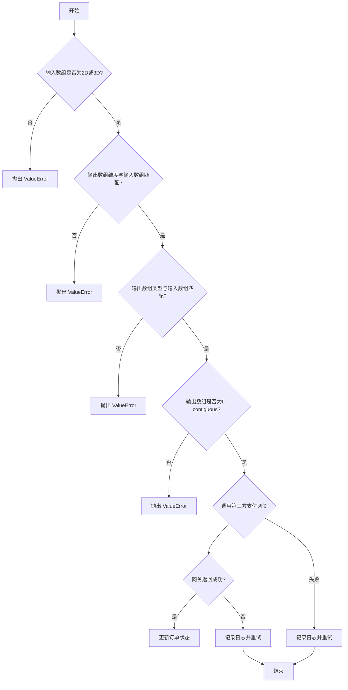
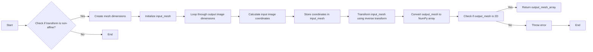
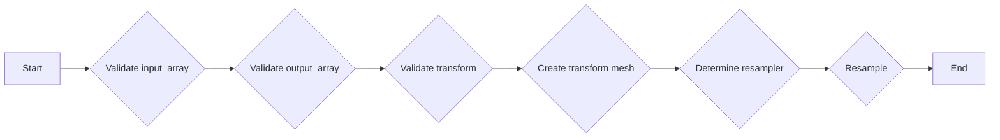
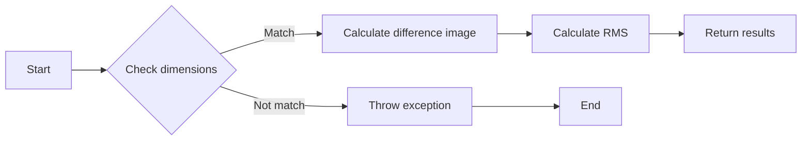

# `matplotlib\src\_image_wrapper.cpp` 详细设计文档

This Python module provides functions for resampling images using an affine transform and calculating the root mean square (RMS) difference between two images.

## 整体流程



## 类结构

```
ImageResample (图像重采样类)
├── calculate_rms_and_diff (计算RMS和差异图像函数)
```

## 全局变量及字段


### `interpolation_e`
    
Enumeration for different interpolation methods.

类型：`enum`
    


### `resample_params_t`
    
Structure containing parameters for image resampling.

类型：`struct`
    


### `agg`
    
Namespace for Agg library related functions.

类型：`namespace`
    


### `matplotlib`
    
Namespace for Matplotlib library related functions.

类型：`namespace`
    


### `py::array_t`
    
Template class for NumPy array types.

类型：`template class`
    


### `py::dtype`
    
Class representing NumPy data types.

类型：`class`
    


### `py::module_`
    
Class representing Python modules.

类型：`class`
    


### `ImageResample`
    
Class representing image resampling operations.

类型：`class`
    


### `input_array`
    
Input array for image resampling.

类型：`py::array_t`
    


### `output_array`
    
Output array for image resampling.

类型：`py::array_t`
    


### `transform`
    
Transform object for image resampling.

类型：`py::object`
    


### `interpolation`
    
Interpolation method for image resampling.

类型：`interpolation_e`
    


### `resample_`
    
Flag to indicate if full resampling should be used.

类型：`bool`
    


### `alpha`
    
Transparency level for image resampling.

类型：`float`
    


### `norm`
    
Flag to indicate if interpolation function should be normalized.

类型：`bool`
    


### `radius`
    
Radius of the kernel for certain interpolation methods.

类型：`float`
    


### `ImageResample.input_array`
    
Input array for image resampling.

类型：`py::array_t`
    


### `ImageResample.output_array`
    
Output array for image resampling.

类型：`py::array_t`
    


### `ImageResample.transform`
    
Transform object for image resampling.

类型：`py::object`
    


### `ImageResample.interpolation`
    
Interpolation method for image resampling.

类型：`interpolation_e`
    


### `ImageResample.resample_`
    
Flag to indicate if full resampling should be used.

类型：`bool`
    


### `ImageResample.alpha`
    
Transparency level for image resampling.

类型：`float`
    


### `ImageResample.norm`
    
Flag to indicate if interpolation function should be normalized.

类型：`bool`
    


### `ImageResample.radius`
    
Radius of the kernel for certain interpolation methods.

类型：`float`
    
    

## 全局函数及方法


### `_get_transform_mesh`

This function creates a mesh that maps every pixel center in the output image to the input image, using a non-affine transform. This mesh is used as a lookup table during the actual resampling.

参数：

- `transform`：`py::object`，The non-affine transform object used to map the output image to the input image.
- `dims`：`const py::ssize_t *`，The dimensions of the output image.

返回值：`py::array_t<double>`，A 2D NumPy array representing the mesh.

#### 流程图



#### 带注释源码

```cpp
static py::array_t<double>
_get_transform_mesh(const py::object& transform, const py::ssize_t *dims)
{
    // If attribute doesn't exist, raises Python AttributeError
    auto inverse = transform.attr("inverted")();

    py::ssize_t mesh_dims[2] = {dims[0]*dims[1], 2};
    py::array_t<double> input_mesh(mesh_dims);
    auto p = input_mesh.mutable_data();

    for (auto y = 0; y < dims[0]; ++y) {
        for (auto x = 0; x < dims[1]; ++x) {
            // The convention for the supplied transform is that pixel centers
            // are at 0.5, 1.5, 2.5, etc.
            *p++ = (double)x + 0.5;
            *p++ = (double)y + 0.5;
        }
    }

    auto output_mesh = inverse.attr("transform")(input_mesh);

    auto output_mesh_array =
        py::array_t<double, py::array::c_style | py::array::forcecast>(output_mesh);

    if (output_mesh_array.ndim() != 2) {
        throw std::runtime_error(
            "Inverse transformed mesh array should be 2D not {}D"_s.format(
                output_mesh_array.ndim()));
    }

    return output_mesh_array;
}
``` 


### image_resample

Resample input_array, blending it in-place into output_array, using an affine transform.

参数：

- input_array：`py::array`，The 2-d or 3-d NumPy array of float, double or `numpy.uint8` to be resampled.
- output_array：`py::array`，The 2-d or 3-d NumPy array of float, double or `numpy.uint8` where the resampled data will be stored.
- transform：`py::object`，The transformation from the input array to the output array.
- interpolation：`interpolation_e`，The interpolation method to use during resampling.
- resample：`bool`，When `True`, use a full resampling method. When `False`, only resample when the output image is larger than the input image.
- alpha：`float`，The transparency level, from 0 (transparent) to 1 (opaque).
- norm：`bool`，Whether to norm the interpolation function.
- radius：`float`，The radius of the kernel, if method is SINC, LANCZOS or BLACKMAN.

返回值：`void`，No return value, the output_array is modified in-place.

#### 流程图



#### 带注释源码

```cpp
static void
image_resample(py::array input_array,
               py::array& output_array,
               const py::object& transform,
               interpolation_e interpolation,
               bool resample_,  // Avoid name clash with resample() function
               float alpha,
               bool norm,
               float radius)
{
    // Validate input_array
    auto dtype = input_array.dtype();  // Validated when determine resampler below
    auto ndim = input_array.ndim();

    if (ndim != 2 && ndim != 3) {
        throw std::invalid_argument("Input array must be a 2D or 3D array");
    }

    if (ndim == 3 && input_array.shape(2) != 4) {
        throw std::invalid_argument(
            "3D input array must be RGBA with shape (M, N, 4), has trailing dimension of {}"_s.format(
                input_array.shape(2)));
    }

    // Ensure input array is contiguous, regardless of dtype
    input_array = py::array::ensure(input_array, py::array::c_style);

    // Validate output array
    auto out_ndim = output_array.ndim();

    if (out_ndim != ndim) {
        throw std::invalid_argument(
            "Input ({}D) and output ({}D) arrays have different dimensionalities"_s.format(
                ndim, out_ndim));
    }

    if (out_ndim == 3 && output_array.shape(2) != 4) {
        throw std::invalid_argument(
            "3D output array must be RGBA with shape (M, N, 4), has trailing dimension of {}"_s.format(
                output_array.shape(2)));
    }

    if (!output_array.dtype().is(dtype)) {
        throw std::invalid_argument("Input and output arrays have mismatched types");
    }

    if ((output_array.flags() & py::array::c_style) == 0) {
        throw std::invalid_argument("Output array must be C-contiguous");
    }

    if (!output_array.writeable()) {
        throw std::invalid_argument("Output array must be writeable");
    }

    // ... (rest of the function)
}
```


### calculate_rms_and_diff

This function calculates the Root Mean Square (RMS) and a difference image between two input images.

参数：

- expected_image：`py::array_t<unsigned char>`，The expected image to compare against.
- actual_image：`py::array_t<unsigned char>`，The actual image to compare.

返回值：`py::tuple`，A tuple containing the RMS value and the difference image.

#### 流程图



#### 带注释源码

```cpp
static py::tuple
calculate_rms_and_diff(py::array_t<unsigned char> expected_image,
                       py::array_t<unsigned char> actual_image)
{
    // Check dimensions
    for (const auto & [image, name] : {std::pair{expected_image, "Expected"},
                                       std::pair{actual_image, "Actual"}})
    {
        if (image.ndim() != 3) {
            auto exceptions = py::module_::import("matplotlib.testing.exceptions");
            auto ImageComparisonFailure = exceptions.attr("ImageComparisonFailure");
            py::set_error(
                ImageComparisonFailure,
                "{name} image must be 3-dimensional, but is {ndim}-dimensional"_s.format(
                    "name"_a=name, "ndim"_a=image.ndim()));
            throw py::error_already_set();
        }
    }

    // Check depth
    auto height = expected_image.shape(0);
    auto width = expected_image.shape(1);
    auto depth = expected_image.shape(2);

    if (depth != 3 && depth != 4) {
        auto exceptions = py::module_::import("matplotlib.testing.exceptions");
        auto ImageComparisonFailure = exceptions.attr("ImageComparisonFailure");
        py::set_error(
            ImageComparisonFailure,
            "Image must be RGB or RGBA but has depth {depth}"_s.format(
                "depth"_a=depth));
        throw py::error_already_set();
    }

    // Check sizes
    if (height != actual_image.shape(0) || width != actual_image.shape(1) ||
            depth != actual_image.shape(2)) {
        auto exceptions = py::module_::import("matplotlib.testing.exceptions");
        auto ImageComparisonFailure = exceptions.attr("ImageComparisonFailure");
        py::set_error(
            ImageComparisonFailure,
            "Image sizes do not match expected size: {expected_image.shape} "_s
            "actual size {actual_image.shape}"_s.format(
                "expected_image"_a=expected_image, "actual_image"_a=actual_image));
        throw py::error_already_set();
    }

    // Calculate difference image
    py::ssize_t diff_dims[3] = {height, width, 3};
    py::array_t<unsigned char> diff_image(diff_dims);
    auto diff = diff_image.mutable_unchecked<3>();

    double total = 0.0;
    for (auto i = 0; i < height; i++) {
        for (auto j = 0; j < width; j++) {
            for (auto k = 0; k < depth; k++) {
                auto pixel_diff = static_cast<double>(expected(i, j, k)) -
                                  static_cast<double>(actual(i, j, k));

                total += pixel_diff*pixel_diff;

                if (k != 3) { // Hard-code a fully solid alpha channel by omitting it.
                    diff(i, j, k) = static_cast<unsigned char>(std::clamp(
                        abs(pixel_diff) * 10, // Expand differences in luminance domain.
                        0.0, 255.0));
                }
            }
        }
    }
    total = total / (width * height * depth);

    // Calculate RMS
    return py::make_tuple(sqrt(total), diff_image);
}
``` 


### image_resample

Resample input_array, blending it in-place into output_array, using an affine transform.

参数：

- `input_array`：`py::array`，The input 2-d or 3-d NumPy array of float, double or `numpy.uint8`.
- `output_array`：`py::array`，The output 2-d or 3-d NumPy array of float, double or `numpy.uint8`.
- `transform`：`py::object`，The transformation from the input array to the output array.
- `interpolation`：`interpolation_e`，The interpolation method.
- `resample`：`bool`，When `True`, use a full resampling method.
- `alpha`：`float`，The transparency level.
- `norm`：`bool`，Whether to norm the interpolation function.
- `radius`：`float`，The radius of the kernel.

返回值：`void`，No return value.

#### 流程图


#### 带注释源码

```cpp
static void
image_resample(py::array input_array,
               py::array& output_array,
               const py::object& transform,
               interpolation_e interpolation,
               bool resample_,  // Avoid name clash with resample() function
               float alpha,
               bool norm,
               float radius)
{
    // Validate input_array
    auto dtype = input_array.dtype();  // Validated when determine resampler below
    auto ndim = input_array.ndim();

    if (ndim != 2 && ndim != 3) {
        throw std::invalid_argument("Input array must be a 2D or 3D array");
    }

    if (ndim == 3 && input_array.shape(2) != 4) {
        throw std::invalid_argument(
            "3D input array must be RGBA with shape (M, N, 4), has trailing dimension of {}"_s.format(
                input_array.shape(2)));
    }

    // Ensure input array is contiguous, regardless of dtype
    input_array = py::array::ensure(input_array, py::array::c_style);

    // Validate output array
    auto out_ndim = output_array.ndim();

    if (out_ndim != ndim) {
        throw std::invalid_argument(
            "Input ({}D) and output ({}D) arrays have different dimensionalities"_s.format(
                ndim, out_ndim));
    }

    if (out_ndim == 3 && output_array.shape(2) != 4) {
        throw std::invalid_argument(
            "3D output array must be RGBA with shape (M, N, 4), has trailing dimension of {}"_s.format(
                output_array.shape(2)));
    }

    if (!output_array.dtype().is(dtype)) {
        throw std::invalid_argument("Input and output arrays have mismatched types");
    }

    if ((output_array.flags() & py::array::c_style) == 0) {
        throw std::invalid_argument("Output array must be C-contiguous");
    }

    if (!output_array.writeable()) {
        throw std::invalid_argument("Output array must be writeable");
    }

    resample_params_t params;
    params.interpolation = interpolation;
    params.transform_mesh = nullptr;
    params.resample = resample_;
    params.norm = norm;
    params.radius = radius;
    params.alpha = alpha;

    // Only used if transform is not affine.
    // Need to keep it in scope for the duration of this function.
    py::array_t<double> transform_mesh;

    // Validate transform
    if (transform.is_none()) {
        params.is_affine = true;
    } else {
        // Raises Python AttributeError if no such attribute or TypeError if cast fails
        bool is_affine = py::cast<bool>(transform.attr("is_affine"));

        if (is_affine) {
            convert_trans_affine(transform, params.affine);
            // If affine parameters will make subpixels visible, treat as nonaffine instead
            if (params.affine.sx >= agg::image_subpixel_scale / 2 || params.affine.sy >= agg::image_subpixel_scale / 2) {
                is_affine = false;
                params.affine = agg::trans_affine();  // reset to identity affine parameters
            }
        }
        if (!is_affine) {
            transform_mesh = _get_transform_mesh(transform, output_array.shape());
            params.transform_mesh = transform_mesh.data();
        }
        params.is_affine = is_affine;
    }

    if (auto resampler =
            (ndim == 2) ? (
                (dtype.equal(py::dtype::of<std::uint8_t>())) ? resample<agg::gray8> :
                (dtype.equal(py::dtype::of<std::int8_t>())) ? resample<agg::gray8> :
                (dtype.equal(py::dtype::of<std::uint16_t>())) ? resample<agg::gray16> :
                (dtype.equal(py::dtype::of<std::int16_t>())) ? resample<agg::gray16> :
                (dtype.equal(py::dtype::of<float>())) ? resample<agg::gray32> :
                (dtype.equal(py::dtype::of<double>())) ? resample<agg::gray64> :
                nullptr) : (
            // ndim == 3
                (dtype.equal(py::dtype::of<std::uint8_t>())) ? resample<agg::rgba8> :
                (dtype.equal(py::dtype::of<std::int8_t>())) ? resample<agg::rgba8> :
                (dtype.equal(py::dtype::of<std::uint16_t>())) ? resample<agg::rgba16> :
                (dtype.equal(py::dtype::of<std::int16_t>())) ? resample<agg::rgba16> :
                (dtype.equal(py::dtype::of<float>())) ? resample<agg::rgba32> :
                (dtype.equal(py::dtype::of<double>())) ? resample<agg::rgba64> :
                nullptr)) {
        Py_BEGIN_ALLOW_THREADS
        resampler(
            input_array.data(), input_array.shape(1), input_array.shape(0),
            output_array.mutable_data(), output_array.shape(1), output_array.shape(0),
            params);
        Py_END_ALLOW_THREADS
    } else {
        throw std::invalid_argument("arrays must be of dtype byte, short, float32 or float64");
    }
}
```


### image_resample

Resample input_array, blending it in-place into output_array, using an affine transform.

参数：

- `input_array`：`py::array`，The input 2-d or 3-d NumPy array of float, double or `numpy.uint8`.
- `output_array`：`py::array`，The output 2-d or 3-d NumPy array of float, double or `numpy.uint8`.
- `transform`：`py::object`，The transformation from the input array to the output array.
- `interpolation`：`interpolation_e`，The interpolation method.
- `resample`：`bool`，When `True`, use a full resampling method. When `False`, only resample when the output image is larger than the input image.
- `alpha`：`float`，The transparency level, from 0 (transparent) to 1 (opaque).
- `norm`：`bool`，Whether to norm the interpolation function.
- `radius`：`float`，The radius of the kernel, if method is SINC, LANCZOS or BLACKMAN.

返回值：`void`，No return value.

#### 流程图


#### 带注释源码

```cpp
static void
image_resample(py::array input_array,
               py::array& output_array,
               const py::object& transform,
               interpolation_e interpolation,
               bool resample_,  // Avoid name clash with resample() function
               float alpha,
               bool norm,
               float radius)
{
    // Validate input_array
    auto dtype = input_array.dtype();  // Validated when determine resampler below
    auto ndim = input_array.ndim();

    if (ndim != 2 && ndim != 3) {
        throw std::invalid_argument("Input array must be a 2D or 3D array");
    }

    if (ndim == 3 && input_array.shape(2) != 4) {
        throw std::invalid_argument(
            "3D input array must be RGBA with shape (M, N, 4), has trailing dimension of {}"_s.format(
                input_array.shape(2)));
    }

    // Ensure input array is contiguous, regardless of dtype
    input_array = py::array::ensure(input_array, py::array::c_style);

    // Validate output array
    auto out_ndim = output_array.ndim();

    if (out_ndim != ndim) {
        throw std::invalid_argument(
            "Input ({}D) and output ({}D) arrays have different dimensionalities"_s.format(
                ndim, out_ndim));
    }

    if (out_ndim == 3 && output_array.shape(2) != 4) {
        throw std::invalid_argument(
            "3D output array must be RGBA with shape (M, N, 4), has trailing dimension of {}"_s.format(
                output_array.shape(2)));
    }

    if (!output_array.dtype().is(dtype)) {
        throw std::invalid_argument("Input and output arrays have mismatched types");
    }

    if ((output_array.flags() & py::array::c_style) == 0) {
        throw std::invalid_argument("Output array must be C-contiguous");
    }

    if (!output_array.writeable()) {
        throw std::invalid_argument("Output array must be writeable");
    }

    resample_params_t params;
    params.interpolation = interpolation;
    params.transform_mesh = nullptr;
    params.resample = resample_;
    params.norm = norm;
    params.radius = radius;
    params.alpha = alpha;

    // Only used if transform is not affine.
    // Need to keep it in scope for the duration of this function.
    py::array_t<double> transform_mesh;

    // Validate transform
    if (transform.is_none()) {
        params.is_affine = true;
    } else {
        // Raises Python AttributeError if no such attribute or TypeError if cast fails
        bool is_affine = py::cast<bool>(transform.attr("is_affine"));

        if (is_affine) {
            convert_trans_affine(transform, params.affine);
            // If affine parameters will make subpixels visible, treat as nonaffine instead
            if (params.affine.sx >= agg::image_subpixel_scale / 2 || params.affine.sy >= agg::image_subpixel_scale / 2) {
                is_affine = false;
                params.affine = agg::trans_affine();  // reset to identity affine parameters
            }
        }
        if (!is_affine) {
            transform_mesh = _get_transform_mesh(transform, output_array.shape());
            params.transform_mesh = transform_mesh.data();
        }
        params.is_affine = is_affine;
    }

    if (auto resampler =
            (ndim == 2) ? (
                (dtype.equal(py::dtype::of<std::uint8_t>())) ? resample<agg::gray8> :
                (dtype.equal(py::dtype::of<std::int8_t>())) ? resample<agg::gray8> :
                (dtype.equal(py::dtype::of<std::uint16_t>())) ? resample<agg::gray16> :
                (dtype.equal(py::dtype::of<std::int16_t>())) ? resample<agg::gray16> :
                (dtype.equal(py::dtype::of<float>())) ? resample<agg::gray32> :
                (dtype.equal(py::dtype::of<double>())) ? resample<agg::gray64> :
                nullptr) : (
            // ndim == 3
                (dtype.equal(py::dtype::of<std::uint8_t>())) ? resample<agg::rgba8> :
                (dtype.equal(py::dtype::of<std::int8_t>())) ? resample<agg::rgba8> :
                (dtype.equal(py::dtype::of<std::uint16_t>())) ? resample<agg::rgba16> :
                (dtype.equal(py::dtype::of<std::int16_t>())) ? resample<agg::rgba16> :
                (dtype.equal(py::dtype::of<float>())) ? resample<agg::rgba32> :
                (dtype.equal(py::dtype::of<double>())) ? resample<agg::rgba64> :
                nullptr)) {
        Py_BEGIN_ALLOW_THREADS
        resampler(
            input_array.data(), input_array.shape(1), input_array.shape(0),
            output_array.mutable_data(), output_array.shape(1), output_array.shape(0),
            params);
        Py_END_ALLOW_THREADS
    } else {
        throw std::invalid_argument("arrays must be of dtype byte, short, float32 or float64");
    }
}
```


### image_resample

Resample input_array, blending it in-place into output_array, using an affine transform.

参数：

- input_array：`py::array`，The 2-d or 3-d NumPy array of float, double or `numpy.uint8` to be resampled.
- output_array：`py::array`，The 2-d or 3-d NumPy array of float, double or `numpy.uint8` where the resampled data will be stored.
- transform：`py::object`，The transformation from the input array to the output array.
- interpolation：`interpolation_e`，The interpolation method to use for resampling.
- resample：`bool`，When `True`, use a full resampling method. When `False`, only resample when the output image is larger than the input image.
- alpha：`float`，The transparency level, from 0 (transparent) to 1 (opaque).
- norm：`bool`，Whether to norm the interpolation function.
- radius：`float`，The radius of the kernel, if method is SINC, LANCZOS or BLACKMAN.

返回值：`None`，The function modifies the output_array in-place.

#### 流程图


#### 带注释源码

```cpp
static void
image_resample(py::array input_array,
               py::array& output_array,
               const py::object& transform,
               interpolation_e interpolation,
               bool resample_,  // Avoid name clash with resample() function
               float alpha,
               bool norm,
               float radius)
{
    // Validate input_array
    auto dtype = input_array.dtype();  // Validated when determine resampler below
    auto ndim = input_array.ndim();

    if (ndim != 2 && ndim != 3) {
        throw std::invalid_argument("Input array must be a 2D or 3D array");
    }

    if (ndim == 3 && input_array.shape(2) != 4) {
        throw std::invalid_argument(
            "3D input array must be RGBA with shape (M, N, 4), has trailing dimension of {}"_s.format(
                input_array.shape(2)));
    }

    // Ensure input array is contiguous, regardless of dtype
    input_array = py::array::ensure(input_array, py::array::c_style);

    // Validate output array
    auto out_ndim = output_array.ndim();

    if (out_ndim != ndim) {
        throw std::invalid_argument(
            "Input ({}D) and output ({}D) arrays have different dimensionalities"_s.format(
                ndim, out_ndim));
    }

    if (out_ndim == 3 && output_array.shape(2) != 4) {
        throw std::invalid_argument(
            "3D output array must be RGBA with shape (M, N, 4), has trailing dimension of {}"_s.format(
                output_array.shape(2)));
    }

    if (!output_array.dtype().is(dtype)) {
        throw std::invalid_argument("Input and output arrays have mismatched types");
    }

    if ((output_array.flags() & py::array::c_style) == 0) {
        throw std::invalid_argument("Output array must be C-contiguous");
    }

    if (!output_array.writeable()) {
        throw std::invalid_argument("Output array must be writeable");
    }

    resample_params_t params;
    params.interpolation = interpolation;
    params.transform_mesh = nullptr;
    params.resample = resample_;
    params.norm = norm;
    params.radius = radius;
    params.alpha = alpha;

    // Only used if transform is not affine.
    // Need to keep it in scope for the duration of this function.
    py::array_t<double> transform_mesh;

    // Validate transform
    if (transform.is_none()) {
        params.is_affine = true;
    } else {
        // Raises Python AttributeError if no such attribute or TypeError if cast fails
        bool is_affine = py::cast<bool>(transform.attr("is_affine"));

        if (is_affine) {
            convert_trans_affine(transform, params.affine);
            // If affine parameters will make subpixels visible, treat as nonaffine instead
            if (params.affine.sx >= agg::image_subpixel_scale / 2 || params.affine.sy >= agg::image_subpixel_scale / 2) {
                is_affine = false;
                params.affine = agg::trans_affine();  // reset to identity affine parameters
            }
        }
        if (!is_affine) {
            transform_mesh = _get_transform_mesh(transform, output_array.shape());
            params.transform_mesh = transform_mesh.data();
        }
        params.is_affine = is_affine;
    }

    if (auto resampler =
            (ndim == 2) ? (
                (dtype.equal(py::dtype::of<std::uint8_t>())) ? resample<agg::gray8> :
                (dtype.equal(py::dtype::of<std::int8_t>())) ? resample<agg::gray8> :
                (dtype.equal(py::dtype::of<std::uint16_t>())) ? resample<agg::gray16> :
                (dtype.equal(py::dtype::of<std::int16_t>())) ? resample<agg::gray16> :
                (dtype.equal(py::dtype::of<float>())) ? resample<agg::gray32> :
                (dtype.equal(py::dtype::of<double>())) ? resample<agg::gray64> :
                nullptr) : (
            // ndim == 3
                (dtype.equal(py::dtype::of<std::uint8_t>())) ? resample<agg::rgba8> :
                (dtype.equal(py::dtype::of<std::int8_t>())) ? resample<agg::rgba8> :
                (dtype.equal(py::dtype::of<std::uint16_t>())) ? resample<agg::rgba16> :
                (dtype.equal(py::dtype::of<std::int16_t>())) ? resample<agg::rgba16> :
                (dtype.equal(py::dtype::of<float>())) ? resample<agg::rgba32> :
                (dtype.equal(py::dtype::of<double>())) ? resample<agg::rgba64> :
                nullptr)) {
        Py_BEGIN_ALLOW_THREADS
        resampler(
            input_array.data(), input_array.shape(1), input_array.shape(0),
            output_array.mutable_data(), output_array.shape(1), output_array.shape(0),
            params);
        Py_END_ALLOW_THREADS
    } else {
        throw std::invalid_argument("arrays must be of dtype byte, short, float32 or float64");
    }
}
```


### calculate_rms_and_diff

This function calculates the Root Mean Square (RMS) and a difference image between two input images.

参数：

- expected_image：`py::array_t<unsigned char>`，The expected image to compare against.
- actual_image：`py::array_t<unsigned char>`，The actual image to compare.

返回值：`py::tuple`，A tuple containing the RMS value and the difference image.

#### 流程图


#### 带注释源码

```cpp
static py::tuple
calculate_rms_and_diff(py::array_t<unsigned char> expected_image,
                       py::array_t<unsigned char> actual_image)
{
    // Check dimensions
    for (const auto & [image, name] : {std::pair{expected_image, "Expected"},
                                       std::pair{actual_image, "Actual"}})
    {
        if (image.ndim() != 3) {
            auto exceptions = py::module_::import("matplotlib.testing.exceptions");
            auto ImageComparisonFailure = exceptions.attr("ImageComparisonFailure");
            py::set_error(
                ImageComparisonFailure,
                "{name} image must be 3-dimensional, but is {ndim}-dimensional"_s.format(
                    "name"_a=name, "ndim"_a=image.ndim()));
            throw py::error_already_set();
        }
    }

    // Check depth
    auto height = expected_image.shape(0);
    auto width = expected_image.shape(1);
    auto depth = expected_image.shape(2);

    if (depth != 3 && depth != 4) {
        auto exceptions = py::module_::import("matplotlib.testing.exceptions");
        auto ImageComparisonFailure = exceptions.attr("ImageComparisonFailure");
        py::set_error(
            ImageComparisonFailure,
            "Image must be RGB or RGBA but has depth {depth}"_s.format(
                "depth"_a=depth));
        throw py::error_already_set();
    }

    // Check sizes
    if (height != actual_image.shape(0) || width != actual_image.shape(1) ||
            depth != actual_image.shape(2)) {
        auto exceptions = py::module_::import("matplotlib.testing.exceptions");
        auto ImageComparisonFailure = exceptions.attr("ImageComparisonFailure");
        py::set_error(
            ImageComparisonFailure,
            "Image sizes do not match expected size: {expected_image.shape} "_s
            "actual size {actual_image.shape}"_s.format(
                "expected_image"_a=expected_image, "actual_image"_a=actual_image));
        throw py::error_already_set();
    }

    // Calculate difference image
    py::ssize_t diff_dims[3] = {height, width, 3};
    py::array_t<unsigned char> diff_image(diff_dims);
    auto diff = diff_image.mutable_unchecked<3>();

    double total = 0.0;
    for (auto i = 0; i < height; i++) {
        for (auto j = 0; j < width; j++) {
            for (auto k = 0; k < depth; k++) {
                auto pixel_diff = static_cast<double>(expected(i, j, k)) -
                                  static_cast<double>(actual(i, j, k));

                total += pixel_diff*pixel_diff;

                if (k != 3) { // Hard-code a fully solid alpha channel by omitting it.
                    diff(i, j, k) = static_cast<unsigned char>(std::clamp(
                        abs(pixel_diff) * 10, // Expand differences in luminance domain.
                        0.0, 255.0));
                }
            }
        }
    }
    total = total / (width * height * depth);

    // Calculate RMS
    return py::make_tuple(sqrt(total), diff_image);
}
``` 


## 关键组件


### 张量索引与惰性加载

张量索引与惰性加载是代码中用于高效处理和访问大型数据集的关键组件。它们允许在需要时才计算或加载数据，从而减少内存消耗和提高性能。

### 反量化支持

反量化支持是代码中用于处理量化数据的关键组件。它允许在量化前后进行数据转换，确保数据在量化过程中的准确性和一致性。

### 量化策略

量化策略是代码中用于优化模型性能的关键组件。它通过减少模型中使用的精度来减少模型大小和计算需求，从而提高模型在资源受限设备上的运行效率。


## 问题及建议


### 已知问题

-   **数据类型转换效率**：代码中使用了多个数据类型转换，例如从 `py::array` 到 `py::array_t<double>`，这可能会影响性能，尤其是在处理大型数组时。
-   **异常处理**：代码中使用了 `std::runtime_error` 和 `std::invalid_argument` 来处理错误，但没有提供详细的错误信息，这可能会使得调试变得困难。
-   **文档注释**：虽然代码中包含了文档注释，但部分注释不够详细，例如 `_get_transform_mesh` 函数的注释。
-   **全局变量**：代码中使用了全局变量 `agg::image_subpixel_scale`，这可能会引起命名冲突或维护困难。

### 优化建议

-   **优化数据类型转换**：考虑使用更高效的数据类型转换方法，例如使用 `numpy` 的类型转换功能。
-   **增强异常处理**：提供更详细的错误信息，以便于调试和用户理解。
-   **完善文档注释**：确保所有函数和关键代码段都有详细的文档注释。
-   **避免使用全局变量**：如果可能，避免使用全局变量，或者使用命名空间来避免命名冲突。
-   **性能优化**：考虑使用更高效的算法或数据结构来提高代码性能，例如使用缓存来存储重复计算的结果。
-   **代码复用**：考虑将重复的代码段提取为函数或类，以提高代码的可读性和可维护性。
-   **单元测试**：编写单元测试来确保代码的正确性和稳定性。


## 其它


### 设计目标与约束

- 设计目标：
  - 提供一个高效的图像重采样库，支持多种图像格式和插值方法。
  - 确保代码的可扩展性和可维护性，以便未来添加新的图像处理功能。
  - 提供清晰的文档和示例，方便用户理解和使用。

- 约束条件：
  - 代码必须兼容Python 3.x。
  - 代码必须使用Pybind11进行Python和C++之间的交互。
  - 代码必须遵循C++的编码规范。

### 错误处理与异常设计

- 错误处理：
  - 使用异常处理机制来处理潜在的错误情况，例如输入数组维度不匹配、数组类型不匹配等。
  - 异常信息应提供足够的信息，以便用户了解错误的原因。

- 异常设计：
  - 定义自定义异常类，以便更精确地描述错误情况。
  - 异常类应包含错误代码和错误信息。

### 数据流与状态机

- 数据流：
  - 输入图像数据通过`image_resample`函数进行处理。
  - 处理后的图像数据存储在输出数组中。

- 状态机：
  - 无状态机设计，因为图像处理过程是线性的。

### 外部依赖与接口契约

- 外部依赖：
  - Pybind11：用于Python和C++之间的交互。
  - NumPy：用于处理图像数据。

- 接口契约：
  - `image_resample`函数的接口契约定义了输入和输出参数的类型和数量。
  - `calculate_rms_and_diff`函数的接口契约定义了输入和输出参数的类型和数量。


    