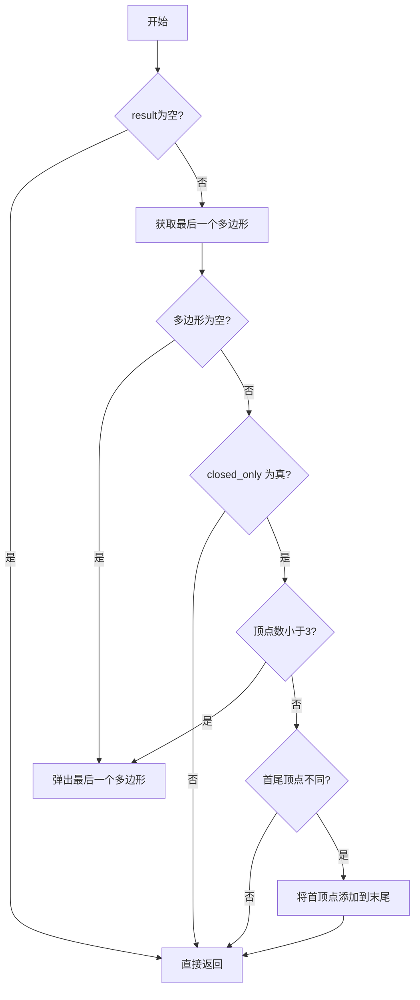
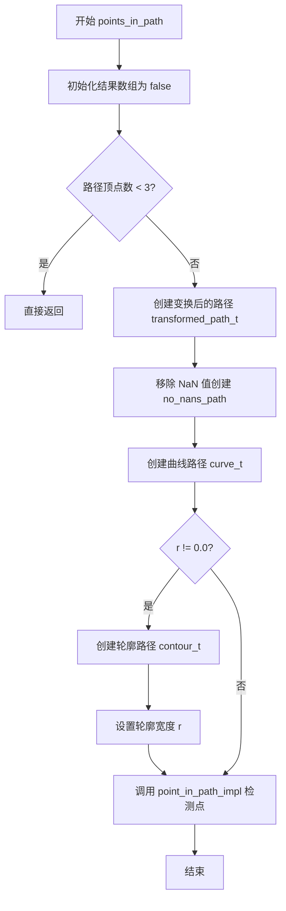
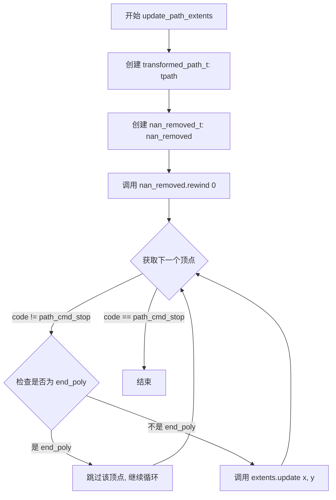
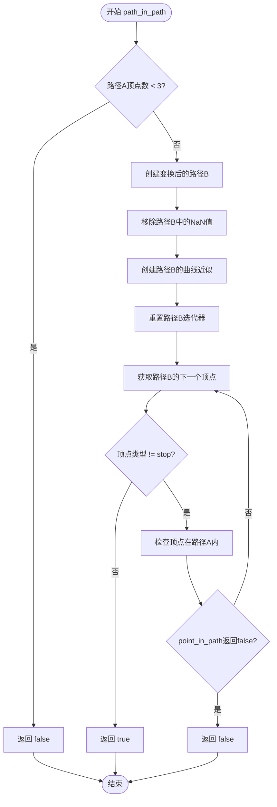
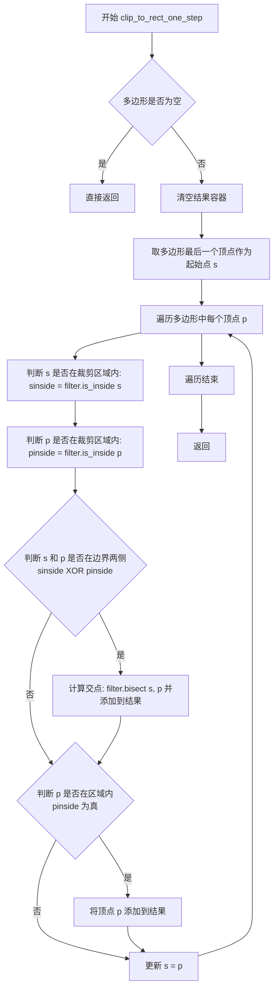
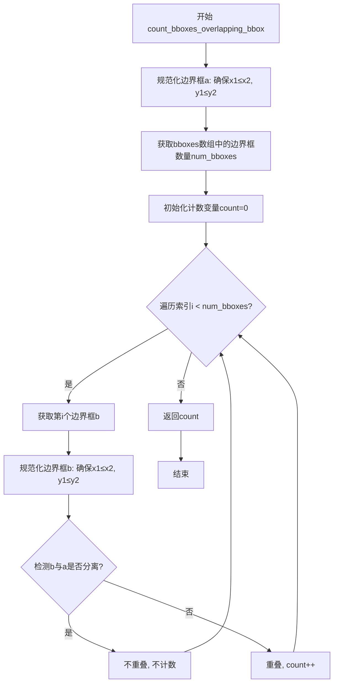
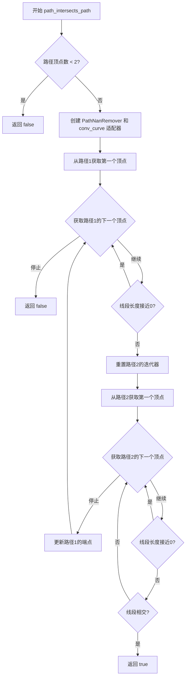
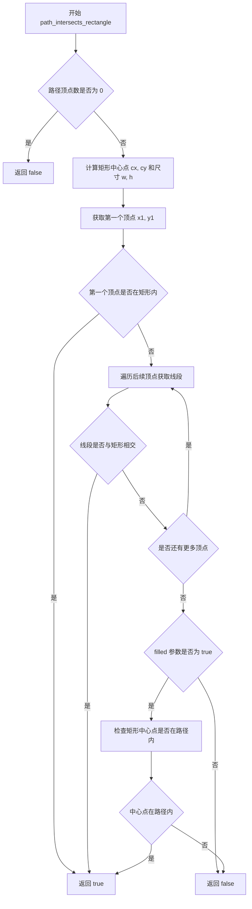

# `matplotlib\src\_path.h` 详细设计文档

This header file implements low-level 2D geometric algorithms for Matplotlib, primarily utilizing the Anti-Grain Geometry (AGG) library. It provides core functionalities for checking point inclusion (point_in_path), path clipping (Sutherland-Hodgman algorithm), affine transformations, path intersections, and path serialization to strings, serving as the computational backend for rendering and hit-testing vector graphics.

## 整体流程

```mermaid
graph TD
    Start([Start]) --> Input[Input: Points/Path]
    Input --> Transform{Apply Affine Transform?}
    Transform -- Yes --> T[agg::conv_transform]
    Transform -- No --> T
    T --> NanRemover[PathNanRemover: Remove NaN/Inf]
    NanRemover --> CurveInterp{Apply Curves?}
    CurveInterp -- Yes --> C[agg::conv_curve]
    CurveInterp -- No --> C
    C --> Algorithm[Core Algorithm]
    Algorithm --> PointInPath[Point in Path (Ray Casting)]
    Algorithm --> Intersect[Segment Intersection]
    Algorithm --> Clip[Clip to Rect]
    PointInPath --> Result1[Result: Inside/Outside]
    Intersect --> Result2[Result: Boolean]
    Clip --> Result3[Result: Clipped Polygon]
```

## 类结构

```
Data Structures
├── XY (2D Point Struct)
├── Polygon (Vector of XY)
├── extent_limits (Bounding Box Manager)
└── clip_to_rect_filters (Functors for Clipping)
    ├── bisectx / bisecty (Base Bisector)
    ├── xlt / xgt (X-axis Filters)
    └── ylt / ygt (Y-axis Filters)
Core Path Operations (Templates)
├── Point/Points In Path
├── Path Intersection
├── Path Clipping
└── Path Conversion/Serialization
```

## 全局变量及字段


### `NUM_VERTICES`
    
Array mapping path command codes to the number of vertices expected for each command type (move_to=1, line_to=1, curve3=2, curve4=3).

类型：`const size_t[]`
    


### `XY.x`
    
The x-coordinate of a 2D point.

类型：`double`
    


### `XY.y`
    
The y-coordinate of a 2D point.

类型：`double`
    


### `extent_limits.start`
    
The starting/minimum corner of the path bounding box (top-left in standard coordinates).

类型：`XY`
    


### `extent_limits.end`
    
The ending/maximum corner of the path bounding box (bottom-right in standard coordinates).

类型：`XY`
    


### `extent_limits.minpos`
    
The minimum positive x and y values, used for log scaling calculations in path extent tracking.

类型：`XY`
    


### `clip_to_rect_filters::bisectx.m_x`
    
The x-coordinate threshold value for X-axis bisection in the Sutherland-Hodgman polygon clipping algorithm.

类型：`double`
    


### `clip_to_rect_filters::bisecty.m_y`
    
The y-coordinate threshold value for Y-axis bisection in the Sutherland-Hodgman polygon clipping algorithm.

类型：`double`
    
    

## 全局函数及方法


### `_finalize_polygon`

该函数用于清理并规范化多边形向量中的最后一个多边形，根据 `closed_only` 标志决定是否只处理闭合多边形（如确保多边形首尾相接、移除顶点数不足3个的无效多边形）。

参数：

- `result`：`std::vector<Polygon> &`，多边形向量的引用，待处理的结果
- `closed_only`：`bool`，是否只处理闭合多边形的标志

返回值：`void`，无返回值

#### 流程图



#### 带注释源码

```cpp
inline void
_finalize_polygon(std::vector<Polygon> &result, bool closed_only)
{
    // 如果结果为空，直接返回，不做任何处理
    if (result.size() == 0) {
        return;
    }

    // 获取结果中的最后一个多边形引用
    Polygon &polygon = result.back();

    /* Clean up the last polygon in the result.  */
    // 如果最后一个多边形为空（没有顶点），则将其从结果中移除
    if (polygon.size() == 0) {
        result.pop_back();
    } else if (closed_only) {
        // 如果只处理闭合多边形，且顶点数少于3个（无法构成有效多边形），则移除
        if (polygon.size() < 3) {
            result.pop_back();
        } else if (polygon.front() != polygon.back()) {
            // 如果首尾顶点不同，确保多边形闭合，将首顶点添加到末尾
            polygon.push_back(polygon.front());
        }
    }
}
```


### `point_in_path_impl`

该函数使用射线法（Crossings Multiply algorithm）判断一个或多个点是否位于给定路径（支持曲线）内部。函数通过遍历路径的每条边，计算从测试点出发的射线与边的交点数量，根据奇偶填充规则确定点的内外状态。

参数：

- `points`：`PointArray &`，待测试的坐标点数组，支持批量测试多个点
- `path`：`PathIterator &`，路径迭代器，提供顶点和命令信息
- `inside_flag`：`ResultArray &`，结果数组，用于输出每个点的内外状态（0表示外部，非0表示内部）

返回值：`void`，无返回值，结果通过 `inside_flag` 参数输出

#### 流程图

```mermaid
flowchart TD
    A[开始] --> B[获取测试点数量 n<br/>初始化 yflag0 和 subpath_flag 数组]
    B --> C[重置路径游标 rewind]
    C --> D[初始化 inside_flag 全部为 0]
    D --> E{获取下一个路径顶点}
    E --> F{是否为 move_to 命令?}
    F -->|是| G[记录子路径起点 sx, sy]
    F -->|否| H{是否为 stop 或 end_poly?}
    H -->|是| I[跳过该顶点]
    H -->|否| J[使用当前顶点]
    G --> J
    I --> E
    J --> K[初始化所有测试点的 yflag0 和 subpath_flag]
    K --> L{获取下一条边顶点}
    L --> M{是否为 stop 或 end_poly?}
    M -->|是| N[将终点设为起点 x=sx, y=sy]
    M -->|否| O{是否为 move_to?}
    O -->|是| P[跳出内层循环，开始新子路径]
    O -->|否| Q[继续处理当前边]
    N --> R
    Q --> R[遍历所有测试点]
    R --> S{测试点坐标有效<br/>isfinite?}
    S -->|否| T[跳过该测试点]
    S -->|是| U{当前边端点Y值与测试点Y值<br/>是否在射线两侧?}
    U -->|否| V[不处理]
    U -->|是| W{计算交点判断<br/>vty1-vty * vtx0-vtx1 >= vtx1-tx * vty0-vty1?}
    W -->|满足| X[subpath_flag[i] 异或 1]
    W -->|不满足| V
    X --> Y[更新 yflag0 为 yflag1]
    T --> Y
    V --> Y
    Y --> Z[移动到下一条边<br/>vtx0=vtx1, vty0=vty1<br/>vtx1=x, vty1=y]
    Z --> L
    P --> AA[处理子路径终点<br/>更新 inside_flag]
    AA --> AB{所有点都已确定在内部?}
    AB -->|是| AC[退出循环]
    AB -->|否| E
    AC --> AD[结束]
```

#### 带注释源码

```cpp
// 使用射线法（Crossings Multiply算法）判断点是否在路径（多边形/曲线）内部
// 参数：
//   points     - 待测试的点数组，支持批量测试
//   path       - 路径迭代器，提供顶点数据
//   inside_flag - 结果数组，标记每个点是否在路径内
template <class PathIterator, class PointArray, class ResultArray>
void point_in_path_impl(PointArray &points, PathIterator &path, ResultArray &inside_flag)
{
    // 局部变量声明
    uint8_t yflag1;                  // 当前边端点在测试点Y值之上/下的标志
    double vtx0, vty0, vtx1, vty1;   // 边的两个端点坐标
    double tx, ty;                   // 测试点坐标
    double sx, sy;                   // 子路径起点坐标
    double x, y;                     // 当前顶点坐标
    size_t i;                        // 循环计数器
    bool all_done;                   // 是否所有点都已确定在内部

    // 获取测试点数量
    size_t n = safe_first_shape(points);

    // yflag0: 记录上一条边的端点是否在测试点Y值之上
    // subpath_flag: 记录当前子路径中每个测试点的交点计数奇偶性
    std::vector<uint8_t> yflag0(n);
    std::vector<uint8_t> subpath_flag(n);

    // 重置路径迭代器，从头开始读取
    path.rewind(0);

    // 初始化所有测试点的inside_flag为0（默认在外部）
    for (i = 0; i < n; ++i) {
        inside_flag[i] = 0;
    }

    // 外层循环：遍历路径的每个子路径（由move_to开始的多边形）
    unsigned code = 0;
    do {
        // 获取第一个顶点（如果不是move_to命令）
        if (code != agg::path_cmd_move_to) {
            code = path.vertex(&x, &y);
            // 跳过stop命令和end_poly命令
            if (code == agg::path_cmd_stop ||
                (code & agg::path_cmd_end_poly) == agg::path_cmd_end_poly) {
                continue;
            }
        }

        // 记录子路径起点
        sx = vtx0 = vtx1 = x;
        sy = vty0 = vty1 = y;

        // 初始化当前起点对应的测试点标志
        for (i = 0; i < n; ++i) {
            ty = points(i, 1);  // 获取测试点的Y坐标

            if (std::isfinite(ty)) {
                // 测试点Y值与起点Y值比较：大于等于为true（在上方）
                yflag0[i] = (vty0 >= ty);

                // 重置子路径标志
                subpath_flag[i] = 0;
            }
        }

        // 内层循环：遍历子路径的每条边
        do {
            // 获取下一条边的端点
            code = path.vertex(&x, &y);

            // 处理子路径结束的情况
            if (code == agg::path_cmd_stop ||
                (code & agg::path_cmd_end_poly) == agg::path_cmd_end_poly) {
                // 将终点设为起点，闭合子路径
                x = sx;
                y = sy;
            } else if (code == agg::path_cmd_move_to) {
                // 遇到新的子路径，跳出内层循环
                break;
            }

            // 遍历所有测试点，判断是否与当前边相交
            for (i = 0; i < n; ++i) {
                tx = points(i, 0);  // 测试点X坐标
                ty = points(i, 1);  // 测试点Y坐标

                // 跳过无效坐标
                if (!(std::isfinite(tx) && std::isfinite(ty))) {
                    continue;
                }

                // 当前边端点Y值与测试点Y值比较
                yflag1 = (vty1 >= ty);

                // 判断边是否跨越测试点的水平射线
                // 即：边的两个端点是否在测试点Y值的两侧
                if (yflag0[i] != yflag1) {
                    // 射线与边的交点计算（避免除法）
                    // 使用叉积判断交点是否在测试点右侧
                    if (((vty1 - ty) * (vtx0 - vtx1) >= (vtx1 - tx) * (vty0 - vty1)) == yflag1) {
                        // 交点计数异或1（切换奇偶状态）
                        subpath_flag[i] ^= 1;
                    }
                }

                // 更新上一条边的端点标志，为下一条边做准备
                yflag0[i] = yflag1;
            }

            // 移动到下一条边：更新边的端点
            vtx0 = vtx1;
            vty0 = vty1;

            vtx1 = x;
            vty1 = y;
        } while (code != agg::path_cmd_stop &&
                 (code & agg::path_cmd_end_poly) != agg::path_cmd_end_poly);

        // 子路径处理完成，更新inside_flag
        all_done = true;
        for (i = 0; i < n; ++i) {
            tx = points(i, 0);
            ty = points(i, 1);

            if (!(std::isfinite(tx) && std::isfinite(ty))) {
                continue;
            }

            // 处理最后一条边（从终点回到起点）
            yflag1 = (vty1 >= ty);
            if (yflag0[i] != yflag1) {
                if (((vty1 - ty) * (vtx0 - vtx1) >= (vtx1 - tx) * (vty0 - vty1)) == yflag1) {
                    subpath_flag[i] = subpath_flag[i] ^ true;
                }
            }

            // 将subpath_flag合并到inside_flag
            // 使用奇偶填充规则：交点数为奇数则在内部
            inside_flag[i] |= subpath_flag[i];

            // 检查是否所有点都已确定在内部
            if (inside_flag[i] == 0) {
                all_done = false;
            }
        }

        // 如果所有点都在内部，可以提前退出
        if (all_done) {
            break;
        }
    } while (code != agg::path_cmd_stop);
}
```


### `points_in_path`

该函数用于批量检测多个点是否位于给定路径（可包含曲线）内部或边界上，支持仿射变换和路径轮廓化处理。

参数：

- `points`：`PointArray &`，待检测的二维点数组，形状为 (N, 2)，其中 N 为点数
- `r`：`const double`，轮廓宽度参数，若非零则对路径进行轮廓化处理（用于检测点在路径边界附近的情况）
- `path`：`PathIterator &`，路径迭代器，指向待检测的路径对象
- `trans`：`agg::trans_affine &`，仿射变换矩阵，用于对路径进行坐标变换
- `result`：`ResultArray &`，结果数组，用于存储每个点的检测结果（布尔值）

返回值：`void`，无返回值，结果通过 `result` 参数输出

#### 流程图



#### 带注释源码

```cpp
template <class PathIterator, class PointArray, class ResultArray>
inline void points_in_path(PointArray &points,
                           const double r,
                           PathIterator &path,
                           agg::trans_affine &trans,
                           ResultArray &result)
{
    // 定义类型别名：变换后的路径
    typedef agg::conv_transform<PathIterator> transformed_path_t;
    // 定义类型别名：移除 NaN 的路径
    typedef PathNanRemover<transformed_path_t> no_nans_t;
    // 定义类型别名：曲线路径
    typedef agg::conv_curve<no_nans_t> curve_t;
    // 定义类型别名：轮廓路径
    typedef agg::conv_contour<curve_t> contour_t;

    // 初始化结果数组，将所有点标记为不在路径内
    for (auto i = 0; i < safe_first_shape(points); ++i) {
        result[i] = false;
    }

    // 如果路径顶点数少于 3，直接返回（无法构成有效多边形）
    if (path.total_vertices() < 3) {
        return;
    }

    // 创建变换后的路径对象，应用仿射变换
    transformed_path_t trans_path(path, trans);
    // 移除路径中的 NaN 值
    no_nans_t no_nans_path(trans_path, true, path.has_codes());
    // 将路径转换为曲线（处理贝塞尔曲线等）
    curve_t curved_path(no_nans_path);
    
    // 根据半径参数决定是否使用轮廓处理
    if (r != 0.0) {
        // 创建轮廓路径并设置宽度
        contour_t contoured_path(curved_path);
        contoured_path.width(r);
        // 调用核心实现函数进行点路径检测
        point_in_path_impl(points, contoured_path, result);
    } else {
        // 不使用轮廓，直接使用曲线路径进行检测
        point_in_path_impl(points, curved_path, result);
    }
}
```


### `point_in_path`

该函数用于检测二维平面上的一个点是否位于给定路径（图形）的内部或边界上，是图形碰撞检测的核心函数。它通过将单点封装为数组后调用 `points_in_path` 批量检测函数来完成判断，支持仿射变换和路径宽度参数。

参数：

- `x`：`double`，待测试点的 X 坐标
- `y`：`double`，待测试点的 Y 坐标
- `r`：`const double`，路径的宽度/半径，用于检测点是否在路径边界上（当 r > 0 时）
- `path`：`PathIterator &`，路径迭代器，指向待检测的图形路径
- `trans`：`agg::trans_affine &`，二维仿射变换矩阵，用于对路径进行平移、旋转、缩放等变换

返回值：`bool`，如果测试点在路径内部或边界上返回 `true`，否则返回 `false`

#### 流程图

```mermaid
flowchart TD
    A[开始 point_in_path] --> B[创建 shape={1,2} 的二维数组]
    B --> C[将 x 写入数组位置 (0,0)]
    C --> D[将 y 写入数组位置 (0,1)]
    D --> E[初始化 result[0] = 0]
    E --> F[调用 points_in_path 批量检测函数]
    F --> G{result[0] != 0?}
    G -->|是| H[返回 true]
    G -->|否| I[返回 false]
```

#### 带注释源码

```
template <class PathIterator>
inline bool point_in_path(
    double x, double y,          // 待测试点的坐标
    const double r,               // 路径宽度/半径，用于点on路径检测
    PathIterator &path,           // 路径迭代器
    agg::trans_affine &trans)     // 仿射变换矩阵
{
    // 创建 1x2 的二维数组用于封装单点
    py::ssize_t shape[] = {1, 2};
    py::array_t<double> points_arr(shape);
    
    // 将测试点坐标写入数组
    *points_arr.mutable_data(0, 0) = x;  // X 坐标
    *points_arr.mutable_data(0, 1) = y;  // Y 坐标
    
    // 获取数组的只读视图（不进行边界检查）
    auto points = points_arr.mutable_unchecked<2>();

    // 用于存储检测结果的数组
    int result[1];
    result[0] = 0;  // 初始化为 0（表示点不在路径内）

    // 调用批量点路径检测函数
    points_in_path(points, r, path, trans, result);

    // 将整型结果转换为布尔值返回
    return result[0] != 0;
}
```


### `point_on_path`

该函数用于判断给定的点是否位于路径（Path）的笔触（Stroke）范围内。它通过将原始路径转换为具有指定宽度（2倍半径）的轮廓线（Stroke），然后判断点是否位于该轮廓线的“内部”来实现“点在路径上”的检测。

参数：

-   `x`：`double`，待检测点的 X 坐标。
-   `y`：`double`，待检测点的 Y 坐标。
-   `r`：`const double`，笔触的半径（宽度的一半）。函数内部会将宽度设置为 `r * 2.0`。
-   `path`：`PathIterator &`，路径迭代器，指向待检测的图形路径。
-   `trans`：`agg::trans_affine &`，应用于路径的仿射变换矩阵。

返回值：`bool`，如果点位于路径的笔触范围内（距离中心线不超过 `r`），则返回 `true`；否则返回 `false`。

#### 流程图

```mermaid
graph TD
    A[开始: point_on_path] --> B[构建点数组: points_arr {1, 2}]
    B --> C[初始化结果: result = 0]
    C --> D[构建路径转换管道]
    
    subgraph 路径处理流水线
    D --> E[应用变换: trans]
    E --> F[移除NaN: nan_removed_path]
    F --> G[曲线化: curved_path]
    G --> H[笔触化: stroked_path <br/> 宽度 = r * 2.0]
    end
    
    H --> I[调用 point_in_path_impl]
    
    subgraph point_in_path_impl
    I --> J[判断点是否在 stroked_path 内部]
    end
    
    J --> K{在内部?}
    K -- 是 --> L[result = 1]
    K -- 否 --> M[result = 0]
    
    L --> N[返回 result != 0]
    M --> N
    
    style H fill:#f9f,stroke:#333,stroke-width:2px
    style N fill:#9f9,stroke:#333,stroke-width:2px
```

#### 带注释源码

```cpp
template <class PathIterator>
inline bool point_on_path(
    double x, double y, const double r, PathIterator &path, agg::trans_affine &trans)
{
    // 定义类型别名，构建路径转换管道
    typedef agg::conv_transform<PathIterator> transformed_path_t;
    typedef PathNanRemover<transformed_path_t> no_nans_t;
    typedef agg::conv_curve<no_nans_t> curve_t;
    typedef agg::conv_stroke<curve_t> stroke_t;

    // 1. 准备待检测的点数据
    // 创建一个 1x2 的 numpy 数组来存储 (x, y) 坐标，以匹配 point_in_path_impl 的接口
    py::ssize_t shape[] = {1, 2};
    py::array_t<double> points_arr(shape);
    *points_arr.mutable_data(0, 0) = x;
    *points_arr.mutable_data(0, 1) = y;
    // 获取未检查的视图（用于高性能访问）
    auto points = points_arr.mutable_unchecked<2>();

    // 2. 准备结果容器
    int result[1];
    result[0] = 0;

    // 3. 构建路径处理链
    // 应用仿射变换
    transformed_path_t trans_path(path, trans);
    // 移除路径中的 NaN 值
    no_nans_t nan_removed_path(trans_path, true, path.has_codes());
    // 将折线转换为曲线（贝塞尔曲线）
    curve_t curved_path(nan_removed_path);
    // 关键步骤：将曲线转换为带有宽度的轮廓（笔触）
    stroke_t stroked_path(curved_path);
    // 设置轮廓宽度。注意：参数 r 是“半径”，因此总宽度需要 2*r。
    // 如果不乘2，只能检测到距离中心线 r/2 以内的点。
    stroked_path.width(r * 2.0);

    // 4. 执行检测
    // 使用通用的“点在多边形内”算法检测点是否在“笔触路径”内部
    // 既然笔触路径是一个有宽度的封闭区域，“在内部”即为“在笔触范围内”
    point_in_path_impl(points, stroked_path, result);
    
    // 5. 返回结果
    return result[0] != 0;
}
```


### `update_path_extents`

该函数通过遍历路径的所有顶点（应用仿射变换后），更新 extent_limits 结构体的边界信息，用于计算路径的包围盒。

参数：

- `path`：`PathIterator &`，路径迭代器，提供要遍历的路径顶点
- `trans`：`agg::trans_affine &`，仿射变换矩阵，应用于路径顶点
- `extents`：`extent_limits &`，extent_limits 结构的引用，用于存储计算得到的路径边界（start、end 和 minpos）

返回值：`void`，无返回值，结果通过 `extents` 参数返回

#### 流程图



#### 带注释源码

```cpp
template <class PathIterator>
void update_path_extents(PathIterator &path, agg::trans_affine &trans, extent_limits &extents)
{
    // 定义转换后的路径类型：应用仿射变换
    typedef agg::conv_transform<PathIterator> transformed_path_t;
    // 定义移除NaN值的路径类型
    typedef PathNanRemover<transformed_path_t> nan_removed_t;
    
    double x, y;  // 用于存储顶点的坐标
    unsigned code;  // 用于存储路径命令代码

    // 创建应用了仿射变换的路径对象
    transformed_path_t tpath(path, trans);
    // 创建移除NaN值的路径对象，保留路径编码
    nan_removed_t nan_removed(tpath, true, path.has_codes());

    // 将路径重置到起始位置
    nan_removed.rewind(0);

    // 遍历路径的所有顶点
    while ((code = nan_removed.vertex(&x, &y)) != agg::path_cmd_stop) {
        // 如果当前命令是 end_poly 标记（表示多边形闭合），则跳过
        if ((code & agg::path_cmd_end_poly) == agg::path_cmd_end_poly) {
            continue;
        }
        // 更新边界范围：扩展 start 和 end，追踪最小正值 minpos
        extents.update(x, y);
    }
}
```


### `get_path_collection_extents`

该函数用于计算路径集合的边界范围（extents），通过遍历所有路径并应用相应的变换和偏移，最终计算出覆盖所有路径的最小边界框。

参数：

- `master_transform`：`agg::trans_affine &`，主变换矩阵，作为默认变换
- `paths`：`PathGenerator &`，路径生成器，提供路径集合
- `transforms`：`TransformArray &`，变换数组，存储每个路径的变换矩阵
- `offsets`：`OffsetArray &`，偏移数组，存储每个路径的偏移量
- `offset_trans`：`agg::trans_affine &`，偏移变换矩阵，用于转换偏移坐标
- `extent`：`extent_limits &`，范围限制结构体，用于输出计算得到的边界范围

返回值：`void`，无返回值，结果通过 `extent` 参数输出

#### 流程图

```mermaid
flowchart TD
    A[开始] --> B{检查 offsets 数组形状}
    B -->|形状不正确| C[抛出 runtime_error]
    B -->|形状正确| D[计算 N = max(Npaths, Noffsets)]
    D --> E[重置 extent]
    E --> F{遍历 i from 0 to N-1}
    F -->|i < N| G[获取当前路径 path = paths(i % Npaths)]
    G --> H{有变换矩阵?}
    H -->|是| I[构建变换矩阵 trans]
    H -->|否| J[使用 master_transform]
    I --> K{有偏移量?}
    J --> K
    K -->|是| L[获取偏移 xo, yo 并转换]
    K -->|否| M[更新路径范围 update_path_extents]
    L --> N[组合变换: trans *= translation]
    N --> M
    M --> F
    F -->|i >= N| O[结束]
```

#### 带注释源码

```cpp
template <class PathGenerator, class TransformArray, class OffsetArray>
void get_path_collection_extents(agg::trans_affine &master_transform,
                                 PathGenerator &paths,
                                 TransformArray &transforms,
                                 OffsetArray &offsets,
                                 agg::trans_affine &offset_trans,
                                 extent_limits &extent)
{
    // 检查 offsets 数组形状，必须是 (N, 2) 格式
    if (offsets.size() != 0 && offsets.shape(1) != 2) {
        throw std::runtime_error("Offsets array must have shape (N, 2)");
    }

    // 获取路径数量、偏移数量
    auto Npaths = paths.size();
    auto Noffsets = safe_first_shape(offsets);
    // 取两者最大值作为遍历次数，确保所有路径和偏移都被处理
    auto N = std::max(Npaths, Noffsets);
    // 变换数量不超过 N
    auto Ntransforms = std::min(safe_first_shape(transforms), N);

    // 当前变换矩阵
    agg::trans_affine trans;

    // 重置范围限制
    extent.reset();

    // 遍历所有路径/偏移组合
    for (auto i = 0; i < N; ++i) {
        // 使用模运算循环使用路径
        typename PathGenerator::path_iterator path(paths(i % Npaths));
        
        // 处理变换矩阵
        if (Ntransforms) {
            // 从 transforms 数组构建 3x3 仿射变换矩阵
            py::ssize_t ti = i % Ntransforms;
            trans = agg::trans_affine(transforms(ti, 0, 0),
                                      transforms(ti, 1, 0),
                                      transforms(ti, 0, 1),
                                      transforms(ti, 1, 1),
                                      transforms(ti, 0, 2),
                                      transforms(ti, 1, 2));
        } else {
            // 没有变换时使用主变换矩阵
            trans = master_transform;
        }

        // 处理偏移量
        if (Noffsets) {
            // 获取当前偏移坐标
            double xo = offsets(i % Noffsets, 0);
            double yo = offsets(i % Noffsets, 1);
            // 应用偏移变换
            offset_trans.transform(&xo, &yo);
            // 将平移变换组合到当前变换矩阵
            trans *= agg::trans_affine_translation(xo, yo);
        }

        // 更新当前路径的范围边界
        update_path_extents(path, trans, extent);
    }
}
```


### `point_in_path_collection`

该函数用于检测单个点是否与路径集合中的任意路径相交。它通过遍历由 `paths`（路径集合）、`transforms`（独立变换矩阵）和 `offsets`（独立偏移量）定义的每一个路径，应用复合变换，并依据 `filled` 参数判断点是位于路径内部（填充模式）还是边界上（描边模式），最终将满足条件的路径索引追加到结果向量 `result` 中。

参数：

- `x`：`double`，待检测点的 X 坐标。
- `y`：`double`，待检测点的 Y 坐标。
- `radius`：`double`，路径的线宽半径，用于判断点是否在描边范围内。
- `master_transform`：`agg::trans_affine &`，全局变换矩阵，应用于所有路径。
- `paths`：`PathGenerator &`，路径生成器对象，提供对路径集合的访问。
- `transforms`：`TransformArray &`，包含各个路径独立变换矩阵的数组。
- `offsets`：`OffsetArray &`，包含各个路径独立偏移量的数组。
- `offset_trans`：`agg::trans_affine &`，用于计算最终偏移量的变换矩阵。
- `filled`：`bool`，标志位。为 `true` 时执行“点在路径内”检测；为 `false` 时执行“点在路径上”检测。
- `result`：`std::vector<int> &`，输出参数，用于存放与点相交的路径在集合中的索引。

返回值：`void`，无直接返回值，结果通过 `result` 参数返回。

#### 流程图

```mermaid
graph TD
    A([开始]) --> B{路径集合为空?}
    B -- 是 --> C([直接返回])
    B -- 否 --> D[计算循环次数 N]
    D --> E[初始化索引 i = 0]
    E --> F{i < N?}
    F -- 否 --> G([结束])
    F -- 是 --> H[获取当前路径: path = paths[i % Npaths]]
    H --> I[计算复合变换: trans = transforms[i] * master_transform]
    I --> J{存在偏移量?}
    J -- 是 --> K[应用偏移变换: trans *= offset_trans(offsets[i])]
    J -- 否 --> L{filled 为真?}
    K --> L
    L -- 是 --> M[调用 point_in_path]
    L -- 否 --> N[调用 point_on_path]
    M --> O{返回值 true?}
    N --> O
    O -- 是 --> P[result.push_back(i)]
    O -- 否 --> Q[i++]
    P --> Q
    Q --> F
```

#### 带注释源码

```cpp
template <class PathGenerator, class TransformArray, class OffsetArray>
void point_in_path_collection(double x,
                              double y,
                              double radius,
                              agg::trans_affine &master_transform,
                              PathGenerator &paths,
                              TransformArray &transforms,
                              OffsetArray &offsets,
                              agg::trans_affine &offset_trans,
                              bool filled,
                              std::vector<int> &result)
{
    // 获取路径集合中的路径数量
    auto Npaths = paths.size();

    // 如果没有路径，则直接退出
    if (Npaths == 0) {
        return;
    }

    // 获取偏移量和变换矩阵的数量，并计算最大循环次数 N
    // N 必须是 paths 和 offsets 中的较大者，以确保所有路径都被遍历
    auto Noffsets = safe_first_shape(offsets);
    auto N = std::max(Npaths, Noffsets);
    // 变换矩阵的数量可能少于 N，取最小值
    auto Ntransforms = std::min(safe_first_shape(transforms), N);

    // 初始化临时变换矩阵对象
    agg::trans_affine trans;

    // 遍历每一个路径项
    for (auto i = 0; i < N; ++i) {
        // 获取当前索引对应的路径迭代器
        typename PathGenerator::path_iterator path = paths(i % Npaths);

        // 计算当前路径的变换矩阵
        if (Ntransforms) {
            // 如果存在独立的变换矩阵，从数组中读取并乘以主变换
            auto ti = i % Ntransforms;
            trans = agg::trans_affine(transforms(ti, 0, 0),
                                      transforms(ti, 1, 0),
                                      transforms(ti, 0, 1),
                                      transforms(ti, 1, 1),
                                      transforms(ti, 0, 2),
                                      transforms(ti, 1, 2));
            trans *= master_transform;
        } else {
            // 否则仅使用主变换
            trans = master_transform;
        }

        // 处理偏移量
        if (Noffsets) {
            // 获取原始偏移量
            double xo = offsets(i % Noffsets, 0);
            double yo = offsets(i % Noffsets, 1);
            // 使用偏移变换矩阵进行变换
            offset_trans.transform(&xo, &yo);
            // 将平移添加到变换矩阵中
            trans *= agg::trans_affine_translation(xo, yo);
        }

        // 根据 filled 标志位决定是检测点在内部还是边界上
        if (filled) {
            // 检测点是否在路径内部（填充区域）
            if (point_in_path(x, y, radius, path, trans)) {
                result.push_back(i);
            }
        } else {
            // 检测点是否在路径边界上（描边区域）
            if (point_on_path(x, y, radius, path, trans)) {
                result.push_back(i);
            }
        }
    }
}
```


### `path_in_path`

检查路径B是否完全包含在路径A内部（通过检查B的所有顶点是否都在A中）。该函数通过遍历路径B的所有顶点，并使用point_in_path判断每个顶点是否位于路径A内部来实现。如果所有顶点都被包含，则返回true，否则返回false。

参数：

- `a`：`PathIterator1&`，外部路径迭代器，表示可能被包含路径A
- `atrans`：`agg::trans_affine&`，路径A的仿射变换矩阵
- `b`：`PathIterator2&`，内部路径迭代器，表示被检查的路径B
- `btrans`：`agg::trans_affine&`，路径B的仿射变换矩阵

返回值：`bool`，如果路径B完全位于路径A内部返回true，否则返回false

#### 流程图



#### 带注释源码

```cpp
template <class PathIterator1, class PathIterator2>
bool path_in_path(PathIterator1 &a,
                  agg::trans_affine &atrans,
                  PathIterator2 &b,
                  agg::trans_affine &btrans)
{
    // 定义路径B的转换类型：先变换，再移除NaN，最后曲线化
    typedef agg::conv_transform<PathIterator2> transformed_path_t;
    typedef PathNanRemover<transformed_path_t> no_nans_t;
    typedef agg::conv_curve<no_nans_t> curve_t;

    // 如果路径A顶点数少于3，无法形成封闭区域，直接返回false
    if (a.total_vertices() < 3) {
        return false;
    }

    // 对路径B应用仿射变换（平移、旋转、缩放等）
    transformed_path_t b_path_trans(b, btrans);
    // 移除路径中的NaN值，防止计算错误
    no_nans_t b_no_nans(b_path_trans, true, b.has_codes());
    // 将路径B转换为曲线（处理Bezier曲线等）
    curve_t b_curved(b_no_nans);

    double x, y;
    // 重置曲线迭代器到开始位置
    b_curved.rewind(0);
    // 遍历路径B的所有顶点
    while (b_curved.vertex(&x, &y) != agg::path_cmd_stop) {
        // 检查当前顶点(x,y)是否在路径A内部
        // 半径为0.0表示精确的边界检查
        if (!point_in_path(x, y, 0.0, a, atrans)) {
            // 如果任意顶点不在路径A内，路径B未完全包含在A中
            return false;
        }
    }

    // 所有顶点都在路径A内部，路径B完全包含在路径A中
    return true;
}
```


### `clip_to_rect_one_step`

该函数是 Sutherland-Hodgman 多边形裁剪算法的单步实现，用于对多边形进行一个方向的裁剪（如左、右、上或下边界）。它遍历多边形的所有顶点，根据过滤器判断顶点是否在裁剪区域内，对于跨越裁剪边界的边计算交点，并将结果顶点添加到输出多边形中。

参数：

- `polygon`：`const Polygon &`，输入的多边形顶点集合
- `result`：`Polygon &`，裁剪后的结果多边形
- `filter`：`const Filter &`，裁剪过滤器（封装裁剪边界和判断逻辑，支持 xlt/xgt/ylt/ygt 四种方向）

返回值：`void`，无返回值，直接通过引用参数 `result` 输出结果

#### 流程图



#### 带注释源码

```cpp
// 该函数实现 Sutherland-Hodgman 多边形裁剪算法的单步操作
// Filter 参数决定裁剪的方向（xlt: x < 边界, xgt: x > 边界, ylt: y < 边界, ygt: y > 边界）
template <class Filter>
inline void clip_to_rect_one_step(const Polygon &polygon, Polygon &result, const Filter &filter)
{
    // sinside: 起始点是否在裁剪区域内
    // pinside: 当前点是否在裁剪区域内
    bool sinside, pinside;
    
    // 清空结果容器，准备存放裁剪后的顶点
    result.clear();

    // 空多边形直接返回，无需处理
    if (polygon.size() == 0) {
        return;
    }

    // 从多边形的最后一个顶点开始，作为循环的起始点 s
    // 这样可以处理多边形首尾相连的边
    auto s = polygon.back();
    
    // 遍历多边形中的每个顶点 p
    for (auto p : polygon) {
        // 判断当前顶点对中，起始点 s 是否在裁剪区域内
        sinside = filter.is_inside(s);
        
        // 判断当前遍历点 p 是否在裁剪区域内
        pinside = filter.is_inside(p);

        // 如果 s 和 p 位于裁剪边界的两侧（即一个在内，一个在外）
        // 使用 XOR 运算判断：true ^ false = true, false ^ true = true
        // 此时需要计算边界交点并添加到结果中
        if (sinside ^ pinside) {
            // 计算边 (s, p) 与裁剪边界的交点
            result.emplace_back(filter.bisect(s, p));
        }

        // 如果当前点 p 在裁剪区域内，则保留该顶点
        if (pinside) {
            result.emplace_back(p);
        }

        // 将当前点 p 更新为下一轮循环的起始点 s
        s = p;
    }
}
```


### `clip_path_to_rect`

该函数实现了基于 Sutherland-Hodgman 算法的路径矩形裁剪功能。它将一个任意的曲线路径（PathIterator）裁剪到指定的矩形区域内，支持内/外裁剪模式，可处理包含多个子路径的复杂几何图形，并返回裁剪后的多边形集合。

参数：

- `path`：`PathIterator &`，输入的几何路径迭代器，包含待裁剪的曲线数据
- `rect`：`agg::rect_d &`，裁剪矩形区域，通过 normalize() 规范化方向
- `inside`：`bool`，裁剪模式标志；true 表示保留矩形内部区域，false 表示保留矩形外部区域

返回值：`std::vector<Polygon>`，返回裁剪后的多边形集合，每个 Polygon 代表一个子路径

#### 流程图

```mermaid
flowchart TD
    A[开始 clip_path_to_rect] --> B[normalize rect]
    B --> C{inside?}
    C -->|true| D[使用原始边界: xmin, xmax, ymin, ymax]
    C -->|false| E[交换边界: swap xmin/xmax, ymin/ymax]
    D --> F[创建 conv_curve 转换器]
    E --> F
    F --> G[初始化 polygon1, polygon2, results]
    G --> H[获取下一个子路径到 polygon1]
    H --> I[clip_to_rect_one_step: xlt(xmax) - 裁剪右边界]
    I --> J[clip_to_rect_one_step: xgt(xmin) - 裁剪左边界]
    J --> K[clip_to_rect_one_step: ylt(ymax) - 裁剪上边界]
    K --> L[clip_to_rect_one_step: ygt(ymin) - 裁剪下边界]
    L --> M{polygon1 非空?}
    M -->|是| N[将 polygon1 加入 results]
    M -->|否| O{是否还有更多子路径?}
    N --> O
    O -->|是| H
    O -->|否| P[_finalize_polygon 收尾处理]
    P --> Q[返回 results]
```

#### 带注释源码

```cpp
template <class PathIterator>
auto
clip_path_to_rect(PathIterator &path, agg::rect_d &rect, bool inside)
{
    // 1. 规范化矩形，确保 x1 < x2, y1 < y2
    rect.normalize();
    auto xmin = rect.x1, xmax = rect.x2;
    auto ymin = rect.y1, ymax = rect.y2;

    // 2. 根据 inside 标志决定裁剪模式：
    //    true  = 保留矩形内部（使用原始边界）
    //    false = 保留矩形外部（交换边界相当于反向裁剪）
    if (!inside) {
        std::swap(xmin, xmax);
        std::swap(ymin, ymax);
    }

    // 3. 将输入路径转换为曲线（处理贝塞尔曲线等）
    typedef agg::conv_curve<PathIterator> curve_t;
    curve_t curve(path);

    // 4. 准备多边形容器：
    //    polygon1/polygon2 用于各裁剪步骤间的数据交换
    //    results 用于收集最终的裁剪结果
    Polygon polygon1, polygon2;
    XY point;
    unsigned code = 0;
    curve.rewind(0);
    std::vector<Polygon> results;

    // 5. 主循环：遍历路径的每一个子路径
    do {
        // 5.1 Grab the next subpath and store it in polygon1
        polygon1.clear();
        do {
            // 记录 move_to 起点
            if (code == agg::path_cmd_move_to) {
                polygon1.emplace_back(point);
            }

            // 获取下一个顶点
            code = curve.vertex(&point.x, &point.y);

            if (code == agg::path_cmd_stop) {
                break;
            }

            // 排除重复的 move_to，收集其他顶点
            if (code != agg::path_cmd_move_to) {
                polygon1.emplace_back(point);
            }
        } while ((code & agg::path_cmd_end_poly) != agg::path_cmd_end_poly);

        // 5.2 应用四步 Sutherland-Hodgman 裁剪：
        //     每一步使用不同的过滤器（xlt/xgt/ylt/ygt）裁剪一个边界
        //     当前一步的输出 polygon2 作为下一步的输入 polygon1
        clip_to_rect_one_step(polygon1, polygon2, clip_to_rect_filters::xlt(xmax)); // 右边界
        clip_to_rect_one_step(polygon2, polygon1, clip_to_rect_filters::xgt(xmin)); // 左边界
        clip_to_rect_one_step(polygon1, polygon2, clip_to_rect_filters::ylt(ymax)); // 上边界
        clip_to_rect_one_step(polygon2, polygon1, clip_to_rect_filters::ygt(ymin)); // 下边界

        // 5.3 Empty polygons aren't very useful, so skip them
        if (polygon1.size()) {
            _finalize_polygon(results, true);
            results.push_back(polygon1);
        }
    } while (code != agg::path_cmd_stop);

    // 6. 最终清理：闭合所有多边形并移除空结果
    _finalize_polygon(results, true);

    // 7. 返回裁剪结果
    return results;
}
```


### `affine_transform_2d`

对二维顶点数组执行二维仿射变换（包含缩放、剪切和平移），将输入的顶点坐标通过仿射变换矩阵转换为新的坐标。

参数：

- `vertices`：`VerticesArray &`，输入的二维顶点数组，维度应为 (n, 2)，即 n 个顶点，每个顶点包含 x 和 y 坐标
- `trans`：`agg::trans_affine &`，二维仿射变换矩阵，包含 sx（x 方向缩放）、sy（y 方向缩放）、shx（x 方向剪切）、shy（y 方向剪切）、tx（x 方向平移）、ty（y 方向平移）六个参数
- `result`：`ResultArray &`，输出数组，用于存储变换后的顶点坐标，维度同样为 (n, 2)

返回值：`void`，无返回值，结果通过 `result` 参数输出

#### 流程图

```mermaid
flowchart TD
    A[开始 affine_transform_2d] --> B{vertices 非空且<br>shape[1] == 2?}
    B -->|否| C[抛出 runtime_error]
    B -->|是| D[n = vertices.shape[0]]
    D --> E[i = 0]
    E --> F{i < n?}
    F -->|否| G[结束]
    F -->|是| H[x = vertices[i, 0]<br>y = vertices[i, 1]]
    H --> I[t0 = trans.sx * x<br>t1 = trans.shx * y<br>t = t0 + t1 + trans.tx<br>result[i, 0] = t]
    I --> J[t0 = trans.shy * x<br>t1 = trans.sy * y<br>t = t0 + t1 + trans.ty<br>result[i, 1] = t]
    J --> K[i++]
    K --> F
```

#### 带注释源码

```cpp
/**
 * @brief 对二维顶点数组执行仿射变换
 * 
 * 该函数接收一个顶点数组和一个仿射变换矩阵，将每个顶点 (x, y) 
 * 通过以下公式变换为新坐标 (x', y'):
 *   x' = sx * x + shx * y + tx
 *   y' = shy * x + sy * y + ty
 * 
 * @tparam VerticesArray 输入顶点数组类型，需支持 size() 和 shape() 方法
 * @tparam ResultArray 输出顶点数组类型，需支持 shape() 和下标访问
 * @param vertices 输入顶点数组，维度应为 (n, 2)
 * @param trans 仿射变换矩阵，包含 sx, sy, shx, shy, tx, ty 六个参数
 * @param result 输出数组，用于存储变换后的顶点，维度同样为 (n, 2)
 */
template <class VerticesArray, class ResultArray>
void affine_transform_2d(VerticesArray &vertices, agg::trans_affine &trans, ResultArray &result)
{
    // 验证输入数组维度有效性：非空时必须为二维，每行两个坐标
    if (vertices.size() != 0 && vertices.shape(1) != 2) {
        throw std::runtime_error("Invalid vertices array.");
    }

    // 获取顶点数量
    size_t n = vertices.shape(0);
    
    // 临时变量存储当前顶点的原始坐标和中间计算结果
    double x;
    double y;
    double t0;
    double t1;
    double t;

    // 遍历所有顶点，对每个顶点应用仿射变换
    for (size_t i = 0; i < n; ++i) {
        // 读取当前顶点的原始坐标
        x = vertices(i, 0);  // x 坐标
        y = vertices(i, 1);  // y 坐标

        // 计算变换后的 x 坐标：
        // result_x = sx * x + shx * y + tx
        // 其中 sx 是 x 方向缩放，shx 是 x 方向剪切，tx 是 x 方向平移
        t0 = trans.sx * x;
        t1 = trans.shx * y;
        t = t0 + t1 + trans.tx;
        result(i, 0) = t;

        // 计算变换后的 y 坐标：
        // result_y = shy * x + sy * y + ty
        // 其中 shy 是 y 方向剪切，sy 是 y 方向缩放，ty 是 y 方向平移
        t0 = trans.shy * x;
        t1 = trans.sy * y;
        t = t0 + t1 + trans.ty;
        result(i, 1) = t;
    }
}
```


### `affine_transform_1d`

对1D顶点数组（2元素向量[x, y]）进行二维仿射变换，将输入的二维坐标通过仿射变换矩阵转换为新的二维坐标。

参数：

- `vertices`：`VerticesArray &`，输入的顶点数组，应包含2个元素（x, y坐标）
- `trans`：`agg::trans_affine &`，二维仿射变换矩阵，包含缩放、 shear和平移参数
- `result`：`ResultArray &`，存储变换结果的输出数组，同样包含2个元素

返回值：`void`，无返回值（结果通过引用参数`result`返回）

#### 流程图

```mermaid
flowchart TD
    A[开始] --> B{检查 vertices.shape(0) == 2?}
    B -->|否| C[抛出异常: Invalid vertices array]
    B -->|是| D[提取顶点坐标 x = vertices(0), y = vertices(1)]
    D --> E[计算x方向变换: t0 = trans.sx * x, t1 = trans.shx * y, t = t0 + t1 + trans.tx]
    E --> F[存储x变换结果: result(0) = t]
    F --> G[计算y方向变换: t0 = trans.shy * x, t1 = trans.sy * y, t = t0 + t1 + trans.ty]
    G --> H[存储y变换结果: result(1) = t]
    H --> I[结束]
    C --> I
```

#### 带注释源码

```cpp
template <class VerticesArray, class ResultArray>
void affine_transform_1d(VerticesArray &vertices, agg::trans_affine &trans, ResultArray &result)
{
    // 检查输入顶点数组是否有效，必须正好包含2个元素（x, y坐标）
    if (vertices.shape(0) != 2) {
        throw std::runtime_error("Invalid vertices array.");
    }

    // 定义临时变量用于计算
    double x;
    double y;
    double t0;
    double t1;
    double t;

    // 从输入数组中提取x和y坐标
    x = vertices(0);
    y = vertices(1);

    // 计算x坐标的仿射变换
    // 变换公式: result_x = sx * x + shx * y + tx
    // 其中sx是x方向缩放, shx是x方向的剪切, tx是x方向平移
    t0 = trans.sx * x;
    t1 = trans.shx * y;
    t = t0 + t1 + trans.tx;
    result(0) = t;

    // 计算y坐标的仿射变换
    // 变换公式: result_y = shy * x + sy * y + ty
    // 其中shy是y方向的剪切, sy是y方向缩放, ty是y方向平移
    t0 = trans.shy * x;
    t1 = trans.sy * y;
    t = t0 + t1 + trans.ty;
    result(1) = t;
}
```


### `count_bboxes_overlapping_bbox`

该函数用于计算给定边界框与边界框数组中重叠的边界框数量。通过比较两个矩形在X和Y轴上的投影，使用分离轴定理判断是否存在重叠区域。

参数：

- `a`：`agg::rect_d &`，参考边界框，用于与数组中的每个边界框进行重叠检测
- `bboxes`：`BBoxArray &`，边界框数组，包含多个待检测的边界框，每个边界框以四个坐标值存储（(x1, y1), (x2, y2)）

返回值：`int`，返回与参考边界框`a`重叠的边界框数量

#### 流程图



#### 带注释源码

```cpp
template <class BBoxArray>
int count_bboxes_overlapping_bbox(agg::rect_d &a, BBoxArray &bboxes)
{
    // 用于存储从bboxes数组中读取的单个边界框
    agg::rect_d b;
    // 记录与a重叠的边界框数量
    int count = 0;

    // 规范化输入边界框a，确保x1 <= x2
    if (a.x2 < a.x1) {
        std::swap(a.x1, a.x2);
    }
    // 规范化输入边界框a，确保y1 <= y2
    if (a.y2 < a.y1) {
        std::swap(a.y1, a.y2);
    }

    // 获取bboxes数组中的边界框数量
    size_t num_bboxes = safe_first_shape(bboxes);
    
    // 遍历数组中的每个边界框
    for (size_t i = 0; i < num_bboxes; ++i) {
        // 从bboxes数组中读取第i个边界框的四个坐标
        // bboxes(i, 0, 0) = x1, bboxes(i, 0, 1) = y1
        // bboxes(i, 1, 0) = x2, bboxes(i, 1, 1) = y2
        b = agg::rect_d(bboxes(i, 0, 0), bboxes(i, 0, 1), bboxes(i, 1, 0), bboxes(i, 1, 1));

        // 规范化当前边界框b，确保x1 <= x2
        if (b.x2 < b.x1) {
            std::swap(b.x1, b.x2);
        }
        // 规范化当前边界框b，确保y1 <= y2
        if (b.y2 < b.y1) {
            std::swap(b.y1, b.y2);
        }
        
        // 使用分离轴定理检测两个矩形是否重叠
        // 如果满足以下任一条件，则两个矩形在某个轴上完全分离，不重叠：
        // 1. b的右边界在a的左边界左侧 (b.x2 <= a.x1)
        // 2. b的下边界在a的上边界上方 (b.y2 <= a.y1)
        // 3. b的左边界在a的右边界右侧 (b.x1 >= a.x2)
        // 4. b的上边界在a的下边界下方 (b.y1 >= a.y2)
        // 只有当这四个条件都不满足时，两个矩形才重叠
        if (!((b.x2 <= a.x1) || (b.y2 <= a.y1) || (b.x1 >= a.x2) || (b.y1 >= a.y2))) {
            ++count;
        }
    }

    return count;
}
```


### `isclose`

该函数用于比较两个浮点数是否在给定的相对容差和绝对容差范围内相等，类似于Python的`math.isclose`函数，常用于处理浮点数精度问题。

参数：

- `a`：`double`，第一个要比较的浮点数
- `b`：`double`，第二个要比较的浮点数

返回值：`bool`，如果两个浮点数在容差范围内相等返回`true`，否则返回`false`

#### 流程图

```mermaid
flowchart TD
    A[开始 isclose] --> B[定义rtol = 1e-10]
    B --> C[定义atol = 1e-13]
    C --> D[计算差值绝对值 diff = fabs(a - b)]
    D --> E[计算相对容差 rel_tol = rtol * fmaxfabsab]
    E --> F[取最大容差 max_tol = fmaxrel_tol, atol]
    F --> G{diff <= max_tol?}
    G -->|是| H[返回 true]
    G -->|否| I[返回 false]
    H --> J[结束]
    I --> J
```

#### 带注释源码

```cpp
inline bool isclose(double a, double b)
{
    // relative and absolute tolerance values are chosen empirically
    // it looks the atol value matters here because of round-off errors
    const double rtol = 1e-10;  // 相对容差，约为浮点数精度的倒数
    const double atol = 1e-13;  // 绝对容差，用于处理接近零的数值

    // as per python's math.isclose
    // 比较差值绝对值与相对容差和绝对容差中的较大者
    // 使用fmax确保在数值接近零时仍能正确比较
    return fabs(a-b) <= fmax(rtol * fmax(fabs(a), fabs(b)), atol);
}
```


### `segments_intersect`

该函数用于判断两个二维线段是否相交。它采用参数化方程（基于行列式）计算两条线段的交点，并处理平行（共线）和非平行两种情况。对于非平行线段，通过计算参数 u1 和 u2 判断交点是否落在两个线段上；对于平行线段，检查它们是否共线且存在重叠。

参数：

- `x1`：`double`，第一个线段起点的 x 坐标
- `y1`：`double`，第一个线段起点的 y 坐标
- `x2`：`double`，第一个线段终点的 x 坐标
- `y2`：`double`，第一个线段终点的 y 坐标
- `x3`：`double`，第二个线段起点的 x 坐标
- `y3`：`double`，第二个线段起点的 y 坐标
- `x4`：`double`，第二个线段终点的 x 坐标
- `y4`：`double`，第二个线段终点的 y 坐标

返回值：`bool`，如果两个线段相交（包括端点接触）返回 true，否则返回 false

#### 流程图

```mermaid
flowchart TD
    A[开始: segments_intersect] --> B[计算行列式 den = (y4-y3)(x2-x1) - (x4-x3)(y2-y1)]
    B --> C{den ≈ 0?}
    C -->|是| D[计算三角形面积 t_area]
    C -->|否| E[计算 n1 = (x4-x3)(y1-y3) - (y4-y3)(x1-x3)]
    E --> F[计算 n2 = (x2-x1)(y1-y3) - (y2-y1)(x1-x3)]
    F --> G[计算 u1 = n1/den, u2 = n2/den]
    G --> H{u1 ∈ [0,1] 且 u2 ∈ [0,1]?}
    H -->|是| I[返回 true]
    H -->|否| J[返回 false]
    D --> K{t_area ≈ 0?}
    K -->|是| L{线段是垂直的<br/>x1==x2 && x2==x3?}
    K -->|否| M[返回 false: 平行但不相交]
    L -->|是| N[检查Y轴重叠<br/>Y区间是否有交集]
    L -->|否| O[检查X轴重叠<br/>X区间是否有交集]
    N --> P{存在重叠?}
    O --> P
    P -->|是| I
    P -->|否| J
```

#### 带注释源码

```cpp
inline bool segments_intersect(const double &x1,
                               const double &y1,
                               const double &x2,
                               const double &y2,
                               const double &x3,
                               const double &y3,
                               const double &x4,
                               const double &y4)
{
    // 计算行列式，用于判断两条线段是否平行
    // 如果 den == 0，线段平行（包括共线）
    double den = ((y4 - y3) * (x2 - x1)) - ((x4 - x3) * (y2 - y1));

    // 如果行列式接近零，说明两条线段平行
    if (isclose(den, 0.0)) {
        // 计算由前三个点构成的三角形面积（用于判断共线性）
        // 如果面积为零，说明三点共线
        double t_area = (x2*y3 - x3*y2) - x1*(y3 - y2) + y1*(x3 - x2);
        
        // 1 - 如果三点共线（面积为零），检查线段是否在同一直线上且有重叠
        if (isclose(t_area, 0.0)) {
            // 检查是否为垂直线（无限斜率）
            if (x1 == x2 && x2 == x3) { 
                // 垂直线情况：检查Y坐标区间是否有交集
                return (fmin(y1, y2) <= fmin(y3, y4) && fmin(y3, y4) <= fmax(y1, y2)) ||
                    (fmin(y3, y4) <= fmin(y1, y2) && fmin(y1, y2) <= fmax(y3, y4));
            }
            else {
                // 非垂直线情况：检查X坐标区间是否有交集
                return (fmin(x1, x2) <= fmin(x3, x4) && fmin(x3, x4) <= fmax(x1, x2)) ||
                        (fmin(x3, x4) <= fmin(x1, x2) && fmin(x1, x2) <= fmax(x3, x4));
            }
        }
        // 2 - 如果面积不为零，线段平行但不相交
        else {
            return false;
        }
    }

    // 非平行情况：计算交点参数
    // 使用参数化方程计算交点
    const double n1 = ((x4 - x3) * (y1 - y3)) - ((y4 - y3) * (x1 - x3));
    const double n2 = ((x2 - x1) * (y1 - y3)) - ((y2 - y1) * (x1 - x3));

    // 计算参数 u1 和 u2，表示交点在线段上的位置
    // u ∈ [0, 1] 表示交点落在线段内部
    const double u1 = n1 / den;
    const double u2 = n2 / den;

    // 检查交点是否同时落在两个线段上（包括端点）
    // 使用 isclose 处理浮点数精度问题
    return ((u1 > 0.0 || isclose(u1, 0.0)) &&
            (u1 < 1.0 || isclose(u1, 1.0)) &&
            (u2 > 0.0 || isclose(u2, 0.0)) &&
            (u2 < 1.0 || isclose(u2, 1.0)));
}
```


### `path_intersects_path`

该函数用于检测两条路径（PathIterator1 和 PathIterator2）是否相交。它通过遍历两条路径的所有线段，并使用 `segments_intersect` 函数检测每对线段是否相交来判断。如果任意一对线段相交，则返回 true；如果遍历完所有线段都没有相交，则返回 false。

参数：

- `p1`：`PathIterator1&`，第一个路径的迭代器
- `p2`：`PathIterator2&`，第二个路径的迭代器

返回值：`bool`，如果两条路径相交则返回 true，否则返回 false

#### 流程图



#### 带注释源码

```cpp
template <class PathIterator1, class PathIterator2>
bool path_intersects_path(PathIterator1 &p1, PathIterator2 &p2)
{
    // 定义类型别名：用于移除NaN值的路径适配器和曲线拟合适配器
    typedef PathNanRemover<mpl::PathIterator> no_nans_t;
    typedef agg::conv_curve<no_nans_t> curve_t;

    // 如果任一路径的顶点数少于2，则无法形成线段，直接返回false
    if (p1.total_vertices() < 2 || p2.total_vertices() < 2) {
        return false;
    }

    // 创建路径适配器：移除NaN值并将路径转换为曲线
    no_nans_t n1(p1, true, p1.has_codes());
    no_nans_t n2(p2, true, p2.has_codes());

    curve_t c1(n1);
    curve_t c2(n2);

    // 定义线段端点变量：(x11,y11)-(x12,y12) 来自路径1，(x21,y21)-(x22,y22) 来自路径2
    double x11, y11, x12, y12;
    double x21, y21, x22, y22;

    // 获取路径1的第一个顶点
    c1.vertex(&x11, &y11);
    
    // 遍历路径1的所有顶点
    while (c1.vertex(&x12, &y12) != agg::path_cmd_stop) {
        // 如果路径1中的线段长度接近0，跳过该线段
        if ((isclose((x11 - x12) * (x11 - x12) + (y11 - y12) * (y11 - y12), 0))){
            continue;
        }
        
        // 重置路径2的迭代器，从头开始遍历
        c2.rewind(0);
        c2.vertex(&x21, &y21);

        // 遍历路径2的所有顶点
        while (c2.vertex(&x22, &y22) != agg::path_cmd_stop) {
            // 如果路径2中的线段长度接近0，跳过该线段
            if ((isclose((x21 - x22) * (x21 - x22) + (y21 - y22) * (y21 - y22), 0))){
                continue;
            }

            // 检测两条线段是否相交
            if (segments_intersect(x11, y11, x12, y12, x21, y21, x22, y22)) {
                return true;  // 发现相交，立即返回
            }
            
            // 更新路径2的起点为当前终点，继续检测下一条线段
            x21 = x22;
            y21 = y22;
        }
        
        // 更新路径1的起点为当前终点，继续检测下一条线段
        x11 = x12;
        y11 = y12;
    }

    // 遍历完所有线段，未发现相交，返回false
    return false;
}
```


### `segment_intersects_rectangle`

该函数用于判断一条线段是否与指定中心点和尺寸的矩形相交。函数通过三个充分条件来快速判断线段与矩形是否可能相交：X方向投影重叠、Y方向投影重叠，以及线段与矩形边缘的几何关系。

参数：

- `x1`：`double`，线段起点的横坐标
- `y1`：`double`，线段起点的纵坐标
- `x2`：`double`，线段终点的横坐标
- `y2`：`double`，线段终点的纵坐标
- `cx`：`double`，矩形的中心点横坐标
- `cy`：`double`，矩形的中心点纵坐标
- `w`：`double`，矩形的半宽度（从中心到垂直边的距离）
- `h`：`double`，矩形的半高度（从中心到水平边的距离）

返回值：`bool`，如果线段与矩形相交返回 `true`，否则返回 `false`

#### 流程图

```mermaid
flowchart TD
    A[开始判断线段与矩形是否相交] --> B[计算线段中点X坐标: mx = (x1 + x2) / 2]
    B --> C[计算线段中点Y坐标: my = (y1 + y2) / 2]
    C --> D{检查条件1: |mx - cx| < |x1 - x2|/2 + w?}
    D -->|是| E{检查条件2: |my - cy| < |y1 - y2|/2 + h?}
    D -->|否| K[返回 false: 不相交]
    E -->|是| F[计算线段与矩形边缘的几何关系]
    E -->|否| K
    F --> G{检查条件3: 2*|cross_product| < w*|y1-y2| + h*|x1-x2|?}
    G -->|是| H[返回 true: 相交]
    G -->|否| K
```

#### 带注释源码

```cpp
// 返回线段(x1,y1)-(x2,y2)是否与以(cx,cy)为中心、尺寸为(w,h)的矩形相交
// 详细说明见 doc/segment_intersects_rectangle.svg
inline bool segment_intersects_rectangle(double x1, double y1,
                                         double x2, double y2,
                                         double cx, double cy,
                                         double w, double h)
{
    // 条件1: 检查线段在X方向上的投影是否与矩形在X方向上的投影重叠
    // 线段X投影中心: (x1+x2)/2, 投影半径: |x1-x2|/2
    // 矩形X投影中心: cx, 投影半径: w
    // 如果两者中心距离小于半径之和，则X方向投影重叠
    return fabs(x1 + x2 - 2.0 * cx) < fabs(x1 - x2) + w &&
           // 条件2: 检查线段在Y方向上的投影是否与矩形在Y方向上的投影重叠
           // 原理同X方向
           fabs(y1 + y2 - 2.0 * cy) < fabs(y1 - y2) + h &&
           // 条件3: 检查线段是否与矩形边缘相交
           // 计算线段向量与矩形中心到线段起点向量的叉积
           // 使用面积判别法：如果三角形面积小于等于相关梯形面积之和，则表示相交
           2.0 * fabs((x1 - cx) * (y1 - y2) - (y1 - cy) * (x1 - x2)) <
               w * fabs(y1 - y2) + h * fabs(x1 - x2);
}
```


### `path_intersects_rectangle`

该函数用于判断给定路径（由 PathIterator 表示）是否与指定的矩形区域相交。函数首先检查路径是否为空，然后通过计算矩形中心点和尺寸，对路径的每条线段进行相交检测。如果 `filled` 参数为 true，还会额外检查矩形中心点是否位于填充路径内部。

参数：

- `path`：`PathIterator &`，路径迭代器，用于遍历路径的所有顶点
- `rect_x1`：`double`，矩形左下角的 x 坐标
- `rect_y1`：`double`，矩形左下角的 y 坐标
- `rect_x2`：`double`，矩形右上角的 x 坐标
- `rect_y2`：`double`，矩形右上角的 y 坐标
- `filled`：`bool`，如果为 true，则当矩形完全位于路径内部时也返回 true

返回值：`bool`，如果路径与矩形相交（包括路径的任意线段与矩形相交，或者 filled 为 true 且矩形中心点在填充路径内部），则返回 true；否则返回 false。

#### 流程图



#### 带注释源码

```cpp
template <class PathIterator>
bool path_intersects_rectangle(PathIterator &path,
                               double rect_x1, double rect_y1,
                               double rect_x2, double rect_y2,
                               bool filled)
{
    // 定义类型别名：移除路径中的 NaN 值，然后将路径转换为曲线
    typedef PathNanRemover<mpl::PathIterator> no_nans_t;
    typedef agg::conv_curve<no_nans_t> curve_t;

    // 如果路径没有顶点，直接返回 false
    if (path.total_vertices() == 0) {
        return false;
    }

    // 创建路径处理管道：先移除 NaN，再转换为曲线
    no_nans_t no_nans(path, true, path.has_codes());
    curve_t curve(no_nans);

    // 计算矩形的中心点坐标
    double cx = (rect_x1 + rect_x2) * 0.5, cy = (rect_y1 + rect_y2) * 0.5;
    // 计算矩形的宽度和高度（取绝对值以处理任意顺序的坐标）
    double w = fabs(rect_x1 - rect_x2), h = fabs(rect_y1 - rect_y2);

    double x1, y1, x2, y2;

    // 获取路径的第一个顶点
    curve.vertex(&x1, y1);
    // 快速检查：如果第一个顶点在矩形内部，则相交
    if (2.0 * fabs(x1 - cx) <= w && 2.0 * fabs(y1 - cy) <= h) {
        return true;
    }

    // 遍历路径的所有线段，检查每条线段是否与矩形相交
    while (curve.vertex(&x2, &y2) != agg::path_cmd_stop) {
        // 使用专门的线段-矩形相交检测函数
        if (segment_intersects_rectangle(x1, y1, x2, y2, cx, cy, w, h)) {
            return true;
        }
        // 更新线段起点为当前终点，继续检测下一条线段
        x1 = x2;
        y1 = y2;
    }

    // 如果 filled 为 true，还需要检查矩形中心点是否在填充路径内部
    if (filled) {
        agg::trans_affine trans;  // 单位变换矩阵
        if (point_in_path(cx, cy, 0.0, path, trans)) {
            return true;
        }
    }

    // 所有检测都未发现相交，返回 false
    return false;
}
```


### `convert_path_to_polygons`

该函数是路径处理的核心功能模块，负责将输入的路径（PathIterator）通过一系列变换（仿射变换、NaN移除、裁剪、简化、曲线化）转换为多边形集合。它支持可选的裁剪区域和闭合多边形过滤，最终输出由多个Polygon组成的向量。

参数：

- `path`：`PathIterator &`，输入的路径迭代器，包含要转换的路径数据
- `trans`：`agg::trans_affine &`，仿射变换矩阵，用于对路径进行几何变换
- `width`：`double`，裁剪区域的宽度，如果为0.0则不进行裁剪
- `height`：`double`，裁剪区域的高度，如果为0.0则不进行裁剪
- `closed_only`：`bool`，是否只保留闭合的多边形，true表示只保留闭合多边形
- `result`：`std::vector<Polygon> &`，输出参数，转换后的多边形集合

返回值：`void`，无直接返回值，结果通过 `result` 引用参数输出

#### 流程图

```mermaid
flowchart TD
    A[开始 convert_path_to_polygons] --> B{width != 0 && height != 0?}
    B -->|是| C[do_clip = true]
    B -->|否| D[do_clip = false]
    C --> E[获取should_simplify标志]
    D --> E
    E --> F[创建路径转换链]
    F --> G[transformed_path_t: 仿射变换]
    G --> H[nan_removal_t: 移除NaN]
    H --> I[clipped_t: 路径裁剪]
    I --> J[simplify_t: 路径简化]
    J --> K[curve_t: 曲线化处理]
    K --> L[创建新的Polygon并初始化]
    L --> M[获取下一个顶点]
    M --> N{顶点命令码 == agg::path_cmd_stop?}
    N -->|是| O[_finalize_polygon最后处理]
    N -->|否| P{是结束多边形命令?}
    P -->|是| Q[_finalize_polygon并创建新Polygon]
    P -->|否| R{是移动命令?}
    R -->|是| S[_finalize_polygon并创建新Polygon]
    R -->|否| T[添加顶点到当前Polygon]
    Q --> M
    S --> T
    T --> M
    O --> U[结束]
```

#### 带注释源码

```cpp
template <class PathIterator>
void convert_path_to_polygons(PathIterator &path,
                              agg::trans_affine &trans,
                              double width,
                              double height,
                              bool closed_only,
                              std::vector<Polygon> &result)
{
    // 定义路径转换链的类型别名
    // 1. conv_transform: 应用仿射变换
    typedef agg::conv_transform<mpl::PathIterator> transformed_path_t;
    // 2. PathNanRemover: 移除路径中的NaN值
    typedef PathNanRemover<transformed_path_t> nan_removal_t;
    // 3. PathClipper: 对路径进行裁剪
    typedef PathClipper<nan_removal_t> clipped_t;
    // 4. PathSimplifier: 简化路径
    typedef PathSimplifier<clipped_t> simplify_t;
    // 5. agg::conv_curve: 将路径曲线化（处理曲线命令）
    typedef agg::conv_curve<simplify_t> curve_t;

    // 确定是否需要进行裁剪（当宽度和高度都非零时）
    bool do_clip = width != 0.0 && height != 0.0;
    // 获取路径的简化标志
    bool simplify = path.should_simplify();

    // 创建转换链对象
    transformed_path_t tpath(path, trans);           // 应用仿射变换
    nan_removal_t nan_removed(tpath, true, path.has_codes());  // 移除NaN
    clipped_t clipped(nan_removed, do_clip, width, height);   // 裁剪路径
    simplify_t simplified(clipped, simplify, path.simplify_threshold());  // 简化路径
    curve_t curve(simplified);                        // 曲线化处理

    // 创建第一个多边形并获取引用
    Polygon *polygon = &result.emplace_back();
    double x, y;  // 顶点坐标
    unsigned code;  // 顶点命令码

    // 遍历路径的所有顶点
    while ((code = curve.vertex(&x, &y)) != agg::path_cmd_stop) {
        // 检查是否是结束多边形命令
        if ((code & agg::path_cmd_end_poly) == agg::path_cmd_end_poly) {
            // 完成当前多边形并创建新的
            _finalize_polygon(result, true);
            polygon = &result.emplace_back();
        } else {
            // 检查是否是移动命令（表示新子路径的开始）
            if (code == agg::path_cmd_move_to) {
                // 完成当前多边形（根据closed_only决定是否保留）
                _finalize_polygon(result, closed_only);
                polygon = &result.emplace_back();
            }
            // 将顶点添加到当前多边形
            polygon->emplace_back(x, y);
        }
    }

    // 最后处理，清理未完成的多边形
    _finalize_polygon(result, closed_only);
}
```


### `__cleanup_path`

该函数是一个模板函数，用于遍历路径源（VertexSource）中的所有顶点，将每个顶点的坐标（x, y）和命令码（code）分别存储到给定的向量中，直到遍历完整个路径为止。

参数：

- `source`：`VertexSource &`，路径源对象，提供 `vertex()` 方法用于遍历路径中的所有顶点
- `vertices`：`std::vector<double> &`，用于存储顶点的 x 和 y 坐标（按顺序平铺存储）
- `codes`：`std::vector<uint8_t> &`，用于存储每个顶点的命令码（如 move_to、line_to、curve3、curve4、closepoly 等）

返回值：`void`，无返回值，结果通过输出参数 `vertices` 和 `codes` 返回

#### 流程图

```mermaid
flowchart TD
    A[开始] --> B[调用 source.vertex 获取顶点坐标和命令码]
    B --> C[将 x 坐标加入 vertices]
    C --> D[将 y 坐标加入 vertices]
    D --> E[将命令码加入 codes]
    E --> F{命令码是否为 agg::path_cmd_stop?}
    F -->|否| B
    F -->|是| G[结束]
```

#### 带注释源码

```cpp
template <class VertexSource>
void
__cleanup_path(VertexSource &source, std::vector<double> &vertices, std::vector<uint8_t> &codes)
{
    // 用于存储从路径源获取的命令码
    unsigned code;
    // 用于临时存储顶点坐标
    double x, y;
    
    // 使用 do-while 确保至少执行一次，保证即使空路径也能处理
    do {
        // 从路径源获取下一个顶点的坐标和命令码
        // vertex() 返回命令码，并通过输出参数返回 x, y 坐标
        code = source.vertex(&x, &y);
        
        // 将 x 坐标追加到 vertices 向量
        vertices.push_back(x);
        // 将 y 坐标追加到 vertices 向量
        vertices.push_back(y);
        
        // 将命令码转换为 uint8_t 后追加到 codes 向量
        codes.push_back(static_cast<uint8_t>(code));
        
    // 当命令码为 agg::path_cmd_stop 时，表示路径遍历结束
    } while (code != agg::path_cmd_stop);
}
```


### `cleanup_path`

该函数是路径处理的核心函数，负责对路径进行一系列转换和处理，包括仿射变换、NaN值移除、裁剪、 snapping、简化、曲线化以及可能的素描效果处理，最终将处理后的顶点数据和操作码输出到提供的容器中。

参数：

- `path`：`PathIterator &`，输入的路径迭代器，待处理的原始路径
- `trans`：`agg::trans_affine &`，仿射变换矩阵，用于对路径进行几何变换
- `remove_nans`：`bool`，是否移除路径中的NaN值
- `do_clip`：`bool`，是否对路径进行裁剪
- `rect`：`const agg::rect_base<double> &`，裁剪矩形区域
- `snap_mode`：`e_snap_mode`，路径顶点的 snapping 模式
- `stroke_width`：`double`，笔画宽度，用于 snapping 计算
- `do_simplify`：`bool`，是否对路径进行简化处理
- `return_curves`：`bool`，是否直接返回曲线（不进行曲线化处理）
- `sketch_params`：`SketchParams`，素描效果参数，包含scale、length和randomness
- `vertices`：`std::vector<double> &`，输出参数，存储处理后的顶点坐标序列
- `codes`：`std::vector<unsigned char> &`，输出参数，存储对应的路径操作码

返回值：`void`，该函数没有返回值，通过引用参数输出处理结果

#### 流程图

```mermaid
flowchart TD
    A[开始 cleanup_path] --> B[创建变换路径 transformed_path_t]
    B --> C[创建NaN移除器 nan_removal_t]
    C --> D[创建裁剪器 clipped_t]
    D --> E[创建snapper snapped_t]
    E --> F[创建简化器 simplified_t]
    F --> G{return_curves && sketch_params.scale == 0.0?}
    G -->|Yes| H[直接使用简化后的路径]
    G -->|No| I[创建曲线转换器 curve_t]
    I --> J[创建素描处理器 sketch_t]
    J --> K[调用__cleanup_path输出结果]
    H --> K
    K --> L[结束]
```

#### 带注释源码

```cpp
/**
 * @brief 对路径进行完整的处理流程：变换、清理、裁剪、snap、简化、曲线化、素描化
 * 
 * @tparam PathIterator 路径迭代器类型
 * @param path 输入路径
 * @param trans 仿射变换矩阵
 * @param remove_nans 是否移除NaN
 * @param do_clip 是否裁剪
 * @param rect 裁剪矩形
 * @param snap_mode snapping模式
 * @param stroke_width 笔画宽度
 * @param do_simplify 是否简化
 * @param return_curves 是否直接返回曲线
 * @param sketch_params 素描参数
 * @param vertices 输出顶点序列
 * @param codes 输出操作码序列
 */
template <class PathIterator>
void cleanup_path(PathIterator &path,
                  agg::trans_affine &trans,
                  bool remove_nans,
                  bool do_clip,
                  const agg::rect_base<double> &rect,
                  e_snap_mode snap_mode,
                  double stroke_width,
                  bool do_simplify,
                  bool return_curves,
                  SketchParams sketch_params,
                  std::vector<double> &vertices,
                  std::vector<unsigned char> &codes)
{
    // 定义类型别名，构建处理管道
    typedef agg::conv_transform<mpl::PathIterator> transformed_path_t;  // 变换路径
    typedef PathNanRemover<transformed_path_t> nan_removal_t;             // NaN移除
    typedef PathClipper<nan_removal_t> clipped_t;                         // 裁剪器
    typedef PathSnapper<clipped_t> snapped_t;                             // 顶点捕捉
    typedef PathSimplifier<snapped_t> simplify_t;                         // 路径简化
    typedef agg::conv_curve<simplify_t> curve_t;                           // 曲线化
    typedef Sketch<curve_t> sketch_t;                                     // 素描效果

    // 步骤1：应用仿射变换
    transformed_path_t tpath(path, trans);
    
    // 步骤2：移除NaN值
    nan_removal_t nan_removed(tpath, remove_nans, path.has_codes());
    
    // 步骤3：裁剪路径到指定矩形
    clipped_t clipped(nan_removed, do_clip, rect);
    
    // 步骤4：对顶点进行snap处理
    snapped_t snapped(clipped, snap_mode, path.total_vertices(), stroke_width);
    
    // 步骤5：简化路径
    simplify_t simplified(snapped, do_simplify, path.simplify_threshold());

    // 预分配内存，避免多次重新分配
    vertices.reserve(path.total_vertices() * 2);  // 每个顶点2个坐标(x,y)
    codes.reserve(path.total_vertices());         // 每个顶点对应一个操作码

    // 步骤6：根据参数决定是否进行曲线化和素描处理
    if (return_curves && sketch_params.scale == 0.0) {
        // 不需要曲线化和素描效果，直接输出简化后的路径
        __cleanup_path(simplified, vertices, codes);
    } else {
        // 需要进行曲线化处理
        curve_t curve(simplified);
        
        // 如果需要素描效果，则添加素描处理
        sketch_t sketch(curve, sketch_params.scale, sketch_params.length, sketch_params.randomness);
        __cleanup_path(sketch, vertices, codes);
    }
}
```


### `quad2cubic`

该函数将二次贝塞尔曲线（Quadratic Bezier）转换为三次贝塞尔曲线（Cubic Bezier），通过几何计算求出三次贝塞尔曲线的两个控制点，使其与原二次曲线完全等价。

参数：

- `x0`：`double`，二次贝塞尔曲线的起始点 X 坐标
- `y0`：`double`，二次贝塞尔曲线的起始点 Y 坐标
- `x1`：`double`，二次贝塞尔曲线的控制点 X 坐标
- `y1`：`double`，二次贝塞尔曲线的控制点 Y 坐标
- `x2`：`double`，二次贝塞尔曲线的结束点 X 坐标
- `y2`：`double`，二次贝塞尔曲线的结束点 Y 坐标
- `outx`：`std::array<double, 3>&`，输出参数，存放三次贝塞尔曲线的三个 X 坐标（起始点、控制点1、控制点2）
- `outy`：`std::array<double, 3>&`，输出参数，存放三次贝塞尔曲线的三个 Y 坐标（起始点、控制点1、控制点2）

返回值：`void`，无返回值，结果通过输出参数 `outx` 和 `outy` 返回

#### 流程图

```mermaid
flowchart TD
    A[开始 quad2cubic] --> B[计算第一个三次控制点]
    B --> C[outx0 = x0 + 2/3 * (x1 - x0)]
    C --> D[outy0 = y0 + 2/3 * (y1 - y0)]
    D --> E[计算第二个三次控制点]
    E --> F[outx1 = outx0 + 1/3 * (x2 - x0)]
    F --> G[outy1 = outy0 + 1/3 * (y2 - y0)]
    G --> H[设置三次曲线终点]
    H --> I[outx2 = x2, outy2 = y2]
    I --> J[结束]
```

#### 带注释源码

```cpp
/**
 * @brief 将二次贝塞尔曲线转换为三次贝塞尔曲线
 * 
 * 二次贝塞尔曲线由起点 P0(x0, y0)、控制点 P1(x1, y1) 和终点 P2(x2, y2) 定义。
 * 三次贝塞尔曲线由起点 C0、两个控制点 C1、C2 和终点 C3 定义。
 * 
 * 转换算法基于以下几何关系：
 * - 第一个三次控制点 C1 位于 P0 到 P1 的 2/3 处
 * - 第二个三次控制点 C2 位于 P0 到 P2 的连线上，且 C1 到 C2 的距离等于 P0 到 P1 距离的 1/3
 * 
 * @param x0 二次曲线起点 X 坐标
 * @param y0 二次曲线起点 Y 坐标
 * @param x1 二次曲线控制点 X 坐标
 * @param y1 二次曲线控制点 Y 坐标
 * @param x2 二次曲线终点 X 坐标
 * @param y2 二次曲线终点 Y 坐标
 * @param outx 输出三次曲线的三个 X 坐标数组
 * @param outy 输出三次曲线的三个 Y 坐标数组
 */
void quad2cubic(double x0, double y0,
                double x1, double y1,
                double x2, double y2,
                std::array<double, 3> &outx, std::array<double, 3> &outy)
{
    // 计算第一个三次贝塞尔控制点
    // 该点位于二次曲线起点到控制点距离的 2/3 处
    std::get<0>(outx) = x0 + 2./3. * (x1 - x0);
    std::get<0>(outy) = y0 + 2./3. * (y1 - y0);
    
    // 计算第二个三次贝塞尔控制点
    // 基于几何关系：该点到第一个三次控制点的距离等于起点到控制点距离的 1/3
    std::get<1>(outx) = std::get<0>(outx) + 1./3. * (x2 - x0);
    std::get<1>(outy) = std::get<0>(outy) + 1./3. * (y2 - y0);
    
    // 三次曲线的终点与二次曲线的终点相同
    std::get<2>(outx) = x2;
    std::get<2>(outy) = y2;
}
```


### `__add_number`

将数值（双精度浮点数）格式化为字符串并追加到缓冲区中，支持特殊精度处理（-1表示旧版ttconv兼容模式）或标准Python浮点数转字符串格式。

参数：

- `val`：`double`，要格式化的数值
- `format_code`：`char`，格式代码（通常为 'f'）
- `precision`：`int`，精度值，-1表示特殊截断模式
- `buffer`：`std::string&`，目标字符串缓冲区引用

返回值：`void`，无返回值，结果直接写入buffer引用

#### 流程图

```mermaid
flowchart TD
    A[__add_number 开始] --> B{precision == -1?}
    B -->|Yes| C[特殊处理: 旧版ttconv兼容模式]
    B -->|No| D[标准处理: PyOS_double_to_string]
    C --> E[round(val * 3) / 3]
    E --> F[PyOS_snprintf 格式化为整数]
    F --> G[buffer += str]
    G --> H[结束]
    D --> I[获取格式化字符串]
    I --> J[删除尾部零和小数点]
    J --> K{try-catch块}
    K -->|成功| L[buffer.append str]
    K -->|异常| M[PyMem_Free str 并重新抛出]
    L --> H
    M --> H
```

#### 带注释源码

```cpp
/**
 * @brief 将数值格式化为字符串并追加到缓冲区
 * 
 * 该函数根据precision参数采用两种不同的处理策略：
 * 1. precision == -1: 兼容旧版ttconv的截断行为（先四舍五入到最近的1/3再截断）
 * 2. precision >= 0: 使用Python的PyOS_double_to_string进行标准格式化，
 *    并删除尾部多余的零和小数点
 * 
 * @param val double 要格式化的双精度浮点数值
 * @param format_code char 格式代码，传递给Python的格式化函数
 * @param precision int 精度值，-1为特殊兼容模式
 * @param buffer std::string& 输出缓冲区引用
 */
void __add_number(double val, char format_code, int precision,
                  std::string& buffer)
{
    // precision == -1 表示使用旧版ttconv兼容模式
    // 该模式会对值进行截断而非四舍五入，主要用于处理quad2cubic转换
    // 引入的浮点误差，通过先四舍五入到最近的1/3再截断来补偿
    if (precision == -1) {
        char str[255];
        // 使用round(val * 3) / 3 先四舍五入到1/3精度
        // 然后截断为整数，模拟旧版ttconv的行为
        PyOS_snprintf(str, 255, "%d", (int)(round(val * 3)) / 3);
        buffer += str;
    } else {
        // 标准模式：使用Python的double转字符串函数
        // Py_DTSF_ADD_DOT_0 标志确保始终添加小数点（即使是小数部分为0）
        char *str = PyOS_double_to_string(
          val, format_code, precision, Py_DTSF_ADD_DOT_0, nullptr);
        
        // 删除尾部零和小数点以优化输出格式
        // 从最后一个字符开始向前处理
        char *c = str + strlen(str) - 1;  // 定位到最后一个字符
        
        // 跳过所有尾部零
        while (*c == '0') {
            --c;
        }
        
        // 如果最后一个字符是小数点，也跳过
        if (*c == '.') {
            --c;
        }
        
        // 尝试将格式化后的字符串追加到缓冲区
        try {
            // 从str开头追加到c之后的位置（不包含c之后的字符）
            buffer.append(str, c + 1);
        } catch (std::bad_alloc& e) {
            // 发生内存分配异常时，释放Python分配的内存并重新抛出
            PyMem_Free(str);
            throw e;
        }
        
        // 释放Python分配的内存
        PyMem_Free(str);
    }
}
```


### `__convert_to_string`

该函数是一个模板函数，负责将路径迭代器中的顶点数据遍历并转换为特定的字符串格式（如 SVG 路径字符串或 PostScript 路径数据）。它处理不同的绘图命令（移动、画线、二次贝塞尔曲线、三次贝塞尔曲线、闭合多边形），并支持精度控制、前后缀格式以及二次曲线到三次曲线的自动转换。

#### 参数

- `path`：`PathIterator &`，路径迭代器，用于获取顶点数据。
- `precision`：`int`，浮点数输出的精度（小数点后的位数）。
- `codes`：`const std::array<std::string, 5> &`，包含 5 种绘图命令对应的字符串数组（例如 `["M", "L", "Q", "C", "Z"]`），用于格式化输出。
- `postfix`：`bool`，如果为 `true`，命令字符串将放在坐标之后（SVG 风格）；否则放在坐标之前（PostScript 风格）。
- `buffer`：`std::string &`，用于存储转换结果的输出字符串缓冲区。

#### 返回值

`bool`，成功转换返回 `true`，如果遇到未知的路径命令代码或子命令不匹配则返回 `false`。

#### 流程图

```mermaid
flowchart TD
    A[开始 __convert_to_string] --> B[从 path 获取下一个顶点命令 code]
    B --> C{code == agg::path_cmd_stop?}
    C -->|Yes| D[返回 True]
    C -->|No| E{code == CLOSEPOLY?}
    E -->|Yes| F[将 codes[4] 添加到 buffer]
    F --> B
    E -->|No| G{code < 5?}
    G -->|No| H[返回 False (未知代码)]
    G -->|Yes| I[根据 code 查询顶点数 size]
    I --> J[循环读取剩余子顶点]
    J --> K{子命令是否与 code 一致?}
    K -->|No| H
    K -->|Yes| L{code == CURVE3 且 codes[code-1] 为空?}
    L -->|Yes| M[调用 quad2cubic 转换为三次曲线]
    L -->|No| N[不转换]
    M --> O[更新 size 为 3]
    O --> P{postfix == false?}
    P -->|Yes| Q[添加 codes[code-1] 到 buffer]
    P -->|No| R[添加换行符]
    Q --> R
    R --> S[循环添加顶点坐标到 buffer]
    S --> T{postfix == true?}
    T -->|Yes| U[添加 codes[code-1] 到 buffer]
    T -->|No| V[添加换行符]
    U --> V
    V --> W[更新 last_x, last_y]
    W --> B
```

#### 带注释源码

```cpp
template <class PathIterator>
bool __convert_to_string(PathIterator &path,
                         int precision,
                         const std::array<std::string, 5> &codes,
                         bool postfix,
                         std::string& buffer)
{
    const char format_code = 'f'; // 定点数格式

    std::array<double, 3> x; // 存储当前命令的X坐标
    std::array<double, 3> y; // 存储当前命令的Y坐标
    double last_x = 0.0;     // 记录上一个顶点的位置，用于曲线转换计算
    double last_y = 0.0;

    unsigned code;

    // 遍历路径中的所有顶点
    while ((code = path.vertex(&std::get<0>(x), &std::get<0>(y))) != agg::path_cmd_stop) {
        // 处理闭合多边形命令
        if (code == CLOSEPOLY) {
            buffer += std::get<4>(codes); // 添加 "Z" 或对应闭合命令
        } 
        // 处理基本绘图命令 (MOVETO, LINETO, CURVE3, CURVE4)
        else if (code < 5) {
            size_t size = NUM_VERTICES[code]; // 获取该命令所需的顶点数 (1, 2, 或 3)

            // 读取剩余的顶点
            for (size_t i = 1; i < size; ++i) {
                unsigned subcode = path.vertex(&x.at(i), &y.at(i));
                // 验证子命令是否与主命令一致，防止路径数据损坏
                if (subcode != code) {
                    return false;
                }
            }

            /* 对于不支持二次曲线(CURVE3)的格式，转换为三次曲线(CURVE4) 
               判断条件：通常如果 codes[code - 1] 为空字符串，表示该格式不支持此曲线类型 */
            if (code == CURVE3 && codes[code - 1][0] == '\0') {
                quad2cubic(last_x, last_y, x.at(0), y.at(0), x.at(1), y.at(1), x, y);
                code++; // 将命令标识符推进到 CURVE4
                size = 3; // 三次曲线需要3个控制点
            }

            // 如果是前缀模式（如 PostScript），先写入命令
            if (!postfix) {
                buffer += codes.at(code - 1);
                buffer += ' ';
            }

            // 写入所有相关的坐标点
            for (size_t i = 0; i < size; ++i) {
                __add_number(x.at(i), format_code, precision, buffer);
                buffer += ' ';
                __add_number(y.at(i), format_code, precision, buffer);
                buffer += ' ';
            }

            // 如果是后缀模式（如 SVG），后写入命令
            if (postfix) {
                buffer += codes.at(code - 1);
            }

            // 更新最后处理过的顶点坐标，供下一次曲线计算使用
            last_x = x.at(size - 1);
            last_y = y.at(size - 1);
        } 
        else {
            // 遇到未知命令代码
            return false;
        }

        buffer += '\n'; // 每个命令处理完后换行
    }

    return true;
}
```


### `convert_to_string`

该函数将路径对象转换为字符串表示形式，支持路径的变换、裁剪、简化以及Sketch（素描）效果处理，根据precision和codes格式化为字符串输出。

参数：

- `path`：`PathIterator &`，输入的路径迭代器对象
- `trans`：`agg::trans_affine &`，应用于路径的仿射变换矩阵
- `clip_rect`：`agg::rect_d &`，用于裁剪路径的矩形区域
- `simplify`：`bool`，是否对路径进行简化处理
- `sketch_params`：`SketchParams`，素描效果参数（scale、length、randomness）
- `precision`：`int`，数值输出的精度
- `codes`：`const std::array<std::string, 5> &`，路径操作码字符串数组（如"M"、"L"等）
- `postfix`：`bool`，是否将操作码放在坐标之后（后缀模式）
- `buffer`：`std::string&`，输出字符串缓冲区

返回值：`bool`，转换成功返回true，否则返回false

#### 流程图

```mermaid
flowchart TD
    A[开始 convert_to_string] --> B[计算 buffersize]
    B --> C{buffersize == 0?}
    C -->|Yes| D[返回 true]
    C -->|No| E{sketch_params.scale != 0.0?}
    E -->|Yes| F[创建 curve_t 和 sketch_t]
    E -->|No| G[使用 simplified 直接转换]
    F --> H[调用 __convert_to_string with sketch]
    G --> I[调用 __convert_to_string with simplified]
    H --> J[返回转换结果]
    I --> J
    D --> J
```

#### 带注释源码

```cpp
template <class PathIterator>
bool convert_to_string(PathIterator &path,
                       agg::trans_affine &trans,
                       agg::rect_d &clip_rect,
                       bool simplify,
                       SketchParams sketch_params,
                       int precision,
                       const std::array<std::string, 5> &codes,
                       bool postfix,
                       std::string& buffer)
{
    size_t buffersize;
    // 定义路径转换的类型别名：变换 -> 移除NaN -> 裁剪 -> 简化 -> 曲线/素描
    typedef agg::conv_transform<mpl::PathIterator> transformed_path_t;
    typedef PathNanRemover<transformed_path_t> nan_removal_t;
    typedef PathClipper<nan_removal_t> clipped_t;
    typedef PathSimplifier<clipped_t> simplify_t;
    typedef agg::conv_curve<simplify_t> curve_t;
    typedef Sketch<curve_t> sketch_t;

    // 判断是否需要进行裁剪：矩形必须有效（x1<x2 且 y1<y2）
    bool do_clip = (clip_rect.x1 < clip_rect.x2 && clip_rect.y1 < clip_rect.y2);

    // 依次创建路径转换管道：原始路径 -> 仿射变换 -> 移除NaN -> 裁剪 -> 简化
    transformed_path_t tpath(path, trans);
    nan_removal_t nan_removed(tpath, true, path.has_codes());
    clipped_t clipped(nan_removed, do_clip, clip_rect);
    simplify_t simplified(clipped, simplify, path.simplify_threshold());

    // 估算缓冲区大小：顶点数 * (精度+5) * 4字节
    // 精度+5 考虑到符号、小数点、指数等开销，*4 则是每个坐标两个double转字符串的最大估计
    buffersize = (size_t) path.total_vertices() * (precision + 5) * 4;
    if (buffersize == 0) {
        return true;  // 空路径直接返回成功
    }

    // 如果需要素描效果，缓冲区可能更大（*10）
    if (sketch_params.scale != 0.0) {
        buffersize *= 10;
    }

    // 预先分配缓冲区以减少内存重新分配
    buffer.reserve(buffersize);

    // 根据是否需要素描效果选择不同的路径转换器
    if (sketch_params.scale == 0.0) {
        // 无素描：直接使用简化后的路径
        return __convert_to_string(simplified, precision, codes, postfix, buffer);
    } else {
        // 有素描：需要先将路径转换为曲线，再应用素描效果
        curve_t curve(simplified);
        sketch_t sketch(curve, sketch_params.scale, sketch_params.length, sketch_params.randomness);
        return __convert_to_string(sketch, precision, codes, postfix, buffer);
    }
}
```


### `is_sorted_and_has_non_nan`

该函数用于检查一维数组是否按非降序排列且至少包含一个非 NaN（Not a Number）值。它通过遍历数组元素，利用数值比较特性（NaN 不等于自身）来过滤无效值，并确保数列的有序性。

参数：

-  `array`：`py::array_t<T>`，输入的 PyBind11 数组模板类型，包含待检测的数值数据。

返回值：`bool`，如果数组满足排序（递增或相等）且存在有效数值则返回 `true`，否则返回 `false`。

#### 流程图

```mermaid
flowchart TD
    A([开始]) --> B[获取数组大小 size]
    B --> C[初始化 last 为负无穷大或类型最小值]
    C --> D[初始化 found_non_nan = false]
    D --> E{遍历索引 i < size}
    E --> F[获取当前元素 current]
    F --> G{判断 current == current}
    G -- 否 (NaN) --> E
    G -- 是 (有效数) --> H[设置 found_non_nan = true]
    H --> I{判断 current < last}
    I -- 是 (逆序) --> J([返回 false])
    I -- 否 (有序) --> K[更新 last = current]
    K --> E
    E -- 遍历结束 --> L([返回 found_non_nan])
```

#### 带注释源码

```cpp
template<class T>
bool is_sorted_and_has_non_nan(py::array_t<T> array)
{
    // 获取数组第一维度的大小
    auto size = array.shape(0);
    // 使用 std::numeric_limits 获取类型的数值极限
    using limits = std::numeric_limits<T>;
    // 初始化 last：如果类型支持无穷大，则使用负无穷大作为起始值；
    // 否则使用该类型的最小值，确保第一个有效数字一定大于等于 last。
    T last = limits::has_infinity ? -limits::infinity() : limits::min();
    bool found_non_nan = false;

    // 遍历数组中的每一个元素
    for (auto i = 0; i < size; ++i) {
        T current = *array.data(i);
        // 以下测试 !isnan(current)，但同时也适用于整型类型。
        // (MSVC 上不存在 isnan(IntegralType) 的重载版本，因此使用 current == current 判断)
        if (current == current) {
            found_non_nan = true;
            // 检查是否发生逆序（当前值小于上一个值）
            if (current < last) {
                return false; // 逆序，立即返回 false
            }
            last = current; // 更新最后一个有效值
        }
    }
    // 循环结束，返回是否找到过有效数值
    return found_non_nan;
};
```

#### 潜在的技术债务或优化空间

1.  **维度处理假设**：该函数直接使用 `array.shape(0)` 获取第一维大小，并使用线性内存访问 `array.data(i)`。如果传入多维数组（如 2xN 的矩阵），它只会将其“展平”视为一维数组进行检测，这可能导致非预期的行为或对内存布局的假设过强。应该增加维度检查或明确文档说明仅支持 1D 数组。
2.  **NaN 检测的兼容性技巧**：代码使用 `current == current` 来判断 NaN，虽然巧妙且跨平台（避开了一些编译器对 `std::isnan` 的严格检查），但对于不熟悉此技巧的维护者来说可读性较差。建议在注释中强调这是为了兼容性，或者封装为一个通用的 `is_non_nan` 宏/函数。
3.  **类型限制**：该模板函数依赖于 `std::numeric_limits`，对于自定义类型或未特殊化的类型，`has_infinity` 可能为 false，此时使用 `min()` 作为初始值可能在极端最小值边界情况下导致误判（例如数组最小值就是 `min()`）。


### `XY.operator==`

该方法用于比较两个 XY 对象的坐标是否完全相等，是 XY 结构体的相等性运算符重载。

参数：

- `o`：`const XY&`，要比较的另一个 XY 对象引用

返回值：`bool`，如果两个 XY 对象的 x 和 y 坐标都相等则返回 true，否则返回 false

#### 流程图

```mermaid
flowchart TD
    A[开始] --> B[接收参数 o]
    B --> C{检查 x == o.x}
    C -->|是| D{检查 y == o.y}
    C -->|否| E[返回 false]
    D -->|是| F[返回 true]
    D -->|否| E
```

#### 带注释源码

```cpp
// XY 结构体中 operator== 方法的实现
bool operator==(const XY& o)
{
    // 同时比较两个坐标分量，只有当 x 和 y 都相等时才返回 true
    return (x == o.x && y == o.y);
}
```


### `XY.operator!=`

该函数是结构体 `XY` 的成员运算符重载，用于判断两个二维坐标点是否不相等。

参数：

- `o`：`const XY&`，进行比较的目标 XY 对象

返回值：`bool`，如果当前对象的 x 或 y 坐标与目标对象 o 的对应坐标不相等则返回 true，否则返回 false

#### 流程图

```mermaid
flowchart TD
    A[开始 operator!=] --> B{检查 x != o.x?}
    B -->|是| C{检查 y != o.y?}
    B -->|否| D{检查 y != o.y?}
    C -->|是| E[返回 true]
    C -->|否| F[返回 false]
    D -->|是| E
    D -->|否| F
```

#### 带注释源码

```cpp
/// @brief 不等于运算符重载，判断两个 XY 点是否不相等
/// @param o 进行比较的 XY 引用对象
/// @return bool 如果任一坐标不相等返回 true，否则返回 false
bool operator!=(const XY& o)
{
    // 如果 x 坐标不相等或 y 坐标不相等，则两点不相等
    return (x != o.x || y != o.y);
}
```


### `extent_limits.reset`

该方法属于 `extent_limits` 结构体，用于重置路径的边界极限值。它将起始点（最小边界）设置为正无穷大，将结束点（最大边界）设置为负无穷大，并将最小正数值（用于对数缩放）设置为正无穷大。这确保了在后续的 `update` 调用中，第一个遇到的点能够正确地更新所有的边界值。

参数：

- （无参数）

返回值：`void`，无返回值。

#### 流程图

```mermaid
flowchart TD
    A([开始 reset]) --> B[设置 start.x = +∞]
    B --> C[设置 start.y = +∞]
    C --> D[设置 end.x = -∞]
    D --> E[设置 end.y = -∞]
    E --> F[设置 minpos.x = +∞]
    F --> G[设置 minpos.y = +∞]
    G --> H([结束])
```

#### 带注释源码

```cpp
void reset()
{
    // 将起始点（最小边界）的 x 坐标设置为正无穷大
    // 这样在后续的 min() 比较中，任何实际数值都会替换它
    start.x = std::numeric_limits<double>::infinity();
    
    // 将起始点（最小边界）的 y 坐标设置为正无穷大
    start.y = std::numeric_limits<double>::infinity();
    
    // 将结束点（最大边界）的 x 坐标设置为负无穷大
    // 这样在后续的 max() 比较中，任何实际数值都会替换它
    end.x = -std::numeric_limits<double>::infinity();
    
    // 将结束点（最大边界）的 y 坐标设置为负无穷大
    end.y = -std::numeric_limits<double>::infinity();
    
    // 重置最小正数值的 x 坐标为正无穷大，用于对数坐标系的计算
    minpos.x = std::numeric_limits<double>::infinity();
    
    // 重置最小正数值的 y 坐标为正无穷大
    minpos.y = std::numeric_limits<double>::infinity();
}
```


### `extent_limits.update`

更新边界限制的范围，同时记录最小正值（用于对数缩放）。

参数：

- `x`：`double`，待更新的 X 坐标值
- `y`：`double`，待更新的 Y 坐标值

返回值：`void`，无返回值。该方法直接修改调用对象的内部状态。

#### 流程图

```mermaid
flowchart TD
    A[开始 update] --> B{start.x > x?}
    B -- 是 --> C[start.x = x]
    B -- 否 --> D{start.y > y?}
    C --> D
    D -- 是 --> E[start.y = y]
    D -- 否 --> F{end.x < x?}
    E --> F
    F -- 是 --> G[end.x = x]
    F -- 否 --> H{end.y < y?}
    G --> H
    H -- 是 --> I[end.y = y]
    H -- 否 --> J{x > 0.0?}
    I --> J
    J -- 是 --> K{minpos.x > x?}
    J -- 否 --> L{y > 0.0?}
    K -- 是 --> M[minpos.x = x]
    K -- 否 --> L
    M --> L
    L -- 是 --> N{minpos.y > y?}
    L -- 否 --> O[结束 update]
    N -- 是 --> P[minpos.y = y]
    N -- 否 --> O
    P --> O
```

#### 带注释源码

```cpp
/**
 * @brief 更新边界限制的范围
 * 
 * 该方法用于扩展 extent_limits 的边界范围，将给定的 (x, y) 点纳入考虑。
 * 同时维护最小正值（minpos），用于对数刻度（log scaling）场景。
 * 
 * @param x 待更新的 X 坐标
 * @param y 待更新的 Y 坐标
 */
void update(double x, double y)
{
    // 更新 X 轴的起始边界（最小值）
    start.x = std::min(start.x, x);
    
    // 更新 Y 轴的起始边界（最小值）
    start.y = std::min(start.y, y);
    
    // 更新 X 轴的结束边界（最大值）
    end.x = std::max(end.x, x);
    
    // 更新 Y 轴的结束边界（最大值）
    end.y = std::max(end.y, y);
    
    // 如果 x 为正数，更新最小正值（用于对数刻度）
    if (x > 0.0) {
        minpos.x = std::min(minpos.x, x);
    }
    
    // 如果 y 为正数，更新最小正值（用于对数刻度）
    if (y > 0.0) {
        minpos.y = std::min(minpos.y, y);
    }
}
```


### `clip_to_rect_filters::bisectx::bisect`

该函数用于计算线段与垂直直线 x=m_x 的交点坐标。它是 Sutherland-Hodgman 多边形裁剪算法的核心组成部分，通过计算起点 s 和终点 p 确定的线段与裁剪边（垂直线 x=m_x）的交点，返回交点坐标用于生成裁剪后的多边形顶点。

参数：

- `s`：`const XY`，线段的起始点坐标
- `p`：`const XY`，线段的终点坐标

返回值：`XY`，返回线段与垂直直线 x=m_x 的交点坐标

#### 流程图

```mermaid
flowchart TD
    A[开始 bisect] --> B[计算dx = p.x - s.x]
    B --> C[计算dy = p.y - s.y]
    C --> D[计算交点Y坐标: s.y + dy \* ((m_x - s.x) / dx)]
    D --> E[返回交点坐标 XY m_x, 交点Y]
    E --> F[结束]
    
    style A fill:#f9f,color:#333
    style E fill:#9f9,color:#333
    style F fill:#f9f,color:#333
```

#### 带注释源码

```cpp
// 命名空间 clip_to_rect_filters 包含用于多边形裁剪的函子类
namespace clip_to_rect_filters
{
    // bisectx 结构体用于处理与垂直裁剪线（x = m_x）相关的计算
    struct bisectx
    {
        double m_x;  // 裁剪边界线的 x 坐标

        // 构造函数，初始化裁剪边界
        bisectx(double x) : m_x(x)
        {
        }

        // 计算线段 sp 与垂直直线 x = m_x 的交点
        // 参数 s: 线段起点 (XY类型，包含x和y坐标)
        // 参数 p: 线段终点 (XY类型，包含x和y坐标)
        // 返回值: XY类型，表示线段与裁剪边的交点坐标
        inline XY bisect(const XY s, const XY p) const
        {
            // 计算线段在 x 和 y 方向的增量
            double dx = p.x - s.x;
            double dy = p.y - s.y;
            
            // 返回交点坐标
            // x 坐标固定为裁剪边界 m_x
            // y 坐标通过线性插值计算：根据起点s到终点的相对位置，
            // 计算在 x=m_x 处对应的 y 值
            return {
                m_x,
                s.y + dy * ((m_x - s.x) / dx),
            };
        }
    };
}
```


### `clip_to_rect_filters::xlt.is_inside`

> **注意**：在提供的代码中，基类 `clip_to_rect_filters::bisectx` 并没有定义 `is_inside` 方法，该方法实现在其派生类 `xlt`（以及 `xgt`）中。由于 `xlt` 是 `bisectx` 在 X 轴方向上进行“小于等于”裁剪的具体实现，且在 `clip_path_to_rect` 中被使用，因此此处提取并记录 `xlt::is_inside`。

该方法用于判断给定的二维坐标点是否位于由 `m_x` 定义的垂直直线左侧（即 $x \le m\_x$），这是 Sutherland-Hodgman 裁剪算法中判断点是否在裁剪边界内的核心逻辑。

参数：

-  `point`：`const XY`，待检测的点，包含 x 和 y 坐标。

返回值：`bool`，如果点在边界左侧（或正好在边界上）返回 `true`，否则返回 `false`。

#### 流程图

```mermaid
flowchart TD
    A([Start is_inside]) --> B{point.x <= m_x}
    B -->|Yes| C[Return true]
    B -->|No| D[Return false]
```

#### 带注释源码

```cpp
// 定义在 clip_to_rect_filters 命名空间下
struct xlt : public bisectx
{
    // 构造函数，调用基类 bisectx 的构造函数初始化 m_x
    xlt(double x) : bisectx(x)
    {
    }

    // 判断点 point 是否在 x <= m_x 构成的区域内
    // 参数 point: 常量XY对象，按值传递（虽然通常引用更佳，但此处遵循原代码风格）
    inline bool is_inside(const XY point) const
    {
        // 如果点的 x 坐标小于等于边界 m_x，则认为点在内部
        return point.x <= m_x;
    }
};
```


### `clip_to_rect_filters::xlt.is_inside`

该方法用于判断给定的二维坐标点是否位于由 `xlt` 滤波器定义的左侧裁剪边界内部（即点的 x 坐标是否小于等于裁剪边界 x 坐标）。它是 Sutherland-Hodgman 裁剪算法的一部分，用于多边形裁剪过程中的边界判断。

参数：

- `point`：`const XY`，待测试的二维坐标点，包含 x 和 y 成员

返回值：`bool`，如果点的 x 坐标小于等于滤波器的边界值 `m_x` 则返回 true，否则返回 false

#### 流程图

```mermaid
flowchart TD
    A[开始 is_inside] --> B{point.x <= m_x?}
    B -->|是| C[返回 true]
    B -->|否| D[返回 false]
    C --> E[结束]
    D --> E
```

#### 带注释源码

```cpp
// xlt 滤波器结构体，继承自 bisectx，用于处理左侧裁剪边界
struct xlt : public bisectx
{
    // 构造函数，接收一个 double 类型的 x 坐标作为裁剪边界
    xlt(double x) : bisectx(x)
    {
    }

    // 判断点是否在裁剪区域内部（左侧边界）
    // 参数：point - 要测试的 XY 坐标点
    // 返回值：bool - 如果 point.x <= m_x 返回 true，否则返回 false
    inline bool is_inside(const XY point) const
    {
        return point.x <= m_x;  // 比较点的 x 坐标与裁剪边界 x 坐标
    }
};
```


### `clip_to_rect_filters::xgt.is_inside`

该函数是 Sutherland-Hodgman 多边形裁剪算法中的一部分，用于判断给定点是否位于裁剪区域右侧（即 x 坐标是否大于等于裁剪边界）。它作为 `clip_to_rect_filters::xgt` 结构体的成员方法，被 `clip_to_rect_one_step` 模板函数调用，以确定多边形的每个顶点是否需要被保留或裁剪。

参数：

- `point`：`const XY`，需要判断是否在裁剪区域内的二维坐标点

返回值：`bool`，如果给定点的 x 坐标大于等于成员变量 `m_x`（裁剪边界），返回 `true` 表示点在区域内；否则返回 `false`

#### 流程图

```mermaid
flowchart TD
    A[开始 is_inside] --> B{point.x >= m_x?}
    B -->|是| C[返回 true]
    B -->|否| D[返回 false]
```

#### 带注释源码

```cpp
struct xgt : public bisectx
{
    // 构造函数，使用给定的 x 坐标值初始化基类
    xgt(double x) : bisectx(x)
    {
    }

    // 判断点是否在裁剪区域右侧（即 x 坐标 >= 边界值）
    // 参数：point - 要检查的二维坐标点 (XY 类型，包含 x 和 y 成员)
    // 返回：bool - 如果 point.x >= m_x 返回 true，否则返回 false
    inline bool is_inside(const XY point) const
    {
        return point.x >= m_x;
    }
};
```


### `clip_to_rect_filters::bisecty.bisect`

该方法的几何意义是：给定一条由起点 `s` 和终点 `p` 组成的线段，计算该线段与水平直线 $y = m\_y$ 的交点。这是 Sutherland-Hodgman 多边形裁剪算法中的关键步骤，用于确定线段与裁剪边界的精确交点。

参数：

- `s`：`const XY`，线段的起始顶点。
- `p`：`const XY`，线段的结束顶点。

返回值：`XY`，返回计算出的交点坐标。

#### 流程图

```mermaid
graph TD
    A[开始: 输入点 s, p] --> B[计算差值 dx = p.x - s.x]
    B --> C[计算差值 dy = p.y - s.y]
    C --> D[计算比例因子 t = (m_y - s.y) / dy]
    D --> E[计算交点 X 坐标: newX = s.x + dx * t]
    E --> F[返回交点 XY {newX, m_y}]
```

#### 带注释源码

```cpp
inline XY bisect(const XY s, const XY p) const
{
    // 1. 计算线段在 X 和 Y 方向的增量
    double dx = p.x - s.x;
    double dy = p.y - s.y;

    // 2. 计算插值因子 t。
    //    这里的几何原理是：m_y = s.y + t * (p.y - s.y)
    //    因此 t = (m_y - s.y) / dy
    //    只有当线段跨越 y=m_y 水平线时，dy != 0，该函数才会被调用。
    double t = (m_y - s.y) / dy;

    // 3. 根据插值因子 t 计算交点的 X 坐标
    //    x = s.x + t * (p.x - s.x)
    return {
        s.x + dx * t,
        m_y, // 交点强制位于水平裁剪线 m_y 上
    };
}
```


### `clip_to_rect_filters::ylt.is_inside`

该函数是 `clip_to_rect_filters` 命名空间中 `ylt` 类的成员方法，用于判断给定点是否位于裁剪矩形下方（即 y 坐标小于等于裁剪边界）。它是 Sutherland-Hodgman 裁剪算法的一部分，配合 `bisecty::bisect` 方法实现多边形与轴对齐矩形的裁剪操作。

参数：

- `point`：`const XY`，待检测的点，包含 x 和 y 坐标

返回值：`bool`，如果点位于裁剪边界下方（即 `point.y <= m_y`）则返回 `true`，否则返回 `false`

#### 流程图

```mermaid
flowchart TD
    A[开始 is_inside] --> B{point.y <= m_y?}
    B -->|是| C[返回 true]
    B -->|否| D[返回 false]
```

#### 带注释源码

```
inline bool is_inside(const XY point) const
{
    // 检查点的 y 坐标是否小于等于成员变量 m_y（裁剪边界的 y 坐标）
    // m_y 在构造函数中初始化为传入的 y 阈值参数
    return point.y <= m_y;
}
```


### `clip_to_rect_filters::ylt::is_inside`

该函数是Sutherland-Hodgman多边形裁剪算法中用于判断点是否在裁剪区域下边界（y ≤ 裁剪边界）内的成员方法。它继承自`bisecty`基类，通过比较给定点的y坐标与裁剪边界的y值来确定点的位置。

参数：

- `point`：`const XY`，待检测的点，包含x和y坐标

返回值：`bool`，如果点的y坐标小于等于裁剪边界值返回true，否则返回false

#### 流程图

```mermaid
flowchart TD
    A[开始 is_inside] --> B{point.y <= m_y?}
    B -->|是| C[返回 true]
    B -->|否| D[返回 false]
    C --> E[结束]
    D --> E
```

#### 带注释源码

```cpp
// ylt结构体：继承自bisecty，用于处理y轴方向的下边界裁剪（less than or equal）
struct ylt : public bisecty
{
    // 构造函数：接收y坐标阈值并传递给基类bisecty
    ylt(double y) : bisecty(y)
    {
    }

    // 判断给定点是否在裁剪边界（下边界）内部
    // 参数：point - 要检测的XY坐标点
    // 返回值：bool - 如果point.y <= m_y（裁剪边界值）返回true，否则返回false
    inline bool is_inside(const XY point) const
    {
        return point.y <= m_y;
    }
};
```

#### 上下文使用说明

该方法是Sutherland-Hodgman多边形裁剪算法的一部分，在`clip_to_rect_one_step`函数中被调用：

```cpp
template <class Filter>
inline void clip_to_rect_one_step(const Polygon &polygon, Polygon &result, const Filter &filter)
{
    bool sinside, pinside;
    result.clear();

    if (polygon.size() == 0) {
        return;
    }

    auto s = polygon.back();
    for (auto p : polygon) {
        // 使用filter的is_inside方法判断多边形顶点是否在裁剪区域内
        sinside = filter.is_inside(s);
        pinside = filter.is_inside(p);

        // 如果边的两端点在裁剪区域内外不同（异或为true），计算交点
        if (sinside ^ pinside) {
            result.emplace_back(filter.bisect(s, p));
        }

        // 如果终点在裁剪区域内，保留该点
        if (pinside) {
            result.emplace_back(p);
        }

        s = p;
    }
}
```

在`clip_path_to_rect`中，裁剪按以下顺序执行四个步骤：

1. `clip_to_rect_one_step(polygon1, polygon2, clip_to_rect_filters::xlt(xmax))` - 裁剪x大于xmax的部分
2. `clip_to_rect_one_step(polygon2, polygon1, clip_to_rect_filters::xgt(xmin))` - 裁剪x小于xmin的部分
3. `clip_to_rect_one_step(polygon1, polygon2, clip_to_rect_filters::ylt(ymax))` - 裁剪y大于ymax的部分
4. `clip_to_rect_one_step(polygon2, polygon1, clip_to_rect_filters::ygt(ymin))` - 裁剪y小于ymin的部分

`ylt::is_inside`在第三个步骤中使用，用于判断多边形的顶点是否在y坐标小于等于ymax的区域内。


### `clip_to_rect_filters::ygt.is_inside`

该方法属于 `ygt` 结构体，用于 Sutherland-Hodgman 多边形裁剪算法中的 Y 轴“上边界”过滤判断。它检查给定点 `point` 的 Y 坐标是否大于等于设定阈值 `m_y`，以确定该点是否位于裁剪区域的上边界内侧。

参数：

- `point`：`const XY`，待检测的点，包含 x 和 y 坐标

返回值：`bool`，如果点的 y 坐标大于等于 `m_y` 则返回 `true`，否则返回 `false`

#### 流程图

```mermaid
flowchart TD
    A[开始 is_inside] --> B{point.y >= m_y?}
    B -->|是| C[返回 true]
    B -->|否| D[返回 false]
    C --> E[结束]
    D --> E
```

#### 带注释源码

```cpp
// ygt 结构体继承自 bisecty，用于 Y 轴 '大于' 边界过滤
struct ygt : public bisecty
{
    // 构造函数，接受一个 double 参数 y 作为 Y 轴阈值
    ygt(double y) : bisecty(y)
    {
    }

    // 判断点是否在 Y 轴上边界内侧（即 y 坐标 >= 阈值 m_y）
    inline bool is_inside(const XY point) const
    {
        // 如果点的 y 坐标大于等于成员变量 m_y，则认为点在边界内侧
        return point.y >= m_y;
    }
};
```

---

#### 关联类型信息

**XY 坐标结构体**

```cpp
struct XY
{
    double x;  // 点的 X 坐标
    double y;  // 点的 Y 坐标

    XY() : x(0), y(0) {}

    XY(double x_, double y_) : x(x_), y(y_)
    {
    }

    bool operator==(const XY& o)
    {
        return (x == o.x && y == o.y);
    }

    bool operator!=(const XY& o)
    {
        return (x != o.x || y != o.y);
    }
};
```

**bisecty 基类**

```cpp
// Y 轴分割基类，包含阈值 m_y
struct bisecty
{
    double m_y;  // Y 轴阈值

    bisecty(double y) : m_y(y)
    {
    }

    // 计算线段与 Y 阈值线的交点
    inline XY bisect(const XY s, const XY p) const
    {
        double dx = p.x - s.x;
        double dy = p.y - s.y;
        return {
            s.x + dx * ((m_y - s.y) / dy),
            m_y,
        };
    }
};
```

---

#### 设计目标与约束

- **设计目标**：为多边形裁剪算法提供高效的边界判断函数，配合 `clip_to_rect_one_step` 模板函数实现 Sutherland-Hodgman 算法的四步裁剪（左侧 xlt、右侧 xgt、顶部 ylt、底部 ygt）
- **约束**：该方法为内联函数（`inline`），设计为极简实现，无复杂逻辑，确保裁剪循环中的调用开销最小化
- **裁剪流程**：在 `clip_path_to_rect` 函数中依次调用四个过滤判断：
  1. `xlt(xmax)` - 保留 x ≤ xmax 的部分
  2. `xgt(xmin)` - 保留 x ≥ xmin 的部分
  3. `ylt(ymax)` - 保留 y ≤ ymax 的部分
  4. `ygt(ymin)` - 保留 y ≥ ymin 的部分

#### 潜在技术债务与优化空间

1. **边界条件精度**：使用 `>=` 和 `<=` 进行比较时，未考虑浮点数精度问题，可能导致点在边界上时的裁剪结果不稳定
2. **函数对象开销**：虽然使用了内联优化，但在极大量级的多边形裁剪场景下，可考虑将判断逻辑直接展开以进一步减少函数调用开销
3. **可扩展性**：当前仅支持固定四种边界类型，若需支持更复杂的裁剪区域（如倾斜矩形），需扩展基类或新增过滤器

## 关键组件


### point_in_path / point_on_path

点与路径位置关系检测，判断给定点是否位于路径内部（filled）或边缘上（stroked）

### point_in_path_impl

Crossings Multiply算法实现，用于高效判断点是否在任意多边形（可含曲线）内部

### points_in_path

批量点路径检测，支持变换后的路径，并可选地对曲线和轮廓进行计算

### path_intersects_path

两路径相交检测，通过遍历所有线段并调用segments_intersect判断

### path_intersects_rectangle

路径与矩形相交检测，支持filled模式（点在内也返回true）

### clip_path_to_rect

Sutherland-Hodgman多边形裁剪算法实现，将路径裁剪到指定矩形区域

### convert_path_to_polygon

路径转多边形，支持裁剪、简化和曲线拟合

### cleanup_path

路径清理和预处理管线，包含NaN移除、裁剪、 snapping、简化和sketch效果

### affine_transform_2d / affine_transform_1d

二维/一维仿射变换实现，支持缩放、旋转、平移和剪切

### extent_limits

路径范围边界数据结构，用于计算路径的包围盒和最小正值（对数刻度用）

### get_path_collection_extents

路径集合范围计算，支持多个路径、变换矩阵和偏移量的组合

### point_in_path_collection

批量路径集合碰撞检测，返回所有包含给定点的路径索引

### path_in_path

路径包含检测，判断一个路径是否完全位于另一个路径内部

### segments_intersect

线段相交精确检测，支持平行、共线和重合情况的处理

### segment_intersects_rectangle

线段与矩形相交检测，使用几何距离公式快速排除和精确判断

### XY / Polygon

基础几何数据类型，分别表示二维坐标点和多边形顶点序列


## 问题及建议


### 已知问题

-   **代码重复**：多个函数存在大量重复逻辑，如 `points_in_path` 和 `point_on_path` 中重复创建 `py::array_t`、执行变换和曲线转换的代码；`path_intersects_path` 与 `path_intersects_rectangle` 中均包含类似的顶点和线段遍历逻辑。
-   **迭代器失效风险**：`convert_path_to_polygons` 函数中通过 `polygon = &result.emplace_back()` 获取 vector 元素的地址，但在后续操作中若发生 vector 重新分配内存，该指针将失效。
-   **模板参数硬编码**：在 `path_intersects_path` 和 `path_intersects_rectangle` 等函数内部使用了 `mpl::PathIterator` 而非模板参数 `PathIterator1`/`PathIterator2`，导致类型不匹配和潜在编译错误。
-   **性能开销**：`point_in_path_impl` 函数中每次外层循环都创建 `std::vector<uint8_t> yflag0` 和 `subpath_flag`，造成频繁的内存分配与释放；`get_path_collection_extents` 和 `point_in_path_collection` 中大量使用模运算 `%` 降低性能。
-   **缓冲区大小计算不精确**：`convert_to_string` 中 `buffersize = (size_t) path.total_vertices() * (precision + 5) * 4` 的计算方式过于粗略，可能导致内存浪费或不足。
-   **数值精度处理不一致**：`isclose` 函数混用 `fabs`/`fmax` 与 C++ 标准库的 `std::abs`/`std::fmax`，且 tolerance 值硬编码难以满足不同场景需求。
-   **平台相关代码**：`is_sorted_and_has_non_nan` 中 `-limits::infinity()` 的处理在某些平台可能存在兼容性问题。

### 优化建议

-   **提取公共逻辑**：将 `points_in_path` 和 `point_on_path` 的共同部分抽取为私有模板函数，避免代码重复。
-   **修复迭代器问题**：改用索引方式访问 polygon，或在 `emplace_back` 后立即保存指针并确保后续不触发 vector 重分配。
-   **统一模板参数**：将 `path_intersects_path` 和 `path_intersects_rectangle` 中错误使用的 `mpl::PathIterator` 替换为正确的模板参数。
-   **优化内存分配**：将 `yflag0` 和 `subpath_flag` 提升到函数外部或作为引用参数传入，避免重复分配。
-   **改进缓冲区计算**：根据实际路径数据特征动态计算缓冲区大小，或使用渐进式增长策略。
-   **统一数值函数**：统一使用 C++ 标准库的 `std::abs`、`std::fmax`、`std::isfinite`，并考虑将 tolerance 参数化以提高灵活性。
-   **简化位运算**：`clip_to_rect_one_step` 中 `sinside ^ pinside` 可改为更清晰的 `sinside != pinside` 或直接用 `(sinside ? 1 : 0) ^ (pinside ? 1 : 0)` 并添加注释说明 Sutherland-Hodgman 算法的原理。

## 其它


### 设计目标与约束

本代码库的核心设计目标是为matplotlib提供高效的2D路径操作功能，包括：点与路径的包含性检测、路径间相交检测、路径到多边形的转换、路径裁剪、仿射变换等。主要约束包括：1) 依赖AGG（Anti-Grain Geometry）库进行底层几何计算；2) 需要与Python/numpy数组进行交互（通过pybind11）；3) 必须处理NaN值和数值稳定性问题；4) 需要支持曲线路径的平滑处理。

### 错误处理与异常设计

代码采用C++异常机制处理错误情况。`std::runtime_error`用于数组形状不匹配等运行时错误（如`Offsets array must have shape (N, 2)`和`Invalid vertices array`）。对于数值边界情况（如除零、平行线），代码通过`isclose`函数进行近似比较来处理浮点数精度问题。对于NaN值，通过`std::isfinite`检测并在必要时使用`PathNanRemover`过滤器移除。空路径和顶点数不足的情况会直接返回空结果或false。

### 数据流与状态机

路径处理的典型数据流为：原始PathIterator → 仿射变换(conv_transform) → NaN移除(PathNanRemover) → 裁剪(PathClipper) → 简化(PathSimplifier) → 曲线化(conv_curve) → 最终处理。状态机方面，`point_in_path_impl`使用状态变量`code`追踪路径命令（move_to、line_to、curve3、curve4、end_poly、stop），通过命令标志位`(code & agg::path_cmd_end_poly)`判断子路径结束。Sutherland-Hodgman裁剪算法采用四步状态机依次处理xlt、xgt、ylt、ygt四个方向。

### 外部依赖与接口契约

主要外部依赖包括：1) AGG库（agg_conv_contour、agg_conv_curve、agg_conv_stroke、agg_conv_transform、agg_trans_affine）提供核心几何计算；2) pybind11用于Python绑定；3) numpy数组作为输入输出格式；4) 标准库组件（vector、array、string、cmath等）。关键接口契约：PathIterator需提供`vertex()`、`rewind()`、`total_vertices()`、`has_codes()`方法；PointArray/ResultArray需支持`operator()(i, j)`访问和`shape()`方法；所有数值类型使用double精度。

### 线程安全分析

代码本身不包含共享状态，大部分函数是无状态的模板函数，可并发调用。但需注意：1) py::array_t的线程安全性取决于底层numpy数组；2) 静态常量`NUM_VERTICES`和全局函数（非模板）是线程安全的，因其只读；3) 多线程环境下应避免共享`extent_limits`等可变状态，需每个线程独立实例化。

### 内存管理策略

代码使用RAII模式管理内存：1) `std::vector`自动管理动态数组生命周期；2) `std::array`用于固定大小数据；3) `py::array_t`由pybind11管理Python侧内存；4) 避免裸指针，所有权清晰。`vertices.reserve()`和`codes.reserve()`用于预分配内存减少重分配。AGG的转换器（conv_*）采用适配器模式，不持有底层数据，仅引用传递。

### 性能特性与复杂度

关键算法复杂度：1) `point_in_path_impl`：O(n*m)，n为路径顶点数，m为查询点数；2) `path_intersects_path`：O(n1*n2)，n1、n2为两路径顶点数；3) `clip_path_to_rect`：O(n)，每步遍历一次顶点数；4) `affine_transform_2d`：O(n)，线性遍历顶点数。优化点包括：使用`isclose`避免频繁除法、提前排除不相交情况、跳过零长度线段。

### 平台与编译器依赖

代码使用标准C++14/17特性，依赖：1) `<cmath>`的`std::isfinite`；2) `std::numeric_limits`；3) `std::array`和`std::vector`；4) 模板元编程。Python集成部分使用pybind11，需与Python 3.x兼容。数值代码假设IEEE 754浮点数行为，`isclose`函数对极端值（无穷大、NaN）的处理需注意。

### 关键算法说明

1. **点包含性检测**：采用Crossings Multiply算法（Eric Haines），通过+ X轴射线与多边形边的交叉次数判断，优于传统算法约15%。2. **路径裁剪**：实现Sutherland-Hodgman算法，四次迭代依次用xlt、xgt、ylt、ygt过滤器裁剪。3. **二次到三次曲线转换**：使用de Casteljau算法细分控制点。4. **线段相交检测**：使用参数化求解，通过行列式判断平行/共线情况。

### 配置参数与模式

主要可配置参数包括：1) `r`（radius）：点查询的膨胀半径；2) `closed_only`：是否仅保留封闭多边形；3) `do_clip`、`do_simplify`、`remove_nans`：布尔开关控制处理流程；4) `precision`：数值精度位数；5) `snap_mode`：顶点吸附模式；6) `sketch_params`：手绘效果参数（scale、length、randomness）。

### 边界情况与退化处理

代码处理的边界情况包括：1) 空路径：直接返回空结果；2) 少于3个顶点的路径：点包含测试直接返回false；3) NaN/Inf坐标：使用`std::isfinite`检测并过滤；4) 零长度线段：在相交检测中跳过；5) 共线/平行线段：使用`isclose`近似判断；6) 矩形退化（x1>x2或y1>y2）：使用`std::swap`规范化；7) 空多边形：使用`_finalize_polygon`清理。
    