# `matplotlib\src\_path_wrapper.cpp` 详细设计文档

This Python module provides a set of functions for geometric operations on paths, including point-in-path, path intersection, path conversion, and path cleanup.

## 整体流程

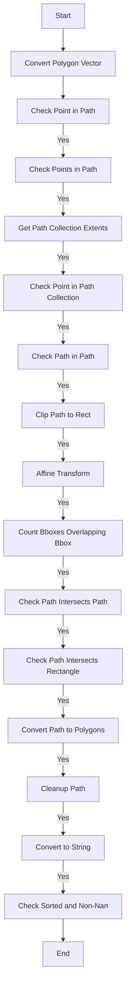

## 类结构

```
Py_point_in_path
Py_points_in_path
Py_get_path_collection_extents
Py_point_in_path_collection
Py_path_in_path
Py_clip_path_to_rect
Py_affine_transform
Py_count_bboxes_overlapping_bbox
Py_path_intersects_path
Py_path_intersects_rectangle
Py_convert_path_to_polygons
Py_cleanup_path
Py_convert_to_string
Py_is_sorted_and_has_non_nan
```

## 全局变量及字段


### `Py_point_in_path`
    
Check if a point is inside a path.

类型：`function`
    


### `Py_points_in_path`
    
Check if points are inside a path.

类型：`function`
    


### `Py_get_path_collection_extents`
    
Get the extents of a path collection.

类型：`function`
    


### `Py_point_in_path_collection`
    
Check if a point is inside a path collection.

类型：`function`
    


### `Py_path_in_path`
    
Check if two paths intersect.

类型：`function`
    


### `Py_clip_path_to_rect`
    
Clip a path to a rectangle.

类型：`function`
    


### `Py_affine_transform`
    
Apply an affine transformation to points.

类型：`function`
    


### `Py_count_bboxes_overlapping_bbox`
    
Count bboxes overlapping a given bbox.

类型：`function`
    


### `Py_path_intersects_path`
    
Check if two paths intersect.

类型：`function`
    


### `Py_path_intersects_rectangle`
    
Check if a path intersects a rectangle.

类型：`function`
    


### `Py_convert_path_to_polygons`
    
Convert a path to polygons.

类型：`function`
    


### `Py_cleanup_path`
    
Cleanup a path.

类型：`function`
    


### `Py_convert_to_string`
    
Convert a path to a string.

类型：`function`
    


### `Py_is_sorted_and_has_non_nan`
    
Check if an array is sorted and has non-NaN values.

类型：`function`
    


### `Polygon.size`
    
The number of vertices in the polygon.

类型：`size_t`
    


### `Polygon.data`
    
Pointer to the array of vertex coordinates.

类型：`const double*`
    


### `PathIterator.should_simplify`
    
Whether the path should be simplified.

类型：`bool`
    


### `agg::trans_affine....`
    
...

类型：`...`
    


### `mpl::PathGenerator....`
    
...

类型：`...`
    


### `SketchParams....`
    
...

类型：`...`
    
    

## 全局函数及方法


### convert_polygon_vector

Converts a vector of Polygon objects to a list of NumPy arrays.

参数：

- `polygons`：`std::vector<Polygon>`，A vector of Polygon objects to be converted.

返回值：`py::list`，A list of NumPy arrays representing the input Polygon objects.

#### 流程图

```mermaid
graph LR
A[Start] --> B{Iterate over polygons}
B --> C{Is i < polygons.size()}
C -- Yes --> D[Get polygon at index i]
C -- No --> E[End]
D --> F[Create NumPy array from polygon data]
F --> G[Add array to result list]
G --> C
E --> H[Return result list]
```

#### 带注释源码

```cpp
py::list
convert_polygon_vector(std::vector<Polygon> &polygons)
{
    auto result = py::list(polygons.size());

    for (size_t i = 0; i < polygons.size(); ++i) {
        const auto& poly = polygons[i];
        py::ssize_t dims[] = { static_cast<py::ssize_t>(poly.size()), 2 };
        result[i] = py::array(dims, reinterpret_cast<const double *>(poly.data()));
    }

    return result;
}
```


### Py_point_in_path

Determines if a point is inside a path.

参数：

- `x`：`double`，The x-coordinate of the point.
- `y`：`double`，The y-coordinate of the point.
- `radius`：`double`，The radius of the point.
- `path`：`mpl::PathIterator`，The path to check against.
- `trans`：`agg::trans_affine`，The transformation to apply to the path.

返回值：`bool`，Returns `true` if the point is inside the path, `false` otherwise.

#### 流程图

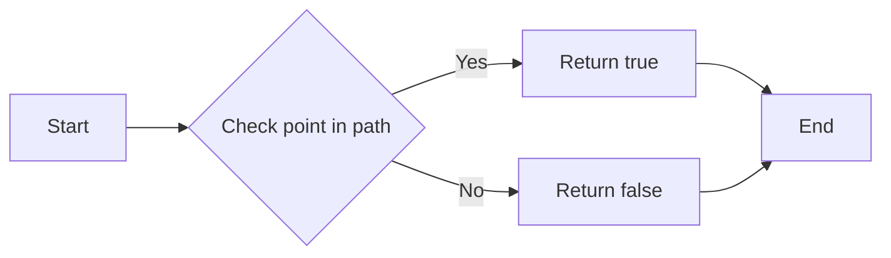

#### 带注释源码

```cpp
static bool
Py_point_in_path(double x, double y, double r, mpl::PathIterator path,
                 agg::trans_affine trans)
{
    return point_in_path(x, y, r, path, trans);
}
```


### Py_points_in_path

Determines if points are within a given path.

参数：

- `points`：`py::array_t<double>`，A list of points represented as a NumPy array of shape (N, 2), where N is the number of points.
- `radius`：`double`，The radius within which a point is considered to be inside the path.
- `path`：`mpl::PathIterator`，The path to check against.
- `trans`：`agg::trans_affine`，The transformation to apply to the path.

返回值：`py::array_t<double>`，A NumPy array of shape (N,), where each element is 1 if the corresponding point is inside the path, and 0 otherwise.

#### 流程图

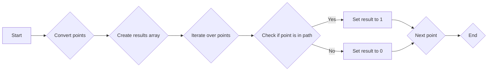

#### 带注释源码

```cpp
static py::array_t<double>
Py_points_in_path(py::array_t<double> points_obj, double r, mpl::PathIterator path,
                  agg::trans_affine trans)
{
    auto points = convert_points(points_obj);

    py::ssize_t dims[] = { points.shape(0) };
    py::array_t<uint8_t> results(dims);
    auto results_mutable = results.mutable_unchecked<1>();

    points_in_path(points, r, path, trans, results_mutable);

    return results;
}
```


### Py_get_path_collection_extents

This function calculates the extents of a collection of paths, taking into account transformations and offsets.

参数：

- `master_transform`：`agg::trans_affine`，The master transformation applied to the paths.
- `paths`：`mpl::PathGenerator`，The collection of paths.
- `transforms_obj`：`py::array_t<double>`，The transformations applied to each path.
- `offsets_obj`：`py::array_t<double>`，The offsets applied to each path.
- `offset_trans`：`agg::trans_affine`，The transformation applied to the offsets.

返回值：`py::tuple`，A tuple containing two `py::array_t<double>`: the extents of the path collection and the minimum position within the collection.

#### 流程图

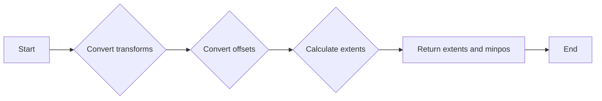

#### 带注释源码

```cpp
static py::tuple
Py_get_path_collection_extents(agg::trans_affine master_transform,
                               mpl::PathGenerator paths,
                               py::array_t<double> transforms_obj,
                               py::array_t<double> offsets_obj,
                               agg::trans_affine offset_trans)
{
    auto transforms = convert_transforms(transforms_obj);
    auto offsets = convert_points(offsets_obj);
    extent_limits e;

    get_path_collection_extents(
        master_transform, paths, transforms, offsets, offset_trans, e);

    py::ssize_t dims[] = { 2, 2 };
    py::array_t<double> extents(dims);
    *extents.mutable_data(0, 0) = e.start.x;
    *extents.mutable_data(0, 1) = e.start.y;
    *extents.mutable_data(1, 0) = e.end.x;
    *extents.mutable_data(1, 1) = e.end.y;

    py::ssize_t minposdims[] = { 2 };
    py::array_t<double> minpos(minposdims);
    *minpos.mutable_data(0) = e.minpos.x;
    *minpos.mutable_data(1) = e.minpos.y;

    return py::make_tuple(extents, minpos);
}
```


### Py_point_in_path_collection

This function checks if a point is inside a collection of paths.

参数：

- `x`：`double`，The x-coordinate of the point to check.
- `y`：`double`，The y-coordinate of the point to check.
- `radius`：`double`，The radius of the point to check.
- `master_transform`：`agg::trans_affine`，The master transform for the paths.
- `paths`：`mpl::PathGenerator`，The collection of paths to check.
- `transforms_obj`：`py::array_t<double>`，The transforms for the paths.
- `offsets_obj`：`py::array_t<double>`，The offsets for the paths.
- `offset_trans`：`agg::trans_affine`，The offset transform for the paths.
- `filled`：`bool`，Whether the paths are filled or not.

返回值：`py::array`，A boolean array indicating whether each point in the collection is inside the paths.

#### 流程图

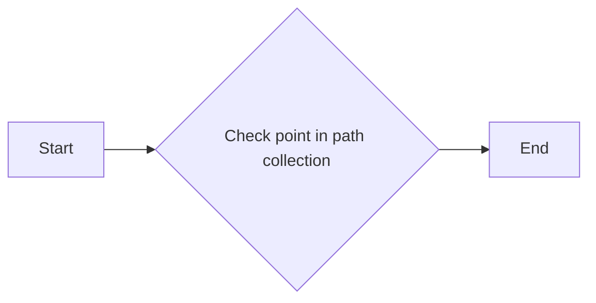

#### 带注释源码

```cpp
static py::object
Py_point_in_path_collection(double x, double y, double radius,
                            agg::trans_affine master_transform, mpl::PathGenerator paths,
                            py::array_t<double> transforms_obj,
                            py::array_t<double> offsets_obj,
                            agg::trans_affine offset_trans, bool filled)
{
    auto transforms = convert_transforms(transforms_obj);
    auto offsets = convert_points(offsets_obj);
    std::vector<int> result;

    point_in_path_collection(x, y, radius, master_transform, paths, transforms, offsets,
                             offset_trans, filled, result);

    py::ssize_t dims[] = { static_cast<py::ssize_t>(result.size()) };
    return py::array(dims, result.data());
}
``` 


### Py_point_in_path

Determines if a point is inside a path.

参数：

- `x`：`double`，The x-coordinate of the point.
- `y`：`double`，The y-coordinate of the point.
- `radius`：`double`，The radius of the point.
- `path`：`mpl::PathIterator`，The path to check against.
- `trans`：`agg::trans_affine`，The transformation applied to the path.

返回值：`bool`，Returns `true` if the point is inside the path, `false` otherwise.

#### 流程图


#### 带注释源码

```cpp
static bool
Py_point_in_path(double x, double y, double r, mpl::PathIterator path,
                 agg::trans_affine trans)
{
    return point_in_path(x, y, r, path, trans);
}
```


### Py_clip_path_to_rect

Clips a path to a rectangle and returns the resulting path.

参数：

- `path`：`mpl::PathIterator`，The path to be clipped.
- `rect`：`agg::rect_d`，The rectangle to clip the path to.
- `inside`：`bool`，If true, the path is clipped to the inside of the rectangle; otherwise, it is clipped to the outside.

返回值：`py::list`，A list of polygons representing the clipped path.

#### 流程图

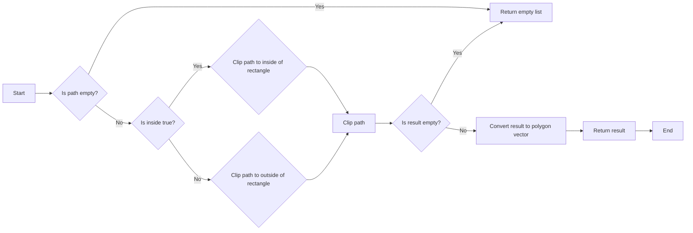

#### 带注释源码

```cpp
static py::list
Py_clip_path_to_rect(mpl::PathIterator path, agg::rect_d rect, bool inside)
{
    auto result = clip_path_to_rect(path, rect, inside);

    return convert_polygon_vector(result);
}
```


### Py_affine_transform

Transforms a set of vertices using an affine transformation.

参数：

- `vertices_arr`：`py::array_t<double>`，The vertices to be transformed. Must be 1D or 2D.
- `trans`：`agg::trans_affine`，The affine transformation to apply.

返回值：`py::array_t<double>`，The transformed vertices.

#### 流程图

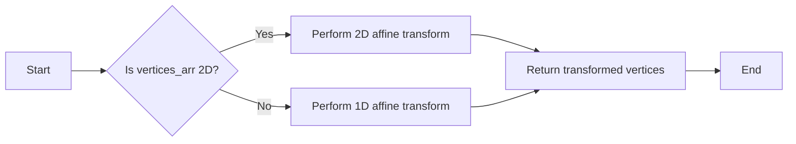

#### 带注释源码

```cpp
static py::object
Py_affine_transform(py::array_t<double, py::array::c_style | py::array::forcecast> vertices_arr,
                    agg::trans_affine trans)
{
    if (vertices_arr.ndim() == 2) {
        auto vertices = vertices_arr.unchecked<2>();

        check_trailing_shape(vertices, "vertices", 2);

        py::ssize_t dims[] = { vertices.shape(0), 2 };
        py::array_t<double> result(dims);
        auto result_mutable = result.mutable_unchecked<2>();

        affine_transform_2d(vertices, trans, result_mutable);
        return result;
    } else if (vertices_arr.ndim() == 1) {
        auto vertices = vertices_arr.unchecked<1>();

        py::ssize_t dims[] = { vertices.shape(0) };
        py::array_t<double> result(dims);
        auto result_mutable = result.mutable_unchecked<1>();

        affine_transform_1d(vertices, trans, result_mutable);
        return result;
    } else {
        throw py::value_error(
            "vertices must be 1D or 2D, not" + std::to_string(vertices_arr.ndim()) + "D");
    }
}
```


### Py_count_bboxes_overlapping_bbox

Count the number of bounding boxes that overlap with a given bounding box.

参数：

- `bbox`：`agg::rect_d`，The bounding box to check for overlaps.
- `bboxes_obj`：`py::array_t<double>`，An array of bounding boxes to check against.

返回值：`int`，The number of bounding boxes that overlap with the given bounding box.

#### 流程图

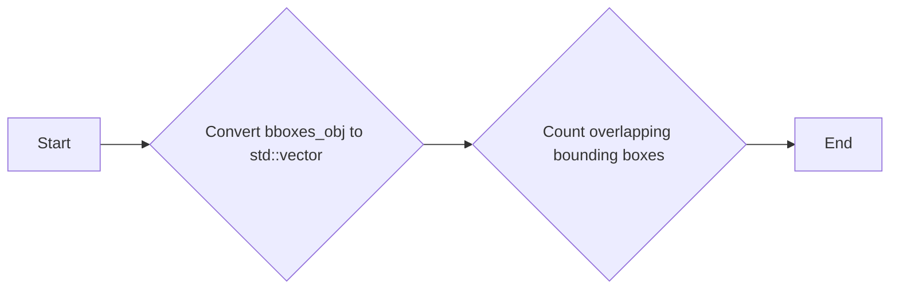

#### 带注释源码

```cpp
static int
Py_count_bboxes_overlapping_bbox(agg::rect_d bbox, py::array_t<double> bboxes_obj)
{
    auto bboxes = convert_bboxes(bboxes_obj);

    return count_bboxes_overlapping_bbox(bbox, bboxes);
}
```


### Py_path_intersects_path

Determines if two paths intersect, optionally considering them filled shapes.

参数：

- `path1`：`mpl::PathIterator`，The first path to check for intersection.
- `path2`：`mpl::PathIterator`，The second path to check for intersection.
- `filled`：`bool`，If `True`, treat the paths as filled shapes for intersection checking.

返回值：`bool`，`True` if the paths intersect, `False` otherwise.

#### 流程图

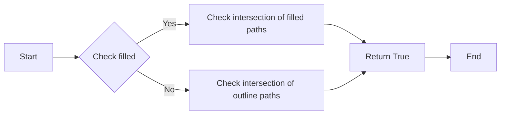

#### 带注释源码

```cpp
static bool
Py_path_intersects_path(mpl::PathIterator p1, mpl::PathIterator p2, bool filled)
{
    agg::trans_affine t1;
    agg::trans_affine t2;
    bool result;

    result = path_intersects_path(p1, p2);
    if (filled) {
        if (!result) {
            result = path_in_path(p1, t1, p2, t2);
        }
        if (!result) {
            result = path_in_path(p2, t1, p1, t2);
        }
    }

    return result;
}
``` 


### Py_path_intersects_rectangle

Determines if a given path intersects with a rectangle.

参数：

- `path`：`mpl::PathIterator`，The path to check for intersection.
- `rect_x1`：`double`，The x-coordinate of the top-left corner of the rectangle.
- `rect_y1`：`double`，The y-coordinate of the top-left corner of the rectangle.
- `rect_x2`：`double`，The x-coordinate of the bottom-right corner of the rectangle.
- `rect_y2`：`double`，The y-coordinate of the bottom-right corner of the rectangle.
- `filled`：`bool`，Whether the rectangle is considered filled or just its boundary.

返回值：`bool`，Returns `true` if the path intersects with the rectangle, otherwise `false`.

#### 流程图

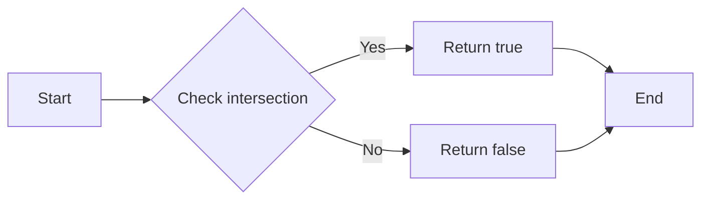

#### 带注释源码

```cpp
static bool
Py_path_intersects_rectangle(mpl::PathIterator path, double rect_x1, double rect_y1,
                             double rect_x2, double rect_y2, bool filled)
{
    return path_intersects_rectangle(path, rect_x1, rect_y1, rect_x2, rect_y2, filled);
}
```


### Py_convert_path_to_polygons

Converts a path to a list of polygons.

参数：

- `path`：`mpl::PathIterator`，The path to convert.
- `trans`：`agg::trans_affine`，The transformation to apply to the path.
- `width`：`double`，The width of the path.
- `height`：`double`，The height of the path.
- `closed_only`：`bool`，Whether to return only closed polygons.

返回值：`py::list`，A list of polygons.

#### 流程图

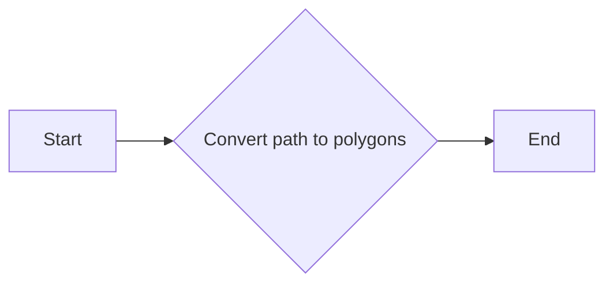

#### 带注释源码

```cpp
static py::list
Py_convert_path_to_polygons(mpl::PathIterator path, agg::trans_affine trans,
                            double width, double height, bool closed_only)
{
    std::vector<Polygon> result;

    convert_path_to_polygons(path, trans, width, height, closed_only, result);

    return convert_polygon_vector(result);
}
``` 


### Py_cleanup_path

Converts a path to a simplified version, optionally clipping it to a rectangle and removing NaN values.

参数：

- `path`：`mpl::PathIterator`，The path to be cleaned up.
- `trans`：`agg::trans_affine`，The transformation to apply to the path.
- `remove_nans`：`bool`，Whether to remove NaN values from the path.
- `clip_rect`：`agg::rect_d`，The rectangle to clip the path to, if not `None`.
- `snap_mode`：`e_snap_mode`，The snap mode to use when cleaning up the path.
- `stroke_width`：`double`，The stroke width to use when cleaning up the path.
- `simplify`：`std::optional<bool>`，Whether to simplify the path.
- `return_curves`：`bool`，Whether to return curves instead of line segments.
- `sketch`：`SketchParams`，The sketch parameters to use when cleaning up the path.

返回值：`py::tuple`，A tuple containing two `py::array_t<double>` objects. The first contains the vertices of the cleaned path, and the second contains the codes for the path operations.

#### 流程图

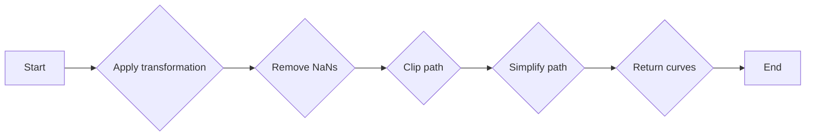

#### 带注释源码

```cpp
static py::tuple
Py_cleanup_path(mpl::PathIterator path, agg::trans_affine trans, bool remove_nans,
                agg::rect_d clip_rect, e_snap_mode snap_mode, double stroke_width,
                std::optional<bool> simplify, bool return_curves, SketchParams sketch)
{
    if (!simplify.has_value()) {
        simplify = path.should_simplify();
    }

    bool do_clip = (clip_rect.x1 < clip_rect.x2 && clip_rect.y1 < clip_rect.y2);

    std::vector<double> vertices;
    std::vector<uint8_t> codes;

    cleanup_path(path, trans, remove_nans, do_clip, clip_rect, snap_mode, stroke_width,
                 *simplify, return_curves, sketch, vertices, codes);

    auto length = static_cast<py::ssize_t>(codes.size());

    py::ssize_t vertices_dims[] = { length, 2 };
    py::array pyvertices(vertices_dims, vertices.data());

    py::ssize_t codes_dims[] = { length };
    py::array pycodes(codes_dims, codes.data());

    return py::make_tuple(pyvertices, pycodes);
}
``` 


### Py_convert_to_string

Converts a path to a bytestring.

参数：

- `path`：`mpl::PathIterator`，The path to be converted.
- `trans`：`agg::trans_affine`，The transformation to apply to the path.
- `cliprect`：`agg::rect_d`，The clipping rectangle.
- `simplify`：`std::optional<bool>`，Whether to simplify the path.
- `sketch`：`SketchParams`，Sketch parameters.
- `precision`：`int`，The precision used to format the values.
- `codes`：`std::array<std::string, 5>`，The bytes representation of each opcode.
- `postfix`：`bool`，Whether the opcode comes after the values.

返回值：`py::object`，The bytestring representation of the path.

#### 流程图

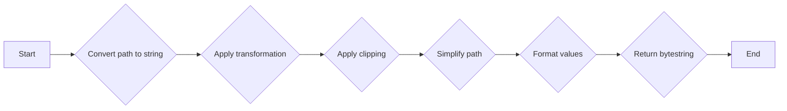

#### 带注释源码

```cpp
static py::object
Py_convert_to_string(mpl::PathIterator path, agg::trans_affine trans,
                     agg::rect_d cliprect, std::optional<bool> simplify,
                     SketchParams sketch, int precision,
                     const std::array<std::string, 5> &codes, bool postfix)
{
    std::string buffer;
    bool status;

    if (!simplify.has_value()) {
        simplify = path.should_simplify();
    }

    status = convert_to_string(path, trans, cliprect, *simplify, sketch, precision,
                               codes, postfix, buffer);

    if (!status) {
        throw py::value_error("Malformed path codes");
    }

    return py::bytes(buffer);
}
```


### Py_is_sorted_and_has_non_nan

Return whether the 1D *array* is monotonically increasing, ignoring NaNs, and has at least one non-nan value.

参数：

- `array`：`py::array`，The 1D array to check for sorted order and non-NaN values.

返回值：`bool`，Returns `true` if the array is monotonically increasing and has at least one non-NaN value, otherwise `false`.

#### 流程图

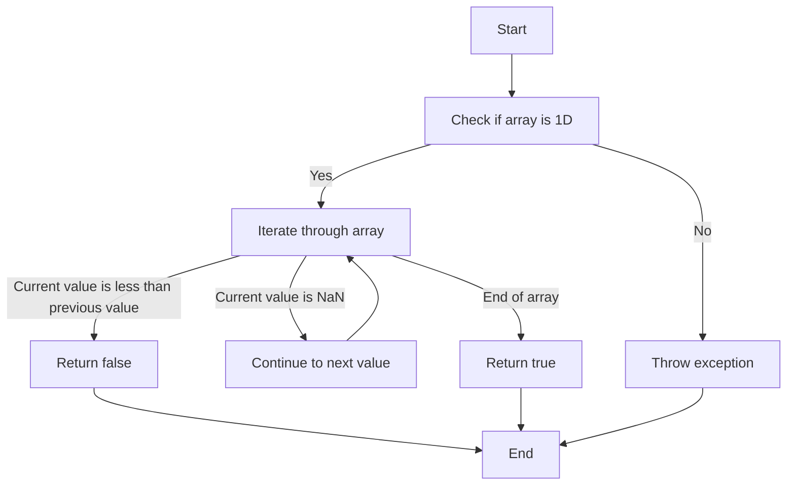

#### 带注释源码

```cpp
static bool
Py_is_sorted_and_has_non_nan(py::object obj)
{
    bool result;

    py::array array = py::array::ensure(obj);
    if (array.ndim() != 1) {
        throw std::invalid_argument("array must be 1D");
    }

    auto dtype = array.dtype();
    /* Handle just the most common types here, otherwise coerce to double */
    if (dtype.equal(py::dtype::of<std::int32_t>())) {
        result = is_sorted_and_has_non_nan<int32_t>(array);
    } else if (dtype.equal(py::dtype::of<std::int64_t>())) {
        result = is_sorted_and_has_non_nan<int64_t>(array);
    } else if (dtype.equal(py::dtype::of<float>())) {
        result = is_sorted_and_has_non_nan<float>(array);
    } else if (dtype.equal(py::dtype::of<double>())) {
        result = is_sorted_and_has_non_nan<double>(array);
    } else {
        array = py::array_t<double>::ensure(obj);
        result = is_sorted_and_has_non_nan<double>(array);
    }

    return result;
}
``` 


### Py_convert_path_to_polygons

Converts a path to a list of polygons.

参数：

- `path`：`mpl::PathIterator`，The path to convert.
- `trans`：`agg::trans_affine`，The transformation to apply to the path.
- `width`：`double`，The width of the path.
- `height`：`double`，The height of the path.
- `closed_only`：`bool`，Whether to only include closed polygons.

返回值：`py::list`，A list of polygons.

#### 流程图


#### 带注释源码

```cpp
static py::list
Py_convert_path_to_polygons(mpl::PathIterator path, agg::trans_affine trans,
                            double width, double height, bool closed_only)
{
    std::vector<Polygon> result;

    convert_path_to_polygons(path, trans, width, height, closed_only, result);

    return convert_polygon_vector(result);
}
``` 


### Py_convert_polygon_vector

Converts a vector of Polygon objects to a list of NumPy arrays.

参数：

- `polygons`：`std::vector<Polygon>`，A vector of Polygon objects.

返回值：`py::list`，A list of NumPy arrays representing the polygons.

#### 流程图

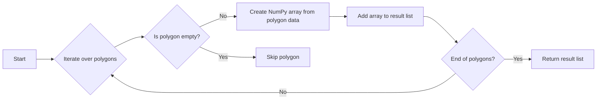

#### 带注释源码

```cpp
py::list convert_polygon_vector(std::vector<Polygon> &polygons) {
    auto result = py::list(polygons.size());

    for (size_t i = 0; i < polygons.size(); ++i) {
        const auto& poly = polygons[i];
        py::ssize_t dims[] = { static_cast<py::ssize_t>(poly.size()), 2 };
        result[i] = py::array(dims, reinterpret_cast<const double *>(poly.data()));
    }

    return result;
}
```


### Py_convert_to_string

Converts a path to a bytestring.

参数：

- `path`：`mpl::PathIterator`，The path to be converted.
- `trans`：`agg::trans_affine`，The transformation to apply to the path.
- `clip_rect`：`agg::rect_d`，The clipping rectangle.
- `simplify`：`std::optional<bool>`，Whether to simplify the path.
- `sketch`：`SketchParams`，The sketch parameters.
- `precision`：`int`，The precision used to format the values.
- `codes`：`std::array<std::string, 5>`，The bytes representation of each opcode.
- `postfix`：`bool`，Whether the opcode comes after the values.

返回值：`py::object`，The bytestring representation of the path.

#### 流程图

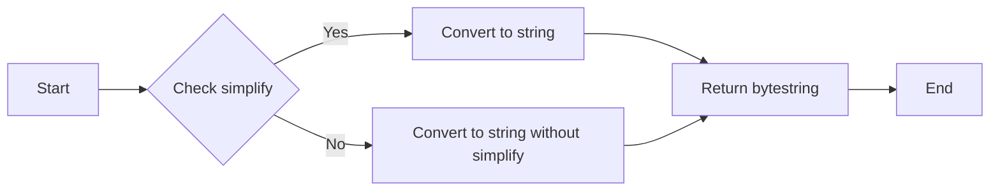

#### 带注释源码

```cpp
static py::object
Py_convert_to_string(mpl::PathIterator path, agg::trans_affine trans,
                     agg::rect_d cliprect, std::optional<bool> simplify,
                     SketchParams sketch, int precision,
                     const std::array<std::string, 5> &codes, bool postfix)
{
    std::string buffer;
    bool status;

    if (!simplify.has_value()) {
        simplify = path.should_simplify();
    }

    status = convert_to_string(path, trans, cliprect, *simplify, sketch, precision,
                               codes, postfix, buffer);

    if (!status) {
        throw py::value_error("Malformed path codes");
    }

    return py::bytes(buffer);
}
``` 


### Py_point_in_path

Determines if a point is inside a path.

参数：

- `x`：`double`，The x-coordinate of the point.
- `y`：`double`，The y-coordinate of the point.
- `radius`：`double`，The radius of the point.
- `path`：`mpl::PathIterator`，The path to check against.
- `trans`：`agg::trans_affine`，The transformation to apply to the path.

返回值：`bool`，Returns `true` if the point is inside the path, `false` otherwise.

#### 流程图


#### 带注释源码

```cpp
static bool
Py_point_in_path(double x, double y, double r, mpl::PathIterator path,
                 agg::trans_affine trans)
{
    return point_in_path(x, y, r, path, trans);
}
```


### Py_get_path_collection_extents

Get the extents of a collection of paths after applying transformations and offsets.

参数：

- `master_transform`：`agg::trans_affine`，The master transformation applied to the paths.
- `paths`：`mpl::PathGenerator`，The collection of paths.
- `transforms_obj`：`py::array_t<double>`，The transformations applied to each path.
- `offsets_obj`：`py::array_t<double>`，The offsets applied to each path.
- `offset_trans`：`agg::trans_affine`，The transformation applied to the offsets.

返回值：`py::tuple`，A tuple containing the extents and the minimum position.

#### 流程图

```mermaid
graph LR
A[Start] --> B{Convert transforms}
B --> C{Convert offsets}
C --> D{Get path collection extents}
D --> E[End]
```

#### 带注释源码

```cpp
static py::tuple
Py_get_path_collection_extents(agg::trans_affine master_transform,
                               mpl::PathGenerator paths,
                               py::array_t<double> transforms_obj,
                               py::array_t<double> offsets_obj,
                               agg::trans_affine offset_trans)
{
    auto transforms = convert_transforms(transforms_obj);
    auto offsets = convert_points(offsets_obj);
    extent_limits e;

    get_path_collection_extents(
        master_transform, paths, transforms, offsets, offset_trans, e);

    py::ssize_t dims[] = { 2, 2 };
    py::array_t<double> extents(dims);
    *extents.mutable_data(0, 0) = e.start.x;
    *extents.mutable_data(0, 1) = e.start.y;
    *extents.mutable_data(1, 0) = e.end.x;
    *extents.mutable_data(1, 1) = e.end.y;

    py::ssize_t minposdims[] = { 2 };
    py::array_t<double> minpos(minposdims);
    *minpos.mutable_data(0) = e.minpos.x;
    *minpos.mutable_data(1) = e.minpos.y;

    return py::make_tuple(extents, minpos);
}
```


### Py_convert_to_string

Converts a path to a bytestring.

参数：

- `path`：`mpl::PathIterator`，The path to be converted.
- `trans`：`agg::trans_affine`，The transformation to apply to the path.
- `cliprect`：`agg::rect_d`，The clipping rectangle.
- `simplify`：`std::optional<bool>`，Whether to simplify the path.
- `sketch`：`SketchParams`，The sketch parameters.
- `precision`：`int`，The precision used to format the values.
- `codes`：`std::array<std::string, 5>`，The bytes representation of each opcode.
- `postfix`：`bool`，Whether the opcode comes after the values.

返回值：`py::object`，The bytestring representation of the path.

#### 流程图

```mermaid
graph LR
A[Start] --> B{Convert path to string}
B --> C{Apply transformation}
C --> D{Apply clipping}
D --> E{Simplify path}
E --> F{Format values}
F --> G{Return bytestring}
G --> H[End]
```

#### 带注释源码

```cpp
static py::object
Py_convert_to_string(mpl::PathIterator path, agg::trans_affine trans,
                     agg::rect_d cliprect, std::optional<bool> simplify,
                     SketchParams sketch, int precision,
                     const std::array<std::string, 5> &codes, bool postfix)
{
    std::string buffer;
    bool status;

    if (!simplify.has_value()) {
        simplify = path.should_simplify();
    }

    status = convert_to_string(path, trans, cliprect, *simplify, sketch, precision,
                               codes, postfix, buffer);

    if (!status) {
        throw py::value_error("Malformed path codes");
    }

    return py::bytes(buffer);
}
``` 


## 关键组件


### 张量索引与惰性加载

张量索引与惰性加载是代码中处理数据结构的核心组件，它允许对大型数据集进行高效访问，同时减少内存占用。

### 反量化支持

反量化支持是代码中用于处理量化数据的组件，它允许在量化与去量化之间进行转换，以优化性能和资源使用。

### 量化策略

量化策略是代码中用于优化数据表示和处理的组件，它通过减少数据精度来降低内存和计算需求。


## 问题及建议


### 已知问题

-   **代码重复**：多个函数中存在重复的代码，例如 `convert_points` 和 `convert_transforms` 函数在多个地方被调用，这可能导致维护困难。
-   **异常处理**：代码中缺少异常处理机制，例如在 `Py_convert_to_string` 函数中，如果路径代码格式错误，会抛出 `py::value_error`，但没有对其他潜在错误进行处理。
-   **类型检查**：代码中缺少对输入参数类型的严格检查，例如在 `Py_affine_transform` 函数中，没有检查 `trans` 参数是否为 `agg::trans_affine` 类型。
-   **文档注释**：部分函数缺少详细的文档注释，这不利于其他开发者理解代码的功能和使用方法。

### 优化建议

-   **提取重复代码**：将重复的代码提取到单独的函数中，并在需要的地方调用这些函数，以减少代码重复并提高可维护性。
-   **增加异常处理**：在关键操作中增加异常处理，确保在出现错误时能够给出清晰的错误信息，并采取适当的恢复措施。
-   **加强类型检查**：在函数参数中使用类型检查，确保传入的参数符合预期类型，避免类型错误。
-   **完善文档注释**：为每个函数添加详细的文档注释，包括函数的功能、参数说明、返回值描述等，以提高代码的可读性和可维护性。
-   **性能优化**：对于性能敏感的函数，可以考虑使用更高效的算法或数据结构，以减少计算时间和内存消耗。
-   **代码风格**：统一代码风格，包括命名规范、缩进、注释等，以提高代码的可读性和一致性。


## 其它


### 设计目标与约束

- 设计目标：
  - 提供一组Python绑定的函数，用于处理和操作路径数据。
  - 支持路径的转换、裁剪、变换、碰撞检测等操作。
  - 提供与现有C++库的兼容性，确保性能和稳定性。

- 约束：
  - 必须使用pybind11进行Python绑定。
  - 必须遵循C++库的API设计。
  - 必须处理可能的异常和错误情况。

### 错误处理与异常设计

- 错误处理：
  - 使用pybind11的异常机制来处理错误。
  - 对于无效的输入参数，抛出`py::value_error`。
  - 对于无法执行的操作，抛出`py::error`。

- 异常设计：
  - 定义清晰的异常消息，帮助用户理解错误原因。
  - 异常处理代码应尽可能简洁，避免复杂的逻辑。

### 数据流与状态机

- 数据流：
  - 输入数据通过Python对象传递到C++函数。
  - 处理后的数据通过Python对象返回。

- 状态机：
  - 每个函数根据输入数据的状态执行相应的操作。
  - 状态机设计应确保操作的顺序和正确性。

### 外部依赖与接口契约

- 外部依赖：
  - 依赖于pybind11库。
  - 依赖于C++库，如`mpl`和`agg`。

- 接口契约：
  - 定义清晰的函数签名和参数类型。
  - 确保函数的返回值类型和描述准确无误。
  - 提供文档说明函数的功能和用法。


    