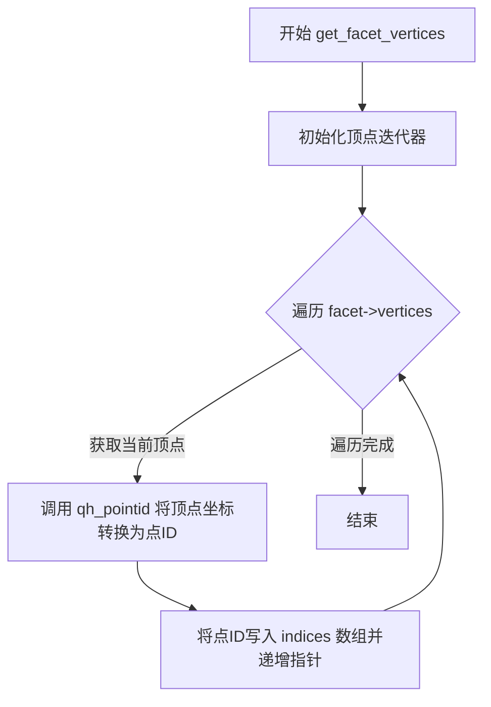
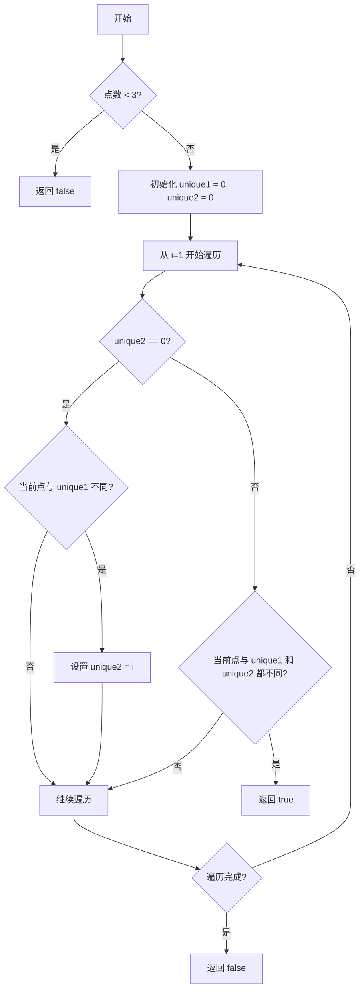
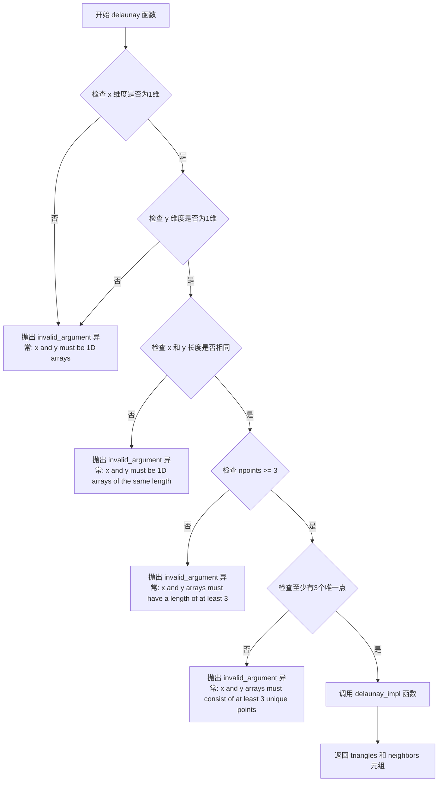
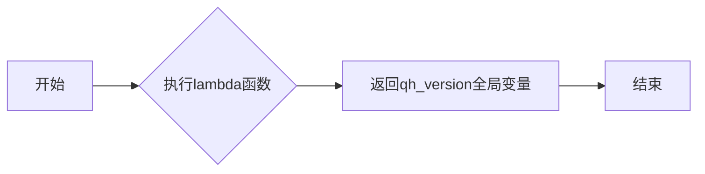
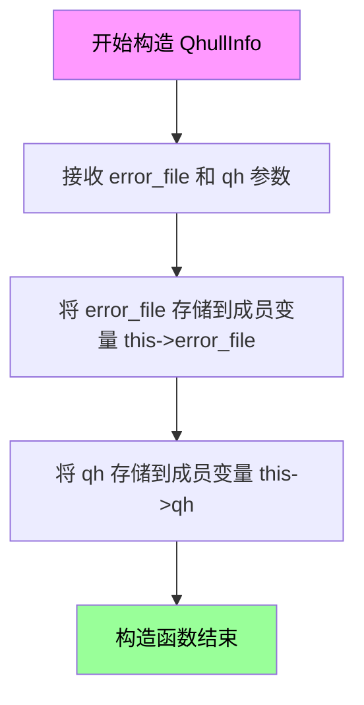
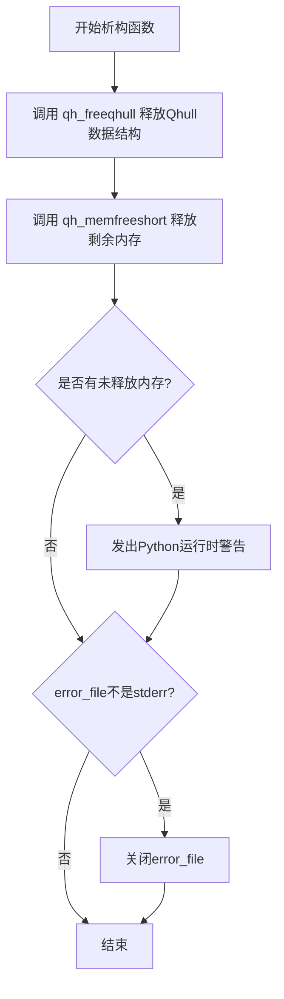

# `matplotlib\src\_qhull_wrapper.cpp` 详细设计文档

这是一个Python扩展模块，通过pybind11封装了libqhull库，提供Delaunay三角剖分功能。该模块接收x、y坐标数组，计算并返回三角形的顶点索引和相邻三角形索引，可供matplotlib.tri.Triangulation类使用。

## 整体流程

```mermaid
graph TD
    A[开始] --> B[接收Python参数 x, y, verbose]
B --> C{验证输入数组}
C -->|不是1维数组| D[抛出 invalid_argument]
C -->|长度不一致| E[抛出 invalid_argument]
C -->|少于3个点| F[抛出 invalid_argument]
C -->|少于3个唯一点| G[抛出 invalid_argument]
D --> H[结束]
E --> H
F --> H
G --> H
C -->|验证通过| I[调用 delaunay_impl]
I --> J[初始化 qhull]
J --> K[执行 qh_new_qhull]
K --> L{exitcode 成功?}
L -->|否| M[抛出 runtime_error]
L -->|是| N[调用 qh_triangulate]
N --> O[遍历 facets 构建 triangles 和 neighbors]
O --> P[返回 Python 元组 (triangles, neighbors)]
P --> H
```

## 类结构

```
QhullInfo (RAII资源管理类)
└── 构造函数/析构函数管理 qhT* 和 FILE*
```

## 全局变量及字段


### `qhull_error_msg`
    
qhull错误消息字符串数组，包含6种错误类型的描述信息

类型：`static const char*[6]`
    


### `STRINGIFY(x)`
    
字符串化宏，用于将参数转换为字符串字面量

类型：`macro`
    


### `STR(x)`
    
字符串化宏，STRINGIFY的辅助宏，用于实现两阶段字符串化

类型：`macro`
    


### `MPL_DEVNULL`
    
操作系统空设备路径宏，需外部定义（如Windows的NUL或Unix的/dev/null）

类型：`macro`
    


### `CoordArray`
    
输入坐标数组类型别名，强制转换为double类型的numpy数组

类型：`typedef py::array_t<double, py::array::c_style | py::array::forcecast>`
    


### `IndexArray`
    
输出索引数组类型别名，用于返回三角形和邻居索引的numpy整数数组

类型：`typedef py::array_t<int>`
    


### `qh_version`
    
qhull库版本字符串，由libqhull库提供

类型：`extern const char[]`
    


### `npoints`
    
输入点的数量

类型：`py::ssize_t`
    


### `x, y`
    
输入坐标数组指针

类型：`const double*`
    


### `verbose`
    
Python详细输出级别标志

类型：`int`
    


### `ntri`
    
生成的三角形数量

类型：`int`
    


### `tri_indices`
    
面ID到三角形索引的映射数组

类型：`std::vector<int>`
    


### `error_file`
    
qhull错误输出文件指针

类型：`FILE*`
    


### `qh`
    
qhull库状态结构指针

类型：`qhT*`
    


### `points`
    
用于qhull计算的坐标点数组（已中心化）

类型：`std::vector<coordT>`
    


### `QhullInfo.error_file`
    
错误输出文件指针，用于qhull错误消息输出

类型：`FILE*`
    


### `QhullInfo.qh`
    
qhull库状态结构指针，管理qhull计算上下文

类型：`qhT*`
    
    

## 全局函数及方法


### `get_facet_vertices`

获取指定facet（三角形）的3个顶点索引。该函数是Q hull库的内部辅助函数，通过遍历facet的顶点集合，将每个顶点的坐标转换为对应的点ID，并存储到输出数组中。

参数：

- `qh`：`qhT*`，指向Qhull库主数据结构的指针，用于调用`qh_pointid`函数将顶点坐标转换为点ID
- `facet`：`const facetT*`，指向目标facet（三角形）的常量指针，从中提取3个顶点
- `indices`：`int[3]`，输出参数，函数返回时该数组将包含3个顶点的索引值

返回值：`void`，无返回值。结果通过`indices`参数输出。

#### 流程图



#### 带注释源码

```cpp
/* Return the indices of the 3 vertices that comprise the specified facet (i.e.
 * triangle). */
static void
get_facet_vertices(qhT* qh, const facetT* facet, int indices[3])
{
    vertexT *vertex, **vertexp;  /* 顶点指针和迭代器指针变量声明 */
    
    /* FOREACHvertex_ 是 libqhull_r 库提供的宏，用于遍历 facet 的所有顶点。
     * 该宏展开后会生成一个循环，依次处理 facet->vertices 链表中的每个顶点。
     * 在循环体内，当前顶点由 vertex 变量引用。 */
    FOREACHvertex_(facet->vertices) {
        /* qh_pointid 是 Qhull 库函数，根据给定的坐标点指针返回其对应的唯一ID。
         * vertex->point 指向该顶点在输入点集中的坐标数组。
         * 将转换后的索引值写入 indices 数组，并通过后置递增运算符移动指针，
         * 依次填入第一个、第二个、第三个顶点的索引。 */
        *indices++ = qh_pointid(qh, vertex->point);
    }
}
```


### `get_facet_neighbours`

该函数是一个静态全局函数，用于计算并返回给定Delaunay三角形（facet）的三个相邻三角形（neighbors）的索引。如果某个相邻面不在实际的Delaunay三角化范围内（即位于无穷远处），则返回-1。

参数：

- `facet`：`const facetT*`，指向当前需要查询邻居的面（三角形）的指针。
- `tri_indices`：`std::vector<int>&`，一个向量，用于将Qhull库内部的 facet ID 映射到输出的连续三角形索引。
- `indices`：`int[3]`，输出参数，用于存储计算得到的3个邻居三角形的索引。

返回值：`void`，该函数没有直接返回值，结果通过 `indices` 数组传出。

#### 流程图

```mermaid
flowchart TD
    A([开始 get_facet_neighbours]) --> B{遍历 facet 的所有邻居}
    B -->|取出邻居 neighbor| C{neighbor->upperdelaunay == true?}
    C -->|是 (无穷远/无效)| D[写入 -1 到 indices]
    C -->|否 (有效三角形)| E[在 tri_indices 中查找 neighbor->id 对应的索引]
    E --> F[写入查找到的索引到 indices]
    D --> G[指针 indices++ 移动到下一位置]
    F --> G
    G --> B
    B -->|遍历完毕| H([结束])
```

#### 带注释源码

```cpp
/* Return the indices of the 3 triangles that are neighbors of the specified
 * facet (triangle). */
static void
get_facet_neighbours(const facetT* facet, std::vector<int>& tri_indices,
                     int indices[3])
{
    facetT *neighbor, **neighborp;
    // 使用 Qhull 提供的宏 FOREACHneighbor_ 遍历当前 facet 的所有邻居面
    FOREACHneighbor_(facet) {
        // 判断邻居面是否为 "upperdelaunay"。
        // 如果是，说明该邻居面是位于凸包外部的特殊面（代表无穷远），在matplotlib
        // 的三角化表示中通常标记为 -1，表示没有实际的邻居。
        // 如果不是，则从 tri_indices 向量中取出该面对应的三角形索引。
        *indices++ = (neighbor->upperdelaunay ? -1 : tri_indices[neighbor->id]);
    }
}
```


### `at_least_3_unique_points`

该函数用于验证给定的 x 和 y 坐标数组是否至少包含 3 个唯一点。如果数组中的点数少于 3 个，或者所有点都相同（即没有至少 3 个不同的点），则返回 false；否则返回 true。

参数：

- `npoints`：`py::ssize_t`，数组中点的数量
- `x`：`const double*`，包含 x 坐标的数组指针
- `y`：`const double*`，包含 y 坐标的数组指针

返回值：`bool`，如果数组包含至少 3 个唯一的点则返回 true，否则返回 false

#### 流程图



#### 带注释源码

```c
/* Return true if the specified points arrays contain at least 3 unique points,
 * or false otherwise. */
static bool
at_least_3_unique_points(py::ssize_t npoints, const double* x, const double* y)
{
    const py::ssize_t unique1 = 0;  /* 第一个唯一点索引为 0 */
    py::ssize_t unique2 = 0;        /* 第二个唯一点索引初始为 0，直到找到为止 */

    /* 如果点数少于 3 个，直接返回 false */
    if (npoints < 3) {
        return false;
    }

    /* 遍历数组寻找不同的点 */
    for (py::ssize_t i = 1; i < npoints; ++i) {
        if (unique2 == 0) {
            /* 正在寻找第二个唯一点 */
            if (x[i] != x[unique1] || y[i] != y[unique1]) {
                unique2 = i;
            }
        }
        else {
            /* 正在寻找第三个唯一点 */
            if ( (x[i] != x[unique1] || y[i] != y[unique1]) &&
                 (x[i] != x[unique2] || y[i] != y[unique2]) ) {
                /* 找到 3 个唯一点，索引为 0, unique2 和 i */
                return true;
            }
        }
    }

    /* 遍历完所有点仍未找到 3 个唯一点 */
    return false;
}
```


### delaunay_impl

Delaunay三角剖分的核心实现方法，接收点坐标数组，通过调用libqhull库执行Delaunay三角剖分算法，生成三角形顶点索引数组和相邻三角形索引数组，并返回包含这两个数组的元组。

参数：

- `npoints`：`py::ssize_t`，输入点的数量
- `x`：`const double*`，输入点的x坐标数组
- `y`：`const double*`，输入点的y坐标数组
- `hide_qhull_errors`：`bool`，为true时丢弃qhull错误消息，为false时将错误写入stderr

返回值：`py::tuple`，包含两个numpy数组的元组 `(triangles, neighbors)`，其中triangles是形状为(ntri, 3)的int数组，表示三角形顶点索引；neighbors是形状为(ntri, 3)的int数组，表示相邻三角形索引

#### 流程图

```mermaid
flowchart TD
    A[开始 delaunay_impl] --> B[初始化 qhT 结构体]
    B --> C[计算所有点的 x_mean 和 y_mean]
    C --> D[构建 points 数组<br/>每个点减去均值以提高数值稳定性]
    D --> E{hide_qhull_errors?}
    E -->|true| F[打开 /dev/null 作为错误输出文件]
    E -->|false| G[使用 stderr 作为错误输出文件]
    F --> H[创建 QhullInfo 对象管理资源]
    G --> H
    H --> I[调用 qh_zero 初始化 qhull]
    I --> J[调用 qh_new_qhull 执行 Delaunay 三角剖分]
    J --> K{exitcode 是否为 qh_ERRnone?}
    K -->|否| L[构建错误消息并抛出 std::runtime_error]
    K -->|是| M[调用 qh_triangulate 三角化所有面]
    M --> N[遍历 facets 统计三角形数量 ntri]
    N --> O[计算最大 facet_id]
    O --> P[分配 triangles 和 neighbors 输出数组]
    P --> Q[遍历 facets 填充三角形顶点索引<br/>同时构建 tri_indices 映射]
    Q --> R[遍历 facets 填充相邻三角形索引]
    R --> S[返回 py::make_tuple(triangles, neighbors)]
    L --> T[异常退出]
    
    style K fill:#ff6b6b
    style L fill:#ff6b6b
    style S fill:#51cf66
```

#### 带注释源码

```cpp
/* Delaunay implementation method.
 * If hide_qhull_errors is true then qhull error messages are discarded;
 * if it is false then they are written to stderr. */
static py::tuple
delaunay_impl(py::ssize_t npoints, const double* x, const double* y,
              bool hide_qhull_errors)
{
    // qhT 是 Qhull 库的主要数据结构，包含所有 Qhull 状态信息
    // qh变量名和类型必须按照这种格式声明，因为 Qhull 内部使用宏访问它
    qhT qh_qh;                  /* qh variable type and name must be like */
    qhT* qh = &qh_qh;           /* this for Qhull macros to work correctly. */
    facetT* facet;              // 用于遍历三角形面
    int i, ntri, max_facet_id;  // 循环计数、三角形数量、最大面ID
    int exitcode;               // qh_new_qhull() 的返回值，指示成功或错误类型
    const int ndim = 2;         // 二维平面
    double x_mean = 0.0;        // x坐标均值，用于坐标中心化
    double y_mean = 0.0;        // y坐标均值，用于坐标中心化

    // QHULL_LIB_CHECK 是 qhull 库提供的宏，用于运行时库版本检查
    QHULL_LIB_CHECK

    /* Allocate points.
     * qhull 需要将点存储在一维数组中，每个点占用 ndim 个连续的 double 值
     * 格式为 [x0, y0, x1, y1, ..., xn-1, yn-1] */
    std::vector<coordT> points(npoints * ndim);

    /* Determine mean x, y coordinates.
     * 计算所有点的几何中心，后续会减去这个均值来提高数值稳定性
     * 这种中心化技术可以减少数值运算中的精度问题 */
    for (i = 0; i < npoints; ++i) {
        x_mean += x[i];
        y_mean += y[i];
    }
    x_mean /= npoints;
    y_mean /= npoints;

    /* Prepare points array to pass to qhull.
     * 将输入坐标转换为相对于几何中心的坐标
     * 这是一个重要的数值稳定性优化步骤 */
    for (i = 0; i < npoints; ++i) {
        points[2*i  ] = x[i] - x_mean;
        points[2*i+1] = y[i] - y_mean;
    }

    /* qhull expects a FILE* to write errors to.
     * qhull 库需要通过文件指针输出错误信息 */
    FILE* error_file = nullptr;
    if (hide_qhull_errors) {
        /* qhull errors are ignored by writing to OS-equivalent of /dev/null.
         * Rather than have OS-specific code here, instead it is determined by
         * meson.build and passed in via the macro MPL_DEVNULL.
         * 隐藏错误信息：将输出重定向到系统空设备 */
        error_file = fopen(STRINGIFY(MPL_DEVNULL), "w");
        if (error_file == nullptr) {
            throw std::runtime_error("Could not open devnull");
        }
    }
    else {
        /* qhull errors written to stderr.
         * 显示错误信息：将输出重定向到标准错误流 */
        error_file = stderr;
    }

    /* Perform Delaunay triangulation.
     * QhullInfo 是 RAII 封装类，确保 qhull 资源在异常或正常退出时都能正确释放
     * 其析构函数会调用 qh_freeqhull 和 qh_memfreeshort 释放内存 */
    QhullInfo info(error_file, qh);
    
    // 初始化 qhull 数据结构
    qh_zero(qh, error_file);
    
    // 执行实际的 Delaunay 三角剖分
    // "qhull d Qt Qbb Qc Qz" 是命令行选项：
    //   d - Delaunay triangulation
    //   Qt - triangulate output
    //   Qbb - scale last coordinate to [0,m] for Delaunay
    //   Qc - keep coplanar points with nearest facet
    //   Qz - add a point at infinity for Delaunay
    exitcode = qh_new_qhull(qh, ndim, (int)npoints, points.data(), False,
                            (char*)"qhull d Qt Qbb Qc Qz", nullptr, error_file);
    
    // 检查 qhull 是否成功执行
    if (exitcode != qh_ERRnone) {
        // 构建用户友好的错误消息
        std::string msg =
            py::str("Error in qhull Delaunay triangulation calculation: {} (exitcode={})")
            .format(qhull_error_msg[exitcode], exitcode).cast<std::string>();
        if (hide_qhull_errors) {
            // 提示用户如何查看原始错误信息
            msg += "; use python verbose option (-v) to see original qhull error.";
        }
        throw std::runtime_error(msg);
    }

    /* Split facets so that they only have 3 points each.
     * qh_triangulate 确保所有面都是三角形（处理非三角形的高维情况） */
    qh_triangulate(qh);

    /* Determine ntri and max_facet_id.
       Note that libqhull uses macros to iterate through collections.
       遍历所有面，统计非 upperdelaunay 面的数量（即实际三角形的数量）
       upperdelaunay 是 qhull 内部用于处理无穷远面的标志 */
    ntri = 0;
    FORALLfacets {
        if (!facet->upperdelaunay) {
            ++ntri;
        }
    }

    // 记录最大面ID，用于后续分配映射数组
    max_facet_id = qh->facet_id - 1;

    /* Create array to map facet id to triangle index.
     * 建立 facet id 到三角形索引的映射数组
     * 因为并非所有 facet 都是有效的三角形面 */
    std::vector<int> tri_indices(max_facet_id+1);

    /* Allocate Python arrays to return.
     * 准备返回给 Python 的 numpy 数组 */
    int dims[2] = {ntri, 3};
    IndexArray triangles(dims);
    int* triangles_ptr = triangles.mutable_data();

    IndexArray neighbors(dims);
    int* neighbors_ptr = neighbors.mutable_data();

    /* Determine triangles array and set tri_indices array.
     * 遍历所有面，填充三角形顶点索引
     * 注意顶点的顺序由 toporient 标志决定，需要正确处理以保持一致性 */
    i = 0;
    FORALLfacets {
        if (!facet->upperdelaunay) {
            int indices[3];
            // 记录该面在输出数组中的索引位置
            tri_indices[facet->id] = i++;
            // 获取该面的三个顶点索引
            get_facet_vertices(qh, facet, indices);
            // 根据 toporient 方向写入顶点顺序
            *triangles_ptr++ = (facet->toporient ? indices[0] : indices[2]);
            *triangles_ptr++ = indices[1];
            *triangles_ptr++ = (facet->toporient ? indices[2] : indices[0]);
        }
        else {
            // 无效面标记为 -1
            tri_indices[facet->id] = -1;
        }
    }

    /* Determine neighbors array.
     * 遍历所有面，填充相邻三角形索引
     * 相邻关系用于描述三角形网格的拓扑结构 */
    FORALLfacets {
        if (!facet->upperdelaunay) {
            int indices[3];
            // 获取该面的三个相邻面索引
            get_facet_neighbours(facet, tri_indices, indices);
            // 写入相邻面索引（同样需要处理方向）
            *neighbors_ptr++ = (facet->toporient ? indices[2] : indices[0]);
            *neighbors_ptr++ = (facet->toporient ? indices[0] : indices[2]);
            *neighbors_ptr++ = indices[1];
        }
    }

    // 返回 Python 元组 (triangles, neighbors)
    return py::make_tuple(triangles, neighbors);
}
```


### `delaunay`

该函数是Python扩展模块的入口函数，负责接收Python层传入的坐标数组，进行参数验证（维度、长度、最少3个唯一点），然后调用底层的`delaunay_impl`函数执行Delaunay三角剖分计算。

参数：

- `x`：`CoordArray`（`py::array_t<double, py::array::c_style | py::array::forcecast>`），表示点集的x坐标，必须是一维数组
- `y`：`CoordArray`（`py::array_t<double, py::array::c_style | py::array::forcecast>`），表示点集的y坐标，必须是一维数组
- `verbose`：`int`，Python的详细输出级别，用于控制是否显示qhull的错误信息

返回值：`py::tuple`，返回一个包含两个整型数组的元组 `(triangles, neighbors)`，形状为 `(ntri, 3)`，分别表示三角形顶点索引和三角形邻居索引

#### 流程图



#### 带注释源码

```cpp
/* Process Python arguments and call Delaunay implementation method. */
static py::tuple
delaunay(const CoordArray& x, const CoordArray& y, int verbose)
{
    // 步骤1: 验证输入数组 x 是一维数组
    if (x.ndim() != 1 || y.ndim() != 1) {
        throw std::invalid_argument("x and y must be 1D arrays");
    }

    // 步骤2: 获取 x 数组的长度，并验证 x 和 y 长度相同
    auto npoints = x.shape(0);
    if (npoints != y.shape(0)) {
        throw std::invalid_argument("x and y must be 1D arrays of the same length");
    }

    // 步骤3: 验证输入数组至少有3个点
    if (npoints < 3) {
        throw std::invalid_argument("x and y arrays must have a length of at least 3");
    }

    // 步骤4: 验证输入点中至少有3个不同的唯一点（不共线）
    if (!at_least_3_unique_points(npoints, x.data(), y.data())) {
        throw std::invalid_argument("x and y arrays must consist of at least 3 unique points");
    }

    // 步骤5: 参数验证通过后，调用底层实现函数
    // verbose == 0 表示隐藏 qhull 错误信息，verbose != 0 表示显示错误信息到 stderr
    return delaunay_impl(npoints, x.data(), y.data(), verbose == 0);
}
```


### version

返回qhull库的版本字符串，用于标识当前使用的qhull库的版本信息。

参数：

- 无

返回值：`const char*`，返回qhull库的版本字符串

#### 流程图



#### 带注释源码

```cpp
// 在PYBIND11_MODULE (_qhull, m) 中定义version函数
m.def("version", []() { return qh_version; },  // 定义名为version的Python函数，返回qhull版本字符串
    "version()\n--\n\n"                        // Python文档字符串
    "Return the qhull version string.");       // 说明函数用途：返回qhull版本字符串
```

**完整上下文源码：**

```cpp
// qh_version是在libqhull_r/qhull_ra.h中声明的外部全局变量
// 在文件开头通过extern "C"声明确保C链接，避免MSVC的名字 mangling
#ifdef _MSC_VER
extern "C" {
extern const char qh_version[];
}
#endif

// 在pybind11模块定义中导出version函数
PYBIND11_MODULE(_qhull, m, py::mod_gil_not_used())
{
    m.doc() = "Computing Delaunay triangulations.\n";

    // ... 其他函数定义 ...

    // 定义version函数：无参数，直接返回qhull库的版本字符串
    m.def("version", []() { return qh_version; },
        "version()\n--\n\n"
        "Return the qhull version string.");
}
```


### `QhullInfo.QhullInfo(FILE*, qhT*)`

该构造函数是 `QhullInfo` 类的初始化方法，用于接收并保存 Qhull 库的错误文件指针和主数据结构指针，以便后续在析构函数中正确释放资源。

参数：

- `error_file`：`FILE*`，错误输出文件指针，指向 Qhull 库输出错误信息的文件流（可以是 stderr 或临时打开的 /dev/null）
- `qh`：`qhT*`，Qhull 库的主数据结构指针，包含了三角剖分过程中的所有状态信息

返回值：无返回值（构造函数）

#### 流程图



#### 带注释源码

```cpp
/* 构造函数：初始化 QhullInfo 对象，保存 Qhull 库的错误文件指针和主数据结构指针
 * 参数:
 *   error_file - FILE* 类型，指向错误输出文件（stderr 或临时文件）
 *   qh - qhT* 类型，指向 Qhull 库的主数据结构，包含三角剖分状态
 * 返回值: 无（构造函数）
 * 说明: 此构造函数仅进行简单的指针赋值，具体的资源释放逻辑在析构函数中实现 */
QhullInfo(FILE *error_file, qhT* qh) {
    this->error_file = error_file;  // 保存错误文件指针，用于析构时关闭非标准错误流
    this->qh = qh;                   // 保存 Qhull 主数据结构指针，用于析构时释放内存
}
```


### QhullInfo::~QhullInfo()

析构函数，在对象生命周期结束时自动调用，负责释放Qhull库分配的所有内存资源，并关闭可能打开的错误输出文件，防止资源泄漏。

参数：
- （无参数）

返回值：
- `void`，析构函数不返回任何值

#### 流程图



#### 带注释源码

```cpp
~QhullInfo() {
    // 释放Qhull库分配的主要数据结构
    // 参数!qh_ALL表示释放所有qhull相关内存
    qh_freeqhull(this->qh, !qh_ALL);
    
    int curlong, totlong;  /* Memory remaining. */
    // 尝试释放任何剩余的短内存块
    qh_memfreeshort(this->qh, &curlong, &totlong);
    
    // 如果有内存未被释放，记录警告信息
    if (curlong || totlong) {
        PyErr_WarnEx(PyExc_RuntimeWarning,
                     "Qhull could not free all allocated memory", 1);
    }

    // 只有当error_file不是stderr时才关闭它
    // （stderr由Python运行时管理，不需要我们关闭）
    if (this->error_file != stderr) {
        fclose(error_file);
    }
}
```

## 关键组件


### 核心功能概述

该代码是一个基于pybind11的Python扩展模块，封装了libqhull库的功能，提供Delaunay三角剖分计算能力，接收x和y坐标数组，返回三角形顶点索引和邻接三角形索引。

### 文件整体运行流程

1. Python调用`delaunay(x, y, verbose)`函数
2. 验证输入数组维度、长度和唯一性
3. 调用`delaunay_impl()`执行核心计算
4. 初始化Qhull库，创建`QhullInfo`对象管理资源
5. 构建坐标点集并执行`qh_new_qhull`进行三角剖分
6. 调用`qh_triangulate`分割 facets 为三角形
7. 遍历所有 facets 构建三角形和邻接关系数组
8. 返回Python元组`(triangles, neighbors)`

### 类详细信息

### QhullInfo

资源管理类，自动释放Qhull分配的内存。

**字段：**
- `error_file` (FILE*) - 错误输出文件指针
- `qh` (qhT*) - Qhull库上下文指针

**方法：**
- `QhullInfo(FILE *error_file, qhT* qh)` - 构造函数，初始化资源
- `~QhullInfo()` - 析构函数，调用`qh_freeqhull`和`qh_memfreeshort`释放内存，关闭错误文件

### 全局变量和全局函数详细信息

### qhull_error_msg

- **类型**: static const char* [6]
- **描述**: Qhull错误码对应的错误消息数组，包含6种错误状态的消息

### CoordArray

- **类型**: typedef py::array_t<double, py::array::c_style | py::array::forcecast>
- **描述**: 输入坐标数组类型，C风格内存布局，强制转换支持

### IndexArray

- **类型**: typedef py::array_t<int>
- **描述**: 输出索引数组类型，用于存储三角形和邻接信息

### get_facet_vertices

- **参数**:
  - `qh` (qhT*) - Qhull上下文
  - `facet` (const facetT*) - 面指针
  - `indices` (int[3]) - 输出数组，存储3个顶点索引
- **返回值**: void
- **描述**: 提取指定面（三角形）的3个顶点索引

### get_facet_neighbours

- **参数**:
  - `facet` (const facetT*) - 面指针
  - `tri_indices` (std::vector<int>&) - 面ID到三角形索引的映射
  - `indices` (int[3]) - 输出数组，存储3个邻接面索引
- **返回值**: void
- **描述**: 获取指定面的3个邻接三角形索引，上层面用-1表示

### at_least_3_unique_points

- **参数**:
  - `npoints` (py::ssize_t) - 点数
  - `x` (const double*) - x坐标数组
  - `y` (const double*) - y坐标数组
- **返回值**: bool
- **描述**: 验证点集至少包含3个不重合的点

### delaunay_impl

- **参数**:
  - `npoints` (py::ssize_t) - 点数
  - `x` (const double*) - x坐标
  - `y` (const double*) - y坐标
  - `hide_qhull_errors` (bool) - 是否隐藏Qhull错误输出
- **返回值**: py::tuple - (triangles, neighbors)
- **描述**: Delaunay三角剖分核心实现，执行Qhull计算并构建结果数组

### delaunay

- **参数**:
  - `x` (const CoordArray&) - x坐标数组
  - `y` (const CoordArray&) - y坐标数组
  - `verbose` (int) - Python详细模式标志
- **返回值**: py::tuple
- **描述**: Python入口函数，验证参数后调用delaunay_impl

### 关键组件信息

### _qhull模块

Python扩展模块入口，定义delaunay和version函数

### delaunay函数

Python可调用的主函数，负责参数验证和调用实现

### delaunay_impl函数

核心三角剖分逻辑，包含Qhull初始化、计算和结果提取

### QhullInfo类

RAII资源管理类，确保Qhull内存正确释放

### 潜在技术债务或优化空间

1. **错误处理不够健壮**：当`fopen(MPL_DEVNULL)`失败时直接抛出runtime_error，可考虑更优雅的错误处理
2. **内存预分配**：points数组使用`std::vector`动态分配，可考虑预先计算容量
3. **重复坐标检查效率**：当前线性扫描检查唯一性，时间复杂度O(n)，可优化
4. **硬编码Qhull参数**：三角剖分参数"qhull d Qt Qbb Qc Qz"硬编码，应考虑作为可配置选项

### 其它项目

**设计目标与约束：**
- 依赖pybind11进行Python绑定
- 依赖libqhull_r实现Delaunay三角剖分
- 需要定义MPL_DEVNULL宏作为/dev/null的OS等价物
- 输入点至少3个且不完全重合

**错误处理与异常设计：**
- 使用std::invalid_argument处理参数验证错误
- 使用std::runtime_error处理Qhull执行错误
- 使用PyErr_WarnEx警告内存泄漏
- Qhull错误码映射到可读消息

**数据流与状态机：**
- 输入：Python numpy数组(x, y) → C++ double指针
- 处理：构建偏移坐标 → Qhull三角剖分 → 提取facet信息
- 输出：Python numpy数组(triangles, neighbors)

**外部依赖与接口契约：**
- 依赖pybind11库
- 依赖libqhull_r库
- Python接口：delaunay(x, y, verbose) → (triangles, neighbors)
- 返回triangles和neighbors均为shape为(ntri, 3)的int数组

## 问题及建议


### 已知问题

- **内存泄漏风险**：在`delaunay_impl`函数中，如果`fopen(STRINGIFY(MPL_DEVNULL), "w")`成功后但在构造`QhullInfo`对象之前发生异常（例如`qh_zero`或`qh_new_qhull`抛出异常），则打开的文件描述符会泄漏。
- **死代码/参数未使用**：`get_facet_neighbours`函数签名中包含`std::vector<int>& tri_indices`参数，但在函数体内完全没有使用该参数，这是一个明显的代码错误或未完成的实现。
- **析构函数中调用Python API**：`QhullInfo`析构函数中调用`PyErr_WarnEx`，在持有锁或从非Python上下文调用时可能导致死锁或未定义行为。
- **输入验证不足**：代码未验证输入数组的数据类型（dtype）或内存布局（contiguous），虽然使用了`py::array::forcecast`强制转换，但这可能导致意外的性能开销或数据复制。
- **重复遍历facet**：代码多次遍历所有facet（第一次计数ntri，第二次构建triangles，第三次构建neighbors），这对于大型数据集是低效的。

### 优化建议

- **资源管理改进**：使用智能指针（如`std::unique_ptr`）管理文件句柄，或在try-catch块中确保文件描述符的正确释放。
- **移除无用参数**：从`get_facet_neighbours`函数签名中移除未使用的`tri_indices`参数，或者实现其预期功能。
- **单次遍历优化**：将三次遍历合并为一次，在第一次遍历时同时计算triangles和neighbors数据，减少内存访问开销。
- **输入验证增强**：在函数入口处显式检查输入数组的dtype和连续性，拒绝不兼容的输入以提供更清晰的错误信息。
- **错误处理重构**：将Python警告调用移出析构函数，改为在Python可调用层级处理内存警告。

## 其它


### 设计目标与约束

本模块的设计目标是为matplotlib提供高效的Delaunay三角剖分功能，通过封装libqhull库实现。核心约束包括：1）输入必须是至少包含3个不重复点的1D坐标数组；2）仅支持2维平面上的三角剖分；3）通过pybind11与Python进行绑定，需遵循Python C扩展的内存管理规范；4）模块命名约定为_qhull（带下划线），表明为内部使用模块，用户应通过matplotlib.tri.Triangulation类间接访问。

### 错误处理与异常设计

模块采用C++异常机制与Python错误系统结合的方式。参数验证阶段使用std::invalid_argument异常，包含详细的错误信息（如"x and y must be 1D arrays"、"x and y arrays must consist of at least 3 unique points"）。Qhull计算错误使用std::runtime_error封装，通过qhull_error_msg数组将exitcode转换为可读的错误描述，并根据verbose参数决定是否追加原始错误信息。内存释放失败时通过PyErr_WarnEx发出RuntimeWarning而非抛出异常，确保程序可继续运行。所有异常均通过pybind11自动转换为Python异常。

### 数据流与状态机

数据流处理遵循以下流程：1）输入验证阶段检查数组维度和长度；2）数据预处理阶段计算坐标均值并做中心化处理；3）Qhull初始化阶段创建error_file并构造QhullInfo对象管理生命周期；4）三角剖分执行阶段调用qh_new_qhull和qh_triangulate；5）结果提取阶段遍历facets构建triangles和neighbors数组；6）资源清理阶段通过QhullInfo析构函数自动释放内存。状态转换由delaunay函数入口控制，错误状态通过异常机制传播。

### 外部依赖与接口契约

主要外部依赖包括：libqhull_r（提供三角剖分算法实现）、pybind11（Python C++绑定）、NumPy（数组接口）。模块导出两个公开接口：delaunay函数接受x、y坐标数组和verbose整数参数，返回包含(triangles, neighbors)两个int数组的元组，triangles和neighbors均为shape为(ntri, 3)的二维数组；version函数不接受参数返回qhull版本字符串。输入数组必须为c_style且forcecast的numpy array类型（double），输出数组为int类型。

### 线程安全性分析

模块本身不维护全局状态，Qhull实例作为局部变量在线程栈上创建。潜在的线程安全问题包括：1）Qhull库本身非线程安全，但每个调用使用独立的qhT实例，因此线程安全；2）error_file的创建和关闭在函数内部完成，无共享资源竞争；3）pybind11的GIL释放通过py::mod_gil_not_used()声明，允许在无GIL状态下运行。总体而言模块在多线程环境下是安全的，前提是不同线程不共享同一个Qhull实例。

### 内存管理与资源泄漏防护

模块采用RAII模式通过QhullInfo类管理Qhull资源。构造函数接收error_file和qh指针，析构函数确保调用qh_freeqhull和qh_memfreeshort释放内存。对于error_file，仅当非stderr时调用fclose关闭。输入数组数据由pybind11管理，输出数组通过IndexArray构造函数在栈上分配并由Python垃圾回收机制回收。中心化处理中的points向量在函数结束时自动释放。QhullInfo对象的构造与析构配对确保资源不会泄漏。

### 性能考虑与优化空间

当前实现的主要性能特征：1）坐标中心化处理将数据映射到原点附近，提高数值稳定性；2）使用std::vector预分配points数组，避免动态扩容开销；3）单次遍历计算均值，单次遍历构建points数组。潜在优化方向：1）对于大批量点集可考虑预先分配三角网格缓存；2）neighbors数组构建存在重复遍历，可与triangles构建合并；3）facet遍历使用宏实现，编译器优化空间有限，可考虑重构为迭代器模式。当前实现对于中等规模数据集（数千个点）性能足够。

### 平台兼容性与构建配置

模块针对多平台构建：1）MSVC特殊处理qh_version全局变量的extern "C"声明，避免名称修饰；2）MPL_DEVNULL宏由构建系统（meson）定义，提供平台等效的/dev/null路径；3）使用py::mod_gil_not_used()声明模块级别GIL策略。编译需包含libqhull_r的头文件路径和pybind11依赖。STRINGIFY和STR宏用于将MPL_DEVNULL转换为字符串常量供fopen使用。

### 安全性考虑

安全相关措施包括：1）输入数组强制使用py::array::forcecast，防止类型不匹配导致的未定义行为；2）参数验证覆盖维度、长度、点数下界和唯一性检查；3）hide_qhull_errors为true时错误输出重定向到/dev/null，避免错误信息泄露；4）异常信息不包含敏感系统路径，仅包含逻辑错误描述。潜在风险：fopen打开/dev/null失败时抛出runtime_error，此情况极少见但调用方应捕获处理。

    