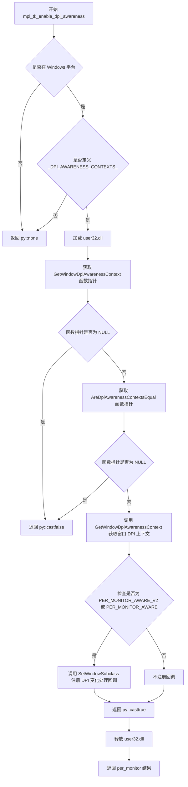
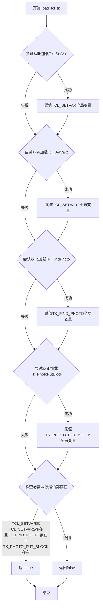
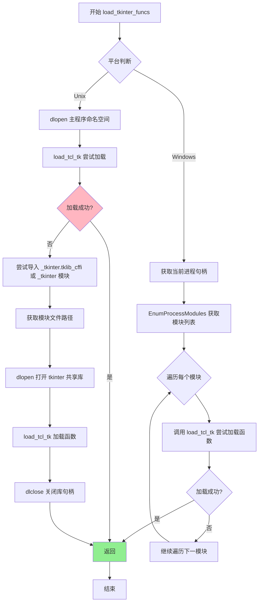
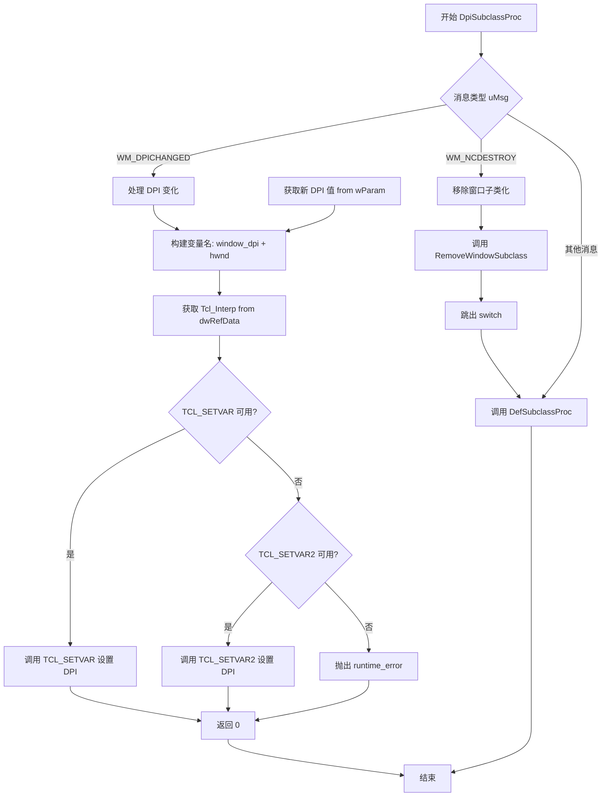

# `matplotlib\src\_tkagg.cpp` 详细设计文档

这是一个 pybind11 生成的 Python 扩展模块，作为 Matplotlib 的 TkAgg 后端，提供高性能的图形渲染功能（blit 操作）和 DPI 感知支持，通过动态加载 Tcl/Tk 函数指针与 tkinter 进行底层交互。

## 整体流程

```mermaid
graph TD
    A[模块加载 _tkagg] --> B[load_tkinter_funcs]
    B --> C{平台判断}
    C -->|Windows| D[EnumProcessModules 扫描进程模块]
    C -->|Unix| E[dlopen 加载 tkinter 库]
    D --> F[load_tcl_tk 解析函数指针]
    E --> F
    F --> G{验证函数指针}
    G -->|成功| H[注册 blit 和 enable_dpi_awareness]
    G -->|失败| I[抛出 ImportError]
    H --> J[Python 可调用 blit()/enable_dpi_awareness()]
    J --> K{blit 调用}
    K --> L[验证数据格式 RGBA]
    L --> M[构造 Tk_PhotoImageBlock]
    M --> N[TK_PHOTO_PUT_BLOCK 渲染]
    N --> O[返回结果]
```

## 类结构

```
无传统类层次结构 (C 风格模块)
└── PYBIND11_MODULE(_tkagg)
    ├── 模板函数: convert_voidptr<T>
    ├── 模板函数: load_tcl_tk<T>
    ├── 函数: mpl_tk_blit
    ├── 函数: mpl_tk_enable_dpi_awareness
    ├── 函数: load_tkinter_funcs
    └── Windows: DpiSubclassProc (回调)
```

## 全局变量及字段


### `TK_FIND_PHOTO`
    
Tk_FindPhoto_t 函数指针,用于查找 Tk 图像

类型：`Tk_FindPhoto_t`
    


### `TK_PHOTO_PUT_BLOCK`
    
Tk_PhotoPutBlock_t 函数指针,用于写入图像数据

类型：`Tk_PhotoPutBlock_t`
    


### `TCL_SETVAR`
    
Tcl_SetVar_t 函数指针,用于设置 Tcl 变量

类型：`Tcl_SetVar_t`
    


### `TCL_SETVAR2`
    
Tcl_SetVar2_t 函数指针,用于设置 Tcl 变量(二维)

类型：`Tcl_SetVar2_t`
    


    

## 全局函数及方法


### `convert_voidptr<T>`

这是一个模板函数，用于将 Python 对象（通常是表示内存地址的整数）安全地转换为指定类型的 C++ 指针。它封装了 Python C API 中的 `PyLong_AsVoidPtr` 来执行底层转换，并包含异常处理逻辑，当转换失败（如对象类型不兼容）时抛出 `py::error_already_set`。

参数：
-  `obj`：`const py::object &`，待转换的 Python 对象。该对象必须是能够被解释为内存地址的 Python 整数。

返回值：`T`，转换后的 C++ 指针类型（由模板参数 `T` 指定）。如果转换失败，抛出异常而非返回值。

#### 流程图

```mermaid
graph TD
    A([Start]) --> B[Call PyLong_AsVoidPtr on obj.ptr]
    B --> C{Is PyErr_Occurred?}
    C -->|Yes| D[Throw py::error_already_set]
    C -->|No| E[Return static_cast<T>(result)]
```

#### 带注释源码

```cpp
template <class T>
static T
convert_voidptr(const py::object &obj)
{
    // 使用 Python C API 将 Python 对象转换为 void* 指针。
    // 底层调用 PyLong_AsVoidPtr，要求 obj 是一个 Python 整数。
    auto result = static_cast<T>(PyLong_AsVoidPtr(obj.ptr()));
    
    // 检查转换过程中是否发生了 Python 错误（例如 obj 不是整数）。
    if (PyErr_Occurred()) {
        // 如果有错误，抛出 pybind11 异常以将其传播到 Python 层。
        throw py::error_already_set();
    }
    
    // 返回转换后的指定类型指针 T。
    return result;
}
```


### `mpl_tk_blit`

主渲染函数，负责将 NumPy RGBA 图像数据写入 Tk Photo 图像，是 Matplotlib TkAgg 后端的核心渲染函数。

参数：

- `interp_obj`：`py::object`，Tcl 解释器对象的 Python 表示，用于获取内部指针
- `photo_name`：`const char *`，要写入的 Tk Photo 图像的名称
- `data`：`py::array_t<unsigned char>`，三维 NumPy 数组，形状为 (height, width, 4)，存储 RGBA 像素数据
- `comp_rule`：`int`，Tk 图像合成规则，指定如何混合新像素与现有像素
- `offset`：`std::tuple<int, int, int, int>`，RGBA 四个通道在数据数组中的偏移量
- `bbox`：`std::tuple<int, int, int, int>`，边界框坐标 (x1, x2, y1, y2)，指定要更新的图像区域

返回值：`void`，函数通过抛出异常来处理错误情况

#### 流程图

```mermaid
flowchart TD
    A[开始 mpl_tk_blit] --> B[从 interp_obj 获取 Tcl_Interp 指针]
    B --> C{成功获取解释器?}
    C -->|否| D[抛出 value_error]
    C -->|是| E[通过名称查找 Tk_PhotoHandle]
    E --> F{找到 Photo?}
    F -->|否| G[抛出 value_error]
    F -->|是| H[检查数据形状: 最后一维必须为 4]
    H --> I{维度正确?}
    I -->|否| J[抛出 value_error]
    I -->|是| K[检查高度/宽度是否超出限制]
    K --> L{尺寸有效?}
    L -->|否| M[抛出 range_error]
    L -->|是| N[验证 bbox 边界]
    N --> O{bbox 有效?}
    O -->|否| P[抛出 value_error]
    O -->|是| Q[验证 comp_rule]
    Q -->{规则有效?}
    R -->|否| S[抛出 value_error]
    R -->|是| T[构建 Tk_PhotoImageBlock]
    T --> U[设置 pixelPtr 指向数据起始位置]
    U --> V[设置 width, height, pitch, pixelSize]
    V --> W[设置通道偏移量]
    W --> X[释放 GIL]
    X --> Y[调用 TK_PHOTO_PUT_BLOCK 写入数据]
    Y --> Z[重新获取 GIL]
    Z --> AA{写入成功?}
    AA -->|否| AB[抛出 bad_alloc]
    AA -->|是| AC[结束]
```

#### 带注释源码

```cpp
/**
 * mpl_tk_blit - 主渲染函数，将 NumPy RGBA 数据写入 Tk Photo 图像
 * 
 * 此函数是 Matplotlib TkAgg 后端的核心渲染函数，负责高效地将
 * NumPy 数组中的图像数据传递给 Tcl/Tk 进行显示。
 * 
 * @param interp_obj   Python 对象，包含 Tcl_Interp 指针
 * @param photo_name   Tk Photo 图像的名称字符串
 * @param data         NumPy uint8 数组，形状 (height, width, 4) 表示 RGBA
 * @param comp_rule    合成规则: TK_PHOTO_COMPOSITE_OVERLAY 或 TK_PHOTO_COMPOSITE_SET
 * @param offset       RGBA 通道偏移量元组 (r_off, g_off, b_off, a_off)
 * @param bbox         边界框元组 (x1, x2, y1, y2)，指定绘制区域
 */
static void
mpl_tk_blit(py::object interp_obj, const char *photo_name,
            py::array_t<unsigned char> data, int comp_rule,
            std::tuple<int, int, int, int> offset, std::tuple<int, int, int, int> bbox)
{
    // 第一步：将 Python 对象中的 Tcl_Interp 指针提取出来
    // convert_voidptr 是一个模板函数，将 Python 整数转换为 C 指针
    auto interp = convert_voidptr<Tcl_Interp *>(interp_obj);

    // 第二步：通过名称查找 Tk Photo 句柄
    // TK_FIND_PHOTO 是运行时加载的函数指针
    Tk_PhotoHandle photo;
    if (!(photo = TK_FIND_PHOTO(interp, photo_name))) {
        throw py::value_error("Failed to extract Tk_PhotoHandle");
    }

    // 第三步：获取 NumPy 数组的可写指针并验证维度
    // mutable_unchecked<3>() 返回三维数组的访问器，不进行边界检查但验证维度和可写性
    auto data_ptr = data.mutable_unchecked<3>();
    
    // 验证最后一维必须是 4（RGBA 四个通道）
    if (data.shape(2) != 4) {
        throw py::value_error(
            "Data pointer must be RGBA; last dimension is {}, not 4"_s.format(
                data.shape(2)));
    }
    
    // 验证高度不超过 Tk_PhotoPutBlock 的限制（INT_MAX）
    if (data.shape(0) > INT_MAX) {
        throw std::range_error(
            "Height ({}) exceeds maximum allowable size ({})"_s.format(
                data.shape(0), INT_MAX));
    }
    
    // 验证宽度不超过 Tk_PhotoImageBlock.pitch 字段的限制
    // pitch = 4 * width，所以 width <= INT_MAX / 4
    if (data.shape(1) > INT_MAX / 4) {
        throw std::range_error(
            "Width ({}) exceeds maximum allowable size ({})"_s.format(
                data.shape(1), INT_MAX / 4));
    }

    // 第四步：提取图像尺寸并转换为 int 类型
    const auto height = static_cast<int>(data.shape(0));
    const auto width = static_cast<int>(data.shape(1));
    
    // 第五步：解包边界框坐标
    int x1, x2, y1, y2;
    std::tie(x1, x2, y1, y2) = bbox;
    
    // 第六步：验证边界框有效性
    // 确保坐标在图像范围内，且 x1 < x2, y1 < y2
    if (0 > y1 || y1 > y2 || y2 > height || 0 > x1 || x1 > x2 || x2 > width) {
        throw py::value_error("Attempting to draw out of bounds");
    }
    
    // 第七步：验证合成规则
    if (comp_rule != TK_PHOTO_COMPOSITE_OVERLAY && comp_rule != TK_PHOTO_COMPOSITE_SET) {
        throw py::value_error("Invalid comp_rule argument");
    }

    // 第八步：构建 Tk_PhotoImageBlock 结构体
    int put_retval;
    Tk_PhotoImageBlock block;
    
    // pixelPtr: 指向图像数据的指针
    // 注意：Tk 的 y 坐标原点在底部，需要翻转 (height - y2)
    // 同时 x 坐标从 x1 开始
    block.pixelPtr = data_ptr.mutable_data(height - y2, x1, 0);
    
    // width 和 height: 要写入的像素区域大小
    block.width = x2 - x1;
    block.height = y2 - y1;
    
    // pitch: 每一行的字节数（用于内存对齐）
    block.pitch = 4 * width;
    
    // pixelSize: 每个像素的字节数（RGBA 为 4）
    block.pixelSize = 4;
    
    // offset: RGBA 四个通道在内存中的偏移量
    std::tie(block.offset[0], block.offset[1], block.offset[2], block.offset[3]) = offset;

    // 第九步：释放 GIL（全局解释器锁）以允许其他 Python 线程执行
    // 这是关键的性能优化，允许在渲染期间 Python 继续响应
    {
        py::gil_scoped_release release;
        
        // 调用 Tk 函数将图像数据写入 Photo 图像
        // 参数: interp, photo, block, x, y, width, height, comp_rule
        put_retval = TK_PHOTO_PUT_BLOCK(
            interp, photo, &block, x1, height - y2, x2 - x1, y2 - y1, comp_rule);
    }
    
    // 第十步：检查写入结果
    if (put_retval == TCL_ERROR) {
        throw std::bad_alloc();
    }
}
```


### `mpl_tk_enable_dpi_awareness`

该函数是 Windows 平台下的 DPI 感知启用函数，用于检测并启用窗口的 Per-Monitor DPI 感知模式，使应用程序能够响应不同显示器的 DPI 缩放设置。

参数：

- `frame_handle_obj`：`py::object`，窗口句柄（HWND）的 Python 对象封装
- `interp_obj`：`py::object`，Tcl 解释器对象的 Python 封装，用于设置 DPI 变化时的回调变量

返回值：`py::object`，返回是否成功启用 Per-Monitor DPI 感知（bool 类型），非 Windows 平台返回 None

#### 流程图



#### 带注释源码

```cpp
static py::object
mpl_tk_enable_dpi_awareness(py::object UNUSED_ON_NON_WINDOWS(frame_handle_obj),
                            py::object UNUSED_ON_NON_WINDOWS(interp_obj))
{
    // 仅在 Windows 平台上编译此函数体
#ifdef WIN32_DLL
    // 将 Python 对象转换为 Windows HWND 句柄类型
    auto frame_handle = convert_voidptr<HWND>(frame_handle_obj);
    // 将 Python 对象转换为 Tcl 解释器指针
    auto interp = convert_voidptr<Tcl_Interp *>(interp_obj);

    // 仅在具有 DPI 感知上下文的 Windows 版本上编译
#ifdef _DPI_AWARENESS_CONTEXTS_
    // 动态加载 user32.dll 系统库
    HMODULE user32 = LoadLibrary("user32.dll");

    // 定义函数指针类型：GetWindowDpiAwarenessContext
    typedef DPI_AWARENESS_CONTEXT (WINAPI *GetWindowDpiAwarenessContext_t)(HWND);
    GetWindowDpiAwarenessContext_t GetWindowDpiAwarenessContextPtr =
        (GetWindowDpiAwarenessContext_t)GetProcAddress(
            user32, "GetWindowDpiAwarenessContext");
    // 如果无法获取函数指针，释放库并返回 false
    if (GetWindowDpiAwarenessContextPtr == NULL) {
        FreeLibrary(user32);
        return py::cast(false);
    }

    // 定义函数指针类型：AreDpiAwarenessContextsEqual
    typedef BOOL (WINAPI *AreDpiAwarenessContextsEqual_t)(DPI_AWARENESS_CONTEXT,
                                                          DPI_AWARENESS_CONTEXT);
    AreDpiAwarenessContextsEqual_t AreDpiAwarenessContextsEqualPtr =
        (AreDpiAwarenessContextsEqual_t)GetProcAddress(
            user32, "AreDpiAwarenessContextsEqual");
    // 如果无法获取函数指针，释放库并返回 false
    if (AreDpiAwarenessContextsEqualPtr == NULL) {
        FreeLibrary(user32);
        return py::cast(false);
    }

    // 获取窗口的当前 DPI 感知上下文
    DPI_AWARENESS_CONTEXT ctx = GetWindowDpiAwarenessContextPtr(frame_handle);
    // 检查是否为 Per-Monitor DPI 感知模式（支持 V2 或 原始版本）
    bool per_monitor = (
        AreDpiAwarenessContextsEqualPtr(
            ctx, DPI_AWARENESS_CONTEXT_PER_MONITOR_AWARE_V2) ||
        AreDpiAwarenessContextsEqualPtr(
            ctx, DPI_AWARENESS_CONTEXT_PER_MONITOR_AWARE));

    if (per_monitor) {
        // Per monitor aware 模式下需要处理 WM_DPICHANGED 消息
        // 通过子类化窗口过程来处理 DPI 变化
        // Python 端需要追踪 Tk 窗口的 window_dpi 变量
        SetWindowSubclass(frame_handle, DpiSubclassProc, 0, (DWORD_PTR)interp);
    }
    // 释放 user32.dll 库句柄
    FreeLibrary(user32);
    // 返回是否支持 Per-Monitor DPI 感知
    return py::cast(per_monitor);
#endif
#endif

    // 非 Windows 平台或不支持 DPI 感知上下文时返回 None
    return py::none();
}
```


### `load_tcl_tk<T>`

该模板函数用于从动态库（Unix 系统为 `dlopen` 获得的句柄，Windows 系统为模块句柄）中解析 Tcl/Tk 运行时函数指针，填充全局函数指针变量，并通过 dlsym (Windows 上为 GetProcAddress) 尝试获取 `Tcl_SetVar`、`Tcl_SetVar2`、`Tk_FindPhoto` 和 `Tk_PhotoPutBlock` 四个关键函数的地址，最后返回是否成功加载了必要的函数（需要 Tcl_SetVar 或 Tcl_SetVar2 至少存在一个，且 Tk_FindPhoto 和 Tk_PhotoPutBlock 都存在）。

参数：

- `lib`：`T`，动态库的句柄（Unix 系统为 `void*`，Windows 系统为 `HMODULE`），表示要从哪个模块加载 Tcl/Tk 函数符号

返回值：`bool`，如果成功加载了所有必需的 Tcl/Tk 函数指针（`Tcl_SetVar` 或 `Tcl_SetVar2` 至少一个，且 `Tk_FindPhoto` 和 `Tk_PhotoPutBlock` 都存在），则返回 `true`，否则返回 `false`

#### 流程图



#### 带注释源码

```cpp
/**
 * @brief 从动态库加载 Tcl/Tk 函数指针的模板函数
 * 
 * 该函数是一个模板函数，接受一个动态库句柄作为参数，尝试从该库中解析
 * Tcl/Tk 运行时函数指针。它用于在运行时动态绑定 Tcl/Tk 库函数，
 * 使得 matplotlib 的 tkagg 后端可以在不直接链接 Tcl/Tk 库的情况下调用它们。
 * 
 * @tparam T 动态库句柄类型，在 Unix 系统为 void*，在 Windows 系统为 HMODULE
 * @param lib 动态库的句柄，通过 dlopen (Unix) 或 EnumProcessModules (Windows) 获得
 * @return bool 是否成功加载了所有必需的函数指针
 */
template <class T>
bool load_tcl_tk(T lib)
{
    // 尝试从给定的动态库中加载 Tcl_SetVar 函数指针
    // Tcl_SetVar 是 Tcl 库中用于设置变量值的函数
    if (auto ptr = dlsym(lib, "Tcl_SetVar")) {
        // 将获取的指针转换为正确的函数类型并存储到全局变量中
        TCL_SETVAR = (Tcl_SetVar_t)ptr;
    }
    
    // 尝试从给定的动态库中加载 Tcl_SetVar2 函数指针
    // Tcl_SetVar2 是 Tcl_SetVar 的二维版本，支持数组操作
    if (auto ptr = dlsym(lib, "Tcl_SetVar2")) {
        TCL_SETVAR2 = (Tcl_SetVar2_t)ptr;
    }
    
    // 尝试从给定的动态库中加载 Tk_FindPhoto 函数指针
    // Tk_FindPhoto 用于在 Tcl 解释器中查找已存在的图片对象
    if (auto ptr = dlsym(lib, "Tk_FindPhoto")) {
        TK_FIND_PHOTO = (Tk_FindPhoto_t)ptr;
    }
    
    // 尝试从给定的动态库中加载 Tk_PhotoPutBlock 函数指针
    // Tk_PhotoPutBlock 用于将图像数据块写入 Tk 图片对象
    if (auto ptr = dlsym(lib, "Tk_PhotoPutBlock")) {
        TK_PHOTO_PUT_BLOCK = (Tk_PhotoPutBlock_t)ptr;
    }
    
    // 返回是否成功加载了所有必需的函数
    // 必须满足以下条件之一：
    // 1. Tcl_SetVar 或 Tcl_SetVar2 至少存在一个（用于设置变量）
    // 2. Tk_FindPhoto 必须存在（用于查找图片）
    // 3. Tk_PhotoPut_BLOCK 必须存在（用于绘制图片）
    return (TCL_SETVAR || TCL_SETVAR2) && TK_FIND_PHOTO && TK_PHOTO_PUT_BLOCK;
}
```


### `load_tkinter_funcs`

该函数是平台特定的 tkinter 函数加载入口，在 Windows 平台上通过枚举进程模块来查找 Tcl/Tk 函数符号，在 Unix平台上则通过 dlopen 从主程序命名空间或 tkinter 动态库中加载 Tcl/Tk 函数。

参数：该函数无显式参数（平台内部调用，无参数列表）

返回值：`void`，无返回值

#### 流程图



#### 带注释源码

```cpp
#ifdef WIN32_DLL

/* On Windows, we can't load the tkinter module to get the Tcl/Tk symbols,
 * because Windows does not load symbols into the library name-space of
 * importing modules. So, knowing that tkinter has already been imported by
 * Python, we scan all modules in the running process for the Tcl/Tk function
 * names.
 */

static void
load_tkinter_funcs()
{
    // 获取当前进程的伪句柄，不需要关闭
    HANDLE process = GetCurrentProcess();
    DWORD size;
    
    // 第一次调用获取所需缓冲区大小
    if (!EnumProcessModules(process, NULL, 0, &size)) {
        PyErr_SetFromWindowsErr(0);  // 设置 Python 错误
        throw py::error_already_set();  // 抛出 pybind11 异常
    }
    
    // 计算模块数量并分配向量
    auto count = size / sizeof(HMODULE);
    auto modules = std::vector<HMODULE>(count);
    
    // 第二次调用获取实际模块句柄
    if (!EnumProcessModules(process, modules.data(), size, &size)) {
        PyErr_SetFromWindowsErr(0);
        throw py::error_already_set();
    }
    
    // 遍历所有模块，尝试加载 Tcl/Tk 函数
    for (auto mod: modules) {
        if (load_tcl_tk(mod)) {
            return;  // 成功加载后返回
        }
    }
}

#else  // not Windows

/*
 * On Unix, we can get the Tk symbols from the tkinter module, because tkinter
 * uses these symbols, and the symbols are therefore visible in the tkinter
 * dynamic library (module).
 */

static void
load_tkinter_funcs()
{
    // Load tkinter global funcs from tkinter compiled module.

    // 首先尝试从主程序命名空间加载
    auto main_program = dlopen(nullptr, RTLD_LAZY);
    auto success = load_tcl_tk(main_program);
    
    // 主程序始终存在，不需要保持引用
    if (dlclose(main_program)) {
        throw std::runtime_error(dlerror());
    }
    
    // 如果主程序命名空间加载成功，则返回
    if (success) {
        return;
    }

    py::object module;
    
    // 首先尝试 PyPy，因为 CPython 导入会正确失败
    try {
        module = py::module_::import("_tkinter.tklib_cffi");  // PyPy
    } catch (py::error_already_set &e) {
        module = py::module_::import("_tkinter");  // CPython
    }
    
    // 获取模块文件路径并转换为字符串
    auto py_path = module.attr("__file__");
    auto py_path_b = py::reinterpret_steal<py::bytes>(
        PyUnicode_EncodeFSDefault(py_path.ptr()));
    std::string path = py_path_b;
    
    // 以延迟绑定模式打开 tkinter 共享库
    auto tkinter_lib = dlopen(path.c_str(), RTLD_LAZY);
    if (!tkinter_lib) {
        throw std::runtime_error(dlerror());
    }
    
    // 尝试加载 Tcl/Tk 函数
    load_tcl_tk(tkinter_lib);
    
    // tkinter 已被导入，不需要保持引用
    if (dlclose(tkinter_lib)) {
        throw std::runtime_error(dlerror());
    }
}
#endif // end not Windows
```


### `DpiSubclassProc`

处理 DPI 变化消息的 Windows 窗口子类化回调函数。当系统 DPI 发生变化时，该函数捕获 `WM_DPICHANGED` 消息并将新的 DPI 值通过 Tcl 变量通知 Python 端；同时处理 `WM_NCDESTROY` 消息以移除子类化。

参数：

- `hwnd`：`HWND`，窗口句柄
- `uMsg`：`UINT`，窗口消息类型
- `wParam`：`WPARAM`，消息的附加信息（对于 WM_DPICHANGED，包含 DPI 值）
- `lParam`：`LPARAM`，消息的附加信息
- `uIdSubclass`：`UINT_PTR`，子类化标识符
- `dwRefData`：`DWORD_PTR`，引用数据，此处传入 Tcl_Interp 指针

返回值：`LRESULT`，返回 0 表示已处理消息，返回 DefSubclassProc 的默认处理结果

#### 流程图



#### 带注释源码

```cpp
LRESULT CALLBACK
DpiSubclassProc(HWND hwnd, UINT uMsg, WPARAM wParam, LPARAM lParam,
                UINT_PTR uIdSubclass, DWORD_PTR dwRefData)
{
    // 使用 switch 语句处理不同的窗口消息
    switch (uMsg) {
    case WM_DPICHANGED:
        // 这是一个子类化的窗口过程，在 Tcl/Tk 事件循环期间运行。
        // 不幸的是，Tkinter 有一个不公开的第二个 Tcl 线程锁，
        // 但在窗口过程期间被占用。因此，虽然可以获取 GIL 来调用 Python 代码，
        // 但不能从 Python 调用任何 Tk 代码。只使用 C 中的 Tcl 调用。
        {
            // 变量名必须与 lib/matplotlib/backends/_backend_tk.py:FigureManagerTk 中使用的名称匹配
            std::string var_name("window_dpi");
            var_name += std::to_string((unsigned long long)hwnd);

            // X 是高字，Y 是低字，但它们总是相等的
            std::string dpi = std::to_string(LOWORD(wParam));

            // 从 dwRefData 获取 Tcl 解释器指针
            Tcl_Interp* interp = (Tcl_Interp*)dwRefData;
            
            // 优先使用 TCL_SETVAR，如果不可用则尝试 TCL_SETVAR2
            if (TCL_SETVAR) {
                TCL_SETVAR(interp, var_name.c_str(), dpi.c_str(), 0);
            } else if (TCL_SETVAR2) {
                TCL_SETVAR2(interp, var_name.c_str(), NULL, dpi.c_str(), 0);
            } else {
                // 这应该在导入时被阻止，因此不可达。
                // 但为了防御起见，还是抛出异常
                throw std::runtime_error("Unable to call Tcl_SetVar or Tcl_SetVar2");
            }
        }
        // DPI 更改已处理，返回 0
        return 0;
    case WM_NCDESTROY:
        // 窗口的非客户区被销毁，移除子类化
        RemoveWindowSubclass(hwnd, DpiSubclassProc, uIdSubclass);
        break;
    }

    // 对于其他消息，使用默认的子类过程处理
    return DefSubclassProc(hwnd, uMsg, wParam, lParam);
}
```

## 关键组件


### 动态符号加载机制

在运行时从tkinter模块或Windows系统库中动态加载Tcl/Tk函数指针（Tcl_SetVar、Tcl_SetVar2、Tk_FindPhoto、Tk_PhotoPutBlock），实现与tkinter后端的运行时绑定

### mpl_tk_blit 渲染函数

将NumPy数组中的RGBA图像数据通过Tk的Photo图像机制渲染到Tk窗口，支持边界裁剪和混合模式，同时处理GIL释放以避免阻塞Python解释器

### DPI感知与窗口子类化

在Windows上通过SubclassProc窗口过程处理WM_DPICHANGED消息，动态更新Tcl解释器中的window_dpi变量，实现高DPI显示器的缩放支持

### 跨平台加载策略

Unix系统从tkinter动态库直接加载符号，Windows系统通过枚举进程模块扫描Tcl/Tk函数，提供统一的函数指针初始化接口

### PyBind11模块导出

通过PYBIND11_MODULE定义Python扩展接口，导出blit和enable_dpi_awareness函数及Tk常量，提供与Matplotlib后端的集成点


## 问题及建议


### 已知问题

- **异常处理不一致**：代码混合使用了多种异常类型（`py::value_error`、`std::range_error`、`std::bad_alloc`、`py::error_already_set`、`py::import_error`），缺乏统一的错误处理策略，增加调试难度。
- **双重异常抛出**：在模块初始化时捕获`py::error_already_set`后又立即重新抛出（`throw py::error_already_set();`），导致异常处理逻辑冗余且可能掩盖原始错误信息。
- **Windows模块枚举无失败处理**：`load_tkinter_funcs()`在Windows平台上遍历模块列表，若所有模块都未找到Tcl/Tk函数，函数正常返回但全局函数指针仍为NULL，后续调用将导致空指针解引用崩溃。
- **GIL释放后缺乏保护**：`mpl_tk_blit`中释放GIL调用`TK_PHOTO_PUT_BLOCK`后没有检查Tk事件循环是否可能被其他线程修改，线程安全性不足。
- **边界检查不完整**：宽度检查仅验证`data.shape(1) > INT_MAX / 4`，但未直接检查`x2 - x1`是否超出有效范围，可能导致整数溢出或边界外访问。
- **缺乏日志/调试信息**：模块加载失败时仅抛出ImportError，缺乏详细的调试信息（如尝试加载的模块名称、具体缺失的函数名），难以定位问题。
- **模板实例化位置**：辅助函数`convert_voidptr<T>`和`load_tcl_tk<T>`在.cpp文件中作为静态函数模板实现，无法被其他编译单元复用，且未显式实例化常用类型。

### 优化建议

- **统一错误处理策略**：定义自定义异常类或统一使用pybind11的异常类型，在捕获异常时记录详细的上下文信息（如函数名、参数值）。
- **添加模块加载失败处理**：在`load_tkinter_funcs()`的Windows路径中，若遍历完所有模块仍未找到所需函数，应抛出明确的异常而非静默返回。
- **增强边界验证**：在计算`bbox`坐标时，增加对`x2 - x1`和`y2 - y1`是否超过INT_MAX的显式检查，并考虑使用size_t进行更安全的尺寸计算。
- **添加调试日志**：在关键路径（函数加载、blit调用、DPI感知设置）添加可配置的调试输出，帮助开发者诊断问题。
- **考虑缓存Photo Handle**：`TK_FIND_PHOTO`每次调用都会查找photo对象，可考虑在Python侧维护句柄缓存以减少开销。
- **分离平台相关代码**：将Windows和Unix的平台特定代码分别移至独立源文件，通过抽象接口调用，提高代码可维护性。
- **显式实例化模板**：为常用类型（如`Tcl_Interp*`、`HWND`）显式实例化`convert_voidptr`模板，或将其移至头文件以支持链接时实例化。


## 其它


### 设计目标与约束

本模块的设计目标是作为Matplotlib的Tk后端的高性能图像渲染引擎，通过直接调用Tcl/Tk的底层C API来实现图像数据的快速推送（blit），同时支持Windows平台的高DPI感知功能。核心约束包括：1）跨平台支持（Windows和Unix-like系统）；2）运行时动态加载Tcl/Tk符号而非静态链接；3）不引入额外的Python GIL阻塞以保持响应性；4）最小化外部依赖，仅依赖Python解释器、Tcl/Tk运行时和pybind11。

### 错误处理与异常设计

错误处理采用三层机制：1）Python异常传播使用py::error_already_set捕获并重新抛出Python错误；2）C++标准异常用于范围错误（std::range_error）、内存分配失败（std::bad_alloc）和运行时错误（std::runtime_error）；3）系统错误使用PyErr_SetFromWindowsErr（Windows）和PyErr_SetString设置Python OSError。关键函数的错误情况包括：blit函数对数据形状（必须为RGBA 4通道）、尺寸限制（INT_MAX）、边界框有效性、comp_rule参数合法性的验证；enable_dpi_awareness对Windows API函数可用性的检查；load_tkinter_funcs对模块加载和符号解析失败的捕获。所有Python API函数都设计为在失败时抛出异常而非返回错误码。

### 数据流与状态机

数据流遵循以下路径：Python调用blit函数 → 参数验证（数据维度、形状、边界） → 转换Python对象为C类型（Tcl_Interp、Tk_PhotoHandle） → 构造Tk_PhotoImageBlock结构 → 释放GIL调用TK_PHOTO_PUT_BLOCK → 恢复GIL → 返回。数据状态机涉及：1）输入状态：data数组需为三维numpy数组（height, width, 4），writeable；2）处理状态：block结构已填充，offset和bbox已解析；3）输出状态：Tk图像已更新。无复杂状态机，但存在条件分支处理不同平台（Windows vs Unix）和不同Tcl/Tk版本（函数指针可能为空）。

### 外部依赖与接口契约

外部依赖包括：1）Python C API和pybind11库用于Python扩展模块开发；2）Tcl/Tk运行时库（动态加载），需要Tcl_SetVar/Tcl_SetVar2、Tk_FindPhoto、Tk_PhotoPutBlock函数符号；3）Windows特定：kernel32.dll、user32.dll、psapi.dll（Windows平台）；4）Unix特定：dlfcn.h接口。接口契约方面，blit函数接受6个参数（interp对象、photo_name字符串、data数组、comp_rule整数、offset元组、bbox元组），返回void；enable_dpi_awareness接受2个参数，返回Python对象（bool或None）。

### 安全性考虑

安全性措施包括：1）输入验证：检查data.shape(2)==4、尺寸不超过INT_MAX、边界框在有效范围内；2）指针安全：convert_voidptr模板函数使用PyLong_AsVoidPtr并进行错误检查；3）Windows API安全：检查函数指针非空后才调用；4）资源管理：使用py::gil_scoped_release临时释放GIL避免死锁；5）字符串安全：使用std::string而非原始char*避免缓冲区问题。

### 性能考虑

性能优化策略：1）GIL管理：在Tk_PhotoPutBlock调用期间释放GIL，允许其他Python线程执行，这对于大量图像更新至关重要；2）内存访问：直接使用mutable_unchecked<3>()获取numpy数组数据指针，避免复制；3）指针算术：计算pixelPtr时使用偏移量直接指向数据，减少计算开销；4）Windows优化：使用预编译头和最小化头文件包含（WIN32_LEAN_AND_MEAN）。

### 并发考虑

并发特性：1）Python GIL保护：主线程安全，但通过gil_scoped_release在Tk调用期间临时释放；2）Windows窗口回调：DpiSubclassProc在Tcl/Tk事件循环线程中运行，代码注释明确指出不能从该回调中调用Tk代码；3）多模块扫描：Windows平台的load_tkinter_funcs枚举进程模块存在潜在竞争，但模块列表在调用期间通常稳定。

### 版本兼容性与构建考虑

版本兼容性：1）Python版本：通过pybind11支持Python 3.6+；2）Tcl/Tk版本：动态加载机制兼容不同版本，但需要特定函数符号存在；3）Windows SDK：代码针对Windows 8.1+（WINVER 0x0603），并检查MinGW版本；4）编译器：支持GCC和MSVC。构建时需要：pybind11头文件、Python开发头文件、Tcl/Tk开发库（Windows下需链接psapi.lib）、Windows SDK。

### 测试与调试考虑

测试策略：1）单元测试应覆盖blit函数的各种输入（有效/无效数据形状、边界框、DPI awareness状态）；2）集成测试需要实际的Tk环境；3）错误条件测试（模拟Tcl/Tk加载失败）；4）性能基准测试评估blit调用的吞吐量。调试支持：模块导出TK_PHOTO_COMPOSITE_OVERLAY和TK_PHOTO_COMPOSITE_SET常量便于调试，Windows平台WM_DPICHANGED处理提供DPI变化的可观测性。
    