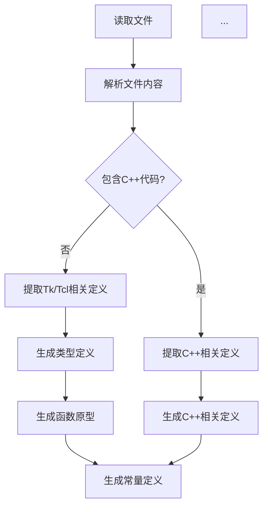
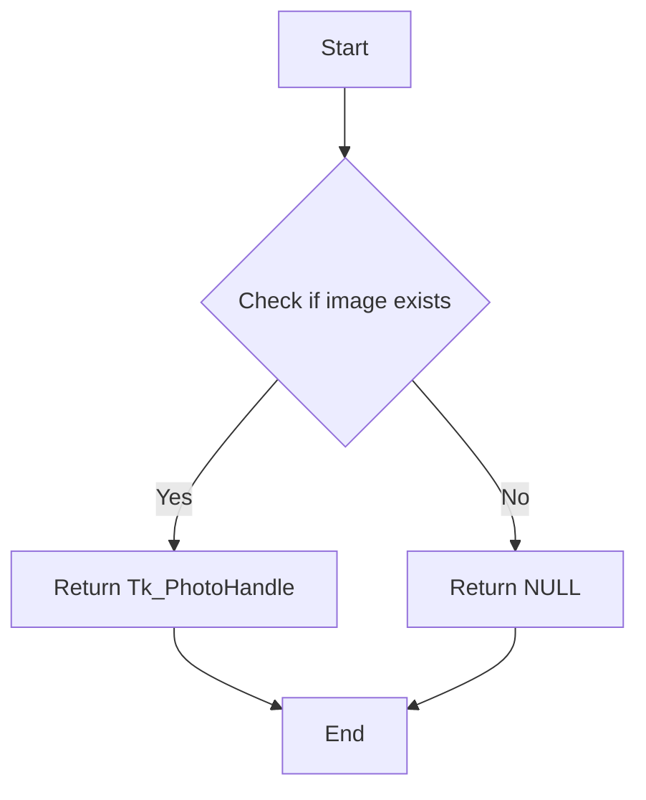
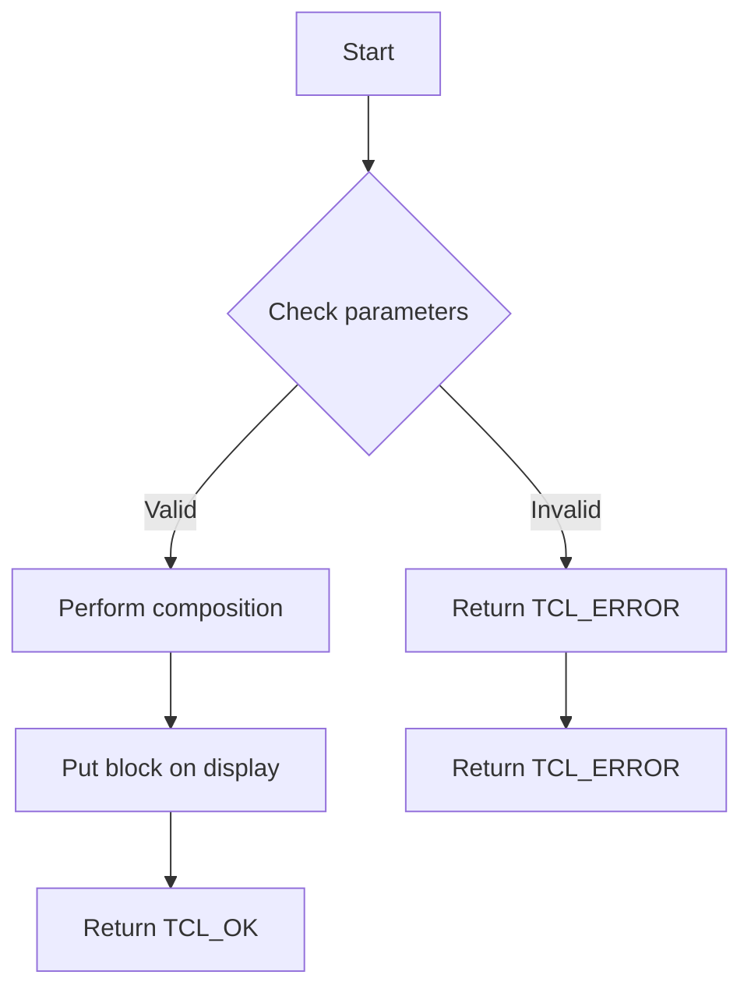
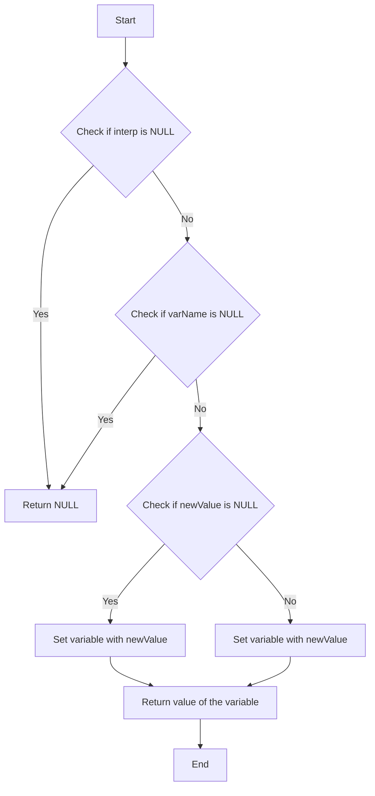
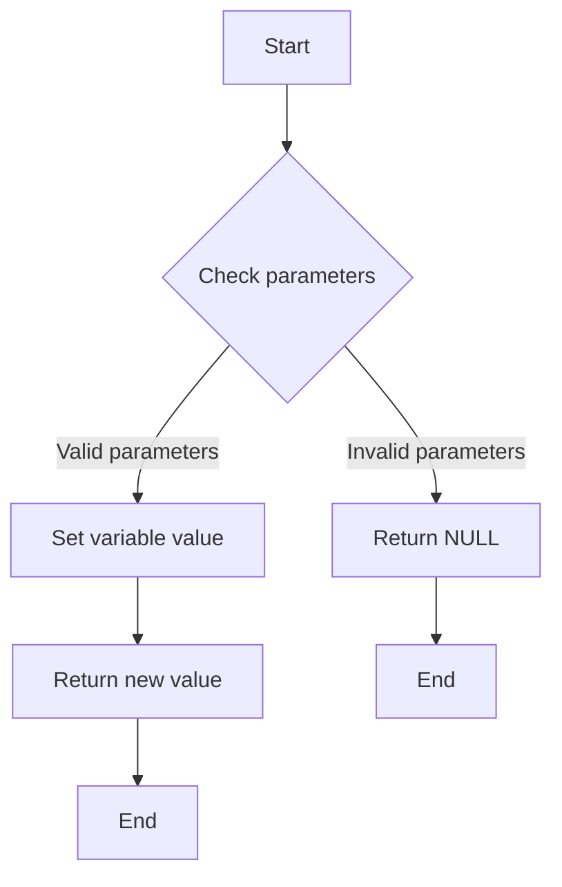
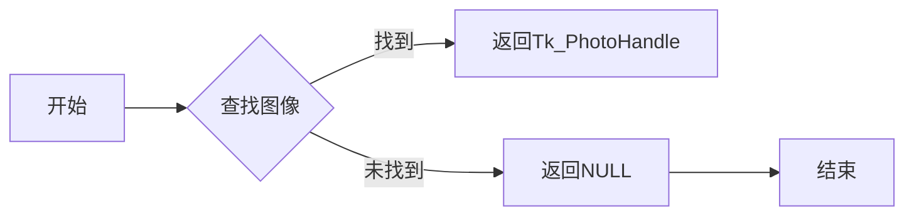
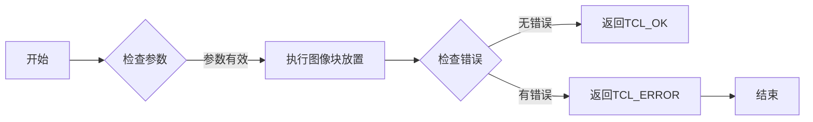
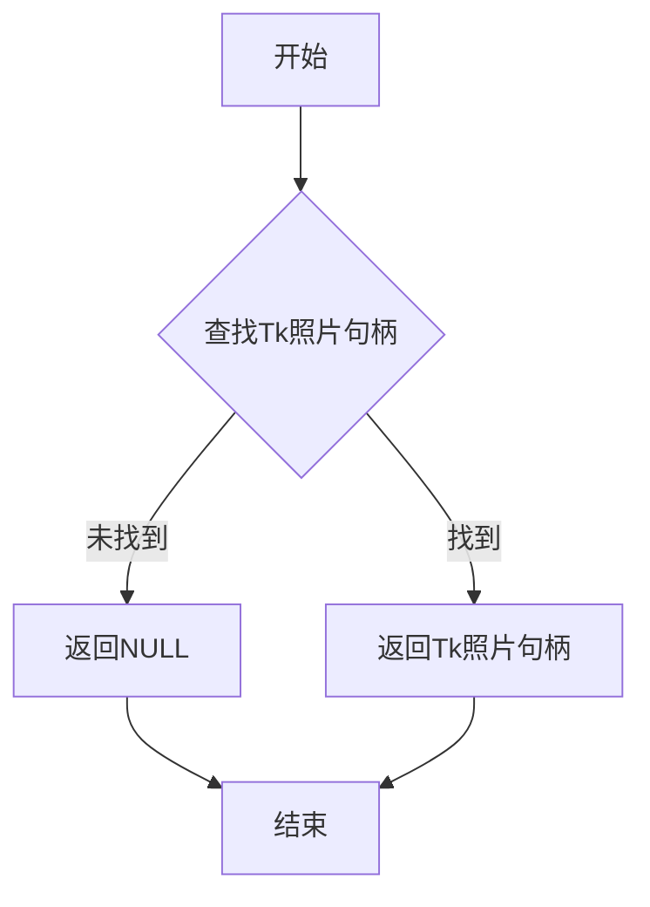

# `matplotlib\src\_tkmini.h` 详细设计文档

This code snippet contains excerpts from the Tcl/Tk headers, including type definitions, function prototypes, and constants used in the Tk and Tcl libraries.

## 整体流程



## 类结构

```
Tcl/Tk Headers (根)
├── 类型定义
│   ├── Tk_PhotoHandle
│   ├── Tk_PhotoImageBlock
│   ├── Tcl_Interp
│   └── ...
├── 函数原型
│   ├── Tk_FindPhoto_t
│   ├── Tk_PhotoPutBlock_t
│   ├── Tcl_SetVar_t
│   └── Tcl_SetVar2_t
└── 常量定义
    ├── TK_PHOTO_COMPOSITE_OVERLAY
    ├── TK_PHOTO_COMPOSITE_SET
    ├── TCL_OK
    └── TCL_ERROR
```

## 全局变量及字段


### `Tk_PhotoHandle`
    
A handle to a Tk photo image.

类型：`void*`
    


### `Tk_PhotoImageBlock`
    
A block of image data for a Tk photo image.

类型：`struct`
    


### `Tcl_Interp`
    
An interpreter context in Tcl.

类型：`struct`
    


### `TK_PHOTO_COMPOSITE_OVERLAY`
    
Composite rule for overlaying images pixel-wise.

类型：`int`
    


### `TK_PHOTO_COMPOSITE_SET`
    
Composite rule for setting the image buffer directly.

类型：`int`
    


### `TCL_OK`
    
Tcl return code indicating success.

类型：`int`
    


### `TCL_ERROR`
    
Tcl return code indicating an error.

类型：`int`
    


### `Tk_PhotoImageBlock.pixelPtr`
    
Pointer to the pixel data of the image block.

类型：`unsigned char*`
    


### `Tk_PhotoImageBlock.width`
    
Width of the image block.

类型：`int`
    


### `Tk_PhotoImageBlock.height`
    
Height of the image block.

类型：`int`
    


### `Tk_PhotoImageBlock.pitch`
    
Pitch of the image block, which is the number of bytes per line of pixels.

类型：`int`
    


### `Tk_PhotoImageBlock.pixelSize`
    
Size of each pixel in bytes.

类型：`int`
    


### `Tk_PhotoImageBlock.offset`
    
Offset values for the image block.

类型：`int[4]`
    


### `Tk_PhotoHandle.pixelPtr`
    
Pointer to the pixel data of the photo image.

类型：`unsigned char*`
    


### `Tk_PhotoHandle.width`
    
Width of the photo image.

类型：`int`
    


### `Tk_PhotoHandle.height`
    
Height of the photo image.

类型：`int`
    


### `Tk_PhotoHandle.pitch`
    
Pitch of the photo image.

类型：`int`
    


### `Tk_PhotoHandle.pixelSize`
    
Size of each pixel in the photo image.

类型：`int`
    


### `Tk_PhotoHandle.offset`
    
Offset values for the photo image.

类型：`int[4]`
    
    

## 全局函数及方法


### Tk_FindPhoto_t

查找并返回与指定图像名称关联的Tk PhotoHandle。

参数：

- `interp`：`Tcl_Interp*`，Tk解释器指针，用于上下文信息。
- `imageName`：`const char*`，图像名称，用于查找图像。

返回值：`Tk_PhotoHandle`，与图像名称关联的Tk PhotoHandle。如果找不到图像，则返回NULL。

#### 流程图



#### 带注释源码

```
Tk_PhotoHandle (*Tk_FindPhoto_t) (Tcl_Interp *interp, const char *imageName) {
    // Implementation would go here
    // This is a placeholder as the actual implementation is not provided in the code snippet
}
```


### Tk_PhotoPutBlock_t

This function is used to put a block of pixels from a Tk photo image into the display. It handles the composition of the image with the display content according to the specified composition rule.

参数：

- `interp`：`Tcl_Interp*`，The interpreter context in which the operation is performed.
- `handle`：`Tk_PhotoHandle`，The handle of the Tk photo image from which the block of pixels is taken.
- `blockPtr`：`Tk_PhotoImageBlock*`，A pointer to a Tk_PhotoImageBlock structure containing the pixel data to be put.
- `x`：`int`，The x-coordinate of the top-left corner of the block in the destination.
- `y`：`int`，The y-coordinate of the top-left corner of the block in the destination.
- `width`：`int`，The width of the block in pixels.
- `height`：`int`，The height of the block in pixels.
- `compRule`：`int`，The composition rule to use when combining the image with the display content.

返回值：`int`，Indicates success or failure. Returns `TCL_OK` on success, `TCL_ERROR` on failure.

#### 流程图



#### 带注释源码

```
int Tk_PhotoPutBlock_t(Tcl_Interp *interp, Tk_PhotoHandle handle,
        Tk_PhotoImageBlock *blockPtr, int x, int y,
        int width, int height, int compRule) {
    // Check if parameters are valid
    if (interp == NULL || handle == NULL || blockPtr == NULL) {
        return TCL_ERROR;
    }
    
    // Perform composition based on compRule
    switch (compRule) {
        case TK_PHOTO_COMPOSITE_OVERLAY:
            // Apply transparency rules pixel-wise
            break;
        case TK_PHOTO_COMPOSITE_SET:
            // Set image buffer directly
            break;
        default:
            return TCL_ERROR;
    }
    
    // Put block on display
    // (Implementation details omitted for brevity)
    
    return TCL_OK;
}
```


### `Tcl_SetVar_t`

Sets a variable in the specified interpreter.

参数：

- `interp`：`Tcl_Interp*`，The interpreter in which to set the variable.
- `varName`：`const char*`，The name of the variable to set.
- `newValue`：`const char*`，The new value for the variable.
- `flags`：`int`，Flags that control the behavior of the function.

返回值：`const char*`，The value of the variable after it has been set, or `NULL` if an error occurs.

#### 流程图



#### 带注释源码

```
/* Tcl_SetVar typedef */
typedef const char *(*Tcl_SetVar_t)(Tcl_Interp *interp, const char *varName,
                                    const char *newValue, int flags);
```


### `Tcl_SetVar2_t`

`Tcl_SetVar2_t` 是一个函数指针类型，它指向一个函数，该函数用于在给定的解释器中设置变量的值。

参数：

- `interp`：`Tcl_Interp*`，指向当前解释器的指针。
- `part1`：`const char*`，变量的第一个部分。
- `part2`：`const char*`，变量的第二个部分。
- `newValue`：`const char*`，要设置的变量的新值。
- `flags`：`int`，设置变量时使用的标志。

返回值：`const char*`，如果成功，则返回新值的字符串表示形式；如果失败，则返回 NULL。

#### 流程图



#### 带注释源码

```
/* Typedef derived from function signatures in Tcl header */
typedef const char *(*Tcl_SetVar2_t)(Tcl_Interp *interp, const char *part1, const char *part2,
                                     const char *newValue, int flags);
```


### Tk_FindPhoto

查找并返回与指定图像名称关联的Tk_PhotoHandle。

参数：

- `interp`：`Tcl_Interp*`，Tk解释器句柄，用于执行Tk命令。
- `imageName`：`const char*`，图像名称，用于查找图像。

返回值：`Tk_PhotoHandle`，与图像名称关联的Tk_PhotoHandle，如果未找到则返回NULL。

#### 流程图



#### 带注释源码

```c
Tk_PhotoHandle Tk_FindPhoto(Tcl_Interp *interp, const char *imageName) {
    // 查找图像的代码
    // ...
}
```


### Tk_PhotoPutBlock

将图像块放入Tk图像中。

参数：

- `interp`：`Tcl_Interp*`，Tk解释器句柄，用于执行Tk命令。
- `handle`：`Tk_PhotoHandle`，图像句柄，表示要放置图像块的图像。
- `blockPtr`：`Tk_PhotoImageBlock*`，图像块信息，包含像素指针、宽高、像素大小等。
- `x`：`int`，图像块在目标图像中的x坐标。
- `y`：`int`，图像块在目标图像中的y坐标。
- `width`：`int`，图像块的宽度。
- `height`：`int`，图像块的高度。
- `compRule`：`int`，组合规则，指定如何处理透明像素。

返回值：`int`，如果成功则返回TCL_OK，否则返回TCL_ERROR。

#### 流程图



#### 带注释源码

```c
int Tk_PhotoPutBlock(Tcl_Interp *interp, Tk_PhotoHandle handle,
                      Tk_PhotoImageBlock *blockPtr, int x, int y,
                      int width, int height, int compRule) {
    // 检查参数的代码
    // ...
    
    // 执行图像块放置的代码
    // ...
    
    // 检查错误并返回结果
    // ...
}
```


### Tk_PhotoImageBlock

Tk_PhotoImageBlock 是一个结构体，用于描述一个图像块的信息。

参数：

- `pixelPtr`：`unsigned char*`，指向图像像素数据的指针。
- `width`：`int`，图像块的宽度。
- `height`：`int`，图像块的高度。
- `pitch`：`int`，图像数据每行的像素数。
- `pixelSize`：`int`，每个像素的大小，以位为单位。
- `offset[4]`：`int[4]`，表示图像块的偏移量。

返回值：无

#### 流程图

```mermaid
classDiagram
    Tk_PhotoImageBlock <<struct>>
    pixelPtr : unsigned char*
    width : int
    height : int
    pitch : int
    pixelSize : int
    offset : int[4]
```

#### 带注释源码

```
typedef struct Tk_PhotoImageBlock
{
    unsigned char *pixelPtr; // 指向图像像素数据的指针
    int width;               // 图像块的宽度
    int height;              // 图像块的高度
    int pitch;               // 图像数据每行的像素数
    int pixelSize;           // 每个像素的大小，以位为单位
    int offset[4];           // 表示图像块的偏移量
} Tk_PhotoImageBlock;
```


### `Tk_FindPhoto`

查找并返回与指定图像名称关联的Tk照片句柄。

参数：

- `interp`：`Tcl_Interp*`，Tcl解释器句柄，用于执行Tk操作。
- `imageName`：`const char*`，图像名称，用于查找对应的Tk照片句柄。

返回值：`Tk_PhotoHandle`，与指定图像名称关联的Tk照片句柄。如果找不到对应的照片句柄，则返回`NULL`。

#### 流程图



#### 带注释源码

```
Tk_PhotoHandle (*Tk_FindPhoto_t) (Tcl_Interp *interp, const char *imageName);
```


### `Tk_PhotoPutBlock`

将Tk照片块数据复制到Tk照片句柄的指定位置。

参数：

- `interp`：`Tcl_Interp*`，Tcl解释器句柄，用于执行Tk操作。
- `handle`：`Tk_PhotoHandle`，Tk照片句柄，表示要操作的照片。
- `blockPtr`：`Tk_PhotoImageBlock*`，Tk照片块数据结构指针，包含像素数据、宽度和高度等信息。
- `x`：`int`，目标位置的水平坐标。
- `y`：`int`，目标位置的垂直坐标。
- `width`：`int`，要复制的宽度。
- `height`：`int`，要复制的高度。
- `compRule`：`int`，复合规则，指定如何处理透明像素。

返回值：`int`，如果成功则返回`TCL_OK`，否则返回`TCL_ERROR`。

#### 流程图

```mermaid
graph TD
    A[开始] --> B{检查参数有效性}
    B -->|有效| C[复制Tk照片块数据}
    C --> D{检查复制结果}
    D -->|成功| E[返回TCL_OK]
    D -->|失败| F[返回TCL_ERROR]
    E --> G[结束]
    F --> G
```

#### 带注释源码

```
int (*Tk_PhotoPutBlock_t) (Tcl_Interp *interp, Tk_PhotoHandle handle,
        Tk_PhotoImageBlock *blockPtr, int x, int y,
        int width, int height, int compRule);
```

## 关键组件


### 张量索引与惰性加载

张量索引与惰性加载是处理大型数据集时常用的技术，它允许在需要时才加载数据的一部分，从而减少内存消耗和提高性能。

### 反量化支持

反量化支持是指系统对量化数据的处理能力，它允许在量化过程中对数据进行逆量化，以便进行精确的计算。

### 量化策略

量化策略是指对浮点数进行近似表示的方法，它通过减少数值的精度来减少计算和存储资源的需求。


## 问题及建议


### 已知问题

-   **代码版权声明分散**：代码中的版权声明分散在多个位置，这可能导致阅读和理解时出现困难。
-   **宏定义过多**：代码中使用了大量的宏定义，这可能会降低代码的可读性和可维护性。
-   **类型定义不明确**：部分类型定义（如`Tk_PhotoHandle`）没有明确的描述，这可能会增加使用时的不确定性。
-   **缺乏注释**：代码中缺乏必要的注释，这不利于其他开发者理解代码的功能和实现细节。

### 优化建议

-   **集中版权声明**：将版权声明集中在一个或几个文件中，以便于阅读和理解。
-   **减少宏定义**：尽可能使用函数或类来替代宏定义，以提高代码的可读性和可维护性。
-   **明确类型定义**：为所有类型定义提供清晰的描述，以便于其他开发者理解。
-   **添加注释**：在代码中添加必要的注释，解释代码的功能和实现细节，提高代码的可读性。
-   **模块化设计**：将代码分解为更小的模块，以提高代码的可维护性和可测试性。
-   **使用设计模式**：根据需要使用合适的设计模式，以提高代码的复用性和可扩展性。


## 其它


### 设计目标与约束

- 设计目标：
  - 提供对Tcl/Tk 8.6头文件中定义的函数和类型的封装。
  - 保持与Tcl/Tk官方库的兼容性。
  - 提供清晰的接口和文档，便于开发者使用。

- 约束：
  - 代码必须遵循Tcl/Tk的许可协议。
  - 代码应尽可能简洁，避免冗余。
  - 代码应具有良好的可读性和可维护性。

### 错误处理与异常设计

- 错误处理：
  - 使用Tcl/Tk的Tcl_Interp结构来处理错误。
  - 错误信息将被存储在Tcl_Interp的result字段中。

- 异常设计：
  - 使用Tcl/Tk的异常处理机制来处理运行时错误。
  - 异常将被捕获并处理，确保程序的稳定性。

### 数据流与状态机

- 数据流：
  - 数据流主要涉及Tcl/Tk的函数调用和参数传递。
  - 数据流应清晰，易于理解。

- 状态机：
  - 状态机用于描述Tcl/Tk的运行状态。
  - 状态机应简单，易于维护。

### 外部依赖与接口契约

- 外部依赖：
  - 代码依赖于Tcl/Tk库。
  - 代码可能依赖于其他第三方库。

- 接口契约：
  - 代码应遵循Tcl/Tk的接口契约。
  - 接口契约应清晰，易于理解。

    