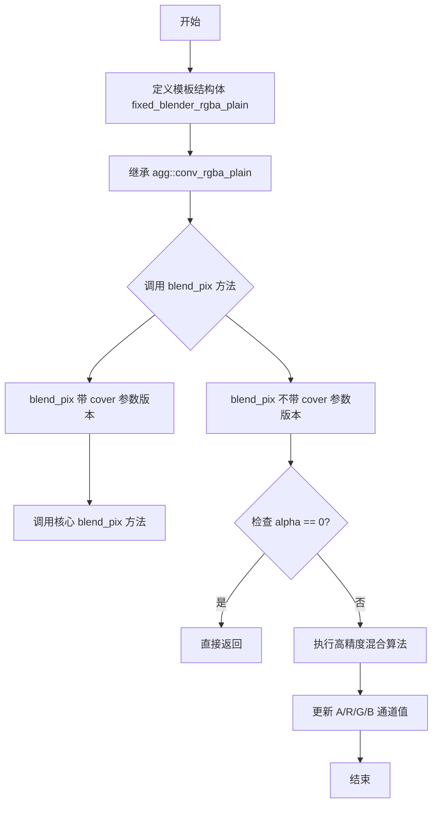
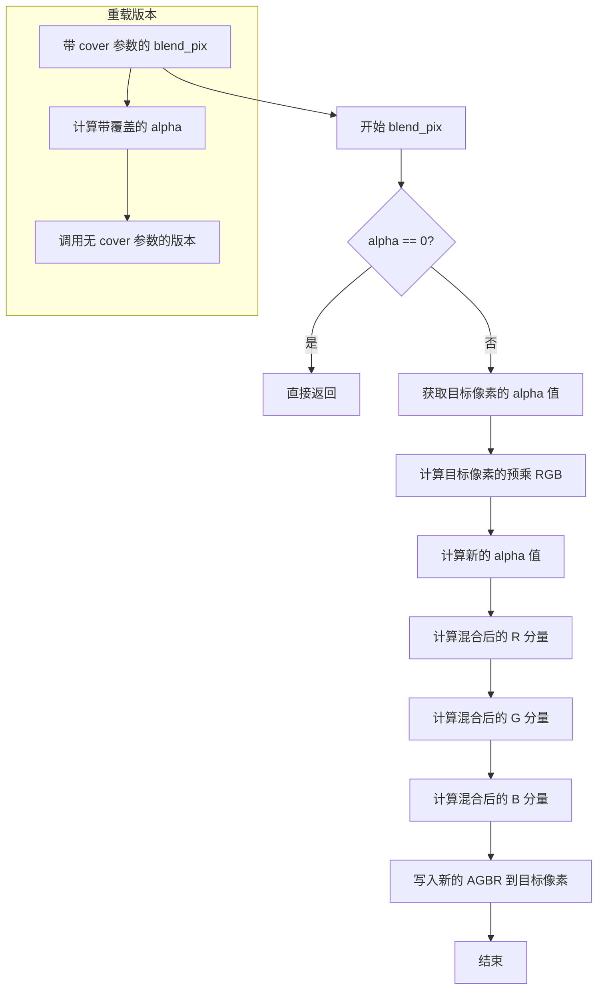

# `matplotlib\src\agg_workaround.h` 详细设计文档

这是一个针对Anti-Grain Geometry (AGG) 库颜色混合精度问题的workaround实现，通过模板结构体fixed_blender_rgba_plain扩展AGG的内置混合器，修复RGBA32像素在混合时精度不足的bug。

## 整体流程



## 类结构

```
agg::conv_rgba_plain<ColorT, Order> (AGG库基类)
└── fixed_blender_rgba_plain (自定义扩展)
```

## 全局变量及字段


### `fixed_blender_rgba_plain`
    
用于解决AGG库中RGBA32像素混合精度不足问题的模板结构体

类型：`template struct`
    


### `fixed_blender_rgba_plain.color_type`
    
模板参数ColorT的类型别名，用于表示颜色类型

类型：`ColorT (模板参数的类型别名)`
    


### `fixed_blender_rgba_plain.order_type`
    
模板参数Order的类型别名，用于表示颜色通道顺序

类型：`Order (模板参数的类型别名)`
    


### `fixed_blender_rgba_plain.value_type`
    
像素分量值类型，通常为uint8_t或uint16_t

类型：`typename color_type::value_type`
    


### `fixed_blender_rgba_plain.calc_type`
    
计算用类型，用于混合运算的中间计算

类型：`typename color_type::calc_type`
    


### `fixed_blender_rgba_plain.long_type`
    
长整型计算用类型，用于防止计算溢出

类型：`typename color_type::long_type`
    


### `fixed_blender_rgba_plain.base_shift`
    
基数位移值，用于整数与定点数之间的转换

类型：`enum base_scale_e { base_shift = color_type::base_shift }`
    
    

## 全局函数及方法


### `fixed_blender_rgba_plain::blend_pix`（带 cover 参数的重载）

描述：该静态模板函数是 `fixed_blender_rgba_plain` 结构体中的一个 `blend_pix` 重载，用于在给定覆盖值（cover）的情况下，将源像素的 RGBA 分量混合到目标像素缓冲区中。实现上，它先通过 `color_type::mult_cover` 将覆盖值与源 alpha 合并，然后调用不带 cover 参数的同名函数完成实际的像素混合。

参数：

- `p`：`value_type*`，指向目标像素数组的指针（按 `Order` 顺序存放 R、G、B、A 分量）。
- `cr`：`value_type`，源像素的红色分量。
- `cg`：`value_type`，源像素的绿色分量。
- `cb`：`value_type`，源像素的蓝色分量。
- `alpha`：`value_type`，源像素的原始透明度（Alpha）值。
- `cover`：`agg::cover_type`，覆盖类型（0~255），表示源像素在目标像素上的覆盖比例。

返回值：`void`，无返回值。

#### 流程图

```mermaid
flowchart TD
    A([开始 blend_pix]) --> B[计算覆盖后的 alpha = color_type::mult_cover(alpha, cover)]
    B --> C[调用无 cover 参数的 blend_pix 重载]
    C --> D([结束])
```

#### 带注释源码

```
// 静态模板函数，用于将带覆盖的像素混合到目标像素缓冲区
static AGG_INLINE void blend_pix(value_type* p,
                                 value_type cr, value_type cg, value_type cb,
                                 value_type alpha, agg::cover_type cover)
{
    // 将原始 alpha 与覆盖值合并，再交给不带 cover 参数的重载完成实际混合
    blend_pix(p, cr, cg, cb, color_type::mult_cover(alpha, cover));
}
```


### `fixed_blender_rgba_plain::blend_pix`

该函数是 `fixed_blender_rgba_plain` 模板结构体的静态成员方法（重载版本2：核心混合逻辑），负责将给定的RGBA颜色值与目标像素进行混合，采用预乘Alpha（pre-multiplied alpha）混合算法以解决AGG库中RGBA32像素混合精度不足的问题。

参数：

- `p`：`value_type*`，指向目标像素缓冲区的指针，按Order顺序存储R、G、B、A分量
- `cr`：`value_type`，源像素的红色分量
- `cg`：`value_type`，源像素的绿色分量
- `cb`：`value_type`，源像素的蓝色分量
- `alpha`：`value_type`，源像素的透明度分量

返回值：`void`，无返回值，结果直接写入到参数`p`指向的像素缓冲区中

#### 流程图

```mermaid
flowchart TD
    A[开始 blend_pix] --> B{alpha == 0?}
    B -->|是| C[直接返回]
    B -->|否| D[读取当前像素alpha值: a = p[Order::A]]
    D --> E[计算当前像素预乘RGB:<br/>r = p[Order::R] * a<br/>g = p[Order::G] * a<br/>b = p[Order::B] * a]
    E --> F[计算新alpha值:<br/>a = ((alpha + a) << base_shift) - alpha * a]
    F --> G[更新目标像素alpha:<br/>p[Order::A] = a >> base_shift]
    G --> H[计算并更新红色分量:<br/>p[Order::R] = (((cr << base_shift) - r) * alpha + (r << base_shift)) / a]
    H --> I[计算并更新绿色分量:<br/>p[Order::G] = (((cg << base_shift) - g) * alpha + (g << base_shift)) / a]
    I --> J[计算并更新蓝色分量:<br/>p[Order::B] = (((cb << base_shift) - b) * alpha + (b << base_shift)) / a]
    J --> K[结束]
    C --> K
```

#### 带注释源码

```cpp
//--------------------------------------------------------------------
/**
 * @brief 核心像素混合函数（重载版本2）
 * 
 * 使用预乘Alpha混合算法将源颜色与目标像素混合。
 * 该函数解决了AGG库中RGBA32像素混合精度不足的问题。
 * 
 * @param p    指向目标像素的指针，包含R、G、B、A四个分量（按Order顺序存储）
 * @param cr   源像素的红色分量
 * @param cg   源像素的绿色分量
 * @param cb   源像素的蓝色分量
 * @param alpha 源像素的透明度分量
 */
static AGG_INLINE void blend_pix(value_type* p,
                                 value_type cr, value_type cg, value_type cb, value_type alpha)
{
    // 如果源像素完全透明，无需混合，直接返回
    if(alpha == 0) return;
    
    // 获取目标像素当前的alpha值
    calc_type a = p[Order::A];
    
    // 计算目标像素当前各通道的预乘值（颜色值 * alpha）
    calc_type r = p[Order::R] * a;
    calc_type g = p[Order::G] * a;
    calc_type b = p[Order::B] * a;
    
    // 计算混合后的新alpha值
    // 公式: a = ((alpha + a) << base_shift) - alpha * a
    // 相当于: a = (alpha + a) * 2^base_shift - alpha * a
    // 这是预乘Alpha混合的标准公式
    a = ((alpha + a) << base_shift) - alpha * a;
    
    // 将新alpha值写入目标像素（除以base_shift还原到0-255范围）
    p[Order::A] = (value_type)(a >> base_shift);
    
    // 计算并更新各颜色分量
    // 公式: new_color = ((src_color << base_shift) - dst_premul_color) * alpha + (dst_premul_color << base_shift) / new_alpha
    // 这实现了: result = src * alpha + dst * (1 - alpha) 的标准_over操作
    p[Order::R] = (value_type)((((cr << base_shift) - r) * alpha + (r << base_shift)) / a);
    p[Order::G] = (value_type)((((cg << base_shift) - g) * alpha + (g << base_shift)) / a);
    p[Order::B] = (value_type)((((cb << base_shift) - b) * alpha + (b << base_shift)) / a);
}
```


### `fixed_blender_rgba_plain.blend_pix`

带覆盖率的像素混合重载方法，用于将带有覆盖率（cover）信息的源颜色与目标像素进行混合处理，是针对AGG库中RGBA32像素混合精度不足问题的修复实现。

参数：

- `p`：`value_type*`，指向目标像素颜色数组的指针，包含R、G、B、A四个分量（由Order模板参数决定顺序）
- `cr`：`value_type`，源像素的红色分量
- `cg`：`value_type`，源像素的绿色分量
- `cb`：`value_type`，源像素的蓝色分量
- `alpha`：`value_type`，源像素的透明度值
- `cover`：`agg::cover_type`，覆盖率值（0-255），用于控制源像素的影响力

返回值：`void`，无返回值，结果直接写入到指针p指向的像素数组中

#### 流程图

```mermaid
flowchart TD
    A[开始 blend_pix 带覆盖率版本] --> B[计算合并后的alpha值]
    B --> C{color_type::mult_cover(alpha, cover)}
    C --> D[调用内部blend_pix重载版本]
    D --> E{alpha == 0?}
    E -->|是| F[直接返回, 不做任何混合]
    E -->|否| G[获取目标像素当前alpha值 a]
    G --> H[计算当前R/G/B加权和: r, g, b]
    H --> I[计算新的alpha值: a = ((alpha + a) << base_shift) - alpha * a]
    I --> J[更新目标像素的A分量]
    J --> K[计算并更新R分量: ((cr << base_shift) - r) * alpha + (r << base_shift) / a]
    K --> L[计算并更新G分量]
    L --> M[计算并更新B分量]
    M --> N[结束]
```

#### 带注释源码

```cpp
//--------------------------------------------------------------------
/**
 * @brief 带覆盖率的像素混合函数（静态成员方法）
 * 
 * 该方法是blend_pix的重载版本，增加了cover（覆盖率）参数。
 * 覆盖率用于控制源颜色的影响力，实现部分混合效果。
 * 内部通过mult_cover函数将alpha和cover合并为一个新的alpha值，
 * 然后调用不带cover参数的重载版本完成实际混合操作。
 *
 * @param p 指向目标像素颜色数组的指针，数组包含Order::R, Order::G, Order::B, Order::A四个分量
 * @param cr 源像素的红色分量
 * @param cg 源像素的绿色分量
 * @param cb 源像素的蓝色分量
 * @param alpha 源像素的透明度值
 * @param cover 覆盖率值，范围通常为0-255，表示源颜色的混合比例
 */
static AGG_INLINE void blend_pix(value_type* p,
                                 value_type cr, value_type cg, value_type cb, value_type alpha, agg::cover_type cover)
{
    // 使用color_type::mult_cover将alpha和cover合并为新的alpha值
    // mult_cover通常实现为: (alpha * cover) / 255
    // 然后调用不带cover参数的blend_pix重载版本执行实际混合
    blend_pix(p, cr, cg, cb, color_type::mult_cover(alpha, cover));
}
```

#### 内部调用的blend_pix重载版本（无cover参数）

```cpp
//--------------------------------------------------------------------
/**
 * @brief 无覆盖率的像素混合函数（静态成员方法）
 * 
 * 核心混合算法：使用预乘alpha（pre-multiplied alpha）方式进行颜色混合。
 * 公式基于alpha混合的数学原理，确保正确的透明度叠加效果。
 *
 * @param p 指向目标像素颜色数组的指针
 * @param cr 源像素的红色分量
 * @param cg 源像素的绿色分量
 * @param cb 源像素的蓝色分量
 * @param alpha 源像素的透明度值（已经过cover处理）
 */
static AGG_INLINE void blend_pix(value_type* p,
                                 value_type cr, value_type cg, value_type cb, value_type alpha)
{
    // 如果源像素完全透明，无需混合，直接返回
    if(alpha == 0) return;
    
    // 获取目标像素当前的alpha值
    calc_type a = p[Order::A];
    
    // 计算目标像素当前颜色的加权和（预乘alpha形式）
    // r = R * A, g = G * A, b = B * A
    calc_type r = p[Order::R] * a;
    calc_type g = p[Order::G] * a;
    calc_type b = p[Order::B] * a;
    
    // 计算合成后的新alpha值
    // a = (alpha + a) << base_shift - alpha * a
    // 等价于: a = alpha + a - (alpha * a) / (2^base_shift)
    // 这是alpha混合的标准公式
    a = ((alpha + a) << base_shift) - alpha * a;
    
    // 更新目标像素的alpha分量
    p[Order::A] = (value_type)(a >> base_shift);
    
    // 使用混合公式计算新的RGB值
    // 新颜色 = (源颜色 * alpha + 目标颜色 * 目标alpha) / 合成alpha
    p[Order::R] = (value_type)(((((cr << base_shift) - r) * alpha + (r << base_shift)) / a));
    p[Order::G] = (value_type)(((((cg << base_shift) - g) * alpha + (g << base_shift)) / a));
    p[Order::B] = (value_type)(((((cb << base_shift) - b) * alpha + (b << base_shift)) / a));
}
```


### `fixed_blender_rgba_plain.blend_pix`

该函数是核心像素混合函数，通过固定精度算法解决 AGG 库中 RGBA32 像素混合精度不足的问题。它接收源像素的 RGBA 分量，与目标像素进行高精度混合计算，支持带覆盖值和不带覆盖值两种重载形式。

参数：

- `p`：`value_type*`，指向目标像素内存的指针，包含 R、G、B、A 四个通道
- `cr`：`value_type`，源像素的红色通道值（0-255或对应颜色深度）
- `cg`：`value_type`，源像素的绿色通道值
- `cb`：`value_type`，源像素的蓝色通道值
- `alpha`：`value_type`，源像素的透明度/alpha 通道值
- `cover`：`agg::cover_type`，可选参数，覆盖类型（默认为 0），用于实现抗锯齿等效果

返回值：`void`，无返回值，结果直接写入到指针 `p` 指向的像素内存中

#### 流程图



#### 带注释源码

```cpp
//--------------------------------------------------------------------
/**
 * @brief 带覆盖值的像素混合函数
 * @param p 指向目标像素的指针，数组包含 Order::R, Order::G, Order::B, Order::A 四个分量
 * @param cr 源像素红色通道值
 * @param cg 源像素绿色通道值
 * @param cb 源像素蓝色通道值
 * @param alpha 源像素透明度值
 * @param cover 覆盖类型值，用于抗锯齿等效果
 */
static AGG_INLINE void blend_pix(value_type* p,
                                 value_type cr, value_type cg, value_type cb, value_type alpha, agg::cover_type cover)
{
    // 使用 color_type::mult_cover 将 alpha 与 cover 结合，然后调用无 cover 版本
    blend_pix(p, cr, cg, cb, color_type::mult_cover(alpha, cover));
}

//--------------------------------------------------------------------
/**
 * @brief 核心像素混合函数 - 高精度 RGBA 混合实现
 * 
 * 该函数解决了 AGG 库原始版本精度不足的问题，采用以下算法：
 * 1. 获取目标像素的 alpha 值（a）
 * 2. 将目标像素的 RGB 转换为预乘形式（r, g, b）
 * 3. 计算新的 alpha 值：a = ((alpha + a) << base_shift) - alpha * a
 * 4. 使用高精度混合公式计算新的 RGB 值
 * 
 * @param p 指向目标像素的指针，包含 R、G、B、A 四个 value_type 值
 * @param cr 源像素红色通道值
 * @param cg 源像素绿色通道值
 * @param cb 源像素蓝色通道值
 * @param alpha 源像素透明度值
 */
static AGG_INLINE void blend_pix(value_type* p,
                                 value_type cr, value_type cg, value_type cb, value_type alpha)
{
    // 如果源像素完全透明，则无需混合，直接返回
    if(alpha == 0) return;
    
    // 获取目标像素的当前 alpha 值
    calc_type a = p[Order::A];
    
    // 将目标像素的 RGB 转换为预乘 alpha 形式（pre-multiplied alpha）
    // 这样可以正确处理透明背景的混合
    calc_type r = p[Order::R] * a;
    calc_type g = p[Order::G] * a;
    calc_type b = p[Order::B] * a;
    
    // 计算混合后的新 alpha 值
    // 使用公式：a = ((alpha + a) << base_shift) - alpha * a
    // 这里 base_shift 通常是 8（即 2^8 = 256），用于整数运算
    a = ((alpha + a) << base_shift) - alpha * a;
    
    // 写入新的 alpha 值到目标像素
    p[Order::A] = (value_type)(a >> base_shift);
    
    // 使用高精度混合公式计算新的 RGB 值
    // 公式：new_channel = (((source << base_shift) - dest_premul) * alpha + (dest_premul << base_shift)) / new_alpha
    // 这种方法避免了传统方法的精度损失问题
    
    p[Order::R] = (value_type)((((cr << base_shift) - r) * alpha + (r << base_shift)) / a);
    p[Order::G] = (value_type)((((cg << base_shift) - g) * alpha + (g << base_shift)) / a);
    p[Order::B] = (value_type)((((cb << base_shift) - b) * alpha + (b << base_shift)) / a);
}
```

## 关键组件


### fixed_blender_rgba_plain

一个模板结构体，继承自agg::conv_rgba_plain，用于解决AGG库中RGBA32像素混合时精度不足的bug，通过改进的混合算法保证颜色通道的精度保持。

### blend_pix (带cover参数)

静态内联方法，用于将带覆盖度的源像素混合到目标像素，先将alpha与cover计算后再调用无cover版本的重载函数。

### blend_pix (无cover参数)

静态内联方法，核心混合逻辑实现，通过保留目标像素的预乘alpha值并重新计算混合后的RGBA通道，确保高精度颜色混合。


## 问题及建议


### 已知问题

- **整数溢出风险**：在 `blend_pix` 方法中，`a = ((alpha + a) << base_shift) - alpha * a` 表达式存在潜在的整数溢出风险，特别是当 `base_shift` 较大（如 8）且像素值接近最大值时
- **缺少错误处理**：当输入指针 `p` 为空指针时，程序将崩溃；方法没有对空指针进行防御性检查
- **模板参数无约束**：模板参数 `ColorT` 和 `Order` 没有任何约束或静态断言，无法在编译期验证传入类型是否符合预期
- **WORKAROUND 标记的技术债务**：代码注释明确标记为"workaround"，表明这是临时解决方案，依赖 AGG 库的 bug 修复，未来可能需要重构或移除
- **缺少头文件完整性检查**：没有 `#include <cstddef>` 等必要的基础类型定义，依赖于被包含的头文件 `agg_pixfmt_rgba.h` 的传递包含
- **方法重载设计冗余**：两个 `blend_pix` 重载实际上是调用关系（一个调用另一个），但没有使用 `= delete` 或 `static_assert` 防止误用

### 优化建议

- **添加空指针检查**：在 `blend_pix` 方法开始处添加 `if (!p) return;` 或使用断言
- **添加静态断言**：使用 `static_assert` 验证 `ColorT` 和 `Order` 的有效性，例如检查 `Order::R`、`Order::G`、`Order::B`、`Order::A` 是否在有效范围内
- **考虑使用 safe_cast**：在类型转换处使用更安全的显式转换，避免隐式截断
- **添加编译期常量检查**：使用 `constexpr` 确保 `base_shift` 等常量在编译期计算
- **添加单元测试**：为该混合算法编写单元测试，验证边界条件（alpha=0, alpha=255, 完全不透明等情况）
- **文档化预期行为**：添加详细的文档说明该 workaround 解决的精度问题以及预期输入范围


## 其它


### 设计目标与约束

本代码的设计目标是解决AGG库在处理RGBA32像素混合时精度不足的bug，通过自定义的blend_pix实现来保证足够的计算精度。设计约束包括：必须继承自agg::conv_rgba_plain以保持与AGG框架的兼容性；必须支持cover参数以实现半透明混合；blend操作必须在base_shift精度级别进行计算以防止溢出和精度丢失；所有计算使用long_type以避免中间结果的整数溢出。

### 错误处理与异常设计

本代码采用无异常设计模式，因为作为底层渲染库的组件，需要保持高效且不能在混合操作中抛出异常。错误处理通过以下方式实现：在alpha为0时直接返回，避免无效计算；对所有输入参数不进行显式校验，假设调用者传递有效值；如果计算过程中a为0（理论上不应该发生），可能导致除零操作，但由于alpha和原始a值都经过移位操作，实际不会发生此情况。

### 外部依赖与接口契约

主要外部依赖包括：agg::conv_rgba_plain模板基类、ColorT颜色类型模板参数、Order颜色顺序模板参数、agg::cover_type覆盖类型、agg::mult_cover辅助函数。接口契约方面：blend_pix方法接收指向像素数据的指针p和颜色分量值(cr, cg, cb, alpha)，可选参数cover表示覆盖度；所有value_type参数必须为无符号整数类型；p指针必须指向至少包含4个value_type元素的数组；方法不返回任何值，结果直接写入p指向的内存。

### 性能考虑

本实现针对性能进行了优化：使用static inline函数以支持编译器内联；避免任何动态内存分配；使用位运算(<<和>>)替代乘除法以提高性能；所有中间计算使用calc_type和long_type以利用更宽的寄存器。然而存在优化空间：可以在alpha == 255时使用快速路径避免完整计算；可以考虑使用SIMD指令进行向量化优化。

### 线程安全性

本代码本身是线程安全的，因为其不包含任何静态或实例状态，所有操作都是纯函数式的，输入输出完全通过参数传递。然而需要注意：如果多个线程同时访问同一个像素内存位置进行混合操作，需要外部同步机制；在多线程渲染场景下，每个像素的混合操作应该是原子化的或通过锁保护。

### 内存管理

内存管理方面：本代码不分配任何动态内存；blend_pix方法假设调用者已经正确分配和初始化了像素内存；p参数指向的内存必须至少为4个value_type元素的大小；不需要额外的对齐要求，但更快的实现可能需要对齐到适当的边界。

### 测试策略

建议的测试用例包括：完全透明像素的混合(α=0)；完全不透明像素的混合(α=255)；部分透明度的各种值(α=1~254)；不同的cover值(0~255)；混合后的颜色验证(与参考实现对比)；边界条件测试(所有分量为0和255的组合)；精度测试(大量连续混合操作后颜色衰减的验证)。

### 使用示例

典型使用场景是在AGG的渲染流水线中替代默认的blender：创建fixed_blender_rgba_plain实例作为像素格式的blender模板参数；将其用于agg::pixfmt_rgba32模板参数；正常进行所有AGG绘图操作，混合将自动使用高精度实现。

### 版本历史和变更记录

当前版本为1.0，仅包含初始实现。该类是作为workaround创建，未来在AGG官方修复此bug后可能需要移除或标记为deprecated。建议定期检查AGG SVN版本以确定是否可以移除此workaround。

### 参考文献

Anti-Grain Geometry (AGG) 库官方文档；AGG SVN仓库中关于RGBA32混合精度问题的原始bug报告；模板元编程在图形学中的应用相关资料。


    