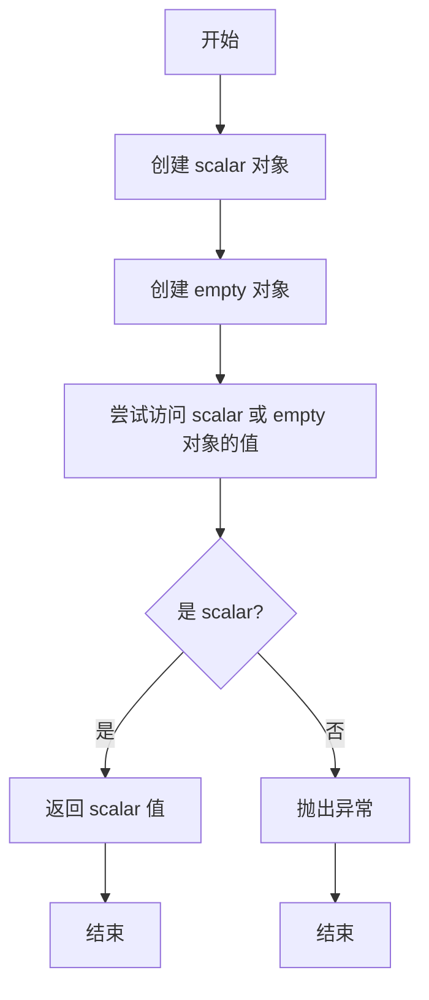
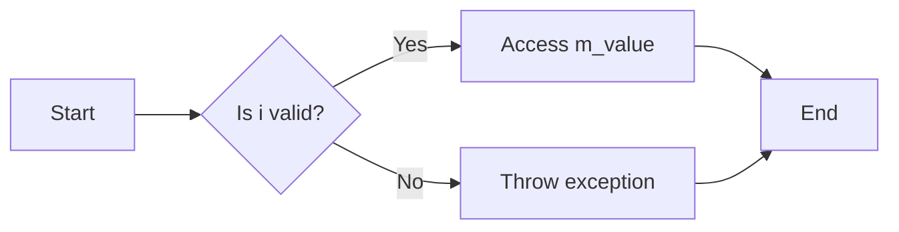
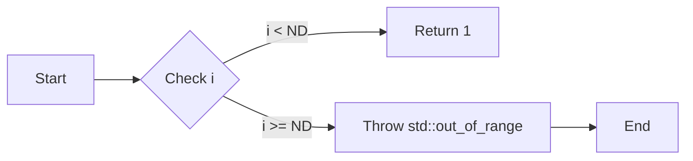
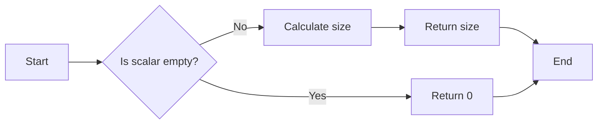
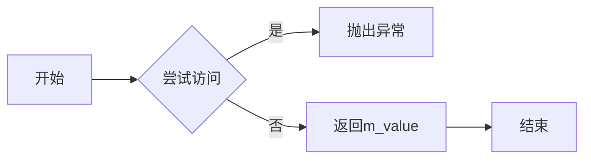
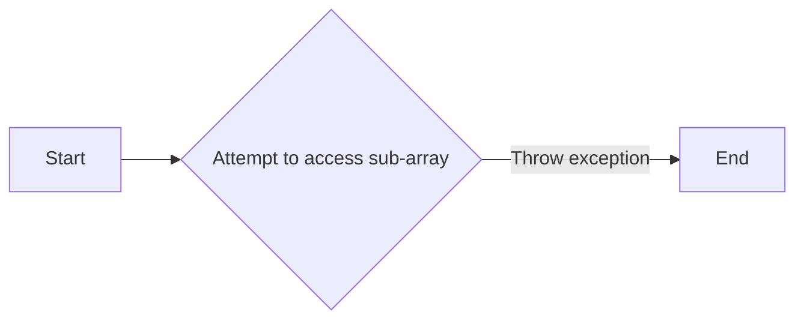
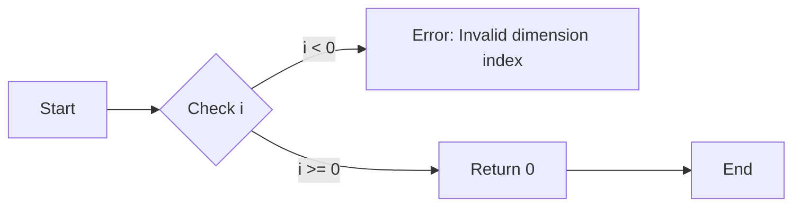
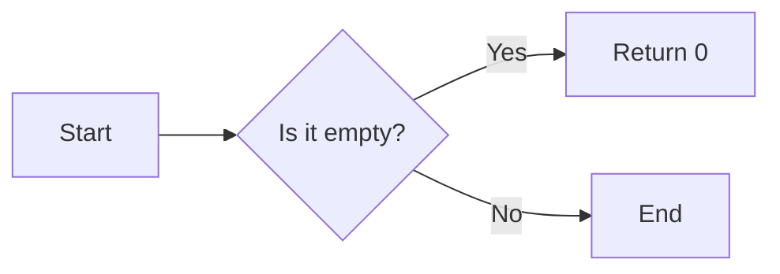

# `matplotlib\src\array.h` 详细设计文档

This file defines utilities for creating scalar and empty array objects that mimic the behavior of Numpy array wrappers in numpy_cpp.h.

## 整体流程



## 类结构

```
array (命名空间)
├── scalar<T, ND> (模板类)
│   ├── m_value (成员变量)
│   ├── operator()(int, int, int) (成员函数)
│   ├── shape(size_t) (成员函数)
│   └── size() (成员函数)
└── empty<T> (模板类)
    ├── operator()(int, int, int) (成员函数)
    ├── operator[](int) (成员函数)
    ├── shape(size_t) (成员函数)
    └── size() (成员函数)
```

## 全局变量及字段


### `m_value`
    
The value stored in the scalar object.

类型：`T`
    


### `scalar<T, ND>.m_value`
    
The value stored in the scalar object.

类型：`T`
    
    

## 全局函数及方法


### array::scalar<T, ND>::operator()(int, int, int)

该函数是模板类 `array::scalar<T, ND>` 的成员函数，用于访问其内部的值。它允许通过索引访问 `scalar` 对象的值。

参数：

- `i`：`int`，表示要访问的索引。
- `j`：`int`，默认值为0，表示第二个索引，默认情况下不需要。
- `k`：`int`，默认值为0，表示第三个索引，默认情况下不需要。

返回值：`T &`，返回对 `scalar` 对象内部值的引用。

#### 流程图



#### 带注释源码

```cpp
T &operator()(int i, int j = 0, int k = 0)
{
    // Return a reference to the internal value of the scalar
    return m_value;
}
``` 


### array::scalar<T, ND>.shape(size_t i)

该函数返回一个标量数组在指定维度上的大小。

参数：

- `i`：`size_t`，指定要获取大小的维度索引。

返回值：`int`，指定维度上的大小。

#### 流程图



#### 带注释源码

```cpp
int shape(size_t i)
{
    // 检查索引是否小于维度数
    if (i < ND)
    {
        // 返回1，因为标量数组只有一个元素
        return 1;
    }
    else
    {
        // 如果索引大于或等于维度数，抛出异常
        throw std::out_of_range("Index out of range for scalar shape");
    }
}
```


### scalar<T, ND>.size()

该函数返回一个标量对象的大小。

参数：

- 无

返回值：`size_t`，表示标量对象的大小

#### 流程图



#### 带注释源码

```cpp
size_t size()
{
    return 1; // Always returns 1 for scalar, as it represents a single value
}
```


### array::empty<T>::operator()(int, int, int)

该函数是一个重载的运算符函数，用于访问`empty`类实例的元素。当尝试访问`empty`数组时，它会抛出一个`std::runtime_error`异常。

参数：

- `i`：`int`，表示要访问的索引。
- `j`：`int`，默认值为0，表示第二个索引，默认情况下不使用。
- `k`：`int`，默认值为0，表示第三个索引，默认情况下不使用。

返回值：`T &`，如果尝试访问`empty`数组，则返回类型`T`的引用，并抛出异常。

#### 流程图



#### 带注释源码

```cpp
T &operator()(int i, int j = 0, int k = 0)
{
    throw std::runtime_error("Accessed empty array");
}
```


### array::empty<T>::operator[](int)

该函数用于访问`empty`类的一个子数组，当尝试访问时，会返回一个空的`empty`对象。

参数：

- `i`：`int`，表示要访问的子数组的索引。

返回值：`empty<T>`，表示一个空的子数组。

#### 流程图



#### 带注释源码

```cpp
template <typename T>
class empty
{
  // ... (其他成员)

  sub_t operator[](int i) const
  {
      return empty<T>(); // 返回一个空的子数组
  }

  // ... (其他成员)
};
```


### array::empty<T>.shape(size_t)

该函数返回一个`empty`数组在指定维度上的形状大小。

参数：

- `i`：`size_t`，指定要获取形状大小的维度索引。

返回值：`int`，指定维度上的形状大小。

#### 流程图



#### 带注释源码

```cpp
int shape(size_t i) const
{
    // 如果维度索引小于0，抛出异常
    if (i < 0)
    {
        throw std::runtime_error("Invalid dimension index");
    }
    // 返回0，表示数组为空
    return 0;
}
```


### array::empty<T>.size()

该函数返回一个空的数组对象`empty<T>`的大小。

参数：

- 无

返回值：`size_t`，表示数组的大小。对于`empty<T>`，返回值总是0。

#### 流程图



#### 带注释源码

```cpp
template <typename T>
size_t array::empty<T>::size() const
{
    return 0; // 返回0，因为empty<T>总是空的
}
```


## 关键组件


### 张量索引与惰性加载

支持通过索引访问张量元素，同时实现惰性加载，即仅在需要时才计算或加载数据。

### 反量化支持

提供反量化功能，允许在量化过程中进行逆量化操作。

### 量化策略

定义了量化策略，用于在模型训练和推理过程中对张量进行量化处理。


## 问题及建议


### 已知问题

-   **类型不安全**：`scalar` 类和 `empty` 类在处理数组访问时没有进行类型检查，这可能导致在尝试访问数组元素时发生未定义行为。
-   **异常处理**：`empty` 类在访问数组时抛出 `std::runtime_error`，这可能导致调用者难以处理异常。
-   **代码重复**：`safe_first_shape` 函数在 `scalar` 和 `empty` 类中重复实现，这可能导致维护困难。

### 优化建议

-   **类型检查**：在 `scalar` 和 `empty` 类中添加类型检查，确保在访问数组元素时类型正确。
-   **改进异常处理**：提供更具体的异常信息，帮助调用者更好地理解错误原因。
-   **代码重构**：将 `safe_first_shape` 函数提取到一个单独的文件或头文件中，避免代码重复。
-   **文档注释**：为 `scalar` 和 `empty` 类以及 `safe_first_shape` 函数添加详细的文档注释，说明其用途和用法。
-   **单元测试**：编写单元测试以确保 `scalar` 和 `empty` 类的行为符合预期。


## 其它


### 设计目标与约束

- 设计目标：提供类似于Numpy数组的标量和空数组封装，以支持多维数组的操作。
- 约束：保持与Numpy数组接口的兼容性，同时确保类型安全和性能。

### 错误处理与异常设计

- 错误处理：当尝试访问空数组时，抛出`std::runtime_error`异常。
- 异常设计：通过抛出异常来处理非法访问，确保程序的健壮性。

### 数据流与状态机

- 数据流：数据流从用户输入到`scalar`或`empty`类的实例，然后通过索引访问。
- 状态机：`scalar`类表示具有固定值的数组，而`empty`类表示空数组，两者都通过索引访问提供数据。

### 外部依赖与接口契约

- 外部依赖：依赖于C++标准库中的`<stdexcept>`和`<cstddef>`。
- 接口契约：`scalar`和`empty`类提供了与Numpy数组类似的接口，包括索引访问和形状查询。

### 测试与验证

- 测试：应编写单元测试来验证`scalar`和`empty`类的行为，包括边界条件和异常情况。
- 验证：通过测试确保类能够正确处理数组的索引访问和形状查询。

### 性能考虑

- 性能：确保`scalar`和`empty`类的操作尽可能高效，以减少对性能的影响。

### 安全性考虑

- 安全性：通过抛出异常来处理非法访问，防止程序崩溃或产生不可预测的行为。

### 维护与扩展性

- 维护：确保代码清晰、易于理解，便于未来的维护和更新。
- 扩展性：设计时考虑可能的扩展，例如支持更多类型或更复杂的数据结构。

### 文档与注释

- 文档：提供详细的文档，包括类的定义、方法和全局函数的说明。
- 注释：在代码中添加必要的注释，解释复杂逻辑和设计决策。


    