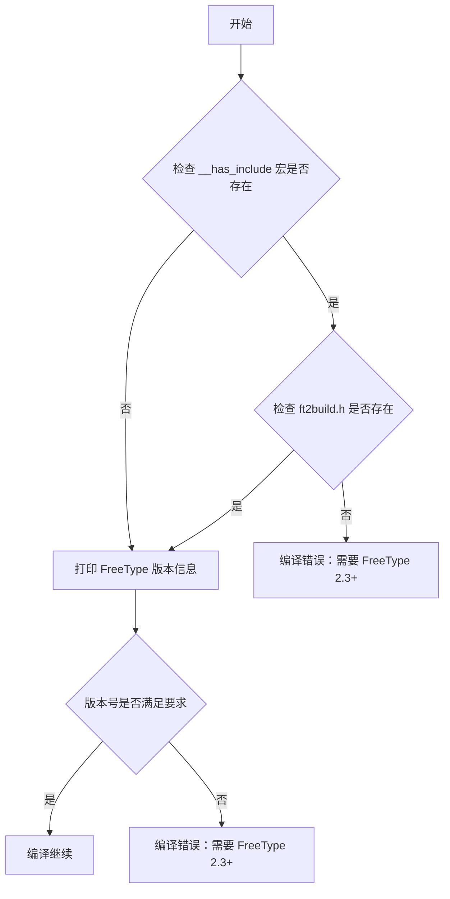

# `matplotlib\src\checkdep_freetype2.c` 详细设计文档

该代码是一个 FreeType 版本检查头文件，通过预处理器指令验证系统是否安装了 FreeType 2.3 或更高版本的库，如果不满足要求则编译失败并给出相应的错误信息。

## 整体流程



## 类结构

```
此代码为单文件头文件，无类结构
主要包含预处理器指令和宏定义
```

## 全局变量及字段


### `XSTR`
    
字符串化宏，用于将宏参数转换为字符串字面量（两层展开）

类型：`macro`
    


### `STR`
    
字符串化宏，用于将宏参数转换为字符串字面量（单层展开）

类型：`macro`
    


### `FREETYPE_MAJOR`
    
FreeType库的主版本号

类型：`macro (from FreeType)`
    


### `FREETYPE_MINOR`
    
FreeType库的次版本号

类型：`macro (from FreeType)`
    


### `FREETYPE_PATCH`
    
FreeType库的补丁版本号

类型：`macro (from FreeType)`
    


### `FT_FREETYPE_H`
    
FreeType库的主头文件，包含字体渲染API定义

类型：`header file`
    


    

## 全局函数及方法


## 关键组件


### FreeType头文件引入检查

使用__has_include预处理器指令检查ft2build.h是否存在，如果不存在则输出错误信息，提示用户可以设置Meson构建选项来让Matplotlib下载FreeType。

### FreeType版本号宏定义

使用XSTR和STR宏将FREETYPE_MAJOR、FREETYPE_MINOR、FREETYPE_PATCH版本号宏转换为字符串，用于编译时的版本信息输出。

### FreeType版本编译时检查

使用位运算检查FreeType版本是否低于2.3版本（0x020300），如果低于则输出编译错误，提示需要2.3或更高版本，或设置system-freetype为false来让Matplotlib下载。

### 版本信息编译输出

使用#pragma message在编译时输出当前使用的FreeType版本号，帮助开发者确认构建时使用的FreeType版本。


## 问题及建议


### 已知问题

-   **版本比较逻辑错误**：第16行的版本号比较存在运算符优先级问题。`<<` 的优先级低于 `+`，导致表达式 `FREETYPE_MAJOR << 16 + FREETYPE_MINOR << 8 + FREETYPE_PATCH` 被解析为 `FREETYPE_MAJOR << (16 + FREETYPE_MINOR) << (8 + FREETYPE_PATCH)`，而非预期的 `(FREETYPE_MAJOR << 16) + (FREETYPE_MINOR << 8) + FREETYPE_PATCH`，使版本检查逻辑失效。
-   **缺少头文件保护**：没有 `#ifndef`/`#define`/`#endif` 预处理指令，多次包含该头文件可能导致重复定义错误。
-   **错误信息重复**：两处错误提示文本几乎完全相同，违反 DRY（Don't Repeat Yourself）原则，增加维护成本。
-   **编译器特定语法**：使用了 `#pragma message`，该指令为编译器特定扩展，缺乏跨平台可移植性。
-   **缺乏文档注释**：代码缺少文件级注释说明该头文件的用途、依赖关系及使用场景。

### 优化建议

-   **修复版本比较逻辑**：添加括号明确运算符优先级，改为 `#if (FREETYPE_MAJOR << 16) + (FREETYPE_MINOR << 8) + FREETYPE_PATCH < 0x020300`
-   **添加头文件保护**：在文件开头添加 `#ifndef FT_VERSION_CHECK_H` / `#define FT_VERSION_CHECK_H`，末尾添加 `#endif`
-   **提取错误信息为宏**：定义统一错误消息宏，如 `#define FT_VERSION_ERROR "FreeType version 2.3 or higher is required. You may set the system-freetype Meson build option to false to let Matplotlib download it."`
-   **增强可移植性**：使用条件编译处理非 GCC/Clang 编译器，或考虑添加构建系统层面的版本检查
-   **添加文档注释**：在文件头部添加 Doxygen 风格注释，说明该文件用于 FreeType 版本兼容性检查
-   **考虑使用静态_assert**（C11）：如果项目支持 C11 及以上版本，可使用静态断言替代运行时错误 `#error`，提供更友好的错误信息


## 其它


### 设计目标与约束

确保Matplotlib在编译时链接的FreeType库版本不低于2.3.0，以满足字体渲染功能的最低版本要求。

### 错误处理与异常设计

- 编译期错误：当ft2build.h头文件不存在时，使用#error指令立即停止编译并输出错误信息
- 版本检查错误：当FreeType版本低于2.3时，使用#error指令立即停止编译并输出错误信息
- 警告信息：使用#pragma message输出当前编译使用的FreeType版本号，供开发者确认

### 外部依赖与接口契约

- 依赖库：FreeType 2.3+
- 头文件：ft2build.h, freetype.h
- 宏定义：FREETYPE_MAJOR, FREETYPE_MINOR, FREETYPE_PATCH（由FreeType库提供）
- 构建系统：支持Meson构建系统，可通过system-freetype选项控制是否使用系统FreeType或下载嵌入式版本

### 平台兼容性

- 使用标准C预处理器指令，具有良好的跨平台兼容性
- 支持GCC、Clang、MSVC等主流C/C++编译器

### 配置与编译选项

- system-freetype Meson构建选项：设为false时使用Matplotlib下载的FreeType，设为true时使用系统安装的FreeType
- 编译时通过宏定义获取FreeType版本信息，无需运行时检测

### 性能考虑

此代码在编译期执行，不影响运行时性能。版本检查在预处理阶段完成，不产生任何运行时开销。

### 安全性考虑

- 仅进行静态版本检查，不涉及文件操作或网络通信
- 使用#error而非运行时异常，避免安全漏洞

### 测试策略

- 验证在FreeType版本低于2.3时编译失败
- 验证在缺少ft2build.h时编译失败
- 验证#pragma message正确输出版本信息

    