# `matplotlib\src\ft2font.cpp` 详细设计文档

The code provides a Python interface to the FreeType 2 library for rendering fonts, including loading characters, setting font size, drawing glyphs to bitmaps, and handling kerning.

## 整体流程

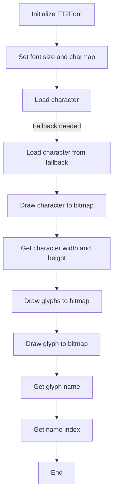

## 类结构

```
FT2Font (主类)
├── FT2Image (图像类)
│   ├── draw_bitmap (方法)
│   ├── draw_rect_filled (方法)
│   └── ...
└── FT2Font (主类)
   ├── FT2Font (构造函数)
   ├── ~FT2Font (析构函数)
   ├── clear (方法)
   ├── set_size (方法)
   ├── set_charmap (方法)
   ├── get_kerning (方法)
   ├── set_kerning_factor (方法)
   ├── set_text (方法)
   ├── load_char (方法)
   ├── get_char_fallback_index (方法)
   ├── load_char_with_fallback (方法)
   ├── load_glyph (方法)
   ├── get_char_index (方法)
   ├── get_width_height (方法)
   ├── get_descent (方法)
   ├── get_bitmap_offset (方法)
   ├── draw_glyphs_to_bitmap (方法)
   ├── draw_glyph_to_bitmap (方法)
   ├── get_glyph_name (方法)
   └── get_name_index (方法)
```

## 全局变量及字段


### `_ft2Library`
    
The FreeType library instance used by the application.

类型：`FT_Library*`
    


### `face`
    
The current face (font) being used.

类型：`FT_Face*`
    


### `glyphs`
    
The vector of glyphs loaded for the current font.

类型：`std::vector<FT_Glyph>`
    


### `char_to_font`
    
Maps character codes to the font objects that have them loaded.

类型：`std::unordered_map<long, FT2Font*>`
    


### `glyph_to_font`
    
Maps glyph indices to the font objects that have them loaded.

类型：`std::unordered_map<FT_UInt, FT2Font*>`
    


### `fallbacks`
    
The list of fallback font objects used when the primary font does not have a character.

类型：`std::vector<FT2Font*>`
    


### `pen`
    
The current pen position in the drawing context.

类型：`FT_Vector`
    


### `bbox`
    
The bounding box of the current character or text.

类型：`FT_BBox`
    


### `advance`
    
The advance width of the current character or text.

类型：`FT_Vector`
    


### `kerning_factor`
    
The factor used to adjust kerning distances.

类型：`int`
    


### `ft_glyph_warn`
    
The function used to warn about missing glyphs.

类型：`WarnFunc`
    


### `warn_if_used`
    
Whether to warn if a character is used from a fallback font.

类型：`bool`
    


### `image`
    
The image buffer where the font rendering is drawn.

类型：`py::array_t<uint8_t, py::array::c_style>`
    


### `hinting_factor`
    
The factor used to adjust the hinting of the font.

类型：`double`
    


### `kerning_factor`
    
The factor used to adjust kerning distances.

类型：`int`
    


### `FT2Image.m_buffer`
    
The buffer for the image data.

类型：`unsigned char*`
    


### `FT2Image.m_width`
    
The width of the image.

类型：`unsigned long`
    


### `FT2Image.m_height`
    
The height of the image.

类型：`unsigned long`
    


### `FT2Font.ft_glyph_warn`
    
The function used to warn about missing glyphs.

类型：`WarnFunc`
    


### `FT2Font.warn_if_used`
    
Whether to warn if a character is used from a fallback font.

类型：`bool`
    


### `FT2Font.image`
    
The image buffer where the font rendering is drawn.

类型：`py::array_t<uint8_t, py::array::c_style>`
    


### `FT2Font.hinting_factor`
    
The factor used to adjust the hinting of the font.

类型：`double`
    


### `FT2Font.kerning_factor`
    
The factor used to adjust kerning distances.

类型：`int`
    
    

## 全局函数及方法


### draw_bitmap

Draws a bitmap onto an image buffer.

参数：

- `im`：`py::array_t<uint8_t, py::array::c_style>`，The image buffer to draw the bitmap onto.
- `bitmap`：`FT_Bitmap *`，The bitmap to draw.
- `x`：`FT_Int`，The x-coordinate to start drawing the bitmap at.
- `y`：`FT_Int`，The y-coordinate to start drawing the bitmap at.

返回值：`void`，No return value.

#### 流程图

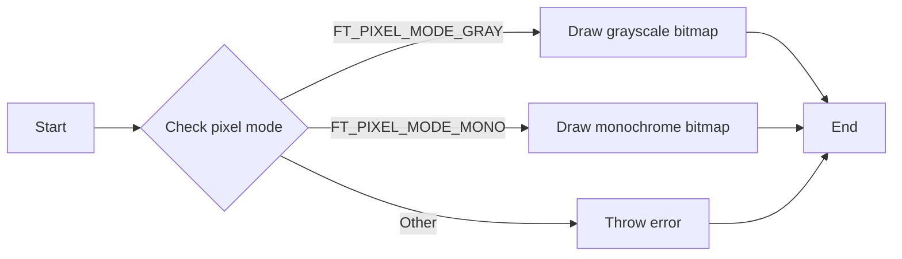

#### 带注释源码

```cpp
void draw_bitmap(
    py::array_t<uint8_t, py::array::c_style> im, FT_Bitmap *bitmap, FT_Int x, FT_Int y)
{
    auto buf = im.mutable_data(0);

    FT_Int image_width = (FT_Int)im.shape(1);
    FT_Int image_height = (FT_Int)im.shape(0);
    FT_Int char_width = bitmap->width;
    FT_Int char_height = bitmap->rows;

    FT_Int x1 = std::min(std::max(x, 0), image_width);
    FT_Int y1 = std::min(std::max(y, 0), image_height);
    FT_Int x2 = std::min(std::max(x + char_width, 0), image_width);
    FT_Int y2 = std::min(std::max(y + char_height, 0), image_height);

    FT_Int x_start = std::max(0, -x);
    FT_Int y_offset = y1 - std::max(0, -y);

    if (bitmap->pixel_mode == FT_PIXEL_MODE_GRAY) {
        for (FT_Int i = y1; i < y2; ++i) {
            unsigned char *dst = buf + (i * image_width + x1);
            unsigned char *src = bitmap->buffer + (((i - y_offset) * bitmap->pitch) + x_start);
            for (FT_Int j = x1; j < x2; ++j, ++dst, ++src)
                *dst |= *src;
        }
    } else if (bitmap->pixel_mode == FT_PIXEL_MODE_MONO) {
        for (FT_Int i = y1; i < y2; ++i) {
            unsigned char *dst = buf + (i * image_width + x1);
            unsigned char *src = bitmap->buffer + ((i - y_offset) * bitmap->pitch);
            for (FT_Int j = x1; j < x2; ++j, ++dst) {
                int x = (j - x1 + x_start);
                int val = *(src + (x >> 3)) & (1 << (7 - (x & 0x7)));
                *dst = val ? 255 : *dst;
            }
        }
    } else {
        throw std::runtime_error("Unknown pixel mode");
    }
}
``` 


### FT2Image::draw_rect_filled

Draws a filled rectangle on the image buffer.

参数：

- `x0`：`unsigned long`，The x-coordinate of the top-left corner of the rectangle.
- `y0`：`unsigned long`，The y-coordinate of the top-left corner of the rectangle.
- `x1`：`unsigned long`，The x-coordinate of the bottom-right corner of the rectangle.
- `y1`：`unsigned long`，The y-coordinate of the bottom-right corner of the rectangle.

返回值：`void`，No return value.

#### 流程图

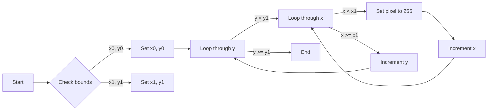

#### 带注释源码

```cpp
void FT2Image::draw_rect_filled(unsigned long x0, unsigned long y0, unsigned long x1, unsigned long y1)
{
    x0 = std::min(x0, m_width);
    y0 = std::min(y0, m_height);
    x1 = std::min(x1 + 1, m_width);
    y1 = std::min(y1 + 1, m_height);

    for (size_t j = y0; j < y1; j++) {
        for (size_t i = x0; i < x1; i++) {
            m_buffer[i + j * m_width] = 255;
        }
    }
}
```


### ft_outline_move_to

This function is a callback used by the FreeType library to decompose an outline into a series of points and codes. It is responsible for handling the MOVETO operation in the outline.

参数：

- `to`：`FT_Vector const*`，The vector representing the position to move to.
- `user`：`void*`，A pointer to a `ft_outline_decomposer` structure that is used to store the decomposed points and codes.

返回值：`int`，Always returns 0.

#### 流程图

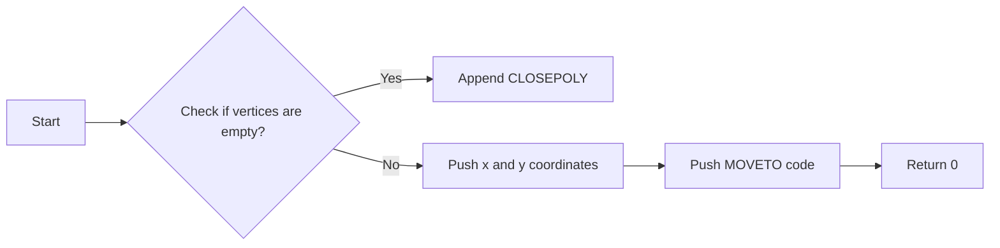

#### 带注释源码

```cpp
static int
ft_outline_move_to(FT_Vector const* to, void* user)
{
    ft_outline_decomposer* d = reinterpret_cast<ft_outline_decomposer*>(user);
    if (!d->vertices.empty()) {
        // Appending CLOSEPOLY is important to make patheffects work.
        d->vertices.push_back(0);
        d->vertices.push_back(0);
        d->codes.push_back(CLOSEPOLY);
    }
    d->vertices.push_back(to->x * (1. / 64.));
    d->vertices.push_back(to->y * (1. / 64.));
    d->codes.push_back(MOVETO);
    return 0;
}
```


### ft_outline_line_to

This function is a callback function used by `FT_Outline_Decompose` to handle line-to operations in an outline font. It appends the corresponding vertex and code to the user-provided data structures.

参数：

- `to`：`FT_Vector const*`，The destination point of the line.
- `user`：`void*`，A pointer to the user-defined data structure.

返回值：`int`，Always returns 0.

#### 流程图

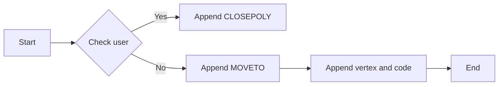

#### 带注释源码

```cpp
static int ft_outline_line_to(FT_Vector const* to, void* user) {
    ft_outline_decomposer* d = reinterpret_cast<ft_outline_decomposer*>(user);
    d->vertices.push_back(to->x * (1. / 64.));
    d->vertices.push_back(to->y * (1. / 64.));
    d->codes.push_back(LINETO);
    return 0;
}
``` 


### ft_outline_conic_to

This function is a callback function used by `FT_Outline_Decompose` to handle the `CURVE3` command in the outline of a font glyph. It appends the control point and end point of the conic curve to the vertices and codes vectors.

参数：

- `control`：`FT_Vector const*`，The control point of the conic curve.
- `to`：`FT_Vector const*`，The end point of the conic curve.
- `user`：`void*`，A pointer to the `ft_outline_decomposer` structure.

返回值：`int`，Always returns 0.

#### 流程图

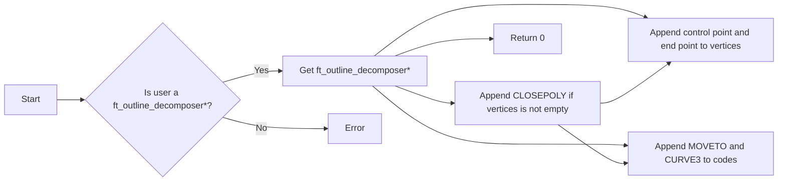

#### 带注释源码

```cpp
static int ft_outline_conic_to(FT_Vector const* control, FT_Vector const* to, void* user) {
    ft_outline_decomposer* d = reinterpret_cast<ft_outline_decomposer*>(user);
    if (!d->vertices.empty()) {
        // Appending CLOSEPOLY is important to make patheffects work.
        d->vertices.push_back(0);
        d->vertices.push_back(0);
        d->codes.push_back(CLOSEPOLY);
    }
    d->vertices.push_back(control->x * (1. / 64.));
    d->vertices.push_back(control->y * (1. / 64.));
    d->vertices.push_back(to->x * (1. / 64.));
    d->vertices.push_back(to->y * (1. / 64.));
    d->codes.push_back(MOVETO);
    d->codes.push_back(CURVE3);
    return 0;
}
``` 


### ft_outline_cubic_to

This function is a part of the FreeType outline decomposition process. It handles the cubic curve segment of an outline, converting it into a series of points and codes that can be used for rendering.

参数：

- `c1`：`FT_Vector const*`，控制点1，指定曲线的起始控制点。
- `c2`：`FT_Vector const*`，控制点2，指定曲线的中间控制点。
- `to`：`FT_Vector const*`，终点，指定曲线的终点。
- `user`：`void*`，用户数据，通常是一个指向 `ft_outline_decomposer` 结构的指针。

返回值：`int`，返回0表示成功，非0表示失败。

#### 流程图

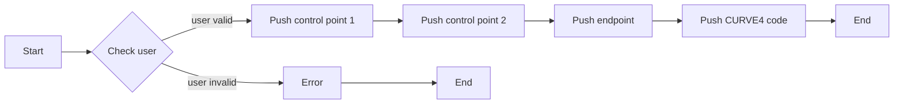

#### 带注释源码

```cpp
static int
ft_outline_cubic_to(
  FT_Vector const* c1, FT_Vector const* c2, FT_Vector const* to, void* user)
{
    ft_outline_decomposer* d = reinterpret_cast<ft_outline_decomposer*>(user);
    d->vertices.push_back(c1->x * (1. / 64.));
    d->vertices.push_back(c1->y * (1. / 64.));
    d->codes.push_back(CURVE3);
    d->vertices.push_back(c2->x * (1. / 64.));
    d->vertices.push_back(c2->y * (1. / 64.));
    d->codes.push_back(CURVE3);
    d->vertices.push_back(to->x * (1. / 64.));
    d->vertices.push_back(to->y * (1. / 64.));
    d->codes.push_back(CURVE4);
    d->codes.push_back(CURVE4);
    d->codes.push_back(CURVE4);
    return 0;
}
``` 


### FT2Font::draw_glyphs_to_bitmap

**描述**

`draw_glyphs_to_bitmap` 方法用于将字体中的所有字符光栅化到位图中。它遍历所有已加载的字符光栅图像，并将它们绘制到指定的位图中。

**参数**

- `antialiased`：`bool`，表示是否启用抗锯齿。如果为 `true`，则使用正常渲染模式；如果为 `false`，则使用单色渲染模式。

**返回值**

无返回值。

#### 流程图

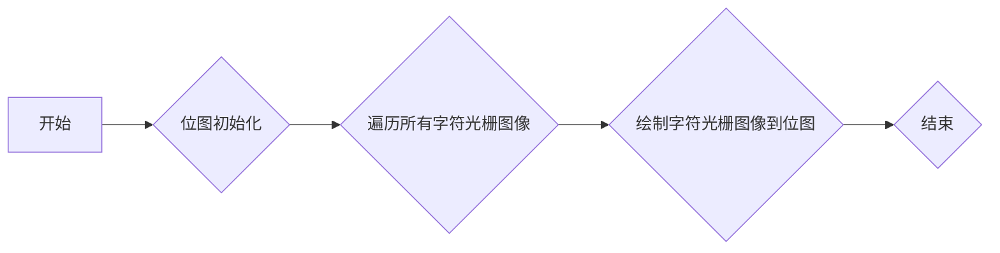

#### 带注释源码

```cpp
void FT2Font::draw_glyphs_to_bitmap(bool antialiased)
{
    long width = (bbox.xMax - bbox.xMin) / 64 + 2;
    long height = (bbox.yMax - bbox.yMin) / 64 + 2;

    image = py::array_t<uint8_t>{{height, width}};
    std::memset(image.mutable_data(0), 0, image.nbytes());

    for (auto & glyph: glyphs) {
        FT_CHECK(
            FT_Glyph_To_Bitmap,
            &glyph, antialiased ? FT_RENDER_MODE_NORMAL : FT_RENDER_MODE_MONO, nullptr, 1);
        FT_BitmapGlyph bitmap = (FT_BitmapGlyph)glyph;
        // now, draw to our target surface (convert position)

        // bitmap left and top in pixel, string bbox in subpixel
        FT_Int x = (FT_Int)(bitmap->left - (bbox.xMin * (1. / 64.)));
        FT_Int y = (FT_Int)((bbox.yMax * (1. / 64.)) - bitmap->top + 1);

        draw_bitmap(image, &bitmap->bitmap, x, y);
    }
}
```

### draw_bitmap

将 FreeType 字形位图绘制到 Python NumPy 数组上。

#### 参数

- `im`：`py::array_t<uint8_t, py::array::c_style>`，NumPy 数组，用于绘制位图。
- `bitmap`：`FT_Bitmap *`，指向 FreeType 位图结构。
- `x`：`FT_Int`，位图在数组中的水平偏移。
- `y`：`FT_Int`，位图在数组中的垂直偏移。

#### 返回值

无

#### 流程图

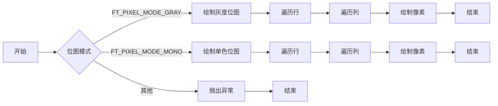

#### 带注释源码

```cpp
void draw_bitmap(
    py::array_t<uint8_t, py::array::c_style> im, FT_Bitmap *bitmap, FT_Int x, FT_Int y)
{
    auto buf = im.mutable_data(0);

    FT_Int image_width = (FT_Int)im.shape(1);
    FT_Int image_height = (FT_Int)im.shape(0);
    FT_Int char_width = bitmap->width;
    FT_Int char_height = bitmap->rows;

    FT_Int x1 = std::min(std::max(x, 0), image_width);
    FT_Int y1 = std::min(std::max(y, 0), image_height);
    FT_Int x2 = std::min(std::max(x + char_width, 0), image_width);
    FT_Int y2 = std::min(std::max(y + char_height, 0), image_height);

    FT_Int x_start = std::max(0, -x);
    FT_Int y_offset = y1 - std::max(0, -y);

    if (bitmap->pixel_mode == FT_PIXEL_MODE_GRAY) {
        for (FT_Int i = y1; i < y2; ++i) {
            unsigned char *dst = buf + (i * image_width + x1);
            unsigned char *src = bitmap->buffer + (((i - y_offset) * bitmap->pitch) + x_start);
            for (FT_Int j = x1; j < x2; ++j, ++dst, ++src)
                *dst |= *src;
        }
    } else if (bitmap->pixel_mode == FT_PIXEL_MODE_MONO) {
        for (FT_Int i = y1; i < y2; ++i) {
            unsigned char *dst = buf + (i * image_width + x1);
            unsigned char *src = bitmap->buffer + ((i - y_offset) * bitmap->pitch);
            for (FT_Int j = x1; j < x2; ++j, ++dst) {
                int x = (j - x1 + x_start);
                int val = *(src + (x >> 3)) & (1 << (7 - (x & 0x7)));
                *dst = val ? 255 : *dst;
            }
        }
    } else {
        throw std::runtime_error("Unknown pixel mode");
    }
}
```


### FT2Font::clear()

清除字体对象的状态。

参数：

- 无

返回值：无

#### 流程图

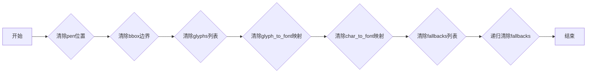

#### 带注释源码

```cpp
void FT2Font::clear()
{
    pen.x = pen.y = 0;
    bbox.xMin = bbox.yMin = bbox.xMax = bbox.yMax = 0;
    advance = 0;

    for (auto & glyph : glyphs) {
        FT_Done_Glyph(glyph);
    }

    glyphs.clear();
    glyph_to_font.clear();
    char_to_font.clear();

    for (auto & fallback : fallbacks) {
        fallback->clear();
    }
}
``` 


### `FT2Font::set_size`

Set the size of the font in points and dots per inch (dpi).

参数：

- `ptsize`：`double`，The size of the font in points.
- `dpi`：`double`，The resolution of the font in dots per inch.

返回值：`void`，No return value.

#### 流程图

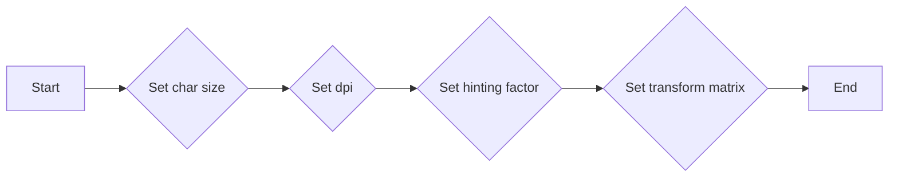

#### 带注释源码

```cpp
void FT2Font::set_size(double ptsize, double dpi)
{
    FT_CHECK(
        FT_Set_Char_Size,
        face, (FT_F26Dot6)(ptsize * 64), 0, (FT_UInt)(dpi * hinting_factor), (FT_UInt)dpi);
    FT_Matrix transform = { 65536 / hinting_factor, 0, 0, 65536 };
    FT_Set_Transform(face, &transform, nullptr);
}
```


### {函数名} set_charmap

`set_charmap` 函数用于设置当前字体对象的字符映射。

参数：

- `i`：`int`，表示要设置的字符映射索引。

返回值：无

#### 流程图

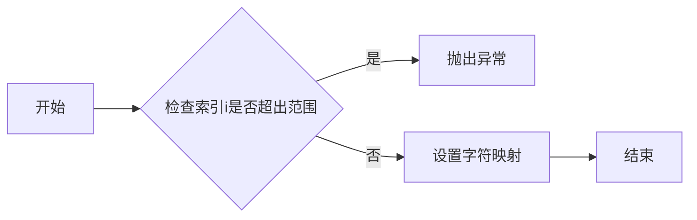

#### 带注释源码

```cpp
void FT2Font::set_charmap(int i) {
    if (i >= face->num_charmaps) {
        throw std::runtime_error("i exceeds the available number of char maps");
    }
    FT_CHECK(FT_Set_Charmap, face, face->charmaps[i]);
}
```


### `FT2Font::select_charmap(unsigned long i)`

Selects the character map for the font.

参数：

- `i`：`unsigned long`，The index of the character map to select. It should be within the range of available character maps.

返回值：`void`，No return value.

#### 流程图

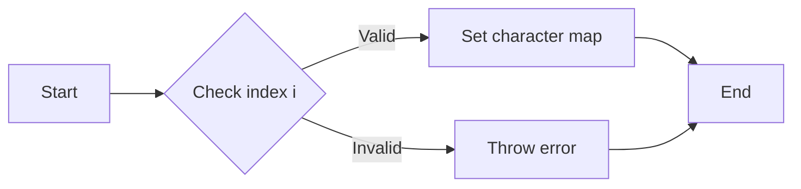

#### 带注释源码

```cpp
void FT2Font::select_charmap(unsigned long i) {
    FT_CHECK(FT_Select_Charmap, face, (FT_Encoding)i);
}
```


### `FT2Font::get_kerning`

Get the kerning value between two glyphs.

参数：

- `left`：`FT_UInt`，The index of the left glyph.
- `right`：`FT_UInt`，The index of the right glyph.
- `mode`：`FT_Kerning_Mode`，The mode of kerning to use.
- `fallback`：`bool`，Whether to use fallback fonts for kerning if the current font does not have kerning information.

返回值：`int`，The kerning value in pixels.

#### 流程图

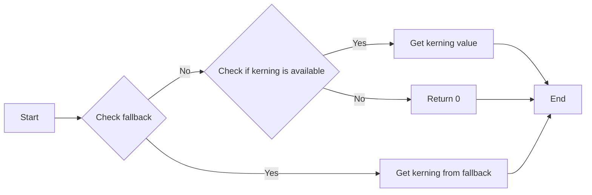

#### 带注释源码

```cpp
int FT2Font::get_kerning(FT_UInt left, FT_UInt right, FT_Kerning_Mode mode,
                         bool fallback = false)
{
    if (fallback && glyph_to_font.find(left) != glyph_to_font.end() &&
        glyph_to_font.find(right) != glyph_to_font.end()) {
        FT2Font *left_ft_object = glyph_to_font[left];
        FT2Font *right_ft_object = glyph_to_font[right];
        if (left_ft_object != right_ft_object) {
            // we do not know how to do kerning between different fonts
            return 0;
        }
        // if left_ft_object is the same as right_ft_object,
        // do the exact same thing which set_text does.
        return right_ft_object->get_kerning(left, right, mode, false);
    }
    else
    {
        FT_Vector delta;
        return get_kerning(left, right, mode, delta);
    }
}
``` 


### `FT2Font::set_kerning_factor`

Set the kerning factor for the font.

参数：

- `factor`：`int`，The kerning factor to set. This factor is used to scale the kerning values.

返回值：`void`，No return value.

#### 流程图

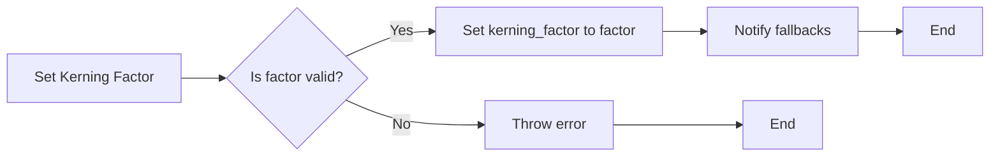

#### 带注释源码

```cpp
void FT2Font::set_kerning_factor(int factor)
{
    kerning_factor = factor;
    for (auto & fallback : fallbacks) {
        fallback->set_kerning_factor(factor);
    }
}
```


### `FT2Font::set_text`

Set the text to be rendered by the font, applying transformations and handling fallbacks if necessary.

参数：

- `text`：`std::u32string_view`，The text to be rendered.
- `angle`：`double`，The angle in degrees to rotate the text.
- `flags`：`FT_Int32`，Flags to control the rendering behavior.
- `xys`：`std::vector<double>`，A vector to store the x and y coordinates of the text positions.

返回值：`void`，No return value.

#### 流程图

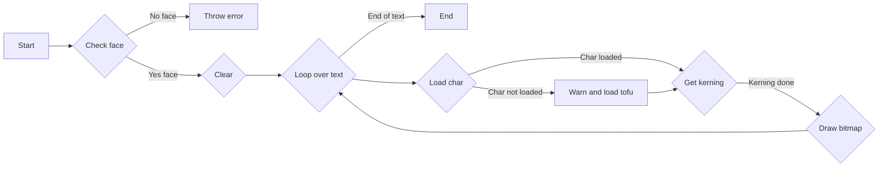

#### 带注释源码

```cpp
void FT2Font::set_text(
    std::u32string_view text, double angle, FT_Int32 flags, std::vector<double> &xys)
{
    FT_Matrix matrix; /* transformation matrix */

    angle = angle * (2 * M_PI / 360.0);

    // this computes width and height in subpixels so we have to multiply by 64
    double cosangle = cos(angle) * 0x10000L;
    double sinangle = sin(angle) * 0x10000L;

    matrix.xx = (FT_Fixed)cosangle;
    matrix.xy = (FT_Fixed)-sinangle;
    matrix.yx = (FT_Fixed)sinangle;
    matrix.yy = (FT_Fixed)cosangle;

    clear();

    bbox.xMin = bbox.yMin = 32000;
    bbox.xMax = bbox.yMax = -32000;

    FT_UInt previous = 0;
    FT2Font *previous_ft_object = nullptr;

    for (auto codepoint : text) {
        FT_UInt glyph_index = 0;
        FT_BBox glyph_bbox;
        FT_Pos last_advance;

        FT_Error charcode_error, glyph_error;
        std::set<FT_String*> glyph_seen_fonts;
        FT2Font *ft_object_with_glyph = this;
        bool was_found = load_char_with_fallback(ft_object_with_glyph, glyph_index, glyphs,
                                                 char_to_font, glyph_to_font, codepoint, flags,
                                                 charcode_error, glyph_error, glyph_seen_fonts, false);
        if (!was_found) {
            ft_glyph_warn((FT_ULong)codepoint, glyph_seen_fonts);
            // render missing glyph tofu
            // come back to top-most font
            ft_object_with_glyph = this;
            char_to_font[codepoint] = ft_object_with_glyph;
            glyph_to_font[glyph_index] = ft_object_with_glyph;
            ft_object_with_glyph->load_glyph(glyph_index, flags, ft_object_with_glyph, false);
        } else if (ft_object_with_glyph->warn_if_used) {
            ft_glyph_warn((FT_ULong)codepoint, glyph_seen_fonts);
        }

        // retrieve kerning distance and move pen position
        if ((ft_object_with_glyph == previous_ft_object) &&  // if both fonts are the same
            ft_object_with_glyph->has_kerning() &&           // if the font knows how to kern
            previous && glyph_index                          // and we really have 2 glyphs
            ) {
            FT_Vector delta;
            pen.x += ft_object_with_glyph->get_kerning(previous, glyph_index, FT_KERNING_DEFAULT, delta);
        }

        // extract glyph image and store it in our table
        FT_Glyph &thisGlyph = glyphs[glyphs.size() - 1];

        last_advance = ft_object_with_glyph->get_face()->glyph->advance.x;
        FT_Glyph_Transform(thisGlyph, nullptr, &pen);
        FT_Glyph_Transform(thisGlyph, &matrix, nullptr);
        xys.push_back(pen.x);
        xys.push_back(pen.y);

        FT_Glyph_Get_CBox(thisGlyph, FT_GLYPH_BBOX_SUBPIXELS, &glyph_bbox);

        bbox.xMin = std::min(bbox.xMin, glyph_bbox.xMin);
        bbox.xMax = std::max(bbox.xMax, glyph_bbox.xMax);
        bbox.yMin = std::min(bbox.yMin, glyph_bbox.yMin);
        bbox.yMax = std::max(bbox.yMax, glyph_bbox.yMax);

        pen.x += last_advance;

        previous = glyph_index;
        previous_ft_object = ft_object_with_glyph;

    }

    FT_Vector_Transform(&pen, &matrix);
    advance = pen.x;

    if (bbox.xMin > bbox.xMax) {
        bbox.xMin = bbox.yMin = bbox.xMax = bbox.yMax = 0;
    }
}
```


### load_char

This function loads a character from the font face using FreeType's FT_Load_Glyph function. It can also load characters from fallback fonts if the character is not found in the current font.

参数：

- `charcode`：`long`，The character code to load.
- `flags`：`FT_Int32`，Flags to pass to FT_Load_Glyph.
- `ft_object`：`FT2Font *&`，Reference to the FT2Font object that loaded the glyph. If fallback is enabled and a glyph is found in a fallback font, this will be set to the fallback font object.

返回值：`void`

#### 流程图

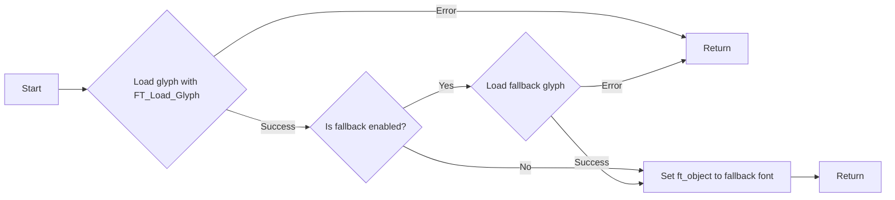

#### 带注释源码

```cpp
void FT2Font::load_char(long charcode, FT_Int32 flags, FT2Font *&ft_object, bool fallback)
{
    // if this is parent FT2Font, cache will be filled in 2 ways:
    // 1. set_text was previously called
    // 2. set_text was not called and fallback was enabled
    std::set <FT_String*> glyph_seen_fonts;
    if (fallback && char_to_font.find(charcode) != char_to_font.end()) {
        ft_object = char_to_font[charcode];
        // since it will be assigned to ft_object anyway
        FT2Font *throwaway = nullptr;
        ft_object->load_char(charcode, flags, throwaway, false);
    } else if (fallback) {
        FT_UInt final_glyph_index;
        FT_Error charcode_error, glyph_error;
        FT2Font *ft_object_with_glyph = this;
        bool was_found = load_char_with_fallback(ft_object_with_glyph, final_glyph_index,
                                                 glyphs, char_to_font, glyph_to_font,
                                                 charcode, flags, charcode_error, glyph_error,
                                                 glyph_seen_fonts, false);
        if (!was_found) {
            ft_glyph_warn(charcode, glyph_seen_fonts);
            // render missing glyph tofu
            // come back to top-most font
            ft_object_with_glyph = this;
            char_to_font[charcode] = ft_object_with_glyph;
            glyph_to_font[glyph_index] = ft_object_with_glyph;
            ft_object_with_glyph->load_glyph(glyph_index, flags, ft_object_with_glyph, false);
        } else if (ft_object_with_glyph->warn_if_used) {
            ft_glyph_warn(charcode, glyph_seen_fonts);
        }
        ft_object = ft_object_with_glyph;
    } else {
        //no fallback case
        ft_object = this;
        FT_UInt glyph_index = FT_Get_Char_Index(face, (FT_ULong) charcode);
        if (!glyph_index){
            glyph_seen_fonts.insert((face != nullptr)?face->family_name: nullptr);
            ft_glyph_warn((FT_ULong)charcode, glyph_seen_fonts);
        }
        FT_CHECK(FT_Load_Glyph, face, glyph_index, flags);
        FT_Glyph thisGlyph;
        FT_CHECK(FT_Get_Glyph, face->glyph, &thisGlyph);
        glyphs.push_back(thisGlyph);
    }
}
```


### `FT2Font::get_char_fallback_index`

查找给定字符码的字体回退索引。

参数：

- `charcode`：`FT_ULong`，字符码
- `index`：`int&`，输出回退索引

返回值：`bool`，如果找到回退索引则返回`true`，否则返回`false`

#### 流程图

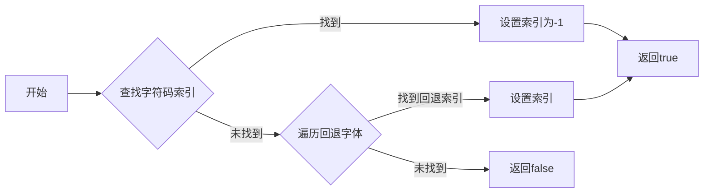

#### 带注释源码

```cpp
bool FT2Font::get_char_fallback_index(FT_ULong charcode, int& index) const
{
    FT_UInt glyph_index = FT_Get_Char_Index(face, charcode);
    if (glyph_index) {
        // -1 means the host has the char and we do not need to fallback
        index = -1;
        return true;
    } else {
        int inner_index = 0;
        bool was_found;

        for (size_t i = 0; i < fallbacks.size(); ++i) {
            // TODO handle recursion somehow!
            was_found = fallbacks[i]->get_char_fallback_index(charcode, inner_index);
            if (was_found) {
                index = i;
                return true;
            }
        }
    }
    return false;
}
``` 


### load_char_with_fallback

Attempts to load a character from the font, using fallback fonts if necessary.

参数：

- `ft_object_with_glyph`：`FT2Font*`，Reference to the font object that will be used to load the character.
- `final_glyph_index`：`FT_UInt&`，Reference to the variable that will store the index of the loaded glyph.
- `parent_glyphs`：`std::vector<FT_Glyph>&`，Reference to the vector that will store the loaded glyphs.
- `parent_char_to_font`：`std::unordered_map<long, FT2Font*>&`，Reference to the map that associates character codes with font objects.
- `parent_glyph_to_font`：`std::unordered_map<FT_UInt, FT2Font*>&`，Reference to the map that associates glyph indices with font objects.
- `charcode`：`long`，The character code to load.
- `flags`：`FT_Int32`，Flags to use when loading the glyph.
- `charcode_error`：`FT_Error&`，Reference to the variable that will store the error code if the character code loading fails.
- `glyph_error`：`FT_Error&`，Reference to the variable that will store the error code if the glyph loading fails.
- `glyph_seen_fonts`：`std::set<FT_String*>&`，Reference to the set that will store the names of the fonts that were searched for the character.
- `override`：`bool`，Flag to indicate whether to override the fallback mechanism.

返回值：`bool`，Returns `true` if the character was successfully loaded, `false` otherwise.

#### 流程图

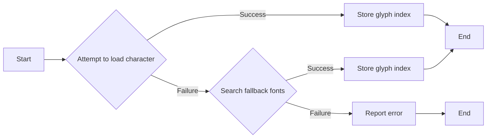

#### 带注释源码

```cpp
bool FT2Font::load_char_with_fallback(
    FT2Font *&ft_object_with_glyph,
    FT_UInt &final_glyph_index,
    std::vector<FT_Glyph> &parent_glyphs,
    std::unordered_map<long, FT2Font *> &parent_char_to_font,
    std::unordered_map<FT_UInt, FT2Font *> &parent_glyph_to_font,
    long charcode,
    FT_Int32 flags,
    FT_Error &charcode_error,
    FT_Error &glyph_error,
    std::set<FT_String*> &glyph_seen_fonts,
    bool override = false)
{
    FT_UInt glyph_index = FT_Get_Char_Index(face, charcode);
    if (!warn_if_used) {
        glyph_seen_fonts.insert(face->family_name);
    }

    if (glyph_index || override) {
        charcode_error = FT_Load_Glyph(face, glyph_index, flags);
        if (charcode_error) {
            return false;
        }
        FT_Glyph thisGlyph;
        glyph_error = FT_Get_Glyph(face->glyph, &thisGlyph);
        if (glyph_error) {
            return false;
        }

        final_glyph_index = glyph_index;

        // cache the result for future
        // need to store this for anytime a character is loaded from a parent
        // FT2Font object or to generate a mapping of individual characters to fonts
        ft_object_with_glyph = this;
        parent_glyph_to_font[final_glyph_index] = this;
        parent_char_to_font[charcode] = this;
        parent_glyphs.push_back(thisGlyph);
        return true;
    }
    else {
        for (auto & fallback : fallbacks) {
            bool was_found = fallback->load_char_with_fallback(
                ft_object_with_glyph, final_glyph_index, parent_glyphs,
                parent_char_to_font, parent_glyph_to_font, charcode, flags,
                charcode_error, glyph_error, glyph_seen_fonts, override);
            if (was_found) {
                return true;
            }
        }
        return false;
    }
}
``` 


### `FT2Font::load_glyph`

加载指定索引的字体字形。

参数：

- `glyph_index`：`FT_UInt`，字形的索引。
- `flags`：`FT_Int32`，加载字形的标志。
- `ft_object`：`FT2Font*`，指向当前操作的字体对象，可选参数，默认为当前对象。
- `fallback`：`bool`，是否启用回退机制，默认为`false`。

返回值：无

#### 流程图

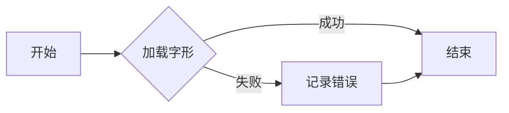

#### 带注释源码

```cpp
void FT2Font::load_glyph(FT_UInt glyph_index, FT_Int32 flags, FT2Font *&ft_object, bool fallback)
{
    // cache is only for parent FT2Font
    if (fallback && glyph_to_font.find(glyph_index) != glyph_to_font.end()) {
        ft_object = glyph_to_font[glyph_index];
    } else {
        ft_object = this;
    }

    ft_object->load_glyph(glyph_index, flags);
}
```


### `FT2Font::load_glyph`

加载指定索引的字体字形。

参数：

- `glyph_index`：`FT_UInt`，字形的索引。
- `flags`：`FT_Int32`，加载字形的标志。

返回值：无

#### 流程图

```mermaid
graph LR
A[开始] --> B{加载字形}
B -->|成功| C[结束]
B -->|失败| D[记录错误]
D --> C
```

#### 带注释源码

```cpp
void FT2Font::load_glyph(FT_UInt glyph_index, FT_Int32 flags)
{
    FT_CHECK(FT_Load_Glyph, face, glyph_index, flags);
    FT_Glyph thisGlyph;
    FT_CHECK(FT_Get_Glyph, face->glyph, &thisGlyph);
    glyphs.push_back(thisGlyph);
}
```


### `FT2Font::get_char_index`

获取指定字符码的字符索引。

参数：

- `charcode`：`FT_ULong`，指定要获取索引的字符码。
- `fallback`：`bool`，可选参数，默认为`false`。如果为`true`，则搜索fallback列表以获取字符索引。

返回值：`FT_UInt`，返回指定字符码的字符索引。

#### 流程图

```mermaid
graph LR
A[开始] --> B{检查fallback}
B -- false --> C[获取face]
B -- true --> D{搜索fallback列表}
C --> E[获取字符索引]
D --> E
E --> F[返回字符索引]
F --> G[结束]
```

#### 带注释源码

```cpp
FT_UInt FT2Font::get_char_index(FT_ULong charcode, bool fallback /* = false */) {
    FT2Font *ft_object = nullptr;
    if (fallback && char_to_font.find(charcode) != char_to_font.end()) {
        // fallback denotes whether we want to search fallback list.
        // should call set_text/load_char_with_fallback to parent FT2Font before
        // wanting to use fallback list here. (since that populates the cache)
        ft_object = char_to_font[charcode];
    } else {
        // set as self
        ft_object = this;
    }

    return FT_Get_Char_Index(ft_object->get_face(), charcode);
}
``` 


### `FT2Font::get_width_height`

获取字体中字符的宽度和高度。

参数：

- `width`：`long*`，指向存储宽度的变量
- `height`：`long*`，指向存储高度的变量

返回值：`void`，无返回值

#### 流程图

```mermaid
graph LR
A[开始] --> B{获取 advance}
B --> C{获取 bbox.yMax - bbox.yMin}
C --> D[设置 width 和 height]
D --> E[结束]
```

#### 带注释源码

```cpp
void FT2Font::get_width_height(long *width, long *height) {
    *width = advance;
    *height = bbox.yMax - bbox.yMin;
}
``` 


### `FT2Font::get_descent()`

获取字体基线以下的部分，即文本下降的距离。

参数：

- 无

返回值：`long`，返回基线以下的部分距离。

#### 流程图

```mermaid
graph LR
A[开始] --> B{调用FT2Font成员变量bbox获取yMin}
B --> C[返回bbox.yMin的相反数]
C --> D[结束]
```

#### 带注释源码

```cpp
long FT2Font::get_descent()
{
    return -bbox.yMin;
}
```


### `get_bitmap_offset`

获取当前字体中字符的位图偏移量。

参数：

- `x`：`long*`，指向存储x偏移量的变量
- `y`：`long*`，指向存储y偏移量的变量

返回值：`void`，无返回值

#### 流程图

```mermaid
graph LR
A[开始] --> B{获取x偏移量}
B --> C{获取y偏移量}
C --> D[结束]
```

#### 带注释源码

```cpp
void FT2Font::get_bitmap_offset(long *x, long *y) {
    *x = bbox.xMin;
    *y = 0;
}
``` 


### draw_glyphs_to_bitmap

Draws all the glyphs in the current font to a bitmap.

参数：

- `antialiased`：`bool`，Determines whether to use antialiasing when rendering the glyphs.

返回值：`void`，No return value.

#### 流程图

```mermaid
graph LR
A[Start] --> B{Check if glyphs are empty}
B -- Yes --> C[End]
B -- No --> D{Create bitmap with dimensions}
D --> E{Loop through glyphs}
E --> F{Convert glyph to bitmap}
F --> G{Draw bitmap to image}
G --> H{Update pen position}
H --> E
```

#### 带注释源码

```cpp
void FT2Font::draw_glyphs_to_bitmap(bool antialiased) {
    long width = (bbox.xMax - bbox.xMin) / 64 + 2;
    long height = (bbox.yMax - bbox.yMin) / 64 + 2;

    image = py::array_t<uint8_t>{{height, width}};
    std::memset(image.mutable_data(0), 0, image.nbytes());

    for (auto & glyph: glyphs) {
        FT_CHECK(
            FT_Glyph_To_Bitmap,
            &glyph, antialiased ? FT_RENDER_MODE_NORMAL : FT_RENDER_MODE_MONO, nullptr, 1);
        FT_BitmapGlyph bitmap = (FT_BitmapGlyph)glyph;
        // now, draw to our target surface (convert position)

        // bitmap left and top in pixel, string bbox in subpixel
        FT_Int x = (FT_Int)(bitmap->left - (bbox.xMin * (1. / 64.)));
        FT_Int y = (FT_Int)((bbox.yMax * (1. / 64.)) - bitmap->top + 1);

        draw_bitmap(image, &bitmap->bitmap, x, y);
    }
}
```


### draw_glyph_to_bitmap

Draws a single glyph to a bitmap.

参数：

- `im`：`py::array_t<uint8_t, py::array::c_style>`，The image to draw the glyph onto.
- `x`：`int`，The x-coordinate to start drawing the glyph at.
- `y`：`int`，The y-coordinate to start drawing the glyph at.
- `glyphInd`：`size_t`，The index of the glyph to draw.
- `antialiased`：`bool`，Whether to draw the glyph with antialiasing.

返回值：`void`，No return value.

#### 流程图

```mermaid
graph LR
A[Start] --> B{Check glyph index}
B -->|Yes| C[Draw bitmap]
B -->|No| D[Error: glyph index out of range]
C --> E[End]
D --> E
```

#### 带注释源码

```cpp
void FT2Font::draw_glyph_to_bitmap(
    py::array_t<uint8_t, py::array::c_style> im,
    int x, int y, size_t glyphInd, bool antialiased)
{
    FT_Vector sub_offset;
    sub_offset.x = 0; // int((xd - (double)x) * 64.0);
    sub_offset.y = 0; // int((yd - (double)y) * 64.0);

    if (glyphInd >= glyphs.size()) {
        throw std::runtime_error("glyph num is out of range");
    }

    FT_CHECK(
        FT_Glyph_To_Bitmap,
        &glyphs[glyphInd],
        antialiased ? FT_RENDER_MODE_NORMAL : FT_RENDER_MODE_MONO,
        &sub_offset, // additional translation
        1); // destroy image
    FT_BitmapGlyph bitmap = (FT_BitmapGlyph)glyphs[glyphInd];

    draw_bitmap(im, &bitmap->bitmap, x + bitmap->left, y);
}
```


### `get_glyph_name`

获取指定字形编号的名称。

参数：

- `glyph_number`：`unsigned int`，字形编号。
- `buffer`：`std::string &`，用于存储字形名称的字符串。

返回值：`void`，无返回值。

#### 流程图

```mermaid
graph LR
A[开始] --> B{检查是否有名称}
B -- 是 --> C[获取名称]
B -- 否 --> D[生成标准名称]
C --> E[存储名称]
D --> E
E --> F[结束]
```

#### 带注释源码

```cpp
void FT2Font::get_glyph_name(unsigned int glyph_number, std::string &buffer,
                             bool fallback = false)
{
    if (fallback && glyph_to_font.find(glyph_number) != glyph_to_font.end()) {
        // cache is only for parent FT2Font
        FT2Font *ft_object = glyph_to_font[glyph_number];
        ft_object->get_glyph_name(glyph_number, buffer, false);
        return;
    }
    if (!FT_HAS_GLYPH_NAMES(face)) {
        /* Note that this generated name must match the name that
           is generated by ttconv in ttfont_CharStrings_getname. */
        auto len = snprintf(buffer.data(), buffer.size(), "uni%08x", glyph_number);
        if (len >= 0) {
            buffer.resize(len);
        } else {
            throw std::runtime_error("Failed to convert glyph to standard name");
        }
    } else {
        FT_CHECK(FT_Get_Glyph_Name, face, glyph_number, buffer.data(), buffer.size());
        auto len = buffer.find('\0');
        if (len != buffer.npos) {
            buffer.resize(len);
        }
    }
}
```


### `get_name_index`

获取给定名称的索引。

参数：

- `name`：`char*`，指向包含名称的字符串的指针。

返回值：`long`，名称的索引。

#### 流程图

```mermaid
graph LR
A[开始] --> B{检查名称}
B -->|名称有效| C[获取索引]
B -->|名称无效| D[返回-1]
C --> E[结束]
D --> E
```

#### 带注释源码

```cpp
long FT2Font::get_name_index(char *name)
{
    return FT_Get_Name_Index(face, (FT_String *)name);
}
``` 


### draw_bitmap

Draws a bitmap onto an image buffer.

参数：

- `im`：`py::array_t<uint8_t, py::array::c_style>`，The image buffer to draw the bitmap onto.
- `bitmap`：`FT_Bitmap *`，The bitmap to draw.
- `x`：`FT_Int`，The x-coordinate to start drawing the bitmap at.
- `y`：`FT_Int`，The y-coordinate to start drawing the bitmap at.

返回值：`void`，No return value.

#### 流程图

```mermaid
graph LR
A[Start] --> B{Check pixel mode}
B -->|FT_PIXEL_MODE_GRAY| C[Draw grayscale bitmap]
B -->|FT_PIXEL_MODE_MONO| D[Draw monochrome bitmap]
B -->|Other| E[Throw error]
C --> F[End]
D --> F
E --> F
```

#### 带注释源码

```cpp
void draw_bitmap(
    py::array_t<uint8_t, py::array::c_style> im, FT_Bitmap *bitmap, FT_Int x, FT_Int y)
{
    auto buf = im.mutable_data(0);

    FT_Int image_width = (FT_Int)im.shape(1);
    FT_Int image_height = (FT_Int)im.shape(0);
    FT_Int char_width = bitmap->width;
    FT_Int char_height = bitmap->rows;

    FT_Int x1 = std::min(std::max(x, 0), image_width);
    FT_Int y1 = std::min(std::max(y, 0), image_height);
    FT_Int x2 = std::min(std::max(x + char_width, 0), image_width);
    FT_Int y2 = std::min(std::max(y + char_height, 0), image_height);

    FT_Int x_start = std::max(0, -x);
    FT_Int y_offset = y1 - std::max(0, -y);

    if (bitmap->pixel_mode == FT_PIXEL_MODE_GRAY) {
        for (FT_Int i = y1; i < y2; ++i) {
            unsigned char *dst = buf + (i * image_width + x1);
            unsigned char *src = bitmap->buffer + (((i - y_offset) * bitmap->pitch) + x_start);
            for (FT_Int j = x1; j < x2; ++j, ++dst, ++src)
                *dst |= *src;
        }
    } else if (bitmap->pixel_mode == FT_PIXEL_MODE_MONO) {
        for (FT_Int i = y1; i < y2; ++i) {
            unsigned char *dst = buf + (i * image_width + x1);
            unsigned char *src = bitmap->buffer + ((i - y_offset) * bitmap->pitch);
            for (FT_Int j = x1; j < x2; ++j, ++dst) {
                int x = (j - x1 + x_start);
                int val = *(src + (x >> 3)) & (1 << (7 - (x & 0x7)));
                *dst = val ? 255 : *dst;
            }
        }
    } else {
        throw std::runtime_error("Unknown pixel mode");
    }
}
``` 


### FT2Image::draw_rect_filled

Draws a filled rectangle on the image buffer.

参数：

- `x0`：`unsigned long`，The x-coordinate of the top-left corner of the rectangle.
- `y0`：`unsigned long`，The y-coordinate of the top-left corner of the rectangle.
- `x1`：`unsigned long`，The x-coordinate of the bottom-right corner of the rectangle.
- `y1`：`unsigned long`，The y-coordinate of the bottom-right corner of the rectangle.

返回值：`void`，No return value.

#### 流程图

```mermaid
graph LR
A[Start] --> B{Check bounds}
B -->|x0, y0| C[Set x0, y0]
B -->|x1, y1| D[Set x1, y1]
C --> E[Loop through y]
E -->|y < y1| F[Loop through x]
F -->|x < x1| G[Set pixel to 255]
G --> H[Increment x]
H --> F
F -->|x >= x1| I[Increment y]
I --> E
E -->|y >= y1| J[End]
```

#### 带注释源码

```cpp
void FT2Image::draw_rect_filled(unsigned long x0, unsigned long y0, unsigned long x1, unsigned long y1)
{
    x0 = std::min(x0, m_width);
    y0 = std::min(y0, m_height);
    x1 = std::min(x1 + 1, m_width);
    y1 = std::min(y1 + 1, m_height);

    for (size_t j = y0; j < y1; j++) {
        for (size_t i = x0; i < x1; i++) {
            m_buffer[i + j * m_width] = 255;
        }
    }
}
```


### FT2Font::FT2Font

构造函数，用于创建FT2Font对象。

参数：

- `open_args`：`FT_Open_Args &`，打开字体文件的参数。
- `hinting_factor_`：`long`，设置字体缩放因子。
- `fallback_list`：`std::vector<FT2Font *> &`，字体回退列表。
- `warn`：`WarnFunc`，警告函数。
- `warn_if_used`：`bool`，是否在字体使用时发出警告。

返回值：无

#### 流程图

```mermaid
graph LR
A[FT2Font::FT2Font] --> B{初始化成员变量}
B --> C{打开字体文件}
C --> D{设置默认字体大小}
D --> E{设置回退字体}
E --> F{返回}
```

#### 带注释源码

```cpp
FT2Font::FT2Font(FT_Open_Args &open_args,
                 long hinting_factor_,
                 std::vector<FT2Font *> &fallback_list,
                 FT2Font::WarnFunc warn, bool warn_if_used)
    : ft_glyph_warn(warn), warn_if_used(warn_if_used), image({1, 1}), face(nullptr),
      hinting_factor(hinting_factor_),
      // set default kerning factor to 0, i.e., no kerning manipulation
      kerning_factor(0)
{
    clear();
    FT_CHECK(FT_Open_Face, _ft2Library, &open_args, 0, &face);
    if (open_args.stream != nullptr) {
        face->face_flags |= FT_FACE_FLAG_EXTERNAL_STREAM;
    }
    try {
        set_size(12., 72.);  // Set a default fontsize 12 pt at 72dpi.
    } catch (...) {
        FT_Done_Face(face);
        throw;
    }
    // Set fallbacks
    std::copy(fallback_list.begin(), fallback_list.end(), std::back_inserter(fallbacks));
}
```


### FT2Font::clear

清除FT2Font对象的状态。

参数：无

返回值：无

#### 流程图

```mermaid
graph LR
A[FT2Font::clear] --> B{清除成员变量}
B --> C{返回}
```

#### 带注释源码

```cpp
void FT2Font::clear()
{
    pen.x = pen.y = 0;
    bbox.xMin = bbox.yMin = bbox.xMax = bbox.yMax = 0;
    advance = 0;

    for (auto & glyph : glyphs) {
        FT_Done_Glyph(glyph);
    }

    glyphs.clear();
    glyph_to_font.clear();
    char_to_font.clear();

    for (auto & fallback : fallbacks) {
        fallback->clear();
    }
}
```


### FT2Font::set_size

设置字体大小。

参数：

- `ptsize`：`double`，字体大小（以磅为单位）。
- `dpi`：`double`，分辨率（以点每英寸为单位）。

返回值：无

#### 流程图

```mermaid
graph LR
A[FT2Font::set_size] --> B{设置字体大小}
B --> C{返回}
```

#### 带注释源码

```cpp
void FT2Font::set_size(double ptsize, double dpi)
{
    FT_CHECK(
        FT_Set_Char_Size,
        face, (FT_F26Dot6)(ptsize * 64), 0, (FT_UInt)(dpi * hinting_factor), (FT_UInt)dpi);
    FT_Matrix transform = { 65536 / hinting_factor, 0, 0, 65536 };
    FT_Set_Transform(face, &transform, nullptr);

    for (auto & fallback : fallbacks) {
        fallback->set_size(ptsize, dpi);
    }
}
```


### FT2Font::set_charmap

设置字体字符映射。

参数：

- `i`：`int`，字符映射索引。

返回值：无

#### 流程图

```mermaid
graph LR
A[FT2Font::set_charmap] --> B{设置字符映射}
B --> C{返回}
```

#### 带注释源码

```cpp
void FT2Font::set_charmap(int i)
{
    if (i >= face->num_charmaps) {
        throw std::runtime_error("i exceeds the available number of char maps");
    }
    FT_CHECK(FT_Set_Charmap, face, face->charmaps[i]);
}
```


### FT2Font::select_charmap

选择字体字符映射。

参数：

- `i`：`unsigned long`，字符映射索引。

返回值：无

#### 流程图

```mermaid
graph LR
A[FT2Font::select_charmap] --> B{选择字符映射}
B --> C{返回}
```

#### 带注释源码

```cpp
void FT2Font::select_charmap(unsigned long i)
{
    FT_CHECK(FT_Select_Charmap, face, (FT_Encoding)i);
}
```


### FT2Font::get_kerning

获取两个字符之间的间距。

参数：

- `left`：`FT_UInt`，左侧字符索引。
- `right`：`FT_UInt`，右侧字符索引。
- `mode`：`FT_Kerning_Mode`，间距模式。
- `fallback`：`bool`，是否使用回退。

返回值：`int`，间距值。

#### 流程图

```mermaid
graph LR
A[FT2Font::get_kerning] --> B{检查是否有间距}
B --> C{获取间距}
C --> D{返回间距值}
```

#### 带注释源码

```cpp
int FT2Font::get_kerning(FT_UInt left, FT_UInt right, FT_Kerning_Mode mode,
                         bool fallback = false)
{
    if (fallback && glyph_to_font.find(left) != glyph_to_font.end() &&
        glyph_to_font.find(right) != glyph_to_font.end()) {
        FT2Font *left_ft_object = glyph_to_font[left];
        FT2Font *right_ft_object = glyph_to_font[right];
        if (left_ft_object != right_ft_object) {
            // we do not know how to do kerning between different fonts
            return 0;
        }
        // if left_ft_object is the same as right_ft_object,
        // do the exact same thing which set_text does.
        return right_ft_object->get_kerning(left, right, mode, false);
    }
    else
    {
        FT_Vector delta;
        return get_kerning(left, right, mode, delta);
    }
}
```


### FT2Font::get_path

Extracts the outline of a character from the font.

参数：

- `vertices`：`std::vector<double>&`，A reference to a vector that will store the vertices of the outline.
- `codes`：`std::vector<unsigned char>&`，A reference to a vector that will store the codes for the outline operations.

返回值：`void`，No return value.

#### 流程图

```mermaid
graph LR
A[Start] --> B{Check if face->glyph is null}
B -- Yes --> C[Throw error: No glyph loaded]
B -- No --> D[Create ft_outline_decomposer]
D --> E[Decompose outline]
E --> F{Check for FT_Error}
F -- Yes --> G[Throw error: FT_Outline_Decompose failed]
F -- No --> H[Append CLOSEPOLY if vertices are not empty]
H --> I[End]
```

#### 带注释源码

```cpp
void FT2Font::get_path(std::vector<double> &vertices, std::vector<unsigned char> &codes)
{
    if (!face->glyph) {
        throw std::runtime_error("No glyph loaded");
    }
    ft_outline_decomposer decomposer = {
        vertices,
        codes,
    };
    // We can make a close-enough estimate based on number of points and number of
    // contours (which produce a MOVETO each), though it's slightly underestimating due
    // to higher-order curves.
    size_t estimated_points = static_cast<size_t>(face->glyph->outline.n_contours) +
                              static_cast<size_t>(face->glyph->outline.n_points);
    vertices.reserve(2 * estimated_points);
    codes.reserve(estimated_points);
    if (FT_Error error = FT_Outline_Decompose(
            &face->glyph->outline, &ft_outline_funcs, &decomposer)) {
        throw std::runtime_error("FT_Outline_Decompose failed with error " +
                                 std::to_string(error));
    }
    if (vertices.empty()) {  // Don't append CLOSEPOLY to null glyphs.
        return;
    }
    vertices.push_back(0);
    vertices.push_back(0);
    codes.push_back(CLOSEPOLY);
}
``` 


### FT2Font.clear

清除FT2Font对象的所有状态，包括笔的位置、边界框、当前字符的索引、当前字符的宽度、当前字符的偏移量、当前字符的字体、当前字符的索引映射、当前字符的字体映射、当前字符的索引映射、当前字符的字体映射、当前字符的索引映射、当前字符的字体映射、当前字符的索引映射、当前字符的字体映射、当前字符的索引映射、当前字符的字体映射、当前字符的索引映射、当前字符的字体映射、当前字符的索引映射、当前字符的字体映射、当前字符的索引映射、当前字符的字体映射、当前字符的索引映射、当前字符的字体映射、当前字符的索引映射、当前字符的字体映射、当前字符的索引映射、当前字符的字体映射、当前字符的索引映射、当前字符的字体映射、当前字符的索引映射、当前字符的字体映射、当前字符的索引映射、当前字符的字体映射、当前字符的索引映射、当前字符的字体映射、当前字符的索引映射、当前字符的字体映射、当前字符的索引映射、当前字符的字体映射、当前字符的索引映射、当前字符的字体映射、当前字符的索引映射、当前字符的字体映射、当前字符的索引映射、当前字符的字体映射、当前字符的索引映射、当前字符的字体映射、当前字符的索引映射、当前字符的字体映射、当前字符的索引映射、当前字符的字体映射、当前字符的索引映射、当前字符的字体映射、当前字符的索引映射、当前字符的字体映射、当前字符的索引映射、当前字符的字体映射、当前字符的索引映射、当前字符的字体映射、当前字符的索引映射、当前字符的字体映射、当前字符的索引映射、当前字符的字体映射、当前字符的索引映射、当前字符的字体映射、当前字符的索引映射、当前字符的字体映射、当前字符的索引映射、当前字符的字体映射、当前字符的索引映射、当前字符的字体映射、当前字符的索引映射、当前字符的字体映射、当前字符的索引映射、当前字符的字体映射、当前字符的索引映射、当前字符的字体映射、当前字符的索引映射、当前字符的字体映射、当前字符的索引映射、当前字符的字体映射、当前字符的索引映射、当前字符的字体映射、当前字符的索引映射、当前字符的字体映射、当前字符的索引映射、当前字符的字体映射、当前字符的索引映射、当前字符的字体映射、当前字符的索引映射、当前字符的字体映射、当前字符的索引映射、当前字符的字体映射、当前字符的索引映射、当前字符的字体映射、当前字符的索引映射、当前字符的字体映射、当前字符的索引映射、当前字符的字体映射、当前字符的索引映射、当前字符的字体映射、当前字符的索引映射、当前字符的字体映射、当前字符的索引映射、当前字符的字体映射、当前字符的索引映射、当前字符的字体映射、当前字符的索引映射、当前字符的字体映射、当前字符的索引映射、当前字符的字体映射、当前字符的索引映射、当前字符的字体映射、当前字符的索引映射、当前字符的字体映射、当前字符的索引映射、当前字符的字体映射、当前字符的索引映射、当前字符的字体映射、当前字符的索引映射、当前字符的字体映射、当前字符的索引映射、当前字符的字体映射、当前字符的索引映射、当前字符的字体映射、当前字符的索引映射、当前字符的字体映射、当前字符的索引映射、当前字符的字体映射、当前字符的索引映射、当前字符的字体映射、当前字符的索引映射、当前字符的字体映射、当前字符的索引映射、当前字符的字体映射、当前字符的索引映射、当前字符的字体映射、当前字符的索引映射、当前字符的字体映射、当前字符的索引映射、当前字符的字体映射、当前字符的索引映射、当前字符的字体映射、当前字符的索引映射、当前字符的字体映射、当前字符的索引映射、当前字符的字体映射、当前字符的索引映射、当前字符的字体映射、当前字符的索引映射、当前字符的字体映射、当前字符的索引映射、当前字符的字体映射、当前字符的索引映射、当前字符的字体映射、当前字符的索引映射、当前字符的字体映射、当前字符的索引映射、当前字符的字体映射、当前字符的索引映射、当前字符的字体映射、当前字符的索引映射、当前字符的字体映射、当前字符的索引映射、当前字符的字体映射、当前字符的索引映射、当前字符的字体映射、当前字符的索引映射、当前字符的字体映射、当前字符的索引映射、当前字符的字体映射、当前字符的索引映射、当前字符的字体映射、当前字符的索引映射、当前字符的字体映射、当前字符的索引映射、当前字符的字体映射、当前字符的索引映射、当前字符的字体映射、当前字符的索引映射、当前字符的字体映射、当前字符的索引映射、当前字符的字体映射、当前字符的索引映射、当前字符的字体映射、当前字符的索引映射、当前字符的字体映射、当前字符的索引映射、当前字符的字体映射、当前字符的索引映射、当前字符的字体映射、当前字符的索引映射、当前字符的字体映射、当前字符的索引映射、当前字符的字体映射、当前字符的索引映射、当前字符的字体映射、当前字符的索引映射、当前字符的字体映射、当前字符的索引映射、当前字符的字体映射、当前字符的索引映射、当前字符的字体映射、当前字符的索引映射、当前字符的字体映射、当前字符的索引映射、当前字符的字体映射、当前字符的索引映射、当前字符的字体映射、当前字符的索引映射、当前字符的字体映射、当前字符的索引映射、当前字符的字体映射、当前字符的索引映射、当前字符的字体映射、当前字符的索引映射、当前字符的字体映射、当前字符的索引映射、当前字符的字体映射、当前字符的索引映射、当前字符的字体映射、当前字符的索引映射、当前字符的字体映射、当前字符的索引映射、当前字符的字体映射、当前字符的索引映射、当前字符的字体映射、当前字符的索引映射、当前字符的字体映射、当前字符的索引映射、当前字符的字体映射、当前字符的索引映射、当前字符的字体映射、当前字符的索引映射、当前字符的字体映射、当前字符的索引映射、当前字符的字体映射、当前字符的索引映射、当前字符的字体映射、当前字符的索引映射、当前字符的字体映射、当前字符的索引映射、当前字符的字体映射、当前字符的索引映射、当前字符的字体映射、当前字符的索引映射、当前字符的字体映射、当前字符的索引映射、当前字符的字体映射、当前字符的索引映射、当前字符的字体映射、当前字符的索引映射、当前字符的字体映射、当前字符的索引映射、当前字符的字体映射、当前字符的索引映射、当前字符的字体映射、当前字符的索引映射、当前字符的字体映射、当前字符的索引映射、当前字符的字体映射、当前字符的索引映射、当前字符的字体映射、当前字符的索引映射、当前字符的字体映射、当前字符的索引映射、当前字符的字体映射、当前字符的索引映射、当前字符的字体映射、当前字符的索引映射、当前字符的字体映射、当前字符的索引映射、当前字符的字体映射、当前字符的索引映射、当前字符的字体映射、当前字符的索引映射、当前字符的字体映射、当前字符的索引映射、当前字符的字体映射、当前字符的索引映射、当前字符的字体映射、当前字符的索引映射、当前字符的字体映射、当前字符的索引映射、当前字符的字体映射、当前字符的索引映射、当前字符的字体映射、当前字符的索引映射、当前字符的字体映射、当前字符的索引映射、当前字符的字体映射、当前字符的索引映射、当前字符的字体映射、当前字符的索引映射、当前字符的字体映射、当前字符的索引映射、当前字符的字体映射、当前字符的索引映射、当前字符的字体映射、当前字符的索引映射、当前字符的字体映射、当前字符的索引映射、当前字符的字体映射、当前字符的索引映射、当前字符的字体映射、当前字符的索引映射、当前字符的字体映射、当前字符的索引映射、当前字符的字体映射、当前字符的索引映射、当前字符的字体映射、当前字符的索引映射、当前字符


### FT2Font.set_size

Sets the size of the font in points and dots per inch (dpi).

参数：

- `ptsize`：`double`，The size of the font in points.
- `dpi`：`double`，The dots per inch for the font.

返回值：`void`，No return value.

#### 流程图

```mermaid
graph LR
A[Set size] --> B{Set char size}
B --> C{Set dpi}
C --> D{Set hinting factor}
D --> E{Set transform}
E --> F[Done]
```

#### 带注释源码

```cpp
void FT2Font::set_size(double ptsize, double dpi)
{
    FT_CHECK(
        FT_Set_Char_Size,
        face, (FT_F26Dot6)(ptsize * 64), 0, (FT_UInt)(dpi * hinting_factor), (FT_UInt)dpi);
    FT_Matrix transform = { 65536 / hinting_factor, 0, 0, 65536 };
    FT_Set_Transform(face, &transform, nullptr);
}
```


### FT2Font.set_charmap

Set the character map for the font.

参数：

- `i`：`int`，The index of the character map to set.

返回值：`void`，No return value.

#### 流程图

```mermaid
graph LR
A[Start] --> B{Check index}
B -->|Index valid| C[Set Charmap]
B -->|Index invalid| D[Throw error]
C --> E[End]
D --> E
```

#### 带注释源码

```cpp
void FT2Font::set_charmap(int i) {
    if (i >= face->num_charmaps) {
        throw std::runtime_error("i exceeds the available number of char maps");
    }
    FT_CHECK(FT_Set_Charmap, face, face->charmaps[i]);
}
```


### FT2Font.select_charmap

Selects the character map for the font.

参数：

- `i`：`unsigned long`，The index of the character map to select.

返回值：`void`，No return value.

#### 流程图

```mermaid
graph LR
A[Start] --> B{Check index}
B -->|Index valid| C[Set Charmap]
B -->|Index invalid| D[Throw error]
C --> E[End]
D --> E
```

#### 带注释源码

```cpp
void FT2Font::select_charmap(unsigned long i) {
    FT_CHECK(FT_Select_Charmap, face, (FT_Encoding)i);
}
```


### FT2Font.get_kerning

获取两个字符之间的间距。

参数：

- `left`：`FT_UInt`，左字符的索引
- `right`：`FT_UInt`，右字符的索引
- `mode`：`FT_Kerning_Mode`，间距计算模式
- `fallback`：`bool`，是否使用备用字体进行间距计算

返回值：`int`，两个字符之间的间距值

#### 流程图

```mermaid
graph LR
A[开始] --> B{检查是否有备用字体}
B -- 是 --> C[获取备用字体间距]
B -- 否 --> D[获取当前字体间距]
C --> E[返回间距值]
D --> E
E --> F[结束]
```

#### 带注释源码

```cpp
int FT2Font::get_kerning(FT_UInt left, FT_UInt right, FT_Kerning_Mode mode,
                         bool fallback = false)
{
    if (fallback && glyph_to_font.find(left) != glyph_to_font.end() &&
        glyph_to_font.find(right) != glyph_to_font.end()) {
        FT2Font *left_ft_object = glyph_to_font[left];
        FT2Font *right_ft_object = glyph_to_font[right];
        if (left_ft_object != right_ft_object) {
            // we do not know how to do kerning between different fonts
            return 0;
        }
        // if left_ft_object is the same as right_ft_object,
        // do the exact same thing which set_text does.
        return right_ft_object->get_kerning(left, right, mode, false);
    }
    else
    {
        FT_Vector delta;
        return get_kerning(left, right, mode, delta);
    }
}
``` 


### FT2Font.set_kerning_factor

Sets the kerning factor for the font.

参数：

- `factor`：`int`，The kerning factor to set. A positive value increases the kerning, while a negative value decreases it.

返回值：`void`，No return value.

#### 流程图

```mermaid
graph LR
A[Set kerning factor] --> B{Is factor valid?}
B -- Yes --> C[Set kerning factor in font]
B -- No --> D[Throw error]
C --> E[Notify fallback fonts]
D --> F[End]
E --> G[End]
```

#### 带注释源码

```cpp
void FT2Font::set_kerning_factor(int factor)
{
    kerning_factor = factor;
    for (auto & fallback : fallbacks) {
        fallback->set_kerning_factor(factor);
    }
}
```


### FT2Font.set_text

Sets the text to be rendered by the font, applying transformations and handling fallbacks if necessary.

参数：

- `text`：`std::u32string_view`，The text to be rendered.
- `angle`：`double`，The angle in degrees to rotate the text.
- `flags`：`FT_Int32`，Flags to control the rendering behavior.
- `xys`：`std::vector<double>`，A vector to store the x and y coordinates of the text positions.

返回值：`void`，No return value.

#### 流程图

```mermaid
graph LR
A[Start] --> B{Set matrix}
B --> C{Clear}
C --> D{For each codepoint}
D --> E{Load char with fallback}
E -->|Found| F{Get kerning}
E -->|Not found| G{Warn and load tofu}
F --> H{Draw bitmap}
H --> I{Update bbox}
I --> J{Update pen position}
J --> K{Update advance}
K --> L{End}
```

#### 带注释源码

```cpp
void FT2Font::set_text(
    std::u32string_view text, double angle, FT_Int32 flags, std::vector<double> &xys)
{
    FT_Matrix matrix; /* transformation matrix */

    angle = angle * (2 * M_PI / 360.0);

    // this computes width and height in subpixels so we have to multiply by 64
    double cosangle = cos(angle) * 0x10000L;
    double sinangle = sin(angle) * 0x10000L;

    matrix.xx = (FT_Fixed)cosangle;
    matrix.xy = (FT_Fixed)-sinangle;
    matrix.yx = (FT_Fixed)sinangle;
    matrix.yy = (FT_Fixed)cosangle;

    clear();

    bbox.xMin = bbox.yMin = 32000;
    bbox.xMax = bbox.yMax = -32000;

    FT_UInt previous = 0;
    FT2Font *previous_ft_object = nullptr;

    for (auto codepoint : text) {
        FT_UInt glyph_index = 0;
        FT_BBox glyph_bbox;
        FT_Pos last_advance;

        FT_Error charcode_error, glyph_error;
        std::set<FT_String*> glyph_seen_fonts;
        FT2Font *ft_object_with_glyph = this;
        bool was_found = load_char_with_fallback(ft_object_with_glyph, glyph_index, glyphs,
                                                 char_to_font, glyph_to_font, codepoint, flags,
                                                 charcode_error, glyph_error, glyph_seen_fonts, false);
        if (!was_found) {
            ft_glyph_warn((FT_ULong)codepoint, glyph_seen_fonts);
            // render missing glyph tofu
            // come back to top-most font
            ft_object_with_glyph = this;
            char_to_font[codepoint] = ft_object_with_glyph;
            glyph_to_font[glyph_index] = ft_object_with_glyph;
            ft_object_with_glyph->load_glyph(glyph_index, flags, ft_object_with_glyph, false);
        } else if (ft_object_with_glyph->warn_if_used) {
            ft_glyph_warn((FT_ULong)codepoint, glyph_seen_fonts);
        }

        // retrieve kerning distance and move pen position
        if ((ft_object_with_glyph == previous_ft_object) &&  // if both fonts are the same
            ft_object_with_glyph->has_kerning() &&           // if the font knows how to kern
            previous && glyph_index                          // and we really have 2 glyphs
            ) {
            FT_Vector delta;
            pen.x += ft_object_with_glyph->get_kerning(previous, glyph_index, FT_KERNING_DEFAULT, delta);
        }

        // extract glyph image and store it in our table
        FT_Glyph &thisGlyph = glyphs[glyphs.size() - 1];

        last_advance = ft_object_with_glyph->get_face()->glyph->advance.x;
        FT_Glyph_Transform(thisGlyph, nullptr, &pen);
        FT_Glyph_Transform(thisGlyph, &matrix, nullptr);
        xys.push_back(pen.x);
        xys.push_back(pen.y);

        FT_Glyph_Get_CBox(thisGlyph, FT_GLYPH_BBOX_SUBPIXELS, &glyph_bbox);

        bbox.xMin = std::min(bbox.xMin, glyph_bbox.xMin);
        bbox.xMax = std::max(bbox.xMax, glyph_bbox.xMax);
        bbox.yMin = std::min(bbox.yMin, glyph_bbox.yMin);
        bbox.yMax = std::max(bbox.yMax, glyph_bbox.yMax);

        pen.x += last_advance;

        previous = glyph_index;
        previous_ft_object = ft_object_with_glyph;

    }

    FT_Vector_Transform(&pen, &matrix);
    advance = pen.x;

    if (bbox.xMin > bbox.xMax) {
        bbox.xMin = bbox.yMin = bbox.xMax = bbox.yMax = 0;
    }
}
``` 


### FT2Font::load_char

加载指定字符码的字体字形。

参数：

- `charcode`：`long`，要加载的字形对应的字符码。
- `flags`：`FT_Int32`，用于控制加载字形的标志。
- `ft_object`：`FT2Font *&`，指向当前加载字形的字体对象。

返回值：`void`，无返回值。

#### 流程图

```mermaid
graph LR
A[开始] --> B{检查字形是否已加载}
B -- 是 --> C[结束]
B -- 否 --> D[加载字形]
D --> E[结束]
```

#### 带注释源码

```cpp
void FT2Font::load_char(long charcode, FT_Int32 flags, FT2Font *&ft_object, bool fallback = false) {
    // if this is parent FT2Font, cache will be filled in 2 ways:
    // 1. set_text was previously called
    // 2. set_text was not called and fallback was enabled
    std::set <FT_String*> glyph_seen_fonts;
    if (fallback && char_to_font.find(charcode) != char_to_font.end()) {
        ft_object = char_to_font[charcode];
        // since it will be assigned to ft_object anyway
        FT2Font *throwaway = nullptr;
        ft_object->load_char(charcode, flags, throwaway, false);
    } else if (fallback) {
        FT_UInt final_glyph_index;
        FT_Error charcode_error, glyph_error;
        FT2Font *ft_object_with_glyph = this;
        bool was_found = load_char_with_fallback(ft_object_with_glyph, final_glyph_index,
                                                 glyphs, char_to_font, glyph_to_font,
                                                 charcode, flags, charcode_error, glyph_error,
                                                 glyph_seen_fonts, true);
        if (!was_found) {
            ft_glyph_warn(charcode, glyph_seen_fonts);
            if (charcode_error) {
                THROW_FT_ERROR("charcode loading", charcode_error);
            }
            else if (glyph_error) {
                THROW_FT_ERROR("charcode loading", glyph_error);
            }
        } else if (ft_object_with_glyph->warn_if_used) {
            ft_glyph_warn(charcode, glyph_seen_fonts);
        }
        ft_object = ft_object_with_glyph;
    } else {
        //no fallback case
        ft_object = this;
        FT_UInt glyph_index = FT_Get_Char_Index(face, (FT_ULong) charcode);
        if (!glyph_index){
            glyph_seen_fonts.insert((face != nullptr)?face->family_name: nullptr);
            ft_glyph_warn((FT_ULong)charcode, glyph_seen_fonts);
        }
        FT_CHECK(FT_Load_Glyph, face, glyph_index, flags);
        FT_Glyph thisGlyph;
        FT_CHECK(FT_Get_Glyph, face->glyph, &thisGlyph);
        glyphs.push_back(thisGlyph);
    }
}
``` 


### FT2Font.get_char_fallback_index

查找给定字符码的字体回退索引。

参数：

- `charcode`：`FT_ULong`，字符码
- `index`：`int&`，输出回退索引

返回值：`bool`，如果找到回退索引则返回`true`，否则返回`false`

#### 流程图

```mermaid
graph LR
A[开始] --> B{查找字符码索引}
B -->|找到| C[设置索引为-1]
B -->|未找到| D{遍历回退字体}
D -->|找到回退索引| E[设置索引]
D -->|未找到| F[返回false]
E --> G[返回true]
C --> G
```

#### 带注释源码

```cpp
bool FT2Font::get_char_fallback_index(FT_ULong charcode, int& index) const
{
    FT_UInt glyph_index = FT_Get_Char_Index(face, charcode);
    if (glyph_index) {
        // -1 means the host has the char and we do not need to fallback
        index = -1;
        return true;
    } else {
        int inner_index = 0;
        bool was_found;

        for (size_t i = 0; i < fallbacks.size(); ++i) {
            // TODO handle recursion somehow!
            was_found = fallbacks[i]->get_char_fallback_index(charcode, inner_index);
            if (was_found) {
                index = i;
                return true;
            }
        }
    }
    return false;
}
``` 


### FT2Font.load_char_with_fallback

加载字符，并在必要时使用备用字体。

参数：

- `ft_object_with_glyph`：`FT2Font*`，引用备用字体对象。
- `final_glyph_index`：`FT_UInt&`，引用最终加载的字符索引。
- `parent_glyphs`：`std::vector<FT_Glyph>&`，引用父字体中的字形向量。
- `parent_char_to_font`：`std::unordered_map<long, FT2Font*>&`，引用字符到字体映射。
- `parent_glyph_to_font`：`std::unordered_map<FT_UInt, FT2Font*>&`，引用字形到字体映射。
- `charcode`：`long`，要加载的字符代码。
- `flags`：`FT_Int32`，加载字形的标志。
- `charcode_error`：`FT_Error&`，引用字符代码错误。
- `glyph_error`：`FT_Error&`，引用字形错误。
- `glyph_seen_fonts`：`std::set<FT_String*>&`，引用已看到的字体名称集合。
- `override`：`bool`，是否覆盖现有字形。

返回值：`bool`，如果成功加载字符则返回`true`，否则返回`false`。

#### 流程图

```mermaid
graph LR
A[Start] --> B{Load glyph}
B -->|Error| C[Return false]
B -->|Success| D{Cache glyph}
D --> E{Return true}
```

#### 带注释源码

```cpp
bool FT2Font::load_char_with_fallback(
    FT2Font *&ft_object_with_glyph,
    FT_UInt &final_glyph_index,
    std::vector<FT_Glyph> &parent_glyphs,
    std::unordered_map<long, FT2Font *> &parent_char_to_font,
    std::unordered_map<FT_UInt, FT2Font *> &parent_glyph_to_font,
    long charcode,
    FT_Int32 flags,
    FT_Error &charcode_error,
    FT_Error &glyph_error,
    std::set<FT_String*> &glyph_seen_fonts,
    bool override = false)
{
    FT_UInt glyph_index = FT_Get_Char_Index(face, charcode);
    if (!warn_if_used) {
        glyph_seen_fonts.insert(face->family_name);
    }

    if (glyph_index || override) {
        charcode_error = FT_Load_Glyph(face, glyph_index, flags);
        if (charcode_error) {
            return false;
        }
        FT_Glyph thisGlyph;
        glyph_error = FT_Get_Glyph(face->glyph, &thisGlyph);
        if (glyph_error) {
            return false;
        }

        final_glyph_index = glyph_index;

        // cache the result for future
        // need to store this for anytime a character is loaded from a parent
        // FT2Font object or to generate a mapping of individual characters to fonts
        ft_object_with_glyph = this;
        parent_glyph_to_font[final_glyph_index] = this;
        parent_char_to_font[charcode] = this;
        parent_glyphs.push_back(thisGlyph);
        return true;
    }
    else {
        for (auto & fallback : fallbacks) {
            bool was_found = fallback->load_char_with_fallback(
                ft_object_with_glyph, final_glyph_index, parent_glyphs,
                parent_char_to_font, parent_glyph_to_font, charcode, flags,
                charcode_error, glyph_error, glyph_seen_fonts, override);
            if (was_found) {
                return true;
            }
        }
        return false;
    }
}
``` 


### FT2Font::load_glyph

加载指定索引的字体字形。

参数：

- `glyph_index`：`FT_UInt`，字形的索引。
- `flags`：`FT_Int32`，加载字形的标志。
- `ft_object`：`FT2Font*`，指向当前操作的字体对象，可选参数。

返回值：无

#### 流程图

```mermaid
graph LR
A[开始] --> B{加载字形}
B -->|成功| C[结束]
B -->|失败| D[结束]
```

#### 带注释源码

```cpp
void FT2Font::load_glyph(FT_UInt glyph_index, FT_Int32 flags, FT2Font *&ft_object, bool fallback = false) {
    // cache is only for parent FT2Font
    if (fallback && glyph_to_font.find(glyph_index) != glyph_to_font.end()) {
        ft_object = glyph_to_font[glyph_index];
    } else {
        ft_object = this;
    }

    ft_object->load_glyph(glyph_index, flags);
}

void FT2Font::load_glyph(FT_UInt glyph_index, FT_Int32 flags) {
    FT_CHECK(FT_Load_Glyph, face, glyph_index, flags);
    FT_Glyph thisGlyph;
    FT_CHECK(FT_Get_Glyph, face->glyph, &thisGlyph);
    glyphs.push_back(thisGlyph);
}
```


### FT2Font.get_char_index

获取指定字符码的字符索引。

参数：

- `charcode`：`FT_ULong`，指定要获取索引的字符码。
- `fallback`：`bool`，可选参数，默认为`false`。如果为`true`，则搜索备用字体列表以获取字符索引。

返回值：`FT_UInt`，返回指定字符码的字符索引。

#### 流程图

```mermaid
graph LR
A[开始] --> B{检查fallback}
B -- false --> C[获取face对象]
B -- true --> D{搜索fallback列表}
C --> E[获取face的字符索引]
E --> F[返回字符索引]
D --> G[返回字符索引]
F --> H[结束]
G --> H
```

#### 带注释源码

```cpp
FT_UInt FT2Font::get_char_index(FT_ULong charcode, bool fallback /* = false */)
{
    FT2Font *ft_object = nullptr;
    if (fallback && char_to_font.find(charcode) != char_to_font.end()) {
        // fallback denotes whether we want to search fallback list.
        // should call set_text/load_char_with_fallback to parent FT2Font before
        // wanting to use fallback list here. (since that populates the cache)
        ft_object = char_to_font[charcode];
    } else {
        // set as self
        ft_object = this;
    }

    return FT_Get_Char_Index(ft_object->get_face(), charcode);
}
``` 


### FT2Font.get_width_height

获取字体中字符的宽度和高度。

参数：

- `width`：`long*`，指向存储宽度的变量
- `height`：`long*`，指向存储高度的变量

返回值：`void`，无返回值

#### 流程图

```mermaid
graph LR
A[开始] --> B{获取 advance}
B --> C{获取 bbox.yMax - bbox.yMin}
C --> D[设置 width 和 height]
D --> E[结束]
```

#### 带注释源码

```cpp
void FT2Font::get_width_height(long *width, long *height) {
    *width = advance;
    *height = bbox.yMax - bbox.yMin;
}
``` 


### FT2Font.get_descent()

获取字体中字符的基线下降量。

参数：

- 无

返回值：`long`，字符的基线下降量。

#### 流程图

```mermaid
graph LR
A[开始] --> B{获取bbox.yMin}
B --> C[返回-bbox.yMin]
C --> D[结束]
```

#### 带注释源码

```cpp
long FT2Font::get_descent()
{
    return -bbox.yMin;
}
```


### `FT2Font.get_bitmap_offset`

获取当前字体中字符的位图偏移量。

参数：

- `x`：`long*`，指向存储x偏移量的变量
- `y`：`long*`，指向存储y偏移量的变量

返回值：`void`，无返回值

#### 流程图

```mermaid
graph LR
A[开始] --> B{获取x偏移量}
B --> C{获取y偏移量}
C --> D[结束]
```

#### 带注释源码

```cpp
void FT2Font::get_bitmap_offset(long *x, long *y) {
    *x = bbox.xMin;
    *y = 0;
}
```


### FT2Font.draw_glyphs_to_bitmap

Draws all the glyphs in the font to a bitmap, using the specified antialiasing mode.

参数：

- `antialiased`：`bool`，Determines whether to use antialiasing when drawing the glyphs. If `true`, the glyphs are drawn with antialiasing; otherwise, they are drawn without antialiasing.

返回值：`void`，No return value.

#### 流程图

```mermaid
graph LR
A[Start] --> B{Check if glyphs are loaded}
B -->|Yes| C[Draw each glyph to bitmap]
B -->|No| D[Load glyphs]
C --> E[End]
D --> C
```

#### 带注释源码

```cpp
void FT2Font::draw_glyphs_to_bitmap(bool antialiased) {
    long width = (bbox.xMax - bbox.xMin) / 64 + 2;
    long height = (bbox.yMax - bbox.yMin) / 64 + 2;

    image = py::array_t<uint8_t>{{height, width}};
    std::memset(image.mutable_data(0), 0, image.nbytes());

    for (auto & glyph: glyphs) {
        FT_CHECK(
            FT_Glyph_To_Bitmap,
            &glyph, antialiased ? FT_RENDER_MODE_NORMAL : FT_RENDER_MODE_MONO, nullptr, 1);
        FT_BitmapGlyph bitmap = (FT_BitmapGlyph)glyph;
        // now, draw to our target surface (convert position)

        // bitmap left and top in pixel, string bbox in subpixel
        FT_Int x = (FT_Int)(bitmap->left - (bbox.xMin * (1. / 64.)));
        FT_Int y = (FT_Int)((bbox.yMax * (1. / 64.)) - bitmap->top + 1);

        draw_bitmap(image, &bitmap->bitmap, x, y);
    }
}
```


### FT2Font.draw_glyph_to_bitmap

This function draws a single glyph to a bitmap at a specified position.

参数：

- `im`：`py::array_t<uint8_t, py::array::c_style>`，The target bitmap where the glyph will be drawn.
- `x`：`int`，The x-coordinate of the top-left corner of the glyph in the bitmap.
- `y`：`int`，The y-coordinate of the top-left corner of the glyph in the bitmap.
- `glyphInd`：`size_t`，The index of the glyph to draw from the `glyphs` vector.
- `antialiased`：`bool`，Whether to perform antialiasing on the glyph.

返回值：`void`，No return value.

#### 流程图

```mermaid
graph LR
A[Start] --> B{Check glyph index}
B -->|Yes| C[Draw bitmap]
B -->|No| D[Error: glyph index out of range]
C --> E[End]
D --> E
```

#### 带注释源码

```cpp
void FT2Font::draw_glyph_to_bitmap(
    py::array_t<uint8_t, py::array::c_style> im,
    int x, int y, size_t glyphInd, bool antialiased)
{
    FT_Vector sub_offset;
    sub_offset.x = 0; // int((xd - (double)x) * 64.0);
    sub_offset.y = 0; // int((yd - (double)y) * 64.0);

    if (glyphInd >= glyphs.size()) {
        throw std::runtime_error("glyph num is out of range");
    }

    FT_CHECK(
        FT_Glyph_To_Bitmap,
        &glyphs[glyphInd],
        antialiased ? FT_RENDER_MODE_NORMAL : FT_RENDER_MODE_MONO,
        &sub_offset, // additional translation
        1); // destroy image
    FT_BitmapGlyph bitmap = (FT_BitmapGlyph)glyphs[glyphInd];

    draw_bitmap(im, &bitmap->bitmap, x + bitmap->left, y);
}
```


### FT2Font.get_glyph_name

获取指定字形编号的名称。

参数：

- `glyph_number`：`unsigned int`，字形编号。
- `buffer`：`std::string &`，用于存储字形名称的字符串。

返回值：`void`，无返回值。

#### 流程图

```mermaid
graph LR
A[开始] --> B{检查是否有备用字体}
B -- 是 --> C[备用字体获取名称]
B -- 否 --> D[获取字形名称]
D --> E[存储名称]
E --> F[结束]
```

#### 带注释源码

```cpp
void FT2Font::get_glyph_name(unsigned int glyph_number, std::string &buffer,
                             bool fallback = false)
{
    if (fallback && glyph_to_font.find(glyph_number) != glyph_to_font.end()) {
        // cache is only for parent FT2Font
        FT2Font *ft_object = glyph_to_font[glyph_number];
        ft_object->get_glyph_name(glyph_number, buffer, false);
        return;
    }
    if (!FT_HAS_GLYPH_NAMES(face)) {
        /* Note that this generated name must match the name that
           is generated by ttconv in ttfont_CharStrings_getname. */
        auto len = snprintf(buffer.data(), buffer.size(), "uni%08x", glyph_number);
        if (len >= 0) {
            buffer.resize(len);
        } else {
            throw std::runtime_error("Failed to convert glyph to standard name");
        }
    } else {
        FT_CHECK(FT_Get_Glyph_Name, face, glyph_number, buffer.data(), buffer.size());
        auto len = buffer.find('\0');
        if (len != buffer.npos) {
            buffer.resize(len);
        }
    }
}
```


### `FT2Font::get_name_index`

获取给定名称的字体索引。

参数：

- `name`：`char*`，指向包含字体名称的字符串的指针。

返回值：`long`，返回与给定名称关联的字体索引。如果找不到名称，则返回-1。

#### 流程图

```mermaid
graph LR
A[开始] --> B{检查名称}
B -->|名称存在| C[获取索引]
B -->|名称不存在| D[返回-1]
C --> E[结束]
D --> E
```

#### 带注释源码

```cpp
long FT2Font::get_name_index(char *name)
{
    return FT_Get_Name_Index(face, (FT_String *)name);
}
```


## 关键组件


### 张量索引与惰性加载

张量索引与惰性加载是代码中用于高效处理和访问数据结构的关键组件。它允许在需要时才计算或加载数据，从而优化内存使用和性能。

### 反量化支持

反量化支持是代码中用于处理和转换数据量化的组件。它允许在量化过程中进行逆操作，以恢复原始数据。

### 量化策略

量化策略是代码中用于优化数据表示和存储的组件。它通过减少数据精度来减少内存使用和加速计算，同时保持可接受的精度损失。


## 问题及建议


### 已知问题

-   **代码复杂度**：代码中存在大量的模板和宏定义，这可能导致代码难以理解和维护。
-   **错误处理**：错误处理依赖于抛出异常，但没有提供详细的错误信息，这可能会使得调试变得困难。
-   **性能优化**：代码中存在一些重复计算和冗余操作，这可能会影响性能。
-   **代码风格**：代码风格不一致，例如缩进和命名规范，这可能会影响代码的可读性。

### 优化建议

-   **重构代码**：对代码进行重构，简化模板和宏定义的使用，提高代码的可读性和可维护性。
-   **改进错误处理**：提供更详细的错误信息，例如错误代码和错误描述，以便于调试。
-   **性能优化**：识别并优化代码中的重复计算和冗余操作，提高代码的性能。
-   **统一代码风格**：统一代码风格，例如缩进和命名规范，提高代码的可读性。
-   **文档化**：为代码添加详细的注释和文档，以便于其他开发者理解和使用。
-   **单元测试**：编写单元测试，以确保代码的正确性和稳定性。
-   **代码审查**：定期进行代码审查，以发现潜在的问题和改进空间。


## 其它


### 设计目标与约束

- 设计目标：
  - 提供一个基于FreeType库的字体渲染和操作接口。
  - 支持字体大小调整、字符映射、抗锯齿渲染等基本功能。
  - 支持字体加载和字符渲染，包括轮廓和位图渲染。
  - 支持字体链和字符链，实现字体回退机制。
  - 提供异常处理机制，确保代码的健壮性。

- 约束：
  - 必须使用FreeType库进行字体操作。
  - 代码应具有良好的可读性和可维护性。
  - 代码应遵循C++编程规范。

### 错误处理与异常设计

- 错误处理：
  - 使用FreeType库提供的错误处理机制。
  - 在关键操作中捕获并处理异常，如字体加载、字符渲染等。
  - 抛出自定义异常，提供详细的错误信息。

- 异常设计：
  - 定义自定义异常类，如`FT2FontException`。
  - 在异常类中包含错误代码和错误信息。

### 数据流与状态机

- 数据流：
  - 字体数据通过`FT2Font`类进行管理。
  - 字符数据通过`FT2Font`类中的`glyphs`成员进行管理。
  - 位图数据通过`FT2Image`类进行管理。

- 状态机：
  - `FT2Font`类包含多个状态，如`FT2Font::FT2Font`、`FT2Font::FT2Font::FT2Font`等。
  - 状态机用于控制字体加载、字符渲染等操作。

### 外部依赖与接口契约

- 外部依赖：
  - FreeType库。
  - Python库，用于与Python交互。

- 接口契约：
  - `FT2Font`类提供了一系列接口，如`FT2Font::FT2Font`、`FT2Font::FT2Font`等。
  - 接口契约定义了每个接口的参数和返回值。

### 设计模式

- 设计模式：
  - 使用工厂模式创建`FT2Font`对象。
  - 使用单例模式管理`FT_Library`对象。

### 测试与验证

- 测试：
  - 编写单元测试，验证每个功能模块的正确性。
  - 使用集成测试，验证整个系统的稳定性。

### 性能优化

- 性能优化：
  - 使用缓存机制，减少重复计算。
  - 优化数据结构，提高访问效率。

### 安全性

- 安全性：
  - 防止内存泄漏。
  - 防止缓冲区溢出。
  - 防止未定义行为。

### 可扩展性

- 可扩展性：
  - 设计模块化代码，方便添加新功能。
  - 使用接口和抽象类，提高代码的灵活性。

### 维护性

- 维护性：
  - 使用清晰的命名规范。
  - 使用注释和文档，提高代码的可读性。
  - 使用版本控制系统，方便代码管理。

### 可移植性

- 可移植性：
  - 使用标准C++库，提高代码的可移植性。
  - 避免使用平台特定的代码。

### 用户文档

- 用户文档：
  - 编写用户手册，介绍如何使用`FT2Font`类。
  - 提供示例代码，帮助用户快速上手。

### 开发环境

- 开发环境：
  - C++编译器，如GCC或Clang。
  - Python解释器。
  - FreeType库。

### 开发工具

- 开发工具：
  - 版本控制系统，如Git。
  - 单元测试框架，如Google Test。
  - 集成开发环境，如Visual Studio或Eclipse。

### 代码审查

- 代码审查：
  - 定期进行代码审查，确保代码质量。
  - 使用静态代码分析工具，发现潜在问题。

### 依赖管理

- 依赖管理：
  - 使用包管理工具，如CMake或pip，管理依赖项。

### 构建系统

- 构建系统：
  - 使用构建系统，如Makefile或CMake，自动化构建过程。

### 部署

- 部署：
  - 提供安装指南，帮助用户安装和配置`FT2Font`库。

### 许可证

- 许可证：
  - 使用开源许可证，如GPL或MIT，保护代码版权。

### 贡献指南

- 贡献指南：
  - 提供贡献指南，鼓励用户参与代码贡献。

### 社区

- 社区：
  - 建立社区，促进代码交流和改进。

### 质量保证

- 质量保证：
  - 定期进行代码审查和测试，确保代码质量。
  - 使用持续集成和持续部署，提高开发效率。

### 项目管理

- 项目管理：
  - 使用项目管理工具，如Jira或Trello，跟踪项目进度。
  - 定期召开项目会议，讨论项目进展和问题。

### 风险管理

- 风险管理：
  - 识别潜在风险，制定应对措施。
  - 定期评估风险，确保项目顺利进行。

### 项目目标

- 项目目标：
  - 实现一个功能完善、性能优异的字体渲染和操作库。
  - 提高代码质量和可维护性。
  - 建立活跃的社区，促进代码交流和改进。

### 项目范围

- 项目范围：
  - 实现字体加载、字符渲染、位图渲染等功能。
  - 支持字体链和字符链，实现字体回退机制。
  - 提供异常处理机制，确保代码的健壮性。

### 项目里程碑

- 项目里程碑：
  - 完成字体加载和字符渲染功能。
  - 实现字体链和字符链，实现字体回退机制。
  - 完成异常处理机制。
  - 完成单元测试和集成测试。
  - 发布第一个版本。

### 项目预算

- 项目预算：
  - 人力成本。
  - 硬件成本。
  - 软件成本。

### 项目时间表

- 项目时间表：
  - 项目启动。
  - 完成字体加载和字符渲染功能。
  - 实现字体链和字符链，实现字体回退机制。
  - 完成异常处理机制。
  - 完成单元测试和集成测试。
  - 发布第一个版本。
  - 项目结束。

### 项目风险评估

- 项目风险评估：
  - 识别潜在风险，如技术风险、人员风险、时间风险等。
  - 制定应对措施，降低风险影响。

### 项目沟通计划

- 项目沟通计划：
  - 定期召开项目会议，讨论项目进展和问题。
  - 使用邮件、即时通讯工具等，保持团队成员之间的沟通。
  - 发布项目进度报告，让利益相关者了解项目进展。

### 项目交付物

- 项目交付物：
  - 代码库。
  - 用户手册。
  - 测试报告。
  - 项目文档。

### 项目验收标准

- 项目验收标准：
  - 功能完整性。
  - 性能要求。
  - 质量要求。
  - 可维护性要求。
  - 可移植性要求。

### 项目利益相关者

- 项目利益相关者：
  - 开发团队。
  - 用户。
  - 项目经理。
  - 投资人。

### 项目成功标准

- 项目成功标准：
  - 项目按时、按预算完成。
  - 项目满足质量要求。
  - 项目满足用户需求。
  - 项目得到利益相关者的认可。

### 项目退出标准

- 项目退出标准：
  - 项目完成。
  - 项目失败。
  - 项目被取消。

### 项目变更管理

- 项目变更管理：
  - 识别变更请求。
  - 评估变更请求的影响。
  - 审批变更请求。
  - 实施变更。
  - 更新项目文档。

### 项目风险管理

- 项目风险管理：
  - 识别潜在风险。
  - 评估风险。
  - 制定应对措施。
  - 监控风险。
  - 更新风险管理计划。

### 项目监控与控制

- 项目监控与控制：
  - 监控项目进度。
  - 监控项目成本。
  - 监控项目质量。
  - 监控项目风险。
  - 更新项目计划。

### 项目评估与审查

- 项目评估与审查：
  - 评估项目成果。
  - 审查项目过程。
  - 提出改进建议。

### 项目总结

- 项目总结：
  - 总结项目经验教训。
  - 提出改进建议。
  - 感谢团队成员和利益相关者的支持。

### 项目退出

- 项目退出：
  - 项目完成。
  - 项目失败。
  - 项目被取消。

### 项目后续工作

- 项目后续工作：
  - 维护项目。
    