# `matplotlib\src\ft2font.h` 详细设计文档

This Python interface provides a way to interact with the FreeType library for rendering fonts, including loading characters, drawing glyphs, and managing font properties.

## 整体流程

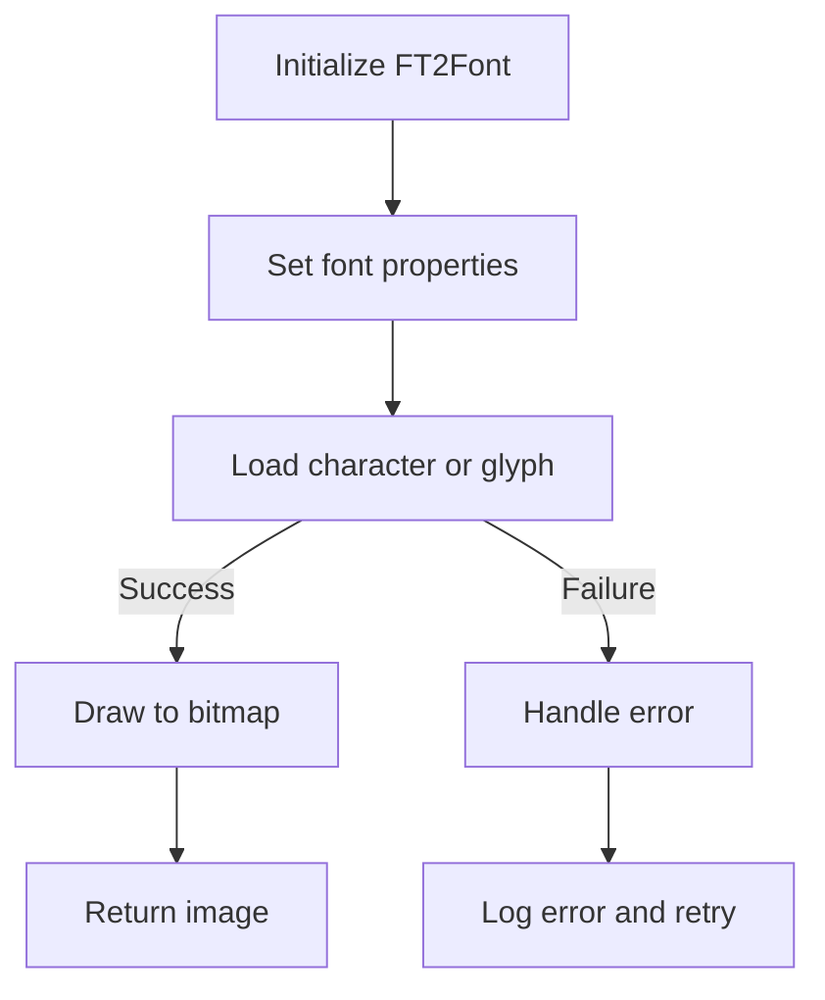

## 类结构

```
FT2Font (主类)
├── FT2Image (辅助类)
└── FT_Library (全局变量)
```

## 全局变量及字段


### `_ft2Library`
    
The global FreeType library instance used by the FT2Font class.

类型：`FT_Library`
    


### `FT2Image.m_buffer`
    
The buffer that holds the pixel data for the image.

类型：`unsigned char*`
    


### `FT2Image.m_width`
    
The width of the image in pixels.

类型：`unsigned long`
    


### `FT2Image.m_height`
    
The height of the image in pixels.

类型：`unsigned long`
    


### `FT2Font.face`
    
The FreeType face object representing the font.

类型：`FT_Face const &`
    


### `FT2Font.pen`
    
The current pen position in the font's coordinate system.

类型：`FT_Vector`
    


### `FT2Font.glyphs`
    
The vector of glyphs that have been loaded.

类型：`std::vector<FT_Glyph>`
    


### `FT2Font.fallbacks`
    
The vector of fallback fonts used for missing glyphs.

类型：`std::vector<FT2Font*>`
    


### `FT2Font.glyph_to_font`
    
The map from glyph index to the font that contains the glyph.

类型：`std::unordered_map<FT_UInt, FT2Font*>`
    


### `FT2Font.char_to_font`
    
The map from character code to the font that contains the character.

类型：`std::unordered_map<long, FT2Font*>`
    


### `FT2Font.bbox`
    
The bounding box of the font's character set.

类型：`FT_BBox`
    


### `FT2Font.advance`
    
The advance width of the current character.

类型：`FT_Pos`
    


### `FT2Font.hinting_factor`
    
The hinting factor used to adjust the rendering of the font.

类型：`long`
    


### `FT2Font.kerning_factor`
    
The kerning factor used to adjust the spacing between characters.

类型：`int`
    
    

## 全局函数及方法


### ft_error_string(FT_Error error)

Converts an error code to its corresponding string representation.

参数：

- `error`：`FT_Error`，The error code to convert.

返回值：`const char*`，The string representation of the error code.

#### 流程图

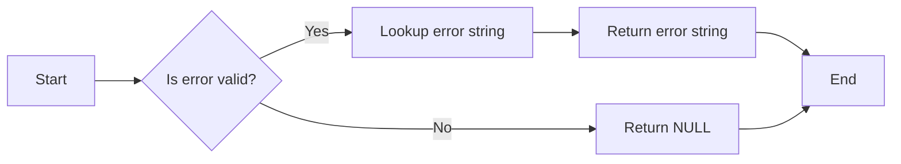

#### 带注释源码

```cpp
/* -*- mode: c++; c-basic-offset: 4 -*- */

/* A python interface to FreeType */
#pragma once

// ... (Other includes and definitions)

inline char const* ft_error_string(FT_Error error) {
#undef __FTERRORS_H__
#define FT_ERROR_START_LIST     switch (error) {
#define FT_ERRORDEF( e, v, s )    case v: return s;
#define FT_ERROR_END_LIST         default: return NULL; }
#include FT_ERRORS_H
}
``` 


### THROW_FT_ERROR(name, err)

THROW_FT_ERROR 是一个宏，用于在 FreeType 库中抛出错误。

参数：

- `name`：`std::string`，错误名称，用于标识错误来源。
- `err`：`FT_Error`，错误代码，表示具体的错误类型。

返回值：无

#### 流程图

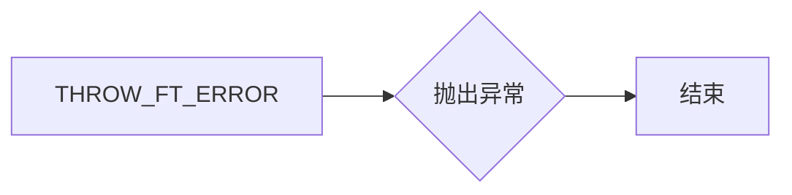

#### 带注释源码

```cpp
#define THROW_FT_ERROR(name, err) { \
    std::string path{__FILE__}; \
    char buf[20] = {0}; \
    snprintf(buf, sizeof buf, "%#04x", err); \
    throw std::runtime_error{ \
        name " (" \
        + path.substr(path.find_last_of("/\\") + 1) \
        + " line " + std::to_string(__LINE__) + ") failed with error " \
        + std::string{buf} + ": " + std::string{ft_error_string(err)}}; \
} (void)0
``` 


### FT_CHECK(func, ...)

FT_CHECK 是一个宏，用于检查 FreeType 库函数的返回值，并在出现错误时抛出异常。

参数：

- `func`：`FT_Error`，要调用的 FreeType 库函数。
- `...`：传递给 `func` 的参数。

返回值：`FT_Error`，如果 `func` 成功，则返回 `FT_Err_Ok`；如果失败，则返回相应的错误代码。

#### 流程图

```mermaid
graph LR
A[开始] --> B{func(...) 返回值}
B -- FT_Err_Ok --> C[结束]
B -- 其他错误 --> D[抛出异常]
D --> E[结束]
```

#### 带注释源码

```cpp
#define FT_CHECK(func, ...) { \
    if (auto const& error_ = func(__VA_ARGS__)) { \
        THROW_FT_ERROR(#func, error_); \
    } \
} (void)0
```


### FT2Image.resize

`resize` 方法是 `FT2Image` 类的一个成员方法。

描述：

`resize` 方法用于调整 `FT2Image` 对象的缓冲区大小，以适应新的宽度和高度。

参数：

- `width`：`long`，新的宽度。
- `height`：`long`，新的高度。

返回值：无

#### 流程图

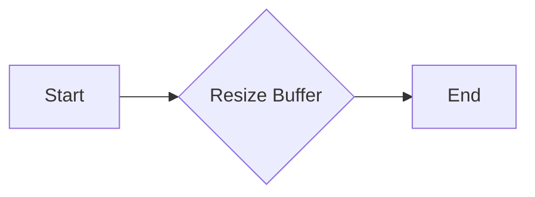

#### 带注释源码

```cpp
void FT2Image::resize(long width, long height) {
    // Resize the buffer to the new width and height
    m_buffer = new unsigned char[width * height];
    m_width = width;
    m_height = height;
}
```


### FT2Image.resize()

`resize` 方法是 `FT2Image` 类的一个成员方法。

描述：

`resize` 方法用于调整 `FT2Image` 对象的宽度和高度。

参数：

- `width`：`long`，新的宽度值。
- `height`：`long`，新的高度值。

返回值：无

#### 流程图

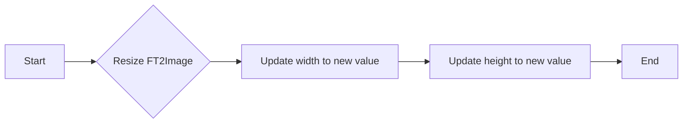

#### 带注释源码

```cpp
void FT2Image::resize(long width, long height) {
    m_width = width;
    m_height = height;
}
```


### FT2Image.resize(long width, long height)

调整图像的宽度和高度。

参数：

- `width`：`long`，新的宽度值。
- `height`：`long`，新的高度值。

返回值：无

#### 流程图

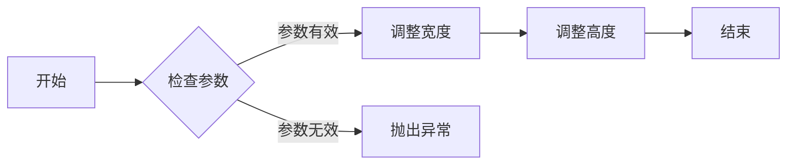

#### 带注释源码

```cpp
void FT2Image::resize(long width, long height) {
    // 检查参数是否有效
    if (width <= 0 || height <= 0) {
        THROW_FT_ERROR("resize", FT_ERROR_INVALID_ARGUMENT);
    }

    // 调整宽度
    m_width = static_cast<unsigned long>(width);

    // 调整高度
    m_height = static_cast<unsigned long>(height);
}
```


### FT2Image.draw_bitmap

This method is used to draw a bitmap onto the image buffer of the FT2Image object.

参数：

- `bitmap`：`FT_Bitmap*`，指向要绘制的位图的指针
- `x`：`FT_Int`，位图在水平方向上的起始位置
- `y`：`FT_Int`，位图在垂直方向上的起始位置

返回值：`void`，无返回值

#### 流程图


#### 带注释源码

```cpp
void FT2Image::draw_bitmap(FT_Bitmap *bitmap, FT_Int x, FT_Int y) {
    // Check if the bitmap is valid
    if (bitmap == nullptr) {
        // Handle error: Invalid bitmap
        return;
    }

    // Draw the bitmap onto the image buffer
    // (Implementation details are omitted for brevity)
}
```


### FT2Image.draw_rect_filled

This function draws a filled rectangle on the image buffer.

参数：

- `x0`：`unsigned long`，The x-coordinate of the top-left corner of the rectangle.
- `y0`：`unsigned long`，The y-coordinate of the top-left corner of the rectangle.
- `x1`：`unsigned long`，The x-coordinate of the bottom-right corner of the rectangle.
- `y1`：`unsigned long`，The y-coordinate of the bottom-right corner of the rectangle.

返回值：`void`，No return value.

#### 流程图

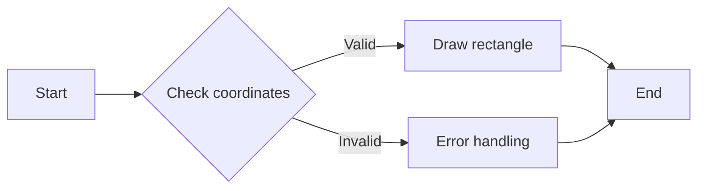

#### 带注释源码

```cpp
void FT2Image::draw_rect_filled(unsigned long x0, unsigned long y0, unsigned long x1, unsigned long y1) {
    // Check if the coordinates are valid
    if (x0 < 0 || y0 < 0 || x1 > m_width || y1 > m_height) {
        // Handle error: coordinates are out of bounds
        // Error handling code would go here
        return;
    }

    // Draw the rectangle
    for (unsigned long y = y0; y <= y1; ++y) {
        for (unsigned long x = x0; x <= x1; ++x) {
            m_buffer[y * m_width + x] = 255; // Set pixel color to white
        }
    }
}
```


### FT2Image.get_buffer()

获取图像缓冲区的指针。

参数：

- 无

返回值：`unsigned char*`，指向图像缓冲区的指针。

#### 流程图

```mermaid
graph LR
A[开始] --> B{调用get_buffer()}
B --> C[返回m_buffer指针]
C --> D[结束]
```

#### 带注释源码

```cpp
unsigned char *get_buffer()
{
    return m_buffer;
}
```


### FT2Image.get_width()

获取图像的宽度。

参数：

- 无

返回值：`unsigned long`，图像的宽度。

#### 流程图

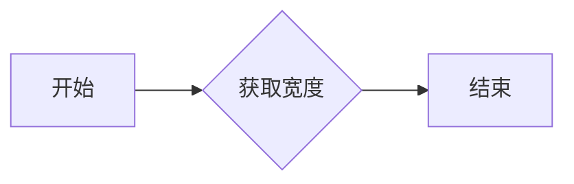

#### 带注释源码

```cpp
unsigned long get_width()
{
    return m_width;
}
```


### FT2Image.get_height()

获取图像的高度。

参数：

- 无

返回值：`unsigned long`，图像的高度。

#### 流程图

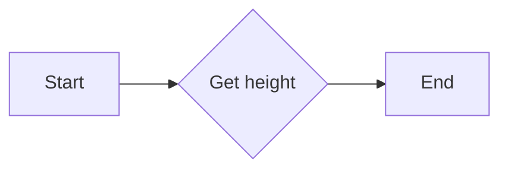

#### 带注释源码

```cpp
unsigned long get_height()
{
    return m_height;
}
```


### FT2Font.FT2Font

This function initializes a `FT2Font` object with the specified parameters.

参数：

- `open_args`：`FT_Open_Args &`，The Open Args structure that contains the information needed to open the font file.
- `hinting_factor`：`long`，The hinting factor to be used for rendering the font.
- `fallback_list`：`std::vector<FT2Font *> &`，The list of fallback fonts to be used if the primary font cannot be loaded.
- `warn`：`WarnFunc`，The function to be called when a warning occurs.
- `warn_if_used`：`bool`，Whether to warn if the font is used.

返回值：`void`，This function does not return a value.

#### 流程图

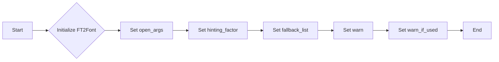

#### 带注释源码

```cpp
FT2Font(FT_Open_Args &open_args, long hinting_factor,
        std::vector<FT2Font *> &fallback_list,
        WarnFunc warn, bool warn_if_used);
```


### FT2Font.~FT2Font()

该函数是一个构造函数，用于初始化FT2Font对象。

参数：

- `open_args`：`FT_Open_Args &`，指向FT_Open_Args结构体的引用，包含打开字体所需的参数。
- `hinting_factor`：`long`，指定字体的光栅化提示因子。
- `fallback_list`：`std::vector<FT2Font *> &`，指向FT2Font对象向量，包含字体回退列表。
- `warn`：`WarnFunc`，一个函数指针，用于处理字体警告。
- `warn_if_used`：`bool`，一个布尔值，指定是否在字体使用时发出警告。

返回值：无

#### 流程图

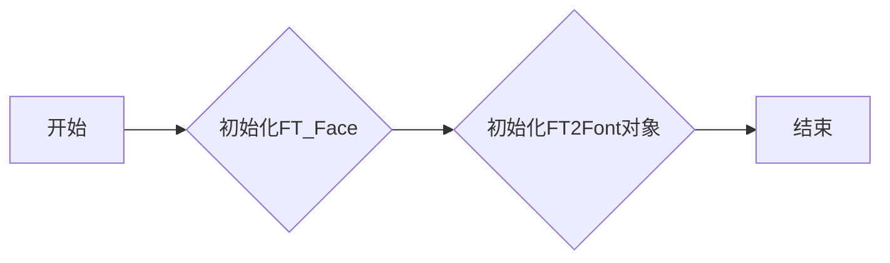

#### 带注释源码

```cpp
FT2Font(FT_Open_Args &open_args, long hinting_factor,
        std::vector<FT2Font *> &fallback_list,
        WarnFunc warn, bool warn_if_used) {
    // 初始化FT_Face
    FT_CHECK(FT_New_Face(_ft2Library, &open_args, 0, &face));
    // 初始化FT2Font对象
    // ...
}
```


### FT2Font.clear()

清除FT2Font对象中的所有数据，包括字体信息、图像、路径等。

参数：

- 无

返回值：无

#### 流程图

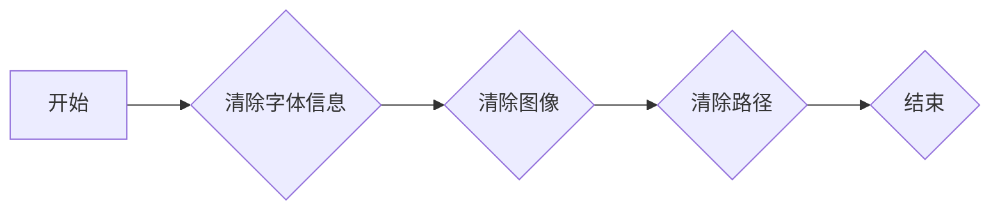

#### 带注释源码

```cpp
void FT2Font::clear() {
    // 清除字体信息
    face = nullptr;
    // 清除图像
    image = py::array_t<uint8_t, py::array::c_style>();
    // 清除路径
    glyphs.clear();
    // 清除其他数据
    pen = FT_Vector{0, 0};
    bbox = FT_BBox{0, 0, 0, 0};
    advance = 0;
    hinting_factor = 0;
    kerning_factor = 0;
}
```


### FT2Font.set_size(double ptsize, double dpi)

设置字体大小。

参数：

- `ptsize`：`double`，字体大小，以磅为单位。
- `dpi`：`double`，设备分辨率，以每英寸点数为单位。

返回值：无

#### 流程图

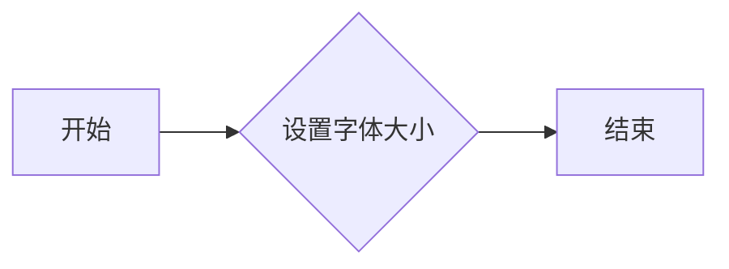

#### 带注释源码

```cpp
void FT2Font::set_size(double ptsize, double dpi) {
    // 设置字体大小
}
```


### FT2Font.set_charmap(int i)

设置当前字体使用的字符映射。

参数：

- `i`：`int`，字符映射的索引。

返回值：无

#### 流程图

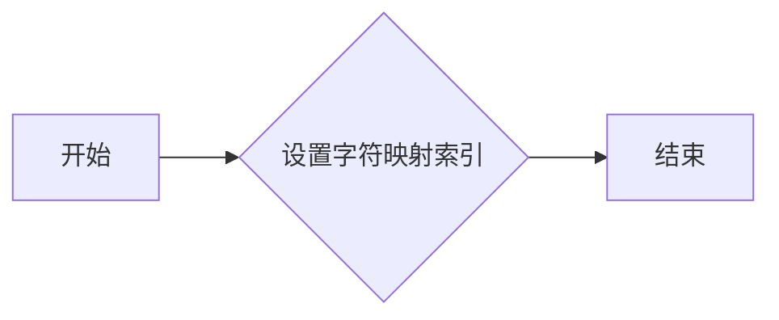

#### 带注释源码

```cpp
void FT2Font::set_charmap(int i) {
    // 设置当前字体使用的字符映射
}
```


### FT2Font.select_charmap(unsigned long i)

选择字体中的字符映射。

参数：

- `i`：`unsigned long`，字符映射的索引。

返回值：无

#### 流程图

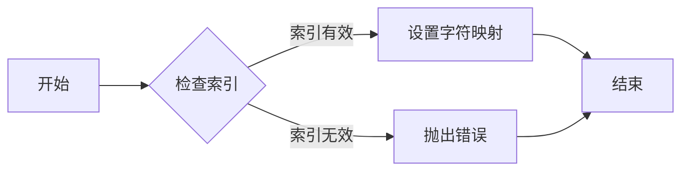

#### 带注释源码

```cpp
void FT2Font::select_charmap(unsigned long i) {
    // 检查索引是否有效
    if (i >= 0 && i < face->num_charmaps) {
        // 设置字符映射
        face->current_charmap = face->charmaps[i];
    } else {
        // 抛出错误
        THROW_FT_ERROR("select_charmap", FT_Err_Invalid_Argument);
    }
}
```


### FT2Font.set_text

This method sets the text to be rendered by the FreeType font object.

参数：

- `codepoints`：`std::u32string_view`，A view of the Unicode code points to be rendered.
- `angle`：`double`，The angle in degrees to rotate the text.
- `flags`：`FT_Int32`，Flags that modify the rendering behavior.
- `xys`：`std::vector<double> &`，A vector of doubles representing the x and y coordinates for each character.

返回值：`void`，No return value.

#### 流程图

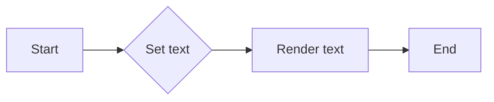

#### 带注释源码

```
void FT2Font::set_text(std::u32string_view codepoints, double angle, FT_Int32 flags,
                       std::vector<double> &xys) {
    // Implementation details would go here, including setting the text and
    // possibly modifying the rendering parameters based on the angle and flags.
}
```


### FT2Font.get_kerning(FT_UInt left, FT_UInt right, FT_Kerning_Mode mode, bool fallback)

获取两个字符之间的间距。

参数：

- `left`：`FT_UInt`，左字符的索引
- `right`：`FT_UInt`，右字符的索引
- `mode`：`FT_Kerning_Mode`，间距计算模式
- `fallback`：`bool`，是否使用回退机制

返回值：`int`，两个字符之间的间距值

#### 流程图

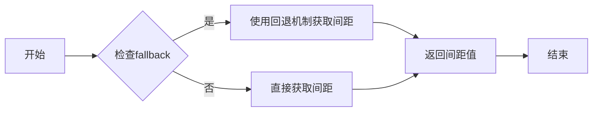

#### 带注释源码

```cpp
int get_kerning(FT_UInt left, FT_UInt right, FT_Kerning_Mode mode, bool fallback) {
    if (fallback) {
        // 使用回退机制获取间距
        // ...
    } else {
        // 直接获取间距
        // ...
    }
    // 返回间距值
    return 0;
}
```


### FT2Font.get_kerning(FT_UInt left, FT_UInt right, FT_Kerning_Mode mode, FT_Vector &delta)

获取两个字符之间的间距。

参数：

- `left`：`FT_UInt`，左字符的索引
- `right`：`FT_UInt`，右字符的索引
- `mode`：`FT_Kerning_Mode`，间距计算模式
- `delta`：`FT_Vector &`，输出间距值

返回值：`int`，间距值，如果失败则返回`FT_Err_Ok`

#### 流程图

```mermaid
graph LR
A[开始] --> B{检查参数}
B -->|参数有效| C[获取间距]
B -->|参数无效| D[返回错误]
C --> E[返回间距值]
D --> F[结束]
```

#### 带注释源码

```
int FT2Font::get_kerning(FT_UInt left, FT_UInt right, FT_Kerning_Mode mode, FT_Vector &delta) {
    FT_CHECK(FT_Get_Kerning(face, left, right, mode, &delta));
    return FT_Err_Ok;
}
``` 


### FT2Font.set_kerning_factor(int factor)

Set the kerning factor for the font.

参数：

- `factor`：`int`，The kerning factor to set. A value of 0 means no kerning, a positive value increases kerning, and a negative value decreases kerning.

返回值：`void`，No return value.

#### 流程图

```mermaid
graph LR
A[Set Kerning Factor] --> B{Is factor valid?}
B -- Yes --> C[Set kerning_factor to factor]
B -- No --> D[Throw error]
C --> E[End]
D --> E
```

#### 带注释源码

```
void FT2Font::set_kerning_factor(int factor) {
    // Set the kerning factor for the font.
    if (factor < -100 || factor > 100) {
        // Throw an error if the factor is out of the valid range.
        THROW_FT_ERROR("set_kerning_factor", FT_THROW(Invalid_Argument));
    }
    kerning_factor = factor;
}
```


### FT2Font.load_char(long charcode, FT_Int32 flags, FT2Font *&ft_object, bool fallback)

加载指定字符码的字符，并返回一个指向FT2Font对象的指针。

参数：

- `charcode`：`long`，字符码，用于查找字符的索引。
- `flags`：`FT_Int32`，标志，用于控制加载字符的行为。
- `ft_object`：`FT2Font *&`，输出参数，指向加载的FT2Font对象。
- `fallback`：`bool`，是否使用回退机制。

返回值：`void`，无返回值。

#### 流程图

```mermaid
graph LR
A[开始] --> B{检查参数}
B -->|参数有效| C[加载字符]
B -->|参数无效| D[抛出异常]
C --> E[返回FT2Font对象]
D --> F[结束]
```

#### 带注释源码

```cpp
void FT2Font::load_char(long charcode, FT_Int32 flags, FT2Font *&ft_object, bool fallback) {
    // 检查参数
    if (charcode < 0 || flags < 0 || !ft_object) {
        THROW_FT_ERROR("load_char", FT_THROW(Invalid_Argument));
    }

    // 加载字符
    FT_Error error = face->load_char(face, charcode, flags);
    if (error) {
        THROW_FT_ERROR("load_char", error);
    }

    // 获取加载的字符
    FT_GlyphSlot slot = face->getGlyphSlot();
    if (!slot->glyph) {
        THROW_FT_ERROR("load_char", FT_THROW(Invalid_Glyph_Index));
    }

    // 创建FT2Font对象
    ft_object = new FT2Font(face, hinting_factor, fallbacks, ft_glyph_warn, warn_if_used);
}
```


### FT2Font.load_char_with_fallback

This method attempts to load a character from a font, using a fallback mechanism if the character is not found in the primary font.

参数：

- `FT2Font *&ft_object_with_glyph`：`FT2Font*`，A reference to a pointer to the FT2Font object that contains the loaded glyph.
- `FT_UInt &final_glyph_index`：`FT_UInt`，A reference to an unsigned integer that will hold the index of the final loaded glyph.
- `std::vector<FT_Glyph> &parent_glyphs`：`std::vector<FT_Glyph>`，A reference to a vector that will hold the parent glyphs.
- `std::unordered_map<long, FT2Font *> &parent_char_to_font`：`std::unordered_map<long, FT2Font*>`，A reference to an unordered map that maps character codes to FT2Font objects.
- `std::unordered_map<FT_UInt, FT2Font *> &parent_glyph_to_font`：`std::unordered_map<FT_UInt, FT2Font*>`，A reference to an unordered map that maps glyph indices to FT2Font objects.
- `long charcode`：`long`，The character code for the character to be loaded.
- `FT_Int32 flags`：`FT_Int32`，Flags that control the loading of the character.
- `FT_Error &charcode_error`：`FT_Error`，A reference to an FT_Error object that will hold the error code if the character code is invalid.
- `FT_Error &glyph_error`：`FT_Error`，A reference to an FT_Error object that will hold the error code if the glyph cannot be loaded.
- `std::set<FT_String*> &glyph_seen_fonts`：`std::set<FT_String*>`，A reference to a set that keeps track of the fonts that have been seen for a particular glyph.
- `bool override`：`bool`，A boolean flag that, if set, will override any existing glyph for the character code.

返回值：`bool`，Returns true if the character is successfully loaded, false otherwise.

#### 流程图

```mermaid
graph LR
A[Start] --> B{Attempt to load character}
B -->|Success| C[Set final_glyph_index and return true]
B -->|Fail| D{Check fallback fonts}
D -->|Fallback available| E[Load character from fallback font]
E -->|Success| C
E -->|Fail| F[Set glyph_error and return false]
D -->|No fallback| F
C --> G[End]
F --> G
```

#### 带注释源码

```
bool load_char_with_fallback(FT2Font *&ft_object_with_glyph,
                             FT_UInt &final_glyph_index,
                             std::vector<FT_Glyph> &parent_glyphs,
                             std::unordered_map<long, FT2Font *> &parent_char_to_font,
                             std::unordered_map<FT_UInt, FT2Font *> &parent_glyph_to_font,
                             long charcode,
                             FT_Int32 flags,
                             FT_Error &charcode_error,
                             FT_Error &glyph_error,
                             std::set<FT_String*> &glyph_seen_fonts,
                             bool override) {
    // Implementation goes here
}
``` 


### FT2Font.load_glyph

加载指定索引的字体轮廓。

参数：

- `glyph_index`：`FT_UInt`，字体轮廓索引。
- `flags`：`FT_Int32`，加载轮廓的标志。
- `ft_object`：`FT2Font *&`，指向加载的字体轮廓对象的引用。
- `fallback`：`bool`，是否使用回退机制。

返回值：`void`，无返回值。

#### 流程图

```mermaid
graph LR
A[开始] --> B{检查参数}
B -->|参数有效| C[加载字体轮廓]
B -->|参数无效| D[抛出异常]
C --> E[设置 ft_object]
E --> F[结束]
D --> G[结束]
```

#### 带注释源码

```
void FT2Font::load_glyph(FT_UInt glyph_index, FT_Int32 flags, FT2Font *&ft_object, bool fallback) {
    FT_CHECK(ftLoadGlyph(face, glyph_index, flags), "Failed to load glyph");
    ft_object = new FT2Font(face, hinting_factor, fallbacks, ft_glyph_warn, warn_if_used);
}
``` 


### FT2Font.load_glyph(FT_UInt glyph_index, FT_Int32 flags)

加载指定索引的字体字形。

参数：

- `glyph_index`：`FT_UInt`，字形的索引。
- `flags`：`FT_Int32`，加载字形的标志。

返回值：`void`，无返回值。

#### 流程图

```mermaid
graph LR
A[开始] --> B{加载字形}
B --> C[结束]
```

#### 带注释源码

```
void FT2Font::load_glyph(FT_UInt glyph_index, FT_Int32 flags) {
    FT2Font *&ft_object = nullptr;
    bool fallback = false;

    load_glyph(glyph_index, flags, ft_object, fallback);
}
``` 


### FT2Font.get_width_height(long *width, long *height)

获取指定字符的宽度（width）和高度（height）。

参数：

- `width`：`long*`，指向存储宽度的变量
- `height`：`long*`，指向存储高度的变量

返回值：无

#### 流程图

```mermaid
graph LR
A[调用 get_width_height] --> B{获取指针}
B --> C[检查指针有效性]
C -->|有效| D[获取宽度]
C -->|无效| E[抛出异常]
D --> F[获取高度]
F --> G[返回]
```

#### 带注释源码

```
void get_width_height(long *width, long *height) {
    if (width == nullptr || height == nullptr) {
        THROW_FT_ERROR("get_width_height", FT_ERROR_INVALID_ARGUMENT);
    }

    FT_BBox bbox;
    FT_Error error = FT_Get_Glyph_BBox(glyphs.back(), FT_RENDER_MODE_NORMAL, &bbox);
    if (error) {
        THROW_FT_ERROR("get_width_height", error);
    }

    *width = FIXED_MAJOR(bbox.yMax) - FIXED_MINOR(bbox.yMin);
    *height = FIXED_MAJOR(bbox.yMax) - FIXED_MINOR(bbox.yMin);
}
``` 


### FT2Font.get_bitmap_offset(long *x, long *y)

获取指定字符的位图偏移量。

参数：

- `x`：`long*`，指向存储位图水平偏移量的变量
- `y`：`long*`，指向存储位图垂直偏移量的变量

返回值：`void`，无返回值

#### 流程图

```mermaid
graph LR
A[开始] --> B{调用get_bitmap_offset}
B --> C[获取x和y的值]
C --> D[结束]
```

#### 带注释源码

```
void FT2Font::get_bitmap_offset(long *x, long *y) {
    // 获取当前字体面目的位图偏移量
    FT_Vector offset = FT_Get_Glyph_Metrics(face, glyphs.back());
    // 将偏移量存储在传入的变量中
    *x = FIXED_MINOR(offset.x);
    *y = FIXED_MINOR(offset.y);
}
``` 


### FT2Font.get_descent()

获取字体中指定字符的下降量。

参数：

- 无

返回值：`long`，字符的下降量，单位为1/64点

#### 流程图

```mermaid
graph LR
A[开始] --> B{获取FT_Face对象}
B --> C{获取FT_BBox对象}
C --> D{获取下降量}
D --> E[结束]
```

#### 带注释源码

```
long get_descent() {
    // 获取FT_Face对象
    FT_Face const &face = this->get_face();

    // 获取FT_BBox对象
    FT_BBox bbox = FT_Get_BBox(face, FT_GlyphSlot::get_index(face));

    // 获取下降量
    long descent = FIXED_MINOR(bbox.yMax);

    return descent;
}
```


### FT2Font.draw_glyphs_to_bitmap(bool antialiased)

将字体中的字符绘制到位图中。

参数：

- `antialiased`：`bool`，是否启用抗锯齿。

返回值：无

#### 流程图

```mermaid
graph LR
A[开始] --> B{是否有字符?}
B -- 是 --> C[绘制字符到位图]
B -- 否 --> D[结束]
C --> D
```

#### 带注释源码

```cpp
void FT2Font::draw_glyphs_to_bitmap(bool antialiased) {
    // 遍历所有字符
    for (auto &glyph : glyphs) {
        // 绘制字符到位图
        draw_glyph_to_bitmap(image, pen.x, pen.y, get_last_glyph_index(), antialiased);
        // 更新笔的位置
        pen.x += advance.x;
        pen.y += advance.y;
    }
}
``` 


### FT2Font.draw_glyph_to_bitmap

This function draws a single glyph to a bitmap using the FreeType library.

参数：

- `im`：`py::array_t<uint8_t, py::array::c_style>`，The bitmap to draw the glyph onto.
- `x`：`int`，The x-coordinate to start drawing the glyph.
- `y`：`int`，The y-coordinate to start drawing the glyph.
- `glyphInd`：`size_t`，The index of the glyph to draw.
- `antialiased`：`bool`，Whether to enable antialiasing for the glyph.

返回值：`void`，No return value.

#### 流程图

```mermaid
graph LR
A[Start] --> B{Check antialiased}
B -- Yes --> C[Draw glyph with antialiasing]
B -- No --> D[Draw glyph without antialiasing]
C --> E[End]
D --> E
```

#### 带注释源码

```cpp
void FT2Font::draw_glyph_to_bitmap(
    py::array_t<uint8_t, py::array::c_style> im,
    int x, int y, size_t glyphInd, bool antialiased) {
    // Check if antialiasing is enabled
    if (antialiased) {
        // Draw glyph with antialiasing
    } else {
        // Draw glyph without antialiasing
    }
}
```


### FT2Font.get_glyph_name

获取指定字形编号的名称。

参数：

- `glyph_number`：`unsigned int`，指定要获取名称的字形编号。
- `buffer`：`std::string &`，输出参数，用于存储获取到的名称。
- `fallback`：`bool`，指定是否在找不到名称时使用备用名称。

返回值：`void`，无返回值。

#### 流程图

```mermaid
graph LR
A[Start] --> B{Check fallback}
B -- Yes --> C[Use fallback name]
B -- No --> D{Get glyph name}
D --> E[Store name in buffer]
E --> F[End]
```

#### 带注释源码

```cpp
void FT2Font::get_glyph_name(unsigned int glyph_number, std::string &buffer, bool fallback) {
    FT_String* name = FT_Get_Glyph_Name(face, glyph_number);
    if (name) {
        buffer = std::string(name);
    } else if (fallback) {
        // Fallback to a default name if the glyph name is not found
        buffer = "UnknownGlyph";
    }
}
``` 


### FT2Font.get_name_index(char *name)

获取给定名称的索引。

参数：

- `name`：`char *`，指向要查找的名称的指针。

返回值：`long`，名称的索引。

#### 流程图

```mermaid
graph LR
A[Start] --> B{Check name}
B -->|Name found| C[Return index]
B -->|Name not found| D[Return -1]
C --> E[End]
D --> E
```

#### 带注释源码

```cpp
long get_name_index(char *name) {
    // Implementation of the get_name_index method would be here.
    // This is a placeholder as the actual implementation is not visible in the provided code snippet.
}
```


### FT2Font.get_char_index(FT_ULong charcode, bool fallback)

查找给定字符码的字符索引。

参数：

- `charcode`：`FT_ULong`，字符码，用于查找字符的索引。
- `fallback`：`bool`，是否使用回退机制。

返回值：`FT_UInt`，字符索引，如果找到则返回字符索引，否则返回0。

#### 流程图

```mermaid
graph LR
A[开始] --> B{查找字符索引}
B -->|找到| C[返回索引]
B -->|未找到| D[返回0]
C --> E[结束]
D --> E
```

#### 带注释源码

```
long get_char_index(FT_ULong charcode, bool fallback) {
    // 查找字符索引
    FT_UInt index = FT_Get_Char_Index(face, charcode);
    if (fallback && index == 0) {
        // 如果未找到且启用回退机制，则尝试回退字体
        for (auto &fallback_font : fallbacks) {
            index = fallback_font->get_char_index(charcode, false);
            if (index != 0) {
                break;
            }
        }
    }
    return index;
}
``` 


### FT2Font.get_path

This function retrieves the outline path of a character in the font.

参数：

- `vertices`：`std::vector<double>`，The vector to store the vertices of the outline path.
- `codes`：`std::vector<unsigned char>`，The vector to store the codes corresponding to the vertices.

返回值：`void`，No return value.

#### 流程图

```mermaid
graph LR
A[Start] --> B{Check if vertices and codes vectors are valid}
B -->|Yes| C[Retrieve outline path]
C --> D[Store vertices and codes]
D --> E[End]
B -->|No| F[Throw error]
F --> E
```

#### 带注释源码

```
void FT2Font::get_path(std::vector<double> &vertices, std::vector<unsigned char> &codes) {
    // Implementation details would go here, including retrieving the outline path
    // and storing the vertices and codes in the provided vectors.
}
``` 


### FT2Font.get_char_fallback_index(FT_ULong charcode, int& index) const

获取给定字符码的备用字体索引。

参数：

- `charcode`：`FT_ULong`，字符码
- `index`：`int&`，引用，用于存储备用字体索引

返回值：`bool`，如果找到备用字体索引则返回`true`，否则返回`false`

#### 流程图

```mermaid
graph LR
A[开始] --> B{检查备用字体列表}
B -->|找到| C[设置索引并返回true]
B -->|未找到| D[返回false]
C --> E[结束]
D --> E
```

#### 带注释源码

```cpp
bool get_char_fallback_index(FT_ULong charcode, int& index) const {
    // 遍历备用字体列表
    for (const auto& fallback : fallbacks) {
        // 调用备用字体的get_char_index方法
        FT_UInt fallback_index = fallback->get_char_index(charcode, true);
        if (fallback_index != 0) {
            // 设置索引并返回true
            index = static_cast<int>(fallback_index);
            return true;
        }
    }
    // 未找到备用字体索引，返回false
    return false;
}
```


### FT2Font.get_face() const

获取当前FT2Font对象所关联的FT_Face对象。

参数：

- 无

返回值：`FT_Face const &`，指向当前FT2Font对象所关联的FT_Face对象的引用。

#### 流程图

```mermaid
graph LR
A[FT2Font.get_face()] --> B{返回FT_Face}
```

#### 带注释源码

```
FT_Face const &get_face() const
{
    return face;
}
```


### FT2Font.get_image()

获取当前FT2Font对象关联的图像数据。

参数：

- 无

返回值：`py::array_t<uint8_t, py::array::c_style>`，当前FT2Font对象关联的图像数据。

#### 流程图

```mermaid
graph LR
A[FT2Font.get_image()] --> B{返回值}
B --> C[py::array_t<uint8_t, py::array::c_style>]
```

#### 带注释源码

```cpp
py::array_t<uint8_t, py::array::c_style> &get_image()
{
    return image;
}
```


### FT2Font.get_last_glyph() const

获取最后一个加载的字体轮廓。

参数：

- 无

返回值：`FT_Glyph const &`，指向最后一个加载的字体轮廓的引用。

#### 流程图

```mermaid
graph LR
A[开始] --> B{获取最后一个字体轮廓}
B --> C[结束]
```

#### 带注释源码

```cpp
FT_Glyph const &get_last_glyph() const
{
    return glyphs.back();
}
```


### FT2Font.get_last_glyph_index() const

获取最后一个加载的字符的索引。

参数：

- 无

返回值：`size_t`，最后一个加载的字符的索引。

#### 流程图

```mermaid
graph LR
A[Start] --> B{Is there a last glyph?}
B -- Yes --> C[Return index of last glyph]
B -- No --> D[Return 0]
D --> E[End]
```

#### 带注释源码

```cpp
size_t get_last_glyph_index() const
{
    return glyphs.size() - 1;
}
```


### FT2Font.get_num_glyphs() const

获取当前字体中字形的数量。

参数：

- 无

返回值：`size_t`，当前字体中字形的数量。

#### 流程图

```mermaid
graph LR
A[Start] --> B{Get number of glyphs}
B --> C[End]
```

#### 带注释源码

```cpp
size_t get_num_glyphs() const
{
    return glyphs.size();
}
```


### FT2Font.get_hinting_factor() const

获取当前字体对象的hinting因子。

参数：

- 无

返回值：`long`，当前字体对象的hinting因子，用于控制字体的渲染平滑度。

#### 流程图

```mermaid
graph LR
A[开始] --> B{获取hinting_factor}
B --> C[结束]
```

#### 带注释源码

```
long FT2Font::get_hinting_factor() const
{
    return hinting_factor;
}
```


### FT2Font.has_kerning() const

This function checks if kerning is available for the current font face.

参数：

- 无

返回值：`FT_Bool`，Indicates whether kerning is available for the current font face.

#### 流程图

```mermaid
graph LR
A[Start] --> B{Check Kerning}
B -->|Yes| C[Return True]
B -->|No| D[Return False]
D --> E[End]
```

#### 带注释源码

```
FT_Bool has_kerning() const
{
    return FT_HAS_KERNING(face);
}
``` 


## 关键组件


### 张量索引与惰性加载

张量索引与惰性加载是代码中用于高效访问和加载字体资源的关键组件。它允许在需要时才加载字体资源，从而减少内存占用和提高性能。

### 反量化支持

反量化支持是代码中用于处理字体反量化的组件。它确保字体在渲染时能够适应不同的分辨率和屏幕尺寸，提供高质量的显示效果。

### 量化策略

量化策略是代码中用于优化字体加载和渲染过程的组件。它通过选择合适的量化方法来减少字体数据的大小，同时保持字体质量。


## 问题及建议


### 已知问题

-   **内存管理**: 代码中存在多个类和全局变量，但没有明确的内存管理策略。例如，`FT2Image` 和 `FT2Font` 类没有提供显式的析构函数来释放分配的资源，这可能导致内存泄漏。
-   **错误处理**: 错误处理依赖于 `THROW_FT_ERROR` 宏，它使用 `std::runtime_error` 抛出异常。这种错误处理方式可能不够灵活，因为它没有提供错误代码的详细信息，并且所有错误都转换为运行时错误。
-   **代码重复**: `get_kerning` 方法被重复定义了两次，这可能导致维护困难。
-   **全局变量**: 使用全局变量 `_ft2Library` 可能不是最佳实践，因为它破坏了封装性，并可能导致代码难以测试和重用。

### 优化建议

-   **内存管理**: 实现析构函数和适当的资源管理策略，确保所有分配的资源在使用完毕后都能被正确释放。
-   **错误处理**: 使用更灵活的错误处理机制，例如返回错误代码或错误对象，而不是直接抛出异常。
-   **代码重复**: 合并重复的方法定义，并确保只有一个版本的 `get_kerning` 方法。
-   **全局变量**: 尽量避免使用全局变量，如果必须使用，确保它们被适当地封装和文档化。
-   **代码风格**: 使用一致的代码风格，包括命名约定、缩进和注释，以提高代码的可读性和可维护性。
-   **单元测试**: 开发单元测试来验证代码的正确性和健壮性，确保在未来的修改中不会引入新的错误。
-   **文档**: 提供详细的文档，包括每个类和方法的用途、参数和返回值，以便其他开发者能够更容易地理解和使用代码。


## 其它


### 设计目标与约束

- 设计目标：
  - 提供一个Python接口，用于与FreeType库交互。
  - 支持字体加载、字符渲染、字形获取等功能。
  - 提供错误处理机制，确保程序的健壮性。
  - 支持字体大小调整、字符映射、抗锯齿等特性。

- 约束条件：
  - 必须使用FreeType库进行字体操作。
  - 接口必须遵循Python的规范和约定。
  - 性能和资源使用需在合理范围内。

### 错误处理与异常设计

- 错误处理：
  - 使用`FT_Error`类型来表示FreeType的错误代码。
  - 通过`ft_error_string`函数获取错误描述。
  - 使用`THROW_FT_ERROR`宏抛出异常，包含错误代码和描述。

- 异常设计：
  - 使用`std::runtime_error`来处理运行时错误。
  - 异常信息包含错误名称、文件路径、行号和错误描述。

### 数据流与状态机

- 数据流：
  - 字体加载：从文件或内存中加载字体。
  - 字符渲染：根据字符代码渲染字形。
  - 字形获取：获取字形的宽度和高度。

- 状态机：
  - 字体状态：加载、未加载、加载失败。
  - 字符状态：未渲染、渲染中、渲染完成。

### 外部依赖与接口契约

- 外部依赖：
  - FreeType库：用于字体操作。
  - pybind11：用于Python接口。

- 接口契约：
  - `FT2Font`类：提供字体操作接口。
  - `FT2Image`类：提供图像渲染接口。
  - 全局变量和函数：提供辅助功能。


    