# `matplotlib\src\ft2font_wrapper.cpp` 详细设计文档

这是一个Python扩展模块，通过pybind11将FreeType 2字体渲染库绑定到Python，提供字体加载、字形渲染、字体信息查询等功能，是Matplotlib库的核心字体处理组件。

## 整体流程

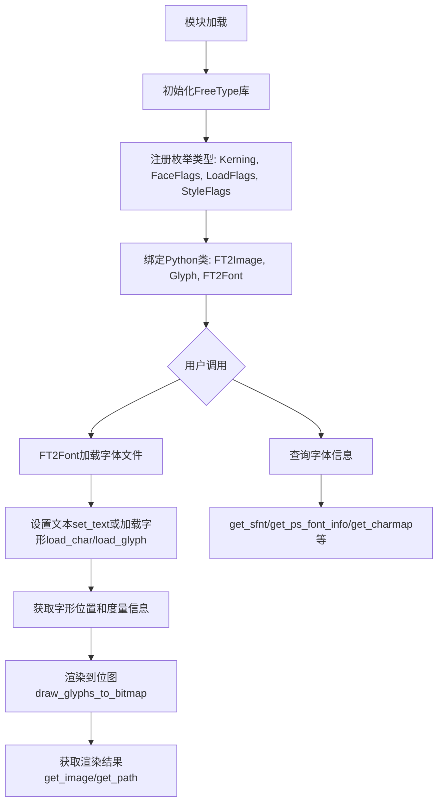

## 类结构

```
pybind11绑定层 (Python模块)
├── 枚举类型
│   ├── Kerning (Kerning模式)
│   ├── FaceFlags (字体标志)
│   ├── LoadFlags (加载标志)
│   └── StyleFlags (样式标志)
├── PyFT2Image (图像缓冲区类)
├── PyGlyph (字形信息结构)
└── PyFT2Font (字体对象类)
    │
    └── 底层FreeType库 (ft2font.h)
        └── FT2Font C++类
```

## 全局变量及字段


### `_ft2Library`
    
FreeType库全局实例，用于管理FreeType库资源

类型：`FT_Library`
    


### `Kerning__doc__`
    
Kerning枚举的文档字符串，说明字距调整模式

类型：`const char*`
    


### `FaceFlags__doc__`
    
FaceFlags枚举的文档字符串，说明字体标志

类型：`const char*`
    


### `LoadFlags__doc__`
    
LoadFlags枚举的文档字符串，说明字形加载标志

类型：`const char*`
    


### `StyleFlags__doc__`
    
StyleFlags枚举的文档字符串，说明字体样式标志

类型：`const char*`
    


### `PyFT2Image__doc__`
    
FT2Image类的文档字符串

类型：`const char*`
    


### `PyFT2Image_init__doc__`
    
FT2Image构造函数参数的文档字符串

类型：`const char*`
    


### `PyFT2Image_draw_rect_filled__doc__`
    
draw_rect_filled方法的文档字符串

类型：`const char*`
    


### `PyGlyph__doc__`
    
PyGlyph类的文档字符串

类型：`const char*`
    


### `PyFT2Font__doc__`
    
FT2Font类的文档字符串

类型：`const char*`
    


### `PyFT2Font_init__doc__`
    
FT2Font构造函数参数的文档字符串

类型：`const char*`
    


### `__freetype_version__`
    
FreeType库的版本号字符串

类型：`py::str`
    


### `__freetype_build_type__`
    
FreeType库的构建类型标识

类型：`py::str`
    


### `FT2Image.buffer`
    
图像数据缓冲区，存储像素数据

类型：`uint8_t*`
    


### `FT2Image.width`
    
图像宽度（像素）

类型：`long`
    


### `FT2Image.height`
    
图像高度（像素）

类型：`long`
    


### `PyGlyph.glyphInd`
    
字形索引，字体中字形的唯一标识

类型：`size_t`
    


### `PyGlyph.width`
    
字形宽度（26.6固定点数）

类型：`long`
    


### `PyGlyph.height`
    
字形高度（26.6固定点数）

类型：`long`
    


### `PyGlyph.horiBearingX`
    
水平布局的左边缘bearing值

类型：`long`
    


### `PyGlyph.horiBearingY`
    
水平布局的上边缘bearing值

类型：`long`
    


### `PyGlyph.horiAdvance`
    
水平布局的前进量（字形间距）

类型：`long`
    


### `PyGlyph.linearHoriAdvance`
    
未进行hinting的水平前进量

类型：`long`
    


### `PyGlyph.vertBearingX`
    
垂直布局的左边缘bearing值

类型：`long`
    


### `PyGlyph.vertBearingY`
    
垂直布局的上边缘bearing值

类型：`long`
    


### `PyGlyph.vertAdvance`
    
垂直布局的前进量

类型：`long`
    


### `PyGlyph.bbox`
    
字形的控制框边界（xmin, ymin, xmax, ymax）

类型：`FT_BBox`
    


### `PyFT2Font.x`
    
底层C++ FT2Font对象的指针

类型：`FT2Font*`
    


### `PyFT2Font.py_file`
    
Python文件对象，用于读取字体数据

类型：`py::object`
    


### `PyFT2Font.stream`
    
FreeType流结构，用于从Python文件读取数据

类型：`FT_StreamRec`
    


### `PyFT2Font.fallbacks`
    
备选字体列表，用于查找缺失字形

类型：`py::list`
    
    

## 全局函数及方法


### `_double_to_`

该函数是一个模板函数，用于将 `double_or_` 变体（variant）转换为实际的类型 `T`。它主要目的是为了保持向后兼容性，允许参数接受浮点数（double），但如果传入的是浮点数，则会发出废弃警告（deprecation warning）并尝试将其转换为目标类型 `T`（通常是整数类型）。如果传入的已经是类型 `T`，则直接返回。

#### 参数

- **`name`**：`const char *`，参数的名称，用于在废弃警告中标识是哪个参数。
- **`var`**：`double_or_<T> &`，一个引用传递的 `std::variant`，可能包含 `double` 或类型 `T`。

#### 返回值

- **`T`**：返回转换后的值。如果 `var` 中是 `double`，返回 static_cast 后的 `T`；如果是 `T`，则直接返回。

#### 流程图

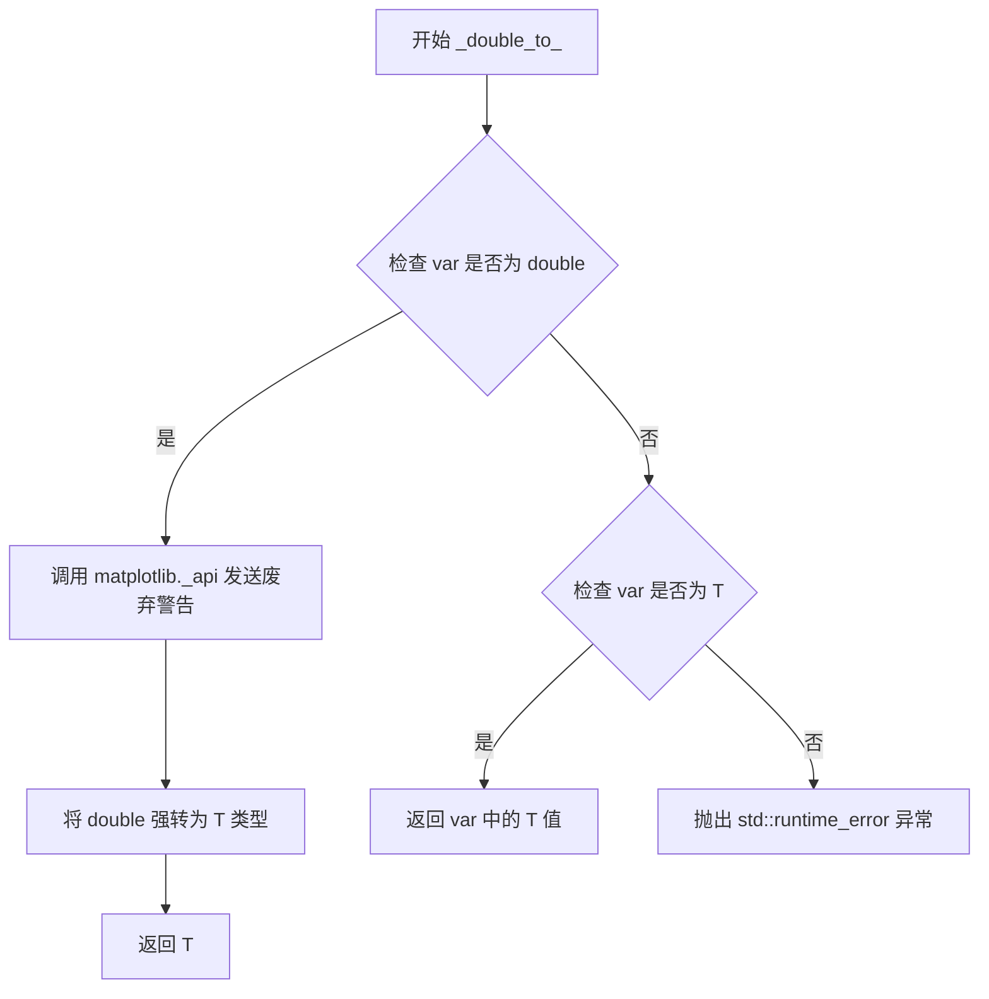

#### 带注释源码

```cpp
template <typename T>
static T
_double_to_(const char *name, double_or_<T> &var)
{
    // 使用 std::get_if 检查 variant 是否持有 double 类型
    if (auto value = std::get_if<double>(&var)) {
        // 如果是 double，导入 matplotlib._api 模块
        auto api = py::module_::import("matplotlib._api");
        // 获取 warn_deprecated 函数
        auto warn = api.attr("warn_deprecated");
        // 触发废弃警告，告知用户该参数在 3.10 版本后不接受 float，建议使用 int
        warn("since"_a="3.10", "name"_a=name, "obj_type"_a="parameter as float",
             "alternative"_a="int({})"_s.format(name));
        // 执行类型转换并返回
        return static_cast<T>(*value);
    } 
    // 检查 variant 是否持有目标类型 T
    else if (auto value = std::get_if<T>(&var)) {
        return *value;
    } 
    else {
        // 这个分支理论上永远不会执行，因为 pybind11 会在调用前检查类型。
        // 添加这个分支是为了兼容旧版 macOS 编译器对 std::get_if 的处理，
        // 避免 "unhandled case" 警告。
        throw std::runtime_error("Should not happen");
    }
}
```


### `FT2Image.draw_rect_filled`

绘制一个填充矩形到图像缓冲区。

参数：

- `self`：`FT2Image*`，指向 FT2Image 对象的指针，隐式传递给方法
- `x0`：`double_or_<long>`，矩形左边界（x0, y0）到（x1, y1）的坐标，支持 float 或 int 类型
- `y0`：`double_or_<long>`，矩形上边界
- `x1`：`double_or_<long>`，矩形右边界
- `y1`：`double_or_<long>`，矩形下边界

返回值：`void`，无返回值

#### 流程图

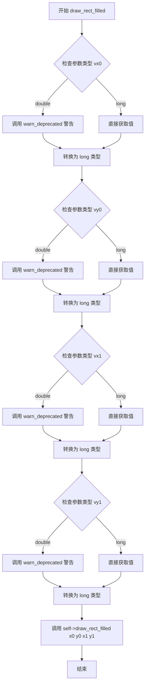

#### 带注释源码

```cpp
// 定义函数的文档字符串
const char *PyFT2Image_draw_rect_filled__doc__ = R"""(
    Draw a filled rectangle to the image.

    Parameters
    ----------
    x0, y0, x1, y1 : float
        The bounds of the rectangle from (x0, y0) to (x1, y1).
)""";

// 静态函数实现：绘制填充矩形到图像
static void
PyFT2Image_draw_rect_filled(FT2Image *self,           // FT2Image 对象指针
                            double_or_<long> vx0,      // x0 坐标：支持 double 或 long
                            double_or_<long> vy0,      // y0 坐标：支持 double 或 long
                            double_or_<long> vx1,      // x1 坐标：支持 double 或 long
                            double_or_<long> vy1)     // y1 坐标：支持 double 或 long
{
    // 将 vx0 转换为 long 类型，如果是 double 则发出弃用警告
    auto x0 = _double_to_<long>("x0", vx0);
    // 将 vy0 转换为 long 类型，如果是 double 则发出弃用警告
    auto y0 = _double_to_<long>("y0", vy0);
    // 将 vx1 转换为 long 类型，如果是 double 则发出弃用警告
    auto x1 = _double_to_<long>("x1", vx1);
    // 将 vy1 转换为 long 类型，如果是 double 则发出弃用警告
    auto y1 = _double_to_<long>("y1", vy1);

    // 调用底层 FT2Image 对象的 draw_rect_filled 方法绘制矩形
    self->draw_rect_filled(x0, y0, x1, y1);
}
```


### PyGlyph_from_FT2Font

该函数负责从FT2Font对象中提取当前加载字形的度量信息（metrics），并将其封装到PyGlyph结构体中返回，是连接FreeType底层字形数据与Python层面的字形对象的关键桥梁。

参数：

- `font`：`const FT2Font *`，指向FT2Font实例的指针，提供对FreeType字体面（FT_Face）及其当前加载字形的访问

返回值：`PyGlyph *`，新创建的PyGlyph对象指针，包含当前字形的详细度量信息（宽度、高度、边界框、水平/垂直前移量等），需要由调用者负责内存管理

#### 流程图

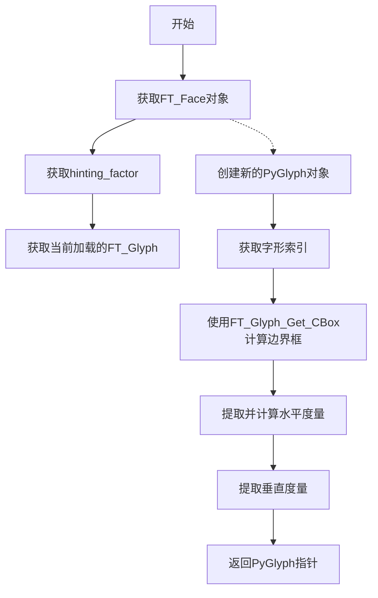

#### 带注释源码

```cpp
/**
 * 从FT2Font对象创建PyGlyph对象
 * 
 * 该函数提取当前加载到FT2Font中的字形的度量信息，
 * 并将其封装到PyGlyph结构体中供Python层使用。
 * 
 * 参数:
 *   font - 指向FT2Font实例的指针，从中获取字形数据
 * 
 * 返回值:
 *   指向新创建的PyGlyph对象的指针
 *   注意: 调用者需要负责该内存的释放
 */
static PyGlyph *
PyGlyph_from_FT2Font(const FT2Font *font)
{
    // 获取FreeType字体面对象，用于访问字形度量
    const FT_Face &face = font->get_face();
    
    // 获取提示因子，用于调整字形度量（水平方向）
    const long hinting_factor = font->get_hinting_factor();
    
    // 获取当前已加载的字形对象
    const FT_Glyph &glyph = font->get_last_glyph();

    // 分配新的PyGlyph结构体内存
    PyGlyph *self = new PyGlyph();

    // 设置字形索引
    self->glyphInd = font->get_last_glyph_index();
    
    // 计算字形的控制框（边界框），使用亚像素精度
    FT_Glyph_Get_CBox(glyph, ft_glyph_bbox_subpixels, &self->bbox);

    // 提取水平方向度量
    // 注意：某些值需要除以hinting_factor进行缩放调整
    self->width = face->glyph->metrics.width / hinting_factor;
    self->height = face->glyph->metrics.height;
    self->horiBearingX = face->glyph->metrics.horiBearingX / hinting_factor;
    self->horiBearingY = face->glyph->metrics.horiBearingY;
    self->horiAdvance = face->glyph->metrics.horiAdvance;
    self->linearHoriAdvance = face->glyph->linearHoriAdvance / hinting_factor;

    // 提取垂直方向度量
    self->vertBearingX = face->glyph->metrics.vertBearingX;
    self->vertBearingY = face->glyph->metrics.vertBearingY;
    self->vertAdvance = face->glyph->metrics.vertAdvance;

    // 返回填充好的PyGlyph对象
    return self;
}
```


### `PyGlyph.get_bbox`

获取字形（Glyph）的边界框（Bounding Box），返回字形控制框的最小和最大坐标。

参数：

- `self`：`PyGlyph *`，指向当前 PyGlyph 实例的指针，包含字形的度量信息

返回值：`py::tuple`，包含四个浮点型数值的元组，依次为 (xMin, yMin, xMax, yMax)，表示字形边界框的左下角和右上角坐标

#### 流程图

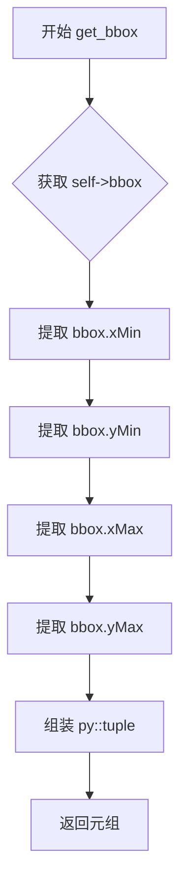

#### 带注释源码

```cpp
// 定义获取字形边界框的静态方法
static py::tuple
PyGlyph_get_bbox(PyGlyph *self)
{
    // 使用 pybind11 的 make_tuple 创建一个 Python 元组
    // 从 self->bbox 中提取四个边界坐标
    // xMin: 边界框左下角 X 坐标
    // yMin: 边界框左下角 Y 坐标
    // xMax: 边界框右上角 X 坐标
    // yMax: 边界框右上角 Y 坐标
    return py::make_tuple(self->bbox.xMin, self->bbox.yMin,
                          self->bbox.xMax, self->bbox.yMax);
}
```


### read_from_file_callback

FreeType流读取回调函数，用于从Python文件对象中读取字体数据，实现FreeType库对字体文件的流式读取功能。

参数：

- `stream`：`FT_Stream`，FreeType流结构体指针，包含流的状态信息和指向PyFT2Font的描述符指针
- `offset`：`unsigned long`，从文件读取的起始位置偏移量（字节）
- `buffer`：`unsigned char *`，用于存储读取数据的输出缓冲区
- `count`：`unsigned long`，请求读取的字节数

返回值：`unsigned long`，实际读取的字节数；如果发生错误且count为0则返回1（表示错误）

#### 流程图

```mermaid
flowchart TD
    A[read_from_file_callback 被调用] --> B[从stream获取PyFT2Font指针self]
    B --> C[尝试执行try块]
    C --> D[调用py_file.seek(offset)定位文件指针]
    D --> E[调用py_file.read(count)读取数据]
    E --> F{读取结果是否有效?}
    F -->|是| G[将Python bytes转换为C字符串]
    G --> H[memcpy复制数据到buffer]
    H --> I[返回实际读取字节数n_read]
    F -->|否| J[抛出py::error_already_set异常]
    J --> K[捕获py::error_already_set异常]
    K --> L{count是否为0?}
    L -->|是| M[返回1表示错误]
    L -->|否| N[返回0表示读取失败]
    
    style A fill:#f9f,stroke:#333
    style I fill:#9f9,stroke:#333
    style M fill:#f99,stroke:#333
    style N fill:#f99,stroke:#333
```

#### 带注释源码

```cpp
/**
 * FreeType流读取回调函数
 * 
 * 此函数作为FreeType库的FT_Stream.read回调实现，允许FreeType通过
 * Python文件对象读取字体数据，而无需将整个文件加载到内存中。
 *
 * @param stream FreeType流结构体，包含文件状态和描述符
 * @param offset 从文件开始处的偏移量（字节）
 * @param buffer 输出缓冲区，用于存储读取的数据
 * @param count  请求读取的字节数
 * @return       实际读取的字节数，0表示EOF，错误时特定情况返回1
 */
static unsigned long
read_from_file_callback(FT_Stream stream, unsigned long offset, unsigned char *buffer,
                        unsigned long count)
{
    // 从stream的描述符中获取PyFT2Font实例指针
    // PyFT2Font包含了Python文件对象(py_file)的引用
    PyFT2Font *self = (PyFT2Font *)stream->descriptor.pointer;
    
    // n_read记录实际读取的字节数
    Py_ssize_t n_read = 0;
    
    try {
        char *tmpbuf;
        
        // 使用Python文件对象的seek方法定位到指定偏移量
        auto seek_result = self->py_file.attr("seek")(offset);
        
        // 从当前位置读取指定字节数的数据
        auto read_result = self->py_file.attr("read")(count);
        
        // 将Python bytes对象转换为C字符串，并获取其长度
        // PyBytes_AsStringAndSize返回-1表示转换失败
        if (PyBytes_AsStringAndSize(read_result.ptr(), &tmpbuf, &n_read) == -1) {
            // 转换失败，抛出pybind11异常
            throw py::error_already_set();
        }
        
        // 将读取的数据复制到FreeType提供的缓冲区
        memcpy(buffer, tmpbuf, n_read);
        
    } catch (py::error_already_set &eas) {
        // 捕获Python异常（如文件读取错误、seek失败等）
        
        // 丢弃异常作为不可抛出（unraisable）异常
        // 这样不会终止程序，但会记录错误
        eas.discard_as_unraisable(__func__);
        
        // 特殊处理：当count为0时，返回1表示发生了错误
        // FreeType在查询流大小时会调用count=0的读取，此时非零返回值表示错误
        if (!count) {
            return 1;  // Non-zero signals error, when count == 0.
        }
    }
    
    // 返回实际读取的字节数
    return (unsigned long)n_read;
}
```


### `close_file_callback`

FreeType流关闭回调函数，用于在FreeType库关闭字体文件流时释放相关的Python文件对象资源。

参数：

- `stream`：`FT_Stream`，FreeType流结构体指针，包含流的描述符指针，指向关联的`PyFT2Font`对象

返回值：`void`，无返回值

#### 流程图

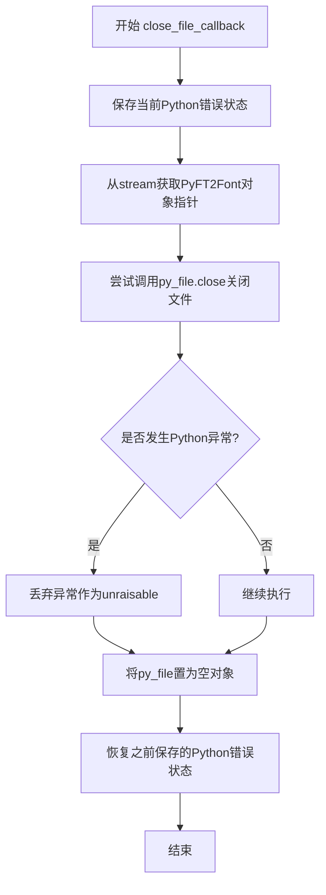

#### 带注释源码

```cpp
static void
close_file_callback(FT_Stream stream)
{
    // 保存当前的Python错误状态，以便在函数执行过程中不会丢失之前可能存在的错误
    PyObject *type, *value, *traceback;
    PyErr_Fetch(&type, &value, &traceback);
    
    // 从FreeType流的描述符中获取关联的PyFT2Font对象指针
    PyFT2Font *self = (PyFT2Font *)stream->descriptor.pointer;
    
    try {
        // 调用Python文件对象的close方法关闭底层文件
        self->py_file.attr("close")();
    } catch (py::error_already_set &eas) {
        // 如果关闭过程中发生异常，丢弃该异常并将其标记为unraisable
        // 这样不会影响当前的错误处理流程
        eas.discard_as_unraisable(__func__);
    }
    
    // 将py_file成员置为空对象，释放对Python文件对象的引用
    self->py_file = py::object();
    
    // 恢复之前保存的Python错误状态，确保回调执行前后错误状态一致
    PyErr_Restore(type, value, traceback);
}
```


### `ft_glyph_warn`

该函数是字形缺失警告函数，当 FreeType 字体中找不到某个字符的字形时会被调用，用于生成并输出警告信息，告知用户哪些字符缺少对应的字形以及涉及的字体家族。

参数：

- `charcode`：`FT_ULong`，字符码，表示缺失字形的 Unicode 字符码
- `family_names`：`std::set<FT_String*>`，字体家族名称集合，包含所有涉及该缺失字形的字体家族名称

返回值：`void`，无返回值

#### 流程图

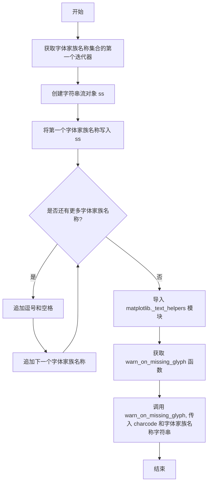

#### 带注释源码

```cpp
static void
ft_glyph_warn(FT_ULong charcode, std::set<FT_String*> family_names)
{
    // 获取字体家族名称集合的起始迭代器
    std::set<FT_String*>::iterator it = family_names.begin();
    
    // 创建字符串流用于构建字体家族名称的格式化字符串
    std::stringstream ss;
    
    // 写入第一个字体家族名称
    ss<<*it;
    
    // 遍历剩余的字体家族名称，使用逗号分隔
    while(++it != family_names.end()){
        ss<<", "<<*it;
    }

    // 导入 matplotlib._text_helpers Python 模块
    auto text_helpers = py::module_::import("matplotlib._text_helpers");
    
    // 获取 warn_on_missing_glyph 函数
    auto warn_on_missing_glyph = text_helpers.attr("warn_on_missing_glyph");
    
    // 调用 Python 函数生成警告信息，传入字符码和字体家族名称字符串
    warn_on_missing_glyph(charcode, ss.str());
}
```


### PyFT2Font_init

FT2Font类的构造函数，用于初始化一个字体对象。该函数接受字体文件路径或文件对象作为主要输入，并配置字体渲染的各种参数如hinting_factor、kerning_factor以及可选的fallback字体列表，最终返回一个封装好的PyFT2Font对象指针。

参数：

- `filename`：`py::object`，字体文件路径（str或bytes类型）或二进制模式的文件对象
- `hinting_factor`：`long`，默认为8，用于缩放x方向的字体暗示（hinting），必须大于0
- `fallback_list`：`std::optional<std::vector<PyFT2Font *>>`，可选参数，用于查找缺失字形的FT2Font对象列表（私有API）
- `kerning_factor`：`int`，默认为0，用于调整字距调整（kerning）的程度（私有API）
- `warn_if_used`：`bool`，默认为false，用于触发缺失字形警告（私有API）

返回值：`PyFT2Font*`，返回新创建的FT2Font对象指针

#### 流程图

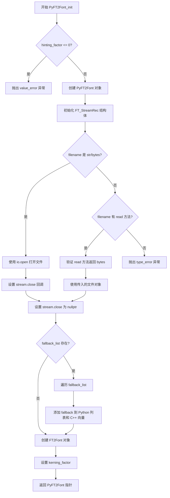

#### 带注释源码

```cpp
static PyFT2Font *
PyFT2Font_init(py::object filename, long hinting_factor = 8,
               std::optional<std::vector<PyFT2Font *>> fallback_list = std::nullopt,
               int kerning_factor = 0, bool warn_if_used = false)
{
    // 验证 hinting_factor 必须为正数
    if (hinting_factor <= 0) {
        throw py::value_error("hinting_factor must be greater than 0");
    }

    // 分配并初始化 PyFT2Font 对象
    PyFT2Font *self = new PyFT2Font();
    self->x = nullptr;
    
    // 初始化 FT_StreamRec 结构体为零
    memset(&self->stream, 0, sizeof(FT_StreamRec));
    self->stream.base = nullptr;
    self->stream.size = 0x7fffffff;  // 未知大小
    self->stream.pos = 0;
    self->stream.descriptor.pointer = self;
    self->stream.read = &read_from_file_callback;  // 设置读取回调
    
    // 配置 FreeType 打开参数，使用流方式打开
    FT_Open_Args open_args;
    memset((void *)&open_args, 0, sizeof(FT_Open_Args));
    open_args.flags = FT_OPEN_STREAM;
    open_args.stream = &self->stream;

    // 处理 fallback 字体列表
    std::vector<FT2Font *> fallback_fonts;
    if (fallback_list) {
        // 遍历 fallback 列表，添加到 Python 和 C++ 的列表中
        for (auto item : *fallback_list) {
            self->fallbacks.append(item);
            // 缓存底层的 FT2Font 对象指针
            FT2Font *fback = item->x;
            fallback_fonts.push_back(fback);
        }
    }

    // 根据 filename 类型处理文件打开方式
    if (py::isinstance<py::bytes>(filename) || py::isinstance<py::str>(filename)) {
        // 字符串或字节路径：使用 io.open 打开文件
        self->py_file = py::module_::import("io").attr("open")(filename, "rb");
        self->stream.close = &close_file_callback;
    } else {
        // 文件对象：验证是否有 read 方法并返回 bytes
        try {
            auto data = filename.attr("read")(0).cast<py::bytes>();
        } catch (const std::exception&) {
            throw py::type_error(
                "First argument must be a path to a font file or a binary-mode file object");
        }
        self->py_file = filename;
        self->stream.close = nullptr;  // 不需要关闭回调
    }

    // 创建 FT2Font 核心对象，传入各种配置参数
    self->x = new FT2Font(open_args, hinting_factor, fallback_fonts, ft_glyph_warn,
                          warn_if_used);

    // 设置 kerning 因子
    self->x->set_kerning_factor(kerning_factor);

    return self;
}
```


### PyFT2Font_fname

获取FT2Font对象的原始文件名或文件路径。

参数：

- `self`：`PyFT2Font *`，指向FT2Font实例的指针，用于访问对象的内部状态

返回值：`py::str`，返回字体来源的文件名（字符串类型）。如果构造函数传入了文件路径，则返回该路径；如果传入了文件对象，则返回文件对象的字符串表示

#### 流程图

```mermaid
flowchart TD
    A[开始: PyFT2Font_fname] --> B{self->stream.close 是否存在?}
    B -->|是 (传入文件名)| C[返回 self->py_file.attr('name')]
    B -->|否 (传入文件对象)| D[返回 py::cast<py::str>(self->py_file)]
    C --> E[结束: 返回文件名]
    D --> E
```

#### 带注释源码

```cpp
static py::str
PyFT2Font_fname(PyFT2Font *self)
{
    // 检查 stream.close 是否存在
    // 如果存在，说明构造函数接收的是文件名（通过 io.open 打开的文件）
    // 此时应返回文件的 name 属性（即文件路径）
    if (self->stream.close) {
        return self->py_file.attr("name");
    } else {
        // 如果 stream.close 不存在，说明构造函数接收的是文件对象
        // 此时直接将文件对象转换为字符串返回
        return py::cast<py::str>(self->py_file);
    }
}
```


### `PyFT2Font.clear`

清除所有字形缓存，重置内部状态以准备新的 `set_text` 调用。

参数：

- `self`：`PyFT2Font*`，指向调用该方法的 FT2Font 对象实例（隐式参数）

返回值：`void`，无返回值

#### 流程图

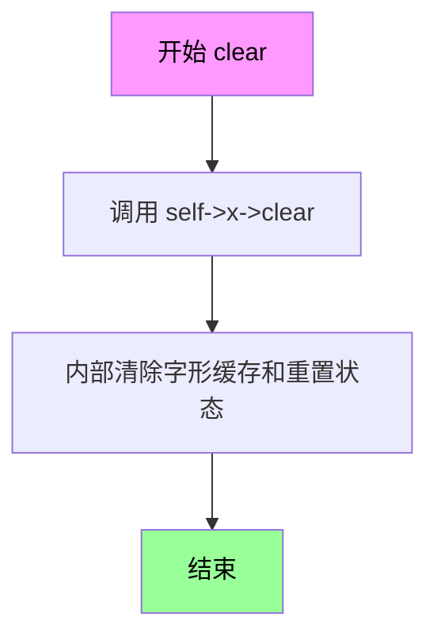

#### 带注释源码

```cpp
// 文档字符串，说明该方法的功能
const char *PyFT2Font_clear__doc__ =
    "Clear all the glyphs, reset for a new call to `.set_text`.";

// PyFT2Font_clear 方法的实现
// 功能：清除所有已加载的字形，重置FT2Font对象的状态
// 参数：self - 指向PyFT2Font结构体的指针，包含底层的FT2Font对象
// 返回值：无（void）
static void
PyFT2Font_clear(PyFT2Font *self)
{
    // 调用底层FT2Font对象的clear方法
    // 该方法会清除内部缓存的字形数据、重置文本处理状态
    self->x->clear();
}
```


### `PyFT2Font_set_size`

设置文本的字号和渲染DPI。该函数是Python绑定层的方法，内部调用FreeType字体对象的`set_size`方法，用于配置后续文本渲染的尺寸参数。

参数：

- `self`：`PyFT2Font *`，指向FT2Font Python绑定对象的指针，包含底层C++ FT2Font实例
- `ptsize`：`double`，文本大小，单位为磅（points）
- `dpi`：`double`，渲染文本时使用的DPI（每英寸点数），影响实际像素尺寸

返回值：`void`，无返回值。函数通过引用修改底层FT2Font对象的状态。

#### 流程图

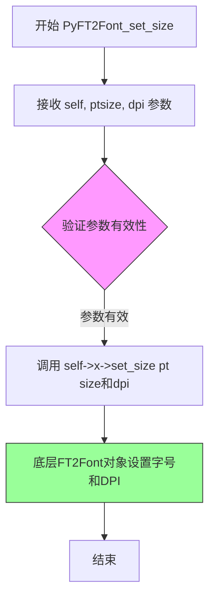

#### 带注释源码

```cpp
// 文档字符串：描述函数功能、参数和返回值
const char *PyFT2Font_set_size__doc__ = R"""(
    Set the size of the text.

    Parameters
    ----------
    ptsize : float
        The size of the text in points.
    dpi : float
        The DPI used for rendering the text.
)""";

// 函数实现：设置字体的字号和DPI
// self: 指向PyFT2Font包装对象的指针，包含底层FT2Font实例
// ptsize: 字体大小（磅）
// dpi: 渲染分辨率（每英寸点数）
static void
PyFT2Font_set_size(PyFT2Font *self, double ptsize, double dpi)
{
    // 调用底层C++ FT2Font对象的set_size方法
    // 该方法会设置FreeType字体的内部尺寸状态
    self->x->set_size(ptsize, dpi);
}
```


### `FT2Font.set_charmap`

设置字体对象的当前字符映射表（charmap），使指定的字符映射成为活动状态，以便后续的字符加载和渲染操作使用该映射。

参数：

- `self`：`FT2Font`，Python侧的字体对象实例，持有C++ FT2Font对象的引用
- `i`：`int`，字符映射表的索引号，范围在 [0, `num_charmaps`) 之间

返回值：`None`（无返回值），该方法直接修改字体对象的内部状态

#### 流程图

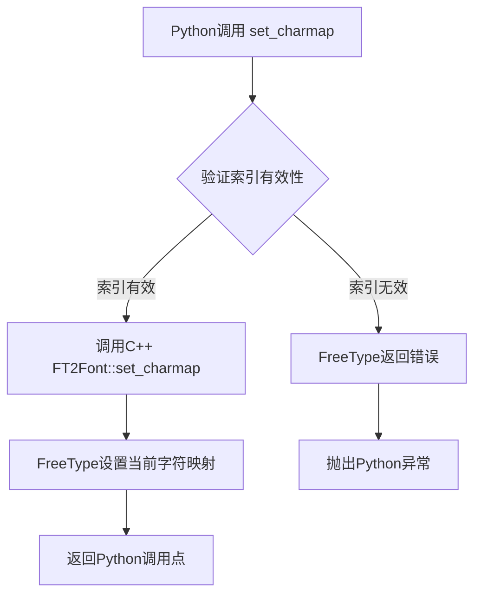

#### 带注释源码

```cpp
// 文档字符串，描述该方法的功能和参数
const char *PyFT2Font_set_charmap__doc__ = R"""(
    Make the i-th charmap current.

    For more details on character mapping, see the `FreeType documentation
    <https://freetype.org/freetype2/docs/reference/ft2-character_mapping.html>`_.

    Parameters
    ----------
    i : int
        The charmap number in the range [0, `.num_charmaps`).

    See Also
    --------
    .num_charmaps
    .select_charmap
    .get_charmap
)""";

// Python绑定函数实现
// self: 指向PyFT2Font结构体的指针，包含C++ FT2Font对象
// i: 要设置为当前字符映射的索引
static void
PyFT2Font_set_charmap(PyFT2Font *self, int i)
{
    // 调用底层C++ FT2Font对象的set_charmap方法
    // 该方法会调用FreeType库的FT_Set_Charmap函数
    // 如果索引无效，FreeType会返回错误并由pybind11转换为Python异常
    self->x->set_charmap(i);
}
```

该函数在pybind11模块绑定中的调用方式：

```cpp
.def("set_charmap", &PyFT2Font_set_charmap, "i"_a,
     PyFT2Font_set_charmap__doc__)
```

**调用链说明**：
1. Python代码调用 `font.set_charmap(i)`
2. pybind11将调用转发到 `PyFT2Font_set_charmap`
3. 该函数调用成员变量 `self->x`（C++ `FT2Font` 对象）的 `set_charmap(i)` 方法
4. 底层C++实现调用 FreeType 的 `FT_Set_Charmap` 函数完成实际的字符映射切换


### `FT2Font.select_charmap`

该方法通过 FreeType 编码号选择字符映射，用于切换当前字体对象所使用的字符编码方案。

参数：

- `i`：`unsigned long`，FreeType 定义的字符映射编码（如 `FT_ENCODING_UNICODE`、`FT_ENCODING_ADOBE_LATIN1` 等），指定要激活的字符映射。

返回值：`void`，无返回值。该方法直接修改内部状态以选中指定的字符映射。

#### 流程图

```mermaid
flowchart TD
    A[调用 select_charmap] --> B{参数 i 是否有效}
    B -->|是| C[调用 self.x->select_charmap(i)]
    B -->|否| D[FreeType 返回错误]
    C --> E[完成]
    D --> E
```

#### 带注释源码

```cpp
// 文档字符串，描述该方法的功能和参数
const char *PyFT2Font_select_charmap__doc__ = R"""(
    Select a charmap by its FT_Encoding number.

    For more details on character mapping, see the `FreeType documentation
    <https://freetype.org/freetype2/docs/reference/ft2-character_mapping.html>`_.

    Parameters
    ----------
    i : int
        The charmap in the form defined by FreeType:
        https://freetype.org/freetype2/docs/reference/ft2-character_mapping.html#ft_encoding

    See Also
    --------
    .set_charmap
    .get_charmap
)""";

// 静态方法实现：PyFT2Font_select_charmap
// self: 指向 PyFT2Font 实例的指针
// i: 无符号长整数，表示 FreeType 定义的字符映射编码
static void
PyFT2Font_select_charmap(PyFT2Font *self, unsigned long i)
{
    // 调用底层 FT2Font 对象的 select_charmap 方法
    // 该方法会调用 FreeType 库的 FT_Select_Charmap 函数
    self->x->select_charmap(i);
}
```

该方法是对 `FT2Font` 类底层 `select_charmap` 方法的 Python 绑定，通过传入 FreeType 定义的编码常量（如 `FT_ENCODING_UNICODE`、`FT_ENCODING_MS_SYMBOL`、`FT_ENCODING_ADOBE_LATIN1` 等）来切换当前字体对象的字符映射。字符映射决定了字符码点（code point）到字形索引（glyph index）的映射方式。


### PyFT2Font.get_kerning

获取两个字形之间的字距调整（Kerning）值。该方法通过FreeType库计算两个指定字形之间的间距调整量，支持不同的字距调整模式（如是否缩放、是否网格对齐等）。

参数：

- `self`：`PyFT2Font*`，指向FT2Font对象的指针，包含底层FreeType字体对象
- `left`：`FT_UInt`（unsigned int），左侧字形的索引（注意：这是字形索引而非字符代码，需使用`get_char_index`将字符代码转换为字形索引）
- `right`：`FT_UInt`（unsigned int），右侧字形的索引
- `mode_or_int`：`std::variant<FT_Kerning_Mode, FT_UInt>`，字距调整模式，可为Kerning枚举值（DEFAULT/UNFITTED/UNSCALED）或整数（已弃用）

返回值：`int`，两个字形之间的字距调整值（以26.6固定点格式表示，即除以64得到像素值）

#### 流程图

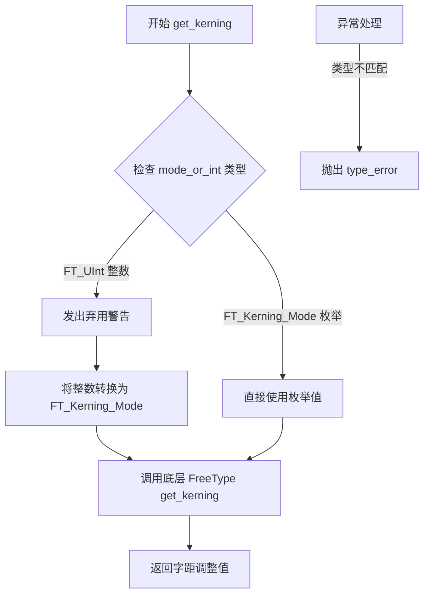

#### 带注释源码

```cpp
// 获取字距调整值的Python绑定函数
static int
PyFT2Font_get_kerning(PyFT2Font *self, FT_UInt left, FT_UInt right,
                      std::variant<FT_Kerning_Mode, FT_UInt> mode_or_int)
{
    // fallback参数用于控制是否使用回退机制
    bool fallback = true;
    // 存储解析后的字距调整模式
    FT_Kerning_Mode mode;

    // 使用std::get_if进行类型安全的variant访问
    if (auto value = std::get_if<FT_UInt>(&mode_or_int)) {
        // 如果传入的是整数（旧API），发出弃用警告
        auto api = py::module_::import("matplotlib._api");
        auto warn = api.attr("warn_deprecated");
        warn("since"_a="3.10", "name"_a="mode", "obj_type"_a="parameter as int",
             "alternative"_a="Kerning enum values");
        // 将整数强制转换为FT_Kerning_Mode枚举
        mode = static_cast<FT_Kerning_Mode>(*value);
    } else if (auto value = std::get_if<FT_Kerning_Mode>(&mode_or_int)) {
        // 如果传入的是Kerning枚举，直接使用
        mode = *value;
    } else {
        // 理论上pybind11会在Python端检查类型，此处为兼容性代码
        // macOS 10.12不支持std::get，需要使用std::get_if
        throw py::type_error("mode must be Kerning or int");
    }

    // 调用底层FT2Font对象的get_kerning方法
    return self->x->get_kerning(left, right, mode, fallback);
}
```


### PyFT2Font.get_fontmap

获取字符到字体的映射关系，用于在fallback字体列表中查找给定字符所属的字体。

参数：

- `self`：`PyFT2Font*`，FT2Font实例的C++包装类指针，指向当前的字体对象
- `text`：`std::u32string`，要查找字体映射的Unicode字符串（UTF-32编码）

返回值：`py::dict`，返回字符到FT2Font对象的字典映射，键为Unicode字符（UTF-32字符串），值为对应的FT2Font对象

#### 流程图

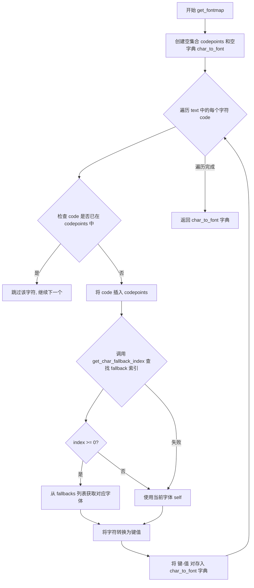

#### 带注释源码

```cpp
// 函数定义，包含文档字符串
const char *PyFT2Font_get_fontmap__doc__ = R"""(
    Get a mapping between characters and the font that includes them.

    .. warning::
        This API uses the fallback list and is both private and provisional: do not use
        it directly.

    Parameters
    ----------
    text : str
        The characters for which to find fonts.

    Returns
    -------
    dict[str, FT2Font]
        A dictionary mapping unicode characters to `.FT2Font` objects.
)""";

// 函数实现
static py::dict
PyFT2Font_get_fontmap(PyFT2Font *self, std::u32string text)
{
    // 使用set存储已处理的code points，避免重复处理相同字符
    std::set<FT_ULong> codepoints;

    // 初始化返回字典，映射字符到字体对象
    py::dict char_to_font;
    
    // 遍历输入字符串中的每个字符
    for (auto code : text) {
        // 如果字符已处理过则跳过（去重）
        if (!codepoints.insert(code).second) {
            continue;
        }

        py::object target_font;  // 目标字体对象
        int index;                // fallback字体索引
        
        // 尝试获取该字符的fallback字体索引
        if (self->x->get_char_fallback_index(code, index)) {
            // 找到有效的fallback索引
            if (index >= 0) {
                // 从fallbacks列表中获取对应字体
                target_font = self->fallbacks[index];
            } else {
                // 索引为负，使用当前字体对象
                target_font = py::cast(self);
            }
        } else {
            // 无法获取fallback索引，使用当前字体
            // TODO Handle recursion!
            target_font = py::cast(self);
        }

        // 将单个字符转换为Python字符串键
        auto key = py::cast(std::u32string(1, code));
        // 建立字符到字体的映射关系
        char_to_font[key] = target_font;
    }
    
    // 返回字符到字体的映射字典
    return char_to_font;
}
```


### `FT2Font.set_text`

该函数设置文本字符串和角度，并计算每个字形的 x,y 位置。返回的字形位置以 26.6 亚像素表示（除以 64 得到像素）。必须先调用此函数才能调用 `draw_glyphs_to_bitmap`。

参数：

- `self`：`PyFT2Font*`，FT2Font 类的实例，指向底层 C++ FT2Font 对象的指针
- `text`：`std::u32string_view`，要准备渲染信息的文本字符串（UTF-32 字符串视图）
- `angle`：`double`，默认值为 `0.0`，渲染文本的角度（以度为单位）
- `flags_or_int`：`std::variant<LoadFlags, FT_Int32>`，默认值为 `LoadFlags::FORCE_AUTOHINT`，位运算组合的 LoadFlags 标志，用于控制字形加载方式

返回值：`py::array_t<double>`，包含 x,y 字形位置的 NumPy 数组，值为 26.6 亚像素格式（除以 64 得到像素）

#### 流程图

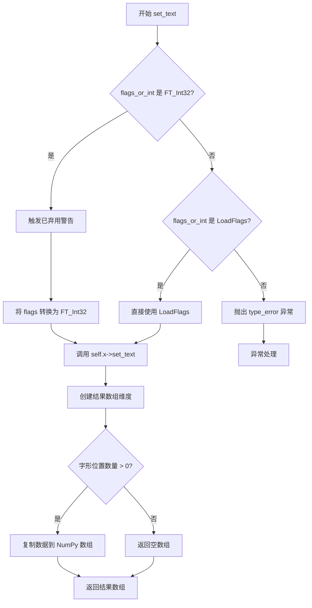

#### 带注释源码

```cpp
const char *PyFT2Font_set_text__doc__ = R"""(
    Set the text *string* and *angle*.

    You must call this before `.draw_glyphs_to_bitmap`.

    Parameters
    ----------
    string : str
        The text to prepare rendering information for.
    angle : float
        The angle at which to render the supplied text.
    flags : LoadFlags, default: `.LoadFlags.FORCE_AUTOHINT`
        Any bitwise-OR combination of the `.LoadFlags` flags.

        .. versionchanged:: 3.10
            This now takes an `.ft2font.LoadFlags` instead of an int.

    Returns
    -------
    np.ndarray[double]
        A sequence of x,y glyph positions in 26.6 subpixels; divide by 64 for pixels.
)""";

static py::array_t<double>
PyFT2Font_set_text(PyFT2Font *self, std::u32string_view text, double angle = 0.0,
                   std::variant<LoadFlags, FT_Int32> flags_or_int = LoadFlags::FORCE_AUTOHINT)
{
    std::vector<double> xys;          // 存储字形 x,y 位置
    LoadFlags flags;                   // 最终使用的加载标志

    // 处理 flags 参数：支持旧版 int 和新版 LoadFlags 枚举
    if (auto value = std::get_if<FT_Int32>(&flags_or_int)) {
        // 旧版 API：传入的是整数类型的 flags
        auto api = py::module_::import("matplotlib._api");
        auto warn = api.attr("warn_deprecated");
        warn("since"_a="3.10", "name"_a="flags", "obj_type"_a="parameter as int",
             "alternative"_a="LoadFlags enum values");
        flags = static_cast<LoadFlags>(*value);
    } else if (auto value = std::get_if<LoadFlags>(&flags_or_int)) {
        // 新版 API：传入的是 LoadFlags 枚举
        flags = *value;
    } else {
        // 类型不匹配，抛出异常
        // NOTE: this can never happen as pybind11 would have checked the type in the
        // Python wrapper before calling this function, but we need to keep the
        // std::get_if instead of std::get for macOS 10.12 compatibility.
        throw py::type_error("flags must be LoadFlags or int");
    }

    // 调用底层 C++ FT2Font 对象的 set_text 方法
    // 该方法会加载文本中所有字形的轮廓和度量信息
    // 并将计算出的字形位置存储在 xys 向量中
    self->x->set_text(text, angle, static_cast<FT_Int32>(flags), xys);

    // 将结果转换为 NumPy 数组返回
    // 数组形状为 (n_glyphs, 2)，每行包含一个字形的 (x, y) 位置
    py::ssize_t dims[] = { static_cast<py::ssize_t>(xys.size()) / 2, 2 };
    py::array_t<double> result(dims);
    if (xys.size() > 0) {
        // 有字形数据，复制到 NumPy 数组
        memcpy(result.mutable_data(), xys.data(), result.nbytes());
    }
    return result;  // 返回包含字形位置的 NumPy 数组
}
```


### `PyFT2Font.get_num_glyphs`

获取当前FT2Font对象中已加载的字形数量。该方法通过调用底层C++ FT2Font对象的`get_num_glyphs()`方法返回当前加载到内存中的字形总数。

参数：

- `self`：`PyFT2Font *`，指向Python FT2Font对象的C++包装器指针，用于访问底层FreeType字体对象

返回值：`size_t`，返回当前已加载的字形数量

#### 流程图

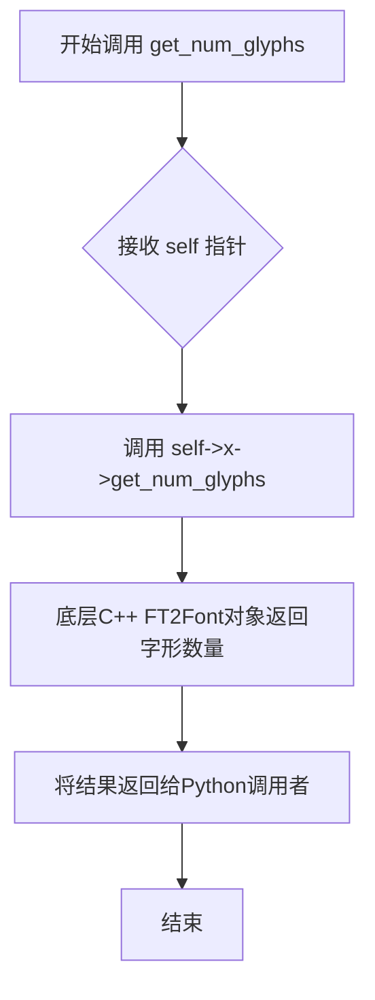

#### 带注释源码

```cpp
// 文档字符串，说明该函数返回已加载的字形数量
const char *PyFT2Font_get_num_glyphs__doc__ = "Return the number of loaded glyphs.";

// 静态函数实现，获取当前FT2Font对象中已加载的字形数量
static size_t
PyFT2Font_get_num_glyphs(PyFT2Font *self)
{
    // self是指向PyFT2Font结构体的指针
    // self->x是指向底层C++ FT2Font对象的指针
    // 调用底层对象的get_num_glyphs()方法获取已加载字形数
    return self->x->get_num_glyphs();
}
```

#### 在pybind11模块中的绑定

```cpp
// 在PYBIND11_MODULE(ft2font, m, ...)中的绑定代码
.def("get_num_glyphs", &PyFT2Font_get_num_glyphs, PyFT2Font_get_num_glyphs__doc__)
```


### `PyFT2Font_load_char`

该函数用于从当前字体文件中加载指定字符码的字形，并返回包含字形信息的 Glyph 对象。如果提供的 flags 参数是整数类型（已弃用），会发出警告并自动转换为 LoadFlags 枚举值。

参数：

- `self`：`PyFT2Font*`，指向 FT2Font 对象的指针，包含字体文件和渲染状态
- `charcode`：`long`，要加载的字符码，必须在当前字符映射表中，否则可能返回 .notdef 字形
- `flags_or_int`：`std::variant<LoadFlags, FT_Int32>`，加载标志，默认为 `LoadFlags::FORCE_AUTOHINT`，支持位运算组合

返回值：`PyGlyph*`，指向包含字形信息的 PyGlyph 对象的指针，包括字形的宽度、高度、度量值和边界框等

#### 流程图

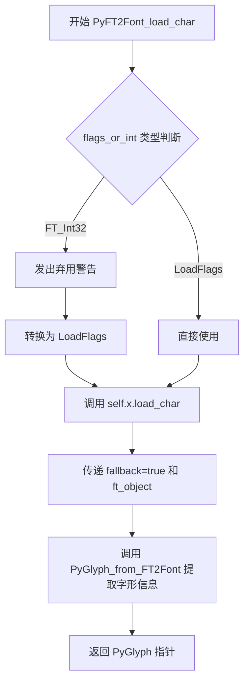

#### 带注释源码

```cpp
static PyGlyph *
PyFT2Font_load_char(PyFT2Font *self, long charcode,
                    std::variant<LoadFlags, FT_Int32> flags_or_int = LoadFlags::FORCE_AUTOHINT)
{
    // fallback 用于控制是否使用备用字体（当当前字体缺少该字符时）
    bool fallback = true;
    // ft_object 用于接收实际加载字形的 FT2Font 对象（可能是fallback字体）
    FT2Font *ft_object = nullptr;
    LoadFlags flags;

    // 检查 flags 参数的类型，支持传入整数（已弃用）或 LoadFlags 枚举
    if (auto value = std::get_if<FT_Int32>(&flags_or_int)) {
        // 如果传入的是整数类型，发出弃用警告并转换为枚举
        auto api = py::module_::import("matplotlib._api");
        auto warn = api.attr("warn_deprecated");
        warn("since"_a="3.10", "name"_a="flags", "obj_type"_a="parameter as int",
             "alternative"_a="LoadFlags enum values");
        // 将整数强制转换为 LoadFlags 枚举
        flags = static_cast<LoadFlags>(*value);
    } else if (auto value = std::get_if<LoadFlags>(&flags_or_int)) {
        // 如果直接传入 LoadFlags 枚举，直接使用
        flags = *value;
    } else {
        // 理论上 pybind11 会在 Python 端检查类型，此处为防御性编程
        throw py::type_error("flags must be LoadFlags or int");
    }

    // 调用底层 FT2Font 对象的 load_char 方法加载字形
    // 参数包括：字符码、标志位、输出字体对象指针、是否使用fallback
    self->x->load_char(charcode, static_cast<FT_Int32>(flags), ft_object, fallback);

    // 从加载的字体对象中提取字形信息并封装为 PyGlyph 对象返回
    return PyGlyph_from_FT2Font(ft_object);
}
```


### PyFT2Font.load_glyph

加载给定字形索引的字形数据到当前字体文件中，并设置字形。该方法根据字形索引加载字形，并返回包含字形度量信息的 Glyph 对象。注意字形索引是特定于字体的，不同于 Unicode 码点。

参数：

- `self`：`PyFT2Font*`，指向 FT2Font 对象的指针，包含字体上下文和状态
- `glyph_index`：`FT_UInt`，要加载的字形索引，特定于当前字体
- `flags_or_int`：`std::variant<LoadFlags, FT_Int32>`，可选参数，加载标志，默认为 `LoadFlags.FORCE_AUTOHINT`，用于控制字形的加载方式（如是否缩放、是否渲染等）

返回值：`PyGlyph*`，返回包含字形度量信息的结构体指针，包括字形的宽度、高度、 bearings、advance 等信息。如果加载失败，可能返回 `.notdef` 字形。

#### 流程图

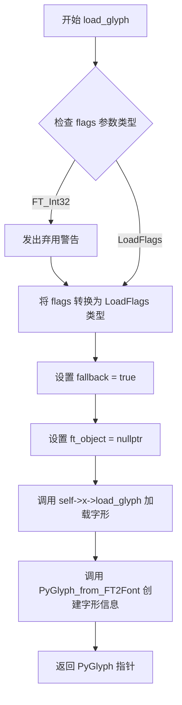

#### 带注释源码

```cpp
const char *PyFT2Font_load_glyph__doc__ = R"""(
    Load glyph index in current fontfile and set glyph.

    Note that the glyph index is specific to a font, and not universal like a Unicode
    code point.

    Parameters
    ----------
    glyph_index : int
        The glyph index to prepare rendering information for.
    flags : LoadFlags, default: `.LoadFlags.FORCE_AUTOHINT`
        Any bitwise-OR combination of the `.LoadFlags` flags.

        .. versionchanged:: 3.10
            This now takes an `.ft2font.LoadFlags` instead of an int.

    Returns
    -------
    Glyph
        The glyph information corresponding to the specified index.

    See Also
    --------
    .load_char
)""";

/**
 * @brief 加载指定字形索引的字形数据
 * 
 * 该函数根据给定的字形索引从当前字体文件中加载字形数据。
 * 它首先处理 flags 参数（支持旧版 int 类型和新型 LoadFlags 枚举），
 * 然后调用底层 FT2Font 对象的 load_glyph 方法，
 * 最后将加载的字形信息封装成 PyGlyph 结构返回给 Python 层。
 * 
 * @param self 指向 FT2Font Python 包装对象的指针
 * @param glyph_index 要加载的字形索引
 * @param flags_or_int 加载标志，支持 LoadFlags 枚举或旧版 int 类型
 * @return PyGlyph* 包含字形度量信息的结构体指针
 */
static PyGlyph *
PyFT2Font_load_glyph(PyFT2Font *self, FT_UInt glyph_index,
                     std::variant<LoadFlags, FT_Int32> flags_or_int = LoadFlags::FORCE_AUTOHINT)
{
    // fallback 标志用于控制找不到字形时的行为
    bool fallback = true;
    // ft_object 用于接收实际加载字形的字体对象（可能是回退字体）
    FT2Font *ft_object = nullptr;
    // 解析 flags 参数
    LoadFlags flags;

    // 处理 variant 类型的 flags 参数
    if (auto value = std::get_if<FT_Int32>(&flags_or_int)) {
        // 如果传入的是旧版 int 类型，发出弃用警告
        auto api = py::module_::import("matplotlib._api");
        auto warn = api.attr("warn_deprecated");
        warn("since"_a="3.10", "name"_a="flags", "obj_type"_a="parameter as int",
             "alternative"_a="LoadFlags enum values");
        // 将 int 转换为 LoadFlags 枚举
        flags = static_cast<LoadFlags>(*value);
    } else if (auto value = std::get_if<LoadFlags>(&flags_or_int)) {
        // 如果已经是 LoadFlags 类型，直接使用
        flags = *value;
    } else {
        // 理论上 pybind11 会在 Python 端检查类型，这里是安全网
        throw py::type_error("flags must be LoadFlags or int");
    }

    // 调用底层 FT2Font 对象的 load_glyph 方法加载字形
    // 参数包括：字形索引、flags、输出参数 ft_object、fallback 标志
    self->x->load_glyph(glyph_index, static_cast<FT_Int32>(flags), ft_object, fallback);

    // 从加载的字体对象中提取字形信息并封装成 PyGlyph
    return PyGlyph_from_FT2Font(ft_object);
}
```


### `PyFT2Font_get_width_height`

获取由 `set_text` 方法设置的当前文本字符串的像素宽度和高度。此方法会考虑文本的旋转角度。返回值以 26.6 亚像素（subpixels）为单位，需要除以 64 才能得到具体的像素值。

参数：
-  `self`：`PyFT2Font *`，指向封装后的 FT2Font 对象的指针，包含了底层的 FreeType 字体对象。

返回值：`py::tuple`，返回一个包含 `(width, height)` 的元组，类型为长整型（long），表示文本的宽度和高度。

#### 流程图

```mermaid
graph TD
    A[Start: PyFT2Font_get_width_height] --> B[Input: self (PyFT2Font instance)]
    B --> C{Internal Call}
    C --> D[self->x->get_width_height(&width, &height)]
    D --> E[Retrieve dimensions from internal FT2Font object]
    E --> F[Create Python Tuple]
    F --> G[Return: (width, height)]
```

#### 带注释源码

```cpp
const char *PyFT2Font_get_width_height__doc__ = R"""(
    Get the dimensions of the current string set by `.set_text`.

    The rotation of the string is accounted for.

    Returns
    -------
    width, height : float
        The width and height in 26.6 subpixels of the current string. To get width and
        height in pixels, divide these values by 64.

    See Also
    --------
    .get_bitmap_offset
    .get_descent
)""";

static py::tuple
PyFT2Font_get_width_height(PyFT2Font *self)
{
    // 定义用于接收宽高的局部变量
    long width, height;

    // 调用底层 C++ FT2Font 对象的 get_width_height 方法
    // 该方法计算当前已加载字形（glyphs）的边界框尺寸
    self->x->get_width_height(&width, &height);

    // 使用 pybind11 将结果封装为 Python 元组返回给 Python 端
    return py::make_tuple(width, height);
}
```


### `PyFT2Font_get_bitmap_offset` (或 `FT2Font.get_bitmap_offset`)

获取当前文本字符串的位图偏移量。当字形的墨水区域延伸到参考点左侧或下方时，需要返回偏移量以便正确渲染。由于 Matplotlib 仅支持从左到右的文本，y 偏移量始终为 0。

参数：

- 无显式参数（隐式参数 `self` 为 `PyFT2Font*` 类型，表示 FT2Font 对象实例）

返回值：`py::tuple`（Python 元组），返回两个长整型值 (x, y)，表示位图在 26.6 亚像素坐标系的偏移量。除以 64 可转换为像素单位。

#### 流程图

```mermaid
flowchart TD
    A[开始调用 get_bitmap_offset] --> B[在栈上创建局部变量 x 和 y]
    B --> C[调用底层 C++ FT2Font 对象的 get_bitmap_offset 方法]
    C --> D[通过指针获取计算出的 x 偏移值]
    C --> E[通过指针获取计算出的 y 偏移值]
    D --> F[使用 py::make_tuple 封装 x 和 y 为 Python 元组]
    E --> F
    F --> G[返回 Python 元组给调用者]
```

#### 带注释源码

```cpp
// 文档字符串，描述该方法的用途和返回值
const char *PyFT2Font_get_bitmap_offset__doc__ = R"""(
    Get the (x, y) offset for the bitmap if ink hangs left or below (0, 0).

    Since Matplotlib only supports left-to-right text, y is always 0.

    Returns
    -------
    x, y : float
        The x and y offset in 26.6 subpixels of the bitmap. To get x and y in pixels,
        divide these values by 64.

    See Also
    --------
    .get_width_height
    .get_descent
)""";

// 实际的 C++ 实现函数
static py::tuple
PyFT2Font_get_bitmap_offset(PyFT2Font *self)
{
    // 声明局部变量用于存储从底层 FreeType 对象获取的偏移值
    // x: 水平方向偏移（当字形左侧有墨水时为正）
    // y: 垂直方向偏移（Matplotlib 中始终为 0）
    long x, y;

    // 调用底层 FT2Font C++ 对象的 get_bitmap_offset 方法
    // 该方法通过 FreeType 计算当前已加载字形的位图偏移量
    self->x->get_bitmap_offset(&x, &y);

    // 将计算得到的偏移量封装为 Python 元组返回
    // 返回格式为 (x, y)，单位为 26.6 固定点格式（亚像素）
    return py::make_tuple(x, y);
}
```


### `FT2Font.get_descent`

获取由 `.set_text` 设置的当前字符串的下降量（descent），考虑了字符串的旋转。

参数：

- `self`：`PyFT2Font*`，指向 FT2Font 实例的指针，表示字体对象。

返回值：`long`，下降量，以 26.6 亚像素为单位。要获取像素值，需将该值除以 64。

#### 流程图

```mermaid
flowchart TD
    A[调用 get_descent 方法] --> B{检查字体对象是否有效}
    B -->|有效| C[调用底层 C++ FT2Font 对象的 get_descent 方法]
    B -->|无效| D[抛出异常]
    C --> E[返回下降量 long 值]
    E --> F[Python 层返回 int 类型]
```

#### 带注释源码

```cpp
// 获取当前字符串下降量的文档字符串
const char *PyFT2Font_get_descent__doc__ = R"""(
    Get the descent of the current string set by `.set_text`.

    The rotation of the string is accounted for.

    Returns
    -------
    int
        The descent in 26.6 subpixels of the bitmap. To get the descent in pixels,
        divide these values by 64.

    See Also
    --------
    .get_bitmap_offset
    .get_width_height
)""";

// 获取下降量的实现函数
// 参数 self: 指向 PyFT2Font 结构的指针，封装了底层 FT2Font 对象
// 返回值: long 类型，表示下降量的亚像素值
static long
PyFT2Font_get_descent(PyFT2Font *self)
{
    // 调用底层 C++ FT2Font 对象的 get_descent 方法获取下降量
    // 下降量表示文本基线以下的距离，用于计算文本的整体高度
    return self->x->get_descent();
}
```


### `PyFT2Font.draw_glyphs_to_bitmap`

该函数用于将之前通过 `set_text` 方法加载的多个字形批量绘制到位图（bitmap）中。位图尺寸会自动调整以容纳所有字形。该函数是 Matplotlib 中字体渲染流程的关键步骤，负责将预处理的字形数据显示为像素图像。

参数：

- `self`：`PyFT2Font *`，指向 FT2Font Python 绑定对象的指针，用于访问底层 C++ FreeType 字体对象
- `antialiased`：`bool`，是否启用 8 位抗锯齿渲染，默认为 `true`；若设为 `false`，则以纯黑白方式渲染

返回值：`void`，无返回值；该函数直接修改内部位图缓冲区

#### 流程图

```mermaid
flowchart TD
    A[开始 draw_glyphs_to_bitmap] --> B{检查 antialiased 参数}
    B -->|true| C[调用 x->draw_glyphs_to_bitmap 启用抗锯齿]
    B -->|false| D[调用 x->draw_glyphs_to_bitmap 禁用抗锯齿]
    C --> E[底层 FT2Font 处理字形渲染]
    D --> E
    E --> F[自动调整位图尺寸以容纳所有字形]
    F --> G[结束]
```

#### 带注释源码

```c
// 函数文档字符串，描述其功能和使用方法
const char *PyFT2Font_draw_glyphs_to_bitmap__doc__ = R"""(
    Draw the glyphs that were loaded by `.set_text` to the bitmap.

    The bitmap size will be automatically set to include the glyphs.

    Parameters
    ----------
    antialiased : bool, default: True
        Whether to render glyphs 8-bit antialiased or in pure black-and-white.

    See Also
    --------
    .draw_glyph_to_bitmap
)""";

// 静态函数实现：批量绘制字形到位图
// self: 指向 PyFT2Font 结构体的指针，包含底层的 FT2Font 对象
// antialiased: 布尔值参数，控制是否使用抗锯齿渲染，默认为 true
static void
PyFT2Font_draw_glyphs_to_bitmap(PyFT2Font *self, bool antialiased = true)
{
    // 调用底层 C++ FT2Font 对象的 draw_glyphs_to_bitmap 方法
    // self->x 是指向底层 FT2Font C++ 对象的指针
    // 该方法会遍历之前通过 set_text 加载的所有字形，并将它们绘制到内部位图中
    self->x->draw_glyphs_to_bitmap(antialiased);
}
```


### `FT2Font.draw_glyph_to_bitmap`

在位图的指定像素位置 (x, y) 绘制单个字形。用户需要手动创建正确大小的图像缓冲区。若需要自动布局，应使用 `set_text` 配合 `draw_glyphs_to_bitmap`。此方法适用于需要在精确位置渲染单独字形（如 `load_char` 返回的字形）的场景。

参数：

- `self`：`FT2Font`，FT2Font 实例，调用该方法的字体对象
- `image`：`py::buffer`（2d array of uint8），绘制字形的图像缓冲区
- `x`：`double_or_<int>`，绘制字形的像素 X 坐标（整数或浮点数，浮点数会触发弃用警告并转为整数）
- `y`：`double_or_<int>`，绘制字形的像素 Y 坐标（整数或浮点数，浮点数会触发弃用警告并转为整数）
- `glyph`：`PyGlyph *`，要绘制的字形对象（包含字形索引等信息）
- `antialiased`：`bool`，是否使用 8 位抗锯齿渲染，默认为 True；设为 False 则以纯黑白方式渲染

返回值：`void`，无返回值（操作直接在传入的图像缓冲区上进行修改）

#### 流程图

```mermaid
flowchart TD
    A[开始 draw_glyph_to_bitmap] --> B{参数 x 是否为 double?}
    B -->|是| C[调用 warn_deprecated 警告]
    C --> D[将 x 转换为 int 类型]
    B -->|否| D
    E{参数 y 是否为 double?}
    E -->|是| F[调用 warn_deprecated 警告]
    F --> G[将 y 转换为 int 类型]
    E -->|否| G
    D --> G
    G --> H[提取 glyph 中的 glyphInd 索引]
    H --> I[构建 py::array_t<uint8_t> 图像数组]
    I --> J[调用 self->x->draw_glyph_to_bitmap]
    J --> K[在图像缓冲区指定位置绘制字形]
    K --> L[结束]
```

#### 带注释源码

```cpp
const char *PyFT2Font_draw_glyph_to_bitmap__doc__ = R"""(
    Draw a single glyph to the bitmap at pixel locations x, y.

    Note it is your responsibility to create the image manually with the correct size
    before this call is made.

    If you want automatic layout, use `.set_text` in combinations with
    `.draw_glyphs_to_bitmap`. This function is instead intended for people who want to
    render individual glyphs (e.g., returned by `.load_char`) at precise locations.

    Parameters
    ----------
    image : 2d array of uint8
        The image buffer on which to draw the glyph.
    x, y : int
        The pixel location at which to draw the glyph.
    glyph : Glyph
        The glyph to draw.
    antialiased : bool, default: True
        Whether to render glyphs 8-bit antialiased or in pure black-and-white.

    See Also
    --------
    .draw_glyphs_to_bitmap
)""";

static void
PyFT2Font_draw_glyph_to_bitmap(PyFT2Font *self, py::buffer &image,
                               double_or_<int> vxd, double_or_<int> vyd,
                               PyGlyph *glyph, bool antialiased = true)
{
    // 将可能传入的 double 类型的 x 坐标转换为 int
    // 如果传入的是 double，会触发弃用警告
    auto xd = _double_to_<int>("x", vxd);
    
    // 将可能传入的 double 类型的 y 坐标转换为 int
    // 如果传入的是 double，会触发弃用警告
    auto yd = _double_to_<int>("y", vyd);

    // 调用底层 C++ FT2Font 对象的 draw_glyph_to_bitmap 方法
    // 参数：
    //   - py::array_t<uint8_t, py::array::c_style>{image}: 将 Python 缓冲区转换为 C 风格的 uint8 数组
    //   - xd, yd: 转换后的整数坐标
    //   - glyph->glyphInd: 从 Glyph 对象中提取的字形索引
    //   - antialiased: 抗锯齿渲染标志
    self->x->draw_glyph_to_bitmap(
        py::array_t<uint8_t, py::array::c_style>{image},
        xd, yd, glyph->glyphInd, antialiased);
}
```


### `FT2Font.get_glyph_name`

该方法用于从字体文件中检索给定字形索引（Glyph Index）的 ASCII 名称。如果字体本身不包含字形名称（例如未设置 `FT_FACE_FLAG_GLYPH_NAMES`），Matplotlib 会根据内部规则生成一个名称返回。

参数：

-  `index`：`unsigned int`，要查询的字形编号（Glyph Number）。

返回值：`py::str`，返回字形的名称字符串。如果字体缺少名称，则返回由 Matplotlib 生成的名称。

#### 流程图

```mermaid
graph TD
    A[Start get_glyph_name] --> B[创建 std::string buffer]
    B --> C[设置 fallback = true]
    C --> D[将 buffer 大小调整为 128 字节]
    D --> E[调用 self->x->get_glyph_name 获取字形名称]
    E --> F[将 buffer 转换为 py::str 并返回]
```

#### 带注释源码

```cpp
// 函数文档字符串，描述了其功能和参数
const char *PyFT2Font_get_glyph_name__doc__ = R"""(
    Retrieve the ASCII name of a given glyph *index* in a face.

    Due to Matplotlib's internal design, for fonts that do not contain glyph names (per
    ``FT_FACE_FLAG_GLYPH_NAMES``), this returns a made-up name which does *not*
    roundtrip through `.get_name_index`.

    Parameters
    ----------
    index : int
        The glyph number to query.

    Returns
    -------
    str
        The name of the glyph, or if the font does not contain names, a name synthesized
        by Matplotlib.

    See Also
    --------
    .get_name_index
)""";

// 具体的实现函数
static py::str
PyFT2Font_get_glyph_name(PyFT2Font *self, unsigned int glyph_number)
{
    std::string buffer;
    bool fallback = true;

    // 预留足够的缓冲区空间
    buffer.resize(128);
    
    // 调用底层 FT2Font 对象的 get_glyph_name 方法
    // self->x 是指向底层 C++ FT2Font 对象的指针
    self->x->get_glyph_name(glyph_number, buffer, fallback);
    
    // 将 std::string 转换为 pybind11 的字符串对象返回给 Python
    return buffer;
}
```


### `FT2Font.get_charmap`

获取当前字体文件中字符到字形索引的映射表。该函数遍历字体中所有可用的字符码，生成字符码到字形索引的字典映射。

参数：无（仅包含 `self` 隐式参数）

返回值：`dict[int, int]`，返回当前字符映射表中字符码（键）到字形索引（值）的字典映射

#### 流程图

```mermaid
flowchart TD
    A[开始] --> B[调用 self.x->get_face 获取 FT_Face]
    --> C[调用 FT_Get_First_Char 获取第一个字符码和字形索引]
    --> D{index != 0?}
    D -->|是| E[将 code 和 index 加入 py::dict]
    --> F[调用 FT_Get_Next_Char 获取下一个字符码和索引]
    --> D
    D -->|否| G[返回 charmap 字典]
```

#### 带注释源码

```cpp
// 文档字符串，说明函数功能、返回值类型和说明
const char *PyFT2Font_get_charmap__doc__ = R"""(
    Return a mapping of character codes to glyph indices in the font.

    The charmap is Unicode by default, but may be changed by `.set_charmap` or
    `.select_charmap`.

    Returns
    -------
    dict[int, int]
        A dictionary of the selected charmap mapping character codes to their
        corresponding glyph indices.
)""";

// 函数实现：获取字符映射表
// 参数：self - 指向 PyFT2Font 结构体的指针（对应 Python 的 FT2Font 实例）
// 返回值：py::dict - Python 字典，键为字符码，值为字形索引
static py::dict
PyFT2Font_get_charmap(PyFT2Font *self)
{
    // 创建 Python 字典用于存储映射关系
    py::dict charmap;
    // 字形索引变量
    FT_UInt index;
    // 字符码变量，初始获取第一个字符
    // FT_Get_FreeType 函数，获取字体中的第一个字符码及其对应的字形索引
    FT_ULong code = FT_Get_First_Char(self->x->get_face(), &index);
    // 遍历所有字符码，直到 index 为 0（表示没有更多字符）
    while (index != 0) {
        // 将字符码和字形索引加入字典，使用 py::cast 转换为 Python 对象
        charmap[py::cast(code)] = py::cast(index);
        // 获取下一个字符码及其字形索引
        code = FT_Get_Next_Char(self->x->get_face(), code, &index);
    }
    // 返回完整的字符映射字典
    return charmap;
}
```


### `FT2Font.get_char_index`

根据字符代码点返回对应的字形索引。

参数：

- `self`：`FT2Font`，FT2Font 实例，表示字体对象
- `codepoint`：`int`，字符代码点，当前字符映射（默认为 Unicode）

返回值：`int`，对应的字形索引

#### 流程图

```mermaid
flowchart TD
    A[开始] --> B[接收字符代码点 codepoint]
    B --> C{检查 fallback 标志}
    C -->|true| D[调用底层 FT2Font::get_char_index 方法]
    D --> E[返回字形索引]
    E --> F[结束]
```

#### 带注释源码

```c
const char *PyFT2Font_get_char_index__doc__ = R"""(
    Return the glyph index corresponding to a character code point.

    Parameters
    ----------
    codepoint : int
        A character code point in the current charmap (which defaults to Unicode.)

    Returns
    -------
    int
        The corresponding glyph index.

    See Also
    --------
    .set_charmap
    .select_charmap
    .get_glyph_name
    .get_name_index
)""";

// 获取字符索引的包装函数
// self: FT2Font 对象指针
// ccode: 字符代码点 (FT_ULong 类型)
static FT_UInt
PyFT2Font_get_char_index(PyFT2Font *self, FT_ULong ccode)
{
    bool fallback = true;  // 是否使用 fallback 字体

    // 调用底层 C++ FT2Font 对象的 get_char_index 方法
    // 将字符代码点转换为字形索引
    return self->x->get_char_index(ccode, fallback);
}
```


### `FT2Font.get_sfnt`

获取字体的完整SFNT名称表（也称为字体名称表），该表包含了字体的各种元数据信息，如字体名称、版权信息、制造商信息等。

参数：

- `self`：`PyFT2Font*`，指向 FT2Font 实例的指针，用于访问底层 FreeType 字体对象

返回值：`py::dict`，返回包含所有SFNT名称的字典。字典的键是一个元组 `(platform_id, encoding_id, language_id, name_id)`，值是 `bytes` 类型的名称数据。

#### 流程图

```mermaid
flowchart TD
    A[开始 get_sfnt] --> B{检查字体是否支持SFNT}
    B -->|不支持| C[抛出 ValueError: No SFNT name table]
    B -->|支持| D[获取SFNT名称数量]
    D --> E[初始化空字典]
    E --> F{遍历所有SFNT名称}
    F -->|遍历完毕| G[返回字典]
    F -->|还有名称| H[获取第j个SFNT名称结构]
    H --> I{获取成功?}
    I -->|失败| J[抛出 ValueError: Could not get SFNT name]
    I -->|成功| K[构建元组键: (platform_id, encoding_id, language_id, name_id)]
    K --> L[将名称数据转换为bytes]
    L --> M[将键值对存入字典]
    M --> F
```

#### 带注释源码

```cpp
const char *PyFT2Font_get_sfnt__doc__ = R"""(
    Load the entire SFNT names table.

    Returns
    -------
    dict[tuple[int, int, int, int], bytes]
        The SFNT names table; the dictionary keys are tuples of:

            (platform-ID, ISO-encoding-scheme, language-code, description)

        and the values are the direct information from the font table.
)""";

static py::dict
PyFT2Font_get_sfnt(PyFT2Font *self)
{
    // 检查字体是否具有SFNT标志（即是否为TrueType或OpenType字体）
    // FT_FACE_FLAG_SFNT 是FreeType定义的标志，用于标识SFNT字体格式
    if (!(self->x->get_face()->face_flags & FT_FACE_FLAG_SFNT)) {
        throw py::value_error("No SFNT name table");
    }

    // 获取SFNT名称表中的名称数量
    size_t count = FT_Get_Sfnt_Name_Count(self->x->get_face());

    // 创建用于存储结果的Python字典
    py::dict names;

    // 遍历SFNT名称表中的每一个名称条目
    for (FT_UInt j = 0; j < count; ++j) {
        FT_SfntName sfnt;
        // 调用FreeType函数获取指定索引的SFNT名称
        FT_Error error = FT_Get_Sfnt_Name(self->x->get_face(), j, &sfnt);

        // 检查是否成功获取名称
        if (error) {
            throw py::value_error("Could not get SFNT name");
        }

        // 构建字典键：包含平台ID、编码ID、语言ID和名称ID的四元组
        // platform_id: 标识字体数据的平台（如0=Apple, 3=Microsoft）
        // encoding_id: 标识字符编码方案
        // language_id: 标识语言
        // name_id: 标识名称类型（如1=字体名称, 0=版权信息）
        auto key = py::make_tuple(
            sfnt.platform_id, sfnt.encoding_id, sfnt.language_id, sfnt.name_id);
        
        // 将名称字符串转换为Python bytes对象
        // sfnt.string 是原始字节数组，sfnt.string_len 是其长度
        auto val = py::bytes(reinterpret_cast<const char *>(sfnt.string),
                             sfnt.string_len);
        
        // 将键值对添加到字典中
        names[key] = val;
    }

    // 返回包含所有SFNT名称的字典
    return names;
}
```


### `FT2Font.get_name_index`

该方法是一个Python绑定函数，用于获取给定字形名称（Glyph Name）对应的字形索引（Glyph Index）。它充当了Python层与底层C++ `FT2Font`对象之间的桥梁，直接调用FreeType库的功能来查找名称。

参数：

-  `name`：`str`，要查询的字形名称（例如 "A", "uni0041" 等）。

返回值：`int`，对应的字形索引。如果名称未定义（未找到），通常返回 0（表示 `.notdef` 字形）。

#### 流程图

```mermaid
flowchart TD
    A[Python调用 get_name_index] --> B{解析参数}
    B -->|提取字符串| C[调用 C++ 对象方法 self.x.get_name_index]
    C --> D[FreeType 库查询]
    D --> E{找到名称?}
    E -->|是| F[返回字形索引]
    E -->|否| G[返回 0]
    F --> H[转换为 Python int]
    G --> H
    H --> I[返回给 Python]
```

#### 带注释源码

```cpp
// 定义文档字符串，描述功能、参数和返回值
const char *PyFT2Font_get_name_index__doc__ = R"""(
    Return the glyph index of a given glyph *name*.

    Parameters
    ----------
    name : str
        The name of the glyph to query.

    Returns
    -------
    int
        The corresponding glyph index; 0 means 'undefined character code'.

    See Also
    --------
    .get_char_index
    .get_glyph_name
)""";

// 静态方法实现：接收 PyFT2Font 指针和字形名称字符串
static long
PyFT2Font_get_name_index(PyFT2Font *self, char *glyphname)
{
    // 调用内部 C++ FT2Font 对象的 get_name_index 方法
    // 并将结果（long）直接返回，pybind11 会将其转换为 Python 的 int
    return self->x->get_name_index(glyphname);
}

// ... 在 pybind11 模块定义中 ...
// .def("get_name_index", &PyFT2Font_get_name_index, "name"_a, PyFT2Font_get_name_index__doc__)
```


### `PyFT2Font.get_ps_font_info`

该方法是FT2Font类的成员方法，用于从当前加载的字体中提取PostScript字体信息结构（PS Font Info），并将其以Python元组的形式返回，供Python调用者使用。

参数：

- `self`：`PyFT2Font *`，隐式参数，指向FT2Font实例的指针，用于访问底层FreeType字体对象

返回值：`py::tuple`，返回一个包含9个元素的元组，元素依次为：
- `version`：`str`，PostScript字体版本号
- `notice`：`str`，字体版权声明或公告
- `full_name`：`str`，字体全名
- `family_name`：`str`，字体家族名称
- `weight`：`str`，字体权重名称
- `italic_angle`：`int`，字体斜体角度
- `is_fixed_pitch`：`bool`，字体是否为固定宽度
- `underline_position`：`int`，下划线位置
- `underline_thickness`：`int`，下划线厚度

#### 流程图

```mermaid
flowchart TD
    A[调用 get_ps_font_info] --> B{检查 FreeType 字体对象}
    B -->|有效| C[调用 FT_Get_PS_Font_Info 获取 PS 字体信息]
    B -->|无效| D[抛出异常: 无效的字体对象]
    C --> E{获取是否成功}
    E -->|成功| F[提取各字段值并处理空指针]
    E -->|失败| G[抛出 py::value_error 异常]
    F --> H[构建包含9个元素的 py::tuple]
    H --> I[返回元组给Python调用者]
```

#### 带注释源码

```cpp
// 定义函数的文档字符串，描述返回值结构
const char *PyFT2Font_get_ps_font_info__doc__ = R"""(
    Return the information in the PS Font Info structure.

    For more information, see the `FreeType documentation on this structure
    <https://freetype.org/freetype2/docs/reference/ft2-type1_tables.html#ps_fontinforec>`_.

    Returns
    -------
    version : str
    notice : str
    full_name : str
    family_name : str
    weight : str
    italic_angle : int
    is_fixed_pitch : bool
    underline_position : int
    underline_thickness : int
)""";

// 实际实现函数，使用 py::tuple 返回类型以返回多个值
static py::tuple
PyFT2Font_get_ps_font_info(PyFT2Font *self)
{
    // 声明 FreeType 的 PS 字体信息结构体
    PS_FontInfoRec fontinfo;

    // 调用 FreeType 库函数获取 PS 字体信息
    // self->x 是底层 FT2Font C++ 对象，通过 get_face() 获取 FT_Face
    FT_Error error = FT_Get_PS_Font_Info(self->x->get_face(), &fontinfo);
    
    // 如果获取失败（error != 0），抛出 Python ValueError 异常
    if (error) {
        throw py::value_error("Could not get PS font info");
    }

    // 构建返回元组，使用条件表达式处理可能为 NULL 的 C 字符串
    // 如果字段为空指针，则返回空字符串，避免返回 NULL 导致的问题
    return py::make_tuple(
        fontinfo.version ? fontinfo.version : "",          // 版本号字符串
        fontinfo.notice ? fontinfo.notice : "",            // 版权/公告字符串
        fontinfo.full_name ? fontinfo.full_name : "",      // 字体全名
        fontinfo.family_name ? fontinfo.family_name : "",  // 字体家族名
        fontinfo.weight ? fontinfo.weight : "",            // 权重名称
        fontinfo.italic_angle,                             // 斜体角度（整数）
        fontinfo.is_fixed_pitch,                           // 是否固定宽度（布尔）
        fontinfo.underline_position,                       // 下划线位置（整数）
        fontinfo.underline_thickness);                     // 下划线厚度（整数）
}
```


### PyFT2Font.get_sfnt_table

该方法用于获取字体文件中指定的 SFNT（TrueType）表（如 head、maxp、OS/2、hhea、vhea、post、pclt 等），并将其内容解析为 Python 字典格式返回。

参数：

- `self`：`PyFT2Font*`，指向 FT2Font 对象的指针，包含字体文件上下文
- `tagname`：`std::string`，要获取的 SFNT 表名称，支持的值包括 "head"、"maxp"、"OS/2"、"hhea"、"vhea"、"post"、"pclt"

返回值：`std::optional<py::dict>`，返回包含指定 SFNT 表内容的字典，如果表不存在或不支持则返回空

#### 流程图

```mermaid
flowchart TD
    A[开始 get_sfnt_table] --> B[根据 tagname 查找对应的 FT_Sfnt_Tag]
    B --> C{tagname 是否有效?}
    C -->|否| D[返回 std::nullopt]
    C -->|是| E[调用 FT_Get_Sfnt_Table 获取原始表数据]
    E --> F{表数据是否存在?}
    F -->|否| D
    F -->|是| G[根据 tag 类型进行 switch 分支]
    G --> H1[FT_SFNT_HEAD: 转换为 TT_Header 字典]
    G --> H2[FT_SFNT_MAXP: 转换为 TT_MaxProfile 字典]
    G --> H3[FT_SFNT_OS2: 转换为 TT_OS2 字典]
    G --> H4[FT_SFNT_HHEA: 转换为 TT_HoriHeader 字典]
    G --> H5[FT_SFNT_VHEA: 转换为 TT_VertHeader 字典]
    G --> H6[FT_SFNT_POST: 转换为 TT_Postscript 字典]
    G --> H7[FT_SFNT_PCLT: 转换为 TT_PCLT 字典]
    H1 --> I[返回 Python 字典]
    H2 --> I
    H3 --> I
    H4 --> I
    H5 --> I
    H6 --> I
    H7 --> I
```

#### 带注释源码

```cpp
const char *PyFT2Font_get_sfnt_table__doc__ = R"""(
    Return one of the SFNT tables.

    Parameters
    ----------
    name : {"head", "maxp", "OS/2", "hhea", "vhea", "post", "pclt"}
        Which table to return.

    Returns
    -------
    dict[str, Any]
        The corresponding table; for more information, see `the FreeType documentation
        <https://freetype.org/freetype2/docs/reference/ft2-truetype_tables.html>`_.
)""";

static std::optional<py::dict>
PyFT2Font_get_sfnt_table(PyFT2Font *self, std::string tagname)
{
    FT_Sfnt_Tag tag;
    // 建立表名到 FreeType 标签的映射关系
    const std::unordered_map<std::string, FT_Sfnt_Tag> names = {
        {"head", FT_SFNT_HEAD},
        {"maxp", FT_SFNT_MAXP},
        {"OS/2", FT_SFNT_OS2},
        {"hhea", FT_SFNT_HHEA},
        {"vhea", FT_SFNT_VHEA},
        {"post", FT_SFNT_POST},
        {"pclt", FT_SFNT_PCLT},
    };

    // 尝试在映射表中查找对应的 SFNT 标签
    try {
        tag = names.at(tagname);
    } catch (const std::out_of_range&) {
        // 如果表名无效，返回空 optional
        return std::nullopt;
    }

    // 调用 FreeType API 获取原始表数据指针
    void *table = FT_Get_Sfnt_Table(self->x->get_face(), tag);
    if (!table) {
        // 如果表不存在于字体文件中，返回空 optional
        return std::nullopt;
    }

    // 根据不同的 SFNT 表类型，解析并转换为 Python 字典
    switch (tag) {
    case FT_SFNT_HEAD: {
        // 解析 TrueType 头部表 (head table)
        auto t = static_cast<TT_Header *>(table);
        return py::dict(
            "version"_a=py::make_tuple(FIXED_MAJOR(t->Table_Version),
                                       FIXED_MINOR(t->Table_Version)),
            "fontRevision"_a=py::make_tuple(FIXED_MAJOR(t->Font_Revision),
                                            FIXED_MINOR(t->Font_Revision)),
            "checkSumAdjustment"_a=t->CheckSum_Adjust,
            "magicNumber"_a=t->Magic_Number,
            "flags"_a=t->Flags,
            "unitsPerEm"_a=t->Units_Per_EM,
            // 时间戳需要强制转换以防止符号扩展问题
            "created"_a=py::make_tuple(static_cast<unsigned int>(t->Created[0]),
                                       static_cast<unsigned int>(t->Created[1])),
            "modified"_a=py::make_tuple(static_cast<unsigned int>(t->Modified[0]),
                                        static_cast<unsigned int>(t->Modified[1])),
            "xMin"_a=t->xMin,
            "yMin"_a=t->yMin,
            "xMax"_a=t->xMax,
            "yMax"_a=t->yMax,
            "macStyle"_a=t->Mac_Style,
            "lowestRecPPEM"_a=t->Lowest_Rec_PPEM,
            "fontDirectionHint"_a=t->Font_Direction,
            "indexToLocFormat"_a=t->Index_To_Loc_Format,
            "glyphDataFormat"_a=t->Glyph_Data_Format);
    }
    case FT_SFNT_MAXP: {
        // 解析最大轮廓表 (maxp table)
        auto t = static_cast<TT_MaxProfile *>(table);
        return py::dict(
            "version"_a=py::make_tuple(FIXED_MAJOR(t->version),
                                       FIXED_MINOR(t->version)),
            "numGlyphs"_a=t->numGlyphs,
            "maxPoints"_a=t->maxPoints,
            "maxContours"_a=t->maxContours,
            "maxComponentPoints"_a=t->maxCompositePoints,
            "maxComponentContours"_a=t->maxCompositeContours,
            "maxZones"_a=t->maxZones,
            "maxTwilightPoints"_a=t->maxTwilightPoints,
            "maxStorage"_a=t->maxStorage,
            "maxFunctionDefs"_a=t->maxFunctionDefs,
            "maxInstructionDefs"_a=t->maxInstructionDefs,
            "maxStackElements"_a=t->maxStackElements,
            "maxSizeOfInstructions"_a=t->maxSizeOfInstructions,
            "maxComponentElements"_a=t->maxComponentElements,
            "maxComponentDepth"_a=t->maxComponentDepth);
    }
    case FT_SFNT_OS2: {
        // 解析 OS/2 表
        auto t = static_cast<TT_OS2 *>(table);
        return py::dict(
            "version"_a=t->version,
            "xAvgCharWidth"_a=t->xAvgCharWidth,
            "usWeightClass"_a=t->usWeightClass,
            "usWidthClass"_a=t->usWidthClass,
            "fsType"_a=t->fsType,
            // ... 省略部分字段
            "ulCharRange"_a=py::make_tuple(t->ulUnicodeRange1, t->ulUnicodeRange2,
                                           t->ulUnicodeRange3, t->ulUnicodeRange4),
            "achVendID"_a=py::bytes(reinterpret_cast<const char *>(t->achVendID), 4),
            "fsSelection"_a=t->fsSelection,
            "fsFirstCharIndex"_a=t->usFirstCharIndex,
            "fsLastCharIndex"_a=t->usLastCharIndex);
    }
    case FT_SFNT_HHEA: {
        // 解析水平头部表 (hhea table)
        auto t = static_cast<TT_HoriHeader *>(table);
        return py::dict(
            "version"_a=py::make_tuple(FIXED_MAJOR(t->Version),
                                       FIXED_MINOR(t->Version)),
            "ascent"_a=t->Ascender,
            "descent"_a=t->Descender,
            "lineGap"_a=t->Line_Gap,
            "advanceWidthMax"_a=t->advance_Width_Max,
            "minLeftBearing"_a=t->min_Left_Side_Bearing,
            "minRightBearing"_a=t->min_Right_Side_Bearing,
            "xMaxExtent"_a=t->xMax_Extent,
            "caretSlopeRise"_a=t->caret_Slope_Rise,
            "caretSlopeRun"_a=t->caret_Slope_Run,
            "caretOffset"_a=t->caret_Offset,
            "metricDataFormat"_a=t->metric_Data_Format,
            "numOfLongHorMetrics"_a=t->number_Of_HMetrics);
    }
    case FT_SFNT_VHEA: {
        // 解析垂直头部表 (vhea table)
        auto t = static_cast<TT_VertHeader *>(table);
        return py::dict(
            "version"_a=py::make_tuple(FIXED_MAJOR(t->Version),
                                       FIXED_MINOR(t->Version)),
            "vertTypoAscender"_a=t->Ascender,
            "vertTypoDescender"_a=t->Descender,
            "vertTypoLineGap"_a=t->Line_Gap,
            "advanceHeightMax"_a=t->advance_Height_Max,
            "minTopSideBearing"_a=t->min_Top_Side_Bearing,
            "minBottomSizeBearing"_a=t->min_Bottom_Side_Bearing,
            "yMaxExtent"_a=t->yMax_Extent,
            "caretSlopeRise"_a=t->caret_Slope_Rise,
            "caretSlopeRun"_a=t->caret_Slope_Run,
            "caretOffset"_a=t->caret_Offset,
            "metricDataFormat"_a=t->metric_Data_Format,
            "numOfLongVerMetrics"_a=t->number_Of_VMetrics);
    }
    case FT_SFNT_POST: {
        // 解析 PostScript 表
        auto t = static_cast<TT_Postscript *>(table);
        return py::dict(
            "format"_a=py::make_tuple(FIXED_MAJOR(t->FormatType),
                                      FIXED_MINOR(t->FormatType)),
            "italicAngle"_a=py::make_tuple(FIXED_MAJOR(t->italicAngle),
                                           FIXED_MINOR(t->italicAngle)),
            "underlinePosition"_a=t->underlinePosition,
            "underlineThickness"_a=t->underlineThickness,
            "isFixedPitch"_a=t->isFixedPitch,
            "minMemType42"_a=t->minMemType42,
            "maxMemType42"_a=t->maxMemType42,
            "minMemType1"_a=t->minMemType1,
            "maxMemType1"_a=t->maxMemType1);
    }
    case FT_SFNT_PCLT: {
        // 解析 PCLT 表
        auto t = static_cast<TT_PCLT *>(table);
        return py::dict(
            "version"_a=py::make_tuple(FIXED_MAJOR(t->Version),
                                       FIXED_MINOR(t->Version)),
            "fontNumber"_a=t->FontNumber,
            "pitch"_a=t->Pitch,
            "xHeight"_a=t->xHeight,
            "style"_a=t->Style,
            "typeFamily"_a=t->TypeFamily,
            "capHeight"_a=t->CapHeight,
            "symbolSet"_a=t->SymbolSet,
            "typeFace"_a=py::bytes(reinterpret_cast<const char *>(t->TypeFace), 16),
            "characterComplement"_a=py::bytes(
                reinterpret_cast<const char *>(t->CharacterComplement), 8),
            "strokeWeight"_a=t->StrokeWeight,
            "widthType"_a=t->WidthType,
            "serifStyle"_a=t->SerifStyle);
    }
    default:
        return std::nullopt;
    }
}
```


### `FT2Font.get_path`

获取当前已加载字形（glyph）的路径数据（顶点坐标和绘制指令）。该方法调用底层的 FreeType 接口将字形轮廓转换为顶点数组和指令代码数组，并将其封装为 NumPy 数组返回。

参数：

- `self`：`PyFT2Font *`，FT2Font 类的实例，包含了 FreeType 字体面对象和状态。

返回值：`tuple`，返回包含两个 NumPy 数组的元组。
- `vertices`：`np.ndarray[double]`，形状为 (N, 2) 的顶点数组，描述字形的轮廓点。
- `codes`：`np.ndarray[uint8]`，形状为 (N, ) 的指令数组，描述顶点的连接方式（如 moveto, lineto, curveto）。

#### 流程图

```mermaid
graph TD
    A[Start: Call get_path] --> B[Create empty vectors: vertices, codes]
    B --> C[Call self->x->get_path to populate vectors]
    C --> D[Get length N from codes vector]
    D --> E{Is N > 0?}
    E -- No --> F[Create empty NumPy arrays: shape (0, 2) and (0,)]
    E -- Yes --> G[Create NumPy arrays: shape (N, 2) and (N,)]
    G --> H[Memcpy data from vectors to arrays]
    F --> I[Return tuple of (vertices_array, codes_array)]
    H --> I
```

#### 带注释源码

```cpp
static py::tuple
PyFT2Font_get_path(PyFT2Font *self)
{
    // 1. 声明用于存储路径数据的向量
    // vertices 用于存储字形的 (x, y) 坐标
    std::vector<double> vertices;
    // codes 用于存储绘制指令 (例如 1=moveto, 2=lineto)
    std::vector<unsigned char> codes;

    // 2. 调用底层 C++ FT2Font 对象的 get_path 方法获取数据
    self->x->get_path(vertices, codes);

    // 3. 获取路径点的数量
    py::ssize_t length = codes.size();

    // 4. 构造顶点数组的维度 (N, 2)
    py::ssize_t vertices_dims[2] = { length, 2 };
    // 创建 NumPy 数组对象
    py::array_t<double> vertices_arr(vertices_dims);
    // 如果有数据，则复制内存
    if (length > 0) {
        memcpy(vertices_arr.mutable_data(), vertices.data(), vertices_arr.nbytes());
    }

    // 5. 构造指令数组的维度 (N,)
    py::ssize_t codes_dims[1] = { length };
    py::array_t<unsigned char> codes_arr(codes_dims);
    // 如果有数据，则复制内存
    if (length > 0) {
        memcpy(codes_arr.mutable_data(), codes.data(), codes_arr.nbytes());
    }

    // 6. 返回 Python 元组 (vertices, codes)
    return py::make_tuple(vertices_arr, codes_arr);
}
```


### `FT2Font.get_image`

获取当前字体对象渲染后的图像缓冲区。该方法返回由`set_text`和`draw_glyphs_to_bitmap`操作生成的位图数据。

参数：

- `self`：`PyFT2Font*`，指向当前FT2Font实例的指针

返回值：`py::array`（对应Python的`np.ndarray[int]`），包含渲染后的图像数据，形状为(高度, 宽度)

#### 流程图

```mermaid
flowchart TD
    A[调用 get_image] --> B{检查FT2Font对象是否有效}
    B -->|有效| C[调用底层FT2Font对象的get_image方法]
    B -->|无效| D[抛出异常]
    C --> E[返回py::array图像缓冲区]
    E --> F[Python层接收numpy数组]
```

#### 带注释源码

```cpp
// 文档字符串，描述该方法的功能和返回值
const char *PyFT2Font_get_image__doc__ = R"""(
    Return the underlying image buffer for this font object.

    Returns
    -------
    np.ndarray[int]

    See Also
    --------
    .get_path
)""";

// 静态方法实现：从FT2Font对象获取渲染后的图像
static py::array
PyFT2Font_get_image(PyFT2Font *self)
{
    // self->x 是底层的 FT2Font C++ 对象
    // 调用其 get_image() 方法获取图像缓冲区
    // 返回值通过 pybind11 自动转换为 Python 的 numpy 数组
    return self->x->get_image();
}
```


### PyFT2Font._get_type1_encoding_vector

获取Type1字体的CharString索引到FreeType字形索引的映射向量。

参数：

- `self`：`PyFT2Font *`，指向当前FT2Font对象的指针，用于访问底层FreeType字体对象。

返回值：`std::array<FT_UInt, 256>`，返回包含256个无符号整数的数组，每个元素对应Type1字体的CharString索引映射到FreeType字形索引。

#### 流程图

```mermaid
flowchart TD
    A[开始] --> B[获取字体对象 face = self.x.get_face]
    B --> C[初始化长度为256的indices数组]
    C --> D{遍历 i = 0 到 255}
    D --> E[调用FT_Get_PS_Font_Value获取编码条目]
    E --> F{返回值len是否为-1}
    F -->|是| G[跳过当前条目]
    F -->|否| H[分配len字节的缓冲区]
    H --> I[再次调用FT_Get_PS_Font_Value获取实际数据]
    I --> J[调用FT_Get_Name_Index获取字形索引]
    J --> K[将索引存入indices[i]]
    K --> G
    G --> D
    D --> L{遍历完成?}
    L -->|否| D
    L -->|是| M[返回indices数组]
    M --> N[结束]
```

#### 带注释源码

```cpp
const char *PyFT2Font__get_type1_encoding_vector__doc__ = R"""(
    Return a list mapping CharString indices of a Type 1 font to FreeType glyph indices.

    Returns
    -------
    list[int]
)""";

// 获取Type1字体的编码向量，将CharString索引映射到FreeType字形索引
static std::array<FT_UInt, 256>
PyFT2Font__get_type1_encoding_vector(PyFT2Font *self)
{
    // 获取底层FreeType字体对象
    auto face = self->x->get_face();
    
    // 创建256个元素的数组，用于存储每个CharString索引对应的字形索引
    auto indices = std::array<FT_UInt, 256>{};
    
    // 遍历所有可能的CharString索引（0-255）
    for (auto i = 0u; i < indices.size(); ++i) {
        // 第一次调用：获取PS字体字典中编码条目的长度
        // 参数：字体、PS字典键类型、索引、输出缓冲区、缓冲区大小
        auto len = FT_Get_PS_Font_Value(face, PS_DICT_ENCODING_ENTRY, i, nullptr, 0);
        
        // 如果返回-1，表示该编码位置没有条目（映射到glyph 0 = .notdef）
        if (len == -1) {
            // 显式忽略缺失的条目
            continue;
        }
        
        // 为字符串数据分配缓冲区
        auto buf = std::make_unique<char[]>(len);
        
        // 第二次调用：获取实际的编码条目数据
        FT_Get_PS_Font_Value(face, PS_DICT_ENCODING_ENTRY, i, buf.get(), len);
        
        // 使用字形名称获取对应的字形索引
        indices[i] = FT_Get_Name_Index(face, buf.get());
    }
    
    // 返回256个元素的索引数组
    return indices;
}
```


### ft2font__getattr__

这是一个模块级属性获取函数，用于处理 matplotlib.ft2font 模块的废弃属性重定向。当访问模块中已废弃的属性时，此函数会发出警告并返回相应的替代值。

参数：

- `name`：`std::string`，要获取的属性的名称

返回值：`py::object`，如果属性是废弃属性则返回对应的替代值并发出警告，否则抛出 `py::attribute_error` 异常

#### 流程图

```mermaid
flowchart TD
    A[开始: ft2font__getattr__] --> B[导入 matplotlib._api 模块]
    B --> C[定义 DEPRECATE_ATTR_FROM_ENUM 宏]
    C --> D[检查 KERNING_DEFAULT]
    D --> E{name == KERNING_DEFAULT?}
    E -->|是| F[发出警告并返回 FT_KERNING_DEFAULT]
    E -->|否| G[检查 KERNING_UNFITTED]
    G --> H{name == KERNING_UNFITTED?}
    H -->|是| I[发出警告并返回 FT_KERNING_UNFITTED]
    H -->|否| J[检查 KERNING_UNSCALED]
    J --> K{name == KERNING_UNSCALED?}
    K -->|是| L[发出警告并返回 FT_KERNING_UNSCALED]
    K -->|否| M[取消定义 DEPRECATE_ATTR_FROM_ENUM]
    M --> N[定义 DEPRECATE_ATTR_FROM_FLAG 宏]
    N --> O{检查所有 LoadFlags 废弃属性}
    O --> P{找到匹配的 LoadFlags?}
    P -->|是| Q[发出警告并返回对应 LoadFlags 值]
    P -->|否| R{检查所有 FaceFlags 废弃属性}
    R -->|是| S[发出警告并返回对应 FaceFlags 值]
    R -->|否| T{检查 StyleFlags 废弃属性}
    T -->|是| U[发出警告并返回对应 StyleFlags 值]
    T -->|否| V[抛出 py::attribute_error 异常]
    V --> W[结束]
    F --> O
    I --> O
    L --> O
    Q --> W
    S --> W
    U --> W
```

#### 带注释源码

```cpp
// ft2font__getattr__ - 模块属性获取/废弃属性重定向函数
// 当访问 ft2font 模块中已废弃的属性时，此函数会被调用
static py::object
ft2font__getattr__(std::string name) {
    // 导入 matplotlib._api 模块，用于显示废弃警告
    auto api = py::module_::import("matplotlib._api");
    auto warn = api.attr("warn_deprecated");

// 定义宏：处理从枚举类型废弃的属性
// attr_: 废弃的属性名
// alternative_: 替代的属性名
// real_value_: 实际的枚举值
#define DEPRECATE_ATTR_FROM_ENUM(attr_, alternative_, real_value_) \
    do { \
        if (name == #attr_) { \
            warn("since"_a="3.10", "name"_a=#attr_, "obj_type"_a="attribute", \
                 "alternative"_a=#alternative_); \
            return py::cast(static_cast<int>(real_value_)); \
        } \
    } while(0)
    
    // 处理 Kerning 枚举类型的废弃属性
    DEPRECATE_ATTR_FROM_ENUM(KERNING_DEFAULT, Kerning.DEFAULT, FT_KERNING_DEFAULT);
    DEPRECATE_ATTR_FROM_ENUM(KERNING_UNFITTED, Kerning.UNFITTED, FT_KERNING_UNFITTED);
    DEPRECATE_ATTR_FROM_ENUM(KERNING_UNSCALED, Kerning.UNSCALED, FT_KERNING_UNSCALED);

// 取消定义 DEPRECATE_ATTR_FROM_ENUM 宏
#undef DEPRECATE_ATTR_FROM_ENUM

// 定义宏：处理从标志类型废弃的属性
// attr_: 废弃的属性名
// enum_: 新的枚举类型
// value_: 枚举中的值
#define DEPRECATE_ATTR_FROM_FLAG(attr_, enum_, value_) \
    do { \
        if (name == #attr_) { \
            warn("since"_a="3.10", "name"_a=#attr_, "obj_type"_a="attribute", \
                 "alternative"_a=#enum_ "." #value_); \
            return py::cast(enum_::value_); \
        } \
    } while(0)

    // 处理 LoadFlags 类型的废弃属性
    DEPRECATE_ATTR_FROM_FLAG(LOAD_DEFAULT, LoadFlags, DEFAULT);
    DEPRECATE_ATTR_FROM_FLAG(LOAD_NO_SCALE, LoadFlags, NO_SCALE);
    DEPRECATE_ATTR_FROM_FLAG(LOAD_NO_HINTING, LoadFlags, NO_HINTING);
    DEPRECATE_ATTR_FROM_FLAG(LOAD_RENDER, LoadFlags, RENDER);
    DEPRECATE_ATTR_FROM_FLAG(LOAD_NO_BITMAP, LoadFlags, NO_BITMAP);
    DEPRECATE_ATTR_FROM_FLAG(LOAD_VERTICAL_LAYOUT, LoadFlags, VERTICAL_LAYOUT);
    DEPRECATE_ATTR_FROM_FLAG(LOAD_FORCE_AUTOHINT, LoadFlags, FORCE_AUTOHINT);
    DEPRECATE_ATTR_FROM_FLAG(LOAD_CROP_BITMAP, LoadFlags, CROP_BITMAP);
    DEPRECATE_ATTR_FROM_FLAG(LOAD_PEDANTIC, LoadFlags, PEDANTIC);
    DEPRECATE_ATTR_FROM_FLAG(LOAD_IGNORE_GLOBAL_ADVANCE_WIDTH, LoadFlags,
                             IGNORE_GLOBAL_ADVANCE_WIDTH);
    DEPRECATE_ATTR_FROM_FLAG(LOAD_NO_RECURSE, LoadFlags, NO_RECURSE);
    DEPRECATE_ATTR_FROM_FLAG(LOAD_IGNORE_TRANSFORM, LoadFlags, IGNORE_TRANSFORM);
    DEPRECATE_ATTR_FROM_FLAG(LOAD_MONOCHROME, LoadFlags, MONOCHROME);
    DEPRECATE_ATTR_FROM_FLAG(LOAD_LINEAR_DESIGN, LoadFlags, LINEAR_DESIGN);
    DEPRECATE_ATTR_FROM_FLAG(LOAD_NO_AUTOHINT, LoadFlags, NO_AUTOHINT);

    // 处理 LoadFlags 的目标模式废弃属性
    DEPRECATE_ATTR_FROM_FLAG(LOAD_TARGET_NORMAL, LoadFlags, TARGET_NORMAL);
    DEPRECATE_ATTR_FROM_FLAG(LOAD_TARGET_LIGHT, LoadFlags, TARGET_LIGHT);
    DEPRECATE_ATTR_FROM_FLAG(LOAD_TARGET_MONO, LoadFlags, TARGET_MONO);
    DEPRECATE_ATTR_FROM_FLAG(LOAD_TARGET_LCD, LoadFlags, TARGET_LCD);
    DEPRECATE_ATTR_FROM_FLAG(LOAD_TARGET_LCD_V, LoadFlags, TARGET_LCD_V);

    // 处理 FaceFlags 类型的废弃属性
    DEPRECATE_ATTR_FROM_FLAG(SCALABLE, FaceFlags, SCALABLE);
    DEPRECATE_ATTR_FROM_FLAG(FIXED_SIZES, FaceFlags, FIXED_SIZES);
    DEPRECATE_ATTR_FROM_FLAG(FIXED_WIDTH, FaceFlags, FIXED_WIDTH);
    DEPRECATE_ATTR_FROM_FLAG(SFNT, FaceFlags, SFNT);
    DEPRECATE_ATTR_FROM_FLAG(HORIZONTAL, FaceFlags, HORIZONTAL);
    DEPRECATE_ATTR_FROM_FLAG(VERTICAL, FaceFlags, VERTICAL);
    DEPRECATE_ATTR_FROM_FLAG(KERNING, FaceFlags, KERNING);
    DEPRECATE_ATTR_FROM_FLAG(FAST_GLYPHS, FaceFlags, FAST_GLYPHS);
    DEPRECATE_ATTR_FROM_FLAG(MULTIPLE_MASTERS, FaceFlags, MULTIPLE_MASTERS);
    DEPRECATE_ATTR_FROM_FLAG(GLYPH_NAMES, FaceFlags, GLYPH_NAMES);
    DEPRECATE_ATTR_FROM_FLAG(EXTERNAL_STREAM, FaceFlags, EXTERNAL_STREAM);

    // 处理 StyleFlags 类型的废弃属性
    DEPRECATE_ATTR_FROM_FLAG(ITALIC, StyleFlags, ITALIC);
    DEPRECATE_ATTR_FROM_FLAG(BOLD, StyleFlags, BOLD);

// 取消定义 DEPRECATE_ATTR_FROM_FLAG 宏
#undef DEPRECATE_ATTR_FROM_FLAG

    // 如果属性不匹配任何已废弃的属性，抛出 AttributeError
    throw py::attribute_error(
        "module 'matplotlib.ft2font' has no attribute {!r}"_s.format(name));
}
```


### FT2Image.draw_rect_filled

在FT2Image类中，用于在图像缓冲区上绘制填充矩形。

参数：

- `x0`：`double_or_<long>`，矩形的左边界坐标（x0, y0）到（x1, y1）
- `y0`：`double_or_<long>`，矩形的上边界坐标
- `x1`：`double_or_<long>`，矩形的右边界坐标
- `y1`：`double_or_<long>`，矩形的下边界坐标

返回值：`void`，无返回值

#### 流程图

```mermaid
flowchart TD
    A[开始 draw_rect_filled] --> B[接收参数 vx0, vy0, vx1, vy1]
    B --> C{检查参数类型}
    C -->|double| D[调用 _double_to_ 转换为 long 并发出弃用警告]
    C -->|long| E[直接使用 long 值]
    D --> F[调用 FT2Image::draw_rect_filled]
    E --> F
    F --> G[结束]
```

#### 带注释源码

```cpp
const char *PyFT2Image_draw_rect_filled__doc__ = R"""(
    Draw a filled rectangle to the image.

    Parameters
    ----------
    x0, y0, x1, y1 : float
        The bounds of the rectangle from (x0, y0) to (x1, y1).
)""";

/**
 * @brief 绘制填充矩形到图像缓冲区
 * 
 * 此函数是Python绑定层，将Python端的float或int参数转换为C++的long类型，
 * 然后调用底层FT2Image对象的draw_rect_filled方法执行实际的绘制操作。
 * 
 * @param self 指向FT2Image实例的指针
 * @param vx0 矩形左边界（支持double或long类型）
 * @param vy0 矩形上边界（支持double或long类型）
 * @param vx1 矩形右边界（支持double或long类型）
 * @param vy1 矩形下边界（支持double或long类型）
 */
static void
PyFT2Image_draw_rect_filled(FT2Image *self,
                            double_or_<long> vx0, double_or_<long> vy0,
                            double_or_<long> vx1, double_or_<long> vy1)
{
    // 使用模板函数将参数统一转换为long类型
    // 如果传入的是double，会发出弃用警告并执行类型转换
    auto x0 = _double_to_<long>("x0", vx0);
    auto y0 = _double_to_<long>("y0", vy0);
    auto x1 = _double_to_<long>("x1", vx1);
    auto y1 = _double_to_<long>("y1", vy1);

    // 调用底层C++ FT2Image类的draw_rect_filled方法执行绘制
    self->draw_rect_filled(x0, y0, x1, y1);
}
```

在pybind11模块绑定中的注册代码：

```cpp
py::class_<FT2Image>(m, "FT2Image", py::is_final(), py::buffer_protocol(),
                     PyFT2Image__doc__)
    // ... 其他方法 ...
    .def("draw_rect_filled", &PyFT2Image_draw_rect_filled,
         "x0"_a, "y0"_a, "x1"_a, "y1"_a,
         PyFT2Image_draw_rect_filled__doc__)
    // ... ;
```


### FT2Image.get_buffer

该方法实现了Python的缓冲区协议（Buffer Protocol），允许FT2Image对象作为内存缓冲区被Python代码直接访问，用于获取图像的像素数据。

参数：
- `self`：FT2Image&，FT2Image实例的引用

返回值：`py::buffer_info`，包含图像缓冲区的信息（指向像素数据的指针、形状和步幅）

#### 流程图

```mermaid
flowchart TD
    A[Python请求buffer接口] --> B{pybind11调用def_buffer}
    B --> C[创建buffer_info对象]
    C --> D[获取图像高度: self.get_height]
    C --> E[获取图像宽度: self.get_width]
    D --> F[构建shape向量: height × width]
    E --> G[构建strides向量: width × 1]
    F --> H[获取底层缓冲区指针: self.get_buffer]
    G --> H
    H --> I[返回buffer_info给Python]
    I --> J[Python可访问图像像素数据]
```

#### 带注释源码

```cpp
// 在pybind11模块绑定中，FT2Image类的缓冲区协议定义
.def_buffer([](FT2Image &self) -> py::buffer_info {
    // 获取图像的高度和宽度维度
    std::vector<py::size_t> shape { self.get_height(), self.get_width() };
    // 计算步幅：每行占用width个字节，每个像素占用1字节
    std::vector<py::size_t> strides { self.get_width(), 1 };
    // 返回buffer_info结构，包含：
    // - 指向底层像素数据的指针 (self.get_buffer())
    // - shape: 图像的形状 (高度, 宽度)
    // - strides: 每个维度步幅 (字节数)
    return py::buffer_info(self.get_buffer(), shape, strides);
})
```

#### 说明

`get_buffer`方法在Python中通常通过`memoryview`或`numpy array`的方式访问。pybind11的`.def_buffer()`机制会自动处理以下转换：
1. **底层数据获取**：调用C++ FT2Image类的`get_buffer()`获取原始像素指针
2. **形状信息**：将图像的height和width转换为Python可理解的维度
3. **步幅计算**：计算连续的内存布局中每行/每列的字节偏移
4. **类型信息**：默认为`uint8`（单字节灰度值）

此实现使得FT2Image可以直接作为NumPy数组使用，实现了Python C API的缓冲区协议接口。


### FT2Image.get_width

该方法用于获取FT2Image图像缓冲区的宽度（以像素为单位）。FT2Image是一个用于绘制字形的图像缓冲区类，get_width方法返回图像的水平尺寸。

参数：无（该方法为无参数成员函数）

返回值：`size_t` 或 `unsigned long`，返回图像缓冲区的宽度值（像素数）

#### 流程图

```mermaid
flowchart TD
    A[调用 get_width] --> B{检查图像缓冲区是否有效}
    B -->|有效| C[返回 width 成员变量]
    B -->|无效| D[返回 0 或抛出异常]
```

#### 带注释源码

```cpp
// 注意：该方法定义在 ft2font.h 头文件中，是 C++ 类 FT2Image 的成员方法
// 在 Python 绑定中未直接暴露，但被缓冲区协议实现所使用

// 在 pybind11 绑定中的使用示例：
.def_buffer([](FT2Image &self) -> py::buffer_info {
    // 调用 get_width() 获取图像宽度
    std::vector<py::size_t> shape { self.get_height(), self.get_width() };
    // 第一个维度是高度，第二个维度是宽度
    std::vector<py::size_t> strides { self.get_width(), 1 };
    // 步幅：第一维跨越整个宽度，第二维跨越1个字节
    return py::buffer_info(self.get_buffer(), shape, strides);
});

// 推测的 C++ 方法签名（基于 ft2font.h 中的类定义）：
// size_t get_width() const;
// 或
// unsigned long get_width() const;

// 该方法通常实现为：
/*
size_t FT2Image::get_width() const
{
    return width_;  // 返回内部存储的宽度值
}
*/
```


### FT2Image.get_height

获取FT2Image图像缓冲区的高度。

参数：
- 无

返回值：`long`，返回图像缓冲区的高度（以像素为单位）。

#### 流程图

```mermaid
flowchart TD
    A[调用 get_height] --> B{检查FT2Image对象是否有效}
    B -->|有效| C[返回self.get_height]
    B -->|无效| D[抛出异常]
    C --> E[返回高度值]
```

#### 带注释源码

```cpp
// 在pybind11模块绑定中，FT2Image类通过.def_buffer暴露了get_height方法
// 具体的实现在ft2font.h头文件中的FT2Image类
// 以下是绑定代码中调用get_height的部分：

.def_buffer([](FT2Image &self) -> py::buffer_info {
    // 获取图像的高度和宽度
    std::vector<py::size_t> shape { self.get_height(), self.get_width() };
    // 设置步长，宽度方向步长为1（连续内存），高度方向步长为宽度
    std::vector<py::size_t> strides { self.get_width(), 1 };
    // 返回pybind11的buffer_info，描述底层缓冲区
    return py::buffer_info(self.get_buffer(), shape, strides);
});

// 注意：get_height的具体实现在FT2Image类内部
// 该方法返回图像的高度值（像素数）
// 在Python中可以通过img.get_height()或len(img)访问（如果实现了__len__）
```


### `PyGlyph.get_bbox`

获取字形的边界框（Bounding Box），返回字形控制框的最小和最大坐标值。

参数：

- 无显式参数（`self` 为隐式参数，类型为 `PyGlyph*`，指向当前字形对象）

返回值：`py::tuple`，返回包含四个浮点值的元组 `(xMin, yMin, xMax, yMax)`，表示字形在字形空间中的边界框坐标。

#### 流程图

```mermaid
flowchart TD
    A[开始] --> B[获取 self 指针指向的 PyGlyph 对象]
    B --> C[读取 self->bbox.xMin]
    C --> D[读取 self->bbox.yMin]
    D --> E[读取 self->bbox.xMax]
    E --> F[读取 self->bbox.yMax]
    F --> G[使用 py::make_tuple 组合四个坐标值]
    G --> H[返回 Python 元组对象]
    H --> I[结束]
```

#### 带注释源码

```cpp
// 定义获取字形边界框的静态方法
static py::tuple
PyGlyph_get_bbox(PyGlyph *self)
{
    // 使用 pybind11 的 make_tuple 创建一个 Python 元组
    // 元组包含四个值：xMin, yMin, xMax, yMax
    // 这些值来自 FreeType 的 FT_BBox 结构体
    // 坐标单位为 26.6 固定点数（除以 64 得到浮点像素值）
    return py::make_tuple(self->bbox.xMin, self->bbox.yMin,
                          self->bbox.xMax, self->bbox.yMax);
}
```

在 pybind11 绑定中的使用方式：

```cpp
// 将 get_bbox 函数绑定为 PyGlyph 类的只读属性 "bbox"
.def_property_readonly("bbox", &PyGlyph_get_bbox,
                       "The control box of the glyph.");
```


### PyFT2Font.clear

清除所有已加载的字形，为下一次调用 `set_text` 重置字体状态。

参数：

- `self`：`PyFT2Font *`，指向 FT2Font 对象的指针，用于访问底层 C++ 字体实现

返回值：`void`，无返回值

#### 流程图

```mermaid
flowchart TD
    A[开始 clear] --> B{检查 self 是否有效}
    B -->|有效| C[调用 self->x->clear]
    B -->|无效| D[异常处理]
    C --> E[结束 clear]
    D --> E
```

#### 带注释源码

```cpp
// 文档字符串：清除所有字形，为新的 set_text 调用重置状态
const char *PyFT2Font_clear__doc__ =
    "Clear all the glyphs, reset for a new call to `.set_text`.";

// PyFT2Font_clear 函数的实现
// 参数 self: 指向 PyFT2Font 包装对象的指针
// 返回值: void (无返回值)
static void
PyFT2Font_clear(PyFT2Font *self)
{
    // 调用底层 FT2Font 对象的 clear 方法
    // 这会清除内部存储的所有字形数据
    self->x->clear();
}
```


### `FT2Font.set_size`

设置文本的渲染大小（字号和 DPI）。

参数：

- `ptsize`：`float`，文本的字号大小（以点为单位）
- `dpi`：`float`，用于渲染文本的 DPI（每英寸点数）

返回值：`None`，该方法无返回值

#### 流程图

```mermaid
graph TD
    A[Python调用 set_size] --> B[PyFT2Font_set_size 函数]
    B --> C{参数类型检查}
    C -->|ptsize| D[转换为 double]
    C -->|dpi| E[转换为 double]
    D --> F[调用底层 FT2Font::set_size]
    E --> F
    F --> G[FreeType 库设置字号]
    G --> H[返回 None]
```

#### 带注释源码

```cpp
// 文档字符串，描述该方法的功能和参数
const char *PyFT2Font_set_size__doc__ = R"""(
    Set the size of the text.

    Parameters
    ----------
    ptsize : float
        The size of the text in points.
    dpi : float
        The DPI used for rendering the text.
)""";

// C++ 绑定实现
// self: 指向 PyFT2Font 实例的指针（Python 调用时隐式传递）
// ptsize: 字体大小（点）
// dpi: 渲染分辨率（每英寸点数）
static void
PyFT2Font_set_size(PyFT2Font *self, double ptsize, double dpi)
{
    // 调用底层 C++ FT2Font 对象的 set_size 方法
    // 该方法会进一步调用 FreeType 库的 FT_Set_Char_Size 或 FT_Set_Pixel_Sizes
    self->x->set_size(ptsize, dpi);
}
```


### `FT2Font.set_charmap`

设置当前字体对象的字符映射表（charmap），使第 i 个字符映射成为活动映射。字符映射表定义了字符码到字形索引的映射关系。

参数：

- `i`：`int`，字符映射表的索引号，范围在 `[0, num_charmaps)` 之间

返回值：`None`（无返回值），该方法直接修改字体对象的内部状态

#### 流程图

```mermaid
flowchart TD
    A[Python 调用 set_charmap] --> B{验证索引 i}
    B -->|有效索引| C[调用 FreeType FT_Set_Charmap]
    B -->|无效索引| D[FreeType 返回错误]
    C --> E[更新字体内部 charmap 状态]
    E --> F[返回 None]
    D --> G[抛出 Python 异常]
```

#### 带注释源码

```cpp
// 文档字符串，描述该方法的用途和参数
const char *PyFT2Font_set_charmap__doc__ = R"""(
    Make the i-th charmap current.

    For more details on character mapping, see the `FreeType documentation
    <https://freetype.org/freetype2/docs/reference/ft2-character_mapping.html>`_.

    Parameters
    ----------
    i : int
        The charmap number in the range [0, `.num_charmaps`).

    See Also
    --------
    .num_charmaps
    .select_charmap
    .get_charmap
)""";

// C++ 实现函数
// self: 指向 PyFT2Font 结构体的指针，包含 FreeType 字体对象
// i: 要设置的字符映射表索引
static void
PyFT2Font_set_charmap(PyFT2Font *self, int i)
{
    // 调用底层 FT2Font 对象的 set_charmap 方法
    // 该方法内部会调用 FreeType 的 FT_Set_Charmap 函数
    self->x->set_charmap(i);
}

// 在 pybind11 模块绑定中的注册方式：
// .def("set_charmap", &PyFT2Font_set_charmap, "i"_a, PyFT2Font_set_charmap__doc__)
```


### `FT2Font.select_charmap`

通过 FreeType 的编码号选择字符映射表。

参数：

- `i`：`unsigned long`，FreeType 定义的字符映射编码（FT_Encoding），如 `FT_ENCODING_UNICODE`、`FT_ENCODING_ADOBE_LATIN1` 等。

返回值：`void`，无返回值。该方法直接修改内部字符映射表状态。

#### 流程图

```mermaid
flowchart TD
    A[调用 select_charmap] --> B[传入编码参数 i]
    B --> C{验证参数}
    C -->|有效| D[调用底层 FT2Font::select_charmap]
    C -->|无效| E[抛出异常]
    D --> F[FreeType 库设置字符映射]
    F --> G[完成]
```

#### 带注释源码

```cpp
// 文档字符串：描述该方法的功能和参数
const char *PyFT2Font_select_charmap__doc__ = R"""(
    Select a charmap by its FT_Encoding number.

    For more details on character mapping, see the `FreeType documentation
    <https://freetype.org/freetype2/docs/reference/ft2-character_mapping.html>`_.

    Parameters
    ----------
    i : int
        The charmap in the form defined by FreeType:
        https://freetype.org/freetype2/docs/reference/ft2-character_mapping.html#ft_encoding

    See Also
    --------
    .set_charmap
    .get_charmap
)""";

// 静态方法实现：Python 调用入口
// self: 指向 PyFT2Font 实例的指针
// i: FreeType 定义的编码号 (unsigned long 类型)
static void
PyFT2Font_select_charmap(PyFT2Font *self, unsigned long i)
{
    // 调用底层 C++ FT2Font 对象的 select_charmap 方法
    // 该方法会调用 FreeType 库的 FT_Select_Charmap 函数
    self->x->select_charmap(i);
}
```

在 pybind11 模块绑定中的注册：

```cpp
.def("select_charmap", &PyFT2Font_select_charmap, "i"_a,
     PyFT2Font_select_charmap__doc__)
```

**说明**：该方法允许用户通过 FreeType 定义的编码常量（如 `FT_ENCODING_UNICODE`）来选择字体中可用的字符映射表。与 `set_charmap`（通过索引选择）不同，`select_charmap` 直接通过编码类型选择，这在需要明确指定编码时非常有用。


### PyFT2Font.get_kerning

获取两个字形之间的字距调整值（Kerning），即在排版中根据相邻字形自动调整它们之间间距的功能。

参数：

- `self`：`PyFT2Font*`，指向 FT2Font 对象的指针，表示字体实例
- `left`：`FT_UInt`（无符号整数），左侧字形的索引（注意：这是字形索引而非字符码，需使用 `get_char_index` 将字符码转换为字形索引）
- `right`：`FT_UInt`（无符号整数），右侧字形的索引
- `mode`：`std::variant<FT_Kerning_Mode, FT_UInt>`，字距调整模式。可以是 `Kerning` 枚举值（DEFAULT、UNFITTED、UNSCALED），也可以是传统的整数形式（出于兼容性考虑）

返回值：`int`，两个字形之间的字距调整值，单位为 26.6 定点数（除以 64 可转换为浮点像素值）

#### 流程图

```mermaid
flowchart TD
    A[开始 get_kerning] --> B{检查 mode 参数类型}
    B -->|mode 是 FT_UInt| C[触发弃用警告]
    B -->|mode 是 FT_Kerning_Mode| D[直接使用 mode]
    C --> E[将整数强制转换为 FT_Kerning_Mode]
    D --> F[调用底层 FT2Font::get_kerning]
    E --> F
    F --> G[返回字距调整值]
    
    style C fill:#f9f,stroke:#333
    style G fill:#9f9,stroke:#333
```

#### 带注释源码

```cpp
const char *PyFT2Font_get_kerning__doc__ = R"""(
    Get the kerning between two glyphs.

    Parameters
    ----------
    left, right : int
        The glyph indices. Note these are not characters nor character codes.
        Use `.get_char_index` to convert character codes to glyph indices.

    mode : Kerning
        A kerning mode constant:

        - ``DEFAULT``  - Return scaled and grid-fitted kerning distances.
        - ``UNFITTED`` - Return scaled but un-grid-fitted kerning distances.
        - ``UNSCALED`` - Return the kerning vector in original font units.

        .. versionchanged:: 3.10
            This now takes a `.ft2font.Kerning` value instead of an `int`.

    Returns
    -------
    int
        The kerning adjustment between the two glyphs.
)""";

static int
PyFT2Font_get_kerning(PyFT2Font *self, FT_UInt left, FT_UInt right,
                      std::variant<FT_Kerning_Mode, FT_UInt> mode_or_int)
{
    bool fallback = true;  // 是否使用后备字体查找
    FT_Kerning_Mode mode; // 声明字距调整模式变量

    // 检查 mode 参数的类型
    if (auto value = std::get_if<FT_UInt>(&mode_or_int)) {
        // 如果传入的是旧版整数类型，触发弃用警告
        auto api = py::module_::import("matplotlib._api");
        auto warn = api.attr("warn_deprecated");
        warn("since"_a="3.10", "name"_a="mode", "obj_type"_a="parameter as int",
             "alternative"_a="Kerning enum values");
        // 将整数强制转换为 FreeType 的字距调整模式枚举
        mode = static_cast<FT_Kerning_Mode>(*value);
    } else if (auto value = std::get_if<FT_Kerning_Mode>(&mode_or_int)) {
        // 如果传入的是新版的 Kerning 枚举值，直接使用
        mode = *value;
    } else {
        // 类型检查失败，抛出类型错误
        // 注意：此分支实际上永远不会执行，因为 pybind11 会在调用前检查类型
        // 保留此分支是为了 macOS 10.12 兼容性（使用 std::get_if 而非 std::get）
        throw py::type_error("mode must be Kerning or int");
    }

    // 调用底层 FT2Font 对象的 get_kerning 方法
    // 参数：left-左字形索引, right-右字形索引, mode-字距模式, fallback-是否启用后备查找
    return self->x->get_kerning(left, right, mode, fallback);
}
```

---

**技术细节说明**：

1. **字距调整模式**：
   - `DEFAULT`：返回经过缩放和网格对齐的字距调整值
   - `UNFITTED`：返回缩放但未网格对齐的字距调整值
   - `UNSCALED`：返回原始字体单位下的字距向量

2. **弃用处理**：该函数支持旧版整数形式的 `mode` 参数，但会在使用时触发弃用警告，提示用户改用 `Kerning` 枚举值。

3. **返回值单位**：返回值为 26.6 定点数格式（即整数表示 1/64 像素），需除以 64 才能得到实际的像素值。

4. **参数类型**：使用 `std::variant` 实现参数类型的灵活接受，兼容旧版整数和新版枚举。


### `FT2Font.set_text`

该方法用于设置要渲染的文本字符串和角度，在绘制字形到位图之前必须调用此方法。它会加载文本的字形度量（metrics）和轮廓（outlines），并返回每个字形的 x,y 位置数组（以 26.6 亚像素为单位）。

参数：

- `string`：`std::u32string_view`，要准备渲染信息的文本内容
- `angle`：`double`，渲染文本的角度（以度为单位），默认为 0.0
- `flags`：`std::variant<LoadFlags, FT_Int32>`，加载标志的位组合，默认为 `LoadFlags::FORCE_AUTOHINT`；如果传入整数类型，将触发已废弃警告

返回值：`py::array_t<double>`，返回二维 NumPy 数组，每行包含一个字形的 (x, y) 位置，值为 26.6 亚像素格式；除以 64 可转换为像素

#### 流程图

```mermaid
flowchart TD
    A[开始 set_text] --> B{flags 参数类型检查}
    B -->|传入 int| C[触发已废弃警告]
    B -->|传入 LoadFlags| D[直接使用 flags]
    C --> E[将 int 转换为 LoadFlags]
    D --> E
    E --> F[调用 FT2Font 底层 set_text 方法]
    F --> G[获取字形位置向量 xys]
    H{判断 xys 是否为空}
    H -->|是| I[创建空数组]
    H -->|否| J[将数据拷贝到新数组]
    I --> K[返回结果数组]
    J --> K
```

#### 带注释源码

```cpp
// 定义该函数的文档字符串
const char *PyFT2Font_set_text__doc__ = R"""(
    Set the text *string* and *angle*.

    You must call this before `.draw_glyphs_to_bitmap`.

    Parameters
    ----------
    string : str
        The text to prepare rendering information for.
    angle : float
        The angle at which to render the supplied text.
    flags : LoadFlags, default: `.LoadFlags.FORCE_AUTOHINT`
        Any bitwise-OR combination of the `.LoadFlags` flags.

        .. versionchanged:: 3.10
            This now takes an `.ft2font.LoadFlags` instead of an int.

    Returns
    -------
    np.ndarray[double]
        A sequence of x,y glyph positions in 26.6 subpixels; divide by 64 for pixels.
)""";

// 函数实现
static py::array_t<double>
PyFT2Font_set_text(PyFT2Font *self, std::u32string_view text, double angle = 0.0,
                   std::variant<LoadFlags, FT_Int32> flags_or_int = LoadFlags::FORCE_AUTOHINT)
{
    // 用于存储返回字形位置的向量
    std::vector<double> xys;
    // 最终使用的加载标志
    LoadFlags flags;

    // 处理 flags 参数，支持两种类型：FT_Int32（已废弃）或 LoadFlags 枚举
    if (auto value = std::get_if<FT_Int32>(&flags_or_int)) {
        // 导入 matplotlib._api 模块以发出警告
        auto api = py::module_::import("matplotlib._api");
        auto warn = api.attr("warn_deprecated");
        // 发出已废弃警告：提示用户应使用 LoadFlags 枚举值
        warn("since"_a="3.10", "name"_a="flags", "obj_type"_a="parameter as int",
             "alternative"_a="LoadFlags enum values");
        // 将整数转换为 LoadFlags 枚举
        flags = static_cast<LoadFlags>(*value);
    } else if (auto value = std::get_if<LoadFlags>(&flags_or_int)) {
        // 直接使用 LoadFlags 枚举值
        flags = *value;
    } else {
        // 此分支理论上不会到达（pybind11 会在调用前检查类型）
        // 为兼容 macOS 10.12，使用 std::get_if 而非 std::get
        throw py::type_error("flags must be LoadFlags or int");
    }

    // 调用底层 FT2Font 对象的 set_text 方法
    // 该方法会加载字形并填充 xys 向量
    self->x->set_text(text, angle, static_cast<FT_Int32>(flags), xys);

    // 准备返回的 NumPy 数组维度：N 行 2 列（x, y 坐标对）
    py::ssize_t dims[] = { static_cast<py::ssize_t>(xys.size()) / 2, 2 };
    // 创建结果数组
    py::array_t<double> result(dims);
    
    // 如果有数据，则拷贝到底层缓冲区
    if (xys.size() > 0) {
        memcpy(result.mutable_data(), xys.data(), result.nbytes());
    }
    
    // 返回包含字形位置的 NumPy 数组
    return result;
}
```


### PyFT2Font.get_fontmap

该方法用于获取字符到包含该字符的字体之间的映射关系，通过遍历输入的字符文本，利用字体回退列表（fallback list）查找每个字符对应的字体对象，并返回字符到 FT2Font 对象的字典映射。

参数：

- `self`：`PyFT2Font*`，指向 FT2Font 实例的指针
- `text`：`std::u32string`，需要查找字体的字符序列

返回值：`py::dict`，返回 Unicode 字符（str 类型）到 FT2Font 对象的字典映射

#### 流程图

```mermaid
flowchart TD
    A["开始: get_fontmap"] --> B["创建空集合 codepoints 存储已处理字符"]
    B --> C["创建空字典 char_to_font"]
    C --> D{"遍历 text 中的每个字符 code"}
    D --> E{"codepoints.insert(code) 是否成功"}
    E -->|否| D
    E -->|是| F["调用 self.x->get_char_fallback_index(code, index)"]
    F --> G{"index >= 0"}
    G -->|是| H["从 fallbacks 列表获取对应字体 target_font = self.fallbacks[index]"]
    G -->|否| I["使用当前字体 target_font = py::cast(self)"]
    H --> J["将字符转换为 py::object"]
    I --> J
    J --> K["char_to_font[key] = target_font"]
    K --> D
    D -->|遍历完成| L["返回 char_to_font 字典"]
    L --> M["结束"]
    
    style H fill:#f9f,stroke:#333
    style I fill:#f9f,stroke:#333
    style L fill:#9f9,stroke:#333
```

#### 带注释源码

```cpp
/**
 * 获取字符到字体的映射关系
 * 
 * 该方法遍历输入的字符序列，通过 FreeType 的字符回退机制
 * 查找每个字符应该使用的字体，并返回字符到字体的映射字典
 * 
 * 参数:
 *   self: PyFT2Font 指针，指向 FT2Font 实例
 *   text: std::u32string，需要查找字体的 Unicode 字符序列
 * 
 * 返回值:
 *   py::dict: 字符到 FT2Font 对象的映射字典
 */
static py::dict
PyFT2Font_get_fontmap(PyFT2Font *self, std::u32string text)
{
    // 使用 set 存储已处理的字符码点，避免重复处理相同的字符
    std::set<FT_ULong> codepoints;

    // 存储字符到字体的映射结果
    py::dict char_to_font;
    
    // 遍历输入的每个字符
    for (auto code : text) {
        // 如果字符已经处理过，则跳过
        if (!codepoints.insert(code).second) {
            continue;
        }

        py::object target_font;
        int index;
        
        // 调用底层 FreeType 的 get_char_fallback_index 方法
        // 获取该字符的回退字体索引
        if (self->x->get_char_fallback_index(code, index)) {
            // index >= 0 表示有可用的回退字体
            if (index >= 0) {
                // 从回退字体列表中获取对应索引的字体
                target_font = self->fallbacks[index];
            } else {
                // index < 0 表示没有找到回退字体，使用当前字体
                target_font = py::cast(self);
            }
        } else {
            // 获取回退索引失败，使用当前字体作为回退
            // 注意：这里存在 TODO 标记，需要处理递归情况
            target_font = py::cast(self);
        }

        // 将单个字符转换为 Python 对象作为字典的键
        auto key = py::cast(std::u32string(1, code));
        // 建立字符到字体的映射
        char_to_font[key] = target_font;
    }
    // 返回映射字典
    return char_to_font;
}
```


### `PyFT2Font.get_num_glyphs`

#### 描述
获取当前字体对象中已加载（通过 `set_text` 等操作加载到渲染缓冲区）的字形数量。

#### 参数
- `self`：`FT2Font` (Python 对象)，对应 C++ 实现中的 `PyFT2Font *self`。这是调用该方法的对象实例本身，无需显式传递参数。

#### 返回值
- `int`：返回已加载的字形数量（对应 C++ 中的 `size_t` 类型）。

#### 流程图

```mermaid
graph TD
    A[Python: font.get_num_glyphs] --> B[C++ Wrapper: PyFT2Font_get_num_glyphs]
    B --> C{调用内部对象方法}
    C --> D[FT2Font::get_num_glyphs]
    D --> E[返回 size_t]
    E --> F[Python 自动转换为 int]
```

#### 带注释源码

```cpp
// 定义 Python 方法的文档字符串
const char *PyFT2Font_get_num_glyphs__doc__ = "Return the number of loaded glyphs.";

// 静态方法实现，用于暴露给 Python
static size_t
PyFT2Font_get_num_glyphs(PyFT2Font *self)
{
    // self 是 PyFT2Font 结构体的指针
    // self->x 是底层 C++ FT2Font 类对象的指针
    // 调用底层对象的 get_num_glyphs 方法获取已加载的字形数
    return self->x->get_num_glyphs();
}
```


### `PyFT2Font.load_char`

该方法用于根据传入的字符码（Unicode 或其他编码，取决于当前字符映射）在当前字体文件中加载对应的字形（Glyph），并返回一个包含字形度量信息（如宽度、高度、前推量等）的 Python 对象。如果字符不存在，将加载 `.notdef` 字形。该函数内部处理了标志参数的类型转换（兼容旧的整型和新的枚举），并支持通过 fallback 列表查找缺失字形。

参数：

- `charcode`：`long`，要加载的字符码。必须位于当前字符映射表中，否则可能返回 `.notdef` 字形。
- `flags`：`std::variant<LoadFlags, FT_Int32>`，默认为 `LoadFlags::FORCE_AUTOHINT`。用于控制字形加载方式的标志（如是否缩放、是否渲染等）的位掩码组合。

返回值：`PyGlyph *`，指向包含字形详细度量信息的 Python 对象的指针。

#### 流程图

```mermaid
graph TD
    A([开始加载字符]) --> B{解析 flags 参数类型}
    B -->|LoadFlags 枚举| C[转换为 FT_Int32 标志]
    B -->|FT_Int32 整型| D[触发废弃警告并转换]
    C --> E[调用底层 load_char]
    D --> E
    E --> F[获取实际加载字形的 FT2Font 对象]
    F --> G[调用 PyGlyph_from_FT2Font 封装]
    G --> H([返回 PyGlyph 对象])
```

#### 带注释源码

```cpp
static PyGlyph *
PyFT2Font_load_char(PyFT2Font *self, long charcode,
                    std::variant<LoadFlags, FT_Int32> flags_or_int = LoadFlags::FORCE_AUTOHINT)
{
    // 启用回退机制：如果当前字体找不到该字符，尝试在 fallback 列表中查找
    bool fallback = true;
    // 用于接收实际加载了字形的 FT2Font 对象（可能是 self 本身或某个 fallback 字体）
    FT2Font *ft_object = nullptr;
    LoadFlags flags;

    // 处理 flags 参数，支持新版 LoadFlags 枚举和旧版 int 类型
    if (auto value = std::get_if<FT_Int32>(&flags_or_int)) {
        auto api = py::module_::import("matplotlib._api");
        auto warn = api.attr("warn_deprecated");
        warn("since"_a="3.10", "name"_a="flags", "obj_type"_a="parameter as int",
             "alternative"_a="LoadFlags enum values");
        flags = static_cast<LoadFlags>(*value);
    } else if (auto value = std::get_if<LoadFlags>(&flags_or_int)) {
        flags = *value;
    } else {
        // 此处通常不会执行，因为 pybind11 会在调用前检查类型
        throw py::type_error("flags must be LoadFlags or int");
    }

    // 调用 FreeType 底层接口加载字符
    self->x->load_char(charcode, static_cast<FT_Int32>(flags), ft_object, fallback);

    // 将底层 C++ 字形对象转换为 Python PyGlyph 对象
    return PyGlyph_from_FT2Font(ft_object);
}
```


### `PyFT2Font.load_glyph`

该方法用于根据字形索引（glyph_index）在当前字体文件中加载字形并设置字形信息。返回包含字形详细信息的`Glyph`对象，可用于绘制或路径获取。

参数：

- `glyph_index`：`FT_UInt`，要加载的字形索引（注意：字形索引是特定于字体的，不同于Unicode码点）
- `flags`：`std::variant<LoadFlags, FT_Int32>`，可选参数，默认为`LoadFlags::FORCE_AUTOHINT`，表示加载标志的位组合

返回值：`PyGlyph*`，返回包含指定字形信息的`Glyph`对象

#### 流程图

```mermaid
flowchart TD
    A[开始 load_glyph] --> B{flags 参数类型检查}
    B -->|整型| C[触发弃用警告]
    C --> D[将整数转换为 LoadFlags]
    B -->|LoadFlags| E[直接使用 LoadFlags]
    D --> F[调用底层 C++ load_glyph]
    E --> F
    F --> G[创建 PyGlyph 对象]
    G --> H[返回 Glyph 对象]
    
    style C fill:#ffcccc
    style F fill:#ccffcc
    style G fill:#ccccff
```

#### 带注释源码

```cpp
/**
 * 加载指定的字形索引到当前字体文件中，并设置字形信息
 * 
 * 参数:
 *   self: FT2Font 对象的 Python 封装
 *   glyph_index: 要加载的字形索引（FT_UInt 类型）
 *   flags_or_int: 加载标志，支持 LoadFlags 枚举或旧版整数值（默认 FORCE_AUTOHINT）
 * 
 * 返回值:
 *   指向 PyGlyph 结构的指针，包含字形的宽度、高度、位置等度量信息
 */
static PyGlyph *
PyFT2Font_load_glyph(PyFT2Font *self, FT_UInt glyph_index,
                     std::variant<LoadFlags, FT_Int32> flags_or_int = LoadFlags::FORCE_AUTOHINT)
{
    // fallback 标志：是否允许使用备用字体
    bool fallback = true;
    // ft_object 用于接收实际加载字形的 FT2Font 内部对象
    FT2Font *ft_object = nullptr;
    LoadFlags flags;

    // 处理 flags 参数的类型：支持旧版整数和新版枚举
    if (auto value = std::get_if<FT_Int32>(&flags_or_int)) {
        // 旧版整数参数触发弃用警告
        auto api = py::module_::import("matplotlib._api");
        auto warn = api.attr("warn_deprecated");
        warn("since"_a="3.10", "name"_a="flags", "obj_type"_a="parameter as int",
             "alternative"_a="LoadFlags enum values");
        // 将整数强制转换为 LoadFlags 枚举
        flags = static_cast<LoadFlags>(*value);
    } else if (auto value = std::get_if<LoadFlags>(&flags_or_int)) {
        // 新版枚举直接使用
        flags = *value;
    } else {
        // 类型检查失败（理论上不会到达这里，由 pybind11 预先检查）
        throw py::type_error("flags must be LoadFlags or int");
    }

    // 调用底层 C++ 库的 load_glyph 方法完成字形加载
    // 参数: 字形索引、加载标志、输出对象指针、是否启用回退
    self->x->load_glyph(glyph_index, static_cast<FT_Int32>(flags), ft_object, fallback);

    // 从加载的字体对象创建 PyGlyph Python 对象并返回
    return PyGlyph_from_FT2Font(ft_object);
}
```


### `FT2Font.get_width_height`

获取当前由 `.set_text` 设置的字符串的宽高尺寸。

参数：

- （无显式参数，隐含参数 `self` 指向 FT2Font 实例）

返回值：`tuple[float, float]`，返回当前字符串的宽度和高度，单位为 26.6 亚像素。要获取像素值，需将这些值除以 64。

#### 流程图

```mermaid
flowchart TD
    A[Python 调用 get_width_height] --> B[调用 PyFT2Font_get_width_height]
    B --> C[获取 self 指向的 FT2Font 底层对象]
    C --> D[调用 self.x->get_width_height]
    D --> E[FreeType 计算当前文本的宽高]
    E --> F[返回 width 和 height 的指针]
    F --> G[构造 py::tuple]
    G --> H[返回 Python tuple]
```

#### 带注释源码

```cpp
// 文档字符串
const char *PyFT2Font_get_width_height__doc__ = R"""(
    Get the dimensions of the current string set by `.set_text`.

    The rotation of the string is accounted for.

    Returns
    -------
    width, height : float
        The width and height in 26.6 subpixels of the current string. To get width and
        height in pixels, divide these values by 64.

    See Also
    --------
    .get_bitmap_offset
    .get_descent
)""";

// 实际实现函数
static py::tuple
PyFT2Font_get_width_height(PyFT2Font *self)
{
    // 用于存储宽高的局部变量
    long width, height;

    // 调用底层 C++ FT2Font 对象的 get_width_height 方法
    // 该方法计算当前已加载文本的宽度和高度（考虑旋转）
    self->x->get_width_height(&width, &height);

    // 返回 Python 元组 (width, height)
    return py::make_tuple(width, height);
}
```

#### 在 pybind11 模块中的绑定

```cpp
// 在 PYBIND11_MODULE(ft2font, m, ...) 中
.def("get_width_height", &PyFT2Font_get_width_height,
     PyFT2Font_get_width_height__doc__)
```


### `FT2Font.get_bitmap_offset`

获取当前文本渲染时的位图偏移量。当字形的墨水区域超出基线左侧或下方时（即墨水位于 (0, 0) 左侧或下方），该方法返回需要调整的偏移量，以便将位图正确放置在画布上。由于 Matplotlib 仅支持从左到右的文本，y 方向偏移始终为 0。

参数：
- 无参数（仅使用 `self` 隐式参数）

返回值：`py::tuple`，返回包含 x 和 y 偏移量的元组 (x, y)，类型为 `long`。返回值为 26.6 定点数格式（Subpixels），需除以 64 才能转换为像素值。

#### 流程图

```mermaid
flowchart TD
    A[开始 get_bitmap_offset] --> B[创建本地变量 x, y]
    B --> C[调用 self->x->get_bitmap_offset<br/>底层C++ FT2Font对象方法]
    C --> D[获取字形位图的X和Y偏移量]
    D --> E[构造Python元组 py::make_tuple]
    F[返回元组 (x, y) 给Python调用者] --> G[结束]
    E --> F
```

#### 带注释源码

```cpp
// 文档字符串，描述函数功能、返回值及注意事项
const char *PyFT2Font_get_bitmap_offset__doc__ = R"""(
    Get the (x, y) offset for the bitmap if ink hangs left or below (0, 0).

    Since Matplotlib only supports left-to-right text, y is always 0.

    Returns
    -------
    x, y : float
        The x and y offset in 26.6 subpixels of the bitmap. To get x and y in pixels,
        divide these values by 64.

    See Also
    --------
    .get_width_height
    .get_descent
)""";

// 函数实现：获取位图偏移量
// 参数: self - 指向 PyFT2Font 结构体的指针，包含底层 FT2Font 对象的引用
// 返回值: py::tuple - Python 元组，包含 (x, y) 偏移量
static py::tuple
PyFT2Font_get_bitmap_offset(PyFT2Font *self)
{
    // 声明局部变量存储偏移量
    long x, y;

    // 调用底层 C++ FT2Font 对象的 get_bitmap_offset 方法
    // 该方法内部会计算当前已加载字形的位图偏移量
    self->x->get_bitmap_offset(&x, &y);

    // 将 C++ long 类型转换为 Python 元组返回
    // 返回格式为 (x, y)，单位为 26.6 定点数（每个单位 = 1/64 像素）
    return py::make_tuple(x, y);
}
```

#### pybind11 绑定注册

```cpp
// 在 FT2Font 类的 pybind11 绑定中注册该方法
.def("get_bitmap_offset", &PyFT2Font_get_bitmap_offset,
     PyFT2Font_get_bitmap_offset__doc__)
```

#### 使用示例（Python）

```python
import matplotlib.ft2font as ft2font

# 加载字体文件
font = ft2font.FT2Font("path/to/font.ttf")

# 设置文本内容（这会加载字形数据）
font.set_text("Hello World")

# 获取位图偏移量
x_offset, y_offset = font.get_bitmap_offset()

# 转换为像素（26.6 定点数除以 64）
x_pixel = x_offset / 64
y_pixel = y_offset / 64

print(f"Offset: ({x_pixel}, {y_pixel}) pixels")
```


### `PyFT2Font.get_descent`

获取由 `.set_text` 设置的当前字符串的下降量（descent）。该方法考虑了字符串的旋转角度。下降量表示字形基线以下的距离，常用于计算文本的边界框。

参数：

- （无显式参数，隐含参数 `self` 为 `PyFT2Font*` 类型，表示字体对象）

返回值：`long`（Python 中映射为 `int`），返回以 26.6 subpixels 为单位的下降量。要获取像素值，需将该值除以 64。

#### 流程图

```mermaid
flowchart TD
    A[调用 get_descent 方法] --> B{检查字体对象是否有效}
    B -->|是| C[调用底层 C++ FT2Font 对象的 get_descent 方法]
    B -->|否| D[抛出异常]
    C --> E[返回下降量值 long]
    E --> F[Python 层转换为 int]
    F --> G[返回给调用者]
```

#### 带注释源码

```cpp
// 文档字符串，描述该方法的用途和返回值
const char *PyFT2Font_get_descent__doc__ = R"""(
    Get the descent of the current string set by `.set_text`.

    The rotation of the string is accounted for.

    Returns
    -------
    int
        The descent in 26.6 subpixels of the bitmap. To get the descent in pixels,
        divide these values by 64.

    See Also
    --------
    .get_bitmap_offset
    .get_width_height
)""";

// C++ 实现函数，返回类型为 long
static long
PyFT2Font_get_descent(PyFT2Font *self)
{
    // self 是 PyFT2Font 结构体指针，包含底层 FT2Font 对象的指针 self->x
    // 调用底层 C++ 字体对象的 get_descent 方法获取下降量
    return self->x->get_descent();
}
```

**Python 绑定注册：**

```cpp
.def("get_descent", &PyFT2Font_get_descent, PyFT2Font_get_descent__doc__)
```

该方法为 `PyFT2Font` 类的成员方法，通过 pybind11 绑定到 Python。在 Python 中调用时，语法为 `font.get_descent()`，返回整数类型的下降量值。


### `FT2Font.draw_glyphs_to_bitmap`

该方法用于将之前通过 `set_text` 加载的字形（glyphs）绘制到位图（bitmap）中。位图大小会根据所加载的字形自动调整。该方法是渲染文本字符串到像素图像的核心操作。

参数：

- `self`：`FT2Font`，PyFT2Font 对象实例（Python 调用时自动传入）
- `antialiased`：`bool`，默认为 `True`，指定是否使用 8 位抗锯齿渲染字形，设为 `False` 则以纯黑白方式渲染

返回值：`None`（无返回值），该方法直接修改内部位图缓冲区

#### 流程图

```mermaid
flowchart TD
    A[调用 draw_glyphs_to_bitmap] --> B{antialiased 参数}
    B -->|True| C[调用底层 C++ draw_glyphs_to_bitmap 启用抗锯齿]
    B -->|False| D[调用底层 C++ draw_glyphs_to_bitmap 禁用抗锯齿]
    C --> E[内部自动调整位图大小以容纳所有字形]
    D --> E
    E --> F[将字形像素数据写入图像缓冲区]
    F --> G[返回 void]
```

#### 带注释源码

```cpp
// 文档字符串，描述该方法的功能和参数
const char *PyFT2Font_draw_glyphs_to_bitmap__doc__ = R"""(
    Draw the glyphs that were loaded by `.set_text` to the bitmap.

    The bitmap size will be automatically set to include the glyphs.

    Parameters
    ----------
    antialiased : bool, default: True
        Whether to render glyphs 8-bit antialiased or in pure black-and-white.

    See Also
    --------
    .draw_glyph_to_bitmap
)""";

// 方法实现
// self: 指向 PyFT2Font 结构体的指针，封装了 FT2Font C++ 对象
// antialiased: 布尔值，控制是否启用抗锯齿渲染（默认为 true）
static void
PyFT2Font_draw_glyphs_to_bitmap(PyFT2Font *self, bool antialiased = true)
{
    // 调用底层 FT2Font 对象的 draw_glyphs_to_bitmap 方法
    // 将 Python 层的抗锯齿参数传递给 C++ 渲染引擎
    self->x->draw_glyphs_to_bitmap(antialiased);
}
```

#### 补充说明

该方法是 PyFT2Font 类将文本渲染为位图图像工作流程中的关键步骤。典型的调用顺序为：

1. `FT2Font.set_text(string)` — 加载文本并计算字形位置
2. `FT2Font.draw_glyphs_to_bitmap()` — 执行实际的位图渲染
3. `FT2Font.get_image()` — 获取渲染后的图像数据

该方法对应的底层 C++ 实现位于 `ft2font.h` 头文件声明的 `FT2Font` 类中，负责与 FreeType 库交互完成字形光栅化。


### `FT2Font.draw_glyph_to_bitmap`

该方法用于在指定的像素位置 `(x, y)` 将单个字形（Glyph）绘制到预分配的图像缓冲区中。与 `draw_glyphs_to_bitmap` 不同，此方法需要调用者手动管理图像布局，适用于渲染从 `load_char` 或 `load_glyph` 获取的特定字形。

参数：

-  `self`：`FT2Font`，隐式参数，表示字体对象本身。
-  `image`：`numpy.ndarray` (类型为 `uint8` 的二维数组)，绘制字形的图像缓冲区。调用者需确保在调用前手动创建正确大小的图像。
-  `x`：`int`，绘制字形的像素 x 坐标。
-  `y`：`int`，绘制字形的像素 y 坐标。
-  `glyph`：`Glyph`，要绘制的字形对象（通常通过 `load_char` 或 `load_glyph` 获取）。
-  `antialiased`：`bool`，可选，默认为 `True`。是否使用 8 位抗锯齿渲染；若为 `False`，则渲染为纯黑白（单色）。

返回值：`None`，无返回值（函数类型为 `void`）。操作通过修改传入的 `image` 缓冲区的像素数据完成。

#### 流程图

```mermaid
graph TD
    A[开始: draw_glyph_to_bitmap] --> B{检查坐标类型};
    B -- double --> C[发出已弃用警告并转换为 int];
    B -- int --> D[直接使用];
    C --> E[获取 Glyph 索引];
    D --> E;
    E --> F[调用底层 C++ FT2Font::draw_glyph_to_bitmap];
    F --> G[渲染字形像素数据到 Image Buffer];
    G --> H[结束];
```

#### 带注释源码

```cpp
// 定义绘制单个字形到位图的包装函数
// 参数: self (PyFT2Font对象), image (Python缓冲区), 
//       vxd/vyd (坐标变体，支持int或double), glyph (PyGlyph指针), antialiased (布尔标志)
static void
PyFT2Font_draw_glyph_to_bitmap(PyFT2Font *self, py::buffer &image,
                               double_or_<int> vxd, double_or_<int> vyd,
                               PyGlyph *glyph, bool antialiased = true)
{
    // 使用模板辅助函数将坐标变体转换为 int 类型
    // 如果传入的是 double，会发出警告并转换为 int
    auto xd = _double_to_<int>("x", vxd);
    auto yd = _double_to_<int>("y", vyd);

    // 调用底层 C++ FT2Font 对象的绘制方法
    // 传入: 
    //   - 图像数组 (转换为 py::array_t<uint8_t>)
    //   - 转换后的 x, y 坐标
    //   - 字形的索引 (glyph->glyphInd)
    //   - 抗锯齿标志
    self->x->draw_glyph_to_bitmap(
        py::array_t<uint8_t, py::array::c_style>{image},
        xd, yd, glyph->glyphInd, antialiased);
}
```


### `PyFT2Font.get_glyph_name`

获取指定字形索引的ASCII名称。如果字体不包含字形名称，则返回由Matplotlib内部合成的名称。

参数：

- `index`：`unsigned int`，要查询的字形索引（glyph number）

返回值：`py::str`，字形的名称，如果字体不包含名称，则返回由Matplotlib合成的名称

#### 流程图

```mermaid
flowchart TD
    A[调用 get_glyph_name] --> B[创建 std::string buffer]
    B --> C[设置 buffer 大小为 128 字节]
    C --> D[调用 self->x->get_glyph_name]
    D --> E[传入 glyph_number, buffer, fallback=true]
    E --> F[FreeType 获取字形名称或生成备用名称]
    F --> G[将 buffer 转换为 py::str 返回]
```

#### 带注释源码

```cpp
// 函数文档字符串
const char *PyFT2Font_get_glyph_name__doc__ = R"""(
    Retrieve the ASCII name of a given glyph *index* in a face.

    Due to Matplotlib's internal design, for fonts that do not contain glyph names (per
    ``FT_FACE_FLAG_GLYPH_NAMES``), this returns a made-up name which does *not*
    roundtrip through `.get_name_index`.

    Parameters
    ----------
    index : int
        The glyph number to query.

    Returns
    -------
    str
        The name of the glyph, or if the font does not contain names, a name synthesized
        by Matplotlib.

    See Also
    --------
    .get_name_index
)""";

// 函数实现
static py::str
PyFT2Font_get_glyph_name(PyFT2Font *self, unsigned int glyph_number)
{
    std::string buffer;   // 用于存储字形名称的缓冲区
    bool fallback = true; // 启用备用名称生成（当字体无名称时）

    buffer.resize(128);   // 预先分配128字节空间
    // 调用底层C++ FT2Font对象的get_glyph_name方法
    self->x->get_glyph_name(glyph_number, buffer, fallback);
    // 将std::string转换为Python字符串返回
    return buffer;
}
```


### `PyFT2Font.get_charmap`

获取当前字体文件中字符映射表（charmap），返回字符代码到字形索引的映射字典。默认使用Unicode映射，也可通过`set_charmap`或`select_charmap`更改。

参数：  
（无参数，Python调用时仅使用self）

返回值：`dict[int, int]`，返回当前字符映射表中字符代码（键）到对应字形索引（值）的字典。

#### 流程图

```mermaid
flowchart TD
    A[开始 get_charmap] --> B[创建空字典 charmap]
    B --> C[调用 FT_Get_First_Char 获取第一个字符代码和索引]
    C --> D{index != 0?}
    D -->|是| E[将 code 和 index 存入字典]
    E --> F[调用 FT_Get_Next_Char 获取下一个字符]
    F --> D
    D -->|否| G[返回 charmap 字典]
    G --> H[结束]
```

#### 带注释源码

```cpp
// 获取字符映射表的文档字符串
const char *PyFT2Font_get_charmap__doc__ = R"""(
    Return a mapping of character codes to glyph indices in the font.

    The charmap is Unicode by default, but may be changed by `.set_charmap` or
    `.select_charmap`.

    Returns
    -------
    dict[int, int]
        A dictionary of the selected charmap mapping character codes to their
        corresponding glyph indices.
)""";

// 实现获取字符映射表的函数
static py::dict
PyFT2Font_get_charmap(PyFT2Font *self)
{
    // 创建Python字典用于存储结果
    py::dict charmap;
    // 定义字形索引变量
    FT_UInt index;
    // 获取字体面孔对象，并调用FreeType函数获取第一个字符代码
    // FT_Get_First_Char 返回第一个存在的字符代码，并通过index参数返回其对应的字形索引
    FT_ULong code = FT_Get_First_Char(self->x->get_face(), &index);
    
    // 遍历所有字符代码，直到index为0（表示没有更多字符）
    while (index != 0) {
        // 将字符代码和字形索引存入字典
        // 使用py::cast进行C++类型到Python对象的转换
        charmap[py::cast(code)] = py::cast(index);
        // 获取下一个字符代码
        code = FT_Get_Next_Char(self->x->get_face(), code, &index);
    }
    // 返回包含所有字符映射的字典
    return charmap;
}
```


### `PyFT2Font.get_char_index`

根据字符码点获取对应的字形索引（glyph index）。

参数：

- `codepoint`：`FT_ULong`，字符码点，当前字符映射中的字符代码（默认为 Unicode）

返回值：`FT_UInt`，对应的字形索引

#### 流程图

```mermaid
flowchart TD
    A[开始 get_char_index] --> B[接收字符码点 codepoint]
    B --> C[设置 fallback = true]
    C --> D[调用底层 FT2Font::get_char_index]
    D --> E[返回字形索引]
    E --> F[结束]
```

#### 带注释源码

```cpp
// 文档字符串，描述函数功能
const char *PyFT2Font_get_char_index__doc__ = R"""(
    Return the glyph index corresponding to a character code point.

    Parameters
    ----------
    codepoint : int
        A character code point in the current charmap (which defaults to Unicode.)

    Returns
    -------
    int
        The corresponding glyph index.

    See Also
    --------
    .set_charmap
    .select_charmap
    .get_glyph_name
    .get_name_index
)""";

// C++ 实现函数
// self: 指向 PyFT2Font 实例的指针
// ccode: 要查询的字符码点 (FT_ULong 类型)
static FT_UInt
PyFT2Font_get_char_index(PyFT2Font *self, FT_ULong ccode)
{
    // 设置 fallback 标志为 true，允许使用回退字体
    bool fallback = true;

    // 调用底层 FT2Font 对象的 get_char_index 方法
    // 将字符码点转换为字形索引
    return self->x->get_char_index(ccode, fallback);
}
```


### `PyFT2Font.get_sfnt`

获取字体文件的完整SFNT（表格式字体）名称表，返回一个包含所有SFNT条目的字典。

参数：

-  `self`：`PyFT2Font*`，指向FT2Font实例的指针，用于访问底层FreeType字体对象

返回值：`py::dict`，返回字典，键为元组`(platform_id, encoding_id, language_id, name_id)`，值为字节数据，表示SFNT表中的名称信息

#### 流程图

```mermaid
flowchart TD
    A[开始 get_sfnt] --> B{检查SFNT标志}
    B -->|有SFNT| C[获取SFNT名称数量]
    B -->|无SFNT| D[抛出ValueError异常]
    C --> E[初始化空字典]
    E --> F{遍历所有SFNT名称}
    F -->|还有名称| G[获取单个SFNT名称]
    G --> H{检查错误}
    H -->|有错误| I[抛出ValueError异常]
    H -->|无错误| J[构建键值对]
    J --> K[添加到字典]
    K --> F
    F -->|遍历完成| L[返回字典]
    D --> M[结束]
```

#### 带注释源码

```cpp
const char *PyFT2Font_get_sfnt__doc__ = R"""(
    Load the entire SFNT names table.

    Returns
    -------
    dict[tuple[int, int, int, int], bytes]
        The SFNT names table; the dictionary keys are tuples of:

            (platform-ID, ISO-encoding-scheme, language-code, description)

        and the values are the direct information from the font table.
)""";

static py::dict
PyFT2Font_get_sfnt(PyFT2Font *self)
{
    // 检查字体是否具有SFNT标志（TrueType/OpenType字体特有）
    if (!(self->x->get_face()->face_flags & FT_FACE_FLAG_SFNT)) {
        // 如果不是SFNT字体，抛出值错误异常
        throw py::value_error("No SFNT name table");
    }

    // 获取SFNT名称表中的名称数量
    size_t count = FT_Get_Sfnt_Name_Count(self->x->get_face());

    // 创建用于存储结果的Python字典
    py::dict names;

    // 遍历所有SFNT名称
    for (FT_UInt j = 0; j < count; ++j) {
        FT_SfntName sfnt;  // FreeType结构体，用于存储单个SFNT名称
        FT_Error error = FT_Get_Sfnt_Name(self->x->get_face(), j, &sfnt);

        // 检查是否成功获取SFNT名称
        if (error) {
            throw py::value_error("Could not get SFNT name");
        }

        // 构建键：包含platform_id, encoding_id, language_id, name_id的元组
        auto key = py::make_tuple(
            sfnt.platform_id, sfnt.encoding_id, sfnt.language_id, sfnt.name_id);
        
        // 构建值：将SFNT名称的字符串转换为Python字节对象
        auto val = py::bytes(reinterpret_cast<const char *>(sfnt.string),
                             sfnt.string_len);
        
        // 将键值对添加到字典中
        names[key] = val;
    }

    // 返回包含所有SFNT名称的字典
    return names;
}
```


### `PyFT2Font.get_name_index`

根据给定的字形名称（glyph name）返回对应的字形索引（glyph index）。该方法是FreeType字体操作的核心功能之一，用于通过字形名称在字体文件中查找并定位特定的字形。

参数：

- `name`：`str`，要查询的字形名称（如 ".notdef"、"A"、"question" 等）

返回值：`int`，对应的字形索引；如果返回0表示未找到该名称对应的字形（即 "undefined character code"）

#### 流程图

```mermaid
flowchart TD
    A[开始 get_name_index] --> B{接收 glyph name 字符串}
    B --> C[调用底层C++对象方法 self.x.get_name_index]
    C --> D{在字体文件的字形名称表中查找}
    D -->|找到| E[返回字形索引 glyph index]
    D -->|未找到| F[返回0表示未定义]
    E --> G[结束]
    F --> G
```

#### 带注释源码

```cpp
// 文档字符串，描述该方法的功能、参数和返回值
const char *PyFT2Font_get_name_index__doc__ = R"""(
    Return the glyph index of a given glyph *name*.

    Parameters
    ----------
    name : str
        The name of the glyph to query.

    Returns
    -------
    int
        The corresponding glyph index; 0 means 'undefined character code'.

    See Also
    --------
    .get_char_index
    .get_glyph_name
)""";

// 实际的C++实现函数
// self: 指向PyFT2Font对象的指针，包含底层FT2Font字体对象
// glyphname: 要查询的字形名称（字符串指针）
// 返回值: long类型，对应字形的索引值
static long
PyFT2Font_get_name_index(PyFT2Font *self, char *glyphname)
{
    // 调用底层FT2Font对象的get_name_index方法
    // 该方法会使用FreeType库的FT_Get_Name_Index函数
    // 在字体的PostScript名称表中查找指定名称并返回对应的字形索引
    return self->x->get_name_index(glyphname);
}
```

#### Python绑定注册

```cpp
// 在pybind11模块绑定中的注册方式
.def("get_name_index", &PyFT2Font_get_name_index, "name"_a,
     PyFT2Font_get_name_index__doc__)
```

该方法直接封装了FreeType的`FT_Get_Name_Index`函数，是字体字形查询的重要接口，常用于需要按名称访问特定字形的场景（如获取".notdef"字形、特殊符号字形等）。


### `PyFT2Font.get_ps_font_info`

获取当前字体文件的PostScript字体信息结构，返回包含版本、名称、样式等详细信息的元组。

参数：

- `self`：`PyFT2Font *`，指向FT2Font对象的指针，用于访问底层字体数据

返回值：`py::tuple`，返回包含以下9个元素的元组：
- `version`：str，PS字体版本字符串
- `notice`：str，版权声明字符串
- `full_name`：str，完整字体名称
- `family_name`：str，字体家族名称
- `weight`：str，字体权重名称
- `italic_angle`：int，斜体角度
- `is_fixed_pitch`：bool，是否等宽字体
- `underline_position`：int，下划线位置
- `underline_thickness`：int，下划线厚度

#### 流程图

```mermaid
flowchart TD
    A[开始获取PS字体信息] --> B[创建PS_FontInfoRec结构体]
    B --> C{调用FT_Get_PS_Font_Info成功?}
    C -->|是| D[提取fontinfo各字段]
    C -->|否| E[抛出ValueError异常]
    D --> F[处理空指针字段]
    F --> G[构建包含9个元素的元组]
    G --> H[返回元组]
    E --> H
```

#### 带注释源码

```cpp
const char *PyFT2Font_get_ps_font_info__doc__ = R"""(
    Return the information in the PS Font Info structure.

    For more information, see the `FreeType documentation on this structure
    <https://freetype.org/freetype2/docs/reference/ft2-type1_tables.html#ps_fontinforec>`_.

    Returns
    -------
    version : str
    notice : str
    full_name : str
    family_name : str
    weight : str
    italic_angle : int
    is_fixed_pitch : bool
    underline_position : int
    underline_thickness : int
)""";

static py::tuple
PyFT2Font_get_ps_font_info(PyFT2Font *self)
{
    // 定义FreeType的PS字体信息结构体
    PS_FontInfoRec fontinfo;

    // 调用FreeType库函数获取PS字体信息
    FT_Error error = FT_Get_PS_Font_Info(self->x->get_face(), &fontinfo);
    
    // 如果获取失败，抛出Python ValueError异常
    if (error) {
        throw py::value_error("Could not get PS font info");
    }

    // 返回包含字体信息的元组
    // 对于字符串字段，如果指针为空则返回空字符串
    return py::make_tuple(
        fontinfo.version ? fontinfo.version : "",          // 版本字符串
        fontinfo.notice ? fontinfo.notice : "",             // 版权声明
        fontinfo.full_name ? fontinfo.full_name : "",       // 完整名称
        fontinfo.family_name ? fontinfo.family_name : "",   // 家族名称
        fontinfo.weight ? fontinfo.weight : "",             // 权重名称
        fontinfo.italic_angle,                               // 斜体角度
        fontinfo.is_fixed_pitch,                             // 是否等宽
        fontinfo.underline_position,                        // 下划线位置
        fontinfo.underline_thickness);                      // 下划线厚度
}
```


### `FT2Font.get_sfnt_table`

获取指定名称的 SFNT（字体）表数据。

参数：

- `self`：`FT2Font`，字体对象实例。
- `name`：`str`，要获取的 SFNT 表的名称。必须是以下字符串之一：`"head"`, `"maxp"`, `"OS/2"`, `"hhea"`, `"vhea"`, `"post"`, `"pclt"`。

返回值：`Optional[Dict[str, Any]]`，如果指定的表不存在或不支持则返回 `None`；否则返回一个包含该表详细信息的字典（例如版本号、字形数量、度量信息等）。

#### 流程图

```mermaid
flowchart TD
    Start[调用 get_sfnt_table] --> CheckMap{检查 name 是否在支持列表中}
    CheckMap -- 否 --> ReturnNone[返回 None]
    CheckMap -- 是 --> CallFT[调用 FreeType 函数 FT_Get_Sfnt_Table]
    CallFT --> CheckPtr{检查返回指针是否为空}
    CheckPtr -- 是 --> ReturnNone
    CheckPtr -- 否 --> SwitchTag[根据 tag 类型切换处理]
    SwitchTag --> CaseHEAD[解析 TT_Header]
    SwitchTag --> CaseMAXP[解析 TT_MaxProfile]
    SwitchTag --> CaseOS2[解析 TT_OS2]
    SwitchTag --> CaseHHEA[解析 TT_HoriHeader]
    SwitchTag --> CaseVHEA[解析 TT_VertHeader]
    SwitchTag --> CasePOST[解析 TT_Postscript]
    SwitchTag --> CasePCLT[解析 TT_PCLT]
    SwitchTag --> Default[返回 None]
    
    CaseHEAD --> BuildDict[构建 Python 字典]
    CaseMAXP --> BuildDict
    CaseOS2 --> BuildDict
    CaseHHEA --> BuildDict
    CaseVHEA --> BuildDict
    CasePOST --> BuildDict
    CasePCLT --> BuildDict
    
    BuildDict --> ReturnDict[返回字典]
```

#### 带注释源码

```cpp
// 获取 SFNT 表项的函数实现
// 参数: self (字体对象), tagname (表名称字符串)
// 返回: 包含表数据的字典，或空值
static std::optional<py::dict>
PyFT2Font_get_sfnt_table(PyFT2Font *self, std::string tagname)
{
    FT_Sfnt_Tag tag;
    // 定义表名称到 FreeType 枚举的映射
    const std::unordered_map<std::string, FT_Sfnt_Tag> names = {
        {"head", FT_SFNT_HEAD},
        {"maxp", FT_SFNT_MAXP},
        {"OS/2", FT_SFNT_OS2},
        {"hhea", FT_SFNT_HHEA},
        {"vhea", FT_SFNT_VHEA},
        {"post", FT_SFNT_POST},
        {"pclt", FT_SFNT_PCLT},
    };

    // 尝试在映射中查找用户提供的表名
    try {
        tag = names.at(tagname);
    } catch (const std::out_of_range&) {
        // 如果找不到匹配的表名，返回空（Python中的None）
        return std::nullopt;
    }

    // 调用 FreeType 接口获取表数据的原始指针
    void *table = FT_Get_Sfnt_Table(self->x->get_face(), tag);
    if (!table) {
        // 如果字体文件中没有这个表，返回空
        return std::nullopt;
    }

    // 根据不同的表类型，解析二进制数据并填充字典
    switch (tag) {
    case FT_SFNT_HEAD: {
        // 头部表 (Head Table) 包含字体全局信息
        auto t = static_cast<TT_Header *>(table);
        return py::dict(
            "version"_a=py::make_tuple(FIXED_MAJOR(t->Table_Version),
                                       FIXED_MINOR(t->Table_Version)),
            "fontRevision"_a=py::make_tuple(FIXED_MAJOR(t->Font_Revision),
                                            FIXED_MINOR(t->Font_Revision)),
            "checkSumAdjustment"_a=t->CheckSum_Adjust,
            "magicNumber"_a=t->Magic_Number,
            "flags"_a=t->Flags,
            "unitsPerEm"_a=t->Units_Per_EM,
            "created"_a=py::make_tuple(static_cast<unsigned int>(t->Created[0]),
                                       static_cast<unsigned int>(t->Created[1])),
            "modified"_a=py::make_tuple(static_cast<unsigned int>(t->Modified[0]),
                                        static_cast<unsigned int>(t->Modified[1])),
            "xMin"_a=t->xMin,
            "yMin"_a=t->yMin,
            "xMax"_a=t->xMax,
            "yMax"_a=t->yMax,
            "macStyle"_a=t->Mac_Style,
            "lowestRecPPEM"_a=t->Lowest_Rec_PPEM,
            "fontDirectionHint"_a=t->Font_Direction,
            "indexToLocFormat"_a=t->Index_To_Loc_Format,
            "glyphDataFormat"_a=t->Glyph_Data_Format);
    }
    case FT_SFNT_MAXP: {
        // 最大轮廓表 (Max Profile Table) 包含字形数量限制
        auto t = static_cast<TT_MaxProfile *>(table);
        return py::dict(
            "version"_a=py::make_tuple(FIXED_MAJOR(t->version),
                                       FIXED_MINOR(t->version)),
            "numGlyphs"_a=t->numGlyphs,
            "maxPoints"_a=t->maxPoints,
            "maxContours"_a=t->maxContours,
            "maxComponentPoints"_a=t->maxCompositePoints,
            "maxComponentContours"_a=t->maxCompositeContours,
            "maxZones"_a=t->maxZones,
            "maxTwilightPoints"_a=t->maxTwilightPoints,
            "maxStorage"_a=t->maxStorage,
            "maxFunctionDefs"_a=t->maxFunctionDefs,
            "maxInstructionDefs"_a=t->maxInstructionDefs,
            "maxStackElements"_a=t->maxStackElements,
            "maxSizeOfInstructions"_a=t->maxSizeOfInstructions,
            "maxComponentElements"_a=t->maxComponentElements,
            "maxComponentDepth"_a=t->maxComponentDepth);
    }
    // ... (其他 case 分支如 OS/2, hhea, vhea, post, pclt 的解析逻辑类似)
    default:
        return std::nullopt;
    }
}
```


### PyFT2Font.get_path

获取当前已加载字形的路径数据，包括顶点坐标和路径指令码。

参数：

- `self`：`PyFT2Font*`，指向FT2Font对象的指针，用于访问底层C++字体对象

返回值：`py::tuple`，包含两个NumPy数组的元组
- 第一个元素：`py::array_t<double>`，(N, 2)形状的顶点坐标数组，描述字形的轮廓
- 第二个元素：`py::array_t<unsigned char>`，(N,)形状的路径指令码数组，对应顶点

#### 流程图

```mermaid
flowchart TD
    A[开始 get_path] --> B[创建空vertices向量]
    B --> C[创建空codes向量]
    C --> D[调用self.x->get_path获取底层路径数据]
    D --> E{codes数量>0?}
    E -->|是| F[拷贝vertices数据到NumPy数组]
    E -->|否| G[创建空vertices数组]
    F --> H{codes数量>0?}
    H -->|是| I[拷贝codes数据到NumPy数组]
    H -->|否| J[创建空codes数组]
    I --> K[返回vertices和codes元组]
    G --> K
    J --> K
```

#### 带注释源码

```cpp
// 获取路径数据的文档字符串
const char *PyFT2Font_get_path__doc__ = R"""(
    Get the path data from the currently loaded glyph.

    Returns
    -------
    vertices : np.ndarray[double]
        The (N, 2) array of vertices describing the current glyph.
    codes : np.ndarray[np.uint8]
        The (N, ) array of codes corresponding to the vertices.

    See Also
    --------
    .get_image
    .load_char
    .load_glyph
    .set_text
)""";

// get_path方法的实现
static py::tuple
PyFT2Font_get_path(PyFT2Font *self)
{
    // 用于存储顶点坐标的向量 (x, y对)
    std::vector<double> vertices;
    // 用于存储路径指令码的向量
    std::vector<unsigned char> codes;

    // 调用底层C++ FT2Font对象的get_path方法填充数据
    self->x->get_path(vertices, codes);

    // 获取路径元素的数量
    py::ssize_t length = codes.size();
    
    // 创建2D顶点数组维度 [N, 2]
    py::ssize_t vertices_dims[2] = { length, 2 };
    py::array_t<double> vertices_arr(vertices_dims);
    // 如果有数据，拷贝到底层NumPy数组
    if (length > 0) {
        memcpy(vertices_arr.mutable_data(), vertices.data(), vertices_arr.nbytes());
    }
    
    // 创建1D代码数组维度 [N]
    py::ssize_t codes_dims[1] = { length };
    py::array_t<unsigned char> codes_arr(codes_dims);
    // 如果有数据，拷贝到底层NumPy数组
    if (length > 0) {
        memcpy(codes_arr.mutable_data(), codes.data(), codes_arr.nbytes());
    }

    // 返回(vertices, codes)元组给Python
    return py::make_tuple(vertices_arr, codes_arr);
}
```


### PyFT2Font.get_image

获取字体的底层图像缓冲区，返回一个 NumPy 数组，该数组包含了通过 `set_text` 和 `draw_glyphs_to_bitmap` 渲染的位图数据。

参数：

- `self`：`PyFT2Font *`，指向 FT2Font Python 绑定对象的指针，用于访问底层的 C++ FT2Font 实例

返回值：`py::array`（对应 Python 的 `np.ndarray[int]`），返回当前字体对象的图像缓冲区，包含渲染后的像素数据

#### 流程图

```mermaid
flowchart TD
    A[开始 get_image] --> B{检查 self 是否有效}
    B -->|是| C[调用 self.x->get_image 获取底层图像]
    C --> D[将 C++ 图像转换为 Python py::array]
    D --> E[返回 Python 数组]
    B -->|否| F[异常处理]
```

#### 带注释源码

```cpp
// 定义函数的文档字符串
const char *PyFT2Font_get_image__doc__ = R"""(
    Return the underlying image buffer for this font object.

    Returns
    -------
    np.ndarray[int]

    See Also
    --------
    .get_path
)""";

// 静态函数实现：获取字体的图像缓冲区
// 参数：self - 指向 PyFT2Font 对象的指针
// 返回值：py::array - Python 可访问的图像数组
static py::array
PyFT2Font_get_image(PyFT2Font *self)
{
    // 通过 self->x 访问底层 C++ FT2Font 对象
    // 调用其 get_image() 方法获取图像数据
    // 该方法返回一个 py::array 对象，可以直接返回给 Python
    return self->x->get_image();
}
```


### PyFT2Font._get_type1_encoding_vector

获取Type1字体的CharString索引到FreeType字形索引的映射向量。

参数：

- `self`：`PyFT2Font*`，指向PyFT2Font实例的指针，用于访问底层FreeType字体面对象

返回值：`std::array<FT_UInt, 256>`，返回包含256个元素的数组，每个元素是FreeType字形索引（FT_UInt类型），用于将Type1字体的CharString索引映射到FreeType字形索引

#### 流程图

```mermaid
flowchart TD
    A[开始获取Type1编码向量] --> B[获取字体Face对象]
    B --> C[初始化256个元素的indices数组]
    C --> D{遍历索引i从0到255}
    D -->|i < 256| E[调用FT_Get_PS_Font_Value获取编码条目长度]
    E --> F{len == -1?}
    F -->|是| G[跳过该条目,映射到0]
    F -->|否| H[分配缓冲区]
    H --> I[再次调用FT_Get_PS_Font_Value获取编码条目名称]
    I --> J[调用FT_Get_Name_Index获取字形索引]
    J --> K[将字形索引存入indices[i]]
    K --> D
    D -->|i >= 256| L[返回indices数组]
```

#### 带注释源码

```cpp
const char *PyFT2Font__get_type1_encoding_vector__doc__ = R"""(
    Return a list mapping CharString indices of a Type 1 font to FreeType glyph indices.

    Returns
    -------
    list[int]
)""";

/**
 * @brief 获取Type1字体的编码向量
 * 
 * 此函数遍历Type1字体字典中的256个编码条目，
 * 将每个CharString索引映射到对应的FreeType字形索引。
 * 
 * @param self 指向PyFT2Font实例的指针
 * @return std::array<FT_UInt, 256> 包含256个字形索引的数组
 */
static std::array<FT_UInt, 256>
PyFT2Font__get_type1_encoding_vector(PyFT2Font *self)
{
    // 获取底层FreeType字体Face对象
    auto face = self->x->get_face();
    
    // 初始化256个元素的数组用于存储映射结果
    auto indices = std::array<FT_UInt, 256>{};
    
    // 遍历所有可能的CharString索引(0-255)
    for (auto i = 0u; i < indices.size(); ++i) {
        // 首次调用获取编码条目名称的长度
        // PS_DICT_ENCODING_ENTRY表示获取编码条目
        auto len = FT_Get_PS_Font_Value(face, PS_DICT_ENCODING_ENTRY, i, nullptr, 0);
        
        // 如果返回-1，表示该编码条目不存在
        // 默认映射到字形索引0 (.notdef)
        if (len == -1) {
            // Explicitly ignore missing entries (mapped to glyph 0 = .notdef).
            continue;
        }
        
        // 为编码条目名称分配缓冲区
        auto buf = std::make_unique<char[]>(len);
        
        // 再次调用获取实际的编码条目名称
        FT_Get_PS_Font_Value(face, PS_DICT_ENCODING_ENTRY, i, buf.get(), len);
        
        // 使用FT_Get_Name_Index根据名称获取对应的字形索引
        indices[i] = FT_Get_Name_Index(face, buf.get());
    }
    
    // 返回完整的编码向量数组
    return indices;
}
```


### `PyFT2Font.fname`

获取字体的原始文件名（文件名或文件对象）。

参数：无（这是一个只读属性，没有显式参数）

返回值：`str`，返回字体的原始文件名。如果构造函数传入的是路径字符串，返回该路径；如果传入的是文件对象，返回文件对象的 `name` 属性。

#### 流程图

```mermaid
flowchart TD
    A[开始] --> B{self->stream.close 是否存在?}
    B -->|是（传入文件名）| C[返回 self->py_file.attr('name')]
    B -->|否（传入文件对象）| D[返回 py::cast<py::str>(self->py_file)]
    C --> E[结束]
    D --> E
```

#### 带注释源码

```cpp
static py::str
PyFT2Font_fname(PyFT2Font *self)
{
    // 检查是否通过文件名构造（stream.close 回调存在）
    if (self->stream.close) {  // Called passed a filename to the constructor.
        // 从 Python 文件对象获取 name 属性
        return self->py_file.attr("name");
    } else {
        // 文件对象本身（无 name 属性），直接转换为字符串
        return py::cast<py::str>(self->py_file);
    }
}
```

该属性通过 `pybind11` 绑定为只读属性：

```cpp
.def_property_readonly(
  "fname", &PyFT2Font_fname,
  "The original filename for this object.")
```


### `PyFT2Font.postscript_name`

获取字体的PostScript名称。PostScript名称是字体在PostScript文档中使用的唯一标识符。

参数：

- 无参数（这是一个只读属性）

返回值：`str`，字体的PostScript名称，如果不可用则返回 `"UNAVAILABLE"`

#### 流程图

```mermaid
flowchart TD
    A[访问 postscript_name 属性] --> B{调用 FT_Get_Postscript_Name}
    B -->|返回非空指针| C[返回字体PostScript名称]
    B -->|返回NULL| D[返回 "UNAVAILABLE"]
    C --> E[返回给Python调用者]
    D --> E
```

#### 带注释源码

```cpp
// 定义一个只读属性 postscript_name
.def_property_readonly(
  "postscript_name", // 属性名称
  [](PyFT2Font *self) { // lambda表达式作为getter，self指向FT2Font对象
    // 调用FreeType函数获取PostScript名称
    if (const char *name = FT_Get_Postscript_Name(self->x->get_face())) {
      // 如果成功获取到名称，返回该名称
      return name;
    } else {
      // 如果字体没有PostScript名称（如某些特殊字体格式），返回占位符
      return "UNAVAILABLE";
    }
  }, 
  "PostScript name of the font.") // 属性文档字符串
```

#### 相关实现细节

- **底层调用**：`FT_Get_Postscript_Name` 是FreeType库函数，用于从字体字面中提取PostScript名称
- **字体对象获取**：通过 `self->x->get_face()` 获取FreeType的 `FT_Face` 句柄
- **错误处理**：当字体不包含PostScript名称时，返回 `"UNAVAILABLE"` 字符串而不是抛出异常
- **属性类型**：这是一个Python只读属性，通过 `def_property_readonly` 注册到pybind11模块中


### PyFT2Font.family_name

获取字体的家族名称（Face family name），即字体的字体家族名称。

参数：无

返回值：`str`，字体的家族名称字符串。如果无法获取，则返回"UNAVAILABLE"。

#### 流程图

```mermaid
flowchart TD
    A[获取family_name属性] --> B{检查self->x->get_face()->family_name是否存在}
    B -->|存在| C[返回family_name字符串]
    B -->|不存在| D[返回字符串"UNAVAILABLE"]
    C --> E[返回给Python调用者]
    D --> E
```

#### 带注释源码

```cpp
// 在pybind11模块绑定中定义只读属性
.def_property_readonly(
  "family_name", // 属性名称
  [](PyFT2Font *self) { // lambda函数作为getter
    // 获取FT_Face结构体中的family_name字段
    if (const char *name = self->x->get_face()->family_name) {
      // 如果family_name存在，返回该字符串
      return name;
    } else {
      // 如果family_name为空，返回"UNAVAILABLE"
      return "UNAVAILABLE";
    }
  }, 
  "Face family name.") // 属性文档字符串
```

#### 详细说明

| 项目 | 详情 |
|------|------|
| **属性名称** | family_name |
| **所属类** | PyFT2Font |
| **属性类型** | 只读属性 (property_readonly) |
| **实现方式** | pybind11 lambda函数 |
| **底层调用** | self->x->get_face()->family_name |
| **返回值处理** | 空值时返回"UNAVAILABLE"字符串 |
| **文档描述** | Face family name（字体家族名称） |


### `PyFT2Font.style_name`

这是一个只读属性，用于获取字体的样式名称（如 "Bold"、"Italic"、"Bold Italic" 等）。如果字体没有样式名称，则返回字符串 "UNAVAILABLE"。

参数：无（属性访问器）

返回值：`str`，字体的样式名称字符串

#### 流程图

```mermaid
flowchart TD
    A[访问 style_name 属性] --> B{获取 FT_Face 的 style_name 字段}
    B -->|存在| C[返回样式名称字符串]
    B -->|不存在| D[返回 'UNAVAILABLE']
    C --> E[返回 Python str 对象]
    D --> E
```

#### 带注释源码

```cpp
// 在 pybind11 绑定代码中定义只读属性
.def_property_readonly(
  "style_name", 
  // lambda 表达式作为属性 getter
  [](PyFT2Font *self) {
    // 从 FreeType 字体对象获取 style_name 指针
    if (const char *name = self->x->get_face()->style_name) {
      // 如果样式名称存在，返回它
      return name;
    } else {
      // 如果样式名称为空（某些字体可能没有），返回占位符
      return "UNAVAILABLE";
    }
  }, 
  // 属性文档字符串
  "Style name.")
```


### `PyFT2Font.face_flags`

获取字体的面部标志（Face Flags），返回一个表示字体各种特性（如可缩放、固定宽度、水平/垂直字形等）的枚举值。该属性对应FreeType库的`FT_Face->face_flags`字段。

参数：

- （无参数，这是一个Python属性）

返回值：`FaceFlags`，字体的面部标志枚举值，表示字体的特性集合。常见的标志包括：
- `SCALABLE`：字体可缩放
- `FIXED_SIZES`：字体包含预渲染的位图
- `FIXED_WIDTH`：等宽字体
- `HORIZONTAL`：支持水平字形
- `VERTICAL`：支持垂直字形
- `KERNING`：支持字距调整
- `COLOR`：支持彩色字形（COLR表）

#### 流程图

```mermaid
flowchart TD
    A[Python访问 face_flags 属性] --> B[调用 property getter]
    B --> C[获取 PyFT2Font 底层 C++ 对象]
    C --> D[调用 get_face 获取 FT_Face 指针]
    D --> E[读取 face->face_flags 原始值]
    E --> F[static_cast 转换为 FaceFlags 枚举]
    F --> G[返回 FaceFlags 枚举对象]
    G --> H[Python 可使用位运算组合标志]
```

#### 带注释源码

```cpp
// 在 pybind11 模块绑定中的定义
.def_property_readonly(
  "face_flags", 
  // lambda 表达式作为属性 getter
  [](PyFT2Font *self) {
    // self 是 PyFT2Font 包装类实例
    // self->x 是底层 FT2Font C++ 对象
    // self->x->get_face() 返回 FreeType 的 FT_Face 指针
    // face->face_flags 是 FT_Long 类型的位掩码，表示字体标志
    
    // 将 FreeType 的原始 face_flags 转换为 C++ 枚举类 FaceFlags
    return static_cast<FaceFlags>(self->x->get_face()->face_flags);
  }, 
  // 属性文档字符串
  "Face flags; see `.FaceFlags`.")
```

```cpp
// FaceFlags 枚举定义（对应 FreeType 的 FT_FACE_FLAG_xxx）
enum class FaceFlags : FT_Long {
#define DECLARE_FLAG(name) name = FT_FACE_FLAG_##name
    DECLARE_FLAG(SCALABLE),        // 字体可缩放
    DECLARE_FLAG(FIXED_SIZES),     // 包含嵌入式位图
    DECLARE_FLAG(FIXED_WIDTH),     // 固定宽度（等宽）字体
    DECLARE_FLAG(SFNT),            // SFNT 字体（TrueType/OpenType）
    DECLARE_FLAG(HORIZONTAL),      // 支持水平布局
    DECLARE_FLAG(VERTICAL),        // 支持垂直布局
    DECLARE_FLAG(KERNING),         // 支持字距调整
    DECLARE_FLAG(FAST_GLYPHS),     // 快速字形缓存
    DECLARE_FLAG(MULTIPLE_MASTERS), // 支持多主字体（Variable Font）
    DECLARE_FLAG(GLYPH_NAMES),     // 字形有名称
    DECLARE_FLAG(EXTERNAL_STREAM), // 使用外部流
    DECLARE_FLAG(HINTER),          // 有内置提示器
    DECLARE_FLAG(CID_KEYED),       // CID 键控字体
    DECLARE_FLAG(TRICKY),          // 特殊处理
    DECLARE_FLAG(COLOR),           // 彩色字形（COLR/CPAL）
    DECLARE_FLAG(VARIATION),       // 字体变化
    DECLARE_FLAG(SVG),             // SVG 字形
    DECLARE_FLAG(SBIX),            // Apple SBIX 位图
    DECLARE_FLAG(SBIX_OVERLAY),    // SBIX 叠加
#undef DECLARE_FLAG
};
```

**使用示例（Python）：**

```python
import matplotlib.ft2font as ft2

font = ft2.FT2Font("arial.ttf")

# 获取字体面部标志
flags = font.face_flags

# 检查特定标志
if flags & ft2.FaceFlags.SCALABLE:
    print("字体可缩放")

if flags & ft2.FaceFlags.COLOR:
    print("支持彩色字形")
```


### PyFT2Font.style_flags

获取字体的样式标志（如正常、斜体、粗体），返回一个表示字体样式的标志值。

参数：
- （无参数，只读属性）

返回值：`StyleFlags`，字体样式标志枚举值，表示字体的样式（`NORMAL`、`ITALIC`或`BOLD`）。

#### 流程图

```mermaid
flowchart TD
    A[访问 style_flags 属性] --> B{获取底层 FT_Face 对象}
    B --> C[读取 style_flags 字段]
    C --> D[与 0xffff 进行位与操作]
    D --> E[静态转换为 StyleFlags 枚举类型]
    E --> F[返回样式标志值]
    
    style A fill:#f9f,stroke:#333
    style F fill:#9f9,stroke:#333
```

#### 带注释源码

```cpp
// 在 pybind11 模块绑定中定义的只读属性
.def_property_readonly(
    // 属性名称：style_flags
    "style_flags",
    // Lambda 表达式实现属性 getter
    [](PyFT2Font *self) {
        // 获取 FreeType 字体对象的 face 结构指针
        // self->x 是 FT2Font 内部对象
        // self->x->get_face() 返回 FT_Face 指针
        // face->style_flags 存储字体的样式标志（FT_Long 类型）
        // 与 0xffff 进行位与运算，保留低 16 位
        // 最后静态转换为 StyleFlags 枚举类型返回给 Python
        return static_cast<StyleFlags>(self->x->get_face()->style_flags & 0xffff);
    },
    // 属性文档字符串
    "Style flags; see `.StyleFlags`.")
```

#### 相关枚举定义

```cpp
// StyleFlags 枚举定义
enum class StyleFlags : FT_Long {
#define DECLARE_FLAG(name) name = FT_STYLE_FLAG_##name
    // 默认样式，无任何标志
    NORMAL = 0,
    // 斜体样式标志
    DECLARE_FLAG(ITALIC),
    // 粗体样式标志
    DECLARE_FLAG(BOLD),
#undef DECLARE_FLAG
};

// 绑定到 Python 的枚举
P11X_DECLARE_ENUM(
    "StyleFlags", "Flag",
    {"NORMAL", StyleFlags::NORMAL},
    {"ITALIC", StyleFlags::ITALIC},
    {"BOLD", StyleFlags::BOLD},
);
```

#### 使用示例

```python
# Python 中获取字体样式标志
font = FT2Font("some_font.ttf")
style = font.style_flags  # 返回 StyleFlags 枚举值

# 检查字体样式
if style == StyleFlags.ITALIC:
    print("这是斜体字体")
elif style == StyleFlags.BOLD:
    print("这是粗体字体")
elif style == StyleFlags.NORMAL:
    print("这是常规字体")
# 可以组合检查
if style & StyleFlags.ITALIC:
    print("字体具有斜体属性")
```


### `PyFT2Font.num_glyphs`

该属性表示字体中的字形（glyph）数量，是一个只读属性，直接返回FreeType字体面中的字形计数。

参数：无（属性访问器不接受显式参数）

返回值：`int`，返回字体中的字形数量。

#### 流程图

```mermaid
flowchart TD
    A[访问 num_glyphs 属性] --> B{检查 PyFT2Font 对象是否有效}
    B -->|有效| C[调用 self->x->get_face()->num_glyphs]
    C --> D[返回字形数量]
    B -->|无效| E[抛出异常]
```

#### 带注释源码

```cpp
// 在 pybind11 绑定中的属性定义
.def_property_readonly(
    "num_glyphs", 
    // lambda 表达式作为 getter 函数
    [](PyFT2Font *self) {
        // self->x 是 FT2Font 类的实例指针
        // self->x->get_face() 返回 FT_Face 结构体指针
        // ->num_glyphs 是 FreeType 的 FT_Face 结构体成员，表示字体中的字形总数
        return self->x->get_face()->num_glyphs;
    }, 
    // 属性文档字符串
    "Number of glyphs in the face.")
```

**说明：**
- `PyFT2Font` 是一个包装了 `FT2Font` C++ 对象的 Python 绑定类
- `self->x` 是指向底层 `FT2Font` 实例的指针
- `self->x->get_face()` 返回 FreeType 的 `FT_Face` 句柄
- `num_glyphs` 是 FreeType 字体结构中的标准字段，表示字体包含的字形总数


### `PyFT2Font.num_charmaps`

返回字体中的字符映射表数量。该属性是一个只读属性，用于获取当前字体对象所支持的字符映射表（charmap）的数量。

参数：无（这是一个属性访问器，无需参数）

返回值：`long`，返回字体中字符映射表的数量。

#### 流程图

```mermaid
graph TD
    A[访问 num_charmaps 属性] --> B[调用 Lambda 函数]
    B --> C{self->x 是否有效}
    C -->|是| D[获取 self->x->get_face()->num_charmaps]
    C -->|否| E[返回默认值或抛出异常]
    D --> F[返回字符映射数量]
```

#### 带注释源码

```cpp
// 在 pybind11 绑定中的属性定义
.def_property_readonly(
  "num_charmaps", // 属性名称
  [](PyFT2Font *self) { // Lambda 表达式作为 getter
    // self->x 是指向 FT2Font 内部对象的指针
    // self->x->get_face() 返回 FT_Face 指针
    // num_charmaps 是 FreeType 库中 FT_Face 结构体的成员，表示字符映射表数量
    return self->x->get_face()->num_charmaps;
  }, 
  "Number of charmaps in the face." // 属性文档字符串
)
```

#### 详细说明

这是一个**只读属性**（read-only property），通过 pybind11 的 `.def_property_readonly()` 方法绑定到 Python 类 `FT2Font` 上。

**工作原理：**
1. 当 Python 代码访问 `font.num_charmaps` 时
2. pybind11 调用绑定的 Lambda 函数
3. Lambda 函数通过 `self->x->get_face()` 获取 FreeType 的 `FT_Face` 句柄
4. 直接返回 `FT_Face` 结构中的 `num_charmaps` 成员（类型为 `FT_Long`）

**返回值含义：**
- 返回值表示该字体文件支持的字符映射表数量
- 常见的字符映射表包括：Unicode、Symbol、Windows Codepage 等
- 可以通过 `set_charmap()` 方法选择使用哪个字符映射表（参数范围为 0 到 num_charmaps-1）


### `PyFT2Font.scalable`

该属性用于获取字体是否可缩放（scalable）。它返回一个布尔值，指示当前字体面是否支持无级缩放。如果字体可缩放，则后续与缩放相关的属性（如`units_per_EM`、`bbox`、`ascender`等）才有效。

参数： 无

返回值： `bool`， 表示字体是否可支持无级缩放。如果为`True`，则该字体是可缩放的；如果为`False`，则该字体是位图字体或其他不可缩放的字体格式。

#### 流程图

```mermaid
flowchart TD
    A[访问 scalable 属性] --> B{获取 PyFT2Font 实例}
    B --> C[调用 get_face 获取 FT_Face 指针]
    C --> D[调用 FT_IS_SCALABLE 宏检查字体标志]
    D --> E{检查结果}
    E -->|可缩放| F[返回 true]
    E -->|不可缩放| G[返回 false]
```

#### 带注释源码

```cpp
.def_property_readonly(
  "scalable",                                            // 属性名称：scalable
  [](PyFT2Font *self) {                                 // lambda 表达式作为 getter
    // 调用 FreeType 库的 FT_IS_SCALABLE 宏
    // 该宏检查 FT_Face 的 face_flags 中是否设置了 FT_FACE_FLAG_SCALABLE 标志
    return bool(FT_IS_SCALABLE(self->x->get_face()));
  }, 
  "Whether face is scalable; attributes after this one "  // 属性文档字符串
     "are only defined for scalable faces.")
```

**源码解析：**

1. **`def_property_readonly`**：pybind11 绑定语法，定义一个只读属性
2. **`"scalable"`**：Python 端访问的属性名
3. **`[](PyFT2Font *self)`**：lambda 表达式，作为属性的 getter 函数
4. **`self->x->get_face()`**：获取底层的 FreeType `FT_Face` 指针
5. **`FT_IS_SCALABLE(...)`**：FreeType 库提供的宏，用于检查字体是否可缩放。该宏内部检查 `face_flags & FT_FACE_FLAG_SCALABLE`
6. **`bool(...)`：**：将检查结果转换为 C++ `bool` 类型
7. **文档字符串**：说明该属性表示字体是否可缩放，并提示只有可缩放字体才能使用后续的缩放相关属性


### PyFT2Font.units_per_EM

获取字体的EM单位数（EM square中包含的字体单位数量），用于将字体单位转换为其他度量单位。

参数：无

返回值：`int`，EM方框中包含的字体单位数量。

#### 流程图

```mermaid
flowchart TD
    A[访问 units_per_EM 属性] --> B{检查FT_Face对象是否有效}
    B -->|有效| C[从FT_Face结构体读取units_per_EM字段]
    B -->|无效| D[抛出异常]
    C --> E[返回单位数量]
```

#### 带注释源码

```cpp
// 在pybind11绑定中定义为只读属性
.def_property_readonly(
  "units_per_EM", // 属性名称：units_per_EM
  [](PyFT2Font *self) { // Lambda表达式作为getter
    // self->x 是 FT2Font 指针
    // self->x->get_face() 返回 FT_Face 指针
    // units_per_EM 是 FT_Face 结构体的成员，表示EM方框中的单位数
    return self->x->get_face()->units_per_EM;
  }, 
  "Number of font units covered by the EM.") // 属性文档字符串
```

#### 详细说明

| 项目 | 详情 |
|------|------|
| **名称** | `PyFT2Font.units_per_EM` |
| **类型** | Python只读属性 (Property) |
| **返回值类型** | `FT_Long` (FreeType原生类型，映射为Python `int`) |
| **返回值描述** | 字体EM方框中包含的字体单位数量，这是字体的基础度量单位，用于将字体设计单位转换为实际像素 |
| **底层实现** | 直接访问FreeType库 `FT_Face::units_per_EM` 字段 |
| **用途** | 用于字体渲染时的单位转换计算，如 `pixels = font_units / units_per_EM * em_size` |


### `PyFT2Font.bbox`

获取字体的全局边界框（ bounding box），即字体中所有字形的最外侧坐标范围。该属性返回字体的整体包围盒，用于确定字体在渲染时的空间占用。

参数：此属性不接受任何参数。

返回值：`tuple[int, int, int, int]`，返回 `(xMin, yMin, xMax, yMax)` 四个整数坐标值，分别表示包围盒的左下角和右上角坐标。这些值以 26.6 固定点数形式表示（除以 64 可转换为浮点数像素值）。

#### 流程图

```mermaid
flowchart TD
    A[Python 访问 bbox 属性] --> B{检查属性是否存在}
    B -->|是| C[调用 lambda 表达式]
    C --> D[获取 FT2Font 底层指针 self-&gt;x]
    E[调用 FreeType API: get_face-&gt;bbox] --> F[提取 bbox 结构体字段]
    F --> G[xMin, yMin, xMax, yMax]
    G --> H[使用 py::make_tuple 封装]
    H --> I[返回 Python tuple 对象]
    I --> J[Python 获取 (xmin, ymin, xmax, ymax)]
```

#### 带注释源码

```cpp
.def_property_readonly(
    // 属性名称：bbox
    "bbox",
    // lambda 表达式作为属性 getter
    [](PyFT2Font *self) {
        // 1. 获取底层 FT2Font 对象的指针
        FT_BBox bbox = self->x->get_face()->bbox;
        
        // 2. 调用 FreeType 的 get_face() 获取 FT_Face 结构体
        //    然后访问其 bbox 成员（FT_BBox 类型）
        
        // 3. FT_BBox 结构体包含四个 32 位整数坐标：
        //    - xMin: 最小 X 坐标（左边界）
        //    - yMin: 最小 Y 坐标（底边界）
        //    - xMax: 最大 X 坐标（右边界）
        //    - yMax: 最大 Y 坐标（顶边界）
        
        // 4. 使用 pybind11 的 make_tuple 转换为 Python 元组
        return py::make_tuple(bbox.xMin, bbox.yMin, bbox.xMax, bbox.yMax);
    },
    // 属性文档字符串
    "Face global bounding box (xmin, ymin, xmax, ymax).")
```


### PyFT2Font.ascender

获取字体的上升量（Ascender），即从基线到大写字母顶部的距离，以 26.6 固定点单位表示。

参数：

- 无参数（属性访问）

返回值：`int`，字体的上升量数值，单位为 26.6 固定点单位（除以 64 可转换为浮点像素值）

#### 流程图

```mermaid
graph TD
    A[访问 ascender 属性] --> B[获取 FT_Face 对象]
    B --> C[读取 ascender 字段]
    C --> D[返回整数类型的上升量值]
```

#### 带注释源码

```cpp
// 定义在 pybind11 绑定代码中
.def_property_readonly(
  "ascender", [](PyFT2Font *self) {
    // self 是 PyFT2Font 包装类实例
    // self->x 是底层 FT2Font C++ 对象指针
    // self->x->get_face() 返回 FreeType 的 FT_Face 句柄
    // FT_Face 的 ascender 成员表示字体的上升量
    // 类型为 FT_Short，在 26.6 固定点格式中存储
    return self->x->get_face()->ascender;
  }, "Ascender in 26.6 units.")
```

#### 补充说明

- **所属类**: `PyFT2Font`
- **属性类型**: 只读属性（read-only property）
- **FreeType 底层字段**: `FT_Face::ascender` (FT_Short 类型)
- **单位说明**: 返回值采用 26.6 固定点格式，即实际像素值 = 返回值 / 64
- **相关属性**: 
  - `descender`: 下降量
  - `height`: 文本行高
  - `bbox`: 全局边界框


### `PyFT2Font.descender`

该属性用于获取字体的下降量（descender），即字体中低于基线的部分，以 26.6 固定点格式表示。下降量通常为负值，表示文字下沉到基线以下的距离。

参数：无（这是一个只读属性）

返回值：`FT_Long`（在 Python 中表现为整数），字体的下降量值，以 26.6 子像素为单位。要转换为像素需除以 64。

#### 流程图

```mermaid
graph LR
    A[开始] --> B[获取 PyFT2Font 内部指针 self->x]
    B --> C[调用 get_face 获取 FT_Face 指针]
    C --> D[访问 descender 字段]
    D --> E[返回下降量值到 Python]
```

#### 带注释源码

```cpp
// 在 pybind11 模块定义中，descender 属性通过 def_property_readonly 绑定
.def_property_readonly(
  "descender", 
  // Lambda 表达式作为属性 getter
  [](PyFT2Font *self) {
    // self->x 是 FT2Font 内部对象指针
    // get_face() 返回 FreeType 的 FT_Face 句柄
    // descender 是 FT_Face 结构体中的字段，表示字体的下降量
    return self->x->get_face()->descender;
  }, 
  // 属性文档字符串
  "Descender in 26.6 units.")
```

#### 相关说明

- **单位说明**：返回值使用 FreeType 的 26.6 固定点格式（26 位整数部分 + 6 位小数部分），因此实际像素值需要除以 64
- **典型值**：通常为负数（例如 -200 表示下降量为 -200/64 = -3.125 像素）
- **与 ascent/height 的关系**：`ascender`（上升量）+ `descender`（下降量）≈ `height`（行高）
- **用途**：用于文本布局计算，确定文本行的基线位置和行间距


### `FT2Font.height`

该属性返回字体的标准行高（height），以 FreeType 的 26.6 固定点格式表示，用于计算默认的行间距（基线到基线的距离）。

参数：无（该属性不需要参数）

返回值：`FT_Long`（或 `int`），返回字体的高度值，单位为 26.6 固定点像素。若需转换为普通像素，需除以 64。

#### 流程图

```mermaid
flowchart TD
    A[调用 height 属性] --> B{获取 FT2Font 底层对象}
    B --> C[调用 get_face 获取 FT_Face 指针]
    C --> D[访问 face->height 字段]
    D --> E[返回高度值]
```

#### 带注释源码

```cpp
// 在 pybind11 模块绑定中的属性定义
.def_property_readonly(
  "height",                                        // 属性名称
  [](PyFT2Font *self) {                            // Lambda 匿名函数作为 getter
    return self->x->get_face()->height;          // 访问 FreeType 底层的 FT_Face 结构体中的 height 字段
  }, 
  "Height in 26.6 units; used to compute a default line spacing "  // 属性文档字符串
     "(baseline-to-baseline distance).")
```

**说明**：

- `self->x` 是指向底层 C++ `FT2Font` 对象的指针
- `self->x->get_face()` 返回 FreeType 的 `FT_Face` 句柄
- `height` 字段来自 FreeType 库，表示字体的 em-square 高度（通常等于 `units_per_EM`）
- 返回值以 26.6 固定点格式存储（高 26 位为整数部分，低 6 位为小数部分）


### `FT2Font.max_advance_width`

该属性返回字体的最大水平光标前进量（maximum horizontal cursor advance），即字体中所有字形在水平方向上的最大宽度，以 26.6 固定点格式表示。

参数：无

返回值：`FT_Fixed`（在 Python 中作为整数返回），表示字体中所有字形的最大水平前进宽度（26.6 固定点格式）。要转换为像素，需除以 64。

#### 流程图

```mermaid
flowchart TD
    A[获取 FT2Font 对象] --> B[获取内部 FT_Face 指针]
    B --> C[访问 max_advance_width 字段]
    C --> D[返回属性值]
```

#### 带注释源码

```cpp
// 在 pybind11 绑定中的属性定义
.def_property_readonly(
  "max_advance_width",  // 属性名称
  [](PyFT2Font *self) {  // lambda 表达式作为 getter
    // self->x 是 FT2Font 内部对象
    // self->x->get_face() 获取 FreeType 的 FT_Face 结构指针
    // ->max_advance_width 访问该结构中的最大水平前进宽度字段
    return self->x->get_face()->max_advance_width;
  },
  // 属性文档字符串
  "Maximum horizontal cursor advance for all glyphs.")
```

```cpp
// 对应的底层 C++ 数据结构访问
// self->x 是 FT2Font 类的实例
// get_face() 返回 FT_Face* 指针
// max_advance_width 是 FT_Face 结构中的 FT_Fixed 类型成员
// 表示字体中所有字形的最大水平前进宽度（26.6 固定点格式）
```


### PyFT2Font.max_advance_height

该属性返回字体的最大垂直前进高度（Maximum vertical cursor advance for all glyphs），即字体中所有字形在垂直方向上的最大前进量，用于计算文本行的间距。

参数：无（属性访问器，无需参数）

返回值：`FT_Long`，表示所有字形的最大垂直光标前进量，以26.6固定点格式存储（除以64可转换为像素）。

#### 流程图

```mermaid
graph TD
    A[访问 max_advance_height 属性] --> B[调用 pybind11 属性 getter]
    B --> C{执行 lambda 函数}
    C --> D[获取 PyFT2Font 内部指针 self->x]
    D --> E[调用 get_face 获取 FT_Face 指针]
    E --> F[访问 FT_Face->max_advance_height 字段]
    F --> G[返回 FT_Long 类型的垂直前进量]
```

#### 带注释源码

```cpp
// 在 pybind11 模块定义中，FT2Font 类的属性绑定
.def_property_readonly(
  "max_advance_height",                                    // 属性名称
  [](PyFT2Font *self) {                                    // lambda 表达式作为 getter
    // self->x 是指向底层 FT2Font C++ 对象的指针
    // self->x->get_face() 返回 FreeType 的 FT_Face 指针
    // max_advance_height 是 FT_Face 结构体的成员，表示最大垂直前进量
    return self->x->get_face()->max_advance_height;
  }, 
  "Maximum vertical cursor advance for all glyphs."       // 属性文档字符串
)
```

**源码位置：** 代码文件中的 pybind11 模块初始化部分（约第 950 行附近），位于 `PYBIND11_MODULE(ft2font, m, py::mod_gil_not_used())` 块内的 FT2Font 类定义中。

**底层实现：** 该属性直接映射到 FreeType 库的 `FT_Face::max_advance_height` 字段，该字段存储了字体中所有字形在垂直布局方向上的最大前进宽度（advance height），单位为 26.6 固定点格式（26 位整数 + 6 位小数）。

## 关键组件


### Kerning 枚举

字距调整模式枚举，定义三种字距调整模式：DEFAULT（默认）、UNFITTED（未调整）和UNSCALED（未缩放），用于控制FreeType字形检索的字距计算方式。

### FaceFlags 枚举

字体标志位枚举，封装FreeType的FT_FACE_FLAG_XXX常量，表示字体的各种属性，如SCALABLE（可缩放）、FIXED_SIZES（固定尺寸）、COLOR（彩色）等。

### LoadFlags 枚举

字形加载标志位枚举，封装FreeType的FT_LOAD_XXX常量，控制字符或字形的加载方式，包括是否启用抗锯齿、是否渲染、是否加载SVG等选项。

### StyleFlags 枚举

字体样式标志位枚举，定义字体的样式属性，包括NORMAL（正常）、ITALIC（斜体）和BOLD（粗体）。

### PyGlyph 结构体

单个字形信息的数据结构，包含字形索引、宽度、高度、水平/垂直方向的各种度量值（bearingX、bearingY、advance等）以及边界框信息。

### PyFT2Font 类

字体对象的主要封装类，包含FreeType字体对象指针、Python文件对象、FT_Stream流结构以及fallback字体列表。提供字体加载、文本设置、字形渲染等核心功能。

### FT2Image 类

图像缓冲区类，用于绘制字形。提供绘制填充矩形的方法和缓冲区协议支持，允许作为NumPy数组访问。

### double_or_ 模板

变体类型模板，用于兼容双精度浮点数或特定类型（如long、int）的参数。在FT2Image和PyFT2Font的某些方法中使用，支持传递浮点数或整数类型的坐标值。

### _double_to_ 模板函数

类型转换辅助函数，将double_or_变体中的值转换为目标类型。如果输入是double类型，会发出弃用警告，建议使用整数类型。

### read_from_file_callback 函数

FreeType流读取回调函数，从Python文件对象中读取字体数据。处理文件seek和read操作，并将数据复制到FreeType的缓冲区中。

### close_file_callback 函数

FreeType流关闭回调函数，负责关闭Python文件对象并清理资源。捕获并抑制可能的异常。

### ft_glyph_warn 函数

字形缺失警告函数，当字体中找不到某个字符的 glyph 时调用，生成字体家族名称列表并通过matplotlib._text_helpers模块发出警告。

### PyGlyph_from_FT2Font 函数

从FT2Font对象提取字形信息的工厂函数，从当前加载的字形中提取各种度量值，创建PyGlyph结构体实例。

### ft2font__getattr__ 函数

模块级属性访问函数，处理已弃用属性的访问。通过matplotlib._api模块发出弃用警告，将旧的整数常量转换为对应的枚举值。

### 变体参数处理

在get_kerning、set_text、load_char、load_glyph等方法中，使用std::variant处理枚举或整数的参数。如果收到旧版整数参数，会自动发出弃用警告并转换为适当的枚举值。

### 枚举绑定

使用P11X_DECLARE_ENUM宏将C++枚举绑定到Python模块，包括Kerning、LoadFlags、FaceFlags和StyleFlags，并为每个枚举提供文档字符串。


## 问题及建议


### 已知问题

-   **内存管理不一致**：`PyGlyph_from_FT2Font`使用`new`分配内存创建`PyGlyph`对象，但没有在Python端提供明确的内存释放机制，可能导致内存泄漏
-   **错误处理不完善**：`read_from_file_callback`中的错误处理逻辑不一致，有时返回0表示成功读取0字节，有时返回1表示错误，调用方难以正确区分
-   **重复代码片**: 多个方法（`PyFT2Font_get_kerning`、`PyFT2Font_set_text`、`PyFT2Font_load_char`、`PyFT2Font_load_glyph`）中都有完全相同的`std::variant`类型检查和deprecated警告逻辑，违反DRY原则
-   **递归风险**：`PyFT2Font_get_fontmap`方法中存在TODO标记的递归处理未实现，当`get_char_fallback_index`返回false时的处理逻辑不完整，可能导致无限递归或错误
-   **类型转换风险**：在`PyFT2Image_draw_rect_filled`中使用`_double_to_`模板将double强制转换为long，可能导致精度丢失而未警告
-   **缓冲区协议实现问题**：`FT2Image`和`FT2Font`的缓冲区协议实现中，直接返回内部缓冲区指针，可能存在生命周期管理问题
-   **API暴露内部实现**：`PyFT2Font`结构体中的`x`成员直接指向`FT2Font`对象，Python端可以通过缓冲区协议直接访问底层图像数据，封装性不足

### 优化建议

-   **提取公共逻辑**：将variant类型检查和deprecated警告逻辑提取为模板函数或宏，减少重复代码
-   **改进错误处理**：统一`read_from_file_callback`的返回值语义，使用更明确的错误报告机制
-   **完善递归逻辑**：在`get_fontmap`中正确实现fallback递归处理，或添加明确的循环检测
-   **添加类型检查**：在`_double_to_`模板中添加数值范围检查，防止隐式转换导致的数据丢失
-   **考虑使用智能指针**：使用`std::unique_ptr`或`std::shared_ptr`管理`PyGlyph`生命周期
-   **文档化非线程安全因素**：代码中使用了`py::mod_gil_not_used()`但未明确文档化哪些操作是线程安全的
-   **性能优化**：在`get_sfnt`和`get_sfnt_table`等方法中，考虑重用py::dict对象以减少内存分配开销

## 其它


### 设计目标与约束

本模块的设计目标是为Python提供高效的TrueType/OpenType字体渲染能力，封装FreeType库的核心功能。主要约束包括：1) 必须通过pybind11与Python进行交互；2) 支持字体文件的流式读取以处理大字体文件；3) 需要维护与matplotlib其他组件的兼容性；4) 支持fallback字体机制以处理缺失字形。性能约束要求字形加载和渲染在matplotlib的绘图流程中不成为瓶颈。

### 错误处理与异常设计

代码采用C++异常与Python错误状态相结合的策略。当FreeType库初始化失败时抛出std::runtime_error("Could not initialize the freetype2 library")。构造函数中hinting_factor必须大于0，否则抛出py::value_error。对于无效的字体文件参数，抛出py::type_error说明参数类型错误。FT_Get_PS_Font_Info等函数返回非零值时抛出py::value_error并附带具体错误信息。文件读取回调中使用try-catch捕获py::error_already_set并转换为返回值错误状态。对于variant参数的解析，使用std::get_if进行类型检查并在类型不匹配时抛出py::type_error。

### 数据流与状态机

FT2Font对象的状态转换如下：1) 初始状态-构造函数完成，字体Face已加载；2) set_text调用后进入文本布局状态，计算字形位置；3) 可选调用load_char/load_glyph加载单个字形；4) draw_glyphs_to_bitmap或draw_glyph_to_bitmap执行渲染；5) clear方法重置到初始状态。PyGlyph对象为只读数据结构，从FT2Font的当前字形状态派生。FT2Image用于位图缓冲区管理。状态转换由FT2Font内部类管理，Pybind11层仅暴露状态转换接口。

### 外部依赖与接口契约

核心依赖包括：1) FreeType库(通过ft2font.h)；2) pybind11库用于Python绑定；3) matplotlib._api模块用于弃用警告；4) matplotlib._text_helpers模块用于缺失字形警告。Python端接口契约：FT2Font构造函数接受filename(str或文件对象)、hinting_factor(int，默认8)、可选的fallback_list、kerning_factor和warn_if_used参数。set_text接受u32string、angle(float)和flags(LoadFlags枚举)。load_char/load_glyph返回PyGlyph对象。get_path返回(vertices, codes)元组。模块级__getattr__处理弃用属性的访问。

### 性能考虑

代码包含多项性能优化：1) 使用FT_StreamRec实现流式字体文件读取，避免将整个字体加载到内存；2) 内部缓存fallback_fonts指针避免重复查找；3) set_text方法预分配xys向量并通过引用传递避免复制；4) get_path使用memcpy批量复制顶点数据。潜在性能瓶颈：每次调用get_sfnt_table都需要遍历所有SFNT表；get_charmap使用循环遍历字符映射表；PyGlyph_from_FT2Font为每次加载创建新对象。

### 线程安全性

本模块本身不包含线程同步机制。FT2Font对象为非线程安全对象，同一实例不能同时被多个线程使用。FreeType库本身是线程安全的(每个FT_Library实例可独立使用)。Python端通过GIL保护pybind11调用，但多个FT2Font实例可在不同线程中独立创建和使用。fallbacks列表和py_file对象在多线程环境下需要外部同步。

### 内存管理

PyFT2Font析构函数delete this->x释放FT2Font对象。PyGlyph使用new创建但通过pybind11智能指针管理生命周期。FT2Image的缓冲区由FreeType库管理。py::object引用计数由pybind11自动处理。流式读取的buffer为临时局部变量，回调完成后立即释放。variant参数使用std::get_if避免不必要的拷贝。

### 兼容性考虑

代码针对多个FreeType版本进行兼容性处理：通过#ifndef定义FT_FACE_FLAG_VARIATION、FT_FACE_FLAG_SVG等新版本标志。针对macOS 10.12使用std::get_if代替std::get以避免编译警告。使用NPY_NO_DEPRECATED_API NPY_1_7_API_VERSION兼容旧版NumPy API。弃用属性通过ft2font__getattr__统一处理并返回警告。variant参数支持旧版int类型与新版枚举类型的自动转换。

### 使用示例

```python
import matplotlib.ft2font as ft2

# 加载字体文件
font = ft2.FT2Font("arial.ttf")

# 设置文本和渲染参数
positions = font.set_text("Hello World", size=12, dpi=100)

# 获取字形数量
num_glyphs = font.get_num_glyphs()

# 获取字形图像
image = font.get_image()

# 获取字体属性
print(font.family_name, font.style_name)
print(font.num_glyphs)

# 加载单个字符
glyph = font.load_char(ord('A'))
print(glyph.width, glyph.height)

# 获取字形路径
vertices, codes = font.get_path()

# 获取字形名称
name = font.get_glyph_name(0)

# 清理状态
font.clear()
```

### 配置与构建信息

模块通过pybind11 PYBIND11_MODULE宏定义，模块名为ft2font。构建时自动检测FreeType版本并存储在__freetype_version__属性中。__freetype_build_type__暴露构建类型。枚举Kerning、LoadFlags、FaceFlags、StyleFlags通过P11X_DECLARE_ENUM宏定义并绑定到Python模块。FT2Image类支持buffer协议可直接转换为NumPy数组。


    