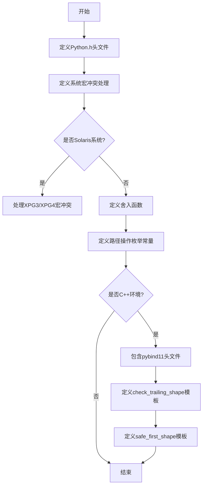
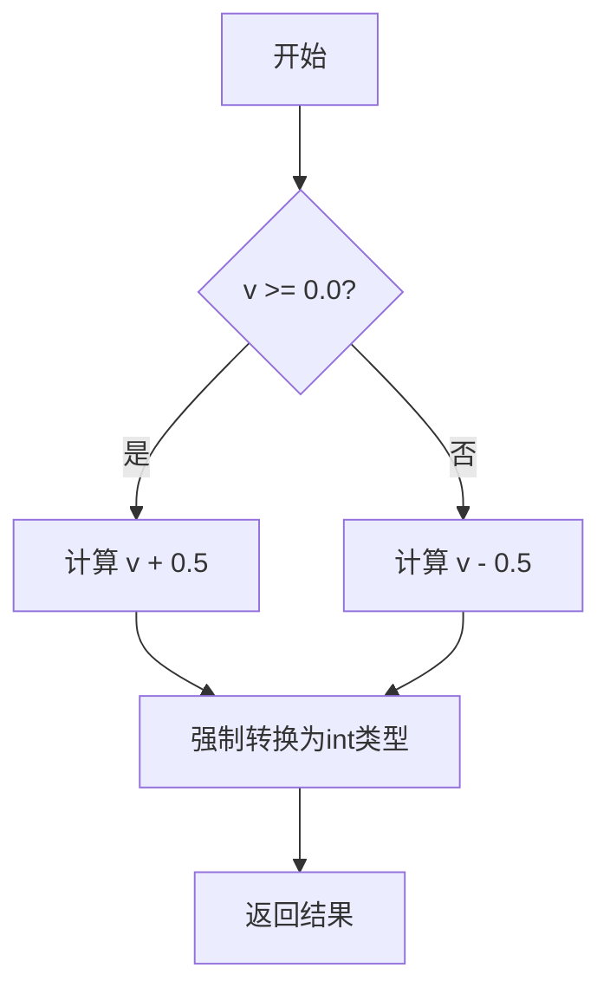
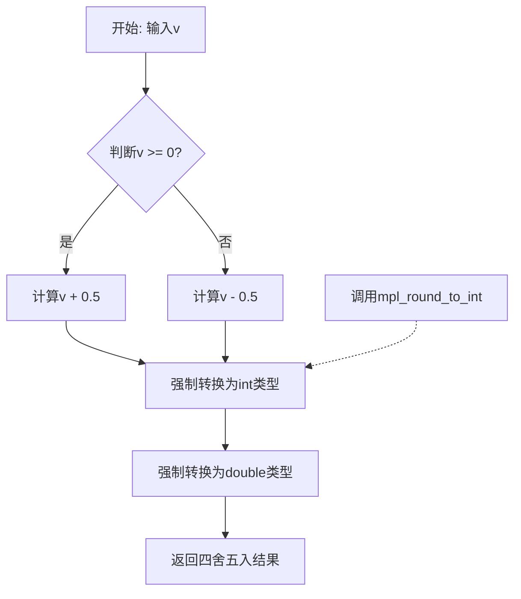

# `matplotlib\src\mplutils.h` 详细设计文档

这是一个Matplotlib扩展模块的共享实用工具头文件，提供数值舍入函数、路径操作枚举常量、数组形状验证模板和安全获取数组维度的工具函数，用于支持Python C++扩展的开发。

## 整体流程



## 类结构

```
MPLUtils (全局命名空间)
├── 枚举常量
│   ├── STOP
│   ├── MOVETO
│   ├── LINETO
│   ├── CURVE3
│   ├── CURVE4
│   └── CLOSEPOLY
├── 工具函数
│   ├── mpl_round_to_int
│   └── mpl_round
└── 模板函数 (C++ only)
    ├── check_trailing_shape<T>(2D数组重载)
    ├── check_trailing_shape<T>(3D数组重载)
    └── safe_first_shape
```

## 全局变量及字段


### `STOP`
    
路径操作码，表示路径绘制结束或停止信号。

类型：`int`
    


### `MOVETO`
    
路径操作码，表示移动画笔到指定点，开始新的子路径。

类型：`int`
    


### `LINETO`
    
路径操作码，表示从当前点画直线到指定点。

类型：`int`
    


### `CURVE3`
    
路径操作码，表示绘制二次贝塞尔曲线。

类型：`int`
    


### `CURVE4`
    
路径操作码，表示绘制三次贝塞尔曲线。

类型：`int`
    


### `CLOSEPOLY`
    
路径操作码，表示关闭当前子路径，将终点与起点用直线连接。

类型：`int`
    


    

## 全局函数及方法


### `mpl_round_to_int`

该函数是一个内联工具函数，用于将浮点数按照四舍五入的规则转换为最接近的整数值。通过根据数值的正负性选择加上或减去0.5，然后强制转换为int类型来实现。

参数：

- `v`：`double`，需要进行四舍五入处理的浮点数输入值

返回值：`int`，四舍五入后的整数值

#### 流程图



#### 带注释源码

```cpp
inline int mpl_round_to_int(double v)
{
    // 判断输入值是否为非负数
    // 正数：加上0.5后向下取整，实现"四舍五入"
    // 负数：减去0.5后向下取整，实现"四舍五入"
    // 例如：2.3 -> 2.3+0.5=2.8 -> (int)2.8 = 2
    //       2.7 -> 2.7+0.5=3.2 -> (int)3.2 = 3
    //       -2.3 -> -2.3-0.5=-2.8 -> (int)-2.8 = -2
    //       -2.7 -> -2.7-0.5=-3.2 -> (int)-3.2 = -3
    return (int)(v + ((v >= 0.0) ? 0.5 : -0.5));
}
```


### `mpl_round`

该函数是一个用于对浮点数进行四舍五入的内联工具函数，通过将浮点数加上或减去0.5后强制转换为整数来实现标准的四舍五入逻辑。

参数：

- `v`：`double`，需要四舍五入的浮点数输入值

返回值：`double`，四舍五入后的整数值（以double类型返回）

#### 流程图



#### 带注释源码

```cpp
/**
 * @brief 对浮点数进行四舍五入
 * 
 * 该函数使用标准的四舍五入算法：将正数加上0.5，负数减去0.5，
 * 然后取整，从而实现"四舍五入"的数学定义。
 * 
 * @param v 需要四舍五入的double类型浮点数
 * @return double 四舍五入后的结果（虽然返回值是double，但实际是整数）
 */
inline double mpl_round(double v)
{
    // 调用辅助函数mpl_round_to_int进行实际的四舍五入计算
    // 该函数内部会根据v的正负选择加上0.5或减去0.5
    return (double)mpl_round_to_int(v);
}

/**
 * @brief 将浮点数四舍五入为整数（内部辅助函数）
 * 
 * 实现逻辑：
 * - 如果v >= 0，则加上0.5后取整（如 2.3 + 0.5 = 2.8，取整为2）
 * - 如果v < 0，则减去0.5后取整（如 -2.3 - 0.5 = -2.8，取整为-3）
 * 
 * 这种实现确保了：
 * - 2.5 -> 3（正数向远离零的方向舍入）
 * - -2.5 -> -3（负数向远离零的方向舍入）
 * 
 * @param v 输入的double类型浮点数
 * @return int 四舍五入后的整数值
 */
inline int mpl_round_to_int(double v)
{
    // 根据v的正负选择加上0.5或减去0.5，然后强制转换为int
    return (int)(v + ((v >= 0.0) ? 0.5 : -0.5));
}
```


### `check_trailing_shape`

该函数是一个模板函数，用于验证 pybind11 numpy 数组的形状是否符合预期的维度和大小的校验工具。当数组维度或形状不符合要求时，会抛出详细的错误信息。

参数：

- `array`：`T`（模板类型），输入的 numpy 数组（pybind11::array）
- `name`：`char const*`，数组的名称，用于错误信息
- `d1`：`long`，对于二维数组版本，表示期望的第二维大小；对于三维数组版本，表示期望的第二维大小
- `d2`：`long`（仅三维数组版本），表示期望的第三维大小

返回值：`void`，无返回值，通过抛出 `py::value_error` 异常来表示校验失败

#### 流程图

```mermaid
flowchart TD
    A[开始 check_trailing_shape] --> B{检查数组维度}
    B -->|二维版本| C{ndim == 2?}
    B -->|三维版本| D{ndim == 3?}
    C -->|否| E[抛出 ValueError: Expected 2-dimensional array]
    C -->|是| F{数组大小 == 0?}
    D -->|否| G[抛出 ValueError: Expected 3-dimensional array]
    D -->|是| H{数组大小 == 0?}
    F -->|是| I[直接返回]
    F -->|否| J{检查 shape[1] == d1?}
    H -->|是| I
    H -->|否| K{检查 shape[1] == d1 && shape[2] == d2?}
    J -->|否| L[抛出 ValueError: 形状不匹配]
    J -->|是| M[校验通过]
    K -->|否| N[抛出 ValueError: 形状不匹配]
    K -->|是| M
    I --> M
    M[结束]
```

#### 带注释源码

```cpp
// 二维数组版本：检查数组是否为二维且第二维大小为 d1
template<typename T>
inline void check_trailing_shape(T array, char const* name, long d1)
{
    // 检查数组维度是否为2
    if (array.ndim() != 2) {
        // 维度不匹配时抛出 py::value_error 异常
        throw py::value_error(
            "Expected 2-dimensional array, got %d"_s.format(array.ndim()));
    }
    // 如果数组为空（size == 0），可能是 atleast_2d 等处理后的空数组
    // 此时不强制校验尾部形状，直接返回
    if (array.size() == 0) {
        // Sometimes things come through as atleast_2d, etc., but they're empty, so
        // don't bother enforcing the trailing shape.
        return;
    }
    // 检查第二维大小是否与期望的 d1 匹配
    if (array.shape(1) != d1) {
        // 形状不匹配时抛出详细的错误信息，包括期望形状和实际形状
        throw py::value_error(
            "%s must have shape (N, %d), got (%d, %d)"_s.format(
                name, d1, array.shape(0), array.shape(1)));
    }
}

// 三维数组版本：检查数组是否为三维且第二、三维大小分别为 d1 和 d2
template<typename T>
inline void check_trailing_shape(T array, char const* name, long d1, long d2)
{
    // 检查数组维度是否为3
    if (array.ndim() != 3) {
        throw py::value_error(
            "Expected 3-dimensional array, got %d"_s.format(array.ndim()));
    }
    // 同样处理空数组的情况
    if (array.size() == 0) {
        // Sometimes things come through as atleast_3d, etc., but they're empty, so
        // don't bother enforcing the trailing shape.
        return;
    }
    // 同时检查第二维和第三维大小是否匹配
    if (array.shape(1) != d1 || array.shape(2) != d2) {
        throw py::value_error(
            "%s must have shape (N, %d, %d), got (%d, %d, %d)"_s.format(
                name, d1, d2, array.shape(0), array.shape(1), array.shape(2)));
    }
}
```


### `safe_first_shape`

该函数是一个C++模板函数，用于安全地获取pybind11数组对象的第一个维度大小。当数组在任何维度上为空（维度值为0）时返回0，否则返回第一个维度的大小。这避免了直接访问`shape(0)`可能导致的边界问题，提供了一种统一的处理空数组的安全方法。

参数：

- `a`：`const py::detail::unchecked_reference<T, ND> &`，pybind11的未检查引用模板类型，包含数组对象及其维度信息

返回值：`py::ssize_t`，返回数组第一个维度的大小，如果数组在任何维度上为空则返回0

#### 流程图

```mermaid
flowchart TD
    A[开始] --> B{ND == 0?}
    B -->|是| C[设置 empty = true]
    B -->|否| D[初始化 empty = false]
    C --> F[循环检查各维度]
    D --> F
    F --> E{还有维度未检查?}
    E -->|是| G{当前维度大小 == 0?}
    E -->|否| H{empty 为 true?}
    G -->|是| I[设置 empty = true]
    G -->|否| J[继续检查下一维度]
    I --> E
    J --> E
    H -->|是| K[返回 0]
    H -->|否| L[返回 a.shape(0)]
    K --> M[结束]
    L --> M
```

#### 带注释源码

```cpp
/* In most cases, code should use safe_first_shape(obj) instead of obj.shape(0), since
   safe_first_shape(obj) == 0 when any dimension is 0. */
template <typename T, py::ssize_t ND>
py::ssize_t
safe_first_shape(const py::detail::unchecked_reference<T, ND> &a)
{
    // 初始化empty标志，默认为数组维度是否为0
    bool empty = (ND == 0);
    
    // 遍历所有维度，检查是否存在维度大小为0的情况
    for (py::ssize_t i = 0; i < ND; i++) {
        if (a.shape(i) == 0) {
            empty = true;
        }
    }
    
    // 如果任何维度为0，返回0；否则返回第一个维度的大小
    if (empty) {
        return 0;
    } else {
        return a.shape(0);
    }
}
```

## 关键组件


### mpl_round_to_int 函数

将double值四舍五入到最接近的整数值，使用正数加0.5、负数减0.5的方式实现

### mpl_round 函数

将double值四舍五入并返回double类型的函数，内部调用mpl_round_to_int

### 路径枚举常量

定义路径操作码，包括STOP(0)、MOVETO(1)、LINETO(2)、CURVE3(3)、CURVE4(4)、CLOSEPOLY(0x4f)，用于图形路径绘制操作

### check_trailing_shape 模板函数 (二维)

检查numpy数组是否为二维且第二维形状是否符合预期，不满足则抛出py::value_error异常

### check_trailing_shape 模板函数 (三维)

检查numpy数组是否为三维且第二、三维形状是否符合预期，不满足则抛出py::value_error异常

### safe_first_shape 模板函数

安全获取多维数组的第一维大小，当任意维度为0时返回0，避免空数组访问shape(0)可能引发的问题


## 问题及建议


### 已知问题

-   **枚举定义在全局命名空间**：STOP、MOVETO、LINETO等路径类型枚举定义在全局命名空间，缺乏明确的命名空间包装，可能与其他库或代码产生命名冲突风险
-   **平台特定代码冗余**：大量预处理指令处理不同平台（POSIX、AIX、Solaris等）的兼容性，导致代码复杂且难以维护，部分宏被undef后又重新定义，缺乏清晰的逻辑
-   **safe_first_shape模板函数实现问题**：使用`py::detail::unchecked_reference`内部API属于pybind11内部实现细节，未来pybind11升级可能导致兼容性问题
-   **错误消息格式化冗余**：check_trailing_shape中的错误消息使用了字符串拼接和格式化，可读性较差，且未考虑国际化需求
-   **缺乏函数文档注释**：所有函数和枚举都缺少文档注释，不利于后续维护和API理解
-   **整数溢出风险**：mpl_round_to_int函数对极大或极小的double值进行转换时存在整数溢出风险，未做边界检查
-   **头文件保护不完整**：虽然有#ifndef MPLUTILS_H，但在#endif处缺少注释说明保护的宏名

### 优化建议

-   将路径类型枚举包装在命名空间中（如`namespace mpl { namespace PathKind { ... } }`），避免全局命名污染
-   提取平台特定的预处理逻辑到单独的头文件或使用更抽象的条件编译方式，减少主文件的复杂度
-   考虑使用pybind11公共API重写safe_first_shape函数，或添加版本兼容检查宏
-   为所有公共函数添加Doxygen风格的文档注释，说明参数、返回值和异常
-   在mpl_round_to_int中添加数值范围检查或使用更安全的四舍五入实现
-   在#endif前添加注释`// MPLUTILS_H`，提高代码可读性
-   考虑将模板函数的实现移至单独的cpp文件或使用显式实例化，减少重复编译开销

## 其它


### 设计目标与约束

该代码库作为Matplotlib扩展模块的共享工具集，旨在提供跨平台的通用工具函数和模板，主要目标包括：1）提供高效的四舍五入实现；2）定义路径绘制操作的标准枚举值；3）通过pybind11提供类型安全的数组形状验证；4）确保代码在多个平台（Unix/Linux、Windows、macOS、Solaris、AIX）上的兼容性。设计约束包括：必须与Python解释器集成、使用pybind11进行C++/Python绑定、避免标准库冲突（如_XOPEN_SOURCE、_POSIX_C_SOURCE）、以及处理特定平台的编译器差异。

### 错误处理与异常设计

代码采用异常处理机制，主要通过pybind11的`py::value_error`异常来报告错误。具体场景包括：
- **数组维度错误**：当传入数组维度不符合预期时（2维或3维），抛出`py::value_error`并包含实际维度信息
- **数组形状不匹配**：当数组形状与要求的d1或d1×d2不匹配时，抛出异常并详细说明期望形状与实际形状
- **空数组处理**：对于空数组（size==0），代码采取宽容态度，不强制验证形状，这体现了防御性编程理念
所有异常都包含格式化错误消息，便于调试和问题定位。

### 数据流与状态机

该代码不包含复杂的状态机，主要涉及数据流处理：
- **数组验证流程**：外部Python代码传入NumPy数组 → check_trailing_shape模板验证维度 → 验证形状 → 返回或抛出异常
- **四舍五入流程**：输入double值 → mpl_round_to_int或mpl_round处理 → 返回整数值或double值
- **安全形状获取**：调用safe_first_shape模板 → 遍历所有维度检查是否存在0维度 → 返回第一维度大小或0

### 外部依赖与接口契约

**外部依赖**：
- Python.h：Python C API接口
- pybind11：用于C++/Python绑定（仅在__cplusplus定义域内）
- NumPy：通过pybind11::numpy访问数组接口
- 标准库：cstdlib, cmath（隐式）

**接口契约**：
- mpl_round_to_int：接受double v，返回int
- mpl_round：接受double v，返回double
- check_trailing_shape：重载函数，验证数组形状，失败则抛异常
- safe_first_shape：返回数组第一维度大小，空数组返回0

### 性能考虑

代码在性能方面有以下特点：
- 使用inline函数（mpl_round_to_int, mpl_round）避免函数调用开销
- 数组形状检查采用编译时模板实例化，减少运行时类型判断开销
- safe_first_shape使用提前返回优化，在发现空维度时立即返回
- 对于空数组采取快速路径，避免不必要的形状验证

### 兼容性考虑

代码展示了多层次的平台兼容性处理：
- **Solaris特殊处理**：通过条件编译防止XPG4/XPG3冲突导致的swab函数重定义问题
- **AIX和POSIX处理**：取消可能导致冲突的宏定义
- **Python版本兼容**：通过PY_SSIZE_T_CLEAN宏确保Python 3兼容的size_t使用
- **编译器差异**：使用pybind11的detail命名空间处理不同编译器

### 内存管理

代码本身不直接管理内存，但通过pybind11与Python内存管理交互：
- 数组内存由NumPy/Python垃圾回收机制管理
- 模板函数通过引用传递避免不必要的数据拷贝
- 使用py::ssize_t确保与Python的Py_ssize_t类型一致

### 线程安全性

代码为工具函数库，不涉及共享状态，因此本身是线程安全的。但需要注意：
- 多线程环境下调用这些函数时，传入的数组必须是合法的
- Python解释器本身的线程安全由Python运行时保证

### 关键设计决策

1. **为什么使用inline函数**：四舍五入操作简单频繁，inline可消除函数调用开销
2. **为什么对空数组宽容**：Matplotlib中空数组是有效输入（如空路径），不应因此中断流程
3. **为什么定义路径枚举**：统一不同绘图后端的路径操作码，确保互操作性
4. **为何取消冲突宏**：避免标准库函数重定义导致的链接错误


    