# `matplotlib\src\path_converters.h` 详细设计文档

这是一个C++头文件，定义了一系列模板类（顶点转换器），用于在渲染前对2D路径数据进行实时处理。核心功能包括：移除非数值（NaN）点、裁剪到矩形区域、吸附到像素网格、简化密集路径以及添加手绘草图效果。这些类通常以装饰器模式串联使用，形成一个数据处理流水线。

## 整体流程

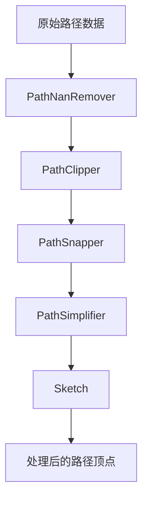

## 类结构

```
辅助工具类 (Helpers)
├── EmbeddedQueue (模板基类: 嵌入式队列)
└── RandomNumberGenerator (随机数生成器)
路径转换器 (Path Converters)
├── PathNanRemover (移除非有限数值)
├── PathClipper (线段裁剪)
├── PathSnapper (像素吸附)
├── PathSimplifier (路径简化)
└── Sketch (手绘/抖动效果)
```

## 全局变量及字段


### `num_extra_points_map`
    
全局映射表，定义每种路径命令对应的额外顶点数（如曲线控制点）

类型：`static const size_t[]`
    


### `EmbeddedQueue<QueueSize>.m_queue_read`
    
队列读指针

类型：`int`
    


### `EmbeddedQueue<QueueSize>.m_queue_write`
    
队列写指针

类型：`int`
    


### `EmbeddedQueue<QueueSize>.m_queue`
    
固定大小的内部队列数组

类型：`item[]`
    


### `RandomNumberGenerator.m_seed`
    
当前随机数种子

类型：`uint32_t`
    


### `PathNanRemover<VertexSource>.m_source`
    
上游顶点源

类型：`VertexSource*`
    


### `PathNanRemover<VertexSource>.m_remove_nans`
    
是否移除NaN

类型：`bool`
    


### `PathNanRemover<VertexSource>.m_has_codes`
    
路径是否包含曲线或闭合环

类型：`bool`
    


### `PathNanRemover<VertexSource>.valid_segment_exists`
    
是否存在有效段

类型：`bool`
    


### `PathNanRemover<VertexSource>.m_last_segment_valid`
    
上一顶点是否有效

类型：`bool`
    


### `PathNanRemover<VertexSource>.m_was_broken`
    
当前段是否因NaN断裂

类型：`bool`
    


### `PathNanRemover<VertexSource>.m_initX`
    
曲线段起始点X坐标

类型：`double`
    


### `PathNanRemover<VertexSource>.m_initY`
    
曲线段起始点Y坐标

类型：`double`
    


### `PathClipper<VertexSource>.m_source`
    
上游顶点源

类型：`VertexSource*`
    


### `PathClipper<VertexSource>.m_do_clipping`
    
是否执行裁剪

类型：`bool`
    


### `PathClipper<VertexSource>.m_cliprect`
    
裁剪矩形区域

类型：`agg::rect_base<double>`
    


### `PathClipper<VertexSource>.m_lastX`
    
上一个顶点X坐标

类型：`double`
    


### `PathClipper<VertexSource>.m_lastY`
    
上一个顶点Y坐标

类型：`double`
    


### `PathClipper<VertexSource>.m_moveto`
    
是否需要发送移动指令

类型：`bool`
    


### `PathClipper<VertexSource>.m_initX`
    
当前子路径起点X坐标

类型：`double`
    


### `PathClipper<VertexSource>.m_initY`
    
当前子路径起点Y坐标

类型：`double`
    


### `PathClipper<VertexSource>.m_has_init`
    
是否已有起点

类型：`bool`
    


### `PathClipper<VertexSource>.m_was_clipped`
    
上一段是否被裁剪

类型：`bool`
    


### `PathSnapper<VertexSource>.m_source`
    
上游顶点源

类型：`VertexSource*`
    


### `PathSnapper<VertexSource>.m_snap`
    
是否进行吸附

类型：`bool`
    


### `PathSnapper<VertexSource>.m_snap_value`
    
吸附偏移量（针对奇偶线宽）

类型：`double`
    


### `PathSimplifier<VertexSource>.m_source`
    
上游顶点源

类型：`VertexSource*`
    


### `PathSimplifier<VertexSource>.m_simplify`
    
是否执行简化

类型：`bool`
    


### `PathSimplifier<VertexSource>.m_simplify_threshold`
    
简化阈值（平方后存储）

类型：`double`
    


### `PathSimplifier<VertexSource>.m_moveto`
    
状态机标志：是否在moveto后

类型：`bool`
    


### `PathSimplifier<VertexSource>.m_after_moveto`
    
状态机标志：刚处理完moveto

类型：`bool`
    


### `PathSimplifier<VertexSource>.m_clipped`
    
状态机标志：是否有被裁剪的段

类型：`bool`
    


### `PathSimplifier<VertexSource>.m_has_init`
    
是否有有效起点

类型：`bool`
    


### `PathSimplifier<VertexSource>.m_initX`
    
起点X坐标

类型：`double`
    


### `PathSimplifier<VertexSource>.m_initY`
    
起点Y坐标

类型：`double`
    


### `PathSimplifier<VertexSource>.m_lastx`
    
当前迭代X坐标

类型：`double`
    


### `PathSimplifier<VertexSource>.m_lasty`
    
当前迭代Y坐标

类型：`double`
    


### `PathSimplifier<VertexSource>.m_origdx`
    
原始向量X分量（参考线）

类型：`double`
    


### `PathSimplifier<VertexSource>.m_origdy`
    
原始向量Y分量（参考线）

类型：`double`
    


### `PathSimplifier<VertexSource>.m_origdNorm2`
    
原始向量模的平方

类型：`double`
    


### `PathSimplifier<VertexSource>.m_dnorm2ForwardMax`
    
并行方向最大模平方

类型：`double`
    


### `PathSimplifier<VertexSource>.m_dnorm2BackwardMax`
    
反向方向最大模平方

类型：`double`
    


### `PathSimplifier<VertexSource>.m_lastForwardMax`
    
极值点标记：上一个点是否为并行方向最远点

类型：`bool`
    


### `PathSimplifier<VertexSource>.m_lastBackwardMax`
    
极值点标记：上一个点是否为反向方向最远点

类型：`bool`
    


### `Sketch<VertexSource>.m_source`
    
上游顶点源

类型：`VertexSource*`
    


### `Sketch<VertexSource>.m_scale`
    
抖动幅度

类型：`double`
    


### `Sketch<VertexSource>.m_length`
    
抖动波长

类型：`double`
    


### `Sketch<VertexSource>.m_randomness`
    
随机性因子

类型：`double`
    


### `Sketch<VertexSource>.m_segmented`
    
线段分割器

类型：`agg::conv_segmentator<VertexSource>`
    


### `Sketch<VertexSource>.m_last_x`
    
上一顶点X坐标

类型：`double`
    


### `Sketch<VertexSource>.m_last_y`
    
上一顶点Y坐标

类型：`double`
    


### `Sketch<VertexSource>.m_has_last`
    
是否有上一顶点

类型：`bool`
    


### `Sketch<VertexSource>.m_p`
    
正弦波相位累加器

类型：`double`
    


### `Sketch<VertexSource>.m_rand`
    
随机数生成器

类型：`RandomNumberGenerator`
    


### `Sketch<VertexSource>.m_p_scale`
    
预计算常数：相位缩放因子

类型：`double`
    


### `Sketch<VertexSource>.m_log_randomness`
    
预计算常数：对数随机性因子

类型：`double`
    
    

## 全局函数及方法


### `EmbeddedQueue<QueueSize>.queue_push`

将顶点命令及其坐标推入内部环形队列，以便后续处理。

参数：

- `cmd`：`unsigned`，路径命令类型（如 move_to、line_to 等）
- `x`：`double`，顶点的 X 坐标
- `y`：`double`，顶点的 Y 坐标

返回值：`void`，无返回值

#### 流程图

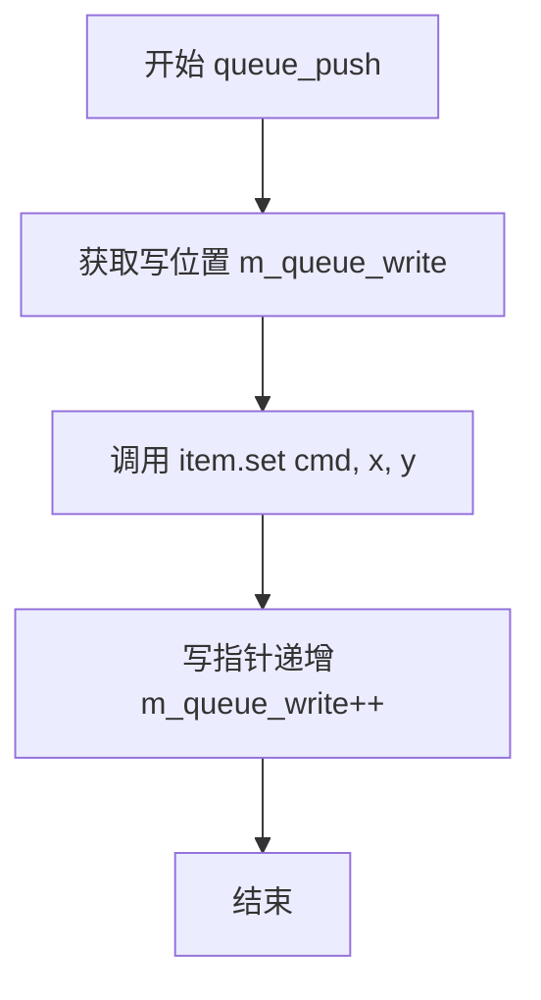

#### 带注释源码

```cpp
inline void queue_push(const unsigned cmd, const double x, const double y)
{
    // 将传入的命令和坐标写入队列的当前写位置
    // m_queue_write 是队列写指针，初始为 0
    // 写入完成后，写指针递增，指向下一个可用位置
    m_queue[m_queue_write++].set(cmd, x, y);
}
```


### `EmbeddedQueue<QueueSize>.queue_pop`

从内部队列中弹出一个顶点的命令和坐标数据。如果队列中有待处理的数据，则返回该数据并前移读指针；否则重置队列状态并返回 false。

参数：

- `cmd`：`unsigned *`，输出参数，用于存储从队列中弹出的命令代码（如 path_cmd_move_to、path_cmd_line_to 等）
- `x`：`double *`，输出参数，用于存储从队列中弹出的顶点的 x 坐标
- `y`：`double *`，输出参数，用于存储从队列中弹出的顶点的 y 坐标

返回值：`bool`，如果成功从队列中弹出元素则返回 true，如果队列为空则返回 false

#### 流程图

```mermaid
flowchart TD
    A[开始 queue_pop] --> B{调用 queue_nonempty<br/>检查队列是否非空}
    B -->|是, 队列非空| C[获取队首元素<br/>m_queue[m_queue_read++]]
    C --> D[将队首的 cmd 赋值给输出参数]
    D --> E[将队首的 x 赋值给输出参数]
    E --> F[将队首的 y 赋值给输出指针]
    F --> G[返回 true 表示成功弹出]
    B -->|否, 队列为空| H[重置队列状态<br/>m_queue_read = 0<br/>m_queue_write = 0]
    H --> I[返回 false 表示队列为空]
```

#### 带注释源码

```cpp
/**
 * @brief 从队列中弹出一个顶点数据
 * 
 * 该方法从队列的读取端取出一个元素，如果队列为空则重置队列状态。
 * 使用指针参数来输出弹出的命令和坐标值，这是C++中常用的输出参数模式。
 * 
 * @param cmd 输出参数，用于存储命令代码（如 MOVETO, LINETO 等）
 * @param x 输出参数，用于存储顶点的 x 坐标
 * @param y 输出参数，用于存储顶点的 y 坐标
 * @return bool 成功弹出返回 true，队列为空返回 false
 */
inline bool queue_pop(unsigned *cmd, double *x, double *y)
{
    // 首先检查队列中是否有待处理的数据
    if (queue_nonempty()) {
        // 获取队首元素的引用，并前移读指针
        const item &front = m_queue[m_queue_read++];
        
        // 将队首元素的命令代码复制到输出参数
        *cmd = front.cmd;
        
        // 将队首元素的 x 坐标复制到输出参数
        *x = front.x;
        
        // 将队首元素的 y 坐标复制到输出参数
        *y = front.y;

        // 返回 true 表示成功从队列中弹出元素
        return true;
    }

    // 队列为空时，重置读写指针到初始位置
    // 这样可以确保下次调用时队列处于干净状态
    m_queue_read = 0;
    m_queue_write = 0;

    // 返回 false 表示队列为空，没有元素可弹出
    return false;
}
```


### `EmbeddedQueue<QueueSize>.queue_clear()`

该方法用于清空队列，通过将读指针和写指针都重置为0来重置队列状态。这是一个O(1)操作，不涉及元素内容的清除，仅重置索引指针。

参数：

- （无参数）

返回值：`void`，无返回值描述

#### 流程图

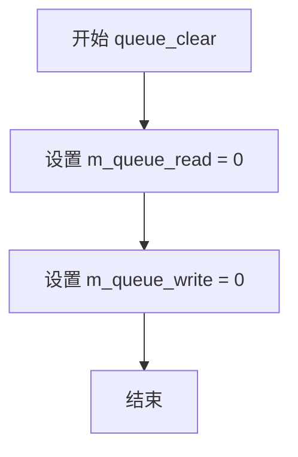

#### 带注释源码

```cpp
/**
 * @brief 清空队列，将读指针和写指针重置为0
 * 
 * 该方法不实际删除队列中的元素，仅重置读写指针。
 * 由于队列是固定大小的循环缓冲区，下一次push操作会自然覆盖旧数据。
 * 这是一种高效的重置方式，时间复杂度为O(1)。
 */
inline void queue_clear()
{
    // 将读索引重置为0，表示从头开始读取
    m_queue_read = 0;
    
    // 将写索引重置为0，表示队列为空
    m_queue_write = 0;
}
```


### `EmbeddedQueue<QueueSize>.queue_nonempty()`

检查内部队列是否包含未读取的元素。通过比较读索引和写索引来判断队列当前是否有数据。

参数：
- (无)

返回值：`bool`，如果读索引小于写索引（表示队列中有待处理数据），则返回 `true`；否则返回 `false`。

#### 流程图

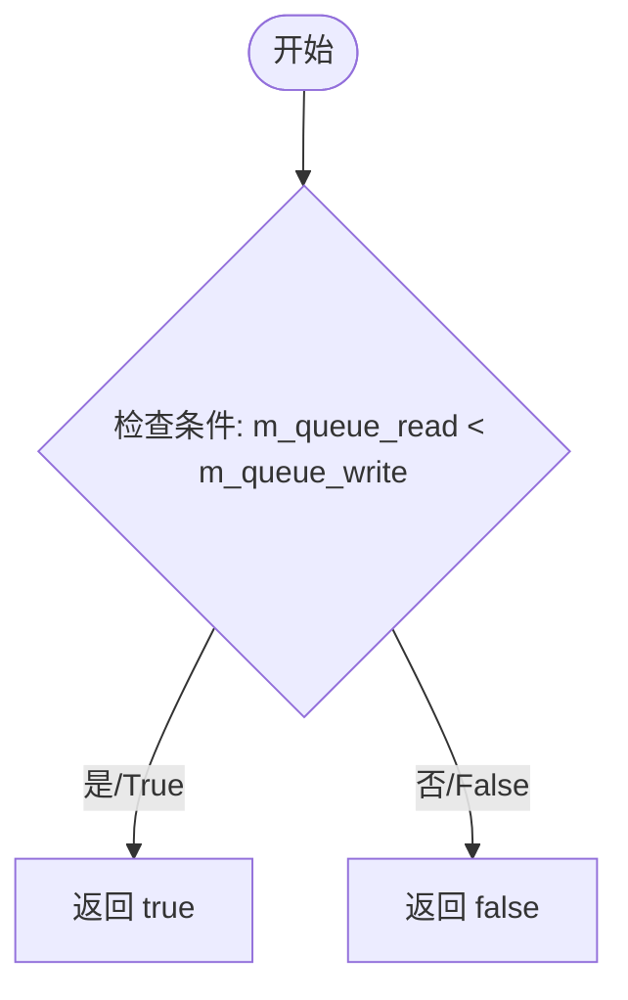

#### 带注释源码

```cpp
    /**
     * @brief 检查队列是否非空
     * 
     * 通过比较当前的读取游标(m_queue_read)和写入游标(m_queue_write)来判断。
     * 如果写入的位置大于读取的位置，说明队列中还有数据未被读取。
     * 
     * @return bool 队列非空返回true，否则返回false
     */
    inline bool queue_nonempty()
    {
        return m_queue_read < m_queue_write;
    }
```


### RandomNumberGenerator.seed

该方法用于设置线性同余随机数生成器的种子值，通过直接赋值的方式初始化内部状态，以便后续生成可重现的随机数序列。

参数：

- `seed`：`int`，要设置的种子值，用于初始化随机数生成器的内部状态

返回值：`void`，无返回值

#### 流程图

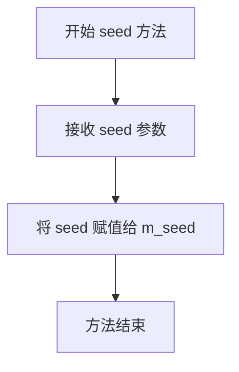

#### 带注释源码

```cpp
/* 设置随机数生成器的种子值 */
void seed(int seed)
{
    /* 
     * 直接将输入的种子值赋值给内部成员变量 m_seed
     * 这将决定后续 get_double() 调用生成的随机数序列
     * 
     * 注意：虽然参数是 int 类型，但 m_seed 是 uint32_t
     * 这里会发生隐式类型转换，整数会被截断为 32 位无符号整数
     */
    m_seed = seed;
}
```


### `RandomNumberGenerator.get_double`

生成并返回一个0到1之间的随机双精度数，使用线性同余生成器算法实现。

参数：无

返回值：`double`，返回0到1之间的随机双精度浮点数

#### 流程图

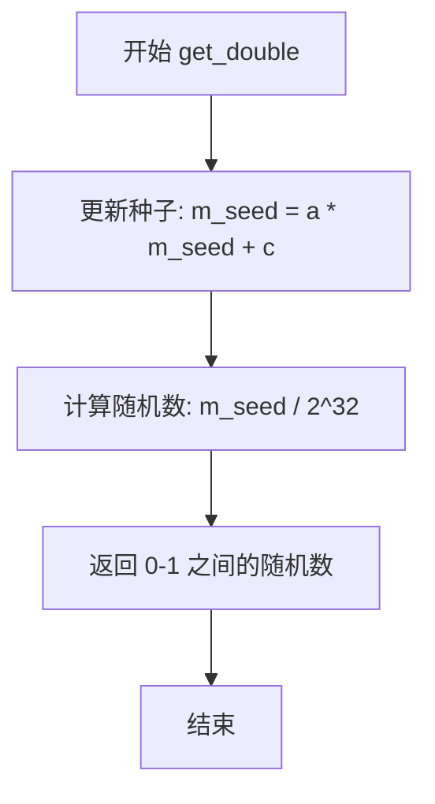

#### 带注释源码

```cpp
double get_double()
{
    // 使用线性同余生成器(LCG)更新种子
    // 公式: m_seed = a * m_seed + c
    // 其中 a = 214013, c = 2531011 (来自MS Visual C++)
    // 由于模数为 2^32，可以避免显式取模操作，提高性能
    m_seed = (a * m_seed + c);
    
    // 将种子值归一化到 [0, 1) 区间
    // 除以 2^32 (1LL << 32) 将 32 位无符号整数转换为 [0, 1) 的浮点数
    return (double)m_seed / (double)(1LL << 32);
}
```


### `PathNanRemover<VertexSource>.rewind`

重置迭代器以开始遍历指定的路径。该方法清空内部队列，并将底层源顶点数据重置到指定路径的起始位置。

参数：

- `path_id`：`unsigned`，路径标识符，指定要遍历的路径编号

返回值：`void`，无返回值

#### 流程图

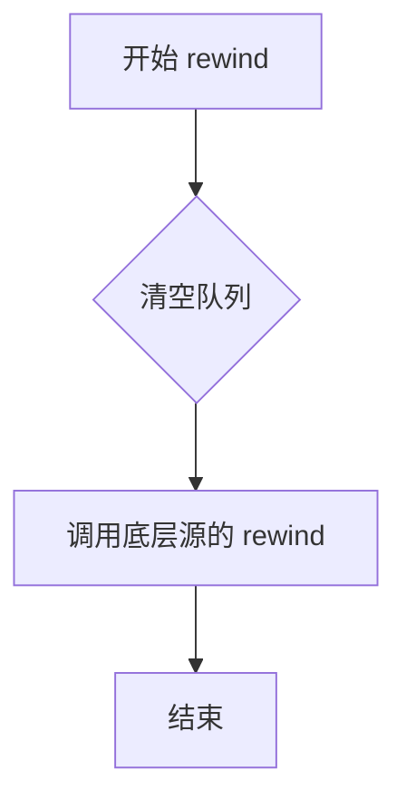

#### 带注释源码

```cpp
inline void rewind(unsigned path_id)
{
    // 调用基类的 queue_clear 方法
    // 清空内部缓冲区中的所有待处理顶点
    queue_clear();
    
    // 调用底层 VertexSource 的 rewind 方法
    // 将底层迭代器重置到指定 path_id 的起始位置
    m_source->rewind(path_id);
}
```


### `PathNanRemover<VertexSource>::vertex`

该方法是`PathNanRemover`类的核心成员，作为顶点转换器从源路径中获取下一个顶点，并通过插入MOVETO命令绕过包含NaN（非数字）或无穷大值的顶点段，确保输出路径仅包含有限数值坐标。

参数：

- `x`：`double*`，指向存储输出顶点x坐标的指针
- `y`：`double*`，指向存储输出顶点y坐标的指针

返回值：`unsigned`，返回AGG路径命令代码（如`path_cmd_move_to`、`path_cmd_line_to`、`path_cmd_stop`等）

#### 流程图

```mermaid
flowchart TD
    A[开始 vertex] --> B{m_remove_nans?}
    B -->|true| C{m_has_codes?}
    B -->|false| D[直接返回 m_source.vertex]
    C -->|true| E[慢速路径: 队列方式]
    C -->|false| F[快速路径: 简单过滤]
    
    E --> E1[尝试从队列弹出顶点]
    E1 --> E2{队列有数据?}
    E2 -->|yes| E3[返回队列顶点]
    E2 -->|no| E4[while true 循环]
    E4 --> E5{获取源顶点命令}
    E5 --> E6{命令 = STOP?}
    E6 -->|yes| E7[返回 STOP]
    E6 -->|no| E8{命令 = CLOSEPOLY?}
    E8 -->|yes| E9{之前有有效段?}
    E8 -->|no| E10{命令 = MOVETO?}
    E9 -->|yes| E11{之前有断裂?}
    E9 -->|no| E12[继续循环]
    E11 -->|yes| E13{两端有效?}
    E11 -->|no| E14[跳过关闭]
    E13 -->|yes| E15[插入LINETO到初始点]
    E13 -->|no| E16[跳过关闭]
    E15 --> E17[退出循环]
    E14 --> E17
    E16 --> E12
    E10 -->|yes| E18[保存初始点]
    E18 --> E19[重置断裂标志]
    E10 -->|no| E20
    E19 --> E20[检查额外点数]
    E20 --> E21[验证当前点有限性]
    E21 --> E22[推入队列]
    E22 --> E23[循环检查额外点]
    E23 --> E24{当前段有效?}
    E24 -->|yes| E25[标记有效段存在, 退出循环]
    E24 -->|no| E26[标记断裂, 清空队列]
    E26 --> E27{最后点有限?}
    E27 -->|yes| E28[推入MOVETO]
    E27 -->|no| E29[标记需要MOVETO]
    E28 --> E17
    E29 --> E17
    E17 --> E30[从队列弹出返回]
    
    F --> F1[获取源顶点]
    F1 --> F2{命令 = STOP?}
    F2 -->|yes| F3[返回命令]
    F2 -->|no| F4{命令 = CLOSEPOLY且有效段存在?}
    F4 -->|yes| F3
    F4 -->|no| F5{点有限?]
    F5 -->|yes| F6[标记有效段存在, 返回命令]
    F5 -->|no| F7[do-while循环]
    F7 --> F8[获取下一顶点]
    F8 --> F9{命令 = STOP?]
    F9 -->|yes| F10[返回命令]
    F9 -->|no| F11{命令 = CLOSEPOLY且有效段存在?]
    F11 -->|yes| F10
    F11 -->|no| F12{点有限?}
    F12 -->|yes| F13[返回 MOVETO]
    F12 -->|no| F7
```

#### 带注释源码

```cpp
/**
 * @brief 获取下一个有效的顶点，绕过NaN点
 * 
 * 该方法是PathNanRemover类的核心，用于过滤包含非有限值（NaN或无穷大）
 * 的顶点，并通过插入MOVETO命令来保证路径的连续性。
 * 
 * @param x 指向输出x坐标的指针
 * @param y 指向输出y坐标的指针
 * @return unsigned 路径命令代码
 */
inline unsigned vertex(double *x, double *y)
{
    unsigned code;

    // 快速路径：如果不需要移除NaN，直接透传给源迭代器
    if (!m_remove_nans) {
        return m_source->vertex(x, y);
    }

    // 根据是否有曲线段或闭合环选择不同算法
    if (m_has_codes) {
        /* ============================================================
         * 慢速路径：适用于可能有曲线段或闭合环的情况
         * 使用队列缓存完整的曲线段，检测其中是否包含NaN
         * ============================================================ */
        
        // 首先尝试从队列中获取已缓存的顶点
        if (queue_pop(&code, x, y)) {
            return code;
        }

        bool needs_move_to = false;  // 标记是否需要插入MOVETO
        
        // 主循环：处理整个曲线段
        while (true) {
            // 从源获取一个完整曲线段的所有顶点
            code = m_source->vertex(x, y);
            
            // STOP命令直接返回
            if (code == agg::path_cmd_stop) {
                return code;
            } 
            // CLOSEPOLY命令处理：如果之前有NaN断裂，不能闭合
            else if (code == (agg::path_cmd_end_poly | agg::path_flags_close) &&
                     valid_segment_exists) {
                // 如果路径曾被NaN打断，不能真正闭合
                if (m_was_broken) {
                    // 检查两端是否都有效
                    if (m_last_segment_valid && (
                            std::isfinite(m_initX) &&
                            std::isfinite(m_initY))) {
                        // 两端都有效，插入LINETO连接到起点
                        queue_push(agg::path_cmd_line_to, m_initX, m_initY);
                        break;
                    } else {
                        // 跳过闭合，可能有其他子路径
                        continue;
                    }
                    m_was_broken = false;
                    break;
                } else {
                    // 正常闭合，返回CLOSEPOLY
                    return code;
                }
            } 
            // MOVETO命令：记录初始点用于可能的闭合
            else if (code == agg::path_cmd_move_to) {
                m_initX = *x;
                m_initY = *y;
                m_was_broken = false;
            }

            // 如果需要插入MOVETO，先推入队列
            if (needs_move_to) {
                queue_push(agg::path_cmd_move_to, *x, *y);
            }

            // 获取该命令对应的额外顶点数（曲线段有多个控制点）
            size_t num_extra_points = num_extra_points_map[code & 0xF];
            
            // 检查当前顶点是否为有限值
            m_last_segment_valid = (std::isfinite(*x) && std::isfinite(*y));
            queue_push(code, *x, *y);

            // 处理曲线的额外控制点
            for (size_t i = 0; i < num_extra_points; ++i) {
                m_source->vertex(x, y);
                m_last_segment_valid = m_last_segment_valid &&
                    (std::isfinite(*x) && std::isfinite(*y));
                queue_push(code, *x, *y);
            }

            // 如果整个段有效，标记并退出
            if (m_last_segment_valid) {
                valid_segment_exists = true;
                break;
            }

            // 段包含NaN，标记断裂并清空队列
            m_was_broken = true;
            queue_clear();

            // 如果最后一点是有限的，用它作为下一个MOVETO的目标
            if (std::isfinite(*x) && std::isfinite(*y)) {
                queue_push(agg::path_cmd_move_to, *x, *y);
                needs_move_to = false;
            } else {
                needs_move_to = true;
            }
        }

        // 从处理后的队列中返回顶点
        if (queue_pop(&code, x, y)) {
            return code;
        } else {
            return agg::path_cmd_stop;
        }
    } 
    else // !m_has_codes
    {
        /* ============================================================
         * 快速路径：适用于简单的直线段路径
         * 直接逐个读取顶点，跳过NaN点
         * ============================================================ */
        
        code = m_source->vertex(x, y);

        // STOP或有效的CLOSEPOLY直接返回
        if (code == agg::path_cmd_stop ||
            (code == (agg::path_cmd_end_poly | agg::path_flags_close) &&
             valid_segment_exists)) {
            return code;
        }

        // 检查当前点是否为有限值
        if (!(std::isfinite(*x) && std::isfinite(*y))) {
            // 循环跳过NaN点，直到找到有效点或遇到STOP
            do {
                code = m_source->vertex(x, y);
                if (code == agg::path_cmd_stop ||
                    (code == (agg::path_cmd_end_poly | agg::path_flags_close) &&
                     valid_segment_exists)) {
                    return code;
                }
            } while (!(std::isfinite(*x) && std::isfinite(*y)));
            // 找到有效点，返回MOVETO以开始新段
            return agg::path_cmd_move_to;
        }
        
        // 有效点，标记并返回
        valid_segment_exists = true;
        return code;
    }
}
```


### `PathClipper<VertexSource>::rewind`

该方法用于重置 `PathClipper` 类的内部状态，清除上一次渲染时的路径上下文信息（如初始点坐标、裁剪标志等），并将底层的顶点数据源（`m_source`）重置到指定路径的起始位置，以便开始新一轮的顶点迭代。

#### 类详细信息

**类名：** `PathClipper<VertexSource>`

**基类：** `EmbeddedQueue<3>`

**类字段（部分相关）：**

- `m_source`：`VertexSource *`，底层顶点数据源的指针。
- `m_do_clipping`：`bool`，标记是否执行裁剪。
- `m_lastX`, `m_lastY`：`double`，上一次处理顶点的坐标。
- `m_moveto`：`bool`，标记下一个顶点是否需要以 `MOVETO` 命令发出（用于处理连续线条）。
- `m_initX`, `m_initY`：`double`，当前路径子路径（subpath）的初始点坐标。
- `m_has_init`：`bool`，标记是否已经记录了初始点。
- `m_was_clipped`：`bool`，标记路径在当前子路径中是否发生过裁剪。

**类方法：**

- `rewind(unsigned path_id)`：重置状态，准备迭代。
- `vertex(double *x, double *y)`：获取下一个裁剪后的顶点（核心逻辑，包含复杂的裁剪状态机）。
- `draw_clipped_line(...)`：内部辅助方法，实际执行 Liang-Barsky 线段裁剪算法。

---

##### 参数

- `path_id`：`unsigned`，要重置到的路径标识符（ID）。

##### 返回值

`void`，无返回值。该方法通过修改内部成员变量状态来生效。

##### 流程图

```mermaid
graph TD
    A[Start: rewind] --> B[重置内部状态: m_has_init = false]
    B --> C[重置裁剪状态: m_was_clipped = false]
    C --> D[重置移动标记: m_moveto = true]
    D --> E[调用底层数据源: m_source->rewind(path_id)]
    E --> F[End]
```

##### 带注释源码

```cpp
/* 
 * 重置 PathClipper 的内部状态，准备处理新的 path_id。
 * 它主要做两件事：
 * 1. 清理自身维护的状态机状态（因为上一次绘制可能停留在任意位置）。
 * 2. 将底层的数据源也重置到对应的 path_id 起点。
 */
inline void rewind(unsigned path_id)
{
    // 标记当前尚未处理过有效的初始点
    m_has_init = false;
    
    // 重置裁剪标志，假设当前子路径未被裁剪
    m_was_clipped = false;
    
    // 强制下一条线段以 MOVETO 命令开头，这对于开启新路径或断开的路径是必要的
    m_moveto = true;
    
    // 委托给底层的顶点源（如 PathNanRemover 或更底层的agg路径）
    m_source->rewind(path_id);
}
```

#### 关键组件信息

- **状态标志 (`m_moveto`)**: 这是 `PathClipper` 实现裁剪逻辑的关键标志。在裁剪过程中，如果一条线段被完全裁掉，`m_moveto` 决定了下一个点是从新位置开始画线（`MOVETO`）还是延续之前的路径。
- **底层迭代器模式**: `PathClipper` 采用了装饰器模式（Decorator Pattern）或管道模式（Pipeline Pattern），它本身是一个 `VertexSource`，同时包装了另一个 `VertexSource`。`rewind` 方法体现了这种级联特性。

#### 潜在的技术债务或优化空间

1.  **状态耦合**: `m_moveto` 逻辑与 `vertex` 方法中的状态机强耦合。如果未来需要修改裁剪策略（例如支持非矩形裁剪），`rewind` 方法可能需要同步调整初始化逻辑。
2.  **内联效率**: 该方法被声明为 `inline`。虽然对于现代编译器来说这是hint，但在某些极端的编译环境下，过多的内联可能导致代码膨胀，不过在此场景下（渲染循环中调用），保持轻量级的状态重置是性能优先的选择，整体没有明显性能债务。

#### 其它项目

**设计目标与约束：**
- **目标**: 在不影响路径整体形状的前提下，通过裁剪掉视口外的线段来减少渲染数据量，同时解决AGG库对坐标值过大（超过24位整数）的限制。
- **约束**: 该类假设底层数据源是有效的 `VertexSource`，并且主要针对直线段进行裁剪优化。对于曲线（如贝塞尔曲线），通常不进行裁剪而是直接包含整个曲线。

**错误处理与异常设计：**
- `rewind` 本身不进行复杂的业务逻辑校验，因此不抛出异常。它依赖于底层 `m_source->rewind` 的行为。如果底层源无效，可能导致后续 `vertex` 调用返回错误结果，但这属于数据源的责任范围，而非 `PathClipper` 的责任。

**数据流与状态机：**
- `rewind` 是状态机的**复位**信号。它将 `PathClipper` 从任何中间状态（如正在处理一条被裁剪的线的中间）强制拉回初始状态，确保每一次 `draw` 调用都从干净的状态开始。


### `PathClipper::vertex`

#### 描述

`PathClipper::vertex` 是 `PathClipper` 类的核心迭代器方法。它实现了“路径裁剪器”的功能：从底层 `VertexSource` 获取顶点数据，利用 Liang-Barsky 线裁剪算法将线段裁剪到指定的矩形区域内，并在内部队列中管理裁剪后的路径命令（如 `MOVETO`, `LINETO`, `CLOSEPOLY`），以处理子路径（subpaths）的连接和断开问题。

#### 类信息

**类：`PathClipper<VertexSource>`**

*继承自：* `EmbeddedQueue<3>`

**字段 (Fields):**

*   `m_source`：`VertexSource*`，指向原始路径源的指针。
*   `m_do_clipping`：`bool`，是否执行裁剪的标志位。
*   `m_cliprect`：`agg::rect_base<double>`，裁剪矩形的边界。
*   `m_lastX`, `m_lastY`：`double`，上一个顶点的坐标。
*   `m_initX`, `m_initY`：`double`，当前子路径（Subpath）起始点的坐标。
*   `m_moveto`：`bool`，标记是否需要将下一个点作为新的 `MOVETO` 命令发出（通常在断开的线段或裁剪后产生）。
*   `m_has_init`：`bool`，标记当前子路径是否已有有效的起始点。
*   `m_was_clipped`：`bool`，标记上一条线段是否被裁剪过（用于判断是否能闭合路径）。

**方法 (Methods):**

*   `rewind(unsigned path_id)`：重置裁剪器状态。
*   `draw_clipped_line(...)`：具体的几何裁剪计算辅助方法。
*   `vertex(double* x, double* y)`：获取裁剪后的顶点。

---

#### 参数

- `x`：`double*`，输出参数，用于存储返回顶点的 X 坐标。
- `y`：`double*`，输出参数，用于存储返回顶点的 Y 坐标。

#### 返回值

- `unsigned`：返回的路径命令类型（如 `agg::path_cmd_move_to`, `agg::path_cmd_line_to`, `agg::path_cmd_stop` 等）。

#### 流程图

```mermaid
flowchart TD
    A([Start: vertex x, y]) --> B{Do Clipping?}
    B -- No --> C[直接返回源路径: m_source.vertex]
    B -- Yes --> D{队列非空?}
    D -- Yes --> E[Pop队列返回]
    D -- No --> F[循环: m_source.vertex]
    
    F --> G{Command == STOP?}
    G -- Yes --> H[跳出循环]
    
    G -- No --> I{Command Type}
    
    I --> J[CLOSE_POLY]
    J --> K[draw_clipped_line last->init, true]
    K --> L{队列非空?}
    L -- Yes --> H
    L -- No --> F
    
    I --> M[MOVE_TO]
    M --> N{上一个是MoveTo且在裁剪框内?}
    N -- Yes --> O[Push上一个MoveTo到队列]
    N -- No --> P[更新 m_last, m_init]
    P --> Q{需要发出MoveTo?}
    Q -- Yes --> H
    Q -- No --> F
    
    I --> R[LINE_TO]
    R --> S[draw_clipped_line last->curr]
    S --> T{返回1?}
    T -- Yes --> U[更新m_last, 跳出循环]
    T -- No --> V[更新m_last]
    V --> F
    
    I --> W[DEFAULT (Curves)]
    W --> X[Push MoveTo和Curve到队列]
    X --> Y[更新m_last, 跳出循环]
    
    H --> Z[Post-Loop: 检查队列]
    Z --> AA{队列有数据?}
    AA -- Yes --> E
    
    AA -- No --> AB{在裁剪框内且未发出?}
    AB -- Yes --> AC[Return MoveTo: m_last]
    AB -- No --> AD[Return STOP]
```

#### 带注释源码

```cpp
/*
 * 获取裁剪后的下一个顶点。
 * 这是一个状态机实现，它从源路径中读取顶点，根据裁剪框进行处理，
 * 并将结果推入内部队列或直接返回。
 */
unsigned vertex(double *x, double *y)
{
    unsigned code;
    bool emit_moveto = false;

    // 1. 快速路径：如果不进行裁剪，直接透传
    if (!m_do_clipping) {
        return m_source->vertex(x, y);
    }

    /* 2. 慢速路径：执行实际裁剪 */

    // 2.1 先检查队列中是否已经有预处理的顶点（由之前的操作生成）
    if (queue_pop(&code, x, y)) {
        return code;
    }

    // 2.2 主循环：不断从源路径读取顶点直到遇到 STOP 或 生成了可输出顶点
    while ((code = m_source->vertex(x, y)) != agg::path_cmd_stop) {
        emit_moveto = false;

        // 2.3 根据命令类型分发处理逻辑
        switch (code) {
        case (agg::path_cmd_end_poly | agg::path_flags_close):
            // 处理闭合路径
            if (m_has_init) {
                // 绘制从最后一个点到初始点的线段（如果从未被裁剪，会闭合）
                draw_clipped_line(m_lastX, m_lastY, m_initX, m_initY, true);
            } else {
                // 空的路径立即闭合
                queue_push(
                    agg::path_cmd_end_poly | agg::path_flags_close,
                    m_lastX, m_lastY);
            }
            // 如果队列有内容（说明闭合产生了数据），则退出循环返回数据
            if (queue_nonempty()) {
                goto exit_loop;
            }
            break;

        case agg::path_cmd_move_to:
            // 处理新的子路径起点
            // 如果上一个命令是 MoveTo，并且该点位于裁剪框内，
            // 则将其推入队列（处理裁剪导致的断裂连接）
            if (m_moveto && m_has_init &&
                m_lastX >= m_cliprect.x1 &&
                m_lastX <= m_cliprect.x2 &&
                m_lastY >= m_cliprect.y1 &&
                m_lastY <= m_cliprect.y2) {
                // 将上一个 MoveTo 推入队列
                queue_push(agg::path_cmd_move_to, m_lastX, m_lastY);
                // 标记需要发出它
                emit_moveto = true;
            }
            // 更新当前子路径的起点状态
            m_initX = m_lastX = *x;
            m_initY = m_lastY = *y;
            m_has_init = true;
            m_moveto = true; // 重置标志，下一个线段将以 MoveTo 开始
            m_was_clipped = false;
            
            // 如果触发了上面的特殊情况（断裂连接），则退出循环返回该 MoveTo
            if (emit_moveto) {
                goto exit_loop;
            }
            // 否则，继续读取下一个点
            break;

        case agg::path_cmd_line_to:
            // 处理普通线段：尝试裁剪
            if (draw_clipped_line(m_lastX, m_lastY, *x, *y)) {
                // 如果线段成功绘制（至少有一部分在框内）
                m_lastX = *x;
                m_lastY = *y;
                goto exit_loop; // 退出以返回数据
            }
            // 如果线段完全在框外，不输出，继续读取下一个点
            m_lastX = *x;
            m_lastY = *y;
            break;

        default:
            // 处理曲线( Curve3, Curve4 等)。曲线不做精细裁剪，整个输出
            if (m_moveto) {
                queue_push(agg::path_cmd_move_to, m_lastX, m_lastY);
                m_moveto = false;
            }
            queue_push(code, *x, *y);
            m_lastX = *x;
            m_lastY = *y;
            goto exit_loop;
        }
    }

    exit_loop:

        // 3. 尝试从队列中返回数据
        if (queue_pop(&code, x, y)) {
            return code;
        }

        // 4. 边界情况处理：
        //    如果循环结束，且最后一个有效点位于裁剪框内，但之前没有发出 MoveTo 命令。
        //    这种情况通常是源路径最后一个点刚好在裁剪边缘产生的特殊状态。
        if (m_moveto && m_has_init &&
            m_lastX >= m_cliprect.x1 &&
            m_lastX <= m_cliprect.x2 &&
            m_lastY >= m_cliprect.y1 &&
            m_lastY <= m_cliprect.y2) {
            *x = m_lastX;
            *y = m_lastY;
            m_moveto = false;
            return agg::path_cmd_move_to;
        }

        // 5. 结束
        return agg::path_cmd_stop;
}
```

#### 关键组件信息

*   **Liang-Barsky 算法**：核心裁剪逻辑由 `agg::clip_line_segment` 和 `draw_clipped_line` 方法实现，负责计算线段与矩形的交点。
*   **状态机 (State Machine)**：`vertex` 方法本质上是一个基于 `switch` 的状态机，用于维护 `MOVETO` 和 `LINETO` 的顺序，保证裁剪后的路径不会乱序。
*   **EmbeddedQueue<3>**：继承自基类，用于缓存接下来即将输出的顶点，避免在循环中频繁调用底层的 vertex 方法。

#### 潜在的技术债务或优化空间

1.  **Goto 语句的使用**：代码中使用了 `goto exit_loop` 来跳出多层循环。虽然在处理这种复杂状态机时效率较高且逻辑清晰，但对于现代 C++ 编码规范来说，建议重构为 `break` + 状态标志位或提取为独立函数，以提高可读性。
2.  **Magic Numbers**：`m_cliprect` 在构造函数中被手动扩展了 `+/- 1.0` 的边界。虽然注释提到了目的（处理坐标精度或边界像素），但硬编码的 `1.0` 缺乏明确的配置接口。
3.  **曲线处理 (Default Case)**：当前的实现对于曲线（bezier等）并不进行精细的裁剪计算，而是直接输出整个曲线段。这在某些极端裁剪情况下可能导致曲线略微溢出边界，但对于渲染性能来说是一个合理的折衷。

#### 其它项目

*   **设计目标**：该类的设计目标是在不影响路径拓扑结构的前提下（尽量闭合子路径），高效地减少顶点数量（通过裁剪掉界外的部分），从而解决 Agg 渲染引擎对大坐标值的限制（24位整数）并提升渲染性能。
*   **错误处理**：该代码主要依赖数学计算（isnan, isfinite）来检测异常顶点。如果源路径数据本身为空或格式错误，可能会导致无限循环（如在非裁剪模式下），但调用方通常会在外层控制遍历终止。
*   **边界条件**：特别处理了“裁剪框边缘”的情况，例如一个线段刚好横跨裁剪框边界，会被拆分为两个线段（通过插入 `MOVETO` 命令）。


### `PathClipper<VertexSource>.draw_clipped_line`

该方法实现了 **Liang-Barsky 线段裁剪算法**的核心逻辑。它接收一条线段的起止坐标，将其与剪裁矩形（`m_cliprect`）进行比较计算。如果线段可见（未被完全裁剪），则将生成的操作码（如 `move_to`, `line_to`, `close_poly`）推入内部队列，以供后续的 `vertex()` 方法消费。如果线段完全在剪裁区域外，则返回 0。

参数：

- `x0`：`double`，线段起点的 X 坐标。
- `y0`：`double`，线段起点的 Y 坐标。
- `x1`：`double`，线段终点的 X 坐标。
- `y1`：`double`，线段终点的 Y 坐标。
- `closed`：`bool`，可选参数，默认为 `false`。指示当前处理的是否为封闭路径的最后一段。

返回值：`int`，返回 1 表示线段可见（至少部分保留）；返回 0 表示线段完全被裁剪。

#### 流程图

```mermaid
graph TD
    A[输入: x0, y0, x1, y1, closed] --> B[调用 agg::clip_line_segment 进行裁剪]
    B --> C{返回值 moved < 4?}
    C -- 否 (完全裁剪) --> D[设置 m_was_clipped = true]
    D --> E[返回 0]
    C -- 是 (可见) --> F[更新 m_was_clipped 标志]
    F --> G{需要 MoveTo?}
    G -- 是 ((moved & 1) || m_moveto) --> H[queue_push path_cmd_move_to]
    G -- 否 --> I[跳过 MoveTo]
    H --> J[queue_push path_cmd_line_to]
    I --> J
    J --> K{closed 且 !m_was_clipped?}
    K -- 是 --> L[queue_push end_poly | close]
    K -- 否 --> M[设置 m_moveto = false]
    L --> M
    M --> N[返回 1]
```

#### 带注释源码

```cpp
// 定义在 PathClipper 类内部，继承自 EmbeddedQueue<3>
int draw_clipped_line(double x0, double y0, double x1, double y1,
                      bool closed=false)
{
    // 调用 AGG 库的 Liang-Barsky 裁剪函数
    // 返回值 moved:
    // moved >= 4 - 完全在裁剪框外（完全裁剪）
    // moved & 1 != 0 - 第一个点被移动（裁剪）
    // moved & 2 != 0 - 第二个点被移动（裁剪）
    unsigned moved = agg::clip_line_segment(&x0, &y0, &x1, &y1, m_cliprect);

    // 记录该线段是否经历过裁剪，用于判断路径是否闭合
    m_was_clipped = m_was_clipped || (moved != 0);

    // 如果线段未被完全裁剪
    if (moved < 4) {
        // 如果起点被移动过，或者当前处于一个新路径段的开始（m_moveto 为 true），
        // 则需要输出一个 move_to 命令以避免产生连贯的折线。
        if (moved & 1 || m_moveto) {
            queue_push(agg::path_cmd_move_to, x0, y0);
        }
        // 无论是否需要 MoveTo，都需要输出 LineTo 到终点
        queue_push(agg::path_cmd_line_to, x1, y1);

        // 如果是封闭路径，且该线段没有被裁剪（即终点没有移动），
        // 则添加闭合命令
        if (closed && !m_was_clipped) {
            queue_push(agg::path_cmd_end_poly | agg::path_flags_close,
                       x1, y1);
        }

        // 重置 m_moveto 标志，因为我们已经处理了一个 line_to
        m_moveto = false;
        return 1;
    }

    // 如果 moved >= 4，表示线段完全在裁剪区域外，丢弃并返回 0
    return 0;
}
```


### `PathSnapper<VertexSource>::should_snap`

静态辅助方法，判断路径是否需要吸附到像素中心。该方法根据 `snap_mode` 和路径顶点内容决定是否启用吸附功能：如果模式为 `SNAP_AUTO`，则检查路径是否仅包含水平/垂直线段且顶点数不超过1024；如果模式为 `SNAP_TRUE` 则强制吸附；如果模式为 `SNAP_FALSE` 则禁用吸附。

参数：

- `path`：`VertexSource &`，输入的路径源对象，用于迭代获取顶点
- `snap_mode`：`e_snap_mode`，吸附模式枚举，可选值为 `SNAP_AUTO`（自动检测）、`SNAP_TRUE`（强制吸附）、`SNAP_FALSE`（不吸附）
- `total_vertices`：`unsigned`，路径的顶点数总数，用于判断路径复杂度

返回值：`bool`，返回 `true` 表示路径应该被吸附到像素中心，返回 `false` 表示不进行吸附

#### 流程图

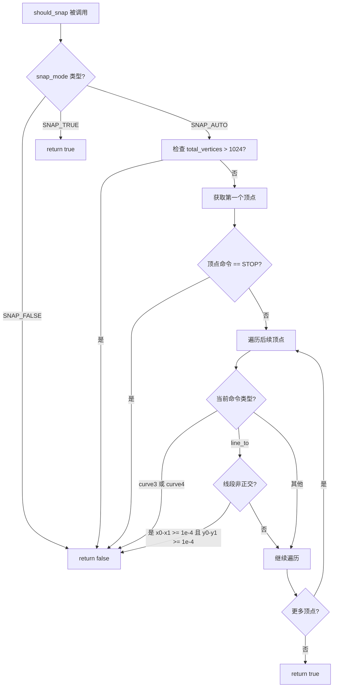

#### 带注释源码

```cpp
// 静态成员函数：判断路径是否需要吸附到像素中心
// 参数：
//   path - 顶点源对象引用，用于遍历路径顶点
//   snap_mode - 吸附模式：SNAP_AUTO自动检测, SNAP_TRUE强制吸附, SNAP_FALSE不吸附
//   total_vertices - 路径顶点总数，用于复杂度判断
// 返回值：是否应该进行吸附
static bool should_snap(VertexSource &path, e_snap_mode snap_mode, unsigned total_vertices)
{
    // 如果路径仅包含水平或垂直线段，则应该吸附到最近像素
    double x0 = 0, y0 = 0, x1 = 0, y1 = 0;
    unsigned code;

    // 根据吸附模式进行分支处理
    switch (snap_mode) {
    case SNAP_AUTO:
        // 自动模式：分析路径几何特征决定是否吸附
        if (total_vertices > 1024) {
            // 顶点数过多时，跳过吸附以避免性能问题
            return false;
        }

        // 获取第一个顶点
        code = path.vertex(&x0, &y0);
        if (code == agg::path_cmd_stop) {
            // 空路径，不吸附
            return false;
        }

        // 遍历路径所有顶点，检查是否包含曲线或非正交线段
        while ((code = path.vertex(&x1, &y1)) != agg::path_cmd_stop) {
            switch (code) {
            case agg::path_cmd_curve3:
            case agg::path_cmd_curve4:
                // 存在三次或四次贝塞尔曲线，不吸附（曲线吸附效果不佳）
                return false;
            case agg::path_cmd_line_to:
                // 检查线段是否为正交（水平或垂直）
                // 使用1e-4作为浮点数误差容忍阈值
                if (fabs(x0 - x1) >= 1e-4 && fabs(y0 - y1) >= 1e-4) {
                    // 线段既有水平偏移又有垂直偏移，表示不是正交线段
                    return false;
                }
            }
            // 更新上一个顶点位置
            x0 = x1;
            y0 = y1;
        }

        // 所有线段均为正交，可以吸附
        return true;
    case SNAP_FALSE:
        // 强制不吸附
        return false;
    case SNAP_TRUE:
        // 强制吸附
        return true;
    }

    // 默认不吸附（理论上不会执行到这里）
    return false;
}
```


### `PathSnapper<VertexSource>.rewind`

该方法用于重置上游的 VertexSource，以便从指定的路径 ID 开始读取顶点数据。当需要重新遍历路径或切换到不同路径时调用此方法。

参数：

- `path_id`：`unsigned`，要重置的上游源的路径标识符

返回值：`void`，无返回值

#### 流程图

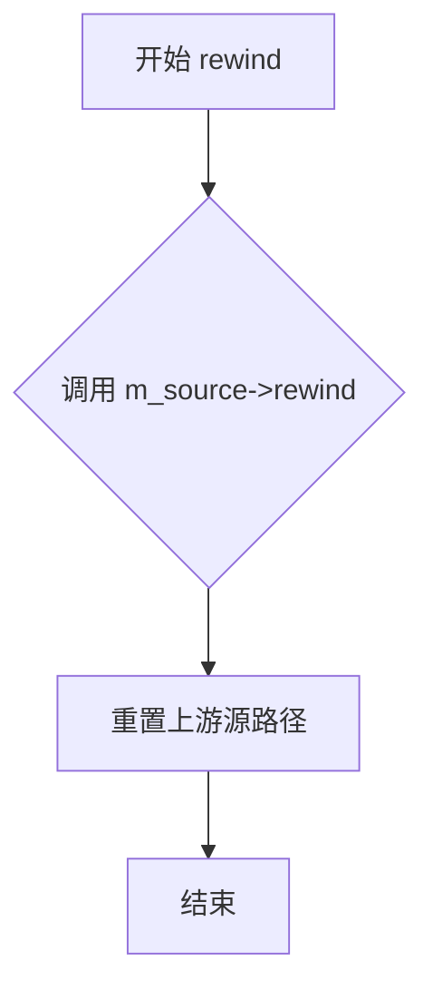

#### 带注释源码

```cpp
/**
 * 重置上游源以开始读取指定的路径
 * 
 * @param path_id 要读取的路径标识符
 */
inline void rewind(unsigned path_id)
{
    // 直接调用上游 VertexSource 的 rewind 方法
    // 将路径遍历位置重置到指定 path_id 的起点
    m_source->rewind(path_id);
}
```


### `PathSnapper<VertexSource>.vertex(x, y)`

该方法通过调用底层顶点源获取顶点，并根据成员变量 `m_snap` 的状态，对顶点坐标进行网格吸附（四舍五入到最近的中心像素），以确保路径在渲染时能够对齐到像素网格，提升视觉质量。

参数：

- `x`：`double *`，指向用于存储输出顶点 x 坐标的指针
- `y`：`double *`，指向用于存储输出顶点 y 坐标的指针

返回值：`unsigned`，返回路径命令码（如 `MOVETO`、`LINETO`、`STOP` 等），用于标识当前顶点的类型

#### 流程图

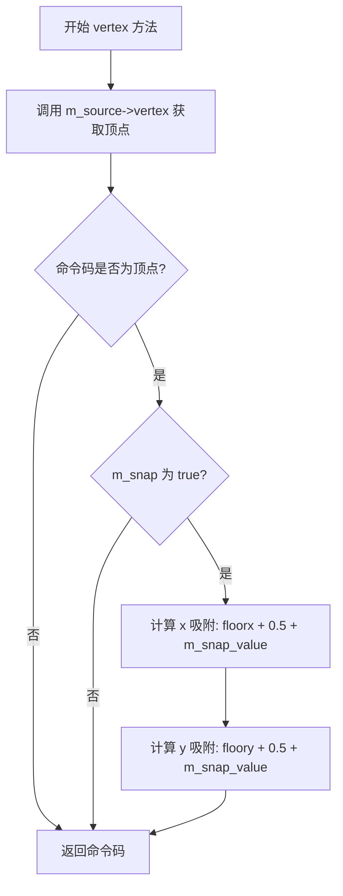

#### 带注释源码

```cpp
inline unsigned vertex(double *x, double *y)
{
    unsigned code;
    // 第一步：从底层顶点源获取原始顶点数据
    // 这里会获取 x, y 坐标以及对应的命令码 code
    code = m_source->vertex(x, y);
    
    // 第二步：检查是否需要执行吸附操作
    // m_snap 表示是否启用了网格吸附功能
    // agg::is_vertex(code) 确保只有顶点才进行吸附处理
    // （命令码如 STOP, CLOSEPOLY 等不是顶点，不应被吸附）
    if (m_snap && agg::is_vertex(code)) {
        // 第三步：对 x 坐标进行吸附计算
        // 公式解析：
        //   *x + 0.5：将坐标向右偏移半个单位，以便四舍五入
        //   floor(...)：向下取整，得到最近的整数
        //   + m_snap_value：根据描边宽度调整吸附中心
        //     - 如果描边宽度为奇数，m_snap_value = 0.5，吸附到像素中心
        //     - 如果描边宽度为偶数，m_snap_value = 0.0，吸附到像素边界
        *x = floor(*x + 0.5) + m_snap_value;
        
        // 第四步：对 y 坐标执行相同的吸附计算
        *y = floor(*y + 0.5) + m_snap_value;
    }
    
    // 第五步：返回处理后的命令码
    // 调用方根据此命令码决定后续操作（如绘制直线、移动画笔等）
    return code;
}
```


### `PathSnapper<VertexSource>.is_snapping()`

该方法用于获取 PathSnapper 类的当前吸附状态，返回是否正在进行路径吸附（即将路径顶点四舍五入到最近的中心像素）。

参数： 无

返回值：`bool`，返回当前是否启用吸附功能。当返回 `true` 时，表示路径顶点将在 `vertex()` 方法中被四舍五入到最近的像素中心；当返回 `false` 时，表示不进行吸附处理。

#### 流程图

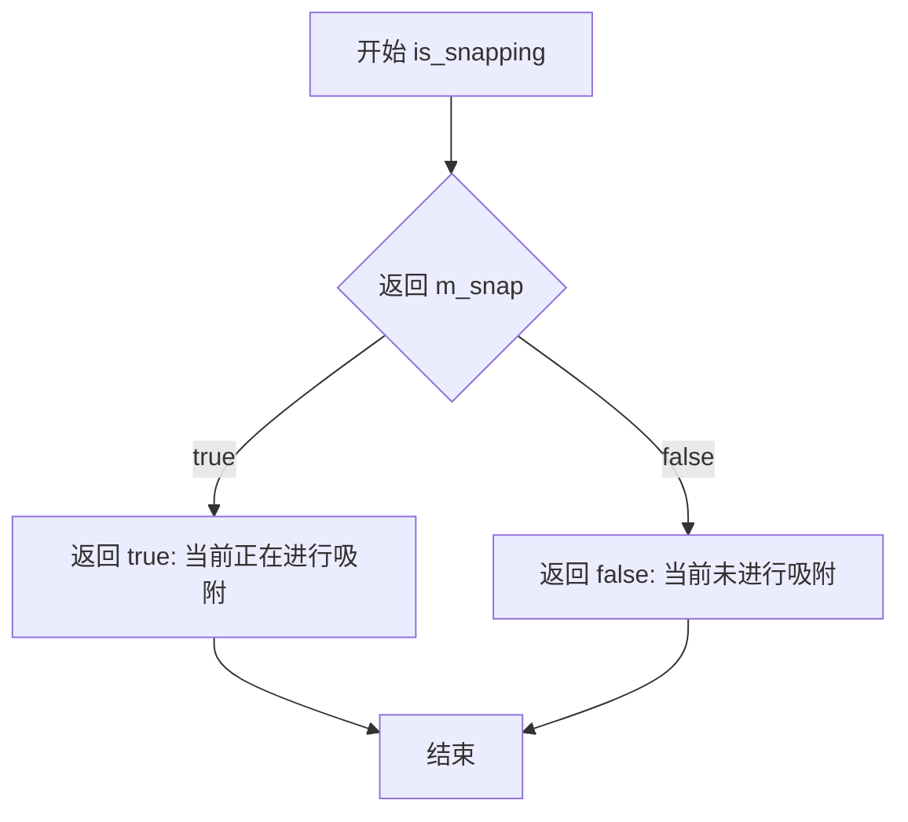

#### 带注释源码

```cpp
/**
 * @brief 检查当前是否启用了路径吸附功能
 * 
 * 此方法返回成员变量 m_snap 的当前值，指示 PathSnapper 是否
 * 正在进行顶点吸附处理。在 PathSnapper 构造时，会根据 snap_mode
 * 和路径特性（是否为纯水平/垂直直线）来决定是否启用吸附。
 * 
 * @return bool 
 *         - true: 当前正在进行吸附，vertex() 方法会将坐标四舍五入
 *         - false: 当前未进行吸附，坐标保持原样
 */
inline bool is_snapping()
{
    return m_snap;  // 直接返回成员变量 m_snap 的值，该值在构造函数中通过 should_snap() 方法确定
}
```


### `PathSimplifier<VertexSource>::rewind`

重置 PathSimplifier 的内部状态和队列，将 `m_moveto` 标志设为 `true`，并调用底层 `VertexSource` 的 `rewind` 方法，使其定位到指定路径的起点。

**参数**

- `path_id`：`unsigned`，指定要重置的路径标识符（传递给底层 `VertexSource` 的 `rewind`）

**返回值**：`void`，无返回值

#### 流程图

```mermaid
flowchart TD
    A([开始 rewind]) --> B[调用 queue_clear() 清空内部队列]
    B --> C[设置 m_moveto = true]
    C --> D[调用 m_source->rewind(path_id) 重置底层源]
    D --> E([结束])
```

#### 带注释源码

```cpp
inline void rewind(unsigned path_id)
{
    // 1. 清空内部队列，放弃之前缓存的所有顶点
    queue_clear();

    // 2. 将 m_moveto 标志复位，指示下一个顶点应为 MOVETO
    m_moveto = true;

    // 3. 让底层 VertexSource 重新定位到指定 path_id 的起始位置
    m_source->rewind(path_id);
}
```


### `PathSimplifier<VertexSource>.vertex`

该方法通过并行向量合并算法简化密集路径，在保持视觉外观不变的前提下减少顶点数量。它维护一个内部队列来管理输出，并在单次调用中可能返回多个顶点，适用于高性能路径渲染场景。

参数：

- `x`：`double*`，指向用于输出简化后顶点 x 坐标的指针
- `y`：`double*`，指向用于输出简化后顶点 y 坐标的指针

返回值：`unsigned`，返回路径命令码（如 `path_cmd_move_to`、`path_cmd_line_to`、`path_cmd_stop` 等）

#### 流程图

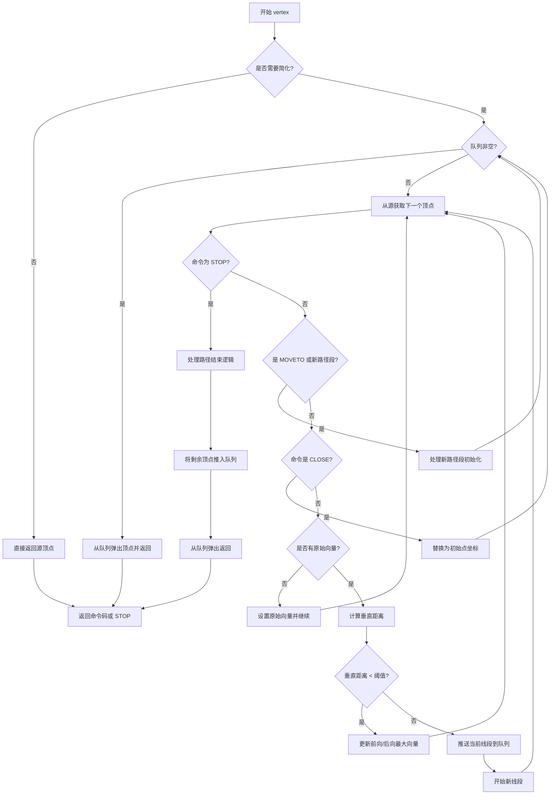

#### 带注释源码

```cpp
/**
 * @brief 获取简化后的顶点
 * 
 * 该方法是路径简化的核心，通过并行向量合并算法减少顶点数量。
 * 它维护一个内部队列来缓冲输出，在单次调用中可能返回多个顶点。
 * 
 * @param x 输出参数的指针，用于返回简化后顶点的 x 坐标
 * @param y 输出参数的指针，用于返回简化后顶点的 y 坐标
 * @return unsigned 返回路径命令码（move_to, line_to, stop 等）
 */
unsigned vertex(double *x, double *y)
{
    unsigned cmd;

    /* 简化算法不支持曲线或复合路径，因此在那种情况下直接跳过 */
    if (!m_simplify) {
        return m_source->vertex(x, y);
    }

    /* 优化思路：可以合并顺序的平行线为单条线，避免重复绘制同一点。
       下面的循环类似状态机，根据上一次的操作决定当前行为。
       通过计算垂直于上一条线的距离来判断顺序线是否足够平行。 */

    /* 原始代码由 Allan Haldane 编写，后由 Michael Droettboom 修改为就地处理。
       为了避免过多代码复杂度，它保留一个小队列，可以在单次调用中发射多个点，
       并在后续调用中从队列弹出。-- Michael Droettboom */

    /* 原始代码由 Allan Haldane 编写，Michael Droettboom 更新。
       作者修改它以处理反平行向量，方式与平行向量类似，
       但需要额外记录在当前运行期间是否观察到反平行向量。 -- Kevin Rose */

    /* 先清空队列，再进入主循环 */
    if (queue_pop(&cmd, x, y)) {
        return cmd;
    }

    /* 主简化循环：只消费必要的点数直到有内容加入出队队列，
       不必在每次绘制时分配和填充整个额外路径数组 */
    while ((cmd = m_source->vertex(x, y)) != agg::path_cmd_stop) {
        /* 如果开始新的路径段，移动到第一个点并初始化 */

        if (m_moveto || cmd == agg::path_cmd_move_to) {
            /* m_moveto 检查通常不需要，因为 m_source 会生成初始 moveto；
               但保留它以防出现非正常情况 */
            if (m_origdNorm2 != 0.0 && !m_after_moveto) {
                /* m_origdNorm2 非零表示我们有向量；
                   m_after_moveto 检查确保这个向量只被推送一次 */
                _push(x, y);
            }
            m_after_moveto = true;

            if (std::isfinite(*x) && std::isfinite(*y)) {
                m_has_init = true;
                m_initX = *x;
                m_initY = *y;
            } else {
                m_has_init = false;
            }

            m_lastx = *x;
            m_lasty = *y;
            m_moveto = false;
            m_origdNorm2 = 0.0;
            m_dnorm2BackwardMax = 0.0;
            m_clipped = true;
            if (queue_nonempty()) {
                /* 如果执行了推送，现在清空队列 */
                break;
            }
            continue;
        }
        m_after_moveto = false;

        /* 处理路径闭合命令 */
        if(agg::is_close(cmd)) {
            if (m_has_init) {
                /* 如果有有效的初始顶点，用初始顶点替换当前顶点 */
                *x = m_initX;
                *y = m_initY;
            } else {
                /* 如果没有有效的初始顶点，无法闭合路径，跳过该顶点 */
                continue;
            }
        }

        /* 注意：以前会跳过非常短的段，但如果累积很多，可能会错过数据的极值 */

        /* 不渲染小于一个像素长的线段（现已注释） */
        /* if (fabs(*x - m_lastx) < 1.0 && fabs(*y - m_lasty) < 1.0) */
        /* { */
        /*     continue; */
        /* } */

        /* 如果没有原始向量，将其设为当前向量并继续。
           这个原始向量是我们将逐步构建直线的参考向量 */
        if (m_origdNorm2 == 0.0) {
            if (m_clipped) {
                queue_push(agg::path_cmd_move_to, m_lastx, m_lasty);
                m_clipped = false;
            }

            m_origdx = *x - m_lastx;
            m_origdy = *y - m_lasty;
            m_origdNorm2 = m_origdx * m_origdx + m_origdy * m_origdy;

            // 设置所有变量以反映这个新的原始向量
            m_dnorm2ForwardMax = m_origdNorm2;
            m_dnorm2BackwardMax = 0.0;
            m_lastForwardMax = true;
            m_lastBackwardMax = false;

            m_currVecStartX = m_lastx;
            m_currVecStartY = m_lasty;
            m_nextX = m_lastx = *x;
            m_nextY = m_lasty = *y;
            continue;
        }

        /* 现在我们有了原始向量，并从序列中获得了新向量。
           检查从上一个写入点垂直移动的距离是否过大。
           如果 o 是原始向量（我们正在构建的线），v 是从上一个
           写入点到当前点的向量，则垂直向量 p = v - (o.v)o/(o.o)
           （这里 a.b 表示 a 和 b 的点积） */

        /* 获取 v 向量 */
        double totdx = *x - m_currVecStartX;
        double totdy = *y - m_currVecStartY;

        /* 获取点积 o.v */
        double totdot = m_origdx * totdx + m_origdy * totdy;

        /* 获取平行向量 (= (o.v)o/(o.o)) */
        double paradx = totdot * m_origdx / m_origdNorm2;
        double parady = totdot * m_origdy / m_origdNorm2;

        /* 获取垂直向量 (= v - para) */
        double perpdx = totdx - paradx;
        double perpdy = totdy - parady;

        /* 获取垂直向量的平方范数 (= p.p) */
        double perpdNorm2 = perpdx * perpdx + perpdy * perpdy;

        /* 如果垂直向量小于简化阈值像素大小，
           则将当前 x,y 与当前向量合并 */
        if (perpdNorm2 < m_simplify_threshold) {
            /* 检查当前向量是否与原始向量平行或反平行。
               无论是哪种情况，测试它是否我们正在合并的向量中
               该方向最长的。如果是，则更新该方向的当前向量。 */
            double paradNorm2 = paradx * paradx + parady * parady;

            m_lastForwardMax = false;
            m_lastBackwardMax = false;
            if (totdot > 0.0) {
                if (paradNorm2 > m_dnorm2ForwardMax) {
                    m_lastForwardMax = true;
                    m_dnorm2ForwardMax = paradNorm2;
                    m_nextX = *x;
                    m_nextY = *y;
                }
            } else {
                if (paradNorm2 > m_dnorm2BackwardMax) {
                    m_lastBackwardMax = true;
                    m_dnorm2BackwardMax = paradNorm2;
                    m_nextBackwardX = *x;
                    m_nextBackwardY = *y;
                }
            }

            m_lastx = *x;
            m_lasty = *y;
            continue;
        }

        /* 如果到达这里，说明这个向量与我们正在构建的线不够相似，
           需要绘制那条线并开始下一条。 */

        /* 如果线需要从绘制的相反方向延伸，
           则移回从那里开始绘制 */
        _push(x, y);

        break;
    }

    /* 如果在上面的循环中完成了路径，用剩余顶点填充队列 */
    if (cmd == agg::path_cmd_stop) {
        if (m_origdNorm2 != 0.0) {
            queue_push((m_moveto || m_after_moveto) ? agg::path_cmd_move_to
                                                    : agg::path_cmd_line_to,
                       m_nextX,
                       m_nextY);
            if (m_dnorm2BackwardMax > 0.0) {
                queue_push((m_moveto || m_after_moveto) ? agg::path_cmd_move_to
                                                        : agg::path_cmd_line_to,
                           m_nextBackwardX,
                           m_nextBackwardY);
            }
            m_moveto = false;
        }
        queue_push((m_moveto || m_after_moveto) ? agg::path_cmd_move_to : agg::path_cmd_line_to,
                   m_lastx,
                   m_lasty);
        m_moveto = false;
        queue_push(agg::path_cmd_stop, 0.0, 0.0);
    }

    /* 如果队列中有内容则返回第一项，否则表示已完成 */
    if (queue_pop(&cmd, x, y)) {
        return cmd;
    } else {
        return agg::path_cmd_stop;
    }
}
```


### `PathSimplifier._push`

私有方法，用于将当前构建的简化线段推入内部队列，并重置状态以处理下一条线段。它处理了前向和后向（反平行）向量的特殊情况，并处理了裁剪后的路径连接。

参数：

- `x`：`double *`，指向当前顶点 X 坐标的指针，方法会读取该指针指向的值来计算新向量并更新状态。
- `y`：`double *`，指向当前顶点 Y 坐标的指针，方法会读取该指针指向的值来计算新向量并更新状态。

返回值：`void`，无返回值。

#### 流程图

```mermaid
flowchart TD
    A[开始 _push] --> B{检查是否存在后向向量<br>m_dnorm2BackwardMax > 0.0?}
    B -->|是| C{检查最后向量是否为前向最大<br>m_lastForwardMax?}
    B -->|否| G[推入前向顶点<br>queue_push(LineTo, m_nextX, m_nextY)]
    
    C -->|是| D[先推入后向顶点, 再推入前向顶点]
    C -->|否| E[先推入前向顶点, 再推入后向顶点]
    
    D --> F
    E --> F
    
    G --> H{检查是否发生了裁剪<br>m_clipped?}
    H -->|是| I[推入 MOVETO 到上一个点<br>queue_push(MoveTo, m_lastx, m_lasty)]
    H -->|否| J{检查最后点是否为最长线段<br>!(m_lastForwardMax || m_lastBackwardMax)?}
    J -->|是| K[推入 LINETO 到上一个点<br>queue_push(LineTo, m_lastx, m_lasty)]
    J -->|否| L
    
    I --> M[重置状态变量]
    K --> M
    L --> M
    
    M --> N[计算新的原始向量<br>m_origdx, m_origdy, m_origdNorm2]
    N --> O[更新状态变量<br>m_dnorm2ForwardMax, m_currVecStart, m_lastx, m_nextX, etc.]
    O --> P[结束]
```

#### 带注释源码

```cpp
inline void _push(double *x, double *y)
{
    // 检查是否存在后向（anti-parallel）向量
    bool needToPushBack = (m_dnorm2BackwardMax > 0.0);

    /* 如果我们观察到了任何后向（反平行）向量，
       那么我们需要同时推入前向和后向向量。 */
    if (needToPushBack) {
        /* 如果最后一个向量是前向方向上的最大值，
           那么我们需要在后向之后推入前向。否则，
           最后一个向量是后向方向上的最大值，
           或者介于两者之间，无论哪种情况，我们都可以安全地先推入前向。 */
        if (m_lastForwardMax) {
            queue_push(agg::path_cmd_line_to, m_nextBackwardX, m_nextBackwardY);
            queue_push(agg::path_cmd_line_to, m_nextX, m_nextY);
        } else {
            queue_push(agg::path_cmd_line_to, m_nextX, m_nextY);
            queue_push(agg::path_cmd_line_to, m_nextBackwardX, m_nextBackwardY);
        }
    } else {
        /* 如果我们没有观察到任何后向向量，只推入前向。 */
        queue_push(agg::path_cmd_line_to, m_nextX, m_nextY);
    }

    /* 如果我们在当前线和下一条线之间裁剪了一些线段，
       我们还需要移动到最后一个点。 */
    if (m_clipped) {
        queue_push(agg::path_cmd_move_to, m_lastx, m_lasty);
    } else if ((!m_lastForwardMax) && (!m_lastBackwardMax)) {
        /* 如果最后一条线不是最长的线，那么
           回到序列中上一条线的端点。仅在未裁剪时执行此操作，
           因为在那种情况下 lastx,lasty 不是刚绘制的线的一部分。 */

        /* 如果不是为了伪影，会是 move_to */
        queue_push(agg::path_cmd_line_to, m_lastx, m_lasty);
    }

    /* 现在重置所有变量，为下一条线做准备 */
    m_origdx = *x - m_lastx;
    m_origdy = *y - m_lasty;
    m_origdNorm2 = m_origdx * m_origdx + m_origdy * m_origdy;

    m_dnorm2ForwardMax = m_origdNorm2;
    m_lastForwardMax = true;
    m_currVecStartX = m_queue[m_queue_write - 1].x;
    m_currVecStartY = m_queue[m_queue_write - 1].y;
    m_lastx = m_nextX = *x;
    m_lasty = m_nextY = *y;
    m_dnorm2BackwardMax = 0.0;
    m_lastBackwardMax = false;

    m_clipped = false;
}
```


### `Sketch<VertexSource>.rewind`

该方法用于重置草图生成器的内部状态，包括相位计数器、随机数种子以及底层顶点源，以准备重新遍历路径。当缩放比例不为零时，它会重置随机数种子并调用分段转换器的重绕方法；否则直接重置底层源。

参数：
- `path_id`：`unsigned`，路径标识符，用于指定要重绕的路径索引

返回值：`void`，无返回值

#### 流程图

```mermaid
flowchart TD
    A[开始 rewind] --> B[设置 m_has_last = false]
    B --> C[设置 m_p = 0.0]
    C --> D{m_scale != 0.0?}
    D -->|是| E[调用 m_rand.seed(0) 重置随机数种子]
    E --> F[调用 m_segmented.rewind(path_id)]
    F --> G[结束]
    D -->|否| H[调用 m_source.rewind(path_id)]
    H --> G
```

#### 带注释源码

```cpp
/**
 * @brief 重置草图生成器的内部状态
 * 
 * 该方法执行以下操作：
 * 1. 重置相位累加器 m_p 为 0.0
 * 2. 重置最后顶点状态标志 m_has_last 为 false
 * 3. 重置随机数生成器的种子为 0
 * 4. 调用底层顶点源的 rewind 方法
 * 
 * @param path_id 路径标识符，指定要重绕的路径
 */
inline void rewind(unsigned path_id)
{
    // 重置最后顶点存在标志，表示还没有处理过顶点
    m_has_last = false;
    
    // 重置相位累加器，从正弦波的起始位置开始
    m_p = 0.0;
    
    // 根据是否启用了缩放效果选择不同的重绕路径
    if (m_scale != 0.0) {
        // 重置随机数种子为 0，确保每次重绕后产生相同的随机序列
        // 这样可以保证相同的输入产生相同的草图效果
        m_rand.seed(0);
        
        // 调用分段转换器的 rewind 方法
        // 分段转换器用于将曲线分割成线段
        m_segmented.rewind(path_id);
    } else {
        // 如果没有缩放效果（即 scale 为 0），则直接跳过草图处理
        // 直接调用底层源的重绕方法
        m_source->rewind(path_id);
    }
}
```


### Sketch<VertexSource>.vertex

该方法通过使用正弦波和随机数生成器沿垂直于路径的方向添加抖动偏移，实现手绘素描效果。当scale为0时，直接返回源顶点；否则对每个顶点计算偏移量并修改坐标。

参数：

- `x`：`double*`，指向x坐标的指针，用于输入原始x坐标并输出修改后的x坐标
- `y`：`double*`，指向y坐标的指针，用于输入原始y坐标并输出修改后的y坐标

返回值：`unsigned`，返回路径命令码（如MOVETO、LINETO等），用于指示顶点类型

#### 流程图

```mermaid
flowchart TD
    A[开始 vertex] --> B{m_scale == 0.0?}
    B -->|是| C[直接返回 m_source.vertex]
    B -->|否| D[调用 m_segmented.vertex 获取顶点]
    E{code == MOVETO?}
    D --> E
    E -->|是| F[重置 m_has_last = false, m_p = 0.0]
    E -->|否| G{m_has_last?}
    F --> G
    G -->|是| H[生成随机数 d_rand]
    G -->|否| I[更新 m_last_x, m_last_y]
    H --> J[更新相位 m_p += exp(d_rand * m_log_randomness)]
    J --> K[计算差值 den = m_last_x - *x, num = m_last_y - *y]
    K --> L[计算长度 len = sqrt(num² + den²)]
    L --> M{len != 0?}
    M -->|是| N[计算偏移 r = sin(m_p * m_p_scale) * m_scale]
    N --> O[应用偏移: *x += r/len * num, *y -= r/len * den]
    M -->|否| P[不应用偏移]
    O --> Q[更新 m_last_x, m_last_y]
    P --> Q
    Q --> R[设置 m_has_last = true]
    I --> R
    R --> S[返回 code]
    C --> S
```

#### 带注释源码

```cpp
/**
 * @brief 获取带有手绘抖动效果的顶点
 * 
 * 该方法是Sketch类的核心，通过正弦波和随机数生成器
 * 沿垂直于路径的方向添加抖动偏移，实现手绘素描效果
 * 
 * @param x 指向x坐标的指针，输入原始坐标，输出修改后的坐标
 * @param y 指向y坐标的指针，输入原始坐标，输出修改后的坐标
 * @return unsigned 路径命令码（agg::path_cmd_move_to, agg::path_cmd_line_to等）
 */
unsigned vertex(double *x, double *y)
{
    // 如果scale为0，不进行任何抖动处理，直接返回源顶点
    if (m_scale == 0.0) {
        return m_source->vertex(x, y);
    }

    // 从分段转换器获取下一个顶点
    unsigned code = m_segmented.vertex(x, y);

    // 如果是MOVETO命令，重置状态
    // MOVETO标志新路径段的开始
    if (code == agg::path_cmd_move_to) {
        m_has_last = false;
        m_p = 0.0;
    }

    // 如果存在上一个顶点，计算并应用抖动偏移
    if (m_has_last) {
        // 沿正弦波移动"光标"，使用随机速率
        // 获取0-1之间的随机数
        double d_rand = m_rand.get_double();
        
        // 优化计算：使用exp(log(pow))的数学等价形式
        // 原始: p += pow(k, 2*rand - 1)
        // x86使用exp(b*log(a))计算pow(a,b)
        // 优化后: p += exp(rand * 2*log(k))
        // 这里m_log_randomness = 2 * log(m_randomness)
        m_p += exp(d_rand * m_log_randomness);
        
        // 计算当前顶点与上一个顶点的差值
        double den = m_last_x - *x;
        double num = m_last_y - *y;
        
        // 计算线段长度（欧几里得距离）
        double len = num * num + den * den;
        
        // 更新上一个顶点位置为当前位置
        m_last_x = *x;
        m_last_y = *y;
        
        // 如果线段长度不为零，计算并应用偏移
        if (len != 0) {
            len = sqrt(len);
            // 计算正弦波偏移量：振幅为m_scale
            double r = sin(m_p * m_p_scale) * m_scale;
            // 计算偏移量与线段长度的比值
            double roverlen = r / len;
            // 沿垂直方向偏移x坐标（乘以num，即dy）
            *x += roverlen * num;
            // 沿垂直方向偏移y坐标（乘以-den，即-dx）
            *y -= roverlen * den;
        }
    } else {
        // 第一个顶点，只需记录位置
        m_last_x = *x;
        m_last_y = *y;
    }

    // 标记已处理过顶点
    m_has_last = true;

    // 返回路径命令码
    return code;
}
```

## 关键组件


### 核心功能概述

该代码实现了一套用于处理矢量路径的转换器管道（path converters），通过模板类实现路径的惰性处理，包括移除NaN值、裁剪到指定矩形、对齐像素中心、简化密集路径以及添加手绘风格效果，所有操作均以流式迭代器方式进行，无需完整数据拷贝。

### 文件整体运行流程

在Matplotlib的Agg后端中，这些路径转换器按固定顺序组成处理流水线：首先进行仿射变换（由Agg自身实现），随后依次通过PathNanRemover移除非有限数值、PathClipper裁剪到可视区域、PathSnapper对齐到像素中心、PathSimplifier简化冗余顶点，最后由Agg完成曲线到线段的转换和描边。每个转换器都实现相同的`vertex()`接口，以迭代器模式逐个输出处理后的顶点。

### 类详细信息

#### 1. EmbeddedQueue<QueueSize>

**类字段：**

| 名称 | 类型 | 描述 |
|------|------|------|
| m_queue_read | int | 队列读指针 |
| m_queue_write | int | 队列写指针 |
| m_queue[QueueSize] | item | 内嵌队列数组，存储命令和坐标 |

**类方法：**

| 方法名称 | 参数 | 返回类型 | 描述 |
|----------|------|----------|------|
| queue_push | cmd: unsigned, x: double, y: double | void | 将顶点推入队列 |
| queue_pop | cmd: unsigned*, x: double*, y: double* | bool | 从队列弹出顶点，成功返回true |
| queue_nonempty | - | bool | 检查队列是否非空 |
| queue_clear | - | void | 清空队列 |

#### 2. RandomNumberGenerator

**类字段：**

| 名称 | 类型 | 描述 |
|------|------|------|
| a | static const uint32_t | 线性同余常数214013 |
| c | static const uint32_t | 线性同余常数2531011 |
| m_seed | uint32_t | 随机数种子状态 |

**类方法：**

| 方法名称 | 参数 | 返回类型 | 描述 |
|----------|------|----------|------|
| seed | seed: int | void | 设置随机数种子 |
| get_double | - | double | 生成[0,1)区间的随机双精度数 |

#### 3. PathNanRemover<VertexSource>

**类字段：**

| 名称 | 类型 | 描述 |
|------|------|------|
| m_source | VertexSource* | 上游顶点源 |
| m_remove_nans | bool | 是否移除NaN |
| m_has_codes | bool | 路径是否包含曲线或闭合环 |
| valid_segment_exists | bool | 是否存在有效段 |
| m_last_segment_valid | bool | 上一段是否有效 |
| m_was_broken | bool | 路径是否被NaN打断 |
| m_initX, m_initY | double | 路径起始点坐标 |

**类方法：**

| 方法名称 | 参数 | 返回类型 | 描述 |
|----------|------|----------|------|
| rewind | path_id: unsigned | void | 重置到路径起始位置 |
| vertex | x: double*, y: double* | unsigned | 获取下一个处理后的顶点 |

#### 4. PathClipper<VertexSource>

**类字段：**

| 名称 | 类型 | 描述 |
|------|------|------|
| m_source | VertexSource* | 上游顶点源 |
| m_do_clipping | bool | 是否启用裁剪 |
| m_cliprect | agg::rect_base<double> | 裁剪矩形区域 |
| m_lastX, m_lastY | double | 上一个顶点坐标 |
| m_moveto | bool | 是否需要发射MOVETO |
| m_initX, m_initY | double | 当前子路径起始点 |
| m_has_init | bool | 是否已有起始点 |
| m_was_clipped | bool | 是否有线段被裁剪 |

**类方法：**

| 方法名称 | 参数 | 返回类型 | 描述 |
|----------|------|----------|------|
| rewind | path_id: unsigned | void | 重置裁剪器状态 |
| draw_clipped_line | x0, y0, x1, y1: double, closed: bool | int | 裁剪并绘制单条线段，返回是否输出 |
| vertex | x: double*, y: double* | unsigned | 获取裁剪后的顶点 |

#### 5. PathSnapper<VertexSource>

**类字段：**

| 名称 | 类型 | 描述 |
|------|------|------|
| m_source | VertexSource* | 上游顶点源 |
| m_snap | bool | 是否执行对齐 |
| m_snap_value | double | 对齐偏移值（0或0.5） |

**类方法：**

| 方法名称 | 参数 | 返回类型 | 描述 |
|----------|------|----------|------|
| should_snap | path: VertexSource&, snap_mode: e_snap_mode, total_vertices: unsigned | static bool | 判断路径是否应被对齐 |
| rewind | path_id: unsigned | void | 重置快照状态 |
| vertex | x: double*, y: double* | unsigned | 获取对齐后的顶点 |
| is_snapping | - | bool | 返回当前是否正在对齐 |

#### 6. PathSimplifier<VertexSource>

**类字段：**

| 名称 | 类型 | 描述 |
|------|------|------|
| m_source | VertexSource* | 上游顶点源 |
| m_simplify | bool | 是否执行简化 |
| m_simplify_threshold | double | 简化阈值（平方值） |
| m_moveto | bool | 是否在MOVETO后 |
| m_after_moveto | bool | 是否刚刚完成MOVETO |
| m_clipped | bool | 是否有线段被裁剪 |
| m_has_init | bool | 是否有有效起始点 |
| m_initX, m_initY | double | 当前子路径起始点 |
| m_lastx, m_lasty | double | 上一个顶点 |
| m_origdx, m_origdy | double | 原始向量方向 |
| m_origdNorm2 | double | 原始向量长度的平方 |
| m_dnorm2ForwardMax | double | 前向最大投影平方 |
| m_dnorm2BackwardMax | double | 后向最大投影平方 |
| m_lastForwardMax | bool | 上一点是否前向最远 |
| m_lastBackwardMax | bool | 上一点是否后向最远 |
| m_nextX, m_nextY | double | 待输出的前向点 |
| m_nextBackwardX, m_nextBackwardY | double | 待输出的后向点 |
| m_currVecStartX, m_currVecStartY | double | 当前向量起点 |

**类方法：**

| 方法名称 | 参数 | 返回类型 | 描述 |
|----------|------|----------|------|
| rewind | path_id: unsigned | void | 重置简化器状态 |
| vertex | x: double*, y: double* | unsigned | 获取简化后的顶点 |
| _push | x: double*, y: double* | private void | 将新线段推入队列 |

#### 7. Sketch<VertexSource>

**类字段：**

| 名称 | 类型 | 描述 |
|------|------|------|
| m_source | VertexSource* | 上游顶点源 |
| m_scale | double | 抖动幅度 |
| m_length | double | 基础波长 |
| m_randomness | double | 随机因子 |
| m_segmented | agg::conv_segmentator<VertexSource> | 线段化处理器 |
| m_last_x, m_last_y | double | 上一个顶点 |
| m_has_last | bool | 是否有上一个顶点 |
| m_p | double | 沿曲线的累积参数 |
| m_rand | RandomNumberGenerator | 随机数生成器 |
| m_p_scale | double | 缩放后的角频率 |
| m_log_randomness | double | log(2*randomness) |

**类方法：**

| 方法名称 | 参数 | 返回类型 | 描述 |
|----------|------|----------|------|
| vertex | x: double*, y: double* | unsigned | 获取添加抖动后的顶点 |
| rewind | path_id: unsigned | void | 重置草图状态 |

### 关键组件信息

#### EmbeddedQueue - 内嵌队列

用于顶点转换器的输出队列，采用静态数组实现，比STL队列更高效，减少内存分配开销。

#### PathNanRemover - NaN移除器

跳过包含非有限数值（NaN/Inf）的路径段，通过插入MOVETO命令保持路径连续性，支持曲线和闭合环的特殊处理。

#### PathClipper - 路径裁剪器

使用Liang-Barsky线裁剪算法将路径限制在指定矩形内，同时处理闭合多边形的裁剪逻辑。

#### PathSnapper - 像素对齐器

将路径顶点四舍五入到最近的像素中心，使矩形和直线的渲染更清晰，支持自动检测和强制两种模式。

#### PathSimplifier - 路径简化器

基于Ramer-Douglas-Peucker算法的变体，通过计算垂直距离简化密集路径，保留视觉关键点。

#### Sketch - 手绘风格器

使用随机正弦波为路径添加手绘抖动效果，包含长度随机化和振幅缩放。

### 潜在技术债务与优化空间

1. **C++98兼容性要求**：代码刻意避免使用现代C++特性（如std::vector、lambda），导致实现较为冗长
2. **模板代码膨胀**：每个模板实例都会生成独立代码，可能增加二进制体积
3. **PathNanRemover慢路径**：当路径包含曲线或闭合环时使用较慢的队列算法，可考虑优化
4. **硬编码常量**：部分魔法数字（如1024顶点阈值）应可配置化
5. **异常处理缺失**：仅依赖返回值而非异常机制，难以区分错误类型

### 其它项目

#### 设计目标与约束
- 零拷贝：所有转换器以迭代器模式工作，不复制完整路径数据
- 极低开销：EmbeddedQueue使用静态数组避免堆分配
- C++98兼容：确保与旧版编译器兼容

#### 错误处理与异常设计
- 通过返回agg::path_cmd_stop表示路径结束
- 使用std::isfinite()检测数值异常
- 队列操作返回布尔值指示成功/失败

#### 数据流与状态机
- 每个转换器维护内部状态（如PathSimplifier的m_moveto、m_after_moveto）
- 状态转换通过vertex()方法的有限状态机逻辑处理

#### 外部依赖与接口契约
- 依赖pybind11用于Python绑定
- 依赖Agg库的agg::rect_base、agg::clip_line_segment等
- 所有转换器需实现`void rewind(unsigned)`和`unsigned vertex(double*, double*)`接口


## 问题及建议


### 已知问题

-   **非标准扩展**: 使用 `nan("")` 初始化NaN值，这是非标准扩展，应使用 `std::nan("")` 或 `std::numeric_limits<double>::quiet_NaN()`
-   **使用goto语句**: `PathClipper::vertex` 方法中使用了 `goto exit_loop`，这降低了代码的可读性和可维护性
-   **魔法数字**: 代码中存在硬编码的魔法数字（如1024、1e-4、1.0等），缺乏解释性注释
-   **重复代码逻辑**: `PathNanRemover` 中的快速路径和慢速路径有重复的逻辑分支
-   **外部依赖不明确**: `mpl_round_to_int`、`agg::` 命名空间中的函数和类未在此文件中定义，依赖关系不清晰
-   **状态机过于复杂**: `PathSimplifier` 类有19个私有成员变量，状态机逻辑复杂，难以理解和维护
-   **const成员函数缺失**: 许多只读方法未被标记为 `const`，如 `PathSnapper::is_snapping()`
-   **简化算法不支持曲线**: `PathSimplifier::vertex` 中直接跳过曲线段，未实现简化逻辑

### 优化建议

-   **替换NaN初始化**: 使用 `std::numeric_limits<double>::quiet_NaN()` 替代 `nan("")`，并包含 `<limits>` 头文件
-   **消除goto语句**: 重构 `PathClipper::vertex` 方法，使用循环结构替代 `goto`，提高代码可读性
-   **提取魔法数字**: 将硬编码值定义为具名常量或配置参数，增加代码可维护性
-   **简化状态机**: 考虑将 `PathSimplifier` 拆分为更小的辅助类或函数，减少复杂性
-   **添加const限定符**: 为所有只读方法添加 `const` 限定符，提高API的可用性和安全性
-   **优化PathSnapper**: 考虑缓存顶点数量或使用更高效的检测算法，避免每次构造时遍历所有顶点
-   **统一代码风格**: 统一使用C++标准库功能，减少对非标准扩展的依赖

## 其它


### 设计目标与约束

本代码是matplotlib图形后端的核心组件，负责在渲染前对路径数据进行净化处理。设计目标包括：(1) 作为迭代器模式实现，实时生成输出而无需复制完整数据；(2) 支持C++98兼容性以保证跨平台性；(3) 提供高效的路径处理管道，包括NaN移除、裁剪、吸附和简化等功能；(4) 通过pybind11提供Python绑定。关键约束包括：不支持曲线段的裁剪（完整包含）；吸附模式仅适用于直线路径；简化算法不支持曲线和复合路径。

### 错误处理与异常设计

本代码采用错误码而非异常机制。所有错误通过返回值传递，使用agg定义的路径命令常量（如path_cmd_stop）表示状态。特殊值处理：使用NaN表示未初始化的坐标状态（如m_initX、m_lastX的nan("")初始化）；队列操作返回布尔值指示成功/失败；顶点命令代码通过按位与操作区分不同类型（如path_cmd_end_poly | path_flags_close）。代码中不抛出任何异常，所有边界条件通过状态标志和条件判断处理。

### 数据流与状态机

数据流遵循标准的迭代器模式：外部调用vertex()方法获取下一个顶点，vertex()内部调用上游源（VertexSource）的vertex()获取原始顶点，经处理后返回处理后的顶点。核心状态机包括：PathNanRemover维护valid_segment_exists、m_was_broken、m_last_segment_valid状态处理NaN分段；PathClipper维护m_moveto、m_has_init、m_was_clipped状态管理裁剪逻辑；PathSimplifier维护m_moveto、m_after_moveto、m_clipped及多个方向追踪变量实现线段合并。数据流顺序：VertexSource → PathNanRemover → PathClipper → PathSnapper → PathSimplifier → 曲线转线段 → 描边。

### 外部依赖与接口契约

核心依赖包括：pybind11（Python绑定）、agg_clip_liang_barsky.h（Liang-Barsky裁剪算法）、mplutils.h（工具函数如mpl_round_to_int）、agg_conv_segmentator.h（线段分割器）。接口契约要求VertexSource必须提供：rewind(unsigned path_id)方法重置迭代器；vertex(double* x, double* y)方法返回下一个顶点命令。所有转换器均实现相同接口，形成可组合的管道结构。e_snap_mode枚举通过pybind11 type_caster支持Python布尔值到枚举的自动转换。

### 关键组件信息

EmbeddedQueue：固定大小的内联队列模板，用于转换器输出缓冲，QueueSize参数决定缓冲容量。RandomNumberGenerator：线性同余随机数生成器，seed状态与第三方代码隔离，用于Sketch效果的确定性随机性。PathNanRemover：移除非有限值（NaN/Inf）并插入MOVETO命令跳过无效段。PathClipper：Liang-Barsky线裁剪算法实现，处理矩形裁剪和坐标范围限制。PathSnapper：像素吸附，支持AUTO/TRUE/FALSE三种模式，自动模式通过顶点数和线型检测决定是否吸附。PathSimplifier：Douglas-Peucker变体算法，通过垂直距离阈值简化密集路径。Sketch：正弦波形扰动效果，支持缩放、波长和随机性参数。

### 潜在技术债务与优化空间

PathNanRemover的m_has_codes分支包含双重循环和队列操作，性能较低，建议预分析路径类型以选择快速路径。PathSimplifier的_push方法包含复杂的条件分支，可考虑重构减少分支预测失败。RandomNumberGenerator使用经典的LCG方法，周期为2^32，高精度场景可能不足。代码中大量使用nan("")表示未初始化状态，建议使用std::optional或显式标志位提高可读性。PathClipper的裁剪矩形扩展1.0像素为magic number，应提取为常量并文档化。Sketch类中p值的计算涉及复杂数学变换，注释解释不足。

### 其它

内存管理：所有转换器持有VertexSource指针而非引用，以支持空操作（nullptr检查由调用方负责）。多态通过模板参数实现，避免虚函数调用开销。线程安全：所有转换器设计为单线程使用，状态成员非线程安全。测试建议：重点测试PathNanRemover的边界情况（连续NaN、NaN后紧跟CLOSEPOLY）；PathClipper的裁剪边界（恰好在边界线上、部分超出）；PathSimplifier的反向线段处理。Python集成：pybind11绑定仅暴露e_snap_mode枚举的转换器，其他转换器通过C++直接使用。


    