# `matplotlib\src\py_adaptors.h` 详细设计文档

这是一个Python-C++适配层头文件，用于在matplotlib中桥接Python NumPy数组和Agg图形库，通过PathIterator和PathGenerator类提供路径数据的迭代和生成功能，并使用pybind11实现Python对象到C++类型的自动转换。

## 整体流程

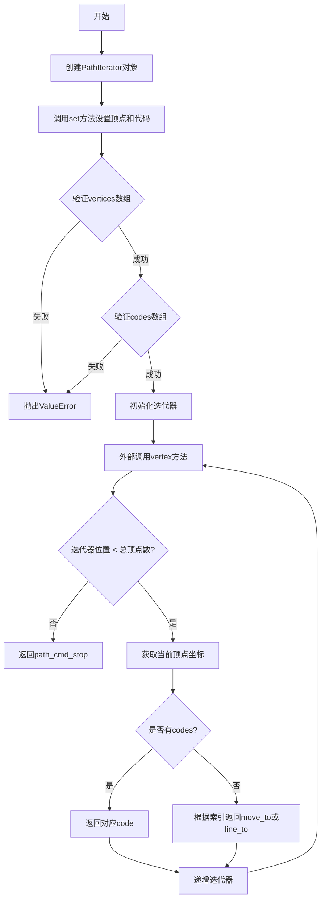

## 类结构

```
mpl命名空间
├── PathIterator (路径迭代器类)
│   ├── m_vertices (顶点数组)
│   ├── m_codes (路径代码数组)
│   ├── m_iterator (迭代器位置)
│   ├── m_total_vertices (总顶点数)
│   ├── m_should_simplify (简化标志)
│   └── m_simplify_threshold (简化阈值)
├── PathGenerator (路径生成器类)
│   ├── m_paths (路径序列)
│   └── m_npaths (路径数量)
PYBIND11_NAMESPACE::detail命名空间
├── type_caster<mpl::PathIterator>
└── type_caster<mpl::PathGenerator>
```

## 全局变量及字段


### `type_caster<mpl::PathIterator>`
    
pybind11类型转换器，用于在Python和C++之间转换PathIterator对象

类型：`PYBIND11_NAMESPACE::detail::type_caster<mpl::PathIterator>`
    


### `type_caster<mpl::PathGenerator>`
    
pybind11类型转换器，用于在Python和C++之间转换PathGenerator对象

类型：`PYBIND11_NAMESPACE::detail::type_caster<mpl::PathGenerator>`
    


### `PathIterator.m_vertices`
    
存储顶点数据的NumPy数组

类型：`py::array_t<double>`
    


### `PathIterator.m_codes`
    
存储路径命令代码的NumPy数组

类型：`py::array_t<uint8_t>`
    


### `PathIterator.m_iterator`
    
当前迭代位置

类型：`unsigned`
    


### `PathIterator.m_total_vertices`
    
顶点总数

类型：`unsigned`
    


### `PathIterator.m_should_simplify`
    
是否应该简化路径

类型：`bool`
    


### `PathIterator.m_simplify_threshold`
    
路径简化的阈值

类型：`double`
    


### `PathGenerator.m_paths`
    
Python路径序列对象

类型：`py::sequence`
    


### `PathGenerator.m_npaths`
    
路径数量

类型：`Py_ssize_t`
    
    

## 全局函数及方法


### `PathIterator.PathIterator()`

默认构造函数，用于构造一个空的PathIterator对象，初始化所有成员变量为默认值，为后续的set调用做好准备。

参数：

- （无参数）

返回值：无（构造函数）

#### 流程图

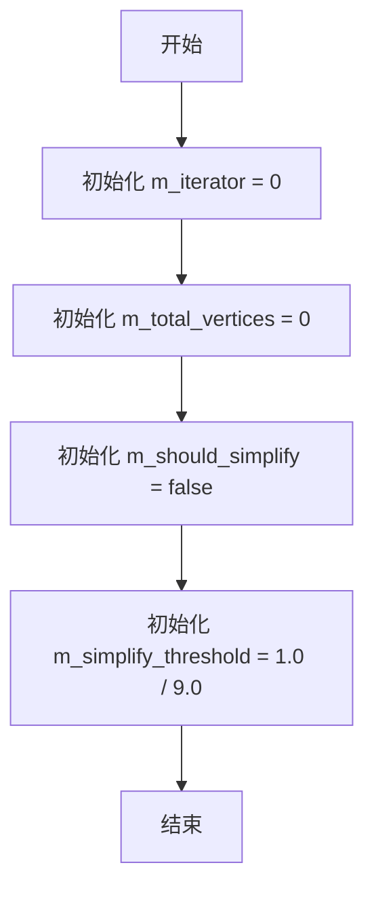

#### 带注释源码

```cpp
inline PathIterator()
    : m_iterator(0),               // 初始化迭代器索引为0，表示从头开始
      m_total_vertices(0),         // 初始化顶点总数为0，表示当前没有顶点数据
      m_should_simplify(false),   // 初始化简化标志为false，默认不进行路径简化
      m_simplify_threshold(1.0 / 9.0)  // 初始化简化阈值为1/9（约0.111），用于路径简化计算
{
    // 默认构造函数体为空，所有成员变量通过成员初始化列表完成初始化
    // 该构造函数创建的对象处于"空"状态，需要通过后续调用set()方法传入顶点数据
}
```


### `PathIterator.PathIterator(py::object, py::object, bool, double)`

带参构造函数，用于初始化 PathIterator 对象，接收 Python 的顶点数组、编码数组、简化标志和简化阈值，并调用 set() 方法完成成员变量的设置。

参数：

- `vertices`：`py::object`，Python 对象，表示路径的顶点数据（后续被转换为 `py::array_t<double>` 类型）
- `codes`：`py::object`，Python 对象，表示路径的操作码数组（后续被转换为 `py::array_t<uint8_t>` 类型，可为 None）
- `should_simplify`：`bool`，标志位，表示是否对该路径进行简化处理
- `simplify_threshold`：`double`，简化阈值，用于控制路径简化的程度

返回值：无（构造函数）

#### 流程图

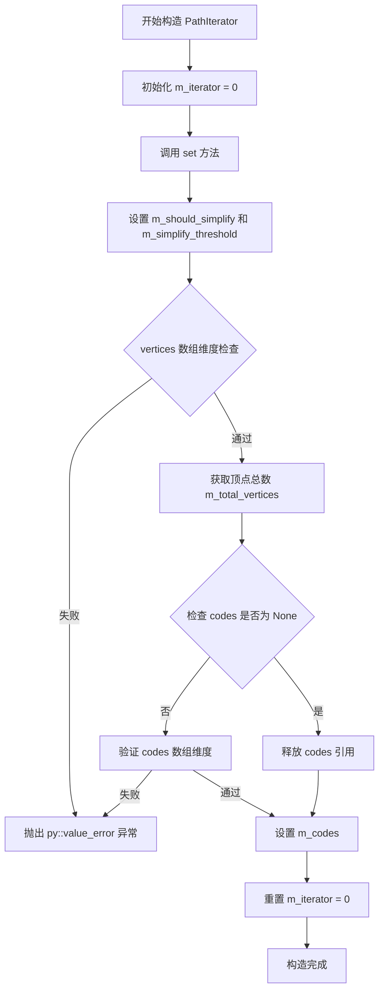

#### 带注释源码

```cpp
inline PathIterator::PathIterator(py::object vertices, py::object codes, 
                                   bool should_simplify, double simplify_threshold)
    : m_iterator(0)  // 初始化迭代器为 0，从路径起点开始
{
    // 调用 set 方法完成所有成员变量的初始化和验证
    set(vertices, codes, should_simplify, simplify_threshold);
}
```

#### 相关联的 set 方法源码

```cpp
inline void
PathIterator::set(py::object vertices, py::object codes, 
                  bool should_simplify, double simplify_threshold)
{
    // 1. 设置简化标志和阈值
    m_should_simplify = should_simplify;
    m_simplify_threshold = simplify_threshold;

    // 2. 将 Python 对象 vertices 转换为 py::array_t<double> 类型
    m_vertices = vertices.cast<py::array_t<double>>();
    
    // 3. 验证 vertices 必须是二维数组，且第二维大小为 2 (x, y 坐标)
    if (m_vertices.ndim() != 2 || m_vertices.shape(1) != 2) {
        throw py::value_error("Invalid vertices array");  // 抛出值错误异常
    }
    // 4. 获取顶点总数
    m_total_vertices = m_vertices.shape(0);

    // 5. 释放 m_codes 的原有引用
    m_codes.release().dec_ref();
    
    // 6. 如果 codes 不为 None，则验证并转换
    if (!codes.is_none()) {
        m_codes = codes.cast<py::array_t<uint8_t>>();
        // 验证 codes 必须是一维数组，且长度等于顶点总数
        if (m_codes.ndim() != 1 || m_codes.shape(0) != m_total_vertices) {
            throw py::value_error("Invalid codes array");  // 抛出值错误异常
        }
    }

    // 7. 重置迭代器到起点
    m_iterator = 0;
}
```


### PathIterator.PathIterator

这是一个简化的带参构造函数，用于创建 PathIterator 对象并初始化其内部状态。该构造函数接收顶点数组和编码数组作为参数，调用 set 方法完成初始化，并将迭代器位置设为 0。

参数：

- `vertices`：`py::object`，Python 对象，表示路径的顶点数据，通常是 NumPy 数组
- `codes`：`py::object`，Python 对象，表示路径的操作码，通常是 NumPy 数组（可为 None）

返回值：无（构造函数）

#### 流程图

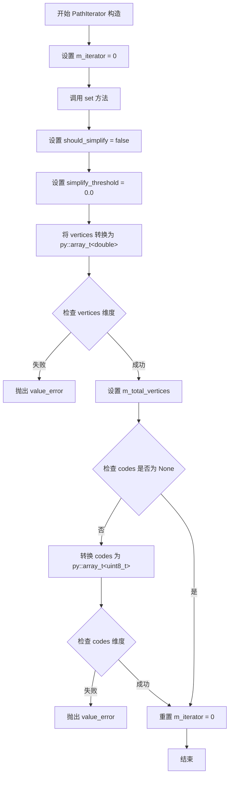

#### 带注释源码

```cpp
// 简化的带参构造函数，接收 vertices 和 codes 两个 Python 对象
inline PathIterator(py::object vertices, py::object codes)
    : m_iterator(0)  // 初始化迭代器为 0
{
    // 调用 set 方法，传入默认的 should_simplify=false 和 simplify_threshold=0.0
    set(vertices, codes);
}
```


### `PathIterator.PathIterator(const PathIterator&)`

该函数是 `PathIterator` 类的拷贝构造函数，用于创建一个 `PathIterator` 对象的深拷贝。它复制源对象的所有数据成员（顶点数组、编码数组、简化标志等），并将迭代器重置为 0。

参数：

- `other`：`const PathIterator&`，被拷贝的源 PathIterator 对象引用

返回值：`void`，无返回值（构造函数）

#### 流程图

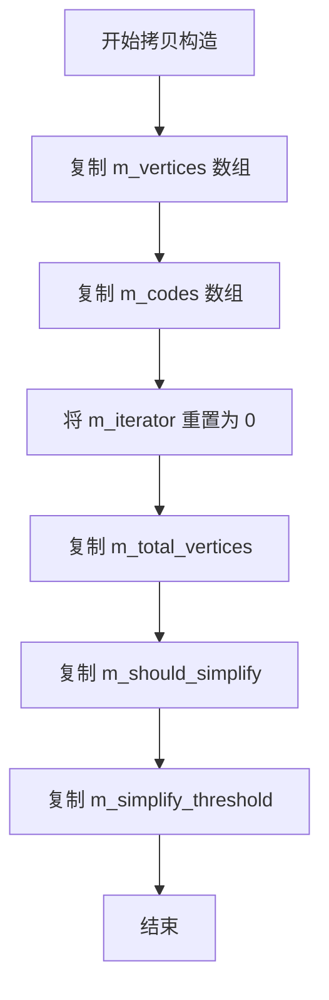

#### 带注释源码

```cpp
inline PathIterator(const PathIterator &other)
{
    // 复制顶点数组（包含Python对象的引用）
    m_vertices = other.m_vertices;
    
    // 复制路径编码数组（包含Python对象的引用）
    m_codes = other.m_codes;

    // 将迭代器重置为起始位置（从路径起点开始遍历）
    m_iterator = 0;
    
    // 复制顶点总数
    m_total_vertices = other.m_total_vertices;

    // 复制简化标志
    m_should_simplify = other.m_should_simplify;
    
    // 复制简化阈值
    m_simplify_threshold = other.m_simplify_threshold;
}
```


### `PathIterator.set`

设置PathIterator的顶点和路径编码，并进行维度验证，确保输入的NumPy数组符合要求。

参数：

- `vertices`：`py::object`，Python对象，包含顶点数据的NumPy数组，必须是二维数组（n×2）
- `codes`：`py::object`，Python对象，包含路径编码的NumPy数组，必须是一维数组且长度等于顶点数，或为None
- `should_simplify`：`bool`，是否应该进行路径简化
- `simplify_threshold`：`double`，路径简化的阈值

返回值：`void`，无返回值

#### 流程图

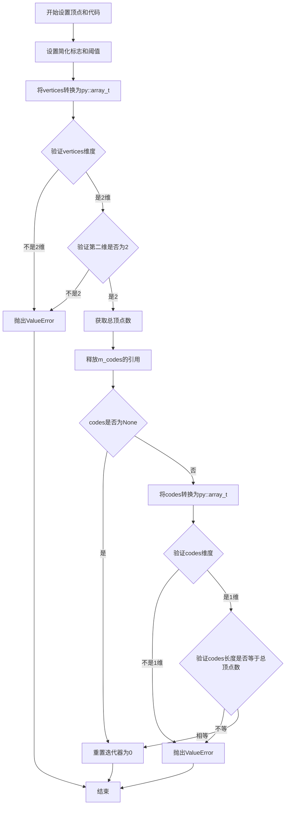

#### 带注释源码

```cpp
inline void
set(py::object vertices, py::object codes, bool should_simplify, double simplify_threshold)
{
    // 设置简化标志和阈值
    m_should_simplify = should_simplify;
    m_simplify_threshold = simplify_threshold;

    // 将Python对象vertices转换为py::array_t<double>类型
    m_vertices = vertices.cast<py::array_t<double>>();
    // 验证vertices必须是2维数组，且第二维长度为2（x, y坐标）
    if (m_vertices.ndim() != 2 || m_vertices.shape(1) != 2) {
        throw py::value_error("Invalid vertices array");
    }
    // 获取顶点总数
    m_total_vertices = m_vertices.shape(0);

    // 释放m_codes的旧引用
    m_codes.release().dec_ref();
    // 如果codes不为None，则进行验证和转换
    if (!codes.is_none()) {
        m_codes = codes.cast<py::array_t<uint8_t>>();
        // 验证codes必须是一维数组，且长度等于顶点数
        if (m_codes.ndim() != 1 || m_codes.shape(0) != m_total_vertices) {
            throw py::value_error("Invalid codes array");
        }
    }

    // 重置迭代器到起始位置
    m_iterator = 0;
}
```


### `PathIterator.set`

该方法是 `PathIterator` 类的简化版设置方法，用于初始化或重置路径迭代器的顶点数据和路径命令代码。它内部直接调用了包含简化参数的完整版 `set` 方法，默认禁用路径简化并将简化阈值设为 0.0。

参数：

-  `vertices`：`py::object`，顶点数据，通常为包含坐标的 NumPy 数组。
-  `codes`：`py::object`，路径命令代码（如 MoveTo, LineTo 等），通常为包含整数的 NumPy 数组，可为 `None`。

返回值：`void`，无返回值。

#### 流程图

```mermaid
flowchart TD
    A[Start: set vertices, codes] --> B[调用重载方法 set(vertices, codes, false, 0.0)]
    B --> C[End]
```

#### 带注释源码

```cpp
inline void set(py::object vertices, py::object codes)
{
    // 简化版方法直接调用四参数版本，传入默认值：
    // should_simplify = false (不简化)
    // simplify_threshold = 0.0
    set(vertices, codes, false, 0.0);
}
```


### PathIterator.vertex

获取当前顶点坐标，并将路径命令作为返回值返回。该方法实现了Agg库的顶点源接口，允许迭代器遍历路径中的所有顶点。

参数：

- `x`：`double*`，输出参数，用于存储当前顶点的x坐标
- `y`：`double*`，输出参数，用于存储当前顶点的y坐标

返回值：`unsigned`，返回当前顶点对应的路径命令（如`agg::path_cmd_stop`、`agg::path_cmd_move_to`、`agg::path_cmd_line_to`等）

#### 流程图

```mermaid
flowchart TD
    A[开始 vertex] --> B{m_iterator >= m_total_vertices?}
    B -->|是| C[设置 x=0.0, y=0.0]
    C --> D[返回 agg::path_cmd_stop]
    B -->|否| E[idx = m_iterator++]
    E --> F[*x = m_vertices[idx, 0]]
    F --> G[*y = m_vertices[idx, 1]]
    G --> H{m_codes 存在?}
    H -->|是| I[返回 *m_codes[idx]]
    H -->|否| J{idx == 0?}
    J -->|是| K[返回 agg::path_cmd_move_to]
    J -->|否| L[返回 agg::path_cmd_line_to]
```

#### 带注释源码

```cpp
inline unsigned vertex(double *x, double *y)
{
    // 边界检查：如果迭代器已超过总顶点数，表示路径已遍历完毕
    if (m_iterator >= m_total_vertices) {
        // 将输出坐标设为零（通常被调用方忽略）
        *x = 0.0;
        *y = 0.0;
        // 返回路径停止命令，通知调用方没有更多顶点
        return agg::path_cmd_stop;
    }

    // 获取当前索引并递增迭代器
    const size_t idx = m_iterator++;

    // 从NumPy顶点数组中提取当前顶点的坐标
    // m_vertices 是一个 py::array_t<double>，存储形如 [[x0,y0], [x1,y1], ...] 的顶点数据
    *x = *m_vertices.data(idx, 0);  // 读取第 idx 行的第0列（x坐标）
    *y = *m_vertices.data(idx, 1);  // 读取第 idx 行的第1列（y坐标）

    // 如果存在路径编码数组（codes），返回对应的路径命令
    // codes数组定义了每个顶点的操作类型（如MOVETO, LINETO, CLOSEPOLY等）
    if (m_codes) {
        return *m_codes.data(idx);  // 返回预定义的路径命令
    } else {
        // 如果没有codes数组，根据顶点索引自动推断命令：
        // 第一个顶点为 MOV_TO，后续顶点为 LINE_TO
        return idx == 0 ? agg::path_cmd_move_to : agg::path_cmd_line_to;
    }
}
```


### PathIterator.rewind(unsigned)

重置PathIterator内部迭代器的位置为指定的path_id，以便从指定位置开始遍历路径顶点。

参数：

- `path_id`：`unsigned`，指定迭代器的新位置索引，用于控制后续`vertex()`调用从哪个顶点开始返回

返回值：`void`，无返回值

#### 流程图

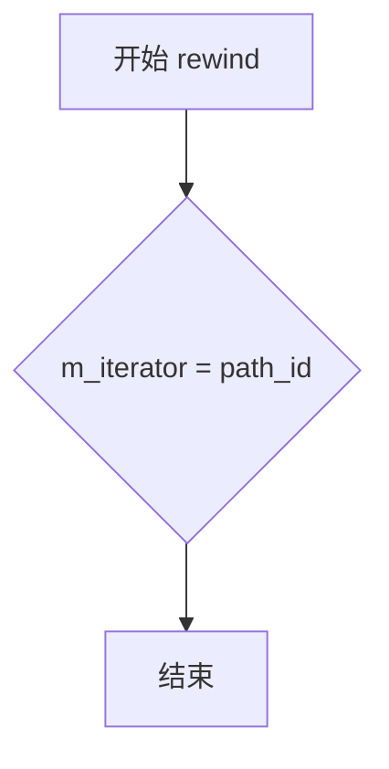

#### 带注释源码

```cpp
/**
 * @brief 重置迭代器位置
 * 
 * 将内部迭代器 m_iterator 设置为指定的 path_id 值，
 * 使得后续调用 vertex() 时从该位置开始获取顶点数据。
 * 
 * @param path_id 新的迭代器位置索引，传入0将从第一个顶点开始
 */
inline void rewind(unsigned path_id)
{
    m_iterator = path_id;  // 将内部迭代器位置设置为指定的path_id值
}
```


### `PathIterator.total_vertices()`

获取路径迭代器中存储的总顶点数。该方法为const成员函数，不修改对象状态，直接返回内部维护的顶点计数器值。

参数：无

返回值：`unsigned`，返回PathIterator中维护的总顶点数（即vertices数组的行数）

#### 流程图

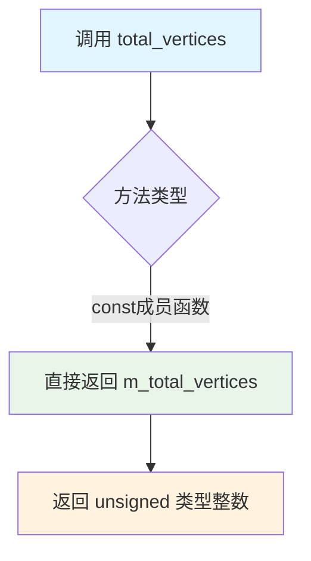

#### 带注释源码

```cpp
/**
 * @brief 获取路径中的总顶点数
 * 
 * 此方法返回在set()方法中设置的m_total_vertices值。
 * 该值对应于输入的vertices NumPy数组的第一个维度大小（即行数）。
 * 
 * @return unsigned 返回路径包含的顶点总数
 * @note 此方法为const成员函数，不会修改对象状态
 */
inline unsigned total_vertices() const
{
    // 直接返回成员变量 m_total_vertices
    // 该值在 set() 方法中被设置为 m_vertices.shape(0)
    return m_total_vertices;
}
```

#### 关联信息

| 元素 | 类型 | 说明 |
|------|------|------|
| `m_total_vertices` | `unsigned` | 存储路径总顶点数，在`set()`方法中从vertices数组形状确定 |
| `m_vertices` | `py::array_t<double>` | 存储顶点数据的NumPy数组，形状为(n, 2) |
| `set()` | `void` | 设置vertices和codes数组，同时初始化`m_total_vertices` |

#### 技术说明

1. **设计目的**：该方法实现了Agg库标准vertex source接口的`total_vertices()`函数，使`PathIterator`可以作为Agg的顶点源使用
2. **性能考虑**：由于是内联函数且直接返回成员变量，时间复杂度为O(1)
3. **线程安全性**：const方法保证了对多线程访问的安全性（前提是对象本身是 immutable 的）


### `PathIterator.should_simplify`

#### 描述
`PathIterator.should_simplify()` 是一个简单的常量成员函数（getter），属于 `mpl::PathIterator` 类。它主要用于向渲染引擎（Aggregator）提供路径对象的一个属性标志，表明当前路径在渲染时是否需要被简化（simplify）。该方法直接返回内部成员变量 `m_should_simplify` 的值。

#### 文件整体运行流程
该代码文件定义了一组 C++ 类，用于在 Python (NumPy) 数据结构和 C++ 绘图库 (Agg) 之间建立桥梁。
1. **初始化**：Python 层传递顶点数据、路径指令码以及简化参数（should_simplify, simplify_threshold）。
2. **适配**：通过 `pybind11` 将数据绑定到 `PathIterator` 对象。
3. **迭代渲染**：渲染循环调用 `vertex()` 方法获取顶点，同时可以调用 `should_simplify()` 查询当前路径的处理策略。
4. **结束**：迭代完成，Python 对象引用释放。

#### 类详细信息
- **类名**: `mpl::PathIterator`
- **类字段**:
    - `m_vertices`: `py::array_t<double>`，存储顶点的 NumPy 数组。
    - `m_codes`: `py::array_t<uint8_t>`，存储路径指令码（如 MoveTo, LineTo）的 NumPy 数组。
    - `m_iterator`: `unsigned`，当前迭代器的位置索引。
    - `m_total_vertices`: `unsigned`，顶点总数。
    - `m_should_simplify`: `bool`，**核心字段**，标记路径是否应被简化。
    - `m_simplify_threshold`: `double`，简化操作的阈值。
- **类方法**:
    - `PathIterator(...)`: 构造函数，用于初始化路径迭代器。
    - `set(...)`: 设置顶点、指令码及简化参数。
    - `vertex(double* x, double* y)`: 获取下一个顶点。
    - `should_simplify()`: **待提取的方法**。
    - `simplify_threshold()`: 获取简化阈值。

#### 函数详细信息
- **名称**: `PathIterator.should_simplify`
- **参数**: 无
- **返回值**: `bool`，表示是否需要对路径进行简化。

#### 流程图

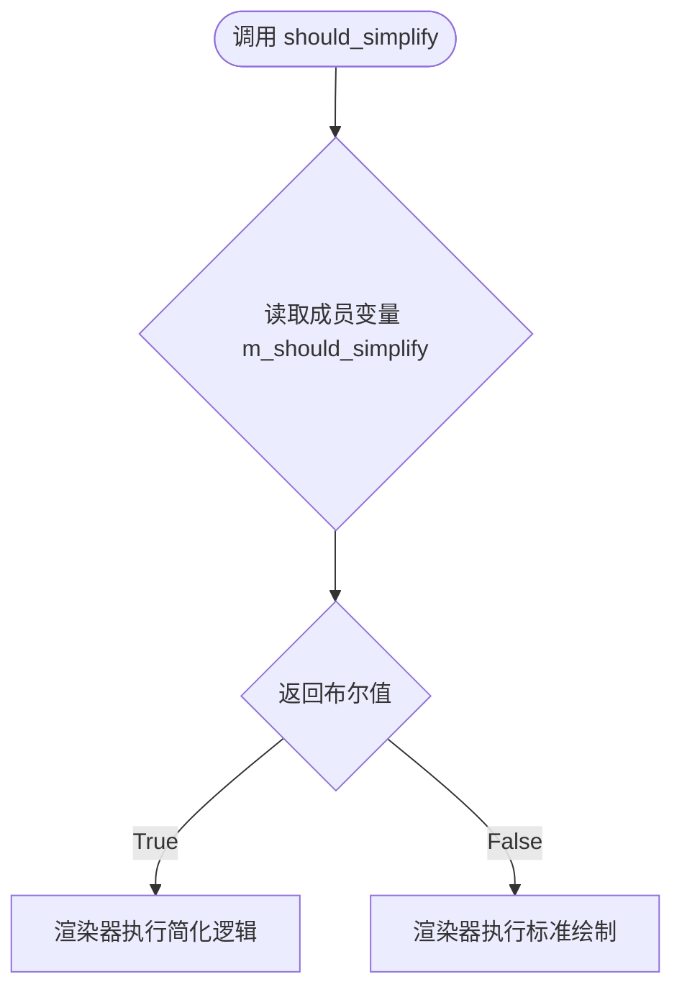

#### 带注释源码

```cpp
    /**
     * @brief 返回路径是否应该被简化的标志。
     * 
     * 该方法是一个简单的 getter，它直接返回在构造或 set() 时
     * 从 Python 对象传入的 m_should_simplify 标志。
     * 注意：实际的简化算法并不在本类中实现，仅传递此标志供外部使用。
     * 
     * @return bool 如果需要简化返回 true，否则返回 false。
     */
    inline bool should_simplify() const
    {
        return m_should_simplify;
    }
```

### 关键组件信息
- **PathIterator**: 核心适配器类，负责将 Python 的路径数据结构转换为 C++ Agg 可以遍历的格式。
- **pybind11**: 用于实现 Python 对象与 C++ 类型之间自动转换的库。

### 潜在的技术债务或优化空间
- **职责不清**: 代码注释中明确指出 "This class doesn't actually do any simplification"（该类实际上不执行任何简化）。这意味着 `should_simplify` 只是一个传递标志的容器，而真正的简化逻辑可能缺失或位于 Python 层或渲染管线下游。这可能造成维护上的困惑：如果未来要在 C++ 层实现简化，逻辑应该放在哪里？
- **内联效率**: 当前实现为 `inline`，在头文件中定义，这对于这种简单的 getter 是高效的，但如果此类被大量复制（而非引用），可能会增加编译时间。

### 其它项目
- **设计目标与约束**: 提供高性能的 Python-C++ 数据桥接，尽量减少数据拷贝，直接操作 NumPy 内存。
- **错误处理与异常设计**: 主要的错误处理集中在 `set()` 方法中（如维度不匹配抛出 `py::value_error`），而 `should_simplify` 作为纯查询方法，不涉及复杂的错误处理。
- **外部依赖与接口契约**: 依赖于 `pybind11` 和 `agg_basics.h`。接口需符合 Agg 的 `vertex_source` 概念（虽然此处是独立的适配器类）。


### PathIterator.simplify_threshold()

这是一个简单的访问器方法，用于获取PathIterator中存储的路径简化阈值。

参数：
- （无参数）

返回值：`double`，返回路径简化的阈值，该值用于控制路径简化的程度。

#### 流程图

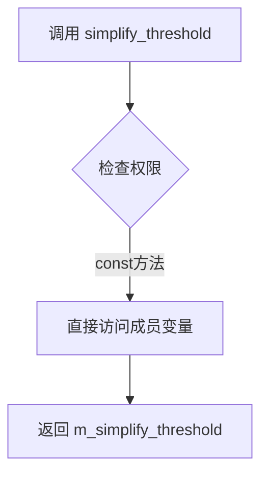

#### 带注释源码

```cpp
/**
 * @brief 获取路径简化阈值
 * 
 * 此方法返回之前通过构造函数或set方法设置的简化阈值。
 * 该阈值用于控制路径简化的程度，数值越小简化程度越低，
 * 数值越大简化程度越高。
 * 
 * @return double 返回当前设置的简化阈值
 */
inline double simplify_threshold() const
{
    // 直接返回成员变量m_simplify_threshold的值
    // 该值在PathIterator对象创建或set时被初始化
    return m_simplify_threshold;
}
```

---

#### 关联类信息

**所属类**：PathIterator

**类功能描述**：PathIterator类作为NumPy数组与Agg图形库之间的桥梁，通过标准的Agg顶点源接口迭代遍历路径的顶点和编码。

**类字段**：

| 字段名称 | 类型 | 描述 |
|---------|------|------|
| m_vertices | py::array_t<double> | 存储路径顶点数据的NumPy数组 |
| m_codes | py::array_t<uint8_t> | 存储路径命令编码的NumPy数组 |
| m_iterator | unsigned | 当前迭代器位置 |
| m_total_vertices | unsigned | 顶点总数 |
| m_should_simplify | bool | 标记是否应进行路径简化 |
| m_simplify_threshold | double | 路径简化的阈值 |

**类方法**：

| 方法名 | 功能 |
|--------|------|
| PathIterator() | 默认构造函数，初始化默认值 |
| set() | 设置顶点、编码和简化参数 |
| vertex() | 获取当前位置的顶点 |
| rewind() | 重置迭代器位置 |
| total_vertices() | 获取顶点总数 |
| should_simplify() | 获取是否应简化的标志 |
| simplify_threshold() | 获取简化阈值 |
| has_codes() | 检查是否有路径编码 |
| get_id() | 获取顶点数据的指针 |

---

#### 潜在技术债务与优化空间

1. **设计分离问题**：simplify_threshold()方法与实际的路径简化逻辑分离，该类只存储阈值而不执行简化操作，这可能导致职责不够清晰。

2. **硬编码默认值**：默认构造函数中设置`m_simplify_threshold = 1.0 / 9.0`，这个魔法数字缺乏明确注释。

3. **缺乏验证**：set方法中没有对simplify_threshold的范围进行验证，负值或极大值可能导致异常行为。

4. **接口一致性**：与Python端的接口契约依赖于type_caster的转换，缺少显式的参数验证边界。


### `PathIterator.has_codes()`

该方法用于检查当前路径迭代器中是否包含路径代码（codes），即判断 `m_codes` 数组是否已被设置且有效。

参数：
- 无参数（成员函数）

返回值：`bool`，如果存在有效的路径代码数组则返回 `true`，否则返回 `false`。

#### 流程图

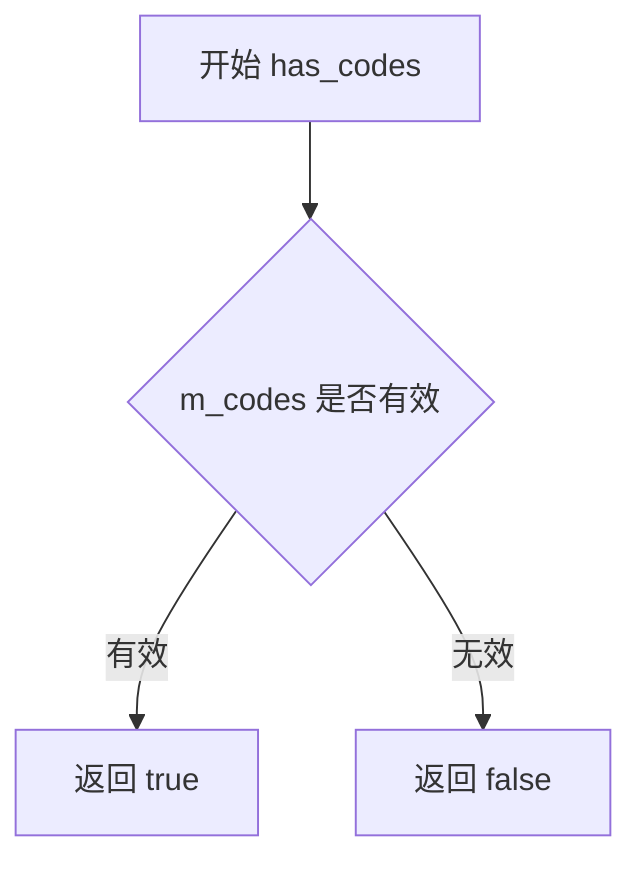

#### 带注释源码

```cpp
/**
 * @brief 检查是否存在路径代码
 * 
 * 该方法判断 m_codes 数组是否已被初始化且有效。
 * 在 PathIterator 中，m_codes 可以为 None（无效），
 * 此时表示路径没有显式的代码信息。
 * 
 * @return bool 如果存在有效的 codes 数组返回 true，否则返回 false
 */
inline bool has_codes() const
{
    // 将 m_codes 转换为 bool 值
    // pybind11 的 array_t 实现了到 bool 的隐式转换
    // 如果 m_codes 未被初始化或已被释放，则返回 false
    return bool(m_codes);
}
```


### `PathIterator.get_id`

获取顶点数据数组的原始指针，用于与Agg图形库进行交互。

参数： 无

返回值：`void *`，返回底层NumPy顶点数组的原始内存指针

#### 流程图

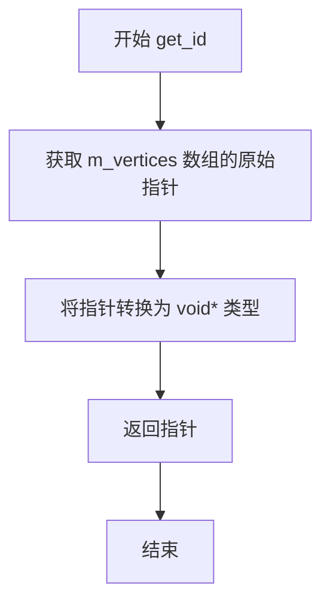

#### 带注释源码

```cpp
/**
 * @brief 获取顶点数据的原始指针
 * 
 * 此方法返回存储顶点数据的NumPy数组的原始内存地址。
 * 主要用于与Agg库的底层交互，让Agg可以直接访问顶点数据，
 * 而无需额外的内存拷贝。
 * 
 * @return void* 指向 m_vertices 数组数据的指针
 */
inline void *get_id()
{
    // m_vertices 是 py::array_t<double> 类型
    // .ptr() 方法返回指向底层数据缓冲区的原始指针
    // 返回 void* 以提供最大的灵活性，调用者可以根据需要将其转换
    return (void *)m_vertices.ptr();
}
```


### `PathGenerator.PathGenerator()`

这是 `PathGenerator` 类的默认构造函数，用于创建 `PathGenerator` 对象并将其内部状态初始化为默认值。该构造函数是 MPL (matplotlib) 中 Python-C++ 桥接层的一部分，负责初始化路径生成器，使其准备好接受通过 `set()` 方法设置的路径数据。

参数：无（默认构造函数不接受任何参数）

返回值：无（构造函数不返回值）

#### 流程图

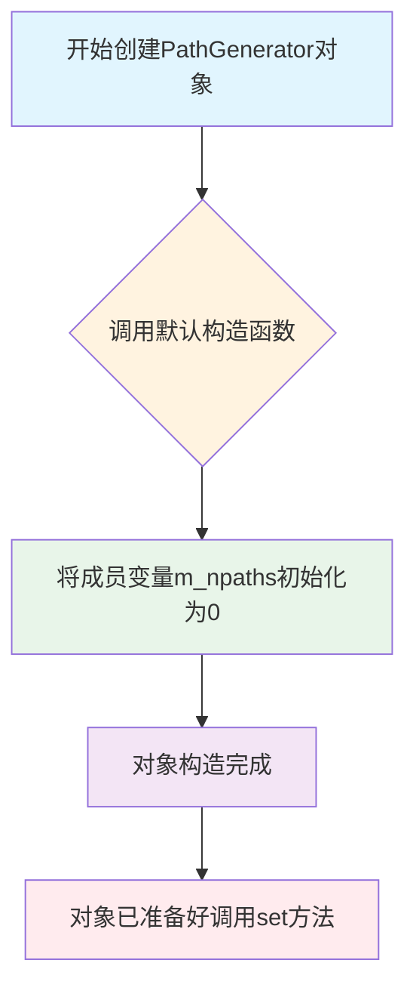

#### 带注释源码

```cpp
class PathGenerator
{
    py::sequence m_paths;      // 存储Python序列对象（路径集合）
    Py_ssize_t m_npaths;       // 路径数量

  public:
    typedef PathIterator path_iterator;  // 类型别名，用于迭代路径

    /**
     * @brief PathGenerator类的默认构造函数
     * 
     * 该构造函数执行以下初始化操作：
     * 1. 不初始化m_paths（由py::sequence的默认构造函数处理）
     * 2. 将m_npaths初始化为0，表示当前没有路径被设置
     * 
     * 构造后的对象需要通过调用set()方法来设置实际的路径数据。
     */
    PathGenerator() : m_npaths(0) {}

    // ... 其他成员方法
};
```

#### 补充说明

| 字段 | 类型 | 描述 |
|------|------|------|
| `m_paths` | `py::sequence` | 存储Python序列对象，包含所有路径数据 |
| `m_npaths` | `Py_ssize_t` | 路径数量，初始化为0 |

#### 使用场景

这个默认构造函数在以下场景中使用：
1. 当 Python 对象通过 pybind11 绑定传递给 C++ 时，会先创建默认构造的 `PathGenerator` 对象
2. 然后通过 `type_caster` 中的 `load()` 方法调用 `set()` 方法来填充实际数据
3. 作为工厂方法的一部分，配合 `operator()` 方法用于迭代访问各个路径


### `PathGenerator.set`

该方法用于将传入的Python对象转换为路径序列并存储到PathGenerator中，同时更新路径数量。

参数：

- `obj`：`py::object`，需要被设置为路径序列的Python对象，将被转换为`py::sequence`类型

返回值：`void`，无返回值

#### 流程图

```mermaid
flowchart TD
    A[开始 set 方法] --> B[接收 py::object obj 参数]
    B --> C[将 obj 强制转换为 py::sequence]
    C --> D[调用 m_paths.size() 获取序列长度]
    D --> E[将转换后的序列赋值给成员变量 m_paths]
    E --> F[更新 m_npaths 为序列大小]
    F --> G[结束 set 方法]
```

#### 带注释源码

```cpp
void set(py::object obj)
{
    // 将传入的 Python 对象转换为 py::sequence 类型
    // pybind11 会检查类型兼容性，如果类型不匹配会抛出异常
    m_paths = obj.cast<py::sequence>();
    
    // 获取序列中的元素数量并存储到成员变量中
    // 这样后续可以快速获取路径数量而无需再次查询
    m_npaths = m_paths.size();
}
```


### `PathGenerator.num_paths`

获取PathGenerator中存储的路径数量。

参数：该函数无参数

返回值：`Py_ssize_t`，返回PathGenerator中管理的路径总数

#### 流程图

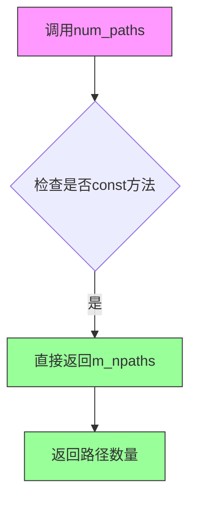

#### 带注释源码

```cpp
/**
 * @brief 获取路径数量
 * 
 * 该方法返回PathGenerator中管理的路径总数。
 * 这是一个const方法，不会修改对象状态。
 * 
 * @return Py_ssize_t 路径数量
 * @note 时间复杂度为O(1)，直接返回成员变量
 */
Py_ssize_t num_paths() const
{
    // 直接返回成员变量m_npaths，该变量在set()方法中被初始化
    // m_npaths存储了Python序列对象的长度
    return m_npaths;
}
```

#### 上下文信息

**所属类：PathGenerator**

`PathGenerator`类是一个Python到C++的适配器类，用于将Python路径序列转换为C++可遍历的路径迭代器。

**成员变量：**

- `m_paths`：`py::sequence`类型，存储Python路径序列
- `m_npaths`：`Py_ssize_t`类型，存储路径数量

**相关方法：**

- `set(py::object obj)`：设置路径序列并更新m_npaths
- `size()`：与num_paths()功能相同，也是返回m_npaths
- `operator()(size_t i)`：返回指定索引处的PathIterator


### PathGenerator.size()

获取路径数量，是 `num_paths()` 方法的别名，返回 `PathGenerator` 中存储的路径总数。

参数：  
无

返回值：`Py_ssize_t`，返回路径的数量，即成员变量 `m_npaths` 的值。

#### 流程图

```mermaid
graph TD
    A[开始调用 size()] --> B{执行方法}
    B --> C[返回 m_npaths]
    C --> D[结束]
```

#### 带注释源码

```cpp
// 获取路径数量，返回存储的路径总数
// 该方法是 num_paths() 的别名
Py_ssize_t size() const
{
    return m_npaths; // 直接返回成员变量 m_npaths
}
```


### PathGenerator::operator()

该函数是`PathGenerator`类的调用运算符重载，通过取模运算安全地获取指定索引对应的`PathIterator`对象，实现循环访问路径集合的功能。

参数：

- `i`：`size_t`，要访问的路径索引

返回值：`path_iterator`（即`PathIterator`类型），返回指定索引位置的PathIterator对象，用于遍历路径的顶点和操作码

#### 流程图

```mermaid
flowchart TD
    A[开始执行 operator()] --> B{检查 m_npaths 是否为 0}
    B -->|是| C[返回默认构造的 PathIterator]
    B -->|否| D[计算索引: idx = i % m_npaths]
    D --> E[从 m_paths 序列获取对应项: item = m_paths[idx]]
    E --> F[将 item 转换为 path_iterator 类型]
    F --> G[返回转换后的 PathIterator]
    C --> G
```

#### 带注释源码

```cpp
/**
 * @brief PathGenerator 的调用运算符重载
 * 
 * 根据给定的索引返回对应的 PathIterator 对象。
 * 使用取模运算确保索引始终在有效范围内，实现循环访问。
 * 
 * @param i size_t 类型的索引值
 * @return path_iterator 返回对应索引的 PathIterator 对象
 */
path_iterator operator()(size_t i)
{
    // 创建默认构造的 path_iterator 对象
    path_iterator path;

    // 使用取模运算确保索引在 [0, m_npaths) 范围内
    // 这样即使传入的 i 超出范围，也会循环访问路径列表
    auto item = m_paths[i % m_npaths];
    
    // 将 Python 对象转换为 C++ 的 PathIterator 类型
    path = item.cast<path_iterator>();
    
    // 返回转换后的 PathIterator 对象
    return path;
}
```


### `type_caster<mpl::PathIterator>::load`

该函数是 pybind11 类型转换器的一部分，负责将 Python 对象中的路径数据（顶点、编码、简化标志和阈值）提取并加载到 C++ 的 `PathIterator` 对象中，是 Python 对象与 C++ 路径迭代器之间的桥梁。

参数：

- `src`：`handle`（pybind11 定义的 Python 对象句柄），表示要从中加载数据的 Python 对象，通常是一个包含 `vertices`、`codes`、`should_simplify` 和 `simplify_threshold` 属性的对象
- 第二个参数：`bool`，在代码中未使用，是 pybind11 的占位参数

返回值：`bool`，表示加载操作是否成功（始终返回 `true`，即使 Python 对象为 `None` 也视为有效）

#### 流程图

```mermaid
flowchart TD
    A[开始 load] --> B{检查 src.is_none()}
    B -->|是| C[返回 true]
    B -->|否| D[获取 vertices 属性]
    D --> E[获取 codes 属性]
    E --> F[获取 should_simplify 属性并转换为 bool]
    F --> G[获取 simplify_threshold 属性并转换为 double]
    G --> H[调用 value.set 加载数据]
    H --> I[返回 true]
```

#### 带注释源码

```cpp
// pybind11 type_caster 特化，用于在 Python 和 C++ 之间转换 PathIterator
template <> struct type_caster<mpl::PathIterator> {
public:
    // 使用 PYBIND11_TYPE_CASTER 宏定义类型转换器
    // value 成员是目标类型 mpl::PathIterator 的实例
    PYBIND11_TYPE_CASTER(mpl::PathIterator, const_name("PathIterator"));

    /**
     * @brief 从 Python 对象加载数据到 PathIterator
     * @param src Python 对象句柄，包含路径的顶点、编码、简化参数
     * @param bool parameter 当前未使用，是 pybind11 的占位参数
     * @return bool 加载是否成功
     */
    bool load(handle src, bool) {
        // 如果 Python 对象是 None，直接返回成功
        // 这样允许 Python 传递 None 作为可选参数
        if (src.is_none()) {
            return true;
        }

        // 从 Python 对象提取 vertices 属性
        // vertices 应该是一个包含路径顶点的 NumPy 数组
        py::object vertices = src.attr("vertices");
        
        // 从 Python 对象提取 codes 属性
        // codes 应该是一个包含路径命令编码的 NumPy 数组
        py::object codes = src.attr("codes");
        
        // 提取 should_simplify 属性，表示是否应该简化路径
        auto should_simplify = src.attr("should_simplify").cast<bool>();
        
        // 提取 simplify_threshold 属性，路径简化的阈值
        auto simplify_threshold = src.attr("simplify_threshold").cast<double>();

        // 调用 PathIterator 的 set 方法设置数据
        // 这会验证 vertices 和 codes 的维度，并初始化内部迭代器
        value.set(vertices, codes, should_simplify, simplify_threshold);

        // 加载成功，返回 true
        return true;
    }
};
```


### `type_caster<mpl::PathGenerator>.load`

该函数是pybind11的类型转换器模板特例的加载方法，用于将Python对象加载到C++的`mpl::PathGenerator`类中。它接收一个Python对象句柄，将其转换为pybind11的`py::object`，然后调用`PathGenerator`的`set`方法将Python序列对象存储到C++对象中。

参数：

- `src`：`handle`，pybind11的Python对象句柄，表示要从Python侧传入的PathGenerator兼容对象（通常是一个Python序列）
- （隐式参数）：`bool`类型参数，表示是否允许隐式转换的标志

返回值：`bool`，返回`true`表示加载成功，将Python对象成功绑定到C++的`PathGenerator`实例；该函数不检查失败情况，始终返回`true`。

#### 流程图

```mermaid
flowchart TD
    A[load函数被调用] --> B{检查src是否为空}
    B -->|否| C[py::reinterpret_borrow<py::object>转换src]
    C --> D[调用value.set转换后的object]
    D --> E[PathGenerator.set方法执行]
    E --> F[将object强制转换为py::sequence]
    F --> G[更新m_npaths为序列大小]
    G --> H[返回true表示成功]
```

#### 带注释源码

```cpp
template <> struct type_caster<mpl::PathGenerator> {
public:
    // 使用PYBIND11_TYPE_CASTER宏定义类型转换器
    // value成员类型为mpl::PathGenerator
    PYBIND11_TYPE_CASTER(mpl::PathGenerator, const_name("PathGenerator"));

    // 核心加载函数：将Python对象转换为C++ PathGenerator
    bool load(handle src, bool) {
        // 将Python handle重新解释为py::object（增加引用计数）
        // 这里的value是从PYBIND11_TYPE_CASTER宏扩展来的PathGenerator成员
        value.set(py::reinterpret_borrow<py::object>(src));
        
        // 总是返回true，假设输入总是有效的
        // 注意：这里没有错误检查，如果set()抛出异常会被传播
        return true;
    }
};
```

#### 关键组件信息

| 组件名称 | 一句话描述 |
|---------|-----------|
| `PathGenerator` | C++类，用于存储和管理多个路径迭代器的序列容器 |
| `type_caster<mpl::PathGenerator>` | pybind11类型转换器模板特例，桥接Python对象与C++ PathGenerator |
| `PYBIND11_TYPE_CASTER` | pybind11宏，定义类型转换器的基本结构和value成员 |

#### 技术债务与优化空间

1. **缺乏输入验证**：该`load`函数没有对输入的Python对象进行有效性检查（如是否为序列类型、序列长度是否合法等），如果传入无效对象，错误会在后续调用`PathGenerator::set()`时以异常形式抛出，而不是在加载阶段友好地报告错误。

2. **始终返回true**：函数设计假设所有输入都是合法的，不返回失败状态，这使得调用者无法区分真正的成功与静默失败。

3. **缺少none检查**：与`PathIterator`的type_caster不同（后者显式检查`src.is_none()`），这里没有处理Python `None`值的情况，可能导致意外行为。

4. **无错误上下文信息**：当转换失败时，抛出的异常缺乏足够的上下文信息来帮助调试是哪个字段出了问题。

#### 错误处理与异常设计

- **异常传播机制**：该函数本身不捕获异常，任何在`value.set()`中发生的异常（如Python类型转换失败、属性访问错误等）都会直接向上传播到Python调用者。
- **错误类型**：可能抛出的异常包括`py::cast_error`（类型转换失败）、`py::value_error`（无效的Python序列）等。
- **建议改进**：可以在load函数中添加try-catch块，捕获特定异常并添加更有意义的错误消息，或者在调用set()之前先验证src对象的类型和结构。

#### 外部依赖与接口契约

- **Python侧契约**：传入的Python对象应该是可迭代的序列类型（如list、tuple），且其元素应该是可转换为`PathIterator`的Python对象。
- **pybind11依赖**：依赖pybind11库的类型转换系统，包括`handle`、`py::object`、`py::reinterpret_borrow`等。
- **C++侧依赖**：依赖`mpl::PathGenerator`类的`set`方法实现，该方法期望接收一个`py::object`参数并将其转换为`py::sequence`。

## 关键组件


### PathIterator（路径迭代器）

核心类，充当NumPy数组与Agg图形库之间的桥梁，将Python的顶点数据转换为C++Agg友好的格式，支持路径遍历和简化策略。

### PathGenerator（路径生成器）

管理多个PathIterator的集合，通过索引生成对应的路径迭代器，实现批量路径处理和循环访问。

### type_caster<mpl::PathIterator>

pybind11类型转换器，将Python对象自动转换为PathIterator，处理vertices、codes、should_simplify和simplify_threshold属性的加载。

### type_caster<mpl::PathGenerator>

pybind11类型转换器，将Python序列对象转换为PathGenerator，支持批量路径数据的绑定。

### m_vertices（顶点数据）

类型：py::array_t<double>，存储路径的二维顶点坐标数组，通过NumPy直接内存访问实现高效数据交换。

### m_codes（路径编码）

类型：py::array_t<uint8_t>，存储路径命令编码（MOVE_TO、LINE_TO等），支持反量化处理。

### 张量索引机制

通过m_vertices.data(idx, 0)和m_vertices.data(idx, 1)直接访问二维数组元素，实现O(1)时间复杂度的张量查询。

### 惰性加载模式

set()方法验证数组维度但不立即复制数据，vertex()方法在调用时才访问底层NumPy缓冲区，实现延迟数据加载。

### 路径简化策略

m_should_simplify标志和m_simplify_threshold阈值共同控制路径简化行为，支持可配置的图形渲染优化策略。

### Agg顶点源接口

通过vertex()、rewind()、total_vertices()等方法实现标准Agg库的顶点源接口，确保与Agg渲染引擎的兼容性。


## 问题及建议


### 已知问题

- **资源管理错误**：`PathIterator::set()` 方法中 `m_codes.release().dec_ref();` 这行代码存在逻辑错误。`release()` 会释放内部指针并使其为空，然后调用 `dec_ref()` 实际上是在对一个空对象进行操作，可能导致未定义行为。正确的做法是先检查 m_codes 是否有效，若有效则先调用 `dec_ref()`，再赋值新值。
- **除零风险**：`PathGenerator::operator()` 中使用 `i % m_npaths` 取模运算，当 `m_npaths` 为 0 时会导致程序崩溃。虽然正常使用时 m_npaths 应大于 0，但缺乏防御性检查。
- **拷贝构造语义问题**：`PathIterator` 的拷贝构造函数将 `m_iterator` 重置为 0，这与其他成员的浅拷贝行为不一致，可能导致意外行为且不符合 Rule of Three/Five。
- **缺乏异常处理**：`type_caster` 的 `load` 方法中没有异常处理逻辑。当 Python 对象缺少必要的属性（如 vertices、codes、should_simplify、simplify_threshold）或类型转换失败时，pybind11 会抛出异常，可能导致库在使用时不够健壮。
- **冗余代码**：`PathIterator` 同时提供了 `num_paths()` 和 `size()` 两个方法，它们返回完全相同的值，造成接口冗余。

### 优化建议

- **修复资源管理**：在 `set()` 方法中，先保存当前 m_codes 的引用，检查是否有效，有效则调用 `dec_ref()`，然后再赋值新值。避免使用 `release().dec_ref()` 这种组合。
- **添加防御性检查**：在 `PathGenerator::operator()` 中添加 `if (m_npaths == 0)` 的检查，避免除零错误并提供明确的错误处理。
- **明确拷贝语义**：根据实际需求决定是否需要自定义拷贝/移动构造函数和赋值运算符，或添加拷贝构造函数说明文档，或考虑使用 `= default`。
- **增强异常处理**：在 `type_caster::load` 方法中添加 try-catch 块，处理可能的属性访问错误和类型转换错误，返回 false 而不是让异常传播。
- **移除冗余接口**：考虑移除 `size()` 方法或将其作为 `num_paths()` 的别名，明确 API 设计意图。
- **添加 const 正确性**：将不修改成员变量的方法（如 `total_vertices()`、`should_simplify()` 等）标记为 const，当前部分方法已标记但可一致性检查。


## 其它


### 设计目标与约束

本模块旨在实现Python端（matplotlib）到C++端（Agg图形库）的高效数据桥接，核心目标包括：1）将Python的NumPy数组（vertices和codes）透明化传递给C++的Agg渲染引擎；2）提供符合Agg标准的vertex source接口；3）通过pybind11实现Python对象与C++对象的自动类型转换。约束条件包括：仅支持2D顶点（shape[1]==2）、codes数组维度必须为1且与vertices第一维度匹配、不支持复杂的路径简化算法（仅存储参数）。

### 错误处理与异常设计

本模块采用C++异常与Python异常混合机制。错误类型主要分为两类：1）参数验证错误，使用py::value_error抛出Python ValueError，包括顶点数组维度错误（"Invalid vertices array"）和codes数组维度或形状不匹配错误（"Invalid codes array"）；2）类型转换错误，由pybind11自动处理。当PyObject引用失效或类型不匹配时，pybind11会抛出TypeError。PathIterator的vertex()方法在遍历结束时不抛异常，而是返回agg::path_cmd_stop标志。

### 数据流与状态机

数据流从Python端开始：用户创建包含vertices（numpy.ndarray，shape=(N,2)）和codes（numpy.ndarray，shape=(N,)或None）的Path对象 → 通过pybind11绑定调用PathIterator构造函数或set()方法 → PathIterator内部持有py::array_t对象引用并增加Python引用计数 → 调用vertex(double* x, double* y)时按顺序返回顶点坐标和路径命令 → Agg引擎消费完所有顶点后调用rewind()重置迭代器。PathGenerator作为路径集合的容器，支持通过operator()(size_t i)循环迭代多个PathIterator。

### 外部依赖与接口契约

本模块依赖以下外部组件：1）pybind11（头文件形式），提供Python对象绑定、数组支持和类型转换器；2）Agg库（agg_basics.h），提供path_cmd_stop、path_cmd_move_to、path_cmd_line_to等路径命令常量；3）Python NumPy（通过pybind11::array_t<double>间接依赖），要求传入的vertices为float64类型数组。接口契约规定：PathIterator的vertices必须为shape=(N,2)的float64数组；codes必须为shape=(N,)的uint8数组或None；should_simplify为bool类型；simplify_threshold为double类型。

### 内存管理策略

本模块采用引用计数式内存管理：1）py::array_t内部自动管理Python缓冲区内存；2）m_codes在set()中显式调用release().dec_ref()释放旧引用，然后通过赋值操作增加新引用计数；3）PathIterator拷贝构造函数仅复制数组引用而非数据本身，m_iterator重置为0；4）PathGenerator持有py::sequence引用，保持Python对象生命周期。注意：当前实现未实现移动语义优化，拷贝操作可能带来额外开销。

### 线程安全性分析

本模块的线程安全性较弱：1）PathIterator和PathGenerator本身非线程安全，多线程并发调用vertex()可能造成数据竞争；2）py::array_t的底层Python对象操作受GIL保护，但GIL释放期间的操作（如C++渲染）可能存在风险；3）建议在单线程或使用独立PathIterator实例的场景下使用。设计上未提供锁机制或线程局部存储。

### 性能考虑与优化建议

当前实现存在以下性能瓶颈：1）每次vertex()调用都进行越界检查和指针解引用，可考虑内联优化或SIMD批量处理；2）拷贝构造时复制整个py::array_t对象（浅拷贝），但m_iterator重置暗示设计者意图是深拷贝语义，建议明确移动语义；3）PathGenerator的operator()使用模运算处理循环索引，在路径数量固定时可用除法优化；4）可考虑缓存m_vertices.data()指针减少重复查找。建议添加编译时常量检查和-O3优化标志。

### 兼容性考虑

本模块兼容性限制包括：1）仅支持Python 3.x（PY_SSIZE_T_CLEAN宏定义）；2）要求NumPy数组为C连续（contiguous）布局；3）顶点数据类型必须为float64（double），codes必须为uint8；4）Agg版本依赖体现在path_cmd_*常量定义；5）不支持Python 2遗留版本。pybind11版本需>=2.6.0以支持array_t和type_caster特化。

    