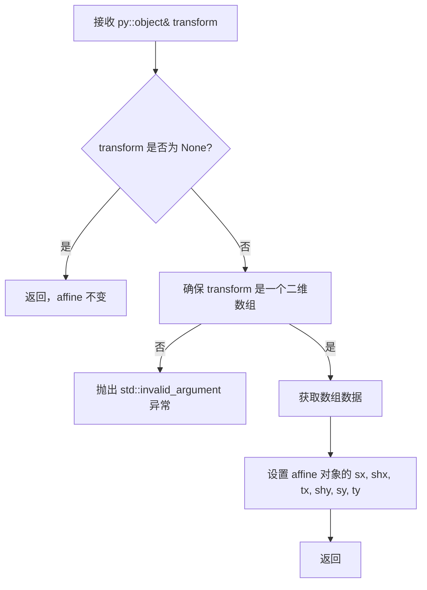
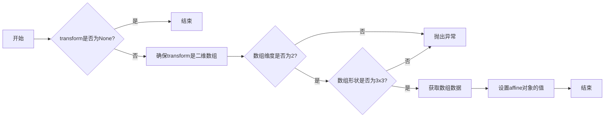

# `matplotlib\src\py_converters.cpp` 详细设计文档

The code converts a Python object representing an affine transformation into an Agg::trans_affine object used in the Agg graphics library.

## 整体流程



## 类结构

```
convert_trans_affine
```

## 全局变量及字段


### `transform`
    
The input transformation object from Python.

类型：`py::object`
    


### `affine`
    
The output affine transformation object in the Agg library.

类型：`agg::trans_affine`
    


### `agg::trans_affine.affine`
    
The affine transformation object that holds the transformation parameters.

类型：`agg::trans_affine`
    
    

## 全局函数及方法


### convert_trans_affine

将Python对象转换为`agg::trans_affine`对象。

参数：

- `transform`：`py::object`，一个表示变换的Python对象。如果为`None`，则假设为恒等变换。
- ...

返回值：无

#### 流程图



#### 带注释源码

```cpp
#include "py_converters.h"

void convert_trans_affine(const py::object& transform, agg::trans_affine& affine)
{
    // If None assume identity transform so leave affine unchanged
    if (transform.is_none()) {
        return;
    }

    auto array = py::array_t<double, py::array::c_style>::ensure(transform);
    if (!array || array.ndim() != 2 || array.shape(0) != 3 || array.shape(1) != 3) {
        throw std::invalid_argument("Invalid affine transformation matrix");
    }

    auto buffer = array.data();
    affine.sx = buffer[0];
    affine.shx = buffer[1];
    affine.tx = buffer[2];
    affine.shy = buffer[3];
    affine.sy = buffer[4];
    affine.ty = buffer[5];
}
```


### convert_trans_affine

将Python中的仿射变换转换为agg库中的仿射变换对象。

参数：

- `transform`：`py::object`，Python中的仿射变换对象，通常是一个包含仿射矩阵的数组。
- `affine`：`agg::trans_affine`，agg库中的仿射变换对象，用于存储转换后的仿射变换信息。

返回值：无

#### 流程图

```mermaid
graph LR
A[开始] --> B{transform是否为None?}
B -- 是 --> C[结束]
B -- 否 --> D[确保transform是二维数组]
D --> E{数组维度是否为2?}
E -- 否 --> F[抛出异常]
E -- 是 --> G{数组形状是否为(3, 3)?}
G -- 否 --> F
G -- 是 --> H[将数组数据复制到affine对象]
H --> I[结束]
```

#### 带注释源码

```
void convert_trans_affine(const py::object& transform, agg::trans_affine& affine)
{
    // If None assume identity transform so leave affine unchanged
    if (transform.is_none()) {
        return;
    }

    auto array = py::array_t<double, py::array::c_style>::ensure(transform);
    if (!array || array.ndim() != 2 || array.shape(0) != 3 || array.shape(1) != 3) {
        throw std::invalid_argument("Invalid affine transformation matrix");
    }

    auto buffer = array.data();
    affine.sx = buffer[0];
    affine.shx = buffer[1];
    affine.tx = buffer[2];
    affine.shy = buffer[3];
    affine.sy = buffer[4];
    affine.ty = buffer[5];
}
```

## 关键组件


### 张量索引与惰性加载

张量索引与惰性加载机制允许在处理大型数据结构时，只加载和处理必要的数据部分，从而提高效率。

### 反量化支持

反量化支持确保在量化过程中，可以正确地还原量化后的数据，以保持数据的精度。

### 量化策略

量化策略定义了如何将浮点数数据转换为固定点数表示，以减少计算资源消耗。


## 问题及建议


### 已知问题

-   **代码复用性低**：`convert_trans_affine` 函数直接操作 `agg::trans_affine` 类的成员变量，这种做法使得代码难以在其他上下文中复用。
-   **错误处理简单**：函数仅检查矩阵维度和形状，但没有对矩阵元素的有效性进行检查，例如是否为非负数。
-   **异常处理**：函数抛出 `std::invalid_argument` 异常，但没有提供具体的错误信息，这可能会使得调试变得困难。

### 优化建议

-   **增加代码复用性**：将 `agg::trans_affine` 的赋值逻辑封装到一个单独的函数中，这样可以在其他地方复用该逻辑。
-   **增强错误处理**：检查矩阵元素的有效性，例如确保缩放因子非负，并抛出包含具体错误信息的异常。
-   **提供详细的错误信息**：在抛出异常时，提供详细的错误信息，例如矩阵的形状和尺寸，以及具体的错误原因。
-   **使用更安全的数组访问方式**：使用 `std::begin` 和 `std::end` 或迭代器来访问数组数据，而不是直接使用指针，以提高代码的安全性。
-   **文档化**：为函数添加详细的文档注释，包括参数描述、返回值描述和异常情况说明。


## 其它


### 设计目标与约束

- 设计目标：实现一个高效的函数，将Python中的仿射变换矩阵转换为AGG库中的`trans_affine`对象。
- 约束条件：输入的矩阵必须是3x3的二维数组，且数据类型为double。

### 错误处理与异常设计

- 错误处理：如果输入的变换矩阵不符合要求（不是3x3的二维数组或数据类型不是double），则抛出`std::invalid_argument`异常。
- 异常设计：通过抛出异常来通知调用者输入数据的问题，使得调用者可以据此进行相应的错误处理。

### 数据流与状态机

- 数据流：函数接收一个Python对象，将其转换为AGG库中的`trans_affine`对象。
- 状态机：函数没有明确的状态机，它是一个简单的数据处理流程。

### 外部依赖与接口契约

- 外部依赖：依赖于AGG库和Pybind11库。
- 接口契约：函数`convert_trans_affine`的接口契约明确规定了输入和输出，以及异常情况的处理。

### 测试用例

- 测试用例1：输入一个有效的3x3仿射变换矩阵，期望输出一个正确的`trans_affine`对象。
- 测试用例2：输入一个无效的矩阵（不是3x3或数据类型不正确），期望抛出`std::invalid_argument`异常。

### 性能考量

- 性能考量：函数应该高效地处理输入的矩阵，避免不必要的内存分配和数据复制。

### 安全性考量

- 安全性考量：确保输入数据的有效性，防止因输入错误数据导致的程序崩溃或不可预期的行为。

### 维护与扩展性

- 维护：代码应具有良好的可读性和可维护性，便于未来的修改和扩展。
- 扩展性：设计应考虑未来可能的需求变化，如支持更多的变换矩阵类型或更复杂的变换操作。


    